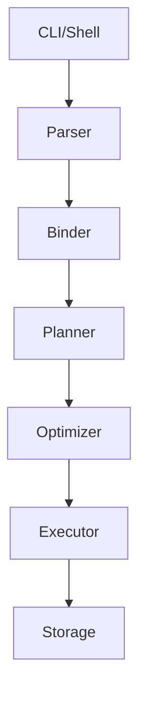
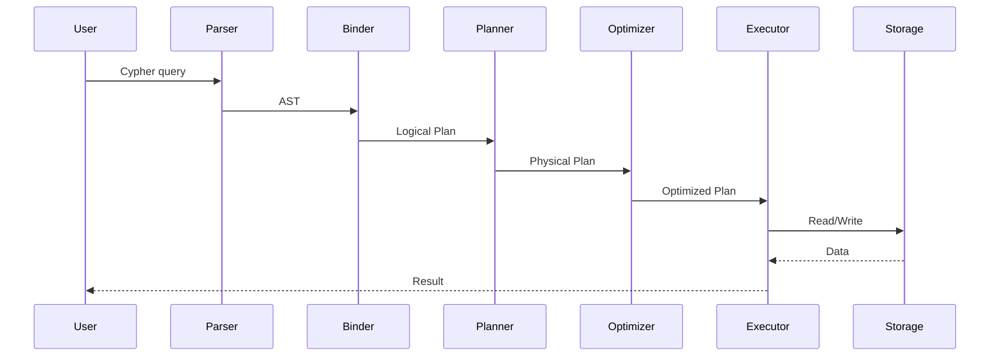

# Gorgonzola Architecture Audit Report (C++/C Focused)

Generated on: Mon Jul 13 03:33:50 PM +07 2026

## Overview

- **Repository:** /run/media/lechibang/cb09d199-3769-4ec8-9af5-954929515428/projects/gorgonzola
- **Audit Script:** ./bash.sh
- **Language Analysis:** C++ and C (includes STL, RAII, templates, virtual, exceptions, C linkage)

This report provides a comprehensive architectural inventory of the Gorgonzola codebase, focusing on embeddability and refactoring readiness.

---

## Task 1: Execution Pipeline

### Identified Components

- **parser**: Found at /run/media/lechibang/cb09d199-3769-4ec8-9af5-954929515428/projects/gorgonzola/src/parser
/run/media/lechibang/cb09d199-3769-4ec8-9af5-954929515428/projects/gorgonzola/src/include/parser
- **binder**: Found at /run/media/lechibang/cb09d199-3769-4ec8-9af5-954929515428/projects/gorgonzola/src/binder
/run/media/lechibang/cb09d199-3769-4ec8-9af5-954929515428/projects/gorgonzola/src/include/binder
- **planner**: Found at /run/media/lechibang/cb09d199-3769-4ec8-9af5-954929515428/projects/gorgonzola/src/planner
/run/media/lechibang/cb09d199-3769-4ec8-9af5-954929515428/projects/gorgonzola/src/include/planner
- **optimizer**: Found at /run/media/lechibang/cb09d199-3769-4ec8-9af5-954929515428/projects/gorgonzola/src/optimizer
/run/media/lechibang/cb09d199-3769-4ec8-9af5-954929515428/projects/gorgonzola/src/include/optimizer
- **executor**: Not found as a separate directory; may be integrated elsewhere.
- **storage**: Found at /run/media/lechibang/cb09d199-3769-4ec8-9af5-954929515428/projects/gorgonzola/src/storage
/run/media/lechibang/cb09d199-3769-4ec8-9af5-954929515428/projects/gorgonzola/src/include/storage

### Potential Entry Points in Pipeline
  - /run/media/lechibang/cb09d199-3769-4ec8-9af5-954929515428/projects/gorgonzola/src/c_api/parser_abi.cpp:#include "c_api/parser_abi.h"
  - /run/media/lechibang/cb09d199-3769-4ec8-9af5-954929515428/projects/gorgonzola/src/c_api/parser_abi.cpp:#include "parser/parser.h"
  - /run/media/lechibang/cb09d199-3769-4ec8-9af5-954929515428/projects/gorgonzola/src/c_api/parser_abi.cpp:#include "parser/statement.h"
  - /run/media/lechibang/cb09d199-3769-4ec8-9af5-954929515428/projects/gorgonzola/src/c_api/parser_abi.cpp:#include "parser/ddl/create_table.h"
  - /run/media/lechibang/cb09d199-3769-4ec8-9af5-954929515428/projects/gorgonzola/src/c_api/parser_abi.cpp:#include "parser/ddl/drop.h"
  - /run/media/lechibang/cb09d199-3769-4ec8-9af5-954929515428/projects/gorgonzola/src/c_api/parser_abi.cpp:#include "parser/ddl/alter.h"
  - /run/media/lechibang/cb09d199-3769-4ec8-9af5-954929515428/projects/gorgonzola/src/c_api/parser_abi.cpp:#include "parser/copy.h"
  - /run/media/lechibang/cb09d199-3769-4ec8-9af5-954929515428/projects/gorgonzola/src/c_api/parser_abi.cpp:#include "parser/attach_database.h"
  - /run/media/lechibang/cb09d199-3769-4ec8-9af5-954929515428/projects/gorgonzola/src/c_api/parser_abi.cpp:#include "parser/detach_database.h"
  - /run/media/lechibang/cb09d199-3769-4ec8-9af5-954929515428/projects/gorgonzola/src/c_api/parser_abi.cpp:#include "parser/use_database.h"
  - /run/media/lechibang/cb09d199-3769-4ec8-9af5-954929515428/projects/gorgonzola/src/c_api/parser_abi.cpp:#include "parser/query/regular_query.h"
  - /run/media/lechibang/cb09d199-3769-4ec8-9af5-954929515428/projects/gorgonzola/src/c_api/parser_abi.cpp:#include "parser/query/single_query.h"
  - /run/media/lechibang/cb09d199-3769-4ec8-9af5-954929515428/projects/gorgonzola/src/c_api/parser_abi.cpp:#include "parser/query/query_part.h"
  - /run/media/lechibang/cb09d199-3769-4ec8-9af5-954929515428/projects/gorgonzola/src/c_api/parser_abi.cpp:#include "parser/query/reading_clause/reading_clause.h"
  - /run/media/lechibang/cb09d199-3769-4ec8-9af5-954929515428/projects/gorgonzola/src/c_api/parser_abi.cpp:#include "parser/query/reading_clause/match_clause.h"
  - /run/media/lechibang/cb09d199-3769-4ec8-9af5-954929515428/projects/gorgonzola/src/c_api/parser_abi.cpp:#include "parser/query/reading_clause/unwind_clause.h"
  - /run/media/lechibang/cb09d199-3769-4ec8-9af5-954929515428/projects/gorgonzola/src/c_api/parser_abi.cpp:#include "parser/query/updating_clause/updating_clause.h"
  - /run/media/lechibang/cb09d199-3769-4ec8-9af5-954929515428/projects/gorgonzola/src/c_api/parser_abi.cpp:#include "parser/query/updating_clause/delete_clause.h"
  - /run/media/lechibang/cb09d199-3769-4ec8-9af5-954929515428/projects/gorgonzola/src/c_api/parser_abi.cpp:#include "parser/query/updating_clause/set_clause.h"
  - /run/media/lechibang/cb09d199-3769-4ec8-9af5-954929515428/projects/gorgonzola/src/c_api/parser_abi.cpp:#include "parser/query/return_with_clause/return_clause.h"

### Suggested Pipeline Diagram

## Task 2: Public Entry Points

### C++ API Headers
- /run/media/lechibang/cb09d199-3769-4ec8-9af5-954929515428/projects/gorgonzola/build/debug/src/extension/codegen/include/generated_extension_loader.h
- /run/media/lechibang/cb09d199-3769-4ec8-9af5-954929515428/projects/gorgonzola/build/debug/src/include/common/system_config.h
- /run/media/lechibang/cb09d199-3769-4ec8-9af5-954929515428/projects/gorgonzola/third_party/simsimd/include/geospatial.h
- /run/media/lechibang/cb09d199-3769-4ec8-9af5-954929515428/projects/gorgonzola/third_party/simsimd/include/spatial.h
- /run/media/lechibang/cb09d199-3769-4ec8-9af5-954929515428/projects/gorgonzola/third_party/simsimd/include/simsimd.h
- /run/media/lechibang/cb09d199-3769-4ec8-9af5-954929515428/projects/gorgonzola/third_party/simsimd/include/binary.h
- /run/media/lechibang/cb09d199-3769-4ec8-9af5-954929515428/projects/gorgonzola/third_party/simsimd/include/dot.h
- /run/media/lechibang/cb09d199-3769-4ec8-9af5-954929515428/projects/gorgonzola/third_party/simsimd/include/sparse.h
- /run/media/lechibang/cb09d199-3769-4ec8-9af5-954929515428/projects/gorgonzola/third_party/simsimd/include/probability.h
- /run/media/lechibang/cb09d199-3769-4ec8-9af5-954929515428/projects/gorgonzola/third_party/simsimd/include/types.h
- /run/media/lechibang/cb09d199-3769-4ec8-9af5-954929515428/projects/gorgonzola/third_party/simsimd/include/mesh.h
- /run/media/lechibang/cb09d199-3769-4ec8-9af5-954929515428/projects/gorgonzola/third_party/simsimd/include/elementwise.h
- /run/media/lechibang/cb09d199-3769-4ec8-9af5-954929515428/projects/gorgonzola/third_party/simsimd/include/curved.h
- /run/media/lechibang/cb09d199-3769-4ec8-9af5-954929515428/projects/gorgonzola/third_party/cppjieba/include/cppjieba/HMMSegment.hpp
- /run/media/lechibang/cb09d199-3769-4ec8-9af5-954929515428/projects/gorgonzola/third_party/cppjieba/include/cppjieba/SegmentTagged.hpp
- /run/media/lechibang/cb09d199-3769-4ec8-9af5-954929515428/projects/gorgonzola/third_party/cppjieba/include/cppjieba/KeywordExtractor.hpp
- /run/media/lechibang/cb09d199-3769-4ec8-9af5-954929515428/projects/gorgonzola/third_party/cppjieba/include/cppjieba/Trie.hpp
- /run/media/lechibang/cb09d199-3769-4ec8-9af5-954929515428/projects/gorgonzola/third_party/cppjieba/include/cppjieba/HMMModel.hpp
- /run/media/lechibang/cb09d199-3769-4ec8-9af5-954929515428/projects/gorgonzola/third_party/cppjieba/include/cppjieba/TextRankExtractor.hpp
- /run/media/lechibang/cb09d199-3769-4ec8-9af5-954929515428/projects/gorgonzola/third_party/cppjieba/include/cppjieba/PreFilter.hpp
- /run/media/lechibang/cb09d199-3769-4ec8-9af5-954929515428/projects/gorgonzola/third_party/cppjieba/include/cppjieba/MixSegment.hpp
- /run/media/lechibang/cb09d199-3769-4ec8-9af5-954929515428/projects/gorgonzola/third_party/cppjieba/include/cppjieba/Unicode.hpp
- /run/media/lechibang/cb09d199-3769-4ec8-9af5-954929515428/projects/gorgonzola/third_party/cppjieba/include/cppjieba/QuerySegment.hpp
- /run/media/lechibang/cb09d199-3769-4ec8-9af5-954929515428/projects/gorgonzola/third_party/cppjieba/include/cppjieba/SegmentBase.hpp
- /run/media/lechibang/cb09d199-3769-4ec8-9af5-954929515428/projects/gorgonzola/third_party/cppjieba/include/cppjieba/PosTagger.hpp
- /run/media/lechibang/cb09d199-3769-4ec8-9af5-954929515428/projects/gorgonzola/third_party/cppjieba/include/cppjieba/DictTrie.hpp
- /run/media/lechibang/cb09d199-3769-4ec8-9af5-954929515428/projects/gorgonzola/third_party/cppjieba/include/cppjieba/FullSegment.hpp
- /run/media/lechibang/cb09d199-3769-4ec8-9af5-954929515428/projects/gorgonzola/third_party/cppjieba/include/cppjieba/Jieba.hpp
- /run/media/lechibang/cb09d199-3769-4ec8-9af5-954929515428/projects/gorgonzola/third_party/cppjieba/include/cppjieba/MPSegment.hpp
- /run/media/lechibang/cb09d199-3769-4ec8-9af5-954929515428/projects/gorgonzola/third_party/cppjieba/deps/limonp/include/limonp/ForcePublic.hpp
- /run/media/lechibang/cb09d199-3769-4ec8-9af5-954929515428/projects/gorgonzola/third_party/cppjieba/deps/limonp/include/limonp/NonCopyable.hpp
- /run/media/lechibang/cb09d199-3769-4ec8-9af5-954929515428/projects/gorgonzola/third_party/cppjieba/deps/limonp/include/limonp/Closure.hpp
- /run/media/lechibang/cb09d199-3769-4ec8-9af5-954929515428/projects/gorgonzola/third_party/cppjieba/deps/limonp/include/limonp/Colors.hpp
- /run/media/lechibang/cb09d199-3769-4ec8-9af5-954929515428/projects/gorgonzola/third_party/cppjieba/deps/limonp/include/limonp/LocalVector.hpp
- /run/media/lechibang/cb09d199-3769-4ec8-9af5-954929515428/projects/gorgonzola/third_party/cppjieba/deps/limonp/include/limonp/StringUtil.hpp
- /run/media/lechibang/cb09d199-3769-4ec8-9af5-954929515428/projects/gorgonzola/third_party/cppjieba/deps/limonp/include/limonp/StdExtension.hpp
- /run/media/lechibang/cb09d199-3769-4ec8-9af5-954929515428/projects/gorgonzola/third_party/cppjieba/deps/limonp/include/limonp/Config.hpp
- /run/media/lechibang/cb09d199-3769-4ec8-9af5-954929515428/projects/gorgonzola/third_party/cppjieba/deps/limonp/include/limonp/Condition.hpp
- /run/media/lechibang/cb09d199-3769-4ec8-9af5-954929515428/projects/gorgonzola/third_party/cppjieba/deps/limonp/include/limonp/ArgvContext.hpp
- /run/media/lechibang/cb09d199-3769-4ec8-9af5-954929515428/projects/gorgonzola/third_party/cppjieba/deps/limonp/include/limonp/Logging.hpp
- /run/media/lechibang/cb09d199-3769-4ec8-9af5-954929515428/projects/gorgonzola/third_party/mbedtls/include/mbedtls/private_access.h
- /run/media/lechibang/cb09d199-3769-4ec8-9af5-954929515428/projects/gorgonzola/third_party/mbedtls/include/mbedtls/base64.h
- /run/media/lechibang/cb09d199-3769-4ec8-9af5-954929515428/projects/gorgonzola/third_party/mbedtls/include/mbedtls/bignum.h
- /run/media/lechibang/cb09d199-3769-4ec8-9af5-954929515428/projects/gorgonzola/third_party/mbedtls/include/mbedtls/pk.h
- /run/media/lechibang/cb09d199-3769-4ec8-9af5-954929515428/projects/gorgonzola/third_party/mbedtls/include/mbedtls/gcm.h
- /run/media/lechibang/cb09d199-3769-4ec8-9af5-954929515428/projects/gorgonzola/third_party/mbedtls/include/mbedtls/asn1.h
- /run/media/lechibang/cb09d199-3769-4ec8-9af5-954929515428/projects/gorgonzola/third_party/mbedtls/include/mbedtls/des.h
- /run/media/lechibang/cb09d199-3769-4ec8-9af5-954929515428/projects/gorgonzola/third_party/mbedtls/include/mbedtls/cipher.h
- /run/media/lechibang/cb09d199-3769-4ec8-9af5-954929515428/projects/gorgonzola/third_party/mbedtls/include/mbedtls/constant_time.h
- /run/media/lechibang/cb09d199-3769-4ec8-9af5-954929515428/projects/gorgonzola/third_party/mbedtls/include/mbedtls/pem.h
- /run/media/lechibang/cb09d199-3769-4ec8-9af5-954929515428/projects/gorgonzola/third_party/mbedtls/include/mbedtls/check_config.h
- /run/media/lechibang/cb09d199-3769-4ec8-9af5-954929515428/projects/gorgonzola/third_party/mbedtls/include/mbedtls/md.h
- /run/media/lechibang/cb09d199-3769-4ec8-9af5-954929515428/projects/gorgonzola/third_party/mbedtls/include/mbedtls/error.h
- /run/media/lechibang/cb09d199-3769-4ec8-9af5-954929515428/projects/gorgonzola/third_party/mbedtls/include/mbedtls/memory_buffer_alloc.h
- /run/media/lechibang/cb09d199-3769-4ec8-9af5-954929515428/projects/gorgonzola/third_party/mbedtls/include/mbedtls/platform_time.h
- /run/media/lechibang/cb09d199-3769-4ec8-9af5-954929515428/projects/gorgonzola/third_party/mbedtls/include/mbedtls/platform.h
- /run/media/lechibang/cb09d199-3769-4ec8-9af5-954929515428/projects/gorgonzola/third_party/mbedtls/include/mbedtls/oid.h
- /run/media/lechibang/cb09d199-3769-4ec8-9af5-954929515428/projects/gorgonzola/third_party/mbedtls/include/mbedtls/platform_util.h
- /run/media/lechibang/cb09d199-3769-4ec8-9af5-954929515428/projects/gorgonzola/third_party/mbedtls/include/mbedtls/entropy.h
- /run/media/lechibang/cb09d199-3769-4ec8-9af5-954929515428/projects/gorgonzola/third_party/mbedtls/include/mbedtls/aes.h
- /run/media/lechibang/cb09d199-3769-4ec8-9af5-954929515428/projects/gorgonzola/third_party/mbedtls/include/mbedtls/aria.h
- /run/media/lechibang/cb09d199-3769-4ec8-9af5-954929515428/projects/gorgonzola/third_party/mbedtls/include/mbedtls/sha512.h
- /run/media/lechibang/cb09d199-3769-4ec8-9af5-954929515428/projects/gorgonzola/third_party/mbedtls/include/mbedtls/sha256.h
- /run/media/lechibang/cb09d199-3769-4ec8-9af5-954929515428/projects/gorgonzola/third_party/mbedtls/include/mbedtls/sha1.h
- /run/media/lechibang/cb09d199-3769-4ec8-9af5-954929515428/projects/gorgonzola/third_party/mbedtls/include/mbedtls/rsa.h
- /run/media/lechibang/cb09d199-3769-4ec8-9af5-954929515428/projects/gorgonzola/third_party/mbedtls/include/mbedtls/mbedtls_config.h
- /run/media/lechibang/cb09d199-3769-4ec8-9af5-954929515428/projects/gorgonzola/third_party/mbedtls/include/mbedtls/build_info.h
- /run/media/lechibang/cb09d199-3769-4ec8-9af5-954929515428/projects/gorgonzola/third_party/mbedtls/include/mbedtls/camellia.h
- /run/media/lechibang/cb09d199-3769-4ec8-9af5-954929515428/projects/gorgonzola/third_party/mbedtls/include/mbedtls/ccm.h
- /run/media/lechibang/cb09d199-3769-4ec8-9af5-954929515428/projects/gorgonzola/third_party/pcg/pcg_extras.hpp
- /run/media/lechibang/cb09d199-3769-4ec8-9af5-954929515428/projects/gorgonzola/third_party/pcg/pcg_uint128.hpp
- /run/media/lechibang/cb09d199-3769-4ec8-9af5-954929515428/projects/gorgonzola/third_party/pcg/pcg_random.hpp
- /run/media/lechibang/cb09d199-3769-4ec8-9af5-954929515428/projects/gorgonzola/third_party/antlr4_cypher/include/cypher_lexer.h
- /run/media/lechibang/cb09d199-3769-4ec8-9af5-954929515428/projects/gorgonzola/third_party/antlr4_cypher/include/cypher_parser.h
- /run/media/lechibang/cb09d199-3769-4ec8-9af5-954929515428/projects/gorgonzola/third_party/brotli/c/include/brotli/shared_dictionary.h
- /run/media/lechibang/cb09d199-3769-4ec8-9af5-954929515428/projects/gorgonzola/third_party/brotli/c/include/brotli/port.h
- /run/media/lechibang/cb09d199-3769-4ec8-9af5-954929515428/projects/gorgonzola/third_party/brotli/c/include/brotli/decode.h
- /run/media/lechibang/cb09d199-3769-4ec8-9af5-954929515428/projects/gorgonzola/third_party/brotli/c/include/brotli/types.h
- /run/media/lechibang/cb09d199-3769-4ec8-9af5-954929515428/projects/gorgonzola/third_party/brotli/c/include/brotli/encode.h
- /run/media/lechibang/cb09d199-3769-4ec8-9af5-954929515428/projects/gorgonzola/third_party/utf8proc/include/utf8proc_data.h
- /run/media/lechibang/cb09d199-3769-4ec8-9af5-954929515428/projects/gorgonzola/third_party/utf8proc/include/utf8proc.h
- /run/media/lechibang/cb09d199-3769-4ec8-9af5-954929515428/projects/gorgonzola/third_party/utf8proc/include/utf8proc_wrapper.h
- /run/media/lechibang/cb09d199-3769-4ec8-9af5-954929515428/projects/gorgonzola/third_party/zstd/include/zstd.h
- /run/media/lechibang/cb09d199-3769-4ec8-9af5-954929515428/projects/gorgonzola/third_party/zstd/include/zstd/decompress/zstd_ddict.h
- /run/media/lechibang/cb09d199-3769-4ec8-9af5-954929515428/projects/gorgonzola/third_party/zstd/include/zstd/decompress/zstd_decompress_block.h
- /run/media/lechibang/cb09d199-3769-4ec8-9af5-954929515428/projects/gorgonzola/third_party/zstd/include/zstd/decompress/zstd_decompress_internal.h
- /run/media/lechibang/cb09d199-3769-4ec8-9af5-954929515428/projects/gorgonzola/third_party/zstd/include/zstd/compress/zstd_compress_literals.h
- /run/media/lechibang/cb09d199-3769-4ec8-9af5-954929515428/projects/gorgonzola/third_party/zstd/include/zstd/compress/zstd_compress_sequences.h
- /run/media/lechibang/cb09d199-3769-4ec8-9af5-954929515428/projects/gorgonzola/third_party/zstd/include/zstd/compress/zstd_cwksp.h
- /run/media/lechibang/cb09d199-3769-4ec8-9af5-954929515428/projects/gorgonzola/third_party/zstd/include/zstd/compress/zstd_fast.h
- /run/media/lechibang/cb09d199-3769-4ec8-9af5-954929515428/projects/gorgonzola/third_party/zstd/include/zstd/compress/zstd_compress_internal.h
- /run/media/lechibang/cb09d199-3769-4ec8-9af5-954929515428/projects/gorgonzola/third_party/zstd/include/zstd/compress/zstd_opt.h
- /run/media/lechibang/cb09d199-3769-4ec8-9af5-954929515428/projects/gorgonzola/third_party/zstd/include/zstd/compress/zstd_lazy.h
- /run/media/lechibang/cb09d199-3769-4ec8-9af5-954929515428/projects/gorgonzola/third_party/zstd/include/zstd/compress/zstd_ldm.h
- /run/media/lechibang/cb09d199-3769-4ec8-9af5-954929515428/projects/gorgonzola/third_party/zstd/include/zstd/compress/hist.h
- /run/media/lechibang/cb09d199-3769-4ec8-9af5-954929515428/projects/gorgonzola/third_party/zstd/include/zstd/compress/zstd_compress_superblock.h
- /run/media/lechibang/cb09d199-3769-4ec8-9af5-954929515428/projects/gorgonzola/third_party/zstd/include/zstd/compress/zstd_double_fast.h
- /run/media/lechibang/cb09d199-3769-4ec8-9af5-954929515428/projects/gorgonzola/third_party/zstd/include/zstd/common/compiler.h
- /run/media/lechibang/cb09d199-3769-4ec8-9af5-954929515428/projects/gorgonzola/third_party/zstd/include/zstd/common/xxhash.h
- /run/media/lechibang/cb09d199-3769-4ec8-9af5-954929515428/projects/gorgonzola/third_party/zstd/include/zstd/common/bitstream.h
- /run/media/lechibang/cb09d199-3769-4ec8-9af5-954929515428/projects/gorgonzola/third_party/zstd/include/zstd/common/error_private.h
- /run/media/lechibang/cb09d199-3769-4ec8-9af5-954929515428/projects/gorgonzola/third_party/zstd/include/zstd/common/fse.h
- /run/media/lechibang/cb09d199-3769-4ec8-9af5-954929515428/projects/gorgonzola/third_party/zstd/include/zstd/common/fse_static.h
- /run/media/lechibang/cb09d199-3769-4ec8-9af5-954929515428/projects/gorgonzola/third_party/zstd/include/zstd/common/zstd_internal.h
- /run/media/lechibang/cb09d199-3769-4ec8-9af5-954929515428/projects/gorgonzola/third_party/zstd/include/zstd/common/huf_static.h
- /run/media/lechibang/cb09d199-3769-4ec8-9af5-954929515428/projects/gorgonzola/third_party/zstd/include/zstd/common/huf.h
- /run/media/lechibang/cb09d199-3769-4ec8-9af5-954929515428/projects/gorgonzola/third_party/zstd/include/zstd/common/zstd_errors.h
- /run/media/lechibang/cb09d199-3769-4ec8-9af5-954929515428/projects/gorgonzola/third_party/zstd/include/zstd/common/debug.h
- /run/media/lechibang/cb09d199-3769-4ec8-9af5-954929515428/projects/gorgonzola/third_party/zstd/include/zstd/common/mem.h
- /run/media/lechibang/cb09d199-3769-4ec8-9af5-954929515428/projects/gorgonzola/third_party/zstd/include/zstd/common/xxhash_static.h
- /run/media/lechibang/cb09d199-3769-4ec8-9af5-954929515428/projects/gorgonzola/third_party/zstd/include/zstd_static.h
- /run/media/lechibang/cb09d199-3769-4ec8-9af5-954929515428/projects/gorgonzola/third_party/miniz/miniz.hpp
- /run/media/lechibang/cb09d199-3769-4ec8-9af5-954929515428/projects/gorgonzola/third_party/miniz/miniz_wrapper.hpp
- /run/media/lechibang/cb09d199-3769-4ec8-9af5-954929515428/projects/gorgonzola/third_party/alp/include/alp.hpp
- /run/media/lechibang/cb09d199-3769-4ec8-9af5-954929515428/projects/gorgonzola/third_party/alp/include/alp/config.hpp
- /run/media/lechibang/cb09d199-3769-4ec8-9af5-954929515428/projects/gorgonzola/third_party/alp/include/alp/state.hpp
- /run/media/lechibang/cb09d199-3769-4ec8-9af5-954929515428/projects/gorgonzola/third_party/alp/include/alp/common.hpp
- /run/media/lechibang/cb09d199-3769-4ec8-9af5-954929515428/projects/gorgonzola/third_party/alp/include/alp/decode.hpp
- /run/media/lechibang/cb09d199-3769-4ec8-9af5-954929515428/projects/gorgonzola/third_party/alp/include/alp/utils.hpp
- /run/media/lechibang/cb09d199-3769-4ec8-9af5-954929515428/projects/gorgonzola/third_party/alp/include/alp/constants.hpp
- /run/media/lechibang/cb09d199-3769-4ec8-9af5-954929515428/projects/gorgonzola/third_party/alp/include/alp/storer.hpp
- /run/media/lechibang/cb09d199-3769-4ec8-9af5-954929515428/projects/gorgonzola/third_party/alp/include/alp/encode.hpp
- /run/media/lechibang/cb09d199-3769-4ec8-9af5-954929515428/projects/gorgonzola/third_party/alp/include/alp/sampler.hpp
- /run/media/lechibang/cb09d199-3769-4ec8-9af5-954929515428/projects/gorgonzola/third_party/glob/glob/glob.hpp
- /run/media/lechibang/cb09d199-3769-4ec8-9af5-954929515428/projects/gorgonzola/third_party/re2/include/mutex.h
- /run/media/lechibang/cb09d199-3769-4ec8-9af5-954929515428/projects/gorgonzola/third_party/re2/include/stringpiece.h
- /run/media/lechibang/cb09d199-3769-4ec8-9af5-954929515428/projects/gorgonzola/third_party/re2/include/regexp.h
- /run/media/lechibang/cb09d199-3769-4ec8-9af5-954929515428/projects/gorgonzola/third_party/re2/include/bitmap256.h
- /run/media/lechibang/cb09d199-3769-4ec8-9af5-954929515428/projects/gorgonzola/third_party/re2/include/pod_array.h
- /run/media/lechibang/cb09d199-3769-4ec8-9af5-954929515428/projects/gorgonzola/third_party/re2/include/logging.h
- /run/media/lechibang/cb09d199-3769-4ec8-9af5-954929515428/projects/gorgonzola/third_party/re2/include/walker-inl.h
- /run/media/lechibang/cb09d199-3769-4ec8-9af5-954929515428/projects/gorgonzola/third_party/re2/include/strutil.h
- /run/media/lechibang/cb09d199-3769-4ec8-9af5-954929515428/projects/gorgonzola/third_party/re2/include/re2.h
- /run/media/lechibang/cb09d199-3769-4ec8-9af5-954929515428/projects/gorgonzola/third_party/re2/include/prefilter_tree.h
- /run/media/lechibang/cb09d199-3769-4ec8-9af5-954929515428/projects/gorgonzola/third_party/re2/include/sparse_array.h
- /run/media/lechibang/cb09d199-3769-4ec8-9af5-954929515428/projects/gorgonzola/third_party/re2/include/utf.h
- /run/media/lechibang/cb09d199-3769-4ec8-9af5-954929515428/projects/gorgonzola/third_party/re2/include/prog.h
- /run/media/lechibang/cb09d199-3769-4ec8-9af5-954929515428/projects/gorgonzola/third_party/re2/include/unicode_groups.h
- /run/media/lechibang/cb09d199-3769-4ec8-9af5-954929515428/projects/gorgonzola/third_party/re2/include/mix.h
- /run/media/lechibang/cb09d199-3769-4ec8-9af5-954929515428/projects/gorgonzola/third_party/re2/include/util.h
- /run/media/lechibang/cb09d199-3769-4ec8-9af5-954929515428/projects/gorgonzola/third_party/re2/include/set.h
- /run/media/lechibang/cb09d199-3769-4ec8-9af5-954929515428/projects/gorgonzola/third_party/re2/include/filtered_re2.h
- /run/media/lechibang/cb09d199-3769-4ec8-9af5-954929515428/projects/gorgonzola/third_party/re2/include/sparse_set.h
- /run/media/lechibang/cb09d199-3769-4ec8-9af5-954929515428/projects/gorgonzola/third_party/re2/include/prefilter.h
- /run/media/lechibang/cb09d199-3769-4ec8-9af5-954929515428/projects/gorgonzola/third_party/re2/include/unicode_casefold.h
- /run/media/lechibang/cb09d199-3769-4ec8-9af5-954929515428/projects/gorgonzola/third_party/pybind11/include/pybind11/functional.h
- /run/media/lechibang/cb09d199-3769-4ec8-9af5-954929515428/projects/gorgonzola/third_party/pybind11/include/pybind11/eigen.h
- /run/media/lechibang/cb09d199-3769-4ec8-9af5-954929515428/projects/gorgonzola/third_party/pybind11/include/pybind11/chrono.h
- /run/media/lechibang/cb09d199-3769-4ec8-9af5-954929515428/projects/gorgonzola/third_party/pybind11/include/pybind11/attr.h
- /run/media/lechibang/cb09d199-3769-4ec8-9af5-954929515428/projects/gorgonzola/third_party/pybind11/include/pybind11/stl_bind.h
- /run/media/lechibang/cb09d199-3769-4ec8-9af5-954929515428/projects/gorgonzola/third_party/pybind11/include/pybind11/gil.h
- /run/media/lechibang/cb09d199-3769-4ec8-9af5-954929515428/projects/gorgonzola/third_party/pybind11/include/pybind11/cast.h
- /run/media/lechibang/cb09d199-3769-4ec8-9af5-954929515428/projects/gorgonzola/third_party/pybind11/include/pybind11/embed.h
- /run/media/lechibang/cb09d199-3769-4ec8-9af5-954929515428/projects/gorgonzola/third_party/pybind11/include/pybind11/eigen/tensor.h
- /run/media/lechibang/cb09d199-3769-4ec8-9af5-954929515428/projects/gorgonzola/third_party/pybind11/include/pybind11/eigen/matrix.h
- /run/media/lechibang/cb09d199-3769-4ec8-9af5-954929515428/projects/gorgonzola/third_party/pybind11/include/pybind11/eigen/common.h
- /run/media/lechibang/cb09d199-3769-4ec8-9af5-954929515428/projects/gorgonzola/third_party/pybind11/include/pybind11/numpy.h
- /run/media/lechibang/cb09d199-3769-4ec8-9af5-954929515428/projects/gorgonzola/third_party/pybind11/include/pybind11/eval.h
- /run/media/lechibang/cb09d199-3769-4ec8-9af5-954929515428/projects/gorgonzola/third_party/pybind11/include/pybind11/stl/filesystem.h
- /run/media/lechibang/cb09d199-3769-4ec8-9af5-954929515428/projects/gorgonzola/third_party/pybind11/include/pybind11/common.h
- /run/media/lechibang/cb09d199-3769-4ec8-9af5-954929515428/projects/gorgonzola/third_party/pybind11/include/pybind11/typing.h
- /run/media/lechibang/cb09d199-3769-4ec8-9af5-954929515428/projects/gorgonzola/third_party/pybind11/include/pybind11/detail/typeid.h
- /run/media/lechibang/cb09d199-3769-4ec8-9af5-954929515428/projects/gorgonzola/third_party/pybind11/include/pybind11/detail/descr.h
- /run/media/lechibang/cb09d199-3769-4ec8-9af5-954929515428/projects/gorgonzola/third_party/pybind11/include/pybind11/detail/common.h
- /run/media/lechibang/cb09d199-3769-4ec8-9af5-954929515428/projects/gorgonzola/third_party/pybind11/include/pybind11/detail/internals.h
- /run/media/lechibang/cb09d199-3769-4ec8-9af5-954929515428/projects/gorgonzola/third_party/pybind11/include/pybind11/detail/type_caster_base.h
- /run/media/lechibang/cb09d199-3769-4ec8-9af5-954929515428/projects/gorgonzola/third_party/pybind11/include/pybind11/detail/init.h
- /run/media/lechibang/cb09d199-3769-4ec8-9af5-954929515428/projects/gorgonzola/third_party/pybind11/include/pybind11/detail/class.h
- /run/media/lechibang/cb09d199-3769-4ec8-9af5-954929515428/projects/gorgonzola/third_party/pybind11/include/pybind11/type_caster_pyobject_ptr.h
- /run/media/lechibang/cb09d199-3769-4ec8-9af5-954929515428/projects/gorgonzola/third_party/pybind11/include/pybind11/stl.h
- /run/media/lechibang/cb09d199-3769-4ec8-9af5-954929515428/projects/gorgonzola/third_party/pybind11/include/pybind11/options.h
- /run/media/lechibang/cb09d199-3769-4ec8-9af5-954929515428/projects/gorgonzola/third_party/pybind11/include/pybind11/buffer_info.h
- /run/media/lechibang/cb09d199-3769-4ec8-9af5-954929515428/projects/gorgonzola/third_party/pybind11/include/pybind11/complex.h
- /run/media/lechibang/cb09d199-3769-4ec8-9af5-954929515428/projects/gorgonzola/third_party/pybind11/include/pybind11/iostream.h
- /run/media/lechibang/cb09d199-3769-4ec8-9af5-954929515428/projects/gorgonzola/third_party/pybind11/include/pybind11/gil_safe_call_once.h
- /run/media/lechibang/cb09d199-3769-4ec8-9af5-954929515428/projects/gorgonzola/third_party/pybind11/include/pybind11/pybind11.h
- /run/media/lechibang/cb09d199-3769-4ec8-9af5-954929515428/projects/gorgonzola/third_party/pybind11/include/pybind11/pytypes.h
- /run/media/lechibang/cb09d199-3769-4ec8-9af5-954929515428/projects/gorgonzola/third_party/pybind11/include/pybind11/operators.h
- /run/media/lechibang/cb09d199-3769-4ec8-9af5-954929515428/projects/gorgonzola/third_party/snappy/snappy_version.hpp
- /run/media/lechibang/cb09d199-3769-4ec8-9af5-954929515428/projects/gorgonzola/third_party/lz4/lz4.hpp
- /run/media/lechibang/cb09d199-3769-4ec8-9af5-954929515428/projects/gorgonzola/third_party/fast_float/include/fast_float.h
- /run/media/lechibang/cb09d199-3769-4ec8-9af5-954929515428/projects/gorgonzola/third_party/nlohmann_json/json.hpp
- /run/media/lechibang/cb09d199-3769-4ec8-9af5-954929515428/projects/gorgonzola/third_party/nlohmann_json/json_fwd.hpp
- /run/media/lechibang/cb09d199-3769-4ec8-9af5-954929515428/projects/gorgonzola/src/include/c_api/parser_abi.h
- /run/media/lechibang/cb09d199-3769-4ec8-9af5-954929515428/projects/gorgonzola/src/include/c_api/gorgonzola.h
- /run/media/lechibang/cb09d199-3769-4ec8-9af5-954929515428/projects/gorgonzola/src/include/c_api/helpers.h
- /run/media/lechibang/cb09d199-3769-4ec8-9af5-954929515428/projects/gorgonzola/src/include/transaction/transaction_action.h
- /run/media/lechibang/cb09d199-3769-4ec8-9af5-954929515428/projects/gorgonzola/src/include/transaction/transaction.h
- /run/media/lechibang/cb09d199-3769-4ec8-9af5-954929515428/projects/gorgonzola/src/include/transaction/transaction_context.h
- /run/media/lechibang/cb09d199-3769-4ec8-9af5-954929515428/projects/gorgonzola/src/include/transaction/transaction_manager.h
- /run/media/lechibang/cb09d199-3769-4ec8-9af5-954929515428/projects/gorgonzola/src/include/parser/extension_statement.h
- /run/media/lechibang/cb09d199-3769-4ec8-9af5-954929515428/projects/gorgonzola/src/include/parser/parsed_statement_visitor.h
- /run/media/lechibang/cb09d199-3769-4ec8-9af5-954929515428/projects/gorgonzola/src/include/parser/detach_database.h
- /run/media/lechibang/cb09d199-3769-4ec8-9af5-954929515428/projects/gorgonzola/src/include/parser/expression/parsed_property_expression.h
- /run/media/lechibang/cb09d199-3769-4ec8-9af5-954929515428/projects/gorgonzola/src/include/parser/expression/parsed_parameter_expression.h
- /run/media/lechibang/cb09d199-3769-4ec8-9af5-954929515428/projects/gorgonzola/src/include/parser/expression/parsed_function_expression.h
- /run/media/lechibang/cb09d199-3769-4ec8-9af5-954929515428/projects/gorgonzola/src/include/parser/expression/parsed_literal_expression.h
- /run/media/lechibang/cb09d199-3769-4ec8-9af5-954929515428/projects/gorgonzola/src/include/parser/expression/parsed_lambda_expression.h
- /run/media/lechibang/cb09d199-3769-4ec8-9af5-954929515428/projects/gorgonzola/src/include/parser/expression/parsed_subquery_expression.h
- /run/media/lechibang/cb09d199-3769-4ec8-9af5-954929515428/projects/gorgonzola/src/include/parser/expression/parsed_expression_visitor.h
- /run/media/lechibang/cb09d199-3769-4ec8-9af5-954929515428/projects/gorgonzola/src/include/parser/expression/parsed_variable_expression.h
- /run/media/lechibang/cb09d199-3769-4ec8-9af5-954929515428/projects/gorgonzola/src/include/parser/expression/parsed_case_expression.h
- /run/media/lechibang/cb09d199-3769-4ec8-9af5-954929515428/projects/gorgonzola/src/include/parser/expression/parsed_expression.h
- /run/media/lechibang/cb09d199-3769-4ec8-9af5-954929515428/projects/gorgonzola/src/include/parser/database_statement.h
- /run/media/lechibang/cb09d199-3769-4ec8-9af5-954929515428/projects/gorgonzola/src/include/parser/create_macro.h
- /run/media/lechibang/cb09d199-3769-4ec8-9af5-954929515428/projects/gorgonzola/src/include/parser/explain_statement.h
- /run/media/lechibang/cb09d199-3769-4ec8-9af5-954929515428/projects/gorgonzola/src/include/parser/transaction_statement.h
- /run/media/lechibang/cb09d199-3769-4ec8-9af5-954929515428/projects/gorgonzola/src/include/parser/scan_source.h
- /run/media/lechibang/cb09d199-3769-4ec8-9af5-954929515428/projects/gorgonzola/src/include/parser/statement.h
- /run/media/lechibang/cb09d199-3769-4ec8-9af5-954929515428/projects/gorgonzola/src/include/parser/antlr_parser/parser_error_strategy.h
- /run/media/lechibang/cb09d199-3769-4ec8-9af5-954929515428/projects/gorgonzola/src/include/parser/antlr_parser/parser_error_listener.h
- /run/media/lechibang/cb09d199-3769-4ec8-9af5-954929515428/projects/gorgonzola/src/include/parser/antlr_parser/gorgonzola_cypher_parser.h
- /run/media/lechibang/cb09d199-3769-4ec8-9af5-954929515428/projects/gorgonzola/src/include/parser/attach_database.h
- /run/media/lechibang/cb09d199-3769-4ec8-9af5-954929515428/projects/gorgonzola/src/include/parser/use_database.h
- /run/media/lechibang/cb09d199-3769-4ec8-9af5-954929515428/projects/gorgonzola/src/include/parser/copy.h
- /run/media/lechibang/cb09d199-3769-4ec8-9af5-954929515428/projects/gorgonzola/src/include/parser/ddl/create_type.h
- /run/media/lechibang/cb09d199-3769-4ec8-9af5-954929515428/projects/gorgonzola/src/include/parser/ddl/create_table_info.h
- /run/media/lechibang/cb09d199-3769-4ec8-9af5-954929515428/projects/gorgonzola/src/include/parser/ddl/drop_info.h
- /run/media/lechibang/cb09d199-3769-4ec8-9af5-954929515428/projects/gorgonzola/src/include/parser/ddl/parsed_property_definition.h
- /run/media/lechibang/cb09d199-3769-4ec8-9af5-954929515428/projects/gorgonzola/src/include/parser/ddl/create_sequence.h
- /run/media/lechibang/cb09d199-3769-4ec8-9af5-954929515428/projects/gorgonzola/src/include/parser/ddl/drop.h
- /run/media/lechibang/cb09d199-3769-4ec8-9af5-954929515428/projects/gorgonzola/src/include/parser/ddl/alter_info.h
- /run/media/lechibang/cb09d199-3769-4ec8-9af5-954929515428/projects/gorgonzola/src/include/parser/ddl/alter.h
- /run/media/lechibang/cb09d199-3769-4ec8-9af5-954929515428/projects/gorgonzola/src/include/parser/ddl/create_table.h
- /run/media/lechibang/cb09d199-3769-4ec8-9af5-954929515428/projects/gorgonzola/src/include/parser/ddl/create_sequence_info.h
- /run/media/lechibang/cb09d199-3769-4ec8-9af5-954929515428/projects/gorgonzola/src/include/parser/port_db.h
- /run/media/lechibang/cb09d199-3769-4ec8-9af5-954929515428/projects/gorgonzola/src/include/parser/transformer.h
- /run/media/lechibang/cb09d199-3769-4ec8-9af5-954929515428/projects/gorgonzola/src/include/parser/query/regular_query.h
- /run/media/lechibang/cb09d199-3769-4ec8-9af5-954929515428/projects/gorgonzola/src/include/parser/query/single_query.h
- /run/media/lechibang/cb09d199-3769-4ec8-9af5-954929515428/projects/gorgonzola/src/include/parser/query/reading_clause/join_hint.h
- /run/media/lechibang/cb09d199-3769-4ec8-9af5-954929515428/projects/gorgonzola/src/include/parser/query/reading_clause/yield_variable.h
- /run/media/lechibang/cb09d199-3769-4ec8-9af5-954929515428/projects/gorgonzola/src/include/parser/query/reading_clause/match_clause.h
- /run/media/lechibang/cb09d199-3769-4ec8-9af5-954929515428/projects/gorgonzola/src/include/parser/query/reading_clause/load_from.h
- /run/media/lechibang/cb09d199-3769-4ec8-9af5-954929515428/projects/gorgonzola/src/include/parser/query/reading_clause/unwind_clause.h
- /run/media/lechibang/cb09d199-3769-4ec8-9af5-954929515428/projects/gorgonzola/src/include/parser/query/reading_clause/in_query_call_clause.h
- /run/media/lechibang/cb09d199-3769-4ec8-9af5-954929515428/projects/gorgonzola/src/include/parser/query/reading_clause/reading_clause.h
- /run/media/lechibang/cb09d199-3769-4ec8-9af5-954929515428/projects/gorgonzola/src/include/parser/query/return_with_clause/with_clause.h
- /run/media/lechibang/cb09d199-3769-4ec8-9af5-954929515428/projects/gorgonzola/src/include/parser/query/return_with_clause/return_clause.h
- /run/media/lechibang/cb09d199-3769-4ec8-9af5-954929515428/projects/gorgonzola/src/include/parser/query/return_with_clause/projection_body.h
- /run/media/lechibang/cb09d199-3769-4ec8-9af5-954929515428/projects/gorgonzola/src/include/parser/query/graph_pattern/pattern_element.h
- /run/media/lechibang/cb09d199-3769-4ec8-9af5-954929515428/projects/gorgonzola/src/include/parser/query/graph_pattern/pattern_element_chain.h
- /run/media/lechibang/cb09d199-3769-4ec8-9af5-954929515428/projects/gorgonzola/src/include/parser/query/graph_pattern/rel_pattern.h
- /run/media/lechibang/cb09d199-3769-4ec8-9af5-954929515428/projects/gorgonzola/src/include/parser/query/graph_pattern/node_pattern.h
- /run/media/lechibang/cb09d199-3769-4ec8-9af5-954929515428/projects/gorgonzola/src/include/parser/query/query_part.h
- /run/media/lechibang/cb09d199-3769-4ec8-9af5-954929515428/projects/gorgonzola/src/include/parser/query/updating_clause/updating_clause.h
- /run/media/lechibang/cb09d199-3769-4ec8-9af5-954929515428/projects/gorgonzola/src/include/parser/query/updating_clause/set_clause.h
- /run/media/lechibang/cb09d199-3769-4ec8-9af5-954929515428/projects/gorgonzola/src/include/parser/query/updating_clause/delete_clause.h
- /run/media/lechibang/cb09d199-3769-4ec8-9af5-954929515428/projects/gorgonzola/src/include/parser/query/updating_clause/insert_clause.h
- /run/media/lechibang/cb09d199-3769-4ec8-9af5-954929515428/projects/gorgonzola/src/include/parser/query/updating_clause/merge_clause.h
- /run/media/lechibang/cb09d199-3769-4ec8-9af5-954929515428/projects/gorgonzola/src/include/parser/standalone_call.h
- /run/media/lechibang/cb09d199-3769-4ec8-9af5-954929515428/projects/gorgonzola/src/include/parser/parsed_data/attach_info.h
- /run/media/lechibang/cb09d199-3769-4ec8-9af5-954929515428/projects/gorgonzola/src/include/parser/parser.h
- /run/media/lechibang/cb09d199-3769-4ec8-9af5-954929515428/projects/gorgonzola/src/include/parser/standalone_call_function.h
- /run/media/lechibang/cb09d199-3769-4ec8-9af5-954929515428/projects/gorgonzola/src/include/parser/transformer_impl.h
- /run/media/lechibang/cb09d199-3769-4ec8-9af5-954929515428/projects/gorgonzola/src/include/parser/visitor/standalone_call_rewriter.h
- /run/media/lechibang/cb09d199-3769-4ec8-9af5-954929515428/projects/gorgonzola/src/include/parser/visitor/statement_read_write_analyzer.h
- /run/media/lechibang/cb09d199-3769-4ec8-9af5-954929515428/projects/gorgonzola/src/include/planner/operator/logical_unwind.h
- /run/media/lechibang/cb09d199-3769-4ec8-9af5-954929515428/projects/gorgonzola/src/include/planner/operator/logical_accumulate.h
- /run/media/lechibang/cb09d199-3769-4ec8-9af5-954929515428/projects/gorgonzola/src/include/planner/operator/logical_union.h
- /run/media/lechibang/cb09d199-3769-4ec8-9af5-954929515428/projects/gorgonzola/src/include/planner/operator/logical_dummy_sink.h
- /run/media/lechibang/cb09d199-3769-4ec8-9af5-954929515428/projects/gorgonzola/src/include/planner/operator/logical_multiplcity_reducer.h
- /run/media/lechibang/cb09d199-3769-4ec8-9af5-954929515428/projects/gorgonzola/src/include/planner/operator/factorization/flatten_resolver.h
- /run/media/lechibang/cb09d199-3769-4ec8-9af5-954929515428/projects/gorgonzola/src/include/planner/operator/factorization/sink_util.h
- /run/media/lechibang/cb09d199-3769-4ec8-9af5-954929515428/projects/gorgonzola/src/include/planner/operator/logical_operator.h
- /run/media/lechibang/cb09d199-3769-4ec8-9af5-954929515428/projects/gorgonzola/src/include/planner/operator/sip/side_way_info_passing.h
- /run/media/lechibang/cb09d199-3769-4ec8-9af5-954929515428/projects/gorgonzola/src/include/planner/operator/sip/logical_semi_masker.h
- /run/media/lechibang/cb09d199-3769-4ec8-9af5-954929515428/projects/gorgonzola/src/include/planner/operator/sip/semi_mask_target_type.h
- /run/media/lechibang/cb09d199-3769-4ec8-9af5-954929515428/projects/gorgonzola/src/include/planner/operator/logical_path_property_probe.h
- /run/media/lechibang/cb09d199-3769-4ec8-9af5-954929515428/projects/gorgonzola/src/include/planner/operator/logical_explain.h
- /run/media/lechibang/cb09d199-3769-4ec8-9af5-954929515428/projects/gorgonzola/src/include/planner/operator/logical_partitioner.h
- /run/media/lechibang/cb09d199-3769-4ec8-9af5-954929515428/projects/gorgonzola/src/include/planner/operator/logical_intersect.h
- /run/media/lechibang/cb09d199-3769-4ec8-9af5-954929515428/projects/gorgonzola/src/include/planner/operator/logical_order_by.h
- /run/media/lechibang/cb09d199-3769-4ec8-9af5-954929515428/projects/gorgonzola/src/include/planner/operator/logical_flatten.h
- /run/media/lechibang/cb09d199-3769-4ec8-9af5-954929515428/projects/gorgonzola/src/include/planner/operator/persistent/logical_insert.h
- /run/media/lechibang/cb09d199-3769-4ec8-9af5-954929515428/projects/gorgonzola/src/include/planner/operator/persistent/logical_copy_from.h
- /run/media/lechibang/cb09d199-3769-4ec8-9af5-954929515428/projects/gorgonzola/src/include/planner/operator/persistent/logical_set.h
- /run/media/lechibang/cb09d199-3769-4ec8-9af5-954929515428/projects/gorgonzola/src/include/planner/operator/persistent/logical_copy_to.h
- /run/media/lechibang/cb09d199-3769-4ec8-9af5-954929515428/projects/gorgonzola/src/include/planner/operator/persistent/logical_delete.h
- /run/media/lechibang/cb09d199-3769-4ec8-9af5-954929515428/projects/gorgonzola/src/include/planner/operator/persistent/logical_merge.h
- /run/media/lechibang/cb09d199-3769-4ec8-9af5-954929515428/projects/gorgonzola/src/include/planner/operator/logical_noop.h
- /run/media/lechibang/cb09d199-3769-4ec8-9af5-954929515428/projects/gorgonzola/src/include/planner/operator/logical_table_function_call.h
- /run/media/lechibang/cb09d199-3769-4ec8-9af5-954929515428/projects/gorgonzola/src/include/planner/operator/logical_projection.h
- /run/media/lechibang/cb09d199-3769-4ec8-9af5-954929515428/projects/gorgonzola/src/include/planner/operator/logical_limit.h
- /run/media/lechibang/cb09d199-3769-4ec8-9af5-954929515428/projects/gorgonzola/src/include/planner/operator/schema.h
- /run/media/lechibang/cb09d199-3769-4ec8-9af5-954929515428/projects/gorgonzola/src/include/planner/operator/simple/logical_export_db.h
- /run/media/lechibang/cb09d199-3769-4ec8-9af5-954929515428/projects/gorgonzola/src/include/planner/operator/simple/logical_simple.h
- /run/media/lechibang/cb09d199-3769-4ec8-9af5-954929515428/projects/gorgonzola/src/include/planner/operator/simple/logical_import_db.h
- /run/media/lechibang/cb09d199-3769-4ec8-9af5-954929515428/projects/gorgonzola/src/include/planner/operator/simple/logical_attach_database.h
- /run/media/lechibang/cb09d199-3769-4ec8-9af5-954929515428/projects/gorgonzola/src/include/planner/operator/simple/logical_detach_database.h
- /run/media/lechibang/cb09d199-3769-4ec8-9af5-954929515428/projects/gorgonzola/src/include/planner/operator/simple/logical_use_database.h
- /run/media/lechibang/cb09d199-3769-4ec8-9af5-954929515428/projects/gorgonzola/src/include/planner/operator/simple/logical_extension.h
- /run/media/lechibang/cb09d199-3769-4ec8-9af5-954929515428/projects/gorgonzola/src/include/planner/operator/logical_distinct.h
- /run/media/lechibang/cb09d199-3769-4ec8-9af5-954929515428/projects/gorgonzola/src/include/planner/operator/logical_plan_util.h
- /run/media/lechibang/cb09d199-3769-4ec8-9af5-954929515428/projects/gorgonzola/src/include/planner/operator/logical_plan.h
- /run/media/lechibang/cb09d199-3769-4ec8-9af5-954929515428/projects/gorgonzola/src/include/planner/operator/logical_transaction.h
- /run/media/lechibang/cb09d199-3769-4ec8-9af5-954929515428/projects/gorgonzola/src/include/planner/operator/ddl/logical_drop.h
- /run/media/lechibang/cb09d199-3769-4ec8-9af5-954929515428/projects/gorgonzola/src/include/planner/operator/ddl/logical_create_table.h
- /run/media/lechibang/cb09d199-3769-4ec8-9af5-954929515428/projects/gorgonzola/src/include/planner/operator/ddl/logical_create_sequence.h
- /run/media/lechibang/cb09d199-3769-4ec8-9af5-954929515428/projects/gorgonzola/src/include/planner/operator/ddl/logical_create_type.h
- /run/media/lechibang/cb09d199-3769-4ec8-9af5-954929515428/projects/gorgonzola/src/include/planner/operator/ddl/logical_alter.h
- /run/media/lechibang/cb09d199-3769-4ec8-9af5-954929515428/projects/gorgonzola/src/include/planner/operator/extend/logical_extend.h
- /run/media/lechibang/cb09d199-3769-4ec8-9af5-954929515428/projects/gorgonzola/src/include/planner/operator/extend/logical_recursive_extend.h
- /run/media/lechibang/cb09d199-3769-4ec8-9af5-954929515428/projects/gorgonzola/src/include/planner/operator/extend/recursive_join_type.h
- /run/media/lechibang/cb09d199-3769-4ec8-9af5-954929515428/projects/gorgonzola/src/include/planner/operator/extend/base_logical_extend.h
- /run/media/lechibang/cb09d199-3769-4ec8-9af5-954929515428/projects/gorgonzola/src/include/planner/operator/logical_create_macro.h
- /run/media/lechibang/cb09d199-3769-4ec8-9af5-954929515428/projects/gorgonzola/src/include/planner/operator/operator_print_info.h
- /run/media/lechibang/cb09d199-3769-4ec8-9af5-954929515428/projects/gorgonzola/src/include/planner/operator/logical_empty_result.h
- /run/media/lechibang/cb09d199-3769-4ec8-9af5-954929515428/projects/gorgonzola/src/include/planner/operator/logical_node_label_filter.h
- /run/media/lechibang/cb09d199-3769-4ec8-9af5-954929515428/projects/gorgonzola/src/include/planner/operator/logical_standalone_call.h
- /run/media/lechibang/cb09d199-3769-4ec8-9af5-954929515428/projects/gorgonzola/src/include/planner/operator/logical_aggregate.h
- /run/media/lechibang/cb09d199-3769-4ec8-9af5-954929515428/projects/gorgonzola/src/include/planner/operator/logical_hash_join.h
- /run/media/lechibang/cb09d199-3769-4ec8-9af5-954929515428/projects/gorgonzola/src/include/planner/operator/logical_cross_product.h
- /run/media/lechibang/cb09d199-3769-4ec8-9af5-954929515428/projects/gorgonzola/src/include/planner/operator/scan/logical_expressions_scan.h
- /run/media/lechibang/cb09d199-3769-4ec8-9af5-954929515428/projects/gorgonzola/src/include/planner/operator/scan/logical_scan_node_table.h
- /run/media/lechibang/cb09d199-3769-4ec8-9af5-954929515428/projects/gorgonzola/src/include/planner/operator/scan/logical_dummy_scan.h
- /run/media/lechibang/cb09d199-3769-4ec8-9af5-954929515428/projects/gorgonzola/src/include/planner/operator/scan/logical_index_look_up.h
- /run/media/lechibang/cb09d199-3769-4ec8-9af5-954929515428/projects/gorgonzola/src/include/planner/operator/logical_filter.h
- /run/media/lechibang/cb09d199-3769-4ec8-9af5-954929515428/projects/gorgonzola/src/include/planner/planner.h
- /run/media/lechibang/cb09d199-3769-4ec8-9af5-954929515428/projects/gorgonzola/src/include/planner/subplans_table.h
- /run/media/lechibang/cb09d199-3769-4ec8-9af5-954929515428/projects/gorgonzola/src/include/planner/join_order/cardinality_estimator.h
- /run/media/lechibang/cb09d199-3769-4ec8-9af5-954929515428/projects/gorgonzola/src/include/planner/join_order/join_plan_solver.h
- /run/media/lechibang/cb09d199-3769-4ec8-9af5-954929515428/projects/gorgonzola/src/include/planner/join_order/join_tree.h
- /run/media/lechibang/cb09d199-3769-4ec8-9af5-954929515428/projects/gorgonzola/src/include/planner/join_order/cost_model.h
- /run/media/lechibang/cb09d199-3769-4ec8-9af5-954929515428/projects/gorgonzola/src/include/planner/join_order/join_order_util.h
- /run/media/lechibang/cb09d199-3769-4ec8-9af5-954929515428/projects/gorgonzola/src/include/planner/join_order/join_tree_constructor.h
- /run/media/lechibang/cb09d199-3769-4ec8-9af5-954929515428/projects/gorgonzola/src/include/planner/join_order_enumerator_context.h
- /run/media/lechibang/cb09d199-3769-4ec8-9af5-954929515428/projects/gorgonzola/src/include/storage/shadow_utils.h
- /run/media/lechibang/cb09d199-3769-4ec8-9af5-954929515428/projects/gorgonzola/src/include/storage/index/hash_index.h
- /run/media/lechibang/cb09d199-3769-4ec8-9af5-954929515428/projects/gorgonzola/src/include/storage/index/hash_index_slot.h
- /run/media/lechibang/cb09d199-3769-4ec8-9af5-954929515428/projects/gorgonzola/src/include/storage/index/hash_index_utils.h
- /run/media/lechibang/cb09d199-3769-4ec8-9af5-954929515428/projects/gorgonzola/src/include/storage/index/hash_index_header.h
- /run/media/lechibang/cb09d199-3769-4ec8-9af5-954929515428/projects/gorgonzola/src/include/storage/index/index.h
- /run/media/lechibang/cb09d199-3769-4ec8-9af5-954929515428/projects/gorgonzola/src/include/storage/index/in_mem_hash_index.h
- /run/media/lechibang/cb09d199-3769-4ec8-9af5-954929515428/projects/gorgonzola/src/include/storage/shadow_file.h
- /run/media/lechibang/cb09d199-3769-4ec8-9af5-954929515428/projects/gorgonzola/src/include/storage/buffer_manager/buffer_manager.h
- /run/media/lechibang/cb09d199-3769-4ec8-9af5-954929515428/projects/gorgonzola/src/include/storage/buffer_manager/spill_result.h
- /run/media/lechibang/cb09d199-3769-4ec8-9af5-954929515428/projects/gorgonzola/src/include/storage/buffer_manager/memory_manager.h
- /run/media/lechibang/cb09d199-3769-4ec8-9af5-954929515428/projects/gorgonzola/src/include/storage/buffer_manager/page_state.h
- /run/media/lechibang/cb09d199-3769-4ec8-9af5-954929515428/projects/gorgonzola/src/include/storage/buffer_manager/vm_region.h
- /run/media/lechibang/cb09d199-3769-4ec8-9af5-954929515428/projects/gorgonzola/src/include/storage/buffer_manager/mm_allocator.h
- /run/media/lechibang/cb09d199-3769-4ec8-9af5-954929515428/projects/gorgonzola/src/include/storage/buffer_manager/spiller.h
- /run/media/lechibang/cb09d199-3769-4ec8-9af5-954929515428/projects/gorgonzola/src/include/storage/stats/hyperloglog.h
- /run/media/lechibang/cb09d199-3769-4ec8-9af5-954929515428/projects/gorgonzola/src/include/storage/stats/table_stats.h
- /run/media/lechibang/cb09d199-3769-4ec8-9af5-954929515428/projects/gorgonzola/src/include/storage/stats/column_stats.h
- /run/media/lechibang/cb09d199-3769-4ec8-9af5-954929515428/projects/gorgonzola/src/include/storage/table/node_group.h
- /run/media/lechibang/cb09d199-3769-4ec8-9af5-954929515428/projects/gorgonzola/src/include/storage/table/column_chunk_metadata.h
- /run/media/lechibang/cb09d199-3769-4ec8-9af5-954929515428/projects/gorgonzola/src/include/storage/table/in_mem_chunked_node_group_collection.h
- /run/media/lechibang/cb09d199-3769-4ec8-9af5-954929515428/projects/gorgonzola/src/include/storage/table/update_info.h
- /run/media/lechibang/cb09d199-3769-4ec8-9af5-954929515428/projects/gorgonzola/src/include/storage/table/string_column.h
- /run/media/lechibang/cb09d199-3769-4ec8-9af5-954929515428/projects/gorgonzola/src/include/storage/table/column_reader_writer.h
- /run/media/lechibang/cb09d199-3769-4ec8-9af5-954929515428/projects/gorgonzola/src/include/storage/table/column_chunk.h
- /run/media/lechibang/cb09d199-3769-4ec8-9af5-954929515428/projects/gorgonzola/src/include/storage/table/csr_chunked_node_group.h
- /run/media/lechibang/cb09d199-3769-4ec8-9af5-954929515428/projects/gorgonzola/src/include/storage/table/null_column.h
- /run/media/lechibang/cb09d199-3769-4ec8-9af5-954929515428/projects/gorgonzola/src/include/storage/table/node_table.h
- /run/media/lechibang/cb09d199-3769-4ec8-9af5-954929515428/projects/gorgonzola/src/include/storage/table/version_record_handler.h
- /run/media/lechibang/cb09d199-3769-4ec8-9af5-954929515428/projects/gorgonzola/src/include/storage/table/rel_table_data.h
- /run/media/lechibang/cb09d199-3769-4ec8-9af5-954929515428/projects/gorgonzola/src/include/storage/table/compression_flush_buffer.h
- /run/media/lechibang/cb09d199-3769-4ec8-9af5-954929515428/projects/gorgonzola/src/include/storage/table/list_column.h
- /run/media/lechibang/cb09d199-3769-4ec8-9af5-954929515428/projects/gorgonzola/src/include/storage/table/group_collection.h
- /run/media/lechibang/cb09d199-3769-4ec8-9af5-954929515428/projects/gorgonzola/src/include/storage/table/column_chunk_stats.h
- /run/media/lechibang/cb09d199-3769-4ec8-9af5-954929515428/projects/gorgonzola/src/include/storage/table/dictionary_chunk.h
- /run/media/lechibang/cb09d199-3769-4ec8-9af5-954929515428/projects/gorgonzola/src/include/storage/table/version_info.h
- /run/media/lechibang/cb09d199-3769-4ec8-9af5-954929515428/projects/gorgonzola/src/include/storage/table/string_chunk_data.h
- /run/media/lechibang/cb09d199-3769-4ec8-9af5-954929515428/projects/gorgonzola/src/include/storage/table/csr_node_group.h
- /run/media/lechibang/cb09d199-3769-4ec8-9af5-954929515428/projects/gorgonzola/src/include/storage/table/node_group_collection.h
- /run/media/lechibang/cb09d199-3769-4ec8-9af5-954929515428/projects/gorgonzola/src/include/storage/table/table.h
- /run/media/lechibang/cb09d199-3769-4ec8-9af5-954929515428/projects/gorgonzola/src/include/storage/table/column_chunk_scanner.h
- /run/media/lechibang/cb09d199-3769-4ec8-9af5-954929515428/projects/gorgonzola/src/include/storage/table/in_memory_exception_chunk.h
- /run/media/lechibang/cb09d199-3769-4ec8-9af5-954929515428/projects/gorgonzola/src/include/storage/table/rel_table.h
- /run/media/lechibang/cb09d199-3769-4ec8-9af5-954929515428/projects/gorgonzola/src/include/storage/table/list_chunk_data.h
- /run/media/lechibang/cb09d199-3769-4ec8-9af5-954929515428/projects/gorgonzola/src/include/storage/table/struct_chunk_data.h
- /run/media/lechibang/cb09d199-3769-4ec8-9af5-954929515428/projects/gorgonzola/src/include/storage/table/combined_chunk_scanner.h
- /run/media/lechibang/cb09d199-3769-4ec8-9af5-954929515428/projects/gorgonzola/src/include/storage/table/column_chunk_data.h
- /run/media/lechibang/cb09d199-3769-4ec8-9af5-954929515428/projects/gorgonzola/src/include/storage/table/column.h
- /run/media/lechibang/cb09d199-3769-4ec8-9af5-954929515428/projects/gorgonzola/src/include/storage/table/dictionary_column.h
- /run/media/lechibang/cb09d199-3769-4ec8-9af5-954929515428/projects/gorgonzola/src/include/storage/table/struct_column.h
- /run/media/lechibang/cb09d199-3769-4ec8-9af5-954929515428/projects/gorgonzola/src/include/storage/table/chunked_node_group.h
- /run/media/lechibang/cb09d199-3769-4ec8-9af5-954929515428/projects/gorgonzola/src/include/storage/table/lazy_segment_scanner.h
- /run/media/lechibang/cb09d199-3769-4ec8-9af5-954929515428/projects/gorgonzola/src/include/storage/page_range.h
- /run/media/lechibang/cb09d199-3769-4ec8-9af5-954929515428/projects/gorgonzola/src/include/storage/page_manager.h
- /run/media/lechibang/cb09d199-3769-4ec8-9af5-954929515428/projects/gorgonzola/src/include/storage/storage_version_info.h
- /run/media/lechibang/cb09d199-3769-4ec8-9af5-954929515428/projects/gorgonzola/src/include/storage/local_cached_column.h
- /run/media/lechibang/cb09d199-3769-4ec8-9af5-954929515428/projects/gorgonzola/src/include/storage/file_handle.h
- /run/media/lechibang/cb09d199-3769-4ec8-9af5-954929515428/projects/gorgonzola/src/include/storage/storage_utils.h
- /run/media/lechibang/cb09d199-3769-4ec8-9af5-954929515428/projects/gorgonzola/src/include/storage/local_storage/local_hash_index.h
- /run/media/lechibang/cb09d199-3769-4ec8-9af5-954929515428/projects/gorgonzola/src/include/storage/local_storage/local_storage.h
- /run/media/lechibang/cb09d199-3769-4ec8-9af5-954929515428/projects/gorgonzola/src/include/storage/local_storage/local_node_table.h
- /run/media/lechibang/cb09d199-3769-4ec8-9af5-954929515428/projects/gorgonzola/src/include/storage/local_storage/local_table.h
- /run/media/lechibang/cb09d199-3769-4ec8-9af5-954929515428/projects/gorgonzola/src/include/storage/local_storage/local_rel_table.h
- /run/media/lechibang/cb09d199-3769-4ec8-9af5-954929515428/projects/gorgonzola/src/include/storage/predicate/column_predicate.h
- /run/media/lechibang/cb09d199-3769-4ec8-9af5-954929515428/projects/gorgonzola/src/include/storage/predicate/constant_predicate.h
- /run/media/lechibang/cb09d199-3769-4ec8-9af5-954929515428/projects/gorgonzola/src/include/storage/predicate/null_predicate.h
- /run/media/lechibang/cb09d199-3769-4ec8-9af5-954929515428/projects/gorgonzola/src/include/storage/storage_manager.h
- /run/media/lechibang/cb09d199-3769-4ec8-9af5-954929515428/projects/gorgonzola/src/include/storage/file_db_id_utils.h
- /run/media/lechibang/cb09d199-3769-4ec8-9af5-954929515428/projects/gorgonzola/src/include/storage/page_allocator.h
- /run/media/lechibang/cb09d199-3769-4ec8-9af5-954929515428/projects/gorgonzola/src/include/storage/database_header.h
- /run/media/lechibang/cb09d199-3769-4ec8-9af5-954929515428/projects/gorgonzola/src/include/storage/undo_buffer.h
- /run/media/lechibang/cb09d199-3769-4ec8-9af5-954929515428/projects/gorgonzola/src/include/storage/free_space_manager.h
- /run/media/lechibang/cb09d199-3769-4ec8-9af5-954929515428/projects/gorgonzola/src/include/storage/disk_array_collection.h
- /run/media/lechibang/cb09d199-3769-4ec8-9af5-954929515428/projects/gorgonzola/src/include/storage/checkpointer.h
- /run/media/lechibang/cb09d199-3769-4ec8-9af5-954929515428/projects/gorgonzola/src/include/storage/overflow_file.h
- /run/media/lechibang/cb09d199-3769-4ec8-9af5-954929515428/projects/gorgonzola/src/include/storage/disk_array.h
- /run/media/lechibang/cb09d199-3769-4ec8-9af5-954929515428/projects/gorgonzola/src/include/storage/wal/checksum_writer.h
- /run/media/lechibang/cb09d199-3769-4ec8-9af5-954929515428/projects/gorgonzola/src/include/storage/wal/checksum_reader.h
- /run/media/lechibang/cb09d199-3769-4ec8-9af5-954929515428/projects/gorgonzola/src/include/storage/wal/wal.h
- /run/media/lechibang/cb09d199-3769-4ec8-9af5-954929515428/projects/gorgonzola/src/include/storage/wal/wal_record.h
- /run/media/lechibang/cb09d199-3769-4ec8-9af5-954929515428/projects/gorgonzola/src/include/storage/wal/local_wal.h
- /run/media/lechibang/cb09d199-3769-4ec8-9af5-954929515428/projects/gorgonzola/src/include/storage/wal/wal_replayer.h
- /run/media/lechibang/cb09d199-3769-4ec8-9af5-954929515428/projects/gorgonzola/src/include/storage/optimistic_allocator.h
- /run/media/lechibang/cb09d199-3769-4ec8-9af5-954929515428/projects/gorgonzola/src/include/storage/enums/residency_state.h
- /run/media/lechibang/cb09d199-3769-4ec8-9af5-954929515428/projects/gorgonzola/src/include/storage/enums/page_read_policy.h
- /run/media/lechibang/cb09d199-3769-4ec8-9af5-954929515428/projects/gorgonzola/src/include/storage/enums/csr_node_group_scan_source.h
- /run/media/lechibang/cb09d199-3769-4ec8-9af5-954929515428/projects/gorgonzola/src/include/storage/compression/float_compression.h
- /run/media/lechibang/cb09d199-3769-4ec8-9af5-954929515428/projects/gorgonzola/src/include/storage/compression/bitpacking_utils.h
- /run/media/lechibang/cb09d199-3769-4ec8-9af5-954929515428/projects/gorgonzola/src/include/storage/compression/compression.h
- /run/media/lechibang/cb09d199-3769-4ec8-9af5-954929515428/projects/gorgonzola/src/include/storage/compression/bitpacking_int128.h
- /run/media/lechibang/cb09d199-3769-4ec8-9af5-954929515428/projects/gorgonzola/src/include/storage/compression/sign_extend.h
- /run/media/lechibang/cb09d199-3769-4ec8-9af5-954929515428/projects/gorgonzola/src/include/storage/storage_extension.h
- /run/media/lechibang/cb09d199-3769-4ec8-9af5-954929515428/projects/gorgonzola/src/include/expression_evaluator/path_evaluator.h
- /run/media/lechibang/cb09d199-3769-4ec8-9af5-954929515428/projects/gorgonzola/src/include/expression_evaluator/expression_evaluator_visitor.h
- /run/media/lechibang/cb09d199-3769-4ec8-9af5-954929515428/projects/gorgonzola/src/include/expression_evaluator/pattern_evaluator.h
- /run/media/lechibang/cb09d199-3769-4ec8-9af5-954929515428/projects/gorgonzola/src/include/expression_evaluator/expression_evaluator.h
- /run/media/lechibang/cb09d199-3769-4ec8-9af5-954929515428/projects/gorgonzola/src/include/expression_evaluator/literal_evaluator.h
- /run/media/lechibang/cb09d199-3769-4ec8-9af5-954929515428/projects/gorgonzola/src/include/expression_evaluator/lambda_evaluator.h
- /run/media/lechibang/cb09d199-3769-4ec8-9af5-954929515428/projects/gorgonzola/src/include/expression_evaluator/list_slice_info.h
- /run/media/lechibang/cb09d199-3769-4ec8-9af5-954929515428/projects/gorgonzola/src/include/expression_evaluator/reference_evaluator.h
- /run/media/lechibang/cb09d199-3769-4ec8-9af5-954929515428/projects/gorgonzola/src/include/expression_evaluator/function_evaluator.h
- /run/media/lechibang/cb09d199-3769-4ec8-9af5-954929515428/projects/gorgonzola/src/include/expression_evaluator/case_evaluator.h
- /run/media/lechibang/cb09d199-3769-4ec8-9af5-954929515428/projects/gorgonzola/src/include/expression_evaluator/expression_evaluator_utils.h
- /run/media/lechibang/cb09d199-3769-4ec8-9af5-954929515428/projects/gorgonzola/src/include/binder/expression_visitor.h
- /run/media/lechibang/cb09d199-3769-4ec8-9af5-954929515428/projects/gorgonzola/src/include/binder/expression_binder.h
- /run/media/lechibang/cb09d199-3769-4ec8-9af5-954929515428/projects/gorgonzola/src/include/binder/bound_scan_source.h
- /run/media/lechibang/cb09d199-3769-4ec8-9af5-954929515428/projects/gorgonzola/src/include/binder/expression/parameter_expression.h
- /run/media/lechibang/cb09d199-3769-4ec8-9af5-954929515428/projects/gorgonzola/src/include/binder/expression/expression.h
- /run/media/lechibang/cb09d199-3769-4ec8-9af5-954929515428/projects/gorgonzola/src/include/binder/expression/aggregate_function_expression.h
- /run/media/lechibang/cb09d199-3769-4ec8-9af5-954929515428/projects/gorgonzola/src/include/binder/expression/node_expression.h
- /run/media/lechibang/cb09d199-3769-4ec8-9af5-954929515428/projects/gorgonzola/src/include/binder/expression/literal_expression.h
- /run/media/lechibang/cb09d199-3769-4ec8-9af5-954929515428/projects/gorgonzola/src/include/binder/expression/lambda_expression.h
- /run/media/lechibang/cb09d199-3769-4ec8-9af5-954929515428/projects/gorgonzola/src/include/binder/expression/scalar_function_expression.h
- /run/media/lechibang/cb09d199-3769-4ec8-9af5-954929515428/projects/gorgonzola/src/include/binder/expression/rel_expression.h
- /run/media/lechibang/cb09d199-3769-4ec8-9af5-954929515428/projects/gorgonzola/src/include/binder/expression/variable_expression.h
- /run/media/lechibang/cb09d199-3769-4ec8-9af5-954929515428/projects/gorgonzola/src/include/binder/expression/path_expression.h
- /run/media/lechibang/cb09d199-3769-4ec8-9af5-954929515428/projects/gorgonzola/src/include/binder/expression/case_expression.h
- /run/media/lechibang/cb09d199-3769-4ec8-9af5-954929515428/projects/gorgonzola/src/include/binder/expression/node_rel_expression.h
- /run/media/lechibang/cb09d199-3769-4ec8-9af5-954929515428/projects/gorgonzola/src/include/binder/expression/subquery_expression.h
- /run/media/lechibang/cb09d199-3769-4ec8-9af5-954929515428/projects/gorgonzola/src/include/binder/expression/expression_util.h
- /run/media/lechibang/cb09d199-3769-4ec8-9af5-954929515428/projects/gorgonzola/src/include/binder/expression/property_expression.h
- /run/media/lechibang/cb09d199-3769-4ec8-9af5-954929515428/projects/gorgonzola/src/include/binder/bound_explain.h
- /run/media/lechibang/cb09d199-3769-4ec8-9af5-954929515428/projects/gorgonzola/src/include/binder/bound_statement_visitor.h
- /run/media/lechibang/cb09d199-3769-4ec8-9af5-954929515428/projects/gorgonzola/src/include/binder/bound_attach_info.h
- /run/media/lechibang/cb09d199-3769-4ec8-9af5-954929515428/projects/gorgonzola/src/include/binder/bound_table_scan_info.h
- /run/media/lechibang/cb09d199-3769-4ec8-9af5-954929515428/projects/gorgonzola/src/include/binder/binder.h
- /run/media/lechibang/cb09d199-3769-4ec8-9af5-954929515428/projects/gorgonzola/src/include/binder/bound_create_macro.h
- /run/media/lechibang/cb09d199-3769-4ec8-9af5-954929515428/projects/gorgonzola/src/include/binder/bound_attach_database.h
- /run/media/lechibang/cb09d199-3769-4ec8-9af5-954929515428/projects/gorgonzola/src/include/binder/bound_export_database.h
- /run/media/lechibang/cb09d199-3769-4ec8-9af5-954929515428/projects/gorgonzola/src/include/binder/bound_statement_result.h
- /run/media/lechibang/cb09d199-3769-4ec8-9af5-954929515428/projects/gorgonzola/src/include/binder/rewriter/normalized_query_part_match_rewriter.h
- /run/media/lechibang/cb09d199-3769-4ec8-9af5-954929515428/projects/gorgonzola/src/include/binder/rewriter/match_clause_pattern_label_rewriter.h
- /run/media/lechibang/cb09d199-3769-4ec8-9af5-954929515428/projects/gorgonzola/src/include/binder/rewriter/with_clause_projection_rewriter.h
- /run/media/lechibang/cb09d199-3769-4ec8-9af5-954929515428/projects/gorgonzola/src/include/binder/bound_extension_statement.h
- /run/media/lechibang/cb09d199-3769-4ec8-9af5-954929515428/projects/gorgonzola/src/include/binder/bound_use_database.h
- /run/media/lechibang/cb09d199-3769-4ec8-9af5-954929515428/projects/gorgonzola/src/include/binder/bound_database_statement.h
- /run/media/lechibang/cb09d199-3769-4ec8-9af5-954929515428/projects/gorgonzola/src/include/binder/ddl/bound_create_type.h
- /run/media/lechibang/cb09d199-3769-4ec8-9af5-954929515428/projects/gorgonzola/src/include/binder/ddl/bound_drop.h
- /run/media/lechibang/cb09d199-3769-4ec8-9af5-954929515428/projects/gorgonzola/src/include/binder/ddl/bound_create_table.h
- /run/media/lechibang/cb09d199-3769-4ec8-9af5-954929515428/projects/gorgonzola/src/include/binder/ddl/bound_create_sequence_info.h
- /run/media/lechibang/cb09d199-3769-4ec8-9af5-954929515428/projects/gorgonzola/src/include/binder/ddl/bound_create_sequence.h
- /run/media/lechibang/cb09d199-3769-4ec8-9af5-954929515428/projects/gorgonzola/src/include/binder/ddl/bound_create_table_info.h
- /run/media/lechibang/cb09d199-3769-4ec8-9af5-954929515428/projects/gorgonzola/src/include/binder/ddl/bound_alter_info.h
- /run/media/lechibang/cb09d199-3769-4ec8-9af5-954929515428/projects/gorgonzola/src/include/binder/ddl/property_definition.h
- /run/media/lechibang/cb09d199-3769-4ec8-9af5-954929515428/projects/gorgonzola/src/include/binder/ddl/bound_alter.h
- /run/media/lechibang/cb09d199-3769-4ec8-9af5-954929515428/projects/gorgonzola/src/include/binder/copy/bound_copy_from.h
- /run/media/lechibang/cb09d199-3769-4ec8-9af5-954929515428/projects/gorgonzola/src/include/binder/copy/bound_query_scan_info.h
- /run/media/lechibang/cb09d199-3769-4ec8-9af5-954929515428/projects/gorgonzola/src/include/binder/copy/bound_copy_to.h
- /run/media/lechibang/cb09d199-3769-4ec8-9af5-954929515428/projects/gorgonzola/src/include/binder/copy/index_look_up_info.h
- /run/media/lechibang/cb09d199-3769-4ec8-9af5-954929515428/projects/gorgonzola/src/include/binder/query/reading_clause/bound_load_from.h
- /run/media/lechibang/cb09d199-3769-4ec8-9af5-954929515428/projects/gorgonzola/src/include/binder/query/reading_clause/bound_table_function_call.h
- /run/media/lechibang/cb09d199-3769-4ec8-9af5-954929515428/projects/gorgonzola/src/include/binder/query/reading_clause/bound_unwind_clause.h
- /run/media/lechibang/cb09d199-3769-4ec8-9af5-954929515428/projects/gorgonzola/src/include/binder/query/reading_clause/bound_join_hint.h
- /run/media/lechibang/cb09d199-3769-4ec8-9af5-954929515428/projects/gorgonzola/src/include/binder/query/reading_clause/bound_match_clause.h
- /run/media/lechibang/cb09d199-3769-4ec8-9af5-954929515428/projects/gorgonzola/src/include/binder/query/reading_clause/bound_reading_clause.h
- /run/media/lechibang/cb09d199-3769-4ec8-9af5-954929515428/projects/gorgonzola/src/include/binder/query/return_with_clause/bound_projection_body.h
- /run/media/lechibang/cb09d199-3769-4ec8-9af5-954929515428/projects/gorgonzola/src/include/binder/query/return_with_clause/bound_with_clause.h
- /run/media/lechibang/cb09d199-3769-4ec8-9af5-954929515428/projects/gorgonzola/src/include/binder/query/return_with_clause/bound_return_clause.h
- /run/media/lechibang/cb09d199-3769-4ec8-9af5-954929515428/projects/gorgonzola/src/include/binder/query/normalized_single_query.h
- /run/media/lechibang/cb09d199-3769-4ec8-9af5-954929515428/projects/gorgonzola/src/include/binder/query/normalized_query_part.h
- /run/media/lechibang/cb09d199-3769-4ec8-9af5-954929515428/projects/gorgonzola/src/include/binder/query/query_graph_label_analyzer.h
- /run/media/lechibang/cb09d199-3769-4ec8-9af5-954929515428/projects/gorgonzola/src/include/binder/query/bound_regular_query.h
- /run/media/lechibang/cb09d199-3769-4ec8-9af5-954929515428/projects/gorgonzola/src/include/binder/query/query_graph.h
- /run/media/lechibang/cb09d199-3769-4ec8-9af5-954929515428/projects/gorgonzola/src/include/binder/query/updating_clause/bound_insert_clause.h
- /run/media/lechibang/cb09d199-3769-4ec8-9af5-954929515428/projects/gorgonzola/src/include/binder/query/updating_clause/bound_delete_clause.h
- /run/media/lechibang/cb09d199-3769-4ec8-9af5-954929515428/projects/gorgonzola/src/include/binder/query/updating_clause/bound_merge_clause.h
- /run/media/lechibang/cb09d199-3769-4ec8-9af5-954929515428/projects/gorgonzola/src/include/binder/query/updating_clause/bound_delete_info.h
- /run/media/lechibang/cb09d199-3769-4ec8-9af5-954929515428/projects/gorgonzola/src/include/binder/query/updating_clause/bound_set_info.h
- /run/media/lechibang/cb09d199-3769-4ec8-9af5-954929515428/projects/gorgonzola/src/include/binder/query/updating_clause/bound_set_clause.h
- /run/media/lechibang/cb09d199-3769-4ec8-9af5-954929515428/projects/gorgonzola/src/include/binder/query/updating_clause/bound_updating_clause.h
- /run/media/lechibang/cb09d199-3769-4ec8-9af5-954929515428/projects/gorgonzola/src/include/binder/query/updating_clause/bound_insert_info.h
- /run/media/lechibang/cb09d199-3769-4ec8-9af5-954929515428/projects/gorgonzola/src/include/binder/bound_statement.h
- /run/media/lechibang/cb09d199-3769-4ec8-9af5-954929515428/projects/gorgonzola/src/include/binder/bound_standalone_call_function.h
- /run/media/lechibang/cb09d199-3769-4ec8-9af5-954929515428/projects/gorgonzola/src/include/binder/bound_transaction_statement.h
- /run/media/lechibang/cb09d199-3769-4ec8-9af5-954929515428/projects/gorgonzola/src/include/binder/binder_scope.h
- /run/media/lechibang/cb09d199-3769-4ec8-9af5-954929515428/projects/gorgonzola/src/include/binder/bound_statement_rewriter.h
- /run/media/lechibang/cb09d199-3769-4ec8-9af5-954929515428/projects/gorgonzola/src/include/binder/visitor/default_type_solver.h
- /run/media/lechibang/cb09d199-3769-4ec8-9af5-954929515428/projects/gorgonzola/src/include/binder/visitor/confidential_statement_analyzer.h
- /run/media/lechibang/cb09d199-3769-4ec8-9af5-954929515428/projects/gorgonzola/src/include/binder/visitor/property_collector.h
- /run/media/lechibang/cb09d199-3769-4ec8-9af5-954929515428/projects/gorgonzola/src/include/binder/bound_import_database.h
- /run/media/lechibang/cb09d199-3769-4ec8-9af5-954929515428/projects/gorgonzola/src/include/binder/bound_standalone_call.h
- /run/media/lechibang/cb09d199-3769-4ec8-9af5-954929515428/projects/gorgonzola/src/include/binder/bound_detach_database.h
- /run/media/lechibang/cb09d199-3769-4ec8-9af5-954929515428/projects/gorgonzola/src/include/pch.h
- /run/media/lechibang/cb09d199-3769-4ec8-9af5-954929515428/projects/gorgonzola/src/include/optimizer/factorization_rewriter.h
- /run/media/lechibang/cb09d199-3769-4ec8-9af5-954929515428/projects/gorgonzola/src/include/optimizer/top_k_optimizer.h
- /run/media/lechibang/cb09d199-3769-4ec8-9af5-954929515428/projects/gorgonzola/src/include/optimizer/agg_key_dependency_optimizer.h
- /run/media/lechibang/cb09d199-3769-4ec8-9af5-954929515428/projects/gorgonzola/src/include/optimizer/correlated_subquery_unnest_solver.h
- /run/media/lechibang/cb09d199-3769-4ec8-9af5-954929515428/projects/gorgonzola/src/include/optimizer/filter_push_down_optimizer.h
- /run/media/lechibang/cb09d199-3769-4ec8-9af5-954929515428/projects/gorgonzola/src/include/optimizer/logical_operator_visitor.h
- /run/media/lechibang/cb09d199-3769-4ec8-9af5-954929515428/projects/gorgonzola/src/include/optimizer/cardinality_updater.h
- /run/media/lechibang/cb09d199-3769-4ec8-9af5-954929515428/projects/gorgonzola/src/include/optimizer/remove_factorization_rewriter.h
- /run/media/lechibang/cb09d199-3769-4ec8-9af5-954929515428/projects/gorgonzola/src/include/optimizer/acc_hash_join_optimizer.h
- /run/media/lechibang/cb09d199-3769-4ec8-9af5-954929515428/projects/gorgonzola/src/include/optimizer/remove_unnecessary_join_optimizer.h
- /run/media/lechibang/cb09d199-3769-4ec8-9af5-954929515428/projects/gorgonzola/src/include/optimizer/limit_push_down_optimizer.h
- /run/media/lechibang/cb09d199-3769-4ec8-9af5-954929515428/projects/gorgonzola/src/include/optimizer/projection_push_down_optimizer.h
- /run/media/lechibang/cb09d199-3769-4ec8-9af5-954929515428/projects/gorgonzola/src/include/optimizer/optimizer.h
- /run/media/lechibang/cb09d199-3769-4ec8-9af5-954929515428/projects/gorgonzola/src/include/optimizer/logical_operator_collector.h
- /run/media/lechibang/cb09d199-3769-4ec8-9af5-954929515428/projects/gorgonzola/src/include/optimizer/schema_populator.h
- /run/media/lechibang/cb09d199-3769-4ec8-9af5-954929515428/projects/gorgonzola/src/include/catalog/catalog.h
- /run/media/lechibang/cb09d199-3769-4ec8-9af5-954929515428/projects/gorgonzola/src/include/catalog/catalog_set.h
- /run/media/lechibang/cb09d199-3769-4ec8-9af5-954929515428/projects/gorgonzola/src/include/catalog/property_definition_collection.h
- /run/media/lechibang/cb09d199-3769-4ec8-9af5-954929515428/projects/gorgonzola/src/include/catalog/catalog_entry/node_table_catalog_entry.h
- /run/media/lechibang/cb09d199-3769-4ec8-9af5-954929515428/projects/gorgonzola/src/include/catalog/catalog_entry/node_table_id_pair.h
- /run/media/lechibang/cb09d199-3769-4ec8-9af5-954929515428/projects/gorgonzola/src/include/catalog/catalog_entry/type_catalog_entry.h
- /run/media/lechibang/cb09d199-3769-4ec8-9af5-954929515428/projects/gorgonzola/src/include/catalog/catalog_entry/table_catalog_entry.h
- /run/media/lechibang/cb09d199-3769-4ec8-9af5-954929515428/projects/gorgonzola/src/include/catalog/catalog_entry/scalar_macro_catalog_entry.h
- /run/media/lechibang/cb09d199-3769-4ec8-9af5-954929515428/projects/gorgonzola/src/include/catalog/catalog_entry/catalog_entry.h
- /run/media/lechibang/cb09d199-3769-4ec8-9af5-954929515428/projects/gorgonzola/src/include/catalog/catalog_entry/sequence_catalog_entry.h
- /run/media/lechibang/cb09d199-3769-4ec8-9af5-954929515428/projects/gorgonzola/src/include/catalog/catalog_entry/catalog_entry_type.h
- /run/media/lechibang/cb09d199-3769-4ec8-9af5-954929515428/projects/gorgonzola/src/include/catalog/catalog_entry/function_catalog_entry.h
- /run/media/lechibang/cb09d199-3769-4ec8-9af5-954929515428/projects/gorgonzola/src/include/catalog/catalog_entry/rel_group_catalog_entry.h
- /run/media/lechibang/cb09d199-3769-4ec8-9af5-954929515428/projects/gorgonzola/src/include/catalog/catalog_entry/dummy_catalog_entry.h
- /run/media/lechibang/cb09d199-3769-4ec8-9af5-954929515428/projects/gorgonzola/src/include/catalog/catalog_entry/index_catalog_entry.h
- /run/media/lechibang/cb09d199-3769-4ec8-9af5-954929515428/projects/gorgonzola/src/include/extension/extension_statement.h
- /run/media/lechibang/cb09d199-3769-4ec8-9af5-954929515428/projects/gorgonzola/src/include/extension/mapper_extension.h
- /run/media/lechibang/cb09d199-3769-4ec8-9af5-954929515428/projects/gorgonzola/src/include/extension/binder_extension.h
- /run/media/lechibang/cb09d199-3769-4ec8-9af5-954929515428/projects/gorgonzola/src/include/extension/loaded_extension.h
- /run/media/lechibang/cb09d199-3769-4ec8-9af5-954929515428/projects/gorgonzola/src/include/extension/extension_loader.h
- /run/media/lechibang/cb09d199-3769-4ec8-9af5-954929515428/projects/gorgonzola/src/include/extension/catalog_extension.h
- /run/media/lechibang/cb09d199-3769-4ec8-9af5-954929515428/projects/gorgonzola/src/include/extension/extension.h
- /run/media/lechibang/cb09d199-3769-4ec8-9af5-954929515428/projects/gorgonzola/src/include/extension/extension_installer.h
- /run/media/lechibang/cb09d199-3769-4ec8-9af5-954929515428/projects/gorgonzola/src/include/extension/logical_extension_clause.h
- /run/media/lechibang/cb09d199-3769-4ec8-9af5-954929515428/projects/gorgonzola/src/include/extension/bound_extension_clause.h
- /run/media/lechibang/cb09d199-3769-4ec8-9af5-954929515428/projects/gorgonzola/src/include/extension/transformer_extension.h
- /run/media/lechibang/cb09d199-3769-4ec8-9af5-954929515428/projects/gorgonzola/src/include/extension/extension_action.h
- /run/media/lechibang/cb09d199-3769-4ec8-9af5-954929515428/projects/gorgonzola/src/include/extension/planner_extension.h
- /run/media/lechibang/cb09d199-3769-4ec8-9af5-954929515428/projects/gorgonzola/src/include/extension/extension_manager.h
- /run/media/lechibang/cb09d199-3769-4ec8-9af5-954929515428/projects/gorgonzola/src/include/processor/operator/cross_product.h
- /run/media/lechibang/cb09d199-3769-4ec8-9af5-954929515428/projects/gorgonzola/src/include/processor/operator/order_by/order_by.h
- /run/media/lechibang/cb09d199-3769-4ec8-9af5-954929515428/projects/gorgonzola/src/include/processor/operator/order_by/order_by_key_encoder.h
- /run/media/lechibang/cb09d199-3769-4ec8-9af5-954929515428/projects/gorgonzola/src/include/processor/operator/order_by/key_block_merger.h
- /run/media/lechibang/cb09d199-3769-4ec8-9af5-954929515428/projects/gorgonzola/src/include/processor/operator/order_by/order_by_scan.h
- /run/media/lechibang/cb09d199-3769-4ec8-9af5-954929515428/projects/gorgonzola/src/include/processor/operator/order_by/order_by_data_info.h
- /run/media/lechibang/cb09d199-3769-4ec8-9af5-954929515428/projects/gorgonzola/src/include/processor/operator/order_by/radix_sort.h
- /run/media/lechibang/cb09d199-3769-4ec8-9af5-954929515428/projects/gorgonzola/src/include/processor/operator/order_by/top_k_scanner.h
- /run/media/lechibang/cb09d199-3769-4ec8-9af5-954929515428/projects/gorgonzola/src/include/processor/operator/order_by/sort_state.h
- /run/media/lechibang/cb09d199-3769-4ec8-9af5-954929515428/projects/gorgonzola/src/include/processor/operator/order_by/top_k.h
- /run/media/lechibang/cb09d199-3769-4ec8-9af5-954929515428/projects/gorgonzola/src/include/processor/operator/order_by/order_by_merge.h
- /run/media/lechibang/cb09d199-3769-4ec8-9af5-954929515428/projects/gorgonzola/src/include/processor/operator/empty_result.h
- /run/media/lechibang/cb09d199-3769-4ec8-9af5-954929515428/projects/gorgonzola/src/include/processor/operator/arrow_result_collector.h
- /run/media/lechibang/cb09d199-3769-4ec8-9af5-954929515428/projects/gorgonzola/src/include/processor/operator/table_scan/union_all_scan.h
- /run/media/lechibang/cb09d199-3769-4ec8-9af5-954929515428/projects/gorgonzola/src/include/processor/operator/table_scan/ftable_scan_function.h
- /run/media/lechibang/cb09d199-3769-4ec8-9af5-954929515428/projects/gorgonzola/src/include/processor/operator/intersect/intersect_build.h
- /run/media/lechibang/cb09d199-3769-4ec8-9af5-954929515428/projects/gorgonzola/src/include/processor/operator/intersect/intersect.h
- /run/media/lechibang/cb09d199-3769-4ec8-9af5-954929515428/projects/gorgonzola/src/include/processor/operator/result_collector.h
- /run/media/lechibang/cb09d199-3769-4ec8-9af5-954929515428/projects/gorgonzola/src/include/processor/operator/projection.h
- /run/media/lechibang/cb09d199-3769-4ec8-9af5-954929515428/projects/gorgonzola/src/include/processor/operator/recursive_extend_shared_state.h
- /run/media/lechibang/cb09d199-3769-4ec8-9af5-954929515428/projects/gorgonzola/src/include/processor/operator/filtering_operator.h
- /run/media/lechibang/cb09d199-3769-4ec8-9af5-954929515428/projects/gorgonzola/src/include/processor/operator/semi_masker.h
- /run/media/lechibang/cb09d199-3769-4ec8-9af5-954929515428/projects/gorgonzola/src/include/processor/operator/persistent/delete_executor.h
- /run/media/lechibang/cb09d199-3769-4ec8-9af5-954929515428/projects/gorgonzola/src/include/processor/operator/persistent/copy_to.h
- /run/media/lechibang/cb09d199-3769-4ec8-9af5-954929515428/projects/gorgonzola/src/include/processor/operator/persistent/insert.h
- /run/media/lechibang/cb09d199-3769-4ec8-9af5-954929515428/projects/gorgonzola/src/include/processor/operator/persistent/node_batch_insert_error_handler.h
- /run/media/lechibang/cb09d199-3769-4ec8-9af5-954929515428/projects/gorgonzola/src/include/processor/operator/persistent/batch_insert.h
- /run/media/lechibang/cb09d199-3769-4ec8-9af5-954929515428/projects/gorgonzola/src/include/processor/operator/persistent/insert_executor.h
- /run/media/lechibang/cb09d199-3769-4ec8-9af5-954929515428/projects/gorgonzola/src/include/processor/operator/persistent/copy_rel_batch_insert.h
- /run/media/lechibang/cb09d199-3769-4ec8-9af5-954929515428/projects/gorgonzola/src/include/processor/operator/persistent/rel_batch_insert.h
- /run/media/lechibang/cb09d199-3769-4ec8-9af5-954929515428/projects/gorgonzola/src/include/processor/operator/persistent/batch_insert_error_handler.h
- /run/media/lechibang/cb09d199-3769-4ec8-9af5-954929515428/projects/gorgonzola/src/include/processor/operator/persistent/set_executor.h
- /run/media/lechibang/cb09d199-3769-4ec8-9af5-954929515428/projects/gorgonzola/src/include/processor/operator/persistent/reader/parquet/list_column_reader.h
- /run/media/lechibang/cb09d199-3769-4ec8-9af5-954929515428/projects/gorgonzola/src/include/processor/operator/persistent/reader/parquet/templated_column_reader.h
- /run/media/lechibang/cb09d199-3769-4ec8-9af5-954929515428/projects/gorgonzola/src/include/processor/operator/persistent/reader/parquet/string_column_reader.h
- /run/media/lechibang/cb09d199-3769-4ec8-9af5-954929515428/projects/gorgonzola/src/include/processor/operator/persistent/reader/parquet/uuid_column_reader.h
- /run/media/lechibang/cb09d199-3769-4ec8-9af5-954929515428/projects/gorgonzola/src/include/processor/operator/persistent/reader/parquet/callback_column_reader.h
- /run/media/lechibang/cb09d199-3769-4ec8-9af5-954929515428/projects/gorgonzola/src/include/processor/operator/persistent/reader/parquet/parquet_timestamp.h
- /run/media/lechibang/cb09d199-3769-4ec8-9af5-954929515428/projects/gorgonzola/src/include/processor/operator/persistent/reader/parquet/thrift_tools.h
- /run/media/lechibang/cb09d199-3769-4ec8-9af5-954929515428/projects/gorgonzola/src/include/processor/operator/persistent/reader/parquet/parquet_rle_bp_decoder.h
- /run/media/lechibang/cb09d199-3769-4ec8-9af5-954929515428/projects/gorgonzola/src/include/processor/operator/persistent/reader/parquet/parquet_reader.h
- /run/media/lechibang/cb09d199-3769-4ec8-9af5-954929515428/projects/gorgonzola/src/include/processor/operator/persistent/reader/parquet/boolean_column_reader.h
- /run/media/lechibang/cb09d199-3769-4ec8-9af5-954929515428/projects/gorgonzola/src/include/processor/operator/persistent/reader/parquet/column_reader.h
- /run/media/lechibang/cb09d199-3769-4ec8-9af5-954929515428/projects/gorgonzola/src/include/processor/operator/persistent/reader/parquet/parquet_dbp_decoder.h
- /run/media/lechibang/cb09d199-3769-4ec8-9af5-954929515428/projects/gorgonzola/src/include/processor/operator/persistent/reader/parquet/interval_column_reader.h
- /run/media/lechibang/cb09d199-3769-4ec8-9af5-954929515428/projects/gorgonzola/src/include/processor/operator/persistent/reader/parquet/resizable_buffer.h
- /run/media/lechibang/cb09d199-3769-4ec8-9af5-954929515428/projects/gorgonzola/src/include/processor/operator/persistent/reader/parquet/struct_column_reader.h
- /run/media/lechibang/cb09d199-3769-4ec8-9af5-954929515428/projects/gorgonzola/src/include/processor/operator/persistent/reader/parquet/decode_utils.h
- /run/media/lechibang/cb09d199-3769-4ec8-9af5-954929515428/projects/gorgonzola/src/include/processor/operator/persistent/reader/copy_from_error.h
- /run/media/lechibang/cb09d199-3769-4ec8-9af5-954929515428/projects/gorgonzola/src/include/processor/operator/persistent/reader/file_error_handler.h
- /run/media/lechibang/cb09d199-3769-4ec8-9af5-954929515428/projects/gorgonzola/src/include/processor/operator/persistent/reader/npy/npy_reader.h
- /run/media/lechibang/cb09d199-3769-4ec8-9af5-954929515428/projects/gorgonzola/src/include/processor/operator/persistent/reader/reader_bind_utils.h
- /run/media/lechibang/cb09d199-3769-4ec8-9af5-954929515428/projects/gorgonzola/src/include/processor/operator/persistent/reader/csv/driver.h
- /run/media/lechibang/cb09d199-3769-4ec8-9af5-954929515428/projects/gorgonzola/src/include/processor/operator/persistent/reader/csv/serial_csv_reader.h
- /run/media/lechibang/cb09d199-3769-4ec8-9af5-954929515428/projects/gorgonzola/src/include/processor/operator/persistent/reader/csv/dialect_detection.h
- /run/media/lechibang/cb09d199-3769-4ec8-9af5-954929515428/projects/gorgonzola/src/include/processor/operator/persistent/reader/csv/base_csv_reader.h
- /run/media/lechibang/cb09d199-3769-4ec8-9af5-954929515428/projects/gorgonzola/src/include/processor/operator/persistent/reader/csv/parallel_csv_reader.h
- /run/media/lechibang/cb09d199-3769-4ec8-9af5-954929515428/projects/gorgonzola/src/include/processor/operator/persistent/node_batch_insert.h
- /run/media/lechibang/cb09d199-3769-4ec8-9af5-954929515428/projects/gorgonzola/src/include/processor/operator/persistent/writer/parquet/parquet_rle_bp_encoder.h
- /run/media/lechibang/cb09d199-3769-4ec8-9af5-954929515428/projects/gorgonzola/src/include/processor/operator/persistent/writer/parquet/list_column_writer.h
- /run/media/lechibang/cb09d199-3769-4ec8-9af5-954929515428/projects/gorgonzola/src/include/processor/operator/persistent/writer/parquet/uuid_column_writer.h
- /run/media/lechibang/cb09d199-3769-4ec8-9af5-954929515428/projects/gorgonzola/src/include/processor/operator/persistent/writer/parquet/parquet_writer.h
- /run/media/lechibang/cb09d199-3769-4ec8-9af5-954929515428/projects/gorgonzola/src/include/processor/operator/persistent/writer/parquet/boolean_column_writer.h
- /run/media/lechibang/cb09d199-3769-4ec8-9af5-954929515428/projects/gorgonzola/src/include/processor/operator/persistent/writer/parquet/interval_column_writer.h
- /run/media/lechibang/cb09d199-3769-4ec8-9af5-954929515428/projects/gorgonzola/src/include/processor/operator/persistent/writer/parquet/struct_column_writer.h
- /run/media/lechibang/cb09d199-3769-4ec8-9af5-954929515428/projects/gorgonzola/src/include/processor/operator/persistent/writer/parquet/column_writer.h
- /run/media/lechibang/cb09d199-3769-4ec8-9af5-954929515428/projects/gorgonzola/src/include/processor/operator/persistent/writer/parquet/string_column_writer.h
- /run/media/lechibang/cb09d199-3769-4ec8-9af5-954929515428/projects/gorgonzola/src/include/processor/operator/persistent/writer/parquet/standard_column_writer.h
- /run/media/lechibang/cb09d199-3769-4ec8-9af5-954929515428/projects/gorgonzola/src/include/processor/operator/persistent/writer/parquet/basic_column_writer.h
- /run/media/lechibang/cb09d199-3769-4ec8-9af5-954929515428/projects/gorgonzola/src/include/processor/operator/persistent/merge.h
- /run/media/lechibang/cb09d199-3769-4ec8-9af5-954929515428/projects/gorgonzola/src/include/processor/operator/persistent/set.h
- /run/media/lechibang/cb09d199-3769-4ec8-9af5-954929515428/projects/gorgonzola/src/include/processor/operator/persistent/delete.h
- /run/media/lechibang/cb09d199-3769-4ec8-9af5-954929515428/projects/gorgonzola/src/include/processor/operator/persistent/index_builder.h
- /run/media/lechibang/cb09d199-3769-4ec8-9af5-954929515428/projects/gorgonzola/src/include/processor/operator/path_property_probe.h
- /run/media/lechibang/cb09d199-3769-4ec8-9af5-954929515428/projects/gorgonzola/src/include/processor/operator/macro/create_macro.h
- /run/media/lechibang/cb09d199-3769-4ec8-9af5-954929515428/projects/gorgonzola/src/include/processor/operator/flatten.h
- /run/media/lechibang/cb09d199-3769-4ec8-9af5-954929515428/projects/gorgonzola/src/include/processor/operator/base_partitioner_shared_state.h
- /run/media/lechibang/cb09d199-3769-4ec8-9af5-954929515428/projects/gorgonzola/src/include/processor/operator/profile.h
- /run/media/lechibang/cb09d199-3769-4ec8-9af5-954929515428/projects/gorgonzola/src/include/processor/operator/aggregate/hash_aggregate.h
- /run/media/lechibang/cb09d199-3769-4ec8-9af5-954929515428/projects/gorgonzola/src/include/processor/operator/aggregate/simple_aggregate_scan.h
- /run/media/lechibang/cb09d199-3769-4ec8-9af5-954929515428/projects/gorgonzola/src/include/processor/operator/aggregate/simple_aggregate.h
- /run/media/lechibang/cb09d199-3769-4ec8-9af5-954929515428/projects/gorgonzola/src/include/processor/operator/aggregate/base_aggregate_scan.h
- /run/media/lechibang/cb09d199-3769-4ec8-9af5-954929515428/projects/gorgonzola/src/include/processor/operator/aggregate/aggregate_input.h
- /run/media/lechibang/cb09d199-3769-4ec8-9af5-954929515428/projects/gorgonzola/src/include/processor/operator/aggregate/aggregate_hash_table.h
- /run/media/lechibang/cb09d199-3769-4ec8-9af5-954929515428/projects/gorgonzola/src/include/processor/operator/aggregate/hash_aggregate_scan.h
- /run/media/lechibang/cb09d199-3769-4ec8-9af5-954929515428/projects/gorgonzola/src/include/processor/operator/aggregate/base_aggregate.h
- /run/media/lechibang/cb09d199-3769-4ec8-9af5-954929515428/projects/gorgonzola/src/include/processor/operator/transaction.h
- /run/media/lechibang/cb09d199-3769-4ec8-9af5-954929515428/projects/gorgonzola/src/include/processor/operator/recursive_extend.h
- /run/media/lechibang/cb09d199-3769-4ec8-9af5-954929515428/projects/gorgonzola/src/include/processor/operator/unwind.h
- /run/media/lechibang/cb09d199-3769-4ec8-9af5-954929515428/projects/gorgonzola/src/include/processor/operator/simple/detach_database.h
- /run/media/lechibang/cb09d199-3769-4ec8-9af5-954929515428/projects/gorgonzola/src/include/processor/operator/simple/extension_print_info.h
- /run/media/lechibang/cb09d199-3769-4ec8-9af5-954929515428/projects/gorgonzola/src/include/processor/operator/simple/export_db.h
- /run/media/lechibang/cb09d199-3769-4ec8-9af5-954929515428/projects/gorgonzola/src/include/processor/operator/simple/uninstall_extension.h
- /run/media/lechibang/cb09d199-3769-4ec8-9af5-954929515428/projects/gorgonzola/src/include/processor/operator/simple/attach_database.h
- /run/media/lechibang/cb09d199-3769-4ec8-9af5-954929515428/projects/gorgonzola/src/include/processor/operator/simple/use_database.h
- /run/media/lechibang/cb09d199-3769-4ec8-9af5-954929515428/projects/gorgonzola/src/include/processor/operator/simple/install_extension.h
- /run/media/lechibang/cb09d199-3769-4ec8-9af5-954929515428/projects/gorgonzola/src/include/processor/operator/simple/load_extension.h
- /run/media/lechibang/cb09d199-3769-4ec8-9af5-954929515428/projects/gorgonzola/src/include/processor/operator/simple/import_db.h
- /run/media/lechibang/cb09d199-3769-4ec8-9af5-954929515428/projects/gorgonzola/src/include/processor/operator/partitioner.h
- /run/media/lechibang/cb09d199-3769-4ec8-9af5-954929515428/projects/gorgonzola/src/include/processor/operator/table_function_call.h
- /run/media/lechibang/cb09d199-3769-4ec8-9af5-954929515428/projects/gorgonzola/src/include/processor/operator/filter.h
- /run/media/lechibang/cb09d199-3769-4ec8-9af5-954929515428/projects/gorgonzola/src/include/processor/operator/ddl/create_type.h
- /run/media/lechibang/cb09d199-3769-4ec8-9af5-954929515428/projects/gorgonzola/src/include/processor/operator/ddl/create_sequence.h
- /run/media/lechibang/cb09d199-3769-4ec8-9af5-954929515428/projects/gorgonzola/src/include/processor/operator/ddl/drop.h
- /run/media/lechibang/cb09d199-3769-4ec8-9af5-954929515428/projects/gorgonzola/src/include/processor/operator/ddl/alter.h
- /run/media/lechibang/cb09d199-3769-4ec8-9af5-954929515428/projects/gorgonzola/src/include/processor/operator/ddl/create_table.h
- /run/media/lechibang/cb09d199-3769-4ec8-9af5-954929515428/projects/gorgonzola/src/include/processor/operator/multiplicity_reducer.h
- /run/media/lechibang/cb09d199-3769-4ec8-9af5-954929515428/projects/gorgonzola/src/include/processor/operator/standalone_call.h
- /run/media/lechibang/cb09d199-3769-4ec8-9af5-954929515428/projects/gorgonzola/src/include/processor/operator/sink.h
- /run/media/lechibang/cb09d199-3769-4ec8-9af5-954929515428/projects/gorgonzola/src/include/processor/operator/physical_operator.h
- /run/media/lechibang/cb09d199-3769-4ec8-9af5-954929515428/projects/gorgonzola/src/include/processor/operator/hash_join/hash_join_probe.h
- /run/media/lechibang/cb09d199-3769-4ec8-9af5-954929515428/projects/gorgonzola/src/include/processor/operator/hash_join/join_hash_table.h
- /run/media/lechibang/cb09d199-3769-4ec8-9af5-954929515428/projects/gorgonzola/src/include/processor/operator/hash_join/hash_join_build.h
- /run/media/lechibang/cb09d199-3769-4ec8-9af5-954929515428/projects/gorgonzola/src/include/processor/operator/index_lookup.h
- /run/media/lechibang/cb09d199-3769-4ec8-9af5-954929515428/projects/gorgonzola/src/include/processor/operator/limit.h
- /run/media/lechibang/cb09d199-3769-4ec8-9af5-954929515428/projects/gorgonzola/src/include/processor/operator/scan/scan_rel_table.h
- /run/media/lechibang/cb09d199-3769-4ec8-9af5-954929515428/projects/gorgonzola/src/include/processor/operator/scan/scan_table.h
- /run/media/lechibang/cb09d199-3769-4ec8-9af5-954929515428/projects/gorgonzola/src/include/processor/operator/scan/scan_multi_rel_tables.h
- /run/media/lechibang/cb09d199-3769-4ec8-9af5-954929515428/projects/gorgonzola/src/include/processor/operator/skip.h
- /run/media/lechibang/cb09d199-3769-4ec8-9af5-954929515428/projects/gorgonzola/src/include/processor/result/flat_tuple.h
- /run/media/lechibang/cb09d199-3769-4ec8-9af5-954929515428/projects/gorgonzola/src/include/processor/result/factorized_table_util.h
- /run/media/lechibang/cb09d199-3769-4ec8-9af5-954929515428/projects/gorgonzola/src/include/processor/result/result_set_descriptor.h
- /run/media/lechibang/cb09d199-3769-4ec8-9af5-954929515428/projects/gorgonzola/src/include/processor/result/base_hash_table.h
- /run/media/lechibang/cb09d199-3769-4ec8-9af5-954929515428/projects/gorgonzola/src/include/processor/result/pattern_creation_info_table.h
- /run/media/lechibang/cb09d199-3769-4ec8-9af5-954929515428/projects/gorgonzola/src/include/processor/result/result_set.h
- /run/media/lechibang/cb09d199-3769-4ec8-9af5-954929515428/projects/gorgonzola/src/include/processor/result/factorized_table_schema.h
- /run/media/lechibang/cb09d199-3769-4ec8-9af5-954929515428/projects/gorgonzola/src/include/processor/result/factorized_table.h
- /run/media/lechibang/cb09d199-3769-4ec8-9af5-954929515428/projects/gorgonzola/src/include/processor/result/factorized_table_pool.h
- /run/media/lechibang/cb09d199-3769-4ec8-9af5-954929515428/projects/gorgonzola/src/include/processor/expression_mapper.h
- /run/media/lechibang/cb09d199-3769-4ec8-9af5-954929515428/projects/gorgonzola/src/include/processor/processor.h
- /run/media/lechibang/cb09d199-3769-4ec8-9af5-954929515428/projects/gorgonzola/src/include/processor/execution_context.h
- /run/media/lechibang/cb09d199-3769-4ec8-9af5-954929515428/projects/gorgonzola/src/include/processor/data_pos.h
- /run/media/lechibang/cb09d199-3769-4ec8-9af5-954929515428/projects/gorgonzola/src/include/processor/processor_task.h
- /run/media/lechibang/cb09d199-3769-4ec8-9af5-954929515428/projects/gorgonzola/src/include/processor/physical_plan.h
- /run/media/lechibang/cb09d199-3769-4ec8-9af5-954929515428/projects/gorgonzola/src/include/processor/plan_mapper.h
- /run/media/lechibang/cb09d199-3769-4ec8-9af5-954929515428/projects/gorgonzola/src/include/processor/warning_context.h
- /run/media/lechibang/cb09d199-3769-4ec8-9af5-954929515428/projects/gorgonzola/src/include/function/pointer_function_executor.h
- /run/media/lechibang/cb09d199-3769-4ec8-9af5-954929515428/projects/gorgonzola/src/include/function/array/vector_array_functions.h
- /run/media/lechibang/cb09d199-3769-4ec8-9af5-954929515428/projects/gorgonzola/src/include/function/array/functions/array_inner_product.h
- /run/media/lechibang/cb09d199-3769-4ec8-9af5-954929515428/projects/gorgonzola/src/include/function/array/functions/array_cross_product.h
- /run/media/lechibang/cb09d199-3769-4ec8-9af5-954929515428/projects/gorgonzola/src/include/function/array/functions/array_squared_distance.h
- /run/media/lechibang/cb09d199-3769-4ec8-9af5-954929515428/projects/gorgonzola/src/include/function/array/functions/array_distance.h
- /run/media/lechibang/cb09d199-3769-4ec8-9af5-954929515428/projects/gorgonzola/src/include/function/array/functions/array_cosine_similarity.h
- /run/media/lechibang/cb09d199-3769-4ec8-9af5-954929515428/projects/gorgonzola/src/include/function/null/null_function_executor.h
- /run/media/lechibang/cb09d199-3769-4ec8-9af5-954929515428/projects/gorgonzola/src/include/function/null/vector_null_functions.h
- /run/media/lechibang/cb09d199-3769-4ec8-9af5-954929515428/projects/gorgonzola/src/include/function/null/null_functions.h
- /run/media/lechibang/cb09d199-3769-4ec8-9af5-954929515428/projects/gorgonzola/src/include/function/binary_function_executor.h
- /run/media/lechibang/cb09d199-3769-4ec8-9af5-954929515428/projects/gorgonzola/src/include/function/utility/function_string_bind_data.h
- /run/media/lechibang/cb09d199-3769-4ec8-9af5-954929515428/projects/gorgonzola/src/include/function/utility/vector_utility_functions.h
- /run/media/lechibang/cb09d199-3769-4ec8-9af5-954929515428/projects/gorgonzola/src/include/function/blob/functions/encode_function.h
- /run/media/lechibang/cb09d199-3769-4ec8-9af5-954929515428/projects/gorgonzola/src/include/function/blob/functions/octet_length_function.h
- /run/media/lechibang/cb09d199-3769-4ec8-9af5-954929515428/projects/gorgonzola/src/include/function/blob/functions/decode_function.h
- /run/media/lechibang/cb09d199-3769-4ec8-9af5-954929515428/projects/gorgonzola/src/include/function/blob/vector_blob_functions.h
- /run/media/lechibang/cb09d199-3769-4ec8-9af5-954929515428/projects/gorgonzola/src/include/function/map/functions/map_values_function.h
- /run/media/lechibang/cb09d199-3769-4ec8-9af5-954929515428/projects/gorgonzola/src/include/function/map/functions/map_keys_function.h
- /run/media/lechibang/cb09d199-3769-4ec8-9af5-954929515428/projects/gorgonzola/src/include/function/map/functions/base_map_extract_function.h
- /run/media/lechibang/cb09d199-3769-4ec8-9af5-954929515428/projects/gorgonzola/src/include/function/map/functions/map_creation_function.h
- /run/media/lechibang/cb09d199-3769-4ec8-9af5-954929515428/projects/gorgonzola/src/include/function/map/functions/map_extract_function.h
- /run/media/lechibang/cb09d199-3769-4ec8-9af5-954929515428/projects/gorgonzola/src/include/function/map/vector_map_functions.h
- /run/media/lechibang/cb09d199-3769-4ec8-9af5-954929515428/projects/gorgonzola/src/include/function/table/bind_input.h
- /run/media/lechibang/cb09d199-3769-4ec8-9af5-954929515428/projects/gorgonzola/src/include/function/table/table_function.h
- /run/media/lechibang/cb09d199-3769-4ec8-9af5-954929515428/projects/gorgonzola/src/include/function/table/bind_data.h
- /run/media/lechibang/cb09d199-3769-4ec8-9af5-954929515428/projects/gorgonzola/src/include/function/table/scan_node_table_function.h
- /run/media/lechibang/cb09d199-3769-4ec8-9af5-954929515428/projects/gorgonzola/src/include/function/table/scan_file_function.h
- /run/media/lechibang/cb09d199-3769-4ec8-9af5-954929515428/projects/gorgonzola/src/include/function/table/optional_params.h
- /run/media/lechibang/cb09d199-3769-4ec8-9af5-954929515428/projects/gorgonzola/src/include/function/table/simple_table_function.h
- /run/media/lechibang/cb09d199-3769-4ec8-9af5-954929515428/projects/gorgonzola/src/include/function/table/scan_replacement.h
- /run/media/lechibang/cb09d199-3769-4ec8-9af5-954929515428/projects/gorgonzola/src/include/function/table/standalone_call_function.h
- /run/media/lechibang/cb09d199-3769-4ec8-9af5-954929515428/projects/gorgonzola/src/include/function/built_in_function_utils.h
- /run/media/lechibang/cb09d199-3769-4ec8-9af5-954929515428/projects/gorgonzola/src/include/function/path/vector_path_functions.h
- /run/media/lechibang/cb09d199-3769-4ec8-9af5-954929515428/projects/gorgonzola/src/include/function/path/path_function_executor.h
- /run/media/lechibang/cb09d199-3769-4ec8-9af5-954929515428/projects/gorgonzola/src/include/function/export/export_function.h
- /run/media/lechibang/cb09d199-3769-4ec8-9af5-954929515428/projects/gorgonzola/src/include/function/string/vector_string_functions.h
- /run/media/lechibang/cb09d199-3769-4ec8-9af5-954929515428/projects/gorgonzola/src/include/function/string/functions/lpad_function.h
- /run/media/lechibang/cb09d199-3769-4ec8-9af5-954929515428/projects/gorgonzola/src/include/function/string/functions/rtrim_function.h
- /run/media/lechibang/cb09d199-3769-4ec8-9af5-954929515428/projects/gorgonzola/src/include/function/string/functions/lower_function.h
- /run/media/lechibang/cb09d199-3769-4ec8-9af5-954929515428/projects/gorgonzola/src/include/function/string/functions/regexp_extract_function.h
- /run/media/lechibang/cb09d199-3769-4ec8-9af5-954929515428/projects/gorgonzola/src/include/function/string/functions/ltrim_function.h
- /run/media/lechibang/cb09d199-3769-4ec8-9af5-954929515428/projects/gorgonzola/src/include/function/string/functions/regexp_extract_all_function.h
- /run/media/lechibang/cb09d199-3769-4ec8-9af5-954929515428/projects/gorgonzola/src/include/function/string/functions/pad_function.h
- /run/media/lechibang/cb09d199-3769-4ec8-9af5-954929515428/projects/gorgonzola/src/include/function/string/functions/find_function.h
- /run/media/lechibang/cb09d199-3769-4ec8-9af5-954929515428/projects/gorgonzola/src/include/function/string/functions/rpad_function.h
- /run/media/lechibang/cb09d199-3769-4ec8-9af5-954929515428/projects/gorgonzola/src/include/function/string/functions/base_pad_function.h
- /run/media/lechibang/cb09d199-3769-4ec8-9af5-954929515428/projects/gorgonzola/src/include/function/string/functions/reverse_function.h
- /run/media/lechibang/cb09d199-3769-4ec8-9af5-954929515428/projects/gorgonzola/src/include/function/string/functions/repeat_function.h
- /run/media/lechibang/cb09d199-3769-4ec8-9af5-954929515428/projects/gorgonzola/src/include/function/string/functions/right_function.h
- /run/media/lechibang/cb09d199-3769-4ec8-9af5-954929515428/projects/gorgonzola/src/include/function/string/functions/ends_with_function.h
- /run/media/lechibang/cb09d199-3769-4ec8-9af5-954929515428/projects/gorgonzola/src/include/function/string/functions/base_str_function.h
- /run/media/lechibang/cb09d199-3769-4ec8-9af5-954929515428/projects/gorgonzola/src/include/function/string/functions/substr_function.h
- /run/media/lechibang/cb09d199-3769-4ec8-9af5-954929515428/projects/gorgonzola/src/include/function/string/functions/base_lower_upper_function.h
- /run/media/lechibang/cb09d199-3769-4ec8-9af5-954929515428/projects/gorgonzola/src/include/function/string/functions/upper_function.h
- /run/media/lechibang/cb09d199-3769-4ec8-9af5-954929515428/projects/gorgonzola/src/include/function/string/functions/regexp_matches_function.h
- /run/media/lechibang/cb09d199-3769-4ec8-9af5-954929515428/projects/gorgonzola/src/include/function/string/functions/contains_function.h
- /run/media/lechibang/cb09d199-3769-4ec8-9af5-954929515428/projects/gorgonzola/src/include/function/string/functions/left_operation.h
- /run/media/lechibang/cb09d199-3769-4ec8-9af5-954929515428/projects/gorgonzola/src/include/function/string/functions/regexp_split_to_array_function.h
- /run/media/lechibang/cb09d199-3769-4ec8-9af5-954929515428/projects/gorgonzola/src/include/function/string/functions/array_extract_function.h
- /run/media/lechibang/cb09d199-3769-4ec8-9af5-954929515428/projects/gorgonzola/src/include/function/string/functions/starts_with_function.h
- /run/media/lechibang/cb09d199-3769-4ec8-9af5-954929515428/projects/gorgonzola/src/include/function/string/functions/trim_function.h
- /run/media/lechibang/cb09d199-3769-4ec8-9af5-954929515428/projects/gorgonzola/src/include/function/string/functions/base_regexp_function.h
- /run/media/lechibang/cb09d199-3769-4ec8-9af5-954929515428/projects/gorgonzola/src/include/function/udf_function.h
- /run/media/lechibang/cb09d199-3769-4ec8-9af5-954929515428/projects/gorgonzola/src/include/function/date/date_functions.h
- /run/media/lechibang/cb09d199-3769-4ec8-9af5-954929515428/projects/gorgonzola/src/include/function/date/vector_date_functions.h
- /run/media/lechibang/cb09d199-3769-4ec8-9af5-954929515428/projects/gorgonzola/src/include/function/sequence/sequence_functions.h
- /run/media/lechibang/cb09d199-3769-4ec8-9af5-954929515428/projects/gorgonzola/src/include/function/list/functions/base_list_sort_function.h
- /run/media/lechibang/cb09d199-3769-4ec8-9af5-954929515428/projects/gorgonzola/src/include/function/list/functions/list_concat_function.h
- /run/media/lechibang/cb09d199-3769-4ec8-9af5-954929515428/projects/gorgonzola/src/include/function/list/functions/list_len_function.h
- /run/media/lechibang/cb09d199-3769-4ec8-9af5-954929515428/projects/gorgonzola/src/include/function/list/functions/list_sort_function.h
- /run/media/lechibang/cb09d199-3769-4ec8-9af5-954929515428/projects/gorgonzola/src/include/function/list/functions/list_position_function.h
- /run/media/lechibang/cb09d199-3769-4ec8-9af5-954929515428/projects/gorgonzola/src/include/function/list/functions/list_reverse_sort_function.h
- /run/media/lechibang/cb09d199-3769-4ec8-9af5-954929515428/projects/gorgonzola/src/include/function/list/functions/list_extract_function.h
- /run/media/lechibang/cb09d199-3769-4ec8-9af5-954929515428/projects/gorgonzola/src/include/function/list/functions/list_function_utils.h
- /run/media/lechibang/cb09d199-3769-4ec8-9af5-954929515428/projects/gorgonzola/src/include/function/list/functions/list_unique_function.h
- /run/media/lechibang/cb09d199-3769-4ec8-9af5-954929515428/projects/gorgonzola/src/include/function/list/vector_list_functions.h
- /run/media/lechibang/cb09d199-3769-4ec8-9af5-954929515428/projects/gorgonzola/src/include/function/union/vector_union_functions.h
- /run/media/lechibang/cb09d199-3769-4ec8-9af5-954929515428/projects/gorgonzola/src/include/function/union/functions/union_tag.h
- /run/media/lechibang/cb09d199-3769-4ec8-9af5-954929515428/projects/gorgonzola/src/include/function/struct/vector_struct_functions.h
- /run/media/lechibang/cb09d199-3769-4ec8-9af5-954929515428/projects/gorgonzola/src/include/function/cast/cast_union_bind_data.h
- /run/media/lechibang/cb09d199-3769-4ec8-9af5-954929515428/projects/gorgonzola/src/include/function/cast/functions/cast_decimal.h
- /run/media/lechibang/cb09d199-3769-4ec8-9af5-954929515428/projects/gorgonzola/src/include/function/cast/functions/cast_functions.h
- /run/media/lechibang/cb09d199-3769-4ec8-9af5-954929515428/projects/gorgonzola/src/include/function/cast/functions/cast_array.h
- /run/media/lechibang/cb09d199-3769-4ec8-9af5-954929515428/projects/gorgonzola/src/include/function/cast/functions/numeric_cast.h
- /run/media/lechibang/cb09d199-3769-4ec8-9af5-954929515428/projects/gorgonzola/src/include/function/cast/functions/cast_from_string_functions.h
- /run/media/lechibang/cb09d199-3769-4ec8-9af5-954929515428/projects/gorgonzola/src/include/function/cast/functions/numeric_limits.h
- /run/media/lechibang/cb09d199-3769-4ec8-9af5-954929515428/projects/gorgonzola/src/include/function/cast/functions/cast_string_non_nested_functions.h
- /run/media/lechibang/cb09d199-3769-4ec8-9af5-954929515428/projects/gorgonzola/src/include/function/cast/cast_function_bind_data.h
- /run/media/lechibang/cb09d199-3769-4ec8-9af5-954929515428/projects/gorgonzola/src/include/function/cast/vector_cast_functions.h
- /run/media/lechibang/cb09d199-3769-4ec8-9af5-954929515428/projects/gorgonzola/src/include/function/schema/offset_functions.h
- /run/media/lechibang/cb09d199-3769-4ec8-9af5-954929515428/projects/gorgonzola/src/include/function/schema/vector_node_rel_functions.h
- /run/media/lechibang/cb09d199-3769-4ec8-9af5-954929515428/projects/gorgonzola/src/include/function/function_collection.h
- /run/media/lechibang/cb09d199-3769-4ec8-9af5-954929515428/projects/gorgonzola/src/include/function/aggregate/min_max.h
- /run/media/lechibang/cb09d199-3769-4ec8-9af5-954929515428/projects/gorgonzola/src/include/function/aggregate/count_star.h
- /run/media/lechibang/cb09d199-3769-4ec8-9af5-954929515428/projects/gorgonzola/src/include/function/aggregate/sum.h
- /run/media/lechibang/cb09d199-3769-4ec8-9af5-954929515428/projects/gorgonzola/src/include/function/aggregate/base_count.h
- /run/media/lechibang/cb09d199-3769-4ec8-9af5-954929515428/projects/gorgonzola/src/include/function/aggregate/count.h
- /run/media/lechibang/cb09d199-3769-4ec8-9af5-954929515428/projects/gorgonzola/src/include/function/aggregate/avg.h
- /run/media/lechibang/cb09d199-3769-4ec8-9af5-954929515428/projects/gorgonzola/src/include/function/internal_id/vector_internal_id_functions.h
- /run/media/lechibang/cb09d199-3769-4ec8-9af5-954929515428/projects/gorgonzola/src/include/function/gds/gds_task.h
- /run/media/lechibang/cb09d199-3769-4ec8-9af5-954929515428/projects/gorgonzola/src/include/function/gds/auxiliary_state/gds_auxilary_state.h
- /run/media/lechibang/cb09d199-3769-4ec8-9af5-954929515428/projects/gorgonzola/src/include/function/gds/auxiliary_state/path_auxiliary_state.h
- /run/media/lechibang/cb09d199-3769-4ec8-9af5-954929515428/projects/gorgonzola/src/include/function/gds/leiden.h
- /run/media/lechibang/cb09d199-3769-4ec8-9af5-954929515428/projects/gorgonzola/src/include/function/gds/gds_frontier.h
- /run/media/lechibang/cb09d199-3769-4ec8-9af5-954929515428/projects/gorgonzola/src/include/function/gds/rec_joins.h
- /run/media/lechibang/cb09d199-3769-4ec8-9af5-954929515428/projects/gorgonzola/src/include/function/gds/weight_utils.h
- /run/media/lechibang/cb09d199-3769-4ec8-9af5-954929515428/projects/gorgonzola/src/include/function/gds/frontier_morsel.h
- /run/media/lechibang/cb09d199-3769-4ec8-9af5-954929515428/projects/gorgonzola/src/include/function/gds/bfs_graph.h
- /run/media/lechibang/cb09d199-3769-4ec8-9af5-954929515428/projects/gorgonzola/src/include/function/gds/algo/algo_function.h
- /run/media/lechibang/cb09d199-3769-4ec8-9af5-954929515428/projects/gorgonzola/src/include/function/gds/algo/config/page_rank_config.h
- /run/media/lechibang/cb09d199-3769-4ec8-9af5-954929515428/projects/gorgonzola/src/include/function/gds/algo/config/max_iterations_config.h
- /run/media/lechibang/cb09d199-3769-4ec8-9af5-954929515428/projects/gorgonzola/src/include/function/gds/algo/config/leiden_config.h
- /run/media/lechibang/cb09d199-3769-4ec8-9af5-954929515428/projects/gorgonzola/src/include/function/gds/algo/config/connected_components_config.h
- /run/media/lechibang/cb09d199-3769-4ec8-9af5-954929515428/projects/gorgonzola/src/include/function/gds/algo/config/spanning_forest_config.h
- /run/media/lechibang/cb09d199-3769-4ec8-9af5-954929515428/projects/gorgonzola/src/include/function/gds/algo/config/betweenness_centrality_config.h
- /run/media/lechibang/cb09d199-3769-4ec8-9af5-954929515428/projects/gorgonzola/src/include/function/gds/algo/component_ids.h
- /run/media/lechibang/cb09d199-3769-4ec8-9af5-954929515428/projects/gorgonzola/src/include/function/gds/algo/degrees.h
- /run/media/lechibang/cb09d199-3769-4ec8-9af5-954929515428/projects/gorgonzola/src/include/function/gds/algo/in_mem_graph.h
- /run/media/lechibang/cb09d199-3769-4ec8-9af5-954929515428/projects/gorgonzola/src/include/function/gds/algo/in_mem_gds_utils.h
- /run/media/lechibang/cb09d199-3769-4ec8-9af5-954929515428/projects/gorgonzola/src/include/function/gds/gds_object_manager.h
- /run/media/lechibang/cb09d199-3769-4ec8-9af5-954929515428/projects/gorgonzola/src/include/function/gds/compute.h
- /run/media/lechibang/cb09d199-3769-4ec8-9af5-954929515428/projects/gorgonzola/src/include/function/gds/gds_state.h
- /run/media/lechibang/cb09d199-3769-4ec8-9af5-954929515428/projects/gorgonzola/src/include/function/gds/rj_output_writer.h
- /run/media/lechibang/cb09d199-3769-4ec8-9af5-954929515428/projects/gorgonzola/src/include/function/gds/gds_vertex_compute.h
- /run/media/lechibang/cb09d199-3769-4ec8-9af5-954929515428/projects/gorgonzola/src/include/function/gds/gds_function_collection.h
- /run/media/lechibang/cb09d199-3769-4ec8-9af5-954929515428/projects/gorgonzola/src/include/function/gds/gds.h
- /run/media/lechibang/cb09d199-3769-4ec8-9af5-954929515428/projects/gorgonzola/src/include/function/gds/gds_utils.h
- /run/media/lechibang/cb09d199-3769-4ec8-9af5-954929515428/projects/gorgonzola/src/include/function/gds/density_state.h
- /run/media/lechibang/cb09d199-3769-4ec8-9af5-954929515428/projects/gorgonzola/src/include/function/arithmetic/vector_arithmetic_functions.h
- /run/media/lechibang/cb09d199-3769-4ec8-9af5-954929515428/projects/gorgonzola/src/include/function/arithmetic/arithmetic_functions.h
- /run/media/lechibang/cb09d199-3769-4ec8-9af5-954929515428/projects/gorgonzola/src/include/function/arithmetic/subtract.h
- /run/media/lechibang/cb09d199-3769-4ec8-9af5-954929515428/projects/gorgonzola/src/include/function/arithmetic/divide.h
- /run/media/lechibang/cb09d199-3769-4ec8-9af5-954929515428/projects/gorgonzola/src/include/function/arithmetic/modulo.h
- /run/media/lechibang/cb09d199-3769-4ec8-9af5-954929515428/projects/gorgonzola/src/include/function/arithmetic/add.h
- /run/media/lechibang/cb09d199-3769-4ec8-9af5-954929515428/projects/gorgonzola/src/include/function/arithmetic/negate.h
- /run/media/lechibang/cb09d199-3769-4ec8-9af5-954929515428/projects/gorgonzola/src/include/function/arithmetic/abs.h
- /run/media/lechibang/cb09d199-3769-4ec8-9af5-954929515428/projects/gorgonzola/src/include/function/arithmetic/multiply.h
- /run/media/lechibang/cb09d199-3769-4ec8-9af5-954929515428/projects/gorgonzola/src/include/function/json/json_scan.h
- /run/media/lechibang/cb09d199-3769-4ec8-9af5-954929515428/projects/gorgonzola/src/include/function/json/json_export.h
- /run/media/lechibang/cb09d199-3769-4ec8-9af5-954929515428/projects/gorgonzola/src/include/function/json/json_cast_functions.h
- /run/media/lechibang/cb09d199-3769-4ec8-9af5-954929515428/projects/gorgonzola/src/include/function/json/json_extract_functions.h
- /run/media/lechibang/cb09d199-3769-4ec8-9af5-954929515428/projects/gorgonzola/src/include/function/json/json_utils.h
- /run/media/lechibang/cb09d199-3769-4ec8-9af5-954929515428/projects/gorgonzola/src/include/function/json/json_scalar_functions.h
- /run/media/lechibang/cb09d199-3769-4ec8-9af5-954929515428/projects/gorgonzola/src/include/function/json/json_type.h
- /run/media/lechibang/cb09d199-3769-4ec8-9af5-954929515428/projects/gorgonzola/src/include/function/json/main/json_extension.h
- /run/media/lechibang/cb09d199-3769-4ec8-9af5-954929515428/projects/gorgonzola/src/include/function/json/reader/buffered_json_reader.h
- /run/media/lechibang/cb09d199-3769-4ec8-9af5-954929515428/projects/gorgonzola/src/include/function/json/json_creation_functions.h
- /run/media/lechibang/cb09d199-3769-4ec8-9af5-954929515428/projects/gorgonzola/src/include/function/json/common/fast_mem.h
- /run/media/lechibang/cb09d199-3769-4ec8-9af5-954929515428/projects/gorgonzola/src/include/function/json/common/json_common.h
- /run/media/lechibang/cb09d199-3769-4ec8-9af5-954929515428/projects/gorgonzola/src/include/function/json/common/json_enums.h
- /run/media/lechibang/cb09d199-3769-4ec8-9af5-954929515428/projects/gorgonzola/src/include/function/uuid/functions/gen_random_uuid.h
- /run/media/lechibang/cb09d199-3769-4ec8-9af5-954929515428/projects/gorgonzola/src/include/function/uuid/vector_uuid_functions.h
- /run/media/lechibang/cb09d199-3769-4ec8-9af5-954929515428/projects/gorgonzola/src/include/function/unary_function_executor.h
- /run/media/lechibang/cb09d199-3769-4ec8-9af5-954929515428/projects/gorgonzola/src/include/function/ternary_function_executor.h
- /run/media/lechibang/cb09d199-3769-4ec8-9af5-954929515428/projects/gorgonzola/src/include/function/const_function_executor.h
- /run/media/lechibang/cb09d199-3769-4ec8-9af5-954929515428/projects/gorgonzola/src/include/function/boolean/vector_boolean_functions.h
- /run/media/lechibang/cb09d199-3769-4ec8-9af5-954929515428/projects/gorgonzola/src/include/function/boolean/boolean_function_executor.h
- /run/media/lechibang/cb09d199-3769-4ec8-9af5-954929515428/projects/gorgonzola/src/include/function/boolean/boolean_functions.h
- /run/media/lechibang/cb09d199-3769-4ec8-9af5-954929515428/projects/gorgonzola/src/include/function/interval/vector_interval_functions.h
- /run/media/lechibang/cb09d199-3769-4ec8-9af5-954929515428/projects/gorgonzola/src/include/function/interval/interval_functions.h
- /run/media/lechibang/cb09d199-3769-4ec8-9af5-954929515428/projects/gorgonzola/src/include/function/function.h
- /run/media/lechibang/cb09d199-3769-4ec8-9af5-954929515428/projects/gorgonzola/src/include/function/comparison/vector_comparison_functions.h
- /run/media/lechibang/cb09d199-3769-4ec8-9af5-954929515428/projects/gorgonzola/src/include/function/comparison/comparison_functions.h
- /run/media/lechibang/cb09d199-3769-4ec8-9af5-954929515428/projects/gorgonzola/src/include/function/hash/hash_functions.h
- /run/media/lechibang/cb09d199-3769-4ec8-9af5-954929515428/projects/gorgonzola/src/include/function/hash/vector_hash_functions.h
- /run/media/lechibang/cb09d199-3769-4ec8-9af5-954929515428/projects/gorgonzola/src/include/function/scalar_function.h
- /run/media/lechibang/cb09d199-3769-4ec8-9af5-954929515428/projects/gorgonzola/src/include/function/rewrite_function.h
- /run/media/lechibang/cb09d199-3769-4ec8-9af5-954929515428/projects/gorgonzola/src/include/function/scalar_macro_function.h
- /run/media/lechibang/cb09d199-3769-4ec8-9af5-954929515428/projects/gorgonzola/src/include/function/aggregate_function.h
- /run/media/lechibang/cb09d199-3769-4ec8-9af5-954929515428/projects/gorgonzola/src/include/function/timestamp/vector_timestamp_functions.h
- /run/media/lechibang/cb09d199-3769-4ec8-9af5-954929515428/projects/gorgonzola/src/include/function/timestamp/timestamp_function.h
- /run/media/lechibang/cb09d199-3769-4ec8-9af5-954929515428/projects/gorgonzola/src/include/graph/graph.h
- /run/media/lechibang/cb09d199-3769-4ec8-9af5-954929515428/projects/gorgonzola/src/include/graph/graph_entry_set.h
- /run/media/lechibang/cb09d199-3769-4ec8-9af5-954929515428/projects/gorgonzola/src/include/graph/on_disk_graph.h
- /run/media/lechibang/cb09d199-3769-4ec8-9af5-954929515428/projects/gorgonzola/src/include/graph/graph_entry.h
- /run/media/lechibang/cb09d199-3769-4ec8-9af5-954929515428/projects/gorgonzola/src/include/graph/parsed_graph_entry.h
- /run/media/lechibang/cb09d199-3769-4ec8-9af5-954929515428/projects/gorgonzola/src/include/main/settings.h
- /run/media/lechibang/cb09d199-3769-4ec8-9af5-954929515428/projects/gorgonzola/src/include/main/database_manager.h
- /run/media/lechibang/cb09d199-3769-4ec8-9af5-954929515428/projects/gorgonzola/src/include/main/query_result.h
- /run/media/lechibang/cb09d199-3769-4ec8-9af5-954929515428/projects/gorgonzola/src/include/main/version.h
- /run/media/lechibang/cb09d199-3769-4ec8-9af5-954929515428/projects/gorgonzola/src/include/main/client_context.h
- /run/media/lechibang/cb09d199-3769-4ec8-9af5-954929515428/projects/gorgonzola/src/include/main/query_summary.h
- /run/media/lechibang/cb09d199-3769-4ec8-9af5-954929515428/projects/gorgonzola/src/include/main/gorgonzola_fwd.h
- /run/media/lechibang/cb09d199-3769-4ec8-9af5-954929515428/projects/gorgonzola/src/include/main/prepared_statement_manager.h
- /run/media/lechibang/cb09d199-3769-4ec8-9af5-954929515428/projects/gorgonzola/src/include/main/storage_driver.h
- /run/media/lechibang/cb09d199-3769-4ec8-9af5-954929515428/projects/gorgonzola/src/include/main/prepared_statement.h
- /run/media/lechibang/cb09d199-3769-4ec8-9af5-954929515428/projects/gorgonzola/src/include/main/connection.h
- /run/media/lechibang/cb09d199-3769-4ec8-9af5-954929515428/projects/gorgonzola/src/include/main/gorgonzola.h
- /run/media/lechibang/cb09d199-3769-4ec8-9af5-954929515428/projects/gorgonzola/src/include/main/query_result/materialized_query_result.h
- /run/media/lechibang/cb09d199-3769-4ec8-9af5-954929515428/projects/gorgonzola/src/include/main/query_result/arrow_query_result.h
- /run/media/lechibang/cb09d199-3769-4ec8-9af5-954929515428/projects/gorgonzola/src/include/main/db_config.h
- /run/media/lechibang/cb09d199-3769-4ec8-9af5-954929515428/projects/gorgonzola/src/include/main/plan_printer.h
- /run/media/lechibang/cb09d199-3769-4ec8-9af5-954929515428/projects/gorgonzola/src/include/main/client_config.h
- /run/media/lechibang/cb09d199-3769-4ec8-9af5-954929515428/projects/gorgonzola/src/include/main/attached_database.h
- /run/media/lechibang/cb09d199-3769-4ec8-9af5-954929515428/projects/gorgonzola/src/include/main/database.h
- /run/media/lechibang/cb09d199-3769-4ec8-9af5-954929515428/projects/gorgonzola/src/include/common/string_format.h
- /run/media/lechibang/cb09d199-3769-4ec8-9af5-954929515428/projects/gorgonzola/src/include/common/uniq_lock.h
- /run/media/lechibang/cb09d199-3769-4ec8-9af5-954929515428/projects/gorgonzola/src/include/common/mutex.h
- /run/media/lechibang/cb09d199-3769-4ec8-9af5-954929515428/projects/gorgonzola/src/include/common/md5.h
- /run/media/lechibang/cb09d199-3769-4ec8-9af5-954929515428/projects/gorgonzola/src/include/common/null_mask.h
- /run/media/lechibang/cb09d199-3769-4ec8-9af5-954929515428/projects/gorgonzola/src/include/common/copy_constructors.h
- /run/media/lechibang/cb09d199-3769-4ec8-9af5-954929515428/projects/gorgonzola/src/include/common/task_system/task_scheduler.h
- /run/media/lechibang/cb09d199-3769-4ec8-9af5-954929515428/projects/gorgonzola/src/include/common/task_system/terminal_progress_bar_display.h
- /run/media/lechibang/cb09d199-3769-4ec8-9af5-954929515428/projects/gorgonzola/src/include/common/task_system/progress_bar_display.h
- /run/media/lechibang/cb09d199-3769-4ec8-9af5-954929515428/projects/gorgonzola/src/include/common/task_system/task.h
- /run/media/lechibang/cb09d199-3769-4ec8-9af5-954929515428/projects/gorgonzola/src/include/common/task_system/progress_bar.h
- /run/media/lechibang/cb09d199-3769-4ec8-9af5-954929515428/projects/gorgonzola/src/include/common/data_chunk/data_chunk.h
- /run/media/lechibang/cb09d199-3769-4ec8-9af5-954929515428/projects/gorgonzola/src/include/common/data_chunk/data_chunk_collection.h
- /run/media/lechibang/cb09d199-3769-4ec8-9af5-954929515428/projects/gorgonzola/src/include/common/data_chunk/sel_vector.h
- /run/media/lechibang/cb09d199-3769-4ec8-9af5-954929515428/projects/gorgonzola/src/include/common/data_chunk/data_chunk_state.h
- /run/media/lechibang/cb09d199-3769-4ec8-9af5-954929515428/projects/gorgonzola/src/include/common/types/ku_list.h
- /run/media/lechibang/cb09d199-3769-4ec8-9af5-954929515428/projects/gorgonzola/src/include/common/types/type_aliases.h
- /run/media/lechibang/cb09d199-3769-4ec8-9af5-954929515428/projects/gorgonzola/src/include/common/types/ku_string.h
- /run/media/lechibang/cb09d199-3769-4ec8-9af5-954929515428/projects/gorgonzola/src/include/common/types/cast_helpers.h
- /run/media/lechibang/cb09d199-3769-4ec8-9af5-954929515428/projects/gorgonzola/src/include/common/types/value/nested.h
- /run/media/lechibang/cb09d199-3769-4ec8-9af5-954929515428/projects/gorgonzola/src/include/common/types/value/value.h
- /run/media/lechibang/cb09d199-3769-4ec8-9af5-954929515428/projects/gorgonzola/src/include/common/types/value/recursive_rel.h
- /run/media/lechibang/cb09d199-3769-4ec8-9af5-954929515428/projects/gorgonzola/src/include/common/types/value/node.h
- /run/media/lechibang/cb09d199-3769-4ec8-9af5-954929515428/projects/gorgonzola/src/include/common/types/value/rel.h
- /run/media/lechibang/cb09d199-3769-4ec8-9af5-954929515428/projects/gorgonzola/src/include/common/types/interval_t.h
- /run/media/lechibang/cb09d199-3769-4ec8-9af5-954929515428/projects/gorgonzola/src/include/common/types/internal_id_util.h
- /run/media/lechibang/cb09d199-3769-4ec8-9af5-954929515428/projects/gorgonzola/src/include/common/types/blob.h
- /run/media/lechibang/cb09d199-3769-4ec8-9af5-954929515428/projects/gorgonzola/src/include/common/types/uint128_t.h
- /run/media/lechibang/cb09d199-3769-4ec8-9af5-954929515428/projects/gorgonzola/src/include/common/types/int128_t.h
- /run/media/lechibang/cb09d199-3769-4ec8-9af5-954929515428/projects/gorgonzola/src/include/common/types/dtime_t.h
- /run/media/lechibang/cb09d199-3769-4ec8-9af5-954929515428/projects/gorgonzola/src/include/common/types/uuid.h
- /run/media/lechibang/cb09d199-3769-4ec8-9af5-954929515428/projects/gorgonzola/src/include/common/types/timestamp_t.h
- /run/media/lechibang/cb09d199-3769-4ec8-9af5-954929515428/projects/gorgonzola/src/include/common/types/date_t.h
- /run/media/lechibang/cb09d199-3769-4ec8-9af5-954929515428/projects/gorgonzola/src/include/common/types/types.h
- /run/media/lechibang/cb09d199-3769-4ec8-9af5-954929515428/projects/gorgonzola/src/include/common/type_utils.h
- /run/media/lechibang/cb09d199-3769-4ec8-9af5-954929515428/projects/gorgonzola/src/include/common/counter.h
- /run/media/lechibang/cb09d199-3769-4ec8-9af5-954929515428/projects/gorgonzola/src/include/common/cast.h
- /run/media/lechibang/cb09d199-3769-4ec8-9af5-954929515428/projects/gorgonzola/src/include/common/vector/value_vector.h
- /run/media/lechibang/cb09d199-3769-4ec8-9af5-954929515428/projects/gorgonzola/src/include/common/vector/auxiliary_buffer.h
- /run/media/lechibang/cb09d199-3769-4ec8-9af5-954929515428/projects/gorgonzola/src/include/common/static_vector.h
- /run/media/lechibang/cb09d199-3769-4ec8-9af5-954929515428/projects/gorgonzola/src/include/common/metric.h
- /run/media/lechibang/cb09d199-3769-4ec8-9af5-954929515428/projects/gorgonzola/src/include/common/api.h
- /run/media/lechibang/cb09d199-3769-4ec8-9af5-954929515428/projects/gorgonzola/src/include/common/mpsc_queue.h
- /run/media/lechibang/cb09d199-3769-4ec8-9af5-954929515428/projects/gorgonzola/src/include/common/in_mem_overflow_buffer.h
- /run/media/lechibang/cb09d199-3769-4ec8-9af5-954929515428/projects/gorgonzola/src/include/common/mask.h
- /run/media/lechibang/cb09d199-3769-4ec8-9af5-954929515428/projects/gorgonzola/src/include/common/numeric_utils.h
- /run/media/lechibang/cb09d199-3769-4ec8-9af5-954929515428/projects/gorgonzola/src/include/common/windows_utils.h
- /run/media/lechibang/cb09d199-3769-4ec8-9af5-954929515428/projects/gorgonzola/src/include/common/system_message.h
- /run/media/lechibang/cb09d199-3769-4ec8-9af5-954929515428/projects/gorgonzola/src/include/common/roaring_mask.h
- /run/media/lechibang/cb09d199-3769-4ec8-9af5-954929515428/projects/gorgonzola/src/include/common/arrow/arrow_converter.h
- /run/media/lechibang/cb09d199-3769-4ec8-9af5-954929515428/projects/gorgonzola/src/include/common/arrow/arrow_row_batch.h
- /run/media/lechibang/cb09d199-3769-4ec8-9af5-954929515428/projects/gorgonzola/src/include/common/arrow/arrow_nullmask_tree.h
- /run/media/lechibang/cb09d199-3769-4ec8-9af5-954929515428/projects/gorgonzola/src/include/common/arrow/arrow.h
- /run/media/lechibang/cb09d199-3769-4ec8-9af5-954929515428/projects/gorgonzola/src/include/common/arrow/arrow_buffer.h
- /run/media/lechibang/cb09d199-3769-4ec8-9af5-954929515428/projects/gorgonzola/src/include/common/arrow/arrow_result_config.h
- /run/media/lechibang/cb09d199-3769-4ec8-9af5-954929515428/projects/gorgonzola/src/include/common/case_insensitive_map.h
- /run/media/lechibang/cb09d199-3769-4ec8-9af5-954929515428/projects/gorgonzola/src/include/common/serializer/serializer.h
- /run/media/lechibang/cb09d199-3769-4ec8-9af5-954929515428/projects/gorgonzola/src/include/common/serializer/buffer_writer.h
- /run/media/lechibang/cb09d199-3769-4ec8-9af5-954929515428/projects/gorgonzola/src/include/common/serializer/in_mem_file_writer.h
- /run/media/lechibang/cb09d199-3769-4ec8-9af5-954929515428/projects/gorgonzola/src/include/common/serializer/buffered_file.h
- /run/media/lechibang/cb09d199-3769-4ec8-9af5-954929515428/projects/gorgonzola/src/include/common/serializer/deserializer.h
- /run/media/lechibang/cb09d199-3769-4ec8-9af5-954929515428/projects/gorgonzola/src/include/common/serializer/writer.h
- /run/media/lechibang/cb09d199-3769-4ec8-9af5-954929515428/projects/gorgonzola/src/include/common/serializer/buffer_reader.h
- /run/media/lechibang/cb09d199-3769-4ec8-9af5-954929515428/projects/gorgonzola/src/include/common/serializer/reader.h
- /run/media/lechibang/cb09d199-3769-4ec8-9af5-954929515428/projects/gorgonzola/src/include/common/random_engine.h
- /run/media/lechibang/cb09d199-3769-4ec8-9af5-954929515428/projects/gorgonzola/src/include/common/sha256.h
- /run/media/lechibang/cb09d199-3769-4ec8-9af5-954929515428/projects/gorgonzola/src/include/common/exception/test.h
- /run/media/lechibang/cb09d199-3769-4ec8-9af5-954929515428/projects/gorgonzola/src/include/common/exception/catalog.h
- /run/media/lechibang/cb09d199-3769-4ec8-9af5-954929515428/projects/gorgonzola/src/include/common/exception/buffer_manager.h
- /run/media/lechibang/cb09d199-3769-4ec8-9af5-954929515428/projects/gorgonzola/src/include/common/exception/not_implemented.h
- /run/media/lechibang/cb09d199-3769-4ec8-9af5-954929515428/projects/gorgonzola/src/include/common/exception/binder.h
- /run/media/lechibang/cb09d199-3769-4ec8-9af5-954929515428/projects/gorgonzola/src/include/common/exception/io.h
- /run/media/lechibang/cb09d199-3769-4ec8-9af5-954929515428/projects/gorgonzola/src/include/common/exception/extension.h
- /run/media/lechibang/cb09d199-3769-4ec8-9af5-954929515428/projects/gorgonzola/src/include/common/exception/exception.h
- /run/media/lechibang/cb09d199-3769-4ec8-9af5-954929515428/projects/gorgonzola/src/include/common/exception/internal.h
- /run/media/lechibang/cb09d199-3769-4ec8-9af5-954929515428/projects/gorgonzola/src/include/common/exception/overflow.h
- /run/media/lechibang/cb09d199-3769-4ec8-9af5-954929515428/projects/gorgonzola/src/include/common/exception/runtime.h
- /run/media/lechibang/cb09d199-3769-4ec8-9af5-954929515428/projects/gorgonzola/src/include/common/exception/conversion.h
- /run/media/lechibang/cb09d199-3769-4ec8-9af5-954929515428/projects/gorgonzola/src/include/common/exception/copy.h
- /run/media/lechibang/cb09d199-3769-4ec8-9af5-954929515428/projects/gorgonzola/src/include/common/exception/connection.h
- /run/media/lechibang/cb09d199-3769-4ec8-9af5-954929515428/projects/gorgonzola/src/include/common/exception/checkpoint.h
- /run/media/lechibang/cb09d199-3769-4ec8-9af5-954929515428/projects/gorgonzola/src/include/common/exception/message.h
- /run/media/lechibang/cb09d199-3769-4ec8-9af5-954929515428/projects/gorgonzola/src/include/common/exception/storage.h
- /run/media/lechibang/cb09d199-3769-4ec8-9af5-954929515428/projects/gorgonzola/src/include/common/exception/parser.h
- /run/media/lechibang/cb09d199-3769-4ec8-9af5-954929515428/projects/gorgonzola/src/include/common/exception/transaction_manager.h
- /run/media/lechibang/cb09d199-3769-4ec8-9af5-954929515428/projects/gorgonzola/src/include/common/exception/interrupt.h
- /run/media/lechibang/cb09d199-3769-4ec8-9af5-954929515428/projects/gorgonzola/src/include/common/finally_wrapper.h
- /run/media/lechibang/cb09d199-3769-4ec8-9af5-954929515428/projects/gorgonzola/src/include/common/concurrent_vector.h
- /run/media/lechibang/cb09d199-3769-4ec8-9af5-954929515428/projects/gorgonzola/src/include/common/copier_config/file_scan_info.h
- /run/media/lechibang/cb09d199-3769-4ec8-9af5-954929515428/projects/gorgonzola/src/include/common/copier_config/csv_reader_config.h
- /run/media/lechibang/cb09d199-3769-4ec8-9af5-954929515428/projects/gorgonzola/src/include/common/utils.h
- /run/media/lechibang/cb09d199-3769-4ec8-9af5-954929515428/projects/gorgonzola/src/include/common/string_utils.h
- /run/media/lechibang/cb09d199-3769-4ec8-9af5-954929515428/projects/gorgonzola/src/include/common/null_buffer.h
- /run/media/lechibang/cb09d199-3769-4ec8-9af5-954929515428/projects/gorgonzola/src/include/common/assert.h
- /run/media/lechibang/cb09d199-3769-4ec8-9af5-954929515428/projects/gorgonzola/src/include/common/enums/extend_direction.h
- /run/media/lechibang/cb09d199-3769-4ec8-9af5-954929515428/projects/gorgonzola/src/include/common/enums/explain_type.h
- /run/media/lechibang/cb09d199-3769-4ec8-9af5-954929515428/projects/gorgonzola/src/include/common/enums/query_rel_type.h
- /run/media/lechibang/cb09d199-3769-4ec8-9af5-954929515428/projects/gorgonzola/src/include/common/enums/path_semantic.h
- /run/media/lechibang/cb09d199-3769-4ec8-9af5-954929515428/projects/gorgonzola/src/include/common/enums/scan_source_type.h
- /run/media/lechibang/cb09d199-3769-4ec8-9af5-954929515428/projects/gorgonzola/src/include/common/enums/subquery_type.h
- /run/media/lechibang/cb09d199-3769-4ec8-9af5-954929515428/projects/gorgonzola/src/include/common/enums/column_evaluate_type.h
- /run/media/lechibang/cb09d199-3769-4ec8-9af5-954929515428/projects/gorgonzola/src/include/common/enums/expression_type.h
- /run/media/lechibang/cb09d199-3769-4ec8-9af5-954929515428/projects/gorgonzola/src/include/common/enums/alter_type.h
- /run/media/lechibang/cb09d199-3769-4ec8-9af5-954929515428/projects/gorgonzola/src/include/common/enums/zone_map_check_result.h
- /run/media/lechibang/cb09d199-3769-4ec8-9af5-954929515428/projects/gorgonzola/src/include/common/enums/table_type.h
- /run/media/lechibang/cb09d199-3769-4ec8-9af5-954929515428/projects/gorgonzola/src/include/common/enums/rel_multiplicity.h
- /run/media/lechibang/cb09d199-3769-4ec8-9af5-954929515428/projects/gorgonzola/src/include/common/enums/join_type.h
- /run/media/lechibang/cb09d199-3769-4ec8-9af5-954929515428/projects/gorgonzola/src/include/common/enums/statement_type.h
- /run/media/lechibang/cb09d199-3769-4ec8-9af5-954929515428/projects/gorgonzola/src/include/common/enums/delete_type.h
- /run/media/lechibang/cb09d199-3769-4ec8-9af5-954929515428/projects/gorgonzola/src/include/common/enums/accumulate_type.h
- /run/media/lechibang/cb09d199-3769-4ec8-9af5-954929515428/projects/gorgonzola/src/include/common/enums/clause_type.h
- /run/media/lechibang/cb09d199-3769-4ec8-9af5-954929515428/projects/gorgonzola/src/include/common/enums/drop_type.h
- /run/media/lechibang/cb09d199-3769-4ec8-9af5-954929515428/projects/gorgonzola/src/include/common/enums/extend_direction_util.h
- /run/media/lechibang/cb09d199-3769-4ec8-9af5-954929515428/projects/gorgonzola/src/include/common/enums/conflict_action.h
- /run/media/lechibang/cb09d199-3769-4ec8-9af5-954929515428/projects/gorgonzola/src/include/common/enums/rel_direction.h
- /run/media/lechibang/cb09d199-3769-4ec8-9af5-954929515428/projects/gorgonzola/src/include/common/database_lifecycle_manager.h
- /run/media/lechibang/cb09d199-3769-4ec8-9af5-954929515428/projects/gorgonzola/src/include/common/profiler.h
- /run/media/lechibang/cb09d199-3769-4ec8-9af5-954929515428/projects/gorgonzola/src/include/common/array_utils.h
- /run/media/lechibang/cb09d199-3769-4ec8-9af5-954929515428/projects/gorgonzola/src/include/common/file_system/compressed_file_system.h
- /run/media/lechibang/cb09d199-3769-4ec8-9af5-954929515428/projects/gorgonzola/src/include/common/file_system/local_file_system.h
- /run/media/lechibang/cb09d199-3769-4ec8-9af5-954929515428/projects/gorgonzola/src/include/common/file_system/file_info.h
- /run/media/lechibang/cb09d199-3769-4ec8-9af5-954929515428/projects/gorgonzola/src/include/common/file_system/virtual_file_system.h
- /run/media/lechibang/cb09d199-3769-4ec8-9af5-954929515428/projects/gorgonzola/src/include/common/file_system/file_system.h
- /run/media/lechibang/cb09d199-3769-4ec8-9af5-954929515428/projects/gorgonzola/src/include/common/file_system/gzip_file_system.h
- /run/media/lechibang/cb09d199-3769-4ec8-9af5-954929515428/projects/gorgonzola/src/include/common/constants.h
- /run/media/lechibang/cb09d199-3769-4ec8-9af5-954929515428/projects/gorgonzola/src/include/common/timer.h
- /run/media/lechibang/cb09d199-3769-4ec8-9af5-954929515428/projects/gorgonzola/src/include/common/checksum.h
- /run/media/lechibang/cb09d199-3769-4ec8-9af5-954929515428/projects/gorgonzola/modules/gorgonzola-db-extensions/azure/src/include/connector/azure_connector.h
- /run/media/lechibang/cb09d199-3769-4ec8-9af5-954929515428/projects/gorgonzola/modules/gorgonzola-db-extensions/azure/src/include/connector/azure_config.h
- /run/media/lechibang/cb09d199-3769-4ec8-9af5-954929515428/projects/gorgonzola/modules/gorgonzola-db-extensions/azure/src/include/function/azure_scan.h
- /run/media/lechibang/cb09d199-3769-4ec8-9af5-954929515428/projects/gorgonzola/modules/gorgonzola-db-extensions/azure/src/include/main/azure_extension.h
- /run/media/lechibang/cb09d199-3769-4ec8-9af5-954929515428/projects/gorgonzola/modules/gorgonzola-db-extensions/azure/src/include/file_system/azure_filesystem.h
- /run/media/lechibang/cb09d199-3769-4ec8-9af5-954929515428/projects/gorgonzola/modules/gorgonzola-db-extensions/unity_catalog/src/include/connector/unity_catalog_connector.h
- /run/media/lechibang/cb09d199-3769-4ec8-9af5-954929515428/projects/gorgonzola/modules/gorgonzola-db-extensions/unity_catalog/src/include/storage/unity_catalog_storage.h
- /run/media/lechibang/cb09d199-3769-4ec8-9af5-954929515428/projects/gorgonzola/modules/gorgonzola-db-extensions/unity_catalog/src/include/options/unity_catalog_options.h
- /run/media/lechibang/cb09d199-3769-4ec8-9af5-954929515428/projects/gorgonzola/modules/gorgonzola-db-extensions/unity_catalog/src/include/main/unity_catalog_extension.h
- /run/media/lechibang/cb09d199-3769-4ec8-9af5-954929515428/projects/gorgonzola/modules/gorgonzola-db-extensions/vector/src/include/index/hnsw_rel_batch_insert.h
- /run/media/lechibang/cb09d199-3769-4ec8-9af5-954929515428/projects/gorgonzola/modules/gorgonzola-db-extensions/vector/src/include/index/hnsw_config.h
- /run/media/lechibang/cb09d199-3769-4ec8-9af5-954929515428/projects/gorgonzola/modules/gorgonzola-db-extensions/vector/src/include/index/hnsw_graph.h
- /run/media/lechibang/cb09d199-3769-4ec8-9af5-954929515428/projects/gorgonzola/modules/gorgonzola-db-extensions/vector/src/include/index/hnsw_index.h
- /run/media/lechibang/cb09d199-3769-4ec8-9af5-954929515428/projects/gorgonzola/modules/gorgonzola-db-extensions/vector/src/include/index/hnsw_index_utils.h
- /run/media/lechibang/cb09d199-3769-4ec8-9af5-954929515428/projects/gorgonzola/modules/gorgonzola-db-extensions/vector/src/include/catalog/hnsw_index_catalog_entry.h
- /run/media/lechibang/cb09d199-3769-4ec8-9af5-954929515428/projects/gorgonzola/modules/gorgonzola-db-extensions/vector/src/include/function/hnsw_index_functions.h
- /run/media/lechibang/cb09d199-3769-4ec8-9af5-954929515428/projects/gorgonzola/modules/gorgonzola-db-extensions/vector/src/include/main/vector_extension.h
- /run/media/lechibang/cb09d199-3769-4ec8-9af5-954929515428/projects/gorgonzola/modules/gorgonzola-db-extensions/delta/src/include/connector/delta_connector.h
- /run/media/lechibang/cb09d199-3769-4ec8-9af5-954929515428/projects/gorgonzola/modules/gorgonzola-db-extensions/delta/src/include/function/delta_scan.h
- /run/media/lechibang/cb09d199-3769-4ec8-9af5-954929515428/projects/gorgonzola/modules/gorgonzola-db-extensions/delta/src/include/main/delta_extension.h
- /run/media/lechibang/cb09d199-3769-4ec8-9af5-954929515428/projects/gorgonzola/modules/gorgonzola-db-extensions/iceberg/src/include/connector/iceberg_connector.h
- /run/media/lechibang/cb09d199-3769-4ec8-9af5-954929515428/projects/gorgonzola/modules/gorgonzola-db-extensions/iceberg/src/include/function/iceberg_functions.h
- /run/media/lechibang/cb09d199-3769-4ec8-9af5-954929515428/projects/gorgonzola/modules/gorgonzola-db-extensions/iceberg/src/include/main/iceberg_extension.h
- /run/media/lechibang/cb09d199-3769-4ec8-9af5-954929515428/projects/gorgonzola/modules/gorgonzola-db-extensions/algo/src/include/function/algo_function.h
- /run/media/lechibang/cb09d199-3769-4ec8-9af5-954929515428/projects/gorgonzola/modules/gorgonzola-db-extensions/algo/src/include/function/config/page_rank_config.h
- /run/media/lechibang/cb09d199-3769-4ec8-9af5-954929515428/projects/gorgonzola/modules/gorgonzola-db-extensions/algo/src/include/function/config/max_iterations_config.h
- /run/media/lechibang/cb09d199-3769-4ec8-9af5-954929515428/projects/gorgonzola/modules/gorgonzola-db-extensions/algo/src/include/function/config/connected_components_config.h
- /run/media/lechibang/cb09d199-3769-4ec8-9af5-954929515428/projects/gorgonzola/modules/gorgonzola-db-extensions/algo/src/include/function/config/spanning_forest_config.h
- /run/media/lechibang/cb09d199-3769-4ec8-9af5-954929515428/projects/gorgonzola/modules/gorgonzola-db-extensions/algo/src/include/function/config/betweenness_centrality_config.h
- /run/media/lechibang/cb09d199-3769-4ec8-9af5-954929515428/projects/gorgonzola/modules/gorgonzola-db-extensions/algo/src/include/function/config/louvain_config.h
- /run/media/lechibang/cb09d199-3769-4ec8-9af5-954929515428/projects/gorgonzola/modules/gorgonzola-db-extensions/algo/src/include/function/component_ids.h
- /run/media/lechibang/cb09d199-3769-4ec8-9af5-954929515428/projects/gorgonzola/modules/gorgonzola-db-extensions/algo/src/include/function/degrees.h
- /run/media/lechibang/cb09d199-3769-4ec8-9af5-954929515428/projects/gorgonzola/modules/gorgonzola-db-extensions/algo/src/include/main/algo_extension.h
- /run/media/lechibang/cb09d199-3769-4ec8-9af5-954929515428/projects/gorgonzola/modules/gorgonzola-db-extensions/algo/src/include/common/in_mem_graph.h
- /run/media/lechibang/cb09d199-3769-4ec8-9af5-954929515428/projects/gorgonzola/modules/gorgonzola-db-extensions/algo/src/include/common/in_mem_gds_utils.h
- /run/media/lechibang/cb09d199-3769-4ec8-9af5-954929515428/projects/gorgonzola/modules/gorgonzola-db-extensions/fts/src/include/index/fts_internal_table_info.h
- /run/media/lechibang/cb09d199-3769-4ec8-9af5-954929515428/projects/gorgonzola/modules/gorgonzola-db-extensions/fts/src/include/index/fts_update_state.h
- /run/media/lechibang/cb09d199-3769-4ec8-9af5-954929515428/projects/gorgonzola/modules/gorgonzola-db-extensions/fts/src/include/index/fts_index.h
- /run/media/lechibang/cb09d199-3769-4ec8-9af5-954929515428/projects/gorgonzola/modules/gorgonzola-db-extensions/fts/src/include/catalog/fts_index_catalog_entry.h
- /run/media/lechibang/cb09d199-3769-4ec8-9af5-954929515428/projects/gorgonzola/modules/gorgonzola-db-extensions/fts/src/include/utils/fts_utils.h
- /run/media/lechibang/cb09d199-3769-4ec8-9af5-954929515428/projects/gorgonzola/modules/gorgonzola-db-extensions/fts/src/include/function/drop_fts_index.h
- /run/media/lechibang/cb09d199-3769-4ec8-9af5-954929515428/projects/gorgonzola/modules/gorgonzola-db-extensions/fts/src/include/function/fts_index_utils.h
- /run/media/lechibang/cb09d199-3769-4ec8-9af5-954929515428/projects/gorgonzola/modules/gorgonzola-db-extensions/fts/src/include/function/query_fts/query_fts_term_lookup.h
- /run/media/lechibang/cb09d199-3769-4ec8-9af5-954929515428/projects/gorgonzola/modules/gorgonzola-db-extensions/fts/src/include/function/query_fts/query_fts_index.h
- /run/media/lechibang/cb09d199-3769-4ec8-9af5-954929515428/projects/gorgonzola/modules/gorgonzola-db-extensions/fts/src/include/function/query_fts/query_fts_pattern_match.h
- /run/media/lechibang/cb09d199-3769-4ec8-9af5-954929515428/projects/gorgonzola/modules/gorgonzola-db-extensions/fts/src/include/function/query_fts/query_fts_bind_data.h
- /run/media/lechibang/cb09d199-3769-4ec8-9af5-954929515428/projects/gorgonzola/modules/gorgonzola-db-extensions/fts/src/include/function/stem.h
- /run/media/lechibang/cb09d199-3769-4ec8-9af5-954929515428/projects/gorgonzola/modules/gorgonzola-db-extensions/fts/src/include/function/fts_bind_data.h
- /run/media/lechibang/cb09d199-3769-4ec8-9af5-954929515428/projects/gorgonzola/modules/gorgonzola-db-extensions/fts/src/include/function/fts_config.h
- /run/media/lechibang/cb09d199-3769-4ec8-9af5-954929515428/projects/gorgonzola/modules/gorgonzola-db-extensions/fts/src/include/function/tokenize.h
- /run/media/lechibang/cb09d199-3769-4ec8-9af5-954929515428/projects/gorgonzola/modules/gorgonzola-db-extensions/fts/src/include/function/create_fts_index.h
- /run/media/lechibang/cb09d199-3769-4ec8-9af5-954929515428/projects/gorgonzola/modules/gorgonzola-db-extensions/fts/src/include/main/fts_extension.h
- /run/media/lechibang/cb09d199-3769-4ec8-9af5-954929515428/projects/gorgonzola/modules/gorgonzola-db-extensions/json/src/include/json_scan.h
- /run/media/lechibang/cb09d199-3769-4ec8-9af5-954929515428/projects/gorgonzola/modules/gorgonzola-db-extensions/json/src/include/json_export.h
- /run/media/lechibang/cb09d199-3769-4ec8-9af5-954929515428/projects/gorgonzola/modules/gorgonzola-db-extensions/json/src/include/json_cast_functions.h
- /run/media/lechibang/cb09d199-3769-4ec8-9af5-954929515428/projects/gorgonzola/modules/gorgonzola-db-extensions/json/src/include/json_extract_functions.h
- /run/media/lechibang/cb09d199-3769-4ec8-9af5-954929515428/projects/gorgonzola/modules/gorgonzola-db-extensions/json/src/include/json_utils.h
- /run/media/lechibang/cb09d199-3769-4ec8-9af5-954929515428/projects/gorgonzola/modules/gorgonzola-db-extensions/json/src/include/json_scalar_functions.h
- /run/media/lechibang/cb09d199-3769-4ec8-9af5-954929515428/projects/gorgonzola/modules/gorgonzola-db-extensions/json/src/include/json_type.h
- /run/media/lechibang/cb09d199-3769-4ec8-9af5-954929515428/projects/gorgonzola/modules/gorgonzola-db-extensions/json/src/include/main/json_extension.h
- /run/media/lechibang/cb09d199-3769-4ec8-9af5-954929515428/projects/gorgonzola/modules/gorgonzola-db-extensions/json/src/include/reader/buffered_json_reader.h
- /run/media/lechibang/cb09d199-3769-4ec8-9af5-954929515428/projects/gorgonzola/modules/gorgonzola-db-extensions/json/src/include/json_creation_functions.h
- /run/media/lechibang/cb09d199-3769-4ec8-9af5-954929515428/projects/gorgonzola/modules/gorgonzola-db-extensions/json/src/include/common/fast_mem.h
- /run/media/lechibang/cb09d199-3769-4ec8-9af5-954929515428/projects/gorgonzola/modules/gorgonzola-db-extensions/json/src/include/common/json_common.h
- /run/media/lechibang/cb09d199-3769-4ec8-9af5-954929515428/projects/gorgonzola/modules/gorgonzola-db-extensions/json/src/include/common/json_enums.h
- /run/media/lechibang/cb09d199-3769-4ec8-9af5-954929515428/projects/gorgonzola/modules/gorgonzola-db-extensions/duckdb/src/include/connector/remote_duckdb_connector.h
- /run/media/lechibang/cb09d199-3769-4ec8-9af5-954929515428/projects/gorgonzola/modules/gorgonzola-db-extensions/duckdb/src/include/connector/duckdb_connector.h
- /run/media/lechibang/cb09d199-3769-4ec8-9af5-954929515428/projects/gorgonzola/modules/gorgonzola-db-extensions/duckdb/src/include/connector/duckdb_result_converter.h
- /run/media/lechibang/cb09d199-3769-4ec8-9af5-954929515428/projects/gorgonzola/modules/gorgonzola-db-extensions/duckdb/src/include/connector/duckdb_secret_manager.h
- /run/media/lechibang/cb09d199-3769-4ec8-9af5-954929515428/projects/gorgonzola/modules/gorgonzola-db-extensions/duckdb/src/include/connector/local_duckdb_connector.h
- /run/media/lechibang/cb09d199-3769-4ec8-9af5-954929515428/projects/gorgonzola/modules/gorgonzola-db-extensions/duckdb/src/include/connector/connector_factory.h
- /run/media/lechibang/cb09d199-3769-4ec8-9af5-954929515428/projects/gorgonzola/modules/gorgonzola-db-extensions/duckdb/src/include/connector/duckdb_type_converter.h
- /run/media/lechibang/cb09d199-3769-4ec8-9af5-954929515428/projects/gorgonzola/modules/gorgonzola-db-extensions/duckdb/src/include/storage/duckdb_storage.h
- /run/media/lechibang/cb09d199-3769-4ec8-9af5-954929515428/projects/gorgonzola/modules/gorgonzola-db-extensions/duckdb/src/include/storage/attached_duckdb_database.h
- /run/media/lechibang/cb09d199-3769-4ec8-9af5-954929515428/projects/gorgonzola/modules/gorgonzola-db-extensions/duckdb/src/include/installer/duckdb_installer.h
- /run/media/lechibang/cb09d199-3769-4ec8-9af5-954929515428/projects/gorgonzola/modules/gorgonzola-db-extensions/duckdb/src/include/catalog/duckdb_catalog.h
- /run/media/lechibang/cb09d199-3769-4ec8-9af5-954929515428/projects/gorgonzola/modules/gorgonzola-db-extensions/duckdb/src/include/catalog/duckdb_table_catalog_entry.h
- /run/media/lechibang/cb09d199-3769-4ec8-9af5-954929515428/projects/gorgonzola/modules/gorgonzola-db-extensions/duckdb/src/include/function/duckdb_scan.h
- /run/media/lechibang/cb09d199-3769-4ec8-9af5-954929515428/projects/gorgonzola/modules/gorgonzola-db-extensions/duckdb/src/include/function/clear_cache.h
- /run/media/lechibang/cb09d199-3769-4ec8-9af5-954929515428/projects/gorgonzola/modules/gorgonzola-db-extensions/duckdb/src/include/loader/duckdb_loader.h
- /run/media/lechibang/cb09d199-3769-4ec8-9af5-954929515428/projects/gorgonzola/modules/gorgonzola-db-extensions/duckdb/src/include/main/duckdb_extension.h
- /run/media/lechibang/cb09d199-3769-4ec8-9af5-954929515428/projects/gorgonzola/modules/gorgonzola-db-extensions/llm/src/include/providers/voyage-ai.h
- /run/media/lechibang/cb09d199-3769-4ec8-9af5-954929515428/projects/gorgonzola/modules/gorgonzola-db-extensions/llm/src/include/providers/amazon-bedrock.h
- /run/media/lechibang/cb09d199-3769-4ec8-9af5-954929515428/projects/gorgonzola/modules/gorgonzola-db-extensions/llm/src/include/providers/provider.h
- /run/media/lechibang/cb09d199-3769-4ec8-9af5-954929515428/projects/gorgonzola/modules/gorgonzola-db-extensions/llm/src/include/providers/open-ai.h
- /run/media/lechibang/cb09d199-3769-4ec8-9af5-954929515428/projects/gorgonzola/modules/gorgonzola-db-extensions/llm/src/include/providers/google-gemini.h
- /run/media/lechibang/cb09d199-3769-4ec8-9af5-954929515428/projects/gorgonzola/modules/gorgonzola-db-extensions/llm/src/include/providers/ollama.h
- /run/media/lechibang/cb09d199-3769-4ec8-9af5-954929515428/projects/gorgonzola/modules/gorgonzola-db-extensions/llm/src/include/providers/google-vertex.h
- /run/media/lechibang/cb09d199-3769-4ec8-9af5-954929515428/projects/gorgonzola/modules/gorgonzola-db-extensions/llm/src/include/function/llm_functions.h
- /run/media/lechibang/cb09d199-3769-4ec8-9af5-954929515428/projects/gorgonzola/modules/gorgonzola-db-extensions/llm/src/include/main/llm_extension.h
- /run/media/lechibang/cb09d199-3769-4ec8-9af5-954929515428/projects/gorgonzola/modules/gorgonzola-db-extensions/neo4j/src/include/function/neo4j_migrate.h
- /run/media/lechibang/cb09d199-3769-4ec8-9af5-954929515428/projects/gorgonzola/modules/gorgonzola-db-extensions/neo4j/src/include/main/neo4j_extension.h
- /run/media/lechibang/cb09d199-3769-4ec8-9af5-954929515428/projects/gorgonzola/modules/gorgonzola-db-extensions/postgres/src/include/connector/postgres_connector.h
- /run/media/lechibang/cb09d199-3769-4ec8-9af5-954929515428/projects/gorgonzola/modules/gorgonzola-db-extensions/postgres/src/include/storage/postgres_storage.h
- /run/media/lechibang/cb09d199-3769-4ec8-9af5-954929515428/projects/gorgonzola/modules/gorgonzola-db-extensions/postgres/src/include/storage/attached_postgres_database.h
- /run/media/lechibang/cb09d199-3769-4ec8-9af5-954929515428/projects/gorgonzola/modules/gorgonzola-db-extensions/postgres/src/include/function/sql_query.h
- /run/media/lechibang/cb09d199-3769-4ec8-9af5-954929515428/projects/gorgonzola/modules/gorgonzola-db-extensions/postgres/src/include/main/postgres_extension.h
- /run/media/lechibang/cb09d199-3769-4ec8-9af5-954929515428/projects/gorgonzola/modules/gorgonzola-db-extensions/httpfs/src/include/s3fs_config.h
- /run/media/lechibang/cb09d199-3769-4ec8-9af5-954929515428/projects/gorgonzola/modules/gorgonzola-db-extensions/httpfs/src/include/crypto.h
- /run/media/lechibang/cb09d199-3769-4ec8-9af5-954929515428/projects/gorgonzola/modules/gorgonzola-db-extensions/httpfs/src/include/s3fs.h
- /run/media/lechibang/cb09d199-3769-4ec8-9af5-954929515428/projects/gorgonzola/modules/gorgonzola-db-extensions/httpfs/src/include/main/httpfs_extension.h
- /run/media/lechibang/cb09d199-3769-4ec8-9af5-954929515428/projects/gorgonzola/modules/gorgonzola-db-extensions/httpfs/src/include/cached_file_manager.h
- /run/media/lechibang/cb09d199-3769-4ec8-9af5-954929515428/projects/gorgonzola/modules/gorgonzola-db-extensions/httpfs/src/include/httpfs_extension.h
- /run/media/lechibang/cb09d199-3769-4ec8-9af5-954929515428/projects/gorgonzola/modules/gorgonzola-db-extensions/httpfs/src/include/http_config.h
- /run/media/lechibang/cb09d199-3769-4ec8-9af5-954929515428/projects/gorgonzola/modules/gorgonzola-db-extensions/httpfs/src/include/httpfs.h
- /run/media/lechibang/cb09d199-3769-4ec8-9af5-954929515428/projects/gorgonzola/modules/gorgonzola-db-extensions/sqlite/src/include/connector/sqlite_connector.h
- /run/media/lechibang/cb09d199-3769-4ec8-9af5-954929515428/projects/gorgonzola/modules/gorgonzola-db-extensions/sqlite/src/include/storage/sqlite_storage.h
- /run/media/lechibang/cb09d199-3769-4ec8-9af5-954929515428/projects/gorgonzola/modules/gorgonzola-db-extensions/sqlite/src/include/function/sqlite_scan.h
- /run/media/lechibang/cb09d199-3769-4ec8-9af5-954929515428/projects/gorgonzola/modules/gorgonzola-db-extensions/sqlite/src/include/main/sqlite_extension.h
- /run/media/lechibang/cb09d199-3769-4ec8-9af5-954929515428/projects/gorgonzola/modules/gorgonzola-api-langs/rust_api/include/gorgonzola_rs.h
- /run/media/lechibang/cb09d199-3769-4ec8-9af5-954929515428/projects/gorgonzola/modules/gorgonzola-api-langs/rust_api/include/gorgonzola_arrow.h
- /run/media/lechibang/cb09d199-3769-4ec8-9af5-954929515428/projects/gorgonzola/modules/gorgonzola-api-langs/nodejs_api/src_cpp/include/node_progress_bar_display.h
- /run/media/lechibang/cb09d199-3769-4ec8-9af5-954929515428/projects/gorgonzola/modules/gorgonzola-api-langs/nodejs_api/src_cpp/include/node_database.h
- /run/media/lechibang/cb09d199-3769-4ec8-9af5-954929515428/projects/gorgonzola/modules/gorgonzola-api-langs/nodejs_api/src_cpp/include/node_connection.h
- /run/media/lechibang/cb09d199-3769-4ec8-9af5-954929515428/projects/gorgonzola/modules/gorgonzola-api-langs/nodejs_api/src_cpp/include/node_util.h
- /run/media/lechibang/cb09d199-3769-4ec8-9af5-954929515428/projects/gorgonzola/modules/gorgonzola-api-langs/nodejs_api/src_cpp/include/node_prepared_statement.h
- /run/media/lechibang/cb09d199-3769-4ec8-9af5-954929515428/projects/gorgonzola/modules/gorgonzola-api-langs/nodejs_api/src_cpp/include/node_query_result.h
- /run/media/lechibang/cb09d199-3769-4ec8-9af5-954929515428/projects/gorgonzola/modules/gorgonzola-api-langs/python_api/src_cpp/include/py_database.h
- /run/media/lechibang/cb09d199-3769-4ec8-9af5-954929515428/projects/gorgonzola/modules/gorgonzola-api-langs/python_api/src_cpp/include/py_query_result.h
- /run/media/lechibang/cb09d199-3769-4ec8-9af5-954929515428/projects/gorgonzola/modules/gorgonzola-api-langs/python_api/src_cpp/include/pandas/pandas_bind.h
- /run/media/lechibang/cb09d199-3769-4ec8-9af5-954929515428/projects/gorgonzola/modules/gorgonzola-api-langs/python_api/src_cpp/include/pandas/pandas_analyzer.h
- /run/media/lechibang/cb09d199-3769-4ec8-9af5-954929515428/projects/gorgonzola/modules/gorgonzola-api-langs/python_api/src_cpp/include/pandas/pandas_column.h
- /run/media/lechibang/cb09d199-3769-4ec8-9af5-954929515428/projects/gorgonzola/modules/gorgonzola-api-langs/python_api/src_cpp/include/pandas/pandas_scan.h
- /run/media/lechibang/cb09d199-3769-4ec8-9af5-954929515428/projects/gorgonzola/modules/gorgonzola-api-langs/python_api/src_cpp/include/pyarrow/pyarrow_bind.h
- /run/media/lechibang/cb09d199-3769-4ec8-9af5-954929515428/projects/gorgonzola/modules/gorgonzola-api-langs/python_api/src_cpp/include/pyarrow/pyarrow_scan.h
- /run/media/lechibang/cb09d199-3769-4ec8-9af5-954929515428/projects/gorgonzola/modules/gorgonzola-api-langs/python_api/src_cpp/include/py_object_container.h
- /run/media/lechibang/cb09d199-3769-4ec8-9af5-954929515428/projects/gorgonzola/modules/gorgonzola-api-langs/python_api/src_cpp/include/py_prepared_statement.h
- /run/media/lechibang/cb09d199-3769-4ec8-9af5-954929515428/projects/gorgonzola/modules/gorgonzola-api-langs/python_api/src_cpp/include/py_connection.h
- /run/media/lechibang/cb09d199-3769-4ec8-9af5-954929515428/projects/gorgonzola/modules/gorgonzola-api-langs/python_api/src_cpp/include/py_query_result_converter.h
- /run/media/lechibang/cb09d199-3769-4ec8-9af5-954929515428/projects/gorgonzola/modules/gorgonzola-api-langs/python_api/src_cpp/include/py_scan_config.h
- /run/media/lechibang/cb09d199-3769-4ec8-9af5-954929515428/projects/gorgonzola/modules/gorgonzola-api-langs/python_api/src_cpp/include/arrow_array.h
- /run/media/lechibang/cb09d199-3769-4ec8-9af5-954929515428/projects/gorgonzola/modules/gorgonzola-api-langs/python_api/src_cpp/include/pybind_include.h
- /run/media/lechibang/cb09d199-3769-4ec8-9af5-954929515428/projects/gorgonzola/modules/gorgonzola-api-langs/python_api/src_cpp/include/cached_import/py_cached_import.h
- /run/media/lechibang/cb09d199-3769-4ec8-9af5-954929515428/projects/gorgonzola/modules/gorgonzola-api-langs/python_api/src_cpp/include/cached_import/py_cached_modules.h
- /run/media/lechibang/cb09d199-3769-4ec8-9af5-954929515428/projects/gorgonzola/modules/gorgonzola-api-langs/python_api/src_cpp/include/cached_import/py_cached_item.h
- /run/media/lechibang/cb09d199-3769-4ec8-9af5-954929515428/projects/gorgonzola/modules/gorgonzola-api-langs/python_api/src_cpp/include/py_objects.h
- /run/media/lechibang/cb09d199-3769-4ec8-9af5-954929515428/projects/gorgonzola/modules/gorgonzola-api-langs/python_api/src_cpp/include/py_str_utils.h
- /run/media/lechibang/cb09d199-3769-4ec8-9af5-954929515428/projects/gorgonzola/modules/gorgonzola-api-langs/python_api/src_cpp/include/py_conversion.h
- /run/media/lechibang/cb09d199-3769-4ec8-9af5-954929515428/projects/gorgonzola/modules/gorgonzola-api-langs/python_api/src_cpp/include/py_udf.h
- /run/media/lechibang/cb09d199-3769-4ec8-9af5-954929515428/projects/gorgonzola/modules/gorgonzola-api-langs/python_api/src_cpp/include/numpy/numpy_scan.h
- /run/media/lechibang/cb09d199-3769-4ec8-9af5-954929515428/projects/gorgonzola/modules/gorgonzola-api-langs/python_api/src_cpp/include/numpy/numpy_type.h
- /run/media/lechibang/cb09d199-3769-4ec8-9af5-954929515428/projects/gorgonzola/tools/benchmark/include/benchmark_parser.h
- /run/media/lechibang/cb09d199-3769-4ec8-9af5-954929515428/projects/gorgonzola/tools/benchmark/include/benchmark_runner.h
- /run/media/lechibang/cb09d199-3769-4ec8-9af5-954929515428/projects/gorgonzola/tools/benchmark/include/benchmark_config.h
- /run/media/lechibang/cb09d199-3769-4ec8-9af5-954929515428/projects/gorgonzola/tools/benchmark/include/benchmark.h
- /run/media/lechibang/cb09d199-3769-4ec8-9af5-954929515428/projects/gorgonzola/tools/shell/include/embedded_shell.h
- /run/media/lechibang/cb09d199-3769-4ec8-9af5-954929515428/projects/gorgonzola/tools/shell/include/printer/printer_factory.h
- /run/media/lechibang/cb09d199-3769-4ec8-9af5-954929515428/projects/gorgonzola/tools/shell/include/printer/printer.h
- /run/media/lechibang/cb09d199-3769-4ec8-9af5-954929515428/projects/gorgonzola/tools/shell/include/printer/json_printer.h
- /run/media/lechibang/cb09d199-3769-4ec8-9af5-954929515428/projects/gorgonzola/tools/shell/include/keywords.h
- /run/media/lechibang/cb09d199-3769-4ec8-9af5-954929515428/projects/gorgonzola/tools/shell/include/linenoise.h
- /run/media/lechibang/cb09d199-3769-4ec8-9af5-954929515428/projects/gorgonzola/tools/shell/printer/include/json_utils.h
- /run/media/lechibang/cb09d199-3769-4ec8-9af5-954929515428/projects/gorgonzola/tools/shell/printer/include/json_type.h
- /run/media/lechibang/cb09d199-3769-4ec8-9af5-954929515428/projects/gorgonzola/build-lite/src/extension/codegen/include/generated_extension_loader.h
- /run/media/lechibang/cb09d199-3769-4ec8-9af5-954929515428/projects/gorgonzola/build-lite/src/include/common/system_config.h
- /run/media/lechibang/cb09d199-3769-4ec8-9af5-954929515428/projects/gorgonzola/target/debug/build/gorgonzola-common-sys-6f6326d64d17da53/out/cxxbridge/include/gorgonzola-common-sys/src/lib.rs.h
- /run/media/lechibang/cb09d199-3769-4ec8-9af5-954929515428/projects/gorgonzola/target/debug/build/gorgonzola-common-sys-6f6326d64d17da53/out/cxxbridge/include/rust/cxx.h
- /run/media/lechibang/cb09d199-3769-4ec8-9af5-954929515428/projects/gorgonzola/target/debug/build/gorgonzola-common-sys-2f7bdc19c91915fe/out/cxxbridge/include/gorgonzola-common-sys/src/lib.rs.h
- /run/media/lechibang/cb09d199-3769-4ec8-9af5-954929515428/projects/gorgonzola/target/debug/build/gorgonzola-common-sys-2f7bdc19c91915fe/out/cxxbridge/include/rust/cxx.h
- /run/media/lechibang/cb09d199-3769-4ec8-9af5-954929515428/projects/gorgonzola/target/release/build/gorgonzola-common-sys-23516c515541f02a/out/cxxbridge/include/gorgonzola-common-sys/src/lib.rs.h
- /run/media/lechibang/cb09d199-3769-4ec8-9af5-954929515428/projects/gorgonzola/target/release/build/gorgonzola-common-sys-23516c515541f02a/out/cxxbridge/include/rust/cxx.h

### C API (extern "C")
- /run/media/lechibang/cb09d199-3769-4ec8-9af5-954929515428/projects/gorgonzola/third_party/simsimd/include/geospatial.h:extern "C" {
- /run/media/lechibang/cb09d199-3769-4ec8-9af5-954929515428/projects/gorgonzola/third_party/simsimd/include/spatial.h:extern "C" {
- /run/media/lechibang/cb09d199-3769-4ec8-9af5-954929515428/projects/gorgonzola/third_party/simsimd/include/simsimd.h:extern "C" {
- /run/media/lechibang/cb09d199-3769-4ec8-9af5-954929515428/projects/gorgonzola/third_party/simsimd/include/binary.h:extern "C" {
- /run/media/lechibang/cb09d199-3769-4ec8-9af5-954929515428/projects/gorgonzola/third_party/simsimd/include/dot.h:extern "C" {
- /run/media/lechibang/cb09d199-3769-4ec8-9af5-954929515428/projects/gorgonzola/third_party/simsimd/include/sparse.h:extern "C" {
- /run/media/lechibang/cb09d199-3769-4ec8-9af5-954929515428/projects/gorgonzola/third_party/simsimd/include/probability.h:extern "C" {
- /run/media/lechibang/cb09d199-3769-4ec8-9af5-954929515428/projects/gorgonzola/third_party/simsimd/include/types.h:extern "C" {
- /run/media/lechibang/cb09d199-3769-4ec8-9af5-954929515428/projects/gorgonzola/third_party/simsimd/include/types.h:} // extern "C"
- /run/media/lechibang/cb09d199-3769-4ec8-9af5-954929515428/projects/gorgonzola/third_party/simsimd/include/mesh.h:extern "C" {
- /run/media/lechibang/cb09d199-3769-4ec8-9af5-954929515428/projects/gorgonzola/third_party/simsimd/include/elementwise.h:extern "C" {
- /run/media/lechibang/cb09d199-3769-4ec8-9af5-954929515428/projects/gorgonzola/third_party/simsimd/include/curved.h:extern "C" {
- /run/media/lechibang/cb09d199-3769-4ec8-9af5-954929515428/projects/gorgonzola/third_party/mbedtls/library/rsa_alt_helpers.h:extern "C" {
- /run/media/lechibang/cb09d199-3769-4ec8-9af5-954929515428/projects/gorgonzola/third_party/mbedtls/library/md_wrap.h:extern "C" {
- /run/media/lechibang/cb09d199-3769-4ec8-9af5-954929515428/projects/gorgonzola/third_party/mbedtls/library/entropy_poll.h:extern "C" {
- /run/media/lechibang/cb09d199-3769-4ec8-9af5-954929515428/projects/gorgonzola/third_party/mbedtls/library/cipher_wrap.h:extern "C" {
- /run/media/lechibang/cb09d199-3769-4ec8-9af5-954929515428/projects/gorgonzola/third_party/mbedtls/include/mbedtls/base64.h:extern "C" {
- /run/media/lechibang/cb09d199-3769-4ec8-9af5-954929515428/projects/gorgonzola/third_party/mbedtls/include/mbedtls/bignum.h:extern "C" {
- /run/media/lechibang/cb09d199-3769-4ec8-9af5-954929515428/projects/gorgonzola/third_party/mbedtls/include/mbedtls/pk.h:extern "C" {
- /run/media/lechibang/cb09d199-3769-4ec8-9af5-954929515428/projects/gorgonzola/third_party/mbedtls/include/mbedtls/gcm.h:extern "C" {
- /run/media/lechibang/cb09d199-3769-4ec8-9af5-954929515428/projects/gorgonzola/third_party/mbedtls/include/mbedtls/asn1.h:extern "C" {
- /run/media/lechibang/cb09d199-3769-4ec8-9af5-954929515428/projects/gorgonzola/third_party/mbedtls/include/mbedtls/des.h:extern "C" {
- /run/media/lechibang/cb09d199-3769-4ec8-9af5-954929515428/projects/gorgonzola/third_party/mbedtls/include/mbedtls/cipher.h:extern "C" {
- /run/media/lechibang/cb09d199-3769-4ec8-9af5-954929515428/projects/gorgonzola/third_party/mbedtls/include/mbedtls/pem.h:extern "C" {
- /run/media/lechibang/cb09d199-3769-4ec8-9af5-954929515428/projects/gorgonzola/third_party/mbedtls/include/mbedtls/md.h:extern "C" {
- /run/media/lechibang/cb09d199-3769-4ec8-9af5-954929515428/projects/gorgonzola/third_party/mbedtls/include/mbedtls/error.h:extern "C" {
- /run/media/lechibang/cb09d199-3769-4ec8-9af5-954929515428/projects/gorgonzola/third_party/mbedtls/include/mbedtls/memory_buffer_alloc.h:extern "C" {
- /run/media/lechibang/cb09d199-3769-4ec8-9af5-954929515428/projects/gorgonzola/third_party/mbedtls/include/mbedtls/platform_time.h:extern "C" {
- /run/media/lechibang/cb09d199-3769-4ec8-9af5-954929515428/projects/gorgonzola/third_party/mbedtls/include/mbedtls/platform.h:extern "C" {
- /run/media/lechibang/cb09d199-3769-4ec8-9af5-954929515428/projects/gorgonzola/third_party/mbedtls/include/mbedtls/oid.h:extern "C" {
- /run/media/lechibang/cb09d199-3769-4ec8-9af5-954929515428/projects/gorgonzola/third_party/mbedtls/include/mbedtls/platform_util.h:extern "C" {
- /run/media/lechibang/cb09d199-3769-4ec8-9af5-954929515428/projects/gorgonzola/third_party/mbedtls/include/mbedtls/entropy.h:extern "C" {
- /run/media/lechibang/cb09d199-3769-4ec8-9af5-954929515428/projects/gorgonzola/third_party/mbedtls/include/mbedtls/aes.h:extern "C" {
- /run/media/lechibang/cb09d199-3769-4ec8-9af5-954929515428/projects/gorgonzola/third_party/mbedtls/include/mbedtls/aria.h:extern "C" {
- /run/media/lechibang/cb09d199-3769-4ec8-9af5-954929515428/projects/gorgonzola/third_party/mbedtls/include/mbedtls/sha512.h:extern "C" {
- /run/media/lechibang/cb09d199-3769-4ec8-9af5-954929515428/projects/gorgonzola/third_party/mbedtls/include/mbedtls/sha256.h:extern "C" {
- /run/media/lechibang/cb09d199-3769-4ec8-9af5-954929515428/projects/gorgonzola/third_party/mbedtls/include/mbedtls/sha1.h:extern "C" {
- /run/media/lechibang/cb09d199-3769-4ec8-9af5-954929515428/projects/gorgonzola/third_party/mbedtls/include/mbedtls/rsa.h:extern "C" {
- /run/media/lechibang/cb09d199-3769-4ec8-9af5-954929515428/projects/gorgonzola/third_party/mbedtls/include/mbedtls/camellia.h:extern "C" {
- /run/media/lechibang/cb09d199-3769-4ec8-9af5-954929515428/projects/gorgonzola/third_party/mbedtls/include/mbedtls/ccm.h:extern "C" {
- /run/media/lechibang/cb09d199-3769-4ec8-9af5-954929515428/projects/gorgonzola/third_party/yyjson/src/yyjson.h:/* extern "C" begin */
- /run/media/lechibang/cb09d199-3769-4ec8-9af5-954929515428/projects/gorgonzola/third_party/yyjson/src/yyjson.h:extern "C" {
- /run/media/lechibang/cb09d199-3769-4ec8-9af5-954929515428/projects/gorgonzola/third_party/yyjson/src/yyjson.h:#endif /* extern "C" end */
- /run/media/lechibang/cb09d199-3769-4ec8-9af5-954929515428/projects/gorgonzola/third_party/roaring_bitmap/roaring.h:extern "C" {  // portability definitions are in global scope, not a namespace
- /run/media/lechibang/cb09d199-3769-4ec8-9af5-954929515428/projects/gorgonzola/third_party/roaring_bitmap/roaring.h:}  // extern "C" {
- /run/media/lechibang/cb09d199-3769-4ec8-9af5-954929515428/projects/gorgonzola/third_party/roaring_bitmap/roaring.h:extern "C" {
- /run/media/lechibang/cb09d199-3769-4ec8-9af5-954929515428/projects/gorgonzola/third_party/roaring_bitmap/roaring.h:}  // extern "C" { namespace roaring { namespace api {
- /run/media/lechibang/cb09d199-3769-4ec8-9af5-954929515428/projects/gorgonzola/third_party/roaring_bitmap/roaring.h:extern "C" {
- /run/media/lechibang/cb09d199-3769-4ec8-9af5-954929515428/projects/gorgonzola/third_party/roaring_bitmap/roaring.h:}  // extern "C" { namespace roaring { namespace api {
- /run/media/lechibang/cb09d199-3769-4ec8-9af5-954929515428/projects/gorgonzola/third_party/roaring_bitmap/roaring.h:extern "C" {
- /run/media/lechibang/cb09d199-3769-4ec8-9af5-954929515428/projects/gorgonzola/third_party/roaring_bitmap/roaring.h:}  // extern "C" { namespace roaring { namespace api {
- /run/media/lechibang/cb09d199-3769-4ec8-9af5-954929515428/projects/gorgonzola/third_party/roaring_bitmap/roaring.h:extern "C" {
- /run/media/lechibang/cb09d199-3769-4ec8-9af5-954929515428/projects/gorgonzola/third_party/roaring_bitmap/roaring.h:extern "C" {
- /run/media/lechibang/cb09d199-3769-4ec8-9af5-954929515428/projects/gorgonzola/third_party/roaring_bitmap/roaring.h:}  // extern "C"
- /run/media/lechibang/cb09d199-3769-4ec8-9af5-954929515428/projects/gorgonzola/third_party/brotli/c/dec/bit_reader.h:extern "C" {
- /run/media/lechibang/cb09d199-3769-4ec8-9af5-954929515428/projects/gorgonzola/third_party/brotli/c/dec/bit_reader.h:}  /* extern "C" */
- /run/media/lechibang/cb09d199-3769-4ec8-9af5-954929515428/projects/gorgonzola/third_party/brotli/c/dec/huffman.h:extern "C" {
- /run/media/lechibang/cb09d199-3769-4ec8-9af5-954929515428/projects/gorgonzola/third_party/brotli/c/dec/huffman.h:}  /* extern "C" */
- /run/media/lechibang/cb09d199-3769-4ec8-9af5-954929515428/projects/gorgonzola/third_party/brotli/c/dec/state.h:extern "C" {
- /run/media/lechibang/cb09d199-3769-4ec8-9af5-954929515428/projects/gorgonzola/third_party/brotli/c/dec/state.h:}  /* extern "C" */
- /run/media/lechibang/cb09d199-3769-4ec8-9af5-954929515428/projects/gorgonzola/third_party/brotli/c/include/brotli/shared_dictionary.h:extern "C" {
- /run/media/lechibang/cb09d199-3769-4ec8-9af5-954929515428/projects/gorgonzola/third_party/brotli/c/include/brotli/shared_dictionary.h:}  /* extern "C" */
- /run/media/lechibang/cb09d199-3769-4ec8-9af5-954929515428/projects/gorgonzola/third_party/brotli/c/include/brotli/decode.h:extern "C" {
- /run/media/lechibang/cb09d199-3769-4ec8-9af5-954929515428/projects/gorgonzola/third_party/brotli/c/include/brotli/decode.h:} /* extern "C" */
- /run/media/lechibang/cb09d199-3769-4ec8-9af5-954929515428/projects/gorgonzola/third_party/brotli/c/include/brotli/encode.h:extern "C" {
- /run/media/lechibang/cb09d199-3769-4ec8-9af5-954929515428/projects/gorgonzola/third_party/brotli/c/include/brotli/encode.h:}  /* extern "C" */
- /run/media/lechibang/cb09d199-3769-4ec8-9af5-954929515428/projects/gorgonzola/third_party/brotli/c/enc/metablock.h:extern "C" {
- /run/media/lechibang/cb09d199-3769-4ec8-9af5-954929515428/projects/gorgonzola/third_party/brotli/c/enc/metablock.h:}  /* extern "C" */
- /run/media/lechibang/cb09d199-3769-4ec8-9af5-954929515428/projects/gorgonzola/third_party/brotli/c/enc/encoder_dict.h:extern "C" {
- /run/media/lechibang/cb09d199-3769-4ec8-9af5-954929515428/projects/gorgonzola/third_party/brotli/c/enc/encoder_dict.h:}  /* extern "C" */
- /run/media/lechibang/cb09d199-3769-4ec8-9af5-954929515428/projects/gorgonzola/third_party/brotli/c/enc/entropy_encode.h:extern "C" {
- /run/media/lechibang/cb09d199-3769-4ec8-9af5-954929515428/projects/gorgonzola/third_party/brotli/c/enc/entropy_encode.h:}  /* extern "C" */
- /run/media/lechibang/cb09d199-3769-4ec8-9af5-954929515428/projects/gorgonzola/third_party/brotli/c/enc/memory.h:extern "C" {
- /run/media/lechibang/cb09d199-3769-4ec8-9af5-954929515428/projects/gorgonzola/third_party/brotli/c/enc/memory.h:}  /* extern "C" */
- /run/media/lechibang/cb09d199-3769-4ec8-9af5-954929515428/projects/gorgonzola/third_party/brotli/c/enc/entropy_encode_static.h:extern "C" {
- /run/media/lechibang/cb09d199-3769-4ec8-9af5-954929515428/projects/gorgonzola/third_party/brotli/c/enc/entropy_encode_static.h:}  /* extern "C" */
- /run/media/lechibang/cb09d199-3769-4ec8-9af5-954929515428/projects/gorgonzola/third_party/brotli/c/enc/prefix.h:extern "C" {
- /run/media/lechibang/cb09d199-3769-4ec8-9af5-954929515428/projects/gorgonzola/third_party/brotli/c/enc/prefix.h:}  /* extern "C" */
- /run/media/lechibang/cb09d199-3769-4ec8-9af5-954929515428/projects/gorgonzola/third_party/brotli/c/enc/histogram.h:extern "C" {
- /run/media/lechibang/cb09d199-3769-4ec8-9af5-954929515428/projects/gorgonzola/third_party/brotli/c/enc/histogram.h:}  /* extern "C" */
- /run/media/lechibang/cb09d199-3769-4ec8-9af5-954929515428/projects/gorgonzola/third_party/brotli/c/enc/literal_cost.h:extern "C" {
- /run/media/lechibang/cb09d199-3769-4ec8-9af5-954929515428/projects/gorgonzola/third_party/brotli/c/enc/literal_cost.h:}  /* extern "C" */
- /run/media/lechibang/cb09d199-3769-4ec8-9af5-954929515428/projects/gorgonzola/third_party/brotli/c/enc/dictionary_hash.h:extern "C" {
- /run/media/lechibang/cb09d199-3769-4ec8-9af5-954929515428/projects/gorgonzola/third_party/brotli/c/enc/dictionary_hash.h:}  /* extern "C" */
- /run/media/lechibang/cb09d199-3769-4ec8-9af5-954929515428/projects/gorgonzola/third_party/brotli/c/enc/static_dict_lut.h:extern "C" {
- /run/media/lechibang/cb09d199-3769-4ec8-9af5-954929515428/projects/gorgonzola/third_party/brotli/c/enc/static_dict_lut.h:}  /* extern "C" */
- /run/media/lechibang/cb09d199-3769-4ec8-9af5-954929515428/projects/gorgonzola/third_party/brotli/c/enc/write_bits.h:extern "C" {
- /run/media/lechibang/cb09d199-3769-4ec8-9af5-954929515428/projects/gorgonzola/third_party/brotli/c/enc/write_bits.h:}  /* extern "C" */
- /run/media/lechibang/cb09d199-3769-4ec8-9af5-954929515428/projects/gorgonzola/third_party/brotli/c/enc/backward_references_hq.h:extern "C" {
- /run/media/lechibang/cb09d199-3769-4ec8-9af5-954929515428/projects/gorgonzola/third_party/brotli/c/enc/backward_references_hq.h:}  /* extern "C" */
- /run/media/lechibang/cb09d199-3769-4ec8-9af5-954929515428/projects/gorgonzola/third_party/brotli/c/enc/find_match_length.h:extern "C" {
- /run/media/lechibang/cb09d199-3769-4ec8-9af5-954929515428/projects/gorgonzola/third_party/brotli/c/enc/find_match_length.h:}  /* extern "C" */
- /run/media/lechibang/cb09d199-3769-4ec8-9af5-954929515428/projects/gorgonzola/third_party/brotli/c/enc/backward_references.h:extern "C" {
- /run/media/lechibang/cb09d199-3769-4ec8-9af5-954929515428/projects/gorgonzola/third_party/brotli/c/enc/backward_references.h:}  /* extern "C" */
- /run/media/lechibang/cb09d199-3769-4ec8-9af5-954929515428/projects/gorgonzola/third_party/brotli/c/enc/compress_fragment.h:extern "C" {
- /run/media/lechibang/cb09d199-3769-4ec8-9af5-954929515428/projects/gorgonzola/third_party/brotli/c/enc/compress_fragment.h:}  /* extern "C" */
- /run/media/lechibang/cb09d199-3769-4ec8-9af5-954929515428/projects/gorgonzola/third_party/brotli/c/enc/block_splitter.h:extern "C" {
- /run/media/lechibang/cb09d199-3769-4ec8-9af5-954929515428/projects/gorgonzola/third_party/brotli/c/enc/block_splitter.h:}  /* extern "C" */
- /run/media/lechibang/cb09d199-3769-4ec8-9af5-954929515428/projects/gorgonzola/third_party/brotli/c/enc/cluster.h:extern "C" {
- /run/media/lechibang/cb09d199-3769-4ec8-9af5-954929515428/projects/gorgonzola/third_party/brotli/c/enc/cluster.h:}  /* extern "C" */
- /run/media/lechibang/cb09d199-3769-4ec8-9af5-954929515428/projects/gorgonzola/third_party/brotli/c/enc/compress_fragment_two_pass.h:extern "C" {
- /run/media/lechibang/cb09d199-3769-4ec8-9af5-954929515428/projects/gorgonzola/third_party/brotli/c/enc/compress_fragment_two_pass.h:}  /* extern "C" */
- /run/media/lechibang/cb09d199-3769-4ec8-9af5-954929515428/projects/gorgonzola/third_party/brotli/c/enc/bit_cost.h:extern "C" {
- /run/media/lechibang/cb09d199-3769-4ec8-9af5-954929515428/projects/gorgonzola/third_party/brotli/c/enc/bit_cost.h:}  /* extern "C" */
- /run/media/lechibang/cb09d199-3769-4ec8-9af5-954929515428/projects/gorgonzola/third_party/brotli/c/enc/command.h:extern "C" {
- /run/media/lechibang/cb09d199-3769-4ec8-9af5-954929515428/projects/gorgonzola/third_party/brotli/c/enc/command.h:}  /* extern "C" */
- /run/media/lechibang/cb09d199-3769-4ec8-9af5-954929515428/projects/gorgonzola/third_party/brotli/c/enc/ringbuffer.h:extern "C" {
- /run/media/lechibang/cb09d199-3769-4ec8-9af5-954929515428/projects/gorgonzola/third_party/brotli/c/enc/ringbuffer.h:}  /* extern "C" */
- /run/media/lechibang/cb09d199-3769-4ec8-9af5-954929515428/projects/gorgonzola/third_party/brotli/c/enc/fast_log.h:extern "C" {
- /run/media/lechibang/cb09d199-3769-4ec8-9af5-954929515428/projects/gorgonzola/third_party/brotli/c/enc/fast_log.h:}  /* extern "C" */
- /run/media/lechibang/cb09d199-3769-4ec8-9af5-954929515428/projects/gorgonzola/third_party/brotli/c/enc/utf8_util.h:extern "C" {
- /run/media/lechibang/cb09d199-3769-4ec8-9af5-954929515428/projects/gorgonzola/third_party/brotli/c/enc/utf8_util.h:}  /* extern "C" */
- /run/media/lechibang/cb09d199-3769-4ec8-9af5-954929515428/projects/gorgonzola/third_party/brotli/c/enc/hash.h:extern "C" {
- /run/media/lechibang/cb09d199-3769-4ec8-9af5-954929515428/projects/gorgonzola/third_party/brotli/c/enc/hash.h:}  /* extern "C" */
- /run/media/lechibang/cb09d199-3769-4ec8-9af5-954929515428/projects/gorgonzola/third_party/brotli/c/enc/brotli_bit_stream.h:extern "C" {
- /run/media/lechibang/cb09d199-3769-4ec8-9af5-954929515428/projects/gorgonzola/third_party/brotli/c/enc/brotli_bit_stream.h:}  /* extern "C" */
- /run/media/lechibang/cb09d199-3769-4ec8-9af5-954929515428/projects/gorgonzola/third_party/brotli/c/enc/static_dict.h:extern "C" {
- /run/media/lechibang/cb09d199-3769-4ec8-9af5-954929515428/projects/gorgonzola/third_party/brotli/c/enc/static_dict.h:}  /* extern "C" */
- /run/media/lechibang/cb09d199-3769-4ec8-9af5-954929515428/projects/gorgonzola/third_party/brotli/c/common/shared_dictionary_internal.h:extern "C" {
- /run/media/lechibang/cb09d199-3769-4ec8-9af5-954929515428/projects/gorgonzola/third_party/brotli/c/common/shared_dictionary_internal.h:}  /* extern "C" */
- /run/media/lechibang/cb09d199-3769-4ec8-9af5-954929515428/projects/gorgonzola/third_party/brotli/c/common/dictionary.h:extern "C" {
- /run/media/lechibang/cb09d199-3769-4ec8-9af5-954929515428/projects/gorgonzola/third_party/brotli/c/common/dictionary.h:}  /* extern "C" */
- /run/media/lechibang/cb09d199-3769-4ec8-9af5-954929515428/projects/gorgonzola/third_party/brotli/c/common/transform.h:extern "C" {
- /run/media/lechibang/cb09d199-3769-4ec8-9af5-954929515428/projects/gorgonzola/third_party/brotli/c/common/transform.h:}  /* extern "C" */
- /run/media/lechibang/cb09d199-3769-4ec8-9af5-954929515428/projects/gorgonzola/third_party/utf8proc/include/utf8proc.h://  extern "C" {
- /run/media/lechibang/cb09d199-3769-4ec8-9af5-954929515428/projects/gorgonzola/third_party/zstd/include/zstd/common/debug.h:extern "C" {
- /run/media/lechibang/cb09d199-3769-4ec8-9af5-954929515428/projects/gorgonzola/third_party/spdlog/spdlog/fmt/bundled/format-inl.h:extern "C" __declspec(dllimport) int __stdcall WriteConsoleW(  //
- /run/media/lechibang/cb09d199-3769-4ec8-9af5-954929515428/projects/gorgonzola/third_party/spdlog/spdlog/sinks/msvc_sink.h:extern "C" __declspec(dllimport) void __stdcall OutputDebugStringW(const wchar_t *lpOutputString);
- /run/media/lechibang/cb09d199-3769-4ec8-9af5-954929515428/projects/gorgonzola/third_party/spdlog/spdlog/sinks/msvc_sink.h:extern "C" __declspec(dllimport) void __stdcall OutputDebugStringA(const char *lpOutputString);
- /run/media/lechibang/cb09d199-3769-4ec8-9af5-954929515428/projects/gorgonzola/third_party/spdlog/spdlog/sinks/msvc_sink.h:extern "C" __declspec(dllimport) int __stdcall IsDebuggerPresent();
- /run/media/lechibang/cb09d199-3769-4ec8-9af5-954929515428/projects/gorgonzola/third_party/pybind11/include/pybind11/embed.h:    extern "C" PyObject *pybind11_init_impl_##name();                                             \
- /run/media/lechibang/cb09d199-3769-4ec8-9af5-954929515428/projects/gorgonzola/third_party/pybind11/include/pybind11/embed.h:    extern "C" PyObject *pybind11_init_impl_##name() { return pybind11_init_wrapper_##name(); }
- /run/media/lechibang/cb09d199-3769-4ec8-9af5-954929515428/projects/gorgonzola/third_party/pybind11/include/pybind11/detail/common.h:    extern "C" PYBIND11_MAYBE_UNUSED PYBIND11_EXPORT PyObject *PyInit_##name();                   \
- /run/media/lechibang/cb09d199-3769-4ec8-9af5-954929515428/projects/gorgonzola/third_party/pybind11/include/pybind11/detail/common.h:    extern "C" PYBIND11_EXPORT PyObject *PyInit_##name()
- /run/media/lechibang/cb09d199-3769-4ec8-9af5-954929515428/projects/gorgonzola/third_party/pybind11/include/pybind11/detail/class.h:extern "C" inline PyObject *pybind11_static_get(PyObject *self, PyObject * /*ob*/, PyObject *cls) {
- /run/media/lechibang/cb09d199-3769-4ec8-9af5-954929515428/projects/gorgonzola/third_party/pybind11/include/pybind11/detail/class.h:extern "C" inline int pybind11_static_set(PyObject *self, PyObject *obj, PyObject *value) {
- /run/media/lechibang/cb09d199-3769-4ec8-9af5-954929515428/projects/gorgonzola/third_party/pybind11/include/pybind11/detail/class.h:extern "C" inline int pybind11_meta_setattro(PyObject *obj, PyObject *name, PyObject *value) {
- /run/media/lechibang/cb09d199-3769-4ec8-9af5-954929515428/projects/gorgonzola/third_party/pybind11/include/pybind11/detail/class.h:extern "C" inline PyObject *pybind11_meta_getattro(PyObject *obj, PyObject *name) {
- /run/media/lechibang/cb09d199-3769-4ec8-9af5-954929515428/projects/gorgonzola/third_party/pybind11/include/pybind11/detail/class.h:extern "C" inline PyObject *pybind11_meta_call(PyObject *type, PyObject *args, PyObject *kwargs) {
- /run/media/lechibang/cb09d199-3769-4ec8-9af5-954929515428/projects/gorgonzola/third_party/pybind11/include/pybind11/detail/class.h:extern "C" inline void pybind11_meta_dealloc(PyObject *obj) {
- /run/media/lechibang/cb09d199-3769-4ec8-9af5-954929515428/projects/gorgonzola/third_party/pybind11/include/pybind11/detail/class.h:extern "C" inline PyObject *pybind11_object_new(PyTypeObject *type, PyObject *, PyObject *) {
- /run/media/lechibang/cb09d199-3769-4ec8-9af5-954929515428/projects/gorgonzola/third_party/pybind11/include/pybind11/detail/class.h:extern "C" inline int pybind11_object_init(PyObject *self, PyObject *, PyObject *) {
- /run/media/lechibang/cb09d199-3769-4ec8-9af5-954929515428/projects/gorgonzola/third_party/pybind11/include/pybind11/detail/class.h:extern "C" inline void pybind11_object_dealloc(PyObject *self) {
- /run/media/lechibang/cb09d199-3769-4ec8-9af5-954929515428/projects/gorgonzola/third_party/pybind11/include/pybind11/detail/class.h:extern "C" inline int pybind11_traverse(PyObject *self, visitproc visit, void *arg) {
- /run/media/lechibang/cb09d199-3769-4ec8-9af5-954929515428/projects/gorgonzola/third_party/pybind11/include/pybind11/detail/class.h:extern "C" inline int pybind11_clear(PyObject *self) {
- /run/media/lechibang/cb09d199-3769-4ec8-9af5-954929515428/projects/gorgonzola/third_party/pybind11/include/pybind11/detail/class.h:extern "C" inline int pybind11_getbuffer(PyObject *obj, Py_buffer *view, int flags) {
- /run/media/lechibang/cb09d199-3769-4ec8-9af5-954929515428/projects/gorgonzola/third_party/pybind11/include/pybind11/detail/class.h:extern "C" inline void pybind11_releasebuffer(PyObject *, Py_buffer *view) {
- /run/media/lechibang/cb09d199-3769-4ec8-9af5-954929515428/projects/gorgonzola/third_party/lz4/lz4.hpp://extern "C" {
- /run/media/lechibang/cb09d199-3769-4ec8-9af5-954929515428/projects/gorgonzola/third_party/nlohmann_json/json.hpp:    #define JSON_HEDLEY_BEGIN_C_DECLS extern "C" {
- /run/media/lechibang/cb09d199-3769-4ec8-9af5-954929515428/projects/gorgonzola/third_party/nlohmann_json/json.hpp:    #define JSON_HEDLEY_C_DECL extern "C"
- /run/media/lechibang/cb09d199-3769-4ec8-9af5-954929515428/projects/gorgonzola/src/include/c_api/parser_abi.h:extern "C" {
- /run/media/lechibang/cb09d199-3769-4ec8-9af5-954929515428/projects/gorgonzola/src/include/c_api/parser_abi.h:#define GORGONZOLA_C_API extern "C" GORGONZOLA_API
- /run/media/lechibang/cb09d199-3769-4ec8-9af5-954929515428/projects/gorgonzola/src/include/c_api/gorgonzola.h:extern "C" {
- /run/media/lechibang/cb09d199-3769-4ec8-9af5-954929515428/projects/gorgonzola/src/include/c_api/gorgonzola.h:#define GORGONZOLA_C_API extern "C" GORGONZOLA_API
- /run/media/lechibang/cb09d199-3769-4ec8-9af5-954929515428/projects/gorgonzola/src/include/common/arrow/arrow.h:extern "C" {
- /run/media/lechibang/cb09d199-3769-4ec8-9af5-954929515428/projects/gorgonzola/modules/gorgonzola-db-extensions/fts/third_party/snowball/src_c/stem_UTF_8_english.h:extern "C" {
- /run/media/lechibang/cb09d199-3769-4ec8-9af5-954929515428/projects/gorgonzola/modules/gorgonzola-db-extensions/fts/third_party/snowball/src_c/stem_UTF_8_nepali.h:extern "C" {
- /run/media/lechibang/cb09d199-3769-4ec8-9af5-954929515428/projects/gorgonzola/modules/gorgonzola-db-extensions/fts/third_party/snowball/src_c/stem_UTF_8_indonesian.h:extern "C" {
- /run/media/lechibang/cb09d199-3769-4ec8-9af5-954929515428/projects/gorgonzola/modules/gorgonzola-db-extensions/fts/third_party/snowball/src_c/stem_UTF_8_irish.h:extern "C" {
- /run/media/lechibang/cb09d199-3769-4ec8-9af5-954929515428/projects/gorgonzola/modules/gorgonzola-db-extensions/fts/third_party/snowball/src_c/stem_UTF_8_arabic.h:extern "C" {
- /run/media/lechibang/cb09d199-3769-4ec8-9af5-954929515428/projects/gorgonzola/modules/gorgonzola-db-extensions/fts/third_party/snowball/src_c/stem_UTF_8_portuguese.h:extern "C" {
- /run/media/lechibang/cb09d199-3769-4ec8-9af5-954929515428/projects/gorgonzola/modules/gorgonzola-db-extensions/fts/third_party/snowball/src_c/stem_UTF_8_spanish.h:extern "C" {
- /run/media/lechibang/cb09d199-3769-4ec8-9af5-954929515428/projects/gorgonzola/modules/gorgonzola-db-extensions/fts/third_party/snowball/src_c/stem_UTF_8_basque.h:extern "C" {
- /run/media/lechibang/cb09d199-3769-4ec8-9af5-954929515428/projects/gorgonzola/modules/gorgonzola-db-extensions/fts/third_party/snowball/src_c/stem_UTF_8_german2.h:extern "C" {
- /run/media/lechibang/cb09d199-3769-4ec8-9af5-954929515428/projects/gorgonzola/modules/gorgonzola-db-extensions/fts/third_party/snowball/src_c/stem_UTF_8_german.h:extern "C" {
- /run/media/lechibang/cb09d199-3769-4ec8-9af5-954929515428/projects/gorgonzola/modules/gorgonzola-db-extensions/fts/third_party/snowball/src_c/stem_UTF_8_greek.h:extern "C" {
- /run/media/lechibang/cb09d199-3769-4ec8-9af5-954929515428/projects/gorgonzola/modules/gorgonzola-db-extensions/fts/third_party/snowball/src_c/stem_UTF_8_norwegian.h:extern "C" {
- /run/media/lechibang/cb09d199-3769-4ec8-9af5-954929515428/projects/gorgonzola/modules/gorgonzola-db-extensions/fts/third_party/snowball/src_c/stem_UTF_8_catalan.h:extern "C" {
- /run/media/lechibang/cb09d199-3769-4ec8-9af5-954929515428/projects/gorgonzola/modules/gorgonzola-db-extensions/fts/third_party/snowball/src_c/stem_UTF_8_hungarian.h:extern "C" {
- /run/media/lechibang/cb09d199-3769-4ec8-9af5-954929515428/projects/gorgonzola/modules/gorgonzola-db-extensions/fts/third_party/snowball/src_c/stem_UTF_8_romanian.h:extern "C" {
- /run/media/lechibang/cb09d199-3769-4ec8-9af5-954929515428/projects/gorgonzola/modules/gorgonzola-db-extensions/fts/third_party/snowball/src_c/stem_UTF_8_porter.h:extern "C" {
- /run/media/lechibang/cb09d199-3769-4ec8-9af5-954929515428/projects/gorgonzola/modules/gorgonzola-db-extensions/fts/third_party/snowball/src_c/stem_UTF_8_french.h:extern "C" {
- /run/media/lechibang/cb09d199-3769-4ec8-9af5-954929515428/projects/gorgonzola/modules/gorgonzola-db-extensions/fts/third_party/snowball/src_c/stem_UTF_8_lithuanian.h:extern "C" {
- /run/media/lechibang/cb09d199-3769-4ec8-9af5-954929515428/projects/gorgonzola/modules/gorgonzola-db-extensions/fts/third_party/snowball/src_c/stem_UTF_8_italian.h:extern "C" {
- /run/media/lechibang/cb09d199-3769-4ec8-9af5-954929515428/projects/gorgonzola/modules/gorgonzola-db-extensions/fts/third_party/snowball/src_c/stem_UTF_8_hindi.h:extern "C" {
- /run/media/lechibang/cb09d199-3769-4ec8-9af5-954929515428/projects/gorgonzola/modules/gorgonzola-db-extensions/fts/third_party/snowball/src_c/stem_UTF_8_finnish.h:extern "C" {
- /run/media/lechibang/cb09d199-3769-4ec8-9af5-954929515428/projects/gorgonzola/modules/gorgonzola-db-extensions/fts/third_party/snowball/src_c/stem_UTF_8_russian.h:extern "C" {
- /run/media/lechibang/cb09d199-3769-4ec8-9af5-954929515428/projects/gorgonzola/modules/gorgonzola-db-extensions/fts/third_party/snowball/src_c/stem_UTF_8_serbian.h:extern "C" {
- /run/media/lechibang/cb09d199-3769-4ec8-9af5-954929515428/projects/gorgonzola/modules/gorgonzola-db-extensions/fts/third_party/snowball/src_c/stem_UTF_8_lovins.h:extern "C" {
- /run/media/lechibang/cb09d199-3769-4ec8-9af5-954929515428/projects/gorgonzola/modules/gorgonzola-db-extensions/fts/third_party/snowball/src_c/stem_UTF_8_swedish.h:extern "C" {
- /run/media/lechibang/cb09d199-3769-4ec8-9af5-954929515428/projects/gorgonzola/modules/gorgonzola-db-extensions/fts/third_party/snowball/src_c/stem_UTF_8_danish.h:extern "C" {
- /run/media/lechibang/cb09d199-3769-4ec8-9af5-954929515428/projects/gorgonzola/modules/gorgonzola-db-extensions/fts/third_party/snowball/src_c/stem_UTF_8_kraaij_pohlmann.h:extern "C" {
- /run/media/lechibang/cb09d199-3769-4ec8-9af5-954929515428/projects/gorgonzola/modules/gorgonzola-db-extensions/fts/third_party/snowball/src_c/stem_UTF_8_dutch.h:extern "C" {
- /run/media/lechibang/cb09d199-3769-4ec8-9af5-954929515428/projects/gorgonzola/modules/gorgonzola-db-extensions/fts/third_party/snowball/src_c/stem_UTF_8_tamil.h:extern "C" {
- /run/media/lechibang/cb09d199-3769-4ec8-9af5-954929515428/projects/gorgonzola/modules/gorgonzola-db-extensions/fts/third_party/snowball/src_c/stem_UTF_8_turkish.h:extern "C" {
- /run/media/lechibang/cb09d199-3769-4ec8-9af5-954929515428/projects/gorgonzola/modules/gorgonzola-db-extensions/fts/third_party/snowball/runtime/api.h:extern "C" {
- /run/media/lechibang/cb09d199-3769-4ec8-9af5-954929515428/projects/gorgonzola/modules/gorgonzola-db-extensions/fts/third_party/snowball/libstemmer/libstemmer.h:extern "C" {
- /run/media/lechibang/cb09d199-3769-4ec8-9af5-954929515428/projects/gorgonzola/tools/shell/include/linenoise.h:extern "C" {

### CLI / Shell Main Functions
- /run/media/lechibang/cb09d199-3769-4ec8-9af5-954929515428/projects/gorgonzola/build/debug/CMakeFiles/4.3.0/CompilerIdCXX/CMakeCXXCompilerId.cpp:int main(int argc, char* argv[])
- /run/media/lechibang/cb09d199-3769-4ec8-9af5-954929515428/projects/gorgonzola/modules/gorgonzola-api-langs/wasm/src_cpp/main.cpp:int main() {
- /run/media/lechibang/cb09d199-3769-4ec8-9af5-954929515428/projects/gorgonzola/tools/benchmark/main.cpp:int main(int argc, char** argv) {
- /run/media/lechibang/cb09d199-3769-4ec8-9af5-954929515428/projects/gorgonzola/tools/shell/shell_runner.cpp:int main(int argc, char* argv[]) {
- /run/media/lechibang/cb09d199-3769-4ec8-9af5-954929515428/projects/gorgonzola/build-lite/CMakeFiles/4.3.0/CompilerIdCXX/CMakeCXXCompilerId.cpp:int main(int argc, char* argv[])
- /run/media/lechibang/cb09d199-3769-4ec8-9af5-954929515428/projects/gorgonzola/target/debug/build/gorgonzola-common-sys-6f6326d64d17da53/out/flag_check.cpp:int main(void) { return 0; }
- /run/media/lechibang/cb09d199-3769-4ec8-9af5-954929515428/projects/gorgonzola/target/debug/build/gorgonzola-common-sys-2f7bdc19c91915fe/out/flag_check.cpp:int main(void) { return 0; }
- /run/media/lechibang/cb09d199-3769-4ec8-9af5-954929515428/projects/gorgonzola/target/release/build/gorgonzola-common-sys-23516c515541f02a/out/flag_check.cpp:int main(void) { return 0; }

### Benchmark Executables
- /run/media/lechibang/cb09d199-3769-4ec8-9af5-954929515428/projects/gorgonzola/build/debug/CMakeFiles/4.3.0/CompilerIdCXX/CMakeCXXCompilerId.cpp
- /run/media/lechibang/cb09d199-3769-4ec8-9af5-954929515428/projects/gorgonzola/build/debug/src/pch_dummy.cpp
- /run/media/lechibang/cb09d199-3769-4ec8-9af5-954929515428/projects/gorgonzola/build/debug/src/extension/codegen/generated_extension_loader.cpp
- /run/media/lechibang/cb09d199-3769-4ec8-9af5-954929515428/projects/gorgonzola/third_party/fastpfor/fastpfor/bitpacking.cpp
- /run/media/lechibang/cb09d199-3769-4ec8-9af5-954929515428/projects/gorgonzola/third_party/parquet/parquet_types.cpp
- /run/media/lechibang/cb09d199-3769-4ec8-9af5-954929515428/projects/gorgonzola/third_party/parquet/parquet_constants.cpp
- /run/media/lechibang/cb09d199-3769-4ec8-9af5-954929515428/projects/gorgonzola/third_party/mbedtls/library/entropy.cpp
- /run/media/lechibang/cb09d199-3769-4ec8-9af5-954929515428/projects/gorgonzola/third_party/mbedtls/library/sha512.cpp
- /run/media/lechibang/cb09d199-3769-4ec8-9af5-954929515428/projects/gorgonzola/third_party/mbedtls/library/bignum.cpp
- /run/media/lechibang/cb09d199-3769-4ec8-9af5-954929515428/projects/gorgonzola/third_party/mbedtls/library/aria.cpp
- /run/media/lechibang/cb09d199-3769-4ec8-9af5-954929515428/projects/gorgonzola/third_party/mbedtls/library/asn1parse.cpp
- /run/media/lechibang/cb09d199-3769-4ec8-9af5-954929515428/projects/gorgonzola/third_party/mbedtls/library/constant_time.cpp
- /run/media/lechibang/cb09d199-3769-4ec8-9af5-954929515428/projects/gorgonzola/third_party/mbedtls/library/pkparse.cpp
- /run/media/lechibang/cb09d199-3769-4ec8-9af5-954929515428/projects/gorgonzola/third_party/mbedtls/library/gcm.cpp
- /run/media/lechibang/cb09d199-3769-4ec8-9af5-954929515428/projects/gorgonzola/third_party/mbedtls/library/camellia.cpp
- /run/media/lechibang/cb09d199-3769-4ec8-9af5-954929515428/projects/gorgonzola/third_party/mbedtls/library/sha1.cpp
- /run/media/lechibang/cb09d199-3769-4ec8-9af5-954929515428/projects/gorgonzola/third_party/mbedtls/library/pem.cpp
- /run/media/lechibang/cb09d199-3769-4ec8-9af5-954929515428/projects/gorgonzola/third_party/mbedtls/library/cipher_wrap.cpp
- /run/media/lechibang/cb09d199-3769-4ec8-9af5-954929515428/projects/gorgonzola/third_party/mbedtls/library/rsa_alt_helpers.cpp
- /run/media/lechibang/cb09d199-3769-4ec8-9af5-954929515428/projects/gorgonzola/third_party/mbedtls/library/cipher.cpp
- /run/media/lechibang/cb09d199-3769-4ec8-9af5-954929515428/projects/gorgonzola/third_party/mbedtls/library/sha256.cpp
- /run/media/lechibang/cb09d199-3769-4ec8-9af5-954929515428/projects/gorgonzola/third_party/mbedtls/library/entropy_poll.cpp
- /run/media/lechibang/cb09d199-3769-4ec8-9af5-954929515428/projects/gorgonzola/third_party/mbedtls/library/md.cpp
- /run/media/lechibang/cb09d199-3769-4ec8-9af5-954929515428/projects/gorgonzola/third_party/mbedtls/library/oid.cpp
- /run/media/lechibang/cb09d199-3769-4ec8-9af5-954929515428/projects/gorgonzola/third_party/mbedtls/library/pk_wrap.cpp
- /run/media/lechibang/cb09d199-3769-4ec8-9af5-954929515428/projects/gorgonzola/third_party/mbedtls/library/pk.cpp
- /run/media/lechibang/cb09d199-3769-4ec8-9af5-954929515428/projects/gorgonzola/third_party/mbedtls/library/platform_util.cpp
- /run/media/lechibang/cb09d199-3769-4ec8-9af5-954929515428/projects/gorgonzola/third_party/mbedtls/library/aes.cpp
- /run/media/lechibang/cb09d199-3769-4ec8-9af5-954929515428/projects/gorgonzola/third_party/mbedtls/library/rsa.cpp
- /run/media/lechibang/cb09d199-3769-4ec8-9af5-954929515428/projects/gorgonzola/third_party/mbedtls/library/base64.cpp
- /run/media/lechibang/cb09d199-3769-4ec8-9af5-954929515428/projects/gorgonzola/third_party/antlr4_runtime/src/TokenSource.cpp
- /run/media/lechibang/cb09d199-3769-4ec8-9af5-954929515428/projects/gorgonzola/third_party/antlr4_runtime/src/ANTLRInputStream.cpp
- /run/media/lechibang/cb09d199-3769-4ec8-9af5-954929515428/projects/gorgonzola/third_party/antlr4_runtime/src/CommonTokenStream.cpp
- /run/media/lechibang/cb09d199-3769-4ec8-9af5-954929515428/projects/gorgonzola/third_party/antlr4_runtime/src/CommonToken.cpp
- /run/media/lechibang/cb09d199-3769-4ec8-9af5-954929515428/projects/gorgonzola/third_party/antlr4_runtime/src/FailedPredicateException.cpp
- /run/media/lechibang/cb09d199-3769-4ec8-9af5-954929515428/projects/gorgonzola/third_party/antlr4_runtime/src/TokenStream.cpp
- /run/media/lechibang/cb09d199-3769-4ec8-9af5-954929515428/projects/gorgonzola/third_party/antlr4_runtime/src/InterpreterRuleContext.cpp
- /run/media/lechibang/cb09d199-3769-4ec8-9af5-954929515428/projects/gorgonzola/third_party/antlr4_runtime/src/Recognizer.cpp
- /run/media/lechibang/cb09d199-3769-4ec8-9af5-954929515428/projects/gorgonzola/third_party/antlr4_runtime/src/dfa/DFASerializer.cpp
- /run/media/lechibang/cb09d199-3769-4ec8-9af5-954929515428/projects/gorgonzola/third_party/antlr4_runtime/src/dfa/LexerDFASerializer.cpp
- /run/media/lechibang/cb09d199-3769-4ec8-9af5-954929515428/projects/gorgonzola/third_party/antlr4_runtime/src/dfa/DFA.cpp
- /run/media/lechibang/cb09d199-3769-4ec8-9af5-954929515428/projects/gorgonzola/third_party/antlr4_runtime/src/dfa/DFAState.cpp
- /run/media/lechibang/cb09d199-3769-4ec8-9af5-954929515428/projects/gorgonzola/third_party/antlr4_runtime/src/TokenStreamRewriter.cpp
- /run/media/lechibang/cb09d199-3769-4ec8-9af5-954929515428/projects/gorgonzola/third_party/antlr4_runtime/src/LexerNoViableAltException.cpp
- /run/media/lechibang/cb09d199-3769-4ec8-9af5-954929515428/projects/gorgonzola/third_party/antlr4_runtime/src/BailErrorStrategy.cpp
- /run/media/lechibang/cb09d199-3769-4ec8-9af5-954929515428/projects/gorgonzola/third_party/antlr4_runtime/src/NoViableAltException.cpp
- /run/media/lechibang/cb09d199-3769-4ec8-9af5-954929515428/projects/gorgonzola/third_party/antlr4_runtime/src/DefaultErrorStrategy.cpp
- /run/media/lechibang/cb09d199-3769-4ec8-9af5-954929515428/projects/gorgonzola/third_party/antlr4_runtime/src/DiagnosticErrorListener.cpp
- /run/media/lechibang/cb09d199-3769-4ec8-9af5-954929515428/projects/gorgonzola/third_party/antlr4_runtime/src/ConsoleErrorListener.cpp
- /run/media/lechibang/cb09d199-3769-4ec8-9af5-954929515428/projects/gorgonzola/third_party/antlr4_runtime/src/ANTLRErrorListener.cpp
- /run/media/lechibang/cb09d199-3769-4ec8-9af5-954929515428/projects/gorgonzola/third_party/antlr4_runtime/src/ProxyErrorListener.cpp
- /run/media/lechibang/cb09d199-3769-4ec8-9af5-954929515428/projects/gorgonzola/third_party/antlr4_runtime/src/ANTLRErrorStrategy.cpp
- /run/media/lechibang/cb09d199-3769-4ec8-9af5-954929515428/projects/gorgonzola/third_party/antlr4_runtime/src/ParserInterpreter.cpp
- /run/media/lechibang/cb09d199-3769-4ec8-9af5-954929515428/projects/gorgonzola/third_party/antlr4_runtime/src/ANTLRFileStream.cpp
- /run/media/lechibang/cb09d199-3769-4ec8-9af5-954929515428/projects/gorgonzola/third_party/antlr4_runtime/src/BaseErrorListener.cpp
- /run/media/lechibang/cb09d199-3769-4ec8-9af5-954929515428/projects/gorgonzola/third_party/antlr4_runtime/src/CharStream.cpp
- /run/media/lechibang/cb09d199-3769-4ec8-9af5-954929515428/projects/gorgonzola/third_party/antlr4_runtime/src/ParserRuleContext.cpp
- /run/media/lechibang/cb09d199-3769-4ec8-9af5-954929515428/projects/gorgonzola/third_party/antlr4_runtime/src/RecognitionException.cpp
- /run/media/lechibang/cb09d199-3769-4ec8-9af5-954929515428/projects/gorgonzola/third_party/antlr4_runtime/src/Parser.cpp
- /run/media/lechibang/cb09d199-3769-4ec8-9af5-954929515428/projects/gorgonzola/third_party/antlr4_runtime/src/IntStream.cpp
- /run/media/lechibang/cb09d199-3769-4ec8-9af5-954929515428/projects/gorgonzola/third_party/antlr4_runtime/src/UnbufferedTokenStream.cpp
- /run/media/lechibang/cb09d199-3769-4ec8-9af5-954929515428/projects/gorgonzola/third_party/antlr4_runtime/src/support/CPPUtils.cpp
- /run/media/lechibang/cb09d199-3769-4ec8-9af5-954929515428/projects/gorgonzola/third_party/antlr4_runtime/src/support/Any.cpp
- /run/media/lechibang/cb09d199-3769-4ec8-9af5-954929515428/projects/gorgonzola/third_party/antlr4_runtime/src/support/Arrays.cpp
- /run/media/lechibang/cb09d199-3769-4ec8-9af5-954929515428/projects/gorgonzola/third_party/antlr4_runtime/src/support/StringUtils.cpp
- /run/media/lechibang/cb09d199-3769-4ec8-9af5-954929515428/projects/gorgonzola/third_party/antlr4_runtime/src/support/Utf8.cpp
- /run/media/lechibang/cb09d199-3769-4ec8-9af5-954929515428/projects/gorgonzola/third_party/antlr4_runtime/src/BufferedTokenStream.cpp
- /run/media/lechibang/cb09d199-3769-4ec8-9af5-954929515428/projects/gorgonzola/third_party/antlr4_runtime/src/WritableToken.cpp
- /run/media/lechibang/cb09d199-3769-4ec8-9af5-954929515428/projects/gorgonzola/third_party/antlr4_runtime/src/RuntimeMetaData.cpp
- /run/media/lechibang/cb09d199-3769-4ec8-9af5-954929515428/projects/gorgonzola/third_party/antlr4_runtime/src/misc/Interval.cpp
- /run/media/lechibang/cb09d199-3769-4ec8-9af5-954929515428/projects/gorgonzola/third_party/antlr4_runtime/src/misc/InterpreterDataReader.cpp
- /run/media/lechibang/cb09d199-3769-4ec8-9af5-954929515428/projects/gorgonzola/third_party/antlr4_runtime/src/misc/IntervalSet.cpp
- /run/media/lechibang/cb09d199-3769-4ec8-9af5-954929515428/projects/gorgonzola/third_party/antlr4_runtime/src/misc/Predicate.cpp
- /run/media/lechibang/cb09d199-3769-4ec8-9af5-954929515428/projects/gorgonzola/third_party/antlr4_runtime/src/misc/MurmurHash.cpp
- /run/media/lechibang/cb09d199-3769-4ec8-9af5-954929515428/projects/gorgonzola/third_party/antlr4_runtime/src/ListTokenSource.cpp
- /run/media/lechibang/cb09d199-3769-4ec8-9af5-954929515428/projects/gorgonzola/third_party/antlr4_runtime/src/Exceptions.cpp
- /run/media/lechibang/cb09d199-3769-4ec8-9af5-954929515428/projects/gorgonzola/third_party/antlr4_runtime/src/LexerInterpreter.cpp
- /run/media/lechibang/cb09d199-3769-4ec8-9af5-954929515428/projects/gorgonzola/third_party/antlr4_runtime/src/tree/pattern/ParseTreeMatch.cpp
- /run/media/lechibang/cb09d199-3769-4ec8-9af5-954929515428/projects/gorgonzola/third_party/antlr4_runtime/src/tree/pattern/ParseTreePatternMatcher.cpp
- /run/media/lechibang/cb09d199-3769-4ec8-9af5-954929515428/projects/gorgonzola/third_party/antlr4_runtime/src/tree/pattern/TextChunk.cpp
- /run/media/lechibang/cb09d199-3769-4ec8-9af5-954929515428/projects/gorgonzola/third_party/antlr4_runtime/src/tree/pattern/TagChunk.cpp
- /run/media/lechibang/cb09d199-3769-4ec8-9af5-954929515428/projects/gorgonzola/third_party/antlr4_runtime/src/tree/pattern/RuleTagToken.cpp
- /run/media/lechibang/cb09d199-3769-4ec8-9af5-954929515428/projects/gorgonzola/third_party/antlr4_runtime/src/tree/pattern/TokenTagToken.cpp
- /run/media/lechibang/cb09d199-3769-4ec8-9af5-954929515428/projects/gorgonzola/third_party/antlr4_runtime/src/tree/pattern/Chunk.cpp
- /run/media/lechibang/cb09d199-3769-4ec8-9af5-954929515428/projects/gorgonzola/third_party/antlr4_runtime/src/tree/pattern/ParseTreePattern.cpp
- /run/media/lechibang/cb09d199-3769-4ec8-9af5-954929515428/projects/gorgonzola/third_party/antlr4_runtime/src/tree/xpath/XPathWildcardElement.cpp
- /run/media/lechibang/cb09d199-3769-4ec8-9af5-954929515428/projects/gorgonzola/third_party/antlr4_runtime/src/tree/xpath/XPathRuleAnywhereElement.cpp
- /run/media/lechibang/cb09d199-3769-4ec8-9af5-954929515428/projects/gorgonzola/third_party/antlr4_runtime/src/tree/xpath/XPathLexerErrorListener.cpp
- /run/media/lechibang/cb09d199-3769-4ec8-9af5-954929515428/projects/gorgonzola/third_party/antlr4_runtime/src/tree/xpath/XPathTokenAnywhereElement.cpp
- /run/media/lechibang/cb09d199-3769-4ec8-9af5-954929515428/projects/gorgonzola/third_party/antlr4_runtime/src/tree/xpath/XPathWildcardAnywhereElement.cpp
- /run/media/lechibang/cb09d199-3769-4ec8-9af5-954929515428/projects/gorgonzola/third_party/antlr4_runtime/src/tree/xpath/XPathLexer.cpp
- /run/media/lechibang/cb09d199-3769-4ec8-9af5-954929515428/projects/gorgonzola/third_party/antlr4_runtime/src/tree/xpath/XPathElement.cpp
- /run/media/lechibang/cb09d199-3769-4ec8-9af5-954929515428/projects/gorgonzola/third_party/antlr4_runtime/src/tree/xpath/XPathTokenElement.cpp
- /run/media/lechibang/cb09d199-3769-4ec8-9af5-954929515428/projects/gorgonzola/third_party/antlr4_runtime/src/tree/xpath/XPathRuleElement.cpp
- /run/media/lechibang/cb09d199-3769-4ec8-9af5-954929515428/projects/gorgonzola/third_party/antlr4_runtime/src/tree/xpath/XPath.cpp
- /run/media/lechibang/cb09d199-3769-4ec8-9af5-954929515428/projects/gorgonzola/third_party/antlr4_runtime/src/tree/ErrorNodeImpl.cpp
- /run/media/lechibang/cb09d199-3769-4ec8-9af5-954929515428/projects/gorgonzola/third_party/antlr4_runtime/src/tree/TerminalNodeImpl.cpp
- /run/media/lechibang/cb09d199-3769-4ec8-9af5-954929515428/projects/gorgonzola/third_party/antlr4_runtime/src/tree/ParseTreeVisitor.cpp
- /run/media/lechibang/cb09d199-3769-4ec8-9af5-954929515428/projects/gorgonzola/third_party/antlr4_runtime/src/tree/ParseTreeWalker.cpp
- /run/media/lechibang/cb09d199-3769-4ec8-9af5-954929515428/projects/gorgonzola/third_party/antlr4_runtime/src/tree/ParseTree.cpp
- /run/media/lechibang/cb09d199-3769-4ec8-9af5-954929515428/projects/gorgonzola/third_party/antlr4_runtime/src/tree/Trees.cpp
- /run/media/lechibang/cb09d199-3769-4ec8-9af5-954929515428/projects/gorgonzola/third_party/antlr4_runtime/src/tree/IterativeParseTreeWalker.cpp
- /run/media/lechibang/cb09d199-3769-4ec8-9af5-954929515428/projects/gorgonzola/third_party/antlr4_runtime/src/tree/ParseTreeListener.cpp
- /run/media/lechibang/cb09d199-3769-4ec8-9af5-954929515428/projects/gorgonzola/third_party/antlr4_runtime/src/CommonTokenFactory.cpp
- /run/media/lechibang/cb09d199-3769-4ec8-9af5-954929515428/projects/gorgonzola/third_party/antlr4_runtime/src/atn/ATN.cpp
- /run/media/lechibang/cb09d199-3769-4ec8-9af5-954929515428/projects/gorgonzola/third_party/antlr4_runtime/src/atn/ATNStateType.cpp
- /run/media/lechibang/cb09d199-3769-4ec8-9af5-954929515428/projects/gorgonzola/third_party/antlr4_runtime/src/atn/PrecedencePredicateTransition.cpp
- /run/media/lechibang/cb09d199-3769-4ec8-9af5-954929515428/projects/gorgonzola/third_party/antlr4_runtime/src/atn/OrderedATNConfigSet.cpp
- /run/media/lechibang/cb09d199-3769-4ec8-9af5-954929515428/projects/gorgonzola/third_party/antlr4_runtime/src/atn/ParserATNSimulator.cpp
- /run/media/lechibang/cb09d199-3769-4ec8-9af5-954929515428/projects/gorgonzola/third_party/antlr4_runtime/src/atn/PredicateEvalInfo.cpp
- /run/media/lechibang/cb09d199-3769-4ec8-9af5-954929515428/projects/gorgonzola/third_party/antlr4_runtime/src/atn/RangeTransition.cpp
- /run/media/lechibang/cb09d199-3769-4ec8-9af5-954929515428/projects/gorgonzola/third_party/antlr4_runtime/src/atn/PredictionMode.cpp
- /run/media/lechibang/cb09d199-3769-4ec8-9af5-954929515428/projects/gorgonzola/third_party/antlr4_runtime/src/atn/LexerCustomAction.cpp
- /run/media/lechibang/cb09d199-3769-4ec8-9af5-954929515428/projects/gorgonzola/third_party/antlr4_runtime/src/atn/LL1Analyzer.cpp
- /run/media/lechibang/cb09d199-3769-4ec8-9af5-954929515428/projects/gorgonzola/third_party/antlr4_runtime/src/atn/RuleTransition.cpp
- /run/media/lechibang/cb09d199-3769-4ec8-9af5-954929515428/projects/gorgonzola/third_party/antlr4_runtime/src/atn/LexerPopModeAction.cpp
- /run/media/lechibang/cb09d199-3769-4ec8-9af5-954929515428/projects/gorgonzola/third_party/antlr4_runtime/src/atn/ATNDeserializer.cpp
- /run/media/lechibang/cb09d199-3769-4ec8-9af5-954929515428/projects/gorgonzola/third_party/antlr4_runtime/src/atn/ActionTransition.cpp
- /run/media/lechibang/cb09d199-3769-4ec8-9af5-954929515428/projects/gorgonzola/third_party/antlr4_runtime/src/atn/SemanticContext.cpp
- /run/media/lechibang/cb09d199-3769-4ec8-9af5-954929515428/projects/gorgonzola/third_party/antlr4_runtime/src/atn/LexerPushModeAction.cpp
- /run/media/lechibang/cb09d199-3769-4ec8-9af5-954929515428/projects/gorgonzola/third_party/antlr4_runtime/src/atn/LexerAction.cpp
- /run/media/lechibang/cb09d199-3769-4ec8-9af5-954929515428/projects/gorgonzola/third_party/antlr4_runtime/src/atn/DecisionEventInfo.cpp
- /run/media/lechibang/cb09d199-3769-4ec8-9af5-954929515428/projects/gorgonzola/third_party/antlr4_runtime/src/atn/LexerIndexedCustomAction.cpp
- /run/media/lechibang/cb09d199-3769-4ec8-9af5-954929515428/projects/gorgonzola/third_party/antlr4_runtime/src/atn/PredicateTransition.cpp
- /run/media/lechibang/cb09d199-3769-4ec8-9af5-954929515428/projects/gorgonzola/third_party/antlr4_runtime/src/atn/ArrayPredictionContext.cpp
- /run/media/lechibang/cb09d199-3769-4ec8-9af5-954929515428/projects/gorgonzola/third_party/antlr4_runtime/src/atn/TransitionType.cpp
- /run/media/lechibang/cb09d199-3769-4ec8-9af5-954929515428/projects/gorgonzola/third_party/antlr4_runtime/src/atn/ATNState.cpp
- /run/media/lechibang/cb09d199-3769-4ec8-9af5-954929515428/projects/gorgonzola/third_party/antlr4_runtime/src/atn/LexerATNSimulator.cpp
- /run/media/lechibang/cb09d199-3769-4ec8-9af5-954929515428/projects/gorgonzola/third_party/antlr4_runtime/src/atn/LexerTypeAction.cpp
- /run/media/lechibang/cb09d199-3769-4ec8-9af5-954929515428/projects/gorgonzola/third_party/antlr4_runtime/src/atn/AmbiguityInfo.cpp
- /run/media/lechibang/cb09d199-3769-4ec8-9af5-954929515428/projects/gorgonzola/third_party/antlr4_runtime/src/atn/LookaheadEventInfo.cpp
- /run/media/lechibang/cb09d199-3769-4ec8-9af5-954929515428/projects/gorgonzola/third_party/antlr4_runtime/src/atn/StarLoopbackState.cpp
- /run/media/lechibang/cb09d199-3769-4ec8-9af5-954929515428/projects/gorgonzola/third_party/antlr4_runtime/src/atn/SingletonPredictionContext.cpp
- /run/media/lechibang/cb09d199-3769-4ec8-9af5-954929515428/projects/gorgonzola/third_party/antlr4_runtime/src/atn/Transition.cpp
- /run/media/lechibang/cb09d199-3769-4ec8-9af5-954929515428/projects/gorgonzola/third_party/antlr4_runtime/src/atn/LexerModeAction.cpp
- /run/media/lechibang/cb09d199-3769-4ec8-9af5-954929515428/projects/gorgonzola/third_party/antlr4_runtime/src/atn/ErrorInfo.cpp
- /run/media/lechibang/cb09d199-3769-4ec8-9af5-954929515428/projects/gorgonzola/third_party/antlr4_runtime/src/atn/SetTransition.cpp
- /run/media/lechibang/cb09d199-3769-4ec8-9af5-954929515428/projects/gorgonzola/third_party/antlr4_runtime/src/atn/ATNConfigSet.cpp
- /run/media/lechibang/cb09d199-3769-4ec8-9af5-954929515428/projects/gorgonzola/third_party/antlr4_runtime/src/atn/ATNConfig.cpp
- /run/media/lechibang/cb09d199-3769-4ec8-9af5-954929515428/projects/gorgonzola/third_party/antlr4_runtime/src/atn/LexerATNConfig.cpp
- /run/media/lechibang/cb09d199-3769-4ec8-9af5-954929515428/projects/gorgonzola/third_party/antlr4_runtime/src/atn/WildcardTransition.cpp
- /run/media/lechibang/cb09d199-3769-4ec8-9af5-954929515428/projects/gorgonzola/third_party/antlr4_runtime/src/atn/ParseInfo.cpp
- /run/media/lechibang/cb09d199-3769-4ec8-9af5-954929515428/projects/gorgonzola/third_party/antlr4_runtime/src/atn/PredictionContext.cpp
- /run/media/lechibang/cb09d199-3769-4ec8-9af5-954929515428/projects/gorgonzola/third_party/antlr4_runtime/src/atn/ContextSensitivityInfo.cpp
- /run/media/lechibang/cb09d199-3769-4ec8-9af5-954929515428/projects/gorgonzola/third_party/antlr4_runtime/src/atn/NotSetTransition.cpp
- /run/media/lechibang/cb09d199-3769-4ec8-9af5-954929515428/projects/gorgonzola/third_party/antlr4_runtime/src/atn/PredictionContextMergeCache.cpp
- /run/media/lechibang/cb09d199-3769-4ec8-9af5-954929515428/projects/gorgonzola/third_party/antlr4_runtime/src/atn/LexerSkipAction.cpp
- /run/media/lechibang/cb09d199-3769-4ec8-9af5-954929515428/projects/gorgonzola/third_party/antlr4_runtime/src/atn/LexerMoreAction.cpp
- /run/media/lechibang/cb09d199-3769-4ec8-9af5-954929515428/projects/gorgonzola/third_party/antlr4_runtime/src/atn/ProfilingATNSimulator.cpp
- /run/media/lechibang/cb09d199-3769-4ec8-9af5-954929515428/projects/gorgonzola/third_party/antlr4_runtime/src/atn/EpsilonTransition.cpp
- /run/media/lechibang/cb09d199-3769-4ec8-9af5-954929515428/projects/gorgonzola/third_party/antlr4_runtime/src/atn/ATNDeserializationOptions.cpp
- /run/media/lechibang/cb09d199-3769-4ec8-9af5-954929515428/projects/gorgonzola/third_party/antlr4_runtime/src/atn/DecisionState.cpp
- /run/media/lechibang/cb09d199-3769-4ec8-9af5-954929515428/projects/gorgonzola/third_party/antlr4_runtime/src/atn/ATNSimulator.cpp
- /run/media/lechibang/cb09d199-3769-4ec8-9af5-954929515428/projects/gorgonzola/third_party/antlr4_runtime/src/atn/LexerActionExecutor.cpp
- /run/media/lechibang/cb09d199-3769-4ec8-9af5-954929515428/projects/gorgonzola/third_party/antlr4_runtime/src/atn/AtomTransition.cpp
- /run/media/lechibang/cb09d199-3769-4ec8-9af5-954929515428/projects/gorgonzola/third_party/antlr4_runtime/src/atn/LexerChannelAction.cpp
- /run/media/lechibang/cb09d199-3769-4ec8-9af5-954929515428/projects/gorgonzola/third_party/antlr4_runtime/src/atn/DecisionInfo.cpp
- /run/media/lechibang/cb09d199-3769-4ec8-9af5-954929515428/projects/gorgonzola/third_party/antlr4_runtime/src/atn/PredictionContextCache.cpp
- /run/media/lechibang/cb09d199-3769-4ec8-9af5-954929515428/projects/gorgonzola/third_party/antlr4_runtime/src/Vocabulary.cpp
- /run/media/lechibang/cb09d199-3769-4ec8-9af5-954929515428/projects/gorgonzola/third_party/antlr4_runtime/src/Lexer.cpp
- /run/media/lechibang/cb09d199-3769-4ec8-9af5-954929515428/projects/gorgonzola/third_party/antlr4_runtime/src/RuleContext.cpp
- /run/media/lechibang/cb09d199-3769-4ec8-9af5-954929515428/projects/gorgonzola/third_party/antlr4_runtime/src/InputMismatchException.cpp
- /run/media/lechibang/cb09d199-3769-4ec8-9af5-954929515428/projects/gorgonzola/third_party/antlr4_runtime/src/UnbufferedCharStream.cpp
- /run/media/lechibang/cb09d199-3769-4ec8-9af5-954929515428/projects/gorgonzola/third_party/antlr4_runtime/src/Token.cpp
- /run/media/lechibang/cb09d199-3769-4ec8-9af5-954929515428/projects/gorgonzola/third_party/antlr4_runtime/src/internal/Synchronization.cpp
- /run/media/lechibang/cb09d199-3769-4ec8-9af5-954929515428/projects/gorgonzola/third_party/antlr4_runtime/src/RuleContextWithAltNum.cpp
- /run/media/lechibang/cb09d199-3769-4ec8-9af5-954929515428/projects/gorgonzola/third_party/antlr4_cypher/cypher_parser.cpp
- /run/media/lechibang/cb09d199-3769-4ec8-9af5-954929515428/projects/gorgonzola/third_party/antlr4_cypher/cypher_lexer.cpp
- /run/media/lechibang/cb09d199-3769-4ec8-9af5-954929515428/projects/gorgonzola/third_party/utf8proc/utf8proc_wrapper.cpp
- /run/media/lechibang/cb09d199-3769-4ec8-9af5-954929515428/projects/gorgonzola/third_party/utf8proc/utf8proc.cpp
- /run/media/lechibang/cb09d199-3769-4ec8-9af5-954929515428/projects/gorgonzola/third_party/zstd/decompress/zstd_decompress_block.cpp
- /run/media/lechibang/cb09d199-3769-4ec8-9af5-954929515428/projects/gorgonzola/third_party/zstd/decompress/zstd_decompress.cpp
- /run/media/lechibang/cb09d199-3769-4ec8-9af5-954929515428/projects/gorgonzola/third_party/zstd/decompress/zstd_ddict.cpp
- /run/media/lechibang/cb09d199-3769-4ec8-9af5-954929515428/projects/gorgonzola/third_party/zstd/decompress/huf_decompress.cpp
- /run/media/lechibang/cb09d199-3769-4ec8-9af5-954929515428/projects/gorgonzola/third_party/zstd/compress/zstd_opt.cpp
- /run/media/lechibang/cb09d199-3769-4ec8-9af5-954929515428/projects/gorgonzola/third_party/zstd/compress/fse_compress.cpp
- /run/media/lechibang/cb09d199-3769-4ec8-9af5-954929515428/projects/gorgonzola/third_party/zstd/compress/huf_compress.cpp
- /run/media/lechibang/cb09d199-3769-4ec8-9af5-954929515428/projects/gorgonzola/third_party/zstd/compress/zstd_compress.cpp
- /run/media/lechibang/cb09d199-3769-4ec8-9af5-954929515428/projects/gorgonzola/third_party/zstd/compress/zstd_lazy.cpp
- /run/media/lechibang/cb09d199-3769-4ec8-9af5-954929515428/projects/gorgonzola/third_party/zstd/compress/zstd_compress_superblock.cpp
- /run/media/lechibang/cb09d199-3769-4ec8-9af5-954929515428/projects/gorgonzola/third_party/zstd/compress/zstd_compress_sequences.cpp
- /run/media/lechibang/cb09d199-3769-4ec8-9af5-954929515428/projects/gorgonzola/third_party/zstd/compress/zstd_fast.cpp
- /run/media/lechibang/cb09d199-3769-4ec8-9af5-954929515428/projects/gorgonzola/third_party/zstd/compress/zstd_double_fast.cpp
- /run/media/lechibang/cb09d199-3769-4ec8-9af5-954929515428/projects/gorgonzola/third_party/zstd/compress/zstd_compress_literals.cpp
- /run/media/lechibang/cb09d199-3769-4ec8-9af5-954929515428/projects/gorgonzola/third_party/zstd/compress/zstd_ldm.cpp
- /run/media/lechibang/cb09d199-3769-4ec8-9af5-954929515428/projects/gorgonzola/third_party/zstd/compress/hist.cpp
- /run/media/lechibang/cb09d199-3769-4ec8-9af5-954929515428/projects/gorgonzola/third_party/zstd/common/xxhash.cpp
- /run/media/lechibang/cb09d199-3769-4ec8-9af5-954929515428/projects/gorgonzola/third_party/zstd/common/entropy_common.cpp
- /run/media/lechibang/cb09d199-3769-4ec8-9af5-954929515428/projects/gorgonzola/third_party/zstd/common/error_private.cpp
- /run/media/lechibang/cb09d199-3769-4ec8-9af5-954929515428/projects/gorgonzola/third_party/zstd/common/zstd_common.cpp
- /run/media/lechibang/cb09d199-3769-4ec8-9af5-954929515428/projects/gorgonzola/third_party/zstd/common/fse_decompress.cpp
- /run/media/lechibang/cb09d199-3769-4ec8-9af5-954929515428/projects/gorgonzola/third_party/miniz/miniz.cpp
- /run/media/lechibang/cb09d199-3769-4ec8-9af5-954929515428/projects/gorgonzola/third_party/re2/tostring.cpp
- /run/media/lechibang/cb09d199-3769-4ec8-9af5-954929515428/projects/gorgonzola/third_party/re2/set.cpp
- /run/media/lechibang/cb09d199-3769-4ec8-9af5-954929515428/projects/gorgonzola/third_party/re2/compile.cpp
- /run/media/lechibang/cb09d199-3769-4ec8-9af5-954929515428/projects/gorgonzola/third_party/re2/filtered_re2.cpp
- /run/media/lechibang/cb09d199-3769-4ec8-9af5-954929515428/projects/gorgonzola/third_party/re2/dfa.cpp
- /run/media/lechibang/cb09d199-3769-4ec8-9af5-954929515428/projects/gorgonzola/third_party/re2/bitstate.cpp
- /run/media/lechibang/cb09d199-3769-4ec8-9af5-954929515428/projects/gorgonzola/third_party/re2/mimics_pcre.cpp
- /run/media/lechibang/cb09d199-3769-4ec8-9af5-954929515428/projects/gorgonzola/third_party/re2/strutil.cpp
- /run/media/lechibang/cb09d199-3769-4ec8-9af5-954929515428/projects/gorgonzola/third_party/re2/re2.cpp
- /run/media/lechibang/cb09d199-3769-4ec8-9af5-954929515428/projects/gorgonzola/third_party/re2/stringpiece.cpp
- /run/media/lechibang/cb09d199-3769-4ec8-9af5-954929515428/projects/gorgonzola/third_party/re2/prog.cpp
- /run/media/lechibang/cb09d199-3769-4ec8-9af5-954929515428/projects/gorgonzola/third_party/re2/regexp.cpp
- /run/media/lechibang/cb09d199-3769-4ec8-9af5-954929515428/projects/gorgonzola/third_party/re2/prefilter.cpp
- /run/media/lechibang/cb09d199-3769-4ec8-9af5-954929515428/projects/gorgonzola/third_party/re2/perl_groups.cpp
- /run/media/lechibang/cb09d199-3769-4ec8-9af5-954929515428/projects/gorgonzola/third_party/re2/unicode_casefold.cpp
- /run/media/lechibang/cb09d199-3769-4ec8-9af5-954929515428/projects/gorgonzola/third_party/re2/parse.cpp
- /run/media/lechibang/cb09d199-3769-4ec8-9af5-954929515428/projects/gorgonzola/third_party/re2/simplify.cpp
- /run/media/lechibang/cb09d199-3769-4ec8-9af5-954929515428/projects/gorgonzola/third_party/re2/nfa.cpp
- /run/media/lechibang/cb09d199-3769-4ec8-9af5-954929515428/projects/gorgonzola/third_party/re2/onepass.cpp
- /run/media/lechibang/cb09d199-3769-4ec8-9af5-954929515428/projects/gorgonzola/third_party/re2/prefilter_tree.cpp
- /run/media/lechibang/cb09d199-3769-4ec8-9af5-954929515428/projects/gorgonzola/third_party/re2/rune.cpp
- /run/media/lechibang/cb09d199-3769-4ec8-9af5-954929515428/projects/gorgonzola/third_party/re2/unicode_groups.cpp
- /run/media/lechibang/cb09d199-3769-4ec8-9af5-954929515428/projects/gorgonzola/third_party/lz4/lz4.cpp
- /run/media/lechibang/cb09d199-3769-4ec8-9af5-954929515428/projects/gorgonzola/third_party/thrift/transport/TBufferTransports.cpp
- /run/media/lechibang/cb09d199-3769-4ec8-9af5-954929515428/projects/gorgonzola/third_party/thrift/transport/TTransportException.cpp
- /run/media/lechibang/cb09d199-3769-4ec8-9af5-954929515428/projects/gorgonzola/third_party/thrift/protocol/TProtocol.cpp
- /run/media/lechibang/cb09d199-3769-4ec8-9af5-954929515428/projects/gorgonzola/src/c_api/query_summary.cpp
- /run/media/lechibang/cb09d199-3769-4ec8-9af5-954929515428/projects/gorgonzola/src/c_api/flat_tuple.cpp
- /run/media/lechibang/cb09d199-3769-4ec8-9af5-954929515428/projects/gorgonzola/src/c_api/parser_abi.cpp
- /run/media/lechibang/cb09d199-3769-4ec8-9af5-954929515428/projects/gorgonzola/src/c_api/version.cpp
- /run/media/lechibang/cb09d199-3769-4ec8-9af5-954929515428/projects/gorgonzola/src/c_api/helpers.cpp
- /run/media/lechibang/cb09d199-3769-4ec8-9af5-954929515428/projects/gorgonzola/src/c_api/data_type.cpp
- /run/media/lechibang/cb09d199-3769-4ec8-9af5-954929515428/projects/gorgonzola/src/c_api/prepared_statement.cpp
- /run/media/lechibang/cb09d199-3769-4ec8-9af5-954929515428/projects/gorgonzola/src/c_api/value.cpp
- /run/media/lechibang/cb09d199-3769-4ec8-9af5-954929515428/projects/gorgonzola/src/c_api/database.cpp
- /run/media/lechibang/cb09d199-3769-4ec8-9af5-954929515428/projects/gorgonzola/src/c_api/connection.cpp
- /run/media/lechibang/cb09d199-3769-4ec8-9af5-954929515428/projects/gorgonzola/src/c_api/query_result.cpp
- /run/media/lechibang/cb09d199-3769-4ec8-9af5-954929515428/projects/gorgonzola/src/transaction/transaction_manager.cpp
- /run/media/lechibang/cb09d199-3769-4ec8-9af5-954929515428/projects/gorgonzola/src/transaction/transaction_context.cpp
- /run/media/lechibang/cb09d199-3769-4ec8-9af5-954929515428/projects/gorgonzola/src/transaction/transaction.cpp
- /run/media/lechibang/cb09d199-3769-4ec8-9af5-954929515428/projects/gorgonzola/src/parser/transform/transform_projection.cpp
- /run/media/lechibang/cb09d199-3769-4ec8-9af5-954929515428/projects/gorgonzola/src/parser/transform/transform_port_db.cpp
- /run/media/lechibang/cb09d199-3769-4ec8-9af5-954929515428/projects/gorgonzola/src/parser/transform/transform_attach_database.cpp
- /run/media/lechibang/cb09d199-3769-4ec8-9af5-954929515428/projects/gorgonzola/src/parser/transform/transform_use_database.cpp
- /run/media/lechibang/cb09d199-3769-4ec8-9af5-954929515428/projects/gorgonzola/src/parser/transform/transform_reading_clause.cpp
- /run/media/lechibang/cb09d199-3769-4ec8-9af5-954929515428/projects/gorgonzola/src/parser/transform/transform_macro.cpp
- /run/media/lechibang/cb09d199-3769-4ec8-9af5-954929515428/projects/gorgonzola/src/parser/transform/transform_query.cpp
- /run/media/lechibang/cb09d199-3769-4ec8-9af5-954929515428/projects/gorgonzola/src/parser/transform/transform_expression.cpp
- /run/media/lechibang/cb09d199-3769-4ec8-9af5-954929515428/projects/gorgonzola/src/parser/transform/transform_standalone_call.cpp
- /run/media/lechibang/cb09d199-3769-4ec8-9af5-954929515428/projects/gorgonzola/src/parser/transform/transform_copy.cpp
- /run/media/lechibang/cb09d199-3769-4ec8-9af5-954929515428/projects/gorgonzola/src/parser/transform/transform_updating_clause.cpp
- /run/media/lechibang/cb09d199-3769-4ec8-9af5-954929515428/projects/gorgonzola/src/parser/transform/transform_transaction.cpp
- /run/media/lechibang/cb09d199-3769-4ec8-9af5-954929515428/projects/gorgonzola/src/parser/transform/transform_ddl.cpp
- /run/media/lechibang/cb09d199-3769-4ec8-9af5-954929515428/projects/gorgonzola/src/parser/transform/transform_extension.cpp
- /run/media/lechibang/cb09d199-3769-4ec8-9af5-954929515428/projects/gorgonzola/src/parser/transform/transform_detach_database.cpp
- /run/media/lechibang/cb09d199-3769-4ec8-9af5-954929515428/projects/gorgonzola/src/parser/transform/transform_graph_pattern.cpp
- /run/media/lechibang/cb09d199-3769-4ec8-9af5-954929515428/projects/gorgonzola/src/parser/expression/parsed_case_expression.cpp
- /run/media/lechibang/cb09d199-3769-4ec8-9af5-954929515428/projects/gorgonzola/src/parser/expression/parsed_expression_visitor.cpp
- /run/media/lechibang/cb09d199-3769-4ec8-9af5-954929515428/projects/gorgonzola/src/parser/expression/parsed_property_expression.cpp
- /run/media/lechibang/cb09d199-3769-4ec8-9af5-954929515428/projects/gorgonzola/src/parser/expression/parsed_expression.cpp
- /run/media/lechibang/cb09d199-3769-4ec8-9af5-954929515428/projects/gorgonzola/src/parser/expression/parsed_variable_expression.cpp
- /run/media/lechibang/cb09d199-3769-4ec8-9af5-954929515428/projects/gorgonzola/src/parser/expression/parsed_function_expression.cpp
- /run/media/lechibang/cb09d199-3769-4ec8-9af5-954929515428/projects/gorgonzola/src/parser/parser.cpp
- /run/media/lechibang/cb09d199-3769-4ec8-9af5-954929515428/projects/gorgonzola/src/parser/transformer.cpp
- /run/media/lechibang/cb09d199-3769-4ec8-9af5-954929515428/projects/gorgonzola/src/parser/create_macro.cpp
- /run/media/lechibang/cb09d199-3769-4ec8-9af5-954929515428/projects/gorgonzola/src/parser/antlr_parser/gorgonzola_cypher_parser.cpp
- /run/media/lechibang/cb09d199-3769-4ec8-9af5-954929515428/projects/gorgonzola/src/parser/antlr_parser/parser_error_listener.cpp
- /run/media/lechibang/cb09d199-3769-4ec8-9af5-954929515428/projects/gorgonzola/src/parser/antlr_parser/parser_error_strategy.cpp
- /run/media/lechibang/cb09d199-3769-4ec8-9af5-954929515428/projects/gorgonzola/src/parser/parsed_statement_visitor.cpp
- /run/media/lechibang/cb09d199-3769-4ec8-9af5-954929515428/projects/gorgonzola/src/parser/visitor/standalone_call_rewriter.cpp
- /run/media/lechibang/cb09d199-3769-4ec8-9af5-954929515428/projects/gorgonzola/src/parser/visitor/statement_read_write_analyzer.cpp
- /run/media/lechibang/cb09d199-3769-4ec8-9af5-954929515428/projects/gorgonzola/src/planner/operator/logical_plan.cpp
- /run/media/lechibang/cb09d199-3769-4ec8-9af5-954929515428/projects/gorgonzola/src/planner/operator/schema.cpp
- /run/media/lechibang/cb09d199-3769-4ec8-9af5-954929515428/projects/gorgonzola/src/planner/operator/logical_path_property_probe.cpp
- /run/media/lechibang/cb09d199-3769-4ec8-9af5-954929515428/projects/gorgonzola/src/planner/operator/factorization/sink_util.cpp
- /run/media/lechibang/cb09d199-3769-4ec8-9af5-954929515428/projects/gorgonzola/src/planner/operator/factorization/flatten_resolver.cpp
- /run/media/lechibang/cb09d199-3769-4ec8-9af5-954929515428/projects/gorgonzola/src/planner/operator/logical_operator.cpp
- /run/media/lechibang/cb09d199-3769-4ec8-9af5-954929515428/projects/gorgonzola/src/planner/operator/sip/logical_semi_masker.cpp
- /run/media/lechibang/cb09d199-3769-4ec8-9af5-954929515428/projects/gorgonzola/src/planner/operator/logical_table_function_call.cpp
- /run/media/lechibang/cb09d199-3769-4ec8-9af5-954929515428/projects/gorgonzola/src/planner/operator/logical_flatten.cpp
- /run/media/lechibang/cb09d199-3769-4ec8-9af5-954929515428/projects/gorgonzola/src/planner/operator/logical_hash_join.cpp
- /run/media/lechibang/cb09d199-3769-4ec8-9af5-954929515428/projects/gorgonzola/src/planner/operator/persistent/logical_merge.cpp
- /run/media/lechibang/cb09d199-3769-4ec8-9af5-954929515428/projects/gorgonzola/src/planner/operator/persistent/logical_set.cpp
- /run/media/lechibang/cb09d199-3769-4ec8-9af5-954929515428/projects/gorgonzola/src/planner/operator/persistent/logical_copy_from.cpp
- /run/media/lechibang/cb09d199-3769-4ec8-9af5-954929515428/projects/gorgonzola/src/planner/operator/persistent/logical_delete.cpp
- /run/media/lechibang/cb09d199-3769-4ec8-9af5-954929515428/projects/gorgonzola/src/planner/operator/persistent/logical_copy_to.cpp
- /run/media/lechibang/cb09d199-3769-4ec8-9af5-954929515428/projects/gorgonzola/src/planner/operator/persistent/logical_insert.cpp
- /run/media/lechibang/cb09d199-3769-4ec8-9af5-954929515428/projects/gorgonzola/src/planner/operator/logical_create_macro.cpp
- /run/media/lechibang/cb09d199-3769-4ec8-9af5-954929515428/projects/gorgonzola/src/planner/operator/logical_partitioner.cpp
- /run/media/lechibang/cb09d199-3769-4ec8-9af5-954929515428/projects/gorgonzola/src/planner/operator/logical_dummy_scan.cpp
- /run/media/lechibang/cb09d199-3769-4ec8-9af5-954929515428/projects/gorgonzola/src/planner/operator/logical_order_by.cpp
- /run/media/lechibang/cb09d199-3769-4ec8-9af5-954929515428/projects/gorgonzola/src/planner/operator/logical_unwind.cpp
- /run/media/lechibang/cb09d199-3769-4ec8-9af5-954929515428/projects/gorgonzola/src/planner/operator/logical_explain.cpp
- /run/media/lechibang/cb09d199-3769-4ec8-9af5-954929515428/projects/gorgonzola/src/planner/operator/logical_aggregate.cpp
- /run/media/lechibang/cb09d199-3769-4ec8-9af5-954929515428/projects/gorgonzola/src/planner/operator/logical_filter.cpp
- /run/media/lechibang/cb09d199-3769-4ec8-9af5-954929515428/projects/gorgonzola/src/planner/operator/simple/logical_simple.cpp
- /run/media/lechibang/cb09d199-3769-4ec8-9af5-954929515428/projects/gorgonzola/src/planner/operator/logical_intersect.cpp
- /run/media/lechibang/cb09d199-3769-4ec8-9af5-954929515428/projects/gorgonzola/src/planner/operator/logical_standalone_call.cpp
- /run/media/lechibang/cb09d199-3769-4ec8-9af5-954929515428/projects/gorgonzola/src/planner/operator/extend/logical_recursive_extend.cpp
- /run/media/lechibang/cb09d199-3769-4ec8-9af5-954929515428/projects/gorgonzola/src/planner/operator/extend/logical_extend.cpp
- /run/media/lechibang/cb09d199-3769-4ec8-9af5-954929515428/projects/gorgonzola/src/planner/operator/extend/base_logical_extend.cpp
- /run/media/lechibang/cb09d199-3769-4ec8-9af5-954929515428/projects/gorgonzola/src/planner/operator/logical_accumulate.cpp
- /run/media/lechibang/cb09d199-3769-4ec8-9af5-954929515428/projects/gorgonzola/src/planner/operator/logical_projection.cpp
- /run/media/lechibang/cb09d199-3769-4ec8-9af5-954929515428/projects/gorgonzola/src/planner/operator/logical_cross_product.cpp
- /run/media/lechibang/cb09d199-3769-4ec8-9af5-954929515428/projects/gorgonzola/src/planner/operator/logical_dummy_sink.cpp
- /run/media/lechibang/cb09d199-3769-4ec8-9af5-954929515428/projects/gorgonzola/src/planner/operator/logical_limit.cpp
- /run/media/lechibang/cb09d199-3769-4ec8-9af5-954929515428/projects/gorgonzola/src/planner/operator/logical_plan_util.cpp
- /run/media/lechibang/cb09d199-3769-4ec8-9af5-954929515428/projects/gorgonzola/src/planner/operator/logical_union.cpp
- /run/media/lechibang/cb09d199-3769-4ec8-9af5-954929515428/projects/gorgonzola/src/planner/operator/logical_distinct.cpp
- /run/media/lechibang/cb09d199-3769-4ec8-9af5-954929515428/projects/gorgonzola/src/planner/operator/scan/logical_scan_node_table.cpp
- /run/media/lechibang/cb09d199-3769-4ec8-9af5-954929515428/projects/gorgonzola/src/planner/operator/scan/logical_expressions_scan.cpp
- /run/media/lechibang/cb09d199-3769-4ec8-9af5-954929515428/projects/gorgonzola/src/planner/operator/scan/logical_index_look_up.cpp
- /run/media/lechibang/cb09d199-3769-4ec8-9af5-954929515428/projects/gorgonzola/src/planner/join_order_enumerator_context.cpp
- /run/media/lechibang/cb09d199-3769-4ec8-9af5-954929515428/projects/gorgonzola/src/planner/plan/append_limit.cpp
- /run/media/lechibang/cb09d199-3769-4ec8-9af5-954929515428/projects/gorgonzola/src/planner/plan/append_empty_result.cpp
- /run/media/lechibang/cb09d199-3769-4ec8-9af5-954929515428/projects/gorgonzola/src/planner/plan/append_insert.cpp
- /run/media/lechibang/cb09d199-3769-4ec8-9af5-954929515428/projects/gorgonzola/src/planner/plan/plan_port_db.cpp
- /run/media/lechibang/cb09d199-3769-4ec8-9af5-954929515428/projects/gorgonzola/src/planner/plan/append_unwind.cpp
- /run/media/lechibang/cb09d199-3769-4ec8-9af5-954929515428/projects/gorgonzola/src/planner/plan/append_order_by.cpp
- /run/media/lechibang/cb09d199-3769-4ec8-9af5-954929515428/projects/gorgonzola/src/planner/plan/append_delete.cpp
- /run/media/lechibang/cb09d199-3769-4ec8-9af5-954929515428/projects/gorgonzola/src/planner/plan/append_cross_product.cpp
- /run/media/lechibang/cb09d199-3769-4ec8-9af5-954929515428/projects/gorgonzola/src/planner/plan/plan_node_semi_mask.cpp
- /run/media/lechibang/cb09d199-3769-4ec8-9af5-954929515428/projects/gorgonzola/src/planner/plan/plan_copy.cpp
- /run/media/lechibang/cb09d199-3769-4ec8-9af5-954929515428/projects/gorgonzola/src/planner/plan/append_scan_node_table.cpp
- /run/media/lechibang/cb09d199-3769-4ec8-9af5-954929515428/projects/gorgonzola/src/planner/plan/append_dummy_scan.cpp
- /run/media/lechibang/cb09d199-3769-4ec8-9af5-954929515428/projects/gorgonzola/src/planner/plan/plan_single_query.cpp
- /run/media/lechibang/cb09d199-3769-4ec8-9af5-954929515428/projects/gorgonzola/src/planner/plan/plan_read.cpp
- /run/media/lechibang/cb09d199-3769-4ec8-9af5-954929515428/projects/gorgonzola/src/planner/plan/append_accumulate.cpp
- /run/media/lechibang/cb09d199-3769-4ec8-9af5-954929515428/projects/gorgonzola/src/planner/plan/append_filter.cpp
- /run/media/lechibang/cb09d199-3769-4ec8-9af5-954929515428/projects/gorgonzola/src/planner/plan/plan_projection.cpp
- /run/media/lechibang/cb09d199-3769-4ec8-9af5-954929515428/projects/gorgonzola/src/planner/plan/plan_subquery.cpp
- /run/media/lechibang/cb09d199-3769-4ec8-9af5-954929515428/projects/gorgonzola/src/planner/plan/append_flatten.cpp
- /run/media/lechibang/cb09d199-3769-4ec8-9af5-954929515428/projects/gorgonzola/src/planner/plan/append_join.cpp
- /run/media/lechibang/cb09d199-3769-4ec8-9af5-954929515428/projects/gorgonzola/src/planner/plan/plan_update.cpp
- /run/media/lechibang/cb09d199-3769-4ec8-9af5-954929515428/projects/gorgonzola/src/planner/plan/append_table_function_call.cpp
- /run/media/lechibang/cb09d199-3769-4ec8-9af5-954929515428/projects/gorgonzola/src/planner/plan/append_extend.cpp
- /run/media/lechibang/cb09d199-3769-4ec8-9af5-954929515428/projects/gorgonzola/src/planner/plan/append_aggregate.cpp
- /run/media/lechibang/cb09d199-3769-4ec8-9af5-954929515428/projects/gorgonzola/src/planner/plan/plan_node_scan.cpp
- /run/media/lechibang/cb09d199-3769-4ec8-9af5-954929515428/projects/gorgonzola/src/planner/plan/append_set.cpp
- /run/media/lechibang/cb09d199-3769-4ec8-9af5-954929515428/projects/gorgonzola/src/planner/plan/plan_join_order.cpp
- /run/media/lechibang/cb09d199-3769-4ec8-9af5-954929515428/projects/gorgonzola/src/planner/plan/append_distinct.cpp
- /run/media/lechibang/cb09d199-3769-4ec8-9af5-954929515428/projects/gorgonzola/src/planner/plan/append_simple.cpp
- /run/media/lechibang/cb09d199-3769-4ec8-9af5-954929515428/projects/gorgonzola/src/planner/plan/append_multiplicity_reducer.cpp
- /run/media/lechibang/cb09d199-3769-4ec8-9af5-954929515428/projects/gorgonzola/src/planner/plan/append_projection.cpp
- /run/media/lechibang/cb09d199-3769-4ec8-9af5-954929515428/projects/gorgonzola/src/planner/plan/append_expressions_scan.cpp
- /run/media/lechibang/cb09d199-3769-4ec8-9af5-954929515428/projects/gorgonzola/src/planner/subplans_table.cpp
- /run/media/lechibang/cb09d199-3769-4ec8-9af5-954929515428/projects/gorgonzola/src/planner/join_order/join_tree.cpp
- /run/media/lechibang/cb09d199-3769-4ec8-9af5-954929515428/projects/gorgonzola/src/planner/join_order/join_plan_solver.cpp
- /run/media/lechibang/cb09d199-3769-4ec8-9af5-954929515428/projects/gorgonzola/src/planner/join_order/join_tree_constructor.cpp
- /run/media/lechibang/cb09d199-3769-4ec8-9af5-954929515428/projects/gorgonzola/src/planner/join_order/cardinality_estimator.cpp
- /run/media/lechibang/cb09d199-3769-4ec8-9af5-954929515428/projects/gorgonzola/src/planner/join_order/join_order_util.cpp
- /run/media/lechibang/cb09d199-3769-4ec8-9af5-954929515428/projects/gorgonzola/src/planner/join_order/cost_model.cpp
- /run/media/lechibang/cb09d199-3769-4ec8-9af5-954929515428/projects/gorgonzola/src/planner/planner.cpp
- /run/media/lechibang/cb09d199-3769-4ec8-9af5-954929515428/projects/gorgonzola/src/planner/query_planner.cpp
- /run/media/lechibang/cb09d199-3769-4ec8-9af5-954929515428/projects/gorgonzola/src/storage/disk_array_collection.cpp
- /run/media/lechibang/cb09d199-3769-4ec8-9af5-954929515428/projects/gorgonzola/src/storage/index/in_mem_hash_index.cpp
- /run/media/lechibang/cb09d199-3769-4ec8-9af5-954929515428/projects/gorgonzola/src/storage/index/hash_index.cpp
- /run/media/lechibang/cb09d199-3769-4ec8-9af5-954929515428/projects/gorgonzola/src/storage/index/index.cpp
- /run/media/lechibang/cb09d199-3769-4ec8-9af5-954929515428/projects/gorgonzola/src/storage/buffer_manager/memory_manager.cpp
- /run/media/lechibang/cb09d199-3769-4ec8-9af5-954929515428/projects/gorgonzola/src/storage/buffer_manager/buffer_manager.cpp
- /run/media/lechibang/cb09d199-3769-4ec8-9af5-954929515428/projects/gorgonzola/src/storage/buffer_manager/vm_region.cpp
- /run/media/lechibang/cb09d199-3769-4ec8-9af5-954929515428/projects/gorgonzola/src/storage/buffer_manager/spiller.cpp
- /run/media/lechibang/cb09d199-3769-4ec8-9af5-954929515428/projects/gorgonzola/src/storage/file_db_id_utils.cpp
- /run/media/lechibang/cb09d199-3769-4ec8-9af5-954929515428/projects/gorgonzola/src/storage/disk_array.cpp
- /run/media/lechibang/cb09d199-3769-4ec8-9af5-954929515428/projects/gorgonzola/src/storage/stats/column_stats.cpp
- /run/media/lechibang/cb09d199-3769-4ec8-9af5-954929515428/projects/gorgonzola/src/storage/stats/hyperloglog.cpp
- /run/media/lechibang/cb09d199-3769-4ec8-9af5-954929515428/projects/gorgonzola/src/storage/stats/table_stats.cpp
- /run/media/lechibang/cb09d199-3769-4ec8-9af5-954929515428/projects/gorgonzola/src/storage/storage_utils.cpp
- /run/media/lechibang/cb09d199-3769-4ec8-9af5-954929515428/projects/gorgonzola/src/storage/table/rel_table_data.cpp
- /run/media/lechibang/cb09d199-3769-4ec8-9af5-954929515428/projects/gorgonzola/src/storage/table/null_column.cpp
- /run/media/lechibang/cb09d199-3769-4ec8-9af5-954929515428/projects/gorgonzola/src/storage/table/node_table.cpp
- /run/media/lechibang/cb09d199-3769-4ec8-9af5-954929515428/projects/gorgonzola/src/storage/table/struct_chunk_data.cpp
- /run/media/lechibang/cb09d199-3769-4ec8-9af5-954929515428/projects/gorgonzola/src/storage/table/csr_node_group.cpp
- /run/media/lechibang/cb09d199-3769-4ec8-9af5-954929515428/projects/gorgonzola/src/storage/table/lazy_segment_scanner.cpp
- /run/media/lechibang/cb09d199-3769-4ec8-9af5-954929515428/projects/gorgonzola/src/storage/table/column_chunk_data.cpp
- /run/media/lechibang/cb09d199-3769-4ec8-9af5-954929515428/projects/gorgonzola/src/storage/table/version_record_handler.cpp
- /run/media/lechibang/cb09d199-3769-4ec8-9af5-954929515428/projects/gorgonzola/src/storage/table/dictionary_chunk.cpp
- /run/media/lechibang/cb09d199-3769-4ec8-9af5-954929515428/projects/gorgonzola/src/storage/table/version_info.cpp
- /run/media/lechibang/cb09d199-3769-4ec8-9af5-954929515428/projects/gorgonzola/src/storage/table/column_chunk_metadata.cpp
- /run/media/lechibang/cb09d199-3769-4ec8-9af5-954929515428/projects/gorgonzola/src/storage/table/compression_flush_buffer.cpp
- /run/media/lechibang/cb09d199-3769-4ec8-9af5-954929515428/projects/gorgonzola/src/storage/table/string_chunk_data.cpp
- /run/media/lechibang/cb09d199-3769-4ec8-9af5-954929515428/projects/gorgonzola/src/storage/table/list_chunk_data.cpp
- /run/media/lechibang/cb09d199-3769-4ec8-9af5-954929515428/projects/gorgonzola/src/storage/table/rel_table.cpp
- /run/media/lechibang/cb09d199-3769-4ec8-9af5-954929515428/projects/gorgonzola/src/storage/table/node_group.cpp
- /run/media/lechibang/cb09d199-3769-4ec8-9af5-954929515428/projects/gorgonzola/src/storage/table/list_column.cpp
- /run/media/lechibang/cb09d199-3769-4ec8-9af5-954929515428/projects/gorgonzola/src/storage/table/dictionary_column.cpp
- /run/media/lechibang/cb09d199-3769-4ec8-9af5-954929515428/projects/gorgonzola/src/storage/table/csr_chunked_node_group.cpp
- /run/media/lechibang/cb09d199-3769-4ec8-9af5-954929515428/projects/gorgonzola/src/storage/table/struct_column.cpp
- /run/media/lechibang/cb09d199-3769-4ec8-9af5-954929515428/projects/gorgonzola/src/storage/table/chunked_node_group.cpp
- /run/media/lechibang/cb09d199-3769-4ec8-9af5-954929515428/projects/gorgonzola/src/storage/table/in_mem_chunked_node_group_collection.cpp
- /run/media/lechibang/cb09d199-3769-4ec8-9af5-954929515428/projects/gorgonzola/src/storage/table/column_chunk.cpp
- /run/media/lechibang/cb09d199-3769-4ec8-9af5-954929515428/projects/gorgonzola/src/storage/table/column_reader_writer.cpp
- /run/media/lechibang/cb09d199-3769-4ec8-9af5-954929515428/projects/gorgonzola/src/storage/table/update_info.cpp
- /run/media/lechibang/cb09d199-3769-4ec8-9af5-954929515428/projects/gorgonzola/src/storage/table/string_column.cpp
- /run/media/lechibang/cb09d199-3769-4ec8-9af5-954929515428/projects/gorgonzola/src/storage/table/in_memory_exception_chunk.cpp
- /run/media/lechibang/cb09d199-3769-4ec8-9af5-954929515428/projects/gorgonzola/src/storage/table/node_group_collection.cpp
- /run/media/lechibang/cb09d199-3769-4ec8-9af5-954929515428/projects/gorgonzola/src/storage/table/column_chunk_stats.cpp
- /run/media/lechibang/cb09d199-3769-4ec8-9af5-954929515428/projects/gorgonzola/src/storage/table/table.cpp
- /run/media/lechibang/cb09d199-3769-4ec8-9af5-954929515428/projects/gorgonzola/src/storage/table/column.cpp
- /run/media/lechibang/cb09d199-3769-4ec8-9af5-954929515428/projects/gorgonzola/src/storage/page_manager.cpp
- /run/media/lechibang/cb09d199-3769-4ec8-9af5-954929515428/projects/gorgonzola/src/storage/file_handle.cpp
- /run/media/lechibang/cb09d199-3769-4ec8-9af5-954929515428/projects/gorgonzola/src/storage/overflow_file.cpp
- /run/media/lechibang/cb09d199-3769-4ec8-9af5-954929515428/projects/gorgonzola/src/storage/local_storage/local_node_table.cpp
- /run/media/lechibang/cb09d199-3769-4ec8-9af5-954929515428/projects/gorgonzola/src/storage/local_storage/local_storage.cpp
- /run/media/lechibang/cb09d199-3769-4ec8-9af5-954929515428/projects/gorgonzola/src/storage/local_storage/local_rel_table.cpp
- /run/media/lechibang/cb09d199-3769-4ec8-9af5-954929515428/projects/gorgonzola/src/storage/database_header.cpp
- /run/media/lechibang/cb09d199-3769-4ec8-9af5-954929515428/projects/gorgonzola/src/storage/predicate/column_predicate.cpp
- /run/media/lechibang/cb09d199-3769-4ec8-9af5-954929515428/projects/gorgonzola/src/storage/predicate/constant_predicate.cpp
- /run/media/lechibang/cb09d199-3769-4ec8-9af5-954929515428/projects/gorgonzola/src/storage/predicate/null_predicate.cpp
- /run/media/lechibang/cb09d199-3769-4ec8-9af5-954929515428/projects/gorgonzola/src/storage/free_space_manager.cpp
- /run/media/lechibang/cb09d199-3769-4ec8-9af5-954929515428/projects/gorgonzola/src/storage/shadow_file.cpp
- /run/media/lechibang/cb09d199-3769-4ec8-9af5-954929515428/projects/gorgonzola/src/storage/optimistic_allocator.cpp
- /run/media/lechibang/cb09d199-3769-4ec8-9af5-954929515428/projects/gorgonzola/src/storage/undo_buffer.cpp
- /run/media/lechibang/cb09d199-3769-4ec8-9af5-954929515428/projects/gorgonzola/src/storage/checkpointer.cpp
- /run/media/lechibang/cb09d199-3769-4ec8-9af5-954929515428/projects/gorgonzola/src/storage/wal/wal_replayer.cpp
- /run/media/lechibang/cb09d199-3769-4ec8-9af5-954929515428/projects/gorgonzola/src/storage/wal/wal_record.cpp
- /run/media/lechibang/cb09d199-3769-4ec8-9af5-954929515428/projects/gorgonzola/src/storage/wal/wal.cpp
- /run/media/lechibang/cb09d199-3769-4ec8-9af5-954929515428/projects/gorgonzola/src/storage/wal/local_wal.cpp
- /run/media/lechibang/cb09d199-3769-4ec8-9af5-954929515428/projects/gorgonzola/src/storage/wal/checksum_reader.cpp
- /run/media/lechibang/cb09d199-3769-4ec8-9af5-954929515428/projects/gorgonzola/src/storage/wal/checksum_writer.cpp
- /run/media/lechibang/cb09d199-3769-4ec8-9af5-954929515428/projects/gorgonzola/src/storage/compression/compression.cpp
- /run/media/lechibang/cb09d199-3769-4ec8-9af5-954929515428/projects/gorgonzola/src/storage/compression/bitpacking_int128.cpp
- /run/media/lechibang/cb09d199-3769-4ec8-9af5-954929515428/projects/gorgonzola/src/storage/compression/float_compression.cpp
- /run/media/lechibang/cb09d199-3769-4ec8-9af5-954929515428/projects/gorgonzola/src/storage/compression/bitpacking_utils.cpp
- /run/media/lechibang/cb09d199-3769-4ec8-9af5-954929515428/projects/gorgonzola/src/storage/storage_manager.cpp
- /run/media/lechibang/cb09d199-3769-4ec8-9af5-954929515428/projects/gorgonzola/src/storage/storage_version_info.cpp
- /run/media/lechibang/cb09d199-3769-4ec8-9af5-954929515428/projects/gorgonzola/src/storage/shadow_utils.cpp
- /run/media/lechibang/cb09d199-3769-4ec8-9af5-954929515428/projects/gorgonzola/src/expression_evaluator/reference_evaluator.cpp
- /run/media/lechibang/cb09d199-3769-4ec8-9af5-954929515428/projects/gorgonzola/src/expression_evaluator/expression_evaluator_utils.cpp
- /run/media/lechibang/cb09d199-3769-4ec8-9af5-954929515428/projects/gorgonzola/src/expression_evaluator/function_evaluator.cpp
- /run/media/lechibang/cb09d199-3769-4ec8-9af5-954929515428/projects/gorgonzola/src/expression_evaluator/pattern_evaluator.cpp
- /run/media/lechibang/cb09d199-3769-4ec8-9af5-954929515428/projects/gorgonzola/src/expression_evaluator/lambda_evaluator.cpp
- /run/media/lechibang/cb09d199-3769-4ec8-9af5-954929515428/projects/gorgonzola/src/expression_evaluator/expression_evaluator_visitor.cpp
- /run/media/lechibang/cb09d199-3769-4ec8-9af5-954929515428/projects/gorgonzola/src/expression_evaluator/case_evaluator.cpp
- /run/media/lechibang/cb09d199-3769-4ec8-9af5-954929515428/projects/gorgonzola/src/expression_evaluator/expression_evaluator.cpp
- /run/media/lechibang/cb09d199-3769-4ec8-9af5-954929515428/projects/gorgonzola/src/expression_evaluator/path_evaluator.cpp
- /run/media/lechibang/cb09d199-3769-4ec8-9af5-954929515428/projects/gorgonzola/src/expression_evaluator/literal_evaluator.cpp
- /run/media/lechibang/cb09d199-3769-4ec8-9af5-954929515428/projects/gorgonzola/src/expression_evaluator/list_slice_info.cpp
- /run/media/lechibang/cb09d199-3769-4ec8-9af5-954929515428/projects/gorgonzola/src/binder/bound_statement_visitor.cpp
- /run/media/lechibang/cb09d199-3769-4ec8-9af5-954929515428/projects/gorgonzola/src/binder/expression/rel_expression.cpp
- /run/media/lechibang/cb09d199-3769-4ec8-9af5-954929515428/projects/gorgonzola/src/binder/expression/property_expression.cpp
- /run/media/lechibang/cb09d199-3769-4ec8-9af5-954929515428/projects/gorgonzola/src/binder/expression/parameter_expression.cpp
- /run/media/lechibang/cb09d199-3769-4ec8-9af5-954929515428/projects/gorgonzola/src/binder/expression/case_expression.cpp
- /run/media/lechibang/cb09d199-3769-4ec8-9af5-954929515428/projects/gorgonzola/src/binder/expression/scalar_function_expression.cpp
- /run/media/lechibang/cb09d199-3769-4ec8-9af5-954929515428/projects/gorgonzola/src/binder/expression/node_rel_expression.cpp
- /run/media/lechibang/cb09d199-3769-4ec8-9af5-954929515428/projects/gorgonzola/src/binder/expression/node_expression.cpp
- /run/media/lechibang/cb09d199-3769-4ec8-9af5-954929515428/projects/gorgonzola/src/binder/expression/literal_expression.cpp
- /run/media/lechibang/cb09d199-3769-4ec8-9af5-954929515428/projects/gorgonzola/src/binder/expression/variable_expression.cpp
- /run/media/lechibang/cb09d199-3769-4ec8-9af5-954929515428/projects/gorgonzola/src/binder/expression/expression_util.cpp
- /run/media/lechibang/cb09d199-3769-4ec8-9af5-954929515428/projects/gorgonzola/src/binder/expression/expression.cpp
- /run/media/lechibang/cb09d199-3769-4ec8-9af5-954929515428/projects/gorgonzola/src/binder/expression/aggregate_function_expression.cpp
- /run/media/lechibang/cb09d199-3769-4ec8-9af5-954929515428/projects/gorgonzola/src/binder/bound_statement_rewriter.cpp
- /run/media/lechibang/cb09d199-3769-4ec8-9af5-954929515428/projects/gorgonzola/src/binder/bound_statement_result.cpp
- /run/media/lechibang/cb09d199-3769-4ec8-9af5-954929515428/projects/gorgonzola/src/binder/bind/bind_import_database.cpp
- /run/media/lechibang/cb09d199-3769-4ec8-9af5-954929515428/projects/gorgonzola/src/binder/bind/bind_extension.cpp
- /run/media/lechibang/cb09d199-3769-4ec8-9af5-954929515428/projects/gorgonzola/src/binder/bind/bind_query.cpp
- /run/media/lechibang/cb09d199-3769-4ec8-9af5-954929515428/projects/gorgonzola/src/binder/bind/read/bind_in_query_call.cpp
- /run/media/lechibang/cb09d199-3769-4ec8-9af5-954929515428/projects/gorgonzola/src/binder/bind/read/bind_match.cpp
- /run/media/lechibang/cb09d199-3769-4ec8-9af5-954929515428/projects/gorgonzola/src/binder/bind/read/bind_unwind.cpp
- /run/media/lechibang/cb09d199-3769-4ec8-9af5-954929515428/projects/gorgonzola/src/binder/bind/read/bind_load_from.cpp
- /run/media/lechibang/cb09d199-3769-4ec8-9af5-954929515428/projects/gorgonzola/src/binder/bind/bind_file_scan.cpp
- /run/media/lechibang/cb09d199-3769-4ec8-9af5-954929515428/projects/gorgonzola/src/binder/bind/bind_transaction.cpp
- /run/media/lechibang/cb09d199-3769-4ec8-9af5-954929515428/projects/gorgonzola/src/binder/bind/bind_standalone_call.cpp
- /run/media/lechibang/cb09d199-3769-4ec8-9af5-954929515428/projects/gorgonzola/src/binder/bind/bind_use_database.cpp
- /run/media/lechibang/cb09d199-3769-4ec8-9af5-954929515428/projects/gorgonzola/src/binder/bind/bind_standalone_call_function.cpp
- /run/media/lechibang/cb09d199-3769-4ec8-9af5-954929515428/projects/gorgonzola/src/binder/bind/bind_explain.cpp
- /run/media/lechibang/cb09d199-3769-4ec8-9af5-954929515428/projects/gorgonzola/src/binder/bind/bind_graph_pattern.cpp
- /run/media/lechibang/cb09d199-3769-4ec8-9af5-954929515428/projects/gorgonzola/src/binder/bind/bind_ddl.cpp
- /run/media/lechibang/cb09d199-3769-4ec8-9af5-954929515428/projects/gorgonzola/src/binder/bind/ddl/bound_create_table_info.cpp
- /run/media/lechibang/cb09d199-3769-4ec8-9af5-954929515428/projects/gorgonzola/src/binder/bind/bind_export_database.cpp
- /run/media/lechibang/cb09d199-3769-4ec8-9af5-954929515428/projects/gorgonzola/src/binder/bind/bind_detach_database.cpp
- /run/media/lechibang/cb09d199-3769-4ec8-9af5-954929515428/projects/gorgonzola/src/binder/bind/copy/bind_copy_from.cpp
- /run/media/lechibang/cb09d199-3769-4ec8-9af5-954929515428/projects/gorgonzola/src/binder/bind/copy/bind_copy_to.cpp
- /run/media/lechibang/cb09d199-3769-4ec8-9af5-954929515428/projects/gorgonzola/src/binder/bind/bind_updating_clause.cpp
- /run/media/lechibang/cb09d199-3769-4ec8-9af5-954929515428/projects/gorgonzola/src/binder/bind/bind_table_function.cpp
- /run/media/lechibang/cb09d199-3769-4ec8-9af5-954929515428/projects/gorgonzola/src/binder/bind/bind_attach_database.cpp
- /run/media/lechibang/cb09d199-3769-4ec8-9af5-954929515428/projects/gorgonzola/src/binder/bind/bind_create_macro.cpp
- /run/media/lechibang/cb09d199-3769-4ec8-9af5-954929515428/projects/gorgonzola/src/binder/bind/bind_reading_clause.cpp
- /run/media/lechibang/cb09d199-3769-4ec8-9af5-954929515428/projects/gorgonzola/src/binder/bind/bind_extension_clause.cpp
- /run/media/lechibang/cb09d199-3769-4ec8-9af5-954929515428/projects/gorgonzola/src/binder/bind/bind_projection_clause.cpp
- /run/media/lechibang/cb09d199-3769-4ec8-9af5-954929515428/projects/gorgonzola/src/binder/binder.cpp
- /run/media/lechibang/cb09d199-3769-4ec8-9af5-954929515428/projects/gorgonzola/src/binder/expression_binder.cpp
- /run/media/lechibang/cb09d199-3769-4ec8-9af5-954929515428/projects/gorgonzola/src/binder/bound_scan_source.cpp
- /run/media/lechibang/cb09d199-3769-4ec8-9af5-954929515428/projects/gorgonzola/src/binder/rewriter/with_clause_projection_rewriter.cpp
- /run/media/lechibang/cb09d199-3769-4ec8-9af5-954929515428/projects/gorgonzola/src/binder/rewriter/normalized_query_part_match_rewriter.cpp
- /run/media/lechibang/cb09d199-3769-4ec8-9af5-954929515428/projects/gorgonzola/src/binder/rewriter/match_clause_pattern_label_rewriter.cpp
- /run/media/lechibang/cb09d199-3769-4ec8-9af5-954929515428/projects/gorgonzola/src/binder/binder_scope.cpp
- /run/media/lechibang/cb09d199-3769-4ec8-9af5-954929515428/projects/gorgonzola/src/binder/ddl/bound_alter_info.cpp
- /run/media/lechibang/cb09d199-3769-4ec8-9af5-954929515428/projects/gorgonzola/src/binder/ddl/property_definition.cpp
- /run/media/lechibang/cb09d199-3769-4ec8-9af5-954929515428/projects/gorgonzola/src/binder/query/query_graph_label_analyzer.cpp
- /run/media/lechibang/cb09d199-3769-4ec8-9af5-954929515428/projects/gorgonzola/src/binder/query/bound_set_clause.cpp
- /run/media/lechibang/cb09d199-3769-4ec8-9af5-954929515428/projects/gorgonzola/src/binder/query/query_graph.cpp
- /run/media/lechibang/cb09d199-3769-4ec8-9af5-954929515428/projects/gorgonzola/src/binder/query/bound_insert_clause.cpp
- /run/media/lechibang/cb09d199-3769-4ec8-9af5-954929515428/projects/gorgonzola/src/binder/query/bound_merge_clause.cpp
- /run/media/lechibang/cb09d199-3769-4ec8-9af5-954929515428/projects/gorgonzola/src/binder/query/bound_delete_clause.cpp
- /run/media/lechibang/cb09d199-3769-4ec8-9af5-954929515428/projects/gorgonzola/src/binder/bind_expression/bind_null_operator_expression.cpp
- /run/media/lechibang/cb09d199-3769-4ec8-9af5-954929515428/projects/gorgonzola/src/binder/bind_expression/bind_literal_expression.cpp
- /run/media/lechibang/cb09d199-3769-4ec8-9af5-954929515428/projects/gorgonzola/src/binder/bind_expression/bind_function_expression.cpp
- /run/media/lechibang/cb09d199-3769-4ec8-9af5-954929515428/projects/gorgonzola/src/binder/bind_expression/bind_boolean_expression.cpp
- /run/media/lechibang/cb09d199-3769-4ec8-9af5-954929515428/projects/gorgonzola/src/binder/bind_expression/bind_property_expression.cpp
- /run/media/lechibang/cb09d199-3769-4ec8-9af5-954929515428/projects/gorgonzola/src/binder/bind_expression/bind_variable_expression.cpp
- /run/media/lechibang/cb09d199-3769-4ec8-9af5-954929515428/projects/gorgonzola/src/binder/bind_expression/bind_lambda_expression.cpp
- /run/media/lechibang/cb09d199-3769-4ec8-9af5-954929515428/projects/gorgonzola/src/binder/bind_expression/bind_case_expression.cpp
- /run/media/lechibang/cb09d199-3769-4ec8-9af5-954929515428/projects/gorgonzola/src/binder/bind_expression/bind_parameter_expression.cpp
- /run/media/lechibang/cb09d199-3769-4ec8-9af5-954929515428/projects/gorgonzola/src/binder/bind_expression/bind_subquery_expression.cpp
- /run/media/lechibang/cb09d199-3769-4ec8-9af5-954929515428/projects/gorgonzola/src/binder/bind_expression/bind_comparison_expression.cpp
- /run/media/lechibang/cb09d199-3769-4ec8-9af5-954929515428/projects/gorgonzola/src/binder/expression_visitor.cpp
- /run/media/lechibang/cb09d199-3769-4ec8-9af5-954929515428/projects/gorgonzola/src/binder/visitor/property_collector.cpp
- /run/media/lechibang/cb09d199-3769-4ec8-9af5-954929515428/projects/gorgonzola/src/binder/visitor/confidential_statement_analyzer.cpp
- /run/media/lechibang/cb09d199-3769-4ec8-9af5-954929515428/projects/gorgonzola/src/binder/visitor/default_type_solver.cpp
- /run/media/lechibang/cb09d199-3769-4ec8-9af5-954929515428/projects/gorgonzola/src/optimizer/schema_populator.cpp
- /run/media/lechibang/cb09d199-3769-4ec8-9af5-954929515428/projects/gorgonzola/src/optimizer/cardinality_updater.cpp
- /run/media/lechibang/cb09d199-3769-4ec8-9af5-954929515428/projects/gorgonzola/src/optimizer/logical_operator_collector.cpp
- /run/media/lechibang/cb09d199-3769-4ec8-9af5-954929515428/projects/gorgonzola/src/optimizer/factorization_rewriter.cpp
- /run/media/lechibang/cb09d199-3769-4ec8-9af5-954929515428/projects/gorgonzola/src/optimizer/remove_unnecessary_join_optimizer.cpp
- /run/media/lechibang/cb09d199-3769-4ec8-9af5-954929515428/projects/gorgonzola/src/optimizer/optimizer.cpp
- /run/media/lechibang/cb09d199-3769-4ec8-9af5-954929515428/projects/gorgonzola/src/optimizer/filter_push_down_optimizer.cpp
- /run/media/lechibang/cb09d199-3769-4ec8-9af5-954929515428/projects/gorgonzola/src/optimizer/top_k_optimizer.cpp
- /run/media/lechibang/cb09d199-3769-4ec8-9af5-954929515428/projects/gorgonzola/src/optimizer/limit_push_down_optimizer.cpp
- /run/media/lechibang/cb09d199-3769-4ec8-9af5-954929515428/projects/gorgonzola/src/optimizer/acc_hash_join_optimizer.cpp
- /run/media/lechibang/cb09d199-3769-4ec8-9af5-954929515428/projects/gorgonzola/src/optimizer/correlated_subquery_unnest_solver.cpp
- /run/media/lechibang/cb09d199-3769-4ec8-9af5-954929515428/projects/gorgonzola/src/optimizer/agg_key_dependency_optimizer.cpp
- /run/media/lechibang/cb09d199-3769-4ec8-9af5-954929515428/projects/gorgonzola/src/optimizer/projection_push_down_optimizer.cpp
- /run/media/lechibang/cb09d199-3769-4ec8-9af5-954929515428/projects/gorgonzola/src/optimizer/logical_operator_visitor.cpp
- /run/media/lechibang/cb09d199-3769-4ec8-9af5-954929515428/projects/gorgonzola/src/optimizer/remove_factorization_rewriter.cpp
- /run/media/lechibang/cb09d199-3769-4ec8-9af5-954929515428/projects/gorgonzola/src/catalog/catalog_set.cpp
- /run/media/lechibang/cb09d199-3769-4ec8-9af5-954929515428/projects/gorgonzola/src/catalog/property_definition_collection.cpp
- /run/media/lechibang/cb09d199-3769-4ec8-9af5-954929515428/projects/gorgonzola/src/catalog/catalog_entry/type_catalog_entry.cpp
- /run/media/lechibang/cb09d199-3769-4ec8-9af5-954929515428/projects/gorgonzola/src/catalog/catalog_entry/node_table_id_pair.cpp
- /run/media/lechibang/cb09d199-3769-4ec8-9af5-954929515428/projects/gorgonzola/src/catalog/catalog_entry/table_catalog_entry.cpp
- /run/media/lechibang/cb09d199-3769-4ec8-9af5-954929515428/projects/gorgonzola/src/catalog/catalog_entry/catalog_entry.cpp
- /run/media/lechibang/cb09d199-3769-4ec8-9af5-954929515428/projects/gorgonzola/src/catalog/catalog_entry/function_catalog_entry.cpp
- /run/media/lechibang/cb09d199-3769-4ec8-9af5-954929515428/projects/gorgonzola/src/catalog/catalog_entry/node_table_catalog_entry.cpp
- /run/media/lechibang/cb09d199-3769-4ec8-9af5-954929515428/projects/gorgonzola/src/catalog/catalog_entry/scalar_macro_catalog_entry.cpp
- /run/media/lechibang/cb09d199-3769-4ec8-9af5-954929515428/projects/gorgonzola/src/catalog/catalog_entry/sequence_catalog_entry.cpp
- /run/media/lechibang/cb09d199-3769-4ec8-9af5-954929515428/projects/gorgonzola/src/catalog/catalog_entry/catalog_entry_type.cpp
- /run/media/lechibang/cb09d199-3769-4ec8-9af5-954929515428/projects/gorgonzola/src/catalog/catalog_entry/index_catalog_entry.cpp
- /run/media/lechibang/cb09d199-3769-4ec8-9af5-954929515428/projects/gorgonzola/src/catalog/catalog_entry/rel_group_catalog_entry.cpp
- /run/media/lechibang/cb09d199-3769-4ec8-9af5-954929515428/projects/gorgonzola/src/catalog/catalog.cpp
- /run/media/lechibang/cb09d199-3769-4ec8-9af5-954929515428/projects/gorgonzola/src/extension/catalog_extension.cpp
- /run/media/lechibang/cb09d199-3769-4ec8-9af5-954929515428/projects/gorgonzola/src/extension/extension_entries.cpp
- /run/media/lechibang/cb09d199-3769-4ec8-9af5-954929515428/projects/gorgonzola/src/extension/extension.cpp
- /run/media/lechibang/cb09d199-3769-4ec8-9af5-954929515428/projects/gorgonzola/src/extension/extension_installer.cpp
- /run/media/lechibang/cb09d199-3769-4ec8-9af5-954929515428/projects/gorgonzola/src/extension/loaded_extension.cpp
- /run/media/lechibang/cb09d199-3769-4ec8-9af5-954929515428/projects/gorgonzola/src/extension/extension_manager.cpp
- /run/media/lechibang/cb09d199-3769-4ec8-9af5-954929515428/projects/gorgonzola/src/processor/operator/projection.cpp
- /run/media/lechibang/cb09d199-3769-4ec8-9af5-954929515428/projects/gorgonzola/src/processor/operator/order_by/order_by_merge.cpp
- /run/media/lechibang/cb09d199-3769-4ec8-9af5-954929515428/projects/gorgonzola/src/processor/operator/order_by/order_by_key_encoder.cpp
- /run/media/lechibang/cb09d199-3769-4ec8-9af5-954929515428/projects/gorgonzola/src/processor/operator/order_by/order_by.cpp
- /run/media/lechibang/cb09d199-3769-4ec8-9af5-954929515428/projects/gorgonzola/src/processor/operator/order_by/sort_state.cpp
- /run/media/lechibang/cb09d199-3769-4ec8-9af5-954929515428/projects/gorgonzola/src/processor/operator/order_by/radix_sort.cpp
- /run/media/lechibang/cb09d199-3769-4ec8-9af5-954929515428/projects/gorgonzola/src/processor/operator/order_by/top_k.cpp
- /run/media/lechibang/cb09d199-3769-4ec8-9af5-954929515428/projects/gorgonzola/src/processor/operator/order_by/order_by_scan.cpp
- /run/media/lechibang/cb09d199-3769-4ec8-9af5-954929515428/projects/gorgonzola/src/processor/operator/order_by/key_block_merger.cpp
- /run/media/lechibang/cb09d199-3769-4ec8-9af5-954929515428/projects/gorgonzola/src/processor/operator/order_by/top_k_scanner.cpp
- /run/media/lechibang/cb09d199-3769-4ec8-9af5-954929515428/projects/gorgonzola/src/processor/operator/semi_masker.cpp
- /run/media/lechibang/cb09d199-3769-4ec8-9af5-954929515428/projects/gorgonzola/src/processor/operator/multiplicity_reducer.cpp
- /run/media/lechibang/cb09d199-3769-4ec8-9af5-954929515428/projects/gorgonzola/src/processor/operator/cross_product.cpp
- /run/media/lechibang/cb09d199-3769-4ec8-9af5-954929515428/projects/gorgonzola/src/processor/operator/path_property_probe.cpp
- /run/media/lechibang/cb09d199-3769-4ec8-9af5-954929515428/projects/gorgonzola/src/processor/operator/table_scan/ftable_scan_function.cpp
- /run/media/lechibang/cb09d199-3769-4ec8-9af5-954929515428/projects/gorgonzola/src/processor/operator/table_scan/union_all_scan.cpp
- /run/media/lechibang/cb09d199-3769-4ec8-9af5-954929515428/projects/gorgonzola/src/processor/operator/intersect/intersect.cpp
- /run/media/lechibang/cb09d199-3769-4ec8-9af5-954929515428/projects/gorgonzola/src/processor/operator/index_lookup.cpp
- /run/media/lechibang/cb09d199-3769-4ec8-9af5-954929515428/projects/gorgonzola/src/processor/operator/unwind.cpp
- /run/media/lechibang/cb09d199-3769-4ec8-9af5-954929515428/projects/gorgonzola/src/processor/operator/standalone_call.cpp
- /run/media/lechibang/cb09d199-3769-4ec8-9af5-954929515428/projects/gorgonzola/src/processor/operator/persistent/delete.cpp
- /run/media/lechibang/cb09d199-3769-4ec8-9af5-954929515428/projects/gorgonzola/src/processor/operator/persistent/set.cpp
- /run/media/lechibang/cb09d199-3769-4ec8-9af5-954929515428/projects/gorgonzola/src/processor/operator/persistent/node_batch_insert_error_handler.cpp
- /run/media/lechibang/cb09d199-3769-4ec8-9af5-954929515428/projects/gorgonzola/src/processor/operator/persistent/batch_insert_error_handler.cpp
- /run/media/lechibang/cb09d199-3769-4ec8-9af5-954929515428/projects/gorgonzola/src/processor/operator/persistent/copy_rel_batch_insert.cpp
- /run/media/lechibang/cb09d199-3769-4ec8-9af5-954929515428/projects/gorgonzola/src/processor/operator/persistent/merge.cpp
- /run/media/lechibang/cb09d199-3769-4ec8-9af5-954929515428/projects/gorgonzola/src/processor/operator/persistent/set_executor.cpp
- /run/media/lechibang/cb09d199-3769-4ec8-9af5-954929515428/projects/gorgonzola/src/processor/operator/persistent/rel_batch_insert.cpp
- /run/media/lechibang/cb09d199-3769-4ec8-9af5-954929515428/projects/gorgonzola/src/processor/operator/persistent/insert.cpp
- /run/media/lechibang/cb09d199-3769-4ec8-9af5-954929515428/projects/gorgonzola/src/processor/operator/persistent/insert_executor.cpp
- /run/media/lechibang/cb09d199-3769-4ec8-9af5-954929515428/projects/gorgonzola/src/processor/operator/persistent/index_builder.cpp
- /run/media/lechibang/cb09d199-3769-4ec8-9af5-954929515428/projects/gorgonzola/src/processor/operator/persistent/node_batch_insert.cpp
- /run/media/lechibang/cb09d199-3769-4ec8-9af5-954929515428/projects/gorgonzola/src/processor/operator/persistent/delete_executor.cpp
- /run/media/lechibang/cb09d199-3769-4ec8-9af5-954929515428/projects/gorgonzola/src/processor/operator/persistent/reader/parquet/column_reader.cpp
- /run/media/lechibang/cb09d199-3769-4ec8-9af5-954929515428/projects/gorgonzola/src/processor/operator/persistent/reader/parquet/string_column_reader.cpp
- /run/media/lechibang/cb09d199-3769-4ec8-9af5-954929515428/projects/gorgonzola/src/processor/operator/persistent/reader/parquet/interval_column_reader.cpp
- /run/media/lechibang/cb09d199-3769-4ec8-9af5-954929515428/projects/gorgonzola/src/processor/operator/persistent/reader/parquet/parquet_reader.cpp
- /run/media/lechibang/cb09d199-3769-4ec8-9af5-954929515428/projects/gorgonzola/src/processor/operator/persistent/reader/parquet/uuid_column_reader.cpp
- /run/media/lechibang/cb09d199-3769-4ec8-9af5-954929515428/projects/gorgonzola/src/processor/operator/persistent/reader/parquet/parquet_timestamp.cpp
- /run/media/lechibang/cb09d199-3769-4ec8-9af5-954929515428/projects/gorgonzola/src/processor/operator/persistent/reader/parquet/list_column_reader.cpp
- /run/media/lechibang/cb09d199-3769-4ec8-9af5-954929515428/projects/gorgonzola/src/processor/operator/persistent/reader/parquet/struct_column_reader.cpp
- /run/media/lechibang/cb09d199-3769-4ec8-9af5-954929515428/projects/gorgonzola/src/processor/operator/persistent/reader/parquet/boolean_column_reader.cpp
- /run/media/lechibang/cb09d199-3769-4ec8-9af5-954929515428/projects/gorgonzola/src/processor/operator/persistent/reader/npy/npy_reader.cpp
- /run/media/lechibang/cb09d199-3769-4ec8-9af5-954929515428/projects/gorgonzola/src/processor/operator/persistent/reader/csv/parallel_csv_reader.cpp
- /run/media/lechibang/cb09d199-3769-4ec8-9af5-954929515428/projects/gorgonzola/src/processor/operator/persistent/reader/csv/serial_csv_reader.cpp
- /run/media/lechibang/cb09d199-3769-4ec8-9af5-954929515428/projects/gorgonzola/src/processor/operator/persistent/reader/csv/driver.cpp
- /run/media/lechibang/cb09d199-3769-4ec8-9af5-954929515428/projects/gorgonzola/src/processor/operator/persistent/reader/csv/base_csv_reader.cpp
- /run/media/lechibang/cb09d199-3769-4ec8-9af5-954929515428/projects/gorgonzola/src/processor/operator/persistent/reader/csv/dialect_detection.cpp
- /run/media/lechibang/cb09d199-3769-4ec8-9af5-954929515428/projects/gorgonzola/src/processor/operator/persistent/reader/file_error_handler.cpp
- /run/media/lechibang/cb09d199-3769-4ec8-9af5-954929515428/projects/gorgonzola/src/processor/operator/persistent/reader/reader_bind_utils.cpp
- /run/media/lechibang/cb09d199-3769-4ec8-9af5-954929515428/projects/gorgonzola/src/processor/operator/persistent/reader/copy_from_error.cpp
- /run/media/lechibang/cb09d199-3769-4ec8-9af5-954929515428/projects/gorgonzola/src/processor/operator/persistent/writer/parquet/uuid_column_writer.cpp
- /run/media/lechibang/cb09d199-3769-4ec8-9af5-954929515428/projects/gorgonzola/src/processor/operator/persistent/writer/parquet/parquet_writer.cpp
- /run/media/lechibang/cb09d199-3769-4ec8-9af5-954929515428/projects/gorgonzola/src/processor/operator/persistent/writer/parquet/interval_column_writer.cpp
- /run/media/lechibang/cb09d199-3769-4ec8-9af5-954929515428/projects/gorgonzola/src/processor/operator/persistent/writer/parquet/struct_column_writer.cpp
- /run/media/lechibang/cb09d199-3769-4ec8-9af5-954929515428/projects/gorgonzola/src/processor/operator/persistent/writer/parquet/string_column_writer.cpp
- /run/media/lechibang/cb09d199-3769-4ec8-9af5-954929515428/projects/gorgonzola/src/processor/operator/persistent/writer/parquet/basic_column_writer.cpp
- /run/media/lechibang/cb09d199-3769-4ec8-9af5-954929515428/projects/gorgonzola/src/processor/operator/persistent/writer/parquet/list_column_writer.cpp
- /run/media/lechibang/cb09d199-3769-4ec8-9af5-954929515428/projects/gorgonzola/src/processor/operator/persistent/writer/parquet/parquet_rle_bp_encoder.cpp
- /run/media/lechibang/cb09d199-3769-4ec8-9af5-954929515428/projects/gorgonzola/src/processor/operator/persistent/writer/parquet/boolean_column_writer.cpp
- /run/media/lechibang/cb09d199-3769-4ec8-9af5-954929515428/projects/gorgonzola/src/processor/operator/persistent/writer/parquet/column_writer.cpp
- /run/media/lechibang/cb09d199-3769-4ec8-9af5-954929515428/projects/gorgonzola/src/processor/operator/persistent/copy_to.cpp
- /run/media/lechibang/cb09d199-3769-4ec8-9af5-954929515428/projects/gorgonzola/src/processor/operator/base_partitioner_shared_state.cpp
- /run/media/lechibang/cb09d199-3769-4ec8-9af5-954929515428/projects/gorgonzola/src/processor/operator/macro/create_macro.cpp
- /run/media/lechibang/cb09d199-3769-4ec8-9af5-954929515428/projects/gorgonzola/src/processor/operator/transaction.cpp
- /run/media/lechibang/cb09d199-3769-4ec8-9af5-954929515428/projects/gorgonzola/src/processor/operator/arrow_result_collector.cpp
- /run/media/lechibang/cb09d199-3769-4ec8-9af5-954929515428/projects/gorgonzola/src/processor/operator/skip.cpp
- /run/media/lechibang/cb09d199-3769-4ec8-9af5-954929515428/projects/gorgonzola/src/processor/operator/filtering_operator.cpp
- /run/media/lechibang/cb09d199-3769-4ec8-9af5-954929515428/projects/gorgonzola/src/processor/operator/table_function_call.cpp
- /run/media/lechibang/cb09d199-3769-4ec8-9af5-954929515428/projects/gorgonzola/src/processor/operator/profile.cpp
- /run/media/lechibang/cb09d199-3769-4ec8-9af5-954929515428/projects/gorgonzola/src/processor/operator/aggregate/base_aggregate.cpp
- /run/media/lechibang/cb09d199-3769-4ec8-9af5-954929515428/projects/gorgonzola/src/processor/operator/aggregate/aggregate_hash_table.cpp
- /run/media/lechibang/cb09d199-3769-4ec8-9af5-954929515428/projects/gorgonzola/src/processor/operator/aggregate/hash_aggregate_scan.cpp
- /run/media/lechibang/cb09d199-3769-4ec8-9af5-954929515428/projects/gorgonzola/src/processor/operator/aggregate/hash_aggregate.cpp
- /run/media/lechibang/cb09d199-3769-4ec8-9af5-954929515428/projects/gorgonzola/src/processor/operator/aggregate/base_aggregate_scan.cpp
- /run/media/lechibang/cb09d199-3769-4ec8-9af5-954929515428/projects/gorgonzola/src/processor/operator/aggregate/simple_aggregate_scan.cpp
- /run/media/lechibang/cb09d199-3769-4ec8-9af5-954929515428/projects/gorgonzola/src/processor/operator/aggregate/simple_aggregate.cpp
- /run/media/lechibang/cb09d199-3769-4ec8-9af5-954929515428/projects/gorgonzola/src/processor/operator/sink.cpp
- /run/media/lechibang/cb09d199-3769-4ec8-9af5-954929515428/projects/gorgonzola/src/processor/operator/simple/load_extension.cpp
- /run/media/lechibang/cb09d199-3769-4ec8-9af5-954929515428/projects/gorgonzola/src/processor/operator/simple/export_db.cpp
- /run/media/lechibang/cb09d199-3769-4ec8-9af5-954929515428/projects/gorgonzola/src/processor/operator/simple/attach_database.cpp
- /run/media/lechibang/cb09d199-3769-4ec8-9af5-954929515428/projects/gorgonzola/src/processor/operator/simple/detach_database.cpp
- /run/media/lechibang/cb09d199-3769-4ec8-9af5-954929515428/projects/gorgonzola/src/processor/operator/simple/import_db.cpp
- /run/media/lechibang/cb09d199-3769-4ec8-9af5-954929515428/projects/gorgonzola/src/processor/operator/simple/use_database.cpp
- /run/media/lechibang/cb09d199-3769-4ec8-9af5-954929515428/projects/gorgonzola/src/processor/operator/simple/uninstall_extension.cpp
- /run/media/lechibang/cb09d199-3769-4ec8-9af5-954929515428/projects/gorgonzola/src/processor/operator/simple/install_extension.cpp
- /run/media/lechibang/cb09d199-3769-4ec8-9af5-954929515428/projects/gorgonzola/src/processor/operator/limit.cpp
- /run/media/lechibang/cb09d199-3769-4ec8-9af5-954929515428/projects/gorgonzola/src/processor/operator/partitioner.cpp
- /run/media/lechibang/cb09d199-3769-4ec8-9af5-954929515428/projects/gorgonzola/src/processor/operator/result_collector.cpp
- /run/media/lechibang/cb09d199-3769-4ec8-9af5-954929515428/projects/gorgonzola/src/processor/operator/ddl/create_table.cpp
- /run/media/lechibang/cb09d199-3769-4ec8-9af5-954929515428/projects/gorgonzola/src/processor/operator/ddl/alter.cpp
- /run/media/lechibang/cb09d199-3769-4ec8-9af5-954929515428/projects/gorgonzola/src/processor/operator/ddl/create_sequence.cpp
- /run/media/lechibang/cb09d199-3769-4ec8-9af5-954929515428/projects/gorgonzola/src/processor/operator/ddl/create_type.cpp
- /run/media/lechibang/cb09d199-3769-4ec8-9af5-954929515428/projects/gorgonzola/src/processor/operator/ddl/drop.cpp
- /run/media/lechibang/cb09d199-3769-4ec8-9af5-954929515428/projects/gorgonzola/src/processor/operator/flatten.cpp
- /run/media/lechibang/cb09d199-3769-4ec8-9af5-954929515428/projects/gorgonzola/src/processor/operator/recursive_extend.cpp
- /run/media/lechibang/cb09d199-3769-4ec8-9af5-954929515428/projects/gorgonzola/src/processor/operator/filter.cpp
- /run/media/lechibang/cb09d199-3769-4ec8-9af5-954929515428/projects/gorgonzola/src/processor/operator/empty_result.cpp
- /run/media/lechibang/cb09d199-3769-4ec8-9af5-954929515428/projects/gorgonzola/src/processor/operator/hash_join/hash_join_build.cpp
- /run/media/lechibang/cb09d199-3769-4ec8-9af5-954929515428/projects/gorgonzola/src/processor/operator/hash_join/hash_join_probe.cpp
- /run/media/lechibang/cb09d199-3769-4ec8-9af5-954929515428/projects/gorgonzola/src/processor/operator/hash_join/join_hash_table.cpp
- /run/media/lechibang/cb09d199-3769-4ec8-9af5-954929515428/projects/gorgonzola/src/processor/operator/physical_operator.cpp
- /run/media/lechibang/cb09d199-3769-4ec8-9af5-954929515428/projects/gorgonzola/src/processor/operator/scan/scan_multi_rel_tables.cpp
- /run/media/lechibang/cb09d199-3769-4ec8-9af5-954929515428/projects/gorgonzola/src/processor/operator/scan/scan_table.cpp
- /run/media/lechibang/cb09d199-3769-4ec8-9af5-954929515428/projects/gorgonzola/src/processor/operator/scan/scan_rel_table.cpp
- /run/media/lechibang/cb09d199-3769-4ec8-9af5-954929515428/projects/gorgonzola/src/processor/result/factorized_table_schema.cpp
- /run/media/lechibang/cb09d199-3769-4ec8-9af5-954929515428/projects/gorgonzola/src/processor/result/flat_tuple.cpp
- /run/media/lechibang/cb09d199-3769-4ec8-9af5-954929515428/projects/gorgonzola/src/processor/result/factorized_table_util.cpp
- /run/media/lechibang/cb09d199-3769-4ec8-9af5-954929515428/projects/gorgonzola/src/processor/result/result_set_descriptor.cpp
- /run/media/lechibang/cb09d199-3769-4ec8-9af5-954929515428/projects/gorgonzola/src/processor/result/base_hash_table.cpp
- /run/media/lechibang/cb09d199-3769-4ec8-9af5-954929515428/projects/gorgonzola/src/processor/result/pattern_creation_info_table.cpp
- /run/media/lechibang/cb09d199-3769-4ec8-9af5-954929515428/projects/gorgonzola/src/processor/result/factorized_table.cpp
- /run/media/lechibang/cb09d199-3769-4ec8-9af5-954929515428/projects/gorgonzola/src/processor/result/result_set.cpp
- /run/media/lechibang/cb09d199-3769-4ec8-9af5-954929515428/projects/gorgonzola/src/processor/result/factorized_table_pool.cpp
- /run/media/lechibang/cb09d199-3769-4ec8-9af5-954929515428/projects/gorgonzola/src/processor/map/map_accumulate.cpp
- /run/media/lechibang/cb09d199-3769-4ec8-9af5-954929515428/projects/gorgonzola/src/processor/map/map_extend.cpp
- /run/media/lechibang/cb09d199-3769-4ec8-9af5-954929515428/projects/gorgonzola/src/processor/map/map_order_by.cpp
- /run/media/lechibang/cb09d199-3769-4ec8-9af5-954929515428/projects/gorgonzola/src/processor/map/map_transaction.cpp
- /run/media/lechibang/cb09d199-3769-4ec8-9af5-954929515428/projects/gorgonzola/src/processor/map/map_acc_hash_join.cpp
- /run/media/lechibang/cb09d199-3769-4ec8-9af5-954929515428/projects/gorgonzola/src/processor/map/map_dummy_sink.cpp
- /run/media/lechibang/cb09d199-3769-4ec8-9af5-954929515428/projects/gorgonzola/src/processor/map/map_simple.cpp
- /run/media/lechibang/cb09d199-3769-4ec8-9af5-954929515428/projects/gorgonzola/src/processor/map/map_unwind.cpp
- /run/media/lechibang/cb09d199-3769-4ec8-9af5-954929515428/projects/gorgonzola/src/processor/map/map_label_filter.cpp
- /run/media/lechibang/cb09d199-3769-4ec8-9af5-954929515428/projects/gorgonzola/src/processor/map/map_intersect.cpp
- /run/media/lechibang/cb09d199-3769-4ec8-9af5-954929515428/projects/gorgonzola/src/processor/map/map_empty_result.cpp
- /run/media/lechibang/cb09d199-3769-4ec8-9af5-954929515428/projects/gorgonzola/src/processor/map/map_multiplicity_reducer.cpp
- /run/media/lechibang/cb09d199-3769-4ec8-9af5-954929515428/projects/gorgonzola/src/processor/map/map_expressions_scan.cpp
- /run/media/lechibang/cb09d199-3769-4ec8-9af5-954929515428/projects/gorgonzola/src/processor/map/map_table_function_call.cpp
- /run/media/lechibang/cb09d199-3769-4ec8-9af5-954929515428/projects/gorgonzola/src/processor/map/map_merge.cpp
- /run/media/lechibang/cb09d199-3769-4ec8-9af5-954929515428/projects/gorgonzola/src/processor/map/map_explain.cpp
- /run/media/lechibang/cb09d199-3769-4ec8-9af5-954929515428/projects/gorgonzola/src/processor/map/map_standalone_call.cpp
- /run/media/lechibang/cb09d199-3769-4ec8-9af5-954929515428/projects/gorgonzola/src/processor/map/map_copy_to.cpp
- /run/media/lechibang/cb09d199-3769-4ec8-9af5-954929515428/projects/gorgonzola/src/processor/map/create_arrow_result_collector.cpp
- /run/media/lechibang/cb09d199-3769-4ec8-9af5-954929515428/projects/gorgonzola/src/processor/map/map_filter.cpp
- /run/media/lechibang/cb09d199-3769-4ec8-9af5-954929515428/projects/gorgonzola/src/processor/map/map_path_property_probe.cpp
- /run/media/lechibang/cb09d199-3769-4ec8-9af5-954929515428/projects/gorgonzola/src/processor/map/map_distinct.cpp
- /run/media/lechibang/cb09d199-3769-4ec8-9af5-954929515428/projects/gorgonzola/src/processor/map/map_set.cpp
- /run/media/lechibang/cb09d199-3769-4ec8-9af5-954929515428/projects/gorgonzola/src/processor/map/map_cross_product.cpp
- /run/media/lechibang/cb09d199-3769-4ec8-9af5-954929515428/projects/gorgonzola/src/processor/map/map_projection.cpp
- /run/media/lechibang/cb09d199-3769-4ec8-9af5-954929515428/projects/gorgonzola/src/processor/map/map_ddl.cpp
- /run/media/lechibang/cb09d199-3769-4ec8-9af5-954929515428/projects/gorgonzola/src/processor/map/map_noop.cpp
- /run/media/lechibang/cb09d199-3769-4ec8-9af5-954929515428/projects/gorgonzola/src/processor/map/map_dummy_scan.cpp
- /run/media/lechibang/cb09d199-3769-4ec8-9af5-954929515428/projects/gorgonzola/src/processor/map/map_semi_masker.cpp
- /run/media/lechibang/cb09d199-3769-4ec8-9af5-954929515428/projects/gorgonzola/src/processor/map/create_factorized_table_scan.cpp
- /run/media/lechibang/cb09d199-3769-4ec8-9af5-954929515428/projects/gorgonzola/src/processor/map/map_index_scan_node.cpp
- /run/media/lechibang/cb09d199-3769-4ec8-9af5-954929515428/projects/gorgonzola/src/processor/map/map_flatten.cpp
- /run/media/lechibang/cb09d199-3769-4ec8-9af5-954929515428/projects/gorgonzola/src/processor/map/map_delete.cpp
- /run/media/lechibang/cb09d199-3769-4ec8-9af5-954929515428/projects/gorgonzola/src/processor/map/map_limit.cpp
- /run/media/lechibang/cb09d199-3769-4ec8-9af5-954929515428/projects/gorgonzola/src/processor/map/plan_mapper.cpp
- /run/media/lechibang/cb09d199-3769-4ec8-9af5-954929515428/projects/gorgonzola/src/processor/map/map_aggregate.cpp
- /run/media/lechibang/cb09d199-3769-4ec8-9af5-954929515428/projects/gorgonzola/src/processor/map/create_result_collector.cpp
- /run/media/lechibang/cb09d199-3769-4ec8-9af5-954929515428/projects/gorgonzola/src/processor/map/map_scan_node_table.cpp
- /run/media/lechibang/cb09d199-3769-4ec8-9af5-954929515428/projects/gorgonzola/src/processor/map/expression_mapper.cpp
- /run/media/lechibang/cb09d199-3769-4ec8-9af5-954929515428/projects/gorgonzola/src/processor/map/map_insert.cpp
- /run/media/lechibang/cb09d199-3769-4ec8-9af5-954929515428/projects/gorgonzola/src/processor/map/map_hash_join.cpp
- /run/media/lechibang/cb09d199-3769-4ec8-9af5-954929515428/projects/gorgonzola/src/processor/map/map_recursive_extend.cpp
- /run/media/lechibang/cb09d199-3769-4ec8-9af5-954929515428/projects/gorgonzola/src/processor/map/map_union.cpp
- /run/media/lechibang/cb09d199-3769-4ec8-9af5-954929515428/projects/gorgonzola/src/processor/map/map_copy_from.cpp
- /run/media/lechibang/cb09d199-3769-4ec8-9af5-954929515428/projects/gorgonzola/src/processor/map/map_create_macro.cpp
- /run/media/lechibang/cb09d199-3769-4ec8-9af5-954929515428/projects/gorgonzola/src/processor/processor_task.cpp
- /run/media/lechibang/cb09d199-3769-4ec8-9af5-954929515428/projects/gorgonzola/src/processor/warning_context.cpp
- /run/media/lechibang/cb09d199-3769-4ec8-9af5-954929515428/projects/gorgonzola/src/processor/processor.cpp
- /run/media/lechibang/cb09d199-3769-4ec8-9af5-954929515428/projects/gorgonzola/src/function/pattern/start_end_node_function.cpp
- /run/media/lechibang/cb09d199-3769-4ec8-9af5-954929515428/projects/gorgonzola/src/function/pattern/label_function.cpp
- /run/media/lechibang/cb09d199-3769-4ec8-9af5-954929515428/projects/gorgonzola/src/function/pattern/cost_function.cpp
- /run/media/lechibang/cb09d199-3769-4ec8-9af5-954929515428/projects/gorgonzola/src/function/pattern/id_function.cpp
- /run/media/lechibang/cb09d199-3769-4ec8-9af5-954929515428/projects/gorgonzola/src/function/array/array_functions.cpp
- /run/media/lechibang/cb09d199-3769-4ec8-9af5-954929515428/projects/gorgonzola/src/function/array/array_value.cpp
- /run/media/lechibang/cb09d199-3769-4ec8-9af5-954929515428/projects/gorgonzola/src/function/built_in_function_utils.cpp
- /run/media/lechibang/cb09d199-3769-4ec8-9af5-954929515428/projects/gorgonzola/src/function/vector_timestamp_functions.cpp
- /run/media/lechibang/cb09d199-3769-4ec8-9af5-954929515428/projects/gorgonzola/src/function/vector_hash_functions.cpp
- /run/media/lechibang/cb09d199-3769-4ec8-9af5-954929515428/projects/gorgonzola/src/function/scalar_macro_function.cpp
- /run/media/lechibang/cb09d199-3769-4ec8-9af5-954929515428/projects/gorgonzola/src/function/utility/properties.cpp
- /run/media/lechibang/cb09d199-3769-4ec8-9af5-954929515428/projects/gorgonzola/src/function/utility/typeof.cpp
- /run/media/lechibang/cb09d199-3769-4ec8-9af5-954929515428/projects/gorgonzola/src/function/utility/sha256.cpp
- /run/media/lechibang/cb09d199-3769-4ec8-9af5-954929515428/projects/gorgonzola/src/function/utility/constant_or_null.cpp
- /run/media/lechibang/cb09d199-3769-4ec8-9af5-954929515428/projects/gorgonzola/src/function/utility/count_if.cpp
- /run/media/lechibang/cb09d199-3769-4ec8-9af5-954929515428/projects/gorgonzola/src/function/utility/nullif.cpp
- /run/media/lechibang/cb09d199-3769-4ec8-9af5-954929515428/projects/gorgonzola/src/function/utility/error.cpp
- /run/media/lechibang/cb09d199-3769-4ec8-9af5-954929515428/projects/gorgonzola/src/function/utility/md5.cpp
- /run/media/lechibang/cb09d199-3769-4ec8-9af5-954929515428/projects/gorgonzola/src/function/utility/coalesce.cpp
- /run/media/lechibang/cb09d199-3769-4ec8-9af5-954929515428/projects/gorgonzola/src/function/function_collection.cpp
- /run/media/lechibang/cb09d199-3769-4ec8-9af5-954929515428/projects/gorgonzola/src/function/vector_cast_functions.cpp
- /run/media/lechibang/cb09d199-3769-4ec8-9af5-954929515428/projects/gorgonzola/src/function/map/map_values_function.cpp
- /run/media/lechibang/cb09d199-3769-4ec8-9af5-954929515428/projects/gorgonzola/src/function/map/map_keys_function.cpp
- /run/media/lechibang/cb09d199-3769-4ec8-9af5-954929515428/projects/gorgonzola/src/function/map/map_creation_function.cpp
- /run/media/lechibang/cb09d199-3769-4ec8-9af5-954929515428/projects/gorgonzola/src/function/map/map_extract_function.cpp
- /run/media/lechibang/cb09d199-3769-4ec8-9af5-954929515428/projects/gorgonzola/src/function/find_function.cpp
- /run/media/lechibang/cb09d199-3769-4ec8-9af5-954929515428/projects/gorgonzola/src/function/table/show_official_extensions.cpp
- /run/media/lechibang/cb09d199-3769-4ec8-9af5-954929515428/projects/gorgonzola/src/function/table/show_warnings.cpp
- /run/media/lechibang/cb09d199-3769-4ec8-9af5-954929515428/projects/gorgonzola/src/function/table/simple_table_function.cpp
- /run/media/lechibang/cb09d199-3769-4ec8-9af5-954929515428/projects/gorgonzola/src/function/table/show_attached_databases.cpp
- /run/media/lechibang/cb09d199-3769-4ec8-9af5-954929515428/projects/gorgonzola/src/function/table/drop_project_graph.cpp
- /run/media/lechibang/cb09d199-3769-4ec8-9af5-954929515428/projects/gorgonzola/src/function/table/cache_column.cpp
- /run/media/lechibang/cb09d199-3769-4ec8-9af5-954929515428/projects/gorgonzola/src/function/table/bm_info.cpp
- /run/media/lechibang/cb09d199-3769-4ec8-9af5-954929515428/projects/gorgonzola/src/function/table/show_connection.cpp
- /run/media/lechibang/cb09d199-3769-4ec8-9af5-954929515428/projects/gorgonzola/src/function/table/show_sequences.cpp
- /run/media/lechibang/cb09d199-3769-4ec8-9af5-954929515428/projects/gorgonzola/src/function/table/current_setting.cpp
- /run/media/lechibang/cb09d199-3769-4ec8-9af5-954929515428/projects/gorgonzola/src/function/table/clear_warnings.cpp
- /run/media/lechibang/cb09d199-3769-4ec8-9af5-954929515428/projects/gorgonzola/src/function/table/table_function.cpp
- /run/media/lechibang/cb09d199-3769-4ec8-9af5-954929515428/projects/gorgonzola/src/function/table/table_info.cpp
- /run/media/lechibang/cb09d199-3769-4ec8-9af5-954929515428/projects/gorgonzola/src/function/table/free_space_info.cpp
- /run/media/lechibang/cb09d199-3769-4ec8-9af5-954929515428/projects/gorgonzola/src/function/table/project_cypher_graph.cpp
- /run/media/lechibang/cb09d199-3769-4ec8-9af5-954929515428/projects/gorgonzola/src/function/table/show_projected_graphs.cpp
- /run/media/lechibang/cb09d199-3769-4ec8-9af5-954929515428/projects/gorgonzola/src/function/table/storage_info.cpp
- /run/media/lechibang/cb09d199-3769-4ec8-9af5-954929515428/projects/gorgonzola/src/function/table/show_tables.cpp
- /run/media/lechibang/cb09d199-3769-4ec8-9af5-954929515428/projects/gorgonzola/src/function/table/db_version.cpp
- /run/media/lechibang/cb09d199-3769-4ec8-9af5-954929515428/projects/gorgonzola/src/function/table/scan_node_table_function.cpp
- /run/media/lechibang/cb09d199-3769-4ec8-9af5-954929515428/projects/gorgonzola/src/function/table/projected_graph_info.cpp
- /run/media/lechibang/cb09d199-3769-4ec8-9af5-954929515428/projects/gorgonzola/src/function/table/stats_info.cpp
- /run/media/lechibang/cb09d199-3769-4ec8-9af5-954929515428/projects/gorgonzola/src/function/table/project_native_graph.cpp
- /run/media/lechibang/cb09d199-3769-4ec8-9af5-954929515428/projects/gorgonzola/src/function/table/bind_input.cpp
- /run/media/lechibang/cb09d199-3769-4ec8-9af5-954929515428/projects/gorgonzola/src/function/table/show_loaded_extensions.cpp
- /run/media/lechibang/cb09d199-3769-4ec8-9af5-954929515428/projects/gorgonzola/src/function/table/bind_data.cpp
- /run/media/lechibang/cb09d199-3769-4ec8-9af5-954929515428/projects/gorgonzola/src/function/table/catalog_version.cpp
- /run/media/lechibang/cb09d199-3769-4ec8-9af5-954929515428/projects/gorgonzola/src/function/table/show_macros.cpp
- /run/media/lechibang/cb09d199-3769-4ec8-9af5-954929515428/projects/gorgonzola/src/function/table/file_info.cpp
- /run/media/lechibang/cb09d199-3769-4ec8-9af5-954929515428/projects/gorgonzola/src/function/table/show_indexes.cpp
- /run/media/lechibang/cb09d199-3769-4ec8-9af5-954929515428/projects/gorgonzola/src/function/table/show_functions.cpp
- /run/media/lechibang/cb09d199-3769-4ec8-9af5-954929515428/projects/gorgonzola/src/function/path/semantic_function.cpp
- /run/media/lechibang/cb09d199-3769-4ec8-9af5-954929515428/projects/gorgonzola/src/function/path/rels_function.cpp
- /run/media/lechibang/cb09d199-3769-4ec8-9af5-954929515428/projects/gorgonzola/src/function/path/length_function.cpp
- /run/media/lechibang/cb09d199-3769-4ec8-9af5-954929515428/projects/gorgonzola/src/function/path/nodes_function.cpp
- /run/media/lechibang/cb09d199-3769-4ec8-9af5-954929515428/projects/gorgonzola/src/function/export/export_csv_function.cpp
- /run/media/lechibang/cb09d199-3769-4ec8-9af5-954929515428/projects/gorgonzola/src/function/export/export_parquet_function.cpp
- /run/media/lechibang/cb09d199-3769-4ec8-9af5-954929515428/projects/gorgonzola/src/function/base_lower_upper_operation.cpp
- /run/media/lechibang/cb09d199-3769-4ec8-9af5-954929515428/projects/gorgonzola/src/function/aggregate_function.cpp
- /run/media/lechibang/cb09d199-3769-4ec8-9af5-954929515428/projects/gorgonzola/src/function/vector_arithmetic_functions.cpp
- /run/media/lechibang/cb09d199-3769-4ec8-9af5-954929515428/projects/gorgonzola/src/function/vector_node_rel_functions.cpp
- /run/media/lechibang/cb09d199-3769-4ec8-9af5-954929515428/projects/gorgonzola/src/function/string/string_split_function.cpp
- /run/media/lechibang/cb09d199-3769-4ec8-9af5-954929515428/projects/gorgonzola/src/function/string/levenshtein_function.cpp
- /run/media/lechibang/cb09d199-3769-4ec8-9af5-954929515428/projects/gorgonzola/src/function/string/init_cap_function.cpp
- /run/media/lechibang/cb09d199-3769-4ec8-9af5-954929515428/projects/gorgonzola/src/function/string/split_part.cpp
- /run/media/lechibang/cb09d199-3769-4ec8-9af5-954929515428/projects/gorgonzola/src/function/string/regex_replace_function.cpp
- /run/media/lechibang/cb09d199-3769-4ec8-9af5-954929515428/projects/gorgonzola/src/function/string/concat_ws.cpp
- /run/media/lechibang/cb09d199-3769-4ec8-9af5-954929515428/projects/gorgonzola/src/function/string/regex_full_match_function.cpp
- /run/media/lechibang/cb09d199-3769-4ec8-9af5-954929515428/projects/gorgonzola/src/function/date/date_functions.cpp
- /run/media/lechibang/cb09d199-3769-4ec8-9af5-954929515428/projects/gorgonzola/src/function/sequence/sequence_functions.cpp
- /run/media/lechibang/cb09d199-3769-4ec8-9af5-954929515428/projects/gorgonzola/src/function/cast_from_string_functions.cpp
- /run/media/lechibang/cb09d199-3769-4ec8-9af5-954929515428/projects/gorgonzola/src/function/list/list_has_any.cpp
- /run/media/lechibang/cb09d199-3769-4ec8-9af5-954929515428/projects/gorgonzola/src/function/list/list_has_all.cpp
- /run/media/lechibang/cb09d199-3769-4ec8-9af5-954929515428/projects/gorgonzola/src/function/list/list_sort_function.cpp
- /run/media/lechibang/cb09d199-3769-4ec8-9af5-954929515428/projects/gorgonzola/src/function/list/list_binary_float_function.cpp
- /run/media/lechibang/cb09d199-3769-4ec8-9af5-954929515428/projects/gorgonzola/src/function/list/list_prepend_function.cpp
- /run/media/lechibang/cb09d199-3769-4ec8-9af5-954929515428/projects/gorgonzola/src/function/list/list_function_utils.cpp
- /run/media/lechibang/cb09d199-3769-4ec8-9af5-954929515428/projects/gorgonzola/src/function/list/list_to_string_function.cpp
- /run/media/lechibang/cb09d199-3769-4ec8-9af5-954929515428/projects/gorgonzola/src/function/list/list_slice_function.cpp
- /run/media/lechibang/cb09d199-3769-4ec8-9af5-954929515428/projects/gorgonzola/src/function/list/list_extract_function.cpp
- /run/media/lechibang/cb09d199-3769-4ec8-9af5-954929515428/projects/gorgonzola/src/function/list/list_filter.cpp
- /run/media/lechibang/cb09d199-3769-4ec8-9af5-954929515428/projects/gorgonzola/src/function/list/list_transform.cpp
- /run/media/lechibang/cb09d199-3769-4ec8-9af5-954929515428/projects/gorgonzola/src/function/list/list_reduce.cpp
- /run/media/lechibang/cb09d199-3769-4ec8-9af5-954929515428/projects/gorgonzola/src/function/list/list_creation.cpp
- /run/media/lechibang/cb09d199-3769-4ec8-9af5-954929515428/projects/gorgonzola/src/function/list/list_position_function.cpp
- /run/media/lechibang/cb09d199-3769-4ec8-9af5-954929515428/projects/gorgonzola/src/function/list/size_function.cpp
- /run/media/lechibang/cb09d199-3769-4ec8-9af5-954929515428/projects/gorgonzola/src/function/list/list_append_function.cpp
- /run/media/lechibang/cb09d199-3769-4ec8-9af5-954929515428/projects/gorgonzola/src/function/list/list_agg_function.cpp
- /run/media/lechibang/cb09d199-3769-4ec8-9af5-954929515428/projects/gorgonzola/src/function/list/list_any_value_function.cpp
- /run/media/lechibang/cb09d199-3769-4ec8-9af5-954929515428/projects/gorgonzola/src/function/list/list_unique_function.cpp
- /run/media/lechibang/cb09d199-3769-4ec8-9af5-954929515428/projects/gorgonzola/src/function/list/list_intersect.cpp
- /run/media/lechibang/cb09d199-3769-4ec8-9af5-954929515428/projects/gorgonzola/src/function/list/list_none.cpp
- /run/media/lechibang/cb09d199-3769-4ec8-9af5-954929515428/projects/gorgonzola/src/function/list/list_contains_function.cpp
- /run/media/lechibang/cb09d199-3769-4ec8-9af5-954929515428/projects/gorgonzola/src/function/list/list_where_function.cpp
- /run/media/lechibang/cb09d199-3769-4ec8-9af5-954929515428/projects/gorgonzola/src/function/list/list_all.cpp
- /run/media/lechibang/cb09d199-3769-4ec8-9af5-954929515428/projects/gorgonzola/src/function/list/quantifier_functions.cpp
- /run/media/lechibang/cb09d199-3769-4ec8-9af5-954929515428/projects/gorgonzola/src/function/list/list_single.cpp
- /run/media/lechibang/cb09d199-3769-4ec8-9af5-954929515428/projects/gorgonzola/src/function/list/list_any.cpp
- /run/media/lechibang/cb09d199-3769-4ec8-9af5-954929515428/projects/gorgonzola/src/function/list/list_reverse_function.cpp
- /run/media/lechibang/cb09d199-3769-4ec8-9af5-954929515428/projects/gorgonzola/src/function/list/list_distinct_function.cpp
- /run/media/lechibang/cb09d199-3769-4ec8-9af5-954929515428/projects/gorgonzola/src/function/list/list_range_function.cpp
- /run/media/lechibang/cb09d199-3769-4ec8-9af5-954929515428/projects/gorgonzola/src/function/list/list_concat_function.cpp
- /run/media/lechibang/cb09d199-3769-4ec8-9af5-954929515428/projects/gorgonzola/src/function/list/list_select_function.cpp
- /run/media/lechibang/cb09d199-3769-4ec8-9af5-954929515428/projects/gorgonzola/src/function/union/union_value_function.cpp
- /run/media/lechibang/cb09d199-3769-4ec8-9af5-954929515428/projects/gorgonzola/src/function/union/union_extract_function.cpp
- /run/media/lechibang/cb09d199-3769-4ec8-9af5-954929515428/projects/gorgonzola/src/function/union/union_tag_function.cpp
- /run/media/lechibang/cb09d199-3769-4ec8-9af5-954929515428/projects/gorgonzola/src/function/struct/struct_extract_function.cpp
- /run/media/lechibang/cb09d199-3769-4ec8-9af5-954929515428/projects/gorgonzola/src/function/struct/struct_pack_function.cpp
- /run/media/lechibang/cb09d199-3769-4ec8-9af5-954929515428/projects/gorgonzola/src/function/struct/keys_function.cpp
- /run/media/lechibang/cb09d199-3769-4ec8-9af5-954929515428/projects/gorgonzola/src/function/cast/cast_array.cpp
- /run/media/lechibang/cb09d199-3769-4ec8-9af5-954929515428/projects/gorgonzola/src/function/vector_string_functions.cpp
- /run/media/lechibang/cb09d199-3769-4ec8-9af5-954929515428/projects/gorgonzola/src/function/vector_uuid_functions.cpp
- /run/media/lechibang/cb09d199-3769-4ec8-9af5-954929515428/projects/gorgonzola/src/function/aggregate/min_max.cpp
- /run/media/lechibang/cb09d199-3769-4ec8-9af5-954929515428/projects/gorgonzola/src/function/aggregate/sum.cpp
- /run/media/lechibang/cb09d199-3769-4ec8-9af5-954929515428/projects/gorgonzola/src/function/aggregate/count_star.cpp
- /run/media/lechibang/cb09d199-3769-4ec8-9af5-954929515428/projects/gorgonzola/src/function/aggregate/collect.cpp
- /run/media/lechibang/cb09d199-3769-4ec8-9af5-954929515428/projects/gorgonzola/src/function/aggregate/avg.cpp
- /run/media/lechibang/cb09d199-3769-4ec8-9af5-954929515428/projects/gorgonzola/src/function/aggregate/count.cpp
- /run/media/lechibang/cb09d199-3769-4ec8-9af5-954929515428/projects/gorgonzola/src/function/internal_id/internal_id_creation_function.cpp
- /run/media/lechibang/cb09d199-3769-4ec8-9af5-954929515428/projects/gorgonzola/src/function/vector_null_functions.cpp
- /run/media/lechibang/cb09d199-3769-4ec8-9af5-954929515428/projects/gorgonzola/src/function/gds/gds.cpp
- /run/media/lechibang/cb09d199-3769-4ec8-9af5-954929515428/projects/gorgonzola/src/function/gds/asp_paths.cpp
- /run/media/lechibang/cb09d199-3769-4ec8-9af5-954929515428/projects/gorgonzola/src/function/gds/leiden.cpp
- /run/media/lechibang/cb09d199-3769-4ec8-9af5-954929515428/projects/gorgonzola/src/function/gds/gds_utils.cpp
- /run/media/lechibang/cb09d199-3769-4ec8-9af5-954929515428/projects/gorgonzola/src/function/gds/ssp_destinations.cpp
- /run/media/lechibang/cb09d199-3769-4ec8-9af5-954929515428/projects/gorgonzola/src/function/gds/wsp_paths.cpp
- /run/media/lechibang/cb09d199-3769-4ec8-9af5-954929515428/projects/gorgonzola/src/function/gds/gds_state.cpp
- /run/media/lechibang/cb09d199-3769-4ec8-9af5-954929515428/projects/gorgonzola/src/function/gds/bfs_graph.cpp
- /run/media/lechibang/cb09d199-3769-4ec8-9af5-954929515428/projects/gorgonzola/src/function/gds/rec_joins.cpp
- /run/media/lechibang/cb09d199-3769-4ec8-9af5-954929515428/projects/gorgonzola/src/function/gds/output_writer.cpp
- /run/media/lechibang/cb09d199-3769-4ec8-9af5-954929515428/projects/gorgonzola/src/function/gds/variable_length_path.cpp
- /run/media/lechibang/cb09d199-3769-4ec8-9af5-954929515428/projects/gorgonzola/src/function/gds/gds_task.cpp
- /run/media/lechibang/cb09d199-3769-4ec8-9af5-954929515428/projects/gorgonzola/src/function/gds/algo/component_ids.cpp
- /run/media/lechibang/cb09d199-3769-4ec8-9af5-954929515428/projects/gorgonzola/src/function/gds/algo/in_mem_gds_utils.cpp
- /run/media/lechibang/cb09d199-3769-4ec8-9af5-954929515428/projects/gorgonzola/src/function/gds/algo/config/max_iterations_config.cpp
- /run/media/lechibang/cb09d199-3769-4ec8-9af5-954929515428/projects/gorgonzola/src/function/gds/algo/spanning_forest.cpp
- /run/media/lechibang/cb09d199-3769-4ec8-9af5-954929515428/projects/gorgonzola/src/function/gds/algo/page_rank.cpp
- /run/media/lechibang/cb09d199-3769-4ec8-9af5-954929515428/projects/gorgonzola/src/function/gds/algo/strongly_connected_components.cpp
- /run/media/lechibang/cb09d199-3769-4ec8-9af5-954929515428/projects/gorgonzola/src/function/gds/algo/strongly_connected_components_kosaraju.cpp
- /run/media/lechibang/cb09d199-3769-4ec8-9af5-954929515428/projects/gorgonzola/src/function/gds/algo/in_mem_graph.cpp
- /run/media/lechibang/cb09d199-3769-4ec8-9af5-954929515428/projects/gorgonzola/src/function/gds/algo/betweenness_centrality.cpp
- /run/media/lechibang/cb09d199-3769-4ec8-9af5-954929515428/projects/gorgonzola/src/function/gds/algo/k_core_decomposition.cpp
- /run/media/lechibang/cb09d199-3769-4ec8-9af5-954929515428/projects/gorgonzola/src/function/gds/algo/weakly_connected_components.cpp
- /run/media/lechibang/cb09d199-3769-4ec8-9af5-954929515428/projects/gorgonzola/src/function/gds/asp_destinations.cpp
- /run/media/lechibang/cb09d199-3769-4ec8-9af5-954929515428/projects/gorgonzola/src/function/gds/ssp_paths.cpp
- /run/media/lechibang/cb09d199-3769-4ec8-9af5-954929515428/projects/gorgonzola/src/function/gds/gds_frontier.cpp
- /run/media/lechibang/cb09d199-3769-4ec8-9af5-954929515428/projects/gorgonzola/src/function/gds/frontier_morsel.cpp
- /run/media/lechibang/cb09d199-3769-4ec8-9af5-954929515428/projects/gorgonzola/src/function/gds/awsp_paths.cpp
- /run/media/lechibang/cb09d199-3769-4ec8-9af5-954929515428/projects/gorgonzola/src/function/gds/wsp_destinations.cpp
- /run/media/lechibang/cb09d199-3769-4ec8-9af5-954929515428/projects/gorgonzola/src/function/arithmetic/multiply.cpp
- /run/media/lechibang/cb09d199-3769-4ec8-9af5-954929515428/projects/gorgonzola/src/function/arithmetic/abs.cpp
- /run/media/lechibang/cb09d199-3769-4ec8-9af5-954929515428/projects/gorgonzola/src/function/arithmetic/negate.cpp
- /run/media/lechibang/cb09d199-3769-4ec8-9af5-954929515428/projects/gorgonzola/src/function/arithmetic/rand_function.cpp
- /run/media/lechibang/cb09d199-3769-4ec8-9af5-954929515428/projects/gorgonzola/src/function/arithmetic/modulo.cpp
- /run/media/lechibang/cb09d199-3769-4ec8-9af5-954929515428/projects/gorgonzola/src/function/arithmetic/subtract.cpp
- /run/media/lechibang/cb09d199-3769-4ec8-9af5-954929515428/projects/gorgonzola/src/function/arithmetic/divide.cpp
- /run/media/lechibang/cb09d199-3769-4ec8-9af5-954929515428/projects/gorgonzola/src/function/arithmetic/add.cpp
- /run/media/lechibang/cb09d199-3769-4ec8-9af5-954929515428/projects/gorgonzola/src/function/arithmetic/set_seed.cpp
- /run/media/lechibang/cb09d199-3769-4ec8-9af5-954929515428/projects/gorgonzola/src/function/function.cpp
- /run/media/lechibang/cb09d199-3769-4ec8-9af5-954929515428/projects/gorgonzola/src/function/vector_blob_functions.cpp
- /run/media/lechibang/cb09d199-3769-4ec8-9af5-954929515428/projects/gorgonzola/src/function/json/extract_functions/json_extract.cpp
- /run/media/lechibang/cb09d199-3769-4ec8-9af5-954929515428/projects/gorgonzola/src/function/json/json_common.cpp
- /run/media/lechibang/cb09d199-3769-4ec8-9af5-954929515428/projects/gorgonzola/src/function/json/cast_functions/json_cast.cpp
- /run/media/lechibang/cb09d199-3769-4ec8-9af5-954929515428/projects/gorgonzola/src/function/json/json_utils.cpp
- /run/media/lechibang/cb09d199-3769-4ec8-9af5-954929515428/projects/gorgonzola/src/function/json/buffered_json_reader.cpp
- /run/media/lechibang/cb09d199-3769-4ec8-9af5-954929515428/projects/gorgonzola/src/function/json/creation_functions/json_array.cpp
- /run/media/lechibang/cb09d199-3769-4ec8-9af5-954929515428/projects/gorgonzola/src/function/json/creation_functions/json_object.cpp
- /run/media/lechibang/cb09d199-3769-4ec8-9af5-954929515428/projects/gorgonzola/src/function/json/creation_functions/json_merge_patch.cpp
- /run/media/lechibang/cb09d199-3769-4ec8-9af5-954929515428/projects/gorgonzola/src/function/json/creation_functions/to_json.cpp
- /run/media/lechibang/cb09d199-3769-4ec8-9af5-954929515428/projects/gorgonzola/src/function/json/scalar_functions/json_contains.cpp
- /run/media/lechibang/cb09d199-3769-4ec8-9af5-954929515428/projects/gorgonzola/src/function/json/scalar_functions/json_keys.cpp
- /run/media/lechibang/cb09d199-3769-4ec8-9af5-954929515428/projects/gorgonzola/src/function/json/scalar_functions/json_valid.cpp
- /run/media/lechibang/cb09d199-3769-4ec8-9af5-954929515428/projects/gorgonzola/src/function/json/scalar_functions/json_array_length.cpp
- /run/media/lechibang/cb09d199-3769-4ec8-9af5-954929515428/projects/gorgonzola/src/function/json/scalar_functions/json_minify.cpp
- /run/media/lechibang/cb09d199-3769-4ec8-9af5-954929515428/projects/gorgonzola/src/function/json/scalar_functions/json_structure.cpp
- /run/media/lechibang/cb09d199-3769-4ec8-9af5-954929515428/projects/gorgonzola/src/function/json/table_functions/json_scan.cpp
- /run/media/lechibang/cb09d199-3769-4ec8-9af5-954929515428/projects/gorgonzola/src/function/json/json_type.cpp
- /run/media/lechibang/cb09d199-3769-4ec8-9af5-954929515428/projects/gorgonzola/src/function/json/export_functions/json_export.cpp
- /run/media/lechibang/cb09d199-3769-4ec8-9af5-954929515428/projects/gorgonzola/src/function/uuid/gen_random_uuid.cpp
- /run/media/lechibang/cb09d199-3769-4ec8-9af5-954929515428/projects/gorgonzola/src/function/vector_boolean_functions.cpp
- /run/media/lechibang/cb09d199-3769-4ec8-9af5-954929515428/projects/gorgonzola/src/function/cast_string_non_nested_functions.cpp
- /run/media/lechibang/cb09d199-3769-4ec8-9af5-954929515428/projects/gorgonzola/src/function/comparison_functions.cpp
- /run/media/lechibang/cb09d199-3769-4ec8-9af5-954929515428/projects/gorgonzola/src/function/vector_date_functions.cpp
- /run/media/lechibang/cb09d199-3769-4ec8-9af5-954929515428/projects/gorgonzola/src/function/timestamp/to_epoch_ms.cpp
- /run/media/lechibang/cb09d199-3769-4ec8-9af5-954929515428/projects/gorgonzola/src/graph/graph.cpp
- /run/media/lechibang/cb09d199-3769-4ec8-9af5-954929515428/projects/gorgonzola/src/graph/graph_entry.cpp
- /run/media/lechibang/cb09d199-3769-4ec8-9af5-954929515428/projects/gorgonzola/src/graph/on_disk_graph.cpp
- /run/media/lechibang/cb09d199-3769-4ec8-9af5-954929515428/projects/gorgonzola/src/graph/parsed_graph_entry.cpp
- /run/media/lechibang/cb09d199-3769-4ec8-9af5-954929515428/projects/gorgonzola/src/graph/graph_entry_set.cpp
- /run/media/lechibang/cb09d199-3769-4ec8-9af5-954929515428/projects/gorgonzola/src/main/query_summary.cpp
- /run/media/lechibang/cb09d199-3769-4ec8-9af5-954929515428/projects/gorgonzola/src/main/client_context.cpp
- /run/media/lechibang/cb09d199-3769-4ec8-9af5-954929515428/projects/gorgonzola/src/main/storage_driver.cpp
- /run/media/lechibang/cb09d199-3769-4ec8-9af5-954929515428/projects/gorgonzola/src/main/prepared_statement_manager.cpp
- /run/media/lechibang/cb09d199-3769-4ec8-9af5-954929515428/projects/gorgonzola/src/main/db_config.cpp
- /run/media/lechibang/cb09d199-3769-4ec8-9af5-954929515428/projects/gorgonzola/src/main/version.cpp
- /run/media/lechibang/cb09d199-3769-4ec8-9af5-954929515428/projects/gorgonzola/src/main/attached_database.cpp
- /run/media/lechibang/cb09d199-3769-4ec8-9af5-954929515428/projects/gorgonzola/src/main/settings.cpp
- /run/media/lechibang/cb09d199-3769-4ec8-9af5-954929515428/projects/gorgonzola/src/main/query_result/arrow_query_result.cpp
- /run/media/lechibang/cb09d199-3769-4ec8-9af5-954929515428/projects/gorgonzola/src/main/query_result/materialized_query_result.cpp
- /run/media/lechibang/cb09d199-3769-4ec8-9af5-954929515428/projects/gorgonzola/src/main/database_manager.cpp
- /run/media/lechibang/cb09d199-3769-4ec8-9af5-954929515428/projects/gorgonzola/src/main/prepared_statement.cpp
- /run/media/lechibang/cb09d199-3769-4ec8-9af5-954929515428/projects/gorgonzola/src/main/database.cpp
- /run/media/lechibang/cb09d199-3769-4ec8-9af5-954929515428/projects/gorgonzola/src/main/connection.cpp
- /run/media/lechibang/cb09d199-3769-4ec8-9af5-954929515428/projects/gorgonzola/src/main/plan_printer.cpp
- /run/media/lechibang/cb09d199-3769-4ec8-9af5-954929515428/projects/gorgonzola/src/main/query_result.cpp
- /run/media/lechibang/cb09d199-3769-4ec8-9af5-954929515428/projects/gorgonzola/src/common/null_mask.cpp
- /run/media/lechibang/cb09d199-3769-4ec8-9af5-954929515428/projects/gorgonzola/src/common/random_engine.cpp
- /run/media/lechibang/cb09d199-3769-4ec8-9af5-954929515428/projects/gorgonzola/src/common/expression_type.cpp
- /run/media/lechibang/cb09d199-3769-4ec8-9af5-954929515428/projects/gorgonzola/src/common/task_system/progress_bar.cpp
- /run/media/lechibang/cb09d199-3769-4ec8-9af5-954929515428/projects/gorgonzola/src/common/task_system/task_scheduler.cpp
- /run/media/lechibang/cb09d199-3769-4ec8-9af5-954929515428/projects/gorgonzola/src/common/task_system/terminal_progress_bar_display.cpp
- /run/media/lechibang/cb09d199-3769-4ec8-9af5-954929515428/projects/gorgonzola/src/common/task_system/task.cpp
- /run/media/lechibang/cb09d199-3769-4ec8-9af5-954929515428/projects/gorgonzola/src/common/database_lifecycle_manager.cpp
- /run/media/lechibang/cb09d199-3769-4ec8-9af5-954929515428/projects/gorgonzola/src/common/data_chunk/data_chunk.cpp
- /run/media/lechibang/cb09d199-3769-4ec8-9af5-954929515428/projects/gorgonzola/src/common/data_chunk/data_chunk_state.cpp
- /run/media/lechibang/cb09d199-3769-4ec8-9af5-954929515428/projects/gorgonzola/src/common/data_chunk/sel_vector.cpp
- /run/media/lechibang/cb09d199-3769-4ec8-9af5-954929515428/projects/gorgonzola/src/common/data_chunk/data_chunk_collection.cpp
- /run/media/lechibang/cb09d199-3769-4ec8-9af5-954929515428/projects/gorgonzola/src/common/checksum.cpp
- /run/media/lechibang/cb09d199-3769-4ec8-9af5-954929515428/projects/gorgonzola/src/common/types/date_t.cpp
- /run/media/lechibang/cb09d199-3769-4ec8-9af5-954929515428/projects/gorgonzola/src/common/types/blob.cpp
- /run/media/lechibang/cb09d199-3769-4ec8-9af5-954929515428/projects/gorgonzola/src/common/types/ku_list.cpp
- /run/media/lechibang/cb09d199-3769-4ec8-9af5-954929515428/projects/gorgonzola/src/common/types/ku_string.cpp
- /run/media/lechibang/cb09d199-3769-4ec8-9af5-954929515428/projects/gorgonzola/src/common/types/uuid.cpp
- /run/media/lechibang/cb09d199-3769-4ec8-9af5-954929515428/projects/gorgonzola/src/common/types/int128_t.cpp
- /run/media/lechibang/cb09d199-3769-4ec8-9af5-954929515428/projects/gorgonzola/src/common/types/value/rel.cpp
- /run/media/lechibang/cb09d199-3769-4ec8-9af5-954929515428/projects/gorgonzola/src/common/types/value/recursive_rel.cpp
- /run/media/lechibang/cb09d199-3769-4ec8-9af5-954929515428/projects/gorgonzola/src/common/types/value/node.cpp
- /run/media/lechibang/cb09d199-3769-4ec8-9af5-954929515428/projects/gorgonzola/src/common/types/value/nested.cpp
- /run/media/lechibang/cb09d199-3769-4ec8-9af5-954929515428/projects/gorgonzola/src/common/types/value/value.cpp
- /run/media/lechibang/cb09d199-3769-4ec8-9af5-954929515428/projects/gorgonzola/src/common/types/dtime_t.cpp
- /run/media/lechibang/cb09d199-3769-4ec8-9af5-954929515428/projects/gorgonzola/src/common/types/interval_t.cpp
- /run/media/lechibang/cb09d199-3769-4ec8-9af5-954929515428/projects/gorgonzola/src/common/types/types.cpp
- /run/media/lechibang/cb09d199-3769-4ec8-9af5-954929515428/projects/gorgonzola/src/common/types/timestamp_t.cpp
- /run/media/lechibang/cb09d199-3769-4ec8-9af5-954929515428/projects/gorgonzola/src/common/types/uint128_t.cpp
- /run/media/lechibang/cb09d199-3769-4ec8-9af5-954929515428/projects/gorgonzola/src/common/type_utils.cpp
- /run/media/lechibang/cb09d199-3769-4ec8-9af5-954929515428/projects/gorgonzola/src/common/vector/value_vector.cpp
- /run/media/lechibang/cb09d199-3769-4ec8-9af5-954929515428/projects/gorgonzola/src/common/vector/auxiliary_buffer.cpp
- /run/media/lechibang/cb09d199-3769-4ec8-9af5-954929515428/projects/gorgonzola/src/common/signal/register.cpp
- /run/media/lechibang/cb09d199-3769-4ec8-9af5-954929515428/projects/gorgonzola/src/common/sha256.cpp
- /run/media/lechibang/cb09d199-3769-4ec8-9af5-954929515428/projects/gorgonzola/src/common/roaring_mask.cpp
- /run/media/lechibang/cb09d199-3769-4ec8-9af5-954929515428/projects/gorgonzola/src/common/profiler.cpp
- /run/media/lechibang/cb09d199-3769-4ec8-9af5-954929515428/projects/gorgonzola/src/common/arrow/arrow_array_scan.cpp
- /run/media/lechibang/cb09d199-3769-4ec8-9af5-954929515428/projects/gorgonzola/src/common/arrow/arrow_null_mask_tree.cpp
- /run/media/lechibang/cb09d199-3769-4ec8-9af5-954929515428/projects/gorgonzola/src/common/arrow/arrow_converter.cpp
- /run/media/lechibang/cb09d199-3769-4ec8-9af5-954929515428/projects/gorgonzola/src/common/arrow/arrow_row_batch.cpp
- /run/media/lechibang/cb09d199-3769-4ec8-9af5-954929515428/projects/gorgonzola/src/common/arrow/arrow_type.cpp
- /run/media/lechibang/cb09d199-3769-4ec8-9af5-954929515428/projects/gorgonzola/src/common/constants.cpp
- /run/media/lechibang/cb09d199-3769-4ec8-9af5-954929515428/projects/gorgonzola/src/common/mask.cpp
- /run/media/lechibang/cb09d199-3769-4ec8-9af5-954929515428/projects/gorgonzola/src/common/serializer/buffer_writer.cpp
- /run/media/lechibang/cb09d199-3769-4ec8-9af5-954929515428/projects/gorgonzola/src/common/serializer/buffered_file.cpp
- /run/media/lechibang/cb09d199-3769-4ec8-9af5-954929515428/projects/gorgonzola/src/common/serializer/deserializer.cpp
- /run/media/lechibang/cb09d199-3769-4ec8-9af5-954929515428/projects/gorgonzola/src/common/serializer/serializer.cpp
- /run/media/lechibang/cb09d199-3769-4ec8-9af5-954929515428/projects/gorgonzola/src/common/serializer/in_mem_file_writer.cpp
- /run/media/lechibang/cb09d199-3769-4ec8-9af5-954929515428/projects/gorgonzola/src/common/exception/exception.cpp
- /run/media/lechibang/cb09d199-3769-4ec8-9af5-954929515428/projects/gorgonzola/src/common/exception/message.cpp
- /run/media/lechibang/cb09d199-3769-4ec8-9af5-954929515428/projects/gorgonzola/src/common/metric.cpp
- /run/media/lechibang/cb09d199-3769-4ec8-9af5-954929515428/projects/gorgonzola/src/common/copier_config/csv_reader_config.cpp
- /run/media/lechibang/cb09d199-3769-4ec8-9af5-954929515428/projects/gorgonzola/src/common/copier_config/reader_config.cpp
- /run/media/lechibang/cb09d199-3769-4ec8-9af5-954929515428/projects/gorgonzola/src/common/windows_utils.cpp
- /run/media/lechibang/cb09d199-3769-4ec8-9af5-954929515428/projects/gorgonzola/src/common/case_insensitive_map.cpp
- /run/media/lechibang/cb09d199-3769-4ec8-9af5-954929515428/projects/gorgonzola/src/common/in_mem_overflow_buffer.cpp
- /run/media/lechibang/cb09d199-3769-4ec8-9af5-954929515428/projects/gorgonzola/src/common/string_utils.cpp
- /run/media/lechibang/cb09d199-3769-4ec8-9af5-954929515428/projects/gorgonzola/src/common/md5.cpp
- /run/media/lechibang/cb09d199-3769-4ec8-9af5-954929515428/projects/gorgonzola/src/common/enums/scan_source_type.cpp
- /run/media/lechibang/cb09d199-3769-4ec8-9af5-954929515428/projects/gorgonzola/src/common/enums/extend_direction_util.cpp
- /run/media/lechibang/cb09d199-3769-4ec8-9af5-954929515428/projects/gorgonzola/src/common/enums/path_semantic.cpp
- /run/media/lechibang/cb09d199-3769-4ec8-9af5-954929515428/projects/gorgonzola/src/common/enums/drop_type.cpp
- /run/media/lechibang/cb09d199-3769-4ec8-9af5-954929515428/projects/gorgonzola/src/common/enums/rel_direction.cpp
- /run/media/lechibang/cb09d199-3769-4ec8-9af5-954929515428/projects/gorgonzola/src/common/enums/query_rel_type.cpp
- /run/media/lechibang/cb09d199-3769-4ec8-9af5-954929515428/projects/gorgonzola/src/common/enums/conflict_action.cpp
- /run/media/lechibang/cb09d199-3769-4ec8-9af5-954929515428/projects/gorgonzola/src/common/enums/rel_multiplicity.cpp
- /run/media/lechibang/cb09d199-3769-4ec8-9af5-954929515428/projects/gorgonzola/src/common/enums/table_type.cpp
- /run/media/lechibang/cb09d199-3769-4ec8-9af5-954929515428/projects/gorgonzola/src/common/enums/transaction_action.cpp
- /run/media/lechibang/cb09d199-3769-4ec8-9af5-954929515428/projects/gorgonzola/src/common/enums/accumulate_type.cpp
- /run/media/lechibang/cb09d199-3769-4ec8-9af5-954929515428/projects/gorgonzola/src/common/utils.cpp
- /run/media/lechibang/cb09d199-3769-4ec8-9af5-954929515428/projects/gorgonzola/src/common/system_message.cpp
- /run/media/lechibang/cb09d199-3769-4ec8-9af5-954929515428/projects/gorgonzola/src/common/file_system/gzip_file_system.cpp
- /run/media/lechibang/cb09d199-3769-4ec8-9af5-954929515428/projects/gorgonzola/src/common/file_system/file_system.cpp
- /run/media/lechibang/cb09d199-3769-4ec8-9af5-954929515428/projects/gorgonzola/src/common/file_system/compressed_file_system.cpp
- /run/media/lechibang/cb09d199-3769-4ec8-9af5-954929515428/projects/gorgonzola/src/common/file_system/local_file_system.cpp
- /run/media/lechibang/cb09d199-3769-4ec8-9af5-954929515428/projects/gorgonzola/src/common/file_system/virtual_file_system.cpp
- /run/media/lechibang/cb09d199-3769-4ec8-9af5-954929515428/projects/gorgonzola/src/common/file_system/file_info.cpp
- /run/media/lechibang/cb09d199-3769-4ec8-9af5-954929515428/projects/gorgonzola/modules/gorgonzola-db-extensions/azure/src/connector/azure_connector.cpp
- /run/media/lechibang/cb09d199-3769-4ec8-9af5-954929515428/projects/gorgonzola/modules/gorgonzola-db-extensions/azure/src/connector/azure_config.cpp
- /run/media/lechibang/cb09d199-3769-4ec8-9af5-954929515428/projects/gorgonzola/modules/gorgonzola-db-extensions/azure/src/installer/azure_install_func.cpp
- /run/media/lechibang/cb09d199-3769-4ec8-9af5-954929515428/projects/gorgonzola/modules/gorgonzola-db-extensions/azure/src/function/azure_scan.cpp
- /run/media/lechibang/cb09d199-3769-4ec8-9af5-954929515428/projects/gorgonzola/modules/gorgonzola-db-extensions/azure/src/main/azure_extension.cpp
- /run/media/lechibang/cb09d199-3769-4ec8-9af5-954929515428/projects/gorgonzola/modules/gorgonzola-db-extensions/azure/src/file_system/azure_file_system.cpp
- /run/media/lechibang/cb09d199-3769-4ec8-9af5-954929515428/projects/gorgonzola/modules/gorgonzola-db-extensions/unity_catalog/src/connector/unity_catalog_connector.cpp
- /run/media/lechibang/cb09d199-3769-4ec8-9af5-954929515428/projects/gorgonzola/modules/gorgonzola-db-extensions/unity_catalog/src/storage/unity_catalog_storage.cpp
- /run/media/lechibang/cb09d199-3769-4ec8-9af5-954929515428/projects/gorgonzola/modules/gorgonzola-db-extensions/unity_catalog/src/installer/unity_catalog_install_func.cpp
- /run/media/lechibang/cb09d199-3769-4ec8-9af5-954929515428/projects/gorgonzola/modules/gorgonzola-db-extensions/unity_catalog/src/options/unity_catalog_options.cpp
- /run/media/lechibang/cb09d199-3769-4ec8-9af5-954929515428/projects/gorgonzola/modules/gorgonzola-db-extensions/unity_catalog/src/main/unity_catalog_extension.cpp
- /run/media/lechibang/cb09d199-3769-4ec8-9af5-954929515428/projects/gorgonzola/modules/gorgonzola-db-extensions/vector/test/prepare_test.cpp
- /run/media/lechibang/cb09d199-3769-4ec8-9af5-954929515428/projects/gorgonzola/modules/gorgonzola-db-extensions/vector/test/parallel_loading_test.cpp
- /run/media/lechibang/cb09d199-3769-4ec8-9af5-954929515428/projects/gorgonzola/modules/gorgonzola-db-extensions/vector/src/index/hnsw_config.cpp
- /run/media/lechibang/cb09d199-3769-4ec8-9af5-954929515428/projects/gorgonzola/modules/gorgonzola-db-extensions/vector/src/index/hnsw_graph.cpp
- /run/media/lechibang/cb09d199-3769-4ec8-9af5-954929515428/projects/gorgonzola/modules/gorgonzola-db-extensions/vector/src/index/hnsw_index_utils.cpp
- /run/media/lechibang/cb09d199-3769-4ec8-9af5-954929515428/projects/gorgonzola/modules/gorgonzola-db-extensions/vector/src/index/hnsw_rel_batch_insert.cpp
- /run/media/lechibang/cb09d199-3769-4ec8-9af5-954929515428/projects/gorgonzola/modules/gorgonzola-db-extensions/vector/src/index/hnsw_index.cpp
- /run/media/lechibang/cb09d199-3769-4ec8-9af5-954929515428/projects/gorgonzola/modules/gorgonzola-db-extensions/vector/src/catalog/hnsw_index_catalog_entry.cpp
- /run/media/lechibang/cb09d199-3769-4ec8-9af5-954929515428/projects/gorgonzola/modules/gorgonzola-db-extensions/vector/src/function/create_hnsw_index.cpp
- /run/media/lechibang/cb09d199-3769-4ec8-9af5-954929515428/projects/gorgonzola/modules/gorgonzola-db-extensions/vector/src/function/query_hnsw_index.cpp
- /run/media/lechibang/cb09d199-3769-4ec8-9af5-954929515428/projects/gorgonzola/modules/gorgonzola-db-extensions/vector/src/function/drop_hnsw_index.cpp
- /run/media/lechibang/cb09d199-3769-4ec8-9af5-954929515428/projects/gorgonzola/modules/gorgonzola-db-extensions/vector/src/main/vector_extension.cpp
- /run/media/lechibang/cb09d199-3769-4ec8-9af5-954929515428/projects/gorgonzola/modules/gorgonzola-db-extensions/delta/src/connector/delta_connector.cpp
- /run/media/lechibang/cb09d199-3769-4ec8-9af5-954929515428/projects/gorgonzola/modules/gorgonzola-db-extensions/delta/src/installer/delta_install_func.cpp
- /run/media/lechibang/cb09d199-3769-4ec8-9af5-954929515428/projects/gorgonzola/modules/gorgonzola-db-extensions/delta/src/function/delta_scan.cpp
- /run/media/lechibang/cb09d199-3769-4ec8-9af5-954929515428/projects/gorgonzola/modules/gorgonzola-db-extensions/delta/src/main/delta_extension.cpp
- /run/media/lechibang/cb09d199-3769-4ec8-9af5-954929515428/projects/gorgonzola/modules/gorgonzola-db-extensions/iceberg/src/connector/iceberg_connector.cpp
- /run/media/lechibang/cb09d199-3769-4ec8-9af5-954929515428/projects/gorgonzola/modules/gorgonzola-db-extensions/iceberg/src/installer/iceberg_install_func.cpp
- /run/media/lechibang/cb09d199-3769-4ec8-9af5-954929515428/projects/gorgonzola/modules/gorgonzola-db-extensions/iceberg/src/function/iceberg_snapshots.cpp
- /run/media/lechibang/cb09d199-3769-4ec8-9af5-954929515428/projects/gorgonzola/modules/gorgonzola-db-extensions/iceberg/src/function/iceberg_metadata.cpp
- /run/media/lechibang/cb09d199-3769-4ec8-9af5-954929515428/projects/gorgonzola/modules/gorgonzola-db-extensions/iceberg/src/function/iceberg_bindfunc.cpp
- /run/media/lechibang/cb09d199-3769-4ec8-9af5-954929515428/projects/gorgonzola/modules/gorgonzola-db-extensions/iceberg/src/function/iceberg_scan.cpp
- /run/media/lechibang/cb09d199-3769-4ec8-9af5-954929515428/projects/gorgonzola/modules/gorgonzola-db-extensions/iceberg/src/main/iceberg_extension.cpp
- /run/media/lechibang/cb09d199-3769-4ec8-9af5-954929515428/projects/gorgonzola/modules/gorgonzola-db-extensions/algo/test/prepare_test.cpp
- /run/media/lechibang/cb09d199-3769-4ec8-9af5-954929515428/projects/gorgonzola/modules/gorgonzola-db-extensions/algo/src/function/component_ids.cpp
- /run/media/lechibang/cb09d199-3769-4ec8-9af5-954929515428/projects/gorgonzola/modules/gorgonzola-db-extensions/algo/src/function/louvain.cpp
- /run/media/lechibang/cb09d199-3769-4ec8-9af5-954929515428/projects/gorgonzola/modules/gorgonzola-db-extensions/algo/src/function/config/max_iterations_config.cpp
- /run/media/lechibang/cb09d199-3769-4ec8-9af5-954929515428/projects/gorgonzola/modules/gorgonzola-db-extensions/algo/src/function/spanning_forest.cpp
- /run/media/lechibang/cb09d199-3769-4ec8-9af5-954929515428/projects/gorgonzola/modules/gorgonzola-db-extensions/algo/src/function/page_rank.cpp
- /run/media/lechibang/cb09d199-3769-4ec8-9af5-954929515428/projects/gorgonzola/modules/gorgonzola-db-extensions/algo/src/function/strongly_connected_components.cpp
- /run/media/lechibang/cb09d199-3769-4ec8-9af5-954929515428/projects/gorgonzola/modules/gorgonzola-db-extensions/algo/src/function/strongly_connected_components_kosaraju.cpp
- /run/media/lechibang/cb09d199-3769-4ec8-9af5-954929515428/projects/gorgonzola/modules/gorgonzola-db-extensions/algo/src/function/betweenness_centrality.cpp
- /run/media/lechibang/cb09d199-3769-4ec8-9af5-954929515428/projects/gorgonzola/modules/gorgonzola-db-extensions/algo/src/function/k_core_decomposition.cpp
- /run/media/lechibang/cb09d199-3769-4ec8-9af5-954929515428/projects/gorgonzola/modules/gorgonzola-db-extensions/algo/src/function/weakly_connected_components.cpp
- /run/media/lechibang/cb09d199-3769-4ec8-9af5-954929515428/projects/gorgonzola/modules/gorgonzola-db-extensions/algo/src/main/algo_extension.cpp
- /run/media/lechibang/cb09d199-3769-4ec8-9af5-954929515428/projects/gorgonzola/modules/gorgonzola-db-extensions/algo/src/common/in_mem_gds_utils.cpp
- /run/media/lechibang/cb09d199-3769-4ec8-9af5-954929515428/projects/gorgonzola/modules/gorgonzola-db-extensions/algo/src/common/in_mem_graph.cpp
- /run/media/lechibang/cb09d199-3769-4ec8-9af5-954929515428/projects/gorgonzola/modules/gorgonzola-db-extensions/fts/test/prepare_test.cpp
- /run/media/lechibang/cb09d199-3769-4ec8-9af5-954929515428/projects/gorgonzola/modules/gorgonzola-db-extensions/fts/test/read_only_test.cpp
- /run/media/lechibang/cb09d199-3769-4ec8-9af5-954929515428/projects/gorgonzola/modules/gorgonzola-db-extensions/fts/src/index/fts_storage_info.cpp
- /run/media/lechibang/cb09d199-3769-4ec8-9af5-954929515428/projects/gorgonzola/modules/gorgonzola-db-extensions/fts/src/index/fts_update_state.cpp
- /run/media/lechibang/cb09d199-3769-4ec8-9af5-954929515428/projects/gorgonzola/modules/gorgonzola-db-extensions/fts/src/index/fts_index.cpp
- /run/media/lechibang/cb09d199-3769-4ec8-9af5-954929515428/projects/gorgonzola/modules/gorgonzola-db-extensions/fts/src/index/fts_internal_table_info.cpp
- /run/media/lechibang/cb09d199-3769-4ec8-9af5-954929515428/projects/gorgonzola/modules/gorgonzola-db-extensions/fts/src/catalog/fts_index_catalog_entry.cpp
- /run/media/lechibang/cb09d199-3769-4ec8-9af5-954929515428/projects/gorgonzola/modules/gorgonzola-db-extensions/fts/src/utils/fts_utils.cpp
- /run/media/lechibang/cb09d199-3769-4ec8-9af5-954929515428/projects/gorgonzola/modules/gorgonzola-db-extensions/fts/src/function/fts_config.cpp
- /run/media/lechibang/cb09d199-3769-4ec8-9af5-954929515428/projects/gorgonzola/modules/gorgonzola-db-extensions/fts/src/function/fts_index_utils.cpp
- /run/media/lechibang/cb09d199-3769-4ec8-9af5-954929515428/projects/gorgonzola/modules/gorgonzola-db-extensions/fts/src/function/create_fts_index.cpp
- /run/media/lechibang/cb09d199-3769-4ec8-9af5-954929515428/projects/gorgonzola/modules/gorgonzola-db-extensions/fts/src/function/stem.cpp
- /run/media/lechibang/cb09d199-3769-4ec8-9af5-954929515428/projects/gorgonzola/modules/gorgonzola-db-extensions/fts/src/function/drop_fts_index.cpp
- /run/media/lechibang/cb09d199-3769-4ec8-9af5-954929515428/projects/gorgonzola/modules/gorgonzola-db-extensions/fts/src/function/tokenize.cpp
- /run/media/lechibang/cb09d199-3769-4ec8-9af5-954929515428/projects/gorgonzola/modules/gorgonzola-db-extensions/fts/src/function/query_fts/query_fts_bind_data.cpp
- /run/media/lechibang/cb09d199-3769-4ec8-9af5-954929515428/projects/gorgonzola/modules/gorgonzola-db-extensions/fts/src/function/query_fts/query_fts_index.cpp
- /run/media/lechibang/cb09d199-3769-4ec8-9af5-954929515428/projects/gorgonzola/modules/gorgonzola-db-extensions/fts/src/function/query_fts/query_fts_term_lookup.cpp
- /run/media/lechibang/cb09d199-3769-4ec8-9af5-954929515428/projects/gorgonzola/modules/gorgonzola-db-extensions/fts/src/function/query_fts/query_fts_pattern_match.cpp
- /run/media/lechibang/cb09d199-3769-4ec8-9af5-954929515428/projects/gorgonzola/modules/gorgonzola-db-extensions/fts/src/main/fts_extension.cpp
- /run/media/lechibang/cb09d199-3769-4ec8-9af5-954929515428/projects/gorgonzola/modules/gorgonzola-db-extensions/json/src/functions/extract_functions/json_extract.cpp
- /run/media/lechibang/cb09d199-3769-4ec8-9af5-954929515428/projects/gorgonzola/modules/gorgonzola-db-extensions/json/src/functions/cast_functions/json_cast.cpp
- /run/media/lechibang/cb09d199-3769-4ec8-9af5-954929515428/projects/gorgonzola/modules/gorgonzola-db-extensions/json/src/functions/creation_functions/json_array.cpp
- /run/media/lechibang/cb09d199-3769-4ec8-9af5-954929515428/projects/gorgonzola/modules/gorgonzola-db-extensions/json/src/functions/creation_functions/json_object.cpp
- /run/media/lechibang/cb09d199-3769-4ec8-9af5-954929515428/projects/gorgonzola/modules/gorgonzola-db-extensions/json/src/functions/creation_functions/json_merge_patch.cpp
- /run/media/lechibang/cb09d199-3769-4ec8-9af5-954929515428/projects/gorgonzola/modules/gorgonzola-db-extensions/json/src/functions/creation_functions/to_json.cpp
- /run/media/lechibang/cb09d199-3769-4ec8-9af5-954929515428/projects/gorgonzola/modules/gorgonzola-db-extensions/json/src/functions/scalar_functions/json_contains.cpp
- /run/media/lechibang/cb09d199-3769-4ec8-9af5-954929515428/projects/gorgonzola/modules/gorgonzola-db-extensions/json/src/functions/scalar_functions/json_keys.cpp
- /run/media/lechibang/cb09d199-3769-4ec8-9af5-954929515428/projects/gorgonzola/modules/gorgonzola-db-extensions/json/src/functions/scalar_functions/json_valid.cpp
- /run/media/lechibang/cb09d199-3769-4ec8-9af5-954929515428/projects/gorgonzola/modules/gorgonzola-db-extensions/json/src/functions/scalar_functions/json_array_length.cpp
- /run/media/lechibang/cb09d199-3769-4ec8-9af5-954929515428/projects/gorgonzola/modules/gorgonzola-db-extensions/json/src/functions/scalar_functions/json_minify.cpp
- /run/media/lechibang/cb09d199-3769-4ec8-9af5-954929515428/projects/gorgonzola/modules/gorgonzola-db-extensions/json/src/functions/scalar_functions/json_structure.cpp
- /run/media/lechibang/cb09d199-3769-4ec8-9af5-954929515428/projects/gorgonzola/modules/gorgonzola-db-extensions/json/src/functions/table_functions/json_scan.cpp
- /run/media/lechibang/cb09d199-3769-4ec8-9af5-954929515428/projects/gorgonzola/modules/gorgonzola-db-extensions/json/src/functions/export_functions/json_export.cpp
- /run/media/lechibang/cb09d199-3769-4ec8-9af5-954929515428/projects/gorgonzola/modules/gorgonzola-db-extensions/json/src/type/json_type.cpp
- /run/media/lechibang/cb09d199-3769-4ec8-9af5-954929515428/projects/gorgonzola/modules/gorgonzola-db-extensions/json/src/utils/json_utils.cpp
- /run/media/lechibang/cb09d199-3769-4ec8-9af5-954929515428/projects/gorgonzola/modules/gorgonzola-db-extensions/json/src/main/json_extension.cpp
- /run/media/lechibang/cb09d199-3769-4ec8-9af5-954929515428/projects/gorgonzola/modules/gorgonzola-db-extensions/json/src/reader/buffered_json_reader.cpp
- /run/media/lechibang/cb09d199-3769-4ec8-9af5-954929515428/projects/gorgonzola/modules/gorgonzola-db-extensions/json/src/common/json_common.cpp
- /run/media/lechibang/cb09d199-3769-4ec8-9af5-954929515428/projects/gorgonzola/modules/gorgonzola-db-extensions/duckdb/src/connector/remote_duckdb_connector.cpp
- /run/media/lechibang/cb09d199-3769-4ec8-9af5-954929515428/projects/gorgonzola/modules/gorgonzola-db-extensions/duckdb/src/connector/duckdb_secret_manager.cpp
- /run/media/lechibang/cb09d199-3769-4ec8-9af5-954929515428/projects/gorgonzola/modules/gorgonzola-db-extensions/duckdb/src/connector/duckdb_result_converter.cpp
- /run/media/lechibang/cb09d199-3769-4ec8-9af5-954929515428/projects/gorgonzola/modules/gorgonzola-db-extensions/duckdb/src/connector/connector_factory.cpp
- /run/media/lechibang/cb09d199-3769-4ec8-9af5-954929515428/projects/gorgonzola/modules/gorgonzola-db-extensions/duckdb/src/connector/duckdb_connector.cpp
- /run/media/lechibang/cb09d199-3769-4ec8-9af5-954929515428/projects/gorgonzola/modules/gorgonzola-db-extensions/duckdb/src/connector/local_duckdb_connector.cpp
- /run/media/lechibang/cb09d199-3769-4ec8-9af5-954929515428/projects/gorgonzola/modules/gorgonzola-db-extensions/duckdb/src/connector/duckdb_type_converter.cpp
- /run/media/lechibang/cb09d199-3769-4ec8-9af5-954929515428/projects/gorgonzola/modules/gorgonzola-db-extensions/duckdb/src/storage/duckdb_storage.cpp
- /run/media/lechibang/cb09d199-3769-4ec8-9af5-954929515428/projects/gorgonzola/modules/gorgonzola-db-extensions/duckdb/src/installer/duckdb_installer.cpp
- /run/media/lechibang/cb09d199-3769-4ec8-9af5-954929515428/projects/gorgonzola/modules/gorgonzola-db-extensions/duckdb/src/installer/duckdb_install_func.cpp
- /run/media/lechibang/cb09d199-3769-4ec8-9af5-954929515428/projects/gorgonzola/modules/gorgonzola-db-extensions/duckdb/src/catalog/duckdb_catalog.cpp
- /run/media/lechibang/cb09d199-3769-4ec8-9af5-954929515428/projects/gorgonzola/modules/gorgonzola-db-extensions/duckdb/src/catalog/duckdb_table_catalog_entry.cpp
- /run/media/lechibang/cb09d199-3769-4ec8-9af5-954929515428/projects/gorgonzola/modules/gorgonzola-db-extensions/duckdb/src/function/clear_cache.cpp
- /run/media/lechibang/cb09d199-3769-4ec8-9af5-954929515428/projects/gorgonzola/modules/gorgonzola-db-extensions/duckdb/src/function/duckdb_scan.cpp
- /run/media/lechibang/cb09d199-3769-4ec8-9af5-954929515428/projects/gorgonzola/modules/gorgonzola-db-extensions/duckdb/src/loader/duckdb_loader.cpp
- /run/media/lechibang/cb09d199-3769-4ec8-9af5-954929515428/projects/gorgonzola/modules/gorgonzola-db-extensions/duckdb/src/main/duckdb_options.cpp
- /run/media/lechibang/cb09d199-3769-4ec8-9af5-954929515428/projects/gorgonzola/modules/gorgonzola-db-extensions/duckdb/src/main/duckdb_extension.cpp
- /run/media/lechibang/cb09d199-3769-4ec8-9af5-954929515428/projects/gorgonzola/modules/gorgonzola-db-extensions/llm/src/providers/voyage-ai.cpp
- /run/media/lechibang/cb09d199-3769-4ec8-9af5-954929515428/projects/gorgonzola/modules/gorgonzola-db-extensions/llm/src/providers/ollama.cpp
- /run/media/lechibang/cb09d199-3769-4ec8-9af5-954929515428/projects/gorgonzola/modules/gorgonzola-db-extensions/llm/src/providers/google-vertex.cpp
- /run/media/lechibang/cb09d199-3769-4ec8-9af5-954929515428/projects/gorgonzola/modules/gorgonzola-db-extensions/llm/src/providers/google-gemini.cpp
- /run/media/lechibang/cb09d199-3769-4ec8-9af5-954929515428/projects/gorgonzola/modules/gorgonzola-db-extensions/llm/src/providers/open-ai.cpp
- /run/media/lechibang/cb09d199-3769-4ec8-9af5-954929515428/projects/gorgonzola/modules/gorgonzola-db-extensions/llm/src/providers/amazon-bedrock.cpp
- /run/media/lechibang/cb09d199-3769-4ec8-9af5-954929515428/projects/gorgonzola/modules/gorgonzola-db-extensions/llm/src/function/create_embedding.cpp
- /run/media/lechibang/cb09d199-3769-4ec8-9af5-954929515428/projects/gorgonzola/modules/gorgonzola-db-extensions/llm/src/main/llm_extension.cpp
- /run/media/lechibang/cb09d199-3769-4ec8-9af5-954929515428/projects/gorgonzola/modules/gorgonzola-db-extensions/neo4j/src/function/neo4j_migrate.cpp
- /run/media/lechibang/cb09d199-3769-4ec8-9af5-954929515428/projects/gorgonzola/modules/gorgonzola-db-extensions/neo4j/src/main/neo4j_extension.cpp
- /run/media/lechibang/cb09d199-3769-4ec8-9af5-954929515428/projects/gorgonzola/modules/gorgonzola-db-extensions/postgres/src/connector/postgres_connector.cpp
- /run/media/lechibang/cb09d199-3769-4ec8-9af5-954929515428/projects/gorgonzola/modules/gorgonzola-db-extensions/postgres/src/storage/postgres_storage.cpp
- /run/media/lechibang/cb09d199-3769-4ec8-9af5-954929515428/projects/gorgonzola/modules/gorgonzola-db-extensions/postgres/src/installer/postgres_install_func.cpp
- /run/media/lechibang/cb09d199-3769-4ec8-9af5-954929515428/projects/gorgonzola/modules/gorgonzola-db-extensions/postgres/src/function/sql_query.cpp
- /run/media/lechibang/cb09d199-3769-4ec8-9af5-954929515428/projects/gorgonzola/modules/gorgonzola-db-extensions/postgres/src/main/postgres_extension.cpp
- /run/media/lechibang/cb09d199-3769-4ec8-9af5-954929515428/projects/gorgonzola/modules/gorgonzola-db-extensions/httpfs/src/httpfs_extension.cpp
- /run/media/lechibang/cb09d199-3769-4ec8-9af5-954929515428/projects/gorgonzola/modules/gorgonzola-db-extensions/httpfs/src/http_config.cpp
- /run/media/lechibang/cb09d199-3769-4ec8-9af5-954929515428/projects/gorgonzola/modules/gorgonzola-db-extensions/httpfs/src/httpfs.cpp
- /run/media/lechibang/cb09d199-3769-4ec8-9af5-954929515428/projects/gorgonzola/modules/gorgonzola-db-extensions/httpfs/src/s3fs_config.cpp
- /run/media/lechibang/cb09d199-3769-4ec8-9af5-954929515428/projects/gorgonzola/modules/gorgonzola-db-extensions/httpfs/src/cached_file_manager.cpp
- /run/media/lechibang/cb09d199-3769-4ec8-9af5-954929515428/projects/gorgonzola/modules/gorgonzola-db-extensions/httpfs/src/crypto.cpp
- /run/media/lechibang/cb09d199-3769-4ec8-9af5-954929515428/projects/gorgonzola/modules/gorgonzola-db-extensions/httpfs/src/s3fs.cpp
- /run/media/lechibang/cb09d199-3769-4ec8-9af5-954929515428/projects/gorgonzola/modules/gorgonzola-db-extensions/sqlite/src/connector/sqlite_connector.cpp
- /run/media/lechibang/cb09d199-3769-4ec8-9af5-954929515428/projects/gorgonzola/modules/gorgonzola-db-extensions/sqlite/src/storage/sqlite_storage.cpp
- /run/media/lechibang/cb09d199-3769-4ec8-9af5-954929515428/projects/gorgonzola/modules/gorgonzola-db-extensions/sqlite/src/installer/sqlite_install_func.cpp
- /run/media/lechibang/cb09d199-3769-4ec8-9af5-954929515428/projects/gorgonzola/modules/gorgonzola-db-extensions/sqlite/src/function/sqlite_scan.cpp
- /run/media/lechibang/cb09d199-3769-4ec8-9af5-954929515428/projects/gorgonzola/modules/gorgonzola-db-extensions/sqlite/src/main/sqlite_extension.cpp
- /run/media/lechibang/cb09d199-3769-4ec8-9af5-954929515428/projects/gorgonzola/modules/gorgonzola-api-langs/rust_api/src/gorgonzola_arrow.cpp
- /run/media/lechibang/cb09d199-3769-4ec8-9af5-954929515428/projects/gorgonzola/modules/gorgonzola-api-langs/rust_api/src/gorgonzola_rs.cpp
- /run/media/lechibang/cb09d199-3769-4ec8-9af5-954929515428/projects/gorgonzola/modules/gorgonzola-api-langs/java_api/src/jni/gorgonzola_java.cpp
- /run/media/lechibang/cb09d199-3769-4ec8-9af5-954929515428/projects/gorgonzola/modules/gorgonzola-api-langs/nodejs_api/src_cpp/node_database.cpp
- /run/media/lechibang/cb09d199-3769-4ec8-9af5-954929515428/projects/gorgonzola/modules/gorgonzola-api-langs/nodejs_api/src_cpp/node_util.cpp
- /run/media/lechibang/cb09d199-3769-4ec8-9af5-954929515428/projects/gorgonzola/modules/gorgonzola-api-langs/nodejs_api/src_cpp/node_progress_bar_display.cpp
- /run/media/lechibang/cb09d199-3769-4ec8-9af5-954929515428/projects/gorgonzola/modules/gorgonzola-api-langs/nodejs_api/src_cpp/main.cpp
- /run/media/lechibang/cb09d199-3769-4ec8-9af5-954929515428/projects/gorgonzola/modules/gorgonzola-api-langs/nodejs_api/src_cpp/node_prepared_statement.cpp
- /run/media/lechibang/cb09d199-3769-4ec8-9af5-954929515428/projects/gorgonzola/modules/gorgonzola-api-langs/nodejs_api/src_cpp/node_connection.cpp
- /run/media/lechibang/cb09d199-3769-4ec8-9af5-954929515428/projects/gorgonzola/modules/gorgonzola-api-langs/nodejs_api/src_cpp/node_query_result.cpp
- /run/media/lechibang/cb09d199-3769-4ec8-9af5-954929515428/projects/gorgonzola/modules/gorgonzola-api-langs/python_api/src_cpp/py_query_result_converter.cpp
- /run/media/lechibang/cb09d199-3769-4ec8-9af5-954929515428/projects/gorgonzola/modules/gorgonzola-api-langs/python_api/src_cpp/pandas/pandas_analyzer.cpp
- /run/media/lechibang/cb09d199-3769-4ec8-9af5-954929515428/projects/gorgonzola/modules/gorgonzola-api-langs/python_api/src_cpp/pandas/pandas_scan.cpp
- /run/media/lechibang/cb09d199-3769-4ec8-9af5-954929515428/projects/gorgonzola/modules/gorgonzola-api-langs/python_api/src_cpp/pandas/pandas_bind.cpp
- /run/media/lechibang/cb09d199-3769-4ec8-9af5-954929515428/projects/gorgonzola/modules/gorgonzola-api-langs/python_api/src_cpp/pyarrow/pyarrow_bind.cpp
- /run/media/lechibang/cb09d199-3769-4ec8-9af5-954929515428/projects/gorgonzola/modules/gorgonzola-api-langs/python_api/src_cpp/pyarrow/pyarrow_scan.cpp
- /run/media/lechibang/cb09d199-3769-4ec8-9af5-954929515428/projects/gorgonzola/modules/gorgonzola-api-langs/python_api/src_cpp/py_query_result.cpp
- /run/media/lechibang/cb09d199-3769-4ec8-9af5-954929515428/projects/gorgonzola/modules/gorgonzola-api-langs/python_api/src_cpp/cached_import/py_cached_import.cpp
- /run/media/lechibang/cb09d199-3769-4ec8-9af5-954929515428/projects/gorgonzola/modules/gorgonzola-api-langs/python_api/src_cpp/cached_import/py_cached_item.cpp
- /run/media/lechibang/cb09d199-3769-4ec8-9af5-954929515428/projects/gorgonzola/modules/gorgonzola-api-langs/python_api/src_cpp/py_prepared_statement.cpp
- /run/media/lechibang/cb09d199-3769-4ec8-9af5-954929515428/projects/gorgonzola/modules/gorgonzola-api-langs/python_api/src_cpp/py_scan_config.cpp
- /run/media/lechibang/cb09d199-3769-4ec8-9af5-954929515428/projects/gorgonzola/modules/gorgonzola-api-langs/python_api/src_cpp/py_conversion.cpp
- /run/media/lechibang/cb09d199-3769-4ec8-9af5-954929515428/projects/gorgonzola/modules/gorgonzola-api-langs/python_api/src_cpp/gorgonzola_binding.cpp
- /run/media/lechibang/cb09d199-3769-4ec8-9af5-954929515428/projects/gorgonzola/modules/gorgonzola-api-langs/python_api/src_cpp/py_udf.cpp
- /run/media/lechibang/cb09d199-3769-4ec8-9af5-954929515428/projects/gorgonzola/modules/gorgonzola-api-langs/python_api/src_cpp/py_database.cpp
- /run/media/lechibang/cb09d199-3769-4ec8-9af5-954929515428/projects/gorgonzola/modules/gorgonzola-api-langs/python_api/src_cpp/numpy/numpy_scan.cpp
- /run/media/lechibang/cb09d199-3769-4ec8-9af5-954929515428/projects/gorgonzola/modules/gorgonzola-api-langs/python_api/src_cpp/numpy/numpy_type.cpp
- /run/media/lechibang/cb09d199-3769-4ec8-9af5-954929515428/projects/gorgonzola/modules/gorgonzola-api-langs/python_api/src_cpp/py_connection.cpp
- /run/media/lechibang/cb09d199-3769-4ec8-9af5-954929515428/projects/gorgonzola/modules/gorgonzola-api-langs/wasm/src_cpp/main.cpp
- /run/media/lechibang/cb09d199-3769-4ec8-9af5-954929515428/projects/gorgonzola/tools/benchmark/benchmark_runner.cpp
- /run/media/lechibang/cb09d199-3769-4ec8-9af5-954929515428/projects/gorgonzola/tools/benchmark/benchmark_parser.cpp
- /run/media/lechibang/cb09d199-3769-4ec8-9af5-954929515428/projects/gorgonzola/tools/benchmark/benchmark.cpp
- /run/media/lechibang/cb09d199-3769-4ec8-9af5-954929515428/projects/gorgonzola/tools/benchmark/main.cpp
- /run/media/lechibang/cb09d199-3769-4ec8-9af5-954929515428/projects/gorgonzola/tools/shell/embedded_shell.cpp
- /run/media/lechibang/cb09d199-3769-4ec8-9af5-954929515428/projects/gorgonzola/tools/shell/linenoise.cpp
- /run/media/lechibang/cb09d199-3769-4ec8-9af5-954929515428/projects/gorgonzola/tools/shell/shell_runner.cpp
- /run/media/lechibang/cb09d199-3769-4ec8-9af5-954929515428/projects/gorgonzola/tools/shell/printer/json_printer.cpp
- /run/media/lechibang/cb09d199-3769-4ec8-9af5-954929515428/projects/gorgonzola/tools/shell/printer/json_utils.cpp
- /run/media/lechibang/cb09d199-3769-4ec8-9af5-954929515428/projects/gorgonzola/tools/shell/printer/printer_factory.cpp
- /run/media/lechibang/cb09d199-3769-4ec8-9af5-954929515428/projects/gorgonzola/tools/shell/printer/json_type.cpp
- /run/media/lechibang/cb09d199-3769-4ec8-9af5-954929515428/projects/gorgonzola/build-lite/CMakeFiles/4.3.0/CompilerIdCXX/CMakeCXXCompilerId.cpp
- /run/media/lechibang/cb09d199-3769-4ec8-9af5-954929515428/projects/gorgonzola/build-lite/src/pch_dummy.cpp
- /run/media/lechibang/cb09d199-3769-4ec8-9af5-954929515428/projects/gorgonzola/build-lite/src/extension/codegen/generated_extension_loader.cpp
- /run/media/lechibang/cb09d199-3769-4ec8-9af5-954929515428/projects/gorgonzola/target/debug/build/gorgonzola-common-sys-6f6326d64d17da53/out/flag_check.cpp
- /run/media/lechibang/cb09d199-3769-4ec8-9af5-954929515428/projects/gorgonzola/target/debug/build/gorgonzola-common-sys-2f7bdc19c91915fe/out/flag_check.cpp
- /run/media/lechibang/cb09d199-3769-4ec8-9af5-954929515428/projects/gorgonzola/target/release/build/gorgonzola-common-sys-23516c515541f02a/out/flag_check.cpp

## Task 3: Singletons and Global Objects

### Static Globals
- /run/media/lechibang/cb09d199-3769-4ec8-9af5-954929515428/projects/gorgonzola/src/c_api/query_summary.cpp:    return static_cast<QuerySummary*>(query_summary->_query_summary)->getCompilingTime();
- /run/media/lechibang/cb09d199-3769-4ec8-9af5-954929515428/projects/gorgonzola/src/c_api/query_summary.cpp:    return static_cast<QuerySummary*>(query_summary->_query_summary)->getExecutionTime();
- /run/media/lechibang/cb09d199-3769-4ec8-9af5-954929515428/projects/gorgonzola/src/c_api/flat_tuple.cpp:        delete static_cast<FlatTuple*>(flat_tuple->_flat_tuple);
- /run/media/lechibang/cb09d199-3769-4ec8-9af5-954929515428/projects/gorgonzola/src/c_api/flat_tuple.cpp:    auto flat_tuple_ptr = static_cast<FlatTuple*>(flat_tuple->_flat_tuple);
- /run/media/lechibang/cb09d199-3769-4ec8-9af5-954929515428/projects/gorgonzola/src/c_api/flat_tuple.cpp:    auto flat_tuple_ptr = static_cast<FlatTuple*>(flat_tuple->_flat_tuple);
- /run/media/lechibang/cb09d199-3769-4ec8-9af5-954929515428/projects/gorgonzola/src/c_api/parser_abi.cpp:static_assert((uint8_t)common::StatementType::QUERY == GORGONZOLA_STMT_QUERY);
- /run/media/lechibang/cb09d199-3769-4ec8-9af5-954929515428/projects/gorgonzola/src/c_api/parser_abi.cpp:static_assert((uint8_t)common::StatementType::CREATE_TABLE == GORGONZOLA_STMT_CREATE_TABLE);
- /run/media/lechibang/cb09d199-3769-4ec8-9af5-954929515428/projects/gorgonzola/src/c_api/parser_abi.cpp:static_assert((uint8_t)common::StatementType::DROP == GORGONZOLA_STMT_DROP);
- /run/media/lechibang/cb09d199-3769-4ec8-9af5-954929515428/projects/gorgonzola/src/c_api/parser_abi.cpp:static_assert((uint8_t)common::StatementType::ALTER == GORGONZOLA_STMT_ALTER);
- /run/media/lechibang/cb09d199-3769-4ec8-9af5-954929515428/projects/gorgonzola/src/c_api/parser_abi.cpp:static_assert((uint8_t)common::StatementType::COPY_TO == GORGONZOLA_STMT_COPY_TO);
- /run/media/lechibang/cb09d199-3769-4ec8-9af5-954929515428/projects/gorgonzola/src/c_api/parser_abi.cpp:static_assert((uint8_t)common::StatementType::COPY_FROM == GORGONZOLA_STMT_COPY_FROM);
- /run/media/lechibang/cb09d199-3769-4ec8-9af5-954929515428/projects/gorgonzola/src/c_api/parser_abi.cpp:static_assert((uint8_t)common::StatementType::STANDALONE_CALL == GORGONZOLA_STMT_STANDALONE_CALL);
- /run/media/lechibang/cb09d199-3769-4ec8-9af5-954929515428/projects/gorgonzola/src/c_api/parser_abi.cpp:static_assert((uint8_t)common::StatementType::STANDALONE_CALL_FUNCTION == GORGONZOLA_STMT_STANDALONE_CALL_FUNCTION);
- /run/media/lechibang/cb09d199-3769-4ec8-9af5-954929515428/projects/gorgonzola/src/c_api/parser_abi.cpp:static_assert((uint8_t)common::StatementType::EXPLAIN == GORGONZOLA_STMT_EXPLAIN);
- /run/media/lechibang/cb09d199-3769-4ec8-9af5-954929515428/projects/gorgonzola/src/c_api/parser_abi.cpp:static_assert((uint8_t)common::StatementType::CREATE_MACRO == GORGONZOLA_STMT_CREATE_MACRO);
- /run/media/lechibang/cb09d199-3769-4ec8-9af5-954929515428/projects/gorgonzola/src/c_api/parser_abi.cpp:static_assert((uint8_t)common::StatementType::TRANSACTION == GORGONZOLA_STMT_TRANSACTION);
- /run/media/lechibang/cb09d199-3769-4ec8-9af5-954929515428/projects/gorgonzola/src/c_api/parser_abi.cpp:static_assert((uint8_t)common::StatementType::EXTENSION == GORGONZOLA_STMT_EXTENSION);
- /run/media/lechibang/cb09d199-3769-4ec8-9af5-954929515428/projects/gorgonzola/src/c_api/parser_abi.cpp:static_assert((uint8_t)common::StatementType::EXPORT_DATABASE == GORGONZOLA_STMT_EXPORT_DATABASE);
- /run/media/lechibang/cb09d199-3769-4ec8-9af5-954929515428/projects/gorgonzola/src/c_api/parser_abi.cpp:static_assert((uint8_t)common::StatementType::IMPORT_DATABASE == GORGONZOLA_STMT_IMPORT_DATABASE);
- /run/media/lechibang/cb09d199-3769-4ec8-9af5-954929515428/projects/gorgonzola/src/c_api/parser_abi.cpp:static_assert((uint8_t)common::StatementType::ATTACH_DATABASE == GORGONZOLA_STMT_ATTACH_DATABASE);

### Singleton Patterns
- /run/media/lechibang/cb09d199-3769-4ec8-9af5-954929515428/projects/gorgonzola/src/function/gds/leiden.cpp:        // 1. Reset micro communities to singletons for refinement

### Meyers Singletons
- /run/media/lechibang/cb09d199-3769-4ec8-9af5-954929515428/projects/gorgonzola/src/function/cast_string_non_nested_functions.cpp:static RE2& boolPattern() {
- /run/media/lechibang/cb09d199-3769-4ec8-9af5-954929515428/projects/gorgonzola/src/function/cast_string_non_nested_functions.cpp:static RE2& intPattern() {
- /run/media/lechibang/cb09d199-3769-4ec8-9af5-954929515428/projects/gorgonzola/src/function/cast_string_non_nested_functions.cpp:static RE2& realPattern() {

## Task 4: Lifecycle Management (RAII / Constructor-Destructor)

### Open/Close Functions
- /run/media/lechibang/cb09d199-3769-4ec8-9af5-954929515428/projects/gorgonzola/src/c_api/query_summary.cpp:void gorgonzola_query_summary_destroy(gorgonzola_query_summary* query_summary) {
- /run/media/lechibang/cb09d199-3769-4ec8-9af5-954929515428/projects/gorgonzola/src/c_api/flat_tuple.cpp:void gorgonzola_flat_tuple_destroy(gorgonzola_flat_tuple* flat_tuple) {
- /run/media/lechibang/cb09d199-3769-4ec8-9af5-954929515428/projects/gorgonzola/src/c_api/flat_tuple.cpp:    // We set the ownership of the value to C++, so it will not be deleted if the value is destroyed
- /run/media/lechibang/cb09d199-3769-4ec8-9af5-954929515428/projects/gorgonzola/src/c_api/parser_abi.cpp:void gorgonzola_parsed_result_destroy(gorgonzola_parsed_result* result) {
- /run/media/lechibang/cb09d199-3769-4ec8-9af5-954929515428/projects/gorgonzola/src/c_api/parser_abi.cpp:    return static_cast<CreateTable*>(stmt._statement)->getInfo()->propertyDefinitions.size();
- /run/media/lechibang/cb09d199-3769-4ec8-9af5-954929515428/projects/gorgonzola/src/c_api/parser_abi.cpp:    if (index >= info->propertyDefinitions.size()) return nullptr;
- /run/media/lechibang/cb09d199-3769-4ec8-9af5-954929515428/projects/gorgonzola/src/c_api/parser_abi.cpp:    return strdup(info->propertyDefinitions[index].getName().c_str());
- /run/media/lechibang/cb09d199-3769-4ec8-9af5-954929515428/projects/gorgonzola/src/c_api/parser_abi.cpp:    if (index >= info->propertyDefinitions.size()) return nullptr;
- /run/media/lechibang/cb09d199-3769-4ec8-9af5-954929515428/projects/gorgonzola/src/c_api/parser_abi.cpp:    return strdup(info->propertyDefinitions[index].getType().c_str());
- /run/media/lechibang/cb09d199-3769-4ec8-9af5-954929515428/projects/gorgonzola/src/c_api/parser_abi.cpp:void gorgonzola_destroy_string(char* str) {
- /run/media/lechibang/cb09d199-3769-4ec8-9af5-954929515428/projects/gorgonzola/src/c_api/data_type.cpp:void gorgonzola_data_type_destroy(gorgonzola_logical_type* data_type) {
- /run/media/lechibang/cb09d199-3769-4ec8-9af5-954929515428/projects/gorgonzola/src/c_api/prepared_statement.cpp:void gorgonzola_prepared_statement_destroy(gorgonzola_prepared_statement* prepared_statement) {
- /run/media/lechibang/cb09d199-3769-4ec8-9af5-954929515428/projects/gorgonzola/src/c_api/value.cpp:void gorgonzola_value_destroy(gorgonzola_value* value) {
- /run/media/lechibang/cb09d199-3769-4ec8-9af5-954929515428/projects/gorgonzola/src/c_api/value.cpp:void gorgonzola_destroy_string(char* str) {
- /run/media/lechibang/cb09d199-3769-4ec8-9af5-954929515428/projects/gorgonzola/src/c_api/value.cpp:void gorgonzola_destroy_blob(uint8_t* blob) {
- /run/media/lechibang/cb09d199-3769-4ec8-9af5-954929515428/projects/gorgonzola/src/c_api/database.cpp:gorgonzola_state gorgonzola_database_init(const char* database_path, gorgonzola_system_config config,
- /run/media/lechibang/cb09d199-3769-4ec8-9af5-954929515428/projects/gorgonzola/src/c_api/database.cpp:void gorgonzola_database_destroy(gorgonzola_database* database) {
- /run/media/lechibang/cb09d199-3769-4ec8-9af5-954929515428/projects/gorgonzola/src/c_api/connection.cpp:gorgonzola_state gorgonzola_connection_init(gorgonzola_database* database, gorgonzola_connection* out_connection) {
- /run/media/lechibang/cb09d199-3769-4ec8-9af5-954929515428/projects/gorgonzola/src/c_api/connection.cpp:void gorgonzola_connection_destroy(gorgonzola_connection* connection) {
- /run/media/lechibang/cb09d199-3769-4ec8-9af5-954929515428/projects/gorgonzola/src/c_api/query_result.cpp:void gorgonzola_query_result_destroy(gorgonzola_query_result* query_result) {

### Constructors/Destructors
- /run/media/lechibang/cb09d199-3769-4ec8-9af5-954929515428/projects/gorgonzola/src/transaction/transaction_context.cpp:TransactionContext::~TransactionContext() = default;
- /run/media/lechibang/cb09d199-3769-4ec8-9af5-954929515428/projects/gorgonzola/src/transaction/transaction.cpp:Transaction::~Transaction() = default;
- /run/media/lechibang/cb09d199-3769-4ec8-9af5-954929515428/projects/gorgonzola/src/parser/transform/transform_expression.cpp:        ctx.oC_SymbolicName() ? ctx.oC_SymbolicName()->getText() : ctx.DecimalInteger()->getText();
- /run/media/lechibang/cb09d199-3769-4ec8-9af5-954929515428/projects/gorgonzola/src/parser/transform/transform_expression.cpp:    auto text = ctx.ExponentDecimalReal() ? ctx.ExponentDecimalReal()->getText() :
- /run/media/lechibang/cb09d199-3769-4ec8-9af5-954929515428/projects/gorgonzola/src/parser/expression/parsed_case_expression.cpp:        caseExpression ? caseExpression->copy() : nullptr, std::move(caseAlternativesCopy),
- /run/media/lechibang/cb09d199-3769-4ec8-9af5-954929515428/projects/gorgonzola/src/parser/expression/parsed_case_expression.cpp:        elseExpression ? elseExpression->copy() : nullptr);
- /run/media/lechibang/cb09d199-3769-4ec8-9af5-954929515428/projects/gorgonzola/src/planner/operator/logical_operator.cpp:      cardinality{cardinality.has_value() ? cardinality.value() : child->getCardinality()} {
- /run/media/lechibang/cb09d199-3769-4ec8-9af5-954929515428/projects/gorgonzola/src/planner/operator/sip/logical_semi_masker.cpp:LogicalSemiMasker::~LogicalSemiMasker() = default;
- /run/media/lechibang/cb09d199-3769-4ec8-9af5-954929515428/projects/gorgonzola/src/planner/plan/plan_join_order.cpp:    auto boundNode = direction == ExtendDirection::FWD ? rel.getSrcNode() : rel.getDstNode();
- /run/media/lechibang/cb09d199-3769-4ec8-9af5-954929515428/projects/gorgonzola/src/planner/plan/plan_join_order.cpp:    auto dstNode = direction == ExtendDirection::FWD ? rel.getDstNode() : rel.getSrcNode();
- /run/media/lechibang/cb09d199-3769-4ec8-9af5-954929515428/projects/gorgonzola/src/planner/plan/plan_join_order.cpp:                             rel->getDstNode() :
- /run/media/lechibang/cb09d199-3769-4ec8-9af5-954929515428/projects/gorgonzola/src/planner/plan/plan_join_order.cpp:        boundNode->getUniqueName() == rel->getSrcNodeName() ? rel->getDstNode() : rel->getSrcNode();
- /run/media/lechibang/cb09d199-3769-4ec8-9af5-954929515428/projects/gorgonzola/src/planner/subplans_table.cpp:               getDPLevel(subqueryGraph).getSubgraphPlans(subqueryGraph).getMaxCost() :
- /run/media/lechibang/cb09d199-3769-4ec8-9af5-954929515428/projects/gorgonzola/src/planner/join_order/join_plan_solver.cpp:        auto boundNode = *rel->getSrcNode() == joinNode ? rel->getDstNode() : rel->getSrcNode();
- /run/media/lechibang/cb09d199-3769-4ec8-9af5-954929515428/projects/gorgonzola/src/storage/index/hash_index.cpp:HashIndex<T>::~HashIndex() = default;
- /run/media/lechibang/cb09d199-3769-4ec8-9af5-954929515428/projects/gorgonzola/src/storage/index/hash_index.cpp:PrimaryKeyIndex::~PrimaryKeyIndex() = default;
- /run/media/lechibang/cb09d199-3769-4ec8-9af5-954929515428/projects/gorgonzola/src/storage/index/index.cpp:IndexStorageInfo::~IndexStorageInfo() = default;
- /run/media/lechibang/cb09d199-3769-4ec8-9af5-954929515428/projects/gorgonzola/src/storage/index/index.cpp:Index::InsertState::~InsertState() = default;
- /run/media/lechibang/cb09d199-3769-4ec8-9af5-954929515428/projects/gorgonzola/src/storage/index/index.cpp:Index::UpdateState::~UpdateState() = default;
- /run/media/lechibang/cb09d199-3769-4ec8-9af5-954929515428/projects/gorgonzola/src/storage/index/index.cpp:Index::DeleteState::~DeleteState() = default;

### RAII Wrappers (unique_ptr, scoped handles)
- /run/media/lechibang/cb09d199-3769-4ec8-9af5-954929515428/projects/gorgonzola/src/c_api/parser_abi.cpp:    std::vector<std::shared_ptr<Statement>> statements;
- /run/media/lechibang/cb09d199-3769-4ec8-9af5-954929515428/projects/gorgonzola/src/c_api/data_type.cpp:        std::unique_ptr<ExtraTypeInfo> extraTypeInfo) {
- /run/media/lechibang/cb09d199-3769-4ec8-9af5-954929515428/projects/gorgonzola/src/c_api/data_type.cpp:                std::make_unique<ArrayTypeInfo>(std::move(child_type_pty), num_elements_in_array) :
- /run/media/lechibang/cb09d199-3769-4ec8-9af5-954929515428/projects/gorgonzola/src/c_api/data_type.cpp:                std::make_unique<ListTypeInfo>(std::move(child_type_pty));
- /run/media/lechibang/cb09d199-3769-4ec8-9af5-954929515428/projects/gorgonzola/src/c_api/prepared_statement.cpp:    const char* param_name, std::unique_ptr<Value> value) {
- /run/media/lechibang/cb09d199-3769-4ec8-9af5-954929515428/projects/gorgonzola/src/c_api/prepared_statement.cpp:    auto* bound_values = static_cast<std::unordered_map<std::string, std::unique_ptr<Value>>*>(
- /run/media/lechibang/cb09d199-3769-4ec8-9af5-954929515428/projects/gorgonzola/src/c_api/prepared_statement.cpp:        delete static_cast<std::unordered_map<std::string, std::unique_ptr<Value>>*>(
- /run/media/lechibang/cb09d199-3769-4ec8-9af5-954929515428/projects/gorgonzola/src/c_api/prepared_statement.cpp:        auto value_ptr = std::make_unique<Value>(value);
- /run/media/lechibang/cb09d199-3769-4ec8-9af5-954929515428/projects/gorgonzola/src/c_api/prepared_statement.cpp:        auto value_ptr = std::make_unique<Value>(value);
- /run/media/lechibang/cb09d199-3769-4ec8-9af5-954929515428/projects/gorgonzola/src/c_api/prepared_statement.cpp:        auto value_ptr = std::make_unique<Value>(value);
- /run/media/lechibang/cb09d199-3769-4ec8-9af5-954929515428/projects/gorgonzola/src/c_api/prepared_statement.cpp:        auto value_ptr = std::make_unique<Value>(value);
- /run/media/lechibang/cb09d199-3769-4ec8-9af5-954929515428/projects/gorgonzola/src/c_api/prepared_statement.cpp:        auto value_ptr = std::make_unique<Value>(value);
- /run/media/lechibang/cb09d199-3769-4ec8-9af5-954929515428/projects/gorgonzola/src/c_api/prepared_statement.cpp:        auto value_ptr = std::make_unique<Value>(value);
- /run/media/lechibang/cb09d199-3769-4ec8-9af5-954929515428/projects/gorgonzola/src/c_api/prepared_statement.cpp:        auto value_ptr = std::make_unique<Value>(value);
- /run/media/lechibang/cb09d199-3769-4ec8-9af5-954929515428/projects/gorgonzola/src/c_api/prepared_statement.cpp:        auto value_ptr = std::make_unique<Value>(value);
- /run/media/lechibang/cb09d199-3769-4ec8-9af5-954929515428/projects/gorgonzola/src/c_api/prepared_statement.cpp:        auto value_ptr = std::make_unique<Value>(value);
- /run/media/lechibang/cb09d199-3769-4ec8-9af5-954929515428/projects/gorgonzola/src/c_api/prepared_statement.cpp:        auto value_ptr = std::make_unique<Value>(value);
- /run/media/lechibang/cb09d199-3769-4ec8-9af5-954929515428/projects/gorgonzola/src/c_api/prepared_statement.cpp:        auto value_ptr = std::make_unique<Value>(value);
- /run/media/lechibang/cb09d199-3769-4ec8-9af5-954929515428/projects/gorgonzola/src/c_api/prepared_statement.cpp:        auto value_ptr = std::make_unique<Value>(date_t(value.days));
- /run/media/lechibang/cb09d199-3769-4ec8-9af5-954929515428/projects/gorgonzola/src/c_api/prepared_statement.cpp:        auto value_ptr = std::make_unique<Value>(timestamp_ns_t(value.value));

## Task 5: Query Execution Flow

### Key Functions in Flow
- /run/media/lechibang/cb09d199-3769-4ec8-9af5-954929515428/projects/gorgonzola/src/c_api/query_summary.cpp:    // The query summary is owned by the query result, so it should not be deleted here.
- /run/media/lechibang/cb09d199-3769-4ec8-9af5-954929515428/projects/gorgonzola/src/c_api/flat_tuple.cpp:#include "processor/result/flat_tuple.h"
- /run/media/lechibang/cb09d199-3769-4ec8-9af5-954929515428/projects/gorgonzola/src/c_api/parser_abi.cpp:#include "c_api/parser_abi.h"
- /run/media/lechibang/cb09d199-3769-4ec8-9af5-954929515428/projects/gorgonzola/src/c_api/parser_abi.cpp:#include "parser/parser.h"
- /run/media/lechibang/cb09d199-3769-4ec8-9af5-954929515428/projects/gorgonzola/src/c_api/parser_abi.cpp:#include "parser/statement.h"
- /run/media/lechibang/cb09d199-3769-4ec8-9af5-954929515428/projects/gorgonzola/src/c_api/parser_abi.cpp:#include "parser/ddl/create_table.h"
- /run/media/lechibang/cb09d199-3769-4ec8-9af5-954929515428/projects/gorgonzola/src/c_api/parser_abi.cpp:#include "parser/ddl/drop.h"
- /run/media/lechibang/cb09d199-3769-4ec8-9af5-954929515428/projects/gorgonzola/src/c_api/parser_abi.cpp:#include "parser/ddl/alter.h"
- /run/media/lechibang/cb09d199-3769-4ec8-9af5-954929515428/projects/gorgonzola/src/c_api/parser_abi.cpp:#include "parser/copy.h"
- /run/media/lechibang/cb09d199-3769-4ec8-9af5-954929515428/projects/gorgonzola/src/c_api/parser_abi.cpp:#include "parser/attach_database.h"
- /run/media/lechibang/cb09d199-3769-4ec8-9af5-954929515428/projects/gorgonzola/src/c_api/parser_abi.cpp:#include "parser/detach_database.h"
- /run/media/lechibang/cb09d199-3769-4ec8-9af5-954929515428/projects/gorgonzola/src/c_api/parser_abi.cpp:#include "parser/use_database.h"
- /run/media/lechibang/cb09d199-3769-4ec8-9af5-954929515428/projects/gorgonzola/src/c_api/parser_abi.cpp:#include "parser/query/regular_query.h"
- /run/media/lechibang/cb09d199-3769-4ec8-9af5-954929515428/projects/gorgonzola/src/c_api/parser_abi.cpp:#include "parser/query/single_query.h"
- /run/media/lechibang/cb09d199-3769-4ec8-9af5-954929515428/projects/gorgonzola/src/c_api/parser_abi.cpp:#include "parser/query/query_part.h"
- /run/media/lechibang/cb09d199-3769-4ec8-9af5-954929515428/projects/gorgonzola/src/c_api/parser_abi.cpp:#include "parser/query/reading_clause/reading_clause.h"
- /run/media/lechibang/cb09d199-3769-4ec8-9af5-954929515428/projects/gorgonzola/src/c_api/parser_abi.cpp:#include "parser/query/reading_clause/match_clause.h"
- /run/media/lechibang/cb09d199-3769-4ec8-9af5-954929515428/projects/gorgonzola/src/c_api/parser_abi.cpp:#include "parser/query/reading_clause/unwind_clause.h"
- /run/media/lechibang/cb09d199-3769-4ec8-9af5-954929515428/projects/gorgonzola/src/c_api/parser_abi.cpp:#include "parser/query/updating_clause/updating_clause.h"
- /run/media/lechibang/cb09d199-3769-4ec8-9af5-954929515428/projects/gorgonzola/src/c_api/parser_abi.cpp:#include "parser/query/updating_clause/delete_clause.h"
- /run/media/lechibang/cb09d199-3769-4ec8-9af5-954929515428/projects/gorgonzola/src/c_api/parser_abi.cpp:#include "parser/query/updating_clause/set_clause.h"
- /run/media/lechibang/cb09d199-3769-4ec8-9af5-954929515428/projects/gorgonzola/src/c_api/parser_abi.cpp:#include "parser/query/return_with_clause/return_clause.h"
- /run/media/lechibang/cb09d199-3769-4ec8-9af5-954929515428/projects/gorgonzola/src/c_api/parser_abi.cpp:#include "parser/query/return_with_clause/with_clause.h"
- /run/media/lechibang/cb09d199-3769-4ec8-9af5-954929515428/projects/gorgonzola/src/c_api/parser_abi.cpp:#include "parser/query/return_with_clause/projection_body.h"
- /run/media/lechibang/cb09d199-3769-4ec8-9af5-954929515428/projects/gorgonzola/src/c_api/parser_abi.cpp:#include "parser/expression/parsed_expression.h"
- /run/media/lechibang/cb09d199-3769-4ec8-9af5-954929515428/projects/gorgonzola/src/c_api/parser_abi.cpp:using namespace gorgonzola::parser;
- /run/media/lechibang/cb09d199-3769-4ec8-9af5-954929515428/projects/gorgonzola/src/c_api/parser_abi.cpp:gorgonzola_parsed_result gorgonzola_parse(const char* query) {
- /run/media/lechibang/cb09d199-3769-4ec8-9af5-954929515428/projects/gorgonzola/src/c_api/parser_abi.cpp:    gorgonzola_parsed_result result = {nullptr, nullptr};
- /run/media/lechibang/cb09d199-3769-4ec8-9af5-954929515428/projects/gorgonzola/src/c_api/parser_abi.cpp:        auto statements = Parser::parseQuery(query);
- /run/media/lechibang/cb09d199-3769-4ec8-9af5-954929515428/projects/gorgonzola/src/c_api/parser_abi.cpp:        result._parsed_result = wrapper;

### Sequence Diagram (suggested)

## Task 6: Storage Architecture

### Storage Manager Classes
- /run/media/lechibang/cb09d199-3769-4ec8-9af5-954929515428/projects/gorgonzola/src/include/c_api/gorgonzola.h:    // the WAL file exceeds the checkpoint threshold.
- /run/media/lechibang/cb09d199-3769-4ec8-9af5-954929515428/projects/gorgonzola/src/include/c_api/gorgonzola.h:    // The threshold of the WAL file size in bytes. When the size of the
- /run/media/lechibang/cb09d199-3769-4ec8-9af5-954929515428/projects/gorgonzola/src/include/c_api/gorgonzola.h:    // WAL file exceeds this threshold, the database will checkpoint if auto_checkpoint is true.
- /run/media/lechibang/cb09d199-3769-4ec8-9af5-954929515428/projects/gorgonzola/src/include/transaction/transaction.h:class LocalWAL;
- /run/media/lechibang/cb09d199-3769-4ec8-9af5-954929515428/projects/gorgonzola/src/include/transaction/transaction.h:class WAL;
- /run/media/lechibang/cb09d199-3769-4ec8-9af5-954929515428/projects/gorgonzola/src/include/transaction/transaction.h:    void setForceCheckpoint() { forceCheckpoint = true; }
- /run/media/lechibang/cb09d199-3769-4ec8-9af5-954929515428/projects/gorgonzola/src/include/transaction/transaction.h:    bool shouldLogToWAL() const;
- /run/media/lechibang/cb09d199-3769-4ec8-9af5-954929515428/projects/gorgonzola/src/include/transaction/transaction.h:    storage::LocalWAL& getLocalWAL() const {
- /run/media/lechibang/cb09d199-3769-4ec8-9af5-954929515428/projects/gorgonzola/src/include/transaction/transaction.h:        KU_ASSERT(localWAL);
- /run/media/lechibang/cb09d199-3769-4ec8-9af5-954929515428/projects/gorgonzola/src/include/transaction/transaction.h:        return *localWAL;
- /run/media/lechibang/cb09d199-3769-4ec8-9af5-954929515428/projects/gorgonzola/src/include/transaction/transaction.h:    bool shouldForceCheckpoint() const;
- /run/media/lechibang/cb09d199-3769-4ec8-9af5-954929515428/projects/gorgonzola/src/include/transaction/transaction.h:    void commit(storage::WAL* wal);
- /run/media/lechibang/cb09d199-3769-4ec8-9af5-954929515428/projects/gorgonzola/src/include/transaction/transaction.h:    void rollback(storage::WAL* wal);
- /run/media/lechibang/cb09d199-3769-4ec8-9af5-954929515428/projects/gorgonzola/src/include/transaction/transaction.h:        catalog::CatalogEntry& catalogEntry, bool isInternal, bool skipLoggingToWAL = false);
- /run/media/lechibang/cb09d199-3769-4ec8-9af5-954929515428/projects/gorgonzola/src/include/transaction/transaction.h:    std::unique_ptr<storage::LocalWAL> localWAL;
- /run/media/lechibang/cb09d199-3769-4ec8-9af5-954929515428/projects/gorgonzola/src/include/transaction/transaction.h:    bool forceCheckpoint;
- /run/media/lechibang/cb09d199-3769-4ec8-9af5-954929515428/projects/gorgonzola/src/include/transaction/transaction_manager.h:class FlakyBufferManager;
- /run/media/lechibang/cb09d199-3769-4ec8-9af5-954929515428/projects/gorgonzola/src/include/transaction/transaction_manager.h:class FlakyCheckpointer;
- /run/media/lechibang/cb09d199-3769-4ec8-9af5-954929515428/projects/gorgonzola/src/include/transaction/transaction_manager.h:    friend class testing::FlakyBufferManager;
- /run/media/lechibang/cb09d199-3769-4ec8-9af5-954929515428/projects/gorgonzola/src/include/transaction/transaction_manager.h:    friend class testing::FlakyCheckpointer;
- /run/media/lechibang/cb09d199-3769-4ec8-9af5-954929515428/projects/gorgonzola/src/include/transaction/transaction_manager.h:        std::function<std::unique_ptr<storage::Checkpointer>(main::ClientContext&)>;
- /run/media/lechibang/cb09d199-3769-4ec8-9af5-954929515428/projects/gorgonzola/src/include/transaction/transaction_manager.h:    static std::unique_ptr<storage::Checkpointer> initCheckpointer(
- /run/media/lechibang/cb09d199-3769-4ec8-9af5-954929515428/projects/gorgonzola/src/include/transaction/transaction_manager.h:    explicit TransactionManager(storage::WAL& wal)
- /run/media/lechibang/cb09d199-3769-4ec8-9af5-954929515428/projects/gorgonzola/src/include/transaction/transaction_manager.h:        initCheckpointerFunc = initCheckpointer;
- /run/media/lechibang/cb09d199-3769-4ec8-9af5-954929515428/projects/gorgonzola/src/include/transaction/transaction_manager.h:    storage::WAL& wal;
- /run/media/lechibang/cb09d199-3769-4ec8-9af5-954929515428/projects/gorgonzola/src/include/transaction/transaction_manager.h:    init_checkpointer_func_t initCheckpointerFunc;
- /run/media/lechibang/cb09d199-3769-4ec8-9af5-954929515428/projects/gorgonzola/src/include/storage/shadow_utils.h:class BufferManager;
- /run/media/lechibang/cb09d199-3769-4ec8-9af5-954929515428/projects/gorgonzola/src/include/storage/shadow_utils.h:    // Note: This function updates a page "transactionally", i.e., creates the WAL version of the
- /run/media/lechibang/cb09d199-3769-4ec8-9af5-954929515428/projects/gorgonzola/src/include/storage/index/hash_index.h:class BufferManager;
- /run/media/lechibang/cb09d199-3769-4ec8-9af5-954929515428/projects/gorgonzola/src/include/storage/index/hash_index.h:class PageManager;
- /run/media/lechibang/cb09d199-3769-4ec8-9af5-954929515428/projects/gorgonzola/src/include/storage/index/hash_index.h:    virtual void rollbackCheckpoint() = 0;
- /run/media/lechibang/cb09d199-3769-4ec8-9af5-954929515428/projects/gorgonzola/src/include/storage/index/hash_index.h:    void rollbackCheckpoint() override;
- /run/media/lechibang/cb09d199-3769-4ec8-9af5-954929515428/projects/gorgonzola/src/include/storage/index/hash_index.h:    void rollbackCheckpoint() override;
- /run/media/lechibang/cb09d199-3769-4ec8-9af5-954929515428/projects/gorgonzola/src/include/storage/index/hash_index.h:        StorageManager* storageManager, const catalog::IndexCatalogEntry* catalogEntry,
- /run/media/lechibang/cb09d199-3769-4ec8-9af5-954929515428/projects/gorgonzola/src/include/storage/index/index.h:class StorageManager;
- /run/media/lechibang/cb09d199-3769-4ec8-9af5-954929515428/projects/gorgonzola/src/include/storage/index/index.h:    StorageManager* storageManager, const catalog::IndexCatalogEntry* catalogEntry, IndexInfo,
- /run/media/lechibang/cb09d199-3769-4ec8-9af5-954929515428/projects/gorgonzola/src/include/storage/index/index.h:    virtual void rollbackCheckpoint() {
- /run/media/lechibang/cb09d199-3769-4ec8-9af5-954929515428/projects/gorgonzola/src/include/storage/index/index.h:    GORGONZOLA_API void load(main::ClientContext* context, StorageManager* storageManager,
- /run/media/lechibang/cb09d199-3769-4ec8-9af5-954929515428/projects/gorgonzola/src/include/storage/index/index.h:    void rollbackCheckpoint() {
- /run/media/lechibang/cb09d199-3769-4ec8-9af5-954929515428/projects/gorgonzola/src/include/storage/index/index.h:            index->rollbackCheckpoint();
- /run/media/lechibang/cb09d199-3769-4ec8-9af5-954929515428/projects/gorgonzola/src/include/storage/shadow_file.h:class BufferManager;
- /run/media/lechibang/cb09d199-3769-4ec8-9af5-954929515428/projects/gorgonzola/src/include/storage/shadow_file.h:    ShadowFile(BufferManager& bm, common::VirtualFileSystem* vfs, const std::string& databasePath);
- /run/media/lechibang/cb09d199-3769-4ec8-9af5-954929515428/projects/gorgonzola/src/include/storage/shadow_file.h:    // Clear any buffer in the WAL writer. Also truncate the WAL file to 0 bytes.
- /run/media/lechibang/cb09d199-3769-4ec8-9af5-954929515428/projects/gorgonzola/src/include/storage/shadow_file.h:    void clear(BufferManager& bm);
- /run/media/lechibang/cb09d199-3769-4ec8-9af5-954929515428/projects/gorgonzola/src/include/storage/shadow_file.h:    // Reset the WAL writer to nullptr, and remove the WAL file if it exists.
- /run/media/lechibang/cb09d199-3769-4ec8-9af5-954929515428/projects/gorgonzola/src/include/storage/shadow_file.h:    BufferManager& bm;
- /run/media/lechibang/cb09d199-3769-4ec8-9af5-954929515428/projects/gorgonzola/src/include/storage/buffer_manager/buffer_manager.h:class FlakyBufferManager;
- /run/media/lechibang/cb09d199-3769-4ec8-9af5-954929515428/projects/gorgonzola/src/include/storage/buffer_manager/buffer_manager.h:class BufferManagerTest;
- /run/media/lechibang/cb09d199-3769-4ec8-9af5-954929515428/projects/gorgonzola/src/include/storage/buffer_manager/buffer_manager.h:// transition diagram above `BufferManager` class declaration for more details.
- /run/media/lechibang/cb09d199-3769-4ec8-9af5-954929515428/projects/gorgonzola/src/include/storage/buffer_manager/buffer_manager.h: * Also, BM provides some specialized functionalities for WAL files:
- /run/media/lechibang/cb09d199-3769-4ec8-9af5-954929515428/projects/gorgonzola/src/include/storage/buffer_manager/buffer_manager.h:class BufferManager {
- /run/media/lechibang/cb09d199-3769-4ec8-9af5-954929515428/projects/gorgonzola/src/include/storage/buffer_manager/buffer_manager.h:    friend class testing::FlakyBufferManager;
- /run/media/lechibang/cb09d199-3769-4ec8-9af5-954929515428/projects/gorgonzola/src/include/storage/buffer_manager/buffer_manager.h:    friend class testing::BufferManagerTest;
- /run/media/lechibang/cb09d199-3769-4ec8-9af5-954929515428/projects/gorgonzola/src/include/storage/buffer_manager/buffer_manager.h:    BufferManager(const std::string& databasePath, const std::string& spillToDiskPath,
- /run/media/lechibang/cb09d199-3769-4ec8-9af5-954929515428/projects/gorgonzola/src/include/storage/buffer_manager/buffer_manager.h:    virtual ~BufferManager();
- /run/media/lechibang/cb09d199-3769-4ec8-9af5-954929515428/projects/gorgonzola/src/include/storage/buffer_manager/buffer_manager.h:    // Currently, these functions are specifically used only for WAL files.
- /run/media/lechibang/cb09d199-3769-4ec8-9af5-954929515428/projects/gorgonzola/src/include/storage/buffer_manager/memory_manager.h:class BufferManager;
- /run/media/lechibang/cb09d199-3769-4ec8-9af5-954929515428/projects/gorgonzola/src/include/storage/buffer_manager/memory_manager.h:    MemoryManager(BufferManager* bm, common::VirtualFileSystem* vfs);
- /run/media/lechibang/cb09d199-3769-4ec8-9af5-954929515428/projects/gorgonzola/src/include/storage/buffer_manager/memory_manager.h:    BufferManager* getBufferManager() const { return bm; }
- /run/media/lechibang/cb09d199-3769-4ec8-9af5-954929515428/projects/gorgonzola/src/include/storage/buffer_manager/memory_manager.h:    BufferManager* bm;
- /run/media/lechibang/cb09d199-3769-4ec8-9af5-954929515428/projects/gorgonzola/src/include/storage/buffer_manager/vm_region.h:    friend class BufferManager;
- /run/media/lechibang/cb09d199-3769-4ec8-9af5-954929515428/projects/gorgonzola/src/include/storage/buffer_manager/spiller.h:class BufferManager;
- /run/media/lechibang/cb09d199-3769-4ec8-9af5-954929515428/projects/gorgonzola/src/include/storage/buffer_manager/spiller.h:    Spiller(std::string tmpFilePath, BufferManager& bufferManager, common::VirtualFileSystem* vfs);
- /run/media/lechibang/cb09d199-3769-4ec8-9af5-954929515428/projects/gorgonzola/src/include/storage/buffer_manager/spiller.h:    BufferManager& bufferManager;
- /run/media/lechibang/cb09d199-3769-4ec8-9af5-954929515428/projects/gorgonzola/src/include/storage/table/node_group.h:struct NodeGroupCheckpointState {
- /run/media/lechibang/cb09d199-3769-4ec8-9af5-954929515428/projects/gorgonzola/src/include/storage/table/node_group.h:    NodeGroupCheckpointState(std::vector<common::column_id_t> columnIDs,
- /run/media/lechibang/cb09d199-3769-4ec8-9af5-954929515428/projects/gorgonzola/src/include/storage/table/node_group.h:    virtual ~NodeGroupCheckpointState() = default;
- /run/media/lechibang/cb09d199-3769-4ec8-9af5-954929515428/projects/gorgonzola/src/include/storage/table/node_group.h:    virtual void checkpoint(MemoryManager& memoryManager, NodeGroupCheckpointState& state);
- /run/media/lechibang/cb09d199-3769-4ec8-9af5-954929515428/projects/gorgonzola/src/include/storage/table/node_group.h:    void checkpointDataTypesNoLock(const NodeGroupCheckpointState& state);
- /run/media/lechibang/cb09d199-3769-4ec8-9af5-954929515428/projects/gorgonzola/src/include/storage/table/node_group.h:        const common::UniqLock& lock, const NodeGroupCheckpointState& state) const;
- /run/media/lechibang/cb09d199-3769-4ec8-9af5-954929515428/projects/gorgonzola/src/include/storage/table/node_group.h:        const common::UniqLock& lock, NodeGroupCheckpointState& state) const;
- /run/media/lechibang/cb09d199-3769-4ec8-9af5-954929515428/projects/gorgonzola/src/include/storage/table/node_group.h:    void scanCommittedUpdatesForColumn(std::vector<ChunkCheckpointState>& chunkCheckpointStates,
- /run/media/lechibang/cb09d199-3769-4ec8-9af5-954929515428/projects/gorgonzola/src/include/storage/table/string_column.h:        ColumnCheckpointState&& checkpointState, PageAllocator& pageAllocator,
- /run/media/lechibang/cb09d199-3769-4ec8-9af5-954929515428/projects/gorgonzola/src/include/storage/table/string_column.h:    bool canCheckpointInPlace(const SegmentState& state,
- /run/media/lechibang/cb09d199-3769-4ec8-9af5-954929515428/projects/gorgonzola/src/include/storage/table/string_column.h:        const ColumnCheckpointState& checkpointState) const override;
- /run/media/lechibang/cb09d199-3769-4ec8-9af5-954929515428/projects/gorgonzola/src/include/storage/table/column_chunk.h:struct ChunkCheckpointState {
- /run/media/lechibang/cb09d199-3769-4ec8-9af5-954929515428/projects/gorgonzola/src/include/storage/table/column_chunk.h:    ChunkCheckpointState(std::unique_ptr<ColumnChunkData> chunkData, common::row_idx_t startRow,
- /run/media/lechibang/cb09d199-3769-4ec8-9af5-954929515428/projects/gorgonzola/src/include/storage/table/column_chunk.h:struct SegmentCheckpointState {
- /run/media/lechibang/cb09d199-3769-4ec8-9af5-954929515428/projects/gorgonzola/src/include/storage/table/column_chunk.h:struct ColumnCheckpointState {
- /run/media/lechibang/cb09d199-3769-4ec8-9af5-954929515428/projects/gorgonzola/src/include/storage/table/column_chunk.h:    std::vector<SegmentCheckpointState> segmentCheckpointStates;
- /run/media/lechibang/cb09d199-3769-4ec8-9af5-954929515428/projects/gorgonzola/src/include/storage/table/column_chunk.h:    ColumnCheckpointState(ColumnChunkData& persistentData,
- /run/media/lechibang/cb09d199-3769-4ec8-9af5-954929515428/projects/gorgonzola/src/include/storage/table/column_chunk.h:        std::vector<SegmentCheckpointState> segmentCheckpointStates)
- /run/media/lechibang/cb09d199-3769-4ec8-9af5-954929515428/projects/gorgonzola/src/include/storage/table/column_chunk.h:          segmentCheckpointStates{std::move(segmentCheckpointStates)}, endRowIdxToWrite{0} {
- /run/media/lechibang/cb09d199-3769-4ec8-9af5-954929515428/projects/gorgonzola/src/include/storage/table/column_chunk.h:        for (const auto& chunkCheckpointState : this->segmentCheckpointStates) {
- /run/media/lechibang/cb09d199-3769-4ec8-9af5-954929515428/projects/gorgonzola/src/include/storage/table/column_chunk.h:                chunkCheckpointState.offsetInSegment + chunkCheckpointState.numRows;
- /run/media/lechibang/cb09d199-3769-4ec8-9af5-954929515428/projects/gorgonzola/src/include/storage/table/column_chunk.h:    void checkpoint(Column& column, std::vector<ChunkCheckpointState>&& chunkCheckpointStates,
- /run/media/lechibang/cb09d199-3769-4ec8-9af5-954929515428/projects/gorgonzola/src/include/storage/table/csr_chunked_node_group.h:    bool needCheckpoint() const {
- /run/media/lechibang/cb09d199-3769-4ec8-9af5-954929515428/projects/gorgonzola/src/include/storage/table/csr_chunked_node_group.h:    bool needCheckpointColumn(common::column_id_t columnID) const {
- /run/media/lechibang/cb09d199-3769-4ec8-9af5-954929515428/projects/gorgonzola/src/include/storage/table/csr_chunked_node_group.h:struct CSRNodeGroupCheckpointState;
- /run/media/lechibang/cb09d199-3769-4ec8-9af5-954929515428/projects/gorgonzola/src/include/storage/table/csr_chunked_node_group.h:    void scanCSRHeader(MemoryManager& memoryManager, CSRNodeGroupCheckpointState& csrState) const;
- /run/media/lechibang/cb09d199-3769-4ec8-9af5-954929515428/projects/gorgonzola/src/include/storage/table/node_table.h:class StorageManager;
- /run/media/lechibang/cb09d199-3769-4ec8-9af5-954929515428/projects/gorgonzola/src/include/storage/table/node_table.h:    NodeTable(const StorageManager* storageManager,
- /run/media/lechibang/cb09d199-3769-4ec8-9af5-954929515428/projects/gorgonzola/src/include/storage/table/node_table.h:    void rollbackCheckpoint() override;
- /run/media/lechibang/cb09d199-3769-4ec8-9af5-954929515428/projects/gorgonzola/src/include/storage/table/node_table.h:    void deserialize(main::ClientContext* context, StorageManager* storageManager,
- /run/media/lechibang/cb09d199-3769-4ec8-9af5-954929515428/projects/gorgonzola/src/include/storage/table/list_column.h:        ColumnCheckpointState&& checkpointState, PageAllocator& pageAllocator,
- /run/media/lechibang/cb09d199-3769-4ec8-9af5-954929515428/projects/gorgonzola/src/include/storage/table/csr_node_group.h:struct CSRNodeGroupCheckpointState final : NodeGroupCheckpointState {
- /run/media/lechibang/cb09d199-3769-4ec8-9af5-954929515428/projects/gorgonzola/src/include/storage/table/csr_node_group.h:    CSRNodeGroupCheckpointState(std::vector<common::column_id_t> columnIDs,
- /run/media/lechibang/cb09d199-3769-4ec8-9af5-954929515428/projects/gorgonzola/src/include/storage/table/csr_node_group.h:        : NodeGroupCheckpointState{std::move(columnIDs), std::move(columns), pageAllocator, mm},
- /run/media/lechibang/cb09d199-3769-4ec8-9af5-954929515428/projects/gorgonzola/src/include/storage/table/csr_node_group.h:    void checkpoint(MemoryManager& memoryManager, NodeGroupCheckpointState& state) override;
- /run/media/lechibang/cb09d199-3769-4ec8-9af5-954929515428/projects/gorgonzola/src/include/storage/table/csr_node_group.h:    void checkpointInMemOnly(const common::UniqLock& lock, NodeGroupCheckpointState& state);
- /run/media/lechibang/cb09d199-3769-4ec8-9af5-954929515428/projects/gorgonzola/src/include/storage/table/csr_node_group.h:    void checkpointInMemAndOnDisk(const common::UniqLock& lock, NodeGroupCheckpointState& state);
- /run/media/lechibang/cb09d199-3769-4ec8-9af5-954929515428/projects/gorgonzola/src/include/storage/table/csr_node_group.h:        const CSRNodeGroupCheckpointState& csrState);
- /run/media/lechibang/cb09d199-3769-4ec8-9af5-954929515428/projects/gorgonzola/src/include/storage/table/csr_node_group.h:        const CSRNodeGroupCheckpointState& csrState) const;
- /run/media/lechibang/cb09d199-3769-4ec8-9af5-954929515428/projects/gorgonzola/src/include/storage/table/csr_node_group.h:        CSRRegion& region, const CSRNodeGroupCheckpointState& csrState) const;
- /run/media/lechibang/cb09d199-3769-4ec8-9af5-954929515428/projects/gorgonzola/src/include/storage/table/csr_node_group.h:        CSRRegion& region, const CSRNodeGroupCheckpointState& csrState) const;
- /run/media/lechibang/cb09d199-3769-4ec8-9af5-954929515428/projects/gorgonzola/src/include/storage/table/csr_node_group.h:        const CSRNodeGroupCheckpointState& csrState) const;
- /run/media/lechibang/cb09d199-3769-4ec8-9af5-954929515428/projects/gorgonzola/src/include/storage/table/csr_node_group.h:        const CSRNodeGroupCheckpointState& csrState) const;
- /run/media/lechibang/cb09d199-3769-4ec8-9af5-954929515428/projects/gorgonzola/src/include/storage/table/csr_node_group.h:        const CSRNodeGroupCheckpointState& csrState) const;
- /run/media/lechibang/cb09d199-3769-4ec8-9af5-954929515428/projects/gorgonzola/src/include/storage/table/csr_node_group.h:    static void redistributeCSRRegions(const CSRNodeGroupCheckpointState& csrState,
- /run/media/lechibang/cb09d199-3769-4ec8-9af5-954929515428/projects/gorgonzola/src/include/storage/table/csr_node_group.h:    static std::vector<CSRRegion> mergeRegionsToCheckpoint(
- /run/media/lechibang/cb09d199-3769-4ec8-9af5-954929515428/projects/gorgonzola/src/include/storage/table/csr_node_group.h:        const CSRNodeGroupCheckpointState& csrState, const std::vector<CSRRegion>& leafRegions);
- /run/media/lechibang/cb09d199-3769-4ec8-9af5-954929515428/projects/gorgonzola/src/include/storage/table/csr_node_group.h:        const CSRNodeGroupCheckpointState& csrState, const std::vector<CSRRegion>& regions) const;
- /run/media/lechibang/cb09d199-3769-4ec8-9af5-954929515428/projects/gorgonzola/src/include/storage/table/csr_node_group.h:    std::vector<ChunkCheckpointState> checkpointColumnInRegion(const common::UniqLock& lock,
- /run/media/lechibang/cb09d199-3769-4ec8-9af5-954929515428/projects/gorgonzola/src/include/storage/table/csr_node_group.h:        common::column_id_t columnID, const CSRNodeGroupCheckpointState& csrState,
- /run/media/lechibang/cb09d199-3769-4ec8-9af5-954929515428/projects/gorgonzola/src/include/storage/table/csr_node_group.h:    void checkpointCSRHeaderColumns(const CSRNodeGroupCheckpointState& csrState) const;
- /run/media/lechibang/cb09d199-3769-4ec8-9af5-954929515428/projects/gorgonzola/src/include/storage/table/csr_node_group.h:    void finalizeCheckpoint(const common::UniqLock& lock);
- /run/media/lechibang/cb09d199-3769-4ec8-9af5-954929515428/projects/gorgonzola/src/include/storage/table/node_group_collection.h:    void checkpoint(MemoryManager& memoryManager, NodeGroupCheckpointState& state);
- /run/media/lechibang/cb09d199-3769-4ec8-9af5-954929515428/projects/gorgonzola/src/include/storage/table/table.h:    // TODO(Guodong): Remove this when we have a better way to skip WAL logging for FTS.
- /run/media/lechibang/cb09d199-3769-4ec8-9af5-954929515428/projects/gorgonzola/src/include/storage/table/table.h:    bool logToWAL;
- /run/media/lechibang/cb09d199-3769-4ec8-9af5-954929515428/projects/gorgonzola/src/include/storage/table/table.h:    // TODO(Guodong): Remove this when we have a better way to skip WAL logging for FTS.
- /run/media/lechibang/cb09d199-3769-4ec8-9af5-954929515428/projects/gorgonzola/src/include/storage/table/table.h:    bool logToWAL;
- /run/media/lechibang/cb09d199-3769-4ec8-9af5-954929515428/projects/gorgonzola/src/include/storage/table/table.h:    bool logToWAL;
- /run/media/lechibang/cb09d199-3769-4ec8-9af5-954929515428/projects/gorgonzola/src/include/storage/table/table.h:class StorageManager;
- /run/media/lechibang/cb09d199-3769-4ec8-9af5-954929515428/projects/gorgonzola/src/include/storage/table/table.h:    Table(const catalog::TableCatalogEntry* tableEntry, const StorageManager* storageManager,
- /run/media/lechibang/cb09d199-3769-4ec8-9af5-954929515428/projects/gorgonzola/src/include/storage/table/table.h:    virtual void rollbackCheckpoint() = 0;
- /run/media/lechibang/cb09d199-3769-4ec8-9af5-954929515428/projects/gorgonzola/src/include/storage/table/table.h:    virtual void deserialize(main::ClientContext* context, StorageManager* storageManager,
- /run/media/lechibang/cb09d199-3769-4ec8-9af5-954929515428/projects/gorgonzola/src/include/storage/table/rel_table.h:        common::table_id_t toTableID, const StorageManager* storageManager,
- /run/media/lechibang/cb09d199-3769-4ec8-9af5-954929515428/projects/gorgonzola/src/include/storage/table/rel_table.h:    void rollbackCheckpoint() override {};
- /run/media/lechibang/cb09d199-3769-4ec8-9af5-954929515428/projects/gorgonzola/src/include/storage/table/rel_table.h:    void deserialize(main::ClientContext* context, StorageManager* storageManager,
- /run/media/lechibang/cb09d199-3769-4ec8-9af5-954929515428/projects/gorgonzola/src/include/storage/table/column_chunk_data.h:class PageManager;
- /run/media/lechibang/cb09d199-3769-4ec8-9af5-954929515428/projects/gorgonzola/src/include/storage/table/column.h:struct ColumnCheckpointState;
- /run/media/lechibang/cb09d199-3769-4ec8-9af5-954929515428/projects/gorgonzola/src/include/storage/table/column.h:        ColumnCheckpointState&& checkpointState, PageAllocator& pageAllocator,
- /run/media/lechibang/cb09d199-3769-4ec8-9af5-954929515428/projects/gorgonzola/src/include/storage/table/column.h:    virtual bool canCheckpointInPlace(const SegmentState& state,
- /run/media/lechibang/cb09d199-3769-4ec8-9af5-954929515428/projects/gorgonzola/src/include/storage/table/column.h:        const ColumnCheckpointState& checkpointState) const;
- /run/media/lechibang/cb09d199-3769-4ec8-9af5-954929515428/projects/gorgonzola/src/include/storage/table/column.h:        const ColumnCheckpointState& checkpointState, PageAllocator& pageAllocator) const;
- /run/media/lechibang/cb09d199-3769-4ec8-9af5-954929515428/projects/gorgonzola/src/include/storage/table/column.h:    void checkpointNullData(const ColumnCheckpointState& checkpointState,
- /run/media/lechibang/cb09d199-3769-4ec8-9af5-954929515428/projects/gorgonzola/src/include/storage/table/column.h:        const SegmentState& state, const ColumnCheckpointState& checkpointState,
- /run/media/lechibang/cb09d199-3769-4ec8-9af5-954929515428/projects/gorgonzola/src/include/storage/table/struct_column.h:        ColumnCheckpointState&& checkpointState, PageAllocator& pageAllocator,
- /run/media/lechibang/cb09d199-3769-4ec8-9af5-954929515428/projects/gorgonzola/src/include/storage/table/struct_column.h:    bool canCheckpointInPlace(const SegmentState& state,
- /run/media/lechibang/cb09d199-3769-4ec8-9af5-954929515428/projects/gorgonzola/src/include/storage/table/struct_column.h:        const ColumnCheckpointState& checkpointState) const override;
- /run/media/lechibang/cb09d199-3769-4ec8-9af5-954929515428/projects/gorgonzola/src/include/storage/page_manager.h:class PageManager;
- /run/media/lechibang/cb09d199-3769-4ec8-9af5-954929515428/projects/gorgonzola/src/include/storage/page_manager.h:class PageManager : public PageAllocator {
- /run/media/lechibang/cb09d199-3769-4ec8-9af5-954929515428/projects/gorgonzola/src/include/storage/page_manager.h:    explicit PageManager(FileHandle* fileHandle)
- /run/media/lechibang/cb09d199-3769-4ec8-9af5-954929515428/projects/gorgonzola/src/include/storage/page_manager.h:    bool changedSinceLastCheckpoint() const { return version != 0; }
- /run/media/lechibang/cb09d199-3769-4ec8-9af5-954929515428/projects/gorgonzola/src/include/storage/page_manager.h:    void finalizeCheckpoint();
- /run/media/lechibang/cb09d199-3769-4ec8-9af5-954929515428/projects/gorgonzola/src/include/storage/page_manager.h:    void rollbackCheckpoint() { freeSpaceManager->rollbackCheckpoint(); }
- /run/media/lechibang/cb09d199-3769-4ec8-9af5-954929515428/projects/gorgonzola/src/include/storage/page_manager.h:    void clearEvictedBMEntriesIfNeeded(BufferManager* bufferManager);
- /run/media/lechibang/cb09d199-3769-4ec8-9af5-954929515428/projects/gorgonzola/src/include/storage/page_manager.h:    static PageManager* Get(const main::ClientContext& context);
- /run/media/lechibang/cb09d199-3769-4ec8-9af5-954929515428/projects/gorgonzola/src/include/storage/file_handle.h:class BufferManager;
- /run/media/lechibang/cb09d199-3769-4ec8-9af5-954929515428/projects/gorgonzola/src/include/storage/file_handle.h:    friend class BufferManager;
- /run/media/lechibang/cb09d199-3769-4ec8-9af5-954929515428/projects/gorgonzola/src/include/storage/file_handle.h:    FileHandle(const std::string& path, uint8_t fhFlags, BufferManager* bm, uint32_t fileIndex,
- /run/media/lechibang/cb09d199-3769-4ec8-9af5-954929515428/projects/gorgonzola/src/include/storage/file_handle.h:    // If allocating pages from the data.kz file it's recommended to do so using the PageManager
- /run/media/lechibang/cb09d199-3769-4ec8-9af5-954929515428/projects/gorgonzola/src/include/storage/file_handle.h:    PageManager* getPageManager() { return pageManager.get(); }
- /run/media/lechibang/cb09d199-3769-4ec8-9af5-954929515428/projects/gorgonzola/src/include/storage/file_handle.h:    BufferManager* bm;
- /run/media/lechibang/cb09d199-3769-4ec8-9af5-954929515428/projects/gorgonzola/src/include/storage/file_handle.h:    std::unique_ptr<PageManager> pageManager;
- /run/media/lechibang/cb09d199-3769-4ec8-9af5-954929515428/projects/gorgonzola/src/include/storage/storage_utils.h:    static std::string getWALFilePath(const std::string& path) {
- /run/media/lechibang/cb09d199-3769-4ec8-9af5-954929515428/projects/gorgonzola/src/include/storage/storage_utils.h:        return common::stringFormat("{}.{}", path, common::StorageConstants::WAL_FILE_SUFFIX);
- /run/media/lechibang/cb09d199-3769-4ec8-9af5-954929515428/projects/gorgonzola/src/include/storage/storage_manager.h:class GORGONZOLA_API StorageManager {
- /run/media/lechibang/cb09d199-3769-4ec8-9af5-954929515428/projects/gorgonzola/src/include/storage/storage_manager.h:    StorageManager(const std::string& databasePath, bool readOnly, bool enableChecksums,
- /run/media/lechibang/cb09d199-3769-4ec8-9af5-954929515428/projects/gorgonzola/src/include/storage/storage_manager.h:    ~StorageManager();
- /run/media/lechibang/cb09d199-3769-4ec8-9af5-954929515428/projects/gorgonzola/src/include/storage/storage_manager.h:    void finalizeCheckpoint();
- /run/media/lechibang/cb09d199-3769-4ec8-9af5-954929515428/projects/gorgonzola/src/include/storage/storage_manager.h:    void rollbackCheckpoint(const catalog::Catalog& catalog);
- /run/media/lechibang/cb09d199-3769-4ec8-9af5-954929515428/projects/gorgonzola/src/include/storage/storage_manager.h:    WAL& getWAL() const;
- /run/media/lechibang/cb09d199-3769-4ec8-9af5-954929515428/projects/gorgonzola/src/include/storage/storage_manager.h:    static StorageManager* Get(const main::ClientContext& context);
- /run/media/lechibang/cb09d199-3769-4ec8-9af5-954929515428/projects/gorgonzola/src/include/storage/storage_manager.h:    std::unique_ptr<WAL> wal;
- /run/media/lechibang/cb09d199-3769-4ec8-9af5-954929515428/projects/gorgonzola/src/include/storage/file_db_id_utils.h:    // For some temporary DB files such as the WAL and shadow file
- /run/media/lechibang/cb09d199-3769-4ec8-9af5-954929515428/projects/gorgonzola/src/include/storage/database_header.h:class PageManager;
- /run/media/lechibang/cb09d199-3769-4ec8-9af5-954929515428/projects/gorgonzola/src/include/storage/database_header.h:    // Used to ensure that files such as the WAL match the current database
- /run/media/lechibang/cb09d199-3769-4ec8-9af5-954929515428/projects/gorgonzola/src/include/storage/database_header.h:    void updateCatalogPageRange(PageManager& pageManager, PageRange newPageRange);
- /run/media/lechibang/cb09d199-3769-4ec8-9af5-954929515428/projects/gorgonzola/src/include/storage/database_header.h:    void freeMetadataPageRange(PageManager& pageManager) const;
- /run/media/lechibang/cb09d199-3769-4ec8-9af5-954929515428/projects/gorgonzola/src/include/storage/undo_buffer.h:class WAL;
- /run/media/lechibang/cb09d199-3769-4ec8-9af5-954929515428/projects/gorgonzola/src/include/storage/free_space_manager.h:class BufferManager;
- /run/media/lechibang/cb09d199-3769-4ec8-9af5-954929515428/projects/gorgonzola/src/include/storage/free_space_manager.h:    void rollbackCheckpoint();
- /run/media/lechibang/cb09d199-3769-4ec8-9af5-954929515428/projects/gorgonzola/src/include/storage/free_space_manager.h:    void finalizeCheckpoint(FileHandle* fileHandle);
- /run/media/lechibang/cb09d199-3769-4ec8-9af5-954929515428/projects/gorgonzola/src/include/storage/free_space_manager.h:    void clearEvictedBufferManagerEntriesIfNeeded(BufferManager* bufferManager);
- /run/media/lechibang/cb09d199-3769-4ec8-9af5-954929515428/projects/gorgonzola/src/include/storage/disk_array_collection.h:    void rollbackCheckpoint() {
- /run/media/lechibang/cb09d199-3769-4ec8-9af5-954929515428/projects/gorgonzola/src/include/storage/checkpointer.h:class StorageManager;
- /run/media/lechibang/cb09d199-3769-4ec8-9af5-954929515428/projects/gorgonzola/src/include/storage/checkpointer.h:class Checkpointer {
- /run/media/lechibang/cb09d199-3769-4ec8-9af5-954929515428/projects/gorgonzola/src/include/storage/checkpointer.h:    explicit Checkpointer(main::ClientContext& clientContext);
- /run/media/lechibang/cb09d199-3769-4ec8-9af5-954929515428/projects/gorgonzola/src/include/storage/checkpointer.h:    virtual ~Checkpointer();
- /run/media/lechibang/cb09d199-3769-4ec8-9af5-954929515428/projects/gorgonzola/src/include/storage/checkpointer.h:    void writeCheckpoint();
- /run/media/lechibang/cb09d199-3769-4ec8-9af5-954929515428/projects/gorgonzola/src/include/storage/checkpointer.h:    void readCheckpoint();
- /run/media/lechibang/cb09d199-3769-4ec8-9af5-954929515428/projects/gorgonzola/src/include/storage/checkpointer.h:    static bool canAutoCheckpoint(const main::ClientContext& clientContext,
- /run/media/lechibang/cb09d199-3769-4ec8-9af5-954929515428/projects/gorgonzola/src/include/storage/checkpointer.h:    virtual void logCheckpointAndApplyShadowPages();
- /run/media/lechibang/cb09d199-3769-4ec8-9af5-954929515428/projects/gorgonzola/src/include/storage/checkpointer.h:    static void readCheckpoint(main::ClientContext* context, catalog::Catalog* catalog,
- /run/media/lechibang/cb09d199-3769-4ec8-9af5-954929515428/projects/gorgonzola/src/include/storage/checkpointer.h:        StorageManager* storageManager);
- /run/media/lechibang/cb09d199-3769-4ec8-9af5-954929515428/projects/gorgonzola/src/include/storage/checkpointer.h:    PageRange serializeCatalog(const catalog::Catalog& catalog, StorageManager& storageManager);
- /run/media/lechibang/cb09d199-3769-4ec8-9af5-954929515428/projects/gorgonzola/src/include/storage/checkpointer.h:    PageRange serializeMetadata(const catalog::Catalog& catalog, StorageManager& storageManager);
- /run/media/lechibang/cb09d199-3769-4ec8-9af5-954929515428/projects/gorgonzola/src/include/storage/overflow_file.h:    // Writes new pages directly to the file and existing pages to the WAL
- /run/media/lechibang/cb09d199-3769-4ec8-9af5-954929515428/projects/gorgonzola/src/include/storage/disk_array.h:class BufferManager;
- /run/media/lechibang/cb09d199-3769-4ec8-9af5-954929515428/projects/gorgonzola/src/include/storage/disk_array.h:        // read and cache the page, then write the page to the WAL if it's ever modified. However
- /run/media/lechibang/cb09d199-3769-4ec8-9af5-954929515428/projects/gorgonzola/src/include/storage/disk_array.h:    void clearWALPageVersionAndRemovePageFromFrameIfNecessary(common::page_idx_t pageIdx);
- /run/media/lechibang/cb09d199-3769-4ec8-9af5-954929515428/projects/gorgonzola/src/include/storage/disk_array.h:    void checkpointOrRollbackInMemoryIfNecessaryNoLock(bool isCheckpoint);
- /run/media/lechibang/cb09d199-3769-4ec8-9af5-954929515428/projects/gorgonzola/src/include/storage/disk_array.h:    // If bypassWAL is set, the buffer manager is used to pages new to this transaction to the
- /run/media/lechibang/cb09d199-3769-4ec8-9af5-954929515428/projects/gorgonzola/src/include/storage/disk_array.h:    // original file, but does not handle flushing them. BufferManager::flushAllDirtyPagesInFrames
- /run/media/lechibang/cb09d199-3769-4ec8-9af5-954929515428/projects/gorgonzola/src/include/storage/disk_array.h:        DiskArrayHeader& headerForWriteTrx, ShadowFile* shadowFile, bool bypassWAL = false)
- /run/media/lechibang/cb09d199-3769-4ec8-9af5-954929515428/projects/gorgonzola/src/include/storage/disk_array.h:              bypassWAL) {}
- /run/media/lechibang/cb09d199-3769-4ec8-9af5-954929515428/projects/gorgonzola/src/include/storage/wal/wal.h:class LocalWAL;
- /run/media/lechibang/cb09d199-3769-4ec8-9af5-954929515428/projects/gorgonzola/src/include/storage/wal/wal.h:class WAL {
- /run/media/lechibang/cb09d199-3769-4ec8-9af5-954929515428/projects/gorgonzola/src/include/storage/wal/wal.h:    WAL(const std::string& dbPath, bool readOnly, bool enableChecksums,
- /run/media/lechibang/cb09d199-3769-4ec8-9af5-954929515428/projects/gorgonzola/src/include/storage/wal/wal.h:    ~WAL();
- /run/media/lechibang/cb09d199-3769-4ec8-9af5-954929515428/projects/gorgonzola/src/include/storage/wal/wal.h:    void logCommittedWAL(LocalWAL& localWAL, main::ClientContext* context);
- /run/media/lechibang/cb09d199-3769-4ec8-9af5-954929515428/projects/gorgonzola/src/include/storage/wal/wal.h:    void logAndFlushCheckpoint(main::ClientContext* context);
- /run/media/lechibang/cb09d199-3769-4ec8-9af5-954929515428/projects/gorgonzola/src/include/storage/wal/wal.h:    // Clear any buffer in the WAL writer. Also truncate the WAL file to 0 bytes.
- /run/media/lechibang/cb09d199-3769-4ec8-9af5-954929515428/projects/gorgonzola/src/include/storage/wal/wal.h:    // Reset the WAL writer to nullptr, and remove the WAL file if it exists.
- /run/media/lechibang/cb09d199-3769-4ec8-9af5-954929515428/projects/gorgonzola/src/include/storage/wal/wal.h:    static WAL* Get(const main::ClientContext& context);
- /run/media/lechibang/cb09d199-3769-4ec8-9af5-954929515428/projects/gorgonzola/src/include/storage/wal/wal.h:    void addNewWALRecordNoLock(const WALRecord& walRecord);
- /run/media/lechibang/cb09d199-3769-4ec8-9af5-954929515428/projects/gorgonzola/src/include/storage/wal/wal.h:    // Since most writes to the shared WAL will be flushing local WAL (which has its own checksums),
- /run/media/lechibang/cb09d199-3769-4ec8-9af5-954929515428/projects/gorgonzola/src/include/storage/wal/wal_record.h:enum class WALRecordType : uint8_t {
- /run/media/lechibang/cb09d199-3769-4ec8-9af5-954929515428/projects/gorgonzola/src/include/storage/wal/wal_record.h:struct WALHeader {
- /run/media/lechibang/cb09d199-3769-4ec8-9af5-954929515428/projects/gorgonzola/src/include/storage/wal/wal_record.h:struct WALRecord {
- /run/media/lechibang/cb09d199-3769-4ec8-9af5-954929515428/projects/gorgonzola/src/include/storage/wal/wal_record.h:    WALRecordType type = WALRecordType::INVALID_RECORD;
- /run/media/lechibang/cb09d199-3769-4ec8-9af5-954929515428/projects/gorgonzola/src/include/storage/wal/wal_record.h:    WALRecord() = default;
- /run/media/lechibang/cb09d199-3769-4ec8-9af5-954929515428/projects/gorgonzola/src/include/storage/wal/wal_record.h:    explicit WALRecord(WALRecordType type) : type{type} {}
- /run/media/lechibang/cb09d199-3769-4ec8-9af5-954929515428/projects/gorgonzola/src/include/storage/wal/wal_record.h:    virtual ~WALRecord() = default;
- /run/media/lechibang/cb09d199-3769-4ec8-9af5-954929515428/projects/gorgonzola/src/include/storage/wal/wal_record.h:    DELETE_COPY_DEFAULT_MOVE(WALRecord);
- /run/media/lechibang/cb09d199-3769-4ec8-9af5-954929515428/projects/gorgonzola/src/include/storage/wal/wal_record.h:    static std::unique_ptr<WALRecord> deserialize(common::Deserializer& deserializer,
- /run/media/lechibang/cb09d199-3769-4ec8-9af5-954929515428/projects/gorgonzola/src/include/storage/wal/wal_record.h:struct BeginTransactionRecord final : WALRecord {
- /run/media/lechibang/cb09d199-3769-4ec8-9af5-954929515428/projects/gorgonzola/src/include/storage/wal/wal_record.h:    BeginTransactionRecord() : WALRecord{WALRecordType::BEGIN_TRANSACTION_RECORD} {}
- /run/media/lechibang/cb09d199-3769-4ec8-9af5-954929515428/projects/gorgonzola/src/include/storage/wal/wal_record.h:struct CommitRecord final : WALRecord {
- /run/media/lechibang/cb09d199-3769-4ec8-9af5-954929515428/projects/gorgonzola/src/include/storage/wal/wal_record.h:    CommitRecord() : WALRecord{WALRecordType::COMMIT_RECORD} {}
- /run/media/lechibang/cb09d199-3769-4ec8-9af5-954929515428/projects/gorgonzola/src/include/storage/wal/wal_record.h:struct CheckpointRecord final : WALRecord {
- /run/media/lechibang/cb09d199-3769-4ec8-9af5-954929515428/projects/gorgonzola/src/include/storage/wal/wal_record.h:    CheckpointRecord() : WALRecord{WALRecordType::CHECKPOINT_RECORD} {}
- /run/media/lechibang/cb09d199-3769-4ec8-9af5-954929515428/projects/gorgonzola/src/include/storage/wal/wal_record.h:    static std::unique_ptr<CheckpointRecord> deserialize(common::Deserializer& deserializer);
- /run/media/lechibang/cb09d199-3769-4ec8-9af5-954929515428/projects/gorgonzola/src/include/storage/wal/wal_record.h:struct CreateCatalogEntryRecord final : WALRecord {
- /run/media/lechibang/cb09d199-3769-4ec8-9af5-954929515428/projects/gorgonzola/src/include/storage/wal/wal_record.h:        : WALRecord{WALRecordType::CREATE_CATALOG_ENTRY_RECORD}, catalogEntry{nullptr} {}
- /run/media/lechibang/cb09d199-3769-4ec8-9af5-954929515428/projects/gorgonzola/src/include/storage/wal/wal_record.h:        : WALRecord{WALRecordType::CREATE_CATALOG_ENTRY_RECORD}, catalogEntry{catalogEntry},
- /run/media/lechibang/cb09d199-3769-4ec8-9af5-954929515428/projects/gorgonzola/src/include/storage/wal/wal_record.h:struct CopyTableRecord final : WALRecord {
- /run/media/lechibang/cb09d199-3769-4ec8-9af5-954929515428/projects/gorgonzola/src/include/storage/wal/wal_record.h:        : WALRecord{WALRecordType::COPY_TABLE_RECORD}, tableID{common::INVALID_TABLE_ID} {}
- /run/media/lechibang/cb09d199-3769-4ec8-9af5-954929515428/projects/gorgonzola/src/include/storage/wal/wal_record.h:        : WALRecord{WALRecordType::COPY_TABLE_RECORD}, tableID{tableID} {}
- /run/media/lechibang/cb09d199-3769-4ec8-9af5-954929515428/projects/gorgonzola/src/include/storage/wal/wal_record.h:struct DropCatalogEntryRecord final : WALRecord {
- /run/media/lechibang/cb09d199-3769-4ec8-9af5-954929515428/projects/gorgonzola/src/include/storage/wal/wal_record.h:        : WALRecord{WALRecordType::DROP_CATALOG_ENTRY_RECORD}, entryID{common::INVALID_OID},
- /run/media/lechibang/cb09d199-3769-4ec8-9af5-954929515428/projects/gorgonzola/src/include/storage/wal/wal_record.h:        : WALRecord{WALRecordType::DROP_CATALOG_ENTRY_RECORD}, entryID{entryID},
- /run/media/lechibang/cb09d199-3769-4ec8-9af5-954929515428/projects/gorgonzola/src/include/storage/wal/wal_record.h:struct AlterTableEntryRecord final : WALRecord {
- /run/media/lechibang/cb09d199-3769-4ec8-9af5-954929515428/projects/gorgonzola/src/include/storage/wal/wal_record.h:        : WALRecord{WALRecordType::ALTER_TABLE_ENTRY_RECORD}, alterInfo{nullptr} {}
- /run/media/lechibang/cb09d199-3769-4ec8-9af5-954929515428/projects/gorgonzola/src/include/storage/wal/wal_record.h:        : WALRecord{WALRecordType::ALTER_TABLE_ENTRY_RECORD}, alterInfo{alterInfo} {}
- /run/media/lechibang/cb09d199-3769-4ec8-9af5-954929515428/projects/gorgonzola/src/include/storage/wal/wal_record.h:struct UpdateSequenceRecord final : WALRecord {
- /run/media/lechibang/cb09d199-3769-4ec8-9af5-954929515428/projects/gorgonzola/src/include/storage/wal/wal_record.h:        : WALRecord{WALRecordType::UPDATE_SEQUENCE_RECORD}, sequenceID{0}, kCount{0} {}
- /run/media/lechibang/cb09d199-3769-4ec8-9af5-954929515428/projects/gorgonzola/src/include/storage/wal/wal_record.h:        : WALRecord{WALRecordType::UPDATE_SEQUENCE_RECORD}, sequenceID{sequenceID}, kCount{kCount} {
- /run/media/lechibang/cb09d199-3769-4ec8-9af5-954929515428/projects/gorgonzola/src/include/storage/wal/wal_record.h:struct TableInsertionRecord final : WALRecord {
- /run/media/lechibang/cb09d199-3769-4ec8-9af5-954929515428/projects/gorgonzola/src/include/storage/wal/wal_record.h:        : WALRecord{WALRecordType::TABLE_INSERTION_RECORD}, tableID{common::INVALID_TABLE_ID},
- /run/media/lechibang/cb09d199-3769-4ec8-9af5-954929515428/projects/gorgonzola/src/include/storage/wal/wal_record.h:        : WALRecord{WALRecordType::TABLE_INSERTION_RECORD}, tableID{tableID}, tableType{tableType},
- /run/media/lechibang/cb09d199-3769-4ec8-9af5-954929515428/projects/gorgonzola/src/include/storage/wal/wal_record.h:        : WALRecord{WALRecordType::TABLE_INSERTION_RECORD}, tableID{tableID}, tableType{tableType},
- /run/media/lechibang/cb09d199-3769-4ec8-9af5-954929515428/projects/gorgonzola/src/include/storage/wal/wal_record.h:struct NodeDeletionRecord final : WALRecord {
- /run/media/lechibang/cb09d199-3769-4ec8-9af5-954929515428/projects/gorgonzola/src/include/storage/wal/wal_record.h:        : WALRecord{WALRecordType::NODE_DELETION_RECORD}, tableID{common::INVALID_TABLE_ID},
- /run/media/lechibang/cb09d199-3769-4ec8-9af5-954929515428/projects/gorgonzola/src/include/storage/wal/wal_record.h:        : WALRecord{WALRecordType::NODE_DELETION_RECORD}, tableID{tableID}, nodeOffset{nodeOffset},
- /run/media/lechibang/cb09d199-3769-4ec8-9af5-954929515428/projects/gorgonzola/src/include/storage/wal/wal_record.h:        : WALRecord{WALRecordType::NODE_DELETION_RECORD}, tableID{tableID}, nodeOffset{nodeOffset},
- /run/media/lechibang/cb09d199-3769-4ec8-9af5-954929515428/projects/gorgonzola/src/include/storage/wal/wal_record.h:struct NodeUpdateRecord final : WALRecord {
- /run/media/lechibang/cb09d199-3769-4ec8-9af5-954929515428/projects/gorgonzola/src/include/storage/wal/wal_record.h:        : WALRecord{WALRecordType::NODE_UPDATE_RECORD}, tableID{common::INVALID_TABLE_ID},
- /run/media/lechibang/cb09d199-3769-4ec8-9af5-954929515428/projects/gorgonzola/src/include/storage/wal/wal_record.h:        : WALRecord{WALRecordType::NODE_UPDATE_RECORD}, tableID{tableID}, columnID{columnID},
- /run/media/lechibang/cb09d199-3769-4ec8-9af5-954929515428/projects/gorgonzola/src/include/storage/wal/wal_record.h:        : WALRecord{WALRecordType::NODE_UPDATE_RECORD}, tableID{tableID}, columnID{columnID},
- /run/media/lechibang/cb09d199-3769-4ec8-9af5-954929515428/projects/gorgonzola/src/include/storage/wal/wal_record.h:struct RelDeletionRecord final : WALRecord {
- /run/media/lechibang/cb09d199-3769-4ec8-9af5-954929515428/projects/gorgonzola/src/include/storage/wal/wal_record.h:        : WALRecord{WALRecordType::REL_DELETION_RECORD}, tableID{common::INVALID_TABLE_ID},
- /run/media/lechibang/cb09d199-3769-4ec8-9af5-954929515428/projects/gorgonzola/src/include/storage/wal/wal_record.h:        : WALRecord{WALRecordType::REL_DELETION_RECORD}, tableID{tableID},
- /run/media/lechibang/cb09d199-3769-4ec8-9af5-954929515428/projects/gorgonzola/src/include/storage/wal/wal_record.h:        : WALRecord{WALRecordType::REL_DELETION_RECORD}, tableID{tableID}, srcNodeIDVector{nullptr},
- /run/media/lechibang/cb09d199-3769-4ec8-9af5-954929515428/projects/gorgonzola/src/include/storage/wal/wal_record.h:struct RelDetachDeleteRecord final : WALRecord {
- /run/media/lechibang/cb09d199-3769-4ec8-9af5-954929515428/projects/gorgonzola/src/include/storage/wal/wal_record.h:        : WALRecord{WALRecordType::REL_DETACH_DELETE_RECORD}, tableID{common::INVALID_TABLE_ID},
- /run/media/lechibang/cb09d199-3769-4ec8-9af5-954929515428/projects/gorgonzola/src/include/storage/wal/wal_record.h:        : WALRecord{WALRecordType::REL_DETACH_DELETE_RECORD}, tableID{tableID},
- /run/media/lechibang/cb09d199-3769-4ec8-9af5-954929515428/projects/gorgonzola/src/include/storage/wal/wal_record.h:        : WALRecord{WALRecordType::REL_DETACH_DELETE_RECORD}, tableID{tableID},
- /run/media/lechibang/cb09d199-3769-4ec8-9af5-954929515428/projects/gorgonzola/src/include/storage/wal/wal_record.h:struct RelUpdateRecord final : WALRecord {
- /run/media/lechibang/cb09d199-3769-4ec8-9af5-954929515428/projects/gorgonzola/src/include/storage/wal/wal_record.h:        : WALRecord{WALRecordType::REL_UPDATE_RECORD}, tableID{common::INVALID_TABLE_ID},
- /run/media/lechibang/cb09d199-3769-4ec8-9af5-954929515428/projects/gorgonzola/src/include/storage/wal/wal_record.h:        : WALRecord{WALRecordType::REL_UPDATE_RECORD}, tableID{tableID}, columnID{columnID},
- /run/media/lechibang/cb09d199-3769-4ec8-9af5-954929515428/projects/gorgonzola/src/include/storage/wal/wal_record.h:        : WALRecord{WALRecordType::REL_UPDATE_RECORD}, tableID{tableID}, columnID{columnID},
- /run/media/lechibang/cb09d199-3769-4ec8-9af5-954929515428/projects/gorgonzola/src/include/storage/wal/wal_record.h:struct LoadExtensionRecord final : WALRecord {
- /run/media/lechibang/cb09d199-3769-4ec8-9af5-954929515428/projects/gorgonzola/src/include/storage/wal/wal_record.h:        : WALRecord{WALRecordType::LOAD_EXTENSION_RECORD}, path{std::move(path)} {}
- /run/media/lechibang/cb09d199-3769-4ec8-9af5-954929515428/projects/gorgonzola/src/include/storage/wal/local_wal.h:class WAL;
- /run/media/lechibang/cb09d199-3769-4ec8-9af5-954929515428/projects/gorgonzola/src/include/storage/wal/local_wal.h:class LocalWAL {
- /run/media/lechibang/cb09d199-3769-4ec8-9af5-954929515428/projects/gorgonzola/src/include/storage/wal/local_wal.h:    friend class WAL;
- /run/media/lechibang/cb09d199-3769-4ec8-9af5-954929515428/projects/gorgonzola/src/include/storage/wal/local_wal.h:    explicit LocalWAL(MemoryManager& mm, bool enableChecksums);
- /run/media/lechibang/cb09d199-3769-4ec8-9af5-954929515428/projects/gorgonzola/src/include/storage/wal/local_wal.h:    void addNewWALRecord(const WALRecord& walRecord);
- /run/media/lechibang/cb09d199-3769-4ec8-9af5-954929515428/projects/gorgonzola/src/include/storage/wal/wal_replayer.h:class WALReplayer {
- /run/media/lechibang/cb09d199-3769-4ec8-9af5-954929515428/projects/gorgonzola/src/include/storage/wal/wal_replayer.h:    explicit WALReplayer(main::ClientContext& clientContext);
- /run/media/lechibang/cb09d199-3769-4ec8-9af5-954929515428/projects/gorgonzola/src/include/storage/wal/wal_replayer.h:    struct WALReplayInfo {
- /run/media/lechibang/cb09d199-3769-4ec8-9af5-954929515428/projects/gorgonzola/src/include/storage/wal/wal_replayer.h:        bool isLastRecordCheckpoint = false;
- /run/media/lechibang/cb09d199-3769-4ec8-9af5-954929515428/projects/gorgonzola/src/include/storage/wal/wal_replayer.h:    void replayWALRecord(WALRecord& walRecord) const;
- /run/media/lechibang/cb09d199-3769-4ec8-9af5-954929515428/projects/gorgonzola/src/include/storage/wal/wal_replayer.h:    void replayCreateCatalogEntryRecord(WALRecord& walRecord) const;
- /run/media/lechibang/cb09d199-3769-4ec8-9af5-954929515428/projects/gorgonzola/src/include/storage/wal/wal_replayer.h:    void replayDropCatalogEntryRecord(const WALRecord& walRecord) const;
- /run/media/lechibang/cb09d199-3769-4ec8-9af5-954929515428/projects/gorgonzola/src/include/storage/wal/wal_replayer.h:    void replayAlterTableEntryRecord(const WALRecord& walRecord) const;
- /run/media/lechibang/cb09d199-3769-4ec8-9af5-954929515428/projects/gorgonzola/src/include/storage/wal/wal_replayer.h:    void replayTableInsertionRecord(const WALRecord& walRecord) const;
- /run/media/lechibang/cb09d199-3769-4ec8-9af5-954929515428/projects/gorgonzola/src/include/storage/wal/wal_replayer.h:    void replayNodeDeletionRecord(const WALRecord& walRecord) const;
- /run/media/lechibang/cb09d199-3769-4ec8-9af5-954929515428/projects/gorgonzola/src/include/storage/wal/wal_replayer.h:    void replayNodeUpdateRecord(const WALRecord& walRecord) const;
- /run/media/lechibang/cb09d199-3769-4ec8-9af5-954929515428/projects/gorgonzola/src/include/storage/wal/wal_replayer.h:    void replayRelDeletionRecord(const WALRecord& walRecord) const;
- /run/media/lechibang/cb09d199-3769-4ec8-9af5-954929515428/projects/gorgonzola/src/include/storage/wal/wal_replayer.h:    void replayRelDetachDeletionRecord(const WALRecord& walRecord) const;
- /run/media/lechibang/cb09d199-3769-4ec8-9af5-954929515428/projects/gorgonzola/src/include/storage/wal/wal_replayer.h:    void replayRelUpdateRecord(const WALRecord& walRecord) const;
- /run/media/lechibang/cb09d199-3769-4ec8-9af5-954929515428/projects/gorgonzola/src/include/storage/wal/wal_replayer.h:    void replayCopyTableRecord(const WALRecord& walRecord) const;
- /run/media/lechibang/cb09d199-3769-4ec8-9af5-954929515428/projects/gorgonzola/src/include/storage/wal/wal_replayer.h:    void replayUpdateSequenceRecord(const WALRecord& walRecord) const;
- /run/media/lechibang/cb09d199-3769-4ec8-9af5-954929515428/projects/gorgonzola/src/include/storage/wal/wal_replayer.h:    void replayNodeTableInsertRecord(const WALRecord& walRecord) const;
- /run/media/lechibang/cb09d199-3769-4ec8-9af5-954929515428/projects/gorgonzola/src/include/storage/wal/wal_replayer.h:    void replayRelTableInsertRecord(const WALRecord& walRecord) const;
- /run/media/lechibang/cb09d199-3769-4ec8-9af5-954929515428/projects/gorgonzola/src/include/storage/wal/wal_replayer.h:    void replayLoadExtensionRecord(const WALRecord& walRecord) const;
- /run/media/lechibang/cb09d199-3769-4ec8-9af5-954929515428/projects/gorgonzola/src/include/storage/wal/wal_replayer.h:    // This function is used to deserialize the WAL records without actually applying them to the
- /run/media/lechibang/cb09d199-3769-4ec8-9af5-954929515428/projects/gorgonzola/src/include/storage/wal/wal_replayer.h:    WALReplayInfo dryReplay(common::FileInfo& fileInfo, bool throwOnWalReplayFailure,
- /run/media/lechibang/cb09d199-3769-4ec8-9af5-954929515428/projects/gorgonzola/src/include/storage/wal/wal_replayer.h:    void removeWALAndShadowFiles() const;
- /run/media/lechibang/cb09d199-3769-4ec8-9af5-954929515428/projects/gorgonzola/src/include/storage/wal/wal_replayer.h:    std::unique_ptr<common::FileInfo> openWALFile() const;
- /run/media/lechibang/cb09d199-3769-4ec8-9af5-954929515428/projects/gorgonzola/src/include/storage/wal/wal_replayer.h:    void syncWALFile(const common::FileInfo& fileInfo) const;
- /run/media/lechibang/cb09d199-3769-4ec8-9af5-954929515428/projects/gorgonzola/src/include/storage/wal/wal_replayer.h:    void truncateWALFile(common::FileInfo& fileInfo, uint64_t size) const;
- /run/media/lechibang/cb09d199-3769-4ec8-9af5-954929515428/projects/gorgonzola/src/include/storage/optimistic_allocator.h:class PageManager;
- /run/media/lechibang/cb09d199-3769-4ec8-9af5-954929515428/projects/gorgonzola/src/include/storage/optimistic_allocator.h:    explicit OptimisticAllocator(PageManager& pageManager);
- /run/media/lechibang/cb09d199-3769-4ec8-9af5-954929515428/projects/gorgonzola/src/include/storage/optimistic_allocator.h:    PageManager& pageManager;
- /run/media/lechibang/cb09d199-3769-4ec8-9af5-954929515428/projects/gorgonzola/src/include/catalog/catalog.h:class WAL;
- /run/media/lechibang/cb09d199-3769-4ec8-9af5-954929515428/projects/gorgonzola/src/include/catalog/catalog.h:    bool changedSinceLastCheckpoint() const { return version != 0; }
- /run/media/lechibang/cb09d199-3769-4ec8-9af5-954929515428/projects/gorgonzola/src/include/extension/extension.h:inline transaction::Transaction* getExtensionCheckpointTransaction() {
- /run/media/lechibang/cb09d199-3769-4ec8-9af5-954929515428/projects/gorgonzola/src/include/function/gds/rec_joins.h:    common::PathSemantic semantic = common::PathSemantic::WALK;
- /run/media/lechibang/cb09d199-3769-4ec8-9af5-954929515428/projects/gorgonzola/src/include/function/gds/rj_output_writer.h:    common::PathSemantic semantic = common::PathSemantic::WALK;
- /run/media/lechibang/cb09d199-3769-4ec8-9af5-954929515428/projects/gorgonzola/src/include/main/settings.h:struct CheckpointThresholdSetting {
- /run/media/lechibang/cb09d199-3769-4ec8-9af5-954929515428/projects/gorgonzola/src/include/main/settings.h:struct AutoCheckpointSetting {
- /run/media/lechibang/cb09d199-3769-4ec8-9af5-954929515428/projects/gorgonzola/src/include/main/settings.h:struct ForceCheckpointClosingDBSetting {
- /run/media/lechibang/cb09d199-3769-4ec8-9af5-954929515428/projects/gorgonzola/src/include/main/client_context.h:class StorageManager;
- /run/media/lechibang/cb09d199-3769-4ec8-9af5-954929515428/projects/gorgonzola/src/include/main/gorgonzola_fwd.h:class BufferManager;
- /run/media/lechibang/cb09d199-3769-4ec8-9af5-954929515428/projects/gorgonzola/src/include/main/gorgonzola_fwd.h:class StorageManager;
- /run/media/lechibang/cb09d199-3769-4ec8-9af5-954929515428/projects/gorgonzola/src/include/main/gorgonzola_fwd.h:class WAL;
- /run/media/lechibang/cb09d199-3769-4ec8-9af5-954929515428/projects/gorgonzola/src/include/main/gorgonzola_fwd.h:enum class WALReplayMode : uint8_t;
- /run/media/lechibang/cb09d199-3769-4ec8-9af5-954929515428/projects/gorgonzola/src/include/main/db_config.h:    bool autoCheckpoint;
- /run/media/lechibang/cb09d199-3769-4ec8-9af5-954929515428/projects/gorgonzola/src/include/main/db_config.h:    bool forceCheckpointOnClose;
- /run/media/lechibang/cb09d199-3769-4ec8-9af5-954929515428/projects/gorgonzola/src/include/main/client_config.h:    static constexpr common::PathSemantic RECURSIVE_PATTERN_SEMANTIC = common::PathSemantic::WALK;
- /run/media/lechibang/cb09d199-3769-4ec8-9af5-954929515428/projects/gorgonzola/src/include/main/client_config.h:    // Semantic for recursive pattern, can be either WALK, TRAIL, ACYCLIC
- /run/media/lechibang/cb09d199-3769-4ec8-9af5-954929515428/projects/gorgonzola/src/include/main/attached_database.h:class StorageManager;
- /run/media/lechibang/cb09d199-3769-4ec8-9af5-954929515428/projects/gorgonzola/src/include/main/attached_database.h:    storage::StorageManager* getStorageManager() { return storageManager.get(); }
- /run/media/lechibang/cb09d199-3769-4ec8-9af5-954929515428/projects/gorgonzola/src/include/main/attached_database.h:    std::unique_ptr<storage::StorageManager> storageManager;
- /run/media/lechibang/cb09d199-3769-4ec8-9af5-954929515428/projects/gorgonzola/src/include/main/database.h:     * @param autoCheckpoint If true, the database will automatically checkpoint when the size of
- /run/media/lechibang/cb09d199-3769-4ec8-9af5-954929515428/projects/gorgonzola/src/include/main/database.h:     * the WAL file exceeds the checkpoint threshold.
- /run/media/lechibang/cb09d199-3769-4ec8-9af5-954929515428/projects/gorgonzola/src/include/main/database.h:     * @param checkpointThreshold The threshold of the WAL file size in bytes. When the size of the
- /run/media/lechibang/cb09d199-3769-4ec8-9af5-954929515428/projects/gorgonzola/src/include/main/database.h:     * WAL file exceeds this threshold, the database will checkpoint if autoCheckpoint is true.
- /run/media/lechibang/cb09d199-3769-4ec8-9af5-954929515428/projects/gorgonzola/src/include/main/database.h:     * @param forceCheckpointOnClose If true, the database will force checkpoint when closing.
- /run/media/lechibang/cb09d199-3769-4ec8-9af5-954929515428/projects/gorgonzola/src/include/main/database.h:     * @param throwOnWalReplayFailure If true, any WAL replaying failure when loading the database
- /run/media/lechibang/cb09d199-3769-4ec8-9af5-954929515428/projects/gorgonzola/src/include/main/database.h:     * WAL file.
- /run/media/lechibang/cb09d199-3769-4ec8-9af5-954929515428/projects/gorgonzola/src/include/main/database.h:        bool autoCheckpoint = true, uint64_t checkpointThreshold = 16777216 /* 16MB */,
- /run/media/lechibang/cb09d199-3769-4ec8-9af5-954929515428/projects/gorgonzola/src/include/main/database.h:        bool forceCheckpointOnClose = true, bool throwOnWalReplayFailure = true,
- /run/media/lechibang/cb09d199-3769-4ec8-9af5-954929515428/projects/gorgonzola/src/include/main/database.h:    bool autoCheckpoint;
- /run/media/lechibang/cb09d199-3769-4ec8-9af5-954929515428/projects/gorgonzola/src/include/main/database.h:    bool forceCheckpointOnClose;
- /run/media/lechibang/cb09d199-3769-4ec8-9af5-954929515428/projects/gorgonzola/src/include/main/database.h:    storage::StorageManager* getStorageManager() { return storageManager.get(); }
- /run/media/lechibang/cb09d199-3769-4ec8-9af5-954929515428/projects/gorgonzola/src/include/main/database.h:        std::function<std::unique_ptr<storage::BufferManager>(const Database&)>;
- /run/media/lechibang/cb09d199-3769-4ec8-9af5-954929515428/projects/gorgonzola/src/include/main/database.h:    static std::unique_ptr<storage::BufferManager> initBufferManager(const Database& db);
- /run/media/lechibang/cb09d199-3769-4ec8-9af5-954929515428/projects/gorgonzola/src/include/main/database.h:    std::unique_ptr<storage::BufferManager> bufferManager;
- /run/media/lechibang/cb09d199-3769-4ec8-9af5-954929515428/projects/gorgonzola/src/include/main/database.h:    std::unique_ptr<storage::StorageManager> storageManager;
- /run/media/lechibang/cb09d199-3769-4ec8-9af5-954929515428/projects/gorgonzola/src/include/common/types/types.h:enum class FileVersionType : uint8_t { ORIGINAL = 0, WAL_VERSION = 1 };
- /run/media/lechibang/cb09d199-3769-4ec8-9af5-954929515428/projects/gorgonzola/src/include/common/exception/buffer_manager.h:class GORGONZOLA_API BufferManagerException : public Exception {
- /run/media/lechibang/cb09d199-3769-4ec8-9af5-954929515428/projects/gorgonzola/src/include/common/exception/buffer_manager.h:    explicit BufferManagerException(const std::string& msg)
- /run/media/lechibang/cb09d199-3769-4ec8-9af5-954929515428/projects/gorgonzola/src/include/common/exception/checkpoint.h:class GORGONZOLA_API CheckpointException : public Exception {
- /run/media/lechibang/cb09d199-3769-4ec8-9af5-954929515428/projects/gorgonzola/src/include/common/exception/checkpoint.h:    explicit CheckpointException(const std::exception& e) : Exception(e.what()){};
- /run/media/lechibang/cb09d199-3769-4ec8-9af5-954929515428/projects/gorgonzola/src/include/common/enums/query_rel_type.h:    VARIABLE_LENGTH_WALK = 1,
- /run/media/lechibang/cb09d199-3769-4ec8-9af5-954929515428/projects/gorgonzola/src/include/common/enums/path_semantic.h:    WALK = 0,
- /run/media/lechibang/cb09d199-3769-4ec8-9af5-954929515428/projects/gorgonzola/src/include/common/database_lifecycle_manager.h:    // Set to true during WAL replay (recovery phase).
- /run/media/lechibang/cb09d199-3769-4ec8-9af5-954929515428/projects/gorgonzola/src/include/common/database_lifecycle_manager.h:    // background index loading threads compete with WAL replay operations.
- /run/media/lechibang/cb09d199-3769-4ec8-9af5-954929515428/projects/gorgonzola/src/include/common/file_system/virtual_file_system.h:class BufferManager;
- /run/media/lechibang/cb09d199-3769-4ec8-9af5-954929515428/projects/gorgonzola/src/include/common/file_system/virtual_file_system.h:    friend class storage::BufferManager;
- /run/media/lechibang/cb09d199-3769-4ec8-9af5-954929515428/projects/gorgonzola/src/include/common/constants.h:    static constexpr char WAL_FILE_SUFFIX[] = "wal";

### Indexing
- /run/media/lechibang/cb09d199-3769-4ec8-9af5-954929515428/projects/gorgonzola/src/include/c_api/parser_abi.h:GORGONZOLA_C_API gorgonzola_statement gorgonzola_parsed_result_get_statement(gorgonzola_parsed_result result, uint64_t index);
- /run/media/lechibang/cb09d199-3769-4ec8-9af5-954929515428/projects/gorgonzola/src/include/c_api/parser_abi.h:GORGONZOLA_C_API char*    gorgonzola_create_table_get_property_name(gorgonzola_statement stmt, uint64_t index);
- /run/media/lechibang/cb09d199-3769-4ec8-9af5-954929515428/projects/gorgonzola/src/include/c_api/parser_abi.h:GORGONZOLA_C_API char*    gorgonzola_create_table_get_property_type(gorgonzola_statement stmt, uint64_t index);
- /run/media/lechibang/cb09d199-3769-4ec8-9af5-954929515428/projects/gorgonzola/src/include/c_api/parser_abi.h:GORGONZOLA_C_API gorgonzola_single_query gorgonzola_query_get_single_query(gorgonzola_statement stmt, uint64_t index);
- /run/media/lechibang/cb09d199-3769-4ec8-9af5-954929515428/projects/gorgonzola/src/include/c_api/parser_abi.h:GORGONZOLA_C_API bool                    gorgonzola_query_is_union_all(gorgonzola_statement stmt, uint64_t index);
- /run/media/lechibang/cb09d199-3769-4ec8-9af5-954929515428/projects/gorgonzola/src/include/c_api/parser_abi.h:GORGONZOLA_C_API gorgonzola_query_part      gorgonzola_single_query_get_query_part(gorgonzola_single_query sq, uint64_t index);
- /run/media/lechibang/cb09d199-3769-4ec8-9af5-954929515428/projects/gorgonzola/src/include/c_api/parser_abi.h:GORGONZOLA_C_API gorgonzola_reading_clause  gorgonzola_single_query_get_reading_clause(gorgonzola_single_query sq, uint64_t index);
- /run/media/lechibang/cb09d199-3769-4ec8-9af5-954929515428/projects/gorgonzola/src/include/c_api/parser_abi.h:GORGONZOLA_C_API gorgonzola_updating_clause gorgonzola_single_query_get_updating_clause(gorgonzola_single_query sq, uint64_t index);
- /run/media/lechibang/cb09d199-3769-4ec8-9af5-954929515428/projects/gorgonzola/src/include/c_api/parser_abi.h:GORGONZOLA_C_API gorgonzola_reading_clause  gorgonzola_query_part_get_reading_clause(gorgonzola_query_part qp, uint64_t index);
- /run/media/lechibang/cb09d199-3769-4ec8-9af5-954929515428/projects/gorgonzola/src/include/c_api/parser_abi.h:GORGONZOLA_C_API gorgonzola_updating_clause gorgonzola_query_part_get_updating_clause(gorgonzola_query_part qp, uint64_t index);

## Task 7: Parser Dependencies

### Includes from Parser Files
- #include "main/query_summary.h" (in /run/media/lechibang/cb09d199-3769-4ec8-9af5-954929515428/projects/gorgonzola/src/c_api/query_summary.cpp)
- #include <cstdlib> (in /run/media/lechibang/cb09d199-3769-4ec8-9af5-954929515428/projects/gorgonzola/src/c_api/query_summary.cpp)
- #include "c_api/gorgonzola.h" (in /run/media/lechibang/cb09d199-3769-4ec8-9af5-954929515428/projects/gorgonzola/src/c_api/query_summary.cpp)
- #include "processor/result/flat_tuple.h" (in /run/media/lechibang/cb09d199-3769-4ec8-9af5-954929515428/projects/gorgonzola/src/c_api/flat_tuple.cpp)
- #include "c_api/helpers.h" (in /run/media/lechibang/cb09d199-3769-4ec8-9af5-954929515428/projects/gorgonzola/src/c_api/flat_tuple.cpp)
- #include "c_api/gorgonzola.h" (in /run/media/lechibang/cb09d199-3769-4ec8-9af5-954929515428/projects/gorgonzola/src/c_api/flat_tuple.cpp)
- #include "common/exception/exception.h" (in /run/media/lechibang/cb09d199-3769-4ec8-9af5-954929515428/projects/gorgonzola/src/c_api/flat_tuple.cpp)
- #include "c_api/parser_abi.h" (in /run/media/lechibang/cb09d199-3769-4ec8-9af5-954929515428/projects/gorgonzola/src/c_api/parser_abi.cpp)
- #include <cstdlib> (in /run/media/lechibang/cb09d199-3769-4ec8-9af5-954929515428/projects/gorgonzola/src/c_api/parser_abi.cpp)
- #include <cstring> (in /run/media/lechibang/cb09d199-3769-4ec8-9af5-954929515428/projects/gorgonzola/src/c_api/parser_abi.cpp)
- #include <vector> (in /run/media/lechibang/cb09d199-3769-4ec8-9af5-954929515428/projects/gorgonzola/src/c_api/parser_abi.cpp)
- #include "parser/parser.h" (in /run/media/lechibang/cb09d199-3769-4ec8-9af5-954929515428/projects/gorgonzola/src/c_api/parser_abi.cpp)
- #include "main/version.h" (in /run/media/lechibang/cb09d199-3769-4ec8-9af5-954929515428/projects/gorgonzola/src/c_api/version.cpp)
- #include "c_api/helpers.h" (in /run/media/lechibang/cb09d199-3769-4ec8-9af5-954929515428/projects/gorgonzola/src/c_api/version.cpp)
- #include "c_api/gorgonzola.h" (in /run/media/lechibang/cb09d199-3769-4ec8-9af5-954929515428/projects/gorgonzola/src/c_api/version.cpp)
- #include "c_api/helpers.h" (in /run/media/lechibang/cb09d199-3769-4ec8-9af5-954929515428/projects/gorgonzola/src/c_api/helpers.cpp)
- #include <cstring> (in /run/media/lechibang/cb09d199-3769-4ec8-9af5-954929515428/projects/gorgonzola/src/c_api/helpers.cpp)
- #include "c_api/gorgonzola.h" (in /run/media/lechibang/cb09d199-3769-4ec8-9af5-954929515428/projects/gorgonzola/src/c_api/data_type.cpp)
- #include "common/types/types.h" (in /run/media/lechibang/cb09d199-3769-4ec8-9af5-954929515428/projects/gorgonzola/src/c_api/data_type.cpp)
- #include "main/prepared_statement.h" (in /run/media/lechibang/cb09d199-3769-4ec8-9af5-954929515428/projects/gorgonzola/src/c_api/prepared_statement.cpp)
- #include "c_api/helpers.h" (in /run/media/lechibang/cb09d199-3769-4ec8-9af5-954929515428/projects/gorgonzola/src/c_api/prepared_statement.cpp)
- #include "c_api/gorgonzola.h" (in /run/media/lechibang/cb09d199-3769-4ec8-9af5-954929515428/projects/gorgonzola/src/c_api/prepared_statement.cpp)
- #include "common/types/value/value.h" (in /run/media/lechibang/cb09d199-3769-4ec8-9af5-954929515428/projects/gorgonzola/src/c_api/prepared_statement.cpp)
- #include "common/types/value/value.h" (in /run/media/lechibang/cb09d199-3769-4ec8-9af5-954929515428/projects/gorgonzola/src/c_api/value.cpp)
- #include "c_api/helpers.h" (in /run/media/lechibang/cb09d199-3769-4ec8-9af5-954929515428/projects/gorgonzola/src/c_api/value.cpp)
- #include "c_api/gorgonzola.h" (in /run/media/lechibang/cb09d199-3769-4ec8-9af5-954929515428/projects/gorgonzola/src/c_api/value.cpp)
- #include "common/constants.h" (in /run/media/lechibang/cb09d199-3769-4ec8-9af5-954929515428/projects/gorgonzola/src/c_api/value.cpp)
- #include "common/types/types.h" (in /run/media/lechibang/cb09d199-3769-4ec8-9af5-954929515428/projects/gorgonzola/src/c_api/value.cpp)
- #include "c_api/gorgonzola.h" (in /run/media/lechibang/cb09d199-3769-4ec8-9af5-954929515428/projects/gorgonzola/src/c_api/database.cpp)
- #include "common/exception/exception.h" (in /run/media/lechibang/cb09d199-3769-4ec8-9af5-954929515428/projects/gorgonzola/src/c_api/database.cpp)
- #include "main/gorgonzola.h" (in /run/media/lechibang/cb09d199-3769-4ec8-9af5-954929515428/projects/gorgonzola/src/c_api/database.cpp)
- #include "c_api/gorgonzola.h" (in /run/media/lechibang/cb09d199-3769-4ec8-9af5-954929515428/projects/gorgonzola/src/c_api/connection.cpp)
- #include "common/exception/exception.h" (in /run/media/lechibang/cb09d199-3769-4ec8-9af5-954929515428/projects/gorgonzola/src/c_api/connection.cpp)
- #include "main/gorgonzola.h" (in /run/media/lechibang/cb09d199-3769-4ec8-9af5-954929515428/projects/gorgonzola/src/c_api/connection.cpp)
- #include "common/types/types.h" (in /run/media/lechibang/cb09d199-3769-4ec8-9af5-954929515428/projects/gorgonzola/src/c_api/query_result.cpp)
- #include "main/query_result.h" (in /run/media/lechibang/cb09d199-3769-4ec8-9af5-954929515428/projects/gorgonzola/src/c_api/query_result.cpp)
- #include "c_api/helpers.h" (in /run/media/lechibang/cb09d199-3769-4ec8-9af5-954929515428/projects/gorgonzola/src/c_api/query_result.cpp)
- #include "c_api/gorgonzola.h" (in /run/media/lechibang/cb09d199-3769-4ec8-9af5-954929515428/projects/gorgonzola/src/c_api/query_result.cpp)
- #include "transaction/transaction_manager.h" (in /run/media/lechibang/cb09d199-3769-4ec8-9af5-954929515428/projects/gorgonzola/src/transaction/transaction_manager.cpp)
- #include <thread> (in /run/media/lechibang/cb09d199-3769-4ec8-9af5-954929515428/projects/gorgonzola/src/transaction/transaction_manager.cpp)
- #include "common/exception/checkpoint.h" (in /run/media/lechibang/cb09d199-3769-4ec8-9af5-954929515428/projects/gorgonzola/src/transaction/transaction_manager.cpp)
- #include "common/exception/transaction_manager.h" (in /run/media/lechibang/cb09d199-3769-4ec8-9af5-954929515428/projects/gorgonzola/src/transaction/transaction_manager.cpp)
- #include "main/attached_database.h" (in /run/media/lechibang/cb09d199-3769-4ec8-9af5-954929515428/projects/gorgonzola/src/transaction/transaction_manager.cpp)
- #include "transaction/transaction_context.h" (in /run/media/lechibang/cb09d199-3769-4ec8-9af5-954929515428/projects/gorgonzola/src/transaction/transaction_context.cpp)
- #include "common/exception/transaction_manager.h" (in /run/media/lechibang/cb09d199-3769-4ec8-9af5-954929515428/projects/gorgonzola/src/transaction/transaction_context.cpp)
- #include "main/client_context.h" (in /run/media/lechibang/cb09d199-3769-4ec8-9af5-954929515428/projects/gorgonzola/src/transaction/transaction_context.cpp)
- #include "main/database.h" (in /run/media/lechibang/cb09d199-3769-4ec8-9af5-954929515428/projects/gorgonzola/src/transaction/transaction_context.cpp)
- #include "transaction/transaction_manager.h" (in /run/media/lechibang/cb09d199-3769-4ec8-9af5-954929515428/projects/gorgonzola/src/transaction/transaction_context.cpp)
- #include "transaction/transaction.h" (in /run/media/lechibang/cb09d199-3769-4ec8-9af5-954929515428/projects/gorgonzola/src/transaction/transaction.cpp)
- #include "common/exception/runtime.h" (in /run/media/lechibang/cb09d199-3769-4ec8-9af5-954929515428/projects/gorgonzola/src/transaction/transaction.cpp)
- #include "main/client_context.h" (in /run/media/lechibang/cb09d199-3769-4ec8-9af5-954929515428/projects/gorgonzola/src/transaction/transaction.cpp)
- #include "main/db_config.h" (in /run/media/lechibang/cb09d199-3769-4ec8-9af5-954929515428/projects/gorgonzola/src/transaction/transaction.cpp)
- #include "storage/local_storage/local_node_table.h" (in /run/media/lechibang/cb09d199-3769-4ec8-9af5-954929515428/projects/gorgonzola/src/transaction/transaction.cpp)
- #include "parser/query/return_with_clause/return_clause.h" (in /run/media/lechibang/cb09d199-3769-4ec8-9af5-954929515428/projects/gorgonzola/src/parser/transform/transform_projection.cpp)
- #include "parser/query/return_with_clause/with_clause.h" (in /run/media/lechibang/cb09d199-3769-4ec8-9af5-954929515428/projects/gorgonzola/src/parser/transform/transform_projection.cpp)
- #include "parser/transformer_impl.h" (in /run/media/lechibang/cb09d199-3769-4ec8-9af5-954929515428/projects/gorgonzola/src/parser/transform/transform_projection.cpp)
- #include "parser/port_db.h" (in /run/media/lechibang/cb09d199-3769-4ec8-9af5-954929515428/projects/gorgonzola/src/parser/transform/transform_port_db.cpp)
- #include "parser/transformer_impl.h" (in /run/media/lechibang/cb09d199-3769-4ec8-9af5-954929515428/projects/gorgonzola/src/parser/transform/transform_port_db.cpp)
- #include "parser/attach_database.h" (in /run/media/lechibang/cb09d199-3769-4ec8-9af5-954929515428/projects/gorgonzola/src/parser/transform/transform_attach_database.cpp)
- #include "parser/transformer_impl.h" (in /run/media/lechibang/cb09d199-3769-4ec8-9af5-954929515428/projects/gorgonzola/src/parser/transform/transform_attach_database.cpp)
- #include "parser/transformer_impl.h" (in /run/media/lechibang/cb09d199-3769-4ec8-9af5-954929515428/projects/gorgonzola/src/parser/transform/transform_use_database.cpp)
- #include "parser/use_database.h" (in /run/media/lechibang/cb09d199-3769-4ec8-9af5-954929515428/projects/gorgonzola/src/parser/transform/transform_use_database.cpp)
- #include "common/assert.h" (in /run/media/lechibang/cb09d199-3769-4ec8-9af5-954929515428/projects/gorgonzola/src/parser/transform/transform_reading_clause.cpp)
- #include "parser/query/reading_clause/in_query_call_clause.h" (in /run/media/lechibang/cb09d199-3769-4ec8-9af5-954929515428/projects/gorgonzola/src/parser/transform/transform_reading_clause.cpp)
- #include "parser/query/reading_clause/load_from.h" (in /run/media/lechibang/cb09d199-3769-4ec8-9af5-954929515428/projects/gorgonzola/src/parser/transform/transform_reading_clause.cpp)
- #include "parser/query/reading_clause/match_clause.h" (in /run/media/lechibang/cb09d199-3769-4ec8-9af5-954929515428/projects/gorgonzola/src/parser/transform/transform_reading_clause.cpp)
- #include "parser/query/reading_clause/unwind_clause.h" (in /run/media/lechibang/cb09d199-3769-4ec8-9af5-954929515428/projects/gorgonzola/src/parser/transform/transform_reading_clause.cpp)
- #include "parser/create_macro.h" (in /run/media/lechibang/cb09d199-3769-4ec8-9af5-954929515428/projects/gorgonzola/src/parser/transform/transform_macro.cpp)
- #include "parser/transformer_impl.h" (in /run/media/lechibang/cb09d199-3769-4ec8-9af5-954929515428/projects/gorgonzola/src/parser/transform/transform_macro.cpp)
- #include "parser/query/regular_query.h" (in /run/media/lechibang/cb09d199-3769-4ec8-9af5-954929515428/projects/gorgonzola/src/parser/transform/transform_query.cpp)
- #include "parser/transformer_impl.h" (in /run/media/lechibang/cb09d199-3769-4ec8-9af5-954929515428/projects/gorgonzola/src/parser/transform/transform_query.cpp)
- #include "common/types/types.h" (in /run/media/lechibang/cb09d199-3769-4ec8-9af5-954929515428/projects/gorgonzola/src/parser/transform/transform_expression.cpp)
- #include "function/aggregate/count_star.h" (in /run/media/lechibang/cb09d199-3769-4ec8-9af5-954929515428/projects/gorgonzola/src/parser/transform/transform_expression.cpp)
- #include "function/arithmetic/vector_arithmetic_functions.h" (in /run/media/lechibang/cb09d199-3769-4ec8-9af5-954929515428/projects/gorgonzola/src/parser/transform/transform_expression.cpp)
- #include "function/cast/functions/cast_from_string_functions.h" (in /run/media/lechibang/cb09d199-3769-4ec8-9af5-954929515428/projects/gorgonzola/src/parser/transform/transform_expression.cpp)
- #include "function/list/vector_list_functions.h" (in /run/media/lechibang/cb09d199-3769-4ec8-9af5-954929515428/projects/gorgonzola/src/parser/transform/transform_expression.cpp)
- #include "parser/standalone_call.h" (in /run/media/lechibang/cb09d199-3769-4ec8-9af5-954929515428/projects/gorgonzola/src/parser/transform/transform_standalone_call.cpp)
- #include "parser/standalone_call_function.h" (in /run/media/lechibang/cb09d199-3769-4ec8-9af5-954929515428/projects/gorgonzola/src/parser/transform/transform_standalone_call.cpp)
- #include "parser/transformer_impl.h" (in /run/media/lechibang/cb09d199-3769-4ec8-9af5-954929515428/projects/gorgonzola/src/parser/transform/transform_standalone_call.cpp)
- #include "common/assert.h" (in /run/media/lechibang/cb09d199-3769-4ec8-9af5-954929515428/projects/gorgonzola/src/parser/transform/transform_copy.cpp)
- #include "parser/copy.h" (in /run/media/lechibang/cb09d199-3769-4ec8-9af5-954929515428/projects/gorgonzola/src/parser/transform/transform_copy.cpp)
- #include "parser/expression/parsed_literal_expression.h" (in /run/media/lechibang/cb09d199-3769-4ec8-9af5-954929515428/projects/gorgonzola/src/parser/transform/transform_copy.cpp)
- #include "parser/scan_source.h" (in /run/media/lechibang/cb09d199-3769-4ec8-9af5-954929515428/projects/gorgonzola/src/parser/transform/transform_copy.cpp)
- #include "parser/transformer_impl.h" (in /run/media/lechibang/cb09d199-3769-4ec8-9af5-954929515428/projects/gorgonzola/src/parser/transform/transform_copy.cpp)
- #include "common/assert.h" (in /run/media/lechibang/cb09d199-3769-4ec8-9af5-954929515428/projects/gorgonzola/src/parser/transform/transform_updating_clause.cpp)
- #include "parser/query/updating_clause/delete_clause.h" (in /run/media/lechibang/cb09d199-3769-4ec8-9af5-954929515428/projects/gorgonzola/src/parser/transform/transform_updating_clause.cpp)
- #include "parser/query/updating_clause/insert_clause.h" (in /run/media/lechibang/cb09d199-3769-4ec8-9af5-954929515428/projects/gorgonzola/src/parser/transform/transform_updating_clause.cpp)
- #include "parser/query/updating_clause/merge_clause.h" (in /run/media/lechibang/cb09d199-3769-4ec8-9af5-954929515428/projects/gorgonzola/src/parser/transform/transform_updating_clause.cpp)
- #include "parser/query/updating_clause/set_clause.h" (in /run/media/lechibang/cb09d199-3769-4ec8-9af5-954929515428/projects/gorgonzola/src/parser/transform/transform_updating_clause.cpp)
- #include "common/assert.h" (in /run/media/lechibang/cb09d199-3769-4ec8-9af5-954929515428/projects/gorgonzola/src/parser/transform/transform_transaction.cpp)
- #include "parser/transaction_statement.h" (in /run/media/lechibang/cb09d199-3769-4ec8-9af5-954929515428/projects/gorgonzola/src/parser/transform/transform_transaction.cpp)
- #include "parser/transformer_impl.h" (in /run/media/lechibang/cb09d199-3769-4ec8-9af5-954929515428/projects/gorgonzola/src/parser/transform/transform_transaction.cpp)
- #include "common/exception/parser.h" (in /run/media/lechibang/cb09d199-3769-4ec8-9af5-954929515428/projects/gorgonzola/src/parser/transform/transform_ddl.cpp)
- #include "common/string_format.h" (in /run/media/lechibang/cb09d199-3769-4ec8-9af5-954929515428/projects/gorgonzola/src/parser/transform/transform_ddl.cpp)
- #include "parser/ddl/alter.h" (in /run/media/lechibang/cb09d199-3769-4ec8-9af5-954929515428/projects/gorgonzola/src/parser/transform/transform_ddl.cpp)
- #include "parser/ddl/create_sequence.h" (in /run/media/lechibang/cb09d199-3769-4ec8-9af5-954929515428/projects/gorgonzola/src/parser/transform/transform_ddl.cpp)
- #include "parser/ddl/create_table.h" (in /run/media/lechibang/cb09d199-3769-4ec8-9af5-954929515428/projects/gorgonzola/src/parser/transform/transform_ddl.cpp)
- #include "extension/extension.h" (in /run/media/lechibang/cb09d199-3769-4ec8-9af5-954929515428/projects/gorgonzola/src/parser/transform/transform_extension.cpp)
- #include "parser/extension_statement.h" (in /run/media/lechibang/cb09d199-3769-4ec8-9af5-954929515428/projects/gorgonzola/src/parser/transform/transform_extension.cpp)
- #include "parser/transformer_impl.h" (in /run/media/lechibang/cb09d199-3769-4ec8-9af5-954929515428/projects/gorgonzola/src/parser/transform/transform_extension.cpp)
- #include "parser/detach_database.h" (in /run/media/lechibang/cb09d199-3769-4ec8-9af5-954929515428/projects/gorgonzola/src/parser/transform/transform_detach_database.cpp)
- #include "parser/transformer_impl.h" (in /run/media/lechibang/cb09d199-3769-4ec8-9af5-954929515428/projects/gorgonzola/src/parser/transform/transform_detach_database.cpp)
- #include "common/assert.h" (in /run/media/lechibang/cb09d199-3769-4ec8-9af5-954929515428/projects/gorgonzola/src/parser/transform/transform_graph_pattern.cpp)
- #include "parser/expression/parsed_literal_expression.h" (in /run/media/lechibang/cb09d199-3769-4ec8-9af5-954929515428/projects/gorgonzola/src/parser/transform/transform_graph_pattern.cpp)
- #include "parser/query/graph_pattern/pattern_element.h" (in /run/media/lechibang/cb09d199-3769-4ec8-9af5-954929515428/projects/gorgonzola/src/parser/transform/transform_graph_pattern.cpp)
- #include "parser/transformer_impl.h" (in /run/media/lechibang/cb09d199-3769-4ec8-9af5-954929515428/projects/gorgonzola/src/parser/transform/transform_graph_pattern.cpp)
- #include "parser/expression/parsed_case_expression.h" (in /run/media/lechibang/cb09d199-3769-4ec8-9af5-954929515428/projects/gorgonzola/src/parser/expression/parsed_case_expression.cpp)
- #include "common/serializer/deserializer.h" (in /run/media/lechibang/cb09d199-3769-4ec8-9af5-954929515428/projects/gorgonzola/src/parser/expression/parsed_case_expression.cpp)
- #include "common/serializer/serializer.h" (in /run/media/lechibang/cb09d199-3769-4ec8-9af5-954929515428/projects/gorgonzola/src/parser/expression/parsed_case_expression.cpp)
- #include "parser/expression/parsed_expression_visitor.h" (in /run/media/lechibang/cb09d199-3769-4ec8-9af5-954929515428/projects/gorgonzola/src/parser/expression/parsed_expression_visitor.cpp)
- #include "catalog/catalog.h" (in /run/media/lechibang/cb09d199-3769-4ec8-9af5-954929515428/projects/gorgonzola/src/parser/expression/parsed_expression_visitor.cpp)
- #include "catalog/catalog_entry/function_catalog_entry.h" (in /run/media/lechibang/cb09d199-3769-4ec8-9af5-954929515428/projects/gorgonzola/src/parser/expression/parsed_expression_visitor.cpp)
- #include "common/exception/not_implemented.h" (in /run/media/lechibang/cb09d199-3769-4ec8-9af5-954929515428/projects/gorgonzola/src/parser/expression/parsed_expression_visitor.cpp)
- #include "parser/expression/parsed_case_expression.h" (in /run/media/lechibang/cb09d199-3769-4ec8-9af5-954929515428/projects/gorgonzola/src/parser/expression/parsed_expression_visitor.cpp)
- #include "parser/expression/parsed_property_expression.h" (in /run/media/lechibang/cb09d199-3769-4ec8-9af5-954929515428/projects/gorgonzola/src/parser/expression/parsed_property_expression.cpp)
- #include "common/serializer/deserializer.h" (in /run/media/lechibang/cb09d199-3769-4ec8-9af5-954929515428/projects/gorgonzola/src/parser/expression/parsed_property_expression.cpp)
- #include "parser/expression/parsed_expression.h" (in /run/media/lechibang/cb09d199-3769-4ec8-9af5-954929515428/projects/gorgonzola/src/parser/expression/parsed_expression.cpp)
- #include "common/serializer/deserializer.h" (in /run/media/lechibang/cb09d199-3769-4ec8-9af5-954929515428/projects/gorgonzola/src/parser/expression/parsed_expression.cpp)
- #include "common/serializer/serializer.h" (in /run/media/lechibang/cb09d199-3769-4ec8-9af5-954929515428/projects/gorgonzola/src/parser/expression/parsed_expression.cpp)
- #include "parser/expression/parsed_case_expression.h" (in /run/media/lechibang/cb09d199-3769-4ec8-9af5-954929515428/projects/gorgonzola/src/parser/expression/parsed_expression.cpp)
- #include "parser/expression/parsed_function_expression.h" (in /run/media/lechibang/cb09d199-3769-4ec8-9af5-954929515428/projects/gorgonzola/src/parser/expression/parsed_expression.cpp)
- #include "parser/expression/parsed_variable_expression.h" (in /run/media/lechibang/cb09d199-3769-4ec8-9af5-954929515428/projects/gorgonzola/src/parser/expression/parsed_variable_expression.cpp)
- #include "common/serializer/deserializer.h" (in /run/media/lechibang/cb09d199-3769-4ec8-9af5-954929515428/projects/gorgonzola/src/parser/expression/parsed_variable_expression.cpp)
- #include "parser/expression/parsed_function_expression.h" (in /run/media/lechibang/cb09d199-3769-4ec8-9af5-954929515428/projects/gorgonzola/src/parser/expression/parsed_function_expression.cpp)
- #include "common/serializer/deserializer.h" (in /run/media/lechibang/cb09d199-3769-4ec8-9af5-954929515428/projects/gorgonzola/src/parser/expression/parsed_function_expression.cpp)
- #include "common/serializer/serializer.h" (in /run/media/lechibang/cb09d199-3769-4ec8-9af5-954929515428/projects/gorgonzola/src/parser/expression/parsed_function_expression.cpp)
- #include "parser/parser.h" (in /run/media/lechibang/cb09d199-3769-4ec8-9af5-954929515428/projects/gorgonzola/src/parser/parser.cpp)
- #include "cypher_lexer.h" (in /run/media/lechibang/cb09d199-3769-4ec8-9af5-954929515428/projects/gorgonzola/src/parser/parser.cpp)
- #include "common/exception/parser.h" (in /run/media/lechibang/cb09d199-3769-4ec8-9af5-954929515428/projects/gorgonzola/src/parser/parser.cpp)
- #include "common/string_utils.h" (in /run/media/lechibang/cb09d199-3769-4ec8-9af5-954929515428/projects/gorgonzola/src/parser/parser.cpp)
- #include "parser/antlr_parser/gorgonzola_cypher_parser.h" (in /run/media/lechibang/cb09d199-3769-4ec8-9af5-954929515428/projects/gorgonzola/src/parser/parser.cpp)
- #include "parser/transformer_impl.h" (in /run/media/lechibang/cb09d199-3769-4ec8-9af5-954929515428/projects/gorgonzola/src/parser/transformer.cpp)
- #include <cstdlib> (in /run/media/lechibang/cb09d199-3769-4ec8-9af5-954929515428/projects/gorgonzola/src/parser/transformer.cpp)
- #include "common/assert.h" (in /run/media/lechibang/cb09d199-3769-4ec8-9af5-954929515428/projects/gorgonzola/src/parser/transformer.cpp)
- #include "common/exception/parser.h" (in /run/media/lechibang/cb09d199-3769-4ec8-9af5-954929515428/projects/gorgonzola/src/parser/transformer.cpp)
- #include "extension/transformer_extension.h" (in /run/media/lechibang/cb09d199-3769-4ec8-9af5-954929515428/projects/gorgonzola/src/parser/transformer.cpp)
- #include "parser/create_macro.h" (in /run/media/lechibang/cb09d199-3769-4ec8-9af5-954929515428/projects/gorgonzola/src/parser/create_macro.cpp)
- #include "parser/antlr_parser/gorgonzola_cypher_parser.h" (in /run/media/lechibang/cb09d199-3769-4ec8-9af5-954929515428/projects/gorgonzola/src/parser/antlr_parser/gorgonzola_cypher_parser.cpp)
- #include <string> (in /run/media/lechibang/cb09d199-3769-4ec8-9af5-954929515428/projects/gorgonzola/src/parser/antlr_parser/gorgonzola_cypher_parser.cpp)
- #include "parser/antlr_parser/parser_error_listener.h" (in /run/media/lechibang/cb09d199-3769-4ec8-9af5-954929515428/projects/gorgonzola/src/parser/antlr_parser/parser_error_listener.cpp)
- #include "common/exception/parser.h" (in /run/media/lechibang/cb09d199-3769-4ec8-9af5-954929515428/projects/gorgonzola/src/parser/antlr_parser/parser_error_listener.cpp)
- #include "common/string_utils.h" (in /run/media/lechibang/cb09d199-3769-4ec8-9af5-954929515428/projects/gorgonzola/src/parser/antlr_parser/parser_error_listener.cpp)
- #include "parser/antlr_parser/parser_error_strategy.h" (in /run/media/lechibang/cb09d199-3769-4ec8-9af5-954929515428/projects/gorgonzola/src/parser/antlr_parser/parser_error_strategy.cpp)
- #include "parser/parsed_statement_visitor.h" (in /run/media/lechibang/cb09d199-3769-4ec8-9af5-954929515428/projects/gorgonzola/src/parser/parsed_statement_visitor.cpp)
- #include "common/cast.h" (in /run/media/lechibang/cb09d199-3769-4ec8-9af5-954929515428/projects/gorgonzola/src/parser/parsed_statement_visitor.cpp)
- #include "parser/explain_statement.h" (in /run/media/lechibang/cb09d199-3769-4ec8-9af5-954929515428/projects/gorgonzola/src/parser/parsed_statement_visitor.cpp)
- #include "parser/query/regular_query.h" (in /run/media/lechibang/cb09d199-3769-4ec8-9af5-954929515428/projects/gorgonzola/src/parser/parsed_statement_visitor.cpp)
- #include "parser/visitor/standalone_call_rewriter.h" (in /run/media/lechibang/cb09d199-3769-4ec8-9af5-954929515428/projects/gorgonzola/src/parser/visitor/standalone_call_rewriter.cpp)
- #include "binder/binder.h" (in /run/media/lechibang/cb09d199-3769-4ec8-9af5-954929515428/projects/gorgonzola/src/parser/visitor/standalone_call_rewriter.cpp)
- #include "binder/bound_standalone_call_function.h" (in /run/media/lechibang/cb09d199-3769-4ec8-9af5-954929515428/projects/gorgonzola/src/parser/visitor/standalone_call_rewriter.cpp)
- #include "catalog/catalog.h" (in /run/media/lechibang/cb09d199-3769-4ec8-9af5-954929515428/projects/gorgonzola/src/parser/visitor/standalone_call_rewriter.cpp)
- #include "common/exception/parser.h" (in /run/media/lechibang/cb09d199-3769-4ec8-9af5-954929515428/projects/gorgonzola/src/parser/visitor/standalone_call_rewriter.cpp)
- #include "parser/visitor/statement_read_write_analyzer.h" (in /run/media/lechibang/cb09d199-3769-4ec8-9af5-954929515428/projects/gorgonzola/src/parser/visitor/statement_read_write_analyzer.cpp)
- #include "main/client_context.h" (in /run/media/lechibang/cb09d199-3769-4ec8-9af5-954929515428/projects/gorgonzola/src/parser/visitor/statement_read_write_analyzer.cpp)
- #include "main/db_config.h" (in /run/media/lechibang/cb09d199-3769-4ec8-9af5-954929515428/projects/gorgonzola/src/parser/visitor/statement_read_write_analyzer.cpp)
- #include "parser/expression/parsed_expression_visitor.h" (in /run/media/lechibang/cb09d199-3769-4ec8-9af5-954929515428/projects/gorgonzola/src/parser/visitor/statement_read_write_analyzer.cpp)
- #include "parser/query/reading_clause/reading_clause.h" (in /run/media/lechibang/cb09d199-3769-4ec8-9af5-954929515428/projects/gorgonzola/src/parser/visitor/statement_read_write_analyzer.cpp)
- #include "planner/operator/logical_plan.h" (in /run/media/lechibang/cb09d199-3769-4ec8-9af5-954929515428/projects/gorgonzola/src/planner/operator/logical_plan.cpp)
- #include "planner/operator/logical_explain.h" (in /run/media/lechibang/cb09d199-3769-4ec8-9af5-954929515428/projects/gorgonzola/src/planner/operator/logical_plan.cpp)
- #include "planner/operator/schema.h" (in /run/media/lechibang/cb09d199-3769-4ec8-9af5-954929515428/projects/gorgonzola/src/planner/operator/schema.cpp)
- #include "binder/expression_visitor.h" (in /run/media/lechibang/cb09d199-3769-4ec8-9af5-954929515428/projects/gorgonzola/src/planner/operator/schema.cpp)
- #include "common/exception/internal.h" (in /run/media/lechibang/cb09d199-3769-4ec8-9af5-954929515428/projects/gorgonzola/src/planner/operator/schema.cpp)
- #include "planner/operator/logical_path_property_probe.h" (in /run/media/lechibang/cb09d199-3769-4ec8-9af5-954929515428/projects/gorgonzola/src/planner/operator/logical_path_property_probe.cpp)
- #include "optimizer/factorization_rewriter.h" (in /run/media/lechibang/cb09d199-3769-4ec8-9af5-954929515428/projects/gorgonzola/src/planner/operator/logical_path_property_probe.cpp)
- #include "optimizer/remove_factorization_rewriter.h" (in /run/media/lechibang/cb09d199-3769-4ec8-9af5-954929515428/projects/gorgonzola/src/planner/operator/logical_path_property_probe.cpp)
- #include "planner/operator/factorization/sink_util.h" (in /run/media/lechibang/cb09d199-3769-4ec8-9af5-954929515428/projects/gorgonzola/src/planner/operator/factorization/sink_util.cpp)
- #include "planner/operator/factorization/flatten_resolver.h" (in /run/media/lechibang/cb09d199-3769-4ec8-9af5-954929515428/projects/gorgonzola/src/planner/operator/factorization/flatten_resolver.cpp)
- #include "binder/expression/case_expression.h" (in /run/media/lechibang/cb09d199-3769-4ec8-9af5-954929515428/projects/gorgonzola/src/planner/operator/factorization/flatten_resolver.cpp)
- #include "binder/expression/lambda_expression.h" (in /run/media/lechibang/cb09d199-3769-4ec8-9af5-954929515428/projects/gorgonzola/src/planner/operator/factorization/flatten_resolver.cpp)
- #include "binder/expression/node_expression.h" (in /run/media/lechibang/cb09d199-3769-4ec8-9af5-954929515428/projects/gorgonzola/src/planner/operator/factorization/flatten_resolver.cpp)
- #include "binder/expression/rel_expression.h" (in /run/media/lechibang/cb09d199-3769-4ec8-9af5-954929515428/projects/gorgonzola/src/planner/operator/factorization/flatten_resolver.cpp)
- #include "planner/operator/logical_operator.h" (in /run/media/lechibang/cb09d199-3769-4ec8-9af5-954929515428/projects/gorgonzola/src/planner/operator/logical_operator.cpp)
- #include "common/exception/runtime.h" (in /run/media/lechibang/cb09d199-3769-4ec8-9af5-954929515428/projects/gorgonzola/src/planner/operator/logical_operator.cpp)
- #include "planner/operator/sip/logical_semi_masker.h" (in /run/media/lechibang/cb09d199-3769-4ec8-9af5-954929515428/projects/gorgonzola/src/planner/operator/sip/logical_semi_masker.cpp)
- #include "planner/operator/logical_table_function_call.h" (in /run/media/lechibang/cb09d199-3769-4ec8-9af5-954929515428/projects/gorgonzola/src/planner/operator/logical_table_function_call.cpp)
- #include "planner/operator/logical_flatten.h" (in /run/media/lechibang/cb09d199-3769-4ec8-9af5-954929515428/projects/gorgonzola/src/planner/operator/logical_flatten.cpp)
- #include "planner/operator/logical_hash_join.h" (in /run/media/lechibang/cb09d199-3769-4ec8-9af5-954929515428/projects/gorgonzola/src/planner/operator/logical_hash_join.cpp)
- #include "planner/operator/factorization/flatten_resolver.h" (in /run/media/lechibang/cb09d199-3769-4ec8-9af5-954929515428/projects/gorgonzola/src/planner/operator/logical_hash_join.cpp)
- #include "planner/operator/factorization/sink_util.h" (in /run/media/lechibang/cb09d199-3769-4ec8-9af5-954929515428/projects/gorgonzola/src/planner/operator/logical_hash_join.cpp)
- #include "planner/operator/scan/logical_scan_node_table.h" (in /run/media/lechibang/cb09d199-3769-4ec8-9af5-954929515428/projects/gorgonzola/src/planner/operator/logical_hash_join.cpp)
- #include "planner/operator/persistent/logical_merge.h" (in /run/media/lechibang/cb09d199-3769-4ec8-9af5-954929515428/projects/gorgonzola/src/planner/operator/persistent/logical_merge.cpp)
- #include "binder/expression/node_expression.h" (in /run/media/lechibang/cb09d199-3769-4ec8-9af5-954929515428/projects/gorgonzola/src/planner/operator/persistent/logical_merge.cpp)
- #include "common/cast.h" (in /run/media/lechibang/cb09d199-3769-4ec8-9af5-954929515428/projects/gorgonzola/src/planner/operator/persistent/logical_merge.cpp)
- #include "planner/operator/factorization/flatten_resolver.h" (in /run/media/lechibang/cb09d199-3769-4ec8-9af5-954929515428/projects/gorgonzola/src/planner/operator/persistent/logical_merge.cpp)
- #include "planner/operator/persistent/logical_set.h" (in /run/media/lechibang/cb09d199-3769-4ec8-9af5-954929515428/projects/gorgonzola/src/planner/operator/persistent/logical_set.cpp)
- #include "binder/expression/expression_util.h" (in /run/media/lechibang/cb09d199-3769-4ec8-9af5-954929515428/projects/gorgonzola/src/planner/operator/persistent/logical_set.cpp)
- #include "binder/expression/rel_expression.h" (in /run/media/lechibang/cb09d199-3769-4ec8-9af5-954929515428/projects/gorgonzola/src/planner/operator/persistent/logical_set.cpp)
- #include "planner/operator/factorization/flatten_resolver.h" (in /run/media/lechibang/cb09d199-3769-4ec8-9af5-954929515428/projects/gorgonzola/src/planner/operator/persistent/logical_set.cpp)
- #include "planner/operator/persistent/logical_copy_from.h" (in /run/media/lechibang/cb09d199-3769-4ec8-9af5-954929515428/projects/gorgonzola/src/planner/operator/persistent/logical_copy_from.cpp)
- #include "planner/operator/persistent/logical_delete.h" (in /run/media/lechibang/cb09d199-3769-4ec8-9af5-954929515428/projects/gorgonzola/src/planner/operator/persistent/logical_delete.cpp)
- #include "binder/expression/expression_util.h" (in /run/media/lechibang/cb09d199-3769-4ec8-9af5-954929515428/projects/gorgonzola/src/planner/operator/persistent/logical_delete.cpp)
- #include "binder/expression/node_expression.h" (in /run/media/lechibang/cb09d199-3769-4ec8-9af5-954929515428/projects/gorgonzola/src/planner/operator/persistent/logical_delete.cpp)
- #include "binder/expression/rel_expression.h" (in /run/media/lechibang/cb09d199-3769-4ec8-9af5-954929515428/projects/gorgonzola/src/planner/operator/persistent/logical_delete.cpp)
- #include "planner/operator/factorization/flatten_resolver.h" (in /run/media/lechibang/cb09d199-3769-4ec8-9af5-954929515428/projects/gorgonzola/src/planner/operator/persistent/logical_delete.cpp)
- #include "planner/operator/persistent/logical_copy_to.h" (in /run/media/lechibang/cb09d199-3769-4ec8-9af5-954929515428/projects/gorgonzola/src/planner/operator/persistent/logical_copy_to.cpp)
- #include "planner/operator/factorization/flatten_resolver.h" (in /run/media/lechibang/cb09d199-3769-4ec8-9af5-954929515428/projects/gorgonzola/src/planner/operator/persistent/logical_copy_to.cpp)
- #include "planner/operator/persistent/logical_insert.h" (in /run/media/lechibang/cb09d199-3769-4ec8-9af5-954929515428/projects/gorgonzola/src/planner/operator/persistent/logical_insert.cpp)
- #include "binder/expression/node_expression.h" (in /run/media/lechibang/cb09d199-3769-4ec8-9af5-954929515428/projects/gorgonzola/src/planner/operator/persistent/logical_insert.cpp)
- #include "common/cast.h" (in /run/media/lechibang/cb09d199-3769-4ec8-9af5-954929515428/projects/gorgonzola/src/planner/operator/persistent/logical_insert.cpp)
- #include "planner/operator/factorization/flatten_resolver.h" (in /run/media/lechibang/cb09d199-3769-4ec8-9af5-954929515428/projects/gorgonzola/src/planner/operator/persistent/logical_insert.cpp)
- #include "planner/operator/logical_create_macro.h" (in /run/media/lechibang/cb09d199-3769-4ec8-9af5-954929515428/projects/gorgonzola/src/planner/operator/logical_create_macro.cpp)
- #include "planner/operator/logical_partitioner.h" (in /run/media/lechibang/cb09d199-3769-4ec8-9af5-954929515428/projects/gorgonzola/src/planner/operator/logical_partitioner.cpp)
- #include "binder/expression/expression_util.h" (in /run/media/lechibang/cb09d199-3769-4ec8-9af5-954929515428/projects/gorgonzola/src/planner/operator/logical_partitioner.cpp)
- #include "common/exception/runtime.h" (in /run/media/lechibang/cb09d199-3769-4ec8-9af5-954929515428/projects/gorgonzola/src/planner/operator/logical_partitioner.cpp)
- #include "common/types/types.h" (in /run/media/lechibang/cb09d199-3769-4ec8-9af5-954929515428/projects/gorgonzola/src/planner/operator/logical_dummy_scan.cpp)
- #include "planner/operator/scan/logical_dummy_scan.h" (in /run/media/lechibang/cb09d199-3769-4ec8-9af5-954929515428/projects/gorgonzola/src/planner/operator/logical_dummy_scan.cpp)
- #include "binder/expression/literal_expression.h" (in /run/media/lechibang/cb09d199-3769-4ec8-9af5-954929515428/projects/gorgonzola/src/planner/operator/logical_dummy_scan.cpp)
- #include "common/constants.h" (in /run/media/lechibang/cb09d199-3769-4ec8-9af5-954929515428/projects/gorgonzola/src/planner/operator/logical_dummy_scan.cpp)
- #include "planner/operator/logical_order_by.h" (in /run/media/lechibang/cb09d199-3769-4ec8-9af5-954929515428/projects/gorgonzola/src/planner/operator/logical_order_by.cpp)
- #include "binder/expression/expression_util.h" (in /run/media/lechibang/cb09d199-3769-4ec8-9af5-954929515428/projects/gorgonzola/src/planner/operator/logical_order_by.cpp)
- #include "planner/operator/factorization/flatten_resolver.h" (in /run/media/lechibang/cb09d199-3769-4ec8-9af5-954929515428/projects/gorgonzola/src/planner/operator/logical_order_by.cpp)
- #include "planner/operator/factorization/sink_util.h" (in /run/media/lechibang/cb09d199-3769-4ec8-9af5-954929515428/projects/gorgonzola/src/planner/operator/logical_order_by.cpp)
- #include "planner/operator/logical_unwind.h" (in /run/media/lechibang/cb09d199-3769-4ec8-9af5-954929515428/projects/gorgonzola/src/planner/operator/logical_unwind.cpp)
- #include "planner/operator/factorization/flatten_resolver.h" (in /run/media/lechibang/cb09d199-3769-4ec8-9af5-954929515428/projects/gorgonzola/src/planner/operator/logical_unwind.cpp)
- #include "planner/operator/logical_explain.h" (in /run/media/lechibang/cb09d199-3769-4ec8-9af5-954929515428/projects/gorgonzola/src/planner/operator/logical_explain.cpp)
- #include "planner/operator/logical_aggregate.h" (in /run/media/lechibang/cb09d199-3769-4ec8-9af5-954929515428/projects/gorgonzola/src/planner/operator/logical_aggregate.cpp)
- #include "binder/expression/aggregate_function_expression.h" (in /run/media/lechibang/cb09d199-3769-4ec8-9af5-954929515428/projects/gorgonzola/src/planner/operator/logical_aggregate.cpp)
- #include "binder/expression/expression_util.h" (in /run/media/lechibang/cb09d199-3769-4ec8-9af5-954929515428/projects/gorgonzola/src/planner/operator/logical_aggregate.cpp)
- #include "planner/operator/factorization/flatten_resolver.h" (in /run/media/lechibang/cb09d199-3769-4ec8-9af5-954929515428/projects/gorgonzola/src/planner/operator/logical_aggregate.cpp)
- #include "planner/operator/schema.h" (in /run/media/lechibang/cb09d199-3769-4ec8-9af5-954929515428/projects/gorgonzola/src/planner/operator/logical_aggregate.cpp)
- #include "planner/operator/logical_filter.h" (in /run/media/lechibang/cb09d199-3769-4ec8-9af5-954929515428/projects/gorgonzola/src/planner/operator/logical_filter.cpp)
- #include "planner/operator/factorization/flatten_resolver.h" (in /run/media/lechibang/cb09d199-3769-4ec8-9af5-954929515428/projects/gorgonzola/src/planner/operator/logical_filter.cpp)
- #include "planner/operator/simple/logical_simple.h" (in /run/media/lechibang/cb09d199-3769-4ec8-9af5-954929515428/projects/gorgonzola/src/planner/operator/simple/logical_simple.cpp)
- #include "planner/operator/logical_intersect.h" (in /run/media/lechibang/cb09d199-3769-4ec8-9af5-954929515428/projects/gorgonzola/src/planner/operator/logical_intersect.cpp)
- #include "planner/operator/logical_standalone_call.h" (in /run/media/lechibang/cb09d199-3769-4ec8-9af5-954929515428/projects/gorgonzola/src/planner/operator/logical_standalone_call.cpp)
- #include "main/db_config.h" (in /run/media/lechibang/cb09d199-3769-4ec8-9af5-954929515428/projects/gorgonzola/src/planner/operator/logical_standalone_call.cpp)
- #include "planner/operator/extend/logical_recursive_extend.h" (in /run/media/lechibang/cb09d199-3769-4ec8-9af5-954929515428/projects/gorgonzola/src/planner/operator/extend/logical_recursive_extend.cpp)
- #include "planner/operator/extend/logical_extend.h" (in /run/media/lechibang/cb09d199-3769-4ec8-9af5-954929515428/projects/gorgonzola/src/planner/operator/extend/logical_extend.cpp)
- #include "planner/operator/extend/base_logical_extend.h" (in /run/media/lechibang/cb09d199-3769-4ec8-9af5-954929515428/projects/gorgonzola/src/planner/operator/extend/base_logical_extend.cpp)
- #include "planner/operator/logical_accumulate.h" (in /run/media/lechibang/cb09d199-3769-4ec8-9af5-954929515428/projects/gorgonzola/src/planner/operator/logical_accumulate.cpp)
- #include "planner/operator/factorization/flatten_resolver.h" (in /run/media/lechibang/cb09d199-3769-4ec8-9af5-954929515428/projects/gorgonzola/src/planner/operator/logical_accumulate.cpp)
- #include "planner/operator/factorization/sink_util.h" (in /run/media/lechibang/cb09d199-3769-4ec8-9af5-954929515428/projects/gorgonzola/src/planner/operator/logical_accumulate.cpp)
- #include "planner/operator/logical_projection.h" (in /run/media/lechibang/cb09d199-3769-4ec8-9af5-954929515428/projects/gorgonzola/src/planner/operator/logical_projection.cpp)
- #include "planner/operator/factorization/flatten_resolver.h" (in /run/media/lechibang/cb09d199-3769-4ec8-9af5-954929515428/projects/gorgonzola/src/planner/operator/logical_projection.cpp)
- #include "planner/operator/logical_cross_product.h" (in /run/media/lechibang/cb09d199-3769-4ec8-9af5-954929515428/projects/gorgonzola/src/planner/operator/logical_cross_product.cpp)
- #include "planner/operator/factorization/sink_util.h" (in /run/media/lechibang/cb09d199-3769-4ec8-9af5-954929515428/projects/gorgonzola/src/planner/operator/logical_cross_product.cpp)
- #include "planner/operator/logical_dummy_sink.h" (in /run/media/lechibang/cb09d199-3769-4ec8-9af5-954929515428/projects/gorgonzola/src/planner/operator/logical_dummy_sink.cpp)
- #include "planner/operator/logical_limit.h" (in /run/media/lechibang/cb09d199-3769-4ec8-9af5-954929515428/projects/gorgonzola/src/planner/operator/logical_limit.cpp)
- #include "binder/expression/expression_util.h" (in /run/media/lechibang/cb09d199-3769-4ec8-9af5-954929515428/projects/gorgonzola/src/planner/operator/logical_limit.cpp)
- #include "planner/operator/factorization/flatten_resolver.h" (in /run/media/lechibang/cb09d199-3769-4ec8-9af5-954929515428/projects/gorgonzola/src/planner/operator/logical_limit.cpp)
- #include "planner/operator/logical_plan_util.h" (in /run/media/lechibang/cb09d199-3769-4ec8-9af5-954929515428/projects/gorgonzola/src/planner/operator/logical_plan_util.cpp)
- #include "binder/expression/property_expression.h" (in /run/media/lechibang/cb09d199-3769-4ec8-9af5-954929515428/projects/gorgonzola/src/planner/operator/logical_plan_util.cpp)
- #include "planner/operator/extend/logical_extend.h" (in /run/media/lechibang/cb09d199-3769-4ec8-9af5-954929515428/projects/gorgonzola/src/planner/operator/logical_plan_util.cpp)
- #include "planner/operator/logical_hash_join.h" (in /run/media/lechibang/cb09d199-3769-4ec8-9af5-954929515428/projects/gorgonzola/src/planner/operator/logical_plan_util.cpp)
- #include "planner/operator/logical_intersect.h" (in /run/media/lechibang/cb09d199-3769-4ec8-9af5-954929515428/projects/gorgonzola/src/planner/operator/logical_plan_util.cpp)
- #include "planner/operator/logical_union.h" (in /run/media/lechibang/cb09d199-3769-4ec8-9af5-954929515428/projects/gorgonzola/src/planner/operator/logical_union.cpp)
- #include "planner/operator/factorization/flatten_resolver.h" (in /run/media/lechibang/cb09d199-3769-4ec8-9af5-954929515428/projects/gorgonzola/src/planner/operator/logical_union.cpp)
- #include "planner/operator/factorization/sink_util.h" (in /run/media/lechibang/cb09d199-3769-4ec8-9af5-954929515428/projects/gorgonzola/src/planner/operator/logical_union.cpp)
- #include "planner/operator/logical_distinct.h" (in /run/media/lechibang/cb09d199-3769-4ec8-9af5-954929515428/projects/gorgonzola/src/planner/operator/logical_distinct.cpp)
- #include "binder/expression/expression_util.h" (in /run/media/lechibang/cb09d199-3769-4ec8-9af5-954929515428/projects/gorgonzola/src/planner/operator/logical_distinct.cpp)
- #include "planner/operator/factorization/flatten_resolver.h" (in /run/media/lechibang/cb09d199-3769-4ec8-9af5-954929515428/projects/gorgonzola/src/planner/operator/logical_distinct.cpp)
- #include "planner/operator/scan/logical_scan_node_table.h" (in /run/media/lechibang/cb09d199-3769-4ec8-9af5-954929515428/projects/gorgonzola/src/planner/operator/scan/logical_scan_node_table.cpp)
- #include "planner/operator/scan/logical_expressions_scan.h" (in /run/media/lechibang/cb09d199-3769-4ec8-9af5-954929515428/projects/gorgonzola/src/planner/operator/scan/logical_expressions_scan.cpp)
- #include "planner/operator/scan/logical_index_look_up.h" (in /run/media/lechibang/cb09d199-3769-4ec8-9af5-954929515428/projects/gorgonzola/src/planner/operator/scan/logical_index_look_up.cpp)
- #include "binder/expression/expression_util.h" (in /run/media/lechibang/cb09d199-3769-4ec8-9af5-954929515428/projects/gorgonzola/src/planner/operator/scan/logical_index_look_up.cpp)
- #include "planner/join_order_enumerator_context.h" (in /run/media/lechibang/cb09d199-3769-4ec8-9af5-954929515428/projects/gorgonzola/src/planner/join_order_enumerator_context.cpp)
- #include "planner/operator/logical_limit.h" (in /run/media/lechibang/cb09d199-3769-4ec8-9af5-954929515428/projects/gorgonzola/src/planner/plan/append_limit.cpp)
- #include "planner/planner.h" (in /run/media/lechibang/cb09d199-3769-4ec8-9af5-954929515428/projects/gorgonzola/src/planner/plan/append_limit.cpp)
- #include "planner/operator/logical_empty_result.h" (in /run/media/lechibang/cb09d199-3769-4ec8-9af5-954929515428/projects/gorgonzola/src/planner/plan/append_empty_result.cpp)
- #include "planner/planner.h" (in /run/media/lechibang/cb09d199-3769-4ec8-9af5-954929515428/projects/gorgonzola/src/planner/plan/append_empty_result.cpp)
- #include "binder/query/updating_clause/bound_insert_info.h" (in /run/media/lechibang/cb09d199-3769-4ec8-9af5-954929515428/projects/gorgonzola/src/planner/plan/append_insert.cpp)
- #include "planner/operator/persistent/logical_insert.h" (in /run/media/lechibang/cb09d199-3769-4ec8-9af5-954929515428/projects/gorgonzola/src/planner/plan/append_insert.cpp)
- #include "planner/planner.h" (in /run/media/lechibang/cb09d199-3769-4ec8-9af5-954929515428/projects/gorgonzola/src/planner/plan/append_insert.cpp)
- #include "binder/bound_export_database.h" (in /run/media/lechibang/cb09d199-3769-4ec8-9af5-954929515428/projects/gorgonzola/src/planner/plan/plan_port_db.cpp)
- #include "binder/bound_import_database.h" (in /run/media/lechibang/cb09d199-3769-4ec8-9af5-954929515428/projects/gorgonzola/src/planner/plan/plan_port_db.cpp)
- #include "catalog/catalog.h" (in /run/media/lechibang/cb09d199-3769-4ec8-9af5-954929515428/projects/gorgonzola/src/planner/plan/plan_port_db.cpp)
- #include "common/file_system/virtual_file_system.h" (in /run/media/lechibang/cb09d199-3769-4ec8-9af5-954929515428/projects/gorgonzola/src/planner/plan/plan_port_db.cpp)
- #include "common/string_utils.h" (in /run/media/lechibang/cb09d199-3769-4ec8-9af5-954929515428/projects/gorgonzola/src/planner/plan/plan_port_db.cpp)
- #include "binder/query/reading_clause/bound_unwind_clause.h" (in /run/media/lechibang/cb09d199-3769-4ec8-9af5-954929515428/projects/gorgonzola/src/planner/plan/append_unwind.cpp)
- #include "planner/operator/logical_unwind.h" (in /run/media/lechibang/cb09d199-3769-4ec8-9af5-954929515428/projects/gorgonzola/src/planner/plan/append_unwind.cpp)
- #include "planner/planner.h" (in /run/media/lechibang/cb09d199-3769-4ec8-9af5-954929515428/projects/gorgonzola/src/planner/plan/append_unwind.cpp)
- #include "planner/operator/logical_order_by.h" (in /run/media/lechibang/cb09d199-3769-4ec8-9af5-954929515428/projects/gorgonzola/src/planner/plan/append_order_by.cpp)
- #include "planner/planner.h" (in /run/media/lechibang/cb09d199-3769-4ec8-9af5-954929515428/projects/gorgonzola/src/planner/plan/append_order_by.cpp)
- #include "binder/query/updating_clause/bound_delete_info.h" (in /run/media/lechibang/cb09d199-3769-4ec8-9af5-954929515428/projects/gorgonzola/src/planner/plan/append_delete.cpp)
- #include "planner/operator/persistent/logical_delete.h" (in /run/media/lechibang/cb09d199-3769-4ec8-9af5-954929515428/projects/gorgonzola/src/planner/plan/append_delete.cpp)
- #include "planner/planner.h" (in /run/media/lechibang/cb09d199-3769-4ec8-9af5-954929515428/projects/gorgonzola/src/planner/plan/append_delete.cpp)
- #include "planner/operator/logical_cross_product.h" (in /run/media/lechibang/cb09d199-3769-4ec8-9af5-954929515428/projects/gorgonzola/src/planner/plan/append_cross_product.cpp)
- #include "planner/planner.h" (in /run/media/lechibang/cb09d199-3769-4ec8-9af5-954929515428/projects/gorgonzola/src/planner/plan/append_cross_product.cpp)
- #include "binder/expression/expression_util.h" (in /run/media/lechibang/cb09d199-3769-4ec8-9af5-954929515428/projects/gorgonzola/src/planner/plan/plan_node_semi_mask.cpp)
- #include "binder/expression/property_expression.h" (in /run/media/lechibang/cb09d199-3769-4ec8-9af5-954929515428/projects/gorgonzola/src/planner/plan/plan_node_semi_mask.cpp)
- #include "binder/expression_visitor.h" (in /run/media/lechibang/cb09d199-3769-4ec8-9af5-954929515428/projects/gorgonzola/src/planner/plan/plan_node_semi_mask.cpp)
- #include "planner/operator/logical_dummy_sink.h" (in /run/media/lechibang/cb09d199-3769-4ec8-9af5-954929515428/projects/gorgonzola/src/planner/plan/plan_node_semi_mask.cpp)
- #include "planner/operator/sip/logical_semi_masker.h" (in /run/media/lechibang/cb09d199-3769-4ec8-9af5-954929515428/projects/gorgonzola/src/planner/plan/plan_node_semi_mask.cpp)
- #include "binder/copy/bound_copy_from.h" (in /run/media/lechibang/cb09d199-3769-4ec8-9af5-954929515428/projects/gorgonzola/src/planner/plan/plan_copy.cpp)
- #include "binder/copy/bound_copy_to.h" (in /run/media/lechibang/cb09d199-3769-4ec8-9af5-954929515428/projects/gorgonzola/src/planner/plan/plan_copy.cpp)
- #include "catalog/catalog.h" (in /run/media/lechibang/cb09d199-3769-4ec8-9af5-954929515428/projects/gorgonzola/src/planner/plan/plan_copy.cpp)
- #include "catalog/catalog_entry/rel_group_catalog_entry.h" (in /run/media/lechibang/cb09d199-3769-4ec8-9af5-954929515428/projects/gorgonzola/src/planner/plan/plan_copy.cpp)
- #include "planner/operator/logical_partitioner.h" (in /run/media/lechibang/cb09d199-3769-4ec8-9af5-954929515428/projects/gorgonzola/src/planner/plan/plan_copy.cpp)
- #include "binder/expression/property_expression.h" (in /run/media/lechibang/cb09d199-3769-4ec8-9af5-954929515428/projects/gorgonzola/src/planner/plan/append_scan_node_table.cpp)
- #include "planner/operator/scan/logical_scan_node_table.h" (in /run/media/lechibang/cb09d199-3769-4ec8-9af5-954929515428/projects/gorgonzola/src/planner/plan/append_scan_node_table.cpp)
- #include "planner/planner.h" (in /run/media/lechibang/cb09d199-3769-4ec8-9af5-954929515428/projects/gorgonzola/src/planner/plan/append_scan_node_table.cpp)
- #include "planner/operator/scan/logical_dummy_scan.h" (in /run/media/lechibang/cb09d199-3769-4ec8-9af5-954929515428/projects/gorgonzola/src/planner/plan/append_dummy_scan.cpp)
- #include "planner/planner.h" (in /run/media/lechibang/cb09d199-3769-4ec8-9af5-954929515428/projects/gorgonzola/src/planner/plan/append_dummy_scan.cpp)
- #include "binder/expression/property_expression.h" (in /run/media/lechibang/cb09d199-3769-4ec8-9af5-954929515428/projects/gorgonzola/src/planner/plan/plan_single_query.cpp)
- #include "binder/visitor/property_collector.h" (in /run/media/lechibang/cb09d199-3769-4ec8-9af5-954929515428/projects/gorgonzola/src/planner/plan/plan_single_query.cpp)
- #include "planner/planner.h" (in /run/media/lechibang/cb09d199-3769-4ec8-9af5-954929515428/projects/gorgonzola/src/planner/plan/plan_single_query.cpp)
- #include "binder/expression_visitor.h" (in /run/media/lechibang/cb09d199-3769-4ec8-9af5-954929515428/projects/gorgonzola/src/planner/plan/plan_read.cpp)
- #include "binder/query/reading_clause/bound_load_from.h" (in /run/media/lechibang/cb09d199-3769-4ec8-9af5-954929515428/projects/gorgonzola/src/planner/plan/plan_read.cpp)
- #include "binder/query/reading_clause/bound_match_clause.h" (in /run/media/lechibang/cb09d199-3769-4ec8-9af5-954929515428/projects/gorgonzola/src/planner/plan/plan_read.cpp)
- #include "binder/query/reading_clause/bound_table_function_call.h" (in /run/media/lechibang/cb09d199-3769-4ec8-9af5-954929515428/projects/gorgonzola/src/planner/plan/plan_read.cpp)
- #include "planner/planner.h" (in /run/media/lechibang/cb09d199-3769-4ec8-9af5-954929515428/projects/gorgonzola/src/planner/plan/plan_read.cpp)
- #include "planner/operator/logical_accumulate.h" (in /run/media/lechibang/cb09d199-3769-4ec8-9af5-954929515428/projects/gorgonzola/src/planner/plan/append_accumulate.cpp)
- #include "planner/planner.h" (in /run/media/lechibang/cb09d199-3769-4ec8-9af5-954929515428/projects/gorgonzola/src/planner/plan/append_accumulate.cpp)
- #include "planner/operator/logical_filter.h" (in /run/media/lechibang/cb09d199-3769-4ec8-9af5-954929515428/projects/gorgonzola/src/planner/plan/append_filter.cpp)
- #include "planner/planner.h" (in /run/media/lechibang/cb09d199-3769-4ec8-9af5-954929515428/projects/gorgonzola/src/planner/plan/append_filter.cpp)
- #include "binder/expression_visitor.h" (in /run/media/lechibang/cb09d199-3769-4ec8-9af5-954929515428/projects/gorgonzola/src/planner/plan/plan_projection.cpp)
- #include "binder/query/return_with_clause/bound_projection_body.h" (in /run/media/lechibang/cb09d199-3769-4ec8-9af5-954929515428/projects/gorgonzola/src/planner/plan/plan_projection.cpp)
- #include "planner/planner.h" (in /run/media/lechibang/cb09d199-3769-4ec8-9af5-954929515428/projects/gorgonzola/src/planner/plan/plan_projection.cpp)
- #include "binder/expression/expression_util.h" (in /run/media/lechibang/cb09d199-3769-4ec8-9af5-954929515428/projects/gorgonzola/src/planner/plan/plan_subquery.cpp)
- #include "binder/expression/subquery_expression.h" (in /run/media/lechibang/cb09d199-3769-4ec8-9af5-954929515428/projects/gorgonzola/src/planner/plan/plan_subquery.cpp)
- #include "binder/expression_visitor.h" (in /run/media/lechibang/cb09d199-3769-4ec8-9af5-954929515428/projects/gorgonzola/src/planner/plan/plan_subquery.cpp)
- #include "planner/join_order/cost_model.h" (in /run/media/lechibang/cb09d199-3769-4ec8-9af5-954929515428/projects/gorgonzola/src/planner/plan/plan_subquery.cpp)
- #include "planner/operator/factorization/flatten_resolver.h" (in /run/media/lechibang/cb09d199-3769-4ec8-9af5-954929515428/projects/gorgonzola/src/planner/plan/plan_subquery.cpp)
- #include "planner/operator/logical_flatten.h" (in /run/media/lechibang/cb09d199-3769-4ec8-9af5-954929515428/projects/gorgonzola/src/planner/plan/append_flatten.cpp)
- #include "planner/planner.h" (in /run/media/lechibang/cb09d199-3769-4ec8-9af5-954929515428/projects/gorgonzola/src/planner/plan/append_flatten.cpp)
- #include "planner/join_order/cost_model.h" (in /run/media/lechibang/cb09d199-3769-4ec8-9af5-954929515428/projects/gorgonzola/src/planner/plan/append_join.cpp)
- #include "planner/operator/logical_hash_join.h" (in /run/media/lechibang/cb09d199-3769-4ec8-9af5-954929515428/projects/gorgonzola/src/planner/plan/append_join.cpp)
- #include "planner/operator/logical_intersect.h" (in /run/media/lechibang/cb09d199-3769-4ec8-9af5-954929515428/projects/gorgonzola/src/planner/plan/append_join.cpp)
- #include "planner/planner.h" (in /run/media/lechibang/cb09d199-3769-4ec8-9af5-954929515428/projects/gorgonzola/src/planner/plan/append_join.cpp)
- #include "binder/query/updating_clause/bound_delete_clause.h" (in /run/media/lechibang/cb09d199-3769-4ec8-9af5-954929515428/projects/gorgonzola/src/planner/plan/plan_update.cpp)
- #include "binder/query/updating_clause/bound_insert_clause.h" (in /run/media/lechibang/cb09d199-3769-4ec8-9af5-954929515428/projects/gorgonzola/src/planner/plan/plan_update.cpp)
- #include "binder/query/updating_clause/bound_merge_clause.h" (in /run/media/lechibang/cb09d199-3769-4ec8-9af5-954929515428/projects/gorgonzola/src/planner/plan/plan_update.cpp)
- #include "binder/query/updating_clause/bound_set_clause.h" (in /run/media/lechibang/cb09d199-3769-4ec8-9af5-954929515428/projects/gorgonzola/src/planner/plan/plan_update.cpp)
- #include "planner/operator/persistent/logical_merge.h" (in /run/media/lechibang/cb09d199-3769-4ec8-9af5-954929515428/projects/gorgonzola/src/planner/plan/plan_update.cpp)
- #include "binder/bound_table_scan_info.h" (in /run/media/lechibang/cb09d199-3769-4ec8-9af5-954929515428/projects/gorgonzola/src/planner/plan/append_table_function_call.cpp)
- #include "binder/query/reading_clause/bound_table_function_call.h" (in /run/media/lechibang/cb09d199-3769-4ec8-9af5-954929515428/projects/gorgonzola/src/planner/plan/append_table_function_call.cpp)
- #include "planner/operator/logical_table_function_call.h" (in /run/media/lechibang/cb09d199-3769-4ec8-9af5-954929515428/projects/gorgonzola/src/planner/plan/append_table_function_call.cpp)
- #include "planner/planner.h" (in /run/media/lechibang/cb09d199-3769-4ec8-9af5-954929515428/projects/gorgonzola/src/planner/plan/append_table_function_call.cpp)
- #include <utility> (in /run/media/lechibang/cb09d199-3769-4ec8-9af5-954929515428/projects/gorgonzola/src/planner/plan/append_extend.cpp)
- #include "catalog/catalog.h" (in /run/media/lechibang/cb09d199-3769-4ec8-9af5-954929515428/projects/gorgonzola/src/planner/plan/append_extend.cpp)
- #include "catalog/catalog_entry/rel_group_catalog_entry.h" (in /run/media/lechibang/cb09d199-3769-4ec8-9af5-954929515428/projects/gorgonzola/src/planner/plan/append_extend.cpp)
- #include "common/enums/join_type.h" (in /run/media/lechibang/cb09d199-3769-4ec8-9af5-954929515428/projects/gorgonzola/src/planner/plan/append_extend.cpp)
- #include "planner/join_order/cost_model.h" (in /run/media/lechibang/cb09d199-3769-4ec8-9af5-954929515428/projects/gorgonzola/src/planner/plan/append_extend.cpp)
- #include "planner/operator/logical_aggregate.h" (in /run/media/lechibang/cb09d199-3769-4ec8-9af5-954929515428/projects/gorgonzola/src/planner/plan/append_aggregate.cpp)
- #include "planner/planner.h" (in /run/media/lechibang/cb09d199-3769-4ec8-9af5-954929515428/projects/gorgonzola/src/planner/plan/append_aggregate.cpp)
- #include "planner/planner.h" (in /run/media/lechibang/cb09d199-3769-4ec8-9af5-954929515428/projects/gorgonzola/src/planner/plan/plan_node_scan.cpp)
- #include "binder/query/updating_clause/bound_set_info.h" (in /run/media/lechibang/cb09d199-3769-4ec8-9af5-954929515428/projects/gorgonzola/src/planner/plan/append_set.cpp)
- #include "planner/operator/persistent/logical_set.h" (in /run/media/lechibang/cb09d199-3769-4ec8-9af5-954929515428/projects/gorgonzola/src/planner/plan/append_set.cpp)
- #include "planner/planner.h" (in /run/media/lechibang/cb09d199-3769-4ec8-9af5-954929515428/projects/gorgonzola/src/planner/plan/append_set.cpp)
- #include <cmath> (in /run/media/lechibang/cb09d199-3769-4ec8-9af5-954929515428/projects/gorgonzola/src/planner/plan/plan_join_order.cpp)
- #include "binder/expression_visitor.h" (in /run/media/lechibang/cb09d199-3769-4ec8-9af5-954929515428/projects/gorgonzola/src/planner/plan/plan_join_order.cpp)
- #include "common/enums/join_type.h" (in /run/media/lechibang/cb09d199-3769-4ec8-9af5-954929515428/projects/gorgonzola/src/planner/plan/plan_join_order.cpp)
- #include "common/enums/rel_direction.h" (in /run/media/lechibang/cb09d199-3769-4ec8-9af5-954929515428/projects/gorgonzola/src/planner/plan/plan_join_order.cpp)
- #include "common/utils.h" (in /run/media/lechibang/cb09d199-3769-4ec8-9af5-954929515428/projects/gorgonzola/src/planner/plan/plan_join_order.cpp)
- #include "planner/operator/logical_distinct.h" (in /run/media/lechibang/cb09d199-3769-4ec8-9af5-954929515428/projects/gorgonzola/src/planner/plan/append_distinct.cpp)
- #include "planner/planner.h" (in /run/media/lechibang/cb09d199-3769-4ec8-9af5-954929515428/projects/gorgonzola/src/planner/plan/append_distinct.cpp)
- #include "binder/bound_attach_database.h" (in /run/media/lechibang/cb09d199-3769-4ec8-9af5-954929515428/projects/gorgonzola/src/planner/plan/append_simple.cpp)
- #include "binder/bound_create_macro.h" (in /run/media/lechibang/cb09d199-3769-4ec8-9af5-954929515428/projects/gorgonzola/src/planner/plan/append_simple.cpp)
- #include "binder/bound_detach_database.h" (in /run/media/lechibang/cb09d199-3769-4ec8-9af5-954929515428/projects/gorgonzola/src/planner/plan/append_simple.cpp)
- #include "binder/bound_explain.h" (in /run/media/lechibang/cb09d199-3769-4ec8-9af5-954929515428/projects/gorgonzola/src/planner/plan/append_simple.cpp)
- #include "binder/bound_extension_statement.h" (in /run/media/lechibang/cb09d199-3769-4ec8-9af5-954929515428/projects/gorgonzola/src/planner/plan/append_simple.cpp)
- #include "planner/operator/logical_multiplcity_reducer.h" (in /run/media/lechibang/cb09d199-3769-4ec8-9af5-954929515428/projects/gorgonzola/src/planner/plan/append_multiplicity_reducer.cpp)
- #include "planner/planner.h" (in /run/media/lechibang/cb09d199-3769-4ec8-9af5-954929515428/projects/gorgonzola/src/planner/plan/append_multiplicity_reducer.cpp)
- #include "binder/expression_visitor.h" (in /run/media/lechibang/cb09d199-3769-4ec8-9af5-954929515428/projects/gorgonzola/src/planner/plan/append_projection.cpp)
- #include "planner/operator/factorization/flatten_resolver.h" (in /run/media/lechibang/cb09d199-3769-4ec8-9af5-954929515428/projects/gorgonzola/src/planner/plan/append_projection.cpp)
- #include "planner/operator/logical_projection.h" (in /run/media/lechibang/cb09d199-3769-4ec8-9af5-954929515428/projects/gorgonzola/src/planner/plan/append_projection.cpp)
- #include "planner/planner.h" (in /run/media/lechibang/cb09d199-3769-4ec8-9af5-954929515428/projects/gorgonzola/src/planner/plan/append_projection.cpp)
- #include "planner/operator/scan/logical_expressions_scan.h" (in /run/media/lechibang/cb09d199-3769-4ec8-9af5-954929515428/projects/gorgonzola/src/planner/plan/append_expressions_scan.cpp)
- #include "planner/planner.h" (in /run/media/lechibang/cb09d199-3769-4ec8-9af5-954929515428/projects/gorgonzola/src/planner/plan/append_expressions_scan.cpp)
- #include "planner/subplans_table.h" (in /run/media/lechibang/cb09d199-3769-4ec8-9af5-954929515428/projects/gorgonzola/src/planner/subplans_table.cpp)
- #include "planner/join_order/join_tree.h" (in /run/media/lechibang/cb09d199-3769-4ec8-9af5-954929515428/projects/gorgonzola/src/planner/join_order/join_tree.cpp)
- #include "planner/join_order/join_plan_solver.h" (in /run/media/lechibang/cb09d199-3769-4ec8-9af5-954929515428/projects/gorgonzola/src/planner/join_order/join_plan_solver.cpp)
- #include "common/enums/extend_direction.h" (in /run/media/lechibang/cb09d199-3769-4ec8-9af5-954929515428/projects/gorgonzola/src/planner/join_order/join_plan_solver.cpp)
- #include "planner/join_order/join_tree_constructor.h" (in /run/media/lechibang/cb09d199-3769-4ec8-9af5-954929515428/projects/gorgonzola/src/planner/join_order/join_tree_constructor.cpp)
- #include "binder/expression/expression_util.h" (in /run/media/lechibang/cb09d199-3769-4ec8-9af5-954929515428/projects/gorgonzola/src/planner/join_order/join_tree_constructor.cpp)
- #include "binder/query/reading_clause/bound_join_hint.h" (in /run/media/lechibang/cb09d199-3769-4ec8-9af5-954929515428/projects/gorgonzola/src/planner/join_order/join_tree_constructor.cpp)
- #include "common/exception/binder.h" (in /run/media/lechibang/cb09d199-3769-4ec8-9af5-954929515428/projects/gorgonzola/src/planner/join_order/join_tree_constructor.cpp)
- #include "common/exception/not_implemented.h" (in /run/media/lechibang/cb09d199-3769-4ec8-9af5-954929515428/projects/gorgonzola/src/planner/join_order/join_tree_constructor.cpp)
- #include "planner/join_order/cardinality_estimator.h" (in /run/media/lechibang/cb09d199-3769-4ec8-9af5-954929515428/projects/gorgonzola/src/planner/join_order/cardinality_estimator.cpp)
- #include "binder/expression/property_expression.h" (in /run/media/lechibang/cb09d199-3769-4ec8-9af5-954929515428/projects/gorgonzola/src/planner/join_order/cardinality_estimator.cpp)
- #include "main/client_context.h" (in /run/media/lechibang/cb09d199-3769-4ec8-9af5-954929515428/projects/gorgonzola/src/planner/join_order/cardinality_estimator.cpp)
- #include "planner/join_order/join_order_util.h" (in /run/media/lechibang/cb09d199-3769-4ec8-9af5-954929515428/projects/gorgonzola/src/planner/join_order/cardinality_estimator.cpp)
- #include "planner/operator/logical_aggregate.h" (in /run/media/lechibang/cb09d199-3769-4ec8-9af5-954929515428/projects/gorgonzola/src/planner/join_order/cardinality_estimator.cpp)
- #include "planner/join_order/join_order_util.h" (in /run/media/lechibang/cb09d199-3769-4ec8-9af5-954929515428/projects/gorgonzola/src/planner/join_order/join_order_util.cpp)
- #include "planner/join_order/cost_model.h" (in /run/media/lechibang/cb09d199-3769-4ec8-9af5-954929515428/projects/gorgonzola/src/planner/join_order/cost_model.cpp)
- #include "common/constants.h" (in /run/media/lechibang/cb09d199-3769-4ec8-9af5-954929515428/projects/gorgonzola/src/planner/join_order/cost_model.cpp)
- #include "planner/join_order/join_order_util.h" (in /run/media/lechibang/cb09d199-3769-4ec8-9af5-954929515428/projects/gorgonzola/src/planner/join_order/cost_model.cpp)
- #include "planner/operator/logical_hash_join.h" (in /run/media/lechibang/cb09d199-3769-4ec8-9af5-954929515428/projects/gorgonzola/src/planner/join_order/cost_model.cpp)
- #include "planner/planner.h" (in /run/media/lechibang/cb09d199-3769-4ec8-9af5-954929515428/projects/gorgonzola/src/planner/planner.cpp)
- #include "main/client_context.h" (in /run/media/lechibang/cb09d199-3769-4ec8-9af5-954929515428/projects/gorgonzola/src/planner/planner.cpp)
- #include "main/database.h" (in /run/media/lechibang/cb09d199-3769-4ec8-9af5-954929515428/projects/gorgonzola/src/planner/planner.cpp)
- #include "binder/query/bound_regular_query.h" (in /run/media/lechibang/cb09d199-3769-4ec8-9af5-954929515428/projects/gorgonzola/src/planner/query_planner.cpp)
- #include "planner/operator/logical_union.h" (in /run/media/lechibang/cb09d199-3769-4ec8-9af5-954929515428/projects/gorgonzola/src/planner/query_planner.cpp)
- #include "planner/planner.h" (in /run/media/lechibang/cb09d199-3769-4ec8-9af5-954929515428/projects/gorgonzola/src/planner/query_planner.cpp)
- #include "storage/disk_array_collection.h" (in /run/media/lechibang/cb09d199-3769-4ec8-9af5-954929515428/projects/gorgonzola/src/storage/disk_array_collection.cpp)
- #include "common/system_config.h" (in /run/media/lechibang/cb09d199-3769-4ec8-9af5-954929515428/projects/gorgonzola/src/storage/disk_array_collection.cpp)
- #include "common/types/type_aliases.h" (in /run/media/lechibang/cb09d199-3769-4ec8-9af5-954929515428/projects/gorgonzola/src/storage/disk_array_collection.cpp)
- #include "storage/file_handle.h" (in /run/media/lechibang/cb09d199-3769-4ec8-9af5-954929515428/projects/gorgonzola/src/storage/disk_array_collection.cpp)
- #include "storage/shadow_utils.h" (in /run/media/lechibang/cb09d199-3769-4ec8-9af5-954929515428/projects/gorgonzola/src/storage/disk_array_collection.cpp)
- #include "storage/index/in_mem_hash_index.h" (in /run/media/lechibang/cb09d199-3769-4ec8-9af5-954929515428/projects/gorgonzola/src/storage/index/in_mem_hash_index.cpp)
- #include <cstdint> (in /run/media/lechibang/cb09d199-3769-4ec8-9af5-954929515428/projects/gorgonzola/src/storage/index/in_mem_hash_index.cpp)
- #include <cstring> (in /run/media/lechibang/cb09d199-3769-4ec8-9af5-954929515428/projects/gorgonzola/src/storage/index/in_mem_hash_index.cpp)
- #include "common/types/ku_string.h" (in /run/media/lechibang/cb09d199-3769-4ec8-9af5-954929515428/projects/gorgonzola/src/storage/index/in_mem_hash_index.cpp)
- #include "common/types/type_aliases.h" (in /run/media/lechibang/cb09d199-3769-4ec8-9af5-954929515428/projects/gorgonzola/src/storage/index/in_mem_hash_index.cpp)
- #include "storage/index/hash_index.h" (in /run/media/lechibang/cb09d199-3769-4ec8-9af5-954929515428/projects/gorgonzola/src/storage/index/hash_index.cpp)
- #include <bitset> (in /run/media/lechibang/cb09d199-3769-4ec8-9af5-954929515428/projects/gorgonzola/src/storage/index/hash_index.cpp)
- #include "common/assert.h" (in /run/media/lechibang/cb09d199-3769-4ec8-9af5-954929515428/projects/gorgonzola/src/storage/index/hash_index.cpp)
- #include "common/exception/message.h" (in /run/media/lechibang/cb09d199-3769-4ec8-9af5-954929515428/projects/gorgonzola/src/storage/index/hash_index.cpp)
- #include "common/serializer/deserializer.h" (in /run/media/lechibang/cb09d199-3769-4ec8-9af5-954929515428/projects/gorgonzola/src/storage/index/hash_index.cpp)
- #include "storage/index/index.h" (in /run/media/lechibang/cb09d199-3769-4ec8-9af5-954929515428/projects/gorgonzola/src/storage/index/index.cpp)
- #include "common/exception/runtime.h" (in /run/media/lechibang/cb09d199-3769-4ec8-9af5-954929515428/projects/gorgonzola/src/storage/index/index.cpp)
- #include "common/serializer/deserializer.h" (in /run/media/lechibang/cb09d199-3769-4ec8-9af5-954929515428/projects/gorgonzola/src/storage/index/index.cpp)
- #include "common/serializer/serializer.h" (in /run/media/lechibang/cb09d199-3769-4ec8-9af5-954929515428/projects/gorgonzola/src/storage/index/index.cpp)
- #include "main/client_context.h" (in /run/media/lechibang/cb09d199-3769-4ec8-9af5-954929515428/projects/gorgonzola/src/storage/index/index.cpp)
- #include "storage/buffer_manager/memory_manager.h" (in /run/media/lechibang/cb09d199-3769-4ec8-9af5-954929515428/projects/gorgonzola/src/storage/buffer_manager/memory_manager.cpp)
- #include <mutex> (in /run/media/lechibang/cb09d199-3769-4ec8-9af5-954929515428/projects/gorgonzola/src/storage/buffer_manager/memory_manager.cpp)
- #include "common/exception/buffer_manager.h" (in /run/media/lechibang/cb09d199-3769-4ec8-9af5-954929515428/projects/gorgonzola/src/storage/buffer_manager/memory_manager.cpp)
- #include "common/file_system/virtual_file_system.h" (in /run/media/lechibang/cb09d199-3769-4ec8-9af5-954929515428/projects/gorgonzola/src/storage/buffer_manager/memory_manager.cpp)
- #include "common/types/type_aliases.h" (in /run/media/lechibang/cb09d199-3769-4ec8-9af5-954929515428/projects/gorgonzola/src/storage/buffer_manager/memory_manager.cpp)
- #include "storage/buffer_manager/buffer_manager.h" (in /run/media/lechibang/cb09d199-3769-4ec8-9af5-954929515428/projects/gorgonzola/src/storage/buffer_manager/buffer_manager.cpp)
- #include <atomic> (in /run/media/lechibang/cb09d199-3769-4ec8-9af5-954929515428/projects/gorgonzola/src/storage/buffer_manager/buffer_manager.cpp)
- #include <chrono> (in /run/media/lechibang/cb09d199-3769-4ec8-9af5-954929515428/projects/gorgonzola/src/storage/buffer_manager/buffer_manager.cpp)
- #include <cstdint> (in /run/media/lechibang/cb09d199-3769-4ec8-9af5-954929515428/projects/gorgonzola/src/storage/buffer_manager/buffer_manager.cpp)
- #include <cstring> (in /run/media/lechibang/cb09d199-3769-4ec8-9af5-954929515428/projects/gorgonzola/src/storage/buffer_manager/buffer_manager.cpp)
- #include "storage/buffer_manager/vm_region.h" (in /run/media/lechibang/cb09d199-3769-4ec8-9af5-954929515428/projects/gorgonzola/src/storage/buffer_manager/vm_region.cpp)
- #include "common/string_format.h" (in /run/media/lechibang/cb09d199-3769-4ec8-9af5-954929515428/projects/gorgonzola/src/storage/buffer_manager/vm_region.cpp)
- #include "common/system_config.h" (in /run/media/lechibang/cb09d199-3769-4ec8-9af5-954929515428/projects/gorgonzola/src/storage/buffer_manager/vm_region.cpp)
- #include "common/system_message.h" (in /run/media/lechibang/cb09d199-3769-4ec8-9af5-954929515428/projects/gorgonzola/src/storage/buffer_manager/vm_region.cpp)
- #include <errhandlingapi.h> (in /run/media/lechibang/cb09d199-3769-4ec8-9af5-954929515428/projects/gorgonzola/src/storage/buffer_manager/vm_region.cpp)
- #include "storage/buffer_manager/spiller.h" (in /run/media/lechibang/cb09d199-3769-4ec8-9af5-954929515428/projects/gorgonzola/src/storage/buffer_manager/spiller.cpp)
- #include <mutex> (in /run/media/lechibang/cb09d199-3769-4ec8-9af5-954929515428/projects/gorgonzola/src/storage/buffer_manager/spiller.cpp)
- #include "common/assert.h" (in /run/media/lechibang/cb09d199-3769-4ec8-9af5-954929515428/projects/gorgonzola/src/storage/buffer_manager/spiller.cpp)
- #include "common/exception/io.h" (in /run/media/lechibang/cb09d199-3769-4ec8-9af5-954929515428/projects/gorgonzola/src/storage/buffer_manager/spiller.cpp)
- #include "common/file_system/virtual_file_system.h" (in /run/media/lechibang/cb09d199-3769-4ec8-9af5-954929515428/projects/gorgonzola/src/storage/buffer_manager/spiller.cpp)
- #include "storage/file_db_id_utils.h" (in /run/media/lechibang/cb09d199-3769-4ec8-9af5-954929515428/projects/gorgonzola/src/storage/file_db_id_utils.cpp)
- #include "common/exception/runtime.h" (in /run/media/lechibang/cb09d199-3769-4ec8-9af5-954929515428/projects/gorgonzola/src/storage/file_db_id_utils.cpp)
- #include "storage/disk_array.h" (in /run/media/lechibang/cb09d199-3769-4ec8-9af5-954929515428/projects/gorgonzola/src/storage/disk_array.cpp)
- #include "common/exception/runtime.h" (in /run/media/lechibang/cb09d199-3769-4ec8-9af5-954929515428/projects/gorgonzola/src/storage/disk_array.cpp)
- #include "common/string_format.h" (in /run/media/lechibang/cb09d199-3769-4ec8-9af5-954929515428/projects/gorgonzola/src/storage/disk_array.cpp)
- #include "common/types/type_aliases.h" (in /run/media/lechibang/cb09d199-3769-4ec8-9af5-954929515428/projects/gorgonzola/src/storage/disk_array.cpp)
- #include "storage/file_handle.h" (in /run/media/lechibang/cb09d199-3769-4ec8-9af5-954929515428/projects/gorgonzola/src/storage/disk_array.cpp)
- #include "common/types/types.h" (in /run/media/lechibang/cb09d199-3769-4ec8-9af5-954929515428/projects/gorgonzola/src/storage/stats/column_stats.cpp)
- #include "storage/stats/column_stats.h" (in /run/media/lechibang/cb09d199-3769-4ec8-9af5-954929515428/projects/gorgonzola/src/storage/stats/column_stats.cpp)
- #include "function/hash/vector_hash_functions.h" (in /run/media/lechibang/cb09d199-3769-4ec8-9af5-954929515428/projects/gorgonzola/src/storage/stats/column_stats.cpp)
- #include "storage/stats/hyperloglog.h" (in /run/media/lechibang/cb09d199-3769-4ec8-9af5-954929515428/projects/gorgonzola/src/storage/stats/hyperloglog.cpp)
- #include <math.h> (in /run/media/lechibang/cb09d199-3769-4ec8-9af5-954929515428/projects/gorgonzola/src/storage/stats/hyperloglog.cpp)
- #include "common/serializer/deserializer.h" (in /run/media/lechibang/cb09d199-3769-4ec8-9af5-954929515428/projects/gorgonzola/src/storage/stats/hyperloglog.cpp)
- #include "common/serializer/serializer.h" (in /run/media/lechibang/cb09d199-3769-4ec8-9af5-954929515428/projects/gorgonzola/src/storage/stats/hyperloglog.cpp)
- #include "common/types/types.h" (in /run/media/lechibang/cb09d199-3769-4ec8-9af5-954929515428/projects/gorgonzola/src/storage/stats/table_stats.cpp)
- #include "storage/stats/table_stats.h" (in /run/media/lechibang/cb09d199-3769-4ec8-9af5-954929515428/projects/gorgonzola/src/storage/stats/table_stats.cpp)
- #include "common/serializer/deserializer.h" (in /run/media/lechibang/cb09d199-3769-4ec8-9af5-954929515428/projects/gorgonzola/src/storage/stats/table_stats.cpp)
- #include "common/serializer/serializer.h" (in /run/media/lechibang/cb09d199-3769-4ec8-9af5-954929515428/projects/gorgonzola/src/storage/stats/table_stats.cpp)
- #include "storage/storage_utils.h" (in /run/media/lechibang/cb09d199-3769-4ec8-9af5-954929515428/projects/gorgonzola/src/storage/storage_utils.cpp)
- #include <filesystem> (in /run/media/lechibang/cb09d199-3769-4ec8-9af5-954929515428/projects/gorgonzola/src/storage/storage_utils.cpp)
- #include "common/null_buffer.h" (in /run/media/lechibang/cb09d199-3769-4ec8-9af5-954929515428/projects/gorgonzola/src/storage/storage_utils.cpp)
- #include "common/string_format.h" (in /run/media/lechibang/cb09d199-3769-4ec8-9af5-954929515428/projects/gorgonzola/src/storage/storage_utils.cpp)
- #include "common/types/ku_list.h" (in /run/media/lechibang/cb09d199-3769-4ec8-9af5-954929515428/projects/gorgonzola/src/storage/storage_utils.cpp)
- #include "storage/table/rel_table_data.h" (in /run/media/lechibang/cb09d199-3769-4ec8-9af5-954929515428/projects/gorgonzola/src/storage/table/rel_table_data.cpp)
- #include "catalog/catalog_entry/rel_group_catalog_entry.h" (in /run/media/lechibang/cb09d199-3769-4ec8-9af5-954929515428/projects/gorgonzola/src/storage/table/rel_table_data.cpp)
- #include "common/enums/rel_direction.h" (in /run/media/lechibang/cb09d199-3769-4ec8-9af5-954929515428/projects/gorgonzola/src/storage/table/rel_table_data.cpp)
- #include "common/types/types.h" (in /run/media/lechibang/cb09d199-3769-4ec8-9af5-954929515428/projects/gorgonzola/src/storage/table/rel_table_data.cpp)
- #include "main/client_context.h" (in /run/media/lechibang/cb09d199-3769-4ec8-9af5-954929515428/projects/gorgonzola/src/storage/table/rel_table_data.cpp)
- #include "common/types/types.h" (in /run/media/lechibang/cb09d199-3769-4ec8-9af5-954929515428/projects/gorgonzola/src/storage/table/null_column.cpp)
- #include "storage/table/null_column.h" (in /run/media/lechibang/cb09d199-3769-4ec8-9af5-954929515428/projects/gorgonzola/src/storage/table/null_column.cpp)
- #include "common/vector/value_vector.h" (in /run/media/lechibang/cb09d199-3769-4ec8-9af5-954929515428/projects/gorgonzola/src/storage/table/null_column.cpp)
- #include "storage/buffer_manager/memory_manager.h" (in /run/media/lechibang/cb09d199-3769-4ec8-9af5-954929515428/projects/gorgonzola/src/storage/table/null_column.cpp)
- #include "storage/compression/compression.h" (in /run/media/lechibang/cb09d199-3769-4ec8-9af5-954929515428/projects/gorgonzola/src/storage/table/null_column.cpp)
- #include "storage/table/node_table.h" (in /run/media/lechibang/cb09d199-3769-4ec8-9af5-954929515428/projects/gorgonzola/src/storage/table/node_table.cpp)
- #include "catalog/catalog_entry/node_table_catalog_entry.h" (in /run/media/lechibang/cb09d199-3769-4ec8-9af5-954929515428/projects/gorgonzola/src/storage/table/node_table.cpp)
- #include "common/cast.h" (in /run/media/lechibang/cb09d199-3769-4ec8-9af5-954929515428/projects/gorgonzola/src/storage/table/node_table.cpp)
- #include "common/exception/message.h" (in /run/media/lechibang/cb09d199-3769-4ec8-9af5-954929515428/projects/gorgonzola/src/storage/table/node_table.cpp)
- #include "common/exception/runtime.h" (in /run/media/lechibang/cb09d199-3769-4ec8-9af5-954929515428/projects/gorgonzola/src/storage/table/node_table.cpp)
- #include "storage/table/struct_chunk_data.h" (in /run/media/lechibang/cb09d199-3769-4ec8-9af5-954929515428/projects/gorgonzola/src/storage/table/struct_chunk_data.cpp)
- #include "common/data_chunk/sel_vector.h" (in /run/media/lechibang/cb09d199-3769-4ec8-9af5-954929515428/projects/gorgonzola/src/storage/table/struct_chunk_data.cpp)
- #include "common/serializer/deserializer.h" (in /run/media/lechibang/cb09d199-3769-4ec8-9af5-954929515428/projects/gorgonzola/src/storage/table/struct_chunk_data.cpp)
- #include "common/serializer/serializer.h" (in /run/media/lechibang/cb09d199-3769-4ec8-9af5-954929515428/projects/gorgonzola/src/storage/table/struct_chunk_data.cpp)
- #include "common/types/types.h" (in /run/media/lechibang/cb09d199-3769-4ec8-9af5-954929515428/projects/gorgonzola/src/storage/table/struct_chunk_data.cpp)
- #include "common/types/types.h" (in /run/media/lechibang/cb09d199-3769-4ec8-9af5-954929515428/projects/gorgonzola/src/storage/table/csr_node_group.cpp)
- #include "storage/table/csr_node_group.h" (in /run/media/lechibang/cb09d199-3769-4ec8-9af5-954929515428/projects/gorgonzola/src/storage/table/csr_node_group.cpp)
- #include "common/constants.h" (in /run/media/lechibang/cb09d199-3769-4ec8-9af5-954929515428/projects/gorgonzola/src/storage/table/csr_node_group.cpp)
- #include "storage/buffer_manager/memory_manager.h" (in /run/media/lechibang/cb09d199-3769-4ec8-9af5-954929515428/projects/gorgonzola/src/storage/table/csr_node_group.cpp)
- #include "storage/storage_utils.h" (in /run/media/lechibang/cb09d199-3769-4ec8-9af5-954929515428/projects/gorgonzola/src/storage/table/csr_node_group.cpp)
- #include "storage/table/lazy_segment_scanner.h" (in /run/media/lechibang/cb09d199-3769-4ec8-9af5-954929515428/projects/gorgonzola/src/storage/table/lazy_segment_scanner.cpp)
- #include "storage/table/column_chunk_data.h" (in /run/media/lechibang/cb09d199-3769-4ec8-9af5-954929515428/projects/gorgonzola/src/storage/table/column_chunk_data.cpp)
- #include <algorithm> (in /run/media/lechibang/cb09d199-3769-4ec8-9af5-954929515428/projects/gorgonzola/src/storage/table/column_chunk_data.cpp)
- #include "common/data_chunk/sel_vector.h" (in /run/media/lechibang/cb09d199-3769-4ec8-9af5-954929515428/projects/gorgonzola/src/storage/table/column_chunk_data.cpp)
- #include "common/exception/copy.h" (in /run/media/lechibang/cb09d199-3769-4ec8-9af5-954929515428/projects/gorgonzola/src/storage/table/column_chunk_data.cpp)
- #include "common/null_mask.h" (in /run/media/lechibang/cb09d199-3769-4ec8-9af5-954929515428/projects/gorgonzola/src/storage/table/column_chunk_data.cpp)
- #include "storage/table/version_record_handler.h" (in /run/media/lechibang/cb09d199-3769-4ec8-9af5-954929515428/projects/gorgonzola/src/storage/table/version_record_handler.cpp)
- #include "main/client_context.h" (in /run/media/lechibang/cb09d199-3769-4ec8-9af5-954929515428/projects/gorgonzola/src/storage/table/version_record_handler.cpp)
- #include "storage/table/chunked_node_group.h" (in /run/media/lechibang/cb09d199-3769-4ec8-9af5-954929515428/projects/gorgonzola/src/storage/table/version_record_handler.cpp)
- #include "common/types/types.h" (in /run/media/lechibang/cb09d199-3769-4ec8-9af5-954929515428/projects/gorgonzola/src/storage/table/dictionary_chunk.cpp)
- #include "storage/table/dictionary_chunk.h" (in /run/media/lechibang/cb09d199-3769-4ec8-9af5-954929515428/projects/gorgonzola/src/storage/table/dictionary_chunk.cpp)
- #include "common/constants.h" (in /run/media/lechibang/cb09d199-3769-4ec8-9af5-954929515428/projects/gorgonzola/src/storage/table/dictionary_chunk.cpp)
- #include "common/serializer/deserializer.h" (in /run/media/lechibang/cb09d199-3769-4ec8-9af5-954929515428/projects/gorgonzola/src/storage/table/dictionary_chunk.cpp)
- #include "common/serializer/serializer.h" (in /run/media/lechibang/cb09d199-3769-4ec8-9af5-954929515428/projects/gorgonzola/src/storage/table/dictionary_chunk.cpp)
- #include "storage/table/version_info.h" (in /run/media/lechibang/cb09d199-3769-4ec8-9af5-954929515428/projects/gorgonzola/src/storage/table/version_info.cpp)
- #include "common/exception/runtime.h" (in /run/media/lechibang/cb09d199-3769-4ec8-9af5-954929515428/projects/gorgonzola/src/storage/table/version_info.cpp)
- #include "common/serializer/deserializer.h" (in /run/media/lechibang/cb09d199-3769-4ec8-9af5-954929515428/projects/gorgonzola/src/storage/table/version_info.cpp)
- #include "common/serializer/serializer.h" (in /run/media/lechibang/cb09d199-3769-4ec8-9af5-954929515428/projects/gorgonzola/src/storage/table/version_info.cpp)
- #include "storage/storage_utils.h" (in /run/media/lechibang/cb09d199-3769-4ec8-9af5-954929515428/projects/gorgonzola/src/storage/table/version_info.cpp)
- #include "storage/table/column_chunk_metadata.h" (in /run/media/lechibang/cb09d199-3769-4ec8-9af5-954929515428/projects/gorgonzola/src/storage/table/column_chunk_metadata.cpp)
- #include "alp/decode.hpp" (in /run/media/lechibang/cb09d199-3769-4ec8-9af5-954929515428/projects/gorgonzola/src/storage/table/column_chunk_metadata.cpp)
- #include "alp/encode.hpp" (in /run/media/lechibang/cb09d199-3769-4ec8-9af5-954929515428/projects/gorgonzola/src/storage/table/column_chunk_metadata.cpp)
- #include "common/serializer/deserializer.h" (in /run/media/lechibang/cb09d199-3769-4ec8-9af5-954929515428/projects/gorgonzola/src/storage/table/column_chunk_metadata.cpp)
- #include "common/serializer/serializer.h" (in /run/media/lechibang/cb09d199-3769-4ec8-9af5-954929515428/projects/gorgonzola/src/storage/table/column_chunk_metadata.cpp)
- #include "storage/table/compression_flush_buffer.h" (in /run/media/lechibang/cb09d199-3769-4ec8-9af5-954929515428/projects/gorgonzola/src/storage/table/compression_flush_buffer.cpp)
- #include <type_traits> (in /run/media/lechibang/cb09d199-3769-4ec8-9af5-954929515428/projects/gorgonzola/src/storage/table/compression_flush_buffer.cpp)
- #include "common/types/types.h" (in /run/media/lechibang/cb09d199-3769-4ec8-9af5-954929515428/projects/gorgonzola/src/storage/table/compression_flush_buffer.cpp)
- #include "storage/file_handle.h" (in /run/media/lechibang/cb09d199-3769-4ec8-9af5-954929515428/projects/gorgonzola/src/storage/table/compression_flush_buffer.cpp)
- #include "storage/page_manager.h" (in /run/media/lechibang/cb09d199-3769-4ec8-9af5-954929515428/projects/gorgonzola/src/storage/table/compression_flush_buffer.cpp)
- #include "storage/table/string_chunk_data.h" (in /run/media/lechibang/cb09d199-3769-4ec8-9af5-954929515428/projects/gorgonzola/src/storage/table/string_chunk_data.cpp)
- #include "common/data_chunk/sel_vector.h" (in /run/media/lechibang/cb09d199-3769-4ec8-9af5-954929515428/projects/gorgonzola/src/storage/table/string_chunk_data.cpp)
- #include "common/serializer/deserializer.h" (in /run/media/lechibang/cb09d199-3769-4ec8-9af5-954929515428/projects/gorgonzola/src/storage/table/string_chunk_data.cpp)
- #include "common/serializer/serializer.h" (in /run/media/lechibang/cb09d199-3769-4ec8-9af5-954929515428/projects/gorgonzola/src/storage/table/string_chunk_data.cpp)
- #include "common/types/types.h" (in /run/media/lechibang/cb09d199-3769-4ec8-9af5-954929515428/projects/gorgonzola/src/storage/table/string_chunk_data.cpp)
- #include "storage/table/list_chunk_data.h" (in /run/media/lechibang/cb09d199-3769-4ec8-9af5-954929515428/projects/gorgonzola/src/storage/table/list_chunk_data.cpp)
- #include <cmath> (in /run/media/lechibang/cb09d199-3769-4ec8-9af5-954929515428/projects/gorgonzola/src/storage/table/list_chunk_data.cpp)
- #include "common/data_chunk/sel_vector.h" (in /run/media/lechibang/cb09d199-3769-4ec8-9af5-954929515428/projects/gorgonzola/src/storage/table/list_chunk_data.cpp)
- #include "common/serializer/deserializer.h" (in /run/media/lechibang/cb09d199-3769-4ec8-9af5-954929515428/projects/gorgonzola/src/storage/table/list_chunk_data.cpp)
- #include "common/serializer/serializer.h" (in /run/media/lechibang/cb09d199-3769-4ec8-9af5-954929515428/projects/gorgonzola/src/storage/table/list_chunk_data.cpp)
- #include "storage/table/rel_table.h" (in /run/media/lechibang/cb09d199-3769-4ec8-9af5-954929515428/projects/gorgonzola/src/storage/table/rel_table.cpp)
- #include <algorithm> (in /run/media/lechibang/cb09d199-3769-4ec8-9af5-954929515428/projects/gorgonzola/src/storage/table/rel_table.cpp)
- #include "catalog/catalog_entry/rel_group_catalog_entry.h" (in /run/media/lechibang/cb09d199-3769-4ec8-9af5-954929515428/projects/gorgonzola/src/storage/table/rel_table.cpp)
- #include "common/exception/message.h" (in /run/media/lechibang/cb09d199-3769-4ec8-9af5-954929515428/projects/gorgonzola/src/storage/table/rel_table.cpp)
- #include "common/exception/runtime.h" (in /run/media/lechibang/cb09d199-3769-4ec8-9af5-954929515428/projects/gorgonzola/src/storage/table/rel_table.cpp)
- #include "storage/table/node_group.h" (in /run/media/lechibang/cb09d199-3769-4ec8-9af5-954929515428/projects/gorgonzola/src/storage/table/node_group.cpp)
- #include "common/assert.h" (in /run/media/lechibang/cb09d199-3769-4ec8-9af5-954929515428/projects/gorgonzola/src/storage/table/node_group.cpp)
- #include "common/types/types.h" (in /run/media/lechibang/cb09d199-3769-4ec8-9af5-954929515428/projects/gorgonzola/src/storage/table/node_group.cpp)
- #include "common/uniq_lock.h" (in /run/media/lechibang/cb09d199-3769-4ec8-9af5-954929515428/projects/gorgonzola/src/storage/table/node_group.cpp)
- #include "storage/buffer_manager/memory_manager.h" (in /run/media/lechibang/cb09d199-3769-4ec8-9af5-954929515428/projects/gorgonzola/src/storage/table/node_group.cpp)
- #include "storage/table/list_column.h" (in /run/media/lechibang/cb09d199-3769-4ec8-9af5-954929515428/projects/gorgonzola/src/storage/table/list_column.cpp)
- #include <algorithm> (in /run/media/lechibang/cb09d199-3769-4ec8-9af5-954929515428/projects/gorgonzola/src/storage/table/list_column.cpp)
- #include "common/assert.h" (in /run/media/lechibang/cb09d199-3769-4ec8-9af5-954929515428/projects/gorgonzola/src/storage/table/list_column.cpp)
- #include "common/types/types.h" (in /run/media/lechibang/cb09d199-3769-4ec8-9af5-954929515428/projects/gorgonzola/src/storage/table/list_column.cpp)
- #include "common/vector/value_vector.h" (in /run/media/lechibang/cb09d199-3769-4ec8-9af5-954929515428/projects/gorgonzola/src/storage/table/list_column.cpp)
- #include "storage/table/dictionary_column.h" (in /run/media/lechibang/cb09d199-3769-4ec8-9af5-954929515428/projects/gorgonzola/src/storage/table/dictionary_column.cpp)
- #include <algorithm> (in /run/media/lechibang/cb09d199-3769-4ec8-9af5-954929515428/projects/gorgonzola/src/storage/table/dictionary_column.cpp)
- #include <cstdint> (in /run/media/lechibang/cb09d199-3769-4ec8-9af5-954929515428/projects/gorgonzola/src/storage/table/dictionary_column.cpp)
- #include "common/types/ku_string.h" (in /run/media/lechibang/cb09d199-3769-4ec8-9af5-954929515428/projects/gorgonzola/src/storage/table/dictionary_column.cpp)
- #include "common/types/types.h" (in /run/media/lechibang/cb09d199-3769-4ec8-9af5-954929515428/projects/gorgonzola/src/storage/table/dictionary_column.cpp)
- #include "storage/table/csr_chunked_node_group.h" (in /run/media/lechibang/cb09d199-3769-4ec8-9af5-954929515428/projects/gorgonzola/src/storage/table/csr_chunked_node_group.cpp)
- #include "common/serializer/deserializer.h" (in /run/media/lechibang/cb09d199-3769-4ec8-9af5-954929515428/projects/gorgonzola/src/storage/table/csr_chunked_node_group.cpp)
- #include "common/types/types.h" (in /run/media/lechibang/cb09d199-3769-4ec8-9af5-954929515428/projects/gorgonzola/src/storage/table/csr_chunked_node_group.cpp)
- #include "storage/buffer_manager/memory_manager.h" (in /run/media/lechibang/cb09d199-3769-4ec8-9af5-954929515428/projects/gorgonzola/src/storage/table/csr_chunked_node_group.cpp)
- #include "storage/enums/residency_state.h" (in /run/media/lechibang/cb09d199-3769-4ec8-9af5-954929515428/projects/gorgonzola/src/storage/table/csr_chunked_node_group.cpp)
- #include "storage/table/struct_column.h" (in /run/media/lechibang/cb09d199-3769-4ec8-9af5-954929515428/projects/gorgonzola/src/storage/table/struct_column.cpp)
- #include "common/types/types.h" (in /run/media/lechibang/cb09d199-3769-4ec8-9af5-954929515428/projects/gorgonzola/src/storage/table/struct_column.cpp)
- #include "common/vector/value_vector.h" (in /run/media/lechibang/cb09d199-3769-4ec8-9af5-954929515428/projects/gorgonzola/src/storage/table/struct_column.cpp)
- #include "storage/buffer_manager/memory_manager.h" (in /run/media/lechibang/cb09d199-3769-4ec8-9af5-954929515428/projects/gorgonzola/src/storage/table/struct_column.cpp)
- #include "storage/storage_utils.h" (in /run/media/lechibang/cb09d199-3769-4ec8-9af5-954929515428/projects/gorgonzola/src/storage/table/struct_column.cpp)
- #include "storage/table/chunked_node_group.h" (in /run/media/lechibang/cb09d199-3769-4ec8-9af5-954929515428/projects/gorgonzola/src/storage/table/chunked_node_group.cpp)
- #include <exception> (in /run/media/lechibang/cb09d199-3769-4ec8-9af5-954929515428/projects/gorgonzola/src/storage/table/chunked_node_group.cpp)
- #include "common/assert.h" (in /run/media/lechibang/cb09d199-3769-4ec8-9af5-954929515428/projects/gorgonzola/src/storage/table/chunked_node_group.cpp)
- #include "common/types/types.h" (in /run/media/lechibang/cb09d199-3769-4ec8-9af5-954929515428/projects/gorgonzola/src/storage/table/chunked_node_group.cpp)
- #include "storage/buffer_manager/buffer_manager.h" (in /run/media/lechibang/cb09d199-3769-4ec8-9af5-954929515428/projects/gorgonzola/src/storage/table/chunked_node_group.cpp)
- #include "storage/table/in_mem_chunked_node_group_collection.h" (in /run/media/lechibang/cb09d199-3769-4ec8-9af5-954929515428/projects/gorgonzola/src/storage/table/in_mem_chunked_node_group_collection.cpp)
- #include "storage/buffer_manager/memory_manager.h" (in /run/media/lechibang/cb09d199-3769-4ec8-9af5-954929515428/projects/gorgonzola/src/storage/table/in_mem_chunked_node_group_collection.cpp)
- #include "common/types/types.h" (in /run/media/lechibang/cb09d199-3769-4ec8-9af5-954929515428/projects/gorgonzola/src/storage/table/column_chunk.cpp)
- #include "storage/table/column_chunk.h" (in /run/media/lechibang/cb09d199-3769-4ec8-9af5-954929515428/projects/gorgonzola/src/storage/table/column_chunk.cpp)
- #include <algorithm> (in /run/media/lechibang/cb09d199-3769-4ec8-9af5-954929515428/projects/gorgonzola/src/storage/table/column_chunk.cpp)
- #include <memory> (in /run/media/lechibang/cb09d199-3769-4ec8-9af5-954929515428/projects/gorgonzola/src/storage/table/column_chunk.cpp)
- #include "common/serializer/deserializer.h" (in /run/media/lechibang/cb09d199-3769-4ec8-9af5-954929515428/projects/gorgonzola/src/storage/table/column_chunk.cpp)
- #include "storage/table/column_reader_writer.h" (in /run/media/lechibang/cb09d199-3769-4ec8-9af5-954929515428/projects/gorgonzola/src/storage/table/column_reader_writer.cpp)
- #include "alp/encode.hpp" (in /run/media/lechibang/cb09d199-3769-4ec8-9af5-954929515428/projects/gorgonzola/src/storage/table/column_reader_writer.cpp)
- #include "common/utils.h" (in /run/media/lechibang/cb09d199-3769-4ec8-9af5-954929515428/projects/gorgonzola/src/storage/table/column_reader_writer.cpp)
- #include "common/vector/value_vector.h" (in /run/media/lechibang/cb09d199-3769-4ec8-9af5-954929515428/projects/gorgonzola/src/storage/table/column_reader_writer.cpp)
- #include "storage/compression/float_compression.h" (in /run/media/lechibang/cb09d199-3769-4ec8-9af5-954929515428/projects/gorgonzola/src/storage/table/column_reader_writer.cpp)
- #include "storage/table/update_info.h" (in /run/media/lechibang/cb09d199-3769-4ec8-9af5-954929515428/projects/gorgonzola/src/storage/table/update_info.cpp)
- #include <bitset> (in /run/media/lechibang/cb09d199-3769-4ec8-9af5-954929515428/projects/gorgonzola/src/storage/table/update_info.cpp)
- #include "common/exception/runtime.h" (in /run/media/lechibang/cb09d199-3769-4ec8-9af5-954929515428/projects/gorgonzola/src/storage/table/update_info.cpp)
- #include "common/vector/value_vector.h" (in /run/media/lechibang/cb09d199-3769-4ec8-9af5-954929515428/projects/gorgonzola/src/storage/table/update_info.cpp)
- #include "storage/storage_utils.h" (in /run/media/lechibang/cb09d199-3769-4ec8-9af5-954929515428/projects/gorgonzola/src/storage/table/update_info.cpp)
- #include "storage/table/string_column.h" (in /run/media/lechibang/cb09d199-3769-4ec8-9af5-954929515428/projects/gorgonzola/src/storage/table/string_column.cpp)
- #include <algorithm> (in /run/media/lechibang/cb09d199-3769-4ec8-9af5-954929515428/projects/gorgonzola/src/storage/table/string_column.cpp)
- #include <unordered_map> (in /run/media/lechibang/cb09d199-3769-4ec8-9af5-954929515428/projects/gorgonzola/src/storage/table/string_column.cpp)
- #include "common/assert.h" (in /run/media/lechibang/cb09d199-3769-4ec8-9af5-954929515428/projects/gorgonzola/src/storage/table/string_column.cpp)
- #include "common/cast.h" (in /run/media/lechibang/cb09d199-3769-4ec8-9af5-954929515428/projects/gorgonzola/src/storage/table/string_column.cpp)
- #include "storage/table/in_memory_exception_chunk.h" (in /run/media/lechibang/cb09d199-3769-4ec8-9af5-954929515428/projects/gorgonzola/src/storage/table/in_memory_exception_chunk.cpp)
- #include <algorithm> (in /run/media/lechibang/cb09d199-3769-4ec8-9af5-954929515428/projects/gorgonzola/src/storage/table/in_memory_exception_chunk.cpp)
- #include "common/utils.h" (in /run/media/lechibang/cb09d199-3769-4ec8-9af5-954929515428/projects/gorgonzola/src/storage/table/in_memory_exception_chunk.cpp)
- #include "storage/buffer_manager/memory_manager.h" (in /run/media/lechibang/cb09d199-3769-4ec8-9af5-954929515428/projects/gorgonzola/src/storage/table/in_memory_exception_chunk.cpp)
- #include "storage/compression/float_compression.h" (in /run/media/lechibang/cb09d199-3769-4ec8-9af5-954929515428/projects/gorgonzola/src/storage/table/in_memory_exception_chunk.cpp)
- #include "common/types/types.h" (in /run/media/lechibang/cb09d199-3769-4ec8-9af5-954929515428/projects/gorgonzola/src/storage/table/node_group_collection.cpp)
- #include "storage/table/node_group_collection.h" (in /run/media/lechibang/cb09d199-3769-4ec8-9af5-954929515428/projects/gorgonzola/src/storage/table/node_group_collection.cpp)
- #include "common/vector/value_vector.h" (in /run/media/lechibang/cb09d199-3769-4ec8-9af5-954929515428/projects/gorgonzola/src/storage/table/node_group_collection.cpp)
- #include "storage/table/chunked_node_group.h" (in /run/media/lechibang/cb09d199-3769-4ec8-9af5-954929515428/projects/gorgonzola/src/storage/table/node_group_collection.cpp)
- #include "storage/table/csr_node_group.h" (in /run/media/lechibang/cb09d199-3769-4ec8-9af5-954929515428/projects/gorgonzola/src/storage/table/node_group_collection.cpp)
- #include "storage/table/column_chunk_stats.h" (in /run/media/lechibang/cb09d199-3769-4ec8-9af5-954929515428/projects/gorgonzola/src/storage/table/column_chunk_stats.cpp)
- #include "common/type_utils.h" (in /run/media/lechibang/cb09d199-3769-4ec8-9af5-954929515428/projects/gorgonzola/src/storage/table/column_chunk_stats.cpp)
- #include "common/types/types.h" (in /run/media/lechibang/cb09d199-3769-4ec8-9af5-954929515428/projects/gorgonzola/src/storage/table/column_chunk_stats.cpp)
- #include "common/vector/value_vector.h" (in /run/media/lechibang/cb09d199-3769-4ec8-9af5-954929515428/projects/gorgonzola/src/storage/table/column_chunk_stats.cpp)
- #include "storage/table/column_chunk_data.h" (in /run/media/lechibang/cb09d199-3769-4ec8-9af5-954929515428/projects/gorgonzola/src/storage/table/column_chunk_stats.cpp)
- #include "common/types/types.h" (in /run/media/lechibang/cb09d199-3769-4ec8-9af5-954929515428/projects/gorgonzola/src/storage/table/table.cpp)
- #include "storage/table/table.h" (in /run/media/lechibang/cb09d199-3769-4ec8-9af5-954929515428/projects/gorgonzola/src/storage/table/table.cpp)
- #include "storage/storage_manager.h" (in /run/media/lechibang/cb09d199-3769-4ec8-9af5-954929515428/projects/gorgonzola/src/storage/table/table.cpp)
- #include "storage/table/node_table.h" (in /run/media/lechibang/cb09d199-3769-4ec8-9af5-954929515428/projects/gorgonzola/src/storage/table/table.cpp)
- #include "storage/table/rel_table.h" (in /run/media/lechibang/cb09d199-3769-4ec8-9af5-954929515428/projects/gorgonzola/src/storage/table/table.cpp)
- #include "storage/table/column.h" (in /run/media/lechibang/cb09d199-3769-4ec8-9af5-954929515428/projects/gorgonzola/src/storage/table/column.cpp)
- #include <algorithm> (in /run/media/lechibang/cb09d199-3769-4ec8-9af5-954929515428/projects/gorgonzola/src/storage/table/column.cpp)
- #include <cstdint> (in /run/media/lechibang/cb09d199-3769-4ec8-9af5-954929515428/projects/gorgonzola/src/storage/table/column.cpp)
- #include <memory> (in /run/media/lechibang/cb09d199-3769-4ec8-9af5-954929515428/projects/gorgonzola/src/storage/table/column.cpp)
- #include "common/assert.h" (in /run/media/lechibang/cb09d199-3769-4ec8-9af5-954929515428/projects/gorgonzola/src/storage/table/column.cpp)
- #include "storage/page_manager.h" (in /run/media/lechibang/cb09d199-3769-4ec8-9af5-954929515428/projects/gorgonzola/src/storage/page_manager.cpp)
- #include "common/uniq_lock.h" (in /run/media/lechibang/cb09d199-3769-4ec8-9af5-954929515428/projects/gorgonzola/src/storage/page_manager.cpp)
- #include "storage/file_handle.h" (in /run/media/lechibang/cb09d199-3769-4ec8-9af5-954929515428/projects/gorgonzola/src/storage/page_manager.cpp)
- #include "storage/storage_manager.h" (in /run/media/lechibang/cb09d199-3769-4ec8-9af5-954929515428/projects/gorgonzola/src/storage/page_manager.cpp)
- #include "storage/file_handle.h" (in /run/media/lechibang/cb09d199-3769-4ec8-9af5-954929515428/projects/gorgonzola/src/storage/file_handle.cpp)
- #include <cmath> (in /run/media/lechibang/cb09d199-3769-4ec8-9af5-954929515428/projects/gorgonzola/src/storage/file_handle.cpp)
- #include "common/file_system/virtual_file_system.h" (in /run/media/lechibang/cb09d199-3769-4ec8-9af5-954929515428/projects/gorgonzola/src/storage/file_handle.cpp)
- #include "storage/buffer_manager/buffer_manager.h" (in /run/media/lechibang/cb09d199-3769-4ec8-9af5-954929515428/projects/gorgonzola/src/storage/file_handle.cpp)
- #include "storage/overflow_file.h" (in /run/media/lechibang/cb09d199-3769-4ec8-9af5-954929515428/projects/gorgonzola/src/storage/overflow_file.cpp)
- #include <memory> (in /run/media/lechibang/cb09d199-3769-4ec8-9af5-954929515428/projects/gorgonzola/src/storage/overflow_file.cpp)
- #include "common/type_utils.h" (in /run/media/lechibang/cb09d199-3769-4ec8-9af5-954929515428/projects/gorgonzola/src/storage/overflow_file.cpp)
- #include "common/types/type_aliases.h" (in /run/media/lechibang/cb09d199-3769-4ec8-9af5-954929515428/projects/gorgonzola/src/storage/overflow_file.cpp)
- #include "storage/buffer_manager/memory_manager.h" (in /run/media/lechibang/cb09d199-3769-4ec8-9af5-954929515428/projects/gorgonzola/src/storage/overflow_file.cpp)
- #include "storage/local_storage/local_node_table.h" (in /run/media/lechibang/cb09d199-3769-4ec8-9af5-954929515428/projects/gorgonzola/src/storage/local_storage/local_node_table.cpp)
- #include "catalog/catalog_entry/node_table_catalog_entry.h" (in /run/media/lechibang/cb09d199-3769-4ec8-9af5-954929515428/projects/gorgonzola/src/storage/local_storage/local_node_table.cpp)
- #include "common/cast.h" (in /run/media/lechibang/cb09d199-3769-4ec8-9af5-954929515428/projects/gorgonzola/src/storage/local_storage/local_node_table.cpp)
- #include "common/exception/message.h" (in /run/media/lechibang/cb09d199-3769-4ec8-9af5-954929515428/projects/gorgonzola/src/storage/local_storage/local_node_table.cpp)
- #include "common/types/types.h" (in /run/media/lechibang/cb09d199-3769-4ec8-9af5-954929515428/projects/gorgonzola/src/storage/local_storage/local_node_table.cpp)
- #include "storage/local_storage/local_storage.h" (in /run/media/lechibang/cb09d199-3769-4ec8-9af5-954929515428/projects/gorgonzola/src/storage/local_storage/local_storage.cpp)
- #include "storage/local_storage/local_node_table.h" (in /run/media/lechibang/cb09d199-3769-4ec8-9af5-954929515428/projects/gorgonzola/src/storage/local_storage/local_storage.cpp)
- #include "storage/local_storage/local_rel_table.h" (in /run/media/lechibang/cb09d199-3769-4ec8-9af5-954929515428/projects/gorgonzola/src/storage/local_storage/local_storage.cpp)
- #include "storage/local_storage/local_table.h" (in /run/media/lechibang/cb09d199-3769-4ec8-9af5-954929515428/projects/gorgonzola/src/storage/local_storage/local_storage.cpp)
- #include "storage/storage_manager.h" (in /run/media/lechibang/cb09d199-3769-4ec8-9af5-954929515428/projects/gorgonzola/src/storage/local_storage/local_storage.cpp)
- #include "common/types/types.h" (in /run/media/lechibang/cb09d199-3769-4ec8-9af5-954929515428/projects/gorgonzola/src/storage/local_storage/local_rel_table.cpp)
- #include "storage/local_storage/local_rel_table.h" (in /run/media/lechibang/cb09d199-3769-4ec8-9af5-954929515428/projects/gorgonzola/src/storage/local_storage/local_rel_table.cpp)
- #include <algorithm> (in /run/media/lechibang/cb09d199-3769-4ec8-9af5-954929515428/projects/gorgonzola/src/storage/local_storage/local_rel_table.cpp)
- #include <numeric> (in /run/media/lechibang/cb09d199-3769-4ec8-9af5-954929515428/projects/gorgonzola/src/storage/local_storage/local_rel_table.cpp)
- #include "common/enums/rel_direction.h" (in /run/media/lechibang/cb09d199-3769-4ec8-9af5-954929515428/projects/gorgonzola/src/storage/local_storage/local_rel_table.cpp)
- #include "storage/database_header.h" (in /run/media/lechibang/cb09d199-3769-4ec8-9af5-954929515428/projects/gorgonzola/src/storage/database_header.cpp)
- #include <cstring> (in /run/media/lechibang/cb09d199-3769-4ec8-9af5-954929515428/projects/gorgonzola/src/storage/database_header.cpp)
- #include <vector> (in /run/media/lechibang/cb09d199-3769-4ec8-9af5-954929515428/projects/gorgonzola/src/storage/database_header.cpp)
- #include "common/exception/runtime.h" (in /run/media/lechibang/cb09d199-3769-4ec8-9af5-954929515428/projects/gorgonzola/src/storage/database_header.cpp)
- #include "common/file_system/file_info.h" (in /run/media/lechibang/cb09d199-3769-4ec8-9af5-954929515428/projects/gorgonzola/src/storage/database_header.cpp)
- #include "storage/predicate/column_predicate.h" (in /run/media/lechibang/cb09d199-3769-4ec8-9af5-954929515428/projects/gorgonzola/src/storage/predicate/column_predicate.cpp)
- #include "binder/expression/literal_expression.h" (in /run/media/lechibang/cb09d199-3769-4ec8-9af5-954929515428/projects/gorgonzola/src/storage/predicate/column_predicate.cpp)
- #include "binder/expression/scalar_function_expression.h" (in /run/media/lechibang/cb09d199-3769-4ec8-9af5-954929515428/projects/gorgonzola/src/storage/predicate/column_predicate.cpp)
- #include "storage/predicate/constant_predicate.h" (in /run/media/lechibang/cb09d199-3769-4ec8-9af5-954929515428/projects/gorgonzola/src/storage/predicate/column_predicate.cpp)
- #include "storage/predicate/null_predicate.h" (in /run/media/lechibang/cb09d199-3769-4ec8-9af5-954929515428/projects/gorgonzola/src/storage/predicate/column_predicate.cpp)
- #include "storage/predicate/constant_predicate.h" (in /run/media/lechibang/cb09d199-3769-4ec8-9af5-954929515428/projects/gorgonzola/src/storage/predicate/constant_predicate.cpp)
- #include "common/type_utils.h" (in /run/media/lechibang/cb09d199-3769-4ec8-9af5-954929515428/projects/gorgonzola/src/storage/predicate/constant_predicate.cpp)
- #include "function/comparison/comparison_functions.h" (in /run/media/lechibang/cb09d199-3769-4ec8-9af5-954929515428/projects/gorgonzola/src/storage/predicate/constant_predicate.cpp)
- #include "storage/compression/compression.h" (in /run/media/lechibang/cb09d199-3769-4ec8-9af5-954929515428/projects/gorgonzola/src/storage/predicate/constant_predicate.cpp)
- #include "storage/table/column_chunk_stats.h" (in /run/media/lechibang/cb09d199-3769-4ec8-9af5-954929515428/projects/gorgonzola/src/storage/predicate/constant_predicate.cpp)
- #include "storage/predicate/null_predicate.h" (in /run/media/lechibang/cb09d199-3769-4ec8-9af5-954929515428/projects/gorgonzola/src/storage/predicate/null_predicate.cpp)
- #include "storage/table/column_chunk_stats.h" (in /run/media/lechibang/cb09d199-3769-4ec8-9af5-954929515428/projects/gorgonzola/src/storage/predicate/null_predicate.cpp)
- #include "storage/free_space_manager.h" (in /run/media/lechibang/cb09d199-3769-4ec8-9af5-954929515428/projects/gorgonzola/src/storage/free_space_manager.cpp)
- #include "common/serializer/deserializer.h" (in /run/media/lechibang/cb09d199-3769-4ec8-9af5-954929515428/projects/gorgonzola/src/storage/free_space_manager.cpp)
- #include "common/serializer/in_mem_file_writer.h" (in /run/media/lechibang/cb09d199-3769-4ec8-9af5-954929515428/projects/gorgonzola/src/storage/free_space_manager.cpp)
- #include "common/serializer/serializer.h" (in /run/media/lechibang/cb09d199-3769-4ec8-9af5-954929515428/projects/gorgonzola/src/storage/free_space_manager.cpp)
- #include "common/utils.h" (in /run/media/lechibang/cb09d199-3769-4ec8-9af5-954929515428/projects/gorgonzola/src/storage/free_space_manager.cpp)
- #include "storage/shadow_file.h" (in /run/media/lechibang/cb09d199-3769-4ec8-9af5-954929515428/projects/gorgonzola/src/storage/shadow_file.cpp)
- #include "common/exception/io.h" (in /run/media/lechibang/cb09d199-3769-4ec8-9af5-954929515428/projects/gorgonzola/src/storage/shadow_file.cpp)
- #include "common/file_system/virtual_file_system.h" (in /run/media/lechibang/cb09d199-3769-4ec8-9af5-954929515428/projects/gorgonzola/src/storage/shadow_file.cpp)
- #include "common/serializer/buffered_file.h" (in /run/media/lechibang/cb09d199-3769-4ec8-9af5-954929515428/projects/gorgonzola/src/storage/shadow_file.cpp)
- #include "common/serializer/deserializer.h" (in /run/media/lechibang/cb09d199-3769-4ec8-9af5-954929515428/projects/gorgonzola/src/storage/shadow_file.cpp)
- #include "storage/optimistic_allocator.h" (in /run/media/lechibang/cb09d199-3769-4ec8-9af5-954929515428/projects/gorgonzola/src/storage/optimistic_allocator.cpp)
- #include "storage/page_manager.h" (in /run/media/lechibang/cb09d199-3769-4ec8-9af5-954929515428/projects/gorgonzola/src/storage/optimistic_allocator.cpp)
- #include "storage/undo_buffer.h" (in /run/media/lechibang/cb09d199-3769-4ec8-9af5-954929515428/projects/gorgonzola/src/storage/undo_buffer.cpp)
- #include "catalog/catalog_entry/catalog_entry.h" (in /run/media/lechibang/cb09d199-3769-4ec8-9af5-954929515428/projects/gorgonzola/src/storage/undo_buffer.cpp)
- #include "catalog/catalog_entry/sequence_catalog_entry.h" (in /run/media/lechibang/cb09d199-3769-4ec8-9af5-954929515428/projects/gorgonzola/src/storage/undo_buffer.cpp)
- #include "catalog/catalog_entry/table_catalog_entry.h" (in /run/media/lechibang/cb09d199-3769-4ec8-9af5-954929515428/projects/gorgonzola/src/storage/undo_buffer.cpp)
- #include "catalog/catalog_set.h" (in /run/media/lechibang/cb09d199-3769-4ec8-9af5-954929515428/projects/gorgonzola/src/storage/undo_buffer.cpp)
- #include "storage/checkpointer.h" (in /run/media/lechibang/cb09d199-3769-4ec8-9af5-954929515428/projects/gorgonzola/src/storage/checkpointer.cpp)
- #include "catalog/catalog.h" (in /run/media/lechibang/cb09d199-3769-4ec8-9af5-954929515428/projects/gorgonzola/src/storage/checkpointer.cpp)
- #include "common/file_system/file_system.h" (in /run/media/lechibang/cb09d199-3769-4ec8-9af5-954929515428/projects/gorgonzola/src/storage/checkpointer.cpp)
- #include "common/file_system/virtual_file_system.h" (in /run/media/lechibang/cb09d199-3769-4ec8-9af5-954929515428/projects/gorgonzola/src/storage/checkpointer.cpp)
- #include "common/serializer/buffered_file.h" (in /run/media/lechibang/cb09d199-3769-4ec8-9af5-954929515428/projects/gorgonzola/src/storage/checkpointer.cpp)
- #include "common/types/types.h" (in /run/media/lechibang/cb09d199-3769-4ec8-9af5-954929515428/projects/gorgonzola/src/storage/wal/wal_replayer.cpp)
- #include "storage/wal/wal_replayer.h" (in /run/media/lechibang/cb09d199-3769-4ec8-9af5-954929515428/projects/gorgonzola/src/storage/wal/wal_replayer.cpp)
- #include "binder/binder.h" (in /run/media/lechibang/cb09d199-3769-4ec8-9af5-954929515428/projects/gorgonzola/src/storage/wal/wal_replayer.cpp)
- #include "catalog/catalog_entry/scalar_macro_catalog_entry.h" (in /run/media/lechibang/cb09d199-3769-4ec8-9af5-954929515428/projects/gorgonzola/src/storage/wal/wal_replayer.cpp)
- #include "catalog/catalog_entry/sequence_catalog_entry.h" (in /run/media/lechibang/cb09d199-3769-4ec8-9af5-954929515428/projects/gorgonzola/src/storage/wal/wal_replayer.cpp)
- #include "storage/wal/wal_record.h" (in /run/media/lechibang/cb09d199-3769-4ec8-9af5-954929515428/projects/gorgonzola/src/storage/wal/wal_record.cpp)
- #include "catalog/catalog_entry/catalog_entry.h" (in /run/media/lechibang/cb09d199-3769-4ec8-9af5-954929515428/projects/gorgonzola/src/storage/wal/wal_record.cpp)
- #include "common/exception/runtime.h" (in /run/media/lechibang/cb09d199-3769-4ec8-9af5-954929515428/projects/gorgonzola/src/storage/wal/wal_record.cpp)
- #include "common/serializer/deserializer.h" (in /run/media/lechibang/cb09d199-3769-4ec8-9af5-954929515428/projects/gorgonzola/src/storage/wal/wal_record.cpp)
- #include "common/serializer/serializer.h" (in /run/media/lechibang/cb09d199-3769-4ec8-9af5-954929515428/projects/gorgonzola/src/storage/wal/wal_record.cpp)
- #include "storage/wal/wal.h" (in /run/media/lechibang/cb09d199-3769-4ec8-9af5-954929515428/projects/gorgonzola/src/storage/wal/wal.cpp)
- #include "common/file_system/file_info.h" (in /run/media/lechibang/cb09d199-3769-4ec8-9af5-954929515428/projects/gorgonzola/src/storage/wal/wal.cpp)
- #include "common/file_system/virtual_file_system.h" (in /run/media/lechibang/cb09d199-3769-4ec8-9af5-954929515428/projects/gorgonzola/src/storage/wal/wal.cpp)
- #include "common/serializer/buffered_file.h" (in /run/media/lechibang/cb09d199-3769-4ec8-9af5-954929515428/projects/gorgonzola/src/storage/wal/wal.cpp)
- #include "common/serializer/in_mem_file_writer.h" (in /run/media/lechibang/cb09d199-3769-4ec8-9af5-954929515428/projects/gorgonzola/src/storage/wal/wal.cpp)
- #include "storage/wal/local_wal.h" (in /run/media/lechibang/cb09d199-3769-4ec8-9af5-954929515428/projects/gorgonzola/src/storage/wal/local_wal.cpp)
- #include "binder/ddl/bound_alter_info.h" (in /run/media/lechibang/cb09d199-3769-4ec8-9af5-954929515428/projects/gorgonzola/src/storage/wal/local_wal.cpp)
- #include "catalog/catalog_entry/sequence_catalog_entry.h" (in /run/media/lechibang/cb09d199-3769-4ec8-9af5-954929515428/projects/gorgonzola/src/storage/wal/local_wal.cpp)
- #include "common/serializer/in_mem_file_writer.h" (in /run/media/lechibang/cb09d199-3769-4ec8-9af5-954929515428/projects/gorgonzola/src/storage/wal/local_wal.cpp)
- #include "common/vector/value_vector.h" (in /run/media/lechibang/cb09d199-3769-4ec8-9af5-954929515428/projects/gorgonzola/src/storage/wal/local_wal.cpp)
- #include "storage/wal/checksum_reader.h" (in /run/media/lechibang/cb09d199-3769-4ec8-9af5-954929515428/projects/gorgonzola/src/storage/wal/checksum_reader.cpp)
- #include <cstring> (in /run/media/lechibang/cb09d199-3769-4ec8-9af5-954929515428/projects/gorgonzola/src/storage/wal/checksum_reader.cpp)
- #include "common/checksum.h" (in /run/media/lechibang/cb09d199-3769-4ec8-9af5-954929515428/projects/gorgonzola/src/storage/wal/checksum_reader.cpp)
- #include "common/exception/storage.h" (in /run/media/lechibang/cb09d199-3769-4ec8-9af5-954929515428/projects/gorgonzola/src/storage/wal/checksum_reader.cpp)
- #include "common/serializer/buffered_file.h" (in /run/media/lechibang/cb09d199-3769-4ec8-9af5-954929515428/projects/gorgonzola/src/storage/wal/checksum_reader.cpp)
- #include "storage/wal/checksum_writer.h" (in /run/media/lechibang/cb09d199-3769-4ec8-9af5-954929515428/projects/gorgonzola/src/storage/wal/checksum_writer.cpp)
- #include <cstring> (in /run/media/lechibang/cb09d199-3769-4ec8-9af5-954929515428/projects/gorgonzola/src/storage/wal/checksum_writer.cpp)
- #include "common/checksum.h" (in /run/media/lechibang/cb09d199-3769-4ec8-9af5-954929515428/projects/gorgonzola/src/storage/wal/checksum_writer.cpp)
- #include "common/serializer/serializer.h" (in /run/media/lechibang/cb09d199-3769-4ec8-9af5-954929515428/projects/gorgonzola/src/storage/wal/checksum_writer.cpp)
- #include <bit> (in /run/media/lechibang/cb09d199-3769-4ec8-9af5-954929515428/projects/gorgonzola/src/storage/wal/checksum_writer.cpp)
- #include "storage/compression/compression.h" (in /run/media/lechibang/cb09d199-3769-4ec8-9af5-954929515428/projects/gorgonzola/src/storage/compression/compression.cpp)
- #include <algorithm> (in /run/media/lechibang/cb09d199-3769-4ec8-9af5-954929515428/projects/gorgonzola/src/storage/compression/compression.cpp)
- #include <cstdint> (in /run/media/lechibang/cb09d199-3769-4ec8-9af5-954929515428/projects/gorgonzola/src/storage/compression/compression.cpp)
- #include <limits> (in /run/media/lechibang/cb09d199-3769-4ec8-9af5-954929515428/projects/gorgonzola/src/storage/compression/compression.cpp)
- #include <string> (in /run/media/lechibang/cb09d199-3769-4ec8-9af5-954929515428/projects/gorgonzola/src/storage/compression/compression.cpp)
- #include "storage/compression/bitpacking_int128.h" (in /run/media/lechibang/cb09d199-3769-4ec8-9af5-954929515428/projects/gorgonzola/src/storage/compression/bitpacking_int128.cpp)
- #include "storage/compression/bitpacking_utils.h" (in /run/media/lechibang/cb09d199-3769-4ec8-9af5-954929515428/projects/gorgonzola/src/storage/compression/bitpacking_int128.cpp)
- #include "storage/compression/compression.h" (in /run/media/lechibang/cb09d199-3769-4ec8-9af5-954929515428/projects/gorgonzola/src/storage/compression/bitpacking_int128.cpp)
- #include "common/types/types.h" (in /run/media/lechibang/cb09d199-3769-4ec8-9af5-954929515428/projects/gorgonzola/src/storage/compression/float_compression.cpp)
- #include "storage/compression/float_compression.h" (in /run/media/lechibang/cb09d199-3769-4ec8-9af5-954929515428/projects/gorgonzola/src/storage/compression/float_compression.cpp)
- #include "alp/encode.hpp" (in /run/media/lechibang/cb09d199-3769-4ec8-9af5-954929515428/projects/gorgonzola/src/storage/compression/float_compression.cpp)
- #include "common/system_config.h" (in /run/media/lechibang/cb09d199-3769-4ec8-9af5-954929515428/projects/gorgonzola/src/storage/compression/float_compression.cpp)
- #include "common/utils.h" (in /run/media/lechibang/cb09d199-3769-4ec8-9af5-954929515428/projects/gorgonzola/src/storage/compression/float_compression.cpp)
- #include "storage/compression/bitpacking_utils.h" (in /run/media/lechibang/cb09d199-3769-4ec8-9af5-954929515428/projects/gorgonzola/src/storage/compression/bitpacking_utils.cpp)
- #include "common/utils.h" (in /run/media/lechibang/cb09d199-3769-4ec8-9af5-954929515428/projects/gorgonzola/src/storage/compression/bitpacking_utils.cpp)
- #include "storage/storage_manager.h" (in /run/media/lechibang/cb09d199-3769-4ec8-9af5-954929515428/projects/gorgonzola/src/storage/storage_manager.cpp)
- #include "catalog/catalog_entry/node_table_catalog_entry.h" (in /run/media/lechibang/cb09d199-3769-4ec8-9af5-954929515428/projects/gorgonzola/src/storage/storage_manager.cpp)
- #include "catalog/catalog_entry/rel_group_catalog_entry.h" (in /run/media/lechibang/cb09d199-3769-4ec8-9af5-954929515428/projects/gorgonzola/src/storage/storage_manager.cpp)
- #include "common/file_system/virtual_file_system.h" (in /run/media/lechibang/cb09d199-3769-4ec8-9af5-954929515428/projects/gorgonzola/src/storage/storage_manager.cpp)
- #include "common/random_engine.h" (in /run/media/lechibang/cb09d199-3769-4ec8-9af5-954929515428/projects/gorgonzola/src/storage/storage_manager.cpp)
- #include "storage/storage_version_info.h" (in /run/media/lechibang/cb09d199-3769-4ec8-9af5-954929515428/projects/gorgonzola/src/storage/storage_version_info.cpp)
- #include "storage/shadow_utils.h" (in /run/media/lechibang/cb09d199-3769-4ec8-9af5-954929515428/projects/gorgonzola/src/storage/shadow_utils.cpp)
- #include "storage/file_handle.h" (in /run/media/lechibang/cb09d199-3769-4ec8-9af5-954929515428/projects/gorgonzola/src/storage/shadow_utils.cpp)
- #include "storage/shadow_file.h" (in /run/media/lechibang/cb09d199-3769-4ec8-9af5-954929515428/projects/gorgonzola/src/storage/shadow_utils.cpp)
- #include "transaction/transaction.h" (in /run/media/lechibang/cb09d199-3769-4ec8-9af5-954929515428/projects/gorgonzola/src/storage/shadow_utils.cpp)
- #include "expression_evaluator/reference_evaluator.h" (in /run/media/lechibang/cb09d199-3769-4ec8-9af5-954929515428/projects/gorgonzola/src/expression_evaluator/reference_evaluator.cpp)
- #include "expression_evaluator/expression_evaluator_utils.h" (in /run/media/lechibang/cb09d199-3769-4ec8-9af5-954929515428/projects/gorgonzola/src/expression_evaluator/expression_evaluator_utils.cpp)
- #include "common/types/value/value.h" (in /run/media/lechibang/cb09d199-3769-4ec8-9af5-954929515428/projects/gorgonzola/src/expression_evaluator/expression_evaluator_utils.cpp)
- #include "processor/expression_mapper.h" (in /run/media/lechibang/cb09d199-3769-4ec8-9af5-954929515428/projects/gorgonzola/src/expression_evaluator/expression_evaluator_utils.cpp)
- #include "expression_evaluator/function_evaluator.h" (in /run/media/lechibang/cb09d199-3769-4ec8-9af5-954929515428/projects/gorgonzola/src/expression_evaluator/function_evaluator.cpp)
- #include "binder/expression/scalar_function_expression.h" (in /run/media/lechibang/cb09d199-3769-4ec8-9af5-954929515428/projects/gorgonzola/src/expression_evaluator/function_evaluator.cpp)
- #include "function/sequence/sequence_functions.h" (in /run/media/lechibang/cb09d199-3769-4ec8-9af5-954929515428/projects/gorgonzola/src/expression_evaluator/function_evaluator.cpp)
- #include "expression_evaluator/pattern_evaluator.h" (in /run/media/lechibang/cb09d199-3769-4ec8-9af5-954929515428/projects/gorgonzola/src/expression_evaluator/pattern_evaluator.cpp)
- #include "common/constants.h" (in /run/media/lechibang/cb09d199-3769-4ec8-9af5-954929515428/projects/gorgonzola/src/expression_evaluator/pattern_evaluator.cpp)
- #include "function/struct/vector_struct_functions.h" (in /run/media/lechibang/cb09d199-3769-4ec8-9af5-954929515428/projects/gorgonzola/src/expression_evaluator/pattern_evaluator.cpp)
- #include "expression_evaluator/lambda_evaluator.h" (in /run/media/lechibang/cb09d199-3769-4ec8-9af5-954929515428/projects/gorgonzola/src/expression_evaluator/lambda_evaluator.cpp)
- #include "binder/expression/lambda_expression.h" (in /run/media/lechibang/cb09d199-3769-4ec8-9af5-954929515428/projects/gorgonzola/src/expression_evaluator/lambda_evaluator.cpp)
- #include "common/exception/runtime.h" (in /run/media/lechibang/cb09d199-3769-4ec8-9af5-954929515428/projects/gorgonzola/src/expression_evaluator/lambda_evaluator.cpp)
- #include "expression_evaluator/expression_evaluator_visitor.h" (in /run/media/lechibang/cb09d199-3769-4ec8-9af5-954929515428/projects/gorgonzola/src/expression_evaluator/lambda_evaluator.cpp)
- #include "expression_evaluator/list_slice_info.h" (in /run/media/lechibang/cb09d199-3769-4ec8-9af5-954929515428/projects/gorgonzola/src/expression_evaluator/lambda_evaluator.cpp)
- #include "expression_evaluator/expression_evaluator_visitor.h" (in /run/media/lechibang/cb09d199-3769-4ec8-9af5-954929515428/projects/gorgonzola/src/expression_evaluator/expression_evaluator_visitor.cpp)
- #include "expression_evaluator/case_evaluator.h" (in /run/media/lechibang/cb09d199-3769-4ec8-9af5-954929515428/projects/gorgonzola/src/expression_evaluator/expression_evaluator_visitor.cpp)
- #include "expression_evaluator/case_evaluator.h" (in /run/media/lechibang/cb09d199-3769-4ec8-9af5-954929515428/projects/gorgonzola/src/expression_evaluator/case_evaluator.cpp)
- #include "expression_evaluator/expression_evaluator.h" (in /run/media/lechibang/cb09d199-3769-4ec8-9af5-954929515428/projects/gorgonzola/src/expression_evaluator/expression_evaluator.cpp)
- #include "common/exception/runtime.h" (in /run/media/lechibang/cb09d199-3769-4ec8-9af5-954929515428/projects/gorgonzola/src/expression_evaluator/expression_evaluator.cpp)
- #include "main/client_context.h" (in /run/media/lechibang/cb09d199-3769-4ec8-9af5-954929515428/projects/gorgonzola/src/expression_evaluator/expression_evaluator.cpp)
- #include "storage/buffer_manager/memory_manager.h" (in /run/media/lechibang/cb09d199-3769-4ec8-9af5-954929515428/projects/gorgonzola/src/expression_evaluator/expression_evaluator.cpp)
- #include "common/types/types.h" (in /run/media/lechibang/cb09d199-3769-4ec8-9af5-954929515428/projects/gorgonzola/src/expression_evaluator/path_evaluator.cpp)
- #include "expression_evaluator/path_evaluator.h" (in /run/media/lechibang/cb09d199-3769-4ec8-9af5-954929515428/projects/gorgonzola/src/expression_evaluator/path_evaluator.cpp)
- #include "binder/expression/path_expression.h" (in /run/media/lechibang/cb09d199-3769-4ec8-9af5-954929515428/projects/gorgonzola/src/expression_evaluator/path_evaluator.cpp)
- #include "binder/expression/rel_expression.h" (in /run/media/lechibang/cb09d199-3769-4ec8-9af5-954929515428/projects/gorgonzola/src/expression_evaluator/path_evaluator.cpp)
- #include "common/string_utils.h" (in /run/media/lechibang/cb09d199-3769-4ec8-9af5-954929515428/projects/gorgonzola/src/expression_evaluator/path_evaluator.cpp)
- #include "expression_evaluator/literal_evaluator.h" (in /run/media/lechibang/cb09d199-3769-4ec8-9af5-954929515428/projects/gorgonzola/src/expression_evaluator/literal_evaluator.cpp)
- #include "common/types/value/value.h" (in /run/media/lechibang/cb09d199-3769-4ec8-9af5-954929515428/projects/gorgonzola/src/expression_evaluator/literal_evaluator.cpp)
- #include "expression_evaluator/list_slice_info.h" (in /run/media/lechibang/cb09d199-3769-4ec8-9af5-954929515428/projects/gorgonzola/src/expression_evaluator/list_slice_info.cpp)
- #include "common/system_config.h" (in /run/media/lechibang/cb09d199-3769-4ec8-9af5-954929515428/projects/gorgonzola/src/expression_evaluator/list_slice_info.cpp)
- #include "expression_evaluator/lambda_evaluator.h" (in /run/media/lechibang/cb09d199-3769-4ec8-9af5-954929515428/projects/gorgonzola/src/expression_evaluator/list_slice_info.cpp)
- #include "binder/bound_statement_visitor.h" (in /run/media/lechibang/cb09d199-3769-4ec8-9af5-954929515428/projects/gorgonzola/src/binder/bound_statement_visitor.cpp)
- #include "binder/bound_explain.h" (in /run/media/lechibang/cb09d199-3769-4ec8-9af5-954929515428/projects/gorgonzola/src/binder/bound_statement_visitor.cpp)
- #include "binder/copy/bound_copy_from.h" (in /run/media/lechibang/cb09d199-3769-4ec8-9af5-954929515428/projects/gorgonzola/src/binder/bound_statement_visitor.cpp)
- #include "binder/copy/bound_copy_to.h" (in /run/media/lechibang/cb09d199-3769-4ec8-9af5-954929515428/projects/gorgonzola/src/binder/bound_statement_visitor.cpp)
- #include "binder/query/bound_regular_query.h" (in /run/media/lechibang/cb09d199-3769-4ec8-9af5-954929515428/projects/gorgonzola/src/binder/bound_statement_visitor.cpp)
- #include "binder/expression/rel_expression.h" (in /run/media/lechibang/cb09d199-3769-4ec8-9af5-954929515428/projects/gorgonzola/src/binder/expression/rel_expression.cpp)
- #include "catalog/catalog_entry/rel_group_catalog_entry.h" (in /run/media/lechibang/cb09d199-3769-4ec8-9af5-954929515428/projects/gorgonzola/src/binder/expression/rel_expression.cpp)
- #include "catalog/catalog_entry/table_catalog_entry.h" (in /run/media/lechibang/cb09d199-3769-4ec8-9af5-954929515428/projects/gorgonzola/src/binder/expression/rel_expression.cpp)
- #include "common/enums/extend_direction_util.h" (in /run/media/lechibang/cb09d199-3769-4ec8-9af5-954929515428/projects/gorgonzola/src/binder/expression/rel_expression.cpp)
- #include "common/exception/binder.h" (in /run/media/lechibang/cb09d199-3769-4ec8-9af5-954929515428/projects/gorgonzola/src/binder/expression/rel_expression.cpp)
- #include "binder/expression/property_expression.h" (in /run/media/lechibang/cb09d199-3769-4ec8-9af5-954929515428/projects/gorgonzola/src/binder/expression/property_expression.cpp)
- #include "common/types/types.h" (in /run/media/lechibang/cb09d199-3769-4ec8-9af5-954929515428/projects/gorgonzola/src/binder/expression/parameter_expression.cpp)
- #include "binder/expression/parameter_expression.h" (in /run/media/lechibang/cb09d199-3769-4ec8-9af5-954929515428/projects/gorgonzola/src/binder/expression/parameter_expression.cpp)
- #include "common/exception/binder.h" (in /run/media/lechibang/cb09d199-3769-4ec8-9af5-954929515428/projects/gorgonzola/src/binder/expression/parameter_expression.cpp)
- #include "binder/expression/case_expression.h" (in /run/media/lechibang/cb09d199-3769-4ec8-9af5-954929515428/projects/gorgonzola/src/binder/expression/case_expression.cpp)
- #include "binder/expression/scalar_function_expression.h" (in /run/media/lechibang/cb09d199-3769-4ec8-9af5-954929515428/projects/gorgonzola/src/binder/expression/scalar_function_expression.cpp)
- #include "binder/expression/expression_util.h" (in /run/media/lechibang/cb09d199-3769-4ec8-9af5-954929515428/projects/gorgonzola/src/binder/expression/scalar_function_expression.cpp)
- #include "binder/expression/node_rel_expression.h" (in /run/media/lechibang/cb09d199-3769-4ec8-9af5-954929515428/projects/gorgonzola/src/binder/expression/node_rel_expression.cpp)
- #include "catalog/catalog_entry/table_catalog_entry.h" (in /run/media/lechibang/cb09d199-3769-4ec8-9af5-954929515428/projects/gorgonzola/src/binder/expression/node_rel_expression.cpp)
- #include "binder/expression/node_expression.h" (in /run/media/lechibang/cb09d199-3769-4ec8-9af5-954929515428/projects/gorgonzola/src/binder/expression/node_expression.cpp)
- #include "common/types/types.h" (in /run/media/lechibang/cb09d199-3769-4ec8-9af5-954929515428/projects/gorgonzola/src/binder/expression/literal_expression.cpp)
- #include "binder/expression/literal_expression.h" (in /run/media/lechibang/cb09d199-3769-4ec8-9af5-954929515428/projects/gorgonzola/src/binder/expression/literal_expression.cpp)
- #include "common/exception/binder.h" (in /run/media/lechibang/cb09d199-3769-4ec8-9af5-954929515428/projects/gorgonzola/src/binder/expression/literal_expression.cpp)
- #include "common/types/types.h" (in /run/media/lechibang/cb09d199-3769-4ec8-9af5-954929515428/projects/gorgonzola/src/binder/expression/variable_expression.cpp)
- #include "binder/expression/variable_expression.h" (in /run/media/lechibang/cb09d199-3769-4ec8-9af5-954929515428/projects/gorgonzola/src/binder/expression/variable_expression.cpp)
- #include "common/exception/binder.h" (in /run/media/lechibang/cb09d199-3769-4ec8-9af5-954929515428/projects/gorgonzola/src/binder/expression/variable_expression.cpp)
- #include "common/types/types.h" (in /run/media/lechibang/cb09d199-3769-4ec8-9af5-954929515428/projects/gorgonzola/src/binder/expression/expression_util.cpp)
- #include "binder/expression/expression_util.h" (in /run/media/lechibang/cb09d199-3769-4ec8-9af5-954929515428/projects/gorgonzola/src/binder/expression/expression_util.cpp)
- #include <algorithm> (in /run/media/lechibang/cb09d199-3769-4ec8-9af5-954929515428/projects/gorgonzola/src/binder/expression/expression_util.cpp)
- #include "binder/binder.h" (in /run/media/lechibang/cb09d199-3769-4ec8-9af5-954929515428/projects/gorgonzola/src/binder/expression/expression_util.cpp)
- #include "binder/expression/literal_expression.h" (in /run/media/lechibang/cb09d199-3769-4ec8-9af5-954929515428/projects/gorgonzola/src/binder/expression/expression_util.cpp)
- #include "common/types/types.h" (in /run/media/lechibang/cb09d199-3769-4ec8-9af5-954929515428/projects/gorgonzola/src/binder/expression/expression.cpp)
- #include "binder/expression/expression.h" (in /run/media/lechibang/cb09d199-3769-4ec8-9af5-954929515428/projects/gorgonzola/src/binder/expression/expression.cpp)
- #include "common/exception/binder.h" (in /run/media/lechibang/cb09d199-3769-4ec8-9af5-954929515428/projects/gorgonzola/src/binder/expression/expression.cpp)
- #include "binder/expression/aggregate_function_expression.h" (in /run/media/lechibang/cb09d199-3769-4ec8-9af5-954929515428/projects/gorgonzola/src/binder/expression/aggregate_function_expression.cpp)
- #include "binder/expression/expression_util.h" (in /run/media/lechibang/cb09d199-3769-4ec8-9af5-954929515428/projects/gorgonzola/src/binder/expression/aggregate_function_expression.cpp)
- #include "binder/bound_statement_rewriter.h" (in /run/media/lechibang/cb09d199-3769-4ec8-9af5-954929515428/projects/gorgonzola/src/binder/bound_statement_rewriter.cpp)
- #include "binder/rewriter/match_clause_pattern_label_rewriter.h" (in /run/media/lechibang/cb09d199-3769-4ec8-9af5-954929515428/projects/gorgonzola/src/binder/bound_statement_rewriter.cpp)
- #include "binder/rewriter/normalized_query_part_match_rewriter.h" (in /run/media/lechibang/cb09d199-3769-4ec8-9af5-954929515428/projects/gorgonzola/src/binder/bound_statement_rewriter.cpp)
- #include "binder/rewriter/with_clause_projection_rewriter.h" (in /run/media/lechibang/cb09d199-3769-4ec8-9af5-954929515428/projects/gorgonzola/src/binder/bound_statement_rewriter.cpp)
- #include "binder/visitor/default_type_solver.h" (in /run/media/lechibang/cb09d199-3769-4ec8-9af5-954929515428/projects/gorgonzola/src/binder/bound_statement_rewriter.cpp)
- #include "common/types/types.h" (in /run/media/lechibang/cb09d199-3769-4ec8-9af5-954929515428/projects/gorgonzola/src/binder/bound_statement_result.cpp)
- #include "binder/bound_statement_result.h" (in /run/media/lechibang/cb09d199-3769-4ec8-9af5-954929515428/projects/gorgonzola/src/binder/bound_statement_result.cpp)
- #include "binder/expression/literal_expression.h" (in /run/media/lechibang/cb09d199-3769-4ec8-9af5-954929515428/projects/gorgonzola/src/binder/bound_statement_result.cpp)
- #include "binder/binder.h" (in /run/media/lechibang/cb09d199-3769-4ec8-9af5-954929515428/projects/gorgonzola/src/binder/bind/bind_import_database.cpp)
- #include "binder/bound_import_database.h" (in /run/media/lechibang/cb09d199-3769-4ec8-9af5-954929515428/projects/gorgonzola/src/binder/bind/bind_import_database.cpp)
- #include "common/copier_config/csv_reader_config.h" (in /run/media/lechibang/cb09d199-3769-4ec8-9af5-954929515428/projects/gorgonzola/src/binder/bind/bind_import_database.cpp)
- #include "common/exception/binder.h" (in /run/media/lechibang/cb09d199-3769-4ec8-9af5-954929515428/projects/gorgonzola/src/binder/bind/bind_import_database.cpp)
- #include "common/file_system/virtual_file_system.h" (in /run/media/lechibang/cb09d199-3769-4ec8-9af5-954929515428/projects/gorgonzola/src/binder/bind/bind_import_database.cpp)
- #include "binder/binder.h" (in /run/media/lechibang/cb09d199-3769-4ec8-9af5-954929515428/projects/gorgonzola/src/binder/bind/bind_extension.cpp)
- #include "binder/bound_extension_statement.h" (in /run/media/lechibang/cb09d199-3769-4ec8-9af5-954929515428/projects/gorgonzola/src/binder/bind/bind_extension.cpp)
- #include "common/exception/binder.h" (in /run/media/lechibang/cb09d199-3769-4ec8-9af5-954929515428/projects/gorgonzola/src/binder/bind/bind_extension.cpp)
- #include "common/file_system/local_file_system.h" (in /run/media/lechibang/cb09d199-3769-4ec8-9af5-954929515428/projects/gorgonzola/src/binder/bind/bind_extension.cpp)
- #include "common/string_utils.h" (in /run/media/lechibang/cb09d199-3769-4ec8-9af5-954929515428/projects/gorgonzola/src/binder/bind/bind_extension.cpp)
- #include "binder/binder.h" (in /run/media/lechibang/cb09d199-3769-4ec8-9af5-954929515428/projects/gorgonzola/src/binder/bind/bind_query.cpp)
- #include "binder/expression/expression_util.h" (in /run/media/lechibang/cb09d199-3769-4ec8-9af5-954929515428/projects/gorgonzola/src/binder/bind/bind_query.cpp)
- #include "binder/query/return_with_clause/bound_return_clause.h" (in /run/media/lechibang/cb09d199-3769-4ec8-9af5-954929515428/projects/gorgonzola/src/binder/bind/bind_query.cpp)
- #include "binder/query/return_with_clause/bound_with_clause.h" (in /run/media/lechibang/cb09d199-3769-4ec8-9af5-954929515428/projects/gorgonzola/src/binder/bind/bind_query.cpp)
- #include "common/exception/binder.h" (in /run/media/lechibang/cb09d199-3769-4ec8-9af5-954929515428/projects/gorgonzola/src/binder/bind/bind_query.cpp)
- #include "binder/binder.h" (in /run/media/lechibang/cb09d199-3769-4ec8-9af5-954929515428/projects/gorgonzola/src/binder/bind/read/bind_in_query_call.cpp)
- #include "binder/query/reading_clause/bound_table_function_call.h" (in /run/media/lechibang/cb09d199-3769-4ec8-9af5-954929515428/projects/gorgonzola/src/binder/bind/read/bind_in_query_call.cpp)
- #include "catalog/catalog.h" (in /run/media/lechibang/cb09d199-3769-4ec8-9af5-954929515428/projects/gorgonzola/src/binder/bind/read/bind_in_query_call.cpp)
- #include "common/exception/binder.h" (in /run/media/lechibang/cb09d199-3769-4ec8-9af5-954929515428/projects/gorgonzola/src/binder/bind/read/bind_in_query_call.cpp)
- #include "parser/expression/parsed_function_expression.h" (in /run/media/lechibang/cb09d199-3769-4ec8-9af5-954929515428/projects/gorgonzola/src/binder/bind/read/bind_in_query_call.cpp)
- #include "binder/binder.h" (in /run/media/lechibang/cb09d199-3769-4ec8-9af5-954929515428/projects/gorgonzola/src/binder/bind/read/bind_match.cpp)
- #include "binder/expression/scalar_function_expression.h" (in /run/media/lechibang/cb09d199-3769-4ec8-9af5-954929515428/projects/gorgonzola/src/binder/bind/read/bind_match.cpp)
- #include "binder/query/reading_clause/bound_match_clause.h" (in /run/media/lechibang/cb09d199-3769-4ec8-9af5-954929515428/projects/gorgonzola/src/binder/bind/read/bind_match.cpp)
- #include "catalog/catalog.h" (in /run/media/lechibang/cb09d199-3769-4ec8-9af5-954929515428/projects/gorgonzola/src/binder/bind/read/bind_match.cpp)
- #include "common/exception/binder.h" (in /run/media/lechibang/cb09d199-3769-4ec8-9af5-954929515428/projects/gorgonzola/src/binder/bind/read/bind_match.cpp)
- #include "common/types/types.h" (in /run/media/lechibang/cb09d199-3769-4ec8-9af5-954929515428/projects/gorgonzola/src/binder/bind/read/bind_unwind.cpp)
- #include "binder/binder.h" (in /run/media/lechibang/cb09d199-3769-4ec8-9af5-954929515428/projects/gorgonzola/src/binder/bind/read/bind_unwind.cpp)
- #include "binder/expression/expression_util.h" (in /run/media/lechibang/cb09d199-3769-4ec8-9af5-954929515428/projects/gorgonzola/src/binder/bind/read/bind_unwind.cpp)
- #include "binder/query/reading_clause/bound_unwind_clause.h" (in /run/media/lechibang/cb09d199-3769-4ec8-9af5-954929515428/projects/gorgonzola/src/binder/bind/read/bind_unwind.cpp)
- #include "parser/query/reading_clause/unwind_clause.h" (in /run/media/lechibang/cb09d199-3769-4ec8-9af5-954929515428/projects/gorgonzola/src/binder/bind/read/bind_unwind.cpp)
- #include "common/types/types.h" (in /run/media/lechibang/cb09d199-3769-4ec8-9af5-954929515428/projects/gorgonzola/src/binder/bind/read/bind_load_from.cpp)
- #include "binder/binder.h" (in /run/media/lechibang/cb09d199-3769-4ec8-9af5-954929515428/projects/gorgonzola/src/binder/bind/read/bind_load_from.cpp)
- #include "binder/bound_scan_source.h" (in /run/media/lechibang/cb09d199-3769-4ec8-9af5-954929515428/projects/gorgonzola/src/binder/bind/read/bind_load_from.cpp)
- #include "binder/expression/expression_util.h" (in /run/media/lechibang/cb09d199-3769-4ec8-9af5-954929515428/projects/gorgonzola/src/binder/bind/read/bind_load_from.cpp)
- #include "binder/query/reading_clause/bound_load_from.h" (in /run/media/lechibang/cb09d199-3769-4ec8-9af5-954929515428/projects/gorgonzola/src/binder/bind/read/bind_load_from.cpp)
- #include "common/types/types.h" (in /run/media/lechibang/cb09d199-3769-4ec8-9af5-954929515428/projects/gorgonzola/src/binder/bind/bind_file_scan.cpp)
- #include "binder/binder.h" (in /run/media/lechibang/cb09d199-3769-4ec8-9af5-954929515428/projects/gorgonzola/src/binder/bind/bind_file_scan.cpp)
- #include "binder/bound_scan_source.h" (in /run/media/lechibang/cb09d199-3769-4ec8-9af5-954929515428/projects/gorgonzola/src/binder/bind/bind_file_scan.cpp)
- #include "binder/expression/literal_expression.h" (in /run/media/lechibang/cb09d199-3769-4ec8-9af5-954929515428/projects/gorgonzola/src/binder/bind/bind_file_scan.cpp)
- #include "binder/expression/parameter_expression.h" (in /run/media/lechibang/cb09d199-3769-4ec8-9af5-954929515428/projects/gorgonzola/src/binder/bind/bind_file_scan.cpp)
- #include "binder/binder.h" (in /run/media/lechibang/cb09d199-3769-4ec8-9af5-954929515428/projects/gorgonzola/src/binder/bind/bind_transaction.cpp)
- #include "binder/bound_transaction_statement.h" (in /run/media/lechibang/cb09d199-3769-4ec8-9af5-954929515428/projects/gorgonzola/src/binder/bind/bind_transaction.cpp)
- #include "parser/transaction_statement.h" (in /run/media/lechibang/cb09d199-3769-4ec8-9af5-954929515428/projects/gorgonzola/src/binder/bind/bind_transaction.cpp)
- #include "common/types/types.h" (in /run/media/lechibang/cb09d199-3769-4ec8-9af5-954929515428/projects/gorgonzola/src/binder/bind/bind_standalone_call.cpp)
- #include "binder/binder.h" (in /run/media/lechibang/cb09d199-3769-4ec8-9af5-954929515428/projects/gorgonzola/src/binder/bind/bind_standalone_call.cpp)
- #include "binder/bound_standalone_call.h" (in /run/media/lechibang/cb09d199-3769-4ec8-9af5-954929515428/projects/gorgonzola/src/binder/bind/bind_standalone_call.cpp)
- #include "binder/expression/expression_util.h" (in /run/media/lechibang/cb09d199-3769-4ec8-9af5-954929515428/projects/gorgonzola/src/binder/bind/bind_standalone_call.cpp)
- #include "binder/expression_visitor.h" (in /run/media/lechibang/cb09d199-3769-4ec8-9af5-954929515428/projects/gorgonzola/src/binder/bind/bind_standalone_call.cpp)
- #include "binder/binder.h" (in /run/media/lechibang/cb09d199-3769-4ec8-9af5-954929515428/projects/gorgonzola/src/binder/bind/bind_use_database.cpp)
- #include "binder/bound_use_database.h" (in /run/media/lechibang/cb09d199-3769-4ec8-9af5-954929515428/projects/gorgonzola/src/binder/bind/bind_use_database.cpp)
- #include "parser/use_database.h" (in /run/media/lechibang/cb09d199-3769-4ec8-9af5-954929515428/projects/gorgonzola/src/binder/bind/bind_use_database.cpp)
- #include "binder/binder.h" (in /run/media/lechibang/cb09d199-3769-4ec8-9af5-954929515428/projects/gorgonzola/src/binder/bind/bind_standalone_call_function.cpp)
- #include "binder/bound_standalone_call_function.h" (in /run/media/lechibang/cb09d199-3769-4ec8-9af5-954929515428/projects/gorgonzola/src/binder/bind/bind_standalone_call_function.cpp)
- #include "catalog/catalog.h" (in /run/media/lechibang/cb09d199-3769-4ec8-9af5-954929515428/projects/gorgonzola/src/binder/bind/bind_standalone_call_function.cpp)
- #include "common/exception/binder.h" (in /run/media/lechibang/cb09d199-3769-4ec8-9af5-954929515428/projects/gorgonzola/src/binder/bind/bind_standalone_call_function.cpp)
- #include "main/client_context.h" (in /run/media/lechibang/cb09d199-3769-4ec8-9af5-954929515428/projects/gorgonzola/src/binder/bind/bind_standalone_call_function.cpp)
- #include "binder/binder.h" (in /run/media/lechibang/cb09d199-3769-4ec8-9af5-954929515428/projects/gorgonzola/src/binder/bind/bind_explain.cpp)
- #include "binder/bound_explain.h" (in /run/media/lechibang/cb09d199-3769-4ec8-9af5-954929515428/projects/gorgonzola/src/binder/bind/bind_explain.cpp)
- #include "parser/explain_statement.h" (in /run/media/lechibang/cb09d199-3769-4ec8-9af5-954929515428/projects/gorgonzola/src/binder/bind/bind_explain.cpp)
- #include "common/types/types.h" (in /run/media/lechibang/cb09d199-3769-4ec8-9af5-954929515428/projects/gorgonzola/src/binder/bind/bind_graph_pattern.cpp)
- #include "binder/binder.h" (in /run/media/lechibang/cb09d199-3769-4ec8-9af5-954929515428/projects/gorgonzola/src/binder/bind/bind_graph_pattern.cpp)
- #include "binder/expression/expression_util.h" (in /run/media/lechibang/cb09d199-3769-4ec8-9af5-954929515428/projects/gorgonzola/src/binder/bind/bind_graph_pattern.cpp)
- #include "binder/expression/path_expression.h" (in /run/media/lechibang/cb09d199-3769-4ec8-9af5-954929515428/projects/gorgonzola/src/binder/bind/bind_graph_pattern.cpp)
- #include "binder/expression/property_expression.h" (in /run/media/lechibang/cb09d199-3769-4ec8-9af5-954929515428/projects/gorgonzola/src/binder/bind/bind_graph_pattern.cpp)
- #include "binder/binder.h" (in /run/media/lechibang/cb09d199-3769-4ec8-9af5-954929515428/projects/gorgonzola/src/binder/bind/bind_ddl.cpp)
- #include "binder/ddl/bound_alter.h" (in /run/media/lechibang/cb09d199-3769-4ec8-9af5-954929515428/projects/gorgonzola/src/binder/bind/bind_ddl.cpp)
- #include "binder/ddl/bound_create_sequence.h" (in /run/media/lechibang/cb09d199-3769-4ec8-9af5-954929515428/projects/gorgonzola/src/binder/bind/bind_ddl.cpp)
- #include "binder/ddl/bound_create_table.h" (in /run/media/lechibang/cb09d199-3769-4ec8-9af5-954929515428/projects/gorgonzola/src/binder/bind/bind_ddl.cpp)
- #include "binder/ddl/bound_create_type.h" (in /run/media/lechibang/cb09d199-3769-4ec8-9af5-954929515428/projects/gorgonzola/src/binder/bind/bind_ddl.cpp)
- #include "binder/ddl/bound_create_table_info.h" (in /run/media/lechibang/cb09d199-3769-4ec8-9af5-954929515428/projects/gorgonzola/src/binder/bind/ddl/bound_create_table_info.cpp)
- #include "catalog/catalog_entry/catalog_entry_type.h" (in /run/media/lechibang/cb09d199-3769-4ec8-9af5-954929515428/projects/gorgonzola/src/binder/bind/ddl/bound_create_table_info.cpp)
- #include "catalog/catalog_entry/table_catalog_entry.h" (in /run/media/lechibang/cb09d199-3769-4ec8-9af5-954929515428/projects/gorgonzola/src/binder/bind/ddl/bound_create_table_info.cpp)
- #include "common/types/types.h" (in /run/media/lechibang/cb09d199-3769-4ec8-9af5-954929515428/projects/gorgonzola/src/binder/bind/bind_export_database.cpp)
- #include "binder/bound_export_database.h" (in /run/media/lechibang/cb09d199-3769-4ec8-9af5-954929515428/projects/gorgonzola/src/binder/bind/bind_export_database.cpp)
- #include "binder/query/bound_regular_query.h" (in /run/media/lechibang/cb09d199-3769-4ec8-9af5-954929515428/projects/gorgonzola/src/binder/bind/bind_export_database.cpp)
- #include "catalog/catalog.h" (in /run/media/lechibang/cb09d199-3769-4ec8-9af5-954929515428/projects/gorgonzola/src/binder/bind/bind_export_database.cpp)
- #include "catalog/catalog_entry/index_catalog_entry.h" (in /run/media/lechibang/cb09d199-3769-4ec8-9af5-954929515428/projects/gorgonzola/src/binder/bind/bind_export_database.cpp)
- #include "binder/binder.h" (in /run/media/lechibang/cb09d199-3769-4ec8-9af5-954929515428/projects/gorgonzola/src/binder/bind/bind_detach_database.cpp)
- #include "binder/bound_detach_database.h" (in /run/media/lechibang/cb09d199-3769-4ec8-9af5-954929515428/projects/gorgonzola/src/binder/bind/bind_detach_database.cpp)
- #include "parser/detach_database.h" (in /run/media/lechibang/cb09d199-3769-4ec8-9af5-954929515428/projects/gorgonzola/src/binder/bind/bind_detach_database.cpp)
- #include "common/types/types.h" (in /run/media/lechibang/cb09d199-3769-4ec8-9af5-954929515428/projects/gorgonzola/src/binder/bind/copy/bind_copy_from.cpp)
- #include "binder/binder.h" (in /run/media/lechibang/cb09d199-3769-4ec8-9af5-954929515428/projects/gorgonzola/src/binder/bind/copy/bind_copy_from.cpp)
- #include "binder/copy/bound_copy_from.h" (in /run/media/lechibang/cb09d199-3769-4ec8-9af5-954929515428/projects/gorgonzola/src/binder/bind/copy/bind_copy_from.cpp)
- #include "catalog/catalog.h" (in /run/media/lechibang/cb09d199-3769-4ec8-9af5-954929515428/projects/gorgonzola/src/binder/bind/copy/bind_copy_from.cpp)
- #include "catalog/catalog_entry/index_catalog_entry.h" (in /run/media/lechibang/cb09d199-3769-4ec8-9af5-954929515428/projects/gorgonzola/src/binder/bind/copy/bind_copy_from.cpp)
- #include "binder/binder.h" (in /run/media/lechibang/cb09d199-3769-4ec8-9af5-954929515428/projects/gorgonzola/src/binder/bind/copy/bind_copy_to.cpp)
- #include "binder/copy/bound_copy_to.h" (in /run/media/lechibang/cb09d199-3769-4ec8-9af5-954929515428/projects/gorgonzola/src/binder/bind/copy/bind_copy_to.cpp)
- #include "catalog/catalog.h" (in /run/media/lechibang/cb09d199-3769-4ec8-9af5-954929515428/projects/gorgonzola/src/binder/bind/copy/bind_copy_to.cpp)
- #include "common/exception/catalog.h" (in /run/media/lechibang/cb09d199-3769-4ec8-9af5-954929515428/projects/gorgonzola/src/binder/bind/copy/bind_copy_to.cpp)
- #include "common/exception/runtime.h" (in /run/media/lechibang/cb09d199-3769-4ec8-9af5-954929515428/projects/gorgonzola/src/binder/bind/copy/bind_copy_to.cpp)
- #include "common/types/types.h" (in /run/media/lechibang/cb09d199-3769-4ec8-9af5-954929515428/projects/gorgonzola/src/binder/bind/bind_updating_clause.cpp)
- #include "binder/binder.h" (in /run/media/lechibang/cb09d199-3769-4ec8-9af5-954929515428/projects/gorgonzola/src/binder/bind/bind_updating_clause.cpp)
- #include "binder/expression/expression_util.h" (in /run/media/lechibang/cb09d199-3769-4ec8-9af5-954929515428/projects/gorgonzola/src/binder/bind/bind_updating_clause.cpp)
- #include "binder/expression/property_expression.h" (in /run/media/lechibang/cb09d199-3769-4ec8-9af5-954929515428/projects/gorgonzola/src/binder/bind/bind_updating_clause.cpp)
- #include "binder/query/query_graph_label_analyzer.h" (in /run/media/lechibang/cb09d199-3769-4ec8-9af5-954929515428/projects/gorgonzola/src/binder/bind/bind_updating_clause.cpp)
- #include "common/types/types.h" (in /run/media/lechibang/cb09d199-3769-4ec8-9af5-954929515428/projects/gorgonzola/src/binder/bind/bind_table_function.cpp)
- #include "binder/binder.h" (in /run/media/lechibang/cb09d199-3769-4ec8-9af5-954929515428/projects/gorgonzola/src/binder/bind/bind_table_function.cpp)
- #include "binder/bound_table_scan_info.h" (in /run/media/lechibang/cb09d199-3769-4ec8-9af5-954929515428/projects/gorgonzola/src/binder/bind/bind_table_function.cpp)
- #include "binder/expression/expression_util.h" (in /run/media/lechibang/cb09d199-3769-4ec8-9af5-954929515428/projects/gorgonzola/src/binder/bind/bind_table_function.cpp)
- #include "binder/expression/literal_expression.h" (in /run/media/lechibang/cb09d199-3769-4ec8-9af5-954929515428/projects/gorgonzola/src/binder/bind/bind_table_function.cpp)
- #include "binder/binder.h" (in /run/media/lechibang/cb09d199-3769-4ec8-9af5-954929515428/projects/gorgonzola/src/binder/bind/bind_attach_database.cpp)
- #include "binder/bound_attach_database.h" (in /run/media/lechibang/cb09d199-3769-4ec8-9af5-954929515428/projects/gorgonzola/src/binder/bind/bind_attach_database.cpp)
- #include "common/exception/binder.h" (in /run/media/lechibang/cb09d199-3769-4ec8-9af5-954929515428/projects/gorgonzola/src/binder/bind/bind_attach_database.cpp)
- #include "common/string_utils.h" (in /run/media/lechibang/cb09d199-3769-4ec8-9af5-954929515428/projects/gorgonzola/src/binder/bind/bind_attach_database.cpp)
- #include "parser/attach_database.h" (in /run/media/lechibang/cb09d199-3769-4ec8-9af5-954929515428/projects/gorgonzola/src/binder/bind/bind_attach_database.cpp)
- #include "binder/binder.h" (in /run/media/lechibang/cb09d199-3769-4ec8-9af5-954929515428/projects/gorgonzola/src/binder/bind/bind_create_macro.cpp)
- #include "binder/bound_create_macro.h" (in /run/media/lechibang/cb09d199-3769-4ec8-9af5-954929515428/projects/gorgonzola/src/binder/bind/bind_create_macro.cpp)
- #include "catalog/catalog.h" (in /run/media/lechibang/cb09d199-3769-4ec8-9af5-954929515428/projects/gorgonzola/src/binder/bind/bind_create_macro.cpp)
- #include "common/exception/binder.h" (in /run/media/lechibang/cb09d199-3769-4ec8-9af5-954929515428/projects/gorgonzola/src/binder/bind/bind_create_macro.cpp)
- #include "common/string_format.h" (in /run/media/lechibang/cb09d199-3769-4ec8-9af5-954929515428/projects/gorgonzola/src/binder/bind/bind_create_macro.cpp)
- #include "binder/binder.h" (in /run/media/lechibang/cb09d199-3769-4ec8-9af5-954929515428/projects/gorgonzola/src/binder/bind/bind_reading_clause.cpp)
- #include "parser/query/reading_clause/reading_clause.h" (in /run/media/lechibang/cb09d199-3769-4ec8-9af5-954929515428/projects/gorgonzola/src/binder/bind/bind_reading_clause.cpp)
- #include "binder/binder.h" (in /run/media/lechibang/cb09d199-3769-4ec8-9af5-954929515428/projects/gorgonzola/src/binder/bind/bind_extension_clause.cpp)
- #include "extension/binder_extension.h" (in /run/media/lechibang/cb09d199-3769-4ec8-9af5-954929515428/projects/gorgonzola/src/binder/bind/bind_extension_clause.cpp)
- #include "common/types/types.h" (in /run/media/lechibang/cb09d199-3769-4ec8-9af5-954929515428/projects/gorgonzola/src/binder/bind/bind_projection_clause.cpp)
- #include "binder/binder.h" (in /run/media/lechibang/cb09d199-3769-4ec8-9af5-954929515428/projects/gorgonzola/src/binder/bind/bind_projection_clause.cpp)
- #include "binder/expression/expression_util.h" (in /run/media/lechibang/cb09d199-3769-4ec8-9af5-954929515428/projects/gorgonzola/src/binder/bind/bind_projection_clause.cpp)
- #include "binder/expression/lambda_expression.h" (in /run/media/lechibang/cb09d199-3769-4ec8-9af5-954929515428/projects/gorgonzola/src/binder/bind/bind_projection_clause.cpp)
- #include "binder/expression_visitor.h" (in /run/media/lechibang/cb09d199-3769-4ec8-9af5-954929515428/projects/gorgonzola/src/binder/bind/bind_projection_clause.cpp)
- #include "common/types/types.h" (in /run/media/lechibang/cb09d199-3769-4ec8-9af5-954929515428/projects/gorgonzola/src/binder/binder.cpp)
- #include "binder/binder.h" (in /run/media/lechibang/cb09d199-3769-4ec8-9af5-954929515428/projects/gorgonzola/src/binder/binder.cpp)
- #include "binder/bound_statement_rewriter.h" (in /run/media/lechibang/cb09d199-3769-4ec8-9af5-954929515428/projects/gorgonzola/src/binder/binder.cpp)
- #include "catalog/catalog.h" (in /run/media/lechibang/cb09d199-3769-4ec8-9af5-954929515428/projects/gorgonzola/src/binder/binder.cpp)
- #include "common/copier_config/csv_reader_config.h" (in /run/media/lechibang/cb09d199-3769-4ec8-9af5-954929515428/projects/gorgonzola/src/binder/binder.cpp)
- #include "common/types/types.h" (in /run/media/lechibang/cb09d199-3769-4ec8-9af5-954929515428/projects/gorgonzola/src/binder/expression_binder.cpp)
- #include "binder/expression_binder.h" (in /run/media/lechibang/cb09d199-3769-4ec8-9af5-954929515428/projects/gorgonzola/src/binder/expression_binder.cpp)
- #include "binder/binder.h" (in /run/media/lechibang/cb09d199-3769-4ec8-9af5-954929515428/projects/gorgonzola/src/binder/expression_binder.cpp)
- #include "binder/expression/expression_util.h" (in /run/media/lechibang/cb09d199-3769-4ec8-9af5-954929515428/projects/gorgonzola/src/binder/expression_binder.cpp)
- #include "binder/expression/parameter_expression.h" (in /run/media/lechibang/cb09d199-3769-4ec8-9af5-954929515428/projects/gorgonzola/src/binder/expression_binder.cpp)
- #include "binder/bound_scan_source.h" (in /run/media/lechibang/cb09d199-3769-4ec8-9af5-954929515428/projects/gorgonzola/src/binder/bound_scan_source.cpp)
- #include "binder/rewriter/with_clause_projection_rewriter.h" (in /run/media/lechibang/cb09d199-3769-4ec8-9af5-954929515428/projects/gorgonzola/src/binder/rewriter/with_clause_projection_rewriter.cpp)
- #include "binder/expression/expression_util.h" (in /run/media/lechibang/cb09d199-3769-4ec8-9af5-954929515428/projects/gorgonzola/src/binder/rewriter/with_clause_projection_rewriter.cpp)
- #include "binder/expression/node_expression.h" (in /run/media/lechibang/cb09d199-3769-4ec8-9af5-954929515428/projects/gorgonzola/src/binder/rewriter/with_clause_projection_rewriter.cpp)
- #include "binder/expression/property_expression.h" (in /run/media/lechibang/cb09d199-3769-4ec8-9af5-954929515428/projects/gorgonzola/src/binder/rewriter/with_clause_projection_rewriter.cpp)
- #include "binder/expression/rel_expression.h" (in /run/media/lechibang/cb09d199-3769-4ec8-9af5-954929515428/projects/gorgonzola/src/binder/rewriter/with_clause_projection_rewriter.cpp)
- #include "binder/rewriter/normalized_query_part_match_rewriter.h" (in /run/media/lechibang/cb09d199-3769-4ec8-9af5-954929515428/projects/gorgonzola/src/binder/rewriter/normalized_query_part_match_rewriter.cpp)
- #include "binder/binder.h" (in /run/media/lechibang/cb09d199-3769-4ec8-9af5-954929515428/projects/gorgonzola/src/binder/rewriter/normalized_query_part_match_rewriter.cpp)
- #include "binder/query/reading_clause/bound_match_clause.h" (in /run/media/lechibang/cb09d199-3769-4ec8-9af5-954929515428/projects/gorgonzola/src/binder/rewriter/normalized_query_part_match_rewriter.cpp)
- #include "binder/rewriter/match_clause_pattern_label_rewriter.h" (in /run/media/lechibang/cb09d199-3769-4ec8-9af5-954929515428/projects/gorgonzola/src/binder/rewriter/match_clause_pattern_label_rewriter.cpp)
- #include "binder/query/reading_clause/bound_match_clause.h" (in /run/media/lechibang/cb09d199-3769-4ec8-9af5-954929515428/projects/gorgonzola/src/binder/rewriter/match_clause_pattern_label_rewriter.cpp)
- #include "binder/binder_scope.h" (in /run/media/lechibang/cb09d199-3769-4ec8-9af5-954929515428/projects/gorgonzola/src/binder/binder_scope.cpp)
- #include "binder/ddl/bound_alter_info.h" (in /run/media/lechibang/cb09d199-3769-4ec8-9af5-954929515428/projects/gorgonzola/src/binder/ddl/bound_alter_info.cpp)
- #include "common/types/types.h" (in /run/media/lechibang/cb09d199-3769-4ec8-9af5-954929515428/projects/gorgonzola/src/binder/ddl/property_definition.cpp)
- #include "binder/ddl/property_definition.h" (in /run/media/lechibang/cb09d199-3769-4ec8-9af5-954929515428/projects/gorgonzola/src/binder/ddl/property_definition.cpp)
- #include "common/serializer/deserializer.h" (in /run/media/lechibang/cb09d199-3769-4ec8-9af5-954929515428/projects/gorgonzola/src/binder/ddl/property_definition.cpp)
- #include "common/serializer/serializer.h" (in /run/media/lechibang/cb09d199-3769-4ec8-9af5-954929515428/projects/gorgonzola/src/binder/ddl/property_definition.cpp)
- #include "parser/expression/parsed_literal_expression.h" (in /run/media/lechibang/cb09d199-3769-4ec8-9af5-954929515428/projects/gorgonzola/src/binder/ddl/property_definition.cpp)
- #include "binder/query/query_graph_label_analyzer.h" (in /run/media/lechibang/cb09d199-3769-4ec8-9af5-954929515428/projects/gorgonzola/src/binder/query/query_graph_label_analyzer.cpp)
- #include "catalog/catalog.h" (in /run/media/lechibang/cb09d199-3769-4ec8-9af5-954929515428/projects/gorgonzola/src/binder/query/query_graph_label_analyzer.cpp)
- #include "catalog/catalog_entry/node_table_catalog_entry.h" (in /run/media/lechibang/cb09d199-3769-4ec8-9af5-954929515428/projects/gorgonzola/src/binder/query/query_graph_label_analyzer.cpp)
- #include "catalog/catalog_entry/rel_group_catalog_entry.h" (in /run/media/lechibang/cb09d199-3769-4ec8-9af5-954929515428/projects/gorgonzola/src/binder/query/query_graph_label_analyzer.cpp)
- #include "common/exception/binder.h" (in /run/media/lechibang/cb09d199-3769-4ec8-9af5-954929515428/projects/gorgonzola/src/binder/query/query_graph_label_analyzer.cpp)
- #include "binder/query/updating_clause/bound_set_clause.h" (in /run/media/lechibang/cb09d199-3769-4ec8-9af5-954929515428/projects/gorgonzola/src/binder/query/bound_set_clause.cpp)
- #include "binder/query/query_graph.h" (in /run/media/lechibang/cb09d199-3769-4ec8-9af5-954929515428/projects/gorgonzola/src/binder/query/query_graph.cpp)
- #include "binder/expression_visitor.h" (in /run/media/lechibang/cb09d199-3769-4ec8-9af5-954929515428/projects/gorgonzola/src/binder/query/query_graph.cpp)
- #include "binder/query/updating_clause/bound_insert_clause.h" (in /run/media/lechibang/cb09d199-3769-4ec8-9af5-954929515428/projects/gorgonzola/src/binder/query/bound_insert_clause.cpp)
- #include "binder/query/updating_clause/bound_merge_clause.h" (in /run/media/lechibang/cb09d199-3769-4ec8-9af5-954929515428/projects/gorgonzola/src/binder/query/bound_merge_clause.cpp)
- #include "binder/query/updating_clause/bound_delete_clause.h" (in /run/media/lechibang/cb09d199-3769-4ec8-9af5-954929515428/projects/gorgonzola/src/binder/query/bound_delete_clause.cpp)
- #include "common/types/types.h" (in /run/media/lechibang/cb09d199-3769-4ec8-9af5-954929515428/projects/gorgonzola/src/binder/bind_expression/bind_null_operator_expression.cpp)
- #include "binder/expression/scalar_function_expression.h" (in /run/media/lechibang/cb09d199-3769-4ec8-9af5-954929515428/projects/gorgonzola/src/binder/bind_expression/bind_null_operator_expression.cpp)
- #include "binder/expression_binder.h" (in /run/media/lechibang/cb09d199-3769-4ec8-9af5-954929515428/projects/gorgonzola/src/binder/bind_expression/bind_null_operator_expression.cpp)
- #include "function/null/vector_null_functions.h" (in /run/media/lechibang/cb09d199-3769-4ec8-9af5-954929515428/projects/gorgonzola/src/binder/bind_expression/bind_null_operator_expression.cpp)
- #include "binder/binder.h" (in /run/media/lechibang/cb09d199-3769-4ec8-9af5-954929515428/projects/gorgonzola/src/binder/bind_expression/bind_literal_expression.cpp)
- #include "binder/expression/literal_expression.h" (in /run/media/lechibang/cb09d199-3769-4ec8-9af5-954929515428/projects/gorgonzola/src/binder/bind_expression/bind_literal_expression.cpp)
- #include "binder/expression_binder.h" (in /run/media/lechibang/cb09d199-3769-4ec8-9af5-954929515428/projects/gorgonzola/src/binder/bind_expression/bind_literal_expression.cpp)
- #include "parser/expression/parsed_literal_expression.h" (in /run/media/lechibang/cb09d199-3769-4ec8-9af5-954929515428/projects/gorgonzola/src/binder/bind_expression/bind_literal_expression.cpp)
- #include "common/types/types.h" (in /run/media/lechibang/cb09d199-3769-4ec8-9af5-954929515428/projects/gorgonzola/src/binder/bind_expression/bind_function_expression.cpp)
- #include "binder/binder.h" (in /run/media/lechibang/cb09d199-3769-4ec8-9af5-954929515428/projects/gorgonzola/src/binder/bind_expression/bind_function_expression.cpp)
- #include "binder/expression/aggregate_function_expression.h" (in /run/media/lechibang/cb09d199-3769-4ec8-9af5-954929515428/projects/gorgonzola/src/binder/bind_expression/bind_function_expression.cpp)
- #include "binder/expression/expression.h" (in /run/media/lechibang/cb09d199-3769-4ec8-9af5-954929515428/projects/gorgonzola/src/binder/bind_expression/bind_function_expression.cpp)
- #include "binder/expression/scalar_function_expression.h" (in /run/media/lechibang/cb09d199-3769-4ec8-9af5-954929515428/projects/gorgonzola/src/binder/bind_expression/bind_function_expression.cpp)
- #include "common/types/types.h" (in /run/media/lechibang/cb09d199-3769-4ec8-9af5-954929515428/projects/gorgonzola/src/binder/bind_expression/bind_boolean_expression.cpp)
- #include "binder/expression/scalar_function_expression.h" (in /run/media/lechibang/cb09d199-3769-4ec8-9af5-954929515428/projects/gorgonzola/src/binder/bind_expression/bind_boolean_expression.cpp)
- #include "binder/expression_binder.h" (in /run/media/lechibang/cb09d199-3769-4ec8-9af5-954929515428/projects/gorgonzola/src/binder/bind_expression/bind_boolean_expression.cpp)
- #include "function/boolean/vector_boolean_functions.h" (in /run/media/lechibang/cb09d199-3769-4ec8-9af5-954929515428/projects/gorgonzola/src/binder/bind_expression/bind_boolean_expression.cpp)
- #include "common/types/types.h" (in /run/media/lechibang/cb09d199-3769-4ec8-9af5-954929515428/projects/gorgonzola/src/binder/bind_expression/bind_property_expression.cpp)
- #include "binder/binder.h" (in /run/media/lechibang/cb09d199-3769-4ec8-9af5-954929515428/projects/gorgonzola/src/binder/bind_expression/bind_property_expression.cpp)
- #include "binder/expression/expression_util.h" (in /run/media/lechibang/cb09d199-3769-4ec8-9af5-954929515428/projects/gorgonzola/src/binder/bind_expression/bind_property_expression.cpp)
- #include "binder/expression/node_rel_expression.h" (in /run/media/lechibang/cb09d199-3769-4ec8-9af5-954929515428/projects/gorgonzola/src/binder/bind_expression/bind_property_expression.cpp)
- #include "binder/expression_binder.h" (in /run/media/lechibang/cb09d199-3769-4ec8-9af5-954929515428/projects/gorgonzola/src/binder/bind_expression/bind_property_expression.cpp)
- #include "common/types/types.h" (in /run/media/lechibang/cb09d199-3769-4ec8-9af5-954929515428/projects/gorgonzola/src/binder/bind_expression/bind_variable_expression.cpp)
- #include "binder/binder.h" (in /run/media/lechibang/cb09d199-3769-4ec8-9af5-954929515428/projects/gorgonzola/src/binder/bind_expression/bind_variable_expression.cpp)
- #include "binder/expression/variable_expression.h" (in /run/media/lechibang/cb09d199-3769-4ec8-9af5-954929515428/projects/gorgonzola/src/binder/bind_expression/bind_variable_expression.cpp)
- #include "binder/expression_binder.h" (in /run/media/lechibang/cb09d199-3769-4ec8-9af5-954929515428/projects/gorgonzola/src/binder/bind_expression/bind_variable_expression.cpp)
- #include "common/exception/binder.h" (in /run/media/lechibang/cb09d199-3769-4ec8-9af5-954929515428/projects/gorgonzola/src/binder/bind_expression/bind_variable_expression.cpp)
- #include "binder/binder.h" (in /run/media/lechibang/cb09d199-3769-4ec8-9af5-954929515428/projects/gorgonzola/src/binder/bind_expression/bind_lambda_expression.cpp)
- #include "binder/expression/expression_util.h" (in /run/media/lechibang/cb09d199-3769-4ec8-9af5-954929515428/projects/gorgonzola/src/binder/bind_expression/bind_lambda_expression.cpp)
- #include "binder/expression/lambda_expression.h" (in /run/media/lechibang/cb09d199-3769-4ec8-9af5-954929515428/projects/gorgonzola/src/binder/bind_expression/bind_lambda_expression.cpp)
- #include "parser/expression/parsed_lambda_expression.h" (in /run/media/lechibang/cb09d199-3769-4ec8-9af5-954929515428/projects/gorgonzola/src/binder/bind_expression/bind_lambda_expression.cpp)
- #include "common/types/types.h" (in /run/media/lechibang/cb09d199-3769-4ec8-9af5-954929515428/projects/gorgonzola/src/binder/bind_expression/bind_case_expression.cpp)
- #include "binder/binder.h" (in /run/media/lechibang/cb09d199-3769-4ec8-9af5-954929515428/projects/gorgonzola/src/binder/bind_expression/bind_case_expression.cpp)
- #include "binder/expression/case_expression.h" (in /run/media/lechibang/cb09d199-3769-4ec8-9af5-954929515428/projects/gorgonzola/src/binder/bind_expression/bind_case_expression.cpp)
- #include "binder/expression/expression_util.h" (in /run/media/lechibang/cb09d199-3769-4ec8-9af5-954929515428/projects/gorgonzola/src/binder/bind_expression/bind_case_expression.cpp)
- #include "binder/expression_binder.h" (in /run/media/lechibang/cb09d199-3769-4ec8-9af5-954929515428/projects/gorgonzola/src/binder/bind_expression/bind_case_expression.cpp)
- #include "binder/expression/parameter_expression.h" (in /run/media/lechibang/cb09d199-3769-4ec8-9af5-954929515428/projects/gorgonzola/src/binder/bind_expression/bind_parameter_expression.cpp)
- #include "binder/expression_binder.h" (in /run/media/lechibang/cb09d199-3769-4ec8-9af5-954929515428/projects/gorgonzola/src/binder/bind_expression/bind_parameter_expression.cpp)
- #include "common/exception/binder.h" (in /run/media/lechibang/cb09d199-3769-4ec8-9af5-954929515428/projects/gorgonzola/src/binder/bind_expression/bind_parameter_expression.cpp)
- #include "parser/expression/parsed_parameter_expression.h" (in /run/media/lechibang/cb09d199-3769-4ec8-9af5-954929515428/projects/gorgonzola/src/binder/bind_expression/bind_parameter_expression.cpp)
- #include "common/types/types.h" (in /run/media/lechibang/cb09d199-3769-4ec8-9af5-954929515428/projects/gorgonzola/src/binder/bind_expression/bind_subquery_expression.cpp)
- #include "binder/binder.h" (in /run/media/lechibang/cb09d199-3769-4ec8-9af5-954929515428/projects/gorgonzola/src/binder/bind_expression/bind_subquery_expression.cpp)
- #include "binder/expression/aggregate_function_expression.h" (in /run/media/lechibang/cb09d199-3769-4ec8-9af5-954929515428/projects/gorgonzola/src/binder/bind_expression/bind_subquery_expression.cpp)
- #include "binder/expression/subquery_expression.h" (in /run/media/lechibang/cb09d199-3769-4ec8-9af5-954929515428/projects/gorgonzola/src/binder/bind_expression/bind_subquery_expression.cpp)
- #include "binder/expression_binder.h" (in /run/media/lechibang/cb09d199-3769-4ec8-9af5-954929515428/projects/gorgonzola/src/binder/bind_expression/bind_subquery_expression.cpp)
- #include "common/types/types.h" (in /run/media/lechibang/cb09d199-3769-4ec8-9af5-954929515428/projects/gorgonzola/src/binder/bind_expression/bind_comparison_expression.cpp)
- #include "binder/binder.h" (in /run/media/lechibang/cb09d199-3769-4ec8-9af5-954929515428/projects/gorgonzola/src/binder/bind_expression/bind_comparison_expression.cpp)
- #include "binder/expression/expression_util.h" (in /run/media/lechibang/cb09d199-3769-4ec8-9af5-954929515428/projects/gorgonzola/src/binder/bind_expression/bind_comparison_expression.cpp)
- #include "binder/expression/scalar_function_expression.h" (in /run/media/lechibang/cb09d199-3769-4ec8-9af5-954929515428/projects/gorgonzola/src/binder/bind_expression/bind_comparison_expression.cpp)
- #include "binder/expression_binder.h" (in /run/media/lechibang/cb09d199-3769-4ec8-9af5-954929515428/projects/gorgonzola/src/binder/bind_expression/bind_comparison_expression.cpp)
- #include "binder/expression_visitor.h" (in /run/media/lechibang/cb09d199-3769-4ec8-9af5-954929515428/projects/gorgonzola/src/binder/expression_visitor.cpp)
- #include "binder/expression/case_expression.h" (in /run/media/lechibang/cb09d199-3769-4ec8-9af5-954929515428/projects/gorgonzola/src/binder/expression_visitor.cpp)
- #include "binder/expression/lambda_expression.h" (in /run/media/lechibang/cb09d199-3769-4ec8-9af5-954929515428/projects/gorgonzola/src/binder/expression_visitor.cpp)
- #include "binder/expression/node_expression.h" (in /run/media/lechibang/cb09d199-3769-4ec8-9af5-954929515428/projects/gorgonzola/src/binder/expression_visitor.cpp)
- #include "binder/expression/property_expression.h" (in /run/media/lechibang/cb09d199-3769-4ec8-9af5-954929515428/projects/gorgonzola/src/binder/expression_visitor.cpp)
- #include "binder/visitor/property_collector.h" (in /run/media/lechibang/cb09d199-3769-4ec8-9af5-954929515428/projects/gorgonzola/src/binder/visitor/property_collector.cpp)
- #include "binder/expression/expression_util.h" (in /run/media/lechibang/cb09d199-3769-4ec8-9af5-954929515428/projects/gorgonzola/src/binder/visitor/property_collector.cpp)
- #include "binder/expression_visitor.h" (in /run/media/lechibang/cb09d199-3769-4ec8-9af5-954929515428/projects/gorgonzola/src/binder/visitor/property_collector.cpp)
- #include "binder/query/reading_clause/bound_load_from.h" (in /run/media/lechibang/cb09d199-3769-4ec8-9af5-954929515428/projects/gorgonzola/src/binder/visitor/property_collector.cpp)
- #include "binder/query/reading_clause/bound_match_clause.h" (in /run/media/lechibang/cb09d199-3769-4ec8-9af5-954929515428/projects/gorgonzola/src/binder/visitor/property_collector.cpp)
- #include "binder/visitor/confidential_statement_analyzer.h" (in /run/media/lechibang/cb09d199-3769-4ec8-9af5-954929515428/projects/gorgonzola/src/binder/visitor/confidential_statement_analyzer.cpp)
- #include "binder/bound_standalone_call.h" (in /run/media/lechibang/cb09d199-3769-4ec8-9af5-954929515428/projects/gorgonzola/src/binder/visitor/confidential_statement_analyzer.cpp)
- #include "main/db_config.h" (in /run/media/lechibang/cb09d199-3769-4ec8-9af5-954929515428/projects/gorgonzola/src/binder/visitor/confidential_statement_analyzer.cpp)
- #include "common/types/types.h" (in /run/media/lechibang/cb09d199-3769-4ec8-9af5-954929515428/projects/gorgonzola/src/binder/visitor/default_type_solver.cpp)
- #include "binder/visitor/default_type_solver.h" (in /run/media/lechibang/cb09d199-3769-4ec8-9af5-954929515428/projects/gorgonzola/src/binder/visitor/default_type_solver.cpp)
- #include "optimizer/schema_populator.h" (in /run/media/lechibang/cb09d199-3769-4ec8-9af5-954929515428/projects/gorgonzola/src/optimizer/schema_populator.cpp)
- #include "optimizer/cardinality_updater.h" (in /run/media/lechibang/cb09d199-3769-4ec8-9af5-954929515428/projects/gorgonzola/src/optimizer/cardinality_updater.cpp)
- #include "binder/expression/expression_util.h" (in /run/media/lechibang/cb09d199-3769-4ec8-9af5-954929515428/projects/gorgonzola/src/optimizer/cardinality_updater.cpp)
- #include "planner/join_order/cardinality_estimator.h" (in /run/media/lechibang/cb09d199-3769-4ec8-9af5-954929515428/projects/gorgonzola/src/optimizer/cardinality_updater.cpp)
- #include "planner/operator/extend/logical_extend.h" (in /run/media/lechibang/cb09d199-3769-4ec8-9af5-954929515428/projects/gorgonzola/src/optimizer/cardinality_updater.cpp)
- #include "planner/operator/extend/logical_recursive_extend.h" (in /run/media/lechibang/cb09d199-3769-4ec8-9af5-954929515428/projects/gorgonzola/src/optimizer/cardinality_updater.cpp)
- #include "optimizer/logical_operator_collector.h" (in /run/media/lechibang/cb09d199-3769-4ec8-9af5-954929515428/projects/gorgonzola/src/optimizer/logical_operator_collector.cpp)
- #include "planner/operator/scan/logical_scan_node_table.h" (in /run/media/lechibang/cb09d199-3769-4ec8-9af5-954929515428/projects/gorgonzola/src/optimizer/logical_operator_collector.cpp)
- #include "optimizer/factorization_rewriter.h" (in /run/media/lechibang/cb09d199-3769-4ec8-9af5-954929515428/projects/gorgonzola/src/optimizer/factorization_rewriter.cpp)
- #include "binder/expression_visitor.h" (in /run/media/lechibang/cb09d199-3769-4ec8-9af5-954929515428/projects/gorgonzola/src/optimizer/factorization_rewriter.cpp)
- #include "planner/operator/factorization/flatten_resolver.h" (in /run/media/lechibang/cb09d199-3769-4ec8-9af5-954929515428/projects/gorgonzola/src/optimizer/factorization_rewriter.cpp)
- #include "planner/operator/logical_accumulate.h" (in /run/media/lechibang/cb09d199-3769-4ec8-9af5-954929515428/projects/gorgonzola/src/optimizer/factorization_rewriter.cpp)
- #include "planner/operator/logical_aggregate.h" (in /run/media/lechibang/cb09d199-3769-4ec8-9af5-954929515428/projects/gorgonzola/src/optimizer/factorization_rewriter.cpp)
- #include "optimizer/remove_unnecessary_join_optimizer.h" (in /run/media/lechibang/cb09d199-3769-4ec8-9af5-954929515428/projects/gorgonzola/src/optimizer/remove_unnecessary_join_optimizer.cpp)
- #include "planner/operator/logical_hash_join.h" (in /run/media/lechibang/cb09d199-3769-4ec8-9af5-954929515428/projects/gorgonzola/src/optimizer/remove_unnecessary_join_optimizer.cpp)
- #include "planner/operator/scan/logical_scan_node_table.h" (in /run/media/lechibang/cb09d199-3769-4ec8-9af5-954929515428/projects/gorgonzola/src/optimizer/remove_unnecessary_join_optimizer.cpp)
- #include "optimizer/optimizer.h" (in /run/media/lechibang/cb09d199-3769-4ec8-9af5-954929515428/projects/gorgonzola/src/optimizer/optimizer.cpp)
- #include "main/client_context.h" (in /run/media/lechibang/cb09d199-3769-4ec8-9af5-954929515428/projects/gorgonzola/src/optimizer/optimizer.cpp)
- #include "optimizer/acc_hash_join_optimizer.h" (in /run/media/lechibang/cb09d199-3769-4ec8-9af5-954929515428/projects/gorgonzola/src/optimizer/optimizer.cpp)
- #include "optimizer/agg_key_dependency_optimizer.h" (in /run/media/lechibang/cb09d199-3769-4ec8-9af5-954929515428/projects/gorgonzola/src/optimizer/optimizer.cpp)
- #include "optimizer/cardinality_updater.h" (in /run/media/lechibang/cb09d199-3769-4ec8-9af5-954929515428/projects/gorgonzola/src/optimizer/optimizer.cpp)
- #include "optimizer/filter_push_down_optimizer.h" (in /run/media/lechibang/cb09d199-3769-4ec8-9af5-954929515428/projects/gorgonzola/src/optimizer/filter_push_down_optimizer.cpp)
- #include "binder/expression/literal_expression.h" (in /run/media/lechibang/cb09d199-3769-4ec8-9af5-954929515428/projects/gorgonzola/src/optimizer/filter_push_down_optimizer.cpp)
- #include "binder/expression/property_expression.h" (in /run/media/lechibang/cb09d199-3769-4ec8-9af5-954929515428/projects/gorgonzola/src/optimizer/filter_push_down_optimizer.cpp)
- #include "binder/expression/scalar_function_expression.h" (in /run/media/lechibang/cb09d199-3769-4ec8-9af5-954929515428/projects/gorgonzola/src/optimizer/filter_push_down_optimizer.cpp)
- #include "main/client_context.h" (in /run/media/lechibang/cb09d199-3769-4ec8-9af5-954929515428/projects/gorgonzola/src/optimizer/filter_push_down_optimizer.cpp)
- #include "optimizer/top_k_optimizer.h" (in /run/media/lechibang/cb09d199-3769-4ec8-9af5-954929515428/projects/gorgonzola/src/optimizer/top_k_optimizer.cpp)
- #include "planner/operator/logical_limit.h" (in /run/media/lechibang/cb09d199-3769-4ec8-9af5-954929515428/projects/gorgonzola/src/optimizer/top_k_optimizer.cpp)
- #include "planner/operator/logical_order_by.h" (in /run/media/lechibang/cb09d199-3769-4ec8-9af5-954929515428/projects/gorgonzola/src/optimizer/top_k_optimizer.cpp)
- #include "optimizer/limit_push_down_optimizer.h" (in /run/media/lechibang/cb09d199-3769-4ec8-9af5-954929515428/projects/gorgonzola/src/optimizer/limit_push_down_optimizer.cpp)
- #include "binder/expression/expression_util.h" (in /run/media/lechibang/cb09d199-3769-4ec8-9af5-954929515428/projects/gorgonzola/src/optimizer/limit_push_down_optimizer.cpp)
- #include "common/exception/runtime.h" (in /run/media/lechibang/cb09d199-3769-4ec8-9af5-954929515428/projects/gorgonzola/src/optimizer/limit_push_down_optimizer.cpp)
- #include "planner/operator/extend/logical_recursive_extend.h" (in /run/media/lechibang/cb09d199-3769-4ec8-9af5-954929515428/projects/gorgonzola/src/optimizer/limit_push_down_optimizer.cpp)
- #include "planner/operator/logical_distinct.h" (in /run/media/lechibang/cb09d199-3769-4ec8-9af5-954929515428/projects/gorgonzola/src/optimizer/limit_push_down_optimizer.cpp)
- #include "optimizer/acc_hash_join_optimizer.h" (in /run/media/lechibang/cb09d199-3769-4ec8-9af5-954929515428/projects/gorgonzola/src/optimizer/acc_hash_join_optimizer.cpp)
- #include "catalog/catalog_entry/table_catalog_entry.h" (in /run/media/lechibang/cb09d199-3769-4ec8-9af5-954929515428/projects/gorgonzola/src/optimizer/acc_hash_join_optimizer.cpp)
- #include "optimizer/logical_operator_collector.h" (in /run/media/lechibang/cb09d199-3769-4ec8-9af5-954929515428/projects/gorgonzola/src/optimizer/acc_hash_join_optimizer.cpp)
- #include "planner/operator/extend/logical_recursive_extend.h" (in /run/media/lechibang/cb09d199-3769-4ec8-9af5-954929515428/projects/gorgonzola/src/optimizer/acc_hash_join_optimizer.cpp)
- #include "planner/operator/logical_accumulate.h" (in /run/media/lechibang/cb09d199-3769-4ec8-9af5-954929515428/projects/gorgonzola/src/optimizer/acc_hash_join_optimizer.cpp)
- #include "optimizer/correlated_subquery_unnest_solver.h" (in /run/media/lechibang/cb09d199-3769-4ec8-9af5-954929515428/projects/gorgonzola/src/optimizer/correlated_subquery_unnest_solver.cpp)
- #include "common/exception/internal.h" (in /run/media/lechibang/cb09d199-3769-4ec8-9af5-954929515428/projects/gorgonzola/src/optimizer/correlated_subquery_unnest_solver.cpp)
- #include "planner/operator/logical_hash_join.h" (in /run/media/lechibang/cb09d199-3769-4ec8-9af5-954929515428/projects/gorgonzola/src/optimizer/correlated_subquery_unnest_solver.cpp)
- #include "planner/operator/scan/logical_expressions_scan.h" (in /run/media/lechibang/cb09d199-3769-4ec8-9af5-954929515428/projects/gorgonzola/src/optimizer/correlated_subquery_unnest_solver.cpp)
- #include "optimizer/agg_key_dependency_optimizer.h" (in /run/media/lechibang/cb09d199-3769-4ec8-9af5-954929515428/projects/gorgonzola/src/optimizer/agg_key_dependency_optimizer.cpp)
- #include "binder/expression/expression_util.h" (in /run/media/lechibang/cb09d199-3769-4ec8-9af5-954929515428/projects/gorgonzola/src/optimizer/agg_key_dependency_optimizer.cpp)
- #include "binder/expression/property_expression.h" (in /run/media/lechibang/cb09d199-3769-4ec8-9af5-954929515428/projects/gorgonzola/src/optimizer/agg_key_dependency_optimizer.cpp)
- #include "planner/operator/logical_aggregate.h" (in /run/media/lechibang/cb09d199-3769-4ec8-9af5-954929515428/projects/gorgonzola/src/optimizer/agg_key_dependency_optimizer.cpp)
- #include "planner/operator/logical_distinct.h" (in /run/media/lechibang/cb09d199-3769-4ec8-9af5-954929515428/projects/gorgonzola/src/optimizer/agg_key_dependency_optimizer.cpp)
- #include "optimizer/projection_push_down_optimizer.h" (in /run/media/lechibang/cb09d199-3769-4ec8-9af5-954929515428/projects/gorgonzola/src/optimizer/projection_push_down_optimizer.cpp)
- #include "binder/expression_visitor.h" (in /run/media/lechibang/cb09d199-3769-4ec8-9af5-954929515428/projects/gorgonzola/src/optimizer/projection_push_down_optimizer.cpp)
- #include "function/gds/gds_function_collection.h" (in /run/media/lechibang/cb09d199-3769-4ec8-9af5-954929515428/projects/gorgonzola/src/optimizer/projection_push_down_optimizer.cpp)
- #include "function/gds/rec_joins.h" (in /run/media/lechibang/cb09d199-3769-4ec8-9af5-954929515428/projects/gorgonzola/src/optimizer/projection_push_down_optimizer.cpp)
- #include "planner/operator/extend/logical_extend.h" (in /run/media/lechibang/cb09d199-3769-4ec8-9af5-954929515428/projects/gorgonzola/src/optimizer/projection_push_down_optimizer.cpp)
- #include "optimizer/logical_operator_visitor.h" (in /run/media/lechibang/cb09d199-3769-4ec8-9af5-954929515428/projects/gorgonzola/src/optimizer/logical_operator_visitor.cpp)
- #include "optimizer/remove_factorization_rewriter.h" (in /run/media/lechibang/cb09d199-3769-4ec8-9af5-954929515428/projects/gorgonzola/src/optimizer/remove_factorization_rewriter.cpp)
- #include "common/exception/internal.h" (in /run/media/lechibang/cb09d199-3769-4ec8-9af5-954929515428/projects/gorgonzola/src/optimizer/remove_factorization_rewriter.cpp)
- #include "optimizer/logical_operator_collector.h" (in /run/media/lechibang/cb09d199-3769-4ec8-9af5-954929515428/projects/gorgonzola/src/optimizer/remove_factorization_rewriter.cpp)
- #include "catalog/catalog_set.h" (in /run/media/lechibang/cb09d199-3769-4ec8-9af5-954929515428/projects/gorgonzola/src/catalog/catalog_set.cpp)
- #include <mutex> (in /run/media/lechibang/cb09d199-3769-4ec8-9af5-954929515428/projects/gorgonzola/src/catalog/catalog_set.cpp)
- #include "binder/ddl/bound_alter_info.h" (in /run/media/lechibang/cb09d199-3769-4ec8-9af5-954929515428/projects/gorgonzola/src/catalog/catalog_set.cpp)
- #include "catalog/catalog_entry/dummy_catalog_entry.h" (in /run/media/lechibang/cb09d199-3769-4ec8-9af5-954929515428/projects/gorgonzola/src/catalog/catalog_set.cpp)
- #include "catalog/catalog_entry/table_catalog_entry.h" (in /run/media/lechibang/cb09d199-3769-4ec8-9af5-954929515428/projects/gorgonzola/src/catalog/catalog_set.cpp)
- #include "catalog/property_definition_collection.h" (in /run/media/lechibang/cb09d199-3769-4ec8-9af5-954929515428/projects/gorgonzola/src/catalog/property_definition_collection.cpp)
- #include <map> (in /run/media/lechibang/cb09d199-3769-4ec8-9af5-954929515428/projects/gorgonzola/src/catalog/property_definition_collection.cpp)
- #include <sstream> (in /run/media/lechibang/cb09d199-3769-4ec8-9af5-954929515428/projects/gorgonzola/src/catalog/property_definition_collection.cpp)
- #include "common/serializer/deserializer.h" (in /run/media/lechibang/cb09d199-3769-4ec8-9af5-954929515428/projects/gorgonzola/src/catalog/property_definition_collection.cpp)
- #include "common/serializer/serializer.h" (in /run/media/lechibang/cb09d199-3769-4ec8-9af5-954929515428/projects/gorgonzola/src/catalog/property_definition_collection.cpp)
- #include "common/types/types.h" (in /run/media/lechibang/cb09d199-3769-4ec8-9af5-954929515428/projects/gorgonzola/src/catalog/catalog_entry/type_catalog_entry.cpp)
- #include "catalog/catalog_entry/type_catalog_entry.h" (in /run/media/lechibang/cb09d199-3769-4ec8-9af5-954929515428/projects/gorgonzola/src/catalog/catalog_entry/type_catalog_entry.cpp)
- #include "common/serializer/deserializer.h" (in /run/media/lechibang/cb09d199-3769-4ec8-9af5-954929515428/projects/gorgonzola/src/catalog/catalog_entry/type_catalog_entry.cpp)
- #include "catalog/catalog_entry/node_table_id_pair.h" (in /run/media/lechibang/cb09d199-3769-4ec8-9af5-954929515428/projects/gorgonzola/src/catalog/catalog_entry/node_table_id_pair.cpp)
- #include "common/serializer/deserializer.h" (in /run/media/lechibang/cb09d199-3769-4ec8-9af5-954929515428/projects/gorgonzola/src/catalog/catalog_entry/node_table_id_pair.cpp)
- #include "common/serializer/serializer.h" (in /run/media/lechibang/cb09d199-3769-4ec8-9af5-954929515428/projects/gorgonzola/src/catalog/catalog_entry/node_table_id_pair.cpp)
- #include "catalog/catalog_entry/table_catalog_entry.h" (in /run/media/lechibang/cb09d199-3769-4ec8-9af5-954929515428/projects/gorgonzola/src/catalog/catalog_entry/table_catalog_entry.cpp)
- #include "binder/ddl/bound_alter_info.h" (in /run/media/lechibang/cb09d199-3769-4ec8-9af5-954929515428/projects/gorgonzola/src/catalog/catalog_entry/table_catalog_entry.cpp)
- #include "catalog/catalog.h" (in /run/media/lechibang/cb09d199-3769-4ec8-9af5-954929515428/projects/gorgonzola/src/catalog/catalog_entry/table_catalog_entry.cpp)
- #include "catalog/catalog_entry/node_table_catalog_entry.h" (in /run/media/lechibang/cb09d199-3769-4ec8-9af5-954929515428/projects/gorgonzola/src/catalog/catalog_entry/table_catalog_entry.cpp)
- #include "catalog/catalog_entry/rel_group_catalog_entry.h" (in /run/media/lechibang/cb09d199-3769-4ec8-9af5-954929515428/projects/gorgonzola/src/catalog/catalog_entry/table_catalog_entry.cpp)
- #include "catalog/catalog_entry/catalog_entry.h" (in /run/media/lechibang/cb09d199-3769-4ec8-9af5-954929515428/projects/gorgonzola/src/catalog/catalog_entry/catalog_entry.cpp)
- #include "catalog/catalog_entry/index_catalog_entry.h" (in /run/media/lechibang/cb09d199-3769-4ec8-9af5-954929515428/projects/gorgonzola/src/catalog/catalog_entry/catalog_entry.cpp)
- #include "catalog/catalog_entry/scalar_macro_catalog_entry.h" (in /run/media/lechibang/cb09d199-3769-4ec8-9af5-954929515428/projects/gorgonzola/src/catalog/catalog_entry/catalog_entry.cpp)
- #include "catalog/catalog_entry/sequence_catalog_entry.h" (in /run/media/lechibang/cb09d199-3769-4ec8-9af5-954929515428/projects/gorgonzola/src/catalog/catalog_entry/catalog_entry.cpp)
- #include "catalog/catalog_entry/table_catalog_entry.h" (in /run/media/lechibang/cb09d199-3769-4ec8-9af5-954929515428/projects/gorgonzola/src/catalog/catalog_entry/catalog_entry.cpp)
- #include "catalog/catalog_entry/function_catalog_entry.h" (in /run/media/lechibang/cb09d199-3769-4ec8-9af5-954929515428/projects/gorgonzola/src/catalog/catalog_entry/function_catalog_entry.cpp)
- #include "catalog/catalog_entry/node_table_catalog_entry.h" (in /run/media/lechibang/cb09d199-3769-4ec8-9af5-954929515428/projects/gorgonzola/src/catalog/catalog_entry/node_table_catalog_entry.cpp)
- #include "binder/ddl/bound_create_table_info.h" (in /run/media/lechibang/cb09d199-3769-4ec8-9af5-954929515428/projects/gorgonzola/src/catalog/catalog_entry/node_table_catalog_entry.cpp)
- #include "common/serializer/deserializer.h" (in /run/media/lechibang/cb09d199-3769-4ec8-9af5-954929515428/projects/gorgonzola/src/catalog/catalog_entry/node_table_catalog_entry.cpp)
- #include "common/string_utils.h" (in /run/media/lechibang/cb09d199-3769-4ec8-9af5-954929515428/projects/gorgonzola/src/catalog/catalog_entry/node_table_catalog_entry.cpp)
- #include "catalog/catalog_entry/scalar_macro_catalog_entry.h" (in /run/media/lechibang/cb09d199-3769-4ec8-9af5-954929515428/projects/gorgonzola/src/catalog/catalog_entry/scalar_macro_catalog_entry.cpp)
- #include "catalog/catalog_entry/sequence_catalog_entry.h" (in /run/media/lechibang/cb09d199-3769-4ec8-9af5-954929515428/projects/gorgonzola/src/catalog/catalog_entry/sequence_catalog_entry.cpp)
- #include "binder/ddl/bound_create_sequence_info.h" (in /run/media/lechibang/cb09d199-3769-4ec8-9af5-954929515428/projects/gorgonzola/src/catalog/catalog_entry/sequence_catalog_entry.cpp)
- #include "common/exception/catalog.h" (in /run/media/lechibang/cb09d199-3769-4ec8-9af5-954929515428/projects/gorgonzola/src/catalog/catalog_entry/sequence_catalog_entry.cpp)
- #include "common/exception/overflow.h" (in /run/media/lechibang/cb09d199-3769-4ec8-9af5-954929515428/projects/gorgonzola/src/catalog/catalog_entry/sequence_catalog_entry.cpp)
- #include "common/serializer/deserializer.h" (in /run/media/lechibang/cb09d199-3769-4ec8-9af5-954929515428/projects/gorgonzola/src/catalog/catalog_entry/sequence_catalog_entry.cpp)
- #include "catalog/catalog_entry/catalog_entry_type.h" (in /run/media/lechibang/cb09d199-3769-4ec8-9af5-954929515428/projects/gorgonzola/src/catalog/catalog_entry/catalog_entry_type.cpp)
- #include "common/assert.h" (in /run/media/lechibang/cb09d199-3769-4ec8-9af5-954929515428/projects/gorgonzola/src/catalog/catalog_entry/catalog_entry_type.cpp)
- #include "catalog/catalog_entry/index_catalog_entry.h" (in /run/media/lechibang/cb09d199-3769-4ec8-9af5-954929515428/projects/gorgonzola/src/catalog/catalog_entry/index_catalog_entry.cpp)
- #include "common/exception/runtime.h" (in /run/media/lechibang/cb09d199-3769-4ec8-9af5-954929515428/projects/gorgonzola/src/catalog/catalog_entry/index_catalog_entry.cpp)
- #include "common/serializer/buffer_writer.h" (in /run/media/lechibang/cb09d199-3769-4ec8-9af5-954929515428/projects/gorgonzola/src/catalog/catalog_entry/index_catalog_entry.cpp)
- #include "catalog/catalog_entry/rel_group_catalog_entry.h" (in /run/media/lechibang/cb09d199-3769-4ec8-9af5-954929515428/projects/gorgonzola/src/catalog/catalog_entry/rel_group_catalog_entry.cpp)
- #include <sstream> (in /run/media/lechibang/cb09d199-3769-4ec8-9af5-954929515428/projects/gorgonzola/src/catalog/catalog_entry/rel_group_catalog_entry.cpp)
- #include "binder/ddl/bound_create_table_info.h" (in /run/media/lechibang/cb09d199-3769-4ec8-9af5-954929515428/projects/gorgonzola/src/catalog/catalog_entry/rel_group_catalog_entry.cpp)
- #include "catalog/catalog.h" (in /run/media/lechibang/cb09d199-3769-4ec8-9af5-954929515428/projects/gorgonzola/src/catalog/catalog_entry/rel_group_catalog_entry.cpp)
- #include "common/serializer/deserializer.h" (in /run/media/lechibang/cb09d199-3769-4ec8-9af5-954929515428/projects/gorgonzola/src/catalog/catalog_entry/rel_group_catalog_entry.cpp)
- #include "common/types/types.h" (in /run/media/lechibang/cb09d199-3769-4ec8-9af5-954929515428/projects/gorgonzola/src/catalog/catalog.cpp)
- #include "catalog/catalog.h" (in /run/media/lechibang/cb09d199-3769-4ec8-9af5-954929515428/projects/gorgonzola/src/catalog/catalog.cpp)
- #include "binder/ddl/bound_create_sequence_info.h" (in /run/media/lechibang/cb09d199-3769-4ec8-9af5-954929515428/projects/gorgonzola/src/catalog/catalog.cpp)
- #include "binder/ddl/bound_create_table_info.h" (in /run/media/lechibang/cb09d199-3769-4ec8-9af5-954929515428/projects/gorgonzola/src/catalog/catalog.cpp)
- #include "catalog/catalog_entry/function_catalog_entry.h" (in /run/media/lechibang/cb09d199-3769-4ec8-9af5-954929515428/projects/gorgonzola/src/catalog/catalog.cpp)
- #include "extension/catalog_extension.h" (in /run/media/lechibang/cb09d199-3769-4ec8-9af5-954929515428/projects/gorgonzola/src/extension/catalog_extension.cpp)
- #include "common/string_utils.h" (in /run/media/lechibang/cb09d199-3769-4ec8-9af5-954929515428/projects/gorgonzola/src/extension/extension_entries.cpp)
- #include "extension/extension_manager.h" (in /run/media/lechibang/cb09d199-3769-4ec8-9af5-954929515428/projects/gorgonzola/src/extension/extension_entries.cpp)
- #include "extension/extension.h" (in /run/media/lechibang/cb09d199-3769-4ec8-9af5-954929515428/projects/gorgonzola/src/extension/extension.cpp)
- #include "common/exception/io.h" (in /run/media/lechibang/cb09d199-3769-4ec8-9af5-954929515428/projects/gorgonzola/src/extension/extension.cpp)
- #include "common/file_system/virtual_file_system.h" (in /run/media/lechibang/cb09d199-3769-4ec8-9af5-954929515428/projects/gorgonzola/src/extension/extension.cpp)
- #include "common/string_format.h" (in /run/media/lechibang/cb09d199-3769-4ec8-9af5-954929515428/projects/gorgonzola/src/extension/extension.cpp)
- #include "common/string_utils.h" (in /run/media/lechibang/cb09d199-3769-4ec8-9af5-954929515428/projects/gorgonzola/src/extension/extension.cpp)
- #include "extension/extension_installer.h" (in /run/media/lechibang/cb09d199-3769-4ec8-9af5-954929515428/projects/gorgonzola/src/extension/extension_installer.cpp)
- #include "common/exception/io.h" (in /run/media/lechibang/cb09d199-3769-4ec8-9af5-954929515428/projects/gorgonzola/src/extension/extension_installer.cpp)
- #include "common/file_system/virtual_file_system.h" (in /run/media/lechibang/cb09d199-3769-4ec8-9af5-954929515428/projects/gorgonzola/src/extension/extension_installer.cpp)
- #include "httplib.h" (in /run/media/lechibang/cb09d199-3769-4ec8-9af5-954929515428/projects/gorgonzola/src/extension/extension_installer.cpp)
- #include "main/client_context.h" (in /run/media/lechibang/cb09d199-3769-4ec8-9af5-954929515428/projects/gorgonzola/src/extension/extension_installer.cpp)
- #include "extension/loaded_extension.h" (in /run/media/lechibang/cb09d199-3769-4ec8-9af5-954929515428/projects/gorgonzola/src/extension/loaded_extension.cpp)
- #include "common/assert.h" (in /run/media/lechibang/cb09d199-3769-4ec8-9af5-954929515428/projects/gorgonzola/src/extension/loaded_extension.cpp)
- #include "extension/extension_manager.h" (in /run/media/lechibang/cb09d199-3769-4ec8-9af5-954929515428/projects/gorgonzola/src/extension/extension_manager.cpp)
- #include "common/exception/runtime.h" (in /run/media/lechibang/cb09d199-3769-4ec8-9af5-954929515428/projects/gorgonzola/src/extension/extension_manager.cpp)
- #include "common/file_system/virtual_file_system.h" (in /run/media/lechibang/cb09d199-3769-4ec8-9af5-954929515428/projects/gorgonzola/src/extension/extension_manager.cpp)
- #include "common/string_utils.h" (in /run/media/lechibang/cb09d199-3769-4ec8-9af5-954929515428/projects/gorgonzola/src/extension/extension_manager.cpp)
- #include "extension/extension.h" (in /run/media/lechibang/cb09d199-3769-4ec8-9af5-954929515428/projects/gorgonzola/src/extension/extension_manager.cpp)
- #include <stdbool.h> (in /run/media/lechibang/cb09d199-3769-4ec8-9af5-954929515428/projects/gorgonzola/src/include/c_api/parser_abi.h)
- #include <stdint.h> (in /run/media/lechibang/cb09d199-3769-4ec8-9af5-954929515428/projects/gorgonzola/src/include/c_api/parser_abi.h)
- #include "c_api/gorgonzola.h" (in /run/media/lechibang/cb09d199-3769-4ec8-9af5-954929515428/projects/gorgonzola/src/include/c_api/parser_abi.h)
- #include <stdbool.h> (in /run/media/lechibang/cb09d199-3769-4ec8-9af5-954929515428/projects/gorgonzola/src/include/c_api/gorgonzola.h)
- #include <stdint.h> (in /run/media/lechibang/cb09d199-3769-4ec8-9af5-954929515428/projects/gorgonzola/src/include/c_api/gorgonzola.h)
- #include <time.h> (in /run/media/lechibang/cb09d199-3769-4ec8-9af5-954929515428/projects/gorgonzola/src/include/c_api/gorgonzola.h)
- #include <windows.h> (in /run/media/lechibang/cb09d199-3769-4ec8-9af5-954929515428/projects/gorgonzola/src/include/c_api/gorgonzola.h)
- #include <stdint.h> (in /run/media/lechibang/cb09d199-3769-4ec8-9af5-954929515428/projects/gorgonzola/src/include/c_api/gorgonzola.h)
- #include <string> (in /run/media/lechibang/cb09d199-3769-4ec8-9af5-954929515428/projects/gorgonzola/src/include/c_api/helpers.h)
- #include <time.h> (in /run/media/lechibang/cb09d199-3769-4ec8-9af5-954929515428/projects/gorgonzola/src/include/c_api/helpers.h)
- #include <windows.h> (in /run/media/lechibang/cb09d199-3769-4ec8-9af5-954929515428/projects/gorgonzola/src/include/c_api/helpers.h)
- #include <cstdint> (in /run/media/lechibang/cb09d199-3769-4ec8-9af5-954929515428/projects/gorgonzola/src/include/transaction/transaction_action.h)
- #include <string> (in /run/media/lechibang/cb09d199-3769-4ec8-9af5-954929515428/projects/gorgonzola/src/include/transaction/transaction_action.h)
- #include <atomic> (in /run/media/lechibang/cb09d199-3769-4ec8-9af5-954929515428/projects/gorgonzola/src/include/transaction/transaction.h)
- #include <mutex> (in /run/media/lechibang/cb09d199-3769-4ec8-9af5-954929515428/projects/gorgonzola/src/include/transaction/transaction.h)
- #include "common/types/type_aliases.h" (in /run/media/lechibang/cb09d199-3769-4ec8-9af5-954929515428/projects/gorgonzola/src/include/transaction/transaction.h)
- #include <mutex> (in /run/media/lechibang/cb09d199-3769-4ec8-9af5-954929515428/projects/gorgonzola/src/include/transaction/transaction_context.h)
- #include "transaction.h" (in /run/media/lechibang/cb09d199-3769-4ec8-9af5-954929515428/projects/gorgonzola/src/include/transaction/transaction_context.h)
- #include <memory> (in /run/media/lechibang/cb09d199-3769-4ec8-9af5-954929515428/projects/gorgonzola/src/include/transaction/transaction_manager.h)
- #include <mutex> (in /run/media/lechibang/cb09d199-3769-4ec8-9af5-954929515428/projects/gorgonzola/src/include/transaction/transaction_manager.h)
- #include "common/constants.h" (in /run/media/lechibang/cb09d199-3769-4ec8-9af5-954929515428/projects/gorgonzola/src/include/transaction/transaction_manager.h)
- #include "common/uniq_lock.h" (in /run/media/lechibang/cb09d199-3769-4ec8-9af5-954929515428/projects/gorgonzola/src/include/transaction/transaction_manager.h)
- #include "storage/checkpointer.h" (in /run/media/lechibang/cb09d199-3769-4ec8-9af5-954929515428/projects/gorgonzola/src/include/transaction/transaction_manager.h)
- #include "extension/extension_action.h" (in /run/media/lechibang/cb09d199-3769-4ec8-9af5-954929515428/projects/gorgonzola/src/include/parser/extension_statement.h)
- #include "statement.h" (in /run/media/lechibang/cb09d199-3769-4ec8-9af5-954929515428/projects/gorgonzola/src/include/parser/extension_statement.h)
- #include "statement.h" (in /run/media/lechibang/cb09d199-3769-4ec8-9af5-954929515428/projects/gorgonzola/src/include/parser/parsed_statement_visitor.h)
- #include <string> (in /run/media/lechibang/cb09d199-3769-4ec8-9af5-954929515428/projects/gorgonzola/src/include/parser/detach_database.h)
- #include "parser/database_statement.h" (in /run/media/lechibang/cb09d199-3769-4ec8-9af5-954929515428/projects/gorgonzola/src/include/parser/detach_database.h)
- #include "common/constants.h" (in /run/media/lechibang/cb09d199-3769-4ec8-9af5-954929515428/projects/gorgonzola/src/include/parser/expression/parsed_property_expression.h)
- #include "common/serializer/serializer.h" (in /run/media/lechibang/cb09d199-3769-4ec8-9af5-954929515428/projects/gorgonzola/src/include/parser/expression/parsed_property_expression.h)
- #include "parsed_expression.h" (in /run/media/lechibang/cb09d199-3769-4ec8-9af5-954929515428/projects/gorgonzola/src/include/parser/expression/parsed_property_expression.h)
- #include "common/assert.h" (in /run/media/lechibang/cb09d199-3769-4ec8-9af5-954929515428/projects/gorgonzola/src/include/parser/expression/parsed_parameter_expression.h)
- #include "parsed_expression.h" (in /run/media/lechibang/cb09d199-3769-4ec8-9af5-954929515428/projects/gorgonzola/src/include/parser/expression/parsed_parameter_expression.h)
- #include "common/string_utils.h" (in /run/media/lechibang/cb09d199-3769-4ec8-9af5-954929515428/projects/gorgonzola/src/include/parser/expression/parsed_function_expression.h)
- #include "parsed_expression.h" (in /run/media/lechibang/cb09d199-3769-4ec8-9af5-954929515428/projects/gorgonzola/src/include/parser/expression/parsed_function_expression.h)
- #include "common/types/value/value.h" (in /run/media/lechibang/cb09d199-3769-4ec8-9af5-954929515428/projects/gorgonzola/src/include/parser/expression/parsed_literal_expression.h)
- #include "parsed_expression.h" (in /run/media/lechibang/cb09d199-3769-4ec8-9af5-954929515428/projects/gorgonzola/src/include/parser/expression/parsed_literal_expression.h)
- #include "common/enums/expression_type.h" (in /run/media/lechibang/cb09d199-3769-4ec8-9af5-954929515428/projects/gorgonzola/src/include/parser/expression/parsed_lambda_expression.h)
- #include "parsed_expression.h" (in /run/media/lechibang/cb09d199-3769-4ec8-9af5-954929515428/projects/gorgonzola/src/include/parser/expression/parsed_lambda_expression.h)
- #include "common/assert.h" (in /run/media/lechibang/cb09d199-3769-4ec8-9af5-954929515428/projects/gorgonzola/src/include/parser/expression/parsed_subquery_expression.h)
- #include "common/enums/subquery_type.h" (in /run/media/lechibang/cb09d199-3769-4ec8-9af5-954929515428/projects/gorgonzola/src/include/parser/expression/parsed_subquery_expression.h)
- #include "parsed_expression.h" (in /run/media/lechibang/cb09d199-3769-4ec8-9af5-954929515428/projects/gorgonzola/src/include/parser/expression/parsed_subquery_expression.h)
- #include "parser/query/graph_pattern/pattern_element.h" (in /run/media/lechibang/cb09d199-3769-4ec8-9af5-954929515428/projects/gorgonzola/src/include/parser/expression/parsed_subquery_expression.h)
- #include "parser/query/reading_clause/join_hint.h" (in /run/media/lechibang/cb09d199-3769-4ec8-9af5-954929515428/projects/gorgonzola/src/include/parser/expression/parsed_subquery_expression.h)
- #include "parsed_expression.h" (in /run/media/lechibang/cb09d199-3769-4ec8-9af5-954929515428/projects/gorgonzola/src/include/parser/expression/parsed_expression_visitor.h)
- #include "common/serializer/deserializer.h" (in /run/media/lechibang/cb09d199-3769-4ec8-9af5-954929515428/projects/gorgonzola/src/include/parser/expression/parsed_variable_expression.h)
- #include "common/serializer/serializer.h" (in /run/media/lechibang/cb09d199-3769-4ec8-9af5-954929515428/projects/gorgonzola/src/include/parser/expression/parsed_variable_expression.h)
- #include "parsed_expression.h" (in /run/media/lechibang/cb09d199-3769-4ec8-9af5-954929515428/projects/gorgonzola/src/include/parser/expression/parsed_variable_expression.h)
- #include "common/copy_constructors.h" (in /run/media/lechibang/cb09d199-3769-4ec8-9af5-954929515428/projects/gorgonzola/src/include/parser/expression/parsed_case_expression.h)
- #include "parsed_expression.h" (in /run/media/lechibang/cb09d199-3769-4ec8-9af5-954929515428/projects/gorgonzola/src/include/parser/expression/parsed_case_expression.h)
- #include <memory> (in /run/media/lechibang/cb09d199-3769-4ec8-9af5-954929515428/projects/gorgonzola/src/include/parser/expression/parsed_expression.h)
- #include <string> (in /run/media/lechibang/cb09d199-3769-4ec8-9af5-954929515428/projects/gorgonzola/src/include/parser/expression/parsed_expression.h)
- #include <unordered_map> (in /run/media/lechibang/cb09d199-3769-4ec8-9af5-954929515428/projects/gorgonzola/src/include/parser/expression/parsed_expression.h)
- #include <vector> (in /run/media/lechibang/cb09d199-3769-4ec8-9af5-954929515428/projects/gorgonzola/src/include/parser/expression/parsed_expression.h)
- #include "common/cast.h" (in /run/media/lechibang/cb09d199-3769-4ec8-9af5-954929515428/projects/gorgonzola/src/include/parser/expression/parsed_expression.h)
- #include <string> (in /run/media/lechibang/cb09d199-3769-4ec8-9af5-954929515428/projects/gorgonzola/src/include/parser/database_statement.h)
- #include "parser/statement.h" (in /run/media/lechibang/cb09d199-3769-4ec8-9af5-954929515428/projects/gorgonzola/src/include/parser/database_statement.h)
- #include "parser/expression/parsed_expression.h" (in /run/media/lechibang/cb09d199-3769-4ec8-9af5-954929515428/projects/gorgonzola/src/include/parser/create_macro.h)
- #include "parser/statement.h" (in /run/media/lechibang/cb09d199-3769-4ec8-9af5-954929515428/projects/gorgonzola/src/include/parser/create_macro.h)
- #include <memory> (in /run/media/lechibang/cb09d199-3769-4ec8-9af5-954929515428/projects/gorgonzola/src/include/parser/explain_statement.h)
- #include "common/enums/explain_type.h" (in /run/media/lechibang/cb09d199-3769-4ec8-9af5-954929515428/projects/gorgonzola/src/include/parser/explain_statement.h)
- #include "parser/statement.h" (in /run/media/lechibang/cb09d199-3769-4ec8-9af5-954929515428/projects/gorgonzola/src/include/parser/explain_statement.h)
- #include "statement.h" (in /run/media/lechibang/cb09d199-3769-4ec8-9af5-954929515428/projects/gorgonzola/src/include/parser/transaction_statement.h)
- #include "transaction/transaction_action.h" (in /run/media/lechibang/cb09d199-3769-4ec8-9af5-954929515428/projects/gorgonzola/src/include/parser/transaction_statement.h)
- #include <memory> (in /run/media/lechibang/cb09d199-3769-4ec8-9af5-954929515428/projects/gorgonzola/src/include/parser/scan_source.h)
- #include <string> (in /run/media/lechibang/cb09d199-3769-4ec8-9af5-954929515428/projects/gorgonzola/src/include/parser/scan_source.h)
- #include <vector> (in /run/media/lechibang/cb09d199-3769-4ec8-9af5-954929515428/projects/gorgonzola/src/include/parser/scan_source.h)
- #include "common/copy_constructors.h" (in /run/media/lechibang/cb09d199-3769-4ec8-9af5-954929515428/projects/gorgonzola/src/include/parser/scan_source.h)
- #include "common/enums/scan_source_type.h" (in /run/media/lechibang/cb09d199-3769-4ec8-9af5-954929515428/projects/gorgonzola/src/include/parser/scan_source.h)
- #include "common/cast.h" (in /run/media/lechibang/cb09d199-3769-4ec8-9af5-954929515428/projects/gorgonzola/src/include/parser/statement.h)
- #include "common/enums/statement_type.h" (in /run/media/lechibang/cb09d199-3769-4ec8-9af5-954929515428/projects/gorgonzola/src/include/parser/statement.h)
- #include "antlr4-runtime.h" // IWYU pragma: keep; this is the public header. (in /run/media/lechibang/cb09d199-3769-4ec8-9af5-954929515428/projects/gorgonzola/src/include/parser/antlr_parser/parser_error_strategy.h)
- #include <string> (in /run/media/lechibang/cb09d199-3769-4ec8-9af5-954929515428/projects/gorgonzola/src/include/parser/antlr_parser/parser_error_listener.h)
- #include "antlr4-runtime.h" // IWYU pragma: keep. This is the public header. (in /run/media/lechibang/cb09d199-3769-4ec8-9af5-954929515428/projects/gorgonzola/src/include/parser/antlr_parser/parser_error_listener.h)
- #include "cypher_parser.h" (in /run/media/lechibang/cb09d199-3769-4ec8-9af5-954929515428/projects/gorgonzola/src/include/parser/antlr_parser/gorgonzola_cypher_parser.h)
- #include "parsed_data/attach_info.h" (in /run/media/lechibang/cb09d199-3769-4ec8-9af5-954929515428/projects/gorgonzola/src/include/parser/attach_database.h)
- #include "parser/statement.h" (in /run/media/lechibang/cb09d199-3769-4ec8-9af5-954929515428/projects/gorgonzola/src/include/parser/attach_database.h)
- #include "parser/database_statement.h" (in /run/media/lechibang/cb09d199-3769-4ec8-9af5-954929515428/projects/gorgonzola/src/include/parser/use_database.h)
- #include <vector> (in /run/media/lechibang/cb09d199-3769-4ec8-9af5-954929515428/projects/gorgonzola/src/include/parser/copy.h)
- #include "parser/expression/parsed_expression.h" (in /run/media/lechibang/cb09d199-3769-4ec8-9af5-954929515428/projects/gorgonzola/src/include/parser/copy.h)
- #include "parser/scan_source.h" (in /run/media/lechibang/cb09d199-3769-4ec8-9af5-954929515428/projects/gorgonzola/src/include/parser/copy.h)
- #include "parser/statement.h" (in /run/media/lechibang/cb09d199-3769-4ec8-9af5-954929515428/projects/gorgonzola/src/include/parser/copy.h)
- #include "parser/statement.h" (in /run/media/lechibang/cb09d199-3769-4ec8-9af5-954929515428/projects/gorgonzola/src/include/parser/ddl/create_type.h)
- #include <memory> (in /run/media/lechibang/cb09d199-3769-4ec8-9af5-954929515428/projects/gorgonzola/src/include/parser/ddl/create_table_info.h)
- #include <string> (in /run/media/lechibang/cb09d199-3769-4ec8-9af5-954929515428/projects/gorgonzola/src/include/parser/ddl/create_table_info.h)
- #include <utility> (in /run/media/lechibang/cb09d199-3769-4ec8-9af5-954929515428/projects/gorgonzola/src/include/parser/ddl/create_table_info.h)
- #include <vector> (in /run/media/lechibang/cb09d199-3769-4ec8-9af5-954929515428/projects/gorgonzola/src/include/parser/ddl/create_table_info.h)
- #include "common/enums/conflict_action.h" (in /run/media/lechibang/cb09d199-3769-4ec8-9af5-954929515428/projects/gorgonzola/src/include/parser/ddl/create_table_info.h)
- #include <string> (in /run/media/lechibang/cb09d199-3769-4ec8-9af5-954929515428/projects/gorgonzola/src/include/parser/ddl/drop_info.h)
- #include "common/enums/conflict_action.h" (in /run/media/lechibang/cb09d199-3769-4ec8-9af5-954929515428/projects/gorgonzola/src/include/parser/ddl/drop_info.h)
- #include "common/enums/drop_type.h" (in /run/media/lechibang/cb09d199-3769-4ec8-9af5-954929515428/projects/gorgonzola/src/include/parser/ddl/drop_info.h)
- #include "parser/expression/parsed_expression.h" (in /run/media/lechibang/cb09d199-3769-4ec8-9af5-954929515428/projects/gorgonzola/src/include/parser/ddl/parsed_property_definition.h)
- #include "create_sequence_info.h" (in /run/media/lechibang/cb09d199-3769-4ec8-9af5-954929515428/projects/gorgonzola/src/include/parser/ddl/create_sequence.h)
- #include "parser/statement.h" (in /run/media/lechibang/cb09d199-3769-4ec8-9af5-954929515428/projects/gorgonzola/src/include/parser/ddl/create_sequence.h)
- #include "drop_info.h" (in /run/media/lechibang/cb09d199-3769-4ec8-9af5-954929515428/projects/gorgonzola/src/include/parser/ddl/drop.h)
- #include "parser/statement.h" (in /run/media/lechibang/cb09d199-3769-4ec8-9af5-954929515428/projects/gorgonzola/src/include/parser/ddl/drop.h)
- #include <string> (in /run/media/lechibang/cb09d199-3769-4ec8-9af5-954929515428/projects/gorgonzola/src/include/parser/ddl/alter_info.h)
- #include "common/copy_constructors.h" (in /run/media/lechibang/cb09d199-3769-4ec8-9af5-954929515428/projects/gorgonzola/src/include/parser/ddl/alter_info.h)
- #include "common/enums/alter_type.h" (in /run/media/lechibang/cb09d199-3769-4ec8-9af5-954929515428/projects/gorgonzola/src/include/parser/ddl/alter_info.h)
- #include "common/enums/conflict_action.h" (in /run/media/lechibang/cb09d199-3769-4ec8-9af5-954929515428/projects/gorgonzola/src/include/parser/ddl/alter_info.h)
- #include "parser/expression/parsed_expression.h" (in /run/media/lechibang/cb09d199-3769-4ec8-9af5-954929515428/projects/gorgonzola/src/include/parser/ddl/alter_info.h)
- #include "alter_info.h" (in /run/media/lechibang/cb09d199-3769-4ec8-9af5-954929515428/projects/gorgonzola/src/include/parser/ddl/alter.h)
- #include "parser/statement.h" (in /run/media/lechibang/cb09d199-3769-4ec8-9af5-954929515428/projects/gorgonzola/src/include/parser/ddl/alter.h)
- #include "create_table_info.h" (in /run/media/lechibang/cb09d199-3769-4ec8-9af5-954929515428/projects/gorgonzola/src/include/parser/ddl/create_table.h)
- #include "parser/scan_source.h" (in /run/media/lechibang/cb09d199-3769-4ec8-9af5-954929515428/projects/gorgonzola/src/include/parser/ddl/create_table.h)
- #include "parser/statement.h" (in /run/media/lechibang/cb09d199-3769-4ec8-9af5-954929515428/projects/gorgonzola/src/include/parser/ddl/create_table.h)
- #include <string> (in /run/media/lechibang/cb09d199-3769-4ec8-9af5-954929515428/projects/gorgonzola/src/include/parser/ddl/create_sequence_info.h)
- #include "common/copy_constructors.h" (in /run/media/lechibang/cb09d199-3769-4ec8-9af5-954929515428/projects/gorgonzola/src/include/parser/ddl/create_sequence_info.h)
- #include "common/enums/conflict_action.h" (in /run/media/lechibang/cb09d199-3769-4ec8-9af5-954929515428/projects/gorgonzola/src/include/parser/ddl/create_sequence_info.h)
- #include "parser/expression/parsed_expression.h" (in /run/media/lechibang/cb09d199-3769-4ec8-9af5-954929515428/projects/gorgonzola/src/include/parser/port_db.h)
- #include "parser/statement.h" (in /run/media/lechibang/cb09d199-3769-4ec8-9af5-954929515428/projects/gorgonzola/src/include/parser/port_db.h)
- #include <memory> (in /run/media/lechibang/cb09d199-3769-4ec8-9af5-954929515428/projects/gorgonzola/src/include/parser/transformer.h)
- #include <vector> (in /run/media/lechibang/cb09d199-3769-4ec8-9af5-954929515428/projects/gorgonzola/src/include/parser/transformer.h)
- #include "common/enums/conflict_action.h" (in /run/media/lechibang/cb09d199-3769-4ec8-9af5-954929515428/projects/gorgonzola/src/include/parser/transformer.h)
- #include "statement.h" (in /run/media/lechibang/cb09d199-3769-4ec8-9af5-954929515428/projects/gorgonzola/src/include/parser/transformer.h)
- #include "common/types/type_aliases.h" (in /run/media/lechibang/cb09d199-3769-4ec8-9af5-954929515428/projects/gorgonzola/src/include/parser/query/regular_query.h)
- #include "parser/statement.h" (in /run/media/lechibang/cb09d199-3769-4ec8-9af5-954929515428/projects/gorgonzola/src/include/parser/query/regular_query.h)
- #include "single_query.h" (in /run/media/lechibang/cb09d199-3769-4ec8-9af5-954929515428/projects/gorgonzola/src/include/parser/query/regular_query.h)
- #include <optional> (in /run/media/lechibang/cb09d199-3769-4ec8-9af5-954929515428/projects/gorgonzola/src/include/parser/query/single_query.h)
- #include "common/assert.h" (in /run/media/lechibang/cb09d199-3769-4ec8-9af5-954929515428/projects/gorgonzola/src/include/parser/query/single_query.h)
- #include "common/copy_constructors.h" (in /run/media/lechibang/cb09d199-3769-4ec8-9af5-954929515428/projects/gorgonzola/src/include/parser/query/single_query.h)
- #include "query_part.h" (in /run/media/lechibang/cb09d199-3769-4ec8-9af5-954929515428/projects/gorgonzola/src/include/parser/query/single_query.h)
- #include <memory> (in /run/media/lechibang/cb09d199-3769-4ec8-9af5-954929515428/projects/gorgonzola/src/include/parser/query/reading_clause/join_hint.h)
- #include <vector> (in /run/media/lechibang/cb09d199-3769-4ec8-9af5-954929515428/projects/gorgonzola/src/include/parser/query/reading_clause/join_hint.h)
- #include <string> (in /run/media/lechibang/cb09d199-3769-4ec8-9af5-954929515428/projects/gorgonzola/src/include/parser/query/reading_clause/yield_variable.h)
- #include "join_hint.h" (in /run/media/lechibang/cb09d199-3769-4ec8-9af5-954929515428/projects/gorgonzola/src/include/parser/query/reading_clause/match_clause.h)
- #include "parser/query/graph_pattern/pattern_element.h" (in /run/media/lechibang/cb09d199-3769-4ec8-9af5-954929515428/projects/gorgonzola/src/include/parser/query/reading_clause/match_clause.h)
- #include "reading_clause.h" (in /run/media/lechibang/cb09d199-3769-4ec8-9af5-954929515428/projects/gorgonzola/src/include/parser/query/reading_clause/match_clause.h)
- #include "parser/ddl/parsed_property_definition.h" (in /run/media/lechibang/cb09d199-3769-4ec8-9af5-954929515428/projects/gorgonzola/src/include/parser/query/reading_clause/load_from.h)
- #include "parser/expression/parsed_expression.h" (in /run/media/lechibang/cb09d199-3769-4ec8-9af5-954929515428/projects/gorgonzola/src/include/parser/query/reading_clause/load_from.h)
- #include "parser/scan_source.h" (in /run/media/lechibang/cb09d199-3769-4ec8-9af5-954929515428/projects/gorgonzola/src/include/parser/query/reading_clause/load_from.h)
- #include "reading_clause.h" (in /run/media/lechibang/cb09d199-3769-4ec8-9af5-954929515428/projects/gorgonzola/src/include/parser/query/reading_clause/load_from.h)
- #include "parser/expression/parsed_expression.h" (in /run/media/lechibang/cb09d199-3769-4ec8-9af5-954929515428/projects/gorgonzola/src/include/parser/query/reading_clause/unwind_clause.h)
- #include "reading_clause.h" (in /run/media/lechibang/cb09d199-3769-4ec8-9af5-954929515428/projects/gorgonzola/src/include/parser/query/reading_clause/unwind_clause.h)
- #include "parser/query/reading_clause/reading_clause.h" (in /run/media/lechibang/cb09d199-3769-4ec8-9af5-954929515428/projects/gorgonzola/src/include/parser/query/reading_clause/in_query_call_clause.h)
- #include "yield_variable.h" (in /run/media/lechibang/cb09d199-3769-4ec8-9af5-954929515428/projects/gorgonzola/src/include/parser/query/reading_clause/in_query_call_clause.h)
- #include "common/cast.h" (in /run/media/lechibang/cb09d199-3769-4ec8-9af5-954929515428/projects/gorgonzola/src/include/parser/query/reading_clause/reading_clause.h)
- #include "common/enums/clause_type.h" (in /run/media/lechibang/cb09d199-3769-4ec8-9af5-954929515428/projects/gorgonzola/src/include/parser/query/reading_clause/reading_clause.h)
- #include "parser/expression/parsed_expression.h" (in /run/media/lechibang/cb09d199-3769-4ec8-9af5-954929515428/projects/gorgonzola/src/include/parser/query/reading_clause/reading_clause.h)
- #include "return_clause.h" (in /run/media/lechibang/cb09d199-3769-4ec8-9af5-954929515428/projects/gorgonzola/src/include/parser/query/return_with_clause/with_clause.h)
- #include "projection_body.h" (in /run/media/lechibang/cb09d199-3769-4ec8-9af5-954929515428/projects/gorgonzola/src/include/parser/query/return_with_clause/return_clause.h)
- #include "common/copy_constructors.h" (in /run/media/lechibang/cb09d199-3769-4ec8-9af5-954929515428/projects/gorgonzola/src/include/parser/query/return_with_clause/projection_body.h)
- #include "parser/expression/parsed_expression.h" (in /run/media/lechibang/cb09d199-3769-4ec8-9af5-954929515428/projects/gorgonzola/src/include/parser/query/return_with_clause/projection_body.h)
- #include <vector> (in /run/media/lechibang/cb09d199-3769-4ec8-9af5-954929515428/projects/gorgonzola/src/include/parser/query/graph_pattern/pattern_element.h)
- #include "pattern_element_chain.h" (in /run/media/lechibang/cb09d199-3769-4ec8-9af5-954929515428/projects/gorgonzola/src/include/parser/query/graph_pattern/pattern_element.h)
- #include "rel_pattern.h" (in /run/media/lechibang/cb09d199-3769-4ec8-9af5-954929515428/projects/gorgonzola/src/include/parser/query/graph_pattern/pattern_element_chain.h)
- #include "common/copy_constructors.h" (in /run/media/lechibang/cb09d199-3769-4ec8-9af5-954929515428/projects/gorgonzola/src/include/parser/query/graph_pattern/rel_pattern.h)
- #include "common/enums/query_rel_type.h" (in /run/media/lechibang/cb09d199-3769-4ec8-9af5-954929515428/projects/gorgonzola/src/include/parser/query/graph_pattern/rel_pattern.h)
- #include "node_pattern.h" (in /run/media/lechibang/cb09d199-3769-4ec8-9af5-954929515428/projects/gorgonzola/src/include/parser/query/graph_pattern/rel_pattern.h)
- #include <string> (in /run/media/lechibang/cb09d199-3769-4ec8-9af5-954929515428/projects/gorgonzola/src/include/parser/query/graph_pattern/node_pattern.h)
- #include "parser/expression/parsed_expression.h" (in /run/media/lechibang/cb09d199-3769-4ec8-9af5-954929515428/projects/gorgonzola/src/include/parser/query/graph_pattern/node_pattern.h)
- #include "parser/query/reading_clause/reading_clause.h" (in /run/media/lechibang/cb09d199-3769-4ec8-9af5-954929515428/projects/gorgonzola/src/include/parser/query/query_part.h)
- #include "parser/query/return_with_clause/with_clause.h" (in /run/media/lechibang/cb09d199-3769-4ec8-9af5-954929515428/projects/gorgonzola/src/include/parser/query/query_part.h)
- #include "parser/query/updating_clause/updating_clause.h" (in /run/media/lechibang/cb09d199-3769-4ec8-9af5-954929515428/projects/gorgonzola/src/include/parser/query/query_part.h)
- #include "common/cast.h" (in /run/media/lechibang/cb09d199-3769-4ec8-9af5-954929515428/projects/gorgonzola/src/include/parser/query/updating_clause/updating_clause.h)
- #include "common/enums/clause_type.h" (in /run/media/lechibang/cb09d199-3769-4ec8-9af5-954929515428/projects/gorgonzola/src/include/parser/query/updating_clause/updating_clause.h)
- #include "parser/expression/parsed_expression.h" (in /run/media/lechibang/cb09d199-3769-4ec8-9af5-954929515428/projects/gorgonzola/src/include/parser/query/updating_clause/set_clause.h)
- #include "updating_clause.h" (in /run/media/lechibang/cb09d199-3769-4ec8-9af5-954929515428/projects/gorgonzola/src/include/parser/query/updating_clause/set_clause.h)
- #include "common/enums/delete_type.h" (in /run/media/lechibang/cb09d199-3769-4ec8-9af5-954929515428/projects/gorgonzola/src/include/parser/query/updating_clause/delete_clause.h)
- #include "parser/expression/parsed_expression.h" (in /run/media/lechibang/cb09d199-3769-4ec8-9af5-954929515428/projects/gorgonzola/src/include/parser/query/updating_clause/delete_clause.h)
- #include "updating_clause.h" (in /run/media/lechibang/cb09d199-3769-4ec8-9af5-954929515428/projects/gorgonzola/src/include/parser/query/updating_clause/delete_clause.h)
- #include "parser/query/graph_pattern/pattern_element.h" (in /run/media/lechibang/cb09d199-3769-4ec8-9af5-954929515428/projects/gorgonzola/src/include/parser/query/updating_clause/insert_clause.h)
- #include "updating_clause.h" (in /run/media/lechibang/cb09d199-3769-4ec8-9af5-954929515428/projects/gorgonzola/src/include/parser/query/updating_clause/insert_clause.h)
- #include "parser/query/graph_pattern/pattern_element.h" (in /run/media/lechibang/cb09d199-3769-4ec8-9af5-954929515428/projects/gorgonzola/src/include/parser/query/updating_clause/merge_clause.h)
- #include "updating_clause.h" (in /run/media/lechibang/cb09d199-3769-4ec8-9af5-954929515428/projects/gorgonzola/src/include/parser/query/updating_clause/merge_clause.h)
- #include "parser/expression/parsed_expression.h" (in /run/media/lechibang/cb09d199-3769-4ec8-9af5-954929515428/projects/gorgonzola/src/include/parser/standalone_call.h)
- #include "parser/statement.h" (in /run/media/lechibang/cb09d199-3769-4ec8-9af5-954929515428/projects/gorgonzola/src/include/parser/standalone_call.h)
- #include <string> (in /run/media/lechibang/cb09d199-3769-4ec8-9af5-954929515428/projects/gorgonzola/src/include/parser/parsed_data/attach_info.h)
- #include "parser/expression/parsed_expression.h" (in /run/media/lechibang/cb09d199-3769-4ec8-9af5-954929515428/projects/gorgonzola/src/include/parser/parsed_data/attach_info.h)
- #include <memory> (in /run/media/lechibang/cb09d199-3769-4ec8-9af5-954929515428/projects/gorgonzola/src/include/parser/parser.h)
- #include <string_view> (in /run/media/lechibang/cb09d199-3769-4ec8-9af5-954929515428/projects/gorgonzola/src/include/parser/parser.h)
- #include <vector> (in /run/media/lechibang/cb09d199-3769-4ec8-9af5-954929515428/projects/gorgonzola/src/include/parser/parser.h)
- #include "extension/transformer_extension.h" (in /run/media/lechibang/cb09d199-3769-4ec8-9af5-954929515428/projects/gorgonzola/src/include/parser/parser.h)
- #include "statement.h" (in /run/media/lechibang/cb09d199-3769-4ec8-9af5-954929515428/projects/gorgonzola/src/include/parser/parser.h)
- #include "parser/expression/parsed_expression.h" (in /run/media/lechibang/cb09d199-3769-4ec8-9af5-954929515428/projects/gorgonzola/src/include/parser/standalone_call_function.h)
- #include "parser/statement.h" (in /run/media/lechibang/cb09d199-3769-4ec8-9af5-954929515428/projects/gorgonzola/src/include/parser/standalone_call_function.h)
- #include "cypher_parser.h" (in /run/media/lechibang/cb09d199-3769-4ec8-9af5-954929515428/projects/gorgonzola/src/include/parser/transformer_impl.h)
- #include "common/enums/conflict_action.h" (in /run/media/lechibang/cb09d199-3769-4ec8-9af5-954929515428/projects/gorgonzola/src/include/parser/transformer_impl.h)
- #include "extension/transformer_extension.h" (in /run/media/lechibang/cb09d199-3769-4ec8-9af5-954929515428/projects/gorgonzola/src/include/parser/transformer_impl.h)
- #include "parser/ddl/parsed_property_definition.h" (in /run/media/lechibang/cb09d199-3769-4ec8-9af5-954929515428/projects/gorgonzola/src/include/parser/transformer_impl.h)
- #include "statement.h" (in /run/media/lechibang/cb09d199-3769-4ec8-9af5-954929515428/projects/gorgonzola/src/include/parser/transformer_impl.h)
- #include "parser/parsed_statement_visitor.h" (in /run/media/lechibang/cb09d199-3769-4ec8-9af5-954929515428/projects/gorgonzola/src/include/parser/visitor/standalone_call_rewriter.h)
- #include "parser/expression/parsed_expression.h" (in /run/media/lechibang/cb09d199-3769-4ec8-9af5-954929515428/projects/gorgonzola/src/include/parser/visitor/statement_read_write_analyzer.h)
- #include "parser/parsed_statement_visitor.h" (in /run/media/lechibang/cb09d199-3769-4ec8-9af5-954929515428/projects/gorgonzola/src/include/parser/visitor/statement_read_write_analyzer.h)
- #include "planner/operator/logical_operator.h" (in /run/media/lechibang/cb09d199-3769-4ec8-9af5-954929515428/projects/gorgonzola/src/include/planner/operator/logical_unwind.h)
- #include "common/enums/accumulate_type.h" (in /run/media/lechibang/cb09d199-3769-4ec8-9af5-954929515428/projects/gorgonzola/src/include/planner/operator/logical_accumulate.h)
- #include "planner/operator/logical_operator.h" (in /run/media/lechibang/cb09d199-3769-4ec8-9af5-954929515428/projects/gorgonzola/src/include/planner/operator/logical_accumulate.h)
- #include "logical_operator.h" (in /run/media/lechibang/cb09d199-3769-4ec8-9af5-954929515428/projects/gorgonzola/src/include/planner/operator/logical_union.h)
- #include "planner/operator/logical_operator.h" (in /run/media/lechibang/cb09d199-3769-4ec8-9af5-954929515428/projects/gorgonzola/src/include/planner/operator/logical_dummy_sink.h)
- #include "planner/operator/logical_operator.h" (in /run/media/lechibang/cb09d199-3769-4ec8-9af5-954929515428/projects/gorgonzola/src/include/planner/operator/logical_multiplcity_reducer.h)
- #include "planner/operator/schema.h" (in /run/media/lechibang/cb09d199-3769-4ec8-9af5-954929515428/projects/gorgonzola/src/include/planner/operator/factorization/flatten_resolver.h)
- #include "planner/operator/schema.h" (in /run/media/lechibang/cb09d199-3769-4ec8-9af5-954929515428/projects/gorgonzola/src/include/planner/operator/factorization/sink_util.h)
- #include <optional> (in /run/media/lechibang/cb09d199-3769-4ec8-9af5-954929515428/projects/gorgonzola/src/include/planner/operator/logical_operator.h)
- #include "common/cast.h" (in /run/media/lechibang/cb09d199-3769-4ec8-9af5-954929515428/projects/gorgonzola/src/include/planner/operator/logical_operator.h)
- #include "planner/operator/operator_print_info.h" (in /run/media/lechibang/cb09d199-3769-4ec8-9af5-954929515428/projects/gorgonzola/src/include/planner/operator/logical_operator.h)
- #include "planner/operator/schema.h" (in /run/media/lechibang/cb09d199-3769-4ec8-9af5-954929515428/projects/gorgonzola/src/include/planner/operator/logical_operator.h)
- #include <cstdint> (in /run/media/lechibang/cb09d199-3769-4ec8-9af5-954929515428/projects/gorgonzola/src/include/planner/operator/sip/side_way_info_passing.h)
- #include "common/enums/extend_direction.h" (in /run/media/lechibang/cb09d199-3769-4ec8-9af5-954929515428/projects/gorgonzola/src/include/planner/operator/sip/logical_semi_masker.h)
- #include "common/exception/runtime.h" (in /run/media/lechibang/cb09d199-3769-4ec8-9af5-954929515428/projects/gorgonzola/src/include/planner/operator/sip/logical_semi_masker.h)
- #include "planner/operator/logical_operator.h" (in /run/media/lechibang/cb09d199-3769-4ec8-9af5-954929515428/projects/gorgonzola/src/include/planner/operator/sip/logical_semi_masker.h)
- #include "semi_mask_target_type.h" (in /run/media/lechibang/cb09d199-3769-4ec8-9af5-954929515428/projects/gorgonzola/src/include/planner/operator/sip/logical_semi_masker.h)
- #include <cstdint> (in /run/media/lechibang/cb09d199-3769-4ec8-9af5-954929515428/projects/gorgonzola/src/include/planner/operator/sip/semi_mask_target_type.h)
- #include "binder/expression/rel_expression.h" (in /run/media/lechibang/cb09d199-3769-4ec8-9af5-954929515428/projects/gorgonzola/src/include/planner/operator/logical_path_property_probe.h)
- #include "planner/operator/extend/recursive_join_type.h" (in /run/media/lechibang/cb09d199-3769-4ec8-9af5-954929515428/projects/gorgonzola/src/include/planner/operator/logical_path_property_probe.h)
- #include "planner/operator/logical_operator.h" (in /run/media/lechibang/cb09d199-3769-4ec8-9af5-954929515428/projects/gorgonzola/src/include/planner/operator/logical_path_property_probe.h)
- #include "planner/operator/sip/side_way_info_passing.h" (in /run/media/lechibang/cb09d199-3769-4ec8-9af5-954929515428/projects/gorgonzola/src/include/planner/operator/logical_path_property_probe.h)
- #include <utility> (in /run/media/lechibang/cb09d199-3769-4ec8-9af5-954929515428/projects/gorgonzola/src/include/planner/operator/logical_explain.h)
- #include "common/enums/explain_type.h" (in /run/media/lechibang/cb09d199-3769-4ec8-9af5-954929515428/projects/gorgonzola/src/include/planner/operator/logical_explain.h)
- #include "planner/operator/logical_operator.h" (in /run/media/lechibang/cb09d199-3769-4ec8-9af5-954929515428/projects/gorgonzola/src/include/planner/operator/logical_explain.h)
- #include "binder/copy/bound_copy_from.h" (in /run/media/lechibang/cb09d199-3769-4ec8-9af5-954929515428/projects/gorgonzola/src/include/planner/operator/logical_partitioner.h)
- #include "planner/operator/logical_operator.h" (in /run/media/lechibang/cb09d199-3769-4ec8-9af5-954929515428/projects/gorgonzola/src/include/planner/operator/logical_partitioner.h)
- #include "planner/operator/logical_operator.h" (in /run/media/lechibang/cb09d199-3769-4ec8-9af5-954929515428/projects/gorgonzola/src/include/planner/operator/logical_intersect.h)
- #include "planner/operator/sip/side_way_info_passing.h" (in /run/media/lechibang/cb09d199-3769-4ec8-9af5-954929515428/projects/gorgonzola/src/include/planner/operator/logical_intersect.h)
- #include "planner/operator/logical_operator.h" (in /run/media/lechibang/cb09d199-3769-4ec8-9af5-954929515428/projects/gorgonzola/src/include/planner/operator/logical_order_by.h)
- #include "planner/operator/logical_operator.h" (in /run/media/lechibang/cb09d199-3769-4ec8-9af5-954929515428/projects/gorgonzola/src/include/planner/operator/logical_flatten.h)
- #include "common/enums/conflict_action.h" (in /run/media/lechibang/cb09d199-3769-4ec8-9af5-954929515428/projects/gorgonzola/src/include/planner/operator/persistent/logical_insert.h)
- #include "common/enums/table_type.h" (in /run/media/lechibang/cb09d199-3769-4ec8-9af5-954929515428/projects/gorgonzola/src/include/planner/operator/persistent/logical_insert.h)
- #include "planner/operator/logical_operator.h" (in /run/media/lechibang/cb09d199-3769-4ec8-9af5-954929515428/projects/gorgonzola/src/include/planner/operator/persistent/logical_insert.h)
- #include "binder/copy/bound_copy_from.h" (in /run/media/lechibang/cb09d199-3769-4ec8-9af5-954929515428/projects/gorgonzola/src/include/planner/operator/persistent/logical_copy_from.h)
- #include "planner/operator/logical_operator.h" (in /run/media/lechibang/cb09d199-3769-4ec8-9af5-954929515428/projects/gorgonzola/src/include/planner/operator/persistent/logical_copy_from.h)
- #include "binder/query/updating_clause/bound_set_info.h" (in /run/media/lechibang/cb09d199-3769-4ec8-9af5-954929515428/projects/gorgonzola/src/include/planner/operator/persistent/logical_set.h)
- #include "planner/operator/logical_operator.h" (in /run/media/lechibang/cb09d199-3769-4ec8-9af5-954929515428/projects/gorgonzola/src/include/planner/operator/persistent/logical_set.h)
- #include "function/export/export_function.h" (in /run/media/lechibang/cb09d199-3769-4ec8-9af5-954929515428/projects/gorgonzola/src/include/planner/operator/persistent/logical_copy_to.h)
- #include "planner/operator/logical_operator.h" (in /run/media/lechibang/cb09d199-3769-4ec8-9af5-954929515428/projects/gorgonzola/src/include/planner/operator/persistent/logical_copy_to.h)
- #include "binder/query/updating_clause/bound_delete_info.h" (in /run/media/lechibang/cb09d199-3769-4ec8-9af5-954929515428/projects/gorgonzola/src/include/planner/operator/persistent/logical_delete.h)
- #include "planner/operator/logical_operator.h" (in /run/media/lechibang/cb09d199-3769-4ec8-9af5-954929515428/projects/gorgonzola/src/include/planner/operator/persistent/logical_delete.h)
- #include "binder/query/updating_clause/bound_set_info.h" (in /run/media/lechibang/cb09d199-3769-4ec8-9af5-954929515428/projects/gorgonzola/src/include/planner/operator/persistent/logical_merge.h)
- #include "planner/operator/logical_operator.h" (in /run/media/lechibang/cb09d199-3769-4ec8-9af5-954929515428/projects/gorgonzola/src/include/planner/operator/persistent/logical_merge.h)
- #include "planner/operator/persistent/logical_insert.h" (in /run/media/lechibang/cb09d199-3769-4ec8-9af5-954929515428/projects/gorgonzola/src/include/planner/operator/persistent/logical_merge.h)
- #include "planner/operator/logical_operator.h" (in /run/media/lechibang/cb09d199-3769-4ec8-9af5-954929515428/projects/gorgonzola/src/include/planner/operator/logical_noop.h)
- #include "function/table/bind_data.h" (in /run/media/lechibang/cb09d199-3769-4ec8-9af5-954929515428/projects/gorgonzola/src/include/planner/operator/logical_table_function_call.h)
- #include "function/table/table_function.h" (in /run/media/lechibang/cb09d199-3769-4ec8-9af5-954929515428/projects/gorgonzola/src/include/planner/operator/logical_table_function_call.h)
- #include "planner/operator/logical_operator.h" (in /run/media/lechibang/cb09d199-3769-4ec8-9af5-954929515428/projects/gorgonzola/src/include/planner/operator/logical_table_function_call.h)
- #include "binder/expression/expression.h" (in /run/media/lechibang/cb09d199-3769-4ec8-9af5-954929515428/projects/gorgonzola/src/include/planner/operator/logical_projection.h)
- #include "binder/expression/expression_util.h" (in /run/media/lechibang/cb09d199-3769-4ec8-9af5-954929515428/projects/gorgonzola/src/include/planner/operator/logical_projection.h)
- #include "planner/operator/logical_operator.h" (in /run/media/lechibang/cb09d199-3769-4ec8-9af5-954929515428/projects/gorgonzola/src/include/planner/operator/logical_projection.h)
- #include "planner/operator/logical_operator.h" (in /run/media/lechibang/cb09d199-3769-4ec8-9af5-954929515428/projects/gorgonzola/src/include/planner/operator/logical_limit.h)
- #include <unordered_map> (in /run/media/lechibang/cb09d199-3769-4ec8-9af5-954929515428/projects/gorgonzola/src/include/planner/operator/schema.h)
- #include "binder/expression/expression.h" (in /run/media/lechibang/cb09d199-3769-4ec8-9af5-954929515428/projects/gorgonzola/src/include/planner/operator/schema.h)
- #include "common/copier_config/csv_reader_config.h" (in /run/media/lechibang/cb09d199-3769-4ec8-9af5-954929515428/projects/gorgonzola/src/include/planner/operator/simple/logical_export_db.h)
- #include "common/copier_config/file_scan_info.h" (in /run/media/lechibang/cb09d199-3769-4ec8-9af5-954929515428/projects/gorgonzola/src/include/planner/operator/simple/logical_export_db.h)
- #include "logical_simple.h" (in /run/media/lechibang/cb09d199-3769-4ec8-9af5-954929515428/projects/gorgonzola/src/include/planner/operator/simple/logical_export_db.h)
- #include "planner/operator/logical_operator.h" (in /run/media/lechibang/cb09d199-3769-4ec8-9af5-954929515428/projects/gorgonzola/src/include/planner/operator/simple/logical_simple.h)
- #include "logical_simple.h" (in /run/media/lechibang/cb09d199-3769-4ec8-9af5-954929515428/projects/gorgonzola/src/include/planner/operator/simple/logical_import_db.h)
- #include "binder/bound_attach_info.h" (in /run/media/lechibang/cb09d199-3769-4ec8-9af5-954929515428/projects/gorgonzola/src/include/planner/operator/simple/logical_attach_database.h)
- #include "logical_simple.h" (in /run/media/lechibang/cb09d199-3769-4ec8-9af5-954929515428/projects/gorgonzola/src/include/planner/operator/simple/logical_attach_database.h)
- #include "logical_simple.h" (in /run/media/lechibang/cb09d199-3769-4ec8-9af5-954929515428/projects/gorgonzola/src/include/planner/operator/simple/logical_detach_database.h)
- #include "logical_simple.h" (in /run/media/lechibang/cb09d199-3769-4ec8-9af5-954929515428/projects/gorgonzola/src/include/planner/operator/simple/logical_use_database.h)
- #include "extension/extension_action.h" (in /run/media/lechibang/cb09d199-3769-4ec8-9af5-954929515428/projects/gorgonzola/src/include/planner/operator/simple/logical_extension.h)
- #include "logical_simple.h" (in /run/media/lechibang/cb09d199-3769-4ec8-9af5-954929515428/projects/gorgonzola/src/include/planner/operator/simple/logical_extension.h)
- #include "planner/operator/logical_operator.h" (in /run/media/lechibang/cb09d199-3769-4ec8-9af5-954929515428/projects/gorgonzola/src/include/planner/operator/logical_distinct.h)
- #include "planner/operator/logical_plan.h" (in /run/media/lechibang/cb09d199-3769-4ec8-9af5-954929515428/projects/gorgonzola/src/include/planner/operator/logical_plan_util.h)
- #include "logical_operator.h" (in /run/media/lechibang/cb09d199-3769-4ec8-9af5-954929515428/projects/gorgonzola/src/include/planner/operator/logical_plan.h)
- #include "planner/operator/logical_operator.h" (in /run/media/lechibang/cb09d199-3769-4ec8-9af5-954929515428/projects/gorgonzola/src/include/planner/operator/logical_transaction.h)
- #include "transaction/transaction_action.h" (in /run/media/lechibang/cb09d199-3769-4ec8-9af5-954929515428/projects/gorgonzola/src/include/planner/operator/logical_transaction.h)
- #include "parser/ddl/drop_info.h" (in /run/media/lechibang/cb09d199-3769-4ec8-9af5-954929515428/projects/gorgonzola/src/include/planner/operator/ddl/logical_drop.h)
- #include "planner/operator/simple/logical_simple.h" (in /run/media/lechibang/cb09d199-3769-4ec8-9af5-954929515428/projects/gorgonzola/src/include/planner/operator/ddl/logical_drop.h)
- #include "binder/ddl/bound_create_table_info.h" (in /run/media/lechibang/cb09d199-3769-4ec8-9af5-954929515428/projects/gorgonzola/src/include/planner/operator/ddl/logical_create_table.h)
- #include "planner/operator/simple/logical_simple.h" (in /run/media/lechibang/cb09d199-3769-4ec8-9af5-954929515428/projects/gorgonzola/src/include/planner/operator/ddl/logical_create_table.h)
- #include "binder/ddl/bound_create_sequence_info.h" (in /run/media/lechibang/cb09d199-3769-4ec8-9af5-954929515428/projects/gorgonzola/src/include/planner/operator/ddl/logical_create_sequence.h)
- #include "planner/operator/simple/logical_simple.h" (in /run/media/lechibang/cb09d199-3769-4ec8-9af5-954929515428/projects/gorgonzola/src/include/planner/operator/ddl/logical_create_sequence.h)
- #include "common/types/types.h" (in /run/media/lechibang/cb09d199-3769-4ec8-9af5-954929515428/projects/gorgonzola/src/include/planner/operator/ddl/logical_create_type.h)
- #include "planner/operator/simple/logical_simple.h" (in /run/media/lechibang/cb09d199-3769-4ec8-9af5-954929515428/projects/gorgonzola/src/include/planner/operator/ddl/logical_create_type.h)
- #include "binder/ddl/bound_alter_info.h" (in /run/media/lechibang/cb09d199-3769-4ec8-9af5-954929515428/projects/gorgonzola/src/include/planner/operator/ddl/logical_alter.h)
- #include "planner/operator/simple/logical_simple.h" (in /run/media/lechibang/cb09d199-3769-4ec8-9af5-954929515428/projects/gorgonzola/src/include/planner/operator/ddl/logical_alter.h)
- #include "planner/operator/extend/base_logical_extend.h" (in /run/media/lechibang/cb09d199-3769-4ec8-9af5-954929515428/projects/gorgonzola/src/include/planner/operator/extend/logical_extend.h)
- #include "storage/predicate/column_predicate.h" (in /run/media/lechibang/cb09d199-3769-4ec8-9af5-954929515428/projects/gorgonzola/src/include/planner/operator/extend/logical_extend.h)
- #include "function/gds/rec_joins.h" (in /run/media/lechibang/cb09d199-3769-4ec8-9af5-954929515428/projects/gorgonzola/src/include/planner/operator/extend/logical_recursive_extend.h)
- #include "planner/operator/logical_operator.h" (in /run/media/lechibang/cb09d199-3769-4ec8-9af5-954929515428/projects/gorgonzola/src/include/planner/operator/extend/logical_recursive_extend.h)
- #include <cstdint> (in /run/media/lechibang/cb09d199-3769-4ec8-9af5-954929515428/projects/gorgonzola/src/include/planner/operator/extend/recursive_join_type.h)
- #include "binder/expression/rel_expression.h" (in /run/media/lechibang/cb09d199-3769-4ec8-9af5-954929515428/projects/gorgonzola/src/include/planner/operator/extend/base_logical_extend.h)
- #include "common/enums/extend_direction.h" (in /run/media/lechibang/cb09d199-3769-4ec8-9af5-954929515428/projects/gorgonzola/src/include/planner/operator/extend/base_logical_extend.h)
- #include "planner/operator/logical_operator.h" (in /run/media/lechibang/cb09d199-3769-4ec8-9af5-954929515428/projects/gorgonzola/src/include/planner/operator/extend/base_logical_extend.h)
- #include "function/scalar_macro_function.h" (in /run/media/lechibang/cb09d199-3769-4ec8-9af5-954929515428/projects/gorgonzola/src/include/planner/operator/logical_create_macro.h)
- #include "planner/operator/logical_operator.h" (in /run/media/lechibang/cb09d199-3769-4ec8-9af5-954929515428/projects/gorgonzola/src/include/planner/operator/logical_create_macro.h)
- #include <memory> (in /run/media/lechibang/cb09d199-3769-4ec8-9af5-954929515428/projects/gorgonzola/src/include/planner/operator/operator_print_info.h)
- #include <string> (in /run/media/lechibang/cb09d199-3769-4ec8-9af5-954929515428/projects/gorgonzola/src/include/planner/operator/operator_print_info.h)
- #include "logical_operator.h" (in /run/media/lechibang/cb09d199-3769-4ec8-9af5-954929515428/projects/gorgonzola/src/include/planner/operator/logical_empty_result.h)
- #include "planner/operator/logical_operator.h" (in /run/media/lechibang/cb09d199-3769-4ec8-9af5-954929515428/projects/gorgonzola/src/include/planner/operator/logical_node_label_filter.h)
- #include "planner/operator/logical_operator.h" (in /run/media/lechibang/cb09d199-3769-4ec8-9af5-954929515428/projects/gorgonzola/src/include/planner/operator/logical_standalone_call.h)
- #include "planner/operator/logical_operator.h" (in /run/media/lechibang/cb09d199-3769-4ec8-9af5-954929515428/projects/gorgonzola/src/include/planner/operator/logical_aggregate.h)
- #include "common/enums/join_type.h" (in /run/media/lechibang/cb09d199-3769-4ec8-9af5-954929515428/projects/gorgonzola/src/include/planner/operator/logical_hash_join.h)
- #include "logical_operator.h" (in /run/media/lechibang/cb09d199-3769-4ec8-9af5-954929515428/projects/gorgonzola/src/include/planner/operator/logical_hash_join.h)
- #include "planner/operator/sip/side_way_info_passing.h" (in /run/media/lechibang/cb09d199-3769-4ec8-9af5-954929515428/projects/gorgonzola/src/include/planner/operator/logical_hash_join.h)
- #include "common/enums/accumulate_type.h" (in /run/media/lechibang/cb09d199-3769-4ec8-9af5-954929515428/projects/gorgonzola/src/include/planner/operator/logical_cross_product.h)
- #include "planner/operator/logical_operator.h" (in /run/media/lechibang/cb09d199-3769-4ec8-9af5-954929515428/projects/gorgonzola/src/include/planner/operator/logical_cross_product.h)
- #include "planner/operator/sip/side_way_info_passing.h" (in /run/media/lechibang/cb09d199-3769-4ec8-9af5-954929515428/projects/gorgonzola/src/include/planner/operator/logical_cross_product.h)
- #include "binder/expression/expression_util.h" (in /run/media/lechibang/cb09d199-3769-4ec8-9af5-954929515428/projects/gorgonzola/src/include/planner/operator/scan/logical_expressions_scan.h)
- #include "planner/operator/logical_operator.h" (in /run/media/lechibang/cb09d199-3769-4ec8-9af5-954929515428/projects/gorgonzola/src/include/planner/operator/scan/logical_expressions_scan.h)
- #include "binder/expression/expression_util.h" (in /run/media/lechibang/cb09d199-3769-4ec8-9af5-954929515428/projects/gorgonzola/src/include/planner/operator/scan/logical_scan_node_table.h)
- #include "planner/operator/logical_operator.h" (in /run/media/lechibang/cb09d199-3769-4ec8-9af5-954929515428/projects/gorgonzola/src/include/planner/operator/scan/logical_scan_node_table.h)
- #include "storage/predicate/column_predicate.h" (in /run/media/lechibang/cb09d199-3769-4ec8-9af5-954929515428/projects/gorgonzola/src/include/planner/operator/scan/logical_scan_node_table.h)
- #include "planner/operator/logical_operator.h" (in /run/media/lechibang/cb09d199-3769-4ec8-9af5-954929515428/projects/gorgonzola/src/include/planner/operator/scan/logical_dummy_scan.h)
- #include "binder/copy/index_look_up_info.h" (in /run/media/lechibang/cb09d199-3769-4ec8-9af5-954929515428/projects/gorgonzola/src/include/planner/operator/scan/logical_index_look_up.h)
- #include "planner/operator/logical_operator.h" (in /run/media/lechibang/cb09d199-3769-4ec8-9af5-954929515428/projects/gorgonzola/src/include/planner/operator/scan/logical_index_look_up.h)
- #include "binder/expression/expression.h" (in /run/media/lechibang/cb09d199-3769-4ec8-9af5-954929515428/projects/gorgonzola/src/include/planner/operator/logical_filter.h)
- #include "planner/operator/logical_operator.h" (in /run/media/lechibang/cb09d199-3769-4ec8-9af5-954929515428/projects/gorgonzola/src/include/planner/operator/logical_filter.h)
- #include "binder/bound_statement.h" (in /run/media/lechibang/cb09d199-3769-4ec8-9af5-954929515428/projects/gorgonzola/src/include/planner/planner.h)
- #include "binder/query/query_graph.h" (in /run/media/lechibang/cb09d199-3769-4ec8-9af5-954929515428/projects/gorgonzola/src/include/planner/planner.h)
- #include "common/enums/accumulate_type.h" (in /run/media/lechibang/cb09d199-3769-4ec8-9af5-954929515428/projects/gorgonzola/src/include/planner/planner.h)
- #include "common/enums/extend_direction.h" (in /run/media/lechibang/cb09d199-3769-4ec8-9af5-954929515428/projects/gorgonzola/src/include/planner/planner.h)
- #include "common/enums/join_type.h" (in /run/media/lechibang/cb09d199-3769-4ec8-9af5-954929515428/projects/gorgonzola/src/include/planner/planner.h)
- #include <unordered_map> (in /run/media/lechibang/cb09d199-3769-4ec8-9af5-954929515428/projects/gorgonzola/src/include/planner/subplans_table.h)
- #include "binder/query/query_graph.h" (in /run/media/lechibang/cb09d199-3769-4ec8-9af5-954929515428/projects/gorgonzola/src/include/planner/subplans_table.h)
- #include "planner/operator/logical_plan.h" (in /run/media/lechibang/cb09d199-3769-4ec8-9af5-954929515428/projects/gorgonzola/src/include/planner/subplans_table.h)
- #include "binder/query/query_graph.h" (in /run/media/lechibang/cb09d199-3769-4ec8-9af5-954929515428/projects/gorgonzola/src/include/planner/join_order/cardinality_estimator.h)
- #include "planner/operator/logical_plan.h" (in /run/media/lechibang/cb09d199-3769-4ec8-9af5-954929515428/projects/gorgonzola/src/include/planner/join_order/cardinality_estimator.h)
- #include "storage/stats/table_stats.h" (in /run/media/lechibang/cb09d199-3769-4ec8-9af5-954929515428/projects/gorgonzola/src/include/planner/join_order/cardinality_estimator.h)
- #include "join_tree.h" (in /run/media/lechibang/cb09d199-3769-4ec8-9af5-954929515428/projects/gorgonzola/src/include/planner/join_order/join_plan_solver.h)
- #include "planner/planner.h" (in /run/media/lechibang/cb09d199-3769-4ec8-9af5-954929515428/projects/gorgonzola/src/include/planner/join_order/join_plan_solver.h)
- #include "binder/expression/node_expression.h" (in /run/media/lechibang/cb09d199-3769-4ec8-9af5-954929515428/projects/gorgonzola/src/include/planner/join_order/join_tree.h)
- #include "planner/operator/logical_plan.h" (in /run/media/lechibang/cb09d199-3769-4ec8-9af5-954929515428/projects/gorgonzola/src/include/planner/join_order/cost_model.h)
- #include "planner/operator/logical_operator.h" (in /run/media/lechibang/cb09d199-3769-4ec8-9af5-954929515428/projects/gorgonzola/src/include/planner/join_order/join_order_util.h)
- #include "join_tree.h" (in /run/media/lechibang/cb09d199-3769-4ec8-9af5-954929515428/projects/gorgonzola/src/include/planner/join_order/join_tree_constructor.h)
- #include "planner/planner.h" (in /run/media/lechibang/cb09d199-3769-4ec8-9af5-954929515428/projects/gorgonzola/src/include/planner/join_order/join_tree_constructor.h)
- #include "planner/operator/logical_plan.h" (in /run/media/lechibang/cb09d199-3769-4ec8-9af5-954929515428/projects/gorgonzola/src/include/planner/join_order_enumerator_context.h)
- #include "planner/subplans_table.h" (in /run/media/lechibang/cb09d199-3769-4ec8-9af5-954929515428/projects/gorgonzola/src/include/planner/join_order_enumerator_context.h)
- #include <functional> (in /run/media/lechibang/cb09d199-3769-4ec8-9af5-954929515428/projects/gorgonzola/src/include/storage/shadow_utils.h)
- #include "common/copy_constructors.h" (in /run/media/lechibang/cb09d199-3769-4ec8-9af5-954929515428/projects/gorgonzola/src/include/storage/shadow_utils.h)
- #include "common/types/type_aliases.h" (in /run/media/lechibang/cb09d199-3769-4ec8-9af5-954929515428/projects/gorgonzola/src/include/storage/shadow_utils.h)
- #include <algorithm> (in /run/media/lechibang/cb09d199-3769-4ec8-9af5-954929515428/projects/gorgonzola/src/include/storage/index/hash_index.h)
- #include <string_view> (in /run/media/lechibang/cb09d199-3769-4ec8-9af5-954929515428/projects/gorgonzola/src/include/storage/index/hash_index.h)
- #include <type_traits> (in /run/media/lechibang/cb09d199-3769-4ec8-9af5-954929515428/projects/gorgonzola/src/include/storage/index/hash_index.h)
- #include "common/cast.h" (in /run/media/lechibang/cb09d199-3769-4ec8-9af5-954929515428/projects/gorgonzola/src/include/storage/index/hash_index.h)
- #include "common/serializer/buffer_reader.h" (in /run/media/lechibang/cb09d199-3769-4ec8-9af5-954929515428/projects/gorgonzola/src/include/storage/index/hash_index.h)
- #include <array> (in /run/media/lechibang/cb09d199-3769-4ec8-9af5-954929515428/projects/gorgonzola/src/include/storage/index/hash_index_slot.h)
- #include <cstdint> (in /run/media/lechibang/cb09d199-3769-4ec8-9af5-954929515428/projects/gorgonzola/src/include/storage/index/hash_index_slot.h)
- #include <cstring> (in /run/media/lechibang/cb09d199-3769-4ec8-9af5-954929515428/projects/gorgonzola/src/include/storage/index/hash_index_slot.h)
- #include <type_traits> (in /run/media/lechibang/cb09d199-3769-4ec8-9af5-954929515428/projects/gorgonzola/src/include/storage/index/hash_index_slot.h)
- #include "common/assert.h" (in /run/media/lechibang/cb09d199-3769-4ec8-9af5-954929515428/projects/gorgonzola/src/include/storage/index/hash_index_slot.h)
- #include <cmath> (in /run/media/lechibang/cb09d199-3769-4ec8-9af5-954929515428/projects/gorgonzola/src/include/storage/index/hash_index_utils.h)
- #include <cstdint> (in /run/media/lechibang/cb09d199-3769-4ec8-9af5-954929515428/projects/gorgonzola/src/include/storage/index/hash_index_utils.h)
- #include "common/constants.h" (in /run/media/lechibang/cb09d199-3769-4ec8-9af5-954929515428/projects/gorgonzola/src/include/storage/index/hash_index_utils.h)
- #include "common/system_config.h" (in /run/media/lechibang/cb09d199-3769-4ec8-9af5-954929515428/projects/gorgonzola/src/include/storage/index/hash_index_utils.h)
- #include "common/types/ku_string.h" (in /run/media/lechibang/cb09d199-3769-4ec8-9af5-954929515428/projects/gorgonzola/src/include/storage/index/hash_index_utils.h)
- #include "hash_index_slot.h" (in /run/media/lechibang/cb09d199-3769-4ec8-9af5-954929515428/projects/gorgonzola/src/include/storage/index/hash_index_header.h)
- #include <functional> (in /run/media/lechibang/cb09d199-3769-4ec8-9af5-954929515428/projects/gorgonzola/src/include/storage/index/index.h)
- #include "common/serializer/buffer_writer.h" (in /run/media/lechibang/cb09d199-3769-4ec8-9af5-954929515428/projects/gorgonzola/src/include/storage/index/index.h)
- #include "common/types/types.h" (in /run/media/lechibang/cb09d199-3769-4ec8-9af5-954929515428/projects/gorgonzola/src/include/storage/index/index.h)
- #include "common/vector/value_vector.h" (in /run/media/lechibang/cb09d199-3769-4ec8-9af5-954929515428/projects/gorgonzola/src/include/storage/index/index.h)
- #include "in_mem_hash_index.h" (in /run/media/lechibang/cb09d199-3769-4ec8-9af5-954929515428/projects/gorgonzola/src/include/storage/index/index.h)
- #include <memory> (in /run/media/lechibang/cb09d199-3769-4ec8-9af5-954929515428/projects/gorgonzola/src/include/storage/index/in_mem_hash_index.h)
- #include "common/static_vector.h" (in /run/media/lechibang/cb09d199-3769-4ec8-9af5-954929515428/projects/gorgonzola/src/include/storage/index/in_mem_hash_index.h)
- #include "common/types/ku_string.h" (in /run/media/lechibang/cb09d199-3769-4ec8-9af5-954929515428/projects/gorgonzola/src/include/storage/index/in_mem_hash_index.h)
- #include "common/types/type_aliases.h" (in /run/media/lechibang/cb09d199-3769-4ec8-9af5-954929515428/projects/gorgonzola/src/include/storage/index/in_mem_hash_index.h)
- #include "storage/buffer_manager/memory_manager.h" (in /run/media/lechibang/cb09d199-3769-4ec8-9af5-954929515428/projects/gorgonzola/src/include/storage/index/in_mem_hash_index.h)
- #include "common/types/uuid.h" (in /run/media/lechibang/cb09d199-3769-4ec8-9af5-954929515428/projects/gorgonzola/src/include/storage/shadow_file.h)
- #include "storage/file_handle.h" (in /run/media/lechibang/cb09d199-3769-4ec8-9af5-954929515428/projects/gorgonzola/src/include/storage/shadow_file.h)
- #include <atomic> (in /run/media/lechibang/cb09d199-3769-4ec8-9af5-954929515428/projects/gorgonzola/src/include/storage/buffer_manager/buffer_manager.h)
- #include <cstdint> (in /run/media/lechibang/cb09d199-3769-4ec8-9af5-954929515428/projects/gorgonzola/src/include/storage/buffer_manager/buffer_manager.h)
- #include <functional> (in /run/media/lechibang/cb09d199-3769-4ec8-9af5-954929515428/projects/gorgonzola/src/include/storage/buffer_manager/buffer_manager.h)
- #include <memory> (in /run/media/lechibang/cb09d199-3769-4ec8-9af5-954929515428/projects/gorgonzola/src/include/storage/buffer_manager/buffer_manager.h)
- #include <vector> (in /run/media/lechibang/cb09d199-3769-4ec8-9af5-954929515428/projects/gorgonzola/src/include/storage/buffer_manager/buffer_manager.h)
- #include <cstdint> (in /run/media/lechibang/cb09d199-3769-4ec8-9af5-954929515428/projects/gorgonzola/src/include/storage/buffer_manager/spill_result.h)
- #include <cstdint> (in /run/media/lechibang/cb09d199-3769-4ec8-9af5-954929515428/projects/gorgonzola/src/include/storage/buffer_manager/memory_manager.h)
- #include <memory> (in /run/media/lechibang/cb09d199-3769-4ec8-9af5-954929515428/projects/gorgonzola/src/include/storage/buffer_manager/memory_manager.h)
- #include <mutex> (in /run/media/lechibang/cb09d199-3769-4ec8-9af5-954929515428/projects/gorgonzola/src/include/storage/buffer_manager/memory_manager.h)
- #include <stack> (in /run/media/lechibang/cb09d199-3769-4ec8-9af5-954929515428/projects/gorgonzola/src/include/storage/buffer_manager/memory_manager.h)
- #include "common/system_config.h" (in /run/media/lechibang/cb09d199-3769-4ec8-9af5-954929515428/projects/gorgonzola/src/include/storage/buffer_manager/memory_manager.h)
- #include <atomic> (in /run/media/lechibang/cb09d199-3769-4ec8-9af5-954929515428/projects/gorgonzola/src/include/storage/buffer_manager/page_state.h)
- #include "common/assert.h" (in /run/media/lechibang/cb09d199-3769-4ec8-9af5-954929515428/projects/gorgonzola/src/include/storage/buffer_manager/page_state.h)
- #include <memory> (in /run/media/lechibang/cb09d199-3769-4ec8-9af5-954929515428/projects/gorgonzola/src/include/storage/buffer_manager/page_state.h)
- #include <mutex> (in /run/media/lechibang/cb09d199-3769-4ec8-9af5-954929515428/projects/gorgonzola/src/include/storage/buffer_manager/vm_region.h)
- #include "common/constants.h" (in /run/media/lechibang/cb09d199-3769-4ec8-9af5-954929515428/projects/gorgonzola/src/include/storage/buffer_manager/vm_region.h)
- #include "common/types/type_aliases.h" (in /run/media/lechibang/cb09d199-3769-4ec8-9af5-954929515428/projects/gorgonzola/src/include/storage/buffer_manager/vm_region.h)
- #include "memory_manager.h" (in /run/media/lechibang/cb09d199-3769-4ec8-9af5-954929515428/projects/gorgonzola/src/include/storage/buffer_manager/mm_allocator.h)
- #include "storage/buffer_manager/memory_manager.h" (in /run/media/lechibang/cb09d199-3769-4ec8-9af5-954929515428/projects/gorgonzola/src/include/storage/buffer_manager/spiller.h)
- #include "storage/file_handle.h" (in /run/media/lechibang/cb09d199-3769-4ec8-9af5-954929515428/projects/gorgonzola/src/include/storage/buffer_manager/spiller.h)
- #include <array> (in /run/media/lechibang/cb09d199-3769-4ec8-9af5-954929515428/projects/gorgonzola/src/include/storage/stats/hyperloglog.h)
- #include "common/utils.h" (in /run/media/lechibang/cb09d199-3769-4ec8-9af5-954929515428/projects/gorgonzola/src/include/storage/stats/hyperloglog.h)
- #include "common/types/types.h" (in /run/media/lechibang/cb09d199-3769-4ec8-9af5-954929515428/projects/gorgonzola/src/include/storage/stats/table_stats.h)
- #include "storage/stats/column_stats.h" (in /run/media/lechibang/cb09d199-3769-4ec8-9af5-954929515428/projects/gorgonzola/src/include/storage/stats/table_stats.h)
- #include "common/types/types.h" (in /run/media/lechibang/cb09d199-3769-4ec8-9af5-954929515428/projects/gorgonzola/src/include/storage/stats/column_stats.h)
- #include <optional> (in /run/media/lechibang/cb09d199-3769-4ec8-9af5-954929515428/projects/gorgonzola/src/include/storage/stats/column_stats.h)
- #include "common/serializer/deserializer.h" (in /run/media/lechibang/cb09d199-3769-4ec8-9af5-954929515428/projects/gorgonzola/src/include/storage/stats/column_stats.h)
- #include "common/serializer/serializer.h" (in /run/media/lechibang/cb09d199-3769-4ec8-9af5-954929515428/projects/gorgonzola/src/include/storage/stats/column_stats.h)
- #include "common/vector/value_vector.h" (in /run/media/lechibang/cb09d199-3769-4ec8-9af5-954929515428/projects/gorgonzola/src/include/storage/stats/column_stats.h)
- #include "common/types/types.h" (in /run/media/lechibang/cb09d199-3769-4ec8-9af5-954929515428/projects/gorgonzola/src/include/storage/table/node_group.h)
- #include <cstdint> (in /run/media/lechibang/cb09d199-3769-4ec8-9af5-954929515428/projects/gorgonzola/src/include/storage/table/node_group.h)
- #include "common/uniq_lock.h" (in /run/media/lechibang/cb09d199-3769-4ec8-9af5-954929515428/projects/gorgonzola/src/include/storage/table/node_group.h)
- #include "storage/enums/residency_state.h" (in /run/media/lechibang/cb09d199-3769-4ec8-9af5-954929515428/projects/gorgonzola/src/include/storage/table/node_group.h)
- #include "storage/table/chunked_node_group.h" (in /run/media/lechibang/cb09d199-3769-4ec8-9af5-954929515428/projects/gorgonzola/src/include/storage/table/node_group.h)
- #include "common/types/types.h" (in /run/media/lechibang/cb09d199-3769-4ec8-9af5-954929515428/projects/gorgonzola/src/include/storage/table/column_chunk_metadata.h)
- #include "storage/compression/compression.h" (in /run/media/lechibang/cb09d199-3769-4ec8-9af5-954929515428/projects/gorgonzola/src/include/storage/table/column_chunk_metadata.h)
- #include "storage/page_range.h" (in /run/media/lechibang/cb09d199-3769-4ec8-9af5-954929515428/projects/gorgonzola/src/include/storage/table/column_chunk_metadata.h)
- #include "common/types/types.h" (in /run/media/lechibang/cb09d199-3769-4ec8-9af5-954929515428/projects/gorgonzola/src/include/storage/table/in_mem_chunked_node_group_collection.h)
- #include "storage/table/chunked_node_group.h" (in /run/media/lechibang/cb09d199-3769-4ec8-9af5-954929515428/projects/gorgonzola/src/include/storage/table/in_mem_chunked_node_group_collection.h)
- #include <array> (in /run/media/lechibang/cb09d199-3769-4ec8-9af5-954929515428/projects/gorgonzola/src/include/storage/table/update_info.h)
- #include <shared_mutex> (in /run/media/lechibang/cb09d199-3769-4ec8-9af5-954929515428/projects/gorgonzola/src/include/storage/table/update_info.h)
- #include "column_chunk_data.h" (in /run/media/lechibang/cb09d199-3769-4ec8-9af5-954929515428/projects/gorgonzola/src/include/storage/table/update_info.h)
- #include "common/types/types.h" (in /run/media/lechibang/cb09d199-3769-4ec8-9af5-954929515428/projects/gorgonzola/src/include/storage/table/update_info.h)
- #include "common/types/types.h" (in /run/media/lechibang/cb09d199-3769-4ec8-9af5-954929515428/projects/gorgonzola/src/include/storage/table/string_column.h)
- #include "storage/buffer_manager/memory_manager.h" (in /run/media/lechibang/cb09d199-3769-4ec8-9af5-954929515428/projects/gorgonzola/src/include/storage/table/string_column.h)
- #include "storage/table/dictionary_column.h" (in /run/media/lechibang/cb09d199-3769-4ec8-9af5-954929515428/projects/gorgonzola/src/include/storage/table/string_column.h)
- #include "storage/compression/float_compression.h" (in /run/media/lechibang/cb09d199-3769-4ec8-9af5-954929515428/projects/gorgonzola/src/include/storage/table/column_reader_writer.h)
- #include <cstddef> (in /run/media/lechibang/cb09d199-3769-4ec8-9af5-954929515428/projects/gorgonzola/src/include/storage/table/column_chunk.h)
- #include <cstdint> (in /run/media/lechibang/cb09d199-3769-4ec8-9af5-954929515428/projects/gorgonzola/src/include/storage/table/column_chunk.h)
- #include "common/assert.h" (in /run/media/lechibang/cb09d199-3769-4ec8-9af5-954929515428/projects/gorgonzola/src/include/storage/table/column_chunk.h)
- #include "common/cast.h" (in /run/media/lechibang/cb09d199-3769-4ec8-9af5-954929515428/projects/gorgonzola/src/include/storage/table/column_chunk.h)
- #include "common/types/types.h" (in /run/media/lechibang/cb09d199-3769-4ec8-9af5-954929515428/projects/gorgonzola/src/include/storage/table/column_chunk.h)
- #include "common/types/types.h" (in /run/media/lechibang/cb09d199-3769-4ec8-9af5-954929515428/projects/gorgonzola/src/include/storage/table/csr_chunked_node_group.h)
- #include <algorithm> (in /run/media/lechibang/cb09d199-3769-4ec8-9af5-954929515428/projects/gorgonzola/src/include/storage/table/csr_chunked_node_group.h)
- #include "storage/enums/residency_state.h" (in /run/media/lechibang/cb09d199-3769-4ec8-9af5-954929515428/projects/gorgonzola/src/include/storage/table/csr_chunked_node_group.h)
- #include "storage/table/chunked_node_group.h" (in /run/media/lechibang/cb09d199-3769-4ec8-9af5-954929515428/projects/gorgonzola/src/include/storage/table/csr_chunked_node_group.h)
- #include "storage/table/column_chunk.h" (in /run/media/lechibang/cb09d199-3769-4ec8-9af5-954929515428/projects/gorgonzola/src/include/storage/table/csr_chunked_node_group.h)
- #include "common/system_config.h" (in /run/media/lechibang/cb09d199-3769-4ec8-9af5-954929515428/projects/gorgonzola/src/include/storage/table/null_column.h)
- #include "storage/table/column.h" (in /run/media/lechibang/cb09d199-3769-4ec8-9af5-954929515428/projects/gorgonzola/src/include/storage/table/null_column.h)
- #include "common/types/type_aliases.h" (in /run/media/lechibang/cb09d199-3769-4ec8-9af5-954929515428/projects/gorgonzola/src/include/storage/table/node_table.h)
- #include "storage/index/hash_index.h" (in /run/media/lechibang/cb09d199-3769-4ec8-9af5-954929515428/projects/gorgonzola/src/include/storage/table/node_table.h)
- #include "storage/table/node_group_collection.h" (in /run/media/lechibang/cb09d199-3769-4ec8-9af5-954929515428/projects/gorgonzola/src/include/storage/table/node_table.h)
- #include "storage/table/table.h" (in /run/media/lechibang/cb09d199-3769-4ec8-9af5-954929515428/projects/gorgonzola/src/include/storage/table/node_table.h)
- #include "common/types/type_aliases.h" (in /run/media/lechibang/cb09d199-3769-4ec8-9af5-954929515428/projects/gorgonzola/src/include/storage/table/version_record_handler.h)
- #include "transaction/transaction.h" (in /run/media/lechibang/cb09d199-3769-4ec8-9af5-954929515428/projects/gorgonzola/src/include/storage/table/version_record_handler.h)
- #include "common/types/types.h" (in /run/media/lechibang/cb09d199-3769-4ec8-9af5-954929515428/projects/gorgonzola/src/include/storage/table/rel_table_data.h)
- #include <cmath> (in /run/media/lechibang/cb09d199-3769-4ec8-9af5-954929515428/projects/gorgonzola/src/include/storage/table/rel_table_data.h)
- #include "common/enums/rel_direction.h" (in /run/media/lechibang/cb09d199-3769-4ec8-9af5-954929515428/projects/gorgonzola/src/include/storage/table/rel_table_data.h)
- #include "common/enums/rel_multiplicity.h" (in /run/media/lechibang/cb09d199-3769-4ec8-9af5-954929515428/projects/gorgonzola/src/include/storage/table/rel_table_data.h)
- #include "storage/table/column.h" (in /run/media/lechibang/cb09d199-3769-4ec8-9af5-954929515428/projects/gorgonzola/src/include/storage/table/rel_table_data.h)
- #include "common/types/types.h" (in /run/media/lechibang/cb09d199-3769-4ec8-9af5-954929515428/projects/gorgonzola/src/include/storage/table/compression_flush_buffer.h)
- #include "storage/compression/compression.h" (in /run/media/lechibang/cb09d199-3769-4ec8-9af5-954929515428/projects/gorgonzola/src/include/storage/table/compression_flush_buffer.h)
- #include "storage/table/column_chunk_metadata.h" (in /run/media/lechibang/cb09d199-3769-4ec8-9af5-954929515428/projects/gorgonzola/src/include/storage/table/compression_flush_buffer.h)
- #include <cstddef> (in /run/media/lechibang/cb09d199-3769-4ec8-9af5-954929515428/projects/gorgonzola/src/include/storage/table/list_column.h)
- #include "column.h" (in /run/media/lechibang/cb09d199-3769-4ec8-9af5-954929515428/projects/gorgonzola/src/include/storage/table/list_column.h)
- #include "common/types/types.h" (in /run/media/lechibang/cb09d199-3769-4ec8-9af5-954929515428/projects/gorgonzola/src/include/storage/table/list_column.h)
- #include <algorithm> (in /run/media/lechibang/cb09d199-3769-4ec8-9af5-954929515428/projects/gorgonzola/src/include/storage/table/group_collection.h)
- #include <vector> (in /run/media/lechibang/cb09d199-3769-4ec8-9af5-954929515428/projects/gorgonzola/src/include/storage/table/group_collection.h)
- #include "common/serializer/deserializer.h" (in /run/media/lechibang/cb09d199-3769-4ec8-9af5-954929515428/projects/gorgonzola/src/include/storage/table/group_collection.h)
- #include "common/serializer/serializer.h" (in /run/media/lechibang/cb09d199-3769-4ec8-9af5-954929515428/projects/gorgonzola/src/include/storage/table/group_collection.h)
- #include "common/types/types.h" (in /run/media/lechibang/cb09d199-3769-4ec8-9af5-954929515428/projects/gorgonzola/src/include/storage/table/group_collection.h)
- #include "storage/compression/compression.h" (in /run/media/lechibang/cb09d199-3769-4ec8-9af5-954929515428/projects/gorgonzola/src/include/storage/table/column_chunk_stats.h)
- #include "storage/enums/residency_state.h" (in /run/media/lechibang/cb09d199-3769-4ec8-9af5-954929515428/projects/gorgonzola/src/include/storage/table/dictionary_chunk.h)
- #include "storage/table/column_chunk_data.h" (in /run/media/lechibang/cb09d199-3769-4ec8-9af5-954929515428/projects/gorgonzola/src/include/storage/table/dictionary_chunk.h)
- #include "common/data_chunk/sel_vector.h" (in /run/media/lechibang/cb09d199-3769-4ec8-9af5-954929515428/projects/gorgonzola/src/include/storage/table/version_info.h)
- #include "common/types/type_aliases.h" (in /run/media/lechibang/cb09d199-3769-4ec8-9af5-954929515428/projects/gorgonzola/src/include/storage/table/version_info.h)
- #include "common/assert.h" (in /run/media/lechibang/cb09d199-3769-4ec8-9af5-954929515428/projects/gorgonzola/src/include/storage/table/string_chunk_data.h)
- #include "common/data_chunk/sel_vector.h" (in /run/media/lechibang/cb09d199-3769-4ec8-9af5-954929515428/projects/gorgonzola/src/include/storage/table/string_chunk_data.h)
- #include "common/types/types.h" (in /run/media/lechibang/cb09d199-3769-4ec8-9af5-954929515428/projects/gorgonzola/src/include/storage/table/string_chunk_data.h)
- #include "storage/table/column_chunk_data.h" (in /run/media/lechibang/cb09d199-3769-4ec8-9af5-954929515428/projects/gorgonzola/src/include/storage/table/string_chunk_data.h)
- #include "storage/table/dictionary_chunk.h" (in /run/media/lechibang/cb09d199-3769-4ec8-9af5-954929515428/projects/gorgonzola/src/include/storage/table/string_chunk_data.h)
- #include "common/types/types.h" (in /run/media/lechibang/cb09d199-3769-4ec8-9af5-954929515428/projects/gorgonzola/src/include/storage/table/csr_node_group.h)
- #include <array> (in /run/media/lechibang/cb09d199-3769-4ec8-9af5-954929515428/projects/gorgonzola/src/include/storage/table/csr_node_group.h)
- #include <bitset> (in /run/media/lechibang/cb09d199-3769-4ec8-9af5-954929515428/projects/gorgonzola/src/include/storage/table/csr_node_group.h)
- #include "common/constants.h" (in /run/media/lechibang/cb09d199-3769-4ec8-9af5-954929515428/projects/gorgonzola/src/include/storage/table/csr_node_group.h)
- #include "common/system_config.h" (in /run/media/lechibang/cb09d199-3769-4ec8-9af5-954929515428/projects/gorgonzola/src/include/storage/table/csr_node_group.h)
- #include "common/types/types.h" (in /run/media/lechibang/cb09d199-3769-4ec8-9af5-954929515428/projects/gorgonzola/src/include/storage/table/node_group_collection.h)
- #include "storage/stats/table_stats.h" (in /run/media/lechibang/cb09d199-3769-4ec8-9af5-954929515428/projects/gorgonzola/src/include/storage/table/node_group_collection.h)
- #include "storage/table/group_collection.h" (in /run/media/lechibang/cb09d199-3769-4ec8-9af5-954929515428/projects/gorgonzola/src/include/storage/table/node_group_collection.h)
- #include "storage/table/node_group.h" (in /run/media/lechibang/cb09d199-3769-4ec8-9af5-954929515428/projects/gorgonzola/src/include/storage/table/node_group_collection.h)
- #include "common/types/types.h" (in /run/media/lechibang/cb09d199-3769-4ec8-9af5-954929515428/projects/gorgonzola/src/include/storage/table/table.h)
- #include "catalog/catalog_entry/table_catalog_entry.h" (in /run/media/lechibang/cb09d199-3769-4ec8-9af5-954929515428/projects/gorgonzola/src/include/storage/table/table.h)
- #include "common/enums/rel_direction.h" (in /run/media/lechibang/cb09d199-3769-4ec8-9af5-954929515428/projects/gorgonzola/src/include/storage/table/table.h)
- #include "common/mask.h" (in /run/media/lechibang/cb09d199-3769-4ec8-9af5-954929515428/projects/gorgonzola/src/include/storage/table/table.h)
- #include "storage/predicate/column_predicate.h" (in /run/media/lechibang/cb09d199-3769-4ec8-9af5-954929515428/projects/gorgonzola/src/include/storage/table/table.h)
- #include <functional> (in /run/media/lechibang/cb09d199-3769-4ec8-9af5-954929515428/projects/gorgonzola/src/include/storage/table/column_chunk_scanner.h)
- #include "common/types/type_aliases.h" (in /run/media/lechibang/cb09d199-3769-4ec8-9af5-954929515428/projects/gorgonzola/src/include/storage/table/column_chunk_scanner.h)
- #include "storage/compression/float_compression.h" (in /run/media/lechibang/cb09d199-3769-4ec8-9af5-954929515428/projects/gorgonzola/src/include/storage/table/in_memory_exception_chunk.h)
- #include "storage/table/column_reader_writer.h" (in /run/media/lechibang/cb09d199-3769-4ec8-9af5-954929515428/projects/gorgonzola/src/include/storage/table/in_memory_exception_chunk.h)
- #include "catalog/catalog_entry/rel_group_catalog_entry.h" (in /run/media/lechibang/cb09d199-3769-4ec8-9af5-954929515428/projects/gorgonzola/src/include/storage/table/rel_table.h)
- #include "storage/table/rel_table_data.h" (in /run/media/lechibang/cb09d199-3769-4ec8-9af5-954929515428/projects/gorgonzola/src/include/storage/table/rel_table.h)
- #include "storage/table/table.h" (in /run/media/lechibang/cb09d199-3769-4ec8-9af5-954929515428/projects/gorgonzola/src/include/storage/table/rel_table.h)
- #include "common/data_chunk/sel_vector.h" (in /run/media/lechibang/cb09d199-3769-4ec8-9af5-954929515428/projects/gorgonzola/src/include/storage/table/list_chunk_data.h)
- #include "common/types/types.h" (in /run/media/lechibang/cb09d199-3769-4ec8-9af5-954929515428/projects/gorgonzola/src/include/storage/table/list_chunk_data.h)
- #include "storage/table/column_chunk_data.h" (in /run/media/lechibang/cb09d199-3769-4ec8-9af5-954929515428/projects/gorgonzola/src/include/storage/table/list_chunk_data.h)
- #include "common/data_chunk/sel_vector.h" (in /run/media/lechibang/cb09d199-3769-4ec8-9af5-954929515428/projects/gorgonzola/src/include/storage/table/struct_chunk_data.h)
- #include "common/types/types.h" (in /run/media/lechibang/cb09d199-3769-4ec8-9af5-954929515428/projects/gorgonzola/src/include/storage/table/struct_chunk_data.h)
- #include "storage/table/column_chunk_data.h" (in /run/media/lechibang/cb09d199-3769-4ec8-9af5-954929515428/projects/gorgonzola/src/include/storage/table/struct_chunk_data.h)
- #include "storage/table/column_chunk_data.h" (in /run/media/lechibang/cb09d199-3769-4ec8-9af5-954929515428/projects/gorgonzola/src/include/storage/table/combined_chunk_scanner.h)
- #include "storage/table/column_chunk_scanner.h" (in /run/media/lechibang/cb09d199-3769-4ec8-9af5-954929515428/projects/gorgonzola/src/include/storage/table/combined_chunk_scanner.h)
- #include "storage/table/update_info.h" (in /run/media/lechibang/cb09d199-3769-4ec8-9af5-954929515428/projects/gorgonzola/src/include/storage/table/combined_chunk_scanner.h)
- #include <cstdint> (in /run/media/lechibang/cb09d199-3769-4ec8-9af5-954929515428/projects/gorgonzola/src/include/storage/table/column_chunk_data.h)
- #include <functional> (in /run/media/lechibang/cb09d199-3769-4ec8-9af5-954929515428/projects/gorgonzola/src/include/storage/table/column_chunk_data.h)
- #include <optional> (in /run/media/lechibang/cb09d199-3769-4ec8-9af5-954929515428/projects/gorgonzola/src/include/storage/table/column_chunk_data.h)
- #include <variant> (in /run/media/lechibang/cb09d199-3769-4ec8-9af5-954929515428/projects/gorgonzola/src/include/storage/table/column_chunk_data.h)
- #include "common/data_chunk/sel_vector.h" (in /run/media/lechibang/cb09d199-3769-4ec8-9af5-954929515428/projects/gorgonzola/src/include/storage/table/column_chunk_data.h)
- #include "common/null_mask.h" (in /run/media/lechibang/cb09d199-3769-4ec8-9af5-954929515428/projects/gorgonzola/src/include/storage/table/column.h)
- #include "common/types/types.h" (in /run/media/lechibang/cb09d199-3769-4ec8-9af5-954929515428/projects/gorgonzola/src/include/storage/table/column.h)
- #include "storage/table/column_reader_writer.h" (in /run/media/lechibang/cb09d199-3769-4ec8-9af5-954929515428/projects/gorgonzola/src/include/storage/table/column.h)
- #include "dictionary_chunk.h" (in /run/media/lechibang/cb09d199-3769-4ec8-9af5-954929515428/projects/gorgonzola/src/include/storage/table/dictionary_column.h)
- #include "storage/table/column.h" (in /run/media/lechibang/cb09d199-3769-4ec8-9af5-954929515428/projects/gorgonzola/src/include/storage/table/dictionary_column.h)
- #include "storage/table/column_chunk_data.h" (in /run/media/lechibang/cb09d199-3769-4ec8-9af5-954929515428/projects/gorgonzola/src/include/storage/table/dictionary_column.h)
- #include "storage/table/string_chunk_data.h" (in /run/media/lechibang/cb09d199-3769-4ec8-9af5-954929515428/projects/gorgonzola/src/include/storage/table/dictionary_column.h)
- #include "common/types/types.h" (in /run/media/lechibang/cb09d199-3769-4ec8-9af5-954929515428/projects/gorgonzola/src/include/storage/table/struct_column.h)
- #include "storage/table/column.h" (in /run/media/lechibang/cb09d199-3769-4ec8-9af5-954929515428/projects/gorgonzola/src/include/storage/table/struct_column.h)
- #include <atomic> (in /run/media/lechibang/cb09d199-3769-4ec8-9af5-954929515428/projects/gorgonzola/src/include/storage/table/chunked_node_group.h)
- #include <cstdint> (in /run/media/lechibang/cb09d199-3769-4ec8-9af5-954929515428/projects/gorgonzola/src/include/storage/table/chunked_node_group.h)
- #include <memory> (in /run/media/lechibang/cb09d199-3769-4ec8-9af5-954929515428/projects/gorgonzola/src/include/storage/table/chunked_node_group.h)
- #include <mutex> (in /run/media/lechibang/cb09d199-3769-4ec8-9af5-954929515428/projects/gorgonzola/src/include/storage/table/chunked_node_group.h)
- #include "common/enums/rel_multiplicity.h" (in /run/media/lechibang/cb09d199-3769-4ec8-9af5-954929515428/projects/gorgonzola/src/include/storage/table/chunked_node_group.h)
- #include "common/types/types.h" (in /run/media/lechibang/cb09d199-3769-4ec8-9af5-954929515428/projects/gorgonzola/src/include/storage/table/lazy_segment_scanner.h)
- #include "storage/table/column_chunk.h" (in /run/media/lechibang/cb09d199-3769-4ec8-9af5-954929515428/projects/gorgonzola/src/include/storage/table/lazy_segment_scanner.h)
- #include "storage/table/column_chunk_scanner.h" (in /run/media/lechibang/cb09d199-3769-4ec8-9af5-954929515428/projects/gorgonzola/src/include/storage/table/lazy_segment_scanner.h)
- #include "common/types/type_aliases.h" (in /run/media/lechibang/cb09d199-3769-4ec8-9af5-954929515428/projects/gorgonzola/src/include/storage/page_range.h)
- #include <mutex> (in /run/media/lechibang/cb09d199-3769-4ec8-9af5-954929515428/projects/gorgonzola/src/include/storage/page_manager.h)
- #include "common/types/type_aliases.h" (in /run/media/lechibang/cb09d199-3769-4ec8-9af5-954929515428/projects/gorgonzola/src/include/storage/page_manager.h)
- #include "storage/free_space_manager.h" (in /run/media/lechibang/cb09d199-3769-4ec8-9af5-954929515428/projects/gorgonzola/src/include/storage/page_manager.h)
- #include "storage/page_allocator.h" (in /run/media/lechibang/cb09d199-3769-4ec8-9af5-954929515428/projects/gorgonzola/src/include/storage/page_manager.h)
- #include "storage/page_range.h" (in /run/media/lechibang/cb09d199-3769-4ec8-9af5-954929515428/projects/gorgonzola/src/include/storage/page_manager.h)
- #include <cstdint> (in /run/media/lechibang/cb09d199-3769-4ec8-9af5-954929515428/projects/gorgonzola/src/include/storage/storage_version_info.h)
- #include <string> (in /run/media/lechibang/cb09d199-3769-4ec8-9af5-954929515428/projects/gorgonzola/src/include/storage/storage_version_info.h)
- #include <unordered_map> (in /run/media/lechibang/cb09d199-3769-4ec8-9af5-954929515428/projects/gorgonzola/src/include/storage/storage_version_info.h)
- #include "common/api.h" (in /run/media/lechibang/cb09d199-3769-4ec8-9af5-954929515428/projects/gorgonzola/src/include/storage/storage_version_info.h)
- #include "storage/table/column_chunk_data.h" (in /run/media/lechibang/cb09d199-3769-4ec8-9af5-954929515428/projects/gorgonzola/src/include/storage/local_cached_column.h)
- #include "transaction/transaction.h" (in /run/media/lechibang/cb09d199-3769-4ec8-9af5-954929515428/projects/gorgonzola/src/include/storage/local_cached_column.h)
- #include <cmath> (in /run/media/lechibang/cb09d199-3769-4ec8-9af5-954929515428/projects/gorgonzola/src/include/storage/file_handle.h)
- #include <cstdint> (in /run/media/lechibang/cb09d199-3769-4ec8-9af5-954929515428/projects/gorgonzola/src/include/storage/file_handle.h)
- #include <cstring> (in /run/media/lechibang/cb09d199-3769-4ec8-9af5-954929515428/projects/gorgonzola/src/include/storage/file_handle.h)
- #include <functional> (in /run/media/lechibang/cb09d199-3769-4ec8-9af5-954929515428/projects/gorgonzola/src/include/storage/file_handle.h)
- #include <memory> (in /run/media/lechibang/cb09d199-3769-4ec8-9af5-954929515428/projects/gorgonzola/src/include/storage/file_handle.h)
- #include <cmath> (in /run/media/lechibang/cb09d199-3769-4ec8-9af5-954929515428/projects/gorgonzola/src/include/storage/storage_utils.h)
- #include <string> (in /run/media/lechibang/cb09d199-3769-4ec8-9af5-954929515428/projects/gorgonzola/src/include/storage/storage_utils.h)
- #include <type_traits> (in /run/media/lechibang/cb09d199-3769-4ec8-9af5-954929515428/projects/gorgonzola/src/include/storage/storage_utils.h)
- #include "common/constants.h" (in /run/media/lechibang/cb09d199-3769-4ec8-9af5-954929515428/projects/gorgonzola/src/include/storage/storage_utils.h)
- #include "common/system_config.h" (in /run/media/lechibang/cb09d199-3769-4ec8-9af5-954929515428/projects/gorgonzola/src/include/storage/storage_utils.h)
- #include "common/string_utils.h" (in /run/media/lechibang/cb09d199-3769-4ec8-9af5-954929515428/projects/gorgonzola/src/include/storage/local_storage/local_hash_index.h)
- #include "common/type_utils.h" (in /run/media/lechibang/cb09d199-3769-4ec8-9af5-954929515428/projects/gorgonzola/src/include/storage/local_storage/local_hash_index.h)
- #include "storage/index/in_mem_hash_index.h" (in /run/media/lechibang/cb09d199-3769-4ec8-9af5-954929515428/projects/gorgonzola/src/include/storage/local_storage/local_hash_index.h)
- #include <unordered_map> (in /run/media/lechibang/cb09d199-3769-4ec8-9af5-954929515428/projects/gorgonzola/src/include/storage/local_storage/local_storage.h)
- #include "common/copy_constructors.h" (in /run/media/lechibang/cb09d199-3769-4ec8-9af5-954929515428/projects/gorgonzola/src/include/storage/local_storage/local_storage.h)
- #include "storage/local_storage/local_table.h" (in /run/media/lechibang/cb09d199-3769-4ec8-9af5-954929515428/projects/gorgonzola/src/include/storage/local_storage/local_storage.h)
- #include "storage/optimistic_allocator.h" (in /run/media/lechibang/cb09d199-3769-4ec8-9af5-954929515428/projects/gorgonzola/src/include/storage/local_storage/local_storage.h)
- #include "common/types/types.h" (in /run/media/lechibang/cb09d199-3769-4ec8-9af5-954929515428/projects/gorgonzola/src/include/storage/local_storage/local_node_table.h)
- #include "common/copy_constructors.h" (in /run/media/lechibang/cb09d199-3769-4ec8-9af5-954929515428/projects/gorgonzola/src/include/storage/local_storage/local_node_table.h)
- #include "storage/local_storage/local_hash_index.h" (in /run/media/lechibang/cb09d199-3769-4ec8-9af5-954929515428/projects/gorgonzola/src/include/storage/local_storage/local_node_table.h)
- #include "storage/local_storage/local_table.h" (in /run/media/lechibang/cb09d199-3769-4ec8-9af5-954929515428/projects/gorgonzola/src/include/storage/local_storage/local_node_table.h)
- #include "storage/table/node_group_collection.h" (in /run/media/lechibang/cb09d199-3769-4ec8-9af5-954929515428/projects/gorgonzola/src/include/storage/local_storage/local_node_table.h)
- #include "common/enums/table_type.h" (in /run/media/lechibang/cb09d199-3769-4ec8-9af5-954929515428/projects/gorgonzola/src/include/storage/local_storage/local_table.h)
- #include "storage/table/table.h" (in /run/media/lechibang/cb09d199-3769-4ec8-9af5-954929515428/projects/gorgonzola/src/include/storage/local_storage/local_table.h)
- #include <map> (in /run/media/lechibang/cb09d199-3769-4ec8-9af5-954929515428/projects/gorgonzola/src/include/storage/local_storage/local_rel_table.h)
- #include "common/enums/rel_direction.h" (in /run/media/lechibang/cb09d199-3769-4ec8-9af5-954929515428/projects/gorgonzola/src/include/storage/local_storage/local_rel_table.h)
- #include "storage/local_storage/local_table.h" (in /run/media/lechibang/cb09d199-3769-4ec8-9af5-954929515428/projects/gorgonzola/src/include/storage/local_storage/local_rel_table.h)
- #include "storage/table/csr_node_group.h" (in /run/media/lechibang/cb09d199-3769-4ec8-9af5-954929515428/projects/gorgonzola/src/include/storage/local_storage/local_rel_table.h)
- #include "binder/expression/expression.h" (in /run/media/lechibang/cb09d199-3769-4ec8-9af5-954929515428/projects/gorgonzola/src/include/storage/predicate/column_predicate.h)
- #include "common/cast.h" (in /run/media/lechibang/cb09d199-3769-4ec8-9af5-954929515428/projects/gorgonzola/src/include/storage/predicate/column_predicate.h)
- #include "common/enums/zone_map_check_result.h" (in /run/media/lechibang/cb09d199-3769-4ec8-9af5-954929515428/projects/gorgonzola/src/include/storage/predicate/column_predicate.h)
- #include "column_predicate.h" (in /run/media/lechibang/cb09d199-3769-4ec8-9af5-954929515428/projects/gorgonzola/src/include/storage/predicate/constant_predicate.h)
- #include "common/enums/expression_type.h" (in /run/media/lechibang/cb09d199-3769-4ec8-9af5-954929515428/projects/gorgonzola/src/include/storage/predicate/constant_predicate.h)
- #include "common/types/value/value.h" (in /run/media/lechibang/cb09d199-3769-4ec8-9af5-954929515428/projects/gorgonzola/src/include/storage/predicate/constant_predicate.h)
- #include "column_predicate.h" (in /run/media/lechibang/cb09d199-3769-4ec8-9af5-954929515428/projects/gorgonzola/src/include/storage/predicate/null_predicate.h)
- #include "common/enums/expression_type.h" (in /run/media/lechibang/cb09d199-3769-4ec8-9af5-954929515428/projects/gorgonzola/src/include/storage/predicate/null_predicate.h)
- #include <mutex> (in /run/media/lechibang/cb09d199-3769-4ec8-9af5-954929515428/projects/gorgonzola/src/include/storage/storage_manager.h)
- #include "catalog/catalog.h" (in /run/media/lechibang/cb09d199-3769-4ec8-9af5-954929515428/projects/gorgonzola/src/include/storage/storage_manager.h)
- #include "shadow_file.h" (in /run/media/lechibang/cb09d199-3769-4ec8-9af5-954929515428/projects/gorgonzola/src/include/storage/storage_manager.h)
- #include "storage/index/index.h" (in /run/media/lechibang/cb09d199-3769-4ec8-9af5-954929515428/projects/gorgonzola/src/include/storage/storage_manager.h)
- #include "storage/wal/wal.h" (in /run/media/lechibang/cb09d199-3769-4ec8-9af5-954929515428/projects/gorgonzola/src/include/storage/storage_manager.h)
- #include "common/file_system/file_info.h" (in /run/media/lechibang/cb09d199-3769-4ec8-9af5-954929515428/projects/gorgonzola/src/include/storage/file_db_id_utils.h)
- #include "common/serializer/serializer.h" (in /run/media/lechibang/cb09d199-3769-4ec8-9af5-954929515428/projects/gorgonzola/src/include/storage/file_db_id_utils.h)
- #include "common/types/uuid.h" (in /run/media/lechibang/cb09d199-3769-4ec8-9af5-954929515428/projects/gorgonzola/src/include/storage/file_db_id_utils.h)
- #include "storage/page_range.h" (in /run/media/lechibang/cb09d199-3769-4ec8-9af5-954929515428/projects/gorgonzola/src/include/storage/page_allocator.h)
- #include <optional> (in /run/media/lechibang/cb09d199-3769-4ec8-9af5-954929515428/projects/gorgonzola/src/include/storage/database_header.h)
- #include "common/types/uuid.h" (in /run/media/lechibang/cb09d199-3769-4ec8-9af5-954929515428/projects/gorgonzola/src/include/storage/database_header.h)
- #include "storage/page_range.h" (in /run/media/lechibang/cb09d199-3769-4ec8-9af5-954929515428/projects/gorgonzola/src/include/storage/database_header.h)
- #include <mutex> (in /run/media/lechibang/cb09d199-3769-4ec8-9af5-954929515428/projects/gorgonzola/src/include/storage/undo_buffer.h)
- #include "buffer_manager/memory_manager.h" (in /run/media/lechibang/cb09d199-3769-4ec8-9af5-954929515428/projects/gorgonzola/src/include/storage/undo_buffer.h)
- #include "common/types/type_aliases.h" (in /run/media/lechibang/cb09d199-3769-4ec8-9af5-954929515428/projects/gorgonzola/src/include/storage/undo_buffer.h)
- #include <optional> (in /run/media/lechibang/cb09d199-3769-4ec8-9af5-954929515428/projects/gorgonzola/src/include/storage/free_space_manager.h)
- #include <set> (in /run/media/lechibang/cb09d199-3769-4ec8-9af5-954929515428/projects/gorgonzola/src/include/storage/free_space_manager.h)
- #include "common/types/type_aliases.h" (in /run/media/lechibang/cb09d199-3769-4ec8-9af5-954929515428/projects/gorgonzola/src/include/storage/free_space_manager.h)
- #include <cstdint> (in /run/media/lechibang/cb09d199-3769-4ec8-9af5-954929515428/projects/gorgonzola/src/include/storage/disk_array_collection.h)
- #include "common/types/type_aliases.h" (in /run/media/lechibang/cb09d199-3769-4ec8-9af5-954929515428/projects/gorgonzola/src/include/storage/disk_array_collection.h)
- #include "disk_array.h" (in /run/media/lechibang/cb09d199-3769-4ec8-9af5-954929515428/projects/gorgonzola/src/include/storage/disk_array_collection.h)
- #include "storage/database_header.h" (in /run/media/lechibang/cb09d199-3769-4ec8-9af5-954929515428/projects/gorgonzola/src/include/storage/checkpointer.h)
- #include "storage/page_range.h" (in /run/media/lechibang/cb09d199-3769-4ec8-9af5-954929515428/projects/gorgonzola/src/include/storage/checkpointer.h)
- #include <functional> (in /run/media/lechibang/cb09d199-3769-4ec8-9af5-954929515428/projects/gorgonzola/src/include/storage/overflow_file.h)
- #include <memory> (in /run/media/lechibang/cb09d199-3769-4ec8-9af5-954929515428/projects/gorgonzola/src/include/storage/overflow_file.h)
- #include <string_view> (in /run/media/lechibang/cb09d199-3769-4ec8-9af5-954929515428/projects/gorgonzola/src/include/storage/overflow_file.h)
- #include <vector> (in /run/media/lechibang/cb09d199-3769-4ec8-9af5-954929515428/projects/gorgonzola/src/include/storage/overflow_file.h)
- #include "common/types/type_aliases.h" (in /run/media/lechibang/cb09d199-3769-4ec8-9af5-954929515428/projects/gorgonzola/src/include/storage/overflow_file.h)
- #include <cstdint> (in /run/media/lechibang/cb09d199-3769-4ec8-9af5-954929515428/projects/gorgonzola/src/include/storage/disk_array.h)
- #include <cstring> (in /run/media/lechibang/cb09d199-3769-4ec8-9af5-954929515428/projects/gorgonzola/src/include/storage/disk_array.h)
- #include <mutex> (in /run/media/lechibang/cb09d199-3769-4ec8-9af5-954929515428/projects/gorgonzola/src/include/storage/disk_array.h)
- #include <optional> (in /run/media/lechibang/cb09d199-3769-4ec8-9af5-954929515428/projects/gorgonzola/src/include/storage/disk_array.h)
- #include <shared_mutex> (in /run/media/lechibang/cb09d199-3769-4ec8-9af5-954929515428/projects/gorgonzola/src/include/storage/disk_array.h)
- #include <memory> (in /run/media/lechibang/cb09d199-3769-4ec8-9af5-954929515428/projects/gorgonzola/src/include/storage/wal/checksum_writer.h)
- #include <optional> (in /run/media/lechibang/cb09d199-3769-4ec8-9af5-954929515428/projects/gorgonzola/src/include/storage/wal/checksum_writer.h)
- #include "common/serializer/serializer.h" (in /run/media/lechibang/cb09d199-3769-4ec8-9af5-954929515428/projects/gorgonzola/src/include/storage/wal/checksum_writer.h)
- #include "common/serializer/writer.h" (in /run/media/lechibang/cb09d199-3769-4ec8-9af5-954929515428/projects/gorgonzola/src/include/storage/wal/checksum_writer.h)
- #include "storage/buffer_manager/memory_manager.h" (in /run/media/lechibang/cb09d199-3769-4ec8-9af5-954929515428/projects/gorgonzola/src/include/storage/wal/checksum_writer.h)
- #include <memory> (in /run/media/lechibang/cb09d199-3769-4ec8-9af5-954929515428/projects/gorgonzola/src/include/storage/wal/checksum_reader.h)
- #include <optional> (in /run/media/lechibang/cb09d199-3769-4ec8-9af5-954929515428/projects/gorgonzola/src/include/storage/wal/checksum_reader.h)
- #include "common/serializer/deserializer.h" (in /run/media/lechibang/cb09d199-3769-4ec8-9af5-954929515428/projects/gorgonzola/src/include/storage/wal/checksum_reader.h)
- #include "common/serializer/reader.h" (in /run/media/lechibang/cb09d199-3769-4ec8-9af5-954929515428/projects/gorgonzola/src/include/storage/wal/checksum_reader.h)
- #include "storage/buffer_manager/memory_manager.h" (in /run/media/lechibang/cb09d199-3769-4ec8-9af5-954929515428/projects/gorgonzola/src/include/storage/wal/checksum_reader.h)
- #include "storage/wal/wal_record.h" (in /run/media/lechibang/cb09d199-3769-4ec8-9af5-954929515428/projects/gorgonzola/src/include/storage/wal/wal.h)
- #include <cstdint> (in /run/media/lechibang/cb09d199-3769-4ec8-9af5-954929515428/projects/gorgonzola/src/include/storage/wal/wal_record.h)
- #include "binder/ddl/bound_alter_info.h" (in /run/media/lechibang/cb09d199-3769-4ec8-9af5-954929515428/projects/gorgonzola/src/include/storage/wal/wal_record.h)
- #include "catalog/catalog_entry/catalog_entry.h" (in /run/media/lechibang/cb09d199-3769-4ec8-9af5-954929515428/projects/gorgonzola/src/include/storage/wal/wal_record.h)
- #include "catalog/catalog_entry/sequence_catalog_entry.h" (in /run/media/lechibang/cb09d199-3769-4ec8-9af5-954929515428/projects/gorgonzola/src/include/storage/wal/wal_record.h)
- #include "common/enums/rel_direction.h" (in /run/media/lechibang/cb09d199-3769-4ec8-9af5-954929515428/projects/gorgonzola/src/include/storage/wal/wal_record.h)
- #include "storage/wal/wal_record.h" (in /run/media/lechibang/cb09d199-3769-4ec8-9af5-954929515428/projects/gorgonzola/src/include/storage/wal/local_wal.h)
- #include "storage/wal/wal_record.h" (in /run/media/lechibang/cb09d199-3769-4ec8-9af5-954929515428/projects/gorgonzola/src/include/storage/wal/wal_replayer.h)
- #include "storage/page_allocator.h" (in /run/media/lechibang/cb09d199-3769-4ec8-9af5-954929515428/projects/gorgonzola/src/include/storage/optimistic_allocator.h)
- #include <cstdint> (in /run/media/lechibang/cb09d199-3769-4ec8-9af5-954929515428/projects/gorgonzola/src/include/storage/enums/residency_state.h)
- #include <string> (in /run/media/lechibang/cb09d199-3769-4ec8-9af5-954929515428/projects/gorgonzola/src/include/storage/enums/residency_state.h)
- #include "common/assert.h" (in /run/media/lechibang/cb09d199-3769-4ec8-9af5-954929515428/projects/gorgonzola/src/include/storage/enums/residency_state.h)
- #include <cstdint> (in /run/media/lechibang/cb09d199-3769-4ec8-9af5-954929515428/projects/gorgonzola/src/include/storage/enums/page_read_policy.h)
- #include <cstdint> (in /run/media/lechibang/cb09d199-3769-4ec8-9af5-954929515428/projects/gorgonzola/src/include/storage/enums/csr_node_group_scan_source.h)
- #include <type_traits> (in /run/media/lechibang/cb09d199-3769-4ec8-9af5-954929515428/projects/gorgonzola/src/include/storage/compression/float_compression.h)
- #include "storage/compression/compression.h" (in /run/media/lechibang/cb09d199-3769-4ec8-9af5-954929515428/projects/gorgonzola/src/include/storage/compression/float_compression.h)
- #include <concepts> (in /run/media/lechibang/cb09d199-3769-4ec8-9af5-954929515428/projects/gorgonzola/src/include/storage/compression/float_compression.h)
- #include "storage/compression/compression.h" (in /run/media/lechibang/cb09d199-3769-4ec8-9af5-954929515428/projects/gorgonzola/src/include/storage/compression/bitpacking_utils.h)
- #include <cstdint> (in /run/media/lechibang/cb09d199-3769-4ec8-9af5-954929515428/projects/gorgonzola/src/include/storage/compression/compression.h)
- #include <cstring> (in /run/media/lechibang/cb09d199-3769-4ec8-9af5-954929515428/projects/gorgonzola/src/include/storage/compression/compression.h)
- #include <limits> (in /run/media/lechibang/cb09d199-3769-4ec8-9af5-954929515428/projects/gorgonzola/src/include/storage/compression/compression.h)
- #include <optional> (in /run/media/lechibang/cb09d199-3769-4ec8-9af5-954929515428/projects/gorgonzola/src/include/storage/compression/compression.h)
- #include <type_traits> (in /run/media/lechibang/cb09d199-3769-4ec8-9af5-954929515428/projects/gorgonzola/src/include/storage/compression/compression.h)
- #include "common/types/int128_t.h" (in /run/media/lechibang/cb09d199-3769-4ec8-9af5-954929515428/projects/gorgonzola/src/include/storage/compression/bitpacking_int128.h)
- #include <string.h> (in /run/media/lechibang/cb09d199-3769-4ec8-9af5-954929515428/projects/gorgonzola/src/include/storage/compression/sign_extend.h)
- #include <cstdint> (in /run/media/lechibang/cb09d199-3769-4ec8-9af5-954929515428/projects/gorgonzola/src/include/storage/compression/sign_extend.h)
- #include "common/assert.h" (in /run/media/lechibang/cb09d199-3769-4ec8-9af5-954929515428/projects/gorgonzola/src/include/storage/compression/sign_extend.h)
- #include "common/numeric_utils.h" (in /run/media/lechibang/cb09d199-3769-4ec8-9af5-954929515428/projects/gorgonzola/src/include/storage/compression/sign_extend.h)
- #include "common/utils.h" (in /run/media/lechibang/cb09d199-3769-4ec8-9af5-954929515428/projects/gorgonzola/src/include/storage/compression/sign_extend.h)
- #include "main/attached_database.h" (in /run/media/lechibang/cb09d199-3769-4ec8-9af5-954929515428/projects/gorgonzola/src/include/storage/storage_extension.h)
- #include "binder/expression/expression.h" (in /run/media/lechibang/cb09d199-3769-4ec8-9af5-954929515428/projects/gorgonzola/src/include/expression_evaluator/path_evaluator.h)
- #include "expression_evaluator.h" (in /run/media/lechibang/cb09d199-3769-4ec8-9af5-954929515428/projects/gorgonzola/src/include/expression_evaluator/path_evaluator.h)
- #include "expression_evaluator.h" (in /run/media/lechibang/cb09d199-3769-4ec8-9af5-954929515428/projects/gorgonzola/src/include/expression_evaluator/expression_evaluator_visitor.h)
- #include "binder/expression/expression.h" (in /run/media/lechibang/cb09d199-3769-4ec8-9af5-954929515428/projects/gorgonzola/src/include/expression_evaluator/pattern_evaluator.h)
- #include "expression_evaluator.h" (in /run/media/lechibang/cb09d199-3769-4ec8-9af5-954929515428/projects/gorgonzola/src/include/expression_evaluator/pattern_evaluator.h)
- #include "processor/result/result_set.h" (in /run/media/lechibang/cb09d199-3769-4ec8-9af5-954929515428/projects/gorgonzola/src/include/expression_evaluator/expression_evaluator.h)
- #include "common/types/value/value.h" (in /run/media/lechibang/cb09d199-3769-4ec8-9af5-954929515428/projects/gorgonzola/src/include/expression_evaluator/literal_evaluator.h)
- #include "expression_evaluator.h" (in /run/media/lechibang/cb09d199-3769-4ec8-9af5-954929515428/projects/gorgonzola/src/include/expression_evaluator/literal_evaluator.h)
- #include "binder/expression/scalar_function_expression.h" (in /run/media/lechibang/cb09d199-3769-4ec8-9af5-954929515428/projects/gorgonzola/src/include/expression_evaluator/lambda_evaluator.h)
- #include "expression_evaluator.h" (in /run/media/lechibang/cb09d199-3769-4ec8-9af5-954929515428/projects/gorgonzola/src/include/expression_evaluator/lambda_evaluator.h)
- #include "common/vector/value_vector.h" (in /run/media/lechibang/cb09d199-3769-4ec8-9af5-954929515428/projects/gorgonzola/src/include/expression_evaluator/list_slice_info.h)
- #include "expression_evaluator.h" (in /run/media/lechibang/cb09d199-3769-4ec8-9af5-954929515428/projects/gorgonzola/src/include/expression_evaluator/reference_evaluator.h)
- #include "expression_evaluator.h" (in /run/media/lechibang/cb09d199-3769-4ec8-9af5-954929515428/projects/gorgonzola/src/include/expression_evaluator/function_evaluator.h)
- #include "function/scalar_function.h" (in /run/media/lechibang/cb09d199-3769-4ec8-9af5-954929515428/projects/gorgonzola/src/include/expression_evaluator/function_evaluator.h)
- #include <bitset> (in /run/media/lechibang/cb09d199-3769-4ec8-9af5-954929515428/projects/gorgonzola/src/include/expression_evaluator/case_evaluator.h)
- #include "binder/expression/expression.h" (in /run/media/lechibang/cb09d199-3769-4ec8-9af5-954929515428/projects/gorgonzola/src/include/expression_evaluator/case_evaluator.h)
- #include "common/system_config.h" (in /run/media/lechibang/cb09d199-3769-4ec8-9af5-954929515428/projects/gorgonzola/src/include/expression_evaluator/case_evaluator.h)
- #include "expression_evaluator.h" (in /run/media/lechibang/cb09d199-3769-4ec8-9af5-954929515428/projects/gorgonzola/src/include/expression_evaluator/case_evaluator.h)
- #include "binder/expression/expression.h" (in /run/media/lechibang/cb09d199-3769-4ec8-9af5-954929515428/projects/gorgonzola/src/include/expression_evaluator/expression_evaluator_utils.h)
- #include "common/types/value/value.h" (in /run/media/lechibang/cb09d199-3769-4ec8-9af5-954929515428/projects/gorgonzola/src/include/expression_evaluator/expression_evaluator_utils.h)
- #include "binder/expression/expression.h" (in /run/media/lechibang/cb09d199-3769-4ec8-9af5-954929515428/projects/gorgonzola/src/include/binder/expression_visitor.h)
- #include "common/types/types.h" (in /run/media/lechibang/cb09d199-3769-4ec8-9af5-954929515428/projects/gorgonzola/src/include/binder/expression_binder.h)
- #include "common/types/type_aliases.h" (in /run/media/lechibang/cb09d199-3769-4ec8-9af5-954929515428/projects/gorgonzola/src/include/binder/expression_binder.h)
- #include "binder/expression/expression.h" (in /run/media/lechibang/cb09d199-3769-4ec8-9af5-954929515428/projects/gorgonzola/src/include/binder/expression_binder.h)
- #include "parser/expression/parsed_expression.h" (in /run/media/lechibang/cb09d199-3769-4ec8-9af5-954929515428/projects/gorgonzola/src/include/binder/expression_binder.h)
- #include "binder/bound_statement.h" (in /run/media/lechibang/cb09d199-3769-4ec8-9af5-954929515428/projects/gorgonzola/src/include/binder/bound_scan_source.h)
- #include "binder/copy/bound_query_scan_info.h" (in /run/media/lechibang/cb09d199-3769-4ec8-9af5-954929515428/projects/gorgonzola/src/include/binder/bound_scan_source.h)
- #include "bound_table_scan_info.h" (in /run/media/lechibang/cb09d199-3769-4ec8-9af5-954929515428/projects/gorgonzola/src/include/binder/bound_scan_source.h)
- #include "common/enums/scan_source_type.h" (in /run/media/lechibang/cb09d199-3769-4ec8-9af5-954929515428/projects/gorgonzola/src/include/binder/bound_scan_source.h)
- #include "function/table/scan_file_function.h" (in /run/media/lechibang/cb09d199-3769-4ec8-9af5-954929515428/projects/gorgonzola/src/include/binder/bound_scan_source.h)
- #include "common/types/types.h" (in /run/media/lechibang/cb09d199-3769-4ec8-9af5-954929515428/projects/gorgonzola/src/include/binder/expression/parameter_expression.h)
- #include "common/types/value/value.h" (in /run/media/lechibang/cb09d199-3769-4ec8-9af5-954929515428/projects/gorgonzola/src/include/binder/expression/parameter_expression.h)
- #include "expression.h" (in /run/media/lechibang/cb09d199-3769-4ec8-9af5-954929515428/projects/gorgonzola/src/include/binder/expression/parameter_expression.h)
- #include <functional> (in /run/media/lechibang/cb09d199-3769-4ec8-9af5-954929515428/projects/gorgonzola/src/include/binder/expression/expression.h)
- #include <memory> (in /run/media/lechibang/cb09d199-3769-4ec8-9af5-954929515428/projects/gorgonzola/src/include/binder/expression/expression.h)
- #include <unordered_map> (in /run/media/lechibang/cb09d199-3769-4ec8-9af5-954929515428/projects/gorgonzola/src/include/binder/expression/expression.h)
- #include <unordered_set> (in /run/media/lechibang/cb09d199-3769-4ec8-9af5-954929515428/projects/gorgonzola/src/include/binder/expression/expression.h)
- #include <vector> (in /run/media/lechibang/cb09d199-3769-4ec8-9af5-954929515428/projects/gorgonzola/src/include/binder/expression/expression.h)
- #include "expression.h" (in /run/media/lechibang/cb09d199-3769-4ec8-9af5-954929515428/projects/gorgonzola/src/include/binder/expression/aggregate_function_expression.h)
- #include "function/aggregate_function.h" (in /run/media/lechibang/cb09d199-3769-4ec8-9af5-954929515428/projects/gorgonzola/src/include/binder/expression/aggregate_function_expression.h)
- #include "common/types/types.h" (in /run/media/lechibang/cb09d199-3769-4ec8-9af5-954929515428/projects/gorgonzola/src/include/binder/expression/node_expression.h)
- #include "node_rel_expression.h" (in /run/media/lechibang/cb09d199-3769-4ec8-9af5-954929515428/projects/gorgonzola/src/include/binder/expression/node_expression.h)
- #include "common/types/types.h" (in /run/media/lechibang/cb09d199-3769-4ec8-9af5-954929515428/projects/gorgonzola/src/include/binder/expression/literal_expression.h)
- #include "common/types/value/value.h" (in /run/media/lechibang/cb09d199-3769-4ec8-9af5-954929515428/projects/gorgonzola/src/include/binder/expression/literal_expression.h)
- #include "expression.h" (in /run/media/lechibang/cb09d199-3769-4ec8-9af5-954929515428/projects/gorgonzola/src/include/binder/expression/literal_expression.h)
- #include "common/types/types.h" (in /run/media/lechibang/cb09d199-3769-4ec8-9af5-954929515428/projects/gorgonzola/src/include/binder/expression/lambda_expression.h)
- #include "expression.h" (in /run/media/lechibang/cb09d199-3769-4ec8-9af5-954929515428/projects/gorgonzola/src/include/binder/expression/lambda_expression.h)
- #include "parser/expression/parsed_expression.h" (in /run/media/lechibang/cb09d199-3769-4ec8-9af5-954929515428/projects/gorgonzola/src/include/binder/expression/lambda_expression.h)
- #include "expression.h" (in /run/media/lechibang/cb09d199-3769-4ec8-9af5-954929515428/projects/gorgonzola/src/include/binder/expression/scalar_function_expression.h)
- #include "function/scalar_function.h" (in /run/media/lechibang/cb09d199-3769-4ec8-9af5-954929515428/projects/gorgonzola/src/include/binder/expression/scalar_function_expression.h)
- #include "common/types/types.h" (in /run/media/lechibang/cb09d199-3769-4ec8-9af5-954929515428/projects/gorgonzola/src/include/binder/expression/rel_expression.h)
- #include "common/constants.h" (in /run/media/lechibang/cb09d199-3769-4ec8-9af5-954929515428/projects/gorgonzola/src/include/binder/expression/rel_expression.h)
- #include "common/enums/extend_direction.h" (in /run/media/lechibang/cb09d199-3769-4ec8-9af5-954929515428/projects/gorgonzola/src/include/binder/expression/rel_expression.h)
- #include "common/enums/query_rel_type.h" (in /run/media/lechibang/cb09d199-3769-4ec8-9af5-954929515428/projects/gorgonzola/src/include/binder/expression/rel_expression.h)
- #include "function/gds/rec_joins.h" (in /run/media/lechibang/cb09d199-3769-4ec8-9af5-954929515428/projects/gorgonzola/src/include/binder/expression/rel_expression.h)
- #include "common/types/types.h" (in /run/media/lechibang/cb09d199-3769-4ec8-9af5-954929515428/projects/gorgonzola/src/include/binder/expression/variable_expression.h)
- #include "expression.h" (in /run/media/lechibang/cb09d199-3769-4ec8-9af5-954929515428/projects/gorgonzola/src/include/binder/expression/variable_expression.h)
- #include "common/types/types.h" (in /run/media/lechibang/cb09d199-3769-4ec8-9af5-954929515428/projects/gorgonzola/src/include/binder/expression/path_expression.h)
- #include "binder/expression/expression.h" (in /run/media/lechibang/cb09d199-3769-4ec8-9af5-954929515428/projects/gorgonzola/src/include/binder/expression/path_expression.h)
- #include "common/types/types.h" (in /run/media/lechibang/cb09d199-3769-4ec8-9af5-954929515428/projects/gorgonzola/src/include/binder/expression/case_expression.h)
- #include "expression.h" (in /run/media/lechibang/cb09d199-3769-4ec8-9af5-954929515428/projects/gorgonzola/src/include/binder/expression/case_expression.h)
- #include "common/types/types.h" (in /run/media/lechibang/cb09d199-3769-4ec8-9af5-954929515428/projects/gorgonzola/src/include/binder/expression/node_rel_expression.h)
- #include "common/case_insensitive_map.h" (in /run/media/lechibang/cb09d199-3769-4ec8-9af5-954929515428/projects/gorgonzola/src/include/binder/expression/node_rel_expression.h)
- #include "expression.h" (in /run/media/lechibang/cb09d199-3769-4ec8-9af5-954929515428/projects/gorgonzola/src/include/binder/expression/node_rel_expression.h)
- #include "property_expression.h" (in /run/media/lechibang/cb09d199-3769-4ec8-9af5-954929515428/projects/gorgonzola/src/include/binder/expression/node_rel_expression.h)
- #include "common/types/types.h" (in /run/media/lechibang/cb09d199-3769-4ec8-9af5-954929515428/projects/gorgonzola/src/include/binder/expression/subquery_expression.h)
- #include "binder/query/query_graph.h" (in /run/media/lechibang/cb09d199-3769-4ec8-9af5-954929515428/projects/gorgonzola/src/include/binder/expression/subquery_expression.h)
- #include "binder/query/reading_clause/bound_join_hint.h" (in /run/media/lechibang/cb09d199-3769-4ec8-9af5-954929515428/projects/gorgonzola/src/include/binder/expression/subquery_expression.h)
- #include "common/enums/subquery_type.h" (in /run/media/lechibang/cb09d199-3769-4ec8-9af5-954929515428/projects/gorgonzola/src/include/binder/expression/subquery_expression.h)
- #include "expression.h" (in /run/media/lechibang/cb09d199-3769-4ec8-9af5-954929515428/projects/gorgonzola/src/include/binder/expression/subquery_expression.h)
- #include "common/types/types.h" (in /run/media/lechibang/cb09d199-3769-4ec8-9af5-954929515428/projects/gorgonzola/src/include/binder/expression/expression_util.h)
- #include "common/types/value/value.h" (in /run/media/lechibang/cb09d199-3769-4ec8-9af5-954929515428/projects/gorgonzola/src/include/binder/expression/expression_util.h)
- #include "expression.h" (in /run/media/lechibang/cb09d199-3769-4ec8-9af5-954929515428/projects/gorgonzola/src/include/binder/expression/expression_util.h)
- #include "common/types/types.h" (in /run/media/lechibang/cb09d199-3769-4ec8-9af5-954929515428/projects/gorgonzola/src/include/binder/expression/property_expression.h)
- #include "common/constants.h" (in /run/media/lechibang/cb09d199-3769-4ec8-9af5-954929515428/projects/gorgonzola/src/include/binder/expression/property_expression.h)
- #include "expression.h" (in /run/media/lechibang/cb09d199-3769-4ec8-9af5-954929515428/projects/gorgonzola/src/include/binder/expression/property_expression.h)
- #include "binder/bound_statement.h" (in /run/media/lechibang/cb09d199-3769-4ec8-9af5-954929515428/projects/gorgonzola/src/include/binder/bound_explain.h)
- #include "common/enums/explain_type.h" (in /run/media/lechibang/cb09d199-3769-4ec8-9af5-954929515428/projects/gorgonzola/src/include/binder/bound_explain.h)
- #include "binder/query/normalized_single_query.h" (in /run/media/lechibang/cb09d199-3769-4ec8-9af5-954929515428/projects/gorgonzola/src/include/binder/bound_statement_visitor.h)
- #include "bound_statement.h" (in /run/media/lechibang/cb09d199-3769-4ec8-9af5-954929515428/projects/gorgonzola/src/include/binder/bound_statement_visitor.h)
- #include "common/case_insensitive_map.h" (in /run/media/lechibang/cb09d199-3769-4ec8-9af5-954929515428/projects/gorgonzola/src/include/binder/bound_attach_info.h)
- #include "common/types/value/value.h" (in /run/media/lechibang/cb09d199-3769-4ec8-9af5-954929515428/projects/gorgonzola/src/include/binder/bound_attach_info.h)
- #include "function/table/bind_data.h" (in /run/media/lechibang/cb09d199-3769-4ec8-9af5-954929515428/projects/gorgonzola/src/include/binder/bound_table_scan_info.h)
- #include "function/table/table_function.h" (in /run/media/lechibang/cb09d199-3769-4ec8-9af5-954929515428/projects/gorgonzola/src/include/binder/bound_table_scan_info.h)
- #include "common/types/types.h" (in /run/media/lechibang/cb09d199-3769-4ec8-9af5-954929515428/projects/gorgonzola/src/include/binder/binder.h)
- #include "binder/binder_scope.h" (in /run/media/lechibang/cb09d199-3769-4ec8-9af5-954929515428/projects/gorgonzola/src/include/binder/binder.h)
- #include "binder/expression_binder.h" (in /run/media/lechibang/cb09d199-3769-4ec8-9af5-954929515428/projects/gorgonzola/src/include/binder/binder.h)
- #include "binder/query/bound_regular_query.h" (in /run/media/lechibang/cb09d199-3769-4ec8-9af5-954929515428/projects/gorgonzola/src/include/binder/binder.h)
- #include "binder/query/query_graph.h" (in /run/media/lechibang/cb09d199-3769-4ec8-9af5-954929515428/projects/gorgonzola/src/include/binder/binder.h)
- #include "binder/bound_statement.h" (in /run/media/lechibang/cb09d199-3769-4ec8-9af5-954929515428/projects/gorgonzola/src/include/binder/bound_create_macro.h)
- #include "function/scalar_macro_function.h" (in /run/media/lechibang/cb09d199-3769-4ec8-9af5-954929515428/projects/gorgonzola/src/include/binder/bound_create_macro.h)
- #include "binder/bound_statement.h" (in /run/media/lechibang/cb09d199-3769-4ec8-9af5-954929515428/projects/gorgonzola/src/include/binder/bound_attach_database.h)
- #include "bound_attach_info.h" (in /run/media/lechibang/cb09d199-3769-4ec8-9af5-954929515428/projects/gorgonzola/src/include/binder/bound_attach_database.h)
- #include "common/types/types.h" (in /run/media/lechibang/cb09d199-3769-4ec8-9af5-954929515428/projects/gorgonzola/src/include/binder/bound_export_database.h)
- #include "binder/binder.h" (in /run/media/lechibang/cb09d199-3769-4ec8-9af5-954929515428/projects/gorgonzola/src/include/binder/bound_export_database.h)
- #include "binder/bound_statement.h" (in /run/media/lechibang/cb09d199-3769-4ec8-9af5-954929515428/projects/gorgonzola/src/include/binder/bound_export_database.h)
- #include "binder/query/bound_regular_query.h" (in /run/media/lechibang/cb09d199-3769-4ec8-9af5-954929515428/projects/gorgonzola/src/include/binder/bound_export_database.h)
- #include "common/copier_config/file_scan_info.h" (in /run/media/lechibang/cb09d199-3769-4ec8-9af5-954929515428/projects/gorgonzola/src/include/binder/bound_export_database.h)
- #include "common/types/types.h" (in /run/media/lechibang/cb09d199-3769-4ec8-9af5-954929515428/projects/gorgonzola/src/include/binder/bound_statement_result.h)
- #include "binder/expression/expression.h" (in /run/media/lechibang/cb09d199-3769-4ec8-9af5-954929515428/projects/gorgonzola/src/include/binder/bound_statement_result.h)
- #include "binder/bound_statement_visitor.h" (in /run/media/lechibang/cb09d199-3769-4ec8-9af5-954929515428/projects/gorgonzola/src/include/binder/rewriter/normalized_query_part_match_rewriter.h)
- #include "binder/bound_statement_visitor.h" (in /run/media/lechibang/cb09d199-3769-4ec8-9af5-954929515428/projects/gorgonzola/src/include/binder/rewriter/match_clause_pattern_label_rewriter.h)
- #include "binder/query/query_graph_label_analyzer.h" (in /run/media/lechibang/cb09d199-3769-4ec8-9af5-954929515428/projects/gorgonzola/src/include/binder/rewriter/match_clause_pattern_label_rewriter.h)
- #include "binder/bound_statement_visitor.h" (in /run/media/lechibang/cb09d199-3769-4ec8-9af5-954929515428/projects/gorgonzola/src/include/binder/rewriter/with_clause_projection_rewriter.h)
- #include "bound_statement.h" (in /run/media/lechibang/cb09d199-3769-4ec8-9af5-954929515428/projects/gorgonzola/src/include/binder/bound_extension_statement.h)
- #include "extension/extension_action.h" (in /run/media/lechibang/cb09d199-3769-4ec8-9af5-954929515428/projects/gorgonzola/src/include/binder/bound_extension_statement.h)
- #include "binder/bound_database_statement.h" (in /run/media/lechibang/cb09d199-3769-4ec8-9af5-954929515428/projects/gorgonzola/src/include/binder/bound_use_database.h)
- #include "binder/bound_statement.h" (in /run/media/lechibang/cb09d199-3769-4ec8-9af5-954929515428/projects/gorgonzola/src/include/binder/bound_database_statement.h)
- #include "common/types/types.h" (in /run/media/lechibang/cb09d199-3769-4ec8-9af5-954929515428/projects/gorgonzola/src/include/binder/ddl/bound_create_type.h)
- #include "binder/bound_statement.h" (in /run/media/lechibang/cb09d199-3769-4ec8-9af5-954929515428/projects/gorgonzola/src/include/binder/ddl/bound_create_type.h)
- #include "binder/bound_statement.h" (in /run/media/lechibang/cb09d199-3769-4ec8-9af5-954929515428/projects/gorgonzola/src/include/binder/ddl/bound_drop.h)
- #include "parser/ddl/drop_info.h" (in /run/media/lechibang/cb09d199-3769-4ec8-9af5-954929515428/projects/gorgonzola/src/include/binder/ddl/bound_drop.h)
- #include "binder/bound_statement.h" (in /run/media/lechibang/cb09d199-3769-4ec8-9af5-954929515428/projects/gorgonzola/src/include/binder/ddl/bound_create_table.h)
- #include "binder/copy/bound_copy_from.h" (in /run/media/lechibang/cb09d199-3769-4ec8-9af5-954929515428/projects/gorgonzola/src/include/binder/ddl/bound_create_table.h)
- #include "bound_create_table_info.h" (in /run/media/lechibang/cb09d199-3769-4ec8-9af5-954929515428/projects/gorgonzola/src/include/binder/ddl/bound_create_table.h)
- #include <string> (in /run/media/lechibang/cb09d199-3769-4ec8-9af5-954929515428/projects/gorgonzola/src/include/binder/ddl/bound_create_sequence_info.h)
- #include "common/copy_constructors.h" (in /run/media/lechibang/cb09d199-3769-4ec8-9af5-954929515428/projects/gorgonzola/src/include/binder/ddl/bound_create_sequence_info.h)
- #include "common/enums/conflict_action.h" (in /run/media/lechibang/cb09d199-3769-4ec8-9af5-954929515428/projects/gorgonzola/src/include/binder/ddl/bound_create_sequence_info.h)
- #include "binder/bound_statement.h" (in /run/media/lechibang/cb09d199-3769-4ec8-9af5-954929515428/projects/gorgonzola/src/include/binder/ddl/bound_create_sequence.h)
- #include "bound_create_sequence_info.h" (in /run/media/lechibang/cb09d199-3769-4ec8-9af5-954929515428/projects/gorgonzola/src/include/binder/ddl/bound_create_sequence.h)
- #include "catalog/catalog_entry/catalog_entry_type.h" (in /run/media/lechibang/cb09d199-3769-4ec8-9af5-954929515428/projects/gorgonzola/src/include/binder/ddl/bound_create_table_info.h)
- #include "catalog/catalog_entry/node_table_id_pair.h" (in /run/media/lechibang/cb09d199-3769-4ec8-9af5-954929515428/projects/gorgonzola/src/include/binder/ddl/bound_create_table_info.h)
- #include "common/enums/conflict_action.h" (in /run/media/lechibang/cb09d199-3769-4ec8-9af5-954929515428/projects/gorgonzola/src/include/binder/ddl/bound_create_table_info.h)
- #include "common/enums/extend_direction.h" (in /run/media/lechibang/cb09d199-3769-4ec8-9af5-954929515428/projects/gorgonzola/src/include/binder/ddl/bound_create_table_info.h)
- #include "common/enums/rel_multiplicity.h" (in /run/media/lechibang/cb09d199-3769-4ec8-9af5-954929515428/projects/gorgonzola/src/include/binder/ddl/bound_create_table_info.h)
- #include "binder/ddl/property_definition.h" (in /run/media/lechibang/cb09d199-3769-4ec8-9af5-954929515428/projects/gorgonzola/src/include/binder/ddl/bound_alter_info.h)
- #include "binder/expression/expression.h" (in /run/media/lechibang/cb09d199-3769-4ec8-9af5-954929515428/projects/gorgonzola/src/include/binder/ddl/bound_alter_info.h)
- #include "common/enums/alter_type.h" (in /run/media/lechibang/cb09d199-3769-4ec8-9af5-954929515428/projects/gorgonzola/src/include/binder/ddl/bound_alter_info.h)
- #include "common/enums/conflict_action.h" (in /run/media/lechibang/cb09d199-3769-4ec8-9af5-954929515428/projects/gorgonzola/src/include/binder/ddl/bound_alter_info.h)
- #include "common/types/types.h" (in /run/media/lechibang/cb09d199-3769-4ec8-9af5-954929515428/projects/gorgonzola/src/include/binder/ddl/property_definition.h)
- #include "parser/expression/parsed_expression.h" (in /run/media/lechibang/cb09d199-3769-4ec8-9af5-954929515428/projects/gorgonzola/src/include/binder/ddl/property_definition.h)
- #include "binder/bound_statement.h" (in /run/media/lechibang/cb09d199-3769-4ec8-9af5-954929515428/projects/gorgonzola/src/include/binder/ddl/bound_alter.h)
- #include "bound_alter_info.h" (in /run/media/lechibang/cb09d199-3769-4ec8-9af5-954929515428/projects/gorgonzola/src/include/binder/ddl/bound_alter.h)
- #include "binder/bound_scan_source.h" (in /run/media/lechibang/cb09d199-3769-4ec8-9af5-954929515428/projects/gorgonzola/src/include/binder/copy/bound_copy_from.h)
- #include "binder/expression/expression.h" (in /run/media/lechibang/cb09d199-3769-4ec8-9af5-954929515428/projects/gorgonzola/src/include/binder/copy/bound_copy_from.h)
- #include "common/enums/column_evaluate_type.h" (in /run/media/lechibang/cb09d199-3769-4ec8-9af5-954929515428/projects/gorgonzola/src/include/binder/copy/bound_copy_from.h)
- #include "common/enums/table_type.h" (in /run/media/lechibang/cb09d199-3769-4ec8-9af5-954929515428/projects/gorgonzola/src/include/binder/copy/bound_copy_from.h)
- #include "index_look_up_info.h" (in /run/media/lechibang/cb09d199-3769-4ec8-9af5-954929515428/projects/gorgonzola/src/include/binder/copy/bound_copy_from.h)
- #include "common/case_insensitive_map.h" (in /run/media/lechibang/cb09d199-3769-4ec8-9af5-954929515428/projects/gorgonzola/src/include/binder/copy/bound_query_scan_info.h)
- #include "common/types/value/value.h" (in /run/media/lechibang/cb09d199-3769-4ec8-9af5-954929515428/projects/gorgonzola/src/include/binder/copy/bound_query_scan_info.h)
- #include "binder/bound_statement.h" (in /run/media/lechibang/cb09d199-3769-4ec8-9af5-954929515428/projects/gorgonzola/src/include/binder/copy/bound_copy_to.h)
- #include "function/export/export_function.h" (in /run/media/lechibang/cb09d199-3769-4ec8-9af5-954929515428/projects/gorgonzola/src/include/binder/copy/bound_copy_to.h)
- #include "binder/expression/expression.h" (in /run/media/lechibang/cb09d199-3769-4ec8-9af5-954929515428/projects/gorgonzola/src/include/binder/copy/index_look_up_info.h)
- #include "binder/bound_table_scan_info.h" (in /run/media/lechibang/cb09d199-3769-4ec8-9af5-954929515428/projects/gorgonzola/src/include/binder/query/reading_clause/bound_load_from.h)
- #include "bound_reading_clause.h" (in /run/media/lechibang/cb09d199-3769-4ec8-9af5-954929515428/projects/gorgonzola/src/include/binder/query/reading_clause/bound_load_from.h)
- #include "binder/bound_table_scan_info.h" (in /run/media/lechibang/cb09d199-3769-4ec8-9af5-954929515428/projects/gorgonzola/src/include/binder/query/reading_clause/bound_table_function_call.h)
- #include "binder/query/reading_clause/bound_reading_clause.h" (in /run/media/lechibang/cb09d199-3769-4ec8-9af5-954929515428/projects/gorgonzola/src/include/binder/query/reading_clause/bound_table_function_call.h)
- #include "function/table/table_function.h" (in /run/media/lechibang/cb09d199-3769-4ec8-9af5-954929515428/projects/gorgonzola/src/include/binder/query/reading_clause/bound_table_function_call.h)
- #include "binder/expression/expression.h" (in /run/media/lechibang/cb09d199-3769-4ec8-9af5-954929515428/projects/gorgonzola/src/include/binder/query/reading_clause/bound_unwind_clause.h)
- #include "bound_reading_clause.h" (in /run/media/lechibang/cb09d199-3769-4ec8-9af5-954929515428/projects/gorgonzola/src/include/binder/query/reading_clause/bound_unwind_clause.h)
- #include "binder/expression/expression.h" (in /run/media/lechibang/cb09d199-3769-4ec8-9af5-954929515428/projects/gorgonzola/src/include/binder/query/reading_clause/bound_join_hint.h)
- #include "binder/query/query_graph.h" (in /run/media/lechibang/cb09d199-3769-4ec8-9af5-954929515428/projects/gorgonzola/src/include/binder/query/reading_clause/bound_match_clause.h)
- #include "bound_join_hint.h" (in /run/media/lechibang/cb09d199-3769-4ec8-9af5-954929515428/projects/gorgonzola/src/include/binder/query/reading_clause/bound_match_clause.h)
- #include "bound_reading_clause.h" (in /run/media/lechibang/cb09d199-3769-4ec8-9af5-954929515428/projects/gorgonzola/src/include/binder/query/reading_clause/bound_match_clause.h)
- #include "binder/expression/expression.h" (in /run/media/lechibang/cb09d199-3769-4ec8-9af5-954929515428/projects/gorgonzola/src/include/binder/query/reading_clause/bound_reading_clause.h)
- #include "common/enums/clause_type.h" (in /run/media/lechibang/cb09d199-3769-4ec8-9af5-954929515428/projects/gorgonzola/src/include/binder/query/reading_clause/bound_reading_clause.h)
- #include "binder/expression/expression.h" (in /run/media/lechibang/cb09d199-3769-4ec8-9af5-954929515428/projects/gorgonzola/src/include/binder/query/return_with_clause/bound_projection_body.h)
- #include "bound_return_clause.h" (in /run/media/lechibang/cb09d199-3769-4ec8-9af5-954929515428/projects/gorgonzola/src/include/binder/query/return_with_clause/bound_with_clause.h)
- #include "binder/bound_statement_result.h" (in /run/media/lechibang/cb09d199-3769-4ec8-9af5-954929515428/projects/gorgonzola/src/include/binder/query/return_with_clause/bound_return_clause.h)
- #include "bound_projection_body.h" (in /run/media/lechibang/cb09d199-3769-4ec8-9af5-954929515428/projects/gorgonzola/src/include/binder/query/return_with_clause/bound_return_clause.h)
- #include "binder/bound_statement_result.h" (in /run/media/lechibang/cb09d199-3769-4ec8-9af5-954929515428/projects/gorgonzola/src/include/binder/query/normalized_single_query.h)
- #include "normalized_query_part.h" (in /run/media/lechibang/cb09d199-3769-4ec8-9af5-954929515428/projects/gorgonzola/src/include/binder/query/normalized_single_query.h)
- #include <optional> (in /run/media/lechibang/cb09d199-3769-4ec8-9af5-954929515428/projects/gorgonzola/src/include/binder/query/normalized_query_part.h)
- #include "binder/query/reading_clause/bound_reading_clause.h" (in /run/media/lechibang/cb09d199-3769-4ec8-9af5-954929515428/projects/gorgonzola/src/include/binder/query/normalized_query_part.h)
- #include "binder/query/return_with_clause/bound_projection_body.h" (in /run/media/lechibang/cb09d199-3769-4ec8-9af5-954929515428/projects/gorgonzola/src/include/binder/query/normalized_query_part.h)
- #include "binder/query/updating_clause/bound_updating_clause.h" (in /run/media/lechibang/cb09d199-3769-4ec8-9af5-954929515428/projects/gorgonzola/src/include/binder/query/normalized_query_part.h)
- #include "common/enums/rel_direction.h" (in /run/media/lechibang/cb09d199-3769-4ec8-9af5-954929515428/projects/gorgonzola/src/include/binder/query/query_graph_label_analyzer.h)
- #include "main/client_context.h" (in /run/media/lechibang/cb09d199-3769-4ec8-9af5-954929515428/projects/gorgonzola/src/include/binder/query/query_graph_label_analyzer.h)
- #include "query_graph.h" (in /run/media/lechibang/cb09d199-3769-4ec8-9af5-954929515428/projects/gorgonzola/src/include/binder/query/query_graph_label_analyzer.h)
- #include "binder/bound_statement.h" (in /run/media/lechibang/cb09d199-3769-4ec8-9af5-954929515428/projects/gorgonzola/src/include/binder/query/bound_regular_query.h)
- #include "normalized_single_query.h" (in /run/media/lechibang/cb09d199-3769-4ec8-9af5-954929515428/projects/gorgonzola/src/include/binder/query/bound_regular_query.h)
- #include <bitset> (in /run/media/lechibang/cb09d199-3769-4ec8-9af5-954929515428/projects/gorgonzola/src/include/binder/query/query_graph.h)
- #include <unordered_map> (in /run/media/lechibang/cb09d199-3769-4ec8-9af5-954929515428/projects/gorgonzola/src/include/binder/query/query_graph.h)
- #include "binder/expression/rel_expression.h" (in /run/media/lechibang/cb09d199-3769-4ec8-9af5-954929515428/projects/gorgonzola/src/include/binder/query/query_graph.h)
- #include "bound_insert_info.h" (in /run/media/lechibang/cb09d199-3769-4ec8-9af5-954929515428/projects/gorgonzola/src/include/binder/query/updating_clause/bound_insert_clause.h)
- #include "bound_updating_clause.h" (in /run/media/lechibang/cb09d199-3769-4ec8-9af5-954929515428/projects/gorgonzola/src/include/binder/query/updating_clause/bound_insert_clause.h)
- #include "bound_delete_info.h" (in /run/media/lechibang/cb09d199-3769-4ec8-9af5-954929515428/projects/gorgonzola/src/include/binder/query/updating_clause/bound_delete_clause.h)
- #include "bound_updating_clause.h" (in /run/media/lechibang/cb09d199-3769-4ec8-9af5-954929515428/projects/gorgonzola/src/include/binder/query/updating_clause/bound_delete_clause.h)
- #include "binder/query/query_graph.h" (in /run/media/lechibang/cb09d199-3769-4ec8-9af5-954929515428/projects/gorgonzola/src/include/binder/query/updating_clause/bound_merge_clause.h)
- #include "bound_insert_info.h" (in /run/media/lechibang/cb09d199-3769-4ec8-9af5-954929515428/projects/gorgonzola/src/include/binder/query/updating_clause/bound_merge_clause.h)
- #include "bound_set_info.h" (in /run/media/lechibang/cb09d199-3769-4ec8-9af5-954929515428/projects/gorgonzola/src/include/binder/query/updating_clause/bound_merge_clause.h)
- #include "bound_updating_clause.h" (in /run/media/lechibang/cb09d199-3769-4ec8-9af5-954929515428/projects/gorgonzola/src/include/binder/query/updating_clause/bound_merge_clause.h)
- #include "binder/expression/expression.h" (in /run/media/lechibang/cb09d199-3769-4ec8-9af5-954929515428/projects/gorgonzola/src/include/binder/query/updating_clause/bound_delete_info.h)
- #include "common/enums/delete_type.h" (in /run/media/lechibang/cb09d199-3769-4ec8-9af5-954929515428/projects/gorgonzola/src/include/binder/query/updating_clause/bound_delete_info.h)
- #include "common/enums/table_type.h" (in /run/media/lechibang/cb09d199-3769-4ec8-9af5-954929515428/projects/gorgonzola/src/include/binder/query/updating_clause/bound_delete_info.h)
- #include "binder/expression/expression.h" (in /run/media/lechibang/cb09d199-3769-4ec8-9af5-954929515428/projects/gorgonzola/src/include/binder/query/updating_clause/bound_set_info.h)
- #include "common/enums/table_type.h" (in /run/media/lechibang/cb09d199-3769-4ec8-9af5-954929515428/projects/gorgonzola/src/include/binder/query/updating_clause/bound_set_info.h)
- #include "bound_set_info.h" (in /run/media/lechibang/cb09d199-3769-4ec8-9af5-954929515428/projects/gorgonzola/src/include/binder/query/updating_clause/bound_set_clause.h)
- #include "bound_updating_clause.h" (in /run/media/lechibang/cb09d199-3769-4ec8-9af5-954929515428/projects/gorgonzola/src/include/binder/query/updating_clause/bound_set_clause.h)
- #include "common/cast.h" (in /run/media/lechibang/cb09d199-3769-4ec8-9af5-954929515428/projects/gorgonzola/src/include/binder/query/updating_clause/bound_updating_clause.h)
- #include "common/enums/clause_type.h" (in /run/media/lechibang/cb09d199-3769-4ec8-9af5-954929515428/projects/gorgonzola/src/include/binder/query/updating_clause/bound_updating_clause.h)
- #include "binder/expression/expression.h" (in /run/media/lechibang/cb09d199-3769-4ec8-9af5-954929515428/projects/gorgonzola/src/include/binder/query/updating_clause/bound_insert_info.h)
- #include "common/enums/conflict_action.h" (in /run/media/lechibang/cb09d199-3769-4ec8-9af5-954929515428/projects/gorgonzola/src/include/binder/query/updating_clause/bound_insert_info.h)
- #include "common/enums/table_type.h" (in /run/media/lechibang/cb09d199-3769-4ec8-9af5-954929515428/projects/gorgonzola/src/include/binder/query/updating_clause/bound_insert_info.h)
- #include "bound_statement_result.h" (in /run/media/lechibang/cb09d199-3769-4ec8-9af5-954929515428/projects/gorgonzola/src/include/binder/bound_statement.h)
- #include "common/copy_constructors.h" (in /run/media/lechibang/cb09d199-3769-4ec8-9af5-954929515428/projects/gorgonzola/src/include/binder/bound_statement.h)
- #include "common/enums/statement_type.h" (in /run/media/lechibang/cb09d199-3769-4ec8-9af5-954929515428/projects/gorgonzola/src/include/binder/bound_statement.h)
- #include "binder/bound_statement.h" (in /run/media/lechibang/cb09d199-3769-4ec8-9af5-954929515428/projects/gorgonzola/src/include/binder/bound_standalone_call_function.h)
- #include "bound_table_scan_info.h" (in /run/media/lechibang/cb09d199-3769-4ec8-9af5-954929515428/projects/gorgonzola/src/include/binder/bound_standalone_call_function.h)
- #include "bound_statement.h" (in /run/media/lechibang/cb09d199-3769-4ec8-9af5-954929515428/projects/gorgonzola/src/include/binder/bound_transaction_statement.h)
- #include "transaction/transaction_action.h" (in /run/media/lechibang/cb09d199-3769-4ec8-9af5-954929515428/projects/gorgonzola/src/include/binder/bound_transaction_statement.h)
- #include "binder/expression/expression.h" (in /run/media/lechibang/cb09d199-3769-4ec8-9af5-954929515428/projects/gorgonzola/src/include/binder/binder_scope.h)
- #include "binder/expression/node_expression.h" (in /run/media/lechibang/cb09d199-3769-4ec8-9af5-954929515428/projects/gorgonzola/src/include/binder/binder_scope.h)
- #include "common/case_insensitive_map.h" (in /run/media/lechibang/cb09d199-3769-4ec8-9af5-954929515428/projects/gorgonzola/src/include/binder/binder_scope.h)
- #include "bound_statement.h" (in /run/media/lechibang/cb09d199-3769-4ec8-9af5-954929515428/projects/gorgonzola/src/include/binder/bound_statement_rewriter.h)
- #include "binder/bound_statement_visitor.h" (in /run/media/lechibang/cb09d199-3769-4ec8-9af5-954929515428/projects/gorgonzola/src/include/binder/visitor/default_type_solver.h)
- #include "binder/bound_statement_visitor.h" (in /run/media/lechibang/cb09d199-3769-4ec8-9af5-954929515428/projects/gorgonzola/src/include/binder/visitor/confidential_statement_analyzer.h)
- #include "binder/bound_statement_visitor.h" (in /run/media/lechibang/cb09d199-3769-4ec8-9af5-954929515428/projects/gorgonzola/src/include/binder/visitor/property_collector.h)
- #include "binder/bound_statement.h" (in /run/media/lechibang/cb09d199-3769-4ec8-9af5-954929515428/projects/gorgonzola/src/include/binder/bound_import_database.h)
- #include "binder/bound_statement.h" (in /run/media/lechibang/cb09d199-3769-4ec8-9af5-954929515428/projects/gorgonzola/src/include/binder/bound_standalone_call.h)
- #include "binder/expression/expression.h" (in /run/media/lechibang/cb09d199-3769-4ec8-9af5-954929515428/projects/gorgonzola/src/include/binder/bound_standalone_call.h)
- #include "binder/bound_database_statement.h" (in /run/media/lechibang/cb09d199-3769-4ec8-9af5-954929515428/projects/gorgonzola/src/include/binder/bound_detach_database.h)
- #include <algorithm> (in /run/media/lechibang/cb09d199-3769-4ec8-9af5-954929515428/projects/gorgonzola/src/include/pch.h)
- #include <atomic> (in /run/media/lechibang/cb09d199-3769-4ec8-9af5-954929515428/projects/gorgonzola/src/include/pch.h)
- #include <concepts> (in /run/media/lechibang/cb09d199-3769-4ec8-9af5-954929515428/projects/gorgonzola/src/include/pch.h)
- #include <cstdint> (in /run/media/lechibang/cb09d199-3769-4ec8-9af5-954929515428/projects/gorgonzola/src/include/pch.h)
- #include <cstring> (in /run/media/lechibang/cb09d199-3769-4ec8-9af5-954929515428/projects/gorgonzola/src/include/pch.h)
- #include "logical_operator_visitor.h" (in /run/media/lechibang/cb09d199-3769-4ec8-9af5-954929515428/projects/gorgonzola/src/include/optimizer/factorization_rewriter.h)
- #include "planner/operator/logical_plan.h" (in /run/media/lechibang/cb09d199-3769-4ec8-9af5-954929515428/projects/gorgonzola/src/include/optimizer/factorization_rewriter.h)
- #include "logical_operator_visitor.h" (in /run/media/lechibang/cb09d199-3769-4ec8-9af5-954929515428/projects/gorgonzola/src/include/optimizer/top_k_optimizer.h)
- #include "planner/operator/logical_plan.h" (in /run/media/lechibang/cb09d199-3769-4ec8-9af5-954929515428/projects/gorgonzola/src/include/optimizer/top_k_optimizer.h)
- #include "logical_operator_visitor.h" (in /run/media/lechibang/cb09d199-3769-4ec8-9af5-954929515428/projects/gorgonzola/src/include/optimizer/agg_key_dependency_optimizer.h)
- #include "planner/operator/logical_plan.h" (in /run/media/lechibang/cb09d199-3769-4ec8-9af5-954929515428/projects/gorgonzola/src/include/optimizer/agg_key_dependency_optimizer.h)
- #include "logical_operator_visitor.h" (in /run/media/lechibang/cb09d199-3769-4ec8-9af5-954929515428/projects/gorgonzola/src/include/optimizer/correlated_subquery_unnest_solver.h)
- #include "planner/operator/logical_plan.h" (in /run/media/lechibang/cb09d199-3769-4ec8-9af5-954929515428/projects/gorgonzola/src/include/optimizer/filter_push_down_optimizer.h)
- #include "planner/operator/logical_operator.h" (in /run/media/lechibang/cb09d199-3769-4ec8-9af5-954929515428/projects/gorgonzola/src/include/optimizer/logical_operator_visitor.h)
- #include "optimizer/logical_operator_visitor.h" (in /run/media/lechibang/cb09d199-3769-4ec8-9af5-954929515428/projects/gorgonzola/src/include/optimizer/cardinality_updater.h)
- #include "logical_operator_visitor.h" (in /run/media/lechibang/cb09d199-3769-4ec8-9af5-954929515428/projects/gorgonzola/src/include/optimizer/remove_factorization_rewriter.h)
- #include "planner/operator/logical_plan.h" (in /run/media/lechibang/cb09d199-3769-4ec8-9af5-954929515428/projects/gorgonzola/src/include/optimizer/remove_factorization_rewriter.h)
- #include "logical_operator_visitor.h" (in /run/media/lechibang/cb09d199-3769-4ec8-9af5-954929515428/projects/gorgonzola/src/include/optimizer/acc_hash_join_optimizer.h)
- #include "planner/operator/logical_plan.h" (in /run/media/lechibang/cb09d199-3769-4ec8-9af5-954929515428/projects/gorgonzola/src/include/optimizer/acc_hash_join_optimizer.h)
- #include "logical_operator_visitor.h" (in /run/media/lechibang/cb09d199-3769-4ec8-9af5-954929515428/projects/gorgonzola/src/include/optimizer/remove_unnecessary_join_optimizer.h)
- #include "planner/operator/logical_plan.h" (in /run/media/lechibang/cb09d199-3769-4ec8-9af5-954929515428/projects/gorgonzola/src/include/optimizer/remove_unnecessary_join_optimizer.h)
- #include "planner/operator/logical_plan.h" (in /run/media/lechibang/cb09d199-3769-4ec8-9af5-954929515428/projects/gorgonzola/src/include/optimizer/limit_push_down_optimizer.h)
- #include "common/enums/path_semantic.h" (in /run/media/lechibang/cb09d199-3769-4ec8-9af5-954929515428/projects/gorgonzola/src/include/optimizer/projection_push_down_optimizer.h)
- #include "logical_operator_visitor.h" (in /run/media/lechibang/cb09d199-3769-4ec8-9af5-954929515428/projects/gorgonzola/src/include/optimizer/projection_push_down_optimizer.h)
- #include "planner/operator/logical_plan.h" (in /run/media/lechibang/cb09d199-3769-4ec8-9af5-954929515428/projects/gorgonzola/src/include/optimizer/projection_push_down_optimizer.h)
- #include "planner/operator/logical_plan.h" (in /run/media/lechibang/cb09d199-3769-4ec8-9af5-954929515428/projects/gorgonzola/src/include/optimizer/optimizer.h)
- #include "logical_operator_visitor.h" (in /run/media/lechibang/cb09d199-3769-4ec8-9af5-954929515428/projects/gorgonzola/src/include/optimizer/logical_operator_collector.h)
- #include "optimizer/logical_operator_visitor.h" (in /run/media/lechibang/cb09d199-3769-4ec8-9af5-954929515428/projects/gorgonzola/src/include/optimizer/schema_populator.h)
- #include "planner/operator/logical_plan.h" (in /run/media/lechibang/cb09d199-3769-4ec8-9af5-954929515428/projects/gorgonzola/src/include/optimizer/schema_populator.h)
- #include "common/types/types.h" (in /run/media/lechibang/cb09d199-3769-4ec8-9af5-954929515428/projects/gorgonzola/src/include/catalog/catalog.h)
- #include "catalog/catalog_entry/function_catalog_entry.h" (in /run/media/lechibang/cb09d199-3769-4ec8-9af5-954929515428/projects/gorgonzola/src/include/catalog/catalog.h)
- #include "catalog/catalog_entry/scalar_macro_catalog_entry.h" (in /run/media/lechibang/cb09d199-3769-4ec8-9af5-954929515428/projects/gorgonzola/src/include/catalog/catalog.h)
- #include "catalog/catalog_set.h" (in /run/media/lechibang/cb09d199-3769-4ec8-9af5-954929515428/projects/gorgonzola/src/include/catalog/catalog.h)
- #include "common/cast.h" (in /run/media/lechibang/cb09d199-3769-4ec8-9af5-954929515428/projects/gorgonzola/src/include/catalog/catalog.h)
- #include <mutex> (in /run/media/lechibang/cb09d199-3769-4ec8-9af5-954929515428/projects/gorgonzola/src/include/catalog/catalog_set.h)
- #include <shared_mutex> (in /run/media/lechibang/cb09d199-3769-4ec8-9af5-954929515428/projects/gorgonzola/src/include/catalog/catalog_set.h)
- #include "catalog_entry/catalog_entry.h" (in /run/media/lechibang/cb09d199-3769-4ec8-9af5-954929515428/projects/gorgonzola/src/include/catalog/catalog_set.h)
- #include "common/case_insensitive_map.h" (in /run/media/lechibang/cb09d199-3769-4ec8-9af5-954929515428/projects/gorgonzola/src/include/catalog/catalog_set.h)
- #include "binder/ddl/property_definition.h" (in /run/media/lechibang/cb09d199-3769-4ec8-9af5-954929515428/projects/gorgonzola/src/include/catalog/property_definition_collection.h)
- #include "common/case_insensitive_map.h" (in /run/media/lechibang/cb09d199-3769-4ec8-9af5-954929515428/projects/gorgonzola/src/include/catalog/property_definition_collection.h)
- #include "table_catalog_entry.h" (in /run/media/lechibang/cb09d199-3769-4ec8-9af5-954929515428/projects/gorgonzola/src/include/catalog/catalog_entry/node_table_catalog_entry.h)
- #include "common/types/type_aliases.h" (in /run/media/lechibang/cb09d199-3769-4ec8-9af5-954929515428/projects/gorgonzola/src/include/catalog/catalog_entry/node_table_id_pair.h)
- #include "common/types/types.h" (in /run/media/lechibang/cb09d199-3769-4ec8-9af5-954929515428/projects/gorgonzola/src/include/catalog/catalog_entry/type_catalog_entry.h)
- #include "catalog_entry.h" (in /run/media/lechibang/cb09d199-3769-4ec8-9af5-954929515428/projects/gorgonzola/src/include/catalog/catalog_entry/type_catalog_entry.h)
- #include <vector> (in /run/media/lechibang/cb09d199-3769-4ec8-9af5-954929515428/projects/gorgonzola/src/include/catalog/catalog_entry/table_catalog_entry.h)
- #include "binder/ddl/bound_alter_info.h" (in /run/media/lechibang/cb09d199-3769-4ec8-9af5-954929515428/projects/gorgonzola/src/include/catalog/catalog_entry/table_catalog_entry.h)
- #include "binder/ddl/bound_create_table_info.h" (in /run/media/lechibang/cb09d199-3769-4ec8-9af5-954929515428/projects/gorgonzola/src/include/catalog/catalog_entry/table_catalog_entry.h)
- #include "catalog/catalog_entry/catalog_entry.h" (in /run/media/lechibang/cb09d199-3769-4ec8-9af5-954929515428/projects/gorgonzola/src/include/catalog/catalog_entry/table_catalog_entry.h)
- #include "catalog/property_definition_collection.h" (in /run/media/lechibang/cb09d199-3769-4ec8-9af5-954929515428/projects/gorgonzola/src/include/catalog/catalog_entry/table_catalog_entry.h)
- #include "catalog_entry.h" (in /run/media/lechibang/cb09d199-3769-4ec8-9af5-954929515428/projects/gorgonzola/src/include/catalog/catalog_entry/scalar_macro_catalog_entry.h)
- #include "function/scalar_macro_function.h" (in /run/media/lechibang/cb09d199-3769-4ec8-9af5-954929515428/projects/gorgonzola/src/include/catalog/catalog_entry/scalar_macro_catalog_entry.h)
- #include <string> (in /run/media/lechibang/cb09d199-3769-4ec8-9af5-954929515428/projects/gorgonzola/src/include/catalog/catalog_entry/catalog_entry.h)
- #include "catalog_entry_type.h" (in /run/media/lechibang/cb09d199-3769-4ec8-9af5-954929515428/projects/gorgonzola/src/include/catalog/catalog_entry/catalog_entry.h)
- #include "common/assert.h" (in /run/media/lechibang/cb09d199-3769-4ec8-9af5-954929515428/projects/gorgonzola/src/include/catalog/catalog_entry/catalog_entry.h)
- #include "common/copy_constructors.h" (in /run/media/lechibang/cb09d199-3769-4ec8-9af5-954929515428/projects/gorgonzola/src/include/catalog/catalog_entry/catalog_entry.h)
- #include "common/serializer/serializer.h" (in /run/media/lechibang/cb09d199-3769-4ec8-9af5-954929515428/projects/gorgonzola/src/include/catalog/catalog_entry/catalog_entry.h)
- #include <mutex> (in /run/media/lechibang/cb09d199-3769-4ec8-9af5-954929515428/projects/gorgonzola/src/include/catalog/catalog_entry/sequence_catalog_entry.h)
- #include "binder/ddl/bound_create_sequence_info.h" (in /run/media/lechibang/cb09d199-3769-4ec8-9af5-954929515428/projects/gorgonzola/src/include/catalog/catalog_entry/sequence_catalog_entry.h)
- #include "catalog_entry.h" (in /run/media/lechibang/cb09d199-3769-4ec8-9af5-954929515428/projects/gorgonzola/src/include/catalog/catalog_entry/sequence_catalog_entry.h)
- #include "common/vector/value_vector.h" (in /run/media/lechibang/cb09d199-3769-4ec8-9af5-954929515428/projects/gorgonzola/src/include/catalog/catalog_entry/sequence_catalog_entry.h)
- #include <cstdint> (in /run/media/lechibang/cb09d199-3769-4ec8-9af5-954929515428/projects/gorgonzola/src/include/catalog/catalog_entry/catalog_entry_type.h)
- #include <string> (in /run/media/lechibang/cb09d199-3769-4ec8-9af5-954929515428/projects/gorgonzola/src/include/catalog/catalog_entry/catalog_entry_type.h)
- #include "catalog_entry.h" (in /run/media/lechibang/cb09d199-3769-4ec8-9af5-954929515428/projects/gorgonzola/src/include/catalog/catalog_entry/function_catalog_entry.h)
- #include "function/function.h" (in /run/media/lechibang/cb09d199-3769-4ec8-9af5-954929515428/projects/gorgonzola/src/include/catalog/catalog_entry/function_catalog_entry.h)
- #include "catalog/catalog_entry/table_catalog_entry.h" (in /run/media/lechibang/cb09d199-3769-4ec8-9af5-954929515428/projects/gorgonzola/src/include/catalog/catalog_entry/rel_group_catalog_entry.h)
- #include "common/enums/extend_direction.h" (in /run/media/lechibang/cb09d199-3769-4ec8-9af5-954929515428/projects/gorgonzola/src/include/catalog/catalog_entry/rel_group_catalog_entry.h)
- #include "common/enums/rel_direction.h" (in /run/media/lechibang/cb09d199-3769-4ec8-9af5-954929515428/projects/gorgonzola/src/include/catalog/catalog_entry/rel_group_catalog_entry.h)
- #include "common/enums/rel_multiplicity.h" (in /run/media/lechibang/cb09d199-3769-4ec8-9af5-954929515428/projects/gorgonzola/src/include/catalog/catalog_entry/rel_group_catalog_entry.h)
- #include "node_table_id_pair.h" (in /run/media/lechibang/cb09d199-3769-4ec8-9af5-954929515428/projects/gorgonzola/src/include/catalog/catalog_entry/rel_group_catalog_entry.h)
- #include "catalog/catalog_entry/catalog_entry.h" (in /run/media/lechibang/cb09d199-3769-4ec8-9af5-954929515428/projects/gorgonzola/src/include/catalog/catalog_entry/dummy_catalog_entry.h)
- #include "catalog_entry.h" (in /run/media/lechibang/cb09d199-3769-4ec8-9af5-954929515428/projects/gorgonzola/src/include/catalog/catalog_entry/index_catalog_entry.h)
- #include "common/copier_config/file_scan_info.h" (in /run/media/lechibang/cb09d199-3769-4ec8-9af5-954929515428/projects/gorgonzola/src/include/catalog/catalog_entry/index_catalog_entry.h)
- #include "common/serializer/buffer_reader.h" (in /run/media/lechibang/cb09d199-3769-4ec8-9af5-954929515428/projects/gorgonzola/src/include/catalog/catalog_entry/index_catalog_entry.h)
- #include "common/serializer/deserializer.h" (in /run/media/lechibang/cb09d199-3769-4ec8-9af5-954929515428/projects/gorgonzola/src/include/catalog/catalog_entry/index_catalog_entry.h)
- #include "table_catalog_entry.h" (in /run/media/lechibang/cb09d199-3769-4ec8-9af5-954929515428/projects/gorgonzola/src/include/catalog/catalog_entry/index_catalog_entry.h)
- #include "parser/statement.h" (in /run/media/lechibang/cb09d199-3769-4ec8-9af5-954929515428/projects/gorgonzola/src/include/extension/extension_statement.h)
- #include "planner/operator/logical_operator.h" (in /run/media/lechibang/cb09d199-3769-4ec8-9af5-954929515428/projects/gorgonzola/src/include/extension/mapper_extension.h)
- #include "processor/operator/physical_operator.h" (in /run/media/lechibang/cb09d199-3769-4ec8-9af5-954929515428/projects/gorgonzola/src/include/extension/mapper_extension.h)
- #include "binder/bound_statement.h" (in /run/media/lechibang/cb09d199-3769-4ec8-9af5-954929515428/projects/gorgonzola/src/include/extension/binder_extension.h)
- #include "parser/statement.h" (in /run/media/lechibang/cb09d199-3769-4ec8-9af5-954929515428/projects/gorgonzola/src/include/extension/binder_extension.h)
- #include <string> (in /run/media/lechibang/cb09d199-3769-4ec8-9af5-954929515428/projects/gorgonzola/src/include/extension/loaded_extension.h)
- #include "extension.h" (in /run/media/lechibang/cb09d199-3769-4ec8-9af5-954929515428/projects/gorgonzola/src/include/extension/loaded_extension.h)
- #include <string> (in /run/media/lechibang/cb09d199-3769-4ec8-9af5-954929515428/projects/gorgonzola/src/include/extension/extension_loader.h)
- #include "common/api.h" (in /run/media/lechibang/cb09d199-3769-4ec8-9af5-954929515428/projects/gorgonzola/src/include/extension/extension_loader.h)
- #include "catalog/catalog.h" (in /run/media/lechibang/cb09d199-3769-4ec8-9af5-954929515428/projects/gorgonzola/src/include/extension/catalog_extension.h)
- #include "catalog/catalog.h" (in /run/media/lechibang/cb09d199-3769-4ec8-9af5-954929515428/projects/gorgonzola/src/include/extension/extension.h)
- #include "catalog/catalog_entry/catalog_entry_type.h" (in /run/media/lechibang/cb09d199-3769-4ec8-9af5-954929515428/projects/gorgonzola/src/include/extension/extension.h)
- #include "common/api.h" (in /run/media/lechibang/cb09d199-3769-4ec8-9af5-954929515428/projects/gorgonzola/src/include/extension/extension.h)
- #include "main/database.h" (in /run/media/lechibang/cb09d199-3769-4ec8-9af5-954929515428/projects/gorgonzola/src/include/extension/extension.h)
- #include "transaction/transaction.h" (in /run/media/lechibang/cb09d199-3769-4ec8-9af5-954929515428/projects/gorgonzola/src/include/extension/extension.h)
- #include <string> (in /run/media/lechibang/cb09d199-3769-4ec8-9af5-954929515428/projects/gorgonzola/src/include/extension/extension_installer.h)
- #include "common/api.h" (in /run/media/lechibang/cb09d199-3769-4ec8-9af5-954929515428/projects/gorgonzola/src/include/extension/extension_installer.h)
- #include "extension.h" (in /run/media/lechibang/cb09d199-3769-4ec8-9af5-954929515428/projects/gorgonzola/src/include/extension/extension_installer.h)
- #include "planner/operator/simple/logical_simple.h" (in /run/media/lechibang/cb09d199-3769-4ec8-9af5-954929515428/projects/gorgonzola/src/include/extension/logical_extension_clause.h)
- #include "binder/bound_statement.h" (in /run/media/lechibang/cb09d199-3769-4ec8-9af5-954929515428/projects/gorgonzola/src/include/extension/bound_extension_clause.h)
- #include <memory> (in /run/media/lechibang/cb09d199-3769-4ec8-9af5-954929515428/projects/gorgonzola/src/include/extension/transformer_extension.h)
- #include "parser/statement.h" (in /run/media/lechibang/cb09d199-3769-4ec8-9af5-954929515428/projects/gorgonzola/src/include/extension/transformer_extension.h)
- #include <cstdint> (in /run/media/lechibang/cb09d199-3769-4ec8-9af5-954929515428/projects/gorgonzola/src/include/extension/extension_action.h)
- #include <memory> (in /run/media/lechibang/cb09d199-3769-4ec8-9af5-954929515428/projects/gorgonzola/src/include/extension/extension_action.h)
- #include "binder/bound_statement.h" (in /run/media/lechibang/cb09d199-3769-4ec8-9af5-954929515428/projects/gorgonzola/src/include/extension/planner_extension.h)
- #include "planner/planner.h" (in /run/media/lechibang/cb09d199-3769-4ec8-9af5-954929515428/projects/gorgonzola/src/include/extension/planner_extension.h)
- #include "loaded_extension.h" (in /run/media/lechibang/cb09d199-3769-4ec8-9af5-954929515428/projects/gorgonzola/src/include/extension/extension_manager.h)
- #include "storage/storage_extension.h" (in /run/media/lechibang/cb09d199-3769-4ec8-9af5-954929515428/projects/gorgonzola/src/include/extension/extension_manager.h)
- #include "processor/operator/physical_operator.h" (in /run/media/lechibang/cb09d199-3769-4ec8-9af5-954929515428/projects/gorgonzola/src/include/processor/operator/cross_product.h)
- #include "processor/result/factorized_table.h" (in /run/media/lechibang/cb09d199-3769-4ec8-9af5-954929515428/projects/gorgonzola/src/include/processor/operator/cross_product.h)
- #include "binder/expression/expression.h" (in /run/media/lechibang/cb09d199-3769-4ec8-9af5-954929515428/projects/gorgonzola/src/include/processor/operator/order_by/order_by.h)
- #include "processor/operator/sink.h" (in /run/media/lechibang/cb09d199-3769-4ec8-9af5-954929515428/projects/gorgonzola/src/include/processor/operator/order_by/order_by.h)
- #include "processor/result/result_set.h" (in /run/media/lechibang/cb09d199-3769-4ec8-9af5-954929515428/projects/gorgonzola/src/include/processor/operator/order_by/order_by.h)
- #include "sort_state.h" (in /run/media/lechibang/cb09d199-3769-4ec8-9af5-954929515428/projects/gorgonzola/src/include/processor/operator/order_by/order_by.h)
- #include "common/types/types.h" (in /run/media/lechibang/cb09d199-3769-4ec8-9af5-954929515428/projects/gorgonzola/src/include/processor/operator/order_by/order_by_key_encoder.h)
- #include <functional> (in /run/media/lechibang/cb09d199-3769-4ec8-9af5-954929515428/projects/gorgonzola/src/include/processor/operator/order_by/order_by_key_encoder.h)
- #include <vector> (in /run/media/lechibang/cb09d199-3769-4ec8-9af5-954929515428/projects/gorgonzola/src/include/processor/operator/order_by/order_by_key_encoder.h)
- #include "common/vector/value_vector.h" (in /run/media/lechibang/cb09d199-3769-4ec8-9af5-954929515428/projects/gorgonzola/src/include/processor/operator/order_by/order_by_key_encoder.h)
- #include "order_by_data_info.h" (in /run/media/lechibang/cb09d199-3769-4ec8-9af5-954929515428/projects/gorgonzola/src/include/processor/operator/order_by/order_by_key_encoder.h)
- #include "common/types/types.h" (in /run/media/lechibang/cb09d199-3769-4ec8-9af5-954929515428/projects/gorgonzola/src/include/processor/operator/order_by/key_block_merger.h)
- #include <mutex> (in /run/media/lechibang/cb09d199-3769-4ec8-9af5-954929515428/projects/gorgonzola/src/include/processor/operator/order_by/key_block_merger.h)
- #include <queue> (in /run/media/lechibang/cb09d199-3769-4ec8-9af5-954929515428/projects/gorgonzola/src/include/processor/operator/order_by/key_block_merger.h)
- #include "processor/operator/order_by/order_by_key_encoder.h" (in /run/media/lechibang/cb09d199-3769-4ec8-9af5-954929515428/projects/gorgonzola/src/include/processor/operator/order_by/key_block_merger.h)
- #include "processor/operator/order_by/sort_state.h" (in /run/media/lechibang/cb09d199-3769-4ec8-9af5-954929515428/projects/gorgonzola/src/include/processor/operator/order_by/order_by_scan.h)
- #include "processor/operator/physical_operator.h" (in /run/media/lechibang/cb09d199-3769-4ec8-9af5-954929515428/projects/gorgonzola/src/include/processor/operator/order_by/order_by_scan.h)
- #include "common/types/types.h" (in /run/media/lechibang/cb09d199-3769-4ec8-9af5-954929515428/projects/gorgonzola/src/include/processor/operator/order_by/order_by_data_info.h)
- #include "processor/data_pos.h" (in /run/media/lechibang/cb09d199-3769-4ec8-9af5-954929515428/projects/gorgonzola/src/include/processor/operator/order_by/order_by_data_info.h)
- #include "processor/result/factorized_table_schema.h" (in /run/media/lechibang/cb09d199-3769-4ec8-9af5-954929515428/projects/gorgonzola/src/include/processor/operator/order_by/order_by_data_info.h)
- #include <queue> (in /run/media/lechibang/cb09d199-3769-4ec8-9af5-954929515428/projects/gorgonzola/src/include/processor/operator/order_by/radix_sort.h)
- #include "processor/operator/order_by/key_block_merger.h" (in /run/media/lechibang/cb09d199-3769-4ec8-9af5-954929515428/projects/gorgonzola/src/include/processor/operator/order_by/radix_sort.h)
- #include "processor/operator/order_by/order_by_key_encoder.h" (in /run/media/lechibang/cb09d199-3769-4ec8-9af5-954929515428/projects/gorgonzola/src/include/processor/operator/order_by/radix_sort.h)
- #include "processor/result/factorized_table.h" (in /run/media/lechibang/cb09d199-3769-4ec8-9af5-954929515428/projects/gorgonzola/src/include/processor/operator/order_by/radix_sort.h)
- #include "top_k.h" (in /run/media/lechibang/cb09d199-3769-4ec8-9af5-954929515428/projects/gorgonzola/src/include/processor/operator/order_by/top_k_scanner.h)
- #include <queue> (in /run/media/lechibang/cb09d199-3769-4ec8-9af5-954929515428/projects/gorgonzola/src/include/processor/operator/order_by/sort_state.h)
- #include "processor/operator/order_by/radix_sort.h" (in /run/media/lechibang/cb09d199-3769-4ec8-9af5-954929515428/projects/gorgonzola/src/include/processor/operator/order_by/sort_state.h)
- #include "processor/result/factorized_table.h" (in /run/media/lechibang/cb09d199-3769-4ec8-9af5-954929515428/projects/gorgonzola/src/include/processor/operator/order_by/sort_state.h)
- #include <mutex> (in /run/media/lechibang/cb09d199-3769-4ec8-9af5-954929515428/projects/gorgonzola/src/include/processor/operator/order_by/top_k.h)
- #include "binder/expression/expression.h" (in /run/media/lechibang/cb09d199-3769-4ec8-9af5-954929515428/projects/gorgonzola/src/include/processor/operator/order_by/top_k.h)
- #include "processor/operator/sink.h" (in /run/media/lechibang/cb09d199-3769-4ec8-9af5-954929515428/projects/gorgonzola/src/include/processor/operator/order_by/top_k.h)
- #include "sort_state.h" (in /run/media/lechibang/cb09d199-3769-4ec8-9af5-954929515428/projects/gorgonzola/src/include/processor/operator/order_by/top_k.h)
- #include "processor/operator/order_by/sort_state.h" (in /run/media/lechibang/cb09d199-3769-4ec8-9af5-954929515428/projects/gorgonzola/src/include/processor/operator/order_by/order_by_merge.h)
- #include "processor/operator/physical_operator.h" (in /run/media/lechibang/cb09d199-3769-4ec8-9af5-954929515428/projects/gorgonzola/src/include/processor/operator/order_by/order_by_merge.h)
- #include "processor/operator/sink.h" (in /run/media/lechibang/cb09d199-3769-4ec8-9af5-954929515428/projects/gorgonzola/src/include/processor/operator/order_by/order_by_merge.h)
- #include "processor/result/result_set.h" (in /run/media/lechibang/cb09d199-3769-4ec8-9af5-954929515428/projects/gorgonzola/src/include/processor/operator/order_by/order_by_merge.h)
- #include "physical_operator.h" (in /run/media/lechibang/cb09d199-3769-4ec8-9af5-954929515428/projects/gorgonzola/src/include/processor/operator/empty_result.h)
- #include "common/types/types.h" (in /run/media/lechibang/cb09d199-3769-4ec8-9af5-954929515428/projects/gorgonzola/src/include/processor/operator/arrow_result_collector.h)
- #include <mutex> (in /run/media/lechibang/cb09d199-3769-4ec8-9af5-954929515428/projects/gorgonzola/src/include/processor/operator/arrow_result_collector.h)
- #include "common/arrow/arrow.h" (in /run/media/lechibang/cb09d199-3769-4ec8-9af5-954929515428/projects/gorgonzola/src/include/processor/operator/arrow_result_collector.h)
- #include "processor/operator/sink.h" (in /run/media/lechibang/cb09d199-3769-4ec8-9af5-954929515428/projects/gorgonzola/src/include/processor/operator/arrow_result_collector.h)
- #include "processor/result/flat_tuple.h" (in /run/media/lechibang/cb09d199-3769-4ec8-9af5-954929515428/projects/gorgonzola/src/include/processor/operator/arrow_result_collector.h)
- #include <mutex> (in /run/media/lechibang/cb09d199-3769-4ec8-9af5-954929515428/projects/gorgonzola/src/include/processor/operator/table_scan/union_all_scan.h)
- #include "binder/expression/expression.h" (in /run/media/lechibang/cb09d199-3769-4ec8-9af5-954929515428/projects/gorgonzola/src/include/processor/operator/table_scan/union_all_scan.h)
- #include "processor/operator/physical_operator.h" (in /run/media/lechibang/cb09d199-3769-4ec8-9af5-954929515428/projects/gorgonzola/src/include/processor/operator/table_scan/union_all_scan.h)
- #include "processor/result/factorized_table.h" (in /run/media/lechibang/cb09d199-3769-4ec8-9af5-954929515428/projects/gorgonzola/src/include/processor/operator/table_scan/union_all_scan.h)
- #include "function/table/bind_data.h" (in /run/media/lechibang/cb09d199-3769-4ec8-9af5-954929515428/projects/gorgonzola/src/include/processor/operator/table_scan/ftable_scan_function.h)
- #include "function/table/table_function.h" (in /run/media/lechibang/cb09d199-3769-4ec8-9af5-954929515428/projects/gorgonzola/src/include/processor/operator/table_scan/ftable_scan_function.h)
- #include "processor/result/factorized_table.h" (in /run/media/lechibang/cb09d199-3769-4ec8-9af5-954929515428/projects/gorgonzola/src/include/processor/operator/table_scan/ftable_scan_function.h)
- #include "binder/expression/expression_util.h" (in /run/media/lechibang/cb09d199-3769-4ec8-9af5-954929515428/projects/gorgonzola/src/include/processor/operator/intersect/intersect_build.h)
- #include "processor/operator/hash_join/hash_join_build.h" (in /run/media/lechibang/cb09d199-3769-4ec8-9af5-954929515428/projects/gorgonzola/src/include/processor/operator/intersect/intersect_build.h)
- #include "processor/operator/hash_join/hash_join_build.h" (in /run/media/lechibang/cb09d199-3769-4ec8-9af5-954929515428/projects/gorgonzola/src/include/processor/operator/intersect/intersect.h)
- #include "processor/operator/physical_operator.h" (in /run/media/lechibang/cb09d199-3769-4ec8-9af5-954929515428/projects/gorgonzola/src/include/processor/operator/intersect/intersect.h)
- #include <mutex> (in /run/media/lechibang/cb09d199-3769-4ec8-9af5-954929515428/projects/gorgonzola/src/include/processor/operator/result_collector.h)
- #include "binder/expression/expression.h" (in /run/media/lechibang/cb09d199-3769-4ec8-9af5-954929515428/projects/gorgonzola/src/include/processor/operator/result_collector.h)
- #include "common/enums/accumulate_type.h" (in /run/media/lechibang/cb09d199-3769-4ec8-9af5-954929515428/projects/gorgonzola/src/include/processor/operator/result_collector.h)
- #include "processor/operator/sink.h" (in /run/media/lechibang/cb09d199-3769-4ec8-9af5-954929515428/projects/gorgonzola/src/include/processor/operator/result_collector.h)
- #include "processor/result/factorized_table.h" (in /run/media/lechibang/cb09d199-3769-4ec8-9af5-954929515428/projects/gorgonzola/src/include/processor/operator/result_collector.h)
- #include "binder/expression/expression.h" (in /run/media/lechibang/cb09d199-3769-4ec8-9af5-954929515428/projects/gorgonzola/src/include/processor/operator/projection.h)
- #include "expression_evaluator/expression_evaluator.h" (in /run/media/lechibang/cb09d199-3769-4ec8-9af5-954929515428/projects/gorgonzola/src/include/processor/operator/projection.h)
- #include "processor/operator/physical_operator.h" (in /run/media/lechibang/cb09d199-3769-4ec8-9af5-954929515428/projects/gorgonzola/src/include/processor/operator/projection.h)
- #include "common/counter.h" (in /run/media/lechibang/cb09d199-3769-4ec8-9af5-954929515428/projects/gorgonzola/src/include/processor/operator/recursive_extend_shared_state.h)
- #include "common/mask.h" (in /run/media/lechibang/cb09d199-3769-4ec8-9af5-954929515428/projects/gorgonzola/src/include/processor/operator/recursive_extend_shared_state.h)
- #include "graph/graph.h" (in /run/media/lechibang/cb09d199-3769-4ec8-9af5-954929515428/projects/gorgonzola/src/include/processor/operator/recursive_extend_shared_state.h)
- #include "processor/result/factorized_table_pool.h" (in /run/media/lechibang/cb09d199-3769-4ec8-9af5-954929515428/projects/gorgonzola/src/include/processor/operator/recursive_extend_shared_state.h)
- #include "common/data_chunk/sel_vector.h" (in /run/media/lechibang/cb09d199-3769-4ec8-9af5-954929515428/projects/gorgonzola/src/include/processor/operator/filtering_operator.h)
- #include <mutex> (in /run/media/lechibang/cb09d199-3769-4ec8-9af5-954929515428/projects/gorgonzola/src/include/processor/operator/semi_masker.h)
- #include "common/enums/extend_direction.h" (in /run/media/lechibang/cb09d199-3769-4ec8-9af5-954929515428/projects/gorgonzola/src/include/processor/operator/semi_masker.h)
- #include "common/mask.h" (in /run/media/lechibang/cb09d199-3769-4ec8-9af5-954929515428/projects/gorgonzola/src/include/processor/operator/semi_masker.h)
- #include "processor/operator/physical_operator.h" (in /run/media/lechibang/cb09d199-3769-4ec8-9af5-954929515428/projects/gorgonzola/src/include/processor/operator/semi_masker.h)
- #include <memory> (in /run/media/lechibang/cb09d199-3769-4ec8-9af5-954929515428/projects/gorgonzola/src/include/processor/operator/persistent/delete_executor.h)
- #include <utility> (in /run/media/lechibang/cb09d199-3769-4ec8-9af5-954929515428/projects/gorgonzola/src/include/processor/operator/persistent/delete_executor.h)
- #include "common/enums/delete_type.h" (in /run/media/lechibang/cb09d199-3769-4ec8-9af5-954929515428/projects/gorgonzola/src/include/processor/operator/persistent/delete_executor.h)
- #include "common/vector/value_vector.h" (in /run/media/lechibang/cb09d199-3769-4ec8-9af5-954929515428/projects/gorgonzola/src/include/processor/operator/persistent/delete_executor.h)
- #include "processor/result/result_set.h" (in /run/media/lechibang/cb09d199-3769-4ec8-9af5-954929515428/projects/gorgonzola/src/include/processor/operator/persistent/delete_executor.h)
- #include <filesystem> (in /run/media/lechibang/cb09d199-3769-4ec8-9af5-954929515428/projects/gorgonzola/src/include/processor/operator/persistent/copy_to.h)
- #include "function/export/export_function.h" (in /run/media/lechibang/cb09d199-3769-4ec8-9af5-954929515428/projects/gorgonzola/src/include/processor/operator/persistent/copy_to.h)
- #include "processor/operator/sink.h" (in /run/media/lechibang/cb09d199-3769-4ec8-9af5-954929515428/projects/gorgonzola/src/include/processor/operator/persistent/copy_to.h)
- #include "processor/result/result_set.h" (in /run/media/lechibang/cb09d199-3769-4ec8-9af5-954929515428/projects/gorgonzola/src/include/processor/operator/persistent/copy_to.h)
- #include "insert_executor.h" (in /run/media/lechibang/cb09d199-3769-4ec8-9af5-954929515428/projects/gorgonzola/src/include/processor/operator/persistent/insert.h)
- #include "processor/operator/physical_operator.h" (in /run/media/lechibang/cb09d199-3769-4ec8-9af5-954929515428/projects/gorgonzola/src/include/processor/operator/persistent/insert.h)
- #include "common/types/types.h" (in /run/media/lechibang/cb09d199-3769-4ec8-9af5-954929515428/projects/gorgonzola/src/include/processor/operator/persistent/node_batch_insert_error_handler.h)
- #include "common/vector/value_vector.h" (in /run/media/lechibang/cb09d199-3769-4ec8-9af5-954929515428/projects/gorgonzola/src/include/processor/operator/persistent/node_batch_insert_error_handler.h)
- #include "processor/execution_context.h" (in /run/media/lechibang/cb09d199-3769-4ec8-9af5-954929515428/projects/gorgonzola/src/include/processor/operator/persistent/node_batch_insert_error_handler.h)
- #include "processor/operator/persistent/batch_insert_error_handler.h" (in /run/media/lechibang/cb09d199-3769-4ec8-9af5-954929515428/projects/gorgonzola/src/include/processor/operator/persistent/node_batch_insert_error_handler.h)
- #include "common/types/types.h" (in /run/media/lechibang/cb09d199-3769-4ec8-9af5-954929515428/projects/gorgonzola/src/include/processor/operator/persistent/batch_insert.h)
- #include "main/query_result/materialized_query_result.h" (in /run/media/lechibang/cb09d199-3769-4ec8-9af5-954929515428/projects/gorgonzola/src/include/processor/operator/persistent/batch_insert.h)
- #include "processor/operator/sink.h" (in /run/media/lechibang/cb09d199-3769-4ec8-9af5-954929515428/projects/gorgonzola/src/include/processor/operator/persistent/batch_insert.h)
- #include "processor/result/factorized_table.h" (in /run/media/lechibang/cb09d199-3769-4ec8-9af5-954929515428/projects/gorgonzola/src/include/processor/operator/persistent/batch_insert.h)
- #include "storage/page_allocator.h" (in /run/media/lechibang/cb09d199-3769-4ec8-9af5-954929515428/projects/gorgonzola/src/include/processor/operator/persistent/batch_insert.h)
- #include "common/enums/conflict_action.h" (in /run/media/lechibang/cb09d199-3769-4ec8-9af5-954929515428/projects/gorgonzola/src/include/processor/operator/persistent/insert_executor.h)
- #include "expression_evaluator/expression_evaluator.h" (in /run/media/lechibang/cb09d199-3769-4ec8-9af5-954929515428/projects/gorgonzola/src/include/processor/operator/persistent/insert_executor.h)
- #include "processor/execution_context.h" (in /run/media/lechibang/cb09d199-3769-4ec8-9af5-954929515428/projects/gorgonzola/src/include/processor/operator/persistent/insert_executor.h)
- #include "storage/table/node_table.h" (in /run/media/lechibang/cb09d199-3769-4ec8-9af5-954929515428/projects/gorgonzola/src/include/processor/operator/persistent/insert_executor.h)
- #include "storage/table/rel_table.h" (in /run/media/lechibang/cb09d199-3769-4ec8-9af5-954929515428/projects/gorgonzola/src/include/processor/operator/persistent/insert_executor.h)
- #include "processor/operator/persistent/rel_batch_insert.h" (in /run/media/lechibang/cb09d199-3769-4ec8-9af5-954929515428/projects/gorgonzola/src/include/processor/operator/persistent/copy_rel_batch_insert.h)
- #include "common/types/types.h" (in /run/media/lechibang/cb09d199-3769-4ec8-9af5-954929515428/projects/gorgonzola/src/include/processor/operator/persistent/rel_batch_insert.h)
- #include "common/enums/rel_direction.h" (in /run/media/lechibang/cb09d199-3769-4ec8-9af5-954929515428/projects/gorgonzola/src/include/processor/operator/persistent/rel_batch_insert.h)
- #include "processor/operator/partitioner.h" (in /run/media/lechibang/cb09d199-3769-4ec8-9af5-954929515428/projects/gorgonzola/src/include/processor/operator/persistent/rel_batch_insert.h)
- #include "processor/operator/persistent/batch_insert.h" (in /run/media/lechibang/cb09d199-3769-4ec8-9af5-954929515428/projects/gorgonzola/src/include/processor/operator/persistent/rel_batch_insert.h)
- #include <optional> (in /run/media/lechibang/cb09d199-3769-4ec8-9af5-954929515428/projects/gorgonzola/src/include/processor/operator/persistent/batch_insert_error_handler.h)
- #include "common/types/type_aliases.h" (in /run/media/lechibang/cb09d199-3769-4ec8-9af5-954929515428/projects/gorgonzola/src/include/processor/operator/persistent/batch_insert_error_handler.h)
- #include "processor/execution_context.h" (in /run/media/lechibang/cb09d199-3769-4ec8-9af5-954929515428/projects/gorgonzola/src/include/processor/operator/persistent/batch_insert_error_handler.h)
- #include "processor/operator/persistent/reader/copy_from_error.h" (in /run/media/lechibang/cb09d199-3769-4ec8-9af5-954929515428/projects/gorgonzola/src/include/processor/operator/persistent/batch_insert_error_handler.h)
- #include "expression_evaluator/expression_evaluator.h" (in /run/media/lechibang/cb09d199-3769-4ec8-9af5-954929515428/projects/gorgonzola/src/include/processor/operator/persistent/set_executor.h)
- #include "processor/execution_context.h" (in /run/media/lechibang/cb09d199-3769-4ec8-9af5-954929515428/projects/gorgonzola/src/include/processor/operator/persistent/set_executor.h)
- #include "processor/result/result_set.h" (in /run/media/lechibang/cb09d199-3769-4ec8-9af5-954929515428/projects/gorgonzola/src/include/processor/operator/persistent/set_executor.h)
- #include "storage/table/node_table.h" (in /run/media/lechibang/cb09d199-3769-4ec8-9af5-954929515428/projects/gorgonzola/src/include/processor/operator/persistent/set_executor.h)
- #include "storage/table/rel_table.h" (in /run/media/lechibang/cb09d199-3769-4ec8-9af5-954929515428/projects/gorgonzola/src/include/processor/operator/persistent/set_executor.h)
- #include "common/types/types.h" (in /run/media/lechibang/cb09d199-3769-4ec8-9af5-954929515428/projects/gorgonzola/src/include/processor/operator/persistent/reader/parquet/list_column_reader.h)
- #include "column_reader.h" (in /run/media/lechibang/cb09d199-3769-4ec8-9af5-954929515428/projects/gorgonzola/src/include/processor/operator/persistent/reader/parquet/list_column_reader.h)
- #include "common/types/types.h" (in /run/media/lechibang/cb09d199-3769-4ec8-9af5-954929515428/projects/gorgonzola/src/include/processor/operator/persistent/reader/parquet/templated_column_reader.h)
- #include "column_reader.h" (in /run/media/lechibang/cb09d199-3769-4ec8-9af5-954929515428/projects/gorgonzola/src/include/processor/operator/persistent/reader/parquet/templated_column_reader.h)
- #include "resizable_buffer.h" (in /run/media/lechibang/cb09d199-3769-4ec8-9af5-954929515428/projects/gorgonzola/src/include/processor/operator/persistent/reader/parquet/templated_column_reader.h)
- #include "common/types/types.h" (in /run/media/lechibang/cb09d199-3769-4ec8-9af5-954929515428/projects/gorgonzola/src/include/processor/operator/persistent/reader/parquet/string_column_reader.h)
- #include "column_reader.h" (in /run/media/lechibang/cb09d199-3769-4ec8-9af5-954929515428/projects/gorgonzola/src/include/processor/operator/persistent/reader/parquet/string_column_reader.h)
- #include "processor/operator/persistent/reader/parquet/templated_column_reader.h" (in /run/media/lechibang/cb09d199-3769-4ec8-9af5-954929515428/projects/gorgonzola/src/include/processor/operator/persistent/reader/parquet/string_column_reader.h)
- #include "common/types/types.h" (in /run/media/lechibang/cb09d199-3769-4ec8-9af5-954929515428/projects/gorgonzola/src/include/processor/operator/persistent/reader/parquet/uuid_column_reader.h)
- #include "common/types/uuid.h" (in /run/media/lechibang/cb09d199-3769-4ec8-9af5-954929515428/projects/gorgonzola/src/include/processor/operator/persistent/reader/parquet/uuid_column_reader.h)
- #include "processor/operator/persistent/reader/parquet/resizable_buffer.h" (in /run/media/lechibang/cb09d199-3769-4ec8-9af5-954929515428/projects/gorgonzola/src/include/processor/operator/persistent/reader/parquet/uuid_column_reader.h)
- #include "templated_column_reader.h" (in /run/media/lechibang/cb09d199-3769-4ec8-9af5-954929515428/projects/gorgonzola/src/include/processor/operator/persistent/reader/parquet/uuid_column_reader.h)
- #include "common/types/types.h" (in /run/media/lechibang/cb09d199-3769-4ec8-9af5-954929515428/projects/gorgonzola/src/include/processor/operator/persistent/reader/parquet/callback_column_reader.h)
- #include "column_reader.h" (in /run/media/lechibang/cb09d199-3769-4ec8-9af5-954929515428/projects/gorgonzola/src/include/processor/operator/persistent/reader/parquet/callback_column_reader.h)
- #include "parquet_reader.h" (in /run/media/lechibang/cb09d199-3769-4ec8-9af5-954929515428/projects/gorgonzola/src/include/processor/operator/persistent/reader/parquet/callback_column_reader.h)
- #include "templated_column_reader.h" (in /run/media/lechibang/cb09d199-3769-4ec8-9af5-954929515428/projects/gorgonzola/src/include/processor/operator/persistent/reader/parquet/callback_column_reader.h)
- #include "common/types/timestamp_t.h" (in /run/media/lechibang/cb09d199-3769-4ec8-9af5-954929515428/projects/gorgonzola/src/include/processor/operator/persistent/reader/parquet/parquet_timestamp.h)
- #include <cstring> (in /run/media/lechibang/cb09d199-3769-4ec8-9af5-954929515428/projects/gorgonzola/src/include/processor/operator/persistent/reader/parquet/thrift_tools.h)
- #include <list> (in /run/media/lechibang/cb09d199-3769-4ec8-9af5-954929515428/projects/gorgonzola/src/include/processor/operator/persistent/reader/parquet/thrift_tools.h)
- #include "common/assert.h" (in /run/media/lechibang/cb09d199-3769-4ec8-9af5-954929515428/projects/gorgonzola/src/include/processor/operator/persistent/reader/parquet/thrift_tools.h)
- #include "common/file_system/file_info.h" (in /run/media/lechibang/cb09d199-3769-4ec8-9af5-954929515428/projects/gorgonzola/src/include/processor/operator/persistent/reader/parquet/thrift_tools.h)
- #include "transport/TVirtualTransport.h" (in /run/media/lechibang/cb09d199-3769-4ec8-9af5-954929515428/projects/gorgonzola/src/include/processor/operator/persistent/reader/parquet/thrift_tools.h)
- #include "decode_utils.h" (in /run/media/lechibang/cb09d199-3769-4ec8-9af5-954929515428/projects/gorgonzola/src/include/processor/operator/persistent/reader/parquet/parquet_rle_bp_decoder.h)
- #include "resizable_buffer.h" (in /run/media/lechibang/cb09d199-3769-4ec8-9af5-954929515428/projects/gorgonzola/src/include/processor/operator/persistent/reader/parquet/parquet_rle_bp_decoder.h)
- #include "column_reader.h" (in /run/media/lechibang/cb09d199-3769-4ec8-9af5-954929515428/projects/gorgonzola/src/include/processor/operator/persistent/reader/parquet/parquet_reader.h)
- #include "common/data_chunk/data_chunk.h" (in /run/media/lechibang/cb09d199-3769-4ec8-9af5-954929515428/projects/gorgonzola/src/include/processor/operator/persistent/reader/parquet/parquet_reader.h)
- #include "common/file_system/virtual_file_system.h" (in /run/media/lechibang/cb09d199-3769-4ec8-9af5-954929515428/projects/gorgonzola/src/include/processor/operator/persistent/reader/parquet/parquet_reader.h)
- #include "common/types/types.h" (in /run/media/lechibang/cb09d199-3769-4ec8-9af5-954929515428/projects/gorgonzola/src/include/processor/operator/persistent/reader/parquet/parquet_reader.h)
- #include "function/function.h" (in /run/media/lechibang/cb09d199-3769-4ec8-9af5-954929515428/projects/gorgonzola/src/include/processor/operator/persistent/reader/parquet/parquet_reader.h)
- #include "common/types/types.h" (in /run/media/lechibang/cb09d199-3769-4ec8-9af5-954929515428/projects/gorgonzola/src/include/processor/operator/persistent/reader/parquet/boolean_column_reader.h)
- #include "column_reader.h" (in /run/media/lechibang/cb09d199-3769-4ec8-9af5-954929515428/projects/gorgonzola/src/include/processor/operator/persistent/reader/parquet/boolean_column_reader.h)
- #include "templated_column_reader.h" (in /run/media/lechibang/cb09d199-3769-4ec8-9af5-954929515428/projects/gorgonzola/src/include/processor/operator/persistent/reader/parquet/boolean_column_reader.h)
- #include <bitset> (in /run/media/lechibang/cb09d199-3769-4ec8-9af5-954929515428/projects/gorgonzola/src/include/processor/operator/persistent/reader/parquet/column_reader.h)
- #include "common/system_config.h" (in /run/media/lechibang/cb09d199-3769-4ec8-9af5-954929515428/projects/gorgonzola/src/include/processor/operator/persistent/reader/parquet/column_reader.h)
- #include "common/types/types.h" (in /run/media/lechibang/cb09d199-3769-4ec8-9af5-954929515428/projects/gorgonzola/src/include/processor/operator/persistent/reader/parquet/column_reader.h)
- #include "common/vector/value_vector.h" (in /run/media/lechibang/cb09d199-3769-4ec8-9af5-954929515428/projects/gorgonzola/src/include/processor/operator/persistent/reader/parquet/column_reader.h)
- #include "parquet_dbp_decoder.h" (in /run/media/lechibang/cb09d199-3769-4ec8-9af5-954929515428/projects/gorgonzola/src/include/processor/operator/persistent/reader/parquet/column_reader.h)
- #include "decode_utils.h" (in /run/media/lechibang/cb09d199-3769-4ec8-9af5-954929515428/projects/gorgonzola/src/include/processor/operator/persistent/reader/parquet/parquet_dbp_decoder.h)
- #include "common/types/types.h" (in /run/media/lechibang/cb09d199-3769-4ec8-9af5-954929515428/projects/gorgonzola/src/include/processor/operator/persistent/reader/parquet/interval_column_reader.h)
- #include "common/constants.h" (in /run/media/lechibang/cb09d199-3769-4ec8-9af5-954929515428/projects/gorgonzola/src/include/processor/operator/persistent/reader/parquet/interval_column_reader.h)
- #include "common/types/interval_t.h" (in /run/media/lechibang/cb09d199-3769-4ec8-9af5-954929515428/projects/gorgonzola/src/include/processor/operator/persistent/reader/parquet/interval_column_reader.h)
- #include "templated_column_reader.h" (in /run/media/lechibang/cb09d199-3769-4ec8-9af5-954929515428/projects/gorgonzola/src/include/processor/operator/persistent/reader/parquet/interval_column_reader.h)
- #include <cstring> (in /run/media/lechibang/cb09d199-3769-4ec8-9af5-954929515428/projects/gorgonzola/src/include/processor/operator/persistent/reader/parquet/resizable_buffer.h)
- #include <memory> (in /run/media/lechibang/cb09d199-3769-4ec8-9af5-954929515428/projects/gorgonzola/src/include/processor/operator/persistent/reader/parquet/resizable_buffer.h)
- #include <stdexcept> (in /run/media/lechibang/cb09d199-3769-4ec8-9af5-954929515428/projects/gorgonzola/src/include/processor/operator/persistent/reader/parquet/resizable_buffer.h)
- #include "common/utils.h" (in /run/media/lechibang/cb09d199-3769-4ec8-9af5-954929515428/projects/gorgonzola/src/include/processor/operator/persistent/reader/parquet/resizable_buffer.h)
- #include "common/types/types.h" (in /run/media/lechibang/cb09d199-3769-4ec8-9af5-954929515428/projects/gorgonzola/src/include/processor/operator/persistent/reader/parquet/struct_column_reader.h)
- #include "column_reader.h" (in /run/media/lechibang/cb09d199-3769-4ec8-9af5-954929515428/projects/gorgonzola/src/include/processor/operator/persistent/reader/parquet/struct_column_reader.h)
- #include "common/exception/copy.h" (in /run/media/lechibang/cb09d199-3769-4ec8-9af5-954929515428/projects/gorgonzola/src/include/processor/operator/persistent/reader/parquet/decode_utils.h)
- #include "common/string_format.h" (in /run/media/lechibang/cb09d199-3769-4ec8-9af5-954929515428/projects/gorgonzola/src/include/processor/operator/persistent/reader/parquet/decode_utils.h)
- #include "resizable_buffer.h" (in /run/media/lechibang/cb09d199-3769-4ec8-9af5-954929515428/projects/gorgonzola/src/include/processor/operator/persistent/reader/parquet/decode_utils.h)
- #include <string> (in /run/media/lechibang/cb09d199-3769-4ec8-9af5-954929515428/projects/gorgonzola/src/include/processor/operator/persistent/reader/copy_from_error.h)
- #include <variant> (in /run/media/lechibang/cb09d199-3769-4ec8-9af5-954929515428/projects/gorgonzola/src/include/processor/operator/persistent/reader/copy_from_error.h)
- #include <vector> (in /run/media/lechibang/cb09d199-3769-4ec8-9af5-954929515428/projects/gorgonzola/src/include/processor/operator/persistent/reader/copy_from_error.h)
- #include "common/api.h" (in /run/media/lechibang/cb09d199-3769-4ec8-9af5-954929515428/projects/gorgonzola/src/include/processor/operator/persistent/reader/copy_from_error.h)
- #include "common/constants.h" (in /run/media/lechibang/cb09d199-3769-4ec8-9af5-954929515428/projects/gorgonzola/src/include/processor/operator/persistent/reader/copy_from_error.h)
- #include <map> (in /run/media/lechibang/cb09d199-3769-4ec8-9af5-954929515428/projects/gorgonzola/src/include/processor/operator/persistent/reader/file_error_handler.h)
- #include <string> (in /run/media/lechibang/cb09d199-3769-4ec8-9af5-954929515428/projects/gorgonzola/src/include/processor/operator/persistent/reader/file_error_handler.h)
- #include <vector> (in /run/media/lechibang/cb09d199-3769-4ec8-9af5-954929515428/projects/gorgonzola/src/include/processor/operator/persistent/reader/file_error_handler.h)
- #include "common/uniq_lock.h" (in /run/media/lechibang/cb09d199-3769-4ec8-9af5-954929515428/projects/gorgonzola/src/include/processor/operator/persistent/reader/file_error_handler.h)
- #include "processor/operator/persistent/reader/copy_from_error.h" (in /run/media/lechibang/cb09d199-3769-4ec8-9af5-954929515428/projects/gorgonzola/src/include/processor/operator/persistent/reader/file_error_handler.h)
- #include <string> (in /run/media/lechibang/cb09d199-3769-4ec8-9af5-954929515428/projects/gorgonzola/src/include/processor/operator/persistent/reader/npy/npy_reader.h)
- #include <vector> (in /run/media/lechibang/cb09d199-3769-4ec8-9af5-954929515428/projects/gorgonzola/src/include/processor/operator/persistent/reader/npy/npy_reader.h)
- #include "common/data_chunk/data_chunk.h" (in /run/media/lechibang/cb09d199-3769-4ec8-9af5-954929515428/projects/gorgonzola/src/include/processor/operator/persistent/reader/npy/npy_reader.h)
- #include "common/types/types.h" (in /run/media/lechibang/cb09d199-3769-4ec8-9af5-954929515428/projects/gorgonzola/src/include/processor/operator/persistent/reader/npy/npy_reader.h)
- #include "function/function.h" (in /run/media/lechibang/cb09d199-3769-4ec8-9af5-954929515428/projects/gorgonzola/src/include/processor/operator/persistent/reader/npy/npy_reader.h)
- #include "common/types/types.h" (in /run/media/lechibang/cb09d199-3769-4ec8-9af5-954929515428/projects/gorgonzola/src/include/processor/operator/persistent/reader/reader_bind_utils.h)
- #include "common/types/types.h" (in /run/media/lechibang/cb09d199-3769-4ec8-9af5-954929515428/projects/gorgonzola/src/include/processor/operator/persistent/reader/csv/driver.h)
- #include <cstdint> (in /run/media/lechibang/cb09d199-3769-4ec8-9af5-954929515428/projects/gorgonzola/src/include/processor/operator/persistent/reader/csv/driver.h)
- #include <optional> (in /run/media/lechibang/cb09d199-3769-4ec8-9af5-954929515428/projects/gorgonzola/src/include/processor/operator/persistent/reader/csv/driver.h)
- #include "common/data_chunk/data_chunk.h" (in /run/media/lechibang/cb09d199-3769-4ec8-9af5-954929515428/projects/gorgonzola/src/include/processor/operator/persistent/reader/csv/driver.h)
- #include "function/table/bind_input.h" (in /run/media/lechibang/cb09d199-3769-4ec8-9af5-954929515428/projects/gorgonzola/src/include/processor/operator/persistent/reader/csv/driver.h)
- #include "common/types/types.h" (in /run/media/lechibang/cb09d199-3769-4ec8-9af5-954929515428/projects/gorgonzola/src/include/processor/operator/persistent/reader/csv/serial_csv_reader.h)
- #include "base_csv_reader.h" (in /run/media/lechibang/cb09d199-3769-4ec8-9af5-954929515428/projects/gorgonzola/src/include/processor/operator/persistent/reader/csv/serial_csv_reader.h)
- #include "function/function.h" (in /run/media/lechibang/cb09d199-3769-4ec8-9af5-954929515428/projects/gorgonzola/src/include/processor/operator/persistent/reader/csv/serial_csv_reader.h)
- #include "function/table/bind_input.h" (in /run/media/lechibang/cb09d199-3769-4ec8-9af5-954929515428/projects/gorgonzola/src/include/processor/operator/persistent/reader/csv/serial_csv_reader.h)
- #include "function/table/scan_file_function.h" (in /run/media/lechibang/cb09d199-3769-4ec8-9af5-954929515428/projects/gorgonzola/src/include/processor/operator/persistent/reader/csv/serial_csv_reader.h)
- #include <vector> (in /run/media/lechibang/cb09d199-3769-4ec8-9af5-954929515428/projects/gorgonzola/src/include/processor/operator/persistent/reader/csv/dialect_detection.h)
- #include "common/copier_config/csv_reader_config.h" (in /run/media/lechibang/cb09d199-3769-4ec8-9af5-954929515428/projects/gorgonzola/src/include/processor/operator/persistent/reader/csv/dialect_detection.h)
- #include <atomic> (in /run/media/lechibang/cb09d199-3769-4ec8-9af5-954929515428/projects/gorgonzola/src/include/processor/operator/persistent/reader/csv/base_csv_reader.h)
- #include <cstdint> (in /run/media/lechibang/cb09d199-3769-4ec8-9af5-954929515428/projects/gorgonzola/src/include/processor/operator/persistent/reader/csv/base_csv_reader.h)
- #include <string> (in /run/media/lechibang/cb09d199-3769-4ec8-9af5-954929515428/projects/gorgonzola/src/include/processor/operator/persistent/reader/csv/base_csv_reader.h)
- #include <string_view> (in /run/media/lechibang/cb09d199-3769-4ec8-9af5-954929515428/projects/gorgonzola/src/include/processor/operator/persistent/reader/csv/base_csv_reader.h)
- #include "common/copier_config/csv_reader_config.h" (in /run/media/lechibang/cb09d199-3769-4ec8-9af5-954929515428/projects/gorgonzola/src/include/processor/operator/persistent/reader/csv/base_csv_reader.h)
- #include "base_csv_reader.h" (in /run/media/lechibang/cb09d199-3769-4ec8-9af5-954929515428/projects/gorgonzola/src/include/processor/operator/persistent/reader/csv/parallel_csv_reader.h)
- #include "common/types/type_aliases.h" (in /run/media/lechibang/cb09d199-3769-4ec8-9af5-954929515428/projects/gorgonzola/src/include/processor/operator/persistent/reader/csv/parallel_csv_reader.h)
- #include "function/function.h" (in /run/media/lechibang/cb09d199-3769-4ec8-9af5-954929515428/projects/gorgonzola/src/include/processor/operator/persistent/reader/csv/parallel_csv_reader.h)
- #include "function/table/bind_input.h" (in /run/media/lechibang/cb09d199-3769-4ec8-9af5-954929515428/projects/gorgonzola/src/include/processor/operator/persistent/reader/csv/parallel_csv_reader.h)
- #include "function/table/scan_file_function.h" (in /run/media/lechibang/cb09d199-3769-4ec8-9af5-954929515428/projects/gorgonzola/src/include/processor/operator/persistent/reader/csv/parallel_csv_reader.h)
- #include "common/enums/column_evaluate_type.h" (in /run/media/lechibang/cb09d199-3769-4ec8-9af5-954929515428/projects/gorgonzola/src/include/processor/operator/persistent/node_batch_insert.h)
- #include "common/types/types.h" (in /run/media/lechibang/cb09d199-3769-4ec8-9af5-954929515428/projects/gorgonzola/src/include/processor/operator/persistent/node_batch_insert.h)
- #include "expression_evaluator/expression_evaluator.h" (in /run/media/lechibang/cb09d199-3769-4ec8-9af5-954929515428/projects/gorgonzola/src/include/processor/operator/persistent/node_batch_insert.h)
- #include "processor/operator/persistent/batch_insert.h" (in /run/media/lechibang/cb09d199-3769-4ec8-9af5-954929515428/projects/gorgonzola/src/include/processor/operator/persistent/node_batch_insert.h)
- #include "processor/operator/persistent/index_builder.h" (in /run/media/lechibang/cb09d199-3769-4ec8-9af5-954929515428/projects/gorgonzola/src/include/processor/operator/persistent/node_batch_insert.h)
- #include "common/serializer/serializer.h" (in /run/media/lechibang/cb09d199-3769-4ec8-9af5-954929515428/projects/gorgonzola/src/include/processor/operator/persistent/writer/parquet/parquet_rle_bp_encoder.h)
- #include "processor/operator/persistent/writer/parquet/column_writer.h" (in /run/media/lechibang/cb09d199-3769-4ec8-9af5-954929515428/projects/gorgonzola/src/include/processor/operator/persistent/writer/parquet/list_column_writer.h)
- #include "basic_column_writer.h" (in /run/media/lechibang/cb09d199-3769-4ec8-9af5-954929515428/projects/gorgonzola/src/include/processor/operator/persistent/writer/parquet/uuid_column_writer.h)
- #include "common/constants.h" (in /run/media/lechibang/cb09d199-3769-4ec8-9af5-954929515428/projects/gorgonzola/src/include/processor/operator/persistent/writer/parquet/uuid_column_writer.h)
- #include <mutex> (in /run/media/lechibang/cb09d199-3769-4ec8-9af5-954929515428/projects/gorgonzola/src/include/processor/operator/persistent/writer/parquet/parquet_writer.h)
- #include "common/data_chunk/data_chunk.h" (in /run/media/lechibang/cb09d199-3769-4ec8-9af5-954929515428/projects/gorgonzola/src/include/processor/operator/persistent/writer/parquet/parquet_writer.h)
- #include "common/file_system/file_info.h" (in /run/media/lechibang/cb09d199-3769-4ec8-9af5-954929515428/projects/gorgonzola/src/include/processor/operator/persistent/writer/parquet/parquet_writer.h)
- #include "common/types/types.h" (in /run/media/lechibang/cb09d199-3769-4ec8-9af5-954929515428/projects/gorgonzola/src/include/processor/operator/persistent/writer/parquet/parquet_writer.h)
- #include "parquet_types.h" (in /run/media/lechibang/cb09d199-3769-4ec8-9af5-954929515428/projects/gorgonzola/src/include/processor/operator/persistent/writer/parquet/parquet_writer.h)
- #include "processor/operator/persistent/writer/parquet/basic_column_writer.h" (in /run/media/lechibang/cb09d199-3769-4ec8-9af5-954929515428/projects/gorgonzola/src/include/processor/operator/persistent/writer/parquet/boolean_column_writer.h)
- #include "basic_column_writer.h" (in /run/media/lechibang/cb09d199-3769-4ec8-9af5-954929515428/projects/gorgonzola/src/include/processor/operator/persistent/writer/parquet/interval_column_writer.h)
- #include "common/constants.h" (in /run/media/lechibang/cb09d199-3769-4ec8-9af5-954929515428/projects/gorgonzola/src/include/processor/operator/persistent/writer/parquet/interval_column_writer.h)
- #include "common/types/interval_t.h" (in /run/media/lechibang/cb09d199-3769-4ec8-9af5-954929515428/projects/gorgonzola/src/include/processor/operator/persistent/writer/parquet/interval_column_writer.h)
- #include "processor/operator/persistent/writer/parquet/column_writer.h" (in /run/media/lechibang/cb09d199-3769-4ec8-9af5-954929515428/projects/gorgonzola/src/include/processor/operator/persistent/writer/parquet/struct_column_writer.h)
- #include "common/serializer/buffer_writer.h" (in /run/media/lechibang/cb09d199-3769-4ec8-9af5-954929515428/projects/gorgonzola/src/include/processor/operator/persistent/writer/parquet/column_writer.h)
- #include "common/types/types.h" (in /run/media/lechibang/cb09d199-3769-4ec8-9af5-954929515428/projects/gorgonzola/src/include/processor/operator/persistent/writer/parquet/column_writer.h)
- #include "common/vector/value_vector.h" (in /run/media/lechibang/cb09d199-3769-4ec8-9af5-954929515428/projects/gorgonzola/src/include/processor/operator/persistent/writer/parquet/column_writer.h)
- #include "parquet_types.h" (in /run/media/lechibang/cb09d199-3769-4ec8-9af5-954929515428/projects/gorgonzola/src/include/processor/operator/persistent/writer/parquet/column_writer.h)
- #include "parquet_rle_bp_encoder.h" (in /run/media/lechibang/cb09d199-3769-4ec8-9af5-954929515428/projects/gorgonzola/src/include/processor/operator/persistent/writer/parquet/string_column_writer.h)
- #include "parquet_types.h" (in /run/media/lechibang/cb09d199-3769-4ec8-9af5-954929515428/projects/gorgonzola/src/include/processor/operator/persistent/writer/parquet/string_column_writer.h)
- #include "processor/operator/persistent/writer/parquet/basic_column_writer.h" (in /run/media/lechibang/cb09d199-3769-4ec8-9af5-954929515428/projects/gorgonzola/src/include/processor/operator/persistent/writer/parquet/string_column_writer.h)
- #include "basic_column_writer.h" (in /run/media/lechibang/cb09d199-3769-4ec8-9af5-954929515428/projects/gorgonzola/src/include/processor/operator/persistent/writer/parquet/standard_column_writer.h)
- #include "common/serializer/serializer.h" (in /run/media/lechibang/cb09d199-3769-4ec8-9af5-954929515428/projects/gorgonzola/src/include/processor/operator/persistent/writer/parquet/standard_column_writer.h)
- #include "function/cast/functions/numeric_limits.h" (in /run/media/lechibang/cb09d199-3769-4ec8-9af5-954929515428/projects/gorgonzola/src/include/processor/operator/persistent/writer/parquet/standard_column_writer.h)
- #include "function/comparison/comparison_functions.h" (in /run/media/lechibang/cb09d199-3769-4ec8-9af5-954929515428/projects/gorgonzola/src/include/processor/operator/persistent/writer/parquet/standard_column_writer.h)
- #include "parquet_types.h" (in /run/media/lechibang/cb09d199-3769-4ec8-9af5-954929515428/projects/gorgonzola/src/include/processor/operator/persistent/writer/parquet/basic_column_writer.h)
- #include "processor/operator/persistent/writer/parquet/column_writer.h" (in /run/media/lechibang/cb09d199-3769-4ec8-9af5-954929515428/projects/gorgonzola/src/include/processor/operator/persistent/writer/parquet/basic_column_writer.h)
- #include "insert_executor.h" (in /run/media/lechibang/cb09d199-3769-4ec8-9af5-954929515428/projects/gorgonzola/src/include/processor/operator/persistent/merge.h)
- #include "processor/operator/physical_operator.h" (in /run/media/lechibang/cb09d199-3769-4ec8-9af5-954929515428/projects/gorgonzola/src/include/processor/operator/persistent/merge.h)
- #include "processor/result/pattern_creation_info_table.h" (in /run/media/lechibang/cb09d199-3769-4ec8-9af5-954929515428/projects/gorgonzola/src/include/processor/operator/persistent/merge.h)
- #include "set_executor.h" (in /run/media/lechibang/cb09d199-3769-4ec8-9af5-954929515428/projects/gorgonzola/src/include/processor/operator/persistent/merge.h)
- #include "processor/operator/physical_operator.h" (in /run/media/lechibang/cb09d199-3769-4ec8-9af5-954929515428/projects/gorgonzola/src/include/processor/operator/persistent/set.h)
- #include "set_executor.h" (in /run/media/lechibang/cb09d199-3769-4ec8-9af5-954929515428/projects/gorgonzola/src/include/processor/operator/persistent/set.h)
- #include "delete_executor.h" (in /run/media/lechibang/cb09d199-3769-4ec8-9af5-954929515428/projects/gorgonzola/src/include/processor/operator/persistent/delete.h)
- #include "processor/operator/physical_operator.h" (in /run/media/lechibang/cb09d199-3769-4ec8-9af5-954929515428/projects/gorgonzola/src/include/processor/operator/persistent/delete.h)
- #include <array> (in /run/media/lechibang/cb09d199-3769-4ec8-9af5-954929515428/projects/gorgonzola/src/include/processor/operator/persistent/index_builder.h)
- #include <variant> (in /run/media/lechibang/cb09d199-3769-4ec8-9af5-954929515428/projects/gorgonzola/src/include/processor/operator/persistent/index_builder.h)
- #include "common/copy_constructors.h" (in /run/media/lechibang/cb09d199-3769-4ec8-9af5-954929515428/projects/gorgonzola/src/include/processor/operator/persistent/index_builder.h)
- #include "common/mpsc_queue.h" (in /run/media/lechibang/cb09d199-3769-4ec8-9af5-954929515428/projects/gorgonzola/src/include/processor/operator/persistent/index_builder.h)
- #include "common/static_vector.h" (in /run/media/lechibang/cb09d199-3769-4ec8-9af5-954929515428/projects/gorgonzola/src/include/processor/operator/persistent/index_builder.h)
- #include "common/enums/extend_direction.h" (in /run/media/lechibang/cb09d199-3769-4ec8-9af5-954929515428/projects/gorgonzola/src/include/processor/operator/path_property_probe.h)
- #include "processor/operator/hash_join/hash_join_build.h" (in /run/media/lechibang/cb09d199-3769-4ec8-9af5-954929515428/projects/gorgonzola/src/include/processor/operator/path_property_probe.h)
- #include "processor/operator/physical_operator.h" (in /run/media/lechibang/cb09d199-3769-4ec8-9af5-954929515428/projects/gorgonzola/src/include/processor/operator/path_property_probe.h)
- #include "catalog/catalog.h" (in /run/media/lechibang/cb09d199-3769-4ec8-9af5-954929515428/projects/gorgonzola/src/include/processor/operator/macro/create_macro.h)
- #include "function/scalar_macro_function.h" (in /run/media/lechibang/cb09d199-3769-4ec8-9af5-954929515428/projects/gorgonzola/src/include/processor/operator/macro/create_macro.h)
- #include "processor/operator/sink.h" (in /run/media/lechibang/cb09d199-3769-4ec8-9af5-954929515428/projects/gorgonzola/src/include/processor/operator/macro/create_macro.h)
- #include "processor/operator/filtering_operator.h" (in /run/media/lechibang/cb09d199-3769-4ec8-9af5-954929515428/projects/gorgonzola/src/include/processor/operator/flatten.h)
- #include "processor/operator/physical_operator.h" (in /run/media/lechibang/cb09d199-3769-4ec8-9af5-954929515428/projects/gorgonzola/src/include/processor/operator/flatten.h)
- #include "common/types/types.h" (in /run/media/lechibang/cb09d199-3769-4ec8-9af5-954929515428/projects/gorgonzola/src/include/processor/operator/base_partitioner_shared_state.h)
- #include <array> (in /run/media/lechibang/cb09d199-3769-4ec8-9af5-954929515428/projects/gorgonzola/src/include/processor/operator/base_partitioner_shared_state.h)
- #include <atomic> (in /run/media/lechibang/cb09d199-3769-4ec8-9af5-954929515428/projects/gorgonzola/src/include/processor/operator/base_partitioner_shared_state.h)
- #include "common/api.h" (in /run/media/lechibang/cb09d199-3769-4ec8-9af5-954929515428/projects/gorgonzola/src/include/processor/operator/base_partitioner_shared_state.h)
- #include "common/types/type_aliases.h" (in /run/media/lechibang/cb09d199-3769-4ec8-9af5-954929515428/projects/gorgonzola/src/include/processor/operator/base_partitioner_shared_state.h)
- #include "processor/operator/sink.h" (in /run/media/lechibang/cb09d199-3769-4ec8-9af5-954929515428/projects/gorgonzola/src/include/processor/operator/profile.h)
- #include <sys/types.h> (in /run/media/lechibang/cb09d199-3769-4ec8-9af5-954929515428/projects/gorgonzola/src/include/processor/operator/aggregate/hash_aggregate.h)
- #include <cstdint> (in /run/media/lechibang/cb09d199-3769-4ec8-9af5-954929515428/projects/gorgonzola/src/include/processor/operator/aggregate/hash_aggregate.h)
- #include <memory> (in /run/media/lechibang/cb09d199-3769-4ec8-9af5-954929515428/projects/gorgonzola/src/include/processor/operator/aggregate/hash_aggregate.h)
- #include <vector> (in /run/media/lechibang/cb09d199-3769-4ec8-9af5-954929515428/projects/gorgonzola/src/include/processor/operator/aggregate/hash_aggregate.h)
- #include "aggregate_hash_table.h" (in /run/media/lechibang/cb09d199-3769-4ec8-9af5-954929515428/projects/gorgonzola/src/include/processor/operator/aggregate/hash_aggregate.h)
- #include "processor/operator/aggregate/base_aggregate_scan.h" (in /run/media/lechibang/cb09d199-3769-4ec8-9af5-954929515428/projects/gorgonzola/src/include/processor/operator/aggregate/simple_aggregate_scan.h)
- #include "processor/operator/aggregate/simple_aggregate.h" (in /run/media/lechibang/cb09d199-3769-4ec8-9af5-954929515428/projects/gorgonzola/src/include/processor/operator/aggregate/simple_aggregate_scan.h)
- #include <memory> (in /run/media/lechibang/cb09d199-3769-4ec8-9af5-954929515428/projects/gorgonzola/src/include/processor/operator/aggregate/simple_aggregate.h)
- #include "common/cast.h" (in /run/media/lechibang/cb09d199-3769-4ec8-9af5-954929515428/projects/gorgonzola/src/include/processor/operator/aggregate/simple_aggregate.h)
- #include "common/copy_constructors.h" (in /run/media/lechibang/cb09d199-3769-4ec8-9af5-954929515428/projects/gorgonzola/src/include/processor/operator/aggregate/simple_aggregate.h)
- #include "common/in_mem_overflow_buffer.h" (in /run/media/lechibang/cb09d199-3769-4ec8-9af5-954929515428/projects/gorgonzola/src/include/processor/operator/aggregate/simple_aggregate.h)
- #include "processor/operator/aggregate/aggregate_hash_table.h" (in /run/media/lechibang/cb09d199-3769-4ec8-9af5-954929515428/projects/gorgonzola/src/include/processor/operator/aggregate/simple_aggregate.h)
- #include "function/aggregate_function.h" (in /run/media/lechibang/cb09d199-3769-4ec8-9af5-954929515428/projects/gorgonzola/src/include/processor/operator/aggregate/base_aggregate_scan.h)
- #include "processor/operator/physical_operator.h" (in /run/media/lechibang/cb09d199-3769-4ec8-9af5-954929515428/projects/gorgonzola/src/include/processor/operator/aggregate/base_aggregate_scan.h)
- #include "common/types/types.h" (in /run/media/lechibang/cb09d199-3769-4ec8-9af5-954929515428/projects/gorgonzola/src/include/processor/operator/aggregate/aggregate_input.h)
- #include "common/data_chunk/data_chunk.h" (in /run/media/lechibang/cb09d199-3769-4ec8-9af5-954929515428/projects/gorgonzola/src/include/processor/operator/aggregate/aggregate_input.h)
- #include "processor/data_pos.h" (in /run/media/lechibang/cb09d199-3769-4ec8-9af5-954929515428/projects/gorgonzola/src/include/processor/operator/aggregate/aggregate_input.h)
- #include <cstdint> (in /run/media/lechibang/cb09d199-3769-4ec8-9af5-954929515428/projects/gorgonzola/src/include/processor/operator/aggregate/aggregate_hash_table.h)
- #include "aggregate_input.h" (in /run/media/lechibang/cb09d199-3769-4ec8-9af5-954929515428/projects/gorgonzola/src/include/processor/operator/aggregate/aggregate_hash_table.h)
- #include "common/copy_constructors.h" (in /run/media/lechibang/cb09d199-3769-4ec8-9af5-954929515428/projects/gorgonzola/src/include/processor/operator/aggregate/aggregate_hash_table.h)
- #include "common/data_chunk/data_chunk_state.h" (in /run/media/lechibang/cb09d199-3769-4ec8-9af5-954929515428/projects/gorgonzola/src/include/processor/operator/aggregate/aggregate_hash_table.h)
- #include "common/null_mask.h" (in /run/media/lechibang/cb09d199-3769-4ec8-9af5-954929515428/projects/gorgonzola/src/include/processor/operator/aggregate/aggregate_hash_table.h)
- #include "processor/operator/aggregate/base_aggregate_scan.h" (in /run/media/lechibang/cb09d199-3769-4ec8-9af5-954929515428/projects/gorgonzola/src/include/processor/operator/aggregate/hash_aggregate_scan.h)
- #include "processor/operator/aggregate/hash_aggregate.h" (in /run/media/lechibang/cb09d199-3769-4ec8-9af5-954929515428/projects/gorgonzola/src/include/processor/operator/aggregate/hash_aggregate_scan.h)
- #include <mutex> (in /run/media/lechibang/cb09d199-3769-4ec8-9af5-954929515428/projects/gorgonzola/src/include/processor/operator/aggregate/base_aggregate.h)
- #include "aggregate_input.h" (in /run/media/lechibang/cb09d199-3769-4ec8-9af5-954929515428/projects/gorgonzola/src/include/processor/operator/aggregate/base_aggregate.h)
- #include "common/mpsc_queue.h" (in /run/media/lechibang/cb09d199-3769-4ec8-9af5-954929515428/projects/gorgonzola/src/include/processor/operator/aggregate/base_aggregate.h)
- #include "function/aggregate_function.h" (in /run/media/lechibang/cb09d199-3769-4ec8-9af5-954929515428/projects/gorgonzola/src/include/processor/operator/aggregate/base_aggregate.h)
- #include "processor/operator/sink.h" (in /run/media/lechibang/cb09d199-3769-4ec8-9af5-954929515428/projects/gorgonzola/src/include/processor/operator/aggregate/base_aggregate.h)
- #include "processor/operator/physical_operator.h" (in /run/media/lechibang/cb09d199-3769-4ec8-9af5-954929515428/projects/gorgonzola/src/include/processor/operator/transaction.h)
- #include "transaction/transaction_action.h" (in /run/media/lechibang/cb09d199-3769-4ec8-9af5-954929515428/projects/gorgonzola/src/include/processor/operator/transaction.h)
- #include "function/gds/rec_joins.h" (in /run/media/lechibang/cb09d199-3769-4ec8-9af5-954929515428/projects/gorgonzola/src/include/processor/operator/recursive_extend.h)
- #include "processor/operator/sink.h" (in /run/media/lechibang/cb09d199-3769-4ec8-9af5-954929515428/projects/gorgonzola/src/include/processor/operator/recursive_extend.h)
- #include "expression_evaluator/expression_evaluator.h" (in /run/media/lechibang/cb09d199-3769-4ec8-9af5-954929515428/projects/gorgonzola/src/include/processor/operator/unwind.h)
- #include "processor/operator/physical_operator.h" (in /run/media/lechibang/cb09d199-3769-4ec8-9af5-954929515428/projects/gorgonzola/src/include/processor/operator/unwind.h)
- #include "processor/result/result_set.h" (in /run/media/lechibang/cb09d199-3769-4ec8-9af5-954929515428/projects/gorgonzola/src/include/processor/operator/unwind.h)
- #include "processor/operator/sink.h" (in /run/media/lechibang/cb09d199-3769-4ec8-9af5-954929515428/projects/gorgonzola/src/include/processor/operator/simple/detach_database.h)
- #include "planner/operator/operator_print_info.h" (in /run/media/lechibang/cb09d199-3769-4ec8-9af5-954929515428/projects/gorgonzola/src/include/processor/operator/simple/extension_print_info.h)
- #include "common/copier_config/file_scan_info.h" (in /run/media/lechibang/cb09d199-3769-4ec8-9af5-954929515428/projects/gorgonzola/src/include/processor/operator/simple/export_db.h)
- #include "processor/operator/sink.h" (in /run/media/lechibang/cb09d199-3769-4ec8-9af5-954929515428/projects/gorgonzola/src/include/processor/operator/simple/export_db.h)
- #include "extension_print_info.h" (in /run/media/lechibang/cb09d199-3769-4ec8-9af5-954929515428/projects/gorgonzola/src/include/processor/operator/simple/uninstall_extension.h)
- #include "processor/operator/sink.h" (in /run/media/lechibang/cb09d199-3769-4ec8-9af5-954929515428/projects/gorgonzola/src/include/processor/operator/simple/uninstall_extension.h)
- #include "binder/bound_attach_info.h" (in /run/media/lechibang/cb09d199-3769-4ec8-9af5-954929515428/projects/gorgonzola/src/include/processor/operator/simple/attach_database.h)
- #include "processor/operator/sink.h" (in /run/media/lechibang/cb09d199-3769-4ec8-9af5-954929515428/projects/gorgonzola/src/include/processor/operator/simple/attach_database.h)
- #include "processor/operator/sink.h" (in /run/media/lechibang/cb09d199-3769-4ec8-9af5-954929515428/projects/gorgonzola/src/include/processor/operator/simple/use_database.h)
- #include "extension/extension_installer.h" (in /run/media/lechibang/cb09d199-3769-4ec8-9af5-954929515428/projects/gorgonzola/src/include/processor/operator/simple/install_extension.h)
- #include "extension_print_info.h" (in /run/media/lechibang/cb09d199-3769-4ec8-9af5-954929515428/projects/gorgonzola/src/include/processor/operator/simple/install_extension.h)
- #include "processor/operator/sink.h" (in /run/media/lechibang/cb09d199-3769-4ec8-9af5-954929515428/projects/gorgonzola/src/include/processor/operator/simple/install_extension.h)
- #include "processor/operator/sink.h" (in /run/media/lechibang/cb09d199-3769-4ec8-9af5-954929515428/projects/gorgonzola/src/include/processor/operator/simple/load_extension.h)
- #include "processor/operator/sink.h" (in /run/media/lechibang/cb09d199-3769-4ec8-9af5-954929515428/projects/gorgonzola/src/include/processor/operator/simple/import_db.h)
- #include "common/types/types.h" (in /run/media/lechibang/cb09d199-3769-4ec8-9af5-954929515428/projects/gorgonzola/src/include/processor/operator/partitioner.h)
- #include "binder/expression/expression.h" (in /run/media/lechibang/cb09d199-3769-4ec8-9af5-954929515428/projects/gorgonzola/src/include/processor/operator/partitioner.h)
- #include "common/enums/column_evaluate_type.h" (in /run/media/lechibang/cb09d199-3769-4ec8-9af5-954929515428/projects/gorgonzola/src/include/processor/operator/partitioner.h)
- #include "expression_evaluator/expression_evaluator.h" (in /run/media/lechibang/cb09d199-3769-4ec8-9af5-954929515428/projects/gorgonzola/src/include/processor/operator/partitioner.h)
- #include "processor/operator/base_partitioner_shared_state.h" (in /run/media/lechibang/cb09d199-3769-4ec8-9af5-954929515428/projects/gorgonzola/src/include/processor/operator/partitioner.h)
- #include "function/table/bind_data.h" (in /run/media/lechibang/cb09d199-3769-4ec8-9af5-954929515428/projects/gorgonzola/src/include/processor/operator/table_function_call.h)
- #include "function/table/table_function.h" (in /run/media/lechibang/cb09d199-3769-4ec8-9af5-954929515428/projects/gorgonzola/src/include/processor/operator/table_function_call.h)
- #include "processor/operator/physical_operator.h" (in /run/media/lechibang/cb09d199-3769-4ec8-9af5-954929515428/projects/gorgonzola/src/include/processor/operator/table_function_call.h)
- #include "expression_evaluator/expression_evaluator.h" (in /run/media/lechibang/cb09d199-3769-4ec8-9af5-954929515428/projects/gorgonzola/src/include/processor/operator/filter.h)
- #include "processor/operator/filtering_operator.h" (in /run/media/lechibang/cb09d199-3769-4ec8-9af5-954929515428/projects/gorgonzola/src/include/processor/operator/filter.h)
- #include "processor/operator/physical_operator.h" (in /run/media/lechibang/cb09d199-3769-4ec8-9af5-954929515428/projects/gorgonzola/src/include/processor/operator/filter.h)
- #include "common/types/types.h" (in /run/media/lechibang/cb09d199-3769-4ec8-9af5-954929515428/projects/gorgonzola/src/include/processor/operator/ddl/create_type.h)
- #include "processor/operator/sink.h" (in /run/media/lechibang/cb09d199-3769-4ec8-9af5-954929515428/projects/gorgonzola/src/include/processor/operator/ddl/create_type.h)
- #include "binder/ddl/bound_create_sequence_info.h" (in /run/media/lechibang/cb09d199-3769-4ec8-9af5-954929515428/projects/gorgonzola/src/include/processor/operator/ddl/create_sequence.h)
- #include "processor/operator/sink.h" (in /run/media/lechibang/cb09d199-3769-4ec8-9af5-954929515428/projects/gorgonzola/src/include/processor/operator/ddl/create_sequence.h)
- #include "parser/ddl/drop_info.h" (in /run/media/lechibang/cb09d199-3769-4ec8-9af5-954929515428/projects/gorgonzola/src/include/processor/operator/ddl/drop.h)
- #include "processor/operator/sink.h" (in /run/media/lechibang/cb09d199-3769-4ec8-9af5-954929515428/projects/gorgonzola/src/include/processor/operator/ddl/drop.h)
- #include "binder/ddl/bound_alter_info.h" (in /run/media/lechibang/cb09d199-3769-4ec8-9af5-954929515428/projects/gorgonzola/src/include/processor/operator/ddl/alter.h)
- #include "expression_evaluator/expression_evaluator.h" (in /run/media/lechibang/cb09d199-3769-4ec8-9af5-954929515428/projects/gorgonzola/src/include/processor/operator/ddl/alter.h)
- #include "processor/operator/sink.h" (in /run/media/lechibang/cb09d199-3769-4ec8-9af5-954929515428/projects/gorgonzola/src/include/processor/operator/ddl/alter.h)
- #include "binder/ddl/bound_create_table_info.h" (in /run/media/lechibang/cb09d199-3769-4ec8-9af5-954929515428/projects/gorgonzola/src/include/processor/operator/ddl/create_table.h)
- #include "processor/operator/sink.h" (in /run/media/lechibang/cb09d199-3769-4ec8-9af5-954929515428/projects/gorgonzola/src/include/processor/operator/ddl/create_table.h)
- #include "processor/operator/physical_operator.h" (in /run/media/lechibang/cb09d199-3769-4ec8-9af5-954929515428/projects/gorgonzola/src/include/processor/operator/multiplicity_reducer.h)
- #include "common/types/value/value.h" (in /run/media/lechibang/cb09d199-3769-4ec8-9af5-954929515428/projects/gorgonzola/src/include/processor/operator/standalone_call.h)
- #include "processor/operator/physical_operator.h" (in /run/media/lechibang/cb09d199-3769-4ec8-9af5-954929515428/projects/gorgonzola/src/include/processor/operator/standalone_call.h)
- #include "common/exception/internal.h" (in /run/media/lechibang/cb09d199-3769-4ec8-9af5-954929515428/projects/gorgonzola/src/include/processor/operator/sink.h)
- #include "common/metric.h" (in /run/media/lechibang/cb09d199-3769-4ec8-9af5-954929515428/projects/gorgonzola/src/include/processor/operator/sink.h)
- #include "processor/operator/physical_operator.h" (in /run/media/lechibang/cb09d199-3769-4ec8-9af5-954929515428/projects/gorgonzola/src/include/processor/operator/sink.h)
- #include "processor/result/factorized_table.h" (in /run/media/lechibang/cb09d199-3769-4ec8-9af5-954929515428/projects/gorgonzola/src/include/processor/operator/sink.h)
- #include "processor/result/result_set_descriptor.h" (in /run/media/lechibang/cb09d199-3769-4ec8-9af5-954929515428/projects/gorgonzola/src/include/processor/operator/sink.h)
- #include "planner/operator/operator_print_info.h" (in /run/media/lechibang/cb09d199-3769-4ec8-9af5-954929515428/projects/gorgonzola/src/include/processor/operator/physical_operator.h)
- #include "processor/result/result_set.h" (in /run/media/lechibang/cb09d199-3769-4ec8-9af5-954929515428/projects/gorgonzola/src/include/processor/operator/physical_operator.h)
- #include "common/enums/join_type.h" (in /run/media/lechibang/cb09d199-3769-4ec8-9af5-954929515428/projects/gorgonzola/src/include/processor/operator/hash_join/hash_join_probe.h)
- #include "processor/operator/filtering_operator.h" (in /run/media/lechibang/cb09d199-3769-4ec8-9af5-954929515428/projects/gorgonzola/src/include/processor/operator/hash_join/hash_join_probe.h)
- #include "processor/operator/hash_join/hash_join_build.h" (in /run/media/lechibang/cb09d199-3769-4ec8-9af5-954929515428/projects/gorgonzola/src/include/processor/operator/hash_join/hash_join_probe.h)
- #include "processor/operator/physical_operator.h" (in /run/media/lechibang/cb09d199-3769-4ec8-9af5-954929515428/projects/gorgonzola/src/include/processor/operator/hash_join/hash_join_probe.h)
- #include "processor/result/result_set.h" (in /run/media/lechibang/cb09d199-3769-4ec8-9af5-954929515428/projects/gorgonzola/src/include/processor/operator/hash_join/hash_join_probe.h)
- #include "common/types/types.h" (in /run/media/lechibang/cb09d199-3769-4ec8-9af5-954929515428/projects/gorgonzola/src/include/processor/operator/hash_join/join_hash_table.h)
- #include "processor/result/base_hash_table.h" (in /run/media/lechibang/cb09d199-3769-4ec8-9af5-954929515428/projects/gorgonzola/src/include/processor/operator/hash_join/join_hash_table.h)
- #include "processor/result/factorized_table.h" (in /run/media/lechibang/cb09d199-3769-4ec8-9af5-954929515428/projects/gorgonzola/src/include/processor/operator/hash_join/join_hash_table.h)
- #include <mutex> (in /run/media/lechibang/cb09d199-3769-4ec8-9af5-954929515428/projects/gorgonzola/src/include/processor/operator/hash_join/hash_join_build.h)
- #include "binder/expression/expression.h" (in /run/media/lechibang/cb09d199-3769-4ec8-9af5-954929515428/projects/gorgonzola/src/include/processor/operator/hash_join/hash_join_build.h)
- #include "join_hash_table.h" (in /run/media/lechibang/cb09d199-3769-4ec8-9af5-954929515428/projects/gorgonzola/src/include/processor/operator/hash_join/hash_join_build.h)
- #include "processor/operator/physical_operator.h" (in /run/media/lechibang/cb09d199-3769-4ec8-9af5-954929515428/projects/gorgonzola/src/include/processor/operator/hash_join/hash_join_build.h)
- #include "processor/operator/sink.h" (in /run/media/lechibang/cb09d199-3769-4ec8-9af5-954929515428/projects/gorgonzola/src/include/processor/operator/hash_join/hash_join_build.h)
- #include "binder/expression/expression.h" (in /run/media/lechibang/cb09d199-3769-4ec8-9af5-954929515428/projects/gorgonzola/src/include/processor/operator/index_lookup.h)
- #include "expression_evaluator/expression_evaluator.h" (in /run/media/lechibang/cb09d199-3769-4ec8-9af5-954929515428/projects/gorgonzola/src/include/processor/operator/index_lookup.h)
- #include "processor/operator/persistent/batch_insert_error_handler.h" (in /run/media/lechibang/cb09d199-3769-4ec8-9af5-954929515428/projects/gorgonzola/src/include/processor/operator/index_lookup.h)
- #include "processor/operator/physical_operator.h" (in /run/media/lechibang/cb09d199-3769-4ec8-9af5-954929515428/projects/gorgonzola/src/include/processor/operator/index_lookup.h)
- #include <atomic> (in /run/media/lechibang/cb09d199-3769-4ec8-9af5-954929515428/projects/gorgonzola/src/include/processor/operator/limit.h)
- #include "processor/operator/physical_operator.h" (in /run/media/lechibang/cb09d199-3769-4ec8-9af5-954929515428/projects/gorgonzola/src/include/processor/operator/limit.h)
- #include "binder/expression/rel_expression.h" (in /run/media/lechibang/cb09d199-3769-4ec8-9af5-954929515428/projects/gorgonzola/src/include/processor/operator/scan/scan_rel_table.h)
- #include "common/enums/extend_direction.h" (in /run/media/lechibang/cb09d199-3769-4ec8-9af5-954929515428/projects/gorgonzola/src/include/processor/operator/scan/scan_rel_table.h)
- #include "processor/operator/scan/scan_table.h" (in /run/media/lechibang/cb09d199-3769-4ec8-9af5-954929515428/projects/gorgonzola/src/include/processor/operator/scan/scan_rel_table.h)
- #include "storage/predicate/column_predicate.h" (in /run/media/lechibang/cb09d199-3769-4ec8-9af5-954929515428/projects/gorgonzola/src/include/processor/operator/scan/scan_rel_table.h)
- #include "storage/table/rel_table.h" (in /run/media/lechibang/cb09d199-3769-4ec8-9af5-954929515428/projects/gorgonzola/src/include/processor/operator/scan/scan_rel_table.h)
- #include "common/types/types.h" (in /run/media/lechibang/cb09d199-3769-4ec8-9af5-954929515428/projects/gorgonzola/src/include/processor/operator/scan/scan_table.h)
- #include "binder/expression/expression.h" (in /run/media/lechibang/cb09d199-3769-4ec8-9af5-954929515428/projects/gorgonzola/src/include/processor/operator/scan/scan_table.h)
- #include "processor/operator/physical_operator.h" (in /run/media/lechibang/cb09d199-3769-4ec8-9af5-954929515428/projects/gorgonzola/src/include/processor/operator/scan/scan_table.h)
- #include "storage/table/table.h" (in /run/media/lechibang/cb09d199-3769-4ec8-9af5-954929515428/projects/gorgonzola/src/include/processor/operator/scan/scan_table.h)
- #include "processor/operator/scan/scan_rel_table.h" (in /run/media/lechibang/cb09d199-3769-4ec8-9af5-954929515428/projects/gorgonzola/src/include/processor/operator/scan/scan_multi_rel_tables.h)
- #include <atomic> (in /run/media/lechibang/cb09d199-3769-4ec8-9af5-954929515428/projects/gorgonzola/src/include/processor/operator/skip.h)
- #include "processor/operator/filtering_operator.h" (in /run/media/lechibang/cb09d199-3769-4ec8-9af5-954929515428/projects/gorgonzola/src/include/processor/operator/skip.h)
- #include "processor/operator/physical_operator.h" (in /run/media/lechibang/cb09d199-3769-4ec8-9af5-954929515428/projects/gorgonzola/src/include/processor/operator/skip.h)
- #include "common/types/types.h" (in /run/media/lechibang/cb09d199-3769-4ec8-9af5-954929515428/projects/gorgonzola/src/include/processor/result/flat_tuple.h)
- #include <cstdint> (in /run/media/lechibang/cb09d199-3769-4ec8-9af5-954929515428/projects/gorgonzola/src/include/processor/result/flat_tuple.h)
- #include <string> (in /run/media/lechibang/cb09d199-3769-4ec8-9af5-954929515428/projects/gorgonzola/src/include/processor/result/flat_tuple.h)
- #include <vector> (in /run/media/lechibang/cb09d199-3769-4ec8-9af5-954929515428/projects/gorgonzola/src/include/processor/result/flat_tuple.h)
- #include "common/api.h" (in /run/media/lechibang/cb09d199-3769-4ec8-9af5-954929515428/projects/gorgonzola/src/include/processor/result/flat_tuple.h)
- #include "common/types/types.h" (in /run/media/lechibang/cb09d199-3769-4ec8-9af5-954929515428/projects/gorgonzola/src/include/processor/result/factorized_table_util.h)
- #include "factorized_table.h" (in /run/media/lechibang/cb09d199-3769-4ec8-9af5-954929515428/projects/gorgonzola/src/include/processor/result/factorized_table_util.h)
- #include "planner/operator/schema.h" (in /run/media/lechibang/cb09d199-3769-4ec8-9af5-954929515428/projects/gorgonzola/src/include/processor/result/factorized_table_util.h)
- #include "common/types/types.h" (in /run/media/lechibang/cb09d199-3769-4ec8-9af5-954929515428/projects/gorgonzola/src/include/processor/result/result_set_descriptor.h)
- #include <functional> (in /run/media/lechibang/cb09d199-3769-4ec8-9af5-954929515428/projects/gorgonzola/src/include/processor/result/base_hash_table.h)
- #include "common/copy_constructors.h" (in /run/media/lechibang/cb09d199-3769-4ec8-9af5-954929515428/projects/gorgonzola/src/include/processor/result/base_hash_table.h)
- #include "common/system_config.h" (in /run/media/lechibang/cb09d199-3769-4ec8-9af5-954929515428/projects/gorgonzola/src/include/processor/result/base_hash_table.h)
- #include "common/types/types.h" (in /run/media/lechibang/cb09d199-3769-4ec8-9af5-954929515428/projects/gorgonzola/src/include/processor/result/base_hash_table.h)
- #include "common/vector/value_vector.h" (in /run/media/lechibang/cb09d199-3769-4ec8-9af5-954929515428/projects/gorgonzola/src/include/processor/result/base_hash_table.h)
- #include "common/types/types.h" (in /run/media/lechibang/cb09d199-3769-4ec8-9af5-954929515428/projects/gorgonzola/src/include/processor/result/pattern_creation_info_table.h)
- #include "processor/operator/aggregate/aggregate_hash_table.h" (in /run/media/lechibang/cb09d199-3769-4ec8-9af5-954929515428/projects/gorgonzola/src/include/processor/result/pattern_creation_info_table.h)
- #include <unordered_set> (in /run/media/lechibang/cb09d199-3769-4ec8-9af5-954929515428/projects/gorgonzola/src/include/processor/result/result_set.h)
- #include "common/data_chunk/data_chunk.h" (in /run/media/lechibang/cb09d199-3769-4ec8-9af5-954929515428/projects/gorgonzola/src/include/processor/result/result_set.h)
- #include "processor/data_pos.h" (in /run/media/lechibang/cb09d199-3769-4ec8-9af5-954929515428/projects/gorgonzola/src/include/processor/result/result_set.h)
- #include "result_set_descriptor.h" (in /run/media/lechibang/cb09d199-3769-4ec8-9af5-954929515428/projects/gorgonzola/src/include/processor/result/result_set.h)
- #include "common/assert.h" (in /run/media/lechibang/cb09d199-3769-4ec8-9af5-954929515428/projects/gorgonzola/src/include/processor/result/factorized_table_schema.h)
- #include "common/copy_constructors.h" (in /run/media/lechibang/cb09d199-3769-4ec8-9af5-954929515428/projects/gorgonzola/src/include/processor/result/factorized_table_schema.h)
- #include "common/types/type_aliases.h" (in /run/media/lechibang/cb09d199-3769-4ec8-9af5-954929515428/projects/gorgonzola/src/include/processor/result/factorized_table_schema.h)
- #include <algorithm> (in /run/media/lechibang/cb09d199-3769-4ec8-9af5-954929515428/projects/gorgonzola/src/include/processor/result/factorized_table.h)
- #include <numeric> (in /run/media/lechibang/cb09d199-3769-4ec8-9af5-954929515428/projects/gorgonzola/src/include/processor/result/factorized_table.h)
- #include "common/in_mem_overflow_buffer.h" (in /run/media/lechibang/cb09d199-3769-4ec8-9af5-954929515428/projects/gorgonzola/src/include/processor/result/factorized_table.h)
- #include "common/vector/value_vector.h" (in /run/media/lechibang/cb09d199-3769-4ec8-9af5-954929515428/projects/gorgonzola/src/include/processor/result/factorized_table.h)
- #include "factorized_table_schema.h" (in /run/media/lechibang/cb09d199-3769-4ec8-9af5-954929515428/projects/gorgonzola/src/include/processor/result/factorized_table.h)
- #include <mutex> (in /run/media/lechibang/cb09d199-3769-4ec8-9af5-954929515428/projects/gorgonzola/src/include/processor/result/factorized_table_pool.h)
- #include <stack> (in /run/media/lechibang/cb09d199-3769-4ec8-9af5-954929515428/projects/gorgonzola/src/include/processor/result/factorized_table_pool.h)
- #include "processor/result/factorized_table.h" (in /run/media/lechibang/cb09d199-3769-4ec8-9af5-954929515428/projects/gorgonzola/src/include/processor/result/factorized_table_pool.h)
- #include "binder/expression/expression.h" (in /run/media/lechibang/cb09d199-3769-4ec8-9af5-954929515428/projects/gorgonzola/src/include/processor/expression_mapper.h)
- #include "expression_evaluator/expression_evaluator.h" (in /run/media/lechibang/cb09d199-3769-4ec8-9af5-954929515428/projects/gorgonzola/src/include/processor/expression_mapper.h)
- #include "processor/result/result_set_descriptor.h" (in /run/media/lechibang/cb09d199-3769-4ec8-9af5-954929515428/projects/gorgonzola/src/include/processor/expression_mapper.h)
- #include "common/task_system/task_scheduler.h" (in /run/media/lechibang/cb09d199-3769-4ec8-9af5-954929515428/projects/gorgonzola/src/include/processor/processor.h)
- #include "common/profiler.h" (in /run/media/lechibang/cb09d199-3769-4ec8-9af5-954929515428/projects/gorgonzola/src/include/processor/execution_context.h)
- #include <utility> (in /run/media/lechibang/cb09d199-3769-4ec8-9af5-954929515428/projects/gorgonzola/src/include/processor/data_pos.h)
- #include "common/types/type_aliases.h" (in /run/media/lechibang/cb09d199-3769-4ec8-9af5-954929515428/projects/gorgonzola/src/include/processor/data_pos.h)
- #include "common/task_system/task.h" (in /run/media/lechibang/cb09d199-3769-4ec8-9af5-954929515428/projects/gorgonzola/src/include/processor/processor_task.h)
- #include "processor/operator/sink.h" (in /run/media/lechibang/cb09d199-3769-4ec8-9af5-954929515428/projects/gorgonzola/src/include/processor/processor_task.h)
- #include <memory> (in /run/media/lechibang/cb09d199-3769-4ec8-9af5-954929515428/projects/gorgonzola/src/include/processor/physical_plan.h)
- #include "processor/operator/physical_operator.h" (in /run/media/lechibang/cb09d199-3769-4ec8-9af5-954929515428/projects/gorgonzola/src/include/processor/physical_plan.h)
- #include "common/arrow/arrow_result_config.h" (in /run/media/lechibang/cb09d199-3769-4ec8-9af5-954929515428/projects/gorgonzola/src/include/processor/plan_mapper.h)
- #include "main/query_result.h" (in /run/media/lechibang/cb09d199-3769-4ec8-9af5-954929515428/projects/gorgonzola/src/include/processor/plan_mapper.h)
- #include "planner/operator/logical_operator.h" (in /run/media/lechibang/cb09d199-3769-4ec8-9af5-954929515428/projects/gorgonzola/src/include/processor/plan_mapper.h)
- #include "processor/execution_context.h" (in /run/media/lechibang/cb09d199-3769-4ec8-9af5-954929515428/projects/gorgonzola/src/include/processor/plan_mapper.h)
- #include "processor/operator/result_collector.h" (in /run/media/lechibang/cb09d199-3769-4ec8-9af5-954929515428/projects/gorgonzola/src/include/processor/plan_mapper.h)
- #include <functional> (in /run/media/lechibang/cb09d199-3769-4ec8-9af5-954929515428/projects/gorgonzola/src/include/processor/warning_context.h)
- #include <mutex> (in /run/media/lechibang/cb09d199-3769-4ec8-9af5-954929515428/projects/gorgonzola/src/include/processor/warning_context.h)
- #include <vector> (in /run/media/lechibang/cb09d199-3769-4ec8-9af5-954929515428/projects/gorgonzola/src/include/processor/warning_context.h)
- #include "common/api.h" (in /run/media/lechibang/cb09d199-3769-4ec8-9af5-954929515428/projects/gorgonzola/src/include/processor/warning_context.h)
- #include "common/types/type_aliases.h" (in /run/media/lechibang/cb09d199-3769-4ec8-9af5-954929515428/projects/gorgonzola/src/include/processor/warning_context.h)
- #include "common/vector/value_vector.h" (in /run/media/lechibang/cb09d199-3769-4ec8-9af5-954929515428/projects/gorgonzola/src/include/function/pointer_function_executor.h)
- #include "function/function.h" (in /run/media/lechibang/cb09d199-3769-4ec8-9af5-954929515428/projects/gorgonzola/src/include/function/array/vector_array_functions.h)
- #include "function/list/vector_list_functions.h" (in /run/media/lechibang/cb09d199-3769-4ec8-9af5-954929515428/projects/gorgonzola/src/include/function/array/vector_array_functions.h)
- #include "common/vector/value_vector.h" (in /run/media/lechibang/cb09d199-3769-4ec8-9af5-954929515428/projects/gorgonzola/src/include/function/array/functions/array_inner_product.h)
- #include <simsimd.h> (in /run/media/lechibang/cb09d199-3769-4ec8-9af5-954929515428/projects/gorgonzola/src/include/function/array/functions/array_inner_product.h)
- #include "common/vector/value_vector.h" (in /run/media/lechibang/cb09d199-3769-4ec8-9af5-954929515428/projects/gorgonzola/src/include/function/array/functions/array_cross_product.h)
- #include "common/vector/value_vector.h" (in /run/media/lechibang/cb09d199-3769-4ec8-9af5-954929515428/projects/gorgonzola/src/include/function/array/functions/array_squared_distance.h)
- #include <simsimd.h> (in /run/media/lechibang/cb09d199-3769-4ec8-9af5-954929515428/projects/gorgonzola/src/include/function/array/functions/array_squared_distance.h)
- #include "math.h" (in /run/media/lechibang/cb09d199-3769-4ec8-9af5-954929515428/projects/gorgonzola/src/include/function/array/functions/array_distance.h)
- #include "common/vector/value_vector.h" (in /run/media/lechibang/cb09d199-3769-4ec8-9af5-954929515428/projects/gorgonzola/src/include/function/array/functions/array_distance.h)
- #include "function/array/functions/array_squared_distance.h" (in /run/media/lechibang/cb09d199-3769-4ec8-9af5-954929515428/projects/gorgonzola/src/include/function/array/functions/array_distance.h)
- #include "math.h" (in /run/media/lechibang/cb09d199-3769-4ec8-9af5-954929515428/projects/gorgonzola/src/include/function/array/functions/array_cosine_similarity.h)
- #include "common/vector/value_vector.h" (in /run/media/lechibang/cb09d199-3769-4ec8-9af5-954929515428/projects/gorgonzola/src/include/function/array/functions/array_cosine_similarity.h)
- #include <simsimd.h> (in /run/media/lechibang/cb09d199-3769-4ec8-9af5-954929515428/projects/gorgonzola/src/include/function/array/functions/array_cosine_similarity.h)
- #include "common/vector/value_vector.h" (in /run/media/lechibang/cb09d199-3769-4ec8-9af5-954929515428/projects/gorgonzola/src/include/function/null/null_function_executor.h)
- #include "function/scalar_function.h" (in /run/media/lechibang/cb09d199-3769-4ec8-9af5-954929515428/projects/gorgonzola/src/include/function/null/vector_null_functions.h)
- #include "null_function_executor.h" (in /run/media/lechibang/cb09d199-3769-4ec8-9af5-954929515428/projects/gorgonzola/src/include/function/null/vector_null_functions.h)
- #include <cstdint> (in /run/media/lechibang/cb09d199-3769-4ec8-9af5-954929515428/projects/gorgonzola/src/include/function/null/null_functions.h)
- #include "common/vector/value_vector.h" (in /run/media/lechibang/cb09d199-3769-4ec8-9af5-954929515428/projects/gorgonzola/src/include/function/binary_function_executor.h)
- #include "common/types/types.h" (in /run/media/lechibang/cb09d199-3769-4ec8-9af5-954929515428/projects/gorgonzola/src/include/function/utility/function_string_bind_data.h)
- #include "function/function.h" (in /run/media/lechibang/cb09d199-3769-4ec8-9af5-954929515428/projects/gorgonzola/src/include/function/utility/function_string_bind_data.h)
- #include "common/types/types.h" (in /run/media/lechibang/cb09d199-3769-4ec8-9af5-954929515428/projects/gorgonzola/src/include/function/utility/vector_utility_functions.h)
- #include "function/function.h" (in /run/media/lechibang/cb09d199-3769-4ec8-9af5-954929515428/projects/gorgonzola/src/include/function/utility/vector_utility_functions.h)
- #include "common/types/blob.h" (in /run/media/lechibang/cb09d199-3769-4ec8-9af5-954929515428/projects/gorgonzola/src/include/function/blob/functions/encode_function.h)
- #include "common/vector/value_vector.h" (in /run/media/lechibang/cb09d199-3769-4ec8-9af5-954929515428/projects/gorgonzola/src/include/function/blob/functions/encode_function.h)
- #include "common/types/blob.h" (in /run/media/lechibang/cb09d199-3769-4ec8-9af5-954929515428/projects/gorgonzola/src/include/function/blob/functions/octet_length_function.h)
- #include "common/exception/runtime.h" (in /run/media/lechibang/cb09d199-3769-4ec8-9af5-954929515428/projects/gorgonzola/src/include/function/blob/functions/decode_function.h)
- #include "common/types/blob.h" (in /run/media/lechibang/cb09d199-3769-4ec8-9af5-954929515428/projects/gorgonzola/src/include/function/blob/functions/decode_function.h)
- #include "common/vector/value_vector.h" (in /run/media/lechibang/cb09d199-3769-4ec8-9af5-954929515428/projects/gorgonzola/src/include/function/blob/functions/decode_function.h)
- #include "utf8proc_wrapper.h" (in /run/media/lechibang/cb09d199-3769-4ec8-9af5-954929515428/projects/gorgonzola/src/include/function/blob/functions/decode_function.h)
- #include "function/function.h" (in /run/media/lechibang/cb09d199-3769-4ec8-9af5-954929515428/projects/gorgonzola/src/include/function/blob/vector_blob_functions.h)
- #include "common/vector/value_vector.h" (in /run/media/lechibang/cb09d199-3769-4ec8-9af5-954929515428/projects/gorgonzola/src/include/function/map/functions/map_values_function.h)
- #include "function/map/functions/base_map_extract_function.h" (in /run/media/lechibang/cb09d199-3769-4ec8-9af5-954929515428/projects/gorgonzola/src/include/function/map/functions/map_values_function.h)
- #include "function/map/functions/base_map_extract_function.h" (in /run/media/lechibang/cb09d199-3769-4ec8-9af5-954929515428/projects/gorgonzola/src/include/function/map/functions/map_keys_function.h)
- #include "common/vector/value_vector.h" (in /run/media/lechibang/cb09d199-3769-4ec8-9af5-954929515428/projects/gorgonzola/src/include/function/map/functions/base_map_extract_function.h)
- #include "common/exception/runtime.h" (in /run/media/lechibang/cb09d199-3769-4ec8-9af5-954929515428/projects/gorgonzola/src/include/function/map/functions/map_creation_function.h)
- #include "common/vector/value_vector.h" (in /run/media/lechibang/cb09d199-3769-4ec8-9af5-954929515428/projects/gorgonzola/src/include/function/map/functions/map_creation_function.h)
- #include "function/list/functions/list_unique_function.h" (in /run/media/lechibang/cb09d199-3769-4ec8-9af5-954929515428/projects/gorgonzola/src/include/function/map/functions/map_creation_function.h)
- #include "main/client_context.h" (in /run/media/lechibang/cb09d199-3769-4ec8-9af5-954929515428/projects/gorgonzola/src/include/function/map/functions/map_creation_function.h)
- #include "common/vector/value_vector.h" (in /run/media/lechibang/cb09d199-3769-4ec8-9af5-954929515428/projects/gorgonzola/src/include/function/map/functions/map_extract_function.h)
- #include "function/comparison/comparison_functions.h" (in /run/media/lechibang/cb09d199-3769-4ec8-9af5-954929515428/projects/gorgonzola/src/include/function/map/functions/map_extract_function.h)
- #include "function/function.h" (in /run/media/lechibang/cb09d199-3769-4ec8-9af5-954929515428/projects/gorgonzola/src/include/function/map/vector_map_functions.h)
- #include "common/types/types.h" (in /run/media/lechibang/cb09d199-3769-4ec8-9af5-954929515428/projects/gorgonzola/src/include/function/table/bind_input.h)
- #include <vector> (in /run/media/lechibang/cb09d199-3769-4ec8-9af5-954929515428/projects/gorgonzola/src/include/function/table/bind_input.h)
- #include "binder/expression/expression.h" (in /run/media/lechibang/cb09d199-3769-4ec8-9af5-954929515428/projects/gorgonzola/src/include/function/table/bind_input.h)
- #include "common/case_insensitive_map.h" (in /run/media/lechibang/cb09d199-3769-4ec8-9af5-954929515428/projects/gorgonzola/src/include/function/table/bind_input.h)
- #include "common/copier_config/file_scan_info.h" (in /run/media/lechibang/cb09d199-3769-4ec8-9af5-954929515428/projects/gorgonzola/src/include/function/table/bind_input.h)
- #include "common/types/types.h" (in /run/media/lechibang/cb09d199-3769-4ec8-9af5-954929515428/projects/gorgonzola/src/include/function/table/table_function.h)
- #include <mutex> (in /run/media/lechibang/cb09d199-3769-4ec8-9af5-954929515428/projects/gorgonzola/src/include/function/table/table_function.h)
- #include "common/data_chunk/data_chunk.h" (in /run/media/lechibang/cb09d199-3769-4ec8-9af5-954929515428/projects/gorgonzola/src/include/function/table/table_function.h)
- #include "common/mask.h" (in /run/media/lechibang/cb09d199-3769-4ec8-9af5-954929515428/projects/gorgonzola/src/include/function/table/table_function.h)
- #include "function/function.h" (in /run/media/lechibang/cb09d199-3769-4ec8-9af5-954929515428/projects/gorgonzola/src/include/function/table/table_function.h)
- #include "common/types/type_aliases.h" (in /run/media/lechibang/cb09d199-3769-4ec8-9af5-954929515428/projects/gorgonzola/src/include/function/table/bind_data.h)
- #include "optional_params.h" (in /run/media/lechibang/cb09d199-3769-4ec8-9af5-954929515428/projects/gorgonzola/src/include/function/table/bind_data.h)
- #include "storage/predicate/column_predicate.h" (in /run/media/lechibang/cb09d199-3769-4ec8-9af5-954929515428/projects/gorgonzola/src/include/function/table/bind_data.h)
- #include <atomic> (in /run/media/lechibang/cb09d199-3769-4ec8-9af5-954929515428/projects/gorgonzola/src/include/function/table/scan_node_table_function.h)
- #include <mutex> (in /run/media/lechibang/cb09d199-3769-4ec8-9af5-954929515428/projects/gorgonzola/src/include/function/table/scan_node_table_function.h)
- #include "function/table/bind_data.h" (in /run/media/lechibang/cb09d199-3769-4ec8-9af5-954929515428/projects/gorgonzola/src/include/function/table/scan_node_table_function.h)
- #include "function/table/table_function.h" (in /run/media/lechibang/cb09d199-3769-4ec8-9af5-954929515428/projects/gorgonzola/src/include/function/table/scan_node_table_function.h)
- #include "storage/predicate/column_predicate.h" (in /run/media/lechibang/cb09d199-3769-4ec8-9af5-954929515428/projects/gorgonzola/src/include/function/table/scan_node_table_function.h)
- #include <atomic> (in /run/media/lechibang/cb09d199-3769-4ec8-9af5-954929515428/projects/gorgonzola/src/include/function/table/scan_file_function.h)
- #include <mutex> (in /run/media/lechibang/cb09d199-3769-4ec8-9af5-954929515428/projects/gorgonzola/src/include/function/table/scan_file_function.h)
- #include "common/constants.h" (in /run/media/lechibang/cb09d199-3769-4ec8-9af5-954929515428/projects/gorgonzola/src/include/function/table/scan_file_function.h)
- #include "common/copier_config/file_scan_info.h" (in /run/media/lechibang/cb09d199-3769-4ec8-9af5-954929515428/projects/gorgonzola/src/include/function/table/scan_file_function.h)
- #include "function/table/bind_data.h" (in /run/media/lechibang/cb09d199-3769-4ec8-9af5-954929515428/projects/gorgonzola/src/include/function/table/scan_file_function.h)
- #include "common/types/types.h" (in /run/media/lechibang/cb09d199-3769-4ec8-9af5-954929515428/projects/gorgonzola/src/include/function/table/optional_params.h)
- #include "binder/expression/expression_util.h" (in /run/media/lechibang/cb09d199-3769-4ec8-9af5-954929515428/projects/gorgonzola/src/include/function/table/optional_params.h)
- #include "common/system_config.h" (in /run/media/lechibang/cb09d199-3769-4ec8-9af5-954929515428/projects/gorgonzola/src/include/function/table/simple_table_function.h)
- #include "function/table/table_function.h" (in /run/media/lechibang/cb09d199-3769-4ec8-9af5-954929515428/projects/gorgonzola/src/include/function/table/simple_table_function.h)
- #include "function/table/bind_input.h" (in /run/media/lechibang/cb09d199-3769-4ec8-9af5-954929515428/projects/gorgonzola/src/include/function/table/scan_replacement.h)
- #include "function/table/table_function.h" (in /run/media/lechibang/cb09d199-3769-4ec8-9af5-954929515428/projects/gorgonzola/src/include/function/table/scan_replacement.h)
- #include "function/function.h" (in /run/media/lechibang/cb09d199-3769-4ec8-9af5-954929515428/projects/gorgonzola/src/include/function/table/standalone_call_function.h)
- #include "common/types/types.h" (in /run/media/lechibang/cb09d199-3769-4ec8-9af5-954929515428/projects/gorgonzola/src/include/function/built_in_function_utils.h)
- #include "aggregate_function.h" (in /run/media/lechibang/cb09d199-3769-4ec8-9af5-954929515428/projects/gorgonzola/src/include/function/built_in_function_utils.h)
- #include "catalog/catalog_entry/catalog_entry_type.h" (in /run/media/lechibang/cb09d199-3769-4ec8-9af5-954929515428/projects/gorgonzola/src/include/function/built_in_function_utils.h)
- #include "function.h" (in /run/media/lechibang/cb09d199-3769-4ec8-9af5-954929515428/projects/gorgonzola/src/include/function/built_in_function_utils.h)
- #include "function/function.h" (in /run/media/lechibang/cb09d199-3769-4ec8-9af5-954929515428/projects/gorgonzola/src/include/function/path/vector_path_functions.h)
- #include "common/constants.h" (in /run/media/lechibang/cb09d199-3769-4ec8-9af5-954929515428/projects/gorgonzola/src/include/function/path/path_function_executor.h)
- #include "common/vector/value_vector.h" (in /run/media/lechibang/cb09d199-3769-4ec8-9af5-954929515428/projects/gorgonzola/src/include/function/path/path_function_executor.h)
- #include "function/hash/hash_functions.h" (in /run/media/lechibang/cb09d199-3769-4ec8-9af5-954929515428/projects/gorgonzola/src/include/function/path/path_function_executor.h)
- #include "common/types/types.h" (in /run/media/lechibang/cb09d199-3769-4ec8-9af5-954929515428/projects/gorgonzola/src/include/function/export/export_function.h)
- #include <atomic> (in /run/media/lechibang/cb09d199-3769-4ec8-9af5-954929515428/projects/gorgonzola/src/include/function/export/export_function.h)
- #include "common/case_insensitive_map.h" (in /run/media/lechibang/cb09d199-3769-4ec8-9af5-954929515428/projects/gorgonzola/src/include/function/export/export_function.h)
- #include "common/types/value/value.h" (in /run/media/lechibang/cb09d199-3769-4ec8-9af5-954929515428/projects/gorgonzola/src/include/function/export/export_function.h)
- #include "function/function.h" (in /run/media/lechibang/cb09d199-3769-4ec8-9af5-954929515428/projects/gorgonzola/src/include/function/export/export_function.h)
- #include "function/scalar_function.h" (in /run/media/lechibang/cb09d199-3769-4ec8-9af5-954929515428/projects/gorgonzola/src/include/function/string/vector_string_functions.h)
- #include "function/string/functions/lower_function.h" (in /run/media/lechibang/cb09d199-3769-4ec8-9af5-954929515428/projects/gorgonzola/src/include/function/string/vector_string_functions.h)
- #include "function/string/functions/ltrim_function.h" (in /run/media/lechibang/cb09d199-3769-4ec8-9af5-954929515428/projects/gorgonzola/src/include/function/string/vector_string_functions.h)
- #include "function/string/functions/reverse_function.h" (in /run/media/lechibang/cb09d199-3769-4ec8-9af5-954929515428/projects/gorgonzola/src/include/function/string/vector_string_functions.h)
- #include "function/string/functions/rtrim_function.h" (in /run/media/lechibang/cb09d199-3769-4ec8-9af5-954929515428/projects/gorgonzola/src/include/function/string/vector_string_functions.h)
- #include "base_pad_function.h" (in /run/media/lechibang/cb09d199-3769-4ec8-9af5-954929515428/projects/gorgonzola/src/include/function/string/functions/lpad_function.h)
- #include "common/types/ku_string.h" (in /run/media/lechibang/cb09d199-3769-4ec8-9af5-954929515428/projects/gorgonzola/src/include/function/string/functions/lpad_function.h)
- #include "base_str_function.h" (in /run/media/lechibang/cb09d199-3769-4ec8-9af5-954929515428/projects/gorgonzola/src/include/function/string/functions/rtrim_function.h)
- #include "common/types/ku_string.h" (in /run/media/lechibang/cb09d199-3769-4ec8-9af5-954929515428/projects/gorgonzola/src/include/function/string/functions/rtrim_function.h)
- #include "base_lower_upper_function.h" (in /run/media/lechibang/cb09d199-3769-4ec8-9af5-954929515428/projects/gorgonzola/src/include/function/string/functions/lower_function.h)
- #include "common/types/ku_string.h" (in /run/media/lechibang/cb09d199-3769-4ec8-9af5-954929515428/projects/gorgonzola/src/include/function/string/functions/lower_function.h)
- #include "common/exception/runtime.h" (in /run/media/lechibang/cb09d199-3769-4ec8-9af5-954929515428/projects/gorgonzola/src/include/function/string/functions/regexp_extract_function.h)
- #include "common/types/ku_string.h" (in /run/media/lechibang/cb09d199-3769-4ec8-9af5-954929515428/projects/gorgonzola/src/include/function/string/functions/regexp_extract_function.h)
- #include "common/vector/value_vector.h" (in /run/media/lechibang/cb09d199-3769-4ec8-9af5-954929515428/projects/gorgonzola/src/include/function/string/functions/regexp_extract_function.h)
- #include "function/string/functions/base_regexp_function.h" (in /run/media/lechibang/cb09d199-3769-4ec8-9af5-954929515428/projects/gorgonzola/src/include/function/string/functions/regexp_extract_function.h)
- #include "re2.h" (in /run/media/lechibang/cb09d199-3769-4ec8-9af5-954929515428/projects/gorgonzola/src/include/function/string/functions/regexp_extract_function.h)
- #include "base_str_function.h" (in /run/media/lechibang/cb09d199-3769-4ec8-9af5-954929515428/projects/gorgonzola/src/include/function/string/functions/ltrim_function.h)
- #include "common/types/ku_string.h" (in /run/media/lechibang/cb09d199-3769-4ec8-9af5-954929515428/projects/gorgonzola/src/include/function/string/functions/ltrim_function.h)
- #include "base_regexp_function.h" (in /run/media/lechibang/cb09d199-3769-4ec8-9af5-954929515428/projects/gorgonzola/src/include/function/string/functions/regexp_extract_all_function.h)
- #include "common/exception/runtime.h" (in /run/media/lechibang/cb09d199-3769-4ec8-9af5-954929515428/projects/gorgonzola/src/include/function/string/functions/regexp_extract_all_function.h)
- #include "common/vector/value_vector.h" (in /run/media/lechibang/cb09d199-3769-4ec8-9af5-954929515428/projects/gorgonzola/src/include/function/string/functions/regexp_extract_all_function.h)
- #include "re2.h" (in /run/media/lechibang/cb09d199-3769-4ec8-9af5-954929515428/projects/gorgonzola/src/include/function/string/functions/regexp_extract_all_function.h)
- #include "common/assert.h" (in /run/media/lechibang/cb09d199-3769-4ec8-9af5-954929515428/projects/gorgonzola/src/include/function/string/functions/pad_function.h)
- #include "common/types/ku_string.h" (in /run/media/lechibang/cb09d199-3769-4ec8-9af5-954929515428/projects/gorgonzola/src/include/function/string/functions/pad_function.h)
- #include "common/vector/value_vector.h" (in /run/media/lechibang/cb09d199-3769-4ec8-9af5-954929515428/projects/gorgonzola/src/include/function/string/functions/pad_function.h)
- #include "common/types/ku_string.h" (in /run/media/lechibang/cb09d199-3769-4ec8-9af5-954929515428/projects/gorgonzola/src/include/function/string/functions/find_function.h)
- #include "base_pad_function.h" (in /run/media/lechibang/cb09d199-3769-4ec8-9af5-954929515428/projects/gorgonzola/src/include/function/string/functions/rpad_function.h)
- #include "common/types/ku_string.h" (in /run/media/lechibang/cb09d199-3769-4ec8-9af5-954929515428/projects/gorgonzola/src/include/function/string/functions/rpad_function.h)
- #include "common/types/ku_string.h" (in /run/media/lechibang/cb09d199-3769-4ec8-9af5-954929515428/projects/gorgonzola/src/include/function/string/functions/base_pad_function.h)
- #include "common/vector/value_vector.h" (in /run/media/lechibang/cb09d199-3769-4ec8-9af5-954929515428/projects/gorgonzola/src/include/function/string/functions/base_pad_function.h)
- #include "utf8proc.h" (in /run/media/lechibang/cb09d199-3769-4ec8-9af5-954929515428/projects/gorgonzola/src/include/function/string/functions/base_pad_function.h)
- #include "common/api.h" (in /run/media/lechibang/cb09d199-3769-4ec8-9af5-954929515428/projects/gorgonzola/src/include/function/string/functions/reverse_function.h)
- #include "common/types/ku_string.h" (in /run/media/lechibang/cb09d199-3769-4ec8-9af5-954929515428/projects/gorgonzola/src/include/function/string/functions/reverse_function.h)
- #include "common/vector/value_vector.h" (in /run/media/lechibang/cb09d199-3769-4ec8-9af5-954929515428/projects/gorgonzola/src/include/function/string/functions/reverse_function.h)
- #include <cstring> (in /run/media/lechibang/cb09d199-3769-4ec8-9af5-954929515428/projects/gorgonzola/src/include/function/string/functions/repeat_function.h)
- #include "common/api.h" (in /run/media/lechibang/cb09d199-3769-4ec8-9af5-954929515428/projects/gorgonzola/src/include/function/string/functions/repeat_function.h)
- #include "common/types/ku_string.h" (in /run/media/lechibang/cb09d199-3769-4ec8-9af5-954929515428/projects/gorgonzola/src/include/function/string/functions/repeat_function.h)
- #include "common/vector/value_vector.h" (in /run/media/lechibang/cb09d199-3769-4ec8-9af5-954929515428/projects/gorgonzola/src/include/function/string/functions/repeat_function.h)
- #include "common/types/ku_string.h" (in /run/media/lechibang/cb09d199-3769-4ec8-9af5-954929515428/projects/gorgonzola/src/include/function/string/functions/right_function.h)
- #include "function/list/functions/list_len_function.h" (in /run/media/lechibang/cb09d199-3769-4ec8-9af5-954929515428/projects/gorgonzola/src/include/function/string/functions/right_function.h)
- #include "substr_function.h" (in /run/media/lechibang/cb09d199-3769-4ec8-9af5-954929515428/projects/gorgonzola/src/include/function/string/functions/right_function.h)
- #include "common/types/ku_string.h" (in /run/media/lechibang/cb09d199-3769-4ec8-9af5-954929515428/projects/gorgonzola/src/include/function/string/functions/ends_with_function.h)
- #include "common/api.h" (in /run/media/lechibang/cb09d199-3769-4ec8-9af5-954929515428/projects/gorgonzola/src/include/function/string/functions/base_str_function.h)
- #include "common/types/ku_string.h" (in /run/media/lechibang/cb09d199-3769-4ec8-9af5-954929515428/projects/gorgonzola/src/include/function/string/functions/base_str_function.h)
- #include "common/vector/value_vector.h" (in /run/media/lechibang/cb09d199-3769-4ec8-9af5-954929515428/projects/gorgonzola/src/include/function/string/functions/base_str_function.h)
- #include <cstring> (in /run/media/lechibang/cb09d199-3769-4ec8-9af5-954929515428/projects/gorgonzola/src/include/function/string/functions/substr_function.h)
- #include "common/types/ku_string.h" (in /run/media/lechibang/cb09d199-3769-4ec8-9af5-954929515428/projects/gorgonzola/src/include/function/string/functions/substr_function.h)
- #include "common/vector/value_vector.h" (in /run/media/lechibang/cb09d199-3769-4ec8-9af5-954929515428/projects/gorgonzola/src/include/function/string/functions/substr_function.h)
- #include "utf8proc.h" (in /run/media/lechibang/cb09d199-3769-4ec8-9af5-954929515428/projects/gorgonzola/src/include/function/string/functions/substr_function.h)
- #include "common/api.h" (in /run/media/lechibang/cb09d199-3769-4ec8-9af5-954929515428/projects/gorgonzola/src/include/function/string/functions/base_lower_upper_function.h)
- #include "common/types/ku_string.h" (in /run/media/lechibang/cb09d199-3769-4ec8-9af5-954929515428/projects/gorgonzola/src/include/function/string/functions/base_lower_upper_function.h)
- #include "common/vector/value_vector.h" (in /run/media/lechibang/cb09d199-3769-4ec8-9af5-954929515428/projects/gorgonzola/src/include/function/string/functions/base_lower_upper_function.h)
- #include "common/types/ku_string.h" (in /run/media/lechibang/cb09d199-3769-4ec8-9af5-954929515428/projects/gorgonzola/src/include/function/string/functions/upper_function.h)
- #include "common/vector/value_vector.h" (in /run/media/lechibang/cb09d199-3769-4ec8-9af5-954929515428/projects/gorgonzola/src/include/function/string/functions/upper_function.h)
- #include "function/string/functions/base_lower_upper_function.h" (in /run/media/lechibang/cb09d199-3769-4ec8-9af5-954929515428/projects/gorgonzola/src/include/function/string/functions/upper_function.h)
- #include "common/types/ku_string.h" (in /run/media/lechibang/cb09d199-3769-4ec8-9af5-954929515428/projects/gorgonzola/src/include/function/string/functions/regexp_matches_function.h)
- #include "function/string/functions/base_regexp_function.h" (in /run/media/lechibang/cb09d199-3769-4ec8-9af5-954929515428/projects/gorgonzola/src/include/function/string/functions/regexp_matches_function.h)
- #include "re2.h" (in /run/media/lechibang/cb09d199-3769-4ec8-9af5-954929515428/projects/gorgonzola/src/include/function/string/functions/regexp_matches_function.h)
- #include "common/types/ku_string.h" (in /run/media/lechibang/cb09d199-3769-4ec8-9af5-954929515428/projects/gorgonzola/src/include/function/string/functions/contains_function.h)
- #include "function/string/functions/find_function.h" (in /run/media/lechibang/cb09d199-3769-4ec8-9af5-954929515428/projects/gorgonzola/src/include/function/string/functions/contains_function.h)
- #include "common/types/ku_string.h" (in /run/media/lechibang/cb09d199-3769-4ec8-9af5-954929515428/projects/gorgonzola/src/include/function/string/functions/left_operation.h)
- #include "function/list/functions/list_len_function.h" (in /run/media/lechibang/cb09d199-3769-4ec8-9af5-954929515428/projects/gorgonzola/src/include/function/string/functions/left_operation.h)
- #include "substr_function.h" (in /run/media/lechibang/cb09d199-3769-4ec8-9af5-954929515428/projects/gorgonzola/src/include/function/string/functions/left_operation.h)
- #include "base_regexp_function.h" (in /run/media/lechibang/cb09d199-3769-4ec8-9af5-954929515428/projects/gorgonzola/src/include/function/string/functions/regexp_split_to_array_function.h)
- #include "common/vector/value_vector.h" (in /run/media/lechibang/cb09d199-3769-4ec8-9af5-954929515428/projects/gorgonzola/src/include/function/string/functions/regexp_split_to_array_function.h)
- #include "re2.h" (in /run/media/lechibang/cb09d199-3769-4ec8-9af5-954929515428/projects/gorgonzola/src/include/function/string/functions/regexp_split_to_array_function.h)
- #include <cstring> (in /run/media/lechibang/cb09d199-3769-4ec8-9af5-954929515428/projects/gorgonzola/src/include/function/string/functions/array_extract_function.h)
- #include "common/types/ku_string.h" (in /run/media/lechibang/cb09d199-3769-4ec8-9af5-954929515428/projects/gorgonzola/src/include/function/string/functions/array_extract_function.h)
- #include "function/list/functions/list_len_function.h" (in /run/media/lechibang/cb09d199-3769-4ec8-9af5-954929515428/projects/gorgonzola/src/include/function/string/functions/array_extract_function.h)
- #include "common/types/ku_string.h" (in /run/media/lechibang/cb09d199-3769-4ec8-9af5-954929515428/projects/gorgonzola/src/include/function/string/functions/starts_with_function.h)
- #include "common/types/ku_string.h" (in /run/media/lechibang/cb09d199-3769-4ec8-9af5-954929515428/projects/gorgonzola/src/include/function/string/functions/trim_function.h)
- #include "ltrim_function.h" (in /run/media/lechibang/cb09d199-3769-4ec8-9af5-954929515428/projects/gorgonzola/src/include/function/string/functions/trim_function.h)
- #include "rtrim_function.h" (in /run/media/lechibang/cb09d199-3769-4ec8-9af5-954929515428/projects/gorgonzola/src/include/function/string/functions/trim_function.h)
- #include <regex> (in /run/media/lechibang/cb09d199-3769-4ec8-9af5-954929515428/projects/gorgonzola/src/include/function/string/functions/base_regexp_function.h)
- #include "common/vector/value_vector.h" (in /run/media/lechibang/cb09d199-3769-4ec8-9af5-954929515428/projects/gorgonzola/src/include/function/string/functions/base_regexp_function.h)
- #include "common/types/types.h" (in /run/media/lechibang/cb09d199-3769-4ec8-9af5-954929515428/projects/gorgonzola/src/include/function/udf_function.h)
- #include "common/exception/binder.h" (in /run/media/lechibang/cb09d199-3769-4ec8-9af5-954929515428/projects/gorgonzola/src/include/function/udf_function.h)
- #include "common/exception/catalog.h" (in /run/media/lechibang/cb09d199-3769-4ec8-9af5-954929515428/projects/gorgonzola/src/include/function/udf_function.h)
- #include "common/type_utils.h" (in /run/media/lechibang/cb09d199-3769-4ec8-9af5-954929515428/projects/gorgonzola/src/include/function/udf_function.h)
- #include "common/types/ku_string.h" (in /run/media/lechibang/cb09d199-3769-4ec8-9af5-954929515428/projects/gorgonzola/src/include/function/udf_function.h)
- #include "common/assert.h" (in /run/media/lechibang/cb09d199-3769-4ec8-9af5-954929515428/projects/gorgonzola/src/include/function/date/date_functions.h)
- #include "common/types/date_t.h" (in /run/media/lechibang/cb09d199-3769-4ec8-9af5-954929515428/projects/gorgonzola/src/include/function/date/date_functions.h)
- #include "common/types/ku_string.h" (in /run/media/lechibang/cb09d199-3769-4ec8-9af5-954929515428/projects/gorgonzola/src/include/function/date/date_functions.h)
- #include "common/types/timestamp_t.h" (in /run/media/lechibang/cb09d199-3769-4ec8-9af5-954929515428/projects/gorgonzola/src/include/function/date/date_functions.h)
- #include "function/function.h" (in /run/media/lechibang/cb09d199-3769-4ec8-9af5-954929515428/projects/gorgonzola/src/include/function/date/vector_date_functions.h)
- #include "function/function.h" (in /run/media/lechibang/cb09d199-3769-4ec8-9af5-954929515428/projects/gorgonzola/src/include/function/sequence/sequence_functions.h)
- #include <algorithm> (in /run/media/lechibang/cb09d199-3769-4ec8-9af5-954929515428/projects/gorgonzola/src/include/function/list/functions/base_list_sort_function.h)
- #include <type_traits> (in /run/media/lechibang/cb09d199-3769-4ec8-9af5-954929515428/projects/gorgonzola/src/include/function/list/functions/base_list_sort_function.h)
- #include <vector> (in /run/media/lechibang/cb09d199-3769-4ec8-9af5-954929515428/projects/gorgonzola/src/include/function/list/functions/base_list_sort_function.h)
- #include "common/exception/runtime.h" (in /run/media/lechibang/cb09d199-3769-4ec8-9af5-954929515428/projects/gorgonzola/src/include/function/list/functions/base_list_sort_function.h)
- #include "common/string_utils.h" (in /run/media/lechibang/cb09d199-3769-4ec8-9af5-954929515428/projects/gorgonzola/src/include/function/list/functions/base_list_sort_function.h)
- #include "common/types/type_aliases.h" (in /run/media/lechibang/cb09d199-3769-4ec8-9af5-954929515428/projects/gorgonzola/src/include/function/list/functions/list_concat_function.h)
- #include "common/vector/value_vector.h" (in /run/media/lechibang/cb09d199-3769-4ec8-9af5-954929515428/projects/gorgonzola/src/include/function/list/functions/list_concat_function.h)
- #include <cstring> (in /run/media/lechibang/cb09d199-3769-4ec8-9af5-954929515428/projects/gorgonzola/src/include/function/list/functions/list_len_function.h)
- #include "common/types/ku_string.h" (in /run/media/lechibang/cb09d199-3769-4ec8-9af5-954929515428/projects/gorgonzola/src/include/function/list/functions/list_len_function.h)
- #include "utf8proc.h" (in /run/media/lechibang/cb09d199-3769-4ec8-9af5-954929515428/projects/gorgonzola/src/include/function/list/functions/list_len_function.h)
- #include "base_list_sort_function.h" (in /run/media/lechibang/cb09d199-3769-4ec8-9af5-954929515428/projects/gorgonzola/src/include/function/list/functions/list_sort_function.h)
- #include "common/vector/value_vector.h" (in /run/media/lechibang/cb09d199-3769-4ec8-9af5-954929515428/projects/gorgonzola/src/include/function/list/functions/list_sort_function.h)
- #include "common/vector/value_vector.h" (in /run/media/lechibang/cb09d199-3769-4ec8-9af5-954929515428/projects/gorgonzola/src/include/function/list/functions/list_position_function.h)
- #include "function/comparison/comparison_functions.h" (in /run/media/lechibang/cb09d199-3769-4ec8-9af5-954929515428/projects/gorgonzola/src/include/function/list/functions/list_position_function.h)
- #include "base_list_sort_function.h" (in /run/media/lechibang/cb09d199-3769-4ec8-9af5-954929515428/projects/gorgonzola/src/include/function/list/functions/list_reverse_sort_function.h)
- #include "common/vector/value_vector.h" (in /run/media/lechibang/cb09d199-3769-4ec8-9af5-954929515428/projects/gorgonzola/src/include/function/list/functions/list_reverse_sort_function.h)
- #include "common/exception/runtime.h" (in /run/media/lechibang/cb09d199-3769-4ec8-9af5-954929515428/projects/gorgonzola/src/include/function/list/functions/list_extract_function.h)
- #include "common/type_utils.h" (in /run/media/lechibang/cb09d199-3769-4ec8-9af5-954929515428/projects/gorgonzola/src/include/function/list/functions/list_extract_function.h)
- #include "common/types/ku_string.h" (in /run/media/lechibang/cb09d199-3769-4ec8-9af5-954929515428/projects/gorgonzola/src/include/function/list/functions/list_extract_function.h)
- #include "common/vector/value_vector.h" (in /run/media/lechibang/cb09d199-3769-4ec8-9af5-954929515428/projects/gorgonzola/src/include/function/list/functions/list_extract_function.h)
- #include "function/string/functions/array_extract_function.h" (in /run/media/lechibang/cb09d199-3769-4ec8-9af5-954929515428/projects/gorgonzola/src/include/function/list/functions/list_extract_function.h)
- #include "common/types/types.h" (in /run/media/lechibang/cb09d199-3769-4ec8-9af5-954929515428/projects/gorgonzola/src/include/function/list/functions/list_function_utils.h)
- #include "function/function.h" (in /run/media/lechibang/cb09d199-3769-4ec8-9af5-954929515428/projects/gorgonzola/src/include/function/list/functions/list_function_utils.h)
- #include "common/type_utils.h" (in /run/media/lechibang/cb09d199-3769-4ec8-9af5-954929515428/projects/gorgonzola/src/include/function/list/functions/list_unique_function.h)
- #include "common/types/value/value.h" (in /run/media/lechibang/cb09d199-3769-4ec8-9af5-954929515428/projects/gorgonzola/src/include/function/list/functions/list_unique_function.h)
- #include "common/vector/value_vector.h" (in /run/media/lechibang/cb09d199-3769-4ec8-9af5-954929515428/projects/gorgonzola/src/include/function/list/functions/list_unique_function.h)
- #include "common/vector/value_vector.h" (in /run/media/lechibang/cb09d199-3769-4ec8-9af5-954929515428/projects/gorgonzola/src/include/function/list/vector_list_functions.h)
- #include "function/function.h" (in /run/media/lechibang/cb09d199-3769-4ec8-9af5-954929515428/projects/gorgonzola/src/include/function/list/vector_list_functions.h)
- #include "function/function.h" (in /run/media/lechibang/cb09d199-3769-4ec8-9af5-954929515428/projects/gorgonzola/src/include/function/union/vector_union_functions.h)
- #include "common/vector/value_vector.h" (in /run/media/lechibang/cb09d199-3769-4ec8-9af5-954929515428/projects/gorgonzola/src/include/function/union/functions/union_tag.h)
- #include "common/types/types.h" (in /run/media/lechibang/cb09d199-3769-4ec8-9af5-954929515428/projects/gorgonzola/src/include/function/struct/vector_struct_functions.h)
- #include "common/vector/value_vector.h" (in /run/media/lechibang/cb09d199-3769-4ec8-9af5-954929515428/projects/gorgonzola/src/include/function/struct/vector_struct_functions.h)
- #include "function/function.h" (in /run/media/lechibang/cb09d199-3769-4ec8-9af5-954929515428/projects/gorgonzola/src/include/function/struct/vector_struct_functions.h)
- #include "common/data_chunk/sel_vector.h" (in /run/media/lechibang/cb09d199-3769-4ec8-9af5-954929515428/projects/gorgonzola/src/include/function/cast/cast_union_bind_data.h)
- #include "common/types/types.h" (in /run/media/lechibang/cb09d199-3769-4ec8-9af5-954929515428/projects/gorgonzola/src/include/function/cast/cast_union_bind_data.h)
- #include "function/function.h" (in /run/media/lechibang/cb09d199-3769-4ec8-9af5-954929515428/projects/gorgonzola/src/include/function/cast/cast_union_bind_data.h)
- #include <string> (in /run/media/lechibang/cb09d199-3769-4ec8-9af5-954929515428/projects/gorgonzola/src/include/function/cast/functions/cast_decimal.h)
- #include <type_traits> (in /run/media/lechibang/cb09d199-3769-4ec8-9af5-954929515428/projects/gorgonzola/src/include/function/cast/functions/cast_decimal.h)
- #include "common/exception/overflow.h" (in /run/media/lechibang/cb09d199-3769-4ec8-9af5-954929515428/projects/gorgonzola/src/include/function/cast/functions/cast_decimal.h)
- #include "common/string_format.h" (in /run/media/lechibang/cb09d199-3769-4ec8-9af5-954929515428/projects/gorgonzola/src/include/function/cast/functions/cast_decimal.h)
- #include "common/type_utils.h" (in /run/media/lechibang/cb09d199-3769-4ec8-9af5-954929515428/projects/gorgonzola/src/include/function/cast/functions/cast_decimal.h)
- #include "common/exception/overflow.h" (in /run/media/lechibang/cb09d199-3769-4ec8-9af5-954929515428/projects/gorgonzola/src/include/function/cast/functions/cast_functions.h)
- #include "common/string_format.h" (in /run/media/lechibang/cb09d199-3769-4ec8-9af5-954929515428/projects/gorgonzola/src/include/function/cast/functions/cast_functions.h)
- #include "common/type_utils.h" (in /run/media/lechibang/cb09d199-3769-4ec8-9af5-954929515428/projects/gorgonzola/src/include/function/cast/functions/cast_functions.h)
- #include "common/types/int128_t.h" (in /run/media/lechibang/cb09d199-3769-4ec8-9af5-954929515428/projects/gorgonzola/src/include/function/cast/functions/cast_functions.h)
- #include "common/types/uint128_t.h" (in /run/media/lechibang/cb09d199-3769-4ec8-9af5-954929515428/projects/gorgonzola/src/include/function/cast/functions/cast_functions.h)
- #include "common/types/types.h" (in /run/media/lechibang/cb09d199-3769-4ec8-9af5-954929515428/projects/gorgonzola/src/include/function/cast/functions/cast_array.h)
- #include "common/vector/value_vector.h" (in /run/media/lechibang/cb09d199-3769-4ec8-9af5-954929515428/projects/gorgonzola/src/include/function/cast/functions/cast_array.h)
- #include <cmath> (in /run/media/lechibang/cb09d199-3769-4ec8-9af5-954929515428/projects/gorgonzola/src/include/function/cast/functions/numeric_cast.h)
- #include <cstdint> (in /run/media/lechibang/cb09d199-3769-4ec8-9af5-954929515428/projects/gorgonzola/src/include/function/cast/functions/numeric_cast.h)
- #include "numeric_limits.h" (in /run/media/lechibang/cb09d199-3769-4ec8-9af5-954929515428/projects/gorgonzola/src/include/function/cast/functions/numeric_cast.h)
- #include "cast_string_non_nested_functions.h" (in /run/media/lechibang/cb09d199-3769-4ec8-9af5-954929515428/projects/gorgonzola/src/include/function/cast/functions/cast_from_string_functions.h)
- #include "common/copier_config/csv_reader_config.h" (in /run/media/lechibang/cb09d199-3769-4ec8-9af5-954929515428/projects/gorgonzola/src/include/function/cast/functions/cast_from_string_functions.h)
- #include "common/type_utils.h" (in /run/media/lechibang/cb09d199-3769-4ec8-9af5-954929515428/projects/gorgonzola/src/include/function/cast/functions/cast_from_string_functions.h)
- #include "common/types/blob.h" (in /run/media/lechibang/cb09d199-3769-4ec8-9af5-954929515428/projects/gorgonzola/src/include/function/cast/functions/cast_from_string_functions.h)
- #include "common/types/uuid.h" (in /run/media/lechibang/cb09d199-3769-4ec8-9af5-954929515428/projects/gorgonzola/src/include/function/cast/functions/cast_from_string_functions.h)
- #include <array> (in /run/media/lechibang/cb09d199-3769-4ec8-9af5-954929515428/projects/gorgonzola/src/include/function/cast/functions/numeric_limits.h)
- #include <cstdint> (in /run/media/lechibang/cb09d199-3769-4ec8-9af5-954929515428/projects/gorgonzola/src/include/function/cast/functions/numeric_limits.h)
- #include <limits> (in /run/media/lechibang/cb09d199-3769-4ec8-9af5-954929515428/projects/gorgonzola/src/include/function/cast/functions/numeric_limits.h)
- #include "common/types/int128_t.h" (in /run/media/lechibang/cb09d199-3769-4ec8-9af5-954929515428/projects/gorgonzola/src/include/function/cast/functions/numeric_limits.h)
- #include "common/types/uint128_t.h" (in /run/media/lechibang/cb09d199-3769-4ec8-9af5-954929515428/projects/gorgonzola/src/include/function/cast/functions/numeric_limits.h)
- #include "common/constants.h" (in /run/media/lechibang/cb09d199-3769-4ec8-9af5-954929515428/projects/gorgonzola/src/include/function/cast/functions/cast_string_non_nested_functions.h)
- #include "common/exception/conversion.h" (in /run/media/lechibang/cb09d199-3769-4ec8-9af5-954929515428/projects/gorgonzola/src/include/function/cast/functions/cast_string_non_nested_functions.h)
- #include "common/string_format.h" (in /run/media/lechibang/cb09d199-3769-4ec8-9af5-954929515428/projects/gorgonzola/src/include/function/cast/functions/cast_string_non_nested_functions.h)
- #include "common/string_utils.h" (in /run/media/lechibang/cb09d199-3769-4ec8-9af5-954929515428/projects/gorgonzola/src/include/function/cast/functions/cast_string_non_nested_functions.h)
- #include "common/types/int128_t.h" (in /run/media/lechibang/cb09d199-3769-4ec8-9af5-954929515428/projects/gorgonzola/src/include/function/cast/functions/cast_string_non_nested_functions.h)
- #include "common/types/types.h" (in /run/media/lechibang/cb09d199-3769-4ec8-9af5-954929515428/projects/gorgonzola/src/include/function/cast/cast_function_bind_data.h)
- #include "common/copier_config/csv_reader_config.h" (in /run/media/lechibang/cb09d199-3769-4ec8-9af5-954929515428/projects/gorgonzola/src/include/function/cast/cast_function_bind_data.h)
- #include "function/function.h" (in /run/media/lechibang/cb09d199-3769-4ec8-9af5-954929515428/projects/gorgonzola/src/include/function/cast/cast_function_bind_data.h)
- #include "common/types/types.h" (in /run/media/lechibang/cb09d199-3769-4ec8-9af5-954929515428/projects/gorgonzola/src/include/function/cast/vector_cast_functions.h)
- #include "function/scalar_function.h" (in /run/media/lechibang/cb09d199-3769-4ec8-9af5-954929515428/projects/gorgonzola/src/include/function/cast/vector_cast_functions.h)
- #include "common/types/type_aliases.h" (in /run/media/lechibang/cb09d199-3769-4ec8-9af5-954929515428/projects/gorgonzola/src/include/function/schema/offset_functions.h)
- #include "function/function.h" (in /run/media/lechibang/cb09d199-3769-4ec8-9af5-954929515428/projects/gorgonzola/src/include/function/schema/vector_node_rel_functions.h)
- #include "catalog/catalog_entry/catalog_entry_type.h" (in /run/media/lechibang/cb09d199-3769-4ec8-9af5-954929515428/projects/gorgonzola/src/include/function/function_collection.h)
- #include "function.h" (in /run/media/lechibang/cb09d199-3769-4ec8-9af5-954929515428/projects/gorgonzola/src/include/function/function_collection.h)
- #include "common/in_mem_overflow_buffer.h" (in /run/media/lechibang/cb09d199-3769-4ec8-9af5-954929515428/projects/gorgonzola/src/include/function/aggregate/min_max.h)
- #include "function/aggregate_function.h" (in /run/media/lechibang/cb09d199-3769-4ec8-9af5-954929515428/projects/gorgonzola/src/include/function/aggregate/min_max.h)
- #include "base_count.h" (in /run/media/lechibang/cb09d199-3769-4ec8-9af5-954929515428/projects/gorgonzola/src/include/function/aggregate/count_star.h)
- #include "function/aggregate_function.h" (in /run/media/lechibang/cb09d199-3769-4ec8-9af5-954929515428/projects/gorgonzola/src/include/function/aggregate/sum.h)
- #include "function/arithmetic/add.h" (in /run/media/lechibang/cb09d199-3769-4ec8-9af5-954929515428/projects/gorgonzola/src/include/function/aggregate/sum.h)
- #include "function/aggregate_function.h" (in /run/media/lechibang/cb09d199-3769-4ec8-9af5-954929515428/projects/gorgonzola/src/include/function/aggregate/base_count.h)
- #include "base_count.h" (in /run/media/lechibang/cb09d199-3769-4ec8-9af5-954929515428/projects/gorgonzola/src/include/function/aggregate/count.h)
- #include "common/in_mem_overflow_buffer.h" (in /run/media/lechibang/cb09d199-3769-4ec8-9af5-954929515428/projects/gorgonzola/src/include/function/aggregate/avg.h)
- #include "common/types/int128_t.h" (in /run/media/lechibang/cb09d199-3769-4ec8-9af5-954929515428/projects/gorgonzola/src/include/function/aggregate/avg.h)
- #include "common/types/uint128_t.h" (in /run/media/lechibang/cb09d199-3769-4ec8-9af5-954929515428/projects/gorgonzola/src/include/function/aggregate/avg.h)
- #include "function/aggregate_function.h" (in /run/media/lechibang/cb09d199-3769-4ec8-9af5-954929515428/projects/gorgonzola/src/include/function/aggregate/avg.h)
- #include "function/arithmetic/add.h" (in /run/media/lechibang/cb09d199-3769-4ec8-9af5-954929515428/projects/gorgonzola/src/include/function/aggregate/avg.h)
- #include "function/function.h" (in /run/media/lechibang/cb09d199-3769-4ec8-9af5-954929515428/projects/gorgonzola/src/include/function/internal_id/vector_internal_id_functions.h)
- #include <utility> (in /run/media/lechibang/cb09d199-3769-4ec8-9af5-954929515428/projects/gorgonzola/src/include/function/gds/gds_task.h)
- #include "common/enums/extend_direction.h" (in /run/media/lechibang/cb09d199-3769-4ec8-9af5-954929515428/projects/gorgonzola/src/include/function/gds/gds_task.h)
- #include "common/task_system/task.h" (in /run/media/lechibang/cb09d199-3769-4ec8-9af5-954929515428/projects/gorgonzola/src/include/function/gds/gds_task.h)
- #include "frontier_morsel.h" (in /run/media/lechibang/cb09d199-3769-4ec8-9af5-954929515428/projects/gorgonzola/src/include/function/gds/gds_task.h)
- #include "function/gds/gds_frontier.h" (in /run/media/lechibang/cb09d199-3769-4ec8-9af5-954929515428/projects/gorgonzola/src/include/function/gds/gds_task.h)
- #include "common/cast.h" (in /run/media/lechibang/cb09d199-3769-4ec8-9af5-954929515428/projects/gorgonzola/src/include/function/gds/auxiliary_state/gds_auxilary_state.h)
- #include "common/types/type_aliases.h" (in /run/media/lechibang/cb09d199-3769-4ec8-9af5-954929515428/projects/gorgonzola/src/include/function/gds/auxiliary_state/gds_auxilary_state.h)
- #include "function/gds/bfs_graph.h" (in /run/media/lechibang/cb09d199-3769-4ec8-9af5-954929515428/projects/gorgonzola/src/include/function/gds/auxiliary_state/path_auxiliary_state.h)
- #include "gds_auxilary_state.h" (in /run/media/lechibang/cb09d199-3769-4ec8-9af5-954929515428/projects/gorgonzola/src/include/function/gds/auxiliary_state/path_auxiliary_state.h)
- #include "function/table/bind_data.h" (in /run/media/lechibang/cb09d199-3769-4ec8-9af5-954929515428/projects/gorgonzola/src/include/function/gds/leiden.h)
- #include "function/table/bind_input.h" (in /run/media/lechibang/cb09d199-3769-4ec8-9af5-954929515428/projects/gorgonzola/src/include/function/gds/leiden.h)
- #include "function/table/table_function.h" (in /run/media/lechibang/cb09d199-3769-4ec8-9af5-954929515428/projects/gorgonzola/src/include/function/gds/leiden.h)
- #include <atomic> (in /run/media/lechibang/cb09d199-3769-4ec8-9af5-954929515428/projects/gorgonzola/src/include/function/gds/gds_frontier.h)
- #include <mutex> (in /run/media/lechibang/cb09d199-3769-4ec8-9af5-954929515428/projects/gorgonzola/src/include/function/gds/gds_frontier.h)
- #include "compute.h" (in /run/media/lechibang/cb09d199-3769-4ec8-9af5-954929515428/projects/gorgonzola/src/include/function/gds/gds_frontier.h)
- #include "density_state.h" (in /run/media/lechibang/cb09d199-3769-4ec8-9af5-954929515428/projects/gorgonzola/src/include/function/gds/gds_frontier.h)
- #include "gds_object_manager.h" (in /run/media/lechibang/cb09d199-3769-4ec8-9af5-954929515428/projects/gorgonzola/src/include/function/gds/gds_frontier.h)
- #include "binder/expression/expression.h" (in /run/media/lechibang/cb09d199-3769-4ec8-9af5-954929515428/projects/gorgonzola/src/include/function/gds/rec_joins.h)
- #include "common/enums/extend_direction.h" (in /run/media/lechibang/cb09d199-3769-4ec8-9af5-954929515428/projects/gorgonzola/src/include/function/gds/rec_joins.h)
- #include "common/enums/path_semantic.h" (in /run/media/lechibang/cb09d199-3769-4ec8-9af5-954929515428/projects/gorgonzola/src/include/function/gds/rec_joins.h)
- #include "function/gds/gds_state.h" (in /run/media/lechibang/cb09d199-3769-4ec8-9af5-954929515428/projects/gorgonzola/src/include/function/gds/rec_joins.h)
- #include "graph/graph_entry.h" (in /run/media/lechibang/cb09d199-3769-4ec8-9af5-954929515428/projects/gorgonzola/src/include/function/gds/rec_joins.h)
- #include "common/exception/runtime.h" (in /run/media/lechibang/cb09d199-3769-4ec8-9af5-954929515428/projects/gorgonzola/src/include/function/gds/weight_utils.h)
- #include "common/type_utils.h" (in /run/media/lechibang/cb09d199-3769-4ec8-9af5-954929515428/projects/gorgonzola/src/include/function/gds/weight_utils.h)
- #include "common/types/types.h" (in /run/media/lechibang/cb09d199-3769-4ec8-9af5-954929515428/projects/gorgonzola/src/include/function/gds/weight_utils.h)
- #include <atomic> (in /run/media/lechibang/cb09d199-3769-4ec8-9af5-954929515428/projects/gorgonzola/src/include/function/gds/frontier_morsel.h)
- #include "common/types/type_aliases.h" (in /run/media/lechibang/cb09d199-3769-4ec8-9af5-954929515428/projects/gorgonzola/src/include/function/gds/frontier_morsel.h)
- #include "density_state.h" (in /run/media/lechibang/cb09d199-3769-4ec8-9af5-954929515428/projects/gorgonzola/src/include/function/gds/bfs_graph.h)
- #include "gds_object_manager.h" (in /run/media/lechibang/cb09d199-3769-4ec8-9af5-954929515428/projects/gorgonzola/src/include/function/gds/bfs_graph.h)
- #include "graph/graph.h" (in /run/media/lechibang/cb09d199-3769-4ec8-9af5-954929515428/projects/gorgonzola/src/include/function/gds/bfs_graph.h)
- #include "function/function.h" (in /run/media/lechibang/cb09d199-3769-4ec8-9af5-954929515428/projects/gorgonzola/src/include/function/gds/algo/algo_function.h)
- #include <string> (in /run/media/lechibang/cb09d199-3769-4ec8-9af5-954929515428/projects/gorgonzola/src/include/function/gds/algo/config/page_rank_config.h)
- #include "common/exception/binder.h" (in /run/media/lechibang/cb09d199-3769-4ec8-9af5-954929515428/projects/gorgonzola/src/include/function/gds/algo/config/page_rank_config.h)
- #include "common/types/types.h" (in /run/media/lechibang/cb09d199-3769-4ec8-9af5-954929515428/projects/gorgonzola/src/include/function/gds/algo/config/page_rank_config.h)
- #include <string> (in /run/media/lechibang/cb09d199-3769-4ec8-9af5-954929515428/projects/gorgonzola/src/include/function/gds/algo/config/max_iterations_config.h)
- #include "common/types/types.h" (in /run/media/lechibang/cb09d199-3769-4ec8-9af5-954929515428/projects/gorgonzola/src/include/function/gds/algo/config/max_iterations_config.h)
- #include "function/table/optional_params.h" (in /run/media/lechibang/cb09d199-3769-4ec8-9af5-954929515428/projects/gorgonzola/src/include/function/gds/algo/config/max_iterations_config.h)
- #include <string> (in /run/media/lechibang/cb09d199-3769-4ec8-9af5-954929515428/projects/gorgonzola/src/include/function/gds/algo/config/leiden_config.h)
- #include "common/exception/binder.h" (in /run/media/lechibang/cb09d199-3769-4ec8-9af5-954929515428/projects/gorgonzola/src/include/function/gds/algo/config/leiden_config.h)
- #include "common/types/types.h" (in /run/media/lechibang/cb09d199-3769-4ec8-9af5-954929515428/projects/gorgonzola/src/include/function/gds/algo/config/leiden_config.h)
- #include "function/gds/gds.h" (in /run/media/lechibang/cb09d199-3769-4ec8-9af5-954929515428/projects/gorgonzola/src/include/function/gds/algo/config/leiden_config.h)
- #include "function/gds/gds.h" (in /run/media/lechibang/cb09d199-3769-4ec8-9af5-954929515428/projects/gorgonzola/src/include/function/gds/algo/config/connected_components_config.h)
- #include <string> (in /run/media/lechibang/cb09d199-3769-4ec8-9af5-954929515428/projects/gorgonzola/src/include/function/gds/algo/config/spanning_forest_config.h)
- #include "common/exception/binder.h" (in /run/media/lechibang/cb09d199-3769-4ec8-9af5-954929515428/projects/gorgonzola/src/include/function/gds/algo/config/spanning_forest_config.h)
- #include "common/string_format.h" (in /run/media/lechibang/cb09d199-3769-4ec8-9af5-954929515428/projects/gorgonzola/src/include/function/gds/algo/config/spanning_forest_config.h)
- #include "common/types/types.h" (in /run/media/lechibang/cb09d199-3769-4ec8-9af5-954929515428/projects/gorgonzola/src/include/function/gds/algo/config/spanning_forest_config.h)
- #include "function/gds/gds.h" (in /run/media/lechibang/cb09d199-3769-4ec8-9af5-954929515428/projects/gorgonzola/src/include/function/gds/algo/config/spanning_forest_config.h)
- #include "common/exception/binder.h" (in /run/media/lechibang/cb09d199-3769-4ec8-9af5-954929515428/projects/gorgonzola/src/include/function/gds/algo/config/betweenness_centrality_config.h)
- #include "common/string_format.h" (in /run/media/lechibang/cb09d199-3769-4ec8-9af5-954929515428/projects/gorgonzola/src/include/function/gds/algo/config/betweenness_centrality_config.h)
- #include "common/types/types.h" (in /run/media/lechibang/cb09d199-3769-4ec8-9af5-954929515428/projects/gorgonzola/src/include/function/gds/algo/config/betweenness_centrality_config.h)
- #include "function/gds/gds.h" (in /run/media/lechibang/cb09d199-3769-4ec8-9af5-954929515428/projects/gorgonzola/src/include/function/gds/algo/config/betweenness_centrality_config.h)
- #include "function/gds/gds_object_manager.h" (in /run/media/lechibang/cb09d199-3769-4ec8-9af5-954929515428/projects/gorgonzola/src/include/function/gds/algo/component_ids.h)
- #include "function/gds/gds_vertex_compute.h" (in /run/media/lechibang/cb09d199-3769-4ec8-9af5-954929515428/projects/gorgonzola/src/include/function/gds/algo/component_ids.h)
- #include "function/gds/compute.h" (in /run/media/lechibang/cb09d199-3769-4ec8-9af5-954929515428/projects/gorgonzola/src/include/function/gds/algo/degrees.h)
- #include "function/gds/gds_frontier.h" (in /run/media/lechibang/cb09d199-3769-4ec8-9af5-954929515428/projects/gorgonzola/src/include/function/gds/algo/degrees.h)
- #include "function/gds/gds_object_manager.h" (in /run/media/lechibang/cb09d199-3769-4ec8-9af5-954929515428/projects/gorgonzola/src/include/function/gds/algo/degrees.h)
- #include "function/gds/gds_utils.h" (in /run/media/lechibang/cb09d199-3769-4ec8-9af5-954929515428/projects/gorgonzola/src/include/function/gds/algo/degrees.h)
- #include "graph/graph.h" (in /run/media/lechibang/cb09d199-3769-4ec8-9af5-954929515428/projects/gorgonzola/src/include/function/gds/algo/degrees.h)
- #include "common/copy_constructors.h" (in /run/media/lechibang/cb09d199-3769-4ec8-9af5-954929515428/projects/gorgonzola/src/include/function/gds/algo/in_mem_graph.h)
- #include "common/types/types.h" (in /run/media/lechibang/cb09d199-3769-4ec8-9af5-954929515428/projects/gorgonzola/src/include/function/gds/algo/in_mem_graph.h)
- #include "function/gds/gds_object_manager.h" (in /run/media/lechibang/cb09d199-3769-4ec8-9af5-954929515428/projects/gorgonzola/src/include/function/gds/algo/in_mem_graph.h)
- #include "function/gds/gds.h" (in /run/media/lechibang/cb09d199-3769-4ec8-9af5-954929515428/projects/gorgonzola/src/include/function/gds/algo/in_mem_gds_utils.h)
- #include "function/gds/gds_task.h" (in /run/media/lechibang/cb09d199-3769-4ec8-9af5-954929515428/projects/gorgonzola/src/include/function/gds/algo/in_mem_gds_utils.h)
- #include <atomic> (in /run/media/lechibang/cb09d199-3769-4ec8-9af5-954929515428/projects/gorgonzola/src/include/function/gds/gds_object_manager.h)
- #include <vector> (in /run/media/lechibang/cb09d199-3769-4ec8-9af5-954929515428/projects/gorgonzola/src/include/function/gds/gds_object_manager.h)
- #include "storage/buffer_manager/memory_manager.h" (in /run/media/lechibang/cb09d199-3769-4ec8-9af5-954929515428/projects/gorgonzola/src/include/function/gds/gds_object_manager.h)
- #include "storage/buffer_manager/mm_allocator.h" (in /run/media/lechibang/cb09d199-3769-4ec8-9af5-954929515428/projects/gorgonzola/src/include/function/gds/gds_object_manager.h)
- #include "common/mask.h" (in /run/media/lechibang/cb09d199-3769-4ec8-9af5-954929515428/projects/gorgonzola/src/include/function/gds/compute.h)
- #include "common/types/type_aliases.h" (in /run/media/lechibang/cb09d199-3769-4ec8-9af5-954929515428/projects/gorgonzola/src/include/function/gds/compute.h)
- #include "graph/graph.h" (in /run/media/lechibang/cb09d199-3769-4ec8-9af5-954929515428/projects/gorgonzola/src/include/function/gds/compute.h)
- #include "auxiliary_state/gds_auxilary_state.h" (in /run/media/lechibang/cb09d199-3769-4ec8-9af5-954929515428/projects/gorgonzola/src/include/function/gds/gds_state.h)
- #include "common/types/type_aliases.h" (in /run/media/lechibang/cb09d199-3769-4ec8-9af5-954929515428/projects/gorgonzola/src/include/function/gds/gds_state.h)
- #include "gds_frontier.h" (in /run/media/lechibang/cb09d199-3769-4ec8-9af5-954929515428/projects/gorgonzola/src/include/function/gds/gds_state.h)
- #include "bfs_graph.h" (in /run/media/lechibang/cb09d199-3769-4ec8-9af5-954929515428/projects/gorgonzola/src/include/function/gds/rj_output_writer.h)
- #include "common/counter.h" (in /run/media/lechibang/cb09d199-3769-4ec8-9af5-954929515428/projects/gorgonzola/src/include/function/gds/rj_output_writer.h)
- #include "common/enums/path_semantic.h" (in /run/media/lechibang/cb09d199-3769-4ec8-9af5-954929515428/projects/gorgonzola/src/include/function/gds/rj_output_writer.h)
- #include "common/mask.h" (in /run/media/lechibang/cb09d199-3769-4ec8-9af5-954929515428/projects/gorgonzola/src/include/function/gds/rj_output_writer.h)
- #include "common/types/types.h" (in /run/media/lechibang/cb09d199-3769-4ec8-9af5-954929515428/projects/gorgonzola/src/include/function/gds/rj_output_writer.h)
- #include "common/types/types.h" (in /run/media/lechibang/cb09d199-3769-4ec8-9af5-954929515428/projects/gorgonzola/src/include/function/gds/gds_vertex_compute.h)
- #include "function/gds/compute.h" (in /run/media/lechibang/cb09d199-3769-4ec8-9af5-954929515428/projects/gorgonzola/src/include/function/gds/gds_vertex_compute.h)
- #include "function/gds/gds.h" (in /run/media/lechibang/cb09d199-3769-4ec8-9af5-954929515428/projects/gorgonzola/src/include/function/gds/gds_vertex_compute.h)
- #include "function/gds/rec_joins.h" (in /run/media/lechibang/cb09d199-3769-4ec8-9af5-954929515428/projects/gorgonzola/src/include/function/gds/gds_function_collection.h)
- #include "binder/expression/node_expression.h" (in /run/media/lechibang/cb09d199-3769-4ec8-9af5-954929515428/projects/gorgonzola/src/include/function/gds/gds.h)
- #include "common/mask.h" (in /run/media/lechibang/cb09d199-3769-4ec8-9af5-954929515428/projects/gorgonzola/src/include/function/gds/gds.h)
- #include "function/table/bind_data.h" (in /run/media/lechibang/cb09d199-3769-4ec8-9af5-954929515428/projects/gorgonzola/src/include/function/gds/gds.h)
- #include "graph/graph.h" (in /run/media/lechibang/cb09d199-3769-4ec8-9af5-954929515428/projects/gorgonzola/src/include/function/gds/gds.h)
- #include "graph/graph_entry.h" (in /run/media/lechibang/cb09d199-3769-4ec8-9af5-954929515428/projects/gorgonzola/src/include/function/gds/gds.h)
- #include "catalog/catalog_entry/table_catalog_entry.h" (in /run/media/lechibang/cb09d199-3769-4ec8-9af5-954929515428/projects/gorgonzola/src/include/function/gds/gds_utils.h)
- #include "common/enums/extend_direction.h" (in /run/media/lechibang/cb09d199-3769-4ec8-9af5-954929515428/projects/gorgonzola/src/include/function/gds/gds_utils.h)
- #include "gds_state.h" (in /run/media/lechibang/cb09d199-3769-4ec8-9af5-954929515428/projects/gorgonzola/src/include/function/gds/gds_utils.h)
- #include <cstdint> (in /run/media/lechibang/cb09d199-3769-4ec8-9af5-954929515428/projects/gorgonzola/src/include/function/gds/density_state.h)
- #include "function/function.h" (in /run/media/lechibang/cb09d199-3769-4ec8-9af5-954929515428/projects/gorgonzola/src/include/function/arithmetic/vector_arithmetic_functions.h)
- #include <cmath> (in /run/media/lechibang/cb09d199-3769-4ec8-9af5-954929515428/projects/gorgonzola/src/include/function/arithmetic/arithmetic_functions.h)
- #include "common/types/int128_t.h" (in /run/media/lechibang/cb09d199-3769-4ec8-9af5-954929515428/projects/gorgonzola/src/include/function/arithmetic/arithmetic_functions.h)
- #include "common/types/uint128_t.h" (in /run/media/lechibang/cb09d199-3769-4ec8-9af5-954929515428/projects/gorgonzola/src/include/function/arithmetic/arithmetic_functions.h)
- #include <cstdint> (in /run/media/lechibang/cb09d199-3769-4ec8-9af5-954929515428/projects/gorgonzola/src/include/function/arithmetic/subtract.h)
- #include <cstdint> (in /run/media/lechibang/cb09d199-3769-4ec8-9af5-954929515428/projects/gorgonzola/src/include/function/arithmetic/divide.h)
- #include <cstdint> (in /run/media/lechibang/cb09d199-3769-4ec8-9af5-954929515428/projects/gorgonzola/src/include/function/arithmetic/modulo.h)
- #include "common/types/int128_t.h" (in /run/media/lechibang/cb09d199-3769-4ec8-9af5-954929515428/projects/gorgonzola/src/include/function/arithmetic/modulo.h)
- #include "common/types/uint128_t.h" (in /run/media/lechibang/cb09d199-3769-4ec8-9af5-954929515428/projects/gorgonzola/src/include/function/arithmetic/modulo.h)
- #include <cstdint> (in /run/media/lechibang/cb09d199-3769-4ec8-9af5-954929515428/projects/gorgonzola/src/include/function/arithmetic/add.h)
- #include <cstdint> (in /run/media/lechibang/cb09d199-3769-4ec8-9af5-954929515428/projects/gorgonzola/src/include/function/arithmetic/negate.h)
- #include <cstdint> (in /run/media/lechibang/cb09d199-3769-4ec8-9af5-954929515428/projects/gorgonzola/src/include/function/arithmetic/abs.h)
- #include "common/types/int128_t.h" (in /run/media/lechibang/cb09d199-3769-4ec8-9af5-954929515428/projects/gorgonzola/src/include/function/arithmetic/abs.h)
- #include "common/types/type_aliases.h" (in /run/media/lechibang/cb09d199-3769-4ec8-9af5-954929515428/projects/gorgonzola/src/include/function/arithmetic/abs.h)
- #include "common/types/uint128_t.h" (in /run/media/lechibang/cb09d199-3769-4ec8-9af5-954929515428/projects/gorgonzola/src/include/function/arithmetic/abs.h)
- #include <cstdint> (in /run/media/lechibang/cb09d199-3769-4ec8-9af5-954929515428/projects/gorgonzola/src/include/function/arithmetic/multiply.h)
- #include "function/table/table_function.h" (in /run/media/lechibang/cb09d199-3769-4ec8-9af5-954929515428/projects/gorgonzola/src/include/function/json/json_scan.h)
- #include "function/function.h" (in /run/media/lechibang/cb09d199-3769-4ec8-9af5-954929515428/projects/gorgonzola/src/include/function/json/json_export.h)
- #include "function/table/bind_data.h" (in /run/media/lechibang/cb09d199-3769-4ec8-9af5-954929515428/projects/gorgonzola/src/include/function/json/json_export.h)
- #include "function/function.h" (in /run/media/lechibang/cb09d199-3769-4ec8-9af5-954929515428/projects/gorgonzola/src/include/function/json/json_cast_functions.h)
- #include "function/function.h" (in /run/media/lechibang/cb09d199-3769-4ec8-9af5-954929515428/projects/gorgonzola/src/include/function/json/json_extract_functions.h)
- #include <memory> (in /run/media/lechibang/cb09d199-3769-4ec8-9af5-954929515428/projects/gorgonzola/src/include/function/json/json_utils.h)
- #include "common/vector/value_vector.h" (in /run/media/lechibang/cb09d199-3769-4ec8-9af5-954929515428/projects/gorgonzola/src/include/function/json/json_utils.h)
- #include "main/client_context.h" (in /run/media/lechibang/cb09d199-3769-4ec8-9af5-954929515428/projects/gorgonzola/src/include/function/json/json_utils.h)
- #include "yyjson.h" (in /run/media/lechibang/cb09d199-3769-4ec8-9af5-954929515428/projects/gorgonzola/src/include/function/json/json_utils.h)
- #include "function/function.h" (in /run/media/lechibang/cb09d199-3769-4ec8-9af5-954929515428/projects/gorgonzola/src/include/function/json/json_scalar_functions.h)
- #include "common/types/types.h" (in /run/media/lechibang/cb09d199-3769-4ec8-9af5-954929515428/projects/gorgonzola/src/include/function/json/json_type.h)
- #include "extension/extension.h" (in /run/media/lechibang/cb09d199-3769-4ec8-9af5-954929515428/projects/gorgonzola/src/include/function/json/main/json_extension.h)
- #include "common/file_system/file_info.h" (in /run/media/lechibang/cb09d199-3769-4ec8-9af5-954929515428/projects/gorgonzola/src/include/function/json/reader/buffered_json_reader.h)
- #include "function/json/common/json_enums.h" (in /run/media/lechibang/cb09d199-3769-4ec8-9af5-954929515428/projects/gorgonzola/src/include/function/json/reader/buffered_json_reader.h)
- #include "main/client_context.h" (in /run/media/lechibang/cb09d199-3769-4ec8-9af5-954929515428/projects/gorgonzola/src/include/function/json/reader/buffered_json_reader.h)
- #include "processor/operator/persistent/reader/file_error_handler.h" (in /run/media/lechibang/cb09d199-3769-4ec8-9af5-954929515428/projects/gorgonzola/src/include/function/json/reader/buffered_json_reader.h)
- #include "storage/buffer_manager/memory_manager.h" (in /run/media/lechibang/cb09d199-3769-4ec8-9af5-954929515428/projects/gorgonzola/src/include/function/json/reader/buffered_json_reader.h)
- #include "common/vector/value_vector.h" (in /run/media/lechibang/cb09d199-3769-4ec8-9af5-954929515428/projects/gorgonzola/src/include/function/json/json_creation_functions.h)
- #include "function/function.h" (in /run/media/lechibang/cb09d199-3769-4ec8-9af5-954929515428/projects/gorgonzola/src/include/function/json/json_creation_functions.h)
- #include <cstring> (in /run/media/lechibang/cb09d199-3769-4ec8-9af5-954929515428/projects/gorgonzola/src/include/function/json/common/fast_mem.h)
- #include <array> (in /run/media/lechibang/cb09d199-3769-4ec8-9af5-954929515428/projects/gorgonzola/src/include/function/json/common/json_common.h)
- #include "common/constants.h" (in /run/media/lechibang/cb09d199-3769-4ec8-9af5-954929515428/projects/gorgonzola/src/include/function/json/common/json_common.h)
- #include "common/in_mem_overflow_buffer.h" (in /run/media/lechibang/cb09d199-3769-4ec8-9af5-954929515428/projects/gorgonzola/src/include/function/json/common/json_common.h)
- #include "common/types/types.h" (in /run/media/lechibang/cb09d199-3769-4ec8-9af5-954929515428/projects/gorgonzola/src/include/function/json/common/json_common.h)
- #include "function/json/common/fast_mem.h" (in /run/media/lechibang/cb09d199-3769-4ec8-9af5-954929515428/projects/gorgonzola/src/include/function/json/common/json_common.h)
- #include <cstdint> (in /run/media/lechibang/cb09d199-3769-4ec8-9af5-954929515428/projects/gorgonzola/src/include/function/json/common/json_enums.h)
- #include "common/types/uuid.h" (in /run/media/lechibang/cb09d199-3769-4ec8-9af5-954929515428/projects/gorgonzola/src/include/function/uuid/functions/gen_random_uuid.h)
- #include "function/function.h" (in /run/media/lechibang/cb09d199-3769-4ec8-9af5-954929515428/projects/gorgonzola/src/include/function/uuid/vector_uuid_functions.h)
- #include "common/vector/value_vector.h" (in /run/media/lechibang/cb09d199-3769-4ec8-9af5-954929515428/projects/gorgonzola/src/include/function/unary_function_executor.h)
- #include "function/cast/cast_function_bind_data.h" (in /run/media/lechibang/cb09d199-3769-4ec8-9af5-954929515428/projects/gorgonzola/src/include/function/unary_function_executor.h)
- #include "common/vector/value_vector.h" (in /run/media/lechibang/cb09d199-3769-4ec8-9af5-954929515428/projects/gorgonzola/src/include/function/ternary_function_executor.h)
- #include "common/vector/value_vector.h" (in /run/media/lechibang/cb09d199-3769-4ec8-9af5-954929515428/projects/gorgonzola/src/include/function/const_function_executor.h)
- #include "boolean_function_executor.h" (in /run/media/lechibang/cb09d199-3769-4ec8-9af5-954929515428/projects/gorgonzola/src/include/function/boolean/vector_boolean_functions.h)
- #include "function/scalar_function.h" (in /run/media/lechibang/cb09d199-3769-4ec8-9af5-954929515428/projects/gorgonzola/src/include/function/boolean/vector_boolean_functions.h)
- #include "boolean_functions.h" (in /run/media/lechibang/cb09d199-3769-4ec8-9af5-954929515428/projects/gorgonzola/src/include/function/boolean/boolean_function_executor.h)
- #include "common/vector/value_vector.h" (in /run/media/lechibang/cb09d199-3769-4ec8-9af5-954929515428/projects/gorgonzola/src/include/function/boolean/boolean_function_executor.h)
- #include <cstdint> (in /run/media/lechibang/cb09d199-3769-4ec8-9af5-954929515428/projects/gorgonzola/src/include/function/boolean/boolean_functions.h)
- #include "function/scalar_function.h" (in /run/media/lechibang/cb09d199-3769-4ec8-9af5-954929515428/projects/gorgonzola/src/include/function/interval/vector_interval_functions.h)
- #include "interval_functions.h" (in /run/media/lechibang/cb09d199-3769-4ec8-9af5-954929515428/projects/gorgonzola/src/include/function/interval/vector_interval_functions.h)
- #include "common/types/interval_t.h" (in /run/media/lechibang/cb09d199-3769-4ec8-9af5-954929515428/projects/gorgonzola/src/include/function/interval/interval_functions.h)
- #include "common/types/types.h" (in /run/media/lechibang/cb09d199-3769-4ec8-9af5-954929515428/projects/gorgonzola/src/include/function/function.h)
- #include "binder/expression/expression.h" (in /run/media/lechibang/cb09d199-3769-4ec8-9af5-954929515428/projects/gorgonzola/src/include/function/function.h)
- #include "common/api.h" (in /run/media/lechibang/cb09d199-3769-4ec8-9af5-954929515428/projects/gorgonzola/src/include/function/function.h)
- #include "common/types/types.h" (in /run/media/lechibang/cb09d199-3769-4ec8-9af5-954929515428/projects/gorgonzola/src/include/function/comparison/vector_comparison_functions.h)
- #include "common/exception/runtime.h" (in /run/media/lechibang/cb09d199-3769-4ec8-9af5-954929515428/projects/gorgonzola/src/include/function/comparison/vector_comparison_functions.h)
- #include "common/types/int128_t.h" (in /run/media/lechibang/cb09d199-3769-4ec8-9af5-954929515428/projects/gorgonzola/src/include/function/comparison/vector_comparison_functions.h)
- #include "common/types/interval_t.h" (in /run/media/lechibang/cb09d199-3769-4ec8-9af5-954929515428/projects/gorgonzola/src/include/function/comparison/vector_comparison_functions.h)
- #include "common/types/uint128_t.h" (in /run/media/lechibang/cb09d199-3769-4ec8-9af5-954929515428/projects/gorgonzola/src/include/function/comparison/vector_comparison_functions.h)
- #include "common/vector/value_vector.h" (in /run/media/lechibang/cb09d199-3769-4ec8-9af5-954929515428/projects/gorgonzola/src/include/function/comparison/comparison_functions.h)
- #include <cstdint> (in /run/media/lechibang/cb09d199-3769-4ec8-9af5-954929515428/projects/gorgonzola/src/include/function/hash/hash_functions.h)
- #include <functional> (in /run/media/lechibang/cb09d199-3769-4ec8-9af5-954929515428/projects/gorgonzola/src/include/function/hash/hash_functions.h)
- #include <unordered_set> (in /run/media/lechibang/cb09d199-3769-4ec8-9af5-954929515428/projects/gorgonzola/src/include/function/hash/hash_functions.h)
- #include "common/exception/runtime.h" (in /run/media/lechibang/cb09d199-3769-4ec8-9af5-954929515428/projects/gorgonzola/src/include/function/hash/hash_functions.h)
- #include "common/types/int128_t.h" (in /run/media/lechibang/cb09d199-3769-4ec8-9af5-954929515428/projects/gorgonzola/src/include/function/hash/hash_functions.h)
- #include "common/vector/value_vector.h" (in /run/media/lechibang/cb09d199-3769-4ec8-9af5-954929515428/projects/gorgonzola/src/include/function/hash/vector_hash_functions.h)
- #include "function/function.h" (in /run/media/lechibang/cb09d199-3769-4ec8-9af5-954929515428/projects/gorgonzola/src/include/function/hash/vector_hash_functions.h)
- #include "binary_function_executor.h" (in /run/media/lechibang/cb09d199-3769-4ec8-9af5-954929515428/projects/gorgonzola/src/include/function/scalar_function.h)
- #include "const_function_executor.h" (in /run/media/lechibang/cb09d199-3769-4ec8-9af5-954929515428/projects/gorgonzola/src/include/function/scalar_function.h)
- #include "function.h" (in /run/media/lechibang/cb09d199-3769-4ec8-9af5-954929515428/projects/gorgonzola/src/include/function/scalar_function.h)
- #include "pointer_function_executor.h" (in /run/media/lechibang/cb09d199-3769-4ec8-9af5-954929515428/projects/gorgonzola/src/include/function/scalar_function.h)
- #include "ternary_function_executor.h" (in /run/media/lechibang/cb09d199-3769-4ec8-9af5-954929515428/projects/gorgonzola/src/include/function/scalar_function.h)
- #include "function.h" (in /run/media/lechibang/cb09d199-3769-4ec8-9af5-954929515428/projects/gorgonzola/src/include/function/rewrite_function.h)
- #include <unordered_map> (in /run/media/lechibang/cb09d199-3769-4ec8-9af5-954929515428/projects/gorgonzola/src/include/function/scalar_macro_function.h)
- #include "parser/create_macro.h" (in /run/media/lechibang/cb09d199-3769-4ec8-9af5-954929515428/projects/gorgonzola/src/include/function/scalar_macro_function.h)
- #include <functional> (in /run/media/lechibang/cb09d199-3769-4ec8-9af5-954929515428/projects/gorgonzola/src/include/function/aggregate_function.h)
- #include <utility> (in /run/media/lechibang/cb09d199-3769-4ec8-9af5-954929515428/projects/gorgonzola/src/include/function/aggregate_function.h)
- #include "common/in_mem_overflow_buffer.h" (in /run/media/lechibang/cb09d199-3769-4ec8-9af5-954929515428/projects/gorgonzola/src/include/function/aggregate_function.h)
- #include "common/vector/value_vector.h" (in /run/media/lechibang/cb09d199-3769-4ec8-9af5-954929515428/projects/gorgonzola/src/include/function/aggregate_function.h)
- #include "function/function.h" (in /run/media/lechibang/cb09d199-3769-4ec8-9af5-954929515428/projects/gorgonzola/src/include/function/aggregate_function.h)
- #include "function/function.h" (in /run/media/lechibang/cb09d199-3769-4ec8-9af5-954929515428/projects/gorgonzola/src/include/function/timestamp/vector_timestamp_functions.h)
- #include "common/exception/conversion.h" (in /run/media/lechibang/cb09d199-3769-4ec8-9af5-954929515428/projects/gorgonzola/src/include/function/timestamp/timestamp_function.h)
- #include "common/types/interval_t.h" (in /run/media/lechibang/cb09d199-3769-4ec8-9af5-954929515428/projects/gorgonzola/src/include/function/timestamp/timestamp_function.h)
- #include "common/types/timestamp_t.h" (in /run/media/lechibang/cb09d199-3769-4ec8-9af5-954929515428/projects/gorgonzola/src/include/function/timestamp/timestamp_function.h)
- #include "function/cast/functions/numeric_cast.h" (in /run/media/lechibang/cb09d199-3769-4ec8-9af5-954929515428/projects/gorgonzola/src/include/function/timestamp/timestamp_function.h)
- #include <iterator> (in /run/media/lechibang/cb09d199-3769-4ec8-9af5-954929515428/projects/gorgonzola/src/include/graph/graph.h)
- #include <memory> (in /run/media/lechibang/cb09d199-3769-4ec8-9af5-954929515428/projects/gorgonzola/src/include/graph/graph.h)
- #include "common/copy_constructors.h" (in /run/media/lechibang/cb09d199-3769-4ec8-9af5-954929515428/projects/gorgonzola/src/include/graph/graph.h)
- #include "common/data_chunk/sel_vector.h" (in /run/media/lechibang/cb09d199-3769-4ec8-9af5-954929515428/projects/gorgonzola/src/include/graph/graph.h)
- #include "common/types/type_aliases.h" (in /run/media/lechibang/cb09d199-3769-4ec8-9af5-954929515428/projects/gorgonzola/src/include/graph/graph.h)
- #include <memory> (in /run/media/lechibang/cb09d199-3769-4ec8-9af5-954929515428/projects/gorgonzola/src/include/graph/graph_entry_set.h)
- #include <unordered_map> (in /run/media/lechibang/cb09d199-3769-4ec8-9af5-954929515428/projects/gorgonzola/src/include/graph/graph_entry_set.h)
- #include "common/assert.h" (in /run/media/lechibang/cb09d199-3769-4ec8-9af5-954929515428/projects/gorgonzola/src/include/graph/graph_entry_set.h)
- #include "parsed_graph_entry.h" (in /run/media/lechibang/cb09d199-3769-4ec8-9af5-954929515428/projects/gorgonzola/src/include/graph/graph_entry_set.h)
- #include <cstddef> (in /run/media/lechibang/cb09d199-3769-4ec8-9af5-954929515428/projects/gorgonzola/src/include/graph/on_disk_graph.h)
- #include "common/assert.h" (in /run/media/lechibang/cb09d199-3769-4ec8-9af5-954929515428/projects/gorgonzola/src/include/graph/on_disk_graph.h)
- #include "common/copy_constructors.h" (in /run/media/lechibang/cb09d199-3769-4ec8-9af5-954929515428/projects/gorgonzola/src/include/graph/on_disk_graph.h)
- #include "common/data_chunk/sel_vector.h" (in /run/media/lechibang/cb09d199-3769-4ec8-9af5-954929515428/projects/gorgonzola/src/include/graph/on_disk_graph.h)
- #include "common/enums/rel_direction.h" (in /run/media/lechibang/cb09d199-3769-4ec8-9af5-954929515428/projects/gorgonzola/src/include/graph/on_disk_graph.h)
- #include "catalog/catalog_entry/table_catalog_entry.h" (in /run/media/lechibang/cb09d199-3769-4ec8-9af5-954929515428/projects/gorgonzola/src/include/graph/graph_entry.h)
- #include "common/copy_constructors.h" (in /run/media/lechibang/cb09d199-3769-4ec8-9af5-954929515428/projects/gorgonzola/src/include/graph/graph_entry.h)
- #include "common/types/type_aliases.h" (in /run/media/lechibang/cb09d199-3769-4ec8-9af5-954929515428/projects/gorgonzola/src/include/graph/graph_entry.h)
- #include <cstdint> (in /run/media/lechibang/cb09d199-3769-4ec8-9af5-954929515428/projects/gorgonzola/src/include/graph/parsed_graph_entry.h)
- #include <string> (in /run/media/lechibang/cb09d199-3769-4ec8-9af5-954929515428/projects/gorgonzola/src/include/graph/parsed_graph_entry.h)
- #include <vector> (in /run/media/lechibang/cb09d199-3769-4ec8-9af5-954929515428/projects/gorgonzola/src/include/graph/parsed_graph_entry.h)
- #include "common/cast.h" (in /run/media/lechibang/cb09d199-3769-4ec8-9af5-954929515428/projects/gorgonzola/src/include/graph/parsed_graph_entry.h)
- #include "common/types/value/value.h" (in /run/media/lechibang/cb09d199-3769-4ec8-9af5-954929515428/projects/gorgonzola/src/include/main/settings.h)
- #include "attached_database.h" (in /run/media/lechibang/cb09d199-3769-4ec8-9af5-954929515428/projects/gorgonzola/src/include/main/database_manager.h)
- #include <string> (in /run/media/lechibang/cb09d199-3769-4ec8-9af5-954929515428/projects/gorgonzola/src/include/main/query_result.h)
- #include "common/api.h" (in /run/media/lechibang/cb09d199-3769-4ec8-9af5-954929515428/projects/gorgonzola/src/include/main/query_result.h)
- #include "common/arrow/arrow.h" (in /run/media/lechibang/cb09d199-3769-4ec8-9af5-954929515428/projects/gorgonzola/src/include/main/query_result.h)
- #include "common/database_lifecycle_manager.h" (in /run/media/lechibang/cb09d199-3769-4ec8-9af5-954929515428/projects/gorgonzola/src/include/main/query_result.h)
- #include "common/types/types.h" (in /run/media/lechibang/cb09d199-3769-4ec8-9af5-954929515428/projects/gorgonzola/src/include/main/query_result.h)
- #include <cstdint> (in /run/media/lechibang/cb09d199-3769-4ec8-9af5-954929515428/projects/gorgonzola/src/include/main/version.h)
- #include "common/api.h" (in /run/media/lechibang/cb09d199-3769-4ec8-9af5-954929515428/projects/gorgonzola/src/include/main/version.h)
- #include <atomic> (in /run/media/lechibang/cb09d199-3769-4ec8-9af5-954929515428/projects/gorgonzola/src/include/main/client_context.h)
- #include <memory> (in /run/media/lechibang/cb09d199-3769-4ec8-9af5-954929515428/projects/gorgonzola/src/include/main/client_context.h)
- #include <mutex> (in /run/media/lechibang/cb09d199-3769-4ec8-9af5-954929515428/projects/gorgonzola/src/include/main/client_context.h)
- #include <optional> (in /run/media/lechibang/cb09d199-3769-4ec8-9af5-954929515428/projects/gorgonzola/src/include/main/client_context.h)
- #include "common/arrow/arrow_result_config.h" (in /run/media/lechibang/cb09d199-3769-4ec8-9af5-954929515428/projects/gorgonzola/src/include/main/client_context.h)
- #include <cstdint> (in /run/media/lechibang/cb09d199-3769-4ec8-9af5-954929515428/projects/gorgonzola/src/include/main/query_summary.h)
- #include "common/api.h" (in /run/media/lechibang/cb09d199-3769-4ec8-9af5-954929515428/projects/gorgonzola/src/include/main/query_summary.h)
- #include <cstdint> (in /run/media/lechibang/cb09d199-3769-4ec8-9af5-954929515428/projects/gorgonzola/src/include/main/gorgonzola_fwd.h)
- #include <memory> (in /run/media/lechibang/cb09d199-3769-4ec8-9af5-954929515428/projects/gorgonzola/src/include/main/prepared_statement_manager.h)
- #include <mutex> (in /run/media/lechibang/cb09d199-3769-4ec8-9af5-954929515428/projects/gorgonzola/src/include/main/prepared_statement_manager.h)
- #include <unordered_map> (in /run/media/lechibang/cb09d199-3769-4ec8-9af5-954929515428/projects/gorgonzola/src/include/main/prepared_statement_manager.h)
- #include "database.h" (in /run/media/lechibang/cb09d199-3769-4ec8-9af5-954929515428/projects/gorgonzola/src/include/main/storage_driver.h)
- #include <memory> (in /run/media/lechibang/cb09d199-3769-4ec8-9af5-954929515428/projects/gorgonzola/src/include/main/prepared_statement.h)
- #include <string> (in /run/media/lechibang/cb09d199-3769-4ec8-9af5-954929515428/projects/gorgonzola/src/include/main/prepared_statement.h)
- #include <unordered_map> (in /run/media/lechibang/cb09d199-3769-4ec8-9af5-954929515428/projects/gorgonzola/src/include/main/prepared_statement.h)
- #include <unordered_set> (in /run/media/lechibang/cb09d199-3769-4ec8-9af5-954929515428/projects/gorgonzola/src/include/main/prepared_statement.h)
- #include <vector> (in /run/media/lechibang/cb09d199-3769-4ec8-9af5-954929515428/projects/gorgonzola/src/include/main/prepared_statement.h)
- #include "client_context.h" (in /run/media/lechibang/cb09d199-3769-4ec8-9af5-954929515428/projects/gorgonzola/src/include/main/connection.h)
- #include "database.h" (in /run/media/lechibang/cb09d199-3769-4ec8-9af5-954929515428/projects/gorgonzola/src/include/main/connection.h)
- #include "function/udf_function.h" (in /run/media/lechibang/cb09d199-3769-4ec8-9af5-954929515428/projects/gorgonzola/src/include/main/connection.h)
- #include "common/types/date_t.h"              // IWYU pragma: export (in /run/media/lechibang/cb09d199-3769-4ec8-9af5-954929515428/projects/gorgonzola/src/include/main/gorgonzola.h)
- #include "common/types/dtime_t.h"             // IWYU pragma: export (in /run/media/lechibang/cb09d199-3769-4ec8-9af5-954929515428/projects/gorgonzola/src/include/main/gorgonzola.h)
- #include "common/types/int128_t.h"            // IWYU pragma: export (in /run/media/lechibang/cb09d199-3769-4ec8-9af5-954929515428/projects/gorgonzola/src/include/main/gorgonzola.h)
- #include "common/types/interval_t.h"          // IWYU pragma: export (in /run/media/lechibang/cb09d199-3769-4ec8-9af5-954929515428/projects/gorgonzola/src/include/main/gorgonzola.h)
- #include "common/types/timestamp_t.h"         // IWYU pragma: export (in /run/media/lechibang/cb09d199-3769-4ec8-9af5-954929515428/projects/gorgonzola/src/include/main/gorgonzola.h)
- #include "common/types/types.h" (in /run/media/lechibang/cb09d199-3769-4ec8-9af5-954929515428/projects/gorgonzola/src/include/main/query_result/materialized_query_result.h)
- #include "main/query_result.h" (in /run/media/lechibang/cb09d199-3769-4ec8-9af5-954929515428/projects/gorgonzola/src/include/main/query_result/materialized_query_result.h)
- #include "common/types/types.h" (in /run/media/lechibang/cb09d199-3769-4ec8-9af5-954929515428/projects/gorgonzola/src/include/main/query_result/arrow_query_result.h)
- #include "main/query_result.h" (in /run/media/lechibang/cb09d199-3769-4ec8-9af5-954929515428/projects/gorgonzola/src/include/main/query_result/arrow_query_result.h)
- #include "materialized_query_result.h" (in /run/media/lechibang/cb09d199-3769-4ec8-9af5-954929515428/projects/gorgonzola/src/include/main/query_result/arrow_query_result.h)
- #include <string> (in /run/media/lechibang/cb09d199-3769-4ec8-9af5-954929515428/projects/gorgonzola/src/include/main/db_config.h)
- #include "common/types/value/value.h" (in /run/media/lechibang/cb09d199-3769-4ec8-9af5-954929515428/projects/gorgonzola/src/include/main/db_config.h)
- #include <sstream> (in /run/media/lechibang/cb09d199-3769-4ec8-9af5-954929515428/projects/gorgonzola/src/include/main/plan_printer.h)
- #include <string> (in /run/media/lechibang/cb09d199-3769-4ec8-9af5-954929515428/projects/gorgonzola/src/include/main/plan_printer.h)
- #include "common/assert.h" (in /run/media/lechibang/cb09d199-3769-4ec8-9af5-954929515428/projects/gorgonzola/src/include/main/plan_printer.h)
- #include "common/profiler.h" (in /run/media/lechibang/cb09d199-3769-4ec8-9af5-954929515428/projects/gorgonzola/src/include/main/plan_printer.h)
- #include "json_fwd.hpp" (in /run/media/lechibang/cb09d199-3769-4ec8-9af5-954929515428/projects/gorgonzola/src/include/main/plan_printer.h)
- #include <cstdint> (in /run/media/lechibang/cb09d199-3769-4ec8-9af5-954929515428/projects/gorgonzola/src/include/main/client_config.h)
- #include <string> (in /run/media/lechibang/cb09d199-3769-4ec8-9af5-954929515428/projects/gorgonzola/src/include/main/client_config.h)
- #include "common/enums/path_semantic.h" (in /run/media/lechibang/cb09d199-3769-4ec8-9af5-954929515428/projects/gorgonzola/src/include/main/client_config.h)
- #include <memory> (in /run/media/lechibang/cb09d199-3769-4ec8-9af5-954929515428/projects/gorgonzola/src/include/main/attached_database.h)
- #include <string> (in /run/media/lechibang/cb09d199-3769-4ec8-9af5-954929515428/projects/gorgonzola/src/include/main/attached_database.h)
- #include "extension/catalog_extension.h" (in /run/media/lechibang/cb09d199-3769-4ec8-9af5-954929515428/projects/gorgonzola/src/include/main/attached_database.h)
- #include "transaction/transaction_manager.h" (in /run/media/lechibang/cb09d199-3769-4ec8-9af5-954929515428/projects/gorgonzola/src/include/main/attached_database.h)
- #include <memory> (in /run/media/lechibang/cb09d199-3769-4ec8-9af5-954929515428/projects/gorgonzola/src/include/main/database.h)
- #include <mutex> (in /run/media/lechibang/cb09d199-3769-4ec8-9af5-954929515428/projects/gorgonzola/src/include/main/database.h)
- #include <thread> (in /run/media/lechibang/cb09d199-3769-4ec8-9af5-954929515428/projects/gorgonzola/src/include/main/database.h)
- #include <vector> (in /run/media/lechibang/cb09d199-3769-4ec8-9af5-954929515428/projects/gorgonzola/src/include/main/database.h)
- #include <pthread/qos.h> (in /run/media/lechibang/cb09d199-3769-4ec8-9af5-954929515428/projects/gorgonzola/src/include/main/database.h)
- #include <string> (in /run/media/lechibang/cb09d199-3769-4ec8-9af5-954929515428/projects/gorgonzola/src/include/common/string_format.h)
- #include <string_view> (in /run/media/lechibang/cb09d199-3769-4ec8-9af5-954929515428/projects/gorgonzola/src/include/common/string_format.h)
- #include <format> (in /run/media/lechibang/cb09d199-3769-4ec8-9af5-954929515428/projects/gorgonzola/src/include/common/string_format.h)
- #include "common/exception/internal.h" (in /run/media/lechibang/cb09d199-3769-4ec8-9af5-954929515428/projects/gorgonzola/src/include/common/string_format.h)
- #include <mutex> (in /run/media/lechibang/cb09d199-3769-4ec8-9af5-954929515428/projects/gorgonzola/src/include/common/uniq_lock.h)
- #include <mutex> (in /run/media/lechibang/cb09d199-3769-4ec8-9af5-954929515428/projects/gorgonzola/src/include/common/mutex.h)
- #include <optional> (in /run/media/lechibang/cb09d199-3769-4ec8-9af5-954929515428/projects/gorgonzola/src/include/common/mutex.h)
- #include "common/copy_constructors.h" (in /run/media/lechibang/cb09d199-3769-4ec8-9af5-954929515428/projects/gorgonzola/src/include/common/mutex.h)
- #include <cstdint> (in /run/media/lechibang/cb09d199-3769-4ec8-9af5-954929515428/projects/gorgonzola/src/include/common/md5.h)
- #include <cstdint> (in /run/media/lechibang/cb09d199-3769-4ec8-9af5-954929515428/projects/gorgonzola/src/include/common/null_mask.h)
- #include <memory> (in /run/media/lechibang/cb09d199-3769-4ec8-9af5-954929515428/projects/gorgonzola/src/include/common/null_mask.h)
- #include "common/assert.h" (in /run/media/lechibang/cb09d199-3769-4ec8-9af5-954929515428/projects/gorgonzola/src/include/common/null_mask.h)
- #include  (in /run/media/lechibang/cb09d199-3769-4ec8-9af5-954929515428/projects/gorgonzola/src/include/common/null_mask.h)
- #include <map> (in /run/media/lechibang/cb09d199-3769-4ec8-9af5-954929515428/projects/gorgonzola/src/include/common/copy_constructors.h)
- #include <memory> (in /run/media/lechibang/cb09d199-3769-4ec8-9af5-954929515428/projects/gorgonzola/src/include/common/copy_constructors.h)
- #include <unordered_map> (in /run/media/lechibang/cb09d199-3769-4ec8-9af5-954929515428/projects/gorgonzola/src/include/common/copy_constructors.h)
- #include <vector> (in /run/media/lechibang/cb09d199-3769-4ec8-9af5-954929515428/projects/gorgonzola/src/include/common/copy_constructors.h)
- #include <deque> (in /run/media/lechibang/cb09d199-3769-4ec8-9af5-954929515428/projects/gorgonzola/src/include/common/task_system/task_scheduler.h)
- #include <condition_variable> (in /run/media/lechibang/cb09d199-3769-4ec8-9af5-954929515428/projects/gorgonzola/src/include/common/task_system/task_scheduler.h)
- #include <thread> (in /run/media/lechibang/cb09d199-3769-4ec8-9af5-954929515428/projects/gorgonzola/src/include/common/task_system/task_scheduler.h)
- #include "common/task_system/task.h" (in /run/media/lechibang/cb09d199-3769-4ec8-9af5-954929515428/projects/gorgonzola/src/include/common/task_system/task_scheduler.h)
- #include "processor/execution_context.h" (in /run/media/lechibang/cb09d199-3769-4ec8-9af5-954929515428/projects/gorgonzola/src/include/common/task_system/task_scheduler.h)
- #include <iostream> (in /run/media/lechibang/cb09d199-3769-4ec8-9af5-954929515428/projects/gorgonzola/src/include/common/task_system/terminal_progress_bar_display.h)
- #include "progress_bar_display.h" (in /run/media/lechibang/cb09d199-3769-4ec8-9af5-954929515428/projects/gorgonzola/src/include/common/task_system/terminal_progress_bar_display.h)
- #include <stdint.h> (in /run/media/lechibang/cb09d199-3769-4ec8-9af5-954929515428/projects/gorgonzola/src/include/common/task_system/progress_bar_display.h)
- #include <atomic> (in /run/media/lechibang/cb09d199-3769-4ec8-9af5-954929515428/projects/gorgonzola/src/include/common/task_system/progress_bar_display.h)
- #include <condition_variable> (in /run/media/lechibang/cb09d199-3769-4ec8-9af5-954929515428/projects/gorgonzola/src/include/common/task_system/task.h)
- #include <mutex> (in /run/media/lechibang/cb09d199-3769-4ec8-9af5-954929515428/projects/gorgonzola/src/include/common/task_system/task.h)
- #include <vector> (in /run/media/lechibang/cb09d199-3769-4ec8-9af5-954929515428/projects/gorgonzola/src/include/common/task_system/task.h)
- #include "common/api.h" (in /run/media/lechibang/cb09d199-3769-4ec8-9af5-954929515428/projects/gorgonzola/src/include/common/task_system/task.h)
- #include <memory> (in /run/media/lechibang/cb09d199-3769-4ec8-9af5-954929515428/projects/gorgonzola/src/include/common/task_system/progress_bar.h)
- #include <mutex> (in /run/media/lechibang/cb09d199-3769-4ec8-9af5-954929515428/projects/gorgonzola/src/include/common/task_system/progress_bar.h)
- #include "common/api.h" (in /run/media/lechibang/cb09d199-3769-4ec8-9af5-954929515428/projects/gorgonzola/src/include/common/task_system/progress_bar.h)
- #include "progress_bar_display.h" (in /run/media/lechibang/cb09d199-3769-4ec8-9af5-954929515428/projects/gorgonzola/src/include/common/task_system/progress_bar.h)
- #include <memory> (in /run/media/lechibang/cb09d199-3769-4ec8-9af5-954929515428/projects/gorgonzola/src/include/common/data_chunk/data_chunk.h)
- #include <vector> (in /run/media/lechibang/cb09d199-3769-4ec8-9af5-954929515428/projects/gorgonzola/src/include/common/data_chunk/data_chunk.h)
- #include "common/copy_constructors.h" (in /run/media/lechibang/cb09d199-3769-4ec8-9af5-954929515428/projects/gorgonzola/src/include/common/data_chunk/data_chunk.h)
- #include "common/data_chunk/data_chunk_state.h" (in /run/media/lechibang/cb09d199-3769-4ec8-9af5-954929515428/projects/gorgonzola/src/include/common/data_chunk/data_chunk.h)
- #include "common/vector/value_vector.h" (in /run/media/lechibang/cb09d199-3769-4ec8-9af5-954929515428/projects/gorgonzola/src/include/common/data_chunk/data_chunk.h)
- #include "common/types/types.h" (in /run/media/lechibang/cb09d199-3769-4ec8-9af5-954929515428/projects/gorgonzola/src/include/common/data_chunk/data_chunk_collection.h)
- #include "common/data_chunk/data_chunk.h" (in /run/media/lechibang/cb09d199-3769-4ec8-9af5-954929515428/projects/gorgonzola/src/include/common/data_chunk/data_chunk_collection.h)
- #include <string.h> (in /run/media/lechibang/cb09d199-3769-4ec8-9af5-954929515428/projects/gorgonzola/src/include/common/data_chunk/sel_vector.h)
- #include <memory> (in /run/media/lechibang/cb09d199-3769-4ec8-9af5-954929515428/projects/gorgonzola/src/include/common/data_chunk/sel_vector.h)
- #include "common/types/type_aliases.h" (in /run/media/lechibang/cb09d199-3769-4ec8-9af5-954929515428/projects/gorgonzola/src/include/common/data_chunk/sel_vector.h)
- #include  (in /run/media/lechibang/cb09d199-3769-4ec8-9af5-954929515428/projects/gorgonzola/src/include/common/data_chunk/sel_vector.h)
- #include "common/data_chunk/sel_vector.h" (in /run/media/lechibang/cb09d199-3769-4ec8-9af5-954929515428/projects/gorgonzola/src/include/common/data_chunk/data_chunk_state.h)
- #include "common/types/types.h" (in /run/media/lechibang/cb09d199-3769-4ec8-9af5-954929515428/projects/gorgonzola/src/include/common/types/ku_list.h)
- #include "types.h" (in /run/media/lechibang/cb09d199-3769-4ec8-9af5-954929515428/projects/gorgonzola/src/include/common/types/ku_list.h)
- #include <cstdint> (in /run/media/lechibang/cb09d199-3769-4ec8-9af5-954929515428/projects/gorgonzola/src/include/common/types/type_aliases.h)
- #include <concepts> (in /run/media/lechibang/cb09d199-3769-4ec8-9af5-954929515428/projects/gorgonzola/src/include/common/types/type_aliases.h)
- #include <string> (in /run/media/lechibang/cb09d199-3769-4ec8-9af5-954929515428/projects/gorgonzola/src/include/common/types/type_aliases.h)
- #include <string_view> (in /run/media/lechibang/cb09d199-3769-4ec8-9af5-954929515428/projects/gorgonzola/src/include/common/types/type_aliases.h)
- #include <unordered_map> (in /run/media/lechibang/cb09d199-3769-4ec8-9af5-954929515428/projects/gorgonzola/src/include/common/types/type_aliases.h)
- #include <cstdint> (in /run/media/lechibang/cb09d199-3769-4ec8-9af5-954929515428/projects/gorgonzola/src/include/common/types/ku_string.h)
- #include <cstring> (in /run/media/lechibang/cb09d199-3769-4ec8-9af5-954929515428/projects/gorgonzola/src/include/common/types/ku_string.h)
- #include <string> (in /run/media/lechibang/cb09d199-3769-4ec8-9af5-954929515428/projects/gorgonzola/src/include/common/types/ku_string.h)
- #include "common/api.h" (in /run/media/lechibang/cb09d199-3769-4ec8-9af5-954929515428/projects/gorgonzola/src/include/common/types/ku_string.h)
- #include <cstring> (in /run/media/lechibang/cb09d199-3769-4ec8-9af5-954929515428/projects/gorgonzola/src/include/common/types/cast_helpers.h)
- #include "common/types/date_t.h" (in /run/media/lechibang/cb09d199-3769-4ec8-9af5-954929515428/projects/gorgonzola/src/include/common/types/cast_helpers.h)
- #include "interval_t.h" (in /run/media/lechibang/cb09d199-3769-4ec8-9af5-954929515428/projects/gorgonzola/src/include/common/types/cast_helpers.h)
- #include <cstdint> (in /run/media/lechibang/cb09d199-3769-4ec8-9af5-954929515428/projects/gorgonzola/src/include/common/types/value/nested.h)
- #include "common/api.h" (in /run/media/lechibang/cb09d199-3769-4ec8-9af5-954929515428/projects/gorgonzola/src/include/common/types/value/nested.h)
- #include "common/types/types.h" (in /run/media/lechibang/cb09d199-3769-4ec8-9af5-954929515428/projects/gorgonzola/src/include/common/types/value/value.h)
- #include <stdexcept> (in /run/media/lechibang/cb09d199-3769-4ec8-9af5-954929515428/projects/gorgonzola/src/include/common/types/value/value.h)
- #include <utility> (in /run/media/lechibang/cb09d199-3769-4ec8-9af5-954929515428/projects/gorgonzola/src/include/common/types/value/value.h)
- #include "common/api.h" (in /run/media/lechibang/cb09d199-3769-4ec8-9af5-954929515428/projects/gorgonzola/src/include/common/types/value/value.h)
- #include "common/types/date_t.h" (in /run/media/lechibang/cb09d199-3769-4ec8-9af5-954929515428/projects/gorgonzola/src/include/common/types/value/value.h)
- #include "common/api.h" (in /run/media/lechibang/cb09d199-3769-4ec8-9af5-954929515428/projects/gorgonzola/src/include/common/types/value/recursive_rel.h)
- #include <cstdint> (in /run/media/lechibang/cb09d199-3769-4ec8-9af5-954929515428/projects/gorgonzola/src/include/common/types/value/node.h)
- #include <memory> (in /run/media/lechibang/cb09d199-3769-4ec8-9af5-954929515428/projects/gorgonzola/src/include/common/types/value/node.h)
- #include <string> (in /run/media/lechibang/cb09d199-3769-4ec8-9af5-954929515428/projects/gorgonzola/src/include/common/types/value/node.h)
- #include <utility> (in /run/media/lechibang/cb09d199-3769-4ec8-9af5-954929515428/projects/gorgonzola/src/include/common/types/value/node.h)
- #include <vector> (in /run/media/lechibang/cb09d199-3769-4ec8-9af5-954929515428/projects/gorgonzola/src/include/common/types/value/node.h)
- #include <cstdint> (in /run/media/lechibang/cb09d199-3769-4ec8-9af5-954929515428/projects/gorgonzola/src/include/common/types/value/rel.h)
- #include <memory> (in /run/media/lechibang/cb09d199-3769-4ec8-9af5-954929515428/projects/gorgonzola/src/include/common/types/value/rel.h)
- #include <string> (in /run/media/lechibang/cb09d199-3769-4ec8-9af5-954929515428/projects/gorgonzola/src/include/common/types/value/rel.h)
- #include <utility> (in /run/media/lechibang/cb09d199-3769-4ec8-9af5-954929515428/projects/gorgonzola/src/include/common/types/value/rel.h)
- #include <vector> (in /run/media/lechibang/cb09d199-3769-4ec8-9af5-954929515428/projects/gorgonzola/src/include/common/types/value/rel.h)
- #include <cstdint> (in /run/media/lechibang/cb09d199-3769-4ec8-9af5-954929515428/projects/gorgonzola/src/include/common/types/interval_t.h)
- #include <string> (in /run/media/lechibang/cb09d199-3769-4ec8-9af5-954929515428/projects/gorgonzola/src/include/common/types/interval_t.h)
- #include "common/api.h" (in /run/media/lechibang/cb09d199-3769-4ec8-9af5-954929515428/projects/gorgonzola/src/include/common/types/interval_t.h)
- #include "common/types/type_aliases.h" (in /run/media/lechibang/cb09d199-3769-4ec8-9af5-954929515428/projects/gorgonzola/src/include/common/types/internal_id_util.h)
- #include "function/hash/hash_functions.h" (in /run/media/lechibang/cb09d199-3769-4ec8-9af5-954929515428/projects/gorgonzola/src/include/common/types/internal_id_util.h)
- #include "common/types/ku_string.h" (in /run/media/lechibang/cb09d199-3769-4ec8-9af5-954929515428/projects/gorgonzola/src/include/common/types/blob.h)
- #include <cstdint> (in /run/media/lechibang/cb09d199-3769-4ec8-9af5-954929515428/projects/gorgonzola/src/include/common/types/uint128_t.h)
- #include <string> (in /run/media/lechibang/cb09d199-3769-4ec8-9af5-954929515428/projects/gorgonzola/src/include/common/types/uint128_t.h)
- #include "common/api.h" (in /run/media/lechibang/cb09d199-3769-4ec8-9af5-954929515428/projects/gorgonzola/src/include/common/types/uint128_t.h)
- #include "common/exception/overflow.h" (in /run/media/lechibang/cb09d199-3769-4ec8-9af5-954929515428/projects/gorgonzola/src/include/common/types/uint128_t.h)
- #include "common/types/type_aliases.h" (in /run/media/lechibang/cb09d199-3769-4ec8-9af5-954929515428/projects/gorgonzola/src/include/common/types/uint128_t.h)
- #include <cstdint> (in /run/media/lechibang/cb09d199-3769-4ec8-9af5-954929515428/projects/gorgonzola/src/include/common/types/int128_t.h)
- #include <functional> (in /run/media/lechibang/cb09d199-3769-4ec8-9af5-954929515428/projects/gorgonzola/src/include/common/types/int128_t.h)
- #include <string> (in /run/media/lechibang/cb09d199-3769-4ec8-9af5-954929515428/projects/gorgonzola/src/include/common/types/int128_t.h)
- #include "common/api.h" (in /run/media/lechibang/cb09d199-3769-4ec8-9af5-954929515428/projects/gorgonzola/src/include/common/types/int128_t.h)
- #include "common/exception/overflow.h" (in /run/media/lechibang/cb09d199-3769-4ec8-9af5-954929515428/projects/gorgonzola/src/include/common/types/int128_t.h)
- #include <cstdint> (in /run/media/lechibang/cb09d199-3769-4ec8-9af5-954929515428/projects/gorgonzola/src/include/common/types/dtime_t.h)
- #include <string> (in /run/media/lechibang/cb09d199-3769-4ec8-9af5-954929515428/projects/gorgonzola/src/include/common/types/dtime_t.h)
- #include "common/api.h" (in /run/media/lechibang/cb09d199-3769-4ec8-9af5-954929515428/projects/gorgonzola/src/include/common/types/dtime_t.h)
- #include "uint128_t.h" (in /run/media/lechibang/cb09d199-3769-4ec8-9af5-954929515428/projects/gorgonzola/src/include/common/types/uuid.h)
- #include "date_t.h" (in /run/media/lechibang/cb09d199-3769-4ec8-9af5-954929515428/projects/gorgonzola/src/include/common/types/timestamp_t.h)
- #include "dtime_t.h" (in /run/media/lechibang/cb09d199-3769-4ec8-9af5-954929515428/projects/gorgonzola/src/include/common/types/timestamp_t.h)
- #include "interval_t.h" (in /run/media/lechibang/cb09d199-3769-4ec8-9af5-954929515428/projects/gorgonzola/src/include/common/types/date_t.h)
- #include <memory> (in /run/media/lechibang/cb09d199-3769-4ec8-9af5-954929515428/projects/gorgonzola/src/include/common/types/types.h)
- #include <string> (in /run/media/lechibang/cb09d199-3769-4ec8-9af5-954929515428/projects/gorgonzola/src/include/common/types/types.h)
- #include <unordered_map> (in /run/media/lechibang/cb09d199-3769-4ec8-9af5-954929515428/projects/gorgonzola/src/include/common/types/types.h)
- #include <unordered_set> (in /run/media/lechibang/cb09d199-3769-4ec8-9af5-954929515428/projects/gorgonzola/src/include/common/types/types.h)
- #include <vector> (in /run/media/lechibang/cb09d199-3769-4ec8-9af5-954929515428/projects/gorgonzola/src/include/common/types/types.h)
- #include <type_traits> (in /run/media/lechibang/cb09d199-3769-4ec8-9af5-954929515428/projects/gorgonzola/src/include/common/type_utils.h)
- #include "common/assert.h" (in /run/media/lechibang/cb09d199-3769-4ec8-9af5-954929515428/projects/gorgonzola/src/include/common/type_utils.h)
- #include "common/types/blob.h" (in /run/media/lechibang/cb09d199-3769-4ec8-9af5-954929515428/projects/gorgonzola/src/include/common/type_utils.h)
- #include "common/types/date_t.h" (in /run/media/lechibang/cb09d199-3769-4ec8-9af5-954929515428/projects/gorgonzola/src/include/common/type_utils.h)
- #include "common/types/int128_t.h" (in /run/media/lechibang/cb09d199-3769-4ec8-9af5-954929515428/projects/gorgonzola/src/include/common/type_utils.h)
- #include <atomic> (in /run/media/lechibang/cb09d199-3769-4ec8-9af5-954929515428/projects/gorgonzola/src/include/common/counter.h)
- #include "types/types.h" (in /run/media/lechibang/cb09d199-3769-4ec8-9af5-954929515428/projects/gorgonzola/src/include/common/counter.h)
- #include <typeinfo> (in /run/media/lechibang/cb09d199-3769-4ec8-9af5-954929515428/projects/gorgonzola/src/include/common/cast.h)
- #include "common/assert.h" (in /run/media/lechibang/cb09d199-3769-4ec8-9af5-954929515428/projects/gorgonzola/src/include/common/cast.h)
- #include "common/types/types.h" (in /run/media/lechibang/cb09d199-3769-4ec8-9af5-954929515428/projects/gorgonzola/src/include/common/vector/value_vector.h)
- #include <optional> (in /run/media/lechibang/cb09d199-3769-4ec8-9af5-954929515428/projects/gorgonzola/src/include/common/vector/value_vector.h)
- #include <utility> (in /run/media/lechibang/cb09d199-3769-4ec8-9af5-954929515428/projects/gorgonzola/src/include/common/vector/value_vector.h)
- #include "common/assert.h" (in /run/media/lechibang/cb09d199-3769-4ec8-9af5-954929515428/projects/gorgonzola/src/include/common/vector/value_vector.h)
- #include "common/cast.h" (in /run/media/lechibang/cb09d199-3769-4ec8-9af5-954929515428/projects/gorgonzola/src/include/common/vector/value_vector.h)
- #include "common/api.h" (in /run/media/lechibang/cb09d199-3769-4ec8-9af5-954929515428/projects/gorgonzola/src/include/common/vector/auxiliary_buffer.h)
- #include "common/in_mem_overflow_buffer.h" (in /run/media/lechibang/cb09d199-3769-4ec8-9af5-954929515428/projects/gorgonzola/src/include/common/vector/auxiliary_buffer.h)
- #include "common/types/types.h" (in /run/media/lechibang/cb09d199-3769-4ec8-9af5-954929515428/projects/gorgonzola/src/include/common/vector/auxiliary_buffer.h)
- #include <cstring> (in /run/media/lechibang/cb09d199-3769-4ec8-9af5-954929515428/projects/gorgonzola/src/include/common/static_vector.h)
- #include <memory> (in /run/media/lechibang/cb09d199-3769-4ec8-9af5-954929515428/projects/gorgonzola/src/include/common/static_vector.h)
- #include <utility> (in /run/media/lechibang/cb09d199-3769-4ec8-9af5-954929515428/projects/gorgonzola/src/include/common/static_vector.h)
- #include "common/assert.h" (in /run/media/lechibang/cb09d199-3769-4ec8-9af5-954929515428/projects/gorgonzola/src/include/common/static_vector.h)
- #include "common/copy_constructors.h" (in /run/media/lechibang/cb09d199-3769-4ec8-9af5-954929515428/projects/gorgonzola/src/include/common/static_vector.h)
- #include "common/timer.h" (in /run/media/lechibang/cb09d199-3769-4ec8-9af5-954929515428/projects/gorgonzola/src/include/common/metric.h)
- #include <atomic> (in /run/media/lechibang/cb09d199-3769-4ec8-9af5-954929515428/projects/gorgonzola/src/include/common/mpsc_queue.h)
- #include "common/assert.h" (in /run/media/lechibang/cb09d199-3769-4ec8-9af5-954929515428/projects/gorgonzola/src/include/common/mpsc_queue.h)
- #include "common/copy_constructors.h" (in /run/media/lechibang/cb09d199-3769-4ec8-9af5-954929515428/projects/gorgonzola/src/include/common/mpsc_queue.h)
- #include <iterator> (in /run/media/lechibang/cb09d199-3769-4ec8-9af5-954929515428/projects/gorgonzola/src/include/common/in_mem_overflow_buffer.h)
- #include <memory> (in /run/media/lechibang/cb09d199-3769-4ec8-9af5-954929515428/projects/gorgonzola/src/include/common/in_mem_overflow_buffer.h)
- #include <vector> (in /run/media/lechibang/cb09d199-3769-4ec8-9af5-954929515428/projects/gorgonzola/src/include/common/in_mem_overflow_buffer.h)
- #include <cstdint> (in /run/media/lechibang/cb09d199-3769-4ec8-9af5-954929515428/projects/gorgonzola/src/include/common/in_mem_overflow_buffer.h)
- #include "common/api.h" (in /run/media/lechibang/cb09d199-3769-4ec8-9af5-954929515428/projects/gorgonzola/src/include/common/in_mem_overflow_buffer.h)
- #include "common/types/type_aliases.h" (in /run/media/lechibang/cb09d199-3769-4ec8-9af5-954929515428/projects/gorgonzola/src/include/common/mask.h)
- #include <type_traits> (in /run/media/lechibang/cb09d199-3769-4ec8-9af5-954929515428/projects/gorgonzola/src/include/common/numeric_utils.h)
- #include "common/types/int128_t.h" (in /run/media/lechibang/cb09d199-3769-4ec8-9af5-954929515428/projects/gorgonzola/src/include/common/numeric_utils.h)
- #include "common/types/uint128_t.h" (in /run/media/lechibang/cb09d199-3769-4ec8-9af5-954929515428/projects/gorgonzola/src/include/common/numeric_utils.h)
- #include "common/types/type_aliases.h" (in /run/media/lechibang/cb09d199-3769-4ec8-9af5-954929515428/projects/gorgonzola/src/include/common/numeric_utils.h)
- #include <bit> (in /run/media/lechibang/cb09d199-3769-4ec8-9af5-954929515428/projects/gorgonzola/src/include/common/numeric_utils.h)
- #include <string> (in /run/media/lechibang/cb09d199-3769-4ec8-9af5-954929515428/projects/gorgonzola/src/include/common/windows_utils.h)
- #include "windows.h" (in /run/media/lechibang/cb09d199-3769-4ec8-9af5-954929515428/projects/gorgonzola/src/include/common/windows_utils.h)
- #include <cerrno> (in /run/media/lechibang/cb09d199-3769-4ec8-9af5-954929515428/projects/gorgonzola/src/include/common/system_message.h)
- #include <string> (in /run/media/lechibang/cb09d199-3769-4ec8-9af5-954929515428/projects/gorgonzola/src/include/common/system_message.h)
- #include <system_error> (in /run/media/lechibang/cb09d199-3769-4ec8-9af5-954929515428/projects/gorgonzola/src/include/common/system_message.h)
- #include "common/api.h" (in /run/media/lechibang/cb09d199-3769-4ec8-9af5-954929515428/projects/gorgonzola/src/include/common/system_message.h)
- #include "common/mask.h" (in /run/media/lechibang/cb09d199-3769-4ec8-9af5-954929515428/projects/gorgonzola/src/include/common/roaring_mask.h)
- #include "roaring.hh" (in /run/media/lechibang/cb09d199-3769-4ec8-9af5-954929515428/projects/gorgonzola/src/include/common/roaring_mask.h)
- #include "common/types/types.h" (in /run/media/lechibang/cb09d199-3769-4ec8-9af5-954929515428/projects/gorgonzola/src/include/common/arrow/arrow_converter.h)
- #include <string> (in /run/media/lechibang/cb09d199-3769-4ec8-9af5-954929515428/projects/gorgonzola/src/include/common/arrow/arrow_converter.h)
- #include <vector> (in /run/media/lechibang/cb09d199-3769-4ec8-9af5-954929515428/projects/gorgonzola/src/include/common/arrow/arrow_converter.h)
- #include "common/arrow/arrow.h" (in /run/media/lechibang/cb09d199-3769-4ec8-9af5-954929515428/projects/gorgonzola/src/include/common/arrow/arrow_converter.h)
- #include "common/arrow/arrow_nullmask_tree.h" (in /run/media/lechibang/cb09d199-3769-4ec8-9af5-954929515428/projects/gorgonzola/src/include/common/arrow/arrow_converter.h)
- #include <array> (in /run/media/lechibang/cb09d199-3769-4ec8-9af5-954929515428/projects/gorgonzola/src/include/common/arrow/arrow_row_batch.h)
- #include <vector> (in /run/media/lechibang/cb09d199-3769-4ec8-9af5-954929515428/projects/gorgonzola/src/include/common/arrow/arrow_row_batch.h)
- #include "common/arrow/arrow.h" (in /run/media/lechibang/cb09d199-3769-4ec8-9af5-954929515428/projects/gorgonzola/src/include/common/arrow/arrow_row_batch.h)
- #include "common/arrow/arrow_buffer.h" (in /run/media/lechibang/cb09d199-3769-4ec8-9af5-954929515428/projects/gorgonzola/src/include/common/arrow/arrow_row_batch.h)
- #include "common/types/types.h" (in /run/media/lechibang/cb09d199-3769-4ec8-9af5-954929515428/projects/gorgonzola/src/include/common/arrow/arrow_row_batch.h)
- #include "common/arrow/arrow.h" (in /run/media/lechibang/cb09d199-3769-4ec8-9af5-954929515428/projects/gorgonzola/src/include/common/arrow/arrow_nullmask_tree.h)
- #include "common/null_mask.h" (in /run/media/lechibang/cb09d199-3769-4ec8-9af5-954929515428/projects/gorgonzola/src/include/common/arrow/arrow_nullmask_tree.h)
- #include "common/vector/value_vector.h" (in /run/media/lechibang/cb09d199-3769-4ec8-9af5-954929515428/projects/gorgonzola/src/include/common/arrow/arrow_nullmask_tree.h)
- #include <stdint.h> (in /run/media/lechibang/cb09d199-3769-4ec8-9af5-954929515428/projects/gorgonzola/src/include/common/arrow/arrow.h)
- #include "common/utils.h" (in /run/media/lechibang/cb09d199-3769-4ec8-9af5-954929515428/projects/gorgonzola/src/include/common/arrow/arrow_buffer.h)
- #include <cstdint> (in /run/media/lechibang/cb09d199-3769-4ec8-9af5-954929515428/projects/gorgonzola/src/include/common/arrow/arrow_result_config.h)
- #include <cstdint> (in /run/media/lechibang/cb09d199-3769-4ec8-9af5-954929515428/projects/gorgonzola/src/include/common/case_insensitive_map.h)
- #include <string> (in /run/media/lechibang/cb09d199-3769-4ec8-9af5-954929515428/projects/gorgonzola/src/include/common/case_insensitive_map.h)
- #include <unordered_map> (in /run/media/lechibang/cb09d199-3769-4ec8-9af5-954929515428/projects/gorgonzola/src/include/common/case_insensitive_map.h)
- #include <unordered_set> (in /run/media/lechibang/cb09d199-3769-4ec8-9af5-954929515428/projects/gorgonzola/src/include/common/case_insensitive_map.h)
- #include "common/api.h" (in /run/media/lechibang/cb09d199-3769-4ec8-9af5-954929515428/projects/gorgonzola/src/include/common/case_insensitive_map.h)
- #include <map> (in /run/media/lechibang/cb09d199-3769-4ec8-9af5-954929515428/projects/gorgonzola/src/include/common/serializer/serializer.h)
- #include <memory> (in /run/media/lechibang/cb09d199-3769-4ec8-9af5-954929515428/projects/gorgonzola/src/include/common/serializer/serializer.h)
- #include <string> (in /run/media/lechibang/cb09d199-3769-4ec8-9af5-954929515428/projects/gorgonzola/src/include/common/serializer/serializer.h)
- #include <unordered_map> (in /run/media/lechibang/cb09d199-3769-4ec8-9af5-954929515428/projects/gorgonzola/src/include/common/serializer/serializer.h)
- #include <unordered_set> (in /run/media/lechibang/cb09d199-3769-4ec8-9af5-954929515428/projects/gorgonzola/src/include/common/serializer/serializer.h)
- #include <memory> (in /run/media/lechibang/cb09d199-3769-4ec8-9af5-954929515428/projects/gorgonzola/src/include/common/serializer/buffer_writer.h)
- #include <string> (in /run/media/lechibang/cb09d199-3769-4ec8-9af5-954929515428/projects/gorgonzola/src/include/common/serializer/buffer_writer.h)
- #include "common/api.h" (in /run/media/lechibang/cb09d199-3769-4ec8-9af5-954929515428/projects/gorgonzola/src/include/common/serializer/buffer_writer.h)
- #include "common/serializer/writer.h" (in /run/media/lechibang/cb09d199-3769-4ec8-9af5-954929515428/projects/gorgonzola/src/include/common/serializer/buffer_writer.h)
- #include <vector> (in /run/media/lechibang/cb09d199-3769-4ec8-9af5-954929515428/projects/gorgonzola/src/include/common/serializer/in_mem_file_writer.h)
- #include "common/serializer/writer.h" (in /run/media/lechibang/cb09d199-3769-4ec8-9af5-954929515428/projects/gorgonzola/src/include/common/serializer/in_mem_file_writer.h)
- #include "storage/buffer_manager/memory_manager.h" (in /run/media/lechibang/cb09d199-3769-4ec8-9af5-954929515428/projects/gorgonzola/src/include/common/serializer/in_mem_file_writer.h)
- #include <memory> (in /run/media/lechibang/cb09d199-3769-4ec8-9af5-954929515428/projects/gorgonzola/src/include/common/serializer/buffered_file.h)
- #include "common/serializer/reader.h" (in /run/media/lechibang/cb09d199-3769-4ec8-9af5-954929515428/projects/gorgonzola/src/include/common/serializer/buffered_file.h)
- #include "common/serializer/writer.h" (in /run/media/lechibang/cb09d199-3769-4ec8-9af5-954929515428/projects/gorgonzola/src/include/common/serializer/buffered_file.h)
- #include <functional> (in /run/media/lechibang/cb09d199-3769-4ec8-9af5-954929515428/projects/gorgonzola/src/include/common/serializer/deserializer.h)
- #include <map> (in /run/media/lechibang/cb09d199-3769-4ec8-9af5-954929515428/projects/gorgonzola/src/include/common/serializer/deserializer.h)
- #include <memory> (in /run/media/lechibang/cb09d199-3769-4ec8-9af5-954929515428/projects/gorgonzola/src/include/common/serializer/deserializer.h)
- #include <string> (in /run/media/lechibang/cb09d199-3769-4ec8-9af5-954929515428/projects/gorgonzola/src/include/common/serializer/deserializer.h)
- #include <unordered_map> (in /run/media/lechibang/cb09d199-3769-4ec8-9af5-954929515428/projects/gorgonzola/src/include/common/serializer/deserializer.h)
- #include <cstdint> (in /run/media/lechibang/cb09d199-3769-4ec8-9af5-954929515428/projects/gorgonzola/src/include/common/serializer/writer.h)
- #include <cstring> (in /run/media/lechibang/cb09d199-3769-4ec8-9af5-954929515428/projects/gorgonzola/src/include/common/serializer/buffer_reader.h)
- #include "common/serializer/reader.h" (in /run/media/lechibang/cb09d199-3769-4ec8-9af5-954929515428/projects/gorgonzola/src/include/common/serializer/buffer_reader.h)
- #include <cstdint> (in /run/media/lechibang/cb09d199-3769-4ec8-9af5-954929515428/projects/gorgonzola/src/include/common/serializer/reader.h)
- #include "common/cast.h" (in /run/media/lechibang/cb09d199-3769-4ec8-9af5-954929515428/projects/gorgonzola/src/include/common/serializer/reader.h)
- #include <mutex> (in /run/media/lechibang/cb09d199-3769-4ec8-9af5-954929515428/projects/gorgonzola/src/include/common/random_engine.h)
- #include "common/api.h" (in /run/media/lechibang/cb09d199-3769-4ec8-9af5-954929515428/projects/gorgonzola/src/include/common/random_engine.h)
- #include "pcg_random.hpp" (in /run/media/lechibang/cb09d199-3769-4ec8-9af5-954929515428/projects/gorgonzola/src/include/common/random_engine.h)
- #include <string> (in /run/media/lechibang/cb09d199-3769-4ec8-9af5-954929515428/projects/gorgonzola/src/include/common/sha256.h)
- #include "mbedtls/sha256.h" (in /run/media/lechibang/cb09d199-3769-4ec8-9af5-954929515428/projects/gorgonzola/src/include/common/sha256.h)
- #include "exception.h" (in /run/media/lechibang/cb09d199-3769-4ec8-9af5-954929515428/projects/gorgonzola/src/include/common/exception/test.h)
- #include "common/api.h" (in /run/media/lechibang/cb09d199-3769-4ec8-9af5-954929515428/projects/gorgonzola/src/include/common/exception/catalog.h)
- #include "exception.h" (in /run/media/lechibang/cb09d199-3769-4ec8-9af5-954929515428/projects/gorgonzola/src/include/common/exception/catalog.h)
- #include "common/api.h" (in /run/media/lechibang/cb09d199-3769-4ec8-9af5-954929515428/projects/gorgonzola/src/include/common/exception/buffer_manager.h)
- #include "exception.h" (in /run/media/lechibang/cb09d199-3769-4ec8-9af5-954929515428/projects/gorgonzola/src/include/common/exception/buffer_manager.h)
- #include "common/api.h" (in /run/media/lechibang/cb09d199-3769-4ec8-9af5-954929515428/projects/gorgonzola/src/include/common/exception/not_implemented.h)
- #include "exception.h" (in /run/media/lechibang/cb09d199-3769-4ec8-9af5-954929515428/projects/gorgonzola/src/include/common/exception/not_implemented.h)
- #include "common/api.h" (in /run/media/lechibang/cb09d199-3769-4ec8-9af5-954929515428/projects/gorgonzola/src/include/common/exception/binder.h)
- #include "exception.h" (in /run/media/lechibang/cb09d199-3769-4ec8-9af5-954929515428/projects/gorgonzola/src/include/common/exception/binder.h)
- #include "exception.h" (in /run/media/lechibang/cb09d199-3769-4ec8-9af5-954929515428/projects/gorgonzola/src/include/common/exception/io.h)
- #include "exception.h" (in /run/media/lechibang/cb09d199-3769-4ec8-9af5-954929515428/projects/gorgonzola/src/include/common/exception/extension.h)
- #include <exception> (in /run/media/lechibang/cb09d199-3769-4ec8-9af5-954929515428/projects/gorgonzola/src/include/common/exception/exception.h)
- #include <string> (in /run/media/lechibang/cb09d199-3769-4ec8-9af5-954929515428/projects/gorgonzola/src/include/common/exception/exception.h)
- #include "common/api.h" (in /run/media/lechibang/cb09d199-3769-4ec8-9af5-954929515428/projects/gorgonzola/src/include/common/exception/exception.h)
- #include "common/api.h" (in /run/media/lechibang/cb09d199-3769-4ec8-9af5-954929515428/projects/gorgonzola/src/include/common/exception/internal.h)
- #include "exception.h" (in /run/media/lechibang/cb09d199-3769-4ec8-9af5-954929515428/projects/gorgonzola/src/include/common/exception/internal.h)
- #include "common/api.h" (in /run/media/lechibang/cb09d199-3769-4ec8-9af5-954929515428/projects/gorgonzola/src/include/common/exception/overflow.h)
- #include "exception.h" (in /run/media/lechibang/cb09d199-3769-4ec8-9af5-954929515428/projects/gorgonzola/src/include/common/exception/overflow.h)
- #include "common/api.h" (in /run/media/lechibang/cb09d199-3769-4ec8-9af5-954929515428/projects/gorgonzola/src/include/common/exception/runtime.h)
- #include "exception.h" (in /run/media/lechibang/cb09d199-3769-4ec8-9af5-954929515428/projects/gorgonzola/src/include/common/exception/runtime.h)
- #include "common/api.h" (in /run/media/lechibang/cb09d199-3769-4ec8-9af5-954929515428/projects/gorgonzola/src/include/common/exception/conversion.h)
- #include "exception.h" (in /run/media/lechibang/cb09d199-3769-4ec8-9af5-954929515428/projects/gorgonzola/src/include/common/exception/conversion.h)
- #include "common/api.h" (in /run/media/lechibang/cb09d199-3769-4ec8-9af5-954929515428/projects/gorgonzola/src/include/common/exception/copy.h)
- #include "exception.h" (in /run/media/lechibang/cb09d199-3769-4ec8-9af5-954929515428/projects/gorgonzola/src/include/common/exception/copy.h)
- #include "common/api.h" (in /run/media/lechibang/cb09d199-3769-4ec8-9af5-954929515428/projects/gorgonzola/src/include/common/exception/connection.h)
- #include "exception.h" (in /run/media/lechibang/cb09d199-3769-4ec8-9af5-954929515428/projects/gorgonzola/src/include/common/exception/connection.h)
- #include "common/api.h" (in /run/media/lechibang/cb09d199-3769-4ec8-9af5-954929515428/projects/gorgonzola/src/include/common/exception/checkpoint.h)
- #include "exception.h" (in /run/media/lechibang/cb09d199-3769-4ec8-9af5-954929515428/projects/gorgonzola/src/include/common/exception/checkpoint.h)
- #include <cstdint> (in /run/media/lechibang/cb09d199-3769-4ec8-9af5-954929515428/projects/gorgonzola/src/include/common/exception/message.h)
- #include <string> (in /run/media/lechibang/cb09d199-3769-4ec8-9af5-954929515428/projects/gorgonzola/src/include/common/exception/message.h)
- #include "common/api.h" (in /run/media/lechibang/cb09d199-3769-4ec8-9af5-954929515428/projects/gorgonzola/src/include/common/exception/storage.h)
- #include "exception.h" (in /run/media/lechibang/cb09d199-3769-4ec8-9af5-954929515428/projects/gorgonzola/src/include/common/exception/storage.h)
- #include "common/api.h" (in /run/media/lechibang/cb09d199-3769-4ec8-9af5-954929515428/projects/gorgonzola/src/include/common/exception/parser.h)
- #include "exception.h" (in /run/media/lechibang/cb09d199-3769-4ec8-9af5-954929515428/projects/gorgonzola/src/include/common/exception/parser.h)
- #include "common/api.h" (in /run/media/lechibang/cb09d199-3769-4ec8-9af5-954929515428/projects/gorgonzola/src/include/common/exception/transaction_manager.h)
- #include "exception.h" (in /run/media/lechibang/cb09d199-3769-4ec8-9af5-954929515428/projects/gorgonzola/src/include/common/exception/transaction_manager.h)
- #include "common/api.h" (in /run/media/lechibang/cb09d199-3769-4ec8-9af5-954929515428/projects/gorgonzola/src/include/common/exception/interrupt.h)
- #include "exception.h" (in /run/media/lechibang/cb09d199-3769-4ec8-9af5-954929515428/projects/gorgonzola/src/include/common/exception/interrupt.h)
- #include <concepts> (in /run/media/lechibang/cb09d199-3769-4ec8-9af5-954929515428/projects/gorgonzola/src/include/common/finally_wrapper.h)
- #include <array> (in /run/media/lechibang/cb09d199-3769-4ec8-9af5-954929515428/projects/gorgonzola/src/include/common/concurrent_vector.h)
- #include <cstdint> (in /run/media/lechibang/cb09d199-3769-4ec8-9af5-954929515428/projects/gorgonzola/src/include/common/concurrent_vector.h)
- #include <memory> (in /run/media/lechibang/cb09d199-3769-4ec8-9af5-954929515428/projects/gorgonzola/src/include/common/concurrent_vector.h)
- #include <vector> (in /run/media/lechibang/cb09d199-3769-4ec8-9af5-954929515428/projects/gorgonzola/src/include/common/concurrent_vector.h)
- #include "common/assert.h" (in /run/media/lechibang/cb09d199-3769-4ec8-9af5-954929515428/projects/gorgonzola/src/include/common/concurrent_vector.h)
- #include <string> (in /run/media/lechibang/cb09d199-3769-4ec8-9af5-954929515428/projects/gorgonzola/src/include/common/copier_config/file_scan_info.h)
- #include <vector> (in /run/media/lechibang/cb09d199-3769-4ec8-9af5-954929515428/projects/gorgonzola/src/include/common/copier_config/file_scan_info.h)
- #include "common/case_insensitive_map.h" (in /run/media/lechibang/cb09d199-3769-4ec8-9af5-954929515428/projects/gorgonzola/src/include/common/copier_config/file_scan_info.h)
- #include "common/copy_constructors.h" (in /run/media/lechibang/cb09d199-3769-4ec8-9af5-954929515428/projects/gorgonzola/src/include/common/copier_config/file_scan_info.h)
- #include "common/types/value/value.h" (in /run/media/lechibang/cb09d199-3769-4ec8-9af5-954929515428/projects/gorgonzola/src/include/common/copier_config/file_scan_info.h)
- #include "common/case_insensitive_map.h" (in /run/media/lechibang/cb09d199-3769-4ec8-9af5-954929515428/projects/gorgonzola/src/include/common/copier_config/csv_reader_config.h)
- #include "common/constants.h" (in /run/media/lechibang/cb09d199-3769-4ec8-9af5-954929515428/projects/gorgonzola/src/include/common/copier_config/csv_reader_config.h)
- #include "common/copy_constructors.h" (in /run/media/lechibang/cb09d199-3769-4ec8-9af5-954929515428/projects/gorgonzola/src/include/common/copier_config/csv_reader_config.h)
- #include "common/types/value/value.h" (in /run/media/lechibang/cb09d199-3769-4ec8-9af5-954929515428/projects/gorgonzola/src/include/common/copier_config/csv_reader_config.h)
- #include <algorithm> (in /run/media/lechibang/cb09d199-3769-4ec8-9af5-954929515428/projects/gorgonzola/src/include/common/utils.h)
- #include <cstdint> (in /run/media/lechibang/cb09d199-3769-4ec8-9af5-954929515428/projects/gorgonzola/src/include/common/utils.h)
- #include <limits> (in /run/media/lechibang/cb09d199-3769-4ec8-9af5-954929515428/projects/gorgonzola/src/include/common/utils.h)
- #include "common/assert.h" (in /run/media/lechibang/cb09d199-3769-4ec8-9af5-954929515428/projects/gorgonzola/src/include/common/utils.h)
- #include "common/numeric_utils.h" (in /run/media/lechibang/cb09d199-3769-4ec8-9af5-954929515428/projects/gorgonzola/src/include/common/utils.h)
- #include <regex> (in /run/media/lechibang/cb09d199-3769-4ec8-9af5-954929515428/projects/gorgonzola/src/include/common/string_utils.h)
- #include <string> (in /run/media/lechibang/cb09d199-3769-4ec8-9af5-954929515428/projects/gorgonzola/src/include/common/string_utils.h)
- #include <vector> (in /run/media/lechibang/cb09d199-3769-4ec8-9af5-954929515428/projects/gorgonzola/src/include/common/string_utils.h)
- #include "common/api.h" (in /run/media/lechibang/cb09d199-3769-4ec8-9af5-954929515428/projects/gorgonzola/src/include/common/string_utils.h)
- #include "function/cast/functions/numeric_limits.h" (in /run/media/lechibang/cb09d199-3769-4ec8-9af5-954929515428/projects/gorgonzola/src/include/common/string_utils.h)
- #include <cstdint> (in /run/media/lechibang/cb09d199-3769-4ec8-9af5-954929515428/projects/gorgonzola/src/include/common/null_buffer.h)
- #include <cstring> (in /run/media/lechibang/cb09d199-3769-4ec8-9af5-954929515428/projects/gorgonzola/src/include/common/null_buffer.h)
- #include "common/exception/internal.h" (in /run/media/lechibang/cb09d199-3769-4ec8-9af5-954929515428/projects/gorgonzola/src/include/common/assert.h)
- #include "common/string_format.h" (in /run/media/lechibang/cb09d199-3769-4ec8-9af5-954929515428/projects/gorgonzola/src/include/common/assert.h)
- #include <cstdint> (in /run/media/lechibang/cb09d199-3769-4ec8-9af5-954929515428/projects/gorgonzola/src/include/common/enums/extend_direction.h)
- #include <cstdint> (in /run/media/lechibang/cb09d199-3769-4ec8-9af5-954929515428/projects/gorgonzola/src/include/common/enums/explain_type.h)
- #include <cstdint> (in /run/media/lechibang/cb09d199-3769-4ec8-9af5-954929515428/projects/gorgonzola/src/include/common/enums/query_rel_type.h)
- #include <memory> (in /run/media/lechibang/cb09d199-3769-4ec8-9af5-954929515428/projects/gorgonzola/src/include/common/enums/query_rel_type.h)
- #include "path_semantic.h" (in /run/media/lechibang/cb09d199-3769-4ec8-9af5-954929515428/projects/gorgonzola/src/include/common/enums/query_rel_type.h)
- #include <cstdint> (in /run/media/lechibang/cb09d199-3769-4ec8-9af5-954929515428/projects/gorgonzola/src/include/common/enums/path_semantic.h)
- #include <string> (in /run/media/lechibang/cb09d199-3769-4ec8-9af5-954929515428/projects/gorgonzola/src/include/common/enums/path_semantic.h)
- #include <cstdint> (in /run/media/lechibang/cb09d199-3769-4ec8-9af5-954929515428/projects/gorgonzola/src/include/common/enums/scan_source_type.h)
- #include <string> (in /run/media/lechibang/cb09d199-3769-4ec8-9af5-954929515428/projects/gorgonzola/src/include/common/enums/scan_source_type.h)
- #include <cstdint> (in /run/media/lechibang/cb09d199-3769-4ec8-9af5-954929515428/projects/gorgonzola/src/include/common/enums/subquery_type.h)
- #include <cstdint> (in /run/media/lechibang/cb09d199-3769-4ec8-9af5-954929515428/projects/gorgonzola/src/include/common/enums/column_evaluate_type.h)
- #include <cstdint> (in /run/media/lechibang/cb09d199-3769-4ec8-9af5-954929515428/projects/gorgonzola/src/include/common/enums/expression_type.h)
- #include <string> (in /run/media/lechibang/cb09d199-3769-4ec8-9af5-954929515428/projects/gorgonzola/src/include/common/enums/expression_type.h)
- #include "common/api.h" (in /run/media/lechibang/cb09d199-3769-4ec8-9af5-954929515428/projects/gorgonzola/src/include/common/enums/expression_type.h)
- #include <cstdint> (in /run/media/lechibang/cb09d199-3769-4ec8-9af5-954929515428/projects/gorgonzola/src/include/common/enums/alter_type.h)
- #include <cstdint> (in /run/media/lechibang/cb09d199-3769-4ec8-9af5-954929515428/projects/gorgonzola/src/include/common/enums/zone_map_check_result.h)
- #include <cstdint> (in /run/media/lechibang/cb09d199-3769-4ec8-9af5-954929515428/projects/gorgonzola/src/include/common/enums/table_type.h)
- #include <string> (in /run/media/lechibang/cb09d199-3769-4ec8-9af5-954929515428/projects/gorgonzola/src/include/common/enums/table_type.h)
- #include "common/api.h" (in /run/media/lechibang/cb09d199-3769-4ec8-9af5-954929515428/projects/gorgonzola/src/include/common/enums/table_type.h)
- #include <cstdint> (in /run/media/lechibang/cb09d199-3769-4ec8-9af5-954929515428/projects/gorgonzola/src/include/common/enums/rel_multiplicity.h)
- #include <string> (in /run/media/lechibang/cb09d199-3769-4ec8-9af5-954929515428/projects/gorgonzola/src/include/common/enums/rel_multiplicity.h)
- #include <cstdint> (in /run/media/lechibang/cb09d199-3769-4ec8-9af5-954929515428/projects/gorgonzola/src/include/common/enums/join_type.h)
- #include <cstdint> (in /run/media/lechibang/cb09d199-3769-4ec8-9af5-954929515428/projects/gorgonzola/src/include/common/enums/statement_type.h)
- #include <cstdint> (in /run/media/lechibang/cb09d199-3769-4ec8-9af5-954929515428/projects/gorgonzola/src/include/common/enums/delete_type.h)
- #include <cstdint> (in /run/media/lechibang/cb09d199-3769-4ec8-9af5-954929515428/projects/gorgonzola/src/include/common/enums/accumulate_type.h)
- #include <string> (in /run/media/lechibang/cb09d199-3769-4ec8-9af5-954929515428/projects/gorgonzola/src/include/common/enums/accumulate_type.h)
- #include <cstdint> (in /run/media/lechibang/cb09d199-3769-4ec8-9af5-954929515428/projects/gorgonzola/src/include/common/enums/clause_type.h)
- #include <cstdint> (in /run/media/lechibang/cb09d199-3769-4ec8-9af5-954929515428/projects/gorgonzola/src/include/common/enums/drop_type.h)
- #include <string> (in /run/media/lechibang/cb09d199-3769-4ec8-9af5-954929515428/projects/gorgonzola/src/include/common/enums/drop_type.h)
- #include "common/assert.h" (in /run/media/lechibang/cb09d199-3769-4ec8-9af5-954929515428/projects/gorgonzola/src/include/common/enums/extend_direction_util.h)
- #include "common/enums/extend_direction.h" (in /run/media/lechibang/cb09d199-3769-4ec8-9af5-954929515428/projects/gorgonzola/src/include/common/enums/extend_direction_util.h)
- #include "common/enums/rel_direction.h" (in /run/media/lechibang/cb09d199-3769-4ec8-9af5-954929515428/projects/gorgonzola/src/include/common/enums/extend_direction_util.h)
- #include <cstdint> (in /run/media/lechibang/cb09d199-3769-4ec8-9af5-954929515428/projects/gorgonzola/src/include/common/enums/conflict_action.h)
- #include <string> (in /run/media/lechibang/cb09d199-3769-4ec8-9af5-954929515428/projects/gorgonzola/src/include/common/enums/conflict_action.h)
- #include <cstdint> (in /run/media/lechibang/cb09d199-3769-4ec8-9af5-954929515428/projects/gorgonzola/src/include/common/enums/rel_direction.h)
- #include <string> (in /run/media/lechibang/cb09d199-3769-4ec8-9af5-954929515428/projects/gorgonzola/src/include/common/enums/rel_direction.h)
- #include "common/types/type_aliases.h" (in /run/media/lechibang/cb09d199-3769-4ec8-9af5-954929515428/projects/gorgonzola/src/include/common/enums/rel_direction.h)
- #include <atomic> (in /run/media/lechibang/cb09d199-3769-4ec8-9af5-954929515428/projects/gorgonzola/src/include/common/database_lifecycle_manager.h)
- #include <memory> (in /run/media/lechibang/cb09d199-3769-4ec8-9af5-954929515428/projects/gorgonzola/src/include/common/profiler.h)
- #include <mutex> (in /run/media/lechibang/cb09d199-3769-4ec8-9af5-954929515428/projects/gorgonzola/src/include/common/profiler.h)
- #include <unordered_map> (in /run/media/lechibang/cb09d199-3769-4ec8-9af5-954929515428/projects/gorgonzola/src/include/common/profiler.h)
- #include <vector> (in /run/media/lechibang/cb09d199-3769-4ec8-9af5-954929515428/projects/gorgonzola/src/include/common/profiler.h)
- #include "common/metric.h" (in /run/media/lechibang/cb09d199-3769-4ec8-9af5-954929515428/projects/gorgonzola/src/include/common/profiler.h)
- #include <algorithm> (in /run/media/lechibang/cb09d199-3769-4ec8-9af5-954929515428/projects/gorgonzola/src/include/common/array_utils.h)
- #include <array> (in /run/media/lechibang/cb09d199-3769-4ec8-9af5-954929515428/projects/gorgonzola/src/include/common/array_utils.h)
- #include <cstddef> (in /run/media/lechibang/cb09d199-3769-4ec8-9af5-954929515428/projects/gorgonzola/src/include/common/array_utils.h)
- #include "common/file_system/file_system.h" (in /run/media/lechibang/cb09d199-3769-4ec8-9af5-954929515428/projects/gorgonzola/src/include/common/file_system/compressed_file_system.h)
- #include "common/types/type_aliases.h" (in /run/media/lechibang/cb09d199-3769-4ec8-9af5-954929515428/projects/gorgonzola/src/include/common/file_system/compressed_file_system.h)
- #include <vector> (in /run/media/lechibang/cb09d199-3769-4ec8-9af5-954929515428/projects/gorgonzola/src/include/common/file_system/local_file_system.h)
- #include "file_system.h" (in /run/media/lechibang/cb09d199-3769-4ec8-9af5-954929515428/projects/gorgonzola/src/include/common/file_system/local_file_system.h)
- #include <cstdint> (in /run/media/lechibang/cb09d199-3769-4ec8-9af5-954929515428/projects/gorgonzola/src/include/common/file_system/file_info.h)
- #include <string> (in /run/media/lechibang/cb09d199-3769-4ec8-9af5-954929515428/projects/gorgonzola/src/include/common/file_system/file_info.h)
- #include "common/api.h" (in /run/media/lechibang/cb09d199-3769-4ec8-9af5-954929515428/projects/gorgonzola/src/include/common/file_system/file_info.h)
- #include "common/cast.h" (in /run/media/lechibang/cb09d199-3769-4ec8-9af5-954929515428/projects/gorgonzola/src/include/common/file_system/file_info.h)
- #include "function/table/table_function.h" (in /run/media/lechibang/cb09d199-3769-4ec8-9af5-954929515428/projects/gorgonzola/src/include/common/file_system/file_info.h)
- #include <memory> (in /run/media/lechibang/cb09d199-3769-4ec8-9af5-954929515428/projects/gorgonzola/src/include/common/file_system/virtual_file_system.h)
- #include <unordered_map> (in /run/media/lechibang/cb09d199-3769-4ec8-9af5-954929515428/projects/gorgonzola/src/include/common/file_system/virtual_file_system.h)
- #include <vector> (in /run/media/lechibang/cb09d199-3769-4ec8-9af5-954929515428/projects/gorgonzola/src/include/common/file_system/virtual_file_system.h)
- #include "compressed_file_system.h" (in /run/media/lechibang/cb09d199-3769-4ec8-9af5-954929515428/projects/gorgonzola/src/include/common/file_system/virtual_file_system.h)
- #include "file_system.h" (in /run/media/lechibang/cb09d199-3769-4ec8-9af5-954929515428/projects/gorgonzola/src/include/common/file_system/virtual_file_system.h)
- #include <filesystem> (in /run/media/lechibang/cb09d199-3769-4ec8-9af5-954929515428/projects/gorgonzola/src/include/common/file_system/file_system.h)
- #include <vector> (in /run/media/lechibang/cb09d199-3769-4ec8-9af5-954929515428/projects/gorgonzola/src/include/common/file_system/file_system.h)
- #include "common/assert.h" (in /run/media/lechibang/cb09d199-3769-4ec8-9af5-954929515428/projects/gorgonzola/src/include/common/file_system/file_system.h)
- #include "common/cast.h" (in /run/media/lechibang/cb09d199-3769-4ec8-9af5-954929515428/projects/gorgonzola/src/include/common/file_system/file_system.h)
- #include "file_info.h" (in /run/media/lechibang/cb09d199-3769-4ec8-9af5-954929515428/projects/gorgonzola/src/include/common/file_system/file_system.h)
- #include "compressed_file_system.h" (in /run/media/lechibang/cb09d199-3769-4ec8-9af5-954929515428/projects/gorgonzola/src/include/common/file_system/gzip_file_system.h)
- #include <array> (in /run/media/lechibang/cb09d199-3769-4ec8-9af5-954929515428/projects/gorgonzola/src/include/common/constants.h)
- #include <cstdint> (in /run/media/lechibang/cb09d199-3769-4ec8-9af5-954929515428/projects/gorgonzola/src/include/common/constants.h)
- #include <string_view> (in /run/media/lechibang/cb09d199-3769-4ec8-9af5-954929515428/projects/gorgonzola/src/include/common/constants.h)
- #include "common/array_utils.h" (in /run/media/lechibang/cb09d199-3769-4ec8-9af5-954929515428/projects/gorgonzola/src/include/common/constants.h)
- #include "common/types/types.h" (in /run/media/lechibang/cb09d199-3769-4ec8-9af5-954929515428/projects/gorgonzola/src/include/common/constants.h)
- #include <chrono> (in /run/media/lechibang/cb09d199-3769-4ec8-9af5-954929515428/projects/gorgonzola/src/include/common/timer.h)
- #include <string> (in /run/media/lechibang/cb09d199-3769-4ec8-9af5-954929515428/projects/gorgonzola/src/include/common/timer.h)
- #include "common/assert.h" (in /run/media/lechibang/cb09d199-3769-4ec8-9af5-954929515428/projects/gorgonzola/src/include/common/timer.h)
- #include "exception/exception.h" (in /run/media/lechibang/cb09d199-3769-4ec8-9af5-954929515428/projects/gorgonzola/src/include/common/timer.h)
- #include <cstddef> (in /run/media/lechibang/cb09d199-3769-4ec8-9af5-954929515428/projects/gorgonzola/src/include/common/checksum.h)
- #include <cstdint> (in /run/media/lechibang/cb09d199-3769-4ec8-9af5-954929515428/projects/gorgonzola/src/include/common/checksum.h)
- #include "processor/operator/projection.h" (in /run/media/lechibang/cb09d199-3769-4ec8-9af5-954929515428/projects/gorgonzola/src/processor/operator/projection.cpp)
- #include "binder/expression/expression_util.h" (in /run/media/lechibang/cb09d199-3769-4ec8-9af5-954929515428/projects/gorgonzola/src/processor/operator/projection.cpp)
- #include "processor/execution_context.h" (in /run/media/lechibang/cb09d199-3769-4ec8-9af5-954929515428/projects/gorgonzola/src/processor/operator/projection.cpp)
- #include "processor/operator/order_by/order_by_merge.h" (in /run/media/lechibang/cb09d199-3769-4ec8-9af5-954929515428/projects/gorgonzola/src/processor/operator/order_by/order_by_merge.cpp)
- #include <thread> (in /run/media/lechibang/cb09d199-3769-4ec8-9af5-954929515428/projects/gorgonzola/src/processor/operator/order_by/order_by_merge.cpp)
- #include "common/constants.h" (in /run/media/lechibang/cb09d199-3769-4ec8-9af5-954929515428/projects/gorgonzola/src/processor/operator/order_by/order_by_merge.cpp)
- #include "processor/execution_context.h" (in /run/media/lechibang/cb09d199-3769-4ec8-9af5-954929515428/projects/gorgonzola/src/processor/operator/order_by/order_by_merge.cpp)
- #include "storage/buffer_manager/memory_manager.h" (in /run/media/lechibang/cb09d199-3769-4ec8-9af5-954929515428/projects/gorgonzola/src/processor/operator/order_by/order_by_merge.cpp)
- #include "common/types/types.h" (in /run/media/lechibang/cb09d199-3769-4ec8-9af5-954929515428/projects/gorgonzola/src/processor/operator/order_by/order_by_key_encoder.cpp)
- #include "processor/operator/order_by/order_by_key_encoder.h" (in /run/media/lechibang/cb09d199-3769-4ec8-9af5-954929515428/projects/gorgonzola/src/processor/operator/order_by/order_by_key_encoder.cpp)
- #include <cstdint> (in /run/media/lechibang/cb09d199-3769-4ec8-9af5-954929515428/projects/gorgonzola/src/processor/operator/order_by/order_by_key_encoder.cpp)
- #include <cstring> (in /run/media/lechibang/cb09d199-3769-4ec8-9af5-954929515428/projects/gorgonzola/src/processor/operator/order_by/order_by_key_encoder.cpp)
- #include "common/exception/runtime.h" (in /run/media/lechibang/cb09d199-3769-4ec8-9af5-954929515428/projects/gorgonzola/src/processor/operator/order_by/order_by_key_encoder.cpp)
- #include "processor/operator/order_by/order_by.h" (in /run/media/lechibang/cb09d199-3769-4ec8-9af5-954929515428/projects/gorgonzola/src/processor/operator/order_by/order_by.cpp)
- #include "binder/expression/expression_util.h" (in /run/media/lechibang/cb09d199-3769-4ec8-9af5-954929515428/projects/gorgonzola/src/processor/operator/order_by/order_by.cpp)
- #include "processor/execution_context.h" (in /run/media/lechibang/cb09d199-3769-4ec8-9af5-954929515428/projects/gorgonzola/src/processor/operator/order_by/order_by.cpp)
- #include "storage/buffer_manager/memory_manager.h" (in /run/media/lechibang/cb09d199-3769-4ec8-9af5-954929515428/projects/gorgonzola/src/processor/operator/order_by/order_by.cpp)
- #include "processor/operator/order_by/sort_state.h" (in /run/media/lechibang/cb09d199-3769-4ec8-9af5-954929515428/projects/gorgonzola/src/processor/operator/order_by/sort_state.cpp)
- #include <mutex> (in /run/media/lechibang/cb09d199-3769-4ec8-9af5-954929515428/projects/gorgonzola/src/processor/operator/order_by/sort_state.cpp)
- #include "common/constants.h" (in /run/media/lechibang/cb09d199-3769-4ec8-9af5-954929515428/projects/gorgonzola/src/processor/operator/order_by/sort_state.cpp)
- #include "common/system_config.h" (in /run/media/lechibang/cb09d199-3769-4ec8-9af5-954929515428/projects/gorgonzola/src/processor/operator/order_by/sort_state.cpp)
- #include "processor/operator/order_by/radix_sort.h" (in /run/media/lechibang/cb09d199-3769-4ec8-9af5-954929515428/projects/gorgonzola/src/processor/operator/order_by/radix_sort.cpp)
- #include <algorithm> (in /run/media/lechibang/cb09d199-3769-4ec8-9af5-954929515428/projects/gorgonzola/src/processor/operator/order_by/radix_sort.cpp)
- #include "common/system_config.h" (in /run/media/lechibang/cb09d199-3769-4ec8-9af5-954929515428/projects/gorgonzola/src/processor/operator/order_by/radix_sort.cpp)
- #include "function/comparison/comparison_functions.h" (in /run/media/lechibang/cb09d199-3769-4ec8-9af5-954929515428/projects/gorgonzola/src/processor/operator/order_by/radix_sort.cpp)
- #include "processor/operator/order_by/top_k.h" (in /run/media/lechibang/cb09d199-3769-4ec8-9af5-954929515428/projects/gorgonzola/src/processor/operator/order_by/top_k.cpp)
- #include "binder/expression/expression_util.h" (in /run/media/lechibang/cb09d199-3769-4ec8-9af5-954929515428/projects/gorgonzola/src/processor/operator/order_by/top_k.cpp)
- #include "common/constants.h" (in /run/media/lechibang/cb09d199-3769-4ec8-9af5-954929515428/projects/gorgonzola/src/processor/operator/order_by/top_k.cpp)
- #include "common/system_config.h" (in /run/media/lechibang/cb09d199-3769-4ec8-9af5-954929515428/projects/gorgonzola/src/processor/operator/order_by/top_k.cpp)
- #include "common/type_utils.h" (in /run/media/lechibang/cb09d199-3769-4ec8-9af5-954929515428/projects/gorgonzola/src/processor/operator/order_by/top_k.cpp)
- #include "processor/operator/order_by/order_by_scan.h" (in /run/media/lechibang/cb09d199-3769-4ec8-9af5-954929515428/projects/gorgonzola/src/processor/operator/order_by/order_by_scan.cpp)
- #include "common/metric.h" (in /run/media/lechibang/cb09d199-3769-4ec8-9af5-954929515428/projects/gorgonzola/src/processor/operator/order_by/order_by_scan.cpp)
- #include "processor/operator/order_by/key_block_merger.h" (in /run/media/lechibang/cb09d199-3769-4ec8-9af5-954929515428/projects/gorgonzola/src/processor/operator/order_by/key_block_merger.cpp)
- #include "common/system_config.h" (in /run/media/lechibang/cb09d199-3769-4ec8-9af5-954929515428/projects/gorgonzola/src/processor/operator/order_by/key_block_merger.cpp)
- #include "processor/operator/order_by/top_k_scanner.h" (in /run/media/lechibang/cb09d199-3769-4ec8-9af5-954929515428/projects/gorgonzola/src/processor/operator/order_by/top_k_scanner.cpp)
- #include "processor/operator/semi_masker.h" (in /run/media/lechibang/cb09d199-3769-4ec8-9af5-954929515428/projects/gorgonzola/src/processor/operator/semi_masker.cpp)
- #include "common/constants.h" (in /run/media/lechibang/cb09d199-3769-4ec8-9af5-954929515428/projects/gorgonzola/src/processor/operator/semi_masker.cpp)
- #include "common/roaring_mask.h" (in /run/media/lechibang/cb09d199-3769-4ec8-9af5-954929515428/projects/gorgonzola/src/processor/operator/semi_masker.cpp)
- #include "processor/execution_context.h" (in /run/media/lechibang/cb09d199-3769-4ec8-9af5-954929515428/projects/gorgonzola/src/processor/operator/semi_masker.cpp)
- #include "processor/operator/multiplicity_reducer.h" (in /run/media/lechibang/cb09d199-3769-4ec8-9af5-954929515428/projects/gorgonzola/src/processor/operator/multiplicity_reducer.cpp)
- #include "processor/operator/cross_product.h" (in /run/media/lechibang/cb09d199-3769-4ec8-9af5-954929515428/projects/gorgonzola/src/processor/operator/cross_product.cpp)
- #include "common/metric.h" (in /run/media/lechibang/cb09d199-3769-4ec8-9af5-954929515428/projects/gorgonzola/src/processor/operator/cross_product.cpp)
- #include "processor/operator/path_property_probe.h" (in /run/media/lechibang/cb09d199-3769-4ec8-9af5-954929515428/projects/gorgonzola/src/processor/operator/path_property_probe.cpp)
- #include "common/constants.h" (in /run/media/lechibang/cb09d199-3769-4ec8-9af5-954929515428/projects/gorgonzola/src/processor/operator/path_property_probe.cpp)
- #include "function/hash/hash_functions.h" (in /run/media/lechibang/cb09d199-3769-4ec8-9af5-954929515428/projects/gorgonzola/src/processor/operator/path_property_probe.cpp)
- #include "processor/operator/table_scan/ftable_scan_function.h" (in /run/media/lechibang/cb09d199-3769-4ec8-9af5-954929515428/projects/gorgonzola/src/processor/operator/table_scan/ftable_scan_function.cpp)
- #include "function/table/simple_table_function.h" (in /run/media/lechibang/cb09d199-3769-4ec8-9af5-954929515428/projects/gorgonzola/src/processor/operator/table_scan/ftable_scan_function.cpp)
- #include "processor/result/factorized_table.h" (in /run/media/lechibang/cb09d199-3769-4ec8-9af5-954929515428/projects/gorgonzola/src/processor/operator/table_scan/ftable_scan_function.cpp)
- #include "processor/operator/table_scan/union_all_scan.h" (in /run/media/lechibang/cb09d199-3769-4ec8-9af5-954929515428/projects/gorgonzola/src/processor/operator/table_scan/union_all_scan.cpp)
- #include <mutex> (in /run/media/lechibang/cb09d199-3769-4ec8-9af5-954929515428/projects/gorgonzola/src/processor/operator/table_scan/union_all_scan.cpp)
- #include "binder/expression/expression_util.h" (in /run/media/lechibang/cb09d199-3769-4ec8-9af5-954929515428/projects/gorgonzola/src/processor/operator/table_scan/union_all_scan.cpp)
- #include "common/metric.h" (in /run/media/lechibang/cb09d199-3769-4ec8-9af5-954929515428/projects/gorgonzola/src/processor/operator/table_scan/union_all_scan.cpp)
- #include "processor/operator/intersect/intersect.h" (in /run/media/lechibang/cb09d199-3769-4ec8-9af5-954929515428/projects/gorgonzola/src/processor/operator/intersect/intersect.cpp)
- #include <algorithm> (in /run/media/lechibang/cb09d199-3769-4ec8-9af5-954929515428/projects/gorgonzola/src/processor/operator/intersect/intersect.cpp)
- #include "function/hash/hash_functions.h" (in /run/media/lechibang/cb09d199-3769-4ec8-9af5-954929515428/projects/gorgonzola/src/processor/operator/intersect/intersect.cpp)
- #include "processor/result/factorized_table.h" (in /run/media/lechibang/cb09d199-3769-4ec8-9af5-954929515428/projects/gorgonzola/src/processor/operator/intersect/intersect.cpp)
- #include "processor/operator/index_lookup.h" (in /run/media/lechibang/cb09d199-3769-4ec8-9af5-954929515428/projects/gorgonzola/src/processor/operator/index_lookup.cpp)
- #include "binder/expression/expression_util.h" (in /run/media/lechibang/cb09d199-3769-4ec8-9af5-954929515428/projects/gorgonzola/src/processor/operator/index_lookup.cpp)
- #include "common/assert.h" (in /run/media/lechibang/cb09d199-3769-4ec8-9af5-954929515428/projects/gorgonzola/src/processor/operator/index_lookup.cpp)
- #include "common/exception/message.h" (in /run/media/lechibang/cb09d199-3769-4ec8-9af5-954929515428/projects/gorgonzola/src/processor/operator/index_lookup.cpp)
- #include "common/types/types.h" (in /run/media/lechibang/cb09d199-3769-4ec8-9af5-954929515428/projects/gorgonzola/src/processor/operator/index_lookup.cpp)
- #include "processor/operator/unwind.h" (in /run/media/lechibang/cb09d199-3769-4ec8-9af5-954929515428/projects/gorgonzola/src/processor/operator/unwind.cpp)
- #include "binder/expression/expression.h" // IWYU pragma: keep (in /run/media/lechibang/cb09d199-3769-4ec8-9af5-954929515428/projects/gorgonzola/src/processor/operator/unwind.cpp)
- #include "common/system_config.h" (in /run/media/lechibang/cb09d199-3769-4ec8-9af5-954929515428/projects/gorgonzola/src/processor/operator/unwind.cpp)
- #include "processor/execution_context.h" (in /run/media/lechibang/cb09d199-3769-4ec8-9af5-954929515428/projects/gorgonzola/src/processor/operator/unwind.cpp)
- #include "processor/operator/standalone_call.h" (in /run/media/lechibang/cb09d199-3769-4ec8-9af5-954929515428/projects/gorgonzola/src/processor/operator/standalone_call.cpp)
- #include "common/cast.h" (in /run/media/lechibang/cb09d199-3769-4ec8-9af5-954929515428/projects/gorgonzola/src/processor/operator/standalone_call.cpp)
- #include "main/client_context.h" (in /run/media/lechibang/cb09d199-3769-4ec8-9af5-954929515428/projects/gorgonzola/src/processor/operator/standalone_call.cpp)
- #include "main/db_config.h" (in /run/media/lechibang/cb09d199-3769-4ec8-9af5-954929515428/projects/gorgonzola/src/processor/operator/standalone_call.cpp)
- #include "processor/execution_context.h" (in /run/media/lechibang/cb09d199-3769-4ec8-9af5-954929515428/projects/gorgonzola/src/processor/operator/standalone_call.cpp)
- #include "processor/operator/persistent/delete.h" (in /run/media/lechibang/cb09d199-3769-4ec8-9af5-954929515428/projects/gorgonzola/src/processor/operator/persistent/delete.cpp)
- #include "processor/operator/persistent/set.h" (in /run/media/lechibang/cb09d199-3769-4ec8-9af5-954929515428/projects/gorgonzola/src/processor/operator/persistent/set.cpp)
- #include "binder/expression/expression_util.h" (in /run/media/lechibang/cb09d199-3769-4ec8-9af5-954929515428/projects/gorgonzola/src/processor/operator/persistent/set.cpp)
- #include "processor/operator/persistent/node_batch_insert_error_handler.h" (in /run/media/lechibang/cb09d199-3769-4ec8-9af5-954929515428/projects/gorgonzola/src/processor/operator/persistent/node_batch_insert_error_handler.cpp)
- #include "processor/execution_context.h" (in /run/media/lechibang/cb09d199-3769-4ec8-9af5-954929515428/projects/gorgonzola/src/processor/operator/persistent/node_batch_insert_error_handler.cpp)
- #include "storage/table/node_table.h" (in /run/media/lechibang/cb09d199-3769-4ec8-9af5-954929515428/projects/gorgonzola/src/processor/operator/persistent/node_batch_insert_error_handler.cpp)
- #include "processor/operator/persistent/batch_insert_error_handler.h" (in /run/media/lechibang/cb09d199-3769-4ec8-9af5-954929515428/projects/gorgonzola/src/processor/operator/persistent/batch_insert_error_handler.cpp)
- #include "common/exception/copy.h" (in /run/media/lechibang/cb09d199-3769-4ec8-9af5-954929515428/projects/gorgonzola/src/processor/operator/persistent/batch_insert_error_handler.cpp)
- #include "common/uniq_lock.h" (in /run/media/lechibang/cb09d199-3769-4ec8-9af5-954929515428/projects/gorgonzola/src/processor/operator/persistent/batch_insert_error_handler.cpp)
- #include "main/client_context.h" (in /run/media/lechibang/cb09d199-3769-4ec8-9af5-954929515428/projects/gorgonzola/src/processor/operator/persistent/batch_insert_error_handler.cpp)
- #include "processor/execution_context.h" (in /run/media/lechibang/cb09d199-3769-4ec8-9af5-954929515428/projects/gorgonzola/src/processor/operator/persistent/batch_insert_error_handler.cpp)
- #include "processor/operator/persistent/copy_rel_batch_insert.h" (in /run/media/lechibang/cb09d199-3769-4ec8-9af5-954929515428/projects/gorgonzola/src/processor/operator/persistent/copy_rel_batch_insert.cpp)
- #include "storage/storage_utils.h" (in /run/media/lechibang/cb09d199-3769-4ec8-9af5-954929515428/projects/gorgonzola/src/processor/operator/persistent/copy_rel_batch_insert.cpp)
- #include "storage/table/csr_chunked_node_group.h" (in /run/media/lechibang/cb09d199-3769-4ec8-9af5-954929515428/projects/gorgonzola/src/processor/operator/persistent/copy_rel_batch_insert.cpp)
- #include "common/types/types.h" (in /run/media/lechibang/cb09d199-3769-4ec8-9af5-954929515428/projects/gorgonzola/src/processor/operator/persistent/merge.cpp)
- #include "processor/operator/persistent/merge.h" (in /run/media/lechibang/cb09d199-3769-4ec8-9af5-954929515428/projects/gorgonzola/src/processor/operator/persistent/merge.cpp)
- #include "binder/expression/expression_util.h" (in /run/media/lechibang/cb09d199-3769-4ec8-9af5-954929515428/projects/gorgonzola/src/processor/operator/persistent/merge.cpp)
- #include "main/client_context.h" (in /run/media/lechibang/cb09d199-3769-4ec8-9af5-954929515428/projects/gorgonzola/src/processor/operator/persistent/merge.cpp)
- #include "processor/operator/persistent/set_executor.h" (in /run/media/lechibang/cb09d199-3769-4ec8-9af5-954929515428/projects/gorgonzola/src/processor/operator/persistent/set_executor.cpp)
- #include "transaction/transaction.h" (in /run/media/lechibang/cb09d199-3769-4ec8-9af5-954929515428/projects/gorgonzola/src/processor/operator/persistent/set_executor.cpp)
- #include "common/types/types.h" (in /run/media/lechibang/cb09d199-3769-4ec8-9af5-954929515428/projects/gorgonzola/src/processor/operator/persistent/rel_batch_insert.cpp)
- #include "processor/operator/persistent/rel_batch_insert.h" (in /run/media/lechibang/cb09d199-3769-4ec8-9af5-954929515428/projects/gorgonzola/src/processor/operator/persistent/rel_batch_insert.cpp)
- #include "catalog/catalog.h" (in /run/media/lechibang/cb09d199-3769-4ec8-9af5-954929515428/projects/gorgonzola/src/processor/operator/persistent/rel_batch_insert.cpp)
- #include "common/cast.h" (in /run/media/lechibang/cb09d199-3769-4ec8-9af5-954929515428/projects/gorgonzola/src/processor/operator/persistent/rel_batch_insert.cpp)
- #include "common/exception/copy.h" (in /run/media/lechibang/cb09d199-3769-4ec8-9af5-954929515428/projects/gorgonzola/src/processor/operator/persistent/rel_batch_insert.cpp)
- #include "processor/operator/persistent/insert.h" (in /run/media/lechibang/cb09d199-3769-4ec8-9af5-954929515428/projects/gorgonzola/src/processor/operator/persistent/insert.cpp)
- #include "binder/expression/expression_util.h" (in /run/media/lechibang/cb09d199-3769-4ec8-9af5-954929515428/projects/gorgonzola/src/processor/operator/persistent/insert.cpp)
- #include "processor/operator/persistent/insert_executor.h" (in /run/media/lechibang/cb09d199-3769-4ec8-9af5-954929515428/projects/gorgonzola/src/processor/operator/persistent/insert_executor.cpp)
- #include "transaction/transaction.h" (in /run/media/lechibang/cb09d199-3769-4ec8-9af5-954929515428/projects/gorgonzola/src/processor/operator/persistent/insert_executor.cpp)
- #include "processor/operator/persistent/index_builder.h" (in /run/media/lechibang/cb09d199-3769-4ec8-9af5-954929515428/projects/gorgonzola/src/processor/operator/persistent/index_builder.cpp)
- #include <thread> (in /run/media/lechibang/cb09d199-3769-4ec8-9af5-954929515428/projects/gorgonzola/src/processor/operator/persistent/index_builder.cpp)
- #include "common/assert.h" (in /run/media/lechibang/cb09d199-3769-4ec8-9af5-954929515428/projects/gorgonzola/src/processor/operator/persistent/index_builder.cpp)
- #include "common/cast.h" (in /run/media/lechibang/cb09d199-3769-4ec8-9af5-954929515428/projects/gorgonzola/src/processor/operator/persistent/index_builder.cpp)
- #include "common/exception/copy.h" (in /run/media/lechibang/cb09d199-3769-4ec8-9af5-954929515428/projects/gorgonzola/src/processor/operator/persistent/index_builder.cpp)
- #include "processor/operator/persistent/node_batch_insert.h" (in /run/media/lechibang/cb09d199-3769-4ec8-9af5-954929515428/projects/gorgonzola/src/processor/operator/persistent/node_batch_insert.cpp)
- #include "catalog/catalog_entry/node_table_catalog_entry.h" (in /run/media/lechibang/cb09d199-3769-4ec8-9af5-954929515428/projects/gorgonzola/src/processor/operator/persistent/node_batch_insert.cpp)
- #include "common/cast.h" (in /run/media/lechibang/cb09d199-3769-4ec8-9af5-954929515428/projects/gorgonzola/src/processor/operator/persistent/node_batch_insert.cpp)
- #include "common/finally_wrapper.h" (in /run/media/lechibang/cb09d199-3769-4ec8-9af5-954929515428/projects/gorgonzola/src/processor/operator/persistent/node_batch_insert.cpp)
- #include "common/string_format.h" (in /run/media/lechibang/cb09d199-3769-4ec8-9af5-954929515428/projects/gorgonzola/src/processor/operator/persistent/node_batch_insert.cpp)
- #include "common/types/types.h" (in /run/media/lechibang/cb09d199-3769-4ec8-9af5-954929515428/projects/gorgonzola/src/processor/operator/persistent/delete_executor.cpp)
- #include "processor/operator/persistent/delete_executor.h" (in /run/media/lechibang/cb09d199-3769-4ec8-9af5-954929515428/projects/gorgonzola/src/processor/operator/persistent/delete_executor.cpp)
- #include <memory> (in /run/media/lechibang/cb09d199-3769-4ec8-9af5-954929515428/projects/gorgonzola/src/processor/operator/persistent/delete_executor.cpp)
- #include "common/assert.h" (in /run/media/lechibang/cb09d199-3769-4ec8-9af5-954929515428/projects/gorgonzola/src/processor/operator/persistent/delete_executor.cpp)
- #include "common/exception/message.h" (in /run/media/lechibang/cb09d199-3769-4ec8-9af5-954929515428/projects/gorgonzola/src/processor/operator/persistent/delete_executor.cpp)
- #include "common/types/types.h" (in /run/media/lechibang/cb09d199-3769-4ec8-9af5-954929515428/projects/gorgonzola/src/processor/operator/persistent/reader/parquet/column_reader.cpp)
- #include "processor/operator/persistent/reader/parquet/column_reader.h" (in /run/media/lechibang/cb09d199-3769-4ec8-9af5-954929515428/projects/gorgonzola/src/processor/operator/persistent/reader/parquet/column_reader.cpp)
- #include <sstream> (in /run/media/lechibang/cb09d199-3769-4ec8-9af5-954929515428/projects/gorgonzola/src/processor/operator/persistent/reader/parquet/column_reader.cpp)
- #include "brotli/decode.h" (in /run/media/lechibang/cb09d199-3769-4ec8-9af5-954929515428/projects/gorgonzola/src/processor/operator/persistent/reader/parquet/column_reader.cpp)
- #include "common/assert.h" (in /run/media/lechibang/cb09d199-3769-4ec8-9af5-954929515428/projects/gorgonzola/src/processor/operator/persistent/reader/parquet/column_reader.cpp)
- #include "common/types/types.h" (in /run/media/lechibang/cb09d199-3769-4ec8-9af5-954929515428/projects/gorgonzola/src/processor/operator/persistent/reader/parquet/string_column_reader.cpp)
- #include "processor/operator/persistent/reader/parquet/string_column_reader.h" (in /run/media/lechibang/cb09d199-3769-4ec8-9af5-954929515428/projects/gorgonzola/src/processor/operator/persistent/reader/parquet/string_column_reader.cpp)
- #include "common/types/blob.h" (in /run/media/lechibang/cb09d199-3769-4ec8-9af5-954929515428/projects/gorgonzola/src/processor/operator/persistent/reader/parquet/string_column_reader.cpp)
- #include "common/types/ku_string.h" (in /run/media/lechibang/cb09d199-3769-4ec8-9af5-954929515428/projects/gorgonzola/src/processor/operator/persistent/reader/parquet/string_column_reader.cpp)
- #include "parquet_types.h" (in /run/media/lechibang/cb09d199-3769-4ec8-9af5-954929515428/projects/gorgonzola/src/processor/operator/persistent/reader/parquet/string_column_reader.cpp)
- #include "processor/operator/persistent/reader/parquet/interval_column_reader.h" (in /run/media/lechibang/cb09d199-3769-4ec8-9af5-954929515428/projects/gorgonzola/src/processor/operator/persistent/reader/parquet/interval_column_reader.cpp)
- #include "common/types/types.h" (in /run/media/lechibang/cb09d199-3769-4ec8-9af5-954929515428/projects/gorgonzola/src/processor/operator/persistent/reader/parquet/parquet_reader.cpp)
- #include "processor/operator/persistent/reader/parquet/parquet_reader.h" (in /run/media/lechibang/cb09d199-3769-4ec8-9af5-954929515428/projects/gorgonzola/src/processor/operator/persistent/reader/parquet/parquet_reader.cpp)
- #include "binder/binder.h" (in /run/media/lechibang/cb09d199-3769-4ec8-9af5-954929515428/projects/gorgonzola/src/processor/operator/persistent/reader/parquet/parquet_reader.cpp)
- #include "common/exception/binder.h" (in /run/media/lechibang/cb09d199-3769-4ec8-9af5-954929515428/projects/gorgonzola/src/processor/operator/persistent/reader/parquet/parquet_reader.cpp)
- #include "common/exception/copy.h" (in /run/media/lechibang/cb09d199-3769-4ec8-9af5-954929515428/projects/gorgonzola/src/processor/operator/persistent/reader/parquet/parquet_reader.cpp)
- #include "processor/operator/persistent/reader/parquet/uuid_column_reader.h" (in /run/media/lechibang/cb09d199-3769-4ec8-9af5-954929515428/projects/gorgonzola/src/processor/operator/persistent/reader/parquet/uuid_column_reader.cpp)
- #include "processor/operator/persistent/reader/parquet/parquet_timestamp.h" (in /run/media/lechibang/cb09d199-3769-4ec8-9af5-954929515428/projects/gorgonzola/src/processor/operator/persistent/reader/parquet/parquet_timestamp.cpp)
- #include <cstring> (in /run/media/lechibang/cb09d199-3769-4ec8-9af5-954929515428/projects/gorgonzola/src/processor/operator/persistent/reader/parquet/parquet_timestamp.cpp)
- #include "common/types/types.h" (in /run/media/lechibang/cb09d199-3769-4ec8-9af5-954929515428/projects/gorgonzola/src/processor/operator/persistent/reader/parquet/list_column_reader.cpp)
- #include "processor/operator/persistent/reader/parquet/list_column_reader.h" (in /run/media/lechibang/cb09d199-3769-4ec8-9af5-954929515428/projects/gorgonzola/src/processor/operator/persistent/reader/parquet/list_column_reader.cpp)
- #include "common/types/types.h" (in /run/media/lechibang/cb09d199-3769-4ec8-9af5-954929515428/projects/gorgonzola/src/processor/operator/persistent/reader/parquet/struct_column_reader.cpp)
- #include "processor/operator/persistent/reader/parquet/struct_column_reader.h" (in /run/media/lechibang/cb09d199-3769-4ec8-9af5-954929515428/projects/gorgonzola/src/processor/operator/persistent/reader/parquet/struct_column_reader.cpp)
- #include "processor/operator/persistent/reader/parquet/boolean_column_reader.h" (in /run/media/lechibang/cb09d199-3769-4ec8-9af5-954929515428/projects/gorgonzola/src/processor/operator/persistent/reader/parquet/boolean_column_reader.cpp)
- #include "common/types/types.h" (in /run/media/lechibang/cb09d199-3769-4ec8-9af5-954929515428/projects/gorgonzola/src/processor/operator/persistent/reader/npy/npy_reader.cpp)
- #include "processor/operator/persistent/reader/npy/npy_reader.h" (in /run/media/lechibang/cb09d199-3769-4ec8-9af5-954929515428/projects/gorgonzola/src/processor/operator/persistent/reader/npy/npy_reader.cpp)
- #include <fcntl.h> (in /run/media/lechibang/cb09d199-3769-4ec8-9af5-954929515428/projects/gorgonzola/src/processor/operator/persistent/reader/npy/npy_reader.cpp)
- #include <sys/stat.h> (in /run/media/lechibang/cb09d199-3769-4ec8-9af5-954929515428/projects/gorgonzola/src/processor/operator/persistent/reader/npy/npy_reader.cpp)
- #include "binder/binder.h" (in /run/media/lechibang/cb09d199-3769-4ec8-9af5-954929515428/projects/gorgonzola/src/processor/operator/persistent/reader/npy/npy_reader.cpp)
- #include "common/types/types.h" (in /run/media/lechibang/cb09d199-3769-4ec8-9af5-954929515428/projects/gorgonzola/src/processor/operator/persistent/reader/csv/parallel_csv_reader.cpp)
- #include "processor/operator/persistent/reader/csv/parallel_csv_reader.h" (in /run/media/lechibang/cb09d199-3769-4ec8-9af5-954929515428/projects/gorgonzola/src/processor/operator/persistent/reader/csv/parallel_csv_reader.cpp)
- #include "binder/binder.h" (in /run/media/lechibang/cb09d199-3769-4ec8-9af5-954929515428/projects/gorgonzola/src/processor/operator/persistent/reader/csv/parallel_csv_reader.cpp)
- #include "function/table/bind_data.h" (in /run/media/lechibang/cb09d199-3769-4ec8-9af5-954929515428/projects/gorgonzola/src/processor/operator/persistent/reader/csv/parallel_csv_reader.cpp)
- #include "processor/execution_context.h" (in /run/media/lechibang/cb09d199-3769-4ec8-9af5-954929515428/projects/gorgonzola/src/processor/operator/persistent/reader/csv/parallel_csv_reader.cpp)
- #include "common/types/types.h" (in /run/media/lechibang/cb09d199-3769-4ec8-9af5-954929515428/projects/gorgonzola/src/processor/operator/persistent/reader/csv/serial_csv_reader.cpp)
- #include "processor/operator/persistent/reader/csv/serial_csv_reader.h" (in /run/media/lechibang/cb09d199-3769-4ec8-9af5-954929515428/projects/gorgonzola/src/processor/operator/persistent/reader/csv/serial_csv_reader.cpp)
- #include "binder/binder.h" (in /run/media/lechibang/cb09d199-3769-4ec8-9af5-954929515428/projects/gorgonzola/src/processor/operator/persistent/reader/csv/serial_csv_reader.cpp)
- #include "function/table/bind_data.h" (in /run/media/lechibang/cb09d199-3769-4ec8-9af5-954929515428/projects/gorgonzola/src/processor/operator/persistent/reader/csv/serial_csv_reader.cpp)
- #include "function/table/table_function.h" (in /run/media/lechibang/cb09d199-3769-4ec8-9af5-954929515428/projects/gorgonzola/src/processor/operator/persistent/reader/csv/serial_csv_reader.cpp)
- #include "common/types/types.h" (in /run/media/lechibang/cb09d199-3769-4ec8-9af5-954929515428/projects/gorgonzola/src/processor/operator/persistent/reader/csv/driver.cpp)
- #include "processor/operator/persistent/reader/csv/driver.h" (in /run/media/lechibang/cb09d199-3769-4ec8-9af5-954929515428/projects/gorgonzola/src/processor/operator/persistent/reader/csv/driver.cpp)
- #include "common/string_format.h" (in /run/media/lechibang/cb09d199-3769-4ec8-9af5-954929515428/projects/gorgonzola/src/processor/operator/persistent/reader/csv/driver.cpp)
- #include "common/system_config.h" (in /run/media/lechibang/cb09d199-3769-4ec8-9af5-954929515428/projects/gorgonzola/src/processor/operator/persistent/reader/csv/driver.cpp)
- #include "function/cast/functions/cast_from_string_functions.h" (in /run/media/lechibang/cb09d199-3769-4ec8-9af5-954929515428/projects/gorgonzola/src/processor/operator/persistent/reader/csv/driver.cpp)
- #include "common/types/types.h" (in /run/media/lechibang/cb09d199-3769-4ec8-9af5-954929515428/projects/gorgonzola/src/processor/operator/persistent/reader/csv/base_csv_reader.cpp)
- #include "processor/operator/persistent/reader/csv/base_csv_reader.h" (in /run/media/lechibang/cb09d199-3769-4ec8-9af5-954929515428/projects/gorgonzola/src/processor/operator/persistent/reader/csv/base_csv_reader.cpp)
- #include <vector> (in /run/media/lechibang/cb09d199-3769-4ec8-9af5-954929515428/projects/gorgonzola/src/processor/operator/persistent/reader/csv/base_csv_reader.cpp)
- #include "common/file_system/virtual_file_system.h" (in /run/media/lechibang/cb09d199-3769-4ec8-9af5-954929515428/projects/gorgonzola/src/processor/operator/persistent/reader/csv/base_csv_reader.cpp)
- #include "common/string_format.h" (in /run/media/lechibang/cb09d199-3769-4ec8-9af5-954929515428/projects/gorgonzola/src/processor/operator/persistent/reader/csv/base_csv_reader.cpp)
- #include "processor/operator/persistent/reader/csv/dialect_detection.h" (in /run/media/lechibang/cb09d199-3769-4ec8-9af5-954929515428/projects/gorgonzola/src/processor/operator/persistent/reader/csv/dialect_detection.cpp)
- #include "processor/operator/persistent/reader/file_error_handler.h" (in /run/media/lechibang/cb09d199-3769-4ec8-9af5-954929515428/projects/gorgonzola/src/processor/operator/persistent/reader/file_error_handler.cpp)
- #include <algorithm> (in /run/media/lechibang/cb09d199-3769-4ec8-9af5-954929515428/projects/gorgonzola/src/processor/operator/persistent/reader/file_error_handler.cpp)
- #include "common/assert.h" (in /run/media/lechibang/cb09d199-3769-4ec8-9af5-954929515428/projects/gorgonzola/src/processor/operator/persistent/reader/file_error_handler.cpp)
- #include "common/exception/copy.h" (in /run/media/lechibang/cb09d199-3769-4ec8-9af5-954929515428/projects/gorgonzola/src/processor/operator/persistent/reader/file_error_handler.cpp)
- #include "common/string_format.h" (in /run/media/lechibang/cb09d199-3769-4ec8-9af5-954929515428/projects/gorgonzola/src/processor/operator/persistent/reader/file_error_handler.cpp)
- #include "common/types/types.h" (in /run/media/lechibang/cb09d199-3769-4ec8-9af5-954929515428/projects/gorgonzola/src/processor/operator/persistent/reader/reader_bind_utils.cpp)
- #include "processor/operator/persistent/reader/reader_bind_utils.h" (in /run/media/lechibang/cb09d199-3769-4ec8-9af5-954929515428/projects/gorgonzola/src/processor/operator/persistent/reader/reader_bind_utils.cpp)
- #include "common/exception/binder.h" (in /run/media/lechibang/cb09d199-3769-4ec8-9af5-954929515428/projects/gorgonzola/src/processor/operator/persistent/reader/reader_bind_utils.cpp)
- #include "common/string_format.h" (in /run/media/lechibang/cb09d199-3769-4ec8-9af5-954929515428/projects/gorgonzola/src/processor/operator/persistent/reader/reader_bind_utils.cpp)
- #include "processor/operator/persistent/reader/copy_from_error.h" (in /run/media/lechibang/cb09d199-3769-4ec8-9af5-954929515428/projects/gorgonzola/src/processor/operator/persistent/reader/copy_from_error.cpp)
- #include "common/vector/value_vector.h" (in /run/media/lechibang/cb09d199-3769-4ec8-9af5-954929515428/projects/gorgonzola/src/processor/operator/persistent/reader/copy_from_error.cpp)
- #include "storage/table/column_chunk_data.h" (in /run/media/lechibang/cb09d199-3769-4ec8-9af5-954929515428/projects/gorgonzola/src/processor/operator/persistent/reader/copy_from_error.cpp)
- #include "processor/operator/persistent/writer/parquet/uuid_column_writer.h" (in /run/media/lechibang/cb09d199-3769-4ec8-9af5-954929515428/projects/gorgonzola/src/processor/operator/persistent/writer/parquet/uuid_column_writer.cpp)
- #include "common/constants.h" (in /run/media/lechibang/cb09d199-3769-4ec8-9af5-954929515428/projects/gorgonzola/src/processor/operator/persistent/writer/parquet/uuid_column_writer.cpp)
- #include "common/serializer/serializer.h" (in /run/media/lechibang/cb09d199-3769-4ec8-9af5-954929515428/projects/gorgonzola/src/processor/operator/persistent/writer/parquet/uuid_column_writer.cpp)
- #include "common/types/uuid.h" (in /run/media/lechibang/cb09d199-3769-4ec8-9af5-954929515428/projects/gorgonzola/src/processor/operator/persistent/writer/parquet/uuid_column_writer.cpp)
- #include "common/types/types.h" (in /run/media/lechibang/cb09d199-3769-4ec8-9af5-954929515428/projects/gorgonzola/src/processor/operator/persistent/writer/parquet/parquet_writer.cpp)
- #include "processor/operator/persistent/writer/parquet/parquet_writer.h" (in /run/media/lechibang/cb09d199-3769-4ec8-9af5-954929515428/projects/gorgonzola/src/processor/operator/persistent/writer/parquet/parquet_writer.cpp)
- #include "common/constants.h" (in /run/media/lechibang/cb09d199-3769-4ec8-9af5-954929515428/projects/gorgonzola/src/processor/operator/persistent/writer/parquet/parquet_writer.cpp)
- #include "common/data_chunk/data_chunk.h" (in /run/media/lechibang/cb09d199-3769-4ec8-9af5-954929515428/projects/gorgonzola/src/processor/operator/persistent/writer/parquet/parquet_writer.cpp)
- #include "common/exception/runtime.h" (in /run/media/lechibang/cb09d199-3769-4ec8-9af5-954929515428/projects/gorgonzola/src/processor/operator/persistent/writer/parquet/parquet_writer.cpp)
- #include "processor/operator/persistent/writer/parquet/interval_column_writer.h" (in /run/media/lechibang/cb09d199-3769-4ec8-9af5-954929515428/projects/gorgonzola/src/processor/operator/persistent/writer/parquet/interval_column_writer.cpp)
- #include "common/exception/runtime.h" (in /run/media/lechibang/cb09d199-3769-4ec8-9af5-954929515428/projects/gorgonzola/src/processor/operator/persistent/writer/parquet/interval_column_writer.cpp)
- #include "common/serializer/serializer.h" (in /run/media/lechibang/cb09d199-3769-4ec8-9af5-954929515428/projects/gorgonzola/src/processor/operator/persistent/writer/parquet/interval_column_writer.cpp)
- #include "processor/operator/persistent/writer/parquet/struct_column_writer.h" (in /run/media/lechibang/cb09d199-3769-4ec8-9af5-954929515428/projects/gorgonzola/src/processor/operator/persistent/writer/parquet/struct_column_writer.cpp)
- #include "common/constants.h" (in /run/media/lechibang/cb09d199-3769-4ec8-9af5-954929515428/projects/gorgonzola/src/processor/operator/persistent/writer/parquet/struct_column_writer.cpp)
- #include "common/vector/value_vector.h" (in /run/media/lechibang/cb09d199-3769-4ec8-9af5-954929515428/projects/gorgonzola/src/processor/operator/persistent/writer/parquet/struct_column_writer.cpp)
- #include "processor/operator/persistent/writer/parquet/string_column_writer.h" (in /run/media/lechibang/cb09d199-3769-4ec8-9af5-954929515428/projects/gorgonzola/src/processor/operator/persistent/writer/parquet/string_column_writer.cpp)
- #include "common/constants.h" (in /run/media/lechibang/cb09d199-3769-4ec8-9af5-954929515428/projects/gorgonzola/src/processor/operator/persistent/writer/parquet/string_column_writer.cpp)
- #include "function/comparison/comparison_functions.h" (in /run/media/lechibang/cb09d199-3769-4ec8-9af5-954929515428/projects/gorgonzola/src/processor/operator/persistent/writer/parquet/string_column_writer.cpp)
- #include "function/hash/hash_functions.h" (in /run/media/lechibang/cb09d199-3769-4ec8-9af5-954929515428/projects/gorgonzola/src/processor/operator/persistent/writer/parquet/string_column_writer.cpp)
- #include "processor/operator/persistent/reader/parquet/parquet_rle_bp_decoder.h" (in /run/media/lechibang/cb09d199-3769-4ec8-9af5-954929515428/projects/gorgonzola/src/processor/operator/persistent/writer/parquet/string_column_writer.cpp)
- #include "processor/operator/persistent/writer/parquet/basic_column_writer.h" (in /run/media/lechibang/cb09d199-3769-4ec8-9af5-954929515428/projects/gorgonzola/src/processor/operator/persistent/writer/parquet/basic_column_writer.cpp)
- #include "common/constants.h" (in /run/media/lechibang/cb09d199-3769-4ec8-9af5-954929515428/projects/gorgonzola/src/processor/operator/persistent/writer/parquet/basic_column_writer.cpp)
- #include "common/exception/runtime.h" (in /run/media/lechibang/cb09d199-3769-4ec8-9af5-954929515428/projects/gorgonzola/src/processor/operator/persistent/writer/parquet/basic_column_writer.cpp)
- #include "function/cast/functions/numeric_limits.h" (in /run/media/lechibang/cb09d199-3769-4ec8-9af5-954929515428/projects/gorgonzola/src/processor/operator/persistent/writer/parquet/basic_column_writer.cpp)
- #include "processor/operator/persistent/reader/parquet/parquet_rle_bp_decoder.h" (in /run/media/lechibang/cb09d199-3769-4ec8-9af5-954929515428/projects/gorgonzola/src/processor/operator/persistent/writer/parquet/basic_column_writer.cpp)
- #include "processor/operator/persistent/writer/parquet/list_column_writer.h" (in /run/media/lechibang/cb09d199-3769-4ec8-9af5-954929515428/projects/gorgonzola/src/processor/operator/persistent/writer/parquet/list_column_writer.cpp)
- #include "common/constants.h" (in /run/media/lechibang/cb09d199-3769-4ec8-9af5-954929515428/projects/gorgonzola/src/processor/operator/persistent/writer/parquet/list_column_writer.cpp)
- #include "common/exception/runtime.h" (in /run/media/lechibang/cb09d199-3769-4ec8-9af5-954929515428/projects/gorgonzola/src/processor/operator/persistent/writer/parquet/list_column_writer.cpp)
- #include "processor/operator/persistent/writer/parquet/parquet_rle_bp_encoder.h" (in /run/media/lechibang/cb09d199-3769-4ec8-9af5-954929515428/projects/gorgonzola/src/processor/operator/persistent/writer/parquet/parquet_rle_bp_encoder.cpp)
- #include "common/assert.h" (in /run/media/lechibang/cb09d199-3769-4ec8-9af5-954929515428/projects/gorgonzola/src/processor/operator/persistent/writer/parquet/parquet_rle_bp_encoder.cpp)
- #include "processor/operator/persistent/writer/parquet/boolean_column_writer.h" (in /run/media/lechibang/cb09d199-3769-4ec8-9af5-954929515428/projects/gorgonzola/src/processor/operator/persistent/writer/parquet/boolean_column_writer.cpp)
- #include "common/serializer/serializer.h" (in /run/media/lechibang/cb09d199-3769-4ec8-9af5-954929515428/projects/gorgonzola/src/processor/operator/persistent/writer/parquet/boolean_column_writer.cpp)
- #include "common/types/types.h" (in /run/media/lechibang/cb09d199-3769-4ec8-9af5-954929515428/projects/gorgonzola/src/processor/operator/persistent/writer/parquet/column_writer.cpp)
- #include "processor/operator/persistent/writer/parquet/column_writer.h" (in /run/media/lechibang/cb09d199-3769-4ec8-9af5-954929515428/projects/gorgonzola/src/processor/operator/persistent/writer/parquet/column_writer.cpp)
- #include "common/exception/runtime.h" (in /run/media/lechibang/cb09d199-3769-4ec8-9af5-954929515428/projects/gorgonzola/src/processor/operator/persistent/writer/parquet/column_writer.cpp)
- #include "common/string_format.h" (in /run/media/lechibang/cb09d199-3769-4ec8-9af5-954929515428/projects/gorgonzola/src/processor/operator/persistent/writer/parquet/column_writer.cpp)
- #include "function/cast/functions/numeric_limits.h" (in /run/media/lechibang/cb09d199-3769-4ec8-9af5-954929515428/projects/gorgonzola/src/processor/operator/persistent/writer/parquet/column_writer.cpp)
- #include "processor/operator/persistent/copy_to.h" (in /run/media/lechibang/cb09d199-3769-4ec8-9af5-954929515428/projects/gorgonzola/src/processor/operator/persistent/copy_to.cpp)
- #include "processor/execution_context.h" (in /run/media/lechibang/cb09d199-3769-4ec8-9af5-954929515428/projects/gorgonzola/src/processor/operator/persistent/copy_to.cpp)
- #include "processor/operator/base_partitioner_shared_state.h" (in /run/media/lechibang/cb09d199-3769-4ec8-9af5-954929515428/projects/gorgonzola/src/processor/operator/base_partitioner_shared_state.cpp)
- #include "storage/table/node_table.h" (in /run/media/lechibang/cb09d199-3769-4ec8-9af5-954929515428/projects/gorgonzola/src/processor/operator/base_partitioner_shared_state.cpp)
- #include "transaction/transaction.h" (in /run/media/lechibang/cb09d199-3769-4ec8-9af5-954929515428/projects/gorgonzola/src/processor/operator/base_partitioner_shared_state.cpp)
- #include "processor/operator/macro/create_macro.h" (in /run/media/lechibang/cb09d199-3769-4ec8-9af5-954929515428/projects/gorgonzola/src/processor/operator/macro/create_macro.cpp)
- #include "common/string_format.h" (in /run/media/lechibang/cb09d199-3769-4ec8-9af5-954929515428/projects/gorgonzola/src/processor/operator/macro/create_macro.cpp)
- #include "processor/execution_context.h" (in /run/media/lechibang/cb09d199-3769-4ec8-9af5-954929515428/projects/gorgonzola/src/processor/operator/macro/create_macro.cpp)
- #include "storage/buffer_manager/memory_manager.h" (in /run/media/lechibang/cb09d199-3769-4ec8-9af5-954929515428/projects/gorgonzola/src/processor/operator/macro/create_macro.cpp)
- #include "transaction/transaction.h" (in /run/media/lechibang/cb09d199-3769-4ec8-9af5-954929515428/projects/gorgonzola/src/processor/operator/macro/create_macro.cpp)
- #include "processor/operator/transaction.h" (in /run/media/lechibang/cb09d199-3769-4ec8-9af5-954929515428/projects/gorgonzola/src/processor/operator/transaction.cpp)
- #include "common/exception/transaction_manager.h" (in /run/media/lechibang/cb09d199-3769-4ec8-9af5-954929515428/projects/gorgonzola/src/processor/operator/transaction.cpp)
- #include "processor/execution_context.h" (in /run/media/lechibang/cb09d199-3769-4ec8-9af5-954929515428/projects/gorgonzola/src/processor/operator/transaction.cpp)
- #include "transaction/transaction_context.h" (in /run/media/lechibang/cb09d199-3769-4ec8-9af5-954929515428/projects/gorgonzola/src/processor/operator/transaction.cpp)
- #include "transaction/transaction_manager.h" (in /run/media/lechibang/cb09d199-3769-4ec8-9af5-954929515428/projects/gorgonzola/src/processor/operator/transaction.cpp)
- #include "processor/operator/arrow_result_collector.h" (in /run/media/lechibang/cb09d199-3769-4ec8-9af5-954929515428/projects/gorgonzola/src/processor/operator/arrow_result_collector.cpp)
- #include "common/arrow/arrow_row_batch.h" (in /run/media/lechibang/cb09d199-3769-4ec8-9af5-954929515428/projects/gorgonzola/src/processor/operator/arrow_result_collector.cpp)
- #include "main/query_result/arrow_query_result.h" (in /run/media/lechibang/cb09d199-3769-4ec8-9af5-954929515428/projects/gorgonzola/src/processor/operator/arrow_result_collector.cpp)
- #include "processor/operator/skip.h" (in /run/media/lechibang/cb09d199-3769-4ec8-9af5-954929515428/projects/gorgonzola/src/processor/operator/skip.cpp)
- #include "processor/execution_context.h" (in /run/media/lechibang/cb09d199-3769-4ec8-9af5-954929515428/projects/gorgonzola/src/processor/operator/skip.cpp)
- #include "processor/operator/filtering_operator.h" (in /run/media/lechibang/cb09d199-3769-4ec8-9af5-954929515428/projects/gorgonzola/src/processor/operator/filtering_operator.cpp)
- #include <cstring> (in /run/media/lechibang/cb09d199-3769-4ec8-9af5-954929515428/projects/gorgonzola/src/processor/operator/filtering_operator.cpp)
- #include "common/data_chunk/data_chunk_state.h" (in /run/media/lechibang/cb09d199-3769-4ec8-9af5-954929515428/projects/gorgonzola/src/processor/operator/filtering_operator.cpp)
- #include "common/system_config.h" (in /run/media/lechibang/cb09d199-3769-4ec8-9af5-954929515428/projects/gorgonzola/src/processor/operator/filtering_operator.cpp)
- #include "processor/operator/table_function_call.h" (in /run/media/lechibang/cb09d199-3769-4ec8-9af5-954929515428/projects/gorgonzola/src/processor/operator/table_function_call.cpp)
- #include "binder/expression/expression_util.h" (in /run/media/lechibang/cb09d199-3769-4ec8-9af5-954929515428/projects/gorgonzola/src/processor/operator/table_function_call.cpp)
- #include "processor/execution_context.h" (in /run/media/lechibang/cb09d199-3769-4ec8-9af5-954929515428/projects/gorgonzola/src/processor/operator/table_function_call.cpp)
- #include "processor/operator/profile.h" (in /run/media/lechibang/cb09d199-3769-4ec8-9af5-954929515428/projects/gorgonzola/src/processor/operator/profile.cpp)
- #include "main/plan_printer.h" (in /run/media/lechibang/cb09d199-3769-4ec8-9af5-954929515428/projects/gorgonzola/src/processor/operator/profile.cpp)
- #include "processor/execution_context.h" (in /run/media/lechibang/cb09d199-3769-4ec8-9af5-954929515428/projects/gorgonzola/src/processor/operator/profile.cpp)
- #include "storage/buffer_manager/memory_manager.h" (in /run/media/lechibang/cb09d199-3769-4ec8-9af5-954929515428/projects/gorgonzola/src/processor/operator/profile.cpp)
- #include "processor/operator/aggregate/base_aggregate.h" (in /run/media/lechibang/cb09d199-3769-4ec8-9af5-954929515428/projects/gorgonzola/src/processor/operator/aggregate/base_aggregate.cpp)
- #include "main/client_context.h" (in /run/media/lechibang/cb09d199-3769-4ec8-9af5-954929515428/projects/gorgonzola/src/processor/operator/aggregate/base_aggregate.cpp)
- #include "processor/operator/aggregate/aggregate_hash_table.h" (in /run/media/lechibang/cb09d199-3769-4ec8-9af5-954929515428/projects/gorgonzola/src/processor/operator/aggregate/base_aggregate.cpp)
- #include "processor/operator/aggregate/aggregate_hash_table.h" (in /run/media/lechibang/cb09d199-3769-4ec8-9af5-954929515428/projects/gorgonzola/src/processor/operator/aggregate/aggregate_hash_table.cpp)
- #include <cstdint> (in /run/media/lechibang/cb09d199-3769-4ec8-9af5-954929515428/projects/gorgonzola/src/processor/operator/aggregate/aggregate_hash_table.cpp)
- #include <memory> (in /run/media/lechibang/cb09d199-3769-4ec8-9af5-954929515428/projects/gorgonzola/src/processor/operator/aggregate/aggregate_hash_table.cpp)
- #include "common/assert.h" (in /run/media/lechibang/cb09d199-3769-4ec8-9af5-954929515428/projects/gorgonzola/src/processor/operator/aggregate/aggregate_hash_table.cpp)
- #include "common/constants.h" (in /run/media/lechibang/cb09d199-3769-4ec8-9af5-954929515428/projects/gorgonzola/src/processor/operator/aggregate/aggregate_hash_table.cpp)
- #include "processor/operator/aggregate/hash_aggregate_scan.h" (in /run/media/lechibang/cb09d199-3769-4ec8-9af5-954929515428/projects/gorgonzola/src/processor/operator/aggregate/hash_aggregate_scan.cpp)
- #include "processor/operator/aggregate/hash_aggregate.h" (in /run/media/lechibang/cb09d199-3769-4ec8-9af5-954929515428/projects/gorgonzola/src/processor/operator/aggregate/hash_aggregate.cpp)
- #include <memory> (in /run/media/lechibang/cb09d199-3769-4ec8-9af5-954929515428/projects/gorgonzola/src/processor/operator/aggregate/hash_aggregate.cpp)
- #include "binder/expression/expression_util.h" (in /run/media/lechibang/cb09d199-3769-4ec8-9af5-954929515428/projects/gorgonzola/src/processor/operator/aggregate/hash_aggregate.cpp)
- #include "common/assert.h" (in /run/media/lechibang/cb09d199-3769-4ec8-9af5-954929515428/projects/gorgonzola/src/processor/operator/aggregate/hash_aggregate.cpp)
- #include "common/exception/interrupt.h" (in /run/media/lechibang/cb09d199-3769-4ec8-9af5-954929515428/projects/gorgonzola/src/processor/operator/aggregate/hash_aggregate.cpp)
- #include "processor/operator/aggregate/base_aggregate_scan.h" (in /run/media/lechibang/cb09d199-3769-4ec8-9af5-954929515428/projects/gorgonzola/src/processor/operator/aggregate/base_aggregate_scan.cpp)
- #include "processor/operator/aggregate/simple_aggregate_scan.h" (in /run/media/lechibang/cb09d199-3769-4ec8-9af5-954929515428/projects/gorgonzola/src/processor/operator/aggregate/simple_aggregate_scan.cpp)
- #include "processor/operator/aggregate/simple_aggregate.h" (in /run/media/lechibang/cb09d199-3769-4ec8-9af5-954929515428/projects/gorgonzola/src/processor/operator/aggregate/simple_aggregate.cpp)
- #include <algorithm> (in /run/media/lechibang/cb09d199-3769-4ec8-9af5-954929515428/projects/gorgonzola/src/processor/operator/aggregate/simple_aggregate.cpp)
- #include <array> (in /run/media/lechibang/cb09d199-3769-4ec8-9af5-954929515428/projects/gorgonzola/src/processor/operator/aggregate/simple_aggregate.cpp)
- #include <cstdint> (in /run/media/lechibang/cb09d199-3769-4ec8-9af5-954929515428/projects/gorgonzola/src/processor/operator/aggregate/simple_aggregate.cpp)
- #include <vector> (in /run/media/lechibang/cb09d199-3769-4ec8-9af5-954929515428/projects/gorgonzola/src/processor/operator/aggregate/simple_aggregate.cpp)
- #include "processor/operator/sink.h" (in /run/media/lechibang/cb09d199-3769-4ec8-9af5-954929515428/projects/gorgonzola/src/processor/operator/sink.cpp)
- #include "main/query_result/materialized_query_result.h" (in /run/media/lechibang/cb09d199-3769-4ec8-9af5-954929515428/projects/gorgonzola/src/processor/operator/sink.cpp)
- #include "processor/result/factorized_table_util.h" (in /run/media/lechibang/cb09d199-3769-4ec8-9af5-954929515428/projects/gorgonzola/src/processor/operator/sink.cpp)
- #include "processor/operator/simple/load_extension.h" (in /run/media/lechibang/cb09d199-3769-4ec8-9af5-954929515428/projects/gorgonzola/src/processor/operator/simple/load_extension.cpp)
- #include "extension/extension_manager.h" (in /run/media/lechibang/cb09d199-3769-4ec8-9af5-954929515428/projects/gorgonzola/src/processor/operator/simple/load_extension.cpp)
- #include "main/client_context.h" (in /run/media/lechibang/cb09d199-3769-4ec8-9af5-954929515428/projects/gorgonzola/src/processor/operator/simple/load_extension.cpp)
- #include "processor/execution_context.h" (in /run/media/lechibang/cb09d199-3769-4ec8-9af5-954929515428/projects/gorgonzola/src/processor/operator/simple/load_extension.cpp)
- #include "storage/buffer_manager/memory_manager.h" (in /run/media/lechibang/cb09d199-3769-4ec8-9af5-954929515428/projects/gorgonzola/src/processor/operator/simple/load_extension.cpp)
- #include "common/types/types.h" (in /run/media/lechibang/cb09d199-3769-4ec8-9af5-954929515428/projects/gorgonzola/src/processor/operator/simple/export_db.cpp)
- #include "processor/operator/simple/export_db.h" (in /run/media/lechibang/cb09d199-3769-4ec8-9af5-954929515428/projects/gorgonzola/src/processor/operator/simple/export_db.cpp)
- #include <sstream> (in /run/media/lechibang/cb09d199-3769-4ec8-9af5-954929515428/projects/gorgonzola/src/processor/operator/simple/export_db.cpp)
- #include "catalog/catalog.h" (in /run/media/lechibang/cb09d199-3769-4ec8-9af5-954929515428/projects/gorgonzola/src/processor/operator/simple/export_db.cpp)
- #include "catalog/catalog_entry/index_catalog_entry.h" (in /run/media/lechibang/cb09d199-3769-4ec8-9af5-954929515428/projects/gorgonzola/src/processor/operator/simple/export_db.cpp)
- #include "processor/operator/simple/attach_database.h" (in /run/media/lechibang/cb09d199-3769-4ec8-9af5-954929515428/projects/gorgonzola/src/processor/operator/simple/attach_database.cpp)
- #include "common/exception/runtime.h" (in /run/media/lechibang/cb09d199-3769-4ec8-9af5-954929515428/projects/gorgonzola/src/processor/operator/simple/attach_database.cpp)
- #include "common/string_utils.h" (in /run/media/lechibang/cb09d199-3769-4ec8-9af5-954929515428/projects/gorgonzola/src/processor/operator/simple/attach_database.cpp)
- #include "main/attached_database.h" (in /run/media/lechibang/cb09d199-3769-4ec8-9af5-954929515428/projects/gorgonzola/src/processor/operator/simple/attach_database.cpp)
- #include "main/client_context.h" (in /run/media/lechibang/cb09d199-3769-4ec8-9af5-954929515428/projects/gorgonzola/src/processor/operator/simple/attach_database.cpp)
- #include "processor/operator/simple/detach_database.h" (in /run/media/lechibang/cb09d199-3769-4ec8-9af5-954929515428/projects/gorgonzola/src/processor/operator/simple/detach_database.cpp)
- #include "main/client_context.h" (in /run/media/lechibang/cb09d199-3769-4ec8-9af5-954929515428/projects/gorgonzola/src/processor/operator/simple/detach_database.cpp)
- #include "main/database.h" (in /run/media/lechibang/cb09d199-3769-4ec8-9af5-954929515428/projects/gorgonzola/src/processor/operator/simple/detach_database.cpp)
- #include "main/database_manager.h" (in /run/media/lechibang/cb09d199-3769-4ec8-9af5-954929515428/projects/gorgonzola/src/processor/operator/simple/detach_database.cpp)
- #include "processor/execution_context.h" (in /run/media/lechibang/cb09d199-3769-4ec8-9af5-954929515428/projects/gorgonzola/src/processor/operator/simple/detach_database.cpp)
- #include "processor/operator/simple/import_db.h" (in /run/media/lechibang/cb09d199-3769-4ec8-9af5-954929515428/projects/gorgonzola/src/processor/operator/simple/import_db.cpp)
- #include "common/exception/runtime.h" (in /run/media/lechibang/cb09d199-3769-4ec8-9af5-954929515428/projects/gorgonzola/src/processor/operator/simple/import_db.cpp)
- #include "main/client_context.h" (in /run/media/lechibang/cb09d199-3769-4ec8-9af5-954929515428/projects/gorgonzola/src/processor/operator/simple/import_db.cpp)
- #include "processor/execution_context.h" (in /run/media/lechibang/cb09d199-3769-4ec8-9af5-954929515428/projects/gorgonzola/src/processor/operator/simple/import_db.cpp)
- #include "storage/buffer_manager/memory_manager.h" (in /run/media/lechibang/cb09d199-3769-4ec8-9af5-954929515428/projects/gorgonzola/src/processor/operator/simple/import_db.cpp)
- #include "processor/operator/simple/use_database.h" (in /run/media/lechibang/cb09d199-3769-4ec8-9af5-954929515428/projects/gorgonzola/src/processor/operator/simple/use_database.cpp)
- #include "main/client_context.h" (in /run/media/lechibang/cb09d199-3769-4ec8-9af5-954929515428/projects/gorgonzola/src/processor/operator/simple/use_database.cpp)
- #include "main/database_manager.h" (in /run/media/lechibang/cb09d199-3769-4ec8-9af5-954929515428/projects/gorgonzola/src/processor/operator/simple/use_database.cpp)
- #include "processor/execution_context.h" (in /run/media/lechibang/cb09d199-3769-4ec8-9af5-954929515428/projects/gorgonzola/src/processor/operator/simple/use_database.cpp)
- #include "storage/buffer_manager/memory_manager.h" (in /run/media/lechibang/cb09d199-3769-4ec8-9af5-954929515428/projects/gorgonzola/src/processor/operator/simple/use_database.cpp)
- #include "processor/operator/simple/uninstall_extension.h" (in /run/media/lechibang/cb09d199-3769-4ec8-9af5-954929515428/projects/gorgonzola/src/processor/operator/simple/uninstall_extension.cpp)
- #include "common/exception/runtime.h" (in /run/media/lechibang/cb09d199-3769-4ec8-9af5-954929515428/projects/gorgonzola/src/processor/operator/simple/uninstall_extension.cpp)
- #include "common/file_system/virtual_file_system.h" (in /run/media/lechibang/cb09d199-3769-4ec8-9af5-954929515428/projects/gorgonzola/src/processor/operator/simple/uninstall_extension.cpp)
- #include "common/string_format.h" (in /run/media/lechibang/cb09d199-3769-4ec8-9af5-954929515428/projects/gorgonzola/src/processor/operator/simple/uninstall_extension.cpp)
- #include "extension/extension.h" (in /run/media/lechibang/cb09d199-3769-4ec8-9af5-954929515428/projects/gorgonzola/src/processor/operator/simple/uninstall_extension.cpp)
- #include "processor/operator/simple/install_extension.h" (in /run/media/lechibang/cb09d199-3769-4ec8-9af5-954929515428/projects/gorgonzola/src/processor/operator/simple/install_extension.cpp)
- #include "common/string_format.h" (in /run/media/lechibang/cb09d199-3769-4ec8-9af5-954929515428/projects/gorgonzola/src/processor/operator/simple/install_extension.cpp)
- #include "processor/execution_context.h" (in /run/media/lechibang/cb09d199-3769-4ec8-9af5-954929515428/projects/gorgonzola/src/processor/operator/simple/install_extension.cpp)
- #include "storage/buffer_manager/memory_manager.h" (in /run/media/lechibang/cb09d199-3769-4ec8-9af5-954929515428/projects/gorgonzola/src/processor/operator/simple/install_extension.cpp)
- #include "processor/operator/limit.h" (in /run/media/lechibang/cb09d199-3769-4ec8-9af5-954929515428/projects/gorgonzola/src/processor/operator/limit.cpp)
- #include "common/metric.h" (in /run/media/lechibang/cb09d199-3769-4ec8-9af5-954929515428/projects/gorgonzola/src/processor/operator/limit.cpp)
- #include "common/types/types.h" (in /run/media/lechibang/cb09d199-3769-4ec8-9af5-954929515428/projects/gorgonzola/src/processor/operator/partitioner.cpp)
- #include "processor/operator/partitioner.h" (in /run/media/lechibang/cb09d199-3769-4ec8-9af5-954929515428/projects/gorgonzola/src/processor/operator/partitioner.cpp)
- #include "binder/expression/expression_util.h" (in /run/media/lechibang/cb09d199-3769-4ec8-9af5-954929515428/projects/gorgonzola/src/processor/operator/partitioner.cpp)
- #include "processor/execution_context.h" (in /run/media/lechibang/cb09d199-3769-4ec8-9af5-954929515428/projects/gorgonzola/src/processor/operator/partitioner.cpp)
- #include "storage/storage_manager.h" (in /run/media/lechibang/cb09d199-3769-4ec8-9af5-954929515428/projects/gorgonzola/src/processor/operator/partitioner.cpp)
- #include "common/types/types.h" (in /run/media/lechibang/cb09d199-3769-4ec8-9af5-954929515428/projects/gorgonzola/src/processor/operator/result_collector.cpp)
- #include "processor/operator/result_collector.h" (in /run/media/lechibang/cb09d199-3769-4ec8-9af5-954929515428/projects/gorgonzola/src/processor/operator/result_collector.cpp)
- #include "binder/expression/expression_util.h" (in /run/media/lechibang/cb09d199-3769-4ec8-9af5-954929515428/projects/gorgonzola/src/processor/operator/result_collector.cpp)
- #include "main/query_result/materialized_query_result.h" (in /run/media/lechibang/cb09d199-3769-4ec8-9af5-954929515428/projects/gorgonzola/src/processor/operator/result_collector.cpp)
- #include "processor/execution_context.h" (in /run/media/lechibang/cb09d199-3769-4ec8-9af5-954929515428/projects/gorgonzola/src/processor/operator/result_collector.cpp)
- #include "processor/operator/ddl/create_table.h" (in /run/media/lechibang/cb09d199-3769-4ec8-9af5-954929515428/projects/gorgonzola/src/processor/operator/ddl/create_table.cpp)
- #include "catalog/catalog_entry/table_catalog_entry.h" (in /run/media/lechibang/cb09d199-3769-4ec8-9af5-954929515428/projects/gorgonzola/src/processor/operator/ddl/create_table.cpp)
- #include "common/exception/binder.h" (in /run/media/lechibang/cb09d199-3769-4ec8-9af5-954929515428/projects/gorgonzola/src/processor/operator/ddl/create_table.cpp)
- #include "common/string_format.h" (in /run/media/lechibang/cb09d199-3769-4ec8-9af5-954929515428/projects/gorgonzola/src/processor/operator/ddl/create_table.cpp)
- #include "processor/execution_context.h" (in /run/media/lechibang/cb09d199-3769-4ec8-9af5-954929515428/projects/gorgonzola/src/processor/operator/ddl/create_table.cpp)
- #include "processor/operator/ddl/alter.h" (in /run/media/lechibang/cb09d199-3769-4ec8-9af5-954929515428/projects/gorgonzola/src/processor/operator/ddl/alter.cpp)
- #include "catalog/catalog.h" (in /run/media/lechibang/cb09d199-3769-4ec8-9af5-954929515428/projects/gorgonzola/src/processor/operator/ddl/alter.cpp)
- #include "catalog/catalog_entry/node_table_catalog_entry.h" (in /run/media/lechibang/cb09d199-3769-4ec8-9af5-954929515428/projects/gorgonzola/src/processor/operator/ddl/alter.cpp)
- #include "catalog/catalog_entry/rel_group_catalog_entry.h" (in /run/media/lechibang/cb09d199-3769-4ec8-9af5-954929515428/projects/gorgonzola/src/processor/operator/ddl/alter.cpp)
- #include "common/enums/alter_type.h" (in /run/media/lechibang/cb09d199-3769-4ec8-9af5-954929515428/projects/gorgonzola/src/processor/operator/ddl/alter.cpp)
- #include "processor/operator/ddl/create_sequence.h" (in /run/media/lechibang/cb09d199-3769-4ec8-9af5-954929515428/projects/gorgonzola/src/processor/operator/ddl/create_sequence.cpp)
- #include "catalog/catalog.h" (in /run/media/lechibang/cb09d199-3769-4ec8-9af5-954929515428/projects/gorgonzola/src/processor/operator/ddl/create_sequence.cpp)
- #include "common/string_format.h" (in /run/media/lechibang/cb09d199-3769-4ec8-9af5-954929515428/projects/gorgonzola/src/processor/operator/ddl/create_sequence.cpp)
- #include "processor/execution_context.h" (in /run/media/lechibang/cb09d199-3769-4ec8-9af5-954929515428/projects/gorgonzola/src/processor/operator/ddl/create_sequence.cpp)
- #include "storage/buffer_manager/memory_manager.h" (in /run/media/lechibang/cb09d199-3769-4ec8-9af5-954929515428/projects/gorgonzola/src/processor/operator/ddl/create_sequence.cpp)
- #include "processor/operator/ddl/create_type.h" (in /run/media/lechibang/cb09d199-3769-4ec8-9af5-954929515428/projects/gorgonzola/src/processor/operator/ddl/create_type.cpp)
- #include "catalog/catalog.h" (in /run/media/lechibang/cb09d199-3769-4ec8-9af5-954929515428/projects/gorgonzola/src/processor/operator/ddl/create_type.cpp)
- #include "processor/execution_context.h" (in /run/media/lechibang/cb09d199-3769-4ec8-9af5-954929515428/projects/gorgonzola/src/processor/operator/ddl/create_type.cpp)
- #include "storage/buffer_manager/memory_manager.h" (in /run/media/lechibang/cb09d199-3769-4ec8-9af5-954929515428/projects/gorgonzola/src/processor/operator/ddl/create_type.cpp)
- #include "transaction/transaction.h" (in /run/media/lechibang/cb09d199-3769-4ec8-9af5-954929515428/projects/gorgonzola/src/processor/operator/ddl/create_type.cpp)
- #include "processor/operator/ddl/drop.h" (in /run/media/lechibang/cb09d199-3769-4ec8-9af5-954929515428/projects/gorgonzola/src/processor/operator/ddl/drop.cpp)
- #include "catalog/catalog.h" (in /run/media/lechibang/cb09d199-3769-4ec8-9af5-954929515428/projects/gorgonzola/src/processor/operator/ddl/drop.cpp)
- #include "catalog/catalog_entry/index_catalog_entry.h" (in /run/media/lechibang/cb09d199-3769-4ec8-9af5-954929515428/projects/gorgonzola/src/processor/operator/ddl/drop.cpp)
- #include "catalog/catalog_entry/rel_group_catalog_entry.h" (in /run/media/lechibang/cb09d199-3769-4ec8-9af5-954929515428/projects/gorgonzola/src/processor/operator/ddl/drop.cpp)
- #include "common/exception/binder.h" (in /run/media/lechibang/cb09d199-3769-4ec8-9af5-954929515428/projects/gorgonzola/src/processor/operator/ddl/drop.cpp)
- #include "processor/operator/flatten.h" (in /run/media/lechibang/cb09d199-3769-4ec8-9af5-954929515428/projects/gorgonzola/src/processor/operator/flatten.cpp)
- #include "common/metric.h" (in /run/media/lechibang/cb09d199-3769-4ec8-9af5-954929515428/projects/gorgonzola/src/processor/operator/flatten.cpp)
- #include "processor/operator/recursive_extend.h" (in /run/media/lechibang/cb09d199-3769-4ec8-9af5-954929515428/projects/gorgonzola/src/processor/operator/recursive_extend.cpp)
- #include "binder/expression/node_expression.h" (in /run/media/lechibang/cb09d199-3769-4ec8-9af5-954929515428/projects/gorgonzola/src/processor/operator/recursive_extend.cpp)
- #include "binder/expression/property_expression.h" (in /run/media/lechibang/cb09d199-3769-4ec8-9af5-954929515428/projects/gorgonzola/src/processor/operator/recursive_extend.cpp)
- #include "common/task_system/progress_bar.h" (in /run/media/lechibang/cb09d199-3769-4ec8-9af5-954929515428/projects/gorgonzola/src/processor/operator/recursive_extend.cpp)
- #include "function/gds/compute.h" (in /run/media/lechibang/cb09d199-3769-4ec8-9af5-954929515428/projects/gorgonzola/src/processor/operator/recursive_extend.cpp)
- #include "processor/operator/filter.h" (in /run/media/lechibang/cb09d199-3769-4ec8-9af5-954929515428/projects/gorgonzola/src/processor/operator/filter.cpp)
- #include "binder/expression/expression.h" // IWYU pragma: keep (in /run/media/lechibang/cb09d199-3769-4ec8-9af5-954929515428/projects/gorgonzola/src/processor/operator/filter.cpp)
- #include "processor/execution_context.h" (in /run/media/lechibang/cb09d199-3769-4ec8-9af5-954929515428/projects/gorgonzola/src/processor/operator/filter.cpp)
- #include "processor/operator/empty_result.h" (in /run/media/lechibang/cb09d199-3769-4ec8-9af5-954929515428/projects/gorgonzola/src/processor/operator/empty_result.cpp)
- #include "common/types/types.h" (in /run/media/lechibang/cb09d199-3769-4ec8-9af5-954929515428/projects/gorgonzola/src/processor/operator/hash_join/hash_join_build.cpp)
- #include "processor/operator/hash_join/hash_join_build.h" (in /run/media/lechibang/cb09d199-3769-4ec8-9af5-954929515428/projects/gorgonzola/src/processor/operator/hash_join/hash_join_build.cpp)
- #include "binder/expression/expression_util.h" (in /run/media/lechibang/cb09d199-3769-4ec8-9af5-954929515428/projects/gorgonzola/src/processor/operator/hash_join/hash_join_build.cpp)
- #include "processor/execution_context.h" (in /run/media/lechibang/cb09d199-3769-4ec8-9af5-954929515428/projects/gorgonzola/src/processor/operator/hash_join/hash_join_build.cpp)
- #include "storage/buffer_manager/memory_manager.h" (in /run/media/lechibang/cb09d199-3769-4ec8-9af5-954929515428/projects/gorgonzola/src/processor/operator/hash_join/hash_join_build.cpp)
- #include "common/types/types.h" (in /run/media/lechibang/cb09d199-3769-4ec8-9af5-954929515428/projects/gorgonzola/src/processor/operator/hash_join/hash_join_probe.cpp)
- #include "processor/operator/hash_join/hash_join_probe.h" (in /run/media/lechibang/cb09d199-3769-4ec8-9af5-954929515428/projects/gorgonzola/src/processor/operator/hash_join/hash_join_probe.cpp)
- #include "binder/expression/expression_util.h" (in /run/media/lechibang/cb09d199-3769-4ec8-9af5-954929515428/projects/gorgonzola/src/processor/operator/hash_join/hash_join_probe.cpp)
- #include "processor/execution_context.h" (in /run/media/lechibang/cb09d199-3769-4ec8-9af5-954929515428/projects/gorgonzola/src/processor/operator/hash_join/hash_join_probe.cpp)
- #include "storage/buffer_manager/memory_manager.h" (in /run/media/lechibang/cb09d199-3769-4ec8-9af5-954929515428/projects/gorgonzola/src/processor/operator/hash_join/hash_join_probe.cpp)
- #include "processor/operator/hash_join/join_hash_table.h" (in /run/media/lechibang/cb09d199-3769-4ec8-9af5-954929515428/projects/gorgonzola/src/processor/operator/hash_join/join_hash_table.cpp)
- #include "common/utils.h" (in /run/media/lechibang/cb09d199-3769-4ec8-9af5-954929515428/projects/gorgonzola/src/processor/operator/hash_join/join_hash_table.cpp)
- #include "function/hash/vector_hash_functions.h" (in /run/media/lechibang/cb09d199-3769-4ec8-9af5-954929515428/projects/gorgonzola/src/processor/operator/hash_join/join_hash_table.cpp)
- #include "processor/result/factorized_table.h" (in /run/media/lechibang/cb09d199-3769-4ec8-9af5-954929515428/projects/gorgonzola/src/processor/operator/hash_join/join_hash_table.cpp)
- #include "processor/operator/physical_operator.h" (in /run/media/lechibang/cb09d199-3769-4ec8-9af5-954929515428/projects/gorgonzola/src/processor/operator/physical_operator.cpp)
- #include "common/exception/interrupt.h" (in /run/media/lechibang/cb09d199-3769-4ec8-9af5-954929515428/projects/gorgonzola/src/processor/operator/physical_operator.cpp)
- #include "common/exception/runtime.h" (in /run/media/lechibang/cb09d199-3769-4ec8-9af5-954929515428/projects/gorgonzola/src/processor/operator/physical_operator.cpp)
- #include "common/task_system/progress_bar.h" (in /run/media/lechibang/cb09d199-3769-4ec8-9af5-954929515428/projects/gorgonzola/src/processor/operator/physical_operator.cpp)
- #include "main/client_context.h" (in /run/media/lechibang/cb09d199-3769-4ec8-9af5-954929515428/projects/gorgonzola/src/processor/operator/physical_operator.cpp)
- #include "processor/operator/scan/scan_multi_rel_tables.h" (in /run/media/lechibang/cb09d199-3769-4ec8-9af5-954929515428/projects/gorgonzola/src/processor/operator/scan/scan_multi_rel_tables.cpp)
- #include "processor/execution_context.h" (in /run/media/lechibang/cb09d199-3769-4ec8-9af5-954929515428/projects/gorgonzola/src/processor/operator/scan/scan_multi_rel_tables.cpp)
- #include "storage/local_storage/local_storage.h" (in /run/media/lechibang/cb09d199-3769-4ec8-9af5-954929515428/projects/gorgonzola/src/processor/operator/scan/scan_multi_rel_tables.cpp)
- #include "processor/operator/scan/scan_table.h" (in /run/media/lechibang/cb09d199-3769-4ec8-9af5-954929515428/projects/gorgonzola/src/processor/operator/scan/scan_table.cpp)
- #include "binder/expression/scalar_function_expression.h" (in /run/media/lechibang/cb09d199-3769-4ec8-9af5-954929515428/projects/gorgonzola/src/processor/operator/scan/scan_table.cpp)
- #include "processor/operator/scan/scan_rel_table.h" (in /run/media/lechibang/cb09d199-3769-4ec8-9af5-954929515428/projects/gorgonzola/src/processor/operator/scan/scan_rel_table.cpp)
- #include "binder/expression/expression_util.h" (in /run/media/lechibang/cb09d199-3769-4ec8-9af5-954929515428/projects/gorgonzola/src/processor/operator/scan/scan_rel_table.cpp)
- #include "processor/execution_context.h" (in /run/media/lechibang/cb09d199-3769-4ec8-9af5-954929515428/projects/gorgonzola/src/processor/operator/scan/scan_rel_table.cpp)
- #include "storage/local_storage/local_rel_table.h" (in /run/media/lechibang/cb09d199-3769-4ec8-9af5-954929515428/projects/gorgonzola/src/processor/operator/scan/scan_rel_table.cpp)
- #include "processor/result/factorized_table_schema.h" (in /run/media/lechibang/cb09d199-3769-4ec8-9af5-954929515428/projects/gorgonzola/src/processor/result/factorized_table_schema.cpp)
- #include "common/null_buffer.h" (in /run/media/lechibang/cb09d199-3769-4ec8-9af5-954929515428/projects/gorgonzola/src/processor/result/factorized_table_schema.cpp)
- #include "common/types/types.h" (in /run/media/lechibang/cb09d199-3769-4ec8-9af5-954929515428/projects/gorgonzola/src/processor/result/flat_tuple.cpp)
- #include "processor/result/flat_tuple.h" (in /run/media/lechibang/cb09d199-3769-4ec8-9af5-954929515428/projects/gorgonzola/src/processor/result/flat_tuple.cpp)
- #include <sstream> (in /run/media/lechibang/cb09d199-3769-4ec8-9af5-954929515428/projects/gorgonzola/src/processor/result/flat_tuple.cpp)
- #include "common/exception/runtime.h" (in /run/media/lechibang/cb09d199-3769-4ec8-9af5-954929515428/projects/gorgonzola/src/processor/result/flat_tuple.cpp)
- #include "common/string_format.h" (in /run/media/lechibang/cb09d199-3769-4ec8-9af5-954929515428/projects/gorgonzola/src/processor/result/flat_tuple.cpp)
- #include "common/types/types.h" (in /run/media/lechibang/cb09d199-3769-4ec8-9af5-954929515428/projects/gorgonzola/src/processor/result/factorized_table_util.cpp)
- #include "processor/result/factorized_table_util.h" (in /run/media/lechibang/cb09d199-3769-4ec8-9af5-954929515428/projects/gorgonzola/src/processor/result/factorized_table_util.cpp)
- #include "processor/result/result_set_descriptor.h" (in /run/media/lechibang/cb09d199-3769-4ec8-9af5-954929515428/projects/gorgonzola/src/processor/result/result_set_descriptor.cpp)
- #include "planner/operator/schema.h" (in /run/media/lechibang/cb09d199-3769-4ec8-9af5-954929515428/projects/gorgonzola/src/processor/result/result_set_descriptor.cpp)
- #include "processor/result/base_hash_table.h" (in /run/media/lechibang/cb09d199-3769-4ec8-9af5-954929515428/projects/gorgonzola/src/processor/result/base_hash_table.cpp)
- #include "math.h" (in /run/media/lechibang/cb09d199-3769-4ec8-9af5-954929515428/projects/gorgonzola/src/processor/result/base_hash_table.cpp)
- #include "common/constants.h" (in /run/media/lechibang/cb09d199-3769-4ec8-9af5-954929515428/projects/gorgonzola/src/processor/result/base_hash_table.cpp)
- #include "common/null_buffer.h" (in /run/media/lechibang/cb09d199-3769-4ec8-9af5-954929515428/projects/gorgonzola/src/processor/result/base_hash_table.cpp)
- #include "common/type_utils.h" (in /run/media/lechibang/cb09d199-3769-4ec8-9af5-954929515428/projects/gorgonzola/src/processor/result/base_hash_table.cpp)
- #include "common/types/types.h" (in /run/media/lechibang/cb09d199-3769-4ec8-9af5-954929515428/projects/gorgonzola/src/processor/result/pattern_creation_info_table.cpp)
- #include "processor/result/pattern_creation_info_table.h" (in /run/media/lechibang/cb09d199-3769-4ec8-9af5-954929515428/projects/gorgonzola/src/processor/result/pattern_creation_info_table.cpp)
- #include "processor/result/factorized_table.h" (in /run/media/lechibang/cb09d199-3769-4ec8-9af5-954929515428/projects/gorgonzola/src/processor/result/factorized_table.cpp)
- #include <cstdint> (in /run/media/lechibang/cb09d199-3769-4ec8-9af5-954929515428/projects/gorgonzola/src/processor/result/factorized_table.cpp)
- #include "common/assert.h" (in /run/media/lechibang/cb09d199-3769-4ec8-9af5-954929515428/projects/gorgonzola/src/processor/result/factorized_table.cpp)
- #include "common/exception/runtime.h" (in /run/media/lechibang/cb09d199-3769-4ec8-9af5-954929515428/projects/gorgonzola/src/processor/result/factorized_table.cpp)
- #include "common/null_buffer.h" (in /run/media/lechibang/cb09d199-3769-4ec8-9af5-954929515428/projects/gorgonzola/src/processor/result/factorized_table.cpp)
- #include "processor/result/result_set.h" (in /run/media/lechibang/cb09d199-3769-4ec8-9af5-954929515428/projects/gorgonzola/src/processor/result/result_set.cpp)
- #include "processor/result/factorized_table_pool.h" (in /run/media/lechibang/cb09d199-3769-4ec8-9af5-954929515428/projects/gorgonzola/src/processor/result/factorized_table_pool.cpp)
- #include "common/system_config.h" (in /run/media/lechibang/cb09d199-3769-4ec8-9af5-954929515428/projects/gorgonzola/src/processor/map/map_accumulate.cpp)
- #include "planner/operator/logical_accumulate.h" (in /run/media/lechibang/cb09d199-3769-4ec8-9af5-954929515428/projects/gorgonzola/src/processor/map/map_accumulate.cpp)
- #include "processor/operator/result_collector.h" (in /run/media/lechibang/cb09d199-3769-4ec8-9af5-954929515428/projects/gorgonzola/src/processor/map/map_accumulate.cpp)
- #include "processor/plan_mapper.h" (in /run/media/lechibang/cb09d199-3769-4ec8-9af5-954929515428/projects/gorgonzola/src/processor/map/map_accumulate.cpp)
- #include "common/types/types.h" (in /run/media/lechibang/cb09d199-3769-4ec8-9af5-954929515428/projects/gorgonzola/src/processor/map/map_extend.cpp)
- #include "binder/binder.h" (in /run/media/lechibang/cb09d199-3769-4ec8-9af5-954929515428/projects/gorgonzola/src/processor/map/map_extend.cpp)
- #include "binder/expression/property_expression.h" (in /run/media/lechibang/cb09d199-3769-4ec8-9af5-954929515428/projects/gorgonzola/src/processor/map/map_extend.cpp)
- #include "binder/expression_binder.h" (in /run/media/lechibang/cb09d199-3769-4ec8-9af5-954929515428/projects/gorgonzola/src/processor/map/map_extend.cpp)
- #include "common/enums/extend_direction_util.h" (in /run/media/lechibang/cb09d199-3769-4ec8-9af5-954929515428/projects/gorgonzola/src/processor/map/map_extend.cpp)
- #include "common/types/types.h" (in /run/media/lechibang/cb09d199-3769-4ec8-9af5-954929515428/projects/gorgonzola/src/processor/map/map_order_by.cpp)
- #include "binder/expression/expression_util.h" (in /run/media/lechibang/cb09d199-3769-4ec8-9af5-954929515428/projects/gorgonzola/src/processor/map/map_order_by.cpp)
- #include "common/exception/message.h" (in /run/media/lechibang/cb09d199-3769-4ec8-9af5-954929515428/projects/gorgonzola/src/processor/map/map_order_by.cpp)
- #include "common/exception/runtime.h" (in /run/media/lechibang/cb09d199-3769-4ec8-9af5-954929515428/projects/gorgonzola/src/processor/map/map_order_by.cpp)
- #include "planner/operator/logical_order_by.h" (in /run/media/lechibang/cb09d199-3769-4ec8-9af5-954929515428/projects/gorgonzola/src/processor/map/map_order_by.cpp)
- #include "planner/operator/logical_transaction.h" (in /run/media/lechibang/cb09d199-3769-4ec8-9af5-954929515428/projects/gorgonzola/src/processor/map/map_transaction.cpp)
- #include "processor/operator/transaction.h" (in /run/media/lechibang/cb09d199-3769-4ec8-9af5-954929515428/projects/gorgonzola/src/processor/map/map_transaction.cpp)
- #include "processor/plan_mapper.h" (in /run/media/lechibang/cb09d199-3769-4ec8-9af5-954929515428/projects/gorgonzola/src/processor/map/map_transaction.cpp)
- #include "processor/plan_mapper.h" (in /run/media/lechibang/cb09d199-3769-4ec8-9af5-954929515428/projects/gorgonzola/src/processor/map/map_acc_hash_join.cpp)
- #include "processor/plan_mapper.h" (in /run/media/lechibang/cb09d199-3769-4ec8-9af5-954929515428/projects/gorgonzola/src/processor/map/map_dummy_sink.cpp)
- #include "common/exception/runtime.h" (in /run/media/lechibang/cb09d199-3769-4ec8-9af5-954929515428/projects/gorgonzola/src/processor/map/map_simple.cpp)
- #include "common/file_system/virtual_file_system.h" (in /run/media/lechibang/cb09d199-3769-4ec8-9af5-954929515428/projects/gorgonzola/src/processor/map/map_simple.cpp)
- #include "extension/mapper_extension.h" (in /run/media/lechibang/cb09d199-3769-4ec8-9af5-954929515428/projects/gorgonzola/src/processor/map/map_simple.cpp)
- #include "main/client_context.h" (in /run/media/lechibang/cb09d199-3769-4ec8-9af5-954929515428/projects/gorgonzola/src/processor/map/map_simple.cpp)
- #include "planner/operator/simple/logical_attach_database.h" (in /run/media/lechibang/cb09d199-3769-4ec8-9af5-954929515428/projects/gorgonzola/src/processor/map/map_simple.cpp)
- #include "planner/operator/logical_unwind.h" (in /run/media/lechibang/cb09d199-3769-4ec8-9af5-954929515428/projects/gorgonzola/src/processor/map/map_unwind.cpp)
- #include "processor/expression_mapper.h" (in /run/media/lechibang/cb09d199-3769-4ec8-9af5-954929515428/projects/gorgonzola/src/processor/map/map_unwind.cpp)
- #include "processor/operator/physical_operator.h" (in /run/media/lechibang/cb09d199-3769-4ec8-9af5-954929515428/projects/gorgonzola/src/processor/map/map_unwind.cpp)
- #include "processor/operator/unwind.h" (in /run/media/lechibang/cb09d199-3769-4ec8-9af5-954929515428/projects/gorgonzola/src/processor/map/map_unwind.cpp)
- #include "processor/plan_mapper.h" (in /run/media/lechibang/cb09d199-3769-4ec8-9af5-954929515428/projects/gorgonzola/src/processor/map/map_unwind.cpp)
- #include "planner/operator/logical_node_label_filter.h" (in /run/media/lechibang/cb09d199-3769-4ec8-9af5-954929515428/projects/gorgonzola/src/processor/map/map_label_filter.cpp)
- #include "processor/operator/filter.h" (in /run/media/lechibang/cb09d199-3769-4ec8-9af5-954929515428/projects/gorgonzola/src/processor/map/map_label_filter.cpp)
- #include "processor/plan_mapper.h" (in /run/media/lechibang/cb09d199-3769-4ec8-9af5-954929515428/projects/gorgonzola/src/processor/map/map_label_filter.cpp)
- #include "binder/expression/expression_util.h" (in /run/media/lechibang/cb09d199-3769-4ec8-9af5-954929515428/projects/gorgonzola/src/processor/map/map_intersect.cpp)
- #include "planner/operator/logical_intersect.h" (in /run/media/lechibang/cb09d199-3769-4ec8-9af5-954929515428/projects/gorgonzola/src/processor/map/map_intersect.cpp)
- #include "processor/operator/intersect/intersect.h" (in /run/media/lechibang/cb09d199-3769-4ec8-9af5-954929515428/projects/gorgonzola/src/processor/map/map_intersect.cpp)
- #include "processor/operator/intersect/intersect_build.h" (in /run/media/lechibang/cb09d199-3769-4ec8-9af5-954929515428/projects/gorgonzola/src/processor/map/map_intersect.cpp)
- #include "processor/plan_mapper.h" (in /run/media/lechibang/cb09d199-3769-4ec8-9af5-954929515428/projects/gorgonzola/src/processor/map/map_intersect.cpp)
- #include "processor/operator/empty_result.h" (in /run/media/lechibang/cb09d199-3769-4ec8-9af5-954929515428/projects/gorgonzola/src/processor/map/map_empty_result.cpp)
- #include "processor/plan_mapper.h" (in /run/media/lechibang/cb09d199-3769-4ec8-9af5-954929515428/projects/gorgonzola/src/processor/map/map_empty_result.cpp)
- #include "processor/operator/multiplicity_reducer.h" (in /run/media/lechibang/cb09d199-3769-4ec8-9af5-954929515428/projects/gorgonzola/src/processor/map/map_multiplicity_reducer.cpp)
- #include "processor/plan_mapper.h" (in /run/media/lechibang/cb09d199-3769-4ec8-9af5-954929515428/projects/gorgonzola/src/processor/map/map_multiplicity_reducer.cpp)
- #include "common/system_config.h" (in /run/media/lechibang/cb09d199-3769-4ec8-9af5-954929515428/projects/gorgonzola/src/processor/map/map_expressions_scan.cpp)
- #include "planner/operator/logical_accumulate.h" (in /run/media/lechibang/cb09d199-3769-4ec8-9af5-954929515428/projects/gorgonzola/src/processor/map/map_expressions_scan.cpp)
- #include "planner/operator/scan/logical_expressions_scan.h" (in /run/media/lechibang/cb09d199-3769-4ec8-9af5-954929515428/projects/gorgonzola/src/processor/map/map_expressions_scan.cpp)
- #include "processor/operator/result_collector.h" (in /run/media/lechibang/cb09d199-3769-4ec8-9af5-954929515428/projects/gorgonzola/src/processor/map/map_expressions_scan.cpp)
- #include "processor/plan_mapper.h" (in /run/media/lechibang/cb09d199-3769-4ec8-9af5-954929515428/projects/gorgonzola/src/processor/map/map_expressions_scan.cpp)
- #include "planner/operator/logical_table_function_call.h" (in /run/media/lechibang/cb09d199-3769-4ec8-9af5-954929515428/projects/gorgonzola/src/processor/map/map_table_function_call.cpp)
- #include "processor/plan_mapper.h" (in /run/media/lechibang/cb09d199-3769-4ec8-9af5-954929515428/projects/gorgonzola/src/processor/map/map_table_function_call.cpp)
- #include "planner/operator/persistent/logical_merge.h" (in /run/media/lechibang/cb09d199-3769-4ec8-9af5-954929515428/projects/gorgonzola/src/processor/map/map_merge.cpp)
- #include "processor/operator/persistent/merge.h" (in /run/media/lechibang/cb09d199-3769-4ec8-9af5-954929515428/projects/gorgonzola/src/processor/map/map_merge.cpp)
- #include "processor/plan_mapper.h" (in /run/media/lechibang/cb09d199-3769-4ec8-9af5-954929515428/projects/gorgonzola/src/processor/map/map_merge.cpp)
- #include <processor/expression_mapper.h> (in /run/media/lechibang/cb09d199-3769-4ec8-9af5-954929515428/projects/gorgonzola/src/processor/map/map_merge.cpp)
- #include "common/profiler.h" (in /run/media/lechibang/cb09d199-3769-4ec8-9af5-954929515428/projects/gorgonzola/src/processor/map/map_explain.cpp)
- #include "main/plan_printer.h" (in /run/media/lechibang/cb09d199-3769-4ec8-9af5-954929515428/projects/gorgonzola/src/processor/map/map_explain.cpp)
- #include "planner/operator/logical_explain.h" (in /run/media/lechibang/cb09d199-3769-4ec8-9af5-954929515428/projects/gorgonzola/src/processor/map/map_explain.cpp)
- #include "planner/operator/logical_plan.h" (in /run/media/lechibang/cb09d199-3769-4ec8-9af5-954929515428/projects/gorgonzola/src/processor/map/map_explain.cpp)
- #include "processor/operator/profile.h" (in /run/media/lechibang/cb09d199-3769-4ec8-9af5-954929515428/projects/gorgonzola/src/processor/map/map_explain.cpp)
- #include "binder/expression/literal_expression.h" (in /run/media/lechibang/cb09d199-3769-4ec8-9af5-954929515428/projects/gorgonzola/src/processor/map/map_standalone_call.cpp)
- #include "main/db_config.h" (in /run/media/lechibang/cb09d199-3769-4ec8-9af5-954929515428/projects/gorgonzola/src/processor/map/map_standalone_call.cpp)
- #include "planner/operator/logical_standalone_call.h" (in /run/media/lechibang/cb09d199-3769-4ec8-9af5-954929515428/projects/gorgonzola/src/processor/map/map_standalone_call.cpp)
- #include "processor/operator/standalone_call.h" (in /run/media/lechibang/cb09d199-3769-4ec8-9af5-954929515428/projects/gorgonzola/src/processor/map/map_standalone_call.cpp)
- #include "processor/plan_mapper.h" (in /run/media/lechibang/cb09d199-3769-4ec8-9af5-954929515428/projects/gorgonzola/src/processor/map/map_standalone_call.cpp)
- #include "common/types/types.h" (in /run/media/lechibang/cb09d199-3769-4ec8-9af5-954929515428/projects/gorgonzola/src/processor/map/map_copy_to.cpp)
- #include "planner/operator/persistent/logical_copy_to.h" (in /run/media/lechibang/cb09d199-3769-4ec8-9af5-954929515428/projects/gorgonzola/src/processor/map/map_copy_to.cpp)
- #include "processor/operator/persistent/copy_to.h" (in /run/media/lechibang/cb09d199-3769-4ec8-9af5-954929515428/projects/gorgonzola/src/processor/map/map_copy_to.cpp)
- #include "processor/plan_mapper.h" (in /run/media/lechibang/cb09d199-3769-4ec8-9af5-954929515428/projects/gorgonzola/src/processor/map/map_copy_to.cpp)
- #include "storage/buffer_manager/memory_manager.h" (in /run/media/lechibang/cb09d199-3769-4ec8-9af5-954929515428/projects/gorgonzola/src/processor/map/map_copy_to.cpp)
- #include "common/types/types.h" (in /run/media/lechibang/cb09d199-3769-4ec8-9af5-954929515428/projects/gorgonzola/src/processor/map/create_arrow_result_collector.cpp)
- #include "processor/operator/arrow_result_collector.h" (in /run/media/lechibang/cb09d199-3769-4ec8-9af5-954929515428/projects/gorgonzola/src/processor/map/create_arrow_result_collector.cpp)
- #include "processor/plan_mapper.h" (in /run/media/lechibang/cb09d199-3769-4ec8-9af5-954929515428/projects/gorgonzola/src/processor/map/create_arrow_result_collector.cpp)
- #include "planner/operator/logical_filter.h" (in /run/media/lechibang/cb09d199-3769-4ec8-9af5-954929515428/projects/gorgonzola/src/processor/map/map_filter.cpp)
- #include "processor/expression_mapper.h" (in /run/media/lechibang/cb09d199-3769-4ec8-9af5-954929515428/projects/gorgonzola/src/processor/map/map_filter.cpp)
- #include "processor/operator/filter.h" (in /run/media/lechibang/cb09d199-3769-4ec8-9af5-954929515428/projects/gorgonzola/src/processor/map/map_filter.cpp)
- #include "processor/plan_mapper.h" (in /run/media/lechibang/cb09d199-3769-4ec8-9af5-954929515428/projects/gorgonzola/src/processor/map/map_filter.cpp)
- #include "common/types/types.h" (in /run/media/lechibang/cb09d199-3769-4ec8-9af5-954929515428/projects/gorgonzola/src/processor/map/map_path_property_probe.cpp)
- #include "binder/expression/expression_util.h" (in /run/media/lechibang/cb09d199-3769-4ec8-9af5-954929515428/projects/gorgonzola/src/processor/map/map_path_property_probe.cpp)
- #include "binder/expression/property_expression.h" (in /run/media/lechibang/cb09d199-3769-4ec8-9af5-954929515428/projects/gorgonzola/src/processor/map/map_path_property_probe.cpp)
- #include "catalog/catalog_entry/rel_group_catalog_entry.h" (in /run/media/lechibang/cb09d199-3769-4ec8-9af5-954929515428/projects/gorgonzola/src/processor/map/map_path_property_probe.cpp)
- #include "catalog/catalog_entry/table_catalog_entry.h" (in /run/media/lechibang/cb09d199-3769-4ec8-9af5-954929515428/projects/gorgonzola/src/processor/map/map_path_property_probe.cpp)
- #include "planner/operator/logical_distinct.h" (in /run/media/lechibang/cb09d199-3769-4ec8-9af5-954929515428/projects/gorgonzola/src/processor/map/map_distinct.cpp)
- #include "processor/operator/aggregate/hash_aggregate.h" (in /run/media/lechibang/cb09d199-3769-4ec8-9af5-954929515428/projects/gorgonzola/src/processor/map/map_distinct.cpp)
- #include "processor/plan_mapper.h" (in /run/media/lechibang/cb09d199-3769-4ec8-9af5-954929515428/projects/gorgonzola/src/processor/map/map_distinct.cpp)
- #include "binder/expression/property_expression.h" (in /run/media/lechibang/cb09d199-3769-4ec8-9af5-954929515428/projects/gorgonzola/src/processor/map/map_set.cpp)
- #include "binder/expression/rel_expression.h" (in /run/media/lechibang/cb09d199-3769-4ec8-9af5-954929515428/projects/gorgonzola/src/processor/map/map_set.cpp)
- #include "main/client_context.h" (in /run/media/lechibang/cb09d199-3769-4ec8-9af5-954929515428/projects/gorgonzola/src/processor/map/map_set.cpp)
- #include "planner/operator/persistent/logical_set.h" (in /run/media/lechibang/cb09d199-3769-4ec8-9af5-954929515428/projects/gorgonzola/src/processor/map/map_set.cpp)
- #include "processor/expression_mapper.h" (in /run/media/lechibang/cb09d199-3769-4ec8-9af5-954929515428/projects/gorgonzola/src/processor/map/map_set.cpp)
- #include "common/system_config.h" (in /run/media/lechibang/cb09d199-3769-4ec8-9af5-954929515428/projects/gorgonzola/src/processor/map/map_cross_product.cpp)
- #include "planner/operator/logical_cross_product.h" (in /run/media/lechibang/cb09d199-3769-4ec8-9af5-954929515428/projects/gorgonzola/src/processor/map/map_cross_product.cpp)
- #include "processor/operator/cross_product.h" (in /run/media/lechibang/cb09d199-3769-4ec8-9af5-954929515428/projects/gorgonzola/src/processor/map/map_cross_product.cpp)
- #include "processor/plan_mapper.h" (in /run/media/lechibang/cb09d199-3769-4ec8-9af5-954929515428/projects/gorgonzola/src/processor/map/map_cross_product.cpp)
- #include "planner/operator/logical_projection.h" (in /run/media/lechibang/cb09d199-3769-4ec8-9af5-954929515428/projects/gorgonzola/src/processor/map/map_projection.cpp)
- #include "processor/expression_mapper.h" (in /run/media/lechibang/cb09d199-3769-4ec8-9af5-954929515428/projects/gorgonzola/src/processor/map/map_projection.cpp)
- #include "processor/operator/projection.h" (in /run/media/lechibang/cb09d199-3769-4ec8-9af5-954929515428/projects/gorgonzola/src/processor/map/map_projection.cpp)
- #include "processor/plan_mapper.h" (in /run/media/lechibang/cb09d199-3769-4ec8-9af5-954929515428/projects/gorgonzola/src/processor/map/map_projection.cpp)
- #include "planner/operator/ddl/logical_alter.h" (in /run/media/lechibang/cb09d199-3769-4ec8-9af5-954929515428/projects/gorgonzola/src/processor/map/map_ddl.cpp)
- #include "planner/operator/ddl/logical_create_sequence.h" (in /run/media/lechibang/cb09d199-3769-4ec8-9af5-954929515428/projects/gorgonzola/src/processor/map/map_ddl.cpp)
- #include "planner/operator/ddl/logical_create_table.h" (in /run/media/lechibang/cb09d199-3769-4ec8-9af5-954929515428/projects/gorgonzola/src/processor/map/map_ddl.cpp)
- #include "planner/operator/ddl/logical_create_type.h" (in /run/media/lechibang/cb09d199-3769-4ec8-9af5-954929515428/projects/gorgonzola/src/processor/map/map_ddl.cpp)
- #include "planner/operator/ddl/logical_drop.h" (in /run/media/lechibang/cb09d199-3769-4ec8-9af5-954929515428/projects/gorgonzola/src/processor/map/map_ddl.cpp)
- #include "planner/operator/logical_noop.h" (in /run/media/lechibang/cb09d199-3769-4ec8-9af5-954929515428/projects/gorgonzola/src/processor/map/map_noop.cpp)
- #include "processor/plan_mapper.h" (in /run/media/lechibang/cb09d199-3769-4ec8-9af5-954929515428/projects/gorgonzola/src/processor/map/map_noop.cpp)
- #include "planner/operator/scan/logical_dummy_scan.h" (in /run/media/lechibang/cb09d199-3769-4ec8-9af5-954929515428/projects/gorgonzola/src/processor/map/map_dummy_scan.cpp)
- #include "processor/expression_mapper.h" (in /run/media/lechibang/cb09d199-3769-4ec8-9af5-954929515428/projects/gorgonzola/src/processor/map/map_dummy_scan.cpp)
- #include "processor/plan_mapper.h" (in /run/media/lechibang/cb09d199-3769-4ec8-9af5-954929515428/projects/gorgonzola/src/processor/map/map_dummy_scan.cpp)
- #include "storage/buffer_manager/memory_manager.h" (in /run/media/lechibang/cb09d199-3769-4ec8-9af5-954929515428/projects/gorgonzola/src/processor/map/map_dummy_scan.cpp)
- #include "function/gds/gds.h" (in /run/media/lechibang/cb09d199-3769-4ec8-9af5-954929515428/projects/gorgonzola/src/processor/map/map_semi_masker.cpp)
- #include "planner/operator/sip/logical_semi_masker.h" (in /run/media/lechibang/cb09d199-3769-4ec8-9af5-954929515428/projects/gorgonzola/src/processor/map/map_semi_masker.cpp)
- #include "processor/operator/recursive_extend.h" (in /run/media/lechibang/cb09d199-3769-4ec8-9af5-954929515428/projects/gorgonzola/src/processor/map/map_semi_masker.cpp)
- #include "processor/operator/semi_masker.h" (in /run/media/lechibang/cb09d199-3769-4ec8-9af5-954929515428/projects/gorgonzola/src/processor/map/map_semi_masker.cpp)
- #include "processor/operator/table_function_call.h" (in /run/media/lechibang/cb09d199-3769-4ec8-9af5-954929515428/projects/gorgonzola/src/processor/map/map_semi_masker.cpp)
- #include "processor/operator/table_function_call.h" (in /run/media/lechibang/cb09d199-3769-4ec8-9af5-954929515428/projects/gorgonzola/src/processor/map/create_factorized_table_scan.cpp)
- #include "processor/operator/table_scan/ftable_scan_function.h" (in /run/media/lechibang/cb09d199-3769-4ec8-9af5-954929515428/projects/gorgonzola/src/processor/map/create_factorized_table_scan.cpp)
- #include "processor/plan_mapper.h" (in /run/media/lechibang/cb09d199-3769-4ec8-9af5-954929515428/projects/gorgonzola/src/processor/map/create_factorized_table_scan.cpp)
- #include "main/client_context.h" (in /run/media/lechibang/cb09d199-3769-4ec8-9af5-954929515428/projects/gorgonzola/src/processor/map/map_index_scan_node.cpp)
- #include "planner/operator/scan/logical_index_look_up.h" (in /run/media/lechibang/cb09d199-3769-4ec8-9af5-954929515428/projects/gorgonzola/src/processor/map/map_index_scan_node.cpp)
- #include "processor/expression_mapper.h" (in /run/media/lechibang/cb09d199-3769-4ec8-9af5-954929515428/projects/gorgonzola/src/processor/map/map_index_scan_node.cpp)
- #include "processor/operator/index_lookup.h" (in /run/media/lechibang/cb09d199-3769-4ec8-9af5-954929515428/projects/gorgonzola/src/processor/map/map_index_scan_node.cpp)
- #include "processor/plan_mapper.h" (in /run/media/lechibang/cb09d199-3769-4ec8-9af5-954929515428/projects/gorgonzola/src/processor/map/map_index_scan_node.cpp)
- #include "planner/operator/logical_flatten.h" (in /run/media/lechibang/cb09d199-3769-4ec8-9af5-954929515428/projects/gorgonzola/src/processor/map/map_flatten.cpp)
- #include "processor/operator/flatten.h" (in /run/media/lechibang/cb09d199-3769-4ec8-9af5-954929515428/projects/gorgonzola/src/processor/map/map_flatten.cpp)
- #include "processor/plan_mapper.h" (in /run/media/lechibang/cb09d199-3769-4ec8-9af5-954929515428/projects/gorgonzola/src/processor/map/map_flatten.cpp)
- #include "binder/expression/node_expression.h" (in /run/media/lechibang/cb09d199-3769-4ec8-9af5-954929515428/projects/gorgonzola/src/processor/map/map_delete.cpp)
- #include "binder/expression/rel_expression.h" (in /run/media/lechibang/cb09d199-3769-4ec8-9af5-954929515428/projects/gorgonzola/src/processor/map/map_delete.cpp)
- #include "catalog/catalog_entry/node_table_catalog_entry.h" (in /run/media/lechibang/cb09d199-3769-4ec8-9af5-954929515428/projects/gorgonzola/src/processor/map/map_delete.cpp)
- #include "planner/operator/persistent/logical_delete.h" (in /run/media/lechibang/cb09d199-3769-4ec8-9af5-954929515428/projects/gorgonzola/src/processor/map/map_delete.cpp)
- #include "processor/operator/persistent/delete.h" (in /run/media/lechibang/cb09d199-3769-4ec8-9af5-954929515428/projects/gorgonzola/src/processor/map/map_delete.cpp)
- #include "binder/expression/expression_util.h" (in /run/media/lechibang/cb09d199-3769-4ec8-9af5-954929515428/projects/gorgonzola/src/processor/map/map_limit.cpp)
- #include "common/exception/message.h" (in /run/media/lechibang/cb09d199-3769-4ec8-9af5-954929515428/projects/gorgonzola/src/processor/map/map_limit.cpp)
- #include "common/exception/runtime.h" (in /run/media/lechibang/cb09d199-3769-4ec8-9af5-954929515428/projects/gorgonzola/src/processor/map/map_limit.cpp)
- #include "planner/operator/logical_limit.h" (in /run/media/lechibang/cb09d199-3769-4ec8-9af5-954929515428/projects/gorgonzola/src/processor/map/map_limit.cpp)
- #include "processor/operator/limit.h" (in /run/media/lechibang/cb09d199-3769-4ec8-9af5-954929515428/projects/gorgonzola/src/processor/map/map_limit.cpp)
- #include "processor/plan_mapper.h" (in /run/media/lechibang/cb09d199-3769-4ec8-9af5-954929515428/projects/gorgonzola/src/processor/map/plan_mapper.cpp)
- #include "main/client_context.h" (in /run/media/lechibang/cb09d199-3769-4ec8-9af5-954929515428/projects/gorgonzola/src/processor/map/plan_mapper.cpp)
- #include "main/database.h" (in /run/media/lechibang/cb09d199-3769-4ec8-9af5-954929515428/projects/gorgonzola/src/processor/map/plan_mapper.cpp)
- #include "planner/operator/logical_plan.h" (in /run/media/lechibang/cb09d199-3769-4ec8-9af5-954929515428/projects/gorgonzola/src/processor/map/plan_mapper.cpp)
- #include "processor/operator/profile.h" (in /run/media/lechibang/cb09d199-3769-4ec8-9af5-954929515428/projects/gorgonzola/src/processor/map/plan_mapper.cpp)
- #include "binder/expression/aggregate_function_expression.h" (in /run/media/lechibang/cb09d199-3769-4ec8-9af5-954929515428/projects/gorgonzola/src/processor/map/map_aggregate.cpp)
- #include "common/copy_constructors.h" (in /run/media/lechibang/cb09d199-3769-4ec8-9af5-954929515428/projects/gorgonzola/src/processor/map/map_aggregate.cpp)
- #include "common/types/types.h" (in /run/media/lechibang/cb09d199-3769-4ec8-9af5-954929515428/projects/gorgonzola/src/processor/map/map_aggregate.cpp)
- #include "planner/operator/logical_aggregate.h" (in /run/media/lechibang/cb09d199-3769-4ec8-9af5-954929515428/projects/gorgonzola/src/processor/map/map_aggregate.cpp)
- #include "processor/operator/aggregate/hash_aggregate.h" (in /run/media/lechibang/cb09d199-3769-4ec8-9af5-954929515428/projects/gorgonzola/src/processor/map/map_aggregate.cpp)
- #include "common/types/types.h" (in /run/media/lechibang/cb09d199-3769-4ec8-9af5-954929515428/projects/gorgonzola/src/processor/map/create_result_collector.cpp)
- #include "processor/operator/result_collector.h" (in /run/media/lechibang/cb09d199-3769-4ec8-9af5-954929515428/projects/gorgonzola/src/processor/map/create_result_collector.cpp)
- #include "processor/plan_mapper.h" (in /run/media/lechibang/cb09d199-3769-4ec8-9af5-954929515428/projects/gorgonzola/src/processor/map/create_result_collector.cpp)
- #include "processor/result/factorized_table_util.h" (in /run/media/lechibang/cb09d199-3769-4ec8-9af5-954929515428/projects/gorgonzola/src/processor/map/create_result_collector.cpp)
- #include "storage/buffer_manager/memory_manager.h" (in /run/media/lechibang/cb09d199-3769-4ec8-9af5-954929515428/projects/gorgonzola/src/processor/map/create_result_collector.cpp)
- #include "common/types/types.h" (in /run/media/lechibang/cb09d199-3769-4ec8-9af5-954929515428/projects/gorgonzola/src/processor/map/map_scan_node_table.cpp)
- #include "binder/binder.h" (in /run/media/lechibang/cb09d199-3769-4ec8-9af5-954929515428/projects/gorgonzola/src/processor/map/map_scan_node_table.cpp)
- #include "binder/expression/property_expression.h" (in /run/media/lechibang/cb09d199-3769-4ec8-9af5-954929515428/projects/gorgonzola/src/processor/map/map_scan_node_table.cpp)
- #include "binder/expression_binder.h" (in /run/media/lechibang/cb09d199-3769-4ec8-9af5-954929515428/projects/gorgonzola/src/processor/map/map_scan_node_table.cpp)
- #include "common/mask.h" (in /run/media/lechibang/cb09d199-3769-4ec8-9af5-954929515428/projects/gorgonzola/src/processor/map/map_scan_node_table.cpp)
- #include "processor/expression_mapper.h" (in /run/media/lechibang/cb09d199-3769-4ec8-9af5-954929515428/projects/gorgonzola/src/processor/map/expression_mapper.cpp)
- #include "binder/expression/case_expression.h" (in /run/media/lechibang/cb09d199-3769-4ec8-9af5-954929515428/projects/gorgonzola/src/processor/map/expression_mapper.cpp)
- #include "binder/expression/expression_util.h" (in /run/media/lechibang/cb09d199-3769-4ec8-9af5-954929515428/projects/gorgonzola/src/processor/map/expression_mapper.cpp)
- #include "binder/expression/lambda_expression.h" (in /run/media/lechibang/cb09d199-3769-4ec8-9af5-954929515428/projects/gorgonzola/src/processor/map/expression_mapper.cpp)
- #include "binder/expression/literal_expression.h" (in /run/media/lechibang/cb09d199-3769-4ec8-9af5-954929515428/projects/gorgonzola/src/processor/map/expression_mapper.cpp)
- #include "binder/expression/rel_expression.h" (in /run/media/lechibang/cb09d199-3769-4ec8-9af5-954929515428/projects/gorgonzola/src/processor/map/map_insert.cpp)
- #include "main/client_context.h" (in /run/media/lechibang/cb09d199-3769-4ec8-9af5-954929515428/projects/gorgonzola/src/processor/map/map_insert.cpp)
- #include "planner/operator/persistent/logical_insert.h" (in /run/media/lechibang/cb09d199-3769-4ec8-9af5-954929515428/projects/gorgonzola/src/processor/map/map_insert.cpp)
- #include "processor/expression_mapper.h" (in /run/media/lechibang/cb09d199-3769-4ec8-9af5-954929515428/projects/gorgonzola/src/processor/map/map_insert.cpp)
- #include "processor/operator/persistent/insert.h" (in /run/media/lechibang/cb09d199-3769-4ec8-9af5-954929515428/projects/gorgonzola/src/processor/map/map_insert.cpp)
- #include "common/types/types.h" (in /run/media/lechibang/cb09d199-3769-4ec8-9af5-954929515428/projects/gorgonzola/src/processor/map/map_hash_join.cpp)
- #include "binder/expression/expression_util.h" (in /run/media/lechibang/cb09d199-3769-4ec8-9af5-954929515428/projects/gorgonzola/src/processor/map/map_hash_join.cpp)
- #include "planner/operator/logical_hash_join.h" (in /run/media/lechibang/cb09d199-3769-4ec8-9af5-954929515428/projects/gorgonzola/src/processor/map/map_hash_join.cpp)
- #include "processor/operator/hash_join/hash_join_build.h" (in /run/media/lechibang/cb09d199-3769-4ec8-9af5-954929515428/projects/gorgonzola/src/processor/map/map_hash_join.cpp)
- #include "processor/operator/hash_join/hash_join_probe.h" (in /run/media/lechibang/cb09d199-3769-4ec8-9af5-954929515428/projects/gorgonzola/src/processor/map/map_hash_join.cpp)
- #include "binder/expression/node_expression.h" (in /run/media/lechibang/cb09d199-3769-4ec8-9af5-954929515428/projects/gorgonzola/src/processor/map/map_recursive_extend.cpp)
- #include "graph/on_disk_graph.h" (in /run/media/lechibang/cb09d199-3769-4ec8-9af5-954929515428/projects/gorgonzola/src/processor/map/map_recursive_extend.cpp)
- #include "planner/operator/extend/logical_recursive_extend.h" (in /run/media/lechibang/cb09d199-3769-4ec8-9af5-954929515428/projects/gorgonzola/src/processor/map/map_recursive_extend.cpp)
- #include "planner/operator/sip/logical_semi_masker.h" (in /run/media/lechibang/cb09d199-3769-4ec8-9af5-954929515428/projects/gorgonzola/src/processor/map/map_recursive_extend.cpp)
- #include "processor/operator/recursive_extend.h" (in /run/media/lechibang/cb09d199-3769-4ec8-9af5-954929515428/projects/gorgonzola/src/processor/map/map_recursive_extend.cpp)
- #include "common/system_config.h" (in /run/media/lechibang/cb09d199-3769-4ec8-9af5-954929515428/projects/gorgonzola/src/processor/map/map_union.cpp)
- #include "planner/operator/logical_union.h" (in /run/media/lechibang/cb09d199-3769-4ec8-9af5-954929515428/projects/gorgonzola/src/processor/map/map_union.cpp)
- #include "processor/operator/table_scan/union_all_scan.h" (in /run/media/lechibang/cb09d199-3769-4ec8-9af5-954929515428/projects/gorgonzola/src/processor/map/map_union.cpp)
- #include "processor/plan_mapper.h" (in /run/media/lechibang/cb09d199-3769-4ec8-9af5-954929515428/projects/gorgonzola/src/processor/map/map_union.cpp)
- #include "common/types/types.h" (in /run/media/lechibang/cb09d199-3769-4ec8-9af5-954929515428/projects/gorgonzola/src/processor/map/map_copy_from.cpp)
- #include "catalog/catalog_entry/rel_group_catalog_entry.h" (in /run/media/lechibang/cb09d199-3769-4ec8-9af5-954929515428/projects/gorgonzola/src/processor/map/map_copy_from.cpp)
- #include "planner/operator/logical_partitioner.h" (in /run/media/lechibang/cb09d199-3769-4ec8-9af5-954929515428/projects/gorgonzola/src/processor/map/map_copy_from.cpp)
- #include "planner/operator/persistent/logical_copy_from.h" (in /run/media/lechibang/cb09d199-3769-4ec8-9af5-954929515428/projects/gorgonzola/src/processor/map/map_copy_from.cpp)
- #include "processor/expression_mapper.h" (in /run/media/lechibang/cb09d199-3769-4ec8-9af5-954929515428/projects/gorgonzola/src/processor/map/map_copy_from.cpp)
- #include "planner/operator/logical_create_macro.h" (in /run/media/lechibang/cb09d199-3769-4ec8-9af5-954929515428/projects/gorgonzola/src/processor/map/map_create_macro.cpp)
- #include "processor/operator/macro/create_macro.h" (in /run/media/lechibang/cb09d199-3769-4ec8-9af5-954929515428/projects/gorgonzola/src/processor/map/map_create_macro.cpp)
- #include "processor/plan_mapper.h" (in /run/media/lechibang/cb09d199-3769-4ec8-9af5-954929515428/projects/gorgonzola/src/processor/map/map_create_macro.cpp)
- #include "processor/result/factorized_table_util.h" (in /run/media/lechibang/cb09d199-3769-4ec8-9af5-954929515428/projects/gorgonzola/src/processor/map/map_create_macro.cpp)
- #include "storage/buffer_manager/memory_manager.h" (in /run/media/lechibang/cb09d199-3769-4ec8-9af5-954929515428/projects/gorgonzola/src/processor/map/map_create_macro.cpp)
- #include "processor/processor_task.h" (in /run/media/lechibang/cb09d199-3769-4ec8-9af5-954929515428/projects/gorgonzola/src/processor/processor_task.cpp)
- #include "common/task_system/progress_bar.h" (in /run/media/lechibang/cb09d199-3769-4ec8-9af5-954929515428/projects/gorgonzola/src/processor/processor_task.cpp)
- #include "main/client_context.h" (in /run/media/lechibang/cb09d199-3769-4ec8-9af5-954929515428/projects/gorgonzola/src/processor/processor_task.cpp)
- #include "main/settings.h" (in /run/media/lechibang/cb09d199-3769-4ec8-9af5-954929515428/projects/gorgonzola/src/processor/processor_task.cpp)
- #include "processor/execution_context.h" (in /run/media/lechibang/cb09d199-3769-4ec8-9af5-954929515428/projects/gorgonzola/src/processor/processor_task.cpp)
- #include "processor/warning_context.h" (in /run/media/lechibang/cb09d199-3769-4ec8-9af5-954929515428/projects/gorgonzola/src/processor/warning_context.cpp)
- #include "common/assert.h" (in /run/media/lechibang/cb09d199-3769-4ec8-9af5-954929515428/projects/gorgonzola/src/processor/warning_context.cpp)
- #include "common/uniq_lock.h" (in /run/media/lechibang/cb09d199-3769-4ec8-9af5-954929515428/projects/gorgonzola/src/processor/warning_context.cpp)
- #include "main/client_context.h" (in /run/media/lechibang/cb09d199-3769-4ec8-9af5-954929515428/projects/gorgonzola/src/processor/warning_context.cpp)
- #include "processor/processor.h" (in /run/media/lechibang/cb09d199-3769-4ec8-9af5-954929515428/projects/gorgonzola/src/processor/processor.cpp)
- #include "common/task_system/progress_bar.h" (in /run/media/lechibang/cb09d199-3769-4ec8-9af5-954929515428/projects/gorgonzola/src/processor/processor.cpp)
- #include "main/query_result.h" (in /run/media/lechibang/cb09d199-3769-4ec8-9af5-954929515428/projects/gorgonzola/src/processor/processor.cpp)
- #include "processor/operator/sink.h" (in /run/media/lechibang/cb09d199-3769-4ec8-9af5-954929515428/projects/gorgonzola/src/processor/processor.cpp)
- #include "processor/physical_plan.h" (in /run/media/lechibang/cb09d199-3769-4ec8-9af5-954929515428/projects/gorgonzola/src/processor/processor.cpp)
- #include "binder/expression/expression_util.h" (in /run/media/lechibang/cb09d199-3769-4ec8-9af5-954929515428/projects/gorgonzola/src/function/pattern/start_end_node_function.cpp)
- #include "binder/expression/rel_expression.h" (in /run/media/lechibang/cb09d199-3769-4ec8-9af5-954929515428/projects/gorgonzola/src/function/pattern/start_end_node_function.cpp)
- #include "binder/expression_binder.h" (in /run/media/lechibang/cb09d199-3769-4ec8-9af5-954929515428/projects/gorgonzola/src/function/pattern/start_end_node_function.cpp)
- #include "function/rewrite_function.h" (in /run/media/lechibang/cb09d199-3769-4ec8-9af5-954929515428/projects/gorgonzola/src/function/pattern/start_end_node_function.cpp)
- #include "function/schema/vector_node_rel_functions.h" (in /run/media/lechibang/cb09d199-3769-4ec8-9af5-954929515428/projects/gorgonzola/src/function/pattern/start_end_node_function.cpp)
- #include "common/types/types.h" (in /run/media/lechibang/cb09d199-3769-4ec8-9af5-954929515428/projects/gorgonzola/src/function/pattern/label_function.cpp)
- #include "binder/expression/expression_util.h" (in /run/media/lechibang/cb09d199-3769-4ec8-9af5-954929515428/projects/gorgonzola/src/function/pattern/label_function.cpp)
- #include "binder/expression/node_expression.h" (in /run/media/lechibang/cb09d199-3769-4ec8-9af5-954929515428/projects/gorgonzola/src/function/pattern/label_function.cpp)
- #include "binder/expression/rel_expression.h" (in /run/media/lechibang/cb09d199-3769-4ec8-9af5-954929515428/projects/gorgonzola/src/function/pattern/label_function.cpp)
- #include "binder/expression/scalar_function_expression.h" (in /run/media/lechibang/cb09d199-3769-4ec8-9af5-954929515428/projects/gorgonzola/src/function/pattern/label_function.cpp)
- #include "binder/expression/rel_expression.h" (in /run/media/lechibang/cb09d199-3769-4ec8-9af5-954929515428/projects/gorgonzola/src/function/pattern/cost_function.cpp)
- #include "common/exception/binder.h" (in /run/media/lechibang/cb09d199-3769-4ec8-9af5-954929515428/projects/gorgonzola/src/function/pattern/cost_function.cpp)
- #include "function/rewrite_function.h" (in /run/media/lechibang/cb09d199-3769-4ec8-9af5-954929515428/projects/gorgonzola/src/function/pattern/cost_function.cpp)
- #include "function/schema/vector_node_rel_functions.h" (in /run/media/lechibang/cb09d199-3769-4ec8-9af5-954929515428/projects/gorgonzola/src/function/pattern/cost_function.cpp)
- #include "binder/expression/expression_util.h" (in /run/media/lechibang/cb09d199-3769-4ec8-9af5-954929515428/projects/gorgonzola/src/function/pattern/id_function.cpp)
- #include "binder/expression/node_expression.h" (in /run/media/lechibang/cb09d199-3769-4ec8-9af5-954929515428/projects/gorgonzola/src/function/pattern/id_function.cpp)
- #include "binder/expression/rel_expression.h" (in /run/media/lechibang/cb09d199-3769-4ec8-9af5-954929515428/projects/gorgonzola/src/function/pattern/id_function.cpp)
- #include "binder/expression_binder.h" (in /run/media/lechibang/cb09d199-3769-4ec8-9af5-954929515428/projects/gorgonzola/src/function/pattern/id_function.cpp)
- #include "function/rewrite_function.h" (in /run/media/lechibang/cb09d199-3769-4ec8-9af5-954929515428/projects/gorgonzola/src/function/pattern/id_function.cpp)
- #include "common/types/types.h" (in /run/media/lechibang/cb09d199-3769-4ec8-9af5-954929515428/projects/gorgonzola/src/function/array/array_functions.cpp)
- #include "binder/expression/literal_expression.h" (in /run/media/lechibang/cb09d199-3769-4ec8-9af5-954929515428/projects/gorgonzola/src/function/array/array_functions.cpp)
- #include "common/exception/binder.h" (in /run/media/lechibang/cb09d199-3769-4ec8-9af5-954929515428/projects/gorgonzola/src/function/array/array_functions.cpp)
- #include "function/array/functions/array_cosine_similarity.h" (in /run/media/lechibang/cb09d199-3769-4ec8-9af5-954929515428/projects/gorgonzola/src/function/array/array_functions.cpp)
- #include "function/array/functions/array_cross_product.h" (in /run/media/lechibang/cb09d199-3769-4ec8-9af5-954929515428/projects/gorgonzola/src/function/array/array_functions.cpp)
- #include "common/types/types.h" (in /run/media/lechibang/cb09d199-3769-4ec8-9af5-954929515428/projects/gorgonzola/src/function/array/array_value.cpp)
- #include "binder/expression/expression_util.h" (in /run/media/lechibang/cb09d199-3769-4ec8-9af5-954929515428/projects/gorgonzola/src/function/array/array_value.cpp)
- #include "function/array/vector_array_functions.h" (in /run/media/lechibang/cb09d199-3769-4ec8-9af5-954929515428/projects/gorgonzola/src/function/array/array_value.cpp)
- #include "function/list/vector_list_functions.h" (in /run/media/lechibang/cb09d199-3769-4ec8-9af5-954929515428/projects/gorgonzola/src/function/array/array_value.cpp)
- #include "function/scalar_function.h" (in /run/media/lechibang/cb09d199-3769-4ec8-9af5-954929515428/projects/gorgonzola/src/function/array/array_value.cpp)
- #include "common/types/types.h" (in /run/media/lechibang/cb09d199-3769-4ec8-9af5-954929515428/projects/gorgonzola/src/function/built_in_function_utils.cpp)
- #include "function/built_in_function_utils.h" (in /run/media/lechibang/cb09d199-3769-4ec8-9af5-954929515428/projects/gorgonzola/src/function/built_in_function_utils.cpp)
- #include <sstream> (in /run/media/lechibang/cb09d199-3769-4ec8-9af5-954929515428/projects/gorgonzola/src/function/built_in_function_utils.cpp)
- #include "catalog/catalog_entry/function_catalog_entry.h" (in /run/media/lechibang/cb09d199-3769-4ec8-9af5-954929515428/projects/gorgonzola/src/function/built_in_function_utils.cpp)
- #include "common/exception/binder.h" (in /run/media/lechibang/cb09d199-3769-4ec8-9af5-954929515428/projects/gorgonzola/src/function/built_in_function_utils.cpp)
- #include "function/timestamp/vector_timestamp_functions.h" (in /run/media/lechibang/cb09d199-3769-4ec8-9af5-954929515428/projects/gorgonzola/src/function/vector_timestamp_functions.cpp)
- #include "function/scalar_function.h" (in /run/media/lechibang/cb09d199-3769-4ec8-9af5-954929515428/projects/gorgonzola/src/function/vector_timestamp_functions.cpp)
- #include "function/timestamp/timestamp_function.h" (in /run/media/lechibang/cb09d199-3769-4ec8-9af5-954929515428/projects/gorgonzola/src/function/vector_timestamp_functions.cpp)
- #include "common/types/types.h" (in /run/media/lechibang/cb09d199-3769-4ec8-9af5-954929515428/projects/gorgonzola/src/function/vector_hash_functions.cpp)
- #include "function/hash/vector_hash_functions.h" (in /run/media/lechibang/cb09d199-3769-4ec8-9af5-954929515428/projects/gorgonzola/src/function/vector_hash_functions.cpp)
- #include "common/data_chunk/sel_vector.h" (in /run/media/lechibang/cb09d199-3769-4ec8-9af5-954929515428/projects/gorgonzola/src/function/vector_hash_functions.cpp)
- #include "common/system_config.h" (in /run/media/lechibang/cb09d199-3769-4ec8-9af5-954929515428/projects/gorgonzola/src/function/vector_hash_functions.cpp)
- #include "common/type_utils.h" (in /run/media/lechibang/cb09d199-3769-4ec8-9af5-954929515428/projects/gorgonzola/src/function/vector_hash_functions.cpp)
- #include "function/scalar_macro_function.h" (in /run/media/lechibang/cb09d199-3769-4ec8-9af5-954929515428/projects/gorgonzola/src/function/scalar_macro_function.cpp)
- #include "common/serializer/deserializer.h" (in /run/media/lechibang/cb09d199-3769-4ec8-9af5-954929515428/projects/gorgonzola/src/function/scalar_macro_function.cpp)
- #include "common/serializer/serializer.h" (in /run/media/lechibang/cb09d199-3769-4ec8-9af5-954929515428/projects/gorgonzola/src/function/scalar_macro_function.cpp)
- #include "common/string_format.h" (in /run/media/lechibang/cb09d199-3769-4ec8-9af5-954929515428/projects/gorgonzola/src/function/scalar_macro_function.cpp)
- #include "common/string_utils.h" (in /run/media/lechibang/cb09d199-3769-4ec8-9af5-954929515428/projects/gorgonzola/src/function/scalar_macro_function.cpp)
- #include "common/types/types.h" (in /run/media/lechibang/cb09d199-3769-4ec8-9af5-954929515428/projects/gorgonzola/src/function/utility/properties.cpp)
- #include "binder/expression/literal_expression.h" (in /run/media/lechibang/cb09d199-3769-4ec8-9af5-954929515428/projects/gorgonzola/src/function/utility/properties.cpp)
- #include "binder/expression_binder.h" (in /run/media/lechibang/cb09d199-3769-4ec8-9af5-954929515428/projects/gorgonzola/src/function/utility/properties.cpp)
- #include "common/exception/binder.h" (in /run/media/lechibang/cb09d199-3769-4ec8-9af5-954929515428/projects/gorgonzola/src/function/utility/properties.cpp)
- #include "common/string_format.h" (in /run/media/lechibang/cb09d199-3769-4ec8-9af5-954929515428/projects/gorgonzola/src/function/utility/properties.cpp)
- #include "common/types/types.h" (in /run/media/lechibang/cb09d199-3769-4ec8-9af5-954929515428/projects/gorgonzola/src/function/utility/typeof.cpp)
- #include "function/scalar_function.h" (in /run/media/lechibang/cb09d199-3769-4ec8-9af5-954929515428/projects/gorgonzola/src/function/utility/typeof.cpp)
- #include "function/utility/function_string_bind_data.h" (in /run/media/lechibang/cb09d199-3769-4ec8-9af5-954929515428/projects/gorgonzola/src/function/utility/typeof.cpp)
- #include "function/utility/vector_utility_functions.h" (in /run/media/lechibang/cb09d199-3769-4ec8-9af5-954929515428/projects/gorgonzola/src/function/utility/typeof.cpp)
- #include "common/sha256.h" (in /run/media/lechibang/cb09d199-3769-4ec8-9af5-954929515428/projects/gorgonzola/src/function/utility/sha256.cpp)
- #include "function/hash/vector_hash_functions.h" (in /run/media/lechibang/cb09d199-3769-4ec8-9af5-954929515428/projects/gorgonzola/src/function/utility/sha256.cpp)
- #include "function/scalar_function.h" (in /run/media/lechibang/cb09d199-3769-4ec8-9af5-954929515428/projects/gorgonzola/src/function/utility/sha256.cpp)
- #include "common/types/types.h" (in /run/media/lechibang/cb09d199-3769-4ec8-9af5-954929515428/projects/gorgonzola/src/function/utility/constant_or_null.cpp)
- #include "function/scalar_function.h" (in /run/media/lechibang/cb09d199-3769-4ec8-9af5-954929515428/projects/gorgonzola/src/function/utility/constant_or_null.cpp)
- #include "function/utility/vector_utility_functions.h" (in /run/media/lechibang/cb09d199-3769-4ec8-9af5-954929515428/projects/gorgonzola/src/function/utility/constant_or_null.cpp)
- #include "common/types/types.h" (in /run/media/lechibang/cb09d199-3769-4ec8-9af5-954929515428/projects/gorgonzola/src/function/utility/count_if.cpp)
- #include "common/type_utils.h" (in /run/media/lechibang/cb09d199-3769-4ec8-9af5-954929515428/projects/gorgonzola/src/function/utility/count_if.cpp)
- #include "function/scalar_function.h" (in /run/media/lechibang/cb09d199-3769-4ec8-9af5-954929515428/projects/gorgonzola/src/function/utility/count_if.cpp)
- #include "function/utility/vector_utility_functions.h" (in /run/media/lechibang/cb09d199-3769-4ec8-9af5-954929515428/projects/gorgonzola/src/function/utility/count_if.cpp)
- #include "binder/expression/case_expression.h" (in /run/media/lechibang/cb09d199-3769-4ec8-9af5-954929515428/projects/gorgonzola/src/function/utility/nullif.cpp)
- #include "binder/expression/scalar_function_expression.h" (in /run/media/lechibang/cb09d199-3769-4ec8-9af5-954929515428/projects/gorgonzola/src/function/utility/nullif.cpp)
- #include "binder/expression_binder.h" (in /run/media/lechibang/cb09d199-3769-4ec8-9af5-954929515428/projects/gorgonzola/src/function/utility/nullif.cpp)
- #include "function/rewrite_function.h" (in /run/media/lechibang/cb09d199-3769-4ec8-9af5-954929515428/projects/gorgonzola/src/function/utility/nullif.cpp)
- #include "function/utility/vector_utility_functions.h" (in /run/media/lechibang/cb09d199-3769-4ec8-9af5-954929515428/projects/gorgonzola/src/function/utility/nullif.cpp)
- #include "common/exception/runtime.h" (in /run/media/lechibang/cb09d199-3769-4ec8-9af5-954929515428/projects/gorgonzola/src/function/utility/error.cpp)
- #include "function/scalar_function.h" (in /run/media/lechibang/cb09d199-3769-4ec8-9af5-954929515428/projects/gorgonzola/src/function/utility/error.cpp)
- #include "function/utility/vector_utility_functions.h" (in /run/media/lechibang/cb09d199-3769-4ec8-9af5-954929515428/projects/gorgonzola/src/function/utility/error.cpp)
- #include "common/md5.h" (in /run/media/lechibang/cb09d199-3769-4ec8-9af5-954929515428/projects/gorgonzola/src/function/utility/md5.cpp)
- #include "function/hash/vector_hash_functions.h" (in /run/media/lechibang/cb09d199-3769-4ec8-9af5-954929515428/projects/gorgonzola/src/function/utility/md5.cpp)
- #include "function/scalar_function.h" (in /run/media/lechibang/cb09d199-3769-4ec8-9af5-954929515428/projects/gorgonzola/src/function/utility/md5.cpp)
- #include "common/types/types.h" (in /run/media/lechibang/cb09d199-3769-4ec8-9af5-954929515428/projects/gorgonzola/src/function/utility/coalesce.cpp)
- #include "binder/expression/expression_util.h" (in /run/media/lechibang/cb09d199-3769-4ec8-9af5-954929515428/projects/gorgonzola/src/function/utility/coalesce.cpp)
- #include "common/exception/binder.h" (in /run/media/lechibang/cb09d199-3769-4ec8-9af5-954929515428/projects/gorgonzola/src/function/utility/coalesce.cpp)
- #include "function/scalar_function.h" (in /run/media/lechibang/cb09d199-3769-4ec8-9af5-954929515428/projects/gorgonzola/src/function/utility/coalesce.cpp)
- #include "function/utility/vector_utility_functions.h" (in /run/media/lechibang/cb09d199-3769-4ec8-9af5-954929515428/projects/gorgonzola/src/function/utility/coalesce.cpp)
- #include "function/function_collection.h" (in /run/media/lechibang/cb09d199-3769-4ec8-9af5-954929515428/projects/gorgonzola/src/function/function_collection.cpp)
- #include "function/aggregate/count.h" (in /run/media/lechibang/cb09d199-3769-4ec8-9af5-954929515428/projects/gorgonzola/src/function/function_collection.cpp)
- #include "function/aggregate/count_star.h" (in /run/media/lechibang/cb09d199-3769-4ec8-9af5-954929515428/projects/gorgonzola/src/function/function_collection.cpp)
- #include "function/arithmetic/vector_arithmetic_functions.h" (in /run/media/lechibang/cb09d199-3769-4ec8-9af5-954929515428/projects/gorgonzola/src/function/function_collection.cpp)
- #include "function/array/vector_array_functions.h" (in /run/media/lechibang/cb09d199-3769-4ec8-9af5-954929515428/projects/gorgonzola/src/function/function_collection.cpp)
- #include "common/types/types.h" (in /run/media/lechibang/cb09d199-3769-4ec8-9af5-954929515428/projects/gorgonzola/src/function/vector_cast_functions.cpp)
- #include "function/cast/vector_cast_functions.h" (in /run/media/lechibang/cb09d199-3769-4ec8-9af5-954929515428/projects/gorgonzola/src/function/vector_cast_functions.cpp)
- #include "binder/expression/expression_util.h" (in /run/media/lechibang/cb09d199-3769-4ec8-9af5-954929515428/projects/gorgonzola/src/function/vector_cast_functions.cpp)
- #include "binder/expression/literal_expression.h" (in /run/media/lechibang/cb09d199-3769-4ec8-9af5-954929515428/projects/gorgonzola/src/function/vector_cast_functions.cpp)
- #include "catalog/catalog.h" (in /run/media/lechibang/cb09d199-3769-4ec8-9af5-954929515428/projects/gorgonzola/src/function/vector_cast_functions.cpp)
- #include "common/types/types.h" (in /run/media/lechibang/cb09d199-3769-4ec8-9af5-954929515428/projects/gorgonzola/src/function/map/map_values_function.cpp)
- #include "function/map/functions/map_values_function.h" (in /run/media/lechibang/cb09d199-3769-4ec8-9af5-954929515428/projects/gorgonzola/src/function/map/map_values_function.cpp)
- #include "function/map/vector_map_functions.h" (in /run/media/lechibang/cb09d199-3769-4ec8-9af5-954929515428/projects/gorgonzola/src/function/map/map_values_function.cpp)
- #include "function/scalar_function.h" (in /run/media/lechibang/cb09d199-3769-4ec8-9af5-954929515428/projects/gorgonzola/src/function/map/map_values_function.cpp)
- #include "common/types/types.h" (in /run/media/lechibang/cb09d199-3769-4ec8-9af5-954929515428/projects/gorgonzola/src/function/map/map_keys_function.cpp)
- #include "function/map/functions/map_keys_function.h" (in /run/media/lechibang/cb09d199-3769-4ec8-9af5-954929515428/projects/gorgonzola/src/function/map/map_keys_function.cpp)
- #include "function/map/vector_map_functions.h" (in /run/media/lechibang/cb09d199-3769-4ec8-9af5-954929515428/projects/gorgonzola/src/function/map/map_keys_function.cpp)
- #include "function/scalar_function.h" (in /run/media/lechibang/cb09d199-3769-4ec8-9af5-954929515428/projects/gorgonzola/src/function/map/map_keys_function.cpp)
- #include "common/types/types.h" (in /run/media/lechibang/cb09d199-3769-4ec8-9af5-954929515428/projects/gorgonzola/src/function/map/map_creation_function.cpp)
- #include "function/map/functions/map_creation_function.h" (in /run/media/lechibang/cb09d199-3769-4ec8-9af5-954929515428/projects/gorgonzola/src/function/map/map_creation_function.cpp)
- #include "function/map/vector_map_functions.h" (in /run/media/lechibang/cb09d199-3769-4ec8-9af5-954929515428/projects/gorgonzola/src/function/map/map_creation_function.cpp)
- #include "function/scalar_function.h" (in /run/media/lechibang/cb09d199-3769-4ec8-9af5-954929515428/projects/gorgonzola/src/function/map/map_creation_function.cpp)
- #include "common/types/types.h" (in /run/media/lechibang/cb09d199-3769-4ec8-9af5-954929515428/projects/gorgonzola/src/function/map/map_extract_function.cpp)
- #include "function/map/functions/map_extract_function.h" (in /run/media/lechibang/cb09d199-3769-4ec8-9af5-954929515428/projects/gorgonzola/src/function/map/map_extract_function.cpp)
- #include "common/exception/runtime.h" (in /run/media/lechibang/cb09d199-3769-4ec8-9af5-954929515428/projects/gorgonzola/src/function/map/map_extract_function.cpp)
- #include "common/type_utils.h" (in /run/media/lechibang/cb09d199-3769-4ec8-9af5-954929515428/projects/gorgonzola/src/function/map/map_extract_function.cpp)
- #include "function/map/vector_map_functions.h" (in /run/media/lechibang/cb09d199-3769-4ec8-9af5-954929515428/projects/gorgonzola/src/function/map/map_extract_function.cpp)
- #include "function/string/functions/find_function.h" (in /run/media/lechibang/cb09d199-3769-4ec8-9af5-954929515428/projects/gorgonzola/src/function/find_function.cpp)
- #include <cstring> (in /run/media/lechibang/cb09d199-3769-4ec8-9af5-954929515428/projects/gorgonzola/src/function/find_function.cpp)
- #include "common/types/types.h" (in /run/media/lechibang/cb09d199-3769-4ec8-9af5-954929515428/projects/gorgonzola/src/function/table/show_official_extensions.cpp)
- #include "binder/binder.h" (in /run/media/lechibang/cb09d199-3769-4ec8-9af5-954929515428/projects/gorgonzola/src/function/table/show_official_extensions.cpp)
- #include "extension/extension.h" (in /run/media/lechibang/cb09d199-3769-4ec8-9af5-954929515428/projects/gorgonzola/src/function/table/show_official_extensions.cpp)
- #include "function/table/bind_data.h" (in /run/media/lechibang/cb09d199-3769-4ec8-9af5-954929515428/projects/gorgonzola/src/function/table/show_official_extensions.cpp)
- #include "function/table/bind_input.h" (in /run/media/lechibang/cb09d199-3769-4ec8-9af5-954929515428/projects/gorgonzola/src/function/table/show_official_extensions.cpp)
- #include "common/types/types.h" (in /run/media/lechibang/cb09d199-3769-4ec8-9af5-954929515428/projects/gorgonzola/src/function/table/show_warnings.cpp)
- #include "binder/binder.h" (in /run/media/lechibang/cb09d199-3769-4ec8-9af5-954929515428/projects/gorgonzola/src/function/table/show_warnings.cpp)
- #include "function/table/bind_data.h" (in /run/media/lechibang/cb09d199-3769-4ec8-9af5-954929515428/projects/gorgonzola/src/function/table/show_warnings.cpp)
- #include "function/table/bind_input.h" (in /run/media/lechibang/cb09d199-3769-4ec8-9af5-954929515428/projects/gorgonzola/src/function/table/show_warnings.cpp)
- #include "function/table/simple_table_function.h" (in /run/media/lechibang/cb09d199-3769-4ec8-9af5-954929515428/projects/gorgonzola/src/function/table/show_warnings.cpp)
- #include "function/table/simple_table_function.h" (in /run/media/lechibang/cb09d199-3769-4ec8-9af5-954929515428/projects/gorgonzola/src/function/table/simple_table_function.cpp)
- #include "function/table/bind_data.h" (in /run/media/lechibang/cb09d199-3769-4ec8-9af5-954929515428/projects/gorgonzola/src/function/table/simple_table_function.cpp)
- #include "common/types/types.h" (in /run/media/lechibang/cb09d199-3769-4ec8-9af5-954929515428/projects/gorgonzola/src/function/table/show_attached_databases.cpp)
- #include "binder/binder.h" (in /run/media/lechibang/cb09d199-3769-4ec8-9af5-954929515428/projects/gorgonzola/src/function/table/show_attached_databases.cpp)
- #include "function/table/bind_data.h" (in /run/media/lechibang/cb09d199-3769-4ec8-9af5-954929515428/projects/gorgonzola/src/function/table/show_attached_databases.cpp)
- #include "function/table/bind_input.h" (in /run/media/lechibang/cb09d199-3769-4ec8-9af5-954929515428/projects/gorgonzola/src/function/table/show_attached_databases.cpp)
- #include "function/table/simple_table_function.h" (in /run/media/lechibang/cb09d199-3769-4ec8-9af5-954929515428/projects/gorgonzola/src/function/table/show_attached_databases.cpp)
- #include "function/table/bind_data.h" (in /run/media/lechibang/cb09d199-3769-4ec8-9af5-954929515428/projects/gorgonzola/src/function/table/drop_project_graph.cpp)
- #include "function/table/bind_input.h" (in /run/media/lechibang/cb09d199-3769-4ec8-9af5-954929515428/projects/gorgonzola/src/function/table/drop_project_graph.cpp)
- #include "function/table/standalone_call_function.h" (in /run/media/lechibang/cb09d199-3769-4ec8-9af5-954929515428/projects/gorgonzola/src/function/table/drop_project_graph.cpp)
- #include "function/table/table_function.h" (in /run/media/lechibang/cb09d199-3769-4ec8-9af5-954929515428/projects/gorgonzola/src/function/table/drop_project_graph.cpp)
- #include "graph/graph_entry_set.h" (in /run/media/lechibang/cb09d199-3769-4ec8-9af5-954929515428/projects/gorgonzola/src/function/table/drop_project_graph.cpp)
- #include "common/types/types.h" (in /run/media/lechibang/cb09d199-3769-4ec8-9af5-954929515428/projects/gorgonzola/src/function/table/cache_column.cpp)
- #include "binder/binder.h" (in /run/media/lechibang/cb09d199-3769-4ec8-9af5-954929515428/projects/gorgonzola/src/function/table/cache_column.cpp)
- #include "catalog/catalog.h" (in /run/media/lechibang/cb09d199-3769-4ec8-9af5-954929515428/projects/gorgonzola/src/function/table/cache_column.cpp)
- #include "catalog/catalog_entry/table_catalog_entry.h" (in /run/media/lechibang/cb09d199-3769-4ec8-9af5-954929515428/projects/gorgonzola/src/function/table/cache_column.cpp)
- #include "common/exception/binder.h" (in /run/media/lechibang/cb09d199-3769-4ec8-9af5-954929515428/projects/gorgonzola/src/function/table/cache_column.cpp)
- #include "common/types/types.h" (in /run/media/lechibang/cb09d199-3769-4ec8-9af5-954929515428/projects/gorgonzola/src/function/table/bm_info.cpp)
- #include "binder/binder.h" (in /run/media/lechibang/cb09d199-3769-4ec8-9af5-954929515428/projects/gorgonzola/src/function/table/bm_info.cpp)
- #include "function/table/bind_data.h" (in /run/media/lechibang/cb09d199-3769-4ec8-9af5-954929515428/projects/gorgonzola/src/function/table/bm_info.cpp)
- #include "function/table/simple_table_function.h" (in /run/media/lechibang/cb09d199-3769-4ec8-9af5-954929515428/projects/gorgonzola/src/function/table/bm_info.cpp)
- #include "main/client_context.h" (in /run/media/lechibang/cb09d199-3769-4ec8-9af5-954929515428/projects/gorgonzola/src/function/table/bm_info.cpp)
- #include "common/types/types.h" (in /run/media/lechibang/cb09d199-3769-4ec8-9af5-954929515428/projects/gorgonzola/src/function/table/show_connection.cpp)
- #include "binder/binder.h" (in /run/media/lechibang/cb09d199-3769-4ec8-9af5-954929515428/projects/gorgonzola/src/function/table/show_connection.cpp)
- #include "catalog/catalog.h" (in /run/media/lechibang/cb09d199-3769-4ec8-9af5-954929515428/projects/gorgonzola/src/function/table/show_connection.cpp)
- #include "catalog/catalog_entry/node_table_catalog_entry.h" (in /run/media/lechibang/cb09d199-3769-4ec8-9af5-954929515428/projects/gorgonzola/src/function/table/show_connection.cpp)
- #include "catalog/catalog_entry/rel_group_catalog_entry.h" (in /run/media/lechibang/cb09d199-3769-4ec8-9af5-954929515428/projects/gorgonzola/src/function/table/show_connection.cpp)
- #include "common/types/types.h" (in /run/media/lechibang/cb09d199-3769-4ec8-9af5-954929515428/projects/gorgonzola/src/function/table/show_sequences.cpp)
- #include "binder/binder.h" (in /run/media/lechibang/cb09d199-3769-4ec8-9af5-954929515428/projects/gorgonzola/src/function/table/show_sequences.cpp)
- #include "catalog/catalog.h" (in /run/media/lechibang/cb09d199-3769-4ec8-9af5-954929515428/projects/gorgonzola/src/function/table/show_sequences.cpp)
- #include "catalog/catalog_entry/sequence_catalog_entry.h" (in /run/media/lechibang/cb09d199-3769-4ec8-9af5-954929515428/projects/gorgonzola/src/function/table/show_sequences.cpp)
- #include "function/table/bind_data.h" (in /run/media/lechibang/cb09d199-3769-4ec8-9af5-954929515428/projects/gorgonzola/src/function/table/show_sequences.cpp)
- #include "common/types/types.h" (in /run/media/lechibang/cb09d199-3769-4ec8-9af5-954929515428/projects/gorgonzola/src/function/table/current_setting.cpp)
- #include "binder/binder.h" (in /run/media/lechibang/cb09d199-3769-4ec8-9af5-954929515428/projects/gorgonzola/src/function/table/current_setting.cpp)
- #include "function/table/bind_data.h" (in /run/media/lechibang/cb09d199-3769-4ec8-9af5-954929515428/projects/gorgonzola/src/function/table/current_setting.cpp)
- #include "function/table/bind_input.h" (in /run/media/lechibang/cb09d199-3769-4ec8-9af5-954929515428/projects/gorgonzola/src/function/table/current_setting.cpp)
- #include "function/table/simple_table_function.h" (in /run/media/lechibang/cb09d199-3769-4ec8-9af5-954929515428/projects/gorgonzola/src/function/table/current_setting.cpp)
- #include "function/table/bind_data.h" (in /run/media/lechibang/cb09d199-3769-4ec8-9af5-954929515428/projects/gorgonzola/src/function/table/clear_warnings.cpp)
- #include "function/table/standalone_call_function.h" (in /run/media/lechibang/cb09d199-3769-4ec8-9af5-954929515428/projects/gorgonzola/src/function/table/clear_warnings.cpp)
- #include "function/table/table_function.h" (in /run/media/lechibang/cb09d199-3769-4ec8-9af5-954929515428/projects/gorgonzola/src/function/table/clear_warnings.cpp)
- #include "processor/execution_context.h" (in /run/media/lechibang/cb09d199-3769-4ec8-9af5-954929515428/projects/gorgonzola/src/function/table/clear_warnings.cpp)
- #include "processor/warning_context.h" (in /run/media/lechibang/cb09d199-3769-4ec8-9af5-954929515428/projects/gorgonzola/src/function/table/clear_warnings.cpp)
- #include "function/table/table_function.h" (in /run/media/lechibang/cb09d199-3769-4ec8-9af5-954929515428/projects/gorgonzola/src/function/table/table_function.cpp)
- #include "common/exception/binder.h" (in /run/media/lechibang/cb09d199-3769-4ec8-9af5-954929515428/projects/gorgonzola/src/function/table/table_function.cpp)
- #include "parser/query/reading_clause/yield_variable.h" (in /run/media/lechibang/cb09d199-3769-4ec8-9af5-954929515428/projects/gorgonzola/src/function/table/table_function.cpp)
- #include "planner/operator/logical_table_function_call.h" (in /run/media/lechibang/cb09d199-3769-4ec8-9af5-954929515428/projects/gorgonzola/src/function/table/table_function.cpp)
- #include "planner/planner.h" (in /run/media/lechibang/cb09d199-3769-4ec8-9af5-954929515428/projects/gorgonzola/src/function/table/table_function.cpp)
- #include "common/types/types.h" (in /run/media/lechibang/cb09d199-3769-4ec8-9af5-954929515428/projects/gorgonzola/src/function/table/table_info.cpp)
- #include "binder/binder.h" (in /run/media/lechibang/cb09d199-3769-4ec8-9af5-954929515428/projects/gorgonzola/src/function/table/table_info.cpp)
- #include "catalog/catalog.h" (in /run/media/lechibang/cb09d199-3769-4ec8-9af5-954929515428/projects/gorgonzola/src/function/table/table_info.cpp)
- #include "catalog/catalog_entry/node_table_catalog_entry.h" (in /run/media/lechibang/cb09d199-3769-4ec8-9af5-954929515428/projects/gorgonzola/src/function/table/table_info.cpp)
- #include "catalog/catalog_entry/rel_group_catalog_entry.h" (in /run/media/lechibang/cb09d199-3769-4ec8-9af5-954929515428/projects/gorgonzola/src/function/table/table_info.cpp)
- #include "common/types/types.h" (in /run/media/lechibang/cb09d199-3769-4ec8-9af5-954929515428/projects/gorgonzola/src/function/table/free_space_info.cpp)
- #include "binder/binder.h" (in /run/media/lechibang/cb09d199-3769-4ec8-9af5-954929515428/projects/gorgonzola/src/function/table/free_space_info.cpp)
- #include "function/table/bind_data.h" (in /run/media/lechibang/cb09d199-3769-4ec8-9af5-954929515428/projects/gorgonzola/src/function/table/free_space_info.cpp)
- #include "function/table/simple_table_function.h" (in /run/media/lechibang/cb09d199-3769-4ec8-9af5-954929515428/projects/gorgonzola/src/function/table/free_space_info.cpp)
- #include "main/client_context.h" (in /run/media/lechibang/cb09d199-3769-4ec8-9af5-954929515428/projects/gorgonzola/src/function/table/free_space_info.cpp)
- #include "binder/binder.h" (in /run/media/lechibang/cb09d199-3769-4ec8-9af5-954929515428/projects/gorgonzola/src/function/table/project_cypher_graph.cpp)
- #include "function/table/bind_data.h" (in /run/media/lechibang/cb09d199-3769-4ec8-9af5-954929515428/projects/gorgonzola/src/function/table/project_cypher_graph.cpp)
- #include "function/table/bind_input.h" (in /run/media/lechibang/cb09d199-3769-4ec8-9af5-954929515428/projects/gorgonzola/src/function/table/project_cypher_graph.cpp)
- #include "function/table/standalone_call_function.h" (in /run/media/lechibang/cb09d199-3769-4ec8-9af5-954929515428/projects/gorgonzola/src/function/table/project_cypher_graph.cpp)
- #include "function/table/table_function.h" (in /run/media/lechibang/cb09d199-3769-4ec8-9af5-954929515428/projects/gorgonzola/src/function/table/project_cypher_graph.cpp)
- #include "common/types/types.h" (in /run/media/lechibang/cb09d199-3769-4ec8-9af5-954929515428/projects/gorgonzola/src/function/table/show_projected_graphs.cpp)
- #include "binder/binder.h" (in /run/media/lechibang/cb09d199-3769-4ec8-9af5-954929515428/projects/gorgonzola/src/function/table/show_projected_graphs.cpp)
- #include "function/table/bind_data.h" (in /run/media/lechibang/cb09d199-3769-4ec8-9af5-954929515428/projects/gorgonzola/src/function/table/show_projected_graphs.cpp)
- #include "function/table/bind_input.h" (in /run/media/lechibang/cb09d199-3769-4ec8-9af5-954929515428/projects/gorgonzola/src/function/table/show_projected_graphs.cpp)
- #include "function/table/simple_table_function.h" (in /run/media/lechibang/cb09d199-3769-4ec8-9af5-954929515428/projects/gorgonzola/src/function/table/show_projected_graphs.cpp)
- #include "binder/binder.h" (in /run/media/lechibang/cb09d199-3769-4ec8-9af5-954929515428/projects/gorgonzola/src/function/table/storage_info.cpp)
- #include "common/data_chunk/data_chunk_collection.h" (in /run/media/lechibang/cb09d199-3769-4ec8-9af5-954929515428/projects/gorgonzola/src/function/table/storage_info.cpp)
- #include "common/exception/binder.h" (in /run/media/lechibang/cb09d199-3769-4ec8-9af5-954929515428/projects/gorgonzola/src/function/table/storage_info.cpp)
- #include "common/type_utils.h" (in /run/media/lechibang/cb09d199-3769-4ec8-9af5-954929515428/projects/gorgonzola/src/function/table/storage_info.cpp)
- #include "common/types/interval_t.h" (in /run/media/lechibang/cb09d199-3769-4ec8-9af5-954929515428/projects/gorgonzola/src/function/table/storage_info.cpp)
- #include "common/types/types.h" (in /run/media/lechibang/cb09d199-3769-4ec8-9af5-954929515428/projects/gorgonzola/src/function/table/show_tables.cpp)
- #include "binder/binder.h" (in /run/media/lechibang/cb09d199-3769-4ec8-9af5-954929515428/projects/gorgonzola/src/function/table/show_tables.cpp)
- #include "catalog/catalog.h" (in /run/media/lechibang/cb09d199-3769-4ec8-9af5-954929515428/projects/gorgonzola/src/function/table/show_tables.cpp)
- #include "catalog/catalog_entry/table_catalog_entry.h" (in /run/media/lechibang/cb09d199-3769-4ec8-9af5-954929515428/projects/gorgonzola/src/function/table/show_tables.cpp)
- #include "function/table/bind_data.h" (in /run/media/lechibang/cb09d199-3769-4ec8-9af5-954929515428/projects/gorgonzola/src/function/table/show_tables.cpp)
- #include "common/types/types.h" (in /run/media/lechibang/cb09d199-3769-4ec8-9af5-954929515428/projects/gorgonzola/src/function/table/db_version.cpp)
- #include "binder/binder.h" (in /run/media/lechibang/cb09d199-3769-4ec8-9af5-954929515428/projects/gorgonzola/src/function/table/db_version.cpp)
- #include "function/table/bind_data.h" (in /run/media/lechibang/cb09d199-3769-4ec8-9af5-954929515428/projects/gorgonzola/src/function/table/db_version.cpp)
- #include "function/table/bind_input.h" (in /run/media/lechibang/cb09d199-3769-4ec8-9af5-954929515428/projects/gorgonzola/src/function/table/db_version.cpp)
- #include "function/table/simple_table_function.h" (in /run/media/lechibang/cb09d199-3769-4ec8-9af5-954929515428/projects/gorgonzola/src/function/table/db_version.cpp)
- #include "function/table/scan_node_table_function.h" (in /run/media/lechibang/cb09d199-3769-4ec8-9af5-954929515428/projects/gorgonzola/src/function/table/scan_node_table_function.cpp)
- #include "processor/execution_context.h" (in /run/media/lechibang/cb09d199-3769-4ec8-9af5-954929515428/projects/gorgonzola/src/function/table/scan_node_table_function.cpp)
- #include "storage/local_storage/local_node_table.h" (in /run/media/lechibang/cb09d199-3769-4ec8-9af5-954929515428/projects/gorgonzola/src/function/table/scan_node_table_function.cpp)
- #include "storage/local_storage/local_storage.h" (in /run/media/lechibang/cb09d199-3769-4ec8-9af5-954929515428/projects/gorgonzola/src/function/table/scan_node_table_function.cpp)
- #include "common/mask.h" (in /run/media/lechibang/cb09d199-3769-4ec8-9af5-954929515428/projects/gorgonzola/src/function/table/scan_node_table_function.cpp)
- #include "common/types/types.h" (in /run/media/lechibang/cb09d199-3769-4ec8-9af5-954929515428/projects/gorgonzola/src/function/table/projected_graph_info.cpp)
- #include "binder/binder.h" (in /run/media/lechibang/cb09d199-3769-4ec8-9af5-954929515428/projects/gorgonzola/src/function/table/projected_graph_info.cpp)
- #include "common/exception/binder.h" (in /run/media/lechibang/cb09d199-3769-4ec8-9af5-954929515428/projects/gorgonzola/src/function/table/projected_graph_info.cpp)
- #include "function/table/bind_data.h" (in /run/media/lechibang/cb09d199-3769-4ec8-9af5-954929515428/projects/gorgonzola/src/function/table/projected_graph_info.cpp)
- #include "function/table/bind_input.h" (in /run/media/lechibang/cb09d199-3769-4ec8-9af5-954929515428/projects/gorgonzola/src/function/table/projected_graph_info.cpp)
- #include "common/types/types.h" (in /run/media/lechibang/cb09d199-3769-4ec8-9af5-954929515428/projects/gorgonzola/src/function/table/stats_info.cpp)
- #include "binder/binder.h" (in /run/media/lechibang/cb09d199-3769-4ec8-9af5-954929515428/projects/gorgonzola/src/function/table/stats_info.cpp)
- #include "catalog/catalog_entry/table_catalog_entry.h" (in /run/media/lechibang/cb09d199-3769-4ec8-9af5-954929515428/projects/gorgonzola/src/function/table/stats_info.cpp)
- #include "common/exception/binder.h" (in /run/media/lechibang/cb09d199-3769-4ec8-9af5-954929515428/projects/gorgonzola/src/function/table/stats_info.cpp)
- #include "function/table/bind_data.h" (in /run/media/lechibang/cb09d199-3769-4ec8-9af5-954929515428/projects/gorgonzola/src/function/table/stats_info.cpp)
- #include "common/exception/binder.h" (in /run/media/lechibang/cb09d199-3769-4ec8-9af5-954929515428/projects/gorgonzola/src/function/table/project_native_graph.cpp)
- #include "common/types/value/nested.h" (in /run/media/lechibang/cb09d199-3769-4ec8-9af5-954929515428/projects/gorgonzola/src/function/table/project_native_graph.cpp)
- #include "function/gds/gds.h" (in /run/media/lechibang/cb09d199-3769-4ec8-9af5-954929515428/projects/gorgonzola/src/function/table/project_native_graph.cpp)
- #include "function/table/bind_data.h" (in /run/media/lechibang/cb09d199-3769-4ec8-9af5-954929515428/projects/gorgonzola/src/function/table/project_native_graph.cpp)
- #include "function/table/bind_input.h" (in /run/media/lechibang/cb09d199-3769-4ec8-9af5-954929515428/projects/gorgonzola/src/function/table/project_native_graph.cpp)
- #include "function/table/bind_input.h" (in /run/media/lechibang/cb09d199-3769-4ec8-9af5-954929515428/projects/gorgonzola/src/function/table/bind_input.cpp)
- #include "binder/expression/expression_util.h" (in /run/media/lechibang/cb09d199-3769-4ec8-9af5-954929515428/projects/gorgonzola/src/function/table/bind_input.cpp)
- #include "binder/expression/literal_expression.h" (in /run/media/lechibang/cb09d199-3769-4ec8-9af5-954929515428/projects/gorgonzola/src/function/table/bind_input.cpp)
- #include "common/types/types.h" (in /run/media/lechibang/cb09d199-3769-4ec8-9af5-954929515428/projects/gorgonzola/src/function/table/show_loaded_extensions.cpp)
- #include "binder/binder.h" (in /run/media/lechibang/cb09d199-3769-4ec8-9af5-954929515428/projects/gorgonzola/src/function/table/show_loaded_extensions.cpp)
- #include "extension/extension.h" (in /run/media/lechibang/cb09d199-3769-4ec8-9af5-954929515428/projects/gorgonzola/src/function/table/show_loaded_extensions.cpp)
- #include "extension/extension_manager.h" (in /run/media/lechibang/cb09d199-3769-4ec8-9af5-954929515428/projects/gorgonzola/src/function/table/show_loaded_extensions.cpp)
- #include "function/table/bind_data.h" (in /run/media/lechibang/cb09d199-3769-4ec8-9af5-954929515428/projects/gorgonzola/src/function/table/show_loaded_extensions.cpp)
- #include "function/table/bind_data.h" (in /run/media/lechibang/cb09d199-3769-4ec8-9af5-954929515428/projects/gorgonzola/src/function/table/bind_data.cpp)
- #include "common/constants.h" (in /run/media/lechibang/cb09d199-3769-4ec8-9af5-954929515428/projects/gorgonzola/src/function/table/bind_data.cpp)
- #include "common/types/types.h" (in /run/media/lechibang/cb09d199-3769-4ec8-9af5-954929515428/projects/gorgonzola/src/function/table/catalog_version.cpp)
- #include "binder/binder.h" (in /run/media/lechibang/cb09d199-3769-4ec8-9af5-954929515428/projects/gorgonzola/src/function/table/catalog_version.cpp)
- #include "catalog/catalog.h" (in /run/media/lechibang/cb09d199-3769-4ec8-9af5-954929515428/projects/gorgonzola/src/function/table/catalog_version.cpp)
- #include "function/table/bind_data.h" (in /run/media/lechibang/cb09d199-3769-4ec8-9af5-954929515428/projects/gorgonzola/src/function/table/catalog_version.cpp)
- #include "function/table/simple_table_function.h" (in /run/media/lechibang/cb09d199-3769-4ec8-9af5-954929515428/projects/gorgonzola/src/function/table/catalog_version.cpp)
- #include "common/types/types.h" (in /run/media/lechibang/cb09d199-3769-4ec8-9af5-954929515428/projects/gorgonzola/src/function/table/show_macros.cpp)
- #include "binder/binder.h" (in /run/media/lechibang/cb09d199-3769-4ec8-9af5-954929515428/projects/gorgonzola/src/function/table/show_macros.cpp)
- #include "catalog/catalog.h" (in /run/media/lechibang/cb09d199-3769-4ec8-9af5-954929515428/projects/gorgonzola/src/function/table/show_macros.cpp)
- #include "catalog/catalog_entry/scalar_macro_catalog_entry.h" (in /run/media/lechibang/cb09d199-3769-4ec8-9af5-954929515428/projects/gorgonzola/src/function/table/show_macros.cpp)
- #include "catalog/catalog_entry/table_catalog_entry.h" (in /run/media/lechibang/cb09d199-3769-4ec8-9af5-954929515428/projects/gorgonzola/src/function/table/show_macros.cpp)
- #include "common/types/types.h" (in /run/media/lechibang/cb09d199-3769-4ec8-9af5-954929515428/projects/gorgonzola/src/function/table/file_info.cpp)
- #include "binder/binder.h" (in /run/media/lechibang/cb09d199-3769-4ec8-9af5-954929515428/projects/gorgonzola/src/function/table/file_info.cpp)
- #include "function/table/bind_data.h" (in /run/media/lechibang/cb09d199-3769-4ec8-9af5-954929515428/projects/gorgonzola/src/function/table/file_info.cpp)
- #include "function/table/simple_table_function.h" (in /run/media/lechibang/cb09d199-3769-4ec8-9af5-954929515428/projects/gorgonzola/src/function/table/file_info.cpp)
- #include "main/client_context.h" (in /run/media/lechibang/cb09d199-3769-4ec8-9af5-954929515428/projects/gorgonzola/src/function/table/file_info.cpp)
- #include "common/types/types.h" (in /run/media/lechibang/cb09d199-3769-4ec8-9af5-954929515428/projects/gorgonzola/src/function/table/show_indexes.cpp)
- #include "binder/binder.h" (in /run/media/lechibang/cb09d199-3769-4ec8-9af5-954929515428/projects/gorgonzola/src/function/table/show_indexes.cpp)
- #include "catalog/catalog.h" (in /run/media/lechibang/cb09d199-3769-4ec8-9af5-954929515428/projects/gorgonzola/src/function/table/show_indexes.cpp)
- #include "catalog/catalog_entry/index_catalog_entry.h" (in /run/media/lechibang/cb09d199-3769-4ec8-9af5-954929515428/projects/gorgonzola/src/function/table/show_indexes.cpp)
- #include "function/table/bind_data.h" (in /run/media/lechibang/cb09d199-3769-4ec8-9af5-954929515428/projects/gorgonzola/src/function/table/show_indexes.cpp)
- #include "common/types/types.h" (in /run/media/lechibang/cb09d199-3769-4ec8-9af5-954929515428/projects/gorgonzola/src/function/table/show_functions.cpp)
- #include "binder/binder.h" (in /run/media/lechibang/cb09d199-3769-4ec8-9af5-954929515428/projects/gorgonzola/src/function/table/show_functions.cpp)
- #include "catalog/catalog.h" (in /run/media/lechibang/cb09d199-3769-4ec8-9af5-954929515428/projects/gorgonzola/src/function/table/show_functions.cpp)
- #include "function/table/bind_data.h" (in /run/media/lechibang/cb09d199-3769-4ec8-9af5-954929515428/projects/gorgonzola/src/function/table/show_functions.cpp)
- #include "function/table/bind_input.h" (in /run/media/lechibang/cb09d199-3769-4ec8-9af5-954929515428/projects/gorgonzola/src/function/table/show_functions.cpp)
- #include "common/types/types.h" (in /run/media/lechibang/cb09d199-3769-4ec8-9af5-954929515428/projects/gorgonzola/src/function/path/semantic_function.cpp)
- #include "common/vector/value_vector.h" (in /run/media/lechibang/cb09d199-3769-4ec8-9af5-954929515428/projects/gorgonzola/src/function/path/semantic_function.cpp)
- #include "function/path/path_function_executor.h" (in /run/media/lechibang/cb09d199-3769-4ec8-9af5-954929515428/projects/gorgonzola/src/function/path/semantic_function.cpp)
- #include "function/path/vector_path_functions.h" (in /run/media/lechibang/cb09d199-3769-4ec8-9af5-954929515428/projects/gorgonzola/src/function/path/semantic_function.cpp)
- #include "function/scalar_function.h" (in /run/media/lechibang/cb09d199-3769-4ec8-9af5-954929515428/projects/gorgonzola/src/function/path/semantic_function.cpp)
- #include "binder/expression/expression_util.h" (in /run/media/lechibang/cb09d199-3769-4ec8-9af5-954929515428/projects/gorgonzola/src/function/path/rels_function.cpp)
- #include "function/path/vector_path_functions.h" (in /run/media/lechibang/cb09d199-3769-4ec8-9af5-954929515428/projects/gorgonzola/src/function/path/rels_function.cpp)
- #include "function/scalar_function.h" (in /run/media/lechibang/cb09d199-3769-4ec8-9af5-954929515428/projects/gorgonzola/src/function/path/rels_function.cpp)
- #include "function/struct/vector_struct_functions.h" (in /run/media/lechibang/cb09d199-3769-4ec8-9af5-954929515428/projects/gorgonzola/src/function/path/rels_function.cpp)
- #include "binder/expression/expression_util.h" (in /run/media/lechibang/cb09d199-3769-4ec8-9af5-954929515428/projects/gorgonzola/src/function/path/length_function.cpp)
- #include "binder/expression/rel_expression.h" (in /run/media/lechibang/cb09d199-3769-4ec8-9af5-954929515428/projects/gorgonzola/src/function/path/length_function.cpp)
- #include "binder/expression_binder.h" (in /run/media/lechibang/cb09d199-3769-4ec8-9af5-954929515428/projects/gorgonzola/src/function/path/length_function.cpp)
- #include "common/types/value/value.h" (in /run/media/lechibang/cb09d199-3769-4ec8-9af5-954929515428/projects/gorgonzola/src/function/path/length_function.cpp)
- #include "function/arithmetic/vector_arithmetic_functions.h" (in /run/media/lechibang/cb09d199-3769-4ec8-9af5-954929515428/projects/gorgonzola/src/function/path/length_function.cpp)
- #include "binder/expression/expression_util.h" (in /run/media/lechibang/cb09d199-3769-4ec8-9af5-954929515428/projects/gorgonzola/src/function/path/nodes_function.cpp)
- #include "function/path/vector_path_functions.h" (in /run/media/lechibang/cb09d199-3769-4ec8-9af5-954929515428/projects/gorgonzola/src/function/path/nodes_function.cpp)
- #include "function/scalar_function.h" (in /run/media/lechibang/cb09d199-3769-4ec8-9af5-954929515428/projects/gorgonzola/src/function/path/nodes_function.cpp)
- #include "function/struct/vector_struct_functions.h" (in /run/media/lechibang/cb09d199-3769-4ec8-9af5-954929515428/projects/gorgonzola/src/function/path/nodes_function.cpp)
- #include "common/types/types.h" (in /run/media/lechibang/cb09d199-3769-4ec8-9af5-954929515428/projects/gorgonzola/src/function/export/export_csv_function.cpp)
- #include "common/file_system/virtual_file_system.h" (in /run/media/lechibang/cb09d199-3769-4ec8-9af5-954929515428/projects/gorgonzola/src/function/export/export_csv_function.cpp)
- #include "common/serializer/buffer_writer.h" (in /run/media/lechibang/cb09d199-3769-4ec8-9af5-954929515428/projects/gorgonzola/src/function/export/export_csv_function.cpp)
- #include "function/cast/vector_cast_functions.h" (in /run/media/lechibang/cb09d199-3769-4ec8-9af5-954929515428/projects/gorgonzola/src/function/export/export_csv_function.cpp)
- #include "function/export/export_function.h" (in /run/media/lechibang/cb09d199-3769-4ec8-9af5-954929515428/projects/gorgonzola/src/function/export/export_csv_function.cpp)
- #include "common/types/types.h" (in /run/media/lechibang/cb09d199-3769-4ec8-9af5-954929515428/projects/gorgonzola/src/function/export/export_parquet_function.cpp)
- #include "common/exception/runtime.h" (in /run/media/lechibang/cb09d199-3769-4ec8-9af5-954929515428/projects/gorgonzola/src/function/export/export_parquet_function.cpp)
- #include "common/string_utils.h" (in /run/media/lechibang/cb09d199-3769-4ec8-9af5-954929515428/projects/gorgonzola/src/function/export/export_parquet_function.cpp)
- #include "common/system_config.h" (in /run/media/lechibang/cb09d199-3769-4ec8-9af5-954929515428/projects/gorgonzola/src/function/export/export_parquet_function.cpp)
- #include "function/export/export_function.h" (in /run/media/lechibang/cb09d199-3769-4ec8-9af5-954929515428/projects/gorgonzola/src/function/export/export_parquet_function.cpp)
- #include "common/exception/runtime.h" (in /run/media/lechibang/cb09d199-3769-4ec8-9af5-954929515428/projects/gorgonzola/src/function/base_lower_upper_operation.cpp)
- #include "common/string_format.h" (in /run/media/lechibang/cb09d199-3769-4ec8-9af5-954929515428/projects/gorgonzola/src/function/base_lower_upper_operation.cpp)
- #include "function/string/functions/base_lower_upper_function.h" (in /run/media/lechibang/cb09d199-3769-4ec8-9af5-954929515428/projects/gorgonzola/src/function/base_lower_upper_operation.cpp)
- #include "utf8proc.h" (in /run/media/lechibang/cb09d199-3769-4ec8-9af5-954929515428/projects/gorgonzola/src/function/base_lower_upper_operation.cpp)
- #include "common/types/types.h" (in /run/media/lechibang/cb09d199-3769-4ec8-9af5-954929515428/projects/gorgonzola/src/function/aggregate_function.cpp)
- #include "function/aggregate_function.h" (in /run/media/lechibang/cb09d199-3769-4ec8-9af5-954929515428/projects/gorgonzola/src/function/aggregate_function.cpp)
- #include "common/type_utils.h" (in /run/media/lechibang/cb09d199-3769-4ec8-9af5-954929515428/projects/gorgonzola/src/function/aggregate_function.cpp)
- #include "function/aggregate/avg.h" (in /run/media/lechibang/cb09d199-3769-4ec8-9af5-954929515428/projects/gorgonzola/src/function/aggregate_function.cpp)
- #include "function/aggregate/sum.h" (in /run/media/lechibang/cb09d199-3769-4ec8-9af5-954929515428/projects/gorgonzola/src/function/aggregate_function.cpp)
- #include "common/types/types.h" (in /run/media/lechibang/cb09d199-3769-4ec8-9af5-954929515428/projects/gorgonzola/src/function/vector_arithmetic_functions.cpp)
- #include "function/arithmetic/vector_arithmetic_functions.h" (in /run/media/lechibang/cb09d199-3769-4ec8-9af5-954929515428/projects/gorgonzola/src/function/vector_arithmetic_functions.cpp)
- #include "common/exception/overflow.h" (in /run/media/lechibang/cb09d199-3769-4ec8-9af5-954929515428/projects/gorgonzola/src/function/vector_arithmetic_functions.cpp)
- #include "common/exception/runtime.h" (in /run/media/lechibang/cb09d199-3769-4ec8-9af5-954929515428/projects/gorgonzola/src/function/vector_arithmetic_functions.cpp)
- #include "common/type_utils.h" (in /run/media/lechibang/cb09d199-3769-4ec8-9af5-954929515428/projects/gorgonzola/src/function/vector_arithmetic_functions.cpp)
- #include "function/schema/vector_node_rel_functions.h" (in /run/media/lechibang/cb09d199-3769-4ec8-9af5-954929515428/projects/gorgonzola/src/function/vector_node_rel_functions.cpp)
- #include "common/vector/value_vector.h" (in /run/media/lechibang/cb09d199-3769-4ec8-9af5-954929515428/projects/gorgonzola/src/function/vector_node_rel_functions.cpp)
- #include "function/hash/hash_functions.h" (in /run/media/lechibang/cb09d199-3769-4ec8-9af5-954929515428/projects/gorgonzola/src/function/vector_node_rel_functions.cpp)
- #include "function/scalar_function.h" (in /run/media/lechibang/cb09d199-3769-4ec8-9af5-954929515428/projects/gorgonzola/src/function/vector_node_rel_functions.cpp)
- #include "function/schema/offset_functions.h" (in /run/media/lechibang/cb09d199-3769-4ec8-9af5-954929515428/projects/gorgonzola/src/function/vector_node_rel_functions.cpp)
- #include "common/types/types.h" (in /run/media/lechibang/cb09d199-3769-4ec8-9af5-954929515428/projects/gorgonzola/src/function/string/string_split_function.cpp)
- #include "common/string_utils.h" (in /run/media/lechibang/cb09d199-3769-4ec8-9af5-954929515428/projects/gorgonzola/src/function/string/string_split_function.cpp)
- #include "function/string/vector_string_functions.h" (in /run/media/lechibang/cb09d199-3769-4ec8-9af5-954929515428/projects/gorgonzola/src/function/string/string_split_function.cpp)
- #include "function/string/vector_string_functions.h" (in /run/media/lechibang/cb09d199-3769-4ec8-9af5-954929515428/projects/gorgonzola/src/function/string/levenshtein_function.cpp)
- #include "function/string/vector_string_functions.h" (in /run/media/lechibang/cb09d199-3769-4ec8-9af5-954929515428/projects/gorgonzola/src/function/string/init_cap_function.cpp)
- #include "common/types/types.h" (in /run/media/lechibang/cb09d199-3769-4ec8-9af5-954929515428/projects/gorgonzola/src/function/string/split_part.cpp)
- #include "common/string_utils.h" (in /run/media/lechibang/cb09d199-3769-4ec8-9af5-954929515428/projects/gorgonzola/src/function/string/split_part.cpp)
- #include "function/string/vector_string_functions.h" (in /run/media/lechibang/cb09d199-3769-4ec8-9af5-954929515428/projects/gorgonzola/src/function/string/split_part.cpp)
- #include "common/types/types.h" (in /run/media/lechibang/cb09d199-3769-4ec8-9af5-954929515428/projects/gorgonzola/src/function/string/regex_replace_function.cpp)
- #include "binder/expression/expression_util.h" (in /run/media/lechibang/cb09d199-3769-4ec8-9af5-954929515428/projects/gorgonzola/src/function/string/regex_replace_function.cpp)
- #include "common/exception/binder.h" (in /run/media/lechibang/cb09d199-3769-4ec8-9af5-954929515428/projects/gorgonzola/src/function/string/regex_replace_function.cpp)
- #include "expression_evaluator/expression_evaluator_utils.h" (in /run/media/lechibang/cb09d199-3769-4ec8-9af5-954929515428/projects/gorgonzola/src/function/string/regex_replace_function.cpp)
- #include "function/string/functions/base_regexp_function.h" (in /run/media/lechibang/cb09d199-3769-4ec8-9af5-954929515428/projects/gorgonzola/src/function/string/regex_replace_function.cpp)
- #include "common/types/types.h" (in /run/media/lechibang/cb09d199-3769-4ec8-9af5-954929515428/projects/gorgonzola/src/function/string/concat_ws.cpp)
- #include "common/exception/binder.h" (in /run/media/lechibang/cb09d199-3769-4ec8-9af5-954929515428/projects/gorgonzola/src/function/string/concat_ws.cpp)
- #include "function/string/vector_string_functions.h" (in /run/media/lechibang/cb09d199-3769-4ec8-9af5-954929515428/projects/gorgonzola/src/function/string/concat_ws.cpp)
- #include "common/types/types.h" (in /run/media/lechibang/cb09d199-3769-4ec8-9af5-954929515428/projects/gorgonzola/src/function/string/regex_full_match_function.cpp)
- #include "binder/expression/expression_util.h" (in /run/media/lechibang/cb09d199-3769-4ec8-9af5-954929515428/projects/gorgonzola/src/function/string/regex_full_match_function.cpp)
- #include "expression_evaluator/expression_evaluator_utils.h" (in /run/media/lechibang/cb09d199-3769-4ec8-9af5-954929515428/projects/gorgonzola/src/function/string/regex_full_match_function.cpp)
- #include "function/string/functions/base_regexp_function.h" (in /run/media/lechibang/cb09d199-3769-4ec8-9af5-954929515428/projects/gorgonzola/src/function/string/regex_full_match_function.cpp)
- #include "function/string/vector_string_functions.h" (in /run/media/lechibang/cb09d199-3769-4ec8-9af5-954929515428/projects/gorgonzola/src/function/string/regex_full_match_function.cpp)
- #include "function/date/date_functions.h" (in /run/media/lechibang/cb09d199-3769-4ec8-9af5-954929515428/projects/gorgonzola/src/function/date/date_functions.cpp)
- #include "function/function.h" (in /run/media/lechibang/cb09d199-3769-4ec8-9af5-954929515428/projects/gorgonzola/src/function/date/date_functions.cpp)
- #include "transaction/transaction.h" (in /run/media/lechibang/cb09d199-3769-4ec8-9af5-954929515428/projects/gorgonzola/src/function/date/date_functions.cpp)
- #include "function/sequence/sequence_functions.h" (in /run/media/lechibang/cb09d199-3769-4ec8-9af5-954929515428/projects/gorgonzola/src/function/sequence/sequence_functions.cpp)
- #include "catalog/catalog.h" (in /run/media/lechibang/cb09d199-3769-4ec8-9af5-954929515428/projects/gorgonzola/src/function/sequence/sequence_functions.cpp)
- #include "catalog/catalog_entry/sequence_catalog_entry.h" (in /run/media/lechibang/cb09d199-3769-4ec8-9af5-954929515428/projects/gorgonzola/src/function/sequence/sequence_functions.cpp)
- #include "function/scalar_function.h" (in /run/media/lechibang/cb09d199-3769-4ec8-9af5-954929515428/projects/gorgonzola/src/function/sequence/sequence_functions.cpp)
- #include "main/client_context.h" (in /run/media/lechibang/cb09d199-3769-4ec8-9af5-954929515428/projects/gorgonzola/src/function/sequence/sequence_functions.cpp)
- #include "common/types/types.h" (in /run/media/lechibang/cb09d199-3769-4ec8-9af5-954929515428/projects/gorgonzola/src/function/cast_from_string_functions.cpp)
- #include "function/cast/functions/cast_from_string_functions.h" (in /run/media/lechibang/cb09d199-3769-4ec8-9af5-954929515428/projects/gorgonzola/src/function/cast_from_string_functions.cpp)
- #include "common/exception/parser.h" (in /run/media/lechibang/cb09d199-3769-4ec8-9af5-954929515428/projects/gorgonzola/src/function/cast_from_string_functions.cpp)
- #include "common/string_format.h" (in /run/media/lechibang/cb09d199-3769-4ec8-9af5-954929515428/projects/gorgonzola/src/function/cast_from_string_functions.cpp)
- #include "common/types/blob.h" (in /run/media/lechibang/cb09d199-3769-4ec8-9af5-954929515428/projects/gorgonzola/src/function/cast_from_string_functions.cpp)
- #include "common/types/types.h" (in /run/media/lechibang/cb09d199-3769-4ec8-9af5-954929515428/projects/gorgonzola/src/function/list/list_has_any.cpp)
- #include "common/exception/binder.h" (in /run/media/lechibang/cb09d199-3769-4ec8-9af5-954929515428/projects/gorgonzola/src/function/list/list_has_any.cpp)
- #include "common/exception/message.h" (in /run/media/lechibang/cb09d199-3769-4ec8-9af5-954929515428/projects/gorgonzola/src/function/list/list_has_any.cpp)
- #include "common/type_utils.h" (in /run/media/lechibang/cb09d199-3769-4ec8-9af5-954929515428/projects/gorgonzola/src/function/list/list_has_any.cpp)
- #include "function/list/functions/list_position_function.h" (in /run/media/lechibang/cb09d199-3769-4ec8-9af5-954929515428/projects/gorgonzola/src/function/list/list_has_any.cpp)
- #include "common/types/types.h" (in /run/media/lechibang/cb09d199-3769-4ec8-9af5-954929515428/projects/gorgonzola/src/function/list/list_has_all.cpp)
- #include "common/exception/binder.h" (in /run/media/lechibang/cb09d199-3769-4ec8-9af5-954929515428/projects/gorgonzola/src/function/list/list_has_all.cpp)
- #include "common/exception/message.h" (in /run/media/lechibang/cb09d199-3769-4ec8-9af5-954929515428/projects/gorgonzola/src/function/list/list_has_all.cpp)
- #include "common/type_utils.h" (in /run/media/lechibang/cb09d199-3769-4ec8-9af5-954929515428/projects/gorgonzola/src/function/list/list_has_all.cpp)
- #include "function/list/functions/list_position_function.h" (in /run/media/lechibang/cb09d199-3769-4ec8-9af5-954929515428/projects/gorgonzola/src/function/list/list_has_all.cpp)
- #include "function/list/functions/list_sort_function.h" (in /run/media/lechibang/cb09d199-3769-4ec8-9af5-954929515428/projects/gorgonzola/src/function/list/list_sort_function.cpp)
- #include "common/exception/binder.h" (in /run/media/lechibang/cb09d199-3769-4ec8-9af5-954929515428/projects/gorgonzola/src/function/list/list_sort_function.cpp)
- #include "common/exception/runtime.h" (in /run/media/lechibang/cb09d199-3769-4ec8-9af5-954929515428/projects/gorgonzola/src/function/list/list_sort_function.cpp)
- #include "common/type_utils.h" (in /run/media/lechibang/cb09d199-3769-4ec8-9af5-954929515428/projects/gorgonzola/src/function/list/list_sort_function.cpp)
- #include "function/list/functions/list_reverse_sort_function.h" (in /run/media/lechibang/cb09d199-3769-4ec8-9af5-954929515428/projects/gorgonzola/src/function/list/list_sort_function.cpp)
- #include "common/types/types.h" (in /run/media/lechibang/cb09d199-3769-4ec8-9af5-954929515428/projects/gorgonzola/src/function/list/list_binary_float_function.cpp)
- #include "math.h" (in /run/media/lechibang/cb09d199-3769-4ec8-9af5-954929515428/projects/gorgonzola/src/function/list/list_binary_float_function.cpp)
- #include "common/exception/binder.h" (in /run/media/lechibang/cb09d199-3769-4ec8-9af5-954929515428/projects/gorgonzola/src/function/list/list_binary_float_function.cpp)
- #include "common/exception/message.h" (in /run/media/lechibang/cb09d199-3769-4ec8-9af5-954929515428/projects/gorgonzola/src/function/list/list_binary_float_function.cpp)
- #include "common/type_utils.h" (in /run/media/lechibang/cb09d199-3769-4ec8-9af5-954929515428/projects/gorgonzola/src/function/list/list_binary_float_function.cpp)
- #include "common/exception/binder.h" (in /run/media/lechibang/cb09d199-3769-4ec8-9af5-954929515428/projects/gorgonzola/src/function/list/list_prepend_function.cpp)
- #include "common/exception/message.h" (in /run/media/lechibang/cb09d199-3769-4ec8-9af5-954929515428/projects/gorgonzola/src/function/list/list_prepend_function.cpp)
- #include "common/type_utils.h" (in /run/media/lechibang/cb09d199-3769-4ec8-9af5-954929515428/projects/gorgonzola/src/function/list/list_prepend_function.cpp)
- #include "common/types/types.h" (in /run/media/lechibang/cb09d199-3769-4ec8-9af5-954929515428/projects/gorgonzola/src/function/list/list_prepend_function.cpp)
- #include "function/list/functions/list_function_utils.h" (in /run/media/lechibang/cb09d199-3769-4ec8-9af5-954929515428/projects/gorgonzola/src/function/list/list_prepend_function.cpp)
- #include "common/types/types.h" (in /run/media/lechibang/cb09d199-3769-4ec8-9af5-954929515428/projects/gorgonzola/src/function/list/list_function_utils.cpp)
- #include "function/list/functions/list_function_utils.h" (in /run/media/lechibang/cb09d199-3769-4ec8-9af5-954929515428/projects/gorgonzola/src/function/list/list_function_utils.cpp)
- #include "binder/expression/expression_util.h" (in /run/media/lechibang/cb09d199-3769-4ec8-9af5-954929515428/projects/gorgonzola/src/function/list/list_function_utils.cpp)
- #include "common/types/types.h" (in /run/media/lechibang/cb09d199-3769-4ec8-9af5-954929515428/projects/gorgonzola/src/function/list/list_to_string_function.cpp)
- #include "common/type_utils.h" (in /run/media/lechibang/cb09d199-3769-4ec8-9af5-954929515428/projects/gorgonzola/src/function/list/list_to_string_function.cpp)
- #include "function/list/vector_list_functions.h" (in /run/media/lechibang/cb09d199-3769-4ec8-9af5-954929515428/projects/gorgonzola/src/function/list/list_to_string_function.cpp)
- #include "function/scalar_function.h" (in /run/media/lechibang/cb09d199-3769-4ec8-9af5-954929515428/projects/gorgonzola/src/function/list/list_to_string_function.cpp)
- #include "common/types/types.h" (in /run/media/lechibang/cb09d199-3769-4ec8-9af5-954929515428/projects/gorgonzola/src/function/list/list_slice_function.cpp)
- #include "function/list/vector_list_functions.h" (in /run/media/lechibang/cb09d199-3769-4ec8-9af5-954929515428/projects/gorgonzola/src/function/list/list_slice_function.cpp)
- #include "function/scalar_function.h" (in /run/media/lechibang/cb09d199-3769-4ec8-9af5-954929515428/projects/gorgonzola/src/function/list/list_slice_function.cpp)
- #include "function/string/functions/substr_function.h" (in /run/media/lechibang/cb09d199-3769-4ec8-9af5-954929515428/projects/gorgonzola/src/function/list/list_slice_function.cpp)
- #include "common/types/types.h" (in /run/media/lechibang/cb09d199-3769-4ec8-9af5-954929515428/projects/gorgonzola/src/function/list/list_extract_function.cpp)
- #include "function/list/functions/list_extract_function.h" (in /run/media/lechibang/cb09d199-3769-4ec8-9af5-954929515428/projects/gorgonzola/src/function/list/list_extract_function.cpp)
- #include "function/list/vector_list_functions.h" (in /run/media/lechibang/cb09d199-3769-4ec8-9af5-954929515428/projects/gorgonzola/src/function/list/list_extract_function.cpp)
- #include "function/scalar_function.h" (in /run/media/lechibang/cb09d199-3769-4ec8-9af5-954929515428/projects/gorgonzola/src/function/list/list_extract_function.cpp)
- #include "common/types/types.h" (in /run/media/lechibang/cb09d199-3769-4ec8-9af5-954929515428/projects/gorgonzola/src/function/list/list_filter.cpp)
- #include "common/exception/binder.h" (in /run/media/lechibang/cb09d199-3769-4ec8-9af5-954929515428/projects/gorgonzola/src/function/list/list_filter.cpp)
- #include "expression_evaluator/lambda_evaluator.h" (in /run/media/lechibang/cb09d199-3769-4ec8-9af5-954929515428/projects/gorgonzola/src/function/list/list_filter.cpp)
- #include "expression_evaluator/list_slice_info.h" (in /run/media/lechibang/cb09d199-3769-4ec8-9af5-954929515428/projects/gorgonzola/src/function/list/list_filter.cpp)
- #include "function/list/vector_list_functions.h" (in /run/media/lechibang/cb09d199-3769-4ec8-9af5-954929515428/projects/gorgonzola/src/function/list/list_filter.cpp)
- #include "common/types/types.h" (in /run/media/lechibang/cb09d199-3769-4ec8-9af5-954929515428/projects/gorgonzola/src/function/list/list_transform.cpp)
- #include "common/exception/binder.h" (in /run/media/lechibang/cb09d199-3769-4ec8-9af5-954929515428/projects/gorgonzola/src/function/list/list_transform.cpp)
- #include "expression_evaluator/lambda_evaluator.h" (in /run/media/lechibang/cb09d199-3769-4ec8-9af5-954929515428/projects/gorgonzola/src/function/list/list_transform.cpp)
- #include "expression_evaluator/list_slice_info.h" (in /run/media/lechibang/cb09d199-3769-4ec8-9af5-954929515428/projects/gorgonzola/src/function/list/list_transform.cpp)
- #include "function/list/vector_list_functions.h" (in /run/media/lechibang/cb09d199-3769-4ec8-9af5-954929515428/projects/gorgonzola/src/function/list/list_transform.cpp)
- #include "common/types/types.h" (in /run/media/lechibang/cb09d199-3769-4ec8-9af5-954929515428/projects/gorgonzola/src/function/list/list_reduce.cpp)
- #include "common/exception/binder.h" (in /run/media/lechibang/cb09d199-3769-4ec8-9af5-954929515428/projects/gorgonzola/src/function/list/list_reduce.cpp)
- #include "common/exception/runtime.h" (in /run/media/lechibang/cb09d199-3769-4ec8-9af5-954929515428/projects/gorgonzola/src/function/list/list_reduce.cpp)
- #include "expression_evaluator/lambda_evaluator.h" (in /run/media/lechibang/cb09d199-3769-4ec8-9af5-954929515428/projects/gorgonzola/src/function/list/list_reduce.cpp)
- #include "expression_evaluator/list_slice_info.h" (in /run/media/lechibang/cb09d199-3769-4ec8-9af5-954929515428/projects/gorgonzola/src/function/list/list_reduce.cpp)
- #include "common/types/types.h" (in /run/media/lechibang/cb09d199-3769-4ec8-9af5-954929515428/projects/gorgonzola/src/function/list/list_creation.cpp)
- #include "binder/expression/expression_util.h" (in /run/media/lechibang/cb09d199-3769-4ec8-9af5-954929515428/projects/gorgonzola/src/function/list/list_creation.cpp)
- #include "function/list/vector_list_functions.h" (in /run/media/lechibang/cb09d199-3769-4ec8-9af5-954929515428/projects/gorgonzola/src/function/list/list_creation.cpp)
- #include "function/scalar_function.h" (in /run/media/lechibang/cb09d199-3769-4ec8-9af5-954929515428/projects/gorgonzola/src/function/list/list_creation.cpp)
- #include "common/types/types.h" (in /run/media/lechibang/cb09d199-3769-4ec8-9af5-954929515428/projects/gorgonzola/src/function/list/list_position_function.cpp)
- #include "function/list/functions/list_position_function.h" (in /run/media/lechibang/cb09d199-3769-4ec8-9af5-954929515428/projects/gorgonzola/src/function/list/list_position_function.cpp)
- #include "common/type_utils.h" (in /run/media/lechibang/cb09d199-3769-4ec8-9af5-954929515428/projects/gorgonzola/src/function/list/list_position_function.cpp)
- #include "function/list/vector_list_functions.h" (in /run/media/lechibang/cb09d199-3769-4ec8-9af5-954929515428/projects/gorgonzola/src/function/list/list_position_function.cpp)
- #include "function/scalar_function.h" (in /run/media/lechibang/cb09d199-3769-4ec8-9af5-954929515428/projects/gorgonzola/src/function/list/list_position_function.cpp)
- #include "common/types/types.h" (in /run/media/lechibang/cb09d199-3769-4ec8-9af5-954929515428/projects/gorgonzola/src/function/list/size_function.cpp)
- #include "function/list/functions/list_len_function.h" (in /run/media/lechibang/cb09d199-3769-4ec8-9af5-954929515428/projects/gorgonzola/src/function/list/size_function.cpp)
- #include "function/list/vector_list_functions.h" (in /run/media/lechibang/cb09d199-3769-4ec8-9af5-954929515428/projects/gorgonzola/src/function/list/size_function.cpp)
- #include "function/scalar_function.h" (in /run/media/lechibang/cb09d199-3769-4ec8-9af5-954929515428/projects/gorgonzola/src/function/list/size_function.cpp)
- #include "common/exception/binder.h" (in /run/media/lechibang/cb09d199-3769-4ec8-9af5-954929515428/projects/gorgonzola/src/function/list/list_append_function.cpp)
- #include "common/exception/message.h" (in /run/media/lechibang/cb09d199-3769-4ec8-9af5-954929515428/projects/gorgonzola/src/function/list/list_append_function.cpp)
- #include "common/type_utils.h" (in /run/media/lechibang/cb09d199-3769-4ec8-9af5-954929515428/projects/gorgonzola/src/function/list/list_append_function.cpp)
- #include "common/types/types.h" (in /run/media/lechibang/cb09d199-3769-4ec8-9af5-954929515428/projects/gorgonzola/src/function/list/list_append_function.cpp)
- #include "function/function.h" (in /run/media/lechibang/cb09d199-3769-4ec8-9af5-954929515428/projects/gorgonzola/src/function/list/list_append_function.cpp)
- #include "common/exception/binder.h" (in /run/media/lechibang/cb09d199-3769-4ec8-9af5-954929515428/projects/gorgonzola/src/function/list/list_agg_function.cpp)
- #include "common/type_utils.h" (in /run/media/lechibang/cb09d199-3769-4ec8-9af5-954929515428/projects/gorgonzola/src/function/list/list_agg_function.cpp)
- #include "function/list/vector_list_functions.h" (in /run/media/lechibang/cb09d199-3769-4ec8-9af5-954929515428/projects/gorgonzola/src/function/list/list_agg_function.cpp)
- #include "function/scalar_function.h" (in /run/media/lechibang/cb09d199-3769-4ec8-9af5-954929515428/projects/gorgonzola/src/function/list/list_agg_function.cpp)
- #include "common/type_utils.h" (in /run/media/lechibang/cb09d199-3769-4ec8-9af5-954929515428/projects/gorgonzola/src/function/list/list_any_value_function.cpp)
- #include "function/list/vector_list_functions.h" (in /run/media/lechibang/cb09d199-3769-4ec8-9af5-954929515428/projects/gorgonzola/src/function/list/list_any_value_function.cpp)
- #include "function/scalar_function.h" (in /run/media/lechibang/cb09d199-3769-4ec8-9af5-954929515428/projects/gorgonzola/src/function/list/list_any_value_function.cpp)
- #include "common/types/types.h" (in /run/media/lechibang/cb09d199-3769-4ec8-9af5-954929515428/projects/gorgonzola/src/function/list/list_unique_function.cpp)
- #include "function/list/functions/list_unique_function.h" (in /run/media/lechibang/cb09d199-3769-4ec8-9af5-954929515428/projects/gorgonzola/src/function/list/list_unique_function.cpp)
- #include "function/list/vector_list_functions.h" (in /run/media/lechibang/cb09d199-3769-4ec8-9af5-954929515428/projects/gorgonzola/src/function/list/list_unique_function.cpp)
- #include "function/scalar_function.h" (in /run/media/lechibang/cb09d199-3769-4ec8-9af5-954929515428/projects/gorgonzola/src/function/list/list_unique_function.cpp)
- #include "common/types/types.h" (in /run/media/lechibang/cb09d199-3769-4ec8-9af5-954929515428/projects/gorgonzola/src/function/list/list_intersect.cpp)
- #include "common/exception/binder.h" (in /run/media/lechibang/cb09d199-3769-4ec8-9af5-954929515428/projects/gorgonzola/src/function/list/list_intersect.cpp)
- #include "common/exception/message.h" (in /run/media/lechibang/cb09d199-3769-4ec8-9af5-954929515428/projects/gorgonzola/src/function/list/list_intersect.cpp)
- #include "common/type_utils.h" (in /run/media/lechibang/cb09d199-3769-4ec8-9af5-954929515428/projects/gorgonzola/src/function/list/list_intersect.cpp)
- #include "function/list/functions/list_function_utils.h" (in /run/media/lechibang/cb09d199-3769-4ec8-9af5-954929515428/projects/gorgonzola/src/function/list/list_intersect.cpp)
- #include "function/list/vector_list_functions.h" (in /run/media/lechibang/cb09d199-3769-4ec8-9af5-954929515428/projects/gorgonzola/src/function/list/list_none.cpp)
- #include "function/scalar_function.h" (in /run/media/lechibang/cb09d199-3769-4ec8-9af5-954929515428/projects/gorgonzola/src/function/list/list_none.cpp)
- #include "common/types/types.h" (in /run/media/lechibang/cb09d199-3769-4ec8-9af5-954929515428/projects/gorgonzola/src/function/list/list_contains_function.cpp)
- #include "binder/expression/expression_util.h" (in /run/media/lechibang/cb09d199-3769-4ec8-9af5-954929515428/projects/gorgonzola/src/function/list/list_contains_function.cpp)
- #include "common/exception/binder.h" (in /run/media/lechibang/cb09d199-3769-4ec8-9af5-954929515428/projects/gorgonzola/src/function/list/list_contains_function.cpp)
- #include "common/type_utils.h" (in /run/media/lechibang/cb09d199-3769-4ec8-9af5-954929515428/projects/gorgonzola/src/function/list/list_contains_function.cpp)
- #include "function/list/functions/list_position_function.h" (in /run/media/lechibang/cb09d199-3769-4ec8-9af5-954929515428/projects/gorgonzola/src/function/list/list_contains_function.cpp)
- #include "common/exception/binder.h" (in /run/media/lechibang/cb09d199-3769-4ec8-9af5-954929515428/projects/gorgonzola/src/function/list/list_where_function.cpp)
- #include "common/exception/message.h" (in /run/media/lechibang/cb09d199-3769-4ec8-9af5-954929515428/projects/gorgonzola/src/function/list/list_where_function.cpp)
- #include "common/type_utils.h" (in /run/media/lechibang/cb09d199-3769-4ec8-9af5-954929515428/projects/gorgonzola/src/function/list/list_where_function.cpp)
- #include "common/types/types.h" (in /run/media/lechibang/cb09d199-3769-4ec8-9af5-954929515428/projects/gorgonzola/src/function/list/list_where_function.cpp)
- #include "function/list/functions/list_function_utils.h" (in /run/media/lechibang/cb09d199-3769-4ec8-9af5-954929515428/projects/gorgonzola/src/function/list/list_where_function.cpp)
- #include "function/list/vector_list_functions.h" (in /run/media/lechibang/cb09d199-3769-4ec8-9af5-954929515428/projects/gorgonzola/src/function/list/list_all.cpp)
- #include "function/scalar_function.h" (in /run/media/lechibang/cb09d199-3769-4ec8-9af5-954929515428/projects/gorgonzola/src/function/list/list_all.cpp)
- #include "common/types/types.h" (in /run/media/lechibang/cb09d199-3769-4ec8-9af5-954929515428/projects/gorgonzola/src/function/list/quantifier_functions.cpp)
- #include "common/vector/value_vector.h" (in /run/media/lechibang/cb09d199-3769-4ec8-9af5-954929515428/projects/gorgonzola/src/function/list/quantifier_functions.cpp)
- #include "expression_evaluator/lambda_evaluator.h" (in /run/media/lechibang/cb09d199-3769-4ec8-9af5-954929515428/projects/gorgonzola/src/function/list/quantifier_functions.cpp)
- #include "function/function.h" (in /run/media/lechibang/cb09d199-3769-4ec8-9af5-954929515428/projects/gorgonzola/src/function/list/quantifier_functions.cpp)
- #include "function/list/vector_list_functions.h" (in /run/media/lechibang/cb09d199-3769-4ec8-9af5-954929515428/projects/gorgonzola/src/function/list/quantifier_functions.cpp)
- #include "function/list/vector_list_functions.h" (in /run/media/lechibang/cb09d199-3769-4ec8-9af5-954929515428/projects/gorgonzola/src/function/list/list_single.cpp)
- #include "function/scalar_function.h" (in /run/media/lechibang/cb09d199-3769-4ec8-9af5-954929515428/projects/gorgonzola/src/function/list/list_single.cpp)
- #include "function/list/vector_list_functions.h" (in /run/media/lechibang/cb09d199-3769-4ec8-9af5-954929515428/projects/gorgonzola/src/function/list/list_any.cpp)
- #include "function/scalar_function.h" (in /run/media/lechibang/cb09d199-3769-4ec8-9af5-954929515428/projects/gorgonzola/src/function/list/list_any.cpp)
- #include "function/list/vector_list_functions.h" (in /run/media/lechibang/cb09d199-3769-4ec8-9af5-954929515428/projects/gorgonzola/src/function/list/list_reverse_function.cpp)
- #include "function/scalar_function.h" (in /run/media/lechibang/cb09d199-3769-4ec8-9af5-954929515428/projects/gorgonzola/src/function/list/list_reverse_function.cpp)
- #include "function/list/functions/list_unique_function.h" (in /run/media/lechibang/cb09d199-3769-4ec8-9af5-954929515428/projects/gorgonzola/src/function/list/list_distinct_function.cpp)
- #include "function/list/vector_list_functions.h" (in /run/media/lechibang/cb09d199-3769-4ec8-9af5-954929515428/projects/gorgonzola/src/function/list/list_distinct_function.cpp)
- #include "function/scalar_function.h" (in /run/media/lechibang/cb09d199-3769-4ec8-9af5-954929515428/projects/gorgonzola/src/function/list/list_distinct_function.cpp)
- #include "common/types/types.h" (in /run/media/lechibang/cb09d199-3769-4ec8-9af5-954929515428/projects/gorgonzola/src/function/list/list_range_function.cpp)
- #include "common/exception/runtime.h" (in /run/media/lechibang/cb09d199-3769-4ec8-9af5-954929515428/projects/gorgonzola/src/function/list/list_range_function.cpp)
- #include "common/type_utils.h" (in /run/media/lechibang/cb09d199-3769-4ec8-9af5-954929515428/projects/gorgonzola/src/function/list/list_range_function.cpp)
- #include "function/list/vector_list_functions.h" (in /run/media/lechibang/cb09d199-3769-4ec8-9af5-954929515428/projects/gorgonzola/src/function/list/list_range_function.cpp)
- #include "function/scalar_function.h" (in /run/media/lechibang/cb09d199-3769-4ec8-9af5-954929515428/projects/gorgonzola/src/function/list/list_range_function.cpp)
- #include "common/types/types.h" (in /run/media/lechibang/cb09d199-3769-4ec8-9af5-954929515428/projects/gorgonzola/src/function/list/list_concat_function.cpp)
- #include "function/list/functions/list_concat_function.h" (in /run/media/lechibang/cb09d199-3769-4ec8-9af5-954929515428/projects/gorgonzola/src/function/list/list_concat_function.cpp)
- #include "common/exception/binder.h" (in /run/media/lechibang/cb09d199-3769-4ec8-9af5-954929515428/projects/gorgonzola/src/function/list/list_concat_function.cpp)
- #include "common/exception/message.h" (in /run/media/lechibang/cb09d199-3769-4ec8-9af5-954929515428/projects/gorgonzola/src/function/list/list_concat_function.cpp)
- #include "function/list/functions/list_function_utils.h" (in /run/media/lechibang/cb09d199-3769-4ec8-9af5-954929515428/projects/gorgonzola/src/function/list/list_concat_function.cpp)
- #include "common/exception/binder.h" (in /run/media/lechibang/cb09d199-3769-4ec8-9af5-954929515428/projects/gorgonzola/src/function/list/list_select_function.cpp)
- #include "common/exception/message.h" (in /run/media/lechibang/cb09d199-3769-4ec8-9af5-954929515428/projects/gorgonzola/src/function/list/list_select_function.cpp)
- #include "common/type_utils.h" (in /run/media/lechibang/cb09d199-3769-4ec8-9af5-954929515428/projects/gorgonzola/src/function/list/list_select_function.cpp)
- #include "common/types/types.h" (in /run/media/lechibang/cb09d199-3769-4ec8-9af5-954929515428/projects/gorgonzola/src/function/list/list_select_function.cpp)
- #include "function/list/functions/list_function_utils.h" (in /run/media/lechibang/cb09d199-3769-4ec8-9af5-954929515428/projects/gorgonzola/src/function/list/list_select_function.cpp)
- #include "common/types/types.h" (in /run/media/lechibang/cb09d199-3769-4ec8-9af5-954929515428/projects/gorgonzola/src/function/union/union_value_function.cpp)
- #include "function/scalar_function.h" (in /run/media/lechibang/cb09d199-3769-4ec8-9af5-954929515428/projects/gorgonzola/src/function/union/union_value_function.cpp)
- #include "function/union/vector_union_functions.h" (in /run/media/lechibang/cb09d199-3769-4ec8-9af5-954929515428/projects/gorgonzola/src/function/union/union_value_function.cpp)
- #include "function/scalar_function.h" (in /run/media/lechibang/cb09d199-3769-4ec8-9af5-954929515428/projects/gorgonzola/src/function/union/union_extract_function.cpp)
- #include "function/struct/vector_struct_functions.h" (in /run/media/lechibang/cb09d199-3769-4ec8-9af5-954929515428/projects/gorgonzola/src/function/union/union_extract_function.cpp)
- #include "function/union/vector_union_functions.h" (in /run/media/lechibang/cb09d199-3769-4ec8-9af5-954929515428/projects/gorgonzola/src/function/union/union_extract_function.cpp)
- #include "common/types/types.h" (in /run/media/lechibang/cb09d199-3769-4ec8-9af5-954929515428/projects/gorgonzola/src/function/union/union_tag_function.cpp)
- #include "function/scalar_function.h" (in /run/media/lechibang/cb09d199-3769-4ec8-9af5-954929515428/projects/gorgonzola/src/function/union/union_tag_function.cpp)
- #include "function/union/functions/union_tag.h" (in /run/media/lechibang/cb09d199-3769-4ec8-9af5-954929515428/projects/gorgonzola/src/function/union/union_tag_function.cpp)
- #include "function/union/vector_union_functions.h" (in /run/media/lechibang/cb09d199-3769-4ec8-9af5-954929515428/projects/gorgonzola/src/function/union/union_tag_function.cpp)
- #include "common/types/types.h" (in /run/media/lechibang/cb09d199-3769-4ec8-9af5-954929515428/projects/gorgonzola/src/function/struct/struct_extract_function.cpp)
- #include "binder/expression/expression_util.h" (in /run/media/lechibang/cb09d199-3769-4ec8-9af5-954929515428/projects/gorgonzola/src/function/struct/struct_extract_function.cpp)
- #include "binder/expression/literal_expression.h" (in /run/media/lechibang/cb09d199-3769-4ec8-9af5-954929515428/projects/gorgonzola/src/function/struct/struct_extract_function.cpp)
- #include "common/exception/binder.h" (in /run/media/lechibang/cb09d199-3769-4ec8-9af5-954929515428/projects/gorgonzola/src/function/struct/struct_extract_function.cpp)
- #include "function/scalar_function.h" (in /run/media/lechibang/cb09d199-3769-4ec8-9af5-954929515428/projects/gorgonzola/src/function/struct/struct_extract_function.cpp)
- #include "common/types/types.h" (in /run/media/lechibang/cb09d199-3769-4ec8-9af5-954929515428/projects/gorgonzola/src/function/struct/struct_pack_function.cpp)
- #include "common/exception/binder.h" (in /run/media/lechibang/cb09d199-3769-4ec8-9af5-954929515428/projects/gorgonzola/src/function/struct/struct_pack_function.cpp)
- #include "function/scalar_function.h" (in /run/media/lechibang/cb09d199-3769-4ec8-9af5-954929515428/projects/gorgonzola/src/function/struct/struct_pack_function.cpp)
- #include "function/struct/vector_struct_functions.h" (in /run/media/lechibang/cb09d199-3769-4ec8-9af5-954929515428/projects/gorgonzola/src/function/struct/struct_pack_function.cpp)
- #include "common/types/types.h" (in /run/media/lechibang/cb09d199-3769-4ec8-9af5-954929515428/projects/gorgonzola/src/function/struct/keys_function.cpp)
- #include "binder/expression/expression_util.h" (in /run/media/lechibang/cb09d199-3769-4ec8-9af5-954929515428/projects/gorgonzola/src/function/struct/keys_function.cpp)
- #include "binder/expression/literal_expression.h" (in /run/media/lechibang/cb09d199-3769-4ec8-9af5-954929515428/projects/gorgonzola/src/function/struct/keys_function.cpp)
- #include "binder/expression/scalar_function_expression.h" (in /run/media/lechibang/cb09d199-3769-4ec8-9af5-954929515428/projects/gorgonzola/src/function/struct/keys_function.cpp)
- #include "binder/expression_binder.h" (in /run/media/lechibang/cb09d199-3769-4ec8-9af5-954929515428/projects/gorgonzola/src/function/struct/keys_function.cpp)
- #include "common/types/types.h" (in /run/media/lechibang/cb09d199-3769-4ec8-9af5-954929515428/projects/gorgonzola/src/function/cast/cast_array.cpp)
- #include "function/cast/functions/cast_array.h" (in /run/media/lechibang/cb09d199-3769-4ec8-9af5-954929515428/projects/gorgonzola/src/function/cast/cast_array.cpp)
- #include "common/exception/conversion.h" (in /run/media/lechibang/cb09d199-3769-4ec8-9af5-954929515428/projects/gorgonzola/src/function/cast/cast_array.cpp)
- #include "common/type_utils.h" (in /run/media/lechibang/cb09d199-3769-4ec8-9af5-954929515428/projects/gorgonzola/src/function/cast/cast_array.cpp)
- #include "common/types/types.h" (in /run/media/lechibang/cb09d199-3769-4ec8-9af5-954929515428/projects/gorgonzola/src/function/vector_string_functions.cpp)
- #include "function/string/vector_string_functions.h" (in /run/media/lechibang/cb09d199-3769-4ec8-9af5-954929515428/projects/gorgonzola/src/function/vector_string_functions.cpp)
- #include "function/string/functions/array_extract_function.h" (in /run/media/lechibang/cb09d199-3769-4ec8-9af5-954929515428/projects/gorgonzola/src/function/vector_string_functions.cpp)
- #include "function/string/functions/contains_function.h" (in /run/media/lechibang/cb09d199-3769-4ec8-9af5-954929515428/projects/gorgonzola/src/function/vector_string_functions.cpp)
- #include "function/string/functions/ends_with_function.h" (in /run/media/lechibang/cb09d199-3769-4ec8-9af5-954929515428/projects/gorgonzola/src/function/vector_string_functions.cpp)
- #include "function/uuid/vector_uuid_functions.h" (in /run/media/lechibang/cb09d199-3769-4ec8-9af5-954929515428/projects/gorgonzola/src/function/vector_uuid_functions.cpp)
- #include "function/scalar_function.h" (in /run/media/lechibang/cb09d199-3769-4ec8-9af5-954929515428/projects/gorgonzola/src/function/vector_uuid_functions.cpp)
- #include "function/uuid/functions/gen_random_uuid.h" (in /run/media/lechibang/cb09d199-3769-4ec8-9af5-954929515428/projects/gorgonzola/src/function/vector_uuid_functions.cpp)
- #include "common/types/types.h" (in /run/media/lechibang/cb09d199-3769-4ec8-9af5-954929515428/projects/gorgonzola/src/function/aggregate/min_max.cpp)
- #include "function/aggregate/min_max.h" (in /run/media/lechibang/cb09d199-3769-4ec8-9af5-954929515428/projects/gorgonzola/src/function/aggregate/min_max.cpp)
- #include "common/type_utils.h" (in /run/media/lechibang/cb09d199-3769-4ec8-9af5-954929515428/projects/gorgonzola/src/function/aggregate/min_max.cpp)
- #include "function/comparison/comparison_functions.h" (in /run/media/lechibang/cb09d199-3769-4ec8-9af5-954929515428/projects/gorgonzola/src/function/aggregate/min_max.cpp)
- #include "function/aggregate/sum.h" (in /run/media/lechibang/cb09d199-3769-4ec8-9af5-954929515428/projects/gorgonzola/src/function/aggregate/sum.cpp)
- #include "function/aggregate/count_star.h" (in /run/media/lechibang/cb09d199-3769-4ec8-9af5-954929515428/projects/gorgonzola/src/function/aggregate/count_star.cpp)
- #include "common/types/types.h" (in /run/media/lechibang/cb09d199-3769-4ec8-9af5-954929515428/projects/gorgonzola/src/function/aggregate/collect.cpp)
- #include "function/aggregate_function.h" (in /run/media/lechibang/cb09d199-3769-4ec8-9af5-954929515428/projects/gorgonzola/src/function/aggregate/collect.cpp)
- #include "storage/storage_utils.h" (in /run/media/lechibang/cb09d199-3769-4ec8-9af5-954929515428/projects/gorgonzola/src/function/aggregate/collect.cpp)
- #include "function/aggregate/avg.h" (in /run/media/lechibang/cb09d199-3769-4ec8-9af5-954929515428/projects/gorgonzola/src/function/aggregate/avg.cpp)
- #include "function/aggregate/count.h" (in /run/media/lechibang/cb09d199-3769-4ec8-9af5-954929515428/projects/gorgonzola/src/function/aggregate/count.cpp)
- #include "binder/expression/expression_util.h" (in /run/media/lechibang/cb09d199-3769-4ec8-9af5-954929515428/projects/gorgonzola/src/function/aggregate/count.cpp)
- #include "binder/expression/node_expression.h" (in /run/media/lechibang/cb09d199-3769-4ec8-9af5-954929515428/projects/gorgonzola/src/function/aggregate/count.cpp)
- #include "binder/expression/rel_expression.h" (in /run/media/lechibang/cb09d199-3769-4ec8-9af5-954929515428/projects/gorgonzola/src/function/aggregate/count.cpp)
- #include "common/type_utils.h" (in /run/media/lechibang/cb09d199-3769-4ec8-9af5-954929515428/projects/gorgonzola/src/function/internal_id/internal_id_creation_function.cpp)
- #include "common/types/types.h" (in /run/media/lechibang/cb09d199-3769-4ec8-9af5-954929515428/projects/gorgonzola/src/function/internal_id/internal_id_creation_function.cpp)
- #include "function/internal_id/vector_internal_id_functions.h" (in /run/media/lechibang/cb09d199-3769-4ec8-9af5-954929515428/projects/gorgonzola/src/function/internal_id/internal_id_creation_function.cpp)
- #include "function/scalar_function.h" (in /run/media/lechibang/cb09d199-3769-4ec8-9af5-954929515428/projects/gorgonzola/src/function/internal_id/internal_id_creation_function.cpp)
- #include "function/null/vector_null_functions.h" (in /run/media/lechibang/cb09d199-3769-4ec8-9af5-954929515428/projects/gorgonzola/src/function/vector_null_functions.cpp)
- #include "common/exception/runtime.h" (in /run/media/lechibang/cb09d199-3769-4ec8-9af5-954929515428/projects/gorgonzola/src/function/vector_null_functions.cpp)
- #include "function/null/null_functions.h" (in /run/media/lechibang/cb09d199-3769-4ec8-9af5-954929515428/projects/gorgonzola/src/function/vector_null_functions.cpp)
- #include "function/gds/gds.h" (in /run/media/lechibang/cb09d199-3769-4ec8-9af5-954929515428/projects/gorgonzola/src/function/gds/gds.cpp)
- #include "binder/binder.h" (in /run/media/lechibang/cb09d199-3769-4ec8-9af5-954929515428/projects/gorgonzola/src/function/gds/gds.cpp)
- #include "binder/expression/rel_expression.h" (in /run/media/lechibang/cb09d199-3769-4ec8-9af5-954929515428/projects/gorgonzola/src/function/gds/gds.cpp)
- #include "binder/query/reading_clause/bound_table_function_call.h" (in /run/media/lechibang/cb09d199-3769-4ec8-9af5-954929515428/projects/gorgonzola/src/function/gds/gds.cpp)
- #include "catalog/catalog.h" (in /run/media/lechibang/cb09d199-3769-4ec8-9af5-954929515428/projects/gorgonzola/src/function/gds/gds.cpp)
- #include "binder/expression/node_expression.h" (in /run/media/lechibang/cb09d199-3769-4ec8-9af5-954929515428/projects/gorgonzola/src/function/gds/asp_paths.cpp)
- #include "function/gds/auxiliary_state/path_auxiliary_state.h" (in /run/media/lechibang/cb09d199-3769-4ec8-9af5-954929515428/projects/gorgonzola/src/function/gds/asp_paths.cpp)
- #include "function/gds/gds_function_collection.h" (in /run/media/lechibang/cb09d199-3769-4ec8-9af5-954929515428/projects/gorgonzola/src/function/gds/asp_paths.cpp)
- #include "function/gds/rec_joins.h" (in /run/media/lechibang/cb09d199-3769-4ec8-9af5-954929515428/projects/gorgonzola/src/function/gds/asp_paths.cpp)
- #include "processor/execution_context.h" (in /run/media/lechibang/cb09d199-3769-4ec8-9af5-954929515428/projects/gorgonzola/src/function/gds/asp_paths.cpp)
- #include "binder/binder.h" (in /run/media/lechibang/cb09d199-3769-4ec8-9af5-954929515428/projects/gorgonzola/src/function/gds/leiden.cpp)
- #include "common/exception/runtime.h" (in /run/media/lechibang/cb09d199-3769-4ec8-9af5-954929515428/projects/gorgonzola/src/function/gds/leiden.cpp)
- #include "function/gds/algo/in_mem_gds_utils.h" (in /run/media/lechibang/cb09d199-3769-4ec8-9af5-954929515428/projects/gorgonzola/src/function/gds/leiden.cpp)
- #include "function/gds/algo/in_mem_graph.h" (in /run/media/lechibang/cb09d199-3769-4ec8-9af5-954929515428/projects/gorgonzola/src/function/gds/leiden.cpp)
- #include "common/string_utils.h" (in /run/media/lechibang/cb09d199-3769-4ec8-9af5-954929515428/projects/gorgonzola/src/function/gds/leiden.cpp)
- #include "function/gds/gds_utils.h" (in /run/media/lechibang/cb09d199-3769-4ec8-9af5-954929515428/projects/gorgonzola/src/function/gds/gds_utils.cpp)
- #include "binder/expression/property_expression.h" (in /run/media/lechibang/cb09d199-3769-4ec8-9af5-954929515428/projects/gorgonzola/src/function/gds/gds_utils.cpp)
- #include "catalog/catalog_entry/table_catalog_entry.h" (in /run/media/lechibang/cb09d199-3769-4ec8-9af5-954929515428/projects/gorgonzola/src/function/gds/gds_utils.cpp)
- #include "common/exception/interrupt.h" (in /run/media/lechibang/cb09d199-3769-4ec8-9af5-954929515428/projects/gorgonzola/src/function/gds/gds_utils.cpp)
- #include "common/task_system/task_scheduler.h" (in /run/media/lechibang/cb09d199-3769-4ec8-9af5-954929515428/projects/gorgonzola/src/function/gds/gds_utils.cpp)
- #include "common/types/types.h" (in /run/media/lechibang/cb09d199-3769-4ec8-9af5-954929515428/projects/gorgonzola/src/function/gds/ssp_destinations.cpp)
- #include "binder/expression/node_expression.h" (in /run/media/lechibang/cb09d199-3769-4ec8-9af5-954929515428/projects/gorgonzola/src/function/gds/ssp_destinations.cpp)
- #include "function/gds/gds_function_collection.h" (in /run/media/lechibang/cb09d199-3769-4ec8-9af5-954929515428/projects/gorgonzola/src/function/gds/ssp_destinations.cpp)
- #include "function/gds/rec_joins.h" (in /run/media/lechibang/cb09d199-3769-4ec8-9af5-954929515428/projects/gorgonzola/src/function/gds/ssp_destinations.cpp)
- #include "processor/execution_context.h" (in /run/media/lechibang/cb09d199-3769-4ec8-9af5-954929515428/projects/gorgonzola/src/function/gds/ssp_destinations.cpp)
- #include "common/types/types.h" (in /run/media/lechibang/cb09d199-3769-4ec8-9af5-954929515428/projects/gorgonzola/src/function/gds/wsp_paths.cpp)
- #include "binder/binder.h" (in /run/media/lechibang/cb09d199-3769-4ec8-9af5-954929515428/projects/gorgonzola/src/function/gds/wsp_paths.cpp)
- #include "function/gds/auxiliary_state/path_auxiliary_state.h" (in /run/media/lechibang/cb09d199-3769-4ec8-9af5-954929515428/projects/gorgonzola/src/function/gds/wsp_paths.cpp)
- #include "function/gds/gds_function_collection.h" (in /run/media/lechibang/cb09d199-3769-4ec8-9af5-954929515428/projects/gorgonzola/src/function/gds/wsp_paths.cpp)
- #include "function/gds/rec_joins.h" (in /run/media/lechibang/cb09d199-3769-4ec8-9af5-954929515428/projects/gorgonzola/src/function/gds/wsp_paths.cpp)
- #include "function/gds/gds_state.h" (in /run/media/lechibang/cb09d199-3769-4ec8-9af5-954929515428/projects/gorgonzola/src/function/gds/gds_state.cpp)
- #include "graph/graph.h" (in /run/media/lechibang/cb09d199-3769-4ec8-9af5-954929515428/projects/gorgonzola/src/function/gds/gds_state.cpp)
- #include "graph/graph_entry.h" (in /run/media/lechibang/cb09d199-3769-4ec8-9af5-954929515428/projects/gorgonzola/src/function/gds/gds_state.cpp)
- #include "function/gds/bfs_graph.h" (in /run/media/lechibang/cb09d199-3769-4ec8-9af5-954929515428/projects/gorgonzola/src/function/gds/bfs_graph.cpp)
- #include "function/gds/gds_utils.h" (in /run/media/lechibang/cb09d199-3769-4ec8-9af5-954929515428/projects/gorgonzola/src/function/gds/bfs_graph.cpp)
- #include "processor/execution_context.h" (in /run/media/lechibang/cb09d199-3769-4ec8-9af5-954929515428/projects/gorgonzola/src/function/gds/bfs_graph.cpp)
- #include "function/gds/rec_joins.h" (in /run/media/lechibang/cb09d199-3769-4ec8-9af5-954929515428/projects/gorgonzola/src/function/gds/rec_joins.cpp)
- #include "common/types/types.h" (in /run/media/lechibang/cb09d199-3769-4ec8-9af5-954929515428/projects/gorgonzola/src/function/gds/output_writer.cpp)
- #include "common/exception/interrupt.h" (in /run/media/lechibang/cb09d199-3769-4ec8-9af5-954929515428/projects/gorgonzola/src/function/gds/output_writer.cpp)
- #include "function/gds/rj_output_writer.h" (in /run/media/lechibang/cb09d199-3769-4ec8-9af5-954929515428/projects/gorgonzola/src/function/gds/output_writer.cpp)
- #include "main/client_context.h" (in /run/media/lechibang/cb09d199-3769-4ec8-9af5-954929515428/projects/gorgonzola/src/function/gds/output_writer.cpp)
- #include <function/gds/gds_frontier.h> (in /run/media/lechibang/cb09d199-3769-4ec8-9af5-954929515428/projects/gorgonzola/src/function/gds/output_writer.cpp)
- #include "binder/expression/node_expression.h" (in /run/media/lechibang/cb09d199-3769-4ec8-9af5-954929515428/projects/gorgonzola/src/function/gds/variable_length_path.cpp)
- #include "function/gds/auxiliary_state/path_auxiliary_state.h" (in /run/media/lechibang/cb09d199-3769-4ec8-9af5-954929515428/projects/gorgonzola/src/function/gds/variable_length_path.cpp)
- #include "function/gds/gds_function_collection.h" (in /run/media/lechibang/cb09d199-3769-4ec8-9af5-954929515428/projects/gorgonzola/src/function/gds/variable_length_path.cpp)
- #include "function/gds/rec_joins.h" (in /run/media/lechibang/cb09d199-3769-4ec8-9af5-954929515428/projects/gorgonzola/src/function/gds/variable_length_path.cpp)
- #include "graph/graph.h" (in /run/media/lechibang/cb09d199-3769-4ec8-9af5-954929515428/projects/gorgonzola/src/function/gds/variable_length_path.cpp)
- #include "function/gds/gds_task.h" (in /run/media/lechibang/cb09d199-3769-4ec8-9af5-954929515428/projects/gorgonzola/src/function/gds/gds_task.cpp)
- #include "catalog/catalog_entry/rel_group_catalog_entry.h" (in /run/media/lechibang/cb09d199-3769-4ec8-9af5-954929515428/projects/gorgonzola/src/function/gds/gds_task.cpp)
- #include "catalog/catalog_entry/table_catalog_entry.h" (in /run/media/lechibang/cb09d199-3769-4ec8-9af5-954929515428/projects/gorgonzola/src/function/gds/gds_task.cpp)
- #include "function/gds/frontier_morsel.h" (in /run/media/lechibang/cb09d199-3769-4ec8-9af5-954929515428/projects/gorgonzola/src/function/gds/gds_task.cpp)
- #include "graph/graph.h" (in /run/media/lechibang/cb09d199-3769-4ec8-9af5-954929515428/projects/gorgonzola/src/function/gds/gds_task.cpp)
- #include "function/gds/algo/component_ids.h" (in /run/media/lechibang/cb09d199-3769-4ec8-9af5-954929515428/projects/gorgonzola/src/function/gds/algo/component_ids.cpp)
- #include "function/gds/algo/in_mem_gds_utils.h" (in /run/media/lechibang/cb09d199-3769-4ec8-9af5-954929515428/projects/gorgonzola/src/function/gds/algo/in_mem_gds_utils.cpp)
- #include "common/exception/interrupt.h" (in /run/media/lechibang/cb09d199-3769-4ec8-9af5-954929515428/projects/gorgonzola/src/function/gds/algo/in_mem_gds_utils.cpp)
- #include "common/task_system/task_scheduler.h" (in /run/media/lechibang/cb09d199-3769-4ec8-9af5-954929515428/projects/gorgonzola/src/function/gds/algo/in_mem_gds_utils.cpp)
- #include "common/types/types.h" (in /run/media/lechibang/cb09d199-3769-4ec8-9af5-954929515428/projects/gorgonzola/src/function/gds/algo/in_mem_gds_utils.cpp)
- #include "function/gds/gds_task.h" (in /run/media/lechibang/cb09d199-3769-4ec8-9af5-954929515428/projects/gorgonzola/src/function/gds/algo/in_mem_gds_utils.cpp)
- #include "function/gds/algo/config/max_iterations_config.h" (in /run/media/lechibang/cb09d199-3769-4ec8-9af5-954929515428/projects/gorgonzola/src/function/gds/algo/config/max_iterations_config.cpp)
- #include "common/exception/binder.h" (in /run/media/lechibang/cb09d199-3769-4ec8-9af5-954929515428/projects/gorgonzola/src/function/gds/algo/config/max_iterations_config.cpp)
- #include "common/string_utils.h" (in /run/media/lechibang/cb09d199-3769-4ec8-9af5-954929515428/projects/gorgonzola/src/function/gds/algo/config/max_iterations_config.cpp)
- #include "binder/binder.h" (in /run/media/lechibang/cb09d199-3769-4ec8-9af5-954929515428/projects/gorgonzola/src/function/gds/algo/spanning_forest.cpp)
- #include "binder/expression/expression.h" (in /run/media/lechibang/cb09d199-3769-4ec8-9af5-954929515428/projects/gorgonzola/src/function/gds/algo/spanning_forest.cpp)
- #include "binder/query/reading_clause/bound_table_function_call.h" (in /run/media/lechibang/cb09d199-3769-4ec8-9af5-954929515428/projects/gorgonzola/src/function/gds/algo/spanning_forest.cpp)
- #include "common/assert.h" (in /run/media/lechibang/cb09d199-3769-4ec8-9af5-954929515428/projects/gorgonzola/src/function/gds/algo/spanning_forest.cpp)
- #include "common/exception/binder.h" (in /run/media/lechibang/cb09d199-3769-4ec8-9af5-954929515428/projects/gorgonzola/src/function/gds/algo/spanning_forest.cpp)
- #include "binder/binder.h" (in /run/media/lechibang/cb09d199-3769-4ec8-9af5-954929515428/projects/gorgonzola/src/function/gds/algo/page_rank.cpp)
- #include "common/exception/binder.h" (in /run/media/lechibang/cb09d199-3769-4ec8-9af5-954929515428/projects/gorgonzola/src/function/gds/algo/page_rank.cpp)
- #include "common/string_utils.h" (in /run/media/lechibang/cb09d199-3769-4ec8-9af5-954929515428/projects/gorgonzola/src/function/gds/algo/page_rank.cpp)
- #include "common/task_system/progress_bar.h" (in /run/media/lechibang/cb09d199-3769-4ec8-9af5-954929515428/projects/gorgonzola/src/function/gds/algo/page_rank.cpp)
- #include "function/gds/algo/algo_function.h" (in /run/media/lechibang/cb09d199-3769-4ec8-9af5-954929515428/projects/gorgonzola/src/function/gds/algo/page_rank.cpp)
- #include "binder/binder.h" (in /run/media/lechibang/cb09d199-3769-4ec8-9af5-954929515428/projects/gorgonzola/src/function/gds/algo/strongly_connected_components.cpp)
- #include "binder/expression/expression.h" (in /run/media/lechibang/cb09d199-3769-4ec8-9af5-954929515428/projects/gorgonzola/src/function/gds/algo/strongly_connected_components.cpp)
- #include "common/task_system/progress_bar.h" (in /run/media/lechibang/cb09d199-3769-4ec8-9af5-954929515428/projects/gorgonzola/src/function/gds/algo/strongly_connected_components.cpp)
- #include "function/gds/algo/algo_function.h" (in /run/media/lechibang/cb09d199-3769-4ec8-9af5-954929515428/projects/gorgonzola/src/function/gds/algo/strongly_connected_components.cpp)
- #include "function/gds/algo/component_ids.h" (in /run/media/lechibang/cb09d199-3769-4ec8-9af5-954929515428/projects/gorgonzola/src/function/gds/algo/strongly_connected_components.cpp)
- #include "binder/binder.h" (in /run/media/lechibang/cb09d199-3769-4ec8-9af5-954929515428/projects/gorgonzola/src/function/gds/algo/strongly_connected_components_kosaraju.cpp)
- #include "binder/expression/expression.h" (in /run/media/lechibang/cb09d199-3769-4ec8-9af5-954929515428/projects/gorgonzola/src/function/gds/algo/strongly_connected_components_kosaraju.cpp)
- #include "common/exception/interrupt.h" (in /run/media/lechibang/cb09d199-3769-4ec8-9af5-954929515428/projects/gorgonzola/src/function/gds/algo/strongly_connected_components_kosaraju.cpp)
- #include "common/exception/runtime.h" (in /run/media/lechibang/cb09d199-3769-4ec8-9af5-954929515428/projects/gorgonzola/src/function/gds/algo/strongly_connected_components_kosaraju.cpp)
- #include "common/task_system/progress_bar.h" (in /run/media/lechibang/cb09d199-3769-4ec8-9af5-954929515428/projects/gorgonzola/src/function/gds/algo/strongly_connected_components_kosaraju.cpp)
- #include "function/gds/algo/in_mem_graph.h" (in /run/media/lechibang/cb09d199-3769-4ec8-9af5-954929515428/projects/gorgonzola/src/function/gds/algo/in_mem_graph.cpp)
- #include "binder/binder.h" (in /run/media/lechibang/cb09d199-3769-4ec8-9af5-954929515428/projects/gorgonzola/src/function/gds/algo/betweenness_centrality.cpp)
- #include "binder/expression/node_expression.h" (in /run/media/lechibang/cb09d199-3769-4ec8-9af5-954929515428/projects/gorgonzola/src/function/gds/algo/betweenness_centrality.cpp)
- #include "common/exception/runtime.h" (in /run/media/lechibang/cb09d199-3769-4ec8-9af5-954929515428/projects/gorgonzola/src/function/gds/algo/betweenness_centrality.cpp)
- #include "common/string_utils.h" (in /run/media/lechibang/cb09d199-3769-4ec8-9af5-954929515428/projects/gorgonzola/src/function/gds/algo/betweenness_centrality.cpp)
- #include "common/types/types.h" (in /run/media/lechibang/cb09d199-3769-4ec8-9af5-954929515428/projects/gorgonzola/src/function/gds/algo/betweenness_centrality.cpp)
- #include "binder/binder.h" (in /run/media/lechibang/cb09d199-3769-4ec8-9af5-954929515428/projects/gorgonzola/src/function/gds/algo/k_core_decomposition.cpp)
- #include "common/task_system/progress_bar.h" (in /run/media/lechibang/cb09d199-3769-4ec8-9af5-954929515428/projects/gorgonzola/src/function/gds/algo/k_core_decomposition.cpp)
- #include "function/gds/algo/algo_function.h" (in /run/media/lechibang/cb09d199-3769-4ec8-9af5-954929515428/projects/gorgonzola/src/function/gds/algo/k_core_decomposition.cpp)
- #include "function/gds/algo/degrees.h" (in /run/media/lechibang/cb09d199-3769-4ec8-9af5-954929515428/projects/gorgonzola/src/function/gds/algo/k_core_decomposition.cpp)
- #include "function/gds/gds_utils.h" (in /run/media/lechibang/cb09d199-3769-4ec8-9af5-954929515428/projects/gorgonzola/src/function/gds/algo/k_core_decomposition.cpp)
- #include "binder/binder.h" (in /run/media/lechibang/cb09d199-3769-4ec8-9af5-954929515428/projects/gorgonzola/src/function/gds/algo/weakly_connected_components.cpp)
- #include "function/gds/algo/algo_function.h" (in /run/media/lechibang/cb09d199-3769-4ec8-9af5-954929515428/projects/gorgonzola/src/function/gds/algo/weakly_connected_components.cpp)
- #include "function/gds/algo/component_ids.h" (in /run/media/lechibang/cb09d199-3769-4ec8-9af5-954929515428/projects/gorgonzola/src/function/gds/algo/weakly_connected_components.cpp)
- #include "function/gds/algo/config/connected_components_config.h" (in /run/media/lechibang/cb09d199-3769-4ec8-9af5-954929515428/projects/gorgonzola/src/function/gds/algo/weakly_connected_components.cpp)
- #include "function/gds/algo/config/max_iterations_config.h" (in /run/media/lechibang/cb09d199-3769-4ec8-9af5-954929515428/projects/gorgonzola/src/function/gds/algo/weakly_connected_components.cpp)
- #include "common/types/types.h" (in /run/media/lechibang/cb09d199-3769-4ec8-9af5-954929515428/projects/gorgonzola/src/function/gds/asp_destinations.cpp)
- #include "binder/expression/node_expression.h" (in /run/media/lechibang/cb09d199-3769-4ec8-9af5-954929515428/projects/gorgonzola/src/function/gds/asp_destinations.cpp)
- #include "function/gds/gds_function_collection.h" (in /run/media/lechibang/cb09d199-3769-4ec8-9af5-954929515428/projects/gorgonzola/src/function/gds/asp_destinations.cpp)
- #include "function/gds/rec_joins.h" (in /run/media/lechibang/cb09d199-3769-4ec8-9af5-954929515428/projects/gorgonzola/src/function/gds/asp_destinations.cpp)
- #include "processor/execution_context.h" (in /run/media/lechibang/cb09d199-3769-4ec8-9af5-954929515428/projects/gorgonzola/src/function/gds/asp_destinations.cpp)
- #include "binder/expression/node_expression.h" (in /run/media/lechibang/cb09d199-3769-4ec8-9af5-954929515428/projects/gorgonzola/src/function/gds/ssp_paths.cpp)
- #include "function/gds/auxiliary_state/path_auxiliary_state.h" (in /run/media/lechibang/cb09d199-3769-4ec8-9af5-954929515428/projects/gorgonzola/src/function/gds/ssp_paths.cpp)
- #include "function/gds/gds_function_collection.h" (in /run/media/lechibang/cb09d199-3769-4ec8-9af5-954929515428/projects/gorgonzola/src/function/gds/ssp_paths.cpp)
- #include "function/gds/rec_joins.h" (in /run/media/lechibang/cb09d199-3769-4ec8-9af5-954929515428/projects/gorgonzola/src/function/gds/ssp_paths.cpp)
- #include "processor/execution_context.h" (in /run/media/lechibang/cb09d199-3769-4ec8-9af5-954929515428/projects/gorgonzola/src/function/gds/ssp_paths.cpp)
- #include "function/gds/gds_frontier.h" (in /run/media/lechibang/cb09d199-3769-4ec8-9af5-954929515428/projects/gorgonzola/src/function/gds/gds_frontier.cpp)
- #include "function/gds/gds_utils.h" (in /run/media/lechibang/cb09d199-3769-4ec8-9af5-954929515428/projects/gorgonzola/src/function/gds/gds_frontier.cpp)
- #include "processor/execution_context.h" (in /run/media/lechibang/cb09d199-3769-4ec8-9af5-954929515428/projects/gorgonzola/src/function/gds/gds_frontier.cpp)
- #include "transaction/transaction.h" (in /run/media/lechibang/cb09d199-3769-4ec8-9af5-954929515428/projects/gorgonzola/src/function/gds/gds_frontier.cpp)
- #include "function/gds/frontier_morsel.h" (in /run/media/lechibang/cb09d199-3769-4ec8-9af5-954929515428/projects/gorgonzola/src/function/gds/frontier_morsel.cpp)
- #include "common/types/types.h" (in /run/media/lechibang/cb09d199-3769-4ec8-9af5-954929515428/projects/gorgonzola/src/function/gds/awsp_paths.cpp)
- #include "binder/expression/node_expression.h" (in /run/media/lechibang/cb09d199-3769-4ec8-9af5-954929515428/projects/gorgonzola/src/function/gds/awsp_paths.cpp)
- #include "common/exception/interrupt.h" (in /run/media/lechibang/cb09d199-3769-4ec8-9af5-954929515428/projects/gorgonzola/src/function/gds/awsp_paths.cpp)
- #include "function/gds/auxiliary_state/path_auxiliary_state.h" (in /run/media/lechibang/cb09d199-3769-4ec8-9af5-954929515428/projects/gorgonzola/src/function/gds/awsp_paths.cpp)
- #include "function/gds/gds_function_collection.h" (in /run/media/lechibang/cb09d199-3769-4ec8-9af5-954929515428/projects/gorgonzola/src/function/gds/awsp_paths.cpp)
- #include "common/types/types.h" (in /run/media/lechibang/cb09d199-3769-4ec8-9af5-954929515428/projects/gorgonzola/src/function/gds/wsp_destinations.cpp)
- #include "binder/expression/node_expression.h" (in /run/media/lechibang/cb09d199-3769-4ec8-9af5-954929515428/projects/gorgonzola/src/function/gds/wsp_destinations.cpp)
- #include "function/gds/gds_function_collection.h" (in /run/media/lechibang/cb09d199-3769-4ec8-9af5-954929515428/projects/gorgonzola/src/function/gds/wsp_destinations.cpp)
- #include "function/gds/rec_joins.h" (in /run/media/lechibang/cb09d199-3769-4ec8-9af5-954929515428/projects/gorgonzola/src/function/gds/wsp_destinations.cpp)
- #include "function/gds/weight_utils.h" (in /run/media/lechibang/cb09d199-3769-4ec8-9af5-954929515428/projects/gorgonzola/src/function/gds/wsp_destinations.cpp)
- #include "function/arithmetic/multiply.h" (in /run/media/lechibang/cb09d199-3769-4ec8-9af5-954929515428/projects/gorgonzola/src/function/arithmetic/multiply.cpp)
- #include "common/exception/overflow.h" (in /run/media/lechibang/cb09d199-3769-4ec8-9af5-954929515428/projects/gorgonzola/src/function/arithmetic/multiply.cpp)
- #include "common/string_format.h" (in /run/media/lechibang/cb09d199-3769-4ec8-9af5-954929515428/projects/gorgonzola/src/function/arithmetic/multiply.cpp)
- #include "common/type_utils.h" (in /run/media/lechibang/cb09d199-3769-4ec8-9af5-954929515428/projects/gorgonzola/src/function/arithmetic/multiply.cpp)
- #include "function/cast/functions/numeric_limits.h" (in /run/media/lechibang/cb09d199-3769-4ec8-9af5-954929515428/projects/gorgonzola/src/function/arithmetic/multiply.cpp)
- #include "function/arithmetic/abs.h" (in /run/media/lechibang/cb09d199-3769-4ec8-9af5-954929515428/projects/gorgonzola/src/function/arithmetic/abs.cpp)
- #include "common/exception/overflow.h" (in /run/media/lechibang/cb09d199-3769-4ec8-9af5-954929515428/projects/gorgonzola/src/function/arithmetic/abs.cpp)
- #include "common/string_format.h" (in /run/media/lechibang/cb09d199-3769-4ec8-9af5-954929515428/projects/gorgonzola/src/function/arithmetic/abs.cpp)
- #include "common/type_utils.h" (in /run/media/lechibang/cb09d199-3769-4ec8-9af5-954929515428/projects/gorgonzola/src/function/arithmetic/abs.cpp)
- #include "function/cast/functions/numeric_limits.h" (in /run/media/lechibang/cb09d199-3769-4ec8-9af5-954929515428/projects/gorgonzola/src/function/arithmetic/abs.cpp)
- #include "function/arithmetic/negate.h" (in /run/media/lechibang/cb09d199-3769-4ec8-9af5-954929515428/projects/gorgonzola/src/function/arithmetic/negate.cpp)
- #include "common/exception/overflow.h" (in /run/media/lechibang/cb09d199-3769-4ec8-9af5-954929515428/projects/gorgonzola/src/function/arithmetic/negate.cpp)
- #include "common/string_format.h" (in /run/media/lechibang/cb09d199-3769-4ec8-9af5-954929515428/projects/gorgonzola/src/function/arithmetic/negate.cpp)
- #include "common/type_utils.h" (in /run/media/lechibang/cb09d199-3769-4ec8-9af5-954929515428/projects/gorgonzola/src/function/arithmetic/negate.cpp)
- #include "function/cast/functions/numeric_limits.h" (in /run/media/lechibang/cb09d199-3769-4ec8-9af5-954929515428/projects/gorgonzola/src/function/arithmetic/negate.cpp)
- #include "common/random_engine.h" (in /run/media/lechibang/cb09d199-3769-4ec8-9af5-954929515428/projects/gorgonzola/src/function/arithmetic/rand_function.cpp)
- #include "function/arithmetic/vector_arithmetic_functions.h" (in /run/media/lechibang/cb09d199-3769-4ec8-9af5-954929515428/projects/gorgonzola/src/function/arithmetic/rand_function.cpp)
- #include "function/scalar_function.h" (in /run/media/lechibang/cb09d199-3769-4ec8-9af5-954929515428/projects/gorgonzola/src/function/arithmetic/rand_function.cpp)
- #include "main/client_context.h" (in /run/media/lechibang/cb09d199-3769-4ec8-9af5-954929515428/projects/gorgonzola/src/function/arithmetic/rand_function.cpp)
- #include "function/arithmetic/modulo.h" (in /run/media/lechibang/cb09d199-3769-4ec8-9af5-954929515428/projects/gorgonzola/src/function/arithmetic/modulo.cpp)
- #include "common/exception/overflow.h" (in /run/media/lechibang/cb09d199-3769-4ec8-9af5-954929515428/projects/gorgonzola/src/function/arithmetic/modulo.cpp)
- #include "common/exception/runtime.h" (in /run/media/lechibang/cb09d199-3769-4ec8-9af5-954929515428/projects/gorgonzola/src/function/arithmetic/modulo.cpp)
- #include "common/string_format.h" (in /run/media/lechibang/cb09d199-3769-4ec8-9af5-954929515428/projects/gorgonzola/src/function/arithmetic/modulo.cpp)
- #include "common/type_utils.h" (in /run/media/lechibang/cb09d199-3769-4ec8-9af5-954929515428/projects/gorgonzola/src/function/arithmetic/modulo.cpp)
- #include "function/arithmetic/subtract.h" (in /run/media/lechibang/cb09d199-3769-4ec8-9af5-954929515428/projects/gorgonzola/src/function/arithmetic/subtract.cpp)
- #include "common/exception/overflow.h" (in /run/media/lechibang/cb09d199-3769-4ec8-9af5-954929515428/projects/gorgonzola/src/function/arithmetic/subtract.cpp)
- #include "common/string_format.h" (in /run/media/lechibang/cb09d199-3769-4ec8-9af5-954929515428/projects/gorgonzola/src/function/arithmetic/subtract.cpp)
- #include "common/type_utils.h" (in /run/media/lechibang/cb09d199-3769-4ec8-9af5-954929515428/projects/gorgonzola/src/function/arithmetic/subtract.cpp)
- #include "function/cast/functions/numeric_limits.h" (in /run/media/lechibang/cb09d199-3769-4ec8-9af5-954929515428/projects/gorgonzola/src/function/arithmetic/subtract.cpp)
- #include "function/arithmetic/divide.h" (in /run/media/lechibang/cb09d199-3769-4ec8-9af5-954929515428/projects/gorgonzola/src/function/arithmetic/divide.cpp)
- #include "common/exception/overflow.h" (in /run/media/lechibang/cb09d199-3769-4ec8-9af5-954929515428/projects/gorgonzola/src/function/arithmetic/divide.cpp)
- #include "common/exception/runtime.h" (in /run/media/lechibang/cb09d199-3769-4ec8-9af5-954929515428/projects/gorgonzola/src/function/arithmetic/divide.cpp)
- #include "common/string_format.h" (in /run/media/lechibang/cb09d199-3769-4ec8-9af5-954929515428/projects/gorgonzola/src/function/arithmetic/divide.cpp)
- #include "common/type_utils.h" (in /run/media/lechibang/cb09d199-3769-4ec8-9af5-954929515428/projects/gorgonzola/src/function/arithmetic/divide.cpp)
- #include "function/arithmetic/add.h" (in /run/media/lechibang/cb09d199-3769-4ec8-9af5-954929515428/projects/gorgonzola/src/function/arithmetic/add.cpp)
- #include "common/exception/overflow.h" (in /run/media/lechibang/cb09d199-3769-4ec8-9af5-954929515428/projects/gorgonzola/src/function/arithmetic/add.cpp)
- #include "common/string_format.h" (in /run/media/lechibang/cb09d199-3769-4ec8-9af5-954929515428/projects/gorgonzola/src/function/arithmetic/add.cpp)
- #include "common/type_utils.h" (in /run/media/lechibang/cb09d199-3769-4ec8-9af5-954929515428/projects/gorgonzola/src/function/arithmetic/add.cpp)
- #include "function/cast/functions/numeric_limits.h" (in /run/media/lechibang/cb09d199-3769-4ec8-9af5-954929515428/projects/gorgonzola/src/function/arithmetic/add.cpp)
- #include "common/random_engine.h" (in /run/media/lechibang/cb09d199-3769-4ec8-9af5-954929515428/projects/gorgonzola/src/function/arithmetic/set_seed.cpp)
- #include "function/arithmetic/vector_arithmetic_functions.h" (in /run/media/lechibang/cb09d199-3769-4ec8-9af5-954929515428/projects/gorgonzola/src/function/arithmetic/set_seed.cpp)
- #include "function/scalar_function.h" (in /run/media/lechibang/cb09d199-3769-4ec8-9af5-954929515428/projects/gorgonzola/src/function/arithmetic/set_seed.cpp)
- #include "common/types/types.h" (in /run/media/lechibang/cb09d199-3769-4ec8-9af5-954929515428/projects/gorgonzola/src/function/function.cpp)
- #include "function/function.h" (in /run/media/lechibang/cb09d199-3769-4ec8-9af5-954929515428/projects/gorgonzola/src/function/function.cpp)
- #include "binder/expression/expression_util.h" (in /run/media/lechibang/cb09d199-3769-4ec8-9af5-954929515428/projects/gorgonzola/src/function/function.cpp)
- #include "function/blob/vector_blob_functions.h" (in /run/media/lechibang/cb09d199-3769-4ec8-9af5-954929515428/projects/gorgonzola/src/function/vector_blob_functions.cpp)
- #include "function/blob/functions/decode_function.h" (in /run/media/lechibang/cb09d199-3769-4ec8-9af5-954929515428/projects/gorgonzola/src/function/vector_blob_functions.cpp)
- #include "function/blob/functions/encode_function.h" (in /run/media/lechibang/cb09d199-3769-4ec8-9af5-954929515428/projects/gorgonzola/src/function/vector_blob_functions.cpp)
- #include "function/blob/functions/octet_length_function.h" (in /run/media/lechibang/cb09d199-3769-4ec8-9af5-954929515428/projects/gorgonzola/src/function/vector_blob_functions.cpp)
- #include "function/scalar_function.h" (in /run/media/lechibang/cb09d199-3769-4ec8-9af5-954929515428/projects/gorgonzola/src/function/vector_blob_functions.cpp)
- #include "common/exception/binder.h" (in /run/media/lechibang/cb09d199-3769-4ec8-9af5-954929515428/projects/gorgonzola/src/function/json/extract_functions/json_extract.cpp)
- #include "function/scalar_function.h" (in /run/media/lechibang/cb09d199-3769-4ec8-9af5-954929515428/projects/gorgonzola/src/function/json/extract_functions/json_extract.cpp)
- #include "function/json/json_extract_functions.h" (in /run/media/lechibang/cb09d199-3769-4ec8-9af5-954929515428/projects/gorgonzola/src/function/json/extract_functions/json_extract.cpp)
- #include "function/json/json_type.h" (in /run/media/lechibang/cb09d199-3769-4ec8-9af5-954929515428/projects/gorgonzola/src/function/json/extract_functions/json_extract.cpp)
- #include "function/json/json_utils.h" (in /run/media/lechibang/cb09d199-3769-4ec8-9af5-954929515428/projects/gorgonzola/src/function/json/extract_functions/json_extract.cpp)
- #include "function/json/common/json_common.h" (in /run/media/lechibang/cb09d199-3769-4ec8-9af5-954929515428/projects/gorgonzola/src/function/json/json_common.cpp)
- #include "common/exception/runtime.h" (in /run/media/lechibang/cb09d199-3769-4ec8-9af5-954929515428/projects/gorgonzola/src/function/json/json_common.cpp)
- #include "common/exception/conversion.h" (in /run/media/lechibang/cb09d199-3769-4ec8-9af5-954929515428/projects/gorgonzola/src/function/json/cast_functions/json_cast.cpp)
- #include "function/json/common/json_common.h" (in /run/media/lechibang/cb09d199-3769-4ec8-9af5-954929515428/projects/gorgonzola/src/function/json/cast_functions/json_cast.cpp)
- #include "common/string_format.h" (in /run/media/lechibang/cb09d199-3769-4ec8-9af5-954929515428/projects/gorgonzola/src/function/json/cast_functions/json_cast.cpp)
- #include "function/scalar_function.h" (in /run/media/lechibang/cb09d199-3769-4ec8-9af5-954929515428/projects/gorgonzola/src/function/json/cast_functions/json_cast.cpp)
- #include "function/json/json_cast_functions.h" (in /run/media/lechibang/cb09d199-3769-4ec8-9af5-954929515428/projects/gorgonzola/src/function/json/cast_functions/json_cast.cpp)
- #include "function/json/json_utils.h" (in /run/media/lechibang/cb09d199-3769-4ec8-9af5-954929515428/projects/gorgonzola/src/function/json/json_utils.cpp)
- #include <cstdlib> (in /run/media/lechibang/cb09d199-3769-4ec8-9af5-954929515428/projects/gorgonzola/src/function/json/json_utils.cpp)
- #include "common/exception/not_implemented.h" (in /run/media/lechibang/cb09d199-3769-4ec8-9af5-954929515428/projects/gorgonzola/src/function/json/json_utils.cpp)
- #include "common/exception/runtime.h" (in /run/media/lechibang/cb09d199-3769-4ec8-9af5-954929515428/projects/gorgonzola/src/function/json/json_utils.cpp)
- #include "common/file_system/virtual_file_system.h" (in /run/media/lechibang/cb09d199-3769-4ec8-9af5-954929515428/projects/gorgonzola/src/function/json/json_utils.cpp)
- #include "function/json/reader/buffered_json_reader.h" (in /run/media/lechibang/cb09d199-3769-4ec8-9af5-954929515428/projects/gorgonzola/src/function/json/buffered_json_reader.cpp)
- #include "common/file_system/virtual_file_system.h" (in /run/media/lechibang/cb09d199-3769-4ec8-9af5-954929515428/projects/gorgonzola/src/function/json/buffered_json_reader.cpp)
- #include "common/string_utils.h" (in /run/media/lechibang/cb09d199-3769-4ec8-9af5-954929515428/projects/gorgonzola/src/function/json/buffered_json_reader.cpp)
- #include "function/scalar_function.h" (in /run/media/lechibang/cb09d199-3769-4ec8-9af5-954929515428/projects/gorgonzola/src/function/json/creation_functions/json_array.cpp)
- #include "function/json/json_creation_functions.h" (in /run/media/lechibang/cb09d199-3769-4ec8-9af5-954929515428/projects/gorgonzola/src/function/json/creation_functions/json_array.cpp)
- #include "function/json/json_type.h" (in /run/media/lechibang/cb09d199-3769-4ec8-9af5-954929515428/projects/gorgonzola/src/function/json/creation_functions/json_array.cpp)
- #include "function/json/json_utils.h" (in /run/media/lechibang/cb09d199-3769-4ec8-9af5-954929515428/projects/gorgonzola/src/function/json/creation_functions/json_array.cpp)
- #include "common/exception/binder.h" (in /run/media/lechibang/cb09d199-3769-4ec8-9af5-954929515428/projects/gorgonzola/src/function/json/creation_functions/json_object.cpp)
- #include "function/scalar_function.h" (in /run/media/lechibang/cb09d199-3769-4ec8-9af5-954929515428/projects/gorgonzola/src/function/json/creation_functions/json_object.cpp)
- #include "function/json/json_creation_functions.h" (in /run/media/lechibang/cb09d199-3769-4ec8-9af5-954929515428/projects/gorgonzola/src/function/json/creation_functions/json_object.cpp)
- #include "function/json/json_type.h" (in /run/media/lechibang/cb09d199-3769-4ec8-9af5-954929515428/projects/gorgonzola/src/function/json/creation_functions/json_object.cpp)
- #include "function/json/json_utils.h" (in /run/media/lechibang/cb09d199-3769-4ec8-9af5-954929515428/projects/gorgonzola/src/function/json/creation_functions/json_object.cpp)
- #include "function/scalar_function.h" (in /run/media/lechibang/cb09d199-3769-4ec8-9af5-954929515428/projects/gorgonzola/src/function/json/creation_functions/json_merge_patch.cpp)
- #include "function/json/json_creation_functions.h" (in /run/media/lechibang/cb09d199-3769-4ec8-9af5-954929515428/projects/gorgonzola/src/function/json/creation_functions/json_merge_patch.cpp)
- #include "function/json/json_type.h" (in /run/media/lechibang/cb09d199-3769-4ec8-9af5-954929515428/projects/gorgonzola/src/function/json/creation_functions/json_merge_patch.cpp)
- #include "function/json/json_utils.h" (in /run/media/lechibang/cb09d199-3769-4ec8-9af5-954929515428/projects/gorgonzola/src/function/json/creation_functions/json_merge_patch.cpp)
- #include "function/scalar_function.h" (in /run/media/lechibang/cb09d199-3769-4ec8-9af5-954929515428/projects/gorgonzola/src/function/json/creation_functions/to_json.cpp)
- #include "function/json/json_creation_functions.h" (in /run/media/lechibang/cb09d199-3769-4ec8-9af5-954929515428/projects/gorgonzola/src/function/json/creation_functions/to_json.cpp)
- #include "function/json/json_type.h" (in /run/media/lechibang/cb09d199-3769-4ec8-9af5-954929515428/projects/gorgonzola/src/function/json/creation_functions/to_json.cpp)
- #include "function/json/json_utils.h" (in /run/media/lechibang/cb09d199-3769-4ec8-9af5-954929515428/projects/gorgonzola/src/function/json/creation_functions/to_json.cpp)
- #include "function/json/common/json_common.h" (in /run/media/lechibang/cb09d199-3769-4ec8-9af5-954929515428/projects/gorgonzola/src/function/json/scalar_functions/json_contains.cpp)
- #include "function/scalar_function.h" (in /run/media/lechibang/cb09d199-3769-4ec8-9af5-954929515428/projects/gorgonzola/src/function/json/scalar_functions/json_contains.cpp)
- #include "function/json/json_scalar_functions.h" (in /run/media/lechibang/cb09d199-3769-4ec8-9af5-954929515428/projects/gorgonzola/src/function/json/scalar_functions/json_contains.cpp)
- #include "function/json/json_utils.h" (in /run/media/lechibang/cb09d199-3769-4ec8-9af5-954929515428/projects/gorgonzola/src/function/json/scalar_functions/json_contains.cpp)
- #include "function/json/common/json_common.h" (in /run/media/lechibang/cb09d199-3769-4ec8-9af5-954929515428/projects/gorgonzola/src/function/json/scalar_functions/json_keys.cpp)
- #include "function/scalar_function.h" (in /run/media/lechibang/cb09d199-3769-4ec8-9af5-954929515428/projects/gorgonzola/src/function/json/scalar_functions/json_keys.cpp)
- #include "function/json/json_scalar_functions.h" (in /run/media/lechibang/cb09d199-3769-4ec8-9af5-954929515428/projects/gorgonzola/src/function/json/scalar_functions/json_keys.cpp)
- #include "function/json/json_utils.h" (in /run/media/lechibang/cb09d199-3769-4ec8-9af5-954929515428/projects/gorgonzola/src/function/json/scalar_functions/json_keys.cpp)
- #include "function/scalar_function.h" (in /run/media/lechibang/cb09d199-3769-4ec8-9af5-954929515428/projects/gorgonzola/src/function/json/scalar_functions/json_valid.cpp)
- #include "function/json/json_scalar_functions.h" (in /run/media/lechibang/cb09d199-3769-4ec8-9af5-954929515428/projects/gorgonzola/src/function/json/scalar_functions/json_valid.cpp)
- #include "function/json/json_utils.h" (in /run/media/lechibang/cb09d199-3769-4ec8-9af5-954929515428/projects/gorgonzola/src/function/json/scalar_functions/json_valid.cpp)
- #include "function/scalar_function.h" (in /run/media/lechibang/cb09d199-3769-4ec8-9af5-954929515428/projects/gorgonzola/src/function/json/scalar_functions/json_array_length.cpp)
- #include "function/json/json_scalar_functions.h" (in /run/media/lechibang/cb09d199-3769-4ec8-9af5-954929515428/projects/gorgonzola/src/function/json/scalar_functions/json_array_length.cpp)
- #include "function/json/json_utils.h" (in /run/media/lechibang/cb09d199-3769-4ec8-9af5-954929515428/projects/gorgonzola/src/function/json/scalar_functions/json_array_length.cpp)
- #include "function/scalar_function.h" (in /run/media/lechibang/cb09d199-3769-4ec8-9af5-954929515428/projects/gorgonzola/src/function/json/scalar_functions/json_minify.cpp)
- #include "function/json/json_scalar_functions.h" (in /run/media/lechibang/cb09d199-3769-4ec8-9af5-954929515428/projects/gorgonzola/src/function/json/scalar_functions/json_minify.cpp)
- #include "function/json/json_type.h" (in /run/media/lechibang/cb09d199-3769-4ec8-9af5-954929515428/projects/gorgonzola/src/function/json/scalar_functions/json_minify.cpp)
- #include "function/json/json_utils.h" (in /run/media/lechibang/cb09d199-3769-4ec8-9af5-954929515428/projects/gorgonzola/src/function/json/scalar_functions/json_minify.cpp)
- #include "function/scalar_function.h" (in /run/media/lechibang/cb09d199-3769-4ec8-9af5-954929515428/projects/gorgonzola/src/function/json/scalar_functions/json_structure.cpp)
- #include "function/json/json_scalar_functions.h" (in /run/media/lechibang/cb09d199-3769-4ec8-9af5-954929515428/projects/gorgonzola/src/function/json/scalar_functions/json_structure.cpp)
- #include "function/json/json_utils.h" (in /run/media/lechibang/cb09d199-3769-4ec8-9af5-954929515428/projects/gorgonzola/src/function/json/scalar_functions/json_structure.cpp)
- #include "function/json/json_scan.h" (in /run/media/lechibang/cb09d199-3769-4ec8-9af5-954929515428/projects/gorgonzola/src/function/json/table_functions/json_scan.cpp)
- #include <climits> (in /run/media/lechibang/cb09d199-3769-4ec8-9af5-954929515428/projects/gorgonzola/src/function/json/table_functions/json_scan.cpp)
- #include <cstdint> (in /run/media/lechibang/cb09d199-3769-4ec8-9af5-954929515428/projects/gorgonzola/src/function/json/table_functions/json_scan.cpp)
- #include <string_view> (in /run/media/lechibang/cb09d199-3769-4ec8-9af5-954929515428/projects/gorgonzola/src/function/json/table_functions/json_scan.cpp)
- #include "binder/binder.h" (in /run/media/lechibang/cb09d199-3769-4ec8-9af5-954929515428/projects/gorgonzola/src/function/json/table_functions/json_scan.cpp)
- #include "function/json/json_type.h" (in /run/media/lechibang/cb09d199-3769-4ec8-9af5-954929515428/projects/gorgonzola/src/function/json/json_type.cpp)
- #include "common/exception/binder.h" (in /run/media/lechibang/cb09d199-3769-4ec8-9af5-954929515428/projects/gorgonzola/src/function/json/json_type.cpp)
- #include "function/json/json_export.h" (in /run/media/lechibang/cb09d199-3769-4ec8-9af5-954929515428/projects/gorgonzola/src/function/json/export_functions/json_export.cpp)
- #include "common/file_system/virtual_file_system.h" (in /run/media/lechibang/cb09d199-3769-4ec8-9af5-954929515428/projects/gorgonzola/src/function/json/export_functions/json_export.cpp)
- #include "common/serializer/buffer_writer.h" (in /run/media/lechibang/cb09d199-3769-4ec8-9af5-954929515428/projects/gorgonzola/src/function/json/export_functions/json_export.cpp)
- #include "function/export/export_function.h" (in /run/media/lechibang/cb09d199-3769-4ec8-9af5-954929515428/projects/gorgonzola/src/function/json/export_functions/json_export.cpp)
- #include "function/json/json_utils.h" (in /run/media/lechibang/cb09d199-3769-4ec8-9af5-954929515428/projects/gorgonzola/src/function/json/export_functions/json_export.cpp)
- #include "function/uuid/functions/gen_random_uuid.h" (in /run/media/lechibang/cb09d199-3769-4ec8-9af5-954929515428/projects/gorgonzola/src/function/uuid/gen_random_uuid.cpp)
- #include "common/random_engine.h" (in /run/media/lechibang/cb09d199-3769-4ec8-9af5-954929515428/projects/gorgonzola/src/function/uuid/gen_random_uuid.cpp)
- #include "function/function.h" (in /run/media/lechibang/cb09d199-3769-4ec8-9af5-954929515428/projects/gorgonzola/src/function/uuid/gen_random_uuid.cpp)
- #include "function/boolean/vector_boolean_functions.h" (in /run/media/lechibang/cb09d199-3769-4ec8-9af5-954929515428/projects/gorgonzola/src/function/vector_boolean_functions.cpp)
- #include "common/exception/runtime.h" (in /run/media/lechibang/cb09d199-3769-4ec8-9af5-954929515428/projects/gorgonzola/src/function/vector_boolean_functions.cpp)
- #include "function/boolean/boolean_functions.h" (in /run/media/lechibang/cb09d199-3769-4ec8-9af5-954929515428/projects/gorgonzola/src/function/vector_boolean_functions.cpp)
- #include "common/types/types.h" (in /run/media/lechibang/cb09d199-3769-4ec8-9af5-954929515428/projects/gorgonzola/src/function/cast_string_non_nested_functions.cpp)
- #include "function/cast/functions/cast_string_non_nested_functions.h" (in /run/media/lechibang/cb09d199-3769-4ec8-9af5-954929515428/projects/gorgonzola/src/function/cast_string_non_nested_functions.cpp)
- #include "common/constants.h" (in /run/media/lechibang/cb09d199-3769-4ec8-9af5-954929515428/projects/gorgonzola/src/function/cast_string_non_nested_functions.cpp)
- #include "common/types/date_t.h" (in /run/media/lechibang/cb09d199-3769-4ec8-9af5-954929515428/projects/gorgonzola/src/function/cast_string_non_nested_functions.cpp)
- #include "common/types/interval_t.h" (in /run/media/lechibang/cb09d199-3769-4ec8-9af5-954929515428/projects/gorgonzola/src/function/cast_string_non_nested_functions.cpp)
- #include "function/comparison/comparison_functions.h" (in /run/media/lechibang/cb09d199-3769-4ec8-9af5-954929515428/projects/gorgonzola/src/function/comparison_functions.cpp)
- #include "common/types/int128_t.h" (in /run/media/lechibang/cb09d199-3769-4ec8-9af5-954929515428/projects/gorgonzola/src/function/comparison_functions.cpp)
- #include "common/types/interval_t.h" (in /run/media/lechibang/cb09d199-3769-4ec8-9af5-954929515428/projects/gorgonzola/src/function/comparison_functions.cpp)
- #include "function/date/vector_date_functions.h" (in /run/media/lechibang/cb09d199-3769-4ec8-9af5-954929515428/projects/gorgonzola/src/function/vector_date_functions.cpp)
- #include "function/date/date_functions.h" (in /run/media/lechibang/cb09d199-3769-4ec8-9af5-954929515428/projects/gorgonzola/src/function/vector_date_functions.cpp)
- #include "function/scalar_function.h" (in /run/media/lechibang/cb09d199-3769-4ec8-9af5-954929515428/projects/gorgonzola/src/function/vector_date_functions.cpp)
- #include "function/arithmetic/divide.h" (in /run/media/lechibang/cb09d199-3769-4ec8-9af5-954929515428/projects/gorgonzola/src/function/timestamp/to_epoch_ms.cpp)
- #include "function/scalar_function.h" (in /run/media/lechibang/cb09d199-3769-4ec8-9af5-954929515428/projects/gorgonzola/src/function/timestamp/to_epoch_ms.cpp)
- #include "function/timestamp/vector_timestamp_functions.h" (in /run/media/lechibang/cb09d199-3769-4ec8-9af5-954929515428/projects/gorgonzola/src/function/timestamp/to_epoch_ms.cpp)
- #include "graph/graph.h" (in /run/media/lechibang/cb09d199-3769-4ec8-9af5-954929515428/projects/gorgonzola/src/graph/graph.cpp)
- #include "common/system_config.h" (in /run/media/lechibang/cb09d199-3769-4ec8-9af5-954929515428/projects/gorgonzola/src/graph/graph.cpp)
- #include "graph/graph_entry.h" (in /run/media/lechibang/cb09d199-3769-4ec8-9af5-954929515428/projects/gorgonzola/src/graph/graph_entry.cpp)
- #include "common/exception/runtime.h" (in /run/media/lechibang/cb09d199-3769-4ec8-9af5-954929515428/projects/gorgonzola/src/graph/graph_entry.cpp)
- #include "graph/on_disk_graph.h" (in /run/media/lechibang/cb09d199-3769-4ec8-9af5-954929515428/projects/gorgonzola/src/graph/on_disk_graph.cpp)
- #include "binder/expression/expression_util.h" (in /run/media/lechibang/cb09d199-3769-4ec8-9af5-954929515428/projects/gorgonzola/src/graph/on_disk_graph.cpp)
- #include "binder/expression/property_expression.h" (in /run/media/lechibang/cb09d199-3769-4ec8-9af5-954929515428/projects/gorgonzola/src/graph/on_disk_graph.cpp)
- #include "binder/expression_visitor.h" (in /run/media/lechibang/cb09d199-3769-4ec8-9af5-954929515428/projects/gorgonzola/src/graph/on_disk_graph.cpp)
- #include "catalog/catalog_entry/node_table_catalog_entry.h" (in /run/media/lechibang/cb09d199-3769-4ec8-9af5-954929515428/projects/gorgonzola/src/graph/on_disk_graph.cpp)
- #include "graph/parsed_graph_entry.h" (in /run/media/lechibang/cb09d199-3769-4ec8-9af5-954929515428/projects/gorgonzola/src/graph/parsed_graph_entry.cpp)
- #include "graph/graph_entry_set.h" (in /run/media/lechibang/cb09d199-3769-4ec8-9af5-954929515428/projects/gorgonzola/src/graph/graph_entry_set.cpp)
- #include "common/exception/runtime.h" (in /run/media/lechibang/cb09d199-3769-4ec8-9af5-954929515428/projects/gorgonzola/src/graph/graph_entry_set.cpp)
- #include "common/string_format.h" (in /run/media/lechibang/cb09d199-3769-4ec8-9af5-954929515428/projects/gorgonzola/src/graph/graph_entry_set.cpp)
- #include "main/client_context.h" (in /run/media/lechibang/cb09d199-3769-4ec8-9af5-954929515428/projects/gorgonzola/src/graph/graph_entry_set.cpp)
- #include "main/query_summary.h" (in /run/media/lechibang/cb09d199-3769-4ec8-9af5-954929515428/projects/gorgonzola/src/main/query_summary.cpp)
- #include "common/enums/statement_type.h" (in /run/media/lechibang/cb09d199-3769-4ec8-9af5-954929515428/projects/gorgonzola/src/main/query_summary.cpp)
- #include "main/client_context.h" (in /run/media/lechibang/cb09d199-3769-4ec8-9af5-954929515428/projects/gorgonzola/src/main/client_context.cpp)
- #include "binder/binder.h" (in /run/media/lechibang/cb09d199-3769-4ec8-9af5-954929515428/projects/gorgonzola/src/main/client_context.cpp)
- #include "common/exception/checkpoint.h" (in /run/media/lechibang/cb09d199-3769-4ec8-9af5-954929515428/projects/gorgonzola/src/main/client_context.cpp)
- #include "common/exception/connection.h" (in /run/media/lechibang/cb09d199-3769-4ec8-9af5-954929515428/projects/gorgonzola/src/main/client_context.cpp)
- #include "common/exception/runtime.h" (in /run/media/lechibang/cb09d199-3769-4ec8-9af5-954929515428/projects/gorgonzola/src/main/client_context.cpp)
- #include "common/types/types.h" (in /run/media/lechibang/cb09d199-3769-4ec8-9af5-954929515428/projects/gorgonzola/src/main/storage_driver.cpp)
- #include "main/storage_driver.h" (in /run/media/lechibang/cb09d199-3769-4ec8-9af5-954929515428/projects/gorgonzola/src/main/storage_driver.cpp)
- #include <thread> (in /run/media/lechibang/cb09d199-3769-4ec8-9af5-954929515428/projects/gorgonzola/src/main/storage_driver.cpp)
- #include "catalog/catalog_entry/table_catalog_entry.h" (in /run/media/lechibang/cb09d199-3769-4ec8-9af5-954929515428/projects/gorgonzola/src/main/storage_driver.cpp)
- #include "main/client_context.h" (in /run/media/lechibang/cb09d199-3769-4ec8-9af5-954929515428/projects/gorgonzola/src/main/storage_driver.cpp)
- #include "main/prepared_statement_manager.h" (in /run/media/lechibang/cb09d199-3769-4ec8-9af5-954929515428/projects/gorgonzola/src/main/prepared_statement_manager.cpp)
- #include "common/assert.h" (in /run/media/lechibang/cb09d199-3769-4ec8-9af5-954929515428/projects/gorgonzola/src/main/prepared_statement_manager.cpp)
- #include "main/prepared_statement.h" (in /run/media/lechibang/cb09d199-3769-4ec8-9af5-954929515428/projects/gorgonzola/src/main/prepared_statement_manager.cpp)
- #include "main/db_config.h" (in /run/media/lechibang/cb09d199-3769-4ec8-9af5-954929515428/projects/gorgonzola/src/main/db_config.cpp)
- #include "common/string_utils.h" (in /run/media/lechibang/cb09d199-3769-4ec8-9af5-954929515428/projects/gorgonzola/src/main/db_config.cpp)
- #include "main/database.h" (in /run/media/lechibang/cb09d199-3769-4ec8-9af5-954929515428/projects/gorgonzola/src/main/db_config.cpp)
- #include "main/settings.h" (in /run/media/lechibang/cb09d199-3769-4ec8-9af5-954929515428/projects/gorgonzola/src/main/db_config.cpp)
- #include "main/version.h" (in /run/media/lechibang/cb09d199-3769-4ec8-9af5-954929515428/projects/gorgonzola/src/main/version.cpp)
- #include "storage/storage_version_info.h" (in /run/media/lechibang/cb09d199-3769-4ec8-9af5-954929515428/projects/gorgonzola/src/main/version.cpp)
- #include "main/attached_database.h" (in /run/media/lechibang/cb09d199-3769-4ec8-9af5-954929515428/projects/gorgonzola/src/main/attached_database.cpp)
- #include "common/exception/runtime.h" (in /run/media/lechibang/cb09d199-3769-4ec8-9af5-954929515428/projects/gorgonzola/src/main/attached_database.cpp)
- #include "common/file_system/virtual_file_system.h" (in /run/media/lechibang/cb09d199-3769-4ec8-9af5-954929515428/projects/gorgonzola/src/main/attached_database.cpp)
- #include "main/client_context.h" (in /run/media/lechibang/cb09d199-3769-4ec8-9af5-954929515428/projects/gorgonzola/src/main/attached_database.cpp)
- #include "main/db_config.h" (in /run/media/lechibang/cb09d199-3769-4ec8-9af5-954929515428/projects/gorgonzola/src/main/attached_database.cpp)
- #include "main/settings.h" (in /run/media/lechibang/cb09d199-3769-4ec8-9af5-954929515428/projects/gorgonzola/src/main/settings.cpp)
- #include "common/exception/runtime.h" (in /run/media/lechibang/cb09d199-3769-4ec8-9af5-954929515428/projects/gorgonzola/src/main/settings.cpp)
- #include "common/task_system/progress_bar.h" (in /run/media/lechibang/cb09d199-3769-4ec8-9af5-954929515428/projects/gorgonzola/src/main/settings.cpp)
- #include "main/client_context.h" (in /run/media/lechibang/cb09d199-3769-4ec8-9af5-954929515428/projects/gorgonzola/src/main/settings.cpp)
- #include "main/db_config.h" (in /run/media/lechibang/cb09d199-3769-4ec8-9af5-954929515428/projects/gorgonzola/src/main/settings.cpp)
- #include "common/types/types.h" (in /run/media/lechibang/cb09d199-3769-4ec8-9af5-954929515428/projects/gorgonzola/src/main/query_result/arrow_query_result.cpp)
- #include "main/query_result/arrow_query_result.h" (in /run/media/lechibang/cb09d199-3769-4ec8-9af5-954929515428/projects/gorgonzola/src/main/query_result/arrow_query_result.cpp)
- #include "common/arrow/arrow_row_batch.h" (in /run/media/lechibang/cb09d199-3769-4ec8-9af5-954929515428/projects/gorgonzola/src/main/query_result/arrow_query_result.cpp)
- #include "common/exception/not_implemented.h" (in /run/media/lechibang/cb09d199-3769-4ec8-9af5-954929515428/projects/gorgonzola/src/main/query_result/arrow_query_result.cpp)
- #include "common/exception/runtime.h" (in /run/media/lechibang/cb09d199-3769-4ec8-9af5-954929515428/projects/gorgonzola/src/main/query_result/arrow_query_result.cpp)
- #include "common/types/types.h" (in /run/media/lechibang/cb09d199-3769-4ec8-9af5-954929515428/projects/gorgonzola/src/main/query_result/materialized_query_result.cpp)
- #include "main/query_result/materialized_query_result.h" (in /run/media/lechibang/cb09d199-3769-4ec8-9af5-954929515428/projects/gorgonzola/src/main/query_result/materialized_query_result.cpp)
- #include "common/arrow/arrow_row_batch.h" (in /run/media/lechibang/cb09d199-3769-4ec8-9af5-954929515428/projects/gorgonzola/src/main/query_result/materialized_query_result.cpp)
- #include "common/exception/runtime.h" (in /run/media/lechibang/cb09d199-3769-4ec8-9af5-954929515428/projects/gorgonzola/src/main/query_result/materialized_query_result.cpp)
- #include "processor/result/factorized_table.h" (in /run/media/lechibang/cb09d199-3769-4ec8-9af5-954929515428/projects/gorgonzola/src/main/query_result/materialized_query_result.cpp)
- #include "main/database_manager.h" (in /run/media/lechibang/cb09d199-3769-4ec8-9af5-954929515428/projects/gorgonzola/src/main/database_manager.cpp)
- #include "common/exception/runtime.h" (in /run/media/lechibang/cb09d199-3769-4ec8-9af5-954929515428/projects/gorgonzola/src/main/database_manager.cpp)
- #include "common/string_utils.h" (in /run/media/lechibang/cb09d199-3769-4ec8-9af5-954929515428/projects/gorgonzola/src/main/database_manager.cpp)
- #include "main/client_context.h" (in /run/media/lechibang/cb09d199-3769-4ec8-9af5-954929515428/projects/gorgonzola/src/main/database_manager.cpp)
- #include "main/database.h" (in /run/media/lechibang/cb09d199-3769-4ec8-9af5-954929515428/projects/gorgonzola/src/main/database_manager.cpp)
- #include "common/types/types.h" (in /run/media/lechibang/cb09d199-3769-4ec8-9af5-954929515428/projects/gorgonzola/src/main/prepared_statement.cpp)
- #include "main/prepared_statement.h" (in /run/media/lechibang/cb09d199-3769-4ec8-9af5-954929515428/projects/gorgonzola/src/main/prepared_statement.cpp)
- #include "binder/expression/expression.h" // IWYU pragma: keep (in /run/media/lechibang/cb09d199-3769-4ec8-9af5-954929515428/projects/gorgonzola/src/main/prepared_statement.cpp)
- #include "common/exception/binder.h" (in /run/media/lechibang/cb09d199-3769-4ec8-9af5-954929515428/projects/gorgonzola/src/main/prepared_statement.cpp)
- #include "common/types/value/value.h" (in /run/media/lechibang/cb09d199-3769-4ec8-9af5-954929515428/projects/gorgonzola/src/main/prepared_statement.cpp)
- #include "main/database.h" (in /run/media/lechibang/cb09d199-3769-4ec8-9af5-954929515428/projects/gorgonzola/src/main/database.cpp)
- #include "extension/binder_extension.h" (in /run/media/lechibang/cb09d199-3769-4ec8-9af5-954929515428/projects/gorgonzola/src/main/database.cpp)
- #include "extension/extension_manager.h" (in /run/media/lechibang/cb09d199-3769-4ec8-9af5-954929515428/projects/gorgonzola/src/main/database.cpp)
- #include "extension/mapper_extension.h" (in /run/media/lechibang/cb09d199-3769-4ec8-9af5-954929515428/projects/gorgonzola/src/main/database.cpp)
- #include "extension/planner_extension.h" (in /run/media/lechibang/cb09d199-3769-4ec8-9af5-954929515428/projects/gorgonzola/src/main/database.cpp)
- #include "main/connection.h" (in /run/media/lechibang/cb09d199-3769-4ec8-9af5-954929515428/projects/gorgonzola/src/main/connection.cpp)
- #include <utility> (in /run/media/lechibang/cb09d199-3769-4ec8-9af5-954929515428/projects/gorgonzola/src/main/connection.cpp)
- #include "common/random_engine.h" (in /run/media/lechibang/cb09d199-3769-4ec8-9af5-954929515428/projects/gorgonzola/src/main/connection.cpp)
- #include "main/plan_printer.h" (in /run/media/lechibang/cb09d199-3769-4ec8-9af5-954929515428/projects/gorgonzola/src/main/plan_printer.cpp)
- #include <sstream> (in /run/media/lechibang/cb09d199-3769-4ec8-9af5-954929515428/projects/gorgonzola/src/main/plan_printer.cpp)
- #include "json.hpp" (in /run/media/lechibang/cb09d199-3769-4ec8-9af5-954929515428/projects/gorgonzola/src/main/plan_printer.cpp)
- #include "planner/operator/logical_plan.h" (in /run/media/lechibang/cb09d199-3769-4ec8-9af5-954929515428/projects/gorgonzola/src/main/plan_printer.cpp)
- #include "processor/physical_plan.h" (in /run/media/lechibang/cb09d199-3769-4ec8-9af5-954929515428/projects/gorgonzola/src/main/plan_printer.cpp)
- #include "common/types/types.h" (in /run/media/lechibang/cb09d199-3769-4ec8-9af5-954929515428/projects/gorgonzola/src/main/query_result.cpp)
- #include "main/query_result.h" (in /run/media/lechibang/cb09d199-3769-4ec8-9af5-954929515428/projects/gorgonzola/src/main/query_result.cpp)
- #include "common/arrow/arrow_converter.h" (in /run/media/lechibang/cb09d199-3769-4ec8-9af5-954929515428/projects/gorgonzola/src/main/query_result.cpp)
- #include "main/query_result/materialized_query_result.h" (in /run/media/lechibang/cb09d199-3769-4ec8-9af5-954929515428/projects/gorgonzola/src/main/query_result.cpp)
- #include "processor/result/flat_tuple.h" (in /run/media/lechibang/cb09d199-3769-4ec8-9af5-954929515428/projects/gorgonzola/src/main/query_result.cpp)
- #include "common/null_mask.h" (in /run/media/lechibang/cb09d199-3769-4ec8-9af5-954929515428/projects/gorgonzola/src/common/null_mask.cpp)
- #include <algorithm> (in /run/media/lechibang/cb09d199-3769-4ec8-9af5-954929515428/projects/gorgonzola/src/common/null_mask.cpp)
- #include <cstring> (in /run/media/lechibang/cb09d199-3769-4ec8-9af5-954929515428/projects/gorgonzola/src/common/null_mask.cpp)
- #include <utility> (in /run/media/lechibang/cb09d199-3769-4ec8-9af5-954929515428/projects/gorgonzola/src/common/null_mask.cpp)
- #include "common/assert.h" (in /run/media/lechibang/cb09d199-3769-4ec8-9af5-954929515428/projects/gorgonzola/src/common/null_mask.cpp)
- #include "common/random_engine.h" (in /run/media/lechibang/cb09d199-3769-4ec8-9af5-954929515428/projects/gorgonzola/src/common/random_engine.cpp)
- #include <random> (in /run/media/lechibang/cb09d199-3769-4ec8-9af5-954929515428/projects/gorgonzola/src/common/random_engine.cpp)
- #include "main/client_context.h" (in /run/media/lechibang/cb09d199-3769-4ec8-9af5-954929515428/projects/gorgonzola/src/common/random_engine.cpp)
- #include "common/enums/expression_type.h" (in /run/media/lechibang/cb09d199-3769-4ec8-9af5-954929515428/projects/gorgonzola/src/common/expression_type.cpp)
- #include "common/assert.h" (in /run/media/lechibang/cb09d199-3769-4ec8-9af5-954929515428/projects/gorgonzola/src/common/expression_type.cpp)
- #include "function/comparison/vector_comparison_functions.h" (in /run/media/lechibang/cb09d199-3769-4ec8-9af5-954929515428/projects/gorgonzola/src/common/expression_type.cpp)
- #include "common/task_system/progress_bar.h" (in /run/media/lechibang/cb09d199-3769-4ec8-9af5-954929515428/projects/gorgonzola/src/common/task_system/progress_bar.cpp)
- #include "common/task_system/terminal_progress_bar_display.h" (in /run/media/lechibang/cb09d199-3769-4ec8-9af5-954929515428/projects/gorgonzola/src/common/task_system/progress_bar.cpp)
- #include "main/client_context.h" (in /run/media/lechibang/cb09d199-3769-4ec8-9af5-954929515428/projects/gorgonzola/src/common/task_system/progress_bar.cpp)
- #include "common/task_system/task_scheduler.h" (in /run/media/lechibang/cb09d199-3769-4ec8-9af5-954929515428/projects/gorgonzola/src/common/task_system/task_scheduler.cpp)
- #include "main/client_context.h" (in /run/media/lechibang/cb09d199-3769-4ec8-9af5-954929515428/projects/gorgonzola/src/common/task_system/task_scheduler.cpp)
- #include "main/database.h" (in /run/media/lechibang/cb09d199-3769-4ec8-9af5-954929515428/projects/gorgonzola/src/common/task_system/task_scheduler.cpp)
- #include "processor/processor.h" (in /run/media/lechibang/cb09d199-3769-4ec8-9af5-954929515428/projects/gorgonzola/src/common/task_system/task_scheduler.cpp)
- #include <pthread.h> (in /run/media/lechibang/cb09d199-3769-4ec8-9af5-954929515428/projects/gorgonzola/src/common/task_system/task_scheduler.cpp)
- #include "common/task_system/terminal_progress_bar_display.h" (in /run/media/lechibang/cb09d199-3769-4ec8-9af5-954929515428/projects/gorgonzola/src/common/task_system/terminal_progress_bar_display.cpp)
- #include "common/assert.h" (in /run/media/lechibang/cb09d199-3769-4ec8-9af5-954929515428/projects/gorgonzola/src/common/task_system/terminal_progress_bar_display.cpp)
- #include "common/task_system/task.h" (in /run/media/lechibang/cb09d199-3769-4ec8-9af5-954929515428/projects/gorgonzola/src/common/task_system/task.cpp)
- #include "common/database_lifecycle_manager.h" (in /run/media/lechibang/cb09d199-3769-4ec8-9af5-954929515428/projects/gorgonzola/src/common/database_lifecycle_manager.cpp)
- #include "common/exception/runtime.h" (in /run/media/lechibang/cb09d199-3769-4ec8-9af5-954929515428/projects/gorgonzola/src/common/database_lifecycle_manager.cpp)
- #include "common/data_chunk/data_chunk.h" (in /run/media/lechibang/cb09d199-3769-4ec8-9af5-954929515428/projects/gorgonzola/src/common/data_chunk/data_chunk.cpp)
- #include "common/data_chunk/data_chunk_state.h" (in /run/media/lechibang/cb09d199-3769-4ec8-9af5-954929515428/projects/gorgonzola/src/common/data_chunk/data_chunk_state.cpp)
- #include "common/system_config.h" (in /run/media/lechibang/cb09d199-3769-4ec8-9af5-954929515428/projects/gorgonzola/src/common/data_chunk/data_chunk_state.cpp)
- #include "common/data_chunk/sel_vector.h" (in /run/media/lechibang/cb09d199-3769-4ec8-9af5-954929515428/projects/gorgonzola/src/common/data_chunk/sel_vector.cpp)
- #include <array> (in /run/media/lechibang/cb09d199-3769-4ec8-9af5-954929515428/projects/gorgonzola/src/common/data_chunk/sel_vector.cpp)
- #include <numeric> (in /run/media/lechibang/cb09d199-3769-4ec8-9af5-954929515428/projects/gorgonzola/src/common/data_chunk/sel_vector.cpp)
- #include "common/system_config.h" (in /run/media/lechibang/cb09d199-3769-4ec8-9af5-954929515428/projects/gorgonzola/src/common/data_chunk/sel_vector.cpp)
- #include "common/types/type_aliases.h" (in /run/media/lechibang/cb09d199-3769-4ec8-9af5-954929515428/projects/gorgonzola/src/common/data_chunk/sel_vector.cpp)
- #include "common/data_chunk/data_chunk_collection.h" (in /run/media/lechibang/cb09d199-3769-4ec8-9af5-954929515428/projects/gorgonzola/src/common/data_chunk/data_chunk_collection.cpp)
- #include "common/system_config.h" (in /run/media/lechibang/cb09d199-3769-4ec8-9af5-954929515428/projects/gorgonzola/src/common/data_chunk/data_chunk_collection.cpp)
- #include "common/checksum.h" (in /run/media/lechibang/cb09d199-3769-4ec8-9af5-954929515428/projects/gorgonzola/src/common/checksum.cpp)
- #include "common/types/type_aliases.h" (in /run/media/lechibang/cb09d199-3769-4ec8-9af5-954929515428/projects/gorgonzola/src/common/checksum.cpp)
- #include "common/types/date_t.h" (in /run/media/lechibang/cb09d199-3769-4ec8-9af5-954929515428/projects/gorgonzola/src/common/types/date_t.cpp)
- #include "common/assert.h" (in /run/media/lechibang/cb09d199-3769-4ec8-9af5-954929515428/projects/gorgonzola/src/common/types/date_t.cpp)
- #include "common/exception/conversion.h" (in /run/media/lechibang/cb09d199-3769-4ec8-9af5-954929515428/projects/gorgonzola/src/common/types/date_t.cpp)
- #include "common/string_format.h" (in /run/media/lechibang/cb09d199-3769-4ec8-9af5-954929515428/projects/gorgonzola/src/common/types/date_t.cpp)
- #include "common/string_utils.h" (in /run/media/lechibang/cb09d199-3769-4ec8-9af5-954929515428/projects/gorgonzola/src/common/types/date_t.cpp)
- #include "common/types/blob.h" (in /run/media/lechibang/cb09d199-3769-4ec8-9af5-954929515428/projects/gorgonzola/src/common/types/blob.cpp)
- #include "common/exception/conversion.h" (in /run/media/lechibang/cb09d199-3769-4ec8-9af5-954929515428/projects/gorgonzola/src/common/types/blob.cpp)
- #include "common/string_format.h" (in /run/media/lechibang/cb09d199-3769-4ec8-9af5-954929515428/projects/gorgonzola/src/common/types/blob.cpp)
- #include "common/types/types.h" (in /run/media/lechibang/cb09d199-3769-4ec8-9af5-954929515428/projects/gorgonzola/src/common/types/ku_list.cpp)
- #include "common/types/ku_list.h" (in /run/media/lechibang/cb09d199-3769-4ec8-9af5-954929515428/projects/gorgonzola/src/common/types/ku_list.cpp)
- #include <cstring> (in /run/media/lechibang/cb09d199-3769-4ec8-9af5-954929515428/projects/gorgonzola/src/common/types/ku_list.cpp)
- #include "storage/storage_utils.h" (in /run/media/lechibang/cb09d199-3769-4ec8-9af5-954929515428/projects/gorgonzola/src/common/types/ku_list.cpp)
- #include "common/types/ku_string.h" (in /run/media/lechibang/cb09d199-3769-4ec8-9af5-954929515428/projects/gorgonzola/src/common/types/ku_string.cpp)
- #include "common/types/uuid.h" (in /run/media/lechibang/cb09d199-3769-4ec8-9af5-954929515428/projects/gorgonzola/src/common/types/uuid.cpp)
- #include "common/exception/conversion.h" (in /run/media/lechibang/cb09d199-3769-4ec8-9af5-954929515428/projects/gorgonzola/src/common/types/uuid.cpp)
- #include "common/random_engine.h" (in /run/media/lechibang/cb09d199-3769-4ec8-9af5-954929515428/projects/gorgonzola/src/common/types/uuid.cpp)
- #include "re2.h" (in /run/media/lechibang/cb09d199-3769-4ec8-9af5-954929515428/projects/gorgonzola/src/common/types/uuid.cpp)
- #include "common/types/int128_t.h" (in /run/media/lechibang/cb09d199-3769-4ec8-9af5-954929515428/projects/gorgonzola/src/common/types/int128_t.cpp)
- #include <cmath> (in /run/media/lechibang/cb09d199-3769-4ec8-9af5-954929515428/projects/gorgonzola/src/common/types/int128_t.cpp)
- #include <cstdint> (in /run/media/lechibang/cb09d199-3769-4ec8-9af5-954929515428/projects/gorgonzola/src/common/types/int128_t.cpp)
- #include "common/exception/runtime.h" (in /run/media/lechibang/cb09d199-3769-4ec8-9af5-954929515428/projects/gorgonzola/src/common/types/int128_t.cpp)
- #include "common/numeric_utils.h" (in /run/media/lechibang/cb09d199-3769-4ec8-9af5-954929515428/projects/gorgonzola/src/common/types/int128_t.cpp)
- #include "common/types/value/rel.h" (in /run/media/lechibang/cb09d199-3769-4ec8-9af5-954929515428/projects/gorgonzola/src/common/types/value/rel.cpp)
- #include "common/constants.h" (in /run/media/lechibang/cb09d199-3769-4ec8-9af5-954929515428/projects/gorgonzola/src/common/types/value/rel.cpp)
- #include "common/string_format.h" (in /run/media/lechibang/cb09d199-3769-4ec8-9af5-954929515428/projects/gorgonzola/src/common/types/value/rel.cpp)
- #include "common/types/value/value.h" (in /run/media/lechibang/cb09d199-3769-4ec8-9af5-954929515428/projects/gorgonzola/src/common/types/value/rel.cpp)
- #include "common/types/value/recursive_rel.h" (in /run/media/lechibang/cb09d199-3769-4ec8-9af5-954929515428/projects/gorgonzola/src/common/types/value/recursive_rel.cpp)
- #include "common/exception/exception.h" (in /run/media/lechibang/cb09d199-3769-4ec8-9af5-954929515428/projects/gorgonzola/src/common/types/value/recursive_rel.cpp)
- #include "common/string_format.h" (in /run/media/lechibang/cb09d199-3769-4ec8-9af5-954929515428/projects/gorgonzola/src/common/types/value/recursive_rel.cpp)
- #include "common/types/types.h" (in /run/media/lechibang/cb09d199-3769-4ec8-9af5-954929515428/projects/gorgonzola/src/common/types/value/recursive_rel.cpp)
- #include "common/types/value/value.h" (in /run/media/lechibang/cb09d199-3769-4ec8-9af5-954929515428/projects/gorgonzola/src/common/types/value/recursive_rel.cpp)
- #include "common/types/value/node.h" (in /run/media/lechibang/cb09d199-3769-4ec8-9af5-954929515428/projects/gorgonzola/src/common/types/value/node.cpp)
- #include "common/constants.h" (in /run/media/lechibang/cb09d199-3769-4ec8-9af5-954929515428/projects/gorgonzola/src/common/types/value/node.cpp)
- #include "common/string_format.h" (in /run/media/lechibang/cb09d199-3769-4ec8-9af5-954929515428/projects/gorgonzola/src/common/types/value/node.cpp)
- #include "common/types/types.h" (in /run/media/lechibang/cb09d199-3769-4ec8-9af5-954929515428/projects/gorgonzola/src/common/types/value/node.cpp)
- #include "common/types/value/value.h" (in /run/media/lechibang/cb09d199-3769-4ec8-9af5-954929515428/projects/gorgonzola/src/common/types/value/node.cpp)
- #include "common/types/value/nested.h" (in /run/media/lechibang/cb09d199-3769-4ec8-9af5-954929515428/projects/gorgonzola/src/common/types/value/nested.cpp)
- #include "common/exception/runtime.h" (in /run/media/lechibang/cb09d199-3769-4ec8-9af5-954929515428/projects/gorgonzola/src/common/types/value/nested.cpp)
- #include "common/types/value/value.h" (in /run/media/lechibang/cb09d199-3769-4ec8-9af5-954929515428/projects/gorgonzola/src/common/types/value/nested.cpp)
- #include "common/types/types.h" (in /run/media/lechibang/cb09d199-3769-4ec8-9af5-954929515428/projects/gorgonzola/src/common/types/value/value.cpp)
- #include "common/types/value/value.h" (in /run/media/lechibang/cb09d199-3769-4ec8-9af5-954929515428/projects/gorgonzola/src/common/types/value/value.cpp)
- #include <utility> (in /run/media/lechibang/cb09d199-3769-4ec8-9af5-954929515428/projects/gorgonzola/src/common/types/value/value.cpp)
- #include "common/exception/binder.h" (in /run/media/lechibang/cb09d199-3769-4ec8-9af5-954929515428/projects/gorgonzola/src/common/types/value/value.cpp)
- #include "common/null_buffer.h" (in /run/media/lechibang/cb09d199-3769-4ec8-9af5-954929515428/projects/gorgonzola/src/common/types/value/value.cpp)
- #include "common/types/dtime_t.h" (in /run/media/lechibang/cb09d199-3769-4ec8-9af5-954929515428/projects/gorgonzola/src/common/types/dtime_t.cpp)
- #include <memory> (in /run/media/lechibang/cb09d199-3769-4ec8-9af5-954929515428/projects/gorgonzola/src/common/types/dtime_t.cpp)
- #include "common/assert.h" (in /run/media/lechibang/cb09d199-3769-4ec8-9af5-954929515428/projects/gorgonzola/src/common/types/dtime_t.cpp)
- #include "common/exception/conversion.h" (in /run/media/lechibang/cb09d199-3769-4ec8-9af5-954929515428/projects/gorgonzola/src/common/types/dtime_t.cpp)
- #include "common/string_format.h" (in /run/media/lechibang/cb09d199-3769-4ec8-9af5-954929515428/projects/gorgonzola/src/common/types/dtime_t.cpp)
- #include "common/types/interval_t.h" (in /run/media/lechibang/cb09d199-3769-4ec8-9af5-954929515428/projects/gorgonzola/src/common/types/interval_t.cpp)
- #include "common/assert.h" (in /run/media/lechibang/cb09d199-3769-4ec8-9af5-954929515428/projects/gorgonzola/src/common/types/interval_t.cpp)
- #include "common/exception/conversion.h" (in /run/media/lechibang/cb09d199-3769-4ec8-9af5-954929515428/projects/gorgonzola/src/common/types/interval_t.cpp)
- #include "common/exception/overflow.h" (in /run/media/lechibang/cb09d199-3769-4ec8-9af5-954929515428/projects/gorgonzola/src/common/types/interval_t.cpp)
- #include "common/string_utils.h" (in /run/media/lechibang/cb09d199-3769-4ec8-9af5-954929515428/projects/gorgonzola/src/common/types/interval_t.cpp)
- #include "common/types/types.h" (in /run/media/lechibang/cb09d199-3769-4ec8-9af5-954929515428/projects/gorgonzola/src/common/types/types.cpp)
- #include <set> (in /run/media/lechibang/cb09d199-3769-4ec8-9af5-954929515428/projects/gorgonzola/src/common/types/types.cpp)
- #include "catalog/catalog.h" (in /run/media/lechibang/cb09d199-3769-4ec8-9af5-954929515428/projects/gorgonzola/src/common/types/types.cpp)
- #include "common/cast.h" (in /run/media/lechibang/cb09d199-3769-4ec8-9af5-954929515428/projects/gorgonzola/src/common/types/types.cpp)
- #include "common/constants.h" (in /run/media/lechibang/cb09d199-3769-4ec8-9af5-954929515428/projects/gorgonzola/src/common/types/types.cpp)
- #include "common/types/timestamp_t.h" (in /run/media/lechibang/cb09d199-3769-4ec8-9af5-954929515428/projects/gorgonzola/src/common/types/timestamp_t.cpp)
- #include <chrono> (in /run/media/lechibang/cb09d199-3769-4ec8-9af5-954929515428/projects/gorgonzola/src/common/types/timestamp_t.cpp)
- #include <string> (in /run/media/lechibang/cb09d199-3769-4ec8-9af5-954929515428/projects/gorgonzola/src/common/types/timestamp_t.cpp)
- #include "common/exception/conversion.h" (in /run/media/lechibang/cb09d199-3769-4ec8-9af5-954929515428/projects/gorgonzola/src/common/types/timestamp_t.cpp)
- #include "common/string_format.h" (in /run/media/lechibang/cb09d199-3769-4ec8-9af5-954929515428/projects/gorgonzola/src/common/types/timestamp_t.cpp)
- #include "common/types/uint128_t.h" (in /run/media/lechibang/cb09d199-3769-4ec8-9af5-954929515428/projects/gorgonzola/src/common/types/uint128_t.cpp)
- #include <cmath> (in /run/media/lechibang/cb09d199-3769-4ec8-9af5-954929515428/projects/gorgonzola/src/common/types/uint128_t.cpp)
- #include "common/exception/runtime.h" (in /run/media/lechibang/cb09d199-3769-4ec8-9af5-954929515428/projects/gorgonzola/src/common/types/uint128_t.cpp)
- #include "common/type_utils.h" (in /run/media/lechibang/cb09d199-3769-4ec8-9af5-954929515428/projects/gorgonzola/src/common/types/uint128_t.cpp)
- #include "common/types/int128_t.h" (in /run/media/lechibang/cb09d199-3769-4ec8-9af5-954929515428/projects/gorgonzola/src/common/types/uint128_t.cpp)
- #include "common/types/types.h" (in /run/media/lechibang/cb09d199-3769-4ec8-9af5-954929515428/projects/gorgonzola/src/common/type_utils.cpp)
- #include "common/type_utils.h" (in /run/media/lechibang/cb09d199-3769-4ec8-9af5-954929515428/projects/gorgonzola/src/common/type_utils.cpp)
- #include "common/exception/runtime.h" (in /run/media/lechibang/cb09d199-3769-4ec8-9af5-954929515428/projects/gorgonzola/src/common/type_utils.cpp)
- #include "common/vector/value_vector.h" (in /run/media/lechibang/cb09d199-3769-4ec8-9af5-954929515428/projects/gorgonzola/src/common/type_utils.cpp)
- #include "common/types/types.h" (in /run/media/lechibang/cb09d199-3769-4ec8-9af5-954929515428/projects/gorgonzola/src/common/vector/value_vector.cpp)
- #include "common/vector/value_vector.h" (in /run/media/lechibang/cb09d199-3769-4ec8-9af5-954929515428/projects/gorgonzola/src/common/vector/value_vector.cpp)
- #include <numeric> (in /run/media/lechibang/cb09d199-3769-4ec8-9af5-954929515428/projects/gorgonzola/src/common/vector/value_vector.cpp)
- #include "common/exception/runtime.h" (in /run/media/lechibang/cb09d199-3769-4ec8-9af5-954929515428/projects/gorgonzola/src/common/vector/value_vector.cpp)
- #include "common/null_buffer.h" (in /run/media/lechibang/cb09d199-3769-4ec8-9af5-954929515428/projects/gorgonzola/src/common/vector/value_vector.cpp)
- #include "common/types/types.h" (in /run/media/lechibang/cb09d199-3769-4ec8-9af5-954929515428/projects/gorgonzola/src/common/vector/auxiliary_buffer.cpp)
- #include "common/vector/auxiliary_buffer.h" (in /run/media/lechibang/cb09d199-3769-4ec8-9af5-954929515428/projects/gorgonzola/src/common/vector/auxiliary_buffer.cpp)
- #include <numeric> (in /run/media/lechibang/cb09d199-3769-4ec8-9af5-954929515428/projects/gorgonzola/src/common/vector/auxiliary_buffer.cpp)
- #include "common/constants.h" (in /run/media/lechibang/cb09d199-3769-4ec8-9af5-954929515428/projects/gorgonzola/src/common/vector/auxiliary_buffer.cpp)
- #include "common/system_config.h" (in /run/media/lechibang/cb09d199-3769-4ec8-9af5-954929515428/projects/gorgonzola/src/common/vector/auxiliary_buffer.cpp)
- #include <csignal> (in /run/media/lechibang/cb09d199-3769-4ec8-9af5-954929515428/projects/gorgonzola/src/common/signal/register.cpp)
- #include <cstdlib> (in /run/media/lechibang/cb09d199-3769-4ec8-9af5-954929515428/projects/gorgonzola/src/common/signal/register.cpp)
- #include <cstring> (in /run/media/lechibang/cb09d199-3769-4ec8-9af5-954929515428/projects/gorgonzola/src/common/signal/register.cpp)
- #include <iostream> (in /run/media/lechibang/cb09d199-3769-4ec8-9af5-954929515428/projects/gorgonzola/src/common/signal/register.cpp)
- #include <cpptrace/cpptrace.hpp> (in /run/media/lechibang/cb09d199-3769-4ec8-9af5-954929515428/projects/gorgonzola/src/common/signal/register.cpp)
- #include "common/sha256.h" (in /run/media/lechibang/cb09d199-3769-4ec8-9af5-954929515428/projects/gorgonzola/src/common/sha256.cpp)
- #include "common/exception/runtime.h" (in /run/media/lechibang/cb09d199-3769-4ec8-9af5-954929515428/projects/gorgonzola/src/common/sha256.cpp)
- #include "common/roaring_mask.h" (in /run/media/lechibang/cb09d199-3769-4ec8-9af5-954929515428/projects/gorgonzola/src/common/roaring_mask.cpp)
- #include "common/profiler.h" (in /run/media/lechibang/cb09d199-3769-4ec8-9af5-954929515428/projects/gorgonzola/src/common/profiler.cpp)
- #include "common/arrow/arrow_converter.h" (in /run/media/lechibang/cb09d199-3769-4ec8-9af5-954929515428/projects/gorgonzola/src/common/arrow/arrow_array_scan.cpp)
- #include "common/exception/runtime.h" (in /run/media/lechibang/cb09d199-3769-4ec8-9af5-954929515428/projects/gorgonzola/src/common/arrow/arrow_array_scan.cpp)
- #include "common/types/int128_t.h" (in /run/media/lechibang/cb09d199-3769-4ec8-9af5-954929515428/projects/gorgonzola/src/common/arrow/arrow_array_scan.cpp)
- #include "common/types/interval_t.h" (in /run/media/lechibang/cb09d199-3769-4ec8-9af5-954929515428/projects/gorgonzola/src/common/arrow/arrow_array_scan.cpp)
- #include "common/types/types.h" (in /run/media/lechibang/cb09d199-3769-4ec8-9af5-954929515428/projects/gorgonzola/src/common/arrow/arrow_array_scan.cpp)
- #include <vector> (in /run/media/lechibang/cb09d199-3769-4ec8-9af5-954929515428/projects/gorgonzola/src/common/arrow/arrow_null_mask_tree.cpp)
- #include "common/arrow/arrow.h" (in /run/media/lechibang/cb09d199-3769-4ec8-9af5-954929515428/projects/gorgonzola/src/common/arrow/arrow_null_mask_tree.cpp)
- #include "common/arrow/arrow_nullmask_tree.h" (in /run/media/lechibang/cb09d199-3769-4ec8-9af5-954929515428/projects/gorgonzola/src/common/arrow/arrow_null_mask_tree.cpp)
- #include "common/types/types.h" (in /run/media/lechibang/cb09d199-3769-4ec8-9af5-954929515428/projects/gorgonzola/src/common/arrow/arrow_converter.cpp)
- #include "common/arrow/arrow_converter.h" (in /run/media/lechibang/cb09d199-3769-4ec8-9af5-954929515428/projects/gorgonzola/src/common/arrow/arrow_converter.cpp)
- #include <cstring> (in /run/media/lechibang/cb09d199-3769-4ec8-9af5-954929515428/projects/gorgonzola/src/common/arrow/arrow_converter.cpp)
- #include "common/arrow/arrow_row_batch.h" (in /run/media/lechibang/cb09d199-3769-4ec8-9af5-954929515428/projects/gorgonzola/src/common/arrow/arrow_converter.cpp)
- #include "common/exception/runtime.h" (in /run/media/lechibang/cb09d199-3769-4ec8-9af5-954929515428/projects/gorgonzola/src/common/arrow/arrow_converter.cpp)
- #include "common/types/types.h" (in /run/media/lechibang/cb09d199-3769-4ec8-9af5-954929515428/projects/gorgonzola/src/common/arrow/arrow_row_batch.cpp)
- #include "common/arrow/arrow_row_batch.h" (in /run/media/lechibang/cb09d199-3769-4ec8-9af5-954929515428/projects/gorgonzola/src/common/arrow/arrow_row_batch.cpp)
- #include <cstring> (in /run/media/lechibang/cb09d199-3769-4ec8-9af5-954929515428/projects/gorgonzola/src/common/arrow/arrow_row_batch.cpp)
- #include "common/exception/runtime.h" (in /run/media/lechibang/cb09d199-3769-4ec8-9af5-954929515428/projects/gorgonzola/src/common/arrow/arrow_row_batch.cpp)
- #include "common/types/value/node.h" (in /run/media/lechibang/cb09d199-3769-4ec8-9af5-954929515428/projects/gorgonzola/src/common/arrow/arrow_row_batch.cpp)
- #include "common/types/types.h" (in /run/media/lechibang/cb09d199-3769-4ec8-9af5-954929515428/projects/gorgonzola/src/common/arrow/arrow_type.cpp)
- #include "common/arrow/arrow_converter.h" (in /run/media/lechibang/cb09d199-3769-4ec8-9af5-954929515428/projects/gorgonzola/src/common/arrow/arrow_type.cpp)
- #include "common/exception/not_implemented.h" (in /run/media/lechibang/cb09d199-3769-4ec8-9af5-954929515428/projects/gorgonzola/src/common/arrow/arrow_type.cpp)
- #include "common/string_utils.h" (in /run/media/lechibang/cb09d199-3769-4ec8-9af5-954929515428/projects/gorgonzola/src/common/arrow/arrow_type.cpp)
- #include "common/mask.h" (in /run/media/lechibang/cb09d199-3769-4ec8-9af5-954929515428/projects/gorgonzola/src/common/mask.cpp)
- #include "common/roaring_mask.h" (in /run/media/lechibang/cb09d199-3769-4ec8-9af5-954929515428/projects/gorgonzola/src/common/mask.cpp)
- #include "common/serializer/buffer_writer.h" (in /run/media/lechibang/cb09d199-3769-4ec8-9af5-954929515428/projects/gorgonzola/src/common/serializer/buffer_writer.cpp)
- #include <cstring> (in /run/media/lechibang/cb09d199-3769-4ec8-9af5-954929515428/projects/gorgonzola/src/common/serializer/buffer_writer.cpp)
- #include "common/serializer/buffered_file.h" (in /run/media/lechibang/cb09d199-3769-4ec8-9af5-954929515428/projects/gorgonzola/src/common/serializer/buffered_file.cpp)
- #include <cstring> (in /run/media/lechibang/cb09d199-3769-4ec8-9af5-954929515428/projects/gorgonzola/src/common/serializer/buffered_file.cpp)
- #include "common/assert.h" (in /run/media/lechibang/cb09d199-3769-4ec8-9af5-954929515428/projects/gorgonzola/src/common/serializer/buffered_file.cpp)
- #include "common/exception/runtime.h" (in /run/media/lechibang/cb09d199-3769-4ec8-9af5-954929515428/projects/gorgonzola/src/common/serializer/buffered_file.cpp)
- #include "common/file_system/file_info.h" (in /run/media/lechibang/cb09d199-3769-4ec8-9af5-954929515428/projects/gorgonzola/src/common/serializer/buffered_file.cpp)
- #include "common/serializer/deserializer.h" (in /run/media/lechibang/cb09d199-3769-4ec8-9af5-954929515428/projects/gorgonzola/src/common/serializer/deserializer.cpp)
- #include "common/serializer/serializer.h" (in /run/media/lechibang/cb09d199-3769-4ec8-9af5-954929515428/projects/gorgonzola/src/common/serializer/serializer.cpp)
- #include "common/assert.h" (in /run/media/lechibang/cb09d199-3769-4ec8-9af5-954929515428/projects/gorgonzola/src/common/serializer/serializer.cpp)
- #include "common/serializer/in_mem_file_writer.h" (in /run/media/lechibang/cb09d199-3769-4ec8-9af5-954929515428/projects/gorgonzola/src/common/serializer/in_mem_file_writer.cpp)
- #include "storage/file_handle.h" (in /run/media/lechibang/cb09d199-3769-4ec8-9af5-954929515428/projects/gorgonzola/src/common/serializer/in_mem_file_writer.cpp)
- #include "storage/shadow_file.h" (in /run/media/lechibang/cb09d199-3769-4ec8-9af5-954929515428/projects/gorgonzola/src/common/serializer/in_mem_file_writer.cpp)
- #include "storage/shadow_utils.h" (in /run/media/lechibang/cb09d199-3769-4ec8-9af5-954929515428/projects/gorgonzola/src/common/serializer/in_mem_file_writer.cpp)
- #include "common/exception/exception.h" (in /run/media/lechibang/cb09d199-3769-4ec8-9af5-954929515428/projects/gorgonzola/src/common/exception/exception.cpp)
- #include <cpptrace/cpptrace.hpp> (in /run/media/lechibang/cb09d199-3769-4ec8-9af5-954929515428/projects/gorgonzola/src/common/exception/exception.cpp)
- #include "common/exception/message.h" (in /run/media/lechibang/cb09d199-3769-4ec8-9af5-954929515428/projects/gorgonzola/src/common/exception/message.cpp)
- #include "common/string_format.h" (in /run/media/lechibang/cb09d199-3769-4ec8-9af5-954929515428/projects/gorgonzola/src/common/exception/message.cpp)
- #include "common/metric.h" (in /run/media/lechibang/cb09d199-3769-4ec8-9af5-954929515428/projects/gorgonzola/src/common/metric.cpp)
- #include "common/types/types.h" (in /run/media/lechibang/cb09d199-3769-4ec8-9af5-954929515428/projects/gorgonzola/src/common/copier_config/csv_reader_config.cpp)
- #include "common/copier_config/csv_reader_config.h" (in /run/media/lechibang/cb09d199-3769-4ec8-9af5-954929515428/projects/gorgonzola/src/common/copier_config/csv_reader_config.cpp)
- #include <algorithm> (in /run/media/lechibang/cb09d199-3769-4ec8-9af5-954929515428/projects/gorgonzola/src/common/copier_config/csv_reader_config.cpp)
- #include "common/exception/binder.h" (in /run/media/lechibang/cb09d199-3769-4ec8-9af5-954929515428/projects/gorgonzola/src/common/copier_config/csv_reader_config.cpp)
- #include "common/exception/runtime.h" (in /run/media/lechibang/cb09d199-3769-4ec8-9af5-954929515428/projects/gorgonzola/src/common/copier_config/csv_reader_config.cpp)
- #include "common/assert.h" (in /run/media/lechibang/cb09d199-3769-4ec8-9af5-954929515428/projects/gorgonzola/src/common/copier_config/reader_config.cpp)
- #include "common/copier_config/file_scan_info.h" (in /run/media/lechibang/cb09d199-3769-4ec8-9af5-954929515428/projects/gorgonzola/src/common/copier_config/reader_config.cpp)
- #include "common/string_utils.h" (in /run/media/lechibang/cb09d199-3769-4ec8-9af5-954929515428/projects/gorgonzola/src/common/copier_config/reader_config.cpp)
- #include "common/windows_utils.h" (in /run/media/lechibang/cb09d199-3769-4ec8-9af5-954929515428/projects/gorgonzola/src/common/windows_utils.cpp)
- #include <memory> (in /run/media/lechibang/cb09d199-3769-4ec8-9af5-954929515428/projects/gorgonzola/src/common/windows_utils.cpp)
- #include "common/exception/io.h" (in /run/media/lechibang/cb09d199-3769-4ec8-9af5-954929515428/projects/gorgonzola/src/common/windows_utils.cpp)
- #include "common/case_insensitive_map.h" (in /run/media/lechibang/cb09d199-3769-4ec8-9af5-954929515428/projects/gorgonzola/src/common/case_insensitive_map.cpp)
- #include "common/string_utils.h" (in /run/media/lechibang/cb09d199-3769-4ec8-9af5-954929515428/projects/gorgonzola/src/common/case_insensitive_map.cpp)
- #include "common/in_mem_overflow_buffer.h" (in /run/media/lechibang/cb09d199-3769-4ec8-9af5-954929515428/projects/gorgonzola/src/common/in_mem_overflow_buffer.cpp)
- #include "common/system_config.h" (in /run/media/lechibang/cb09d199-3769-4ec8-9af5-954929515428/projects/gorgonzola/src/common/in_mem_overflow_buffer.cpp)
- #include "storage/buffer_manager/memory_manager.h" (in /run/media/lechibang/cb09d199-3769-4ec8-9af5-954929515428/projects/gorgonzola/src/common/in_mem_overflow_buffer.cpp)
- #include <bit> (in /run/media/lechibang/cb09d199-3769-4ec8-9af5-954929515428/projects/gorgonzola/src/common/in_mem_overflow_buffer.cpp)
- #include "common/string_utils.h" (in /run/media/lechibang/cb09d199-3769-4ec8-9af5-954929515428/projects/gorgonzola/src/common/string_utils.cpp)
- #include <sstream> (in /run/media/lechibang/cb09d199-3769-4ec8-9af5-954929515428/projects/gorgonzola/src/common/string_utils.cpp)
- #include <vector> (in /run/media/lechibang/cb09d199-3769-4ec8-9af5-954929515428/projects/gorgonzola/src/common/string_utils.cpp)
- #include "common/exception/runtime.h" (in /run/media/lechibang/cb09d199-3769-4ec8-9af5-954929515428/projects/gorgonzola/src/common/string_utils.cpp)
- #include "function/string/functions/base_lower_upper_function.h" (in /run/media/lechibang/cb09d199-3769-4ec8-9af5-954929515428/projects/gorgonzola/src/common/string_utils.cpp)
- #include "common/md5.h" (in /run/media/lechibang/cb09d199-3769-4ec8-9af5-954929515428/projects/gorgonzola/src/common/md5.cpp)
- #include <cstring> (in /run/media/lechibang/cb09d199-3769-4ec8-9af5-954929515428/projects/gorgonzola/src/common/md5.cpp)
- #include "common/enums/scan_source_type.h" (in /run/media/lechibang/cb09d199-3769-4ec8-9af5-954929515428/projects/gorgonzola/src/common/enums/scan_source_type.cpp)
- #include "common/assert.h" (in /run/media/lechibang/cb09d199-3769-4ec8-9af5-954929515428/projects/gorgonzola/src/common/enums/scan_source_type.cpp)
- #include "common/enums/extend_direction_util.h" (in /run/media/lechibang/cb09d199-3769-4ec8-9af5-954929515428/projects/gorgonzola/src/common/enums/extend_direction_util.cpp)
- #include "common/exception/runtime.h" (in /run/media/lechibang/cb09d199-3769-4ec8-9af5-954929515428/projects/gorgonzola/src/common/enums/extend_direction_util.cpp)
- #include "common/string_utils.h" (in /run/media/lechibang/cb09d199-3769-4ec8-9af5-954929515428/projects/gorgonzola/src/common/enums/extend_direction_util.cpp)
- #include "common/enums/path_semantic.h" (in /run/media/lechibang/cb09d199-3769-4ec8-9af5-954929515428/projects/gorgonzola/src/common/enums/path_semantic.cpp)
- #include "common/assert.h" (in /run/media/lechibang/cb09d199-3769-4ec8-9af5-954929515428/projects/gorgonzola/src/common/enums/path_semantic.cpp)
- #include "common/exception/binder.h" (in /run/media/lechibang/cb09d199-3769-4ec8-9af5-954929515428/projects/gorgonzola/src/common/enums/path_semantic.cpp)
- #include "common/string_format.h" (in /run/media/lechibang/cb09d199-3769-4ec8-9af5-954929515428/projects/gorgonzola/src/common/enums/path_semantic.cpp)
- #include "common/string_utils.h" (in /run/media/lechibang/cb09d199-3769-4ec8-9af5-954929515428/projects/gorgonzola/src/common/enums/path_semantic.cpp)
- #include "common/enums/drop_type.h" (in /run/media/lechibang/cb09d199-3769-4ec8-9af5-954929515428/projects/gorgonzola/src/common/enums/drop_type.cpp)
- #include "common/assert.h" (in /run/media/lechibang/cb09d199-3769-4ec8-9af5-954929515428/projects/gorgonzola/src/common/enums/drop_type.cpp)
- #include "common/enums/rel_direction.h" (in /run/media/lechibang/cb09d199-3769-4ec8-9af5-954929515428/projects/gorgonzola/src/common/enums/rel_direction.cpp)
- #include <array> (in /run/media/lechibang/cb09d199-3769-4ec8-9af5-954929515428/projects/gorgonzola/src/common/enums/rel_direction.cpp)
- #include "common/assert.h" (in /run/media/lechibang/cb09d199-3769-4ec8-9af5-954929515428/projects/gorgonzola/src/common/enums/rel_direction.cpp)
- #include "common/enums/query_rel_type.h" (in /run/media/lechibang/cb09d199-3769-4ec8-9af5-954929515428/projects/gorgonzola/src/common/enums/query_rel_type.cpp)
- #include "common/assert.h" (in /run/media/lechibang/cb09d199-3769-4ec8-9af5-954929515428/projects/gorgonzola/src/common/enums/query_rel_type.cpp)
- #include "function/gds/gds_function_collection.h" (in /run/media/lechibang/cb09d199-3769-4ec8-9af5-954929515428/projects/gorgonzola/src/common/enums/query_rel_type.cpp)
- #include "common/enums/conflict_action.h" (in /run/media/lechibang/cb09d199-3769-4ec8-9af5-954929515428/projects/gorgonzola/src/common/enums/conflict_action.cpp)
- #include "common/assert.h" (in /run/media/lechibang/cb09d199-3769-4ec8-9af5-954929515428/projects/gorgonzola/src/common/enums/conflict_action.cpp)
- #include "common/enums/rel_multiplicity.h" (in /run/media/lechibang/cb09d199-3769-4ec8-9af5-954929515428/projects/gorgonzola/src/common/enums/rel_multiplicity.cpp)
- #include "common/assert.h" (in /run/media/lechibang/cb09d199-3769-4ec8-9af5-954929515428/projects/gorgonzola/src/common/enums/rel_multiplicity.cpp)
- #include "common/exception/binder.h" (in /run/media/lechibang/cb09d199-3769-4ec8-9af5-954929515428/projects/gorgonzola/src/common/enums/rel_multiplicity.cpp)
- #include "common/string_format.h" (in /run/media/lechibang/cb09d199-3769-4ec8-9af5-954929515428/projects/gorgonzola/src/common/enums/rel_multiplicity.cpp)
- #include "common/string_utils.h" (in /run/media/lechibang/cb09d199-3769-4ec8-9af5-954929515428/projects/gorgonzola/src/common/enums/rel_multiplicity.cpp)
- #include "common/enums/table_type.h" (in /run/media/lechibang/cb09d199-3769-4ec8-9af5-954929515428/projects/gorgonzola/src/common/enums/table_type.cpp)
- #include "common/assert.h" (in /run/media/lechibang/cb09d199-3769-4ec8-9af5-954929515428/projects/gorgonzola/src/common/enums/table_type.cpp)
- #include "transaction/transaction_action.h" (in /run/media/lechibang/cb09d199-3769-4ec8-9af5-954929515428/projects/gorgonzola/src/common/enums/transaction_action.cpp)
- #include "common/assert.h" (in /run/media/lechibang/cb09d199-3769-4ec8-9af5-954929515428/projects/gorgonzola/src/common/enums/transaction_action.cpp)
- #include "common/enums/accumulate_type.h" (in /run/media/lechibang/cb09d199-3769-4ec8-9af5-954929515428/projects/gorgonzola/src/common/enums/accumulate_type.cpp)
- #include "common/assert.h" (in /run/media/lechibang/cb09d199-3769-4ec8-9af5-954929515428/projects/gorgonzola/src/common/enums/accumulate_type.cpp)
- #include "common/utils.h" (in /run/media/lechibang/cb09d199-3769-4ec8-9af5-954929515428/projects/gorgonzola/src/common/utils.cpp)
- #include "common/system_message.h" (in /run/media/lechibang/cb09d199-3769-4ec8-9af5-954929515428/projects/gorgonzola/src/common/system_message.cpp)
- #include "windows.h" (in /run/media/lechibang/cb09d199-3769-4ec8-9af5-954929515428/projects/gorgonzola/src/common/system_message.cpp)
- #include <dlfcn.h> (in /run/media/lechibang/cb09d199-3769-4ec8-9af5-954929515428/projects/gorgonzola/src/common/system_message.cpp)
- #include "common/file_system/gzip_file_system.h" (in /run/media/lechibang/cb09d199-3769-4ec8-9af5-954929515428/projects/gorgonzola/src/common/file_system/gzip_file_system.cpp)
- #include "common/exception/io.h" (in /run/media/lechibang/cb09d199-3769-4ec8-9af5-954929515428/projects/gorgonzola/src/common/file_system/gzip_file_system.cpp)
- #include "miniz.hpp" (in /run/media/lechibang/cb09d199-3769-4ec8-9af5-954929515428/projects/gorgonzola/src/common/file_system/gzip_file_system.cpp)
- #include "common/file_system/file_system.h" (in /run/media/lechibang/cb09d199-3769-4ec8-9af5-954929515428/projects/gorgonzola/src/common/file_system/file_system.cpp)
- #include "common/string_utils.h" (in /run/media/lechibang/cb09d199-3769-4ec8-9af5-954929515428/projects/gorgonzola/src/common/file_system/file_system.cpp)
- #include "common/file_system/compressed_file_system.h" (in /run/media/lechibang/cb09d199-3769-4ec8-9af5-954929515428/projects/gorgonzola/src/common/file_system/compressed_file_system.cpp)
- #include <string.h> (in /run/media/lechibang/cb09d199-3769-4ec8-9af5-954929515428/projects/gorgonzola/src/common/file_system/compressed_file_system.cpp)
- #include "common/exception/io.h" (in /run/media/lechibang/cb09d199-3769-4ec8-9af5-954929515428/projects/gorgonzola/src/common/file_system/compressed_file_system.cpp)
- #include "common/file_system/local_file_system.h" (in /run/media/lechibang/cb09d199-3769-4ec8-9af5-954929515428/projects/gorgonzola/src/common/file_system/local_file_system.cpp)
- #include "common/assert.h" (in /run/media/lechibang/cb09d199-3769-4ec8-9af5-954929515428/projects/gorgonzola/src/common/file_system/local_file_system.cpp)
- #include "common/exception/io.h" (in /run/media/lechibang/cb09d199-3769-4ec8-9af5-954929515428/projects/gorgonzola/src/common/file_system/local_file_system.cpp)
- #include "common/string_format.h" (in /run/media/lechibang/cb09d199-3769-4ec8-9af5-954929515428/projects/gorgonzola/src/common/file_system/local_file_system.cpp)
- #include "common/string_utils.h" (in /run/media/lechibang/cb09d199-3769-4ec8-9af5-954929515428/projects/gorgonzola/src/common/file_system/local_file_system.cpp)
- #include "common/file_system/virtual_file_system.h" (in /run/media/lechibang/cb09d199-3769-4ec8-9af5-954929515428/projects/gorgonzola/src/common/file_system/virtual_file_system.cpp)
- #include "common/assert.h" (in /run/media/lechibang/cb09d199-3769-4ec8-9af5-954929515428/projects/gorgonzola/src/common/file_system/virtual_file_system.cpp)
- #include "common/exception/io.h" (in /run/media/lechibang/cb09d199-3769-4ec8-9af5-954929515428/projects/gorgonzola/src/common/file_system/virtual_file_system.cpp)
- #include "common/file_system/gzip_file_system.h" (in /run/media/lechibang/cb09d199-3769-4ec8-9af5-954929515428/projects/gorgonzola/src/common/file_system/virtual_file_system.cpp)
- #include "common/file_system/local_file_system.h" (in /run/media/lechibang/cb09d199-3769-4ec8-9af5-954929515428/projects/gorgonzola/src/common/file_system/virtual_file_system.cpp)
- #include "common/file_system/file_info.h" (in /run/media/lechibang/cb09d199-3769-4ec8-9af5-954929515428/projects/gorgonzola/src/common/file_system/file_info.cpp)
- #include "common/file_system/file_system.h" (in /run/media/lechibang/cb09d199-3769-4ec8-9af5-954929515428/projects/gorgonzola/src/common/file_system/file_info.cpp)
- #include <windows.h> (in /run/media/lechibang/cb09d199-3769-4ec8-9af5-954929515428/projects/gorgonzola/src/common/file_system/file_info.cpp)
- #include <unistd.h> (in /run/media/lechibang/cb09d199-3769-4ec8-9af5-954929515428/projects/gorgonzola/src/common/file_system/file_info.cpp)

### C++ Standard Library Usage in Parser
  - std::vector<std::shared_ptr<Statement>> statements; (in /run/media/lechibang/cb09d199-3769-4ec8-9af5-954929515428/projects/gorgonzola/src/c_api/parser_abi.cpp)
  - char* convertToOwnedCString(const std::string& str) { (in /run/media/lechibang/cb09d199-3769-4ec8-9af5-954929515428/projects/gorgonzola/src/c_api/helpers.cpp)
  - std::unique_ptr<ExtraTypeInfo> extraTypeInfo) { (in /run/media/lechibang/cb09d199-3769-4ec8-9af5-954929515428/projects/gorgonzola/src/c_api/data_type.cpp)
  - const char* param_name, std::unique_ptr<Value> value) { (in /run/media/lechibang/cb09d199-3769-4ec8-9af5-954929515428/projects/gorgonzola/src/c_api/prepared_statement.cpp)
  - auto* bound_values = static_cast<std::unordered_map<std::string, std::unique_ptr<Value>>*>( (in /run/media/lechibang/cb09d199-3769-4ec8-9af5-954929515428/projects/gorgonzola/src/c_api/prepared_statement.cpp)
  - delete static_cast<std::unordered_map<std::string, std::unique_ptr<Value>>*>( (in /run/media/lechibang/cb09d199-3769-4ec8-9af5-954929515428/projects/gorgonzola/src/c_api/prepared_statement.cpp)
  - auto value_ptr = std::make_unique<Value>(std::string(value)); (in /run/media/lechibang/cb09d199-3769-4ec8-9af5-954929515428/projects/gorgonzola/src/c_api/prepared_statement.cpp)
  - std::vector<std::unique_ptr<Value>> children; (in /run/media/lechibang/cb09d199-3769-4ec8-9af5-954929515428/projects/gorgonzola/src/c_api/value.cpp)
  - std::vector<std::unique_ptr<Value>> children; (in /run/media/lechibang/cb09d199-3769-4ec8-9af5-954929515428/projects/gorgonzola/src/c_api/value.cpp)
  - auto struct_fields = std::vector<StructField>{}; (in /run/media/lechibang/cb09d199-3769-4ec8-9af5-954929515428/projects/gorgonzola/src/c_api/value.cpp)
  - auto field_name = std::string(field_names[i]); (in /run/media/lechibang/cb09d199-3769-4ec8-9af5-954929515428/projects/gorgonzola/src/c_api/value.cpp)
  - std::vector<std::unique_ptr<Value>> children; (in /run/media/lechibang/cb09d199-3769-4ec8-9af5-954929515428/projects/gorgonzola/src/c_api/value.cpp)
  - std::string database_path_str = database_path; (in /run/media/lechibang/cb09d199-3769-4ec8-9af5-954929515428/projects/gorgonzola/src/c_api/database.cpp)
  - new std::unordered_map<std::string, std::unique_ptr<Value>>; (in /run/media/lechibang/cb09d199-3769-4ec8-9af5-954929515428/projects/gorgonzola/src/c_api/connection.cpp)
  - auto bound_values = static_cast<std::unordered_map<std::string, std::unique_ptr<Value>>*>( (in /run/media/lechibang/cb09d199-3769-4ec8-9af5-954929515428/projects/gorgonzola/src/c_api/connection.cpp)
  - std::unordered_map<std::string, std::unique_ptr<Value>> copied_bound_values; (in /run/media/lechibang/cb09d199-3769-4ec8-9af5-954929515428/projects/gorgonzola/src/c_api/connection.cpp)
  - std::string result_string = qr->toString(); (in /run/media/lechibang/cb09d199-3769-4ec8-9af5-954929515428/projects/gorgonzola/src/c_api/query_result.cpp)
  - std::unique_ptr<Checkpointer> TransactionManager::initCheckpointer( (in /run/media/lechibang/cb09d199-3769-4ec8-9af5-954929515428/projects/gorgonzola/src/transaction/transaction_manager.cpp)
  - bool LocalCacheManager::put(std::unique_ptr<LocalCacheObject> object) { (in /run/media/lechibang/cb09d199-3769-4ec8-9af5-954929515428/projects/gorgonzola/src/transaction/transaction.cpp)
  - std::vector<std::unique_ptr<ParsedExpression>> orderByExpressions; (in /run/media/lechibang/cb09d199-3769-4ec8-9af5-954929515428/projects/gorgonzola/src/parser/transform/transform_projection.cpp)
  - std::vector<bool> isAscOrders; (in /run/media/lechibang/cb09d199-3769-4ec8-9af5-954929515428/projects/gorgonzola/src/parser/transform/transform_projection.cpp)
  - std::vector<std::unique_ptr<ParsedExpression>> Transformer::transformProjectionItems( (in /run/media/lechibang/cb09d199-3769-4ec8-9af5-954929515428/projects/gorgonzola/src/parser/transform/transform_projection.cpp)
  - std::vector<std::unique_ptr<ParsedExpression>> projectionExpressions; (in /run/media/lechibang/cb09d199-3769-4ec8-9af5-954929515428/projects/gorgonzola/src/parser/transform/transform_projection.cpp)
  - std::unique_ptr<ParsedExpression> Transformer::transformProjectionItem( (in /run/media/lechibang/cb09d199-3769-4ec8-9af5-954929515428/projects/gorgonzola/src/parser/transform/transform_projection.cpp)
  - std::unique_ptr<Statement> Transformer::transformExportDatabase( (in /run/media/lechibang/cb09d199-3769-4ec8-9af5-954929515428/projects/gorgonzola/src/parser/transform/transform_port_db.cpp)
  - std::string filePath = transformStringLiteral(*ctx.StringLiteral()); (in /run/media/lechibang/cb09d199-3769-4ec8-9af5-954929515428/projects/gorgonzola/src/parser/transform/transform_port_db.cpp)
  - std::unique_ptr<Statement> Transformer::transformImportDatabase( (in /run/media/lechibang/cb09d199-3769-4ec8-9af5-954929515428/projects/gorgonzola/src/parser/transform/transform_port_db.cpp)
  - std::string filePath = transformStringLiteral(*ctx.StringLiteral()); (in /run/media/lechibang/cb09d199-3769-4ec8-9af5-954929515428/projects/gorgonzola/src/parser/transform/transform_port_db.cpp)
  - std::unique_ptr<Statement> Transformer::transformAttachDatabase( (in /run/media/lechibang/cb09d199-3769-4ec8-9af5-954929515428/projects/gorgonzola/src/parser/transform/transform_attach_database.cpp)
  - std::unique_ptr<Statement> Transformer::transformUseDatabase( (in /run/media/lechibang/cb09d199-3769-4ec8-9af5-954929515428/projects/gorgonzola/src/parser/transform/transform_use_database.cpp)
  - std::unique_ptr<ReadingClause> Transformer::transformReadingClause( (in /run/media/lechibang/cb09d199-3769-4ec8-9af5-954929515428/projects/gorgonzola/src/parser/transform/transform_reading_clause.cpp)
  - std::unique_ptr<ReadingClause> Transformer::transformMatch(CypherParser::OC_MatchContext& ctx) { (in /run/media/lechibang/cb09d199-3769-4ec8-9af5-954929515428/projects/gorgonzola/src/parser/transform/transform_reading_clause.cpp)
  - std::shared_ptr<JoinHintNode> Transformer::transformJoinHint( (in /run/media/lechibang/cb09d199-3769-4ec8-9af5-954929515428/projects/gorgonzola/src/parser/transform/transform_reading_clause.cpp)
  - std::unique_ptr<ReadingClause> Transformer::transformUnwind(CypherParser::OC_UnwindContext& ctx) { (in /run/media/lechibang/cb09d199-3769-4ec8-9af5-954929515428/projects/gorgonzola/src/parser/transform/transform_reading_clause.cpp)
  - std::vector<YieldVariable> Transformer::transformYieldVariables( (in /run/media/lechibang/cb09d199-3769-4ec8-9af5-954929515428/projects/gorgonzola/src/parser/transform/transform_reading_clause.cpp)
  - std::vector<std::string> Transformer::transformPositionalArgs( (in /run/media/lechibang/cb09d199-3769-4ec8-9af5-954929515428/projects/gorgonzola/src/parser/transform/transform_macro.cpp)
  - std::vector<std::string> positionalArgs; (in /run/media/lechibang/cb09d199-3769-4ec8-9af5-954929515428/projects/gorgonzola/src/parser/transform/transform_macro.cpp)
  - std::unique_ptr<Statement> Transformer::transformCreateMacro( (in /run/media/lechibang/cb09d199-3769-4ec8-9af5-954929515428/projects/gorgonzola/src/parser/transform/transform_macro.cpp)
  - std::vector<std::string> positionalArgs; (in /run/media/lechibang/cb09d199-3769-4ec8-9af5-954929515428/projects/gorgonzola/src/parser/transform/transform_macro.cpp)
  - std::unique_ptr<Statement> Transformer::transformQuery(CypherParser::OC_QueryContext& ctx) { (in /run/media/lechibang/cb09d199-3769-4ec8-9af5-954929515428/projects/gorgonzola/src/parser/transform/transform_query.cpp)
  - std::unique_ptr<Statement> Transformer::transformRegularQuery( (in /run/media/lechibang/cb09d199-3769-4ec8-9af5-954929515428/projects/gorgonzola/src/parser/transform/transform_query.cpp)
  - std::unique_ptr<ParsedExpression> Transformer::transformExpression( (in /run/media/lechibang/cb09d199-3769-4ec8-9af5-954929515428/projects/gorgonzola/src/parser/transform/transform_expression.cpp)
  - std::unique_ptr<ParsedExpression> Transformer::transformOrExpression( (in /run/media/lechibang/cb09d199-3769-4ec8-9af5-954929515428/projects/gorgonzola/src/parser/transform/transform_expression.cpp)
  - std::unique_ptr<ParsedExpression> expression; (in /run/media/lechibang/cb09d199-3769-4ec8-9af5-954929515428/projects/gorgonzola/src/parser/transform/transform_expression.cpp)
  - std::unique_ptr<ParsedExpression> Transformer::transformXorExpression( (in /run/media/lechibang/cb09d199-3769-4ec8-9af5-954929515428/projects/gorgonzola/src/parser/transform/transform_expression.cpp)
  - std::unique_ptr<ParsedExpression> expression; (in /run/media/lechibang/cb09d199-3769-4ec8-9af5-954929515428/projects/gorgonzola/src/parser/transform/transform_expression.cpp)
  - std::unique_ptr<Statement> Transformer::transformStandaloneCall( (in /run/media/lechibang/cb09d199-3769-4ec8-9af5-954929515428/projects/gorgonzola/src/parser/transform/transform_standalone_call.cpp)
  - std::unique_ptr<Statement> Transformer::transformCopyTo(CypherParser::KU_CopyTOContext& ctx) { (in /run/media/lechibang/cb09d199-3769-4ec8-9af5-954929515428/projects/gorgonzola/src/parser/transform/transform_copy.cpp)
  - std::string filePath = transformStringLiteral(*ctx.StringLiteral()); (in /run/media/lechibang/cb09d199-3769-4ec8-9af5-954929515428/projects/gorgonzola/src/parser/transform/transform_copy.cpp)
  - std::unique_ptr<Statement> Transformer::transformCopyFrom(CypherParser::KU_CopyFromContext& ctx) { (in /run/media/lechibang/cb09d199-3769-4ec8-9af5-954929515428/projects/gorgonzola/src/parser/transform/transform_copy.cpp)
  - std::unique_ptr<Statement> Transformer::transformCopyFromByColumn( (in /run/media/lechibang/cb09d199-3769-4ec8-9af5-954929515428/projects/gorgonzola/src/parser/transform/transform_copy.cpp)
  - std::vector<std::string> Transformer::transformColumnNames( (in /run/media/lechibang/cb09d199-3769-4ec8-9af5-954929515428/projects/gorgonzola/src/parser/transform/transform_copy.cpp)
  - std::unique_ptr<UpdatingClause> Transformer::transformUpdatingClause( (in /run/media/lechibang/cb09d199-3769-4ec8-9af5-954929515428/projects/gorgonzola/src/parser/transform/transform_updating_clause.cpp)
  - std::unique_ptr<UpdatingClause> Transformer::transformCreate(CypherParser::OC_CreateContext& ctx) { (in /run/media/lechibang/cb09d199-3769-4ec8-9af5-954929515428/projects/gorgonzola/src/parser/transform/transform_updating_clause.cpp)
  - std::unique_ptr<UpdatingClause> Transformer::transformMerge(CypherParser::OC_MergeContext& ctx) { (in /run/media/lechibang/cb09d199-3769-4ec8-9af5-954929515428/projects/gorgonzola/src/parser/transform/transform_updating_clause.cpp)
  - std::unique_ptr<UpdatingClause> Transformer::transformSet(CypherParser::OC_SetContext& ctx) { (in /run/media/lechibang/cb09d199-3769-4ec8-9af5-954929515428/projects/gorgonzola/src/parser/transform/transform_updating_clause.cpp)
  - std::unique_ptr<UpdatingClause> Transformer::transformDelete(CypherParser::OC_DeleteContext& ctx) { (in /run/media/lechibang/cb09d199-3769-4ec8-9af5-954929515428/projects/gorgonzola/src/parser/transform/transform_updating_clause.cpp)
  - std::unique_ptr<Statement> Transformer::transformTransaction( (in /run/media/lechibang/cb09d199-3769-4ec8-9af5-954929515428/projects/gorgonzola/src/parser/transform/transform_transaction.cpp)
  - std::unique_ptr<Statement> Transformer::transformAlterTable( (in /run/media/lechibang/cb09d199-3769-4ec8-9af5-954929515428/projects/gorgonzola/src/parser/transform/transform_ddl.cpp)
  - std::string Transformer::getPKName(CypherParser::KU_CreateNodeTableContext& ctx) { (in /run/media/lechibang/cb09d199-3769-4ec8-9af5-954929515428/projects/gorgonzola/src/parser/transform/transform_ddl.cpp)
  - std::string pkName; (in /run/media/lechibang/cb09d199-3769-4ec8-9af5-954929515428/projects/gorgonzola/src/parser/transform/transform_ddl.cpp)
  - std::unique_ptr<Statement> Transformer::transformCreateNodeTable( (in /run/media/lechibang/cb09d199-3769-4ec8-9af5-954929515428/projects/gorgonzola/src/parser/transform/transform_ddl.cpp)
  - std::unique_ptr<Statement> Transformer::transformCreateRelGroup( (in /run/media/lechibang/cb09d199-3769-4ec8-9af5-954929515428/projects/gorgonzola/src/parser/transform/transform_ddl.cpp)
  - std::unique_ptr<Statement> Transformer::transformExtension(CypherParser::KU_ExtensionContext& ctx) { (in /run/media/lechibang/cb09d199-3769-4ec8-9af5-954929515428/projects/gorgonzola/src/parser/transform/transform_extension.cpp)
  - std::unique_ptr<Statement> Transformer::transformDetachDatabase( (in /run/media/lechibang/cb09d199-3769-4ec8-9af5-954929515428/projects/gorgonzola/src/parser/transform/transform_detach_database.cpp)
  - std::vector<PatternElement> Transformer::transformPattern(CypherParser::OC_PatternContext& ctx) { (in /run/media/lechibang/cb09d199-3769-4ec8-9af5-954929515428/projects/gorgonzola/src/parser/transform/transform_graph_pattern.cpp)
  - std::vector<PatternElement> patterns; (in /run/media/lechibang/cb09d199-3769-4ec8-9af5-954929515428/projects/gorgonzola/src/parser/transform/transform_graph_pattern.cpp)
  - auto variable = std::string(); (in /run/media/lechibang/cb09d199-3769-4ec8-9af5-954929515428/projects/gorgonzola/src/parser/transform/transform_graph_pattern.cpp)
  - auto nodeLabels = std::vector<std::string>{}; (in /run/media/lechibang/cb09d199-3769-4ec8-9af5-954929515428/projects/gorgonzola/src/parser/transform/transform_graph_pattern.cpp)
  - auto properties = std::vector<std::pair<std::string, std::unique_ptr<ParsedExpression>>>{}; (in /run/media/lechibang/cb09d199-3769-4ec8-9af5-954929515428/projects/gorgonzola/src/parser/transform/transform_graph_pattern.cpp)
  - std::unique_ptr<ParsedCaseExpression> ParsedCaseExpression::deserialize( (in /run/media/lechibang/cb09d199-3769-4ec8-9af5-954929515428/projects/gorgonzola/src/parser/expression/parsed_case_expression.cpp)
  - std::unique_ptr<ParsedExpression> caseExpression; (in /run/media/lechibang/cb09d199-3769-4ec8-9af5-954929515428/projects/gorgonzola/src/parser/expression/parsed_case_expression.cpp)
  - std::vector<ParsedCaseAlternative> caseAlternatives; (in /run/media/lechibang/cb09d199-3769-4ec8-9af5-954929515428/projects/gorgonzola/src/parser/expression/parsed_case_expression.cpp)
  - std::unique_ptr<ParsedExpression> elseExpression; (in /run/media/lechibang/cb09d199-3769-4ec8-9af5-954929515428/projects/gorgonzola/src/parser/expression/parsed_case_expression.cpp)
  - std::unique_ptr<ParsedExpression> ParsedCaseExpression::copy() const { (in /run/media/lechibang/cb09d199-3769-4ec8-9af5-954929515428/projects/gorgonzola/src/parser/expression/parsed_case_expression.cpp)
  - std::unique_ptr<ParsedExpression> MacroParameterReplacer::replace( (in /run/media/lechibang/cb09d199-3769-4ec8-9af5-954929515428/projects/gorgonzola/src/parser/expression/parsed_expression_visitor.cpp)
  - std::unique_ptr<ParsedExpression> input) { (in /run/media/lechibang/cb09d199-3769-4ec8-9af5-954929515428/projects/gorgonzola/src/parser/expression/parsed_expression_visitor.cpp)
  - std::unique_ptr<ParsedExpression> MacroParameterReplacer::getReplace(const std::string& name) { (in /run/media/lechibang/cb09d199-3769-4ec8-9af5-954929515428/projects/gorgonzola/src/parser/expression/parsed_expression_visitor.cpp)
  - std::unique_ptr<ParsedPropertyExpression> ParsedPropertyExpression::deserialize( (in /run/media/lechibang/cb09d199-3769-4ec8-9af5-954929515428/projects/gorgonzola/src/parser/expression/parsed_property_expression.cpp)
  - std::string propertyName; (in /run/media/lechibang/cb09d199-3769-4ec8-9af5-954929515428/projects/gorgonzola/src/parser/expression/parsed_property_expression.cpp)
  - ParsedExpression::ParsedExpression(ExpressionType type, std::unique_ptr<ParsedExpression> child, (in /run/media/lechibang/cb09d199-3769-4ec8-9af5-954929515428/projects/gorgonzola/src/parser/expression/parsed_expression.cpp)
  - std::string rawName) (in /run/media/lechibang/cb09d199-3769-4ec8-9af5-954929515428/projects/gorgonzola/src/parser/expression/parsed_expression.cpp)
  - ParsedExpression::ParsedExpression(ExpressionType type, std::unique_ptr<ParsedExpression> left, (in /run/media/lechibang/cb09d199-3769-4ec8-9af5-954929515428/projects/gorgonzola/src/parser/expression/parsed_expression.cpp)
  - std::unique_ptr<ParsedExpression> right, std::string rawName) (in /run/media/lechibang/cb09d199-3769-4ec8-9af5-954929515428/projects/gorgonzola/src/parser/expression/parsed_expression.cpp)
  - std::unique_ptr<ParsedExpression> ParsedExpression::deserialize(Deserializer& deserializer) { (in /run/media/lechibang/cb09d199-3769-4ec8-9af5-954929515428/projects/gorgonzola/src/parser/expression/parsed_expression.cpp)
  - std::unique_ptr<ParsedVariableExpression> ParsedVariableExpression::deserialize( (in /run/media/lechibang/cb09d199-3769-4ec8-9af5-954929515428/projects/gorgonzola/src/parser/expression/parsed_variable_expression.cpp)
  - std::string variableName; (in /run/media/lechibang/cb09d199-3769-4ec8-9af5-954929515428/projects/gorgonzola/src/parser/expression/parsed_variable_expression.cpp)
  - std::unique_ptr<ParsedFunctionExpression> ParsedFunctionExpression::deserialize( (in /run/media/lechibang/cb09d199-3769-4ec8-9af5-954929515428/projects/gorgonzola/src/parser/expression/parsed_function_expression.cpp)
  - std::string functionName; (in /run/media/lechibang/cb09d199-3769-4ec8-9af5-954929515428/projects/gorgonzola/src/parser/expression/parsed_function_expression.cpp)
  - std::vector<std::string> optionalArguments; (in /run/media/lechibang/cb09d199-3769-4ec8-9af5-954929515428/projects/gorgonzola/src/parser/expression/parsed_function_expression.cpp)
  - std::vector<std::shared_ptr<Statement>> Parser::parseQuery(std::string_view query, (in /run/media/lechibang/cb09d199-3769-4ec8-9af5-954929515428/projects/gorgonzola/src/parser/parser.cpp)
  - std::vector<extension::TransformerExtension*> transformerExtensions) { (in /run/media/lechibang/cb09d199-3769-4ec8-9af5-954929515428/projects/gorgonzola/src/parser/parser.cpp)
  - auto queryStr = std::string(query); (in /run/media/lechibang/cb09d199-3769-4ec8-9af5-954929515428/projects/gorgonzola/src/parser/parser.cpp)
  - std::vector<std::shared_ptr<Statement>> Transformer::transform() { (in /run/media/lechibang/cb09d199-3769-4ec8-9af5-954929515428/projects/gorgonzola/src/parser/transformer.cpp)
  - std::vector<std::shared_ptr<Statement>> statements; (in /run/media/lechibang/cb09d199-3769-4ec8-9af5-954929515428/projects/gorgonzola/src/parser/transformer.cpp)
  - std::unique_ptr<Statement> Transformer::transformStatement(CypherParser::OC_StatementContext& ctx) { (in /run/media/lechibang/cb09d199-3769-4ec8-9af5-954929515428/projects/gorgonzola/src/parser/transformer.cpp)
  - std::unique_ptr<ParsedExpression> Transformer::transformWhere(CypherParser::OC_WhereContext& ctx) { (in /run/media/lechibang/cb09d199-3769-4ec8-9af5-954929515428/projects/gorgonzola/src/parser/transformer.cpp)
  - std::string Transformer::transformSchemaName(CypherParser::OC_SchemaNameContext& ctx) { (in /run/media/lechibang/cb09d199-3769-4ec8-9af5-954929515428/projects/gorgonzola/src/parser/transformer.cpp)
  - std::vector<std::pair<std::string, ParsedExpression*>> CreateMacro::getDefaultArgs() const { (in /run/media/lechibang/cb09d199-3769-4ec8-9af5-954929515428/projects/gorgonzola/src/parser/create_macro.cpp)
  - std::vector<std::pair<std::string, ParsedExpression*>> defaultArgsToReturn; (in /run/media/lechibang/cb09d199-3769-4ec8-9af5-954929515428/projects/gorgonzola/src/parser/create_macro.cpp)
  - void GorgonzolaCypherParser::notifyNodePatternWithoutParentheses(std::string nodeName, (in /run/media/lechibang/cb09d199-3769-4ec8-9af5-954929515428/projects/gorgonzola/src/parser/antlr_parser/gorgonzola_cypher_parser.cpp)
  - size_t charPositionInLine, const std::string& msg, std::exception_ptr /*e*/) { (in /run/media/lechibang/cb09d199-3769-4ec8-9af5-954929515428/projects/gorgonzola/src/parser/antlr_parser/parser_error_listener.cpp)
  - std::string ParserErrorListener::formatUnderLineError(Recognizer& recognizer, (in /run/media/lechibang/cb09d199-3769-4ec8-9af5-954929515428/projects/gorgonzola/src/parser/antlr_parser/parser_error_listener.cpp)
  - auto underLine = std::string(" "); (in /run/media/lechibang/cb09d199-3769-4ec8-9af5-954929515428/projects/gorgonzola/src/parser/antlr_parser/parser_error_listener.cpp)
  - std::string StandaloneCallRewriter::getRewriteQuery(const Statement& statement) { (in /run/media/lechibang/cb09d199-3769-4ec8-9af5-954929515428/projects/gorgonzola/src/parser/visitor/standalone_call_rewriter.cpp)
  - void Schema::insertToScope(const std::shared_ptr<Expression>& expression, f_group_pos groupPos) { (in /run/media/lechibang/cb09d199-3769-4ec8-9af5-954929515428/projects/gorgonzola/src/planner/operator/schema.cpp)
  - void Schema::insertToGroupAndScope(const std::shared_ptr<Expression>& expression, (in /run/media/lechibang/cb09d199-3769-4ec8-9af5-954929515428/projects/gorgonzola/src/planner/operator/schema.cpp)
  - void Schema::insertToScopeMayRepeat(const std::shared_ptr<Expression>& expression, (in /run/media/lechibang/cb09d199-3769-4ec8-9af5-954929515428/projects/gorgonzola/src/planner/operator/schema.cpp)
  - void Schema::insertToGroupAndScopeMayRepeat(const std::shared_ptr<Expression>& expression, (in /run/media/lechibang/cb09d199-3769-4ec8-9af5-954929515428/projects/gorgonzola/src/planner/operator/schema.cpp)
  - f_group_pos Schema::getGroupPos(const std::string& expressionName) const { (in /run/media/lechibang/cb09d199-3769-4ec8-9af5-954929515428/projects/gorgonzola/src/planner/operator/schema.cpp)
  - std::unique_ptr<LogicalOperator> LogicalPathPropertyProbe::copy() { (in /run/media/lechibang/cb09d199-3769-4ec8-9af5-954929515428/projects/gorgonzola/src/planner/operator/logical_path_property_probe.cpp)
  - std::unordered_map<f_group_pos, binder::expression_vector> (in /run/media/lechibang/cb09d199-3769-4ec8-9af5-954929515428/projects/gorgonzola/src/planner/operator/factorization/sink_util.cpp)
  - std::unordered_map<f_group_pos, binder::expression_vector> result; (in /run/media/lechibang/cb09d199-3769-4ec8-9af5-954929515428/projects/gorgonzola/src/planner/operator/factorization/sink_util.cpp)
  - std::vector<f_group_pos> candidates; (in /run/media/lechibang/cb09d199-3769-4ec8-9af5-954929515428/projects/gorgonzola/src/planner/operator/factorization/flatten_resolver.cpp)
  - f_group_pos_set FlattenAllButOne::getGroupsPosToFlatten(std::shared_ptr<Expression> expr, (in /run/media/lechibang/cb09d199-3769-4ec8-9af5-954929515428/projects/gorgonzola/src/planner/operator/factorization/flatten_resolver.cpp)
  - std::vector<f_group_pos> candidates; (in /run/media/lechibang/cb09d199-3769-4ec8-9af5-954929515428/projects/gorgonzola/src/planner/operator/factorization/flatten_resolver.cpp)
  - std::vector<f_group_pos> candidates; (in /run/media/lechibang/cb09d199-3769-4ec8-9af5-954929515428/projects/gorgonzola/src/planner/operator/factorization/flatten_resolver.cpp)
  - f_group_pos_set FlattenAll::getGroupsPosToFlatten(std::shared_ptr<Expression> expr, (in /run/media/lechibang/cb09d199-3769-4ec8-9af5-954929515428/projects/gorgonzola/src/planner/operator/factorization/flatten_resolver.cpp)
  - std::string LogicalOperatorUtils::logicalOperatorTypeToString(LogicalOperatorType type) { (in /run/media/lechibang/cb09d199-3769-4ec8-9af5-954929515428/projects/gorgonzola/src/planner/operator/logical_operator.cpp)
  - std::shared_ptr<LogicalOperator> child, std::optional<common::cardinality_t> cardinality) (in /run/media/lechibang/cb09d199-3769-4ec8-9af5-954929515428/projects/gorgonzola/src/planner/operator/logical_operator.cpp)
  - std::shared_ptr<LogicalOperator> left, std::shared_ptr<LogicalOperator> right) (in /run/media/lechibang/cb09d199-3769-4ec8-9af5-954929515428/projects/gorgonzola/src/planner/operator/logical_operator.cpp)
  - std::string LogicalOperator::toString(uint64_t depth) const { (in /run/media/lechibang/cb09d199-3769-4ec8-9af5-954929515428/projects/gorgonzola/src/planner/operator/logical_operator.cpp)
  - auto padding = std::string(depth * 4, ' '); (in /run/media/lechibang/cb09d199-3769-4ec8-9af5-954929515428/projects/gorgonzola/src/planner/operator/logical_operator.cpp)
  - std::unordered_map<f_group_pos, f_group_pos> buildToProbeKeyGroupPositionMap; (in /run/media/lechibang/cb09d199-3769-4ec8-9af5-954929515428/projects/gorgonzola/src/planner/operator/logical_hash_join.cpp)
  - std::string LogicalHashJoin::getExpressionsForPrinting() const { (in /run/media/lechibang/cb09d199-3769-4ec8-9af5-954929515428/projects/gorgonzola/src/planner/operator/logical_hash_join.cpp)
  - std::unique_ptr<LogicalOperator> LogicalHashJoin::copy() { (in /run/media/lechibang/cb09d199-3769-4ec8-9af5-954929515428/projects/gorgonzola/src/planner/operator/logical_hash_join.cpp)
  - bool LogicalHashJoin::isNodeIDOnlyJoin(const std::vector<join_condition_t>& joinConditions) { (in /run/media/lechibang/cb09d199-3769-4ec8-9af5-954929515428/projects/gorgonzola/src/planner/operator/logical_hash_join.cpp)
  - const std::vector<join_condition_t>& joinConditions) { (in /run/media/lechibang/cb09d199-3769-4ec8-9af5-954929515428/projects/gorgonzola/src/planner/operator/logical_hash_join.cpp)
  - std::unique_ptr<LogicalOperator> LogicalMerge::copy() { (in /run/media/lechibang/cb09d199-3769-4ec8-9af5-954929515428/projects/gorgonzola/src/planner/operator/persistent/logical_merge.cpp)
  - std::string LogicalSetProperty::getExpressionsForPrinting() const { (in /run/media/lechibang/cb09d199-3769-4ec8-9af5-954929515428/projects/gorgonzola/src/planner/operator/persistent/logical_set.cpp)
  - std::string result = (in /run/media/lechibang/cb09d199-3769-4ec8-9af5-954929515428/projects/gorgonzola/src/planner/operator/persistent/logical_set.cpp)
  - std::string LogicalDelete::getExpressionsForPrinting() const { (in /run/media/lechibang/cb09d199-3769-4ec8-9af5-954929515428/projects/gorgonzola/src/planner/operator/persistent/logical_delete.cpp)
  - std::string LogicalCopyToPrintInfo::toString() const { (in /run/media/lechibang/cb09d199-3769-4ec8-9af5-954929515428/projects/gorgonzola/src/planner/operator/persistent/logical_copy_to.cpp)
  - std::string result = ""; (in /run/media/lechibang/cb09d199-3769-4ec8-9af5-954929515428/projects/gorgonzola/src/planner/operator/persistent/logical_copy_to.cpp)
  - std::string LogicalInsert::getExpressionsForPrinting() const { (in /run/media/lechibang/cb09d199-3769-4ec8-9af5-954929515428/projects/gorgonzola/src/planner/operator/persistent/logical_insert.cpp)
  - std::string result; (in /run/media/lechibang/cb09d199-3769-4ec8-9af5-954929515428/projects/gorgonzola/src/planner/operator/persistent/logical_insert.cpp)
  - std::string LogicalCreateMacroPrintInfo::toString() const { (in /run/media/lechibang/cb09d199-3769-4ec8-9af5-954929515428/projects/gorgonzola/src/planner/operator/logical_create_macro.cpp)
  - std::string result = "Macro: "; (in /run/media/lechibang/cb09d199-3769-4ec8-9af5-954929515428/projects/gorgonzola/src/planner/operator/logical_create_macro.cpp)
  - std::string LogicalPartitioner::getExpressionsForPrinting() const { (in /run/media/lechibang/cb09d199-3769-4ec8-9af5-954929515428/projects/gorgonzola/src/planner/operator/logical_partitioner.cpp)
  - std::shared_ptr<binder::Expression> LogicalDummyScan::getDummyExpression() { (in /run/media/lechibang/cb09d199-3769-4ec8-9af5-954929515428/projects/gorgonzola/src/planner/operator/logical_dummy_scan.cpp)
  - // cannot read back a flat column into an unflat std::vector. (in /run/media/lechibang/cb09d199-3769-4ec8-9af5-954929515428/projects/gorgonzola/src/planner/operator/logical_order_by.cpp)
  - std::string LogicalOrderBy::getExpressionsForPrinting() const { (in /run/media/lechibang/cb09d199-3769-4ec8-9af5-954929515428/projects/gorgonzola/src/planner/operator/logical_order_by.cpp)
  - std::string LogicalAggregatePrintInfo::toString() const { (in /run/media/lechibang/cb09d199-3769-4ec8-9af5-954929515428/projects/gorgonzola/src/planner/operator/logical_aggregate.cpp)
  - std::string result = ""; (in /run/media/lechibang/cb09d199-3769-4ec8-9af5-954929515428/projects/gorgonzola/src/planner/operator/logical_aggregate.cpp)
  - std::string LogicalAggregate::getExpressionsForPrinting() const { (in /run/media/lechibang/cb09d199-3769-4ec8-9af5-954929515428/projects/gorgonzola/src/planner/operator/logical_aggregate.cpp)
  - std::string result = "Group By ["; (in /run/media/lechibang/cb09d199-3769-4ec8-9af5-954929515428/projects/gorgonzola/src/planner/operator/logical_aggregate.cpp)
  - std::unique_ptr<LogicalOperator> LogicalIntersect::copy() { (in /run/media/lechibang/cb09d199-3769-4ec8-9af5-954929515428/projects/gorgonzola/src/planner/operator/logical_intersect.cpp)
  - std::vector<std::shared_ptr<LogicalOperator>> buildChildren; (in /run/media/lechibang/cb09d199-3769-4ec8-9af5-954929515428/projects/gorgonzola/src/planner/operator/logical_intersect.cpp)
  - std::string LogicalStandaloneCall::getExpressionsForPrinting() const { (in /run/media/lechibang/cb09d199-3769-4ec8-9af5-954929515428/projects/gorgonzola/src/planner/operator/logical_standalone_call.cpp)
  - std::unique_ptr<LogicalOperator> LogicalExtend::copy() { (in /run/media/lechibang/cb09d199-3769-4ec8-9af5-954929515428/projects/gorgonzola/src/planner/operator/extend/logical_extend.cpp)
  - static std::string relToString(const binder::RelExpression& rel) { (in /run/media/lechibang/cb09d199-3769-4ec8-9af5-954929515428/projects/gorgonzola/src/planner/operator/extend/base_logical_extend.cpp)
  - std::string BaseLogicalExtend::getExpressionsForPrinting() const { (in /run/media/lechibang/cb09d199-3769-4ec8-9af5-954929515428/projects/gorgonzola/src/planner/operator/extend/base_logical_extend.cpp)
  - std::string LogicalLimit::getExpressionsForPrinting() const { (in /run/media/lechibang/cb09d199-3769-4ec8-9af5-954929515428/projects/gorgonzola/src/planner/operator/logical_limit.cpp)
  - std::string result; (in /run/media/lechibang/cb09d199-3769-4ec8-9af5-954929515428/projects/gorgonzola/src/planner/operator/logical_limit.cpp)
  - std::string LogicalPlanUtil::encodeJoin(LogicalPlan& logicalPlan) { (in /run/media/lechibang/cb09d199-3769-4ec8-9af5-954929515428/projects/gorgonzola/src/planner/operator/logical_plan_util.cpp)
  - std::string LogicalPlanUtil::encode(LogicalOperator* logicalOperator) { (in /run/media/lechibang/cb09d199-3769-4ec8-9af5-954929515428/projects/gorgonzola/src/planner/operator/logical_plan_util.cpp)
  - std::string result; (in /run/media/lechibang/cb09d199-3769-4ec8-9af5-954929515428/projects/gorgonzola/src/planner/operator/logical_plan_util.cpp)
  - void LogicalPlanUtil::encodeRecursive(LogicalOperator* logicalOperator, std::string& encodeString) { (in /run/media/lechibang/cb09d199-3769-4ec8-9af5-954929515428/projects/gorgonzola/src/planner/operator/logical_plan_util.cpp)
  - std::string& encodeString) { (in /run/media/lechibang/cb09d199-3769-4ec8-9af5-954929515428/projects/gorgonzola/src/planner/operator/logical_plan_util.cpp)
  - std::unique_ptr<LogicalOperator> LogicalUnion::copy() { (in /run/media/lechibang/cb09d199-3769-4ec8-9af5-954929515428/projects/gorgonzola/src/planner/operator/logical_union.cpp)
  - std::vector<std::shared_ptr<LogicalOperator>> copiedChildren; (in /run/media/lechibang/cb09d199-3769-4ec8-9af5-954929515428/projects/gorgonzola/src/planner/operator/logical_union.cpp)
  - std::string LogicalDistinct::getExpressionsForPrinting() const { (in /run/media/lechibang/cb09d199-3769-4ec8-9af5-954929515428/projects/gorgonzola/src/planner/operator/logical_distinct.cpp)
  - std::unique_ptr<LogicalOperator> LogicalScanNodeTable::copy() { (in /run/media/lechibang/cb09d199-3769-4ec8-9af5-954929515428/projects/gorgonzola/src/planner/operator/scan/logical_scan_node_table.cpp)
  - std::string LogicalPrimaryKeyLookup::getExpressionsForPrinting() const { (in /run/media/lechibang/cb09d199-3769-4ec8-9af5-954929515428/projects/gorgonzola/src/planner/operator/scan/logical_index_look_up.cpp)
  - void Planner::appendLimit(std::shared_ptr<binder::Expression> skipNum, (in /run/media/lechibang/cb09d199-3769-4ec8-9af5-954929515428/projects/gorgonzola/src/planner/plan/append_limit.cpp)
  - std::shared_ptr<binder::Expression> limitNum, LogicalPlan& plan) { (in /run/media/lechibang/cb09d199-3769-4ec8-9af5-954929515428/projects/gorgonzola/src/planner/plan/append_limit.cpp)
  - std::unique_ptr<LogicalInsertInfo> Planner::createLogicalInsertInfo( (in /run/media/lechibang/cb09d199-3769-4ec8-9af5-954929515428/projects/gorgonzola/src/planner/plan/append_insert.cpp)
  - void Planner::appendInsertNode(const std::vector<const binder::BoundInsertInfo*>& boundInsertInfos, (in /run/media/lechibang/cb09d199-3769-4ec8-9af5-954929515428/projects/gorgonzola/src/planner/plan/append_insert.cpp)
  - std::vector<LogicalInsertInfo> logicalInfos; (in /run/media/lechibang/cb09d199-3769-4ec8-9af5-954929515428/projects/gorgonzola/src/planner/plan/append_insert.cpp)
  - void Planner::appendInsertRel(const std::vector<const binder::BoundInsertInfo*>& boundInsertInfos, (in /run/media/lechibang/cb09d199-3769-4ec8-9af5-954929515428/projects/gorgonzola/src/planner/plan/append_insert.cpp)
  - std::vector<LogicalInsertInfo> logicalInfos; (in /run/media/lechibang/cb09d199-3769-4ec8-9af5-954929515428/projects/gorgonzola/src/planner/plan/append_insert.cpp)
  - std::vector<std::shared_ptr<LogicalOperator>> Planner::planExportTableData( (in /run/media/lechibang/cb09d199-3769-4ec8-9af5-954929515428/projects/gorgonzola/src/planner/plan/plan_port_db.cpp)
  - std::vector<std::shared_ptr<LogicalOperator>> logicalOperators; (in /run/media/lechibang/cb09d199-3769-4ec8-9af5-954929515428/projects/gorgonzola/src/planner/plan/plan_port_db.cpp)
  - std::string name = (in /run/media/lechibang/cb09d199-3769-4ec8-9af5-954929515428/projects/gorgonzola/src/planner/plan/plan_port_db.cpp)
  - auto logicalOperators = std::vector<std::shared_ptr<LogicalOperator>>(); (in /run/media/lechibang/cb09d199-3769-4ec8-9af5-954929515428/projects/gorgonzola/src/planner/plan/plan_port_db.cpp)
  - const std::vector<bool>& isAscOrders, LogicalPlan& plan) { (in /run/media/lechibang/cb09d199-3769-4ec8-9af5-954929515428/projects/gorgonzola/src/planner/plan/append_order_by.cpp)
  - void Planner::appendDelete(const std::vector<BoundDeleteInfo>& infos, LogicalPlan& plan) { (in /run/media/lechibang/cb09d199-3769-4ec8-9af5-954929515428/projects/gorgonzola/src/planner/plan/append_delete.cpp)
  - void Planner::appendOptionalCrossProduct(std::shared_ptr<Expression> mark, (in /run/media/lechibang/cb09d199-3769-4ec8-9af5-954929515428/projects/gorgonzola/src/planner/plan/append_cross_product.cpp)
  - void Planner::appendAccOptionalCrossProduct(std::shared_ptr<Expression> mark, (in /run/media/lechibang/cb09d199-3769-4ec8-9af5-954929515428/projects/gorgonzola/src/planner/plan/append_cross_product.cpp)
  - void Planner::appendCrossProduct(AccumulateType accumulateType, std::shared_ptr<Expression> mark, (in /run/media/lechibang/cb09d199-3769-4ec8-9af5-954929515428/projects/gorgonzola/src/planner/plan/append_cross_product.cpp)
  - std::shared_ptr<Expression> nodePredicate) { (in /run/media/lechibang/cb09d199-3769-4ec8-9af5-954929515428/projects/gorgonzola/src/planner/plan/plan_node_semi_mask.cpp)
  - const std::vector<RelDataDirection>& directions) { (in /run/media/lechibang/cb09d199-3769-4ec8-9af5-954929515428/projects/gorgonzola/src/planner/plan/plan_copy.cpp)
  - std::vector<RelDataDirection> directions = {RelDataDirection::FWD, RelDataDirection::BWD}; (in /run/media/lechibang/cb09d199-3769-4ec8-9af5-954929515428/projects/gorgonzola/src/planner/plan/plan_copy.cpp)
  - std::vector<std::string> columnNames; (in /run/media/lechibang/cb09d199-3769-4ec8-9af5-954929515428/projects/gorgonzola/src/planner/plan/plan_copy.cpp)
  - void Planner::appendScanNodeTable(std::shared_ptr<Expression> nodeID, (in /run/media/lechibang/cb09d199-3769-4ec8-9af5-954929515428/projects/gorgonzola/src/planner/plan/append_scan_node_table.cpp)
  - std::vector<table_id_t> tableIDs, const expression_vector& properties, LogicalPlan& plan) { (in /run/media/lechibang/cb09d199-3769-4ec8-9af5-954929515428/projects/gorgonzola/src/planner/plan/append_scan_node_table.cpp)
  - std::vector<LogicalPlan> childrenPlans; (in /run/media/lechibang/cb09d199-3769-4ec8-9af5-954929515428/projects/gorgonzola/src/planner/plan/append_scan_node_table.cpp)
  - bool hasExternalDependency(const std::shared_ptr<Expression>& expression) { (in /run/media/lechibang/cb09d199-3769-4ec8-9af5-954929515428/projects/gorgonzola/src/planner/plan/plan_read.cpp)
  - std::unordered_set<std::string> columnNameSet; (in /run/media/lechibang/cb09d199-3769-4ec8-9af5-954929515428/projects/gorgonzola/src/planner/plan/plan_read.cpp)
  - void Planner::planReadOp(std::shared_ptr<LogicalOperator> op, const expression_vector& predicates, (in /run/media/lechibang/cb09d199-3769-4ec8-9af5-954929515428/projects/gorgonzola/src/planner/plan/plan_read.cpp)
  - void Planner::appendOptionalAccumulate(std::shared_ptr<Expression> mark, LogicalPlan& plan) { (in /run/media/lechibang/cb09d199-3769-4ec8-9af5-954929515428/projects/gorgonzola/src/planner/plan/append_accumulate.cpp)
  - std::shared_ptr<Expression> mark, LogicalPlan& plan) { (in /run/media/lechibang/cb09d199-3769-4ec8-9af5-954929515428/projects/gorgonzola/src/planner/plan/append_accumulate.cpp)
  - void Planner::appendFilter(const std::shared_ptr<Expression>& predicate, LogicalPlan& plan) { (in /run/media/lechibang/cb09d199-3769-4ec8-9af5-954929515428/projects/gorgonzola/src/planner/plan/append_filter.cpp)
  - const binder::expression_vector& expressionsToOrderBy, const std::vector<bool>& isAscOrders, (in /run/media/lechibang/cb09d199-3769-4ec8-9af5-954929515428/projects/gorgonzola/src/planner/plan/plan_projection.cpp)
  - static expression_vector getDependentExprs(std::shared_ptr<Expression> expr, const Schema& schema) { (in /run/media/lechibang/cb09d199-3769-4ec8-9af5-954929515428/projects/gorgonzola/src/planner/plan/plan_subquery.cpp)
  - std::vector<binder::expression_pair> getJoinConditions() const { return joinConditions; } (in /run/media/lechibang/cb09d199-3769-4ec8-9af5-954929515428/projects/gorgonzola/src/planner/plan/plan_subquery.cpp)
  - expression_pair analyze(std::shared_ptr<Expression> predicate) { (in /run/media/lechibang/cb09d199-3769-4ec8-9af5-954929515428/projects/gorgonzola/src/planner/plan/plan_subquery.cpp)
  - std::vector<binder::expression_pair> joinConditions; (in /run/media/lechibang/cb09d199-3769-4ec8-9af5-954929515428/projects/gorgonzola/src/planner/plan/plan_subquery.cpp)
  - std::shared_ptr<BoundJoinHintNode> hint) { (in /run/media/lechibang/cb09d199-3769-4ec8-9af5-954929515428/projects/gorgonzola/src/planner/plan/plan_subquery.cpp)
  - std::shared_ptr<Expression> mark, LogicalPlan& probePlan, LogicalPlan& buildPlan, (in /run/media/lechibang/cb09d199-3769-4ec8-9af5-954929515428/projects/gorgonzola/src/planner/plan/append_join.cpp)
  - std::vector<join_condition_t> joinConditions; (in /run/media/lechibang/cb09d199-3769-4ec8-9af5-954929515428/projects/gorgonzola/src/planner/plan/append_join.cpp)
  - void Planner::appendHashJoin(const std::vector<expression_pair>& joinConditions, JoinType joinType, (in /run/media/lechibang/cb09d199-3769-4ec8-9af5-954929515428/projects/gorgonzola/src/planner/plan/append_join.cpp)
  - std::shared_ptr<Expression> mark, LogicalPlan& probePlan, LogicalPlan& buildPlan, (in /run/media/lechibang/cb09d199-3769-4ec8-9af5-954929515428/projects/gorgonzola/src/planner/plan/append_join.cpp)
  - void Planner::appendAccHashJoin(const std::vector<binder::expression_pair>& joinConditions, (in /run/media/lechibang/cb09d199-3769-4ec8-9af5-954929515428/projects/gorgonzola/src/planner/plan/append_join.cpp)
  - std::shared_ptr<LogicalOperator> Planner::getTableFunctionCall(const BoundTableScanInfo& info) { (in /run/media/lechibang/cb09d199-3769-4ec8-9af5-954929515428/projects/gorgonzola/src/planner/plan/append_table_function_call.cpp)
  - std::shared_ptr<LogicalOperator> Planner::getTableFunctionCall( (in /run/media/lechibang/cb09d199-3769-4ec8-9af5-954929515428/projects/gorgonzola/src/planner/plan/append_table_function_call.cpp)
  - void Planner::appendNonRecursiveExtend(const std::shared_ptr<NodeExpression>& boundNode, (in /run/media/lechibang/cb09d199-3769-4ec8-9af5-954929515428/projects/gorgonzola/src/planner/plan/append_extend.cpp)
  - const std::shared_ptr<NodeExpression>& nbrNode, const std::shared_ptr<RelExpression>& rel, (in /run/media/lechibang/cb09d199-3769-4ec8-9af5-954929515428/projects/gorgonzola/src/planner/plan/append_extend.cpp)
  - void Planner::appendRecursiveExtend(const std::shared_ptr<NodeExpression>& boundNode, (in /run/media/lechibang/cb09d199-3769-4ec8-9af5-954929515428/projects/gorgonzola/src/planner/plan/append_extend.cpp)
  - const std::shared_ptr<NodeExpression>& nbrNode, const std::shared_ptr<RelExpression>& rel, (in /run/media/lechibang/cb09d199-3769-4ec8-9af5-954929515428/projects/gorgonzola/src/planner/plan/append_extend.cpp)
  - std::shared_ptr<LogicalOperator> pathNodePropertyScanRoot = nullptr; (in /run/media/lechibang/cb09d199-3769-4ec8-9af5-954929515428/projects/gorgonzola/src/planner/plan/append_extend.cpp)
  - void Planner::appendSetProperty(const std::vector<BoundSetPropertyInfo>& infos, LogicalPlan& plan) { (in /run/media/lechibang/cb09d199-3769-4ec8-9af5-954929515428/projects/gorgonzola/src/planner/plan/append_set.cpp)
  - std::vector<LogicalPlan> planPerQueryGraph; (in /run/media/lechibang/cb09d199-3769-4ec8-9af5-954929515428/projects/gorgonzola/src/planner/plan/plan_join_order.cpp)
  - static std::pair<std::shared_ptr<NodeExpression>, std::shared_ptr<NodeExpression>> (in /run/media/lechibang/cb09d199-3769-4ec8-9af5-954929515428/projects/gorgonzola/src/planner/plan/plan_join_order.cpp)
  - void Planner::appendExtend(std::shared_ptr<NodeExpression> boundNode, (in /run/media/lechibang/cb09d199-3769-4ec8-9af5-954929515428/projects/gorgonzola/src/planner/plan/plan_join_order.cpp)
  - std::shared_ptr<NodeExpression> nbrNode, std::shared_ptr<RelExpression> rel, (in /run/media/lechibang/cb09d199-3769-4ec8-9af5-954929515428/projects/gorgonzola/src/planner/plan/plan_join_order.cpp)
  - static std::unordered_map<uint32_t, std::vector<std::shared_ptr<RelExpression>>> (in /run/media/lechibang/cb09d199-3769-4ec8-9af5-954929515428/projects/gorgonzola/src/planner/plan/plan_join_order.cpp)
  - static LogicalPlan getSimplePlan(std::shared_ptr<LogicalOperator> op) { (in /run/media/lechibang/cb09d199-3769-4ec8-9af5-954929515428/projects/gorgonzola/src/planner/plan/append_simple.cpp)
  - std::vector<std::shared_ptr<LogicalOperator>> children; (in /run/media/lechibang/cb09d199-3769-4ec8-9af5-954929515428/projects/gorgonzola/src/planner/plan/append_simple.cpp)
  - std::vector<SubqueryGraph> DPLevel::getSubqueryGraphs() { (in /run/media/lechibang/cb09d199-3769-4ec8-9af5-954929515428/projects/gorgonzola/src/planner/subplans_table.cpp)
  - std::vector<SubqueryGraph> result; (in /run/media/lechibang/cb09d199-3769-4ec8-9af5-954929515428/projects/gorgonzola/src/planner/subplans_table.cpp)
  - const std::vector<LogicalPlan>& SubPlansTable::getSubgraphPlans( (in /run/media/lechibang/cb09d199-3769-4ec8-9af5-954929515428/projects/gorgonzola/src/planner/subplans_table.cpp)
  - std::vector<SubqueryGraph> SubPlansTable::getSubqueryGraphs(uint32_t level) { (in /run/media/lechibang/cb09d199-3769-4ec8-9af5-954929515428/projects/gorgonzola/src/planner/subplans_table.cpp)
  - std::string TreeNodeTypeUtils::toString(TreeNodeType type) { (in /run/media/lechibang/cb09d199-3769-4ec8-9af5-954929515428/projects/gorgonzola/src/planner/join_order/join_tree.cpp)
  - std::string JoinTreeNode::toString() const { (in /run/media/lechibang/cb09d199-3769-4ec8-9af5-954929515428/projects/gorgonzola/src/planner/join_order/join_tree.cpp)
  - static std::shared_ptr<binder::NodeExpression> getOtherNode(const RelExpression& rel, (in /run/media/lechibang/cb09d199-3769-4ec8-9af5-954929515428/projects/gorgonzola/src/planner/join_order/join_plan_solver.cpp)
  - std::shared_ptr<NodeExpression> boundNode = nullptr; (in /run/media/lechibang/cb09d199-3769-4ec8-9af5-954929515428/projects/gorgonzola/src/planner/join_order/join_plan_solver.cpp)
  - std::shared_ptr<NodeExpression> nbrNode = nullptr; (in /run/media/lechibang/cb09d199-3769-4ec8-9af5-954929515428/projects/gorgonzola/src/planner/join_order/join_plan_solver.cpp)
  - std::vector<LogicalPlan> buildPlans; (in /run/media/lechibang/cb09d199-3769-4ec8-9af5-954929515428/projects/gorgonzola/src/planner/join_order/join_plan_solver.cpp)
  - JoinTree JoinTreeConstructor::construct(std::shared_ptr<BoundJoinHintNode> root) { (in /run/media/lechibang/cb09d199-3769-4ec8-9af5-954929515428/projects/gorgonzola/src/planner/join_order/join_tree_constructor.cpp)
  - static std::vector<std::shared_ptr<NodeExpression>> getJoinNodes(const SubqueryGraph& subgraph, (in /run/media/lechibang/cb09d199-3769-4ec8-9af5-954929515428/projects/gorgonzola/src/planner/join_order/join_tree_constructor.cpp)
  - std::vector<std::shared_ptr<NodeExpression>> joinNodes; (in /run/media/lechibang/cb09d199-3769-4ec8-9af5-954929515428/projects/gorgonzola/src/planner/join_order/join_tree_constructor.cpp)
  - static std::vector<common::idx_t> intersect(std::vector<common::idx_t> left, (in /run/media/lechibang/cb09d199-3769-4ec8-9af5-954929515428/projects/gorgonzola/src/planner/join_order/join_tree_constructor.cpp)
  - std::vector<common::idx_t> right) { (in /run/media/lechibang/cb09d199-3769-4ec8-9af5-954929515428/projects/gorgonzola/src/planner/join_order/join_tree_constructor.cpp)
  - cardinality_t CardinalityEstimator::getNodeIDDom(const std::string& nodeIDName) const { (in /run/media/lechibang/cb09d199-3769-4ec8-9af5-954929515428/projects/gorgonzola/src/planner/join_order/cardinality_estimator.cpp)
  - const std::vector<binder::expression_pair>& joinConditions, const LogicalOperator& probeOp, (in /run/media/lechibang/cb09d199-3769-4ec8-9af5-954929515428/projects/gorgonzola/src/planner/join_order/cardinality_estimator.cpp)
  - const LogicalOperator& probeOp, const std::vector<LogicalOperator*>& buildOps) const { (in /run/media/lechibang/cb09d199-3769-4ec8-9af5-954929515428/projects/gorgonzola/src/planner/join_order/cardinality_estimator.cpp)
  - const std::unordered_map<common::table_id_t, storage::TableStats>& nodeTableStats) { (in /run/media/lechibang/cb09d199-3769-4ec8-9af5-954929515428/projects/gorgonzola/src/planner/join_order/cardinality_estimator.cpp)
  - const std::vector<table_id_t>& tableIDs) const { (in /run/media/lechibang/cb09d199-3769-4ec8-9af5-954929515428/projects/gorgonzola/src/planner/join_order/cardinality_estimator.cpp)
  - uint64_t CostModel::computeHashJoinCost(const std::vector<binder::expression_pair>& joinConditions, (in /run/media/lechibang/cb09d199-3769-4ec8-9af5-954929515428/projects/gorgonzola/src/planner/join_order/cost_model.cpp)
  - uint64_t CostModel::computeMarkJoinCost(const std::vector<binder::expression_pair>& joinConditions, (in /run/media/lechibang/cb09d199-3769-4ec8-9af5-954929515428/projects/gorgonzola/src/planner/join_order/cost_model.cpp)
  - const std::vector<LogicalPlan>& buildPlans) { (in /run/media/lechibang/cb09d199-3769-4ec8-9af5-954929515428/projects/gorgonzola/src/planner/join_order/cost_model.cpp)
  - void PropertyExprCollection::addProperties(const std::string& patternName, (in /run/media/lechibang/cb09d199-3769-4ec8-9af5-954929515428/projects/gorgonzola/src/planner/planner.cpp)
  - std::shared_ptr<Expression> property) { (in /run/media/lechibang/cb09d199-3769-4ec8-9af5-954929515428/projects/gorgonzola/src/planner/planner.cpp)
  - std::vector<LogicalPlan> childrenPlans; (in /run/media/lechibang/cb09d199-3769-4ec8-9af5-954929515428/projects/gorgonzola/src/planner/query_planner.cpp)
  - LogicalPlan Planner::createUnionPlan(std::vector<LogicalPlan>& childrenPlans, (in /run/media/lechibang/cb09d199-3769-4ec8-9af5-954929515428/projects/gorgonzola/src/planner/query_planner.cpp)
  - std::vector<std::shared_ptr<LogicalOperator>> children; (in /run/media/lechibang/cb09d199-3769-4ec8-9af5-954929515428/projects/gorgonzola/src/planner/query_planner.cpp)
  - std::vector<OnDiskSlotType> newOverflowSlots; (in /run/media/lechibang/cb09d199-3769-4ec8-9af5-954929515428/projects/gorgonzola/src/storage/index/hash_index.cpp)
  - std::vector<std::pair<SlotInfo, typename HashIndex<T>::OnDiskSlotType>> (in /run/media/lechibang/cb09d199-3769-4ec8-9af5-954929515428/projects/gorgonzola/src/storage/index/hash_index.cpp)
  - std::vector<std::pair<SlotInfo, OnDiskSlotType>> slots; (in /run/media/lechibang/cb09d199-3769-4ec8-9af5-954929515428/projects/gorgonzola/src/storage/index/hash_index.cpp)
  - std::vector<HashIndexEntryView>& entries) { (in /run/media/lechibang/cb09d199-3769-4ec8-9af5-954929515428/projects/gorgonzola/src/storage/index/hash_index.cpp)
  - std::array<std::vector<HashIndexEntryView>, NUM_SLOTS_PER_PAGE> partitionedEntries; (in /run/media/lechibang/cb09d199-3769-4ec8-9af5-954929515428/projects/gorgonzola/src/storage/index/hash_index.cpp)
  - ser.write<std::string>(name); (in /run/media/lechibang/cb09d199-3769-4ec8-9af5-954929515428/projects/gorgonzola/src/storage/index/index.cpp)
  - ser.write<std::string>(indexType); (in /run/media/lechibang/cb09d199-3769-4ec8-9af5-954929515428/projects/gorgonzola/src/storage/index/index.cpp)
  - std::string name; (in /run/media/lechibang/cb09d199-3769-4ec8-9af5-954929515428/projects/gorgonzola/src/storage/index/index.cpp)
  - std::string indexType; (in /run/media/lechibang/cb09d199-3769-4ec8-9af5-954929515428/projects/gorgonzola/src/storage/index/index.cpp)
  - std::vector<common::column_id_t> columnIDs; (in /run/media/lechibang/cb09d199-3769-4ec8-9af5-954929515428/projects/gorgonzola/src/storage/index/index.cpp)
  - std::unique_ptr<MemoryBuffer> MemoryManager::allocateBuffer(bool initializeToZero, uint64_t size) { (in /run/media/lechibang/cb09d199-3769-4ec8-9af5-954929515428/projects/gorgonzola/src/storage/buffer_manager/memory_manager.cpp)
  - BufferManager::BufferManager(const std::string& databasePath, const std::string& spillToDiskPath, (in /run/media/lechibang/cb09d199-3769-4ec8-9af5-954929515428/projects/gorgonzola/src/storage/buffer_manager/buffer_manager.cpp)
  - const std::array<std::unique_ptr<VMRegion>, 2>& vmRegions [[maybe_unused]], (in /run/media/lechibang/cb09d199-3769-4ec8-9af5-954929515428/projects/gorgonzola/src/storage/buffer_manager/buffer_manager.cpp)
  - void BufferManager::resetSpiller(std::string spillPath) { (in /run/media/lechibang/cb09d199-3769-4ec8-9af5-954929515428/projects/gorgonzola/src/storage/buffer_manager/buffer_manager.cpp)
  - Spiller::Spiller(std::string tmpFilePath, BufferManager& bufferManager, (in /run/media/lechibang/cb09d199-3769-4ec8-9af5-954929515428/projects/gorgonzola/src/storage/buffer_manager/spiller.cpp)
  - std::string info; (in /run/media/lechibang/cb09d199-3769-4ec8-9af5-954929515428/projects/gorgonzola/src/storage/stats/hyperloglog.cpp)
  - void TableStats::update(const std::vector<common::ValueVector*>& vectors, size_t numColumns) { (in /run/media/lechibang/cb09d199-3769-4ec8-9af5-954929515428/projects/gorgonzola/src/storage/stats/table_stats.cpp)
  - std::vector<common::column_id_t> dummyColumnIDs; (in /run/media/lechibang/cb09d199-3769-4ec8-9af5-954929515428/projects/gorgonzola/src/storage/stats/table_stats.cpp)
  - void TableStats::update(const std::vector<common::column_id_t>& columnIDs, (in /run/media/lechibang/cb09d199-3769-4ec8-9af5-954929515428/projects/gorgonzola/src/storage/stats/table_stats.cpp)
  - const std::vector<common::ValueVector*>& vectors, size_t numColumns) { (in /run/media/lechibang/cb09d199-3769-4ec8-9af5-954929515428/projects/gorgonzola/src/storage/stats/table_stats.cpp)
  - std::string info; (in /run/media/lechibang/cb09d199-3769-4ec8-9af5-954929515428/projects/gorgonzola/src/storage/stats/table_stats.cpp)
  - std::string StorageUtils::getColumnName(const std::string& propertyName, ColumnType type, (in /run/media/lechibang/cb09d199-3769-4ec8-9af5-954929515428/projects/gorgonzola/src/storage/storage_utils.cpp)
  - const std::string& prefix) { (in /run/media/lechibang/cb09d199-3769-4ec8-9af5-954929515428/projects/gorgonzola/src/storage/storage_utils.cpp)
  - std::string StorageUtils::expandPath(const main::ClientContext* context, const std::string& path) { (in /run/media/lechibang/cb09d199-3769-4ec8-9af5-954929515428/projects/gorgonzola/src/storage/storage_utils.cpp)
  - context->getCurrentSetting(main::HomeDirectorySetting::name).getValue<std::string>() + (in /run/media/lechibang/cb09d199-3769-4ec8-9af5-954929515428/projects/gorgonzola/src/storage/storage_utils.cpp)
  - std::vector columnIDs = {REL_ID_COLUMN_ID, ROW_IDX_COLUMN_ID}; (in /run/media/lechibang/cb09d199-3769-4ec8-9af5-954929515428/projects/gorgonzola/src/storage/table/rel_table_data.cpp)
  - std::vector<const Column*> columns{getColumn(REL_ID_COLUMN_ID), nullptr}; (in /run/media/lechibang/cb09d199-3769-4ec8-9af5-954929515428/projects/gorgonzola/src/storage/table/rel_table_data.cpp)
  - std::vector{&scanChunk.getValueVectorMutable(0)}, scanChunk.state, true /*randomLookup*/); (in /run/media/lechibang/cb09d199-3769-4ec8-9af5-954929515428/projects/gorgonzola/src/storage/table/rel_table_data.cpp)
  - std::vector columnIDs = {REL_ID_COLUMN_ID}; (in /run/media/lechibang/cb09d199-3769-4ec8-9af5-954929515428/projects/gorgonzola/src/storage/table/rel_table_data.cpp)
  - std::vector<const Column*> columns{getColumn(REL_ID_COLUMN_ID)}; (in /run/media/lechibang/cb09d199-3769-4ec8-9af5-954929515428/projects/gorgonzola/src/storage/table/rel_table_data.cpp)
  - NullColumn::NullColumn(const std::string& name, FileHandle* dataFH, MemoryManager* mm, (in /run/media/lechibang/cb09d199-3769-4ec8-9af5-954929515428/projects/gorgonzola/src/storage/table/null_column.cpp)
  - std::unique_ptr<NodeTableScanState> IndexScanHelper::initScanState(const Transaction* transaction, (in /run/media/lechibang/cb09d199-3769-4ec8-9af5-954929515428/projects/gorgonzola/src/storage/table/node_table.cpp)
  - std::vector<ValueVector*> outVectors; (in /run/media/lechibang/cb09d199-3769-4ec8-9af5-954929515428/projects/gorgonzola/src/storage/table/node_table.cpp)
  - std::unique_ptr<NodeTableScanState> initScanState(const Transaction* transaction, (in /run/media/lechibang/cb09d199-3769-4ec8-9af5-954929515428/projects/gorgonzola/src/storage/table/node_table.cpp)
  - const std::vector<ValueVector*>& scannedVectors) override; (in /run/media/lechibang/cb09d199-3769-4ec8-9af5-954929515428/projects/gorgonzola/src/storage/table/node_table.cpp)
  - std::unique_ptr<Index::InsertState> insertState; (in /run/media/lechibang/cb09d199-3769-4ec8-9af5-954929515428/projects/gorgonzola/src/storage/table/node_table.cpp)
  - std::string key; (in /run/media/lechibang/cb09d199-3769-4ec8-9af5-954929515428/projects/gorgonzola/src/storage/table/struct_chunk_data.cpp)
  - const std::vector<column_id_t>& columnIDs, InMemChunkedCSRNodeGroup& chunkedGroup) { (in /run/media/lechibang/cb09d199-3769-4ec8-9af5-954929515428/projects/gorgonzola/src/storage/table/csr_node_group.cpp)
  - std::vector<const ColumnChunkData*> chunkedGroupForProperties(chunkedGroup.getNumColumns()); (in /run/media/lechibang/cb09d199-3769-4ec8-9af5-954929515428/projects/gorgonzola/src/storage/table/csr_node_group.cpp)
  - void CSRNodeGroup::append(const Transaction* transaction, const std::vector<column_id_t>& columnIDs, (in /run/media/lechibang/cb09d199-3769-4ec8-9af5-954929515428/projects/gorgonzola/src/storage/table/csr_node_group.cpp)
  - static std::unique_ptr<ChunkedCSRNodeGroup> createNewPersistentChunkGroup( (in /run/media/lechibang/cb09d199-3769-4ec8-9af5-954929515428/projects/gorgonzola/src/storage/table/csr_node_group.cpp)
  - std::vector<CSRRegion> CSRNodeGroup::collectLeafRegionsAndCSRLength(const UniqLock& lock, (in /run/media/lechibang/cb09d199-3769-4ec8-9af5-954929515428/projects/gorgonzola/src/storage/table/csr_node_group.cpp)
  - static std::shared_ptr<CompressionAlg> getCompression(const LogicalType& dataType, (in /run/media/lechibang/cb09d199-3769-4ec8-9af5-954929515428/projects/gorgonzola/src/storage/table/column_chunk_data.cpp)
  - std::shared_ptr<CompressionAlg> compression) const { (in /run/media/lechibang/cb09d199-3769-4ec8-9af5-954929515428/projects/gorgonzola/src/storage/table/column_chunk_data.cpp)
  - std::unique_ptr<ColumnChunkData> ColumnChunkData::deserialize(MemoryManager& memoryManager, (in /run/media/lechibang/cb09d199-3769-4ec8-9af5-954929515428/projects/gorgonzola/src/storage/table/column_chunk_data.cpp)
  - std::string key; (in /run/media/lechibang/cb09d199-3769-4ec8-9af5-954929515428/projects/gorgonzola/src/storage/table/column_chunk_data.cpp)
  - std::unique_ptr<NullChunkData> NullChunkData::deserialize(MemoryManager& memoryManager, (in /run/media/lechibang/cb09d199-3769-4ec8-9af5-954929515428/projects/gorgonzola/src/storage/table/column_chunk_data.cpp)
  - DictionaryChunk::string_index_t DictionaryChunk::appendString(std::string_view val) { (in /run/media/lechibang/cb09d199-3769-4ec8-9af5-954929515428/projects/gorgonzola/src/storage/table/dictionary_chunk.cpp)
  - std::string_view DictionaryChunk::getString(string_index_t index) const { (in /run/media/lechibang/cb09d199-3769-4ec8-9af5-954929515428/projects/gorgonzola/src/storage/table/dictionary_chunk.cpp)
  - return std::string_view(reinterpret_cast<const char*>(stringDataChunk->getData()) + startOffset, (in /run/media/lechibang/cb09d199-3769-4ec8-9af5-954929515428/projects/gorgonzola/src/storage/table/dictionary_chunk.cpp)
  - std::unique_ptr<DictionaryChunk> DictionaryChunk::deserialize(MemoryManager& memoryManager, (in /run/media/lechibang/cb09d199-3769-4ec8-9af5-954929515428/projects/gorgonzola/src/storage/table/dictionary_chunk.cpp)
  - std::string key; (in /run/media/lechibang/cb09d199-3769-4ec8-9af5-954929515428/projects/gorgonzola/src/storage/table/dictionary_chunk.cpp)
  - std::unique_ptr<std::array<transaction_t, DEFAULT_VECTOR_CAPACITY>> insertedVersions; (in /run/media/lechibang/cb09d199-3769-4ec8-9af5-954929515428/projects/gorgonzola/src/storage/table/version_info.cpp)
  - std::unique_ptr<std::array<transaction_t, DEFAULT_VECTOR_CAPACITY>> deletedVersions; (in /run/media/lechibang/cb09d199-3769-4ec8-9af5-954929515428/projects/gorgonzola/src/storage/table/version_info.cpp)
  - static std::unique_ptr<VectorVersionInfo> deSerialize(Deserializer& deSer); (in /run/media/lechibang/cb09d199-3769-4ec8-9af5-954929515428/projects/gorgonzola/src/storage/table/version_info.cpp)
  - std::unique_ptr<VectorVersionInfo> VectorVersionInfo::deSerialize(Deserializer& deSer) { (in /run/media/lechibang/cb09d199-3769-4ec8-9af5-954929515428/projects/gorgonzola/src/storage/table/version_info.cpp)
  - std::string key; (in /run/media/lechibang/cb09d199-3769-4ec8-9af5-954929515428/projects/gorgonzola/src/storage/table/version_info.cpp)
  - std::vector<T> sampleBuffer(alp::config::SAMPLES_PER_ROWGROUP); (in /run/media/lechibang/cb09d199-3769-4ec8-9af5-954929515428/projects/gorgonzola/src/storage/table/column_chunk_metadata.cpp)
  - std::vector<EncodedType> floatEncodedValues(src.size()); (in /run/media/lechibang/cb09d199-3769-4ec8-9af5-954929515428/projects/gorgonzola/src/storage/table/column_chunk_metadata.cpp)
  - std::pair<std::unique_ptr<uint8_t[]>, uint64_t> flushCompressedFloats(const CompressionAlg& alg, (in /run/media/lechibang/cb09d199-3769-4ec8-9af5-954929515428/projects/gorgonzola/src/storage/table/compression_flush_buffer.cpp)
  - CompressedFloatFlushBuffer<T>::CompressedFloatFlushBuffer(std::shared_ptr<CompressionAlg> alg, (in /run/media/lechibang/cb09d199-3769-4ec8-9af5-954929515428/projects/gorgonzola/src/storage/table/compression_flush_buffer.cpp)
  - CompressedFloatFlushBuffer<T>::CompressedFloatFlushBuffer(std::shared_ptr<CompressionAlg> alg, (in /run/media/lechibang/cb09d199-3769-4ec8-9af5-954929515428/projects/gorgonzola/src/storage/table/compression_flush_buffer.cpp)
  - output.setValue<std::string_view>(posInOutputVector + i, (in /run/media/lechibang/cb09d199-3769-4ec8-9af5-954929515428/projects/gorgonzola/src/storage/table/string_chunk_data.cpp)
  - getValue<std::string_view>(offset + i)); (in /run/media/lechibang/cb09d199-3769-4ec8-9af5-954929515428/projects/gorgonzola/src/storage/table/string_chunk_data.cpp)
  - output.setValue<std::string_view>(posInOutputVector + i, (in /run/media/lechibang/cb09d199-3769-4ec8-9af5-954929515428/projects/gorgonzola/src/storage/table/string_chunk_data.cpp)
  - getValue<std::string_view>(offset + i)); (in /run/media/lechibang/cb09d199-3769-4ec8-9af5-954929515428/projects/gorgonzola/src/storage/table/string_chunk_data.cpp)
  - auto str = getValue<std::string_view>(offsetInChunk); (in /run/media/lechibang/cb09d199-3769-4ec8-9af5-954929515428/projects/gorgonzola/src/storage/table/string_chunk_data.cpp)
  - std::string key; (in /run/media/lechibang/cb09d199-3769-4ec8-9af5-954929515428/projects/gorgonzola/src/storage/table/list_chunk_data.cpp)
  - std::vector<column_id_t> columnIDs_, std::vector<ColumnPredicateSet> columnPredicateSets_, (in /run/media/lechibang/cb09d199-3769-4ec8-9af5-954929515428/projects/gorgonzola/src/storage/table/rel_table.cpp)
  - static void throwRelMultiplicityConstraintError(const std::string& tableName, offset_t nodeOffset, (in /run/media/lechibang/cb09d199-3769-4ec8-9af5-954929515428/projects/gorgonzola/src/storage/table/rel_table.cpp)
  - std::vector<ValueVector*> vectorsToLog; (in /run/media/lechibang/cb09d199-3769-4ec8-9af5-954929515428/projects/gorgonzola/src/storage/table/rel_table.cpp)
  - std::vector{&deleteState->dstNodeIDVector, &deleteState->relIDVector}, (in /run/media/lechibang/cb09d199-3769-4ec8-9af5-954929515428/projects/gorgonzola/src/storage/table/rel_table.cpp)
  - std::vector<RelDataDirection> RelTable::getStorageDirections() const { (in /run/media/lechibang/cb09d199-3769-4ec8-9af5-954929515428/projects/gorgonzola/src/storage/table/rel_table.cpp)
  - const std::vector<column_id_t>& columnIDs, ChunkedNodeGroup& chunkedGroup, (in /run/media/lechibang/cb09d199-3769-4ec8-9af5-954929515428/projects/gorgonzola/src/storage/table/node_group.cpp)
  - std::vector<const ColumnChunk*> chunksToAppend(chunkedGroup.getNumColumns()); (in /run/media/lechibang/cb09d199-3769-4ec8-9af5-954929515428/projects/gorgonzola/src/storage/table/node_group.cpp)
  - const std::vector<column_id_t>& columnIDs, InMemChunkedNodeGroup& chunkedGroup, (in /run/media/lechibang/cb09d199-3769-4ec8-9af5-954929515428/projects/gorgonzola/src/storage/table/node_group.cpp)
  - std::vector<const ColumnChunkData*> chunksToAppend(chunkedGroup.getNumColumns()); (in /run/media/lechibang/cb09d199-3769-4ec8-9af5-954929515428/projects/gorgonzola/src/storage/table/node_group.cpp)
  - const std::vector<column_id_t>& columnIDs, std::span<const ColumnChunkData*> chunkedGroup, (in /run/media/lechibang/cb09d199-3769-4ec8-9af5-954929515428/projects/gorgonzola/src/storage/table/node_group.cpp)
  - ListColumn::ListColumn(std::string name, LogicalType dataType, FileHandle* dataFH, (in /run/media/lechibang/cb09d199-3769-4ec8-9af5-954929515428/projects/gorgonzola/src/storage/table/list_column.cpp)
  - std::unique_ptr<ColumnChunkData> ListColumn::flushChunkData(const ColumnChunkData& chunk, (in /run/media/lechibang/cb09d199-3769-4ec8-9af5-954929515428/projects/gorgonzola/src/storage/table/list_column.cpp)
  - std::vector<SegmentCheckpointState>& listDataChunkCheckpointStates, ColumnChunkData& dataChunk, (in /run/media/lechibang/cb09d199-3769-4ec8-9af5-954929515428/projects/gorgonzola/src/storage/table/list_column.cpp)
  - static std::vector<SegmentCheckpointState> createListDataChunkCheckpointStates( (in /run/media/lechibang/cb09d199-3769-4ec8-9af5-954929515428/projects/gorgonzola/src/storage/table/list_column.cpp)
  - std::vector<SegmentCheckpointState> listDataChunkCheckpointStates; (in /run/media/lechibang/cb09d199-3769-4ec8-9af5-954929515428/projects/gorgonzola/src/storage/table/list_column.cpp)
  - DictionaryColumn::DictionaryColumn(const std::string& name, FileHandle* dataFH, MemoryManager* mm, (in /run/media/lechibang/cb09d199-3769-4ec8-9af5-954929515428/projects/gorgonzola/src/storage/table/dictionary_column.cpp)
  - std::vector<std::pair<string_index_t, uint64_t>>& offsetsToScan, Result* result, (in /run/media/lechibang/cb09d199-3769-4ec8-9af5-954929515428/projects/gorgonzola/src/storage/table/dictionary_column.cpp)
  - std::vector<string_offset_t> offsets(numOffsetsToScan + 1); (in /run/media/lechibang/cb09d199-3769-4ec8-9af5-954929515428/projects/gorgonzola/src/storage/table/dictionary_column.cpp)
  - std::vector<std::pair<DictionaryChunk::string_index_t, uint64_t>>& offsetsToScan, (in /run/media/lechibang/cb09d199-3769-4ec8-9af5-954929515428/projects/gorgonzola/src/storage/table/dictionary_column.cpp)
  - std::vector<std::pair<DictionaryChunk::string_index_t, uint64_t>>& offsetsToScan, (in /run/media/lechibang/cb09d199-3769-4ec8-9af5-954929515428/projects/gorgonzola/src/storage/table/dictionary_column.cpp)
  - CSRRegion CSRRegion::upgradeLevel(const std::vector<CSRRegion>& leafRegions, (in /run/media/lechibang/cb09d199-3769-4ec8-9af5-954929515428/projects/gorgonzola/src/storage/table/csr_chunked_node_group.cpp)
  - std::unique_ptr<ChunkedNodeGroup> InMemChunkedCSRNodeGroup::flush( (in /run/media/lechibang/cb09d199-3769-4ec8-9af5-954929515428/projects/gorgonzola/src/storage/table/csr_chunked_node_group.cpp)
  - std::vector<std::unique_ptr<ColumnChunk>> flushedChunks(getNumColumns()); (in /run/media/lechibang/cb09d199-3769-4ec8-9af5-954929515428/projects/gorgonzola/src/storage/table/csr_chunked_node_group.cpp)
  - std::unique_ptr<ChunkedCSRNodeGroup> ChunkedCSRNodeGroup::deserialize(MemoryManager& memoryManager, (in /run/media/lechibang/cb09d199-3769-4ec8-9af5-954929515428/projects/gorgonzola/src/storage/table/csr_chunked_node_group.cpp)
  - std::string key; (in /run/media/lechibang/cb09d199-3769-4ec8-9af5-954929515428/projects/gorgonzola/src/storage/table/csr_chunked_node_group.cpp)
  - StructColumn::StructColumn(std::string name, LogicalType dataType, FileHandle* dataFH, (in /run/media/lechibang/cb09d199-3769-4ec8-9af5-954929515428/projects/gorgonzola/src/storage/table/struct_column.cpp)
  - std::unique_ptr<ColumnChunkData> StructColumn::flushChunkData(const ColumnChunkData& chunk, (in /run/media/lechibang/cb09d199-3769-4ec8-9af5-954929515428/projects/gorgonzola/src/storage/table/struct_column.cpp)
  - std::vector<std::unique_ptr<ColumnChunkData>> StructColumn::checkpointSegment( (in /run/media/lechibang/cb09d199-3769-4ec8-9af5-954929515428/projects/gorgonzola/src/storage/table/struct_column.cpp)
  - std::vector<SegmentCheckpointState> childSegmentCheckpointStates; (in /run/media/lechibang/cb09d199-3769-4ec8-9af5-954929515428/projects/gorgonzola/src/storage/table/struct_column.cpp)
  - std::vector<SegmentCheckpointState> childSegmentCheckpointStates; (in /run/media/lechibang/cb09d199-3769-4ec8-9af5-954929515428/projects/gorgonzola/src/storage/table/struct_column.cpp)
  - static void handleAppendException(std::vector<std::unique_ptr<Chunk>>& chunks, uint64_t numRows) { (in /run/media/lechibang/cb09d199-3769-4ec8-9af5-954929515428/projects/gorgonzola/src/storage/table/chunked_node_group.cpp)
  - ChunkedNodeGroup::ChunkedNodeGroup(std::vector<std::unique_ptr<ColumnChunk>> chunks, (in /run/media/lechibang/cb09d199-3769-4ec8-9af5-954929515428/projects/gorgonzola/src/storage/table/chunked_node_group.cpp)
  - const std::vector<column_id_t>& selectedColumns) (in /run/media/lechibang/cb09d199-3769-4ec8-9af5-954929515428/projects/gorgonzola/src/storage/table/chunked_node_group.cpp)
  - const std::vector<column_id_t>& selectedColumns, NodeGroupDataFormat format) (in /run/media/lechibang/cb09d199-3769-4ec8-9af5-954929515428/projects/gorgonzola/src/storage/table/chunked_node_group.cpp)
  - ChunkedNodeGroup::ChunkedNodeGroup(MemoryManager& mm, const std::vector<LogicalType>& columnTypes, (in /run/media/lechibang/cb09d199-3769-4ec8-9af5-954929515428/projects/gorgonzola/src/storage/table/chunked_node_group.cpp)
  - const std::vector<ValueVector*>& vectors, row_idx_t startRowInVectors, (in /run/media/lechibang/cb09d199-3769-4ec8-9af5-954929515428/projects/gorgonzola/src/storage/table/in_mem_chunked_node_group_collection.cpp)
  - void InMemChunkedNodeGroupCollection::merge(std::unique_ptr<InMemChunkedNodeGroup> chunkedGroup) { (in /run/media/lechibang/cb09d199-3769-4ec8-9af5-954929515428/projects/gorgonzola/src/storage/table/in_mem_chunked_node_group_collection.cpp)
  - ColumnChunk::ColumnChunk(bool enableCompression, std::unique_ptr<ColumnChunkData> data) (in /run/media/lechibang/cb09d199-3769-4ec8-9af5-954929515428/projects/gorgonzola/src/storage/table/column_chunk.cpp)
  - std::vector<std::unique_ptr<ColumnChunkData>> segments) (in /run/media/lechibang/cb09d199-3769-4ec8-9af5-954929515428/projects/gorgonzola/src/storage/table/column_chunk.cpp)
  - std::unique_ptr<ColumnChunk> ColumnChunk::deserialize(MemoryManager& mm, Deserializer& deSer) { (in /run/media/lechibang/cb09d199-3769-4ec8-9af5-954929515428/projects/gorgonzola/src/storage/table/column_chunk.cpp)
  - std::string key; (in /run/media/lechibang/cb09d199-3769-4ec8-9af5-954929515428/projects/gorgonzola/src/storage/table/column_chunk.cpp)
  - std::vector<std::unique_ptr<ColumnChunkData>> segments; (in /run/media/lechibang/cb09d199-3769-4ec8-9af5-954929515428/projects/gorgonzola/src/storage/table/column_chunk.cpp)
  - std::unique_ptr<uint8_t[]> outputBuffer; (in /run/media/lechibang/cb09d199-3769-4ec8-9af5-954929515428/projects/gorgonzola/src/storage/table/column_reader_writer.cpp)
  - std::unique_ptr<DefaultColumnReadWriter> defaultReader; (in /run/media/lechibang/cb09d199-3769-4ec8-9af5-954929515428/projects/gorgonzola/src/storage/table/column_reader_writer.cpp)
  - std::unique_ptr<ColumnReadWriter> ColumnReadWriterFactory::createColumnReadWriter( (in /run/media/lechibang/cb09d199-3769-4ec8-9af5-954929515428/projects/gorgonzola/src/storage/table/column_reader_writer.cpp)
  - StringColumn::StringColumn(std::string name, common::LogicalType dataType, FileHandle* dataFH, (in /run/media/lechibang/cb09d199-3769-4ec8-9af5-954929515428/projects/gorgonzola/src/storage/table/string_column.cpp)
  - std::unique_ptr<ColumnChunkData> StringColumn::flushChunkData(const ColumnChunkData& chunkData, (in /run/media/lechibang/cb09d199-3769-4ec8-9af5-954929515428/projects/gorgonzola/src/storage/table/string_column.cpp)
  - std::vector<std::pair<string_index_t, uint64_t>> offsetsToScan; (in /run/media/lechibang/cb09d199-3769-4ec8-9af5-954929515428/projects/gorgonzola/src/storage/table/string_column.cpp)
  - std::vector<string_index_t> indices; (in /run/media/lechibang/cb09d199-3769-4ec8-9af5-954929515428/projects/gorgonzola/src/storage/table/string_column.cpp)
  - const auto strVal = strChunkToWriteFrom.getValue<std::string_view>(i + srcOffset); (in /run/media/lechibang/cb09d199-3769-4ec8-9af5-954929515428/projects/gorgonzola/src/storage/table/string_column.cpp)
  - NodeGroupCollection::NodeGroupCollection(MemoryManager& mm, const std::vector<LogicalType>& types, (in /run/media/lechibang/cb09d199-3769-4ec8-9af5-954929515428/projects/gorgonzola/src/storage/table/node_group_collection.cpp)
  - const std::vector<ValueVector*>& vectors) { (in /run/media/lechibang/cb09d199-3769-4ec8-9af5-954929515428/projects/gorgonzola/src/storage/table/node_group_collection.cpp)
  - const std::vector<column_id_t>& columnIDs, const NodeGroupCollection& other) { (in /run/media/lechibang/cb09d199-3769-4ec8-9af5-954929515428/projects/gorgonzola/src/storage/table/node_group_collection.cpp)
  - const std::vector<column_id_t>& columnIDs, const NodeGroup& nodeGroup) { (in /run/media/lechibang/cb09d199-3769-4ec8-9af5-954929515428/projects/gorgonzola/src/storage/table/node_group_collection.cpp)
  - Transaction* transaction, const std::vector<column_id_t>& columnIDs, (in /run/media/lechibang/cb09d199-3769-4ec8-9af5-954929515428/projects/gorgonzola/src/storage/table/node_group_collection.cpp)
  - std::vector<column_id_t> columnIDs_, std::vector<ColumnPredicateSet> columnPredicateSets_, (in /run/media/lechibang/cb09d199-3769-4ec8-9af5-954929515428/projects/gorgonzola/src/storage/table/table.cpp)
  - TableInsertState::TableInsertState(std::vector<ValueVector*> propertyVectors) (in /run/media/lechibang/cb09d199-3769-4ec8-9af5-954929515428/projects/gorgonzola/src/storage/table/table.cpp)
  - DataChunk Table::constructDataChunk(MemoryManager* mm, std::vector<LogicalType> types) { (in /run/media/lechibang/cb09d199-3769-4ec8-9af5-954929515428/projects/gorgonzola/src/storage/table/table.cpp)
  - InternalIDColumn::InternalIDColumn(std::string name, FileHandle* dataFH, MemoryManager* mm, (in /run/media/lechibang/cb09d199-3769-4ec8-9af5-954929515428/projects/gorgonzola/src/storage/table/column.cpp)
  - Column::Column(std::string name, LogicalType dataType, FileHandle* dataFH, MemoryManager* mm, (in /run/media/lechibang/cb09d199-3769-4ec8-9af5-954929515428/projects/gorgonzola/src/storage/table/column.cpp)
  - Column::Column(std::string name, PhysicalTypeID physicalType, FileHandle* dataFH, MemoryManager* mm, (in /run/media/lechibang/cb09d199-3769-4ec8-9af5-954929515428/projects/gorgonzola/src/storage/table/column.cpp)
  - std::unique_ptr<ColumnChunkData> Column::flushChunkData(const ColumnChunkData& chunkData, (in /run/media/lechibang/cb09d199-3769-4ec8-9af5-954929515428/projects/gorgonzola/src/storage/table/column.cpp)
  - std::unique_ptr<ColumnChunkData> Column::flushNonNestedChunkData(const ColumnChunkData& chunkData, (in /run/media/lechibang/cb09d199-3769-4ec8-9af5-954929515428/projects/gorgonzola/src/storage/table/column.cpp)
  - FileHandle::FileHandle(const std::string& path, uint8_t fhFlags, BufferManager* bm, (in /run/media/lechibang/cb09d199-3769-4ec8-9af5-954929515428/projects/gorgonzola/src/storage/file_handle.cpp)
  - void FileHandle::constructPersistentFileHandle(const std::string& path, VirtualFileSystem* vfs, (in /run/media/lechibang/cb09d199-3769-4ec8-9af5-954929515428/projects/gorgonzola/src/storage/file_handle.cpp)
  - void FileHandle::constructTmpFileHandle(const std::string& path) { (in /run/media/lechibang/cb09d199-3769-4ec8-9af5-954929515428/projects/gorgonzola/src/storage/file_handle.cpp)
  - std::string OverflowFileHandle::readString(TransactionType trxType, const ku_string_t& str) const { (in /run/media/lechibang/cb09d199-3769-4ec8-9af5-954929515428/projects/gorgonzola/src/storage/overflow_file.cpp)
  - std::string retVal; (in /run/media/lechibang/cb09d199-3769-4ec8-9af5-954929515428/projects/gorgonzola/src/storage/overflow_file.cpp)
  - std::string_view(reinterpret_cast<const char*>(frame) + cursor.elemPosInPage, (in /run/media/lechibang/cb09d199-3769-4ec8-9af5-954929515428/projects/gorgonzola/src/storage/overflow_file.cpp)
  - bool OverflowFileHandle::equals(TransactionType trxType, std::string_view keyToLookup, (in /run/media/lechibang/cb09d199-3769-4ec8-9af5-954929515428/projects/gorgonzola/src/storage/overflow_file.cpp)
  - std::string_view rawString) { (in /run/media/lechibang/cb09d199-3769-4ec8-9af5-954929515428/projects/gorgonzola/src/storage/overflow_file.cpp)
  - std::vector<LogicalType> LocalNodeTable::getNodeTableColumnTypes( (in /run/media/lechibang/cb09d199-3769-4ec8-9af5-954929515428/projects/gorgonzola/src/storage/local_storage/local_node_table.cpp)
  - std::vector<LogicalType> types; (in /run/media/lechibang/cb09d199-3769-4ec8-9af5-954929515428/projects/gorgonzola/src/storage/local_storage/local_node_table.cpp)
  - static std::vector<LogicalType> getTypesForLocalRelTable(const catalog::TableCatalogEntry& table) { (in /run/media/lechibang/cb09d199-3769-4ec8-9af5-954929515428/projects/gorgonzola/src/storage/local_storage/local_rel_table.cpp)
  - std::vector<LogicalType> types; (in /run/media/lechibang/cb09d199-3769-4ec8-9af5-954929515428/projects/gorgonzola/src/storage/local_storage/local_rel_table.cpp)
  - std::vector<row_idx_vec_t*> rowIndicesToInsertTo; (in /run/media/lechibang/cb09d199-3769-4ec8-9af5-954929515428/projects/gorgonzola/src/storage/local_storage/local_rel_table.cpp)
  - std::vector<ValueVector*> insertVectors; (in /run/media/lechibang/cb09d199-3769-4ec8-9af5-954929515428/projects/gorgonzola/src/storage/local_storage/local_rel_table.cpp)
  - std::vector<row_idx_vec_t*> rowIndicesToUpdate; (in /run/media/lechibang/cb09d199-3769-4ec8-9af5-954929515428/projects/gorgonzola/src/storage/local_storage/local_rel_table.cpp)
  - std::string key; (in /run/media/lechibang/cb09d199-3769-4ec8-9af5-954929515428/projects/gorgonzola/src/storage/database_header.cpp)
  - std::string key; (in /run/media/lechibang/cb09d199-3769-4ec8-9af5-954929515428/projects/gorgonzola/src/storage/database_header.cpp)
  - std::vector<uint8_t> magicBytes(numMagicBytes); (in /run/media/lechibang/cb09d199-3769-4ec8-9af5-954929515428/projects/gorgonzola/src/storage/database_header.cpp)
  - std::string key; (in /run/media/lechibang/cb09d199-3769-4ec8-9af5-954929515428/projects/gorgonzola/src/storage/database_header.cpp)
  - std::string ColumnPredicateSet::toString() const { (in /run/media/lechibang/cb09d199-3769-4ec8-9af5-954929515428/projects/gorgonzola/src/storage/predicate/column_predicate.cpp)
  - static std::unique_ptr<ColumnPredicate> tryConvertToConstColumnPredicate(const Expression& column, (in /run/media/lechibang/cb09d199-3769-4ec8-9af5-954929515428/projects/gorgonzola/src/storage/predicate/column_predicate.cpp)
  - static std::unique_ptr<ColumnPredicate> tryConvertToIsNull(const Expression& column, (in /run/media/lechibang/cb09d199-3769-4ec8-9af5-954929515428/projects/gorgonzola/src/storage/predicate/column_predicate.cpp)
  - static std::unique_ptr<ColumnPredicate> tryConvertToIsNotNull(const Expression& column, (in /run/media/lechibang/cb09d199-3769-4ec8-9af5-954929515428/projects/gorgonzola/src/storage/predicate/column_predicate.cpp)
  - std::unique_ptr<ColumnPredicate> ColumnPredicateUtil::tryConvert(const Expression& property, (in /run/media/lechibang/cb09d199-3769-4ec8-9af5-954929515428/projects/gorgonzola/src/storage/predicate/column_predicate.cpp)
  - std::string ColumnConstantPredicate::toString() { (in /run/media/lechibang/cb09d199-3769-4ec8-9af5-954929515428/projects/gorgonzola/src/storage/predicate/constant_predicate.cpp)
  - std::string valStr; (in /run/media/lechibang/cb09d199-3769-4ec8-9af5-954929515428/projects/gorgonzola/src/storage/predicate/constant_predicate.cpp)
  - std::vector<FreeSpaceManager::sorted_free_list_t>& freeLists, common::idx_t level) { (in /run/media/lechibang/cb09d199-3769-4ec8-9af5-954929515428/projects/gorgonzola/src/storage/free_space_manager.cpp)
  - void processDebuggingInfo(const std::string& value) { (in /run/media/lechibang/cb09d199-3769-4ec8-9af5-954929515428/projects/gorgonzola/src/storage/free_space_manager.cpp)
  - void processDebuggingInfo(const std::string& value) { ser.writeDebuggingInfo(value); } (in /run/media/lechibang/cb09d199-3769-4ec8-9af5-954929515428/projects/gorgonzola/src/storage/free_space_manager.cpp)
  - const std::vector<FreeSpaceManager::sorted_free_list_t>& freeLists, ValueProcessor& ser) { (in /run/media/lechibang/cb09d199-3769-4ec8-9af5-954929515428/projects/gorgonzola/src/storage/free_space_manager.cpp)
  - std::string key; (in /run/media/lechibang/cb09d199-3769-4ec8-9af5-954929515428/projects/gorgonzola/src/storage/free_space_manager.cpp)
  - ShadowFile::ShadowFile(BufferManager& bm, VirtualFileSystem* vfs, const std::string& databasePath) (in /run/media/lechibang/cb09d199-3769-4ec8-9af5-954929515428/projects/gorgonzola/src/storage/shadow_file.cpp)
  - std::unique_ptr<FileInfo> dataFileInfo; (in /run/media/lechibang/cb09d199-3769-4ec8-9af5-954929515428/projects/gorgonzola/src/storage/shadow_file.cpp)
  - std::vector<ShadowPageRecord> shadowPageRecords; (in /run/media/lechibang/cb09d199-3769-4ec8-9af5-954929515428/projects/gorgonzola/src/storage/shadow_file.cpp)
  - std::vector<std::pair<UndoBuffer::UndoRecordType, uint8_t const*>> entries; (in /run/media/lechibang/cb09d199-3769-4ec8-9af5-954929515428/projects/gorgonzola/src/storage/undo_buffer.cpp)
  - static constexpr std::string_view checksumMismatchMessage = (in /run/media/lechibang/cb09d199-3769-4ec8-9af5-954929515428/projects/gorgonzola/src/storage/wal/wal_replayer.cpp)
  - std::vector<ValueVector*> propertyVectors(insertionRecord.ownedVectors.size()); (in /run/media/lechibang/cb09d199-3769-4ec8-9af5-954929515428/projects/gorgonzola/src/storage/wal/wal_replayer.cpp)
  - std::vector<ValueVector*> propertyVectors; (in /run/media/lechibang/cb09d199-3769-4ec8-9af5-954929515428/projects/gorgonzola/src/storage/wal/wal_replayer.cpp)
  - void WALReplayer::removeFileIfExists(const std::string& path) const { (in /run/media/lechibang/cb09d199-3769-4ec8-9af5-954929515428/projects/gorgonzola/src/storage/wal/wal_replayer.cpp)
  - std::unique_ptr<FileInfo> WALReplayer::openWALFile() const { (in /run/media/lechibang/cb09d199-3769-4ec8-9af5-954929515428/projects/gorgonzola/src/storage/wal/wal_replayer.cpp)
  - std::unique_ptr<WALRecord> WALRecord::deserialize(Deserializer& deserializer, (in /run/media/lechibang/cb09d199-3769-4ec8-9af5-954929515428/projects/gorgonzola/src/storage/wal/wal_record.cpp)
  - std::string key; (in /run/media/lechibang/cb09d199-3769-4ec8-9af5-954929515428/projects/gorgonzola/src/storage/wal/wal_record.cpp)
  - std::unique_ptr<WALRecord> walRecord; (in /run/media/lechibang/cb09d199-3769-4ec8-9af5-954929515428/projects/gorgonzola/src/storage/wal/wal_record.cpp)
  - std::unique_ptr<BeginTransactionRecord> BeginTransactionRecord::deserialize(Deserializer&) { (in /run/media/lechibang/cb09d199-3769-4ec8-9af5-954929515428/projects/gorgonzola/src/storage/wal/wal_record.cpp)
  - std::unique_ptr<CommitRecord> CommitRecord::deserialize(Deserializer&) { (in /run/media/lechibang/cb09d199-3769-4ec8-9af5-954929515428/projects/gorgonzola/src/storage/wal/wal_record.cpp)
  - WAL::WAL(const std::string& dbPath, bool readOnly, bool enableChecksums, VirtualFileSystem* vfs) (in /run/media/lechibang/cb09d199-3769-4ec8-9af5-954929515428/projects/gorgonzola/src/storage/wal/wal.cpp)
  - std::shared_ptr<Writer> writer = std::make_shared<BufferedFileWriter>(*fileInfo); (in /run/media/lechibang/cb09d199-3769-4ec8-9af5-954929515428/projects/gorgonzola/src/storage/wal/wal.cpp)
  - const std::vector<ValueVector*>& vectors) { (in /run/media/lechibang/cb09d199-3769-4ec8-9af5-954929515428/projects/gorgonzola/src/storage/wal/local_wal.cpp)
  - void LocalWAL::logLoadExtension(std::string path) { (in /run/media/lechibang/cb09d199-3769-4ec8-9af5-954929515428/projects/gorgonzola/src/storage/wal/local_wal.cpp)
  - std::string_view checksumMismatchMessage) (in /run/media/lechibang/cb09d199-3769-4ec8-9af5-954929515428/projects/gorgonzola/src/storage/wal/checksum_reader.cpp)
  - static void resizeBufferIfNeeded(std::unique_ptr<MemoryBuffer>& entryBuffer, (in /run/media/lechibang/cb09d199-3769-4ec8-9af5-954929515428/projects/gorgonzola/src/storage/wal/checksum_reader.cpp)
  - throw common::StorageException(std::string{checksumMismatchMessage}); (in /run/media/lechibang/cb09d199-3769-4ec8-9af5-954929515428/projects/gorgonzola/src/storage/wal/checksum_reader.cpp)
  - ChecksumWriter::ChecksumWriter(std::shared_ptr<common::Writer> outputWriter, (in /run/media/lechibang/cb09d199-3769-4ec8-9af5-954929515428/projects/gorgonzola/src/storage/wal/checksum_writer.cpp)
  - static void resizeBufferIfNeeded(std::unique_ptr<MemoryBuffer>& entryBuffer, (in /run/media/lechibang/cb09d199-3769-4ec8-9af5-954929515428/projects/gorgonzola/src/storage/wal/checksum_writer.cpp)
  - std::unique_ptr<ExtraMetadata> ALPMetadata::copy() { (in /run/media/lechibang/cb09d199-3769-4ec8-9af5-954929515428/projects/gorgonzola/src/storage/compression/compression.cpp)
  - std::string CompressionMetadata::toString(const PhysicalTypeID physicalType) const { (in /run/media/lechibang/cb09d199-3769-4ec8-9af5-954929515428/projects/gorgonzola/src/storage/compression/compression.cpp)
  - std::vector<EncodedType> integerEncodedValues(numValuesToCompress); (in /run/media/lechibang/cb09d199-3769-4ec8-9af5-954929515428/projects/gorgonzola/src/storage/compression/float_compression.cpp)
  - std::vector<EncodedType> integerEncodedValues(numValues); (in /run/media/lechibang/cb09d199-3769-4ec8-9af5-954929515428/projects/gorgonzola/src/storage/compression/float_compression.cpp)
  - std::vector<EncodedType> encodedValues(value.size()); (in /run/media/lechibang/cb09d199-3769-4ec8-9af5-954929515428/projects/gorgonzola/src/storage/compression/float_compression.cpp)
  - StorageManager::StorageManager(const std::string& databasePath, bool readOnly, bool enableChecksums, (in /run/media/lechibang/cb09d199-3769-4ec8-9af5-954929515428/projects/gorgonzola/src/storage/storage_manager.cpp)
  - std::vector<table_id_t> droppedTables; (in /run/media/lechibang/cb09d199-3769-4ec8-9af5-954929515428/projects/gorgonzola/src/storage/storage_manager.cpp)
  - const std::string& typeName) const { (in /run/media/lechibang/cb09d199-3769-4ec8-9af5-954929515428/projects/gorgonzola/src/storage/storage_manager.cpp)
  - std::string key; (in /run/media/lechibang/cb09d199-3769-4ec8-9af5-954929515428/projects/gorgonzola/src/storage/storage_manager.cpp)
  - void StorageManager::setDatabaseHeader(std::unique_ptr<storage::DatabaseHeader> header) { (in /run/media/lechibang/cb09d199-3769-4ec8-9af5-954929515428/projects/gorgonzola/src/storage/storage_manager.cpp)
  - std::shared_ptr<binder::Expression> expression, main::ClientContext* clientContext) { (in /run/media/lechibang/cb09d199-3769-4ec8-9af5-954929515428/projects/gorgonzola/src/expression_evaluator/expression_evaluator_utils.cpp)
  - FunctionExpressionEvaluator::FunctionExpressionEvaluator(std::shared_ptr<Expression> expression, (in /run/media/lechibang/cb09d199-3769-4ec8-9af5-954929515428/projects/gorgonzola/src/expression_evaluator/function_evaluator.cpp)
  - std::vector<std::unique_ptr<ExpressionEvaluator>> children) (in /run/media/lechibang/cb09d199-3769-4ec8-9af5-954929515428/projects/gorgonzola/src/expression_evaluator/function_evaluator.cpp)
  - std::vector<ExpressionEvaluator*> inputEvaluators; (in /run/media/lechibang/cb09d199-3769-4ec8-9af5-954929515428/projects/gorgonzola/src/expression_evaluator/function_evaluator.cpp)
  - std::vector<ExpressionEvaluator*> inputEvaluators; (in /run/media/lechibang/cb09d199-3769-4ec8-9af5-954929515428/projects/gorgonzola/src/expression_evaluator/pattern_evaluator.cpp)
  - std::vector<idx_t> ListLambdaEvaluator::getParamIndices() { (in /run/media/lechibang/cb09d199-3769-4ec8-9af5-954929515428/projects/gorgonzola/src/expression_evaluator/lambda_evaluator.cpp)
  - std::vector<idx_t> index(lambdaParamEvaluators.size()); (in /run/media/lechibang/cb09d199-3769-4ec8-9af5-954929515428/projects/gorgonzola/src/expression_evaluator/lambda_evaluator.cpp)
  - ListLambdaType ListLambdaEvaluator::checkListLambdaTypeWithFunctionName(std::string functionName) { (in /run/media/lechibang/cb09d199-3769-4ec8-9af5-954929515428/projects/gorgonzola/src/expression_evaluator/lambda_evaluator.cpp)
  - std::vector<ExpressionEvaluator*> children; (in /run/media/lechibang/cb09d199-3769-4ec8-9af5-954929515428/projects/gorgonzola/src/expression_evaluator/expression_evaluator_visitor.cpp)
  - std::vector<ExpressionEvaluator*> inputEvaluators; (in /run/media/lechibang/cb09d199-3769-4ec8-9af5-954929515428/projects/gorgonzola/src/expression_evaluator/case_evaluator.cpp)
  - const std::vector<ExpressionEvaluator*>& inputEvaluators) { (in /run/media/lechibang/cb09d199-3769-4ec8-9af5-954929515428/projects/gorgonzola/src/expression_evaluator/expression_evaluator.cpp)
  - static std::vector<ValueVector*> getFieldVectors(const LogicalType& inputType, (in /run/media/lechibang/cb09d199-3769-4ec8-9af5-954929515428/projects/gorgonzola/src/expression_evaluator/path_evaluator.cpp)
  - std::vector<ValueVector*> result; (in /run/media/lechibang/cb09d199-3769-4ec8-9af5-954929515428/projects/gorgonzola/src/expression_evaluator/path_evaluator.cpp)
  - const std::vector<ValueVector*>& inputFieldVectors, offset_t& resultVectorPos, (in /run/media/lechibang/cb09d199-3769-4ec8-9af5-954929515428/projects/gorgonzola/src/expression_evaluator/path_evaluator.cpp)
  - const std::vector<ValueVector*>& resultFieldVectors) { (in /run/media/lechibang/cb09d199-3769-4ec8-9af5-954929515428/projects/gorgonzola/src/expression_evaluator/path_evaluator.cpp)
  - std::vector<ExpressionEvaluator*> inputEvaluators; (in /run/media/lechibang/cb09d199-3769-4ec8-9af5-954929515428/projects/gorgonzola/src/expression_evaluator/path_evaluator.cpp)
  - std::vector<std::shared_ptr<common::DataChunkState>> ListSliceInfo::overrideAndSaveParamStates( (in /run/media/lechibang/cb09d199-3769-4ec8-9af5-954929515428/projects/gorgonzola/src/expression_evaluator/list_slice_info.cpp)
  - std::vector<std::shared_ptr<common::DataChunkState>> savedStates; (in /run/media/lechibang/cb09d199-3769-4ec8-9af5-954929515428/projects/gorgonzola/src/expression_evaluator/list_slice_info.cpp)
  - std::vector<std::shared_ptr<common::DataChunkState>> savedStates) { (in /run/media/lechibang/cb09d199-3769-4ec8-9af5-954929515428/projects/gorgonzola/src/expression_evaluator/list_slice_info.cpp)
  - std::string RelExpression::detailsToString() const { (in /run/media/lechibang/cb09d199-3769-4ec8-9af5-954929515428/projects/gorgonzola/src/binder/expression/rel_expression.cpp)
  - std::string result = toString(); (in /run/media/lechibang/cb09d199-3769-4ec8-9af5-954929515428/projects/gorgonzola/src/binder/expression/rel_expression.cpp)
  - std::vector<ExtendDirection> RelExpression::getExtendDirections() const { (in /run/media/lechibang/cb09d199-3769-4ec8-9af5-954929515428/projects/gorgonzola/src/binder/expression/rel_expression.cpp)
  - std::vector<ExtendDirection> ret; (in /run/media/lechibang/cb09d199-3769-4ec8-9af5-954929515428/projects/gorgonzola/src/binder/expression/rel_expression.cpp)
  - std::vector<table_id_t> RelExpression::getInnerRelTableIDs() const { (in /run/media/lechibang/cb09d199-3769-4ec8-9af5-954929515428/projects/gorgonzola/src/binder/expression/rel_expression.cpp)
  - std::string CaseExpression::toStringInternal() const { (in /run/media/lechibang/cb09d199-3769-4ec8-9af5-954929515428/projects/gorgonzola/src/binder/expression/case_expression.cpp)
  - std::string result = "CASE "; (in /run/media/lechibang/cb09d199-3769-4ec8-9af5-954929515428/projects/gorgonzola/src/binder/expression/case_expression.cpp)
  - std::string ScalarFunctionExpression::toStringInternal() const { (in /run/media/lechibang/cb09d199-3769-4ec8-9af5-954929515428/projects/gorgonzola/src/binder/expression/scalar_function_expression.cpp)
  - std::string ScalarFunctionExpression::getUniqueName(const std::string& functionName, (in /run/media/lechibang/cb09d199-3769-4ec8-9af5-954929515428/projects/gorgonzola/src/binder/expression/scalar_function_expression.cpp)
  - void NodeOrRelExpression::addEntries(const std::vector<TableCatalogEntry*>& entries_) { (in /run/media/lechibang/cb09d199-3769-4ec8-9af5-954929515428/projects/gorgonzola/src/binder/expression/node_rel_expression.cpp)
  - void NodeOrRelExpression::addPropertyExpression(std::shared_ptr<PropertyExpression> property) { (in /run/media/lechibang/cb09d199-3769-4ec8-9af5-954929515428/projects/gorgonzola/src/binder/expression/node_rel_expression.cpp)
  - std::shared_ptr<Expression> NodeExpression::getPrimaryKey(common::table_id_t tableID) const { (in /run/media/lechibang/cb09d199-3769-4ec8-9af5-954929515428/projects/gorgonzola/src/binder/expression/node_expression.cpp)
  - std::string ExpressionUtil::toString(const expression_vector& expressions) { (in /run/media/lechibang/cb09d199-3769-4ec8-9af5-954929515428/projects/gorgonzola/src/binder/expression/expression_util.cpp)
  - return std::string{}; (in /run/media/lechibang/cb09d199-3769-4ec8-9af5-954929515428/projects/gorgonzola/src/binder/expression/expression_util.cpp)
  - std::string ExpressionUtil::toStringOrdered(const expression_vector& expressions) { (in /run/media/lechibang/cb09d199-3769-4ec8-9af5-954929515428/projects/gorgonzola/src/binder/expression/expression_util.cpp)
  -  { (in /run/media/lechibang/cb09d199-3769-4ec8-9af5-954929515428/projects/gorgonzola/src/binder/expression/expression_util.cpp)
  - std::string ExpressionUtil::toString(const std::vector<expression_pair>& expressionPairs) { (in /run/media/lechibang/cb09d199-3769-4ec8-9af5-954929515428/projects/gorgonzola/src/binder/expression/expression_util.cpp)
  - std::string AggregateFunctionExpression::toStringInternal() const { (in /run/media/lechibang/cb09d199-3769-4ec8-9af5-954929515428/projects/gorgonzola/src/binder/expression/aggregate_function_expression.cpp)
  - std::string AggregateFunctionExpression::getUniqueName(const std::string& functionName, (in /run/media/lechibang/cb09d199-3769-4ec8-9af5-954929515428/projects/gorgonzola/src/binder/expression/aggregate_function_expression.cpp)
  - const std::string& columnName) { (in /run/media/lechibang/cb09d199-3769-4ec8-9af5-954929515428/projects/gorgonzola/src/binder/bound_statement_result.cpp)
  - static std::string getQueryFromFile(VirtualFileSystem* vfs, const std::string& boundFilePath, (in /run/media/lechibang/cb09d199-3769-4ec8-9af5-954929515428/projects/gorgonzola/src/binder/bind/bind_import_database.cpp)
  - const std::string& fileName, main::ClientContext* context) { (in /run/media/lechibang/cb09d199-3769-4ec8-9af5-954929515428/projects/gorgonzola/src/binder/bind/bind_import_database.cpp)
  - return std::string(buffer.get(), fsize); (in /run/media/lechibang/cb09d199-3769-4ec8-9af5-954929515428/projects/gorgonzola/src/binder/bind/bind_import_database.cpp)
  - static std::string getColumnNamesToCopy(const CopyFrom& copyFrom) { (in /run/media/lechibang/cb09d199-3769-4ec8-9af5-954929515428/projects/gorgonzola/src/binder/bind/bind_import_database.cpp)
  - std::string columns = ""; (in /run/media/lechibang/cb09d199-3769-4ec8-9af5-954929515428/projects/gorgonzola/src/binder/bind/bind_import_database.cpp)
  - std::unique_ptr<BoundStatement> Binder::bindExtension(const Statement& statement) { (in /run/media/lechibang/cb09d199-3769-4ec8-9af5-954929515428/projects/gorgonzola/src/binder/bind/bind_extension.cpp)
  - const std::vector<NormalizedSingleQuery>& normalizedSingleQueries) { (in /run/media/lechibang/cb09d199-3769-4ec8-9af5-954929515428/projects/gorgonzola/src/binder/bind/bind_query.cpp)
  - std::unique_ptr<BoundRegularQuery> Binder::bindQuery(const Statement& statement) { (in /run/media/lechibang/cb09d199-3769-4ec8-9af5-954929515428/projects/gorgonzola/src/binder/bind/bind_query.cpp)
  - std::vector<NormalizedSingleQuery> normalizedSingleQueries; (in /run/media/lechibang/cb09d199-3769-4ec8-9af5-954929515428/projects/gorgonzola/src/binder/bind/bind_query.cpp)
  - std::unique_ptr<BoundReadingClause> Binder::bindInQueryCall(const ReadingClause& readingClause) { (in /run/media/lechibang/cb09d199-3769-4ec8-9af5-954929515428/projects/gorgonzola/src/binder/bind/read/bind_in_query_call.cpp)
  - std::unique_ptr<BoundReadingClause> boundReadingClause; (in /run/media/lechibang/cb09d199-3769-4ec8-9af5-954929515428/projects/gorgonzola/src/binder/bind/read/bind_in_query_call.cpp)
  - std::unique_ptr<BoundReadingClause> Binder::bindMatchClause(const ReadingClause& readingClause) { (in /run/media/lechibang/cb09d199-3769-4ec8-9af5-954929515428/projects/gorgonzola/src/binder/bind/read/bind_match.cpp)
  - std::shared_ptr<Expression> semanticExpression; (in /run/media/lechibang/cb09d199-3769-4ec8-9af5-954929515428/projects/gorgonzola/src/binder/bind/read/bind_match.cpp)
  - std::shared_ptr<BoundJoinHintNode> Binder::bindJoinHint( (in /run/media/lechibang/cb09d199-3769-4ec8-9af5-954929515428/projects/gorgonzola/src/binder/bind/read/bind_match.cpp)
  - std::shared_ptr<BoundJoinHintNode> Binder::bindJoinNode(const JoinHintNode& joinHintNode) { (in /run/media/lechibang/cb09d199-3769-4ec8-9af5-954929515428/projects/gorgonzola/src/binder/bind/read/bind_match.cpp)
  - std::shared_ptr<Expression> pattern = nullptr; (in /run/media/lechibang/cb09d199-3769-4ec8-9af5-954929515428/projects/gorgonzola/src/binder/bind/read/bind_match.cpp)
  - std::unique_ptr<BoundReadingClause> Binder::bindUnwindClause(const ReadingClause& readingClause) { (in /run/media/lechibang/cb09d199-3769-4ec8-9af5-954929515428/projects/gorgonzola/src/binder/bind/read/bind_unwind.cpp)
  - std::shared_ptr<Expression> alias; (in /run/media/lechibang/cb09d199-3769-4ec8-9af5-954929515428/projects/gorgonzola/src/binder/bind/read/bind_unwind.cpp)
  - std::shared_ptr<Expression> idExpr = nullptr; (in /run/media/lechibang/cb09d199-3769-4ec8-9af5-954929515428/projects/gorgonzola/src/binder/bind/read/bind_unwind.cpp)
  - std::unique_ptr<BoundReadingClause> Binder::bindLoadFrom(const ReadingClause& readingClause) { (in /run/media/lechibang/cb09d199-3769-4ec8-9af5-954929515428/projects/gorgonzola/src/binder/bind/read/bind_load_from.cpp)
  - std::unique_ptr<BoundLoadFrom> boundLoadFrom; (in /run/media/lechibang/cb09d199-3769-4ec8-9af5-954929515428/projects/gorgonzola/src/binder/bind/read/bind_load_from.cpp)
  - std::vector<std::string> columnNames; (in /run/media/lechibang/cb09d199-3769-4ec8-9af5-954929515428/projects/gorgonzola/src/binder/bind/read/bind_load_from.cpp)
  - std::vector<LogicalType> columnTypes; (in /run/media/lechibang/cb09d199-3769-4ec8-9af5-954929515428/projects/gorgonzola/src/binder/bind/read/bind_load_from.cpp)
  - FileTypeInfo bindSingleFileType(const main::ClientContext* context, const std::string& filePath) { (in /run/media/lechibang/cb09d199-3769-4ec8-9af5-954929515428/projects/gorgonzola/src/binder/bind/bind_file_scan.cpp)
  - FileTypeInfo Binder::bindFileTypeInfo(const std::vector<std::string>& filePaths) const { (in /run/media/lechibang/cb09d199-3769-4ec8-9af5-954929515428/projects/gorgonzola/src/binder/bind/bind_file_scan.cpp)
  - std::vector<std::string> Binder::bindFilePaths(const std::vector<std::string>& filePaths) const { (in /run/media/lechibang/cb09d199-3769-4ec8-9af5-954929515428/projects/gorgonzola/src/binder/bind/bind_file_scan.cpp)
  - std::vector<std::string> boundFilePaths; (in /run/media/lechibang/cb09d199-3769-4ec8-9af5-954929515428/projects/gorgonzola/src/binder/bind/bind_file_scan.cpp)
  - std::unique_ptr<BoundBaseScanSource> Binder::bindScanSource(const BaseScanSource* source, (in /run/media/lechibang/cb09d199-3769-4ec8-9af5-954929515428/projects/gorgonzola/src/binder/bind/bind_file_scan.cpp)
  - std::unique_ptr<BoundStatement> Binder::bindTransaction(const Statement& statement) { (in /run/media/lechibang/cb09d199-3769-4ec8-9af5-954929515428/projects/gorgonzola/src/binder/bind/bind_transaction.cpp)
  - std::unique_ptr<BoundStatement> Binder::bindStandaloneCall(const parser::Statement& statement) { (in /run/media/lechibang/cb09d199-3769-4ec8-9af5-954929515428/projects/gorgonzola/src/binder/bind/bind_standalone_call.cpp)
  - std::unique_ptr<BoundStatement> Binder::bindUseDatabase(const parser::Statement& statement) { (in /run/media/lechibang/cb09d199-3769-4ec8-9af5-954929515428/projects/gorgonzola/src/binder/bind/bind_use_database.cpp)
  - std::unique_ptr<BoundStatement> Binder::bindStandaloneCallFunction( (in /run/media/lechibang/cb09d199-3769-4ec8-9af5-954929515428/projects/gorgonzola/src/binder/bind/bind_standalone_call_function.cpp)
  - std::unique_ptr<BoundStatement> Binder::bindExplain(const parser::Statement& statement) { (in /run/media/lechibang/cb09d199-3769-4ec8-9af5-954929515428/projects/gorgonzola/src/binder/bind/bind_explain.cpp)
  - BoundGraphPattern Binder::bindGraphPattern(const std::vector<PatternElement>& graphPattern) { (in /run/media/lechibang/cb09d199-3769-4ec8-9af5-954929515428/projects/gorgonzola/src/binder/bind/bind_graph_pattern.cpp)
  - std::vector<LogicalType> childrenTypes; (in /run/media/lechibang/cb09d199-3769-4ec8-9af5-954929515428/projects/gorgonzola/src/binder/bind/bind_graph_pattern.cpp)
  - std::string funcName; (in /run/media/lechibang/cb09d199-3769-4ec8-9af5-954929515428/projects/gorgonzola/src/binder/bind/bind_graph_pattern.cpp)
  - std::unique_ptr<function::FunctionBindData> bindData = (in /run/media/lechibang/cb09d199-3769-4ec8-9af5-954929515428/projects/gorgonzola/src/binder/bind/bind_graph_pattern.cpp)
  - std::vector<LogicalType> childrenTypes; (in /run/media/lechibang/cb09d199-3769-4ec8-9af5-954929515428/projects/gorgonzola/src/binder/bind/bind_graph_pattern.cpp)
  - static void validatePropertyName(const std::vector<PropertyDefinition>& definitions) { (in /run/media/lechibang/cb09d199-3769-4ec8-9af5-954929515428/projects/gorgonzola/src/binder/bind/bind_ddl.cpp)
  - std::vector<PropertyDefinition> Binder::bindPropertyDefinitions( (in /run/media/lechibang/cb09d199-3769-4ec8-9af5-954929515428/projects/gorgonzola/src/binder/bind/bind_ddl.cpp)
  - const std::vector<ParsedPropertyDefinition>& parsedDefinitions, const std::string& tableName) { (in /run/media/lechibang/cb09d199-3769-4ec8-9af5-954929515428/projects/gorgonzola/src/binder/bind/bind_ddl.cpp)
  - std::vector<PropertyDefinition> definitions; (in /run/media/lechibang/cb09d199-3769-4ec8-9af5-954929515428/projects/gorgonzola/src/binder/bind/bind_ddl.cpp)
  - std::unique_ptr<ParsedExpression> Binder::resolvePropertyDefault(ParsedExpression* parsedDefault, (in /run/media/lechibang/cb09d199-3769-4ec8-9af5-954929515428/projects/gorgonzola/src/binder/bind/bind_ddl.cpp)
  - std::string BoundCreateTableInfo::toString() const { (in /run/media/lechibang/cb09d199-3769-4ec8-9af5-954929515428/projects/gorgonzola/src/binder/bind/ddl/bound_create_table_info.cpp)
  - std::string result = ""; (in /run/media/lechibang/cb09d199-3769-4ec8-9af5-954929515428/projects/gorgonzola/src/binder/bind/ddl/bound_create_table_info.cpp)
  - auto valueStr = value.getValue<std::string>(); (in /run/media/lechibang/cb09d199-3769-4ec8-9af5-954929515428/projects/gorgonzola/src/binder/bind/bind_export_database.cpp)
  - void bindExportTableData(ExportedTableData& tableData, const std::string& query, (in /run/media/lechibang/cb09d199-3769-4ec8-9af5-954929515428/projects/gorgonzola/src/binder/bind/bind_export_database.cpp)
  - static std::string getExportNodeTableDataQuery(const TableCatalogEntry& entry) { (in /run/media/lechibang/cb09d199-3769-4ec8-9af5-954929515428/projects/gorgonzola/src/binder/bind/bind_export_database.cpp)
  - static std::string getExportRelTableDataQuery(const TableCatalogEntry& relGroupEntry, (in /run/media/lechibang/cb09d199-3769-4ec8-9af5-954929515428/projects/gorgonzola/src/binder/bind/bind_export_database.cpp)
  - static std::vector<ExportedTableData> getExportInfo(const Catalog& catalog, (in /run/media/lechibang/cb09d199-3769-4ec8-9af5-954929515428/projects/gorgonzola/src/binder/bind/bind_export_database.cpp)
  - std::unique_ptr<BoundStatement> Binder::bindDetachDatabase(const parser::Statement& statement) { (in /run/media/lechibang/cb09d199-3769-4ec8-9af5-954929515428/projects/gorgonzola/src/binder/bind/bind_detach_database.cpp)
  - static void throwTableNotExist(const std::string& tableName) { (in /run/media/lechibang/cb09d199-3769-4ec8-9af5-954929515428/projects/gorgonzola/src/binder/bind/copy/bind_copy_from.cpp)
  - std::unique_ptr<BoundStatement> Binder::bindLegacyCopyRelGroupFrom(const Statement& statement) { (in /run/media/lechibang/cb09d199-3769-4ec8-9af5-954929515428/projects/gorgonzola/src/binder/bind/copy/bind_copy_from.cpp)
  - std::unique_ptr<BoundStatement> Binder::bindCopyFromClause(const Statement& statement) { (in /run/media/lechibang/cb09d199-3769-4ec8-9af5-954929515428/projects/gorgonzola/src/binder/bind/copy/bind_copy_from.cpp)
  - auto from = options.at(CopyConstants::FROM_OPTION_NAME).getValue<std::string>(); (in /run/media/lechibang/cb09d199-3769-4ec8-9af5-954929515428/projects/gorgonzola/src/binder/bind/copy/bind_copy_from.cpp)
  - auto to = options.at(CopyConstants::TO_OPTION_NAME).getValue<std::string>(); (in /run/media/lechibang/cb09d199-3769-4ec8-9af5-954929515428/projects/gorgonzola/src/binder/bind/copy/bind_copy_from.cpp)
  - std::unique_ptr<BoundStatement> Binder::bindCopyToClause(const Statement& statement) { (in /run/media/lechibang/cb09d199-3769-4ec8-9af5-954929515428/projects/gorgonzola/src/binder/bind/copy/bind_copy_to.cpp)
  - std::vector<std::string> columnNames; (in /run/media/lechibang/cb09d199-3769-4ec8-9af5-954929515428/projects/gorgonzola/src/binder/bind/copy/bind_copy_to.cpp)
  - std::unique_ptr<BoundUpdatingClause> Binder::bindUpdatingClause( (in /run/media/lechibang/cb09d199-3769-4ec8-9af5-954929515428/projects/gorgonzola/src/binder/bind/bind_updating_clause.cpp)
  - static std::unordered_set<std::string> populatePatternsScope(const BinderScope& scope) { (in /run/media/lechibang/cb09d199-3769-4ec8-9af5-954929515428/projects/gorgonzola/src/binder/bind/bind_updating_clause.cpp)
  - std::unordered_set<std::string> result; (in /run/media/lechibang/cb09d199-3769-4ec8-9af5-954929515428/projects/gorgonzola/src/binder/bind/bind_updating_clause.cpp)
  - std::unique_ptr<BoundUpdatingClause> Binder::bindInsertClause( (in /run/media/lechibang/cb09d199-3769-4ec8-9af5-954929515428/projects/gorgonzola/src/binder/bind/bind_updating_clause.cpp)
  - std::unique_ptr<BoundUpdatingClause> Binder::bindMergeClause(const UpdatingClause& updatingClause) { (in /run/media/lechibang/cb09d199-3769-4ec8-9af5-954929515428/projects/gorgonzola/src/binder/bind/bind_updating_clause.cpp)
  - BoundTableScanInfo Binder::bindTableFunc(const std::string& tableFuncName, (in /run/media/lechibang/cb09d199-3769-4ec8-9af5-954929515428/projects/gorgonzola/src/binder/bind/bind_table_function.cpp)
  - const parser::ParsedExpression& expr, std::vector<parser::YieldVariable> yieldVariables) { (in /run/media/lechibang/cb09d199-3769-4ec8-9af5-954929515428/projects/gorgonzola/src/binder/bind/bind_table_function.cpp)
  - std::vector<LogicalType> positionalParamTypes; (in /run/media/lechibang/cb09d199-3769-4ec8-9af5-954929515428/projects/gorgonzola/src/binder/bind/bind_table_function.cpp)
  - std::vector<LogicalType> inputTypes; (in /run/media/lechibang/cb09d199-3769-4ec8-9af5-954929515428/projects/gorgonzola/src/binder/bind/bind_table_function.cpp)
  - std::unique_ptr<BoundStatement> Binder::bindAttachDatabase(const parser::Statement& statement) { (in /run/media/lechibang/cb09d199-3769-4ec8-9af5-954929515428/projects/gorgonzola/src/binder/bind/bind_attach_database.cpp)
  - std::unique_ptr<BoundStatement> Binder::bindCreateMacro(const Statement& statement) const { (in /run/media/lechibang/cb09d199-3769-4ec8-9af5-954929515428/projects/gorgonzola/src/binder/bind/bind_create_macro.cpp)
  - std::unique_ptr<BoundReadingClause> Binder::bindReadingClause(const ReadingClause& readingClause) { (in /run/media/lechibang/cb09d199-3769-4ec8-9af5-954929515428/projects/gorgonzola/src/binder/bind/bind_reading_clause.cpp)
  - std::unique_ptr<BoundStatement> Binder::bindExtensionClause(const parser::Statement& statement) { (in /run/media/lechibang/cb09d199-3769-4ec8-9af5-954929515428/projects/gorgonzola/src/binder/bind/bind_extension_clause.cpp)
  - void validateColumnNamesAreUnique(const std::vector<std::string>& columnNames) { (in /run/media/lechibang/cb09d199-3769-4ec8-9af5-954929515428/projects/gorgonzola/src/binder/bind/bind_projection_clause.cpp)
  - auto existColumnNames = std::unordered_set<std::string>(); (in /run/media/lechibang/cb09d199-3769-4ec8-9af5-954929515428/projects/gorgonzola/src/binder/bind/bind_projection_clause.cpp)
  - std::vector<std::string> getColumnNames(const expression_vector& exprs, (in /run/media/lechibang/cb09d199-3769-4ec8-9af5-954929515428/projects/gorgonzola/src/binder/bind/bind_projection_clause.cpp)
  - const std::vector<std::string>& aliases) { (in /run/media/lechibang/cb09d199-3769-4ec8-9af5-954929515428/projects/gorgonzola/src/binder/bind/bind_projection_clause.cpp)
  - std::vector<std::string> columnNames; (in /run/media/lechibang/cb09d199-3769-4ec8-9af5-954929515428/projects/gorgonzola/src/binder/bind/bind_projection_clause.cpp)
  - std::unique_ptr<BoundStatement> Binder::bind(const Statement& statement) { (in /run/media/lechibang/cb09d199-3769-4ec8-9af5-954929515428/projects/gorgonzola/src/binder/binder.cpp)
  - std::unique_ptr<BoundStatement> boundStatement; (in /run/media/lechibang/cb09d199-3769-4ec8-9af5-954929515428/projects/gorgonzola/src/binder/binder.cpp)
  - std::shared_ptr<Expression> Binder::bindWhereExpression(const ParsedExpression& parsedExpression) { (in /run/media/lechibang/cb09d199-3769-4ec8-9af5-954929515428/projects/gorgonzola/src/binder/binder.cpp)
  - std::shared_ptr<Expression> Binder::createVariable(std::string_view name, LogicalTypeID typeID) { (in /run/media/lechibang/cb09d199-3769-4ec8-9af5-954929515428/projects/gorgonzola/src/binder/binder.cpp)
  - return createVariable(std::string(name), LogicalType{typeID}); (in /run/media/lechibang/cb09d199-3769-4ec8-9af5-954929515428/projects/gorgonzola/src/binder/binder.cpp)
  - std::shared_ptr<Expression> ExpressionBinder::bindExpression( (in /run/media/lechibang/cb09d199-3769-4ec8-9af5-954929515428/projects/gorgonzola/src/binder/expression_binder.cpp)
  - std::shared_ptr<Expression> expression; (in /run/media/lechibang/cb09d199-3769-4ec8-9af5-954929515428/projects/gorgonzola/src/binder/expression_binder.cpp)
  - std::shared_ptr<Expression> ExpressionBinder::foldExpression( (in /run/media/lechibang/cb09d199-3769-4ec8-9af5-954929515428/projects/gorgonzola/src/binder/expression_binder.cpp)
  - const std::shared_ptr<Expression>& expression) const { (in /run/media/lechibang/cb09d199-3769-4ec8-9af5-954929515428/projects/gorgonzola/src/binder/expression_binder.cpp)
  - static std::string unsupportedImplicitCastException(const Expression& expression, (in /run/media/lechibang/cb09d199-3769-4ec8-9af5-954929515428/projects/gorgonzola/src/binder/expression_binder.cpp)
  - static void rewrite(std::shared_ptr<Expression> expr, expression_vector& projectionList, (in /run/media/lechibang/cb09d199-3769-4ec8-9af5-954929515428/projects/gorgonzola/src/binder/rewriter/with_clause_projection_rewriter.cpp)
  - const std::unordered_map<std::string, expression_vector>& varNameToProperties) { (in /run/media/lechibang/cb09d199-3769-4ec8-9af5-954929515428/projects/gorgonzola/src/binder/rewriter/with_clause_projection_rewriter.cpp)
  - std::string varName; (in /run/media/lechibang/cb09d199-3769-4ec8-9af5-954929515428/projects/gorgonzola/src/binder/rewriter/with_clause_projection_rewriter.cpp)
  - const std::unordered_map<std::string, expression_vector>& varNameToProperties) { (in /run/media/lechibang/cb09d199-3769-4ec8-9af5-954929515428/projects/gorgonzola/src/binder/rewriter/with_clause_projection_rewriter.cpp)
  - std::unordered_map<std::string, expression_vector> varNameToProperties; (in /run/media/lechibang/cb09d199-3769-4ec8-9af5-954929515428/projects/gorgonzola/src/binder/rewriter/with_clause_projection_rewriter.cpp)
  - std::vector<std::unique_ptr<BoundReadingClause>> newReadingClauses; (in /run/media/lechibang/cb09d199-3769-4ec8-9af5-954929515428/projects/gorgonzola/src/binder/rewriter/normalized_query_part_match_rewriter.cpp)
  - void BinderScope::addExpression(const std::string& varName, (in /run/media/lechibang/cb09d199-3769-4ec8-9af5-954929515428/projects/gorgonzola/src/binder/binder_scope.cpp)
  - std::shared_ptr<Expression> expression) { (in /run/media/lechibang/cb09d199-3769-4ec8-9af5-954929515428/projects/gorgonzola/src/binder/binder_scope.cpp)
  - void BinderScope::replaceExpression(const std::string& oldName, const std::string& newName, (in /run/media/lechibang/cb09d199-3769-4ec8-9af5-954929515428/projects/gorgonzola/src/binder/binder_scope.cpp)
  - std::shared_ptr<Expression> expression) { (in /run/media/lechibang/cb09d199-3769-4ec8-9af5-954929515428/projects/gorgonzola/src/binder/binder_scope.cpp)
  - std::string BoundAlterInfo::toString() const { (in /run/media/lechibang/cb09d199-3769-4ec8-9af5-954929515428/projects/gorgonzola/src/binder/ddl/bound_alter_info.cpp)
  - std::string result = "Operation: "; (in /run/media/lechibang/cb09d199-3769-4ec8-9af5-954929515428/projects/gorgonzola/src/binder/ddl/bound_alter_info.cpp)
  - std::string name; (in /run/media/lechibang/cb09d199-3769-4ec8-9af5-954929515428/projects/gorgonzola/src/binder/ddl/property_definition.cpp)
  - std::unordered_set<std::string> nameSet; (in /run/media/lechibang/cb09d199-3769-4ec8-9af5-954929515428/projects/gorgonzola/src/binder/query/query_graph_label_analyzer.cpp)
  - std::string toString() const { (in /run/media/lechibang/cb09d199-3769-4ec8-9af5-954929515428/projects/gorgonzola/src/binder/query/query_graph_label_analyzer.cpp)
  - auto names = std::vector<std::string>{nameSet.begin(), nameSet.end()}; (in /run/media/lechibang/cb09d199-3769-4ec8-9af5-954929515428/projects/gorgonzola/src/binder/query/query_graph_label_analyzer.cpp)
  - std::vector<TableCatalogEntry*> prunedEntries; (in /run/media/lechibang/cb09d199-3769-4ec8-9af5-954929515428/projects/gorgonzola/src/binder/query/query_graph_label_analyzer.cpp)
  - std::vector<common::table_id_set_t> QueryGraphLabelAnalyzer::pruneRecursiveRel( (in /run/media/lechibang/cb09d199-3769-4ec8-9af5-954929515428/projects/gorgonzola/src/binder/query/query_graph_label_analyzer.cpp)
  - std::vector<BoundSetPropertyInfo> BoundSetClause::getInfos( (in /run/media/lechibang/cb09d199-3769-4ec8-9af5-954929515428/projects/gorgonzola/src/binder/query/bound_set_clause.cpp)
  - std::vector<BoundSetPropertyInfo> result; (in /run/media/lechibang/cb09d199-3769-4ec8-9af5-954929515428/projects/gorgonzola/src/binder/query/bound_set_clause.cpp)
  - bool SubqueryGraph::containAllVariables(const std::unordered_set<std::string>& variables) const { (in /run/media/lechibang/cb09d199-3769-4ec8-9af5-954929515428/projects/gorgonzola/src/binder/query/query_graph.cpp)
  - std::vector<uint32_t> SubqueryGraph::getConnectedNodePos(const SubqueryGraph& nbr) const { (in /run/media/lechibang/cb09d199-3769-4ec8-9af5-954929515428/projects/gorgonzola/src/binder/query/query_graph.cpp)
  - std::vector<uint32_t> result; (in /run/media/lechibang/cb09d199-3769-4ec8-9af5-954929515428/projects/gorgonzola/src/binder/query/query_graph.cpp)
  - std::vector<common::idx_t> SubqueryGraph::getNbrNodeIndices() const { (in /run/media/lechibang/cb09d199-3769-4ec8-9af5-954929515428/projects/gorgonzola/src/binder/query/query_graph.cpp)
  - return std::vector<common::idx_t>{result.begin(), result.end()}; (in /run/media/lechibang/cb09d199-3769-4ec8-9af5-954929515428/projects/gorgonzola/src/binder/query/query_graph.cpp)
  - std::vector<const BoundInsertInfo*> BoundInsertClause::getInfos( (in /run/media/lechibang/cb09d199-3769-4ec8-9af5-954929515428/projects/gorgonzola/src/binder/query/bound_insert_clause.cpp)
  - std::vector<const BoundInsertInfo*> result; (in /run/media/lechibang/cb09d199-3769-4ec8-9af5-954929515428/projects/gorgonzola/src/binder/query/bound_insert_clause.cpp)
  - std::vector<const BoundInsertInfo*> BoundMergeClause::getInsertInfos( (in /run/media/lechibang/cb09d199-3769-4ec8-9af5-954929515428/projects/gorgonzola/src/binder/query/bound_merge_clause.cpp)
  - std::vector<const BoundInsertInfo*> result; (in /run/media/lechibang/cb09d199-3769-4ec8-9af5-954929515428/projects/gorgonzola/src/binder/query/bound_merge_clause.cpp)
  - std::vector<BoundSetPropertyInfo> BoundMergeClause::getOnMatchSetInfos( (in /run/media/lechibang/cb09d199-3769-4ec8-9af5-954929515428/projects/gorgonzola/src/binder/query/bound_merge_clause.cpp)
  - std::vector<BoundSetPropertyInfo> result; (in /run/media/lechibang/cb09d199-3769-4ec8-9af5-954929515428/projects/gorgonzola/src/binder/query/bound_merge_clause.cpp)
  - std::vector<BoundSetPropertyInfo> BoundMergeClause::getOnCreateSetInfos( (in /run/media/lechibang/cb09d199-3769-4ec8-9af5-954929515428/projects/gorgonzola/src/binder/query/bound_merge_clause.cpp)
  - std::vector<BoundDeleteInfo> BoundDeleteClause::getInfos( (in /run/media/lechibang/cb09d199-3769-4ec8-9af5-954929515428/projects/gorgonzola/src/binder/query/bound_delete_clause.cpp)
  - std::vector<BoundDeleteInfo> result; (in /run/media/lechibang/cb09d199-3769-4ec8-9af5-954929515428/projects/gorgonzola/src/binder/query/bound_delete_clause.cpp)
  - std::shared_ptr<Expression> ExpressionBinder::bindNullOperatorExpression( (in /run/media/lechibang/cb09d199-3769-4ec8-9af5-954929515428/projects/gorgonzola/src/binder/bind_expression/bind_null_operator_expression.cpp)
  - std::shared_ptr<Expression> ExpressionBinder::bindNullOperatorExpression( (in /run/media/lechibang/cb09d199-3769-4ec8-9af5-954929515428/projects/gorgonzola/src/binder/bind_expression/bind_null_operator_expression.cpp)
  - std::vector<LogicalTypeID> inputTypeIDs; (in /run/media/lechibang/cb09d199-3769-4ec8-9af5-954929515428/projects/gorgonzola/src/binder/bind_expression/bind_null_operator_expression.cpp)
  - std::shared_ptr<Expression> ExpressionBinder::bindLiteralExpression( (in /run/media/lechibang/cb09d199-3769-4ec8-9af5-954929515428/projects/gorgonzola/src/binder/bind_expression/bind_literal_expression.cpp)
  - std::shared_ptr<Expression> ExpressionBinder::createLiteralExpression(const Value& value) const { (in /run/media/lechibang/cb09d199-3769-4ec8-9af5-954929515428/projects/gorgonzola/src/binder/bind_expression/bind_literal_expression.cpp)
  - std::shared_ptr<Expression> ExpressionBinder::createLiteralExpression( (in /run/media/lechibang/cb09d199-3769-4ec8-9af5-954929515428/projects/gorgonzola/src/binder/bind_expression/bind_literal_expression.cpp)
  - const std::string& strVal) const { (in /run/media/lechibang/cb09d199-3769-4ec8-9af5-954929515428/projects/gorgonzola/src/binder/bind_expression/bind_literal_expression.cpp)
  - std::shared_ptr<Expression> ExpressionBinder::createNullLiteralExpression() const { (in /run/media/lechibang/cb09d199-3769-4ec8-9af5-954929515428/projects/gorgonzola/src/binder/bind_expression/bind_literal_expression.cpp)
  - std::shared_ptr<Expression> ExpressionBinder::bindFunctionExpression(const ParsedExpression& expr) { (in /run/media/lechibang/cb09d199-3769-4ec8-9af5-954929515428/projects/gorgonzola/src/binder/bind_expression/bind_function_expression.cpp)
  - std::shared_ptr<Expression> ExpressionBinder::bindScalarFunctionExpression( (in /run/media/lechibang/cb09d199-3769-4ec8-9af5-954929515428/projects/gorgonzola/src/binder/bind_expression/bind_function_expression.cpp)
  - const ParsedExpression& parsedExpression, const std::string& functionName) { (in /run/media/lechibang/cb09d199-3769-4ec8-9af5-954929515428/projects/gorgonzola/src/binder/bind_expression/bind_function_expression.cpp)
  - static std::vector<LogicalType> getTypes(const expression_vector& exprs) { (in /run/media/lechibang/cb09d199-3769-4ec8-9af5-954929515428/projects/gorgonzola/src/binder/bind_expression/bind_function_expression.cpp)
  - std::vector<LogicalType> result; (in /run/media/lechibang/cb09d199-3769-4ec8-9af5-954929515428/projects/gorgonzola/src/binder/bind_expression/bind_function_expression.cpp)
  - std::shared_ptr<Expression> ExpressionBinder::bindBooleanExpression( (in /run/media/lechibang/cb09d199-3769-4ec8-9af5-954929515428/projects/gorgonzola/src/binder/bind_expression/bind_boolean_expression.cpp)
  - std::shared_ptr<Expression> ExpressionBinder::bindBooleanExpression(ExpressionType expressionType, (in /run/media/lechibang/cb09d199-3769-4ec8-9af5-954929515428/projects/gorgonzola/src/binder/bind_expression/bind_boolean_expression.cpp)
  - std::vector<LogicalTypeID> inputTypeIDs; (in /run/media/lechibang/cb09d199-3769-4ec8-9af5-954929515428/projects/gorgonzola/src/binder/bind_expression/bind_boolean_expression.cpp)
  - std::shared_ptr<Expression> ExpressionBinder::combineBooleanExpressions( (in /run/media/lechibang/cb09d199-3769-4ec8-9af5-954929515428/projects/gorgonzola/src/binder/bind_expression/bind_boolean_expression.cpp)
  - ExpressionType expressionType, std::shared_ptr<Expression> left, (in /run/media/lechibang/cb09d199-3769-4ec8-9af5-954929515428/projects/gorgonzola/src/binder/bind_expression/bind_boolean_expression.cpp)
  - const std::shared_ptr<Expression>& child) { (in /run/media/lechibang/cb09d199-3769-4ec8-9af5-954929515428/projects/gorgonzola/src/binder/bind_expression/bind_property_expression.cpp)
  - std::shared_ptr<Expression> ExpressionBinder::bindPropertyExpression( (in /run/media/lechibang/cb09d199-3769-4ec8-9af5-954929515428/projects/gorgonzola/src/binder/bind_expression/bind_property_expression.cpp)
  - std::vector<LogicalTypeID>{LogicalTypeID::NODE, LogicalTypeID::REL, LogicalTypeID::STRUCT, (in /run/media/lechibang/cb09d199-3769-4ec8-9af5-954929515428/projects/gorgonzola/src/binder/bind_expression/bind_property_expression.cpp)
  - std::shared_ptr<Expression> ExpressionBinder::bindNodeOrRelPropertyExpression( (in /run/media/lechibang/cb09d199-3769-4ec8-9af5-954929515428/projects/gorgonzola/src/binder/bind_expression/bind_property_expression.cpp)
  - const Expression& child, const std::string& propertyName) { (in /run/media/lechibang/cb09d199-3769-4ec8-9af5-954929515428/projects/gorgonzola/src/binder/bind_expression/bind_property_expression.cpp)
  - std::shared_ptr<Expression> ExpressionBinder::bindVariableExpression( (in /run/media/lechibang/cb09d199-3769-4ec8-9af5-954929515428/projects/gorgonzola/src/binder/bind_expression/bind_variable_expression.cpp)
  - std::shared_ptr<Expression> ExpressionBinder::bindVariableExpression( (in /run/media/lechibang/cb09d199-3769-4ec8-9af5-954929515428/projects/gorgonzola/src/binder/bind_expression/bind_variable_expression.cpp)
  - const std::string& varName) const { (in /run/media/lechibang/cb09d199-3769-4ec8-9af5-954929515428/projects/gorgonzola/src/binder/bind_expression/bind_variable_expression.cpp)
  - std::shared_ptr<Expression> ExpressionBinder::createVariableExpression(LogicalType logicalType, (in /run/media/lechibang/cb09d199-3769-4ec8-9af5-954929515428/projects/gorgonzola/src/binder/bind_expression/bind_variable_expression.cpp)
  - std::string_view name) const { (in /run/media/lechibang/cb09d199-3769-4ec8-9af5-954929515428/projects/gorgonzola/src/binder/bind_expression/bind_variable_expression.cpp)
  - std::shared_ptr<Expression> ExpressionBinder::bindLambdaExpression( (in /run/media/lechibang/cb09d199-3769-4ec8-9af5-954929515428/projects/gorgonzola/src/binder/bind_expression/bind_lambda_expression.cpp)
  - std::shared_ptr<Expression> ExpressionBinder::bindCaseExpression( (in /run/media/lechibang/cb09d199-3769-4ec8-9af5-954929515428/projects/gorgonzola/src/binder/bind_expression/bind_case_expression.cpp)
  - std::shared_ptr<Expression> elseExpression; (in /run/media/lechibang/cb09d199-3769-4ec8-9af5-954929515428/projects/gorgonzola/src/binder/bind_expression/bind_case_expression.cpp)
  - std::shared_ptr<Expression> ExpressionBinder::bindParameterExpression( (in /run/media/lechibang/cb09d199-3769-4ec8-9af5-954929515428/projects/gorgonzola/src/binder/bind_expression/bind_parameter_expression.cpp)
  - std::shared_ptr<Expression> ExpressionBinder::bindSubqueryExpression( (in /run/media/lechibang/cb09d199-3769-4ec8-9af5-954929515428/projects/gorgonzola/src/binder/bind_expression/bind_subquery_expression.cpp)
  - std::vector<LogicalType>{}, false, entry->ptrCast<catalog::FunctionCatalogEntry>()); (in /run/media/lechibang/cb09d199-3769-4ec8-9af5-954929515428/projects/gorgonzola/src/binder/bind_expression/bind_subquery_expression.cpp)
  - std::shared_ptr<Expression> projectionExpr; (in /run/media/lechibang/cb09d199-3769-4ec8-9af5-954929515428/projects/gorgonzola/src/binder/bind_expression/bind_subquery_expression.cpp)
  - std::shared_ptr<Expression> ExpressionBinder::bindComparisonExpression( (in /run/media/lechibang/cb09d199-3769-4ec8-9af5-954929515428/projects/gorgonzola/src/binder/bind_expression/bind_comparison_expression.cpp)
  - std::shared_ptr<Expression> ExpressionBinder::bindComparisonExpression( (in /run/media/lechibang/cb09d199-3769-4ec8-9af5-954929515428/projects/gorgonzola/src/binder/bind_expression/bind_comparison_expression.cpp)
  - std::vector<LogicalType> childrenTypes; (in /run/media/lechibang/cb09d199-3769-4ec8-9af5-954929515428/projects/gorgonzola/src/binder/bind_expression/bind_comparison_expression.cpp)
  - std::shared_ptr<Expression> ExpressionBinder::createEqualityComparisonExpression( (in /run/media/lechibang/cb09d199-3769-4ec8-9af5-954929515428/projects/gorgonzola/src/binder/bind_expression/bind_comparison_expression.cpp)
  - std::shared_ptr<Expression> left, std::shared_ptr<Expression> right) { (in /run/media/lechibang/cb09d199-3769-4ec8-9af5-954929515428/projects/gorgonzola/src/binder/bind_expression/bind_comparison_expression.cpp)
  - void ExpressionVisitor::visit(std::shared_ptr<Expression> expr) { (in /run/media/lechibang/cb09d199-3769-4ec8-9af5-954929515428/projects/gorgonzola/src/binder/expression_visitor.cpp)
  - void ExpressionVisitor::visitSwitch(std::shared_ptr<Expression> expr) { (in /run/media/lechibang/cb09d199-3769-4ec8-9af5-954929515428/projects/gorgonzola/src/binder/expression_visitor.cpp)
  - void DependentVarNameCollector::visitSubqueryExpr(std::shared_ptr<Expression> expr) { (in /run/media/lechibang/cb09d199-3769-4ec8-9af5-954929515428/projects/gorgonzola/src/binder/expression_visitor.cpp)
  - void DependentVarNameCollector::visitPropertyExpr(std::shared_ptr<Expression> expr) { (in /run/media/lechibang/cb09d199-3769-4ec8-9af5-954929515428/projects/gorgonzola/src/binder/expression_visitor.cpp)
  - void DependentVarNameCollector::visitNodeRelExpr(std::shared_ptr<Expression> expr) { (in /run/media/lechibang/cb09d199-3769-4ec8-9af5-954929515428/projects/gorgonzola/src/binder/expression_visitor.cpp)
  - void PropertyCollector::visitProjectionBodyPredicate(const std::shared_ptr<Expression>& predicate) { (in /run/media/lechibang/cb09d199-3769-4ec8-9af5-954929515428/projects/gorgonzola/src/binder/visitor/property_collector.cpp)
  - void PropertyCollector::collectProperties(const std::shared_ptr<Expression>& expression) { (in /run/media/lechibang/cb09d199-3769-4ec8-9af5-954929515428/projects/gorgonzola/src/binder/visitor/property_collector.cpp)
  - const std::shared_ptr<Expression>& expression) { (in /run/media/lechibang/cb09d199-3769-4ec8-9af5-954929515428/projects/gorgonzola/src/binder/visitor/property_collector.cpp)
  - std::vector<planner::LogicalOperator*> buildOps; (in /run/media/lechibang/cb09d199-3769-4ec8-9af5-954929515428/projects/gorgonzola/src/optimizer/cardinality_updater.cpp)
  - std::shared_ptr<planner::LogicalOperator> FactorizationRewriter::appendFlattens( (in /run/media/lechibang/cb09d199-3769-4ec8-9af5-954929515428/projects/gorgonzola/src/optimizer/factorization_rewriter.cpp)
  - std::shared_ptr<planner::LogicalOperator> op, (in /run/media/lechibang/cb09d199-3769-4ec8-9af5-954929515428/projects/gorgonzola/src/optimizer/factorization_rewriter.cpp)
  - std::shared_ptr<planner::LogicalOperator> FactorizationRewriter::appendFlattenIfNecessary( (in /run/media/lechibang/cb09d199-3769-4ec8-9af5-954929515428/projects/gorgonzola/src/optimizer/factorization_rewriter.cpp)
  - std::shared_ptr<planner::LogicalOperator> op, planner::f_group_pos groupPos) { (in /run/media/lechibang/cb09d199-3769-4ec8-9af5-954929515428/projects/gorgonzola/src/optimizer/factorization_rewriter.cpp)
  - std::shared_ptr<LogicalOperator> RemoveUnnecessaryJoinOptimizer::visitOperator( (in /run/media/lechibang/cb09d199-3769-4ec8-9af5-954929515428/projects/gorgonzola/src/optimizer/remove_unnecessary_join_optimizer.cpp)
  - const std::shared_ptr<LogicalOperator>& op) { (in /run/media/lechibang/cb09d199-3769-4ec8-9af5-954929515428/projects/gorgonzola/src/optimizer/remove_unnecessary_join_optimizer.cpp)
  - std::shared_ptr<LogicalOperator> RemoveUnnecessaryJoinOptimizer::visitHashJoinReplace( (in /run/media/lechibang/cb09d199-3769-4ec8-9af5-954929515428/projects/gorgonzola/src/optimizer/remove_unnecessary_join_optimizer.cpp)
  - std::shared_ptr<LogicalOperator> op) { (in /run/media/lechibang/cb09d199-3769-4ec8-9af5-954929515428/projects/gorgonzola/src/optimizer/remove_unnecessary_join_optimizer.cpp)
  - std::shared_ptr<LogicalOperator> FilterPushDownOptimizer::visitOperator( (in /run/media/lechibang/cb09d199-3769-4ec8-9af5-954929515428/projects/gorgonzola/src/optimizer/filter_push_down_optimizer.cpp)
  - const std::shared_ptr<LogicalOperator>& op) { (in /run/media/lechibang/cb09d199-3769-4ec8-9af5-954929515428/projects/gorgonzola/src/optimizer/filter_push_down_optimizer.cpp)
  - std::shared_ptr<LogicalOperator> FilterPushDownOptimizer::visitChildren( (in /run/media/lechibang/cb09d199-3769-4ec8-9af5-954929515428/projects/gorgonzola/src/optimizer/filter_push_down_optimizer.cpp)
  - const std::shared_ptr<LogicalOperator>& op) { (in /run/media/lechibang/cb09d199-3769-4ec8-9af5-954929515428/projects/gorgonzola/src/optimizer/filter_push_down_optimizer.cpp)
  - std::shared_ptr<LogicalOperator> FilterPushDownOptimizer::visitFilterReplace( (in /run/media/lechibang/cb09d199-3769-4ec8-9af5-954929515428/projects/gorgonzola/src/optimizer/filter_push_down_optimizer.cpp)
  - std::shared_ptr<LogicalOperator> TopKOptimizer::visitOperator( (in /run/media/lechibang/cb09d199-3769-4ec8-9af5-954929515428/projects/gorgonzola/src/optimizer/top_k_optimizer.cpp)
  - const std::shared_ptr<LogicalOperator>& op) { (in /run/media/lechibang/cb09d199-3769-4ec8-9af5-954929515428/projects/gorgonzola/src/optimizer/top_k_optimizer.cpp)
  - std::shared_ptr<LogicalOperator> TopKOptimizer::visitLimitReplace( (in /run/media/lechibang/cb09d199-3769-4ec8-9af5-954929515428/projects/gorgonzola/src/optimizer/top_k_optimizer.cpp)
  - std::shared_ptr<LogicalOperator> op) { (in /run/media/lechibang/cb09d199-3769-4ec8-9af5-954929515428/projects/gorgonzola/src/optimizer/top_k_optimizer.cpp)
  - std::shared_ptr<LogicalOrderBy> orderBy; (in /run/media/lechibang/cb09d199-3769-4ec8-9af5-954929515428/projects/gorgonzola/src/optimizer/top_k_optimizer.cpp)
  - static std::shared_ptr<LogicalOperator> appendAccumulate(std::shared_ptr<LogicalOperator> child) { (in /run/media/lechibang/cb09d199-3769-4ec8-9af5-954929515428/projects/gorgonzola/src/optimizer/acc_hash_join_optimizer.cpp)
  - static table_id_vector_t getTableIDs(const std::vector<catalog::TableCatalogEntry*>& entries) { (in /run/media/lechibang/cb09d199-3769-4ec8-9af5-954929515428/projects/gorgonzola/src/optimizer/acc_hash_join_optimizer.cpp)
  - static std::vector<table_id_t> getTableIDs(const LogicalOperator* op, (in /run/media/lechibang/cb09d199-3769-4ec8-9af5-954929515428/projects/gorgonzola/src/optimizer/acc_hash_join_optimizer.cpp)
  - const std::vector<table_id_t>& ids) { (in /run/media/lechibang/cb09d199-3769-4ec8-9af5-954929515428/projects/gorgonzola/src/optimizer/acc_hash_join_optimizer.cpp)
  - static bool haveSameTableIDs(const std::vector<LogicalOperator*>& ops, (in /run/media/lechibang/cb09d199-3769-4ec8-9af5-954929515428/projects/gorgonzola/src/optimizer/acc_hash_join_optimizer.cpp)
  - std::unordered_set<std::string> primaryVarNames; (in /run/media/lechibang/cb09d199-3769-4ec8-9af5-954929515428/projects/gorgonzola/src/optimizer/agg_key_dependency_optimizer.cpp)
  - std::vector<bool> columnSkips; (in /run/media/lechibang/cb09d199-3769-4ec8-9af5-954929515428/projects/gorgonzola/src/optimizer/projection_push_down_optimizer.cpp)
  - std::shared_ptr<binder::Expression> expression) { (in /run/media/lechibang/cb09d199-3769-4ec8-9af5-954929515428/projects/gorgonzola/src/optimizer/projection_push_down_optimizer.cpp)
  - std::shared_ptr<LogicalOperator> LogicalOperatorVisitor::visitOperatorReplaceSwitch( (in /run/media/lechibang/cb09d199-3769-4ec8-9af5-954929515428/projects/gorgonzola/src/optimizer/logical_operator_visitor.cpp)
  - std::shared_ptr<LogicalOperator> op) { (in /run/media/lechibang/cb09d199-3769-4ec8-9af5-954929515428/projects/gorgonzola/src/optimizer/logical_operator_visitor.cpp)
  - std::shared_ptr<planner::LogicalOperator> RemoveFactorizationRewriter::visitOperator( (in /run/media/lechibang/cb09d199-3769-4ec8-9af5-954929515428/projects/gorgonzola/src/optimizer/remove_factorization_rewriter.cpp)
  - const std::shared_ptr<planner::LogicalOperator>& op) { (in /run/media/lechibang/cb09d199-3769-4ec8-9af5-954929515428/projects/gorgonzola/src/optimizer/remove_factorization_rewriter.cpp)
  - std::shared_ptr<planner::LogicalOperator> RemoveFactorizationRewriter::visitFlattenReplace( (in /run/media/lechibang/cb09d199-3769-4ec8-9af5-954929515428/projects/gorgonzola/src/optimizer/remove_factorization_rewriter.cpp)
  - std::shared_ptr<planner::LogicalOperator> op) { (in /run/media/lechibang/cb09d199-3769-4ec8-9af5-954929515428/projects/gorgonzola/src/optimizer/remove_factorization_rewriter.cpp)
  - bool CatalogSet::containsEntry(const Transaction* transaction, const std::string& name) { (in /run/media/lechibang/cb09d199-3769-4ec8-9af5-954929515428/projects/gorgonzola/src/catalog/catalog_set.cpp)
  - const std::string& name) const { (in /run/media/lechibang/cb09d199-3769-4ec8-9af5-954929515428/projects/gorgonzola/src/catalog/catalog_set.cpp)
  - CatalogEntry* CatalogSet::getEntry(const Transaction* transaction, const std::string& name) { (in /run/media/lechibang/cb09d199-3769-4ec8-9af5-954929515428/projects/gorgonzola/src/catalog/catalog_set.cpp)
  - const std::string& name) const { (in /run/media/lechibang/cb09d199-3769-4ec8-9af5-954929515428/projects/gorgonzola/src/catalog/catalog_set.cpp)
  - oid_t CatalogSet::createEntry(Transaction* transaction, std::unique_ptr<CatalogEntry> entry) { (in /run/media/lechibang/cb09d199-3769-4ec8-9af5-954929515428/projects/gorgonzola/src/catalog/catalog_set.cpp)
  - std::vector<binder::PropertyDefinition> PropertyDefinitionCollection::getDefinitions() const { (in /run/media/lechibang/cb09d199-3769-4ec8-9af5-954929515428/projects/gorgonzola/src/catalog/property_definition_collection.cpp)
  - std::vector<binder::PropertyDefinition> propertyDefinitions; (in /run/media/lechibang/cb09d199-3769-4ec8-9af5-954929515428/projects/gorgonzola/src/catalog/property_definition_collection.cpp)
  - const std::string& name) const { (in /run/media/lechibang/cb09d199-3769-4ec8-9af5-954929515428/projects/gorgonzola/src/catalog/property_definition_collection.cpp)
  - column_id_t PropertyDefinitionCollection::getColumnID(const std::string& name) const { (in /run/media/lechibang/cb09d199-3769-4ec8-9af5-954929515428/projects/gorgonzola/src/catalog/property_definition_collection.cpp)
  - void PropertyDefinitionCollection::drop(const std::string& name) { (in /run/media/lechibang/cb09d199-3769-4ec8-9af5-954929515428/projects/gorgonzola/src/catalog/property_definition_collection.cpp)
  - std::unique_ptr<TypeCatalogEntry> TypeCatalogEntry::deserialize( (in /run/media/lechibang/cb09d199-3769-4ec8-9af5-954929515428/projects/gorgonzola/src/catalog/catalog_entry/type_catalog_entry.cpp)
  - std::string debuggingInfo; (in /run/media/lechibang/cb09d199-3769-4ec8-9af5-954929515428/projects/gorgonzola/src/catalog/catalog_entry/type_catalog_entry.cpp)
  - std::string debuggingInfo; (in /run/media/lechibang/cb09d199-3769-4ec8-9af5-954929515428/projects/gorgonzola/src/catalog/catalog_entry/node_table_id_pair.cpp)
  - std::unique_ptr<TableCatalogEntry> TableCatalogEntry::alter(transaction_t timestamp, (in /run/media/lechibang/cb09d199-3769-4ec8-9af5-954929515428/projects/gorgonzola/src/catalog/catalog_entry/table_catalog_entry.cpp)
  - bool TableCatalogEntry::containsProperty(const std::string& propertyName) const { (in /run/media/lechibang/cb09d199-3769-4ec8-9af5-954929515428/projects/gorgonzola/src/catalog/catalog_entry/table_catalog_entry.cpp)
  - property_id_t TableCatalogEntry::getPropertyID(const std::string& propertyName) const { (in /run/media/lechibang/cb09d199-3769-4ec8-9af5-954929515428/projects/gorgonzola/src/catalog/catalog_entry/table_catalog_entry.cpp)
  - const PropertyDefinition& TableCatalogEntry::getProperty(const std::string& propertyName) const { (in /run/media/lechibang/cb09d199-3769-4ec8-9af5-954929515428/projects/gorgonzola/src/catalog/catalog_entry/table_catalog_entry.cpp)
  - column_id_t TableCatalogEntry::getColumnID(const std::string& propertyName) const { (in /run/media/lechibang/cb09d199-3769-4ec8-9af5-954929515428/projects/gorgonzola/src/catalog/catalog_entry/table_catalog_entry.cpp)
  - std::unique_ptr<CatalogEntry> CatalogEntry::deserialize(common::Deserializer& deserializer) { (in /run/media/lechibang/cb09d199-3769-4ec8-9af5-954929515428/projects/gorgonzola/src/catalog/catalog_entry/catalog_entry.cpp)
  - std::string debuggingInfo; (in /run/media/lechibang/cb09d199-3769-4ec8-9af5-954929515428/projects/gorgonzola/src/catalog/catalog_entry/catalog_entry.cpp)
  - std::string name; (in /run/media/lechibang/cb09d199-3769-4ec8-9af5-954929515428/projects/gorgonzola/src/catalog/catalog_entry/catalog_entry.cpp)
  - std::unique_ptr<CatalogEntry> entry; (in /run/media/lechibang/cb09d199-3769-4ec8-9af5-954929515428/projects/gorgonzola/src/catalog/catalog_entry/catalog_entry.cpp)
  - FunctionCatalogEntry::FunctionCatalogEntry(CatalogEntryType entryType, std::string name, (in /run/media/lechibang/cb09d199-3769-4ec8-9af5-954929515428/projects/gorgonzola/src/catalog/catalog_entry/function_catalog_entry.cpp)
  - void NodeTableCatalogEntry::renameProperty(const std::string& propertyName, (in /run/media/lechibang/cb09d199-3769-4ec8-9af5-954929515428/projects/gorgonzola/src/catalog/catalog_entry/node_table_catalog_entry.cpp)
  - const std::string& newName) { (in /run/media/lechibang/cb09d199-3769-4ec8-9af5-954929515428/projects/gorgonzola/src/catalog/catalog_entry/node_table_catalog_entry.cpp)
  - std::unique_ptr<NodeTableCatalogEntry> NodeTableCatalogEntry::deserialize( (in /run/media/lechibang/cb09d199-3769-4ec8-9af5-954929515428/projects/gorgonzola/src/catalog/catalog_entry/node_table_catalog_entry.cpp)
  - std::string debuggingInfo; (in /run/media/lechibang/cb09d199-3769-4ec8-9af5-954929515428/projects/gorgonzola/src/catalog/catalog_entry/node_table_catalog_entry.cpp)
  - std::string primaryKeyName; (in /run/media/lechibang/cb09d199-3769-4ec8-9af5-954929515428/projects/gorgonzola/src/catalog/catalog_entry/node_table_catalog_entry.cpp)
  - ScalarMacroCatalogEntry::ScalarMacroCatalogEntry(std::string name, (in /run/media/lechibang/cb09d199-3769-4ec8-9af5-954929515428/projects/gorgonzola/src/catalog/catalog_entry/scalar_macro_catalog_entry.cpp)
  - std::unique_ptr<function::ScalarMacroFunction> macroFunction) (in /run/media/lechibang/cb09d199-3769-4ec8-9af5-954929515428/projects/gorgonzola/src/catalog/catalog_entry/scalar_macro_catalog_entry.cpp)
  - std::unique_ptr<ScalarMacroCatalogEntry> ScalarMacroCatalogEntry::deserialize( (in /run/media/lechibang/cb09d199-3769-4ec8-9af5-954929515428/projects/gorgonzola/src/catalog/catalog_entry/scalar_macro_catalog_entry.cpp)
  - std::string ScalarMacroCatalogEntry::toCypher(const ToCypherInfo& /*info*/) const { (in /run/media/lechibang/cb09d199-3769-4ec8-9af5-954929515428/projects/gorgonzola/src/catalog/catalog_entry/scalar_macro_catalog_entry.cpp)
  - std::unique_ptr<SequenceCatalogEntry> SequenceCatalogEntry::deserialize( (in /run/media/lechibang/cb09d199-3769-4ec8-9af5-954929515428/projects/gorgonzola/src/catalog/catalog_entry/sequence_catalog_entry.cpp)
  - std::string debuggingInfo; (in /run/media/lechibang/cb09d199-3769-4ec8-9af5-954929515428/projects/gorgonzola/src/catalog/catalog_entry/sequence_catalog_entry.cpp)
  - std::string SequenceCatalogEntry::toCypher(const ToCypherInfo& /* info */) const { (in /run/media/lechibang/cb09d199-3769-4ec8-9af5-954929515428/projects/gorgonzola/src/catalog/catalog_entry/sequence_catalog_entry.cpp)
  - std::string CatalogEntryTypeUtils::toString(CatalogEntryType type) { (in /run/media/lechibang/cb09d199-3769-4ec8-9af5-954929515428/projects/gorgonzola/src/catalog/catalog_entry/catalog_entry_type.cpp)
  - std::string FunctionEntryTypeUtils::toString(CatalogEntryType type) { (in /run/media/lechibang/cb09d199-3769-4ec8-9af5-954929515428/projects/gorgonzola/src/catalog/catalog_entry/catalog_entry_type.cpp)
  - std::shared_ptr<common::BufferWriter> IndexAuxInfo::serialize() const { (in /run/media/lechibang/cb09d199-3769-4ec8-9af5-954929515428/projects/gorgonzola/src/catalog/catalog_entry/index_catalog_entry.cpp)
  - void IndexCatalogEntry::setAuxInfo(std::unique_ptr<IndexAuxInfo> auxInfo_) { (in /run/media/lechibang/cb09d199-3769-4ec8-9af5-954929515428/projects/gorgonzola/src/catalog/catalog_entry/index_catalog_entry.cpp)
  - std::unique_ptr<IndexCatalogEntry> IndexCatalogEntry::deserialize( (in /run/media/lechibang/cb09d199-3769-4ec8-9af5-954929515428/projects/gorgonzola/src/catalog/catalog_entry/index_catalog_entry.cpp)
  - std::string type; (in /run/media/lechibang/cb09d199-3769-4ec8-9af5-954929515428/projects/gorgonzola/src/catalog/catalog_entry/index_catalog_entry.cpp)
  - std::string indexName; (in /run/media/lechibang/cb09d199-3769-4ec8-9af5-954929515428/projects/gorgonzola/src/catalog/catalog_entry/index_catalog_entry.cpp)
  - std::string debuggingInfo; (in /run/media/lechibang/cb09d199-3769-4ec8-9af5-954929515428/projects/gorgonzola/src/catalog/catalog_entry/rel_group_catalog_entry.cpp)
  - std::unique_ptr<RelGroupCatalogEntry> RelGroupCatalogEntry::deserialize( (in /run/media/lechibang/cb09d199-3769-4ec8-9af5-954929515428/projects/gorgonzola/src/catalog/catalog_entry/rel_group_catalog_entry.cpp)
  - std::string debuggingInfo; (in /run/media/lechibang/cb09d199-3769-4ec8-9af5-954929515428/projects/gorgonzola/src/catalog/catalog_entry/rel_group_catalog_entry.cpp)
  - std::vector<RelTableCatalogInfo> relTableInfos; (in /run/media/lechibang/cb09d199-3769-4ec8-9af5-954929515428/projects/gorgonzola/src/catalog/catalog_entry/rel_group_catalog_entry.cpp)
  - static std::string getFromToStr(const NodeTableIDPair& pair, const Catalog* catalog, (in /run/media/lechibang/cb09d199-3769-4ec8-9af5-954929515428/projects/gorgonzola/src/catalog/catalog_entry/rel_group_catalog_entry.cpp)
  - bool Catalog::containsTable(const Transaction* transaction, const std::string& tableName, (in /run/media/lechibang/cb09d199-3769-4ec8-9af5-954929515428/projects/gorgonzola/src/catalog/catalog.cpp)
  - const std::string& tableName, bool useInternal) const { (in /run/media/lechibang/cb09d199-3769-4ec8-9af5-954929515428/projects/gorgonzola/src/catalog/catalog.cpp)
  - std::vector<T*> Catalog::getTableEntries(const Transaction* transaction, bool useInternal, (in /run/media/lechibang/cb09d199-3769-4ec8-9af5-954929515428/projects/gorgonzola/src/catalog/catalog.cpp)
  - std::vector<T*> result; (in /run/media/lechibang/cb09d199-3769-4ec8-9af5-954929515428/projects/gorgonzola/src/catalog/catalog.cpp)
  - std::vector<NodeTableCatalogEntry*> Catalog::getNodeTableEntries(const Transaction* transaction, (in /run/media/lechibang/cb09d199-3769-4ec8-9af5-954929515428/projects/gorgonzola/src/catalog/catalog.cpp)
  - static std::optional<ExtensionEntry> lookupExtensionsByEntryName(std::string_view functionName, (in /run/media/lechibang/cb09d199-3769-4ec8-9af5-954929515428/projects/gorgonzola/src/extension/extension_entries.cpp)
  - std::vector<ExtensionEntry> ret; (in /run/media/lechibang/cb09d199-3769-4ec8-9af5-954929515428/projects/gorgonzola/src/extension/extension_entries.cpp)
  - std::string_view functionName) { (in /run/media/lechibang/cb09d199-3769-4ec8-9af5-954929515428/projects/gorgonzola/src/extension/extension_entries.cpp)
  - std::string_view typeName) { (in /run/media/lechibang/cb09d199-3769-4ec8-9af5-954929515428/projects/gorgonzola/src/extension/extension_entries.cpp)
  - std::string getOS() { (in /run/media/lechibang/cb09d199-3769-4ec8-9af5-954929515428/projects/gorgonzola/src/extension/extension.cpp)
  - std::string os = "linux"; (in /run/media/lechibang/cb09d199-3769-4ec8-9af5-954929515428/projects/gorgonzola/src/extension/extension.cpp)
  - std::string getArch() { (in /run/media/lechibang/cb09d199-3769-4ec8-9af5-954929515428/projects/gorgonzola/src/extension/extension.cpp)
  - std::string arch = "amd64"; (in /run/media/lechibang/cb09d199-3769-4ec8-9af5-954929515428/projects/gorgonzola/src/extension/extension.cpp)
  - std::string getPlatform() { (in /run/media/lechibang/cb09d199-3769-4ec8-9af5-954929515428/projects/gorgonzola/src/extension/extension.cpp)
  - const std::string& localFilePath) { (in /run/media/lechibang/cb09d199-3769-4ec8-9af5-954929515428/projects/gorgonzola/src/extension/extension_installer.cpp)
  - std::string LoadedExtension::toCypher() { (in /run/media/lechibang/cb09d199-3769-4ec8-9af5-954929515428/projects/gorgonzola/src/extension/loaded_extension.cpp)
  - static void executeExtensionLoader(main::ClientContext* context, const std::string& extensionName) { (in /run/media/lechibang/cb09d199-3769-4ec8-9af5-954929515428/projects/gorgonzola/src/extension/extension_manager.cpp)
  - static std::string computeHashForExtensionToLoad(common::offset_t signatureOffset, (in /run/media/lechibang/cb09d199-3769-4ec8-9af5-954929515428/projects/gorgonzola/src/extension/extension_manager.cpp)
  - std::string hashResult; (in /run/media/lechibang/cb09d199-3769-4ec8-9af5-954929515428/projects/gorgonzola/src/extension/extension_manager.cpp)
  - std::string chunkBuffer; (in /run/media/lechibang/cb09d199-3769-4ec8-9af5-954929515428/projects/gorgonzola/src/extension/extension_manager.cpp)
  - std::string computedExtensionHash; (in /run/media/lechibang/cb09d199-3769-4ec8-9af5-954929515428/projects/gorgonzola/src/extension/extension_manager.cpp)
  - char* convertToOwnedCString(const std::string& str); (in /run/media/lechibang/cb09d199-3769-4ec8-9af5-954929515428/projects/gorgonzola/src/include/c_api/helpers.h)
  - static std::string toString(TransactionAction action); (in /run/media/lechibang/cb09d199-3769-4ec8-9af5-954929515428/projects/gorgonzola/src/include/transaction/transaction_action.h)
  - explicit LocalCacheObject(std::string key) : key{std::move(key)} {} (in /run/media/lechibang/cb09d199-3769-4ec8-9af5-954929515428/projects/gorgonzola/src/include/transaction/transaction.h)
  - std::string getKey() const { return key; } (in /run/media/lechibang/cb09d199-3769-4ec8-9af5-954929515428/projects/gorgonzola/src/include/transaction/transaction.h)
  - std::string key; (in /run/media/lechibang/cb09d199-3769-4ec8-9af5-954929515428/projects/gorgonzola/src/include/transaction/transaction.h)
  - bool contains(const std::string& key) { (in /run/media/lechibang/cb09d199-3769-4ec8-9af5-954929515428/projects/gorgonzola/src/include/transaction/transaction.h)
  - LocalCacheObject& at(const std::string& key) { (in /run/media/lechibang/cb09d199-3769-4ec8-9af5-954929515428/projects/gorgonzola/src/include/transaction/transaction.h)
  - std::function<std::unique_ptr<storage::Checkpointer>(main::ClientContext&)>; (in /run/media/lechibang/cb09d199-3769-4ec8-9af5-954929515428/projects/gorgonzola/src/include/transaction/transaction_manager.h)
  - static std::unique_ptr<storage::Checkpointer> initCheckpointer( (in /run/media/lechibang/cb09d199-3769-4ec8-9af5-954929515428/projects/gorgonzola/src/include/transaction/transaction_manager.h)
  - std::vector<std::unique_ptr<Transaction>> activeTransactions; (in /run/media/lechibang/cb09d199-3769-4ec8-9af5-954929515428/projects/gorgonzola/src/include/transaction/transaction_manager.h)
  - explicit ExtensionStatement(std::unique_ptr<ExtensionAuxInfo> info) (in /run/media/lechibang/cb09d199-3769-4ec8-9af5-954929515428/projects/gorgonzola/src/include/parser/extension_statement.h)
  - std::unique_ptr<ExtensionAuxInfo> getAuxInfo() const { return info->copy(); } (in /run/media/lechibang/cb09d199-3769-4ec8-9af5-954929515428/projects/gorgonzola/src/include/parser/extension_statement.h)
  - std::unique_ptr<ExtensionAuxInfo> info; (in /run/media/lechibang/cb09d199-3769-4ec8-9af5-954929515428/projects/gorgonzola/src/include/parser/extension_statement.h)
  - explicit DetachDatabase(std::string dbName) : DatabaseStatement{type_, std::move(dbName)} {} (in /run/media/lechibang/cb09d199-3769-4ec8-9af5-954929515428/projects/gorgonzola/src/include/parser/detach_database.h)
  - ParsedPropertyExpression(std::string propertyName, std::unique_ptr<ParsedExpression> child, (in /run/media/lechibang/cb09d199-3769-4ec8-9af5-954929515428/projects/gorgonzola/src/include/parser/expression/parsed_property_expression.h)
  - std::string raw) (in /run/media/lechibang/cb09d199-3769-4ec8-9af5-954929515428/projects/gorgonzola/src/include/parser/expression/parsed_property_expression.h)
  - ParsedPropertyExpression(std::string alias, std::string rawName, parsed_expr_vector children, (in /run/media/lechibang/cb09d199-3769-4ec8-9af5-954929515428/projects/gorgonzola/src/include/parser/expression/parsed_property_expression.h)
  - std::string propertyName) (in /run/media/lechibang/cb09d199-3769-4ec8-9af5-954929515428/projects/gorgonzola/src/include/parser/expression/parsed_property_expression.h)
  - explicit ParsedPropertyExpression(std::string propertyName) (in /run/media/lechibang/cb09d199-3769-4ec8-9af5-954929515428/projects/gorgonzola/src/include/parser/expression/parsed_property_expression.h)
  - explicit ParsedParameterExpression(std::string parameterName, std::string raw) (in /run/media/lechibang/cb09d199-3769-4ec8-9af5-954929515428/projects/gorgonzola/src/include/parser/expression/parsed_parameter_expression.h)
  - inline std::string getParameterName() const { return parameterName; } (in /run/media/lechibang/cb09d199-3769-4ec8-9af5-954929515428/projects/gorgonzola/src/include/parser/expression/parsed_parameter_expression.h)
  - static std::unique_ptr<ParsedParameterExpression> deserialize(common::Deserializer&) { (in /run/media/lechibang/cb09d199-3769-4ec8-9af5-954929515428/projects/gorgonzola/src/include/parser/expression/parsed_parameter_expression.h)
  - inline std::unique_ptr<ParsedExpression> copy() const override { KU_UNREACHABLE; } (in /run/media/lechibang/cb09d199-3769-4ec8-9af5-954929515428/projects/gorgonzola/src/include/parser/expression/parsed_parameter_expression.h)
  - std::string parameterName; (in /run/media/lechibang/cb09d199-3769-4ec8-9af5-954929515428/projects/gorgonzola/src/include/parser/expression/parsed_parameter_expression.h)
  - ParsedFunctionExpression(std::string functionName, std::string rawName, bool isDistinct = false) (in /run/media/lechibang/cb09d199-3769-4ec8-9af5-954929515428/projects/gorgonzola/src/include/parser/expression/parsed_function_expression.h)
  - ParsedFunctionExpression(std::string functionName, std::unique_ptr<ParsedExpression> child, (in /run/media/lechibang/cb09d199-3769-4ec8-9af5-954929515428/projects/gorgonzola/src/include/parser/expression/parsed_function_expression.h)
  - std::string rawName, bool isDistinct = false) (in /run/media/lechibang/cb09d199-3769-4ec8-9af5-954929515428/projects/gorgonzola/src/include/parser/expression/parsed_function_expression.h)
  - ParsedFunctionExpression(std::string functionName, std::unique_ptr<ParsedExpression> left, (in /run/media/lechibang/cb09d199-3769-4ec8-9af5-954929515428/projects/gorgonzola/src/include/parser/expression/parsed_function_expression.h)
  - std::unique_ptr<ParsedExpression> right, std::string rawName, bool isDistinct = false) (in /run/media/lechibang/cb09d199-3769-4ec8-9af5-954929515428/projects/gorgonzola/src/include/parser/expression/parsed_function_expression.h)
  - ParsedLiteralExpression(common::Value value, std::string raw) (in /run/media/lechibang/cb09d199-3769-4ec8-9af5-954929515428/projects/gorgonzola/src/include/parser/expression/parsed_literal_expression.h)
  - ParsedLiteralExpression(std::string alias, std::string rawName, parsed_expr_vector children, (in /run/media/lechibang/cb09d199-3769-4ec8-9af5-954929515428/projects/gorgonzola/src/include/parser/expression/parsed_literal_expression.h)
  - static std::unique_ptr<ParsedLiteralExpression> deserialize( (in /run/media/lechibang/cb09d199-3769-4ec8-9af5-954929515428/projects/gorgonzola/src/include/parser/expression/parsed_literal_expression.h)
  - std::unique_ptr<ParsedExpression> copy() const override { (in /run/media/lechibang/cb09d199-3769-4ec8-9af5-954929515428/projects/gorgonzola/src/include/parser/expression/parsed_literal_expression.h)
  - ParsedLambdaExpression(std::vector<std::string> varNames, (in /run/media/lechibang/cb09d199-3769-4ec8-9af5-954929515428/projects/gorgonzola/src/include/parser/expression/parsed_lambda_expression.h)
  - std::unique_ptr<ParsedExpression> expr, std::string rawName) (in /run/media/lechibang/cb09d199-3769-4ec8-9af5-954929515428/projects/gorgonzola/src/include/parser/expression/parsed_lambda_expression.h)
  - std::vector<std::string> getVarNames() const { return varNames; } (in /run/media/lechibang/cb09d199-3769-4ec8-9af5-954929515428/projects/gorgonzola/src/include/parser/expression/parsed_lambda_expression.h)
  - std::unique_ptr<ParsedExpression> copy() const override { (in /run/media/lechibang/cb09d199-3769-4ec8-9af5-954929515428/projects/gorgonzola/src/include/parser/expression/parsed_lambda_expression.h)
  - std::vector<std::string> varNames; (in /run/media/lechibang/cb09d199-3769-4ec8-9af5-954929515428/projects/gorgonzola/src/include/parser/expression/parsed_lambda_expression.h)
  - ParsedSubqueryExpression(common::SubqueryType subqueryType, std::string rawName) (in /run/media/lechibang/cb09d199-3769-4ec8-9af5-954929515428/projects/gorgonzola/src/include/parser/expression/parsed_subquery_expression.h)
  - void setPatternElements(std::vector<PatternElement> elements) { (in /run/media/lechibang/cb09d199-3769-4ec8-9af5-954929515428/projects/gorgonzola/src/include/parser/expression/parsed_subquery_expression.h)
  - const std::vector<PatternElement>& getPatternElements() const { return patternElements; } (in /run/media/lechibang/cb09d199-3769-4ec8-9af5-954929515428/projects/gorgonzola/src/include/parser/expression/parsed_subquery_expression.h)
  - void setWhereClause(std::unique_ptr<ParsedExpression> expression) { (in /run/media/lechibang/cb09d199-3769-4ec8-9af5-954929515428/projects/gorgonzola/src/include/parser/expression/parsed_subquery_expression.h)
  - void setHint(std::shared_ptr<JoinHintNode> root) { hintRoot = std::move(root); } (in /run/media/lechibang/cb09d199-3769-4ec8-9af5-954929515428/projects/gorgonzola/src/include/parser/expression/parsed_subquery_expression.h)
  - std::vector<const ParsedExpression*> getParamExprs() const { return paramExprs; } (in /run/media/lechibang/cb09d199-3769-4ec8-9af5-954929515428/projects/gorgonzola/src/include/parser/expression/parsed_expression_visitor.h)
  - std::vector<const ParsedExpression*> paramExprs; (in /run/media/lechibang/cb09d199-3769-4ec8-9af5-954929515428/projects/gorgonzola/src/include/parser/expression/parsed_expression_visitor.h)
  - const std::unordered_map<std::string, ParsedExpression*>& nameToExpr) (in /run/media/lechibang/cb09d199-3769-4ec8-9af5-954929515428/projects/gorgonzola/src/include/parser/expression/parsed_expression_visitor.h)
  - std::unique_ptr<ParsedExpression> replace(std::unique_ptr<ParsedExpression> input); (in /run/media/lechibang/cb09d199-3769-4ec8-9af5-954929515428/projects/gorgonzola/src/include/parser/expression/parsed_expression_visitor.h)
  - std::unique_ptr<ParsedExpression> getReplace(const std::string& name); (in /run/media/lechibang/cb09d199-3769-4ec8-9af5-954929515428/projects/gorgonzola/src/include/parser/expression/parsed_expression_visitor.h)
  - ParsedVariableExpression(std::string variableName, std::string raw) (in /run/media/lechibang/cb09d199-3769-4ec8-9af5-954929515428/projects/gorgonzola/src/include/parser/expression/parsed_variable_expression.h)
  - ParsedVariableExpression(std::string alias, std::string rawName, parsed_expr_vector children, (in /run/media/lechibang/cb09d199-3769-4ec8-9af5-954929515428/projects/gorgonzola/src/include/parser/expression/parsed_variable_expression.h)
  - std::string variableName) (in /run/media/lechibang/cb09d199-3769-4ec8-9af5-954929515428/projects/gorgonzola/src/include/parser/expression/parsed_variable_expression.h)
  - explicit ParsedVariableExpression(std::string variableName) (in /run/media/lechibang/cb09d199-3769-4ec8-9af5-954929515428/projects/gorgonzola/src/include/parser/expression/parsed_variable_expression.h)
  - inline std::string getVariableName() const { return variableName; } (in /run/media/lechibang/cb09d199-3769-4ec8-9af5-954929515428/projects/gorgonzola/src/include/parser/expression/parsed_variable_expression.h)
  - std::unique_ptr<ParsedExpression> whenExpression; (in /run/media/lechibang/cb09d199-3769-4ec8-9af5-954929515428/projects/gorgonzola/src/include/parser/expression/parsed_case_expression.h)
  - std::unique_ptr<ParsedExpression> thenExpression; (in /run/media/lechibang/cb09d199-3769-4ec8-9af5-954929515428/projects/gorgonzola/src/include/parser/expression/parsed_case_expression.h)
  - ParsedCaseAlternative(std::unique_ptr<ParsedExpression> whenExpression, (in /run/media/lechibang/cb09d199-3769-4ec8-9af5-954929515428/projects/gorgonzola/src/include/parser/expression/parsed_case_expression.h)
  - std::unique_ptr<ParsedExpression> thenExpression) (in /run/media/lechibang/cb09d199-3769-4ec8-9af5-954929515428/projects/gorgonzola/src/include/parser/expression/parsed_case_expression.h)
  - explicit ParsedCaseExpression(std::string raw) (in /run/media/lechibang/cb09d199-3769-4ec8-9af5-954929515428/projects/gorgonzola/src/include/parser/expression/parsed_case_expression.h)
  - using parsed_expr_vector = std::vector<std::unique_ptr<ParsedExpression>>; (in /run/media/lechibang/cb09d199-3769-4ec8-9af5-954929515428/projects/gorgonzola/src/include/parser/expression/parsed_expression.h)
  - std::pair<std::unique_ptr<ParsedExpression>, std::unique_ptr<ParsedExpression>>; (in /run/media/lechibang/cb09d199-3769-4ec8-9af5-954929515428/projects/gorgonzola/src/include/parser/expression/parsed_expression.h)
  - using s_parsed_expr_pair = std::pair<std::string, std::unique_ptr<ParsedExpression>>; (in /run/media/lechibang/cb09d199-3769-4ec8-9af5-954929515428/projects/gorgonzola/src/include/parser/expression/parsed_expression.h)
  - ParsedExpression(common::ExpressionType type, std::unique_ptr<ParsedExpression> child, (in /run/media/lechibang/cb09d199-3769-4ec8-9af5-954929515428/projects/gorgonzola/src/include/parser/expression/parsed_expression.h)
  - std::string rawName); (in /run/media/lechibang/cb09d199-3769-4ec8-9af5-954929515428/projects/gorgonzola/src/include/parser/expression/parsed_expression.h)
  - explicit DatabaseStatement(common::StatementType type, std::string dbName) (in /run/media/lechibang/cb09d199-3769-4ec8-9af5-954929515428/projects/gorgonzola/src/include/parser/database_statement.h)
  - std::string getDBName() const { return dbName; } (in /run/media/lechibang/cb09d199-3769-4ec8-9af5-954929515428/projects/gorgonzola/src/include/parser/database_statement.h)
  - std::string dbName; (in /run/media/lechibang/cb09d199-3769-4ec8-9af5-954929515428/projects/gorgonzola/src/include/parser/database_statement.h)
  - using default_macro_args = std::vector<std::pair<std::string, std::unique_ptr<ParsedExpression>>>; (in /run/media/lechibang/cb09d199-3769-4ec8-9af5-954929515428/projects/gorgonzola/src/include/parser/create_macro.h)
  - CreateMacro(std::string macroName, std::unique_ptr<ParsedExpression> macroExpression, (in /run/media/lechibang/cb09d199-3769-4ec8-9af5-954929515428/projects/gorgonzola/src/include/parser/create_macro.h)
  - std::vector<std::string> positionalArgs, default_macro_args defaultArgs) (in /run/media/lechibang/cb09d199-3769-4ec8-9af5-954929515428/projects/gorgonzola/src/include/parser/create_macro.h)
  - std::string getMacroName() const { return macroName; } (in /run/media/lechibang/cb09d199-3769-4ec8-9af5-954929515428/projects/gorgonzola/src/include/parser/create_macro.h)
  - std::vector<std::string> getPositionalArgs() const { return positionalArgs; } (in /run/media/lechibang/cb09d199-3769-4ec8-9af5-954929515428/projects/gorgonzola/src/include/parser/create_macro.h)
  - ExplainStatement(std::unique_ptr<Statement> statementToExplain, common::ExplainType explainType) (in /run/media/lechibang/cb09d199-3769-4ec8-9af5-954929515428/projects/gorgonzola/src/include/parser/explain_statement.h)
  - std::unique_ptr<Statement> statementToExplain; (in /run/media/lechibang/cb09d199-3769-4ec8-9af5-954929515428/projects/gorgonzola/src/include/parser/explain_statement.h)
  - std::unique_ptr<ParsedExpression> paramExpression; (in /run/media/lechibang/cb09d199-3769-4ec8-9af5-954929515428/projects/gorgonzola/src/include/parser/scan_source.h)
  - explicit ParameterScanSource(std::unique_ptr<ParsedExpression> paramExpression) (in /run/media/lechibang/cb09d199-3769-4ec8-9af5-954929515428/projects/gorgonzola/src/include/parser/scan_source.h)
  - std::vector<std::string> filePaths; (in /run/media/lechibang/cb09d199-3769-4ec8-9af5-954929515428/projects/gorgonzola/src/include/parser/scan_source.h)
  - explicit FileScanSource(std::vector<std::string> paths) (in /run/media/lechibang/cb09d199-3769-4ec8-9af5-954929515428/projects/gorgonzola/src/include/parser/scan_source.h)
  - std::vector<std::string> objectNames; (in /run/media/lechibang/cb09d199-3769-4ec8-9af5-954929515428/projects/gorgonzola/src/include/parser/scan_source.h)
  - size_t charPositionInLine, const std::string& msg, std::exception_ptr e) override; (in /run/media/lechibang/cb09d199-3769-4ec8-9af5-954929515428/projects/gorgonzola/src/include/parser/antlr_parser/parser_error_listener.h)
  - std::string formatUnderLineError(antlr4::Recognizer& recognizer, (in /run/media/lechibang/cb09d199-3769-4ec8-9af5-954929515428/projects/gorgonzola/src/include/parser/antlr_parser/parser_error_listener.h)
  - void notifyNodePatternWithoutParentheses(std::string nodeName, (in /run/media/lechibang/cb09d199-3769-4ec8-9af5-954929515428/projects/gorgonzola/src/include/parser/antlr_parser/gorgonzola_cypher_parser.h)
  - explicit UseDatabase(std::string dbName) (in /run/media/lechibang/cb09d199-3769-4ec8-9af5-954929515428/projects/gorgonzola/src/include/parser/use_database.h)
  - std::vector<std::string> columnNames; (in /run/media/lechibang/cb09d199-3769-4ec8-9af5-954929515428/projects/gorgonzola/src/include/parser/copy.h)
  - CopyFromColumnInfo(bool inputColumnOrder, std::vector<std::string> columnNames) (in /run/media/lechibang/cb09d199-3769-4ec8-9af5-954929515428/projects/gorgonzola/src/include/parser/copy.h)
  - CopyFrom(std::unique_ptr<BaseScanSource> source, std::string tableName) (in /run/media/lechibang/cb09d199-3769-4ec8-9af5-954929515428/projects/gorgonzola/src/include/parser/copy.h)
  - std::string getTableName() const { return tableName; } (in /run/media/lechibang/cb09d199-3769-4ec8-9af5-954929515428/projects/gorgonzola/src/include/parser/copy.h)
  - std::unique_ptr<BaseScanSource> source; (in /run/media/lechibang/cb09d199-3769-4ec8-9af5-954929515428/projects/gorgonzola/src/include/parser/copy.h)
  - CreateType(std::string name, std::string dataType) (in /run/media/lechibang/cb09d199-3769-4ec8-9af5-954929515428/projects/gorgonzola/src/include/parser/ddl/create_type.h)
  - std::string getName() const { return name; } (in /run/media/lechibang/cb09d199-3769-4ec8-9af5-954929515428/projects/gorgonzola/src/include/parser/ddl/create_type.h)
  - std::string getDataType() const { return dataType; } (in /run/media/lechibang/cb09d199-3769-4ec8-9af5-954929515428/projects/gorgonzola/src/include/parser/ddl/create_type.h)
  - std::string name; (in /run/media/lechibang/cb09d199-3769-4ec8-9af5-954929515428/projects/gorgonzola/src/include/parser/ddl/create_type.h)
  - std::string dataType; (in /run/media/lechibang/cb09d199-3769-4ec8-9af5-954929515428/projects/gorgonzola/src/include/parser/ddl/create_type.h)
  - std::string tableName; (in /run/media/lechibang/cb09d199-3769-4ec8-9af5-954929515428/projects/gorgonzola/src/include/parser/ddl/create_table_info.h)
  - std::vector<ParsedPropertyDefinition> propertyDefinitions; (in /run/media/lechibang/cb09d199-3769-4ec8-9af5-954929515428/projects/gorgonzola/src/include/parser/ddl/create_table_info.h)
  - std::unique_ptr<ExtraCreateTableInfo> extraInfo; (in /run/media/lechibang/cb09d199-3769-4ec8-9af5-954929515428/projects/gorgonzola/src/include/parser/ddl/create_table_info.h)
  - CreateTableInfo(common::TableType type, std::string tableName, (in /run/media/lechibang/cb09d199-3769-4ec8-9af5-954929515428/projects/gorgonzola/src/include/parser/ddl/create_table_info.h)
  - std::string pKName; (in /run/media/lechibang/cb09d199-3769-4ec8-9af5-954929515428/projects/gorgonzola/src/include/parser/ddl/create_table_info.h)
  - std::string name; (in /run/media/lechibang/cb09d199-3769-4ec8-9af5-954929515428/projects/gorgonzola/src/include/parser/ddl/drop_info.h)
  - std::string name; (in /run/media/lechibang/cb09d199-3769-4ec8-9af5-954929515428/projects/gorgonzola/src/include/parser/ddl/parsed_property_definition.h)
  - std::string type; (in /run/media/lechibang/cb09d199-3769-4ec8-9af5-954929515428/projects/gorgonzola/src/include/parser/ddl/parsed_property_definition.h)
  - ParsedColumnDefinition(std::string name, std::string type) (in /run/media/lechibang/cb09d199-3769-4ec8-9af5-954929515428/projects/gorgonzola/src/include/parser/ddl/parsed_property_definition.h)
  - std::unique_ptr<ParsedExpression> defaultExpr; (in /run/media/lechibang/cb09d199-3769-4ec8-9af5-954929515428/projects/gorgonzola/src/include/parser/ddl/parsed_property_definition.h)
  - std::unique_ptr<ParsedExpression> defaultExpr) (in /run/media/lechibang/cb09d199-3769-4ec8-9af5-954929515428/projects/gorgonzola/src/include/parser/ddl/parsed_property_definition.h)
  - std::string tableName; (in /run/media/lechibang/cb09d199-3769-4ec8-9af5-954929515428/projects/gorgonzola/src/include/parser/ddl/alter_info.h)
  - std::unique_ptr<ExtraAlterInfo> extraInfo; (in /run/media/lechibang/cb09d199-3769-4ec8-9af5-954929515428/projects/gorgonzola/src/include/parser/ddl/alter_info.h)
  - AlterInfo(common::AlterType type, std::string tableName, (in /run/media/lechibang/cb09d199-3769-4ec8-9af5-954929515428/projects/gorgonzola/src/include/parser/ddl/alter_info.h)
  - std::unique_ptr<ExtraAlterInfo> extraInfo, (in /run/media/lechibang/cb09d199-3769-4ec8-9af5-954929515428/projects/gorgonzola/src/include/parser/ddl/alter_info.h)
  - std::string newName; (in /run/media/lechibang/cb09d199-3769-4ec8-9af5-954929515428/projects/gorgonzola/src/include/parser/ddl/alter_info.h)
  - CreateTable(CreateTableInfo info, std::unique_ptr<QueryScanSource>&& source) (in /run/media/lechibang/cb09d199-3769-4ec8-9af5-954929515428/projects/gorgonzola/src/include/parser/ddl/create_table.h)
  - std::unique_ptr<QueryScanSource> source; (in /run/media/lechibang/cb09d199-3769-4ec8-9af5-954929515428/projects/gorgonzola/src/include/parser/ddl/create_table.h)
  - std::string sequenceName; (in /run/media/lechibang/cb09d199-3769-4ec8-9af5-954929515428/projects/gorgonzola/src/include/parser/ddl/create_sequence_info.h)
  - std::string startWith = ""; (in /run/media/lechibang/cb09d199-3769-4ec8-9af5-954929515428/projects/gorgonzola/src/include/parser/ddl/create_sequence_info.h)
  - std::string increment = "1"; (in /run/media/lechibang/cb09d199-3769-4ec8-9af5-954929515428/projects/gorgonzola/src/include/parser/ddl/create_sequence_info.h)
  - std::string minValue = ""; (in /run/media/lechibang/cb09d199-3769-4ec8-9af5-954929515428/projects/gorgonzola/src/include/parser/ddl/create_sequence_info.h)
  - std::string maxValue = ""; (in /run/media/lechibang/cb09d199-3769-4ec8-9af5-954929515428/projects/gorgonzola/src/include/parser/ddl/create_sequence_info.h)
  - explicit ExportDB(std::string filePath) (in /run/media/lechibang/cb09d199-3769-4ec8-9af5-954929515428/projects/gorgonzola/src/include/parser/port_db.h)
  - inline std::string getFilePath() const { return filePath; } (in /run/media/lechibang/cb09d199-3769-4ec8-9af5-954929515428/projects/gorgonzola/src/include/parser/port_db.h)
  - std::string filePath; (in /run/media/lechibang/cb09d199-3769-4ec8-9af5-954929515428/projects/gorgonzola/src/include/parser/port_db.h)
  - explicit ImportDB(std::string filePath) (in /run/media/lechibang/cb09d199-3769-4ec8-9af5-954929515428/projects/gorgonzola/src/include/parser/port_db.h)
  - inline std::string getFilePath() const { return filePath; } (in /run/media/lechibang/cb09d199-3769-4ec8-9af5-954929515428/projects/gorgonzola/src/include/parser/port_db.h)
  - std::vector<extension::TransformerExtension*> transformerExtensions); (in /run/media/lechibang/cb09d199-3769-4ec8-9af5-954929515428/projects/gorgonzola/src/include/parser/transformer.h)
  - std::vector<std::shared_ptr<Statement>> transform(); (in /run/media/lechibang/cb09d199-3769-4ec8-9af5-954929515428/projects/gorgonzola/src/include/parser/transformer.h)
  - std::unique_ptr<extension::TransformerExtension> transformerExtension); (in /run/media/lechibang/cb09d199-3769-4ec8-9af5-954929515428/projects/gorgonzola/src/include/parser/transformer.h)
  - std::vector<extension::TransformerExtension*> transformerExtensions; (in /run/media/lechibang/cb09d199-3769-4ec8-9af5-954929515428/projects/gorgonzola/src/include/parser/transformer.h)
  - std::vector<bool> getIsUnionAll() const { return isUnionAll; } (in /run/media/lechibang/cb09d199-3769-4ec8-9af5-954929515428/projects/gorgonzola/src/include/parser/query/regular_query.h)
  - std::vector<SingleQuery> singleQueries; (in /run/media/lechibang/cb09d199-3769-4ec8-9af5-954929515428/projects/gorgonzola/src/include/parser/query/regular_query.h)
  - std::vector<bool> isUnionAll; (in /run/media/lechibang/cb09d199-3769-4ec8-9af5-954929515428/projects/gorgonzola/src/include/parser/query/regular_query.h)
  - inline void addUpdatingClause(std::unique_ptr<UpdatingClause> updatingClause) { (in /run/media/lechibang/cb09d199-3769-4ec8-9af5-954929515428/projects/gorgonzola/src/include/parser/query/single_query.h)
  - inline void addReadingClause(std::unique_ptr<ReadingClause> readingClause) { (in /run/media/lechibang/cb09d199-3769-4ec8-9af5-954929515428/projects/gorgonzola/src/include/parser/query/single_query.h)
  - std::vector<QueryPart> queryParts; (in /run/media/lechibang/cb09d199-3769-4ec8-9af5-954929515428/projects/gorgonzola/src/include/parser/query/single_query.h)
  - std::vector<std::unique_ptr<ReadingClause>> readingClauses; (in /run/media/lechibang/cb09d199-3769-4ec8-9af5-954929515428/projects/gorgonzola/src/include/parser/query/single_query.h)
  - std::vector<std::unique_ptr<UpdatingClause>> updatingClauses; (in /run/media/lechibang/cb09d199-3769-4ec8-9af5-954929515428/projects/gorgonzola/src/include/parser/query/single_query.h)
  - std::string variableName; (in /run/media/lechibang/cb09d199-3769-4ec8-9af5-954929515428/projects/gorgonzola/src/include/parser/query/reading_clause/join_hint.h)
  - std::vector<std::shared_ptr<JoinHintNode>> children; (in /run/media/lechibang/cb09d199-3769-4ec8-9af5-954929515428/projects/gorgonzola/src/include/parser/query/reading_clause/join_hint.h)
  - explicit JoinHintNode(std::string name) : variableName{std::move(name)} {} (in /run/media/lechibang/cb09d199-3769-4ec8-9af5-954929515428/projects/gorgonzola/src/include/parser/query/reading_clause/join_hint.h)
  - void addChild(std::shared_ptr<JoinHintNode> child) { children.push_back(std::move(child)); } (in /run/media/lechibang/cb09d199-3769-4ec8-9af5-954929515428/projects/gorgonzola/src/include/parser/query/reading_clause/join_hint.h)
  - std::string name; (in /run/media/lechibang/cb09d199-3769-4ec8-9af5-954929515428/projects/gorgonzola/src/include/parser/query/reading_clause/yield_variable.h)
  - std::string alias; (in /run/media/lechibang/cb09d199-3769-4ec8-9af5-954929515428/projects/gorgonzola/src/include/parser/query/reading_clause/yield_variable.h)
  - YieldVariable(std::string name, std::string alias) (in /run/media/lechibang/cb09d199-3769-4ec8-9af5-954929515428/projects/gorgonzola/src/include/parser/query/reading_clause/yield_variable.h)
  - MatchClause(std::vector<PatternElement> patternElements, (in /run/media/lechibang/cb09d199-3769-4ec8-9af5-954929515428/projects/gorgonzola/src/include/parser/query/reading_clause/match_clause.h)
  - const std::vector<PatternElement>& getPatternElementsRef() const { return patternElements; } (in /run/media/lechibang/cb09d199-3769-4ec8-9af5-954929515428/projects/gorgonzola/src/include/parser/query/reading_clause/match_clause.h)
  - void setHint(std::shared_ptr<JoinHintNode> root) { hintRoot = std::move(root); } (in /run/media/lechibang/cb09d199-3769-4ec8-9af5-954929515428/projects/gorgonzola/src/include/parser/query/reading_clause/match_clause.h)
  - std::shared_ptr<JoinHintNode> getHint() const { return hintRoot; } (in /run/media/lechibang/cb09d199-3769-4ec8-9af5-954929515428/projects/gorgonzola/src/include/parser/query/reading_clause/match_clause.h)
  - std::vector<PatternElement> patternElements; (in /run/media/lechibang/cb09d199-3769-4ec8-9af5-954929515428/projects/gorgonzola/src/include/parser/query/reading_clause/match_clause.h)
  - explicit LoadFrom(std::unique_ptr<BaseScanSource> source) (in /run/media/lechibang/cb09d199-3769-4ec8-9af5-954929515428/projects/gorgonzola/src/include/parser/query/reading_clause/load_from.h)
  - void setPropertyDefinitions(std::vector<ParsedColumnDefinition> definitions) { (in /run/media/lechibang/cb09d199-3769-4ec8-9af5-954929515428/projects/gorgonzola/src/include/parser/query/reading_clause/load_from.h)
  - const std::vector<ParsedColumnDefinition>& getColumnDefinitions() const { (in /run/media/lechibang/cb09d199-3769-4ec8-9af5-954929515428/projects/gorgonzola/src/include/parser/query/reading_clause/load_from.h)
  - std::unique_ptr<BaseScanSource> source; (in /run/media/lechibang/cb09d199-3769-4ec8-9af5-954929515428/projects/gorgonzola/src/include/parser/query/reading_clause/load_from.h)
  - std::vector<ParsedColumnDefinition> columnDefinitions; (in /run/media/lechibang/cb09d199-3769-4ec8-9af5-954929515428/projects/gorgonzola/src/include/parser/query/reading_clause/load_from.h)
  - UnwindClause(std::unique_ptr<ParsedExpression> expression, std::string listAlias) (in /run/media/lechibang/cb09d199-3769-4ec8-9af5-954929515428/projects/gorgonzola/src/include/parser/query/reading_clause/unwind_clause.h)
  - std::string getAlias() const { return alias; } (in /run/media/lechibang/cb09d199-3769-4ec8-9af5-954929515428/projects/gorgonzola/src/include/parser/query/reading_clause/unwind_clause.h)
  - std::unique_ptr<ParsedExpression> expression; (in /run/media/lechibang/cb09d199-3769-4ec8-9af5-954929515428/projects/gorgonzola/src/include/parser/query/reading_clause/unwind_clause.h)
  - std::string alias; (in /run/media/lechibang/cb09d199-3769-4ec8-9af5-954929515428/projects/gorgonzola/src/include/parser/query/reading_clause/unwind_clause.h)
  - InQueryCallClause(std::unique_ptr<ParsedExpression> functionExpression, (in /run/media/lechibang/cb09d199-3769-4ec8-9af5-954929515428/projects/gorgonzola/src/include/parser/query/reading_clause/in_query_call_clause.h)
  - std::vector<YieldVariable> yieldClause) (in /run/media/lechibang/cb09d199-3769-4ec8-9af5-954929515428/projects/gorgonzola/src/include/parser/query/reading_clause/in_query_call_clause.h)
  - const std::vector<YieldVariable>& getYieldVariables() const { return yieldVariables; } (in /run/media/lechibang/cb09d199-3769-4ec8-9af5-954929515428/projects/gorgonzola/src/include/parser/query/reading_clause/in_query_call_clause.h)
  - std::unique_ptr<ParsedExpression> functionExpression; (in /run/media/lechibang/cb09d199-3769-4ec8-9af5-954929515428/projects/gorgonzola/src/include/parser/query/reading_clause/in_query_call_clause.h)
  - std::vector<YieldVariable> yieldVariables; (in /run/media/lechibang/cb09d199-3769-4ec8-9af5-954929515428/projects/gorgonzola/src/include/parser/query/reading_clause/in_query_call_clause.h)
  - void setWherePredicate(std::unique_ptr<ParsedExpression> expression) { (in /run/media/lechibang/cb09d199-3769-4ec8-9af5-954929515428/projects/gorgonzola/src/include/parser/query/reading_clause/reading_clause.h)
  - std::unique_ptr<ParsedExpression> wherePredicate; (in /run/media/lechibang/cb09d199-3769-4ec8-9af5-954929515428/projects/gorgonzola/src/include/parser/query/reading_clause/reading_clause.h)
  - inline void setWhereExpression(std::unique_ptr<ParsedExpression> expression) { (in /run/media/lechibang/cb09d199-3769-4ec8-9af5-954929515428/projects/gorgonzola/src/include/parser/query/return_with_clause/with_clause.h)
  - std::unique_ptr<ParsedExpression> whereExpression; (in /run/media/lechibang/cb09d199-3769-4ec8-9af5-954929515428/projects/gorgonzola/src/include/parser/query/return_with_clause/with_clause.h)
  - std::vector<std::unique_ptr<ParsedExpression>> projectionExpressions) (in /run/media/lechibang/cb09d199-3769-4ec8-9af5-954929515428/projects/gorgonzola/src/include/parser/query/return_with_clause/projection_body.h)
  - inline const std::vector<std::unique_ptr<ParsedExpression>>& getProjectionExpressions() const { (in /run/media/lechibang/cb09d199-3769-4ec8-9af5-954929515428/projects/gorgonzola/src/include/parser/query/return_with_clause/projection_body.h)
  - inline void setOrderByExpressions(std::vector<std::unique_ptr<ParsedExpression>> expressions, (in /run/media/lechibang/cb09d199-3769-4ec8-9af5-954929515428/projects/gorgonzola/src/include/parser/query/return_with_clause/projection_body.h)
  - std::vector<bool> sortOrders) { (in /run/media/lechibang/cb09d199-3769-4ec8-9af5-954929515428/projects/gorgonzola/src/include/parser/query/return_with_clause/projection_body.h)
  - inline const std::vector<std::unique_ptr<ParsedExpression>>& getOrderByExpressions() const { (in /run/media/lechibang/cb09d199-3769-4ec8-9af5-954929515428/projects/gorgonzola/src/include/parser/query/return_with_clause/projection_body.h)
  - inline void setPathName(std::string name) { pathName = std::move(name); } (in /run/media/lechibang/cb09d199-3769-4ec8-9af5-954929515428/projects/gorgonzola/src/include/parser/query/graph_pattern/pattern_element.h)
  - inline std::string getPathName() const { return pathName; } (in /run/media/lechibang/cb09d199-3769-4ec8-9af5-954929515428/projects/gorgonzola/src/include/parser/query/graph_pattern/pattern_element.h)
  - std::string pathName; (in /run/media/lechibang/cb09d199-3769-4ec8-9af5-954929515428/projects/gorgonzola/src/include/parser/query/graph_pattern/pattern_element.h)
  - std::vector<PatternElementChain> patternElementChains; (in /run/media/lechibang/cb09d199-3769-4ec8-9af5-954929515428/projects/gorgonzola/src/include/parser/query/graph_pattern/pattern_element.h)
  - std::unique_ptr<ParsedExpression> lowerBound = nullptr; (in /run/media/lechibang/cb09d199-3769-4ec8-9af5-954929515428/projects/gorgonzola/src/include/parser/query/graph_pattern/rel_pattern.h)
  - std::unique_ptr<ParsedExpression> upperBound = nullptr; (in /run/media/lechibang/cb09d199-3769-4ec8-9af5-954929515428/projects/gorgonzola/src/include/parser/query/graph_pattern/rel_pattern.h)
  - std::string weightPropertyName; (in /run/media/lechibang/cb09d199-3769-4ec8-9af5-954929515428/projects/gorgonzola/src/include/parser/query/graph_pattern/rel_pattern.h)
  - std::string relName; (in /run/media/lechibang/cb09d199-3769-4ec8-9af5-954929515428/projects/gorgonzola/src/include/parser/query/graph_pattern/rel_pattern.h)
  - std::string nodeName; (in /run/media/lechibang/cb09d199-3769-4ec8-9af5-954929515428/projects/gorgonzola/src/include/parser/query/graph_pattern/rel_pattern.h)
  - NodePattern(std::string name, std::vector<std::string> tableNames, (in /run/media/lechibang/cb09d199-3769-4ec8-9af5-954929515428/projects/gorgonzola/src/include/parser/query/graph_pattern/node_pattern.h)
  - std::vector<s_parsed_expr_pair> propertyKeyVals) (in /run/media/lechibang/cb09d199-3769-4ec8-9af5-954929515428/projects/gorgonzola/src/include/parser/query/graph_pattern/node_pattern.h)
  - inline std::string getVariableName() const { return variableName; } (in /run/media/lechibang/cb09d199-3769-4ec8-9af5-954929515428/projects/gorgonzola/src/include/parser/query/graph_pattern/node_pattern.h)
  - inline std::vector<std::string> getTableNames() const { return tableNames; } (in /run/media/lechibang/cb09d199-3769-4ec8-9af5-954929515428/projects/gorgonzola/src/include/parser/query/graph_pattern/node_pattern.h)
  - inline const std::vector<s_parsed_expr_pair>& getPropertyKeyVals() const { (in /run/media/lechibang/cb09d199-3769-4ec8-9af5-954929515428/projects/gorgonzola/src/include/parser/query/graph_pattern/node_pattern.h)
  - inline void addUpdatingClause(std::unique_ptr<UpdatingClause> updatingClause) { (in /run/media/lechibang/cb09d199-3769-4ec8-9af5-954929515428/projects/gorgonzola/src/include/parser/query/query_part.h)
  - inline void addReadingClause(std::unique_ptr<ReadingClause> readingClause) { (in /run/media/lechibang/cb09d199-3769-4ec8-9af5-954929515428/projects/gorgonzola/src/include/parser/query/query_part.h)
  - std::vector<std::unique_ptr<ReadingClause>> readingClauses; (in /run/media/lechibang/cb09d199-3769-4ec8-9af5-954929515428/projects/gorgonzola/src/include/parser/query/query_part.h)
  - std::vector<std::unique_ptr<UpdatingClause>> updatingClauses; (in /run/media/lechibang/cb09d199-3769-4ec8-9af5-954929515428/projects/gorgonzola/src/include/parser/query/query_part.h)
  - inline const std::vector<parsed_expr_pair>& getSetItemsRef() const { return setItems; } (in /run/media/lechibang/cb09d199-3769-4ec8-9af5-954929515428/projects/gorgonzola/src/include/parser/query/updating_clause/set_clause.h)
  - std::vector<parsed_expr_pair> setItems; (in /run/media/lechibang/cb09d199-3769-4ec8-9af5-954929515428/projects/gorgonzola/src/include/parser/query/updating_clause/set_clause.h)
  - void addExpression(std::unique_ptr<ParsedExpression> expression) { (in /run/media/lechibang/cb09d199-3769-4ec8-9af5-954929515428/projects/gorgonzola/src/include/parser/query/updating_clause/delete_clause.h)
  - explicit InsertClause(std::vector<PatternElement> patternElements) (in /run/media/lechibang/cb09d199-3769-4ec8-9af5-954929515428/projects/gorgonzola/src/include/parser/query/updating_clause/insert_clause.h)
  - inline const std::vector<PatternElement>& getPatternElementsRef() const { (in /run/media/lechibang/cb09d199-3769-4ec8-9af5-954929515428/projects/gorgonzola/src/include/parser/query/updating_clause/insert_clause.h)
  - std::vector<PatternElement> patternElements; (in /run/media/lechibang/cb09d199-3769-4ec8-9af5-954929515428/projects/gorgonzola/src/include/parser/query/updating_clause/insert_clause.h)
  - explicit MergeClause(std::vector<PatternElement> patternElements) (in /run/media/lechibang/cb09d199-3769-4ec8-9af5-954929515428/projects/gorgonzola/src/include/parser/query/updating_clause/merge_clause.h)
  - inline const std::vector<PatternElement>& getPatternElementsRef() const { (in /run/media/lechibang/cb09d199-3769-4ec8-9af5-954929515428/projects/gorgonzola/src/include/parser/query/updating_clause/merge_clause.h)
  - inline const std::vector<parsed_expr_pair>& getOnMatchSetItemsRef() const { (in /run/media/lechibang/cb09d199-3769-4ec8-9af5-954929515428/projects/gorgonzola/src/include/parser/query/updating_clause/merge_clause.h)
  - inline const std::vector<parsed_expr_pair>& getOnCreateSetItemsRef() const { (in /run/media/lechibang/cb09d199-3769-4ec8-9af5-954929515428/projects/gorgonzola/src/include/parser/query/updating_clause/merge_clause.h)
  - std::vector<PatternElement> patternElements; (in /run/media/lechibang/cb09d199-3769-4ec8-9af5-954929515428/projects/gorgonzola/src/include/parser/query/updating_clause/merge_clause.h)
  - explicit StandaloneCall(std::string optionName, std::unique_ptr<ParsedExpression> optionValue) (in /run/media/lechibang/cb09d199-3769-4ec8-9af5-954929515428/projects/gorgonzola/src/include/parser/standalone_call.h)
  - std::string getOptionName() const { return optionName; } (in /run/media/lechibang/cb09d199-3769-4ec8-9af5-954929515428/projects/gorgonzola/src/include/parser/standalone_call.h)
  - std::string optionName; (in /run/media/lechibang/cb09d199-3769-4ec8-9af5-954929515428/projects/gorgonzola/src/include/parser/standalone_call.h)
  - std::unique_ptr<ParsedExpression> optionValue; (in /run/media/lechibang/cb09d199-3769-4ec8-9af5-954929515428/projects/gorgonzola/src/include/parser/standalone_call.h)
  - AttachInfo(std::string dbPath, std::string dbAlias, std::string dbType, options_t options) (in /run/media/lechibang/cb09d199-3769-4ec8-9af5-954929515428/projects/gorgonzola/src/include/parser/parsed_data/attach_info.h)
  - std::string dbPath, dbAlias, dbType; (in /run/media/lechibang/cb09d199-3769-4ec8-9af5-954929515428/projects/gorgonzola/src/include/parser/parsed_data/attach_info.h)
  - GORGONZOLA_API static std::vector<std::shared_ptr<Statement>> parseQuery(std::string_view query, (in /run/media/lechibang/cb09d199-3769-4ec8-9af5-954929515428/projects/gorgonzola/src/include/parser/parser.h)
  - std::vector<extension::TransformerExtension*> transformerExtensions = {}); (in /run/media/lechibang/cb09d199-3769-4ec8-9af5-954929515428/projects/gorgonzola/src/include/parser/parser.h)
  - explicit StandaloneCallFunction(std::unique_ptr<ParsedExpression> functionExpression) (in /run/media/lechibang/cb09d199-3769-4ec8-9af5-954929515428/projects/gorgonzola/src/include/parser/standalone_call_function.h)
  - std::unique_ptr<ParsedExpression> functionExpression; (in /run/media/lechibang/cb09d199-3769-4ec8-9af5-954929515428/projects/gorgonzola/src/include/parser/standalone_call_function.h)
  - std::vector<extension::TransformerExtension*> transformerExtensions) (in /run/media/lechibang/cb09d199-3769-4ec8-9af5-954929515428/projects/gorgonzola/src/include/parser/transformer_impl.h)
  - std::vector<std::shared_ptr<Statement>> transform(); (in /run/media/lechibang/cb09d199-3769-4ec8-9af5-954929515428/projects/gorgonzola/src/include/parser/transformer_impl.h)
  - std::unique_ptr<extension::TransformerExtension> transformerExtension); (in /run/media/lechibang/cb09d199-3769-4ec8-9af5-954929515428/projects/gorgonzola/src/include/parser/transformer_impl.h)
  - std::unique_ptr<Statement> transformStatement(CypherParser::OC_StatementContext& ctx); (in /run/media/lechibang/cb09d199-3769-4ec8-9af5-954929515428/projects/gorgonzola/src/include/parser/transformer_impl.h)
  - std::unique_ptr<ParsedExpression> transformWhere(CypherParser::OC_WhereContext& ctx); (in /run/media/lechibang/cb09d199-3769-4ec8-9af5-954929515428/projects/gorgonzola/src/include/parser/transformer_impl.h)
  - std::string getRewriteQuery(const Statement& statement); (in /run/media/lechibang/cb09d199-3769-4ec8-9af5-954929515428/projects/gorgonzola/src/include/parser/visitor/standalone_call_rewriter.h)
  - std::string rewriteQuery; (in /run/media/lechibang/cb09d199-3769-4ec8-9af5-954929515428/projects/gorgonzola/src/include/parser/visitor/standalone_call_rewriter.h)
  - LogicalUnwind(std::shared_ptr<binder::Expression> inExpr, (in /run/media/lechibang/cb09d199-3769-4ec8-9af5-954929515428/projects/gorgonzola/src/include/planner/operator/logical_unwind.h)
  - std::shared_ptr<binder::Expression> outExpr, std::shared_ptr<binder::Expression> idExpr, (in /run/media/lechibang/cb09d199-3769-4ec8-9af5-954929515428/projects/gorgonzola/src/include/planner/operator/logical_unwind.h)
  - std::shared_ptr<LogicalOperator> childOperator) (in /run/media/lechibang/cb09d199-3769-4ec8-9af5-954929515428/projects/gorgonzola/src/include/planner/operator/logical_unwind.h)
  - std::shared_ptr<binder::Expression> getInExpr() const { return inExpr; } (in /run/media/lechibang/cb09d199-3769-4ec8-9af5-954929515428/projects/gorgonzola/src/include/planner/operator/logical_unwind.h)
  - std::shared_ptr<binder::Expression> getOutExpr() const { return outExpr; } (in /run/media/lechibang/cb09d199-3769-4ec8-9af5-954929515428/projects/gorgonzola/src/include/planner/operator/logical_unwind.h)
  - std::shared_ptr<binder::Expression> mark, std::shared_ptr<LogicalOperator> child) (in /run/media/lechibang/cb09d199-3769-4ec8-9af5-954929515428/projects/gorgonzola/src/include/planner/operator/logical_accumulate.h)
  - std::string getExpressionsForPrinting() const override { return {}; } (in /run/media/lechibang/cb09d199-3769-4ec8-9af5-954929515428/projects/gorgonzola/src/include/planner/operator/logical_accumulate.h)
  - std::shared_ptr<binder::Expression> getMark() const { return mark; } (in /run/media/lechibang/cb09d199-3769-4ec8-9af5-954929515428/projects/gorgonzola/src/include/planner/operator/logical_accumulate.h)
  - std::unique_ptr<LogicalOperator> copy() override { (in /run/media/lechibang/cb09d199-3769-4ec8-9af5-954929515428/projects/gorgonzola/src/include/planner/operator/logical_accumulate.h)
  - std::shared_ptr<binder::Expression> mark; (in /run/media/lechibang/cb09d199-3769-4ec8-9af5-954929515428/projects/gorgonzola/src/include/planner/operator/logical_accumulate.h)
  - const std::vector<std::shared_ptr<LogicalOperator>>& children) (in /run/media/lechibang/cb09d199-3769-4ec8-9af5-954929515428/projects/gorgonzola/src/include/planner/operator/logical_union.h)
  - std::string getExpressionsForPrinting() const override { return std::string{}; } (in /run/media/lechibang/cb09d199-3769-4ec8-9af5-954929515428/projects/gorgonzola/src/include/planner/operator/logical_union.h)
  - std::unique_ptr<LogicalOperator> copy() override; (in /run/media/lechibang/cb09d199-3769-4ec8-9af5-954929515428/projects/gorgonzola/src/include/planner/operator/logical_union.h)
  - explicit LogicalDummySink(std::shared_ptr<LogicalOperator> child) (in /run/media/lechibang/cb09d199-3769-4ec8-9af5-954929515428/projects/gorgonzola/src/include/planner/operator/logical_dummy_sink.h)
  - std::string getExpressionsForPrinting() const override { return ""; } (in /run/media/lechibang/cb09d199-3769-4ec8-9af5-954929515428/projects/gorgonzola/src/include/planner/operator/logical_dummy_sink.h)
  - std::unique_ptr<LogicalOperator> copy() override { (in /run/media/lechibang/cb09d199-3769-4ec8-9af5-954929515428/projects/gorgonzola/src/include/planner/operator/logical_dummy_sink.h)
  - explicit LogicalMultiplicityReducer(std::shared_ptr<LogicalOperator> child) (in /run/media/lechibang/cb09d199-3769-4ec8-9af5-954929515428/projects/gorgonzola/src/include/planner/operator/logical_multiplcity_reducer.h)
  - inline std::string getExpressionsForPrinting() const override { return std::string(); } (in /run/media/lechibang/cb09d199-3769-4ec8-9af5-954929515428/projects/gorgonzola/src/include/planner/operator/logical_multiplcity_reducer.h)
  - inline std::unique_ptr<LogicalOperator> copy() override { (in /run/media/lechibang/cb09d199-3769-4ec8-9af5-954929515428/projects/gorgonzola/src/include/planner/operator/logical_multiplcity_reducer.h)
  - static f_group_pos_set getGroupsPosToFlatten(std::shared_ptr<binder::Expression> expr, (in /run/media/lechibang/cb09d199-3769-4ec8-9af5-954929515428/projects/gorgonzola/src/include/planner/operator/factorization/flatten_resolver.h)
  - static f_group_pos_set getGroupsPosToFlatten(std::shared_ptr<binder::Expression> expr, (in /run/media/lechibang/cb09d199-3769-4ec8-9af5-954929515428/projects/gorgonzola/src/include/planner/operator/factorization/flatten_resolver.h)
  - void visit(std::shared_ptr<binder::Expression> expr); (in /run/media/lechibang/cb09d199-3769-4ec8-9af5-954929515428/projects/gorgonzola/src/include/planner/operator/factorization/flatten_resolver.h)
  - void visitFunction(std::shared_ptr<binder::Expression> expr); (in /run/media/lechibang/cb09d199-3769-4ec8-9af5-954929515428/projects/gorgonzola/src/include/planner/operator/factorization/flatten_resolver.h)
  - void visitCase(std::shared_ptr<binder::Expression> expr); (in /run/media/lechibang/cb09d199-3769-4ec8-9af5-954929515428/projects/gorgonzola/src/include/planner/operator/factorization/flatten_resolver.h)
  - static std::unordered_map<f_group_pos, binder::expression_vector> getUnFlatPayloadsPerGroup( (in /run/media/lechibang/cb09d199-3769-4ec8-9af5-954929515428/projects/gorgonzola/src/include/planner/operator/factorization/sink_util.h)
  - using logical_op_vector_t = std::vector<std::shared_ptr<LogicalOperator>>; (in /run/media/lechibang/cb09d199-3769-4ec8-9af5-954929515428/projects/gorgonzola/src/include/planner/operator/logical_operator.h)
  - static std::string logicalOperatorTypeToString(LogicalOperatorType type); (in /run/media/lechibang/cb09d199-3769-4ec8-9af5-954929515428/projects/gorgonzola/src/include/planner/operator/logical_operator.h)
  - std::shared_ptr<LogicalOperator> child, (in /run/media/lechibang/cb09d199-3769-4ec8-9af5-954929515428/projects/gorgonzola/src/include/planner/operator/logical_operator.h)
  - std::shared_ptr<LogicalOperator> left, std::shared_ptr<LogicalOperator> right); (in /run/media/lechibang/cb09d199-3769-4ec8-9af5-954929515428/projects/gorgonzola/src/include/planner/operator/logical_operator.h)
  - std::shared_ptr<LogicalOperator> getChild(uint64_t idx) const { return children[idx]; } (in /run/media/lechibang/cb09d199-3769-4ec8-9af5-954929515428/projects/gorgonzola/src/include/planner/operator/logical_operator.h)
  - virtual std::unique_ptr<ExtraKeyInfo> copy() const = 0; (in /run/media/lechibang/cb09d199-3769-4ec8-9af5-954929515428/projects/gorgonzola/src/include/planner/operator/sip/logical_semi_masker.h)
  - std::unique_ptr<ExtraKeyInfo> copy() const override { (in /run/media/lechibang/cb09d199-3769-4ec8-9af5-954929515428/projects/gorgonzola/src/include/planner/operator/sip/logical_semi_masker.h)
  - std::shared_ptr<binder::Expression> srcNodeID; (in /run/media/lechibang/cb09d199-3769-4ec8-9af5-954929515428/projects/gorgonzola/src/include/planner/operator/sip/logical_semi_masker.h)
  - std::shared_ptr<binder::Expression> dstNodeID; (in /run/media/lechibang/cb09d199-3769-4ec8-9af5-954929515428/projects/gorgonzola/src/include/planner/operator/sip/logical_semi_masker.h)
  - ExtraNodeIDListKeyInfo(std::shared_ptr<binder::Expression> srcNodeID, (in /run/media/lechibang/cb09d199-3769-4ec8-9af5-954929515428/projects/gorgonzola/src/include/planner/operator/sip/logical_semi_masker.h)
  - LogicalPathPropertyProbe(std::shared_ptr<binder::RelExpression> rel, (in /run/media/lechibang/cb09d199-3769-4ec8-9af5-954929515428/projects/gorgonzola/src/include/planner/operator/logical_path_property_probe.h)
  - std::shared_ptr<LogicalOperator> probeChild, std::shared_ptr<LogicalOperator> nodeChild, (in /run/media/lechibang/cb09d199-3769-4ec8-9af5-954929515428/projects/gorgonzola/src/include/planner/operator/logical_path_property_probe.h)
  - std::shared_ptr<LogicalOperator> relChild, RecursiveJoinType joinType) (in /run/media/lechibang/cb09d199-3769-4ec8-9af5-954929515428/projects/gorgonzola/src/include/planner/operator/logical_path_property_probe.h)
  - std::string getExpressionsForPrinting() const override { return recursiveRel->toString(); } (in /run/media/lechibang/cb09d199-3769-4ec8-9af5-954929515428/projects/gorgonzola/src/include/planner/operator/logical_path_property_probe.h)
  - std::shared_ptr<binder::RelExpression> getRel() const { return recursiveRel; } (in /run/media/lechibang/cb09d199-3769-4ec8-9af5-954929515428/projects/gorgonzola/src/include/planner/operator/logical_path_property_probe.h)
  - LogicalExplain(std::shared_ptr<LogicalOperator> child, common::ExplainType explainType, (in /run/media/lechibang/cb09d199-3769-4ec8-9af5-954929515428/projects/gorgonzola/src/include/planner/operator/logical_explain.h)
  - std::string getExpressionsForPrinting() const override { return ""; } (in /run/media/lechibang/cb09d199-3769-4ec8-9af5-954929515428/projects/gorgonzola/src/include/planner/operator/logical_explain.h)
  - std::unique_ptr<LogicalOperator> copy() override { (in /run/media/lechibang/cb09d199-3769-4ec8-9af5-954929515428/projects/gorgonzola/src/include/planner/operator/logical_explain.h)
  - std::shared_ptr<binder::Expression> offset; (in /run/media/lechibang/cb09d199-3769-4ec8-9af5-954929515428/projects/gorgonzola/src/include/planner/operator/logical_partitioner.h)
  - std::vector<LogicalPartitioningInfo> partitioningInfos; (in /run/media/lechibang/cb09d199-3769-4ec8-9af5-954929515428/projects/gorgonzola/src/include/planner/operator/logical_partitioner.h)
  - explicit LogicalPartitionerInfo(std::shared_ptr<binder::Expression> offset) (in /run/media/lechibang/cb09d199-3769-4ec8-9af5-954929515428/projects/gorgonzola/src/include/planner/operator/logical_partitioner.h)
  - std::shared_ptr<LogicalOperator> child) (in /run/media/lechibang/cb09d199-3769-4ec8-9af5-954929515428/projects/gorgonzola/src/include/planner/operator/logical_partitioner.h)
  - std::string getExpressionsForPrinting() const override; (in /run/media/lechibang/cb09d199-3769-4ec8-9af5-954929515428/projects/gorgonzola/src/include/planner/operator/logical_partitioner.h)
  - LogicalIntersect(std::shared_ptr<binder::Expression> intersectNodeID, (in /run/media/lechibang/cb09d199-3769-4ec8-9af5-954929515428/projects/gorgonzola/src/include/planner/operator/logical_intersect.h)
  - binder::expression_vector keyNodeIDs, std::shared_ptr<LogicalOperator> probeChild, (in /run/media/lechibang/cb09d199-3769-4ec8-9af5-954929515428/projects/gorgonzola/src/include/planner/operator/logical_intersect.h)
  - std::vector<std::shared_ptr<LogicalOperator>> buildChildren, (in /run/media/lechibang/cb09d199-3769-4ec8-9af5-954929515428/projects/gorgonzola/src/include/planner/operator/logical_intersect.h)
  - std::string getExpressionsForPrinting() const override { return intersectNodeID->toString(); } (in /run/media/lechibang/cb09d199-3769-4ec8-9af5-954929515428/projects/gorgonzola/src/include/planner/operator/logical_intersect.h)
  - std::shared_ptr<binder::Expression> getIntersectNodeID() const { return intersectNodeID; } (in /run/media/lechibang/cb09d199-3769-4ec8-9af5-954929515428/projects/gorgonzola/src/include/planner/operator/logical_intersect.h)
  - LogicalOrderBy(binder::expression_vector expressionsToOrderBy, std::vector<bool> sortOrders, (in /run/media/lechibang/cb09d199-3769-4ec8-9af5-954929515428/projects/gorgonzola/src/include/planner/operator/logical_order_by.h)
  - std::shared_ptr<LogicalOperator> child) (in /run/media/lechibang/cb09d199-3769-4ec8-9af5-954929515428/projects/gorgonzola/src/include/planner/operator/logical_order_by.h)
  - std::string getExpressionsForPrinting() const override; (in /run/media/lechibang/cb09d199-3769-4ec8-9af5-954929515428/projects/gorgonzola/src/include/planner/operator/logical_order_by.h)
  - std::vector<bool> getIsAscOrders() const { return isAscOrders; } (in /run/media/lechibang/cb09d199-3769-4ec8-9af5-954929515428/projects/gorgonzola/src/include/planner/operator/logical_order_by.h)
  - void setSkipNum(std::shared_ptr<binder::Expression> num) { skipNum = std::move(num); } (in /run/media/lechibang/cb09d199-3769-4ec8-9af5-954929515428/projects/gorgonzola/src/include/planner/operator/logical_order_by.h)
  - LogicalFlatten(f_group_pos groupPos, std::shared_ptr<LogicalOperator> child, (in /run/media/lechibang/cb09d199-3769-4ec8-9af5-954929515428/projects/gorgonzola/src/include/planner/operator/logical_flatten.h)
  - inline std::string getExpressionsForPrinting() const override { return std::string{}; } (in /run/media/lechibang/cb09d199-3769-4ec8-9af5-954929515428/projects/gorgonzola/src/include/planner/operator/logical_flatten.h)
  - inline std::unique_ptr<LogicalOperator> copy() override { (in /run/media/lechibang/cb09d199-3769-4ec8-9af5-954929515428/projects/gorgonzola/src/include/planner/operator/logical_flatten.h)
  - std::shared_ptr<binder::Expression> pattern; (in /run/media/lechibang/cb09d199-3769-4ec8-9af5-954929515428/projects/gorgonzola/src/include/planner/operator/persistent/logical_insert.h)
  - std::vector<bool> isReturnColumnExprs; (in /run/media/lechibang/cb09d199-3769-4ec8-9af5-954929515428/projects/gorgonzola/src/include/planner/operator/persistent/logical_insert.h)
  - LogicalInsertInfo(common::TableType tableType, std::shared_ptr<binder::Expression> pattern, (in /run/media/lechibang/cb09d199-3769-4ec8-9af5-954929515428/projects/gorgonzola/src/include/planner/operator/persistent/logical_insert.h)
  - LogicalInsert(std::vector<LogicalInsertInfo> infos, std::shared_ptr<LogicalOperator> child) (in /run/media/lechibang/cb09d199-3769-4ec8-9af5-954929515428/projects/gorgonzola/src/include/planner/operator/persistent/logical_insert.h)
  - std::string getExpressionsForPrinting() const final; (in /run/media/lechibang/cb09d199-3769-4ec8-9af5-954929515428/projects/gorgonzola/src/include/planner/operator/persistent/logical_insert.h)
  - std::string tableName; (in /run/media/lechibang/cb09d199-3769-4ec8-9af5-954929515428/projects/gorgonzola/src/include/planner/operator/persistent/logical_copy_from.h)
  - explicit LogicalCopyFromPrintInfo(std::string tableName) : tableName(std::move(tableName)) {} (in /run/media/lechibang/cb09d199-3769-4ec8-9af5-954929515428/projects/gorgonzola/src/include/planner/operator/persistent/logical_copy_from.h)
  - std::string toString() const override { return "Table name: " + tableName; }; (in /run/media/lechibang/cb09d199-3769-4ec8-9af5-954929515428/projects/gorgonzola/src/include/planner/operator/persistent/logical_copy_from.h)
  - std::unique_ptr<OPPrintInfo> copy() const override { (in /run/media/lechibang/cb09d199-3769-4ec8-9af5-954929515428/projects/gorgonzola/src/include/planner/operator/persistent/logical_copy_from.h)
  - return std::unique_ptr<LogicalCopyFromPrintInfo>(new LogicalCopyFromPrintInfo(*this)); (in /run/media/lechibang/cb09d199-3769-4ec8-9af5-954929515428/projects/gorgonzola/src/include/planner/operator/persistent/logical_copy_from.h)
  - LogicalSetProperty(std::vector<binder::BoundSetPropertyInfo> infos, (in /run/media/lechibang/cb09d199-3769-4ec8-9af5-954929515428/projects/gorgonzola/src/include/planner/operator/persistent/logical_set.h)
  - std::shared_ptr<LogicalOperator> child) (in /run/media/lechibang/cb09d199-3769-4ec8-9af5-954929515428/projects/gorgonzola/src/include/planner/operator/persistent/logical_set.h)
  - std::string getExpressionsForPrinting() const override; (in /run/media/lechibang/cb09d199-3769-4ec8-9af5-954929515428/projects/gorgonzola/src/include/planner/operator/persistent/logical_set.h)
  - const std::vector<binder::BoundSetPropertyInfo>& getInfos() const { return infos; } (in /run/media/lechibang/cb09d199-3769-4ec8-9af5-954929515428/projects/gorgonzola/src/include/planner/operator/persistent/logical_set.h)
  - std::unique_ptr<LogicalOperator> copy() override { (in /run/media/lechibang/cb09d199-3769-4ec8-9af5-954929515428/projects/gorgonzola/src/include/planner/operator/persistent/logical_set.h)
  - std::vector<std::string> columnNames; (in /run/media/lechibang/cb09d199-3769-4ec8-9af5-954929515428/projects/gorgonzola/src/include/planner/operator/persistent/logical_copy_to.h)
  - std::string fileName; (in /run/media/lechibang/cb09d199-3769-4ec8-9af5-954929515428/projects/gorgonzola/src/include/planner/operator/persistent/logical_copy_to.h)
  - LogicalCopyToPrintInfo(std::vector<std::string> columnNames, std::string fileName) (in /run/media/lechibang/cb09d199-3769-4ec8-9af5-954929515428/projects/gorgonzola/src/include/planner/operator/persistent/logical_copy_to.h)
  - std::string toString() const override; (in /run/media/lechibang/cb09d199-3769-4ec8-9af5-954929515428/projects/gorgonzola/src/include/planner/operator/persistent/logical_copy_to.h)
  - std::unique_ptr<OPPrintInfo> copy() const override { (in /run/media/lechibang/cb09d199-3769-4ec8-9af5-954929515428/projects/gorgonzola/src/include/planner/operator/persistent/logical_copy_to.h)
  - std::vector<binder::BoundDeleteInfo> infos; (in /run/media/lechibang/cb09d199-3769-4ec8-9af5-954929515428/projects/gorgonzola/src/include/planner/operator/persistent/logical_delete.h)
  - explicit LogicalDeletePrintInfo(std::vector<binder::BoundDeleteInfo> infos) (in /run/media/lechibang/cb09d199-3769-4ec8-9af5-954929515428/projects/gorgonzola/src/include/planner/operator/persistent/logical_delete.h)
  - std::string toString() const override { (in /run/media/lechibang/cb09d199-3769-4ec8-9af5-954929515428/projects/gorgonzola/src/include/planner/operator/persistent/logical_delete.h)
  - std::string result = ""; (in /run/media/lechibang/cb09d199-3769-4ec8-9af5-954929515428/projects/gorgonzola/src/include/planner/operator/persistent/logical_delete.h)
  - LogicalDelete(std::vector<binder::BoundDeleteInfo> infos, (in /run/media/lechibang/cb09d199-3769-4ec8-9af5-954929515428/projects/gorgonzola/src/include/planner/operator/persistent/logical_delete.h)
  - LogicalMerge(std::shared_ptr<binder::Expression> existenceMark, binder::expression_vector keys, (in /run/media/lechibang/cb09d199-3769-4ec8-9af5-954929515428/projects/gorgonzola/src/include/planner/operator/persistent/logical_merge.h)
  - std::shared_ptr<LogicalOperator> child) (in /run/media/lechibang/cb09d199-3769-4ec8-9af5-954929515428/projects/gorgonzola/src/include/planner/operator/persistent/logical_merge.h)
  - std::string getExpressionsForPrinting() const override { return {}; } (in /run/media/lechibang/cb09d199-3769-4ec8-9af5-954929515428/projects/gorgonzola/src/include/planner/operator/persistent/logical_merge.h)
  - std::shared_ptr<binder::Expression> getExistenceMark() const { return existenceMark; } (in /run/media/lechibang/cb09d199-3769-4ec8-9af5-954929515428/projects/gorgonzola/src/include/planner/operator/persistent/logical_merge.h)
  - const std::vector<LogicalInsertInfo>& getInsertNodeInfos() const { return insertNodeInfos; } (in /run/media/lechibang/cb09d199-3769-4ec8-9af5-954929515428/projects/gorgonzola/src/include/planner/operator/persistent/logical_merge.h)
  - std::vector<std::shared_ptr<LogicalOperator>> children) (in /run/media/lechibang/cb09d199-3769-4ec8-9af5-954929515428/projects/gorgonzola/src/include/planner/operator/logical_noop.h)
  - std::string getExpressionsForPrinting() const override { return ""; } (in /run/media/lechibang/cb09d199-3769-4ec8-9af5-954929515428/projects/gorgonzola/src/include/planner/operator/logical_noop.h)
  - std::unique_ptr<LogicalOperator> copy() override { (in /run/media/lechibang/cb09d199-3769-4ec8-9af5-954929515428/projects/gorgonzola/src/include/planner/operator/logical_noop.h)
  - std::unique_ptr<function::TableFuncBindData> bindData) (in /run/media/lechibang/cb09d199-3769-4ec8-9af5-954929515428/projects/gorgonzola/src/include/planner/operator/logical_table_function_call.h)
  - void setColumnSkips(std::vector<bool> columnSkips) { (in /run/media/lechibang/cb09d199-3769-4ec8-9af5-954929515428/projects/gorgonzola/src/include/planner/operator/logical_table_function_call.h)
  - void setColumnPredicates(std::vector<storage::ColumnPredicateSet> predicates) { (in /run/media/lechibang/cb09d199-3769-4ec8-9af5-954929515428/projects/gorgonzola/src/include/planner/operator/logical_table_function_call.h)
  - std::string getExpressionsForPrinting() const override { return tableFunc.name; } (in /run/media/lechibang/cb09d199-3769-4ec8-9af5-954929515428/projects/gorgonzola/src/include/planner/operator/logical_table_function_call.h)
  - std::unique_ptr<LogicalOperator> copy() override { (in /run/media/lechibang/cb09d199-3769-4ec8-9af5-954929515428/projects/gorgonzola/src/include/planner/operator/logical_table_function_call.h)
  - LogicalProjection(binder::expression_vector expressions, std::shared_ptr<LogicalOperator> child) (in /run/media/lechibang/cb09d199-3769-4ec8-9af5-954929515428/projects/gorgonzola/src/include/planner/operator/logical_projection.h)
  - std::string getExpressionsForPrinting() const override { (in /run/media/lechibang/cb09d199-3769-4ec8-9af5-954929515428/projects/gorgonzola/src/include/planner/operator/logical_projection.h)
  - std::unique_ptr<LogicalOperator> copy() override { (in /run/media/lechibang/cb09d199-3769-4ec8-9af5-954929515428/projects/gorgonzola/src/include/planner/operator/logical_projection.h)
  - LogicalLimit(std::shared_ptr<binder::Expression> skipNum, (in /run/media/lechibang/cb09d199-3769-4ec8-9af5-954929515428/projects/gorgonzola/src/include/planner/operator/logical_limit.h)
  - std::shared_ptr<binder::Expression> limitNum, std::shared_ptr<LogicalOperator> child) (in /run/media/lechibang/cb09d199-3769-4ec8-9af5-954929515428/projects/gorgonzola/src/include/planner/operator/logical_limit.h)
  - std::string getExpressionsForPrinting() const override; (in /run/media/lechibang/cb09d199-3769-4ec8-9af5-954929515428/projects/gorgonzola/src/include/planner/operator/logical_limit.h)
  - std::shared_ptr<binder::Expression> getSkipNum() const { return skipNum; } (in /run/media/lechibang/cb09d199-3769-4ec8-9af5-954929515428/projects/gorgonzola/src/include/planner/operator/logical_limit.h)
  - std::shared_ptr<binder::Expression> getLimitNum() const { return limitNum; } (in /run/media/lechibang/cb09d199-3769-4ec8-9af5-954929515428/projects/gorgonzola/src/include/planner/operator/logical_limit.h)
  - void insertExpression(const std::shared_ptr<binder::Expression>& expression) { (in /run/media/lechibang/cb09d199-3769-4ec8-9af5-954929515428/projects/gorgonzola/src/include/planner/operator/schema.h)
  - std::unordered_map<std::string, uint32_t> expressionNameToPos; (in /run/media/lechibang/cb09d199-3769-4ec8-9af5-954929515428/projects/gorgonzola/src/include/planner/operator/schema.h)
  - FactorizationGroup* getGroup(const std::shared_ptr<binder::Expression>& expression) const { (in /run/media/lechibang/cb09d199-3769-4ec8-9af5-954929515428/projects/gorgonzola/src/include/planner/operator/schema.h)
  - FactorizationGroup* getGroup(const std::string& expressionName) const { (in /run/media/lechibang/cb09d199-3769-4ec8-9af5-954929515428/projects/gorgonzola/src/include/planner/operator/schema.h)
  - void insertToScope(const std::shared_ptr<binder::Expression>& expression, uint32_t groupPos); (in /run/media/lechibang/cb09d199-3769-4ec8-9af5-954929515428/projects/gorgonzola/src/include/planner/operator/schema.h)
  - const std::vector<std::shared_ptr<LogicalOperator>>& plans, bool exportSchemaOnly) (in /run/media/lechibang/cb09d199-3769-4ec8-9af5-954929515428/projects/gorgonzola/src/include/planner/operator/simple/logical_export_db.h)
  - std::string getFilePath() const { return boundFileInfo.filePaths[0]; } (in /run/media/lechibang/cb09d199-3769-4ec8-9af5-954929515428/projects/gorgonzola/src/include/planner/operator/simple/logical_export_db.h)
  - std::string getExpressionsForPrinting() const override { return std::string{}; } (in /run/media/lechibang/cb09d199-3769-4ec8-9af5-954929515428/projects/gorgonzola/src/include/planner/operator/simple/logical_export_db.h)
  - std::unique_ptr<LogicalOperator> copy() override { (in /run/media/lechibang/cb09d199-3769-4ec8-9af5-954929515428/projects/gorgonzola/src/include/planner/operator/simple/logical_export_db.h)
  - const std::vector<std::shared_ptr<LogicalOperator>>& plans) (in /run/media/lechibang/cb09d199-3769-4ec8-9af5-954929515428/projects/gorgonzola/src/include/planner/operator/simple/logical_simple.h)
  - LogicalImportDatabase(std::string query, std::string indexQuery) (in /run/media/lechibang/cb09d199-3769-4ec8-9af5-954929515428/projects/gorgonzola/src/include/planner/operator/simple/logical_import_db.h)
  - std::string getQuery() const { return query; } (in /run/media/lechibang/cb09d199-3769-4ec8-9af5-954929515428/projects/gorgonzola/src/include/planner/operator/simple/logical_import_db.h)
  - std::string getIndexQuery() const { return indexQuery; } (in /run/media/lechibang/cb09d199-3769-4ec8-9af5-954929515428/projects/gorgonzola/src/include/planner/operator/simple/logical_import_db.h)
  - std::string getExpressionsForPrinting() const override { return std::string{}; } (in /run/media/lechibang/cb09d199-3769-4ec8-9af5-954929515428/projects/gorgonzola/src/include/planner/operator/simple/logical_import_db.h)
  - std::unique_ptr<LogicalOperator> copy() override { (in /run/media/lechibang/cb09d199-3769-4ec8-9af5-954929515428/projects/gorgonzola/src/include/planner/operator/simple/logical_import_db.h)
  - std::string dbName; (in /run/media/lechibang/cb09d199-3769-4ec8-9af5-954929515428/projects/gorgonzola/src/include/planner/operator/simple/logical_attach_database.h)
  - explicit LogicalAttachDatabasePrintInfo(std::string dbName) : dbName(std::move(dbName)) {} (in /run/media/lechibang/cb09d199-3769-4ec8-9af5-954929515428/projects/gorgonzola/src/include/planner/operator/simple/logical_attach_database.h)
  - std::string toString() const override { return "Database: " + dbName; }; (in /run/media/lechibang/cb09d199-3769-4ec8-9af5-954929515428/projects/gorgonzola/src/include/planner/operator/simple/logical_attach_database.h)
  - std::unique_ptr<OPPrintInfo> copy() const override { (in /run/media/lechibang/cb09d199-3769-4ec8-9af5-954929515428/projects/gorgonzola/src/include/planner/operator/simple/logical_attach_database.h)
  - return std::unique_ptr<LogicalAttachDatabasePrintInfo>( (in /run/media/lechibang/cb09d199-3769-4ec8-9af5-954929515428/projects/gorgonzola/src/include/planner/operator/simple/logical_attach_database.h)
  - explicit LogicalDetachDatabase(std::string dbName) (in /run/media/lechibang/cb09d199-3769-4ec8-9af5-954929515428/projects/gorgonzola/src/include/planner/operator/simple/logical_detach_database.h)
  - std::string getDBName() const { return dbName; } (in /run/media/lechibang/cb09d199-3769-4ec8-9af5-954929515428/projects/gorgonzola/src/include/planner/operator/simple/logical_detach_database.h)
  - std::string getExpressionsForPrinting() const override { return dbName; } (in /run/media/lechibang/cb09d199-3769-4ec8-9af5-954929515428/projects/gorgonzola/src/include/planner/operator/simple/logical_detach_database.h)
  - std::unique_ptr<LogicalOperator> copy() override { (in /run/media/lechibang/cb09d199-3769-4ec8-9af5-954929515428/projects/gorgonzola/src/include/planner/operator/simple/logical_detach_database.h)
  - std::string dbName; (in /run/media/lechibang/cb09d199-3769-4ec8-9af5-954929515428/projects/gorgonzola/src/include/planner/operator/simple/logical_detach_database.h)
  - explicit LogicalUseDatabase(std::string dbName) (in /run/media/lechibang/cb09d199-3769-4ec8-9af5-954929515428/projects/gorgonzola/src/include/planner/operator/simple/logical_use_database.h)
  - std::string getDBName() const { return dbName; } (in /run/media/lechibang/cb09d199-3769-4ec8-9af5-954929515428/projects/gorgonzola/src/include/planner/operator/simple/logical_use_database.h)
  - std::string getExpressionsForPrinting() const override { return dbName; } (in /run/media/lechibang/cb09d199-3769-4ec8-9af5-954929515428/projects/gorgonzola/src/include/planner/operator/simple/logical_use_database.h)
  - std::unique_ptr<LogicalOperator> copy() override { (in /run/media/lechibang/cb09d199-3769-4ec8-9af5-954929515428/projects/gorgonzola/src/include/planner/operator/simple/logical_use_database.h)
  - std::string dbName; (in /run/media/lechibang/cb09d199-3769-4ec8-9af5-954929515428/projects/gorgonzola/src/include/planner/operator/simple/logical_use_database.h)
  - explicit LogicalExtension(std::unique_ptr<extension::ExtensionAuxInfo> auxInfo) (in /run/media/lechibang/cb09d199-3769-4ec8-9af5-954929515428/projects/gorgonzola/src/include/planner/operator/simple/logical_extension.h)
  - std::string getExpressionsForPrinting() const override { return path; } (in /run/media/lechibang/cb09d199-3769-4ec8-9af5-954929515428/projects/gorgonzola/src/include/planner/operator/simple/logical_extension.h)
  - std::unique_ptr<LogicalOperator> copy() override { (in /run/media/lechibang/cb09d199-3769-4ec8-9af5-954929515428/projects/gorgonzola/src/include/planner/operator/simple/logical_extension.h)
  - std::unique_ptr<extension::ExtensionAuxInfo> auxInfo; (in /run/media/lechibang/cb09d199-3769-4ec8-9af5-954929515428/projects/gorgonzola/src/include/planner/operator/simple/logical_extension.h)
  - std::string path; (in /run/media/lechibang/cb09d199-3769-4ec8-9af5-954929515428/projects/gorgonzola/src/include/planner/operator/simple/logical_extension.h)
  - LogicalDistinct(binder::expression_vector keys, std::shared_ptr<LogicalOperator> child) (in /run/media/lechibang/cb09d199-3769-4ec8-9af5-954929515428/projects/gorgonzola/src/include/planner/operator/logical_distinct.h)
  - binder::expression_vector payloads, std::shared_ptr<LogicalOperator> child) (in /run/media/lechibang/cb09d199-3769-4ec8-9af5-954929515428/projects/gorgonzola/src/include/planner/operator/logical_distinct.h)
  - std::string getExpressionsForPrinting() const override; (in /run/media/lechibang/cb09d199-3769-4ec8-9af5-954929515428/projects/gorgonzola/src/include/planner/operator/logical_distinct.h)
  - std::unique_ptr<LogicalOperator> copy() override { (in /run/media/lechibang/cb09d199-3769-4ec8-9af5-954929515428/projects/gorgonzola/src/include/planner/operator/logical_distinct.h)
  - static std::string encodeJoin(LogicalPlan& logicalPlan); (in /run/media/lechibang/cb09d199-3769-4ec8-9af5-954929515428/projects/gorgonzola/src/include/planner/operator/logical_plan_util.h)
  - static std::string encode(LogicalOperator* logicalOperator); (in /run/media/lechibang/cb09d199-3769-4ec8-9af5-954929515428/projects/gorgonzola/src/include/planner/operator/logical_plan_util.h)
  - static void encodeRecursive(LogicalOperator* logicalOperator, std::string& encodeString); (in /run/media/lechibang/cb09d199-3769-4ec8-9af5-954929515428/projects/gorgonzola/src/include/planner/operator/logical_plan_util.h)
  - static void encodeCrossProduct(LogicalOperator* logicalOperator, std::string& encodeString); (in /run/media/lechibang/cb09d199-3769-4ec8-9af5-954929515428/projects/gorgonzola/src/include/planner/operator/logical_plan_util.h)
  - static void encodeIntersect(LogicalOperator* logicalOperator, std::string& encodeString); (in /run/media/lechibang/cb09d199-3769-4ec8-9af5-954929515428/projects/gorgonzola/src/include/planner/operator/logical_plan_util.h)
  - void setLastOperator(std::shared_ptr<LogicalOperator> op) { lastOperator = std::move(op); } (in /run/media/lechibang/cb09d199-3769-4ec8-9af5-954929515428/projects/gorgonzola/src/include/planner/operator/logical_plan.h)
  - std::shared_ptr<LogicalOperator> getLastOperator() const { return lastOperator; } (in /run/media/lechibang/cb09d199-3769-4ec8-9af5-954929515428/projects/gorgonzola/src/include/planner/operator/logical_plan.h)
  - std::string toString() const { return lastOperator->toString(); } (in /run/media/lechibang/cb09d199-3769-4ec8-9af5-954929515428/projects/gorgonzola/src/include/planner/operator/logical_plan.h)
  - std::shared_ptr<LogicalOperator> lastOperator; (in /run/media/lechibang/cb09d199-3769-4ec8-9af5-954929515428/projects/gorgonzola/src/include/planner/operator/logical_plan.h)
  - std::string getExpressionsForPrinting() const final { return std::string(); } (in /run/media/lechibang/cb09d199-3769-4ec8-9af5-954929515428/projects/gorgonzola/src/include/planner/operator/logical_transaction.h)
  - std::unique_ptr<LogicalOperator> copy() final { (in /run/media/lechibang/cb09d199-3769-4ec8-9af5-954929515428/projects/gorgonzola/src/include/planner/operator/logical_transaction.h)
  - std::string name; (in /run/media/lechibang/cb09d199-3769-4ec8-9af5-954929515428/projects/gorgonzola/src/include/planner/operator/ddl/logical_drop.h)
  - explicit LogicalDropPrintInfo(std::string name) : name{std::move(name)} {} (in /run/media/lechibang/cb09d199-3769-4ec8-9af5-954929515428/projects/gorgonzola/src/include/planner/operator/ddl/logical_drop.h)
  - std::string toString() const override { return name; } (in /run/media/lechibang/cb09d199-3769-4ec8-9af5-954929515428/projects/gorgonzola/src/include/planner/operator/ddl/logical_drop.h)
  - std::string getExpressionsForPrinting() const override { return dropInfo.name; } (in /run/media/lechibang/cb09d199-3769-4ec8-9af5-954929515428/projects/gorgonzola/src/include/planner/operator/ddl/logical_drop.h)
  - std::unique_ptr<OPPrintInfo> getPrintInfo() const override { (in /run/media/lechibang/cb09d199-3769-4ec8-9af5-954929515428/projects/gorgonzola/src/include/planner/operator/ddl/logical_drop.h)
  - std::string toString() const override { return info.toString(); } (in /run/media/lechibang/cb09d199-3769-4ec8-9af5-954929515428/projects/gorgonzola/src/include/planner/operator/ddl/logical_create_table.h)
  - std::unique_ptr<OPPrintInfo> copy() const override { (in /run/media/lechibang/cb09d199-3769-4ec8-9af5-954929515428/projects/gorgonzola/src/include/planner/operator/ddl/logical_create_table.h)
  - std::string getExpressionsForPrinting() const override { return info.tableName; } (in /run/media/lechibang/cb09d199-3769-4ec8-9af5-954929515428/projects/gorgonzola/src/include/planner/operator/ddl/logical_create_table.h)
  - std::unique_ptr<OPPrintInfo> getPrintInfo() const override { (in /run/media/lechibang/cb09d199-3769-4ec8-9af5-954929515428/projects/gorgonzola/src/include/planner/operator/ddl/logical_create_table.h)
  - std::unique_ptr<LogicalOperator> copy() override { (in /run/media/lechibang/cb09d199-3769-4ec8-9af5-954929515428/projects/gorgonzola/src/include/planner/operator/ddl/logical_create_table.h)
  - std::string sequenceName; (in /run/media/lechibang/cb09d199-3769-4ec8-9af5-954929515428/projects/gorgonzola/src/include/planner/operator/ddl/logical_create_sequence.h)
  - explicit LogicalCreateSequencePrintInfo(std::string sequenceName) (in /run/media/lechibang/cb09d199-3769-4ec8-9af5-954929515428/projects/gorgonzola/src/include/planner/operator/ddl/logical_create_sequence.h)
  - std::string toString() const override { return "Sequence: " + sequenceName; }; (in /run/media/lechibang/cb09d199-3769-4ec8-9af5-954929515428/projects/gorgonzola/src/include/planner/operator/ddl/logical_create_sequence.h)
  - std::unique_ptr<OPPrintInfo> copy() const override { (in /run/media/lechibang/cb09d199-3769-4ec8-9af5-954929515428/projects/gorgonzola/src/include/planner/operator/ddl/logical_create_sequence.h)
  - return std::unique_ptr<LogicalCreateSequencePrintInfo>( (in /run/media/lechibang/cb09d199-3769-4ec8-9af5-954929515428/projects/gorgonzola/src/include/planner/operator/ddl/logical_create_sequence.h)
  - std::string typeName; (in /run/media/lechibang/cb09d199-3769-4ec8-9af5-954929515428/projects/gorgonzola/src/include/planner/operator/ddl/logical_create_type.h)
  - std::string type; (in /run/media/lechibang/cb09d199-3769-4ec8-9af5-954929515428/projects/gorgonzola/src/include/planner/operator/ddl/logical_create_type.h)
  - LogicalCreateTypePrintInfo(std::string typeName, std::string type) (in /run/media/lechibang/cb09d199-3769-4ec8-9af5-954929515428/projects/gorgonzola/src/include/planner/operator/ddl/logical_create_type.h)
  - std::string toString() const override { return typeName + " As " + type; }; (in /run/media/lechibang/cb09d199-3769-4ec8-9af5-954929515428/projects/gorgonzola/src/include/planner/operator/ddl/logical_create_type.h)
  - std::unique_ptr<OPPrintInfo> copy() const override { (in /run/media/lechibang/cb09d199-3769-4ec8-9af5-954929515428/projects/gorgonzola/src/include/planner/operator/ddl/logical_create_type.h)
  - std::string toString() const override { return info.toString(); } (in /run/media/lechibang/cb09d199-3769-4ec8-9af5-954929515428/projects/gorgonzola/src/include/planner/operator/ddl/logical_alter.h)
  - std::unique_ptr<OPPrintInfo> copy() const override { (in /run/media/lechibang/cb09d199-3769-4ec8-9af5-954929515428/projects/gorgonzola/src/include/planner/operator/ddl/logical_alter.h)
  - return std::unique_ptr<LogicalAlterPrintInfo>(new LogicalAlterPrintInfo(*this)); (in /run/media/lechibang/cb09d199-3769-4ec8-9af5-954929515428/projects/gorgonzola/src/include/planner/operator/ddl/logical_alter.h)
  - std::string getExpressionsForPrinting() const override { return info.tableName; } (in /run/media/lechibang/cb09d199-3769-4ec8-9af5-954929515428/projects/gorgonzola/src/include/planner/operator/ddl/logical_alter.h)
  - std::unique_ptr<OPPrintInfo> getPrintInfo() const override { (in /run/media/lechibang/cb09d199-3769-4ec8-9af5-954929515428/projects/gorgonzola/src/include/planner/operator/ddl/logical_alter.h)
  - LogicalExtend(std::shared_ptr<binder::NodeExpression> boundNode, (in /run/media/lechibang/cb09d199-3769-4ec8-9af5-954929515428/projects/gorgonzola/src/include/planner/operator/extend/logical_extend.h)
  - std::shared_ptr<binder::NodeExpression> nbrNode, std::shared_ptr<binder::RelExpression> rel, (in /run/media/lechibang/cb09d199-3769-4ec8-9af5-954929515428/projects/gorgonzola/src/include/planner/operator/extend/logical_extend.h)
  - binder::expression_vector properties, std::shared_ptr<LogicalOperator> child, (in /run/media/lechibang/cb09d199-3769-4ec8-9af5-954929515428/projects/gorgonzola/src/include/planner/operator/extend/logical_extend.h)
  - void setPropertyPredicates(std::vector<storage::ColumnPredicateSet> predicates) { (in /run/media/lechibang/cb09d199-3769-4ec8-9af5-954929515428/projects/gorgonzola/src/include/planner/operator/extend/logical_extend.h)
  - const std::vector<storage::ColumnPredicateSet>& getPropertyPredicates() const { (in /run/media/lechibang/cb09d199-3769-4ec8-9af5-954929515428/projects/gorgonzola/src/include/planner/operator/extend/logical_extend.h)
  - LogicalRecursiveExtend(std::unique_ptr<function::RJAlgorithm> function, (in /run/media/lechibang/cb09d199-3769-4ec8-9af5-954929515428/projects/gorgonzola/src/include/planner/operator/extend/logical_recursive_extend.h)
  - void setFunction(std::unique_ptr<function::RJAlgorithm> func) { function = std::move(func); } (in /run/media/lechibang/cb09d199-3769-4ec8-9af5-954929515428/projects/gorgonzola/src/include/planner/operator/extend/logical_recursive_extend.h)
  - std::string getExpressionsForPrinting() const override { return function->getFunctionName(); } (in /run/media/lechibang/cb09d199-3769-4ec8-9af5-954929515428/projects/gorgonzola/src/include/planner/operator/extend/logical_recursive_extend.h)
  - std::unique_ptr<LogicalOperator> copy() override { (in /run/media/lechibang/cb09d199-3769-4ec8-9af5-954929515428/projects/gorgonzola/src/include/planner/operator/extend/logical_recursive_extend.h)
  - std::unique_ptr<function::RJAlgorithm> function; (in /run/media/lechibang/cb09d199-3769-4ec8-9af5-954929515428/projects/gorgonzola/src/include/planner/operator/extend/logical_recursive_extend.h)
  - std::shared_ptr<binder::NodeExpression> boundNode; (in /run/media/lechibang/cb09d199-3769-4ec8-9af5-954929515428/projects/gorgonzola/src/include/planner/operator/extend/base_logical_extend.h)
  - std::shared_ptr<binder::NodeExpression> nbrNode; (in /run/media/lechibang/cb09d199-3769-4ec8-9af5-954929515428/projects/gorgonzola/src/include/planner/operator/extend/base_logical_extend.h)
  - std::shared_ptr<binder::RelExpression> rel; (in /run/media/lechibang/cb09d199-3769-4ec8-9af5-954929515428/projects/gorgonzola/src/include/planner/operator/extend/base_logical_extend.h)
  - BaseLogicalExtendPrintInfo(std::shared_ptr<binder::NodeExpression> boundNode, (in /run/media/lechibang/cb09d199-3769-4ec8-9af5-954929515428/projects/gorgonzola/src/include/planner/operator/extend/base_logical_extend.h)
  - std::shared_ptr<binder::NodeExpression> nbrNode, std::shared_ptr<binder::RelExpression> rel, (in /run/media/lechibang/cb09d199-3769-4ec8-9af5-954929515428/projects/gorgonzola/src/include/planner/operator/extend/base_logical_extend.h)
  - std::string macroName; (in /run/media/lechibang/cb09d199-3769-4ec8-9af5-954929515428/projects/gorgonzola/src/include/planner/operator/logical_create_macro.h)
  - explicit LogicalCreateMacroPrintInfo(std::string macroName) : macroName(std::move(macroName)) {} (in /run/media/lechibang/cb09d199-3769-4ec8-9af5-954929515428/projects/gorgonzola/src/include/planner/operator/logical_create_macro.h)
  - std::string toString() const override; (in /run/media/lechibang/cb09d199-3769-4ec8-9af5-954929515428/projects/gorgonzola/src/include/planner/operator/logical_create_macro.h)
  - std::unique_ptr<OPPrintInfo> copy() const override { (in /run/media/lechibang/cb09d199-3769-4ec8-9af5-954929515428/projects/gorgonzola/src/include/planner/operator/logical_create_macro.h)
  - return std::unique_ptr<LogicalCreateMacroPrintInfo>(new LogicalCreateMacroPrintInfo(*this)); (in /run/media/lechibang/cb09d199-3769-4ec8-9af5-954929515428/projects/gorgonzola/src/include/planner/operator/logical_create_macro.h)
  - virtual std::string toString() const { return std::string(); } (in /run/media/lechibang/cb09d199-3769-4ec8-9af5-954929515428/projects/gorgonzola/src/include/planner/operator/operator_print_info.h)
  - virtual std::unique_ptr<OPPrintInfo> copy() const { return std::make_unique<OPPrintInfo>(); } (in /run/media/lechibang/cb09d199-3769-4ec8-9af5-954929515428/projects/gorgonzola/src/include/planner/operator/operator_print_info.h)
  - static std::unique_ptr<OPPrintInfo> EmptyInfo() { return std::make_unique<OPPrintInfo>(); } (in /run/media/lechibang/cb09d199-3769-4ec8-9af5-954929515428/projects/gorgonzola/src/include/planner/operator/operator_print_info.h)
  - std::string getExpressionsForPrinting() const override { return std::string{}; } (in /run/media/lechibang/cb09d199-3769-4ec8-9af5-954929515428/projects/gorgonzola/src/include/planner/operator/logical_empty_result.h)
  - std::unique_ptr<LogicalOperator> copy() override { (in /run/media/lechibang/cb09d199-3769-4ec8-9af5-954929515428/projects/gorgonzola/src/include/planner/operator/logical_empty_result.h)
  - std::unique_ptr<Schema> originalSchema; (in /run/media/lechibang/cb09d199-3769-4ec8-9af5-954929515428/projects/gorgonzola/src/include/planner/operator/logical_empty_result.h)
  - LogicalNodeLabelFilter(std::shared_ptr<binder::Expression> nodeID, (in /run/media/lechibang/cb09d199-3769-4ec8-9af5-954929515428/projects/gorgonzola/src/include/planner/operator/logical_node_label_filter.h)
  - std::unordered_set<common::table_id_t> tableIDSet, std::shared_ptr<LogicalOperator> child) (in /run/media/lechibang/cb09d199-3769-4ec8-9af5-954929515428/projects/gorgonzola/src/include/planner/operator/logical_node_label_filter.h)
  - inline std::string getExpressionsForPrinting() const override { return nodeID->toString(); } (in /run/media/lechibang/cb09d199-3769-4ec8-9af5-954929515428/projects/gorgonzola/src/include/planner/operator/logical_node_label_filter.h)
  - inline std::shared_ptr<binder::Expression> getNodeID() const { return nodeID; } (in /run/media/lechibang/cb09d199-3769-4ec8-9af5-954929515428/projects/gorgonzola/src/include/planner/operator/logical_node_label_filter.h)
  - std::unique_ptr<LogicalOperator> copy() override { (in /run/media/lechibang/cb09d199-3769-4ec8-9af5-954929515428/projects/gorgonzola/src/include/planner/operator/logical_node_label_filter.h)
  - std::shared_ptr<binder::Expression> optionValue) (in /run/media/lechibang/cb09d199-3769-4ec8-9af5-954929515428/projects/gorgonzola/src/include/planner/operator/logical_standalone_call.h)
  - std::shared_ptr<binder::Expression> getOptionValue() const { return optionValue; } (in /run/media/lechibang/cb09d199-3769-4ec8-9af5-954929515428/projects/gorgonzola/src/include/planner/operator/logical_standalone_call.h)
  - std::string getExpressionsForPrinting() const override; (in /run/media/lechibang/cb09d199-3769-4ec8-9af5-954929515428/projects/gorgonzola/src/include/planner/operator/logical_standalone_call.h)
  - std::unique_ptr<LogicalOperator> copy() override { (in /run/media/lechibang/cb09d199-3769-4ec8-9af5-954929515428/projects/gorgonzola/src/include/planner/operator/logical_standalone_call.h)
  - std::shared_ptr<binder::Expression> optionValue; (in /run/media/lechibang/cb09d199-3769-4ec8-9af5-954929515428/projects/gorgonzola/src/include/planner/operator/logical_standalone_call.h)
  - std::string toString() const override; (in /run/media/lechibang/cb09d199-3769-4ec8-9af5-954929515428/projects/gorgonzola/src/include/planner/operator/logical_aggregate.h)
  - std::unique_ptr<OPPrintInfo> copy() const override { (in /run/media/lechibang/cb09d199-3769-4ec8-9af5-954929515428/projects/gorgonzola/src/include/planner/operator/logical_aggregate.h)
  - return std::unique_ptr<LogicalAggregatePrintInfo>(new LogicalAggregatePrintInfo(*this)); (in /run/media/lechibang/cb09d199-3769-4ec8-9af5-954929515428/projects/gorgonzola/src/include/planner/operator/logical_aggregate.h)
  - std::shared_ptr<LogicalOperator> child) (in /run/media/lechibang/cb09d199-3769-4ec8-9af5-954929515428/projects/gorgonzola/src/include/planner/operator/logical_aggregate.h)
  - binder::expression_vector aggregates, std::shared_ptr<LogicalOperator> child, (in /run/media/lechibang/cb09d199-3769-4ec8-9af5-954929515428/projects/gorgonzola/src/include/planner/operator/logical_aggregate.h)
  - LogicalHashJoin(std::vector<join_condition_t> joinConditions, common::JoinType joinType, (in /run/media/lechibang/cb09d199-3769-4ec8-9af5-954929515428/projects/gorgonzola/src/include/planner/operator/logical_hash_join.h)
  - std::shared_ptr<binder::Expression> mark, std::shared_ptr<LogicalOperator> probeChild, (in /run/media/lechibang/cb09d199-3769-4ec8-9af5-954929515428/projects/gorgonzola/src/include/planner/operator/logical_hash_join.h)
  - std::shared_ptr<LogicalOperator> buildChild, common::cardinality_t cardinality = 0) (in /run/media/lechibang/cb09d199-3769-4ec8-9af5-954929515428/projects/gorgonzola/src/include/planner/operator/logical_hash_join.h)
  - std::string getExpressionsForPrinting() const override; (in /run/media/lechibang/cb09d199-3769-4ec8-9af5-954929515428/projects/gorgonzola/src/include/planner/operator/logical_hash_join.h)
  - const std::vector<join_condition_t>& joinConditions); (in /run/media/lechibang/cb09d199-3769-4ec8-9af5-954929515428/projects/gorgonzola/src/include/planner/operator/logical_hash_join.h)
  - std::shared_ptr<binder::Expression> mark, std::shared_ptr<LogicalOperator> probeChild, (in /run/media/lechibang/cb09d199-3769-4ec8-9af5-954929515428/projects/gorgonzola/src/include/planner/operator/logical_cross_product.h)
  - std::shared_ptr<LogicalOperator> buildChild, common::cardinality_t cardinality) (in /run/media/lechibang/cb09d199-3769-4ec8-9af5-954929515428/projects/gorgonzola/src/include/planner/operator/logical_cross_product.h)
  - std::string getExpressionsForPrinting() const override { return std::string(); } (in /run/media/lechibang/cb09d199-3769-4ec8-9af5-954929515428/projects/gorgonzola/src/include/planner/operator/logical_cross_product.h)
  - std::shared_ptr<binder::Expression> getMark() const { return mark; } (in /run/media/lechibang/cb09d199-3769-4ec8-9af5-954929515428/projects/gorgonzola/src/include/planner/operator/logical_cross_product.h)
  - std::unique_ptr<LogicalOperator> copy() override { (in /run/media/lechibang/cb09d199-3769-4ec8-9af5-954929515428/projects/gorgonzola/src/include/planner/operator/logical_cross_product.h)
  - inline std::string getExpressionsForPrinting() const override { (in /run/media/lechibang/cb09d199-3769-4ec8-9af5-954929515428/projects/gorgonzola/src/include/planner/operator/scan/logical_expressions_scan.h)
  - inline std::unique_ptr<LogicalOperator> copy() override { (in /run/media/lechibang/cb09d199-3769-4ec8-9af5-954929515428/projects/gorgonzola/src/include/planner/operator/scan/logical_expressions_scan.h)
  - virtual std::unique_ptr<ExtraScanNodeTableInfo> copy() const = 0; (in /run/media/lechibang/cb09d199-3769-4ec8-9af5-954929515428/projects/gorgonzola/src/include/planner/operator/scan/logical_scan_node_table.h)
  - std::shared_ptr<binder::Expression> key; (in /run/media/lechibang/cb09d199-3769-4ec8-9af5-954929515428/projects/gorgonzola/src/include/planner/operator/scan/logical_scan_node_table.h)
  - explicit PrimaryKeyScanInfo(std::shared_ptr<binder::Expression> key) : key{std::move(key)} {} (in /run/media/lechibang/cb09d199-3769-4ec8-9af5-954929515428/projects/gorgonzola/src/include/planner/operator/scan/logical_scan_node_table.h)
  - std::unique_ptr<ExtraScanNodeTableInfo> copy() const override { (in /run/media/lechibang/cb09d199-3769-4ec8-9af5-954929515428/projects/gorgonzola/src/include/planner/operator/scan/logical_scan_node_table.h)
  - std::shared_ptr<binder::Expression> nodeID; (in /run/media/lechibang/cb09d199-3769-4ec8-9af5-954929515428/projects/gorgonzola/src/include/planner/operator/scan/logical_scan_node_table.h)
  - inline std::string getExpressionsForPrinting() const override { return std::string(); } (in /run/media/lechibang/cb09d199-3769-4ec8-9af5-954929515428/projects/gorgonzola/src/include/planner/operator/scan/logical_dummy_scan.h)
  - static std::shared_ptr<binder::Expression> getDummyExpression(); (in /run/media/lechibang/cb09d199-3769-4ec8-9af5-954929515428/projects/gorgonzola/src/include/planner/operator/scan/logical_dummy_scan.h)
  - inline std::unique_ptr<LogicalOperator> copy() override { (in /run/media/lechibang/cb09d199-3769-4ec8-9af5-954929515428/projects/gorgonzola/src/include/planner/operator/scan/logical_dummy_scan.h)
  - LogicalPrimaryKeyLookup(std::vector<binder::IndexLookupInfo> infos, (in /run/media/lechibang/cb09d199-3769-4ec8-9af5-954929515428/projects/gorgonzola/src/include/planner/operator/scan/logical_index_look_up.h)
  - std::shared_ptr<LogicalOperator> child) (in /run/media/lechibang/cb09d199-3769-4ec8-9af5-954929515428/projects/gorgonzola/src/include/planner/operator/scan/logical_index_look_up.h)
  - std::string getExpressionsForPrinting() const override; (in /run/media/lechibang/cb09d199-3769-4ec8-9af5-954929515428/projects/gorgonzola/src/include/planner/operator/scan/logical_index_look_up.h)
  - std::unique_ptr<LogicalOperator> copy() override { (in /run/media/lechibang/cb09d199-3769-4ec8-9af5-954929515428/projects/gorgonzola/src/include/planner/operator/scan/logical_index_look_up.h)
  - std::vector<binder::IndexLookupInfo> infos; (in /run/media/lechibang/cb09d199-3769-4ec8-9af5-954929515428/projects/gorgonzola/src/include/planner/operator/scan/logical_index_look_up.h)
  - std::shared_ptr<binder::Expression> expression; (in /run/media/lechibang/cb09d199-3769-4ec8-9af5-954929515428/projects/gorgonzola/src/include/planner/operator/logical_filter.h)
  - explicit LogicalFilterPrintInfo(std::shared_ptr<binder::Expression> expression) (in /run/media/lechibang/cb09d199-3769-4ec8-9af5-954929515428/projects/gorgonzola/src/include/planner/operator/logical_filter.h)
  - std::string toString() const override { return expression->toString(); } (in /run/media/lechibang/cb09d199-3769-4ec8-9af5-954929515428/projects/gorgonzola/src/include/planner/operator/logical_filter.h)
  - LogicalFilter(std::shared_ptr<binder::Expression> expression, (in /run/media/lechibang/cb09d199-3769-4ec8-9af5-954929515428/projects/gorgonzola/src/include/planner/operator/logical_filter.h)
  - std::shared_ptr<LogicalOperator> child, common::cardinality_t cardinality = 0) (in /run/media/lechibang/cb09d199-3769-4ec8-9af5-954929515428/projects/gorgonzola/src/include/planner/operator/logical_filter.h)
  - std::shared_ptr<binder::BoundJoinHintNode> hint = nullptr; (in /run/media/lechibang/cb09d199-3769-4ec8-9af5-954929515428/projects/gorgonzola/src/include/planner/planner.h)
  - void addProperties(const std::string& patternName, (in /run/media/lechibang/cb09d199-3769-4ec8-9af5-954929515428/projects/gorgonzola/src/include/planner/planner.h)
  - std::shared_ptr<binder::Expression> property); (in /run/media/lechibang/cb09d199-3769-4ec8-9af5-954929515428/projects/gorgonzola/src/include/planner/planner.h)
  - std::unordered_map<std::string, binder::expression_vector> patternNameToProperties; (in /run/media/lechibang/cb09d199-3769-4ec8-9af5-954929515428/projects/gorgonzola/src/include/planner/planner.h)
  - std::vector<std::shared_ptr<LogicalOperator>> planExportTableData( (in /run/media/lechibang/cb09d199-3769-4ec8-9af5-954929515428/projects/gorgonzola/src/include/planner/planner.h)
  - const std::vector<LogicalPlan>& getPlans() const { return plans; } (in /run/media/lechibang/cb09d199-3769-4ec8-9af5-954929515428/projects/gorgonzola/src/include/planner/subplans_table.h)
  - std::vector<LogicalPlan> plans; (in /run/media/lechibang/cb09d199-3769-4ec8-9af5-954929515428/projects/gorgonzola/src/include/planner/subplans_table.h)
  - std::unordered_map<std::bitset<binder::MAX_NUM_QUERY_VARIABLES>, common::idx_t> (in /run/media/lechibang/cb09d199-3769-4ec8-9af5-954929515428/projects/gorgonzola/src/include/planner/subplans_table.h)
  - std::vector<binder::SubqueryGraph> getSubqueryGraphs(); (in /run/media/lechibang/cb09d199-3769-4ec8-9af5-954929515428/projects/gorgonzola/src/include/planner/subplans_table.h)
  - const std::vector<LogicalPlan>& getSubgraphPlans( (in /run/media/lechibang/cb09d199-3769-4ec8-9af5-954929515428/projects/gorgonzola/src/include/planner/subplans_table.h)
  - cardinality_t estimateHashJoin(const std::vector<binder::expression_pair>& joinConditions, (in /run/media/lechibang/cb09d199-3769-4ec8-9af5-954929515428/projects/gorgonzola/src/include/planner/join_order/cardinality_estimator.h)
  - const LogicalOperator& probeOp, const std::vector<LogicalOperator*>& buildOps) const; (in /run/media/lechibang/cb09d199-3769-4ec8-9af5-954929515428/projects/gorgonzola/src/include/planner/join_order/cardinality_estimator.h)
  - cardinality_t getNodeIDDom(const std::string& nodeIDName) const; (in /run/media/lechibang/cb09d199-3769-4ec8-9af5-954929515428/projects/gorgonzola/src/include/planner/join_order/cardinality_estimator.h)
  - const std::vector<common::table_id_t>& tableIDs) const; (in /run/media/lechibang/cb09d199-3769-4ec8-9af5-954929515428/projects/gorgonzola/src/include/planner/join_order/cardinality_estimator.h)
  - const std::vector<common::table_id_t>& tableIDs) const; (in /run/media/lechibang/cb09d199-3769-4ec8-9af5-954929515428/projects/gorgonzola/src/include/planner/join_order/cardinality_estimator.h)
  - static std::string toString(TreeNodeType type); (in /run/media/lechibang/cb09d199-3769-4ec8-9af5-954929515428/projects/gorgonzola/src/include/planner/join_order/join_tree.h)
  - virtual std::unique_ptr<ExtraTreeNodeInfo> copy() const = 0; (in /run/media/lechibang/cb09d199-3769-4ec8-9af5-954929515428/projects/gorgonzola/src/include/planner/join_order/join_tree.h)
  - std::vector<std::shared_ptr<binder::NodeExpression>> joinNodes; (in /run/media/lechibang/cb09d199-3769-4ec8-9af5-954929515428/projects/gorgonzola/src/include/planner/join_order/join_tree.h)
  - explicit ExtraJoinTreeNodeInfo(std::shared_ptr<binder::NodeExpression> joinNode) { (in /run/media/lechibang/cb09d199-3769-4ec8-9af5-954929515428/projects/gorgonzola/src/include/planner/join_order/join_tree.h)
  - explicit ExtraJoinTreeNodeInfo(std::vector<std::shared_ptr<binder::NodeExpression>> joinNodes) (in /run/media/lechibang/cb09d199-3769-4ec8-9af5-954929515428/projects/gorgonzola/src/include/planner/join_order/join_tree.h)
  - static uint64_t computeHashJoinCost(const std::vector<binder::expression_pair>& joinConditions, (in /run/media/lechibang/cb09d199-3769-4ec8-9af5-954929515428/projects/gorgonzola/src/include/planner/join_order/cost_model.h)
  - static uint64_t computeMarkJoinCost(const std::vector<binder::expression_pair>& joinConditions, (in /run/media/lechibang/cb09d199-3769-4ec8-9af5-954929515428/projects/gorgonzola/src/include/planner/join_order/cost_model.h)
  - const std::vector<LogicalPlan>& buildPlans); (in /run/media/lechibang/cb09d199-3769-4ec8-9af5-954929515428/projects/gorgonzola/src/include/planner/join_order/cost_model.h)
  - JoinTree construct(std::shared_ptr<binder::BoundJoinHintNode> root); (in /run/media/lechibang/cb09d199-3769-4ec8-9af5-954929515428/projects/gorgonzola/src/include/planner/join_order/join_tree_constructor.h)
  - std::shared_ptr<JoinTreeNode> treeNode = nullptr; (in /run/media/lechibang/cb09d199-3769-4ec8-9af5-954929515428/projects/gorgonzola/src/include/planner/join_order/join_tree_constructor.h)
  - IntermediateResult constructTreeNode(std::shared_ptr<binder::BoundJoinHintNode> hintNode); (in /run/media/lechibang/cb09d199-3769-4ec8-9af5-954929515428/projects/gorgonzola/src/include/planner/join_order/join_tree_constructor.h)
  - IntermediateResult constructNodeScan(std::shared_ptr<binder::Expression> expr); (in /run/media/lechibang/cb09d199-3769-4ec8-9af5-954929515428/projects/gorgonzola/src/include/planner/join_order/join_tree_constructor.h)
  - IntermediateResult constructRelScan(std::shared_ptr<binder::Expression> expr); (in /run/media/lechibang/cb09d199-3769-4ec8-9af5-954929515428/projects/gorgonzola/src/include/planner/join_order/join_tree_constructor.h)
  - const std::vector<LogicalPlan>& getPlans(const binder::SubqueryGraph& subqueryGraph) const { (in /run/media/lechibang/cb09d199-3769-4ec8-9af5-954929515428/projects/gorgonzola/src/include/planner/join_order_enumerator_context.h)
  - std::unique_ptr<SubPlansTable> subPlansTable; (in /run/media/lechibang/cb09d199-3769-4ec8-9af5-954929515428/projects/gorgonzola/src/include/planner/join_order_enumerator_context.h)
  - typename std::conditional<std::same_as<T, common::ku_string_t>, std::string_view, T>::type; (in /run/media/lechibang/cb09d199-3769-4ec8-9af5-954929515428/projects/gorgonzola/src/include/storage/index/hash_index.h)
  - typename std::conditional<std::same_as<T, common::ku_string_t>, std::string, T>::type; (in /run/media/lechibang/cb09d199-3769-4ec8-9af5-954929515428/projects/gorgonzola/src/include/storage/index/hash_index.h)
  - std::vector<HashIndexEntryView>& entries); (in /run/media/lechibang/cb09d199-3769-4ec8-9af5-954929515428/projects/gorgonzola/src/include/storage/index/hash_index.h)
  - const std::vector<HashIndexEntryView>& slotToMerge, (in /run/media/lechibang/cb09d199-3769-4ec8-9af5-954929515428/projects/gorgonzola/src/include/storage/index/hash_index.h)
  - std::string_view key) const { (in /run/media/lechibang/cb09d199-3769-4ec8-9af5-954929515428/projects/gorgonzola/src/include/storage/index/hash_index.h)
  - static bool areStringPrefixAndLenEqual(std::string_view keyToLookup, (in /run/media/lechibang/cb09d199-3769-4ec8-9af5-954929515428/projects/gorgonzola/src/include/storage/index/hash_index_utils.h)
  - using index_load_func_t = std::function<std::unique_ptr<Index>(main::ClientContext* context, (in /run/media/lechibang/cb09d199-3769-4ec8-9af5-954929515428/projects/gorgonzola/src/include/storage/index/index.h)
  - std::string typeName; (in /run/media/lechibang/cb09d199-3769-4ec8-9af5-954929515428/projects/gorgonzola/src/include/storage/index/index.h)
  - IndexType(std::string typeName, IndexConstraintType constraintType, (in /run/media/lechibang/cb09d199-3769-4ec8-9af5-954929515428/projects/gorgonzola/src/include/storage/index/index.h)
  - std::string name; (in /run/media/lechibang/cb09d199-3769-4ec8-9af5-954929515428/projects/gorgonzola/src/include/storage/index/index.h)
  - std::string indexType; (in /run/media/lechibang/cb09d199-3769-4ec8-9af5-954929515428/projects/gorgonzola/src/include/storage/index/index.h)
  - std::conditional_t<std::same_as<T, std::string_view> || std::same_as<T, std::string>, (in /run/media/lechibang/cb09d199-3769-4ec8-9af5-954929515428/projects/gorgonzola/src/include/storage/index/in_mem_hash_index.h)
  - using OwnedType = std::conditional_t<std::is_same_v<T, common::ku_string_t>, std::string, T>; (in /run/media/lechibang/cb09d199-3769-4ec8-9af5-954929515428/projects/gorgonzola/src/include/storage/index/in_mem_hash_index.h)
  - using KeyType = std::conditional_t<std::is_same_v<T, common::ku_string_t>, std::string_view, T>; (in /run/media/lechibang/cb09d199-3769-4ec8-9af5-954929515428/projects/gorgonzola/src/include/storage/index/in_mem_hash_index.h)
  - std::unique_ptr<BlockVector<InMemSlotType>> pSlots; (in /run/media/lechibang/cb09d199-3769-4ec8-9af5-954929515428/projects/gorgonzola/src/include/storage/index/in_mem_hash_index.h)
  - std::unique_ptr<BlockVector<InMemSlotType>> oSlots; (in /run/media/lechibang/cb09d199-3769-4ec8-9af5-954929515428/projects/gorgonzola/src/include/storage/index/in_mem_hash_index.h)
  - ShadowFile(BufferManager& bm, common::VirtualFileSystem* vfs, const std::string& databasePath); (in /run/media/lechibang/cb09d199-3769-4ec8-9af5-954929515428/projects/gorgonzola/src/include/storage/shadow_file.h)
  - std::string shadowFilePath; (in /run/media/lechibang/cb09d199-3769-4ec8-9af5-954929515428/projects/gorgonzola/src/include/storage/shadow_file.h)
  - std::unordered_map<common::file_idx_t, (in /run/media/lechibang/cb09d199-3769-4ec8-9af5-954929515428/projects/gorgonzola/src/include/storage/shadow_file.h)
  - std::unordered_map<common::page_idx_t, common::page_idx_t>> (in /run/media/lechibang/cb09d199-3769-4ec8-9af5-954929515428/projects/gorgonzola/src/include/storage/shadow_file.h)
  - std::vector<ShadowPageRecord> shadowPageRecords; (in /run/media/lechibang/cb09d199-3769-4ec8-9af5-954929515428/projects/gorgonzola/src/include/storage/shadow_file.h)
  - std::unique_ptr<std::atomic<EvictionCandidate>[]> data; (in /run/media/lechibang/cb09d199-3769-4ec8-9af5-954929515428/projects/gorgonzola/src/include/storage/buffer_manager/buffer_manager.h)
  - BufferManager(const std::string& databasePath, const std::string& spillToDiskPath, (in /run/media/lechibang/cb09d199-3769-4ec8-9af5-954929515428/projects/gorgonzola/src/include/storage/buffer_manager/buffer_manager.h)
  - FileHandle* getFileHandle(const std::string& filePath, uint8_t flags, (in /run/media/lechibang/cb09d199-3769-4ec8-9af5-954929515428/projects/gorgonzola/src/include/storage/buffer_manager/buffer_manager.h)
  - void resetSpiller(std::string spillPath); (in /run/media/lechibang/cb09d199-3769-4ec8-9af5-954929515428/projects/gorgonzola/src/include/storage/buffer_manager/buffer_manager.h)
  - std::array<std::unique_ptr<VMRegion>, 2> vmRegions; (in /run/media/lechibang/cb09d199-3769-4ec8-9af5-954929515428/projects/gorgonzola/src/include/storage/buffer_manager/buffer_manager.h)
  - std::unique_ptr<MemoryBuffer> allocateBuffer(bool initializeToZero = false, (in /run/media/lechibang/cb09d199-3769-4ec8-9af5-954929515428/projects/gorgonzola/src/include/storage/buffer_manager/memory_manager.h)
  - std::unique_ptr<uint8_t[]> page; (in /run/media/lechibang/cb09d199-3769-4ec8-9af5-954929515428/projects/gorgonzola/src/include/storage/buffer_manager/page_state.h)
  - Spiller(std::string tmpFilePath, BufferManager& bufferManager, common::VirtualFileSystem* vfs); (in /run/media/lechibang/cb09d199-3769-4ec8-9af5-954929515428/projects/gorgonzola/src/include/storage/buffer_manager/spiller.h)
  - std::string tmpFilePath; (in /run/media/lechibang/cb09d199-3769-4ec8-9af5-954929515428/projects/gorgonzola/src/include/storage/buffer_manager/spiller.h)
  - std::vector<common::column_id_t> columnIDs; (in /run/media/lechibang/cb09d199-3769-4ec8-9af5-954929515428/projects/gorgonzola/src/include/storage/stats/table_stats.h)
  - void merge(const std::vector<common::column_id_t>& columnIDs, const TableStats& other) { (in /run/media/lechibang/cb09d199-3769-4ec8-9af5-954929515428/projects/gorgonzola/src/include/storage/stats/table_stats.h)
  - void update(const std::vector<common::ValueVector*>& vectors, (in /run/media/lechibang/cb09d199-3769-4ec8-9af5-954929515428/projects/gorgonzola/src/include/storage/stats/table_stats.h)
  - void update(const std::vector<common::column_id_t>& columnIDs, (in /run/media/lechibang/cb09d199-3769-4ec8-9af5-954929515428/projects/gorgonzola/src/include/storage/stats/table_stats.h)
  - const std::vector<common::ValueVector*>& vectors, (in /run/media/lechibang/cb09d199-3769-4ec8-9af5-954929515428/projects/gorgonzola/src/include/storage/stats/table_stats.h)
  - std::string info; (in /run/media/lechibang/cb09d199-3769-4ec8-9af5-954929515428/projects/gorgonzola/src/include/storage/stats/column_stats.h)
  - std::unique_ptr<common::ValueVector> hashes; (in /run/media/lechibang/cb09d199-3769-4ec8-9af5-954929515428/projects/gorgonzola/src/include/storage/stats/column_stats.h)
  - std::vector<ChunkState> chunkStates; (in /run/media/lechibang/cb09d199-3769-4ec8-9af5-954929515428/projects/gorgonzola/src/include/storage/table/node_group.h)
  - std::vector<common::column_id_t> columnIDs; (in /run/media/lechibang/cb09d199-3769-4ec8-9af5-954929515428/projects/gorgonzola/src/include/storage/table/node_group.h)
  - std::vector<Column*> columns; (in /run/media/lechibang/cb09d199-3769-4ec8-9af5-954929515428/projects/gorgonzola/src/include/storage/table/node_group.h)
  - NodeGroupCheckpointState(std::vector<common::column_id_t> columnIDs, (in /run/media/lechibang/cb09d199-3769-4ec8-9af5-954929515428/projects/gorgonzola/src/include/storage/table/node_group.h)
  - std::vector<Column*> columns, PageAllocator& pageAllocator, MemoryManager* mm) (in /run/media/lechibang/cb09d199-3769-4ec8-9af5-954929515428/projects/gorgonzola/src/include/storage/table/node_group.h)
  - std::shared_ptr<CompressionAlg> alg; (in /run/media/lechibang/cb09d199-3769-4ec8-9af5-954929515428/projects/gorgonzola/src/include/storage/table/column_chunk_metadata.h)
  - GetCompressionMetadata(std::shared_ptr<CompressionAlg> alg, const common::LogicalType& dataType) (in /run/media/lechibang/cb09d199-3769-4ec8-9af5-954929515428/projects/gorgonzola/src/include/storage/table/column_chunk_metadata.h)
  - std::shared_ptr<CompressionAlg> alg; (in /run/media/lechibang/cb09d199-3769-4ec8-9af5-954929515428/projects/gorgonzola/src/include/storage/table/column_chunk_metadata.h)
  - GetBitpackingMetadata(std::shared_ptr<CompressionAlg> alg, const common::LogicalType& dataType) (in /run/media/lechibang/cb09d199-3769-4ec8-9af5-954929515428/projects/gorgonzola/src/include/storage/table/column_chunk_metadata.h)
  - std::shared_ptr<CompressionAlg> alg; (in /run/media/lechibang/cb09d199-3769-4ec8-9af5-954929515428/projects/gorgonzola/src/include/storage/table/column_chunk_metadata.h)
  - explicit InMemChunkedNodeGroupCollection(std::vector<common::LogicalType> types) (in /run/media/lechibang/cb09d199-3769-4ec8-9af5-954929515428/projects/gorgonzola/src/include/storage/table/in_mem_chunked_node_group_collection.h)
  - const std::vector<std::unique_ptr<InMemChunkedNodeGroup>>& getChunkedGroups() { (in /run/media/lechibang/cb09d199-3769-4ec8-9af5-954929515428/projects/gorgonzola/src/include/storage/table/in_mem_chunked_node_group_collection.h)
  - void append(MemoryManager& memoryManager, const std::vector<common::ValueVector*>& vectors, (in /run/media/lechibang/cb09d199-3769-4ec8-9af5-954929515428/projects/gorgonzola/src/include/storage/table/in_mem_chunked_node_group_collection.h)
  - void merge(std::unique_ptr<InMemChunkedNodeGroup> chunkedGroup); (in /run/media/lechibang/cb09d199-3769-4ec8-9af5-954929515428/projects/gorgonzola/src/include/storage/table/in_mem_chunked_node_group_collection.h)
  - std::vector<common::LogicalType> types; (in /run/media/lechibang/cb09d199-3769-4ec8-9af5-954929515428/projects/gorgonzola/src/include/storage/table/in_mem_chunked_node_group_collection.h)
  - std::unique_ptr<VectorUpdateInfo> prev; (in /run/media/lechibang/cb09d199-3769-4ec8-9af5-954929515428/projects/gorgonzola/src/include/storage/table/update_info.h)
  - std::unique_ptr<ColumnChunkData> data; (in /run/media/lechibang/cb09d199-3769-4ec8-9af5-954929515428/projects/gorgonzola/src/include/storage/table/update_info.h)
  - std::unique_ptr<VectorUpdateInfo> movePrev() { return std::move(prev); } (in /run/media/lechibang/cb09d199-3769-4ec8-9af5-954929515428/projects/gorgonzola/src/include/storage/table/update_info.h)
  - void setPrev(std::unique_ptr<VectorUpdateInfo> prev_) { this->prev = std::move(prev_); } (in /run/media/lechibang/cb09d199-3769-4ec8-9af5-954929515428/projects/gorgonzola/src/include/storage/table/update_info.h)
  - std::unique_ptr<VectorUpdateInfo> info; (in /run/media/lechibang/cb09d199-3769-4ec8-9af5-954929515428/projects/gorgonzola/src/include/storage/table/update_info.h)
  - StringColumn(std::string name, common::LogicalType dataType, FileHandle* dataFH, (in /run/media/lechibang/cb09d199-3769-4ec8-9af5-954929515428/projects/gorgonzola/src/include/storage/table/string_column.h)
  - static std::unique_ptr<ColumnChunkData> flushChunkData(const ColumnChunkData& chunkData, (in /run/media/lechibang/cb09d199-3769-4ec8-9af5-954929515428/projects/gorgonzola/src/include/storage/table/string_column.h)
  - std::vector<std::unique_ptr<ColumnChunkData>> checkpointSegment( (in /run/media/lechibang/cb09d199-3769-4ec8-9af5-954929515428/projects/gorgonzola/src/include/storage/table/string_column.h)
  - std::unique_ptr<Column> indexColumn; (in /run/media/lechibang/cb09d199-3769-4ec8-9af5-954929515428/projects/gorgonzola/src/include/storage/table/string_column.h)
  - static std::unique_ptr<ColumnReadWriter> createColumnReadWriter(common::PhysicalTypeID dataType, (in /run/media/lechibang/cb09d199-3769-4ec8-9af5-954929515428/projects/gorgonzola/src/include/storage/table/column_reader_writer.h)
  - std::unique_ptr<ColumnChunkData> chunkData; (in /run/media/lechibang/cb09d199-3769-4ec8-9af5-954929515428/projects/gorgonzola/src/include/storage/table/column_chunk.h)
  - ChunkCheckpointState(std::unique_ptr<ColumnChunkData> chunkData, common::row_idx_t startRow, (in /run/media/lechibang/cb09d199-3769-4ec8-9af5-954929515428/projects/gorgonzola/src/include/storage/table/column_chunk.h)
  - std::vector<SegmentCheckpointState> segmentCheckpointStates; (in /run/media/lechibang/cb09d199-3769-4ec8-9af5-954929515428/projects/gorgonzola/src/include/storage/table/column_chunk.h)
  - std::vector<SegmentCheckpointState> segmentCheckpointStates) (in /run/media/lechibang/cb09d199-3769-4ec8-9af5-954929515428/projects/gorgonzola/src/include/storage/table/column_chunk.h)
  - std::vector<SegmentState> segmentStates; (in /run/media/lechibang/cb09d199-3769-4ec8-9af5-954929515428/projects/gorgonzola/src/include/storage/table/column_chunk.h)
  - std::vector<bool> hasUpdates; (in /run/media/lechibang/cb09d199-3769-4ec8-9af5-954929515428/projects/gorgonzola/src/include/storage/table/csr_chunked_node_group.h)
  - static CSRRegion upgradeLevel(const std::vector<CSRRegion>& leafRegions, (in /run/media/lechibang/cb09d199-3769-4ec8-9af5-954929515428/projects/gorgonzola/src/include/storage/table/csr_chunked_node_group.h)
  - std::unique_ptr<ColumnChunkData> offset; (in /run/media/lechibang/cb09d199-3769-4ec8-9af5-954929515428/projects/gorgonzola/src/include/storage/table/csr_chunked_node_group.h)
  - std::unique_ptr<ColumnChunkData> length; (in /run/media/lechibang/cb09d199-3769-4ec8-9af5-954929515428/projects/gorgonzola/src/include/storage/table/csr_chunked_node_group.h)
  - InMemChunkedCSRHeader(std::unique_ptr<ColumnChunkData> offset, (in /run/media/lechibang/cb09d199-3769-4ec8-9af5-954929515428/projects/gorgonzola/src/include/storage/table/csr_chunked_node_group.h)
  - NullColumn(const std::string& name, FileHandle* dataFH, MemoryManager* mm, (in /run/media/lechibang/cb09d199-3769-4ec8-9af5-954929515428/projects/gorgonzola/src/include/storage/table/null_column.h)
  - std::vector<common::ValueVector*> outputVectors, (in /run/media/lechibang/cb09d199-3769-4ec8-9af5-954929515428/projects/gorgonzola/src/include/storage/table/node_table.h)
  - std::shared_ptr<common::DataChunkState> outChunkState) (in /run/media/lechibang/cb09d199-3769-4ec8-9af5-954929515428/projects/gorgonzola/src/include/storage/table/node_table.h)
  - std::vector<common::column_id_t> columnIDs_, (in /run/media/lechibang/cb09d199-3769-4ec8-9af5-954929515428/projects/gorgonzola/src/include/storage/table/node_table.h)
  - std::vector<ColumnPredicateSet> columnPredicateSets_ = {}, (in /run/media/lechibang/cb09d199-3769-4ec8-9af5-954929515428/projects/gorgonzola/src/include/storage/table/node_table.h)
  - std::vector<std::unique_ptr<Index::InsertState>> indexInsertStates; (in /run/media/lechibang/cb09d199-3769-4ec8-9af5-954929515428/projects/gorgonzola/src/include/storage/table/node_table.h)
  - std::unique_ptr<Column> offset; (in /run/media/lechibang/cb09d199-3769-4ec8-9af5-954929515428/projects/gorgonzola/src/include/storage/table/rel_table_data.h)
  - std::unique_ptr<Column> length; (in /run/media/lechibang/cb09d199-3769-4ec8-9af5-954929515428/projects/gorgonzola/src/include/storage/table/rel_table_data.h)
  - std::vector<const Column*> getColumns() const { (in /run/media/lechibang/cb09d199-3769-4ec8-9af5-954929515428/projects/gorgonzola/src/include/storage/table/rel_table_data.h)
  - std::vector<const Column*> result; (in /run/media/lechibang/cb09d199-3769-4ec8-9af5-954929515428/projects/gorgonzola/src/include/storage/table/rel_table_data.h)
  - void checkpoint(const std::vector<common::column_id_t>& columnIDs, (in /run/media/lechibang/cb09d199-3769-4ec8-9af5-954929515428/projects/gorgonzola/src/include/storage/table/rel_table_data.h)
  - std::shared_ptr<CompressionAlg> alg; (in /run/media/lechibang/cb09d199-3769-4ec8-9af5-954929515428/projects/gorgonzola/src/include/storage/table/compression_flush_buffer.h)
  - CompressedFlushBuffer(std::shared_ptr<CompressionAlg> alg, common::PhysicalTypeID dataType) (in /run/media/lechibang/cb09d199-3769-4ec8-9af5-954929515428/projects/gorgonzola/src/include/storage/table/compression_flush_buffer.h)
  - CompressedFlushBuffer(std::shared_ptr<CompressionAlg> alg, const common::LogicalType& dataType) (in /run/media/lechibang/cb09d199-3769-4ec8-9af5-954929515428/projects/gorgonzola/src/include/storage/table/compression_flush_buffer.h)
  - std::shared_ptr<CompressionAlg> alg; (in /run/media/lechibang/cb09d199-3769-4ec8-9af5-954929515428/projects/gorgonzola/src/include/storage/table/compression_flush_buffer.h)
  - CompressedFloatFlushBuffer(std::shared_ptr<CompressionAlg> alg, (in /run/media/lechibang/cb09d199-3769-4ec8-9af5-954929515428/projects/gorgonzola/src/include/storage/table/compression_flush_buffer.h)
  - std::unique_ptr<ColumnChunkData> offsetColumnChunk; (in /run/media/lechibang/cb09d199-3769-4ec8-9af5-954929515428/projects/gorgonzola/src/include/storage/table/list_column.h)
  - std::unique_ptr<ColumnChunkData> sizeColumnChunk; (in /run/media/lechibang/cb09d199-3769-4ec8-9af5-954929515428/projects/gorgonzola/src/include/storage/table/list_column.h)
  - std::unique_ptr<ColumnChunkData> offsetColumnChunk, (in /run/media/lechibang/cb09d199-3769-4ec8-9af5-954929515428/projects/gorgonzola/src/include/storage/table/list_column.h)
  - std::unique_ptr<ColumnChunkData> sizeColumnChunk) (in /run/media/lechibang/cb09d199-3769-4ec8-9af5-954929515428/projects/gorgonzola/src/include/storage/table/list_column.h)
  - ListColumn(std::string name, common::LogicalType dataType, FileHandle* dataFH, (in /run/media/lechibang/cb09d199-3769-4ec8-9af5-954929515428/projects/gorgonzola/src/include/storage/table/list_column.h)
  - const std::vector<common::LogicalType>& columnTypes) { (in /run/media/lechibang/cb09d199-3769-4ec8-9af5-954929515428/projects/gorgonzola/src/include/storage/table/group_collection.h)
  - void appendGroup(const common::UniqLock& lock, std::unique_ptr<T> group) { (in /run/media/lechibang/cb09d199-3769-4ec8-9af5-954929515428/projects/gorgonzola/src/include/storage/table/group_collection.h)
  - std::unique_ptr<T> group) { (in /run/media/lechibang/cb09d199-3769-4ec8-9af5-954929515428/projects/gorgonzola/src/include/storage/table/group_collection.h)
  - const std::vector<std::unique_ptr<T>>& getAllGroups(const common::UniqLock& lock) const { (in /run/media/lechibang/cb09d199-3769-4ec8-9af5-954929515428/projects/gorgonzola/src/include/storage/table/group_collection.h)
  - std::vector<std::unique_ptr<T>> groups; (in /run/media/lechibang/cb09d199-3769-4ec8-9af5-954929515428/projects/gorgonzola/src/include/storage/table/group_collection.h)
  - string_index_t appendString(std::string_view val); (in /run/media/lechibang/cb09d199-3769-4ec8-9af5-954929515428/projects/gorgonzola/src/include/storage/table/dictionary_chunk.h)
  - std::string_view getString(string_index_t index) const; (in /run/media/lechibang/cb09d199-3769-4ec8-9af5-954929515428/projects/gorgonzola/src/include/storage/table/dictionary_chunk.h)
  - void setOffsetChunk(std::unique_ptr<ColumnChunkData> chunk) { offsetChunk = std::move(chunk); } (in /run/media/lechibang/cb09d199-3769-4ec8-9af5-954929515428/projects/gorgonzola/src/include/storage/table/dictionary_chunk.h)
  - void setStringDataChunk(std::unique_ptr<ColumnChunkData> chunk) { (in /run/media/lechibang/cb09d199-3769-4ec8-9af5-954929515428/projects/gorgonzola/src/include/storage/table/dictionary_chunk.h)
  - static std::unique_ptr<DictionaryChunk> deserialize(MemoryManager& memoryManager, (in /run/media/lechibang/cb09d199-3769-4ec8-9af5-954929515428/projects/gorgonzola/src/include/storage/table/dictionary_chunk.h)
  - static std::unique_ptr<VersionInfo> deserialize(common::Deserializer& deSer); (in /run/media/lechibang/cb09d199-3769-4ec8-9af5-954929515428/projects/gorgonzola/src/include/storage/table/version_info.h)
  - std::vector<std::unique_ptr<VectorVersionInfo>> vectorsInfo; (in /run/media/lechibang/cb09d199-3769-4ec8-9af5-954929515428/projects/gorgonzola/src/include/storage/table/version_info.h)
  - void setIndexChunk(std::unique_ptr<ColumnChunkData> indexChunk) { (in /run/media/lechibang/cb09d199-3769-4ec8-9af5-954929515428/projects/gorgonzola/src/include/storage/table/string_chunk_data.h)
  - void setValueFromString(std::string_view value, uint64_t pos); (in /run/media/lechibang/cb09d199-3769-4ec8-9af5-954929515428/projects/gorgonzola/src/include/storage/table/string_chunk_data.h)
  - std::unique_ptr<ColumnChunkData> indexColumnChunk; (in /run/media/lechibang/cb09d199-3769-4ec8-9af5-954929515428/projects/gorgonzola/src/include/storage/table/string_chunk_data.h)
  - std::unique_ptr<DictionaryChunk> dictionaryChunk; (in /run/media/lechibang/cb09d199-3769-4ec8-9af5-954929515428/projects/gorgonzola/src/include/storage/table/string_chunk_data.h)
  - std::string StringChunkData::getValue<std::string>(common::offset_t pos) const; (in /run/media/lechibang/cb09d199-3769-4ec8-9af5-954929515428/projects/gorgonzola/src/include/storage/table/string_chunk_data.h)
  - using row_idx_vec_t = std::vector<common::row_idx_t>; (in /run/media/lechibang/cb09d199-3769-4ec8-9af5-954929515428/projects/gorgonzola/src/include/storage/table/csr_node_group.h)
  - std::unique_ptr<InMemChunkedCSRHeader> header; (in /run/media/lechibang/cb09d199-3769-4ec8-9af5-954929515428/projects/gorgonzola/src/include/storage/table/csr_node_group.h)
  - std::unique_ptr<InMemChunkedCSRHeader> oldHeader; (in /run/media/lechibang/cb09d199-3769-4ec8-9af5-954929515428/projects/gorgonzola/src/include/storage/table/csr_node_group.h)
  - std::unique_ptr<InMemChunkedCSRHeader> newHeader; (in /run/media/lechibang/cb09d199-3769-4ec8-9af5-954929515428/projects/gorgonzola/src/include/storage/table/csr_node_group.h)
  - CSRNodeGroupCheckpointState(std::vector<common::column_id_t> columnIDs, (in /run/media/lechibang/cb09d199-3769-4ec8-9af5-954929515428/projects/gorgonzola/src/include/storage/table/csr_node_group.h)
  - NodeGroupCollection(MemoryManager& mm, const std::vector<common::LogicalType>& types, (in /run/media/lechibang/cb09d199-3769-4ec8-9af5-954929515428/projects/gorgonzola/src/include/storage/table/node_group_collection.h)
  - const std::vector<common::ValueVector*>& vectors); (in /run/media/lechibang/cb09d199-3769-4ec8-9af5-954929515428/projects/gorgonzola/src/include/storage/table/node_group_collection.h)
  - const std::vector<common::column_id_t>& columnIDs, const NodeGroupCollection& other); (in /run/media/lechibang/cb09d199-3769-4ec8-9af5-954929515428/projects/gorgonzola/src/include/storage/table/node_group_collection.h)
  - const std::vector<common::column_id_t>& columnIDs, const NodeGroup& nodeGroup); (in /run/media/lechibang/cb09d199-3769-4ec8-9af5-954929515428/projects/gorgonzola/src/include/storage/table/node_group_collection.h)
  - transaction::Transaction* transaction, const std::vector<common::column_id_t>& columnIDs, (in /run/media/lechibang/cb09d199-3769-4ec8-9af5-954929515428/projects/gorgonzola/src/include/storage/table/node_group_collection.h)
  - std::unique_ptr<common::ValueVector> rowIdxVector; (in /run/media/lechibang/cb09d199-3769-4ec8-9af5-954929515428/projects/gorgonzola/src/include/storage/table/table.h)
  - std::vector<common::ValueVector*> outputVectors; (in /run/media/lechibang/cb09d199-3769-4ec8-9af5-954929515428/projects/gorgonzola/src/include/storage/table/table.h)
  - std::shared_ptr<common::DataChunkState> outState; (in /run/media/lechibang/cb09d199-3769-4ec8-9af5-954929515428/projects/gorgonzola/src/include/storage/table/table.h)
  - std::vector<common::column_id_t> columnIDs; (in /run/media/lechibang/cb09d199-3769-4ec8-9af5-954929515428/projects/gorgonzola/src/include/storage/table/table.h)
  - std::vector<const Column*> columns; (in /run/media/lechibang/cb09d199-3769-4ec8-9af5-954929515428/projects/gorgonzola/src/include/storage/table/table.h)
  - std::unique_ptr<Column> column; (in /run/media/lechibang/cb09d199-3769-4ec8-9af5-954929515428/projects/gorgonzola/src/include/storage/table/in_memory_exception_chunk.h)
  - std::unique_ptr<ColumnChunkData> chunkData; (in /run/media/lechibang/cb09d199-3769-4ec8-9af5-954929515428/projects/gorgonzola/src/include/storage/table/in_memory_exception_chunk.h)
  - std::unique_ptr<SegmentState> chunkState; (in /run/media/lechibang/cb09d199-3769-4ec8-9af5-954929515428/projects/gorgonzola/src/include/storage/table/in_memory_exception_chunk.h)
  - std::unique_ptr<LocalRelTableScanState> localTableScanState; (in /run/media/lechibang/cb09d199-3769-4ec8-9af5-954929515428/projects/gorgonzola/src/include/storage/table/rel_table.h)
  - std::vector<common::ValueVector*> outputVectors, (in /run/media/lechibang/cb09d199-3769-4ec8-9af5-954929515428/projects/gorgonzola/src/include/storage/table/rel_table.h)
  - std::shared_ptr<common::DataChunkState> outChunkState, bool randomLookup = false) (in /run/media/lechibang/cb09d199-3769-4ec8-9af5-954929515428/projects/gorgonzola/src/include/storage/table/rel_table.h)
  - std::vector<common::ValueVector*> outputVectors, (in /run/media/lechibang/cb09d199-3769-4ec8-9af5-954929515428/projects/gorgonzola/src/include/storage/table/rel_table.h)
  - std::shared_ptr<common::DataChunkState> outChunkState) (in /run/media/lechibang/cb09d199-3769-4ec8-9af5-954929515428/projects/gorgonzola/src/include/storage/table/rel_table.h)
  - std::unique_ptr<ColumnChunkData> moveDataColumnChunk() { return std::move(dataColumnChunk); } (in /run/media/lechibang/cb09d199-3769-4ec8-9af5-954929515428/projects/gorgonzola/src/include/storage/table/list_chunk_data.h)
  - std::unique_ptr<ColumnChunkData> moveSizeColumnChunk() { return std::move(sizeColumnChunk); } (in /run/media/lechibang/cb09d199-3769-4ec8-9af5-954929515428/projects/gorgonzola/src/include/storage/table/list_chunk_data.h)
  - void setOffsetColumnChunk(std::unique_ptr<ColumnChunkData> offsetColumnChunk_) { (in /run/media/lechibang/cb09d199-3769-4ec8-9af5-954929515428/projects/gorgonzola/src/include/storage/table/list_chunk_data.h)
  - void setDataColumnChunk(std::unique_ptr<ColumnChunkData> dataColumnChunk_) { (in /run/media/lechibang/cb09d199-3769-4ec8-9af5-954929515428/projects/gorgonzola/src/include/storage/table/list_chunk_data.h)
  - void setSizeColumnChunk(std::unique_ptr<ColumnChunkData> sizeColumnChunk_) { (in /run/media/lechibang/cb09d199-3769-4ec8-9af5-954929515428/projects/gorgonzola/src/include/storage/table/list_chunk_data.h)
  - std::unique_ptr<ColumnChunkData> moveChild(common::idx_t childIdx) { (in /run/media/lechibang/cb09d199-3769-4ec8-9af5-954929515428/projects/gorgonzola/src/include/storage/table/struct_chunk_data.h)
  - void setChild(common::idx_t childIdx, std::unique_ptr<ColumnChunkData> childChunk) { (in /run/media/lechibang/cb09d199-3769-4ec8-9af5-954929515428/projects/gorgonzola/src/include/storage/table/struct_chunk_data.h)
  - std::vector<std::unique_ptr<ColumnChunkData>> childChunks; (in /run/media/lechibang/cb09d199-3769-4ec8-9af5-954929515428/projects/gorgonzola/src/include/storage/table/struct_chunk_data.h)
  - std::unique_ptr<SegmentState> nullState; (in /run/media/lechibang/cb09d199-3769-4ec8-9af5-954929515428/projects/gorgonzola/src/include/storage/table/column_chunk_data.h)
  - std::vector<SegmentState> childrenStates; (in /run/media/lechibang/cb09d199-3769-4ec8-9af5-954929515428/projects/gorgonzola/src/include/storage/table/column_chunk_data.h)
  - std::variant<std::unique_ptr<InMemoryExceptionChunk<double>>, (in /run/media/lechibang/cb09d199-3769-4ec8-9af5-954929515428/projects/gorgonzola/src/include/storage/table/column_chunk_data.h)
  - std::unique_ptr<InMemoryExceptionChunk<float>>> (in /run/media/lechibang/cb09d199-3769-4ec8-9af5-954929515428/projects/gorgonzola/src/include/storage/table/column_chunk_data.h)
  - using GetType = std::unique_ptr<InMemoryExceptionChunk<T>>; (in /run/media/lechibang/cb09d199-3769-4ec8-9af5-954929515428/projects/gorgonzola/src/include/storage/table/column_chunk_data.h)
  - Column(std::string name, common::LogicalType dataType, FileHandle* dataFH, MemoryManager* mm, (in /run/media/lechibang/cb09d199-3769-4ec8-9af5-954929515428/projects/gorgonzola/src/include/storage/table/column.h)
  - Column(std::string name, common::PhysicalTypeID physicalType, FileHandle* dataFH, (in /run/media/lechibang/cb09d199-3769-4ec8-9af5-954929515428/projects/gorgonzola/src/include/storage/table/column.h)
  - static std::unique_ptr<ColumnChunkData> flushChunkData(const ColumnChunkData& chunkData, (in /run/media/lechibang/cb09d199-3769-4ec8-9af5-954929515428/projects/gorgonzola/src/include/storage/table/column.h)
  - static std::unique_ptr<ColumnChunkData> flushNonNestedChunkData( (in /run/media/lechibang/cb09d199-3769-4ec8-9af5-954929515428/projects/gorgonzola/src/include/storage/table/column.h)
  - std::string_view getName() const { return name; } (in /run/media/lechibang/cb09d199-3769-4ec8-9af5-954929515428/projects/gorgonzola/src/include/storage/table/column.h)
  - DictionaryColumn(const std::string& name, FileHandle* dataFH, MemoryManager* mm, (in /run/media/lechibang/cb09d199-3769-4ec8-9af5-954929515428/projects/gorgonzola/src/include/storage/table/dictionary_column.h)
  - std::vector<std::pair<DictionaryChunk::string_index_t, uint64_t>>& offsetsToScan, (in /run/media/lechibang/cb09d199-3769-4ec8-9af5-954929515428/projects/gorgonzola/src/include/storage/table/dictionary_column.h)
  - std::string_view val) const; (in /run/media/lechibang/cb09d199-3769-4ec8-9af5-954929515428/projects/gorgonzola/src/include/storage/table/dictionary_column.h)
  - std::unique_ptr<Column> dataColumn; (in /run/media/lechibang/cb09d199-3769-4ec8-9af5-954929515428/projects/gorgonzola/src/include/storage/table/dictionary_column.h)
  - std::unique_ptr<Column> offsetColumn; (in /run/media/lechibang/cb09d199-3769-4ec8-9af5-954929515428/projects/gorgonzola/src/include/storage/table/dictionary_column.h)
  - StructColumn(std::string name, common::LogicalType dataType, FileHandle* dataFH, (in /run/media/lechibang/cb09d199-3769-4ec8-9af5-954929515428/projects/gorgonzola/src/include/storage/table/struct_column.h)
  - static std::unique_ptr<ColumnChunkData> flushChunkData(const ColumnChunkData& chunk, (in /run/media/lechibang/cb09d199-3769-4ec8-9af5-954929515428/projects/gorgonzola/src/include/storage/table/struct_column.h)
  - std::vector<std::unique_ptr<ColumnChunkData>> checkpointSegment( (in /run/media/lechibang/cb09d199-3769-4ec8-9af5-954929515428/projects/gorgonzola/src/include/storage/table/struct_column.h)
  - std::vector<std::unique_ptr<Column>> childColumns; (in /run/media/lechibang/cb09d199-3769-4ec8-9af5-954929515428/projects/gorgonzola/src/include/storage/table/struct_column.h)
  - InMemChunkedNodeGroup(MemoryManager& mm, const std::vector<common::LogicalType>& columnTypes, (in /run/media/lechibang/cb09d199-3769-4ec8-9af5-954929515428/projects/gorgonzola/src/include/storage/table/chunked_node_group.h)
  - InMemChunkedNodeGroup(std::vector<std::unique_ptr<ColumnChunkData>>&& chunks, (in /run/media/lechibang/cb09d199-3769-4ec8-9af5-954929515428/projects/gorgonzola/src/include/storage/table/chunked_node_group.h)
  - const std::vector<common::column_id_t>& selectedColumns); (in /run/media/lechibang/cb09d199-3769-4ec8-9af5-954929515428/projects/gorgonzola/src/include/storage/table/chunked_node_group.h)
  - uint64_t append(const std::vector<common::ValueVector*>& columnVectors, (in /run/media/lechibang/cb09d199-3769-4ec8-9af5-954929515428/projects/gorgonzola/src/include/storage/table/chunked_node_group.h)
  - const std::vector<common::column_id_t>& columnsToMergeInto); (in /run/media/lechibang/cb09d199-3769-4ec8-9af5-954929515428/projects/gorgonzola/src/include/storage/table/chunked_node_group.h)
  - std::unique_ptr<ColumnChunkData> segmentData; (in /run/media/lechibang/cb09d199-3769-4ec8-9af5-954929515428/projects/gorgonzola/src/include/storage/table/lazy_segment_scanner.h)
  - std::vector<LazySegmentData> segments; (in /run/media/lechibang/cb09d199-3769-4ec8-9af5-954929515428/projects/gorgonzola/src/include/storage/table/lazy_segment_scanner.h)
  - std::vector<PageRange> getFreeEntries(common::row_idx_t startOffset, (in /run/media/lechibang/cb09d199-3769-4ec8-9af5-954929515428/projects/gorgonzola/src/include/storage/page_manager.h)
  - std::unique_ptr<FreeSpaceManager> freeSpaceManager; (in /run/media/lechibang/cb09d199-3769-4ec8-9af5-954929515428/projects/gorgonzola/src/include/storage/page_manager.h)
  - static std::unordered_map<std::string, storage_version_t> getStorageVersionInfo() { (in /run/media/lechibang/cb09d199-3769-4ec8-9af5-954929515428/projects/gorgonzola/src/include/storage/storage_version_info.h)
  - static std::string getKey(common::table_id_t tableID, common::property_id_t propertyID) { (in /run/media/lechibang/cb09d199-3769-4ec8-9af5-954929515428/projects/gorgonzola/src/include/storage/local_cached_column.h)
  - std::vector<std::unique_ptr<ColumnChunkData>> columnChunks; (in /run/media/lechibang/cb09d199-3769-4ec8-9af5-954929515428/projects/gorgonzola/src/include/storage/local_cached_column.h)
  - FileHandle(const std::string& path, uint8_t fhFlags, BufferManager* bm, uint32_t fileIndex, (in /run/media/lechibang/cb09d199-3769-4ec8-9af5-954929515428/projects/gorgonzola/src/include/storage/file_handle.h)
  - void constructPersistentFileHandle(const std::string& path, common::VirtualFileSystem* vfs, (in /run/media/lechibang/cb09d199-3769-4ec8-9af5-954929515428/projects/gorgonzola/src/include/storage/file_handle.h)
  - void constructTmpFileHandle(const std::string& path); (in /run/media/lechibang/cb09d199-3769-4ec8-9af5-954929515428/projects/gorgonzola/src/include/storage/file_handle.h)
  - std::unique_ptr<common::FileInfo> fileInfo; (in /run/media/lechibang/cb09d199-3769-4ec8-9af5-954929515428/projects/gorgonzola/src/include/storage/file_handle.h)
  - std::unique_ptr<PageManager> pageManager; (in /run/media/lechibang/cb09d199-3769-4ec8-9af5-954929515428/projects/gorgonzola/src/include/storage/file_handle.h)
  - static std::string getColumnName(const std::string& propertyName, ColumnType type, (in /run/media/lechibang/cb09d199-3769-4ec8-9af5-954929515428/projects/gorgonzola/src/include/storage/storage_utils.h)
  - const std::string& prefix); (in /run/media/lechibang/cb09d199-3769-4ec8-9af5-954929515428/projects/gorgonzola/src/include/storage/storage_utils.h)
  - static std::string getWALFilePath(const std::string& path) { (in /run/media/lechibang/cb09d199-3769-4ec8-9af5-954929515428/projects/gorgonzola/src/include/storage/storage_utils.h)
  - static std::string getShadowFilePath(const std::string& path) { (in /run/media/lechibang/cb09d199-3769-4ec8-9af5-954929515428/projects/gorgonzola/src/include/storage/storage_utils.h)
  - static std::string getTmpFilePath(const std::string& path) { (in /run/media/lechibang/cb09d199-3769-4ec8-9af5-954929515428/projects/gorgonzola/src/include/storage/storage_utils.h)
  - using hash_function = std::conditional_t<std::is_same_v<OwnedType, std::string>, (in /run/media/lechibang/cb09d199-3769-4ec8-9af5-954929515428/projects/gorgonzola/src/include/storage/local_storage/local_hash_index.h)
  - std::unique_ptr<BaseHashIndexLocalStorage> localIndex; (in /run/media/lechibang/cb09d199-3769-4ec8-9af5-954929515428/projects/gorgonzola/src/include/storage/local_storage/local_hash_index.h)
  - std::unordered_map<common::table_id_t, std::unique_ptr<LocalTable>> tables; (in /run/media/lechibang/cb09d199-3769-4ec8-9af5-954929515428/projects/gorgonzola/src/include/storage/local_storage/local_storage.h)
  - std::vector<std::unique_ptr<OptimisticAllocator>> optimisticAllocators; (in /run/media/lechibang/cb09d199-3769-4ec8-9af5-954929515428/projects/gorgonzola/src/include/storage/local_storage/local_storage.h)
  - static std::vector<common::LogicalType> getNodeTableColumnTypes( (in /run/media/lechibang/cb09d199-3769-4ec8-9af5-954929515428/projects/gorgonzola/src/include/storage/local_storage/local_node_table.h)
  - std::unique_ptr<OverflowFile> overflowFile; (in /run/media/lechibang/cb09d199-3769-4ec8-9af5-954929515428/projects/gorgonzola/src/include/storage/local_storage/local_node_table.h)
  - std::unique_ptr<LocalHashIndex> hashIndex; (in /run/media/lechibang/cb09d199-3769-4ec8-9af5-954929515428/projects/gorgonzola/src/include/storage/local_storage/local_node_table.h)
  - using index_t = std::map<common::offset_t, row_idx_vec_t>; (in /run/media/lechibang/cb09d199-3769-4ec8-9af5-954929515428/projects/gorgonzola/src/include/storage/local_storage/local_rel_table.h)
  - static std::vector<common::column_id_t> rewriteLocalColumnIDs( (in /run/media/lechibang/cb09d199-3769-4ec8-9af5-954929515428/projects/gorgonzola/src/include/storage/local_storage/local_rel_table.h)
  - common::RelDataDirection direction, const std::vector<common::column_id_t>& columnIDs); (in /run/media/lechibang/cb09d199-3769-4ec8-9af5-954929515428/projects/gorgonzola/src/include/storage/local_storage/local_rel_table.h)
  - const std::vector<row_idx_vec_t*>& rowIndicesToCheck, common::offset_t relOffset) const; (in /run/media/lechibang/cb09d199-3769-4ec8-9af5-954929515428/projects/gorgonzola/src/include/storage/local_storage/local_rel_table.h)
  - std::vector<DirectedCSRIndex> directedIndices; (in /run/media/lechibang/cb09d199-3769-4ec8-9af5-954929515428/projects/gorgonzola/src/include/storage/local_storage/local_rel_table.h)
  - void addPredicate(std::unique_ptr<ColumnPredicate> predicate) { (in /run/media/lechibang/cb09d199-3769-4ec8-9af5-954929515428/projects/gorgonzola/src/include/storage/predicate/column_predicate.h)
  - std::string toString() const; (in /run/media/lechibang/cb09d199-3769-4ec8-9af5-954929515428/projects/gorgonzola/src/include/storage/predicate/column_predicate.h)
  - std::vector<std::unique_ptr<ColumnPredicate>> predicates; (in /run/media/lechibang/cb09d199-3769-4ec8-9af5-954929515428/projects/gorgonzola/src/include/storage/predicate/column_predicate.h)
  - ColumnPredicate(std::string columnName, common::ExpressionType expressionType) (in /run/media/lechibang/cb09d199-3769-4ec8-9af5-954929515428/projects/gorgonzola/src/include/storage/predicate/column_predicate.h)
  - virtual std::string toString(); (in /run/media/lechibang/cb09d199-3769-4ec8-9af5-954929515428/projects/gorgonzola/src/include/storage/predicate/column_predicate.h)
  - ColumnConstantPredicate(std::string columnName, common::ExpressionType expressionType, (in /run/media/lechibang/cb09d199-3769-4ec8-9af5-954929515428/projects/gorgonzola/src/include/storage/predicate/constant_predicate.h)
  - std::string toString() override; (in /run/media/lechibang/cb09d199-3769-4ec8-9af5-954929515428/projects/gorgonzola/src/include/storage/predicate/constant_predicate.h)
  - std::unique_ptr<ColumnPredicate> copy() const override { (in /run/media/lechibang/cb09d199-3769-4ec8-9af5-954929515428/projects/gorgonzola/src/include/storage/predicate/constant_predicate.h)
  - explicit ColumnNullPredicate(std::string columnName, common::ExpressionType type) (in /run/media/lechibang/cb09d199-3769-4ec8-9af5-954929515428/projects/gorgonzola/src/include/storage/predicate/null_predicate.h)
  - std::unique_ptr<ColumnPredicate> copy() const override { (in /run/media/lechibang/cb09d199-3769-4ec8-9af5-954929515428/projects/gorgonzola/src/include/storage/predicate/null_predicate.h)
  - StorageManager(const std::string& databasePath, bool readOnly, bool enableChecksums, (in /run/media/lechibang/cb09d199-3769-4ec8-9af5-954929515428/projects/gorgonzola/src/include/storage/storage_manager.h)
  - std::string getDatabasePath() const { return databasePath; } (in /run/media/lechibang/cb09d199-3769-4ec8-9af5-954929515428/projects/gorgonzola/src/include/storage/storage_manager.h)
  - const std::string& typeName) const; (in /run/media/lechibang/cb09d199-3769-4ec8-9af5-954929515428/projects/gorgonzola/src/include/storage/storage_manager.h)
  - void setDatabaseHeader(std::unique_ptr<storage::DatabaseHeader> header); (in /run/media/lechibang/cb09d199-3769-4ec8-9af5-954929515428/projects/gorgonzola/src/include/storage/storage_manager.h)
  - std::string databasePath; (in /run/media/lechibang/cb09d199-3769-4ec8-9af5-954929515428/projects/gorgonzola/src/include/storage/storage_manager.h)
  - explicit UndoMemoryBuffer(std::unique_ptr<MemoryBuffer> buffer, uint64_t capacity) (in /run/media/lechibang/cb09d199-3769-4ec8-9af5-954929515428/projects/gorgonzola/src/include/storage/undo_buffer.h)
  - std::unique_ptr<MemoryBuffer> buffer; (in /run/media/lechibang/cb09d199-3769-4ec8-9af5-954929515428/projects/gorgonzola/src/include/storage/undo_buffer.h)
  - std::vector<UndoMemoryBuffer> memoryBuffers; (in /run/media/lechibang/cb09d199-3769-4ec8-9af5-954929515428/projects/gorgonzola/src/include/storage/undo_buffer.h)
  - using free_list_t = std::vector<PageRange>; (in /run/media/lechibang/cb09d199-3769-4ec8-9af5-954929515428/projects/gorgonzola/src/include/storage/free_space_manager.h)
  - std::vector<PageRange> getEntries(common::row_idx_t startOffset, (in /run/media/lechibang/cb09d199-3769-4ec8-9af5-954929515428/projects/gorgonzola/src/include/storage/free_space_manager.h)
  - std::vector<sorted_free_list_t> freeLists; (in /run/media/lechibang/cb09d199-3769-4ec8-9af5-954929515428/projects/gorgonzola/src/include/storage/free_space_manager.h)
  - explicit FreeEntryIterator(const std::vector<FreeSpaceManager::sorted_free_list_t>& freeLists) (in /run/media/lechibang/cb09d199-3769-4ec8-9af5-954929515428/projects/gorgonzola/src/include/storage/free_space_manager.h)
  - FreeEntryIterator(const std::vector<FreeSpaceManager::sorted_free_list_t>& freeLists, (in /run/media/lechibang/cb09d199-3769-4ec8-9af5-954929515428/projects/gorgonzola/src/include/storage/free_space_manager.h)
  - std::unique_ptr<DiskArray<T>> getDiskArray(uint32_t idx) { (in /run/media/lechibang/cb09d199-3769-4ec8-9af5-954929515428/projects/gorgonzola/src/include/storage/disk_array_collection.h)
  - std::vector<std::unique_ptr<HeaderPage>> headersForReadTrx; (in /run/media/lechibang/cb09d199-3769-4ec8-9af5-954929515428/projects/gorgonzola/src/include/storage/disk_array_collection.h)
  - std::vector<std::unique_ptr<HeaderPage>> headersForWriteTrx; (in /run/media/lechibang/cb09d199-3769-4ec8-9af5-954929515428/projects/gorgonzola/src/include/storage/disk_array_collection.h)
  - std::string readString(transaction::TransactionType trxType, (in /run/media/lechibang/cb09d199-3769-4ec8-9af5-954929515428/projects/gorgonzola/src/include/storage/overflow_file.h)
  - bool equals(transaction::TransactionType trxType, std::string_view keyToLookup, (in /run/media/lechibang/cb09d199-3769-4ec8-9af5-954929515428/projects/gorgonzola/src/include/storage/overflow_file.h)
  - common::ku_string_t writeString(PageAllocator* pageAllocator, std::string_view rawString); (in /run/media/lechibang/cb09d199-3769-4ec8-9af5-954929515428/projects/gorgonzola/src/include/storage/overflow_file.h)
  - return writeString(pageAllocator, std::string_view(rawString)); (in /run/media/lechibang/cb09d199-3769-4ec8-9af5-954929515428/projects/gorgonzola/src/include/storage/overflow_file.h)
  - std::unique_ptr<MemoryBuffer> buffer; (in /run/media/lechibang/cb09d199-3769-4ec8-9af5-954929515428/projects/gorgonzola/src/include/storage/overflow_file.h)
  - std::vector<PIPWrapper> newPIPs; (in /run/media/lechibang/cb09d199-3769-4ec8-9af5-954929515428/projects/gorgonzola/src/include/storage/disk_array.h)
  - std::vector<PIPWrapper> pips; (in /run/media/lechibang/cb09d199-3769-4ec8-9af5-954929515428/projects/gorgonzola/src/include/storage/disk_array.h)
  - std::vector<std::unique_ptr<MemoryBuffer>> inMemArrayPages; (in /run/media/lechibang/cb09d199-3769-4ec8-9af5-954929515428/projects/gorgonzola/src/include/storage/disk_array.h)
  - explicit ChecksumWriter(std::shared_ptr<common::Writer> outputWriter, (in /run/media/lechibang/cb09d199-3769-4ec8-9af5-954929515428/projects/gorgonzola/src/include/storage/wal/checksum_writer.h)
  - std::unique_ptr<MemoryBuffer> entryBuffer; (in /run/media/lechibang/cb09d199-3769-4ec8-9af5-954929515428/projects/gorgonzola/src/include/storage/wal/checksum_writer.h)
  - std::string_view checksumMismatchMessage); (in /run/media/lechibang/cb09d199-3769-4ec8-9af5-954929515428/projects/gorgonzola/src/include/storage/wal/checksum_reader.h)
  - std::unique_ptr<MemoryBuffer> entryBuffer; (in /run/media/lechibang/cb09d199-3769-4ec8-9af5-954929515428/projects/gorgonzola/src/include/storage/wal/checksum_reader.h)
  - std::string_view checksumMismatchMessage; (in /run/media/lechibang/cb09d199-3769-4ec8-9af5-954929515428/projects/gorgonzola/src/include/storage/wal/checksum_reader.h)
  - WAL(const std::string& dbPath, bool readOnly, bool enableChecksums, (in /run/media/lechibang/cb09d199-3769-4ec8-9af5-954929515428/projects/gorgonzola/src/include/storage/wal/wal.h)
  - std::string walPath; (in /run/media/lechibang/cb09d199-3769-4ec8-9af5-954929515428/projects/gorgonzola/src/include/storage/wal/wal.h)
  - std::unique_ptr<common::FileInfo> fileInfo; (in /run/media/lechibang/cb09d199-3769-4ec8-9af5-954929515428/projects/gorgonzola/src/include/storage/wal/wal.h)
  - std::unique_ptr<common::Serializer> serializer; (in /run/media/lechibang/cb09d199-3769-4ec8-9af5-954929515428/projects/gorgonzola/src/include/storage/wal/wal.h)
  - static std::unique_ptr<WALRecord> deserialize(common::Deserializer& deserializer, (in /run/media/lechibang/cb09d199-3769-4ec8-9af5-954929515428/projects/gorgonzola/src/include/storage/wal/wal_record.h)
  - static std::unique_ptr<BeginTransactionRecord> deserialize(common::Deserializer& deserializer); (in /run/media/lechibang/cb09d199-3769-4ec8-9af5-954929515428/projects/gorgonzola/src/include/storage/wal/wal_record.h)
  - static std::unique_ptr<CommitRecord> deserialize(common::Deserializer& deserializer); (in /run/media/lechibang/cb09d199-3769-4ec8-9af5-954929515428/projects/gorgonzola/src/include/storage/wal/wal_record.h)
  - static std::unique_ptr<CheckpointRecord> deserialize(common::Deserializer& deserializer); (in /run/media/lechibang/cb09d199-3769-4ec8-9af5-954929515428/projects/gorgonzola/src/include/storage/wal/wal_record.h)
  - std::unique_ptr<catalog::CatalogEntry> ownedCatalogEntry; (in /run/media/lechibang/cb09d199-3769-4ec8-9af5-954929515428/projects/gorgonzola/src/include/storage/wal/wal_record.h)
  - common::row_idx_t numRows, const std::vector<common::ValueVector*>& vectors); (in /run/media/lechibang/cb09d199-3769-4ec8-9af5-954929515428/projects/gorgonzola/src/include/storage/wal/local_wal.h)
  - void logLoadExtension(std::string path); (in /run/media/lechibang/cb09d199-3769-4ec8-9af5-954929515428/projects/gorgonzola/src/include/storage/wal/local_wal.h)
  - std::shared_ptr<common::InMemFileWriter> inMemWriter; (in /run/media/lechibang/cb09d199-3769-4ec8-9af5-954929515428/projects/gorgonzola/src/include/storage/wal/local_wal.h)
  - void removeFileIfExists(const std::string& path) const; (in /run/media/lechibang/cb09d199-3769-4ec8-9af5-954929515428/projects/gorgonzola/src/include/storage/wal/wal_replayer.h)
  - std::unique_ptr<common::FileInfo> openWALFile() const; (in /run/media/lechibang/cb09d199-3769-4ec8-9af5-954929515428/projects/gorgonzola/src/include/storage/wal/wal_replayer.h)
  - std::string walPath; (in /run/media/lechibang/cb09d199-3769-4ec8-9af5-954929515428/projects/gorgonzola/src/include/storage/wal/wal_replayer.h)
  - std::string shadowFilePath; (in /run/media/lechibang/cb09d199-3769-4ec8-9af5-954929515428/projects/gorgonzola/src/include/storage/wal/wal_replayer.h)
  - std::vector<PageRange> optimisticallyAllocatedPages; (in /run/media/lechibang/cb09d199-3769-4ec8-9af5-954929515428/projects/gorgonzola/src/include/storage/optimistic_allocator.h)
  - static std::string toString(ResidencyState residencyState) { (in /run/media/lechibang/cb09d199-3769-4ec8-9af5-954929515428/projects/gorgonzola/src/include/storage/enums/residency_state.h)
  - virtual std::unique_ptr<ExtraMetadata> copy() = 0; (in /run/media/lechibang/cb09d199-3769-4ec8-9af5-954929515428/projects/gorgonzola/src/include/storage/compression/compression.h)
  - std::unique_ptr<ExtraMetadata> copy() override; (in /run/media/lechibang/cb09d199-3769-4ec8-9af5-954929515428/projects/gorgonzola/src/include/storage/compression/compression.h)
  - std::optional<std::unique_ptr<ExtraMetadata>> extraMetadata; (in /run/media/lechibang/cb09d199-3769-4ec8-9af5-954929515428/projects/gorgonzola/src/include/storage/compression/compression.h)
  - std::vector<CompressionMetadata> children; (in /run/media/lechibang/cb09d199-3769-4ec8-9af5-954929515428/projects/gorgonzola/src/include/storage/compression/compression.h)
  - std::string toString(const common::PhysicalTypeID physicalType) const; (in /run/media/lechibang/cb09d199-3769-4ec8-9af5-954929515428/projects/gorgonzola/src/include/storage/compression/compression.h)
  - using attach_function_t = std::unique_ptr<main::AttachedDatabase> (*)(std::string dbPath, (in /run/media/lechibang/cb09d199-3769-4ec8-9af5-954929515428/projects/gorgonzola/src/include/storage/storage_extension.h)
  - std::string dbName, main::ClientContext* clientContext, (in /run/media/lechibang/cb09d199-3769-4ec8-9af5-954929515428/projects/gorgonzola/src/include/storage/storage_extension.h)
  - virtual bool canHandleDB(std::string /*dbType*/) const { return false; } (in /run/media/lechibang/cb09d199-3769-4ec8-9af5-954929515428/projects/gorgonzola/src/include/storage/storage_extension.h)
  - std::unique_ptr<main::AttachedDatabase> attach(std::string dbName, std::string dbPath, (in /run/media/lechibang/cb09d199-3769-4ec8-9af5-954929515428/projects/gorgonzola/src/include/storage/storage_extension.h)
  - PathExpressionEvaluator(std::shared_ptr<binder::Expression> expression, (in /run/media/lechibang/cb09d199-3769-4ec8-9af5-954929515428/projects/gorgonzola/src/include/expression_evaluator/path_evaluator.h)
  - std::unique_ptr<ExpressionEvaluator> copy() override { (in /run/media/lechibang/cb09d199-3769-4ec8-9af5-954929515428/projects/gorgonzola/src/include/expression_evaluator/path_evaluator.h)
  - std::vector<common::ValueVector*> nodeFieldVectors; (in /run/media/lechibang/cb09d199-3769-4ec8-9af5-954929515428/projects/gorgonzola/src/include/expression_evaluator/path_evaluator.h)
  - std::vector<common::ValueVector*> relFieldVectors; (in /run/media/lechibang/cb09d199-3769-4ec8-9af5-954929515428/projects/gorgonzola/src/include/expression_evaluator/path_evaluator.h)
  - const std::vector<common::ValueVector*>& inputFieldVectors, (in /run/media/lechibang/cb09d199-3769-4ec8-9af5-954929515428/projects/gorgonzola/src/include/expression_evaluator/path_evaluator.h)
  - std::vector<ExpressionEvaluator*> getEvaluators() const { return evaluators; } (in /run/media/lechibang/cb09d199-3769-4ec8-9af5-954929515428/projects/gorgonzola/src/include/expression_evaluator/expression_evaluator_visitor.h)
  - std::vector<ExpressionEvaluator*> evaluators; (in /run/media/lechibang/cb09d199-3769-4ec8-9af5-954929515428/projects/gorgonzola/src/include/expression_evaluator/expression_evaluator_visitor.h)
  - PatternExpressionEvaluator(std::shared_ptr<binder::Expression> pattern, (in /run/media/lechibang/cb09d199-3769-4ec8-9af5-954929515428/projects/gorgonzola/src/include/expression_evaluator/pattern_evaluator.h)
  - std::unique_ptr<ExpressionEvaluator> copy() override { (in /run/media/lechibang/cb09d199-3769-4ec8-9af5-954929515428/projects/gorgonzola/src/include/expression_evaluator/pattern_evaluator.h)
  - std::vector<std::shared_ptr<common::ValueVector>> parameters; (in /run/media/lechibang/cb09d199-3769-4ec8-9af5-954929515428/projects/gorgonzola/src/include/expression_evaluator/pattern_evaluator.h)
  - UndirectedRelExpressionEvaluator(std::shared_ptr<binder::Expression> pattern, (in /run/media/lechibang/cb09d199-3769-4ec8-9af5-954929515428/projects/gorgonzola/src/include/expression_evaluator/pattern_evaluator.h)
  - evaluator_vector_t children, std::unique_ptr<ExpressionEvaluator> directionEvaluator) (in /run/media/lechibang/cb09d199-3769-4ec8-9af5-954929515428/projects/gorgonzola/src/include/expression_evaluator/pattern_evaluator.h)
  - using evaluator_vector_t = std::vector<std::unique_ptr<ExpressionEvaluator>>; (in /run/media/lechibang/cb09d199-3769-4ec8-9af5-954929515428/projects/gorgonzola/src/include/expression_evaluator/expression_evaluator.h)
  - explicit ExpressionEvaluator(EvaluatorType type, std::shared_ptr<binder::Expression> expression) (in /run/media/lechibang/cb09d199-3769-4ec8-9af5-954929515428/projects/gorgonzola/src/include/expression_evaluator/expression_evaluator.h)
  - ExpressionEvaluator(EvaluatorType type, std::shared_ptr<binder::Expression> expression, (in /run/media/lechibang/cb09d199-3769-4ec8-9af5-954929515428/projects/gorgonzola/src/include/expression_evaluator/expression_evaluator.h)
  - ExpressionEvaluator(EvaluatorType type, std::shared_ptr<binder::Expression> expression, (in /run/media/lechibang/cb09d199-3769-4ec8-9af5-954929515428/projects/gorgonzola/src/include/expression_evaluator/expression_evaluator.h)
  - std::shared_ptr<binder::Expression> getExpression() const { return expression; } (in /run/media/lechibang/cb09d199-3769-4ec8-9af5-954929515428/projects/gorgonzola/src/include/expression_evaluator/expression_evaluator.h)
  - LiteralExpressionEvaluator(std::shared_ptr<binder::Expression> expression, common::Value value) (in /run/media/lechibang/cb09d199-3769-4ec8-9af5-954929515428/projects/gorgonzola/src/include/expression_evaluator/literal_evaluator.h)
  - std::unique_ptr<ExpressionEvaluator> copy() override { (in /run/media/lechibang/cb09d199-3769-4ec8-9af5-954929515428/projects/gorgonzola/src/include/expression_evaluator/literal_evaluator.h)
  - std::shared_ptr<common::DataChunkState> flatState; (in /run/media/lechibang/cb09d199-3769-4ec8-9af5-954929515428/projects/gorgonzola/src/include/expression_evaluator/literal_evaluator.h)
  - std::shared_ptr<common::DataChunkState> unFlatState; (in /run/media/lechibang/cb09d199-3769-4ec8-9af5-954929515428/projects/gorgonzola/src/include/expression_evaluator/literal_evaluator.h)
  - explicit LambdaParamEvaluator(std::shared_ptr<binder::Expression> expression) (in /run/media/lechibang/cb09d199-3769-4ec8-9af5-954929515428/projects/gorgonzola/src/include/expression_evaluator/lambda_evaluator.h)
  - std::unique_ptr<ExpressionEvaluator> copy() override { (in /run/media/lechibang/cb09d199-3769-4ec8-9af5-954929515428/projects/gorgonzola/src/include/expression_evaluator/lambda_evaluator.h)
  - std::string getVarName() { return this->getExpression()->toString(); } (in /run/media/lechibang/cb09d199-3769-4ec8-9af5-954929515428/projects/gorgonzola/src/include/expression_evaluator/lambda_evaluator.h)
  - std::vector<LambdaParamEvaluator*> lambdaParamEvaluators; (in /run/media/lechibang/cb09d199-3769-4ec8-9af5-954929515428/projects/gorgonzola/src/include/expression_evaluator/lambda_evaluator.h)
  - std::vector<common::idx_t> paramIndices; (in /run/media/lechibang/cb09d199-3769-4ec8-9af5-954929515428/projects/gorgonzola/src/include/expression_evaluator/lambda_evaluator.h)
  - std::vector<common::sel_t> listEntries; (in /run/media/lechibang/cb09d199-3769-4ec8-9af5-954929515428/projects/gorgonzola/src/include/expression_evaluator/list_slice_info.h)
  - std::vector<std::shared_ptr<common::DataChunkState>> overrideAndSaveParamStates( (in /run/media/lechibang/cb09d199-3769-4ec8-9af5-954929515428/projects/gorgonzola/src/include/expression_evaluator/list_slice_info.h)
  - std::vector<std::shared_ptr<common::DataChunkState>> savedStates); (in /run/media/lechibang/cb09d199-3769-4ec8-9af5-954929515428/projects/gorgonzola/src/include/expression_evaluator/list_slice_info.h)
  - std::shared_ptr<common::DataChunkState> sliceDataState; (in /run/media/lechibang/cb09d199-3769-4ec8-9af5-954929515428/projects/gorgonzola/src/include/expression_evaluator/list_slice_info.h)
  - std::shared_ptr<common::DataChunkState> sliceListEntryState; (in /run/media/lechibang/cb09d199-3769-4ec8-9af5-954929515428/projects/gorgonzola/src/include/expression_evaluator/list_slice_info.h)
  - ReferenceExpressionEvaluator(std::shared_ptr<binder::Expression> expression, bool isResultFlat, (in /run/media/lechibang/cb09d199-3769-4ec8-9af5-954929515428/projects/gorgonzola/src/include/expression_evaluator/reference_evaluator.h)
  - std::unique_ptr<ExpressionEvaluator> copy() override { (in /run/media/lechibang/cb09d199-3769-4ec8-9af5-954929515428/projects/gorgonzola/src/include/expression_evaluator/reference_evaluator.h)
  - FunctionExpressionEvaluator(std::shared_ptr<binder::Expression> expression, (in /run/media/lechibang/cb09d199-3769-4ec8-9af5-954929515428/projects/gorgonzola/src/include/expression_evaluator/function_evaluator.h)
  - std::vector<std::unique_ptr<ExpressionEvaluator>> children); (in /run/media/lechibang/cb09d199-3769-4ec8-9af5-954929515428/projects/gorgonzola/src/include/expression_evaluator/function_evaluator.h)
  - std::unique_ptr<ExpressionEvaluator> copy() override { (in /run/media/lechibang/cb09d199-3769-4ec8-9af5-954929515428/projects/gorgonzola/src/include/expression_evaluator/function_evaluator.h)
  - std::vector<std::shared_ptr<common::ValueVector>> parameters; (in /run/media/lechibang/cb09d199-3769-4ec8-9af5-954929515428/projects/gorgonzola/src/include/expression_evaluator/function_evaluator.h)
  - std::unique_ptr<function::ScalarFunction> function; (in /run/media/lechibang/cb09d199-3769-4ec8-9af5-954929515428/projects/gorgonzola/src/include/expression_evaluator/function_evaluator.h)
  - std::unique_ptr<ExpressionEvaluator> whenEvaluator; (in /run/media/lechibang/cb09d199-3769-4ec8-9af5-954929515428/projects/gorgonzola/src/include/expression_evaluator/case_evaluator.h)
  - std::unique_ptr<ExpressionEvaluator> thenEvaluator; (in /run/media/lechibang/cb09d199-3769-4ec8-9af5-954929515428/projects/gorgonzola/src/include/expression_evaluator/case_evaluator.h)
  - std::unique_ptr<common::SelectionVector> whenSelVector; (in /run/media/lechibang/cb09d199-3769-4ec8-9af5-954929515428/projects/gorgonzola/src/include/expression_evaluator/case_evaluator.h)
  - CaseAlternativeEvaluator(std::unique_ptr<ExpressionEvaluator> whenEvaluator, (in /run/media/lechibang/cb09d199-3769-4ec8-9af5-954929515428/projects/gorgonzola/src/include/expression_evaluator/case_evaluator.h)
  - std::unique_ptr<ExpressionEvaluator> thenEvaluator) (in /run/media/lechibang/cb09d199-3769-4ec8-9af5-954929515428/projects/gorgonzola/src/include/expression_evaluator/case_evaluator.h)
  - std::shared_ptr<binder::Expression> expression, main::ClientContext* clientContext); (in /run/media/lechibang/cb09d199-3769-4ec8-9af5-954929515428/projects/gorgonzola/src/include/expression_evaluator/expression_evaluator_utils.h)
  - void visit(std::shared_ptr<Expression> expr); (in /run/media/lechibang/cb09d199-3769-4ec8-9af5-954929515428/projects/gorgonzola/src/include/binder/expression_visitor.h)
  - void visitSwitch(std::shared_ptr<Expression> expr); (in /run/media/lechibang/cb09d199-3769-4ec8-9af5-954929515428/projects/gorgonzola/src/include/binder/expression_visitor.h)
  - virtual void visitFunctionExpr(std::shared_ptr<Expression>) {} (in /run/media/lechibang/cb09d199-3769-4ec8-9af5-954929515428/projects/gorgonzola/src/include/binder/expression_visitor.h)
  - virtual void visitAggFunctionExpr(std::shared_ptr<Expression>) {} (in /run/media/lechibang/cb09d199-3769-4ec8-9af5-954929515428/projects/gorgonzola/src/include/binder/expression_visitor.h)
  - virtual void visitPropertyExpr(std::shared_ptr<Expression>) {} (in /run/media/lechibang/cb09d199-3769-4ec8-9af5-954929515428/projects/gorgonzola/src/include/binder/expression_visitor.h)
  - std::shared_ptr<Expression> bindExpression(const parser::ParsedExpression& parsedExpression); (in /run/media/lechibang/cb09d199-3769-4ec8-9af5-954929515428/projects/gorgonzola/src/include/binder/expression_binder.h)
  - GORGONZOLA_API std::shared_ptr<Expression> foldExpression( (in /run/media/lechibang/cb09d199-3769-4ec8-9af5-954929515428/projects/gorgonzola/src/include/binder/expression_binder.h)
  - const std::shared_ptr<Expression>& expression) const; (in /run/media/lechibang/cb09d199-3769-4ec8-9af5-954929515428/projects/gorgonzola/src/include/binder/expression_binder.h)
  - std::shared_ptr<Expression> bindBooleanExpression( (in /run/media/lechibang/cb09d199-3769-4ec8-9af5-954929515428/projects/gorgonzola/src/include/binder/expression_binder.h)
  - std::shared_ptr<Expression> bindBooleanExpression(common::ExpressionType expressionType, (in /run/media/lechibang/cb09d199-3769-4ec8-9af5-954929515428/projects/gorgonzola/src/include/binder/expression_binder.h)
  - virtual std::vector<std::string> getColumnNames() const = 0; (in /run/media/lechibang/cb09d199-3769-4ec8-9af5-954929515428/projects/gorgonzola/src/include/binder/bound_scan_source.h)
  - virtual std::unique_ptr<BoundBaseScanSource> copy() const = 0; (in /run/media/lechibang/cb09d199-3769-4ec8-9af5-954929515428/projects/gorgonzola/src/include/binder/bound_scan_source.h)
  - std::vector<std::string> getColumnNames() const override { (in /run/media/lechibang/cb09d199-3769-4ec8-9af5-954929515428/projects/gorgonzola/src/include/binder/bound_scan_source.h)
  - std::vector<std::string> names; (in /run/media/lechibang/cb09d199-3769-4ec8-9af5-954929515428/projects/gorgonzola/src/include/binder/bound_scan_source.h)
  - std::unique_ptr<BoundBaseScanSource> copy() const override { (in /run/media/lechibang/cb09d199-3769-4ec8-9af5-954929515428/projects/gorgonzola/src/include/binder/bound_scan_source.h)
  - explicit ParameterExpression(const std::string& parameterName, common::Value value) (in /run/media/lechibang/cb09d199-3769-4ec8-9af5-954929515428/projects/gorgonzola/src/include/binder/expression/parameter_expression.h)
  - std::string toStringInternal() const override { return "$" + parameterName; } (in /run/media/lechibang/cb09d199-3769-4ec8-9af5-954929515428/projects/gorgonzola/src/include/binder/expression/parameter_expression.h)
  - static std::string createUniqueName(const std::string& input) { return "$" + input; } (in /run/media/lechibang/cb09d199-3769-4ec8-9af5-954929515428/projects/gorgonzola/src/include/binder/expression/parameter_expression.h)
  - std::string parameterName; (in /run/media/lechibang/cb09d199-3769-4ec8-9af5-954929515428/projects/gorgonzola/src/include/binder/expression/parameter_expression.h)
  - using expression_vector = std::vector<std::shared_ptr<Expression>>; (in /run/media/lechibang/cb09d199-3769-4ec8-9af5-954929515428/projects/gorgonzola/src/include/binder/expression/expression.h)
  - using expression_pair = std::pair<std::shared_ptr<Expression>, std::shared_ptr<Expression>>; (in /run/media/lechibang/cb09d199-3769-4ec8-9af5-954929515428/projects/gorgonzola/src/include/binder/expression/expression.h)
  - std::unordered_set<std::shared_ptr<Expression>, ExpressionHasher, ExpressionEquality>; (in /run/media/lechibang/cb09d199-3769-4ec8-9af5-954929515428/projects/gorgonzola/src/include/binder/expression/expression.h)
  - std::unordered_map<std::shared_ptr<Expression>, T, ExpressionHasher, ExpressionEquality>; (in /run/media/lechibang/cb09d199-3769-4ec8-9af5-954929515428/projects/gorgonzola/src/include/binder/expression/expression.h)
  - expression_vector children, std::string uniqueName) (in /run/media/lechibang/cb09d199-3769-4ec8-9af5-954929515428/projects/gorgonzola/src/include/binder/expression/expression.h)
  - std::unique_ptr<function::FunctionBindData> bindData, expression_vector children, (in /run/media/lechibang/cb09d199-3769-4ec8-9af5-954929515428/projects/gorgonzola/src/include/binder/expression/aggregate_function_expression.h)
  - std::string uniqueName) (in /run/media/lechibang/cb09d199-3769-4ec8-9af5-954929515428/projects/gorgonzola/src/include/binder/expression/aggregate_function_expression.h)
  - std::string toStringInternal() const override; (in /run/media/lechibang/cb09d199-3769-4ec8-9af5-954929515428/projects/gorgonzola/src/include/binder/expression/aggregate_function_expression.h)
  - static std::string getUniqueName(const std::string& functionName, (in /run/media/lechibang/cb09d199-3769-4ec8-9af5-954929515428/projects/gorgonzola/src/include/binder/expression/aggregate_function_expression.h)
  - std::unique_ptr<function::FunctionBindData> bindData; (in /run/media/lechibang/cb09d199-3769-4ec8-9af5-954929515428/projects/gorgonzola/src/include/binder/expression/aggregate_function_expression.h)
  - NodeExpression(common::LogicalType dataType, std::string uniqueName, std::string variableName, (in /run/media/lechibang/cb09d199-3769-4ec8-9af5-954929515428/projects/gorgonzola/src/include/binder/expression/node_expression.h)
  - std::vector<catalog::TableCatalogEntry*> entries) (in /run/media/lechibang/cb09d199-3769-4ec8-9af5-954929515428/projects/gorgonzola/src/include/binder/expression/node_expression.h)
  - void setInternalID(std::shared_ptr<PropertyExpression> expr) { internalID = std::move(expr); } (in /run/media/lechibang/cb09d199-3769-4ec8-9af5-954929515428/projects/gorgonzola/src/include/binder/expression/node_expression.h)
  - std::shared_ptr<PropertyExpression> getInternalID() const override { (in /run/media/lechibang/cb09d199-3769-4ec8-9af5-954929515428/projects/gorgonzola/src/include/binder/expression/node_expression.h)
  - std::shared_ptr<Expression> getPrimaryKey(common::table_id_t tableID) const; (in /run/media/lechibang/cb09d199-3769-4ec8-9af5-954929515428/projects/gorgonzola/src/include/binder/expression/node_expression.h)
  - LiteralExpression(common::Value value, const std::string& uniqueName) (in /run/media/lechibang/cb09d199-3769-4ec8-9af5-954929515428/projects/gorgonzola/src/include/binder/expression/literal_expression.h)
  - std::string toStringInternal() const override { return value.toString(); } (in /run/media/lechibang/cb09d199-3769-4ec8-9af5-954929515428/projects/gorgonzola/src/include/binder/expression/literal_expression.h)
  - LambdaExpression(std::unique_ptr<parser::ParsedExpression> parsedLambdaExpr, (in /run/media/lechibang/cb09d199-3769-4ec8-9af5-954929515428/projects/gorgonzola/src/include/binder/expression/lambda_expression.h)
  - std::string uniqueName) (in /run/media/lechibang/cb09d199-3769-4ec8-9af5-954929515428/projects/gorgonzola/src/include/binder/expression/lambda_expression.h)
  - void setFunctionExpr(std::shared_ptr<Expression> expr) { functionExpr = std::move(expr); } (in /run/media/lechibang/cb09d199-3769-4ec8-9af5-954929515428/projects/gorgonzola/src/include/binder/expression/lambda_expression.h)
  - std::shared_ptr<Expression> getFunctionExpr() const { return functionExpr; } (in /run/media/lechibang/cb09d199-3769-4ec8-9af5-954929515428/projects/gorgonzola/src/include/binder/expression/lambda_expression.h)
  - std::string toStringInternal() const override { return parsedLambdaExpr->toString(); } (in /run/media/lechibang/cb09d199-3769-4ec8-9af5-954929515428/projects/gorgonzola/src/include/binder/expression/lambda_expression.h)
  - std::unique_ptr<function::ScalarFunction> function, (in /run/media/lechibang/cb09d199-3769-4ec8-9af5-954929515428/projects/gorgonzola/src/include/binder/expression/scalar_function_expression.h)
  - std::unique_ptr<function::FunctionBindData> bindData, expression_vector children, (in /run/media/lechibang/cb09d199-3769-4ec8-9af5-954929515428/projects/gorgonzola/src/include/binder/expression/scalar_function_expression.h)
  - std::string uniqueName) (in /run/media/lechibang/cb09d199-3769-4ec8-9af5-954929515428/projects/gorgonzola/src/include/binder/expression/scalar_function_expression.h)
  - std::string toStringInternal() const override; (in /run/media/lechibang/cb09d199-3769-4ec8-9af5-954929515428/projects/gorgonzola/src/include/binder/expression/scalar_function_expression.h)
  - static std::string getUniqueName(const std::string& functionName, (in /run/media/lechibang/cb09d199-3769-4ec8-9af5-954929515428/projects/gorgonzola/src/include/binder/expression/scalar_function_expression.h)
  - std::shared_ptr<NodeExpression> node = nullptr; (in /run/media/lechibang/cb09d199-3769-4ec8-9af5-954929515428/projects/gorgonzola/src/include/binder/expression/rel_expression.h)
  - std::shared_ptr<NodeExpression> nodeCopy = nullptr; (in /run/media/lechibang/cb09d199-3769-4ec8-9af5-954929515428/projects/gorgonzola/src/include/binder/expression/rel_expression.h)
  - std::shared_ptr<RelExpression> rel = nullptr; (in /run/media/lechibang/cb09d199-3769-4ec8-9af5-954929515428/projects/gorgonzola/src/include/binder/expression/rel_expression.h)
  - std::shared_ptr<Expression> nodePredicate = nullptr; (in /run/media/lechibang/cb09d199-3769-4ec8-9af5-954929515428/projects/gorgonzola/src/include/binder/expression/rel_expression.h)
  - std::shared_ptr<Expression> relPredicate = nullptr; (in /run/media/lechibang/cb09d199-3769-4ec8-9af5-954929515428/projects/gorgonzola/src/include/binder/expression/rel_expression.h)
  - VariableExpression(common::LogicalType dataType, std::string uniqueName, (in /run/media/lechibang/cb09d199-3769-4ec8-9af5-954929515428/projects/gorgonzola/src/include/binder/expression/variable_expression.h)
  - std::string variableName) (in /run/media/lechibang/cb09d199-3769-4ec8-9af5-954929515428/projects/gorgonzola/src/include/binder/expression/variable_expression.h)
  - std::string getVariableName() const { return variableName; } (in /run/media/lechibang/cb09d199-3769-4ec8-9af5-954929515428/projects/gorgonzola/src/include/binder/expression/variable_expression.h)
  - std::string toStringInternal() const override { return variableName; } (in /run/media/lechibang/cb09d199-3769-4ec8-9af5-954929515428/projects/gorgonzola/src/include/binder/expression/variable_expression.h)
  - std::string variableName; (in /run/media/lechibang/cb09d199-3769-4ec8-9af5-954929515428/projects/gorgonzola/src/include/binder/expression/variable_expression.h)
  - PathExpression(common::LogicalType dataType, std::string uniqueName, std::string variableName, (in /run/media/lechibang/cb09d199-3769-4ec8-9af5-954929515428/projects/gorgonzola/src/include/binder/expression/path_expression.h)
  - std::string getVariableName() const { return variableName; } (in /run/media/lechibang/cb09d199-3769-4ec8-9af5-954929515428/projects/gorgonzola/src/include/binder/expression/path_expression.h)
  - std::string toStringInternal() const override { return variableName; } (in /run/media/lechibang/cb09d199-3769-4ec8-9af5-954929515428/projects/gorgonzola/src/include/binder/expression/path_expression.h)
  - std::string variableName; (in /run/media/lechibang/cb09d199-3769-4ec8-9af5-954929515428/projects/gorgonzola/src/include/binder/expression/path_expression.h)
  - std::shared_ptr<Expression> whenExpression; (in /run/media/lechibang/cb09d199-3769-4ec8-9af5-954929515428/projects/gorgonzola/src/include/binder/expression/case_expression.h)
  - std::shared_ptr<Expression> thenExpression; (in /run/media/lechibang/cb09d199-3769-4ec8-9af5-954929515428/projects/gorgonzola/src/include/binder/expression/case_expression.h)
  - CaseAlternative(std::shared_ptr<Expression> whenExpression, (in /run/media/lechibang/cb09d199-3769-4ec8-9af5-954929515428/projects/gorgonzola/src/include/binder/expression/case_expression.h)
  - std::shared_ptr<Expression> thenExpression) (in /run/media/lechibang/cb09d199-3769-4ec8-9af5-954929515428/projects/gorgonzola/src/include/binder/expression/case_expression.h)
  - CaseExpression(common::LogicalType dataType, std::shared_ptr<Expression> elseExpression, (in /run/media/lechibang/cb09d199-3769-4ec8-9af5-954929515428/projects/gorgonzola/src/include/binder/expression/case_expression.h)
  - NodeOrRelExpression(common::LogicalType dataType, std::string uniqueName, (in /run/media/lechibang/cb09d199-3769-4ec8-9af5-954929515428/projects/gorgonzola/src/include/binder/expression/node_rel_expression.h)
  - std::string variableName, std::vector<catalog::TableCatalogEntry*> entries) (in /run/media/lechibang/cb09d199-3769-4ec8-9af5-954929515428/projects/gorgonzola/src/include/binder/expression/node_rel_expression.h)
  - std::string getVariableName() const { return variableName; } (in /run/media/lechibang/cb09d199-3769-4ec8-9af5-954929515428/projects/gorgonzola/src/include/binder/expression/node_rel_expression.h)
  - const std::vector<catalog::TableCatalogEntry*>& getEntries() const { return entries; } (in /run/media/lechibang/cb09d199-3769-4ec8-9af5-954929515428/projects/gorgonzola/src/include/binder/expression/node_rel_expression.h)
  - void setEntries(std::vector<catalog::TableCatalogEntry*> entries_) { (in /run/media/lechibang/cb09d199-3769-4ec8-9af5-954929515428/projects/gorgonzola/src/include/binder/expression/node_rel_expression.h)
  - QueryGraphCollection queryGraphCollection, std::string uniqueName, std::string rawName) (in /run/media/lechibang/cb09d199-3769-4ec8-9af5-954929515428/projects/gorgonzola/src/include/binder/expression/subquery_expression.h)
  - void setWhereExpression(std::shared_ptr<Expression> expression) { (in /run/media/lechibang/cb09d199-3769-4ec8-9af5-954929515428/projects/gorgonzola/src/include/binder/expression/subquery_expression.h)
  - std::shared_ptr<Expression> getWhereExpression() const { return whereExpression; } (in /run/media/lechibang/cb09d199-3769-4ec8-9af5-954929515428/projects/gorgonzola/src/include/binder/expression/subquery_expression.h)
  - void setCountStarExpr(std::shared_ptr<Expression> expr) { countStarExpr = std::move(expr); } (in /run/media/lechibang/cb09d199-3769-4ec8-9af5-954929515428/projects/gorgonzola/src/include/binder/expression/subquery_expression.h)
  - std::shared_ptr<Expression> getCountStarExpr() const { return countStarExpr; } (in /run/media/lechibang/cb09d199-3769-4ec8-9af5-954929515428/projects/gorgonzola/src/include/binder/expression/subquery_expression.h)
  - static std::string toString(const expression_vector& expressions); (in /run/media/lechibang/cb09d199-3769-4ec8-9af5-954929515428/projects/gorgonzola/src/include/binder/expression/expression_util.h)
  - static std::string toStringOrdered(const expression_vector& expressions); (in /run/media/lechibang/cb09d199-3769-4ec8-9af5-954929515428/projects/gorgonzola/src/include/binder/expression/expression_util.h)
  - static std::string toString(const std::vector<expression_pair>& expressionPairs); (in /run/media/lechibang/cb09d199-3769-4ec8-9af5-954929515428/projects/gorgonzola/src/include/binder/expression/expression_util.h)
  - static std::string toString(const expression_pair& expressionPair); (in /run/media/lechibang/cb09d199-3769-4ec8-9af5-954929515428/projects/gorgonzola/src/include/binder/expression/expression_util.h)
  - static std::string getUniqueName(const expression_vector& expressions); (in /run/media/lechibang/cb09d199-3769-4ec8-9af5-954929515428/projects/gorgonzola/src/include/binder/expression/expression_util.h)
  - PropertyExpression(common::LogicalType dataType, std::string propertyName, (in /run/media/lechibang/cb09d199-3769-4ec8-9af5-954929515428/projects/gorgonzola/src/include/binder/expression/property_expression.h)
  - std::string uniqueVarName, std::string rawVariableName, (in /run/media/lechibang/cb09d199-3769-4ec8-9af5-954929515428/projects/gorgonzola/src/include/binder/expression/property_expression.h)
  - std::string getPropertyName() const { return propertyName; } (in /run/media/lechibang/cb09d199-3769-4ec8-9af5-954929515428/projects/gorgonzola/src/include/binder/expression/property_expression.h)
  - std::string getVariableName() const { return uniqueVarName; } (in /run/media/lechibang/cb09d199-3769-4ec8-9af5-954929515428/projects/gorgonzola/src/include/binder/expression/property_expression.h)
  - std::string getRawVariableName() const { return rawVariableName; } (in /run/media/lechibang/cb09d199-3769-4ec8-9af5-954929515428/projects/gorgonzola/src/include/binder/expression/property_expression.h)
  - explicit BoundExplain(std::unique_ptr<BoundStatement> statementToExplain, (in /run/media/lechibang/cb09d199-3769-4ec8-9af5-954929515428/projects/gorgonzola/src/include/binder/bound_explain.h)
  - std::unique_ptr<BoundStatement> statementToExplain; (in /run/media/lechibang/cb09d199-3769-4ec8-9af5-954929515428/projects/gorgonzola/src/include/binder/bound_explain.h)
  - virtual void visitProjectionBodyPredicate(const std::shared_ptr<Expression>& /* predicate*/) {} (in /run/media/lechibang/cb09d199-3769-4ec8-9af5-954929515428/projects/gorgonzola/src/include/binder/bound_statement_visitor.h)
  - AttachInfo(std::string dbPath, std::string dbAlias, std::string dbType, AttachOption options) (in /run/media/lechibang/cb09d199-3769-4ec8-9af5-954929515428/projects/gorgonzola/src/include/binder/bound_attach_info.h)
  - std::string dbPath, dbAlias, dbType; (in /run/media/lechibang/cb09d199-3769-4ec8-9af5-954929515428/projects/gorgonzola/src/include/binder/bound_attach_info.h)
  - std::unique_ptr<function::TableFuncBindData> bindData; (in /run/media/lechibang/cb09d199-3769-4ec8-9af5-954929515428/projects/gorgonzola/src/include/binder/bound_table_scan_info.h)
  - std::unique_ptr<function::TableFuncBindData> bindData) (in /run/media/lechibang/cb09d199-3769-4ec8-9af5-954929515428/projects/gorgonzola/src/include/binder/bound_table_scan_info.h)
  - std::vector<extension::BinderExtension*> binderExtensions = {}) (in /run/media/lechibang/cb09d199-3769-4ec8-9af5-954929515428/projects/gorgonzola/src/include/binder/binder.h)
  - GORGONZOLA_API std::unique_ptr<BoundStatement> bind(const parser::Statement& statement); (in /run/media/lechibang/cb09d199-3769-4ec8-9af5-954929515428/projects/gorgonzola/src/include/binder/binder.h)
  - GORGONZOLA_API std::shared_ptr<Expression> createVariable(const std::string& name, (in /run/media/lechibang/cb09d199-3769-4ec8-9af5-954929515428/projects/gorgonzola/src/include/binder/binder.h)
  - GORGONZOLA_API std::shared_ptr<Expression> createInvisibleVariable(const std::string& name, (in /run/media/lechibang/cb09d199-3769-4ec8-9af5-954929515428/projects/gorgonzola/src/include/binder/binder.h)
  - GORGONZOLA_API expression_vector createVariables(const std::vector<std::string>& names, (in /run/media/lechibang/cb09d199-3769-4ec8-9af5-954929515428/projects/gorgonzola/src/include/binder/binder.h)
  - explicit BoundCreateMacro(std::string macroName, (in /run/media/lechibang/cb09d199-3769-4ec8-9af5-954929515428/projects/gorgonzola/src/include/binder/bound_create_macro.h)
  - std::unique_ptr<function::ScalarMacroFunction> macro) (in /run/media/lechibang/cb09d199-3769-4ec8-9af5-954929515428/projects/gorgonzola/src/include/binder/bound_create_macro.h)
  - std::string getMacroName() const { return macroName; } (in /run/media/lechibang/cb09d199-3769-4ec8-9af5-954929515428/projects/gorgonzola/src/include/binder/bound_create_macro.h)
  - std::unique_ptr<function::ScalarMacroFunction> getMacro() const { return macro->copy(); } (in /run/media/lechibang/cb09d199-3769-4ec8-9af5-954929515428/projects/gorgonzola/src/include/binder/bound_create_macro.h)
  - std::string macroName; (in /run/media/lechibang/cb09d199-3769-4ec8-9af5-954929515428/projects/gorgonzola/src/include/binder/bound_create_macro.h)
  - std::string tableName; (in /run/media/lechibang/cb09d199-3769-4ec8-9af5-954929515428/projects/gorgonzola/src/include/binder/bound_export_database.h)
  - std::string fileName; (in /run/media/lechibang/cb09d199-3769-4ec8-9af5-954929515428/projects/gorgonzola/src/include/binder/bound_export_database.h)
  - std::unique_ptr<BoundRegularQuery> regularQuery; (in /run/media/lechibang/cb09d199-3769-4ec8-9af5-954929515428/projects/gorgonzola/src/include/binder/bound_export_database.h)
  - std::vector<std::string> columnNames; (in /run/media/lechibang/cb09d199-3769-4ec8-9af5-954929515428/projects/gorgonzola/src/include/binder/bound_export_database.h)
  - std::vector<common::LogicalType> columnTypes; (in /run/media/lechibang/cb09d199-3769-4ec8-9af5-954929515428/projects/gorgonzola/src/include/binder/bound_export_database.h)
  - explicit BoundStatementResult(expression_vector columns, std::vector<std::string> columnNames) (in /run/media/lechibang/cb09d199-3769-4ec8-9af5-954929515428/projects/gorgonzola/src/include/binder/bound_statement_result.h)
  - const std::string& columnName = "result"); (in /run/media/lechibang/cb09d199-3769-4ec8-9af5-954929515428/projects/gorgonzola/src/include/binder/bound_statement_result.h)
  - void addColumn(const std::string& columnName, std::shared_ptr<Expression> column) { (in /run/media/lechibang/cb09d199-3769-4ec8-9af5-954929515428/projects/gorgonzola/src/include/binder/bound_statement_result.h)
  - std::vector<std::string> getColumnNames() const { return columnNames; } (in /run/media/lechibang/cb09d199-3769-4ec8-9af5-954929515428/projects/gorgonzola/src/include/binder/bound_statement_result.h)
  - std::vector<common::LogicalType> getColumnTypes() const { (in /run/media/lechibang/cb09d199-3769-4ec8-9af5-954929515428/projects/gorgonzola/src/include/binder/bound_statement_result.h)
  - explicit BoundExtensionStatement(std::unique_ptr<ExtensionAuxInfo> info) (in /run/media/lechibang/cb09d199-3769-4ec8-9af5-954929515428/projects/gorgonzola/src/include/binder/bound_extension_statement.h)
  - std::unique_ptr<ExtensionAuxInfo> getAuxInfo() const { return info->copy(); } (in /run/media/lechibang/cb09d199-3769-4ec8-9af5-954929515428/projects/gorgonzola/src/include/binder/bound_extension_statement.h)
  - std::unique_ptr<ExtensionAuxInfo> info; (in /run/media/lechibang/cb09d199-3769-4ec8-9af5-954929515428/projects/gorgonzola/src/include/binder/bound_extension_statement.h)
  - explicit BoundUseDatabase(std::string dbName) (in /run/media/lechibang/cb09d199-3769-4ec8-9af5-954929515428/projects/gorgonzola/src/include/binder/bound_use_database.h)
  - explicit BoundDatabaseStatement(common::StatementType statementType, std::string dbName) (in /run/media/lechibang/cb09d199-3769-4ec8-9af5-954929515428/projects/gorgonzola/src/include/binder/bound_database_statement.h)
  - std::string getDBName() const { return dbName; } (in /run/media/lechibang/cb09d199-3769-4ec8-9af5-954929515428/projects/gorgonzola/src/include/binder/bound_database_statement.h)
  - std::string dbName; (in /run/media/lechibang/cb09d199-3769-4ec8-9af5-954929515428/projects/gorgonzola/src/include/binder/bound_database_statement.h)
  - explicit BoundCreateType(std::string name, common::LogicalType type) (in /run/media/lechibang/cb09d199-3769-4ec8-9af5-954929515428/projects/gorgonzola/src/include/binder/ddl/bound_create_type.h)
  - std::string getName() const { return name; }; (in /run/media/lechibang/cb09d199-3769-4ec8-9af5-954929515428/projects/gorgonzola/src/include/binder/ddl/bound_create_type.h)
  - std::string name; (in /run/media/lechibang/cb09d199-3769-4ec8-9af5-954929515428/projects/gorgonzola/src/include/binder/ddl/bound_create_type.h)
  - std::string sequenceName; (in /run/media/lechibang/cb09d199-3769-4ec8-9af5-954929515428/projects/gorgonzola/src/include/binder/ddl/bound_create_sequence_info.h)
  - BoundCreateSequenceInfo(std::string sequenceName, int64_t startWith, int64_t increment, (in /run/media/lechibang/cb09d199-3769-4ec8-9af5-954929515428/projects/gorgonzola/src/include/binder/ddl/bound_create_sequence_info.h)
  - virtual inline std::unique_ptr<BoundExtraCreateCatalogEntryInfo> copy() const = 0; (in /run/media/lechibang/cb09d199-3769-4ec8-9af5-954929515428/projects/gorgonzola/src/include/binder/ddl/bound_create_table_info.h)
  - std::string tableName; (in /run/media/lechibang/cb09d199-3769-4ec8-9af5-954929515428/projects/gorgonzola/src/include/binder/ddl/bound_create_table_info.h)
  - std::unique_ptr<BoundExtraCreateCatalogEntryInfo> extraInfo; (in /run/media/lechibang/cb09d199-3769-4ec8-9af5-954929515428/projects/gorgonzola/src/include/binder/ddl/bound_create_table_info.h)
  - BoundCreateTableInfo(catalog::CatalogEntryType type, std::string tableName, (in /run/media/lechibang/cb09d199-3769-4ec8-9af5-954929515428/projects/gorgonzola/src/include/binder/ddl/bound_create_table_info.h)
  - std::unique_ptr<BoundExtraCreateCatalogEntryInfo> extraInfo, bool isInternal, (in /run/media/lechibang/cb09d199-3769-4ec8-9af5-954929515428/projects/gorgonzola/src/include/binder/ddl/bound_create_table_info.h)
  - virtual std::unique_ptr<BoundExtraAlterInfo> copy() const = 0; (in /run/media/lechibang/cb09d199-3769-4ec8-9af5-954929515428/projects/gorgonzola/src/include/binder/ddl/bound_alter_info.h)
  - std::string tableName; (in /run/media/lechibang/cb09d199-3769-4ec8-9af5-954929515428/projects/gorgonzola/src/include/binder/ddl/bound_alter_info.h)
  - std::unique_ptr<BoundExtraAlterInfo> extraInfo; (in /run/media/lechibang/cb09d199-3769-4ec8-9af5-954929515428/projects/gorgonzola/src/include/binder/ddl/bound_alter_info.h)
  - BoundAlterInfo(common::AlterType alterType, std::string tableName, (in /run/media/lechibang/cb09d199-3769-4ec8-9af5-954929515428/projects/gorgonzola/src/include/binder/ddl/bound_alter_info.h)
  - std::unique_ptr<BoundExtraAlterInfo> extraInfo, (in /run/media/lechibang/cb09d199-3769-4ec8-9af5-954929515428/projects/gorgonzola/src/include/binder/ddl/bound_alter_info.h)
  - std::string name; (in /run/media/lechibang/cb09d199-3769-4ec8-9af5-954929515428/projects/gorgonzola/src/include/binder/ddl/property_definition.h)
  - ColumnDefinition(std::string name, common::LogicalType type) (in /run/media/lechibang/cb09d199-3769-4ec8-9af5-954929515428/projects/gorgonzola/src/include/binder/ddl/property_definition.h)
  - std::unique_ptr<parser::ParsedExpression> defaultExpr; (in /run/media/lechibang/cb09d199-3769-4ec8-9af5-954929515428/projects/gorgonzola/src/include/binder/ddl/property_definition.h)
  - std::unique_ptr<parser::ParsedExpression> defaultExpr) (in /run/media/lechibang/cb09d199-3769-4ec8-9af5-954929515428/projects/gorgonzola/src/include/binder/ddl/property_definition.h)
  - std::string getName() const { return columnDefinition.name; } (in /run/media/lechibang/cb09d199-3769-4ec8-9af5-954929515428/projects/gorgonzola/src/include/binder/ddl/property_definition.h)
  - virtual std::unique_ptr<ExtraBoundCopyFromInfo> copy() const = 0; (in /run/media/lechibang/cb09d199-3769-4ec8-9af5-954929515428/projects/gorgonzola/src/include/binder/copy/bound_copy_from.h)
  - std::string tableName; (in /run/media/lechibang/cb09d199-3769-4ec8-9af5-954929515428/projects/gorgonzola/src/include/binder/copy/bound_copy_from.h)
  - std::unique_ptr<BoundBaseScanSource> source; (in /run/media/lechibang/cb09d199-3769-4ec8-9af5-954929515428/projects/gorgonzola/src/include/binder/copy/bound_copy_from.h)
  - std::shared_ptr<Expression> offset; (in /run/media/lechibang/cb09d199-3769-4ec8-9af5-954929515428/projects/gorgonzola/src/include/binder/copy/bound_copy_from.h)
  - std::vector<common::ColumnEvaluateType> columnEvaluateTypes; (in /run/media/lechibang/cb09d199-3769-4ec8-9af5-954929515428/projects/gorgonzola/src/include/binder/copy/bound_copy_from.h)
  - BoundCopyTo(std::unique_ptr<function::ExportFuncBindData> bindData, (in /run/media/lechibang/cb09d199-3769-4ec8-9af5-954929515428/projects/gorgonzola/src/include/binder/copy/bound_copy_to.h)
  - function::ExportFunction exportFunc, std::unique_ptr<BoundStatement> query) (in /run/media/lechibang/cb09d199-3769-4ec8-9af5-954929515428/projects/gorgonzola/src/include/binder/copy/bound_copy_to.h)
  - std::unique_ptr<function::ExportFuncBindData> getBindData() const { return bindData->copy(); } (in /run/media/lechibang/cb09d199-3769-4ec8-9af5-954929515428/projects/gorgonzola/src/include/binder/copy/bound_copy_to.h)
  - std::unique_ptr<function::ExportFuncBindData> bindData; (in /run/media/lechibang/cb09d199-3769-4ec8-9af5-954929515428/projects/gorgonzola/src/include/binder/copy/bound_copy_to.h)
  - std::unique_ptr<BoundStatement> query; (in /run/media/lechibang/cb09d199-3769-4ec8-9af5-954929515428/projects/gorgonzola/src/include/binder/copy/bound_copy_to.h)
  - std::shared_ptr<Expression> offset; // output (in /run/media/lechibang/cb09d199-3769-4ec8-9af5-954929515428/projects/gorgonzola/src/include/binder/copy/index_look_up_info.h)
  - std::shared_ptr<Expression> key;    // input (in /run/media/lechibang/cb09d199-3769-4ec8-9af5-954929515428/projects/gorgonzola/src/include/binder/copy/index_look_up_info.h)
  - IndexLookupInfo(common::table_id_t nodeTableID, std::shared_ptr<Expression> offset, (in /run/media/lechibang/cb09d199-3769-4ec8-9af5-954929515428/projects/gorgonzola/src/include/binder/copy/index_look_up_info.h)
  - std::shared_ptr<Expression> key, expression_vector warningExprs = {}) (in /run/media/lechibang/cb09d199-3769-4ec8-9af5-954929515428/projects/gorgonzola/src/include/binder/copy/index_look_up_info.h)
  - BoundUnwindClause(std::shared_ptr<Expression> inExpr, std::shared_ptr<Expression> outExpr, (in /run/media/lechibang/cb09d199-3769-4ec8-9af5-954929515428/projects/gorgonzola/src/include/binder/query/reading_clause/bound_unwind_clause.h)
  - std::shared_ptr<Expression> idExpr) (in /run/media/lechibang/cb09d199-3769-4ec8-9af5-954929515428/projects/gorgonzola/src/include/binder/query/reading_clause/bound_unwind_clause.h)
  - std::shared_ptr<Expression> getInExpr() const { return inExpr; } (in /run/media/lechibang/cb09d199-3769-4ec8-9af5-954929515428/projects/gorgonzola/src/include/binder/query/reading_clause/bound_unwind_clause.h)
  - std::shared_ptr<Expression> getOutExpr() const { return outExpr; } (in /run/media/lechibang/cb09d199-3769-4ec8-9af5-954929515428/projects/gorgonzola/src/include/binder/query/reading_clause/bound_unwind_clause.h)
  - std::shared_ptr<Expression> getIDExpr() const { return idExpr; } (in /run/media/lechibang/cb09d199-3769-4ec8-9af5-954929515428/projects/gorgonzola/src/include/binder/query/reading_clause/bound_unwind_clause.h)
  - std::shared_ptr<Expression> nodeOrRel; (in /run/media/lechibang/cb09d199-3769-4ec8-9af5-954929515428/projects/gorgonzola/src/include/binder/query/reading_clause/bound_join_hint.h)
  - std::vector<std::shared_ptr<BoundJoinHintNode>> children; (in /run/media/lechibang/cb09d199-3769-4ec8-9af5-954929515428/projects/gorgonzola/src/include/binder/query/reading_clause/bound_join_hint.h)
  - explicit BoundJoinHintNode(std::shared_ptr<Expression> nodeOrRel) (in /run/media/lechibang/cb09d199-3769-4ec8-9af5-954929515428/projects/gorgonzola/src/include/binder/query/reading_clause/bound_join_hint.h)
  - void addChild(std::shared_ptr<BoundJoinHintNode> child) { (in /run/media/lechibang/cb09d199-3769-4ec8-9af5-954929515428/projects/gorgonzola/src/include/binder/query/reading_clause/bound_join_hint.h)
  - void setHint(std::shared_ptr<BoundJoinHintNode> root) { hintRoot = std::move(root); } (in /run/media/lechibang/cb09d199-3769-4ec8-9af5-954929515428/projects/gorgonzola/src/include/binder/query/reading_clause/bound_match_clause.h)
  - std::shared_ptr<BoundJoinHintNode> getHint() const { return hintRoot; } (in /run/media/lechibang/cb09d199-3769-4ec8-9af5-954929515428/projects/gorgonzola/src/include/binder/query/reading_clause/bound_match_clause.h)
  - std::shared_ptr<BoundJoinHintNode> hintRoot; (in /run/media/lechibang/cb09d199-3769-4ec8-9af5-954929515428/projects/gorgonzola/src/include/binder/query/reading_clause/bound_match_clause.h)
  - void setPredicate(std::shared_ptr<Expression> predicate_) { predicate = std::move(predicate_); } (in /run/media/lechibang/cb09d199-3769-4ec8-9af5-954929515428/projects/gorgonzola/src/include/binder/query/reading_clause/bound_reading_clause.h)
  - std::shared_ptr<Expression> getPredicate() const { return predicate; } (in /run/media/lechibang/cb09d199-3769-4ec8-9af5-954929515428/projects/gorgonzola/src/include/binder/query/reading_clause/bound_reading_clause.h)
  - std::shared_ptr<Expression> predicate; (in /run/media/lechibang/cb09d199-3769-4ec8-9af5-954929515428/projects/gorgonzola/src/include/binder/query/reading_clause/bound_reading_clause.h)
  - void setOrderByExpressions(expression_vector expressions, std::vector<bool> sortOrders) { (in /run/media/lechibang/cb09d199-3769-4ec8-9af5-954929515428/projects/gorgonzola/src/include/binder/query/return_with_clause/bound_projection_body.h)
  - const std::vector<bool>& getSortingOrders() const { return isAscOrders; } (in /run/media/lechibang/cb09d199-3769-4ec8-9af5-954929515428/projects/gorgonzola/src/include/binder/query/return_with_clause/bound_projection_body.h)
  - void setSkipNumber(std::shared_ptr<Expression> number) { skipNumber = std::move(number); } (in /run/media/lechibang/cb09d199-3769-4ec8-9af5-954929515428/projects/gorgonzola/src/include/binder/query/return_with_clause/bound_projection_body.h)
  - std::shared_ptr<Expression> getSkipNumber() const { return skipNumber; } (in /run/media/lechibang/cb09d199-3769-4ec8-9af5-954929515428/projects/gorgonzola/src/include/binder/query/return_with_clause/bound_projection_body.h)
  - void setLimitNumber(std::shared_ptr<Expression> number) { limitNumber = std::move(number); } (in /run/media/lechibang/cb09d199-3769-4ec8-9af5-954929515428/projects/gorgonzola/src/include/binder/query/return_with_clause/bound_projection_body.h)
  - void setWhereExpression(std::shared_ptr<Expression> expression) { (in /run/media/lechibang/cb09d199-3769-4ec8-9af5-954929515428/projects/gorgonzola/src/include/binder/query/return_with_clause/bound_with_clause.h)
  - std::shared_ptr<Expression> getWhereExpression() const { return whereExpression; } (in /run/media/lechibang/cb09d199-3769-4ec8-9af5-954929515428/projects/gorgonzola/src/include/binder/query/return_with_clause/bound_with_clause.h)
  - std::shared_ptr<Expression> whereExpression; (in /run/media/lechibang/cb09d199-3769-4ec8-9af5-954929515428/projects/gorgonzola/src/include/binder/query/return_with_clause/bound_with_clause.h)
  - std::vector<NormalizedQueryPart> queryParts; (in /run/media/lechibang/cb09d199-3769-4ec8-9af5-954929515428/projects/gorgonzola/src/include/binder/query/normalized_single_query.h)
  - void addReadingClause(std::unique_ptr<BoundReadingClause> boundReadingClause) { (in /run/media/lechibang/cb09d199-3769-4ec8-9af5-954929515428/projects/gorgonzola/src/include/binder/query/normalized_query_part.h)
  - void addUpdatingClause(std::unique_ptr<BoundUpdatingClause> boundUpdatingClause) { (in /run/media/lechibang/cb09d199-3769-4ec8-9af5-954929515428/projects/gorgonzola/src/include/binder/query/normalized_query_part.h)
  - std::shared_ptr<Expression> getProjectionBodyPredicate() const { (in /run/media/lechibang/cb09d199-3769-4ec8-9af5-954929515428/projects/gorgonzola/src/include/binder/query/normalized_query_part.h)
  - void setProjectionBodyPredicate(const std::shared_ptr<Expression>& predicate) { (in /run/media/lechibang/cb09d199-3769-4ec8-9af5-954929515428/projects/gorgonzola/src/include/binder/query/normalized_query_part.h)
  - std::vector<std::unique_ptr<BoundReadingClause>> readingClauses; (in /run/media/lechibang/cb09d199-3769-4ec8-9af5-954929515428/projects/gorgonzola/src/include/binder/query/normalized_query_part.h)
  - std::vector<common::table_id_set_t> pruneRecursiveRel( (in /run/media/lechibang/cb09d199-3769-4ec8-9af5-954929515428/projects/gorgonzola/src/include/binder/query/query_graph_label_analyzer.h)
  - const std::unordered_map<common::table_id_t, std::unordered_map<common::table_id_t, common::table_id_vector_t>>& graph, (in /run/media/lechibang/cb09d199-3769-4ec8-9af5-954929515428/projects/gorgonzola/src/include/binder/query/query_graph_label_analyzer.h)
  - const std::unordered_map<common::table_id_t, std::unordered_map<common::table_id_t, common::table_id_vector_t>>& reseveGraph, (in /run/media/lechibang/cb09d199-3769-4ec8-9af5-954929515428/projects/gorgonzola/src/include/binder/query/query_graph_label_analyzer.h)
  - explicit BoundRegularQuery(std::vector<bool> isUnionAll, BoundStatementResult statementResult) (in /run/media/lechibang/cb09d199-3769-4ec8-9af5-954929515428/projects/gorgonzola/src/include/binder/query/bound_regular_query.h)
  - std::vector<NormalizedSingleQuery> singleQueries; (in /run/media/lechibang/cb09d199-3769-4ec8-9af5-954929515428/projects/gorgonzola/src/include/binder/query/bound_regular_query.h)
  - std::vector<bool> isUnionAll; (in /run/media/lechibang/cb09d199-3769-4ec8-9af5-954929515428/projects/gorgonzola/src/include/binder/query/bound_regular_query.h)
  - using subquery_graph_V_map_t = std::unordered_map<SubqueryGraph, T, SubqueryGraphHasher>; (in /run/media/lechibang/cb09d199-3769-4ec8-9af5-954929515428/projects/gorgonzola/src/include/binder/query/query_graph.h)
  - bool containAllVariables(const std::unordered_set<std::string>& variables) const; (in /run/media/lechibang/cb09d199-3769-4ec8-9af5-954929515428/projects/gorgonzola/src/include/binder/query/query_graph.h)
  - std::vector<uint32_t> getConnectedNodePos(const SubqueryGraph& nbr) const; (in /run/media/lechibang/cb09d199-3769-4ec8-9af5-954929515428/projects/gorgonzola/src/include/binder/query/query_graph.h)
  - std::vector<common::idx_t> getNbrNodeIndices() const; (in /run/media/lechibang/cb09d199-3769-4ec8-9af5-954929515428/projects/gorgonzola/src/include/binder/query/query_graph.h)
  - std::vector<std::shared_ptr<NodeOrRelExpression>> getAllPatterns() const; (in /run/media/lechibang/cb09d199-3769-4ec8-9af5-954929515428/projects/gorgonzola/src/include/binder/query/query_graph.h)
  - explicit BoundInsertClause(std::vector<BoundInsertInfo> infos) (in /run/media/lechibang/cb09d199-3769-4ec8-9af5-954929515428/projects/gorgonzola/src/include/binder/query/updating_clause/bound_insert_clause.h)
  - const std::vector<BoundInsertInfo>& getInfos() const { return infos; } (in /run/media/lechibang/cb09d199-3769-4ec8-9af5-954929515428/projects/gorgonzola/src/include/binder/query/updating_clause/bound_insert_clause.h)
  - std::vector<const BoundInsertInfo*> getNodeInfos() const { (in /run/media/lechibang/cb09d199-3769-4ec8-9af5-954929515428/projects/gorgonzola/src/include/binder/query/updating_clause/bound_insert_clause.h)
  - std::vector<const BoundInsertInfo*> getRelInfos() const { (in /run/media/lechibang/cb09d199-3769-4ec8-9af5-954929515428/projects/gorgonzola/src/include/binder/query/updating_clause/bound_insert_clause.h)
  - std::vector<const BoundInsertInfo*> getInfos( (in /run/media/lechibang/cb09d199-3769-4ec8-9af5-954929515428/projects/gorgonzola/src/include/binder/query/updating_clause/bound_insert_clause.h)
  - std::vector<BoundDeleteInfo> getNodeInfos() const { (in /run/media/lechibang/cb09d199-3769-4ec8-9af5-954929515428/projects/gorgonzola/src/include/binder/query/updating_clause/bound_delete_clause.h)
  - std::vector<BoundDeleteInfo> getRelInfos() const { (in /run/media/lechibang/cb09d199-3769-4ec8-9af5-954929515428/projects/gorgonzola/src/include/binder/query/updating_clause/bound_delete_clause.h)
  - std::vector<BoundDeleteInfo> getInfos( (in /run/media/lechibang/cb09d199-3769-4ec8-9af5-954929515428/projects/gorgonzola/src/include/binder/query/updating_clause/bound_delete_clause.h)
  - std::vector<BoundDeleteInfo> infos; (in /run/media/lechibang/cb09d199-3769-4ec8-9af5-954929515428/projects/gorgonzola/src/include/binder/query/updating_clause/bound_delete_clause.h)
  - BoundMergeClause(expression_vector columnDataExprs, std::shared_ptr<Expression> existenceMark, (in /run/media/lechibang/cb09d199-3769-4ec8-9af5-954929515428/projects/gorgonzola/src/include/binder/query/updating_clause/bound_merge_clause.h)
  - std::shared_ptr<Expression> distinctMark, QueryGraphCollection queryGraphCollection, (in /run/media/lechibang/cb09d199-3769-4ec8-9af5-954929515428/projects/gorgonzola/src/include/binder/query/updating_clause/bound_merge_clause.h)
  - std::shared_ptr<Expression> predicate, std::vector<BoundInsertInfo> insertInfos) (in /run/media/lechibang/cb09d199-3769-4ec8-9af5-954929515428/projects/gorgonzola/src/include/binder/query/updating_clause/bound_merge_clause.h)
  - std::shared_ptr<Expression> getExistenceMark() const { return existenceMark; } (in /run/media/lechibang/cb09d199-3769-4ec8-9af5-954929515428/projects/gorgonzola/src/include/binder/query/updating_clause/bound_merge_clause.h)
  - std::shared_ptr<Expression> getDistinctMark() const { return distinctMark; } (in /run/media/lechibang/cb09d199-3769-4ec8-9af5-954929515428/projects/gorgonzola/src/include/binder/query/updating_clause/bound_merge_clause.h)
  - std::shared_ptr<Expression> pattern; (in /run/media/lechibang/cb09d199-3769-4ec8-9af5-954929515428/projects/gorgonzola/src/include/binder/query/updating_clause/bound_delete_info.h)
  - std::shared_ptr<Expression> pattern) (in /run/media/lechibang/cb09d199-3769-4ec8-9af5-954929515428/projects/gorgonzola/src/include/binder/query/updating_clause/bound_delete_info.h)
  - std::string toString() const { return "Delete " + pattern->toString(); } (in /run/media/lechibang/cb09d199-3769-4ec8-9af5-954929515428/projects/gorgonzola/src/include/binder/query/updating_clause/bound_delete_info.h)
  - std::shared_ptr<Expression> pattern; (in /run/media/lechibang/cb09d199-3769-4ec8-9af5-954929515428/projects/gorgonzola/src/include/binder/query/updating_clause/bound_set_info.h)
  - std::shared_ptr<Expression> column; (in /run/media/lechibang/cb09d199-3769-4ec8-9af5-954929515428/projects/gorgonzola/src/include/binder/query/updating_clause/bound_set_info.h)
  - std::shared_ptr<Expression> columnData; (in /run/media/lechibang/cb09d199-3769-4ec8-9af5-954929515428/projects/gorgonzola/src/include/binder/query/updating_clause/bound_set_info.h)
  - BoundSetPropertyInfo(common::TableType tableType, std::shared_ptr<Expression> pattern, (in /run/media/lechibang/cb09d199-3769-4ec8-9af5-954929515428/projects/gorgonzola/src/include/binder/query/updating_clause/bound_set_info.h)
  - std::shared_ptr<Expression> column, std::shared_ptr<Expression> columnData) (in /run/media/lechibang/cb09d199-3769-4ec8-9af5-954929515428/projects/gorgonzola/src/include/binder/query/updating_clause/bound_set_info.h)
  - const std::vector<BoundSetPropertyInfo>& getInfos() const { return infos; } (in /run/media/lechibang/cb09d199-3769-4ec8-9af5-954929515428/projects/gorgonzola/src/include/binder/query/updating_clause/bound_set_clause.h)
  - std::vector<BoundSetPropertyInfo> getNodeInfos() const { (in /run/media/lechibang/cb09d199-3769-4ec8-9af5-954929515428/projects/gorgonzola/src/include/binder/query/updating_clause/bound_set_clause.h)
  - std::vector<BoundSetPropertyInfo> getRelInfos() const { (in /run/media/lechibang/cb09d199-3769-4ec8-9af5-954929515428/projects/gorgonzola/src/include/binder/query/updating_clause/bound_set_clause.h)
  - std::vector<BoundSetPropertyInfo> getInfos( (in /run/media/lechibang/cb09d199-3769-4ec8-9af5-954929515428/projects/gorgonzola/src/include/binder/query/updating_clause/bound_set_clause.h)
  - std::vector<BoundSetPropertyInfo> infos; (in /run/media/lechibang/cb09d199-3769-4ec8-9af5-954929515428/projects/gorgonzola/src/include/binder/query/updating_clause/bound_set_clause.h)
  - std::shared_ptr<Expression> pattern; (in /run/media/lechibang/cb09d199-3769-4ec8-9af5-954929515428/projects/gorgonzola/src/include/binder/query/updating_clause/bound_insert_info.h)
  - BoundInsertInfo(common::TableType tableType, std::shared_ptr<Expression> pattern) (in /run/media/lechibang/cb09d199-3769-4ec8-9af5-954929515428/projects/gorgonzola/src/include/binder/query/updating_clause/bound_insert_info.h)
  - std::shared_ptr<Expression> getSingleColumnExpr() const { (in /run/media/lechibang/cb09d199-3769-4ec8-9af5-954929515428/projects/gorgonzola/src/include/binder/bound_statement.h)
  - bool contains(const std::string& varName) const { return nameToExprIdx.contains(varName); } (in /run/media/lechibang/cb09d199-3769-4ec8-9af5-954929515428/projects/gorgonzola/src/include/binder/binder_scope.h)
  - std::shared_ptr<Expression> getExpression(const std::string& varName) const { (in /run/media/lechibang/cb09d199-3769-4ec8-9af5-954929515428/projects/gorgonzola/src/include/binder/binder_scope.h)
  - void addExpression(const std::string& varName, std::shared_ptr<Expression> expression); (in /run/media/lechibang/cb09d199-3769-4ec8-9af5-954929515428/projects/gorgonzola/src/include/binder/binder_scope.h)
  - void replaceExpression(const std::string& oldName, const std::string& newName, (in /run/media/lechibang/cb09d199-3769-4ec8-9af5-954929515428/projects/gorgonzola/src/include/binder/binder_scope.h)
  - std::shared_ptr<Expression> expression); (in /run/media/lechibang/cb09d199-3769-4ec8-9af5-954929515428/projects/gorgonzola/src/include/binder/binder_scope.h)
  - void visitProjectionBodyPredicate(const std::shared_ptr<Expression>& predicate) override; (in /run/media/lechibang/cb09d199-3769-4ec8-9af5-954929515428/projects/gorgonzola/src/include/binder/visitor/property_collector.h)
  - void collectProperties(const std::shared_ptr<Expression>& expression); (in /run/media/lechibang/cb09d199-3769-4ec8-9af5-954929515428/projects/gorgonzola/src/include/binder/visitor/property_collector.h)
  - void collectPropertiesSkipNodeRel(const std::shared_ptr<Expression>& expression); (in /run/media/lechibang/cb09d199-3769-4ec8-9af5-954929515428/projects/gorgonzola/src/include/binder/visitor/property_collector.h)
  - BoundImportDatabase(std::string filePath, std::string query, std::string indexQuery) (in /run/media/lechibang/cb09d199-3769-4ec8-9af5-954929515428/projects/gorgonzola/src/include/binder/bound_import_database.h)
  - std::string getFilePath() const { return filePath; } (in /run/media/lechibang/cb09d199-3769-4ec8-9af5-954929515428/projects/gorgonzola/src/include/binder/bound_import_database.h)
  - std::string getQuery() const { return query; } (in /run/media/lechibang/cb09d199-3769-4ec8-9af5-954929515428/projects/gorgonzola/src/include/binder/bound_import_database.h)
  - std::string getIndexQuery() const { return indexQuery; } (in /run/media/lechibang/cb09d199-3769-4ec8-9af5-954929515428/projects/gorgonzola/src/include/binder/bound_import_database.h)
  - std::string filePath; (in /run/media/lechibang/cb09d199-3769-4ec8-9af5-954929515428/projects/gorgonzola/src/include/binder/bound_import_database.h)
  - BoundStandaloneCall(const main::Option* option, std::shared_ptr<Expression> optionValue) (in /run/media/lechibang/cb09d199-3769-4ec8-9af5-954929515428/projects/gorgonzola/src/include/binder/bound_standalone_call.h)
  - std::shared_ptr<Expression> getOptionValue() const { return optionValue; } (in /run/media/lechibang/cb09d199-3769-4ec8-9af5-954929515428/projects/gorgonzola/src/include/binder/bound_standalone_call.h)
  - std::shared_ptr<Expression> optionValue; (in /run/media/lechibang/cb09d199-3769-4ec8-9af5-954929515428/projects/gorgonzola/src/include/binder/bound_standalone_call.h)
  - explicit BoundDetachDatabase(std::string dbName) (in /run/media/lechibang/cb09d199-3769-4ec8-9af5-954929515428/projects/gorgonzola/src/include/binder/bound_detach_database.h)
  - std::shared_ptr<planner::LogicalOperator> appendFlattens( (in /run/media/lechibang/cb09d199-3769-4ec8-9af5-954929515428/projects/gorgonzola/src/include/optimizer/factorization_rewriter.h)
  - std::shared_ptr<planner::LogicalOperator> op, (in /run/media/lechibang/cb09d199-3769-4ec8-9af5-954929515428/projects/gorgonzola/src/include/optimizer/factorization_rewriter.h)
  - std::shared_ptr<planner::LogicalOperator> appendFlattenIfNecessary( (in /run/media/lechibang/cb09d199-3769-4ec8-9af5-954929515428/projects/gorgonzola/src/include/optimizer/factorization_rewriter.h)
  - std::shared_ptr<planner::LogicalOperator> op, planner::f_group_pos groupPos); (in /run/media/lechibang/cb09d199-3769-4ec8-9af5-954929515428/projects/gorgonzola/src/include/optimizer/factorization_rewriter.h)
  - std::shared_ptr<planner::LogicalOperator> visitOperator( (in /run/media/lechibang/cb09d199-3769-4ec8-9af5-954929515428/projects/gorgonzola/src/include/optimizer/top_k_optimizer.h)
  - const std::shared_ptr<planner::LogicalOperator>& op); (in /run/media/lechibang/cb09d199-3769-4ec8-9af5-954929515428/projects/gorgonzola/src/include/optimizer/top_k_optimizer.h)
  - std::shared_ptr<planner::LogicalOperator> visitLimitReplace( (in /run/media/lechibang/cb09d199-3769-4ec8-9af5-954929515428/projects/gorgonzola/src/include/optimizer/top_k_optimizer.h)
  - std::shared_ptr<planner::LogicalOperator> op) override; (in /run/media/lechibang/cb09d199-3769-4ec8-9af5-954929515428/projects/gorgonzola/src/include/optimizer/top_k_optimizer.h)
  - void addPredicate(std::shared_ptr<binder::Expression> predicate); (in /run/media/lechibang/cb09d199-3769-4ec8-9af5-954929515428/projects/gorgonzola/src/include/optimizer/filter_push_down_optimizer.h)
  - std::shared_ptr<binder::Expression> popNodePKEqualityComparison( (in /run/media/lechibang/cb09d199-3769-4ec8-9af5-954929515428/projects/gorgonzola/src/include/optimizer/filter_push_down_optimizer.h)
  - std::shared_ptr<planner::LogicalOperator> visitOperator( (in /run/media/lechibang/cb09d199-3769-4ec8-9af5-954929515428/projects/gorgonzola/src/include/optimizer/filter_push_down_optimizer.h)
  - const std::shared_ptr<planner::LogicalOperator>& op); (in /run/media/lechibang/cb09d199-3769-4ec8-9af5-954929515428/projects/gorgonzola/src/include/optimizer/filter_push_down_optimizer.h)
  - std::shared_ptr<planner::LogicalOperator> visitFilterReplace( (in /run/media/lechibang/cb09d199-3769-4ec8-9af5-954929515428/projects/gorgonzola/src/include/optimizer/filter_push_down_optimizer.h)
  - std::shared_ptr<planner::LogicalOperator> visitOperatorReplaceSwitch( (in /run/media/lechibang/cb09d199-3769-4ec8-9af5-954929515428/projects/gorgonzola/src/include/optimizer/logical_operator_visitor.h)
  - std::shared_ptr<planner::LogicalOperator> op); (in /run/media/lechibang/cb09d199-3769-4ec8-9af5-954929515428/projects/gorgonzola/src/include/optimizer/logical_operator_visitor.h)
  - virtual std::shared_ptr<planner::LogicalOperator> visitAccumulateReplace( (in /run/media/lechibang/cb09d199-3769-4ec8-9af5-954929515428/projects/gorgonzola/src/include/optimizer/logical_operator_visitor.h)
  - std::shared_ptr<planner::LogicalOperator> op) { (in /run/media/lechibang/cb09d199-3769-4ec8-9af5-954929515428/projects/gorgonzola/src/include/optimizer/logical_operator_visitor.h)
  - virtual std::shared_ptr<planner::LogicalOperator> visitAggregateReplace( (in /run/media/lechibang/cb09d199-3769-4ec8-9af5-954929515428/projects/gorgonzola/src/include/optimizer/logical_operator_visitor.h)
  - std::shared_ptr<planner::LogicalOperator> visitOperator( (in /run/media/lechibang/cb09d199-3769-4ec8-9af5-954929515428/projects/gorgonzola/src/include/optimizer/remove_factorization_rewriter.h)
  - const std::shared_ptr<planner::LogicalOperator>& op); (in /run/media/lechibang/cb09d199-3769-4ec8-9af5-954929515428/projects/gorgonzola/src/include/optimizer/remove_factorization_rewriter.h)
  - std::shared_ptr<planner::LogicalOperator> visitFlattenReplace( (in /run/media/lechibang/cb09d199-3769-4ec8-9af5-954929515428/projects/gorgonzola/src/include/optimizer/remove_factorization_rewriter.h)
  - std::shared_ptr<planner::LogicalOperator> op) override; (in /run/media/lechibang/cb09d199-3769-4ec8-9af5-954929515428/projects/gorgonzola/src/include/optimizer/remove_factorization_rewriter.h)
  - std::shared_ptr<planner::LogicalOperator> visitOperator( (in /run/media/lechibang/cb09d199-3769-4ec8-9af5-954929515428/projects/gorgonzola/src/include/optimizer/remove_unnecessary_join_optimizer.h)
  - const std::shared_ptr<planner::LogicalOperator>& op); (in /run/media/lechibang/cb09d199-3769-4ec8-9af5-954929515428/projects/gorgonzola/src/include/optimizer/remove_unnecessary_join_optimizer.h)
  - std::shared_ptr<planner::LogicalOperator> visitHashJoinReplace( (in /run/media/lechibang/cb09d199-3769-4ec8-9af5-954929515428/projects/gorgonzola/src/include/optimizer/remove_unnecessary_join_optimizer.h)
  - std::shared_ptr<planner::LogicalOperator> op) override; (in /run/media/lechibang/cb09d199-3769-4ec8-9af5-954929515428/projects/gorgonzola/src/include/optimizer/remove_unnecessary_join_optimizer.h)
  - void collectExpressionsInUse(std::shared_ptr<binder::Expression> expression); (in /run/media/lechibang/cb09d199-3769-4ec8-9af5-954929515428/projects/gorgonzola/src/include/optimizer/projection_push_down_optimizer.h)
  - const std::vector<planner::LogicalOperator*>& getOperators() const { return ops; } (in /run/media/lechibang/cb09d199-3769-4ec8-9af5-954929515428/projects/gorgonzola/src/include/optimizer/logical_operator_collector.h)
  - std::vector<planner::LogicalOperator*> ops; (in /run/media/lechibang/cb09d199-3769-4ec8-9af5-954929515428/projects/gorgonzola/src/include/optimizer/logical_operator_collector.h)
  - bool containsTable(const transaction::Transaction* transaction, const std::string& tableName, (in /run/media/lechibang/cb09d199-3769-4ec8-9af5-954929515428/projects/gorgonzola/src/include/catalog/catalog.h)
  - const std::string& tableName, bool useInternal = true) const; (in /run/media/lechibang/cb09d199-3769-4ec8-9af5-954929515428/projects/gorgonzola/src/include/catalog/catalog.h)
  - std::vector<NodeTableCatalogEntry*> getNodeTableEntries( (in /run/media/lechibang/cb09d199-3769-4ec8-9af5-954929515428/projects/gorgonzola/src/include/catalog/catalog.h)
  - std::vector<RelGroupCatalogEntry*> getRelGroupEntries( (in /run/media/lechibang/cb09d199-3769-4ec8-9af5-954929515428/projects/gorgonzola/src/include/catalog/catalog.h)
  - std::vector<TableCatalogEntry*> getTableEntries(const transaction::Transaction* transaction, (in /run/media/lechibang/cb09d199-3769-4ec8-9af5-954929515428/projects/gorgonzola/src/include/catalog/catalog.h)
  - bool containsEntry(const transaction::Transaction* transaction, const std::string& name); (in /run/media/lechibang/cb09d199-3769-4ec8-9af5-954929515428/projects/gorgonzola/src/include/catalog/catalog_set.h)
  - CatalogEntry* getEntry(const transaction::Transaction* transaction, const std::string& name); (in /run/media/lechibang/cb09d199-3769-4ec8-9af5-954929515428/projects/gorgonzola/src/include/catalog/catalog_set.h)
  - std::unique_ptr<CatalogEntry> entry); (in /run/media/lechibang/cb09d199-3769-4ec8-9af5-954929515428/projects/gorgonzola/src/include/catalog/catalog_set.h)
  - void dropEntry(transaction::Transaction* transaction, const std::string& name, (in /run/media/lechibang/cb09d199-3769-4ec8-9af5-954929515428/projects/gorgonzola/src/include/catalog/catalog_set.h)
  - static std::unique_ptr<CatalogSet> deserialize(common::Deserializer& deserializer); (in /run/media/lechibang/cb09d199-3769-4ec8-9af5-954929515428/projects/gorgonzola/src/include/catalog/catalog_set.h)
  - bool contains(const std::string& name) const { return nameToPropertyIDMap.contains(name); } (in /run/media/lechibang/cb09d199-3769-4ec8-9af5-954929515428/projects/gorgonzola/src/include/catalog/property_definition_collection.h)
  - std::vector<binder::PropertyDefinition> getDefinitions() const; (in /run/media/lechibang/cb09d199-3769-4ec8-9af5-954929515428/projects/gorgonzola/src/include/catalog/property_definition_collection.h)
  - const binder::PropertyDefinition& getDefinition(const std::string& name) const; (in /run/media/lechibang/cb09d199-3769-4ec8-9af5-954929515428/projects/gorgonzola/src/include/catalog/property_definition_collection.h)
  - common::column_id_t getColumnID(const std::string& name) const; (in /run/media/lechibang/cb09d199-3769-4ec8-9af5-954929515428/projects/gorgonzola/src/include/catalog/property_definition_collection.h)
  - common::property_id_t getPropertyID(const std::string& name) const; (in /run/media/lechibang/cb09d199-3769-4ec8-9af5-954929515428/projects/gorgonzola/src/include/catalog/property_definition_collection.h)
  - NodeTableCatalogEntry(std::string name, std::string primaryKeyName) (in /run/media/lechibang/cb09d199-3769-4ec8-9af5-954929515428/projects/gorgonzola/src/include/catalog/catalog_entry/node_table_catalog_entry.h)
  - std::string getPrimaryKeyName() const { return primaryKeyName; } (in /run/media/lechibang/cb09d199-3769-4ec8-9af5-954929515428/projects/gorgonzola/src/include/catalog/catalog_entry/node_table_catalog_entry.h)
  - void renameProperty(const std::string& propertyName, const std::string& newName) override; (in /run/media/lechibang/cb09d199-3769-4ec8-9af5-954929515428/projects/gorgonzola/src/include/catalog/catalog_entry/node_table_catalog_entry.h)
  - static std::unique_ptr<NodeTableCatalogEntry> deserialize(common::Deserializer& deserializer); (in /run/media/lechibang/cb09d199-3769-4ec8-9af5-954929515428/projects/gorgonzola/src/include/catalog/catalog_entry/node_table_catalog_entry.h)
  - std::unique_ptr<TableCatalogEntry> copy() const override; (in /run/media/lechibang/cb09d199-3769-4ec8-9af5-954929515428/projects/gorgonzola/src/include/catalog/catalog_entry/node_table_catalog_entry.h)
  - TypeCatalogEntry(std::string name, common::LogicalType type) (in /run/media/lechibang/cb09d199-3769-4ec8-9af5-954929515428/projects/gorgonzola/src/include/catalog/catalog_entry/type_catalog_entry.h)
  - static std::unique_ptr<TypeCatalogEntry> deserialize(common::Deserializer& deserializer); (in /run/media/lechibang/cb09d199-3769-4ec8-9af5-954929515428/projects/gorgonzola/src/include/catalog/catalog_entry/type_catalog_entry.h)
  - TableCatalogEntry(CatalogEntryType catalogType, std::string name) (in /run/media/lechibang/cb09d199-3769-4ec8-9af5-954929515428/projects/gorgonzola/src/include/catalog/catalog_entry/table_catalog_entry.h)
  - virtual std::unique_ptr<TableCatalogEntry> alter(common::transaction_t timestamp, (in /run/media/lechibang/cb09d199-3769-4ec8-9af5-954929515428/projects/gorgonzola/src/include/catalog/catalog_entry/table_catalog_entry.h)
  - std::string getComment() const { return comment; } (in /run/media/lechibang/cb09d199-3769-4ec8-9af5-954929515428/projects/gorgonzola/src/include/catalog/catalog_entry/table_catalog_entry.h)
  - void setComment(std::string newComment) { comment = std::move(newComment); } (in /run/media/lechibang/cb09d199-3769-4ec8-9af5-954929515428/projects/gorgonzola/src/include/catalog/catalog_entry/table_catalog_entry.h)
  - std::vector<binder::PropertyDefinition> getProperties() const { (in /run/media/lechibang/cb09d199-3769-4ec8-9af5-954929515428/projects/gorgonzola/src/include/catalog/catalog_entry/table_catalog_entry.h)
  - ScalarMacroCatalogEntry(std::string name, (in /run/media/lechibang/cb09d199-3769-4ec8-9af5-954929515428/projects/gorgonzola/src/include/catalog/catalog_entry/scalar_macro_catalog_entry.h)
  - std::unique_ptr<function::ScalarMacroFunction> macroFunction); (in /run/media/lechibang/cb09d199-3769-4ec8-9af5-954929515428/projects/gorgonzola/src/include/catalog/catalog_entry/scalar_macro_catalog_entry.h)
  - static std::unique_ptr<ScalarMacroCatalogEntry> deserialize(common::Deserializer& deserializer); (in /run/media/lechibang/cb09d199-3769-4ec8-9af5-954929515428/projects/gorgonzola/src/include/catalog/catalog_entry/scalar_macro_catalog_entry.h)
  - std::string toCypher(const ToCypherInfo& info) const override; (in /run/media/lechibang/cb09d199-3769-4ec8-9af5-954929515428/projects/gorgonzola/src/include/catalog/catalog_entry/scalar_macro_catalog_entry.h)
  - std::unique_ptr<function::ScalarMacroFunction> macroFunction; (in /run/media/lechibang/cb09d199-3769-4ec8-9af5-954929515428/projects/gorgonzola/src/include/catalog/catalog_entry/scalar_macro_catalog_entry.h)
  - CatalogEntry(CatalogEntryType type, std::string name) (in /run/media/lechibang/cb09d199-3769-4ec8-9af5-954929515428/projects/gorgonzola/src/include/catalog/catalog_entry/catalog_entry.h)
  - void rename(std::string name_) { this->name = std::move(name_); } (in /run/media/lechibang/cb09d199-3769-4ec8-9af5-954929515428/projects/gorgonzola/src/include/catalog/catalog_entry/catalog_entry.h)
  - std::string getName() const { return name; } (in /run/media/lechibang/cb09d199-3769-4ec8-9af5-954929515428/projects/gorgonzola/src/include/catalog/catalog_entry/catalog_entry.h)
  - std::unique_ptr<CatalogEntry> movePrev() { (in /run/media/lechibang/cb09d199-3769-4ec8-9af5-954929515428/projects/gorgonzola/src/include/catalog/catalog_entry/catalog_entry.h)
  - void setPrev(std::unique_ptr<CatalogEntry> prev_) { (in /run/media/lechibang/cb09d199-3769-4ec8-9af5-954929515428/projects/gorgonzola/src/include/catalog/catalog_entry/catalog_entry.h)
  - static std::unique_ptr<SequenceCatalogEntry> deserialize(common::Deserializer& deserializer); (in /run/media/lechibang/cb09d199-3769-4ec8-9af5-954929515428/projects/gorgonzola/src/include/catalog/catalog_entry/sequence_catalog_entry.h)
  - std::string toCypher(const ToCypherInfo& info) const override; (in /run/media/lechibang/cb09d199-3769-4ec8-9af5-954929515428/projects/gorgonzola/src/include/catalog/catalog_entry/sequence_catalog_entry.h)
  - static std::string getSerialName(const std::string& tableName, (in /run/media/lechibang/cb09d199-3769-4ec8-9af5-954929515428/projects/gorgonzola/src/include/catalog/catalog_entry/sequence_catalog_entry.h)
  - const std::string& propertyName) { (in /run/media/lechibang/cb09d199-3769-4ec8-9af5-954929515428/projects/gorgonzola/src/include/catalog/catalog_entry/sequence_catalog_entry.h)
  - return std::string(tableName).append("_").append(propertyName).append("_").append("serial"); (in /run/media/lechibang/cb09d199-3769-4ec8-9af5-954929515428/projects/gorgonzola/src/include/catalog/catalog_entry/sequence_catalog_entry.h)
  - static std::string toString(CatalogEntryType type); (in /run/media/lechibang/cb09d199-3769-4ec8-9af5-954929515428/projects/gorgonzola/src/include/catalog/catalog_entry/catalog_entry_type.h)
  - static std::string toString(CatalogEntryType type); (in /run/media/lechibang/cb09d199-3769-4ec8-9af5-954929515428/projects/gorgonzola/src/include/catalog/catalog_entry/catalog_entry_type.h)
  - FunctionCatalogEntry(CatalogEntryType entryType, std::string name, (in /run/media/lechibang/cb09d199-3769-4ec8-9af5-954929515428/projects/gorgonzola/src/include/catalog/catalog_entry/function_catalog_entry.h)
  - RelGroupCatalogEntry(std::string tableName, common::RelMultiplicity srcMultiplicity, (in /run/media/lechibang/cb09d199-3769-4ec8-9af5-954929515428/projects/gorgonzola/src/include/catalog/catalog_entry/rel_group_catalog_entry.h)
  - std::vector<RelTableCatalogInfo> relTableInfos) (in /run/media/lechibang/cb09d199-3769-4ec8-9af5-954929515428/projects/gorgonzola/src/include/catalog/catalog_entry/rel_group_catalog_entry.h)
  - const std::vector<RelTableCatalogInfo>& getRelEntryInfos() const { return relTableInfos; } (in /run/media/lechibang/cb09d199-3769-4ec8-9af5-954929515428/projects/gorgonzola/src/include/catalog/catalog_entry/rel_group_catalog_entry.h)
  - std::vector<common::RelDataDirection> getRelDataDirections() const; (in /run/media/lechibang/cb09d199-3769-4ec8-9af5-954929515428/projects/gorgonzola/src/include/catalog/catalog_entry/rel_group_catalog_entry.h)
  - static std::unique_ptr<RelGroupCatalogEntry> deserialize(common::Deserializer& deserializer); (in /run/media/lechibang/cb09d199-3769-4ec8-9af5-954929515428/projects/gorgonzola/src/include/catalog/catalog_entry/rel_group_catalog_entry.h)
  - explicit DummyCatalogEntry(std::string name, common::oid_t oid) (in /run/media/lechibang/cb09d199-3769-4ec8-9af5-954929515428/projects/gorgonzola/src/include/catalog/catalog_entry/dummy_catalog_entry.h)
  - std::string toCypher(const ToCypherInfo& /*info*/) const override { KU_UNREACHABLE; } (in /run/media/lechibang/cb09d199-3769-4ec8-9af5-954929515428/projects/gorgonzola/src/include/catalog/catalog_entry/dummy_catalog_entry.h)
  - virtual std::shared_ptr<common::BufferWriter> serialize() const; (in /run/media/lechibang/cb09d199-3769-4ec8-9af5-954929515428/projects/gorgonzola/src/include/catalog/catalog_entry/index_catalog_entry.h)
  - virtual std::unique_ptr<IndexAuxInfo> copy() = 0; (in /run/media/lechibang/cb09d199-3769-4ec8-9af5-954929515428/projects/gorgonzola/src/include/catalog/catalog_entry/index_catalog_entry.h)
  - virtual std::string toCypher(const IndexCatalogEntry& indexEntry, (in /run/media/lechibang/cb09d199-3769-4ec8-9af5-954929515428/projects/gorgonzola/src/include/catalog/catalog_entry/index_catalog_entry.h)
  - static std::string getInternalIndexName(common::table_id_t tableID, std::string indexName) { (in /run/media/lechibang/cb09d199-3769-4ec8-9af5-954929515428/projects/gorgonzola/src/include/catalog/catalog_entry/index_catalog_entry.h)
  - IndexCatalogEntry(std::string type, common::table_id_t tableID, std::string indexName, (in /run/media/lechibang/cb09d199-3769-4ec8-9af5-954929515428/projects/gorgonzola/src/include/catalog/catalog_entry/index_catalog_entry.h)
  - explicit ExtensionStatement(std::string statementName) (in /run/media/lechibang/cb09d199-3769-4ec8-9af5-954929515428/projects/gorgonzola/src/include/extension/extension_statement.h)
  - std::string getStatementName() const { return statementName; } (in /run/media/lechibang/cb09d199-3769-4ec8-9af5-954929515428/projects/gorgonzola/src/include/extension/extension_statement.h)
  - std::string statementName; (in /run/media/lechibang/cb09d199-3769-4ec8-9af5-954929515428/projects/gorgonzola/src/include/extension/extension_statement.h)
  - virtual std::unique_ptr<processor::PhysicalOperator> map( (in /run/media/lechibang/cb09d199-3769-4ec8-9af5-954929515428/projects/gorgonzola/src/include/extension/mapper_extension.h)
  - virtual std::unique_ptr<binder::BoundStatement> bind(const parser::Statement& statement) = 0; (in /run/media/lechibang/cb09d199-3769-4ec8-9af5-954929515428/projects/gorgonzola/src/include/extension/binder_extension.h)
  - LoadedExtension(std::string extensionName, std::string fullPath, ExtensionSource source) (in /run/media/lechibang/cb09d199-3769-4ec8-9af5-954929515428/projects/gorgonzola/src/include/extension/loaded_extension.h)
  - std::string getExtensionName() const { return extensionName; } (in /run/media/lechibang/cb09d199-3769-4ec8-9af5-954929515428/projects/gorgonzola/src/include/extension/loaded_extension.h)
  - std::string getFullPath() const { return fullPath; } (in /run/media/lechibang/cb09d199-3769-4ec8-9af5-954929515428/projects/gorgonzola/src/include/extension/loaded_extension.h)
  - std::string toCypher(); (in /run/media/lechibang/cb09d199-3769-4ec8-9af5-954929515428/projects/gorgonzola/src/include/extension/loaded_extension.h)
  - std::string extensionName; (in /run/media/lechibang/cb09d199-3769-4ec8-9af5-954929515428/projects/gorgonzola/src/include/extension/loaded_extension.h)
  - explicit ExtensionLoader(std::string extensionName) : extensionName{std::move(extensionName)} {} (in /run/media/lechibang/cb09d199-3769-4ec8-9af5-954929515428/projects/gorgonzola/src/include/extension/extension_loader.h)
  - std::string extensionName; (in /run/media/lechibang/cb09d199-3769-4ec8-9af5-954929515428/projects/gorgonzola/src/include/extension/extension_loader.h)
  - typedef void (*ext_install_func_t)(const std::string&, main::ClientContext&); (in /run/media/lechibang/cb09d199-3769-4ec8-9af5-954929515428/projects/gorgonzola/src/include/extension/extension.h)
  - std::string getPlatform(); (in /run/media/lechibang/cb09d199-3769-4ec8-9af5-954929515428/projects/gorgonzola/src/include/extension/extension.h)
  - std::string hostPath; (in /run/media/lechibang/cb09d199-3769-4ec8-9af5-954929515428/projects/gorgonzola/src/include/extension/extension.h)
  - std::string hostURL; (in /run/media/lechibang/cb09d199-3769-4ec8-9af5-954929515428/projects/gorgonzola/src/include/extension/extension.h)
  - std::string repoURL; (in /run/media/lechibang/cb09d199-3769-4ec8-9af5-954929515428/projects/gorgonzola/src/include/extension/extension.h)
  - std::string name; (in /run/media/lechibang/cb09d199-3769-4ec8-9af5-954929515428/projects/gorgonzola/src/include/extension/extension_installer.h)
  - std::string repo; (in /run/media/lechibang/cb09d199-3769-4ec8-9af5-954929515428/projects/gorgonzola/src/include/extension/extension_installer.h)
  - InstallExtensionInfo(std::string name, std::string repo, bool forceInstall) (in /run/media/lechibang/cb09d199-3769-4ec8-9af5-954929515428/projects/gorgonzola/src/include/extension/extension_installer.h)
  - void tryDownloadExtensionFile(const ExtensionRepoInfo& info, const std::string& localFilePath); (in /run/media/lechibang/cb09d199-3769-4ec8-9af5-954929515428/projects/gorgonzola/src/include/extension/extension_installer.h)
  - explicit LogicalExtensionClause(std::string statementName) (in /run/media/lechibang/cb09d199-3769-4ec8-9af5-954929515428/projects/gorgonzola/src/include/extension/logical_extension_clause.h)
  - std::string getStatementName() const { return statementName; } (in /run/media/lechibang/cb09d199-3769-4ec8-9af5-954929515428/projects/gorgonzola/src/include/extension/logical_extension_clause.h)
  - std::string statementName; (in /run/media/lechibang/cb09d199-3769-4ec8-9af5-954929515428/projects/gorgonzola/src/include/extension/logical_extension_clause.h)
  - explicit BoundExtensionClause(std::string statementName) (in /run/media/lechibang/cb09d199-3769-4ec8-9af5-954929515428/projects/gorgonzola/src/include/extension/bound_extension_clause.h)
  - std::string getStatementName() const { return statementName; } (in /run/media/lechibang/cb09d199-3769-4ec8-9af5-954929515428/projects/gorgonzola/src/include/extension/bound_extension_clause.h)
  - std::string statementName; (in /run/media/lechibang/cb09d199-3769-4ec8-9af5-954929515428/projects/gorgonzola/src/include/extension/bound_extension_clause.h)
  - virtual std::unique_ptr<parser::Statement> transform(antlr4::ParserRuleContext* context) = 0; (in /run/media/lechibang/cb09d199-3769-4ec8-9af5-954929515428/projects/gorgonzola/src/include/extension/transformer_extension.h)
  - std::string path; (in /run/media/lechibang/cb09d199-3769-4ec8-9af5-954929515428/projects/gorgonzola/src/include/extension/extension_action.h)
  - ExtensionAuxInfo(ExtensionAction action, std::string path) (in /run/media/lechibang/cb09d199-3769-4ec8-9af5-954929515428/projects/gorgonzola/src/include/extension/extension_action.h)
  - virtual std::unique_ptr<ExtensionAuxInfo> copy() { (in /run/media/lechibang/cb09d199-3769-4ec8-9af5-954929515428/projects/gorgonzola/src/include/extension/extension_action.h)
  - std::string extensionRepo; (in /run/media/lechibang/cb09d199-3769-4ec8-9af5-954929515428/projects/gorgonzola/src/include/extension/extension_action.h)
  - explicit InstallExtensionAuxInfo(std::string extensionRepo, std::string path, bool forceInstall) (in /run/media/lechibang/cb09d199-3769-4ec8-9af5-954929515428/projects/gorgonzola/src/include/extension/extension_action.h)
  - virtual std::shared_ptr<planner::LogicalOperator> plan( (in /run/media/lechibang/cb09d199-3769-4ec8-9af5-954929515428/projects/gorgonzola/src/include/extension/planner_extension.h)
  - void loadExtension(const std::string& path, main::ClientContext* context); (in /run/media/lechibang/cb09d199-3769-4ec8-9af5-954929515428/projects/gorgonzola/src/include/extension/extension_manager.h)
  - GORGONZOLA_API std::string toCypher(); (in /run/media/lechibang/cb09d199-3769-4ec8-9af5-954929515428/projects/gorgonzola/src/include/extension/extension_manager.h)
  - GORGONZOLA_API void addExtensionOption(std::string name, common::LogicalTypeID type, (in /run/media/lechibang/cb09d199-3769-4ec8-9af5-954929515428/projects/gorgonzola/src/include/extension/extension_manager.h)
  - const main::ExtensionOption* getExtensionOption(std::string name) const; (in /run/media/lechibang/cb09d199-3769-4ec8-9af5-954929515428/projects/gorgonzola/src/include/extension/extension_manager.h)
  - GORGONZOLA_API void registerStorageExtension(std::string name, (in /run/media/lechibang/cb09d199-3769-4ec8-9af5-954929515428/projects/gorgonzola/src/include/extension/extension_manager.h)
  - std::shared_ptr<FactorizedTable> table; (in /run/media/lechibang/cb09d199-3769-4ec8-9af5-954929515428/projects/gorgonzola/src/include/processor/operator/cross_product.h)
  - CrossProductLocalState(std::shared_ptr<FactorizedTable> table, uint64_t maxMorselSize) (in /run/media/lechibang/cb09d199-3769-4ec8-9af5-954929515428/projects/gorgonzola/src/include/processor/operator/cross_product.h)
  - std::vector<DataPos> outVecPos; (in /run/media/lechibang/cb09d199-3769-4ec8-9af5-954929515428/projects/gorgonzola/src/include/processor/operator/cross_product.h)
  - std::vector<ft_col_idx_t> colIndicesToScan; (in /run/media/lechibang/cb09d199-3769-4ec8-9af5-954929515428/projects/gorgonzola/src/include/processor/operator/cross_product.h)
  - CrossProductInfo(std::vector<DataPos> outVecPos, std::vector<ft_col_idx_t> colIndicesToScan) (in /run/media/lechibang/cb09d199-3769-4ec8-9af5-954929515428/projects/gorgonzola/src/include/processor/operator/cross_product.h)
  - std::string toString() const override; (in /run/media/lechibang/cb09d199-3769-4ec8-9af5-954929515428/projects/gorgonzola/src/include/processor/operator/order_by/order_by.h)
  - std::unique_ptr<OPPrintInfo> copy() const override { (in /run/media/lechibang/cb09d199-3769-4ec8-9af5-954929515428/projects/gorgonzola/src/include/processor/operator/order_by/order_by.h)
  - return std::unique_ptr<OrderByPrintInfo>(new OrderByPrintInfo(*this)); (in /run/media/lechibang/cb09d199-3769-4ec8-9af5-954929515428/projects/gorgonzola/src/include/processor/operator/order_by/order_by.h)
  - OrderBy(OrderByDataInfo info, std::shared_ptr<SortSharedState> sharedState, (in /run/media/lechibang/cb09d199-3769-4ec8-9af5-954929515428/projects/gorgonzola/src/include/processor/operator/order_by/order_by.h)
  - std::unique_ptr<PhysicalOperator> child, uint32_t id, (in /run/media/lechibang/cb09d199-3769-4ec8-9af5-954929515428/projects/gorgonzola/src/include/processor/operator/order_by/order_by.h)
  - inline std::vector<std::shared_ptr<DataBlock>>& getKeyBlocks() { return keyBlocks; } (in /run/media/lechibang/cb09d199-3769-4ec8-9af5-954929515428/projects/gorgonzola/src/include/processor/operator/order_by/order_by_key_encoder.h)
  - static uint32_t getNumBytesPerTuple(const std::vector<common::ValueVector*>& keyVectors); (in /run/media/lechibang/cb09d199-3769-4ec8-9af5-954929515428/projects/gorgonzola/src/include/processor/operator/order_by/order_by_key_encoder.h)
  - void encodeKeys(const std::vector<common::ValueVector*>& orderByKeys); (in /run/media/lechibang/cb09d199-3769-4ec8-9af5-954929515428/projects/gorgonzola/src/include/processor/operator/order_by/order_by_key_encoder.h)
  - std::vector<std::shared_ptr<DataBlock>> keyBlocks; (in /run/media/lechibang/cb09d199-3769-4ec8-9af5-954929515428/projects/gorgonzola/src/include/processor/operator/order_by/order_by_key_encoder.h)
  - std::vector<bool> isAscOrder; (in /run/media/lechibang/cb09d199-3769-4ec8-9af5-954929515428/projects/gorgonzola/src/include/processor/operator/order_by/order_by_key_encoder.h)
  - MergedKeyBlocks(uint32_t numBytesPerTuple, std::shared_ptr<DataBlock> keyBlock); (in /run/media/lechibang/cb09d199-3769-4ec8-9af5-954929515428/projects/gorgonzola/src/include/processor/operator/order_by/key_block_merger.h)
  - std::vector<std::shared_ptr<DataBlock>> keyBlocks; (in /run/media/lechibang/cb09d199-3769-4ec8-9af5-954929515428/projects/gorgonzola/src/include/processor/operator/order_by/key_block_merger.h)
  - explicit KeyBlockMerger(std::vector<FactorizedTable*> factorizedTables, (in /run/media/lechibang/cb09d199-3769-4ec8-9af5-954929515428/projects/gorgonzola/src/include/processor/operator/order_by/key_block_merger.h)
  - std::vector<StrKeyColInfo>& strKeyColsInfo, uint32_t numBytesPerTuple) (in /run/media/lechibang/cb09d199-3769-4ec8-9af5-954929515428/projects/gorgonzola/src/include/processor/operator/order_by/key_block_merger.h)
  - std::vector<FactorizedTable*> factorizedTables; (in /run/media/lechibang/cb09d199-3769-4ec8-9af5-954929515428/projects/gorgonzola/src/include/processor/operator/order_by/key_block_merger.h)
  - std::vector<common::ValueVector*> vectorsToRead; (in /run/media/lechibang/cb09d199-3769-4ec8-9af5-954929515428/projects/gorgonzola/src/include/processor/operator/order_by/order_by_scan.h)
  - std::unique_ptr<PayloadScanner> payloadScanner; (in /run/media/lechibang/cb09d199-3769-4ec8-9af5-954929515428/projects/gorgonzola/src/include/processor/operator/order_by/order_by_scan.h)
  - void init(std::vector<DataPos>& outVectorPos, SortSharedState& sharedState, (in /run/media/lechibang/cb09d199-3769-4ec8-9af5-954929515428/projects/gorgonzola/src/include/processor/operator/order_by/order_by_scan.h)
  - OrderByScan(std::vector<DataPos> outVectorPos, std::shared_ptr<SortSharedState> sharedState, (in /run/media/lechibang/cb09d199-3769-4ec8-9af5-954929515428/projects/gorgonzola/src/include/processor/operator/order_by/order_by_scan.h)
  - uint32_t id, std::unique_ptr<OPPrintInfo> printInfo) (in /run/media/lechibang/cb09d199-3769-4ec8-9af5-954929515428/projects/gorgonzola/src/include/processor/operator/order_by/order_by_scan.h)
  - std::vector<DataPos> keysPos; (in /run/media/lechibang/cb09d199-3769-4ec8-9af5-954929515428/projects/gorgonzola/src/include/processor/operator/order_by/order_by_data_info.h)
  - std::vector<DataPos> payloadsPos; (in /run/media/lechibang/cb09d199-3769-4ec8-9af5-954929515428/projects/gorgonzola/src/include/processor/operator/order_by/order_by_data_info.h)
  - std::vector<common::LogicalType> keyTypes; (in /run/media/lechibang/cb09d199-3769-4ec8-9af5-954929515428/projects/gorgonzola/src/include/processor/operator/order_by/order_by_data_info.h)
  - std::vector<common::LogicalType> payloadTypes; (in /run/media/lechibang/cb09d199-3769-4ec8-9af5-954929515428/projects/gorgonzola/src/include/processor/operator/order_by/order_by_data_info.h)
  - std::vector<bool> isAscOrder; (in /run/media/lechibang/cb09d199-3769-4ec8-9af5-954929515428/projects/gorgonzola/src/include/processor/operator/order_by/order_by_data_info.h)
  - OrderByKeyEncoder& orderByKeyEncoder, std::vector<StrKeyColInfo> strKeyColsInfo); (in /run/media/lechibang/cb09d199-3769-4ec8-9af5-954929515428/projects/gorgonzola/src/include/processor/operator/order_by/radix_sort.h)
  - std::vector<TieRange> findTies(uint8_t* keyBlockPtr, uint32_t numTuplesToFindTies, (in /run/media/lechibang/cb09d199-3769-4ec8-9af5-954929515428/projects/gorgonzola/src/include/processor/operator/order_by/radix_sort.h)
  - std::unique_ptr<DataBlock> tmpSortingResultBlock; (in /run/media/lechibang/cb09d199-3769-4ec8-9af5-954929515428/projects/gorgonzola/src/include/processor/operator/order_by/radix_sort.h)
  - std::unique_ptr<DataBlock> tmpTuplePtrSortingBlock; (in /run/media/lechibang/cb09d199-3769-4ec8-9af5-954929515428/projects/gorgonzola/src/include/processor/operator/order_by/radix_sort.h)
  - std::vector<StrKeyColInfo> strKeyColsInfo; (in /run/media/lechibang/cb09d199-3769-4ec8-9af5-954929515428/projects/gorgonzola/src/include/processor/operator/order_by/radix_sort.h)
  - std::vector<common::ValueVector*> vectorsToScan; (in /run/media/lechibang/cb09d199-3769-4ec8-9af5-954929515428/projects/gorgonzola/src/include/processor/operator/order_by/top_k_scanner.h)
  - std::unique_ptr<PayloadScanner> payloadScanner; (in /run/media/lechibang/cb09d199-3769-4ec8-9af5-954929515428/projects/gorgonzola/src/include/processor/operator/order_by/top_k_scanner.h)
  - void init(std::vector<DataPos>& outVectorPos, TopKSharedState& sharedState, (in /run/media/lechibang/cb09d199-3769-4ec8-9af5-954929515428/projects/gorgonzola/src/include/processor/operator/order_by/top_k_scanner.h)
  - TopKScan(std::vector<DataPos> outVectorPos, std::shared_ptr<TopKSharedState> sharedState, (in /run/media/lechibang/cb09d199-3769-4ec8-9af5-954929515428/projects/gorgonzola/src/include/processor/operator/order_by/top_k_scanner.h)
  - physical_op_id id, std::unique_ptr<OPPrintInfo> printInfo) (in /run/media/lechibang/cb09d199-3769-4ec8-9af5-954929515428/projects/gorgonzola/src/include/processor/operator/order_by/top_k_scanner.h)
  - sortedKeyBlocks = std::make_unique<std::queue<std::shared_ptr<MergedKeyBlocks>>>(); (in /run/media/lechibang/cb09d199-3769-4ec8-9af5-954929515428/projects/gorgonzola/src/include/processor/operator/order_by/sort_state.h)
  - inline std::vector<StrKeyColInfo>& getStrKeyColInfo() { return strKeyColsInfo; } (in /run/media/lechibang/cb09d199-3769-4ec8-9af5-954929515428/projects/gorgonzola/src/include/processor/operator/order_by/sort_state.h)
  - inline std::queue<std::shared_ptr<MergedKeyBlocks>>* getSortedKeyBlocks() { (in /run/media/lechibang/cb09d199-3769-4ec8-9af5-954929515428/projects/gorgonzola/src/include/processor/operator/order_by/sort_state.h)
  - void appendLocalSortedKeyBlock(const std::shared_ptr<MergedKeyBlocks>& mergedDataBlocks); (in /run/media/lechibang/cb09d199-3769-4ec8-9af5-954929515428/projects/gorgonzola/src/include/processor/operator/order_by/sort_state.h)
  - std::vector<FactorizedTable*> getPayloadTables() const; (in /run/media/lechibang/cb09d199-3769-4ec8-9af5-954929515428/projects/gorgonzola/src/include/processor/operator/order_by/sort_state.h)
  - std::string toString() const override; (in /run/media/lechibang/cb09d199-3769-4ec8-9af5-954929515428/projects/gorgonzola/src/include/processor/operator/order_by/top_k.h)
  - std::unique_ptr<OPPrintInfo> copy() const override { (in /run/media/lechibang/cb09d199-3769-4ec8-9af5-954929515428/projects/gorgonzola/src/include/processor/operator/order_by/top_k.h)
  - return std::unique_ptr<TopKPrintInfo>(new TopKPrintInfo(*this)); (in /run/media/lechibang/cb09d199-3769-4ec8-9af5-954929515428/projects/gorgonzola/src/include/processor/operator/order_by/top_k.h)
  - void append(const std::vector<common::ValueVector*>& keyVectors, (in /run/media/lechibang/cb09d199-3769-4ec8-9af5-954929515428/projects/gorgonzola/src/include/processor/operator/order_by/top_k.h)
  - const std::vector<common::ValueVector*>& payloadVectors); (in /run/media/lechibang/cb09d199-3769-4ec8-9af5-954929515428/projects/gorgonzola/src/include/processor/operator/order_by/top_k.h)
  - OrderByMerge(std::shared_ptr<SortSharedState> sharedState, (in /run/media/lechibang/cb09d199-3769-4ec8-9af5-954929515428/projects/gorgonzola/src/include/processor/operator/order_by/order_by_merge.h)
  - std::shared_ptr<KeyBlockMergeTaskDispatcher> sharedDispatcher, uint32_t id, (in /run/media/lechibang/cb09d199-3769-4ec8-9af5-954929515428/projects/gorgonzola/src/include/processor/operator/order_by/order_by_merge.h)
  - std::unique_ptr<OPPrintInfo> printInfo) (in /run/media/lechibang/cb09d199-3769-4ec8-9af5-954929515428/projects/gorgonzola/src/include/processor/operator/order_by/order_by_merge.h)
  - std::unique_ptr<PhysicalOperator> copy() override { (in /run/media/lechibang/cb09d199-3769-4ec8-9af5-954929515428/projects/gorgonzola/src/include/processor/operator/order_by/order_by_merge.h)
  - std::shared_ptr<SortSharedState> sharedState; (in /run/media/lechibang/cb09d199-3769-4ec8-9af5-954929515428/projects/gorgonzola/src/include/processor/operator/order_by/order_by_merge.h)
  - EmptyResult(physical_op_id id, std::unique_ptr<OPPrintInfo> printInfo) (in /run/media/lechibang/cb09d199-3769-4ec8-9af5-954929515428/projects/gorgonzola/src/include/processor/operator/empty_result.h)
  - std::unique_ptr<PhysicalOperator> copy() override { (in /run/media/lechibang/cb09d199-3769-4ec8-9af5-954929515428/projects/gorgonzola/src/include/processor/operator/empty_result.h)
  - std::vector<ArrowArray> arrays; (in /run/media/lechibang/cb09d199-3769-4ec8-9af5-954929515428/projects/gorgonzola/src/include/processor/operator/arrow_result_collector.h)
  - void merge(const std::vector<ArrowArray>& localArrays); (in /run/media/lechibang/cb09d199-3769-4ec8-9af5-954929515428/projects/gorgonzola/src/include/processor/operator/arrow_result_collector.h)
  - std::vector<ArrowArray> arrays; (in /run/media/lechibang/cb09d199-3769-4ec8-9af5-954929515428/projects/gorgonzola/src/include/processor/operator/arrow_result_collector.h)
  - std::vector<common::ValueVector*> vectors; (in /run/media/lechibang/cb09d199-3769-4ec8-9af5-954929515428/projects/gorgonzola/src/include/processor/operator/arrow_result_collector.h)
  - std::vector<std::reference_wrapper<common::sel_t>> vectorsSelPos; (in /run/media/lechibang/cb09d199-3769-4ec8-9af5-954929515428/projects/gorgonzola/src/include/processor/operator/arrow_result_collector.h)
  - std::string toString() const override; (in /run/media/lechibang/cb09d199-3769-4ec8-9af5-954929515428/projects/gorgonzola/src/include/processor/operator/table_scan/union_all_scan.h)
  - std::unique_ptr<OPPrintInfo> copy() const override { (in /run/media/lechibang/cb09d199-3769-4ec8-9af5-954929515428/projects/gorgonzola/src/include/processor/operator/table_scan/union_all_scan.h)
  - return std::unique_ptr<UnionAllScanPrintInfo>(new UnionAllScanPrintInfo(*this)); (in /run/media/lechibang/cb09d199-3769-4ec8-9af5-954929515428/projects/gorgonzola/src/include/processor/operator/table_scan/union_all_scan.h)
  - std::vector<DataPos> outputPositions; (in /run/media/lechibang/cb09d199-3769-4ec8-9af5-954929515428/projects/gorgonzola/src/include/processor/operator/table_scan/union_all_scan.h)
  - std::vector<ft_col_idx_t> columnIndices; (in /run/media/lechibang/cb09d199-3769-4ec8-9af5-954929515428/projects/gorgonzola/src/include/processor/operator/table_scan/union_all_scan.h)
  - std::shared_ptr<FactorizedTable> table; (in /run/media/lechibang/cb09d199-3769-4ec8-9af5-954929515428/projects/gorgonzola/src/include/processor/operator/table_scan/ftable_scan_function.h)
  - std::vector<ft_col_idx_t> columnIndices; (in /run/media/lechibang/cb09d199-3769-4ec8-9af5-954929515428/projects/gorgonzola/src/include/processor/operator/table_scan/ftable_scan_function.h)
  - FTableScanBindData(std::shared_ptr<FactorizedTable> table, (in /run/media/lechibang/cb09d199-3769-4ec8-9af5-954929515428/projects/gorgonzola/src/include/processor/operator/table_scan/ftable_scan_function.h)
  - std::vector<ft_col_idx_t> columnIndices, uint64_t morselSize) (in /run/media/lechibang/cb09d199-3769-4ec8-9af5-954929515428/projects/gorgonzola/src/include/processor/operator/table_scan/ftable_scan_function.h)
  - std::unique_ptr<TableFuncBindData> copy() const override { (in /run/media/lechibang/cb09d199-3769-4ec8-9af5-954929515428/projects/gorgonzola/src/include/processor/operator/table_scan/ftable_scan_function.h)
  - std::string toString() const override { (in /run/media/lechibang/cb09d199-3769-4ec8-9af5-954929515428/projects/gorgonzola/src/include/processor/operator/intersect/intersect_build.h)
  - std::string result = "Keys: "; (in /run/media/lechibang/cb09d199-3769-4ec8-9af5-954929515428/projects/gorgonzola/src/include/processor/operator/intersect/intersect_build.h)
  - std::unique_ptr<OPPrintInfo> copy() const override { (in /run/media/lechibang/cb09d199-3769-4ec8-9af5-954929515428/projects/gorgonzola/src/include/processor/operator/intersect/intersect_build.h)
  - return std::unique_ptr<IntersectBuildPrintInfo>(new IntersectBuildPrintInfo(*this)); (in /run/media/lechibang/cb09d199-3769-4ec8-9af5-954929515428/projects/gorgonzola/src/include/processor/operator/intersect/intersect_build.h)
  - IntersectBuild(std::shared_ptr<HashJoinSharedState> sharedState, HashJoinBuildInfo info, (in /run/media/lechibang/cb09d199-3769-4ec8-9af5-954929515428/projects/gorgonzola/src/include/processor/operator/intersect/intersect_build.h)
  - std::vector<DataPos> payloadsDataPos; (in /run/media/lechibang/cb09d199-3769-4ec8-9af5-954929515428/projects/gorgonzola/src/include/processor/operator/intersect/intersect.h)
  - std::shared_ptr<binder::Expression> key; (in /run/media/lechibang/cb09d199-3769-4ec8-9af5-954929515428/projects/gorgonzola/src/include/processor/operator/intersect/intersect.h)
  - explicit IntersectPrintInfo(std::shared_ptr<binder::Expression> key) : key{std::move(key)} {} (in /run/media/lechibang/cb09d199-3769-4ec8-9af5-954929515428/projects/gorgonzola/src/include/processor/operator/intersect/intersect.h)
  - std::string toString() const override; (in /run/media/lechibang/cb09d199-3769-4ec8-9af5-954929515428/projects/gorgonzola/src/include/processor/operator/intersect/intersect.h)
  - std::unique_ptr<OPPrintInfo> copy() const override { (in /run/media/lechibang/cb09d199-3769-4ec8-9af5-954929515428/projects/gorgonzola/src/include/processor/operator/intersect/intersect.h)
  - explicit ResultCollectorSharedState(std::shared_ptr<FactorizedTable> table) (in /run/media/lechibang/cb09d199-3769-4ec8-9af5-954929515428/projects/gorgonzola/src/include/processor/operator/result_collector.h)
  - std::shared_ptr<FactorizedTable> getTable() { return table; } (in /run/media/lechibang/cb09d199-3769-4ec8-9af5-954929515428/projects/gorgonzola/src/include/processor/operator/result_collector.h)
  - std::shared_ptr<FactorizedTable> table; (in /run/media/lechibang/cb09d199-3769-4ec8-9af5-954929515428/projects/gorgonzola/src/include/processor/operator/result_collector.h)
  - std::vector<DataPos> payloadPositions; (in /run/media/lechibang/cb09d199-3769-4ec8-9af5-954929515428/projects/gorgonzola/src/include/processor/operator/result_collector.h)
  - std::vector<DataPos> payloadPositions) (in /run/media/lechibang/cb09d199-3769-4ec8-9af5-954929515428/projects/gorgonzola/src/include/processor/operator/result_collector.h)
  - std::string toString() const override; (in /run/media/lechibang/cb09d199-3769-4ec8-9af5-954929515428/projects/gorgonzola/src/include/processor/operator/projection.h)
  - std::unique_ptr<OPPrintInfo> copy() const override { (in /run/media/lechibang/cb09d199-3769-4ec8-9af5-954929515428/projects/gorgonzola/src/include/processor/operator/projection.h)
  - return std::unique_ptr<ProjectionPrintInfo>(new ProjectionPrintInfo(*this)); (in /run/media/lechibang/cb09d199-3769-4ec8-9af5-954929515428/projects/gorgonzola/src/include/processor/operator/projection.h)
  - std::vector<std::unique_ptr<evaluator::ExpressionEvaluator>> evaluators; (in /run/media/lechibang/cb09d199-3769-4ec8-9af5-954929515428/projects/gorgonzola/src/include/processor/operator/projection.h)
  - std::vector<DataPos> exprsOutputPos; (in /run/media/lechibang/cb09d199-3769-4ec8-9af5-954929515428/projects/gorgonzola/src/include/processor/operator/projection.h)
  - std::unique_ptr<graph::Graph> graph; (in /run/media/lechibang/cb09d199-3769-4ec8-9af5-954929515428/projects/gorgonzola/src/include/processor/operator/recursive_extend_shared_state.h)
  - std::unique_ptr<common::LimitCounter> counter = nullptr; (in /run/media/lechibang/cb09d199-3769-4ec8-9af5-954929515428/projects/gorgonzola/src/include/processor/operator/recursive_extend_shared_state.h)
  - RecursiveExtendSharedState(std::shared_ptr<FactorizedTable> fTable, (in /run/media/lechibang/cb09d199-3769-4ec8-9af5-954929515428/projects/gorgonzola/src/include/processor/operator/recursive_extend_shared_state.h)
  - std::unique_ptr<graph::Graph> graph, common::offset_t limitNumber) (in /run/media/lechibang/cb09d199-3769-4ec8-9af5-954929515428/projects/gorgonzola/src/include/processor/operator/recursive_extend_shared_state.h)
  - void setInputNodeMask(std::unique_ptr<common::NodeOffsetMaskMap> maskMap) { (in /run/media/lechibang/cb09d199-3769-4ec8-9af5-954929515428/projects/gorgonzola/src/include/processor/operator/recursive_extend_shared_state.h)
  - std::shared_ptr<common::SelectionVector> prevSelVector; (in /run/media/lechibang/cb09d199-3769-4ec8-9af5-954929515428/projects/gorgonzola/src/include/processor/operator/filtering_operator.h)
  - std::shared_ptr<common::SelectionVector> currentSelVector; (in /run/media/lechibang/cb09d199-3769-4ec8-9af5-954929515428/projects/gorgonzola/src/include/processor/operator/filtering_operator.h)
  - common::table_id_map_t<std::unique_ptr<common::SemiMask>> localMasksPerTable; (in /run/media/lechibang/cb09d199-3769-4ec8-9af5-954929515428/projects/gorgonzola/src/include/processor/operator/semi_masker.h)
  - common::table_id_map_t<std::vector<common::SemiMask*>> masksPerTable) (in /run/media/lechibang/cb09d199-3769-4ec8-9af5-954929515428/projects/gorgonzola/src/include/processor/operator/semi_masker.h)
  - common::table_id_map_t<std::vector<common::SemiMask*>> masksPerTable; (in /run/media/lechibang/cb09d199-3769-4ec8-9af5-954929515428/projects/gorgonzola/src/include/processor/operator/semi_masker.h)
  - std::vector<std::shared_ptr<SemiMaskerLocalState>> localInfos; (in /run/media/lechibang/cb09d199-3769-4ec8-9af5-954929515428/projects/gorgonzola/src/include/processor/operator/semi_masker.h)
  - std::vector<std::string> operatorNames; (in /run/media/lechibang/cb09d199-3769-4ec8-9af5-954929515428/projects/gorgonzola/src/include/processor/operator/semi_masker.h)
  - virtual std::unique_ptr<NodeDeleteExecutor> copy() const = 0; (in /run/media/lechibang/cb09d199-3769-4ec8-9af5-954929515428/projects/gorgonzola/src/include/processor/operator/persistent/delete_executor.h)
  - std::unique_ptr<common::ValueVector> dstNodeIDVector; (in /run/media/lechibang/cb09d199-3769-4ec8-9af5-954929515428/projects/gorgonzola/src/include/processor/operator/persistent/delete_executor.h)
  - std::unique_ptr<common::ValueVector> relIDVector; (in /run/media/lechibang/cb09d199-3769-4ec8-9af5-954929515428/projects/gorgonzola/src/include/processor/operator/persistent/delete_executor.h)
  - std::unique_ptr<storage::RelTableDeleteState> detachDeleteState; (in /run/media/lechibang/cb09d199-3769-4ec8-9af5-954929515428/projects/gorgonzola/src/include/processor/operator/persistent/delete_executor.h)
  - std::unique_ptr<NodeDeleteExecutor> copy() const override { (in /run/media/lechibang/cb09d199-3769-4ec8-9af5-954929515428/projects/gorgonzola/src/include/processor/operator/persistent/delete_executor.h)
  - std::unique_ptr<function::ExportFuncBindData> bindData; (in /run/media/lechibang/cb09d199-3769-4ec8-9af5-954929515428/projects/gorgonzola/src/include/processor/operator/persistent/copy_to.h)
  - std::vector<DataPos> inputVectorPoses; (in /run/media/lechibang/cb09d199-3769-4ec8-9af5-954929515428/projects/gorgonzola/src/include/processor/operator/persistent/copy_to.h)
  - std::vector<bool> isFlatVec; (in /run/media/lechibang/cb09d199-3769-4ec8-9af5-954929515428/projects/gorgonzola/src/include/processor/operator/persistent/copy_to.h)
  - std::unique_ptr<function::ExportFuncBindData> bindData, (in /run/media/lechibang/cb09d199-3769-4ec8-9af5-954929515428/projects/gorgonzola/src/include/processor/operator/persistent/copy_to.h)
  - std::vector<DataPos> inputVectorPoses, std::vector<bool> isFlatVec) (in /run/media/lechibang/cb09d199-3769-4ec8-9af5-954929515428/projects/gorgonzola/src/include/processor/operator/persistent/copy_to.h)
  - std::string toString() const override; (in /run/media/lechibang/cb09d199-3769-4ec8-9af5-954929515428/projects/gorgonzola/src/include/processor/operator/persistent/insert.h)
  - std::unique_ptr<OPPrintInfo> copy() const override { (in /run/media/lechibang/cb09d199-3769-4ec8-9af5-954929515428/projects/gorgonzola/src/include/processor/operator/persistent/insert.h)
  - return std::unique_ptr<InsertPrintInfo>(new InsertPrintInfo(*this)); (in /run/media/lechibang/cb09d199-3769-4ec8-9af5-954929515428/projects/gorgonzola/src/include/processor/operator/persistent/insert.h)
  - Insert(std::vector<NodeInsertExecutor> nodeExecutors, (in /run/media/lechibang/cb09d199-3769-4ec8-9af5-954929515428/projects/gorgonzola/src/include/processor/operator/persistent/insert.h)
  - std::vector<RelInsertExecutor> relExecutors, std::unique_ptr<PhysicalOperator> child, (in /run/media/lechibang/cb09d199-3769-4ec8-9af5-954929515428/projects/gorgonzola/src/include/processor/operator/persistent/insert.h)
  - std::string message; (in /run/media/lechibang/cb09d199-3769-4ec8-9af5-954929515428/projects/gorgonzola/src/include/processor/operator/persistent/node_batch_insert_error_handler.h)
  - std::shared_ptr<common::row_idx_t> sharedErrorCounter, std::mutex* sharedErrorCounterMtx); (in /run/media/lechibang/cb09d199-3769-4ec8-9af5-954929515428/projects/gorgonzola/src/include/processor/operator/persistent/node_batch_insert_error_handler.h)
  - std::shared_ptr<common::ValueVector> keyVector; (in /run/media/lechibang/cb09d199-3769-4ec8-9af5-954929515428/projects/gorgonzola/src/include/processor/operator/persistent/node_batch_insert_error_handler.h)
  - std::shared_ptr<common::ValueVector> offsetVector; (in /run/media/lechibang/cb09d199-3769-4ec8-9af5-954929515428/projects/gorgonzola/src/include/processor/operator/persistent/node_batch_insert_error_handler.h)
  - std::string tableName; (in /run/media/lechibang/cb09d199-3769-4ec8-9af5-954929515428/projects/gorgonzola/src/include/processor/operator/persistent/batch_insert.h)
  - std::vector<common::LogicalType> warningColumnTypes; (in /run/media/lechibang/cb09d199-3769-4ec8-9af5-954929515428/projects/gorgonzola/src/include/processor/operator/persistent/batch_insert.h)
  - std::vector<common::LogicalType> columnTypes; (in /run/media/lechibang/cb09d199-3769-4ec8-9af5-954929515428/projects/gorgonzola/src/include/processor/operator/persistent/batch_insert.h)
  - std::vector<common::column_id_t> insertColumnIDs; (in /run/media/lechibang/cb09d199-3769-4ec8-9af5-954929515428/projects/gorgonzola/src/include/processor/operator/persistent/batch_insert.h)
  - std::vector<common::column_id_t> outputDataColumns; (in /run/media/lechibang/cb09d199-3769-4ec8-9af5-954929515428/projects/gorgonzola/src/include/processor/operator/persistent/batch_insert.h)
  - std::vector<DataPos> columnsPos; (in /run/media/lechibang/cb09d199-3769-4ec8-9af5-954929515428/projects/gorgonzola/src/include/processor/operator/persistent/insert_executor.h)
  - std::vector<common::ValueVector*> columnVectors; (in /run/media/lechibang/cb09d199-3769-4ec8-9af5-954929515428/projects/gorgonzola/src/include/processor/operator/persistent/insert_executor.h)
  - NodeInsertInfo(DataPos nodeIDPos, std::vector<DataPos> columnsPos, (in /run/media/lechibang/cb09d199-3769-4ec8-9af5-954929515428/projects/gorgonzola/src/include/processor/operator/persistent/insert_executor.h)
  - std::vector<common::ValueVector*> columnDataVectors; (in /run/media/lechibang/cb09d199-3769-4ec8-9af5-954929515428/projects/gorgonzola/src/include/processor/operator/persistent/insert_executor.h)
  - std::vector<DataPos> columnsPos; (in /run/media/lechibang/cb09d199-3769-4ec8-9af5-954929515428/projects/gorgonzola/src/include/processor/operator/persistent/insert_executor.h)
  - std::unique_ptr<storage::InMemChunkedNodeGroupCollection> partitioningBuffer; (in /run/media/lechibang/cb09d199-3769-4ec8-9af5-954929515428/projects/gorgonzola/src/include/processor/operator/persistent/copy_rel_batch_insert.h)
  - std::unique_ptr<RelBatchInsertImpl> copy() override { (in /run/media/lechibang/cb09d199-3769-4ec8-9af5-954929515428/projects/gorgonzola/src/include/processor/operator/persistent/copy_rel_batch_insert.h)
  - std::unique_ptr<RelBatchInsertExecutionState> initExecutionState( (in /run/media/lechibang/cb09d199-3769-4ec8-9af5-954929515428/projects/gorgonzola/src/include/processor/operator/persistent/copy_rel_batch_insert.h)
  - std::string tableName; (in /run/media/lechibang/cb09d199-3769-4ec8-9af5-954929515428/projects/gorgonzola/src/include/processor/operator/persistent/rel_batch_insert.h)
  - explicit RelBatchInsertPrintInfo(std::string tableName) : tableName(std::move(tableName)) {} (in /run/media/lechibang/cb09d199-3769-4ec8-9af5-954929515428/projects/gorgonzola/src/include/processor/operator/persistent/rel_batch_insert.h)
  - std::string toString() const override; (in /run/media/lechibang/cb09d199-3769-4ec8-9af5-954929515428/projects/gorgonzola/src/include/processor/operator/persistent/rel_batch_insert.h)
  - std::unique_ptr<OPPrintInfo> copy() const override { (in /run/media/lechibang/cb09d199-3769-4ec8-9af5-954929515428/projects/gorgonzola/src/include/processor/operator/persistent/rel_batch_insert.h)
  - return std::unique_ptr<RelBatchInsertPrintInfo>(new RelBatchInsertPrintInfo(*this)); (in /run/media/lechibang/cb09d199-3769-4ec8-9af5-954929515428/projects/gorgonzola/src/include/processor/operator/persistent/rel_batch_insert.h)
  - explicit BatchInsertCachedError(std::string message, (in /run/media/lechibang/cb09d199-3769-4ec8-9af5-954929515428/projects/gorgonzola/src/include/processor/operator/persistent/batch_insert_error_handler.h)
  - std::string message; (in /run/media/lechibang/cb09d199-3769-4ec8-9af5-954929515428/projects/gorgonzola/src/include/processor/operator/persistent/batch_insert_error_handler.h)
  - std::shared_ptr<common::row_idx_t> sharedErrorCounter = nullptr, (in /run/media/lechibang/cb09d199-3769-4ec8-9af5-954929515428/projects/gorgonzola/src/include/processor/operator/persistent/batch_insert_error_handler.h)
  - void handleError(std::string message, const std::optional<WarningSourceData>& warningData = {}); (in /run/media/lechibang/cb09d199-3769-4ec8-9af5-954929515428/projects/gorgonzola/src/include/processor/operator/persistent/batch_insert_error_handler.h)
  - std::shared_ptr<common::row_idx_t> sharedErrorCounter; (in /run/media/lechibang/cb09d199-3769-4ec8-9af5-954929515428/projects/gorgonzola/src/include/processor/operator/persistent/batch_insert_error_handler.h)
  - std::unique_ptr<evaluator::ExpressionEvaluator> evaluator; (in /run/media/lechibang/cb09d199-3769-4ec8-9af5-954929515428/projects/gorgonzola/src/include/processor/operator/persistent/set_executor.h)
  - std::unique_ptr<evaluator::ExpressionEvaluator> evaluator) (in /run/media/lechibang/cb09d199-3769-4ec8-9af5-954929515428/projects/gorgonzola/src/include/processor/operator/persistent/set_executor.h)
  - virtual std::unique_ptr<NodeSetExecutor> copy() const = 0; (in /run/media/lechibang/cb09d199-3769-4ec8-9af5-954929515428/projects/gorgonzola/src/include/processor/operator/persistent/set_executor.h)
  - std::unique_ptr<NodeSetExecutor> copy() const override { (in /run/media/lechibang/cb09d199-3769-4ec8-9af5-954929515428/projects/gorgonzola/src/include/processor/operator/persistent/set_executor.h)
  - std::unique_ptr<NodeSetExecutor> copy() const override { (in /run/media/lechibang/cb09d199-3769-4ec8-9af5-954929515428/projects/gorgonzola/src/include/processor/operator/persistent/set_executor.h)
  - uint64_t maxRepeat, std::unique_ptr<ColumnReader> childColumnReader, (in /run/media/lechibang/cb09d199-3769-4ec8-9af5-954929515428/projects/gorgonzola/src/include/processor/operator/persistent/reader/parquet/list_column_reader.h)
  - const std::vector<gorgonzola_parquet::format::ColumnChunk>& columns, (in /run/media/lechibang/cb09d199-3769-4ec8-9af5-954929515428/projects/gorgonzola/src/include/processor/operator/persistent/reader/parquet/list_column_reader.h)
  - std::unique_ptr<ColumnReader> childColumnReader; (in /run/media/lechibang/cb09d199-3769-4ec8-9af5-954929515428/projects/gorgonzola/src/include/processor/operator/persistent/reader/parquet/list_column_reader.h)
  - std::unique_ptr<common::ValueVector> vectorToRead; (in /run/media/lechibang/cb09d199-3769-4ec8-9af5-954929515428/projects/gorgonzola/src/include/processor/operator/persistent/reader/parquet/list_column_reader.h)
  - std::shared_ptr<ResizeableBuffer> dict; (in /run/media/lechibang/cb09d199-3769-4ec8-9af5-954929515428/projects/gorgonzola/src/include/processor/operator/persistent/reader/parquet/templated_column_reader.h)
  - void plain(const std::shared_ptr<ByteBuffer>& plainData, uint8_t* defines, uint64_t numValues, (in /run/media/lechibang/cb09d199-3769-4ec8-9af5-954929515428/projects/gorgonzola/src/include/processor/operator/persistent/reader/parquet/templated_column_reader.h)
  - void dictionary(const std::shared_ptr<ResizeableBuffer>& data, (in /run/media/lechibang/cb09d199-3769-4ec8-9af5-954929515428/projects/gorgonzola/src/include/processor/operator/persistent/reader/parquet/templated_column_reader.h)
  - std::unique_ptr<common::ku_string_t[]> dictStrs; (in /run/media/lechibang/cb09d199-3769-4ec8-9af5-954929515428/projects/gorgonzola/src/include/processor/operator/persistent/reader/parquet/string_column_reader.h)
  - void dictionary(const std::shared_ptr<ResizeableBuffer>& dictionary_data, (in /run/media/lechibang/cb09d199-3769-4ec8-9af5-954929515428/projects/gorgonzola/src/include/processor/operator/persistent/reader/parquet/string_column_reader.h)
  - void dictionary(const std::shared_ptr<ResizeableBuffer>& dictionaryData, (in /run/media/lechibang/cb09d199-3769-4ec8-9af5-954929515428/projects/gorgonzola/src/include/processor/operator/persistent/reader/parquet/uuid_column_reader.h)
  - void dictionary(const std::shared_ptr<ResizeableBuffer>& dictionaryData, (in /run/media/lechibang/cb09d199-3769-4ec8-9af5-954929515428/projects/gorgonzola/src/include/processor/operator/persistent/reader/parquet/callback_column_reader.h)
  - std::unique_ptr<uint8_t[]> data; (in /run/media/lechibang/cb09d199-3769-4ec8-9af5-954929515428/projects/gorgonzola/src/include/processor/operator/persistent/reader/parquet/thrift_tools.h)
  - std::vector<uint64_t> groupIdxList; (in /run/media/lechibang/cb09d199-3769-4ec8-9af5-954929515428/projects/gorgonzola/src/include/processor/operator/persistent/reader/parquet/parquet_reader.h)
  - std::unique_ptr<common::FileInfo> fileInfo; (in /run/media/lechibang/cb09d199-3769-4ec8-9af5-954929515428/projects/gorgonzola/src/include/processor/operator/persistent/reader/parquet/parquet_reader.h)
  - std::unique_ptr<ColumnReader> rootReader; (in /run/media/lechibang/cb09d199-3769-4ec8-9af5-954929515428/projects/gorgonzola/src/include/processor/operator/persistent/reader/parquet/parquet_reader.h)
  - std::unique_ptr<gorgonzola_apache::thrift::protocol::TProtocol> thriftFileProto; (in /run/media/lechibang/cb09d199-3769-4ec8-9af5-954929515428/projects/gorgonzola/src/include/processor/operator/persistent/reader/parquet/parquet_reader.h)
  - ParquetReader(std::string filePath, std::vector<bool> columnSkips, (in /run/media/lechibang/cb09d199-3769-4ec8-9af5-954929515428/projects/gorgonzola/src/include/processor/operator/persistent/reader/parquet/parquet_reader.h)
  - const std::vector<gorgonzola_parquet::format::ColumnChunk>& columns, (in /run/media/lechibang/cb09d199-3769-4ec8-9af5-954929515428/projects/gorgonzola/src/include/processor/operator/persistent/reader/parquet/boolean_column_reader.h)
  - virtual void dictionary(const std::shared_ptr<ResizeableBuffer>& /*data*/, (in /run/media/lechibang/cb09d199-3769-4ec8-9af5-954929515428/projects/gorgonzola/src/include/processor/operator/persistent/reader/parquet/column_reader.h)
  - virtual void plain(const std::shared_ptr<ByteBuffer>& /*plainData*/, uint8_t* /*defines*/, (in /run/media/lechibang/cb09d199-3769-4ec8-9af5-954929515428/projects/gorgonzola/src/include/processor/operator/persistent/reader/parquet/column_reader.h)
  - const std::vector<gorgonzola_parquet::format::ColumnChunk>& columns, (in /run/media/lechibang/cb09d199-3769-4ec8-9af5-954929515428/projects/gorgonzola/src/include/processor/operator/persistent/reader/parquet/column_reader.h)
  - static std::unique_ptr<ColumnReader> createReader(ParquetReader& reader, (in /run/media/lechibang/cb09d199-3769-4ec8-9af5-954929515428/projects/gorgonzola/src/include/processor/operator/persistent/reader/parquet/column_reader.h)
  - void plainTemplated(const std::shared_ptr<ByteBuffer>& plainData, const uint8_t* defines, (in /run/media/lechibang/cb09d199-3769-4ec8-9af5-954929515428/projects/gorgonzola/src/include/processor/operator/persistent/reader/parquet/column_reader.h)
  - miniblock_bit_widths = std::unique_ptr<uint8_t[]>(new uint8_t[miniblocks_per_block]); (in /run/media/lechibang/cb09d199-3769-4ec8-9af5-954929515428/projects/gorgonzola/src/include/processor/operator/persistent/reader/parquet/parquet_dbp_decoder.h)
  - std::unique_ptr<uint8_t[]> miniblock_bit_widths; (in /run/media/lechibang/cb09d199-3769-4ec8-9af5-954929515428/projects/gorgonzola/src/include/processor/operator/persistent/reader/parquet/parquet_dbp_decoder.h)
  - void dictionary(const std::shared_ptr<ResizeableBuffer>& dictionaryData, (in /run/media/lechibang/cb09d199-3769-4ec8-9af5-954929515428/projects/gorgonzola/src/include/processor/operator/persistent/reader/parquet/interval_column_reader.h)
  - std::unique_ptr<uint8_t[]> allocatedData; (in /run/media/lechibang/cb09d199-3769-4ec8-9af5-954929515428/projects/gorgonzola/src/include/processor/operator/persistent/reader/parquet/resizable_buffer.h)
  - uint64_t maxRepeat, std::vector<std::unique_ptr<ColumnReader>> childReaders); (in /run/media/lechibang/cb09d199-3769-4ec8-9af5-954929515428/projects/gorgonzola/src/include/processor/operator/persistent/reader/parquet/struct_column_reader.h)
  - const std::vector<gorgonzola_parquet::format::ColumnChunk>& columns, (in /run/media/lechibang/cb09d199-3769-4ec8-9af5-954929515428/projects/gorgonzola/src/include/processor/operator/persistent/reader/parquet/struct_column_reader.h)
  - std::vector<std::unique_ptr<ColumnReader>> childReaders; (in /run/media/lechibang/cb09d199-3769-4ec8-9af5-954929515428/projects/gorgonzola/src/include/processor/operator/persistent/reader/parquet/struct_column_reader.h)
  - static WarningSourceData constructFromData(const std::vector<T*>& chunks, common::idx_t pos); (in /run/media/lechibang/cb09d199-3769-4ec8-9af5-954929515428/projects/gorgonzola/src/include/processor/operator/persistent/reader/copy_from_error.h)
  - CopyFromFileError(std::string message, WarningSourceData warningData, bool completedLine = true, (in /run/media/lechibang/cb09d199-3769-4ec8-9af5-954929515428/projects/gorgonzola/src/include/processor/operator/persistent/reader/copy_from_error.h)
  - std::string message; (in /run/media/lechibang/cb09d199-3769-4ec8-9af5-954929515428/projects/gorgonzola/src/include/processor/operator/persistent/reader/copy_from_error.h)
  - std::string message; (in /run/media/lechibang/cb09d199-3769-4ec8-9af5-954929515428/projects/gorgonzola/src/include/processor/operator/persistent/reader/copy_from_error.h)
  - std::string filePath; (in /run/media/lechibang/cb09d199-3769-4ec8-9af5-954929515428/projects/gorgonzola/src/include/processor/operator/persistent/reader/copy_from_error.h)
  - void updateLineNumberInfo(const std::map<uint64_t, LinesPerBlock>& linesPerBlock, (in /run/media/lechibang/cb09d199-3769-4ec8-9af5-954929515428/projects/gorgonzola/src/include/processor/operator/persistent/reader/file_error_handler.h)
  - std::string getErrorMessage(PopulatedCopyFromError populatedError) const; (in /run/media/lechibang/cb09d199-3769-4ec8-9af5-954929515428/projects/gorgonzola/src/include/processor/operator/persistent/reader/file_error_handler.h)
  - std::vector<LinesPerBlock> linesPerBlock; (in /run/media/lechibang/cb09d199-3769-4ec8-9af5-954929515428/projects/gorgonzola/src/include/processor/operator/persistent/reader/file_error_handler.h)
  - std::vector<CopyFromFileError> cachedErrors; (in /run/media/lechibang/cb09d199-3769-4ec8-9af5-954929515428/projects/gorgonzola/src/include/processor/operator/persistent/reader/file_error_handler.h)
  - std::map<uint64_t, LinesPerBlock> linesPerBlock; (in /run/media/lechibang/cb09d199-3769-4ec8-9af5-954929515428/projects/gorgonzola/src/include/processor/operator/persistent/reader/file_error_handler.h)
  - explicit NpyReader(const std::string& filePath); (in /run/media/lechibang/cb09d199-3769-4ec8-9af5-954929515428/projects/gorgonzola/src/include/processor/operator/persistent/reader/npy/npy_reader.h)
  - inline std::vector<size_t> getShape() const { return shape; } (in /run/media/lechibang/cb09d199-3769-4ec8-9af5-954929515428/projects/gorgonzola/src/include/processor/operator/persistent/reader/npy/npy_reader.h)
  - void parseType(std::string descr); (in /run/media/lechibang/cb09d199-3769-4ec8-9af5-954929515428/projects/gorgonzola/src/include/processor/operator/persistent/reader/npy/npy_reader.h)
  - std::string filePath; (in /run/media/lechibang/cb09d199-3769-4ec8-9af5-954929515428/projects/gorgonzola/src/include/processor/operator/persistent/reader/npy/npy_reader.h)
  - std::vector<size_t> shape; (in /run/media/lechibang/cb09d199-3769-4ec8-9af5-954929515428/projects/gorgonzola/src/include/processor/operator/persistent/reader/npy/npy_reader.h)
  - static void validateColumnTypes(const std::vector<std::string>& columnNames, (in /run/media/lechibang/cb09d199-3769-4ec8-9af5-954929515428/projects/gorgonzola/src/include/processor/operator/persistent/reader/reader_bind_utils.h)
  - const std::vector<common::LogicalType>& expectedColumnTypes, (in /run/media/lechibang/cb09d199-3769-4ec8-9af5-954929515428/projects/gorgonzola/src/include/processor/operator/persistent/reader/reader_bind_utils.h)
  - const std::vector<common::LogicalType>& detectedColumnTypes); (in /run/media/lechibang/cb09d199-3769-4ec8-9af5-954929515428/projects/gorgonzola/src/include/processor/operator/persistent/reader/reader_bind_utils.h)
  - static void resolveColumns(const std::vector<std::string>& expectedColumnNames, (in /run/media/lechibang/cb09d199-3769-4ec8-9af5-954929515428/projects/gorgonzola/src/include/processor/operator/persistent/reader/reader_bind_utils.h)
  - const std::vector<std::string>& detectedColumnNames, (in /run/media/lechibang/cb09d199-3769-4ec8-9af5-954929515428/projects/gorgonzola/src/include/processor/operator/persistent/reader/reader_bind_utils.h)
  - virtual bool addValue(uint64_t rowNum, common::column_id_t columnIdx, std::string_view value); (in /run/media/lechibang/cb09d199-3769-4ec8-9af5-954929515428/projects/gorgonzola/src/include/processor/operator/persistent/reader/csv/driver.h)
  - bool addValue(uint64_t rowNum, common::column_id_t columnIdx, std::string_view value) override; (in /run/media/lechibang/cb09d199-3769-4ec8-9af5-954929515428/projects/gorgonzola/src/include/processor/operator/persistent/reader/csv/driver.h)
  - std::vector<common::idx_t> columnCounts; (in /run/media/lechibang/cb09d199-3769-4ec8-9af5-954929515428/projects/gorgonzola/src/include/processor/operator/persistent/reader/csv/driver.h)
  - bool addValue(uint64_t rowNum, common::column_id_t columnIdx, std::string_view value) override; (in /run/media/lechibang/cb09d199-3769-4ec8-9af5-954929515428/projects/gorgonzola/src/include/processor/operator/persistent/reader/csv/driver.h)
  - std::vector<std::string> firstRow; (in /run/media/lechibang/cb09d199-3769-4ec8-9af5-954929515428/projects/gorgonzola/src/include/processor/operator/persistent/reader/csv/driver.h)
  - SerialCSVReader(const std::string& filePath, common::idx_t fileIdx, common::CSVOption option, (in /run/media/lechibang/cb09d199-3769-4ec8-9af5-954929515428/projects/gorgonzola/src/include/processor/operator/persistent/reader/csv/serial_csv_reader.h)
  - std::vector<std::pair<std::string, common::LogicalType>> sniffCSV( (in /run/media/lechibang/cb09d199-3769-4ec8-9af5-954929515428/projects/gorgonzola/src/include/processor/operator/persistent/reader/csv/serial_csv_reader.h)
  - bool detectHeader(std::vector<std::pair<std::string, common::LogicalType>>& detectedTypes); (in /run/media/lechibang/cb09d199-3769-4ec8-9af5-954929515428/projects/gorgonzola/src/include/processor/operator/persistent/reader/csv/serial_csv_reader.h)
  - std::unique_ptr<SerialCSVReader> reader; (in /run/media/lechibang/cb09d199-3769-4ec8-9af5-954929515428/projects/gorgonzola/src/include/processor/operator/persistent/reader/csv/serial_csv_reader.h)
  - std::unique_ptr<SharedFileErrorHandler> sharedErrorHandler; (in /run/media/lechibang/cb09d199-3769-4ec8-9af5-954929515428/projects/gorgonzola/src/include/processor/operator/persistent/reader/csv/serial_csv_reader.h)
  - std::vector<DialectOption> generateDialectOptions(const common::CSVOption& option); (in /run/media/lechibang/cb09d199-3769-4ec8-9af5-954929515428/projects/gorgonzola/src/include/processor/operator/persistent/reader/csv/dialect_detection.h)
  - std::vector<bool> columnSkips; (in /run/media/lechibang/cb09d199-3769-4ec8-9af5-954929515428/projects/gorgonzola/src/include/processor/operator/persistent/reader/csv/base_csv_reader.h)
  - CSVColumnInfo(uint64_t numColumns, std::vector<bool> columnSkips, (in /run/media/lechibang/cb09d199-3769-4ec8-9af5-954929515428/projects/gorgonzola/src/include/processor/operator/persistent/reader/csv/base_csv_reader.h)
  - BaseCSVReader(const std::string& filePath, common::idx_t fileIdx, common::CSVOption option, (in /run/media/lechibang/cb09d199-3769-4ec8-9af5-954929515428/projects/gorgonzola/src/include/processor/operator/persistent/reader/csv/base_csv_reader.h)
  - std::string reconstructLine(uint64_t startPosition, uint64_t endPosition, bool completedLine); (in /run/media/lechibang/cb09d199-3769-4ec8-9af5-954929515428/projects/gorgonzola/src/include/processor/operator/persistent/reader/csv/base_csv_reader.h)
  - static common::column_id_t appendWarningDataColumns(std::vector<std::string>& resultColumnNames, (in /run/media/lechibang/cb09d199-3769-4ec8-9af5-954929515428/projects/gorgonzola/src/include/processor/operator/persistent/reader/csv/base_csv_reader.h)
  - ParallelCSVReader(const std::string& filePath, common::idx_t fileIdx, common::CSVOption option, (in /run/media/lechibang/cb09d199-3769-4ec8-9af5-954929515428/projects/gorgonzola/src/include/processor/operator/persistent/reader/csv/parallel_csv_reader.h)
  - std::unique_ptr<ParallelCSVReader> reader; (in /run/media/lechibang/cb09d199-3769-4ec8-9af5-954929515428/projects/gorgonzola/src/include/processor/operator/persistent/reader/csv/parallel_csv_reader.h)
  - std::unique_ptr<LocalFileErrorHandler> errorHandler; (in /run/media/lechibang/cb09d199-3769-4ec8-9af5-954929515428/projects/gorgonzola/src/include/processor/operator/persistent/reader/csv/parallel_csv_reader.h)
  - std::vector<SharedFileErrorHandler> errorHandlers; (in /run/media/lechibang/cb09d199-3769-4ec8-9af5-954929515428/projects/gorgonzola/src/include/processor/operator/persistent/reader/csv/parallel_csv_reader.h)
  - std::string tableName; (in /run/media/lechibang/cb09d199-3769-4ec8-9af5-954929515428/projects/gorgonzola/src/include/processor/operator/persistent/node_batch_insert.h)
  - explicit NodeBatchInsertPrintInfo(std::string tableName) : tableName(std::move(tableName)) {} (in /run/media/lechibang/cb09d199-3769-4ec8-9af5-954929515428/projects/gorgonzola/src/include/processor/operator/persistent/node_batch_insert.h)
  - std::string toString() const override; (in /run/media/lechibang/cb09d199-3769-4ec8-9af5-954929515428/projects/gorgonzola/src/include/processor/operator/persistent/node_batch_insert.h)
  - std::unique_ptr<OPPrintInfo> copy() const override { (in /run/media/lechibang/cb09d199-3769-4ec8-9af5-954929515428/projects/gorgonzola/src/include/processor/operator/persistent/node_batch_insert.h)
  - return std::unique_ptr<NodeBatchInsertPrintInfo>(new NodeBatchInsertPrintInfo(*this)); (in /run/media/lechibang/cb09d199-3769-4ec8-9af5-954929515428/projects/gorgonzola/src/include/processor/operator/persistent/node_batch_insert.h)
  - ListColumnWriter(ParquetWriter& writer, uint64_t schemaIdx, std::vector<std::string> schema, (in /run/media/lechibang/cb09d199-3769-4ec8-9af5-954929515428/projects/gorgonzola/src/include/processor/operator/persistent/writer/parquet/list_column_writer.h)
  - uint64_t maxRepeat, uint64_t maxDefine, std::unique_ptr<ColumnWriter> childWriter, (in /run/media/lechibang/cb09d199-3769-4ec8-9af5-954929515428/projects/gorgonzola/src/include/processor/operator/persistent/writer/parquet/list_column_writer.h)
  - std::unique_ptr<ColumnWriterState> initializeWriteState( (in /run/media/lechibang/cb09d199-3769-4ec8-9af5-954929515428/projects/gorgonzola/src/include/processor/operator/persistent/writer/parquet/list_column_writer.h)
  - std::unique_ptr<ColumnWriter> childWriter; (in /run/media/lechibang/cb09d199-3769-4ec8-9af5-954929515428/projects/gorgonzola/src/include/processor/operator/persistent/writer/parquet/list_column_writer.h)
  - std::unique_ptr<ColumnWriterState> childState; (in /run/media/lechibang/cb09d199-3769-4ec8-9af5-954929515428/projects/gorgonzola/src/include/processor/operator/persistent/writer/parquet/list_column_writer.h)
  - UUIDColumnWriter(ParquetWriter& writer, uint64_t schemaIdx, std::vector<std::string> schemaPath, (in /run/media/lechibang/cb09d199-3769-4ec8-9af5-954929515428/projects/gorgonzola/src/include/processor/operator/persistent/writer/parquet/uuid_column_writer.h)
  - std::vector<std::unique_ptr<ColumnWriterState>> states; (in /run/media/lechibang/cb09d199-3769-4ec8-9af5-954929515428/projects/gorgonzola/src/include/processor/operator/persistent/writer/parquet/parquet_writer.h)
  - ParquetWriter(std::string fileName, std::vector<common::LogicalType> types, (in /run/media/lechibang/cb09d199-3769-4ec8-9af5-954929515428/projects/gorgonzola/src/include/processor/operator/persistent/writer/parquet/parquet_writer.h)
  - std::vector<std::string> names, gorgonzola_parquet::format::CompressionCodec::type codec, (in /run/media/lechibang/cb09d199-3769-4ec8-9af5-954929515428/projects/gorgonzola/src/include/processor/operator/persistent/writer/parquet/parquet_writer.h)
  - void readFromFT(FactorizedTable& ft, std::vector<common::ValueVector*> vectorsToRead, (in /run/media/lechibang/cb09d199-3769-4ec8-9af5-954929515428/projects/gorgonzola/src/include/processor/operator/persistent/writer/parquet/parquet_writer.h)
  - std::string fileName; (in /run/media/lechibang/cb09d199-3769-4ec8-9af5-954929515428/projects/gorgonzola/src/include/processor/operator/persistent/writer/parquet/parquet_writer.h)
  - std::string getMin() override { return getMinValue(); } (in /run/media/lechibang/cb09d199-3769-4ec8-9af5-954929515428/projects/gorgonzola/src/include/processor/operator/persistent/writer/parquet/boolean_column_writer.h)
  - std::string getMax() override { return getMaxValue(); } (in /run/media/lechibang/cb09d199-3769-4ec8-9af5-954929515428/projects/gorgonzola/src/include/processor/operator/persistent/writer/parquet/boolean_column_writer.h)
  - std::string getMinValue() override { (in /run/media/lechibang/cb09d199-3769-4ec8-9af5-954929515428/projects/gorgonzola/src/include/processor/operator/persistent/writer/parquet/boolean_column_writer.h)
  - return hasStats() ? std::string(reinterpret_cast<const char*>(&min), sizeof(bool)) : (in /run/media/lechibang/cb09d199-3769-4ec8-9af5-954929515428/projects/gorgonzola/src/include/processor/operator/persistent/writer/parquet/boolean_column_writer.h)
  - std::string(); (in /run/media/lechibang/cb09d199-3769-4ec8-9af5-954929515428/projects/gorgonzola/src/include/processor/operator/persistent/writer/parquet/boolean_column_writer.h)
  - std::vector<std::string> schemaPath, uint64_t maxRepeat, uint64_t maxDefine, (in /run/media/lechibang/cb09d199-3769-4ec8-9af5-954929515428/projects/gorgonzola/src/include/processor/operator/persistent/writer/parquet/interval_column_writer.h)
  - StructColumnWriter(ParquetWriter& writer, uint64_t schemaIdx, std::vector<std::string> schema, (in /run/media/lechibang/cb09d199-3769-4ec8-9af5-954929515428/projects/gorgonzola/src/include/processor/operator/persistent/writer/parquet/struct_column_writer.h)
  - std::vector<std::unique_ptr<ColumnWriter>> childWriter, bool canHaveNull) (in /run/media/lechibang/cb09d199-3769-4ec8-9af5-954929515428/projects/gorgonzola/src/include/processor/operator/persistent/writer/parquet/struct_column_writer.h)
  - std::vector<std::unique_ptr<ColumnWriter>> childWriters; (in /run/media/lechibang/cb09d199-3769-4ec8-9af5-954929515428/projects/gorgonzola/src/include/processor/operator/persistent/writer/parquet/struct_column_writer.h)
  - std::unique_ptr<ColumnWriterState> initializeWriteState( (in /run/media/lechibang/cb09d199-3769-4ec8-9af5-954929515428/projects/gorgonzola/src/include/processor/operator/persistent/writer/parquet/struct_column_writer.h)
  - std::vector<std::unique_ptr<ColumnWriterState>> childStates; (in /run/media/lechibang/cb09d199-3769-4ec8-9af5-954929515428/projects/gorgonzola/src/include/processor/operator/persistent/writer/parquet/struct_column_writer.h)
  - std::shared_ptr<common::BufferWriter> bufferWriter; (in /run/media/lechibang/cb09d199-3769-4ec8-9af5-954929515428/projects/gorgonzola/src/include/processor/operator/persistent/writer/parquet/column_writer.h)
  - std::unique_ptr<common::Serializer> writer; (in /run/media/lechibang/cb09d199-3769-4ec8-9af5-954929515428/projects/gorgonzola/src/include/processor/operator/persistent/writer/parquet/column_writer.h)
  - std::unique_ptr<ColumnWriterPageState> pageState; (in /run/media/lechibang/cb09d199-3769-4ec8-9af5-954929515428/projects/gorgonzola/src/include/processor/operator/persistent/writer/parquet/column_writer.h)
  - std::unique_ptr<uint8_t[]> compressedBuf; (in /run/media/lechibang/cb09d199-3769-4ec8-9af5-954929515428/projects/gorgonzola/src/include/processor/operator/persistent/writer/parquet/column_writer.h)
  - std::vector<uint16_t> definitionLevels; (in /run/media/lechibang/cb09d199-3769-4ec8-9af5-954929515428/projects/gorgonzola/src/include/processor/operator/persistent/writer/parquet/column_writer.h)
  - using string_map_t = std::unordered_map<common::ku_string_t, T, StringHash, StringEquality>; (in /run/media/lechibang/cb09d199-3769-4ec8-9af5-954929515428/projects/gorgonzola/src/include/processor/operator/persistent/writer/parquet/string_column_writer.h)
  - std::string min; (in /run/media/lechibang/cb09d199-3769-4ec8-9af5-954929515428/projects/gorgonzola/src/include/processor/operator/persistent/writer/parquet/string_column_writer.h)
  - std::string max; (in /run/media/lechibang/cb09d199-3769-4ec8-9af5-954929515428/projects/gorgonzola/src/include/processor/operator/persistent/writer/parquet/string_column_writer.h)
  - std::string getMin() override { return getMinValue(); } (in /run/media/lechibang/cb09d199-3769-4ec8-9af5-954929515428/projects/gorgonzola/src/include/processor/operator/persistent/writer/parquet/string_column_writer.h)
  - std::string getMax() override { return getMaxValue(); } (in /run/media/lechibang/cb09d199-3769-4ec8-9af5-954929515428/projects/gorgonzola/src/include/processor/operator/persistent/writer/parquet/string_column_writer.h)
  - std::string getMin() override { (in /run/media/lechibang/cb09d199-3769-4ec8-9af5-954929515428/projects/gorgonzola/src/include/processor/operator/persistent/writer/parquet/standard_column_writer.h)
  - return function::NumericLimits<SRC>::isSigned() ? getMinValue() : std::string(); (in /run/media/lechibang/cb09d199-3769-4ec8-9af5-954929515428/projects/gorgonzola/src/include/processor/operator/persistent/writer/parquet/standard_column_writer.h)
  - std::string getMax() override { (in /run/media/lechibang/cb09d199-3769-4ec8-9af5-954929515428/projects/gorgonzola/src/include/processor/operator/persistent/writer/parquet/standard_column_writer.h)
  - return function::NumericLimits<SRC>::isSigned() ? getMaxValue() : std::string(); (in /run/media/lechibang/cb09d199-3769-4ec8-9af5-954929515428/projects/gorgonzola/src/include/processor/operator/persistent/writer/parquet/standard_column_writer.h)
  - std::string getMinValue() override { (in /run/media/lechibang/cb09d199-3769-4ec8-9af5-954929515428/projects/gorgonzola/src/include/processor/operator/persistent/writer/parquet/standard_column_writer.h)
  - std::vector<PageInformation> pageInfo; (in /run/media/lechibang/cb09d199-3769-4ec8-9af5-954929515428/projects/gorgonzola/src/include/processor/operator/persistent/writer/parquet/basic_column_writer.h)
  - std::vector<PageWriteInformation> writeInfo; (in /run/media/lechibang/cb09d199-3769-4ec8-9af5-954929515428/projects/gorgonzola/src/include/processor/operator/persistent/writer/parquet/basic_column_writer.h)
  - std::unique_ptr<ColumnWriterStatistics> statsState; (in /run/media/lechibang/cb09d199-3769-4ec8-9af5-954929515428/projects/gorgonzola/src/include/processor/operator/persistent/writer/parquet/basic_column_writer.h)
  - std::vector<std::string> schemaPath, uint64_t maxRepeat, uint64_t maxDefine, (in /run/media/lechibang/cb09d199-3769-4ec8-9af5-954929515428/projects/gorgonzola/src/include/processor/operator/persistent/writer/parquet/basic_column_writer.h)
  - std::unique_ptr<ColumnWriterState> initializeWriteState( (in /run/media/lechibang/cb09d199-3769-4ec8-9af5-954929515428/projects/gorgonzola/src/include/processor/operator/persistent/writer/parquet/basic_column_writer.h)
  - std::vector<std::unique_ptr<evaluator::ExpressionEvaluator>> keyEvaluators; (in /run/media/lechibang/cb09d199-3769-4ec8-9af5-954929515428/projects/gorgonzola/src/include/processor/operator/persistent/merge.h)
  - MergeInfo(std::vector<std::unique_ptr<evaluator::ExpressionEvaluator>> keyEvaluators, (in /run/media/lechibang/cb09d199-3769-4ec8-9af5-954929515428/projects/gorgonzola/src/include/processor/operator/persistent/merge.h)
  - std::vector<binder::expression_pair> onCreate; (in /run/media/lechibang/cb09d199-3769-4ec8-9af5-954929515428/projects/gorgonzola/src/include/processor/operator/persistent/merge.h)
  - std::vector<binder::expression_pair> onMatch; (in /run/media/lechibang/cb09d199-3769-4ec8-9af5-954929515428/projects/gorgonzola/src/include/processor/operator/persistent/merge.h)
  - MergePrintInfo(binder::expression_vector pattern, std::vector<binder::expression_pair> onCreate, (in /run/media/lechibang/cb09d199-3769-4ec8-9af5-954929515428/projects/gorgonzola/src/include/processor/operator/persistent/merge.h)
  - std::vector<binder::expression_pair> expressions; (in /run/media/lechibang/cb09d199-3769-4ec8-9af5-954929515428/projects/gorgonzola/src/include/processor/operator/persistent/set.h)
  - explicit SetPropertyPrintInfo(std::vector<binder::expression_pair> expressions) (in /run/media/lechibang/cb09d199-3769-4ec8-9af5-954929515428/projects/gorgonzola/src/include/processor/operator/persistent/set.h)
  - std::string toString() const override; (in /run/media/lechibang/cb09d199-3769-4ec8-9af5-954929515428/projects/gorgonzola/src/include/processor/operator/persistent/set.h)
  - std::unique_ptr<OPPrintInfo> copy() const override { (in /run/media/lechibang/cb09d199-3769-4ec8-9af5-954929515428/projects/gorgonzola/src/include/processor/operator/persistent/set.h)
  - return std::unique_ptr<SetPropertyPrintInfo>(new SetPropertyPrintInfo(*this)); (in /run/media/lechibang/cb09d199-3769-4ec8-9af5-954929515428/projects/gorgonzola/src/include/processor/operator/persistent/set.h)
  - std::string toString() const override; (in /run/media/lechibang/cb09d199-3769-4ec8-9af5-954929515428/projects/gorgonzola/src/include/processor/operator/persistent/delete.h)
  - std::unique_ptr<OPPrintInfo> copy() const override { (in /run/media/lechibang/cb09d199-3769-4ec8-9af5-954929515428/projects/gorgonzola/src/include/processor/operator/persistent/delete.h)
  - return std::unique_ptr<DeleteNodePrintInfo>(new DeleteNodePrintInfo(*this)); (in /run/media/lechibang/cb09d199-3769-4ec8-9af5-954929515428/projects/gorgonzola/src/include/processor/operator/persistent/delete.h)
  - DeleteNode(std::vector<std::unique_ptr<NodeDeleteExecutor>> executors, (in /run/media/lechibang/cb09d199-3769-4ec8-9af5-954929515428/projects/gorgonzola/src/include/processor/operator/persistent/delete.h)
  - std::unique_ptr<PhysicalOperator> child, uint32_t id, (in /run/media/lechibang/cb09d199-3769-4ec8-9af5-954929515428/projects/gorgonzola/src/include/processor/operator/persistent/delete.h)
  - std::unique_ptr<common::StaticVector<WarningSourceData, WARNING_DATA_BUFFER_SIZE>>; (in /run/media/lechibang/cb09d199-3769-4ec8-9af5-954929515428/projects/gorgonzola/src/include/processor/operator/persistent/index_builder.h)
  - std::variant<Queue<std::string>, Queue<int64_t>, Queue<int32_t>, Queue<int16_t>, Queue<int8_t>, (in /run/media/lechibang/cb09d199-3769-4ec8-9af5-954929515428/projects/gorgonzola/src/include/processor/operator/persistent/index_builder.h)
  - void insert(std::string key, common::offset_t value, OptionalWarningSourceData&& warningData, (in /run/media/lechibang/cb09d199-3769-4ec8-9af5-954929515428/projects/gorgonzola/src/include/processor/operator/persistent/index_builder.h)
  - auto indexPos = storage::HashIndexUtils::getHashIndexPosition(std::string_view(key)); (in /run/media/lechibang/cb09d199-3769-4ec8-9af5-954929515428/projects/gorgonzola/src/include/processor/operator/persistent/index_builder.h)
  - auto& stringBuffer = (*std::get<UniqueBuffers<std::string>>(buffers))[indexPos]; (in /run/media/lechibang/cb09d199-3769-4ec8-9af5-954929515428/projects/gorgonzola/src/include/processor/operator/persistent/index_builder.h)
  - std::shared_ptr<HashJoinSharedState> nodeHashTableState; (in /run/media/lechibang/cb09d199-3769-4ec8-9af5-954929515428/projects/gorgonzola/src/include/processor/operator/path_property_probe.h)
  - std::shared_ptr<HashJoinSharedState> relHashTableState; (in /run/media/lechibang/cb09d199-3769-4ec8-9af5-954929515428/projects/gorgonzola/src/include/processor/operator/path_property_probe.h)
  - PathPropertyProbeSharedState(std::shared_ptr<HashJoinSharedState> nodeHashTableState, (in /run/media/lechibang/cb09d199-3769-4ec8-9af5-954929515428/projects/gorgonzola/src/include/processor/operator/path_property_probe.h)
  - std::shared_ptr<HashJoinSharedState> relHashTableState) (in /run/media/lechibang/cb09d199-3769-4ec8-9af5-954929515428/projects/gorgonzola/src/include/processor/operator/path_property_probe.h)
  - std::unique_ptr<common::hash_t[]> hashes; (in /run/media/lechibang/cb09d199-3769-4ec8-9af5-954929515428/projects/gorgonzola/src/include/processor/operator/path_property_probe.h)
  - std::string macroName; (in /run/media/lechibang/cb09d199-3769-4ec8-9af5-954929515428/projects/gorgonzola/src/include/processor/operator/macro/create_macro.h)
  - std::unique_ptr<function::ScalarMacroFunction> macro; (in /run/media/lechibang/cb09d199-3769-4ec8-9af5-954929515428/projects/gorgonzola/src/include/processor/operator/macro/create_macro.h)
  - CreateMacroInfo(std::string macroName, std::unique_ptr<function::ScalarMacroFunction> macro) (in /run/media/lechibang/cb09d199-3769-4ec8-9af5-954929515428/projects/gorgonzola/src/include/processor/operator/macro/create_macro.h)
  - std::string macroName; (in /run/media/lechibang/cb09d199-3769-4ec8-9af5-954929515428/projects/gorgonzola/src/include/processor/operator/macro/create_macro.h)
  - explicit CreateMacroPrintInfo(std::string macroName) : macroName{std::move(macroName)} {} (in /run/media/lechibang/cb09d199-3769-4ec8-9af5-954929515428/projects/gorgonzola/src/include/processor/operator/macro/create_macro.h)
  - Flatten(data_chunk_pos_t dataChunkToFlattenPos, std::unique_ptr<PhysicalOperator> child, (in /run/media/lechibang/cb09d199-3769-4ec8-9af5-954929515428/projects/gorgonzola/src/include/processor/operator/flatten.h)
  - uint32_t id, std::unique_ptr<OPPrintInfo> printInfo) (in /run/media/lechibang/cb09d199-3769-4ec8-9af5-954929515428/projects/gorgonzola/src/include/processor/operator/flatten.h)
  - std::unique_ptr<PhysicalOperator> copy() override { (in /run/media/lechibang/cb09d199-3769-4ec8-9af5-954929515428/projects/gorgonzola/src/include/processor/operator/flatten.h)
  - std::unique_ptr<FlattenLocalState> localState; (in /run/media/lechibang/cb09d199-3769-4ec8-9af5-954929515428/projects/gorgonzola/src/include/processor/operator/flatten.h)
  - Profile(ProfileInfo info, std::shared_ptr<FactorizedTable> messageTable, physical_op_id id, (in /run/media/lechibang/cb09d199-3769-4ec8-9af5-954929515428/projects/gorgonzola/src/include/processor/operator/profile.h)
  - std::unique_ptr<OPPrintInfo> printInfo) (in /run/media/lechibang/cb09d199-3769-4ec8-9af5-954929515428/projects/gorgonzola/src/include/processor/operator/profile.h)
  - std::unique_ptr<PhysicalOperator> copy() override { (in /run/media/lechibang/cb09d199-3769-4ec8-9af5-954929515428/projects/gorgonzola/src/include/processor/operator/profile.h)
  - std::vector<DataPos> flatKeysPos; (in /run/media/lechibang/cb09d199-3769-4ec8-9af5-954929515428/projects/gorgonzola/src/include/processor/operator/aggregate/hash_aggregate.h)
  - std::vector<DataPos> unFlatKeysPos; (in /run/media/lechibang/cb09d199-3769-4ec8-9af5-954929515428/projects/gorgonzola/src/include/processor/operator/aggregate/hash_aggregate.h)
  - std::vector<DataPos> dependentKeysPos; (in /run/media/lechibang/cb09d199-3769-4ec8-9af5-954929515428/projects/gorgonzola/src/include/processor/operator/aggregate/hash_aggregate.h)
  - HashAggregateInfo(std::vector<DataPos> flatKeysPos, std::vector<DataPos> unFlatKeysPos, (in /run/media/lechibang/cb09d199-3769-4ec8-9af5-954929515428/projects/gorgonzola/src/include/processor/operator/aggregate/hash_aggregate.h)
  - std::vector<DataPos> dependentKeysPos, FactorizedTableSchema tableSchema); (in /run/media/lechibang/cb09d199-3769-4ec8-9af5-954929515428/projects/gorgonzola/src/include/processor/operator/aggregate/hash_aggregate.h)
  - SimpleAggregateScan(std::shared_ptr<SimpleAggregateSharedState> sharedState, (in /run/media/lechibang/cb09d199-3769-4ec8-9af5-954929515428/projects/gorgonzola/src/include/processor/operator/aggregate/simple_aggregate_scan.h)
  - AggregateScanInfo scanInfo, uint32_t id, std::unique_ptr<OPPrintInfo> printInfo) (in /run/media/lechibang/cb09d199-3769-4ec8-9af5-954929515428/projects/gorgonzola/src/include/processor/operator/aggregate/simple_aggregate_scan.h)
  - std::unique_ptr<PhysicalOperator> copy() override { (in /run/media/lechibang/cb09d199-3769-4ec8-9af5-954929515428/projects/gorgonzola/src/include/processor/operator/aggregate/simple_aggregate_scan.h)
  - std::shared_ptr<SimpleAggregateSharedState> sharedState; (in /run/media/lechibang/cb09d199-3769-4ec8-9af5-954929515428/projects/gorgonzola/src/include/processor/operator/aggregate/simple_aggregate_scan.h)
  - const std::vector<function::AggregateFunction>& aggregateFunctions, (in /run/media/lechibang/cb09d199-3769-4ec8-9af5-954929515428/projects/gorgonzola/src/include/processor/operator/aggregate/simple_aggregate.h)
  - const std::vector<AggregateInfo>& aggInfos); (in /run/media/lechibang/cb09d199-3769-4ec8-9af5-954929515428/projects/gorgonzola/src/include/processor/operator/aggregate/simple_aggregate.h)
  - const std::vector<std::unique_ptr<function::AggregateState>>& localAggregateStates, (in /run/media/lechibang/cb09d199-3769-4ec8-9af5-954929515428/projects/gorgonzola/src/include/processor/operator/aggregate/simple_aggregate.h)
  - const std::vector<AggregateInfo>& aggInfos); (in /run/media/lechibang/cb09d199-3769-4ec8-9af5-954929515428/projects/gorgonzola/src/include/processor/operator/aggregate/simple_aggregate.h)
  - std::unique_ptr<AggregateHashTable> hashTable; (in /run/media/lechibang/cb09d199-3769-4ec8-9af5-954929515428/projects/gorgonzola/src/include/processor/operator/aggregate/simple_aggregate.h)
  - std::vector<DataPos> aggregatesPos; (in /run/media/lechibang/cb09d199-3769-4ec8-9af5-954929515428/projects/gorgonzola/src/include/processor/operator/aggregate/base_aggregate_scan.h)
  - std::vector<move_agg_result_to_vector_func> moveAggResultToVectorFuncs; (in /run/media/lechibang/cb09d199-3769-4ec8-9af5-954929515428/projects/gorgonzola/src/include/processor/operator/aggregate/base_aggregate_scan.h)
  - BaseAggregateScan(AggregateScanInfo scanInfo, std::unique_ptr<PhysicalOperator> child, (in /run/media/lechibang/cb09d199-3769-4ec8-9af5-954929515428/projects/gorgonzola/src/include/processor/operator/aggregate/base_aggregate_scan.h)
  - uint32_t id, std::unique_ptr<OPPrintInfo> printInfo) (in /run/media/lechibang/cb09d199-3769-4ec8-9af5-954929515428/projects/gorgonzola/src/include/processor/operator/aggregate/base_aggregate_scan.h)
  - std::unique_ptr<OPPrintInfo> printInfo) (in /run/media/lechibang/cb09d199-3769-4ec8-9af5-954929515428/projects/gorgonzola/src/include/processor/operator/aggregate/base_aggregate_scan.h)
  - std::vector<data_chunk_pos_t> multiplicityChunksPos; (in /run/media/lechibang/cb09d199-3769-4ec8-9af5-954929515428/projects/gorgonzola/src/include/processor/operator/aggregate/aggregate_input.h)
  - AggregateInfo(const DataPos& aggVectorPos, std::vector<data_chunk_pos_t> multiplicityChunksPos, (in /run/media/lechibang/cb09d199-3769-4ec8-9af5-954929515428/projects/gorgonzola/src/include/processor/operator/aggregate/aggregate_input.h)
  - std::vector<common::DataChunk*> multiplicityChunks; (in /run/media/lechibang/cb09d199-3769-4ec8-9af5-954929515428/projects/gorgonzola/src/include/processor/operator/aggregate/aggregate_input.h)
  - const std::vector<common::ValueVector*>&, const std::vector<common::ValueVector*>&, (in /run/media/lechibang/cb09d199-3769-4ec8-9af5-954929515428/projects/gorgonzola/src/include/processor/operator/aggregate/aggregate_hash_table.h)
  - const std::vector<common::LogicalType>& keyTypes, (in /run/media/lechibang/cb09d199-3769-4ec8-9af5-954929515428/projects/gorgonzola/src/include/processor/operator/aggregate/aggregate_hash_table.h)
  - const std::vector<common::LogicalType>& payloadTypes, uint64_t numEntriesToAllocate, (in /run/media/lechibang/cb09d199-3769-4ec8-9af5-954929515428/projects/gorgonzola/src/include/processor/operator/aggregate/aggregate_hash_table.h)
  - std::vector<function::AggregateFunction>{} /* empty aggregates */, (in /run/media/lechibang/cb09d199-3769-4ec8-9af5-954929515428/projects/gorgonzola/src/include/processor/operator/aggregate/aggregate_hash_table.h)
  - std::vector<common::LogicalType>{} /* empty distinct agg key*/, numEntriesToAllocate, (in /run/media/lechibang/cb09d199-3769-4ec8-9af5-954929515428/projects/gorgonzola/src/include/processor/operator/aggregate/aggregate_hash_table.h)
  - HashAggregateScan(std::shared_ptr<HashAggregateSharedState> sharedState, (in /run/media/lechibang/cb09d199-3769-4ec8-9af5-954929515428/projects/gorgonzola/src/include/processor/operator/aggregate/hash_aggregate_scan.h)
  - std::vector<DataPos> groupByKeyVectorsPos, AggregateScanInfo scanInfo, uint32_t id, (in /run/media/lechibang/cb09d199-3769-4ec8-9af5-954929515428/projects/gorgonzola/src/include/processor/operator/aggregate/hash_aggregate_scan.h)
  - std::unique_ptr<OPPrintInfo> printInfo) (in /run/media/lechibang/cb09d199-3769-4ec8-9af5-954929515428/projects/gorgonzola/src/include/processor/operator/aggregate/hash_aggregate_scan.h)
  - std::shared_ptr<HashAggregateSharedState> getSharedState() const { return sharedState; } (in /run/media/lechibang/cb09d199-3769-4ec8-9af5-954929515428/projects/gorgonzola/src/include/processor/operator/aggregate/hash_aggregate_scan.h)
  - std::unique_ptr<PhysicalOperator> copy() override { (in /run/media/lechibang/cb09d199-3769-4ec8-9af5-954929515428/projects/gorgonzola/src/include/processor/operator/aggregate/hash_aggregate_scan.h)
  - void finalizePartitions(std::vector<Partition>& globalPartitions, Func finalizeFunc) { (in /run/media/lechibang/cb09d199-3769-4ec8-9af5-954929515428/projects/gorgonzola/src/include/processor/operator/aggregate/base_aggregate.h)
  - const std::vector<function::AggregateFunction>& aggregateFunctions, size_t numPartitions); (in /run/media/lechibang/cb09d199-3769-4ec8-9af5-954929515428/projects/gorgonzola/src/include/processor/operator/aggregate/base_aggregate.h)
  - std::unique_ptr<HashTableQueue> copy() const { (in /run/media/lechibang/cb09d199-3769-4ec8-9af5-954929515428/projects/gorgonzola/src/include/processor/operator/aggregate/base_aggregate.h)
  - std::vector<function::AggregateFunction> aggregateFunctions; (in /run/media/lechibang/cb09d199-3769-4ec8-9af5-954929515428/projects/gorgonzola/src/include/processor/operator/aggregate/base_aggregate.h)
  - common::MPSCQueue<std::unique_ptr<common::InMemOverflowBuffer>> overflow; (in /run/media/lechibang/cb09d199-3769-4ec8-9af5-954929515428/projects/gorgonzola/src/include/processor/operator/aggregate/base_aggregate.h)
  - std::string toString() const override; (in /run/media/lechibang/cb09d199-3769-4ec8-9af5-954929515428/projects/gorgonzola/src/include/processor/operator/transaction.h)
  - std::unique_ptr<OPPrintInfo> copy() const override { (in /run/media/lechibang/cb09d199-3769-4ec8-9af5-954929515428/projects/gorgonzola/src/include/processor/operator/transaction.h)
  - return std::unique_ptr<TransactionPrintInfo>(new TransactionPrintInfo(*this)); (in /run/media/lechibang/cb09d199-3769-4ec8-9af5-954929515428/projects/gorgonzola/src/include/processor/operator/transaction.h)
  - std::unique_ptr<OPPrintInfo> printInfo) (in /run/media/lechibang/cb09d199-3769-4ec8-9af5-954929515428/projects/gorgonzola/src/include/processor/operator/transaction.h)
  - std::unique_ptr<PhysicalOperator> copy() override { (in /run/media/lechibang/cb09d199-3769-4ec8-9af5-954929515428/projects/gorgonzola/src/include/processor/operator/transaction.h)
  - std::string funcName; (in /run/media/lechibang/cb09d199-3769-4ec8-9af5-954929515428/projects/gorgonzola/src/include/processor/operator/recursive_extend.h)
  - explicit RecursiveExtendPrintInfo(std::string funcName) : funcName{std::move(funcName)} {} (in /run/media/lechibang/cb09d199-3769-4ec8-9af5-954929515428/projects/gorgonzola/src/include/processor/operator/recursive_extend.h)
  - std::string toString() const override { return funcName; } (in /run/media/lechibang/cb09d199-3769-4ec8-9af5-954929515428/projects/gorgonzola/src/include/processor/operator/recursive_extend.h)
  - std::unique_ptr<OPPrintInfo> copy() const override { (in /run/media/lechibang/cb09d199-3769-4ec8-9af5-954929515428/projects/gorgonzola/src/include/processor/operator/recursive_extend.h)
  - return std::unique_ptr<RecursiveExtendPrintInfo>(new RecursiveExtendPrintInfo(*this)); (in /run/media/lechibang/cb09d199-3769-4ec8-9af5-954929515428/projects/gorgonzola/src/include/processor/operator/recursive_extend.h)
  - std::shared_ptr<binder::Expression> inExpression; (in /run/media/lechibang/cb09d199-3769-4ec8-9af5-954929515428/projects/gorgonzola/src/include/processor/operator/unwind.h)
  - std::shared_ptr<binder::Expression> outExpression; (in /run/media/lechibang/cb09d199-3769-4ec8-9af5-954929515428/projects/gorgonzola/src/include/processor/operator/unwind.h)
  - UnwindPrintInfo(std::shared_ptr<binder::Expression> inExpression, (in /run/media/lechibang/cb09d199-3769-4ec8-9af5-954929515428/projects/gorgonzola/src/include/processor/operator/unwind.h)
  - std::shared_ptr<binder::Expression> outExpression) (in /run/media/lechibang/cb09d199-3769-4ec8-9af5-954929515428/projects/gorgonzola/src/include/processor/operator/unwind.h)
  - std::string toString() const override; (in /run/media/lechibang/cb09d199-3769-4ec8-9af5-954929515428/projects/gorgonzola/src/include/processor/operator/unwind.h)
  - std::string name; (in /run/media/lechibang/cb09d199-3769-4ec8-9af5-954929515428/projects/gorgonzola/src/include/processor/operator/simple/detach_database.h)
  - explicit DetatchDatabasePrintInfo(std::string name) : name{std::move(name)} {} (in /run/media/lechibang/cb09d199-3769-4ec8-9af5-954929515428/projects/gorgonzola/src/include/processor/operator/simple/detach_database.h)
  - std::string toString() const override; (in /run/media/lechibang/cb09d199-3769-4ec8-9af5-954929515428/projects/gorgonzola/src/include/processor/operator/simple/detach_database.h)
  - std::unique_ptr<OPPrintInfo> copy() const override { (in /run/media/lechibang/cb09d199-3769-4ec8-9af5-954929515428/projects/gorgonzola/src/include/processor/operator/simple/detach_database.h)
  - return std::unique_ptr<DetatchDatabasePrintInfo>(new DetatchDatabasePrintInfo(*this)); (in /run/media/lechibang/cb09d199-3769-4ec8-9af5-954929515428/projects/gorgonzola/src/include/processor/operator/simple/detach_database.h)
  - std::string extensionName; (in /run/media/lechibang/cb09d199-3769-4ec8-9af5-954929515428/projects/gorgonzola/src/include/processor/operator/simple/extension_print_info.h)
  - explicit ExtensionPrintInfo(std::string extensionName) (in /run/media/lechibang/cb09d199-3769-4ec8-9af5-954929515428/projects/gorgonzola/src/include/processor/operator/simple/extension_print_info.h)
  - std::unordered_map<std::string, const std::atomic<bool>*> canUseParallelReader; (in /run/media/lechibang/cb09d199-3769-4ec8-9af5-954929515428/projects/gorgonzola/src/include/processor/operator/simple/export_db.h)
  - std::string filePath; (in /run/media/lechibang/cb09d199-3769-4ec8-9af5-954929515428/projects/gorgonzola/src/include/processor/operator/simple/export_db.h)
  - ExportDBPrintInfo(std::string filePath, common::case_insensitive_map_t<common::Value> options) (in /run/media/lechibang/cb09d199-3769-4ec8-9af5-954929515428/projects/gorgonzola/src/include/processor/operator/simple/export_db.h)
  - std::string toString() const override; (in /run/media/lechibang/cb09d199-3769-4ec8-9af5-954929515428/projects/gorgonzola/src/include/processor/operator/simple/export_db.h)
  - std::unique_ptr<OPPrintInfo> copy() const override { (in /run/media/lechibang/cb09d199-3769-4ec8-9af5-954929515428/projects/gorgonzola/src/include/processor/operator/simple/export_db.h)
  - explicit UninstallExtensionPrintInfo(std::string extensionName) (in /run/media/lechibang/cb09d199-3769-4ec8-9af5-954929515428/projects/gorgonzola/src/include/processor/operator/simple/uninstall_extension.h)
  - std::string toString() const override { return "Uninstall " + extensionName; } (in /run/media/lechibang/cb09d199-3769-4ec8-9af5-954929515428/projects/gorgonzola/src/include/processor/operator/simple/uninstall_extension.h)
  - std::unique_ptr<OPPrintInfo> copy() const override { (in /run/media/lechibang/cb09d199-3769-4ec8-9af5-954929515428/projects/gorgonzola/src/include/processor/operator/simple/uninstall_extension.h)
  - UninstallExtension(std::string path, std::shared_ptr<FactorizedTable> messageTable, (in /run/media/lechibang/cb09d199-3769-4ec8-9af5-954929515428/projects/gorgonzola/src/include/processor/operator/simple/uninstall_extension.h)
  - physical_op_id id, std::unique_ptr<OPPrintInfo> printInfo) (in /run/media/lechibang/cb09d199-3769-4ec8-9af5-954929515428/projects/gorgonzola/src/include/processor/operator/simple/uninstall_extension.h)
  - std::string dbName; (in /run/media/lechibang/cb09d199-3769-4ec8-9af5-954929515428/projects/gorgonzola/src/include/processor/operator/simple/attach_database.h)
  - std::string dbPath; (in /run/media/lechibang/cb09d199-3769-4ec8-9af5-954929515428/projects/gorgonzola/src/include/processor/operator/simple/attach_database.h)
  - AttachDatabasePrintInfo(std::string dbName, std::string dbPath) (in /run/media/lechibang/cb09d199-3769-4ec8-9af5-954929515428/projects/gorgonzola/src/include/processor/operator/simple/attach_database.h)
  - std::string toString() const override; (in /run/media/lechibang/cb09d199-3769-4ec8-9af5-954929515428/projects/gorgonzola/src/include/processor/operator/simple/attach_database.h)
  - std::unique_ptr<OPPrintInfo> copy() const override { (in /run/media/lechibang/cb09d199-3769-4ec8-9af5-954929515428/projects/gorgonzola/src/include/processor/operator/simple/attach_database.h)
  - std::string dbName; (in /run/media/lechibang/cb09d199-3769-4ec8-9af5-954929515428/projects/gorgonzola/src/include/processor/operator/simple/use_database.h)
  - explicit UseDatabasePrintInfo(std::string dbName) : dbName(std::move(dbName)) {} (in /run/media/lechibang/cb09d199-3769-4ec8-9af5-954929515428/projects/gorgonzola/src/include/processor/operator/simple/use_database.h)
  - std::string toString() const override; (in /run/media/lechibang/cb09d199-3769-4ec8-9af5-954929515428/projects/gorgonzola/src/include/processor/operator/simple/use_database.h)
  - std::unique_ptr<OPPrintInfo> copy() const override { (in /run/media/lechibang/cb09d199-3769-4ec8-9af5-954929515428/projects/gorgonzola/src/include/processor/operator/simple/use_database.h)
  - return std::unique_ptr<UseDatabasePrintInfo>(new UseDatabasePrintInfo(*this)); (in /run/media/lechibang/cb09d199-3769-4ec8-9af5-954929515428/projects/gorgonzola/src/include/processor/operator/simple/use_database.h)
  - explicit InstallExtensionPrintInfo(std::string extensionName) (in /run/media/lechibang/cb09d199-3769-4ec8-9af5-954929515428/projects/gorgonzola/src/include/processor/operator/simple/install_extension.h)
  - std::string toString() const override { return "Install " + extensionName; } (in /run/media/lechibang/cb09d199-3769-4ec8-9af5-954929515428/projects/gorgonzola/src/include/processor/operator/simple/install_extension.h)
  - std::unique_ptr<OPPrintInfo> copy() const override { (in /run/media/lechibang/cb09d199-3769-4ec8-9af5-954929515428/projects/gorgonzola/src/include/processor/operator/simple/install_extension.h)
  - std::shared_ptr<FactorizedTable> messageTable, physical_op_id id, (in /run/media/lechibang/cb09d199-3769-4ec8-9af5-954929515428/projects/gorgonzola/src/include/processor/operator/simple/install_extension.h)
  - std::unique_ptr<OPPrintInfo> printInfo) (in /run/media/lechibang/cb09d199-3769-4ec8-9af5-954929515428/projects/gorgonzola/src/include/processor/operator/simple/install_extension.h)
  - std::string extensionName; (in /run/media/lechibang/cb09d199-3769-4ec8-9af5-954929515428/projects/gorgonzola/src/include/processor/operator/simple/load_extension.h)
  - explicit LoadExtensionPrintInfo(std::string extensionName) (in /run/media/lechibang/cb09d199-3769-4ec8-9af5-954929515428/projects/gorgonzola/src/include/processor/operator/simple/load_extension.h)
  - std::string toString() const override; (in /run/media/lechibang/cb09d199-3769-4ec8-9af5-954929515428/projects/gorgonzola/src/include/processor/operator/simple/load_extension.h)
  - std::unique_ptr<OPPrintInfo> copy() const override { (in /run/media/lechibang/cb09d199-3769-4ec8-9af5-954929515428/projects/gorgonzola/src/include/processor/operator/simple/load_extension.h)
  - return std::unique_ptr<LoadExtensionPrintInfo>(new LoadExtensionPrintInfo(*this)); (in /run/media/lechibang/cb09d199-3769-4ec8-9af5-954929515428/projects/gorgonzola/src/include/processor/operator/simple/load_extension.h)
  - ImportDB(std::string query, std::string indexQuery, (in /run/media/lechibang/cb09d199-3769-4ec8-9af5-954929515428/projects/gorgonzola/src/include/processor/operator/simple/import_db.h)
  - std::shared_ptr<FactorizedTable> messageTable, physical_op_id id, (in /run/media/lechibang/cb09d199-3769-4ec8-9af5-954929515428/projects/gorgonzola/src/include/processor/operator/simple/import_db.h)
  - std::unique_ptr<OPPrintInfo> printInfo) (in /run/media/lechibang/cb09d199-3769-4ec8-9af5-954929515428/projects/gorgonzola/src/include/processor/operator/simple/import_db.h)
  - std::unique_ptr<PhysicalOperator> copy() override { (in /run/media/lechibang/cb09d199-3769-4ec8-9af5-954929515428/projects/gorgonzola/src/include/processor/operator/simple/import_db.h)
  - std::string query; (in /run/media/lechibang/cb09d199-3769-4ec8-9af5-954929515428/projects/gorgonzola/src/include/processor/operator/simple/import_db.h)
  - std::vector<std::unique_ptr<storage::InMemChunkedNodeGroupCollection>> partitions; (in /run/media/lechibang/cb09d199-3769-4ec8-9af5-954929515428/projects/gorgonzola/src/include/processor/operator/partitioner.h)
  - std::vector<std::unique_ptr<PartitioningBuffer>> partitioningBuffers; (in /run/media/lechibang/cb09d199-3769-4ec8-9af5-954929515428/projects/gorgonzola/src/include/processor/operator/partitioner.h)
  - void merge(const std::vector<std::unique_ptr<PartitioningBuffer>>& localPartitioningStates); (in /run/media/lechibang/cb09d199-3769-4ec8-9af5-954929515428/projects/gorgonzola/src/include/processor/operator/partitioner.h)
  - std::unique_ptr<storage::InMemChunkedNodeGroupCollection> getPartitionBuffer( (in /run/media/lechibang/cb09d199-3769-4ec8-9af5-954929515428/projects/gorgonzola/src/include/processor/operator/partitioner.h)
  - std::vector<std::unique_ptr<PartitioningBuffer>> partitioningBuffers; (in /run/media/lechibang/cb09d199-3769-4ec8-9af5-954929515428/projects/gorgonzola/src/include/processor/operator/partitioner.h)
  - std::unique_ptr<function::TableFuncBindData> bindData; (in /run/media/lechibang/cb09d199-3769-4ec8-9af5-954929515428/projects/gorgonzola/src/include/processor/operator/table_function_call.h)
  - std::vector<DataPos> outPosV; (in /run/media/lechibang/cb09d199-3769-4ec8-9af5-954929515428/projects/gorgonzola/src/include/processor/operator/table_function_call.h)
  - std::string funcName; (in /run/media/lechibang/cb09d199-3769-4ec8-9af5-954929515428/projects/gorgonzola/src/include/processor/operator/table_function_call.h)
  - explicit TableFunctionCallPrintInfo(std::string funcName, binder::expression_vector exprs) (in /run/media/lechibang/cb09d199-3769-4ec8-9af5-954929515428/projects/gorgonzola/src/include/processor/operator/table_function_call.h)
  - std::string toString() const override; (in /run/media/lechibang/cb09d199-3769-4ec8-9af5-954929515428/projects/gorgonzola/src/include/processor/operator/table_function_call.h)
  - std::shared_ptr<binder::Expression> expression; (in /run/media/lechibang/cb09d199-3769-4ec8-9af5-954929515428/projects/gorgonzola/src/include/processor/operator/filter.h)
  - explicit FilterPrintInfo(std::shared_ptr<binder::Expression> expression) (in /run/media/lechibang/cb09d199-3769-4ec8-9af5-954929515428/projects/gorgonzola/src/include/processor/operator/filter.h)
  - std::string toString() const override; (in /run/media/lechibang/cb09d199-3769-4ec8-9af5-954929515428/projects/gorgonzola/src/include/processor/operator/filter.h)
  - std::unique_ptr<OPPrintInfo> copy() const override { (in /run/media/lechibang/cb09d199-3769-4ec8-9af5-954929515428/projects/gorgonzola/src/include/processor/operator/filter.h)
  - return std::unique_ptr<FilterPrintInfo>(new FilterPrintInfo(*this)); (in /run/media/lechibang/cb09d199-3769-4ec8-9af5-954929515428/projects/gorgonzola/src/include/processor/operator/filter.h)
  - std::string typeName; (in /run/media/lechibang/cb09d199-3769-4ec8-9af5-954929515428/projects/gorgonzola/src/include/processor/operator/ddl/create_type.h)
  - std::string type; (in /run/media/lechibang/cb09d199-3769-4ec8-9af5-954929515428/projects/gorgonzola/src/include/processor/operator/ddl/create_type.h)
  - CreateTypePrintInfo(std::string typeName, std::string type) (in /run/media/lechibang/cb09d199-3769-4ec8-9af5-954929515428/projects/gorgonzola/src/include/processor/operator/ddl/create_type.h)
  - std::string toString() const override; (in /run/media/lechibang/cb09d199-3769-4ec8-9af5-954929515428/projects/gorgonzola/src/include/processor/operator/ddl/create_type.h)
  - std::unique_ptr<OPPrintInfo> copy() const override { (in /run/media/lechibang/cb09d199-3769-4ec8-9af5-954929515428/projects/gorgonzola/src/include/processor/operator/ddl/create_type.h)
  - std::string seqName; (in /run/media/lechibang/cb09d199-3769-4ec8-9af5-954929515428/projects/gorgonzola/src/include/processor/operator/ddl/create_sequence.h)
  - explicit CreateSequencePrintInfo(std::string seqName) : seqName{std::move(seqName)} {} (in /run/media/lechibang/cb09d199-3769-4ec8-9af5-954929515428/projects/gorgonzola/src/include/processor/operator/ddl/create_sequence.h)
  - std::string toString() const override; (in /run/media/lechibang/cb09d199-3769-4ec8-9af5-954929515428/projects/gorgonzola/src/include/processor/operator/ddl/create_sequence.h)
  - std::unique_ptr<OPPrintInfo> copy() const override { (in /run/media/lechibang/cb09d199-3769-4ec8-9af5-954929515428/projects/gorgonzola/src/include/processor/operator/ddl/create_sequence.h)
  - return std::unique_ptr<CreateSequencePrintInfo>(new CreateSequencePrintInfo(*this)); (in /run/media/lechibang/cb09d199-3769-4ec8-9af5-954929515428/projects/gorgonzola/src/include/processor/operator/ddl/create_sequence.h)
  - std::string name; (in /run/media/lechibang/cb09d199-3769-4ec8-9af5-954929515428/projects/gorgonzola/src/include/processor/operator/ddl/drop.h)
  - explicit DropPrintInfo(std::string name) : name{std::move(name)} {} (in /run/media/lechibang/cb09d199-3769-4ec8-9af5-954929515428/projects/gorgonzola/src/include/processor/operator/ddl/drop.h)
  - std::string toString() const override { return name; } (in /run/media/lechibang/cb09d199-3769-4ec8-9af5-954929515428/projects/gorgonzola/src/include/processor/operator/ddl/drop.h)
  - std::unique_ptr<OPPrintInfo> copy() const override { (in /run/media/lechibang/cb09d199-3769-4ec8-9af5-954929515428/projects/gorgonzola/src/include/processor/operator/ddl/drop.h)
  - return std::unique_ptr<DropPrintInfo>(new DropPrintInfo(*this)); (in /run/media/lechibang/cb09d199-3769-4ec8-9af5-954929515428/projects/gorgonzola/src/include/processor/operator/ddl/drop.h)
  - std::string tableName; (in /run/media/lechibang/cb09d199-3769-4ec8-9af5-954929515428/projects/gorgonzola/src/include/processor/operator/ddl/alter.h)
  - AlterPrintInfo(common::AlterType alterType, std::string tableName, binder::BoundAlterInfo info) (in /run/media/lechibang/cb09d199-3769-4ec8-9af5-954929515428/projects/gorgonzola/src/include/processor/operator/ddl/alter.h)
  - std::string toString() const override { return info.toString(); } (in /run/media/lechibang/cb09d199-3769-4ec8-9af5-954929515428/projects/gorgonzola/src/include/processor/operator/ddl/alter.h)
  - std::unique_ptr<OPPrintInfo> copy() const override { (in /run/media/lechibang/cb09d199-3769-4ec8-9af5-954929515428/projects/gorgonzola/src/include/processor/operator/ddl/alter.h)
  - return std::unique_ptr<AlterPrintInfo>(new AlterPrintInfo(*this)); (in /run/media/lechibang/cb09d199-3769-4ec8-9af5-954929515428/projects/gorgonzola/src/include/processor/operator/ddl/alter.h)
  - CreateTable(binder::BoundCreateTableInfo info, std::shared_ptr<FactorizedTable> messageTable, (in /run/media/lechibang/cb09d199-3769-4ec8-9af5-954929515428/projects/gorgonzola/src/include/processor/operator/ddl/create_table.h)
  - std::shared_ptr<CreateTableSharedState> sharedState, physical_op_id id, (in /run/media/lechibang/cb09d199-3769-4ec8-9af5-954929515428/projects/gorgonzola/src/include/processor/operator/ddl/create_table.h)
  - std::unique_ptr<OPPrintInfo> printInfo) (in /run/media/lechibang/cb09d199-3769-4ec8-9af5-954929515428/projects/gorgonzola/src/include/processor/operator/ddl/create_table.h)
  - std::unique_ptr<PhysicalOperator> copy() override { (in /run/media/lechibang/cb09d199-3769-4ec8-9af5-954929515428/projects/gorgonzola/src/include/processor/operator/ddl/create_table.h)
  - std::shared_ptr<CreateTableSharedState> sharedState; (in /run/media/lechibang/cb09d199-3769-4ec8-9af5-954929515428/projects/gorgonzola/src/include/processor/operator/ddl/create_table.h)
  - MultiplicityReducer(std::unique_ptr<PhysicalOperator> child, uint32_t id, (in /run/media/lechibang/cb09d199-3769-4ec8-9af5-954929515428/projects/gorgonzola/src/include/processor/operator/multiplicity_reducer.h)
  - std::unique_ptr<OPPrintInfo> printInfo) (in /run/media/lechibang/cb09d199-3769-4ec8-9af5-954929515428/projects/gorgonzola/src/include/processor/operator/multiplicity_reducer.h)
  - std::unique_ptr<PhysicalOperator> copy() override { (in /run/media/lechibang/cb09d199-3769-4ec8-9af5-954929515428/projects/gorgonzola/src/include/processor/operator/multiplicity_reducer.h)
  - std::string functionName; (in /run/media/lechibang/cb09d199-3769-4ec8-9af5-954929515428/projects/gorgonzola/src/include/processor/operator/standalone_call.h)
  - explicit StandaloneCallPrintInfo(std::string functionName) (in /run/media/lechibang/cb09d199-3769-4ec8-9af5-954929515428/projects/gorgonzola/src/include/processor/operator/standalone_call.h)
  - std::string toString() const override; (in /run/media/lechibang/cb09d199-3769-4ec8-9af5-954929515428/projects/gorgonzola/src/include/processor/operator/standalone_call.h)
  - std::unique_ptr<OPPrintInfo> copy() const override { (in /run/media/lechibang/cb09d199-3769-4ec8-9af5-954929515428/projects/gorgonzola/src/include/processor/operator/standalone_call.h)
  - return std::unique_ptr<StandaloneCallPrintInfo>(new StandaloneCallPrintInfo(*this)); (in /run/media/lechibang/cb09d199-3769-4ec8-9af5-954929515428/projects/gorgonzola/src/include/processor/operator/standalone_call.h)
  - std::unique_ptr<OPPrintInfo> printInfo) (in /run/media/lechibang/cb09d199-3769-4ec8-9af5-954929515428/projects/gorgonzola/src/include/processor/operator/sink.h)
  - Sink(PhysicalOperatorType operatorType, std::unique_ptr<PhysicalOperator> child, (in /run/media/lechibang/cb09d199-3769-4ec8-9af5-954929515428/projects/gorgonzola/src/include/processor/operator/sink.h)
  - physical_op_id id, std::unique_ptr<OPPrintInfo> printInfo) (in /run/media/lechibang/cb09d199-3769-4ec8-9af5-954929515428/projects/gorgonzola/src/include/processor/operator/sink.h)
  - void setDescriptor(std::unique_ptr<ResultSetDescriptor> descriptor) { (in /run/media/lechibang/cb09d199-3769-4ec8-9af5-954929515428/projects/gorgonzola/src/include/processor/operator/sink.h)
  - std::unique_ptr<ResultSet> getResultSet(storage::MemoryManager* memoryManager); (in /run/media/lechibang/cb09d199-3769-4ec8-9af5-954929515428/projects/gorgonzola/src/include/processor/operator/sink.h)
  - static std::string operatorToString(const PhysicalOperator* physicalOp); (in /run/media/lechibang/cb09d199-3769-4ec8-9af5-954929515428/projects/gorgonzola/src/include/processor/operator/physical_operator.h)
  - GORGONZOLA_API static std::string operatorTypeToString(PhysicalOperatorType operatorType); (in /run/media/lechibang/cb09d199-3769-4ec8-9af5-954929515428/projects/gorgonzola/src/include/processor/operator/physical_operator.h)
  - using physical_op_vector_t = std::vector<std::unique_ptr<PhysicalOperator>>; (in /run/media/lechibang/cb09d199-3769-4ec8-9af5-954929515428/projects/gorgonzola/src/include/processor/operator/physical_operator.h)
  - std::unique_ptr<OPPrintInfo> printInfo) (in /run/media/lechibang/cb09d199-3769-4ec8-9af5-954929515428/projects/gorgonzola/src/include/processor/operator/physical_operator.h)
  - PhysicalOperator(PhysicalOperatorType operatorType, std::unique_ptr<PhysicalOperator> child, (in /run/media/lechibang/cb09d199-3769-4ec8-9af5-954929515428/projects/gorgonzola/src/include/processor/operator/physical_operator.h)
  - std::unique_ptr<uint8_t*[]> probedTuples; (in /run/media/lechibang/cb09d199-3769-4ec8-9af5-954929515428/projects/gorgonzola/src/include/processor/operator/hash_join/hash_join_probe.h)
  - std::unique_ptr<uint8_t*[]> matchedTuples; (in /run/media/lechibang/cb09d199-3769-4ec8-9af5-954929515428/projects/gorgonzola/src/include/processor/operator/hash_join/hash_join_probe.h)
  - ProbeDataInfo(std::vector<DataPos> keysDataPos, std::vector<DataPos> payloadsOutPos) (in /run/media/lechibang/cb09d199-3769-4ec8-9af5-954929515428/projects/gorgonzola/src/include/processor/operator/hash_join/hash_join_probe.h)
  - std::vector<DataPos> keysDataPos; (in /run/media/lechibang/cb09d199-3769-4ec8-9af5-954929515428/projects/gorgonzola/src/include/processor/operator/hash_join/hash_join_probe.h)
  - std::vector<DataPos> payloadsOutPos; (in /run/media/lechibang/cb09d199-3769-4ec8-9af5-954929515428/projects/gorgonzola/src/include/processor/operator/hash_join/hash_join_probe.h)
  - uint64_t appendVectors(const std::vector<common::ValueVector*>& keyVectors, (in /run/media/lechibang/cb09d199-3769-4ec8-9af5-954929515428/projects/gorgonzola/src/include/processor/operator/hash_join/join_hash_table.h)
  - const std::vector<common::ValueVector*>& payloadVectors, common::DataChunkState* keyState); (in /run/media/lechibang/cb09d199-3769-4ec8-9af5-954929515428/projects/gorgonzola/src/include/processor/operator/hash_join/join_hash_table.h)
  - const std::vector<BlockAppendingInfo>& appendInfos, ft_col_idx_t colIdx); (in /run/media/lechibang/cb09d199-3769-4ec8-9af5-954929515428/projects/gorgonzola/src/include/processor/operator/hash_join/join_hash_table.h)
  - std::vector<common::ValueVector*> payloadVectors); (in /run/media/lechibang/cb09d199-3769-4ec8-9af5-954929515428/projects/gorgonzola/src/include/processor/operator/hash_join/join_hash_table.h)
  - void probe(const std::vector<common::ValueVector*>& keyVectors, common::ValueVector& hashVector, (in /run/media/lechibang/cb09d199-3769-4ec8-9af5-954929515428/projects/gorgonzola/src/include/processor/operator/hash_join/join_hash_table.h)
  - std::string toString() const override; (in /run/media/lechibang/cb09d199-3769-4ec8-9af5-954929515428/projects/gorgonzola/src/include/processor/operator/hash_join/hash_join_build.h)
  - std::unique_ptr<OPPrintInfo> copy() const override { (in /run/media/lechibang/cb09d199-3769-4ec8-9af5-954929515428/projects/gorgonzola/src/include/processor/operator/hash_join/hash_join_build.h)
  - return std::unique_ptr<HashJoinBuildPrintInfo>(new HashJoinBuildPrintInfo(*this)); (in /run/media/lechibang/cb09d199-3769-4ec8-9af5-954929515428/projects/gorgonzola/src/include/processor/operator/hash_join/hash_join_build.h)
  - explicit HashJoinSharedState(std::unique_ptr<JoinHashTable> hashTable) (in /run/media/lechibang/cb09d199-3769-4ec8-9af5-954929515428/projects/gorgonzola/src/include/processor/operator/hash_join/hash_join_build.h)
  - std::unique_ptr<JoinHashTable> hashTable; (in /run/media/lechibang/cb09d199-3769-4ec8-9af5-954929515428/projects/gorgonzola/src/include/processor/operator/hash_join/hash_join_build.h)
  - std::unique_ptr<evaluator::ExpressionEvaluator> keyEvaluator; (in /run/media/lechibang/cb09d199-3769-4ec8-9af5-954929515428/projects/gorgonzola/src/include/processor/operator/index_lookup.h)
  - std::unique_ptr<evaluator::ExpressionEvaluator> keyEvaluator, (in /run/media/lechibang/cb09d199-3769-4ec8-9af5-954929515428/projects/gorgonzola/src/include/processor/operator/index_lookup.h)
  - std::string toString() const override; (in /run/media/lechibang/cb09d199-3769-4ec8-9af5-954929515428/projects/gorgonzola/src/include/processor/operator/index_lookup.h)
  - std::unique_ptr<OPPrintInfo> copy() const override { (in /run/media/lechibang/cb09d199-3769-4ec8-9af5-954929515428/projects/gorgonzola/src/include/processor/operator/index_lookup.h)
  - return std::unique_ptr<IndexLookupPrintInfo>(new IndexLookupPrintInfo(*this)); (in /run/media/lechibang/cb09d199-3769-4ec8-9af5-954929515428/projects/gorgonzola/src/include/processor/operator/index_lookup.h)
  - std::string toString() const override; (in /run/media/lechibang/cb09d199-3769-4ec8-9af5-954929515428/projects/gorgonzola/src/include/processor/operator/limit.h)
  - std::unique_ptr<OPPrintInfo> copy() const override { (in /run/media/lechibang/cb09d199-3769-4ec8-9af5-954929515428/projects/gorgonzola/src/include/processor/operator/limit.h)
  - return std::unique_ptr<LimitPrintInfo>(new LimitPrintInfo(*this)); (in /run/media/lechibang/cb09d199-3769-4ec8-9af5-954929515428/projects/gorgonzola/src/include/processor/operator/limit.h)
  - Limit(uint64_t limitNumber, std::shared_ptr<std::atomic_uint64_t> counter, (in /run/media/lechibang/cb09d199-3769-4ec8-9af5-954929515428/projects/gorgonzola/src/include/processor/operator/limit.h)
  - std::unique_ptr<PhysicalOperator> child, uint32_t id, (in /run/media/lechibang/cb09d199-3769-4ec8-9af5-954929515428/projects/gorgonzola/src/include/processor/operator/limit.h)
  - std::vector<storage::ColumnPredicateSet> columnPredicates, (in /run/media/lechibang/cb09d199-3769-4ec8-9af5-954929515428/projects/gorgonzola/src/include/processor/operator/scan/scan_rel_table.h)
  - const std::vector<common::ValueVector*>& outVectors, main::ClientContext* context) override; (in /run/media/lechibang/cb09d199-3769-4ec8-9af5-954929515428/projects/gorgonzola/src/include/processor/operator/scan/scan_rel_table.h)
  - std::vector<std::string> tableNames; (in /run/media/lechibang/cb09d199-3769-4ec8-9af5-954929515428/projects/gorgonzola/src/include/processor/operator/scan/scan_rel_table.h)
  - std::shared_ptr<binder::NodeExpression> boundNode; (in /run/media/lechibang/cb09d199-3769-4ec8-9af5-954929515428/projects/gorgonzola/src/include/processor/operator/scan/scan_rel_table.h)
  - std::shared_ptr<binder::RelExpression> rel; (in /run/media/lechibang/cb09d199-3769-4ec8-9af5-954929515428/projects/gorgonzola/src/include/processor/operator/scan/scan_rel_table.h)
  - std::vector<DataPos> outVectorsPos; (in /run/media/lechibang/cb09d199-3769-4ec8-9af5-954929515428/projects/gorgonzola/src/include/processor/operator/scan/scan_table.h)
  - ScanOpInfo(DataPos nodeIDPos, std::vector<DataPos> outVectorsPos) (in /run/media/lechibang/cb09d199-3769-4ec8-9af5-954929515428/projects/gorgonzola/src/include/processor/operator/scan/scan_table.h)
  - void setCastExpr(std::shared_ptr<binder::Expression> expr) { castExpr = std::move(expr); } (in /run/media/lechibang/cb09d199-3769-4ec8-9af5-954929515428/projects/gorgonzola/src/include/processor/operator/scan/scan_table.h)
  - std::shared_ptr<binder::Expression> castExpr; (in /run/media/lechibang/cb09d199-3769-4ec8-9af5-954929515428/projects/gorgonzola/src/include/processor/operator/scan/scan_table.h)
  - std::shared_ptr<common::ValueVector> vectorBeforeCasting = nullptr; (in /run/media/lechibang/cb09d199-3769-4ec8-9af5-954929515428/projects/gorgonzola/src/include/processor/operator/scan/scan_table.h)
  - explicit RelTableCollectionScanner(std::vector<ScanRelTableInfo> relInfos) (in /run/media/lechibang/cb09d199-3769-4ec8-9af5-954929515428/projects/gorgonzola/src/include/processor/operator/scan/scan_multi_rel_tables.h)
  - void addRelInfos(std::vector<ScanRelTableInfo> relInfos_) { (in /run/media/lechibang/cb09d199-3769-4ec8-9af5-954929515428/projects/gorgonzola/src/include/processor/operator/scan/scan_multi_rel_tables.h)
  - const std::vector<common::ValueVector*>& outVectors); (in /run/media/lechibang/cb09d199-3769-4ec8-9af5-954929515428/projects/gorgonzola/src/include/processor/operator/scan/scan_multi_rel_tables.h)
  - std::vector<ScanRelTableInfo> relInfos; (in /run/media/lechibang/cb09d199-3769-4ec8-9af5-954929515428/projects/gorgonzola/src/include/processor/operator/scan/scan_multi_rel_tables.h)
  - std::vector<bool> directionValues; (in /run/media/lechibang/cb09d199-3769-4ec8-9af5-954929515428/projects/gorgonzola/src/include/processor/operator/scan/scan_multi_rel_tables.h)
  - std::string toString() const override; (in /run/media/lechibang/cb09d199-3769-4ec8-9af5-954929515428/projects/gorgonzola/src/include/processor/operator/skip.h)
  - std::unique_ptr<OPPrintInfo> copy() const override { (in /run/media/lechibang/cb09d199-3769-4ec8-9af5-954929515428/projects/gorgonzola/src/include/processor/operator/skip.h)
  - return std::unique_ptr<SkipPrintInfo>(new SkipPrintInfo(*this)); (in /run/media/lechibang/cb09d199-3769-4ec8-9af5-954929515428/projects/gorgonzola/src/include/processor/operator/skip.h)
  - Skip(uint64_t skipNumber, std::shared_ptr<std::atomic_uint64_t> counter, (in /run/media/lechibang/cb09d199-3769-4ec8-9af5-954929515428/projects/gorgonzola/src/include/processor/operator/skip.h)
  - std::unique_ptr<PhysicalOperator> child, uint32_t id, (in /run/media/lechibang/cb09d199-3769-4ec8-9af5-954929515428/projects/gorgonzola/src/include/processor/operator/skip.h)
  - explicit FlatTuple(const std::vector<common::LogicalType>& types); (in /run/media/lechibang/cb09d199-3769-4ec8-9af5-954929515428/projects/gorgonzola/src/include/processor/result/flat_tuple.h)
  - GORGONZOLA_API std::string toString() const; (in /run/media/lechibang/cb09d199-3769-4ec8-9af5-954929515428/projects/gorgonzola/src/include/processor/result/flat_tuple.h)
  - GORGONZOLA_API std::string toString(const std::vector<uint32_t>& colsWidth, (in /run/media/lechibang/cb09d199-3769-4ec8-9af5-954929515428/projects/gorgonzola/src/include/processor/result/flat_tuple.h)
  - const std::string& delimiter = "|", uint32_t maxWidth = -1); (in /run/media/lechibang/cb09d199-3769-4ec8-9af5-954929515428/projects/gorgonzola/src/include/processor/result/flat_tuple.h)
  - std::vector<common::Value> values; (in /run/media/lechibang/cb09d199-3769-4ec8-9af5-954929515428/projects/gorgonzola/src/include/processor/result/flat_tuple.h)
  - std::vector<common::LogicalType> columnTypes); (in /run/media/lechibang/cb09d199-3769-4ec8-9af5-954929515428/projects/gorgonzola/src/include/processor/result/factorized_table_util.h)
  - static void appendStringToTable(FactorizedTable* factorizedTable, const std::string& outputMsg, (in /run/media/lechibang/cb09d199-3769-4ec8-9af5-954929515428/projects/gorgonzola/src/include/processor/result/factorized_table_util.h)
  - static std::shared_ptr<FactorizedTable> getFactorizedTableForOutputMsg( (in /run/media/lechibang/cb09d199-3769-4ec8-9af5-954929515428/projects/gorgonzola/src/include/processor/result/factorized_table_util.h)
  - const std::string& outputMsg, storage::MemoryManager* memoryManager); (in /run/media/lechibang/cb09d199-3769-4ec8-9af5-954929515428/projects/gorgonzola/src/include/processor/result/factorized_table_util.h)
  - static GORGONZOLA_API std::shared_ptr<FactorizedTable> getSingleStringColumnFTable( (in /run/media/lechibang/cb09d199-3769-4ec8-9af5-954929515428/projects/gorgonzola/src/include/processor/result/factorized_table_util.h)
  - std::vector<common::LogicalType> logicalTypes; (in /run/media/lechibang/cb09d199-3769-4ec8-9af5-954929515428/projects/gorgonzola/src/include/processor/result/result_set_descriptor.h)
  - inline std::unique_ptr<DataChunkDescriptor> copy() const { (in /run/media/lechibang/cb09d199-3769-4ec8-9af5-954929515428/projects/gorgonzola/src/include/processor/result/result_set_descriptor.h)
  - std::vector<std::unique_ptr<DataChunkDescriptor>> dataChunkDescriptors; (in /run/media/lechibang/cb09d199-3769-4ec8-9af5-954929515428/projects/gorgonzola/src/include/processor/result/result_set_descriptor.h)
  - std::vector<std::unique_ptr<DataChunkDescriptor>> dataChunkDescriptors) (in /run/media/lechibang/cb09d199-3769-4ec8-9af5-954929515428/projects/gorgonzola/src/include/processor/result/result_set_descriptor.h)
  - std::unique_ptr<ResultSetDescriptor> copy() const; (in /run/media/lechibang/cb09d199-3769-4ec8-9af5-954929515428/projects/gorgonzola/src/include/processor/result/result_set_descriptor.h)
  - void computeVectorHashes(const std::vector<common::ValueVector*>& flatKeyVectors) { (in /run/media/lechibang/cb09d199-3769-4ec8-9af5-954929515428/projects/gorgonzola/src/include/processor/result/base_hash_table.h)
  - bool matchFlatVecWithEntry(const std::vector<common::ValueVector*>& keyVectors, (in /run/media/lechibang/cb09d199-3769-4ec8-9af5-954929515428/projects/gorgonzola/src/include/processor/result/base_hash_table.h)
  - std::span<const T*> constSpan(const std::vector<T*>& vector) { (in /run/media/lechibang/cb09d199-3769-4ec8-9af5-954929515428/projects/gorgonzola/src/include/processor/result/base_hash_table.h)
  - std::vector<std::unique_ptr<DataBlock>> hashSlotsBlocks; (in /run/media/lechibang/cb09d199-3769-4ec8-9af5-954929515428/projects/gorgonzola/src/include/processor/result/base_hash_table.h)
  - std::unique_ptr<FactorizedTable> factorizedTable; (in /run/media/lechibang/cb09d199-3769-4ec8-9af5-954929515428/projects/gorgonzola/src/include/processor/result/base_hash_table.h)
  - std::vector<common::LogicalType> keyTypes, FactorizedTableSchema tableSchema); (in /run/media/lechibang/cb09d199-3769-4ec8-9af5-954929515428/projects/gorgonzola/src/include/processor/result/pattern_creation_info_table.h)
  - PatternCreationInfo getPatternCreationInfo(const std::vector<common::ValueVector*>& keyVectors); (in /run/media/lechibang/cb09d199-3769-4ec8-9af5-954929515428/projects/gorgonzola/src/include/processor/result/pattern_creation_info_table.h)
  - void insert(common::idx_t pos, std::shared_ptr<common::DataChunk> dataChunk) { (in /run/media/lechibang/cb09d199-3769-4ec8-9af5-954929515428/projects/gorgonzola/src/include/processor/result/result_set.h)
  - std::shared_ptr<common::DataChunk> getDataChunk(data_chunk_pos_t dataChunkPos) { (in /run/media/lechibang/cb09d199-3769-4ec8-9af5-954929515428/projects/gorgonzola/src/include/processor/result/result_set.h)
  - std::shared_ptr<common::ValueVector> getValueVector(const DataPos& dataPos) const { (in /run/media/lechibang/cb09d199-3769-4ec8-9af5-954929515428/projects/gorgonzola/src/include/processor/result/result_set.h)
  - std::vector<std::shared_ptr<common::DataChunk>> dataChunks; (in /run/media/lechibang/cb09d199-3769-4ec8-9af5-954929515428/projects/gorgonzola/src/include/processor/result/result_set.h)
  - std::vector<ColumnSchema> columns; (in /run/media/lechibang/cb09d199-3769-4ec8-9af5-954929515428/projects/gorgonzola/src/include/processor/result/factorized_table_schema.h)
  - std::vector<ft_col_offset_t> colOffsets; (in /run/media/lechibang/cb09d199-3769-4ec8-9af5-954929515428/projects/gorgonzola/src/include/processor/result/factorized_table_schema.h)
  - std::unique_ptr<storage::MemoryBuffer> block; (in /run/media/lechibang/cb09d199-3769-4ec8-9af5-954929515428/projects/gorgonzola/src/include/processor/result/factorized_table.h)
  - void append(std::unique_ptr<DataBlock> otherBlock) { blocks.push_back(std::move(otherBlock)); } (in /run/media/lechibang/cb09d199-3769-4ec8-9af5-954929515428/projects/gorgonzola/src/include/processor/result/factorized_table.h)
  - void append(std::vector<std::unique_ptr<DataBlock>> otherBlocks) { (in /run/media/lechibang/cb09d199-3769-4ec8-9af5-954929515428/projects/gorgonzola/src/include/processor/result/factorized_table.h)
  - void append(std::unique_ptr<DataBlockCollection> other) { append(std::move(other->blocks)); } (in /run/media/lechibang/cb09d199-3769-4ec8-9af5-954929515428/projects/gorgonzola/src/include/processor/result/factorized_table.h)
  - const std::vector<std::unique_ptr<DataBlock>>& getBlocks() const { return blocks; } (in /run/media/lechibang/cb09d199-3769-4ec8-9af5-954929515428/projects/gorgonzola/src/include/processor/result/factorized_table.h)
  - explicit FactorizedTablePool(std::shared_ptr<FactorizedTable> globalTable) (in /run/media/lechibang/cb09d199-3769-4ec8-9af5-954929515428/projects/gorgonzola/src/include/processor/result/factorized_table_pool.h)
  - std::shared_ptr<FactorizedTable> getGlobalTable() const { return globalTable; } (in /run/media/lechibang/cb09d199-3769-4ec8-9af5-954929515428/projects/gorgonzola/src/include/processor/result/factorized_table_pool.h)
  - std::shared_ptr<FactorizedTable> globalTable; (in /run/media/lechibang/cb09d199-3769-4ec8-9af5-954929515428/projects/gorgonzola/src/include/processor/result/factorized_table_pool.h)
  - std::vector<std::shared_ptr<FactorizedTable>> localTables; (in /run/media/lechibang/cb09d199-3769-4ec8-9af5-954929515428/projects/gorgonzola/src/include/processor/result/factorized_table_pool.h)
  - std::unique_ptr<evaluator::ExpressionEvaluator> getEvaluator( (in /run/media/lechibang/cb09d199-3769-4ec8-9af5-954929515428/projects/gorgonzola/src/include/processor/expression_mapper.h)
  - std::shared_ptr<binder::Expression> expression); (in /run/media/lechibang/cb09d199-3769-4ec8-9af5-954929515428/projects/gorgonzola/src/include/processor/expression_mapper.h)
  - std::unique_ptr<evaluator::ExpressionEvaluator> getConstantEvaluator( (in /run/media/lechibang/cb09d199-3769-4ec8-9af5-954929515428/projects/gorgonzola/src/include/processor/expression_mapper.h)
  - std::shared_ptr<binder::Expression> expression); (in /run/media/lechibang/cb09d199-3769-4ec8-9af5-954929515428/projects/gorgonzola/src/include/processor/expression_mapper.h)
  - static std::unique_ptr<evaluator::ExpressionEvaluator> getLiteralEvaluator( (in /run/media/lechibang/cb09d199-3769-4ec8-9af5-954929515428/projects/gorgonzola/src/include/processor/expression_mapper.h)
  - std::unique_ptr<main::QueryResult> execute(PhysicalPlan* physicalPlan, (in /run/media/lechibang/cb09d199-3769-4ec8-9af5-954929515428/projects/gorgonzola/src/include/processor/processor.h)
  - std::unique_ptr<common::TaskScheduler> taskScheduler; (in /run/media/lechibang/cb09d199-3769-4ec8-9af5-954929515428/projects/gorgonzola/src/include/processor/processor.h)
  - explicit PhysicalPlan(std::unique_ptr<PhysicalOperator> lastOperator) (in /run/media/lechibang/cb09d199-3769-4ec8-9af5-954929515428/projects/gorgonzola/src/include/processor/physical_plan.h)
  - std::unique_ptr<PhysicalOperator> lastOperator; (in /run/media/lechibang/cb09d199-3769-4ec8-9af5-954929515428/projects/gorgonzola/src/include/processor/physical_plan.h)
  - std::unique_ptr<PhysicalPlan> getPhysicalPlan(const planner::LogicalPlan* logicalPlan, (in /run/media/lechibang/cb09d199-3769-4ec8-9af5-954929515428/projects/gorgonzola/src/include/processor/plan_mapper.h)
  - std::unique_ptr<PhysicalPlan> getPhysicalPlan(const planner::LogicalPlan* logicalPlan, (in /run/media/lechibang/cb09d199-3769-4ec8-9af5-954929515428/projects/gorgonzola/src/include/processor/plan_mapper.h)
  - GORGONZOLA_API std::unique_ptr<PhysicalOperator> createFTableScanAligned( (in /run/media/lechibang/cb09d199-3769-4ec8-9af5-954929515428/projects/gorgonzola/src/include/processor/plan_mapper.h)
  - std::shared_ptr<FactorizedTable> table, uint64_t maxMorselSize, (in /run/media/lechibang/cb09d199-3769-4ec8-9af5-954929515428/projects/gorgonzola/src/include/processor/plan_mapper.h)
  - GORGONZOLA_API std::unique_ptr<PhysicalOperator> mapOperator( (in /run/media/lechibang/cb09d199-3769-4ec8-9af5-954929515428/projects/gorgonzola/src/include/processor/plan_mapper.h)
  - void appendWarningMessages(const std::vector<CopyFromFileError>& messages); (in /run/media/lechibang/cb09d199-3769-4ec8-9af5-954929515428/projects/gorgonzola/src/include/processor/warning_context.h)
  - const std::vector<WarningInfo>& getPopulatedWarnings() const; (in /run/media/lechibang/cb09d199-3769-4ec8-9af5-954929515428/projects/gorgonzola/src/include/processor/warning_context.h)
  - std::vector<CopyFromFileError> unpopulatedWarnings; (in /run/media/lechibang/cb09d199-3769-4ec8-9af5-954929515428/projects/gorgonzola/src/include/processor/warning_context.h)
  - std::vector<WarningInfo> populatedWarnings; (in /run/media/lechibang/cb09d199-3769-4ec8-9af5-954929515428/projects/gorgonzola/src/include/processor/warning_context.h)
  - const std::vector<std::shared_ptr<common::ValueVector>>& params, (in /run/media/lechibang/cb09d199-3769-4ec8-9af5-954929515428/projects/gorgonzola/src/include/function/null/vector_null_functions.h)
  - const std::vector<common::SelectionVector*>& paramSelVectors, common::ValueVector& result, (in /run/media/lechibang/cb09d199-3769-4ec8-9af5-954929515428/projects/gorgonzola/src/include/function/null/vector_null_functions.h)
  - const std::vector<std::shared_ptr<common::ValueVector>>& params, (in /run/media/lechibang/cb09d199-3769-4ec8-9af5-954929515428/projects/gorgonzola/src/include/function/null/vector_null_functions.h)
  - explicit FunctionStringBindData(std::string str) (in /run/media/lechibang/cb09d199-3769-4ec8-9af5-954929515428/projects/gorgonzola/src/include/function/utility/function_string_bind_data.h)
  - std::string str; (in /run/media/lechibang/cb09d199-3769-4ec8-9af5-954929515428/projects/gorgonzola/src/include/function/utility/function_string_bind_data.h)
  - inline std::unique_ptr<FunctionBindData> copy() const override { (in /run/media/lechibang/cb09d199-3769-4ec8-9af5-954929515428/projects/gorgonzola/src/include/function/utility/function_string_bind_data.h)
  - inline std::unique_ptr<FunctionBindData> copy() const override { (in /run/media/lechibang/cb09d199-3769-4ec8-9af5-954929515428/projects/gorgonzola/src/include/function/utility/vector_utility_functions.h)
  - std::vector<common::idx_t> childIdxs; (in /run/media/lechibang/cb09d199-3769-4ec8-9af5-954929515428/projects/gorgonzola/src/include/function/utility/vector_utility_functions.h)
  - StructPropertiesBindData(common::LogicalType dataType, std::vector<common::idx_t> childIdxs) (in /run/media/lechibang/cb09d199-3769-4ec8-9af5-954929515428/projects/gorgonzola/src/include/function/utility/vector_utility_functions.h)
  - std::unique_ptr<FunctionBindData> copy() const override { (in /run/media/lechibang/cb09d199-3769-4ec8-9af5-954929515428/projects/gorgonzola/src/include/function/utility/vector_utility_functions.h)
  - static void duplicateValueHandler(const std::string& key) { (in /run/media/lechibang/cb09d199-3769-4ec8-9af5-954929515428/projects/gorgonzola/src/include/function/map/functions/map_creation_function.h)
  - std::unique_ptr<ExtraTableFuncBindInput> extraInput = nullptr; (in /run/media/lechibang/cb09d199-3769-4ec8-9af5-954929515428/projects/gorgonzola/src/include/function/table/bind_input.h)
  - std::vector<parser::YieldVariable> yieldVariables; (in /run/media/lechibang/cb09d199-3769-4ec8-9af5-954929515428/projects/gorgonzola/src/include/function/table/bind_input.h)
  - std::shared_ptr<binder::Expression> getParam(common::idx_t idx) const { return params[idx]; } (in /run/media/lechibang/cb09d199-3769-4ec8-9af5-954929515428/projects/gorgonzola/src/include/function/table/bind_input.h)
  - std::vector<std::string> expectedColumnNames; (in /run/media/lechibang/cb09d199-3769-4ec8-9af5-954929515428/projects/gorgonzola/src/include/function/table/bind_input.h)
  - std::vector<common::LogicalType> expectedColumnTypes; (in /run/media/lechibang/cb09d199-3769-4ec8-9af5-954929515428/projects/gorgonzola/src/include/function/table/bind_input.h)
  - std::vector<processor::DataPos> outColumnPositions; (in /run/media/lechibang/cb09d199-3769-4ec8-9af5-954929515428/projects/gorgonzola/src/include/function/table/table_function.h)
  - TableFuncInitOutputInput(std::vector<processor::DataPos> outColumnPositions, (in /run/media/lechibang/cb09d199-3769-4ec8-9af5-954929515428/projects/gorgonzola/src/include/function/table/table_function.h)
  - using table_func_bind_t = std::function<std::unique_ptr<TableFuncBindData>(main::ClientContext*, (in /run/media/lechibang/cb09d199-3769-4ec8-9af5-954929515428/projects/gorgonzola/src/include/function/table/table_function.h)
  - std::function<std::shared_ptr<TableFuncSharedState>(const TableFuncInitSharedStateInput&)>; (in /run/media/lechibang/cb09d199-3769-4ec8-9af5-954929515428/projects/gorgonzola/src/include/function/table/table_function.h)
  - std::function<std::unique_ptr<TableFuncLocalState>(const TableFuncInitLocalStateInput&)>; (in /run/media/lechibang/cb09d199-3769-4ec8-9af5-954929515428/projects/gorgonzola/src/include/function/table/table_function.h)
  - std::unique_ptr<OptionalParams> optionalParams = nullptr; (in /run/media/lechibang/cb09d199-3769-4ec8-9af5-954929515428/projects/gorgonzola/src/include/function/table/bind_data.h)
  - void setColumnSkips(std::vector<bool> skips) { columnSkips = std::move(skips); } (in /run/media/lechibang/cb09d199-3769-4ec8-9af5-954929515428/projects/gorgonzola/src/include/function/table/bind_data.h)
  - std::vector<bool> getColumnSkips() const; (in /run/media/lechibang/cb09d199-3769-4ec8-9af5-954929515428/projects/gorgonzola/src/include/function/table/bind_data.h)
  - void setColumnPredicates(std::vector<storage::ColumnPredicateSet> predicates) { (in /run/media/lechibang/cb09d199-3769-4ec8-9af5-954929515428/projects/gorgonzola/src/include/function/table/bind_data.h)
  - const std::vector<storage::ColumnPredicateSet>& getColumnPredicates() const { (in /run/media/lechibang/cb09d199-3769-4ec8-9af5-954929515428/projects/gorgonzola/src/include/function/table/bind_data.h)
  - explicit ScanNodeTableSharedState(std::unique_ptr<common::SemiMask> semiMask) (in /run/media/lechibang/cb09d199-3769-4ec8-9af5-954929515428/projects/gorgonzola/src/include/function/table/scan_node_table_function.h)
  - std::shared_ptr<ScanNodeTableProgressSharedState> progressSharedState; (in /run/media/lechibang/cb09d199-3769-4ec8-9af5-954929515428/projects/gorgonzola/src/include/function/table/scan_node_table_function.h)
  - std::unique_ptr<common::SemiMask> semiMask; (in /run/media/lechibang/cb09d199-3769-4ec8-9af5-954929515428/projects/gorgonzola/src/include/function/table/scan_node_table_function.h)
  - std::vector<common::column_id_t> columnIDs; (in /run/media/lechibang/cb09d199-3769-4ec8-9af5-954929515428/projects/gorgonzola/src/include/function/table/scan_node_table_function.h)
  - std::vector<processor::ColumnCaster> columnCasters; (in /run/media/lechibang/cb09d199-3769-4ec8-9af5-954929515428/projects/gorgonzola/src/include/function/table/scan_node_table_function.h)
  - std::unique_ptr<TableFuncBindData> copy() const override { (in /run/media/lechibang/cb09d199-3769-4ec8-9af5-954929515428/projects/gorgonzola/src/include/function/table/scan_file_function.h)
  - using type = std::string; (in /run/media/lechibang/cb09d199-3769-4ec8-9af5-954929515428/projects/gorgonzola/src/include/function/table/optional_params.h)
  - std::shared_ptr<binder::Expression> param = nullptr; (in /run/media/lechibang/cb09d199-3769-4ec8-9af5-954929515428/projects/gorgonzola/src/include/function/table/optional_params.h)
  - explicit OptionalParam(std::shared_ptr<binder::Expression> param) : param{std::move(param)} {} (in /run/media/lechibang/cb09d199-3769-4ec8-9af5-954929515428/projects/gorgonzola/src/include/function/table/optional_params.h)
  - virtual std::unique_ptr<OptionalParams> copy() = 0; (in /run/media/lechibang/cb09d199-3769-4ec8-9af5-954929515428/projects/gorgonzola/src/include/function/table/optional_params.h)
  - static std::unique_ptr<TableFuncSharedState> initSharedState( (in /run/media/lechibang/cb09d199-3769-4ec8-9af5-954929515428/projects/gorgonzola/src/include/function/table/simple_table_function.h)
  - using handle_lookup_func_t = std::function<std::vector<scan_replace_handle_t>(const std::string&)>; (in /run/media/lechibang/cb09d199-3769-4ec8-9af5-954929515428/projects/gorgonzola/src/include/function/table/scan_replacement.h)
  - std::function<std::unique_ptr<ScanReplacementData>(std::span<scan_replace_handle_t>)>; (in /run/media/lechibang/cb09d199-3769-4ec8-9af5-954929515428/projects/gorgonzola/src/include/function/table/scan_replacement.h)
  - static GORGONZOLA_API Function* matchFunction(const std::string& name, (in /run/media/lechibang/cb09d199-3769-4ec8-9af5-954929515428/projects/gorgonzola/src/include/function/built_in_function_utils.h)
  - static GORGONZOLA_API Function* matchFunction(const std::string& name, (in /run/media/lechibang/cb09d199-3769-4ec8-9af5-954929515428/projects/gorgonzola/src/include/function/built_in_function_utils.h)
  - const std::vector<common::LogicalType>& inputTypes, (in /run/media/lechibang/cb09d199-3769-4ec8-9af5-954929515428/projects/gorgonzola/src/include/function/built_in_function_utils.h)
  - static AggregateFunction* matchAggregateFunction(const std::string& name, (in /run/media/lechibang/cb09d199-3769-4ec8-9af5-954929515428/projects/gorgonzola/src/include/function/built_in_function_utils.h)
  - const std::vector<common::LogicalType>& inputTypes, bool isDistinct, (in /run/media/lechibang/cb09d199-3769-4ec8-9af5-954929515428/projects/gorgonzola/src/include/function/built_in_function_utils.h)
  - std::vector<std::string> columnNames; (in /run/media/lechibang/cb09d199-3769-4ec8-9af5-954929515428/projects/gorgonzola/src/include/function/export/export_function.h)
  - std::vector<common::LogicalType> types; (in /run/media/lechibang/cb09d199-3769-4ec8-9af5-954929515428/projects/gorgonzola/src/include/function/export/export_function.h)
  - std::string fileName; (in /run/media/lechibang/cb09d199-3769-4ec8-9af5-954929515428/projects/gorgonzola/src/include/function/export/export_function.h)
  - ExportFuncBindData(std::vector<std::string> columnNames, std::string fileName) (in /run/media/lechibang/cb09d199-3769-4ec8-9af5-954929515428/projects/gorgonzola/src/include/function/export/export_function.h)
  - void setDataType(std::vector<common::LogicalType> types_) { types = std::move(types_); } (in /run/media/lechibang/cb09d199-3769-4ec8-9af5-954929515428/projects/gorgonzola/src/include/function/export/export_function.h)
  - static inline function_set getUnaryStrFunction(std::string funcName) { (in /run/media/lechibang/cb09d199-3769-4ec8-9af5-954929515428/projects/gorgonzola/src/include/function/string/vector_string_functions.h)
  - std::vector<common::LogicalTypeID>{common::LogicalTypeID::STRING}, (in /run/media/lechibang/cb09d199-3769-4ec8-9af5-954929515428/projects/gorgonzola/src/include/function/string/vector_string_functions.h)
  - static void execFunc(const std::vector<std::shared_ptr<common::ValueVector>>& parameters, (in /run/media/lechibang/cb09d199-3769-4ec8-9af5-954929515428/projects/gorgonzola/src/include/function/string/vector_string_functions.h)
  - const std::vector<common::SelectionVector*>& parameterSelVectors, (in /run/media/lechibang/cb09d199-3769-4ec8-9af5-954929515428/projects/gorgonzola/src/include/function/string/vector_string_functions.h)
  - common::ku_string_t& characterToPad, std::string& paddedResult) { (in /run/media/lechibang/cb09d199-3769-4ec8-9af5-954929515428/projects/gorgonzola/src/include/function/string/functions/lpad_function.h)
  - static void regexExtract(const std::string& input, const std::string& pattern, (in /run/media/lechibang/cb09d199-3769-4ec8-9af5-954929515428/projects/gorgonzola/src/include/function/string/functions/regexp_extract_function.h)
  - std::vector<regex::StringPiece> targetSubMatches; (in /run/media/lechibang/cb09d199-3769-4ec8-9af5-954929515428/projects/gorgonzola/src/include/function/string/functions/regexp_extract_function.h)
  - std::vector<std::string> matches = (in /run/media/lechibang/cb09d199-3769-4ec8-9af5-954929515428/projects/gorgonzola/src/include/function/string/functions/regexp_extract_all_function.h)
  - static std::vector<std::string> regexExtractAll(const std::string& value, (in /run/media/lechibang/cb09d199-3769-4ec8-9af5-954929515428/projects/gorgonzola/src/include/function/string/functions/regexp_extract_all_function.h)
  - const std::string& pattern, std::int64_t& group) { (in /run/media/lechibang/cb09d199-3769-4ec8-9af5-954929515428/projects/gorgonzola/src/include/function/string/functions/regexp_extract_all_function.h)
  - std::vector<regex::StringPiece> targetSubMatches; (in /run/media/lechibang/cb09d199-3769-4ec8-9af5-954929515428/projects/gorgonzola/src/include/function/string/functions/regexp_extract_all_function.h)
  - std::vector<std::string> matches; (in /run/media/lechibang/cb09d199-3769-4ec8-9af5-954929515428/projects/gorgonzola/src/include/function/string/functions/regexp_extract_all_function.h)
  - common::ku_string_t& characterToPad, std::string& paddedResult) { (in /run/media/lechibang/cb09d199-3769-4ec8-9af5-954929515428/projects/gorgonzola/src/include/function/string/functions/rpad_function.h)
  - common::ku_string_t& characterToPad, std::string& paddedResult)) { (in /run/media/lechibang/cb09d199-3769-4ec8-9af5-954929515428/projects/gorgonzola/src/include/function/string/functions/base_pad_function.h)
  - std::string paddedResult; (in /run/media/lechibang/cb09d199-3769-4ec8-9af5-954929515428/projects/gorgonzola/src/include/function/string/functions/base_pad_function.h)
  - static void insertPadding(uint32_t charCount, common::ku_string_t pad, std::string& result) { (in /run/media/lechibang/cb09d199-3769-4ec8-9af5-954929515428/projects/gorgonzola/src/include/function/string/functions/base_pad_function.h)
  - static void repeatStr(char* data, const std::string& pattern, uint64_t count) { (in /run/media/lechibang/cb09d199-3769-4ec8-9af5-954929515428/projects/gorgonzola/src/include/function/string/functions/repeat_function.h)
  - std::string srcStr = src.getAsString(); (in /run/media/lechibang/cb09d199-3769-4ec8-9af5-954929515428/projects/gorgonzola/src/include/function/string/functions/substr_function.h)
  - std::vector<std::string> matches = (in /run/media/lechibang/cb09d199-3769-4ec8-9af5-954929515428/projects/gorgonzola/src/include/function/string/functions/regexp_split_to_array_function.h)
  - static std::vector<std::string> regexExtractAll(const std::string& value, (in /run/media/lechibang/cb09d199-3769-4ec8-9af5-954929515428/projects/gorgonzola/src/include/function/string/functions/regexp_split_to_array_function.h)
  - const std::string& pattern) { (in /run/media/lechibang/cb09d199-3769-4ec8-9af5-954929515428/projects/gorgonzola/src/include/function/string/functions/regexp_split_to_array_function.h)
  - std::vector<std::string> splitParts; (in /run/media/lechibang/cb09d199-3769-4ec8-9af5-954929515428/projects/gorgonzola/src/include/function/string/functions/regexp_split_to_array_function.h)
  - static inline std::string parseCypherPattern(const std::string& pattern) { (in /run/media/lechibang/cb09d199-3769-4ec8-9af5-954929515428/projects/gorgonzola/src/include/function/string/functions/base_regexp_function.h)
  - static inline void copyToGorgonzolaString(const std::string& value, common::ku_string_t& kuString, (in /run/media/lechibang/cb09d199-3769-4ec8-9af5-954929515428/projects/gorgonzola/src/include/function/string/functions/base_regexp_function.h)
  - const std::vector<common::LogicalTypeID>&) { (in /run/media/lechibang/cb09d199-3769-4ec8-9af5-954929515428/projects/gorgonzola/src/include/function/udf_function.h)
  - const std::vector<common::LogicalTypeID>&) { (in /run/media/lechibang/cb09d199-3769-4ec8-9af5-954929515428/projects/gorgonzola/src/include/function/udf_function.h)
  - [[maybe_unused]] const std::vector<std::shared_ptr<common::ValueVector>>& params, (in /run/media/lechibang/cb09d199-3769-4ec8-9af5-954929515428/projects/gorgonzola/src/include/function/udf_function.h)
  - [[maybe_unused]] const std::vector<common::SelectionVector*>& paramSelVectors, (in /run/media/lechibang/cb09d199-3769-4ec8-9af5-954929515428/projects/gorgonzola/src/include/function/udf_function.h)
  - const std::vector<common::LogicalTypeID>& /*parameterTypes*/) { (in /run/media/lechibang/cb09d199-3769-4ec8-9af5-954929515428/projects/gorgonzola/src/include/function/udf_function.h)
  - std::string dayName = common::Date::getDayName(input); (in /run/media/lechibang/cb09d199-3769-4ec8-9af5-954929515428/projects/gorgonzola/src/include/function/date/date_functions.h)
  - std::string dayName = common::Date::getDayName(date); (in /run/media/lechibang/cb09d199-3769-4ec8-9af5-954929515428/projects/gorgonzola/src/include/function/date/date_functions.h)
  - std::string monthName = common::Date::getMonthName(input); (in /run/media/lechibang/cb09d199-3769-4ec8-9af5-954929515428/projects/gorgonzola/src/include/function/date/date_functions.h)
  - std::string monthName = common::Date::getMonthName(date); (in /run/media/lechibang/cb09d199-3769-4ec8-9af5-954929515428/projects/gorgonzola/src/include/function/date/date_functions.h)
  - static inline bool isAscOrder(const std::string& sortOrder) { (in /run/media/lechibang/cb09d199-3769-4ec8-9af5-954929515428/projects/gorgonzola/src/include/function/list/functions/base_list_sort_function.h)
  - std::string upperSortOrder = common::StringUtils::getUpper(sortOrder); (in /run/media/lechibang/cb09d199-3769-4ec8-9af5-954929515428/projects/gorgonzola/src/include/function/list/functions/base_list_sort_function.h)
  - static inline bool isNullFirst(const std::string& nullOrder) { (in /run/media/lechibang/cb09d199-3769-4ec8-9af5-954929515428/projects/gorgonzola/src/include/function/list/functions/base_list_sort_function.h)
  - std::string upperNullOrder = common::StringUtils::getUpper(nullOrder); (in /run/media/lechibang/cb09d199-3769-4ec8-9af5-954929515428/projects/gorgonzola/src/include/function/list/functions/base_list_sort_function.h)
  - std::vector<UT> uarr(n); (in /run/media/lechibang/cb09d199-3769-4ec8-9af5-954929515428/projects/gorgonzola/src/include/function/list/functions/base_list_sort_function.h)
  - static void anyEmpty(std::vector<common::LogicalType>& types, common::LogicalType& targetType); (in /run/media/lechibang/cb09d199-3769-4ec8-9af5-954929515428/projects/gorgonzola/src/include/function/list/functions/list_function_utils.h)
  - static void bothNull(std::vector<common::LogicalType>& types, common::LogicalType& targetType); (in /run/media/lechibang/cb09d199-3769-4ec8-9af5-954929515428/projects/gorgonzola/src/include/function/list/functions/list_function_utils.h)
  - static void leftNull(std::vector<common::LogicalType>& types, common::LogicalType& targetType); (in /run/media/lechibang/cb09d199-3769-4ec8-9af5-954929515428/projects/gorgonzola/src/include/function/list/functions/list_function_utils.h)
  - static void rightNull(std::vector<common::LogicalType>& types, common::LogicalType& targetType); (in /run/media/lechibang/cb09d199-3769-4ec8-9af5-954929515428/projects/gorgonzola/src/include/function/list/functions/list_function_utils.h)
  - static void finalResolver(std::vector<common::LogicalType>& types, (in /run/media/lechibang/cb09d199-3769-4ec8-9af5-954929515428/projects/gorgonzola/src/include/function/list/functions/list_function_utils.h)
  - using duplicate_value_handler = std::function<void(const std::string&)>; (in /run/media/lechibang/cb09d199-3769-4ec8-9af5-954929515428/projects/gorgonzola/src/include/function/list/functions/list_unique_function.h)
  - static void execFunc(const std::vector<std::shared_ptr<common::ValueVector>>& parameters, (in /run/media/lechibang/cb09d199-3769-4ec8-9af5-954929515428/projects/gorgonzola/src/include/function/list/vector_list_functions.h)
  - const std::vector<common::SelectionVector*>& parameterSelVectors, (in /run/media/lechibang/cb09d199-3769-4ec8-9af5-954929515428/projects/gorgonzola/src/include/function/list/vector_list_functions.h)
  - static std::unique_ptr<FunctionBindData> bindFunc(const ScalarBindFuncInput& input); (in /run/media/lechibang/cb09d199-3769-4ec8-9af5-954929515428/projects/gorgonzola/src/include/function/list/vector_list_functions.h)
  - const std::vector<std::shared_ptr<common::ValueVector>>& input, (in /run/media/lechibang/cb09d199-3769-4ec8-9af5-954929515428/projects/gorgonzola/src/include/function/list/vector_list_functions.h)
  - const std::vector<common::SelectionVector*>& inputSelVectors, common::ValueVector& result, (in /run/media/lechibang/cb09d199-3769-4ec8-9af5-954929515428/projects/gorgonzola/src/include/function/list/vector_list_functions.h)
  - static void execFunc(const std::vector<std::shared_ptr<common::ValueVector>>& parameters, (in /run/media/lechibang/cb09d199-3769-4ec8-9af5-954929515428/projects/gorgonzola/src/include/function/struct/vector_struct_functions.h)
  - const std::vector<common::SelectionVector*>& parameterSelVectors, (in /run/media/lechibang/cb09d199-3769-4ec8-9af5-954929515428/projects/gorgonzola/src/include/function/struct/vector_struct_functions.h)
  - const std::vector<std::shared_ptr<common::ValueVector>>& parameters, (in /run/media/lechibang/cb09d199-3769-4ec8-9af5-954929515428/projects/gorgonzola/src/include/function/struct/vector_struct_functions.h)
  - const std::vector<std::shared_ptr<common::ValueVector>>& parameters, (in /run/media/lechibang/cb09d199-3769-4ec8-9af5-954929515428/projects/gorgonzola/src/include/function/struct/vector_struct_functions.h)
  - std::shared_ptr<common::ValueVector>& result); (in /run/media/lechibang/cb09d199-3769-4ec8-9af5-954929515428/projects/gorgonzola/src/include/function/struct/vector_struct_functions.h)
  - std::unique_ptr<FunctionBindData> copy() const override { (in /run/media/lechibang/cb09d199-3769-4ec8-9af5-954929515428/projects/gorgonzola/src/include/function/cast/cast_union_bind_data.h)
  - static void copyStringToVector(ValueVector* vector, uint64_t vectorPos, std::string_view strVal, (in /run/media/lechibang/cb09d199-3769-4ec8-9af5-954929515428/projects/gorgonzola/src/include/function/cast/functions/cast_from_string_functions.h)
  - bool isAnyType(std::string_view cpy); (in /run/media/lechibang/cb09d199-3769-4ec8-9af5-954929515428/projects/gorgonzola/src/include/function/cast/functions/cast_string_non_nested_functions.h)
  - LogicalType GORGONZOLA_API inferMinimalTypeFromString(const std::string& str); (in /run/media/lechibang/cb09d199-3769-4ec8-9af5-954929515428/projects/gorgonzola/src/include/function/cast/functions/cast_string_non_nested_functions.h)
  - LogicalType GORGONZOLA_API inferMinimalTypeFromString(std::string_view str); (in /run/media/lechibang/cb09d199-3769-4ec8-9af5-954929515428/projects/gorgonzola/src/include/function/cast/functions/cast_string_non_nested_functions.h)
  - std::string{input, (size_t)len}, LogicalTypeUtils::toString(typeID))); (in /run/media/lechibang/cb09d199-3769-4ec8-9af5-954929515428/projects/gorgonzola/src/include/function/cast/functions/cast_string_non_nested_functions.h)
  - std::string{input, (size_t)len}, LogicalTypeUtils::toString(typeID))); (in /run/media/lechibang/cb09d199-3769-4ec8-9af5-954929515428/projects/gorgonzola/src/include/function/cast/functions/cast_string_non_nested_functions.h)
  - inline std::unique_ptr<FunctionBindData> copy() const override { (in /run/media/lechibang/cb09d199-3769-4ec8-9af5-954929515428/projects/gorgonzola/src/include/function/cast/cast_function_bind_data.h)
  - static std::unique_ptr<ScalarFunction> bindCastFunction(const std::string& functionName, (in /run/media/lechibang/cb09d199-3769-4ec8-9af5-954929515428/projects/gorgonzola/src/include/function/cast/vector_cast_functions.h)
  - static std::shared_ptr<binder::Expression> rewriteFunc(const RewriteFunctionBindInput& input); (in /run/media/lechibang/cb09d199-3769-4ec8-9af5-954929515428/projects/gorgonzola/src/include/function/schema/vector_node_rel_functions.h)
  - static std::unique_ptr<AggregateState> initialize() { return std::make_unique<MinMaxState>(); } (in /run/media/lechibang/cb09d199-3769-4ec8-9af5-954929515428/projects/gorgonzola/src/include/function/aggregate/min_max.h)
  - static std::unique_ptr<AggregateState> initialize() { (in /run/media/lechibang/cb09d199-3769-4ec8-9af5-954929515428/projects/gorgonzola/src/include/function/aggregate/sum.h)
  - static std::unique_ptr<AggregateState> initialize() { (in /run/media/lechibang/cb09d199-3769-4ec8-9af5-954929515428/projects/gorgonzola/src/include/function/aggregate/base_count.h)
  - static std::unique_ptr<AggregateState> initialize() { (in /run/media/lechibang/cb09d199-3769-4ec8-9af5-954929515428/projects/gorgonzola/src/include/function/aggregate/avg.h)
  - std::vector<std::string> propertiesToScan; (in /run/media/lechibang/cb09d199-3769-4ec8-9af5-954929515428/projects/gorgonzola/src/include/function/gds/gds_task.h)
  - std::vector<std::string> propertiesToScan) (in /run/media/lechibang/cb09d199-3769-4ec8-9af5-954929515428/projects/gorgonzola/src/include/function/gds/gds_task.h)
  - std::shared_ptr<FrontierTaskSharedState> sharedState) (in /run/media/lechibang/cb09d199-3769-4ec8-9af5-954929515428/projects/gorgonzola/src/include/function/gds/gds_task.h)
  - std::shared_ptr<FrontierTaskSharedState> sharedState; (in /run/media/lechibang/cb09d199-3769-4ec8-9af5-954929515428/projects/gorgonzola/src/include/function/gds/gds_task.h)
  - std::vector<std::string> propertiesToScan; (in /run/media/lechibang/cb09d199-3769-4ec8-9af5-954929515428/projects/gorgonzola/src/include/function/gds/gds_task.h)
  - explicit PathAuxiliaryState(std::unique_ptr<BFSGraphManager> bfsGraphManager) (in /run/media/lechibang/cb09d199-3769-4ec8-9af5-954929515428/projects/gorgonzola/src/include/function/gds/auxiliary_state/path_auxiliary_state.h)
  - std::unique_ptr<BFSGraphManager> bfsGraphManager; (in /run/media/lechibang/cb09d199-3769-4ec8-9af5-954929515428/projects/gorgonzola/src/include/function/gds/auxiliary_state/path_auxiliary_state.h)
  - explicit WSPPathsAuxiliaryState(std::unique_ptr<BFSGraphManager> bfsGraphManager) (in /run/media/lechibang/cb09d199-3769-4ec8-9af5-954929515428/projects/gorgonzola/src/include/function/gds/auxiliary_state/path_auxiliary_state.h)
  - std::unique_ptr<BFSGraphManager> bfsGraphManager; (in /run/media/lechibang/cb09d199-3769-4ec8-9af5-954929515428/projects/gorgonzola/src/include/function/gds/auxiliary_state/path_auxiliary_state.h)
  - virtual void addNodes(const std::vector<common::nodeID_t>& nodeIDs, iteration_t iter) = 0; (in /run/media/lechibang/cb09d199-3769-4ec8-9af5-954929515428/projects/gorgonzola/src/include/function/gds/gds_frontier.h)
  - void addNodes(const std::vector<common::nodeID_t>& nodeIDs, iteration_t iter) override; (in /run/media/lechibang/cb09d199-3769-4ec8-9af5-954929515428/projects/gorgonzola/src/include/function/gds/gds_frontier.h)
  - const std::unordered_map<common::offset_t, iteration_t>& getCurrentData() const { (in /run/media/lechibang/cb09d199-3769-4ec8-9af5-954929515428/projects/gorgonzola/src/include/function/gds/gds_frontier.h)
  - std::unordered_map<common::offset_t, iteration_t>* curData = nullptr; (in /run/media/lechibang/cb09d199-3769-4ec8-9af5-954929515428/projects/gorgonzola/src/include/function/gds/gds_frontier.h)
  - void addNodes(const std::vector<common::nodeID_t>& nodeIDs, iteration_t iter) override; (in /run/media/lechibang/cb09d199-3769-4ec8-9af5-954929515428/projects/gorgonzola/src/include/function/gds/gds_frontier.h)
  - std::shared_ptr<binder::Expression> nodeInput = nullptr; (in /run/media/lechibang/cb09d199-3769-4ec8-9af5-954929515428/projects/gorgonzola/src/include/function/gds/rec_joins.h)
  - std::shared_ptr<binder::Expression> nodeOutput = nullptr; (in /run/media/lechibang/cb09d199-3769-4ec8-9af5-954929515428/projects/gorgonzola/src/include/function/gds/rec_joins.h)
  - std::shared_ptr<binder::Expression> directionExpr = nullptr; (in /run/media/lechibang/cb09d199-3769-4ec8-9af5-954929515428/projects/gorgonzola/src/include/function/gds/rec_joins.h)
  - std::shared_ptr<binder::Expression> lengthExpr = nullptr; (in /run/media/lechibang/cb09d199-3769-4ec8-9af5-954929515428/projects/gorgonzola/src/include/function/gds/rec_joins.h)
  - std::shared_ptr<binder::Expression> pathNodeIDsExpr = nullptr; (in /run/media/lechibang/cb09d199-3769-4ec8-9af5-954929515428/projects/gorgonzola/src/include/function/gds/rec_joins.h)
  - static auto visit(const std::string& fcn, const common::LogicalType& dataType, Fs... funcs); (in /run/media/lechibang/cb09d199-3769-4ec8-9af5-954929515428/projects/gorgonzola/src/include/function/gds/weight_utils.h)
  - static auto visit(const std::string& fcn, const common::LogicalTypeID& dataType, Fs... funcs); (in /run/media/lechibang/cb09d199-3769-4ec8-9af5-954929515428/projects/gorgonzola/src/include/function/gds/weight_utils.h)
  - static void checkWeight(const std::string& fcn, T weight); (in /run/media/lechibang/cb09d199-3769-4ec8-9af5-954929515428/projects/gorgonzola/src/include/function/gds/weight_utils.h)
  - auto WeightUtils::visit(const std::string& fcn, const common::LogicalType& dataType, Fs... funcs) { (in /run/media/lechibang/cb09d199-3769-4ec8-9af5-954929515428/projects/gorgonzola/src/include/function/gds/weight_utils.h)
  - auto WeightUtils::visit(const std::string& fcn, const common::LogicalTypeID& dataType, (in /run/media/lechibang/cb09d199-3769-4ec8-9af5-954929515428/projects/gorgonzola/src/include/function/gds/weight_utils.h)
  - std::vector<std::unique_ptr<ObjectBlock<ParentList>>> blocks; (in /run/media/lechibang/cb09d199-3769-4ec8-9af5-954929515428/projects/gorgonzola/src/include/function/gds/bfs_graph.h)
  - const std::unordered_map<common::offset_t, ParentList*>& getCurrentData() const { (in /run/media/lechibang/cb09d199-3769-4ec8-9af5-954929515428/projects/gorgonzola/src/include/function/gds/bfs_graph.h)
  - std::unordered_map<common::offset_t, ParentList*>* curData = nullptr; (in /run/media/lechibang/cb09d199-3769-4ec8-9af5-954929515428/projects/gorgonzola/src/include/function/gds/bfs_graph.h)
  - std::unique_ptr<DenseBFSGraph> denseBFSGraph; (in /run/media/lechibang/cb09d199-3769-4ec8-9af5-954929515428/projects/gorgonzola/src/include/function/gds/bfs_graph.h)
  - std::unique_ptr<SparseBFSGraph> sparseBFSGraph; (in /run/media/lechibang/cb09d199-3769-4ec8-9af5-954929515428/projects/gorgonzola/src/include/function/gds/bfs_graph.h)
  - std::unique_ptr<function::OptionalParams> copy() override { (in /run/media/lechibang/cb09d199-3769-4ec8-9af5-954929515428/projects/gorgonzola/src/include/function/gds/algo/config/max_iterations_config.h)
  - static void validate(std::string variant) { (in /run/media/lechibang/cb09d199-3769-4ec8-9af5-954929515428/projects/gorgonzola/src/include/function/gds/algo/config/spanning_forest_config.h)
  - std::string variant = Variant::DEFAULT_VALUE; (in /run/media/lechibang/cb09d199-3769-4ec8-9af5-954929515428/projects/gorgonzola/src/include/function/gds/algo/config/spanning_forest_config.h)
  - std::string weightProperty; (in /run/media/lechibang/cb09d199-3769-4ec8-9af5-954929515428/projects/gorgonzola/src/include/function/gds/algo/config/spanning_forest_config.h)
  - static void validate(std::string dir) { (in /run/media/lechibang/cb09d199-3769-4ec8-9af5-954929515428/projects/gorgonzola/src/include/function/gds/algo/config/betweenness_centrality_config.h)
  - std::string direction = Direction::DEFAULT_VALUE; (in /run/media/lechibang/cb09d199-3769-4ec8-9af5-954929515428/projects/gorgonzola/src/include/function/gds/algo/config/betweenness_centrality_config.h)
  - std::string weightProperty; (in /run/media/lechibang/cb09d199-3769-4ec8-9af5-954929515428/projects/gorgonzola/src/include/function/gds/algo/config/betweenness_centrality_config.h)
  - std::unique_ptr<VertexCompute> copy() override { (in /run/media/lechibang/cb09d199-3769-4ec8-9af5-954929515428/projects/gorgonzola/src/include/function/gds/algo/component_ids.h)
  - std::unique_ptr<VertexCompute> copy() override { (in /run/media/lechibang/cb09d199-3769-4ec8-9af5-954929515428/projects/gorgonzola/src/include/function/gds/algo/component_ids.h)
  - std::unique_ptr<common::ValueVector> nodeIDVector; (in /run/media/lechibang/cb09d199-3769-4ec8-9af5-954929515428/projects/gorgonzola/src/include/function/gds/algo/component_ids.h)
  - std::unique_ptr<common::ValueVector> componentIDVector; (in /run/media/lechibang/cb09d199-3769-4ec8-9af5-954929515428/projects/gorgonzola/src/include/function/gds/algo/component_ids.h)
  - std::vector<common::nodeID_t> edgeCompute(common::nodeID_t boundNodeID, (in /run/media/lechibang/cb09d199-3769-4ec8-9af5-954929515428/projects/gorgonzola/src/include/function/gds/algo/degrees.h)
  - std::unique_ptr<EdgeCompute> copy() override { (in /run/media/lechibang/cb09d199-3769-4ec8-9af5-954929515428/projects/gorgonzola/src/include/function/gds/algo/degrees.h)
  - virtual std::unique_ptr<InMemParallelCompute> copy() = 0; (in /run/media/lechibang/cb09d199-3769-4ec8-9af5-954929515428/projects/gorgonzola/src/include/function/gds/algo/in_mem_gds_utils.h)
  - std::unique_ptr<common::ValueVector> createVector(const common::LogicalType& type) { (in /run/media/lechibang/cb09d199-3769-4ec8-9af5-954929515428/projects/gorgonzola/src/include/function/gds/algo/in_mem_gds_utils.h)
  - std::vector<common::ValueVector*> vectors; (in /run/media/lechibang/cb09d199-3769-4ec8-9af5-954929515428/projects/gorgonzola/src/include/function/gds/algo/in_mem_gds_utils.h)
  - std::shared_ptr<function::VertexComputeTaskSharedState> sharedState, (in /run/media/lechibang/cb09d199-3769-4ec8-9af5-954929515428/projects/gorgonzola/src/include/function/gds/algo/in_mem_gds_utils.h)
  - std::shared_ptr<function::VertexComputeTaskSharedState> sharedState; (in /run/media/lechibang/cb09d199-3769-4ec8-9af5-954929515428/projects/gorgonzola/src/include/function/gds/algo/in_mem_gds_utils.h)
  - ObjectBlock(std::unique_ptr<storage::MemoryBuffer> block, uint64_t sizeInBytes) (in /run/media/lechibang/cb09d199-3769-4ec8-9af5-954929515428/projects/gorgonzola/src/include/function/gds/gds_object_manager.h)
  - std::unique_ptr<storage::MemoryBuffer> block; (in /run/media/lechibang/cb09d199-3769-4ec8-9af5-954929515428/projects/gorgonzola/src/include/function/gds/gds_object_manager.h)
  - std::unique_ptr<storage::MemoryBuffer> allocation; (in /run/media/lechibang/cb09d199-3769-4ec8-9af5-954929515428/projects/gorgonzola/src/include/function/gds/gds_object_manager.h)
  - std::vector<T, storage::MmAllocator<T>> vec; (in /run/media/lechibang/cb09d199-3769-4ec8-9af5-954929515428/projects/gorgonzola/src/include/function/gds/gds_object_manager.h)
  - common::table_id_map_t<std::unique_ptr<storage::MemoryBuffer>> bufferPerTable; (in /run/media/lechibang/cb09d199-3769-4ec8-9af5-954929515428/projects/gorgonzola/src/include/function/gds/gds_object_manager.h)
  - virtual std::vector<common::nodeID_t> edgeCompute(common::nodeID_t boundNodeID, (in /run/media/lechibang/cb09d199-3769-4ec8-9af5-954929515428/projects/gorgonzola/src/include/function/gds/compute.h)
  - virtual std::unique_ptr<EdgeCompute> copy() = 0; (in /run/media/lechibang/cb09d199-3769-4ec8-9af5-954929515428/projects/gorgonzola/src/include/function/gds/compute.h)
  - virtual std::unique_ptr<VertexCompute> copy() = 0; (in /run/media/lechibang/cb09d199-3769-4ec8-9af5-954929515428/projects/gorgonzola/src/include/function/gds/compute.h)
  - std::shared_ptr<FrontierPair> frontierPair = nullptr; (in /run/media/lechibang/cb09d199-3769-4ec8-9af5-954929515428/projects/gorgonzola/src/include/function/gds/gds_state.h)
  - std::unique_ptr<EdgeCompute> edgeCompute = nullptr; (in /run/media/lechibang/cb09d199-3769-4ec8-9af5-954929515428/projects/gorgonzola/src/include/function/gds/gds_state.h)
  - std::unique_ptr<GDSAuxiliaryState> auxiliaryState = nullptr; (in /run/media/lechibang/cb09d199-3769-4ec8-9af5-954929515428/projects/gorgonzola/src/include/function/gds/gds_state.h)
  - std::vector<common::table_id_set_t> stepActiveRelTableIDs; (in /run/media/lechibang/cb09d199-3769-4ec8-9af5-954929515428/projects/gorgonzola/src/include/function/gds/gds_state.h)
  - GDSComputeState(std::shared_ptr<FrontierPair> frontierPair, (in /run/media/lechibang/cb09d199-3769-4ec8-9af5-954929515428/projects/gorgonzola/src/include/function/gds/gds_state.h)
  - virtual std::unique_ptr<RJOutputWriter> copy() = 0; (in /run/media/lechibang/cb09d199-3769-4ec8-9af5-954929515428/projects/gorgonzola/src/include/function/gds/rj_output_writer.h)
  - std::unique_ptr<common::ValueVector> createVector(const common::LogicalType& type); (in /run/media/lechibang/cb09d199-3769-4ec8-9af5-954929515428/projects/gorgonzola/src/include/function/gds/rj_output_writer.h)
  - std::vector<common::ValueVector*> vectors; (in /run/media/lechibang/cb09d199-3769-4ec8-9af5-954929515428/projects/gorgonzola/src/include/function/gds/rj_output_writer.h)
  - std::unique_ptr<common::ValueVector> srcNodeIDVector; (in /run/media/lechibang/cb09d199-3769-4ec8-9af5-954929515428/projects/gorgonzola/src/include/function/gds/rj_output_writer.h)
  - std::unique_ptr<common::ValueVector> dstNodeIDVector; (in /run/media/lechibang/cb09d199-3769-4ec8-9af5-954929515428/projects/gorgonzola/src/include/function/gds/rj_output_writer.h)
  - std::unique_ptr<common::ValueVector> createVector(const common::LogicalType& type) { (in /run/media/lechibang/cb09d199-3769-4ec8-9af5-954929515428/projects/gorgonzola/src/include/function/gds/gds_vertex_compute.h)
  - std::vector<common::ValueVector*> vectors; (in /run/media/lechibang/cb09d199-3769-4ec8-9af5-954929515428/projects/gorgonzola/src/include/function/gds/gds_vertex_compute.h)
  - static std::unique_ptr<RJAlgorithm> getAlgorithm(); (in /run/media/lechibang/cb09d199-3769-4ec8-9af5-954929515428/projects/gorgonzola/src/include/function/gds/gds_function_collection.h)
  - static std::unique_ptr<RJAlgorithm> getAlgorithm(); (in /run/media/lechibang/cb09d199-3769-4ec8-9af5-954929515428/projects/gorgonzola/src/include/function/gds/gds_function_collection.h)
  - static std::unique_ptr<RJAlgorithm> getAlgorithm(); (in /run/media/lechibang/cb09d199-3769-4ec8-9af5-954929515428/projects/gorgonzola/src/include/function/gds/gds_function_collection.h)
  - static std::unique_ptr<RJAlgorithm> getAlgorithm(); (in /run/media/lechibang/cb09d199-3769-4ec8-9af5-954929515428/projects/gorgonzola/src/include/function/gds/gds_function_collection.h)
  - static std::unique_ptr<RJAlgorithm> getAlgorithm(); (in /run/media/lechibang/cb09d199-3769-4ec8-9af5-954929515428/projects/gorgonzola/src/include/function/gds/gds_function_collection.h)
  - void setResultFTable(std::shared_ptr<processor::FactorizedTable> table) { (in /run/media/lechibang/cb09d199-3769-4ec8-9af5-954929515428/projects/gorgonzola/src/include/function/gds/gds.h)
  - std::shared_ptr<processor::FactorizedTable> getResultTable() const { return resultTable; } (in /run/media/lechibang/cb09d199-3769-4ec8-9af5-954929515428/projects/gorgonzola/src/include/function/gds/gds.h)
  - std::unique_ptr<TableFuncBindData> copy() const override { (in /run/media/lechibang/cb09d199-3769-4ec8-9af5-954929515428/projects/gorgonzola/src/include/function/gds/gds.h)
  - std::shared_ptr<processor::FactorizedTable> resultTable; (in /run/media/lechibang/cb09d199-3769-4ec8-9af5-954929515428/projects/gorgonzola/src/include/function/gds/gds.h)
  - std::unique_ptr<graph::Graph> graph; (in /run/media/lechibang/cb09d199-3769-4ec8-9af5-954929515428/projects/gorgonzola/src/include/function/gds/gds.h)
  - uint64_t maxIteration, const std::vector<std::string>& propertiesToScan = {}); (in /run/media/lechibang/cb09d199-3769-4ec8-9af5-954929515428/projects/gorgonzola/src/include/function/gds/gds_utils.h)
  - const std::vector<std::string>& propertiesToScan); (in /run/media/lechibang/cb09d199-3769-4ec8-9af5-954929515428/projects/gorgonzola/src/include/function/gds/gds_utils.h)
  - const std::vector<std::string>& propertiesToScan); (in /run/media/lechibang/cb09d199-3769-4ec8-9af5-954929515428/projects/gorgonzola/src/include/function/gds/gds_utils.h)
  - graph::Graph* graph, VertexCompute& vc, const std::vector<std::string>& propertiesToScan); (in /run/media/lechibang/cb09d199-3769-4ec8-9af5-954929515428/projects/gorgonzola/src/include/function/gds/gds_utils.h)
  - const std::vector<std::string>& propertiesToScan); (in /run/media/lechibang/cb09d199-3769-4ec8-9af5-954929515428/projects/gorgonzola/src/include/function/gds/gds_utils.h)
  - explicit JsonWrapper(yyjson_doc* ptr, std::shared_ptr<char[]> buffer = nullptr) (in /run/media/lechibang/cb09d199-3769-4ec8-9af5-954929515428/projects/gorgonzola/src/include/function/json/json_utils.h)
  - std::shared_ptr<char[]> buffer; (in /run/media/lechibang/cb09d199-3769-4ec8-9af5-954929515428/projects/gorgonzola/src/include/function/json/json_utils.h)
  - std::vector<JsonWrapper> jsonifyQueryResult( (in /run/media/lechibang/cb09d199-3769-4ec8-9af5-954929515428/projects/gorgonzola/src/include/function/json/json_utils.h)
  - const std::vector<std::shared_ptr<common::ValueVector>>& columns, (in /run/media/lechibang/cb09d199-3769-4ec8-9af5-954929515428/projects/gorgonzola/src/include/function/json/json_utils.h)
  - const std::vector<std::string>& names); (in /run/media/lechibang/cb09d199-3769-4ec8-9af5-954929515428/projects/gorgonzola/src/include/function/json/json_utils.h)
  - std::unique_ptr<storage::MemoryBuffer> buffer; (in /run/media/lechibang/cb09d199-3769-4ec8-9af5-954929515428/projects/gorgonzola/src/include/function/json/reader/buffered_json_reader.h)
  - JsonScanBufferHandle(uint64_t bufferIdx, std::unique_ptr<storage::MemoryBuffer> buffer, (in /run/media/lechibang/cb09d199-3769-4ec8-9af5-954929515428/projects/gorgonzola/src/include/function/json/reader/buffered_json_reader.h)
  - std::unique_ptr<common::FileInfo> fileInfo; (in /run/media/lechibang/cb09d199-3769-4ec8-9af5-954929515428/projects/gorgonzola/src/include/function/json/reader/buffered_json_reader.h)
  - explicit JsonFileHandle(std::unique_ptr<common::FileInfo> fileInfo) (in /run/media/lechibang/cb09d199-3769-4ec8-9af5-954929515428/projects/gorgonzola/src/include/function/json/reader/buffered_json_reader.h)
  - BufferedJsonReader(main::ClientContext& context, std::string fileName, (in /run/media/lechibang/cb09d199-3769-4ec8-9af5-954929515428/projects/gorgonzola/src/include/function/json/reader/buffered_json_reader.h)
  - static void execFunc(const std::vector<std::shared_ptr<common::ValueVector>>& parameters, (in /run/media/lechibang/cb09d199-3769-4ec8-9af5-954929515428/projects/gorgonzola/src/include/function/json/json_creation_functions.h)
  - const std::vector<common::SelectionVector*>& parameterSelVectors, (in /run/media/lechibang/cb09d199-3769-4ec8-9af5-954929515428/projects/gorgonzola/src/include/function/json/json_creation_functions.h)
  - static yyjson_doc* readDocument(const std::string& str, const yyjson_read_flag flg, (in /run/media/lechibang/cb09d199-3769-4ec8-9af5-954929515428/projects/gorgonzola/src/include/function/json/common/json_common.h)
  - const std::vector<std::shared_ptr<common::ValueVector>>& params, (in /run/media/lechibang/cb09d199-3769-4ec8-9af5-954929515428/projects/gorgonzola/src/include/function/boolean/vector_boolean_functions.h)
  - const std::vector<common::SelectionVector*>& paramSelVectors, common::ValueVector& result, (in /run/media/lechibang/cb09d199-3769-4ec8-9af5-954929515428/projects/gorgonzola/src/include/function/boolean/vector_boolean_functions.h)
  - const std::vector<std::shared_ptr<common::ValueVector>>& params, (in /run/media/lechibang/cb09d199-3769-4ec8-9af5-954929515428/projects/gorgonzola/src/include/function/boolean/vector_boolean_functions.h)
  - const std::vector<std::shared_ptr<common::ValueVector>>& params, (in /run/media/lechibang/cb09d199-3769-4ec8-9af5-954929515428/projects/gorgonzola/src/include/function/boolean/vector_boolean_functions.h)
  - const std::vector<common::SelectionVector*>& paramSelVectors, common::ValueVector& result, (in /run/media/lechibang/cb09d199-3769-4ec8-9af5-954929515428/projects/gorgonzola/src/include/function/boolean/vector_boolean_functions.h)
  - static function_set getUnaryIntervalFunction(std::string funcName) { (in /run/media/lechibang/cb09d199-3769-4ec8-9af5-954929515428/projects/gorgonzola/src/include/function/interval/vector_interval_functions.h)
  - std::vector<common::LogicalTypeID>{common::LogicalTypeID::INT64}, (in /run/media/lechibang/cb09d199-3769-4ec8-9af5-954929515428/projects/gorgonzola/src/include/function/interval/vector_interval_functions.h)
  - std::vector<common::LogicalType> paramTypes; (in /run/media/lechibang/cb09d199-3769-4ec8-9af5-954929515428/projects/gorgonzola/src/include/function/function.h)
  - FunctionBindData(std::vector<common::LogicalType> paramTypes, common::LogicalType resultType) (in /run/media/lechibang/cb09d199-3769-4ec8-9af5-954929515428/projects/gorgonzola/src/include/function/function.h)
  - static std::unique_ptr<FunctionBindData> getSimpleBindData( (in /run/media/lechibang/cb09d199-3769-4ec8-9af5-954929515428/projects/gorgonzola/src/include/function/function.h)
  - virtual std::unique_ptr<FunctionBindData> copy() const { (in /run/media/lechibang/cb09d199-3769-4ec8-9af5-954929515428/projects/gorgonzola/src/include/function/function.h)
  - using function_set = std::vector<std::unique_ptr<Function>>; (in /run/media/lechibang/cb09d199-3769-4ec8-9af5-954929515428/projects/gorgonzola/src/include/function/function.h)
  - static function_set getFunctionSet(const std::string& name) { (in /run/media/lechibang/cb09d199-3769-4ec8-9af5-954929515428/projects/gorgonzola/src/include/function/comparison/vector_comparison_functions.h)
  - const std::vector<std::shared_ptr<common::ValueVector>>& params, (in /run/media/lechibang/cb09d199-3769-4ec8-9af5-954929515428/projects/gorgonzola/src/include/function/comparison/vector_comparison_functions.h)
  - const std::vector<common::SelectionVector*>& paramSelVectors, common::ValueVector& result, (in /run/media/lechibang/cb09d199-3769-4ec8-9af5-954929515428/projects/gorgonzola/src/include/function/comparison/vector_comparison_functions.h)
  - const std::vector<std::shared_ptr<common::ValueVector>>& params, (in /run/media/lechibang/cb09d199-3769-4ec8-9af5-954929515428/projects/gorgonzola/src/include/function/comparison/vector_comparison_functions.h)
  - static std::unique_ptr<ScalarFunction> getFunction(const std::string& name, (in /run/media/lechibang/cb09d199-3769-4ec8-9af5-954929515428/projects/gorgonzola/src/include/function/comparison/vector_comparison_functions.h)
  - "Hash type: " + std::string(typeid(T).name()) + " is not supported."); (in /run/media/lechibang/cb09d199-3769-4ec8-9af5-954929515428/projects/gorgonzola/src/include/function/hash/hash_functions.h)
  - inline void Hash::operation(const std::string_view& key, common::hash_t& result) { (in /run/media/lechibang/cb09d199-3769-4ec8-9af5-954929515428/projects/gorgonzola/src/include/function/hash/hash_functions.h)
  - inline void Hash::operation(const std::string& key, common::hash_t& result) { (in /run/media/lechibang/cb09d199-3769-4ec8-9af5-954929515428/projects/gorgonzola/src/include/function/hash/hash_functions.h)
  - Hash::operation(std::string_view(key), result); (in /run/media/lechibang/cb09d199-3769-4ec8-9af5-954929515428/projects/gorgonzola/src/include/function/hash/hash_functions.h)
  - inline void Hash::operation(const std::unordered_set<std::string>& key, common::hash_t& result) { (in /run/media/lechibang/cb09d199-3769-4ec8-9af5-954929515428/projects/gorgonzola/src/include/function/hash/hash_functions.h)
  - std::function<void(FunctionBindData*, const std::vector<std::shared_ptr<common::ValueVector>>&, (in /run/media/lechibang/cb09d199-3769-4ec8-9af5-954929515428/projects/gorgonzola/src/include/function/scalar_function.h)
  - std::shared_ptr<common::ValueVector>&)>; (in /run/media/lechibang/cb09d199-3769-4ec8-9af5-954929515428/projects/gorgonzola/src/include/function/scalar_function.h)
  - std::function<void(const std::vector<std::shared_ptr<common::ValueVector>>&, (in /run/media/lechibang/cb09d199-3769-4ec8-9af5-954929515428/projects/gorgonzola/src/include/function/scalar_function.h)
  - const std::vector<common::SelectionVector*>&, common::ValueVector&, (in /run/media/lechibang/cb09d199-3769-4ec8-9af5-954929515428/projects/gorgonzola/src/include/function/scalar_function.h)
  - const std::vector<std::shared_ptr<common::ValueVector>>&, common::SelectionVector&, void*)>; (in /run/media/lechibang/cb09d199-3769-4ec8-9af5-954929515428/projects/gorgonzola/src/include/function/scalar_function.h)
  - std::function<std::shared_ptr<binder::Expression>(const RewriteFunctionBindInput&)>; (in /run/media/lechibang/cb09d199-3769-4ec8-9af5-954929515428/projects/gorgonzola/src/include/function/rewrite_function.h)
  - RewriteFunction(std::string name, std::vector<common::LogicalTypeID> parameterTypeIDs, (in /run/media/lechibang/cb09d199-3769-4ec8-9af5-954929515428/projects/gorgonzola/src/include/function/rewrite_function.h)
  - using macro_parameter_value_map = std::unordered_map<std::string, parser::ParsedExpression*>; (in /run/media/lechibang/cb09d199-3769-4ec8-9af5-954929515428/projects/gorgonzola/src/include/function/scalar_macro_function.h)
  - std::unique_ptr<parser::ParsedExpression> expression; (in /run/media/lechibang/cb09d199-3769-4ec8-9af5-954929515428/projects/gorgonzola/src/include/function/scalar_macro_function.h)
  - std::vector<std::string> positionalArgs; (in /run/media/lechibang/cb09d199-3769-4ec8-9af5-954929515428/projects/gorgonzola/src/include/function/scalar_macro_function.h)
  - ScalarMacroFunction(std::unique_ptr<parser::ParsedExpression> expression, (in /run/media/lechibang/cb09d199-3769-4ec8-9af5-954929515428/projects/gorgonzola/src/include/function/scalar_macro_function.h)
  - std::vector<std::string> positionalArgs, parser::default_macro_args defaultArgs) (in /run/media/lechibang/cb09d199-3769-4ec8-9af5-954929515428/projects/gorgonzola/src/include/function/scalar_macro_function.h)
  - using aggr_initialize_function_t = std::function<std::unique_ptr<AggregateState>()>; (in /run/media/lechibang/cb09d199-3769-4ec8-9af5-954929515428/projects/gorgonzola/src/include/function/aggregate_function.h)
  - std::unique_ptr<AggregateState> initialNullAggregateState; (in /run/media/lechibang/cb09d199-3769-4ec8-9af5-954929515428/projects/gorgonzola/src/include/function/aggregate_function.h)
  - AggregateFunction(std::string name, std::vector<common::LogicalTypeID> parameterTypeIDs, (in /run/media/lechibang/cb09d199-3769-4ec8-9af5-954929515428/projects/gorgonzola/src/include/function/aggregate_function.h)
  - std::unique_ptr<AggregateState> createInitialNullAggregateState() const { (in /run/media/lechibang/cb09d199-3769-4ec8-9af5-954929515428/projects/gorgonzola/src/include/function/aggregate_function.h)
  - static std::unique_ptr<AggregateFunction> getAggFunc(std::string name, (in /run/media/lechibang/cb09d199-3769-4ec8-9af5-954929515428/projects/gorgonzola/src/include/function/aggregate_function.h)
  - std::span<const std::shared_ptr<common::ValueVector>> propertyVectors); (in /run/media/lechibang/cb09d199-3769-4ec8-9af5-954929515428/projects/gorgonzola/src/include/graph/graph.h)
  - std::span<const std::shared_ptr<common::ValueVector>> propertyVectors; (in /run/media/lechibang/cb09d199-3769-4ec8-9af5-954929515428/projects/gorgonzola/src/include/graph/graph.h)
  - std::span<const std::shared_ptr<common::ValueVector>> propertyVectors) { (in /run/media/lechibang/cb09d199-3769-4ec8-9af5-954929515428/projects/gorgonzola/src/include/graph/graph.h)
  - std::span<const std::shared_ptr<common::ValueVector>> propertyVectors); (in /run/media/lechibang/cb09d199-3769-4ec8-9af5-954929515428/projects/gorgonzola/src/include/graph/graph.h)
  - std::span<const std::shared_ptr<common::ValueVector>> propertyVectors; (in /run/media/lechibang/cb09d199-3769-4ec8-9af5-954929515428/projects/gorgonzola/src/include/graph/graph.h)
  - void validateGraphNotExist(const std::string& name) const; (in /run/media/lechibang/cb09d199-3769-4ec8-9af5-954929515428/projects/gorgonzola/src/include/graph/graph_entry_set.h)
  - void validateGraphExist(const std::string& name) const; (in /run/media/lechibang/cb09d199-3769-4ec8-9af5-954929515428/projects/gorgonzola/src/include/graph/graph_entry_set.h)
  - bool hasGraph(const std::string& name) const { return nameToEntry.contains(name); } (in /run/media/lechibang/cb09d199-3769-4ec8-9af5-954929515428/projects/gorgonzola/src/include/graph/graph_entry_set.h)
  - ParsedGraphEntry* getEntry(const std::string& name) const { (in /run/media/lechibang/cb09d199-3769-4ec8-9af5-954929515428/projects/gorgonzola/src/include/graph/graph_entry_set.h)
  - void addGraph(const std::string& name, std::unique_ptr<ParsedGraphEntry> entry) { (in /run/media/lechibang/cb09d199-3769-4ec8-9af5-954929515428/projects/gorgonzola/src/include/graph/graph_entry_set.h)
  - common::oid_t relTableID, std::shared_ptr<binder::Expression> predicate); (in /run/media/lechibang/cb09d199-3769-4ec8-9af5-954929515428/projects/gorgonzola/src/include/graph/on_disk_graph.h)
  - common::oid_t relTableID, std::shared_ptr<binder::Expression> predicate, (in /run/media/lechibang/cb09d199-3769-4ec8-9af5-954929515428/projects/gorgonzola/src/include/graph/on_disk_graph.h)
  - std::vector<std::string> relProperties, bool randomLookup = false); (in /run/media/lechibang/cb09d199-3769-4ec8-9af5-954929515428/projects/gorgonzola/src/include/graph/on_disk_graph.h)
  - std::unique_ptr<storage::RelTableScanState> tableScanState); (in /run/media/lechibang/cb09d199-3769-4ec8-9af5-954929515428/projects/gorgonzola/src/include/graph/on_disk_graph.h)
  - std::unique_ptr<storage::RelTableScanState> tableScanState; (in /run/media/lechibang/cb09d199-3769-4ec8-9af5-954929515428/projects/gorgonzola/src/include/graph/on_disk_graph.h)
  - std::shared_ptr<binder::Expression> nodeOrRel; (in /run/media/lechibang/cb09d199-3769-4ec8-9af5-954929515428/projects/gorgonzola/src/include/graph/graph_entry.h)
  - std::shared_ptr<binder::Expression> predicate; (in /run/media/lechibang/cb09d199-3769-4ec8-9af5-954929515428/projects/gorgonzola/src/include/graph/graph_entry.h)
  - std::shared_ptr<binder::Expression> nodeOrRel, (in /run/media/lechibang/cb09d199-3769-4ec8-9af5-954929515428/projects/gorgonzola/src/include/graph/graph_entry.h)
  - std::shared_ptr<binder::Expression> predicate) (in /run/media/lechibang/cb09d199-3769-4ec8-9af5-954929515428/projects/gorgonzola/src/include/graph/graph_entry.h)
  - std::vector<NativeGraphEntryTableInfo> nodeInfos; (in /run/media/lechibang/cb09d199-3769-4ec8-9af5-954929515428/projects/gorgonzola/src/include/graph/graph_entry.h)
  - static std::string toString(GraphEntryType type); (in /run/media/lechibang/cb09d199-3769-4ec8-9af5-954929515428/projects/gorgonzola/src/include/graph/parsed_graph_entry.h)
  - std::string tableName; (in /run/media/lechibang/cb09d199-3769-4ec8-9af5-954929515428/projects/gorgonzola/src/include/graph/parsed_graph_entry.h)
  - std::string predicate; (in /run/media/lechibang/cb09d199-3769-4ec8-9af5-954929515428/projects/gorgonzola/src/include/graph/parsed_graph_entry.h)
  - ParsedNativeGraphTableInfo(std::string tableName, std::string predicate) (in /run/media/lechibang/cb09d199-3769-4ec8-9af5-954929515428/projects/gorgonzola/src/include/graph/parsed_graph_entry.h)
  - std::vector<ParsedNativeGraphTableInfo> nodeInfos; (in /run/media/lechibang/cb09d199-3769-4ec8-9af5-954929515428/projects/gorgonzola/src/include/graph/parsed_graph_entry.h)
  - void registerAttachedDatabase(std::unique_ptr<AttachedDatabase> attachedDatabase); (in /run/media/lechibang/cb09d199-3769-4ec8-9af5-954929515428/projects/gorgonzola/src/include/main/database_manager.h)
  - bool hasAttachedDatabase(const std::string& name); (in /run/media/lechibang/cb09d199-3769-4ec8-9af5-954929515428/projects/gorgonzola/src/include/main/database_manager.h)
  - GORGONZOLA_API AttachedDatabase* getAttachedDatabase(const std::string& name); (in /run/media/lechibang/cb09d199-3769-4ec8-9af5-954929515428/projects/gorgonzola/src/include/main/database_manager.h)
  - void detachDatabase(const std::string& databaseName); (in /run/media/lechibang/cb09d199-3769-4ec8-9af5-954929515428/projects/gorgonzola/src/include/main/database_manager.h)
  - std::string getDefaultDatabase() const { return defaultDatabase; } (in /run/media/lechibang/cb09d199-3769-4ec8-9af5-954929515428/projects/gorgonzola/src/include/main/database_manager.h)
  - QueryResult(QueryResultType type, std::vector<std::string> columnNames, (in /run/media/lechibang/cb09d199-3769-4ec8-9af5-954929515428/projects/gorgonzola/src/include/main/query_result.h)
  - std::vector<common::LogicalType> columnTypes); (in /run/media/lechibang/cb09d199-3769-4ec8-9af5-954929515428/projects/gorgonzola/src/include/main/query_result.h)
  - GORGONZOLA_API std::string getErrorMessage() const; (in /run/media/lechibang/cb09d199-3769-4ec8-9af5-954929515428/projects/gorgonzola/src/include/main/query_result.h)
  - GORGONZOLA_API std::vector<std::string> getColumnNames() const; (in /run/media/lechibang/cb09d199-3769-4ec8-9af5-954929515428/projects/gorgonzola/src/include/main/query_result.h)
  - GORGONZOLA_API std::vector<common::LogicalType> getColumnDataTypes() const; (in /run/media/lechibang/cb09d199-3769-4ec8-9af5-954929515428/projects/gorgonzola/src/include/main/query_result.h)
  - common::Value getCurrentSetting(const std::string& optionName) const; (in /run/media/lechibang/cb09d199-3769-4ec8-9af5-954929515428/projects/gorgonzola/src/include/main/client_context.h)
  - std::unique_ptr<function::ScanReplacementData> tryReplaceByName( (in /run/media/lechibang/cb09d199-3769-4ec8-9af5-954929515428/projects/gorgonzola/src/include/main/client_context.h)
  - const std::string& objectName) const; (in /run/media/lechibang/cb09d199-3769-4ec8-9af5-954929515428/projects/gorgonzola/src/include/main/client_context.h)
  - std::unique_ptr<function::ScanReplacementData> tryReplaceByHandle( (in /run/media/lechibang/cb09d199-3769-4ec8-9af5-954929515428/projects/gorgonzola/src/include/main/client_context.h)
  - void setExtensionOption(std::string name, common::Value value); (in /run/media/lechibang/cb09d199-3769-4ec8-9af5-954929515428/projects/gorgonzola/src/include/main/client_context.h)
  - std::string addStatement(std::unique_ptr<CachedPreparedStatement> statement); (in /run/media/lechibang/cb09d199-3769-4ec8-9af5-954929515428/projects/gorgonzola/src/include/main/prepared_statement_manager.h)
  - bool containsStatement(const std::string& name) const { return statementMap.contains(name); } (in /run/media/lechibang/cb09d199-3769-4ec8-9af5-954929515428/projects/gorgonzola/src/include/main/prepared_statement_manager.h)
  - CachedPreparedStatement* getCachedStatement(const std::string& name) const; (in /run/media/lechibang/cb09d199-3769-4ec8-9af5-954929515428/projects/gorgonzola/src/include/main/prepared_statement_manager.h)
  - std::unordered_map<std::string, std::unique_ptr<CachedPreparedStatement>> statementMap; (in /run/media/lechibang/cb09d199-3769-4ec8-9af5-954929515428/projects/gorgonzola/src/include/main/prepared_statement_manager.h)
  - void scan(const std::string& nodeName, const std::string& propertyName, (in /run/media/lechibang/cb09d199-3769-4ec8-9af5-954929515428/projects/gorgonzola/src/include/main/storage_driver.h)
  - uint64_t getNumNodes(const std::string& nodeName) const; (in /run/media/lechibang/cb09d199-3769-4ec8-9af5-954929515428/projects/gorgonzola/src/include/main/storage_driver.h)
  - uint64_t getNumRels(const std::string& relName) const; (in /run/media/lechibang/cb09d199-3769-4ec8-9af5-954929515428/projects/gorgonzola/src/include/main/storage_driver.h)
  - std::unique_ptr<ClientContext> clientContext; (in /run/media/lechibang/cb09d199-3769-4ec8-9af5-954929515428/projects/gorgonzola/src/include/main/storage_driver.h)
  - std::shared_ptr<parser::Statement> parsedStatement; (in /run/media/lechibang/cb09d199-3769-4ec8-9af5-954929515428/projects/gorgonzola/src/include/main/prepared_statement.h)
  - std::unique_ptr<planner::LogicalPlan> logicalPlan; (in /run/media/lechibang/cb09d199-3769-4ec8-9af5-954929515428/projects/gorgonzola/src/include/main/prepared_statement.h)
  - std::vector<std::shared_ptr<binder::Expression>> columns; (in /run/media/lechibang/cb09d199-3769-4ec8-9af5-954929515428/projects/gorgonzola/src/include/main/prepared_statement.h)
  - std::vector<std::string> getColumnNames() const; (in /run/media/lechibang/cb09d199-3769-4ec8-9af5-954929515428/projects/gorgonzola/src/include/main/prepared_statement.h)
  - std::vector<common::LogicalType> getColumnTypes() const; (in /run/media/lechibang/cb09d199-3769-4ec8-9af5-954929515428/projects/gorgonzola/src/include/main/prepared_statement.h)
  - GORGONZOLA_API std::unique_ptr<QueryResult> query(std::string_view query); (in /run/media/lechibang/cb09d199-3769-4ec8-9af5-954929515428/projects/gorgonzola/src/include/main/connection.h)
  - GORGONZOLA_API std::unique_ptr<QueryResult> queryAsArrow(std::string_view query, int64_t chunkSize); (in /run/media/lechibang/cb09d199-3769-4ec8-9af5-954929515428/projects/gorgonzola/src/include/main/connection.h)
  - GORGONZOLA_API std::unique_ptr<PreparedStatement> prepare(std::string_view query); (in /run/media/lechibang/cb09d199-3769-4ec8-9af5-954929515428/projects/gorgonzola/src/include/main/connection.h)
  - GORGONZOLA_API std::unique_ptr<PreparedStatement> prepareWithParams(std::string_view query, (in /run/media/lechibang/cb09d199-3769-4ec8-9af5-954929515428/projects/gorgonzola/src/include/main/connection.h)
  - std::unordered_map<std::string, std::unique_ptr<common::Value>> inputParams); (in /run/media/lechibang/cb09d199-3769-4ec8-9af5-954929515428/projects/gorgonzola/src/include/main/connection.h)
  - GORGONZOLA_API explicit MaterializedQueryResult(std::shared_ptr<processor::FactorizedTable> table); (in /run/media/lechibang/cb09d199-3769-4ec8-9af5-954929515428/projects/gorgonzola/src/include/main/query_result/materialized_query_result.h)
  - MaterializedQueryResult(std::vector<std::string> columnNames, (in /run/media/lechibang/cb09d199-3769-4ec8-9af5-954929515428/projects/gorgonzola/src/include/main/query_result/materialized_query_result.h)
  - std::vector<common::LogicalType> columnTypes, (in /run/media/lechibang/cb09d199-3769-4ec8-9af5-954929515428/projects/gorgonzola/src/include/main/query_result/materialized_query_result.h)
  - std::shared_ptr<processor::FactorizedTable> table); (in /run/media/lechibang/cb09d199-3769-4ec8-9af5-954929515428/projects/gorgonzola/src/include/main/query_result/materialized_query_result.h)
  - std::shared_ptr<processor::FlatTuple> getNext() override; (in /run/media/lechibang/cb09d199-3769-4ec8-9af5-954929515428/projects/gorgonzola/src/include/main/query_result/materialized_query_result.h)
  - ArrowQueryResult(std::vector<ArrowArray> arrays, int64_t chunkSize); (in /run/media/lechibang/cb09d199-3769-4ec8-9af5-954929515428/projects/gorgonzola/src/include/main/query_result/arrow_query_result.h)
  - ArrowQueryResult(std::vector<std::string> columnNames, (in /run/media/lechibang/cb09d199-3769-4ec8-9af5-954929515428/projects/gorgonzola/src/include/main/query_result/arrow_query_result.h)
  - std::vector<common::LogicalType> columnTypes, processor::FactorizedTable& table, (in /run/media/lechibang/cb09d199-3769-4ec8-9af5-954929515428/projects/gorgonzola/src/include/main/query_result/arrow_query_result.h)
  - std::shared_ptr<processor::FlatTuple> getNext() override; (in /run/media/lechibang/cb09d199-3769-4ec8-9af5-954929515428/projects/gorgonzola/src/include/main/query_result/arrow_query_result.h)
  - std::string toString() const override; (in /run/media/lechibang/cb09d199-3769-4ec8-9af5-954929515428/projects/gorgonzola/src/include/main/query_result/arrow_query_result.h)
  - std::string name; (in /run/media/lechibang/cb09d199-3769-4ec8-9af5-954929515428/projects/gorgonzola/src/include/main/db_config.h)
  - Option(std::string name, common::LogicalTypeID parameterType, OptionType optionType, (in /run/media/lechibang/cb09d199-3769-4ec8-9af5-954929515428/projects/gorgonzola/src/include/main/db_config.h)
  - ConfigurationOption(std::string name, common::LogicalTypeID parameterType, (in /run/media/lechibang/cb09d199-3769-4ec8-9af5-954929515428/projects/gorgonzola/src/include/main/db_config.h)
  - ExtensionOption(std::string name, common::LogicalTypeID parameterType, (in /run/media/lechibang/cb09d199-3769-4ec8-9af5-954929515428/projects/gorgonzola/src/include/main/db_config.h)
  - static ConfigurationOption* getOptionByName(const std::string& optionName); (in /run/media/lechibang/cb09d199-3769-4ec8-9af5-954929515428/projects/gorgonzola/src/include/main/db_config.h)
  - OpProfileBox(std::string opName, const std::string& paramsName, (in /run/media/lechibang/cb09d199-3769-4ec8-9af5-954929515428/projects/gorgonzola/src/include/main/plan_printer.h)
  - std::vector<std::string> attributes); (in /run/media/lechibang/cb09d199-3769-4ec8-9af5-954929515428/projects/gorgonzola/src/include/main/plan_printer.h)
  - inline std::string getOpName() const { return opName; } (in /run/media/lechibang/cb09d199-3769-4ec8-9af5-954929515428/projects/gorgonzola/src/include/main/plan_printer.h)
  - std::string getParamsName(uint32_t idx) const; (in /run/media/lechibang/cb09d199-3769-4ec8-9af5-954929515428/projects/gorgonzola/src/include/main/plan_printer.h)
  - std::string getAttribute(uint32_t idx) const; (in /run/media/lechibang/cb09d199-3769-4ec8-9af5-954929515428/projects/gorgonzola/src/include/main/plan_printer.h)
  - std::string homeDirectory; (in /run/media/lechibang/cb09d199-3769-4ec8-9af5-954929515428/projects/gorgonzola/src/include/main/client_config.h)
  - std::string fileSearchPath; (in /run/media/lechibang/cb09d199-3769-4ec8-9af5-954929515428/projects/gorgonzola/src/include/main/client_config.h)
  - AttachedDatabase(std::string dbName, std::string dbType, (in /run/media/lechibang/cb09d199-3769-4ec8-9af5-954929515428/projects/gorgonzola/src/include/main/attached_database.h)
  - std::unique_ptr<extension::CatalogExtension> catalog) (in /run/media/lechibang/cb09d199-3769-4ec8-9af5-954929515428/projects/gorgonzola/src/include/main/attached_database.h)
  - std::string getDBName() const { return dbName; } (in /run/media/lechibang/cb09d199-3769-4ec8-9af5-954929515428/projects/gorgonzola/src/include/main/attached_database.h)
  - std::string getDBType() const { return dbType; } (in /run/media/lechibang/cb09d199-3769-4ec8-9af5-954929515428/projects/gorgonzola/src/include/main/attached_database.h)
  - std::unique_ptr<duckdb::MaterializedQueryResult> executeQuery(const std::string& query); (in /run/media/lechibang/cb09d199-3769-4ec8-9af5-954929515428/projects/gorgonzola/src/include/main/attached_database.h)
  - GORGONZOLA_API explicit Database(std::string_view databasePath, (in /run/media/lechibang/cb09d199-3769-4ec8-9af5-954929515428/projects/gorgonzola/src/include/main/database.h)
  - GORGONZOLA_API void registerFileSystem(std::unique_ptr<common::FileSystem> fs); (in /run/media/lechibang/cb09d199-3769-4ec8-9af5-954929515428/projects/gorgonzola/src/include/main/database.h)
  - GORGONZOLA_API void registerStorageExtension(std::string name, (in /run/media/lechibang/cb09d199-3769-4ec8-9af5-954929515428/projects/gorgonzola/src/include/main/database.h)
  - std::unique_ptr<storage::StorageExtension> storageExtension); (in /run/media/lechibang/cb09d199-3769-4ec8-9af5-954929515428/projects/gorgonzola/src/include/main/database.h)
  - GORGONZOLA_API void addExtensionOption(std::string name, common::LogicalTypeID type, (in /run/media/lechibang/cb09d199-3769-4ec8-9af5-954929515428/projects/gorgonzola/src/include/main/database.h)
  - inline std::string stringFormat(std::format_string<Args...> format, Args&&... args) { (in /run/media/lechibang/cb09d199-3769-4ec8-9af5-954929515428/projects/gorgonzola/src/include/common/string_format.h)
  - inline std::string map(typ v) {                                                                \ (in /run/media/lechibang/cb09d199-3769-4ec8-9af5-954929515428/projects/gorgonzola/src/include/common/string_format.h)
  - // Also covers std::string (in /run/media/lechibang/cb09d199-3769-4ec8-9af5-954929515428/projects/gorgonzola/src/include/common/string_format.h)
  - MAP_SELF(std::string_view) (in /run/media/lechibang/cb09d199-3769-4ec8-9af5-954929515428/projects/gorgonzola/src/include/common/string_format.h)
  - inline std::string map(signed char v) { (in /run/media/lechibang/cb09d199-3769-4ec8-9af5-954929515428/projects/gorgonzola/src/include/common/string_format.h)
  - std::unique_ptr<uint64_t[]> buffer; (in /run/media/lechibang/cb09d199-3769-4ec8-9af5-954929515428/projects/gorgonzola/src/include/common/null_mask.h)
  - static std::vector<T> copyVector(const std::vector<T>& objects) { (in /run/media/lechibang/cb09d199-3769-4ec8-9af5-954929515428/projects/gorgonzola/src/include/common/copy_constructors.h)
  - std::vector<T> result; (in /run/media/lechibang/cb09d199-3769-4ec8-9af5-954929515428/projects/gorgonzola/src/include/common/copy_constructors.h)
  - static std::vector<std::shared_ptr<T>> copyVector(const std::vector<std::shared_ptr<T>>& objects) { (in /run/media/lechibang/cb09d199-3769-4ec8-9af5-954929515428/projects/gorgonzola/src/include/common/copy_constructors.h)
  - std::vector<std::shared_ptr<T>> result; (in /run/media/lechibang/cb09d199-3769-4ec8-9af5-954929515428/projects/gorgonzola/src/include/common/copy_constructors.h)
  - static std::vector<std::unique_ptr<T>> copyVector(const std::vector<std::unique_ptr<T>>& objects) { (in /run/media/lechibang/cb09d199-3769-4ec8-9af5-954929515428/projects/gorgonzola/src/include/common/copy_constructors.h)
  - ScheduledTask(std::shared_ptr<Task> task, uint64_t ID) : task{std::move(task)}, ID{ID} {}; (in /run/media/lechibang/cb09d199-3769-4ec8-9af5-954929515428/projects/gorgonzola/src/include/common/task_system/task_scheduler.h)
  - std::shared_ptr<Task> task; (in /run/media/lechibang/cb09d199-3769-4ec8-9af5-954929515428/projects/gorgonzola/src/include/common/task_system/task_scheduler.h)
  - void scheduleTaskAndWaitOrError(const std::shared_ptr<Task>& task, (in /run/media/lechibang/cb09d199-3769-4ec8-9af5-954929515428/projects/gorgonzola/src/include/common/task_system/task_scheduler.h)
  - std::shared_ptr<ScheduledTask> pushTaskIntoQueue(const std::shared_ptr<Task>& task); (in /run/media/lechibang/cb09d199-3769-4ec8-9af5-954929515428/projects/gorgonzola/src/include/common/task_system/task_scheduler.h)
  - std::shared_ptr<ScheduledTask> getTaskAndRegister(); (in /run/media/lechibang/cb09d199-3769-4ec8-9af5-954929515428/projects/gorgonzola/src/include/common/task_system/task_scheduler.h)
  - void addChildTask(std::unique_ptr<Task> child) { (in /run/media/lechibang/cb09d199-3769-4ec8-9af5-954929515428/projects/gorgonzola/src/include/common/task_system/task.h)
  - std::vector<std::shared_ptr<Task>> (in /run/media/lechibang/cb09d199-3769-4ec8-9af5-954929515428/projects/gorgonzola/src/include/common/task_system/task.h)
  - typedef std::unique_ptr<ProgressBarDisplay> (*progress_bar_display_create_func_t)(); (in /run/media/lechibang/cb09d199-3769-4ec8-9af5-954929515428/projects/gorgonzola/src/include/common/task_system/progress_bar.h)
  - static std::shared_ptr<ProgressBarDisplay> DefaultProgressBarDisplay(); (in /run/media/lechibang/cb09d199-3769-4ec8-9af5-954929515428/projects/gorgonzola/src/include/common/task_system/progress_bar.h)
  - void setDisplay(std::shared_ptr<ProgressBarDisplay> progressBarDipslay); (in /run/media/lechibang/cb09d199-3769-4ec8-9af5-954929515428/projects/gorgonzola/src/include/common/task_system/progress_bar.h)
  - std::shared_ptr<ProgressBarDisplay> getDisplay() { return display; } (in /run/media/lechibang/cb09d199-3769-4ec8-9af5-954929515428/projects/gorgonzola/src/include/common/task_system/progress_bar.h)
  - std::shared_ptr<ProgressBarDisplay> display; (in /run/media/lechibang/cb09d199-3769-4ec8-9af5-954929515428/projects/gorgonzola/src/include/common/task_system/progress_bar.h)
  - DataChunk(uint32_t numValueVectors, const std::shared_ptr<DataChunkState>& state) (in /run/media/lechibang/cb09d199-3769-4ec8-9af5-954929515428/projects/gorgonzola/src/include/common/data_chunk/data_chunk.h)
  - void insert(uint32_t pos, std::shared_ptr<ValueVector> valueVector); (in /run/media/lechibang/cb09d199-3769-4ec8-9af5-954929515428/projects/gorgonzola/src/include/common/data_chunk/data_chunk.h)
  - std::vector<std::shared_ptr<ValueVector>> valueVectors; (in /run/media/lechibang/cb09d199-3769-4ec8-9af5-954929515428/projects/gorgonzola/src/include/common/data_chunk/data_chunk.h)
  - std::shared_ptr<DataChunkState> state; (in /run/media/lechibang/cb09d199-3769-4ec8-9af5-954929515428/projects/gorgonzola/src/include/common/data_chunk/data_chunk.h)
  - const std::vector<DataChunk>& getChunks() const { return chunks; } (in /run/media/lechibang/cb09d199-3769-4ec8-9af5-954929515428/projects/gorgonzola/src/include/common/data_chunk/data_chunk_collection.h)
  - std::vector<DataChunk>& getChunksUnsafe() { return chunks; } (in /run/media/lechibang/cb09d199-3769-4ec8-9af5-954929515428/projects/gorgonzola/src/include/common/data_chunk/data_chunk_collection.h)
  - std::vector<LogicalType> types; (in /run/media/lechibang/cb09d199-3769-4ec8-9af5-954929515428/projects/gorgonzola/src/include/common/data_chunk/data_chunk_collection.h)
  - std::vector<DataChunk> chunks; (in /run/media/lechibang/cb09d199-3769-4ec8-9af5-954929515428/projects/gorgonzola/src/include/common/data_chunk/data_chunk_collection.h)
  - static std::vector<SelectionVector*> fromValueVectors( (in /run/media/lechibang/cb09d199-3769-4ec8-9af5-954929515428/projects/gorgonzola/src/include/common/data_chunk/sel_vector.h)
  - const std::vector<std::shared_ptr<common::ValueVector>>& vec); (in /run/media/lechibang/cb09d199-3769-4ec8-9af5-954929515428/projects/gorgonzola/src/include/common/data_chunk/sel_vector.h)
  - std::unique_ptr<sel_t[]> selectedPositionsBuffer; (in /run/media/lechibang/cb09d199-3769-4ec8-9af5-954929515428/projects/gorgonzola/src/include/common/data_chunk/sel_vector.h)
  - static std::shared_ptr<DataChunkState> getSingleValueDataChunkState(); (in /run/media/lechibang/cb09d199-3769-4ec8-9af5-954929515428/projects/gorgonzola/src/include/common/data_chunk/data_chunk_state.h)
  - std::shared_ptr<SelectionVector> getSelVectorShared() { return selVector; } (in /run/media/lechibang/cb09d199-3769-4ec8-9af5-954929515428/projects/gorgonzola/src/include/common/data_chunk/data_chunk_state.h)
  - void setSelVector(std::shared_ptr<SelectionVector> selVector_) { (in /run/media/lechibang/cb09d199-3769-4ec8-9af5-954929515428/projects/gorgonzola/src/include/common/data_chunk/data_chunk_state.h)
  - std::shared_ptr<SelectionVector> selVector; (in /run/media/lechibang/cb09d199-3769-4ec8-9af5-954929515428/projects/gorgonzola/src/include/common/data_chunk/data_chunk_state.h)
  - void set(const std::vector<uint8_t*>& parameters, LogicalTypeID childTypeId); (in /run/media/lechibang/cb09d199-3769-4ec8-9af5-954929515428/projects/gorgonzola/src/include/common/types/ku_list.h)
  - using executor_info = std::unordered_map<executor_id_t, uint64_t>; (in /run/media/lechibang/cb09d199-3769-4ec8-9af5-954929515428/projects/gorgonzola/src/include/common/types/type_aliases.h)
  - using table_id_vector_t = std::vector<table_id_t>; (in /run/media/lechibang/cb09d199-3769-4ec8-9af5-954929515428/projects/gorgonzola/src/include/common/types/type_aliases.h)
  - using table_id_map_t = std::unordered_map<table_id_t, T>; (in /run/media/lechibang/cb09d199-3769-4ec8-9af5-954929515428/projects/gorgonzola/src/include/common/types/type_aliases.h)
  - using offset_vec_t = std::vector<offset_t>; (in /run/media/lechibang/cb09d199-3769-4ec8-9af5-954929515428/projects/gorgonzola/src/include/common/types/type_aliases.h)
  - std::is_same_v<T, ku_string_t> || std::is_same_v<T, std::string_view> || (in /run/media/lechibang/cb09d199-3769-4ec8-9af5-954929515428/projects/gorgonzola/src/include/common/types/type_aliases.h)
  - void set(const std::string& value); (in /run/media/lechibang/cb09d199-3769-4ec8-9af5-954929515428/projects/gorgonzola/src/include/common/types/ku_string.h)
  - std::string getAsShortString() const; (in /run/media/lechibang/cb09d199-3769-4ec8-9af5-954929515428/projects/gorgonzola/src/include/common/types/ku_string.h)
  - std::string getAsString() const; (in /run/media/lechibang/cb09d199-3769-4ec8-9af5-954929515428/projects/gorgonzola/src/include/common/types/ku_string.h)
  - std::string_view getAsStringView() const; (in /run/media/lechibang/cb09d199-3769-4ec8-9af5-954929515428/projects/gorgonzola/src/include/common/types/ku_string.h)
  - GORGONZOLA_API explicit Value(const std::string& val_); (in /run/media/lechibang/cb09d199-3769-4ec8-9af5-954929515428/projects/gorgonzola/src/include/common/types/value/value.h)
  - GORGONZOLA_API explicit Value(LogicalType type, std::string val_); (in /run/media/lechibang/cb09d199-3769-4ec8-9af5-954929515428/projects/gorgonzola/src/include/common/types/value/value.h)
  - GORGONZOLA_API explicit Value(LogicalType dataType, std::vector<std::unique_ptr<Value>> children); (in /run/media/lechibang/cb09d199-3769-4ec8-9af5-954929515428/projects/gorgonzola/src/include/common/types/value/value.h)
  - GORGONZOLA_API std::unique_ptr<Value> copy() const; (in /run/media/lechibang/cb09d199-3769-4ec8-9af5-954929515428/projects/gorgonzola/src/include/common/types/value/value.h)
  - GORGONZOLA_API std::string toString() const; (in /run/media/lechibang/cb09d199-3769-4ec8-9af5-954929515428/projects/gorgonzola/src/include/common/types/value/value.h)
  - GORGONZOLA_API static std::vector<std::pair<std::string, std::unique_ptr<Value>>> getProperties( (in /run/media/lechibang/cb09d199-3769-4ec8-9af5-954929515428/projects/gorgonzola/src/include/common/types/value/node.h)
  - GORGONZOLA_API static std::string getPropertyName(const Value* val, uint64_t index); (in /run/media/lechibang/cb09d199-3769-4ec8-9af5-954929515428/projects/gorgonzola/src/include/common/types/value/node.h)
  - GORGONZOLA_API static std::string toString(const Value* val); (in /run/media/lechibang/cb09d199-3769-4ec8-9af5-954929515428/projects/gorgonzola/src/include/common/types/value/node.h)
  - GORGONZOLA_API static std::vector<std::pair<std::string, std::unique_ptr<Value>>> getProperties( (in /run/media/lechibang/cb09d199-3769-4ec8-9af5-954929515428/projects/gorgonzola/src/include/common/types/value/rel.h)
  - GORGONZOLA_API static std::string getPropertyName(const Value* val, uint64_t index); (in /run/media/lechibang/cb09d199-3769-4ec8-9af5-954929515428/projects/gorgonzola/src/include/common/types/value/rel.h)
  - GORGONZOLA_API static std::string toString(const Value* val); (in /run/media/lechibang/cb09d199-3769-4ec8-9af5-954929515428/projects/gorgonzola/src/include/common/types/value/rel.h)
  - GORGONZOLA_API static void addition(interval_t& result, uint64_t number, std::string specifierStr); (in /run/media/lechibang/cb09d199-3769-4ec8-9af5-954929515428/projects/gorgonzola/src/include/common/types/interval_t.h)
  - GORGONZOLA_API static std::string toString(interval_t interval); (in /run/media/lechibang/cb09d199-3769-4ec8-9af5-954929515428/projects/gorgonzola/src/include/common/types/interval_t.h)
  - GORGONZOLA_API static void tryGetDatePartSpecifier(std::string specifier, DatePartSpecifier& result); (in /run/media/lechibang/cb09d199-3769-4ec8-9af5-954929515428/projects/gorgonzola/src/include/common/types/interval_t.h)
  - using internal_id_map_t = std::unordered_map<internalID_t, T, function::InternalIDHasher>; (in /run/media/lechibang/cb09d199-3769-4ec8-9af5-954929515428/projects/gorgonzola/src/include/common/types/internal_id_util.h)
  - static std::string toString(const uint8_t* value, uint64_t len); (in /run/media/lechibang/cb09d199-3769-4ec8-9af5-954929515428/projects/gorgonzola/src/include/common/types/blob.h)
  - static inline std::string toString(const blob_t& blob) { (in /run/media/lechibang/cb09d199-3769-4ec8-9af5-954929515428/projects/gorgonzola/src/include/common/types/blob.h)
  - static std::string toString(uint128_t input); (in /run/media/lechibang/cb09d199-3769-4ec8-9af5-954929515428/projects/gorgonzola/src/include/common/types/uint128_t.h)
  - static std::string toString(int128_t input); (in /run/media/lechibang/cb09d199-3769-4ec8-9af5-954929515428/projects/gorgonzola/src/include/common/types/int128_t.h)
  - GORGONZOLA_API static std::string toString(dtime_t time); (in /run/media/lechibang/cb09d199-3769-4ec8-9af5-954929515428/projects/gorgonzola/src/include/common/types/dtime_t.h)
  - static bool fromString(std::string str, uint128_t& result); (in /run/media/lechibang/cb09d199-3769-4ec8-9af5-954929515428/projects/gorgonzola/src/include/common/types/uuid.h)
  - static uint128_t fromString(std::string str); (in /run/media/lechibang/cb09d199-3769-4ec8-9af5-954929515428/projects/gorgonzola/src/include/common/types/uuid.h)
  - static std::string toString(uint128_t input); (in /run/media/lechibang/cb09d199-3769-4ec8-9af5-954929515428/projects/gorgonzola/src/include/common/types/uuid.h)
  - static std::string toString(ku_uuid_t val); (in /run/media/lechibang/cb09d199-3769-4ec8-9af5-954929515428/projects/gorgonzola/src/include/common/types/uuid.h)
  - // Convert a timestamp object to a std::string in the format "YYYY-MM-DD hh:mm:ss". (in /run/media/lechibang/cb09d199-3769-4ec8-9af5-954929515428/projects/gorgonzola/src/include/common/types/timestamp_t.h)
  - GORGONZOLA_API static std::string toString(timestamp_t timestamp); (in /run/media/lechibang/cb09d199-3769-4ec8-9af5-954929515428/projects/gorgonzola/src/include/common/types/timestamp_t.h)
  - GORGONZOLA_API static std::string getDateHeader(const timestamp_t& timestamp); (in /run/media/lechibang/cb09d199-3769-4ec8-9af5-954929515428/projects/gorgonzola/src/include/common/types/timestamp_t.h)
  - GORGONZOLA_API static std::string getDateTimeHeader(const timestamp_t& timestamp); (in /run/media/lechibang/cb09d199-3769-4ec8-9af5-954929515428/projects/gorgonzola/src/include/common/types/timestamp_t.h)
  - static std::string getTimestampConversionExceptionMsg(const char* str, uint64_t len, (in /run/media/lechibang/cb09d199-3769-4ec8-9af5-954929515428/projects/gorgonzola/src/include/common/types/timestamp_t.h)
  - GORGONZOLA_API static std::string toString(date_t date); (in /run/media/lechibang/cb09d199-3769-4ec8-9af5-954929515428/projects/gorgonzola/src/include/common/types/date_t.h)
  - GORGONZOLA_API static std::string getDayName(date_t date); (in /run/media/lechibang/cb09d199-3769-4ec8-9af5-954929515428/projects/gorgonzola/src/include/common/types/date_t.h)
  - GORGONZOLA_API static std::string getMonthName(date_t date); (in /run/media/lechibang/cb09d199-3769-4ec8-9af5-954929515428/projects/gorgonzola/src/include/common/types/date_t.h)
  - GORGONZOLA_API std::string toString() const; (in /run/media/lechibang/cb09d199-3769-4ec8-9af5-954929515428/projects/gorgonzola/src/include/common/types/types.h)
  - static bool isBuiltInType(const std::string& str); (in /run/media/lechibang/cb09d199-3769-4ec8-9af5-954929515428/projects/gorgonzola/src/include/common/types/types.h)
  - static LogicalType convertFromString(const std::string& str, main::ClientContext* context); (in /run/media/lechibang/cb09d199-3769-4ec8-9af5-954929515428/projects/gorgonzola/src/include/common/types/types.h)
  - const std::unique_ptr<ExtraTypeInfo>& extraTypeInfo = nullptr); (in /run/media/lechibang/cb09d199-3769-4ec8-9af5-954929515428/projects/gorgonzola/src/include/common/types/types.h)
  - void setExtraTypeInfo(std::unique_ptr<ExtraTypeInfo> typeInfo) { (in /run/media/lechibang/cb09d199-3769-4ec8-9af5-954929515428/projects/gorgonzola/src/include/common/types/types.h)
  - static std::string entryToString(const LogicalType& dataType, const uint8_t* value, (in /run/media/lechibang/cb09d199-3769-4ec8-9af5-954929515428/projects/gorgonzola/src/include/common/type_utils.h)
  - static inline std::string toString(const T& val, void* /*valueVector*/ = nullptr) { (in /run/media/lechibang/cb09d199-3769-4ec8-9af5-954929515428/projects/gorgonzola/src/include/common/type_utils.h)
  - if constexpr (std::is_same_v<T, std::string>) { (in /run/media/lechibang/cb09d199-3769-4ec8-9af5-954929515428/projects/gorgonzola/src/include/common/type_utils.h)
  - static std::string nodeToString(const struct_entry_t& val, ValueVector* vector); (in /run/media/lechibang/cb09d199-3769-4ec8-9af5-954929515428/projects/gorgonzola/src/include/common/type_utils.h)
  - static std::string relToString(const struct_entry_t& val, ValueVector* vector); (in /run/media/lechibang/cb09d199-3769-4ec8-9af5-954929515428/projects/gorgonzola/src/include/common/type_utils.h)
  - std::shared_ptr<DataChunkState> dataChunkState = nullptr); (in /run/media/lechibang/cb09d199-3769-4ec8-9af5-954929515428/projects/gorgonzola/src/include/common/vector/value_vector.h)
  - void setState(const std::shared_ptr<DataChunkState>& state_); (in /run/media/lechibang/cb09d199-3769-4ec8-9af5-954929515428/projects/gorgonzola/src/include/common/vector/value_vector.h)
  - std::unique_ptr<Value> getAsValue(uint64_t pos) const; (in /run/media/lechibang/cb09d199-3769-4ec8-9af5-954929515428/projects/gorgonzola/src/include/common/vector/value_vector.h)
  - static std::unique_ptr<ValueVector> deSerialize(Deserializer& deSer, storage::MemoryManager* mm, (in /run/media/lechibang/cb09d199-3769-4ec8-9af5-954929515428/projects/gorgonzola/src/include/common/vector/value_vector.h)
  - std::shared_ptr<DataChunkState> dataChunkState); (in /run/media/lechibang/cb09d199-3769-4ec8-9af5-954929515428/projects/gorgonzola/src/include/common/vector/value_vector.h)
  - std::unique_ptr<InMemOverflowBuffer> inMemOverflowBuffer; (in /run/media/lechibang/cb09d199-3769-4ec8-9af5-954929515428/projects/gorgonzola/src/include/common/vector/auxiliary_buffer.h)
  - void referenceChildVector(idx_t idx, std::shared_ptr<ValueVector> vectorToReference) { (in /run/media/lechibang/cb09d199-3769-4ec8-9af5-954929515428/projects/gorgonzola/src/include/common/vector/auxiliary_buffer.h)
  - const std::vector<std::shared_ptr<ValueVector>>& getFieldVectors() const { (in /run/media/lechibang/cb09d199-3769-4ec8-9af5-954929515428/projects/gorgonzola/src/include/common/vector/auxiliary_buffer.h)
  - std::shared_ptr<ValueVector> getFieldVectorShared(idx_t idx) const { (in /run/media/lechibang/cb09d199-3769-4ec8-9af5-954929515428/projects/gorgonzola/src/include/common/vector/auxiliary_buffer.h)
  - std::vector<std::shared_ptr<ValueVector>> childrenVectors; (in /run/media/lechibang/cb09d199-3769-4ec8-9af5-954929515428/projects/gorgonzola/src/include/common/vector/auxiliary_buffer.h)
  - explicit BufferBlock(std::unique_ptr<storage::MemoryBuffer> block); (in /run/media/lechibang/cb09d199-3769-4ec8-9af5-954929515428/projects/gorgonzola/src/include/common/in_mem_overflow_buffer.h)
  - std::unique_ptr<storage::MemoryBuffer> block; (in /run/media/lechibang/cb09d199-3769-4ec8-9af5-954929515428/projects/gorgonzola/src/include/common/in_mem_overflow_buffer.h)
  - std::vector<std::unique_ptr<BufferBlock>> blocks; (in /run/media/lechibang/cb09d199-3769-4ec8-9af5-954929515428/projects/gorgonzola/src/include/common/in_mem_overflow_buffer.h)
  - GORGONZOLA_API static std::unique_ptr<SemiMask> createMask(offset_t maxOffset); (in /run/media/lechibang/cb09d199-3769-4ec8-9af5-954929515428/projects/gorgonzola/src/include/common/mask.h)
  - void addMask(table_id_t tableID, std::unique_ptr<SemiMask> mask) { (in /run/media/lechibang/cb09d199-3769-4ec8-9af5-954929515428/projects/gorgonzola/src/include/common/mask.h)
  - table_id_map_t<std::unique_ptr<SemiMask>> maskMap; (in /run/media/lechibang/cb09d199-3769-4ec8-9af5-954929515428/projects/gorgonzola/src/include/common/mask.h)
  - static std::string unicodeToUTF8(LPCWSTR input); (in /run/media/lechibang/cb09d199-3769-4ec8-9af5-954929515428/projects/gorgonzola/src/include/common/windows_utils.h)
  - inline std::string systemErrMessage(int code) { (in /run/media/lechibang/cb09d199-3769-4ec8-9af5-954929515428/projects/gorgonzola/src/include/common/system_message.h)
  - inline std::string posixErrMessage() { (in /run/media/lechibang/cb09d199-3769-4ec8-9af5-954929515428/projects/gorgonzola/src/include/common/system_message.h)
  - GORGONZOLA_API std::string dlErrMessage(); (in /run/media/lechibang/cb09d199-3769-4ec8-9af5-954929515428/projects/gorgonzola/src/include/common/system_message.h)
  - std::shared_ptr<roaring::Roaring> roaring; (in /run/media/lechibang/cb09d199-3769-4ec8-9af5-954929515428/projects/gorgonzola/src/include/common/roaring_mask.h)
  - std::shared_ptr<roaring::Roaring64Map> roaring; (in /run/media/lechibang/cb09d199-3769-4ec8-9af5-954929515428/projects/gorgonzola/src/include/common/roaring_mask.h)
  - std::vector<ArrowSchema> children; (in /run/media/lechibang/cb09d199-3769-4ec8-9af5-954929515428/projects/gorgonzola/src/include/common/arrow/arrow_converter.h)
  - std::vector<ArrowSchema*> childrenPtrs; (in /run/media/lechibang/cb09d199-3769-4ec8-9af5-954929515428/projects/gorgonzola/src/include/common/arrow/arrow_converter.h)
  - std::vector<std::vector<ArrowSchema>> nestedChildren; (in /run/media/lechibang/cb09d199-3769-4ec8-9af5-954929515428/projects/gorgonzola/src/include/common/arrow/arrow_converter.h)
  - std::vector<std::vector<ArrowSchema*>> nestedChildrenPtr; (in /run/media/lechibang/cb09d199-3769-4ec8-9af5-954929515428/projects/gorgonzola/src/include/common/arrow/arrow_converter.h)
  - std::vector<std::unique_ptr<char[]>> ownedTypeNames; (in /run/media/lechibang/cb09d199-3769-4ec8-9af5-954929515428/projects/gorgonzola/src/include/common/arrow/arrow_converter.h)
  - std::vector<std::unique_ptr<ArrowVector>> childData; (in /run/media/lechibang/cb09d199-3769-4ec8-9af5-954929515428/projects/gorgonzola/src/include/common/arrow/arrow_row_batch.h)
  - std::unique_ptr<ArrowArray> array; (in /run/media/lechibang/cb09d199-3769-4ec8-9af5-954929515428/projects/gorgonzola/src/include/common/arrow/arrow_row_batch.h)
  - std::vector<ArrowArray*> childPointers; (in /run/media/lechibang/cb09d199-3769-4ec8-9af5-954929515428/projects/gorgonzola/src/include/common/arrow/arrow_row_batch.h)
  - ArrowRowBatch(const std::vector<LogicalType>& types, std::int64_t capacity, (in /run/media/lechibang/cb09d199-3769-4ec8-9af5-954929515428/projects/gorgonzola/src/include/common/arrow/arrow_row_batch.h)
  - ArrowArray toArray(const std::vector<LogicalType>& types); (in /run/media/lechibang/cb09d199-3769-4ec8-9af5-954929515428/projects/gorgonzola/src/include/common/arrow/arrow_row_batch.h)
  - std::shared_ptr<NullMask> mask; (in /run/media/lechibang/cb09d199-3769-4ec8-9af5-954929515428/projects/gorgonzola/src/include/common/arrow/arrow_nullmask_tree.h)
  - std::shared_ptr<std::vector<ArrowNullMaskTree>> children; (in /run/media/lechibang/cb09d199-3769-4ec8-9af5-954929515428/projects/gorgonzola/src/include/common/arrow/arrow_nullmask_tree.h)
  - std::shared_ptr<ArrowNullMaskTree> dictionary; (in /run/media/lechibang/cb09d199-3769-4ec8-9af5-954929515428/projects/gorgonzola/src/include/common/arrow/arrow_nullmask_tree.h)
  - GORGONZOLA_API uint64_t operator()(const std::string& str) const; (in /run/media/lechibang/cb09d199-3769-4ec8-9af5-954929515428/projects/gorgonzola/src/include/common/case_insensitive_map.h)
  - GORGONZOLA_API bool operator()(const std::string& lhs, const std::string& rhs) const; (in /run/media/lechibang/cb09d199-3769-4ec8-9af5-954929515428/projects/gorgonzola/src/include/common/case_insensitive_map.h)
  - using case_insensitive_map_t = std::unordered_map<std::string, T, CaseInsensitiveStringHashFunction, (in /run/media/lechibang/cb09d199-3769-4ec8-9af5-954929515428/projects/gorgonzola/src/include/common/case_insensitive_map.h)
  - using case_insensitve_set_t = std::unordered_set<std::string, CaseInsensitiveStringHashFunction, (in /run/media/lechibang/cb09d199-3769-4ec8-9af5-954929515428/projects/gorgonzola/src/include/common/case_insensitive_map.h)
  - explicit Serializer(std::shared_ptr<Writer> writer) : writer(std::move(writer)) {} (in /run/media/lechibang/cb09d199-3769-4ec8-9af5-954929515428/projects/gorgonzola/src/include/common/serializer/serializer.h)
  - requires std::is_trivially_destructible_v<T> || std::is_same_v<std::string, T> (in /run/media/lechibang/cb09d199-3769-4ec8-9af5-954929515428/projects/gorgonzola/src/include/common/serializer/serializer.h)
  - void writeDebuggingInfo(const std::string& value); (in /run/media/lechibang/cb09d199-3769-4ec8-9af5-954929515428/projects/gorgonzola/src/include/common/serializer/serializer.h)
  - void serializeOptionalValue(const std::unique_ptr<T>& value) { (in /run/media/lechibang/cb09d199-3769-4ec8-9af5-954929515428/projects/gorgonzola/src/include/common/serializer/serializer.h)
  - void serializeMap(const std::map<T1, T2>& values) { (in /run/media/lechibang/cb09d199-3769-4ec8-9af5-954929515428/projects/gorgonzola/src/include/common/serializer/serializer.h)
  - std::unique_ptr<uint8_t[]> data; (in /run/media/lechibang/cb09d199-3769-4ec8-9af5-954929515428/projects/gorgonzola/src/include/common/serializer/buffer_writer.h)
  - void writeBufferData(const std::string& str) { (in /run/media/lechibang/cb09d199-3769-4ec8-9af5-954929515428/projects/gorgonzola/src/include/common/serializer/buffer_writer.h)
  - std::vector<std::unique_ptr<storage::MemoryBuffer>> pages; (in /run/media/lechibang/cb09d199-3769-4ec8-9af5-954929515428/projects/gorgonzola/src/include/common/serializer/in_mem_file_writer.h)
  - std::unique_ptr<uint8_t[]> buffer; (in /run/media/lechibang/cb09d199-3769-4ec8-9af5-954929515428/projects/gorgonzola/src/include/common/serializer/buffered_file.h)
  - std::unique_ptr<uint8_t[]> buffer; (in /run/media/lechibang/cb09d199-3769-4ec8-9af5-954929515428/projects/gorgonzola/src/include/common/serializer/buffered_file.h)
  - explicit Deserializer(std::unique_ptr<Reader> reader) : reader(std::move(reader)) {} (in /run/media/lechibang/cb09d199-3769-4ec8-9af5-954929515428/projects/gorgonzola/src/include/common/serializer/deserializer.h)
  - requires std::is_trivially_destructible_v<T> || std::is_same_v<std::string, T> (in /run/media/lechibang/cb09d199-3769-4ec8-9af5-954929515428/projects/gorgonzola/src/include/common/serializer/deserializer.h)
  - void validateDebuggingInfo(std::string& value, const std::string& expectedVal); (in /run/media/lechibang/cb09d199-3769-4ec8-9af5-954929515428/projects/gorgonzola/src/include/common/serializer/deserializer.h)
  - void deserializeOptionalValue(std::unique_ptr<T>& value) { (in /run/media/lechibang/cb09d199-3769-4ec8-9af5-954929515428/projects/gorgonzola/src/include/common/serializer/deserializer.h)
  - void deserializeMap(std::map<T1, T2>& values) { (in /run/media/lechibang/cb09d199-3769-4ec8-9af5-954929515428/projects/gorgonzola/src/include/common/serializer/deserializer.h)
  - void addString(const std::string& str); (in /run/media/lechibang/cb09d199-3769-4ec8-9af5-954929515428/projects/gorgonzola/src/include/common/sha256.h)
  - explicit TestException(const std::string& msg) : Exception("Test exception: " + msg){}; (in /run/media/lechibang/cb09d199-3769-4ec8-9af5-954929515428/projects/gorgonzola/src/include/common/exception/test.h)
  - explicit CatalogException(const std::string& msg) : Exception("Catalog exception: " + msg){}; (in /run/media/lechibang/cb09d199-3769-4ec8-9af5-954929515428/projects/gorgonzola/src/include/common/exception/catalog.h)
  - explicit BufferManagerException(const std::string& msg) (in /run/media/lechibang/cb09d199-3769-4ec8-9af5-954929515428/projects/gorgonzola/src/include/common/exception/buffer_manager.h)
  - explicit NotImplementedException(const std::string& msg) : Exception(msg){}; (in /run/media/lechibang/cb09d199-3769-4ec8-9af5-954929515428/projects/gorgonzola/src/include/common/exception/not_implemented.h)
  - explicit BinderException(const std::string& msg) : Exception("Binder exception: " + msg){}; (in /run/media/lechibang/cb09d199-3769-4ec8-9af5-954929515428/projects/gorgonzola/src/include/common/exception/binder.h)
  - explicit IOException(const std::string& msg) : Exception("IO exception: " + msg) {} (in /run/media/lechibang/cb09d199-3769-4ec8-9af5-954929515428/projects/gorgonzola/src/include/common/exception/io.h)
  - explicit ExtensionException(const std::string& msg) (in /run/media/lechibang/cb09d199-3769-4ec8-9af5-954929515428/projects/gorgonzola/src/include/common/exception/extension.h)
  - explicit Exception(std::string msg); (in /run/media/lechibang/cb09d199-3769-4ec8-9af5-954929515428/projects/gorgonzola/src/include/common/exception/exception.h)
  - std::string exception_message_; (in /run/media/lechibang/cb09d199-3769-4ec8-9af5-954929515428/projects/gorgonzola/src/include/common/exception/exception.h)
  - explicit InternalException(const std::string& msg) : Exception(msg){}; (in /run/media/lechibang/cb09d199-3769-4ec8-9af5-954929515428/projects/gorgonzola/src/include/common/exception/internal.h)
  - explicit OverflowException(const std::string& msg) : Exception("Overflow exception: " + msg) {} (in /run/media/lechibang/cb09d199-3769-4ec8-9af5-954929515428/projects/gorgonzola/src/include/common/exception/overflow.h)
  - explicit RuntimeException(const std::string& msg) : Exception("Runtime exception: " + msg){}; (in /run/media/lechibang/cb09d199-3769-4ec8-9af5-954929515428/projects/gorgonzola/src/include/common/exception/runtime.h)
  - explicit ConversionException(const std::string& msg) (in /run/media/lechibang/cb09d199-3769-4ec8-9af5-954929515428/projects/gorgonzola/src/include/common/exception/conversion.h)
  - explicit CopyException(const std::string& msg) : Exception("Copy exception: " + msg){}; (in /run/media/lechibang/cb09d199-3769-4ec8-9af5-954929515428/projects/gorgonzola/src/include/common/exception/copy.h)
  - explicit ConnectionException(const std::string& msg) (in /run/media/lechibang/cb09d199-3769-4ec8-9af5-954929515428/projects/gorgonzola/src/include/common/exception/connection.h)
  - static std::string duplicatePKException(const std::string& pkString); (in /run/media/lechibang/cb09d199-3769-4ec8-9af5-954929515428/projects/gorgonzola/src/include/common/exception/message.h)
  - static std::string nonExistentPKException(const std::string& pkString); (in /run/media/lechibang/cb09d199-3769-4ec8-9af5-954929515428/projects/gorgonzola/src/include/common/exception/message.h)
  - static std::string invalidPKType(const std::string& type); (in /run/media/lechibang/cb09d199-3769-4ec8-9af5-954929515428/projects/gorgonzola/src/include/common/exception/message.h)
  - static std::string nullPKException(); (in /run/media/lechibang/cb09d199-3769-4ec8-9af5-954929515428/projects/gorgonzola/src/include/common/exception/message.h)
  - static std::string overLargeStringPKValueException(uint64_t length); (in /run/media/lechibang/cb09d199-3769-4ec8-9af5-954929515428/projects/gorgonzola/src/include/common/exception/message.h)
  - explicit StorageException(const std::string& msg) : Exception("Storage exception: " + msg){}; (in /run/media/lechibang/cb09d199-3769-4ec8-9af5-954929515428/projects/gorgonzola/src/include/common/exception/storage.h)
  - explicit ParserException(const std::string& msg) : Exception(ERROR_PREFIX + msg){}; (in /run/media/lechibang/cb09d199-3769-4ec8-9af5-954929515428/projects/gorgonzola/src/include/common/exception/parser.h)
  - explicit TransactionManagerException(const std::string& msg) : Exception(msg){}; (in /run/media/lechibang/cb09d199-3769-4ec8-9af5-954929515428/projects/gorgonzola/src/include/common/exception/transaction_manager.h)
  - std::unique_ptr<T[]> initialBlock; (in /run/media/lechibang/cb09d199-3769-4ec8-9af5-954929515428/projects/gorgonzola/src/include/common/concurrent_vector.h)
  - std::vector<std::unique_ptr<Block>> blocks; (in /run/media/lechibang/cb09d199-3769-4ec8-9af5-954929515428/projects/gorgonzola/src/include/common/concurrent_vector.h)
  - std::vector<std::unique_ptr<BlockIndex>> indices; (in /run/media/lechibang/cb09d199-3769-4ec8-9af5-954929515428/projects/gorgonzola/src/include/common/concurrent_vector.h)
  - std::string fileTypeStr; (in /run/media/lechibang/cb09d199-3769-4ec8-9af5-954929515428/projects/gorgonzola/src/include/common/copier_config/file_scan_info.h)
  - static FileType getFileTypeFromExtension(std::string_view extension); (in /run/media/lechibang/cb09d199-3769-4ec8-9af5-954929515428/projects/gorgonzola/src/include/common/copier_config/file_scan_info.h)
  - static std::string toString(FileType fileType); (in /run/media/lechibang/cb09d199-3769-4ec8-9af5-954929515428/projects/gorgonzola/src/include/common/copier_config/file_scan_info.h)
  - static FileType fromString(std::string fileType); (in /run/media/lechibang/cb09d199-3769-4ec8-9af5-954929515428/projects/gorgonzola/src/include/common/copier_config/file_scan_info.h)
  - std::vector<std::string> filePaths; (in /run/media/lechibang/cb09d199-3769-4ec8-9af5-954929515428/projects/gorgonzola/src/include/common/copier_config/file_scan_info.h)
  - std::vector<std::string> nullStrings; (in /run/media/lechibang/cb09d199-3769-4ec8-9af5-954929515428/projects/gorgonzola/src/include/common/copier_config/csv_reader_config.h)
  - std::unordered_map<std::string, std::string> toOptionsMap(const bool& parallel) const { (in /run/media/lechibang/cb09d199-3769-4ec8-9af5-954929515428/projects/gorgonzola/src/include/common/copier_config/csv_reader_config.h)
  - std::unordered_map<std::string, std::string> result; (in /run/media/lechibang/cb09d199-3769-4ec8-9af5-954929515428/projects/gorgonzola/src/include/common/copier_config/csv_reader_config.h)
  - static std::string toCypher(const std::unordered_map<std::string, std::string>& options) { (in /run/media/lechibang/cb09d199-3769-4ec8-9af5-954929515428/projects/gorgonzola/src/include/common/copier_config/csv_reader_config.h)
  - std::string result = ""; (in /run/media/lechibang/cb09d199-3769-4ec8-9af5-954929515428/projects/gorgonzola/src/include/common/copier_config/csv_reader_config.h)
  - static std::vector<std::string> splitComma(const std::string& input); (in /run/media/lechibang/cb09d199-3769-4ec8-9af5-954929515428/projects/gorgonzola/src/include/common/string_utils.h)
  - static std::vector<std::string_view> smartSplit(std::string_view input, char splitChar, (in /run/media/lechibang/cb09d199-3769-4ec8-9af5-954929515428/projects/gorgonzola/src/include/common/string_utils.h)
  - static std::vector<std::string> split(const std::string& input, const std::string& delimiter, (in /run/media/lechibang/cb09d199-3769-4ec8-9af5-954929515428/projects/gorgonzola/src/include/common/string_utils.h)
  - static std::vector<std::string> splitBySpace(const std::string& input); (in /run/media/lechibang/cb09d199-3769-4ec8-9af5-954929515428/projects/gorgonzola/src/include/common/string_utils.h)
  - static std::string getUpper(const std::string& input); (in /run/media/lechibang/cb09d199-3769-4ec8-9af5-954929515428/projects/gorgonzola/src/include/common/string_utils.h)
  - static std::unique_ptr<function::RJAlgorithm> getFunction(QueryRelType type); (in /run/media/lechibang/cb09d199-3769-4ec8-9af5-954929515428/projects/gorgonzola/src/include/common/enums/query_rel_type.h)
  - static PathSemantic fromString(const std::string& str); (in /run/media/lechibang/cb09d199-3769-4ec8-9af5-954929515428/projects/gorgonzola/src/include/common/enums/path_semantic.h)
  - static std::string toString(PathSemantic semantic); (in /run/media/lechibang/cb09d199-3769-4ec8-9af5-954929515428/projects/gorgonzola/src/include/common/enums/path_semantic.h)
  - static std::string toString(ScanSourceType type); (in /run/media/lechibang/cb09d199-3769-4ec8-9af5-954929515428/projects/gorgonzola/src/include/common/enums/scan_source_type.h)
  - static GORGONZOLA_API std::string toString(ExpressionType type); (in /run/media/lechibang/cb09d199-3769-4ec8-9af5-954929515428/projects/gorgonzola/src/include/common/enums/expression_type.h)
  - static std::string toParsableString(ExpressionType type); (in /run/media/lechibang/cb09d199-3769-4ec8-9af5-954929515428/projects/gorgonzola/src/include/common/enums/expression_type.h)
  - static std::string toString(TableType tableType); (in /run/media/lechibang/cb09d199-3769-4ec8-9af5-954929515428/projects/gorgonzola/src/include/common/enums/table_type.h)
  - static RelMultiplicity getFwd(const std::string& str); (in /run/media/lechibang/cb09d199-3769-4ec8-9af5-954929515428/projects/gorgonzola/src/include/common/enums/rel_multiplicity.h)
  - static RelMultiplicity getBwd(const std::string& str); (in /run/media/lechibang/cb09d199-3769-4ec8-9af5-954929515428/projects/gorgonzola/src/include/common/enums/rel_multiplicity.h)
  - static std::string toString(RelMultiplicity multiplicity); (in /run/media/lechibang/cb09d199-3769-4ec8-9af5-954929515428/projects/gorgonzola/src/include/common/enums/rel_multiplicity.h)
  - static std::string toString(AccumulateType type); (in /run/media/lechibang/cb09d199-3769-4ec8-9af5-954929515428/projects/gorgonzola/src/include/common/enums/accumulate_type.h)
  - static std::string toString(DropType type); (in /run/media/lechibang/cb09d199-3769-4ec8-9af5-954929515428/projects/gorgonzola/src/include/common/enums/drop_type.h)
  - static ExtendDirection fromString(const std::string& str); (in /run/media/lechibang/cb09d199-3769-4ec8-9af5-954929515428/projects/gorgonzola/src/include/common/enums/extend_direction_util.h)
  - static std::string toString(ExtendDirection direction); (in /run/media/lechibang/cb09d199-3769-4ec8-9af5-954929515428/projects/gorgonzola/src/include/common/enums/extend_direction_util.h)
  - static std::string toString(ConflictAction conflictAction); (in /run/media/lechibang/cb09d199-3769-4ec8-9af5-954929515428/projects/gorgonzola/src/include/common/enums/conflict_action.h)
  - static std::string relDirectionToString(RelDataDirection direction); (in /run/media/lechibang/cb09d199-3769-4ec8-9af5-954929515428/projects/gorgonzola/src/include/common/enums/rel_direction.h)
  - TimeMetric* registerTimeMetric(const std::string& key); (in /run/media/lechibang/cb09d199-3769-4ec8-9af5-954929515428/projects/gorgonzola/src/include/common/profiler.h)
  - NumericMetric* registerNumericMetric(const std::string& key); (in /run/media/lechibang/cb09d199-3769-4ec8-9af5-954929515428/projects/gorgonzola/src/include/common/profiler.h)
  - double sumAllTimeMetricsWithKey(const std::string& key); (in /run/media/lechibang/cb09d199-3769-4ec8-9af5-954929515428/projects/gorgonzola/src/include/common/profiler.h)
  - uint64_t sumAllNumericMetricsWithKey(const std::string& key); (in /run/media/lechibang/cb09d199-3769-4ec8-9af5-954929515428/projects/gorgonzola/src/include/common/profiler.h)
  - void addMetric(const std::string& key, std::unique_ptr<Metric> metric); (in /run/media/lechibang/cb09d199-3769-4ec8-9af5-954929515428/projects/gorgonzola/src/include/common/profiler.h)
  - std::unique_ptr<uint8_t[]> inputBuf; (in /run/media/lechibang/cb09d199-3769-4ec8-9af5-954929515428/projects/gorgonzola/src/include/common/file_system/compressed_file_system.h)
  - std::unique_ptr<uint8_t[]> outputBuf; (in /run/media/lechibang/cb09d199-3769-4ec8-9af5-954929515428/projects/gorgonzola/src/include/common/file_system/compressed_file_system.h)
  - virtual std::unique_ptr<FileInfo> openCompressedFile(std::unique_ptr<FileInfo> fileInfo) = 0; (in /run/media/lechibang/cb09d199-3769-4ec8-9af5-954929515428/projects/gorgonzola/src/include/common/file_system/compressed_file_system.h)
  - virtual std::unique_ptr<StreamWrapper> createStream() = 0; (in /run/media/lechibang/cb09d199-3769-4ec8-9af5-954929515428/projects/gorgonzola/src/include/common/file_system/compressed_file_system.h)
  - std::vector<std::string> glob(main::ClientContext* /*context*/, (in /run/media/lechibang/cb09d199-3769-4ec8-9af5-954929515428/projects/gorgonzola/src/include/common/file_system/compressed_file_system.h)
  - LocalFileInfo(std::string path, const void* handle, FileSystem* fileSystem) (in /run/media/lechibang/cb09d199-3769-4ec8-9af5-954929515428/projects/gorgonzola/src/include/common/file_system/local_file_system.h)
  - LocalFileInfo(std::string path, const int fd, FileSystem* fileSystem) (in /run/media/lechibang/cb09d199-3769-4ec8-9af5-954929515428/projects/gorgonzola/src/include/common/file_system/local_file_system.h)
  - explicit LocalFileSystem(std::string homeDir) : FileSystem(std::move(homeDir)) {} (in /run/media/lechibang/cb09d199-3769-4ec8-9af5-954929515428/projects/gorgonzola/src/include/common/file_system/local_file_system.h)
  - std::unique_ptr<FileInfo> openFile(const std::string& path, FileOpenFlags flags, (in /run/media/lechibang/cb09d199-3769-4ec8-9af5-954929515428/projects/gorgonzola/src/include/common/file_system/local_file_system.h)
  - std::vector<std::string> glob(main::ClientContext* context, (in /run/media/lechibang/cb09d199-3769-4ec8-9af5-954929515428/projects/gorgonzola/src/include/common/file_system/local_file_system.h)
  - FileInfo(std::string path, FileSystem* fileSystem) (in /run/media/lechibang/cb09d199-3769-4ec8-9af5-954929515428/projects/gorgonzola/src/include/common/file_system/file_info.h)
  - const std::string path; (in /run/media/lechibang/cb09d199-3769-4ec8-9af5-954929515428/projects/gorgonzola/src/include/common/file_system/file_info.h)
  - explicit VirtualFileSystem(std::string homeDir); (in /run/media/lechibang/cb09d199-3769-4ec8-9af5-954929515428/projects/gorgonzola/src/include/common/file_system/virtual_file_system.h)
  - void registerFileSystem(std::unique_ptr<FileSystem> fileSystem); (in /run/media/lechibang/cb09d199-3769-4ec8-9af5-954929515428/projects/gorgonzola/src/include/common/file_system/virtual_file_system.h)
  - std::unique_ptr<FileInfo> openFile(const std::string& path, FileOpenFlags flags, (in /run/media/lechibang/cb09d199-3769-4ec8-9af5-954929515428/projects/gorgonzola/src/include/common/file_system/virtual_file_system.h)
  - std::vector<std::string> glob(main::ClientContext* context, (in /run/media/lechibang/cb09d199-3769-4ec8-9af5-954929515428/projects/gorgonzola/src/include/common/file_system/virtual_file_system.h)
  - const std::string& path) const override; (in /run/media/lechibang/cb09d199-3769-4ec8-9af5-954929515428/projects/gorgonzola/src/include/common/file_system/virtual_file_system.h)
  - explicit FileSystem(std::string homeDir) : dbPath(std::move(homeDir)) {} (in /run/media/lechibang/cb09d199-3769-4ec8-9af5-954929515428/projects/gorgonzola/src/include/common/file_system/file_system.h)
  - virtual std::unique_ptr<FileInfo> openFile(const std::string& /*path*/, FileOpenFlags /*flags*/, (in /run/media/lechibang/cb09d199-3769-4ec8-9af5-954929515428/projects/gorgonzola/src/include/common/file_system/file_system.h)
  - virtual std::vector<std::string> glob(main::ClientContext* /*context*/, (in /run/media/lechibang/cb09d199-3769-4ec8-9af5-954929515428/projects/gorgonzola/src/include/common/file_system/file_system.h)
  - const std::string& /*path*/) const { (in /run/media/lechibang/cb09d199-3769-4ec8-9af5-954929515428/projects/gorgonzola/src/include/common/file_system/file_system.h)
  - virtual void overwriteFile(const std::string& from, const std::string& to); (in /run/media/lechibang/cb09d199-3769-4ec8-9af5-954929515428/projects/gorgonzola/src/include/common/file_system/file_system.h)
  - std::unique_ptr<FileInfo> openCompressedFile(std::unique_ptr<FileInfo> fileInfo) override; (in /run/media/lechibang/cb09d199-3769-4ec8-9af5-954929515428/projects/gorgonzola/src/include/common/file_system/gzip_file_system.h)
  - std::unique_ptr<StreamWrapper> createStream() override; (in /run/media/lechibang/cb09d199-3769-4ec8-9af5-954929515428/projects/gorgonzola/src/include/common/file_system/gzip_file_system.h)
  - GZIPFileInfo(CompressedFileSystem& compressedFS, std::unique_ptr<FileInfo> childFileInfo) (in /run/media/lechibang/cb09d199-3769-4ec8-9af5-954929515428/projects/gorgonzola/src/include/common/file_system/gzip_file_system.h)
  - static constexpr std::string_view ROW_OFFSET = "_row_offset"; (in /run/media/lechibang/cb09d199-3769-4ec8-9af5-954929515428/projects/gorgonzola/src/include/common/constants.h)
  - static constexpr std::string_view SRC_OFFSET = "_src_offset"; (in /run/media/lechibang/cb09d199-3769-4ec8-9af5-954929515428/projects/gorgonzola/src/include/common/constants.h)
  - static constexpr std::string_view DST_OFFSET = "_dst_offset"; (in /run/media/lechibang/cb09d199-3769-4ec8-9af5-954929515428/projects/gorgonzola/src/include/common/constants.h)
  - std::string ProjectionPrintInfo::toString() const { (in /run/media/lechibang/cb09d199-3769-4ec8-9af5-954929515428/projects/gorgonzola/src/processor/operator/projection.cpp)
  - std::string result = "Expressions: "; (in /run/media/lechibang/cb09d199-3769-4ec8-9af5-954929515428/projects/gorgonzola/src/processor/operator/projection.cpp)
  - void OrderByKeyEncoder::encodeKeys(const std::vector<common::ValueVector*>& orderByKeys) { (in /run/media/lechibang/cb09d199-3769-4ec8-9af5-954929515428/projects/gorgonzola/src/processor/operator/order_by/order_by_key_encoder.cpp)
  - uint32_t OrderByKeyEncoder::getNumBytesPerTuple(const std::vector<ValueVector*>& keyVectors) { (in /run/media/lechibang/cb09d199-3769-4ec8-9af5-954929515428/projects/gorgonzola/src/processor/operator/order_by/order_by_key_encoder.cpp)
  - std::string OrderByPrintInfo::toString() const { (in /run/media/lechibang/cb09d199-3769-4ec8-9af5-954929515428/projects/gorgonzola/src/processor/operator/order_by/order_by.cpp)
  - std::string result = "Order By: "; (in /run/media/lechibang/cb09d199-3769-4ec8-9af5-954929515428/projects/gorgonzola/src/processor/operator/order_by/order_by.cpp)
  - const std::shared_ptr<MergedKeyBlocks>& mergedDataBlocks) { (in /run/media/lechibang/cb09d199-3769-4ec8-9af5-954929515428/projects/gorgonzola/src/processor/operator/order_by/sort_state.cpp)
  - std::vector<FactorizedTable*> SortSharedState::getPayloadTables() const { (in /run/media/lechibang/cb09d199-3769-4ec8-9af5-954929515428/projects/gorgonzola/src/processor/operator/order_by/sort_state.cpp)
  - std::vector<FactorizedTable*> payloadTablesToReturn; (in /run/media/lechibang/cb09d199-3769-4ec8-9af5-954929515428/projects/gorgonzola/src/processor/operator/order_by/sort_state.cpp)
  - void SortLocalState::append(const std::vector<common::ValueVector*>& keyVectors, (in /run/media/lechibang/cb09d199-3769-4ec8-9af5-954929515428/projects/gorgonzola/src/processor/operator/order_by/sort_state.cpp)
  - const std::vector<common::ValueVector*>& payloadVectors) { (in /run/media/lechibang/cb09d199-3769-4ec8-9af5-954929515428/projects/gorgonzola/src/processor/operator/order_by/sort_state.cpp)
  - OrderByKeyEncoder& orderByKeyEncoder, std::vector<StrKeyColInfo> strKeyColsInfo) (in /run/media/lechibang/cb09d199-3769-4ec8-9af5-954929515428/projects/gorgonzola/src/processor/operator/order_by/radix_sort.cpp)
  - std::vector<TieRange> RadixSort::findTies(uint8_t* keyBlockPtr, uint32_t numTuplesToFindTies, (in /run/media/lechibang/cb09d199-3769-4ec8-9af5-954929515428/projects/gorgonzola/src/processor/operator/order_by/radix_sort.cpp)
  - std::vector<TieRange> newTiesInKeyBlock; (in /run/media/lechibang/cb09d199-3769-4ec8-9af5-954929515428/projects/gorgonzola/src/processor/operator/order_by/radix_sort.cpp)
  - std::string TopKPrintInfo::toString() const { (in /run/media/lechibang/cb09d199-3769-4ec8-9af5-954929515428/projects/gorgonzola/src/processor/operator/order_by/top_k.cpp)
  - std::string result = "Order By: "; (in /run/media/lechibang/cb09d199-3769-4ec8-9af5-954929515428/projects/gorgonzola/src/processor/operator/order_by/top_k.cpp)
  - void TopKSortState::append(const std::vector<common::ValueVector*>& keyVectors, (in /run/media/lechibang/cb09d199-3769-4ec8-9af5-954929515428/projects/gorgonzola/src/processor/operator/order_by/top_k.cpp)
  - const std::vector<common::ValueVector*>& payloadVectors) { (in /run/media/lechibang/cb09d199-3769-4ec8-9af5-954929515428/projects/gorgonzola/src/processor/operator/order_by/top_k.cpp)
  - void TopKBuffer::append(const std::vector<common::ValueVector*>& keyVectors, (in /run/media/lechibang/cb09d199-3769-4ec8-9af5-954929515428/projects/gorgonzola/src/processor/operator/order_by/top_k.cpp)
  - void OrderByScanLocalState::init(std::vector<DataPos>& outVectorPos, SortSharedState& sharedState, (in /run/media/lechibang/cb09d199-3769-4ec8-9af5-954929515428/projects/gorgonzola/src/processor/operator/order_by/order_by_scan.cpp)
  - MergedKeyBlocks::MergedKeyBlocks(uint32_t numBytesPerTuple, std::shared_ptr<DataBlock> keyBlock) (in /run/media/lechibang/cb09d199-3769-4ec8-9af5-954929515428/projects/gorgonzola/src/processor/operator/order_by/key_block_merger.cpp)
  - std::unique_ptr<KeyBlockMergeMorsel> KeyBlockMergeTask::getMorsel() { (in /run/media/lechibang/cb09d199-3769-4ec8-9af5-954929515428/projects/gorgonzola/src/processor/operator/order_by/key_block_merger.cpp)
  - std::unique_ptr<KeyBlockMergeMorsel> KeyBlockMergeTaskDispatcher::getMorsel() { (in /run/media/lechibang/cb09d199-3769-4ec8-9af5-954929515428/projects/gorgonzola/src/processor/operator/order_by/key_block_merger.cpp)
  - void KeyBlockMergeTaskDispatcher::doneMorsel(std::unique_ptr<KeyBlockMergeMorsel> morsel) { (in /run/media/lechibang/cb09d199-3769-4ec8-9af5-954929515428/projects/gorgonzola/src/processor/operator/order_by/key_block_merger.cpp)
  - std::queue<std::shared_ptr<MergedKeyBlocks>>* sortedKeyBlocks, (in /run/media/lechibang/cb09d199-3769-4ec8-9af5-954929515428/projects/gorgonzola/src/processor/operator/order_by/key_block_merger.cpp)
  - void TopKLocalScanState::init(std::vector<DataPos>& outVectorPos, TopKSharedState& sharedState, (in /run/media/lechibang/cb09d199-3769-4ec8-9af5-954929515428/projects/gorgonzola/src/processor/operator/order_by/top_k_scanner.cpp)
  - std::vector<roaring::Roaring64Map*> masks; (in /run/media/lechibang/cb09d199-3769-4ec8-9af5-954929515428/projects/gorgonzola/src/processor/operator/semi_masker.cpp)
  - std::vector<roaring::Roaring*> masks; (in /run/media/lechibang/cb09d199-3769-4ec8-9af5-954929515428/projects/gorgonzola/src/processor/operator/semi_masker.cpp)
  - std::string SemiMaskerPrintInfo::toString() const { (in /run/media/lechibang/cb09d199-3769-4ec8-9af5-954929515428/projects/gorgonzola/src/processor/operator/semi_masker.cpp)
  - std::string result = "Operators: "; (in /run/media/lechibang/cb09d199-3769-4ec8-9af5-954929515428/projects/gorgonzola/src/processor/operator/semi_masker.cpp)
  - const std::unordered_map<common::table_id_t, std::string>& tableIDToName) { (in /run/media/lechibang/cb09d199-3769-4ec8-9af5-954929515428/projects/gorgonzola/src/processor/operator/path_property_probe.cpp)
  - uint64_t sizeToProbe, ValueVector* idVector, const std::vector<ValueVector*>& propertyVectors, (in /run/media/lechibang/cb09d199-3769-4ec8-9af5-954929515428/projects/gorgonzola/src/processor/operator/path_property_probe.cpp)
  - const std::vector<ft_col_idx_t>& colIndicesToScan) const { (in /run/media/lechibang/cb09d199-3769-4ec8-9af5-954929515428/projects/gorgonzola/src/processor/operator/path_property_probe.cpp)
  - std::shared_ptr<FactorizedTable> table; (in /run/media/lechibang/cb09d199-3769-4ec8-9af5-954929515428/projects/gorgonzola/src/processor/operator/table_scan/ftable_scan_function.cpp)
  - FTableScanSharedState(std::shared_ptr<FactorizedTable> table, uint64_t morselSize) (in /run/media/lechibang/cb09d199-3769-4ec8-9af5-954929515428/projects/gorgonzola/src/processor/operator/table_scan/ftable_scan_function.cpp)
  - std::vector<common::ValueVector*> vectors; (in /run/media/lechibang/cb09d199-3769-4ec8-9af5-954929515428/projects/gorgonzola/src/processor/operator/table_scan/ftable_scan_function.cpp)
  - explicit FTableScanTableFuncOutput(std::vector<common::ValueVector*> vectors) (in /run/media/lechibang/cb09d199-3769-4ec8-9af5-954929515428/projects/gorgonzola/src/processor/operator/table_scan/ftable_scan_function.cpp)
  - static std::unique_ptr<TableFuncOutput> initFTableScanOutput( (in /run/media/lechibang/cb09d199-3769-4ec8-9af5-954929515428/projects/gorgonzola/src/processor/operator/table_scan/ftable_scan_function.cpp)
  - std::string UnionAllScanPrintInfo::toString() const { (in /run/media/lechibang/cb09d199-3769-4ec8-9af5-954929515428/projects/gorgonzola/src/processor/operator/table_scan/union_all_scan.cpp)
  - std::string result = "Expressions: "; (in /run/media/lechibang/cb09d199-3769-4ec8-9af5-954929515428/projects/gorgonzola/src/processor/operator/table_scan/union_all_scan.cpp)
  - std::unique_ptr<UnionAllScanMorsel> UnionAllScanSharedState::getMorsel() { (in /run/media/lechibang/cb09d199-3769-4ec8-9af5-954929515428/projects/gorgonzola/src/processor/operator/table_scan/union_all_scan.cpp)
  - std::unique_ptr<UnionAllScanMorsel> UnionAllScanSharedState::getMorselNoLock( (in /run/media/lechibang/cb09d199-3769-4ec8-9af5-954929515428/projects/gorgonzola/src/processor/operator/table_scan/union_all_scan.cpp)
  - std::string IntersectPrintInfo::toString() const { (in /run/media/lechibang/cb09d199-3769-4ec8-9af5-954929515428/projects/gorgonzola/src/processor/operator/intersect/intersect.cpp)
  - std::string result = "Key: "; (in /run/media/lechibang/cb09d199-3769-4ec8-9af5-954929515428/projects/gorgonzola/src/processor/operator/intersect/intersect.cpp)
  - std::vector<uint32_t> columnIdxesToScanFrom; (in /run/media/lechibang/cb09d199-3769-4ec8-9af5-954929515428/projects/gorgonzola/src/processor/operator/intersect/intersect.cpp)
  - std::vector<ValueVector*> vectorsToReadInto; (in /run/media/lechibang/cb09d199-3769-4ec8-9af5-954929515428/projects/gorgonzola/src/processor/operator/intersect/intersect.cpp)
  - std::vector<std::vector<overflow_value_t>> flatTuples(probeKeyVectors.size()); (in /run/media/lechibang/cb09d199-3769-4ec8-9af5-954929515428/projects/gorgonzola/src/processor/operator/intersect/intersect.cpp)
  - const std::vector<ValueVector*>& warningDataVectors, sel_t pos) { (in /run/media/lechibang/cb09d199-3769-4ec8-9af5-954929515428/projects/gorgonzola/src/processor/operator/index_lookup.cpp)
  - BatchInsertErrorHandler* errorHandler, const std::vector<ValueVector*>& warningDataVectors) { (in /run/media/lechibang/cb09d199-3769-4ec8-9af5-954929515428/projects/gorgonzola/src/processor/operator/index_lookup.cpp)
  - const std::vector<ValueVector*>& warningDataVectors, BatchInsertErrorHandler* errorHandler) { (in /run/media/lechibang/cb09d199-3769-4ec8-9af5-954929515428/projects/gorgonzola/src/processor/operator/index_lookup.cpp)
  - std::vector<sel_t> lookupPos(numKeys); (in /run/media/lechibang/cb09d199-3769-4ec8-9af5-954929515428/projects/gorgonzola/src/processor/operator/index_lookup.cpp)
  - std::string IndexLookupPrintInfo::toString() const { (in /run/media/lechibang/cb09d199-3769-4ec8-9af5-954929515428/projects/gorgonzola/src/processor/operator/index_lookup.cpp)
  - std::string UnwindPrintInfo::toString() const { (in /run/media/lechibang/cb09d199-3769-4ec8-9af5-954929515428/projects/gorgonzola/src/processor/operator/unwind.cpp)
  - std::string result = "Unwind: "; (in /run/media/lechibang/cb09d199-3769-4ec8-9af5-954929515428/projects/gorgonzola/src/processor/operator/unwind.cpp)
  - std::string StandaloneCallPrintInfo::toString() const { (in /run/media/lechibang/cb09d199-3769-4ec8-9af5-954929515428/projects/gorgonzola/src/processor/operator/standalone_call.cpp)
  - std::string result = "Function: "; (in /run/media/lechibang/cb09d199-3769-4ec8-9af5-954929515428/projects/gorgonzola/src/processor/operator/standalone_call.cpp)
  - std::string DeleteNodePrintInfo::toString() const { (in /run/media/lechibang/cb09d199-3769-4ec8-9af5-954929515428/projects/gorgonzola/src/processor/operator/persistent/delete.cpp)
  - std::string result = "Type: "; (in /run/media/lechibang/cb09d199-3769-4ec8-9af5-954929515428/projects/gorgonzola/src/processor/operator/persistent/delete.cpp)
  - std::string DeleteRelPrintInfo::toString() const { (in /run/media/lechibang/cb09d199-3769-4ec8-9af5-954929515428/projects/gorgonzola/src/processor/operator/persistent/delete.cpp)
  - std::string result = "Type: Delete Relationships, From: "; (in /run/media/lechibang/cb09d199-3769-4ec8-9af5-954929515428/projects/gorgonzola/src/processor/operator/persistent/delete.cpp)
  - std::string SetPropertyPrintInfo::toString() const { (in /run/media/lechibang/cb09d199-3769-4ec8-9af5-954929515428/projects/gorgonzola/src/processor/operator/persistent/set.cpp)
  - std::string result = "Properties: "; (in /run/media/lechibang/cb09d199-3769-4ec8-9af5-954929515428/projects/gorgonzola/src/processor/operator/persistent/set.cpp)
  - std::shared_ptr<row_idx_t> sharedErrorCounter, std::mutex* sharedErrorCounterMtx) (in /run/media/lechibang/cb09d199-3769-4ec8-9af5-954929515428/projects/gorgonzola/src/processor/operator/persistent/node_batch_insert_error_handler.cpp)
  - BatchInsertCachedError::BatchInsertCachedError(std::string message, (in /run/media/lechibang/cb09d199-3769-4ec8-9af5-954929515428/projects/gorgonzola/src/processor/operator/persistent/batch_insert_error_handler.cpp)
  - std::shared_ptr<common::row_idx_t> sharedErrorCounter, std::mutex* sharedErrorCounterMtx) (in /run/media/lechibang/cb09d199-3769-4ec8-9af5-954929515428/projects/gorgonzola/src/processor/operator/persistent/batch_insert_error_handler.cpp)
  - void BatchInsertErrorHandler::handleError(std::string message, (in /run/media/lechibang/cb09d199-3769-4ec8-9af5-954929515428/projects/gorgonzola/src/processor/operator/persistent/batch_insert_error_handler.cpp)
  - std::vector<CopyFromFileError> unpopulatedErrors; (in /run/media/lechibang/cb09d199-3769-4ec8-9af5-954929515428/projects/gorgonzola/src/processor/operator/persistent/batch_insert_error_handler.cpp)
  - std::unique_ptr<RelBatchInsertExecutionState> CopyRelBatchInsert::initExecutionState( (in /run/media/lechibang/cb09d199-3769-4ec8-9af5-954929515428/projects/gorgonzola/src/processor/operator/persistent/copy_rel_batch_insert.cpp)
  - std::string MergePrintInfo::toString() const { (in /run/media/lechibang/cb09d199-3769-4ec8-9af5-954929515428/projects/gorgonzola/src/processor/operator/persistent/merge.cpp)
  - std::string result = "Pattern: "; (in /run/media/lechibang/cb09d199-3769-4ec8-9af5-954929515428/projects/gorgonzola/src/processor/operator/persistent/merge.cpp)
  - std::vector<common::LogicalType> types; (in /run/media/lechibang/cb09d199-3769-4ec8-9af5-954929515428/projects/gorgonzola/src/processor/operator/persistent/merge.cpp)
  - std::string RelBatchInsertPrintInfo::toString() const { (in /run/media/lechibang/cb09d199-3769-4ec8-9af5-954929515428/projects/gorgonzola/src/processor/operator/persistent/rel_batch_insert.cpp)
  - std::string result = "Table Name: "; (in /run/media/lechibang/cb09d199-3769-4ec8-9af5-954929515428/projects/gorgonzola/src/processor/operator/persistent/rel_batch_insert.cpp)
  - const std::vector<column_id_t>& columnIDs, InMemChunkedCSRNodeGroup& chunkedGroup, (in /run/media/lechibang/cb09d199-3769-4ec8-9af5-954929515428/projects/gorgonzola/src/processor/operator/persistent/rel_batch_insert.cpp)
  - std::vector<ValueVector*> dummyVectors; (in /run/media/lechibang/cb09d199-3769-4ec8-9af5-954929515428/projects/gorgonzola/src/processor/operator/persistent/rel_batch_insert.cpp)
  - std::string InsertPrintInfo::toString() const { (in /run/media/lechibang/cb09d199-3769-4ec8-9af5-954929515428/projects/gorgonzola/src/processor/operator/persistent/insert.cpp)
  - std::string result = "Expressions: "; (in /run/media/lechibang/cb09d199-3769-4ec8-9af5-954929515428/projects/gorgonzola/src/processor/operator/persistent/insert.cpp)
  - static void writeColumnVectors(const std::vector<ValueVector*>& columnVectors, (in /run/media/lechibang/cb09d199-3769-4ec8-9af5-954929515428/projects/gorgonzola/src/processor/operator/persistent/insert_executor.cpp)
  - const std::vector<ValueVector*>& dataVectors) { (in /run/media/lechibang/cb09d199-3769-4ec8-9af5-954929515428/projects/gorgonzola/src/processor/operator/persistent/insert_executor.cpp)
  - static void writeColumnVectorsToNull(const std::vector<ValueVector*>& columnVectors) { (in /run/media/lechibang/cb09d199-3769-4ec8-9af5-954929515428/projects/gorgonzola/src/processor/operator/persistent/insert_executor.cpp)
  - pkTypeID(), [&](ku_string_t) { queues.emplace<Queue<std::string>>(); }, (in /run/media/lechibang/cb09d199-3769-4ec8-9af5-954929515428/projects/gorgonzola/src/processor/operator/persistent/index_builder.cpp)
  - [&](ku_string_t) { buffers = std::make_unique<Buffers<std::string>>(); }, (in /run/media/lechibang/cb09d199-3769-4ec8-9af5-954929515428/projects/gorgonzola/src/processor/operator/persistent/index_builder.cpp)
  - IndexBuilder::IndexBuilder(std::shared_ptr<IndexBuilderSharedState> sharedState) (in /run/media/lechibang/cb09d199-3769-4ec8-9af5-954929515428/projects/gorgonzola/src/processor/operator/persistent/index_builder.cpp)
  - const std::vector<storage::ColumnChunkData*>& chunks, common::idx_t posInChunk) { (in /run/media/lechibang/cb09d199-3769-4ec8-9af5-954929515428/projects/gorgonzola/src/processor/operator/persistent/index_builder.cpp)
  - const std::vector<ColumnChunkData*>& warningData, offset_t nodeOffset, offset_t numNodes, (in /run/media/lechibang/cb09d199-3769-4ec8-9af5-954929515428/projects/gorgonzola/src/processor/operator/persistent/index_builder.cpp)
  - std::string NodeBatchInsertPrintInfo::toString() const { (in /run/media/lechibang/cb09d199-3769-4ec8-9af5-954929515428/projects/gorgonzola/src/processor/operator/persistent/node_batch_insert.cpp)
  - std::string result = "Table Name: "; (in /run/media/lechibang/cb09d199-3769-4ec8-9af5-954929515428/projects/gorgonzola/src/processor/operator/persistent/node_batch_insert.cpp)
  - std::unique_ptr<InMemChunkedNodeGroup>& nodeGroup, offset_t startIndexInGroup) const { (in /run/media/lechibang/cb09d199-3769-4ec8-9af5-954929515428/projects/gorgonzola/src/processor/operator/persistent/node_batch_insert.cpp)
  - std::unique_ptr<InMemChunkedNodeGroup>& nodeGroup, std::optional<IndexBuilder>& indexBuilder, (in /run/media/lechibang/cb09d199-3769-4ec8-9af5-954929515428/projects/gorgonzola/src/processor/operator/persistent/node_batch_insert.cpp)
  - std::unique_ptr<InMemChunkedNodeGroup>& nodeGroup, std::optional<IndexBuilder>& indexBuilder, (in /run/media/lechibang/cb09d199-3769-4ec8-9af5-954929515428/projects/gorgonzola/src/processor/operator/persistent/node_batch_insert.cpp)
  - static void throwDeleteNodeWithConnectedEdgesError(const std::string& tableName, (in /run/media/lechibang/cb09d199-3769-4ec8-9af5-954929515428/projects/gorgonzola/src/processor/operator/persistent/delete_executor.cpp)
  - const std::vector<gorgonzola_parquet::format::ColumnChunk>& columns, (in /run/media/lechibang/cb09d199-3769-4ec8-9af5-954929515428/projects/gorgonzola/src/processor/operator/persistent/reader/parquet/column_reader.cpp)
  - std::unique_ptr<common::ValueVector> dummyResult = (in /run/media/lechibang/cb09d199-3769-4ec8-9af5-954929515428/projects/gorgonzola/src/processor/operator/persistent/reader/parquet/column_reader.cpp)
  - std::unique_ptr<ColumnReader> ColumnReader::createReader(ParquetReader& reader, (in /run/media/lechibang/cb09d199-3769-4ec8-9af5-954929515428/projects/gorgonzola/src/processor/operator/persistent/reader/parquet/column_reader.cpp)
  - std::stringstream codec_name; (in /run/media/lechibang/cb09d199-3769-4ec8-9af5-954929515428/projects/gorgonzola/src/processor/operator/persistent/reader/parquet/column_reader.cpp)
  - std::unique_ptr<ColumnReader> ColumnReader::createTimestampReader(ParquetReader& reader, (in /run/media/lechibang/cb09d199-3769-4ec8-9af5-954929515428/projects/gorgonzola/src/processor/operator/persistent/reader/parquet/column_reader.cpp)
  - void StringColumnReader::dictionary(const std::shared_ptr<ResizeableBuffer>& data, (in /run/media/lechibang/cb09d199-3769-4ec8-9af5-954929515428/projects/gorgonzola/src/processor/operator/persistent/reader/parquet/string_column_reader.cpp)
  - dictStrs = std::unique_ptr<common::ku_string_t[]>(new common::ku_string_t[numEntries]); (in /run/media/lechibang/cb09d199-3769-4ec8-9af5-954929515428/projects/gorgonzola/src/processor/operator/persistent/reader/parquet/string_column_reader.cpp)
  - void IntervalColumnReader::dictionary(const std::shared_ptr<ResizeableBuffer>& dictionaryData, (in /run/media/lechibang/cb09d199-3769-4ec8-9af5-954929515428/projects/gorgonzola/src/processor/operator/persistent/reader/parquet/interval_column_reader.cpp)
  - ParquetReader::ParquetReader(std::string filePath, std::vector<bool> columnSkips, (in /run/media/lechibang/cb09d199-3769-4ec8-9af5-954929515428/projects/gorgonzola/src/processor/operator/persistent/reader/parquet/parquet_reader.cpp)
  - std::vector<uint64_t> groups_to_read, VirtualFileSystem* vfs) { (in /run/media/lechibang/cb09d199-3769-4ec8-9af5-954929515428/projects/gorgonzola/src/processor/operator/persistent/reader/parquet/parquet_reader.cpp)
  - std::unique_ptr<ColumnReader> ParquetReader::createReaderRecursive(uint64_t depth, (in /run/media/lechibang/cb09d199-3769-4ec8-9af5-954929515428/projects/gorgonzola/src/processor/operator/persistent/reader/parquet/parquet_reader.cpp)
  - std::vector<StructField> structFields; (in /run/media/lechibang/cb09d199-3769-4ec8-9af5-954929515428/projects/gorgonzola/src/processor/operator/persistent/reader/parquet/parquet_reader.cpp)
  - std::vector<std::unique_ptr<ColumnReader>> childrenReaders; (in /run/media/lechibang/cb09d199-3769-4ec8-9af5-954929515428/projects/gorgonzola/src/processor/operator/persistent/reader/parquet/parquet_reader.cpp)
  - void UUIDColumnReader::dictionary(const std::shared_ptr<ResizeableBuffer>& dictionaryData, (in /run/media/lechibang/cb09d199-3769-4ec8-9af5-954929515428/projects/gorgonzola/src/processor/operator/persistent/reader/parquet/uuid_column_reader.cpp)
  - uint64_t maxRepeat, std::unique_ptr<ColumnReader> childColumnReader, (in /run/media/lechibang/cb09d199-3769-4ec8-9af5-954929515428/projects/gorgonzola/src/processor/operator/persistent/reader/parquet/list_column_reader.cpp)
  - auto defineOut = std::unique_ptr<uint8_t[]>(new uint8_t[numValues]); (in /run/media/lechibang/cb09d199-3769-4ec8-9af5-954929515428/projects/gorgonzola/src/processor/operator/persistent/reader/parquet/list_column_reader.cpp)
  - auto repeatOut = std::unique_ptr<uint8_t[]>(new uint8_t[numValues]); (in /run/media/lechibang/cb09d199-3769-4ec8-9af5-954929515428/projects/gorgonzola/src/processor/operator/persistent/reader/parquet/list_column_reader.cpp)
  - uint64_t maxRepeat, std::vector<std::unique_ptr<ColumnReader>> childReaders) (in /run/media/lechibang/cb09d199-3769-4ec8-9af5-954929515428/projects/gorgonzola/src/processor/operator/persistent/reader/parquet/struct_column_reader.cpp)
  - const std::vector<gorgonzola_parquet::format::ColumnChunk>& columns, (in /run/media/lechibang/cb09d199-3769-4ec8-9af5-954929515428/projects/gorgonzola/src/processor/operator/persistent/reader/parquet/struct_column_reader.cpp)
  - const std::vector<gorgonzola_parquet::format::ColumnChunk>& columns, (in /run/media/lechibang/cb09d199-3769-4ec8-9af5-954929515428/projects/gorgonzola/src/processor/operator/persistent/reader/parquet/boolean_column_reader.cpp)
  - NpyReader::NpyReader(const std::string& filePath) (in /run/media/lechibang/cb09d199-3769-4ec8-9af5-954929515428/projects/gorgonzola/src/processor/operator/persistent/reader/npy/npy_reader.cpp)
  - std::string headerString(header, headerEnd + 1); (in /run/media/lechibang/cb09d199-3769-4ec8-9af5-954929515428/projects/gorgonzola/src/processor/operator/persistent/reader/npy/npy_reader.cpp)
  - std::unordered_map<std::string, std::string> headerMap = (in /run/media/lechibang/cb09d199-3769-4ec8-9af5-954929515428/projects/gorgonzola/src/processor/operator/persistent/reader/npy/npy_reader.cpp)
  - void NpyReader::parseType(std::string descr) { (in /run/media/lechibang/cb09d199-3769-4ec8-9af5-954929515428/projects/gorgonzola/src/processor/operator/persistent/reader/npy/npy_reader.cpp)
  - NpyMultiFileReader::NpyMultiFileReader(const std::vector<std::string>& filePaths) { (in /run/media/lechibang/cb09d199-3769-4ec8-9af5-954929515428/projects/gorgonzola/src/processor/operator/persistent/reader/npy/npy_reader.cpp)
  - ParallelCSVReader::ParallelCSVReader(const std::string& filePath, idx_t fileIdx, CSVOption option, (in /run/media/lechibang/cb09d199-3769-4ec8-9af5-954929515428/projects/gorgonzola/src/processor/operator/persistent/reader/csv/parallel_csv_reader.cpp)
  - auto localErrorHandlers = std::vector<std::shared_ptr<LocalFileErrorHandler>>(numFiles); (in /run/media/lechibang/cb09d199-3769-4ec8-9af5-954929515428/projects/gorgonzola/src/processor/operator/persistent/reader/csv/parallel_csv_reader.cpp)
  - auto readers = std::vector<std::shared_ptr<SerialCSVReader>>(numFiles); (in /run/media/lechibang/cb09d199-3769-4ec8-9af5-954929515428/projects/gorgonzola/src/processor/operator/persistent/reader/csv/parallel_csv_reader.cpp)
  - static std::unique_ptr<TableFuncBindData> bindFunc(main::ClientContext* context, (in /run/media/lechibang/cb09d199-3769-4ec8-9af5-954929515428/projects/gorgonzola/src/processor/operator/persistent/reader/csv/parallel_csv_reader.cpp)
  - std::vector<std::string> detectedColumnNames; (in /run/media/lechibang/cb09d199-3769-4ec8-9af5-954929515428/projects/gorgonzola/src/processor/operator/persistent/reader/csv/parallel_csv_reader.cpp)
  - SerialCSVReader::SerialCSVReader(const std::string& filePath, idx_t fileIdx, CSVOption option, (in /run/media/lechibang/cb09d199-3769-4ec8-9af5-954929515428/projects/gorgonzola/src/processor/operator/persistent/reader/csv/serial_csv_reader.cpp)
  - std::vector<std::pair<std::string, LogicalType>> SerialCSVReader::sniffCSV( (in /run/media/lechibang/cb09d199-3769-4ec8-9af5-954929515428/projects/gorgonzola/src/processor/operator/persistent/reader/csv/serial_csv_reader.cpp)
  - std::map<std::string, int32_t> names; (in /run/media/lechibang/cb09d199-3769-4ec8-9af5-954929515428/projects/gorgonzola/src/processor/operator/persistent/reader/csv/serial_csv_reader.cpp)
  - std::vector<std::string>& columnNames, std::vector<LogicalType>& columnTypes, (in /run/media/lechibang/cb09d199-3769-4ec8-9af5-954929515428/projects/gorgonzola/src/processor/operator/persistent/reader/csv/serial_csv_reader.cpp)
  - std::vector<std::string>& columnNames, std::vector<LogicalType>& columnTypes, (in /run/media/lechibang/cb09d199-3769-4ec8-9af5-954929515428/projects/gorgonzola/src/processor/operator/persistent/reader/csv/serial_csv_reader.cpp)
  - std::string_view value) { (in /run/media/lechibang/cb09d199-3769-4ec8-9af5-954929515428/projects/gorgonzola/src/processor/operator/persistent/reader/csv/driver.cpp)
  - columnCounts = std::vector<idx_t>(csvOption.sampleSize, 0); (in /run/media/lechibang/cb09d199-3769-4ec8-9af5-954929515428/projects/gorgonzola/src/processor/operator/persistent/reader/csv/driver.cpp)
  - std::string_view value) { (in /run/media/lechibang/cb09d199-3769-4ec8-9af5-954929515428/projects/gorgonzola/src/processor/operator/persistent/reader/csv/driver.cpp)
  - columnCounts = std::vector<idx_t>(columnCounts.size(), 0); (in /run/media/lechibang/cb09d199-3769-4ec8-9af5-954929515428/projects/gorgonzola/src/processor/operator/persistent/reader/csv/driver.cpp)
  - std::string columnName = std::string(value); (in /run/media/lechibang/cb09d199-3769-4ec8-9af5-954929515428/projects/gorgonzola/src/processor/operator/persistent/reader/csv/driver.cpp)
  - BaseCSVReader::BaseCSVReader(const std::string& filePath, common::idx_t fileIdx, (in /run/media/lechibang/cb09d199-3769-4ec8-9af5-954929515428/projects/gorgonzola/src/processor/operator/persistent/reader/csv/base_csv_reader.cpp)
  - std::string_view strVal, std::vector<uint64_t>& escapePositions) { (in /run/media/lechibang/cb09d199-3769-4ec8-9af5-954929515428/projects/gorgonzola/src/processor/operator/persistent/reader/csv/base_csv_reader.cpp)
  - std::string valueToAdd; (in /run/media/lechibang/cb09d199-3769-4ec8-9af5-954929515428/projects/gorgonzola/src/processor/operator/persistent/reader/csv/base_csv_reader.cpp)
  - std::string newVal = ""; (in /run/media/lechibang/cb09d199-3769-4ec8-9af5-954929515428/projects/gorgonzola/src/processor/operator/persistent/reader/csv/base_csv_reader.cpp)
  - bool addValue(uint64_t, column_id_t, std::string_view) { return true; } (in /run/media/lechibang/cb09d199-3769-4ec8-9af5-954929515428/projects/gorgonzola/src/processor/operator/persistent/reader/csv/base_csv_reader.cpp)
  - std::vector<DialectOption> generateDialectOptions(const common::CSVOption& option) { (in /run/media/lechibang/cb09d199-3769-4ec8-9af5-954929515428/projects/gorgonzola/src/processor/operator/persistent/reader/csv/dialect_detection.cpp)
  - std::vector<DialectOption> options; (in /run/media/lechibang/cb09d199-3769-4ec8-9af5-954929515428/projects/gorgonzola/src/processor/operator/persistent/reader/csv/dialect_detection.cpp)
  - std::string delimiters = ""; (in /run/media/lechibang/cb09d199-3769-4ec8-9af5-954929515428/projects/gorgonzola/src/processor/operator/persistent/reader/csv/dialect_detection.cpp)
  - std::string quoteChars = ""; (in /run/media/lechibang/cb09d199-3769-4ec8-9af5-954929515428/projects/gorgonzola/src/processor/operator/persistent/reader/csv/dialect_detection.cpp)
  - std::string escapeChars = ""; (in /run/media/lechibang/cb09d199-3769-4ec8-9af5-954929515428/projects/gorgonzola/src/processor/operator/persistent/reader/csv/dialect_detection.cpp)
  - std::string getFilePathMessage(std::string_view filePath) { (in /run/media/lechibang/cb09d199-3769-4ec8-9af5-954929515428/projects/gorgonzola/src/processor/operator/persistent/reader/file_error_handler.cpp)
  - static constexpr std::string_view invalidFilePath = ""; (in /run/media/lechibang/cb09d199-3769-4ec8-9af5-954929515428/projects/gorgonzola/src/processor/operator/persistent/reader/file_error_handler.cpp)
  - return filePath == invalidFilePath ? std::string{} : (in /run/media/lechibang/cb09d199-3769-4ec8-9af5-954929515428/projects/gorgonzola/src/processor/operator/persistent/reader/file_error_handler.cpp)
  - std::string getLineNumberMessage(uint64_t lineNumber) { (in /run/media/lechibang/cb09d199-3769-4ec8-9af5-954929515428/projects/gorgonzola/src/processor/operator/persistent/reader/file_error_handler.cpp)
  - return lineNumber == invalidLineNumber ? std::string{} : (in /run/media/lechibang/cb09d199-3769-4ec8-9af5-954929515428/projects/gorgonzola/src/processor/operator/persistent/reader/file_error_handler.cpp)
  - void ReaderBindUtils::validateColumnTypes(const std::vector<std::string>& columnNames, (in /run/media/lechibang/cb09d199-3769-4ec8-9af5-954929515428/projects/gorgonzola/src/processor/operator/persistent/reader/reader_bind_utils.cpp)
  - const std::vector<common::LogicalType>& expectedColumnTypes, (in /run/media/lechibang/cb09d199-3769-4ec8-9af5-954929515428/projects/gorgonzola/src/processor/operator/persistent/reader/reader_bind_utils.cpp)
  - const std::vector<common::LogicalType>& detectedColumnTypes) { (in /run/media/lechibang/cb09d199-3769-4ec8-9af5-954929515428/projects/gorgonzola/src/processor/operator/persistent/reader/reader_bind_utils.cpp)
  - void ReaderBindUtils::resolveColumns(const std::vector<std::string>& expectedColumnNames, (in /run/media/lechibang/cb09d199-3769-4ec8-9af5-954929515428/projects/gorgonzola/src/processor/operator/persistent/reader/reader_bind_utils.cpp)
  - const std::vector<std::string>& detectedColumnNames, (in /run/media/lechibang/cb09d199-3769-4ec8-9af5-954929515428/projects/gorgonzola/src/processor/operator/persistent/reader/reader_bind_utils.cpp)
  - WarningSourceData WarningSourceData::constructFromData(const std::vector<T*>& data, (in /run/media/lechibang/cb09d199-3769-4ec8-9af5-954929515428/projects/gorgonzola/src/processor/operator/persistent/reader/copy_from_error.cpp)
  - const std::vector<storage::ColumnChunkData*>& data, common::idx_t pos); (in /run/media/lechibang/cb09d199-3769-4ec8-9af5-954929515428/projects/gorgonzola/src/processor/operator/persistent/reader/copy_from_error.cpp)
  - const std::vector<ValueVector*>& data, common::idx_t pos); (in /run/media/lechibang/cb09d199-3769-4ec8-9af5-954929515428/projects/gorgonzola/src/processor/operator/persistent/reader/copy_from_error.cpp)
  - CopyFromFileError::CopyFromFileError(std::string message, WarningSourceData warningData, (in /run/media/lechibang/cb09d199-3769-4ec8-9af5-954929515428/projects/gorgonzola/src/processor/operator/persistent/reader/copy_from_error.cpp)
  - ParquetWriter::ParquetWriter(std::string fileName, std::vector<common::LogicalType> types, (in /run/media/lechibang/cb09d199-3769-4ec8-9af5-954929515428/projects/gorgonzola/src/processor/operator/persistent/writer/parquet/parquet_writer.cpp)
  - std::vector<std::string> columnNames, gorgonzola_parquet::format::CompressionCodec::type codec, (in /run/media/lechibang/cb09d199-3769-4ec8-9af5-954929515428/projects/gorgonzola/src/processor/operator/persistent/writer/parquet/parquet_writer.cpp)
  - std::vector<std::string> schemaPath; (in /run/media/lechibang/cb09d199-3769-4ec8-9af5-954929515428/projects/gorgonzola/src/processor/operator/persistent/writer/parquet/parquet_writer.cpp)
  - std::vector<std::unique_ptr<ColumnWriterState>> writerStates; (in /run/media/lechibang/cb09d199-3769-4ec8-9af5-954929515428/projects/gorgonzola/src/processor/operator/persistent/writer/parquet/parquet_writer.cpp)
  - std::unique_ptr<DataChunk> unflatDataChunkToRead = (in /run/media/lechibang/cb09d199-3769-4ec8-9af5-954929515428/projects/gorgonzola/src/processor/operator/persistent/writer/parquet/parquet_writer.cpp)
  - std::unique_ptr<ColumnWriterState> StructColumnWriter::initializeWriteState( (in /run/media/lechibang/cb09d199-3769-4ec8-9af5-954929515428/projects/gorgonzola/src/processor/operator/persistent/writer/parquet/struct_column_writer.cpp)
  - min = std::string(); (in /run/media/lechibang/cb09d199-3769-4ec8-9af5-954929515428/projects/gorgonzola/src/processor/operator/persistent/writer/parquet/string_column_writer.cpp)
  - max = std::string(); (in /run/media/lechibang/cb09d199-3769-4ec8-9af5-954929515428/projects/gorgonzola/src/processor/operator/persistent/writer/parquet/string_column_writer.cpp)
  - std::unique_ptr<ColumnWriterState> StringColumnWriter::initializeWriteState(RowGroup& rowGroup) { (in /run/media/lechibang/cb09d199-3769-4ec8-9af5-954929515428/projects/gorgonzola/src/processor/operator/persistent/writer/parquet/string_column_writer.cpp)
  - auto values = std::vector<ku_string_t>(state.dictionary.size()); (in /run/media/lechibang/cb09d199-3769-4ec8-9af5-954929515428/projects/gorgonzola/src/processor/operator/persistent/writer/parquet/string_column_writer.cpp)
  - std::unique_ptr<ColumnWriterState> BasicColumnWriter::initializeWriteState( (in /run/media/lechibang/cb09d199-3769-4ec8-9af5-954929515428/projects/gorgonzola/src/processor/operator/persistent/writer/parquet/basic_column_writer.cpp)
  - void BasicColumnWriter::writeLevels(Serializer& serializer, const std::vector<uint16_t>& levels, (in /run/media/lechibang/cb09d199-3769-4ec8-9af5-954929515428/projects/gorgonzola/src/processor/operator/persistent/writer/parquet/basic_column_writer.cpp)
  - std::unique_ptr<BufferWriter> bufferedSerializer, uint64_t rowCount) { (in /run/media/lechibang/cb09d199-3769-4ec8-9af5-954929515428/projects/gorgonzola/src/processor/operator/persistent/writer/parquet/basic_column_writer.cpp)
  - std::unique_ptr<ColumnWriterState> ListColumnWriter::initializeWriteState( (in /run/media/lechibang/cb09d199-3769-4ec8-9af5-954929515428/projects/gorgonzola/src/processor/operator/persistent/writer/parquet/list_column_writer.cpp)
  - static inline std::unique_ptr<ColumnWriterStatistics> initializeStats() { (in /run/media/lechibang/cb09d199-3769-4ec8-9af5-954929515428/projects/gorgonzola/src/processor/operator/persistent/writer/parquet/column_writer.cpp)
  - std::vector<std::string> schemaPath, uint64_t maxRepeat, uint64_t maxDefine, bool canHaveNulls) (in /run/media/lechibang/cb09d199-3769-4ec8-9af5-954929515428/projects/gorgonzola/src/processor/operator/persistent/writer/parquet/column_writer.cpp)
  - std::unique_ptr<ColumnWriter> ColumnWriter::createWriterRecursive( (in /run/media/lechibang/cb09d199-3769-4ec8-9af5-954929515428/projects/gorgonzola/src/processor/operator/persistent/writer/parquet/column_writer.cpp)
  - std::vector<gorgonzola_parquet::format::SchemaElement>& schemas, ParquetWriter& writer, (in /run/media/lechibang/cb09d199-3769-4ec8-9af5-954929515428/projects/gorgonzola/src/processor/operator/persistent/writer/parquet/column_writer.cpp)
  - const LogicalType& type, const std::string& name, std::vector<std::string> schemaPathToCreate, (in /run/media/lechibang/cb09d199-3769-4ec8-9af5-954929515428/projects/gorgonzola/src/processor/operator/persistent/writer/parquet/column_writer.cpp)
  - std::string CopyToPrintInfo::toString() const { (in /run/media/lechibang/cb09d199-3769-4ec8-9af5-954929515428/projects/gorgonzola/src/processor/operator/persistent/copy_to.cpp)
  - std::string result = ""; (in /run/media/lechibang/cb09d199-3769-4ec8-9af5-954929515428/projects/gorgonzola/src/processor/operator/persistent/copy_to.cpp)
  - std::string CreateMacroPrintInfo::toString() const { (in /run/media/lechibang/cb09d199-3769-4ec8-9af5-954929515428/projects/gorgonzola/src/processor/operator/macro/create_macro.cpp)
  - std::string TransactionPrintInfo::toString() const { (in /run/media/lechibang/cb09d199-3769-4ec8-9af5-954929515428/projects/gorgonzola/src/processor/operator/transaction.cpp)
  - std::string result = "Action: "; (in /run/media/lechibang/cb09d199-3769-4ec8-9af5-954929515428/projects/gorgonzola/src/processor/operator/transaction.cpp)
  - void ArrowResultCollectorSharedState::merge(const std::vector<ArrowArray>& localArrays) { (in /run/media/lechibang/cb09d199-3769-4ec8-9af5-954929515428/projects/gorgonzola/src/processor/operator/arrow_result_collector.cpp)
  - std::unordered_map<idx_t, idx_t> idxMap; // Map result set chunk idx to local state idx (in /run/media/lechibang/cb09d199-3769-4ec8-9af5-954929515428/projects/gorgonzola/src/processor/operator/arrow_result_collector.cpp)
  - std::unique_ptr<main::QueryResult> ArrowResultCollector::getQueryResult() const { (in /run/media/lechibang/cb09d199-3769-4ec8-9af5-954929515428/projects/gorgonzola/src/processor/operator/arrow_result_collector.cpp)
  - std::string SkipPrintInfo::toString() const { (in /run/media/lechibang/cb09d199-3769-4ec8-9af5-954929515428/projects/gorgonzola/src/processor/operator/skip.cpp)
  - std::string result = "Skip: "; (in /run/media/lechibang/cb09d199-3769-4ec8-9af5-954929515428/projects/gorgonzola/src/processor/operator/skip.cpp)
  - std::string TableFunctionCallPrintInfo::toString() const { (in /run/media/lechibang/cb09d199-3769-4ec8-9af5-954929515428/projects/gorgonzola/src/processor/operator/table_function_call.cpp)
  - std::string result = "Function: "; (in /run/media/lechibang/cb09d199-3769-4ec8-9af5-954929515428/projects/gorgonzola/src/processor/operator/table_function_call.cpp)
  - const std::vector<AggregateFunction>& aggregateFunctions, size_t numPartitions) (in /run/media/lechibang/cb09d199-3769-4ec8-9af5-954929515428/projects/gorgonzola/src/processor/operator/aggregate/base_aggregate.cpp)
  - std::vector<LogicalType> keyTypes, std::vector<LogicalType> payloadTypes, (in /run/media/lechibang/cb09d199-3769-4ec8-9af5-954929515428/projects/gorgonzola/src/processor/operator/aggregate/aggregate_hash_table.cpp)
  - const std::vector<AggregateFunction>& aggregateFunctions, (in /run/media/lechibang/cb09d199-3769-4ec8-9af5-954929515428/projects/gorgonzola/src/processor/operator/aggregate/aggregate_hash_table.cpp)
  - const std::vector<LogicalType>& distinctAggKeyTypes, uint64_t numEntriesToAllocate, (in /run/media/lechibang/cb09d199-3769-4ec8-9af5-954929515428/projects/gorgonzola/src/processor/operator/aggregate/aggregate_hash_table.cpp)
  - std::unique_ptr<AggregateHashTable> distinctHT; (in /run/media/lechibang/cb09d199-3769-4ec8-9af5-954929515428/projects/gorgonzola/src/processor/operator/aggregate/aggregate_hash_table.cpp)
  - uint64_t AggregateHashTable::append(const std::vector<ValueVector*>& keyVectors, (in /run/media/lechibang/cb09d199-3769-4ec8-9af5-954929515428/projects/gorgonzola/src/processor/operator/aggregate/aggregate_hash_table.cpp)
  - std::string HashAggregatePrintInfo::toString() const { (in /run/media/lechibang/cb09d199-3769-4ec8-9af5-954929515428/projects/gorgonzola/src/processor/operator/aggregate/hash_aggregate.cpp)
  - std::string result = ""; (in /run/media/lechibang/cb09d199-3769-4ec8-9af5-954929515428/projects/gorgonzola/src/processor/operator/aggregate/hash_aggregate.cpp)
  - HashAggregateInfo::HashAggregateInfo(std::vector<DataPos> flatKeysPos, (in /run/media/lechibang/cb09d199-3769-4ec8-9af5-954929515428/projects/gorgonzola/src/processor/operator/aggregate/hash_aggregate.cpp)
  - std::vector<DataPos> unFlatKeysPos, std::vector<DataPos> dependentKeysPos, (in /run/media/lechibang/cb09d199-3769-4ec8-9af5-954929515428/projects/gorgonzola/src/processor/operator/aggregate/hash_aggregate.cpp)
  - const std::vector<function::AggregateFunction>& aggregateFunctions, (in /run/media/lechibang/cb09d199-3769-4ec8-9af5-954929515428/projects/gorgonzola/src/processor/operator/aggregate/hash_aggregate.cpp)
  - std::string SimpleAggregatePrintInfo::toString() const { (in /run/media/lechibang/cb09d199-3769-4ec8-9af5-954929515428/projects/gorgonzola/src/processor/operator/aggregate/simple_aggregate.cpp)
  - std::string result = ""; (in /run/media/lechibang/cb09d199-3769-4ec8-9af5-954929515428/projects/gorgonzola/src/processor/operator/aggregate/simple_aggregate.cpp)
  - static bool isAnyFunctionDistinct(const std::vector<AggregateFunction>& functions) { (in /run/media/lechibang/cb09d199-3769-4ec8-9af5-954929515428/projects/gorgonzola/src/processor/operator/aggregate/simple_aggregate.cpp)
  - const std::vector<AggregateFunction>& aggregateFunctions, (in /run/media/lechibang/cb09d199-3769-4ec8-9af5-954929515428/projects/gorgonzola/src/processor/operator/aggregate/simple_aggregate.cpp)
  - const std::vector<AggregateInfo>& aggInfos) (in /run/media/lechibang/cb09d199-3769-4ec8-9af5-954929515428/projects/gorgonzola/src/processor/operator/aggregate/simple_aggregate.cpp)
  - std::unique_ptr<ResultSet> Sink::getResultSet(storage::MemoryManager* memoryManager) { (in /run/media/lechibang/cb09d199-3769-4ec8-9af5-954929515428/projects/gorgonzola/src/processor/operator/sink.cpp)
  - return std::unique_ptr<ResultSet>(); (in /run/media/lechibang/cb09d199-3769-4ec8-9af5-954929515428/projects/gorgonzola/src/processor/operator/sink.cpp)
  - std::unique_ptr<main::QueryResult> SimpleSink::getQueryResult() const { (in /run/media/lechibang/cb09d199-3769-4ec8-9af5-954929515428/projects/gorgonzola/src/processor/operator/sink.cpp)
  - void SimpleSink::appendMessage(const std::string& msg, storage::MemoryManager* memoryManager) { (in /run/media/lechibang/cb09d199-3769-4ec8-9af5-954929515428/projects/gorgonzola/src/processor/operator/sink.cpp)
  - std::string LoadExtensionPrintInfo::toString() const { (in /run/media/lechibang/cb09d199-3769-4ec8-9af5-954929515428/projects/gorgonzola/src/processor/operator/simple/load_extension.cpp)
  - using std::stringstream; (in /run/media/lechibang/cb09d199-3769-4ec8-9af5-954929515428/projects/gorgonzola/src/processor/operator/simple/export_db.cpp)
  - std::string ExportDBPrintInfo::toString() const { (in /run/media/lechibang/cb09d199-3769-4ec8-9af5-954929515428/projects/gorgonzola/src/processor/operator/simple/export_db.cpp)
  - std::string result = "Export To: "; (in /run/media/lechibang/cb09d199-3769-4ec8-9af5-954929515428/projects/gorgonzola/src/processor/operator/simple/export_db.cpp)
  - static void writeStringStreamToFile(ClientContext* context, const std::string& ssString, (in /run/media/lechibang/cb09d199-3769-4ec8-9af5-954929515428/projects/gorgonzola/src/processor/operator/simple/export_db.cpp)
  - const std::string& path) { (in /run/media/lechibang/cb09d199-3769-4ec8-9af5-954929515428/projects/gorgonzola/src/processor/operator/simple/export_db.cpp)
  - std::string AttachDatabasePrintInfo::toString() const { (in /run/media/lechibang/cb09d199-3769-4ec8-9af5-954929515428/projects/gorgonzola/src/processor/operator/simple/attach_database.cpp)
  - std::string result = "Database: "; (in /run/media/lechibang/cb09d199-3769-4ec8-9af5-954929515428/projects/gorgonzola/src/processor/operator/simple/attach_database.cpp)
  - static std::string attachMessage() { (in /run/media/lechibang/cb09d199-3769-4ec8-9af5-954929515428/projects/gorgonzola/src/processor/operator/simple/attach_database.cpp)
  - std::string DetatchDatabasePrintInfo::toString() const { (in /run/media/lechibang/cb09d199-3769-4ec8-9af5-954929515428/projects/gorgonzola/src/processor/operator/simple/detach_database.cpp)
  - std::string UseDatabasePrintInfo::toString() const { (in /run/media/lechibang/cb09d199-3769-4ec8-9af5-954929515428/projects/gorgonzola/src/processor/operator/simple/use_database.cpp)
  - std::string result = "Database: "; (in /run/media/lechibang/cb09d199-3769-4ec8-9af5-954929515428/projects/gorgonzola/src/processor/operator/simple/use_database.cpp)
  - std::string LimitPrintInfo::toString() const { (in /run/media/lechibang/cb09d199-3769-4ec8-9af5-954929515428/projects/gorgonzola/src/processor/operator/limit.cpp)
  - std::string PartitionerPrintInfo::toString() const { (in /run/media/lechibang/cb09d199-3769-4ec8-9af5-954929515428/projects/gorgonzola/src/processor/operator/partitioner.cpp)
  - std::string result = "Indexes: "; (in /run/media/lechibang/cb09d199-3769-4ec8-9af5-954929515428/projects/gorgonzola/src/processor/operator/partitioner.cpp)
  - const std::vector<std::unique_ptr<PartitioningBuffer>>& localPartitioningStates) { (in /run/media/lechibang/cb09d199-3769-4ec8-9af5-954929515428/projects/gorgonzola/src/processor/operator/partitioner.cpp)
  - std::shared_ptr<CopyPartitionerSharedState> sharedState, (in /run/media/lechibang/cb09d199-3769-4ec8-9af5-954929515428/projects/gorgonzola/src/processor/operator/partitioner.cpp)
  - std::unique_ptr<PhysicalOperator> child, uint32_t id, std::unique_ptr<OPPrintInfo> printInfo) (in /run/media/lechibang/cb09d199-3769-4ec8-9af5-954929515428/projects/gorgonzola/src/processor/operator/partitioner.cpp)
  - std::string ResultCollectorPrintInfo::toString() const { (in /run/media/lechibang/cb09d199-3769-4ec8-9af5-954929515428/projects/gorgonzola/src/processor/operator/result_collector.cpp)
  - std::string result = ""; (in /run/media/lechibang/cb09d199-3769-4ec8-9af5-954929515428/projects/gorgonzola/src/processor/operator/result_collector.cpp)
  - std::unique_ptr<main::QueryResult> ResultCollector::getQueryResult() const { (in /run/media/lechibang/cb09d199-3769-4ec8-9af5-954929515428/projects/gorgonzola/src/processor/operator/result_collector.cpp)
  - static std::string propertyNotInTableMessage(const std::string& tableName, (in /run/media/lechibang/cb09d199-3769-4ec8-9af5-954929515428/projects/gorgonzola/src/processor/operator/ddl/alter.cpp)
  - const std::string& propertyName) { (in /run/media/lechibang/cb09d199-3769-4ec8-9af5-954929515428/projects/gorgonzola/src/processor/operator/ddl/alter.cpp)
  - const std::string& propertyName) { (in /run/media/lechibang/cb09d199-3769-4ec8-9af5-954929515428/projects/gorgonzola/src/processor/operator/ddl/alter.cpp)
  - static std::string propertyInTableMessage(const std::string& tableName, (in /run/media/lechibang/cb09d199-3769-4ec8-9af5-954929515428/projects/gorgonzola/src/processor/operator/ddl/alter.cpp)
  - const std::string& propertyName) { (in /run/media/lechibang/cb09d199-3769-4ec8-9af5-954929515428/projects/gorgonzola/src/processor/operator/ddl/alter.cpp)
  - std::string CreateSequencePrintInfo::toString() const { (in /run/media/lechibang/cb09d199-3769-4ec8-9af5-954929515428/projects/gorgonzola/src/processor/operator/ddl/create_sequence.cpp)
  - std::string CreateTypePrintInfo::toString() const { (in /run/media/lechibang/cb09d199-3769-4ec8-9af5-954929515428/projects/gorgonzola/src/processor/operator/ddl/create_type.cpp)
  - std::unique_ptr<RJOutputWriter> writer, table_id_set_t nbrTableIDSet) (in /run/media/lechibang/cb09d199-3769-4ec8-9af5-954929515428/projects/gorgonzola/src/processor/operator/recursive_extend.cpp)
  - std::unique_ptr<VertexCompute> copy() override { (in /run/media/lechibang/cb09d199-3769-4ec8-9af5-954929515428/projects/gorgonzola/src/processor/operator/recursive_extend.cpp)
  - std::unique_ptr<RJOutputWriter> writer; (in /run/media/lechibang/cb09d199-3769-4ec8-9af5-954929515428/projects/gorgonzola/src/processor/operator/recursive_extend.cpp)
  - std::vector<std::string> propertyNames; (in /run/media/lechibang/cb09d199-3769-4ec8-9af5-954929515428/projects/gorgonzola/src/processor/operator/recursive_extend.cpp)
  - std::string FilterPrintInfo::toString() const { (in /run/media/lechibang/cb09d199-3769-4ec8-9af5-954929515428/projects/gorgonzola/src/processor/operator/filter.cpp)
  - std::string HashJoinBuildPrintInfo::toString() const { (in /run/media/lechibang/cb09d199-3769-4ec8-9af5-954929515428/projects/gorgonzola/src/processor/operator/hash_join/hash_join_build.cpp)
  - std::string result = "Keys: "; (in /run/media/lechibang/cb09d199-3769-4ec8-9af5-954929515428/projects/gorgonzola/src/processor/operator/hash_join/hash_join_build.cpp)
  - std::vector<LogicalType> keyTypes; (in /run/media/lechibang/cb09d199-3769-4ec8-9af5-954929515428/projects/gorgonzola/src/processor/operator/hash_join/hash_join_build.cpp)
  - std::string HashJoinProbePrintInfo::toString() const { (in /run/media/lechibang/cb09d199-3769-4ec8-9af5-954929515428/projects/gorgonzola/src/processor/operator/hash_join/hash_join_probe.cpp)
  - std::string result = "Keys: "; (in /run/media/lechibang/cb09d199-3769-4ec8-9af5-954929515428/projects/gorgonzola/src/processor/operator/hash_join/hash_join_probe.cpp)
  - static bool discardNullFromKeys(const std::vector<ValueVector*>& vectors) { (in /run/media/lechibang/cb09d199-3769-4ec8-9af5-954929515428/projects/gorgonzola/src/processor/operator/hash_join/join_hash_table.cpp)
  - uint64_t JoinHashTable::appendVectors(const std::vector<ValueVector*>& keyVectors, (in /run/media/lechibang/cb09d199-3769-4ec8-9af5-954929515428/projects/gorgonzola/src/processor/operator/hash_join/join_hash_table.cpp)
  - const std::vector<ValueVector*>& payloadVectors, DataChunkState* keyState) { (in /run/media/lechibang/cb09d199-3769-4ec8-9af5-954929515428/projects/gorgonzola/src/processor/operator/hash_join/join_hash_table.cpp)
  - const std::vector<BlockAppendingInfo>& appendInfos, ft_col_idx_t colIdx) { (in /run/media/lechibang/cb09d199-3769-4ec8-9af5-954929515428/projects/gorgonzola/src/processor/operator/hash_join/join_hash_table.cpp)
  - std::vector<ValueVector*> payloadVectors) { (in /run/media/lechibang/cb09d199-3769-4ec8-9af5-954929515428/projects/gorgonzola/src/processor/operator/hash_join/join_hash_table.cpp)
  - std::string PhysicalOperatorUtils::operatorTypeToString(PhysicalOperatorType operatorType) { (in /run/media/lechibang/cb09d199-3769-4ec8-9af5-954929515428/projects/gorgonzola/src/processor/operator/physical_operator.cpp)
  - std::string PhysicalOperatorUtils::operatorToString(const PhysicalOperator* physicalOp) { (in /run/media/lechibang/cb09d199-3769-4ec8-9af5-954929515428/projects/gorgonzola/src/processor/operator/physical_operator.cpp)
  - std::unique_ptr<PhysicalOperator> child, uint32_t id, std::unique_ptr<OPPrintInfo> printInfo) (in /run/media/lechibang/cb09d199-3769-4ec8-9af5-954929515428/projects/gorgonzola/src/processor/operator/physical_operator.cpp)
  - std::unique_ptr<PhysicalOperator> left, std::unique_ptr<PhysicalOperator> right, uint32_t id, (in /run/media/lechibang/cb09d199-3769-4ec8-9af5-954929515428/projects/gorgonzola/src/processor/operator/physical_operator.cpp)
  - std::unique_ptr<OPPrintInfo> printInfo) (in /run/media/lechibang/cb09d199-3769-4ec8-9af5-954929515428/projects/gorgonzola/src/processor/operator/physical_operator.cpp)
  - const std::vector<ValueVector*>& outVectors) { (in /run/media/lechibang/cb09d199-3769-4ec8-9af5-954929515428/projects/gorgonzola/src/processor/operator/scan/scan_multi_rel_tables.cpp)
  - const std::vector<ValueVector*>& outVectors, MemoryManager* memoryManager) { (in /run/media/lechibang/cb09d199-3769-4ec8-9af5-954929515428/projects/gorgonzola/src/processor/operator/scan/scan_table.cpp)
  - std::string ScanRelTablePrintInfo::toString() const { (in /run/media/lechibang/cb09d199-3769-4ec8-9af5-954929515428/projects/gorgonzola/src/processor/operator/scan/scan_rel_table.cpp)
  - std::string result = "Tables: "; (in /run/media/lechibang/cb09d199-3769-4ec8-9af5-954929515428/projects/gorgonzola/src/processor/operator/scan/scan_rel_table.cpp)
  - const std::vector<ValueVector*>& outVectors, main::ClientContext* context) { (in /run/media/lechibang/cb09d199-3769-4ec8-9af5-954929515428/projects/gorgonzola/src/processor/operator/scan/scan_rel_table.cpp)
  - FlatTuple::FlatTuple(const std::vector<LogicalType>& types) { (in /run/media/lechibang/cb09d199-3769-4ec8-9af5-954929515428/projects/gorgonzola/src/processor/result/flat_tuple.cpp)
  - std::string FlatTuple::toString() const { (in /run/media/lechibang/cb09d199-3769-4ec8-9af5-954929515428/projects/gorgonzola/src/processor/result/flat_tuple.cpp)
  - std::string result; (in /run/media/lechibang/cb09d199-3769-4ec8-9af5-954929515428/projects/gorgonzola/src/processor/result/flat_tuple.cpp)
  - std::string FlatTuple::toString(const std::vector<uint32_t>& colsWidth, (in /run/media/lechibang/cb09d199-3769-4ec8-9af5-954929515428/projects/gorgonzola/src/processor/result/flat_tuple.cpp)
  - const std::string& delimiter, const uint32_t maxWidth) { (in /run/media/lechibang/cb09d199-3769-4ec8-9af5-954929515428/projects/gorgonzola/src/processor/result/flat_tuple.cpp)
  - std::vector<LogicalType> columnTypes) { (in /run/media/lechibang/cb09d199-3769-4ec8-9af5-954929515428/projects/gorgonzola/src/processor/result/factorized_table_util.cpp)
  - const std::string& outputMsg, MemoryManager* memoryManager) { (in /run/media/lechibang/cb09d199-3769-4ec8-9af5-954929515428/projects/gorgonzola/src/processor/result/factorized_table_util.cpp)
  - factorizedTable->append(std::vector<ValueVector*>{outputMsgVector.get()}); (in /run/media/lechibang/cb09d199-3769-4ec8-9af5-954929515428/projects/gorgonzola/src/processor/result/factorized_table_util.cpp)
  - std::shared_ptr<FactorizedTable> FactorizedTableUtils::getFactorizedTableForOutputMsg( (in /run/media/lechibang/cb09d199-3769-4ec8-9af5-954929515428/projects/gorgonzola/src/processor/result/factorized_table_util.cpp)
  - const std::string& outputMsg, MemoryManager* memoryManager) { (in /run/media/lechibang/cb09d199-3769-4ec8-9af5-954929515428/projects/gorgonzola/src/processor/result/factorized_table_util.cpp)
  - std::unique_ptr<ResultSetDescriptor> ResultSetDescriptor::copy() const { (in /run/media/lechibang/cb09d199-3769-4ec8-9af5-954929515428/projects/gorgonzola/src/processor/result/result_set_descriptor.cpp)
  - std::vector<std::unique_ptr<DataChunkDescriptor>> dataChunkDescriptorsCopy; (in /run/media/lechibang/cb09d199-3769-4ec8-9af5-954929515428/projects/gorgonzola/src/processor/result/result_set_descriptor.cpp)
  - bool BaseHashTable::matchFlatVecWithEntry(const std::vector<common::ValueVector*>& keyVectors, (in /run/media/lechibang/cb09d199-3769-4ec8-9af5-954929515428/projects/gorgonzola/src/processor/result/base_hash_table.cpp)
  - std::vector<common::LogicalType> keyTypes, FactorizedTableSchema tableSchema) (in /run/media/lechibang/cb09d199-3769-4ec8-9af5-954929515428/projects/gorgonzola/src/processor/result/pattern_creation_info_table.cpp)
  - : AggregateHashTable{memoryManager, copyVector(keyTypes), std::vector<common::LogicalType>{}, (in /run/media/lechibang/cb09d199-3769-4ec8-9af5-954929515428/projects/gorgonzola/src/processor/result/pattern_creation_info_table.cpp)
  - std::vector<function::AggregateFunction>{} /* empty aggregates */, (in /run/media/lechibang/cb09d199-3769-4ec8-9af5-954929515428/projects/gorgonzola/src/processor/result/pattern_creation_info_table.cpp)
  - std::vector<common::LogicalType>{} /* empty distinct agg key*/, (in /run/media/lechibang/cb09d199-3769-4ec8-9af5-954929515428/projects/gorgonzola/src/processor/result/pattern_creation_info_table.cpp)
  - const std::vector<common::ValueVector*>& keyVectors) { (in /run/media/lechibang/cb09d199-3769-4ec8-9af5-954929515428/projects/gorgonzola/src/processor/result/pattern_creation_info_table.cpp)
  - void FactorizedTable::append(const std::vector<ValueVector*>& vectors) { (in /run/media/lechibang/cb09d199-3769-4ec8-9af5-954929515428/projects/gorgonzola/src/processor/result/factorized_table.cpp)
  - std::unique_ptr<uint8_t*[]> tuplesToRead = std::make_unique<uint8_t*[]>(numTuplesToScan); (in /run/media/lechibang/cb09d199-3769-4ec8-9af5-954929515428/projects/gorgonzola/src/processor/result/factorized_table.cpp)
  - void FactorizedTable::lookup(std::vector<ValueVector*>& vectors, const SelectionVector* selVector, (in /run/media/lechibang/cb09d199-3769-4ec8-9af5-954929515428/projects/gorgonzola/src/processor/result/factorized_table.cpp)
  - std::vector<ft_col_idx_t>& colIdxesToScan, uint8_t* tupleToRead) const { (in /run/media/lechibang/cb09d199-3769-4ec8-9af5-954929515428/projects/gorgonzola/src/processor/result/factorized_table.cpp)
  - void FactorizedTable::lookup(std::vector<ValueVector*>& vectors, (in /run/media/lechibang/cb09d199-3769-4ec8-9af5-954929515428/projects/gorgonzola/src/processor/result/factorized_table.cpp)
  - std::unique_ptr<PhysicalOperator> PlanMapper::mapAccumulate( (in /run/media/lechibang/cb09d199-3769-4ec8-9af5-954929515428/projects/gorgonzola/src/processor/map/map_accumulate.cpp)
  - const expression_vector& properties, const std::vector<ColumnPredicateSet>& columnPredicates, (in /run/media/lechibang/cb09d199-3769-4ec8-9af5-954929515428/projects/gorgonzola/src/processor/map/map_extend.cpp)
  - std::vector<ColumnPredicateSet> columnPredicateSets = copyVector(columnPredicates); (in /run/media/lechibang/cb09d199-3769-4ec8-9af5-954929515428/projects/gorgonzola/src/processor/map/map_extend.cpp)
  - static std::vector<ScanRelTableInfo> populateRelTableCollectionScanner(table_id_t boundNodeTableID, (in /run/media/lechibang/cb09d199-3769-4ec8-9af5-954929515428/projects/gorgonzola/src/processor/map/map_extend.cpp)
  - const std::vector<ColumnPredicateSet>& columnPredicates, main::ClientContext* clientContext) { (in /run/media/lechibang/cb09d199-3769-4ec8-9af5-954929515428/projects/gorgonzola/src/processor/map/map_extend.cpp)
  - std::vector<ScanRelTableInfo> scanInfos; (in /run/media/lechibang/cb09d199-3769-4ec8-9af5-954929515428/projects/gorgonzola/src/processor/map/map_extend.cpp)
  - std::unique_ptr<PhysicalOperator> PlanMapper::mapOrderBy(const LogicalOperator* logicalOperator) { (in /run/media/lechibang/cb09d199-3769-4ec8-9af5-954929515428/projects/gorgonzola/src/processor/map/map_order_by.cpp)
  - std::vector<DataPos> payloadsPos; (in /run/media/lechibang/cb09d199-3769-4ec8-9af5-954929515428/projects/gorgonzola/src/processor/map/map_order_by.cpp)
  - std::vector<LogicalType> payloadTypes; (in /run/media/lechibang/cb09d199-3769-4ec8-9af5-954929515428/projects/gorgonzola/src/processor/map/map_order_by.cpp)
  - std::vector<DataPos> keysPos; (in /run/media/lechibang/cb09d199-3769-4ec8-9af5-954929515428/projects/gorgonzola/src/processor/map/map_order_by.cpp)
  - std::vector<LogicalType> keyTypes; (in /run/media/lechibang/cb09d199-3769-4ec8-9af5-954929515428/projects/gorgonzola/src/processor/map/map_order_by.cpp)
  - std::unique_ptr<PhysicalOperator> PlanMapper::mapTransaction( (in /run/media/lechibang/cb09d199-3769-4ec8-9af5-954929515428/projects/gorgonzola/src/processor/map/map_transaction.cpp)
  - std::unique_ptr<PhysicalOperator> PlanMapper::mapDummySink(const LogicalOperator* logicalOperator) { (in /run/media/lechibang/cb09d199-3769-4ec8-9af5-954929515428/projects/gorgonzola/src/processor/map/map_dummy_sink.cpp)
  - std::unique_ptr<PhysicalOperator> PlanMapper::mapUseDatabase( (in /run/media/lechibang/cb09d199-3769-4ec8-9af5-954929515428/projects/gorgonzola/src/processor/map/map_simple.cpp)
  - std::unique_ptr<PhysicalOperator> PlanMapper::mapAttachDatabase( (in /run/media/lechibang/cb09d199-3769-4ec8-9af5-954929515428/projects/gorgonzola/src/processor/map/map_simple.cpp)
  - std::unique_ptr<PhysicalOperator> PlanMapper::mapDetachDatabase( (in /run/media/lechibang/cb09d199-3769-4ec8-9af5-954929515428/projects/gorgonzola/src/processor/map/map_simple.cpp)
  - static void exportDatabaseCollectParallelFlags(const std::unique_ptr<DummySimpleSink>& sink) { (in /run/media/lechibang/cb09d199-3769-4ec8-9af5-954929515428/projects/gorgonzola/src/processor/map/map_simple.cpp)
  - std::unique_ptr<PhysicalOperator> PlanMapper::mapExportDatabase( (in /run/media/lechibang/cb09d199-3769-4ec8-9af5-954929515428/projects/gorgonzola/src/processor/map/map_simple.cpp)
  - std::unique_ptr<PhysicalOperator> PlanMapper::mapUnwind(const LogicalOperator* logicalOperator) { (in /run/media/lechibang/cb09d199-3769-4ec8-9af5-954929515428/projects/gorgonzola/src/processor/map/map_unwind.cpp)
  - std::unique_ptr<PhysicalOperator> PlanMapper::mapNodeLabelFilter( (in /run/media/lechibang/cb09d199-3769-4ec8-9af5-954929515428/projects/gorgonzola/src/processor/map/map_label_filter.cpp)
  - std::unique_ptr<PhysicalOperator> PlanMapper::mapIntersect(const LogicalOperator* logicalOperator) { (in /run/media/lechibang/cb09d199-3769-4ec8-9af5-954929515428/projects/gorgonzola/src/processor/map/map_intersect.cpp)
  - std::vector<std::shared_ptr<HashJoinSharedState>> sharedStates; (in /run/media/lechibang/cb09d199-3769-4ec8-9af5-954929515428/projects/gorgonzola/src/processor/map/map_intersect.cpp)
  - std::vector<IntersectDataInfo> intersectDataInfos; (in /run/media/lechibang/cb09d199-3769-4ec8-9af5-954929515428/projects/gorgonzola/src/processor/map/map_intersect.cpp)
  - std::vector<std::unique_ptr<PhysicalOperator>> buildChildren; (in /run/media/lechibang/cb09d199-3769-4ec8-9af5-954929515428/projects/gorgonzola/src/processor/map/map_intersect.cpp)
  - std::vector<DataPos> vectorsToScanPos; (in /run/media/lechibang/cb09d199-3769-4ec8-9af5-954929515428/projects/gorgonzola/src/processor/map/map_intersect.cpp)
  - std::unique_ptr<PhysicalOperator> PlanMapper::mapEmptyResult(const LogicalOperator*) { (in /run/media/lechibang/cb09d199-3769-4ec8-9af5-954929515428/projects/gorgonzola/src/processor/map/map_empty_result.cpp)
  - std::unique_ptr<PhysicalOperator> PlanMapper::mapMultiplicityReducer( (in /run/media/lechibang/cb09d199-3769-4ec8-9af5-954929515428/projects/gorgonzola/src/processor/map/map_multiplicity_reducer.cpp)
  - std::unique_ptr<PhysicalOperator> PlanMapper::mapExpressionsScan( (in /run/media/lechibang/cb09d199-3769-4ec8-9af5-954929515428/projects/gorgonzola/src/processor/map/map_expressions_scan.cpp)
  - std::vector<ft_col_idx_t> colIndicesToScan; (in /run/media/lechibang/cb09d199-3769-4ec8-9af5-954929515428/projects/gorgonzola/src/processor/map/map_expressions_scan.cpp)
  - std::unique_ptr<PhysicalOperator> PlanMapper::mapTableFunctionCall( (in /run/media/lechibang/cb09d199-3769-4ec8-9af5-954929515428/projects/gorgonzola/src/processor/map/map_table_function_call.cpp)
  - std::unique_ptr<PhysicalOperator> PlanMapper::mapMerge(const LogicalOperator* logicalOperator) { (in /run/media/lechibang/cb09d199-3769-4ec8-9af5-954929515428/projects/gorgonzola/src/processor/map/map_merge.cpp)
  - std::vector<NodeInsertExecutor> nodeInsertExecutors; (in /run/media/lechibang/cb09d199-3769-4ec8-9af5-954929515428/projects/gorgonzola/src/processor/map/map_merge.cpp)
  - std::vector<RelInsertExecutor> relInsertExecutors; (in /run/media/lechibang/cb09d199-3769-4ec8-9af5-954929515428/projects/gorgonzola/src/processor/map/map_merge.cpp)
  - std::vector<std::unique_ptr<NodeSetExecutor>> onCreateNodeSetExecutors; (in /run/media/lechibang/cb09d199-3769-4ec8-9af5-954929515428/projects/gorgonzola/src/processor/map/map_merge.cpp)
  - std::vector<std::unique_ptr<RelSetExecutor>> onCreateRelSetExecutors; (in /run/media/lechibang/cb09d199-3769-4ec8-9af5-954929515428/projects/gorgonzola/src/processor/map/map_merge.cpp)
  - std::unique_ptr<PhysicalOperator> PlanMapper::mapExplain(const LogicalOperator* logicalOperator) { (in /run/media/lechibang/cb09d199-3769-4ec8-9af5-954929515428/projects/gorgonzola/src/processor/map/map_explain.cpp)
  - std::unique_ptr<PhysicalOperator> PlanMapper::mapStandaloneCall( (in /run/media/lechibang/cb09d199-3769-4ec8-9af5-954929515428/projects/gorgonzola/src/processor/map/map_standalone_call.cpp)
  - std::unique_ptr<PhysicalOperator> PlanMapper::mapCopyTo(const LogicalOperator* logicalOperator) { (in /run/media/lechibang/cb09d199-3769-4ec8-9af5-954929515428/projects/gorgonzola/src/processor/map/map_copy_to.cpp)
  - std::vector<DataPos> vectorsToCopyPos; (in /run/media/lechibang/cb09d199-3769-4ec8-9af5-954929515428/projects/gorgonzola/src/processor/map/map_copy_to.cpp)
  - std::vector<bool> isFlat; (in /run/media/lechibang/cb09d199-3769-4ec8-9af5-954929515428/projects/gorgonzola/src/processor/map/map_copy_to.cpp)
  - std::vector<LogicalType> types; (in /run/media/lechibang/cb09d199-3769-4ec8-9af5-954929515428/projects/gorgonzola/src/processor/map/map_copy_to.cpp)
  - std::unique_ptr<PhysicalOperator> PlanMapper::createArrowResultCollector( (in /run/media/lechibang/cb09d199-3769-4ec8-9af5-954929515428/projects/gorgonzola/src/processor/map/create_arrow_result_collector.cpp)
  - planner::Schema* schema, std::unique_ptr<PhysicalOperator> prevOperator) { (in /run/media/lechibang/cb09d199-3769-4ec8-9af5-954929515428/projects/gorgonzola/src/processor/map/create_arrow_result_collector.cpp)
  - std::vector<DataPos> columnDataPos; (in /run/media/lechibang/cb09d199-3769-4ec8-9af5-954929515428/projects/gorgonzola/src/processor/map/create_arrow_result_collector.cpp)
  - std::vector<LogicalType> columnTypes; (in /run/media/lechibang/cb09d199-3769-4ec8-9af5-954929515428/projects/gorgonzola/src/processor/map/create_arrow_result_collector.cpp)
  - std::unique_ptr<PhysicalOperator> PlanMapper::mapFilter(const LogicalOperator* logicalOperator) { (in /run/media/lechibang/cb09d199-3769-4ec8-9af5-954929515428/projects/gorgonzola/src/processor/map/map_filter.cpp)
  - static std::pair<std::vector<struct_field_idx_t>, std::vector<ft_col_idx_t>> getColIdxToScan( (in /run/media/lechibang/cb09d199-3769-4ec8-9af5-954929515428/projects/gorgonzola/src/processor/map/map_path_property_probe.cpp)
  - std::unordered_map<std::string, ft_col_idx_t> propertyNameToColumnIdx; (in /run/media/lechibang/cb09d199-3769-4ec8-9af5-954929515428/projects/gorgonzola/src/processor/map/map_path_property_probe.cpp)
  - std::vector<struct_field_idx_t> structFieldIndices; (in /run/media/lechibang/cb09d199-3769-4ec8-9af5-954929515428/projects/gorgonzola/src/processor/map/map_path_property_probe.cpp)
  - std::vector<ft_col_idx_t> colIndices; (in /run/media/lechibang/cb09d199-3769-4ec8-9af5-954929515428/projects/gorgonzola/src/processor/map/map_path_property_probe.cpp)
  - std::unique_ptr<PhysicalOperator> PlanMapper::mapPathPropertyProbe( (in /run/media/lechibang/cb09d199-3769-4ec8-9af5-954929515428/projects/gorgonzola/src/processor/map/map_path_property_probe.cpp)
  - std::unique_ptr<PhysicalOperator> PlanMapper::mapDistinct(const LogicalOperator* logicalOperator) { (in /run/media/lechibang/cb09d199-3769-4ec8-9af5-954929515428/projects/gorgonzola/src/processor/map/map_distinct.cpp)
  - std::unique_ptr<NodeSetExecutor> PlanMapper::getNodeSetExecutor( (in /run/media/lechibang/cb09d199-3769-4ec8-9af5-954929515428/projects/gorgonzola/src/processor/map/map_set.cpp)
  - std::unique_ptr<PhysicalOperator> PlanMapper::mapSetProperty( (in /run/media/lechibang/cb09d199-3769-4ec8-9af5-954929515428/projects/gorgonzola/src/processor/map/map_set.cpp)
  - std::unique_ptr<PhysicalOperator> PlanMapper::mapSetNodeProperty( (in /run/media/lechibang/cb09d199-3769-4ec8-9af5-954929515428/projects/gorgonzola/src/processor/map/map_set.cpp)
  - std::vector<std::unique_ptr<NodeSetExecutor>> executors; (in /run/media/lechibang/cb09d199-3769-4ec8-9af5-954929515428/projects/gorgonzola/src/processor/map/map_set.cpp)
  - std::vector<binder::expression_pair> expressions; (in /run/media/lechibang/cb09d199-3769-4ec8-9af5-954929515428/projects/gorgonzola/src/processor/map/map_set.cpp)
  - std::unique_ptr<PhysicalOperator> PlanMapper::mapCrossProduct( (in /run/media/lechibang/cb09d199-3769-4ec8-9af5-954929515428/projects/gorgonzola/src/processor/map/map_cross_product.cpp)
  - std::vector<DataPos> outVecPos; (in /run/media/lechibang/cb09d199-3769-4ec8-9af5-954929515428/projects/gorgonzola/src/processor/map/map_cross_product.cpp)
  - std::vector<uint32_t> colIndicesToScan; (in /run/media/lechibang/cb09d199-3769-4ec8-9af5-954929515428/projects/gorgonzola/src/processor/map/map_cross_product.cpp)
  - std::unique_ptr<PhysicalOperator> PlanMapper::mapProjection( (in /run/media/lechibang/cb09d199-3769-4ec8-9af5-954929515428/projects/gorgonzola/src/processor/map/map_projection.cpp)
  - std::unique_ptr<PhysicalOperator> PlanMapper::mapCreateTable( (in /run/media/lechibang/cb09d199-3769-4ec8-9af5-954929515428/projects/gorgonzola/src/processor/map/map_ddl.cpp)
  - std::unique_ptr<PhysicalOperator> PlanMapper::mapCreateType( (in /run/media/lechibang/cb09d199-3769-4ec8-9af5-954929515428/projects/gorgonzola/src/processor/map/map_ddl.cpp)
  - std::unique_ptr<PhysicalOperator> PlanMapper::mapCreateSequence( (in /run/media/lechibang/cb09d199-3769-4ec8-9af5-954929515428/projects/gorgonzola/src/processor/map/map_ddl.cpp)
  - std::unique_ptr<PhysicalOperator> PlanMapper::mapDrop(const LogicalOperator* logicalOperator) { (in /run/media/lechibang/cb09d199-3769-4ec8-9af5-954929515428/projects/gorgonzola/src/processor/map/map_ddl.cpp)
  - std::unique_ptr<PhysicalOperator> PlanMapper::mapAlter(const LogicalOperator* logicalOperator) { (in /run/media/lechibang/cb09d199-3769-4ec8-9af5-954929515428/projects/gorgonzola/src/processor/map/map_ddl.cpp)
  - std::unique_ptr<PhysicalOperator> PlanMapper::mapNoop(const LogicalOperator* logicalOperator) { (in /run/media/lechibang/cb09d199-3769-4ec8-9af5-954929515428/projects/gorgonzola/src/processor/map/map_noop.cpp)
  - std::vector<std::unique_ptr<PhysicalOperator>> children; (in /run/media/lechibang/cb09d199-3769-4ec8-9af5-954929515428/projects/gorgonzola/src/processor/map/map_noop.cpp)
  - std::unique_ptr<PhysicalOperator> PlanMapper::mapDummyScan(const LogicalOperator*) { (in /run/media/lechibang/cb09d199-3769-4ec8-9af5-954929515428/projects/gorgonzola/src/processor/map/map_dummy_scan.cpp)
  - std::vector<std::shared_ptr<ValueVector>> vectors; (in /run/media/lechibang/cb09d199-3769-4ec8-9af5-954929515428/projects/gorgonzola/src/processor/map/map_dummy_scan.cpp)
  - std::vector<ValueVector*> vectorsToAppend; (in /run/media/lechibang/cb09d199-3769-4ec8-9af5-954929515428/projects/gorgonzola/src/processor/map/map_dummy_scan.cpp)
  - static void initMask(table_id_map_t<std::vector<SemiMask*>>& masksPerTable, (in /run/media/lechibang/cb09d199-3769-4ec8-9af5-954929515428/projects/gorgonzola/src/processor/map/map_semi_masker.cpp)
  - masksPerTable.insert({tableID, std::vector<SemiMask*>{}}); (in /run/media/lechibang/cb09d199-3769-4ec8-9af5-954929515428/projects/gorgonzola/src/processor/map/map_semi_masker.cpp)
  - std::unique_ptr<PhysicalOperator> PlanMapper::mapSemiMasker( (in /run/media/lechibang/cb09d199-3769-4ec8-9af5-954929515428/projects/gorgonzola/src/processor/map/map_semi_masker.cpp)
  - table_id_map_t<std::vector<SemiMask*>> masksPerTable; (in /run/media/lechibang/cb09d199-3769-4ec8-9af5-954929515428/projects/gorgonzola/src/processor/map/map_semi_masker.cpp)
  - std::vector<std::string> operatorNames; (in /run/media/lechibang/cb09d199-3769-4ec8-9af5-954929515428/projects/gorgonzola/src/processor/map/map_semi_masker.cpp)
  - std::unique_ptr<PhysicalOperator> PlanMapper::createFTableScan(const expression_vector& exprs, (in /run/media/lechibang/cb09d199-3769-4ec8-9af5-954929515428/projects/gorgonzola/src/processor/map/create_factorized_table_scan.cpp)
  - std::vector<ft_col_idx_t> colIndices, const Schema* schema, (in /run/media/lechibang/cb09d199-3769-4ec8-9af5-954929515428/projects/gorgonzola/src/processor/map/create_factorized_table_scan.cpp)
  - std::shared_ptr<FactorizedTable> table, uint64_t maxMorselSize, physical_op_vector_t children) { (in /run/media/lechibang/cb09d199-3769-4ec8-9af5-954929515428/projects/gorgonzola/src/processor/map/create_factorized_table_scan.cpp)
  - std::vector<DataPos> outPosV; (in /run/media/lechibang/cb09d199-3769-4ec8-9af5-954929515428/projects/gorgonzola/src/processor/map/create_factorized_table_scan.cpp)
  - std::unique_ptr<PhysicalOperator> PlanMapper::createFTableScan(const expression_vector& exprs, (in /run/media/lechibang/cb09d199-3769-4ec8-9af5-954929515428/projects/gorgonzola/src/processor/map/create_factorized_table_scan.cpp)
  - std::unique_ptr<PhysicalOperator> PlanMapper::mapIndexLookup( (in /run/media/lechibang/cb09d199-3769-4ec8-9af5-954929515428/projects/gorgonzola/src/processor/map/map_index_scan_node.cpp)
  - std::vector<IndexLookupInfo> indexLookupInfos; (in /run/media/lechibang/cb09d199-3769-4ec8-9af5-954929515428/projects/gorgonzola/src/processor/map/map_index_scan_node.cpp)
  - std::unique_ptr<PhysicalOperator> PlanMapper::mapFlatten(const LogicalOperator* logicalOperator) { (in /run/media/lechibang/cb09d199-3769-4ec8-9af5-954929515428/projects/gorgonzola/src/processor/map/map_flatten.cpp)
  - std::vector<RelTable*> getFwdRelTables(table_id_t nodeTableID, const main::ClientContext* context) { (in /run/media/lechibang/cb09d199-3769-4ec8-9af5-954929515428/projects/gorgonzola/src/processor/map/map_delete.cpp)
  - std::vector<RelTable*> result; (in /run/media/lechibang/cb09d199-3769-4ec8-9af5-954929515428/projects/gorgonzola/src/processor/map/map_delete.cpp)
  - std::vector<RelTable*> getBwdRelTables(table_id_t nodeTableID, const main::ClientContext* context) { (in /run/media/lechibang/cb09d199-3769-4ec8-9af5-954929515428/projects/gorgonzola/src/processor/map/map_delete.cpp)
  - std::vector<RelTable*> result; (in /run/media/lechibang/cb09d199-3769-4ec8-9af5-954929515428/projects/gorgonzola/src/processor/map/map_delete.cpp)
  - std::unique_ptr<NodeDeleteExecutor> PlanMapper::getNodeDeleteExecutor( (in /run/media/lechibang/cb09d199-3769-4ec8-9af5-954929515428/projects/gorgonzola/src/processor/map/map_delete.cpp)
  - std::unique_ptr<PhysicalOperator> PlanMapper::mapLimit(const LogicalOperator* logicalOperator) { (in /run/media/lechibang/cb09d199-3769-4ec8-9af5-954929515428/projects/gorgonzola/src/processor/map/map_limit.cpp)
  - std::unique_ptr<PhysicalOperator> lastOperator = std::move(prevOperator); (in /run/media/lechibang/cb09d199-3769-4ec8-9af5-954929515428/projects/gorgonzola/src/processor/map/map_limit.cpp)
  - std::unique_ptr<PhysicalPlan> PlanMapper::getPhysicalPlan(const LogicalPlan* logicalPlan, (in /run/media/lechibang/cb09d199-3769-4ec8-9af5-954929515428/projects/gorgonzola/src/processor/map/plan_mapper.cpp)
  - std::unique_ptr<PhysicalPlan> PlanMapper::getPhysicalPlan(const LogicalPlan* logicalPlan, (in /run/media/lechibang/cb09d199-3769-4ec8-9af5-954929515428/projects/gorgonzola/src/processor/map/plan_mapper.cpp)
  - std::unique_ptr<PhysicalOperator> PlanMapper::mapOperator(const LogicalOperator* logicalOperator) { (in /run/media/lechibang/cb09d199-3769-4ec8-9af5-954929515428/projects/gorgonzola/src/processor/map/plan_mapper.cpp)
  - std::unique_ptr<PhysicalOperator> physicalOperator; (in /run/media/lechibang/cb09d199-3769-4ec8-9af5-954929515428/projects/gorgonzola/src/processor/map/plan_mapper.cpp)
  - std::vector<DataPos> PlanMapper::getDataPos(const expression_vector& expressions, (in /run/media/lechibang/cb09d199-3769-4ec8-9af5-954929515428/projects/gorgonzola/src/processor/map/plan_mapper.cpp)
  - static std::vector<AggregateInfo> getAggregateInputInfos(const expression_vector& keys, (in /run/media/lechibang/cb09d199-3769-4ec8-9af5-954929515428/projects/gorgonzola/src/processor/map/map_aggregate.cpp)
  - std::vector<AggregateInfo> result; (in /run/media/lechibang/cb09d199-3769-4ec8-9af5-954929515428/projects/gorgonzola/src/processor/map/map_aggregate.cpp)
  - std::vector<data_chunk_pos_t> multiplicityChunksPos; (in /run/media/lechibang/cb09d199-3769-4ec8-9af5-954929515428/projects/gorgonzola/src/processor/map/map_aggregate.cpp)
  - static std::vector<AggregateFunction> getAggFunctions(const expression_vector& aggregates) { (in /run/media/lechibang/cb09d199-3769-4ec8-9af5-954929515428/projects/gorgonzola/src/processor/map/map_aggregate.cpp)
  - std::vector<AggregateFunction> aggregateFunctions; (in /run/media/lechibang/cb09d199-3769-4ec8-9af5-954929515428/projects/gorgonzola/src/processor/map/map_aggregate.cpp)
  - std::unique_ptr<ResultCollector> PlanMapper::createResultCollector(AccumulateType accumulateType, (in /run/media/lechibang/cb09d199-3769-4ec8-9af5-954929515428/projects/gorgonzola/src/processor/map/create_result_collector.cpp)
  - std::unique_ptr<PhysicalOperator> prevOperator) { (in /run/media/lechibang/cb09d199-3769-4ec8-9af5-954929515428/projects/gorgonzola/src/processor/map/create_result_collector.cpp)
  - std::vector<DataPos> payloadsPos; (in /run/media/lechibang/cb09d199-3769-4ec8-9af5-954929515428/projects/gorgonzola/src/processor/map/create_result_collector.cpp)
  - std::unique_ptr<PhysicalOperator> PlanMapper::mapScanNodeTable( (in /run/media/lechibang/cb09d199-3769-4ec8-9af5-954929515428/projects/gorgonzola/src/processor/map/map_scan_node_table.cpp)
  - std::vector<DataPos> outVectorsPos; (in /run/media/lechibang/cb09d199-3769-4ec8-9af5-954929515428/projects/gorgonzola/src/processor/map/map_scan_node_table.cpp)
  - std::vector<DataPos> outPosV; (in /run/media/lechibang/cb09d199-3769-4ec8-9af5-954929515428/projects/gorgonzola/src/processor/map/map_scan_node_table.cpp)
  - std::vector<common::column_id_t> columnIDs; (in /run/media/lechibang/cb09d199-3769-4ec8-9af5-954929515428/projects/gorgonzola/src/processor/map/map_scan_node_table.cpp)
  - std::vector<ColumnCaster> columnCasters; (in /run/media/lechibang/cb09d199-3769-4ec8-9af5-954929515428/projects/gorgonzola/src/processor/map/map_scan_node_table.cpp)
  - std::unique_ptr<ExpressionEvaluator> ExpressionMapper::getEvaluator( (in /run/media/lechibang/cb09d199-3769-4ec8-9af5-954929515428/projects/gorgonzola/src/processor/map/expression_mapper.cpp)
  - std::shared_ptr<Expression> expression) { (in /run/media/lechibang/cb09d199-3769-4ec8-9af5-954929515428/projects/gorgonzola/src/processor/map/expression_mapper.cpp)
  - std::unique_ptr<ExpressionEvaluator> ExpressionMapper::getConstantEvaluator( (in /run/media/lechibang/cb09d199-3769-4ec8-9af5-954929515428/projects/gorgonzola/src/processor/map/expression_mapper.cpp)
  - std::shared_ptr<Expression> expression) { (in /run/media/lechibang/cb09d199-3769-4ec8-9af5-954929515428/projects/gorgonzola/src/processor/map/expression_mapper.cpp)
  - std::unique_ptr<ExpressionEvaluator> ExpressionMapper::getLiteralEvaluator( (in /run/media/lechibang/cb09d199-3769-4ec8-9af5-954929515428/projects/gorgonzola/src/processor/map/expression_mapper.cpp)
  - static std::vector<DataPos> populateReturnColumnsPos(const LogicalInsertInfo& info, (in /run/media/lechibang/cb09d199-3769-4ec8-9af5-954929515428/projects/gorgonzola/src/processor/map/map_insert.cpp)
  - std::vector<DataPos> result; (in /run/media/lechibang/cb09d199-3769-4ec8-9af5-954929515428/projects/gorgonzola/src/processor/map/map_insert.cpp)
  - std::unique_ptr<PhysicalOperator> PlanMapper::mapInsert(const LogicalOperator* logicalOperator) { (in /run/media/lechibang/cb09d199-3769-4ec8-9af5-954929515428/projects/gorgonzola/src/processor/map/map_insert.cpp)
  - std::vector<NodeInsertExecutor> nodeExecutors; (in /run/media/lechibang/cb09d199-3769-4ec8-9af5-954929515428/projects/gorgonzola/src/processor/map/map_insert.cpp)
  - std::vector<RelInsertExecutor> relExecutors; (in /run/media/lechibang/cb09d199-3769-4ec8-9af5-954929515428/projects/gorgonzola/src/processor/map/map_insert.cpp)
  - std::vector<DataPos> keysPos; (in /run/media/lechibang/cb09d199-3769-4ec8-9af5-954929515428/projects/gorgonzola/src/processor/map/map_hash_join.cpp)
  - std::vector<FStateType> fStateTypes; (in /run/media/lechibang/cb09d199-3769-4ec8-9af5-954929515428/projects/gorgonzola/src/processor/map/map_hash_join.cpp)
  - std::vector<DataPos> payloadsPos; (in /run/media/lechibang/cb09d199-3769-4ec8-9af5-954929515428/projects/gorgonzola/src/processor/map/map_hash_join.cpp)
  - std::unique_ptr<PhysicalOperator> PlanMapper::mapHashJoin(const LogicalOperator* logicalOperator) { (in /run/media/lechibang/cb09d199-3769-4ec8-9af5-954929515428/projects/gorgonzola/src/processor/map/map_hash_join.cpp)
  - std::unique_ptr<PhysicalOperator> probeSidePrevOperator; (in /run/media/lechibang/cb09d199-3769-4ec8-9af5-954929515428/projects/gorgonzola/src/processor/map/map_hash_join.cpp)
  - std::unique_ptr<NodeOffsetMaskMap> createNodeOffsetMaskMap(const Expression& expr, (in /run/media/lechibang/cb09d199-3769-4ec8-9af5-954929515428/projects/gorgonzola/src/processor/map/map_recursive_extend.cpp)
  - std::unique_ptr<PhysicalOperator> PlanMapper::mapRecursiveExtend( (in /run/media/lechibang/cb09d199-3769-4ec8-9af5-954929515428/projects/gorgonzola/src/processor/map/map_recursive_extend.cpp)
  - std::unique_ptr<PhysicalOperator> PlanMapper::mapUnionAll(const LogicalOperator* logicalOperator) { (in /run/media/lechibang/cb09d199-3769-4ec8-9af5-954929515428/projects/gorgonzola/src/processor/map/map_union.cpp)
  - std::vector<std::unique_ptr<PhysicalOperator>> prevOperators; (in /run/media/lechibang/cb09d199-3769-4ec8-9af5-954929515428/projects/gorgonzola/src/processor/map/map_union.cpp)
  - std::vector<std::shared_ptr<FactorizedTable>> tables; (in /run/media/lechibang/cb09d199-3769-4ec8-9af5-954929515428/projects/gorgonzola/src/processor/map/map_union.cpp)
  - std::vector<DataPos> outputPositions; (in /run/media/lechibang/cb09d199-3769-4ec8-9af5-954929515428/projects/gorgonzola/src/processor/map/map_union.cpp)
  - std::vector<uint32_t> columnIndices; (in /run/media/lechibang/cb09d199-3769-4ec8-9af5-954929515428/projects/gorgonzola/src/processor/map/map_union.cpp)
  - std::unique_ptr<PhysicalOperator> PlanMapper::mapCopyFrom(const LogicalOperator* logicalOperator) { (in /run/media/lechibang/cb09d199-3769-4ec8-9af5-954929515428/projects/gorgonzola/src/processor/map/map_copy_from.cpp)
  - std::unique_ptr<PhysicalOperator> PlanMapper::mapCopyNodeFrom( (in /run/media/lechibang/cb09d199-3769-4ec8-9af5-954929515428/projects/gorgonzola/src/processor/map/map_copy_from.cpp)
  - std::vector<std::unique_ptr<evaluator::ExpressionEvaluator>> columnEvaluators; (in /run/media/lechibang/cb09d199-3769-4ec8-9af5-954929515428/projects/gorgonzola/src/processor/map/map_copy_from.cpp)
  - std::vector<LogicalType> warningColumnTypes; (in /run/media/lechibang/cb09d199-3769-4ec8-9af5-954929515428/projects/gorgonzola/src/processor/map/map_copy_from.cpp)
  - std::unique_ptr<PhysicalOperator> PlanMapper::mapPartitioner( (in /run/media/lechibang/cb09d199-3769-4ec8-9af5-954929515428/projects/gorgonzola/src/processor/map/map_copy_from.cpp)
  - std::unique_ptr<PhysicalOperator> PlanMapper::mapCreateMacro( (in /run/media/lechibang/cb09d199-3769-4ec8-9af5-954929515428/projects/gorgonzola/src/processor/map/map_create_macro.cpp)
  - void WarningContext::appendWarningMessages(const std::vector<CopyFromFileError>& messages) { (in /run/media/lechibang/cb09d199-3769-4ec8-9af5-954929515428/projects/gorgonzola/src/processor/warning_context.cpp)
  - const std::vector<WarningInfo>& WarningContext::getPopulatedWarnings() const { (in /run/media/lechibang/cb09d199-3769-4ec8-9af5-954929515428/projects/gorgonzola/src/processor/warning_context.cpp)
  - std::unique_ptr<main::QueryResult> QueryProcessor::execute(PhysicalPlan* physicalPlan, (in /run/media/lechibang/cb09d199-3769-4ec8-9af5-954929515428/projects/gorgonzola/src/processor/processor.cpp)
  - static std::shared_ptr<Expression> startRewriteFunc(const RewriteFunctionBindInput& input) { (in /run/media/lechibang/cb09d199-3769-4ec8-9af5-954929515428/projects/gorgonzola/src/function/pattern/start_end_node_function.cpp)
  - std::vector<LogicalTypeID>{LogicalTypeID::REL}, startRewriteFunc); (in /run/media/lechibang/cb09d199-3769-4ec8-9af5-954929515428/projects/gorgonzola/src/function/pattern/start_end_node_function.cpp)
  - static std::shared_ptr<Expression> endRewriteFunc(const RewriteFunctionBindInput& input) { (in /run/media/lechibang/cb09d199-3769-4ec8-9af5-954929515428/projects/gorgonzola/src/function/pattern/start_end_node_function.cpp)
  - std::vector<LogicalTypeID>{LogicalTypeID::REL}, endRewriteFunc); (in /run/media/lechibang/cb09d199-3769-4ec8-9af5-954929515428/projects/gorgonzola/src/function/pattern/start_end_node_function.cpp)
  - static void execFunction(const std::vector<std::shared_ptr<ValueVector>>& params, (in /run/media/lechibang/cb09d199-3769-4ec8-9af5-954929515428/projects/gorgonzola/src/function/pattern/label_function.cpp)
  - const std::vector<SelectionVector*>& paramSelVectors, ValueVector& result, (in /run/media/lechibang/cb09d199-3769-4ec8-9af5-954929515428/projects/gorgonzola/src/function/pattern/label_function.cpp)
  - static std::shared_ptr<Expression> getLabelsAsLiteral( (in /run/media/lechibang/cb09d199-3769-4ec8-9af5-954929515428/projects/gorgonzola/src/function/pattern/label_function.cpp)
  - std::unordered_map<table_id_t, std::string> map, ExpressionBinder* expressionBinder) { (in /run/media/lechibang/cb09d199-3769-4ec8-9af5-954929515428/projects/gorgonzola/src/function/pattern/label_function.cpp)
  - std::vector<std::unique_ptr<Value>> labels; (in /run/media/lechibang/cb09d199-3769-4ec8-9af5-954929515428/projects/gorgonzola/src/function/pattern/label_function.cpp)
  - static std::shared_ptr<Expression> rewriteFunc(const RewriteFunctionBindInput& input) { (in /run/media/lechibang/cb09d199-3769-4ec8-9af5-954929515428/projects/gorgonzola/src/function/pattern/cost_function.cpp)
  - std::vector<LogicalTypeID>{LogicalTypeID::RECURSIVE_REL}, rewriteFunc); (in /run/media/lechibang/cb09d199-3769-4ec8-9af5-954929515428/projects/gorgonzola/src/function/pattern/cost_function.cpp)
  - static std::shared_ptr<Expression> rewriteFunc(const RewriteFunctionBindInput& input) { (in /run/media/lechibang/cb09d199-3769-4ec8-9af5-954929515428/projects/gorgonzola/src/function/pattern/id_function.cpp)
  - std::vector<LogicalTypeID>{LogicalTypeID::NODE, LogicalTypeID::REL, LogicalTypeID::STRUCT}; (in /run/media/lechibang/cb09d199-3769-4ec8-9af5-954929515428/projects/gorgonzola/src/function/pattern/id_function.cpp)
  - std::vector<LogicalTypeID>{inputType}, rewriteFunc); (in /run/media/lechibang/cb09d199-3769-4ec8-9af5-954929515428/projects/gorgonzola/src/function/pattern/id_function.cpp)
  - std::unique_ptr<FunctionBindData> ArrayCrossProductBindFunc(const ScalarBindFuncInput& input) { (in /run/media/lechibang/cb09d199-3769-4ec8-9af5-954929515428/projects/gorgonzola/src/function/array/array_functions.cpp)
  - std::vector<LogicalTypeID>{ (in /run/media/lechibang/cb09d199-3769-4ec8-9af5-954929515428/projects/gorgonzola/src/function/array/array_functions.cpp)
  - static void validateChildType(const LogicalType& type, const std::string& functionName) { (in /run/media/lechibang/cb09d199-3769-4ec8-9af5-954929515428/projects/gorgonzola/src/function/array/array_functions.cpp)
  - const LogicalType& rightType, const std::string& functionName) { (in /run/media/lechibang/cb09d199-3769-4ec8-9af5-954929515428/projects/gorgonzola/src/function/array/array_functions.cpp)
  - std::unique_ptr<FunctionBindData> arrayTemplateBindFunc(std::string functionName, (in /run/media/lechibang/cb09d199-3769-4ec8-9af5-954929515428/projects/gorgonzola/src/function/array/array_functions.cpp)
  - static std::unique_ptr<FunctionBindData> bindFunc(const ScalarBindFuncInput& input) { (in /run/media/lechibang/cb09d199-3769-4ec8-9af5-954929515428/projects/gorgonzola/src/function/array/array_value.cpp)
  - std::make_unique<ScalarFunction>(name, std::vector<LogicalTypeID>{LogicalTypeID::ANY}, (in /run/media/lechibang/cb09d199-3769-4ec8-9af5-954929515428/projects/gorgonzola/src/function/array/array_value.cpp)
  - static void validateNonEmptyCandidateFunctions(std::vector<AggregateFunction*>& candidateFunctions, (in /run/media/lechibang/cb09d199-3769-4ec8-9af5-954929515428/projects/gorgonzola/src/function/built_in_function_utils.cpp)
  - const std::string& name, const std::vector<LogicalType>& inputTypes, bool isDistinct, (in /run/media/lechibang/cb09d199-3769-4ec8-9af5-954929515428/projects/gorgonzola/src/function/built_in_function_utils.cpp)
  - static void validateNonEmptyCandidateFunctions(std::vector<Function*>& candidateFunctions, (in /run/media/lechibang/cb09d199-3769-4ec8-9af5-954929515428/projects/gorgonzola/src/function/built_in_function_utils.cpp)
  - const std::string& name, const std::vector<LogicalType>& inputTypes, (in /run/media/lechibang/cb09d199-3769-4ec8-9af5-954929515428/projects/gorgonzola/src/function/built_in_function_utils.cpp)
  - Function* BuiltInFunctionsUtils::matchFunction(const std::string& name, (in /run/media/lechibang/cb09d199-3769-4ec8-9af5-954929515428/projects/gorgonzola/src/function/built_in_function_utils.cpp)
  - std::vector<LogicalTypeID>{LogicalTypeID::TIMESTAMP}, LogicalTypeID::INT64, (in /run/media/lechibang/cb09d199-3769-4ec8-9af5-954929515428/projects/gorgonzola/src/function/vector_timestamp_functions.cpp)
  - std::vector<LogicalTypeID>{LogicalTypeID::INT64}, LogicalTypeID::TIMESTAMP, (in /run/media/lechibang/cb09d199-3769-4ec8-9af5-954929515428/projects/gorgonzola/src/function/vector_timestamp_functions.cpp)
  - std::vector<LogicalTypeID>{LogicalTypeID::DOUBLE}, LogicalTypeID::TIMESTAMP, (in /run/media/lechibang/cb09d199-3769-4ec8-9af5-954929515428/projects/gorgonzola/src/function/vector_timestamp_functions.cpp)
  - static std::unique_ptr<ValueVector> computeDataVecHash(const ValueVector& operand) { (in /run/media/lechibang/cb09d199-3769-4ec8-9af5-954929515428/projects/gorgonzola/src/function/vector_hash_functions.cpp)
  - static void HashExecFunc(const std::vector<std::shared_ptr<common::ValueVector>>& params, (in /run/media/lechibang/cb09d199-3769-4ec8-9af5-954929515428/projects/gorgonzola/src/function/vector_hash_functions.cpp)
  - const std::vector<common::SelectionVector*>& paramSelVectors, common::ValueVector& result, (in /run/media/lechibang/cb09d199-3769-4ec8-9af5-954929515428/projects/gorgonzola/src/function/vector_hash_functions.cpp)
  - std::vector<LogicalTypeID>{LogicalTypeID::ANY}, LogicalTypeID::UINT64, HashExecFunc)); (in /run/media/lechibang/cb09d199-3769-4ec8-9af5-954929515428/projects/gorgonzola/src/function/vector_hash_functions.cpp)
  - std::unique_ptr<ScalarMacroFunction> ScalarMacroFunction::copy() const { (in /run/media/lechibang/cb09d199-3769-4ec8-9af5-954929515428/projects/gorgonzola/src/function/scalar_macro_function.cpp)
  - std::unique_ptr<ScalarMacroFunction> ScalarMacroFunction::deserialize(Deserializer& deserializer) { (in /run/media/lechibang/cb09d199-3769-4ec8-9af5-954929515428/projects/gorgonzola/src/function/scalar_macro_function.cpp)
  - std::vector<std::string> positionalArgs; (in /run/media/lechibang/cb09d199-3769-4ec8-9af5-954929515428/projects/gorgonzola/src/function/scalar_macro_function.cpp)
  - std::string key; (in /run/media/lechibang/cb09d199-3769-4ec8-9af5-954929515428/projects/gorgonzola/src/function/scalar_macro_function.cpp)
  - std::string ScalarMacroFunction::toCypher(const std::string& name) const { (in /run/media/lechibang/cb09d199-3769-4ec8-9af5-954929515428/projects/gorgonzola/src/function/scalar_macro_function.cpp)
  - static std::unique_ptr<FunctionBindData> bindStructFunc(const ScalarBindFuncInput& input) { (in /run/media/lechibang/cb09d199-3769-4ec8-9af5-954929515428/projects/gorgonzola/src/function/utility/properties.cpp)
  - std::vector<StructField> fields; (in /run/media/lechibang/cb09d199-3769-4ec8-9af5-954929515428/projects/gorgonzola/src/function/utility/properties.cpp)
  - std::vector<common::idx_t> fieldIdxs; (in /run/media/lechibang/cb09d199-3769-4ec8-9af5-954929515428/projects/gorgonzola/src/function/utility/properties.cpp)
  - const std::vector<std::shared_ptr<ValueVector>>& parameters, (in /run/media/lechibang/cb09d199-3769-4ec8-9af5-954929515428/projects/gorgonzola/src/function/utility/properties.cpp)
  - std::shared_ptr<ValueVector>& result) { (in /run/media/lechibang/cb09d199-3769-4ec8-9af5-954929515428/projects/gorgonzola/src/function/utility/properties.cpp)
  - static std::unique_ptr<FunctionBindData> bindFunc(const ScalarBindFuncInput& input) { (in /run/media/lechibang/cb09d199-3769-4ec8-9af5-954929515428/projects/gorgonzola/src/function/utility/typeof.cpp)
  - std::unique_ptr<FunctionBindData> bindData; (in /run/media/lechibang/cb09d199-3769-4ec8-9af5-954929515428/projects/gorgonzola/src/function/utility/typeof.cpp)
  - static void execFunc(const std::vector<std::shared_ptr<common::ValueVector>>&, (in /run/media/lechibang/cb09d199-3769-4ec8-9af5-954929515428/projects/gorgonzola/src/function/utility/typeof.cpp)
  - const std::vector<common::SelectionVector*>&, common::ValueVector& result, (in /run/media/lechibang/cb09d199-3769-4ec8-9af5-954929515428/projects/gorgonzola/src/function/utility/typeof.cpp)
  - std::vector<LogicalTypeID>{LogicalTypeID::ANY}, LogicalTypeID::STRING, execFunc); (in /run/media/lechibang/cb09d199-3769-4ec8-9af5-954929515428/projects/gorgonzola/src/function/utility/typeof.cpp)
  - std::vector<LogicalTypeID>{LogicalTypeID::STRING}, LogicalTypeID::STRING, (in /run/media/lechibang/cb09d199-3769-4ec8-9af5-954929515428/projects/gorgonzola/src/function/utility/sha256.cpp)
  - static std::unique_ptr<FunctionBindData> bindFunc(const ScalarBindFuncInput& input) { (in /run/media/lechibang/cb09d199-3769-4ec8-9af5-954929515428/projects/gorgonzola/src/function/utility/constant_or_null.cpp)
  - static void execFunc(const std::vector<std::shared_ptr<common::ValueVector>>& params, (in /run/media/lechibang/cb09d199-3769-4ec8-9af5-954929515428/projects/gorgonzola/src/function/utility/constant_or_null.cpp)
  - const std::vector<common::SelectionVector*>& paramSelVectors, common::ValueVector& result, (in /run/media/lechibang/cb09d199-3769-4ec8-9af5-954929515428/projects/gorgonzola/src/function/utility/constant_or_null.cpp)
  - static bool selectFunc(const std::vector<std::shared_ptr<ValueVector>>& params, (in /run/media/lechibang/cb09d199-3769-4ec8-9af5-954929515428/projects/gorgonzola/src/function/utility/constant_or_null.cpp)
  - std::vector<LogicalTypeID>{LogicalTypeID::ANY, LogicalTypeID::ANY}, LogicalTypeID::ANY, (in /run/media/lechibang/cb09d199-3769-4ec8-9af5-954929515428/projects/gorgonzola/src/function/utility/constant_or_null.cpp)
  - std::vector<LogicalTypeID>{operandTypeID}, LogicalTypeID::UINT8, execFunc)); (in /run/media/lechibang/cb09d199-3769-4ec8-9af5-954929515428/projects/gorgonzola/src/function/utility/count_if.cpp)
  - static std::shared_ptr<Expression> rewriteFunc(const RewriteFunctionBindInput& input) { (in /run/media/lechibang/cb09d199-3769-4ec8-9af5-954929515428/projects/gorgonzola/src/function/utility/nullif.cpp)
  - std::vector<LogicalTypeID>{typeID, typeID}, rewriteFunc)); (in /run/media/lechibang/cb09d199-3769-4ec8-9af5-954929515428/projects/gorgonzola/src/function/utility/nullif.cpp)
  - std::make_unique<ScalarFunction>(name, std::vector<LogicalTypeID>{LogicalTypeID::STRING}, (in /run/media/lechibang/cb09d199-3769-4ec8-9af5-954929515428/projects/gorgonzola/src/function/utility/error.cpp)
  - StringVector::addString(&resultVector, result, std::string(hasher.finishMD5())); (in /run/media/lechibang/cb09d199-3769-4ec8-9af5-954929515428/projects/gorgonzola/src/function/utility/md5.cpp)
  - std::vector<LogicalTypeID>{LogicalTypeID::STRING}, LogicalTypeID::STRING, (in /run/media/lechibang/cb09d199-3769-4ec8-9af5-954929515428/projects/gorgonzola/src/function/utility/md5.cpp)
  - static std::unique_ptr<FunctionBindData> bindFunc(const ScalarBindFuncInput& input) { (in /run/media/lechibang/cb09d199-3769-4ec8-9af5-954929515428/projects/gorgonzola/src/function/utility/coalesce.cpp)
  - static void execFunc(const std::vector<std::shared_ptr<common::ValueVector>>& params, (in /run/media/lechibang/cb09d199-3769-4ec8-9af5-954929515428/projects/gorgonzola/src/function/utility/coalesce.cpp)
  - const std::vector<common::SelectionVector*>& paramSelVectors, common::ValueVector& result, (in /run/media/lechibang/cb09d199-3769-4ec8-9af5-954929515428/projects/gorgonzola/src/function/utility/coalesce.cpp)
  - static bool selectFunc(const std::vector<std::shared_ptr<ValueVector>>& params, (in /run/media/lechibang/cb09d199-3769-4ec8-9af5-954929515428/projects/gorgonzola/src/function/utility/coalesce.cpp)
  - std::vector<LogicalTypeID>{LogicalTypeID::ANY}, LogicalTypeID::ANY, execFunc, selectFunc); (in /run/media/lechibang/cb09d199-3769-4ec8-9af5-954929515428/projects/gorgonzola/src/function/utility/coalesce.cpp)
  - static void resolveNestedVector(std::shared_ptr<ValueVector> inputVector, ValueVector* resultVector, (in /run/media/lechibang/cb09d199-3769-4ec8-9af5-954929515428/projects/gorgonzola/src/function/vector_cast_functions.cpp)
  - std::vector<union_field_idx_t> tagMap(numFieldsSrc); (in /run/media/lechibang/cb09d199-3769-4ec8-9af5-954929515428/projects/gorgonzola/src/function/vector_cast_functions.cpp)
  - std::vector<std::shared_ptr<ValueVector>> childParams{inputVector}; (in /run/media/lechibang/cb09d199-3769-4ec8-9af5-954929515428/projects/gorgonzola/src/function/vector_cast_functions.cpp)
  - const std::vector<std::shared_ptr<common::ValueVector>>& params, (in /run/media/lechibang/cb09d199-3769-4ec8-9af5-954929515428/projects/gorgonzola/src/function/vector_cast_functions.cpp)
  - const std::vector<common::SelectionVector*>& paramSelVectors, common::ValueVector& result, (in /run/media/lechibang/cb09d199-3769-4ec8-9af5-954929515428/projects/gorgonzola/src/function/vector_cast_functions.cpp)
  - static std::unique_ptr<FunctionBindData> bindFunc(const ScalarBindFuncInput& input) { (in /run/media/lechibang/cb09d199-3769-4ec8-9af5-954929515428/projects/gorgonzola/src/function/map/map_values_function.cpp)
  - auto function = std::make_unique<ScalarFunction>(name, std::vector{LogicalTypeID::MAP}, (in /run/media/lechibang/cb09d199-3769-4ec8-9af5-954929515428/projects/gorgonzola/src/function/map/map_values_function.cpp)
  - static std::unique_ptr<FunctionBindData> bindFunc(const ScalarBindFuncInput& input) { (in /run/media/lechibang/cb09d199-3769-4ec8-9af5-954929515428/projects/gorgonzola/src/function/map/map_keys_function.cpp)
  - std::vector<LogicalTypeID>{LogicalTypeID::MAP}, LogicalTypeID::LIST, execFunc); (in /run/media/lechibang/cb09d199-3769-4ec8-9af5-954929515428/projects/gorgonzola/src/function/map/map_keys_function.cpp)
  - static std::unique_ptr<FunctionBindData> bindFunc(const ScalarBindFuncInput& input) { (in /run/media/lechibang/cb09d199-3769-4ec8-9af5-954929515428/projects/gorgonzola/src/function/map/map_creation_function.cpp)
  - std::vector<LogicalTypeID>{LogicalTypeID::LIST, LogicalTypeID::LIST}, LogicalTypeID::MAP, (in /run/media/lechibang/cb09d199-3769-4ec8-9af5-954929515428/projects/gorgonzola/src/function/map/map_creation_function.cpp)
  - static void validateKeyType(const std::shared_ptr<binder::Expression>& mapExpression, (in /run/media/lechibang/cb09d199-3769-4ec8-9af5-954929515428/projects/gorgonzola/src/function/map/map_extract_function.cpp)
  - const std::shared_ptr<binder::Expression>& extractKeyExpression) { (in /run/media/lechibang/cb09d199-3769-4ec8-9af5-954929515428/projects/gorgonzola/src/function/map/map_extract_function.cpp)
  - static std::unique_ptr<FunctionBindData> bindFunc(const ScalarBindFuncInput& input) { (in /run/media/lechibang/cb09d199-3769-4ec8-9af5-954929515428/projects/gorgonzola/src/function/map/map_extract_function.cpp)
  - std::vector<LogicalTypeID>{LogicalTypeID::MAP, LogicalTypeID::ANY}, LogicalTypeID::LIST); (in /run/media/lechibang/cb09d199-3769-4ec8-9af5-954929515428/projects/gorgonzola/src/function/map/map_extract_function.cpp)
  - static constexpr std::pair<std::string_view, std::string_view> extensions[] = { (in /run/media/lechibang/cb09d199-3769-4ec8-9af5-954929515428/projects/gorgonzola/src/function/table/show_official_extensions.cpp)
  - static std::unique_ptr<TableFuncBindData> bindFunc(const main::ClientContext* /*context*/, (in /run/media/lechibang/cb09d199-3769-4ec8-9af5-954929515428/projects/gorgonzola/src/function/table/show_official_extensions.cpp)
  - std::vector<std::string> columnNames; (in /run/media/lechibang/cb09d199-3769-4ec8-9af5-954929515428/projects/gorgonzola/src/function/table/show_official_extensions.cpp)
  - std::vector<LogicalType> columnTypes; (in /run/media/lechibang/cb09d199-3769-4ec8-9af5-954929515428/projects/gorgonzola/src/function/table/show_official_extensions.cpp)
  - auto function = std::make_unique<TableFunction>(name, std::vector<common::LogicalTypeID>{}); (in /run/media/lechibang/cb09d199-3769-4ec8-9af5-954929515428/projects/gorgonzola/src/function/table/show_official_extensions.cpp)
  - std::vector<processor::WarningInfo> warnings; (in /run/media/lechibang/cb09d199-3769-4ec8-9af5-954929515428/projects/gorgonzola/src/function/table/show_warnings.cpp)
  - ShowWarningsBindData(std::vector<processor::WarningInfo> warnings, (in /run/media/lechibang/cb09d199-3769-4ec8-9af5-954929515428/projects/gorgonzola/src/function/table/show_warnings.cpp)
  - std::unique_ptr<TableFuncBindData> copy() const override { (in /run/media/lechibang/cb09d199-3769-4ec8-9af5-954929515428/projects/gorgonzola/src/function/table/show_warnings.cpp)
  - static std::unique_ptr<TableFuncBindData> bindFunc(const main::ClientContext* context, (in /run/media/lechibang/cb09d199-3769-4ec8-9af5-954929515428/projects/gorgonzola/src/function/table/show_warnings.cpp)
  - std::vector<std::string> columnNames{WarningConstants::WARNING_TABLE_COLUMN_NAMES.begin(), (in /run/media/lechibang/cb09d199-3769-4ec8-9af5-954929515428/projects/gorgonzola/src/function/table/show_warnings.cpp)
  - std::unique_ptr<TableFuncSharedState> SimpleTableFunc::initSharedState( (in /run/media/lechibang/cb09d199-3769-4ec8-9af5-954929515428/projects/gorgonzola/src/function/table/simple_table_function.cpp)
  - std::vector<main::AttachedDatabase*> attachedDatabases; (in /run/media/lechibang/cb09d199-3769-4ec8-9af5-954929515428/projects/gorgonzola/src/function/table/show_attached_databases.cpp)
  - ShowAttachedDatabasesBindData(std::vector<main::AttachedDatabase*> attachedDatabases, (in /run/media/lechibang/cb09d199-3769-4ec8-9af5-954929515428/projects/gorgonzola/src/function/table/show_attached_databases.cpp)
  - std::unique_ptr<TableFuncBindData> copy() const override { (in /run/media/lechibang/cb09d199-3769-4ec8-9af5-954929515428/projects/gorgonzola/src/function/table/show_attached_databases.cpp)
  - static std::unique_ptr<TableFuncBindData> bindFunc(const main::ClientContext* context, (in /run/media/lechibang/cb09d199-3769-4ec8-9af5-954929515428/projects/gorgonzola/src/function/table/show_attached_databases.cpp)
  - std::vector<std::string> columnNames; (in /run/media/lechibang/cb09d199-3769-4ec8-9af5-954929515428/projects/gorgonzola/src/function/table/show_attached_databases.cpp)
  - std::string graphName; (in /run/media/lechibang/cb09d199-3769-4ec8-9af5-954929515428/projects/gorgonzola/src/function/table/drop_project_graph.cpp)
  - explicit DropProjectedGraphBindData(std::string graphName) (in /run/media/lechibang/cb09d199-3769-4ec8-9af5-954929515428/projects/gorgonzola/src/function/table/drop_project_graph.cpp)
  - std::unique_ptr<TableFuncBindData> copy() const override { (in /run/media/lechibang/cb09d199-3769-4ec8-9af5-954929515428/projects/gorgonzola/src/function/table/drop_project_graph.cpp)
  - static std::unique_ptr<TableFuncBindData> bindFunc(const main::ClientContext*, (in /run/media/lechibang/cb09d199-3769-4ec8-9af5-954929515428/projects/gorgonzola/src/function/table/drop_project_graph.cpp)
  - auto graphName = input->getLiteralVal<std::string>(0 /* maxOffset */); (in /run/media/lechibang/cb09d199-3769-4ec8-9af5-954929515428/projects/gorgonzola/src/function/table/drop_project_graph.cpp)
  - std::unique_ptr<TableFuncBindData> copy() const override { (in /run/media/lechibang/cb09d199-3769-4ec8-9af5-954929515428/projects/gorgonzola/src/function/table/cache_column.cpp)
  - static std::unique_ptr<TableFuncBindData> bindFunc(main::ClientContext* context, (in /run/media/lechibang/cb09d199-3769-4ec8-9af5-954929515428/projects/gorgonzola/src/function/table/cache_column.cpp)
  - const auto tableName = input->getLiteralVal<std::string>(0); (in /run/media/lechibang/cb09d199-3769-4ec8-9af5-954929515428/projects/gorgonzola/src/function/table/cache_column.cpp)
  - const auto columnName = input->getLiteralVal<std::string>(1); (in /run/media/lechibang/cb09d199-3769-4ec8-9af5-954929515428/projects/gorgonzola/src/function/table/cache_column.cpp)
  - std::unique_ptr<storage::ColumnChunkData> columnChunkData) { (in /run/media/lechibang/cb09d199-3769-4ec8-9af5-954929515428/projects/gorgonzola/src/function/table/cache_column.cpp)
  - std::unique_ptr<TableFuncBindData> copy() const override { (in /run/media/lechibang/cb09d199-3769-4ec8-9af5-954929515428/projects/gorgonzola/src/function/table/bm_info.cpp)
  - static std::unique_ptr<TableFuncBindData> bindFunc(const main::ClientContext* context, (in /run/media/lechibang/cb09d199-3769-4ec8-9af5-954929515428/projects/gorgonzola/src/function/table/bm_info.cpp)
  - std::vector<common::LogicalType> returnTypes; (in /run/media/lechibang/cb09d199-3769-4ec8-9af5-954929515428/projects/gorgonzola/src/function/table/bm_info.cpp)
  - auto returnColumnNames = std::vector<std::string>{"mem_limit", "mem_usage"}; (in /run/media/lechibang/cb09d199-3769-4ec8-9af5-954929515428/projects/gorgonzola/src/function/table/bm_info.cpp)
  - auto function = std::make_unique<TableFunction>(name, std::vector<common::LogicalTypeID>{}); (in /run/media/lechibang/cb09d199-3769-4ec8-9af5-954929515428/projects/gorgonzola/src/function/table/bm_info.cpp)
  - std::vector<std::pair<NodeTableCatalogEntry*, NodeTableCatalogEntry*>> srcDstEntries; (in /run/media/lechibang/cb09d199-3769-4ec8-9af5-954929515428/projects/gorgonzola/src/function/table/show_connection.cpp)
  - std::vector<std::pair<NodeTableCatalogEntry*, NodeTableCatalogEntry*>> srcDstEntries, (in /run/media/lechibang/cb09d199-3769-4ec8-9af5-954929515428/projects/gorgonzola/src/function/table/show_connection.cpp)
  - std::unique_ptr<TableFuncBindData> copy() const override { (in /run/media/lechibang/cb09d199-3769-4ec8-9af5-954929515428/projects/gorgonzola/src/function/table/show_connection.cpp)
  - static std::unique_ptr<TableFuncBindData> bindFunc(const ClientContext* context, (in /run/media/lechibang/cb09d199-3769-4ec8-9af5-954929515428/projects/gorgonzola/src/function/table/show_connection.cpp)
  - std::vector<std::string> columnNames; (in /run/media/lechibang/cb09d199-3769-4ec8-9af5-954929515428/projects/gorgonzola/src/function/table/show_connection.cpp)
  - std::string name; (in /run/media/lechibang/cb09d199-3769-4ec8-9af5-954929515428/projects/gorgonzola/src/function/table/show_sequences.cpp)
  - std::string databaseName; (in /run/media/lechibang/cb09d199-3769-4ec8-9af5-954929515428/projects/gorgonzola/src/function/table/show_sequences.cpp)
  - SequenceInfo(std::string name, std::string databaseName, int64_t startValue, int64_t increment, (in /run/media/lechibang/cb09d199-3769-4ec8-9af5-954929515428/projects/gorgonzola/src/function/table/show_sequences.cpp)
  - std::vector<SequenceInfo> sequences; (in /run/media/lechibang/cb09d199-3769-4ec8-9af5-954929515428/projects/gorgonzola/src/function/table/show_sequences.cpp)
  - ShowSequencesBindData(std::vector<SequenceInfo> sequences, binder::expression_vector columns, (in /run/media/lechibang/cb09d199-3769-4ec8-9af5-954929515428/projects/gorgonzola/src/function/table/show_sequences.cpp)
  - std::string result; (in /run/media/lechibang/cb09d199-3769-4ec8-9af5-954929515428/projects/gorgonzola/src/function/table/current_setting.cpp)
  - CurrentSettingBindData(std::string result, binder::expression_vector columns, (in /run/media/lechibang/cb09d199-3769-4ec8-9af5-954929515428/projects/gorgonzola/src/function/table/current_setting.cpp)
  - std::unique_ptr<TableFuncBindData> copy() const override { (in /run/media/lechibang/cb09d199-3769-4ec8-9af5-954929515428/projects/gorgonzola/src/function/table/current_setting.cpp)
  - static std::unique_ptr<TableFuncBindData> bindFunc(const ClientContext* context, (in /run/media/lechibang/cb09d199-3769-4ec8-9af5-954929515428/projects/gorgonzola/src/function/table/current_setting.cpp)
  - auto optionName = input->getLiteralVal<std::string>(0); (in /run/media/lechibang/cb09d199-3769-4ec8-9af5-954929515428/projects/gorgonzola/src/function/table/current_setting.cpp)
  - static std::unique_ptr<TableFuncBindData> bindFunc(const main::ClientContext*, (in /run/media/lechibang/cb09d199-3769-4ec8-9af5-954929515428/projects/gorgonzola/src/function/table/clear_warnings.cpp)
  - auto func = std::make_unique<TableFunction>(name, std::vector<LogicalTypeID>{}); (in /run/media/lechibang/cb09d199-3769-4ec8-9af5-954929515428/projects/gorgonzola/src/function/table/clear_warnings.cpp)
  - std::unique_ptr<TableFuncLocalState> TableFunction::initEmptyLocalState( (in /run/media/lechibang/cb09d199-3769-4ec8-9af5-954929515428/projects/gorgonzola/src/function/table/table_function.cpp)
  - std::unique_ptr<TableFuncSharedState> TableFunction::initEmptySharedState( (in /run/media/lechibang/cb09d199-3769-4ec8-9af5-954929515428/projects/gorgonzola/src/function/table/table_function.cpp)
  - std::unique_ptr<TableFuncOutput> TableFunction::initSingleDataChunkScanOutput( (in /run/media/lechibang/cb09d199-3769-4ec8-9af5-954929515428/projects/gorgonzola/src/function/table/table_function.cpp)
  - std::vector<std::string> TableFunction::extractYieldVariables(const std::vector<std::string>& names, (in /run/media/lechibang/cb09d199-3769-4ec8-9af5-954929515428/projects/gorgonzola/src/function/table/table_function.cpp)
  - const std::vector<parser::YieldVariable>& yieldVariables) { (in /run/media/lechibang/cb09d199-3769-4ec8-9af5-954929515428/projects/gorgonzola/src/function/table/table_function.cpp)
  - virtual std::unique_ptr<ExtraPropertyInfo> copy() const = 0; (in /run/media/lechibang/cb09d199-3769-4ec8-9af5-954929515428/projects/gorgonzola/src/function/table/table_info.cpp)
  - std::unique_ptr<ExtraPropertyInfo> copy() const override { (in /run/media/lechibang/cb09d199-3769-4ec8-9af5-954929515428/projects/gorgonzola/src/function/table/table_info.cpp)
  - std::string storageDirection; (in /run/media/lechibang/cb09d199-3769-4ec8-9af5-954929515428/projects/gorgonzola/src/function/table/table_info.cpp)
  - explicit ExtraRelPropertyInfo(std::string storageDirection) (in /run/media/lechibang/cb09d199-3769-4ec8-9af5-954929515428/projects/gorgonzola/src/function/table/table_info.cpp)
  - std::unique_ptr<ExtraPropertyInfo> copy() const override { (in /run/media/lechibang/cb09d199-3769-4ec8-9af5-954929515428/projects/gorgonzola/src/function/table/table_info.cpp)
  - std::unique_ptr<TableFuncBindData> copy() const override { (in /run/media/lechibang/cb09d199-3769-4ec8-9af5-954929515428/projects/gorgonzola/src/function/table/free_space_info.cpp)
  - static std::unique_ptr<TableFuncBindData> bindFunc(const main::ClientContext* context, (in /run/media/lechibang/cb09d199-3769-4ec8-9af5-954929515428/projects/gorgonzola/src/function/table/free_space_info.cpp)
  - std::vector<std::string> columnNames = {"start_page_idx", "num_pages"}; (in /run/media/lechibang/cb09d199-3769-4ec8-9af5-954929515428/projects/gorgonzola/src/function/table/free_space_info.cpp)
  - std::vector<common::LogicalType> columnTypes; (in /run/media/lechibang/cb09d199-3769-4ec8-9af5-954929515428/projects/gorgonzola/src/function/table/free_space_info.cpp)
  - auto function = std::make_unique<TableFunction>(name, std::vector<common::LogicalTypeID>{}); (in /run/media/lechibang/cb09d199-3769-4ec8-9af5-954929515428/projects/gorgonzola/src/function/table/free_space_info.cpp)
  - std::string graphName; (in /run/media/lechibang/cb09d199-3769-4ec8-9af5-954929515428/projects/gorgonzola/src/function/table/project_cypher_graph.cpp)
  - std::string cypherQuery; (in /run/media/lechibang/cb09d199-3769-4ec8-9af5-954929515428/projects/gorgonzola/src/function/table/project_cypher_graph.cpp)
  - ProjectGraphCypherBindData(std::string graphName, std::string cypherQuery) (in /run/media/lechibang/cb09d199-3769-4ec8-9af5-954929515428/projects/gorgonzola/src/function/table/project_cypher_graph.cpp)
  - std::unique_ptr<TableFuncBindData> copy() const override { (in /run/media/lechibang/cb09d199-3769-4ec8-9af5-954929515428/projects/gorgonzola/src/function/table/project_cypher_graph.cpp)
  - static std::unique_ptr<TableFuncBindData> bindFunc(const main::ClientContext*, (in /run/media/lechibang/cb09d199-3769-4ec8-9af5-954929515428/projects/gorgonzola/src/function/table/project_cypher_graph.cpp)
  - std::string name; (in /run/media/lechibang/cb09d199-3769-4ec8-9af5-954929515428/projects/gorgonzola/src/function/table/show_projected_graphs.cpp)
  - std::string type; (in /run/media/lechibang/cb09d199-3769-4ec8-9af5-954929515428/projects/gorgonzola/src/function/table/show_projected_graphs.cpp)
  - ProjectedGraphData(std::string name, std::string type) (in /run/media/lechibang/cb09d199-3769-4ec8-9af5-954929515428/projects/gorgonzola/src/function/table/show_projected_graphs.cpp)
  - std::vector<ProjectedGraphData> projectedGraphData; (in /run/media/lechibang/cb09d199-3769-4ec8-9af5-954929515428/projects/gorgonzola/src/function/table/show_projected_graphs.cpp)
  - ShowProjectedGraphBindData(std::vector<ProjectedGraphData> projectedGraphData, (in /run/media/lechibang/cb09d199-3769-4ec8-9af5-954929515428/projects/gorgonzola/src/function/table/show_projected_graphs.cpp)
  - std::unique_ptr<DataChunkCollection> dataChunkCollection; (in /run/media/lechibang/cb09d199-3769-4ec8-9af5-954929515428/projects/gorgonzola/src/function/table/storage_info.cpp)
  - std::unique_ptr<TableFuncBindData> copy() const override { (in /run/media/lechibang/cb09d199-3769-4ec8-9af5-954929515428/projects/gorgonzola/src/function/table/storage_info.cpp)
  - static std::unique_ptr<TableFuncLocalState> initLocalState( (in /run/media/lechibang/cb09d199-3769-4ec8-9af5-954929515428/projects/gorgonzola/src/function/table/storage_info.cpp)
  - std::string tableType; (in /run/media/lechibang/cb09d199-3769-4ec8-9af5-954929515428/projects/gorgonzola/src/function/table/storage_info.cpp)
  - std::vector<const Column*> columns; (in /run/media/lechibang/cb09d199-3769-4ec8-9af5-954929515428/projects/gorgonzola/src/function/table/storage_info.cpp)
  - std::string name; (in /run/media/lechibang/cb09d199-3769-4ec8-9af5-954929515428/projects/gorgonzola/src/function/table/show_tables.cpp)
  - std::string type; (in /run/media/lechibang/cb09d199-3769-4ec8-9af5-954929515428/projects/gorgonzola/src/function/table/show_tables.cpp)
  - std::string databaseName; (in /run/media/lechibang/cb09d199-3769-4ec8-9af5-954929515428/projects/gorgonzola/src/function/table/show_tables.cpp)
  - std::string comment; (in /run/media/lechibang/cb09d199-3769-4ec8-9af5-954929515428/projects/gorgonzola/src/function/table/show_tables.cpp)
  - TableInfo(std::string name, table_id_t id, std::string type, std::string databaseName, (in /run/media/lechibang/cb09d199-3769-4ec8-9af5-954929515428/projects/gorgonzola/src/function/table/show_tables.cpp)
  - outputVector.setValue(pos, std::string(GORGONZOLA_VERSION)); (in /run/media/lechibang/cb09d199-3769-4ec8-9af5-954929515428/projects/gorgonzola/src/function/table/db_version.cpp)
  - static std::unique_ptr<TableFuncBindData> bindFunc(const ClientContext*, (in /run/media/lechibang/cb09d199-3769-4ec8-9af5-954929515428/projects/gorgonzola/src/function/table/db_version.cpp)
  - std::vector<std::string> returnColumnNames; (in /run/media/lechibang/cb09d199-3769-4ec8-9af5-954929515428/projects/gorgonzola/src/function/table/db_version.cpp)
  - std::vector<LogicalType> returnTypes; (in /run/media/lechibang/cb09d199-3769-4ec8-9af5-954929515428/projects/gorgonzola/src/function/table/db_version.cpp)
  - auto function = std::make_unique<TableFunction>(name, std::vector<LogicalTypeID>{}); (in /run/media/lechibang/cb09d199-3769-4ec8-9af5-954929515428/projects/gorgonzola/src/function/table/db_version.cpp)
  - const std::vector<ValueVector*>& outVectors, (in /run/media/lechibang/cb09d199-3769-4ec8-9af5-954929515428/projects/gorgonzola/src/function/table/scan_node_table_function.cpp)
  - std::vector<ColumnCaster>& columnCasters, (in /run/media/lechibang/cb09d199-3769-4ec8-9af5-954929515428/projects/gorgonzola/src/function/table/scan_node_table_function.cpp)
  - std::vector<common::ValueVector*> outVectors; (in /run/media/lechibang/cb09d199-3769-4ec8-9af5-954929515428/projects/gorgonzola/src/function/table/scan_node_table_function.cpp)
  - static std::unique_ptr<TableFuncSharedState> initSharedState( (in /run/media/lechibang/cb09d199-3769-4ec8-9af5-954929515428/projects/gorgonzola/src/function/table/scan_node_table_function.cpp)
  - static std::unique_ptr<TableFuncLocalState> initLocalState( (in /run/media/lechibang/cb09d199-3769-4ec8-9af5-954929515428/projects/gorgonzola/src/function/table/scan_node_table_function.cpp)
  - virtual std::unique_ptr<ProjectedGraphInfo> copy() const = 0; (in /run/media/lechibang/cb09d199-3769-4ec8-9af5-954929515428/projects/gorgonzola/src/function/table/projected_graph_info.cpp)
  - std::string tableType; (in /run/media/lechibang/cb09d199-3769-4ec8-9af5-954929515428/projects/gorgonzola/src/function/table/projected_graph_info.cpp)
  - std::string tableName; (in /run/media/lechibang/cb09d199-3769-4ec8-9af5-954929515428/projects/gorgonzola/src/function/table/projected_graph_info.cpp)
  - std::string predicate; (in /run/media/lechibang/cb09d199-3769-4ec8-9af5-954929515428/projects/gorgonzola/src/function/table/projected_graph_info.cpp)
  - ProjectedTableInfo(std::string tableType, std::string tableName, std::string predicate) (in /run/media/lechibang/cb09d199-3769-4ec8-9af5-954929515428/projects/gorgonzola/src/function/table/projected_graph_info.cpp)
  - std::unique_ptr<TableFuncBindData> copy() const override { (in /run/media/lechibang/cb09d199-3769-4ec8-9af5-954929515428/projects/gorgonzola/src/function/table/stats_info.cpp)
  - static std::unique_ptr<TableFuncBindData> bindFunc(const ClientContext* context, (in /run/media/lechibang/cb09d199-3769-4ec8-9af5-954929515428/projects/gorgonzola/src/function/table/stats_info.cpp)
  - const auto tableName = input->getLiteralVal<std::string>(0); (in /run/media/lechibang/cb09d199-3769-4ec8-9af5-954929515428/projects/gorgonzola/src/function/table/stats_info.cpp)
  - std::vector<std::string> columnNames = {"cardinality"}; (in /run/media/lechibang/cb09d199-3769-4ec8-9af5-954929515428/projects/gorgonzola/src/function/table/stats_info.cpp)
  - std::vector<LogicalType> columnTypes; (in /run/media/lechibang/cb09d199-3769-4ec8-9af5-954929515428/projects/gorgonzola/src/function/table/stats_info.cpp)
  - std::string graphName; (in /run/media/lechibang/cb09d199-3769-4ec8-9af5-954929515428/projects/gorgonzola/src/function/table/project_native_graph.cpp)
  - std::vector<ParsedNativeGraphTableInfo> nodeInfos; (in /run/media/lechibang/cb09d199-3769-4ec8-9af5-954929515428/projects/gorgonzola/src/function/table/project_native_graph.cpp)
  - std::vector<ParsedNativeGraphTableInfo> relInfos; (in /run/media/lechibang/cb09d199-3769-4ec8-9af5-954929515428/projects/gorgonzola/src/function/table/project_native_graph.cpp)
  - ProjectGraphNativeBindData(std::string graphName, (in /run/media/lechibang/cb09d199-3769-4ec8-9af5-954929515428/projects/gorgonzola/src/function/table/project_native_graph.cpp)
  - std::vector<ParsedNativeGraphTableInfo> nodeInfos, (in /run/media/lechibang/cb09d199-3769-4ec8-9af5-954929515428/projects/gorgonzola/src/function/table/project_native_graph.cpp)
  - template GORGONZOLA_API std::string TableFuncBindInput::getLiteralVal<std::string>( (in /run/media/lechibang/cb09d199-3769-4ec8-9af5-954929515428/projects/gorgonzola/src/function/table/bind_input.cpp)
  - std::string name; (in /run/media/lechibang/cb09d199-3769-4ec8-9af5-954929515428/projects/gorgonzola/src/function/table/show_loaded_extensions.cpp)
  - std::string extensionPath; (in /run/media/lechibang/cb09d199-3769-4ec8-9af5-954929515428/projects/gorgonzola/src/function/table/show_loaded_extensions.cpp)
  - LoadedExtensionInfo(std::string name, extension::ExtensionSource extensionSource, (in /run/media/lechibang/cb09d199-3769-4ec8-9af5-954929515428/projects/gorgonzola/src/function/table/show_loaded_extensions.cpp)
  - std::string extensionPath) (in /run/media/lechibang/cb09d199-3769-4ec8-9af5-954929515428/projects/gorgonzola/src/function/table/show_loaded_extensions.cpp)
  - std::vector<LoadedExtensionInfo> loadedExtensionInfo; (in /run/media/lechibang/cb09d199-3769-4ec8-9af5-954929515428/projects/gorgonzola/src/function/table/show_loaded_extensions.cpp)
  - std::vector<bool> TableFuncBindData::getColumnSkips() const { (in /run/media/lechibang/cb09d199-3769-4ec8-9af5-954929515428/projects/gorgonzola/src/function/table/bind_data.cpp)
  - std::vector<bool> skips; (in /run/media/lechibang/cb09d199-3769-4ec8-9af5-954929515428/projects/gorgonzola/src/function/table/bind_data.cpp)
  - std::unique_ptr<TableFuncBindData> TableFuncBindData::copy() const { (in /run/media/lechibang/cb09d199-3769-4ec8-9af5-954929515428/projects/gorgonzola/src/function/table/bind_data.cpp)
  - static std::unique_ptr<TableFuncBindData> bindFunc(const main::ClientContext*, (in /run/media/lechibang/cb09d199-3769-4ec8-9af5-954929515428/projects/gorgonzola/src/function/table/catalog_version.cpp)
  - std::vector<std::string> returnColumnNames; (in /run/media/lechibang/cb09d199-3769-4ec8-9af5-954929515428/projects/gorgonzola/src/function/table/catalog_version.cpp)
  - std::vector<common::LogicalType> returnTypes; (in /run/media/lechibang/cb09d199-3769-4ec8-9af5-954929515428/projects/gorgonzola/src/function/table/catalog_version.cpp)
  - auto function = std::make_unique<TableFunction>(name, std::vector<common::LogicalTypeID>{}); (in /run/media/lechibang/cb09d199-3769-4ec8-9af5-954929515428/projects/gorgonzola/src/function/table/catalog_version.cpp)
  - std::string name; (in /run/media/lechibang/cb09d199-3769-4ec8-9af5-954929515428/projects/gorgonzola/src/function/table/show_macros.cpp)
  - std::string definition; (in /run/media/lechibang/cb09d199-3769-4ec8-9af5-954929515428/projects/gorgonzola/src/function/table/show_macros.cpp)
  - MacroInfo(std::string name, std::string definition) (in /run/media/lechibang/cb09d199-3769-4ec8-9af5-954929515428/projects/gorgonzola/src/function/table/show_macros.cpp)
  - std::vector<MacroInfo> macros; (in /run/media/lechibang/cb09d199-3769-4ec8-9af5-954929515428/projects/gorgonzola/src/function/table/show_macros.cpp)
  - ShowMacrosBindData(std::vector<MacroInfo> macros, binder::expression_vector columns, (in /run/media/lechibang/cb09d199-3769-4ec8-9af5-954929515428/projects/gorgonzola/src/function/table/show_macros.cpp)
  - std::unique_ptr<TableFuncBindData> copy() const override { (in /run/media/lechibang/cb09d199-3769-4ec8-9af5-954929515428/projects/gorgonzola/src/function/table/file_info.cpp)
  - static std::unique_ptr<TableFuncBindData> bindFunc(const main::ClientContext* context, (in /run/media/lechibang/cb09d199-3769-4ec8-9af5-954929515428/projects/gorgonzola/src/function/table/file_info.cpp)
  - std::vector<common::LogicalType> returnTypes; (in /run/media/lechibang/cb09d199-3769-4ec8-9af5-954929515428/projects/gorgonzola/src/function/table/file_info.cpp)
  - auto returnColumnNames = std::vector<std::string>{"num_pages"}; (in /run/media/lechibang/cb09d199-3769-4ec8-9af5-954929515428/projects/gorgonzola/src/function/table/file_info.cpp)
  - auto function = std::make_unique<TableFunction>(name, std::vector<common::LogicalTypeID>{}); (in /run/media/lechibang/cb09d199-3769-4ec8-9af5-954929515428/projects/gorgonzola/src/function/table/file_info.cpp)
  - std::string tableName; (in /run/media/lechibang/cb09d199-3769-4ec8-9af5-954929515428/projects/gorgonzola/src/function/table/show_indexes.cpp)
  - std::string indexName; (in /run/media/lechibang/cb09d199-3769-4ec8-9af5-954929515428/projects/gorgonzola/src/function/table/show_indexes.cpp)
  - std::string indexType; (in /run/media/lechibang/cb09d199-3769-4ec8-9af5-954929515428/projects/gorgonzola/src/function/table/show_indexes.cpp)
  - std::vector<std::string> properties; (in /run/media/lechibang/cb09d199-3769-4ec8-9af5-954929515428/projects/gorgonzola/src/function/table/show_indexes.cpp)
  - std::string indexDefinition; (in /run/media/lechibang/cb09d199-3769-4ec8-9af5-954929515428/projects/gorgonzola/src/function/table/show_indexes.cpp)
  - std::string name; (in /run/media/lechibang/cb09d199-3769-4ec8-9af5-954929515428/projects/gorgonzola/src/function/table/show_functions.cpp)
  - std::string type; (in /run/media/lechibang/cb09d199-3769-4ec8-9af5-954929515428/projects/gorgonzola/src/function/table/show_functions.cpp)
  - std::string signature; (in /run/media/lechibang/cb09d199-3769-4ec8-9af5-954929515428/projects/gorgonzola/src/function/table/show_functions.cpp)
  - FunctionInfo(std::string name, std::string type, std::string signature) (in /run/media/lechibang/cb09d199-3769-4ec8-9af5-954929515428/projects/gorgonzola/src/function/table/show_functions.cpp)
  - std::vector<FunctionInfo> sequences; (in /run/media/lechibang/cb09d199-3769-4ec8-9af5-954929515428/projects/gorgonzola/src/function/table/show_functions.cpp)
  - static std::unique_ptr<FunctionBindData> bindFunc(const ScalarBindFuncInput& input) { (in /run/media/lechibang/cb09d199-3769-4ec8-9af5-954929515428/projects/gorgonzola/src/function/path/semantic_function.cpp)
  - static void IsTrailExecFunc(const std::vector<std::shared_ptr<common::ValueVector>>& parameters, (in /run/media/lechibang/cb09d199-3769-4ec8-9af5-954929515428/projects/gorgonzola/src/function/path/semantic_function.cpp)
  - const std::vector<common::SelectionVector*>& parameterSelVectors, common::ValueVector& result, (in /run/media/lechibang/cb09d199-3769-4ec8-9af5-954929515428/projects/gorgonzola/src/function/path/semantic_function.cpp)
  - static bool IsTrailSelectFunc(const std::vector<std::shared_ptr<ValueVector>>& parameters, (in /run/media/lechibang/cb09d199-3769-4ec8-9af5-954929515428/projects/gorgonzola/src/function/path/semantic_function.cpp)
  - std::vector<LogicalTypeID>{LogicalTypeID::RECURSIVE_REL}, LogicalTypeID::BOOL, (in /run/media/lechibang/cb09d199-3769-4ec8-9af5-954929515428/projects/gorgonzola/src/function/path/semantic_function.cpp)
  - static std::unique_ptr<FunctionBindData> bindFunc(const ScalarBindFuncInput& input) { (in /run/media/lechibang/cb09d199-3769-4ec8-9af5-954929515428/projects/gorgonzola/src/function/path/rels_function.cpp)
  - std::vector<LogicalTypeID>{LogicalTypeID::RECURSIVE_REL}, LogicalTypeID::ANY); (in /run/media/lechibang/cb09d199-3769-4ec8-9af5-954929515428/projects/gorgonzola/src/function/path/rels_function.cpp)
  - static std::shared_ptr<Expression> rewriteFunc(const RewriteFunctionBindInput& input) { (in /run/media/lechibang/cb09d199-3769-4ec8-9af5-954929515428/projects/gorgonzola/src/function/path/length_function.cpp)
  - std::vector<const RelExpression*> recursiveRels; (in /run/media/lechibang/cb09d199-3769-4ec8-9af5-954929515428/projects/gorgonzola/src/function/path/length_function.cpp)
  - std::vector<LogicalTypeID>{LogicalTypeID::RECURSIVE_REL}, rewriteFunc); (in /run/media/lechibang/cb09d199-3769-4ec8-9af5-954929515428/projects/gorgonzola/src/function/path/length_function.cpp)
  - static std::unique_ptr<FunctionBindData> bindFunc(const ScalarBindFuncInput& input) { (in /run/media/lechibang/cb09d199-3769-4ec8-9af5-954929515428/projects/gorgonzola/src/function/path/nodes_function.cpp)
  - std::vector<LogicalTypeID>{LogicalTypeID::RECURSIVE_REL}, LogicalTypeID::ANY); (in /run/media/lechibang/cb09d199-3769-4ec8-9af5-954929515428/projects/gorgonzola/src/function/path/nodes_function.cpp)
  - ExportCSVBindData(std::vector<std::string> names, std::string fileName, CSVOption exportOption) (in /run/media/lechibang/cb09d199-3769-4ec8-9af5-954929515428/projects/gorgonzola/src/function/export/export_csv_function.cpp)
  - std::unique_ptr<ExportFuncBindData> copy() const override { (in /run/media/lechibang/cb09d199-3769-4ec8-9af5-954929515428/projects/gorgonzola/src/function/export/export_csv_function.cpp)
  - static std::string addEscapes(char toEscape, char escape, const std::string& val) { (in /run/media/lechibang/cb09d199-3769-4ec8-9af5-954929515428/projects/gorgonzola/src/function/export/export_csv_function.cpp)
  - std::string escapedStr = ""; (in /run/media/lechibang/cb09d199-3769-4ec8-9af5-954929515428/projects/gorgonzola/src/function/export/export_csv_function.cpp)
  - while (found != std::string::npos) { (in /run/media/lechibang/cb09d199-3769-4ec8-9af5-954929515428/projects/gorgonzola/src/function/export/export_csv_function.cpp)
  - auto strVal = common::StringUtils::getUpper(value.getValue<std::string>()); (in /run/media/lechibang/cb09d199-3769-4ec8-9af5-954929515428/projects/gorgonzola/src/function/export/export_parquet_function.cpp)
  - ExportParquetBindData(std::vector<std::string> names, std::string fileName, (in /run/media/lechibang/cb09d199-3769-4ec8-9af5-954929515428/projects/gorgonzola/src/function/export/export_parquet_function.cpp)
  - std::unique_ptr<ExportFuncBindData> copy() const override { (in /run/media/lechibang/cb09d199-3769-4ec8-9af5-954929515428/projects/gorgonzola/src/function/export/export_parquet_function.cpp)
  - std::unique_ptr<FactorizedTable> ft; (in /run/media/lechibang/cb09d199-3769-4ec8-9af5-954929515428/projects/gorgonzola/src/function/export/export_parquet_function.cpp)
  - std::vector<bool> isFlatVec) (in /run/media/lechibang/cb09d199-3769-4ec8-9af5-954929515428/projects/gorgonzola/src/function/export/export_parquet_function.cpp)
  - std::string funcName = isUpper ? "UPPER" : "LOWER"; (in /run/media/lechibang/cb09d199-3769-4ec8-9af5-954929515428/projects/gorgonzola/src/function/base_lower_upper_operation.cpp)
  - template void AggregateFunctionUtils::appendSumOrAvgFuncs<AvgFunction>(std::string name, (in /run/media/lechibang/cb09d199-3769-4ec8-9af5-954929515428/projects/gorgonzola/src/function/aggregate_function.cpp)
  - template void AggregateFunctionUtils::appendSumOrAvgFuncs<SumFunction>(std::string name, (in /run/media/lechibang/cb09d199-3769-4ec8-9af5-954929515428/projects/gorgonzola/src/function/aggregate_function.cpp)
  - void AggregateFunctionUtils::appendSumOrAvgFuncs(std::string name, common::LogicalTypeID inputType, (in /run/media/lechibang/cb09d199-3769-4ec8-9af5-954929515428/projects/gorgonzola/src/function/aggregate_function.cpp)
  - std::unique_ptr<AggregateFunction> aggFunc; (in /run/media/lechibang/cb09d199-3769-4ec8-9af5-954929515428/projects/gorgonzola/src/function/aggregate_function.cpp)
  - for (auto isDistinct : std::vector<bool>{true, false}) { (in /run/media/lechibang/cb09d199-3769-4ec8-9af5-954929515428/projects/gorgonzola/src/function/aggregate_function.cpp)
  - static std::unique_ptr<FunctionBindData> bindAddFunc(ScalarBindFuncInput input); (in /run/media/lechibang/cb09d199-3769-4ec8-9af5-954929515428/projects/gorgonzola/src/function/vector_arithmetic_functions.cpp)
  - static std::unique_ptr<FunctionBindData> bindSubtractFunc(ScalarBindFuncInput input); (in /run/media/lechibang/cb09d199-3769-4ec8-9af5-954929515428/projects/gorgonzola/src/function/vector_arithmetic_functions.cpp)
  - static std::unique_ptr<FunctionBindData> bindMultiplyFunc(ScalarBindFuncInput input); (in /run/media/lechibang/cb09d199-3769-4ec8-9af5-954929515428/projects/gorgonzola/src/function/vector_arithmetic_functions.cpp)
  - static std::unique_ptr<FunctionBindData> bindDivideFunc(ScalarBindFuncInput input); (in /run/media/lechibang/cb09d199-3769-4ec8-9af5-954929515428/projects/gorgonzola/src/function/vector_arithmetic_functions.cpp)
  - static std::unique_ptr<FunctionBindData> bindModuloFunc(ScalarBindFuncInput input); (in /run/media/lechibang/cb09d199-3769-4ec8-9af5-954929515428/projects/gorgonzola/src/function/vector_arithmetic_functions.cpp)
  - static void execFunc(const std::vector<std::shared_ptr<common::ValueVector>>& params, (in /run/media/lechibang/cb09d199-3769-4ec8-9af5-954929515428/projects/gorgonzola/src/function/vector_node_rel_functions.cpp)
  - const std::vector<common::SelectionVector*>& paramSelVectors, common::ValueVector& result, (in /run/media/lechibang/cb09d199-3769-4ec8-9af5-954929515428/projects/gorgonzola/src/function/vector_node_rel_functions.cpp)
  - std::vector<LogicalTypeID>{LogicalTypeID::INTERNAL_ID}, LogicalTypeID::INT64, execFunc)); (in /run/media/lechibang/cb09d199-3769-4ec8-9af5-954929515428/projects/gorgonzola/src/function/vector_node_rel_functions.cpp)
  - static std::string DistinctTypeToString(DistinctType type) { (in /run/media/lechibang/cb09d199-3769-4ec8-9af5-954929515428/projects/gorgonzola/src/function/vector_node_rel_functions.cpp)
  - std::string str; (in /run/media/lechibang/cb09d199-3769-4ec8-9af5-954929515428/projects/gorgonzola/src/function/vector_node_rel_functions.cpp)
  - static std::unique_ptr<FunctionBindData> bindFunc(const ScalarBindFuncInput& input) { (in /run/media/lechibang/cb09d199-3769-4ec8-9af5-954929515428/projects/gorgonzola/src/function/string/string_split_function.cpp)
  - std::vector<LogicalTypeID>{LogicalTypeID::STRING, LogicalTypeID::STRING}, (in /run/media/lechibang/cb09d199-3769-4ec8-9af5-954929515428/projects/gorgonzola/src/function/string/string_split_function.cpp)
  - std::vector<uint64_t> distances0(right.len + 1, 0); (in /run/media/lechibang/cb09d199-3769-4ec8-9af5-954929515428/projects/gorgonzola/src/function/string/levenshtein_function.cpp)
  - std::vector<uint64_t> distances1(right.len + 1, 0); (in /run/media/lechibang/cb09d199-3769-4ec8-9af5-954929515428/projects/gorgonzola/src/function/string/levenshtein_function.cpp)
  - std::vector<LogicalTypeID>{LogicalTypeID::STRING, LogicalTypeID::STRING}, (in /run/media/lechibang/cb09d199-3769-4ec8-9af5-954929515428/projects/gorgonzola/src/function/string/levenshtein_function.cpp)
  - std::vector<LogicalTypeID>{LogicalTypeID::STRING}, LogicalTypeID::STRING, (in /run/media/lechibang/cb09d199-3769-4ec8-9af5-954929515428/projects/gorgonzola/src/function/string/init_cap_function.cpp)
  - std::string resultStr = idxOutOfRange ? "" : splitStrVec[idx - 1]; (in /run/media/lechibang/cb09d199-3769-4ec8-9af5-954929515428/projects/gorgonzola/src/function/string/split_part.cpp)
  - static std::unique_ptr<FunctionBindData> bindFunc(const ScalarBindFuncInput& input) { (in /run/media/lechibang/cb09d199-3769-4ec8-9af5-954929515428/projects/gorgonzola/src/function/string/split_part.cpp)
  - std::vector<LogicalTypeID>{LogicalTypeID::STRING, LogicalTypeID::STRING, (in /run/media/lechibang/cb09d199-3769-4ec8-9af5-954929515428/projects/gorgonzola/src/function/string/split_part.cpp)
  - std::function<void(std::string* str, const RE2& re, const regex::StringPiece& rewrite)>; (in /run/media/lechibang/cb09d199-3769-4ec8-9af5-954929515428/projects/gorgonzola/src/function/string/regex_replace_function.cpp)
  - std::unique_ptr<FunctionBindData> copy() const override { (in /run/media/lechibang/cb09d199-3769-4ec8-9af5-954929515428/projects/gorgonzola/src/function/string/regex_replace_function.cpp)
  - std::string resultStr = value.getAsString(); (in /run/media/lechibang/cb09d199-3769-4ec8-9af5-954929515428/projects/gorgonzola/src/function/string/regex_replace_function.cpp)
  - re2_replace_func_t replaceFunc, std::string patternInStr) (in /run/media/lechibang/cb09d199-3769-4ec8-9af5-954929515428/projects/gorgonzola/src/function/string/regex_replace_function.cpp)
  - std::unique_ptr<FunctionBindData> copy() const override { (in /run/media/lechibang/cb09d199-3769-4ec8-9af5-954929515428/projects/gorgonzola/src/function/string/regex_replace_function.cpp)
  - static std::unique_ptr<FunctionBindData> bindFunc(const ScalarBindFuncInput& input) { (in /run/media/lechibang/cb09d199-3769-4ec8-9af5-954929515428/projects/gorgonzola/src/function/string/concat_ws.cpp)
  - static void iterateParams(const std::vector<std::shared_ptr<common::ValueVector>>& parameters, (in /run/media/lechibang/cb09d199-3769-4ec8-9af5-954929515428/projects/gorgonzola/src/function/string/concat_ws.cpp)
  - const std::vector<common::SelectionVector*>& parameterSelVectors, sel_t pos, (in /run/media/lechibang/cb09d199-3769-4ec8-9af5-954929515428/projects/gorgonzola/src/function/string/concat_ws.cpp)
  - void execFunc(const std::vector<std::shared_ptr<common::ValueVector>>& parameters, (in /run/media/lechibang/cb09d199-3769-4ec8-9af5-954929515428/projects/gorgonzola/src/function/string/concat_ws.cpp)
  - const std::vector<common::SelectionVector*>& parameterSelVectors, common::ValueVector& result, (in /run/media/lechibang/cb09d199-3769-4ec8-9af5-954929515428/projects/gorgonzola/src/function/string/concat_ws.cpp)
  - explicit RegexFullMatchBindData(common::logical_type_vec_t paramTypes, std::string patternInStr) (in /run/media/lechibang/cb09d199-3769-4ec8-9af5-954929515428/projects/gorgonzola/src/function/string/regex_full_match_function.cpp)
  - std::unique_ptr<FunctionBindData> copy() const override { (in /run/media/lechibang/cb09d199-3769-4ec8-9af5-954929515428/projects/gorgonzola/src/function/string/regex_full_match_function.cpp)
  - static std::unique_ptr<FunctionBindData> regexFullMatchBindFunc(const ScalarBindFuncInput& input) { (in /run/media/lechibang/cb09d199-3769-4ec8-9af5-954929515428/projects/gorgonzola/src/function/string/regex_full_match_function.cpp)
  - auto patternInStr = value.getValue<std::string>(); (in /run/media/lechibang/cb09d199-3769-4ec8-9af5-954929515428/projects/gorgonzola/src/function/string/regex_full_match_function.cpp)
  - std::vector<LogicalTypeID>{LogicalTypeID::STRING, LogicalTypeID::STRING}, (in /run/media/lechibang/cb09d199-3769-4ec8-9af5-954929515428/projects/gorgonzola/src/function/string/regex_full_match_function.cpp)
  - std::vector<LogicalTypeID>{LogicalTypeID::STRING}, LogicalTypeID::INT64, (in /run/media/lechibang/cb09d199-3769-4ec8-9af5-954929515428/projects/gorgonzola/src/function/sequence/sequence_functions.cpp)
  - auto func = make_unique<ScalarFunction>(name, std::vector<LogicalTypeID>{LogicalTypeID::STRING}, (in /run/media/lechibang/cb09d199-3769-4ec8-9af5-954929515428/projects/gorgonzola/src/function/sequence/sequence_functions.cpp)
  - static bool isNull(std::string_view& str) { (in /run/media/lechibang/cb09d199-3769-4ec8-9af5-954929515428/projects/gorgonzola/src/function/cast_from_string_functions.cpp)
  - std::string_view{start, (uint32_t)(end - start)}, option); (in /run/media/lechibang/cb09d199-3769-4ec8-9af5-954929515428/projects/gorgonzola/src/function/cast_from_string_functions.cpp)
  - static bool splitPossibleUnbracedList(std::string_view input, T& state, const CSVOption* option) { (in /run/media/lechibang/cb09d199-3769-4ec8-9af5-954929515428/projects/gorgonzola/src/function/cast_from_string_functions.cpp)
  - splitPossibleUnbracedList(std::string_view(input, len), split, option) : (in /run/media/lechibang/cb09d199-3769-4ec8-9af5-954929515428/projects/gorgonzola/src/function/cast_from_string_functions.cpp)
  - throw ConversionException("Cast failed. " + std::string{input, (size_t)len} + (in /run/media/lechibang/cb09d199-3769-4ec8-9af5-954929515428/projects/gorgonzola/src/function/cast_from_string_functions.cpp)
  - static std::unique_ptr<FunctionBindData> bindFunc(const ScalarBindFuncInput& input) { (in /run/media/lechibang/cb09d199-3769-4ec8-9af5-954929515428/projects/gorgonzola/src/function/list/list_has_any.cpp)
  - std::vector<LogicalType> types; (in /run/media/lechibang/cb09d199-3769-4ec8-9af5-954929515428/projects/gorgonzola/src/function/list/list_has_any.cpp)
  - std::vector<LogicalTypeID>{LogicalTypeID::LIST, LogicalTypeID::LIST}, LogicalTypeID::BOOL, (in /run/media/lechibang/cb09d199-3769-4ec8-9af5-954929515428/projects/gorgonzola/src/function/list/list_has_any.cpp)
  - static std::unique_ptr<FunctionBindData> bindFunc(const ScalarBindFuncInput& input) { (in /run/media/lechibang/cb09d199-3769-4ec8-9af5-954929515428/projects/gorgonzola/src/function/list/list_has_all.cpp)
  - std::vector<LogicalType> types; (in /run/media/lechibang/cb09d199-3769-4ec8-9af5-954929515428/projects/gorgonzola/src/function/list/list_has_all.cpp)
  - std::vector<LogicalTypeID>{LogicalTypeID::LIST, LogicalTypeID::LIST}, LogicalTypeID::BOOL, (in /run/media/lechibang/cb09d199-3769-4ec8-9af5-954929515428/projects/gorgonzola/src/function/list/list_has_all.cpp)
  - static std::unique_ptr<FunctionBindData> ListSortBindFunc(ScalarBindFuncInput input) { (in /run/media/lechibang/cb09d199-3769-4ec8-9af5-954929515428/projects/gorgonzola/src/function/list/list_sort_function.cpp)
  - static std::unique_ptr<FunctionBindData> ListReverseSortBindFunc(const ScalarBindFuncInput& input) { (in /run/media/lechibang/cb09d199-3769-4ec8-9af5-954929515428/projects/gorgonzola/src/function/list/list_sort_function.cpp)
  - std::unique_ptr<ScalarFunction> func; (in /run/media/lechibang/cb09d199-3769-4ec8-9af5-954929515428/projects/gorgonzola/src/function/list/list_sort_function.cpp)
  - func = std::make_unique<ScalarFunction>(name, std::vector<LogicalTypeID>{LogicalTypeID::LIST}, (in /run/media/lechibang/cb09d199-3769-4ec8-9af5-954929515428/projects/gorgonzola/src/function/list/list_sort_function.cpp)
  - std::vector<LogicalTypeID>{LogicalTypeID::LIST, LogicalTypeID::STRING}, (in /run/media/lechibang/cb09d199-3769-4ec8-9af5-954929515428/projects/gorgonzola/src/function/list/list_sort_function.cpp)
  - static void validateChildType(const LogicalType& type, const std::string& functionName) { (in /run/media/lechibang/cb09d199-3769-4ec8-9af5-954929515428/projects/gorgonzola/src/function/list/list_binary_float_function.cpp)
  - const LogicalType& rightType, const std::string& functionName) { (in /run/media/lechibang/cb09d199-3769-4ec8-9af5-954929515428/projects/gorgonzola/src/function/list/list_binary_float_function.cpp)
  - static std::unique_ptr<FunctionBindData> bindFunc(const ScalarBindFuncInput& input) { (in /run/media/lechibang/cb09d199-3769-4ec8-9af5-954929515428/projects/gorgonzola/src/function/list/list_binary_float_function.cpp)
  - std::vector<LogicalType> types; (in /run/media/lechibang/cb09d199-3769-4ec8-9af5-954929515428/projects/gorgonzola/src/function/list/list_binary_float_function.cpp)
  - std::vector<LogicalType> paramTypes; (in /run/media/lechibang/cb09d199-3769-4ec8-9af5-954929515428/projects/gorgonzola/src/function/list/list_binary_float_function.cpp)
  - static std::unique_ptr<FunctionBindData> bindFunc(const ScalarBindFuncInput& input) { (in /run/media/lechibang/cb09d199-3769-4ec8-9af5-954929515428/projects/gorgonzola/src/function/list/list_prepend_function.cpp)
  - std::vector<LogicalType> types; (in /run/media/lechibang/cb09d199-3769-4ec8-9af5-954929515428/projects/gorgonzola/src/function/list/list_prepend_function.cpp)
  - std::vector<LogicalTypeID>{LogicalTypeID::LIST, LogicalTypeID::ANY}, LogicalTypeID::LIST); (in /run/media/lechibang/cb09d199-3769-4ec8-9af5-954929515428/projects/gorgonzola/src/function/list/list_prepend_function.cpp)
  - void ListTypeResolver<ListOp::Append>::anyEmpty(std::vector<common::LogicalType>& types, (in /run/media/lechibang/cb09d199-3769-4ec8-9af5-954929515428/projects/gorgonzola/src/function/list/list_function_utils.cpp)
  - void ListTypeResolver<ListOp::Append>::bothNull(std::vector<common::LogicalType>& types, (in /run/media/lechibang/cb09d199-3769-4ec8-9af5-954929515428/projects/gorgonzola/src/function/list/list_function_utils.cpp)
  - void ListTypeResolver<ListOp::Append>::leftNull(std::vector<common::LogicalType>& types, (in /run/media/lechibang/cb09d199-3769-4ec8-9af5-954929515428/projects/gorgonzola/src/function/list/list_function_utils.cpp)
  - void ListTypeResolver<ListOp::Append>::rightNull(std::vector<common::LogicalType>& types, (in /run/media/lechibang/cb09d199-3769-4ec8-9af5-954929515428/projects/gorgonzola/src/function/list/list_function_utils.cpp)
  - void ListTypeResolver<ListOp::Append>::finalResolver(std::vector<common::LogicalType>& types, (in /run/media/lechibang/cb09d199-3769-4ec8-9af5-954929515428/projects/gorgonzola/src/function/list/list_function_utils.cpp)
  - std::string resultStr = ""; (in /run/media/lechibang/cb09d199-3769-4ec8-9af5-954929515428/projects/gorgonzola/src/function/list/list_to_string_function.cpp)
  - static std::unique_ptr<FunctionBindData> bindFunc(const ScalarBindFuncInput& input) { (in /run/media/lechibang/cb09d199-3769-4ec8-9af5-954929515428/projects/gorgonzola/src/function/list/list_to_string_function.cpp)
  - std::vector<LogicalType> paramTypes; (in /run/media/lechibang/cb09d199-3769-4ec8-9af5-954929515428/projects/gorgonzola/src/function/list/list_to_string_function.cpp)
  - std::vector<LogicalTypeID>{LogicalTypeID::STRING, LogicalTypeID::LIST}, (in /run/media/lechibang/cb09d199-3769-4ec8-9af5-954929515428/projects/gorgonzola/src/function/list/list_to_string_function.cpp)
  - static std::unique_ptr<FunctionBindData> bindFunc(const ScalarBindFuncInput& input) { (in /run/media/lechibang/cb09d199-3769-4ec8-9af5-954929515428/projects/gorgonzola/src/function/list/list_slice_function.cpp)
  - std::vector<LogicalType> paramTypes; (in /run/media/lechibang/cb09d199-3769-4ec8-9af5-954929515428/projects/gorgonzola/src/function/list/list_slice_function.cpp)
  - std::unique_ptr<ScalarFunction> func; (in /run/media/lechibang/cb09d199-3769-4ec8-9af5-954929515428/projects/gorgonzola/src/function/list/list_slice_function.cpp)
  - std::vector<LogicalTypeID>{LogicalTypeID::LIST, LogicalTypeID::INT64, LogicalTypeID::INT64}, (in /run/media/lechibang/cb09d199-3769-4ec8-9af5-954929515428/projects/gorgonzola/src/function/list/list_slice_function.cpp)
  - std::vector<LogicalTypeID>{LogicalTypeID::ARRAY, LogicalTypeID::INT64, (in /run/media/lechibang/cb09d199-3769-4ec8-9af5-954929515428/projects/gorgonzola/src/function/list/list_slice_function.cpp)
  - const std::vector<std::shared_ptr<common::ValueVector>>& params, (in /run/media/lechibang/cb09d199-3769-4ec8-9af5-954929515428/projects/gorgonzola/src/function/list/list_extract_function.cpp)
  - const std::vector<common::SelectionVector*>& paramSelVectors, common::ValueVector& result, (in /run/media/lechibang/cb09d199-3769-4ec8-9af5-954929515428/projects/gorgonzola/src/function/list/list_extract_function.cpp)
  - static std::unique_ptr<FunctionBindData> ListExtractBindFunc(const ScalarBindFuncInput& input) { (in /run/media/lechibang/cb09d199-3769-4ec8-9af5-954929515428/projects/gorgonzola/src/function/list/list_extract_function.cpp)
  - std::vector<LogicalType> paramTypes; (in /run/media/lechibang/cb09d199-3769-4ec8-9af5-954929515428/projects/gorgonzola/src/function/list/list_extract_function.cpp)
  - std::unique_ptr<ScalarFunction> func; (in /run/media/lechibang/cb09d199-3769-4ec8-9af5-954929515428/projects/gorgonzola/src/function/list/list_extract_function.cpp)
  - static std::unique_ptr<FunctionBindData> bindFunc(const ScalarBindFuncInput& input) { (in /run/media/lechibang/cb09d199-3769-4ec8-9af5-954929515428/projects/gorgonzola/src/function/list/list_filter.cpp)
  - std::vector<LogicalType> paramTypes; (in /run/media/lechibang/cb09d199-3769-4ec8-9af5-954929515428/projects/gorgonzola/src/function/list/list_filter.cpp)
  - static void execFunc(const std::vector<std::shared_ptr<common::ValueVector>>& input, (in /run/media/lechibang/cb09d199-3769-4ec8-9af5-954929515428/projects/gorgonzola/src/function/list/list_filter.cpp)
  - const std::vector<common::SelectionVector*>& inputSelVectors, common::ValueVector& result, (in /run/media/lechibang/cb09d199-3769-4ec8-9af5-954929515428/projects/gorgonzola/src/function/list/list_filter.cpp)
  - std::vector<LogicalTypeID>{LogicalTypeID::LIST, LogicalTypeID::ANY}, LogicalTypeID::LIST, (in /run/media/lechibang/cb09d199-3769-4ec8-9af5-954929515428/projects/gorgonzola/src/function/list/list_filter.cpp)
  - static std::unique_ptr<FunctionBindData> bindFunc(const ScalarBindFuncInput& input) { (in /run/media/lechibang/cb09d199-3769-4ec8-9af5-954929515428/projects/gorgonzola/src/function/list/list_transform.cpp)
  - std::vector<LogicalType> paramTypes; (in /run/media/lechibang/cb09d199-3769-4ec8-9af5-954929515428/projects/gorgonzola/src/function/list/list_transform.cpp)
  - static void execFunc(const std::vector<std::shared_ptr<ValueVector>>& input, (in /run/media/lechibang/cb09d199-3769-4ec8-9af5-954929515428/projects/gorgonzola/src/function/list/list_transform.cpp)
  - const std::vector<SelectionVector*>& inputSelVectors, ValueVector& result, (in /run/media/lechibang/cb09d199-3769-4ec8-9af5-954929515428/projects/gorgonzola/src/function/list/list_transform.cpp)
  - std::vector<LogicalTypeID>{LogicalTypeID::LIST, LogicalTypeID::ANY}, LogicalTypeID::LIST, (in /run/media/lechibang/cb09d199-3769-4ec8-9af5-954929515428/projects/gorgonzola/src/function/list/list_transform.cpp)
  - static std::unique_ptr<FunctionBindData> bindFunc(const ScalarBindFuncInput& input) { (in /run/media/lechibang/cb09d199-3769-4ec8-9af5-954929515428/projects/gorgonzola/src/function/list/list_reduce.cpp)
  - std::vector<LogicalType> paramTypes; (in /run/media/lechibang/cb09d199-3769-4ec8-9af5-954929515428/projects/gorgonzola/src/function/list/list_reduce.cpp)
  - const std::vector<ValueVector*>& params, const std::vector<common::idx_t>& paramIndices, (in /run/media/lechibang/cb09d199-3769-4ec8-9af5-954929515428/projects/gorgonzola/src/function/list/list_reduce.cpp)
  - std::vector<ValueVector*> params(bindData.lambdaParamEvaluators.size()); (in /run/media/lechibang/cb09d199-3769-4ec8-9af5-954929515428/projects/gorgonzola/src/function/list/list_reduce.cpp)
  - static void execFunc(const std::vector<std::shared_ptr<common::ValueVector>>& input, (in /run/media/lechibang/cb09d199-3769-4ec8-9af5-954929515428/projects/gorgonzola/src/function/list/list_reduce.cpp)
  - const std::vector<std::shared_ptr<common::ValueVector>>& parameters, (in /run/media/lechibang/cb09d199-3769-4ec8-9af5-954929515428/projects/gorgonzola/src/function/list/list_creation.cpp)
  - const std::vector<common::SelectionVector*>& parameterSelVectors, common::ValueVector& result, (in /run/media/lechibang/cb09d199-3769-4ec8-9af5-954929515428/projects/gorgonzola/src/function/list/list_creation.cpp)
  - static std::unique_ptr<FunctionBindData> bindFunc(const ScalarBindFuncInput& input) { (in /run/media/lechibang/cb09d199-3769-4ec8-9af5-954929515428/projects/gorgonzola/src/function/list/list_creation.cpp)
  - std::vector<LogicalTypeID>{LogicalTypeID::ANY}, LogicalTypeID::LIST, execFunc); (in /run/media/lechibang/cb09d199-3769-4ec8-9af5-954929515428/projects/gorgonzola/src/function/list/list_creation.cpp)
  - static std::unique_ptr<FunctionBindData> bindFunc(const ScalarBindFuncInput& input) { (in /run/media/lechibang/cb09d199-3769-4ec8-9af5-954929515428/projects/gorgonzola/src/function/list/list_position_function.cpp)
  - std::vector<LogicalTypeID>{LogicalTypeID::LIST, LogicalTypeID::ANY}, LogicalTypeID::INT64); (in /run/media/lechibang/cb09d199-3769-4ec8-9af5-954929515428/projects/gorgonzola/src/function/list/list_position_function.cpp)
  - static std::unique_ptr<FunctionBindData> sizeBindFunc(const ScalarBindFuncInput& input) { (in /run/media/lechibang/cb09d199-3769-4ec8-9af5-954929515428/projects/gorgonzola/src/function/list/size_function.cpp)
  - std::vector<LogicalType> paramTypes; (in /run/media/lechibang/cb09d199-3769-4ec8-9af5-954929515428/projects/gorgonzola/src/function/list/size_function.cpp)
  - std::vector<LogicalTypeID>{LogicalTypeID::LIST}, LogicalTypeID::INT64, (in /run/media/lechibang/cb09d199-3769-4ec8-9af5-954929515428/projects/gorgonzola/src/function/list/size_function.cpp)
  - std::vector<LogicalTypeID>{ (in /run/media/lechibang/cb09d199-3769-4ec8-9af5-954929515428/projects/gorgonzola/src/function/list/size_function.cpp)
  - std::vector<LogicalTypeID>{LogicalTypeID::MAP}, LogicalTypeID::INT64, (in /run/media/lechibang/cb09d199-3769-4ec8-9af5-954929515428/projects/gorgonzola/src/function/list/size_function.cpp)
  - static std::unique_ptr<FunctionBindData> bindFunc(const ScalarBindFuncInput& input) { (in /run/media/lechibang/cb09d199-3769-4ec8-9af5-954929515428/projects/gorgonzola/src/function/list/list_append_function.cpp)
  - std::vector<LogicalType> types; (in /run/media/lechibang/cb09d199-3769-4ec8-9af5-954929515428/projects/gorgonzola/src/function/list/list_append_function.cpp)
  - std::vector<LogicalTypeID>{LogicalTypeID::LIST, LogicalTypeID::ANY}, LogicalTypeID::LIST); (in /run/media/lechibang/cb09d199-3769-4ec8-9af5-954929515428/projects/gorgonzola/src/function/list/list_append_function.cpp)
  - static std::unique_ptr<FunctionBindData> bindFuncListAggr(const ScalarBindFuncInput& input) { (in /run/media/lechibang/cb09d199-3769-4ec8-9af5-954929515428/projects/gorgonzola/src/function/list/list_agg_function.cpp)
  - std::vector<LogicalTypeID>{LogicalTypeID::LIST}, LogicalTypeID::INT64); (in /run/media/lechibang/cb09d199-3769-4ec8-9af5-954929515428/projects/gorgonzola/src/function/list/list_agg_function.cpp)
  - std::vector<LogicalTypeID>{LogicalTypeID::LIST}, LogicalTypeID::INT64); (in /run/media/lechibang/cb09d199-3769-4ec8-9af5-954929515428/projects/gorgonzola/src/function/list/list_agg_function.cpp)
  - static std::unique_ptr<FunctionBindData> bindFunc(const ScalarBindFuncInput& input) { (in /run/media/lechibang/cb09d199-3769-4ec8-9af5-954929515428/projects/gorgonzola/src/function/list/list_any_value_function.cpp)
  - std::vector<LogicalTypeID>{LogicalTypeID::LIST}, LogicalTypeID::ANY); (in /run/media/lechibang/cb09d199-3769-4ec8-9af5-954929515428/projects/gorgonzola/src/function/list/list_any_value_function.cpp)
  - static std::unique_ptr<FunctionBindData> bindFunc(const ScalarBindFuncInput& input) { (in /run/media/lechibang/cb09d199-3769-4ec8-9af5-954929515428/projects/gorgonzola/src/function/list/list_unique_function.cpp)
  - std::vector<LogicalTypeID>{LogicalTypeID::LIST}, LogicalTypeID::INT64, (in /run/media/lechibang/cb09d199-3769-4ec8-9af5-954929515428/projects/gorgonzola/src/function/list/list_unique_function.cpp)
  - std::vector<offset_t> rightOffsets; (in /run/media/lechibang/cb09d199-3769-4ec8-9af5-954929515428/projects/gorgonzola/src/function/list/list_intersect.cpp)
  - static std::unique_ptr<FunctionBindData> bindFunc(const ScalarBindFuncInput& input) { (in /run/media/lechibang/cb09d199-3769-4ec8-9af5-954929515428/projects/gorgonzola/src/function/list/list_intersect.cpp)
  - std::vector<LogicalType> types; (in /run/media/lechibang/cb09d199-3769-4ec8-9af5-954929515428/projects/gorgonzola/src/function/list/list_intersect.cpp)
  - std::vector<LogicalTypeID>{LogicalTypeID::LIST, LogicalTypeID::LIST}, LogicalTypeID::LIST, (in /run/media/lechibang/cb09d199-3769-4ec8-9af5-954929515428/projects/gorgonzola/src/function/list/list_intersect.cpp)
  - std::vector<LogicalTypeID>{LogicalTypeID::LIST, LogicalTypeID::ANY}, LogicalTypeID::BOOL, (in /run/media/lechibang/cb09d199-3769-4ec8-9af5-954929515428/projects/gorgonzola/src/function/list/list_none.cpp)
  - static std::unique_ptr<FunctionBindData> bindFunc(const ScalarBindFuncInput& input) { (in /run/media/lechibang/cb09d199-3769-4ec8-9af5-954929515428/projects/gorgonzola/src/function/list/list_contains_function.cpp)
  - std::vector<LogicalType> paramTypes; (in /run/media/lechibang/cb09d199-3769-4ec8-9af5-954929515428/projects/gorgonzola/src/function/list/list_contains_function.cpp)
  - std::vector<LogicalTypeID>{LogicalTypeID::LIST, LogicalTypeID::ANY}, LogicalTypeID::BOOL); (in /run/media/lechibang/cb09d199-3769-4ec8-9af5-954929515428/projects/gorgonzola/src/function/list/list_contains_function.cpp)
  - std::vector<bool> maskListBools; (in /run/media/lechibang/cb09d199-3769-4ec8-9af5-954929515428/projects/gorgonzola/src/function/list/list_where_function.cpp)
  - static std::unique_ptr<FunctionBindData> bindFunc(const ScalarBindFuncInput& input) { (in /run/media/lechibang/cb09d199-3769-4ec8-9af5-954929515428/projects/gorgonzola/src/function/list/list_where_function.cpp)
  - std::vector<LogicalType> types; (in /run/media/lechibang/cb09d199-3769-4ec8-9af5-954929515428/projects/gorgonzola/src/function/list/list_where_function.cpp)
  - std::vector<LogicalTypeID>{LogicalTypeID::LIST, LogicalTypeID::LIST}, LogicalTypeID::LIST, (in /run/media/lechibang/cb09d199-3769-4ec8-9af5-954929515428/projects/gorgonzola/src/function/list/list_where_function.cpp)
  - std::vector<LogicalTypeID>{LogicalTypeID::LIST, LogicalTypeID::ANY}, LogicalTypeID::BOOL, (in /run/media/lechibang/cb09d199-3769-4ec8-9af5-954929515428/projects/gorgonzola/src/function/list/list_all.cpp)
  - const std::vector<std::shared_ptr<common::ValueVector>>& input, (in /run/media/lechibang/cb09d199-3769-4ec8-9af5-954929515428/projects/gorgonzola/src/function/list/quantifier_functions.cpp)
  - const std::vector<common::SelectionVector*>& inputSelVectors, common::ValueVector& result, (in /run/media/lechibang/cb09d199-3769-4ec8-9af5-954929515428/projects/gorgonzola/src/function/list/quantifier_functions.cpp)
  - std::unique_ptr<FunctionBindData> bindQuantifierFunc(const ScalarBindFuncInput& input) { (in /run/media/lechibang/cb09d199-3769-4ec8-9af5-954929515428/projects/gorgonzola/src/function/list/quantifier_functions.cpp)
  - std::vector<common::LogicalType> paramTypes; (in /run/media/lechibang/cb09d199-3769-4ec8-9af5-954929515428/projects/gorgonzola/src/function/list/quantifier_functions.cpp)
  - std::vector<LogicalTypeID>{LogicalTypeID::LIST, LogicalTypeID::ANY}, LogicalTypeID::BOOL, (in /run/media/lechibang/cb09d199-3769-4ec8-9af5-954929515428/projects/gorgonzola/src/function/list/list_single.cpp)
  - std::vector<LogicalTypeID>{LogicalTypeID::LIST, LogicalTypeID::ANY}, LogicalTypeID::BOOL, (in /run/media/lechibang/cb09d199-3769-4ec8-9af5-954929515428/projects/gorgonzola/src/function/list/list_any.cpp)
  - static std::unique_ptr<FunctionBindData> bindFunc(const ScalarBindFuncInput& input) { (in /run/media/lechibang/cb09d199-3769-4ec8-9af5-954929515428/projects/gorgonzola/src/function/list/list_reverse_function.cpp)
  - std::vector<LogicalTypeID>{LogicalTypeID::LIST}, LogicalTypeID::ANY); (in /run/media/lechibang/cb09d199-3769-4ec8-9af5-954929515428/projects/gorgonzola/src/function/list/list_reverse_function.cpp)
  - static std::unique_ptr<FunctionBindData> bindFunc(const ScalarBindFuncInput& input) { (in /run/media/lechibang/cb09d199-3769-4ec8-9af5-954929515428/projects/gorgonzola/src/function/list/list_distinct_function.cpp)
  - std::vector<LogicalTypeID>{LogicalTypeID::LIST}, LogicalTypeID::LIST, (in /run/media/lechibang/cb09d199-3769-4ec8-9af5-954929515428/projects/gorgonzola/src/function/list/list_distinct_function.cpp)
  - static std::unique_ptr<FunctionBindData> bindFunc(const ScalarBindFuncInput& input) { (in /run/media/lechibang/cb09d199-3769-4ec8-9af5-954929515428/projects/gorgonzola/src/function/list/list_range_function.cpp)
  - std::unique_ptr<ScalarFunction> func; (in /run/media/lechibang/cb09d199-3769-4ec8-9af5-954929515428/projects/gorgonzola/src/function/list/list_range_function.cpp)
  - func = std::make_unique<ScalarFunction>(name, std::vector<LogicalTypeID>{typeID, typeID}, (in /run/media/lechibang/cb09d199-3769-4ec8-9af5-954929515428/projects/gorgonzola/src/function/list/list_range_function.cpp)
  - std::vector<LogicalTypeID>{typeID, typeID, typeID}, LogicalTypeID::LIST, (in /run/media/lechibang/cb09d199-3769-4ec8-9af5-954929515428/projects/gorgonzola/src/function/list/list_range_function.cpp)
  - std::unique_ptr<FunctionBindData> ListConcatFunction::bindFunc(const ScalarBindFuncInput& input) { (in /run/media/lechibang/cb09d199-3769-4ec8-9af5-954929515428/projects/gorgonzola/src/function/list/list_concat_function.cpp)
  - std::vector<LogicalType> types; (in /run/media/lechibang/cb09d199-3769-4ec8-9af5-954929515428/projects/gorgonzola/src/function/list/list_concat_function.cpp)
  - std::vector<LogicalTypeID>{LogicalTypeID::LIST, LogicalTypeID::LIST}, LogicalTypeID::LIST, (in /run/media/lechibang/cb09d199-3769-4ec8-9af5-954929515428/projects/gorgonzola/src/function/list/list_concat_function.cpp)
  - static std::unique_ptr<FunctionBindData> bindFunc(const ScalarBindFuncInput& input) { (in /run/media/lechibang/cb09d199-3769-4ec8-9af5-954929515428/projects/gorgonzola/src/function/list/list_select_function.cpp)
  - std::vector<LogicalType> types; (in /run/media/lechibang/cb09d199-3769-4ec8-9af5-954929515428/projects/gorgonzola/src/function/list/list_select_function.cpp)
  - std::vector<LogicalTypeID>{LogicalTypeID::LIST, LogicalTypeID::LIST}, LogicalTypeID::LIST, (in /run/media/lechibang/cb09d199-3769-4ec8-9af5-954929515428/projects/gorgonzola/src/function/list/list_select_function.cpp)
  - static std::unique_ptr<FunctionBindData> bindFunc(const ScalarBindFuncInput& input) { (in /run/media/lechibang/cb09d199-3769-4ec8-9af5-954929515428/projects/gorgonzola/src/function/union/union_value_function.cpp)
  - std::vector<StructField> fields; (in /run/media/lechibang/cb09d199-3769-4ec8-9af5-954929515428/projects/gorgonzola/src/function/union/union_value_function.cpp)
  - static void execFunc(const std::vector<std::shared_ptr<common::ValueVector>>& parameters, (in /run/media/lechibang/cb09d199-3769-4ec8-9af5-954929515428/projects/gorgonzola/src/function/union/union_value_function.cpp)
  - const std::vector<common::SelectionVector*>&, common::ValueVector& result, (in /run/media/lechibang/cb09d199-3769-4ec8-9af5-954929515428/projects/gorgonzola/src/function/union/union_value_function.cpp)
  - auto function = std::make_unique<ScalarFunction>(name, std::vector<LogicalTypeID>{}, (in /run/media/lechibang/cb09d199-3769-4ec8-9af5-954929515428/projects/gorgonzola/src/function/union/union_value_function.cpp)
  - std::vector<LogicalTypeID>{LogicalTypeID::UNION, LogicalTypeID::STRING}, (in /run/media/lechibang/cb09d199-3769-4ec8-9af5-954929515428/projects/gorgonzola/src/function/union/union_extract_function.cpp)
  - static std::unique_ptr<FunctionBindData> bindFunc(const ScalarBindFuncInput& input) { (in /run/media/lechibang/cb09d199-3769-4ec8-9af5-954929515428/projects/gorgonzola/src/function/union/union_tag_function.cpp)
  - std::vector<LogicalTypeID>{LogicalTypeID::UNION}, LogicalTypeID::STRING, (in /run/media/lechibang/cb09d199-3769-4ec8-9af5-954929515428/projects/gorgonzola/src/function/union/union_tag_function.cpp)
  - std::unique_ptr<FunctionBindData> StructExtractFunctions::bindFunc( (in /run/media/lechibang/cb09d199-3769-4ec8-9af5-954929515428/projects/gorgonzola/src/function/struct/struct_extract_function.cpp)
  - input.arguments[1]->constPtrCast<LiteralExpression>()->getValue().getValue<std::string>(); (in /run/media/lechibang/cb09d199-3769-4ec8-9af5-954929515428/projects/gorgonzola/src/function/struct/struct_extract_function.cpp)
  - const std::vector<std::shared_ptr<ValueVector>>& parameters, (in /run/media/lechibang/cb09d199-3769-4ec8-9af5-954929515428/projects/gorgonzola/src/function/struct/struct_extract_function.cpp)
  - std::shared_ptr<ValueVector>& result) { (in /run/media/lechibang/cb09d199-3769-4ec8-9af5-954929515428/projects/gorgonzola/src/function/struct/struct_extract_function.cpp)
  - static std::unique_ptr<ScalarFunction> getStructExtractFunction(LogicalTypeID logicalTypeID) { (in /run/media/lechibang/cb09d199-3769-4ec8-9af5-954929515428/projects/gorgonzola/src/function/struct/struct_extract_function.cpp)
  - static std::unique_ptr<FunctionBindData> bindFunc(const ScalarBindFuncInput& input) { (in /run/media/lechibang/cb09d199-3769-4ec8-9af5-954929515428/projects/gorgonzola/src/function/struct/struct_pack_function.cpp)
  - std::vector<StructField> fields; (in /run/media/lechibang/cb09d199-3769-4ec8-9af5-954929515428/projects/gorgonzola/src/function/struct/struct_pack_function.cpp)
  - std::unordered_set<std::string> fieldNameSet; (in /run/media/lechibang/cb09d199-3769-4ec8-9af5-954929515428/projects/gorgonzola/src/function/struct/struct_pack_function.cpp)
  - const std::vector<std::shared_ptr<ValueVector>>& parameters, (in /run/media/lechibang/cb09d199-3769-4ec8-9af5-954929515428/projects/gorgonzola/src/function/struct/struct_pack_function.cpp)
  - std::shared_ptr<ValueVector>& result) { (in /run/media/lechibang/cb09d199-3769-4ec8-9af5-954929515428/projects/gorgonzola/src/function/struct/struct_pack_function.cpp)
  - static std::shared_ptr<Expression> rewriteFunc(const RewriteFunctionBindInput& input) { (in /run/media/lechibang/cb09d199-3769-4ec8-9af5-954929515428/projects/gorgonzola/src/function/struct/keys_function.cpp)
  - std::vector<std::unique_ptr<Value>> children; (in /run/media/lechibang/cb09d199-3769-4ec8-9af5-954929515428/projects/gorgonzola/src/function/struct/keys_function.cpp)
  - static std::unique_ptr<Function> getKeysFunction(LogicalTypeID logicalTypeID) { (in /run/media/lechibang/cb09d199-3769-4ec8-9af5-954929515428/projects/gorgonzola/src/function/struct/keys_function.cpp)
  - std::vector<LogicalTypeID>{logicalTypeID}, rewriteFunc); (in /run/media/lechibang/cb09d199-3769-4ec8-9af5-954929515428/projects/gorgonzola/src/function/struct/keys_function.cpp)
  - auto inputTypeIDs = std::vector<LogicalTypeID>{LogicalTypeID::NODE, LogicalTypeID::REL}; (in /run/media/lechibang/cb09d199-3769-4ec8-9af5-954929515428/projects/gorgonzola/src/function/struct/keys_function.cpp)
  - std::string inputStr = input.getAsString(); (in /run/media/lechibang/cb09d199-3769-4ec8-9af5-954929515428/projects/gorgonzola/src/function/vector_string_functions.cpp)
  - std::vector<LogicalTypeID>{LogicalTypeID::STRING, LogicalTypeID::INT64}, (in /run/media/lechibang/cb09d199-3769-4ec8-9af5-954929515428/projects/gorgonzola/src/function/vector_string_functions.cpp)
  - void ConcatFunction::execFunc(const std::vector<std::shared_ptr<common::ValueVector>>& parameters, (in /run/media/lechibang/cb09d199-3769-4ec8-9af5-954929515428/projects/gorgonzola/src/function/vector_string_functions.cpp)
  - const std::vector<common::SelectionVector*>& parameterSelVectors, common::ValueVector& result, (in /run/media/lechibang/cb09d199-3769-4ec8-9af5-954929515428/projects/gorgonzola/src/function/vector_string_functions.cpp)
  - std::vector<LogicalTypeID>{LogicalTypeID::STRING}, LogicalTypeID::STRING, execFunc); (in /run/media/lechibang/cb09d199-3769-4ec8-9af5-954929515428/projects/gorgonzola/src/function/vector_string_functions.cpp)
  - make_unique<ScalarFunction>(name, std::vector<LogicalTypeID>{}, LogicalTypeID::UUID, (in /run/media/lechibang/cb09d199-3769-4ec8-9af5-954929515428/projects/gorgonzola/src/function/vector_uuid_functions.cpp)
  - static void getMinMaxFunction(std::string name, function_set& set) { (in /run/media/lechibang/cb09d199-3769-4ec8-9af5-954929515428/projects/gorgonzola/src/function/aggregate/min_max.cpp)
  - std::unique_ptr<AggregateFunction> func; (in /run/media/lechibang/cb09d199-3769-4ec8-9af5-954929515428/projects/gorgonzola/src/function/aggregate/min_max.cpp)
  - auto inputTypes = std::vector<common::LogicalTypeID>{type}; (in /run/media/lechibang/cb09d199-3769-4ec8-9af5-954929515428/projects/gorgonzola/src/function/aggregate/min_max.cpp)
  - for (auto isDistinct : std::vector<bool>{true, false}) { (in /run/media/lechibang/cb09d199-3769-4ec8-9af5-954929515428/projects/gorgonzola/src/function/aggregate/min_max.cpp)
  - auto aggFunc = std::make_unique<AggregateFunction>(name, std::vector<LogicalTypeID>{}, (in /run/media/lechibang/cb09d199-3769-4ec8-9af5-954929515428/projects/gorgonzola/src/function/aggregate/count_star.cpp)
  - static std::unique_ptr<AggregateState> initialize() { (in /run/media/lechibang/cb09d199-3769-4ec8-9af5-954929515428/projects/gorgonzola/src/function/aggregate/collect.cpp)
  - static std::unique_ptr<FunctionBindData> bindFunc(const ScalarBindFuncInput& input) { (in /run/media/lechibang/cb09d199-3769-4ec8-9af5-954929515428/projects/gorgonzola/src/function/aggregate/collect.cpp)
  - for (auto isDistinct : std::vector<bool>{true, false}) { (in /run/media/lechibang/cb09d199-3769-4ec8-9af5-954929515428/projects/gorgonzola/src/function/aggregate/collect.cpp)
  - std::vector<LogicalTypeID>{LogicalTypeID::ANY}, LogicalTypeID::LIST, initialize, (in /run/media/lechibang/cb09d199-3769-4ec8-9af5-954929515428/projects/gorgonzola/src/function/aggregate/collect.cpp)
  - for (auto isDistinct : std::vector<bool>{true, false}) { (in /run/media/lechibang/cb09d199-3769-4ec8-9af5-954929515428/projects/gorgonzola/src/function/aggregate/count.cpp)
  - std::vector<common::LogicalTypeID>{typeID, typeID}, LogicalTypeID::INTERNAL_ID, (in /run/media/lechibang/cb09d199-3769-4ec8-9af5-954929515428/projects/gorgonzola/src/function/internal_id/internal_id_creation_function.cpp)
  - void GDSFuncSharedState::setGraphNodeMask(std::unique_ptr<NodeOffsetMaskMap> maskMap) { (in /run/media/lechibang/cb09d199-3769-4ec8-9af5-954929515428/projects/gorgonzola/src/function/gds/gds.cpp)
  - static expression_vector getResultColumns(const std::string& cypher, ClientContext* context) { (in /run/media/lechibang/cb09d199-3769-4ec8-9af5-954929515428/projects/gorgonzola/src/function/gds/gds.cpp)
  - const table_id_set_t& projectedNodeIDSet, const std::string& relName, Catalog* catalog, (in /run/media/lechibang/cb09d199-3769-4ec8-9af5-954929515428/projects/gorgonzola/src/function/gds/gds.cpp)
  - NativeGraphEntry GDSFunction::bindGraphEntry(ClientContext& context, const std::string& name) { (in /run/media/lechibang/cb09d199-3769-4ec8-9af5-954929515428/projects/gorgonzola/src/function/gds/gds.cpp)
  - static NativeGraphEntryTableInfo bindNodeEntry(ClientContext& context, const std::string& tableName, (in /run/media/lechibang/cb09d199-3769-4ec8-9af5-954929515428/projects/gorgonzola/src/function/gds/gds.cpp)
  - std::vector<nodeID_t> edgeCompute(nodeID_t boundNodeID, graph::NbrScanState::Chunk& resultChunk, (in /run/media/lechibang/cb09d199-3769-4ec8-9af5-954929515428/projects/gorgonzola/src/function/gds/asp_paths.cpp)
  - std::vector<nodeID_t> activeNodes; (in /run/media/lechibang/cb09d199-3769-4ec8-9af5-954929515428/projects/gorgonzola/src/function/gds/asp_paths.cpp)
  - std::unique_ptr<EdgeCompute> copy() override { (in /run/media/lechibang/cb09d199-3769-4ec8-9af5-954929515428/projects/gorgonzola/src/function/gds/asp_paths.cpp)
  - std::string getFunctionName() const override { return AllSPPathsFunction::name; } (in /run/media/lechibang/cb09d199-3769-4ec8-9af5-954929515428/projects/gorgonzola/src/function/gds/asp_paths.cpp)
  - std::unique_ptr<RJAlgorithm> copy() const override { (in /run/media/lechibang/cb09d199-3769-4ec8-9af5-954929515428/projects/gorgonzola/src/function/gds/asp_paths.cpp)
  - std::unique_ptr<function::OptionalParams> copy() override { (in /run/media/lechibang/cb09d199-3769-4ec8-9af5-954929515428/projects/gorgonzola/src/function/gds/leiden.cpp)
  - std::shared_ptr<Expression> nodeOutput, (in /run/media/lechibang/cb09d199-3769-4ec8-9af5-954929515428/projects/gorgonzola/src/function/gds/leiden.cpp)
  - std::unique_ptr<LeidenOptionalParams> optionalParams) (in /run/media/lechibang/cb09d199-3769-4ec8-9af5-954929515428/projects/gorgonzola/src/function/gds/leiden.cpp)
  - std::unique_ptr<TableFuncBindData> copy() const override { (in /run/media/lechibang/cb09d199-3769-4ec8-9af5-954929515428/projects/gorgonzola/src/function/gds/leiden.cpp)
  - std::unique_ptr<InMemParallelCompute> copy() override { (in /run/media/lechibang/cb09d199-3769-4ec8-9af5-954929515428/projects/gorgonzola/src/function/gds/leiden.cpp)
  - static std::shared_ptr<FrontierTask> getFrontierTask(const main::ClientContext* context, (in /run/media/lechibang/cb09d199-3769-4ec8-9af5-954929515428/projects/gorgonzola/src/function/gds/gds_utils.cpp)
  - const GDSComputeState& computeState, std::vector<std::string> propertiesToScan) { (in /run/media/lechibang/cb09d199-3769-4ec8-9af5-954929515428/projects/gorgonzola/src/function/gds/gds_utils.cpp)
  - std::vector<std::string> propertiesToScan) { (in /run/media/lechibang/cb09d199-3769-4ec8-9af5-954929515428/projects/gorgonzola/src/function/gds/gds_utils.cpp)
  - const std::vector<std::string>& propertiesToScan, (in /run/media/lechibang/cb09d199-3769-4ec8-9af5-954929515428/projects/gorgonzola/src/function/gds/gds_utils.cpp)
  - const std::vector<std::string>& propertiesToScan) { (in /run/media/lechibang/cb09d199-3769-4ec8-9af5-954929515428/projects/gorgonzola/src/function/gds/gds_utils.cpp)
  - std::unique_ptr<RJOutputWriter> copy() override { (in /run/media/lechibang/cb09d199-3769-4ec8-9af5-954929515428/projects/gorgonzola/src/function/gds/ssp_destinations.cpp)
  - std::unique_ptr<ValueVector> lengthVector; (in /run/media/lechibang/cb09d199-3769-4ec8-9af5-954929515428/projects/gorgonzola/src/function/gds/ssp_destinations.cpp)
  - std::vector<nodeID_t> edgeCompute(nodeID_t, NbrScanState::Chunk& resultChunk, bool) override { (in /run/media/lechibang/cb09d199-3769-4ec8-9af5-954929515428/projects/gorgonzola/src/function/gds/ssp_destinations.cpp)
  - std::vector<nodeID_t> activeNodes; (in /run/media/lechibang/cb09d199-3769-4ec8-9af5-954929515428/projects/gorgonzola/src/function/gds/ssp_destinations.cpp)
  - std::unique_ptr<EdgeCompute> copy() override { (in /run/media/lechibang/cb09d199-3769-4ec8-9af5-954929515428/projects/gorgonzola/src/function/gds/ssp_destinations.cpp)
  - std::vector<nodeID_t> edgeCompute(nodeID_t boundNodeID, graph::NbrScanState::Chunk& chunk, (in /run/media/lechibang/cb09d199-3769-4ec8-9af5-954929515428/projects/gorgonzola/src/function/gds/wsp_paths.cpp)
  - std::vector<nodeID_t> result; (in /run/media/lechibang/cb09d199-3769-4ec8-9af5-954929515428/projects/gorgonzola/src/function/gds/wsp_paths.cpp)
  - std::unique_ptr<EdgeCompute> copy() override { (in /run/media/lechibang/cb09d199-3769-4ec8-9af5-954929515428/projects/gorgonzola/src/function/gds/wsp_paths.cpp)
  - std::vector<ParentList*> curPath; (in /run/media/lechibang/cb09d199-3769-4ec8-9af5-954929515428/projects/gorgonzola/src/function/gds/wsp_paths.cpp)
  - std::unique_ptr<RJOutputWriter> copy() override { (in /run/media/lechibang/cb09d199-3769-4ec8-9af5-954929515428/projects/gorgonzola/src/function/gds/wsp_paths.cpp)
  - std::unique_ptr<VertexCompute> copy() override { (in /run/media/lechibang/cb09d199-3769-4ec8-9af5-954929515428/projects/gorgonzola/src/function/gds/bfs_graph.cpp)
  - std::vector<common::table_id_set_t> RJBindData::getStepActiveRelTableIDs() const { (in /run/media/lechibang/cb09d199-3769-4ec8-9af5-954929515428/projects/gorgonzola/src/function/gds/rec_joins.cpp)
  - std::unique_ptr<ValueVector> RJOutputWriter::createVector(const LogicalType& type) { (in /run/media/lechibang/cb09d199-3769-4ec8-9af5-954929515428/projects/gorgonzola/src/function/gds/output_writer.cpp)
  - static ParentList* getTop(const std::vector<ParentList*>& path) { (in /run/media/lechibang/cb09d199-3769-4ec8-9af5-954929515428/projects/gorgonzola/src/function/gds/output_writer.cpp)
  - std::vector<ParentList*> curPath; (in /run/media/lechibang/cb09d199-3769-4ec8-9af5-954929515428/projects/gorgonzola/src/function/gds/output_writer.cpp)
  - std::vector<ParentList*> curPath; (in /run/media/lechibang/cb09d199-3769-4ec8-9af5-954929515428/projects/gorgonzola/src/function/gds/output_writer.cpp)
  - bool PathsOutputWriter::isNextViable(ParentList* next, const std::vector<ParentList*>& path) const { (in /run/media/lechibang/cb09d199-3769-4ec8-9af5-954929515428/projects/gorgonzola/src/function/gds/output_writer.cpp)
  - std::unique_ptr<RJOutputWriter> copy() override { (in /run/media/lechibang/cb09d199-3769-4ec8-9af5-954929515428/projects/gorgonzola/src/function/gds/variable_length_path.cpp)
  - std::vector<nodeID_t> edgeCompute(nodeID_t boundNodeID, graph::NbrScanState::Chunk& chunk, (in /run/media/lechibang/cb09d199-3769-4ec8-9af5-954929515428/projects/gorgonzola/src/function/gds/variable_length_path.cpp)
  - std::vector<nodeID_t> activeNodes; (in /run/media/lechibang/cb09d199-3769-4ec8-9af5-954929515428/projects/gorgonzola/src/function/gds/variable_length_path.cpp)
  - std::unique_ptr<EdgeCompute> copy() override { (in /run/media/lechibang/cb09d199-3769-4ec8-9af5-954929515428/projects/gorgonzola/src/function/gds/variable_length_path.cpp)
  - std::string getFunctionName() const override { return VarLenJoinsFunction::name; } (in /run/media/lechibang/cb09d199-3769-4ec8-9af5-954929515428/projects/gorgonzola/src/function/gds/variable_length_path.cpp)
  - std::vector<table_id_t> tableIDVector; (in /run/media/lechibang/cb09d199-3769-4ec8-9af5-954929515428/projects/gorgonzola/src/function/gds/algo/component_ids.cpp)
  - std::unique_ptr<function::OptionalParams> copy() override { (in /run/media/lechibang/cb09d199-3769-4ec8-9af5-954929515428/projects/gorgonzola/src/function/gds/algo/spanning_forest.cpp)
  - expression_vector output, std::unique_ptr<SFOptionalParams> optionalParams) (in /run/media/lechibang/cb09d199-3769-4ec8-9af5-954929515428/projects/gorgonzola/src/function/gds/algo/spanning_forest.cpp)
  - std::unique_ptr<TableFuncBindData> copy() const override { (in /run/media/lechibang/cb09d199-3769-4ec8-9af5-954929515428/projects/gorgonzola/src/function/gds/algo/spanning_forest.cpp)
  - void sortEdges(const std::string& variant); (in /run/media/lechibang/cb09d199-3769-4ec8-9af5-954929515428/projects/gorgonzola/src/function/gds/algo/spanning_forest.cpp)
  - void KruskalCompute::sortEdges(const std::string& variant) { (in /run/media/lechibang/cb09d199-3769-4ec8-9af5-954929515428/projects/gorgonzola/src/function/gds/algo/spanning_forest.cpp)
  - std::unique_ptr<function::OptionalParams> copy() override { (in /run/media/lechibang/cb09d199-3769-4ec8-9af5-954929515428/projects/gorgonzola/src/function/gds/algo/page_rank.cpp)
  - std::shared_ptr<Expression> nodeOutput, (in /run/media/lechibang/cb09d199-3769-4ec8-9af5-954929515428/projects/gorgonzola/src/function/gds/algo/page_rank.cpp)
  - std::unique_ptr<PageRankOptionalParams> optionalParams) (in /run/media/lechibang/cb09d199-3769-4ec8-9af5-954929515428/projects/gorgonzola/src/function/gds/algo/page_rank.cpp)
  - std::unique_ptr<TableFuncBindData> copy() const override { (in /run/media/lechibang/cb09d199-3769-4ec8-9af5-954929515428/projects/gorgonzola/src/function/gds/algo/page_rank.cpp)
  - std::vector<nodeID_t> edgeCompute(nodeID_t boundNodeID, graph::NbrScanState::Chunk& chunk, (in /run/media/lechibang/cb09d199-3769-4ec8-9af5-954929515428/projects/gorgonzola/src/function/gds/algo/page_rank.cpp)
  - std::unique_ptr<VertexCompute> copy() override { (in /run/media/lechibang/cb09d199-3769-4ec8-9af5-954929515428/projects/gorgonzola/src/function/gds/algo/strongly_connected_components.cpp)
  - std::unique_ptr<VertexCompute> copy() override { (in /run/media/lechibang/cb09d199-3769-4ec8-9af5-954929515428/projects/gorgonzola/src/function/gds/algo/strongly_connected_components.cpp)
  - std::unique_ptr<VertexCompute> copy() override { (in /run/media/lechibang/cb09d199-3769-4ec8-9af5-954929515428/projects/gorgonzola/src/function/gds/algo/strongly_connected_components.cpp)
  - std::vector<nodeID_t> edgeCompute(nodeID_t boundNodeID, graph::NbrScanState::Chunk& chunk, (in /run/media/lechibang/cb09d199-3769-4ec8-9af5-954929515428/projects/gorgonzola/src/function/gds/algo/strongly_connected_components.cpp)
  - std::vector<nodeID_t> result; (in /run/media/lechibang/cb09d199-3769-4ec8-9af5-954929515428/projects/gorgonzola/src/function/gds/algo/strongly_connected_components.cpp)
  - std::vector<offset_t> toProcess; (in /run/media/lechibang/cb09d199-3769-4ec8-9af5-954929515428/projects/gorgonzola/src/function/gds/algo/strongly_connected_components_kosaraju.cpp)
  - void forwardDFS(std::vector<offset_t>& toProcess) { (in /run/media/lechibang/cb09d199-3769-4ec8-9af5-954929515428/projects/gorgonzola/src/function/gds/algo/strongly_connected_components_kosaraju.cpp)
  - void backwardsDFS(offset_t componentID, std::vector<offset_t>& toProcess) { (in /run/media/lechibang/cb09d199-3769-4ec8-9af5-954929515428/projects/gorgonzola/src/function/gds/algo/strongly_connected_components_kosaraju.cpp)
  - std::unique_ptr<NbrScanState> scanState; (in /run/media/lechibang/cb09d199-3769-4ec8-9af5-954929515428/projects/gorgonzola/src/function/gds/algo/strongly_connected_components_kosaraju.cpp)
  - std::unique_ptr<VertexCompute> copy() override { (in /run/media/lechibang/cb09d199-3769-4ec8-9af5-954929515428/projects/gorgonzola/src/function/gds/algo/strongly_connected_components_kosaraju.cpp)
  - std::unique_ptr<function::OptionalParams> copy() override { (in /run/media/lechibang/cb09d199-3769-4ec8-9af5-954929515428/projects/gorgonzola/src/function/gds/algo/betweenness_centrality.cpp)
  - std::shared_ptr<Expression> nodeOutput, (in /run/media/lechibang/cb09d199-3769-4ec8-9af5-954929515428/projects/gorgonzola/src/function/gds/algo/betweenness_centrality.cpp)
  - std::unique_ptr<BetweennessCentralityOptionalParams> optionalParams) (in /run/media/lechibang/cb09d199-3769-4ec8-9af5-954929515428/projects/gorgonzola/src/function/gds/algo/betweenness_centrality.cpp)
  - std::unique_ptr<TableFuncBindData> copy() const override { (in /run/media/lechibang/cb09d199-3769-4ec8-9af5-954929515428/projects/gorgonzola/src/function/gds/algo/betweenness_centrality.cpp)
  - static void getValueAsDouble(const std::shared_ptr<common::ValueVector>& valueVector, (in /run/media/lechibang/cb09d199-3769-4ec8-9af5-954929515428/projects/gorgonzola/src/function/gds/algo/betweenness_centrality.cpp)
  - std::vector<nodeID_t> edgeCompute(nodeID_t, NbrScanState::Chunk& chunk, bool) override { (in /run/media/lechibang/cb09d199-3769-4ec8-9af5-954929515428/projects/gorgonzola/src/function/gds/algo/k_core_decomposition.cpp)
  - std::unique_ptr<EdgeCompute> copy() override { (in /run/media/lechibang/cb09d199-3769-4ec8-9af5-954929515428/projects/gorgonzola/src/function/gds/algo/k_core_decomposition.cpp)
  - std::unique_ptr<VertexCompute> copy() override { (in /run/media/lechibang/cb09d199-3769-4ec8-9af5-954929515428/projects/gorgonzola/src/function/gds/algo/k_core_decomposition.cpp)
  - std::unique_ptr<ValueVector> nodeIDVector; (in /run/media/lechibang/cb09d199-3769-4ec8-9af5-954929515428/projects/gorgonzola/src/function/gds/algo/k_core_decomposition.cpp)
  - std::unique_ptr<ValueVector> kValueVector; (in /run/media/lechibang/cb09d199-3769-4ec8-9af5-954929515428/projects/gorgonzola/src/function/gds/algo/k_core_decomposition.cpp)
  - std::vector<nodeID_t> edgeCompute(nodeID_t boundNodeID, NbrScanState::Chunk& chunk, (in /run/media/lechibang/cb09d199-3769-4ec8-9af5-954929515428/projects/gorgonzola/src/function/gds/algo/weakly_connected_components.cpp)
  - std::vector<nodeID_t> result; (in /run/media/lechibang/cb09d199-3769-4ec8-9af5-954929515428/projects/gorgonzola/src/function/gds/algo/weakly_connected_components.cpp)
  - std::unique_ptr<EdgeCompute> copy() override { (in /run/media/lechibang/cb09d199-3769-4ec8-9af5-954929515428/projects/gorgonzola/src/function/gds/algo/weakly_connected_components.cpp)
  - static std::unique_ptr<TableFuncBindData> bindFunc(main::ClientContext* context, (in /run/media/lechibang/cb09d199-3769-4ec8-9af5-954929515428/projects/gorgonzola/src/function/gds/algo/weakly_connected_components.cpp)
  - auto graphName = input->getLiteralVal<std::string>(0); (in /run/media/lechibang/cb09d199-3769-4ec8-9af5-954929515428/projects/gorgonzola/src/function/gds/algo/weakly_connected_components.cpp)
  - std::unordered_map<offset_t, multiplicity_t>* curData = nullptr; (in /run/media/lechibang/cb09d199-3769-4ec8-9af5-954929515428/projects/gorgonzola/src/function/gds/asp_destinations.cpp)
  - std::unique_ptr<SparseMultiplicitiesReference> curSparseMultiplicities; (in /run/media/lechibang/cb09d199-3769-4ec8-9af5-954929515428/projects/gorgonzola/src/function/gds/asp_destinations.cpp)
  - std::unique_ptr<SparseMultiplicitiesReference> nextSparseMultiplicities; (in /run/media/lechibang/cb09d199-3769-4ec8-9af5-954929515428/projects/gorgonzola/src/function/gds/asp_destinations.cpp)
  - std::unique_ptr<DenseMultiplicitiesReference> curDenseMultiplicities; (in /run/media/lechibang/cb09d199-3769-4ec8-9af5-954929515428/projects/gorgonzola/src/function/gds/asp_destinations.cpp)
  - std::unique_ptr<DenseMultiplicitiesReference> nextDenseMultiplicities; (in /run/media/lechibang/cb09d199-3769-4ec8-9af5-954929515428/projects/gorgonzola/src/function/gds/asp_destinations.cpp)
  - std::vector<nodeID_t> edgeCompute(nodeID_t boundNodeID, graph::NbrScanState::Chunk& resultChunk, (in /run/media/lechibang/cb09d199-3769-4ec8-9af5-954929515428/projects/gorgonzola/src/function/gds/ssp_paths.cpp)
  - std::vector<nodeID_t> activeNodes; (in /run/media/lechibang/cb09d199-3769-4ec8-9af5-954929515428/projects/gorgonzola/src/function/gds/ssp_paths.cpp)
  - std::unique_ptr<EdgeCompute> copy() override { (in /run/media/lechibang/cb09d199-3769-4ec8-9af5-954929515428/projects/gorgonzola/src/function/gds/ssp_paths.cpp)
  - std::string getFunctionName() const override { return SingleSPPathsFunction::name; } (in /run/media/lechibang/cb09d199-3769-4ec8-9af5-954929515428/projects/gorgonzola/src/function/gds/ssp_paths.cpp)
  - std::unique_ptr<RJAlgorithm> copy() const override { (in /run/media/lechibang/cb09d199-3769-4ec8-9af5-954929515428/projects/gorgonzola/src/function/gds/ssp_paths.cpp)
  - void SparseFrontier::addNodes(const std::vector<nodeID_t>& nodeIDs, iteration_t iter) { (in /run/media/lechibang/cb09d199-3769-4ec8-9af5-954929515428/projects/gorgonzola/src/function/gds/gds_frontier.cpp)
  - void SparseFrontierReference::addNodes(const std::vector<nodeID_t>& nodeIDs, iteration_t iter) { (in /run/media/lechibang/cb09d199-3769-4ec8-9af5-954929515428/projects/gorgonzola/src/function/gds/gds_frontier.cpp)
  - std::unique_ptr<VertexCompute> copy() override { (in /run/media/lechibang/cb09d199-3769-4ec8-9af5-954929515428/projects/gorgonzola/src/function/gds/gds_frontier.cpp)
  - void DenseFrontier::addNodes(const std::vector<nodeID_t>& nodeIDs, iteration_t iter) { (in /run/media/lechibang/cb09d199-3769-4ec8-9af5-954929515428/projects/gorgonzola/src/function/gds/gds_frontier.cpp)
  - std::unique_ptr<DenseFrontier> DenseFrontier::getUninitializedFrontier(ExecutionContext* context, (in /run/media/lechibang/cb09d199-3769-4ec8-9af5-954929515428/projects/gorgonzola/src/function/gds/gds_frontier.cpp)
  - std::vector<nodeID_t> edgeCompute(nodeID_t boundNodeID, graph::NbrScanState::Chunk& chunk, (in /run/media/lechibang/cb09d199-3769-4ec8-9af5-954929515428/projects/gorgonzola/src/function/gds/awsp_paths.cpp)
  - std::vector<nodeID_t> result; (in /run/media/lechibang/cb09d199-3769-4ec8-9af5-954929515428/projects/gorgonzola/src/function/gds/awsp_paths.cpp)
  - std::unique_ptr<EdgeCompute> copy() override { (in /run/media/lechibang/cb09d199-3769-4ec8-9af5-954929515428/projects/gorgonzola/src/function/gds/awsp_paths.cpp)
  - std::vector<ParentList*> curPath; (in /run/media/lechibang/cb09d199-3769-4ec8-9af5-954929515428/projects/gorgonzola/src/function/gds/awsp_paths.cpp)
  - std::unique_ptr<RJOutputWriter> copy() override { (in /run/media/lechibang/cb09d199-3769-4ec8-9af5-954929515428/projects/gorgonzola/src/function/gds/awsp_paths.cpp)
  - std::unordered_map<offset_t, double>* curData = nullptr; (in /run/media/lechibang/cb09d199-3769-4ec8-9af5-954929515428/projects/gorgonzola/src/function/gds/wsp_destinations.cpp)
  - std::unique_ptr<SparseCostsReference> curSparseCosts; (in /run/media/lechibang/cb09d199-3769-4ec8-9af5-954929515428/projects/gorgonzola/src/function/gds/wsp_destinations.cpp)
  - std::unique_ptr<SparseCostsReference> nextSparseCosts; (in /run/media/lechibang/cb09d199-3769-4ec8-9af5-954929515428/projects/gorgonzola/src/function/gds/wsp_destinations.cpp)
  - std::unique_ptr<DenseCostsReference> curDenseCosts; (in /run/media/lechibang/cb09d199-3769-4ec8-9af5-954929515428/projects/gorgonzola/src/function/gds/wsp_destinations.cpp)
  - std::unique_ptr<DenseCostsReference> nextDenseCosts; (in /run/media/lechibang/cb09d199-3769-4ec8-9af5-954929515428/projects/gorgonzola/src/function/gds/wsp_destinations.cpp)
  - result.push_back(std::make_unique<ScalarFunction>(name, std::vector<LogicalTypeID>{}, (in /run/media/lechibang/cb09d199-3769-4ec8-9af5-954929515428/projects/gorgonzola/src/function/arithmetic/rand_function.cpp)
  - std::make_unique<ScalarFunction>(name, std::vector<LogicalTypeID>{LogicalTypeID::DOUBLE}, (in /run/media/lechibang/cb09d199-3769-4ec8-9af5-954929515428/projects/gorgonzola/src/function/arithmetic/set_seed.cpp)
  - std::unique_ptr<FunctionBindData> FunctionBindData::getSimpleBindData( (in /run/media/lechibang/cb09d199-3769-4ec8-9af5-954929515428/projects/gorgonzola/src/function/function.cpp)
  - make_unique<ScalarFunction>(name, std::vector<LogicalTypeID>{LogicalTypeID::BLOB}, (in /run/media/lechibang/cb09d199-3769-4ec8-9af5-954929515428/projects/gorgonzola/src/function/vector_blob_functions.cpp)
  - std::vector<LogicalTypeID>{LogicalTypeID::STRING}, LogicalTypeID::BLOB, (in /run/media/lechibang/cb09d199-3769-4ec8-9af5-954929515428/projects/gorgonzola/src/function/vector_blob_functions.cpp)
  - std::vector<LogicalTypeID>{LogicalTypeID::BLOB}, LogicalTypeID::STRING, (in /run/media/lechibang/cb09d199-3769-4ec8-9af5-954929515428/projects/gorgonzola/src/function/vector_blob_functions.cpp)
  - const std::vector<std::shared_ptr<common::ValueVector>>& parameters, (in /run/media/lechibang/cb09d199-3769-4ec8-9af5-954929515428/projects/gorgonzola/src/function/json/extract_functions/json_extract.cpp)
  - const std::vector<common::SelectionVector*>& parameterSelVectors, common::ValueVector& result, (in /run/media/lechibang/cb09d199-3769-4ec8-9af5-954929515428/projects/gorgonzola/src/function/json/extract_functions/json_extract.cpp)
  - std::string output; (in /run/media/lechibang/cb09d199-3769-4ec8-9af5-954929515428/projects/gorgonzola/src/function/json/extract_functions/json_extract.cpp)
  - static std::unique_ptr<FunctionBindData> bindJsonExtractSinglePath(ScalarBindFuncInput input) { (in /run/media/lechibang/cb09d199-3769-4ec8-9af5-954929515428/projects/gorgonzola/src/function/json/extract_functions/json_extract.cpp)
  - std::vector<LogicalType> types; (in /run/media/lechibang/cb09d199-3769-4ec8-9af5-954929515428/projects/gorgonzola/src/function/json/extract_functions/json_extract.cpp)
  - yyjson_doc* JSONCommon::readDocument(const std::string& str, const yyjson_read_flag flg, (in /run/media/lechibang/cb09d199-3769-4ec8-9af5-954929515428/projects/gorgonzola/src/function/json/json_common.cpp)
  - static void execFunc(const std::vector<std::shared_ptr<common::ValueVector>>& parameters, (in /run/media/lechibang/cb09d199-3769-4ec8-9af5-954929515428/projects/gorgonzola/src/function/json/cast_functions/json_cast.cpp)
  - const std::vector<common::SelectionVector*>& /*parameterSelVectors*/, (in /run/media/lechibang/cb09d199-3769-4ec8-9af5-954929515428/projects/gorgonzola/src/function/json/cast_functions/json_cast.cpp)
  - static std::unique_ptr<FunctionBindData> bindFunc(ScalarBindFuncInput input) { (in /run/media/lechibang/cb09d199-3769-4ec8-9af5-954929515428/projects/gorgonzola/src/function/json/cast_functions/json_cast.cpp)
  - std::make_unique<ScalarFunction>(name, std::vector<LogicalTypeID>{LogicalTypeID::ANY}, (in /run/media/lechibang/cb09d199-3769-4ec8-9af5-954929515428/projects/gorgonzola/src/function/json/cast_functions/json_cast.cpp)
  - std::vector<LogicalTypeID>{LogicalTypeID::STRING}, LogicalTypeID::STRING, execFunc); (in /run/media/lechibang/cb09d199-3769-4ec8-9af5-954929515428/projects/gorgonzola/src/function/json/cast_functions/json_cast.cpp)
  - JsonWrapper immutable_json_wrapper = stringToJson(std::string(strContent)); (in /run/media/lechibang/cb09d199-3769-4ec8-9af5-954929515428/projects/gorgonzola/src/function/json/json_utils.cpp)
  - std::vector<JsonWrapper> jsonifyQueryResult( (in /run/media/lechibang/cb09d199-3769-4ec8-9af5-954929515428/projects/gorgonzola/src/function/json/json_utils.cpp)
  - const std::vector<std::shared_ptr<common::ValueVector>>& columns, (in /run/media/lechibang/cb09d199-3769-4ec8-9af5-954929515428/projects/gorgonzola/src/function/json/json_utils.cpp)
  - const std::vector<std::string>& names) { (in /run/media/lechibang/cb09d199-3769-4ec8-9af5-954929515428/projects/gorgonzola/src/function/json/json_utils.cpp)
  - std::vector<JsonWrapper> result; (in /run/media/lechibang/cb09d199-3769-4ec8-9af5-954929515428/projects/gorgonzola/src/function/json/json_utils.cpp)
  - BufferedJsonReader::BufferedJsonReader(main::ClientContext& context, std::string fileName, (in /run/media/lechibang/cb09d199-3769-4ec8-9af5-954929515428/projects/gorgonzola/src/function/json/buffered_json_reader.cpp)
  - std::string BufferedJsonReader::reconstructLine(uint64_t startPosition, uint64_t endPosition) { (in /run/media/lechibang/cb09d199-3769-4ec8-9af5-954929515428/projects/gorgonzola/src/function/json/buffered_json_reader.cpp)
  - std::string ret; (in /run/media/lechibang/cb09d199-3769-4ec8-9af5-954929515428/projects/gorgonzola/src/function/json/buffered_json_reader.cpp)
  - std::unique_ptr<storage::MemoryBuffer> BufferedJsonReader::removeBuffer( (in /run/media/lechibang/cb09d199-3769-4ec8-9af5-954929515428/projects/gorgonzola/src/function/json/buffered_json_reader.cpp)
  - const std::string& extra) const { (in /run/media/lechibang/cb09d199-3769-4ec8-9af5-954929515428/projects/gorgonzola/src/function/json/buffered_json_reader.cpp)
  - static void execFunc(const std::vector<std::shared_ptr<common::ValueVector>>& parameters, (in /run/media/lechibang/cb09d199-3769-4ec8-9af5-954929515428/projects/gorgonzola/src/function/json/creation_functions/json_array.cpp)
  - const std::vector<common::SelectionVector*>& parameterSelVectors, common::ValueVector& result, (in /run/media/lechibang/cb09d199-3769-4ec8-9af5-954929515428/projects/gorgonzola/src/function/json/creation_functions/json_array.cpp)
  - static std::unique_ptr<FunctionBindData> bindFunc(ScalarBindFuncInput input) { (in /run/media/lechibang/cb09d199-3769-4ec8-9af5-954929515428/projects/gorgonzola/src/function/json/creation_functions/json_array.cpp)
  - std::vector<LogicalTypeID>{LogicalTypeID::ANY}, LogicalTypeID::STRING, execFunc); (in /run/media/lechibang/cb09d199-3769-4ec8-9af5-954929515428/projects/gorgonzola/src/function/json/creation_functions/json_array.cpp)
  - static void execFunc(const std::vector<std::shared_ptr<common::ValueVector>>& parameters, (in /run/media/lechibang/cb09d199-3769-4ec8-9af5-954929515428/projects/gorgonzola/src/function/json/creation_functions/json_object.cpp)
  - const std::vector<common::SelectionVector*>& parameterSelVectors, common::ValueVector& result, (in /run/media/lechibang/cb09d199-3769-4ec8-9af5-954929515428/projects/gorgonzola/src/function/json/creation_functions/json_object.cpp)
  - static std::unique_ptr<FunctionBindData> bindFunc(ScalarBindFuncInput input) { (in /run/media/lechibang/cb09d199-3769-4ec8-9af5-954929515428/projects/gorgonzola/src/function/json/creation_functions/json_object.cpp)
  - std::vector<LogicalTypeID>{LogicalTypeID::ANY}, LogicalTypeID::STRING, execFunc); (in /run/media/lechibang/cb09d199-3769-4ec8-9af5-954929515428/projects/gorgonzola/src/function/json/creation_functions/json_object.cpp)
  - static void execFunc(const std::vector<std::shared_ptr<common::ValueVector>>& parameters, (in /run/media/lechibang/cb09d199-3769-4ec8-9af5-954929515428/projects/gorgonzola/src/function/json/creation_functions/json_merge_patch.cpp)
  - const std::vector<common::SelectionVector*>& parameterSelVectors, common::ValueVector& result, (in /run/media/lechibang/cb09d199-3769-4ec8-9af5-954929515428/projects/gorgonzola/src/function/json/creation_functions/json_merge_patch.cpp)
  - static std::unique_ptr<FunctionBindData> bindFunc(ScalarBindFuncInput input) { (in /run/media/lechibang/cb09d199-3769-4ec8-9af5-954929515428/projects/gorgonzola/src/function/json/creation_functions/json_merge_patch.cpp)
  - std::vector<LogicalType> types; (in /run/media/lechibang/cb09d199-3769-4ec8-9af5-954929515428/projects/gorgonzola/src/function/json/creation_functions/json_merge_patch.cpp)
  - std::vector<LogicalTypeID>{LogicalTypeID::STRING, LogicalTypeID::STRING}, (in /run/media/lechibang/cb09d199-3769-4ec8-9af5-954929515428/projects/gorgonzola/src/function/json/creation_functions/json_merge_patch.cpp)
  - void ToJsonFunction::execFunc(const std::vector<std::shared_ptr<common::ValueVector>>& parameters, (in /run/media/lechibang/cb09d199-3769-4ec8-9af5-954929515428/projects/gorgonzola/src/function/json/creation_functions/to_json.cpp)
  - const std::vector<common::SelectionVector*>& parameterSelVectors, common::ValueVector& result, (in /run/media/lechibang/cb09d199-3769-4ec8-9af5-954929515428/projects/gorgonzola/src/function/json/creation_functions/to_json.cpp)
  - static std::unique_ptr<FunctionBindData> bindFunc(ScalarBindFuncInput input) { (in /run/media/lechibang/cb09d199-3769-4ec8-9af5-954929515428/projects/gorgonzola/src/function/json/creation_functions/to_json.cpp)
  - std::vector<LogicalTypeID>{LogicalTypeID::ANY}, LogicalTypeID::STRING, execFunc); (in /run/media/lechibang/cb09d199-3769-4ec8-9af5-954929515428/projects/gorgonzola/src/function/json/creation_functions/to_json.cpp)
  - static void execFunc(const std::vector<std::shared_ptr<common::ValueVector>>& parameters, (in /run/media/lechibang/cb09d199-3769-4ec8-9af5-954929515428/projects/gorgonzola/src/function/json/scalar_functions/json_contains.cpp)
  - const std::vector<common::SelectionVector*>& parameterSelVectors, common::ValueVector& result, (in /run/media/lechibang/cb09d199-3769-4ec8-9af5-954929515428/projects/gorgonzola/src/function/json/scalar_functions/json_contains.cpp)
  - std::vector<LogicalTypeID>{LogicalTypeID::STRING, LogicalTypeID::STRING}, (in /run/media/lechibang/cb09d199-3769-4ec8-9af5-954929515428/projects/gorgonzola/src/function/json/scalar_functions/json_contains.cpp)
  - static void execFunc(const std::vector<std::shared_ptr<common::ValueVector>>& parameters, (in /run/media/lechibang/cb09d199-3769-4ec8-9af5-954929515428/projects/gorgonzola/src/function/json/scalar_functions/json_keys.cpp)
  - const std::vector<common::SelectionVector*>& parameterSelVectors, common::ValueVector& result, (in /run/media/lechibang/cb09d199-3769-4ec8-9af5-954929515428/projects/gorgonzola/src/function/json/scalar_functions/json_keys.cpp)
  - std::string(unsafe_yyjson_get_str(key), unsafe_yyjson_get_len(key))); (in /run/media/lechibang/cb09d199-3769-4ec8-9af5-954929515428/projects/gorgonzola/src/function/json/scalar_functions/json_keys.cpp)
  - static std::unique_ptr<FunctionBindData> bindFunc(ScalarBindFuncInput input) { (in /run/media/lechibang/cb09d199-3769-4ec8-9af5-954929515428/projects/gorgonzola/src/function/json/scalar_functions/json_keys.cpp)
  - std::vector<LogicalTypeID>{LogicalTypeID::STRING}, LogicalTypeID::LIST, execFunc); (in /run/media/lechibang/cb09d199-3769-4ec8-9af5-954929515428/projects/gorgonzola/src/function/json/scalar_functions/json_keys.cpp)
  - static void execFunc(const std::vector<std::shared_ptr<common::ValueVector>>& parameters, (in /run/media/lechibang/cb09d199-3769-4ec8-9af5-954929515428/projects/gorgonzola/src/function/json/scalar_functions/json_valid.cpp)
  - const std::vector<common::SelectionVector*>& parameterSelVectors, common::ValueVector& result, (in /run/media/lechibang/cb09d199-3769-4ec8-9af5-954929515428/projects/gorgonzola/src/function/json/scalar_functions/json_valid.cpp)
  - std::vector<LogicalTypeID>{LogicalTypeID::STRING}, LogicalTypeID::BOOL, execFunc)); (in /run/media/lechibang/cb09d199-3769-4ec8-9af5-954929515428/projects/gorgonzola/src/function/json/scalar_functions/json_valid.cpp)
  - static void jsonArrayLength(const std::vector<std::shared_ptr<common::ValueVector>>& parameters, (in /run/media/lechibang/cb09d199-3769-4ec8-9af5-954929515428/projects/gorgonzola/src/function/json/scalar_functions/json_array_length.cpp)
  - const std::vector<common::SelectionVector*>& parameterSelVectors, common::ValueVector& result, (in /run/media/lechibang/cb09d199-3769-4ec8-9af5-954929515428/projects/gorgonzola/src/function/json/scalar_functions/json_array_length.cpp)
  - std::vector<LogicalTypeID>{LogicalTypeID::STRING}, LogicalTypeID::UINT32, jsonArrayLength)); (in /run/media/lechibang/cb09d199-3769-4ec8-9af5-954929515428/projects/gorgonzola/src/function/json/scalar_functions/json_array_length.cpp)
  - static void execFunc(const std::vector<std::shared_ptr<common::ValueVector>>& parameters, (in /run/media/lechibang/cb09d199-3769-4ec8-9af5-954929515428/projects/gorgonzola/src/function/json/scalar_functions/json_minify.cpp)
  - const std::vector<common::SelectionVector*>& parameterSelVectors, common::ValueVector& result, (in /run/media/lechibang/cb09d199-3769-4ec8-9af5-954929515428/projects/gorgonzola/src/function/json/scalar_functions/json_minify.cpp)
  - static std::unique_ptr<FunctionBindData> bindFunc(ScalarBindFuncInput input) { (in /run/media/lechibang/cb09d199-3769-4ec8-9af5-954929515428/projects/gorgonzola/src/function/json/scalar_functions/json_minify.cpp)
  - std::vector<LogicalTypeID>{LogicalTypeID::STRING}, LogicalTypeID::STRING, execFunc); (in /run/media/lechibang/cb09d199-3769-4ec8-9af5-954929515428/projects/gorgonzola/src/function/json/scalar_functions/json_minify.cpp)
  - static void execFunc(const std::vector<std::shared_ptr<common::ValueVector>>& parameters, (in /run/media/lechibang/cb09d199-3769-4ec8-9af5-954929515428/projects/gorgonzola/src/function/json/scalar_functions/json_structure.cpp)
  - const std::vector<common::SelectionVector*>& parameterSelVectors, common::ValueVector& result, (in /run/media/lechibang/cb09d199-3769-4ec8-9af5-954929515428/projects/gorgonzola/src/function/json/scalar_functions/json_structure.cpp)
  - std::vector<LogicalTypeID>{LogicalTypeID::STRING}, LogicalTypeID::STRING, execFunc)); (in /run/media/lechibang/cb09d199-3769-4ec8-9af5-954929515428/projects/gorgonzola/src/function/json/scalar_functions/json_structure.cpp)
  - std::unique_ptr<BufferedJsonReader> jsonReader; (in /run/media/lechibang/cb09d199-3769-4ec8-9af5-954929515428/projects/gorgonzola/src/function/json/table_functions/json_scan.cpp)
  - JSONScanSharedState(main::ClientContext& context, std::string fileName, JsonScanFormat format) (in /run/media/lechibang/cb09d199-3769-4ec8-9af5-954929515428/projects/gorgonzola/src/function/json/table_functions/json_scan.cpp)
  - std::unique_ptr<storage::MemoryBuffer> reconstructBuffer; (in /run/media/lechibang/cb09d199-3769-4ec8-9af5-954929515428/projects/gorgonzola/src/function/json/table_functions/json_scan.cpp)
  - std::unique_ptr<processor::LocalFileErrorHandler> errorHandler; (in /run/media/lechibang/cb09d199-3769-4ec8-9af5-954929515428/projects/gorgonzola/src/function/json/table_functions/json_scan.cpp)
  - uint64_t readNext(const std::optional<std::vector<ValueVector*>>& warningDataVectors = {}); (in /run/media/lechibang/cb09d199-3769-4ec8-9af5-954929515428/projects/gorgonzola/src/function/json/table_functions/json_scan.cpp)
  - ExportJSONBindData(std::vector<std::string> columnNames, const std::string& fileName) (in /run/media/lechibang/cb09d199-3769-4ec8-9af5-954929515428/projects/gorgonzola/src/function/json/export_functions/json_export.cpp)
  - ExportJSONBindData(std::vector<std::string> columnNames, std::vector<LogicalType> columnTypes, (in /run/media/lechibang/cb09d199-3769-4ec8-9af5-954929515428/projects/gorgonzola/src/function/json/export_functions/json_export.cpp)
  - std::string fileName) (in /run/media/lechibang/cb09d199-3769-4ec8-9af5-954929515428/projects/gorgonzola/src/function/json/export_functions/json_export.cpp)
  - std::unique_ptr<ExportFuncBindData> copy() const override { (in /run/media/lechibang/cb09d199-3769-4ec8-9af5-954929515428/projects/gorgonzola/src/function/json/export_functions/json_export.cpp)
  - std::unique_ptr<FileInfo> fileInfo; (in /run/media/lechibang/cb09d199-3769-4ec8-9af5-954929515428/projects/gorgonzola/src/function/json/export_functions/json_export.cpp)
  - stringFormat("Value {} is not a valid boolean", std::string{input, (size_t)len})}; (in /run/media/lechibang/cb09d199-3769-4ec8-9af5-954929515428/projects/gorgonzola/src/function/cast_string_non_nested_functions.cpp)
  - static bool isDate(std::string_view str) { (in /run/media/lechibang/cb09d199-3769-4ec8-9af5-954929515428/projects/gorgonzola/src/function/cast_string_non_nested_functions.cpp)
  - static bool isUUID(std::string_view str) { (in /run/media/lechibang/cb09d199-3769-4ec8-9af5-954929515428/projects/gorgonzola/src/function/cast_string_non_nested_functions.cpp)
  - static bool isInterval(std::string_view str) { (in /run/media/lechibang/cb09d199-3769-4ec8-9af5-954929515428/projects/gorgonzola/src/function/cast_string_non_nested_functions.cpp)
  - static LogicalType inferMapOrStruct(std::string_view str) { (in /run/media/lechibang/cb09d199-3769-4ec8-9af5-954929515428/projects/gorgonzola/src/function/cast_string_non_nested_functions.cpp)
  - std::vector<LogicalTypeID>{LogicalTypeID::STRING, LogicalTypeID::DATE}, (in /run/media/lechibang/cb09d199-3769-4ec8-9af5-954929515428/projects/gorgonzola/src/function/vector_date_functions.cpp)
  - std::vector<LogicalTypeID>{LogicalTypeID::STRING, LogicalTypeID::TIMESTAMP}, (in /run/media/lechibang/cb09d199-3769-4ec8-9af5-954929515428/projects/gorgonzola/src/function/vector_date_functions.cpp)
  - std::vector<LogicalTypeID>{LogicalTypeID::STRING, LogicalTypeID::INTERVAL}, (in /run/media/lechibang/cb09d199-3769-4ec8-9af5-954929515428/projects/gorgonzola/src/function/vector_date_functions.cpp)
  - std::vector<LogicalTypeID>{LogicalTypeID::STRING, LogicalTypeID::DATE}, LogicalTypeID::DATE, (in /run/media/lechibang/cb09d199-3769-4ec8-9af5-954929515428/projects/gorgonzola/src/function/vector_date_functions.cpp)
  - std::vector<LogicalTypeID>{LogicalTypeID::STRING, LogicalTypeID::TIMESTAMP}, (in /run/media/lechibang/cb09d199-3769-4ec8-9af5-954929515428/projects/gorgonzola/src/function/vector_date_functions.cpp)
  - std::vector<LogicalTypeID>{LogicalTypeID::TIMESTAMP}, LogicalTypeID::INT64, (in /run/media/lechibang/cb09d199-3769-4ec8-9af5-954929515428/projects/gorgonzola/src/function/timestamp/to_epoch_ms.cpp)
  - std::span<const std::shared_ptr<common::ValueVector>> propertyVectors) (in /run/media/lechibang/cb09d199-3769-4ec8-9af5-954929515428/projects/gorgonzola/src/graph/graph.cpp)
  - std::span<const std::shared_ptr<common::ValueVector>> propertyVectors) (in /run/media/lechibang/cb09d199-3769-4ec8-9af5-954929515428/projects/gorgonzola/src/graph/graph.cpp)
  - NativeGraphEntry::NativeGraphEntry(std::vector<TableCatalogEntry*> nodeEntries, (in /run/media/lechibang/cb09d199-3769-4ec8-9af5-954929515428/projects/gorgonzola/src/graph/graph_entry.cpp)
  - std::vector<TableCatalogEntry*> relEntries) { (in /run/media/lechibang/cb09d199-3769-4ec8-9af5-954929515428/projects/gorgonzola/src/graph/graph_entry.cpp)
  - std::vector<table_id_t> NativeGraphEntry::getNodeTableIDs() const { (in /run/media/lechibang/cb09d199-3769-4ec8-9af5-954929515428/projects/gorgonzola/src/graph/graph_entry.cpp)
  - std::vector<table_id_t> result; (in /run/media/lechibang/cb09d199-3769-4ec8-9af5-954929515428/projects/gorgonzola/src/graph/graph_entry.cpp)
  - std::vector<TableCatalogEntry*> NativeGraphEntry::getRelEntries() const { (in /run/media/lechibang/cb09d199-3769-4ec8-9af5-954929515428/projects/gorgonzola/src/graph/graph_entry.cpp)
  - static std::vector<column_id_t> getColumnIDs(const expression_vector& propertyExprs, (in /run/media/lechibang/cb09d199-3769-4ec8-9af5-954929515428/projects/gorgonzola/src/graph/on_disk_graph.cpp)
  - const TableCatalogEntry& relEntry, const std::vector<column_id_t>& propertyColumnIDs) { (in /run/media/lechibang/cb09d199-3769-4ec8-9af5-954929515428/projects/gorgonzola/src/graph/on_disk_graph.cpp)
  - auto columnIDs = std::vector{NBR_ID_COLUMN_ID}; (in /run/media/lechibang/cb09d199-3769-4ec8-9af5-954929515428/projects/gorgonzola/src/graph/on_disk_graph.cpp)
  - static expression_vector getProperties(std::shared_ptr<Expression> expr) { (in /run/media/lechibang/cb09d199-3769-4ec8-9af5-954929515428/projects/gorgonzola/src/graph/on_disk_graph.cpp)
  - static std::unique_ptr<ValueVector> getValueVector(const LogicalType& type, MemoryManager* mm, (in /run/media/lechibang/cb09d199-3769-4ec8-9af5-954929515428/projects/gorgonzola/src/graph/on_disk_graph.cpp)
  - std::string GraphEntryTypeUtils::toString(GraphEntryType type) { (in /run/media/lechibang/cb09d199-3769-4ec8-9af5-954929515428/projects/gorgonzola/src/graph/parsed_graph_entry.cpp)
  - void GraphEntrySet::validateGraphNotExist(const std::string& name) const { (in /run/media/lechibang/cb09d199-3769-4ec8-9af5-954929515428/projects/gorgonzola/src/graph/graph_entry_set.cpp)
  - void GraphEntrySet::validateGraphExist(const std::string& name) const { (in /run/media/lechibang/cb09d199-3769-4ec8-9af5-954929515428/projects/gorgonzola/src/graph/graph_entry_set.cpp)
  - Value ClientContext::getCurrentSetting(const std::string& optionName) const { (in /run/media/lechibang/cb09d199-3769-4ec8-9af5-954929515428/projects/gorgonzola/src/main/client_context.cpp)
  - std::unique_ptr<function::ScanReplacementData> ClientContext::tryReplaceByName( (in /run/media/lechibang/cb09d199-3769-4ec8-9af5-954929515428/projects/gorgonzola/src/main/client_context.cpp)
  - const std::string& objectName) const { (in /run/media/lechibang/cb09d199-3769-4ec8-9af5-954929515428/projects/gorgonzola/src/main/client_context.cpp)
  - std::unique_ptr<function::ScanReplacementData> ClientContext::tryReplaceByHandle( (in /run/media/lechibang/cb09d199-3769-4ec8-9af5-954929515428/projects/gorgonzola/src/main/client_context.cpp)
  - void ClientContext::setExtensionOption(std::string name, Value value) { (in /run/media/lechibang/cb09d199-3769-4ec8-9af5-954929515428/projects/gorgonzola/src/main/client_context.cpp)
  - static TableCatalogEntry* getEntry(const ClientContext& context, const std::string& tableName) { (in /run/media/lechibang/cb09d199-3769-4ec8-9af5-954929515428/projects/gorgonzola/src/main/storage_driver.cpp)
  - static Table* getTable(const ClientContext& context, const std::string& tableName) { (in /run/media/lechibang/cb09d199-3769-4ec8-9af5-954929515428/projects/gorgonzola/src/main/storage_driver.cpp)
  - static std::string getUnsupportedTypeErrMsg(const LogicalType& type) { (in /run/media/lechibang/cb09d199-3769-4ec8-9af5-954929515428/projects/gorgonzola/src/main/storage_driver.cpp)
  - void StorageDriver::scan(const std::string& nodeName, const std::string& propertyName, (in /run/media/lechibang/cb09d199-3769-4ec8-9af5-954929515428/projects/gorgonzola/src/main/storage_driver.cpp)
  - std::vector<std::thread> threads; (in /run/media/lechibang/cb09d199-3769-4ec8-9af5-954929515428/projects/gorgonzola/src/main/storage_driver.cpp)
  - std::string CachedPreparedStatementManager::addStatement( (in /run/media/lechibang/cb09d199-3769-4ec8-9af5-954929515428/projects/gorgonzola/src/main/prepared_statement_manager.cpp)
  - std::unique_ptr<CachedPreparedStatement> statement) { (in /run/media/lechibang/cb09d199-3769-4ec8-9af5-954929515428/projects/gorgonzola/src/main/prepared_statement_manager.cpp)
  - const std::string& name) const { (in /run/media/lechibang/cb09d199-3769-4ec8-9af5-954929515428/projects/gorgonzola/src/main/prepared_statement_manager.cpp)
  - ConfigurationOption* DBConfig::getOptionByName(const std::string& optionName) { (in /run/media/lechibang/cb09d199-3769-4ec8-9af5-954929515428/projects/gorgonzola/src/main/db_config.cpp)
  - bool DBConfig::isDBPathInMemory(const std::string& dbPath) { (in /run/media/lechibang/cb09d199-3769-4ec8-9af5-954929515428/projects/gorgonzola/src/main/db_config.cpp)
  - static void validateEmptyWAL(const std::string& path, ClientContext* context) { (in /run/media/lechibang/cb09d199-3769-4ec8-9af5-954929515428/projects/gorgonzola/src/main/attached_database.cpp)
  - AttachedGorgonzolaDatabase::AttachedGorgonzolaDatabase(std::string dbPath, std::string dbName, (in /run/media/lechibang/cb09d199-3769-4ec8-9af5-954929515428/projects/gorgonzola/src/main/attached_database.cpp)
  - std::string dbType, ClientContext* clientContext) (in /run/media/lechibang/cb09d199-3769-4ec8-9af5-954929515428/projects/gorgonzola/src/main/attached_database.cpp)
  - context->getClientConfigUnsafe()->homeDirectory = parameter.getValue<std::string>(); (in /run/media/lechibang/cb09d199-3769-4ec8-9af5-954929515428/projects/gorgonzola/src/main/settings.cpp)
  - context->getClientConfigUnsafe()->fileSearchPath = parameter.getValue<std::string>(); (in /run/media/lechibang/cb09d199-3769-4ec8-9af5-954929515428/projects/gorgonzola/src/main/settings.cpp)
  - const auto input = parameter.getValue<std::string>(); (in /run/media/lechibang/cb09d199-3769-4ec8-9af5-954929515428/projects/gorgonzola/src/main/settings.cpp)
  - std::string spillPath; (in /run/media/lechibang/cb09d199-3769-4ec8-9af5-954929515428/projects/gorgonzola/src/main/settings.cpp)
  - ArrowQueryResult::ArrowQueryResult(std::vector<ArrowArray> arrays, int64_t chunkSize) (in /run/media/lechibang/cb09d199-3769-4ec8-9af5-954929515428/projects/gorgonzola/src/main/query_result/arrow_query_result.cpp)
  - ArrowQueryResult::ArrowQueryResult(std::vector<std::string> columnNames, (in /run/media/lechibang/cb09d199-3769-4ec8-9af5-954929515428/projects/gorgonzola/src/main/query_result/arrow_query_result.cpp)
  - std::vector<LogicalType> columnTypes, FactorizedTable& table, int64_t chunkSize) (in /run/media/lechibang/cb09d199-3769-4ec8-9af5-954929515428/projects/gorgonzola/src/main/query_result/arrow_query_result.cpp)
  - std::shared_ptr<FlatTuple> ArrowQueryResult::getNext() { (in /run/media/lechibang/cb09d199-3769-4ec8-9af5-954929515428/projects/gorgonzola/src/main/query_result/arrow_query_result.cpp)
  - std::string ArrowQueryResult::toString() const { (in /run/media/lechibang/cb09d199-3769-4ec8-9af5-954929515428/projects/gorgonzola/src/main/query_result/arrow_query_result.cpp)
  - MaterializedQueryResult::MaterializedQueryResult(std::shared_ptr<FactorizedTable> table) (in /run/media/lechibang/cb09d199-3769-4ec8-9af5-954929515428/projects/gorgonzola/src/main/query_result/materialized_query_result.cpp)
  - MaterializedQueryResult::MaterializedQueryResult(std::vector<std::string> columnNames, (in /run/media/lechibang/cb09d199-3769-4ec8-9af5-954929515428/projects/gorgonzola/src/main/query_result/materialized_query_result.cpp)
  - std::vector<LogicalType> columnTypes, std::shared_ptr<FactorizedTable> table) (in /run/media/lechibang/cb09d199-3769-4ec8-9af5-954929515428/projects/gorgonzola/src/main/query_result/materialized_query_result.cpp)
  - std::shared_ptr<FlatTuple> MaterializedQueryResult::getNext() { (in /run/media/lechibang/cb09d199-3769-4ec8-9af5-954929515428/projects/gorgonzola/src/main/query_result/materialized_query_result.cpp)
  - std::string MaterializedQueryResult::toString() const { (in /run/media/lechibang/cb09d199-3769-4ec8-9af5-954929515428/projects/gorgonzola/src/main/query_result/materialized_query_result.cpp)
  - void DatabaseManager::registerAttachedDatabase(std::unique_ptr<AttachedDatabase> attachedDatabase) { (in /run/media/lechibang/cb09d199-3769-4ec8-9af5-954929515428/projects/gorgonzola/src/main/database_manager.cpp)
  - bool DatabaseManager::hasAttachedDatabase(const std::string& name) { (in /run/media/lechibang/cb09d199-3769-4ec8-9af5-954929515428/projects/gorgonzola/src/main/database_manager.cpp)
  - AttachedDatabase* DatabaseManager::getAttachedDatabase(const std::string& name) { (in /run/media/lechibang/cb09d199-3769-4ec8-9af5-954929515428/projects/gorgonzola/src/main/database_manager.cpp)
  - void DatabaseManager::detachDatabase(const std::string& databaseName) { (in /run/media/lechibang/cb09d199-3769-4ec8-9af5-954929515428/projects/gorgonzola/src/main/database_manager.cpp)
  - void DatabaseManager::setDefaultDatabase(const std::string& databaseName) { (in /run/media/lechibang/cb09d199-3769-4ec8-9af5-954929515428/projects/gorgonzola/src/main/database_manager.cpp)
  - std::vector<std::string> CachedPreparedStatement::getColumnNames() const { (in /run/media/lechibang/cb09d199-3769-4ec8-9af5-954929515428/projects/gorgonzola/src/main/prepared_statement.cpp)
  - std::vector<std::string> names; (in /run/media/lechibang/cb09d199-3769-4ec8-9af5-954929515428/projects/gorgonzola/src/main/prepared_statement.cpp)
  - std::vector<LogicalType> CachedPreparedStatement::getColumnTypes() const { (in /run/media/lechibang/cb09d199-3769-4ec8-9af5-954929515428/projects/gorgonzola/src/main/prepared_statement.cpp)
  - std::vector<LogicalType> types; (in /run/media/lechibang/cb09d199-3769-4ec8-9af5-954929515428/projects/gorgonzola/src/main/prepared_statement.cpp)
  - std::string PreparedStatement::getErrorMessage() const { (in /run/media/lechibang/cb09d199-3769-4ec8-9af5-954929515428/projects/gorgonzola/src/main/prepared_statement.cpp)
  - Database::Database(std::string_view databasePath, SystemConfig systemConfig) (in /run/media/lechibang/cb09d199-3769-4ec8-9af5-954929515428/projects/gorgonzola/src/main/database.cpp)
  - Database::Database(std::string_view databasePath, SystemConfig systemConfig, (in /run/media/lechibang/cb09d199-3769-4ec8-9af5-954929515428/projects/gorgonzola/src/main/database.cpp)
  - std::unique_ptr<BufferManager> Database::initBufferManager(const Database& db) { (in /run/media/lechibang/cb09d199-3769-4ec8-9af5-954929515428/projects/gorgonzola/src/main/database.cpp)
  - void Database::initMembers(std::string_view dbPath, construct_bm_func_t initBmFunc) { (in /run/media/lechibang/cb09d199-3769-4ec8-9af5-954929515428/projects/gorgonzola/src/main/database.cpp)
  - const auto dbPathStr = std::string(dbPath); (in /run/media/lechibang/cb09d199-3769-4ec8-9af5-954929515428/projects/gorgonzola/src/main/database.cpp)
  - std::unique_ptr<PreparedStatement> Connection::prepare(std::string_view query) { (in /run/media/lechibang/cb09d199-3769-4ec8-9af5-954929515428/projects/gorgonzola/src/main/connection.cpp)
  - std::unique_ptr<PreparedStatement> Connection::prepareWithParams(std::string_view query, (in /run/media/lechibang/cb09d199-3769-4ec8-9af5-954929515428/projects/gorgonzola/src/main/connection.cpp)
  - std::unordered_map<std::string, std::unique_ptr<common::Value>> inputParams) { (in /run/media/lechibang/cb09d199-3769-4ec8-9af5-954929515428/projects/gorgonzola/src/main/connection.cpp)
  - std::unique_ptr<QueryResult> Connection::query(std::string_view queryStatement) { (in /run/media/lechibang/cb09d199-3769-4ec8-9af5-954929515428/projects/gorgonzola/src/main/connection.cpp)
  - std::unique_ptr<QueryResult> Connection::queryAsArrow(std::string_view query, int64_t chunkSize) { (in /run/media/lechibang/cb09d199-3769-4ec8-9af5-954929515428/projects/gorgonzola/src/main/connection.cpp)
  - OpProfileBox::OpProfileBox(std::string opName, const std::string& paramsName, (in /run/media/lechibang/cb09d199-3769-4ec8-9af5-954929515428/projects/gorgonzola/src/main/plan_printer.cpp)
  - std::vector<std::string> attributes) (in /run/media/lechibang/cb09d199-3769-4ec8-9af5-954929515428/projects/gorgonzola/src/main/plan_printer.cpp)
  - std::stringstream paramsStream{paramsName}; (in /run/media/lechibang/cb09d199-3769-4ec8-9af5-954929515428/projects/gorgonzola/src/main/plan_printer.cpp)
  - std::string paramStr = ""; (in /run/media/lechibang/cb09d199-3769-4ec8-9af5-954929515428/projects/gorgonzola/src/main/plan_printer.cpp)
  - std::string subStr; (in /run/media/lechibang/cb09d199-3769-4ec8-9af5-954929515428/projects/gorgonzola/src/main/plan_printer.cpp)
  - QueryResult::QueryResult(QueryResultType type, std::vector<std::string> columnNames, (in /run/media/lechibang/cb09d199-3769-4ec8-9af5-954929515428/projects/gorgonzola/src/main/query_result.cpp)
  - std::vector<LogicalType> columnTypes) (in /run/media/lechibang/cb09d199-3769-4ec8-9af5-954929515428/projects/gorgonzola/src/main/query_result.cpp)
  - std::string QueryResult::getErrorMessage() const { (in /run/media/lechibang/cb09d199-3769-4ec8-9af5-954929515428/projects/gorgonzola/src/main/query_result.cpp)
  - std::vector<std::string> QueryResult::getColumnNames() const { (in /run/media/lechibang/cb09d199-3769-4ec8-9af5-954929515428/projects/gorgonzola/src/main/query_result.cpp)
  - std::vector<LogicalType> QueryResult::getColumnDataTypes() const { (in /run/media/lechibang/cb09d199-3769-4ec8-9af5-954929515428/projects/gorgonzola/src/main/query_result.cpp)
  - std::string ExpressionTypeUtil::toString(ExpressionType type) { (in /run/media/lechibang/cb09d199-3769-4ec8-9af5-954929515428/projects/gorgonzola/src/common/expression_type.cpp)
  - std::string ExpressionTypeUtil::toParsableString(ExpressionType type) { (in /run/media/lechibang/cb09d199-3769-4ec8-9af5-954929515428/projects/gorgonzola/src/common/expression_type.cpp)
  - std::shared_ptr<ProgressBarDisplay> ProgressBar::DefaultProgressBarDisplay() { (in /run/media/lechibang/cb09d199-3769-4ec8-9af5-954929515428/projects/gorgonzola/src/common/task_system/progress_bar.cpp)
  - void ProgressBar::setDisplay(std::shared_ptr<ProgressBarDisplay> progressBarDipslay) { (in /run/media/lechibang/cb09d199-3769-4ec8-9af5-954929515428/projects/gorgonzola/src/common/task_system/progress_bar.cpp)
  - void TaskScheduler::scheduleTaskAndWaitOrError(const std::shared_ptr<Task>& task, (in /run/media/lechibang/cb09d199-3769-4ec8-9af5-954929515428/projects/gorgonzola/src/common/task_system/task_scheduler.cpp)
  - std::shared_ptr<ScheduledTask> scheduledTask = nullptr; (in /run/media/lechibang/cb09d199-3769-4ec8-9af5-954929515428/projects/gorgonzola/src/common/task_system/task_scheduler.cpp)
  - void TaskScheduler::scheduleTaskAndWaitOrError(const std::shared_ptr<Task>& task, (in /run/media/lechibang/cb09d199-3769-4ec8-9af5-954929515428/projects/gorgonzola/src/common/task_system/task_scheduler.cpp)
  - std::shared_ptr<ScheduledTask> TaskScheduler::pushTaskIntoQueue(const std::shared_ptr<Task>& task) { (in /run/media/lechibang/cb09d199-3769-4ec8-9af5-954929515428/projects/gorgonzola/src/common/task_system/task_scheduler.cpp)
  - std::shared_ptr<ScheduledTask> TaskScheduler::getTaskAndRegister() { (in /run/media/lechibang/cb09d199-3769-4ec8-9af5-954929515428/projects/gorgonzola/src/common/task_system/task_scheduler.cpp)
  - void DataChunk::insert(uint32_t pos, std::shared_ptr<ValueVector> valueVector) { (in /run/media/lechibang/cb09d199-3769-4ec8-9af5-954929515428/projects/gorgonzola/src/common/data_chunk/data_chunk.cpp)
  - std::shared_ptr<DataChunkState> DataChunkState::getSingleValueDataChunkState() { (in /run/media/lechibang/cb09d199-3769-4ec8-9af5-954929515428/projects/gorgonzola/src/common/data_chunk/data_chunk_state.cpp)
  - std::vector<SelectionVector*> SelectionVector::fromValueVectors( (in /run/media/lechibang/cb09d199-3769-4ec8-9af5-954929515428/projects/gorgonzola/src/common/data_chunk/sel_vector.cpp)
  - const std::vector<std::shared_ptr<ValueVector>>& vec) { (in /run/media/lechibang/cb09d199-3769-4ec8-9af5-954929515428/projects/gorgonzola/src/common/data_chunk/sel_vector.cpp)
  - std::vector<SelectionVector*> ret(vec.size()); (in /run/media/lechibang/cb09d199-3769-4ec8-9af5-954929515428/projects/gorgonzola/src/common/data_chunk/sel_vector.cpp)
  - // Checks if the date std::string given in buf complies with the YYYY:MM:DD format. Ignores leading (in /run/media/lechibang/cb09d199-3769-4ec8-9af5-954929515428/projects/gorgonzola/src/common/types/date_t.cpp)
  - std::string(str, len) + "\". Expected format: (YYYY-MM-DD)"); (in /run/media/lechibang/cb09d199-3769-4ec8-9af5-954929515428/projects/gorgonzola/src/common/types/date_t.cpp)
  - std::string Date::toString(date_t date) { (in /run/media/lechibang/cb09d199-3769-4ec8-9af5-954929515428/projects/gorgonzola/src/common/types/date_t.cpp)
  - return std::string(buffer.get(), length); (in /run/media/lechibang/cb09d199-3769-4ec8-9af5-954929515428/projects/gorgonzola/src/common/types/date_t.cpp)
  - std::string Date::getDayName(date_t date) { (in /run/media/lechibang/cb09d199-3769-4ec8-9af5-954929515428/projects/gorgonzola/src/common/types/date_t.cpp)
  - std::string Blob::toString(const uint8_t* value, uint64_t len) { (in /run/media/lechibang/cb09d199-3769-4ec8-9af5-954929515428/projects/gorgonzola/src/common/types/blob.cpp)
  - std::string result; (in /run/media/lechibang/cb09d199-3769-4ec8-9af5-954929515428/projects/gorgonzola/src/common/types/blob.cpp)
  - std::string((char*)blobStr + curPos, HexFormatConstants::LENGTH))); (in /run/media/lechibang/cb09d199-3769-4ec8-9af5-954929515428/projects/gorgonzola/src/common/types/blob.cpp)
  - void ku_list_t::set(const std::vector<uint8_t*>& parameters, LogicalTypeID childTypeId) { (in /run/media/lechibang/cb09d199-3769-4ec8-9af5-954929515428/projects/gorgonzola/src/common/types/ku_list.cpp)
  - void ku_string_t::set(const std::string& value) { (in /run/media/lechibang/cb09d199-3769-4ec8-9af5-954929515428/projects/gorgonzola/src/common/types/ku_string.cpp)
  - std::string ku_string_t::getAsShortString() const { (in /run/media/lechibang/cb09d199-3769-4ec8-9af5-954929515428/projects/gorgonzola/src/common/types/ku_string.cpp)
  - return std::string((char*)prefix, len); (in /run/media/lechibang/cb09d199-3769-4ec8-9af5-954929515428/projects/gorgonzola/src/common/types/ku_string.cpp)
  - std::string ku_string_t::getAsString() const { (in /run/media/lechibang/cb09d199-3769-4ec8-9af5-954929515428/projects/gorgonzola/src/common/types/ku_string.cpp)
  - return std::string(getAsStringView()); (in /run/media/lechibang/cb09d199-3769-4ec8-9af5-954929515428/projects/gorgonzola/src/common/types/ku_string.cpp)
  - bool UUID::fromString(std::string str, uint128_t& result) { (in /run/media/lechibang/cb09d199-3769-4ec8-9af5-954929515428/projects/gorgonzola/src/common/types/uuid.cpp)
  - uint128_t UUID::fromString(std::string str) { (in /run/media/lechibang/cb09d199-3769-4ec8-9af5-954929515428/projects/gorgonzola/src/common/types/uuid.cpp)
  - return fromString(std::string(str, len)); (in /run/media/lechibang/cb09d199-3769-4ec8-9af5-954929515428/projects/gorgonzola/src/common/types/uuid.cpp)
  - std::string UUID::toString(uint128_t input) { (in /run/media/lechibang/cb09d199-3769-4ec8-9af5-954929515428/projects/gorgonzola/src/common/types/uuid.cpp)
  - return std::string(buff, UUID_STRING_LENGTH); (in /run/media/lechibang/cb09d199-3769-4ec8-9af5-954929515428/projects/gorgonzola/src/common/types/uuid.cpp)
  - std::string Int128_t::toString(int128_t input) { (in /run/media/lechibang/cb09d199-3769-4ec8-9af5-954929515428/projects/gorgonzola/src/common/types/int128_t.cpp)
  - std::string result = toString(quotient); (in /run/media/lechibang/cb09d199-3769-4ec8-9af5-954929515428/projects/gorgonzola/src/common/types/int128_t.cpp)
  - std::string result; (in /run/media/lechibang/cb09d199-3769-4ec8-9af5-954929515428/projects/gorgonzola/src/common/types/int128_t.cpp)
  - result = std::string(1, '0' + remainder) + std::move(result); (in /run/media/lechibang/cb09d199-3769-4ec8-9af5-954929515428/projects/gorgonzola/src/common/types/int128_t.cpp)
  - std::vector<std::pair<std::string, std::unique_ptr<Value>>> RelVal::getProperties( (in /run/media/lechibang/cb09d199-3769-4ec8-9af5-954929515428/projects/gorgonzola/src/common/types/value/rel.cpp)
  - std::vector<std::pair<std::string, std::unique_ptr<Value>>> properties; (in /run/media/lechibang/cb09d199-3769-4ec8-9af5-954929515428/projects/gorgonzola/src/common/types/value/rel.cpp)
  - std::string RelVal::getPropertyName(const Value* val, uint64_t index) { (in /run/media/lechibang/cb09d199-3769-4ec8-9af5-954929515428/projects/gorgonzola/src/common/types/value/rel.cpp)
  - std::string RelVal::toString(const Value* val) { (in /run/media/lechibang/cb09d199-3769-4ec8-9af5-954929515428/projects/gorgonzola/src/common/types/value/rel.cpp)
  - std::vector<std::pair<std::string, std::unique_ptr<Value>>> NodeVal::getProperties( (in /run/media/lechibang/cb09d199-3769-4ec8-9af5-954929515428/projects/gorgonzola/src/common/types/value/node.cpp)
  - std::vector<std::pair<std::string, std::unique_ptr<Value>>> properties; (in /run/media/lechibang/cb09d199-3769-4ec8-9af5-954929515428/projects/gorgonzola/src/common/types/value/node.cpp)
  - std::string NodeVal::getPropertyName(const Value* val, uint64_t index) { (in /run/media/lechibang/cb09d199-3769-4ec8-9af5-954929515428/projects/gorgonzola/src/common/types/value/node.cpp)
  - std::string NodeVal::toString(const Value* val) { (in /run/media/lechibang/cb09d199-3769-4ec8-9af5-954929515428/projects/gorgonzola/src/common/types/value/node.cpp)
  - std::unique_ptr<Value> Value::copy() const { (in /run/media/lechibang/cb09d199-3769-4ec8-9af5-954929515428/projects/gorgonzola/src/common/types/value/value.cpp)
  - return Value(LogicalType::BLOB(), std::string("")); (in /run/media/lechibang/cb09d199-3769-4ec8-9af5-954929515428/projects/gorgonzola/src/common/types/value/value.cpp)
  - return Value(LogicalType::UUID(), std::string("")); (in /run/media/lechibang/cb09d199-3769-4ec8-9af5-954929515428/projects/gorgonzola/src/common/types/value/value.cpp)
  - return Value(LogicalType::STRING(), std::string("")); (in /run/media/lechibang/cb09d199-3769-4ec8-9af5-954929515428/projects/gorgonzola/src/common/types/value/value.cpp)
  - std::vector<std::unique_ptr<Value>> children; (in /run/media/lechibang/cb09d199-3769-4ec8-9af5-954929515428/projects/gorgonzola/src/common/types/value/value.cpp)
  - std::string(buf, len))); (in /run/media/lechibang/cb09d199-3769-4ec8-9af5-954929515428/projects/gorgonzola/src/common/types/dtime_t.cpp)
  - std::string Time::toString(dtime_t time) { (in /run/media/lechibang/cb09d199-3769-4ec8-9af5-954929515428/projects/gorgonzola/src/common/types/dtime_t.cpp)
  - auto buffer = std::unique_ptr<char[]>(new char[length]); (in /run/media/lechibang/cb09d199-3769-4ec8-9af5-954929515428/projects/gorgonzola/src/common/types/dtime_t.cpp)
  - return std::string(buffer.get(), length); (in /run/media/lechibang/cb09d199-3769-4ec8-9af5-954929515428/projects/gorgonzola/src/common/types/dtime_t.cpp)
  - void Interval::addition(interval_t& result, uint64_t number, std::string specifierStr) { (in /run/media/lechibang/cb09d199-3769-4ec8-9af5-954929515428/projects/gorgonzola/src/common/types/interval_t.cpp)
  - std::string specifierStr{}; (in /run/media/lechibang/cb09d199-3769-4ec8-9af5-954929515428/projects/gorgonzola/src/common/types/interval_t.cpp)
  - std::string(str, len) + "\"."); (in /run/media/lechibang/cb09d199-3769-4ec8-9af5-954929515428/projects/gorgonzola/src/common/types/interval_t.cpp)
  - std::string(str + startPos, len - startPos) + "\"."); (in /run/media/lechibang/cb09d199-3769-4ec8-9af5-954929515428/projects/gorgonzola/src/common/types/interval_t.cpp)
  - specifierStr = std::string(str + startPos, pos - startPos); (in /run/media/lechibang/cb09d199-3769-4ec8-9af5-954929515428/projects/gorgonzola/src/common/types/interval_t.cpp)
  - std::string DecimalType::insertDecimalPoint(const std::string& value, uint32_t positionFromEnd) { (in /run/media/lechibang/cb09d199-3769-4ec8-9af5-954929515428/projects/gorgonzola/src/common/types/types.cpp)
  - std::string retval; (in /run/media/lechibang/cb09d199-3769-4ec8-9af5-954929515428/projects/gorgonzola/src/common/types/types.cpp)
  - std::unique_ptr<ExtraTypeInfo> UDTTypeInfo::copy() const { (in /run/media/lechibang/cb09d199-3769-4ec8-9af5-954929515428/projects/gorgonzola/src/common/types/types.cpp)
  - std::unique_ptr<ExtraTypeInfo> UDTTypeInfo::deserialize(Deserializer& deserializer) { (in /run/media/lechibang/cb09d199-3769-4ec8-9af5-954929515428/projects/gorgonzola/src/common/types/types.cpp)
  - std::string typeName; (in /run/media/lechibang/cb09d199-3769-4ec8-9af5-954929515428/projects/gorgonzola/src/common/types/types.cpp)
  - std::string Timestamp::toString(timestamp_t timestamp) { (in /run/media/lechibang/cb09d199-3769-4ec8-9af5-954929515428/projects/gorgonzola/src/common/types/timestamp_t.cpp)
  - std::string Timestamp::getDateHeader(const timestamp_t& timestamp) { (in /run/media/lechibang/cb09d199-3769-4ec8-9af5-954929515428/projects/gorgonzola/src/common/types/timestamp_t.cpp)
  - std::string yearStr, monthStr, dayStr; (in /run/media/lechibang/cb09d199-3769-4ec8-9af5-954929515428/projects/gorgonzola/src/common/types/timestamp_t.cpp)
  - std::string Timestamp::getDateTimeHeader(const timestamp_t& timestamp) { (in /run/media/lechibang/cb09d199-3769-4ec8-9af5-954929515428/projects/gorgonzola/src/common/types/timestamp_t.cpp)
  - std::string hoursStr, minutesStr, secondsStr; (in /run/media/lechibang/cb09d199-3769-4ec8-9af5-954929515428/projects/gorgonzola/src/common/types/timestamp_t.cpp)
  - std::string UInt128_t::toString(uint128_t input) { (in /run/media/lechibang/cb09d199-3769-4ec8-9af5-954929515428/projects/gorgonzola/src/common/types/uint128_t.cpp)
  - std::string result; (in /run/media/lechibang/cb09d199-3769-4ec8-9af5-954929515428/projects/gorgonzola/src/common/types/uint128_t.cpp)
  - result = std::string(1, '0' + remainder) + std::move(result); (in /run/media/lechibang/cb09d199-3769-4ec8-9af5-954929515428/projects/gorgonzola/src/common/types/uint128_t.cpp)
  - std::string TypeUtils::entryToString(const LogicalType& dataType, const uint8_t* value, (in /run/media/lechibang/cb09d199-3769-4ec8-9af5-954929515428/projects/gorgonzola/src/common/type_utils.cpp)
  - static std::string entryToStringWithPos(sel_t pos, ValueVector* vector) { (in /run/media/lechibang/cb09d199-3769-4ec8-9af5-954929515428/projects/gorgonzola/src/common/type_utils.cpp)
  - std::string TypeUtils::toString(const int128_t& val, void* /*valueVector*/) { (in /run/media/lechibang/cb09d199-3769-4ec8-9af5-954929515428/projects/gorgonzola/src/common/type_utils.cpp)
  - std::string TypeUtils::toString(const uint128_t& val, void* /*valueVector*/) { (in /run/media/lechibang/cb09d199-3769-4ec8-9af5-954929515428/projects/gorgonzola/src/common/type_utils.cpp)
  - std::string TypeUtils::toString(const bool& val, void* /*valueVector*/) { (in /run/media/lechibang/cb09d199-3769-4ec8-9af5-954929515428/projects/gorgonzola/src/common/type_utils.cpp)
  - std::shared_ptr<DataChunkState> dataChunkState) (in /run/media/lechibang/cb09d199-3769-4ec8-9af5-954929515428/projects/gorgonzola/src/common/vector/value_vector.cpp)
  - void ValueVector::setState(const std::shared_ptr<DataChunkState>& state_) { (in /run/media/lechibang/cb09d199-3769-4ec8-9af5-954929515428/projects/gorgonzola/src/common/vector/value_vector.cpp)
  - std::unique_ptr<Value> ValueVector::getAsValue(uint64_t pos) const { (in /run/media/lechibang/cb09d199-3769-4ec8-9af5-954929515428/projects/gorgonzola/src/common/vector/value_vector.cpp)
  - std::vector<std::unique_ptr<Value>> children; (in /run/media/lechibang/cb09d199-3769-4ec8-9af5-954929515428/projects/gorgonzola/src/common/vector/value_vector.cpp)
  - std::vector<std::unique_ptr<Value>> children; (in /run/media/lechibang/cb09d199-3769-4ec8-9af5-954929515428/projects/gorgonzola/src/common/vector/value_vector.cpp)
  - std::unique_ptr<AuxiliaryBuffer> AuxiliaryBufferFactory::getAuxiliaryBuffer(LogicalType& type, (in /run/media/lechibang/cb09d199-3769-4ec8-9af5-954929515428/projects/gorgonzola/src/common/vector/auxiliary_buffer.cpp)
  - void SHA256::addString(const std::string& str) { (in /run/media/lechibang/cb09d199-3769-4ec8-9af5-954929515428/projects/gorgonzola/src/common/sha256.cpp)
  - std::string hash; (in /run/media/lechibang/cb09d199-3769-4ec8-9af5-954929515428/projects/gorgonzola/src/common/sha256.cpp)
  - TimeMetric* Profiler::registerTimeMetric(const std::string& key) { (in /run/media/lechibang/cb09d199-3769-4ec8-9af5-954929515428/projects/gorgonzola/src/common/profiler.cpp)
  - NumericMetric* Profiler::registerNumericMetric(const std::string& key) { (in /run/media/lechibang/cb09d199-3769-4ec8-9af5-954929515428/projects/gorgonzola/src/common/profiler.cpp)
  - double Profiler::sumAllTimeMetricsWithKey(const std::string& key) { (in /run/media/lechibang/cb09d199-3769-4ec8-9af5-954929515428/projects/gorgonzola/src/common/profiler.cpp)
  - uint64_t Profiler::sumAllNumericMetricsWithKey(const std::string& key) { (in /run/media/lechibang/cb09d199-3769-4ec8-9af5-954929515428/projects/gorgonzola/src/common/profiler.cpp)
  - void Profiler::addMetric(const std::string& key, std::unique_ptr<Metric> metric) { (in /run/media/lechibang/cb09d199-3769-4ec8-9af5-954929515428/projects/gorgonzola/src/common/profiler.cpp)
  - std::vector<int32_t> firstIncident(array->n_children, INT32_MAX); (in /run/media/lechibang/cb09d199-3769-4ec8-9af5-954929515428/projects/gorgonzola/src/common/arrow/arrow_array_scan.cpp)
  - throw RuntimeException("Invalid Index Type: " + std::string(arrowType)); (in /run/media/lechibang/cb09d199-3769-4ec8-9af5-954929515428/projects/gorgonzola/src/common/arrow/arrow_array_scan.cpp)
  - children(std::make_shared<std::vector<ArrowNullMaskTree>>()) { (in /run/media/lechibang/cb09d199-3769-4ec8-9af5-954929515428/projects/gorgonzola/src/common/arrow/arrow_null_mask_tree.cpp)
  - std::vector<common::StructField> structFields; (in /run/media/lechibang/cb09d199-3769-4ec8-9af5-954929515428/projects/gorgonzola/src/common/arrow/arrow_null_mask_tree.cpp)
  - std::vector<int32_t> countChildren(array->n_children), (in /run/media/lechibang/cb09d199-3769-4ec8-9af5-954929515428/projects/gorgonzola/src/common/arrow/arrow_null_mask_tree.cpp)
  - std::vector<int32_t> highestOffsets(array->n_children); (in /run/media/lechibang/cb09d199-3769-4ec8-9af5-954929515428/projects/gorgonzola/src/common/arrow/arrow_null_mask_tree.cpp)
  - static const char* copyName(ArrowSchemaHolder& rootHolder, const std::string& name) { (in /run/media/lechibang/cb09d199-3769-4ec8-9af5-954929515428/projects/gorgonzola/src/common/arrow/arrow_converter.cpp)
  - std::unique_ptr<char[]> namePtr = std::make_unique<char[]>(length + 1); (in /run/media/lechibang/cb09d199-3769-4ec8-9af5-954929515428/projects/gorgonzola/src/common/arrow/arrow_converter.cpp)
  - static std::unique_ptr<char[]> serializeMetadata( (in /run/media/lechibang/cb09d199-3769-4ec8-9af5-954929515428/projects/gorgonzola/src/common/arrow/arrow_converter.cpp)
  - const std::map<std::string, std::string>& metadata) { (in /run/media/lechibang/cb09d199-3769-4ec8-9af5-954929515428/projects/gorgonzola/src/common/arrow/arrow_converter.cpp)
  - std::unique_ptr<char[]> bytes(new char[size]); (in /run/media/lechibang/cb09d199-3769-4ec8-9af5-954929515428/projects/gorgonzola/src/common/arrow/arrow_converter.cpp)
  - ArrowRowBatch::ArrowRowBatch(const std::vector<LogicalType>& types, std::int64_t capacity, (in /run/media/lechibang/cb09d199-3769-4ec8-9af5-954929515428/projects/gorgonzola/src/common/arrow/arrow_row_batch.cpp)
  - static void resizeChildVectors(ArrowVector* vector, const std::vector<LogicalType>& childTypes, (in /run/media/lechibang/cb09d199-3769-4ec8-9af5-954929515428/projects/gorgonzola/src/common/arrow/arrow_row_batch.cpp)
  - std::vector<LogicalType> typeVec; (in /run/media/lechibang/cb09d199-3769-4ec8-9af5-954929515428/projects/gorgonzola/src/common/arrow/arrow_row_batch.cpp)
  - std::vector<LogicalType> typeVec; (in /run/media/lechibang/cb09d199-3769-4ec8-9af5-954929515428/projects/gorgonzola/src/common/arrow/arrow_row_batch.cpp)
  - std::vector<LogicalType> typeVec; (in /run/media/lechibang/cb09d199-3769-4ec8-9af5-954929515428/projects/gorgonzola/src/common/arrow/arrow_row_batch.cpp)
  - std::vector<StructField> structFields; (in /run/media/lechibang/cb09d199-3769-4ec8-9af5-954929515428/projects/gorgonzola/src/common/arrow/arrow_type.cpp)
  - auto split = StringUtils::splitComma(std::string(arrowType + 2)); (in /run/media/lechibang/cb09d199-3769-4ec8-9af5-954929515428/projects/gorgonzola/src/common/arrow/arrow_type.cpp)
  - structFields.emplace_back(std::string(schema->children[i]->name), (in /run/media/lechibang/cb09d199-3769-4ec8-9af5-954929515428/projects/gorgonzola/src/common/arrow/arrow_type.cpp)
  - std::unique_ptr<SemiMask> SemiMaskUtil::createMask(offset_t maxOffset) { (in /run/media/lechibang/cb09d199-3769-4ec8-9af5-954929515428/projects/gorgonzola/src/common/mask.cpp)
  - void Deserializer::deserializeValue(std::string& value) { (in /run/media/lechibang/cb09d199-3769-4ec8-9af5-954929515428/projects/gorgonzola/src/common/serializer/deserializer.cpp)
  - void Deserializer::validateDebuggingInfo(std::string& value, const std::string& expectedVal) { (in /run/media/lechibang/cb09d199-3769-4ec8-9af5-954929515428/projects/gorgonzola/src/common/serializer/deserializer.cpp)
  - deserializeValue<std::string>(value); (in /run/media/lechibang/cb09d199-3769-4ec8-9af5-954929515428/projects/gorgonzola/src/common/serializer/deserializer.cpp)
  - void Serializer::serializeValue(const std::string& value) { (in /run/media/lechibang/cb09d199-3769-4ec8-9af5-954929515428/projects/gorgonzola/src/common/serializer/serializer.cpp)
  - void Serializer::writeDebuggingInfo(const std::string& value) { (in /run/media/lechibang/cb09d199-3769-4ec8-9af5-954929515428/projects/gorgonzola/src/common/serializer/serializer.cpp)
  - serializeValue<std::string>(value); (in /run/media/lechibang/cb09d199-3769-4ec8-9af5-954929515428/projects/gorgonzola/src/common/serializer/serializer.cpp)
  - Exception::Exception(std::string msg) : exception(), exception_message_(std::move(msg)) { (in /run/media/lechibang/cb09d199-3769-4ec8-9af5-954929515428/projects/gorgonzola/src/common/exception/exception.cpp)
  - std::string ExceptionMessage::duplicatePKException(const std::string& pkString) { (in /run/media/lechibang/cb09d199-3769-4ec8-9af5-954929515428/projects/gorgonzola/src/common/exception/message.cpp)
  - std::string ExceptionMessage::nonExistentPKException(const std::string& pkString) { (in /run/media/lechibang/cb09d199-3769-4ec8-9af5-954929515428/projects/gorgonzola/src/common/exception/message.cpp)
  - std::string ExceptionMessage::invalidPKType(const std::string& type) { (in /run/media/lechibang/cb09d199-3769-4ec8-9af5-954929515428/projects/gorgonzola/src/common/exception/message.cpp)
  - std::string ExceptionMessage::nullPKException() { (in /run/media/lechibang/cb09d199-3769-4ec8-9af5-954929515428/projects/gorgonzola/src/common/exception/message.cpp)
  - std::string ExceptionMessage::overLargeStringPKValueException(uint64_t length) { (in /run/media/lechibang/cb09d199-3769-4ec8-9af5-954929515428/projects/gorgonzola/src/common/exception/message.cpp)
  - static char bindParsingOptionValue(const std::string& value) { (in /run/media/lechibang/cb09d199-3769-4ec8-9af5-954929515428/projects/gorgonzola/src/common/copier_config/csv_reader_config.cpp)
  - static void bindBoolParsingOption(CSVReaderConfig& config, const std::string& optionName, (in /run/media/lechibang/cb09d199-3769-4ec8-9af5-954929515428/projects/gorgonzola/src/common/copier_config/csv_reader_config.cpp)
  - static void bindStringParsingOption(CSVReaderConfig& config, const std::string& optionName, (in /run/media/lechibang/cb09d199-3769-4ec8-9af5-954929515428/projects/gorgonzola/src/common/copier_config/csv_reader_config.cpp)
  - const std::string& optionValue) { (in /run/media/lechibang/cb09d199-3769-4ec8-9af5-954929515428/projects/gorgonzola/src/common/copier_config/csv_reader_config.cpp)
  - static void bindIntParsingOption(CSVReaderConfig& config, const std::string& optionName, (in /run/media/lechibang/cb09d199-3769-4ec8-9af5-954929515428/projects/gorgonzola/src/common/copier_config/csv_reader_config.cpp)
  - FileType FileTypeUtils::getFileTypeFromExtension(std::string_view extension) { (in /run/media/lechibang/cb09d199-3769-4ec8-9af5-954929515428/projects/gorgonzola/src/common/copier_config/reader_config.cpp)
  - std::string FileTypeUtils::toString(FileType fileType) { (in /run/media/lechibang/cb09d199-3769-4ec8-9af5-954929515428/projects/gorgonzola/src/common/copier_config/reader_config.cpp)
  - FileType FileTypeUtils::fromString(std::string fileType) { (in /run/media/lechibang/cb09d199-3769-4ec8-9af5-954929515428/projects/gorgonzola/src/common/copier_config/reader_config.cpp)
  - std::string WindowsUtils::unicodeToUTF8(LPCWSTR input) { (in /run/media/lechibang/cb09d199-3769-4ec8-9af5-954929515428/projects/gorgonzola/src/common/windows_utils.cpp)
  - return std::string(buffer.get(), resultSize - 1); (in /run/media/lechibang/cb09d199-3769-4ec8-9af5-954929515428/projects/gorgonzola/src/common/windows_utils.cpp)
  - uint64_t CaseInsensitiveStringHashFunction::operator()(const std::string& str) const { (in /run/media/lechibang/cb09d199-3769-4ec8-9af5-954929515428/projects/gorgonzola/src/common/case_insensitive_map.cpp)
  - bool CaseInsensitiveStringEquality::operator()(const std::string& lhs, (in /run/media/lechibang/cb09d199-3769-4ec8-9af5-954929515428/projects/gorgonzola/src/common/case_insensitive_map.cpp)
  - const std::string& rhs) const { (in /run/media/lechibang/cb09d199-3769-4ec8-9af5-954929515428/projects/gorgonzola/src/common/case_insensitive_map.cpp)
  - BufferBlock::BufferBlock(std::unique_ptr<storage::MemoryBuffer> block) (in /run/media/lechibang/cb09d199-3769-4ec8-9af5-954929515428/projects/gorgonzola/src/common/in_mem_overflow_buffer.cpp)
  - std::unique_ptr<BufferBlock> newBlock; (in /run/media/lechibang/cb09d199-3769-4ec8-9af5-954929515428/projects/gorgonzola/src/common/in_mem_overflow_buffer.cpp)
  - std::vector<std::string> StringUtils::splitComma(const std::string& input) { (in /run/media/lechibang/cb09d199-3769-4ec8-9af5-954929515428/projects/gorgonzola/src/common/string_utils.cpp)
  - auto result = std::vector<std::string>(); (in /run/media/lechibang/cb09d199-3769-4ec8-9af5-954929515428/projects/gorgonzola/src/common/string_utils.cpp)
  - std::vector<std::string_view> StringUtils::smartSplit(std::string_view input, char splitChar, (in /run/media/lechibang/cb09d199-3769-4ec8-9af5-954929515428/projects/gorgonzola/src/common/string_utils.cpp)
  - std::vector<std::string_view> result; (in /run/media/lechibang/cb09d199-3769-4ec8-9af5-954929515428/projects/gorgonzola/src/common/string_utils.cpp)
  - std::vector<char> stk; (in /run/media/lechibang/cb09d199-3769-4ec8-9af5-954929515428/projects/gorgonzola/src/common/string_utils.cpp)
  - std::string ScanSourceTypeUtils::toString(ScanSourceType type) { (in /run/media/lechibang/cb09d199-3769-4ec8-9af5-954929515428/projects/gorgonzola/src/common/enums/scan_source_type.cpp)
  - ExtendDirection ExtendDirectionUtil::fromString(const std::string& str) { (in /run/media/lechibang/cb09d199-3769-4ec8-9af5-954929515428/projects/gorgonzola/src/common/enums/extend_direction_util.cpp)
  - std::string ExtendDirectionUtil::toString(ExtendDirection direction) { (in /run/media/lechibang/cb09d199-3769-4ec8-9af5-954929515428/projects/gorgonzola/src/common/enums/extend_direction_util.cpp)
  - PathSemantic PathSemanticUtils::fromString(const std::string& str) { (in /run/media/lechibang/cb09d199-3769-4ec8-9af5-954929515428/projects/gorgonzola/src/common/enums/path_semantic.cpp)
  - std::string PathSemanticUtils::toString(PathSemantic semantic) { (in /run/media/lechibang/cb09d199-3769-4ec8-9af5-954929515428/projects/gorgonzola/src/common/enums/path_semantic.cpp)
  - std::string DropTypeUtils::toString(DropType type) { (in /run/media/lechibang/cb09d199-3769-4ec8-9af5-954929515428/projects/gorgonzola/src/common/enums/drop_type.cpp)
  - std::string RelDirectionUtils::relDirectionToString(RelDataDirection direction) { (in /run/media/lechibang/cb09d199-3769-4ec8-9af5-954929515428/projects/gorgonzola/src/common/enums/rel_direction.cpp)
  - std::unique_ptr<function::RJAlgorithm> QueryRelTypeUtils::getFunction(QueryRelType type) { (in /run/media/lechibang/cb09d199-3769-4ec8-9af5-954929515428/projects/gorgonzola/src/common/enums/query_rel_type.cpp)
  - std::string ConflictActionUtil::toString(ConflictAction action) { (in /run/media/lechibang/cb09d199-3769-4ec8-9af5-954929515428/projects/gorgonzola/src/common/enums/conflict_action.cpp)
  - RelMultiplicity RelMultiplicityUtils::getFwd(const std::string& str) { (in /run/media/lechibang/cb09d199-3769-4ec8-9af5-954929515428/projects/gorgonzola/src/common/enums/rel_multiplicity.cpp)
  - RelMultiplicity RelMultiplicityUtils::getBwd(const std::string& str) { (in /run/media/lechibang/cb09d199-3769-4ec8-9af5-954929515428/projects/gorgonzola/src/common/enums/rel_multiplicity.cpp)
  - std::string RelMultiplicityUtils::toString(RelMultiplicity multiplicity) { (in /run/media/lechibang/cb09d199-3769-4ec8-9af5-954929515428/projects/gorgonzola/src/common/enums/rel_multiplicity.cpp)
  - std::string TableTypeUtils::toString(TableType tableType) { (in /run/media/lechibang/cb09d199-3769-4ec8-9af5-954929515428/projects/gorgonzola/src/common/enums/table_type.cpp)
  - std::string TransactionActionUtils::toString(TransactionAction action) { (in /run/media/lechibang/cb09d199-3769-4ec8-9af5-954929515428/projects/gorgonzola/src/common/enums/transaction_action.cpp)
  - std::string AccumulateTypeUtil::toString(AccumulateType type) { (in /run/media/lechibang/cb09d199-3769-4ec8-9af5-954929515428/projects/gorgonzola/src/common/enums/accumulate_type.cpp)
  - std::string dlErrMessage() { (in /run/media/lechibang/cb09d199-3769-4ec8-9af5-954929515428/projects/gorgonzola/src/common/system_message.cpp)
  - return std::string(); (in /run/media/lechibang/cb09d199-3769-4ec8-9af5-954929515428/projects/gorgonzola/src/common/system_message.cpp)
  - std::string message(messageBuffer, size); (in /run/media/lechibang/cb09d199-3769-4ec8-9af5-954929515428/projects/gorgonzola/src/common/system_message.cpp)
  - std::unique_ptr<FileInfo> GZipFileSystem::openCompressedFile(std::unique_ptr<FileInfo> fileInfo) { (in /run/media/lechibang/cb09d199-3769-4ec8-9af5-954929515428/projects/gorgonzola/src/common/file_system/gzip_file_system.cpp)
  - std::unique_ptr<miniz::mz_stream> mzStreamPtr = nullptr; (in /run/media/lechibang/cb09d199-3769-4ec8-9af5-954929515428/projects/gorgonzola/src/common/file_system/gzip_file_system.cpp)
  - std::unique_ptr<StreamWrapper> GZipFileSystem::createStream() { (in /run/media/lechibang/cb09d199-3769-4ec8-9af5-954929515428/projects/gorgonzola/src/common/file_system/gzip_file_system.cpp)
  - void FileSystem::overwriteFile(const std::string& /*from*/, const std::string& /*to*/) { (in /run/media/lechibang/cb09d199-3769-4ec8-9af5-954929515428/projects/gorgonzola/src/common/file_system/file_system.cpp)
  - void FileSystem::copyFile(const std::string& /*from*/, const std::string& /*to*/) { (in /run/media/lechibang/cb09d199-3769-4ec8-9af5-954929515428/projects/gorgonzola/src/common/file_system/file_system.cpp)
  - void FileSystem::createDir(const std::string& /*dir*/) const { (in /run/media/lechibang/cb09d199-3769-4ec8-9af5-954929515428/projects/gorgonzola/src/common/file_system/file_system.cpp)
  - void FileSystem::removeFileIfExists(const std::string&, const main::ClientContext* /*context*/) { (in /run/media/lechibang/cb09d199-3769-4ec8-9af5-954929515428/projects/gorgonzola/src/common/file_system/file_system.cpp)
  - bool FileSystem::fileOrPathExists(const std::string& /*path*/, main::ClientContext* /*context*/) { (in /run/media/lechibang/cb09d199-3769-4ec8-9af5-954929515428/projects/gorgonzola/src/common/file_system/file_system.cpp)
  - std::unique_ptr<FileInfo> LocalFileSystem::openFile(const std::string& path, FileOpenFlags flags, (in /run/media/lechibang/cb09d199-3769-4ec8-9af5-954929515428/projects/gorgonzola/src/common/file_system/local_file_system.cpp)
  - std::vector<std::string> LocalFileSystem::glob(main::ClientContext* context, (in /run/media/lechibang/cb09d199-3769-4ec8-9af5-954929515428/projects/gorgonzola/src/common/file_system/local_file_system.cpp)
  - const std::string& path) const { (in /run/media/lechibang/cb09d199-3769-4ec8-9af5-954929515428/projects/gorgonzola/src/common/file_system/local_file_system.cpp)
  - return std::vector<std::string>(); (in /run/media/lechibang/cb09d199-3769-4ec8-9af5-954929515428/projects/gorgonzola/src/common/file_system/local_file_system.cpp)
  - std::vector<std::string> pathsToGlob; (in /run/media/lechibang/cb09d199-3769-4ec8-9af5-954929515428/projects/gorgonzola/src/common/file_system/local_file_system.cpp)
  - VirtualFileSystem::VirtualFileSystem(std::string homeDir) { (in /run/media/lechibang/cb09d199-3769-4ec8-9af5-954929515428/projects/gorgonzola/src/common/file_system/virtual_file_system.cpp)
  - void VirtualFileSystem::registerFileSystem(std::unique_ptr<FileSystem> fileSystem) { (in /run/media/lechibang/cb09d199-3769-4ec8-9af5-954929515428/projects/gorgonzola/src/common/file_system/virtual_file_system.cpp)
  - FileCompressionType VirtualFileSystem::autoDetectCompressionType(const std::string& path) { (in /run/media/lechibang/cb09d199-3769-4ec8-9af5-954929515428/projects/gorgonzola/src/common/file_system/virtual_file_system.cpp)
  - std::unique_ptr<FileInfo> VirtualFileSystem::openFile(const std::string& path, FileOpenFlags flags, (in /run/media/lechibang/cb09d199-3769-4ec8-9af5-954929515428/projects/gorgonzola/src/common/file_system/virtual_file_system.cpp)
  - std::vector<std::string> VirtualFileSystem::glob(main::ClientContext* context, (in /run/media/lechibang/cb09d199-3769-4ec8-9af5-954929515428/projects/gorgonzola/src/common/file_system/virtual_file_system.cpp)

## Task 8: Executor Dependencies

### Executor Includes
- #include "main/query_summary.h" (in /run/media/lechibang/cb09d199-3769-4ec8-9af5-954929515428/projects/gorgonzola/src/c_api/query_summary.cpp)
- #include <cstdlib> (in /run/media/lechibang/cb09d199-3769-4ec8-9af5-954929515428/projects/gorgonzola/src/c_api/query_summary.cpp)
- #include "c_api/gorgonzola.h" (in /run/media/lechibang/cb09d199-3769-4ec8-9af5-954929515428/projects/gorgonzola/src/c_api/query_summary.cpp)
- #include "processor/result/flat_tuple.h" (in /run/media/lechibang/cb09d199-3769-4ec8-9af5-954929515428/projects/gorgonzola/src/c_api/flat_tuple.cpp)
- #include "c_api/helpers.h" (in /run/media/lechibang/cb09d199-3769-4ec8-9af5-954929515428/projects/gorgonzola/src/c_api/flat_tuple.cpp)
- #include "c_api/gorgonzola.h" (in /run/media/lechibang/cb09d199-3769-4ec8-9af5-954929515428/projects/gorgonzola/src/c_api/flat_tuple.cpp)
- #include "common/exception/exception.h" (in /run/media/lechibang/cb09d199-3769-4ec8-9af5-954929515428/projects/gorgonzola/src/c_api/flat_tuple.cpp)
- #include "c_api/parser_abi.h" (in /run/media/lechibang/cb09d199-3769-4ec8-9af5-954929515428/projects/gorgonzola/src/c_api/parser_abi.cpp)
- #include <cstdlib> (in /run/media/lechibang/cb09d199-3769-4ec8-9af5-954929515428/projects/gorgonzola/src/c_api/parser_abi.cpp)
- #include <cstring> (in /run/media/lechibang/cb09d199-3769-4ec8-9af5-954929515428/projects/gorgonzola/src/c_api/parser_abi.cpp)
- #include <vector> (in /run/media/lechibang/cb09d199-3769-4ec8-9af5-954929515428/projects/gorgonzola/src/c_api/parser_abi.cpp)
- #include "parser/parser.h" (in /run/media/lechibang/cb09d199-3769-4ec8-9af5-954929515428/projects/gorgonzola/src/c_api/parser_abi.cpp)
- #include "main/version.h" (in /run/media/lechibang/cb09d199-3769-4ec8-9af5-954929515428/projects/gorgonzola/src/c_api/version.cpp)
- #include "c_api/helpers.h" (in /run/media/lechibang/cb09d199-3769-4ec8-9af5-954929515428/projects/gorgonzola/src/c_api/version.cpp)
- #include "c_api/gorgonzola.h" (in /run/media/lechibang/cb09d199-3769-4ec8-9af5-954929515428/projects/gorgonzola/src/c_api/version.cpp)
- #include "c_api/helpers.h" (in /run/media/lechibang/cb09d199-3769-4ec8-9af5-954929515428/projects/gorgonzola/src/c_api/helpers.cpp)
- #include <cstring> (in /run/media/lechibang/cb09d199-3769-4ec8-9af5-954929515428/projects/gorgonzola/src/c_api/helpers.cpp)
- #include "c_api/gorgonzola.h" (in /run/media/lechibang/cb09d199-3769-4ec8-9af5-954929515428/projects/gorgonzola/src/c_api/data_type.cpp)
- #include "common/types/types.h" (in /run/media/lechibang/cb09d199-3769-4ec8-9af5-954929515428/projects/gorgonzola/src/c_api/data_type.cpp)
- #include "main/prepared_statement.h" (in /run/media/lechibang/cb09d199-3769-4ec8-9af5-954929515428/projects/gorgonzola/src/c_api/prepared_statement.cpp)
- #include "c_api/helpers.h" (in /run/media/lechibang/cb09d199-3769-4ec8-9af5-954929515428/projects/gorgonzola/src/c_api/prepared_statement.cpp)
- #include "c_api/gorgonzola.h" (in /run/media/lechibang/cb09d199-3769-4ec8-9af5-954929515428/projects/gorgonzola/src/c_api/prepared_statement.cpp)
- #include "common/types/value/value.h" (in /run/media/lechibang/cb09d199-3769-4ec8-9af5-954929515428/projects/gorgonzola/src/c_api/prepared_statement.cpp)
- #include "common/types/value/value.h" (in /run/media/lechibang/cb09d199-3769-4ec8-9af5-954929515428/projects/gorgonzola/src/c_api/value.cpp)
- #include "c_api/helpers.h" (in /run/media/lechibang/cb09d199-3769-4ec8-9af5-954929515428/projects/gorgonzola/src/c_api/value.cpp)
- #include "c_api/gorgonzola.h" (in /run/media/lechibang/cb09d199-3769-4ec8-9af5-954929515428/projects/gorgonzola/src/c_api/value.cpp)
- #include "common/constants.h" (in /run/media/lechibang/cb09d199-3769-4ec8-9af5-954929515428/projects/gorgonzola/src/c_api/value.cpp)
- #include "common/types/types.h" (in /run/media/lechibang/cb09d199-3769-4ec8-9af5-954929515428/projects/gorgonzola/src/c_api/value.cpp)
- #include "c_api/gorgonzola.h" (in /run/media/lechibang/cb09d199-3769-4ec8-9af5-954929515428/projects/gorgonzola/src/c_api/database.cpp)
- #include "common/exception/exception.h" (in /run/media/lechibang/cb09d199-3769-4ec8-9af5-954929515428/projects/gorgonzola/src/c_api/database.cpp)
- #include "main/gorgonzola.h" (in /run/media/lechibang/cb09d199-3769-4ec8-9af5-954929515428/projects/gorgonzola/src/c_api/database.cpp)
- #include "c_api/gorgonzola.h" (in /run/media/lechibang/cb09d199-3769-4ec8-9af5-954929515428/projects/gorgonzola/src/c_api/connection.cpp)
- #include "common/exception/exception.h" (in /run/media/lechibang/cb09d199-3769-4ec8-9af5-954929515428/projects/gorgonzola/src/c_api/connection.cpp)
- #include "main/gorgonzola.h" (in /run/media/lechibang/cb09d199-3769-4ec8-9af5-954929515428/projects/gorgonzola/src/c_api/connection.cpp)
- #include "common/types/types.h" (in /run/media/lechibang/cb09d199-3769-4ec8-9af5-954929515428/projects/gorgonzola/src/c_api/query_result.cpp)
- #include "main/query_result.h" (in /run/media/lechibang/cb09d199-3769-4ec8-9af5-954929515428/projects/gorgonzola/src/c_api/query_result.cpp)
- #include "c_api/helpers.h" (in /run/media/lechibang/cb09d199-3769-4ec8-9af5-954929515428/projects/gorgonzola/src/c_api/query_result.cpp)
- #include "c_api/gorgonzola.h" (in /run/media/lechibang/cb09d199-3769-4ec8-9af5-954929515428/projects/gorgonzola/src/c_api/query_result.cpp)
- #include "transaction/transaction_manager.h" (in /run/media/lechibang/cb09d199-3769-4ec8-9af5-954929515428/projects/gorgonzola/src/transaction/transaction_manager.cpp)
- #include <thread> (in /run/media/lechibang/cb09d199-3769-4ec8-9af5-954929515428/projects/gorgonzola/src/transaction/transaction_manager.cpp)
- #include "common/exception/checkpoint.h" (in /run/media/lechibang/cb09d199-3769-4ec8-9af5-954929515428/projects/gorgonzola/src/transaction/transaction_manager.cpp)
- #include "common/exception/transaction_manager.h" (in /run/media/lechibang/cb09d199-3769-4ec8-9af5-954929515428/projects/gorgonzola/src/transaction/transaction_manager.cpp)
- #include "main/attached_database.h" (in /run/media/lechibang/cb09d199-3769-4ec8-9af5-954929515428/projects/gorgonzola/src/transaction/transaction_manager.cpp)
- #include "transaction/transaction_context.h" (in /run/media/lechibang/cb09d199-3769-4ec8-9af5-954929515428/projects/gorgonzola/src/transaction/transaction_context.cpp)
- #include "common/exception/transaction_manager.h" (in /run/media/lechibang/cb09d199-3769-4ec8-9af5-954929515428/projects/gorgonzola/src/transaction/transaction_context.cpp)
- #include "main/client_context.h" (in /run/media/lechibang/cb09d199-3769-4ec8-9af5-954929515428/projects/gorgonzola/src/transaction/transaction_context.cpp)
- #include "main/database.h" (in /run/media/lechibang/cb09d199-3769-4ec8-9af5-954929515428/projects/gorgonzola/src/transaction/transaction_context.cpp)
- #include "transaction/transaction_manager.h" (in /run/media/lechibang/cb09d199-3769-4ec8-9af5-954929515428/projects/gorgonzola/src/transaction/transaction_context.cpp)
- #include "transaction/transaction.h" (in /run/media/lechibang/cb09d199-3769-4ec8-9af5-954929515428/projects/gorgonzola/src/transaction/transaction.cpp)
- #include "common/exception/runtime.h" (in /run/media/lechibang/cb09d199-3769-4ec8-9af5-954929515428/projects/gorgonzola/src/transaction/transaction.cpp)
- #include "main/client_context.h" (in /run/media/lechibang/cb09d199-3769-4ec8-9af5-954929515428/projects/gorgonzola/src/transaction/transaction.cpp)
- #include "main/db_config.h" (in /run/media/lechibang/cb09d199-3769-4ec8-9af5-954929515428/projects/gorgonzola/src/transaction/transaction.cpp)
- #include "storage/local_storage/local_node_table.h" (in /run/media/lechibang/cb09d199-3769-4ec8-9af5-954929515428/projects/gorgonzola/src/transaction/transaction.cpp)
- #include "parser/query/return_with_clause/return_clause.h" (in /run/media/lechibang/cb09d199-3769-4ec8-9af5-954929515428/projects/gorgonzola/src/parser/transform/transform_projection.cpp)
- #include "parser/query/return_with_clause/with_clause.h" (in /run/media/lechibang/cb09d199-3769-4ec8-9af5-954929515428/projects/gorgonzola/src/parser/transform/transform_projection.cpp)
- #include "parser/transformer_impl.h" (in /run/media/lechibang/cb09d199-3769-4ec8-9af5-954929515428/projects/gorgonzola/src/parser/transform/transform_projection.cpp)
- #include "parser/port_db.h" (in /run/media/lechibang/cb09d199-3769-4ec8-9af5-954929515428/projects/gorgonzola/src/parser/transform/transform_port_db.cpp)
- #include "parser/transformer_impl.h" (in /run/media/lechibang/cb09d199-3769-4ec8-9af5-954929515428/projects/gorgonzola/src/parser/transform/transform_port_db.cpp)
- #include "parser/attach_database.h" (in /run/media/lechibang/cb09d199-3769-4ec8-9af5-954929515428/projects/gorgonzola/src/parser/transform/transform_attach_database.cpp)
- #include "parser/transformer_impl.h" (in /run/media/lechibang/cb09d199-3769-4ec8-9af5-954929515428/projects/gorgonzola/src/parser/transform/transform_attach_database.cpp)
- #include "parser/transformer_impl.h" (in /run/media/lechibang/cb09d199-3769-4ec8-9af5-954929515428/projects/gorgonzola/src/parser/transform/transform_use_database.cpp)
- #include "parser/use_database.h" (in /run/media/lechibang/cb09d199-3769-4ec8-9af5-954929515428/projects/gorgonzola/src/parser/transform/transform_use_database.cpp)
- #include "common/assert.h" (in /run/media/lechibang/cb09d199-3769-4ec8-9af5-954929515428/projects/gorgonzola/src/parser/transform/transform_reading_clause.cpp)
- #include "parser/query/reading_clause/in_query_call_clause.h" (in /run/media/lechibang/cb09d199-3769-4ec8-9af5-954929515428/projects/gorgonzola/src/parser/transform/transform_reading_clause.cpp)
- #include "parser/query/reading_clause/load_from.h" (in /run/media/lechibang/cb09d199-3769-4ec8-9af5-954929515428/projects/gorgonzola/src/parser/transform/transform_reading_clause.cpp)
- #include "parser/query/reading_clause/match_clause.h" (in /run/media/lechibang/cb09d199-3769-4ec8-9af5-954929515428/projects/gorgonzola/src/parser/transform/transform_reading_clause.cpp)
- #include "parser/query/reading_clause/unwind_clause.h" (in /run/media/lechibang/cb09d199-3769-4ec8-9af5-954929515428/projects/gorgonzola/src/parser/transform/transform_reading_clause.cpp)
- #include "parser/create_macro.h" (in /run/media/lechibang/cb09d199-3769-4ec8-9af5-954929515428/projects/gorgonzola/src/parser/transform/transform_macro.cpp)
- #include "parser/transformer_impl.h" (in /run/media/lechibang/cb09d199-3769-4ec8-9af5-954929515428/projects/gorgonzola/src/parser/transform/transform_macro.cpp)
- #include "parser/query/regular_query.h" (in /run/media/lechibang/cb09d199-3769-4ec8-9af5-954929515428/projects/gorgonzola/src/parser/transform/transform_query.cpp)
- #include "parser/transformer_impl.h" (in /run/media/lechibang/cb09d199-3769-4ec8-9af5-954929515428/projects/gorgonzola/src/parser/transform/transform_query.cpp)
- #include "common/types/types.h" (in /run/media/lechibang/cb09d199-3769-4ec8-9af5-954929515428/projects/gorgonzola/src/parser/transform/transform_expression.cpp)
- #include "function/aggregate/count_star.h" (in /run/media/lechibang/cb09d199-3769-4ec8-9af5-954929515428/projects/gorgonzola/src/parser/transform/transform_expression.cpp)
- #include "function/arithmetic/vector_arithmetic_functions.h" (in /run/media/lechibang/cb09d199-3769-4ec8-9af5-954929515428/projects/gorgonzola/src/parser/transform/transform_expression.cpp)
- #include "function/cast/functions/cast_from_string_functions.h" (in /run/media/lechibang/cb09d199-3769-4ec8-9af5-954929515428/projects/gorgonzola/src/parser/transform/transform_expression.cpp)
- #include "function/list/vector_list_functions.h" (in /run/media/lechibang/cb09d199-3769-4ec8-9af5-954929515428/projects/gorgonzola/src/parser/transform/transform_expression.cpp)
- #include "parser/standalone_call.h" (in /run/media/lechibang/cb09d199-3769-4ec8-9af5-954929515428/projects/gorgonzola/src/parser/transform/transform_standalone_call.cpp)
- #include "parser/standalone_call_function.h" (in /run/media/lechibang/cb09d199-3769-4ec8-9af5-954929515428/projects/gorgonzola/src/parser/transform/transform_standalone_call.cpp)
- #include "parser/transformer_impl.h" (in /run/media/lechibang/cb09d199-3769-4ec8-9af5-954929515428/projects/gorgonzola/src/parser/transform/transform_standalone_call.cpp)
- #include "common/assert.h" (in /run/media/lechibang/cb09d199-3769-4ec8-9af5-954929515428/projects/gorgonzola/src/parser/transform/transform_copy.cpp)
- #include "parser/copy.h" (in /run/media/lechibang/cb09d199-3769-4ec8-9af5-954929515428/projects/gorgonzola/src/parser/transform/transform_copy.cpp)
- #include "parser/expression/parsed_literal_expression.h" (in /run/media/lechibang/cb09d199-3769-4ec8-9af5-954929515428/projects/gorgonzola/src/parser/transform/transform_copy.cpp)
- #include "parser/scan_source.h" (in /run/media/lechibang/cb09d199-3769-4ec8-9af5-954929515428/projects/gorgonzola/src/parser/transform/transform_copy.cpp)
- #include "parser/transformer_impl.h" (in /run/media/lechibang/cb09d199-3769-4ec8-9af5-954929515428/projects/gorgonzola/src/parser/transform/transform_copy.cpp)
- #include "common/assert.h" (in /run/media/lechibang/cb09d199-3769-4ec8-9af5-954929515428/projects/gorgonzola/src/parser/transform/transform_updating_clause.cpp)
- #include "parser/query/updating_clause/delete_clause.h" (in /run/media/lechibang/cb09d199-3769-4ec8-9af5-954929515428/projects/gorgonzola/src/parser/transform/transform_updating_clause.cpp)
- #include "parser/query/updating_clause/insert_clause.h" (in /run/media/lechibang/cb09d199-3769-4ec8-9af5-954929515428/projects/gorgonzola/src/parser/transform/transform_updating_clause.cpp)
- #include "parser/query/updating_clause/merge_clause.h" (in /run/media/lechibang/cb09d199-3769-4ec8-9af5-954929515428/projects/gorgonzola/src/parser/transform/transform_updating_clause.cpp)
- #include "parser/query/updating_clause/set_clause.h" (in /run/media/lechibang/cb09d199-3769-4ec8-9af5-954929515428/projects/gorgonzola/src/parser/transform/transform_updating_clause.cpp)
- #include "common/assert.h" (in /run/media/lechibang/cb09d199-3769-4ec8-9af5-954929515428/projects/gorgonzola/src/parser/transform/transform_transaction.cpp)
- #include "parser/transaction_statement.h" (in /run/media/lechibang/cb09d199-3769-4ec8-9af5-954929515428/projects/gorgonzola/src/parser/transform/transform_transaction.cpp)
- #include "parser/transformer_impl.h" (in /run/media/lechibang/cb09d199-3769-4ec8-9af5-954929515428/projects/gorgonzola/src/parser/transform/transform_transaction.cpp)
- #include "common/exception/parser.h" (in /run/media/lechibang/cb09d199-3769-4ec8-9af5-954929515428/projects/gorgonzola/src/parser/transform/transform_ddl.cpp)
- #include "common/string_format.h" (in /run/media/lechibang/cb09d199-3769-4ec8-9af5-954929515428/projects/gorgonzola/src/parser/transform/transform_ddl.cpp)
- #include "parser/ddl/alter.h" (in /run/media/lechibang/cb09d199-3769-4ec8-9af5-954929515428/projects/gorgonzola/src/parser/transform/transform_ddl.cpp)
- #include "parser/ddl/create_sequence.h" (in /run/media/lechibang/cb09d199-3769-4ec8-9af5-954929515428/projects/gorgonzola/src/parser/transform/transform_ddl.cpp)
- #include "parser/ddl/create_table.h" (in /run/media/lechibang/cb09d199-3769-4ec8-9af5-954929515428/projects/gorgonzola/src/parser/transform/transform_ddl.cpp)
- #include "extension/extension.h" (in /run/media/lechibang/cb09d199-3769-4ec8-9af5-954929515428/projects/gorgonzola/src/parser/transform/transform_extension.cpp)
- #include "parser/extension_statement.h" (in /run/media/lechibang/cb09d199-3769-4ec8-9af5-954929515428/projects/gorgonzola/src/parser/transform/transform_extension.cpp)
- #include "parser/transformer_impl.h" (in /run/media/lechibang/cb09d199-3769-4ec8-9af5-954929515428/projects/gorgonzola/src/parser/transform/transform_extension.cpp)
- #include "parser/detach_database.h" (in /run/media/lechibang/cb09d199-3769-4ec8-9af5-954929515428/projects/gorgonzola/src/parser/transform/transform_detach_database.cpp)
- #include "parser/transformer_impl.h" (in /run/media/lechibang/cb09d199-3769-4ec8-9af5-954929515428/projects/gorgonzola/src/parser/transform/transform_detach_database.cpp)
- #include "common/assert.h" (in /run/media/lechibang/cb09d199-3769-4ec8-9af5-954929515428/projects/gorgonzola/src/parser/transform/transform_graph_pattern.cpp)
- #include "parser/expression/parsed_literal_expression.h" (in /run/media/lechibang/cb09d199-3769-4ec8-9af5-954929515428/projects/gorgonzola/src/parser/transform/transform_graph_pattern.cpp)
- #include "parser/query/graph_pattern/pattern_element.h" (in /run/media/lechibang/cb09d199-3769-4ec8-9af5-954929515428/projects/gorgonzola/src/parser/transform/transform_graph_pattern.cpp)
- #include "parser/transformer_impl.h" (in /run/media/lechibang/cb09d199-3769-4ec8-9af5-954929515428/projects/gorgonzola/src/parser/transform/transform_graph_pattern.cpp)
- #include "parser/expression/parsed_case_expression.h" (in /run/media/lechibang/cb09d199-3769-4ec8-9af5-954929515428/projects/gorgonzola/src/parser/expression/parsed_case_expression.cpp)
- #include "common/serializer/deserializer.h" (in /run/media/lechibang/cb09d199-3769-4ec8-9af5-954929515428/projects/gorgonzola/src/parser/expression/parsed_case_expression.cpp)
- #include "common/serializer/serializer.h" (in /run/media/lechibang/cb09d199-3769-4ec8-9af5-954929515428/projects/gorgonzola/src/parser/expression/parsed_case_expression.cpp)
- #include "parser/expression/parsed_expression_visitor.h" (in /run/media/lechibang/cb09d199-3769-4ec8-9af5-954929515428/projects/gorgonzola/src/parser/expression/parsed_expression_visitor.cpp)
- #include "catalog/catalog.h" (in /run/media/lechibang/cb09d199-3769-4ec8-9af5-954929515428/projects/gorgonzola/src/parser/expression/parsed_expression_visitor.cpp)
- #include "catalog/catalog_entry/function_catalog_entry.h" (in /run/media/lechibang/cb09d199-3769-4ec8-9af5-954929515428/projects/gorgonzola/src/parser/expression/parsed_expression_visitor.cpp)
- #include "common/exception/not_implemented.h" (in /run/media/lechibang/cb09d199-3769-4ec8-9af5-954929515428/projects/gorgonzola/src/parser/expression/parsed_expression_visitor.cpp)
- #include "parser/expression/parsed_case_expression.h" (in /run/media/lechibang/cb09d199-3769-4ec8-9af5-954929515428/projects/gorgonzola/src/parser/expression/parsed_expression_visitor.cpp)
- #include "parser/expression/parsed_property_expression.h" (in /run/media/lechibang/cb09d199-3769-4ec8-9af5-954929515428/projects/gorgonzola/src/parser/expression/parsed_property_expression.cpp)
- #include "common/serializer/deserializer.h" (in /run/media/lechibang/cb09d199-3769-4ec8-9af5-954929515428/projects/gorgonzola/src/parser/expression/parsed_property_expression.cpp)
- #include "parser/expression/parsed_expression.h" (in /run/media/lechibang/cb09d199-3769-4ec8-9af5-954929515428/projects/gorgonzola/src/parser/expression/parsed_expression.cpp)
- #include "common/serializer/deserializer.h" (in /run/media/lechibang/cb09d199-3769-4ec8-9af5-954929515428/projects/gorgonzola/src/parser/expression/parsed_expression.cpp)
- #include "common/serializer/serializer.h" (in /run/media/lechibang/cb09d199-3769-4ec8-9af5-954929515428/projects/gorgonzola/src/parser/expression/parsed_expression.cpp)
- #include "parser/expression/parsed_case_expression.h" (in /run/media/lechibang/cb09d199-3769-4ec8-9af5-954929515428/projects/gorgonzola/src/parser/expression/parsed_expression.cpp)
- #include "parser/expression/parsed_function_expression.h" (in /run/media/lechibang/cb09d199-3769-4ec8-9af5-954929515428/projects/gorgonzola/src/parser/expression/parsed_expression.cpp)
- #include "parser/expression/parsed_variable_expression.h" (in /run/media/lechibang/cb09d199-3769-4ec8-9af5-954929515428/projects/gorgonzola/src/parser/expression/parsed_variable_expression.cpp)
- #include "common/serializer/deserializer.h" (in /run/media/lechibang/cb09d199-3769-4ec8-9af5-954929515428/projects/gorgonzola/src/parser/expression/parsed_variable_expression.cpp)
- #include "parser/expression/parsed_function_expression.h" (in /run/media/lechibang/cb09d199-3769-4ec8-9af5-954929515428/projects/gorgonzola/src/parser/expression/parsed_function_expression.cpp)
- #include "common/serializer/deserializer.h" (in /run/media/lechibang/cb09d199-3769-4ec8-9af5-954929515428/projects/gorgonzola/src/parser/expression/parsed_function_expression.cpp)
- #include "common/serializer/serializer.h" (in /run/media/lechibang/cb09d199-3769-4ec8-9af5-954929515428/projects/gorgonzola/src/parser/expression/parsed_function_expression.cpp)
- #include "parser/parser.h" (in /run/media/lechibang/cb09d199-3769-4ec8-9af5-954929515428/projects/gorgonzola/src/parser/parser.cpp)
- #include "cypher_lexer.h" (in /run/media/lechibang/cb09d199-3769-4ec8-9af5-954929515428/projects/gorgonzola/src/parser/parser.cpp)
- #include "common/exception/parser.h" (in /run/media/lechibang/cb09d199-3769-4ec8-9af5-954929515428/projects/gorgonzola/src/parser/parser.cpp)
- #include "common/string_utils.h" (in /run/media/lechibang/cb09d199-3769-4ec8-9af5-954929515428/projects/gorgonzola/src/parser/parser.cpp)
- #include "parser/antlr_parser/gorgonzola_cypher_parser.h" (in /run/media/lechibang/cb09d199-3769-4ec8-9af5-954929515428/projects/gorgonzola/src/parser/parser.cpp)
- #include "parser/transformer_impl.h" (in /run/media/lechibang/cb09d199-3769-4ec8-9af5-954929515428/projects/gorgonzola/src/parser/transformer.cpp)
- #include <cstdlib> (in /run/media/lechibang/cb09d199-3769-4ec8-9af5-954929515428/projects/gorgonzola/src/parser/transformer.cpp)
- #include "common/assert.h" (in /run/media/lechibang/cb09d199-3769-4ec8-9af5-954929515428/projects/gorgonzola/src/parser/transformer.cpp)
- #include "common/exception/parser.h" (in /run/media/lechibang/cb09d199-3769-4ec8-9af5-954929515428/projects/gorgonzola/src/parser/transformer.cpp)
- #include "extension/transformer_extension.h" (in /run/media/lechibang/cb09d199-3769-4ec8-9af5-954929515428/projects/gorgonzola/src/parser/transformer.cpp)
- #include "parser/create_macro.h" (in /run/media/lechibang/cb09d199-3769-4ec8-9af5-954929515428/projects/gorgonzola/src/parser/create_macro.cpp)
- #include "parser/antlr_parser/gorgonzola_cypher_parser.h" (in /run/media/lechibang/cb09d199-3769-4ec8-9af5-954929515428/projects/gorgonzola/src/parser/antlr_parser/gorgonzola_cypher_parser.cpp)
- #include <string> (in /run/media/lechibang/cb09d199-3769-4ec8-9af5-954929515428/projects/gorgonzola/src/parser/antlr_parser/gorgonzola_cypher_parser.cpp)
- #include "parser/antlr_parser/parser_error_listener.h" (in /run/media/lechibang/cb09d199-3769-4ec8-9af5-954929515428/projects/gorgonzola/src/parser/antlr_parser/parser_error_listener.cpp)
- #include "common/exception/parser.h" (in /run/media/lechibang/cb09d199-3769-4ec8-9af5-954929515428/projects/gorgonzola/src/parser/antlr_parser/parser_error_listener.cpp)
- #include "common/string_utils.h" (in /run/media/lechibang/cb09d199-3769-4ec8-9af5-954929515428/projects/gorgonzola/src/parser/antlr_parser/parser_error_listener.cpp)
- #include "parser/antlr_parser/parser_error_strategy.h" (in /run/media/lechibang/cb09d199-3769-4ec8-9af5-954929515428/projects/gorgonzola/src/parser/antlr_parser/parser_error_strategy.cpp)
- #include "parser/parsed_statement_visitor.h" (in /run/media/lechibang/cb09d199-3769-4ec8-9af5-954929515428/projects/gorgonzola/src/parser/parsed_statement_visitor.cpp)
- #include "common/cast.h" (in /run/media/lechibang/cb09d199-3769-4ec8-9af5-954929515428/projects/gorgonzola/src/parser/parsed_statement_visitor.cpp)
- #include "parser/explain_statement.h" (in /run/media/lechibang/cb09d199-3769-4ec8-9af5-954929515428/projects/gorgonzola/src/parser/parsed_statement_visitor.cpp)
- #include "parser/query/regular_query.h" (in /run/media/lechibang/cb09d199-3769-4ec8-9af5-954929515428/projects/gorgonzola/src/parser/parsed_statement_visitor.cpp)
- #include "parser/visitor/standalone_call_rewriter.h" (in /run/media/lechibang/cb09d199-3769-4ec8-9af5-954929515428/projects/gorgonzola/src/parser/visitor/standalone_call_rewriter.cpp)
- #include "binder/binder.h" (in /run/media/lechibang/cb09d199-3769-4ec8-9af5-954929515428/projects/gorgonzola/src/parser/visitor/standalone_call_rewriter.cpp)
- #include "binder/bound_standalone_call_function.h" (in /run/media/lechibang/cb09d199-3769-4ec8-9af5-954929515428/projects/gorgonzola/src/parser/visitor/standalone_call_rewriter.cpp)
- #include "catalog/catalog.h" (in /run/media/lechibang/cb09d199-3769-4ec8-9af5-954929515428/projects/gorgonzola/src/parser/visitor/standalone_call_rewriter.cpp)
- #include "common/exception/parser.h" (in /run/media/lechibang/cb09d199-3769-4ec8-9af5-954929515428/projects/gorgonzola/src/parser/visitor/standalone_call_rewriter.cpp)
- #include "parser/visitor/statement_read_write_analyzer.h" (in /run/media/lechibang/cb09d199-3769-4ec8-9af5-954929515428/projects/gorgonzola/src/parser/visitor/statement_read_write_analyzer.cpp)
- #include "main/client_context.h" (in /run/media/lechibang/cb09d199-3769-4ec8-9af5-954929515428/projects/gorgonzola/src/parser/visitor/statement_read_write_analyzer.cpp)
- #include "main/db_config.h" (in /run/media/lechibang/cb09d199-3769-4ec8-9af5-954929515428/projects/gorgonzola/src/parser/visitor/statement_read_write_analyzer.cpp)
- #include "parser/expression/parsed_expression_visitor.h" (in /run/media/lechibang/cb09d199-3769-4ec8-9af5-954929515428/projects/gorgonzola/src/parser/visitor/statement_read_write_analyzer.cpp)
- #include "parser/query/reading_clause/reading_clause.h" (in /run/media/lechibang/cb09d199-3769-4ec8-9af5-954929515428/projects/gorgonzola/src/parser/visitor/statement_read_write_analyzer.cpp)
- #include "planner/operator/logical_plan.h" (in /run/media/lechibang/cb09d199-3769-4ec8-9af5-954929515428/projects/gorgonzola/src/planner/operator/logical_plan.cpp)
- #include "planner/operator/logical_explain.h" (in /run/media/lechibang/cb09d199-3769-4ec8-9af5-954929515428/projects/gorgonzola/src/planner/operator/logical_plan.cpp)
- #include "planner/operator/schema.h" (in /run/media/lechibang/cb09d199-3769-4ec8-9af5-954929515428/projects/gorgonzola/src/planner/operator/schema.cpp)
- #include "binder/expression_visitor.h" (in /run/media/lechibang/cb09d199-3769-4ec8-9af5-954929515428/projects/gorgonzola/src/planner/operator/schema.cpp)
- #include "common/exception/internal.h" (in /run/media/lechibang/cb09d199-3769-4ec8-9af5-954929515428/projects/gorgonzola/src/planner/operator/schema.cpp)
- #include "planner/operator/logical_path_property_probe.h" (in /run/media/lechibang/cb09d199-3769-4ec8-9af5-954929515428/projects/gorgonzola/src/planner/operator/logical_path_property_probe.cpp)
- #include "optimizer/factorization_rewriter.h" (in /run/media/lechibang/cb09d199-3769-4ec8-9af5-954929515428/projects/gorgonzola/src/planner/operator/logical_path_property_probe.cpp)
- #include "optimizer/remove_factorization_rewriter.h" (in /run/media/lechibang/cb09d199-3769-4ec8-9af5-954929515428/projects/gorgonzola/src/planner/operator/logical_path_property_probe.cpp)
- #include "planner/operator/factorization/sink_util.h" (in /run/media/lechibang/cb09d199-3769-4ec8-9af5-954929515428/projects/gorgonzola/src/planner/operator/factorization/sink_util.cpp)
- #include "planner/operator/factorization/flatten_resolver.h" (in /run/media/lechibang/cb09d199-3769-4ec8-9af5-954929515428/projects/gorgonzola/src/planner/operator/factorization/flatten_resolver.cpp)
- #include "binder/expression/case_expression.h" (in /run/media/lechibang/cb09d199-3769-4ec8-9af5-954929515428/projects/gorgonzola/src/planner/operator/factorization/flatten_resolver.cpp)
- #include "binder/expression/lambda_expression.h" (in /run/media/lechibang/cb09d199-3769-4ec8-9af5-954929515428/projects/gorgonzola/src/planner/operator/factorization/flatten_resolver.cpp)
- #include "binder/expression/node_expression.h" (in /run/media/lechibang/cb09d199-3769-4ec8-9af5-954929515428/projects/gorgonzola/src/planner/operator/factorization/flatten_resolver.cpp)
- #include "binder/expression/rel_expression.h" (in /run/media/lechibang/cb09d199-3769-4ec8-9af5-954929515428/projects/gorgonzola/src/planner/operator/factorization/flatten_resolver.cpp)
- #include "planner/operator/logical_operator.h" (in /run/media/lechibang/cb09d199-3769-4ec8-9af5-954929515428/projects/gorgonzola/src/planner/operator/logical_operator.cpp)
- #include "common/exception/runtime.h" (in /run/media/lechibang/cb09d199-3769-4ec8-9af5-954929515428/projects/gorgonzola/src/planner/operator/logical_operator.cpp)
- #include "planner/operator/sip/logical_semi_masker.h" (in /run/media/lechibang/cb09d199-3769-4ec8-9af5-954929515428/projects/gorgonzola/src/planner/operator/sip/logical_semi_masker.cpp)
- #include "planner/operator/logical_table_function_call.h" (in /run/media/lechibang/cb09d199-3769-4ec8-9af5-954929515428/projects/gorgonzola/src/planner/operator/logical_table_function_call.cpp)
- #include "planner/operator/logical_flatten.h" (in /run/media/lechibang/cb09d199-3769-4ec8-9af5-954929515428/projects/gorgonzola/src/planner/operator/logical_flatten.cpp)
- #include "planner/operator/logical_hash_join.h" (in /run/media/lechibang/cb09d199-3769-4ec8-9af5-954929515428/projects/gorgonzola/src/planner/operator/logical_hash_join.cpp)
- #include "planner/operator/factorization/flatten_resolver.h" (in /run/media/lechibang/cb09d199-3769-4ec8-9af5-954929515428/projects/gorgonzola/src/planner/operator/logical_hash_join.cpp)
- #include "planner/operator/factorization/sink_util.h" (in /run/media/lechibang/cb09d199-3769-4ec8-9af5-954929515428/projects/gorgonzola/src/planner/operator/logical_hash_join.cpp)
- #include "planner/operator/scan/logical_scan_node_table.h" (in /run/media/lechibang/cb09d199-3769-4ec8-9af5-954929515428/projects/gorgonzola/src/planner/operator/logical_hash_join.cpp)
- #include "planner/operator/persistent/logical_merge.h" (in /run/media/lechibang/cb09d199-3769-4ec8-9af5-954929515428/projects/gorgonzola/src/planner/operator/persistent/logical_merge.cpp)
- #include "binder/expression/node_expression.h" (in /run/media/lechibang/cb09d199-3769-4ec8-9af5-954929515428/projects/gorgonzola/src/planner/operator/persistent/logical_merge.cpp)
- #include "common/cast.h" (in /run/media/lechibang/cb09d199-3769-4ec8-9af5-954929515428/projects/gorgonzola/src/planner/operator/persistent/logical_merge.cpp)
- #include "planner/operator/factorization/flatten_resolver.h" (in /run/media/lechibang/cb09d199-3769-4ec8-9af5-954929515428/projects/gorgonzola/src/planner/operator/persistent/logical_merge.cpp)
- #include "planner/operator/persistent/logical_set.h" (in /run/media/lechibang/cb09d199-3769-4ec8-9af5-954929515428/projects/gorgonzola/src/planner/operator/persistent/logical_set.cpp)
- #include "binder/expression/expression_util.h" (in /run/media/lechibang/cb09d199-3769-4ec8-9af5-954929515428/projects/gorgonzola/src/planner/operator/persistent/logical_set.cpp)
- #include "binder/expression/rel_expression.h" (in /run/media/lechibang/cb09d199-3769-4ec8-9af5-954929515428/projects/gorgonzola/src/planner/operator/persistent/logical_set.cpp)
- #include "planner/operator/factorization/flatten_resolver.h" (in /run/media/lechibang/cb09d199-3769-4ec8-9af5-954929515428/projects/gorgonzola/src/planner/operator/persistent/logical_set.cpp)
- #include "planner/operator/persistent/logical_copy_from.h" (in /run/media/lechibang/cb09d199-3769-4ec8-9af5-954929515428/projects/gorgonzola/src/planner/operator/persistent/logical_copy_from.cpp)
- #include "planner/operator/persistent/logical_delete.h" (in /run/media/lechibang/cb09d199-3769-4ec8-9af5-954929515428/projects/gorgonzola/src/planner/operator/persistent/logical_delete.cpp)
- #include "binder/expression/expression_util.h" (in /run/media/lechibang/cb09d199-3769-4ec8-9af5-954929515428/projects/gorgonzola/src/planner/operator/persistent/logical_delete.cpp)
- #include "binder/expression/node_expression.h" (in /run/media/lechibang/cb09d199-3769-4ec8-9af5-954929515428/projects/gorgonzola/src/planner/operator/persistent/logical_delete.cpp)
- #include "binder/expression/rel_expression.h" (in /run/media/lechibang/cb09d199-3769-4ec8-9af5-954929515428/projects/gorgonzola/src/planner/operator/persistent/logical_delete.cpp)
- #include "planner/operator/factorization/flatten_resolver.h" (in /run/media/lechibang/cb09d199-3769-4ec8-9af5-954929515428/projects/gorgonzola/src/planner/operator/persistent/logical_delete.cpp)
- #include "planner/operator/persistent/logical_copy_to.h" (in /run/media/lechibang/cb09d199-3769-4ec8-9af5-954929515428/projects/gorgonzola/src/planner/operator/persistent/logical_copy_to.cpp)
- #include "planner/operator/factorization/flatten_resolver.h" (in /run/media/lechibang/cb09d199-3769-4ec8-9af5-954929515428/projects/gorgonzola/src/planner/operator/persistent/logical_copy_to.cpp)
- #include "planner/operator/persistent/logical_insert.h" (in /run/media/lechibang/cb09d199-3769-4ec8-9af5-954929515428/projects/gorgonzola/src/planner/operator/persistent/logical_insert.cpp)
- #include "binder/expression/node_expression.h" (in /run/media/lechibang/cb09d199-3769-4ec8-9af5-954929515428/projects/gorgonzola/src/planner/operator/persistent/logical_insert.cpp)
- #include "common/cast.h" (in /run/media/lechibang/cb09d199-3769-4ec8-9af5-954929515428/projects/gorgonzola/src/planner/operator/persistent/logical_insert.cpp)
- #include "planner/operator/factorization/flatten_resolver.h" (in /run/media/lechibang/cb09d199-3769-4ec8-9af5-954929515428/projects/gorgonzola/src/planner/operator/persistent/logical_insert.cpp)
- #include "planner/operator/logical_create_macro.h" (in /run/media/lechibang/cb09d199-3769-4ec8-9af5-954929515428/projects/gorgonzola/src/planner/operator/logical_create_macro.cpp)
- #include "planner/operator/logical_partitioner.h" (in /run/media/lechibang/cb09d199-3769-4ec8-9af5-954929515428/projects/gorgonzola/src/planner/operator/logical_partitioner.cpp)
- #include "binder/expression/expression_util.h" (in /run/media/lechibang/cb09d199-3769-4ec8-9af5-954929515428/projects/gorgonzola/src/planner/operator/logical_partitioner.cpp)
- #include "common/exception/runtime.h" (in /run/media/lechibang/cb09d199-3769-4ec8-9af5-954929515428/projects/gorgonzola/src/planner/operator/logical_partitioner.cpp)
- #include "common/types/types.h" (in /run/media/lechibang/cb09d199-3769-4ec8-9af5-954929515428/projects/gorgonzola/src/planner/operator/logical_dummy_scan.cpp)
- #include "planner/operator/scan/logical_dummy_scan.h" (in /run/media/lechibang/cb09d199-3769-4ec8-9af5-954929515428/projects/gorgonzola/src/planner/operator/logical_dummy_scan.cpp)
- #include "binder/expression/literal_expression.h" (in /run/media/lechibang/cb09d199-3769-4ec8-9af5-954929515428/projects/gorgonzola/src/planner/operator/logical_dummy_scan.cpp)
- #include "common/constants.h" (in /run/media/lechibang/cb09d199-3769-4ec8-9af5-954929515428/projects/gorgonzola/src/planner/operator/logical_dummy_scan.cpp)
- #include "planner/operator/logical_order_by.h" (in /run/media/lechibang/cb09d199-3769-4ec8-9af5-954929515428/projects/gorgonzola/src/planner/operator/logical_order_by.cpp)
- #include "binder/expression/expression_util.h" (in /run/media/lechibang/cb09d199-3769-4ec8-9af5-954929515428/projects/gorgonzola/src/planner/operator/logical_order_by.cpp)
- #include "planner/operator/factorization/flatten_resolver.h" (in /run/media/lechibang/cb09d199-3769-4ec8-9af5-954929515428/projects/gorgonzola/src/planner/operator/logical_order_by.cpp)
- #include "planner/operator/factorization/sink_util.h" (in /run/media/lechibang/cb09d199-3769-4ec8-9af5-954929515428/projects/gorgonzola/src/planner/operator/logical_order_by.cpp)
- #include "planner/operator/logical_unwind.h" (in /run/media/lechibang/cb09d199-3769-4ec8-9af5-954929515428/projects/gorgonzola/src/planner/operator/logical_unwind.cpp)
- #include "planner/operator/factorization/flatten_resolver.h" (in /run/media/lechibang/cb09d199-3769-4ec8-9af5-954929515428/projects/gorgonzola/src/planner/operator/logical_unwind.cpp)
- #include "planner/operator/logical_explain.h" (in /run/media/lechibang/cb09d199-3769-4ec8-9af5-954929515428/projects/gorgonzola/src/planner/operator/logical_explain.cpp)
- #include "planner/operator/logical_aggregate.h" (in /run/media/lechibang/cb09d199-3769-4ec8-9af5-954929515428/projects/gorgonzola/src/planner/operator/logical_aggregate.cpp)
- #include "binder/expression/aggregate_function_expression.h" (in /run/media/lechibang/cb09d199-3769-4ec8-9af5-954929515428/projects/gorgonzola/src/planner/operator/logical_aggregate.cpp)
- #include "binder/expression/expression_util.h" (in /run/media/lechibang/cb09d199-3769-4ec8-9af5-954929515428/projects/gorgonzola/src/planner/operator/logical_aggregate.cpp)
- #include "planner/operator/factorization/flatten_resolver.h" (in /run/media/lechibang/cb09d199-3769-4ec8-9af5-954929515428/projects/gorgonzola/src/planner/operator/logical_aggregate.cpp)
- #include "planner/operator/schema.h" (in /run/media/lechibang/cb09d199-3769-4ec8-9af5-954929515428/projects/gorgonzola/src/planner/operator/logical_aggregate.cpp)
- #include "planner/operator/logical_filter.h" (in /run/media/lechibang/cb09d199-3769-4ec8-9af5-954929515428/projects/gorgonzola/src/planner/operator/logical_filter.cpp)
- #include "planner/operator/factorization/flatten_resolver.h" (in /run/media/lechibang/cb09d199-3769-4ec8-9af5-954929515428/projects/gorgonzola/src/planner/operator/logical_filter.cpp)
- #include "planner/operator/simple/logical_simple.h" (in /run/media/lechibang/cb09d199-3769-4ec8-9af5-954929515428/projects/gorgonzola/src/planner/operator/simple/logical_simple.cpp)
- #include "planner/operator/logical_intersect.h" (in /run/media/lechibang/cb09d199-3769-4ec8-9af5-954929515428/projects/gorgonzola/src/planner/operator/logical_intersect.cpp)
- #include "planner/operator/logical_standalone_call.h" (in /run/media/lechibang/cb09d199-3769-4ec8-9af5-954929515428/projects/gorgonzola/src/planner/operator/logical_standalone_call.cpp)
- #include "main/db_config.h" (in /run/media/lechibang/cb09d199-3769-4ec8-9af5-954929515428/projects/gorgonzola/src/planner/operator/logical_standalone_call.cpp)
- #include "planner/operator/extend/logical_recursive_extend.h" (in /run/media/lechibang/cb09d199-3769-4ec8-9af5-954929515428/projects/gorgonzola/src/planner/operator/extend/logical_recursive_extend.cpp)
- #include "planner/operator/extend/logical_extend.h" (in /run/media/lechibang/cb09d199-3769-4ec8-9af5-954929515428/projects/gorgonzola/src/planner/operator/extend/logical_extend.cpp)
- #include "planner/operator/extend/base_logical_extend.h" (in /run/media/lechibang/cb09d199-3769-4ec8-9af5-954929515428/projects/gorgonzola/src/planner/operator/extend/base_logical_extend.cpp)
- #include "planner/operator/logical_accumulate.h" (in /run/media/lechibang/cb09d199-3769-4ec8-9af5-954929515428/projects/gorgonzola/src/planner/operator/logical_accumulate.cpp)
- #include "planner/operator/factorization/flatten_resolver.h" (in /run/media/lechibang/cb09d199-3769-4ec8-9af5-954929515428/projects/gorgonzola/src/planner/operator/logical_accumulate.cpp)
- #include "planner/operator/factorization/sink_util.h" (in /run/media/lechibang/cb09d199-3769-4ec8-9af5-954929515428/projects/gorgonzola/src/planner/operator/logical_accumulate.cpp)
- #include "planner/operator/logical_projection.h" (in /run/media/lechibang/cb09d199-3769-4ec8-9af5-954929515428/projects/gorgonzola/src/planner/operator/logical_projection.cpp)
- #include "planner/operator/factorization/flatten_resolver.h" (in /run/media/lechibang/cb09d199-3769-4ec8-9af5-954929515428/projects/gorgonzola/src/planner/operator/logical_projection.cpp)
- #include "planner/operator/logical_cross_product.h" (in /run/media/lechibang/cb09d199-3769-4ec8-9af5-954929515428/projects/gorgonzola/src/planner/operator/logical_cross_product.cpp)
- #include "planner/operator/factorization/sink_util.h" (in /run/media/lechibang/cb09d199-3769-4ec8-9af5-954929515428/projects/gorgonzola/src/planner/operator/logical_cross_product.cpp)
- #include "planner/operator/logical_dummy_sink.h" (in /run/media/lechibang/cb09d199-3769-4ec8-9af5-954929515428/projects/gorgonzola/src/planner/operator/logical_dummy_sink.cpp)
- #include "planner/operator/logical_limit.h" (in /run/media/lechibang/cb09d199-3769-4ec8-9af5-954929515428/projects/gorgonzola/src/planner/operator/logical_limit.cpp)
- #include "binder/expression/expression_util.h" (in /run/media/lechibang/cb09d199-3769-4ec8-9af5-954929515428/projects/gorgonzola/src/planner/operator/logical_limit.cpp)
- #include "planner/operator/factorization/flatten_resolver.h" (in /run/media/lechibang/cb09d199-3769-4ec8-9af5-954929515428/projects/gorgonzola/src/planner/operator/logical_limit.cpp)
- #include "planner/operator/logical_plan_util.h" (in /run/media/lechibang/cb09d199-3769-4ec8-9af5-954929515428/projects/gorgonzola/src/planner/operator/logical_plan_util.cpp)
- #include "binder/expression/property_expression.h" (in /run/media/lechibang/cb09d199-3769-4ec8-9af5-954929515428/projects/gorgonzola/src/planner/operator/logical_plan_util.cpp)
- #include "planner/operator/extend/logical_extend.h" (in /run/media/lechibang/cb09d199-3769-4ec8-9af5-954929515428/projects/gorgonzola/src/planner/operator/logical_plan_util.cpp)
- #include "planner/operator/logical_hash_join.h" (in /run/media/lechibang/cb09d199-3769-4ec8-9af5-954929515428/projects/gorgonzola/src/planner/operator/logical_plan_util.cpp)
- #include "planner/operator/logical_intersect.h" (in /run/media/lechibang/cb09d199-3769-4ec8-9af5-954929515428/projects/gorgonzola/src/planner/operator/logical_plan_util.cpp)
- #include "planner/operator/logical_union.h" (in /run/media/lechibang/cb09d199-3769-4ec8-9af5-954929515428/projects/gorgonzola/src/planner/operator/logical_union.cpp)
- #include "planner/operator/factorization/flatten_resolver.h" (in /run/media/lechibang/cb09d199-3769-4ec8-9af5-954929515428/projects/gorgonzola/src/planner/operator/logical_union.cpp)
- #include "planner/operator/factorization/sink_util.h" (in /run/media/lechibang/cb09d199-3769-4ec8-9af5-954929515428/projects/gorgonzola/src/planner/operator/logical_union.cpp)
- #include "planner/operator/logical_distinct.h" (in /run/media/lechibang/cb09d199-3769-4ec8-9af5-954929515428/projects/gorgonzola/src/planner/operator/logical_distinct.cpp)
- #include "binder/expression/expression_util.h" (in /run/media/lechibang/cb09d199-3769-4ec8-9af5-954929515428/projects/gorgonzola/src/planner/operator/logical_distinct.cpp)
- #include "planner/operator/factorization/flatten_resolver.h" (in /run/media/lechibang/cb09d199-3769-4ec8-9af5-954929515428/projects/gorgonzola/src/planner/operator/logical_distinct.cpp)
- #include "planner/operator/scan/logical_scan_node_table.h" (in /run/media/lechibang/cb09d199-3769-4ec8-9af5-954929515428/projects/gorgonzola/src/planner/operator/scan/logical_scan_node_table.cpp)
- #include "planner/operator/scan/logical_expressions_scan.h" (in /run/media/lechibang/cb09d199-3769-4ec8-9af5-954929515428/projects/gorgonzola/src/planner/operator/scan/logical_expressions_scan.cpp)
- #include "planner/operator/scan/logical_index_look_up.h" (in /run/media/lechibang/cb09d199-3769-4ec8-9af5-954929515428/projects/gorgonzola/src/planner/operator/scan/logical_index_look_up.cpp)
- #include "binder/expression/expression_util.h" (in /run/media/lechibang/cb09d199-3769-4ec8-9af5-954929515428/projects/gorgonzola/src/planner/operator/scan/logical_index_look_up.cpp)
- #include "planner/join_order_enumerator_context.h" (in /run/media/lechibang/cb09d199-3769-4ec8-9af5-954929515428/projects/gorgonzola/src/planner/join_order_enumerator_context.cpp)
- #include "planner/operator/logical_limit.h" (in /run/media/lechibang/cb09d199-3769-4ec8-9af5-954929515428/projects/gorgonzola/src/planner/plan/append_limit.cpp)
- #include "planner/planner.h" (in /run/media/lechibang/cb09d199-3769-4ec8-9af5-954929515428/projects/gorgonzola/src/planner/plan/append_limit.cpp)
- #include "planner/operator/logical_empty_result.h" (in /run/media/lechibang/cb09d199-3769-4ec8-9af5-954929515428/projects/gorgonzola/src/planner/plan/append_empty_result.cpp)
- #include "planner/planner.h" (in /run/media/lechibang/cb09d199-3769-4ec8-9af5-954929515428/projects/gorgonzola/src/planner/plan/append_empty_result.cpp)
- #include "binder/query/updating_clause/bound_insert_info.h" (in /run/media/lechibang/cb09d199-3769-4ec8-9af5-954929515428/projects/gorgonzola/src/planner/plan/append_insert.cpp)
- #include "planner/operator/persistent/logical_insert.h" (in /run/media/lechibang/cb09d199-3769-4ec8-9af5-954929515428/projects/gorgonzola/src/planner/plan/append_insert.cpp)
- #include "planner/planner.h" (in /run/media/lechibang/cb09d199-3769-4ec8-9af5-954929515428/projects/gorgonzola/src/planner/plan/append_insert.cpp)
- #include "binder/bound_export_database.h" (in /run/media/lechibang/cb09d199-3769-4ec8-9af5-954929515428/projects/gorgonzola/src/planner/plan/plan_port_db.cpp)
- #include "binder/bound_import_database.h" (in /run/media/lechibang/cb09d199-3769-4ec8-9af5-954929515428/projects/gorgonzola/src/planner/plan/plan_port_db.cpp)
- #include "catalog/catalog.h" (in /run/media/lechibang/cb09d199-3769-4ec8-9af5-954929515428/projects/gorgonzola/src/planner/plan/plan_port_db.cpp)
- #include "common/file_system/virtual_file_system.h" (in /run/media/lechibang/cb09d199-3769-4ec8-9af5-954929515428/projects/gorgonzola/src/planner/plan/plan_port_db.cpp)
- #include "common/string_utils.h" (in /run/media/lechibang/cb09d199-3769-4ec8-9af5-954929515428/projects/gorgonzola/src/planner/plan/plan_port_db.cpp)
- #include "binder/query/reading_clause/bound_unwind_clause.h" (in /run/media/lechibang/cb09d199-3769-4ec8-9af5-954929515428/projects/gorgonzola/src/planner/plan/append_unwind.cpp)
- #include "planner/operator/logical_unwind.h" (in /run/media/lechibang/cb09d199-3769-4ec8-9af5-954929515428/projects/gorgonzola/src/planner/plan/append_unwind.cpp)
- #include "planner/planner.h" (in /run/media/lechibang/cb09d199-3769-4ec8-9af5-954929515428/projects/gorgonzola/src/planner/plan/append_unwind.cpp)
- #include "planner/operator/logical_order_by.h" (in /run/media/lechibang/cb09d199-3769-4ec8-9af5-954929515428/projects/gorgonzola/src/planner/plan/append_order_by.cpp)
- #include "planner/planner.h" (in /run/media/lechibang/cb09d199-3769-4ec8-9af5-954929515428/projects/gorgonzola/src/planner/plan/append_order_by.cpp)
- #include "binder/query/updating_clause/bound_delete_info.h" (in /run/media/lechibang/cb09d199-3769-4ec8-9af5-954929515428/projects/gorgonzola/src/planner/plan/append_delete.cpp)
- #include "planner/operator/persistent/logical_delete.h" (in /run/media/lechibang/cb09d199-3769-4ec8-9af5-954929515428/projects/gorgonzola/src/planner/plan/append_delete.cpp)
- #include "planner/planner.h" (in /run/media/lechibang/cb09d199-3769-4ec8-9af5-954929515428/projects/gorgonzola/src/planner/plan/append_delete.cpp)
- #include "planner/operator/logical_cross_product.h" (in /run/media/lechibang/cb09d199-3769-4ec8-9af5-954929515428/projects/gorgonzola/src/planner/plan/append_cross_product.cpp)
- #include "planner/planner.h" (in /run/media/lechibang/cb09d199-3769-4ec8-9af5-954929515428/projects/gorgonzola/src/planner/plan/append_cross_product.cpp)
- #include "binder/expression/expression_util.h" (in /run/media/lechibang/cb09d199-3769-4ec8-9af5-954929515428/projects/gorgonzola/src/planner/plan/plan_node_semi_mask.cpp)
- #include "binder/expression/property_expression.h" (in /run/media/lechibang/cb09d199-3769-4ec8-9af5-954929515428/projects/gorgonzola/src/planner/plan/plan_node_semi_mask.cpp)
- #include "binder/expression_visitor.h" (in /run/media/lechibang/cb09d199-3769-4ec8-9af5-954929515428/projects/gorgonzola/src/planner/plan/plan_node_semi_mask.cpp)
- #include "planner/operator/logical_dummy_sink.h" (in /run/media/lechibang/cb09d199-3769-4ec8-9af5-954929515428/projects/gorgonzola/src/planner/plan/plan_node_semi_mask.cpp)
- #include "planner/operator/sip/logical_semi_masker.h" (in /run/media/lechibang/cb09d199-3769-4ec8-9af5-954929515428/projects/gorgonzola/src/planner/plan/plan_node_semi_mask.cpp)
- #include "binder/copy/bound_copy_from.h" (in /run/media/lechibang/cb09d199-3769-4ec8-9af5-954929515428/projects/gorgonzola/src/planner/plan/plan_copy.cpp)
- #include "binder/copy/bound_copy_to.h" (in /run/media/lechibang/cb09d199-3769-4ec8-9af5-954929515428/projects/gorgonzola/src/planner/plan/plan_copy.cpp)
- #include "catalog/catalog.h" (in /run/media/lechibang/cb09d199-3769-4ec8-9af5-954929515428/projects/gorgonzola/src/planner/plan/plan_copy.cpp)
- #include "catalog/catalog_entry/rel_group_catalog_entry.h" (in /run/media/lechibang/cb09d199-3769-4ec8-9af5-954929515428/projects/gorgonzola/src/planner/plan/plan_copy.cpp)
- #include "planner/operator/logical_partitioner.h" (in /run/media/lechibang/cb09d199-3769-4ec8-9af5-954929515428/projects/gorgonzola/src/planner/plan/plan_copy.cpp)
- #include "binder/expression/property_expression.h" (in /run/media/lechibang/cb09d199-3769-4ec8-9af5-954929515428/projects/gorgonzola/src/planner/plan/append_scan_node_table.cpp)
- #include "planner/operator/scan/logical_scan_node_table.h" (in /run/media/lechibang/cb09d199-3769-4ec8-9af5-954929515428/projects/gorgonzola/src/planner/plan/append_scan_node_table.cpp)
- #include "planner/planner.h" (in /run/media/lechibang/cb09d199-3769-4ec8-9af5-954929515428/projects/gorgonzola/src/planner/plan/append_scan_node_table.cpp)
- #include "planner/operator/scan/logical_dummy_scan.h" (in /run/media/lechibang/cb09d199-3769-4ec8-9af5-954929515428/projects/gorgonzola/src/planner/plan/append_dummy_scan.cpp)
- #include "planner/planner.h" (in /run/media/lechibang/cb09d199-3769-4ec8-9af5-954929515428/projects/gorgonzola/src/planner/plan/append_dummy_scan.cpp)
- #include "binder/expression/property_expression.h" (in /run/media/lechibang/cb09d199-3769-4ec8-9af5-954929515428/projects/gorgonzola/src/planner/plan/plan_single_query.cpp)
- #include "binder/visitor/property_collector.h" (in /run/media/lechibang/cb09d199-3769-4ec8-9af5-954929515428/projects/gorgonzola/src/planner/plan/plan_single_query.cpp)
- #include "planner/planner.h" (in /run/media/lechibang/cb09d199-3769-4ec8-9af5-954929515428/projects/gorgonzola/src/planner/plan/plan_single_query.cpp)
- #include "binder/expression_visitor.h" (in /run/media/lechibang/cb09d199-3769-4ec8-9af5-954929515428/projects/gorgonzola/src/planner/plan/plan_read.cpp)
- #include "binder/query/reading_clause/bound_load_from.h" (in /run/media/lechibang/cb09d199-3769-4ec8-9af5-954929515428/projects/gorgonzola/src/planner/plan/plan_read.cpp)
- #include "binder/query/reading_clause/bound_match_clause.h" (in /run/media/lechibang/cb09d199-3769-4ec8-9af5-954929515428/projects/gorgonzola/src/planner/plan/plan_read.cpp)
- #include "binder/query/reading_clause/bound_table_function_call.h" (in /run/media/lechibang/cb09d199-3769-4ec8-9af5-954929515428/projects/gorgonzola/src/planner/plan/plan_read.cpp)
- #include "planner/planner.h" (in /run/media/lechibang/cb09d199-3769-4ec8-9af5-954929515428/projects/gorgonzola/src/planner/plan/plan_read.cpp)
- #include "planner/operator/logical_accumulate.h" (in /run/media/lechibang/cb09d199-3769-4ec8-9af5-954929515428/projects/gorgonzola/src/planner/plan/append_accumulate.cpp)
- #include "planner/planner.h" (in /run/media/lechibang/cb09d199-3769-4ec8-9af5-954929515428/projects/gorgonzola/src/planner/plan/append_accumulate.cpp)
- #include "planner/operator/logical_filter.h" (in /run/media/lechibang/cb09d199-3769-4ec8-9af5-954929515428/projects/gorgonzola/src/planner/plan/append_filter.cpp)
- #include "planner/planner.h" (in /run/media/lechibang/cb09d199-3769-4ec8-9af5-954929515428/projects/gorgonzola/src/planner/plan/append_filter.cpp)
- #include "binder/expression_visitor.h" (in /run/media/lechibang/cb09d199-3769-4ec8-9af5-954929515428/projects/gorgonzola/src/planner/plan/plan_projection.cpp)
- #include "binder/query/return_with_clause/bound_projection_body.h" (in /run/media/lechibang/cb09d199-3769-4ec8-9af5-954929515428/projects/gorgonzola/src/planner/plan/plan_projection.cpp)
- #include "planner/planner.h" (in /run/media/lechibang/cb09d199-3769-4ec8-9af5-954929515428/projects/gorgonzola/src/planner/plan/plan_projection.cpp)
- #include "binder/expression/expression_util.h" (in /run/media/lechibang/cb09d199-3769-4ec8-9af5-954929515428/projects/gorgonzola/src/planner/plan/plan_subquery.cpp)
- #include "binder/expression/subquery_expression.h" (in /run/media/lechibang/cb09d199-3769-4ec8-9af5-954929515428/projects/gorgonzola/src/planner/plan/plan_subquery.cpp)
- #include "binder/expression_visitor.h" (in /run/media/lechibang/cb09d199-3769-4ec8-9af5-954929515428/projects/gorgonzola/src/planner/plan/plan_subquery.cpp)
- #include "planner/join_order/cost_model.h" (in /run/media/lechibang/cb09d199-3769-4ec8-9af5-954929515428/projects/gorgonzola/src/planner/plan/plan_subquery.cpp)
- #include "planner/operator/factorization/flatten_resolver.h" (in /run/media/lechibang/cb09d199-3769-4ec8-9af5-954929515428/projects/gorgonzola/src/planner/plan/plan_subquery.cpp)
- #include "planner/operator/logical_flatten.h" (in /run/media/lechibang/cb09d199-3769-4ec8-9af5-954929515428/projects/gorgonzola/src/planner/plan/append_flatten.cpp)
- #include "planner/planner.h" (in /run/media/lechibang/cb09d199-3769-4ec8-9af5-954929515428/projects/gorgonzola/src/planner/plan/append_flatten.cpp)
- #include "planner/join_order/cost_model.h" (in /run/media/lechibang/cb09d199-3769-4ec8-9af5-954929515428/projects/gorgonzola/src/planner/plan/append_join.cpp)
- #include "planner/operator/logical_hash_join.h" (in /run/media/lechibang/cb09d199-3769-4ec8-9af5-954929515428/projects/gorgonzola/src/planner/plan/append_join.cpp)
- #include "planner/operator/logical_intersect.h" (in /run/media/lechibang/cb09d199-3769-4ec8-9af5-954929515428/projects/gorgonzola/src/planner/plan/append_join.cpp)
- #include "planner/planner.h" (in /run/media/lechibang/cb09d199-3769-4ec8-9af5-954929515428/projects/gorgonzola/src/planner/plan/append_join.cpp)
- #include "binder/query/updating_clause/bound_delete_clause.h" (in /run/media/lechibang/cb09d199-3769-4ec8-9af5-954929515428/projects/gorgonzola/src/planner/plan/plan_update.cpp)
- #include "binder/query/updating_clause/bound_insert_clause.h" (in /run/media/lechibang/cb09d199-3769-4ec8-9af5-954929515428/projects/gorgonzola/src/planner/plan/plan_update.cpp)
- #include "binder/query/updating_clause/bound_merge_clause.h" (in /run/media/lechibang/cb09d199-3769-4ec8-9af5-954929515428/projects/gorgonzola/src/planner/plan/plan_update.cpp)
- #include "binder/query/updating_clause/bound_set_clause.h" (in /run/media/lechibang/cb09d199-3769-4ec8-9af5-954929515428/projects/gorgonzola/src/planner/plan/plan_update.cpp)
- #include "planner/operator/persistent/logical_merge.h" (in /run/media/lechibang/cb09d199-3769-4ec8-9af5-954929515428/projects/gorgonzola/src/planner/plan/plan_update.cpp)
- #include "binder/bound_table_scan_info.h" (in /run/media/lechibang/cb09d199-3769-4ec8-9af5-954929515428/projects/gorgonzola/src/planner/plan/append_table_function_call.cpp)
- #include "binder/query/reading_clause/bound_table_function_call.h" (in /run/media/lechibang/cb09d199-3769-4ec8-9af5-954929515428/projects/gorgonzola/src/planner/plan/append_table_function_call.cpp)
- #include "planner/operator/logical_table_function_call.h" (in /run/media/lechibang/cb09d199-3769-4ec8-9af5-954929515428/projects/gorgonzola/src/planner/plan/append_table_function_call.cpp)
- #include "planner/planner.h" (in /run/media/lechibang/cb09d199-3769-4ec8-9af5-954929515428/projects/gorgonzola/src/planner/plan/append_table_function_call.cpp)
- #include <utility> (in /run/media/lechibang/cb09d199-3769-4ec8-9af5-954929515428/projects/gorgonzola/src/planner/plan/append_extend.cpp)
- #include "catalog/catalog.h" (in /run/media/lechibang/cb09d199-3769-4ec8-9af5-954929515428/projects/gorgonzola/src/planner/plan/append_extend.cpp)
- #include "catalog/catalog_entry/rel_group_catalog_entry.h" (in /run/media/lechibang/cb09d199-3769-4ec8-9af5-954929515428/projects/gorgonzola/src/planner/plan/append_extend.cpp)
- #include "common/enums/join_type.h" (in /run/media/lechibang/cb09d199-3769-4ec8-9af5-954929515428/projects/gorgonzola/src/planner/plan/append_extend.cpp)
- #include "planner/join_order/cost_model.h" (in /run/media/lechibang/cb09d199-3769-4ec8-9af5-954929515428/projects/gorgonzola/src/planner/plan/append_extend.cpp)
- #include "planner/operator/logical_aggregate.h" (in /run/media/lechibang/cb09d199-3769-4ec8-9af5-954929515428/projects/gorgonzola/src/planner/plan/append_aggregate.cpp)
- #include "planner/planner.h" (in /run/media/lechibang/cb09d199-3769-4ec8-9af5-954929515428/projects/gorgonzola/src/planner/plan/append_aggregate.cpp)
- #include "planner/planner.h" (in /run/media/lechibang/cb09d199-3769-4ec8-9af5-954929515428/projects/gorgonzola/src/planner/plan/plan_node_scan.cpp)
- #include "binder/query/updating_clause/bound_set_info.h" (in /run/media/lechibang/cb09d199-3769-4ec8-9af5-954929515428/projects/gorgonzola/src/planner/plan/append_set.cpp)
- #include "planner/operator/persistent/logical_set.h" (in /run/media/lechibang/cb09d199-3769-4ec8-9af5-954929515428/projects/gorgonzola/src/planner/plan/append_set.cpp)
- #include "planner/planner.h" (in /run/media/lechibang/cb09d199-3769-4ec8-9af5-954929515428/projects/gorgonzola/src/planner/plan/append_set.cpp)
- #include <cmath> (in /run/media/lechibang/cb09d199-3769-4ec8-9af5-954929515428/projects/gorgonzola/src/planner/plan/plan_join_order.cpp)
- #include "binder/expression_visitor.h" (in /run/media/lechibang/cb09d199-3769-4ec8-9af5-954929515428/projects/gorgonzola/src/planner/plan/plan_join_order.cpp)
- #include "common/enums/join_type.h" (in /run/media/lechibang/cb09d199-3769-4ec8-9af5-954929515428/projects/gorgonzola/src/planner/plan/plan_join_order.cpp)
- #include "common/enums/rel_direction.h" (in /run/media/lechibang/cb09d199-3769-4ec8-9af5-954929515428/projects/gorgonzola/src/planner/plan/plan_join_order.cpp)
- #include "common/utils.h" (in /run/media/lechibang/cb09d199-3769-4ec8-9af5-954929515428/projects/gorgonzola/src/planner/plan/plan_join_order.cpp)
- #include "planner/operator/logical_distinct.h" (in /run/media/lechibang/cb09d199-3769-4ec8-9af5-954929515428/projects/gorgonzola/src/planner/plan/append_distinct.cpp)
- #include "planner/planner.h" (in /run/media/lechibang/cb09d199-3769-4ec8-9af5-954929515428/projects/gorgonzola/src/planner/plan/append_distinct.cpp)
- #include "binder/bound_attach_database.h" (in /run/media/lechibang/cb09d199-3769-4ec8-9af5-954929515428/projects/gorgonzola/src/planner/plan/append_simple.cpp)
- #include "binder/bound_create_macro.h" (in /run/media/lechibang/cb09d199-3769-4ec8-9af5-954929515428/projects/gorgonzola/src/planner/plan/append_simple.cpp)
- #include "binder/bound_detach_database.h" (in /run/media/lechibang/cb09d199-3769-4ec8-9af5-954929515428/projects/gorgonzola/src/planner/plan/append_simple.cpp)
- #include "binder/bound_explain.h" (in /run/media/lechibang/cb09d199-3769-4ec8-9af5-954929515428/projects/gorgonzola/src/planner/plan/append_simple.cpp)
- #include "binder/bound_extension_statement.h" (in /run/media/lechibang/cb09d199-3769-4ec8-9af5-954929515428/projects/gorgonzola/src/planner/plan/append_simple.cpp)
- #include "planner/operator/logical_multiplcity_reducer.h" (in /run/media/lechibang/cb09d199-3769-4ec8-9af5-954929515428/projects/gorgonzola/src/planner/plan/append_multiplicity_reducer.cpp)
- #include "planner/planner.h" (in /run/media/lechibang/cb09d199-3769-4ec8-9af5-954929515428/projects/gorgonzola/src/planner/plan/append_multiplicity_reducer.cpp)
- #include "binder/expression_visitor.h" (in /run/media/lechibang/cb09d199-3769-4ec8-9af5-954929515428/projects/gorgonzola/src/planner/plan/append_projection.cpp)
- #include "planner/operator/factorization/flatten_resolver.h" (in /run/media/lechibang/cb09d199-3769-4ec8-9af5-954929515428/projects/gorgonzola/src/planner/plan/append_projection.cpp)
- #include "planner/operator/logical_projection.h" (in /run/media/lechibang/cb09d199-3769-4ec8-9af5-954929515428/projects/gorgonzola/src/planner/plan/append_projection.cpp)
- #include "planner/planner.h" (in /run/media/lechibang/cb09d199-3769-4ec8-9af5-954929515428/projects/gorgonzola/src/planner/plan/append_projection.cpp)
- #include "planner/operator/scan/logical_expressions_scan.h" (in /run/media/lechibang/cb09d199-3769-4ec8-9af5-954929515428/projects/gorgonzola/src/planner/plan/append_expressions_scan.cpp)
- #include "planner/planner.h" (in /run/media/lechibang/cb09d199-3769-4ec8-9af5-954929515428/projects/gorgonzola/src/planner/plan/append_expressions_scan.cpp)
- #include "planner/subplans_table.h" (in /run/media/lechibang/cb09d199-3769-4ec8-9af5-954929515428/projects/gorgonzola/src/planner/subplans_table.cpp)
- #include "planner/join_order/join_tree.h" (in /run/media/lechibang/cb09d199-3769-4ec8-9af5-954929515428/projects/gorgonzola/src/planner/join_order/join_tree.cpp)
- #include "planner/join_order/join_plan_solver.h" (in /run/media/lechibang/cb09d199-3769-4ec8-9af5-954929515428/projects/gorgonzola/src/planner/join_order/join_plan_solver.cpp)
- #include "common/enums/extend_direction.h" (in /run/media/lechibang/cb09d199-3769-4ec8-9af5-954929515428/projects/gorgonzola/src/planner/join_order/join_plan_solver.cpp)
- #include "planner/join_order/join_tree_constructor.h" (in /run/media/lechibang/cb09d199-3769-4ec8-9af5-954929515428/projects/gorgonzola/src/planner/join_order/join_tree_constructor.cpp)
- #include "binder/expression/expression_util.h" (in /run/media/lechibang/cb09d199-3769-4ec8-9af5-954929515428/projects/gorgonzola/src/planner/join_order/join_tree_constructor.cpp)
- #include "binder/query/reading_clause/bound_join_hint.h" (in /run/media/lechibang/cb09d199-3769-4ec8-9af5-954929515428/projects/gorgonzola/src/planner/join_order/join_tree_constructor.cpp)
- #include "common/exception/binder.h" (in /run/media/lechibang/cb09d199-3769-4ec8-9af5-954929515428/projects/gorgonzola/src/planner/join_order/join_tree_constructor.cpp)
- #include "common/exception/not_implemented.h" (in /run/media/lechibang/cb09d199-3769-4ec8-9af5-954929515428/projects/gorgonzola/src/planner/join_order/join_tree_constructor.cpp)
- #include "planner/join_order/cardinality_estimator.h" (in /run/media/lechibang/cb09d199-3769-4ec8-9af5-954929515428/projects/gorgonzola/src/planner/join_order/cardinality_estimator.cpp)
- #include "binder/expression/property_expression.h" (in /run/media/lechibang/cb09d199-3769-4ec8-9af5-954929515428/projects/gorgonzola/src/planner/join_order/cardinality_estimator.cpp)
- #include "main/client_context.h" (in /run/media/lechibang/cb09d199-3769-4ec8-9af5-954929515428/projects/gorgonzola/src/planner/join_order/cardinality_estimator.cpp)
- #include "planner/join_order/join_order_util.h" (in /run/media/lechibang/cb09d199-3769-4ec8-9af5-954929515428/projects/gorgonzola/src/planner/join_order/cardinality_estimator.cpp)
- #include "planner/operator/logical_aggregate.h" (in /run/media/lechibang/cb09d199-3769-4ec8-9af5-954929515428/projects/gorgonzola/src/planner/join_order/cardinality_estimator.cpp)
- #include "planner/join_order/join_order_util.h" (in /run/media/lechibang/cb09d199-3769-4ec8-9af5-954929515428/projects/gorgonzola/src/planner/join_order/join_order_util.cpp)
- #include "planner/join_order/cost_model.h" (in /run/media/lechibang/cb09d199-3769-4ec8-9af5-954929515428/projects/gorgonzola/src/planner/join_order/cost_model.cpp)
- #include "common/constants.h" (in /run/media/lechibang/cb09d199-3769-4ec8-9af5-954929515428/projects/gorgonzola/src/planner/join_order/cost_model.cpp)
- #include "planner/join_order/join_order_util.h" (in /run/media/lechibang/cb09d199-3769-4ec8-9af5-954929515428/projects/gorgonzola/src/planner/join_order/cost_model.cpp)
- #include "planner/operator/logical_hash_join.h" (in /run/media/lechibang/cb09d199-3769-4ec8-9af5-954929515428/projects/gorgonzola/src/planner/join_order/cost_model.cpp)
- #include "planner/planner.h" (in /run/media/lechibang/cb09d199-3769-4ec8-9af5-954929515428/projects/gorgonzola/src/planner/planner.cpp)
- #include "main/client_context.h" (in /run/media/lechibang/cb09d199-3769-4ec8-9af5-954929515428/projects/gorgonzola/src/planner/planner.cpp)
- #include "main/database.h" (in /run/media/lechibang/cb09d199-3769-4ec8-9af5-954929515428/projects/gorgonzola/src/planner/planner.cpp)
- #include "binder/query/bound_regular_query.h" (in /run/media/lechibang/cb09d199-3769-4ec8-9af5-954929515428/projects/gorgonzola/src/planner/query_planner.cpp)
- #include "planner/operator/logical_union.h" (in /run/media/lechibang/cb09d199-3769-4ec8-9af5-954929515428/projects/gorgonzola/src/planner/query_planner.cpp)
- #include "planner/planner.h" (in /run/media/lechibang/cb09d199-3769-4ec8-9af5-954929515428/projects/gorgonzola/src/planner/query_planner.cpp)
- #include "storage/disk_array_collection.h" (in /run/media/lechibang/cb09d199-3769-4ec8-9af5-954929515428/projects/gorgonzola/src/storage/disk_array_collection.cpp)
- #include "common/system_config.h" (in /run/media/lechibang/cb09d199-3769-4ec8-9af5-954929515428/projects/gorgonzola/src/storage/disk_array_collection.cpp)
- #include "common/types/type_aliases.h" (in /run/media/lechibang/cb09d199-3769-4ec8-9af5-954929515428/projects/gorgonzola/src/storage/disk_array_collection.cpp)
- #include "storage/file_handle.h" (in /run/media/lechibang/cb09d199-3769-4ec8-9af5-954929515428/projects/gorgonzola/src/storage/disk_array_collection.cpp)
- #include "storage/shadow_utils.h" (in /run/media/lechibang/cb09d199-3769-4ec8-9af5-954929515428/projects/gorgonzola/src/storage/disk_array_collection.cpp)
- #include "storage/index/in_mem_hash_index.h" (in /run/media/lechibang/cb09d199-3769-4ec8-9af5-954929515428/projects/gorgonzola/src/storage/index/in_mem_hash_index.cpp)
- #include <cstdint> (in /run/media/lechibang/cb09d199-3769-4ec8-9af5-954929515428/projects/gorgonzola/src/storage/index/in_mem_hash_index.cpp)
- #include <cstring> (in /run/media/lechibang/cb09d199-3769-4ec8-9af5-954929515428/projects/gorgonzola/src/storage/index/in_mem_hash_index.cpp)
- #include "common/types/ku_string.h" (in /run/media/lechibang/cb09d199-3769-4ec8-9af5-954929515428/projects/gorgonzola/src/storage/index/in_mem_hash_index.cpp)
- #include "common/types/type_aliases.h" (in /run/media/lechibang/cb09d199-3769-4ec8-9af5-954929515428/projects/gorgonzola/src/storage/index/in_mem_hash_index.cpp)
- #include "storage/index/hash_index.h" (in /run/media/lechibang/cb09d199-3769-4ec8-9af5-954929515428/projects/gorgonzola/src/storage/index/hash_index.cpp)
- #include <bitset> (in /run/media/lechibang/cb09d199-3769-4ec8-9af5-954929515428/projects/gorgonzola/src/storage/index/hash_index.cpp)
- #include "common/assert.h" (in /run/media/lechibang/cb09d199-3769-4ec8-9af5-954929515428/projects/gorgonzola/src/storage/index/hash_index.cpp)
- #include "common/exception/message.h" (in /run/media/lechibang/cb09d199-3769-4ec8-9af5-954929515428/projects/gorgonzola/src/storage/index/hash_index.cpp)
- #include "common/serializer/deserializer.h" (in /run/media/lechibang/cb09d199-3769-4ec8-9af5-954929515428/projects/gorgonzola/src/storage/index/hash_index.cpp)
- #include "storage/index/index.h" (in /run/media/lechibang/cb09d199-3769-4ec8-9af5-954929515428/projects/gorgonzola/src/storage/index/index.cpp)
- #include "common/exception/runtime.h" (in /run/media/lechibang/cb09d199-3769-4ec8-9af5-954929515428/projects/gorgonzola/src/storage/index/index.cpp)
- #include "common/serializer/deserializer.h" (in /run/media/lechibang/cb09d199-3769-4ec8-9af5-954929515428/projects/gorgonzola/src/storage/index/index.cpp)
- #include "common/serializer/serializer.h" (in /run/media/lechibang/cb09d199-3769-4ec8-9af5-954929515428/projects/gorgonzola/src/storage/index/index.cpp)
- #include "main/client_context.h" (in /run/media/lechibang/cb09d199-3769-4ec8-9af5-954929515428/projects/gorgonzola/src/storage/index/index.cpp)
- #include "storage/buffer_manager/memory_manager.h" (in /run/media/lechibang/cb09d199-3769-4ec8-9af5-954929515428/projects/gorgonzola/src/storage/buffer_manager/memory_manager.cpp)
- #include <mutex> (in /run/media/lechibang/cb09d199-3769-4ec8-9af5-954929515428/projects/gorgonzola/src/storage/buffer_manager/memory_manager.cpp)
- #include "common/exception/buffer_manager.h" (in /run/media/lechibang/cb09d199-3769-4ec8-9af5-954929515428/projects/gorgonzola/src/storage/buffer_manager/memory_manager.cpp)
- #include "common/file_system/virtual_file_system.h" (in /run/media/lechibang/cb09d199-3769-4ec8-9af5-954929515428/projects/gorgonzola/src/storage/buffer_manager/memory_manager.cpp)
- #include "common/types/type_aliases.h" (in /run/media/lechibang/cb09d199-3769-4ec8-9af5-954929515428/projects/gorgonzola/src/storage/buffer_manager/memory_manager.cpp)
- #include "storage/buffer_manager/buffer_manager.h" (in /run/media/lechibang/cb09d199-3769-4ec8-9af5-954929515428/projects/gorgonzola/src/storage/buffer_manager/buffer_manager.cpp)
- #include <atomic> (in /run/media/lechibang/cb09d199-3769-4ec8-9af5-954929515428/projects/gorgonzola/src/storage/buffer_manager/buffer_manager.cpp)
- #include <chrono> (in /run/media/lechibang/cb09d199-3769-4ec8-9af5-954929515428/projects/gorgonzola/src/storage/buffer_manager/buffer_manager.cpp)
- #include <cstdint> (in /run/media/lechibang/cb09d199-3769-4ec8-9af5-954929515428/projects/gorgonzola/src/storage/buffer_manager/buffer_manager.cpp)
- #include <cstring> (in /run/media/lechibang/cb09d199-3769-4ec8-9af5-954929515428/projects/gorgonzola/src/storage/buffer_manager/buffer_manager.cpp)
- #include "storage/buffer_manager/vm_region.h" (in /run/media/lechibang/cb09d199-3769-4ec8-9af5-954929515428/projects/gorgonzola/src/storage/buffer_manager/vm_region.cpp)
- #include "common/string_format.h" (in /run/media/lechibang/cb09d199-3769-4ec8-9af5-954929515428/projects/gorgonzola/src/storage/buffer_manager/vm_region.cpp)
- #include "common/system_config.h" (in /run/media/lechibang/cb09d199-3769-4ec8-9af5-954929515428/projects/gorgonzola/src/storage/buffer_manager/vm_region.cpp)
- #include "common/system_message.h" (in /run/media/lechibang/cb09d199-3769-4ec8-9af5-954929515428/projects/gorgonzola/src/storage/buffer_manager/vm_region.cpp)
- #include <errhandlingapi.h> (in /run/media/lechibang/cb09d199-3769-4ec8-9af5-954929515428/projects/gorgonzola/src/storage/buffer_manager/vm_region.cpp)
- #include "storage/buffer_manager/spiller.h" (in /run/media/lechibang/cb09d199-3769-4ec8-9af5-954929515428/projects/gorgonzola/src/storage/buffer_manager/spiller.cpp)
- #include <mutex> (in /run/media/lechibang/cb09d199-3769-4ec8-9af5-954929515428/projects/gorgonzola/src/storage/buffer_manager/spiller.cpp)
- #include "common/assert.h" (in /run/media/lechibang/cb09d199-3769-4ec8-9af5-954929515428/projects/gorgonzola/src/storage/buffer_manager/spiller.cpp)
- #include "common/exception/io.h" (in /run/media/lechibang/cb09d199-3769-4ec8-9af5-954929515428/projects/gorgonzola/src/storage/buffer_manager/spiller.cpp)
- #include "common/file_system/virtual_file_system.h" (in /run/media/lechibang/cb09d199-3769-4ec8-9af5-954929515428/projects/gorgonzola/src/storage/buffer_manager/spiller.cpp)
- #include "storage/file_db_id_utils.h" (in /run/media/lechibang/cb09d199-3769-4ec8-9af5-954929515428/projects/gorgonzola/src/storage/file_db_id_utils.cpp)
- #include "common/exception/runtime.h" (in /run/media/lechibang/cb09d199-3769-4ec8-9af5-954929515428/projects/gorgonzola/src/storage/file_db_id_utils.cpp)
- #include "storage/disk_array.h" (in /run/media/lechibang/cb09d199-3769-4ec8-9af5-954929515428/projects/gorgonzola/src/storage/disk_array.cpp)
- #include "common/exception/runtime.h" (in /run/media/lechibang/cb09d199-3769-4ec8-9af5-954929515428/projects/gorgonzola/src/storage/disk_array.cpp)
- #include "common/string_format.h" (in /run/media/lechibang/cb09d199-3769-4ec8-9af5-954929515428/projects/gorgonzola/src/storage/disk_array.cpp)
- #include "common/types/type_aliases.h" (in /run/media/lechibang/cb09d199-3769-4ec8-9af5-954929515428/projects/gorgonzola/src/storage/disk_array.cpp)
- #include "storage/file_handle.h" (in /run/media/lechibang/cb09d199-3769-4ec8-9af5-954929515428/projects/gorgonzola/src/storage/disk_array.cpp)
- #include "common/types/types.h" (in /run/media/lechibang/cb09d199-3769-4ec8-9af5-954929515428/projects/gorgonzola/src/storage/stats/column_stats.cpp)
- #include "storage/stats/column_stats.h" (in /run/media/lechibang/cb09d199-3769-4ec8-9af5-954929515428/projects/gorgonzola/src/storage/stats/column_stats.cpp)
- #include "function/hash/vector_hash_functions.h" (in /run/media/lechibang/cb09d199-3769-4ec8-9af5-954929515428/projects/gorgonzola/src/storage/stats/column_stats.cpp)
- #include "storage/stats/hyperloglog.h" (in /run/media/lechibang/cb09d199-3769-4ec8-9af5-954929515428/projects/gorgonzola/src/storage/stats/hyperloglog.cpp)
- #include <math.h> (in /run/media/lechibang/cb09d199-3769-4ec8-9af5-954929515428/projects/gorgonzola/src/storage/stats/hyperloglog.cpp)
- #include "common/serializer/deserializer.h" (in /run/media/lechibang/cb09d199-3769-4ec8-9af5-954929515428/projects/gorgonzola/src/storage/stats/hyperloglog.cpp)
- #include "common/serializer/serializer.h" (in /run/media/lechibang/cb09d199-3769-4ec8-9af5-954929515428/projects/gorgonzola/src/storage/stats/hyperloglog.cpp)
- #include "common/types/types.h" (in /run/media/lechibang/cb09d199-3769-4ec8-9af5-954929515428/projects/gorgonzola/src/storage/stats/table_stats.cpp)
- #include "storage/stats/table_stats.h" (in /run/media/lechibang/cb09d199-3769-4ec8-9af5-954929515428/projects/gorgonzola/src/storage/stats/table_stats.cpp)
- #include "common/serializer/deserializer.h" (in /run/media/lechibang/cb09d199-3769-4ec8-9af5-954929515428/projects/gorgonzola/src/storage/stats/table_stats.cpp)
- #include "common/serializer/serializer.h" (in /run/media/lechibang/cb09d199-3769-4ec8-9af5-954929515428/projects/gorgonzola/src/storage/stats/table_stats.cpp)
- #include "storage/storage_utils.h" (in /run/media/lechibang/cb09d199-3769-4ec8-9af5-954929515428/projects/gorgonzola/src/storage/storage_utils.cpp)
- #include <filesystem> (in /run/media/lechibang/cb09d199-3769-4ec8-9af5-954929515428/projects/gorgonzola/src/storage/storage_utils.cpp)
- #include "common/null_buffer.h" (in /run/media/lechibang/cb09d199-3769-4ec8-9af5-954929515428/projects/gorgonzola/src/storage/storage_utils.cpp)
- #include "common/string_format.h" (in /run/media/lechibang/cb09d199-3769-4ec8-9af5-954929515428/projects/gorgonzola/src/storage/storage_utils.cpp)
- #include "common/types/ku_list.h" (in /run/media/lechibang/cb09d199-3769-4ec8-9af5-954929515428/projects/gorgonzola/src/storage/storage_utils.cpp)
- #include "storage/table/rel_table_data.h" (in /run/media/lechibang/cb09d199-3769-4ec8-9af5-954929515428/projects/gorgonzola/src/storage/table/rel_table_data.cpp)
- #include "catalog/catalog_entry/rel_group_catalog_entry.h" (in /run/media/lechibang/cb09d199-3769-4ec8-9af5-954929515428/projects/gorgonzola/src/storage/table/rel_table_data.cpp)
- #include "common/enums/rel_direction.h" (in /run/media/lechibang/cb09d199-3769-4ec8-9af5-954929515428/projects/gorgonzola/src/storage/table/rel_table_data.cpp)
- #include "common/types/types.h" (in /run/media/lechibang/cb09d199-3769-4ec8-9af5-954929515428/projects/gorgonzola/src/storage/table/rel_table_data.cpp)
- #include "main/client_context.h" (in /run/media/lechibang/cb09d199-3769-4ec8-9af5-954929515428/projects/gorgonzola/src/storage/table/rel_table_data.cpp)
- #include "common/types/types.h" (in /run/media/lechibang/cb09d199-3769-4ec8-9af5-954929515428/projects/gorgonzola/src/storage/table/null_column.cpp)
- #include "storage/table/null_column.h" (in /run/media/lechibang/cb09d199-3769-4ec8-9af5-954929515428/projects/gorgonzola/src/storage/table/null_column.cpp)
- #include "common/vector/value_vector.h" (in /run/media/lechibang/cb09d199-3769-4ec8-9af5-954929515428/projects/gorgonzola/src/storage/table/null_column.cpp)
- #include "storage/buffer_manager/memory_manager.h" (in /run/media/lechibang/cb09d199-3769-4ec8-9af5-954929515428/projects/gorgonzola/src/storage/table/null_column.cpp)
- #include "storage/compression/compression.h" (in /run/media/lechibang/cb09d199-3769-4ec8-9af5-954929515428/projects/gorgonzola/src/storage/table/null_column.cpp)
- #include "storage/table/node_table.h" (in /run/media/lechibang/cb09d199-3769-4ec8-9af5-954929515428/projects/gorgonzola/src/storage/table/node_table.cpp)
- #include "catalog/catalog_entry/node_table_catalog_entry.h" (in /run/media/lechibang/cb09d199-3769-4ec8-9af5-954929515428/projects/gorgonzola/src/storage/table/node_table.cpp)
- #include "common/cast.h" (in /run/media/lechibang/cb09d199-3769-4ec8-9af5-954929515428/projects/gorgonzola/src/storage/table/node_table.cpp)
- #include "common/exception/message.h" (in /run/media/lechibang/cb09d199-3769-4ec8-9af5-954929515428/projects/gorgonzola/src/storage/table/node_table.cpp)
- #include "common/exception/runtime.h" (in /run/media/lechibang/cb09d199-3769-4ec8-9af5-954929515428/projects/gorgonzola/src/storage/table/node_table.cpp)
- #include "storage/table/struct_chunk_data.h" (in /run/media/lechibang/cb09d199-3769-4ec8-9af5-954929515428/projects/gorgonzola/src/storage/table/struct_chunk_data.cpp)
- #include "common/data_chunk/sel_vector.h" (in /run/media/lechibang/cb09d199-3769-4ec8-9af5-954929515428/projects/gorgonzola/src/storage/table/struct_chunk_data.cpp)
- #include "common/serializer/deserializer.h" (in /run/media/lechibang/cb09d199-3769-4ec8-9af5-954929515428/projects/gorgonzola/src/storage/table/struct_chunk_data.cpp)
- #include "common/serializer/serializer.h" (in /run/media/lechibang/cb09d199-3769-4ec8-9af5-954929515428/projects/gorgonzola/src/storage/table/struct_chunk_data.cpp)
- #include "common/types/types.h" (in /run/media/lechibang/cb09d199-3769-4ec8-9af5-954929515428/projects/gorgonzola/src/storage/table/struct_chunk_data.cpp)
- #include "common/types/types.h" (in /run/media/lechibang/cb09d199-3769-4ec8-9af5-954929515428/projects/gorgonzola/src/storage/table/csr_node_group.cpp)
- #include "storage/table/csr_node_group.h" (in /run/media/lechibang/cb09d199-3769-4ec8-9af5-954929515428/projects/gorgonzola/src/storage/table/csr_node_group.cpp)
- #include "common/constants.h" (in /run/media/lechibang/cb09d199-3769-4ec8-9af5-954929515428/projects/gorgonzola/src/storage/table/csr_node_group.cpp)
- #include "storage/buffer_manager/memory_manager.h" (in /run/media/lechibang/cb09d199-3769-4ec8-9af5-954929515428/projects/gorgonzola/src/storage/table/csr_node_group.cpp)
- #include "storage/storage_utils.h" (in /run/media/lechibang/cb09d199-3769-4ec8-9af5-954929515428/projects/gorgonzola/src/storage/table/csr_node_group.cpp)
- #include "storage/table/lazy_segment_scanner.h" (in /run/media/lechibang/cb09d199-3769-4ec8-9af5-954929515428/projects/gorgonzola/src/storage/table/lazy_segment_scanner.cpp)
- #include "storage/table/column_chunk_data.h" (in /run/media/lechibang/cb09d199-3769-4ec8-9af5-954929515428/projects/gorgonzola/src/storage/table/column_chunk_data.cpp)
- #include <algorithm> (in /run/media/lechibang/cb09d199-3769-4ec8-9af5-954929515428/projects/gorgonzola/src/storage/table/column_chunk_data.cpp)
- #include "common/data_chunk/sel_vector.h" (in /run/media/lechibang/cb09d199-3769-4ec8-9af5-954929515428/projects/gorgonzola/src/storage/table/column_chunk_data.cpp)
- #include "common/exception/copy.h" (in /run/media/lechibang/cb09d199-3769-4ec8-9af5-954929515428/projects/gorgonzola/src/storage/table/column_chunk_data.cpp)
- #include "common/null_mask.h" (in /run/media/lechibang/cb09d199-3769-4ec8-9af5-954929515428/projects/gorgonzola/src/storage/table/column_chunk_data.cpp)
- #include "storage/table/version_record_handler.h" (in /run/media/lechibang/cb09d199-3769-4ec8-9af5-954929515428/projects/gorgonzola/src/storage/table/version_record_handler.cpp)
- #include "main/client_context.h" (in /run/media/lechibang/cb09d199-3769-4ec8-9af5-954929515428/projects/gorgonzola/src/storage/table/version_record_handler.cpp)
- #include "storage/table/chunked_node_group.h" (in /run/media/lechibang/cb09d199-3769-4ec8-9af5-954929515428/projects/gorgonzola/src/storage/table/version_record_handler.cpp)
- #include "common/types/types.h" (in /run/media/lechibang/cb09d199-3769-4ec8-9af5-954929515428/projects/gorgonzola/src/storage/table/dictionary_chunk.cpp)
- #include "storage/table/dictionary_chunk.h" (in /run/media/lechibang/cb09d199-3769-4ec8-9af5-954929515428/projects/gorgonzola/src/storage/table/dictionary_chunk.cpp)
- #include "common/constants.h" (in /run/media/lechibang/cb09d199-3769-4ec8-9af5-954929515428/projects/gorgonzola/src/storage/table/dictionary_chunk.cpp)
- #include "common/serializer/deserializer.h" (in /run/media/lechibang/cb09d199-3769-4ec8-9af5-954929515428/projects/gorgonzola/src/storage/table/dictionary_chunk.cpp)
- #include "common/serializer/serializer.h" (in /run/media/lechibang/cb09d199-3769-4ec8-9af5-954929515428/projects/gorgonzola/src/storage/table/dictionary_chunk.cpp)
- #include "storage/table/version_info.h" (in /run/media/lechibang/cb09d199-3769-4ec8-9af5-954929515428/projects/gorgonzola/src/storage/table/version_info.cpp)
- #include "common/exception/runtime.h" (in /run/media/lechibang/cb09d199-3769-4ec8-9af5-954929515428/projects/gorgonzola/src/storage/table/version_info.cpp)
- #include "common/serializer/deserializer.h" (in /run/media/lechibang/cb09d199-3769-4ec8-9af5-954929515428/projects/gorgonzola/src/storage/table/version_info.cpp)
- #include "common/serializer/serializer.h" (in /run/media/lechibang/cb09d199-3769-4ec8-9af5-954929515428/projects/gorgonzola/src/storage/table/version_info.cpp)
- #include "storage/storage_utils.h" (in /run/media/lechibang/cb09d199-3769-4ec8-9af5-954929515428/projects/gorgonzola/src/storage/table/version_info.cpp)
- #include "storage/table/column_chunk_metadata.h" (in /run/media/lechibang/cb09d199-3769-4ec8-9af5-954929515428/projects/gorgonzola/src/storage/table/column_chunk_metadata.cpp)
- #include "alp/decode.hpp" (in /run/media/lechibang/cb09d199-3769-4ec8-9af5-954929515428/projects/gorgonzola/src/storage/table/column_chunk_metadata.cpp)
- #include "alp/encode.hpp" (in /run/media/lechibang/cb09d199-3769-4ec8-9af5-954929515428/projects/gorgonzola/src/storage/table/column_chunk_metadata.cpp)
- #include "common/serializer/deserializer.h" (in /run/media/lechibang/cb09d199-3769-4ec8-9af5-954929515428/projects/gorgonzola/src/storage/table/column_chunk_metadata.cpp)
- #include "common/serializer/serializer.h" (in /run/media/lechibang/cb09d199-3769-4ec8-9af5-954929515428/projects/gorgonzola/src/storage/table/column_chunk_metadata.cpp)
- #include "storage/table/compression_flush_buffer.h" (in /run/media/lechibang/cb09d199-3769-4ec8-9af5-954929515428/projects/gorgonzola/src/storage/table/compression_flush_buffer.cpp)
- #include <type_traits> (in /run/media/lechibang/cb09d199-3769-4ec8-9af5-954929515428/projects/gorgonzola/src/storage/table/compression_flush_buffer.cpp)
- #include "common/types/types.h" (in /run/media/lechibang/cb09d199-3769-4ec8-9af5-954929515428/projects/gorgonzola/src/storage/table/compression_flush_buffer.cpp)
- #include "storage/file_handle.h" (in /run/media/lechibang/cb09d199-3769-4ec8-9af5-954929515428/projects/gorgonzola/src/storage/table/compression_flush_buffer.cpp)
- #include "storage/page_manager.h" (in /run/media/lechibang/cb09d199-3769-4ec8-9af5-954929515428/projects/gorgonzola/src/storage/table/compression_flush_buffer.cpp)
- #include "storage/table/string_chunk_data.h" (in /run/media/lechibang/cb09d199-3769-4ec8-9af5-954929515428/projects/gorgonzola/src/storage/table/string_chunk_data.cpp)
- #include "common/data_chunk/sel_vector.h" (in /run/media/lechibang/cb09d199-3769-4ec8-9af5-954929515428/projects/gorgonzola/src/storage/table/string_chunk_data.cpp)
- #include "common/serializer/deserializer.h" (in /run/media/lechibang/cb09d199-3769-4ec8-9af5-954929515428/projects/gorgonzola/src/storage/table/string_chunk_data.cpp)
- #include "common/serializer/serializer.h" (in /run/media/lechibang/cb09d199-3769-4ec8-9af5-954929515428/projects/gorgonzola/src/storage/table/string_chunk_data.cpp)
- #include "common/types/types.h" (in /run/media/lechibang/cb09d199-3769-4ec8-9af5-954929515428/projects/gorgonzola/src/storage/table/string_chunk_data.cpp)
- #include "storage/table/list_chunk_data.h" (in /run/media/lechibang/cb09d199-3769-4ec8-9af5-954929515428/projects/gorgonzola/src/storage/table/list_chunk_data.cpp)
- #include <cmath> (in /run/media/lechibang/cb09d199-3769-4ec8-9af5-954929515428/projects/gorgonzola/src/storage/table/list_chunk_data.cpp)
- #include "common/data_chunk/sel_vector.h" (in /run/media/lechibang/cb09d199-3769-4ec8-9af5-954929515428/projects/gorgonzola/src/storage/table/list_chunk_data.cpp)
- #include "common/serializer/deserializer.h" (in /run/media/lechibang/cb09d199-3769-4ec8-9af5-954929515428/projects/gorgonzola/src/storage/table/list_chunk_data.cpp)
- #include "common/serializer/serializer.h" (in /run/media/lechibang/cb09d199-3769-4ec8-9af5-954929515428/projects/gorgonzola/src/storage/table/list_chunk_data.cpp)
- #include "storage/table/rel_table.h" (in /run/media/lechibang/cb09d199-3769-4ec8-9af5-954929515428/projects/gorgonzola/src/storage/table/rel_table.cpp)
- #include <algorithm> (in /run/media/lechibang/cb09d199-3769-4ec8-9af5-954929515428/projects/gorgonzola/src/storage/table/rel_table.cpp)
- #include "catalog/catalog_entry/rel_group_catalog_entry.h" (in /run/media/lechibang/cb09d199-3769-4ec8-9af5-954929515428/projects/gorgonzola/src/storage/table/rel_table.cpp)
- #include "common/exception/message.h" (in /run/media/lechibang/cb09d199-3769-4ec8-9af5-954929515428/projects/gorgonzola/src/storage/table/rel_table.cpp)
- #include "common/exception/runtime.h" (in /run/media/lechibang/cb09d199-3769-4ec8-9af5-954929515428/projects/gorgonzola/src/storage/table/rel_table.cpp)
- #include "storage/table/node_group.h" (in /run/media/lechibang/cb09d199-3769-4ec8-9af5-954929515428/projects/gorgonzola/src/storage/table/node_group.cpp)
- #include "common/assert.h" (in /run/media/lechibang/cb09d199-3769-4ec8-9af5-954929515428/projects/gorgonzola/src/storage/table/node_group.cpp)
- #include "common/types/types.h" (in /run/media/lechibang/cb09d199-3769-4ec8-9af5-954929515428/projects/gorgonzola/src/storage/table/node_group.cpp)
- #include "common/uniq_lock.h" (in /run/media/lechibang/cb09d199-3769-4ec8-9af5-954929515428/projects/gorgonzola/src/storage/table/node_group.cpp)
- #include "storage/buffer_manager/memory_manager.h" (in /run/media/lechibang/cb09d199-3769-4ec8-9af5-954929515428/projects/gorgonzola/src/storage/table/node_group.cpp)
- #include "storage/table/list_column.h" (in /run/media/lechibang/cb09d199-3769-4ec8-9af5-954929515428/projects/gorgonzola/src/storage/table/list_column.cpp)
- #include <algorithm> (in /run/media/lechibang/cb09d199-3769-4ec8-9af5-954929515428/projects/gorgonzola/src/storage/table/list_column.cpp)
- #include "common/assert.h" (in /run/media/lechibang/cb09d199-3769-4ec8-9af5-954929515428/projects/gorgonzola/src/storage/table/list_column.cpp)
- #include "common/types/types.h" (in /run/media/lechibang/cb09d199-3769-4ec8-9af5-954929515428/projects/gorgonzola/src/storage/table/list_column.cpp)
- #include "common/vector/value_vector.h" (in /run/media/lechibang/cb09d199-3769-4ec8-9af5-954929515428/projects/gorgonzola/src/storage/table/list_column.cpp)
- #include "storage/table/dictionary_column.h" (in /run/media/lechibang/cb09d199-3769-4ec8-9af5-954929515428/projects/gorgonzola/src/storage/table/dictionary_column.cpp)
- #include <algorithm> (in /run/media/lechibang/cb09d199-3769-4ec8-9af5-954929515428/projects/gorgonzola/src/storage/table/dictionary_column.cpp)
- #include <cstdint> (in /run/media/lechibang/cb09d199-3769-4ec8-9af5-954929515428/projects/gorgonzola/src/storage/table/dictionary_column.cpp)
- #include "common/types/ku_string.h" (in /run/media/lechibang/cb09d199-3769-4ec8-9af5-954929515428/projects/gorgonzola/src/storage/table/dictionary_column.cpp)
- #include "common/types/types.h" (in /run/media/lechibang/cb09d199-3769-4ec8-9af5-954929515428/projects/gorgonzola/src/storage/table/dictionary_column.cpp)
- #include "storage/table/csr_chunked_node_group.h" (in /run/media/lechibang/cb09d199-3769-4ec8-9af5-954929515428/projects/gorgonzola/src/storage/table/csr_chunked_node_group.cpp)
- #include "common/serializer/deserializer.h" (in /run/media/lechibang/cb09d199-3769-4ec8-9af5-954929515428/projects/gorgonzola/src/storage/table/csr_chunked_node_group.cpp)
- #include "common/types/types.h" (in /run/media/lechibang/cb09d199-3769-4ec8-9af5-954929515428/projects/gorgonzola/src/storage/table/csr_chunked_node_group.cpp)
- #include "storage/buffer_manager/memory_manager.h" (in /run/media/lechibang/cb09d199-3769-4ec8-9af5-954929515428/projects/gorgonzola/src/storage/table/csr_chunked_node_group.cpp)
- #include "storage/enums/residency_state.h" (in /run/media/lechibang/cb09d199-3769-4ec8-9af5-954929515428/projects/gorgonzola/src/storage/table/csr_chunked_node_group.cpp)
- #include "storage/table/struct_column.h" (in /run/media/lechibang/cb09d199-3769-4ec8-9af5-954929515428/projects/gorgonzola/src/storage/table/struct_column.cpp)
- #include "common/types/types.h" (in /run/media/lechibang/cb09d199-3769-4ec8-9af5-954929515428/projects/gorgonzola/src/storage/table/struct_column.cpp)
- #include "common/vector/value_vector.h" (in /run/media/lechibang/cb09d199-3769-4ec8-9af5-954929515428/projects/gorgonzola/src/storage/table/struct_column.cpp)
- #include "storage/buffer_manager/memory_manager.h" (in /run/media/lechibang/cb09d199-3769-4ec8-9af5-954929515428/projects/gorgonzola/src/storage/table/struct_column.cpp)
- #include "storage/storage_utils.h" (in /run/media/lechibang/cb09d199-3769-4ec8-9af5-954929515428/projects/gorgonzola/src/storage/table/struct_column.cpp)
- #include "storage/table/chunked_node_group.h" (in /run/media/lechibang/cb09d199-3769-4ec8-9af5-954929515428/projects/gorgonzola/src/storage/table/chunked_node_group.cpp)
- #include <exception> (in /run/media/lechibang/cb09d199-3769-4ec8-9af5-954929515428/projects/gorgonzola/src/storage/table/chunked_node_group.cpp)
- #include "common/assert.h" (in /run/media/lechibang/cb09d199-3769-4ec8-9af5-954929515428/projects/gorgonzola/src/storage/table/chunked_node_group.cpp)
- #include "common/types/types.h" (in /run/media/lechibang/cb09d199-3769-4ec8-9af5-954929515428/projects/gorgonzola/src/storage/table/chunked_node_group.cpp)
- #include "storage/buffer_manager/buffer_manager.h" (in /run/media/lechibang/cb09d199-3769-4ec8-9af5-954929515428/projects/gorgonzola/src/storage/table/chunked_node_group.cpp)
- #include "storage/table/in_mem_chunked_node_group_collection.h" (in /run/media/lechibang/cb09d199-3769-4ec8-9af5-954929515428/projects/gorgonzola/src/storage/table/in_mem_chunked_node_group_collection.cpp)
- #include "storage/buffer_manager/memory_manager.h" (in /run/media/lechibang/cb09d199-3769-4ec8-9af5-954929515428/projects/gorgonzola/src/storage/table/in_mem_chunked_node_group_collection.cpp)
- #include "common/types/types.h" (in /run/media/lechibang/cb09d199-3769-4ec8-9af5-954929515428/projects/gorgonzola/src/storage/table/column_chunk.cpp)
- #include "storage/table/column_chunk.h" (in /run/media/lechibang/cb09d199-3769-4ec8-9af5-954929515428/projects/gorgonzola/src/storage/table/column_chunk.cpp)
- #include <algorithm> (in /run/media/lechibang/cb09d199-3769-4ec8-9af5-954929515428/projects/gorgonzola/src/storage/table/column_chunk.cpp)
- #include <memory> (in /run/media/lechibang/cb09d199-3769-4ec8-9af5-954929515428/projects/gorgonzola/src/storage/table/column_chunk.cpp)
- #include "common/serializer/deserializer.h" (in /run/media/lechibang/cb09d199-3769-4ec8-9af5-954929515428/projects/gorgonzola/src/storage/table/column_chunk.cpp)
- #include "storage/table/column_reader_writer.h" (in /run/media/lechibang/cb09d199-3769-4ec8-9af5-954929515428/projects/gorgonzola/src/storage/table/column_reader_writer.cpp)
- #include "alp/encode.hpp" (in /run/media/lechibang/cb09d199-3769-4ec8-9af5-954929515428/projects/gorgonzola/src/storage/table/column_reader_writer.cpp)
- #include "common/utils.h" (in /run/media/lechibang/cb09d199-3769-4ec8-9af5-954929515428/projects/gorgonzola/src/storage/table/column_reader_writer.cpp)
- #include "common/vector/value_vector.h" (in /run/media/lechibang/cb09d199-3769-4ec8-9af5-954929515428/projects/gorgonzola/src/storage/table/column_reader_writer.cpp)
- #include "storage/compression/float_compression.h" (in /run/media/lechibang/cb09d199-3769-4ec8-9af5-954929515428/projects/gorgonzola/src/storage/table/column_reader_writer.cpp)
- #include "storage/table/update_info.h" (in /run/media/lechibang/cb09d199-3769-4ec8-9af5-954929515428/projects/gorgonzola/src/storage/table/update_info.cpp)
- #include <bitset> (in /run/media/lechibang/cb09d199-3769-4ec8-9af5-954929515428/projects/gorgonzola/src/storage/table/update_info.cpp)
- #include "common/exception/runtime.h" (in /run/media/lechibang/cb09d199-3769-4ec8-9af5-954929515428/projects/gorgonzola/src/storage/table/update_info.cpp)
- #include "common/vector/value_vector.h" (in /run/media/lechibang/cb09d199-3769-4ec8-9af5-954929515428/projects/gorgonzola/src/storage/table/update_info.cpp)
- #include "storage/storage_utils.h" (in /run/media/lechibang/cb09d199-3769-4ec8-9af5-954929515428/projects/gorgonzola/src/storage/table/update_info.cpp)
- #include "storage/table/string_column.h" (in /run/media/lechibang/cb09d199-3769-4ec8-9af5-954929515428/projects/gorgonzola/src/storage/table/string_column.cpp)
- #include <algorithm> (in /run/media/lechibang/cb09d199-3769-4ec8-9af5-954929515428/projects/gorgonzola/src/storage/table/string_column.cpp)
- #include <unordered_map> (in /run/media/lechibang/cb09d199-3769-4ec8-9af5-954929515428/projects/gorgonzola/src/storage/table/string_column.cpp)
- #include "common/assert.h" (in /run/media/lechibang/cb09d199-3769-4ec8-9af5-954929515428/projects/gorgonzola/src/storage/table/string_column.cpp)
- #include "common/cast.h" (in /run/media/lechibang/cb09d199-3769-4ec8-9af5-954929515428/projects/gorgonzola/src/storage/table/string_column.cpp)
- #include "storage/table/in_memory_exception_chunk.h" (in /run/media/lechibang/cb09d199-3769-4ec8-9af5-954929515428/projects/gorgonzola/src/storage/table/in_memory_exception_chunk.cpp)
- #include <algorithm> (in /run/media/lechibang/cb09d199-3769-4ec8-9af5-954929515428/projects/gorgonzola/src/storage/table/in_memory_exception_chunk.cpp)
- #include "common/utils.h" (in /run/media/lechibang/cb09d199-3769-4ec8-9af5-954929515428/projects/gorgonzola/src/storage/table/in_memory_exception_chunk.cpp)
- #include "storage/buffer_manager/memory_manager.h" (in /run/media/lechibang/cb09d199-3769-4ec8-9af5-954929515428/projects/gorgonzola/src/storage/table/in_memory_exception_chunk.cpp)
- #include "storage/compression/float_compression.h" (in /run/media/lechibang/cb09d199-3769-4ec8-9af5-954929515428/projects/gorgonzola/src/storage/table/in_memory_exception_chunk.cpp)
- #include "common/types/types.h" (in /run/media/lechibang/cb09d199-3769-4ec8-9af5-954929515428/projects/gorgonzola/src/storage/table/node_group_collection.cpp)
- #include "storage/table/node_group_collection.h" (in /run/media/lechibang/cb09d199-3769-4ec8-9af5-954929515428/projects/gorgonzola/src/storage/table/node_group_collection.cpp)
- #include "common/vector/value_vector.h" (in /run/media/lechibang/cb09d199-3769-4ec8-9af5-954929515428/projects/gorgonzola/src/storage/table/node_group_collection.cpp)
- #include "storage/table/chunked_node_group.h" (in /run/media/lechibang/cb09d199-3769-4ec8-9af5-954929515428/projects/gorgonzola/src/storage/table/node_group_collection.cpp)
- #include "storage/table/csr_node_group.h" (in /run/media/lechibang/cb09d199-3769-4ec8-9af5-954929515428/projects/gorgonzola/src/storage/table/node_group_collection.cpp)
- #include "storage/table/column_chunk_stats.h" (in /run/media/lechibang/cb09d199-3769-4ec8-9af5-954929515428/projects/gorgonzola/src/storage/table/column_chunk_stats.cpp)
- #include "common/type_utils.h" (in /run/media/lechibang/cb09d199-3769-4ec8-9af5-954929515428/projects/gorgonzola/src/storage/table/column_chunk_stats.cpp)
- #include "common/types/types.h" (in /run/media/lechibang/cb09d199-3769-4ec8-9af5-954929515428/projects/gorgonzola/src/storage/table/column_chunk_stats.cpp)
- #include "common/vector/value_vector.h" (in /run/media/lechibang/cb09d199-3769-4ec8-9af5-954929515428/projects/gorgonzola/src/storage/table/column_chunk_stats.cpp)
- #include "storage/table/column_chunk_data.h" (in /run/media/lechibang/cb09d199-3769-4ec8-9af5-954929515428/projects/gorgonzola/src/storage/table/column_chunk_stats.cpp)
- #include "common/types/types.h" (in /run/media/lechibang/cb09d199-3769-4ec8-9af5-954929515428/projects/gorgonzola/src/storage/table/table.cpp)
- #include "storage/table/table.h" (in /run/media/lechibang/cb09d199-3769-4ec8-9af5-954929515428/projects/gorgonzola/src/storage/table/table.cpp)
- #include "storage/storage_manager.h" (in /run/media/lechibang/cb09d199-3769-4ec8-9af5-954929515428/projects/gorgonzola/src/storage/table/table.cpp)
- #include "storage/table/node_table.h" (in /run/media/lechibang/cb09d199-3769-4ec8-9af5-954929515428/projects/gorgonzola/src/storage/table/table.cpp)
- #include "storage/table/rel_table.h" (in /run/media/lechibang/cb09d199-3769-4ec8-9af5-954929515428/projects/gorgonzola/src/storage/table/table.cpp)
- #include "storage/table/column.h" (in /run/media/lechibang/cb09d199-3769-4ec8-9af5-954929515428/projects/gorgonzola/src/storage/table/column.cpp)
- #include <algorithm> (in /run/media/lechibang/cb09d199-3769-4ec8-9af5-954929515428/projects/gorgonzola/src/storage/table/column.cpp)
- #include <cstdint> (in /run/media/lechibang/cb09d199-3769-4ec8-9af5-954929515428/projects/gorgonzola/src/storage/table/column.cpp)
- #include <memory> (in /run/media/lechibang/cb09d199-3769-4ec8-9af5-954929515428/projects/gorgonzola/src/storage/table/column.cpp)
- #include "common/assert.h" (in /run/media/lechibang/cb09d199-3769-4ec8-9af5-954929515428/projects/gorgonzola/src/storage/table/column.cpp)
- #include "storage/page_manager.h" (in /run/media/lechibang/cb09d199-3769-4ec8-9af5-954929515428/projects/gorgonzola/src/storage/page_manager.cpp)
- #include "common/uniq_lock.h" (in /run/media/lechibang/cb09d199-3769-4ec8-9af5-954929515428/projects/gorgonzola/src/storage/page_manager.cpp)
- #include "storage/file_handle.h" (in /run/media/lechibang/cb09d199-3769-4ec8-9af5-954929515428/projects/gorgonzola/src/storage/page_manager.cpp)
- #include "storage/storage_manager.h" (in /run/media/lechibang/cb09d199-3769-4ec8-9af5-954929515428/projects/gorgonzola/src/storage/page_manager.cpp)
- #include "storage/file_handle.h" (in /run/media/lechibang/cb09d199-3769-4ec8-9af5-954929515428/projects/gorgonzola/src/storage/file_handle.cpp)
- #include <cmath> (in /run/media/lechibang/cb09d199-3769-4ec8-9af5-954929515428/projects/gorgonzola/src/storage/file_handle.cpp)
- #include "common/file_system/virtual_file_system.h" (in /run/media/lechibang/cb09d199-3769-4ec8-9af5-954929515428/projects/gorgonzola/src/storage/file_handle.cpp)
- #include "storage/buffer_manager/buffer_manager.h" (in /run/media/lechibang/cb09d199-3769-4ec8-9af5-954929515428/projects/gorgonzola/src/storage/file_handle.cpp)
- #include "storage/overflow_file.h" (in /run/media/lechibang/cb09d199-3769-4ec8-9af5-954929515428/projects/gorgonzola/src/storage/overflow_file.cpp)
- #include <memory> (in /run/media/lechibang/cb09d199-3769-4ec8-9af5-954929515428/projects/gorgonzola/src/storage/overflow_file.cpp)
- #include "common/type_utils.h" (in /run/media/lechibang/cb09d199-3769-4ec8-9af5-954929515428/projects/gorgonzola/src/storage/overflow_file.cpp)
- #include "common/types/type_aliases.h" (in /run/media/lechibang/cb09d199-3769-4ec8-9af5-954929515428/projects/gorgonzola/src/storage/overflow_file.cpp)
- #include "storage/buffer_manager/memory_manager.h" (in /run/media/lechibang/cb09d199-3769-4ec8-9af5-954929515428/projects/gorgonzola/src/storage/overflow_file.cpp)
- #include "storage/local_storage/local_node_table.h" (in /run/media/lechibang/cb09d199-3769-4ec8-9af5-954929515428/projects/gorgonzola/src/storage/local_storage/local_node_table.cpp)
- #include "catalog/catalog_entry/node_table_catalog_entry.h" (in /run/media/lechibang/cb09d199-3769-4ec8-9af5-954929515428/projects/gorgonzola/src/storage/local_storage/local_node_table.cpp)
- #include "common/cast.h" (in /run/media/lechibang/cb09d199-3769-4ec8-9af5-954929515428/projects/gorgonzola/src/storage/local_storage/local_node_table.cpp)
- #include "common/exception/message.h" (in /run/media/lechibang/cb09d199-3769-4ec8-9af5-954929515428/projects/gorgonzola/src/storage/local_storage/local_node_table.cpp)
- #include "common/types/types.h" (in /run/media/lechibang/cb09d199-3769-4ec8-9af5-954929515428/projects/gorgonzola/src/storage/local_storage/local_node_table.cpp)
- #include "storage/local_storage/local_storage.h" (in /run/media/lechibang/cb09d199-3769-4ec8-9af5-954929515428/projects/gorgonzola/src/storage/local_storage/local_storage.cpp)
- #include "storage/local_storage/local_node_table.h" (in /run/media/lechibang/cb09d199-3769-4ec8-9af5-954929515428/projects/gorgonzola/src/storage/local_storage/local_storage.cpp)
- #include "storage/local_storage/local_rel_table.h" (in /run/media/lechibang/cb09d199-3769-4ec8-9af5-954929515428/projects/gorgonzola/src/storage/local_storage/local_storage.cpp)
- #include "storage/local_storage/local_table.h" (in /run/media/lechibang/cb09d199-3769-4ec8-9af5-954929515428/projects/gorgonzola/src/storage/local_storage/local_storage.cpp)
- #include "storage/storage_manager.h" (in /run/media/lechibang/cb09d199-3769-4ec8-9af5-954929515428/projects/gorgonzola/src/storage/local_storage/local_storage.cpp)
- #include "common/types/types.h" (in /run/media/lechibang/cb09d199-3769-4ec8-9af5-954929515428/projects/gorgonzola/src/storage/local_storage/local_rel_table.cpp)
- #include "storage/local_storage/local_rel_table.h" (in /run/media/lechibang/cb09d199-3769-4ec8-9af5-954929515428/projects/gorgonzola/src/storage/local_storage/local_rel_table.cpp)
- #include <algorithm> (in /run/media/lechibang/cb09d199-3769-4ec8-9af5-954929515428/projects/gorgonzola/src/storage/local_storage/local_rel_table.cpp)
- #include <numeric> (in /run/media/lechibang/cb09d199-3769-4ec8-9af5-954929515428/projects/gorgonzola/src/storage/local_storage/local_rel_table.cpp)
- #include "common/enums/rel_direction.h" (in /run/media/lechibang/cb09d199-3769-4ec8-9af5-954929515428/projects/gorgonzola/src/storage/local_storage/local_rel_table.cpp)
- #include "storage/database_header.h" (in /run/media/lechibang/cb09d199-3769-4ec8-9af5-954929515428/projects/gorgonzola/src/storage/database_header.cpp)
- #include <cstring> (in /run/media/lechibang/cb09d199-3769-4ec8-9af5-954929515428/projects/gorgonzola/src/storage/database_header.cpp)
- #include <vector> (in /run/media/lechibang/cb09d199-3769-4ec8-9af5-954929515428/projects/gorgonzola/src/storage/database_header.cpp)
- #include "common/exception/runtime.h" (in /run/media/lechibang/cb09d199-3769-4ec8-9af5-954929515428/projects/gorgonzola/src/storage/database_header.cpp)
- #include "common/file_system/file_info.h" (in /run/media/lechibang/cb09d199-3769-4ec8-9af5-954929515428/projects/gorgonzola/src/storage/database_header.cpp)
- #include "storage/predicate/column_predicate.h" (in /run/media/lechibang/cb09d199-3769-4ec8-9af5-954929515428/projects/gorgonzola/src/storage/predicate/column_predicate.cpp)
- #include "binder/expression/literal_expression.h" (in /run/media/lechibang/cb09d199-3769-4ec8-9af5-954929515428/projects/gorgonzola/src/storage/predicate/column_predicate.cpp)
- #include "binder/expression/scalar_function_expression.h" (in /run/media/lechibang/cb09d199-3769-4ec8-9af5-954929515428/projects/gorgonzola/src/storage/predicate/column_predicate.cpp)
- #include "storage/predicate/constant_predicate.h" (in /run/media/lechibang/cb09d199-3769-4ec8-9af5-954929515428/projects/gorgonzola/src/storage/predicate/column_predicate.cpp)
- #include "storage/predicate/null_predicate.h" (in /run/media/lechibang/cb09d199-3769-4ec8-9af5-954929515428/projects/gorgonzola/src/storage/predicate/column_predicate.cpp)
- #include "storage/predicate/constant_predicate.h" (in /run/media/lechibang/cb09d199-3769-4ec8-9af5-954929515428/projects/gorgonzola/src/storage/predicate/constant_predicate.cpp)
- #include "common/type_utils.h" (in /run/media/lechibang/cb09d199-3769-4ec8-9af5-954929515428/projects/gorgonzola/src/storage/predicate/constant_predicate.cpp)
- #include "function/comparison/comparison_functions.h" (in /run/media/lechibang/cb09d199-3769-4ec8-9af5-954929515428/projects/gorgonzola/src/storage/predicate/constant_predicate.cpp)
- #include "storage/compression/compression.h" (in /run/media/lechibang/cb09d199-3769-4ec8-9af5-954929515428/projects/gorgonzola/src/storage/predicate/constant_predicate.cpp)
- #include "storage/table/column_chunk_stats.h" (in /run/media/lechibang/cb09d199-3769-4ec8-9af5-954929515428/projects/gorgonzola/src/storage/predicate/constant_predicate.cpp)
- #include "storage/predicate/null_predicate.h" (in /run/media/lechibang/cb09d199-3769-4ec8-9af5-954929515428/projects/gorgonzola/src/storage/predicate/null_predicate.cpp)
- #include "storage/table/column_chunk_stats.h" (in /run/media/lechibang/cb09d199-3769-4ec8-9af5-954929515428/projects/gorgonzola/src/storage/predicate/null_predicate.cpp)
- #include "storage/free_space_manager.h" (in /run/media/lechibang/cb09d199-3769-4ec8-9af5-954929515428/projects/gorgonzola/src/storage/free_space_manager.cpp)
- #include "common/serializer/deserializer.h" (in /run/media/lechibang/cb09d199-3769-4ec8-9af5-954929515428/projects/gorgonzola/src/storage/free_space_manager.cpp)
- #include "common/serializer/in_mem_file_writer.h" (in /run/media/lechibang/cb09d199-3769-4ec8-9af5-954929515428/projects/gorgonzola/src/storage/free_space_manager.cpp)
- #include "common/serializer/serializer.h" (in /run/media/lechibang/cb09d199-3769-4ec8-9af5-954929515428/projects/gorgonzola/src/storage/free_space_manager.cpp)
- #include "common/utils.h" (in /run/media/lechibang/cb09d199-3769-4ec8-9af5-954929515428/projects/gorgonzola/src/storage/free_space_manager.cpp)
- #include "storage/shadow_file.h" (in /run/media/lechibang/cb09d199-3769-4ec8-9af5-954929515428/projects/gorgonzola/src/storage/shadow_file.cpp)
- #include "common/exception/io.h" (in /run/media/lechibang/cb09d199-3769-4ec8-9af5-954929515428/projects/gorgonzola/src/storage/shadow_file.cpp)
- #include "common/file_system/virtual_file_system.h" (in /run/media/lechibang/cb09d199-3769-4ec8-9af5-954929515428/projects/gorgonzola/src/storage/shadow_file.cpp)
- #include "common/serializer/buffered_file.h" (in /run/media/lechibang/cb09d199-3769-4ec8-9af5-954929515428/projects/gorgonzola/src/storage/shadow_file.cpp)
- #include "common/serializer/deserializer.h" (in /run/media/lechibang/cb09d199-3769-4ec8-9af5-954929515428/projects/gorgonzola/src/storage/shadow_file.cpp)
- #include "storage/optimistic_allocator.h" (in /run/media/lechibang/cb09d199-3769-4ec8-9af5-954929515428/projects/gorgonzola/src/storage/optimistic_allocator.cpp)
- #include "storage/page_manager.h" (in /run/media/lechibang/cb09d199-3769-4ec8-9af5-954929515428/projects/gorgonzola/src/storage/optimistic_allocator.cpp)
- #include "storage/undo_buffer.h" (in /run/media/lechibang/cb09d199-3769-4ec8-9af5-954929515428/projects/gorgonzola/src/storage/undo_buffer.cpp)
- #include "catalog/catalog_entry/catalog_entry.h" (in /run/media/lechibang/cb09d199-3769-4ec8-9af5-954929515428/projects/gorgonzola/src/storage/undo_buffer.cpp)
- #include "catalog/catalog_entry/sequence_catalog_entry.h" (in /run/media/lechibang/cb09d199-3769-4ec8-9af5-954929515428/projects/gorgonzola/src/storage/undo_buffer.cpp)
- #include "catalog/catalog_entry/table_catalog_entry.h" (in /run/media/lechibang/cb09d199-3769-4ec8-9af5-954929515428/projects/gorgonzola/src/storage/undo_buffer.cpp)
- #include "catalog/catalog_set.h" (in /run/media/lechibang/cb09d199-3769-4ec8-9af5-954929515428/projects/gorgonzola/src/storage/undo_buffer.cpp)
- #include "storage/checkpointer.h" (in /run/media/lechibang/cb09d199-3769-4ec8-9af5-954929515428/projects/gorgonzola/src/storage/checkpointer.cpp)
- #include "catalog/catalog.h" (in /run/media/lechibang/cb09d199-3769-4ec8-9af5-954929515428/projects/gorgonzola/src/storage/checkpointer.cpp)
- #include "common/file_system/file_system.h" (in /run/media/lechibang/cb09d199-3769-4ec8-9af5-954929515428/projects/gorgonzola/src/storage/checkpointer.cpp)
- #include "common/file_system/virtual_file_system.h" (in /run/media/lechibang/cb09d199-3769-4ec8-9af5-954929515428/projects/gorgonzola/src/storage/checkpointer.cpp)
- #include "common/serializer/buffered_file.h" (in /run/media/lechibang/cb09d199-3769-4ec8-9af5-954929515428/projects/gorgonzola/src/storage/checkpointer.cpp)
- #include "common/types/types.h" (in /run/media/lechibang/cb09d199-3769-4ec8-9af5-954929515428/projects/gorgonzola/src/storage/wal/wal_replayer.cpp)
- #include "storage/wal/wal_replayer.h" (in /run/media/lechibang/cb09d199-3769-4ec8-9af5-954929515428/projects/gorgonzola/src/storage/wal/wal_replayer.cpp)
- #include "binder/binder.h" (in /run/media/lechibang/cb09d199-3769-4ec8-9af5-954929515428/projects/gorgonzola/src/storage/wal/wal_replayer.cpp)
- #include "catalog/catalog_entry/scalar_macro_catalog_entry.h" (in /run/media/lechibang/cb09d199-3769-4ec8-9af5-954929515428/projects/gorgonzola/src/storage/wal/wal_replayer.cpp)
- #include "catalog/catalog_entry/sequence_catalog_entry.h" (in /run/media/lechibang/cb09d199-3769-4ec8-9af5-954929515428/projects/gorgonzola/src/storage/wal/wal_replayer.cpp)
- #include "storage/wal/wal_record.h" (in /run/media/lechibang/cb09d199-3769-4ec8-9af5-954929515428/projects/gorgonzola/src/storage/wal/wal_record.cpp)
- #include "catalog/catalog_entry/catalog_entry.h" (in /run/media/lechibang/cb09d199-3769-4ec8-9af5-954929515428/projects/gorgonzola/src/storage/wal/wal_record.cpp)
- #include "common/exception/runtime.h" (in /run/media/lechibang/cb09d199-3769-4ec8-9af5-954929515428/projects/gorgonzola/src/storage/wal/wal_record.cpp)
- #include "common/serializer/deserializer.h" (in /run/media/lechibang/cb09d199-3769-4ec8-9af5-954929515428/projects/gorgonzola/src/storage/wal/wal_record.cpp)
- #include "common/serializer/serializer.h" (in /run/media/lechibang/cb09d199-3769-4ec8-9af5-954929515428/projects/gorgonzola/src/storage/wal/wal_record.cpp)
- #include "storage/wal/wal.h" (in /run/media/lechibang/cb09d199-3769-4ec8-9af5-954929515428/projects/gorgonzola/src/storage/wal/wal.cpp)
- #include "common/file_system/file_info.h" (in /run/media/lechibang/cb09d199-3769-4ec8-9af5-954929515428/projects/gorgonzola/src/storage/wal/wal.cpp)
- #include "common/file_system/virtual_file_system.h" (in /run/media/lechibang/cb09d199-3769-4ec8-9af5-954929515428/projects/gorgonzola/src/storage/wal/wal.cpp)
- #include "common/serializer/buffered_file.h" (in /run/media/lechibang/cb09d199-3769-4ec8-9af5-954929515428/projects/gorgonzola/src/storage/wal/wal.cpp)
- #include "common/serializer/in_mem_file_writer.h" (in /run/media/lechibang/cb09d199-3769-4ec8-9af5-954929515428/projects/gorgonzola/src/storage/wal/wal.cpp)
- #include "storage/wal/local_wal.h" (in /run/media/lechibang/cb09d199-3769-4ec8-9af5-954929515428/projects/gorgonzola/src/storage/wal/local_wal.cpp)
- #include "binder/ddl/bound_alter_info.h" (in /run/media/lechibang/cb09d199-3769-4ec8-9af5-954929515428/projects/gorgonzola/src/storage/wal/local_wal.cpp)
- #include "catalog/catalog_entry/sequence_catalog_entry.h" (in /run/media/lechibang/cb09d199-3769-4ec8-9af5-954929515428/projects/gorgonzola/src/storage/wal/local_wal.cpp)
- #include "common/serializer/in_mem_file_writer.h" (in /run/media/lechibang/cb09d199-3769-4ec8-9af5-954929515428/projects/gorgonzola/src/storage/wal/local_wal.cpp)
- #include "common/vector/value_vector.h" (in /run/media/lechibang/cb09d199-3769-4ec8-9af5-954929515428/projects/gorgonzola/src/storage/wal/local_wal.cpp)
- #include "storage/wal/checksum_reader.h" (in /run/media/lechibang/cb09d199-3769-4ec8-9af5-954929515428/projects/gorgonzola/src/storage/wal/checksum_reader.cpp)
- #include <cstring> (in /run/media/lechibang/cb09d199-3769-4ec8-9af5-954929515428/projects/gorgonzola/src/storage/wal/checksum_reader.cpp)
- #include "common/checksum.h" (in /run/media/lechibang/cb09d199-3769-4ec8-9af5-954929515428/projects/gorgonzola/src/storage/wal/checksum_reader.cpp)
- #include "common/exception/storage.h" (in /run/media/lechibang/cb09d199-3769-4ec8-9af5-954929515428/projects/gorgonzola/src/storage/wal/checksum_reader.cpp)
- #include "common/serializer/buffered_file.h" (in /run/media/lechibang/cb09d199-3769-4ec8-9af5-954929515428/projects/gorgonzola/src/storage/wal/checksum_reader.cpp)
- #include "storage/wal/checksum_writer.h" (in /run/media/lechibang/cb09d199-3769-4ec8-9af5-954929515428/projects/gorgonzola/src/storage/wal/checksum_writer.cpp)
- #include <cstring> (in /run/media/lechibang/cb09d199-3769-4ec8-9af5-954929515428/projects/gorgonzola/src/storage/wal/checksum_writer.cpp)
- #include "common/checksum.h" (in /run/media/lechibang/cb09d199-3769-4ec8-9af5-954929515428/projects/gorgonzola/src/storage/wal/checksum_writer.cpp)
- #include "common/serializer/serializer.h" (in /run/media/lechibang/cb09d199-3769-4ec8-9af5-954929515428/projects/gorgonzola/src/storage/wal/checksum_writer.cpp)
- #include <bit> (in /run/media/lechibang/cb09d199-3769-4ec8-9af5-954929515428/projects/gorgonzola/src/storage/wal/checksum_writer.cpp)
- #include "storage/compression/compression.h" (in /run/media/lechibang/cb09d199-3769-4ec8-9af5-954929515428/projects/gorgonzola/src/storage/compression/compression.cpp)
- #include <algorithm> (in /run/media/lechibang/cb09d199-3769-4ec8-9af5-954929515428/projects/gorgonzola/src/storage/compression/compression.cpp)
- #include <cstdint> (in /run/media/lechibang/cb09d199-3769-4ec8-9af5-954929515428/projects/gorgonzola/src/storage/compression/compression.cpp)
- #include <limits> (in /run/media/lechibang/cb09d199-3769-4ec8-9af5-954929515428/projects/gorgonzola/src/storage/compression/compression.cpp)
- #include <string> (in /run/media/lechibang/cb09d199-3769-4ec8-9af5-954929515428/projects/gorgonzola/src/storage/compression/compression.cpp)
- #include "storage/compression/bitpacking_int128.h" (in /run/media/lechibang/cb09d199-3769-4ec8-9af5-954929515428/projects/gorgonzola/src/storage/compression/bitpacking_int128.cpp)
- #include "storage/compression/bitpacking_utils.h" (in /run/media/lechibang/cb09d199-3769-4ec8-9af5-954929515428/projects/gorgonzola/src/storage/compression/bitpacking_int128.cpp)
- #include "storage/compression/compression.h" (in /run/media/lechibang/cb09d199-3769-4ec8-9af5-954929515428/projects/gorgonzola/src/storage/compression/bitpacking_int128.cpp)
- #include "common/types/types.h" (in /run/media/lechibang/cb09d199-3769-4ec8-9af5-954929515428/projects/gorgonzola/src/storage/compression/float_compression.cpp)
- #include "storage/compression/float_compression.h" (in /run/media/lechibang/cb09d199-3769-4ec8-9af5-954929515428/projects/gorgonzola/src/storage/compression/float_compression.cpp)
- #include "alp/encode.hpp" (in /run/media/lechibang/cb09d199-3769-4ec8-9af5-954929515428/projects/gorgonzola/src/storage/compression/float_compression.cpp)
- #include "common/system_config.h" (in /run/media/lechibang/cb09d199-3769-4ec8-9af5-954929515428/projects/gorgonzola/src/storage/compression/float_compression.cpp)
- #include "common/utils.h" (in /run/media/lechibang/cb09d199-3769-4ec8-9af5-954929515428/projects/gorgonzola/src/storage/compression/float_compression.cpp)
- #include "storage/compression/bitpacking_utils.h" (in /run/media/lechibang/cb09d199-3769-4ec8-9af5-954929515428/projects/gorgonzola/src/storage/compression/bitpacking_utils.cpp)
- #include "common/utils.h" (in /run/media/lechibang/cb09d199-3769-4ec8-9af5-954929515428/projects/gorgonzola/src/storage/compression/bitpacking_utils.cpp)
- #include "storage/storage_manager.h" (in /run/media/lechibang/cb09d199-3769-4ec8-9af5-954929515428/projects/gorgonzola/src/storage/storage_manager.cpp)
- #include "catalog/catalog_entry/node_table_catalog_entry.h" (in /run/media/lechibang/cb09d199-3769-4ec8-9af5-954929515428/projects/gorgonzola/src/storage/storage_manager.cpp)
- #include "catalog/catalog_entry/rel_group_catalog_entry.h" (in /run/media/lechibang/cb09d199-3769-4ec8-9af5-954929515428/projects/gorgonzola/src/storage/storage_manager.cpp)
- #include "common/file_system/virtual_file_system.h" (in /run/media/lechibang/cb09d199-3769-4ec8-9af5-954929515428/projects/gorgonzola/src/storage/storage_manager.cpp)
- #include "common/random_engine.h" (in /run/media/lechibang/cb09d199-3769-4ec8-9af5-954929515428/projects/gorgonzola/src/storage/storage_manager.cpp)
- #include "storage/storage_version_info.h" (in /run/media/lechibang/cb09d199-3769-4ec8-9af5-954929515428/projects/gorgonzola/src/storage/storage_version_info.cpp)
- #include "storage/shadow_utils.h" (in /run/media/lechibang/cb09d199-3769-4ec8-9af5-954929515428/projects/gorgonzola/src/storage/shadow_utils.cpp)
- #include "storage/file_handle.h" (in /run/media/lechibang/cb09d199-3769-4ec8-9af5-954929515428/projects/gorgonzola/src/storage/shadow_utils.cpp)
- #include "storage/shadow_file.h" (in /run/media/lechibang/cb09d199-3769-4ec8-9af5-954929515428/projects/gorgonzola/src/storage/shadow_utils.cpp)
- #include "transaction/transaction.h" (in /run/media/lechibang/cb09d199-3769-4ec8-9af5-954929515428/projects/gorgonzola/src/storage/shadow_utils.cpp)
- #include "expression_evaluator/reference_evaluator.h" (in /run/media/lechibang/cb09d199-3769-4ec8-9af5-954929515428/projects/gorgonzola/src/expression_evaluator/reference_evaluator.cpp)
- #include "expression_evaluator/expression_evaluator_utils.h" (in /run/media/lechibang/cb09d199-3769-4ec8-9af5-954929515428/projects/gorgonzola/src/expression_evaluator/expression_evaluator_utils.cpp)
- #include "common/types/value/value.h" (in /run/media/lechibang/cb09d199-3769-4ec8-9af5-954929515428/projects/gorgonzola/src/expression_evaluator/expression_evaluator_utils.cpp)
- #include "processor/expression_mapper.h" (in /run/media/lechibang/cb09d199-3769-4ec8-9af5-954929515428/projects/gorgonzola/src/expression_evaluator/expression_evaluator_utils.cpp)
- #include "expression_evaluator/function_evaluator.h" (in /run/media/lechibang/cb09d199-3769-4ec8-9af5-954929515428/projects/gorgonzola/src/expression_evaluator/function_evaluator.cpp)
- #include "binder/expression/scalar_function_expression.h" (in /run/media/lechibang/cb09d199-3769-4ec8-9af5-954929515428/projects/gorgonzola/src/expression_evaluator/function_evaluator.cpp)
- #include "function/sequence/sequence_functions.h" (in /run/media/lechibang/cb09d199-3769-4ec8-9af5-954929515428/projects/gorgonzola/src/expression_evaluator/function_evaluator.cpp)
- #include "expression_evaluator/pattern_evaluator.h" (in /run/media/lechibang/cb09d199-3769-4ec8-9af5-954929515428/projects/gorgonzola/src/expression_evaluator/pattern_evaluator.cpp)
- #include "common/constants.h" (in /run/media/lechibang/cb09d199-3769-4ec8-9af5-954929515428/projects/gorgonzola/src/expression_evaluator/pattern_evaluator.cpp)
- #include "function/struct/vector_struct_functions.h" (in /run/media/lechibang/cb09d199-3769-4ec8-9af5-954929515428/projects/gorgonzola/src/expression_evaluator/pattern_evaluator.cpp)
- #include "expression_evaluator/lambda_evaluator.h" (in /run/media/lechibang/cb09d199-3769-4ec8-9af5-954929515428/projects/gorgonzola/src/expression_evaluator/lambda_evaluator.cpp)
- #include "binder/expression/lambda_expression.h" (in /run/media/lechibang/cb09d199-3769-4ec8-9af5-954929515428/projects/gorgonzola/src/expression_evaluator/lambda_evaluator.cpp)
- #include "common/exception/runtime.h" (in /run/media/lechibang/cb09d199-3769-4ec8-9af5-954929515428/projects/gorgonzola/src/expression_evaluator/lambda_evaluator.cpp)
- #include "expression_evaluator/expression_evaluator_visitor.h" (in /run/media/lechibang/cb09d199-3769-4ec8-9af5-954929515428/projects/gorgonzola/src/expression_evaluator/lambda_evaluator.cpp)
- #include "expression_evaluator/list_slice_info.h" (in /run/media/lechibang/cb09d199-3769-4ec8-9af5-954929515428/projects/gorgonzola/src/expression_evaluator/lambda_evaluator.cpp)
- #include "expression_evaluator/expression_evaluator_visitor.h" (in /run/media/lechibang/cb09d199-3769-4ec8-9af5-954929515428/projects/gorgonzola/src/expression_evaluator/expression_evaluator_visitor.cpp)
- #include "expression_evaluator/case_evaluator.h" (in /run/media/lechibang/cb09d199-3769-4ec8-9af5-954929515428/projects/gorgonzola/src/expression_evaluator/expression_evaluator_visitor.cpp)
- #include "expression_evaluator/case_evaluator.h" (in /run/media/lechibang/cb09d199-3769-4ec8-9af5-954929515428/projects/gorgonzola/src/expression_evaluator/case_evaluator.cpp)
- #include "expression_evaluator/expression_evaluator.h" (in /run/media/lechibang/cb09d199-3769-4ec8-9af5-954929515428/projects/gorgonzola/src/expression_evaluator/expression_evaluator.cpp)
- #include "common/exception/runtime.h" (in /run/media/lechibang/cb09d199-3769-4ec8-9af5-954929515428/projects/gorgonzola/src/expression_evaluator/expression_evaluator.cpp)
- #include "main/client_context.h" (in /run/media/lechibang/cb09d199-3769-4ec8-9af5-954929515428/projects/gorgonzola/src/expression_evaluator/expression_evaluator.cpp)
- #include "storage/buffer_manager/memory_manager.h" (in /run/media/lechibang/cb09d199-3769-4ec8-9af5-954929515428/projects/gorgonzola/src/expression_evaluator/expression_evaluator.cpp)
- #include "common/types/types.h" (in /run/media/lechibang/cb09d199-3769-4ec8-9af5-954929515428/projects/gorgonzola/src/expression_evaluator/path_evaluator.cpp)
- #include "expression_evaluator/path_evaluator.h" (in /run/media/lechibang/cb09d199-3769-4ec8-9af5-954929515428/projects/gorgonzola/src/expression_evaluator/path_evaluator.cpp)
- #include "binder/expression/path_expression.h" (in /run/media/lechibang/cb09d199-3769-4ec8-9af5-954929515428/projects/gorgonzola/src/expression_evaluator/path_evaluator.cpp)
- #include "binder/expression/rel_expression.h" (in /run/media/lechibang/cb09d199-3769-4ec8-9af5-954929515428/projects/gorgonzola/src/expression_evaluator/path_evaluator.cpp)
- #include "common/string_utils.h" (in /run/media/lechibang/cb09d199-3769-4ec8-9af5-954929515428/projects/gorgonzola/src/expression_evaluator/path_evaluator.cpp)
- #include "expression_evaluator/literal_evaluator.h" (in /run/media/lechibang/cb09d199-3769-4ec8-9af5-954929515428/projects/gorgonzola/src/expression_evaluator/literal_evaluator.cpp)
- #include "common/types/value/value.h" (in /run/media/lechibang/cb09d199-3769-4ec8-9af5-954929515428/projects/gorgonzola/src/expression_evaluator/literal_evaluator.cpp)
- #include "expression_evaluator/list_slice_info.h" (in /run/media/lechibang/cb09d199-3769-4ec8-9af5-954929515428/projects/gorgonzola/src/expression_evaluator/list_slice_info.cpp)
- #include "common/system_config.h" (in /run/media/lechibang/cb09d199-3769-4ec8-9af5-954929515428/projects/gorgonzola/src/expression_evaluator/list_slice_info.cpp)
- #include "expression_evaluator/lambda_evaluator.h" (in /run/media/lechibang/cb09d199-3769-4ec8-9af5-954929515428/projects/gorgonzola/src/expression_evaluator/list_slice_info.cpp)
- #include "binder/bound_statement_visitor.h" (in /run/media/lechibang/cb09d199-3769-4ec8-9af5-954929515428/projects/gorgonzola/src/binder/bound_statement_visitor.cpp)
- #include "binder/bound_explain.h" (in /run/media/lechibang/cb09d199-3769-4ec8-9af5-954929515428/projects/gorgonzola/src/binder/bound_statement_visitor.cpp)
- #include "binder/copy/bound_copy_from.h" (in /run/media/lechibang/cb09d199-3769-4ec8-9af5-954929515428/projects/gorgonzola/src/binder/bound_statement_visitor.cpp)
- #include "binder/copy/bound_copy_to.h" (in /run/media/lechibang/cb09d199-3769-4ec8-9af5-954929515428/projects/gorgonzola/src/binder/bound_statement_visitor.cpp)
- #include "binder/query/bound_regular_query.h" (in /run/media/lechibang/cb09d199-3769-4ec8-9af5-954929515428/projects/gorgonzola/src/binder/bound_statement_visitor.cpp)
- #include "binder/expression/rel_expression.h" (in /run/media/lechibang/cb09d199-3769-4ec8-9af5-954929515428/projects/gorgonzola/src/binder/expression/rel_expression.cpp)
- #include "catalog/catalog_entry/rel_group_catalog_entry.h" (in /run/media/lechibang/cb09d199-3769-4ec8-9af5-954929515428/projects/gorgonzola/src/binder/expression/rel_expression.cpp)
- #include "catalog/catalog_entry/table_catalog_entry.h" (in /run/media/lechibang/cb09d199-3769-4ec8-9af5-954929515428/projects/gorgonzola/src/binder/expression/rel_expression.cpp)
- #include "common/enums/extend_direction_util.h" (in /run/media/lechibang/cb09d199-3769-4ec8-9af5-954929515428/projects/gorgonzola/src/binder/expression/rel_expression.cpp)
- #include "common/exception/binder.h" (in /run/media/lechibang/cb09d199-3769-4ec8-9af5-954929515428/projects/gorgonzola/src/binder/expression/rel_expression.cpp)
- #include "binder/expression/property_expression.h" (in /run/media/lechibang/cb09d199-3769-4ec8-9af5-954929515428/projects/gorgonzola/src/binder/expression/property_expression.cpp)
- #include "common/types/types.h" (in /run/media/lechibang/cb09d199-3769-4ec8-9af5-954929515428/projects/gorgonzola/src/binder/expression/parameter_expression.cpp)
- #include "binder/expression/parameter_expression.h" (in /run/media/lechibang/cb09d199-3769-4ec8-9af5-954929515428/projects/gorgonzola/src/binder/expression/parameter_expression.cpp)
- #include "common/exception/binder.h" (in /run/media/lechibang/cb09d199-3769-4ec8-9af5-954929515428/projects/gorgonzola/src/binder/expression/parameter_expression.cpp)
- #include "binder/expression/case_expression.h" (in /run/media/lechibang/cb09d199-3769-4ec8-9af5-954929515428/projects/gorgonzola/src/binder/expression/case_expression.cpp)
- #include "binder/expression/scalar_function_expression.h" (in /run/media/lechibang/cb09d199-3769-4ec8-9af5-954929515428/projects/gorgonzola/src/binder/expression/scalar_function_expression.cpp)
- #include "binder/expression/expression_util.h" (in /run/media/lechibang/cb09d199-3769-4ec8-9af5-954929515428/projects/gorgonzola/src/binder/expression/scalar_function_expression.cpp)
- #include "binder/expression/node_rel_expression.h" (in /run/media/lechibang/cb09d199-3769-4ec8-9af5-954929515428/projects/gorgonzola/src/binder/expression/node_rel_expression.cpp)
- #include "catalog/catalog_entry/table_catalog_entry.h" (in /run/media/lechibang/cb09d199-3769-4ec8-9af5-954929515428/projects/gorgonzola/src/binder/expression/node_rel_expression.cpp)
- #include "binder/expression/node_expression.h" (in /run/media/lechibang/cb09d199-3769-4ec8-9af5-954929515428/projects/gorgonzola/src/binder/expression/node_expression.cpp)
- #include "common/types/types.h" (in /run/media/lechibang/cb09d199-3769-4ec8-9af5-954929515428/projects/gorgonzola/src/binder/expression/literal_expression.cpp)
- #include "binder/expression/literal_expression.h" (in /run/media/lechibang/cb09d199-3769-4ec8-9af5-954929515428/projects/gorgonzola/src/binder/expression/literal_expression.cpp)
- #include "common/exception/binder.h" (in /run/media/lechibang/cb09d199-3769-4ec8-9af5-954929515428/projects/gorgonzola/src/binder/expression/literal_expression.cpp)
- #include "common/types/types.h" (in /run/media/lechibang/cb09d199-3769-4ec8-9af5-954929515428/projects/gorgonzola/src/binder/expression/variable_expression.cpp)
- #include "binder/expression/variable_expression.h" (in /run/media/lechibang/cb09d199-3769-4ec8-9af5-954929515428/projects/gorgonzola/src/binder/expression/variable_expression.cpp)
- #include "common/exception/binder.h" (in /run/media/lechibang/cb09d199-3769-4ec8-9af5-954929515428/projects/gorgonzola/src/binder/expression/variable_expression.cpp)
- #include "common/types/types.h" (in /run/media/lechibang/cb09d199-3769-4ec8-9af5-954929515428/projects/gorgonzola/src/binder/expression/expression_util.cpp)
- #include "binder/expression/expression_util.h" (in /run/media/lechibang/cb09d199-3769-4ec8-9af5-954929515428/projects/gorgonzola/src/binder/expression/expression_util.cpp)
- #include <algorithm> (in /run/media/lechibang/cb09d199-3769-4ec8-9af5-954929515428/projects/gorgonzola/src/binder/expression/expression_util.cpp)
- #include "binder/binder.h" (in /run/media/lechibang/cb09d199-3769-4ec8-9af5-954929515428/projects/gorgonzola/src/binder/expression/expression_util.cpp)
- #include "binder/expression/literal_expression.h" (in /run/media/lechibang/cb09d199-3769-4ec8-9af5-954929515428/projects/gorgonzola/src/binder/expression/expression_util.cpp)
- #include "common/types/types.h" (in /run/media/lechibang/cb09d199-3769-4ec8-9af5-954929515428/projects/gorgonzola/src/binder/expression/expression.cpp)
- #include "binder/expression/expression.h" (in /run/media/lechibang/cb09d199-3769-4ec8-9af5-954929515428/projects/gorgonzola/src/binder/expression/expression.cpp)
- #include "common/exception/binder.h" (in /run/media/lechibang/cb09d199-3769-4ec8-9af5-954929515428/projects/gorgonzola/src/binder/expression/expression.cpp)
- #include "binder/expression/aggregate_function_expression.h" (in /run/media/lechibang/cb09d199-3769-4ec8-9af5-954929515428/projects/gorgonzola/src/binder/expression/aggregate_function_expression.cpp)
- #include "binder/expression/expression_util.h" (in /run/media/lechibang/cb09d199-3769-4ec8-9af5-954929515428/projects/gorgonzola/src/binder/expression/aggregate_function_expression.cpp)
- #include "binder/bound_statement_rewriter.h" (in /run/media/lechibang/cb09d199-3769-4ec8-9af5-954929515428/projects/gorgonzola/src/binder/bound_statement_rewriter.cpp)
- #include "binder/rewriter/match_clause_pattern_label_rewriter.h" (in /run/media/lechibang/cb09d199-3769-4ec8-9af5-954929515428/projects/gorgonzola/src/binder/bound_statement_rewriter.cpp)
- #include "binder/rewriter/normalized_query_part_match_rewriter.h" (in /run/media/lechibang/cb09d199-3769-4ec8-9af5-954929515428/projects/gorgonzola/src/binder/bound_statement_rewriter.cpp)
- #include "binder/rewriter/with_clause_projection_rewriter.h" (in /run/media/lechibang/cb09d199-3769-4ec8-9af5-954929515428/projects/gorgonzola/src/binder/bound_statement_rewriter.cpp)
- #include "binder/visitor/default_type_solver.h" (in /run/media/lechibang/cb09d199-3769-4ec8-9af5-954929515428/projects/gorgonzola/src/binder/bound_statement_rewriter.cpp)
- #include "common/types/types.h" (in /run/media/lechibang/cb09d199-3769-4ec8-9af5-954929515428/projects/gorgonzola/src/binder/bound_statement_result.cpp)
- #include "binder/bound_statement_result.h" (in /run/media/lechibang/cb09d199-3769-4ec8-9af5-954929515428/projects/gorgonzola/src/binder/bound_statement_result.cpp)
- #include "binder/expression/literal_expression.h" (in /run/media/lechibang/cb09d199-3769-4ec8-9af5-954929515428/projects/gorgonzola/src/binder/bound_statement_result.cpp)
- #include "binder/binder.h" (in /run/media/lechibang/cb09d199-3769-4ec8-9af5-954929515428/projects/gorgonzola/src/binder/bind/bind_import_database.cpp)
- #include "binder/bound_import_database.h" (in /run/media/lechibang/cb09d199-3769-4ec8-9af5-954929515428/projects/gorgonzola/src/binder/bind/bind_import_database.cpp)
- #include "common/copier_config/csv_reader_config.h" (in /run/media/lechibang/cb09d199-3769-4ec8-9af5-954929515428/projects/gorgonzola/src/binder/bind/bind_import_database.cpp)
- #include "common/exception/binder.h" (in /run/media/lechibang/cb09d199-3769-4ec8-9af5-954929515428/projects/gorgonzola/src/binder/bind/bind_import_database.cpp)
- #include "common/file_system/virtual_file_system.h" (in /run/media/lechibang/cb09d199-3769-4ec8-9af5-954929515428/projects/gorgonzola/src/binder/bind/bind_import_database.cpp)
- #include "binder/binder.h" (in /run/media/lechibang/cb09d199-3769-4ec8-9af5-954929515428/projects/gorgonzola/src/binder/bind/bind_extension.cpp)
- #include "binder/bound_extension_statement.h" (in /run/media/lechibang/cb09d199-3769-4ec8-9af5-954929515428/projects/gorgonzola/src/binder/bind/bind_extension.cpp)
- #include "common/exception/binder.h" (in /run/media/lechibang/cb09d199-3769-4ec8-9af5-954929515428/projects/gorgonzola/src/binder/bind/bind_extension.cpp)
- #include "common/file_system/local_file_system.h" (in /run/media/lechibang/cb09d199-3769-4ec8-9af5-954929515428/projects/gorgonzola/src/binder/bind/bind_extension.cpp)
- #include "common/string_utils.h" (in /run/media/lechibang/cb09d199-3769-4ec8-9af5-954929515428/projects/gorgonzola/src/binder/bind/bind_extension.cpp)
- #include "binder/binder.h" (in /run/media/lechibang/cb09d199-3769-4ec8-9af5-954929515428/projects/gorgonzola/src/binder/bind/bind_query.cpp)
- #include "binder/expression/expression_util.h" (in /run/media/lechibang/cb09d199-3769-4ec8-9af5-954929515428/projects/gorgonzola/src/binder/bind/bind_query.cpp)
- #include "binder/query/return_with_clause/bound_return_clause.h" (in /run/media/lechibang/cb09d199-3769-4ec8-9af5-954929515428/projects/gorgonzola/src/binder/bind/bind_query.cpp)
- #include "binder/query/return_with_clause/bound_with_clause.h" (in /run/media/lechibang/cb09d199-3769-4ec8-9af5-954929515428/projects/gorgonzola/src/binder/bind/bind_query.cpp)
- #include "common/exception/binder.h" (in /run/media/lechibang/cb09d199-3769-4ec8-9af5-954929515428/projects/gorgonzola/src/binder/bind/bind_query.cpp)
- #include "binder/binder.h" (in /run/media/lechibang/cb09d199-3769-4ec8-9af5-954929515428/projects/gorgonzola/src/binder/bind/read/bind_in_query_call.cpp)
- #include "binder/query/reading_clause/bound_table_function_call.h" (in /run/media/lechibang/cb09d199-3769-4ec8-9af5-954929515428/projects/gorgonzola/src/binder/bind/read/bind_in_query_call.cpp)
- #include "catalog/catalog.h" (in /run/media/lechibang/cb09d199-3769-4ec8-9af5-954929515428/projects/gorgonzola/src/binder/bind/read/bind_in_query_call.cpp)
- #include "common/exception/binder.h" (in /run/media/lechibang/cb09d199-3769-4ec8-9af5-954929515428/projects/gorgonzola/src/binder/bind/read/bind_in_query_call.cpp)
- #include "parser/expression/parsed_function_expression.h" (in /run/media/lechibang/cb09d199-3769-4ec8-9af5-954929515428/projects/gorgonzola/src/binder/bind/read/bind_in_query_call.cpp)
- #include "binder/binder.h" (in /run/media/lechibang/cb09d199-3769-4ec8-9af5-954929515428/projects/gorgonzola/src/binder/bind/read/bind_match.cpp)
- #include "binder/expression/scalar_function_expression.h" (in /run/media/lechibang/cb09d199-3769-4ec8-9af5-954929515428/projects/gorgonzola/src/binder/bind/read/bind_match.cpp)
- #include "binder/query/reading_clause/bound_match_clause.h" (in /run/media/lechibang/cb09d199-3769-4ec8-9af5-954929515428/projects/gorgonzola/src/binder/bind/read/bind_match.cpp)
- #include "catalog/catalog.h" (in /run/media/lechibang/cb09d199-3769-4ec8-9af5-954929515428/projects/gorgonzola/src/binder/bind/read/bind_match.cpp)
- #include "common/exception/binder.h" (in /run/media/lechibang/cb09d199-3769-4ec8-9af5-954929515428/projects/gorgonzola/src/binder/bind/read/bind_match.cpp)
- #include "common/types/types.h" (in /run/media/lechibang/cb09d199-3769-4ec8-9af5-954929515428/projects/gorgonzola/src/binder/bind/read/bind_unwind.cpp)
- #include "binder/binder.h" (in /run/media/lechibang/cb09d199-3769-4ec8-9af5-954929515428/projects/gorgonzola/src/binder/bind/read/bind_unwind.cpp)
- #include "binder/expression/expression_util.h" (in /run/media/lechibang/cb09d199-3769-4ec8-9af5-954929515428/projects/gorgonzola/src/binder/bind/read/bind_unwind.cpp)
- #include "binder/query/reading_clause/bound_unwind_clause.h" (in /run/media/lechibang/cb09d199-3769-4ec8-9af5-954929515428/projects/gorgonzola/src/binder/bind/read/bind_unwind.cpp)
- #include "parser/query/reading_clause/unwind_clause.h" (in /run/media/lechibang/cb09d199-3769-4ec8-9af5-954929515428/projects/gorgonzola/src/binder/bind/read/bind_unwind.cpp)
- #include "common/types/types.h" (in /run/media/lechibang/cb09d199-3769-4ec8-9af5-954929515428/projects/gorgonzola/src/binder/bind/read/bind_load_from.cpp)
- #include "binder/binder.h" (in /run/media/lechibang/cb09d199-3769-4ec8-9af5-954929515428/projects/gorgonzola/src/binder/bind/read/bind_load_from.cpp)
- #include "binder/bound_scan_source.h" (in /run/media/lechibang/cb09d199-3769-4ec8-9af5-954929515428/projects/gorgonzola/src/binder/bind/read/bind_load_from.cpp)
- #include "binder/expression/expression_util.h" (in /run/media/lechibang/cb09d199-3769-4ec8-9af5-954929515428/projects/gorgonzola/src/binder/bind/read/bind_load_from.cpp)
- #include "binder/query/reading_clause/bound_load_from.h" (in /run/media/lechibang/cb09d199-3769-4ec8-9af5-954929515428/projects/gorgonzola/src/binder/bind/read/bind_load_from.cpp)
- #include "common/types/types.h" (in /run/media/lechibang/cb09d199-3769-4ec8-9af5-954929515428/projects/gorgonzola/src/binder/bind/bind_file_scan.cpp)
- #include "binder/binder.h" (in /run/media/lechibang/cb09d199-3769-4ec8-9af5-954929515428/projects/gorgonzola/src/binder/bind/bind_file_scan.cpp)
- #include "binder/bound_scan_source.h" (in /run/media/lechibang/cb09d199-3769-4ec8-9af5-954929515428/projects/gorgonzola/src/binder/bind/bind_file_scan.cpp)
- #include "binder/expression/literal_expression.h" (in /run/media/lechibang/cb09d199-3769-4ec8-9af5-954929515428/projects/gorgonzola/src/binder/bind/bind_file_scan.cpp)
- #include "binder/expression/parameter_expression.h" (in /run/media/lechibang/cb09d199-3769-4ec8-9af5-954929515428/projects/gorgonzola/src/binder/bind/bind_file_scan.cpp)
- #include "binder/binder.h" (in /run/media/lechibang/cb09d199-3769-4ec8-9af5-954929515428/projects/gorgonzola/src/binder/bind/bind_transaction.cpp)
- #include "binder/bound_transaction_statement.h" (in /run/media/lechibang/cb09d199-3769-4ec8-9af5-954929515428/projects/gorgonzola/src/binder/bind/bind_transaction.cpp)
- #include "parser/transaction_statement.h" (in /run/media/lechibang/cb09d199-3769-4ec8-9af5-954929515428/projects/gorgonzola/src/binder/bind/bind_transaction.cpp)
- #include "common/types/types.h" (in /run/media/lechibang/cb09d199-3769-4ec8-9af5-954929515428/projects/gorgonzola/src/binder/bind/bind_standalone_call.cpp)
- #include "binder/binder.h" (in /run/media/lechibang/cb09d199-3769-4ec8-9af5-954929515428/projects/gorgonzola/src/binder/bind/bind_standalone_call.cpp)
- #include "binder/bound_standalone_call.h" (in /run/media/lechibang/cb09d199-3769-4ec8-9af5-954929515428/projects/gorgonzola/src/binder/bind/bind_standalone_call.cpp)
- #include "binder/expression/expression_util.h" (in /run/media/lechibang/cb09d199-3769-4ec8-9af5-954929515428/projects/gorgonzola/src/binder/bind/bind_standalone_call.cpp)
- #include "binder/expression_visitor.h" (in /run/media/lechibang/cb09d199-3769-4ec8-9af5-954929515428/projects/gorgonzola/src/binder/bind/bind_standalone_call.cpp)
- #include "binder/binder.h" (in /run/media/lechibang/cb09d199-3769-4ec8-9af5-954929515428/projects/gorgonzola/src/binder/bind/bind_use_database.cpp)
- #include "binder/bound_use_database.h" (in /run/media/lechibang/cb09d199-3769-4ec8-9af5-954929515428/projects/gorgonzola/src/binder/bind/bind_use_database.cpp)
- #include "parser/use_database.h" (in /run/media/lechibang/cb09d199-3769-4ec8-9af5-954929515428/projects/gorgonzola/src/binder/bind/bind_use_database.cpp)
- #include "binder/binder.h" (in /run/media/lechibang/cb09d199-3769-4ec8-9af5-954929515428/projects/gorgonzola/src/binder/bind/bind_standalone_call_function.cpp)
- #include "binder/bound_standalone_call_function.h" (in /run/media/lechibang/cb09d199-3769-4ec8-9af5-954929515428/projects/gorgonzola/src/binder/bind/bind_standalone_call_function.cpp)
- #include "catalog/catalog.h" (in /run/media/lechibang/cb09d199-3769-4ec8-9af5-954929515428/projects/gorgonzola/src/binder/bind/bind_standalone_call_function.cpp)
- #include "common/exception/binder.h" (in /run/media/lechibang/cb09d199-3769-4ec8-9af5-954929515428/projects/gorgonzola/src/binder/bind/bind_standalone_call_function.cpp)
- #include "main/client_context.h" (in /run/media/lechibang/cb09d199-3769-4ec8-9af5-954929515428/projects/gorgonzola/src/binder/bind/bind_standalone_call_function.cpp)
- #include "binder/binder.h" (in /run/media/lechibang/cb09d199-3769-4ec8-9af5-954929515428/projects/gorgonzola/src/binder/bind/bind_explain.cpp)
- #include "binder/bound_explain.h" (in /run/media/lechibang/cb09d199-3769-4ec8-9af5-954929515428/projects/gorgonzola/src/binder/bind/bind_explain.cpp)
- #include "parser/explain_statement.h" (in /run/media/lechibang/cb09d199-3769-4ec8-9af5-954929515428/projects/gorgonzola/src/binder/bind/bind_explain.cpp)
- #include "common/types/types.h" (in /run/media/lechibang/cb09d199-3769-4ec8-9af5-954929515428/projects/gorgonzola/src/binder/bind/bind_graph_pattern.cpp)
- #include "binder/binder.h" (in /run/media/lechibang/cb09d199-3769-4ec8-9af5-954929515428/projects/gorgonzola/src/binder/bind/bind_graph_pattern.cpp)
- #include "binder/expression/expression_util.h" (in /run/media/lechibang/cb09d199-3769-4ec8-9af5-954929515428/projects/gorgonzola/src/binder/bind/bind_graph_pattern.cpp)
- #include "binder/expression/path_expression.h" (in /run/media/lechibang/cb09d199-3769-4ec8-9af5-954929515428/projects/gorgonzola/src/binder/bind/bind_graph_pattern.cpp)
- #include "binder/expression/property_expression.h" (in /run/media/lechibang/cb09d199-3769-4ec8-9af5-954929515428/projects/gorgonzola/src/binder/bind/bind_graph_pattern.cpp)
- #include "binder/binder.h" (in /run/media/lechibang/cb09d199-3769-4ec8-9af5-954929515428/projects/gorgonzola/src/binder/bind/bind_ddl.cpp)
- #include "binder/ddl/bound_alter.h" (in /run/media/lechibang/cb09d199-3769-4ec8-9af5-954929515428/projects/gorgonzola/src/binder/bind/bind_ddl.cpp)
- #include "binder/ddl/bound_create_sequence.h" (in /run/media/lechibang/cb09d199-3769-4ec8-9af5-954929515428/projects/gorgonzola/src/binder/bind/bind_ddl.cpp)
- #include "binder/ddl/bound_create_table.h" (in /run/media/lechibang/cb09d199-3769-4ec8-9af5-954929515428/projects/gorgonzola/src/binder/bind/bind_ddl.cpp)
- #include "binder/ddl/bound_create_type.h" (in /run/media/lechibang/cb09d199-3769-4ec8-9af5-954929515428/projects/gorgonzola/src/binder/bind/bind_ddl.cpp)
- #include "binder/ddl/bound_create_table_info.h" (in /run/media/lechibang/cb09d199-3769-4ec8-9af5-954929515428/projects/gorgonzola/src/binder/bind/ddl/bound_create_table_info.cpp)
- #include "catalog/catalog_entry/catalog_entry_type.h" (in /run/media/lechibang/cb09d199-3769-4ec8-9af5-954929515428/projects/gorgonzola/src/binder/bind/ddl/bound_create_table_info.cpp)
- #include "catalog/catalog_entry/table_catalog_entry.h" (in /run/media/lechibang/cb09d199-3769-4ec8-9af5-954929515428/projects/gorgonzola/src/binder/bind/ddl/bound_create_table_info.cpp)
- #include "common/types/types.h" (in /run/media/lechibang/cb09d199-3769-4ec8-9af5-954929515428/projects/gorgonzola/src/binder/bind/bind_export_database.cpp)
- #include "binder/bound_export_database.h" (in /run/media/lechibang/cb09d199-3769-4ec8-9af5-954929515428/projects/gorgonzola/src/binder/bind/bind_export_database.cpp)
- #include "binder/query/bound_regular_query.h" (in /run/media/lechibang/cb09d199-3769-4ec8-9af5-954929515428/projects/gorgonzola/src/binder/bind/bind_export_database.cpp)
- #include "catalog/catalog.h" (in /run/media/lechibang/cb09d199-3769-4ec8-9af5-954929515428/projects/gorgonzola/src/binder/bind/bind_export_database.cpp)
- #include "catalog/catalog_entry/index_catalog_entry.h" (in /run/media/lechibang/cb09d199-3769-4ec8-9af5-954929515428/projects/gorgonzola/src/binder/bind/bind_export_database.cpp)
- #include "binder/binder.h" (in /run/media/lechibang/cb09d199-3769-4ec8-9af5-954929515428/projects/gorgonzola/src/binder/bind/bind_detach_database.cpp)
- #include "binder/bound_detach_database.h" (in /run/media/lechibang/cb09d199-3769-4ec8-9af5-954929515428/projects/gorgonzola/src/binder/bind/bind_detach_database.cpp)
- #include "parser/detach_database.h" (in /run/media/lechibang/cb09d199-3769-4ec8-9af5-954929515428/projects/gorgonzola/src/binder/bind/bind_detach_database.cpp)
- #include "common/types/types.h" (in /run/media/lechibang/cb09d199-3769-4ec8-9af5-954929515428/projects/gorgonzola/src/binder/bind/copy/bind_copy_from.cpp)
- #include "binder/binder.h" (in /run/media/lechibang/cb09d199-3769-4ec8-9af5-954929515428/projects/gorgonzola/src/binder/bind/copy/bind_copy_from.cpp)
- #include "binder/copy/bound_copy_from.h" (in /run/media/lechibang/cb09d199-3769-4ec8-9af5-954929515428/projects/gorgonzola/src/binder/bind/copy/bind_copy_from.cpp)
- #include "catalog/catalog.h" (in /run/media/lechibang/cb09d199-3769-4ec8-9af5-954929515428/projects/gorgonzola/src/binder/bind/copy/bind_copy_from.cpp)
- #include "catalog/catalog_entry/index_catalog_entry.h" (in /run/media/lechibang/cb09d199-3769-4ec8-9af5-954929515428/projects/gorgonzola/src/binder/bind/copy/bind_copy_from.cpp)
- #include "binder/binder.h" (in /run/media/lechibang/cb09d199-3769-4ec8-9af5-954929515428/projects/gorgonzola/src/binder/bind/copy/bind_copy_to.cpp)
- #include "binder/copy/bound_copy_to.h" (in /run/media/lechibang/cb09d199-3769-4ec8-9af5-954929515428/projects/gorgonzola/src/binder/bind/copy/bind_copy_to.cpp)
- #include "catalog/catalog.h" (in /run/media/lechibang/cb09d199-3769-4ec8-9af5-954929515428/projects/gorgonzola/src/binder/bind/copy/bind_copy_to.cpp)
- #include "common/exception/catalog.h" (in /run/media/lechibang/cb09d199-3769-4ec8-9af5-954929515428/projects/gorgonzola/src/binder/bind/copy/bind_copy_to.cpp)
- #include "common/exception/runtime.h" (in /run/media/lechibang/cb09d199-3769-4ec8-9af5-954929515428/projects/gorgonzola/src/binder/bind/copy/bind_copy_to.cpp)
- #include "common/types/types.h" (in /run/media/lechibang/cb09d199-3769-4ec8-9af5-954929515428/projects/gorgonzola/src/binder/bind/bind_updating_clause.cpp)
- #include "binder/binder.h" (in /run/media/lechibang/cb09d199-3769-4ec8-9af5-954929515428/projects/gorgonzola/src/binder/bind/bind_updating_clause.cpp)
- #include "binder/expression/expression_util.h" (in /run/media/lechibang/cb09d199-3769-4ec8-9af5-954929515428/projects/gorgonzola/src/binder/bind/bind_updating_clause.cpp)
- #include "binder/expression/property_expression.h" (in /run/media/lechibang/cb09d199-3769-4ec8-9af5-954929515428/projects/gorgonzola/src/binder/bind/bind_updating_clause.cpp)
- #include "binder/query/query_graph_label_analyzer.h" (in /run/media/lechibang/cb09d199-3769-4ec8-9af5-954929515428/projects/gorgonzola/src/binder/bind/bind_updating_clause.cpp)
- #include "common/types/types.h" (in /run/media/lechibang/cb09d199-3769-4ec8-9af5-954929515428/projects/gorgonzola/src/binder/bind/bind_table_function.cpp)
- #include "binder/binder.h" (in /run/media/lechibang/cb09d199-3769-4ec8-9af5-954929515428/projects/gorgonzola/src/binder/bind/bind_table_function.cpp)
- #include "binder/bound_table_scan_info.h" (in /run/media/lechibang/cb09d199-3769-4ec8-9af5-954929515428/projects/gorgonzola/src/binder/bind/bind_table_function.cpp)
- #include "binder/expression/expression_util.h" (in /run/media/lechibang/cb09d199-3769-4ec8-9af5-954929515428/projects/gorgonzola/src/binder/bind/bind_table_function.cpp)
- #include "binder/expression/literal_expression.h" (in /run/media/lechibang/cb09d199-3769-4ec8-9af5-954929515428/projects/gorgonzola/src/binder/bind/bind_table_function.cpp)
- #include "binder/binder.h" (in /run/media/lechibang/cb09d199-3769-4ec8-9af5-954929515428/projects/gorgonzola/src/binder/bind/bind_attach_database.cpp)
- #include "binder/bound_attach_database.h" (in /run/media/lechibang/cb09d199-3769-4ec8-9af5-954929515428/projects/gorgonzola/src/binder/bind/bind_attach_database.cpp)
- #include "common/exception/binder.h" (in /run/media/lechibang/cb09d199-3769-4ec8-9af5-954929515428/projects/gorgonzola/src/binder/bind/bind_attach_database.cpp)
- #include "common/string_utils.h" (in /run/media/lechibang/cb09d199-3769-4ec8-9af5-954929515428/projects/gorgonzola/src/binder/bind/bind_attach_database.cpp)
- #include "parser/attach_database.h" (in /run/media/lechibang/cb09d199-3769-4ec8-9af5-954929515428/projects/gorgonzola/src/binder/bind/bind_attach_database.cpp)
- #include "binder/binder.h" (in /run/media/lechibang/cb09d199-3769-4ec8-9af5-954929515428/projects/gorgonzola/src/binder/bind/bind_create_macro.cpp)
- #include "binder/bound_create_macro.h" (in /run/media/lechibang/cb09d199-3769-4ec8-9af5-954929515428/projects/gorgonzola/src/binder/bind/bind_create_macro.cpp)
- #include "catalog/catalog.h" (in /run/media/lechibang/cb09d199-3769-4ec8-9af5-954929515428/projects/gorgonzola/src/binder/bind/bind_create_macro.cpp)
- #include "common/exception/binder.h" (in /run/media/lechibang/cb09d199-3769-4ec8-9af5-954929515428/projects/gorgonzola/src/binder/bind/bind_create_macro.cpp)
- #include "common/string_format.h" (in /run/media/lechibang/cb09d199-3769-4ec8-9af5-954929515428/projects/gorgonzola/src/binder/bind/bind_create_macro.cpp)
- #include "binder/binder.h" (in /run/media/lechibang/cb09d199-3769-4ec8-9af5-954929515428/projects/gorgonzola/src/binder/bind/bind_reading_clause.cpp)
- #include "parser/query/reading_clause/reading_clause.h" (in /run/media/lechibang/cb09d199-3769-4ec8-9af5-954929515428/projects/gorgonzola/src/binder/bind/bind_reading_clause.cpp)
- #include "binder/binder.h" (in /run/media/lechibang/cb09d199-3769-4ec8-9af5-954929515428/projects/gorgonzola/src/binder/bind/bind_extension_clause.cpp)
- #include "extension/binder_extension.h" (in /run/media/lechibang/cb09d199-3769-4ec8-9af5-954929515428/projects/gorgonzola/src/binder/bind/bind_extension_clause.cpp)
- #include "common/types/types.h" (in /run/media/lechibang/cb09d199-3769-4ec8-9af5-954929515428/projects/gorgonzola/src/binder/bind/bind_projection_clause.cpp)
- #include "binder/binder.h" (in /run/media/lechibang/cb09d199-3769-4ec8-9af5-954929515428/projects/gorgonzola/src/binder/bind/bind_projection_clause.cpp)
- #include "binder/expression/expression_util.h" (in /run/media/lechibang/cb09d199-3769-4ec8-9af5-954929515428/projects/gorgonzola/src/binder/bind/bind_projection_clause.cpp)
- #include "binder/expression/lambda_expression.h" (in /run/media/lechibang/cb09d199-3769-4ec8-9af5-954929515428/projects/gorgonzola/src/binder/bind/bind_projection_clause.cpp)
- #include "binder/expression_visitor.h" (in /run/media/lechibang/cb09d199-3769-4ec8-9af5-954929515428/projects/gorgonzola/src/binder/bind/bind_projection_clause.cpp)
- #include "common/types/types.h" (in /run/media/lechibang/cb09d199-3769-4ec8-9af5-954929515428/projects/gorgonzola/src/binder/binder.cpp)
- #include "binder/binder.h" (in /run/media/lechibang/cb09d199-3769-4ec8-9af5-954929515428/projects/gorgonzola/src/binder/binder.cpp)
- #include "binder/bound_statement_rewriter.h" (in /run/media/lechibang/cb09d199-3769-4ec8-9af5-954929515428/projects/gorgonzola/src/binder/binder.cpp)
- #include "catalog/catalog.h" (in /run/media/lechibang/cb09d199-3769-4ec8-9af5-954929515428/projects/gorgonzola/src/binder/binder.cpp)
- #include "common/copier_config/csv_reader_config.h" (in /run/media/lechibang/cb09d199-3769-4ec8-9af5-954929515428/projects/gorgonzola/src/binder/binder.cpp)
- #include "common/types/types.h" (in /run/media/lechibang/cb09d199-3769-4ec8-9af5-954929515428/projects/gorgonzola/src/binder/expression_binder.cpp)
- #include "binder/expression_binder.h" (in /run/media/lechibang/cb09d199-3769-4ec8-9af5-954929515428/projects/gorgonzola/src/binder/expression_binder.cpp)
- #include "binder/binder.h" (in /run/media/lechibang/cb09d199-3769-4ec8-9af5-954929515428/projects/gorgonzola/src/binder/expression_binder.cpp)
- #include "binder/expression/expression_util.h" (in /run/media/lechibang/cb09d199-3769-4ec8-9af5-954929515428/projects/gorgonzola/src/binder/expression_binder.cpp)
- #include "binder/expression/parameter_expression.h" (in /run/media/lechibang/cb09d199-3769-4ec8-9af5-954929515428/projects/gorgonzola/src/binder/expression_binder.cpp)
- #include "binder/bound_scan_source.h" (in /run/media/lechibang/cb09d199-3769-4ec8-9af5-954929515428/projects/gorgonzola/src/binder/bound_scan_source.cpp)
- #include "binder/rewriter/with_clause_projection_rewriter.h" (in /run/media/lechibang/cb09d199-3769-4ec8-9af5-954929515428/projects/gorgonzola/src/binder/rewriter/with_clause_projection_rewriter.cpp)
- #include "binder/expression/expression_util.h" (in /run/media/lechibang/cb09d199-3769-4ec8-9af5-954929515428/projects/gorgonzola/src/binder/rewriter/with_clause_projection_rewriter.cpp)
- #include "binder/expression/node_expression.h" (in /run/media/lechibang/cb09d199-3769-4ec8-9af5-954929515428/projects/gorgonzola/src/binder/rewriter/with_clause_projection_rewriter.cpp)
- #include "binder/expression/property_expression.h" (in /run/media/lechibang/cb09d199-3769-4ec8-9af5-954929515428/projects/gorgonzola/src/binder/rewriter/with_clause_projection_rewriter.cpp)
- #include "binder/expression/rel_expression.h" (in /run/media/lechibang/cb09d199-3769-4ec8-9af5-954929515428/projects/gorgonzola/src/binder/rewriter/with_clause_projection_rewriter.cpp)
- #include "binder/rewriter/normalized_query_part_match_rewriter.h" (in /run/media/lechibang/cb09d199-3769-4ec8-9af5-954929515428/projects/gorgonzola/src/binder/rewriter/normalized_query_part_match_rewriter.cpp)
- #include "binder/binder.h" (in /run/media/lechibang/cb09d199-3769-4ec8-9af5-954929515428/projects/gorgonzola/src/binder/rewriter/normalized_query_part_match_rewriter.cpp)
- #include "binder/query/reading_clause/bound_match_clause.h" (in /run/media/lechibang/cb09d199-3769-4ec8-9af5-954929515428/projects/gorgonzola/src/binder/rewriter/normalized_query_part_match_rewriter.cpp)
- #include "binder/rewriter/match_clause_pattern_label_rewriter.h" (in /run/media/lechibang/cb09d199-3769-4ec8-9af5-954929515428/projects/gorgonzola/src/binder/rewriter/match_clause_pattern_label_rewriter.cpp)
- #include "binder/query/reading_clause/bound_match_clause.h" (in /run/media/lechibang/cb09d199-3769-4ec8-9af5-954929515428/projects/gorgonzola/src/binder/rewriter/match_clause_pattern_label_rewriter.cpp)
- #include "binder/binder_scope.h" (in /run/media/lechibang/cb09d199-3769-4ec8-9af5-954929515428/projects/gorgonzola/src/binder/binder_scope.cpp)
- #include "binder/ddl/bound_alter_info.h" (in /run/media/lechibang/cb09d199-3769-4ec8-9af5-954929515428/projects/gorgonzola/src/binder/ddl/bound_alter_info.cpp)
- #include "common/types/types.h" (in /run/media/lechibang/cb09d199-3769-4ec8-9af5-954929515428/projects/gorgonzola/src/binder/ddl/property_definition.cpp)
- #include "binder/ddl/property_definition.h" (in /run/media/lechibang/cb09d199-3769-4ec8-9af5-954929515428/projects/gorgonzola/src/binder/ddl/property_definition.cpp)
- #include "common/serializer/deserializer.h" (in /run/media/lechibang/cb09d199-3769-4ec8-9af5-954929515428/projects/gorgonzola/src/binder/ddl/property_definition.cpp)
- #include "common/serializer/serializer.h" (in /run/media/lechibang/cb09d199-3769-4ec8-9af5-954929515428/projects/gorgonzola/src/binder/ddl/property_definition.cpp)
- #include "parser/expression/parsed_literal_expression.h" (in /run/media/lechibang/cb09d199-3769-4ec8-9af5-954929515428/projects/gorgonzola/src/binder/ddl/property_definition.cpp)
- #include "binder/query/query_graph_label_analyzer.h" (in /run/media/lechibang/cb09d199-3769-4ec8-9af5-954929515428/projects/gorgonzola/src/binder/query/query_graph_label_analyzer.cpp)
- #include "catalog/catalog.h" (in /run/media/lechibang/cb09d199-3769-4ec8-9af5-954929515428/projects/gorgonzola/src/binder/query/query_graph_label_analyzer.cpp)
- #include "catalog/catalog_entry/node_table_catalog_entry.h" (in /run/media/lechibang/cb09d199-3769-4ec8-9af5-954929515428/projects/gorgonzola/src/binder/query/query_graph_label_analyzer.cpp)
- #include "catalog/catalog_entry/rel_group_catalog_entry.h" (in /run/media/lechibang/cb09d199-3769-4ec8-9af5-954929515428/projects/gorgonzola/src/binder/query/query_graph_label_analyzer.cpp)
- #include "common/exception/binder.h" (in /run/media/lechibang/cb09d199-3769-4ec8-9af5-954929515428/projects/gorgonzola/src/binder/query/query_graph_label_analyzer.cpp)
- #include "binder/query/updating_clause/bound_set_clause.h" (in /run/media/lechibang/cb09d199-3769-4ec8-9af5-954929515428/projects/gorgonzola/src/binder/query/bound_set_clause.cpp)
- #include "binder/query/query_graph.h" (in /run/media/lechibang/cb09d199-3769-4ec8-9af5-954929515428/projects/gorgonzola/src/binder/query/query_graph.cpp)
- #include "binder/expression_visitor.h" (in /run/media/lechibang/cb09d199-3769-4ec8-9af5-954929515428/projects/gorgonzola/src/binder/query/query_graph.cpp)
- #include "binder/query/updating_clause/bound_insert_clause.h" (in /run/media/lechibang/cb09d199-3769-4ec8-9af5-954929515428/projects/gorgonzola/src/binder/query/bound_insert_clause.cpp)
- #include "binder/query/updating_clause/bound_merge_clause.h" (in /run/media/lechibang/cb09d199-3769-4ec8-9af5-954929515428/projects/gorgonzola/src/binder/query/bound_merge_clause.cpp)
- #include "binder/query/updating_clause/bound_delete_clause.h" (in /run/media/lechibang/cb09d199-3769-4ec8-9af5-954929515428/projects/gorgonzola/src/binder/query/bound_delete_clause.cpp)
- #include "common/types/types.h" (in /run/media/lechibang/cb09d199-3769-4ec8-9af5-954929515428/projects/gorgonzola/src/binder/bind_expression/bind_null_operator_expression.cpp)
- #include "binder/expression/scalar_function_expression.h" (in /run/media/lechibang/cb09d199-3769-4ec8-9af5-954929515428/projects/gorgonzola/src/binder/bind_expression/bind_null_operator_expression.cpp)
- #include "binder/expression_binder.h" (in /run/media/lechibang/cb09d199-3769-4ec8-9af5-954929515428/projects/gorgonzola/src/binder/bind_expression/bind_null_operator_expression.cpp)
- #include "function/null/vector_null_functions.h" (in /run/media/lechibang/cb09d199-3769-4ec8-9af5-954929515428/projects/gorgonzola/src/binder/bind_expression/bind_null_operator_expression.cpp)
- #include "binder/binder.h" (in /run/media/lechibang/cb09d199-3769-4ec8-9af5-954929515428/projects/gorgonzola/src/binder/bind_expression/bind_literal_expression.cpp)
- #include "binder/expression/literal_expression.h" (in /run/media/lechibang/cb09d199-3769-4ec8-9af5-954929515428/projects/gorgonzola/src/binder/bind_expression/bind_literal_expression.cpp)
- #include "binder/expression_binder.h" (in /run/media/lechibang/cb09d199-3769-4ec8-9af5-954929515428/projects/gorgonzola/src/binder/bind_expression/bind_literal_expression.cpp)
- #include "parser/expression/parsed_literal_expression.h" (in /run/media/lechibang/cb09d199-3769-4ec8-9af5-954929515428/projects/gorgonzola/src/binder/bind_expression/bind_literal_expression.cpp)
- #include "common/types/types.h" (in /run/media/lechibang/cb09d199-3769-4ec8-9af5-954929515428/projects/gorgonzola/src/binder/bind_expression/bind_function_expression.cpp)
- #include "binder/binder.h" (in /run/media/lechibang/cb09d199-3769-4ec8-9af5-954929515428/projects/gorgonzola/src/binder/bind_expression/bind_function_expression.cpp)
- #include "binder/expression/aggregate_function_expression.h" (in /run/media/lechibang/cb09d199-3769-4ec8-9af5-954929515428/projects/gorgonzola/src/binder/bind_expression/bind_function_expression.cpp)
- #include "binder/expression/expression.h" (in /run/media/lechibang/cb09d199-3769-4ec8-9af5-954929515428/projects/gorgonzola/src/binder/bind_expression/bind_function_expression.cpp)
- #include "binder/expression/scalar_function_expression.h" (in /run/media/lechibang/cb09d199-3769-4ec8-9af5-954929515428/projects/gorgonzola/src/binder/bind_expression/bind_function_expression.cpp)
- #include "common/types/types.h" (in /run/media/lechibang/cb09d199-3769-4ec8-9af5-954929515428/projects/gorgonzola/src/binder/bind_expression/bind_boolean_expression.cpp)
- #include "binder/expression/scalar_function_expression.h" (in /run/media/lechibang/cb09d199-3769-4ec8-9af5-954929515428/projects/gorgonzola/src/binder/bind_expression/bind_boolean_expression.cpp)
- #include "binder/expression_binder.h" (in /run/media/lechibang/cb09d199-3769-4ec8-9af5-954929515428/projects/gorgonzola/src/binder/bind_expression/bind_boolean_expression.cpp)
- #include "function/boolean/vector_boolean_functions.h" (in /run/media/lechibang/cb09d199-3769-4ec8-9af5-954929515428/projects/gorgonzola/src/binder/bind_expression/bind_boolean_expression.cpp)
- #include "common/types/types.h" (in /run/media/lechibang/cb09d199-3769-4ec8-9af5-954929515428/projects/gorgonzola/src/binder/bind_expression/bind_property_expression.cpp)
- #include "binder/binder.h" (in /run/media/lechibang/cb09d199-3769-4ec8-9af5-954929515428/projects/gorgonzola/src/binder/bind_expression/bind_property_expression.cpp)
- #include "binder/expression/expression_util.h" (in /run/media/lechibang/cb09d199-3769-4ec8-9af5-954929515428/projects/gorgonzola/src/binder/bind_expression/bind_property_expression.cpp)
- #include "binder/expression/node_rel_expression.h" (in /run/media/lechibang/cb09d199-3769-4ec8-9af5-954929515428/projects/gorgonzola/src/binder/bind_expression/bind_property_expression.cpp)
- #include "binder/expression_binder.h" (in /run/media/lechibang/cb09d199-3769-4ec8-9af5-954929515428/projects/gorgonzola/src/binder/bind_expression/bind_property_expression.cpp)
- #include "common/types/types.h" (in /run/media/lechibang/cb09d199-3769-4ec8-9af5-954929515428/projects/gorgonzola/src/binder/bind_expression/bind_variable_expression.cpp)
- #include "binder/binder.h" (in /run/media/lechibang/cb09d199-3769-4ec8-9af5-954929515428/projects/gorgonzola/src/binder/bind_expression/bind_variable_expression.cpp)
- #include "binder/expression/variable_expression.h" (in /run/media/lechibang/cb09d199-3769-4ec8-9af5-954929515428/projects/gorgonzola/src/binder/bind_expression/bind_variable_expression.cpp)
- #include "binder/expression_binder.h" (in /run/media/lechibang/cb09d199-3769-4ec8-9af5-954929515428/projects/gorgonzola/src/binder/bind_expression/bind_variable_expression.cpp)
- #include "common/exception/binder.h" (in /run/media/lechibang/cb09d199-3769-4ec8-9af5-954929515428/projects/gorgonzola/src/binder/bind_expression/bind_variable_expression.cpp)
- #include "binder/binder.h" (in /run/media/lechibang/cb09d199-3769-4ec8-9af5-954929515428/projects/gorgonzola/src/binder/bind_expression/bind_lambda_expression.cpp)
- #include "binder/expression/expression_util.h" (in /run/media/lechibang/cb09d199-3769-4ec8-9af5-954929515428/projects/gorgonzola/src/binder/bind_expression/bind_lambda_expression.cpp)
- #include "binder/expression/lambda_expression.h" (in /run/media/lechibang/cb09d199-3769-4ec8-9af5-954929515428/projects/gorgonzola/src/binder/bind_expression/bind_lambda_expression.cpp)
- #include "parser/expression/parsed_lambda_expression.h" (in /run/media/lechibang/cb09d199-3769-4ec8-9af5-954929515428/projects/gorgonzola/src/binder/bind_expression/bind_lambda_expression.cpp)
- #include "common/types/types.h" (in /run/media/lechibang/cb09d199-3769-4ec8-9af5-954929515428/projects/gorgonzola/src/binder/bind_expression/bind_case_expression.cpp)
- #include "binder/binder.h" (in /run/media/lechibang/cb09d199-3769-4ec8-9af5-954929515428/projects/gorgonzola/src/binder/bind_expression/bind_case_expression.cpp)
- #include "binder/expression/case_expression.h" (in /run/media/lechibang/cb09d199-3769-4ec8-9af5-954929515428/projects/gorgonzola/src/binder/bind_expression/bind_case_expression.cpp)
- #include "binder/expression/expression_util.h" (in /run/media/lechibang/cb09d199-3769-4ec8-9af5-954929515428/projects/gorgonzola/src/binder/bind_expression/bind_case_expression.cpp)
- #include "binder/expression_binder.h" (in /run/media/lechibang/cb09d199-3769-4ec8-9af5-954929515428/projects/gorgonzola/src/binder/bind_expression/bind_case_expression.cpp)
- #include "binder/expression/parameter_expression.h" (in /run/media/lechibang/cb09d199-3769-4ec8-9af5-954929515428/projects/gorgonzola/src/binder/bind_expression/bind_parameter_expression.cpp)
- #include "binder/expression_binder.h" (in /run/media/lechibang/cb09d199-3769-4ec8-9af5-954929515428/projects/gorgonzola/src/binder/bind_expression/bind_parameter_expression.cpp)
- #include "common/exception/binder.h" (in /run/media/lechibang/cb09d199-3769-4ec8-9af5-954929515428/projects/gorgonzola/src/binder/bind_expression/bind_parameter_expression.cpp)
- #include "parser/expression/parsed_parameter_expression.h" (in /run/media/lechibang/cb09d199-3769-4ec8-9af5-954929515428/projects/gorgonzola/src/binder/bind_expression/bind_parameter_expression.cpp)
- #include "common/types/types.h" (in /run/media/lechibang/cb09d199-3769-4ec8-9af5-954929515428/projects/gorgonzola/src/binder/bind_expression/bind_subquery_expression.cpp)
- #include "binder/binder.h" (in /run/media/lechibang/cb09d199-3769-4ec8-9af5-954929515428/projects/gorgonzola/src/binder/bind_expression/bind_subquery_expression.cpp)
- #include "binder/expression/aggregate_function_expression.h" (in /run/media/lechibang/cb09d199-3769-4ec8-9af5-954929515428/projects/gorgonzola/src/binder/bind_expression/bind_subquery_expression.cpp)
- #include "binder/expression/subquery_expression.h" (in /run/media/lechibang/cb09d199-3769-4ec8-9af5-954929515428/projects/gorgonzola/src/binder/bind_expression/bind_subquery_expression.cpp)
- #include "binder/expression_binder.h" (in /run/media/lechibang/cb09d199-3769-4ec8-9af5-954929515428/projects/gorgonzola/src/binder/bind_expression/bind_subquery_expression.cpp)
- #include "common/types/types.h" (in /run/media/lechibang/cb09d199-3769-4ec8-9af5-954929515428/projects/gorgonzola/src/binder/bind_expression/bind_comparison_expression.cpp)
- #include "binder/binder.h" (in /run/media/lechibang/cb09d199-3769-4ec8-9af5-954929515428/projects/gorgonzola/src/binder/bind_expression/bind_comparison_expression.cpp)
- #include "binder/expression/expression_util.h" (in /run/media/lechibang/cb09d199-3769-4ec8-9af5-954929515428/projects/gorgonzola/src/binder/bind_expression/bind_comparison_expression.cpp)
- #include "binder/expression/scalar_function_expression.h" (in /run/media/lechibang/cb09d199-3769-4ec8-9af5-954929515428/projects/gorgonzola/src/binder/bind_expression/bind_comparison_expression.cpp)
- #include "binder/expression_binder.h" (in /run/media/lechibang/cb09d199-3769-4ec8-9af5-954929515428/projects/gorgonzola/src/binder/bind_expression/bind_comparison_expression.cpp)
- #include "binder/expression_visitor.h" (in /run/media/lechibang/cb09d199-3769-4ec8-9af5-954929515428/projects/gorgonzola/src/binder/expression_visitor.cpp)
- #include "binder/expression/case_expression.h" (in /run/media/lechibang/cb09d199-3769-4ec8-9af5-954929515428/projects/gorgonzola/src/binder/expression_visitor.cpp)
- #include "binder/expression/lambda_expression.h" (in /run/media/lechibang/cb09d199-3769-4ec8-9af5-954929515428/projects/gorgonzola/src/binder/expression_visitor.cpp)
- #include "binder/expression/node_expression.h" (in /run/media/lechibang/cb09d199-3769-4ec8-9af5-954929515428/projects/gorgonzola/src/binder/expression_visitor.cpp)
- #include "binder/expression/property_expression.h" (in /run/media/lechibang/cb09d199-3769-4ec8-9af5-954929515428/projects/gorgonzola/src/binder/expression_visitor.cpp)
- #include "binder/visitor/property_collector.h" (in /run/media/lechibang/cb09d199-3769-4ec8-9af5-954929515428/projects/gorgonzola/src/binder/visitor/property_collector.cpp)
- #include "binder/expression/expression_util.h" (in /run/media/lechibang/cb09d199-3769-4ec8-9af5-954929515428/projects/gorgonzola/src/binder/visitor/property_collector.cpp)
- #include "binder/expression_visitor.h" (in /run/media/lechibang/cb09d199-3769-4ec8-9af5-954929515428/projects/gorgonzola/src/binder/visitor/property_collector.cpp)
- #include "binder/query/reading_clause/bound_load_from.h" (in /run/media/lechibang/cb09d199-3769-4ec8-9af5-954929515428/projects/gorgonzola/src/binder/visitor/property_collector.cpp)
- #include "binder/query/reading_clause/bound_match_clause.h" (in /run/media/lechibang/cb09d199-3769-4ec8-9af5-954929515428/projects/gorgonzola/src/binder/visitor/property_collector.cpp)
- #include "binder/visitor/confidential_statement_analyzer.h" (in /run/media/lechibang/cb09d199-3769-4ec8-9af5-954929515428/projects/gorgonzola/src/binder/visitor/confidential_statement_analyzer.cpp)
- #include "binder/bound_standalone_call.h" (in /run/media/lechibang/cb09d199-3769-4ec8-9af5-954929515428/projects/gorgonzola/src/binder/visitor/confidential_statement_analyzer.cpp)
- #include "main/db_config.h" (in /run/media/lechibang/cb09d199-3769-4ec8-9af5-954929515428/projects/gorgonzola/src/binder/visitor/confidential_statement_analyzer.cpp)
- #include "common/types/types.h" (in /run/media/lechibang/cb09d199-3769-4ec8-9af5-954929515428/projects/gorgonzola/src/binder/visitor/default_type_solver.cpp)
- #include "binder/visitor/default_type_solver.h" (in /run/media/lechibang/cb09d199-3769-4ec8-9af5-954929515428/projects/gorgonzola/src/binder/visitor/default_type_solver.cpp)
- #include "optimizer/schema_populator.h" (in /run/media/lechibang/cb09d199-3769-4ec8-9af5-954929515428/projects/gorgonzola/src/optimizer/schema_populator.cpp)
- #include "optimizer/cardinality_updater.h" (in /run/media/lechibang/cb09d199-3769-4ec8-9af5-954929515428/projects/gorgonzola/src/optimizer/cardinality_updater.cpp)
- #include "binder/expression/expression_util.h" (in /run/media/lechibang/cb09d199-3769-4ec8-9af5-954929515428/projects/gorgonzola/src/optimizer/cardinality_updater.cpp)
- #include "planner/join_order/cardinality_estimator.h" (in /run/media/lechibang/cb09d199-3769-4ec8-9af5-954929515428/projects/gorgonzola/src/optimizer/cardinality_updater.cpp)
- #include "planner/operator/extend/logical_extend.h" (in /run/media/lechibang/cb09d199-3769-4ec8-9af5-954929515428/projects/gorgonzola/src/optimizer/cardinality_updater.cpp)
- #include "planner/operator/extend/logical_recursive_extend.h" (in /run/media/lechibang/cb09d199-3769-4ec8-9af5-954929515428/projects/gorgonzola/src/optimizer/cardinality_updater.cpp)
- #include "optimizer/logical_operator_collector.h" (in /run/media/lechibang/cb09d199-3769-4ec8-9af5-954929515428/projects/gorgonzola/src/optimizer/logical_operator_collector.cpp)
- #include "planner/operator/scan/logical_scan_node_table.h" (in /run/media/lechibang/cb09d199-3769-4ec8-9af5-954929515428/projects/gorgonzola/src/optimizer/logical_operator_collector.cpp)
- #include "optimizer/factorization_rewriter.h" (in /run/media/lechibang/cb09d199-3769-4ec8-9af5-954929515428/projects/gorgonzola/src/optimizer/factorization_rewriter.cpp)
- #include "binder/expression_visitor.h" (in /run/media/lechibang/cb09d199-3769-4ec8-9af5-954929515428/projects/gorgonzola/src/optimizer/factorization_rewriter.cpp)
- #include "planner/operator/factorization/flatten_resolver.h" (in /run/media/lechibang/cb09d199-3769-4ec8-9af5-954929515428/projects/gorgonzola/src/optimizer/factorization_rewriter.cpp)
- #include "planner/operator/logical_accumulate.h" (in /run/media/lechibang/cb09d199-3769-4ec8-9af5-954929515428/projects/gorgonzola/src/optimizer/factorization_rewriter.cpp)
- #include "planner/operator/logical_aggregate.h" (in /run/media/lechibang/cb09d199-3769-4ec8-9af5-954929515428/projects/gorgonzola/src/optimizer/factorization_rewriter.cpp)
- #include "optimizer/remove_unnecessary_join_optimizer.h" (in /run/media/lechibang/cb09d199-3769-4ec8-9af5-954929515428/projects/gorgonzola/src/optimizer/remove_unnecessary_join_optimizer.cpp)
- #include "planner/operator/logical_hash_join.h" (in /run/media/lechibang/cb09d199-3769-4ec8-9af5-954929515428/projects/gorgonzola/src/optimizer/remove_unnecessary_join_optimizer.cpp)
- #include "planner/operator/scan/logical_scan_node_table.h" (in /run/media/lechibang/cb09d199-3769-4ec8-9af5-954929515428/projects/gorgonzola/src/optimizer/remove_unnecessary_join_optimizer.cpp)
- #include "optimizer/optimizer.h" (in /run/media/lechibang/cb09d199-3769-4ec8-9af5-954929515428/projects/gorgonzola/src/optimizer/optimizer.cpp)
- #include "main/client_context.h" (in /run/media/lechibang/cb09d199-3769-4ec8-9af5-954929515428/projects/gorgonzola/src/optimizer/optimizer.cpp)
- #include "optimizer/acc_hash_join_optimizer.h" (in /run/media/lechibang/cb09d199-3769-4ec8-9af5-954929515428/projects/gorgonzola/src/optimizer/optimizer.cpp)
- #include "optimizer/agg_key_dependency_optimizer.h" (in /run/media/lechibang/cb09d199-3769-4ec8-9af5-954929515428/projects/gorgonzola/src/optimizer/optimizer.cpp)
- #include "optimizer/cardinality_updater.h" (in /run/media/lechibang/cb09d199-3769-4ec8-9af5-954929515428/projects/gorgonzola/src/optimizer/optimizer.cpp)
- #include "optimizer/filter_push_down_optimizer.h" (in /run/media/lechibang/cb09d199-3769-4ec8-9af5-954929515428/projects/gorgonzola/src/optimizer/filter_push_down_optimizer.cpp)
- #include "binder/expression/literal_expression.h" (in /run/media/lechibang/cb09d199-3769-4ec8-9af5-954929515428/projects/gorgonzola/src/optimizer/filter_push_down_optimizer.cpp)
- #include "binder/expression/property_expression.h" (in /run/media/lechibang/cb09d199-3769-4ec8-9af5-954929515428/projects/gorgonzola/src/optimizer/filter_push_down_optimizer.cpp)
- #include "binder/expression/scalar_function_expression.h" (in /run/media/lechibang/cb09d199-3769-4ec8-9af5-954929515428/projects/gorgonzola/src/optimizer/filter_push_down_optimizer.cpp)
- #include "main/client_context.h" (in /run/media/lechibang/cb09d199-3769-4ec8-9af5-954929515428/projects/gorgonzola/src/optimizer/filter_push_down_optimizer.cpp)
- #include "optimizer/top_k_optimizer.h" (in /run/media/lechibang/cb09d199-3769-4ec8-9af5-954929515428/projects/gorgonzola/src/optimizer/top_k_optimizer.cpp)
- #include "planner/operator/logical_limit.h" (in /run/media/lechibang/cb09d199-3769-4ec8-9af5-954929515428/projects/gorgonzola/src/optimizer/top_k_optimizer.cpp)
- #include "planner/operator/logical_order_by.h" (in /run/media/lechibang/cb09d199-3769-4ec8-9af5-954929515428/projects/gorgonzola/src/optimizer/top_k_optimizer.cpp)
- #include "optimizer/limit_push_down_optimizer.h" (in /run/media/lechibang/cb09d199-3769-4ec8-9af5-954929515428/projects/gorgonzola/src/optimizer/limit_push_down_optimizer.cpp)
- #include "binder/expression/expression_util.h" (in /run/media/lechibang/cb09d199-3769-4ec8-9af5-954929515428/projects/gorgonzola/src/optimizer/limit_push_down_optimizer.cpp)
- #include "common/exception/runtime.h" (in /run/media/lechibang/cb09d199-3769-4ec8-9af5-954929515428/projects/gorgonzola/src/optimizer/limit_push_down_optimizer.cpp)
- #include "planner/operator/extend/logical_recursive_extend.h" (in /run/media/lechibang/cb09d199-3769-4ec8-9af5-954929515428/projects/gorgonzola/src/optimizer/limit_push_down_optimizer.cpp)
- #include "planner/operator/logical_distinct.h" (in /run/media/lechibang/cb09d199-3769-4ec8-9af5-954929515428/projects/gorgonzola/src/optimizer/limit_push_down_optimizer.cpp)
- #include "optimizer/acc_hash_join_optimizer.h" (in /run/media/lechibang/cb09d199-3769-4ec8-9af5-954929515428/projects/gorgonzola/src/optimizer/acc_hash_join_optimizer.cpp)
- #include "catalog/catalog_entry/table_catalog_entry.h" (in /run/media/lechibang/cb09d199-3769-4ec8-9af5-954929515428/projects/gorgonzola/src/optimizer/acc_hash_join_optimizer.cpp)
- #include "optimizer/logical_operator_collector.h" (in /run/media/lechibang/cb09d199-3769-4ec8-9af5-954929515428/projects/gorgonzola/src/optimizer/acc_hash_join_optimizer.cpp)
- #include "planner/operator/extend/logical_recursive_extend.h" (in /run/media/lechibang/cb09d199-3769-4ec8-9af5-954929515428/projects/gorgonzola/src/optimizer/acc_hash_join_optimizer.cpp)
- #include "planner/operator/logical_accumulate.h" (in /run/media/lechibang/cb09d199-3769-4ec8-9af5-954929515428/projects/gorgonzola/src/optimizer/acc_hash_join_optimizer.cpp)
- #include "optimizer/correlated_subquery_unnest_solver.h" (in /run/media/lechibang/cb09d199-3769-4ec8-9af5-954929515428/projects/gorgonzola/src/optimizer/correlated_subquery_unnest_solver.cpp)
- #include "common/exception/internal.h" (in /run/media/lechibang/cb09d199-3769-4ec8-9af5-954929515428/projects/gorgonzola/src/optimizer/correlated_subquery_unnest_solver.cpp)
- #include "planner/operator/logical_hash_join.h" (in /run/media/lechibang/cb09d199-3769-4ec8-9af5-954929515428/projects/gorgonzola/src/optimizer/correlated_subquery_unnest_solver.cpp)
- #include "planner/operator/scan/logical_expressions_scan.h" (in /run/media/lechibang/cb09d199-3769-4ec8-9af5-954929515428/projects/gorgonzola/src/optimizer/correlated_subquery_unnest_solver.cpp)
- #include "optimizer/agg_key_dependency_optimizer.h" (in /run/media/lechibang/cb09d199-3769-4ec8-9af5-954929515428/projects/gorgonzola/src/optimizer/agg_key_dependency_optimizer.cpp)
- #include "binder/expression/expression_util.h" (in /run/media/lechibang/cb09d199-3769-4ec8-9af5-954929515428/projects/gorgonzola/src/optimizer/agg_key_dependency_optimizer.cpp)
- #include "binder/expression/property_expression.h" (in /run/media/lechibang/cb09d199-3769-4ec8-9af5-954929515428/projects/gorgonzola/src/optimizer/agg_key_dependency_optimizer.cpp)
- #include "planner/operator/logical_aggregate.h" (in /run/media/lechibang/cb09d199-3769-4ec8-9af5-954929515428/projects/gorgonzola/src/optimizer/agg_key_dependency_optimizer.cpp)
- #include "planner/operator/logical_distinct.h" (in /run/media/lechibang/cb09d199-3769-4ec8-9af5-954929515428/projects/gorgonzola/src/optimizer/agg_key_dependency_optimizer.cpp)
- #include "optimizer/projection_push_down_optimizer.h" (in /run/media/lechibang/cb09d199-3769-4ec8-9af5-954929515428/projects/gorgonzola/src/optimizer/projection_push_down_optimizer.cpp)
- #include "binder/expression_visitor.h" (in /run/media/lechibang/cb09d199-3769-4ec8-9af5-954929515428/projects/gorgonzola/src/optimizer/projection_push_down_optimizer.cpp)
- #include "function/gds/gds_function_collection.h" (in /run/media/lechibang/cb09d199-3769-4ec8-9af5-954929515428/projects/gorgonzola/src/optimizer/projection_push_down_optimizer.cpp)
- #include "function/gds/rec_joins.h" (in /run/media/lechibang/cb09d199-3769-4ec8-9af5-954929515428/projects/gorgonzola/src/optimizer/projection_push_down_optimizer.cpp)
- #include "planner/operator/extend/logical_extend.h" (in /run/media/lechibang/cb09d199-3769-4ec8-9af5-954929515428/projects/gorgonzola/src/optimizer/projection_push_down_optimizer.cpp)
- #include "optimizer/logical_operator_visitor.h" (in /run/media/lechibang/cb09d199-3769-4ec8-9af5-954929515428/projects/gorgonzola/src/optimizer/logical_operator_visitor.cpp)
- #include "optimizer/remove_factorization_rewriter.h" (in /run/media/lechibang/cb09d199-3769-4ec8-9af5-954929515428/projects/gorgonzola/src/optimizer/remove_factorization_rewriter.cpp)
- #include "common/exception/internal.h" (in /run/media/lechibang/cb09d199-3769-4ec8-9af5-954929515428/projects/gorgonzola/src/optimizer/remove_factorization_rewriter.cpp)
- #include "optimizer/logical_operator_collector.h" (in /run/media/lechibang/cb09d199-3769-4ec8-9af5-954929515428/projects/gorgonzola/src/optimizer/remove_factorization_rewriter.cpp)
- #include "catalog/catalog_set.h" (in /run/media/lechibang/cb09d199-3769-4ec8-9af5-954929515428/projects/gorgonzola/src/catalog/catalog_set.cpp)
- #include <mutex> (in /run/media/lechibang/cb09d199-3769-4ec8-9af5-954929515428/projects/gorgonzola/src/catalog/catalog_set.cpp)
- #include "binder/ddl/bound_alter_info.h" (in /run/media/lechibang/cb09d199-3769-4ec8-9af5-954929515428/projects/gorgonzola/src/catalog/catalog_set.cpp)
- #include "catalog/catalog_entry/dummy_catalog_entry.h" (in /run/media/lechibang/cb09d199-3769-4ec8-9af5-954929515428/projects/gorgonzola/src/catalog/catalog_set.cpp)
- #include "catalog/catalog_entry/table_catalog_entry.h" (in /run/media/lechibang/cb09d199-3769-4ec8-9af5-954929515428/projects/gorgonzola/src/catalog/catalog_set.cpp)
- #include "catalog/property_definition_collection.h" (in /run/media/lechibang/cb09d199-3769-4ec8-9af5-954929515428/projects/gorgonzola/src/catalog/property_definition_collection.cpp)
- #include <map> (in /run/media/lechibang/cb09d199-3769-4ec8-9af5-954929515428/projects/gorgonzola/src/catalog/property_definition_collection.cpp)
- #include <sstream> (in /run/media/lechibang/cb09d199-3769-4ec8-9af5-954929515428/projects/gorgonzola/src/catalog/property_definition_collection.cpp)
- #include "common/serializer/deserializer.h" (in /run/media/lechibang/cb09d199-3769-4ec8-9af5-954929515428/projects/gorgonzola/src/catalog/property_definition_collection.cpp)
- #include "common/serializer/serializer.h" (in /run/media/lechibang/cb09d199-3769-4ec8-9af5-954929515428/projects/gorgonzola/src/catalog/property_definition_collection.cpp)
- #include "common/types/types.h" (in /run/media/lechibang/cb09d199-3769-4ec8-9af5-954929515428/projects/gorgonzola/src/catalog/catalog_entry/type_catalog_entry.cpp)
- #include "catalog/catalog_entry/type_catalog_entry.h" (in /run/media/lechibang/cb09d199-3769-4ec8-9af5-954929515428/projects/gorgonzola/src/catalog/catalog_entry/type_catalog_entry.cpp)
- #include "common/serializer/deserializer.h" (in /run/media/lechibang/cb09d199-3769-4ec8-9af5-954929515428/projects/gorgonzola/src/catalog/catalog_entry/type_catalog_entry.cpp)
- #include "catalog/catalog_entry/node_table_id_pair.h" (in /run/media/lechibang/cb09d199-3769-4ec8-9af5-954929515428/projects/gorgonzola/src/catalog/catalog_entry/node_table_id_pair.cpp)
- #include "common/serializer/deserializer.h" (in /run/media/lechibang/cb09d199-3769-4ec8-9af5-954929515428/projects/gorgonzola/src/catalog/catalog_entry/node_table_id_pair.cpp)
- #include "common/serializer/serializer.h" (in /run/media/lechibang/cb09d199-3769-4ec8-9af5-954929515428/projects/gorgonzola/src/catalog/catalog_entry/node_table_id_pair.cpp)
- #include "catalog/catalog_entry/table_catalog_entry.h" (in /run/media/lechibang/cb09d199-3769-4ec8-9af5-954929515428/projects/gorgonzola/src/catalog/catalog_entry/table_catalog_entry.cpp)
- #include "binder/ddl/bound_alter_info.h" (in /run/media/lechibang/cb09d199-3769-4ec8-9af5-954929515428/projects/gorgonzola/src/catalog/catalog_entry/table_catalog_entry.cpp)
- #include "catalog/catalog.h" (in /run/media/lechibang/cb09d199-3769-4ec8-9af5-954929515428/projects/gorgonzola/src/catalog/catalog_entry/table_catalog_entry.cpp)
- #include "catalog/catalog_entry/node_table_catalog_entry.h" (in /run/media/lechibang/cb09d199-3769-4ec8-9af5-954929515428/projects/gorgonzola/src/catalog/catalog_entry/table_catalog_entry.cpp)
- #include "catalog/catalog_entry/rel_group_catalog_entry.h" (in /run/media/lechibang/cb09d199-3769-4ec8-9af5-954929515428/projects/gorgonzola/src/catalog/catalog_entry/table_catalog_entry.cpp)
- #include "catalog/catalog_entry/catalog_entry.h" (in /run/media/lechibang/cb09d199-3769-4ec8-9af5-954929515428/projects/gorgonzola/src/catalog/catalog_entry/catalog_entry.cpp)
- #include "catalog/catalog_entry/index_catalog_entry.h" (in /run/media/lechibang/cb09d199-3769-4ec8-9af5-954929515428/projects/gorgonzola/src/catalog/catalog_entry/catalog_entry.cpp)
- #include "catalog/catalog_entry/scalar_macro_catalog_entry.h" (in /run/media/lechibang/cb09d199-3769-4ec8-9af5-954929515428/projects/gorgonzola/src/catalog/catalog_entry/catalog_entry.cpp)
- #include "catalog/catalog_entry/sequence_catalog_entry.h" (in /run/media/lechibang/cb09d199-3769-4ec8-9af5-954929515428/projects/gorgonzola/src/catalog/catalog_entry/catalog_entry.cpp)
- #include "catalog/catalog_entry/table_catalog_entry.h" (in /run/media/lechibang/cb09d199-3769-4ec8-9af5-954929515428/projects/gorgonzola/src/catalog/catalog_entry/catalog_entry.cpp)
- #include "catalog/catalog_entry/function_catalog_entry.h" (in /run/media/lechibang/cb09d199-3769-4ec8-9af5-954929515428/projects/gorgonzola/src/catalog/catalog_entry/function_catalog_entry.cpp)
- #include "catalog/catalog_entry/node_table_catalog_entry.h" (in /run/media/lechibang/cb09d199-3769-4ec8-9af5-954929515428/projects/gorgonzola/src/catalog/catalog_entry/node_table_catalog_entry.cpp)
- #include "binder/ddl/bound_create_table_info.h" (in /run/media/lechibang/cb09d199-3769-4ec8-9af5-954929515428/projects/gorgonzola/src/catalog/catalog_entry/node_table_catalog_entry.cpp)
- #include "common/serializer/deserializer.h" (in /run/media/lechibang/cb09d199-3769-4ec8-9af5-954929515428/projects/gorgonzola/src/catalog/catalog_entry/node_table_catalog_entry.cpp)
- #include "common/string_utils.h" (in /run/media/lechibang/cb09d199-3769-4ec8-9af5-954929515428/projects/gorgonzola/src/catalog/catalog_entry/node_table_catalog_entry.cpp)
- #include "catalog/catalog_entry/scalar_macro_catalog_entry.h" (in /run/media/lechibang/cb09d199-3769-4ec8-9af5-954929515428/projects/gorgonzola/src/catalog/catalog_entry/scalar_macro_catalog_entry.cpp)
- #include "catalog/catalog_entry/sequence_catalog_entry.h" (in /run/media/lechibang/cb09d199-3769-4ec8-9af5-954929515428/projects/gorgonzola/src/catalog/catalog_entry/sequence_catalog_entry.cpp)
- #include "binder/ddl/bound_create_sequence_info.h" (in /run/media/lechibang/cb09d199-3769-4ec8-9af5-954929515428/projects/gorgonzola/src/catalog/catalog_entry/sequence_catalog_entry.cpp)
- #include "common/exception/catalog.h" (in /run/media/lechibang/cb09d199-3769-4ec8-9af5-954929515428/projects/gorgonzola/src/catalog/catalog_entry/sequence_catalog_entry.cpp)
- #include "common/exception/overflow.h" (in /run/media/lechibang/cb09d199-3769-4ec8-9af5-954929515428/projects/gorgonzola/src/catalog/catalog_entry/sequence_catalog_entry.cpp)
- #include "common/serializer/deserializer.h" (in /run/media/lechibang/cb09d199-3769-4ec8-9af5-954929515428/projects/gorgonzola/src/catalog/catalog_entry/sequence_catalog_entry.cpp)
- #include "catalog/catalog_entry/catalog_entry_type.h" (in /run/media/lechibang/cb09d199-3769-4ec8-9af5-954929515428/projects/gorgonzola/src/catalog/catalog_entry/catalog_entry_type.cpp)
- #include "common/assert.h" (in /run/media/lechibang/cb09d199-3769-4ec8-9af5-954929515428/projects/gorgonzola/src/catalog/catalog_entry/catalog_entry_type.cpp)
- #include "catalog/catalog_entry/index_catalog_entry.h" (in /run/media/lechibang/cb09d199-3769-4ec8-9af5-954929515428/projects/gorgonzola/src/catalog/catalog_entry/index_catalog_entry.cpp)
- #include "common/exception/runtime.h" (in /run/media/lechibang/cb09d199-3769-4ec8-9af5-954929515428/projects/gorgonzola/src/catalog/catalog_entry/index_catalog_entry.cpp)
- #include "common/serializer/buffer_writer.h" (in /run/media/lechibang/cb09d199-3769-4ec8-9af5-954929515428/projects/gorgonzola/src/catalog/catalog_entry/index_catalog_entry.cpp)
- #include "catalog/catalog_entry/rel_group_catalog_entry.h" (in /run/media/lechibang/cb09d199-3769-4ec8-9af5-954929515428/projects/gorgonzola/src/catalog/catalog_entry/rel_group_catalog_entry.cpp)
- #include <sstream> (in /run/media/lechibang/cb09d199-3769-4ec8-9af5-954929515428/projects/gorgonzola/src/catalog/catalog_entry/rel_group_catalog_entry.cpp)
- #include "binder/ddl/bound_create_table_info.h" (in /run/media/lechibang/cb09d199-3769-4ec8-9af5-954929515428/projects/gorgonzola/src/catalog/catalog_entry/rel_group_catalog_entry.cpp)
- #include "catalog/catalog.h" (in /run/media/lechibang/cb09d199-3769-4ec8-9af5-954929515428/projects/gorgonzola/src/catalog/catalog_entry/rel_group_catalog_entry.cpp)
- #include "common/serializer/deserializer.h" (in /run/media/lechibang/cb09d199-3769-4ec8-9af5-954929515428/projects/gorgonzola/src/catalog/catalog_entry/rel_group_catalog_entry.cpp)
- #include "common/types/types.h" (in /run/media/lechibang/cb09d199-3769-4ec8-9af5-954929515428/projects/gorgonzola/src/catalog/catalog.cpp)
- #include "catalog/catalog.h" (in /run/media/lechibang/cb09d199-3769-4ec8-9af5-954929515428/projects/gorgonzola/src/catalog/catalog.cpp)
- #include "binder/ddl/bound_create_sequence_info.h" (in /run/media/lechibang/cb09d199-3769-4ec8-9af5-954929515428/projects/gorgonzola/src/catalog/catalog.cpp)
- #include "binder/ddl/bound_create_table_info.h" (in /run/media/lechibang/cb09d199-3769-4ec8-9af5-954929515428/projects/gorgonzola/src/catalog/catalog.cpp)
- #include "catalog/catalog_entry/function_catalog_entry.h" (in /run/media/lechibang/cb09d199-3769-4ec8-9af5-954929515428/projects/gorgonzola/src/catalog/catalog.cpp)
- #include "extension/catalog_extension.h" (in /run/media/lechibang/cb09d199-3769-4ec8-9af5-954929515428/projects/gorgonzola/src/extension/catalog_extension.cpp)
- #include "common/string_utils.h" (in /run/media/lechibang/cb09d199-3769-4ec8-9af5-954929515428/projects/gorgonzola/src/extension/extension_entries.cpp)
- #include "extension/extension_manager.h" (in /run/media/lechibang/cb09d199-3769-4ec8-9af5-954929515428/projects/gorgonzola/src/extension/extension_entries.cpp)
- #include "extension/extension.h" (in /run/media/lechibang/cb09d199-3769-4ec8-9af5-954929515428/projects/gorgonzola/src/extension/extension.cpp)
- #include "common/exception/io.h" (in /run/media/lechibang/cb09d199-3769-4ec8-9af5-954929515428/projects/gorgonzola/src/extension/extension.cpp)
- #include "common/file_system/virtual_file_system.h" (in /run/media/lechibang/cb09d199-3769-4ec8-9af5-954929515428/projects/gorgonzola/src/extension/extension.cpp)
- #include "common/string_format.h" (in /run/media/lechibang/cb09d199-3769-4ec8-9af5-954929515428/projects/gorgonzola/src/extension/extension.cpp)
- #include "common/string_utils.h" (in /run/media/lechibang/cb09d199-3769-4ec8-9af5-954929515428/projects/gorgonzola/src/extension/extension.cpp)
- #include "extension/extension_installer.h" (in /run/media/lechibang/cb09d199-3769-4ec8-9af5-954929515428/projects/gorgonzola/src/extension/extension_installer.cpp)
- #include "common/exception/io.h" (in /run/media/lechibang/cb09d199-3769-4ec8-9af5-954929515428/projects/gorgonzola/src/extension/extension_installer.cpp)
- #include "common/file_system/virtual_file_system.h" (in /run/media/lechibang/cb09d199-3769-4ec8-9af5-954929515428/projects/gorgonzola/src/extension/extension_installer.cpp)
- #include "httplib.h" (in /run/media/lechibang/cb09d199-3769-4ec8-9af5-954929515428/projects/gorgonzola/src/extension/extension_installer.cpp)
- #include "main/client_context.h" (in /run/media/lechibang/cb09d199-3769-4ec8-9af5-954929515428/projects/gorgonzola/src/extension/extension_installer.cpp)
- #include "extension/loaded_extension.h" (in /run/media/lechibang/cb09d199-3769-4ec8-9af5-954929515428/projects/gorgonzola/src/extension/loaded_extension.cpp)
- #include "common/assert.h" (in /run/media/lechibang/cb09d199-3769-4ec8-9af5-954929515428/projects/gorgonzola/src/extension/loaded_extension.cpp)
- #include "extension/extension_manager.h" (in /run/media/lechibang/cb09d199-3769-4ec8-9af5-954929515428/projects/gorgonzola/src/extension/extension_manager.cpp)
- #include "common/exception/runtime.h" (in /run/media/lechibang/cb09d199-3769-4ec8-9af5-954929515428/projects/gorgonzola/src/extension/extension_manager.cpp)
- #include "common/file_system/virtual_file_system.h" (in /run/media/lechibang/cb09d199-3769-4ec8-9af5-954929515428/projects/gorgonzola/src/extension/extension_manager.cpp)
- #include "common/string_utils.h" (in /run/media/lechibang/cb09d199-3769-4ec8-9af5-954929515428/projects/gorgonzola/src/extension/extension_manager.cpp)
- #include "extension/extension.h" (in /run/media/lechibang/cb09d199-3769-4ec8-9af5-954929515428/projects/gorgonzola/src/extension/extension_manager.cpp)
- #include <stdbool.h> (in /run/media/lechibang/cb09d199-3769-4ec8-9af5-954929515428/projects/gorgonzola/src/include/c_api/parser_abi.h)
- #include <stdint.h> (in /run/media/lechibang/cb09d199-3769-4ec8-9af5-954929515428/projects/gorgonzola/src/include/c_api/parser_abi.h)
- #include "c_api/gorgonzola.h" (in /run/media/lechibang/cb09d199-3769-4ec8-9af5-954929515428/projects/gorgonzola/src/include/c_api/parser_abi.h)
- #include <stdbool.h> (in /run/media/lechibang/cb09d199-3769-4ec8-9af5-954929515428/projects/gorgonzola/src/include/c_api/gorgonzola.h)
- #include <stdint.h> (in /run/media/lechibang/cb09d199-3769-4ec8-9af5-954929515428/projects/gorgonzola/src/include/c_api/gorgonzola.h)
- #include <time.h> (in /run/media/lechibang/cb09d199-3769-4ec8-9af5-954929515428/projects/gorgonzola/src/include/c_api/gorgonzola.h)
- #include <windows.h> (in /run/media/lechibang/cb09d199-3769-4ec8-9af5-954929515428/projects/gorgonzola/src/include/c_api/gorgonzola.h)
- #include <stdint.h> (in /run/media/lechibang/cb09d199-3769-4ec8-9af5-954929515428/projects/gorgonzola/src/include/c_api/gorgonzola.h)
- #include <string> (in /run/media/lechibang/cb09d199-3769-4ec8-9af5-954929515428/projects/gorgonzola/src/include/c_api/helpers.h)
- #include <time.h> (in /run/media/lechibang/cb09d199-3769-4ec8-9af5-954929515428/projects/gorgonzola/src/include/c_api/helpers.h)
- #include <windows.h> (in /run/media/lechibang/cb09d199-3769-4ec8-9af5-954929515428/projects/gorgonzola/src/include/c_api/helpers.h)
- #include <cstdint> (in /run/media/lechibang/cb09d199-3769-4ec8-9af5-954929515428/projects/gorgonzola/src/include/transaction/transaction_action.h)
- #include <string> (in /run/media/lechibang/cb09d199-3769-4ec8-9af5-954929515428/projects/gorgonzola/src/include/transaction/transaction_action.h)
- #include <atomic> (in /run/media/lechibang/cb09d199-3769-4ec8-9af5-954929515428/projects/gorgonzola/src/include/transaction/transaction.h)
- #include <mutex> (in /run/media/lechibang/cb09d199-3769-4ec8-9af5-954929515428/projects/gorgonzola/src/include/transaction/transaction.h)
- #include "common/types/type_aliases.h" (in /run/media/lechibang/cb09d199-3769-4ec8-9af5-954929515428/projects/gorgonzola/src/include/transaction/transaction.h)
- #include <mutex> (in /run/media/lechibang/cb09d199-3769-4ec8-9af5-954929515428/projects/gorgonzola/src/include/transaction/transaction_context.h)
- #include "transaction.h" (in /run/media/lechibang/cb09d199-3769-4ec8-9af5-954929515428/projects/gorgonzola/src/include/transaction/transaction_context.h)
- #include <memory> (in /run/media/lechibang/cb09d199-3769-4ec8-9af5-954929515428/projects/gorgonzola/src/include/transaction/transaction_manager.h)
- #include <mutex> (in /run/media/lechibang/cb09d199-3769-4ec8-9af5-954929515428/projects/gorgonzola/src/include/transaction/transaction_manager.h)
- #include "common/constants.h" (in /run/media/lechibang/cb09d199-3769-4ec8-9af5-954929515428/projects/gorgonzola/src/include/transaction/transaction_manager.h)
- #include "common/uniq_lock.h" (in /run/media/lechibang/cb09d199-3769-4ec8-9af5-954929515428/projects/gorgonzola/src/include/transaction/transaction_manager.h)
- #include "storage/checkpointer.h" (in /run/media/lechibang/cb09d199-3769-4ec8-9af5-954929515428/projects/gorgonzola/src/include/transaction/transaction_manager.h)
- #include "extension/extension_action.h" (in /run/media/lechibang/cb09d199-3769-4ec8-9af5-954929515428/projects/gorgonzola/src/include/parser/extension_statement.h)
- #include "statement.h" (in /run/media/lechibang/cb09d199-3769-4ec8-9af5-954929515428/projects/gorgonzola/src/include/parser/extension_statement.h)
- #include "statement.h" (in /run/media/lechibang/cb09d199-3769-4ec8-9af5-954929515428/projects/gorgonzola/src/include/parser/parsed_statement_visitor.h)
- #include <string> (in /run/media/lechibang/cb09d199-3769-4ec8-9af5-954929515428/projects/gorgonzola/src/include/parser/detach_database.h)
- #include "parser/database_statement.h" (in /run/media/lechibang/cb09d199-3769-4ec8-9af5-954929515428/projects/gorgonzola/src/include/parser/detach_database.h)
- #include "common/constants.h" (in /run/media/lechibang/cb09d199-3769-4ec8-9af5-954929515428/projects/gorgonzola/src/include/parser/expression/parsed_property_expression.h)
- #include "common/serializer/serializer.h" (in /run/media/lechibang/cb09d199-3769-4ec8-9af5-954929515428/projects/gorgonzola/src/include/parser/expression/parsed_property_expression.h)
- #include "parsed_expression.h" (in /run/media/lechibang/cb09d199-3769-4ec8-9af5-954929515428/projects/gorgonzola/src/include/parser/expression/parsed_property_expression.h)
- #include "common/assert.h" (in /run/media/lechibang/cb09d199-3769-4ec8-9af5-954929515428/projects/gorgonzola/src/include/parser/expression/parsed_parameter_expression.h)
- #include "parsed_expression.h" (in /run/media/lechibang/cb09d199-3769-4ec8-9af5-954929515428/projects/gorgonzola/src/include/parser/expression/parsed_parameter_expression.h)
- #include "common/string_utils.h" (in /run/media/lechibang/cb09d199-3769-4ec8-9af5-954929515428/projects/gorgonzola/src/include/parser/expression/parsed_function_expression.h)
- #include "parsed_expression.h" (in /run/media/lechibang/cb09d199-3769-4ec8-9af5-954929515428/projects/gorgonzola/src/include/parser/expression/parsed_function_expression.h)
- #include "common/types/value/value.h" (in /run/media/lechibang/cb09d199-3769-4ec8-9af5-954929515428/projects/gorgonzola/src/include/parser/expression/parsed_literal_expression.h)
- #include "parsed_expression.h" (in /run/media/lechibang/cb09d199-3769-4ec8-9af5-954929515428/projects/gorgonzola/src/include/parser/expression/parsed_literal_expression.h)
- #include "common/enums/expression_type.h" (in /run/media/lechibang/cb09d199-3769-4ec8-9af5-954929515428/projects/gorgonzola/src/include/parser/expression/parsed_lambda_expression.h)
- #include "parsed_expression.h" (in /run/media/lechibang/cb09d199-3769-4ec8-9af5-954929515428/projects/gorgonzola/src/include/parser/expression/parsed_lambda_expression.h)
- #include "common/assert.h" (in /run/media/lechibang/cb09d199-3769-4ec8-9af5-954929515428/projects/gorgonzola/src/include/parser/expression/parsed_subquery_expression.h)
- #include "common/enums/subquery_type.h" (in /run/media/lechibang/cb09d199-3769-4ec8-9af5-954929515428/projects/gorgonzola/src/include/parser/expression/parsed_subquery_expression.h)
- #include "parsed_expression.h" (in /run/media/lechibang/cb09d199-3769-4ec8-9af5-954929515428/projects/gorgonzola/src/include/parser/expression/parsed_subquery_expression.h)
- #include "parser/query/graph_pattern/pattern_element.h" (in /run/media/lechibang/cb09d199-3769-4ec8-9af5-954929515428/projects/gorgonzola/src/include/parser/expression/parsed_subquery_expression.h)
- #include "parser/query/reading_clause/join_hint.h" (in /run/media/lechibang/cb09d199-3769-4ec8-9af5-954929515428/projects/gorgonzola/src/include/parser/expression/parsed_subquery_expression.h)
- #include "parsed_expression.h" (in /run/media/lechibang/cb09d199-3769-4ec8-9af5-954929515428/projects/gorgonzola/src/include/parser/expression/parsed_expression_visitor.h)
- #include "common/serializer/deserializer.h" (in /run/media/lechibang/cb09d199-3769-4ec8-9af5-954929515428/projects/gorgonzola/src/include/parser/expression/parsed_variable_expression.h)
- #include "common/serializer/serializer.h" (in /run/media/lechibang/cb09d199-3769-4ec8-9af5-954929515428/projects/gorgonzola/src/include/parser/expression/parsed_variable_expression.h)
- #include "parsed_expression.h" (in /run/media/lechibang/cb09d199-3769-4ec8-9af5-954929515428/projects/gorgonzola/src/include/parser/expression/parsed_variable_expression.h)
- #include "common/copy_constructors.h" (in /run/media/lechibang/cb09d199-3769-4ec8-9af5-954929515428/projects/gorgonzola/src/include/parser/expression/parsed_case_expression.h)
- #include "parsed_expression.h" (in /run/media/lechibang/cb09d199-3769-4ec8-9af5-954929515428/projects/gorgonzola/src/include/parser/expression/parsed_case_expression.h)
- #include <memory> (in /run/media/lechibang/cb09d199-3769-4ec8-9af5-954929515428/projects/gorgonzola/src/include/parser/expression/parsed_expression.h)
- #include <string> (in /run/media/lechibang/cb09d199-3769-4ec8-9af5-954929515428/projects/gorgonzola/src/include/parser/expression/parsed_expression.h)
- #include <unordered_map> (in /run/media/lechibang/cb09d199-3769-4ec8-9af5-954929515428/projects/gorgonzola/src/include/parser/expression/parsed_expression.h)
- #include <vector> (in /run/media/lechibang/cb09d199-3769-4ec8-9af5-954929515428/projects/gorgonzola/src/include/parser/expression/parsed_expression.h)
- #include "common/cast.h" (in /run/media/lechibang/cb09d199-3769-4ec8-9af5-954929515428/projects/gorgonzola/src/include/parser/expression/parsed_expression.h)
- #include <string> (in /run/media/lechibang/cb09d199-3769-4ec8-9af5-954929515428/projects/gorgonzola/src/include/parser/database_statement.h)
- #include "parser/statement.h" (in /run/media/lechibang/cb09d199-3769-4ec8-9af5-954929515428/projects/gorgonzola/src/include/parser/database_statement.h)
- #include "parser/expression/parsed_expression.h" (in /run/media/lechibang/cb09d199-3769-4ec8-9af5-954929515428/projects/gorgonzola/src/include/parser/create_macro.h)
- #include "parser/statement.h" (in /run/media/lechibang/cb09d199-3769-4ec8-9af5-954929515428/projects/gorgonzola/src/include/parser/create_macro.h)
- #include <memory> (in /run/media/lechibang/cb09d199-3769-4ec8-9af5-954929515428/projects/gorgonzola/src/include/parser/explain_statement.h)
- #include "common/enums/explain_type.h" (in /run/media/lechibang/cb09d199-3769-4ec8-9af5-954929515428/projects/gorgonzola/src/include/parser/explain_statement.h)
- #include "parser/statement.h" (in /run/media/lechibang/cb09d199-3769-4ec8-9af5-954929515428/projects/gorgonzola/src/include/parser/explain_statement.h)
- #include "statement.h" (in /run/media/lechibang/cb09d199-3769-4ec8-9af5-954929515428/projects/gorgonzola/src/include/parser/transaction_statement.h)
- #include "transaction/transaction_action.h" (in /run/media/lechibang/cb09d199-3769-4ec8-9af5-954929515428/projects/gorgonzola/src/include/parser/transaction_statement.h)
- #include <memory> (in /run/media/lechibang/cb09d199-3769-4ec8-9af5-954929515428/projects/gorgonzola/src/include/parser/scan_source.h)
- #include <string> (in /run/media/lechibang/cb09d199-3769-4ec8-9af5-954929515428/projects/gorgonzola/src/include/parser/scan_source.h)
- #include <vector> (in /run/media/lechibang/cb09d199-3769-4ec8-9af5-954929515428/projects/gorgonzola/src/include/parser/scan_source.h)
- #include "common/copy_constructors.h" (in /run/media/lechibang/cb09d199-3769-4ec8-9af5-954929515428/projects/gorgonzola/src/include/parser/scan_source.h)
- #include "common/enums/scan_source_type.h" (in /run/media/lechibang/cb09d199-3769-4ec8-9af5-954929515428/projects/gorgonzola/src/include/parser/scan_source.h)
- #include "common/cast.h" (in /run/media/lechibang/cb09d199-3769-4ec8-9af5-954929515428/projects/gorgonzola/src/include/parser/statement.h)
- #include "common/enums/statement_type.h" (in /run/media/lechibang/cb09d199-3769-4ec8-9af5-954929515428/projects/gorgonzola/src/include/parser/statement.h)
- #include "antlr4-runtime.h" // IWYU pragma: keep; this is the public header. (in /run/media/lechibang/cb09d199-3769-4ec8-9af5-954929515428/projects/gorgonzola/src/include/parser/antlr_parser/parser_error_strategy.h)
- #include <string> (in /run/media/lechibang/cb09d199-3769-4ec8-9af5-954929515428/projects/gorgonzola/src/include/parser/antlr_parser/parser_error_listener.h)
- #include "antlr4-runtime.h" // IWYU pragma: keep. This is the public header. (in /run/media/lechibang/cb09d199-3769-4ec8-9af5-954929515428/projects/gorgonzola/src/include/parser/antlr_parser/parser_error_listener.h)
- #include "cypher_parser.h" (in /run/media/lechibang/cb09d199-3769-4ec8-9af5-954929515428/projects/gorgonzola/src/include/parser/antlr_parser/gorgonzola_cypher_parser.h)
- #include "parsed_data/attach_info.h" (in /run/media/lechibang/cb09d199-3769-4ec8-9af5-954929515428/projects/gorgonzola/src/include/parser/attach_database.h)
- #include "parser/statement.h" (in /run/media/lechibang/cb09d199-3769-4ec8-9af5-954929515428/projects/gorgonzola/src/include/parser/attach_database.h)
- #include "parser/database_statement.h" (in /run/media/lechibang/cb09d199-3769-4ec8-9af5-954929515428/projects/gorgonzola/src/include/parser/use_database.h)
- #include <vector> (in /run/media/lechibang/cb09d199-3769-4ec8-9af5-954929515428/projects/gorgonzola/src/include/parser/copy.h)
- #include "parser/expression/parsed_expression.h" (in /run/media/lechibang/cb09d199-3769-4ec8-9af5-954929515428/projects/gorgonzola/src/include/parser/copy.h)
- #include "parser/scan_source.h" (in /run/media/lechibang/cb09d199-3769-4ec8-9af5-954929515428/projects/gorgonzola/src/include/parser/copy.h)
- #include "parser/statement.h" (in /run/media/lechibang/cb09d199-3769-4ec8-9af5-954929515428/projects/gorgonzola/src/include/parser/copy.h)
- #include "parser/statement.h" (in /run/media/lechibang/cb09d199-3769-4ec8-9af5-954929515428/projects/gorgonzola/src/include/parser/ddl/create_type.h)
- #include <memory> (in /run/media/lechibang/cb09d199-3769-4ec8-9af5-954929515428/projects/gorgonzola/src/include/parser/ddl/create_table_info.h)
- #include <string> (in /run/media/lechibang/cb09d199-3769-4ec8-9af5-954929515428/projects/gorgonzola/src/include/parser/ddl/create_table_info.h)
- #include <utility> (in /run/media/lechibang/cb09d199-3769-4ec8-9af5-954929515428/projects/gorgonzola/src/include/parser/ddl/create_table_info.h)
- #include <vector> (in /run/media/lechibang/cb09d199-3769-4ec8-9af5-954929515428/projects/gorgonzola/src/include/parser/ddl/create_table_info.h)
- #include "common/enums/conflict_action.h" (in /run/media/lechibang/cb09d199-3769-4ec8-9af5-954929515428/projects/gorgonzola/src/include/parser/ddl/create_table_info.h)
- #include <string> (in /run/media/lechibang/cb09d199-3769-4ec8-9af5-954929515428/projects/gorgonzola/src/include/parser/ddl/drop_info.h)
- #include "common/enums/conflict_action.h" (in /run/media/lechibang/cb09d199-3769-4ec8-9af5-954929515428/projects/gorgonzola/src/include/parser/ddl/drop_info.h)
- #include "common/enums/drop_type.h" (in /run/media/lechibang/cb09d199-3769-4ec8-9af5-954929515428/projects/gorgonzola/src/include/parser/ddl/drop_info.h)
- #include "parser/expression/parsed_expression.h" (in /run/media/lechibang/cb09d199-3769-4ec8-9af5-954929515428/projects/gorgonzola/src/include/parser/ddl/parsed_property_definition.h)
- #include "create_sequence_info.h" (in /run/media/lechibang/cb09d199-3769-4ec8-9af5-954929515428/projects/gorgonzola/src/include/parser/ddl/create_sequence.h)
- #include "parser/statement.h" (in /run/media/lechibang/cb09d199-3769-4ec8-9af5-954929515428/projects/gorgonzola/src/include/parser/ddl/create_sequence.h)
- #include "drop_info.h" (in /run/media/lechibang/cb09d199-3769-4ec8-9af5-954929515428/projects/gorgonzola/src/include/parser/ddl/drop.h)
- #include "parser/statement.h" (in /run/media/lechibang/cb09d199-3769-4ec8-9af5-954929515428/projects/gorgonzola/src/include/parser/ddl/drop.h)
- #include <string> (in /run/media/lechibang/cb09d199-3769-4ec8-9af5-954929515428/projects/gorgonzola/src/include/parser/ddl/alter_info.h)
- #include "common/copy_constructors.h" (in /run/media/lechibang/cb09d199-3769-4ec8-9af5-954929515428/projects/gorgonzola/src/include/parser/ddl/alter_info.h)
- #include "common/enums/alter_type.h" (in /run/media/lechibang/cb09d199-3769-4ec8-9af5-954929515428/projects/gorgonzola/src/include/parser/ddl/alter_info.h)
- #include "common/enums/conflict_action.h" (in /run/media/lechibang/cb09d199-3769-4ec8-9af5-954929515428/projects/gorgonzola/src/include/parser/ddl/alter_info.h)
- #include "parser/expression/parsed_expression.h" (in /run/media/lechibang/cb09d199-3769-4ec8-9af5-954929515428/projects/gorgonzola/src/include/parser/ddl/alter_info.h)
- #include "alter_info.h" (in /run/media/lechibang/cb09d199-3769-4ec8-9af5-954929515428/projects/gorgonzola/src/include/parser/ddl/alter.h)
- #include "parser/statement.h" (in /run/media/lechibang/cb09d199-3769-4ec8-9af5-954929515428/projects/gorgonzola/src/include/parser/ddl/alter.h)
- #include "create_table_info.h" (in /run/media/lechibang/cb09d199-3769-4ec8-9af5-954929515428/projects/gorgonzola/src/include/parser/ddl/create_table.h)
- #include "parser/scan_source.h" (in /run/media/lechibang/cb09d199-3769-4ec8-9af5-954929515428/projects/gorgonzola/src/include/parser/ddl/create_table.h)
- #include "parser/statement.h" (in /run/media/lechibang/cb09d199-3769-4ec8-9af5-954929515428/projects/gorgonzola/src/include/parser/ddl/create_table.h)
- #include <string> (in /run/media/lechibang/cb09d199-3769-4ec8-9af5-954929515428/projects/gorgonzola/src/include/parser/ddl/create_sequence_info.h)
- #include "common/copy_constructors.h" (in /run/media/lechibang/cb09d199-3769-4ec8-9af5-954929515428/projects/gorgonzola/src/include/parser/ddl/create_sequence_info.h)
- #include "common/enums/conflict_action.h" (in /run/media/lechibang/cb09d199-3769-4ec8-9af5-954929515428/projects/gorgonzola/src/include/parser/ddl/create_sequence_info.h)
- #include "parser/expression/parsed_expression.h" (in /run/media/lechibang/cb09d199-3769-4ec8-9af5-954929515428/projects/gorgonzola/src/include/parser/port_db.h)
- #include "parser/statement.h" (in /run/media/lechibang/cb09d199-3769-4ec8-9af5-954929515428/projects/gorgonzola/src/include/parser/port_db.h)
- #include <memory> (in /run/media/lechibang/cb09d199-3769-4ec8-9af5-954929515428/projects/gorgonzola/src/include/parser/transformer.h)
- #include <vector> (in /run/media/lechibang/cb09d199-3769-4ec8-9af5-954929515428/projects/gorgonzola/src/include/parser/transformer.h)
- #include "common/enums/conflict_action.h" (in /run/media/lechibang/cb09d199-3769-4ec8-9af5-954929515428/projects/gorgonzola/src/include/parser/transformer.h)
- #include "statement.h" (in /run/media/lechibang/cb09d199-3769-4ec8-9af5-954929515428/projects/gorgonzola/src/include/parser/transformer.h)
- #include "common/types/type_aliases.h" (in /run/media/lechibang/cb09d199-3769-4ec8-9af5-954929515428/projects/gorgonzola/src/include/parser/query/regular_query.h)
- #include "parser/statement.h" (in /run/media/lechibang/cb09d199-3769-4ec8-9af5-954929515428/projects/gorgonzola/src/include/parser/query/regular_query.h)
- #include "single_query.h" (in /run/media/lechibang/cb09d199-3769-4ec8-9af5-954929515428/projects/gorgonzola/src/include/parser/query/regular_query.h)
- #include <optional> (in /run/media/lechibang/cb09d199-3769-4ec8-9af5-954929515428/projects/gorgonzola/src/include/parser/query/single_query.h)
- #include "common/assert.h" (in /run/media/lechibang/cb09d199-3769-4ec8-9af5-954929515428/projects/gorgonzola/src/include/parser/query/single_query.h)
- #include "common/copy_constructors.h" (in /run/media/lechibang/cb09d199-3769-4ec8-9af5-954929515428/projects/gorgonzola/src/include/parser/query/single_query.h)
- #include "query_part.h" (in /run/media/lechibang/cb09d199-3769-4ec8-9af5-954929515428/projects/gorgonzola/src/include/parser/query/single_query.h)
- #include <memory> (in /run/media/lechibang/cb09d199-3769-4ec8-9af5-954929515428/projects/gorgonzola/src/include/parser/query/reading_clause/join_hint.h)
- #include <vector> (in /run/media/lechibang/cb09d199-3769-4ec8-9af5-954929515428/projects/gorgonzola/src/include/parser/query/reading_clause/join_hint.h)
- #include <string> (in /run/media/lechibang/cb09d199-3769-4ec8-9af5-954929515428/projects/gorgonzola/src/include/parser/query/reading_clause/yield_variable.h)
- #include "join_hint.h" (in /run/media/lechibang/cb09d199-3769-4ec8-9af5-954929515428/projects/gorgonzola/src/include/parser/query/reading_clause/match_clause.h)
- #include "parser/query/graph_pattern/pattern_element.h" (in /run/media/lechibang/cb09d199-3769-4ec8-9af5-954929515428/projects/gorgonzola/src/include/parser/query/reading_clause/match_clause.h)
- #include "reading_clause.h" (in /run/media/lechibang/cb09d199-3769-4ec8-9af5-954929515428/projects/gorgonzola/src/include/parser/query/reading_clause/match_clause.h)
- #include "parser/ddl/parsed_property_definition.h" (in /run/media/lechibang/cb09d199-3769-4ec8-9af5-954929515428/projects/gorgonzola/src/include/parser/query/reading_clause/load_from.h)
- #include "parser/expression/parsed_expression.h" (in /run/media/lechibang/cb09d199-3769-4ec8-9af5-954929515428/projects/gorgonzola/src/include/parser/query/reading_clause/load_from.h)
- #include "parser/scan_source.h" (in /run/media/lechibang/cb09d199-3769-4ec8-9af5-954929515428/projects/gorgonzola/src/include/parser/query/reading_clause/load_from.h)
- #include "reading_clause.h" (in /run/media/lechibang/cb09d199-3769-4ec8-9af5-954929515428/projects/gorgonzola/src/include/parser/query/reading_clause/load_from.h)
- #include "parser/expression/parsed_expression.h" (in /run/media/lechibang/cb09d199-3769-4ec8-9af5-954929515428/projects/gorgonzola/src/include/parser/query/reading_clause/unwind_clause.h)
- #include "reading_clause.h" (in /run/media/lechibang/cb09d199-3769-4ec8-9af5-954929515428/projects/gorgonzola/src/include/parser/query/reading_clause/unwind_clause.h)
- #include "parser/query/reading_clause/reading_clause.h" (in /run/media/lechibang/cb09d199-3769-4ec8-9af5-954929515428/projects/gorgonzola/src/include/parser/query/reading_clause/in_query_call_clause.h)
- #include "yield_variable.h" (in /run/media/lechibang/cb09d199-3769-4ec8-9af5-954929515428/projects/gorgonzola/src/include/parser/query/reading_clause/in_query_call_clause.h)
- #include "common/cast.h" (in /run/media/lechibang/cb09d199-3769-4ec8-9af5-954929515428/projects/gorgonzola/src/include/parser/query/reading_clause/reading_clause.h)
- #include "common/enums/clause_type.h" (in /run/media/lechibang/cb09d199-3769-4ec8-9af5-954929515428/projects/gorgonzola/src/include/parser/query/reading_clause/reading_clause.h)
- #include "parser/expression/parsed_expression.h" (in /run/media/lechibang/cb09d199-3769-4ec8-9af5-954929515428/projects/gorgonzola/src/include/parser/query/reading_clause/reading_clause.h)
- #include "return_clause.h" (in /run/media/lechibang/cb09d199-3769-4ec8-9af5-954929515428/projects/gorgonzola/src/include/parser/query/return_with_clause/with_clause.h)
- #include "projection_body.h" (in /run/media/lechibang/cb09d199-3769-4ec8-9af5-954929515428/projects/gorgonzola/src/include/parser/query/return_with_clause/return_clause.h)
- #include "common/copy_constructors.h" (in /run/media/lechibang/cb09d199-3769-4ec8-9af5-954929515428/projects/gorgonzola/src/include/parser/query/return_with_clause/projection_body.h)
- #include "parser/expression/parsed_expression.h" (in /run/media/lechibang/cb09d199-3769-4ec8-9af5-954929515428/projects/gorgonzola/src/include/parser/query/return_with_clause/projection_body.h)
- #include <vector> (in /run/media/lechibang/cb09d199-3769-4ec8-9af5-954929515428/projects/gorgonzola/src/include/parser/query/graph_pattern/pattern_element.h)
- #include "pattern_element_chain.h" (in /run/media/lechibang/cb09d199-3769-4ec8-9af5-954929515428/projects/gorgonzola/src/include/parser/query/graph_pattern/pattern_element.h)
- #include "rel_pattern.h" (in /run/media/lechibang/cb09d199-3769-4ec8-9af5-954929515428/projects/gorgonzola/src/include/parser/query/graph_pattern/pattern_element_chain.h)
- #include "common/copy_constructors.h" (in /run/media/lechibang/cb09d199-3769-4ec8-9af5-954929515428/projects/gorgonzola/src/include/parser/query/graph_pattern/rel_pattern.h)
- #include "common/enums/query_rel_type.h" (in /run/media/lechibang/cb09d199-3769-4ec8-9af5-954929515428/projects/gorgonzola/src/include/parser/query/graph_pattern/rel_pattern.h)
- #include "node_pattern.h" (in /run/media/lechibang/cb09d199-3769-4ec8-9af5-954929515428/projects/gorgonzola/src/include/parser/query/graph_pattern/rel_pattern.h)
- #include <string> (in /run/media/lechibang/cb09d199-3769-4ec8-9af5-954929515428/projects/gorgonzola/src/include/parser/query/graph_pattern/node_pattern.h)
- #include "parser/expression/parsed_expression.h" (in /run/media/lechibang/cb09d199-3769-4ec8-9af5-954929515428/projects/gorgonzola/src/include/parser/query/graph_pattern/node_pattern.h)
- #include "parser/query/reading_clause/reading_clause.h" (in /run/media/lechibang/cb09d199-3769-4ec8-9af5-954929515428/projects/gorgonzola/src/include/parser/query/query_part.h)
- #include "parser/query/return_with_clause/with_clause.h" (in /run/media/lechibang/cb09d199-3769-4ec8-9af5-954929515428/projects/gorgonzola/src/include/parser/query/query_part.h)
- #include "parser/query/updating_clause/updating_clause.h" (in /run/media/lechibang/cb09d199-3769-4ec8-9af5-954929515428/projects/gorgonzola/src/include/parser/query/query_part.h)
- #include "common/cast.h" (in /run/media/lechibang/cb09d199-3769-4ec8-9af5-954929515428/projects/gorgonzola/src/include/parser/query/updating_clause/updating_clause.h)
- #include "common/enums/clause_type.h" (in /run/media/lechibang/cb09d199-3769-4ec8-9af5-954929515428/projects/gorgonzola/src/include/parser/query/updating_clause/updating_clause.h)
- #include "parser/expression/parsed_expression.h" (in /run/media/lechibang/cb09d199-3769-4ec8-9af5-954929515428/projects/gorgonzola/src/include/parser/query/updating_clause/set_clause.h)
- #include "updating_clause.h" (in /run/media/lechibang/cb09d199-3769-4ec8-9af5-954929515428/projects/gorgonzola/src/include/parser/query/updating_clause/set_clause.h)
- #include "common/enums/delete_type.h" (in /run/media/lechibang/cb09d199-3769-4ec8-9af5-954929515428/projects/gorgonzola/src/include/parser/query/updating_clause/delete_clause.h)
- #include "parser/expression/parsed_expression.h" (in /run/media/lechibang/cb09d199-3769-4ec8-9af5-954929515428/projects/gorgonzola/src/include/parser/query/updating_clause/delete_clause.h)
- #include "updating_clause.h" (in /run/media/lechibang/cb09d199-3769-4ec8-9af5-954929515428/projects/gorgonzola/src/include/parser/query/updating_clause/delete_clause.h)
- #include "parser/query/graph_pattern/pattern_element.h" (in /run/media/lechibang/cb09d199-3769-4ec8-9af5-954929515428/projects/gorgonzola/src/include/parser/query/updating_clause/insert_clause.h)
- #include "updating_clause.h" (in /run/media/lechibang/cb09d199-3769-4ec8-9af5-954929515428/projects/gorgonzola/src/include/parser/query/updating_clause/insert_clause.h)
- #include "parser/query/graph_pattern/pattern_element.h" (in /run/media/lechibang/cb09d199-3769-4ec8-9af5-954929515428/projects/gorgonzola/src/include/parser/query/updating_clause/merge_clause.h)
- #include "updating_clause.h" (in /run/media/lechibang/cb09d199-3769-4ec8-9af5-954929515428/projects/gorgonzola/src/include/parser/query/updating_clause/merge_clause.h)
- #include "parser/expression/parsed_expression.h" (in /run/media/lechibang/cb09d199-3769-4ec8-9af5-954929515428/projects/gorgonzola/src/include/parser/standalone_call.h)
- #include "parser/statement.h" (in /run/media/lechibang/cb09d199-3769-4ec8-9af5-954929515428/projects/gorgonzola/src/include/parser/standalone_call.h)
- #include <string> (in /run/media/lechibang/cb09d199-3769-4ec8-9af5-954929515428/projects/gorgonzola/src/include/parser/parsed_data/attach_info.h)
- #include "parser/expression/parsed_expression.h" (in /run/media/lechibang/cb09d199-3769-4ec8-9af5-954929515428/projects/gorgonzola/src/include/parser/parsed_data/attach_info.h)
- #include <memory> (in /run/media/lechibang/cb09d199-3769-4ec8-9af5-954929515428/projects/gorgonzola/src/include/parser/parser.h)
- #include <string_view> (in /run/media/lechibang/cb09d199-3769-4ec8-9af5-954929515428/projects/gorgonzola/src/include/parser/parser.h)
- #include <vector> (in /run/media/lechibang/cb09d199-3769-4ec8-9af5-954929515428/projects/gorgonzola/src/include/parser/parser.h)
- #include "extension/transformer_extension.h" (in /run/media/lechibang/cb09d199-3769-4ec8-9af5-954929515428/projects/gorgonzola/src/include/parser/parser.h)
- #include "statement.h" (in /run/media/lechibang/cb09d199-3769-4ec8-9af5-954929515428/projects/gorgonzola/src/include/parser/parser.h)
- #include "parser/expression/parsed_expression.h" (in /run/media/lechibang/cb09d199-3769-4ec8-9af5-954929515428/projects/gorgonzola/src/include/parser/standalone_call_function.h)
- #include "parser/statement.h" (in /run/media/lechibang/cb09d199-3769-4ec8-9af5-954929515428/projects/gorgonzola/src/include/parser/standalone_call_function.h)
- #include "cypher_parser.h" (in /run/media/lechibang/cb09d199-3769-4ec8-9af5-954929515428/projects/gorgonzola/src/include/parser/transformer_impl.h)
- #include "common/enums/conflict_action.h" (in /run/media/lechibang/cb09d199-3769-4ec8-9af5-954929515428/projects/gorgonzola/src/include/parser/transformer_impl.h)
- #include "extension/transformer_extension.h" (in /run/media/lechibang/cb09d199-3769-4ec8-9af5-954929515428/projects/gorgonzola/src/include/parser/transformer_impl.h)
- #include "parser/ddl/parsed_property_definition.h" (in /run/media/lechibang/cb09d199-3769-4ec8-9af5-954929515428/projects/gorgonzola/src/include/parser/transformer_impl.h)
- #include "statement.h" (in /run/media/lechibang/cb09d199-3769-4ec8-9af5-954929515428/projects/gorgonzola/src/include/parser/transformer_impl.h)
- #include "parser/parsed_statement_visitor.h" (in /run/media/lechibang/cb09d199-3769-4ec8-9af5-954929515428/projects/gorgonzola/src/include/parser/visitor/standalone_call_rewriter.h)
- #include "parser/expression/parsed_expression.h" (in /run/media/lechibang/cb09d199-3769-4ec8-9af5-954929515428/projects/gorgonzola/src/include/parser/visitor/statement_read_write_analyzer.h)
- #include "parser/parsed_statement_visitor.h" (in /run/media/lechibang/cb09d199-3769-4ec8-9af5-954929515428/projects/gorgonzola/src/include/parser/visitor/statement_read_write_analyzer.h)
- #include "planner/operator/logical_operator.h" (in /run/media/lechibang/cb09d199-3769-4ec8-9af5-954929515428/projects/gorgonzola/src/include/planner/operator/logical_unwind.h)
- #include "common/enums/accumulate_type.h" (in /run/media/lechibang/cb09d199-3769-4ec8-9af5-954929515428/projects/gorgonzola/src/include/planner/operator/logical_accumulate.h)
- #include "planner/operator/logical_operator.h" (in /run/media/lechibang/cb09d199-3769-4ec8-9af5-954929515428/projects/gorgonzola/src/include/planner/operator/logical_accumulate.h)
- #include "logical_operator.h" (in /run/media/lechibang/cb09d199-3769-4ec8-9af5-954929515428/projects/gorgonzola/src/include/planner/operator/logical_union.h)
- #include "planner/operator/logical_operator.h" (in /run/media/lechibang/cb09d199-3769-4ec8-9af5-954929515428/projects/gorgonzola/src/include/planner/operator/logical_dummy_sink.h)
- #include "planner/operator/logical_operator.h" (in /run/media/lechibang/cb09d199-3769-4ec8-9af5-954929515428/projects/gorgonzola/src/include/planner/operator/logical_multiplcity_reducer.h)
- #include "planner/operator/schema.h" (in /run/media/lechibang/cb09d199-3769-4ec8-9af5-954929515428/projects/gorgonzola/src/include/planner/operator/factorization/flatten_resolver.h)
- #include "planner/operator/schema.h" (in /run/media/lechibang/cb09d199-3769-4ec8-9af5-954929515428/projects/gorgonzola/src/include/planner/operator/factorization/sink_util.h)
- #include <optional> (in /run/media/lechibang/cb09d199-3769-4ec8-9af5-954929515428/projects/gorgonzola/src/include/planner/operator/logical_operator.h)
- #include "common/cast.h" (in /run/media/lechibang/cb09d199-3769-4ec8-9af5-954929515428/projects/gorgonzola/src/include/planner/operator/logical_operator.h)
- #include "planner/operator/operator_print_info.h" (in /run/media/lechibang/cb09d199-3769-4ec8-9af5-954929515428/projects/gorgonzola/src/include/planner/operator/logical_operator.h)
- #include "planner/operator/schema.h" (in /run/media/lechibang/cb09d199-3769-4ec8-9af5-954929515428/projects/gorgonzola/src/include/planner/operator/logical_operator.h)
- #include <cstdint> (in /run/media/lechibang/cb09d199-3769-4ec8-9af5-954929515428/projects/gorgonzola/src/include/planner/operator/sip/side_way_info_passing.h)
- #include "common/enums/extend_direction.h" (in /run/media/lechibang/cb09d199-3769-4ec8-9af5-954929515428/projects/gorgonzola/src/include/planner/operator/sip/logical_semi_masker.h)
- #include "common/exception/runtime.h" (in /run/media/lechibang/cb09d199-3769-4ec8-9af5-954929515428/projects/gorgonzola/src/include/planner/operator/sip/logical_semi_masker.h)
- #include "planner/operator/logical_operator.h" (in /run/media/lechibang/cb09d199-3769-4ec8-9af5-954929515428/projects/gorgonzola/src/include/planner/operator/sip/logical_semi_masker.h)
- #include "semi_mask_target_type.h" (in /run/media/lechibang/cb09d199-3769-4ec8-9af5-954929515428/projects/gorgonzola/src/include/planner/operator/sip/logical_semi_masker.h)
- #include <cstdint> (in /run/media/lechibang/cb09d199-3769-4ec8-9af5-954929515428/projects/gorgonzola/src/include/planner/operator/sip/semi_mask_target_type.h)
- #include "binder/expression/rel_expression.h" (in /run/media/lechibang/cb09d199-3769-4ec8-9af5-954929515428/projects/gorgonzola/src/include/planner/operator/logical_path_property_probe.h)
- #include "planner/operator/extend/recursive_join_type.h" (in /run/media/lechibang/cb09d199-3769-4ec8-9af5-954929515428/projects/gorgonzola/src/include/planner/operator/logical_path_property_probe.h)
- #include "planner/operator/logical_operator.h" (in /run/media/lechibang/cb09d199-3769-4ec8-9af5-954929515428/projects/gorgonzola/src/include/planner/operator/logical_path_property_probe.h)
- #include "planner/operator/sip/side_way_info_passing.h" (in /run/media/lechibang/cb09d199-3769-4ec8-9af5-954929515428/projects/gorgonzola/src/include/planner/operator/logical_path_property_probe.h)
- #include <utility> (in /run/media/lechibang/cb09d199-3769-4ec8-9af5-954929515428/projects/gorgonzola/src/include/planner/operator/logical_explain.h)
- #include "common/enums/explain_type.h" (in /run/media/lechibang/cb09d199-3769-4ec8-9af5-954929515428/projects/gorgonzola/src/include/planner/operator/logical_explain.h)
- #include "planner/operator/logical_operator.h" (in /run/media/lechibang/cb09d199-3769-4ec8-9af5-954929515428/projects/gorgonzola/src/include/planner/operator/logical_explain.h)
- #include "binder/copy/bound_copy_from.h" (in /run/media/lechibang/cb09d199-3769-4ec8-9af5-954929515428/projects/gorgonzola/src/include/planner/operator/logical_partitioner.h)
- #include "planner/operator/logical_operator.h" (in /run/media/lechibang/cb09d199-3769-4ec8-9af5-954929515428/projects/gorgonzola/src/include/planner/operator/logical_partitioner.h)
- #include "planner/operator/logical_operator.h" (in /run/media/lechibang/cb09d199-3769-4ec8-9af5-954929515428/projects/gorgonzola/src/include/planner/operator/logical_intersect.h)
- #include "planner/operator/sip/side_way_info_passing.h" (in /run/media/lechibang/cb09d199-3769-4ec8-9af5-954929515428/projects/gorgonzola/src/include/planner/operator/logical_intersect.h)
- #include "planner/operator/logical_operator.h" (in /run/media/lechibang/cb09d199-3769-4ec8-9af5-954929515428/projects/gorgonzola/src/include/planner/operator/logical_order_by.h)
- #include "planner/operator/logical_operator.h" (in /run/media/lechibang/cb09d199-3769-4ec8-9af5-954929515428/projects/gorgonzola/src/include/planner/operator/logical_flatten.h)
- #include "common/enums/conflict_action.h" (in /run/media/lechibang/cb09d199-3769-4ec8-9af5-954929515428/projects/gorgonzola/src/include/planner/operator/persistent/logical_insert.h)
- #include "common/enums/table_type.h" (in /run/media/lechibang/cb09d199-3769-4ec8-9af5-954929515428/projects/gorgonzola/src/include/planner/operator/persistent/logical_insert.h)
- #include "planner/operator/logical_operator.h" (in /run/media/lechibang/cb09d199-3769-4ec8-9af5-954929515428/projects/gorgonzola/src/include/planner/operator/persistent/logical_insert.h)
- #include "binder/copy/bound_copy_from.h" (in /run/media/lechibang/cb09d199-3769-4ec8-9af5-954929515428/projects/gorgonzola/src/include/planner/operator/persistent/logical_copy_from.h)
- #include "planner/operator/logical_operator.h" (in /run/media/lechibang/cb09d199-3769-4ec8-9af5-954929515428/projects/gorgonzola/src/include/planner/operator/persistent/logical_copy_from.h)
- #include "binder/query/updating_clause/bound_set_info.h" (in /run/media/lechibang/cb09d199-3769-4ec8-9af5-954929515428/projects/gorgonzola/src/include/planner/operator/persistent/logical_set.h)
- #include "planner/operator/logical_operator.h" (in /run/media/lechibang/cb09d199-3769-4ec8-9af5-954929515428/projects/gorgonzola/src/include/planner/operator/persistent/logical_set.h)
- #include "function/export/export_function.h" (in /run/media/lechibang/cb09d199-3769-4ec8-9af5-954929515428/projects/gorgonzola/src/include/planner/operator/persistent/logical_copy_to.h)
- #include "planner/operator/logical_operator.h" (in /run/media/lechibang/cb09d199-3769-4ec8-9af5-954929515428/projects/gorgonzola/src/include/planner/operator/persistent/logical_copy_to.h)
- #include "binder/query/updating_clause/bound_delete_info.h" (in /run/media/lechibang/cb09d199-3769-4ec8-9af5-954929515428/projects/gorgonzola/src/include/planner/operator/persistent/logical_delete.h)
- #include "planner/operator/logical_operator.h" (in /run/media/lechibang/cb09d199-3769-4ec8-9af5-954929515428/projects/gorgonzola/src/include/planner/operator/persistent/logical_delete.h)
- #include "binder/query/updating_clause/bound_set_info.h" (in /run/media/lechibang/cb09d199-3769-4ec8-9af5-954929515428/projects/gorgonzola/src/include/planner/operator/persistent/logical_merge.h)
- #include "planner/operator/logical_operator.h" (in /run/media/lechibang/cb09d199-3769-4ec8-9af5-954929515428/projects/gorgonzola/src/include/planner/operator/persistent/logical_merge.h)
- #include "planner/operator/persistent/logical_insert.h" (in /run/media/lechibang/cb09d199-3769-4ec8-9af5-954929515428/projects/gorgonzola/src/include/planner/operator/persistent/logical_merge.h)
- #include "planner/operator/logical_operator.h" (in /run/media/lechibang/cb09d199-3769-4ec8-9af5-954929515428/projects/gorgonzola/src/include/planner/operator/logical_noop.h)
- #include "function/table/bind_data.h" (in /run/media/lechibang/cb09d199-3769-4ec8-9af5-954929515428/projects/gorgonzola/src/include/planner/operator/logical_table_function_call.h)
- #include "function/table/table_function.h" (in /run/media/lechibang/cb09d199-3769-4ec8-9af5-954929515428/projects/gorgonzola/src/include/planner/operator/logical_table_function_call.h)
- #include "planner/operator/logical_operator.h" (in /run/media/lechibang/cb09d199-3769-4ec8-9af5-954929515428/projects/gorgonzola/src/include/planner/operator/logical_table_function_call.h)
- #include "binder/expression/expression.h" (in /run/media/lechibang/cb09d199-3769-4ec8-9af5-954929515428/projects/gorgonzola/src/include/planner/operator/logical_projection.h)
- #include "binder/expression/expression_util.h" (in /run/media/lechibang/cb09d199-3769-4ec8-9af5-954929515428/projects/gorgonzola/src/include/planner/operator/logical_projection.h)
- #include "planner/operator/logical_operator.h" (in /run/media/lechibang/cb09d199-3769-4ec8-9af5-954929515428/projects/gorgonzola/src/include/planner/operator/logical_projection.h)
- #include "planner/operator/logical_operator.h" (in /run/media/lechibang/cb09d199-3769-4ec8-9af5-954929515428/projects/gorgonzola/src/include/planner/operator/logical_limit.h)
- #include <unordered_map> (in /run/media/lechibang/cb09d199-3769-4ec8-9af5-954929515428/projects/gorgonzola/src/include/planner/operator/schema.h)
- #include "binder/expression/expression.h" (in /run/media/lechibang/cb09d199-3769-4ec8-9af5-954929515428/projects/gorgonzola/src/include/planner/operator/schema.h)
- #include "common/copier_config/csv_reader_config.h" (in /run/media/lechibang/cb09d199-3769-4ec8-9af5-954929515428/projects/gorgonzola/src/include/planner/operator/simple/logical_export_db.h)
- #include "common/copier_config/file_scan_info.h" (in /run/media/lechibang/cb09d199-3769-4ec8-9af5-954929515428/projects/gorgonzola/src/include/planner/operator/simple/logical_export_db.h)
- #include "logical_simple.h" (in /run/media/lechibang/cb09d199-3769-4ec8-9af5-954929515428/projects/gorgonzola/src/include/planner/operator/simple/logical_export_db.h)
- #include "planner/operator/logical_operator.h" (in /run/media/lechibang/cb09d199-3769-4ec8-9af5-954929515428/projects/gorgonzola/src/include/planner/operator/simple/logical_simple.h)
- #include "logical_simple.h" (in /run/media/lechibang/cb09d199-3769-4ec8-9af5-954929515428/projects/gorgonzola/src/include/planner/operator/simple/logical_import_db.h)
- #include "binder/bound_attach_info.h" (in /run/media/lechibang/cb09d199-3769-4ec8-9af5-954929515428/projects/gorgonzola/src/include/planner/operator/simple/logical_attach_database.h)
- #include "logical_simple.h" (in /run/media/lechibang/cb09d199-3769-4ec8-9af5-954929515428/projects/gorgonzola/src/include/planner/operator/simple/logical_attach_database.h)
- #include "logical_simple.h" (in /run/media/lechibang/cb09d199-3769-4ec8-9af5-954929515428/projects/gorgonzola/src/include/planner/operator/simple/logical_detach_database.h)
- #include "logical_simple.h" (in /run/media/lechibang/cb09d199-3769-4ec8-9af5-954929515428/projects/gorgonzola/src/include/planner/operator/simple/logical_use_database.h)
- #include "extension/extension_action.h" (in /run/media/lechibang/cb09d199-3769-4ec8-9af5-954929515428/projects/gorgonzola/src/include/planner/operator/simple/logical_extension.h)
- #include "logical_simple.h" (in /run/media/lechibang/cb09d199-3769-4ec8-9af5-954929515428/projects/gorgonzola/src/include/planner/operator/simple/logical_extension.h)
- #include "planner/operator/logical_operator.h" (in /run/media/lechibang/cb09d199-3769-4ec8-9af5-954929515428/projects/gorgonzola/src/include/planner/operator/logical_distinct.h)
- #include "planner/operator/logical_plan.h" (in /run/media/lechibang/cb09d199-3769-4ec8-9af5-954929515428/projects/gorgonzola/src/include/planner/operator/logical_plan_util.h)
- #include "logical_operator.h" (in /run/media/lechibang/cb09d199-3769-4ec8-9af5-954929515428/projects/gorgonzola/src/include/planner/operator/logical_plan.h)
- #include "planner/operator/logical_operator.h" (in /run/media/lechibang/cb09d199-3769-4ec8-9af5-954929515428/projects/gorgonzola/src/include/planner/operator/logical_transaction.h)
- #include "transaction/transaction_action.h" (in /run/media/lechibang/cb09d199-3769-4ec8-9af5-954929515428/projects/gorgonzola/src/include/planner/operator/logical_transaction.h)
- #include "parser/ddl/drop_info.h" (in /run/media/lechibang/cb09d199-3769-4ec8-9af5-954929515428/projects/gorgonzola/src/include/planner/operator/ddl/logical_drop.h)
- #include "planner/operator/simple/logical_simple.h" (in /run/media/lechibang/cb09d199-3769-4ec8-9af5-954929515428/projects/gorgonzola/src/include/planner/operator/ddl/logical_drop.h)
- #include "binder/ddl/bound_create_table_info.h" (in /run/media/lechibang/cb09d199-3769-4ec8-9af5-954929515428/projects/gorgonzola/src/include/planner/operator/ddl/logical_create_table.h)
- #include "planner/operator/simple/logical_simple.h" (in /run/media/lechibang/cb09d199-3769-4ec8-9af5-954929515428/projects/gorgonzola/src/include/planner/operator/ddl/logical_create_table.h)
- #include "binder/ddl/bound_create_sequence_info.h" (in /run/media/lechibang/cb09d199-3769-4ec8-9af5-954929515428/projects/gorgonzola/src/include/planner/operator/ddl/logical_create_sequence.h)
- #include "planner/operator/simple/logical_simple.h" (in /run/media/lechibang/cb09d199-3769-4ec8-9af5-954929515428/projects/gorgonzola/src/include/planner/operator/ddl/logical_create_sequence.h)
- #include "common/types/types.h" (in /run/media/lechibang/cb09d199-3769-4ec8-9af5-954929515428/projects/gorgonzola/src/include/planner/operator/ddl/logical_create_type.h)
- #include "planner/operator/simple/logical_simple.h" (in /run/media/lechibang/cb09d199-3769-4ec8-9af5-954929515428/projects/gorgonzola/src/include/planner/operator/ddl/logical_create_type.h)
- #include "binder/ddl/bound_alter_info.h" (in /run/media/lechibang/cb09d199-3769-4ec8-9af5-954929515428/projects/gorgonzola/src/include/planner/operator/ddl/logical_alter.h)
- #include "planner/operator/simple/logical_simple.h" (in /run/media/lechibang/cb09d199-3769-4ec8-9af5-954929515428/projects/gorgonzola/src/include/planner/operator/ddl/logical_alter.h)
- #include "planner/operator/extend/base_logical_extend.h" (in /run/media/lechibang/cb09d199-3769-4ec8-9af5-954929515428/projects/gorgonzola/src/include/planner/operator/extend/logical_extend.h)
- #include "storage/predicate/column_predicate.h" (in /run/media/lechibang/cb09d199-3769-4ec8-9af5-954929515428/projects/gorgonzola/src/include/planner/operator/extend/logical_extend.h)
- #include "function/gds/rec_joins.h" (in /run/media/lechibang/cb09d199-3769-4ec8-9af5-954929515428/projects/gorgonzola/src/include/planner/operator/extend/logical_recursive_extend.h)
- #include "planner/operator/logical_operator.h" (in /run/media/lechibang/cb09d199-3769-4ec8-9af5-954929515428/projects/gorgonzola/src/include/planner/operator/extend/logical_recursive_extend.h)
- #include <cstdint> (in /run/media/lechibang/cb09d199-3769-4ec8-9af5-954929515428/projects/gorgonzola/src/include/planner/operator/extend/recursive_join_type.h)
- #include "binder/expression/rel_expression.h" (in /run/media/lechibang/cb09d199-3769-4ec8-9af5-954929515428/projects/gorgonzola/src/include/planner/operator/extend/base_logical_extend.h)
- #include "common/enums/extend_direction.h" (in /run/media/lechibang/cb09d199-3769-4ec8-9af5-954929515428/projects/gorgonzola/src/include/planner/operator/extend/base_logical_extend.h)
- #include "planner/operator/logical_operator.h" (in /run/media/lechibang/cb09d199-3769-4ec8-9af5-954929515428/projects/gorgonzola/src/include/planner/operator/extend/base_logical_extend.h)
- #include "function/scalar_macro_function.h" (in /run/media/lechibang/cb09d199-3769-4ec8-9af5-954929515428/projects/gorgonzola/src/include/planner/operator/logical_create_macro.h)
- #include "planner/operator/logical_operator.h" (in /run/media/lechibang/cb09d199-3769-4ec8-9af5-954929515428/projects/gorgonzola/src/include/planner/operator/logical_create_macro.h)
- #include <memory> (in /run/media/lechibang/cb09d199-3769-4ec8-9af5-954929515428/projects/gorgonzola/src/include/planner/operator/operator_print_info.h)
- #include <string> (in /run/media/lechibang/cb09d199-3769-4ec8-9af5-954929515428/projects/gorgonzola/src/include/planner/operator/operator_print_info.h)
- #include "logical_operator.h" (in /run/media/lechibang/cb09d199-3769-4ec8-9af5-954929515428/projects/gorgonzola/src/include/planner/operator/logical_empty_result.h)
- #include "planner/operator/logical_operator.h" (in /run/media/lechibang/cb09d199-3769-4ec8-9af5-954929515428/projects/gorgonzola/src/include/planner/operator/logical_node_label_filter.h)
- #include "planner/operator/logical_operator.h" (in /run/media/lechibang/cb09d199-3769-4ec8-9af5-954929515428/projects/gorgonzola/src/include/planner/operator/logical_standalone_call.h)
- #include "planner/operator/logical_operator.h" (in /run/media/lechibang/cb09d199-3769-4ec8-9af5-954929515428/projects/gorgonzola/src/include/planner/operator/logical_aggregate.h)
- #include "common/enums/join_type.h" (in /run/media/lechibang/cb09d199-3769-4ec8-9af5-954929515428/projects/gorgonzola/src/include/planner/operator/logical_hash_join.h)
- #include "logical_operator.h" (in /run/media/lechibang/cb09d199-3769-4ec8-9af5-954929515428/projects/gorgonzola/src/include/planner/operator/logical_hash_join.h)
- #include "planner/operator/sip/side_way_info_passing.h" (in /run/media/lechibang/cb09d199-3769-4ec8-9af5-954929515428/projects/gorgonzola/src/include/planner/operator/logical_hash_join.h)
- #include "common/enums/accumulate_type.h" (in /run/media/lechibang/cb09d199-3769-4ec8-9af5-954929515428/projects/gorgonzola/src/include/planner/operator/logical_cross_product.h)
- #include "planner/operator/logical_operator.h" (in /run/media/lechibang/cb09d199-3769-4ec8-9af5-954929515428/projects/gorgonzola/src/include/planner/operator/logical_cross_product.h)
- #include "planner/operator/sip/side_way_info_passing.h" (in /run/media/lechibang/cb09d199-3769-4ec8-9af5-954929515428/projects/gorgonzola/src/include/planner/operator/logical_cross_product.h)
- #include "binder/expression/expression_util.h" (in /run/media/lechibang/cb09d199-3769-4ec8-9af5-954929515428/projects/gorgonzola/src/include/planner/operator/scan/logical_expressions_scan.h)
- #include "planner/operator/logical_operator.h" (in /run/media/lechibang/cb09d199-3769-4ec8-9af5-954929515428/projects/gorgonzola/src/include/planner/operator/scan/logical_expressions_scan.h)
- #include "binder/expression/expression_util.h" (in /run/media/lechibang/cb09d199-3769-4ec8-9af5-954929515428/projects/gorgonzola/src/include/planner/operator/scan/logical_scan_node_table.h)
- #include "planner/operator/logical_operator.h" (in /run/media/lechibang/cb09d199-3769-4ec8-9af5-954929515428/projects/gorgonzola/src/include/planner/operator/scan/logical_scan_node_table.h)
- #include "storage/predicate/column_predicate.h" (in /run/media/lechibang/cb09d199-3769-4ec8-9af5-954929515428/projects/gorgonzola/src/include/planner/operator/scan/logical_scan_node_table.h)
- #include "planner/operator/logical_operator.h" (in /run/media/lechibang/cb09d199-3769-4ec8-9af5-954929515428/projects/gorgonzola/src/include/planner/operator/scan/logical_dummy_scan.h)
- #include "binder/copy/index_look_up_info.h" (in /run/media/lechibang/cb09d199-3769-4ec8-9af5-954929515428/projects/gorgonzola/src/include/planner/operator/scan/logical_index_look_up.h)
- #include "planner/operator/logical_operator.h" (in /run/media/lechibang/cb09d199-3769-4ec8-9af5-954929515428/projects/gorgonzola/src/include/planner/operator/scan/logical_index_look_up.h)
- #include "binder/expression/expression.h" (in /run/media/lechibang/cb09d199-3769-4ec8-9af5-954929515428/projects/gorgonzola/src/include/planner/operator/logical_filter.h)
- #include "planner/operator/logical_operator.h" (in /run/media/lechibang/cb09d199-3769-4ec8-9af5-954929515428/projects/gorgonzola/src/include/planner/operator/logical_filter.h)
- #include "binder/bound_statement.h" (in /run/media/lechibang/cb09d199-3769-4ec8-9af5-954929515428/projects/gorgonzola/src/include/planner/planner.h)
- #include "binder/query/query_graph.h" (in /run/media/lechibang/cb09d199-3769-4ec8-9af5-954929515428/projects/gorgonzola/src/include/planner/planner.h)
- #include "common/enums/accumulate_type.h" (in /run/media/lechibang/cb09d199-3769-4ec8-9af5-954929515428/projects/gorgonzola/src/include/planner/planner.h)
- #include "common/enums/extend_direction.h" (in /run/media/lechibang/cb09d199-3769-4ec8-9af5-954929515428/projects/gorgonzola/src/include/planner/planner.h)
- #include "common/enums/join_type.h" (in /run/media/lechibang/cb09d199-3769-4ec8-9af5-954929515428/projects/gorgonzola/src/include/planner/planner.h)
- #include <unordered_map> (in /run/media/lechibang/cb09d199-3769-4ec8-9af5-954929515428/projects/gorgonzola/src/include/planner/subplans_table.h)
- #include "binder/query/query_graph.h" (in /run/media/lechibang/cb09d199-3769-4ec8-9af5-954929515428/projects/gorgonzola/src/include/planner/subplans_table.h)
- #include "planner/operator/logical_plan.h" (in /run/media/lechibang/cb09d199-3769-4ec8-9af5-954929515428/projects/gorgonzola/src/include/planner/subplans_table.h)
- #include "binder/query/query_graph.h" (in /run/media/lechibang/cb09d199-3769-4ec8-9af5-954929515428/projects/gorgonzola/src/include/planner/join_order/cardinality_estimator.h)
- #include "planner/operator/logical_plan.h" (in /run/media/lechibang/cb09d199-3769-4ec8-9af5-954929515428/projects/gorgonzola/src/include/planner/join_order/cardinality_estimator.h)
- #include "storage/stats/table_stats.h" (in /run/media/lechibang/cb09d199-3769-4ec8-9af5-954929515428/projects/gorgonzola/src/include/planner/join_order/cardinality_estimator.h)
- #include "join_tree.h" (in /run/media/lechibang/cb09d199-3769-4ec8-9af5-954929515428/projects/gorgonzola/src/include/planner/join_order/join_plan_solver.h)
- #include "planner/planner.h" (in /run/media/lechibang/cb09d199-3769-4ec8-9af5-954929515428/projects/gorgonzola/src/include/planner/join_order/join_plan_solver.h)
- #include "binder/expression/node_expression.h" (in /run/media/lechibang/cb09d199-3769-4ec8-9af5-954929515428/projects/gorgonzola/src/include/planner/join_order/join_tree.h)
- #include "planner/operator/logical_plan.h" (in /run/media/lechibang/cb09d199-3769-4ec8-9af5-954929515428/projects/gorgonzola/src/include/planner/join_order/cost_model.h)
- #include "planner/operator/logical_operator.h" (in /run/media/lechibang/cb09d199-3769-4ec8-9af5-954929515428/projects/gorgonzola/src/include/planner/join_order/join_order_util.h)
- #include "join_tree.h" (in /run/media/lechibang/cb09d199-3769-4ec8-9af5-954929515428/projects/gorgonzola/src/include/planner/join_order/join_tree_constructor.h)
- #include "planner/planner.h" (in /run/media/lechibang/cb09d199-3769-4ec8-9af5-954929515428/projects/gorgonzola/src/include/planner/join_order/join_tree_constructor.h)
- #include "planner/operator/logical_plan.h" (in /run/media/lechibang/cb09d199-3769-4ec8-9af5-954929515428/projects/gorgonzola/src/include/planner/join_order_enumerator_context.h)
- #include "planner/subplans_table.h" (in /run/media/lechibang/cb09d199-3769-4ec8-9af5-954929515428/projects/gorgonzola/src/include/planner/join_order_enumerator_context.h)
- #include <functional> (in /run/media/lechibang/cb09d199-3769-4ec8-9af5-954929515428/projects/gorgonzola/src/include/storage/shadow_utils.h)
- #include "common/copy_constructors.h" (in /run/media/lechibang/cb09d199-3769-4ec8-9af5-954929515428/projects/gorgonzola/src/include/storage/shadow_utils.h)
- #include "common/types/type_aliases.h" (in /run/media/lechibang/cb09d199-3769-4ec8-9af5-954929515428/projects/gorgonzola/src/include/storage/shadow_utils.h)
- #include <algorithm> (in /run/media/lechibang/cb09d199-3769-4ec8-9af5-954929515428/projects/gorgonzola/src/include/storage/index/hash_index.h)
- #include <string_view> (in /run/media/lechibang/cb09d199-3769-4ec8-9af5-954929515428/projects/gorgonzola/src/include/storage/index/hash_index.h)
- #include <type_traits> (in /run/media/lechibang/cb09d199-3769-4ec8-9af5-954929515428/projects/gorgonzola/src/include/storage/index/hash_index.h)
- #include "common/cast.h" (in /run/media/lechibang/cb09d199-3769-4ec8-9af5-954929515428/projects/gorgonzola/src/include/storage/index/hash_index.h)
- #include "common/serializer/buffer_reader.h" (in /run/media/lechibang/cb09d199-3769-4ec8-9af5-954929515428/projects/gorgonzola/src/include/storage/index/hash_index.h)
- #include <array> (in /run/media/lechibang/cb09d199-3769-4ec8-9af5-954929515428/projects/gorgonzola/src/include/storage/index/hash_index_slot.h)
- #include <cstdint> (in /run/media/lechibang/cb09d199-3769-4ec8-9af5-954929515428/projects/gorgonzola/src/include/storage/index/hash_index_slot.h)
- #include <cstring> (in /run/media/lechibang/cb09d199-3769-4ec8-9af5-954929515428/projects/gorgonzola/src/include/storage/index/hash_index_slot.h)
- #include <type_traits> (in /run/media/lechibang/cb09d199-3769-4ec8-9af5-954929515428/projects/gorgonzola/src/include/storage/index/hash_index_slot.h)
- #include "common/assert.h" (in /run/media/lechibang/cb09d199-3769-4ec8-9af5-954929515428/projects/gorgonzola/src/include/storage/index/hash_index_slot.h)
- #include <cmath> (in /run/media/lechibang/cb09d199-3769-4ec8-9af5-954929515428/projects/gorgonzola/src/include/storage/index/hash_index_utils.h)
- #include <cstdint> (in /run/media/lechibang/cb09d199-3769-4ec8-9af5-954929515428/projects/gorgonzola/src/include/storage/index/hash_index_utils.h)
- #include "common/constants.h" (in /run/media/lechibang/cb09d199-3769-4ec8-9af5-954929515428/projects/gorgonzola/src/include/storage/index/hash_index_utils.h)
- #include "common/system_config.h" (in /run/media/lechibang/cb09d199-3769-4ec8-9af5-954929515428/projects/gorgonzola/src/include/storage/index/hash_index_utils.h)
- #include "common/types/ku_string.h" (in /run/media/lechibang/cb09d199-3769-4ec8-9af5-954929515428/projects/gorgonzola/src/include/storage/index/hash_index_utils.h)
- #include "hash_index_slot.h" (in /run/media/lechibang/cb09d199-3769-4ec8-9af5-954929515428/projects/gorgonzola/src/include/storage/index/hash_index_header.h)
- #include <functional> (in /run/media/lechibang/cb09d199-3769-4ec8-9af5-954929515428/projects/gorgonzola/src/include/storage/index/index.h)
- #include "common/serializer/buffer_writer.h" (in /run/media/lechibang/cb09d199-3769-4ec8-9af5-954929515428/projects/gorgonzola/src/include/storage/index/index.h)
- #include "common/types/types.h" (in /run/media/lechibang/cb09d199-3769-4ec8-9af5-954929515428/projects/gorgonzola/src/include/storage/index/index.h)
- #include "common/vector/value_vector.h" (in /run/media/lechibang/cb09d199-3769-4ec8-9af5-954929515428/projects/gorgonzola/src/include/storage/index/index.h)
- #include "in_mem_hash_index.h" (in /run/media/lechibang/cb09d199-3769-4ec8-9af5-954929515428/projects/gorgonzola/src/include/storage/index/index.h)
- #include <memory> (in /run/media/lechibang/cb09d199-3769-4ec8-9af5-954929515428/projects/gorgonzola/src/include/storage/index/in_mem_hash_index.h)
- #include "common/static_vector.h" (in /run/media/lechibang/cb09d199-3769-4ec8-9af5-954929515428/projects/gorgonzola/src/include/storage/index/in_mem_hash_index.h)
- #include "common/types/ku_string.h" (in /run/media/lechibang/cb09d199-3769-4ec8-9af5-954929515428/projects/gorgonzola/src/include/storage/index/in_mem_hash_index.h)
- #include "common/types/type_aliases.h" (in /run/media/lechibang/cb09d199-3769-4ec8-9af5-954929515428/projects/gorgonzola/src/include/storage/index/in_mem_hash_index.h)
- #include "storage/buffer_manager/memory_manager.h" (in /run/media/lechibang/cb09d199-3769-4ec8-9af5-954929515428/projects/gorgonzola/src/include/storage/index/in_mem_hash_index.h)
- #include "common/types/uuid.h" (in /run/media/lechibang/cb09d199-3769-4ec8-9af5-954929515428/projects/gorgonzola/src/include/storage/shadow_file.h)
- #include "storage/file_handle.h" (in /run/media/lechibang/cb09d199-3769-4ec8-9af5-954929515428/projects/gorgonzola/src/include/storage/shadow_file.h)
- #include <atomic> (in /run/media/lechibang/cb09d199-3769-4ec8-9af5-954929515428/projects/gorgonzola/src/include/storage/buffer_manager/buffer_manager.h)
- #include <cstdint> (in /run/media/lechibang/cb09d199-3769-4ec8-9af5-954929515428/projects/gorgonzola/src/include/storage/buffer_manager/buffer_manager.h)
- #include <functional> (in /run/media/lechibang/cb09d199-3769-4ec8-9af5-954929515428/projects/gorgonzola/src/include/storage/buffer_manager/buffer_manager.h)
- #include <memory> (in /run/media/lechibang/cb09d199-3769-4ec8-9af5-954929515428/projects/gorgonzola/src/include/storage/buffer_manager/buffer_manager.h)
- #include <vector> (in /run/media/lechibang/cb09d199-3769-4ec8-9af5-954929515428/projects/gorgonzola/src/include/storage/buffer_manager/buffer_manager.h)
- #include <cstdint> (in /run/media/lechibang/cb09d199-3769-4ec8-9af5-954929515428/projects/gorgonzola/src/include/storage/buffer_manager/spill_result.h)
- #include <cstdint> (in /run/media/lechibang/cb09d199-3769-4ec8-9af5-954929515428/projects/gorgonzola/src/include/storage/buffer_manager/memory_manager.h)
- #include <memory> (in /run/media/lechibang/cb09d199-3769-4ec8-9af5-954929515428/projects/gorgonzola/src/include/storage/buffer_manager/memory_manager.h)
- #include <mutex> (in /run/media/lechibang/cb09d199-3769-4ec8-9af5-954929515428/projects/gorgonzola/src/include/storage/buffer_manager/memory_manager.h)
- #include <stack> (in /run/media/lechibang/cb09d199-3769-4ec8-9af5-954929515428/projects/gorgonzola/src/include/storage/buffer_manager/memory_manager.h)
- #include "common/system_config.h" (in /run/media/lechibang/cb09d199-3769-4ec8-9af5-954929515428/projects/gorgonzola/src/include/storage/buffer_manager/memory_manager.h)
- #include <atomic> (in /run/media/lechibang/cb09d199-3769-4ec8-9af5-954929515428/projects/gorgonzola/src/include/storage/buffer_manager/page_state.h)
- #include "common/assert.h" (in /run/media/lechibang/cb09d199-3769-4ec8-9af5-954929515428/projects/gorgonzola/src/include/storage/buffer_manager/page_state.h)
- #include <memory> (in /run/media/lechibang/cb09d199-3769-4ec8-9af5-954929515428/projects/gorgonzola/src/include/storage/buffer_manager/page_state.h)
- #include <mutex> (in /run/media/lechibang/cb09d199-3769-4ec8-9af5-954929515428/projects/gorgonzola/src/include/storage/buffer_manager/vm_region.h)
- #include "common/constants.h" (in /run/media/lechibang/cb09d199-3769-4ec8-9af5-954929515428/projects/gorgonzola/src/include/storage/buffer_manager/vm_region.h)
- #include "common/types/type_aliases.h" (in /run/media/lechibang/cb09d199-3769-4ec8-9af5-954929515428/projects/gorgonzola/src/include/storage/buffer_manager/vm_region.h)
- #include "memory_manager.h" (in /run/media/lechibang/cb09d199-3769-4ec8-9af5-954929515428/projects/gorgonzola/src/include/storage/buffer_manager/mm_allocator.h)
- #include "storage/buffer_manager/memory_manager.h" (in /run/media/lechibang/cb09d199-3769-4ec8-9af5-954929515428/projects/gorgonzola/src/include/storage/buffer_manager/spiller.h)
- #include "storage/file_handle.h" (in /run/media/lechibang/cb09d199-3769-4ec8-9af5-954929515428/projects/gorgonzola/src/include/storage/buffer_manager/spiller.h)
- #include <array> (in /run/media/lechibang/cb09d199-3769-4ec8-9af5-954929515428/projects/gorgonzola/src/include/storage/stats/hyperloglog.h)
- #include "common/utils.h" (in /run/media/lechibang/cb09d199-3769-4ec8-9af5-954929515428/projects/gorgonzola/src/include/storage/stats/hyperloglog.h)
- #include "common/types/types.h" (in /run/media/lechibang/cb09d199-3769-4ec8-9af5-954929515428/projects/gorgonzola/src/include/storage/stats/table_stats.h)
- #include "storage/stats/column_stats.h" (in /run/media/lechibang/cb09d199-3769-4ec8-9af5-954929515428/projects/gorgonzola/src/include/storage/stats/table_stats.h)
- #include "common/types/types.h" (in /run/media/lechibang/cb09d199-3769-4ec8-9af5-954929515428/projects/gorgonzola/src/include/storage/stats/column_stats.h)
- #include <optional> (in /run/media/lechibang/cb09d199-3769-4ec8-9af5-954929515428/projects/gorgonzola/src/include/storage/stats/column_stats.h)
- #include "common/serializer/deserializer.h" (in /run/media/lechibang/cb09d199-3769-4ec8-9af5-954929515428/projects/gorgonzola/src/include/storage/stats/column_stats.h)
- #include "common/serializer/serializer.h" (in /run/media/lechibang/cb09d199-3769-4ec8-9af5-954929515428/projects/gorgonzola/src/include/storage/stats/column_stats.h)
- #include "common/vector/value_vector.h" (in /run/media/lechibang/cb09d199-3769-4ec8-9af5-954929515428/projects/gorgonzola/src/include/storage/stats/column_stats.h)
- #include "common/types/types.h" (in /run/media/lechibang/cb09d199-3769-4ec8-9af5-954929515428/projects/gorgonzola/src/include/storage/table/node_group.h)
- #include <cstdint> (in /run/media/lechibang/cb09d199-3769-4ec8-9af5-954929515428/projects/gorgonzola/src/include/storage/table/node_group.h)
- #include "common/uniq_lock.h" (in /run/media/lechibang/cb09d199-3769-4ec8-9af5-954929515428/projects/gorgonzola/src/include/storage/table/node_group.h)
- #include "storage/enums/residency_state.h" (in /run/media/lechibang/cb09d199-3769-4ec8-9af5-954929515428/projects/gorgonzola/src/include/storage/table/node_group.h)
- #include "storage/table/chunked_node_group.h" (in /run/media/lechibang/cb09d199-3769-4ec8-9af5-954929515428/projects/gorgonzola/src/include/storage/table/node_group.h)
- #include "common/types/types.h" (in /run/media/lechibang/cb09d199-3769-4ec8-9af5-954929515428/projects/gorgonzola/src/include/storage/table/column_chunk_metadata.h)
- #include "storage/compression/compression.h" (in /run/media/lechibang/cb09d199-3769-4ec8-9af5-954929515428/projects/gorgonzola/src/include/storage/table/column_chunk_metadata.h)
- #include "storage/page_range.h" (in /run/media/lechibang/cb09d199-3769-4ec8-9af5-954929515428/projects/gorgonzola/src/include/storage/table/column_chunk_metadata.h)
- #include "common/types/types.h" (in /run/media/lechibang/cb09d199-3769-4ec8-9af5-954929515428/projects/gorgonzola/src/include/storage/table/in_mem_chunked_node_group_collection.h)
- #include "storage/table/chunked_node_group.h" (in /run/media/lechibang/cb09d199-3769-4ec8-9af5-954929515428/projects/gorgonzola/src/include/storage/table/in_mem_chunked_node_group_collection.h)
- #include <array> (in /run/media/lechibang/cb09d199-3769-4ec8-9af5-954929515428/projects/gorgonzola/src/include/storage/table/update_info.h)
- #include <shared_mutex> (in /run/media/lechibang/cb09d199-3769-4ec8-9af5-954929515428/projects/gorgonzola/src/include/storage/table/update_info.h)
- #include "column_chunk_data.h" (in /run/media/lechibang/cb09d199-3769-4ec8-9af5-954929515428/projects/gorgonzola/src/include/storage/table/update_info.h)
- #include "common/types/types.h" (in /run/media/lechibang/cb09d199-3769-4ec8-9af5-954929515428/projects/gorgonzola/src/include/storage/table/update_info.h)
- #include "common/types/types.h" (in /run/media/lechibang/cb09d199-3769-4ec8-9af5-954929515428/projects/gorgonzola/src/include/storage/table/string_column.h)
- #include "storage/buffer_manager/memory_manager.h" (in /run/media/lechibang/cb09d199-3769-4ec8-9af5-954929515428/projects/gorgonzola/src/include/storage/table/string_column.h)
- #include "storage/table/dictionary_column.h" (in /run/media/lechibang/cb09d199-3769-4ec8-9af5-954929515428/projects/gorgonzola/src/include/storage/table/string_column.h)
- #include "storage/compression/float_compression.h" (in /run/media/lechibang/cb09d199-3769-4ec8-9af5-954929515428/projects/gorgonzola/src/include/storage/table/column_reader_writer.h)
- #include <cstddef> (in /run/media/lechibang/cb09d199-3769-4ec8-9af5-954929515428/projects/gorgonzola/src/include/storage/table/column_chunk.h)
- #include <cstdint> (in /run/media/lechibang/cb09d199-3769-4ec8-9af5-954929515428/projects/gorgonzola/src/include/storage/table/column_chunk.h)
- #include "common/assert.h" (in /run/media/lechibang/cb09d199-3769-4ec8-9af5-954929515428/projects/gorgonzola/src/include/storage/table/column_chunk.h)
- #include "common/cast.h" (in /run/media/lechibang/cb09d199-3769-4ec8-9af5-954929515428/projects/gorgonzola/src/include/storage/table/column_chunk.h)
- #include "common/types/types.h" (in /run/media/lechibang/cb09d199-3769-4ec8-9af5-954929515428/projects/gorgonzola/src/include/storage/table/column_chunk.h)
- #include "common/types/types.h" (in /run/media/lechibang/cb09d199-3769-4ec8-9af5-954929515428/projects/gorgonzola/src/include/storage/table/csr_chunked_node_group.h)
- #include <algorithm> (in /run/media/lechibang/cb09d199-3769-4ec8-9af5-954929515428/projects/gorgonzola/src/include/storage/table/csr_chunked_node_group.h)
- #include "storage/enums/residency_state.h" (in /run/media/lechibang/cb09d199-3769-4ec8-9af5-954929515428/projects/gorgonzola/src/include/storage/table/csr_chunked_node_group.h)
- #include "storage/table/chunked_node_group.h" (in /run/media/lechibang/cb09d199-3769-4ec8-9af5-954929515428/projects/gorgonzola/src/include/storage/table/csr_chunked_node_group.h)
- #include "storage/table/column_chunk.h" (in /run/media/lechibang/cb09d199-3769-4ec8-9af5-954929515428/projects/gorgonzola/src/include/storage/table/csr_chunked_node_group.h)
- #include "common/system_config.h" (in /run/media/lechibang/cb09d199-3769-4ec8-9af5-954929515428/projects/gorgonzola/src/include/storage/table/null_column.h)
- #include "storage/table/column.h" (in /run/media/lechibang/cb09d199-3769-4ec8-9af5-954929515428/projects/gorgonzola/src/include/storage/table/null_column.h)
- #include "common/types/type_aliases.h" (in /run/media/lechibang/cb09d199-3769-4ec8-9af5-954929515428/projects/gorgonzola/src/include/storage/table/node_table.h)
- #include "storage/index/hash_index.h" (in /run/media/lechibang/cb09d199-3769-4ec8-9af5-954929515428/projects/gorgonzola/src/include/storage/table/node_table.h)
- #include "storage/table/node_group_collection.h" (in /run/media/lechibang/cb09d199-3769-4ec8-9af5-954929515428/projects/gorgonzola/src/include/storage/table/node_table.h)
- #include "storage/table/table.h" (in /run/media/lechibang/cb09d199-3769-4ec8-9af5-954929515428/projects/gorgonzola/src/include/storage/table/node_table.h)
- #include "common/types/type_aliases.h" (in /run/media/lechibang/cb09d199-3769-4ec8-9af5-954929515428/projects/gorgonzola/src/include/storage/table/version_record_handler.h)
- #include "transaction/transaction.h" (in /run/media/lechibang/cb09d199-3769-4ec8-9af5-954929515428/projects/gorgonzola/src/include/storage/table/version_record_handler.h)
- #include "common/types/types.h" (in /run/media/lechibang/cb09d199-3769-4ec8-9af5-954929515428/projects/gorgonzola/src/include/storage/table/rel_table_data.h)
- #include <cmath> (in /run/media/lechibang/cb09d199-3769-4ec8-9af5-954929515428/projects/gorgonzola/src/include/storage/table/rel_table_data.h)
- #include "common/enums/rel_direction.h" (in /run/media/lechibang/cb09d199-3769-4ec8-9af5-954929515428/projects/gorgonzola/src/include/storage/table/rel_table_data.h)
- #include "common/enums/rel_multiplicity.h" (in /run/media/lechibang/cb09d199-3769-4ec8-9af5-954929515428/projects/gorgonzola/src/include/storage/table/rel_table_data.h)
- #include "storage/table/column.h" (in /run/media/lechibang/cb09d199-3769-4ec8-9af5-954929515428/projects/gorgonzola/src/include/storage/table/rel_table_data.h)
- #include "common/types/types.h" (in /run/media/lechibang/cb09d199-3769-4ec8-9af5-954929515428/projects/gorgonzola/src/include/storage/table/compression_flush_buffer.h)
- #include "storage/compression/compression.h" (in /run/media/lechibang/cb09d199-3769-4ec8-9af5-954929515428/projects/gorgonzola/src/include/storage/table/compression_flush_buffer.h)
- #include "storage/table/column_chunk_metadata.h" (in /run/media/lechibang/cb09d199-3769-4ec8-9af5-954929515428/projects/gorgonzola/src/include/storage/table/compression_flush_buffer.h)
- #include <cstddef> (in /run/media/lechibang/cb09d199-3769-4ec8-9af5-954929515428/projects/gorgonzola/src/include/storage/table/list_column.h)
- #include "column.h" (in /run/media/lechibang/cb09d199-3769-4ec8-9af5-954929515428/projects/gorgonzola/src/include/storage/table/list_column.h)
- #include "common/types/types.h" (in /run/media/lechibang/cb09d199-3769-4ec8-9af5-954929515428/projects/gorgonzola/src/include/storage/table/list_column.h)
- #include <algorithm> (in /run/media/lechibang/cb09d199-3769-4ec8-9af5-954929515428/projects/gorgonzola/src/include/storage/table/group_collection.h)
- #include <vector> (in /run/media/lechibang/cb09d199-3769-4ec8-9af5-954929515428/projects/gorgonzola/src/include/storage/table/group_collection.h)
- #include "common/serializer/deserializer.h" (in /run/media/lechibang/cb09d199-3769-4ec8-9af5-954929515428/projects/gorgonzola/src/include/storage/table/group_collection.h)
- #include "common/serializer/serializer.h" (in /run/media/lechibang/cb09d199-3769-4ec8-9af5-954929515428/projects/gorgonzola/src/include/storage/table/group_collection.h)
- #include "common/types/types.h" (in /run/media/lechibang/cb09d199-3769-4ec8-9af5-954929515428/projects/gorgonzola/src/include/storage/table/group_collection.h)
- #include "storage/compression/compression.h" (in /run/media/lechibang/cb09d199-3769-4ec8-9af5-954929515428/projects/gorgonzola/src/include/storage/table/column_chunk_stats.h)
- #include "storage/enums/residency_state.h" (in /run/media/lechibang/cb09d199-3769-4ec8-9af5-954929515428/projects/gorgonzola/src/include/storage/table/dictionary_chunk.h)
- #include "storage/table/column_chunk_data.h" (in /run/media/lechibang/cb09d199-3769-4ec8-9af5-954929515428/projects/gorgonzola/src/include/storage/table/dictionary_chunk.h)
- #include "common/data_chunk/sel_vector.h" (in /run/media/lechibang/cb09d199-3769-4ec8-9af5-954929515428/projects/gorgonzola/src/include/storage/table/version_info.h)
- #include "common/types/type_aliases.h" (in /run/media/lechibang/cb09d199-3769-4ec8-9af5-954929515428/projects/gorgonzola/src/include/storage/table/version_info.h)
- #include "common/assert.h" (in /run/media/lechibang/cb09d199-3769-4ec8-9af5-954929515428/projects/gorgonzola/src/include/storage/table/string_chunk_data.h)
- #include "common/data_chunk/sel_vector.h" (in /run/media/lechibang/cb09d199-3769-4ec8-9af5-954929515428/projects/gorgonzola/src/include/storage/table/string_chunk_data.h)
- #include "common/types/types.h" (in /run/media/lechibang/cb09d199-3769-4ec8-9af5-954929515428/projects/gorgonzola/src/include/storage/table/string_chunk_data.h)
- #include "storage/table/column_chunk_data.h" (in /run/media/lechibang/cb09d199-3769-4ec8-9af5-954929515428/projects/gorgonzola/src/include/storage/table/string_chunk_data.h)
- #include "storage/table/dictionary_chunk.h" (in /run/media/lechibang/cb09d199-3769-4ec8-9af5-954929515428/projects/gorgonzola/src/include/storage/table/string_chunk_data.h)
- #include "common/types/types.h" (in /run/media/lechibang/cb09d199-3769-4ec8-9af5-954929515428/projects/gorgonzola/src/include/storage/table/csr_node_group.h)
- #include <array> (in /run/media/lechibang/cb09d199-3769-4ec8-9af5-954929515428/projects/gorgonzola/src/include/storage/table/csr_node_group.h)
- #include <bitset> (in /run/media/lechibang/cb09d199-3769-4ec8-9af5-954929515428/projects/gorgonzola/src/include/storage/table/csr_node_group.h)
- #include "common/constants.h" (in /run/media/lechibang/cb09d199-3769-4ec8-9af5-954929515428/projects/gorgonzola/src/include/storage/table/csr_node_group.h)
- #include "common/system_config.h" (in /run/media/lechibang/cb09d199-3769-4ec8-9af5-954929515428/projects/gorgonzola/src/include/storage/table/csr_node_group.h)
- #include "common/types/types.h" (in /run/media/lechibang/cb09d199-3769-4ec8-9af5-954929515428/projects/gorgonzola/src/include/storage/table/node_group_collection.h)
- #include "storage/stats/table_stats.h" (in /run/media/lechibang/cb09d199-3769-4ec8-9af5-954929515428/projects/gorgonzola/src/include/storage/table/node_group_collection.h)
- #include "storage/table/group_collection.h" (in /run/media/lechibang/cb09d199-3769-4ec8-9af5-954929515428/projects/gorgonzola/src/include/storage/table/node_group_collection.h)
- #include "storage/table/node_group.h" (in /run/media/lechibang/cb09d199-3769-4ec8-9af5-954929515428/projects/gorgonzola/src/include/storage/table/node_group_collection.h)
- #include "common/types/types.h" (in /run/media/lechibang/cb09d199-3769-4ec8-9af5-954929515428/projects/gorgonzola/src/include/storage/table/table.h)
- #include "catalog/catalog_entry/table_catalog_entry.h" (in /run/media/lechibang/cb09d199-3769-4ec8-9af5-954929515428/projects/gorgonzola/src/include/storage/table/table.h)
- #include "common/enums/rel_direction.h" (in /run/media/lechibang/cb09d199-3769-4ec8-9af5-954929515428/projects/gorgonzola/src/include/storage/table/table.h)
- #include "common/mask.h" (in /run/media/lechibang/cb09d199-3769-4ec8-9af5-954929515428/projects/gorgonzola/src/include/storage/table/table.h)
- #include "storage/predicate/column_predicate.h" (in /run/media/lechibang/cb09d199-3769-4ec8-9af5-954929515428/projects/gorgonzola/src/include/storage/table/table.h)
- #include <functional> (in /run/media/lechibang/cb09d199-3769-4ec8-9af5-954929515428/projects/gorgonzola/src/include/storage/table/column_chunk_scanner.h)
- #include "common/types/type_aliases.h" (in /run/media/lechibang/cb09d199-3769-4ec8-9af5-954929515428/projects/gorgonzola/src/include/storage/table/column_chunk_scanner.h)
- #include "storage/compression/float_compression.h" (in /run/media/lechibang/cb09d199-3769-4ec8-9af5-954929515428/projects/gorgonzola/src/include/storage/table/in_memory_exception_chunk.h)
- #include "storage/table/column_reader_writer.h" (in /run/media/lechibang/cb09d199-3769-4ec8-9af5-954929515428/projects/gorgonzola/src/include/storage/table/in_memory_exception_chunk.h)
- #include "catalog/catalog_entry/rel_group_catalog_entry.h" (in /run/media/lechibang/cb09d199-3769-4ec8-9af5-954929515428/projects/gorgonzola/src/include/storage/table/rel_table.h)
- #include "storage/table/rel_table_data.h" (in /run/media/lechibang/cb09d199-3769-4ec8-9af5-954929515428/projects/gorgonzola/src/include/storage/table/rel_table.h)
- #include "storage/table/table.h" (in /run/media/lechibang/cb09d199-3769-4ec8-9af5-954929515428/projects/gorgonzola/src/include/storage/table/rel_table.h)
- #include "common/data_chunk/sel_vector.h" (in /run/media/lechibang/cb09d199-3769-4ec8-9af5-954929515428/projects/gorgonzola/src/include/storage/table/list_chunk_data.h)
- #include "common/types/types.h" (in /run/media/lechibang/cb09d199-3769-4ec8-9af5-954929515428/projects/gorgonzola/src/include/storage/table/list_chunk_data.h)
- #include "storage/table/column_chunk_data.h" (in /run/media/lechibang/cb09d199-3769-4ec8-9af5-954929515428/projects/gorgonzola/src/include/storage/table/list_chunk_data.h)
- #include "common/data_chunk/sel_vector.h" (in /run/media/lechibang/cb09d199-3769-4ec8-9af5-954929515428/projects/gorgonzola/src/include/storage/table/struct_chunk_data.h)
- #include "common/types/types.h" (in /run/media/lechibang/cb09d199-3769-4ec8-9af5-954929515428/projects/gorgonzola/src/include/storage/table/struct_chunk_data.h)
- #include "storage/table/column_chunk_data.h" (in /run/media/lechibang/cb09d199-3769-4ec8-9af5-954929515428/projects/gorgonzola/src/include/storage/table/struct_chunk_data.h)
- #include "storage/table/column_chunk_data.h" (in /run/media/lechibang/cb09d199-3769-4ec8-9af5-954929515428/projects/gorgonzola/src/include/storage/table/combined_chunk_scanner.h)
- #include "storage/table/column_chunk_scanner.h" (in /run/media/lechibang/cb09d199-3769-4ec8-9af5-954929515428/projects/gorgonzola/src/include/storage/table/combined_chunk_scanner.h)
- #include "storage/table/update_info.h" (in /run/media/lechibang/cb09d199-3769-4ec8-9af5-954929515428/projects/gorgonzola/src/include/storage/table/combined_chunk_scanner.h)
- #include <cstdint> (in /run/media/lechibang/cb09d199-3769-4ec8-9af5-954929515428/projects/gorgonzola/src/include/storage/table/column_chunk_data.h)
- #include <functional> (in /run/media/lechibang/cb09d199-3769-4ec8-9af5-954929515428/projects/gorgonzola/src/include/storage/table/column_chunk_data.h)
- #include <optional> (in /run/media/lechibang/cb09d199-3769-4ec8-9af5-954929515428/projects/gorgonzola/src/include/storage/table/column_chunk_data.h)
- #include <variant> (in /run/media/lechibang/cb09d199-3769-4ec8-9af5-954929515428/projects/gorgonzola/src/include/storage/table/column_chunk_data.h)
- #include "common/data_chunk/sel_vector.h" (in /run/media/lechibang/cb09d199-3769-4ec8-9af5-954929515428/projects/gorgonzola/src/include/storage/table/column_chunk_data.h)
- #include "common/null_mask.h" (in /run/media/lechibang/cb09d199-3769-4ec8-9af5-954929515428/projects/gorgonzola/src/include/storage/table/column.h)
- #include "common/types/types.h" (in /run/media/lechibang/cb09d199-3769-4ec8-9af5-954929515428/projects/gorgonzola/src/include/storage/table/column.h)
- #include "storage/table/column_reader_writer.h" (in /run/media/lechibang/cb09d199-3769-4ec8-9af5-954929515428/projects/gorgonzola/src/include/storage/table/column.h)
- #include "dictionary_chunk.h" (in /run/media/lechibang/cb09d199-3769-4ec8-9af5-954929515428/projects/gorgonzola/src/include/storage/table/dictionary_column.h)
- #include "storage/table/column.h" (in /run/media/lechibang/cb09d199-3769-4ec8-9af5-954929515428/projects/gorgonzola/src/include/storage/table/dictionary_column.h)
- #include "storage/table/column_chunk_data.h" (in /run/media/lechibang/cb09d199-3769-4ec8-9af5-954929515428/projects/gorgonzola/src/include/storage/table/dictionary_column.h)
- #include "storage/table/string_chunk_data.h" (in /run/media/lechibang/cb09d199-3769-4ec8-9af5-954929515428/projects/gorgonzola/src/include/storage/table/dictionary_column.h)
- #include "common/types/types.h" (in /run/media/lechibang/cb09d199-3769-4ec8-9af5-954929515428/projects/gorgonzola/src/include/storage/table/struct_column.h)
- #include "storage/table/column.h" (in /run/media/lechibang/cb09d199-3769-4ec8-9af5-954929515428/projects/gorgonzola/src/include/storage/table/struct_column.h)
- #include <atomic> (in /run/media/lechibang/cb09d199-3769-4ec8-9af5-954929515428/projects/gorgonzola/src/include/storage/table/chunked_node_group.h)
- #include <cstdint> (in /run/media/lechibang/cb09d199-3769-4ec8-9af5-954929515428/projects/gorgonzola/src/include/storage/table/chunked_node_group.h)
- #include <memory> (in /run/media/lechibang/cb09d199-3769-4ec8-9af5-954929515428/projects/gorgonzola/src/include/storage/table/chunked_node_group.h)
- #include <mutex> (in /run/media/lechibang/cb09d199-3769-4ec8-9af5-954929515428/projects/gorgonzola/src/include/storage/table/chunked_node_group.h)
- #include "common/enums/rel_multiplicity.h" (in /run/media/lechibang/cb09d199-3769-4ec8-9af5-954929515428/projects/gorgonzola/src/include/storage/table/chunked_node_group.h)
- #include "common/types/types.h" (in /run/media/lechibang/cb09d199-3769-4ec8-9af5-954929515428/projects/gorgonzola/src/include/storage/table/lazy_segment_scanner.h)
- #include "storage/table/column_chunk.h" (in /run/media/lechibang/cb09d199-3769-4ec8-9af5-954929515428/projects/gorgonzola/src/include/storage/table/lazy_segment_scanner.h)
- #include "storage/table/column_chunk_scanner.h" (in /run/media/lechibang/cb09d199-3769-4ec8-9af5-954929515428/projects/gorgonzola/src/include/storage/table/lazy_segment_scanner.h)
- #include "common/types/type_aliases.h" (in /run/media/lechibang/cb09d199-3769-4ec8-9af5-954929515428/projects/gorgonzola/src/include/storage/page_range.h)
- #include <mutex> (in /run/media/lechibang/cb09d199-3769-4ec8-9af5-954929515428/projects/gorgonzola/src/include/storage/page_manager.h)
- #include "common/types/type_aliases.h" (in /run/media/lechibang/cb09d199-3769-4ec8-9af5-954929515428/projects/gorgonzola/src/include/storage/page_manager.h)
- #include "storage/free_space_manager.h" (in /run/media/lechibang/cb09d199-3769-4ec8-9af5-954929515428/projects/gorgonzola/src/include/storage/page_manager.h)
- #include "storage/page_allocator.h" (in /run/media/lechibang/cb09d199-3769-4ec8-9af5-954929515428/projects/gorgonzola/src/include/storage/page_manager.h)
- #include "storage/page_range.h" (in /run/media/lechibang/cb09d199-3769-4ec8-9af5-954929515428/projects/gorgonzola/src/include/storage/page_manager.h)
- #include <cstdint> (in /run/media/lechibang/cb09d199-3769-4ec8-9af5-954929515428/projects/gorgonzola/src/include/storage/storage_version_info.h)
- #include <string> (in /run/media/lechibang/cb09d199-3769-4ec8-9af5-954929515428/projects/gorgonzola/src/include/storage/storage_version_info.h)
- #include <unordered_map> (in /run/media/lechibang/cb09d199-3769-4ec8-9af5-954929515428/projects/gorgonzola/src/include/storage/storage_version_info.h)
- #include "common/api.h" (in /run/media/lechibang/cb09d199-3769-4ec8-9af5-954929515428/projects/gorgonzola/src/include/storage/storage_version_info.h)
- #include "storage/table/column_chunk_data.h" (in /run/media/lechibang/cb09d199-3769-4ec8-9af5-954929515428/projects/gorgonzola/src/include/storage/local_cached_column.h)
- #include "transaction/transaction.h" (in /run/media/lechibang/cb09d199-3769-4ec8-9af5-954929515428/projects/gorgonzola/src/include/storage/local_cached_column.h)
- #include <cmath> (in /run/media/lechibang/cb09d199-3769-4ec8-9af5-954929515428/projects/gorgonzola/src/include/storage/file_handle.h)
- #include <cstdint> (in /run/media/lechibang/cb09d199-3769-4ec8-9af5-954929515428/projects/gorgonzola/src/include/storage/file_handle.h)
- #include <cstring> (in /run/media/lechibang/cb09d199-3769-4ec8-9af5-954929515428/projects/gorgonzola/src/include/storage/file_handle.h)
- #include <functional> (in /run/media/lechibang/cb09d199-3769-4ec8-9af5-954929515428/projects/gorgonzola/src/include/storage/file_handle.h)
- #include <memory> (in /run/media/lechibang/cb09d199-3769-4ec8-9af5-954929515428/projects/gorgonzola/src/include/storage/file_handle.h)
- #include <cmath> (in /run/media/lechibang/cb09d199-3769-4ec8-9af5-954929515428/projects/gorgonzola/src/include/storage/storage_utils.h)
- #include <string> (in /run/media/lechibang/cb09d199-3769-4ec8-9af5-954929515428/projects/gorgonzola/src/include/storage/storage_utils.h)
- #include <type_traits> (in /run/media/lechibang/cb09d199-3769-4ec8-9af5-954929515428/projects/gorgonzola/src/include/storage/storage_utils.h)
- #include "common/constants.h" (in /run/media/lechibang/cb09d199-3769-4ec8-9af5-954929515428/projects/gorgonzola/src/include/storage/storage_utils.h)
- #include "common/system_config.h" (in /run/media/lechibang/cb09d199-3769-4ec8-9af5-954929515428/projects/gorgonzola/src/include/storage/storage_utils.h)
- #include "common/string_utils.h" (in /run/media/lechibang/cb09d199-3769-4ec8-9af5-954929515428/projects/gorgonzola/src/include/storage/local_storage/local_hash_index.h)
- #include "common/type_utils.h" (in /run/media/lechibang/cb09d199-3769-4ec8-9af5-954929515428/projects/gorgonzola/src/include/storage/local_storage/local_hash_index.h)
- #include "storage/index/in_mem_hash_index.h" (in /run/media/lechibang/cb09d199-3769-4ec8-9af5-954929515428/projects/gorgonzola/src/include/storage/local_storage/local_hash_index.h)
- #include <unordered_map> (in /run/media/lechibang/cb09d199-3769-4ec8-9af5-954929515428/projects/gorgonzola/src/include/storage/local_storage/local_storage.h)
- #include "common/copy_constructors.h" (in /run/media/lechibang/cb09d199-3769-4ec8-9af5-954929515428/projects/gorgonzola/src/include/storage/local_storage/local_storage.h)
- #include "storage/local_storage/local_table.h" (in /run/media/lechibang/cb09d199-3769-4ec8-9af5-954929515428/projects/gorgonzola/src/include/storage/local_storage/local_storage.h)
- #include "storage/optimistic_allocator.h" (in /run/media/lechibang/cb09d199-3769-4ec8-9af5-954929515428/projects/gorgonzola/src/include/storage/local_storage/local_storage.h)
- #include "common/types/types.h" (in /run/media/lechibang/cb09d199-3769-4ec8-9af5-954929515428/projects/gorgonzola/src/include/storage/local_storage/local_node_table.h)
- #include "common/copy_constructors.h" (in /run/media/lechibang/cb09d199-3769-4ec8-9af5-954929515428/projects/gorgonzola/src/include/storage/local_storage/local_node_table.h)
- #include "storage/local_storage/local_hash_index.h" (in /run/media/lechibang/cb09d199-3769-4ec8-9af5-954929515428/projects/gorgonzola/src/include/storage/local_storage/local_node_table.h)
- #include "storage/local_storage/local_table.h" (in /run/media/lechibang/cb09d199-3769-4ec8-9af5-954929515428/projects/gorgonzola/src/include/storage/local_storage/local_node_table.h)
- #include "storage/table/node_group_collection.h" (in /run/media/lechibang/cb09d199-3769-4ec8-9af5-954929515428/projects/gorgonzola/src/include/storage/local_storage/local_node_table.h)
- #include "common/enums/table_type.h" (in /run/media/lechibang/cb09d199-3769-4ec8-9af5-954929515428/projects/gorgonzola/src/include/storage/local_storage/local_table.h)
- #include "storage/table/table.h" (in /run/media/lechibang/cb09d199-3769-4ec8-9af5-954929515428/projects/gorgonzola/src/include/storage/local_storage/local_table.h)
- #include <map> (in /run/media/lechibang/cb09d199-3769-4ec8-9af5-954929515428/projects/gorgonzola/src/include/storage/local_storage/local_rel_table.h)
- #include "common/enums/rel_direction.h" (in /run/media/lechibang/cb09d199-3769-4ec8-9af5-954929515428/projects/gorgonzola/src/include/storage/local_storage/local_rel_table.h)
- #include "storage/local_storage/local_table.h" (in /run/media/lechibang/cb09d199-3769-4ec8-9af5-954929515428/projects/gorgonzola/src/include/storage/local_storage/local_rel_table.h)
- #include "storage/table/csr_node_group.h" (in /run/media/lechibang/cb09d199-3769-4ec8-9af5-954929515428/projects/gorgonzola/src/include/storage/local_storage/local_rel_table.h)
- #include "binder/expression/expression.h" (in /run/media/lechibang/cb09d199-3769-4ec8-9af5-954929515428/projects/gorgonzola/src/include/storage/predicate/column_predicate.h)
- #include "common/cast.h" (in /run/media/lechibang/cb09d199-3769-4ec8-9af5-954929515428/projects/gorgonzola/src/include/storage/predicate/column_predicate.h)
- #include "common/enums/zone_map_check_result.h" (in /run/media/lechibang/cb09d199-3769-4ec8-9af5-954929515428/projects/gorgonzola/src/include/storage/predicate/column_predicate.h)
- #include "column_predicate.h" (in /run/media/lechibang/cb09d199-3769-4ec8-9af5-954929515428/projects/gorgonzola/src/include/storage/predicate/constant_predicate.h)
- #include "common/enums/expression_type.h" (in /run/media/lechibang/cb09d199-3769-4ec8-9af5-954929515428/projects/gorgonzola/src/include/storage/predicate/constant_predicate.h)
- #include "common/types/value/value.h" (in /run/media/lechibang/cb09d199-3769-4ec8-9af5-954929515428/projects/gorgonzola/src/include/storage/predicate/constant_predicate.h)
- #include "column_predicate.h" (in /run/media/lechibang/cb09d199-3769-4ec8-9af5-954929515428/projects/gorgonzola/src/include/storage/predicate/null_predicate.h)
- #include "common/enums/expression_type.h" (in /run/media/lechibang/cb09d199-3769-4ec8-9af5-954929515428/projects/gorgonzola/src/include/storage/predicate/null_predicate.h)
- #include <mutex> (in /run/media/lechibang/cb09d199-3769-4ec8-9af5-954929515428/projects/gorgonzola/src/include/storage/storage_manager.h)
- #include "catalog/catalog.h" (in /run/media/lechibang/cb09d199-3769-4ec8-9af5-954929515428/projects/gorgonzola/src/include/storage/storage_manager.h)
- #include "shadow_file.h" (in /run/media/lechibang/cb09d199-3769-4ec8-9af5-954929515428/projects/gorgonzola/src/include/storage/storage_manager.h)
- #include "storage/index/index.h" (in /run/media/lechibang/cb09d199-3769-4ec8-9af5-954929515428/projects/gorgonzola/src/include/storage/storage_manager.h)
- #include "storage/wal/wal.h" (in /run/media/lechibang/cb09d199-3769-4ec8-9af5-954929515428/projects/gorgonzola/src/include/storage/storage_manager.h)
- #include "common/file_system/file_info.h" (in /run/media/lechibang/cb09d199-3769-4ec8-9af5-954929515428/projects/gorgonzola/src/include/storage/file_db_id_utils.h)
- #include "common/serializer/serializer.h" (in /run/media/lechibang/cb09d199-3769-4ec8-9af5-954929515428/projects/gorgonzola/src/include/storage/file_db_id_utils.h)
- #include "common/types/uuid.h" (in /run/media/lechibang/cb09d199-3769-4ec8-9af5-954929515428/projects/gorgonzola/src/include/storage/file_db_id_utils.h)
- #include "storage/page_range.h" (in /run/media/lechibang/cb09d199-3769-4ec8-9af5-954929515428/projects/gorgonzola/src/include/storage/page_allocator.h)
- #include <optional> (in /run/media/lechibang/cb09d199-3769-4ec8-9af5-954929515428/projects/gorgonzola/src/include/storage/database_header.h)
- #include "common/types/uuid.h" (in /run/media/lechibang/cb09d199-3769-4ec8-9af5-954929515428/projects/gorgonzola/src/include/storage/database_header.h)
- #include "storage/page_range.h" (in /run/media/lechibang/cb09d199-3769-4ec8-9af5-954929515428/projects/gorgonzola/src/include/storage/database_header.h)
- #include <mutex> (in /run/media/lechibang/cb09d199-3769-4ec8-9af5-954929515428/projects/gorgonzola/src/include/storage/undo_buffer.h)
- #include "buffer_manager/memory_manager.h" (in /run/media/lechibang/cb09d199-3769-4ec8-9af5-954929515428/projects/gorgonzola/src/include/storage/undo_buffer.h)
- #include "common/types/type_aliases.h" (in /run/media/lechibang/cb09d199-3769-4ec8-9af5-954929515428/projects/gorgonzola/src/include/storage/undo_buffer.h)
- #include <optional> (in /run/media/lechibang/cb09d199-3769-4ec8-9af5-954929515428/projects/gorgonzola/src/include/storage/free_space_manager.h)
- #include <set> (in /run/media/lechibang/cb09d199-3769-4ec8-9af5-954929515428/projects/gorgonzola/src/include/storage/free_space_manager.h)
- #include "common/types/type_aliases.h" (in /run/media/lechibang/cb09d199-3769-4ec8-9af5-954929515428/projects/gorgonzola/src/include/storage/free_space_manager.h)
- #include <cstdint> (in /run/media/lechibang/cb09d199-3769-4ec8-9af5-954929515428/projects/gorgonzola/src/include/storage/disk_array_collection.h)
- #include "common/types/type_aliases.h" (in /run/media/lechibang/cb09d199-3769-4ec8-9af5-954929515428/projects/gorgonzola/src/include/storage/disk_array_collection.h)
- #include "disk_array.h" (in /run/media/lechibang/cb09d199-3769-4ec8-9af5-954929515428/projects/gorgonzola/src/include/storage/disk_array_collection.h)
- #include "storage/database_header.h" (in /run/media/lechibang/cb09d199-3769-4ec8-9af5-954929515428/projects/gorgonzola/src/include/storage/checkpointer.h)
- #include "storage/page_range.h" (in /run/media/lechibang/cb09d199-3769-4ec8-9af5-954929515428/projects/gorgonzola/src/include/storage/checkpointer.h)
- #include <functional> (in /run/media/lechibang/cb09d199-3769-4ec8-9af5-954929515428/projects/gorgonzola/src/include/storage/overflow_file.h)
- #include <memory> (in /run/media/lechibang/cb09d199-3769-4ec8-9af5-954929515428/projects/gorgonzola/src/include/storage/overflow_file.h)
- #include <string_view> (in /run/media/lechibang/cb09d199-3769-4ec8-9af5-954929515428/projects/gorgonzola/src/include/storage/overflow_file.h)
- #include <vector> (in /run/media/lechibang/cb09d199-3769-4ec8-9af5-954929515428/projects/gorgonzola/src/include/storage/overflow_file.h)
- #include "common/types/type_aliases.h" (in /run/media/lechibang/cb09d199-3769-4ec8-9af5-954929515428/projects/gorgonzola/src/include/storage/overflow_file.h)
- #include <cstdint> (in /run/media/lechibang/cb09d199-3769-4ec8-9af5-954929515428/projects/gorgonzola/src/include/storage/disk_array.h)
- #include <cstring> (in /run/media/lechibang/cb09d199-3769-4ec8-9af5-954929515428/projects/gorgonzola/src/include/storage/disk_array.h)
- #include <mutex> (in /run/media/lechibang/cb09d199-3769-4ec8-9af5-954929515428/projects/gorgonzola/src/include/storage/disk_array.h)
- #include <optional> (in /run/media/lechibang/cb09d199-3769-4ec8-9af5-954929515428/projects/gorgonzola/src/include/storage/disk_array.h)
- #include <shared_mutex> (in /run/media/lechibang/cb09d199-3769-4ec8-9af5-954929515428/projects/gorgonzola/src/include/storage/disk_array.h)
- #include <memory> (in /run/media/lechibang/cb09d199-3769-4ec8-9af5-954929515428/projects/gorgonzola/src/include/storage/wal/checksum_writer.h)
- #include <optional> (in /run/media/lechibang/cb09d199-3769-4ec8-9af5-954929515428/projects/gorgonzola/src/include/storage/wal/checksum_writer.h)
- #include "common/serializer/serializer.h" (in /run/media/lechibang/cb09d199-3769-4ec8-9af5-954929515428/projects/gorgonzola/src/include/storage/wal/checksum_writer.h)
- #include "common/serializer/writer.h" (in /run/media/lechibang/cb09d199-3769-4ec8-9af5-954929515428/projects/gorgonzola/src/include/storage/wal/checksum_writer.h)
- #include "storage/buffer_manager/memory_manager.h" (in /run/media/lechibang/cb09d199-3769-4ec8-9af5-954929515428/projects/gorgonzola/src/include/storage/wal/checksum_writer.h)
- #include <memory> (in /run/media/lechibang/cb09d199-3769-4ec8-9af5-954929515428/projects/gorgonzola/src/include/storage/wal/checksum_reader.h)
- #include <optional> (in /run/media/lechibang/cb09d199-3769-4ec8-9af5-954929515428/projects/gorgonzola/src/include/storage/wal/checksum_reader.h)
- #include "common/serializer/deserializer.h" (in /run/media/lechibang/cb09d199-3769-4ec8-9af5-954929515428/projects/gorgonzola/src/include/storage/wal/checksum_reader.h)
- #include "common/serializer/reader.h" (in /run/media/lechibang/cb09d199-3769-4ec8-9af5-954929515428/projects/gorgonzola/src/include/storage/wal/checksum_reader.h)
- #include "storage/buffer_manager/memory_manager.h" (in /run/media/lechibang/cb09d199-3769-4ec8-9af5-954929515428/projects/gorgonzola/src/include/storage/wal/checksum_reader.h)
- #include "storage/wal/wal_record.h" (in /run/media/lechibang/cb09d199-3769-4ec8-9af5-954929515428/projects/gorgonzola/src/include/storage/wal/wal.h)
- #include <cstdint> (in /run/media/lechibang/cb09d199-3769-4ec8-9af5-954929515428/projects/gorgonzola/src/include/storage/wal/wal_record.h)
- #include "binder/ddl/bound_alter_info.h" (in /run/media/lechibang/cb09d199-3769-4ec8-9af5-954929515428/projects/gorgonzola/src/include/storage/wal/wal_record.h)
- #include "catalog/catalog_entry/catalog_entry.h" (in /run/media/lechibang/cb09d199-3769-4ec8-9af5-954929515428/projects/gorgonzola/src/include/storage/wal/wal_record.h)
- #include "catalog/catalog_entry/sequence_catalog_entry.h" (in /run/media/lechibang/cb09d199-3769-4ec8-9af5-954929515428/projects/gorgonzola/src/include/storage/wal/wal_record.h)
- #include "common/enums/rel_direction.h" (in /run/media/lechibang/cb09d199-3769-4ec8-9af5-954929515428/projects/gorgonzola/src/include/storage/wal/wal_record.h)
- #include "storage/wal/wal_record.h" (in /run/media/lechibang/cb09d199-3769-4ec8-9af5-954929515428/projects/gorgonzola/src/include/storage/wal/local_wal.h)
- #include "storage/wal/wal_record.h" (in /run/media/lechibang/cb09d199-3769-4ec8-9af5-954929515428/projects/gorgonzola/src/include/storage/wal/wal_replayer.h)
- #include "storage/page_allocator.h" (in /run/media/lechibang/cb09d199-3769-4ec8-9af5-954929515428/projects/gorgonzola/src/include/storage/optimistic_allocator.h)
- #include <cstdint> (in /run/media/lechibang/cb09d199-3769-4ec8-9af5-954929515428/projects/gorgonzola/src/include/storage/enums/residency_state.h)
- #include <string> (in /run/media/lechibang/cb09d199-3769-4ec8-9af5-954929515428/projects/gorgonzola/src/include/storage/enums/residency_state.h)
- #include "common/assert.h" (in /run/media/lechibang/cb09d199-3769-4ec8-9af5-954929515428/projects/gorgonzola/src/include/storage/enums/residency_state.h)
- #include <cstdint> (in /run/media/lechibang/cb09d199-3769-4ec8-9af5-954929515428/projects/gorgonzola/src/include/storage/enums/page_read_policy.h)
- #include <cstdint> (in /run/media/lechibang/cb09d199-3769-4ec8-9af5-954929515428/projects/gorgonzola/src/include/storage/enums/csr_node_group_scan_source.h)
- #include <type_traits> (in /run/media/lechibang/cb09d199-3769-4ec8-9af5-954929515428/projects/gorgonzola/src/include/storage/compression/float_compression.h)
- #include "storage/compression/compression.h" (in /run/media/lechibang/cb09d199-3769-4ec8-9af5-954929515428/projects/gorgonzola/src/include/storage/compression/float_compression.h)
- #include <concepts> (in /run/media/lechibang/cb09d199-3769-4ec8-9af5-954929515428/projects/gorgonzola/src/include/storage/compression/float_compression.h)
- #include "storage/compression/compression.h" (in /run/media/lechibang/cb09d199-3769-4ec8-9af5-954929515428/projects/gorgonzola/src/include/storage/compression/bitpacking_utils.h)
- #include <cstdint> (in /run/media/lechibang/cb09d199-3769-4ec8-9af5-954929515428/projects/gorgonzola/src/include/storage/compression/compression.h)
- #include <cstring> (in /run/media/lechibang/cb09d199-3769-4ec8-9af5-954929515428/projects/gorgonzola/src/include/storage/compression/compression.h)
- #include <limits> (in /run/media/lechibang/cb09d199-3769-4ec8-9af5-954929515428/projects/gorgonzola/src/include/storage/compression/compression.h)
- #include <optional> (in /run/media/lechibang/cb09d199-3769-4ec8-9af5-954929515428/projects/gorgonzola/src/include/storage/compression/compression.h)
- #include <type_traits> (in /run/media/lechibang/cb09d199-3769-4ec8-9af5-954929515428/projects/gorgonzola/src/include/storage/compression/compression.h)
- #include "common/types/int128_t.h" (in /run/media/lechibang/cb09d199-3769-4ec8-9af5-954929515428/projects/gorgonzola/src/include/storage/compression/bitpacking_int128.h)
- #include <string.h> (in /run/media/lechibang/cb09d199-3769-4ec8-9af5-954929515428/projects/gorgonzola/src/include/storage/compression/sign_extend.h)
- #include <cstdint> (in /run/media/lechibang/cb09d199-3769-4ec8-9af5-954929515428/projects/gorgonzola/src/include/storage/compression/sign_extend.h)
- #include "common/assert.h" (in /run/media/lechibang/cb09d199-3769-4ec8-9af5-954929515428/projects/gorgonzola/src/include/storage/compression/sign_extend.h)
- #include "common/numeric_utils.h" (in /run/media/lechibang/cb09d199-3769-4ec8-9af5-954929515428/projects/gorgonzola/src/include/storage/compression/sign_extend.h)
- #include "common/utils.h" (in /run/media/lechibang/cb09d199-3769-4ec8-9af5-954929515428/projects/gorgonzola/src/include/storage/compression/sign_extend.h)
- #include "main/attached_database.h" (in /run/media/lechibang/cb09d199-3769-4ec8-9af5-954929515428/projects/gorgonzola/src/include/storage/storage_extension.h)
- #include "binder/expression/expression.h" (in /run/media/lechibang/cb09d199-3769-4ec8-9af5-954929515428/projects/gorgonzola/src/include/expression_evaluator/path_evaluator.h)
- #include "expression_evaluator.h" (in /run/media/lechibang/cb09d199-3769-4ec8-9af5-954929515428/projects/gorgonzola/src/include/expression_evaluator/path_evaluator.h)
- #include "expression_evaluator.h" (in /run/media/lechibang/cb09d199-3769-4ec8-9af5-954929515428/projects/gorgonzola/src/include/expression_evaluator/expression_evaluator_visitor.h)
- #include "binder/expression/expression.h" (in /run/media/lechibang/cb09d199-3769-4ec8-9af5-954929515428/projects/gorgonzola/src/include/expression_evaluator/pattern_evaluator.h)
- #include "expression_evaluator.h" (in /run/media/lechibang/cb09d199-3769-4ec8-9af5-954929515428/projects/gorgonzola/src/include/expression_evaluator/pattern_evaluator.h)
- #include "processor/result/result_set.h" (in /run/media/lechibang/cb09d199-3769-4ec8-9af5-954929515428/projects/gorgonzola/src/include/expression_evaluator/expression_evaluator.h)
- #include "common/types/value/value.h" (in /run/media/lechibang/cb09d199-3769-4ec8-9af5-954929515428/projects/gorgonzola/src/include/expression_evaluator/literal_evaluator.h)
- #include "expression_evaluator.h" (in /run/media/lechibang/cb09d199-3769-4ec8-9af5-954929515428/projects/gorgonzola/src/include/expression_evaluator/literal_evaluator.h)
- #include "binder/expression/scalar_function_expression.h" (in /run/media/lechibang/cb09d199-3769-4ec8-9af5-954929515428/projects/gorgonzola/src/include/expression_evaluator/lambda_evaluator.h)
- #include "expression_evaluator.h" (in /run/media/lechibang/cb09d199-3769-4ec8-9af5-954929515428/projects/gorgonzola/src/include/expression_evaluator/lambda_evaluator.h)
- #include "common/vector/value_vector.h" (in /run/media/lechibang/cb09d199-3769-4ec8-9af5-954929515428/projects/gorgonzola/src/include/expression_evaluator/list_slice_info.h)
- #include "expression_evaluator.h" (in /run/media/lechibang/cb09d199-3769-4ec8-9af5-954929515428/projects/gorgonzola/src/include/expression_evaluator/reference_evaluator.h)
- #include "expression_evaluator.h" (in /run/media/lechibang/cb09d199-3769-4ec8-9af5-954929515428/projects/gorgonzola/src/include/expression_evaluator/function_evaluator.h)
- #include "function/scalar_function.h" (in /run/media/lechibang/cb09d199-3769-4ec8-9af5-954929515428/projects/gorgonzola/src/include/expression_evaluator/function_evaluator.h)
- #include <bitset> (in /run/media/lechibang/cb09d199-3769-4ec8-9af5-954929515428/projects/gorgonzola/src/include/expression_evaluator/case_evaluator.h)
- #include "binder/expression/expression.h" (in /run/media/lechibang/cb09d199-3769-4ec8-9af5-954929515428/projects/gorgonzola/src/include/expression_evaluator/case_evaluator.h)
- #include "common/system_config.h" (in /run/media/lechibang/cb09d199-3769-4ec8-9af5-954929515428/projects/gorgonzola/src/include/expression_evaluator/case_evaluator.h)
- #include "expression_evaluator.h" (in /run/media/lechibang/cb09d199-3769-4ec8-9af5-954929515428/projects/gorgonzola/src/include/expression_evaluator/case_evaluator.h)
- #include "binder/expression/expression.h" (in /run/media/lechibang/cb09d199-3769-4ec8-9af5-954929515428/projects/gorgonzola/src/include/expression_evaluator/expression_evaluator_utils.h)
- #include "common/types/value/value.h" (in /run/media/lechibang/cb09d199-3769-4ec8-9af5-954929515428/projects/gorgonzola/src/include/expression_evaluator/expression_evaluator_utils.h)
- #include "binder/expression/expression.h" (in /run/media/lechibang/cb09d199-3769-4ec8-9af5-954929515428/projects/gorgonzola/src/include/binder/expression_visitor.h)
- #include "common/types/types.h" (in /run/media/lechibang/cb09d199-3769-4ec8-9af5-954929515428/projects/gorgonzola/src/include/binder/expression_binder.h)
- #include "common/types/type_aliases.h" (in /run/media/lechibang/cb09d199-3769-4ec8-9af5-954929515428/projects/gorgonzola/src/include/binder/expression_binder.h)
- #include "binder/expression/expression.h" (in /run/media/lechibang/cb09d199-3769-4ec8-9af5-954929515428/projects/gorgonzola/src/include/binder/expression_binder.h)
- #include "parser/expression/parsed_expression.h" (in /run/media/lechibang/cb09d199-3769-4ec8-9af5-954929515428/projects/gorgonzola/src/include/binder/expression_binder.h)
- #include "binder/bound_statement.h" (in /run/media/lechibang/cb09d199-3769-4ec8-9af5-954929515428/projects/gorgonzola/src/include/binder/bound_scan_source.h)
- #include "binder/copy/bound_query_scan_info.h" (in /run/media/lechibang/cb09d199-3769-4ec8-9af5-954929515428/projects/gorgonzola/src/include/binder/bound_scan_source.h)
- #include "bound_table_scan_info.h" (in /run/media/lechibang/cb09d199-3769-4ec8-9af5-954929515428/projects/gorgonzola/src/include/binder/bound_scan_source.h)
- #include "common/enums/scan_source_type.h" (in /run/media/lechibang/cb09d199-3769-4ec8-9af5-954929515428/projects/gorgonzola/src/include/binder/bound_scan_source.h)
- #include "function/table/scan_file_function.h" (in /run/media/lechibang/cb09d199-3769-4ec8-9af5-954929515428/projects/gorgonzola/src/include/binder/bound_scan_source.h)
- #include "common/types/types.h" (in /run/media/lechibang/cb09d199-3769-4ec8-9af5-954929515428/projects/gorgonzola/src/include/binder/expression/parameter_expression.h)
- #include "common/types/value/value.h" (in /run/media/lechibang/cb09d199-3769-4ec8-9af5-954929515428/projects/gorgonzola/src/include/binder/expression/parameter_expression.h)
- #include "expression.h" (in /run/media/lechibang/cb09d199-3769-4ec8-9af5-954929515428/projects/gorgonzola/src/include/binder/expression/parameter_expression.h)
- #include <functional> (in /run/media/lechibang/cb09d199-3769-4ec8-9af5-954929515428/projects/gorgonzola/src/include/binder/expression/expression.h)
- #include <memory> (in /run/media/lechibang/cb09d199-3769-4ec8-9af5-954929515428/projects/gorgonzola/src/include/binder/expression/expression.h)
- #include <unordered_map> (in /run/media/lechibang/cb09d199-3769-4ec8-9af5-954929515428/projects/gorgonzola/src/include/binder/expression/expression.h)
- #include <unordered_set> (in /run/media/lechibang/cb09d199-3769-4ec8-9af5-954929515428/projects/gorgonzola/src/include/binder/expression/expression.h)
- #include <vector> (in /run/media/lechibang/cb09d199-3769-4ec8-9af5-954929515428/projects/gorgonzola/src/include/binder/expression/expression.h)
- #include "expression.h" (in /run/media/lechibang/cb09d199-3769-4ec8-9af5-954929515428/projects/gorgonzola/src/include/binder/expression/aggregate_function_expression.h)
- #include "function/aggregate_function.h" (in /run/media/lechibang/cb09d199-3769-4ec8-9af5-954929515428/projects/gorgonzola/src/include/binder/expression/aggregate_function_expression.h)
- #include "common/types/types.h" (in /run/media/lechibang/cb09d199-3769-4ec8-9af5-954929515428/projects/gorgonzola/src/include/binder/expression/node_expression.h)
- #include "node_rel_expression.h" (in /run/media/lechibang/cb09d199-3769-4ec8-9af5-954929515428/projects/gorgonzola/src/include/binder/expression/node_expression.h)
- #include "common/types/types.h" (in /run/media/lechibang/cb09d199-3769-4ec8-9af5-954929515428/projects/gorgonzola/src/include/binder/expression/literal_expression.h)
- #include "common/types/value/value.h" (in /run/media/lechibang/cb09d199-3769-4ec8-9af5-954929515428/projects/gorgonzola/src/include/binder/expression/literal_expression.h)
- #include "expression.h" (in /run/media/lechibang/cb09d199-3769-4ec8-9af5-954929515428/projects/gorgonzola/src/include/binder/expression/literal_expression.h)
- #include "common/types/types.h" (in /run/media/lechibang/cb09d199-3769-4ec8-9af5-954929515428/projects/gorgonzola/src/include/binder/expression/lambda_expression.h)
- #include "expression.h" (in /run/media/lechibang/cb09d199-3769-4ec8-9af5-954929515428/projects/gorgonzola/src/include/binder/expression/lambda_expression.h)
- #include "parser/expression/parsed_expression.h" (in /run/media/lechibang/cb09d199-3769-4ec8-9af5-954929515428/projects/gorgonzola/src/include/binder/expression/lambda_expression.h)
- #include "expression.h" (in /run/media/lechibang/cb09d199-3769-4ec8-9af5-954929515428/projects/gorgonzola/src/include/binder/expression/scalar_function_expression.h)
- #include "function/scalar_function.h" (in /run/media/lechibang/cb09d199-3769-4ec8-9af5-954929515428/projects/gorgonzola/src/include/binder/expression/scalar_function_expression.h)
- #include "common/types/types.h" (in /run/media/lechibang/cb09d199-3769-4ec8-9af5-954929515428/projects/gorgonzola/src/include/binder/expression/rel_expression.h)
- #include "common/constants.h" (in /run/media/lechibang/cb09d199-3769-4ec8-9af5-954929515428/projects/gorgonzola/src/include/binder/expression/rel_expression.h)
- #include "common/enums/extend_direction.h" (in /run/media/lechibang/cb09d199-3769-4ec8-9af5-954929515428/projects/gorgonzola/src/include/binder/expression/rel_expression.h)
- #include "common/enums/query_rel_type.h" (in /run/media/lechibang/cb09d199-3769-4ec8-9af5-954929515428/projects/gorgonzola/src/include/binder/expression/rel_expression.h)
- #include "function/gds/rec_joins.h" (in /run/media/lechibang/cb09d199-3769-4ec8-9af5-954929515428/projects/gorgonzola/src/include/binder/expression/rel_expression.h)
- #include "common/types/types.h" (in /run/media/lechibang/cb09d199-3769-4ec8-9af5-954929515428/projects/gorgonzola/src/include/binder/expression/variable_expression.h)
- #include "expression.h" (in /run/media/lechibang/cb09d199-3769-4ec8-9af5-954929515428/projects/gorgonzola/src/include/binder/expression/variable_expression.h)
- #include "common/types/types.h" (in /run/media/lechibang/cb09d199-3769-4ec8-9af5-954929515428/projects/gorgonzola/src/include/binder/expression/path_expression.h)
- #include "binder/expression/expression.h" (in /run/media/lechibang/cb09d199-3769-4ec8-9af5-954929515428/projects/gorgonzola/src/include/binder/expression/path_expression.h)
- #include "common/types/types.h" (in /run/media/lechibang/cb09d199-3769-4ec8-9af5-954929515428/projects/gorgonzola/src/include/binder/expression/case_expression.h)
- #include "expression.h" (in /run/media/lechibang/cb09d199-3769-4ec8-9af5-954929515428/projects/gorgonzola/src/include/binder/expression/case_expression.h)
- #include "common/types/types.h" (in /run/media/lechibang/cb09d199-3769-4ec8-9af5-954929515428/projects/gorgonzola/src/include/binder/expression/node_rel_expression.h)
- #include "common/case_insensitive_map.h" (in /run/media/lechibang/cb09d199-3769-4ec8-9af5-954929515428/projects/gorgonzola/src/include/binder/expression/node_rel_expression.h)
- #include "expression.h" (in /run/media/lechibang/cb09d199-3769-4ec8-9af5-954929515428/projects/gorgonzola/src/include/binder/expression/node_rel_expression.h)
- #include "property_expression.h" (in /run/media/lechibang/cb09d199-3769-4ec8-9af5-954929515428/projects/gorgonzola/src/include/binder/expression/node_rel_expression.h)
- #include "common/types/types.h" (in /run/media/lechibang/cb09d199-3769-4ec8-9af5-954929515428/projects/gorgonzola/src/include/binder/expression/subquery_expression.h)
- #include "binder/query/query_graph.h" (in /run/media/lechibang/cb09d199-3769-4ec8-9af5-954929515428/projects/gorgonzola/src/include/binder/expression/subquery_expression.h)
- #include "binder/query/reading_clause/bound_join_hint.h" (in /run/media/lechibang/cb09d199-3769-4ec8-9af5-954929515428/projects/gorgonzola/src/include/binder/expression/subquery_expression.h)
- #include "common/enums/subquery_type.h" (in /run/media/lechibang/cb09d199-3769-4ec8-9af5-954929515428/projects/gorgonzola/src/include/binder/expression/subquery_expression.h)
- #include "expression.h" (in /run/media/lechibang/cb09d199-3769-4ec8-9af5-954929515428/projects/gorgonzola/src/include/binder/expression/subquery_expression.h)
- #include "common/types/types.h" (in /run/media/lechibang/cb09d199-3769-4ec8-9af5-954929515428/projects/gorgonzola/src/include/binder/expression/expression_util.h)
- #include "common/types/value/value.h" (in /run/media/lechibang/cb09d199-3769-4ec8-9af5-954929515428/projects/gorgonzola/src/include/binder/expression/expression_util.h)
- #include "expression.h" (in /run/media/lechibang/cb09d199-3769-4ec8-9af5-954929515428/projects/gorgonzola/src/include/binder/expression/expression_util.h)
- #include "common/types/types.h" (in /run/media/lechibang/cb09d199-3769-4ec8-9af5-954929515428/projects/gorgonzola/src/include/binder/expression/property_expression.h)
- #include "common/constants.h" (in /run/media/lechibang/cb09d199-3769-4ec8-9af5-954929515428/projects/gorgonzola/src/include/binder/expression/property_expression.h)
- #include "expression.h" (in /run/media/lechibang/cb09d199-3769-4ec8-9af5-954929515428/projects/gorgonzola/src/include/binder/expression/property_expression.h)
- #include "binder/bound_statement.h" (in /run/media/lechibang/cb09d199-3769-4ec8-9af5-954929515428/projects/gorgonzola/src/include/binder/bound_explain.h)
- #include "common/enums/explain_type.h" (in /run/media/lechibang/cb09d199-3769-4ec8-9af5-954929515428/projects/gorgonzola/src/include/binder/bound_explain.h)
- #include "binder/query/normalized_single_query.h" (in /run/media/lechibang/cb09d199-3769-4ec8-9af5-954929515428/projects/gorgonzola/src/include/binder/bound_statement_visitor.h)
- #include "bound_statement.h" (in /run/media/lechibang/cb09d199-3769-4ec8-9af5-954929515428/projects/gorgonzola/src/include/binder/bound_statement_visitor.h)
- #include "common/case_insensitive_map.h" (in /run/media/lechibang/cb09d199-3769-4ec8-9af5-954929515428/projects/gorgonzola/src/include/binder/bound_attach_info.h)
- #include "common/types/value/value.h" (in /run/media/lechibang/cb09d199-3769-4ec8-9af5-954929515428/projects/gorgonzola/src/include/binder/bound_attach_info.h)
- #include "function/table/bind_data.h" (in /run/media/lechibang/cb09d199-3769-4ec8-9af5-954929515428/projects/gorgonzola/src/include/binder/bound_table_scan_info.h)
- #include "function/table/table_function.h" (in /run/media/lechibang/cb09d199-3769-4ec8-9af5-954929515428/projects/gorgonzola/src/include/binder/bound_table_scan_info.h)
- #include "common/types/types.h" (in /run/media/lechibang/cb09d199-3769-4ec8-9af5-954929515428/projects/gorgonzola/src/include/binder/binder.h)
- #include "binder/binder_scope.h" (in /run/media/lechibang/cb09d199-3769-4ec8-9af5-954929515428/projects/gorgonzola/src/include/binder/binder.h)
- #include "binder/expression_binder.h" (in /run/media/lechibang/cb09d199-3769-4ec8-9af5-954929515428/projects/gorgonzola/src/include/binder/binder.h)
- #include "binder/query/bound_regular_query.h" (in /run/media/lechibang/cb09d199-3769-4ec8-9af5-954929515428/projects/gorgonzola/src/include/binder/binder.h)
- #include "binder/query/query_graph.h" (in /run/media/lechibang/cb09d199-3769-4ec8-9af5-954929515428/projects/gorgonzola/src/include/binder/binder.h)
- #include "binder/bound_statement.h" (in /run/media/lechibang/cb09d199-3769-4ec8-9af5-954929515428/projects/gorgonzola/src/include/binder/bound_create_macro.h)
- #include "function/scalar_macro_function.h" (in /run/media/lechibang/cb09d199-3769-4ec8-9af5-954929515428/projects/gorgonzola/src/include/binder/bound_create_macro.h)
- #include "binder/bound_statement.h" (in /run/media/lechibang/cb09d199-3769-4ec8-9af5-954929515428/projects/gorgonzola/src/include/binder/bound_attach_database.h)
- #include "bound_attach_info.h" (in /run/media/lechibang/cb09d199-3769-4ec8-9af5-954929515428/projects/gorgonzola/src/include/binder/bound_attach_database.h)
- #include "common/types/types.h" (in /run/media/lechibang/cb09d199-3769-4ec8-9af5-954929515428/projects/gorgonzola/src/include/binder/bound_export_database.h)
- #include "binder/binder.h" (in /run/media/lechibang/cb09d199-3769-4ec8-9af5-954929515428/projects/gorgonzola/src/include/binder/bound_export_database.h)
- #include "binder/bound_statement.h" (in /run/media/lechibang/cb09d199-3769-4ec8-9af5-954929515428/projects/gorgonzola/src/include/binder/bound_export_database.h)
- #include "binder/query/bound_regular_query.h" (in /run/media/lechibang/cb09d199-3769-4ec8-9af5-954929515428/projects/gorgonzola/src/include/binder/bound_export_database.h)
- #include "common/copier_config/file_scan_info.h" (in /run/media/lechibang/cb09d199-3769-4ec8-9af5-954929515428/projects/gorgonzola/src/include/binder/bound_export_database.h)
- #include "common/types/types.h" (in /run/media/lechibang/cb09d199-3769-4ec8-9af5-954929515428/projects/gorgonzola/src/include/binder/bound_statement_result.h)
- #include "binder/expression/expression.h" (in /run/media/lechibang/cb09d199-3769-4ec8-9af5-954929515428/projects/gorgonzola/src/include/binder/bound_statement_result.h)
- #include "binder/bound_statement_visitor.h" (in /run/media/lechibang/cb09d199-3769-4ec8-9af5-954929515428/projects/gorgonzola/src/include/binder/rewriter/normalized_query_part_match_rewriter.h)
- #include "binder/bound_statement_visitor.h" (in /run/media/lechibang/cb09d199-3769-4ec8-9af5-954929515428/projects/gorgonzola/src/include/binder/rewriter/match_clause_pattern_label_rewriter.h)
- #include "binder/query/query_graph_label_analyzer.h" (in /run/media/lechibang/cb09d199-3769-4ec8-9af5-954929515428/projects/gorgonzola/src/include/binder/rewriter/match_clause_pattern_label_rewriter.h)
- #include "binder/bound_statement_visitor.h" (in /run/media/lechibang/cb09d199-3769-4ec8-9af5-954929515428/projects/gorgonzola/src/include/binder/rewriter/with_clause_projection_rewriter.h)
- #include "bound_statement.h" (in /run/media/lechibang/cb09d199-3769-4ec8-9af5-954929515428/projects/gorgonzola/src/include/binder/bound_extension_statement.h)
- #include "extension/extension_action.h" (in /run/media/lechibang/cb09d199-3769-4ec8-9af5-954929515428/projects/gorgonzola/src/include/binder/bound_extension_statement.h)
- #include "binder/bound_database_statement.h" (in /run/media/lechibang/cb09d199-3769-4ec8-9af5-954929515428/projects/gorgonzola/src/include/binder/bound_use_database.h)
- #include "binder/bound_statement.h" (in /run/media/lechibang/cb09d199-3769-4ec8-9af5-954929515428/projects/gorgonzola/src/include/binder/bound_database_statement.h)
- #include "common/types/types.h" (in /run/media/lechibang/cb09d199-3769-4ec8-9af5-954929515428/projects/gorgonzola/src/include/binder/ddl/bound_create_type.h)
- #include "binder/bound_statement.h" (in /run/media/lechibang/cb09d199-3769-4ec8-9af5-954929515428/projects/gorgonzola/src/include/binder/ddl/bound_create_type.h)
- #include "binder/bound_statement.h" (in /run/media/lechibang/cb09d199-3769-4ec8-9af5-954929515428/projects/gorgonzola/src/include/binder/ddl/bound_drop.h)
- #include "parser/ddl/drop_info.h" (in /run/media/lechibang/cb09d199-3769-4ec8-9af5-954929515428/projects/gorgonzola/src/include/binder/ddl/bound_drop.h)
- #include "binder/bound_statement.h" (in /run/media/lechibang/cb09d199-3769-4ec8-9af5-954929515428/projects/gorgonzola/src/include/binder/ddl/bound_create_table.h)
- #include "binder/copy/bound_copy_from.h" (in /run/media/lechibang/cb09d199-3769-4ec8-9af5-954929515428/projects/gorgonzola/src/include/binder/ddl/bound_create_table.h)
- #include "bound_create_table_info.h" (in /run/media/lechibang/cb09d199-3769-4ec8-9af5-954929515428/projects/gorgonzola/src/include/binder/ddl/bound_create_table.h)
- #include <string> (in /run/media/lechibang/cb09d199-3769-4ec8-9af5-954929515428/projects/gorgonzola/src/include/binder/ddl/bound_create_sequence_info.h)
- #include "common/copy_constructors.h" (in /run/media/lechibang/cb09d199-3769-4ec8-9af5-954929515428/projects/gorgonzola/src/include/binder/ddl/bound_create_sequence_info.h)
- #include "common/enums/conflict_action.h" (in /run/media/lechibang/cb09d199-3769-4ec8-9af5-954929515428/projects/gorgonzola/src/include/binder/ddl/bound_create_sequence_info.h)
- #include "binder/bound_statement.h" (in /run/media/lechibang/cb09d199-3769-4ec8-9af5-954929515428/projects/gorgonzola/src/include/binder/ddl/bound_create_sequence.h)
- #include "bound_create_sequence_info.h" (in /run/media/lechibang/cb09d199-3769-4ec8-9af5-954929515428/projects/gorgonzola/src/include/binder/ddl/bound_create_sequence.h)
- #include "catalog/catalog_entry/catalog_entry_type.h" (in /run/media/lechibang/cb09d199-3769-4ec8-9af5-954929515428/projects/gorgonzola/src/include/binder/ddl/bound_create_table_info.h)
- #include "catalog/catalog_entry/node_table_id_pair.h" (in /run/media/lechibang/cb09d199-3769-4ec8-9af5-954929515428/projects/gorgonzola/src/include/binder/ddl/bound_create_table_info.h)
- #include "common/enums/conflict_action.h" (in /run/media/lechibang/cb09d199-3769-4ec8-9af5-954929515428/projects/gorgonzola/src/include/binder/ddl/bound_create_table_info.h)
- #include "common/enums/extend_direction.h" (in /run/media/lechibang/cb09d199-3769-4ec8-9af5-954929515428/projects/gorgonzola/src/include/binder/ddl/bound_create_table_info.h)
- #include "common/enums/rel_multiplicity.h" (in /run/media/lechibang/cb09d199-3769-4ec8-9af5-954929515428/projects/gorgonzola/src/include/binder/ddl/bound_create_table_info.h)
- #include "binder/ddl/property_definition.h" (in /run/media/lechibang/cb09d199-3769-4ec8-9af5-954929515428/projects/gorgonzola/src/include/binder/ddl/bound_alter_info.h)
- #include "binder/expression/expression.h" (in /run/media/lechibang/cb09d199-3769-4ec8-9af5-954929515428/projects/gorgonzola/src/include/binder/ddl/bound_alter_info.h)
- #include "common/enums/alter_type.h" (in /run/media/lechibang/cb09d199-3769-4ec8-9af5-954929515428/projects/gorgonzola/src/include/binder/ddl/bound_alter_info.h)
- #include "common/enums/conflict_action.h" (in /run/media/lechibang/cb09d199-3769-4ec8-9af5-954929515428/projects/gorgonzola/src/include/binder/ddl/bound_alter_info.h)
- #include "common/types/types.h" (in /run/media/lechibang/cb09d199-3769-4ec8-9af5-954929515428/projects/gorgonzola/src/include/binder/ddl/property_definition.h)
- #include "parser/expression/parsed_expression.h" (in /run/media/lechibang/cb09d199-3769-4ec8-9af5-954929515428/projects/gorgonzola/src/include/binder/ddl/property_definition.h)
- #include "binder/bound_statement.h" (in /run/media/lechibang/cb09d199-3769-4ec8-9af5-954929515428/projects/gorgonzola/src/include/binder/ddl/bound_alter.h)
- #include "bound_alter_info.h" (in /run/media/lechibang/cb09d199-3769-4ec8-9af5-954929515428/projects/gorgonzola/src/include/binder/ddl/bound_alter.h)
- #include "binder/bound_scan_source.h" (in /run/media/lechibang/cb09d199-3769-4ec8-9af5-954929515428/projects/gorgonzola/src/include/binder/copy/bound_copy_from.h)
- #include "binder/expression/expression.h" (in /run/media/lechibang/cb09d199-3769-4ec8-9af5-954929515428/projects/gorgonzola/src/include/binder/copy/bound_copy_from.h)
- #include "common/enums/column_evaluate_type.h" (in /run/media/lechibang/cb09d199-3769-4ec8-9af5-954929515428/projects/gorgonzola/src/include/binder/copy/bound_copy_from.h)
- #include "common/enums/table_type.h" (in /run/media/lechibang/cb09d199-3769-4ec8-9af5-954929515428/projects/gorgonzola/src/include/binder/copy/bound_copy_from.h)
- #include "index_look_up_info.h" (in /run/media/lechibang/cb09d199-3769-4ec8-9af5-954929515428/projects/gorgonzola/src/include/binder/copy/bound_copy_from.h)
- #include "common/case_insensitive_map.h" (in /run/media/lechibang/cb09d199-3769-4ec8-9af5-954929515428/projects/gorgonzola/src/include/binder/copy/bound_query_scan_info.h)
- #include "common/types/value/value.h" (in /run/media/lechibang/cb09d199-3769-4ec8-9af5-954929515428/projects/gorgonzola/src/include/binder/copy/bound_query_scan_info.h)
- #include "binder/bound_statement.h" (in /run/media/lechibang/cb09d199-3769-4ec8-9af5-954929515428/projects/gorgonzola/src/include/binder/copy/bound_copy_to.h)
- #include "function/export/export_function.h" (in /run/media/lechibang/cb09d199-3769-4ec8-9af5-954929515428/projects/gorgonzola/src/include/binder/copy/bound_copy_to.h)
- #include "binder/expression/expression.h" (in /run/media/lechibang/cb09d199-3769-4ec8-9af5-954929515428/projects/gorgonzola/src/include/binder/copy/index_look_up_info.h)
- #include "binder/bound_table_scan_info.h" (in /run/media/lechibang/cb09d199-3769-4ec8-9af5-954929515428/projects/gorgonzola/src/include/binder/query/reading_clause/bound_load_from.h)
- #include "bound_reading_clause.h" (in /run/media/lechibang/cb09d199-3769-4ec8-9af5-954929515428/projects/gorgonzola/src/include/binder/query/reading_clause/bound_load_from.h)
- #include "binder/bound_table_scan_info.h" (in /run/media/lechibang/cb09d199-3769-4ec8-9af5-954929515428/projects/gorgonzola/src/include/binder/query/reading_clause/bound_table_function_call.h)
- #include "binder/query/reading_clause/bound_reading_clause.h" (in /run/media/lechibang/cb09d199-3769-4ec8-9af5-954929515428/projects/gorgonzola/src/include/binder/query/reading_clause/bound_table_function_call.h)
- #include "function/table/table_function.h" (in /run/media/lechibang/cb09d199-3769-4ec8-9af5-954929515428/projects/gorgonzola/src/include/binder/query/reading_clause/bound_table_function_call.h)
- #include "binder/expression/expression.h" (in /run/media/lechibang/cb09d199-3769-4ec8-9af5-954929515428/projects/gorgonzola/src/include/binder/query/reading_clause/bound_unwind_clause.h)
- #include "bound_reading_clause.h" (in /run/media/lechibang/cb09d199-3769-4ec8-9af5-954929515428/projects/gorgonzola/src/include/binder/query/reading_clause/bound_unwind_clause.h)
- #include "binder/expression/expression.h" (in /run/media/lechibang/cb09d199-3769-4ec8-9af5-954929515428/projects/gorgonzola/src/include/binder/query/reading_clause/bound_join_hint.h)
- #include "binder/query/query_graph.h" (in /run/media/lechibang/cb09d199-3769-4ec8-9af5-954929515428/projects/gorgonzola/src/include/binder/query/reading_clause/bound_match_clause.h)
- #include "bound_join_hint.h" (in /run/media/lechibang/cb09d199-3769-4ec8-9af5-954929515428/projects/gorgonzola/src/include/binder/query/reading_clause/bound_match_clause.h)
- #include "bound_reading_clause.h" (in /run/media/lechibang/cb09d199-3769-4ec8-9af5-954929515428/projects/gorgonzola/src/include/binder/query/reading_clause/bound_match_clause.h)
- #include "binder/expression/expression.h" (in /run/media/lechibang/cb09d199-3769-4ec8-9af5-954929515428/projects/gorgonzola/src/include/binder/query/reading_clause/bound_reading_clause.h)
- #include "common/enums/clause_type.h" (in /run/media/lechibang/cb09d199-3769-4ec8-9af5-954929515428/projects/gorgonzola/src/include/binder/query/reading_clause/bound_reading_clause.h)
- #include "binder/expression/expression.h" (in /run/media/lechibang/cb09d199-3769-4ec8-9af5-954929515428/projects/gorgonzola/src/include/binder/query/return_with_clause/bound_projection_body.h)
- #include "bound_return_clause.h" (in /run/media/lechibang/cb09d199-3769-4ec8-9af5-954929515428/projects/gorgonzola/src/include/binder/query/return_with_clause/bound_with_clause.h)
- #include "binder/bound_statement_result.h" (in /run/media/lechibang/cb09d199-3769-4ec8-9af5-954929515428/projects/gorgonzola/src/include/binder/query/return_with_clause/bound_return_clause.h)
- #include "bound_projection_body.h" (in /run/media/lechibang/cb09d199-3769-4ec8-9af5-954929515428/projects/gorgonzola/src/include/binder/query/return_with_clause/bound_return_clause.h)
- #include "binder/bound_statement_result.h" (in /run/media/lechibang/cb09d199-3769-4ec8-9af5-954929515428/projects/gorgonzola/src/include/binder/query/normalized_single_query.h)
- #include "normalized_query_part.h" (in /run/media/lechibang/cb09d199-3769-4ec8-9af5-954929515428/projects/gorgonzola/src/include/binder/query/normalized_single_query.h)
- #include <optional> (in /run/media/lechibang/cb09d199-3769-4ec8-9af5-954929515428/projects/gorgonzola/src/include/binder/query/normalized_query_part.h)
- #include "binder/query/reading_clause/bound_reading_clause.h" (in /run/media/lechibang/cb09d199-3769-4ec8-9af5-954929515428/projects/gorgonzola/src/include/binder/query/normalized_query_part.h)
- #include "binder/query/return_with_clause/bound_projection_body.h" (in /run/media/lechibang/cb09d199-3769-4ec8-9af5-954929515428/projects/gorgonzola/src/include/binder/query/normalized_query_part.h)
- #include "binder/query/updating_clause/bound_updating_clause.h" (in /run/media/lechibang/cb09d199-3769-4ec8-9af5-954929515428/projects/gorgonzola/src/include/binder/query/normalized_query_part.h)
- #include "common/enums/rel_direction.h" (in /run/media/lechibang/cb09d199-3769-4ec8-9af5-954929515428/projects/gorgonzola/src/include/binder/query/query_graph_label_analyzer.h)
- #include "main/client_context.h" (in /run/media/lechibang/cb09d199-3769-4ec8-9af5-954929515428/projects/gorgonzola/src/include/binder/query/query_graph_label_analyzer.h)
- #include "query_graph.h" (in /run/media/lechibang/cb09d199-3769-4ec8-9af5-954929515428/projects/gorgonzola/src/include/binder/query/query_graph_label_analyzer.h)
- #include "binder/bound_statement.h" (in /run/media/lechibang/cb09d199-3769-4ec8-9af5-954929515428/projects/gorgonzola/src/include/binder/query/bound_regular_query.h)
- #include "normalized_single_query.h" (in /run/media/lechibang/cb09d199-3769-4ec8-9af5-954929515428/projects/gorgonzola/src/include/binder/query/bound_regular_query.h)
- #include <bitset> (in /run/media/lechibang/cb09d199-3769-4ec8-9af5-954929515428/projects/gorgonzola/src/include/binder/query/query_graph.h)
- #include <unordered_map> (in /run/media/lechibang/cb09d199-3769-4ec8-9af5-954929515428/projects/gorgonzola/src/include/binder/query/query_graph.h)
- #include "binder/expression/rel_expression.h" (in /run/media/lechibang/cb09d199-3769-4ec8-9af5-954929515428/projects/gorgonzola/src/include/binder/query/query_graph.h)
- #include "bound_insert_info.h" (in /run/media/lechibang/cb09d199-3769-4ec8-9af5-954929515428/projects/gorgonzola/src/include/binder/query/updating_clause/bound_insert_clause.h)
- #include "bound_updating_clause.h" (in /run/media/lechibang/cb09d199-3769-4ec8-9af5-954929515428/projects/gorgonzola/src/include/binder/query/updating_clause/bound_insert_clause.h)
- #include "bound_delete_info.h" (in /run/media/lechibang/cb09d199-3769-4ec8-9af5-954929515428/projects/gorgonzola/src/include/binder/query/updating_clause/bound_delete_clause.h)
- #include "bound_updating_clause.h" (in /run/media/lechibang/cb09d199-3769-4ec8-9af5-954929515428/projects/gorgonzola/src/include/binder/query/updating_clause/bound_delete_clause.h)
- #include "binder/query/query_graph.h" (in /run/media/lechibang/cb09d199-3769-4ec8-9af5-954929515428/projects/gorgonzola/src/include/binder/query/updating_clause/bound_merge_clause.h)
- #include "bound_insert_info.h" (in /run/media/lechibang/cb09d199-3769-4ec8-9af5-954929515428/projects/gorgonzola/src/include/binder/query/updating_clause/bound_merge_clause.h)
- #include "bound_set_info.h" (in /run/media/lechibang/cb09d199-3769-4ec8-9af5-954929515428/projects/gorgonzola/src/include/binder/query/updating_clause/bound_merge_clause.h)
- #include "bound_updating_clause.h" (in /run/media/lechibang/cb09d199-3769-4ec8-9af5-954929515428/projects/gorgonzola/src/include/binder/query/updating_clause/bound_merge_clause.h)
- #include "binder/expression/expression.h" (in /run/media/lechibang/cb09d199-3769-4ec8-9af5-954929515428/projects/gorgonzola/src/include/binder/query/updating_clause/bound_delete_info.h)
- #include "common/enums/delete_type.h" (in /run/media/lechibang/cb09d199-3769-4ec8-9af5-954929515428/projects/gorgonzola/src/include/binder/query/updating_clause/bound_delete_info.h)
- #include "common/enums/table_type.h" (in /run/media/lechibang/cb09d199-3769-4ec8-9af5-954929515428/projects/gorgonzola/src/include/binder/query/updating_clause/bound_delete_info.h)
- #include "binder/expression/expression.h" (in /run/media/lechibang/cb09d199-3769-4ec8-9af5-954929515428/projects/gorgonzola/src/include/binder/query/updating_clause/bound_set_info.h)
- #include "common/enums/table_type.h" (in /run/media/lechibang/cb09d199-3769-4ec8-9af5-954929515428/projects/gorgonzola/src/include/binder/query/updating_clause/bound_set_info.h)
- #include "bound_set_info.h" (in /run/media/lechibang/cb09d199-3769-4ec8-9af5-954929515428/projects/gorgonzola/src/include/binder/query/updating_clause/bound_set_clause.h)
- #include "bound_updating_clause.h" (in /run/media/lechibang/cb09d199-3769-4ec8-9af5-954929515428/projects/gorgonzola/src/include/binder/query/updating_clause/bound_set_clause.h)
- #include "common/cast.h" (in /run/media/lechibang/cb09d199-3769-4ec8-9af5-954929515428/projects/gorgonzola/src/include/binder/query/updating_clause/bound_updating_clause.h)
- #include "common/enums/clause_type.h" (in /run/media/lechibang/cb09d199-3769-4ec8-9af5-954929515428/projects/gorgonzola/src/include/binder/query/updating_clause/bound_updating_clause.h)
- #include "binder/expression/expression.h" (in /run/media/lechibang/cb09d199-3769-4ec8-9af5-954929515428/projects/gorgonzola/src/include/binder/query/updating_clause/bound_insert_info.h)
- #include "common/enums/conflict_action.h" (in /run/media/lechibang/cb09d199-3769-4ec8-9af5-954929515428/projects/gorgonzola/src/include/binder/query/updating_clause/bound_insert_info.h)
- #include "common/enums/table_type.h" (in /run/media/lechibang/cb09d199-3769-4ec8-9af5-954929515428/projects/gorgonzola/src/include/binder/query/updating_clause/bound_insert_info.h)
- #include "bound_statement_result.h" (in /run/media/lechibang/cb09d199-3769-4ec8-9af5-954929515428/projects/gorgonzola/src/include/binder/bound_statement.h)
- #include "common/copy_constructors.h" (in /run/media/lechibang/cb09d199-3769-4ec8-9af5-954929515428/projects/gorgonzola/src/include/binder/bound_statement.h)
- #include "common/enums/statement_type.h" (in /run/media/lechibang/cb09d199-3769-4ec8-9af5-954929515428/projects/gorgonzola/src/include/binder/bound_statement.h)
- #include "binder/bound_statement.h" (in /run/media/lechibang/cb09d199-3769-4ec8-9af5-954929515428/projects/gorgonzola/src/include/binder/bound_standalone_call_function.h)
- #include "bound_table_scan_info.h" (in /run/media/lechibang/cb09d199-3769-4ec8-9af5-954929515428/projects/gorgonzola/src/include/binder/bound_standalone_call_function.h)
- #include "bound_statement.h" (in /run/media/lechibang/cb09d199-3769-4ec8-9af5-954929515428/projects/gorgonzola/src/include/binder/bound_transaction_statement.h)
- #include "transaction/transaction_action.h" (in /run/media/lechibang/cb09d199-3769-4ec8-9af5-954929515428/projects/gorgonzola/src/include/binder/bound_transaction_statement.h)
- #include "binder/expression/expression.h" (in /run/media/lechibang/cb09d199-3769-4ec8-9af5-954929515428/projects/gorgonzola/src/include/binder/binder_scope.h)
- #include "binder/expression/node_expression.h" (in /run/media/lechibang/cb09d199-3769-4ec8-9af5-954929515428/projects/gorgonzola/src/include/binder/binder_scope.h)
- #include "common/case_insensitive_map.h" (in /run/media/lechibang/cb09d199-3769-4ec8-9af5-954929515428/projects/gorgonzola/src/include/binder/binder_scope.h)
- #include "bound_statement.h" (in /run/media/lechibang/cb09d199-3769-4ec8-9af5-954929515428/projects/gorgonzola/src/include/binder/bound_statement_rewriter.h)
- #include "binder/bound_statement_visitor.h" (in /run/media/lechibang/cb09d199-3769-4ec8-9af5-954929515428/projects/gorgonzola/src/include/binder/visitor/default_type_solver.h)
- #include "binder/bound_statement_visitor.h" (in /run/media/lechibang/cb09d199-3769-4ec8-9af5-954929515428/projects/gorgonzola/src/include/binder/visitor/confidential_statement_analyzer.h)
- #include "binder/bound_statement_visitor.h" (in /run/media/lechibang/cb09d199-3769-4ec8-9af5-954929515428/projects/gorgonzola/src/include/binder/visitor/property_collector.h)
- #include "binder/bound_statement.h" (in /run/media/lechibang/cb09d199-3769-4ec8-9af5-954929515428/projects/gorgonzola/src/include/binder/bound_import_database.h)
- #include "binder/bound_statement.h" (in /run/media/lechibang/cb09d199-3769-4ec8-9af5-954929515428/projects/gorgonzola/src/include/binder/bound_standalone_call.h)
- #include "binder/expression/expression.h" (in /run/media/lechibang/cb09d199-3769-4ec8-9af5-954929515428/projects/gorgonzola/src/include/binder/bound_standalone_call.h)
- #include "binder/bound_database_statement.h" (in /run/media/lechibang/cb09d199-3769-4ec8-9af5-954929515428/projects/gorgonzola/src/include/binder/bound_detach_database.h)
- #include <algorithm> (in /run/media/lechibang/cb09d199-3769-4ec8-9af5-954929515428/projects/gorgonzola/src/include/pch.h)
- #include <atomic> (in /run/media/lechibang/cb09d199-3769-4ec8-9af5-954929515428/projects/gorgonzola/src/include/pch.h)
- #include <concepts> (in /run/media/lechibang/cb09d199-3769-4ec8-9af5-954929515428/projects/gorgonzola/src/include/pch.h)
- #include <cstdint> (in /run/media/lechibang/cb09d199-3769-4ec8-9af5-954929515428/projects/gorgonzola/src/include/pch.h)
- #include <cstring> (in /run/media/lechibang/cb09d199-3769-4ec8-9af5-954929515428/projects/gorgonzola/src/include/pch.h)
- #include "logical_operator_visitor.h" (in /run/media/lechibang/cb09d199-3769-4ec8-9af5-954929515428/projects/gorgonzola/src/include/optimizer/factorization_rewriter.h)
- #include "planner/operator/logical_plan.h" (in /run/media/lechibang/cb09d199-3769-4ec8-9af5-954929515428/projects/gorgonzola/src/include/optimizer/factorization_rewriter.h)
- #include "logical_operator_visitor.h" (in /run/media/lechibang/cb09d199-3769-4ec8-9af5-954929515428/projects/gorgonzola/src/include/optimizer/top_k_optimizer.h)
- #include "planner/operator/logical_plan.h" (in /run/media/lechibang/cb09d199-3769-4ec8-9af5-954929515428/projects/gorgonzola/src/include/optimizer/top_k_optimizer.h)
- #include "logical_operator_visitor.h" (in /run/media/lechibang/cb09d199-3769-4ec8-9af5-954929515428/projects/gorgonzola/src/include/optimizer/agg_key_dependency_optimizer.h)
- #include "planner/operator/logical_plan.h" (in /run/media/lechibang/cb09d199-3769-4ec8-9af5-954929515428/projects/gorgonzola/src/include/optimizer/agg_key_dependency_optimizer.h)
- #include "logical_operator_visitor.h" (in /run/media/lechibang/cb09d199-3769-4ec8-9af5-954929515428/projects/gorgonzola/src/include/optimizer/correlated_subquery_unnest_solver.h)
- #include "planner/operator/logical_plan.h" (in /run/media/lechibang/cb09d199-3769-4ec8-9af5-954929515428/projects/gorgonzola/src/include/optimizer/filter_push_down_optimizer.h)
- #include "planner/operator/logical_operator.h" (in /run/media/lechibang/cb09d199-3769-4ec8-9af5-954929515428/projects/gorgonzola/src/include/optimizer/logical_operator_visitor.h)
- #include "optimizer/logical_operator_visitor.h" (in /run/media/lechibang/cb09d199-3769-4ec8-9af5-954929515428/projects/gorgonzola/src/include/optimizer/cardinality_updater.h)
- #include "logical_operator_visitor.h" (in /run/media/lechibang/cb09d199-3769-4ec8-9af5-954929515428/projects/gorgonzola/src/include/optimizer/remove_factorization_rewriter.h)
- #include "planner/operator/logical_plan.h" (in /run/media/lechibang/cb09d199-3769-4ec8-9af5-954929515428/projects/gorgonzola/src/include/optimizer/remove_factorization_rewriter.h)
- #include "logical_operator_visitor.h" (in /run/media/lechibang/cb09d199-3769-4ec8-9af5-954929515428/projects/gorgonzola/src/include/optimizer/acc_hash_join_optimizer.h)
- #include "planner/operator/logical_plan.h" (in /run/media/lechibang/cb09d199-3769-4ec8-9af5-954929515428/projects/gorgonzola/src/include/optimizer/acc_hash_join_optimizer.h)
- #include "logical_operator_visitor.h" (in /run/media/lechibang/cb09d199-3769-4ec8-9af5-954929515428/projects/gorgonzola/src/include/optimizer/remove_unnecessary_join_optimizer.h)
- #include "planner/operator/logical_plan.h" (in /run/media/lechibang/cb09d199-3769-4ec8-9af5-954929515428/projects/gorgonzola/src/include/optimizer/remove_unnecessary_join_optimizer.h)
- #include "planner/operator/logical_plan.h" (in /run/media/lechibang/cb09d199-3769-4ec8-9af5-954929515428/projects/gorgonzola/src/include/optimizer/limit_push_down_optimizer.h)
- #include "common/enums/path_semantic.h" (in /run/media/lechibang/cb09d199-3769-4ec8-9af5-954929515428/projects/gorgonzola/src/include/optimizer/projection_push_down_optimizer.h)
- #include "logical_operator_visitor.h" (in /run/media/lechibang/cb09d199-3769-4ec8-9af5-954929515428/projects/gorgonzola/src/include/optimizer/projection_push_down_optimizer.h)
- #include "planner/operator/logical_plan.h" (in /run/media/lechibang/cb09d199-3769-4ec8-9af5-954929515428/projects/gorgonzola/src/include/optimizer/projection_push_down_optimizer.h)
- #include "planner/operator/logical_plan.h" (in /run/media/lechibang/cb09d199-3769-4ec8-9af5-954929515428/projects/gorgonzola/src/include/optimizer/optimizer.h)
- #include "logical_operator_visitor.h" (in /run/media/lechibang/cb09d199-3769-4ec8-9af5-954929515428/projects/gorgonzola/src/include/optimizer/logical_operator_collector.h)
- #include "optimizer/logical_operator_visitor.h" (in /run/media/lechibang/cb09d199-3769-4ec8-9af5-954929515428/projects/gorgonzola/src/include/optimizer/schema_populator.h)
- #include "planner/operator/logical_plan.h" (in /run/media/lechibang/cb09d199-3769-4ec8-9af5-954929515428/projects/gorgonzola/src/include/optimizer/schema_populator.h)
- #include "common/types/types.h" (in /run/media/lechibang/cb09d199-3769-4ec8-9af5-954929515428/projects/gorgonzola/src/include/catalog/catalog.h)
- #include "catalog/catalog_entry/function_catalog_entry.h" (in /run/media/lechibang/cb09d199-3769-4ec8-9af5-954929515428/projects/gorgonzola/src/include/catalog/catalog.h)
- #include "catalog/catalog_entry/scalar_macro_catalog_entry.h" (in /run/media/lechibang/cb09d199-3769-4ec8-9af5-954929515428/projects/gorgonzola/src/include/catalog/catalog.h)
- #include "catalog/catalog_set.h" (in /run/media/lechibang/cb09d199-3769-4ec8-9af5-954929515428/projects/gorgonzola/src/include/catalog/catalog.h)
- #include "common/cast.h" (in /run/media/lechibang/cb09d199-3769-4ec8-9af5-954929515428/projects/gorgonzola/src/include/catalog/catalog.h)
- #include <mutex> (in /run/media/lechibang/cb09d199-3769-4ec8-9af5-954929515428/projects/gorgonzola/src/include/catalog/catalog_set.h)
- #include <shared_mutex> (in /run/media/lechibang/cb09d199-3769-4ec8-9af5-954929515428/projects/gorgonzola/src/include/catalog/catalog_set.h)
- #include "catalog_entry/catalog_entry.h" (in /run/media/lechibang/cb09d199-3769-4ec8-9af5-954929515428/projects/gorgonzola/src/include/catalog/catalog_set.h)
- #include "common/case_insensitive_map.h" (in /run/media/lechibang/cb09d199-3769-4ec8-9af5-954929515428/projects/gorgonzola/src/include/catalog/catalog_set.h)
- #include "binder/ddl/property_definition.h" (in /run/media/lechibang/cb09d199-3769-4ec8-9af5-954929515428/projects/gorgonzola/src/include/catalog/property_definition_collection.h)
- #include "common/case_insensitive_map.h" (in /run/media/lechibang/cb09d199-3769-4ec8-9af5-954929515428/projects/gorgonzola/src/include/catalog/property_definition_collection.h)
- #include "table_catalog_entry.h" (in /run/media/lechibang/cb09d199-3769-4ec8-9af5-954929515428/projects/gorgonzola/src/include/catalog/catalog_entry/node_table_catalog_entry.h)
- #include "common/types/type_aliases.h" (in /run/media/lechibang/cb09d199-3769-4ec8-9af5-954929515428/projects/gorgonzola/src/include/catalog/catalog_entry/node_table_id_pair.h)
- #include "common/types/types.h" (in /run/media/lechibang/cb09d199-3769-4ec8-9af5-954929515428/projects/gorgonzola/src/include/catalog/catalog_entry/type_catalog_entry.h)
- #include "catalog_entry.h" (in /run/media/lechibang/cb09d199-3769-4ec8-9af5-954929515428/projects/gorgonzola/src/include/catalog/catalog_entry/type_catalog_entry.h)
- #include <vector> (in /run/media/lechibang/cb09d199-3769-4ec8-9af5-954929515428/projects/gorgonzola/src/include/catalog/catalog_entry/table_catalog_entry.h)
- #include "binder/ddl/bound_alter_info.h" (in /run/media/lechibang/cb09d199-3769-4ec8-9af5-954929515428/projects/gorgonzola/src/include/catalog/catalog_entry/table_catalog_entry.h)
- #include "binder/ddl/bound_create_table_info.h" (in /run/media/lechibang/cb09d199-3769-4ec8-9af5-954929515428/projects/gorgonzola/src/include/catalog/catalog_entry/table_catalog_entry.h)
- #include "catalog/catalog_entry/catalog_entry.h" (in /run/media/lechibang/cb09d199-3769-4ec8-9af5-954929515428/projects/gorgonzola/src/include/catalog/catalog_entry/table_catalog_entry.h)
- #include "catalog/property_definition_collection.h" (in /run/media/lechibang/cb09d199-3769-4ec8-9af5-954929515428/projects/gorgonzola/src/include/catalog/catalog_entry/table_catalog_entry.h)
- #include "catalog_entry.h" (in /run/media/lechibang/cb09d199-3769-4ec8-9af5-954929515428/projects/gorgonzola/src/include/catalog/catalog_entry/scalar_macro_catalog_entry.h)
- #include "function/scalar_macro_function.h" (in /run/media/lechibang/cb09d199-3769-4ec8-9af5-954929515428/projects/gorgonzola/src/include/catalog/catalog_entry/scalar_macro_catalog_entry.h)
- #include <string> (in /run/media/lechibang/cb09d199-3769-4ec8-9af5-954929515428/projects/gorgonzola/src/include/catalog/catalog_entry/catalog_entry.h)
- #include "catalog_entry_type.h" (in /run/media/lechibang/cb09d199-3769-4ec8-9af5-954929515428/projects/gorgonzola/src/include/catalog/catalog_entry/catalog_entry.h)
- #include "common/assert.h" (in /run/media/lechibang/cb09d199-3769-4ec8-9af5-954929515428/projects/gorgonzola/src/include/catalog/catalog_entry/catalog_entry.h)
- #include "common/copy_constructors.h" (in /run/media/lechibang/cb09d199-3769-4ec8-9af5-954929515428/projects/gorgonzola/src/include/catalog/catalog_entry/catalog_entry.h)
- #include "common/serializer/serializer.h" (in /run/media/lechibang/cb09d199-3769-4ec8-9af5-954929515428/projects/gorgonzola/src/include/catalog/catalog_entry/catalog_entry.h)
- #include <mutex> (in /run/media/lechibang/cb09d199-3769-4ec8-9af5-954929515428/projects/gorgonzola/src/include/catalog/catalog_entry/sequence_catalog_entry.h)
- #include "binder/ddl/bound_create_sequence_info.h" (in /run/media/lechibang/cb09d199-3769-4ec8-9af5-954929515428/projects/gorgonzola/src/include/catalog/catalog_entry/sequence_catalog_entry.h)
- #include "catalog_entry.h" (in /run/media/lechibang/cb09d199-3769-4ec8-9af5-954929515428/projects/gorgonzola/src/include/catalog/catalog_entry/sequence_catalog_entry.h)
- #include "common/vector/value_vector.h" (in /run/media/lechibang/cb09d199-3769-4ec8-9af5-954929515428/projects/gorgonzola/src/include/catalog/catalog_entry/sequence_catalog_entry.h)
- #include <cstdint> (in /run/media/lechibang/cb09d199-3769-4ec8-9af5-954929515428/projects/gorgonzola/src/include/catalog/catalog_entry/catalog_entry_type.h)
- #include <string> (in /run/media/lechibang/cb09d199-3769-4ec8-9af5-954929515428/projects/gorgonzola/src/include/catalog/catalog_entry/catalog_entry_type.h)
- #include "catalog_entry.h" (in /run/media/lechibang/cb09d199-3769-4ec8-9af5-954929515428/projects/gorgonzola/src/include/catalog/catalog_entry/function_catalog_entry.h)
- #include "function/function.h" (in /run/media/lechibang/cb09d199-3769-4ec8-9af5-954929515428/projects/gorgonzola/src/include/catalog/catalog_entry/function_catalog_entry.h)
- #include "catalog/catalog_entry/table_catalog_entry.h" (in /run/media/lechibang/cb09d199-3769-4ec8-9af5-954929515428/projects/gorgonzola/src/include/catalog/catalog_entry/rel_group_catalog_entry.h)
- #include "common/enums/extend_direction.h" (in /run/media/lechibang/cb09d199-3769-4ec8-9af5-954929515428/projects/gorgonzola/src/include/catalog/catalog_entry/rel_group_catalog_entry.h)
- #include "common/enums/rel_direction.h" (in /run/media/lechibang/cb09d199-3769-4ec8-9af5-954929515428/projects/gorgonzola/src/include/catalog/catalog_entry/rel_group_catalog_entry.h)
- #include "common/enums/rel_multiplicity.h" (in /run/media/lechibang/cb09d199-3769-4ec8-9af5-954929515428/projects/gorgonzola/src/include/catalog/catalog_entry/rel_group_catalog_entry.h)
- #include "node_table_id_pair.h" (in /run/media/lechibang/cb09d199-3769-4ec8-9af5-954929515428/projects/gorgonzola/src/include/catalog/catalog_entry/rel_group_catalog_entry.h)
- #include "catalog/catalog_entry/catalog_entry.h" (in /run/media/lechibang/cb09d199-3769-4ec8-9af5-954929515428/projects/gorgonzola/src/include/catalog/catalog_entry/dummy_catalog_entry.h)
- #include "catalog_entry.h" (in /run/media/lechibang/cb09d199-3769-4ec8-9af5-954929515428/projects/gorgonzola/src/include/catalog/catalog_entry/index_catalog_entry.h)
- #include "common/copier_config/file_scan_info.h" (in /run/media/lechibang/cb09d199-3769-4ec8-9af5-954929515428/projects/gorgonzola/src/include/catalog/catalog_entry/index_catalog_entry.h)
- #include "common/serializer/buffer_reader.h" (in /run/media/lechibang/cb09d199-3769-4ec8-9af5-954929515428/projects/gorgonzola/src/include/catalog/catalog_entry/index_catalog_entry.h)
- #include "common/serializer/deserializer.h" (in /run/media/lechibang/cb09d199-3769-4ec8-9af5-954929515428/projects/gorgonzola/src/include/catalog/catalog_entry/index_catalog_entry.h)
- #include "table_catalog_entry.h" (in /run/media/lechibang/cb09d199-3769-4ec8-9af5-954929515428/projects/gorgonzola/src/include/catalog/catalog_entry/index_catalog_entry.h)
- #include "parser/statement.h" (in /run/media/lechibang/cb09d199-3769-4ec8-9af5-954929515428/projects/gorgonzola/src/include/extension/extension_statement.h)
- #include "planner/operator/logical_operator.h" (in /run/media/lechibang/cb09d199-3769-4ec8-9af5-954929515428/projects/gorgonzola/src/include/extension/mapper_extension.h)
- #include "processor/operator/physical_operator.h" (in /run/media/lechibang/cb09d199-3769-4ec8-9af5-954929515428/projects/gorgonzola/src/include/extension/mapper_extension.h)
- #include "binder/bound_statement.h" (in /run/media/lechibang/cb09d199-3769-4ec8-9af5-954929515428/projects/gorgonzola/src/include/extension/binder_extension.h)
- #include "parser/statement.h" (in /run/media/lechibang/cb09d199-3769-4ec8-9af5-954929515428/projects/gorgonzola/src/include/extension/binder_extension.h)
- #include <string> (in /run/media/lechibang/cb09d199-3769-4ec8-9af5-954929515428/projects/gorgonzola/src/include/extension/loaded_extension.h)
- #include "extension.h" (in /run/media/lechibang/cb09d199-3769-4ec8-9af5-954929515428/projects/gorgonzola/src/include/extension/loaded_extension.h)
- #include <string> (in /run/media/lechibang/cb09d199-3769-4ec8-9af5-954929515428/projects/gorgonzola/src/include/extension/extension_loader.h)
- #include "common/api.h" (in /run/media/lechibang/cb09d199-3769-4ec8-9af5-954929515428/projects/gorgonzola/src/include/extension/extension_loader.h)
- #include "catalog/catalog.h" (in /run/media/lechibang/cb09d199-3769-4ec8-9af5-954929515428/projects/gorgonzola/src/include/extension/catalog_extension.h)
- #include "catalog/catalog.h" (in /run/media/lechibang/cb09d199-3769-4ec8-9af5-954929515428/projects/gorgonzola/src/include/extension/extension.h)
- #include "catalog/catalog_entry/catalog_entry_type.h" (in /run/media/lechibang/cb09d199-3769-4ec8-9af5-954929515428/projects/gorgonzola/src/include/extension/extension.h)
- #include "common/api.h" (in /run/media/lechibang/cb09d199-3769-4ec8-9af5-954929515428/projects/gorgonzola/src/include/extension/extension.h)
- #include "main/database.h" (in /run/media/lechibang/cb09d199-3769-4ec8-9af5-954929515428/projects/gorgonzola/src/include/extension/extension.h)
- #include "transaction/transaction.h" (in /run/media/lechibang/cb09d199-3769-4ec8-9af5-954929515428/projects/gorgonzola/src/include/extension/extension.h)
- #include <string> (in /run/media/lechibang/cb09d199-3769-4ec8-9af5-954929515428/projects/gorgonzola/src/include/extension/extension_installer.h)
- #include "common/api.h" (in /run/media/lechibang/cb09d199-3769-4ec8-9af5-954929515428/projects/gorgonzola/src/include/extension/extension_installer.h)
- #include "extension.h" (in /run/media/lechibang/cb09d199-3769-4ec8-9af5-954929515428/projects/gorgonzola/src/include/extension/extension_installer.h)
- #include "planner/operator/simple/logical_simple.h" (in /run/media/lechibang/cb09d199-3769-4ec8-9af5-954929515428/projects/gorgonzola/src/include/extension/logical_extension_clause.h)
- #include "binder/bound_statement.h" (in /run/media/lechibang/cb09d199-3769-4ec8-9af5-954929515428/projects/gorgonzola/src/include/extension/bound_extension_clause.h)
- #include <memory> (in /run/media/lechibang/cb09d199-3769-4ec8-9af5-954929515428/projects/gorgonzola/src/include/extension/transformer_extension.h)
- #include "parser/statement.h" (in /run/media/lechibang/cb09d199-3769-4ec8-9af5-954929515428/projects/gorgonzola/src/include/extension/transformer_extension.h)
- #include <cstdint> (in /run/media/lechibang/cb09d199-3769-4ec8-9af5-954929515428/projects/gorgonzola/src/include/extension/extension_action.h)
- #include <memory> (in /run/media/lechibang/cb09d199-3769-4ec8-9af5-954929515428/projects/gorgonzola/src/include/extension/extension_action.h)
- #include "binder/bound_statement.h" (in /run/media/lechibang/cb09d199-3769-4ec8-9af5-954929515428/projects/gorgonzola/src/include/extension/planner_extension.h)
- #include "planner/planner.h" (in /run/media/lechibang/cb09d199-3769-4ec8-9af5-954929515428/projects/gorgonzola/src/include/extension/planner_extension.h)
- #include "loaded_extension.h" (in /run/media/lechibang/cb09d199-3769-4ec8-9af5-954929515428/projects/gorgonzola/src/include/extension/extension_manager.h)
- #include "storage/storage_extension.h" (in /run/media/lechibang/cb09d199-3769-4ec8-9af5-954929515428/projects/gorgonzola/src/include/extension/extension_manager.h)
- #include "processor/operator/physical_operator.h" (in /run/media/lechibang/cb09d199-3769-4ec8-9af5-954929515428/projects/gorgonzola/src/include/processor/operator/cross_product.h)
- #include "processor/result/factorized_table.h" (in /run/media/lechibang/cb09d199-3769-4ec8-9af5-954929515428/projects/gorgonzola/src/include/processor/operator/cross_product.h)
- #include "binder/expression/expression.h" (in /run/media/lechibang/cb09d199-3769-4ec8-9af5-954929515428/projects/gorgonzola/src/include/processor/operator/order_by/order_by.h)
- #include "processor/operator/sink.h" (in /run/media/lechibang/cb09d199-3769-4ec8-9af5-954929515428/projects/gorgonzola/src/include/processor/operator/order_by/order_by.h)
- #include "processor/result/result_set.h" (in /run/media/lechibang/cb09d199-3769-4ec8-9af5-954929515428/projects/gorgonzola/src/include/processor/operator/order_by/order_by.h)
- #include "sort_state.h" (in /run/media/lechibang/cb09d199-3769-4ec8-9af5-954929515428/projects/gorgonzola/src/include/processor/operator/order_by/order_by.h)
- #include "common/types/types.h" (in /run/media/lechibang/cb09d199-3769-4ec8-9af5-954929515428/projects/gorgonzola/src/include/processor/operator/order_by/order_by_key_encoder.h)
- #include <functional> (in /run/media/lechibang/cb09d199-3769-4ec8-9af5-954929515428/projects/gorgonzola/src/include/processor/operator/order_by/order_by_key_encoder.h)
- #include <vector> (in /run/media/lechibang/cb09d199-3769-4ec8-9af5-954929515428/projects/gorgonzola/src/include/processor/operator/order_by/order_by_key_encoder.h)
- #include "common/vector/value_vector.h" (in /run/media/lechibang/cb09d199-3769-4ec8-9af5-954929515428/projects/gorgonzola/src/include/processor/operator/order_by/order_by_key_encoder.h)
- #include "order_by_data_info.h" (in /run/media/lechibang/cb09d199-3769-4ec8-9af5-954929515428/projects/gorgonzola/src/include/processor/operator/order_by/order_by_key_encoder.h)
- #include "common/types/types.h" (in /run/media/lechibang/cb09d199-3769-4ec8-9af5-954929515428/projects/gorgonzola/src/include/processor/operator/order_by/key_block_merger.h)
- #include <mutex> (in /run/media/lechibang/cb09d199-3769-4ec8-9af5-954929515428/projects/gorgonzola/src/include/processor/operator/order_by/key_block_merger.h)
- #include <queue> (in /run/media/lechibang/cb09d199-3769-4ec8-9af5-954929515428/projects/gorgonzola/src/include/processor/operator/order_by/key_block_merger.h)
- #include "processor/operator/order_by/order_by_key_encoder.h" (in /run/media/lechibang/cb09d199-3769-4ec8-9af5-954929515428/projects/gorgonzola/src/include/processor/operator/order_by/key_block_merger.h)
- #include "processor/operator/order_by/sort_state.h" (in /run/media/lechibang/cb09d199-3769-4ec8-9af5-954929515428/projects/gorgonzola/src/include/processor/operator/order_by/order_by_scan.h)
- #include "processor/operator/physical_operator.h" (in /run/media/lechibang/cb09d199-3769-4ec8-9af5-954929515428/projects/gorgonzola/src/include/processor/operator/order_by/order_by_scan.h)
- #include "common/types/types.h" (in /run/media/lechibang/cb09d199-3769-4ec8-9af5-954929515428/projects/gorgonzola/src/include/processor/operator/order_by/order_by_data_info.h)
- #include "processor/data_pos.h" (in /run/media/lechibang/cb09d199-3769-4ec8-9af5-954929515428/projects/gorgonzola/src/include/processor/operator/order_by/order_by_data_info.h)
- #include "processor/result/factorized_table_schema.h" (in /run/media/lechibang/cb09d199-3769-4ec8-9af5-954929515428/projects/gorgonzola/src/include/processor/operator/order_by/order_by_data_info.h)
- #include <queue> (in /run/media/lechibang/cb09d199-3769-4ec8-9af5-954929515428/projects/gorgonzola/src/include/processor/operator/order_by/radix_sort.h)
- #include "processor/operator/order_by/key_block_merger.h" (in /run/media/lechibang/cb09d199-3769-4ec8-9af5-954929515428/projects/gorgonzola/src/include/processor/operator/order_by/radix_sort.h)
- #include "processor/operator/order_by/order_by_key_encoder.h" (in /run/media/lechibang/cb09d199-3769-4ec8-9af5-954929515428/projects/gorgonzola/src/include/processor/operator/order_by/radix_sort.h)
- #include "processor/result/factorized_table.h" (in /run/media/lechibang/cb09d199-3769-4ec8-9af5-954929515428/projects/gorgonzola/src/include/processor/operator/order_by/radix_sort.h)
- #include "top_k.h" (in /run/media/lechibang/cb09d199-3769-4ec8-9af5-954929515428/projects/gorgonzola/src/include/processor/operator/order_by/top_k_scanner.h)
- #include <queue> (in /run/media/lechibang/cb09d199-3769-4ec8-9af5-954929515428/projects/gorgonzola/src/include/processor/operator/order_by/sort_state.h)
- #include "processor/operator/order_by/radix_sort.h" (in /run/media/lechibang/cb09d199-3769-4ec8-9af5-954929515428/projects/gorgonzola/src/include/processor/operator/order_by/sort_state.h)
- #include "processor/result/factorized_table.h" (in /run/media/lechibang/cb09d199-3769-4ec8-9af5-954929515428/projects/gorgonzola/src/include/processor/operator/order_by/sort_state.h)
- #include <mutex> (in /run/media/lechibang/cb09d199-3769-4ec8-9af5-954929515428/projects/gorgonzola/src/include/processor/operator/order_by/top_k.h)
- #include "binder/expression/expression.h" (in /run/media/lechibang/cb09d199-3769-4ec8-9af5-954929515428/projects/gorgonzola/src/include/processor/operator/order_by/top_k.h)
- #include "processor/operator/sink.h" (in /run/media/lechibang/cb09d199-3769-4ec8-9af5-954929515428/projects/gorgonzola/src/include/processor/operator/order_by/top_k.h)
- #include "sort_state.h" (in /run/media/lechibang/cb09d199-3769-4ec8-9af5-954929515428/projects/gorgonzola/src/include/processor/operator/order_by/top_k.h)
- #include "processor/operator/order_by/sort_state.h" (in /run/media/lechibang/cb09d199-3769-4ec8-9af5-954929515428/projects/gorgonzola/src/include/processor/operator/order_by/order_by_merge.h)
- #include "processor/operator/physical_operator.h" (in /run/media/lechibang/cb09d199-3769-4ec8-9af5-954929515428/projects/gorgonzola/src/include/processor/operator/order_by/order_by_merge.h)
- #include "processor/operator/sink.h" (in /run/media/lechibang/cb09d199-3769-4ec8-9af5-954929515428/projects/gorgonzola/src/include/processor/operator/order_by/order_by_merge.h)
- #include "processor/result/result_set.h" (in /run/media/lechibang/cb09d199-3769-4ec8-9af5-954929515428/projects/gorgonzola/src/include/processor/operator/order_by/order_by_merge.h)
- #include "physical_operator.h" (in /run/media/lechibang/cb09d199-3769-4ec8-9af5-954929515428/projects/gorgonzola/src/include/processor/operator/empty_result.h)
- #include "common/types/types.h" (in /run/media/lechibang/cb09d199-3769-4ec8-9af5-954929515428/projects/gorgonzola/src/include/processor/operator/arrow_result_collector.h)
- #include <mutex> (in /run/media/lechibang/cb09d199-3769-4ec8-9af5-954929515428/projects/gorgonzola/src/include/processor/operator/arrow_result_collector.h)
- #include "common/arrow/arrow.h" (in /run/media/lechibang/cb09d199-3769-4ec8-9af5-954929515428/projects/gorgonzola/src/include/processor/operator/arrow_result_collector.h)
- #include "processor/operator/sink.h" (in /run/media/lechibang/cb09d199-3769-4ec8-9af5-954929515428/projects/gorgonzola/src/include/processor/operator/arrow_result_collector.h)
- #include "processor/result/flat_tuple.h" (in /run/media/lechibang/cb09d199-3769-4ec8-9af5-954929515428/projects/gorgonzola/src/include/processor/operator/arrow_result_collector.h)
- #include <mutex> (in /run/media/lechibang/cb09d199-3769-4ec8-9af5-954929515428/projects/gorgonzola/src/include/processor/operator/table_scan/union_all_scan.h)
- #include "binder/expression/expression.h" (in /run/media/lechibang/cb09d199-3769-4ec8-9af5-954929515428/projects/gorgonzola/src/include/processor/operator/table_scan/union_all_scan.h)
- #include "processor/operator/physical_operator.h" (in /run/media/lechibang/cb09d199-3769-4ec8-9af5-954929515428/projects/gorgonzola/src/include/processor/operator/table_scan/union_all_scan.h)
- #include "processor/result/factorized_table.h" (in /run/media/lechibang/cb09d199-3769-4ec8-9af5-954929515428/projects/gorgonzola/src/include/processor/operator/table_scan/union_all_scan.h)
- #include "function/table/bind_data.h" (in /run/media/lechibang/cb09d199-3769-4ec8-9af5-954929515428/projects/gorgonzola/src/include/processor/operator/table_scan/ftable_scan_function.h)
- #include "function/table/table_function.h" (in /run/media/lechibang/cb09d199-3769-4ec8-9af5-954929515428/projects/gorgonzola/src/include/processor/operator/table_scan/ftable_scan_function.h)
- #include "processor/result/factorized_table.h" (in /run/media/lechibang/cb09d199-3769-4ec8-9af5-954929515428/projects/gorgonzola/src/include/processor/operator/table_scan/ftable_scan_function.h)
- #include "binder/expression/expression_util.h" (in /run/media/lechibang/cb09d199-3769-4ec8-9af5-954929515428/projects/gorgonzola/src/include/processor/operator/intersect/intersect_build.h)
- #include "processor/operator/hash_join/hash_join_build.h" (in /run/media/lechibang/cb09d199-3769-4ec8-9af5-954929515428/projects/gorgonzola/src/include/processor/operator/intersect/intersect_build.h)
- #include "processor/operator/hash_join/hash_join_build.h" (in /run/media/lechibang/cb09d199-3769-4ec8-9af5-954929515428/projects/gorgonzola/src/include/processor/operator/intersect/intersect.h)
- #include "processor/operator/physical_operator.h" (in /run/media/lechibang/cb09d199-3769-4ec8-9af5-954929515428/projects/gorgonzola/src/include/processor/operator/intersect/intersect.h)
- #include <mutex> (in /run/media/lechibang/cb09d199-3769-4ec8-9af5-954929515428/projects/gorgonzola/src/include/processor/operator/result_collector.h)
- #include "binder/expression/expression.h" (in /run/media/lechibang/cb09d199-3769-4ec8-9af5-954929515428/projects/gorgonzola/src/include/processor/operator/result_collector.h)
- #include "common/enums/accumulate_type.h" (in /run/media/lechibang/cb09d199-3769-4ec8-9af5-954929515428/projects/gorgonzola/src/include/processor/operator/result_collector.h)
- #include "processor/operator/sink.h" (in /run/media/lechibang/cb09d199-3769-4ec8-9af5-954929515428/projects/gorgonzola/src/include/processor/operator/result_collector.h)
- #include "processor/result/factorized_table.h" (in /run/media/lechibang/cb09d199-3769-4ec8-9af5-954929515428/projects/gorgonzola/src/include/processor/operator/result_collector.h)
- #include "binder/expression/expression.h" (in /run/media/lechibang/cb09d199-3769-4ec8-9af5-954929515428/projects/gorgonzola/src/include/processor/operator/projection.h)
- #include "expression_evaluator/expression_evaluator.h" (in /run/media/lechibang/cb09d199-3769-4ec8-9af5-954929515428/projects/gorgonzola/src/include/processor/operator/projection.h)
- #include "processor/operator/physical_operator.h" (in /run/media/lechibang/cb09d199-3769-4ec8-9af5-954929515428/projects/gorgonzola/src/include/processor/operator/projection.h)
- #include "common/counter.h" (in /run/media/lechibang/cb09d199-3769-4ec8-9af5-954929515428/projects/gorgonzola/src/include/processor/operator/recursive_extend_shared_state.h)
- #include "common/mask.h" (in /run/media/lechibang/cb09d199-3769-4ec8-9af5-954929515428/projects/gorgonzola/src/include/processor/operator/recursive_extend_shared_state.h)
- #include "graph/graph.h" (in /run/media/lechibang/cb09d199-3769-4ec8-9af5-954929515428/projects/gorgonzola/src/include/processor/operator/recursive_extend_shared_state.h)
- #include "processor/result/factorized_table_pool.h" (in /run/media/lechibang/cb09d199-3769-4ec8-9af5-954929515428/projects/gorgonzola/src/include/processor/operator/recursive_extend_shared_state.h)
- #include "common/data_chunk/sel_vector.h" (in /run/media/lechibang/cb09d199-3769-4ec8-9af5-954929515428/projects/gorgonzola/src/include/processor/operator/filtering_operator.h)
- #include <mutex> (in /run/media/lechibang/cb09d199-3769-4ec8-9af5-954929515428/projects/gorgonzola/src/include/processor/operator/semi_masker.h)
- #include "common/enums/extend_direction.h" (in /run/media/lechibang/cb09d199-3769-4ec8-9af5-954929515428/projects/gorgonzola/src/include/processor/operator/semi_masker.h)
- #include "common/mask.h" (in /run/media/lechibang/cb09d199-3769-4ec8-9af5-954929515428/projects/gorgonzola/src/include/processor/operator/semi_masker.h)
- #include "processor/operator/physical_operator.h" (in /run/media/lechibang/cb09d199-3769-4ec8-9af5-954929515428/projects/gorgonzola/src/include/processor/operator/semi_masker.h)
- #include <memory> (in /run/media/lechibang/cb09d199-3769-4ec8-9af5-954929515428/projects/gorgonzola/src/include/processor/operator/persistent/delete_executor.h)
- #include <utility> (in /run/media/lechibang/cb09d199-3769-4ec8-9af5-954929515428/projects/gorgonzola/src/include/processor/operator/persistent/delete_executor.h)
- #include "common/enums/delete_type.h" (in /run/media/lechibang/cb09d199-3769-4ec8-9af5-954929515428/projects/gorgonzola/src/include/processor/operator/persistent/delete_executor.h)
- #include "common/vector/value_vector.h" (in /run/media/lechibang/cb09d199-3769-4ec8-9af5-954929515428/projects/gorgonzola/src/include/processor/operator/persistent/delete_executor.h)
- #include "processor/result/result_set.h" (in /run/media/lechibang/cb09d199-3769-4ec8-9af5-954929515428/projects/gorgonzola/src/include/processor/operator/persistent/delete_executor.h)
- #include <filesystem> (in /run/media/lechibang/cb09d199-3769-4ec8-9af5-954929515428/projects/gorgonzola/src/include/processor/operator/persistent/copy_to.h)
- #include "function/export/export_function.h" (in /run/media/lechibang/cb09d199-3769-4ec8-9af5-954929515428/projects/gorgonzola/src/include/processor/operator/persistent/copy_to.h)
- #include "processor/operator/sink.h" (in /run/media/lechibang/cb09d199-3769-4ec8-9af5-954929515428/projects/gorgonzola/src/include/processor/operator/persistent/copy_to.h)
- #include "processor/result/result_set.h" (in /run/media/lechibang/cb09d199-3769-4ec8-9af5-954929515428/projects/gorgonzola/src/include/processor/operator/persistent/copy_to.h)
- #include "insert_executor.h" (in /run/media/lechibang/cb09d199-3769-4ec8-9af5-954929515428/projects/gorgonzola/src/include/processor/operator/persistent/insert.h)
- #include "processor/operator/physical_operator.h" (in /run/media/lechibang/cb09d199-3769-4ec8-9af5-954929515428/projects/gorgonzola/src/include/processor/operator/persistent/insert.h)
- #include "common/types/types.h" (in /run/media/lechibang/cb09d199-3769-4ec8-9af5-954929515428/projects/gorgonzola/src/include/processor/operator/persistent/node_batch_insert_error_handler.h)
- #include "common/vector/value_vector.h" (in /run/media/lechibang/cb09d199-3769-4ec8-9af5-954929515428/projects/gorgonzola/src/include/processor/operator/persistent/node_batch_insert_error_handler.h)
- #include "processor/execution_context.h" (in /run/media/lechibang/cb09d199-3769-4ec8-9af5-954929515428/projects/gorgonzola/src/include/processor/operator/persistent/node_batch_insert_error_handler.h)
- #include "processor/operator/persistent/batch_insert_error_handler.h" (in /run/media/lechibang/cb09d199-3769-4ec8-9af5-954929515428/projects/gorgonzola/src/include/processor/operator/persistent/node_batch_insert_error_handler.h)
- #include "common/types/types.h" (in /run/media/lechibang/cb09d199-3769-4ec8-9af5-954929515428/projects/gorgonzola/src/include/processor/operator/persistent/batch_insert.h)
- #include "main/query_result/materialized_query_result.h" (in /run/media/lechibang/cb09d199-3769-4ec8-9af5-954929515428/projects/gorgonzola/src/include/processor/operator/persistent/batch_insert.h)
- #include "processor/operator/sink.h" (in /run/media/lechibang/cb09d199-3769-4ec8-9af5-954929515428/projects/gorgonzola/src/include/processor/operator/persistent/batch_insert.h)
- #include "processor/result/factorized_table.h" (in /run/media/lechibang/cb09d199-3769-4ec8-9af5-954929515428/projects/gorgonzola/src/include/processor/operator/persistent/batch_insert.h)
- #include "storage/page_allocator.h" (in /run/media/lechibang/cb09d199-3769-4ec8-9af5-954929515428/projects/gorgonzola/src/include/processor/operator/persistent/batch_insert.h)
- #include "common/enums/conflict_action.h" (in /run/media/lechibang/cb09d199-3769-4ec8-9af5-954929515428/projects/gorgonzola/src/include/processor/operator/persistent/insert_executor.h)
- #include "expression_evaluator/expression_evaluator.h" (in /run/media/lechibang/cb09d199-3769-4ec8-9af5-954929515428/projects/gorgonzola/src/include/processor/operator/persistent/insert_executor.h)
- #include "processor/execution_context.h" (in /run/media/lechibang/cb09d199-3769-4ec8-9af5-954929515428/projects/gorgonzola/src/include/processor/operator/persistent/insert_executor.h)
- #include "storage/table/node_table.h" (in /run/media/lechibang/cb09d199-3769-4ec8-9af5-954929515428/projects/gorgonzola/src/include/processor/operator/persistent/insert_executor.h)
- #include "storage/table/rel_table.h" (in /run/media/lechibang/cb09d199-3769-4ec8-9af5-954929515428/projects/gorgonzola/src/include/processor/operator/persistent/insert_executor.h)
- #include "processor/operator/persistent/rel_batch_insert.h" (in /run/media/lechibang/cb09d199-3769-4ec8-9af5-954929515428/projects/gorgonzola/src/include/processor/operator/persistent/copy_rel_batch_insert.h)
- #include "common/types/types.h" (in /run/media/lechibang/cb09d199-3769-4ec8-9af5-954929515428/projects/gorgonzola/src/include/processor/operator/persistent/rel_batch_insert.h)
- #include "common/enums/rel_direction.h" (in /run/media/lechibang/cb09d199-3769-4ec8-9af5-954929515428/projects/gorgonzola/src/include/processor/operator/persistent/rel_batch_insert.h)
- #include "processor/operator/partitioner.h" (in /run/media/lechibang/cb09d199-3769-4ec8-9af5-954929515428/projects/gorgonzola/src/include/processor/operator/persistent/rel_batch_insert.h)
- #include "processor/operator/persistent/batch_insert.h" (in /run/media/lechibang/cb09d199-3769-4ec8-9af5-954929515428/projects/gorgonzola/src/include/processor/operator/persistent/rel_batch_insert.h)
- #include <optional> (in /run/media/lechibang/cb09d199-3769-4ec8-9af5-954929515428/projects/gorgonzola/src/include/processor/operator/persistent/batch_insert_error_handler.h)
- #include "common/types/type_aliases.h" (in /run/media/lechibang/cb09d199-3769-4ec8-9af5-954929515428/projects/gorgonzola/src/include/processor/operator/persistent/batch_insert_error_handler.h)
- #include "processor/execution_context.h" (in /run/media/lechibang/cb09d199-3769-4ec8-9af5-954929515428/projects/gorgonzola/src/include/processor/operator/persistent/batch_insert_error_handler.h)
- #include "processor/operator/persistent/reader/copy_from_error.h" (in /run/media/lechibang/cb09d199-3769-4ec8-9af5-954929515428/projects/gorgonzola/src/include/processor/operator/persistent/batch_insert_error_handler.h)
- #include "expression_evaluator/expression_evaluator.h" (in /run/media/lechibang/cb09d199-3769-4ec8-9af5-954929515428/projects/gorgonzola/src/include/processor/operator/persistent/set_executor.h)
- #include "processor/execution_context.h" (in /run/media/lechibang/cb09d199-3769-4ec8-9af5-954929515428/projects/gorgonzola/src/include/processor/operator/persistent/set_executor.h)
- #include "processor/result/result_set.h" (in /run/media/lechibang/cb09d199-3769-4ec8-9af5-954929515428/projects/gorgonzola/src/include/processor/operator/persistent/set_executor.h)
- #include "storage/table/node_table.h" (in /run/media/lechibang/cb09d199-3769-4ec8-9af5-954929515428/projects/gorgonzola/src/include/processor/operator/persistent/set_executor.h)
- #include "storage/table/rel_table.h" (in /run/media/lechibang/cb09d199-3769-4ec8-9af5-954929515428/projects/gorgonzola/src/include/processor/operator/persistent/set_executor.h)
- #include "common/types/types.h" (in /run/media/lechibang/cb09d199-3769-4ec8-9af5-954929515428/projects/gorgonzola/src/include/processor/operator/persistent/reader/parquet/list_column_reader.h)
- #include "column_reader.h" (in /run/media/lechibang/cb09d199-3769-4ec8-9af5-954929515428/projects/gorgonzola/src/include/processor/operator/persistent/reader/parquet/list_column_reader.h)
- #include "common/types/types.h" (in /run/media/lechibang/cb09d199-3769-4ec8-9af5-954929515428/projects/gorgonzola/src/include/processor/operator/persistent/reader/parquet/templated_column_reader.h)
- #include "column_reader.h" (in /run/media/lechibang/cb09d199-3769-4ec8-9af5-954929515428/projects/gorgonzola/src/include/processor/operator/persistent/reader/parquet/templated_column_reader.h)
- #include "resizable_buffer.h" (in /run/media/lechibang/cb09d199-3769-4ec8-9af5-954929515428/projects/gorgonzola/src/include/processor/operator/persistent/reader/parquet/templated_column_reader.h)
- #include "common/types/types.h" (in /run/media/lechibang/cb09d199-3769-4ec8-9af5-954929515428/projects/gorgonzola/src/include/processor/operator/persistent/reader/parquet/string_column_reader.h)
- #include "column_reader.h" (in /run/media/lechibang/cb09d199-3769-4ec8-9af5-954929515428/projects/gorgonzola/src/include/processor/operator/persistent/reader/parquet/string_column_reader.h)
- #include "processor/operator/persistent/reader/parquet/templated_column_reader.h" (in /run/media/lechibang/cb09d199-3769-4ec8-9af5-954929515428/projects/gorgonzola/src/include/processor/operator/persistent/reader/parquet/string_column_reader.h)
- #include "common/types/types.h" (in /run/media/lechibang/cb09d199-3769-4ec8-9af5-954929515428/projects/gorgonzola/src/include/processor/operator/persistent/reader/parquet/uuid_column_reader.h)
- #include "common/types/uuid.h" (in /run/media/lechibang/cb09d199-3769-4ec8-9af5-954929515428/projects/gorgonzola/src/include/processor/operator/persistent/reader/parquet/uuid_column_reader.h)
- #include "processor/operator/persistent/reader/parquet/resizable_buffer.h" (in /run/media/lechibang/cb09d199-3769-4ec8-9af5-954929515428/projects/gorgonzola/src/include/processor/operator/persistent/reader/parquet/uuid_column_reader.h)
- #include "templated_column_reader.h" (in /run/media/lechibang/cb09d199-3769-4ec8-9af5-954929515428/projects/gorgonzola/src/include/processor/operator/persistent/reader/parquet/uuid_column_reader.h)
- #include "common/types/types.h" (in /run/media/lechibang/cb09d199-3769-4ec8-9af5-954929515428/projects/gorgonzola/src/include/processor/operator/persistent/reader/parquet/callback_column_reader.h)
- #include "column_reader.h" (in /run/media/lechibang/cb09d199-3769-4ec8-9af5-954929515428/projects/gorgonzola/src/include/processor/operator/persistent/reader/parquet/callback_column_reader.h)
- #include "parquet_reader.h" (in /run/media/lechibang/cb09d199-3769-4ec8-9af5-954929515428/projects/gorgonzola/src/include/processor/operator/persistent/reader/parquet/callback_column_reader.h)
- #include "templated_column_reader.h" (in /run/media/lechibang/cb09d199-3769-4ec8-9af5-954929515428/projects/gorgonzola/src/include/processor/operator/persistent/reader/parquet/callback_column_reader.h)
- #include "common/types/timestamp_t.h" (in /run/media/lechibang/cb09d199-3769-4ec8-9af5-954929515428/projects/gorgonzola/src/include/processor/operator/persistent/reader/parquet/parquet_timestamp.h)
- #include <cstring> (in /run/media/lechibang/cb09d199-3769-4ec8-9af5-954929515428/projects/gorgonzola/src/include/processor/operator/persistent/reader/parquet/thrift_tools.h)
- #include <list> (in /run/media/lechibang/cb09d199-3769-4ec8-9af5-954929515428/projects/gorgonzola/src/include/processor/operator/persistent/reader/parquet/thrift_tools.h)
- #include "common/assert.h" (in /run/media/lechibang/cb09d199-3769-4ec8-9af5-954929515428/projects/gorgonzola/src/include/processor/operator/persistent/reader/parquet/thrift_tools.h)
- #include "common/file_system/file_info.h" (in /run/media/lechibang/cb09d199-3769-4ec8-9af5-954929515428/projects/gorgonzola/src/include/processor/operator/persistent/reader/parquet/thrift_tools.h)
- #include "transport/TVirtualTransport.h" (in /run/media/lechibang/cb09d199-3769-4ec8-9af5-954929515428/projects/gorgonzola/src/include/processor/operator/persistent/reader/parquet/thrift_tools.h)
- #include "decode_utils.h" (in /run/media/lechibang/cb09d199-3769-4ec8-9af5-954929515428/projects/gorgonzola/src/include/processor/operator/persistent/reader/parquet/parquet_rle_bp_decoder.h)
- #include "resizable_buffer.h" (in /run/media/lechibang/cb09d199-3769-4ec8-9af5-954929515428/projects/gorgonzola/src/include/processor/operator/persistent/reader/parquet/parquet_rle_bp_decoder.h)
- #include "column_reader.h" (in /run/media/lechibang/cb09d199-3769-4ec8-9af5-954929515428/projects/gorgonzola/src/include/processor/operator/persistent/reader/parquet/parquet_reader.h)
- #include "common/data_chunk/data_chunk.h" (in /run/media/lechibang/cb09d199-3769-4ec8-9af5-954929515428/projects/gorgonzola/src/include/processor/operator/persistent/reader/parquet/parquet_reader.h)
- #include "common/file_system/virtual_file_system.h" (in /run/media/lechibang/cb09d199-3769-4ec8-9af5-954929515428/projects/gorgonzola/src/include/processor/operator/persistent/reader/parquet/parquet_reader.h)
- #include "common/types/types.h" (in /run/media/lechibang/cb09d199-3769-4ec8-9af5-954929515428/projects/gorgonzola/src/include/processor/operator/persistent/reader/parquet/parquet_reader.h)
- #include "function/function.h" (in /run/media/lechibang/cb09d199-3769-4ec8-9af5-954929515428/projects/gorgonzola/src/include/processor/operator/persistent/reader/parquet/parquet_reader.h)
- #include "common/types/types.h" (in /run/media/lechibang/cb09d199-3769-4ec8-9af5-954929515428/projects/gorgonzola/src/include/processor/operator/persistent/reader/parquet/boolean_column_reader.h)
- #include "column_reader.h" (in /run/media/lechibang/cb09d199-3769-4ec8-9af5-954929515428/projects/gorgonzola/src/include/processor/operator/persistent/reader/parquet/boolean_column_reader.h)
- #include "templated_column_reader.h" (in /run/media/lechibang/cb09d199-3769-4ec8-9af5-954929515428/projects/gorgonzola/src/include/processor/operator/persistent/reader/parquet/boolean_column_reader.h)
- #include <bitset> (in /run/media/lechibang/cb09d199-3769-4ec8-9af5-954929515428/projects/gorgonzola/src/include/processor/operator/persistent/reader/parquet/column_reader.h)
- #include "common/system_config.h" (in /run/media/lechibang/cb09d199-3769-4ec8-9af5-954929515428/projects/gorgonzola/src/include/processor/operator/persistent/reader/parquet/column_reader.h)
- #include "common/types/types.h" (in /run/media/lechibang/cb09d199-3769-4ec8-9af5-954929515428/projects/gorgonzola/src/include/processor/operator/persistent/reader/parquet/column_reader.h)
- #include "common/vector/value_vector.h" (in /run/media/lechibang/cb09d199-3769-4ec8-9af5-954929515428/projects/gorgonzola/src/include/processor/operator/persistent/reader/parquet/column_reader.h)
- #include "parquet_dbp_decoder.h" (in /run/media/lechibang/cb09d199-3769-4ec8-9af5-954929515428/projects/gorgonzola/src/include/processor/operator/persistent/reader/parquet/column_reader.h)
- #include "decode_utils.h" (in /run/media/lechibang/cb09d199-3769-4ec8-9af5-954929515428/projects/gorgonzola/src/include/processor/operator/persistent/reader/parquet/parquet_dbp_decoder.h)
- #include "common/types/types.h" (in /run/media/lechibang/cb09d199-3769-4ec8-9af5-954929515428/projects/gorgonzola/src/include/processor/operator/persistent/reader/parquet/interval_column_reader.h)
- #include "common/constants.h" (in /run/media/lechibang/cb09d199-3769-4ec8-9af5-954929515428/projects/gorgonzola/src/include/processor/operator/persistent/reader/parquet/interval_column_reader.h)
- #include "common/types/interval_t.h" (in /run/media/lechibang/cb09d199-3769-4ec8-9af5-954929515428/projects/gorgonzola/src/include/processor/operator/persistent/reader/parquet/interval_column_reader.h)
- #include "templated_column_reader.h" (in /run/media/lechibang/cb09d199-3769-4ec8-9af5-954929515428/projects/gorgonzola/src/include/processor/operator/persistent/reader/parquet/interval_column_reader.h)
- #include <cstring> (in /run/media/lechibang/cb09d199-3769-4ec8-9af5-954929515428/projects/gorgonzola/src/include/processor/operator/persistent/reader/parquet/resizable_buffer.h)
- #include <memory> (in /run/media/lechibang/cb09d199-3769-4ec8-9af5-954929515428/projects/gorgonzola/src/include/processor/operator/persistent/reader/parquet/resizable_buffer.h)
- #include <stdexcept> (in /run/media/lechibang/cb09d199-3769-4ec8-9af5-954929515428/projects/gorgonzola/src/include/processor/operator/persistent/reader/parquet/resizable_buffer.h)
- #include "common/utils.h" (in /run/media/lechibang/cb09d199-3769-4ec8-9af5-954929515428/projects/gorgonzola/src/include/processor/operator/persistent/reader/parquet/resizable_buffer.h)
- #include "common/types/types.h" (in /run/media/lechibang/cb09d199-3769-4ec8-9af5-954929515428/projects/gorgonzola/src/include/processor/operator/persistent/reader/parquet/struct_column_reader.h)
- #include "column_reader.h" (in /run/media/lechibang/cb09d199-3769-4ec8-9af5-954929515428/projects/gorgonzola/src/include/processor/operator/persistent/reader/parquet/struct_column_reader.h)
- #include "common/exception/copy.h" (in /run/media/lechibang/cb09d199-3769-4ec8-9af5-954929515428/projects/gorgonzola/src/include/processor/operator/persistent/reader/parquet/decode_utils.h)
- #include "common/string_format.h" (in /run/media/lechibang/cb09d199-3769-4ec8-9af5-954929515428/projects/gorgonzola/src/include/processor/operator/persistent/reader/parquet/decode_utils.h)
- #include "resizable_buffer.h" (in /run/media/lechibang/cb09d199-3769-4ec8-9af5-954929515428/projects/gorgonzola/src/include/processor/operator/persistent/reader/parquet/decode_utils.h)
- #include <string> (in /run/media/lechibang/cb09d199-3769-4ec8-9af5-954929515428/projects/gorgonzola/src/include/processor/operator/persistent/reader/copy_from_error.h)
- #include <variant> (in /run/media/lechibang/cb09d199-3769-4ec8-9af5-954929515428/projects/gorgonzola/src/include/processor/operator/persistent/reader/copy_from_error.h)
- #include <vector> (in /run/media/lechibang/cb09d199-3769-4ec8-9af5-954929515428/projects/gorgonzola/src/include/processor/operator/persistent/reader/copy_from_error.h)
- #include "common/api.h" (in /run/media/lechibang/cb09d199-3769-4ec8-9af5-954929515428/projects/gorgonzola/src/include/processor/operator/persistent/reader/copy_from_error.h)
- #include "common/constants.h" (in /run/media/lechibang/cb09d199-3769-4ec8-9af5-954929515428/projects/gorgonzola/src/include/processor/operator/persistent/reader/copy_from_error.h)
- #include <map> (in /run/media/lechibang/cb09d199-3769-4ec8-9af5-954929515428/projects/gorgonzola/src/include/processor/operator/persistent/reader/file_error_handler.h)
- #include <string> (in /run/media/lechibang/cb09d199-3769-4ec8-9af5-954929515428/projects/gorgonzola/src/include/processor/operator/persistent/reader/file_error_handler.h)
- #include <vector> (in /run/media/lechibang/cb09d199-3769-4ec8-9af5-954929515428/projects/gorgonzola/src/include/processor/operator/persistent/reader/file_error_handler.h)
- #include "common/uniq_lock.h" (in /run/media/lechibang/cb09d199-3769-4ec8-9af5-954929515428/projects/gorgonzola/src/include/processor/operator/persistent/reader/file_error_handler.h)
- #include "processor/operator/persistent/reader/copy_from_error.h" (in /run/media/lechibang/cb09d199-3769-4ec8-9af5-954929515428/projects/gorgonzola/src/include/processor/operator/persistent/reader/file_error_handler.h)
- #include <string> (in /run/media/lechibang/cb09d199-3769-4ec8-9af5-954929515428/projects/gorgonzola/src/include/processor/operator/persistent/reader/npy/npy_reader.h)
- #include <vector> (in /run/media/lechibang/cb09d199-3769-4ec8-9af5-954929515428/projects/gorgonzola/src/include/processor/operator/persistent/reader/npy/npy_reader.h)
- #include "common/data_chunk/data_chunk.h" (in /run/media/lechibang/cb09d199-3769-4ec8-9af5-954929515428/projects/gorgonzola/src/include/processor/operator/persistent/reader/npy/npy_reader.h)
- #include "common/types/types.h" (in /run/media/lechibang/cb09d199-3769-4ec8-9af5-954929515428/projects/gorgonzola/src/include/processor/operator/persistent/reader/npy/npy_reader.h)
- #include "function/function.h" (in /run/media/lechibang/cb09d199-3769-4ec8-9af5-954929515428/projects/gorgonzola/src/include/processor/operator/persistent/reader/npy/npy_reader.h)
- #include "common/types/types.h" (in /run/media/lechibang/cb09d199-3769-4ec8-9af5-954929515428/projects/gorgonzola/src/include/processor/operator/persistent/reader/reader_bind_utils.h)
- #include "common/types/types.h" (in /run/media/lechibang/cb09d199-3769-4ec8-9af5-954929515428/projects/gorgonzola/src/include/processor/operator/persistent/reader/csv/driver.h)
- #include <cstdint> (in /run/media/lechibang/cb09d199-3769-4ec8-9af5-954929515428/projects/gorgonzola/src/include/processor/operator/persistent/reader/csv/driver.h)
- #include <optional> (in /run/media/lechibang/cb09d199-3769-4ec8-9af5-954929515428/projects/gorgonzola/src/include/processor/operator/persistent/reader/csv/driver.h)
- #include "common/data_chunk/data_chunk.h" (in /run/media/lechibang/cb09d199-3769-4ec8-9af5-954929515428/projects/gorgonzola/src/include/processor/operator/persistent/reader/csv/driver.h)
- #include "function/table/bind_input.h" (in /run/media/lechibang/cb09d199-3769-4ec8-9af5-954929515428/projects/gorgonzola/src/include/processor/operator/persistent/reader/csv/driver.h)
- #include "common/types/types.h" (in /run/media/lechibang/cb09d199-3769-4ec8-9af5-954929515428/projects/gorgonzola/src/include/processor/operator/persistent/reader/csv/serial_csv_reader.h)
- #include "base_csv_reader.h" (in /run/media/lechibang/cb09d199-3769-4ec8-9af5-954929515428/projects/gorgonzola/src/include/processor/operator/persistent/reader/csv/serial_csv_reader.h)
- #include "function/function.h" (in /run/media/lechibang/cb09d199-3769-4ec8-9af5-954929515428/projects/gorgonzola/src/include/processor/operator/persistent/reader/csv/serial_csv_reader.h)
- #include "function/table/bind_input.h" (in /run/media/lechibang/cb09d199-3769-4ec8-9af5-954929515428/projects/gorgonzola/src/include/processor/operator/persistent/reader/csv/serial_csv_reader.h)
- #include "function/table/scan_file_function.h" (in /run/media/lechibang/cb09d199-3769-4ec8-9af5-954929515428/projects/gorgonzola/src/include/processor/operator/persistent/reader/csv/serial_csv_reader.h)
- #include <vector> (in /run/media/lechibang/cb09d199-3769-4ec8-9af5-954929515428/projects/gorgonzola/src/include/processor/operator/persistent/reader/csv/dialect_detection.h)
- #include "common/copier_config/csv_reader_config.h" (in /run/media/lechibang/cb09d199-3769-4ec8-9af5-954929515428/projects/gorgonzola/src/include/processor/operator/persistent/reader/csv/dialect_detection.h)
- #include <atomic> (in /run/media/lechibang/cb09d199-3769-4ec8-9af5-954929515428/projects/gorgonzola/src/include/processor/operator/persistent/reader/csv/base_csv_reader.h)
- #include <cstdint> (in /run/media/lechibang/cb09d199-3769-4ec8-9af5-954929515428/projects/gorgonzola/src/include/processor/operator/persistent/reader/csv/base_csv_reader.h)
- #include <string> (in /run/media/lechibang/cb09d199-3769-4ec8-9af5-954929515428/projects/gorgonzola/src/include/processor/operator/persistent/reader/csv/base_csv_reader.h)
- #include <string_view> (in /run/media/lechibang/cb09d199-3769-4ec8-9af5-954929515428/projects/gorgonzola/src/include/processor/operator/persistent/reader/csv/base_csv_reader.h)
- #include "common/copier_config/csv_reader_config.h" (in /run/media/lechibang/cb09d199-3769-4ec8-9af5-954929515428/projects/gorgonzola/src/include/processor/operator/persistent/reader/csv/base_csv_reader.h)
- #include "base_csv_reader.h" (in /run/media/lechibang/cb09d199-3769-4ec8-9af5-954929515428/projects/gorgonzola/src/include/processor/operator/persistent/reader/csv/parallel_csv_reader.h)
- #include "common/types/type_aliases.h" (in /run/media/lechibang/cb09d199-3769-4ec8-9af5-954929515428/projects/gorgonzola/src/include/processor/operator/persistent/reader/csv/parallel_csv_reader.h)
- #include "function/function.h" (in /run/media/lechibang/cb09d199-3769-4ec8-9af5-954929515428/projects/gorgonzola/src/include/processor/operator/persistent/reader/csv/parallel_csv_reader.h)
- #include "function/table/bind_input.h" (in /run/media/lechibang/cb09d199-3769-4ec8-9af5-954929515428/projects/gorgonzola/src/include/processor/operator/persistent/reader/csv/parallel_csv_reader.h)
- #include "function/table/scan_file_function.h" (in /run/media/lechibang/cb09d199-3769-4ec8-9af5-954929515428/projects/gorgonzola/src/include/processor/operator/persistent/reader/csv/parallel_csv_reader.h)
- #include "common/enums/column_evaluate_type.h" (in /run/media/lechibang/cb09d199-3769-4ec8-9af5-954929515428/projects/gorgonzola/src/include/processor/operator/persistent/node_batch_insert.h)
- #include "common/types/types.h" (in /run/media/lechibang/cb09d199-3769-4ec8-9af5-954929515428/projects/gorgonzola/src/include/processor/operator/persistent/node_batch_insert.h)
- #include "expression_evaluator/expression_evaluator.h" (in /run/media/lechibang/cb09d199-3769-4ec8-9af5-954929515428/projects/gorgonzola/src/include/processor/operator/persistent/node_batch_insert.h)
- #include "processor/operator/persistent/batch_insert.h" (in /run/media/lechibang/cb09d199-3769-4ec8-9af5-954929515428/projects/gorgonzola/src/include/processor/operator/persistent/node_batch_insert.h)
- #include "processor/operator/persistent/index_builder.h" (in /run/media/lechibang/cb09d199-3769-4ec8-9af5-954929515428/projects/gorgonzola/src/include/processor/operator/persistent/node_batch_insert.h)
- #include "common/serializer/serializer.h" (in /run/media/lechibang/cb09d199-3769-4ec8-9af5-954929515428/projects/gorgonzola/src/include/processor/operator/persistent/writer/parquet/parquet_rle_bp_encoder.h)
- #include "processor/operator/persistent/writer/parquet/column_writer.h" (in /run/media/lechibang/cb09d199-3769-4ec8-9af5-954929515428/projects/gorgonzola/src/include/processor/operator/persistent/writer/parquet/list_column_writer.h)
- #include "basic_column_writer.h" (in /run/media/lechibang/cb09d199-3769-4ec8-9af5-954929515428/projects/gorgonzola/src/include/processor/operator/persistent/writer/parquet/uuid_column_writer.h)
- #include "common/constants.h" (in /run/media/lechibang/cb09d199-3769-4ec8-9af5-954929515428/projects/gorgonzola/src/include/processor/operator/persistent/writer/parquet/uuid_column_writer.h)
- #include <mutex> (in /run/media/lechibang/cb09d199-3769-4ec8-9af5-954929515428/projects/gorgonzola/src/include/processor/operator/persistent/writer/parquet/parquet_writer.h)
- #include "common/data_chunk/data_chunk.h" (in /run/media/lechibang/cb09d199-3769-4ec8-9af5-954929515428/projects/gorgonzola/src/include/processor/operator/persistent/writer/parquet/parquet_writer.h)
- #include "common/file_system/file_info.h" (in /run/media/lechibang/cb09d199-3769-4ec8-9af5-954929515428/projects/gorgonzola/src/include/processor/operator/persistent/writer/parquet/parquet_writer.h)
- #include "common/types/types.h" (in /run/media/lechibang/cb09d199-3769-4ec8-9af5-954929515428/projects/gorgonzola/src/include/processor/operator/persistent/writer/parquet/parquet_writer.h)
- #include "parquet_types.h" (in /run/media/lechibang/cb09d199-3769-4ec8-9af5-954929515428/projects/gorgonzola/src/include/processor/operator/persistent/writer/parquet/parquet_writer.h)
- #include "processor/operator/persistent/writer/parquet/basic_column_writer.h" (in /run/media/lechibang/cb09d199-3769-4ec8-9af5-954929515428/projects/gorgonzola/src/include/processor/operator/persistent/writer/parquet/boolean_column_writer.h)
- #include "basic_column_writer.h" (in /run/media/lechibang/cb09d199-3769-4ec8-9af5-954929515428/projects/gorgonzola/src/include/processor/operator/persistent/writer/parquet/interval_column_writer.h)
- #include "common/constants.h" (in /run/media/lechibang/cb09d199-3769-4ec8-9af5-954929515428/projects/gorgonzola/src/include/processor/operator/persistent/writer/parquet/interval_column_writer.h)
- #include "common/types/interval_t.h" (in /run/media/lechibang/cb09d199-3769-4ec8-9af5-954929515428/projects/gorgonzola/src/include/processor/operator/persistent/writer/parquet/interval_column_writer.h)
- #include "processor/operator/persistent/writer/parquet/column_writer.h" (in /run/media/lechibang/cb09d199-3769-4ec8-9af5-954929515428/projects/gorgonzola/src/include/processor/operator/persistent/writer/parquet/struct_column_writer.h)
- #include "common/serializer/buffer_writer.h" (in /run/media/lechibang/cb09d199-3769-4ec8-9af5-954929515428/projects/gorgonzola/src/include/processor/operator/persistent/writer/parquet/column_writer.h)
- #include "common/types/types.h" (in /run/media/lechibang/cb09d199-3769-4ec8-9af5-954929515428/projects/gorgonzola/src/include/processor/operator/persistent/writer/parquet/column_writer.h)
- #include "common/vector/value_vector.h" (in /run/media/lechibang/cb09d199-3769-4ec8-9af5-954929515428/projects/gorgonzola/src/include/processor/operator/persistent/writer/parquet/column_writer.h)
- #include "parquet_types.h" (in /run/media/lechibang/cb09d199-3769-4ec8-9af5-954929515428/projects/gorgonzola/src/include/processor/operator/persistent/writer/parquet/column_writer.h)
- #include "parquet_rle_bp_encoder.h" (in /run/media/lechibang/cb09d199-3769-4ec8-9af5-954929515428/projects/gorgonzola/src/include/processor/operator/persistent/writer/parquet/string_column_writer.h)
- #include "parquet_types.h" (in /run/media/lechibang/cb09d199-3769-4ec8-9af5-954929515428/projects/gorgonzola/src/include/processor/operator/persistent/writer/parquet/string_column_writer.h)
- #include "processor/operator/persistent/writer/parquet/basic_column_writer.h" (in /run/media/lechibang/cb09d199-3769-4ec8-9af5-954929515428/projects/gorgonzola/src/include/processor/operator/persistent/writer/parquet/string_column_writer.h)
- #include "basic_column_writer.h" (in /run/media/lechibang/cb09d199-3769-4ec8-9af5-954929515428/projects/gorgonzola/src/include/processor/operator/persistent/writer/parquet/standard_column_writer.h)
- #include "common/serializer/serializer.h" (in /run/media/lechibang/cb09d199-3769-4ec8-9af5-954929515428/projects/gorgonzola/src/include/processor/operator/persistent/writer/parquet/standard_column_writer.h)
- #include "function/cast/functions/numeric_limits.h" (in /run/media/lechibang/cb09d199-3769-4ec8-9af5-954929515428/projects/gorgonzola/src/include/processor/operator/persistent/writer/parquet/standard_column_writer.h)
- #include "function/comparison/comparison_functions.h" (in /run/media/lechibang/cb09d199-3769-4ec8-9af5-954929515428/projects/gorgonzola/src/include/processor/operator/persistent/writer/parquet/standard_column_writer.h)
- #include "parquet_types.h" (in /run/media/lechibang/cb09d199-3769-4ec8-9af5-954929515428/projects/gorgonzola/src/include/processor/operator/persistent/writer/parquet/basic_column_writer.h)
- #include "processor/operator/persistent/writer/parquet/column_writer.h" (in /run/media/lechibang/cb09d199-3769-4ec8-9af5-954929515428/projects/gorgonzola/src/include/processor/operator/persistent/writer/parquet/basic_column_writer.h)
- #include "insert_executor.h" (in /run/media/lechibang/cb09d199-3769-4ec8-9af5-954929515428/projects/gorgonzola/src/include/processor/operator/persistent/merge.h)
- #include "processor/operator/physical_operator.h" (in /run/media/lechibang/cb09d199-3769-4ec8-9af5-954929515428/projects/gorgonzola/src/include/processor/operator/persistent/merge.h)
- #include "processor/result/pattern_creation_info_table.h" (in /run/media/lechibang/cb09d199-3769-4ec8-9af5-954929515428/projects/gorgonzola/src/include/processor/operator/persistent/merge.h)
- #include "set_executor.h" (in /run/media/lechibang/cb09d199-3769-4ec8-9af5-954929515428/projects/gorgonzola/src/include/processor/operator/persistent/merge.h)
- #include "processor/operator/physical_operator.h" (in /run/media/lechibang/cb09d199-3769-4ec8-9af5-954929515428/projects/gorgonzola/src/include/processor/operator/persistent/set.h)
- #include "set_executor.h" (in /run/media/lechibang/cb09d199-3769-4ec8-9af5-954929515428/projects/gorgonzola/src/include/processor/operator/persistent/set.h)
- #include "delete_executor.h" (in /run/media/lechibang/cb09d199-3769-4ec8-9af5-954929515428/projects/gorgonzola/src/include/processor/operator/persistent/delete.h)
- #include "processor/operator/physical_operator.h" (in /run/media/lechibang/cb09d199-3769-4ec8-9af5-954929515428/projects/gorgonzola/src/include/processor/operator/persistent/delete.h)
- #include <array> (in /run/media/lechibang/cb09d199-3769-4ec8-9af5-954929515428/projects/gorgonzola/src/include/processor/operator/persistent/index_builder.h)
- #include <variant> (in /run/media/lechibang/cb09d199-3769-4ec8-9af5-954929515428/projects/gorgonzola/src/include/processor/operator/persistent/index_builder.h)
- #include "common/copy_constructors.h" (in /run/media/lechibang/cb09d199-3769-4ec8-9af5-954929515428/projects/gorgonzola/src/include/processor/operator/persistent/index_builder.h)
- #include "common/mpsc_queue.h" (in /run/media/lechibang/cb09d199-3769-4ec8-9af5-954929515428/projects/gorgonzola/src/include/processor/operator/persistent/index_builder.h)
- #include "common/static_vector.h" (in /run/media/lechibang/cb09d199-3769-4ec8-9af5-954929515428/projects/gorgonzola/src/include/processor/operator/persistent/index_builder.h)
- #include "common/enums/extend_direction.h" (in /run/media/lechibang/cb09d199-3769-4ec8-9af5-954929515428/projects/gorgonzola/src/include/processor/operator/path_property_probe.h)
- #include "processor/operator/hash_join/hash_join_build.h" (in /run/media/lechibang/cb09d199-3769-4ec8-9af5-954929515428/projects/gorgonzola/src/include/processor/operator/path_property_probe.h)
- #include "processor/operator/physical_operator.h" (in /run/media/lechibang/cb09d199-3769-4ec8-9af5-954929515428/projects/gorgonzola/src/include/processor/operator/path_property_probe.h)
- #include "catalog/catalog.h" (in /run/media/lechibang/cb09d199-3769-4ec8-9af5-954929515428/projects/gorgonzola/src/include/processor/operator/macro/create_macro.h)
- #include "function/scalar_macro_function.h" (in /run/media/lechibang/cb09d199-3769-4ec8-9af5-954929515428/projects/gorgonzola/src/include/processor/operator/macro/create_macro.h)
- #include "processor/operator/sink.h" (in /run/media/lechibang/cb09d199-3769-4ec8-9af5-954929515428/projects/gorgonzola/src/include/processor/operator/macro/create_macro.h)
- #include "processor/operator/filtering_operator.h" (in /run/media/lechibang/cb09d199-3769-4ec8-9af5-954929515428/projects/gorgonzola/src/include/processor/operator/flatten.h)
- #include "processor/operator/physical_operator.h" (in /run/media/lechibang/cb09d199-3769-4ec8-9af5-954929515428/projects/gorgonzola/src/include/processor/operator/flatten.h)
- #include "common/types/types.h" (in /run/media/lechibang/cb09d199-3769-4ec8-9af5-954929515428/projects/gorgonzola/src/include/processor/operator/base_partitioner_shared_state.h)
- #include <array> (in /run/media/lechibang/cb09d199-3769-4ec8-9af5-954929515428/projects/gorgonzola/src/include/processor/operator/base_partitioner_shared_state.h)
- #include <atomic> (in /run/media/lechibang/cb09d199-3769-4ec8-9af5-954929515428/projects/gorgonzola/src/include/processor/operator/base_partitioner_shared_state.h)
- #include "common/api.h" (in /run/media/lechibang/cb09d199-3769-4ec8-9af5-954929515428/projects/gorgonzola/src/include/processor/operator/base_partitioner_shared_state.h)
- #include "common/types/type_aliases.h" (in /run/media/lechibang/cb09d199-3769-4ec8-9af5-954929515428/projects/gorgonzola/src/include/processor/operator/base_partitioner_shared_state.h)
- #include "processor/operator/sink.h" (in /run/media/lechibang/cb09d199-3769-4ec8-9af5-954929515428/projects/gorgonzola/src/include/processor/operator/profile.h)
- #include <sys/types.h> (in /run/media/lechibang/cb09d199-3769-4ec8-9af5-954929515428/projects/gorgonzola/src/include/processor/operator/aggregate/hash_aggregate.h)
- #include <cstdint> (in /run/media/lechibang/cb09d199-3769-4ec8-9af5-954929515428/projects/gorgonzola/src/include/processor/operator/aggregate/hash_aggregate.h)
- #include <memory> (in /run/media/lechibang/cb09d199-3769-4ec8-9af5-954929515428/projects/gorgonzola/src/include/processor/operator/aggregate/hash_aggregate.h)
- #include <vector> (in /run/media/lechibang/cb09d199-3769-4ec8-9af5-954929515428/projects/gorgonzola/src/include/processor/operator/aggregate/hash_aggregate.h)
- #include "aggregate_hash_table.h" (in /run/media/lechibang/cb09d199-3769-4ec8-9af5-954929515428/projects/gorgonzola/src/include/processor/operator/aggregate/hash_aggregate.h)
- #include "processor/operator/aggregate/base_aggregate_scan.h" (in /run/media/lechibang/cb09d199-3769-4ec8-9af5-954929515428/projects/gorgonzola/src/include/processor/operator/aggregate/simple_aggregate_scan.h)
- #include "processor/operator/aggregate/simple_aggregate.h" (in /run/media/lechibang/cb09d199-3769-4ec8-9af5-954929515428/projects/gorgonzola/src/include/processor/operator/aggregate/simple_aggregate_scan.h)
- #include <memory> (in /run/media/lechibang/cb09d199-3769-4ec8-9af5-954929515428/projects/gorgonzola/src/include/processor/operator/aggregate/simple_aggregate.h)
- #include "common/cast.h" (in /run/media/lechibang/cb09d199-3769-4ec8-9af5-954929515428/projects/gorgonzola/src/include/processor/operator/aggregate/simple_aggregate.h)
- #include "common/copy_constructors.h" (in /run/media/lechibang/cb09d199-3769-4ec8-9af5-954929515428/projects/gorgonzola/src/include/processor/operator/aggregate/simple_aggregate.h)
- #include "common/in_mem_overflow_buffer.h" (in /run/media/lechibang/cb09d199-3769-4ec8-9af5-954929515428/projects/gorgonzola/src/include/processor/operator/aggregate/simple_aggregate.h)
- #include "processor/operator/aggregate/aggregate_hash_table.h" (in /run/media/lechibang/cb09d199-3769-4ec8-9af5-954929515428/projects/gorgonzola/src/include/processor/operator/aggregate/simple_aggregate.h)
- #include "function/aggregate_function.h" (in /run/media/lechibang/cb09d199-3769-4ec8-9af5-954929515428/projects/gorgonzola/src/include/processor/operator/aggregate/base_aggregate_scan.h)
- #include "processor/operator/physical_operator.h" (in /run/media/lechibang/cb09d199-3769-4ec8-9af5-954929515428/projects/gorgonzola/src/include/processor/operator/aggregate/base_aggregate_scan.h)
- #include "common/types/types.h" (in /run/media/lechibang/cb09d199-3769-4ec8-9af5-954929515428/projects/gorgonzola/src/include/processor/operator/aggregate/aggregate_input.h)
- #include "common/data_chunk/data_chunk.h" (in /run/media/lechibang/cb09d199-3769-4ec8-9af5-954929515428/projects/gorgonzola/src/include/processor/operator/aggregate/aggregate_input.h)
- #include "processor/data_pos.h" (in /run/media/lechibang/cb09d199-3769-4ec8-9af5-954929515428/projects/gorgonzola/src/include/processor/operator/aggregate/aggregate_input.h)
- #include <cstdint> (in /run/media/lechibang/cb09d199-3769-4ec8-9af5-954929515428/projects/gorgonzola/src/include/processor/operator/aggregate/aggregate_hash_table.h)
- #include "aggregate_input.h" (in /run/media/lechibang/cb09d199-3769-4ec8-9af5-954929515428/projects/gorgonzola/src/include/processor/operator/aggregate/aggregate_hash_table.h)
- #include "common/copy_constructors.h" (in /run/media/lechibang/cb09d199-3769-4ec8-9af5-954929515428/projects/gorgonzola/src/include/processor/operator/aggregate/aggregate_hash_table.h)
- #include "common/data_chunk/data_chunk_state.h" (in /run/media/lechibang/cb09d199-3769-4ec8-9af5-954929515428/projects/gorgonzola/src/include/processor/operator/aggregate/aggregate_hash_table.h)
- #include "common/null_mask.h" (in /run/media/lechibang/cb09d199-3769-4ec8-9af5-954929515428/projects/gorgonzola/src/include/processor/operator/aggregate/aggregate_hash_table.h)
- #include "processor/operator/aggregate/base_aggregate_scan.h" (in /run/media/lechibang/cb09d199-3769-4ec8-9af5-954929515428/projects/gorgonzola/src/include/processor/operator/aggregate/hash_aggregate_scan.h)
- #include "processor/operator/aggregate/hash_aggregate.h" (in /run/media/lechibang/cb09d199-3769-4ec8-9af5-954929515428/projects/gorgonzola/src/include/processor/operator/aggregate/hash_aggregate_scan.h)
- #include <mutex> (in /run/media/lechibang/cb09d199-3769-4ec8-9af5-954929515428/projects/gorgonzola/src/include/processor/operator/aggregate/base_aggregate.h)
- #include "aggregate_input.h" (in /run/media/lechibang/cb09d199-3769-4ec8-9af5-954929515428/projects/gorgonzola/src/include/processor/operator/aggregate/base_aggregate.h)
- #include "common/mpsc_queue.h" (in /run/media/lechibang/cb09d199-3769-4ec8-9af5-954929515428/projects/gorgonzola/src/include/processor/operator/aggregate/base_aggregate.h)
- #include "function/aggregate_function.h" (in /run/media/lechibang/cb09d199-3769-4ec8-9af5-954929515428/projects/gorgonzola/src/include/processor/operator/aggregate/base_aggregate.h)
- #include "processor/operator/sink.h" (in /run/media/lechibang/cb09d199-3769-4ec8-9af5-954929515428/projects/gorgonzola/src/include/processor/operator/aggregate/base_aggregate.h)
- #include "processor/operator/physical_operator.h" (in /run/media/lechibang/cb09d199-3769-4ec8-9af5-954929515428/projects/gorgonzola/src/include/processor/operator/transaction.h)
- #include "transaction/transaction_action.h" (in /run/media/lechibang/cb09d199-3769-4ec8-9af5-954929515428/projects/gorgonzola/src/include/processor/operator/transaction.h)
- #include "function/gds/rec_joins.h" (in /run/media/lechibang/cb09d199-3769-4ec8-9af5-954929515428/projects/gorgonzola/src/include/processor/operator/recursive_extend.h)
- #include "processor/operator/sink.h" (in /run/media/lechibang/cb09d199-3769-4ec8-9af5-954929515428/projects/gorgonzola/src/include/processor/operator/recursive_extend.h)
- #include "expression_evaluator/expression_evaluator.h" (in /run/media/lechibang/cb09d199-3769-4ec8-9af5-954929515428/projects/gorgonzola/src/include/processor/operator/unwind.h)
- #include "processor/operator/physical_operator.h" (in /run/media/lechibang/cb09d199-3769-4ec8-9af5-954929515428/projects/gorgonzola/src/include/processor/operator/unwind.h)
- #include "processor/result/result_set.h" (in /run/media/lechibang/cb09d199-3769-4ec8-9af5-954929515428/projects/gorgonzola/src/include/processor/operator/unwind.h)
- #include "processor/operator/sink.h" (in /run/media/lechibang/cb09d199-3769-4ec8-9af5-954929515428/projects/gorgonzola/src/include/processor/operator/simple/detach_database.h)
- #include "planner/operator/operator_print_info.h" (in /run/media/lechibang/cb09d199-3769-4ec8-9af5-954929515428/projects/gorgonzola/src/include/processor/operator/simple/extension_print_info.h)
- #include "common/copier_config/file_scan_info.h" (in /run/media/lechibang/cb09d199-3769-4ec8-9af5-954929515428/projects/gorgonzola/src/include/processor/operator/simple/export_db.h)
- #include "processor/operator/sink.h" (in /run/media/lechibang/cb09d199-3769-4ec8-9af5-954929515428/projects/gorgonzola/src/include/processor/operator/simple/export_db.h)
- #include "extension_print_info.h" (in /run/media/lechibang/cb09d199-3769-4ec8-9af5-954929515428/projects/gorgonzola/src/include/processor/operator/simple/uninstall_extension.h)
- #include "processor/operator/sink.h" (in /run/media/lechibang/cb09d199-3769-4ec8-9af5-954929515428/projects/gorgonzola/src/include/processor/operator/simple/uninstall_extension.h)
- #include "binder/bound_attach_info.h" (in /run/media/lechibang/cb09d199-3769-4ec8-9af5-954929515428/projects/gorgonzola/src/include/processor/operator/simple/attach_database.h)
- #include "processor/operator/sink.h" (in /run/media/lechibang/cb09d199-3769-4ec8-9af5-954929515428/projects/gorgonzola/src/include/processor/operator/simple/attach_database.h)
- #include "processor/operator/sink.h" (in /run/media/lechibang/cb09d199-3769-4ec8-9af5-954929515428/projects/gorgonzola/src/include/processor/operator/simple/use_database.h)
- #include "extension/extension_installer.h" (in /run/media/lechibang/cb09d199-3769-4ec8-9af5-954929515428/projects/gorgonzola/src/include/processor/operator/simple/install_extension.h)
- #include "extension_print_info.h" (in /run/media/lechibang/cb09d199-3769-4ec8-9af5-954929515428/projects/gorgonzola/src/include/processor/operator/simple/install_extension.h)
- #include "processor/operator/sink.h" (in /run/media/lechibang/cb09d199-3769-4ec8-9af5-954929515428/projects/gorgonzola/src/include/processor/operator/simple/install_extension.h)
- #include "processor/operator/sink.h" (in /run/media/lechibang/cb09d199-3769-4ec8-9af5-954929515428/projects/gorgonzola/src/include/processor/operator/simple/load_extension.h)
- #include "processor/operator/sink.h" (in /run/media/lechibang/cb09d199-3769-4ec8-9af5-954929515428/projects/gorgonzola/src/include/processor/operator/simple/import_db.h)
- #include "common/types/types.h" (in /run/media/lechibang/cb09d199-3769-4ec8-9af5-954929515428/projects/gorgonzola/src/include/processor/operator/partitioner.h)
- #include "binder/expression/expression.h" (in /run/media/lechibang/cb09d199-3769-4ec8-9af5-954929515428/projects/gorgonzola/src/include/processor/operator/partitioner.h)
- #include "common/enums/column_evaluate_type.h" (in /run/media/lechibang/cb09d199-3769-4ec8-9af5-954929515428/projects/gorgonzola/src/include/processor/operator/partitioner.h)
- #include "expression_evaluator/expression_evaluator.h" (in /run/media/lechibang/cb09d199-3769-4ec8-9af5-954929515428/projects/gorgonzola/src/include/processor/operator/partitioner.h)
- #include "processor/operator/base_partitioner_shared_state.h" (in /run/media/lechibang/cb09d199-3769-4ec8-9af5-954929515428/projects/gorgonzola/src/include/processor/operator/partitioner.h)
- #include "function/table/bind_data.h" (in /run/media/lechibang/cb09d199-3769-4ec8-9af5-954929515428/projects/gorgonzola/src/include/processor/operator/table_function_call.h)
- #include "function/table/table_function.h" (in /run/media/lechibang/cb09d199-3769-4ec8-9af5-954929515428/projects/gorgonzola/src/include/processor/operator/table_function_call.h)
- #include "processor/operator/physical_operator.h" (in /run/media/lechibang/cb09d199-3769-4ec8-9af5-954929515428/projects/gorgonzola/src/include/processor/operator/table_function_call.h)
- #include "expression_evaluator/expression_evaluator.h" (in /run/media/lechibang/cb09d199-3769-4ec8-9af5-954929515428/projects/gorgonzola/src/include/processor/operator/filter.h)
- #include "processor/operator/filtering_operator.h" (in /run/media/lechibang/cb09d199-3769-4ec8-9af5-954929515428/projects/gorgonzola/src/include/processor/operator/filter.h)
- #include "processor/operator/physical_operator.h" (in /run/media/lechibang/cb09d199-3769-4ec8-9af5-954929515428/projects/gorgonzola/src/include/processor/operator/filter.h)
- #include "common/types/types.h" (in /run/media/lechibang/cb09d199-3769-4ec8-9af5-954929515428/projects/gorgonzola/src/include/processor/operator/ddl/create_type.h)
- #include "processor/operator/sink.h" (in /run/media/lechibang/cb09d199-3769-4ec8-9af5-954929515428/projects/gorgonzola/src/include/processor/operator/ddl/create_type.h)
- #include "binder/ddl/bound_create_sequence_info.h" (in /run/media/lechibang/cb09d199-3769-4ec8-9af5-954929515428/projects/gorgonzola/src/include/processor/operator/ddl/create_sequence.h)
- #include "processor/operator/sink.h" (in /run/media/lechibang/cb09d199-3769-4ec8-9af5-954929515428/projects/gorgonzola/src/include/processor/operator/ddl/create_sequence.h)
- #include "parser/ddl/drop_info.h" (in /run/media/lechibang/cb09d199-3769-4ec8-9af5-954929515428/projects/gorgonzola/src/include/processor/operator/ddl/drop.h)
- #include "processor/operator/sink.h" (in /run/media/lechibang/cb09d199-3769-4ec8-9af5-954929515428/projects/gorgonzola/src/include/processor/operator/ddl/drop.h)
- #include "binder/ddl/bound_alter_info.h" (in /run/media/lechibang/cb09d199-3769-4ec8-9af5-954929515428/projects/gorgonzola/src/include/processor/operator/ddl/alter.h)
- #include "expression_evaluator/expression_evaluator.h" (in /run/media/lechibang/cb09d199-3769-4ec8-9af5-954929515428/projects/gorgonzola/src/include/processor/operator/ddl/alter.h)
- #include "processor/operator/sink.h" (in /run/media/lechibang/cb09d199-3769-4ec8-9af5-954929515428/projects/gorgonzola/src/include/processor/operator/ddl/alter.h)
- #include "binder/ddl/bound_create_table_info.h" (in /run/media/lechibang/cb09d199-3769-4ec8-9af5-954929515428/projects/gorgonzola/src/include/processor/operator/ddl/create_table.h)
- #include "processor/operator/sink.h" (in /run/media/lechibang/cb09d199-3769-4ec8-9af5-954929515428/projects/gorgonzola/src/include/processor/operator/ddl/create_table.h)
- #include "processor/operator/physical_operator.h" (in /run/media/lechibang/cb09d199-3769-4ec8-9af5-954929515428/projects/gorgonzola/src/include/processor/operator/multiplicity_reducer.h)
- #include "common/types/value/value.h" (in /run/media/lechibang/cb09d199-3769-4ec8-9af5-954929515428/projects/gorgonzola/src/include/processor/operator/standalone_call.h)
- #include "processor/operator/physical_operator.h" (in /run/media/lechibang/cb09d199-3769-4ec8-9af5-954929515428/projects/gorgonzola/src/include/processor/operator/standalone_call.h)
- #include "common/exception/internal.h" (in /run/media/lechibang/cb09d199-3769-4ec8-9af5-954929515428/projects/gorgonzola/src/include/processor/operator/sink.h)
- #include "common/metric.h" (in /run/media/lechibang/cb09d199-3769-4ec8-9af5-954929515428/projects/gorgonzola/src/include/processor/operator/sink.h)
- #include "processor/operator/physical_operator.h" (in /run/media/lechibang/cb09d199-3769-4ec8-9af5-954929515428/projects/gorgonzola/src/include/processor/operator/sink.h)
- #include "processor/result/factorized_table.h" (in /run/media/lechibang/cb09d199-3769-4ec8-9af5-954929515428/projects/gorgonzola/src/include/processor/operator/sink.h)
- #include "processor/result/result_set_descriptor.h" (in /run/media/lechibang/cb09d199-3769-4ec8-9af5-954929515428/projects/gorgonzola/src/include/processor/operator/sink.h)
- #include "planner/operator/operator_print_info.h" (in /run/media/lechibang/cb09d199-3769-4ec8-9af5-954929515428/projects/gorgonzola/src/include/processor/operator/physical_operator.h)
- #include "processor/result/result_set.h" (in /run/media/lechibang/cb09d199-3769-4ec8-9af5-954929515428/projects/gorgonzola/src/include/processor/operator/physical_operator.h)
- #include "common/enums/join_type.h" (in /run/media/lechibang/cb09d199-3769-4ec8-9af5-954929515428/projects/gorgonzola/src/include/processor/operator/hash_join/hash_join_probe.h)
- #include "processor/operator/filtering_operator.h" (in /run/media/lechibang/cb09d199-3769-4ec8-9af5-954929515428/projects/gorgonzola/src/include/processor/operator/hash_join/hash_join_probe.h)
- #include "processor/operator/hash_join/hash_join_build.h" (in /run/media/lechibang/cb09d199-3769-4ec8-9af5-954929515428/projects/gorgonzola/src/include/processor/operator/hash_join/hash_join_probe.h)
- #include "processor/operator/physical_operator.h" (in /run/media/lechibang/cb09d199-3769-4ec8-9af5-954929515428/projects/gorgonzola/src/include/processor/operator/hash_join/hash_join_probe.h)
- #include "processor/result/result_set.h" (in /run/media/lechibang/cb09d199-3769-4ec8-9af5-954929515428/projects/gorgonzola/src/include/processor/operator/hash_join/hash_join_probe.h)
- #include "common/types/types.h" (in /run/media/lechibang/cb09d199-3769-4ec8-9af5-954929515428/projects/gorgonzola/src/include/processor/operator/hash_join/join_hash_table.h)
- #include "processor/result/base_hash_table.h" (in /run/media/lechibang/cb09d199-3769-4ec8-9af5-954929515428/projects/gorgonzola/src/include/processor/operator/hash_join/join_hash_table.h)
- #include "processor/result/factorized_table.h" (in /run/media/lechibang/cb09d199-3769-4ec8-9af5-954929515428/projects/gorgonzola/src/include/processor/operator/hash_join/join_hash_table.h)
- #include <mutex> (in /run/media/lechibang/cb09d199-3769-4ec8-9af5-954929515428/projects/gorgonzola/src/include/processor/operator/hash_join/hash_join_build.h)
- #include "binder/expression/expression.h" (in /run/media/lechibang/cb09d199-3769-4ec8-9af5-954929515428/projects/gorgonzola/src/include/processor/operator/hash_join/hash_join_build.h)
- #include "join_hash_table.h" (in /run/media/lechibang/cb09d199-3769-4ec8-9af5-954929515428/projects/gorgonzola/src/include/processor/operator/hash_join/hash_join_build.h)
- #include "processor/operator/physical_operator.h" (in /run/media/lechibang/cb09d199-3769-4ec8-9af5-954929515428/projects/gorgonzola/src/include/processor/operator/hash_join/hash_join_build.h)
- #include "processor/operator/sink.h" (in /run/media/lechibang/cb09d199-3769-4ec8-9af5-954929515428/projects/gorgonzola/src/include/processor/operator/hash_join/hash_join_build.h)
- #include "binder/expression/expression.h" (in /run/media/lechibang/cb09d199-3769-4ec8-9af5-954929515428/projects/gorgonzola/src/include/processor/operator/index_lookup.h)
- #include "expression_evaluator/expression_evaluator.h" (in /run/media/lechibang/cb09d199-3769-4ec8-9af5-954929515428/projects/gorgonzola/src/include/processor/operator/index_lookup.h)
- #include "processor/operator/persistent/batch_insert_error_handler.h" (in /run/media/lechibang/cb09d199-3769-4ec8-9af5-954929515428/projects/gorgonzola/src/include/processor/operator/index_lookup.h)
- #include "processor/operator/physical_operator.h" (in /run/media/lechibang/cb09d199-3769-4ec8-9af5-954929515428/projects/gorgonzola/src/include/processor/operator/index_lookup.h)
- #include <atomic> (in /run/media/lechibang/cb09d199-3769-4ec8-9af5-954929515428/projects/gorgonzola/src/include/processor/operator/limit.h)
- #include "processor/operator/physical_operator.h" (in /run/media/lechibang/cb09d199-3769-4ec8-9af5-954929515428/projects/gorgonzola/src/include/processor/operator/limit.h)
- #include "binder/expression/rel_expression.h" (in /run/media/lechibang/cb09d199-3769-4ec8-9af5-954929515428/projects/gorgonzola/src/include/processor/operator/scan/scan_rel_table.h)
- #include "common/enums/extend_direction.h" (in /run/media/lechibang/cb09d199-3769-4ec8-9af5-954929515428/projects/gorgonzola/src/include/processor/operator/scan/scan_rel_table.h)
- #include "processor/operator/scan/scan_table.h" (in /run/media/lechibang/cb09d199-3769-4ec8-9af5-954929515428/projects/gorgonzola/src/include/processor/operator/scan/scan_rel_table.h)
- #include "storage/predicate/column_predicate.h" (in /run/media/lechibang/cb09d199-3769-4ec8-9af5-954929515428/projects/gorgonzola/src/include/processor/operator/scan/scan_rel_table.h)
- #include "storage/table/rel_table.h" (in /run/media/lechibang/cb09d199-3769-4ec8-9af5-954929515428/projects/gorgonzola/src/include/processor/operator/scan/scan_rel_table.h)
- #include "common/types/types.h" (in /run/media/lechibang/cb09d199-3769-4ec8-9af5-954929515428/projects/gorgonzola/src/include/processor/operator/scan/scan_table.h)
- #include "binder/expression/expression.h" (in /run/media/lechibang/cb09d199-3769-4ec8-9af5-954929515428/projects/gorgonzola/src/include/processor/operator/scan/scan_table.h)
- #include "processor/operator/physical_operator.h" (in /run/media/lechibang/cb09d199-3769-4ec8-9af5-954929515428/projects/gorgonzola/src/include/processor/operator/scan/scan_table.h)
- #include "storage/table/table.h" (in /run/media/lechibang/cb09d199-3769-4ec8-9af5-954929515428/projects/gorgonzola/src/include/processor/operator/scan/scan_table.h)
- #include "processor/operator/scan/scan_rel_table.h" (in /run/media/lechibang/cb09d199-3769-4ec8-9af5-954929515428/projects/gorgonzola/src/include/processor/operator/scan/scan_multi_rel_tables.h)
- #include <atomic> (in /run/media/lechibang/cb09d199-3769-4ec8-9af5-954929515428/projects/gorgonzola/src/include/processor/operator/skip.h)
- #include "processor/operator/filtering_operator.h" (in /run/media/lechibang/cb09d199-3769-4ec8-9af5-954929515428/projects/gorgonzola/src/include/processor/operator/skip.h)
- #include "processor/operator/physical_operator.h" (in /run/media/lechibang/cb09d199-3769-4ec8-9af5-954929515428/projects/gorgonzola/src/include/processor/operator/skip.h)
- #include "common/types/types.h" (in /run/media/lechibang/cb09d199-3769-4ec8-9af5-954929515428/projects/gorgonzola/src/include/processor/result/flat_tuple.h)
- #include <cstdint> (in /run/media/lechibang/cb09d199-3769-4ec8-9af5-954929515428/projects/gorgonzola/src/include/processor/result/flat_tuple.h)
- #include <string> (in /run/media/lechibang/cb09d199-3769-4ec8-9af5-954929515428/projects/gorgonzola/src/include/processor/result/flat_tuple.h)
- #include <vector> (in /run/media/lechibang/cb09d199-3769-4ec8-9af5-954929515428/projects/gorgonzola/src/include/processor/result/flat_tuple.h)
- #include "common/api.h" (in /run/media/lechibang/cb09d199-3769-4ec8-9af5-954929515428/projects/gorgonzola/src/include/processor/result/flat_tuple.h)
- #include "common/types/types.h" (in /run/media/lechibang/cb09d199-3769-4ec8-9af5-954929515428/projects/gorgonzola/src/include/processor/result/factorized_table_util.h)
- #include "factorized_table.h" (in /run/media/lechibang/cb09d199-3769-4ec8-9af5-954929515428/projects/gorgonzola/src/include/processor/result/factorized_table_util.h)
- #include "planner/operator/schema.h" (in /run/media/lechibang/cb09d199-3769-4ec8-9af5-954929515428/projects/gorgonzola/src/include/processor/result/factorized_table_util.h)
- #include "common/types/types.h" (in /run/media/lechibang/cb09d199-3769-4ec8-9af5-954929515428/projects/gorgonzola/src/include/processor/result/result_set_descriptor.h)
- #include <functional> (in /run/media/lechibang/cb09d199-3769-4ec8-9af5-954929515428/projects/gorgonzola/src/include/processor/result/base_hash_table.h)
- #include "common/copy_constructors.h" (in /run/media/lechibang/cb09d199-3769-4ec8-9af5-954929515428/projects/gorgonzola/src/include/processor/result/base_hash_table.h)
- #include "common/system_config.h" (in /run/media/lechibang/cb09d199-3769-4ec8-9af5-954929515428/projects/gorgonzola/src/include/processor/result/base_hash_table.h)
- #include "common/types/types.h" (in /run/media/lechibang/cb09d199-3769-4ec8-9af5-954929515428/projects/gorgonzola/src/include/processor/result/base_hash_table.h)
- #include "common/vector/value_vector.h" (in /run/media/lechibang/cb09d199-3769-4ec8-9af5-954929515428/projects/gorgonzola/src/include/processor/result/base_hash_table.h)
- #include "common/types/types.h" (in /run/media/lechibang/cb09d199-3769-4ec8-9af5-954929515428/projects/gorgonzola/src/include/processor/result/pattern_creation_info_table.h)
- #include "processor/operator/aggregate/aggregate_hash_table.h" (in /run/media/lechibang/cb09d199-3769-4ec8-9af5-954929515428/projects/gorgonzola/src/include/processor/result/pattern_creation_info_table.h)
- #include <unordered_set> (in /run/media/lechibang/cb09d199-3769-4ec8-9af5-954929515428/projects/gorgonzola/src/include/processor/result/result_set.h)
- #include "common/data_chunk/data_chunk.h" (in /run/media/lechibang/cb09d199-3769-4ec8-9af5-954929515428/projects/gorgonzola/src/include/processor/result/result_set.h)
- #include "processor/data_pos.h" (in /run/media/lechibang/cb09d199-3769-4ec8-9af5-954929515428/projects/gorgonzola/src/include/processor/result/result_set.h)
- #include "result_set_descriptor.h" (in /run/media/lechibang/cb09d199-3769-4ec8-9af5-954929515428/projects/gorgonzola/src/include/processor/result/result_set.h)
- #include "common/assert.h" (in /run/media/lechibang/cb09d199-3769-4ec8-9af5-954929515428/projects/gorgonzola/src/include/processor/result/factorized_table_schema.h)
- #include "common/copy_constructors.h" (in /run/media/lechibang/cb09d199-3769-4ec8-9af5-954929515428/projects/gorgonzola/src/include/processor/result/factorized_table_schema.h)
- #include "common/types/type_aliases.h" (in /run/media/lechibang/cb09d199-3769-4ec8-9af5-954929515428/projects/gorgonzola/src/include/processor/result/factorized_table_schema.h)
- #include <algorithm> (in /run/media/lechibang/cb09d199-3769-4ec8-9af5-954929515428/projects/gorgonzola/src/include/processor/result/factorized_table.h)
- #include <numeric> (in /run/media/lechibang/cb09d199-3769-4ec8-9af5-954929515428/projects/gorgonzola/src/include/processor/result/factorized_table.h)
- #include "common/in_mem_overflow_buffer.h" (in /run/media/lechibang/cb09d199-3769-4ec8-9af5-954929515428/projects/gorgonzola/src/include/processor/result/factorized_table.h)
- #include "common/vector/value_vector.h" (in /run/media/lechibang/cb09d199-3769-4ec8-9af5-954929515428/projects/gorgonzola/src/include/processor/result/factorized_table.h)
- #include "factorized_table_schema.h" (in /run/media/lechibang/cb09d199-3769-4ec8-9af5-954929515428/projects/gorgonzola/src/include/processor/result/factorized_table.h)
- #include <mutex> (in /run/media/lechibang/cb09d199-3769-4ec8-9af5-954929515428/projects/gorgonzola/src/include/processor/result/factorized_table_pool.h)
- #include <stack> (in /run/media/lechibang/cb09d199-3769-4ec8-9af5-954929515428/projects/gorgonzola/src/include/processor/result/factorized_table_pool.h)
- #include "processor/result/factorized_table.h" (in /run/media/lechibang/cb09d199-3769-4ec8-9af5-954929515428/projects/gorgonzola/src/include/processor/result/factorized_table_pool.h)
- #include "binder/expression/expression.h" (in /run/media/lechibang/cb09d199-3769-4ec8-9af5-954929515428/projects/gorgonzola/src/include/processor/expression_mapper.h)
- #include "expression_evaluator/expression_evaluator.h" (in /run/media/lechibang/cb09d199-3769-4ec8-9af5-954929515428/projects/gorgonzola/src/include/processor/expression_mapper.h)
- #include "processor/result/result_set_descriptor.h" (in /run/media/lechibang/cb09d199-3769-4ec8-9af5-954929515428/projects/gorgonzola/src/include/processor/expression_mapper.h)
- #include "common/task_system/task_scheduler.h" (in /run/media/lechibang/cb09d199-3769-4ec8-9af5-954929515428/projects/gorgonzola/src/include/processor/processor.h)
- #include "common/profiler.h" (in /run/media/lechibang/cb09d199-3769-4ec8-9af5-954929515428/projects/gorgonzola/src/include/processor/execution_context.h)
- #include <utility> (in /run/media/lechibang/cb09d199-3769-4ec8-9af5-954929515428/projects/gorgonzola/src/include/processor/data_pos.h)
- #include "common/types/type_aliases.h" (in /run/media/lechibang/cb09d199-3769-4ec8-9af5-954929515428/projects/gorgonzola/src/include/processor/data_pos.h)
- #include "common/task_system/task.h" (in /run/media/lechibang/cb09d199-3769-4ec8-9af5-954929515428/projects/gorgonzola/src/include/processor/processor_task.h)
- #include "processor/operator/sink.h" (in /run/media/lechibang/cb09d199-3769-4ec8-9af5-954929515428/projects/gorgonzola/src/include/processor/processor_task.h)
- #include <memory> (in /run/media/lechibang/cb09d199-3769-4ec8-9af5-954929515428/projects/gorgonzola/src/include/processor/physical_plan.h)
- #include "processor/operator/physical_operator.h" (in /run/media/lechibang/cb09d199-3769-4ec8-9af5-954929515428/projects/gorgonzola/src/include/processor/physical_plan.h)
- #include "common/arrow/arrow_result_config.h" (in /run/media/lechibang/cb09d199-3769-4ec8-9af5-954929515428/projects/gorgonzola/src/include/processor/plan_mapper.h)
- #include "main/query_result.h" (in /run/media/lechibang/cb09d199-3769-4ec8-9af5-954929515428/projects/gorgonzola/src/include/processor/plan_mapper.h)
- #include "planner/operator/logical_operator.h" (in /run/media/lechibang/cb09d199-3769-4ec8-9af5-954929515428/projects/gorgonzola/src/include/processor/plan_mapper.h)
- #include "processor/execution_context.h" (in /run/media/lechibang/cb09d199-3769-4ec8-9af5-954929515428/projects/gorgonzola/src/include/processor/plan_mapper.h)
- #include "processor/operator/result_collector.h" (in /run/media/lechibang/cb09d199-3769-4ec8-9af5-954929515428/projects/gorgonzola/src/include/processor/plan_mapper.h)
- #include <functional> (in /run/media/lechibang/cb09d199-3769-4ec8-9af5-954929515428/projects/gorgonzola/src/include/processor/warning_context.h)
- #include <mutex> (in /run/media/lechibang/cb09d199-3769-4ec8-9af5-954929515428/projects/gorgonzola/src/include/processor/warning_context.h)
- #include <vector> (in /run/media/lechibang/cb09d199-3769-4ec8-9af5-954929515428/projects/gorgonzola/src/include/processor/warning_context.h)
- #include "common/api.h" (in /run/media/lechibang/cb09d199-3769-4ec8-9af5-954929515428/projects/gorgonzola/src/include/processor/warning_context.h)
- #include "common/types/type_aliases.h" (in /run/media/lechibang/cb09d199-3769-4ec8-9af5-954929515428/projects/gorgonzola/src/include/processor/warning_context.h)
- #include "common/vector/value_vector.h" (in /run/media/lechibang/cb09d199-3769-4ec8-9af5-954929515428/projects/gorgonzola/src/include/function/pointer_function_executor.h)
- #include "function/function.h" (in /run/media/lechibang/cb09d199-3769-4ec8-9af5-954929515428/projects/gorgonzola/src/include/function/array/vector_array_functions.h)
- #include "function/list/vector_list_functions.h" (in /run/media/lechibang/cb09d199-3769-4ec8-9af5-954929515428/projects/gorgonzola/src/include/function/array/vector_array_functions.h)
- #include "common/vector/value_vector.h" (in /run/media/lechibang/cb09d199-3769-4ec8-9af5-954929515428/projects/gorgonzola/src/include/function/array/functions/array_inner_product.h)
- #include <simsimd.h> (in /run/media/lechibang/cb09d199-3769-4ec8-9af5-954929515428/projects/gorgonzola/src/include/function/array/functions/array_inner_product.h)
- #include "common/vector/value_vector.h" (in /run/media/lechibang/cb09d199-3769-4ec8-9af5-954929515428/projects/gorgonzola/src/include/function/array/functions/array_cross_product.h)
- #include "common/vector/value_vector.h" (in /run/media/lechibang/cb09d199-3769-4ec8-9af5-954929515428/projects/gorgonzola/src/include/function/array/functions/array_squared_distance.h)
- #include <simsimd.h> (in /run/media/lechibang/cb09d199-3769-4ec8-9af5-954929515428/projects/gorgonzola/src/include/function/array/functions/array_squared_distance.h)
- #include "math.h" (in /run/media/lechibang/cb09d199-3769-4ec8-9af5-954929515428/projects/gorgonzola/src/include/function/array/functions/array_distance.h)
- #include "common/vector/value_vector.h" (in /run/media/lechibang/cb09d199-3769-4ec8-9af5-954929515428/projects/gorgonzola/src/include/function/array/functions/array_distance.h)
- #include "function/array/functions/array_squared_distance.h" (in /run/media/lechibang/cb09d199-3769-4ec8-9af5-954929515428/projects/gorgonzola/src/include/function/array/functions/array_distance.h)
- #include "math.h" (in /run/media/lechibang/cb09d199-3769-4ec8-9af5-954929515428/projects/gorgonzola/src/include/function/array/functions/array_cosine_similarity.h)
- #include "common/vector/value_vector.h" (in /run/media/lechibang/cb09d199-3769-4ec8-9af5-954929515428/projects/gorgonzola/src/include/function/array/functions/array_cosine_similarity.h)
- #include <simsimd.h> (in /run/media/lechibang/cb09d199-3769-4ec8-9af5-954929515428/projects/gorgonzola/src/include/function/array/functions/array_cosine_similarity.h)
- #include "common/vector/value_vector.h" (in /run/media/lechibang/cb09d199-3769-4ec8-9af5-954929515428/projects/gorgonzola/src/include/function/null/null_function_executor.h)
- #include "function/scalar_function.h" (in /run/media/lechibang/cb09d199-3769-4ec8-9af5-954929515428/projects/gorgonzola/src/include/function/null/vector_null_functions.h)
- #include "null_function_executor.h" (in /run/media/lechibang/cb09d199-3769-4ec8-9af5-954929515428/projects/gorgonzola/src/include/function/null/vector_null_functions.h)
- #include <cstdint> (in /run/media/lechibang/cb09d199-3769-4ec8-9af5-954929515428/projects/gorgonzola/src/include/function/null/null_functions.h)
- #include "common/vector/value_vector.h" (in /run/media/lechibang/cb09d199-3769-4ec8-9af5-954929515428/projects/gorgonzola/src/include/function/binary_function_executor.h)
- #include "common/types/types.h" (in /run/media/lechibang/cb09d199-3769-4ec8-9af5-954929515428/projects/gorgonzola/src/include/function/utility/function_string_bind_data.h)
- #include "function/function.h" (in /run/media/lechibang/cb09d199-3769-4ec8-9af5-954929515428/projects/gorgonzola/src/include/function/utility/function_string_bind_data.h)
- #include "common/types/types.h" (in /run/media/lechibang/cb09d199-3769-4ec8-9af5-954929515428/projects/gorgonzola/src/include/function/utility/vector_utility_functions.h)
- #include "function/function.h" (in /run/media/lechibang/cb09d199-3769-4ec8-9af5-954929515428/projects/gorgonzola/src/include/function/utility/vector_utility_functions.h)
- #include "common/types/blob.h" (in /run/media/lechibang/cb09d199-3769-4ec8-9af5-954929515428/projects/gorgonzola/src/include/function/blob/functions/encode_function.h)
- #include "common/vector/value_vector.h" (in /run/media/lechibang/cb09d199-3769-4ec8-9af5-954929515428/projects/gorgonzola/src/include/function/blob/functions/encode_function.h)
- #include "common/types/blob.h" (in /run/media/lechibang/cb09d199-3769-4ec8-9af5-954929515428/projects/gorgonzola/src/include/function/blob/functions/octet_length_function.h)
- #include "common/exception/runtime.h" (in /run/media/lechibang/cb09d199-3769-4ec8-9af5-954929515428/projects/gorgonzola/src/include/function/blob/functions/decode_function.h)
- #include "common/types/blob.h" (in /run/media/lechibang/cb09d199-3769-4ec8-9af5-954929515428/projects/gorgonzola/src/include/function/blob/functions/decode_function.h)
- #include "common/vector/value_vector.h" (in /run/media/lechibang/cb09d199-3769-4ec8-9af5-954929515428/projects/gorgonzola/src/include/function/blob/functions/decode_function.h)
- #include "utf8proc_wrapper.h" (in /run/media/lechibang/cb09d199-3769-4ec8-9af5-954929515428/projects/gorgonzola/src/include/function/blob/functions/decode_function.h)
- #include "function/function.h" (in /run/media/lechibang/cb09d199-3769-4ec8-9af5-954929515428/projects/gorgonzola/src/include/function/blob/vector_blob_functions.h)
- #include "common/vector/value_vector.h" (in /run/media/lechibang/cb09d199-3769-4ec8-9af5-954929515428/projects/gorgonzola/src/include/function/map/functions/map_values_function.h)
- #include "function/map/functions/base_map_extract_function.h" (in /run/media/lechibang/cb09d199-3769-4ec8-9af5-954929515428/projects/gorgonzola/src/include/function/map/functions/map_values_function.h)
- #include "function/map/functions/base_map_extract_function.h" (in /run/media/lechibang/cb09d199-3769-4ec8-9af5-954929515428/projects/gorgonzola/src/include/function/map/functions/map_keys_function.h)
- #include "common/vector/value_vector.h" (in /run/media/lechibang/cb09d199-3769-4ec8-9af5-954929515428/projects/gorgonzola/src/include/function/map/functions/base_map_extract_function.h)
- #include "common/exception/runtime.h" (in /run/media/lechibang/cb09d199-3769-4ec8-9af5-954929515428/projects/gorgonzola/src/include/function/map/functions/map_creation_function.h)
- #include "common/vector/value_vector.h" (in /run/media/lechibang/cb09d199-3769-4ec8-9af5-954929515428/projects/gorgonzola/src/include/function/map/functions/map_creation_function.h)
- #include "function/list/functions/list_unique_function.h" (in /run/media/lechibang/cb09d199-3769-4ec8-9af5-954929515428/projects/gorgonzola/src/include/function/map/functions/map_creation_function.h)
- #include "main/client_context.h" (in /run/media/lechibang/cb09d199-3769-4ec8-9af5-954929515428/projects/gorgonzola/src/include/function/map/functions/map_creation_function.h)
- #include "common/vector/value_vector.h" (in /run/media/lechibang/cb09d199-3769-4ec8-9af5-954929515428/projects/gorgonzola/src/include/function/map/functions/map_extract_function.h)
- #include "function/comparison/comparison_functions.h" (in /run/media/lechibang/cb09d199-3769-4ec8-9af5-954929515428/projects/gorgonzola/src/include/function/map/functions/map_extract_function.h)
- #include "function/function.h" (in /run/media/lechibang/cb09d199-3769-4ec8-9af5-954929515428/projects/gorgonzola/src/include/function/map/vector_map_functions.h)
- #include "common/types/types.h" (in /run/media/lechibang/cb09d199-3769-4ec8-9af5-954929515428/projects/gorgonzola/src/include/function/table/bind_input.h)
- #include <vector> (in /run/media/lechibang/cb09d199-3769-4ec8-9af5-954929515428/projects/gorgonzola/src/include/function/table/bind_input.h)
- #include "binder/expression/expression.h" (in /run/media/lechibang/cb09d199-3769-4ec8-9af5-954929515428/projects/gorgonzola/src/include/function/table/bind_input.h)
- #include "common/case_insensitive_map.h" (in /run/media/lechibang/cb09d199-3769-4ec8-9af5-954929515428/projects/gorgonzola/src/include/function/table/bind_input.h)
- #include "common/copier_config/file_scan_info.h" (in /run/media/lechibang/cb09d199-3769-4ec8-9af5-954929515428/projects/gorgonzola/src/include/function/table/bind_input.h)
- #include "common/types/types.h" (in /run/media/lechibang/cb09d199-3769-4ec8-9af5-954929515428/projects/gorgonzola/src/include/function/table/table_function.h)
- #include <mutex> (in /run/media/lechibang/cb09d199-3769-4ec8-9af5-954929515428/projects/gorgonzola/src/include/function/table/table_function.h)
- #include "common/data_chunk/data_chunk.h" (in /run/media/lechibang/cb09d199-3769-4ec8-9af5-954929515428/projects/gorgonzola/src/include/function/table/table_function.h)
- #include "common/mask.h" (in /run/media/lechibang/cb09d199-3769-4ec8-9af5-954929515428/projects/gorgonzola/src/include/function/table/table_function.h)
- #include "function/function.h" (in /run/media/lechibang/cb09d199-3769-4ec8-9af5-954929515428/projects/gorgonzola/src/include/function/table/table_function.h)
- #include "common/types/type_aliases.h" (in /run/media/lechibang/cb09d199-3769-4ec8-9af5-954929515428/projects/gorgonzola/src/include/function/table/bind_data.h)
- #include "optional_params.h" (in /run/media/lechibang/cb09d199-3769-4ec8-9af5-954929515428/projects/gorgonzola/src/include/function/table/bind_data.h)
- #include "storage/predicate/column_predicate.h" (in /run/media/lechibang/cb09d199-3769-4ec8-9af5-954929515428/projects/gorgonzola/src/include/function/table/bind_data.h)
- #include <atomic> (in /run/media/lechibang/cb09d199-3769-4ec8-9af5-954929515428/projects/gorgonzola/src/include/function/table/scan_node_table_function.h)
- #include <mutex> (in /run/media/lechibang/cb09d199-3769-4ec8-9af5-954929515428/projects/gorgonzola/src/include/function/table/scan_node_table_function.h)
- #include "function/table/bind_data.h" (in /run/media/lechibang/cb09d199-3769-4ec8-9af5-954929515428/projects/gorgonzola/src/include/function/table/scan_node_table_function.h)
- #include "function/table/table_function.h" (in /run/media/lechibang/cb09d199-3769-4ec8-9af5-954929515428/projects/gorgonzola/src/include/function/table/scan_node_table_function.h)
- #include "storage/predicate/column_predicate.h" (in /run/media/lechibang/cb09d199-3769-4ec8-9af5-954929515428/projects/gorgonzola/src/include/function/table/scan_node_table_function.h)
- #include <atomic> (in /run/media/lechibang/cb09d199-3769-4ec8-9af5-954929515428/projects/gorgonzola/src/include/function/table/scan_file_function.h)
- #include <mutex> (in /run/media/lechibang/cb09d199-3769-4ec8-9af5-954929515428/projects/gorgonzola/src/include/function/table/scan_file_function.h)
- #include "common/constants.h" (in /run/media/lechibang/cb09d199-3769-4ec8-9af5-954929515428/projects/gorgonzola/src/include/function/table/scan_file_function.h)
- #include "common/copier_config/file_scan_info.h" (in /run/media/lechibang/cb09d199-3769-4ec8-9af5-954929515428/projects/gorgonzola/src/include/function/table/scan_file_function.h)
- #include "function/table/bind_data.h" (in /run/media/lechibang/cb09d199-3769-4ec8-9af5-954929515428/projects/gorgonzola/src/include/function/table/scan_file_function.h)
- #include "common/types/types.h" (in /run/media/lechibang/cb09d199-3769-4ec8-9af5-954929515428/projects/gorgonzola/src/include/function/table/optional_params.h)
- #include "binder/expression/expression_util.h" (in /run/media/lechibang/cb09d199-3769-4ec8-9af5-954929515428/projects/gorgonzola/src/include/function/table/optional_params.h)
- #include "common/system_config.h" (in /run/media/lechibang/cb09d199-3769-4ec8-9af5-954929515428/projects/gorgonzola/src/include/function/table/simple_table_function.h)
- #include "function/table/table_function.h" (in /run/media/lechibang/cb09d199-3769-4ec8-9af5-954929515428/projects/gorgonzola/src/include/function/table/simple_table_function.h)
- #include "function/table/bind_input.h" (in /run/media/lechibang/cb09d199-3769-4ec8-9af5-954929515428/projects/gorgonzola/src/include/function/table/scan_replacement.h)
- #include "function/table/table_function.h" (in /run/media/lechibang/cb09d199-3769-4ec8-9af5-954929515428/projects/gorgonzola/src/include/function/table/scan_replacement.h)
- #include "function/function.h" (in /run/media/lechibang/cb09d199-3769-4ec8-9af5-954929515428/projects/gorgonzola/src/include/function/table/standalone_call_function.h)
- #include "common/types/types.h" (in /run/media/lechibang/cb09d199-3769-4ec8-9af5-954929515428/projects/gorgonzola/src/include/function/built_in_function_utils.h)
- #include "aggregate_function.h" (in /run/media/lechibang/cb09d199-3769-4ec8-9af5-954929515428/projects/gorgonzola/src/include/function/built_in_function_utils.h)
- #include "catalog/catalog_entry/catalog_entry_type.h" (in /run/media/lechibang/cb09d199-3769-4ec8-9af5-954929515428/projects/gorgonzola/src/include/function/built_in_function_utils.h)
- #include "function.h" (in /run/media/lechibang/cb09d199-3769-4ec8-9af5-954929515428/projects/gorgonzola/src/include/function/built_in_function_utils.h)
- #include "function/function.h" (in /run/media/lechibang/cb09d199-3769-4ec8-9af5-954929515428/projects/gorgonzola/src/include/function/path/vector_path_functions.h)
- #include "common/constants.h" (in /run/media/lechibang/cb09d199-3769-4ec8-9af5-954929515428/projects/gorgonzola/src/include/function/path/path_function_executor.h)
- #include "common/vector/value_vector.h" (in /run/media/lechibang/cb09d199-3769-4ec8-9af5-954929515428/projects/gorgonzola/src/include/function/path/path_function_executor.h)
- #include "function/hash/hash_functions.h" (in /run/media/lechibang/cb09d199-3769-4ec8-9af5-954929515428/projects/gorgonzola/src/include/function/path/path_function_executor.h)
- #include "common/types/types.h" (in /run/media/lechibang/cb09d199-3769-4ec8-9af5-954929515428/projects/gorgonzola/src/include/function/export/export_function.h)
- #include <atomic> (in /run/media/lechibang/cb09d199-3769-4ec8-9af5-954929515428/projects/gorgonzola/src/include/function/export/export_function.h)
- #include "common/case_insensitive_map.h" (in /run/media/lechibang/cb09d199-3769-4ec8-9af5-954929515428/projects/gorgonzola/src/include/function/export/export_function.h)
- #include "common/types/value/value.h" (in /run/media/lechibang/cb09d199-3769-4ec8-9af5-954929515428/projects/gorgonzola/src/include/function/export/export_function.h)
- #include "function/function.h" (in /run/media/lechibang/cb09d199-3769-4ec8-9af5-954929515428/projects/gorgonzola/src/include/function/export/export_function.h)
- #include "function/scalar_function.h" (in /run/media/lechibang/cb09d199-3769-4ec8-9af5-954929515428/projects/gorgonzola/src/include/function/string/vector_string_functions.h)
- #include "function/string/functions/lower_function.h" (in /run/media/lechibang/cb09d199-3769-4ec8-9af5-954929515428/projects/gorgonzola/src/include/function/string/vector_string_functions.h)
- #include "function/string/functions/ltrim_function.h" (in /run/media/lechibang/cb09d199-3769-4ec8-9af5-954929515428/projects/gorgonzola/src/include/function/string/vector_string_functions.h)
- #include "function/string/functions/reverse_function.h" (in /run/media/lechibang/cb09d199-3769-4ec8-9af5-954929515428/projects/gorgonzola/src/include/function/string/vector_string_functions.h)
- #include "function/string/functions/rtrim_function.h" (in /run/media/lechibang/cb09d199-3769-4ec8-9af5-954929515428/projects/gorgonzola/src/include/function/string/vector_string_functions.h)
- #include "base_pad_function.h" (in /run/media/lechibang/cb09d199-3769-4ec8-9af5-954929515428/projects/gorgonzola/src/include/function/string/functions/lpad_function.h)
- #include "common/types/ku_string.h" (in /run/media/lechibang/cb09d199-3769-4ec8-9af5-954929515428/projects/gorgonzola/src/include/function/string/functions/lpad_function.h)
- #include "base_str_function.h" (in /run/media/lechibang/cb09d199-3769-4ec8-9af5-954929515428/projects/gorgonzola/src/include/function/string/functions/rtrim_function.h)
- #include "common/types/ku_string.h" (in /run/media/lechibang/cb09d199-3769-4ec8-9af5-954929515428/projects/gorgonzola/src/include/function/string/functions/rtrim_function.h)
- #include "base_lower_upper_function.h" (in /run/media/lechibang/cb09d199-3769-4ec8-9af5-954929515428/projects/gorgonzola/src/include/function/string/functions/lower_function.h)
- #include "common/types/ku_string.h" (in /run/media/lechibang/cb09d199-3769-4ec8-9af5-954929515428/projects/gorgonzola/src/include/function/string/functions/lower_function.h)
- #include "common/exception/runtime.h" (in /run/media/lechibang/cb09d199-3769-4ec8-9af5-954929515428/projects/gorgonzola/src/include/function/string/functions/regexp_extract_function.h)
- #include "common/types/ku_string.h" (in /run/media/lechibang/cb09d199-3769-4ec8-9af5-954929515428/projects/gorgonzola/src/include/function/string/functions/regexp_extract_function.h)
- #include "common/vector/value_vector.h" (in /run/media/lechibang/cb09d199-3769-4ec8-9af5-954929515428/projects/gorgonzola/src/include/function/string/functions/regexp_extract_function.h)
- #include "function/string/functions/base_regexp_function.h" (in /run/media/lechibang/cb09d199-3769-4ec8-9af5-954929515428/projects/gorgonzola/src/include/function/string/functions/regexp_extract_function.h)
- #include "re2.h" (in /run/media/lechibang/cb09d199-3769-4ec8-9af5-954929515428/projects/gorgonzola/src/include/function/string/functions/regexp_extract_function.h)
- #include "base_str_function.h" (in /run/media/lechibang/cb09d199-3769-4ec8-9af5-954929515428/projects/gorgonzola/src/include/function/string/functions/ltrim_function.h)
- #include "common/types/ku_string.h" (in /run/media/lechibang/cb09d199-3769-4ec8-9af5-954929515428/projects/gorgonzola/src/include/function/string/functions/ltrim_function.h)
- #include "base_regexp_function.h" (in /run/media/lechibang/cb09d199-3769-4ec8-9af5-954929515428/projects/gorgonzola/src/include/function/string/functions/regexp_extract_all_function.h)
- #include "common/exception/runtime.h" (in /run/media/lechibang/cb09d199-3769-4ec8-9af5-954929515428/projects/gorgonzola/src/include/function/string/functions/regexp_extract_all_function.h)
- #include "common/vector/value_vector.h" (in /run/media/lechibang/cb09d199-3769-4ec8-9af5-954929515428/projects/gorgonzola/src/include/function/string/functions/regexp_extract_all_function.h)
- #include "re2.h" (in /run/media/lechibang/cb09d199-3769-4ec8-9af5-954929515428/projects/gorgonzola/src/include/function/string/functions/regexp_extract_all_function.h)
- #include "common/assert.h" (in /run/media/lechibang/cb09d199-3769-4ec8-9af5-954929515428/projects/gorgonzola/src/include/function/string/functions/pad_function.h)
- #include "common/types/ku_string.h" (in /run/media/lechibang/cb09d199-3769-4ec8-9af5-954929515428/projects/gorgonzola/src/include/function/string/functions/pad_function.h)
- #include "common/vector/value_vector.h" (in /run/media/lechibang/cb09d199-3769-4ec8-9af5-954929515428/projects/gorgonzola/src/include/function/string/functions/pad_function.h)
- #include "common/types/ku_string.h" (in /run/media/lechibang/cb09d199-3769-4ec8-9af5-954929515428/projects/gorgonzola/src/include/function/string/functions/find_function.h)
- #include "base_pad_function.h" (in /run/media/lechibang/cb09d199-3769-4ec8-9af5-954929515428/projects/gorgonzola/src/include/function/string/functions/rpad_function.h)
- #include "common/types/ku_string.h" (in /run/media/lechibang/cb09d199-3769-4ec8-9af5-954929515428/projects/gorgonzola/src/include/function/string/functions/rpad_function.h)
- #include "common/types/ku_string.h" (in /run/media/lechibang/cb09d199-3769-4ec8-9af5-954929515428/projects/gorgonzola/src/include/function/string/functions/base_pad_function.h)
- #include "common/vector/value_vector.h" (in /run/media/lechibang/cb09d199-3769-4ec8-9af5-954929515428/projects/gorgonzola/src/include/function/string/functions/base_pad_function.h)
- #include "utf8proc.h" (in /run/media/lechibang/cb09d199-3769-4ec8-9af5-954929515428/projects/gorgonzola/src/include/function/string/functions/base_pad_function.h)
- #include "common/api.h" (in /run/media/lechibang/cb09d199-3769-4ec8-9af5-954929515428/projects/gorgonzola/src/include/function/string/functions/reverse_function.h)
- #include "common/types/ku_string.h" (in /run/media/lechibang/cb09d199-3769-4ec8-9af5-954929515428/projects/gorgonzola/src/include/function/string/functions/reverse_function.h)
- #include "common/vector/value_vector.h" (in /run/media/lechibang/cb09d199-3769-4ec8-9af5-954929515428/projects/gorgonzola/src/include/function/string/functions/reverse_function.h)
- #include <cstring> (in /run/media/lechibang/cb09d199-3769-4ec8-9af5-954929515428/projects/gorgonzola/src/include/function/string/functions/repeat_function.h)
- #include "common/api.h" (in /run/media/lechibang/cb09d199-3769-4ec8-9af5-954929515428/projects/gorgonzola/src/include/function/string/functions/repeat_function.h)
- #include "common/types/ku_string.h" (in /run/media/lechibang/cb09d199-3769-4ec8-9af5-954929515428/projects/gorgonzola/src/include/function/string/functions/repeat_function.h)
- #include "common/vector/value_vector.h" (in /run/media/lechibang/cb09d199-3769-4ec8-9af5-954929515428/projects/gorgonzola/src/include/function/string/functions/repeat_function.h)
- #include "common/types/ku_string.h" (in /run/media/lechibang/cb09d199-3769-4ec8-9af5-954929515428/projects/gorgonzola/src/include/function/string/functions/right_function.h)
- #include "function/list/functions/list_len_function.h" (in /run/media/lechibang/cb09d199-3769-4ec8-9af5-954929515428/projects/gorgonzola/src/include/function/string/functions/right_function.h)
- #include "substr_function.h" (in /run/media/lechibang/cb09d199-3769-4ec8-9af5-954929515428/projects/gorgonzola/src/include/function/string/functions/right_function.h)
- #include "common/types/ku_string.h" (in /run/media/lechibang/cb09d199-3769-4ec8-9af5-954929515428/projects/gorgonzola/src/include/function/string/functions/ends_with_function.h)
- #include "common/api.h" (in /run/media/lechibang/cb09d199-3769-4ec8-9af5-954929515428/projects/gorgonzola/src/include/function/string/functions/base_str_function.h)
- #include "common/types/ku_string.h" (in /run/media/lechibang/cb09d199-3769-4ec8-9af5-954929515428/projects/gorgonzola/src/include/function/string/functions/base_str_function.h)
- #include "common/vector/value_vector.h" (in /run/media/lechibang/cb09d199-3769-4ec8-9af5-954929515428/projects/gorgonzola/src/include/function/string/functions/base_str_function.h)
- #include <cstring> (in /run/media/lechibang/cb09d199-3769-4ec8-9af5-954929515428/projects/gorgonzola/src/include/function/string/functions/substr_function.h)
- #include "common/types/ku_string.h" (in /run/media/lechibang/cb09d199-3769-4ec8-9af5-954929515428/projects/gorgonzola/src/include/function/string/functions/substr_function.h)
- #include "common/vector/value_vector.h" (in /run/media/lechibang/cb09d199-3769-4ec8-9af5-954929515428/projects/gorgonzola/src/include/function/string/functions/substr_function.h)
- #include "utf8proc.h" (in /run/media/lechibang/cb09d199-3769-4ec8-9af5-954929515428/projects/gorgonzola/src/include/function/string/functions/substr_function.h)
- #include "common/api.h" (in /run/media/lechibang/cb09d199-3769-4ec8-9af5-954929515428/projects/gorgonzola/src/include/function/string/functions/base_lower_upper_function.h)
- #include "common/types/ku_string.h" (in /run/media/lechibang/cb09d199-3769-4ec8-9af5-954929515428/projects/gorgonzola/src/include/function/string/functions/base_lower_upper_function.h)
- #include "common/vector/value_vector.h" (in /run/media/lechibang/cb09d199-3769-4ec8-9af5-954929515428/projects/gorgonzola/src/include/function/string/functions/base_lower_upper_function.h)
- #include "common/types/ku_string.h" (in /run/media/lechibang/cb09d199-3769-4ec8-9af5-954929515428/projects/gorgonzola/src/include/function/string/functions/upper_function.h)
- #include "common/vector/value_vector.h" (in /run/media/lechibang/cb09d199-3769-4ec8-9af5-954929515428/projects/gorgonzola/src/include/function/string/functions/upper_function.h)
- #include "function/string/functions/base_lower_upper_function.h" (in /run/media/lechibang/cb09d199-3769-4ec8-9af5-954929515428/projects/gorgonzola/src/include/function/string/functions/upper_function.h)
- #include "common/types/ku_string.h" (in /run/media/lechibang/cb09d199-3769-4ec8-9af5-954929515428/projects/gorgonzola/src/include/function/string/functions/regexp_matches_function.h)
- #include "function/string/functions/base_regexp_function.h" (in /run/media/lechibang/cb09d199-3769-4ec8-9af5-954929515428/projects/gorgonzola/src/include/function/string/functions/regexp_matches_function.h)
- #include "re2.h" (in /run/media/lechibang/cb09d199-3769-4ec8-9af5-954929515428/projects/gorgonzola/src/include/function/string/functions/regexp_matches_function.h)
- #include "common/types/ku_string.h" (in /run/media/lechibang/cb09d199-3769-4ec8-9af5-954929515428/projects/gorgonzola/src/include/function/string/functions/contains_function.h)
- #include "function/string/functions/find_function.h" (in /run/media/lechibang/cb09d199-3769-4ec8-9af5-954929515428/projects/gorgonzola/src/include/function/string/functions/contains_function.h)
- #include "common/types/ku_string.h" (in /run/media/lechibang/cb09d199-3769-4ec8-9af5-954929515428/projects/gorgonzola/src/include/function/string/functions/left_operation.h)
- #include "function/list/functions/list_len_function.h" (in /run/media/lechibang/cb09d199-3769-4ec8-9af5-954929515428/projects/gorgonzola/src/include/function/string/functions/left_operation.h)
- #include "substr_function.h" (in /run/media/lechibang/cb09d199-3769-4ec8-9af5-954929515428/projects/gorgonzola/src/include/function/string/functions/left_operation.h)
- #include "base_regexp_function.h" (in /run/media/lechibang/cb09d199-3769-4ec8-9af5-954929515428/projects/gorgonzola/src/include/function/string/functions/regexp_split_to_array_function.h)
- #include "common/vector/value_vector.h" (in /run/media/lechibang/cb09d199-3769-4ec8-9af5-954929515428/projects/gorgonzola/src/include/function/string/functions/regexp_split_to_array_function.h)
- #include "re2.h" (in /run/media/lechibang/cb09d199-3769-4ec8-9af5-954929515428/projects/gorgonzola/src/include/function/string/functions/regexp_split_to_array_function.h)
- #include <cstring> (in /run/media/lechibang/cb09d199-3769-4ec8-9af5-954929515428/projects/gorgonzola/src/include/function/string/functions/array_extract_function.h)
- #include "common/types/ku_string.h" (in /run/media/lechibang/cb09d199-3769-4ec8-9af5-954929515428/projects/gorgonzola/src/include/function/string/functions/array_extract_function.h)
- #include "function/list/functions/list_len_function.h" (in /run/media/lechibang/cb09d199-3769-4ec8-9af5-954929515428/projects/gorgonzola/src/include/function/string/functions/array_extract_function.h)
- #include "common/types/ku_string.h" (in /run/media/lechibang/cb09d199-3769-4ec8-9af5-954929515428/projects/gorgonzola/src/include/function/string/functions/starts_with_function.h)
- #include "common/types/ku_string.h" (in /run/media/lechibang/cb09d199-3769-4ec8-9af5-954929515428/projects/gorgonzola/src/include/function/string/functions/trim_function.h)
- #include "ltrim_function.h" (in /run/media/lechibang/cb09d199-3769-4ec8-9af5-954929515428/projects/gorgonzola/src/include/function/string/functions/trim_function.h)
- #include "rtrim_function.h" (in /run/media/lechibang/cb09d199-3769-4ec8-9af5-954929515428/projects/gorgonzola/src/include/function/string/functions/trim_function.h)
- #include <regex> (in /run/media/lechibang/cb09d199-3769-4ec8-9af5-954929515428/projects/gorgonzola/src/include/function/string/functions/base_regexp_function.h)
- #include "common/vector/value_vector.h" (in /run/media/lechibang/cb09d199-3769-4ec8-9af5-954929515428/projects/gorgonzola/src/include/function/string/functions/base_regexp_function.h)
- #include "common/types/types.h" (in /run/media/lechibang/cb09d199-3769-4ec8-9af5-954929515428/projects/gorgonzola/src/include/function/udf_function.h)
- #include "common/exception/binder.h" (in /run/media/lechibang/cb09d199-3769-4ec8-9af5-954929515428/projects/gorgonzola/src/include/function/udf_function.h)
- #include "common/exception/catalog.h" (in /run/media/lechibang/cb09d199-3769-4ec8-9af5-954929515428/projects/gorgonzola/src/include/function/udf_function.h)
- #include "common/type_utils.h" (in /run/media/lechibang/cb09d199-3769-4ec8-9af5-954929515428/projects/gorgonzola/src/include/function/udf_function.h)
- #include "common/types/ku_string.h" (in /run/media/lechibang/cb09d199-3769-4ec8-9af5-954929515428/projects/gorgonzola/src/include/function/udf_function.h)
- #include "common/assert.h" (in /run/media/lechibang/cb09d199-3769-4ec8-9af5-954929515428/projects/gorgonzola/src/include/function/date/date_functions.h)
- #include "common/types/date_t.h" (in /run/media/lechibang/cb09d199-3769-4ec8-9af5-954929515428/projects/gorgonzola/src/include/function/date/date_functions.h)
- #include "common/types/ku_string.h" (in /run/media/lechibang/cb09d199-3769-4ec8-9af5-954929515428/projects/gorgonzola/src/include/function/date/date_functions.h)
- #include "common/types/timestamp_t.h" (in /run/media/lechibang/cb09d199-3769-4ec8-9af5-954929515428/projects/gorgonzola/src/include/function/date/date_functions.h)
- #include "function/function.h" (in /run/media/lechibang/cb09d199-3769-4ec8-9af5-954929515428/projects/gorgonzola/src/include/function/date/vector_date_functions.h)
- #include "function/function.h" (in /run/media/lechibang/cb09d199-3769-4ec8-9af5-954929515428/projects/gorgonzola/src/include/function/sequence/sequence_functions.h)
- #include <algorithm> (in /run/media/lechibang/cb09d199-3769-4ec8-9af5-954929515428/projects/gorgonzola/src/include/function/list/functions/base_list_sort_function.h)
- #include <type_traits> (in /run/media/lechibang/cb09d199-3769-4ec8-9af5-954929515428/projects/gorgonzola/src/include/function/list/functions/base_list_sort_function.h)
- #include <vector> (in /run/media/lechibang/cb09d199-3769-4ec8-9af5-954929515428/projects/gorgonzola/src/include/function/list/functions/base_list_sort_function.h)
- #include "common/exception/runtime.h" (in /run/media/lechibang/cb09d199-3769-4ec8-9af5-954929515428/projects/gorgonzola/src/include/function/list/functions/base_list_sort_function.h)
- #include "common/string_utils.h" (in /run/media/lechibang/cb09d199-3769-4ec8-9af5-954929515428/projects/gorgonzola/src/include/function/list/functions/base_list_sort_function.h)
- #include "common/types/type_aliases.h" (in /run/media/lechibang/cb09d199-3769-4ec8-9af5-954929515428/projects/gorgonzola/src/include/function/list/functions/list_concat_function.h)
- #include "common/vector/value_vector.h" (in /run/media/lechibang/cb09d199-3769-4ec8-9af5-954929515428/projects/gorgonzola/src/include/function/list/functions/list_concat_function.h)
- #include <cstring> (in /run/media/lechibang/cb09d199-3769-4ec8-9af5-954929515428/projects/gorgonzola/src/include/function/list/functions/list_len_function.h)
- #include "common/types/ku_string.h" (in /run/media/lechibang/cb09d199-3769-4ec8-9af5-954929515428/projects/gorgonzola/src/include/function/list/functions/list_len_function.h)
- #include "utf8proc.h" (in /run/media/lechibang/cb09d199-3769-4ec8-9af5-954929515428/projects/gorgonzola/src/include/function/list/functions/list_len_function.h)
- #include "base_list_sort_function.h" (in /run/media/lechibang/cb09d199-3769-4ec8-9af5-954929515428/projects/gorgonzola/src/include/function/list/functions/list_sort_function.h)
- #include "common/vector/value_vector.h" (in /run/media/lechibang/cb09d199-3769-4ec8-9af5-954929515428/projects/gorgonzola/src/include/function/list/functions/list_sort_function.h)
- #include "common/vector/value_vector.h" (in /run/media/lechibang/cb09d199-3769-4ec8-9af5-954929515428/projects/gorgonzola/src/include/function/list/functions/list_position_function.h)
- #include "function/comparison/comparison_functions.h" (in /run/media/lechibang/cb09d199-3769-4ec8-9af5-954929515428/projects/gorgonzola/src/include/function/list/functions/list_position_function.h)
- #include "base_list_sort_function.h" (in /run/media/lechibang/cb09d199-3769-4ec8-9af5-954929515428/projects/gorgonzola/src/include/function/list/functions/list_reverse_sort_function.h)
- #include "common/vector/value_vector.h" (in /run/media/lechibang/cb09d199-3769-4ec8-9af5-954929515428/projects/gorgonzola/src/include/function/list/functions/list_reverse_sort_function.h)
- #include "common/exception/runtime.h" (in /run/media/lechibang/cb09d199-3769-4ec8-9af5-954929515428/projects/gorgonzola/src/include/function/list/functions/list_extract_function.h)
- #include "common/type_utils.h" (in /run/media/lechibang/cb09d199-3769-4ec8-9af5-954929515428/projects/gorgonzola/src/include/function/list/functions/list_extract_function.h)
- #include "common/types/ku_string.h" (in /run/media/lechibang/cb09d199-3769-4ec8-9af5-954929515428/projects/gorgonzola/src/include/function/list/functions/list_extract_function.h)
- #include "common/vector/value_vector.h" (in /run/media/lechibang/cb09d199-3769-4ec8-9af5-954929515428/projects/gorgonzola/src/include/function/list/functions/list_extract_function.h)
- #include "function/string/functions/array_extract_function.h" (in /run/media/lechibang/cb09d199-3769-4ec8-9af5-954929515428/projects/gorgonzola/src/include/function/list/functions/list_extract_function.h)
- #include "common/types/types.h" (in /run/media/lechibang/cb09d199-3769-4ec8-9af5-954929515428/projects/gorgonzola/src/include/function/list/functions/list_function_utils.h)
- #include "function/function.h" (in /run/media/lechibang/cb09d199-3769-4ec8-9af5-954929515428/projects/gorgonzola/src/include/function/list/functions/list_function_utils.h)
- #include "common/type_utils.h" (in /run/media/lechibang/cb09d199-3769-4ec8-9af5-954929515428/projects/gorgonzola/src/include/function/list/functions/list_unique_function.h)
- #include "common/types/value/value.h" (in /run/media/lechibang/cb09d199-3769-4ec8-9af5-954929515428/projects/gorgonzola/src/include/function/list/functions/list_unique_function.h)
- #include "common/vector/value_vector.h" (in /run/media/lechibang/cb09d199-3769-4ec8-9af5-954929515428/projects/gorgonzola/src/include/function/list/functions/list_unique_function.h)
- #include "common/vector/value_vector.h" (in /run/media/lechibang/cb09d199-3769-4ec8-9af5-954929515428/projects/gorgonzola/src/include/function/list/vector_list_functions.h)
- #include "function/function.h" (in /run/media/lechibang/cb09d199-3769-4ec8-9af5-954929515428/projects/gorgonzola/src/include/function/list/vector_list_functions.h)
- #include "function/function.h" (in /run/media/lechibang/cb09d199-3769-4ec8-9af5-954929515428/projects/gorgonzola/src/include/function/union/vector_union_functions.h)
- #include "common/vector/value_vector.h" (in /run/media/lechibang/cb09d199-3769-4ec8-9af5-954929515428/projects/gorgonzola/src/include/function/union/functions/union_tag.h)
- #include "common/types/types.h" (in /run/media/lechibang/cb09d199-3769-4ec8-9af5-954929515428/projects/gorgonzola/src/include/function/struct/vector_struct_functions.h)
- #include "common/vector/value_vector.h" (in /run/media/lechibang/cb09d199-3769-4ec8-9af5-954929515428/projects/gorgonzola/src/include/function/struct/vector_struct_functions.h)
- #include "function/function.h" (in /run/media/lechibang/cb09d199-3769-4ec8-9af5-954929515428/projects/gorgonzola/src/include/function/struct/vector_struct_functions.h)
- #include "common/data_chunk/sel_vector.h" (in /run/media/lechibang/cb09d199-3769-4ec8-9af5-954929515428/projects/gorgonzola/src/include/function/cast/cast_union_bind_data.h)
- #include "common/types/types.h" (in /run/media/lechibang/cb09d199-3769-4ec8-9af5-954929515428/projects/gorgonzola/src/include/function/cast/cast_union_bind_data.h)
- #include "function/function.h" (in /run/media/lechibang/cb09d199-3769-4ec8-9af5-954929515428/projects/gorgonzola/src/include/function/cast/cast_union_bind_data.h)
- #include <string> (in /run/media/lechibang/cb09d199-3769-4ec8-9af5-954929515428/projects/gorgonzola/src/include/function/cast/functions/cast_decimal.h)
- #include <type_traits> (in /run/media/lechibang/cb09d199-3769-4ec8-9af5-954929515428/projects/gorgonzola/src/include/function/cast/functions/cast_decimal.h)
- #include "common/exception/overflow.h" (in /run/media/lechibang/cb09d199-3769-4ec8-9af5-954929515428/projects/gorgonzola/src/include/function/cast/functions/cast_decimal.h)
- #include "common/string_format.h" (in /run/media/lechibang/cb09d199-3769-4ec8-9af5-954929515428/projects/gorgonzola/src/include/function/cast/functions/cast_decimal.h)
- #include "common/type_utils.h" (in /run/media/lechibang/cb09d199-3769-4ec8-9af5-954929515428/projects/gorgonzola/src/include/function/cast/functions/cast_decimal.h)
- #include "common/exception/overflow.h" (in /run/media/lechibang/cb09d199-3769-4ec8-9af5-954929515428/projects/gorgonzola/src/include/function/cast/functions/cast_functions.h)
- #include "common/string_format.h" (in /run/media/lechibang/cb09d199-3769-4ec8-9af5-954929515428/projects/gorgonzola/src/include/function/cast/functions/cast_functions.h)
- #include "common/type_utils.h" (in /run/media/lechibang/cb09d199-3769-4ec8-9af5-954929515428/projects/gorgonzola/src/include/function/cast/functions/cast_functions.h)
- #include "common/types/int128_t.h" (in /run/media/lechibang/cb09d199-3769-4ec8-9af5-954929515428/projects/gorgonzola/src/include/function/cast/functions/cast_functions.h)
- #include "common/types/uint128_t.h" (in /run/media/lechibang/cb09d199-3769-4ec8-9af5-954929515428/projects/gorgonzola/src/include/function/cast/functions/cast_functions.h)
- #include "common/types/types.h" (in /run/media/lechibang/cb09d199-3769-4ec8-9af5-954929515428/projects/gorgonzola/src/include/function/cast/functions/cast_array.h)
- #include "common/vector/value_vector.h" (in /run/media/lechibang/cb09d199-3769-4ec8-9af5-954929515428/projects/gorgonzola/src/include/function/cast/functions/cast_array.h)
- #include <cmath> (in /run/media/lechibang/cb09d199-3769-4ec8-9af5-954929515428/projects/gorgonzola/src/include/function/cast/functions/numeric_cast.h)
- #include <cstdint> (in /run/media/lechibang/cb09d199-3769-4ec8-9af5-954929515428/projects/gorgonzola/src/include/function/cast/functions/numeric_cast.h)
- #include "numeric_limits.h" (in /run/media/lechibang/cb09d199-3769-4ec8-9af5-954929515428/projects/gorgonzola/src/include/function/cast/functions/numeric_cast.h)
- #include "cast_string_non_nested_functions.h" (in /run/media/lechibang/cb09d199-3769-4ec8-9af5-954929515428/projects/gorgonzola/src/include/function/cast/functions/cast_from_string_functions.h)
- #include "common/copier_config/csv_reader_config.h" (in /run/media/lechibang/cb09d199-3769-4ec8-9af5-954929515428/projects/gorgonzola/src/include/function/cast/functions/cast_from_string_functions.h)
- #include "common/type_utils.h" (in /run/media/lechibang/cb09d199-3769-4ec8-9af5-954929515428/projects/gorgonzola/src/include/function/cast/functions/cast_from_string_functions.h)
- #include "common/types/blob.h" (in /run/media/lechibang/cb09d199-3769-4ec8-9af5-954929515428/projects/gorgonzola/src/include/function/cast/functions/cast_from_string_functions.h)
- #include "common/types/uuid.h" (in /run/media/lechibang/cb09d199-3769-4ec8-9af5-954929515428/projects/gorgonzola/src/include/function/cast/functions/cast_from_string_functions.h)
- #include <array> (in /run/media/lechibang/cb09d199-3769-4ec8-9af5-954929515428/projects/gorgonzola/src/include/function/cast/functions/numeric_limits.h)
- #include <cstdint> (in /run/media/lechibang/cb09d199-3769-4ec8-9af5-954929515428/projects/gorgonzola/src/include/function/cast/functions/numeric_limits.h)
- #include <limits> (in /run/media/lechibang/cb09d199-3769-4ec8-9af5-954929515428/projects/gorgonzola/src/include/function/cast/functions/numeric_limits.h)
- #include "common/types/int128_t.h" (in /run/media/lechibang/cb09d199-3769-4ec8-9af5-954929515428/projects/gorgonzola/src/include/function/cast/functions/numeric_limits.h)
- #include "common/types/uint128_t.h" (in /run/media/lechibang/cb09d199-3769-4ec8-9af5-954929515428/projects/gorgonzola/src/include/function/cast/functions/numeric_limits.h)
- #include "common/constants.h" (in /run/media/lechibang/cb09d199-3769-4ec8-9af5-954929515428/projects/gorgonzola/src/include/function/cast/functions/cast_string_non_nested_functions.h)
- #include "common/exception/conversion.h" (in /run/media/lechibang/cb09d199-3769-4ec8-9af5-954929515428/projects/gorgonzola/src/include/function/cast/functions/cast_string_non_nested_functions.h)
- #include "common/string_format.h" (in /run/media/lechibang/cb09d199-3769-4ec8-9af5-954929515428/projects/gorgonzola/src/include/function/cast/functions/cast_string_non_nested_functions.h)
- #include "common/string_utils.h" (in /run/media/lechibang/cb09d199-3769-4ec8-9af5-954929515428/projects/gorgonzola/src/include/function/cast/functions/cast_string_non_nested_functions.h)
- #include "common/types/int128_t.h" (in /run/media/lechibang/cb09d199-3769-4ec8-9af5-954929515428/projects/gorgonzola/src/include/function/cast/functions/cast_string_non_nested_functions.h)
- #include "common/types/types.h" (in /run/media/lechibang/cb09d199-3769-4ec8-9af5-954929515428/projects/gorgonzola/src/include/function/cast/cast_function_bind_data.h)
- #include "common/copier_config/csv_reader_config.h" (in /run/media/lechibang/cb09d199-3769-4ec8-9af5-954929515428/projects/gorgonzola/src/include/function/cast/cast_function_bind_data.h)
- #include "function/function.h" (in /run/media/lechibang/cb09d199-3769-4ec8-9af5-954929515428/projects/gorgonzola/src/include/function/cast/cast_function_bind_data.h)
- #include "common/types/types.h" (in /run/media/lechibang/cb09d199-3769-4ec8-9af5-954929515428/projects/gorgonzola/src/include/function/cast/vector_cast_functions.h)
- #include "function/scalar_function.h" (in /run/media/lechibang/cb09d199-3769-4ec8-9af5-954929515428/projects/gorgonzola/src/include/function/cast/vector_cast_functions.h)
- #include "common/types/type_aliases.h" (in /run/media/lechibang/cb09d199-3769-4ec8-9af5-954929515428/projects/gorgonzola/src/include/function/schema/offset_functions.h)
- #include "function/function.h" (in /run/media/lechibang/cb09d199-3769-4ec8-9af5-954929515428/projects/gorgonzola/src/include/function/schema/vector_node_rel_functions.h)
- #include "catalog/catalog_entry/catalog_entry_type.h" (in /run/media/lechibang/cb09d199-3769-4ec8-9af5-954929515428/projects/gorgonzola/src/include/function/function_collection.h)
- #include "function.h" (in /run/media/lechibang/cb09d199-3769-4ec8-9af5-954929515428/projects/gorgonzola/src/include/function/function_collection.h)
- #include "common/in_mem_overflow_buffer.h" (in /run/media/lechibang/cb09d199-3769-4ec8-9af5-954929515428/projects/gorgonzola/src/include/function/aggregate/min_max.h)
- #include "function/aggregate_function.h" (in /run/media/lechibang/cb09d199-3769-4ec8-9af5-954929515428/projects/gorgonzola/src/include/function/aggregate/min_max.h)
- #include "base_count.h" (in /run/media/lechibang/cb09d199-3769-4ec8-9af5-954929515428/projects/gorgonzola/src/include/function/aggregate/count_star.h)
- #include "function/aggregate_function.h" (in /run/media/lechibang/cb09d199-3769-4ec8-9af5-954929515428/projects/gorgonzola/src/include/function/aggregate/sum.h)
- #include "function/arithmetic/add.h" (in /run/media/lechibang/cb09d199-3769-4ec8-9af5-954929515428/projects/gorgonzola/src/include/function/aggregate/sum.h)
- #include "function/aggregate_function.h" (in /run/media/lechibang/cb09d199-3769-4ec8-9af5-954929515428/projects/gorgonzola/src/include/function/aggregate/base_count.h)
- #include "base_count.h" (in /run/media/lechibang/cb09d199-3769-4ec8-9af5-954929515428/projects/gorgonzola/src/include/function/aggregate/count.h)
- #include "common/in_mem_overflow_buffer.h" (in /run/media/lechibang/cb09d199-3769-4ec8-9af5-954929515428/projects/gorgonzola/src/include/function/aggregate/avg.h)
- #include "common/types/int128_t.h" (in /run/media/lechibang/cb09d199-3769-4ec8-9af5-954929515428/projects/gorgonzola/src/include/function/aggregate/avg.h)
- #include "common/types/uint128_t.h" (in /run/media/lechibang/cb09d199-3769-4ec8-9af5-954929515428/projects/gorgonzola/src/include/function/aggregate/avg.h)
- #include "function/aggregate_function.h" (in /run/media/lechibang/cb09d199-3769-4ec8-9af5-954929515428/projects/gorgonzola/src/include/function/aggregate/avg.h)
- #include "function/arithmetic/add.h" (in /run/media/lechibang/cb09d199-3769-4ec8-9af5-954929515428/projects/gorgonzola/src/include/function/aggregate/avg.h)
- #include "function/function.h" (in /run/media/lechibang/cb09d199-3769-4ec8-9af5-954929515428/projects/gorgonzola/src/include/function/internal_id/vector_internal_id_functions.h)
- #include <utility> (in /run/media/lechibang/cb09d199-3769-4ec8-9af5-954929515428/projects/gorgonzola/src/include/function/gds/gds_task.h)
- #include "common/enums/extend_direction.h" (in /run/media/lechibang/cb09d199-3769-4ec8-9af5-954929515428/projects/gorgonzola/src/include/function/gds/gds_task.h)
- #include "common/task_system/task.h" (in /run/media/lechibang/cb09d199-3769-4ec8-9af5-954929515428/projects/gorgonzola/src/include/function/gds/gds_task.h)
- #include "frontier_morsel.h" (in /run/media/lechibang/cb09d199-3769-4ec8-9af5-954929515428/projects/gorgonzola/src/include/function/gds/gds_task.h)
- #include "function/gds/gds_frontier.h" (in /run/media/lechibang/cb09d199-3769-4ec8-9af5-954929515428/projects/gorgonzola/src/include/function/gds/gds_task.h)
- #include "common/cast.h" (in /run/media/lechibang/cb09d199-3769-4ec8-9af5-954929515428/projects/gorgonzola/src/include/function/gds/auxiliary_state/gds_auxilary_state.h)
- #include "common/types/type_aliases.h" (in /run/media/lechibang/cb09d199-3769-4ec8-9af5-954929515428/projects/gorgonzola/src/include/function/gds/auxiliary_state/gds_auxilary_state.h)
- #include "function/gds/bfs_graph.h" (in /run/media/lechibang/cb09d199-3769-4ec8-9af5-954929515428/projects/gorgonzola/src/include/function/gds/auxiliary_state/path_auxiliary_state.h)
- #include "gds_auxilary_state.h" (in /run/media/lechibang/cb09d199-3769-4ec8-9af5-954929515428/projects/gorgonzola/src/include/function/gds/auxiliary_state/path_auxiliary_state.h)
- #include "function/table/bind_data.h" (in /run/media/lechibang/cb09d199-3769-4ec8-9af5-954929515428/projects/gorgonzola/src/include/function/gds/leiden.h)
- #include "function/table/bind_input.h" (in /run/media/lechibang/cb09d199-3769-4ec8-9af5-954929515428/projects/gorgonzola/src/include/function/gds/leiden.h)
- #include "function/table/table_function.h" (in /run/media/lechibang/cb09d199-3769-4ec8-9af5-954929515428/projects/gorgonzola/src/include/function/gds/leiden.h)
- #include <atomic> (in /run/media/lechibang/cb09d199-3769-4ec8-9af5-954929515428/projects/gorgonzola/src/include/function/gds/gds_frontier.h)
- #include <mutex> (in /run/media/lechibang/cb09d199-3769-4ec8-9af5-954929515428/projects/gorgonzola/src/include/function/gds/gds_frontier.h)
- #include "compute.h" (in /run/media/lechibang/cb09d199-3769-4ec8-9af5-954929515428/projects/gorgonzola/src/include/function/gds/gds_frontier.h)
- #include "density_state.h" (in /run/media/lechibang/cb09d199-3769-4ec8-9af5-954929515428/projects/gorgonzola/src/include/function/gds/gds_frontier.h)
- #include "gds_object_manager.h" (in /run/media/lechibang/cb09d199-3769-4ec8-9af5-954929515428/projects/gorgonzola/src/include/function/gds/gds_frontier.h)
- #include "binder/expression/expression.h" (in /run/media/lechibang/cb09d199-3769-4ec8-9af5-954929515428/projects/gorgonzola/src/include/function/gds/rec_joins.h)
- #include "common/enums/extend_direction.h" (in /run/media/lechibang/cb09d199-3769-4ec8-9af5-954929515428/projects/gorgonzola/src/include/function/gds/rec_joins.h)
- #include "common/enums/path_semantic.h" (in /run/media/lechibang/cb09d199-3769-4ec8-9af5-954929515428/projects/gorgonzola/src/include/function/gds/rec_joins.h)
- #include "function/gds/gds_state.h" (in /run/media/lechibang/cb09d199-3769-4ec8-9af5-954929515428/projects/gorgonzola/src/include/function/gds/rec_joins.h)
- #include "graph/graph_entry.h" (in /run/media/lechibang/cb09d199-3769-4ec8-9af5-954929515428/projects/gorgonzola/src/include/function/gds/rec_joins.h)
- #include "common/exception/runtime.h" (in /run/media/lechibang/cb09d199-3769-4ec8-9af5-954929515428/projects/gorgonzola/src/include/function/gds/weight_utils.h)
- #include "common/type_utils.h" (in /run/media/lechibang/cb09d199-3769-4ec8-9af5-954929515428/projects/gorgonzola/src/include/function/gds/weight_utils.h)
- #include "common/types/types.h" (in /run/media/lechibang/cb09d199-3769-4ec8-9af5-954929515428/projects/gorgonzola/src/include/function/gds/weight_utils.h)
- #include <atomic> (in /run/media/lechibang/cb09d199-3769-4ec8-9af5-954929515428/projects/gorgonzola/src/include/function/gds/frontier_morsel.h)
- #include "common/types/type_aliases.h" (in /run/media/lechibang/cb09d199-3769-4ec8-9af5-954929515428/projects/gorgonzola/src/include/function/gds/frontier_morsel.h)
- #include "density_state.h" (in /run/media/lechibang/cb09d199-3769-4ec8-9af5-954929515428/projects/gorgonzola/src/include/function/gds/bfs_graph.h)
- #include "gds_object_manager.h" (in /run/media/lechibang/cb09d199-3769-4ec8-9af5-954929515428/projects/gorgonzola/src/include/function/gds/bfs_graph.h)
- #include "graph/graph.h" (in /run/media/lechibang/cb09d199-3769-4ec8-9af5-954929515428/projects/gorgonzola/src/include/function/gds/bfs_graph.h)
- #include "function/function.h" (in /run/media/lechibang/cb09d199-3769-4ec8-9af5-954929515428/projects/gorgonzola/src/include/function/gds/algo/algo_function.h)
- #include <string> (in /run/media/lechibang/cb09d199-3769-4ec8-9af5-954929515428/projects/gorgonzola/src/include/function/gds/algo/config/page_rank_config.h)
- #include "common/exception/binder.h" (in /run/media/lechibang/cb09d199-3769-4ec8-9af5-954929515428/projects/gorgonzola/src/include/function/gds/algo/config/page_rank_config.h)
- #include "common/types/types.h" (in /run/media/lechibang/cb09d199-3769-4ec8-9af5-954929515428/projects/gorgonzola/src/include/function/gds/algo/config/page_rank_config.h)
- #include <string> (in /run/media/lechibang/cb09d199-3769-4ec8-9af5-954929515428/projects/gorgonzola/src/include/function/gds/algo/config/max_iterations_config.h)
- #include "common/types/types.h" (in /run/media/lechibang/cb09d199-3769-4ec8-9af5-954929515428/projects/gorgonzola/src/include/function/gds/algo/config/max_iterations_config.h)
- #include "function/table/optional_params.h" (in /run/media/lechibang/cb09d199-3769-4ec8-9af5-954929515428/projects/gorgonzola/src/include/function/gds/algo/config/max_iterations_config.h)
- #include <string> (in /run/media/lechibang/cb09d199-3769-4ec8-9af5-954929515428/projects/gorgonzola/src/include/function/gds/algo/config/leiden_config.h)
- #include "common/exception/binder.h" (in /run/media/lechibang/cb09d199-3769-4ec8-9af5-954929515428/projects/gorgonzola/src/include/function/gds/algo/config/leiden_config.h)
- #include "common/types/types.h" (in /run/media/lechibang/cb09d199-3769-4ec8-9af5-954929515428/projects/gorgonzola/src/include/function/gds/algo/config/leiden_config.h)
- #include "function/gds/gds.h" (in /run/media/lechibang/cb09d199-3769-4ec8-9af5-954929515428/projects/gorgonzola/src/include/function/gds/algo/config/leiden_config.h)
- #include "function/gds/gds.h" (in /run/media/lechibang/cb09d199-3769-4ec8-9af5-954929515428/projects/gorgonzola/src/include/function/gds/algo/config/connected_components_config.h)
- #include <string> (in /run/media/lechibang/cb09d199-3769-4ec8-9af5-954929515428/projects/gorgonzola/src/include/function/gds/algo/config/spanning_forest_config.h)
- #include "common/exception/binder.h" (in /run/media/lechibang/cb09d199-3769-4ec8-9af5-954929515428/projects/gorgonzola/src/include/function/gds/algo/config/spanning_forest_config.h)
- #include "common/string_format.h" (in /run/media/lechibang/cb09d199-3769-4ec8-9af5-954929515428/projects/gorgonzola/src/include/function/gds/algo/config/spanning_forest_config.h)
- #include "common/types/types.h" (in /run/media/lechibang/cb09d199-3769-4ec8-9af5-954929515428/projects/gorgonzola/src/include/function/gds/algo/config/spanning_forest_config.h)
- #include "function/gds/gds.h" (in /run/media/lechibang/cb09d199-3769-4ec8-9af5-954929515428/projects/gorgonzola/src/include/function/gds/algo/config/spanning_forest_config.h)
- #include "common/exception/binder.h" (in /run/media/lechibang/cb09d199-3769-4ec8-9af5-954929515428/projects/gorgonzola/src/include/function/gds/algo/config/betweenness_centrality_config.h)
- #include "common/string_format.h" (in /run/media/lechibang/cb09d199-3769-4ec8-9af5-954929515428/projects/gorgonzola/src/include/function/gds/algo/config/betweenness_centrality_config.h)
- #include "common/types/types.h" (in /run/media/lechibang/cb09d199-3769-4ec8-9af5-954929515428/projects/gorgonzola/src/include/function/gds/algo/config/betweenness_centrality_config.h)
- #include "function/gds/gds.h" (in /run/media/lechibang/cb09d199-3769-4ec8-9af5-954929515428/projects/gorgonzola/src/include/function/gds/algo/config/betweenness_centrality_config.h)
- #include "function/gds/gds_object_manager.h" (in /run/media/lechibang/cb09d199-3769-4ec8-9af5-954929515428/projects/gorgonzola/src/include/function/gds/algo/component_ids.h)
- #include "function/gds/gds_vertex_compute.h" (in /run/media/lechibang/cb09d199-3769-4ec8-9af5-954929515428/projects/gorgonzola/src/include/function/gds/algo/component_ids.h)
- #include "function/gds/compute.h" (in /run/media/lechibang/cb09d199-3769-4ec8-9af5-954929515428/projects/gorgonzola/src/include/function/gds/algo/degrees.h)
- #include "function/gds/gds_frontier.h" (in /run/media/lechibang/cb09d199-3769-4ec8-9af5-954929515428/projects/gorgonzola/src/include/function/gds/algo/degrees.h)
- #include "function/gds/gds_object_manager.h" (in /run/media/lechibang/cb09d199-3769-4ec8-9af5-954929515428/projects/gorgonzola/src/include/function/gds/algo/degrees.h)
- #include "function/gds/gds_utils.h" (in /run/media/lechibang/cb09d199-3769-4ec8-9af5-954929515428/projects/gorgonzola/src/include/function/gds/algo/degrees.h)
- #include "graph/graph.h" (in /run/media/lechibang/cb09d199-3769-4ec8-9af5-954929515428/projects/gorgonzola/src/include/function/gds/algo/degrees.h)
- #include "common/copy_constructors.h" (in /run/media/lechibang/cb09d199-3769-4ec8-9af5-954929515428/projects/gorgonzola/src/include/function/gds/algo/in_mem_graph.h)
- #include "common/types/types.h" (in /run/media/lechibang/cb09d199-3769-4ec8-9af5-954929515428/projects/gorgonzola/src/include/function/gds/algo/in_mem_graph.h)
- #include "function/gds/gds_object_manager.h" (in /run/media/lechibang/cb09d199-3769-4ec8-9af5-954929515428/projects/gorgonzola/src/include/function/gds/algo/in_mem_graph.h)
- #include "function/gds/gds.h" (in /run/media/lechibang/cb09d199-3769-4ec8-9af5-954929515428/projects/gorgonzola/src/include/function/gds/algo/in_mem_gds_utils.h)
- #include "function/gds/gds_task.h" (in /run/media/lechibang/cb09d199-3769-4ec8-9af5-954929515428/projects/gorgonzola/src/include/function/gds/algo/in_mem_gds_utils.h)
- #include <atomic> (in /run/media/lechibang/cb09d199-3769-4ec8-9af5-954929515428/projects/gorgonzola/src/include/function/gds/gds_object_manager.h)
- #include <vector> (in /run/media/lechibang/cb09d199-3769-4ec8-9af5-954929515428/projects/gorgonzola/src/include/function/gds/gds_object_manager.h)
- #include "storage/buffer_manager/memory_manager.h" (in /run/media/lechibang/cb09d199-3769-4ec8-9af5-954929515428/projects/gorgonzola/src/include/function/gds/gds_object_manager.h)
- #include "storage/buffer_manager/mm_allocator.h" (in /run/media/lechibang/cb09d199-3769-4ec8-9af5-954929515428/projects/gorgonzola/src/include/function/gds/gds_object_manager.h)
- #include "common/mask.h" (in /run/media/lechibang/cb09d199-3769-4ec8-9af5-954929515428/projects/gorgonzola/src/include/function/gds/compute.h)
- #include "common/types/type_aliases.h" (in /run/media/lechibang/cb09d199-3769-4ec8-9af5-954929515428/projects/gorgonzola/src/include/function/gds/compute.h)
- #include "graph/graph.h" (in /run/media/lechibang/cb09d199-3769-4ec8-9af5-954929515428/projects/gorgonzola/src/include/function/gds/compute.h)
- #include "auxiliary_state/gds_auxilary_state.h" (in /run/media/lechibang/cb09d199-3769-4ec8-9af5-954929515428/projects/gorgonzola/src/include/function/gds/gds_state.h)
- #include "common/types/type_aliases.h" (in /run/media/lechibang/cb09d199-3769-4ec8-9af5-954929515428/projects/gorgonzola/src/include/function/gds/gds_state.h)
- #include "gds_frontier.h" (in /run/media/lechibang/cb09d199-3769-4ec8-9af5-954929515428/projects/gorgonzola/src/include/function/gds/gds_state.h)
- #include "bfs_graph.h" (in /run/media/lechibang/cb09d199-3769-4ec8-9af5-954929515428/projects/gorgonzola/src/include/function/gds/rj_output_writer.h)
- #include "common/counter.h" (in /run/media/lechibang/cb09d199-3769-4ec8-9af5-954929515428/projects/gorgonzola/src/include/function/gds/rj_output_writer.h)
- #include "common/enums/path_semantic.h" (in /run/media/lechibang/cb09d199-3769-4ec8-9af5-954929515428/projects/gorgonzola/src/include/function/gds/rj_output_writer.h)
- #include "common/mask.h" (in /run/media/lechibang/cb09d199-3769-4ec8-9af5-954929515428/projects/gorgonzola/src/include/function/gds/rj_output_writer.h)
- #include "common/types/types.h" (in /run/media/lechibang/cb09d199-3769-4ec8-9af5-954929515428/projects/gorgonzola/src/include/function/gds/rj_output_writer.h)
- #include "common/types/types.h" (in /run/media/lechibang/cb09d199-3769-4ec8-9af5-954929515428/projects/gorgonzola/src/include/function/gds/gds_vertex_compute.h)
- #include "function/gds/compute.h" (in /run/media/lechibang/cb09d199-3769-4ec8-9af5-954929515428/projects/gorgonzola/src/include/function/gds/gds_vertex_compute.h)
- #include "function/gds/gds.h" (in /run/media/lechibang/cb09d199-3769-4ec8-9af5-954929515428/projects/gorgonzola/src/include/function/gds/gds_vertex_compute.h)
- #include "function/gds/rec_joins.h" (in /run/media/lechibang/cb09d199-3769-4ec8-9af5-954929515428/projects/gorgonzola/src/include/function/gds/gds_function_collection.h)
- #include "binder/expression/node_expression.h" (in /run/media/lechibang/cb09d199-3769-4ec8-9af5-954929515428/projects/gorgonzola/src/include/function/gds/gds.h)
- #include "common/mask.h" (in /run/media/lechibang/cb09d199-3769-4ec8-9af5-954929515428/projects/gorgonzola/src/include/function/gds/gds.h)
- #include "function/table/bind_data.h" (in /run/media/lechibang/cb09d199-3769-4ec8-9af5-954929515428/projects/gorgonzola/src/include/function/gds/gds.h)
- #include "graph/graph.h" (in /run/media/lechibang/cb09d199-3769-4ec8-9af5-954929515428/projects/gorgonzola/src/include/function/gds/gds.h)
- #include "graph/graph_entry.h" (in /run/media/lechibang/cb09d199-3769-4ec8-9af5-954929515428/projects/gorgonzola/src/include/function/gds/gds.h)
- #include "catalog/catalog_entry/table_catalog_entry.h" (in /run/media/lechibang/cb09d199-3769-4ec8-9af5-954929515428/projects/gorgonzola/src/include/function/gds/gds_utils.h)
- #include "common/enums/extend_direction.h" (in /run/media/lechibang/cb09d199-3769-4ec8-9af5-954929515428/projects/gorgonzola/src/include/function/gds/gds_utils.h)
- #include "gds_state.h" (in /run/media/lechibang/cb09d199-3769-4ec8-9af5-954929515428/projects/gorgonzola/src/include/function/gds/gds_utils.h)
- #include <cstdint> (in /run/media/lechibang/cb09d199-3769-4ec8-9af5-954929515428/projects/gorgonzola/src/include/function/gds/density_state.h)
- #include "function/function.h" (in /run/media/lechibang/cb09d199-3769-4ec8-9af5-954929515428/projects/gorgonzola/src/include/function/arithmetic/vector_arithmetic_functions.h)
- #include <cmath> (in /run/media/lechibang/cb09d199-3769-4ec8-9af5-954929515428/projects/gorgonzola/src/include/function/arithmetic/arithmetic_functions.h)
- #include "common/types/int128_t.h" (in /run/media/lechibang/cb09d199-3769-4ec8-9af5-954929515428/projects/gorgonzola/src/include/function/arithmetic/arithmetic_functions.h)
- #include "common/types/uint128_t.h" (in /run/media/lechibang/cb09d199-3769-4ec8-9af5-954929515428/projects/gorgonzola/src/include/function/arithmetic/arithmetic_functions.h)
- #include <cstdint> (in /run/media/lechibang/cb09d199-3769-4ec8-9af5-954929515428/projects/gorgonzola/src/include/function/arithmetic/subtract.h)
- #include <cstdint> (in /run/media/lechibang/cb09d199-3769-4ec8-9af5-954929515428/projects/gorgonzola/src/include/function/arithmetic/divide.h)
- #include <cstdint> (in /run/media/lechibang/cb09d199-3769-4ec8-9af5-954929515428/projects/gorgonzola/src/include/function/arithmetic/modulo.h)
- #include "common/types/int128_t.h" (in /run/media/lechibang/cb09d199-3769-4ec8-9af5-954929515428/projects/gorgonzola/src/include/function/arithmetic/modulo.h)
- #include "common/types/uint128_t.h" (in /run/media/lechibang/cb09d199-3769-4ec8-9af5-954929515428/projects/gorgonzola/src/include/function/arithmetic/modulo.h)
- #include <cstdint> (in /run/media/lechibang/cb09d199-3769-4ec8-9af5-954929515428/projects/gorgonzola/src/include/function/arithmetic/add.h)
- #include <cstdint> (in /run/media/lechibang/cb09d199-3769-4ec8-9af5-954929515428/projects/gorgonzola/src/include/function/arithmetic/negate.h)
- #include <cstdint> (in /run/media/lechibang/cb09d199-3769-4ec8-9af5-954929515428/projects/gorgonzola/src/include/function/arithmetic/abs.h)
- #include "common/types/int128_t.h" (in /run/media/lechibang/cb09d199-3769-4ec8-9af5-954929515428/projects/gorgonzola/src/include/function/arithmetic/abs.h)
- #include "common/types/type_aliases.h" (in /run/media/lechibang/cb09d199-3769-4ec8-9af5-954929515428/projects/gorgonzola/src/include/function/arithmetic/abs.h)
- #include "common/types/uint128_t.h" (in /run/media/lechibang/cb09d199-3769-4ec8-9af5-954929515428/projects/gorgonzola/src/include/function/arithmetic/abs.h)
- #include <cstdint> (in /run/media/lechibang/cb09d199-3769-4ec8-9af5-954929515428/projects/gorgonzola/src/include/function/arithmetic/multiply.h)
- #include "function/table/table_function.h" (in /run/media/lechibang/cb09d199-3769-4ec8-9af5-954929515428/projects/gorgonzola/src/include/function/json/json_scan.h)
- #include "function/function.h" (in /run/media/lechibang/cb09d199-3769-4ec8-9af5-954929515428/projects/gorgonzola/src/include/function/json/json_export.h)
- #include "function/table/bind_data.h" (in /run/media/lechibang/cb09d199-3769-4ec8-9af5-954929515428/projects/gorgonzola/src/include/function/json/json_export.h)
- #include "function/function.h" (in /run/media/lechibang/cb09d199-3769-4ec8-9af5-954929515428/projects/gorgonzola/src/include/function/json/json_cast_functions.h)
- #include "function/function.h" (in /run/media/lechibang/cb09d199-3769-4ec8-9af5-954929515428/projects/gorgonzola/src/include/function/json/json_extract_functions.h)
- #include <memory> (in /run/media/lechibang/cb09d199-3769-4ec8-9af5-954929515428/projects/gorgonzola/src/include/function/json/json_utils.h)
- #include "common/vector/value_vector.h" (in /run/media/lechibang/cb09d199-3769-4ec8-9af5-954929515428/projects/gorgonzola/src/include/function/json/json_utils.h)
- #include "main/client_context.h" (in /run/media/lechibang/cb09d199-3769-4ec8-9af5-954929515428/projects/gorgonzola/src/include/function/json/json_utils.h)
- #include "yyjson.h" (in /run/media/lechibang/cb09d199-3769-4ec8-9af5-954929515428/projects/gorgonzola/src/include/function/json/json_utils.h)
- #include "function/function.h" (in /run/media/lechibang/cb09d199-3769-4ec8-9af5-954929515428/projects/gorgonzola/src/include/function/json/json_scalar_functions.h)
- #include "common/types/types.h" (in /run/media/lechibang/cb09d199-3769-4ec8-9af5-954929515428/projects/gorgonzola/src/include/function/json/json_type.h)
- #include "extension/extension.h" (in /run/media/lechibang/cb09d199-3769-4ec8-9af5-954929515428/projects/gorgonzola/src/include/function/json/main/json_extension.h)
- #include "common/file_system/file_info.h" (in /run/media/lechibang/cb09d199-3769-4ec8-9af5-954929515428/projects/gorgonzola/src/include/function/json/reader/buffered_json_reader.h)
- #include "function/json/common/json_enums.h" (in /run/media/lechibang/cb09d199-3769-4ec8-9af5-954929515428/projects/gorgonzola/src/include/function/json/reader/buffered_json_reader.h)
- #include "main/client_context.h" (in /run/media/lechibang/cb09d199-3769-4ec8-9af5-954929515428/projects/gorgonzola/src/include/function/json/reader/buffered_json_reader.h)
- #include "processor/operator/persistent/reader/file_error_handler.h" (in /run/media/lechibang/cb09d199-3769-4ec8-9af5-954929515428/projects/gorgonzola/src/include/function/json/reader/buffered_json_reader.h)
- #include "storage/buffer_manager/memory_manager.h" (in /run/media/lechibang/cb09d199-3769-4ec8-9af5-954929515428/projects/gorgonzola/src/include/function/json/reader/buffered_json_reader.h)
- #include "common/vector/value_vector.h" (in /run/media/lechibang/cb09d199-3769-4ec8-9af5-954929515428/projects/gorgonzola/src/include/function/json/json_creation_functions.h)
- #include "function/function.h" (in /run/media/lechibang/cb09d199-3769-4ec8-9af5-954929515428/projects/gorgonzola/src/include/function/json/json_creation_functions.h)
- #include <cstring> (in /run/media/lechibang/cb09d199-3769-4ec8-9af5-954929515428/projects/gorgonzola/src/include/function/json/common/fast_mem.h)
- #include <array> (in /run/media/lechibang/cb09d199-3769-4ec8-9af5-954929515428/projects/gorgonzola/src/include/function/json/common/json_common.h)
- #include "common/constants.h" (in /run/media/lechibang/cb09d199-3769-4ec8-9af5-954929515428/projects/gorgonzola/src/include/function/json/common/json_common.h)
- #include "common/in_mem_overflow_buffer.h" (in /run/media/lechibang/cb09d199-3769-4ec8-9af5-954929515428/projects/gorgonzola/src/include/function/json/common/json_common.h)
- #include "common/types/types.h" (in /run/media/lechibang/cb09d199-3769-4ec8-9af5-954929515428/projects/gorgonzola/src/include/function/json/common/json_common.h)
- #include "function/json/common/fast_mem.h" (in /run/media/lechibang/cb09d199-3769-4ec8-9af5-954929515428/projects/gorgonzola/src/include/function/json/common/json_common.h)
- #include <cstdint> (in /run/media/lechibang/cb09d199-3769-4ec8-9af5-954929515428/projects/gorgonzola/src/include/function/json/common/json_enums.h)
- #include "common/types/uuid.h" (in /run/media/lechibang/cb09d199-3769-4ec8-9af5-954929515428/projects/gorgonzola/src/include/function/uuid/functions/gen_random_uuid.h)
- #include "function/function.h" (in /run/media/lechibang/cb09d199-3769-4ec8-9af5-954929515428/projects/gorgonzola/src/include/function/uuid/vector_uuid_functions.h)
- #include "common/vector/value_vector.h" (in /run/media/lechibang/cb09d199-3769-4ec8-9af5-954929515428/projects/gorgonzola/src/include/function/unary_function_executor.h)
- #include "function/cast/cast_function_bind_data.h" (in /run/media/lechibang/cb09d199-3769-4ec8-9af5-954929515428/projects/gorgonzola/src/include/function/unary_function_executor.h)
- #include "common/vector/value_vector.h" (in /run/media/lechibang/cb09d199-3769-4ec8-9af5-954929515428/projects/gorgonzola/src/include/function/ternary_function_executor.h)
- #include "common/vector/value_vector.h" (in /run/media/lechibang/cb09d199-3769-4ec8-9af5-954929515428/projects/gorgonzola/src/include/function/const_function_executor.h)
- #include "boolean_function_executor.h" (in /run/media/lechibang/cb09d199-3769-4ec8-9af5-954929515428/projects/gorgonzola/src/include/function/boolean/vector_boolean_functions.h)
- #include "function/scalar_function.h" (in /run/media/lechibang/cb09d199-3769-4ec8-9af5-954929515428/projects/gorgonzola/src/include/function/boolean/vector_boolean_functions.h)
- #include "boolean_functions.h" (in /run/media/lechibang/cb09d199-3769-4ec8-9af5-954929515428/projects/gorgonzola/src/include/function/boolean/boolean_function_executor.h)
- #include "common/vector/value_vector.h" (in /run/media/lechibang/cb09d199-3769-4ec8-9af5-954929515428/projects/gorgonzola/src/include/function/boolean/boolean_function_executor.h)
- #include <cstdint> (in /run/media/lechibang/cb09d199-3769-4ec8-9af5-954929515428/projects/gorgonzola/src/include/function/boolean/boolean_functions.h)
- #include "function/scalar_function.h" (in /run/media/lechibang/cb09d199-3769-4ec8-9af5-954929515428/projects/gorgonzola/src/include/function/interval/vector_interval_functions.h)
- #include "interval_functions.h" (in /run/media/lechibang/cb09d199-3769-4ec8-9af5-954929515428/projects/gorgonzola/src/include/function/interval/vector_interval_functions.h)
- #include "common/types/interval_t.h" (in /run/media/lechibang/cb09d199-3769-4ec8-9af5-954929515428/projects/gorgonzola/src/include/function/interval/interval_functions.h)
- #include "common/types/types.h" (in /run/media/lechibang/cb09d199-3769-4ec8-9af5-954929515428/projects/gorgonzola/src/include/function/function.h)
- #include "binder/expression/expression.h" (in /run/media/lechibang/cb09d199-3769-4ec8-9af5-954929515428/projects/gorgonzola/src/include/function/function.h)
- #include "common/api.h" (in /run/media/lechibang/cb09d199-3769-4ec8-9af5-954929515428/projects/gorgonzola/src/include/function/function.h)
- #include "common/types/types.h" (in /run/media/lechibang/cb09d199-3769-4ec8-9af5-954929515428/projects/gorgonzola/src/include/function/comparison/vector_comparison_functions.h)
- #include "common/exception/runtime.h" (in /run/media/lechibang/cb09d199-3769-4ec8-9af5-954929515428/projects/gorgonzola/src/include/function/comparison/vector_comparison_functions.h)
- #include "common/types/int128_t.h" (in /run/media/lechibang/cb09d199-3769-4ec8-9af5-954929515428/projects/gorgonzola/src/include/function/comparison/vector_comparison_functions.h)
- #include "common/types/interval_t.h" (in /run/media/lechibang/cb09d199-3769-4ec8-9af5-954929515428/projects/gorgonzola/src/include/function/comparison/vector_comparison_functions.h)
- #include "common/types/uint128_t.h" (in /run/media/lechibang/cb09d199-3769-4ec8-9af5-954929515428/projects/gorgonzola/src/include/function/comparison/vector_comparison_functions.h)
- #include "common/vector/value_vector.h" (in /run/media/lechibang/cb09d199-3769-4ec8-9af5-954929515428/projects/gorgonzola/src/include/function/comparison/comparison_functions.h)
- #include <cstdint> (in /run/media/lechibang/cb09d199-3769-4ec8-9af5-954929515428/projects/gorgonzola/src/include/function/hash/hash_functions.h)
- #include <functional> (in /run/media/lechibang/cb09d199-3769-4ec8-9af5-954929515428/projects/gorgonzola/src/include/function/hash/hash_functions.h)
- #include <unordered_set> (in /run/media/lechibang/cb09d199-3769-4ec8-9af5-954929515428/projects/gorgonzola/src/include/function/hash/hash_functions.h)
- #include "common/exception/runtime.h" (in /run/media/lechibang/cb09d199-3769-4ec8-9af5-954929515428/projects/gorgonzola/src/include/function/hash/hash_functions.h)
- #include "common/types/int128_t.h" (in /run/media/lechibang/cb09d199-3769-4ec8-9af5-954929515428/projects/gorgonzola/src/include/function/hash/hash_functions.h)
- #include "common/vector/value_vector.h" (in /run/media/lechibang/cb09d199-3769-4ec8-9af5-954929515428/projects/gorgonzola/src/include/function/hash/vector_hash_functions.h)
- #include "function/function.h" (in /run/media/lechibang/cb09d199-3769-4ec8-9af5-954929515428/projects/gorgonzola/src/include/function/hash/vector_hash_functions.h)
- #include "binary_function_executor.h" (in /run/media/lechibang/cb09d199-3769-4ec8-9af5-954929515428/projects/gorgonzola/src/include/function/scalar_function.h)
- #include "const_function_executor.h" (in /run/media/lechibang/cb09d199-3769-4ec8-9af5-954929515428/projects/gorgonzola/src/include/function/scalar_function.h)
- #include "function.h" (in /run/media/lechibang/cb09d199-3769-4ec8-9af5-954929515428/projects/gorgonzola/src/include/function/scalar_function.h)
- #include "pointer_function_executor.h" (in /run/media/lechibang/cb09d199-3769-4ec8-9af5-954929515428/projects/gorgonzola/src/include/function/scalar_function.h)
- #include "ternary_function_executor.h" (in /run/media/lechibang/cb09d199-3769-4ec8-9af5-954929515428/projects/gorgonzola/src/include/function/scalar_function.h)
- #include "function.h" (in /run/media/lechibang/cb09d199-3769-4ec8-9af5-954929515428/projects/gorgonzola/src/include/function/rewrite_function.h)
- #include <unordered_map> (in /run/media/lechibang/cb09d199-3769-4ec8-9af5-954929515428/projects/gorgonzola/src/include/function/scalar_macro_function.h)
- #include "parser/create_macro.h" (in /run/media/lechibang/cb09d199-3769-4ec8-9af5-954929515428/projects/gorgonzola/src/include/function/scalar_macro_function.h)
- #include <functional> (in /run/media/lechibang/cb09d199-3769-4ec8-9af5-954929515428/projects/gorgonzola/src/include/function/aggregate_function.h)
- #include <utility> (in /run/media/lechibang/cb09d199-3769-4ec8-9af5-954929515428/projects/gorgonzola/src/include/function/aggregate_function.h)
- #include "common/in_mem_overflow_buffer.h" (in /run/media/lechibang/cb09d199-3769-4ec8-9af5-954929515428/projects/gorgonzola/src/include/function/aggregate_function.h)
- #include "common/vector/value_vector.h" (in /run/media/lechibang/cb09d199-3769-4ec8-9af5-954929515428/projects/gorgonzola/src/include/function/aggregate_function.h)
- #include "function/function.h" (in /run/media/lechibang/cb09d199-3769-4ec8-9af5-954929515428/projects/gorgonzola/src/include/function/aggregate_function.h)
- #include "function/function.h" (in /run/media/lechibang/cb09d199-3769-4ec8-9af5-954929515428/projects/gorgonzola/src/include/function/timestamp/vector_timestamp_functions.h)
- #include "common/exception/conversion.h" (in /run/media/lechibang/cb09d199-3769-4ec8-9af5-954929515428/projects/gorgonzola/src/include/function/timestamp/timestamp_function.h)
- #include "common/types/interval_t.h" (in /run/media/lechibang/cb09d199-3769-4ec8-9af5-954929515428/projects/gorgonzola/src/include/function/timestamp/timestamp_function.h)
- #include "common/types/timestamp_t.h" (in /run/media/lechibang/cb09d199-3769-4ec8-9af5-954929515428/projects/gorgonzola/src/include/function/timestamp/timestamp_function.h)
- #include "function/cast/functions/numeric_cast.h" (in /run/media/lechibang/cb09d199-3769-4ec8-9af5-954929515428/projects/gorgonzola/src/include/function/timestamp/timestamp_function.h)
- #include <iterator> (in /run/media/lechibang/cb09d199-3769-4ec8-9af5-954929515428/projects/gorgonzola/src/include/graph/graph.h)
- #include <memory> (in /run/media/lechibang/cb09d199-3769-4ec8-9af5-954929515428/projects/gorgonzola/src/include/graph/graph.h)
- #include "common/copy_constructors.h" (in /run/media/lechibang/cb09d199-3769-4ec8-9af5-954929515428/projects/gorgonzola/src/include/graph/graph.h)
- #include "common/data_chunk/sel_vector.h" (in /run/media/lechibang/cb09d199-3769-4ec8-9af5-954929515428/projects/gorgonzola/src/include/graph/graph.h)
- #include "common/types/type_aliases.h" (in /run/media/lechibang/cb09d199-3769-4ec8-9af5-954929515428/projects/gorgonzola/src/include/graph/graph.h)
- #include <memory> (in /run/media/lechibang/cb09d199-3769-4ec8-9af5-954929515428/projects/gorgonzola/src/include/graph/graph_entry_set.h)
- #include <unordered_map> (in /run/media/lechibang/cb09d199-3769-4ec8-9af5-954929515428/projects/gorgonzola/src/include/graph/graph_entry_set.h)
- #include "common/assert.h" (in /run/media/lechibang/cb09d199-3769-4ec8-9af5-954929515428/projects/gorgonzola/src/include/graph/graph_entry_set.h)
- #include "parsed_graph_entry.h" (in /run/media/lechibang/cb09d199-3769-4ec8-9af5-954929515428/projects/gorgonzola/src/include/graph/graph_entry_set.h)
- #include <cstddef> (in /run/media/lechibang/cb09d199-3769-4ec8-9af5-954929515428/projects/gorgonzola/src/include/graph/on_disk_graph.h)
- #include "common/assert.h" (in /run/media/lechibang/cb09d199-3769-4ec8-9af5-954929515428/projects/gorgonzola/src/include/graph/on_disk_graph.h)
- #include "common/copy_constructors.h" (in /run/media/lechibang/cb09d199-3769-4ec8-9af5-954929515428/projects/gorgonzola/src/include/graph/on_disk_graph.h)
- #include "common/data_chunk/sel_vector.h" (in /run/media/lechibang/cb09d199-3769-4ec8-9af5-954929515428/projects/gorgonzola/src/include/graph/on_disk_graph.h)
- #include "common/enums/rel_direction.h" (in /run/media/lechibang/cb09d199-3769-4ec8-9af5-954929515428/projects/gorgonzola/src/include/graph/on_disk_graph.h)
- #include "catalog/catalog_entry/table_catalog_entry.h" (in /run/media/lechibang/cb09d199-3769-4ec8-9af5-954929515428/projects/gorgonzola/src/include/graph/graph_entry.h)
- #include "common/copy_constructors.h" (in /run/media/lechibang/cb09d199-3769-4ec8-9af5-954929515428/projects/gorgonzola/src/include/graph/graph_entry.h)
- #include "common/types/type_aliases.h" (in /run/media/lechibang/cb09d199-3769-4ec8-9af5-954929515428/projects/gorgonzola/src/include/graph/graph_entry.h)
- #include <cstdint> (in /run/media/lechibang/cb09d199-3769-4ec8-9af5-954929515428/projects/gorgonzola/src/include/graph/parsed_graph_entry.h)
- #include <string> (in /run/media/lechibang/cb09d199-3769-4ec8-9af5-954929515428/projects/gorgonzola/src/include/graph/parsed_graph_entry.h)
- #include <vector> (in /run/media/lechibang/cb09d199-3769-4ec8-9af5-954929515428/projects/gorgonzola/src/include/graph/parsed_graph_entry.h)
- #include "common/cast.h" (in /run/media/lechibang/cb09d199-3769-4ec8-9af5-954929515428/projects/gorgonzola/src/include/graph/parsed_graph_entry.h)
- #include "common/types/value/value.h" (in /run/media/lechibang/cb09d199-3769-4ec8-9af5-954929515428/projects/gorgonzola/src/include/main/settings.h)
- #include "attached_database.h" (in /run/media/lechibang/cb09d199-3769-4ec8-9af5-954929515428/projects/gorgonzola/src/include/main/database_manager.h)
- #include <string> (in /run/media/lechibang/cb09d199-3769-4ec8-9af5-954929515428/projects/gorgonzola/src/include/main/query_result.h)
- #include "common/api.h" (in /run/media/lechibang/cb09d199-3769-4ec8-9af5-954929515428/projects/gorgonzola/src/include/main/query_result.h)
- #include "common/arrow/arrow.h" (in /run/media/lechibang/cb09d199-3769-4ec8-9af5-954929515428/projects/gorgonzola/src/include/main/query_result.h)
- #include "common/database_lifecycle_manager.h" (in /run/media/lechibang/cb09d199-3769-4ec8-9af5-954929515428/projects/gorgonzola/src/include/main/query_result.h)
- #include "common/types/types.h" (in /run/media/lechibang/cb09d199-3769-4ec8-9af5-954929515428/projects/gorgonzola/src/include/main/query_result.h)
- #include <cstdint> (in /run/media/lechibang/cb09d199-3769-4ec8-9af5-954929515428/projects/gorgonzola/src/include/main/version.h)
- #include "common/api.h" (in /run/media/lechibang/cb09d199-3769-4ec8-9af5-954929515428/projects/gorgonzola/src/include/main/version.h)
- #include <atomic> (in /run/media/lechibang/cb09d199-3769-4ec8-9af5-954929515428/projects/gorgonzola/src/include/main/client_context.h)
- #include <memory> (in /run/media/lechibang/cb09d199-3769-4ec8-9af5-954929515428/projects/gorgonzola/src/include/main/client_context.h)
- #include <mutex> (in /run/media/lechibang/cb09d199-3769-4ec8-9af5-954929515428/projects/gorgonzola/src/include/main/client_context.h)
- #include <optional> (in /run/media/lechibang/cb09d199-3769-4ec8-9af5-954929515428/projects/gorgonzola/src/include/main/client_context.h)
- #include "common/arrow/arrow_result_config.h" (in /run/media/lechibang/cb09d199-3769-4ec8-9af5-954929515428/projects/gorgonzola/src/include/main/client_context.h)
- #include <cstdint> (in /run/media/lechibang/cb09d199-3769-4ec8-9af5-954929515428/projects/gorgonzola/src/include/main/query_summary.h)
- #include "common/api.h" (in /run/media/lechibang/cb09d199-3769-4ec8-9af5-954929515428/projects/gorgonzola/src/include/main/query_summary.h)
- #include <cstdint> (in /run/media/lechibang/cb09d199-3769-4ec8-9af5-954929515428/projects/gorgonzola/src/include/main/gorgonzola_fwd.h)
- #include <memory> (in /run/media/lechibang/cb09d199-3769-4ec8-9af5-954929515428/projects/gorgonzola/src/include/main/prepared_statement_manager.h)
- #include <mutex> (in /run/media/lechibang/cb09d199-3769-4ec8-9af5-954929515428/projects/gorgonzola/src/include/main/prepared_statement_manager.h)
- #include <unordered_map> (in /run/media/lechibang/cb09d199-3769-4ec8-9af5-954929515428/projects/gorgonzola/src/include/main/prepared_statement_manager.h)
- #include "database.h" (in /run/media/lechibang/cb09d199-3769-4ec8-9af5-954929515428/projects/gorgonzola/src/include/main/storage_driver.h)
- #include <memory> (in /run/media/lechibang/cb09d199-3769-4ec8-9af5-954929515428/projects/gorgonzola/src/include/main/prepared_statement.h)
- #include <string> (in /run/media/lechibang/cb09d199-3769-4ec8-9af5-954929515428/projects/gorgonzola/src/include/main/prepared_statement.h)
- #include <unordered_map> (in /run/media/lechibang/cb09d199-3769-4ec8-9af5-954929515428/projects/gorgonzola/src/include/main/prepared_statement.h)
- #include <unordered_set> (in /run/media/lechibang/cb09d199-3769-4ec8-9af5-954929515428/projects/gorgonzola/src/include/main/prepared_statement.h)
- #include <vector> (in /run/media/lechibang/cb09d199-3769-4ec8-9af5-954929515428/projects/gorgonzola/src/include/main/prepared_statement.h)
- #include "client_context.h" (in /run/media/lechibang/cb09d199-3769-4ec8-9af5-954929515428/projects/gorgonzola/src/include/main/connection.h)
- #include "database.h" (in /run/media/lechibang/cb09d199-3769-4ec8-9af5-954929515428/projects/gorgonzola/src/include/main/connection.h)
- #include "function/udf_function.h" (in /run/media/lechibang/cb09d199-3769-4ec8-9af5-954929515428/projects/gorgonzola/src/include/main/connection.h)
- #include "common/types/date_t.h"              // IWYU pragma: export (in /run/media/lechibang/cb09d199-3769-4ec8-9af5-954929515428/projects/gorgonzola/src/include/main/gorgonzola.h)
- #include "common/types/dtime_t.h"             // IWYU pragma: export (in /run/media/lechibang/cb09d199-3769-4ec8-9af5-954929515428/projects/gorgonzola/src/include/main/gorgonzola.h)
- #include "common/types/int128_t.h"            // IWYU pragma: export (in /run/media/lechibang/cb09d199-3769-4ec8-9af5-954929515428/projects/gorgonzola/src/include/main/gorgonzola.h)
- #include "common/types/interval_t.h"          // IWYU pragma: export (in /run/media/lechibang/cb09d199-3769-4ec8-9af5-954929515428/projects/gorgonzola/src/include/main/gorgonzola.h)
- #include "common/types/timestamp_t.h"         // IWYU pragma: export (in /run/media/lechibang/cb09d199-3769-4ec8-9af5-954929515428/projects/gorgonzola/src/include/main/gorgonzola.h)
- #include "common/types/types.h" (in /run/media/lechibang/cb09d199-3769-4ec8-9af5-954929515428/projects/gorgonzola/src/include/main/query_result/materialized_query_result.h)
- #include "main/query_result.h" (in /run/media/lechibang/cb09d199-3769-4ec8-9af5-954929515428/projects/gorgonzola/src/include/main/query_result/materialized_query_result.h)
- #include "common/types/types.h" (in /run/media/lechibang/cb09d199-3769-4ec8-9af5-954929515428/projects/gorgonzola/src/include/main/query_result/arrow_query_result.h)
- #include "main/query_result.h" (in /run/media/lechibang/cb09d199-3769-4ec8-9af5-954929515428/projects/gorgonzola/src/include/main/query_result/arrow_query_result.h)
- #include "materialized_query_result.h" (in /run/media/lechibang/cb09d199-3769-4ec8-9af5-954929515428/projects/gorgonzola/src/include/main/query_result/arrow_query_result.h)
- #include <string> (in /run/media/lechibang/cb09d199-3769-4ec8-9af5-954929515428/projects/gorgonzola/src/include/main/db_config.h)
- #include "common/types/value/value.h" (in /run/media/lechibang/cb09d199-3769-4ec8-9af5-954929515428/projects/gorgonzola/src/include/main/db_config.h)
- #include <sstream> (in /run/media/lechibang/cb09d199-3769-4ec8-9af5-954929515428/projects/gorgonzola/src/include/main/plan_printer.h)
- #include <string> (in /run/media/lechibang/cb09d199-3769-4ec8-9af5-954929515428/projects/gorgonzola/src/include/main/plan_printer.h)
- #include "common/assert.h" (in /run/media/lechibang/cb09d199-3769-4ec8-9af5-954929515428/projects/gorgonzola/src/include/main/plan_printer.h)
- #include "common/profiler.h" (in /run/media/lechibang/cb09d199-3769-4ec8-9af5-954929515428/projects/gorgonzola/src/include/main/plan_printer.h)
- #include "json_fwd.hpp" (in /run/media/lechibang/cb09d199-3769-4ec8-9af5-954929515428/projects/gorgonzola/src/include/main/plan_printer.h)
- #include <cstdint> (in /run/media/lechibang/cb09d199-3769-4ec8-9af5-954929515428/projects/gorgonzola/src/include/main/client_config.h)
- #include <string> (in /run/media/lechibang/cb09d199-3769-4ec8-9af5-954929515428/projects/gorgonzola/src/include/main/client_config.h)
- #include "common/enums/path_semantic.h" (in /run/media/lechibang/cb09d199-3769-4ec8-9af5-954929515428/projects/gorgonzola/src/include/main/client_config.h)
- #include <memory> (in /run/media/lechibang/cb09d199-3769-4ec8-9af5-954929515428/projects/gorgonzola/src/include/main/attached_database.h)
- #include <string> (in /run/media/lechibang/cb09d199-3769-4ec8-9af5-954929515428/projects/gorgonzola/src/include/main/attached_database.h)
- #include "extension/catalog_extension.h" (in /run/media/lechibang/cb09d199-3769-4ec8-9af5-954929515428/projects/gorgonzola/src/include/main/attached_database.h)
- #include "transaction/transaction_manager.h" (in /run/media/lechibang/cb09d199-3769-4ec8-9af5-954929515428/projects/gorgonzola/src/include/main/attached_database.h)
- #include <memory> (in /run/media/lechibang/cb09d199-3769-4ec8-9af5-954929515428/projects/gorgonzola/src/include/main/database.h)
- #include <mutex> (in /run/media/lechibang/cb09d199-3769-4ec8-9af5-954929515428/projects/gorgonzola/src/include/main/database.h)
- #include <thread> (in /run/media/lechibang/cb09d199-3769-4ec8-9af5-954929515428/projects/gorgonzola/src/include/main/database.h)
- #include <vector> (in /run/media/lechibang/cb09d199-3769-4ec8-9af5-954929515428/projects/gorgonzola/src/include/main/database.h)
- #include <pthread/qos.h> (in /run/media/lechibang/cb09d199-3769-4ec8-9af5-954929515428/projects/gorgonzola/src/include/main/database.h)
- #include <string> (in /run/media/lechibang/cb09d199-3769-4ec8-9af5-954929515428/projects/gorgonzola/src/include/common/string_format.h)
- #include <string_view> (in /run/media/lechibang/cb09d199-3769-4ec8-9af5-954929515428/projects/gorgonzola/src/include/common/string_format.h)
- #include <format> (in /run/media/lechibang/cb09d199-3769-4ec8-9af5-954929515428/projects/gorgonzola/src/include/common/string_format.h)
- #include "common/exception/internal.h" (in /run/media/lechibang/cb09d199-3769-4ec8-9af5-954929515428/projects/gorgonzola/src/include/common/string_format.h)
- #include <mutex> (in /run/media/lechibang/cb09d199-3769-4ec8-9af5-954929515428/projects/gorgonzola/src/include/common/uniq_lock.h)
- #include <mutex> (in /run/media/lechibang/cb09d199-3769-4ec8-9af5-954929515428/projects/gorgonzola/src/include/common/mutex.h)
- #include <optional> (in /run/media/lechibang/cb09d199-3769-4ec8-9af5-954929515428/projects/gorgonzola/src/include/common/mutex.h)
- #include "common/copy_constructors.h" (in /run/media/lechibang/cb09d199-3769-4ec8-9af5-954929515428/projects/gorgonzola/src/include/common/mutex.h)
- #include <cstdint> (in /run/media/lechibang/cb09d199-3769-4ec8-9af5-954929515428/projects/gorgonzola/src/include/common/md5.h)
- #include <cstdint> (in /run/media/lechibang/cb09d199-3769-4ec8-9af5-954929515428/projects/gorgonzola/src/include/common/null_mask.h)
- #include <memory> (in /run/media/lechibang/cb09d199-3769-4ec8-9af5-954929515428/projects/gorgonzola/src/include/common/null_mask.h)
- #include "common/assert.h" (in /run/media/lechibang/cb09d199-3769-4ec8-9af5-954929515428/projects/gorgonzola/src/include/common/null_mask.h)
- #include  (in /run/media/lechibang/cb09d199-3769-4ec8-9af5-954929515428/projects/gorgonzola/src/include/common/null_mask.h)
- #include <map> (in /run/media/lechibang/cb09d199-3769-4ec8-9af5-954929515428/projects/gorgonzola/src/include/common/copy_constructors.h)
- #include <memory> (in /run/media/lechibang/cb09d199-3769-4ec8-9af5-954929515428/projects/gorgonzola/src/include/common/copy_constructors.h)
- #include <unordered_map> (in /run/media/lechibang/cb09d199-3769-4ec8-9af5-954929515428/projects/gorgonzola/src/include/common/copy_constructors.h)
- #include <vector> (in /run/media/lechibang/cb09d199-3769-4ec8-9af5-954929515428/projects/gorgonzola/src/include/common/copy_constructors.h)
- #include <deque> (in /run/media/lechibang/cb09d199-3769-4ec8-9af5-954929515428/projects/gorgonzola/src/include/common/task_system/task_scheduler.h)
- #include <condition_variable> (in /run/media/lechibang/cb09d199-3769-4ec8-9af5-954929515428/projects/gorgonzola/src/include/common/task_system/task_scheduler.h)
- #include <thread> (in /run/media/lechibang/cb09d199-3769-4ec8-9af5-954929515428/projects/gorgonzola/src/include/common/task_system/task_scheduler.h)
- #include "common/task_system/task.h" (in /run/media/lechibang/cb09d199-3769-4ec8-9af5-954929515428/projects/gorgonzola/src/include/common/task_system/task_scheduler.h)
- #include "processor/execution_context.h" (in /run/media/lechibang/cb09d199-3769-4ec8-9af5-954929515428/projects/gorgonzola/src/include/common/task_system/task_scheduler.h)
- #include <iostream> (in /run/media/lechibang/cb09d199-3769-4ec8-9af5-954929515428/projects/gorgonzola/src/include/common/task_system/terminal_progress_bar_display.h)
- #include "progress_bar_display.h" (in /run/media/lechibang/cb09d199-3769-4ec8-9af5-954929515428/projects/gorgonzola/src/include/common/task_system/terminal_progress_bar_display.h)
- #include <stdint.h> (in /run/media/lechibang/cb09d199-3769-4ec8-9af5-954929515428/projects/gorgonzola/src/include/common/task_system/progress_bar_display.h)
- #include <atomic> (in /run/media/lechibang/cb09d199-3769-4ec8-9af5-954929515428/projects/gorgonzola/src/include/common/task_system/progress_bar_display.h)
- #include <condition_variable> (in /run/media/lechibang/cb09d199-3769-4ec8-9af5-954929515428/projects/gorgonzola/src/include/common/task_system/task.h)
- #include <mutex> (in /run/media/lechibang/cb09d199-3769-4ec8-9af5-954929515428/projects/gorgonzola/src/include/common/task_system/task.h)
- #include <vector> (in /run/media/lechibang/cb09d199-3769-4ec8-9af5-954929515428/projects/gorgonzola/src/include/common/task_system/task.h)
- #include "common/api.h" (in /run/media/lechibang/cb09d199-3769-4ec8-9af5-954929515428/projects/gorgonzola/src/include/common/task_system/task.h)
- #include <memory> (in /run/media/lechibang/cb09d199-3769-4ec8-9af5-954929515428/projects/gorgonzola/src/include/common/task_system/progress_bar.h)
- #include <mutex> (in /run/media/lechibang/cb09d199-3769-4ec8-9af5-954929515428/projects/gorgonzola/src/include/common/task_system/progress_bar.h)
- #include "common/api.h" (in /run/media/lechibang/cb09d199-3769-4ec8-9af5-954929515428/projects/gorgonzola/src/include/common/task_system/progress_bar.h)
- #include "progress_bar_display.h" (in /run/media/lechibang/cb09d199-3769-4ec8-9af5-954929515428/projects/gorgonzola/src/include/common/task_system/progress_bar.h)
- #include <memory> (in /run/media/lechibang/cb09d199-3769-4ec8-9af5-954929515428/projects/gorgonzola/src/include/common/data_chunk/data_chunk.h)
- #include <vector> (in /run/media/lechibang/cb09d199-3769-4ec8-9af5-954929515428/projects/gorgonzola/src/include/common/data_chunk/data_chunk.h)
- #include "common/copy_constructors.h" (in /run/media/lechibang/cb09d199-3769-4ec8-9af5-954929515428/projects/gorgonzola/src/include/common/data_chunk/data_chunk.h)
- #include "common/data_chunk/data_chunk_state.h" (in /run/media/lechibang/cb09d199-3769-4ec8-9af5-954929515428/projects/gorgonzola/src/include/common/data_chunk/data_chunk.h)
- #include "common/vector/value_vector.h" (in /run/media/lechibang/cb09d199-3769-4ec8-9af5-954929515428/projects/gorgonzola/src/include/common/data_chunk/data_chunk.h)
- #include "common/types/types.h" (in /run/media/lechibang/cb09d199-3769-4ec8-9af5-954929515428/projects/gorgonzola/src/include/common/data_chunk/data_chunk_collection.h)
- #include "common/data_chunk/data_chunk.h" (in /run/media/lechibang/cb09d199-3769-4ec8-9af5-954929515428/projects/gorgonzola/src/include/common/data_chunk/data_chunk_collection.h)
- #include <string.h> (in /run/media/lechibang/cb09d199-3769-4ec8-9af5-954929515428/projects/gorgonzola/src/include/common/data_chunk/sel_vector.h)
- #include <memory> (in /run/media/lechibang/cb09d199-3769-4ec8-9af5-954929515428/projects/gorgonzola/src/include/common/data_chunk/sel_vector.h)
- #include "common/types/type_aliases.h" (in /run/media/lechibang/cb09d199-3769-4ec8-9af5-954929515428/projects/gorgonzola/src/include/common/data_chunk/sel_vector.h)
- #include  (in /run/media/lechibang/cb09d199-3769-4ec8-9af5-954929515428/projects/gorgonzola/src/include/common/data_chunk/sel_vector.h)
- #include "common/data_chunk/sel_vector.h" (in /run/media/lechibang/cb09d199-3769-4ec8-9af5-954929515428/projects/gorgonzola/src/include/common/data_chunk/data_chunk_state.h)
- #include "common/types/types.h" (in /run/media/lechibang/cb09d199-3769-4ec8-9af5-954929515428/projects/gorgonzola/src/include/common/types/ku_list.h)
- #include "types.h" (in /run/media/lechibang/cb09d199-3769-4ec8-9af5-954929515428/projects/gorgonzola/src/include/common/types/ku_list.h)
- #include <cstdint> (in /run/media/lechibang/cb09d199-3769-4ec8-9af5-954929515428/projects/gorgonzola/src/include/common/types/type_aliases.h)
- #include <concepts> (in /run/media/lechibang/cb09d199-3769-4ec8-9af5-954929515428/projects/gorgonzola/src/include/common/types/type_aliases.h)
- #include <string> (in /run/media/lechibang/cb09d199-3769-4ec8-9af5-954929515428/projects/gorgonzola/src/include/common/types/type_aliases.h)
- #include <string_view> (in /run/media/lechibang/cb09d199-3769-4ec8-9af5-954929515428/projects/gorgonzola/src/include/common/types/type_aliases.h)
- #include <unordered_map> (in /run/media/lechibang/cb09d199-3769-4ec8-9af5-954929515428/projects/gorgonzola/src/include/common/types/type_aliases.h)
- #include <cstdint> (in /run/media/lechibang/cb09d199-3769-4ec8-9af5-954929515428/projects/gorgonzola/src/include/common/types/ku_string.h)
- #include <cstring> (in /run/media/lechibang/cb09d199-3769-4ec8-9af5-954929515428/projects/gorgonzola/src/include/common/types/ku_string.h)
- #include <string> (in /run/media/lechibang/cb09d199-3769-4ec8-9af5-954929515428/projects/gorgonzola/src/include/common/types/ku_string.h)
- #include "common/api.h" (in /run/media/lechibang/cb09d199-3769-4ec8-9af5-954929515428/projects/gorgonzola/src/include/common/types/ku_string.h)
- #include <cstring> (in /run/media/lechibang/cb09d199-3769-4ec8-9af5-954929515428/projects/gorgonzola/src/include/common/types/cast_helpers.h)
- #include "common/types/date_t.h" (in /run/media/lechibang/cb09d199-3769-4ec8-9af5-954929515428/projects/gorgonzola/src/include/common/types/cast_helpers.h)
- #include "interval_t.h" (in /run/media/lechibang/cb09d199-3769-4ec8-9af5-954929515428/projects/gorgonzola/src/include/common/types/cast_helpers.h)
- #include <cstdint> (in /run/media/lechibang/cb09d199-3769-4ec8-9af5-954929515428/projects/gorgonzola/src/include/common/types/value/nested.h)
- #include "common/api.h" (in /run/media/lechibang/cb09d199-3769-4ec8-9af5-954929515428/projects/gorgonzola/src/include/common/types/value/nested.h)
- #include "common/types/types.h" (in /run/media/lechibang/cb09d199-3769-4ec8-9af5-954929515428/projects/gorgonzola/src/include/common/types/value/value.h)
- #include <stdexcept> (in /run/media/lechibang/cb09d199-3769-4ec8-9af5-954929515428/projects/gorgonzola/src/include/common/types/value/value.h)
- #include <utility> (in /run/media/lechibang/cb09d199-3769-4ec8-9af5-954929515428/projects/gorgonzola/src/include/common/types/value/value.h)
- #include "common/api.h" (in /run/media/lechibang/cb09d199-3769-4ec8-9af5-954929515428/projects/gorgonzola/src/include/common/types/value/value.h)
- #include "common/types/date_t.h" (in /run/media/lechibang/cb09d199-3769-4ec8-9af5-954929515428/projects/gorgonzola/src/include/common/types/value/value.h)
- #include "common/api.h" (in /run/media/lechibang/cb09d199-3769-4ec8-9af5-954929515428/projects/gorgonzola/src/include/common/types/value/recursive_rel.h)
- #include <cstdint> (in /run/media/lechibang/cb09d199-3769-4ec8-9af5-954929515428/projects/gorgonzola/src/include/common/types/value/node.h)
- #include <memory> (in /run/media/lechibang/cb09d199-3769-4ec8-9af5-954929515428/projects/gorgonzola/src/include/common/types/value/node.h)
- #include <string> (in /run/media/lechibang/cb09d199-3769-4ec8-9af5-954929515428/projects/gorgonzola/src/include/common/types/value/node.h)
- #include <utility> (in /run/media/lechibang/cb09d199-3769-4ec8-9af5-954929515428/projects/gorgonzola/src/include/common/types/value/node.h)
- #include <vector> (in /run/media/lechibang/cb09d199-3769-4ec8-9af5-954929515428/projects/gorgonzola/src/include/common/types/value/node.h)
- #include <cstdint> (in /run/media/lechibang/cb09d199-3769-4ec8-9af5-954929515428/projects/gorgonzola/src/include/common/types/value/rel.h)
- #include <memory> (in /run/media/lechibang/cb09d199-3769-4ec8-9af5-954929515428/projects/gorgonzola/src/include/common/types/value/rel.h)
- #include <string> (in /run/media/lechibang/cb09d199-3769-4ec8-9af5-954929515428/projects/gorgonzola/src/include/common/types/value/rel.h)
- #include <utility> (in /run/media/lechibang/cb09d199-3769-4ec8-9af5-954929515428/projects/gorgonzola/src/include/common/types/value/rel.h)
- #include <vector> (in /run/media/lechibang/cb09d199-3769-4ec8-9af5-954929515428/projects/gorgonzola/src/include/common/types/value/rel.h)
- #include <cstdint> (in /run/media/lechibang/cb09d199-3769-4ec8-9af5-954929515428/projects/gorgonzola/src/include/common/types/interval_t.h)
- #include <string> (in /run/media/lechibang/cb09d199-3769-4ec8-9af5-954929515428/projects/gorgonzola/src/include/common/types/interval_t.h)
- #include "common/api.h" (in /run/media/lechibang/cb09d199-3769-4ec8-9af5-954929515428/projects/gorgonzola/src/include/common/types/interval_t.h)
- #include "common/types/type_aliases.h" (in /run/media/lechibang/cb09d199-3769-4ec8-9af5-954929515428/projects/gorgonzola/src/include/common/types/internal_id_util.h)
- #include "function/hash/hash_functions.h" (in /run/media/lechibang/cb09d199-3769-4ec8-9af5-954929515428/projects/gorgonzola/src/include/common/types/internal_id_util.h)
- #include "common/types/ku_string.h" (in /run/media/lechibang/cb09d199-3769-4ec8-9af5-954929515428/projects/gorgonzola/src/include/common/types/blob.h)
- #include <cstdint> (in /run/media/lechibang/cb09d199-3769-4ec8-9af5-954929515428/projects/gorgonzola/src/include/common/types/uint128_t.h)
- #include <string> (in /run/media/lechibang/cb09d199-3769-4ec8-9af5-954929515428/projects/gorgonzola/src/include/common/types/uint128_t.h)
- #include "common/api.h" (in /run/media/lechibang/cb09d199-3769-4ec8-9af5-954929515428/projects/gorgonzola/src/include/common/types/uint128_t.h)
- #include "common/exception/overflow.h" (in /run/media/lechibang/cb09d199-3769-4ec8-9af5-954929515428/projects/gorgonzola/src/include/common/types/uint128_t.h)
- #include "common/types/type_aliases.h" (in /run/media/lechibang/cb09d199-3769-4ec8-9af5-954929515428/projects/gorgonzola/src/include/common/types/uint128_t.h)
- #include <cstdint> (in /run/media/lechibang/cb09d199-3769-4ec8-9af5-954929515428/projects/gorgonzola/src/include/common/types/int128_t.h)
- #include <functional> (in /run/media/lechibang/cb09d199-3769-4ec8-9af5-954929515428/projects/gorgonzola/src/include/common/types/int128_t.h)
- #include <string> (in /run/media/lechibang/cb09d199-3769-4ec8-9af5-954929515428/projects/gorgonzola/src/include/common/types/int128_t.h)
- #include "common/api.h" (in /run/media/lechibang/cb09d199-3769-4ec8-9af5-954929515428/projects/gorgonzola/src/include/common/types/int128_t.h)
- #include "common/exception/overflow.h" (in /run/media/lechibang/cb09d199-3769-4ec8-9af5-954929515428/projects/gorgonzola/src/include/common/types/int128_t.h)
- #include <cstdint> (in /run/media/lechibang/cb09d199-3769-4ec8-9af5-954929515428/projects/gorgonzola/src/include/common/types/dtime_t.h)
- #include <string> (in /run/media/lechibang/cb09d199-3769-4ec8-9af5-954929515428/projects/gorgonzola/src/include/common/types/dtime_t.h)
- #include "common/api.h" (in /run/media/lechibang/cb09d199-3769-4ec8-9af5-954929515428/projects/gorgonzola/src/include/common/types/dtime_t.h)
- #include "uint128_t.h" (in /run/media/lechibang/cb09d199-3769-4ec8-9af5-954929515428/projects/gorgonzola/src/include/common/types/uuid.h)
- #include "date_t.h" (in /run/media/lechibang/cb09d199-3769-4ec8-9af5-954929515428/projects/gorgonzola/src/include/common/types/timestamp_t.h)
- #include "dtime_t.h" (in /run/media/lechibang/cb09d199-3769-4ec8-9af5-954929515428/projects/gorgonzola/src/include/common/types/timestamp_t.h)
- #include "interval_t.h" (in /run/media/lechibang/cb09d199-3769-4ec8-9af5-954929515428/projects/gorgonzola/src/include/common/types/date_t.h)
- #include <memory> (in /run/media/lechibang/cb09d199-3769-4ec8-9af5-954929515428/projects/gorgonzola/src/include/common/types/types.h)
- #include <string> (in /run/media/lechibang/cb09d199-3769-4ec8-9af5-954929515428/projects/gorgonzola/src/include/common/types/types.h)
- #include <unordered_map> (in /run/media/lechibang/cb09d199-3769-4ec8-9af5-954929515428/projects/gorgonzola/src/include/common/types/types.h)
- #include <unordered_set> (in /run/media/lechibang/cb09d199-3769-4ec8-9af5-954929515428/projects/gorgonzola/src/include/common/types/types.h)
- #include <vector> (in /run/media/lechibang/cb09d199-3769-4ec8-9af5-954929515428/projects/gorgonzola/src/include/common/types/types.h)
- #include <type_traits> (in /run/media/lechibang/cb09d199-3769-4ec8-9af5-954929515428/projects/gorgonzola/src/include/common/type_utils.h)
- #include "common/assert.h" (in /run/media/lechibang/cb09d199-3769-4ec8-9af5-954929515428/projects/gorgonzola/src/include/common/type_utils.h)
- #include "common/types/blob.h" (in /run/media/lechibang/cb09d199-3769-4ec8-9af5-954929515428/projects/gorgonzola/src/include/common/type_utils.h)
- #include "common/types/date_t.h" (in /run/media/lechibang/cb09d199-3769-4ec8-9af5-954929515428/projects/gorgonzola/src/include/common/type_utils.h)
- #include "common/types/int128_t.h" (in /run/media/lechibang/cb09d199-3769-4ec8-9af5-954929515428/projects/gorgonzola/src/include/common/type_utils.h)
- #include <atomic> (in /run/media/lechibang/cb09d199-3769-4ec8-9af5-954929515428/projects/gorgonzola/src/include/common/counter.h)
- #include "types/types.h" (in /run/media/lechibang/cb09d199-3769-4ec8-9af5-954929515428/projects/gorgonzola/src/include/common/counter.h)
- #include <typeinfo> (in /run/media/lechibang/cb09d199-3769-4ec8-9af5-954929515428/projects/gorgonzola/src/include/common/cast.h)
- #include "common/assert.h" (in /run/media/lechibang/cb09d199-3769-4ec8-9af5-954929515428/projects/gorgonzola/src/include/common/cast.h)
- #include "common/types/types.h" (in /run/media/lechibang/cb09d199-3769-4ec8-9af5-954929515428/projects/gorgonzola/src/include/common/vector/value_vector.h)
- #include <optional> (in /run/media/lechibang/cb09d199-3769-4ec8-9af5-954929515428/projects/gorgonzola/src/include/common/vector/value_vector.h)
- #include <utility> (in /run/media/lechibang/cb09d199-3769-4ec8-9af5-954929515428/projects/gorgonzola/src/include/common/vector/value_vector.h)
- #include "common/assert.h" (in /run/media/lechibang/cb09d199-3769-4ec8-9af5-954929515428/projects/gorgonzola/src/include/common/vector/value_vector.h)
- #include "common/cast.h" (in /run/media/lechibang/cb09d199-3769-4ec8-9af5-954929515428/projects/gorgonzola/src/include/common/vector/value_vector.h)
- #include "common/api.h" (in /run/media/lechibang/cb09d199-3769-4ec8-9af5-954929515428/projects/gorgonzola/src/include/common/vector/auxiliary_buffer.h)
- #include "common/in_mem_overflow_buffer.h" (in /run/media/lechibang/cb09d199-3769-4ec8-9af5-954929515428/projects/gorgonzola/src/include/common/vector/auxiliary_buffer.h)
- #include "common/types/types.h" (in /run/media/lechibang/cb09d199-3769-4ec8-9af5-954929515428/projects/gorgonzola/src/include/common/vector/auxiliary_buffer.h)
- #include <cstring> (in /run/media/lechibang/cb09d199-3769-4ec8-9af5-954929515428/projects/gorgonzola/src/include/common/static_vector.h)
- #include <memory> (in /run/media/lechibang/cb09d199-3769-4ec8-9af5-954929515428/projects/gorgonzola/src/include/common/static_vector.h)
- #include <utility> (in /run/media/lechibang/cb09d199-3769-4ec8-9af5-954929515428/projects/gorgonzola/src/include/common/static_vector.h)
- #include "common/assert.h" (in /run/media/lechibang/cb09d199-3769-4ec8-9af5-954929515428/projects/gorgonzola/src/include/common/static_vector.h)
- #include "common/copy_constructors.h" (in /run/media/lechibang/cb09d199-3769-4ec8-9af5-954929515428/projects/gorgonzola/src/include/common/static_vector.h)
- #include "common/timer.h" (in /run/media/lechibang/cb09d199-3769-4ec8-9af5-954929515428/projects/gorgonzola/src/include/common/metric.h)
- #include <atomic> (in /run/media/lechibang/cb09d199-3769-4ec8-9af5-954929515428/projects/gorgonzola/src/include/common/mpsc_queue.h)
- #include "common/assert.h" (in /run/media/lechibang/cb09d199-3769-4ec8-9af5-954929515428/projects/gorgonzola/src/include/common/mpsc_queue.h)
- #include "common/copy_constructors.h" (in /run/media/lechibang/cb09d199-3769-4ec8-9af5-954929515428/projects/gorgonzola/src/include/common/mpsc_queue.h)
- #include <iterator> (in /run/media/lechibang/cb09d199-3769-4ec8-9af5-954929515428/projects/gorgonzola/src/include/common/in_mem_overflow_buffer.h)
- #include <memory> (in /run/media/lechibang/cb09d199-3769-4ec8-9af5-954929515428/projects/gorgonzola/src/include/common/in_mem_overflow_buffer.h)
- #include <vector> (in /run/media/lechibang/cb09d199-3769-4ec8-9af5-954929515428/projects/gorgonzola/src/include/common/in_mem_overflow_buffer.h)
- #include <cstdint> (in /run/media/lechibang/cb09d199-3769-4ec8-9af5-954929515428/projects/gorgonzola/src/include/common/in_mem_overflow_buffer.h)
- #include "common/api.h" (in /run/media/lechibang/cb09d199-3769-4ec8-9af5-954929515428/projects/gorgonzola/src/include/common/in_mem_overflow_buffer.h)
- #include "common/types/type_aliases.h" (in /run/media/lechibang/cb09d199-3769-4ec8-9af5-954929515428/projects/gorgonzola/src/include/common/mask.h)
- #include <type_traits> (in /run/media/lechibang/cb09d199-3769-4ec8-9af5-954929515428/projects/gorgonzola/src/include/common/numeric_utils.h)
- #include "common/types/int128_t.h" (in /run/media/lechibang/cb09d199-3769-4ec8-9af5-954929515428/projects/gorgonzola/src/include/common/numeric_utils.h)
- #include "common/types/uint128_t.h" (in /run/media/lechibang/cb09d199-3769-4ec8-9af5-954929515428/projects/gorgonzola/src/include/common/numeric_utils.h)
- #include "common/types/type_aliases.h" (in /run/media/lechibang/cb09d199-3769-4ec8-9af5-954929515428/projects/gorgonzola/src/include/common/numeric_utils.h)
- #include <bit> (in /run/media/lechibang/cb09d199-3769-4ec8-9af5-954929515428/projects/gorgonzola/src/include/common/numeric_utils.h)
- #include <string> (in /run/media/lechibang/cb09d199-3769-4ec8-9af5-954929515428/projects/gorgonzola/src/include/common/windows_utils.h)
- #include "windows.h" (in /run/media/lechibang/cb09d199-3769-4ec8-9af5-954929515428/projects/gorgonzola/src/include/common/windows_utils.h)
- #include <cerrno> (in /run/media/lechibang/cb09d199-3769-4ec8-9af5-954929515428/projects/gorgonzola/src/include/common/system_message.h)
- #include <string> (in /run/media/lechibang/cb09d199-3769-4ec8-9af5-954929515428/projects/gorgonzola/src/include/common/system_message.h)
- #include <system_error> (in /run/media/lechibang/cb09d199-3769-4ec8-9af5-954929515428/projects/gorgonzola/src/include/common/system_message.h)
- #include "common/api.h" (in /run/media/lechibang/cb09d199-3769-4ec8-9af5-954929515428/projects/gorgonzola/src/include/common/system_message.h)
- #include "common/mask.h" (in /run/media/lechibang/cb09d199-3769-4ec8-9af5-954929515428/projects/gorgonzola/src/include/common/roaring_mask.h)
- #include "roaring.hh" (in /run/media/lechibang/cb09d199-3769-4ec8-9af5-954929515428/projects/gorgonzola/src/include/common/roaring_mask.h)
- #include "common/types/types.h" (in /run/media/lechibang/cb09d199-3769-4ec8-9af5-954929515428/projects/gorgonzola/src/include/common/arrow/arrow_converter.h)
- #include <string> (in /run/media/lechibang/cb09d199-3769-4ec8-9af5-954929515428/projects/gorgonzola/src/include/common/arrow/arrow_converter.h)
- #include <vector> (in /run/media/lechibang/cb09d199-3769-4ec8-9af5-954929515428/projects/gorgonzola/src/include/common/arrow/arrow_converter.h)
- #include "common/arrow/arrow.h" (in /run/media/lechibang/cb09d199-3769-4ec8-9af5-954929515428/projects/gorgonzola/src/include/common/arrow/arrow_converter.h)
- #include "common/arrow/arrow_nullmask_tree.h" (in /run/media/lechibang/cb09d199-3769-4ec8-9af5-954929515428/projects/gorgonzola/src/include/common/arrow/arrow_converter.h)
- #include <array> (in /run/media/lechibang/cb09d199-3769-4ec8-9af5-954929515428/projects/gorgonzola/src/include/common/arrow/arrow_row_batch.h)
- #include <vector> (in /run/media/lechibang/cb09d199-3769-4ec8-9af5-954929515428/projects/gorgonzola/src/include/common/arrow/arrow_row_batch.h)
- #include "common/arrow/arrow.h" (in /run/media/lechibang/cb09d199-3769-4ec8-9af5-954929515428/projects/gorgonzola/src/include/common/arrow/arrow_row_batch.h)
- #include "common/arrow/arrow_buffer.h" (in /run/media/lechibang/cb09d199-3769-4ec8-9af5-954929515428/projects/gorgonzola/src/include/common/arrow/arrow_row_batch.h)
- #include "common/types/types.h" (in /run/media/lechibang/cb09d199-3769-4ec8-9af5-954929515428/projects/gorgonzola/src/include/common/arrow/arrow_row_batch.h)
- #include "common/arrow/arrow.h" (in /run/media/lechibang/cb09d199-3769-4ec8-9af5-954929515428/projects/gorgonzola/src/include/common/arrow/arrow_nullmask_tree.h)
- #include "common/null_mask.h" (in /run/media/lechibang/cb09d199-3769-4ec8-9af5-954929515428/projects/gorgonzola/src/include/common/arrow/arrow_nullmask_tree.h)
- #include "common/vector/value_vector.h" (in /run/media/lechibang/cb09d199-3769-4ec8-9af5-954929515428/projects/gorgonzola/src/include/common/arrow/arrow_nullmask_tree.h)
- #include <stdint.h> (in /run/media/lechibang/cb09d199-3769-4ec8-9af5-954929515428/projects/gorgonzola/src/include/common/arrow/arrow.h)
- #include "common/utils.h" (in /run/media/lechibang/cb09d199-3769-4ec8-9af5-954929515428/projects/gorgonzola/src/include/common/arrow/arrow_buffer.h)
- #include <cstdint> (in /run/media/lechibang/cb09d199-3769-4ec8-9af5-954929515428/projects/gorgonzola/src/include/common/arrow/arrow_result_config.h)
- #include <cstdint> (in /run/media/lechibang/cb09d199-3769-4ec8-9af5-954929515428/projects/gorgonzola/src/include/common/case_insensitive_map.h)
- #include <string> (in /run/media/lechibang/cb09d199-3769-4ec8-9af5-954929515428/projects/gorgonzola/src/include/common/case_insensitive_map.h)
- #include <unordered_map> (in /run/media/lechibang/cb09d199-3769-4ec8-9af5-954929515428/projects/gorgonzola/src/include/common/case_insensitive_map.h)
- #include <unordered_set> (in /run/media/lechibang/cb09d199-3769-4ec8-9af5-954929515428/projects/gorgonzola/src/include/common/case_insensitive_map.h)
- #include "common/api.h" (in /run/media/lechibang/cb09d199-3769-4ec8-9af5-954929515428/projects/gorgonzola/src/include/common/case_insensitive_map.h)
- #include <map> (in /run/media/lechibang/cb09d199-3769-4ec8-9af5-954929515428/projects/gorgonzola/src/include/common/serializer/serializer.h)
- #include <memory> (in /run/media/lechibang/cb09d199-3769-4ec8-9af5-954929515428/projects/gorgonzola/src/include/common/serializer/serializer.h)
- #include <string> (in /run/media/lechibang/cb09d199-3769-4ec8-9af5-954929515428/projects/gorgonzola/src/include/common/serializer/serializer.h)
- #include <unordered_map> (in /run/media/lechibang/cb09d199-3769-4ec8-9af5-954929515428/projects/gorgonzola/src/include/common/serializer/serializer.h)
- #include <unordered_set> (in /run/media/lechibang/cb09d199-3769-4ec8-9af5-954929515428/projects/gorgonzola/src/include/common/serializer/serializer.h)
- #include <memory> (in /run/media/lechibang/cb09d199-3769-4ec8-9af5-954929515428/projects/gorgonzola/src/include/common/serializer/buffer_writer.h)
- #include <string> (in /run/media/lechibang/cb09d199-3769-4ec8-9af5-954929515428/projects/gorgonzola/src/include/common/serializer/buffer_writer.h)
- #include "common/api.h" (in /run/media/lechibang/cb09d199-3769-4ec8-9af5-954929515428/projects/gorgonzola/src/include/common/serializer/buffer_writer.h)
- #include "common/serializer/writer.h" (in /run/media/lechibang/cb09d199-3769-4ec8-9af5-954929515428/projects/gorgonzola/src/include/common/serializer/buffer_writer.h)
- #include <vector> (in /run/media/lechibang/cb09d199-3769-4ec8-9af5-954929515428/projects/gorgonzola/src/include/common/serializer/in_mem_file_writer.h)
- #include "common/serializer/writer.h" (in /run/media/lechibang/cb09d199-3769-4ec8-9af5-954929515428/projects/gorgonzola/src/include/common/serializer/in_mem_file_writer.h)
- #include "storage/buffer_manager/memory_manager.h" (in /run/media/lechibang/cb09d199-3769-4ec8-9af5-954929515428/projects/gorgonzola/src/include/common/serializer/in_mem_file_writer.h)
- #include <memory> (in /run/media/lechibang/cb09d199-3769-4ec8-9af5-954929515428/projects/gorgonzola/src/include/common/serializer/buffered_file.h)
- #include "common/serializer/reader.h" (in /run/media/lechibang/cb09d199-3769-4ec8-9af5-954929515428/projects/gorgonzola/src/include/common/serializer/buffered_file.h)
- #include "common/serializer/writer.h" (in /run/media/lechibang/cb09d199-3769-4ec8-9af5-954929515428/projects/gorgonzola/src/include/common/serializer/buffered_file.h)
- #include <functional> (in /run/media/lechibang/cb09d199-3769-4ec8-9af5-954929515428/projects/gorgonzola/src/include/common/serializer/deserializer.h)
- #include <map> (in /run/media/lechibang/cb09d199-3769-4ec8-9af5-954929515428/projects/gorgonzola/src/include/common/serializer/deserializer.h)
- #include <memory> (in /run/media/lechibang/cb09d199-3769-4ec8-9af5-954929515428/projects/gorgonzola/src/include/common/serializer/deserializer.h)
- #include <string> (in /run/media/lechibang/cb09d199-3769-4ec8-9af5-954929515428/projects/gorgonzola/src/include/common/serializer/deserializer.h)
- #include <unordered_map> (in /run/media/lechibang/cb09d199-3769-4ec8-9af5-954929515428/projects/gorgonzola/src/include/common/serializer/deserializer.h)
- #include <cstdint> (in /run/media/lechibang/cb09d199-3769-4ec8-9af5-954929515428/projects/gorgonzola/src/include/common/serializer/writer.h)
- #include <cstring> (in /run/media/lechibang/cb09d199-3769-4ec8-9af5-954929515428/projects/gorgonzola/src/include/common/serializer/buffer_reader.h)
- #include "common/serializer/reader.h" (in /run/media/lechibang/cb09d199-3769-4ec8-9af5-954929515428/projects/gorgonzola/src/include/common/serializer/buffer_reader.h)
- #include <cstdint> (in /run/media/lechibang/cb09d199-3769-4ec8-9af5-954929515428/projects/gorgonzola/src/include/common/serializer/reader.h)
- #include "common/cast.h" (in /run/media/lechibang/cb09d199-3769-4ec8-9af5-954929515428/projects/gorgonzola/src/include/common/serializer/reader.h)
- #include <mutex> (in /run/media/lechibang/cb09d199-3769-4ec8-9af5-954929515428/projects/gorgonzola/src/include/common/random_engine.h)
- #include "common/api.h" (in /run/media/lechibang/cb09d199-3769-4ec8-9af5-954929515428/projects/gorgonzola/src/include/common/random_engine.h)
- #include "pcg_random.hpp" (in /run/media/lechibang/cb09d199-3769-4ec8-9af5-954929515428/projects/gorgonzola/src/include/common/random_engine.h)
- #include <string> (in /run/media/lechibang/cb09d199-3769-4ec8-9af5-954929515428/projects/gorgonzola/src/include/common/sha256.h)
- #include "mbedtls/sha256.h" (in /run/media/lechibang/cb09d199-3769-4ec8-9af5-954929515428/projects/gorgonzola/src/include/common/sha256.h)
- #include "exception.h" (in /run/media/lechibang/cb09d199-3769-4ec8-9af5-954929515428/projects/gorgonzola/src/include/common/exception/test.h)
- #include "common/api.h" (in /run/media/lechibang/cb09d199-3769-4ec8-9af5-954929515428/projects/gorgonzola/src/include/common/exception/catalog.h)
- #include "exception.h" (in /run/media/lechibang/cb09d199-3769-4ec8-9af5-954929515428/projects/gorgonzola/src/include/common/exception/catalog.h)
- #include "common/api.h" (in /run/media/lechibang/cb09d199-3769-4ec8-9af5-954929515428/projects/gorgonzola/src/include/common/exception/buffer_manager.h)
- #include "exception.h" (in /run/media/lechibang/cb09d199-3769-4ec8-9af5-954929515428/projects/gorgonzola/src/include/common/exception/buffer_manager.h)
- #include "common/api.h" (in /run/media/lechibang/cb09d199-3769-4ec8-9af5-954929515428/projects/gorgonzola/src/include/common/exception/not_implemented.h)
- #include "exception.h" (in /run/media/lechibang/cb09d199-3769-4ec8-9af5-954929515428/projects/gorgonzola/src/include/common/exception/not_implemented.h)
- #include "common/api.h" (in /run/media/lechibang/cb09d199-3769-4ec8-9af5-954929515428/projects/gorgonzola/src/include/common/exception/binder.h)
- #include "exception.h" (in /run/media/lechibang/cb09d199-3769-4ec8-9af5-954929515428/projects/gorgonzola/src/include/common/exception/binder.h)
- #include "exception.h" (in /run/media/lechibang/cb09d199-3769-4ec8-9af5-954929515428/projects/gorgonzola/src/include/common/exception/io.h)
- #include "exception.h" (in /run/media/lechibang/cb09d199-3769-4ec8-9af5-954929515428/projects/gorgonzola/src/include/common/exception/extension.h)
- #include <exception> (in /run/media/lechibang/cb09d199-3769-4ec8-9af5-954929515428/projects/gorgonzola/src/include/common/exception/exception.h)
- #include <string> (in /run/media/lechibang/cb09d199-3769-4ec8-9af5-954929515428/projects/gorgonzola/src/include/common/exception/exception.h)
- #include "common/api.h" (in /run/media/lechibang/cb09d199-3769-4ec8-9af5-954929515428/projects/gorgonzola/src/include/common/exception/exception.h)
- #include "common/api.h" (in /run/media/lechibang/cb09d199-3769-4ec8-9af5-954929515428/projects/gorgonzola/src/include/common/exception/internal.h)
- #include "exception.h" (in /run/media/lechibang/cb09d199-3769-4ec8-9af5-954929515428/projects/gorgonzola/src/include/common/exception/internal.h)
- #include "common/api.h" (in /run/media/lechibang/cb09d199-3769-4ec8-9af5-954929515428/projects/gorgonzola/src/include/common/exception/overflow.h)
- #include "exception.h" (in /run/media/lechibang/cb09d199-3769-4ec8-9af5-954929515428/projects/gorgonzola/src/include/common/exception/overflow.h)
- #include "common/api.h" (in /run/media/lechibang/cb09d199-3769-4ec8-9af5-954929515428/projects/gorgonzola/src/include/common/exception/runtime.h)
- #include "exception.h" (in /run/media/lechibang/cb09d199-3769-4ec8-9af5-954929515428/projects/gorgonzola/src/include/common/exception/runtime.h)
- #include "common/api.h" (in /run/media/lechibang/cb09d199-3769-4ec8-9af5-954929515428/projects/gorgonzola/src/include/common/exception/conversion.h)
- #include "exception.h" (in /run/media/lechibang/cb09d199-3769-4ec8-9af5-954929515428/projects/gorgonzola/src/include/common/exception/conversion.h)
- #include "common/api.h" (in /run/media/lechibang/cb09d199-3769-4ec8-9af5-954929515428/projects/gorgonzola/src/include/common/exception/copy.h)
- #include "exception.h" (in /run/media/lechibang/cb09d199-3769-4ec8-9af5-954929515428/projects/gorgonzola/src/include/common/exception/copy.h)
- #include "common/api.h" (in /run/media/lechibang/cb09d199-3769-4ec8-9af5-954929515428/projects/gorgonzola/src/include/common/exception/connection.h)
- #include "exception.h" (in /run/media/lechibang/cb09d199-3769-4ec8-9af5-954929515428/projects/gorgonzola/src/include/common/exception/connection.h)
- #include "common/api.h" (in /run/media/lechibang/cb09d199-3769-4ec8-9af5-954929515428/projects/gorgonzola/src/include/common/exception/checkpoint.h)
- #include "exception.h" (in /run/media/lechibang/cb09d199-3769-4ec8-9af5-954929515428/projects/gorgonzola/src/include/common/exception/checkpoint.h)
- #include <cstdint> (in /run/media/lechibang/cb09d199-3769-4ec8-9af5-954929515428/projects/gorgonzola/src/include/common/exception/message.h)
- #include <string> (in /run/media/lechibang/cb09d199-3769-4ec8-9af5-954929515428/projects/gorgonzola/src/include/common/exception/message.h)
- #include "common/api.h" (in /run/media/lechibang/cb09d199-3769-4ec8-9af5-954929515428/projects/gorgonzola/src/include/common/exception/storage.h)
- #include "exception.h" (in /run/media/lechibang/cb09d199-3769-4ec8-9af5-954929515428/projects/gorgonzola/src/include/common/exception/storage.h)
- #include "common/api.h" (in /run/media/lechibang/cb09d199-3769-4ec8-9af5-954929515428/projects/gorgonzola/src/include/common/exception/parser.h)
- #include "exception.h" (in /run/media/lechibang/cb09d199-3769-4ec8-9af5-954929515428/projects/gorgonzola/src/include/common/exception/parser.h)
- #include "common/api.h" (in /run/media/lechibang/cb09d199-3769-4ec8-9af5-954929515428/projects/gorgonzola/src/include/common/exception/transaction_manager.h)
- #include "exception.h" (in /run/media/lechibang/cb09d199-3769-4ec8-9af5-954929515428/projects/gorgonzola/src/include/common/exception/transaction_manager.h)
- #include "common/api.h" (in /run/media/lechibang/cb09d199-3769-4ec8-9af5-954929515428/projects/gorgonzola/src/include/common/exception/interrupt.h)
- #include "exception.h" (in /run/media/lechibang/cb09d199-3769-4ec8-9af5-954929515428/projects/gorgonzola/src/include/common/exception/interrupt.h)
- #include <concepts> (in /run/media/lechibang/cb09d199-3769-4ec8-9af5-954929515428/projects/gorgonzola/src/include/common/finally_wrapper.h)
- #include <array> (in /run/media/lechibang/cb09d199-3769-4ec8-9af5-954929515428/projects/gorgonzola/src/include/common/concurrent_vector.h)
- #include <cstdint> (in /run/media/lechibang/cb09d199-3769-4ec8-9af5-954929515428/projects/gorgonzola/src/include/common/concurrent_vector.h)
- #include <memory> (in /run/media/lechibang/cb09d199-3769-4ec8-9af5-954929515428/projects/gorgonzola/src/include/common/concurrent_vector.h)
- #include <vector> (in /run/media/lechibang/cb09d199-3769-4ec8-9af5-954929515428/projects/gorgonzola/src/include/common/concurrent_vector.h)
- #include "common/assert.h" (in /run/media/lechibang/cb09d199-3769-4ec8-9af5-954929515428/projects/gorgonzola/src/include/common/concurrent_vector.h)
- #include <string> (in /run/media/lechibang/cb09d199-3769-4ec8-9af5-954929515428/projects/gorgonzola/src/include/common/copier_config/file_scan_info.h)
- #include <vector> (in /run/media/lechibang/cb09d199-3769-4ec8-9af5-954929515428/projects/gorgonzola/src/include/common/copier_config/file_scan_info.h)
- #include "common/case_insensitive_map.h" (in /run/media/lechibang/cb09d199-3769-4ec8-9af5-954929515428/projects/gorgonzola/src/include/common/copier_config/file_scan_info.h)
- #include "common/copy_constructors.h" (in /run/media/lechibang/cb09d199-3769-4ec8-9af5-954929515428/projects/gorgonzola/src/include/common/copier_config/file_scan_info.h)
- #include "common/types/value/value.h" (in /run/media/lechibang/cb09d199-3769-4ec8-9af5-954929515428/projects/gorgonzola/src/include/common/copier_config/file_scan_info.h)
- #include "common/case_insensitive_map.h" (in /run/media/lechibang/cb09d199-3769-4ec8-9af5-954929515428/projects/gorgonzola/src/include/common/copier_config/csv_reader_config.h)
- #include "common/constants.h" (in /run/media/lechibang/cb09d199-3769-4ec8-9af5-954929515428/projects/gorgonzola/src/include/common/copier_config/csv_reader_config.h)
- #include "common/copy_constructors.h" (in /run/media/lechibang/cb09d199-3769-4ec8-9af5-954929515428/projects/gorgonzola/src/include/common/copier_config/csv_reader_config.h)
- #include "common/types/value/value.h" (in /run/media/lechibang/cb09d199-3769-4ec8-9af5-954929515428/projects/gorgonzola/src/include/common/copier_config/csv_reader_config.h)
- #include <algorithm> (in /run/media/lechibang/cb09d199-3769-4ec8-9af5-954929515428/projects/gorgonzola/src/include/common/utils.h)
- #include <cstdint> (in /run/media/lechibang/cb09d199-3769-4ec8-9af5-954929515428/projects/gorgonzola/src/include/common/utils.h)
- #include <limits> (in /run/media/lechibang/cb09d199-3769-4ec8-9af5-954929515428/projects/gorgonzola/src/include/common/utils.h)
- #include "common/assert.h" (in /run/media/lechibang/cb09d199-3769-4ec8-9af5-954929515428/projects/gorgonzola/src/include/common/utils.h)
- #include "common/numeric_utils.h" (in /run/media/lechibang/cb09d199-3769-4ec8-9af5-954929515428/projects/gorgonzola/src/include/common/utils.h)
- #include <regex> (in /run/media/lechibang/cb09d199-3769-4ec8-9af5-954929515428/projects/gorgonzola/src/include/common/string_utils.h)
- #include <string> (in /run/media/lechibang/cb09d199-3769-4ec8-9af5-954929515428/projects/gorgonzola/src/include/common/string_utils.h)
- #include <vector> (in /run/media/lechibang/cb09d199-3769-4ec8-9af5-954929515428/projects/gorgonzola/src/include/common/string_utils.h)
- #include "common/api.h" (in /run/media/lechibang/cb09d199-3769-4ec8-9af5-954929515428/projects/gorgonzola/src/include/common/string_utils.h)
- #include "function/cast/functions/numeric_limits.h" (in /run/media/lechibang/cb09d199-3769-4ec8-9af5-954929515428/projects/gorgonzola/src/include/common/string_utils.h)
- #include <cstdint> (in /run/media/lechibang/cb09d199-3769-4ec8-9af5-954929515428/projects/gorgonzola/src/include/common/null_buffer.h)
- #include <cstring> (in /run/media/lechibang/cb09d199-3769-4ec8-9af5-954929515428/projects/gorgonzola/src/include/common/null_buffer.h)
- #include "common/exception/internal.h" (in /run/media/lechibang/cb09d199-3769-4ec8-9af5-954929515428/projects/gorgonzola/src/include/common/assert.h)
- #include "common/string_format.h" (in /run/media/lechibang/cb09d199-3769-4ec8-9af5-954929515428/projects/gorgonzola/src/include/common/assert.h)
- #include <cstdint> (in /run/media/lechibang/cb09d199-3769-4ec8-9af5-954929515428/projects/gorgonzola/src/include/common/enums/extend_direction.h)
- #include <cstdint> (in /run/media/lechibang/cb09d199-3769-4ec8-9af5-954929515428/projects/gorgonzola/src/include/common/enums/explain_type.h)
- #include <cstdint> (in /run/media/lechibang/cb09d199-3769-4ec8-9af5-954929515428/projects/gorgonzola/src/include/common/enums/query_rel_type.h)
- #include <memory> (in /run/media/lechibang/cb09d199-3769-4ec8-9af5-954929515428/projects/gorgonzola/src/include/common/enums/query_rel_type.h)
- #include "path_semantic.h" (in /run/media/lechibang/cb09d199-3769-4ec8-9af5-954929515428/projects/gorgonzola/src/include/common/enums/query_rel_type.h)
- #include <cstdint> (in /run/media/lechibang/cb09d199-3769-4ec8-9af5-954929515428/projects/gorgonzola/src/include/common/enums/path_semantic.h)
- #include <string> (in /run/media/lechibang/cb09d199-3769-4ec8-9af5-954929515428/projects/gorgonzola/src/include/common/enums/path_semantic.h)
- #include <cstdint> (in /run/media/lechibang/cb09d199-3769-4ec8-9af5-954929515428/projects/gorgonzola/src/include/common/enums/scan_source_type.h)
- #include <string> (in /run/media/lechibang/cb09d199-3769-4ec8-9af5-954929515428/projects/gorgonzola/src/include/common/enums/scan_source_type.h)
- #include <cstdint> (in /run/media/lechibang/cb09d199-3769-4ec8-9af5-954929515428/projects/gorgonzola/src/include/common/enums/subquery_type.h)
- #include <cstdint> (in /run/media/lechibang/cb09d199-3769-4ec8-9af5-954929515428/projects/gorgonzola/src/include/common/enums/column_evaluate_type.h)
- #include <cstdint> (in /run/media/lechibang/cb09d199-3769-4ec8-9af5-954929515428/projects/gorgonzola/src/include/common/enums/expression_type.h)
- #include <string> (in /run/media/lechibang/cb09d199-3769-4ec8-9af5-954929515428/projects/gorgonzola/src/include/common/enums/expression_type.h)
- #include "common/api.h" (in /run/media/lechibang/cb09d199-3769-4ec8-9af5-954929515428/projects/gorgonzola/src/include/common/enums/expression_type.h)
- #include <cstdint> (in /run/media/lechibang/cb09d199-3769-4ec8-9af5-954929515428/projects/gorgonzola/src/include/common/enums/alter_type.h)
- #include <cstdint> (in /run/media/lechibang/cb09d199-3769-4ec8-9af5-954929515428/projects/gorgonzola/src/include/common/enums/zone_map_check_result.h)
- #include <cstdint> (in /run/media/lechibang/cb09d199-3769-4ec8-9af5-954929515428/projects/gorgonzola/src/include/common/enums/table_type.h)
- #include <string> (in /run/media/lechibang/cb09d199-3769-4ec8-9af5-954929515428/projects/gorgonzola/src/include/common/enums/table_type.h)
- #include "common/api.h" (in /run/media/lechibang/cb09d199-3769-4ec8-9af5-954929515428/projects/gorgonzola/src/include/common/enums/table_type.h)
- #include <cstdint> (in /run/media/lechibang/cb09d199-3769-4ec8-9af5-954929515428/projects/gorgonzola/src/include/common/enums/rel_multiplicity.h)
- #include <string> (in /run/media/lechibang/cb09d199-3769-4ec8-9af5-954929515428/projects/gorgonzola/src/include/common/enums/rel_multiplicity.h)
- #include <cstdint> (in /run/media/lechibang/cb09d199-3769-4ec8-9af5-954929515428/projects/gorgonzola/src/include/common/enums/join_type.h)
- #include <cstdint> (in /run/media/lechibang/cb09d199-3769-4ec8-9af5-954929515428/projects/gorgonzola/src/include/common/enums/statement_type.h)
- #include <cstdint> (in /run/media/lechibang/cb09d199-3769-4ec8-9af5-954929515428/projects/gorgonzola/src/include/common/enums/delete_type.h)
- #include <cstdint> (in /run/media/lechibang/cb09d199-3769-4ec8-9af5-954929515428/projects/gorgonzola/src/include/common/enums/accumulate_type.h)
- #include <string> (in /run/media/lechibang/cb09d199-3769-4ec8-9af5-954929515428/projects/gorgonzola/src/include/common/enums/accumulate_type.h)
- #include <cstdint> (in /run/media/lechibang/cb09d199-3769-4ec8-9af5-954929515428/projects/gorgonzola/src/include/common/enums/clause_type.h)
- #include <cstdint> (in /run/media/lechibang/cb09d199-3769-4ec8-9af5-954929515428/projects/gorgonzola/src/include/common/enums/drop_type.h)
- #include <string> (in /run/media/lechibang/cb09d199-3769-4ec8-9af5-954929515428/projects/gorgonzola/src/include/common/enums/drop_type.h)
- #include "common/assert.h" (in /run/media/lechibang/cb09d199-3769-4ec8-9af5-954929515428/projects/gorgonzola/src/include/common/enums/extend_direction_util.h)
- #include "common/enums/extend_direction.h" (in /run/media/lechibang/cb09d199-3769-4ec8-9af5-954929515428/projects/gorgonzola/src/include/common/enums/extend_direction_util.h)
- #include "common/enums/rel_direction.h" (in /run/media/lechibang/cb09d199-3769-4ec8-9af5-954929515428/projects/gorgonzola/src/include/common/enums/extend_direction_util.h)
- #include <cstdint> (in /run/media/lechibang/cb09d199-3769-4ec8-9af5-954929515428/projects/gorgonzola/src/include/common/enums/conflict_action.h)
- #include <string> (in /run/media/lechibang/cb09d199-3769-4ec8-9af5-954929515428/projects/gorgonzola/src/include/common/enums/conflict_action.h)
- #include <cstdint> (in /run/media/lechibang/cb09d199-3769-4ec8-9af5-954929515428/projects/gorgonzola/src/include/common/enums/rel_direction.h)
- #include <string> (in /run/media/lechibang/cb09d199-3769-4ec8-9af5-954929515428/projects/gorgonzola/src/include/common/enums/rel_direction.h)
- #include "common/types/type_aliases.h" (in /run/media/lechibang/cb09d199-3769-4ec8-9af5-954929515428/projects/gorgonzola/src/include/common/enums/rel_direction.h)
- #include <atomic> (in /run/media/lechibang/cb09d199-3769-4ec8-9af5-954929515428/projects/gorgonzola/src/include/common/database_lifecycle_manager.h)
- #include <memory> (in /run/media/lechibang/cb09d199-3769-4ec8-9af5-954929515428/projects/gorgonzola/src/include/common/profiler.h)
- #include <mutex> (in /run/media/lechibang/cb09d199-3769-4ec8-9af5-954929515428/projects/gorgonzola/src/include/common/profiler.h)
- #include <unordered_map> (in /run/media/lechibang/cb09d199-3769-4ec8-9af5-954929515428/projects/gorgonzola/src/include/common/profiler.h)
- #include <vector> (in /run/media/lechibang/cb09d199-3769-4ec8-9af5-954929515428/projects/gorgonzola/src/include/common/profiler.h)
- #include "common/metric.h" (in /run/media/lechibang/cb09d199-3769-4ec8-9af5-954929515428/projects/gorgonzola/src/include/common/profiler.h)
- #include <algorithm> (in /run/media/lechibang/cb09d199-3769-4ec8-9af5-954929515428/projects/gorgonzola/src/include/common/array_utils.h)
- #include <array> (in /run/media/lechibang/cb09d199-3769-4ec8-9af5-954929515428/projects/gorgonzola/src/include/common/array_utils.h)
- #include <cstddef> (in /run/media/lechibang/cb09d199-3769-4ec8-9af5-954929515428/projects/gorgonzola/src/include/common/array_utils.h)
- #include "common/file_system/file_system.h" (in /run/media/lechibang/cb09d199-3769-4ec8-9af5-954929515428/projects/gorgonzola/src/include/common/file_system/compressed_file_system.h)
- #include "common/types/type_aliases.h" (in /run/media/lechibang/cb09d199-3769-4ec8-9af5-954929515428/projects/gorgonzola/src/include/common/file_system/compressed_file_system.h)
- #include <vector> (in /run/media/lechibang/cb09d199-3769-4ec8-9af5-954929515428/projects/gorgonzola/src/include/common/file_system/local_file_system.h)
- #include "file_system.h" (in /run/media/lechibang/cb09d199-3769-4ec8-9af5-954929515428/projects/gorgonzola/src/include/common/file_system/local_file_system.h)
- #include <cstdint> (in /run/media/lechibang/cb09d199-3769-4ec8-9af5-954929515428/projects/gorgonzola/src/include/common/file_system/file_info.h)
- #include <string> (in /run/media/lechibang/cb09d199-3769-4ec8-9af5-954929515428/projects/gorgonzola/src/include/common/file_system/file_info.h)
- #include "common/api.h" (in /run/media/lechibang/cb09d199-3769-4ec8-9af5-954929515428/projects/gorgonzola/src/include/common/file_system/file_info.h)
- #include "common/cast.h" (in /run/media/lechibang/cb09d199-3769-4ec8-9af5-954929515428/projects/gorgonzola/src/include/common/file_system/file_info.h)
- #include "function/table/table_function.h" (in /run/media/lechibang/cb09d199-3769-4ec8-9af5-954929515428/projects/gorgonzola/src/include/common/file_system/file_info.h)
- #include <memory> (in /run/media/lechibang/cb09d199-3769-4ec8-9af5-954929515428/projects/gorgonzola/src/include/common/file_system/virtual_file_system.h)
- #include <unordered_map> (in /run/media/lechibang/cb09d199-3769-4ec8-9af5-954929515428/projects/gorgonzola/src/include/common/file_system/virtual_file_system.h)
- #include <vector> (in /run/media/lechibang/cb09d199-3769-4ec8-9af5-954929515428/projects/gorgonzola/src/include/common/file_system/virtual_file_system.h)
- #include "compressed_file_system.h" (in /run/media/lechibang/cb09d199-3769-4ec8-9af5-954929515428/projects/gorgonzola/src/include/common/file_system/virtual_file_system.h)
- #include "file_system.h" (in /run/media/lechibang/cb09d199-3769-4ec8-9af5-954929515428/projects/gorgonzola/src/include/common/file_system/virtual_file_system.h)
- #include <filesystem> (in /run/media/lechibang/cb09d199-3769-4ec8-9af5-954929515428/projects/gorgonzola/src/include/common/file_system/file_system.h)
- #include <vector> (in /run/media/lechibang/cb09d199-3769-4ec8-9af5-954929515428/projects/gorgonzola/src/include/common/file_system/file_system.h)
- #include "common/assert.h" (in /run/media/lechibang/cb09d199-3769-4ec8-9af5-954929515428/projects/gorgonzola/src/include/common/file_system/file_system.h)
- #include "common/cast.h" (in /run/media/lechibang/cb09d199-3769-4ec8-9af5-954929515428/projects/gorgonzola/src/include/common/file_system/file_system.h)
- #include "file_info.h" (in /run/media/lechibang/cb09d199-3769-4ec8-9af5-954929515428/projects/gorgonzola/src/include/common/file_system/file_system.h)
- #include "compressed_file_system.h" (in /run/media/lechibang/cb09d199-3769-4ec8-9af5-954929515428/projects/gorgonzola/src/include/common/file_system/gzip_file_system.h)
- #include <array> (in /run/media/lechibang/cb09d199-3769-4ec8-9af5-954929515428/projects/gorgonzola/src/include/common/constants.h)
- #include <cstdint> (in /run/media/lechibang/cb09d199-3769-4ec8-9af5-954929515428/projects/gorgonzola/src/include/common/constants.h)
- #include <string_view> (in /run/media/lechibang/cb09d199-3769-4ec8-9af5-954929515428/projects/gorgonzola/src/include/common/constants.h)
- #include "common/array_utils.h" (in /run/media/lechibang/cb09d199-3769-4ec8-9af5-954929515428/projects/gorgonzola/src/include/common/constants.h)
- #include "common/types/types.h" (in /run/media/lechibang/cb09d199-3769-4ec8-9af5-954929515428/projects/gorgonzola/src/include/common/constants.h)
- #include <chrono> (in /run/media/lechibang/cb09d199-3769-4ec8-9af5-954929515428/projects/gorgonzola/src/include/common/timer.h)
- #include <string> (in /run/media/lechibang/cb09d199-3769-4ec8-9af5-954929515428/projects/gorgonzola/src/include/common/timer.h)
- #include "common/assert.h" (in /run/media/lechibang/cb09d199-3769-4ec8-9af5-954929515428/projects/gorgonzola/src/include/common/timer.h)
- #include "exception/exception.h" (in /run/media/lechibang/cb09d199-3769-4ec8-9af5-954929515428/projects/gorgonzola/src/include/common/timer.h)
- #include <cstddef> (in /run/media/lechibang/cb09d199-3769-4ec8-9af5-954929515428/projects/gorgonzola/src/include/common/checksum.h)
- #include <cstdint> (in /run/media/lechibang/cb09d199-3769-4ec8-9af5-954929515428/projects/gorgonzola/src/include/common/checksum.h)
- #include "processor/operator/projection.h" (in /run/media/lechibang/cb09d199-3769-4ec8-9af5-954929515428/projects/gorgonzola/src/processor/operator/projection.cpp)
- #include "binder/expression/expression_util.h" (in /run/media/lechibang/cb09d199-3769-4ec8-9af5-954929515428/projects/gorgonzola/src/processor/operator/projection.cpp)
- #include "processor/execution_context.h" (in /run/media/lechibang/cb09d199-3769-4ec8-9af5-954929515428/projects/gorgonzola/src/processor/operator/projection.cpp)
- #include "processor/operator/order_by/order_by_merge.h" (in /run/media/lechibang/cb09d199-3769-4ec8-9af5-954929515428/projects/gorgonzola/src/processor/operator/order_by/order_by_merge.cpp)
- #include <thread> (in /run/media/lechibang/cb09d199-3769-4ec8-9af5-954929515428/projects/gorgonzola/src/processor/operator/order_by/order_by_merge.cpp)
- #include "common/constants.h" (in /run/media/lechibang/cb09d199-3769-4ec8-9af5-954929515428/projects/gorgonzola/src/processor/operator/order_by/order_by_merge.cpp)
- #include "processor/execution_context.h" (in /run/media/lechibang/cb09d199-3769-4ec8-9af5-954929515428/projects/gorgonzola/src/processor/operator/order_by/order_by_merge.cpp)
- #include "storage/buffer_manager/memory_manager.h" (in /run/media/lechibang/cb09d199-3769-4ec8-9af5-954929515428/projects/gorgonzola/src/processor/operator/order_by/order_by_merge.cpp)
- #include "common/types/types.h" (in /run/media/lechibang/cb09d199-3769-4ec8-9af5-954929515428/projects/gorgonzola/src/processor/operator/order_by/order_by_key_encoder.cpp)
- #include "processor/operator/order_by/order_by_key_encoder.h" (in /run/media/lechibang/cb09d199-3769-4ec8-9af5-954929515428/projects/gorgonzola/src/processor/operator/order_by/order_by_key_encoder.cpp)
- #include <cstdint> (in /run/media/lechibang/cb09d199-3769-4ec8-9af5-954929515428/projects/gorgonzola/src/processor/operator/order_by/order_by_key_encoder.cpp)
- #include <cstring> (in /run/media/lechibang/cb09d199-3769-4ec8-9af5-954929515428/projects/gorgonzola/src/processor/operator/order_by/order_by_key_encoder.cpp)
- #include "common/exception/runtime.h" (in /run/media/lechibang/cb09d199-3769-4ec8-9af5-954929515428/projects/gorgonzola/src/processor/operator/order_by/order_by_key_encoder.cpp)
- #include "processor/operator/order_by/order_by.h" (in /run/media/lechibang/cb09d199-3769-4ec8-9af5-954929515428/projects/gorgonzola/src/processor/operator/order_by/order_by.cpp)
- #include "binder/expression/expression_util.h" (in /run/media/lechibang/cb09d199-3769-4ec8-9af5-954929515428/projects/gorgonzola/src/processor/operator/order_by/order_by.cpp)
- #include "processor/execution_context.h" (in /run/media/lechibang/cb09d199-3769-4ec8-9af5-954929515428/projects/gorgonzola/src/processor/operator/order_by/order_by.cpp)
- #include "storage/buffer_manager/memory_manager.h" (in /run/media/lechibang/cb09d199-3769-4ec8-9af5-954929515428/projects/gorgonzola/src/processor/operator/order_by/order_by.cpp)
- #include "processor/operator/order_by/sort_state.h" (in /run/media/lechibang/cb09d199-3769-4ec8-9af5-954929515428/projects/gorgonzola/src/processor/operator/order_by/sort_state.cpp)
- #include <mutex> (in /run/media/lechibang/cb09d199-3769-4ec8-9af5-954929515428/projects/gorgonzola/src/processor/operator/order_by/sort_state.cpp)
- #include "common/constants.h" (in /run/media/lechibang/cb09d199-3769-4ec8-9af5-954929515428/projects/gorgonzola/src/processor/operator/order_by/sort_state.cpp)
- #include "common/system_config.h" (in /run/media/lechibang/cb09d199-3769-4ec8-9af5-954929515428/projects/gorgonzola/src/processor/operator/order_by/sort_state.cpp)
- #include "processor/operator/order_by/radix_sort.h" (in /run/media/lechibang/cb09d199-3769-4ec8-9af5-954929515428/projects/gorgonzola/src/processor/operator/order_by/radix_sort.cpp)
- #include <algorithm> (in /run/media/lechibang/cb09d199-3769-4ec8-9af5-954929515428/projects/gorgonzola/src/processor/operator/order_by/radix_sort.cpp)
- #include "common/system_config.h" (in /run/media/lechibang/cb09d199-3769-4ec8-9af5-954929515428/projects/gorgonzola/src/processor/operator/order_by/radix_sort.cpp)
- #include "function/comparison/comparison_functions.h" (in /run/media/lechibang/cb09d199-3769-4ec8-9af5-954929515428/projects/gorgonzola/src/processor/operator/order_by/radix_sort.cpp)
- #include "processor/operator/order_by/top_k.h" (in /run/media/lechibang/cb09d199-3769-4ec8-9af5-954929515428/projects/gorgonzola/src/processor/operator/order_by/top_k.cpp)
- #include "binder/expression/expression_util.h" (in /run/media/lechibang/cb09d199-3769-4ec8-9af5-954929515428/projects/gorgonzola/src/processor/operator/order_by/top_k.cpp)
- #include "common/constants.h" (in /run/media/lechibang/cb09d199-3769-4ec8-9af5-954929515428/projects/gorgonzola/src/processor/operator/order_by/top_k.cpp)
- #include "common/system_config.h" (in /run/media/lechibang/cb09d199-3769-4ec8-9af5-954929515428/projects/gorgonzola/src/processor/operator/order_by/top_k.cpp)
- #include "common/type_utils.h" (in /run/media/lechibang/cb09d199-3769-4ec8-9af5-954929515428/projects/gorgonzola/src/processor/operator/order_by/top_k.cpp)
- #include "processor/operator/order_by/order_by_scan.h" (in /run/media/lechibang/cb09d199-3769-4ec8-9af5-954929515428/projects/gorgonzola/src/processor/operator/order_by/order_by_scan.cpp)
- #include "common/metric.h" (in /run/media/lechibang/cb09d199-3769-4ec8-9af5-954929515428/projects/gorgonzola/src/processor/operator/order_by/order_by_scan.cpp)
- #include "processor/operator/order_by/key_block_merger.h" (in /run/media/lechibang/cb09d199-3769-4ec8-9af5-954929515428/projects/gorgonzola/src/processor/operator/order_by/key_block_merger.cpp)
- #include "common/system_config.h" (in /run/media/lechibang/cb09d199-3769-4ec8-9af5-954929515428/projects/gorgonzola/src/processor/operator/order_by/key_block_merger.cpp)
- #include "processor/operator/order_by/top_k_scanner.h" (in /run/media/lechibang/cb09d199-3769-4ec8-9af5-954929515428/projects/gorgonzola/src/processor/operator/order_by/top_k_scanner.cpp)
- #include "processor/operator/semi_masker.h" (in /run/media/lechibang/cb09d199-3769-4ec8-9af5-954929515428/projects/gorgonzola/src/processor/operator/semi_masker.cpp)
- #include "common/constants.h" (in /run/media/lechibang/cb09d199-3769-4ec8-9af5-954929515428/projects/gorgonzola/src/processor/operator/semi_masker.cpp)
- #include "common/roaring_mask.h" (in /run/media/lechibang/cb09d199-3769-4ec8-9af5-954929515428/projects/gorgonzola/src/processor/operator/semi_masker.cpp)
- #include "processor/execution_context.h" (in /run/media/lechibang/cb09d199-3769-4ec8-9af5-954929515428/projects/gorgonzola/src/processor/operator/semi_masker.cpp)
- #include "processor/operator/multiplicity_reducer.h" (in /run/media/lechibang/cb09d199-3769-4ec8-9af5-954929515428/projects/gorgonzola/src/processor/operator/multiplicity_reducer.cpp)
- #include "processor/operator/cross_product.h" (in /run/media/lechibang/cb09d199-3769-4ec8-9af5-954929515428/projects/gorgonzola/src/processor/operator/cross_product.cpp)
- #include "common/metric.h" (in /run/media/lechibang/cb09d199-3769-4ec8-9af5-954929515428/projects/gorgonzola/src/processor/operator/cross_product.cpp)
- #include "processor/operator/path_property_probe.h" (in /run/media/lechibang/cb09d199-3769-4ec8-9af5-954929515428/projects/gorgonzola/src/processor/operator/path_property_probe.cpp)
- #include "common/constants.h" (in /run/media/lechibang/cb09d199-3769-4ec8-9af5-954929515428/projects/gorgonzola/src/processor/operator/path_property_probe.cpp)
- #include "function/hash/hash_functions.h" (in /run/media/lechibang/cb09d199-3769-4ec8-9af5-954929515428/projects/gorgonzola/src/processor/operator/path_property_probe.cpp)
- #include "processor/operator/table_scan/ftable_scan_function.h" (in /run/media/lechibang/cb09d199-3769-4ec8-9af5-954929515428/projects/gorgonzola/src/processor/operator/table_scan/ftable_scan_function.cpp)
- #include "function/table/simple_table_function.h" (in /run/media/lechibang/cb09d199-3769-4ec8-9af5-954929515428/projects/gorgonzola/src/processor/operator/table_scan/ftable_scan_function.cpp)
- #include "processor/result/factorized_table.h" (in /run/media/lechibang/cb09d199-3769-4ec8-9af5-954929515428/projects/gorgonzola/src/processor/operator/table_scan/ftable_scan_function.cpp)
- #include "processor/operator/table_scan/union_all_scan.h" (in /run/media/lechibang/cb09d199-3769-4ec8-9af5-954929515428/projects/gorgonzola/src/processor/operator/table_scan/union_all_scan.cpp)
- #include <mutex> (in /run/media/lechibang/cb09d199-3769-4ec8-9af5-954929515428/projects/gorgonzola/src/processor/operator/table_scan/union_all_scan.cpp)
- #include "binder/expression/expression_util.h" (in /run/media/lechibang/cb09d199-3769-4ec8-9af5-954929515428/projects/gorgonzola/src/processor/operator/table_scan/union_all_scan.cpp)
- #include "common/metric.h" (in /run/media/lechibang/cb09d199-3769-4ec8-9af5-954929515428/projects/gorgonzola/src/processor/operator/table_scan/union_all_scan.cpp)
- #include "processor/operator/intersect/intersect.h" (in /run/media/lechibang/cb09d199-3769-4ec8-9af5-954929515428/projects/gorgonzola/src/processor/operator/intersect/intersect.cpp)
- #include <algorithm> (in /run/media/lechibang/cb09d199-3769-4ec8-9af5-954929515428/projects/gorgonzola/src/processor/operator/intersect/intersect.cpp)
- #include "function/hash/hash_functions.h" (in /run/media/lechibang/cb09d199-3769-4ec8-9af5-954929515428/projects/gorgonzola/src/processor/operator/intersect/intersect.cpp)
- #include "processor/result/factorized_table.h" (in /run/media/lechibang/cb09d199-3769-4ec8-9af5-954929515428/projects/gorgonzola/src/processor/operator/intersect/intersect.cpp)
- #include "processor/operator/index_lookup.h" (in /run/media/lechibang/cb09d199-3769-4ec8-9af5-954929515428/projects/gorgonzola/src/processor/operator/index_lookup.cpp)
- #include "binder/expression/expression_util.h" (in /run/media/lechibang/cb09d199-3769-4ec8-9af5-954929515428/projects/gorgonzola/src/processor/operator/index_lookup.cpp)
- #include "common/assert.h" (in /run/media/lechibang/cb09d199-3769-4ec8-9af5-954929515428/projects/gorgonzola/src/processor/operator/index_lookup.cpp)
- #include "common/exception/message.h" (in /run/media/lechibang/cb09d199-3769-4ec8-9af5-954929515428/projects/gorgonzola/src/processor/operator/index_lookup.cpp)
- #include "common/types/types.h" (in /run/media/lechibang/cb09d199-3769-4ec8-9af5-954929515428/projects/gorgonzola/src/processor/operator/index_lookup.cpp)
- #include "processor/operator/unwind.h" (in /run/media/lechibang/cb09d199-3769-4ec8-9af5-954929515428/projects/gorgonzola/src/processor/operator/unwind.cpp)
- #include "binder/expression/expression.h" // IWYU pragma: keep (in /run/media/lechibang/cb09d199-3769-4ec8-9af5-954929515428/projects/gorgonzola/src/processor/operator/unwind.cpp)
- #include "common/system_config.h" (in /run/media/lechibang/cb09d199-3769-4ec8-9af5-954929515428/projects/gorgonzola/src/processor/operator/unwind.cpp)
- #include "processor/execution_context.h" (in /run/media/lechibang/cb09d199-3769-4ec8-9af5-954929515428/projects/gorgonzola/src/processor/operator/unwind.cpp)
- #include "processor/operator/standalone_call.h" (in /run/media/lechibang/cb09d199-3769-4ec8-9af5-954929515428/projects/gorgonzola/src/processor/operator/standalone_call.cpp)
- #include "common/cast.h" (in /run/media/lechibang/cb09d199-3769-4ec8-9af5-954929515428/projects/gorgonzola/src/processor/operator/standalone_call.cpp)
- #include "main/client_context.h" (in /run/media/lechibang/cb09d199-3769-4ec8-9af5-954929515428/projects/gorgonzola/src/processor/operator/standalone_call.cpp)
- #include "main/db_config.h" (in /run/media/lechibang/cb09d199-3769-4ec8-9af5-954929515428/projects/gorgonzola/src/processor/operator/standalone_call.cpp)
- #include "processor/execution_context.h" (in /run/media/lechibang/cb09d199-3769-4ec8-9af5-954929515428/projects/gorgonzola/src/processor/operator/standalone_call.cpp)
- #include "processor/operator/persistent/delete.h" (in /run/media/lechibang/cb09d199-3769-4ec8-9af5-954929515428/projects/gorgonzola/src/processor/operator/persistent/delete.cpp)
- #include "processor/operator/persistent/set.h" (in /run/media/lechibang/cb09d199-3769-4ec8-9af5-954929515428/projects/gorgonzola/src/processor/operator/persistent/set.cpp)
- #include "binder/expression/expression_util.h" (in /run/media/lechibang/cb09d199-3769-4ec8-9af5-954929515428/projects/gorgonzola/src/processor/operator/persistent/set.cpp)
- #include "processor/operator/persistent/node_batch_insert_error_handler.h" (in /run/media/lechibang/cb09d199-3769-4ec8-9af5-954929515428/projects/gorgonzola/src/processor/operator/persistent/node_batch_insert_error_handler.cpp)
- #include "processor/execution_context.h" (in /run/media/lechibang/cb09d199-3769-4ec8-9af5-954929515428/projects/gorgonzola/src/processor/operator/persistent/node_batch_insert_error_handler.cpp)
- #include "storage/table/node_table.h" (in /run/media/lechibang/cb09d199-3769-4ec8-9af5-954929515428/projects/gorgonzola/src/processor/operator/persistent/node_batch_insert_error_handler.cpp)
- #include "processor/operator/persistent/batch_insert_error_handler.h" (in /run/media/lechibang/cb09d199-3769-4ec8-9af5-954929515428/projects/gorgonzola/src/processor/operator/persistent/batch_insert_error_handler.cpp)
- #include "common/exception/copy.h" (in /run/media/lechibang/cb09d199-3769-4ec8-9af5-954929515428/projects/gorgonzola/src/processor/operator/persistent/batch_insert_error_handler.cpp)
- #include "common/uniq_lock.h" (in /run/media/lechibang/cb09d199-3769-4ec8-9af5-954929515428/projects/gorgonzola/src/processor/operator/persistent/batch_insert_error_handler.cpp)
- #include "main/client_context.h" (in /run/media/lechibang/cb09d199-3769-4ec8-9af5-954929515428/projects/gorgonzola/src/processor/operator/persistent/batch_insert_error_handler.cpp)
- #include "processor/execution_context.h" (in /run/media/lechibang/cb09d199-3769-4ec8-9af5-954929515428/projects/gorgonzola/src/processor/operator/persistent/batch_insert_error_handler.cpp)
- #include "processor/operator/persistent/copy_rel_batch_insert.h" (in /run/media/lechibang/cb09d199-3769-4ec8-9af5-954929515428/projects/gorgonzola/src/processor/operator/persistent/copy_rel_batch_insert.cpp)
- #include "storage/storage_utils.h" (in /run/media/lechibang/cb09d199-3769-4ec8-9af5-954929515428/projects/gorgonzola/src/processor/operator/persistent/copy_rel_batch_insert.cpp)
- #include "storage/table/csr_chunked_node_group.h" (in /run/media/lechibang/cb09d199-3769-4ec8-9af5-954929515428/projects/gorgonzola/src/processor/operator/persistent/copy_rel_batch_insert.cpp)
- #include "common/types/types.h" (in /run/media/lechibang/cb09d199-3769-4ec8-9af5-954929515428/projects/gorgonzola/src/processor/operator/persistent/merge.cpp)
- #include "processor/operator/persistent/merge.h" (in /run/media/lechibang/cb09d199-3769-4ec8-9af5-954929515428/projects/gorgonzola/src/processor/operator/persistent/merge.cpp)
- #include "binder/expression/expression_util.h" (in /run/media/lechibang/cb09d199-3769-4ec8-9af5-954929515428/projects/gorgonzola/src/processor/operator/persistent/merge.cpp)
- #include "main/client_context.h" (in /run/media/lechibang/cb09d199-3769-4ec8-9af5-954929515428/projects/gorgonzola/src/processor/operator/persistent/merge.cpp)
- #include "processor/operator/persistent/set_executor.h" (in /run/media/lechibang/cb09d199-3769-4ec8-9af5-954929515428/projects/gorgonzola/src/processor/operator/persistent/set_executor.cpp)
- #include "transaction/transaction.h" (in /run/media/lechibang/cb09d199-3769-4ec8-9af5-954929515428/projects/gorgonzola/src/processor/operator/persistent/set_executor.cpp)
- #include "common/types/types.h" (in /run/media/lechibang/cb09d199-3769-4ec8-9af5-954929515428/projects/gorgonzola/src/processor/operator/persistent/rel_batch_insert.cpp)
- #include "processor/operator/persistent/rel_batch_insert.h" (in /run/media/lechibang/cb09d199-3769-4ec8-9af5-954929515428/projects/gorgonzola/src/processor/operator/persistent/rel_batch_insert.cpp)
- #include "catalog/catalog.h" (in /run/media/lechibang/cb09d199-3769-4ec8-9af5-954929515428/projects/gorgonzola/src/processor/operator/persistent/rel_batch_insert.cpp)
- #include "common/cast.h" (in /run/media/lechibang/cb09d199-3769-4ec8-9af5-954929515428/projects/gorgonzola/src/processor/operator/persistent/rel_batch_insert.cpp)
- #include "common/exception/copy.h" (in /run/media/lechibang/cb09d199-3769-4ec8-9af5-954929515428/projects/gorgonzola/src/processor/operator/persistent/rel_batch_insert.cpp)
- #include "processor/operator/persistent/insert.h" (in /run/media/lechibang/cb09d199-3769-4ec8-9af5-954929515428/projects/gorgonzola/src/processor/operator/persistent/insert.cpp)
- #include "binder/expression/expression_util.h" (in /run/media/lechibang/cb09d199-3769-4ec8-9af5-954929515428/projects/gorgonzola/src/processor/operator/persistent/insert.cpp)
- #include "processor/operator/persistent/insert_executor.h" (in /run/media/lechibang/cb09d199-3769-4ec8-9af5-954929515428/projects/gorgonzola/src/processor/operator/persistent/insert_executor.cpp)
- #include "transaction/transaction.h" (in /run/media/lechibang/cb09d199-3769-4ec8-9af5-954929515428/projects/gorgonzola/src/processor/operator/persistent/insert_executor.cpp)
- #include "processor/operator/persistent/index_builder.h" (in /run/media/lechibang/cb09d199-3769-4ec8-9af5-954929515428/projects/gorgonzola/src/processor/operator/persistent/index_builder.cpp)
- #include <thread> (in /run/media/lechibang/cb09d199-3769-4ec8-9af5-954929515428/projects/gorgonzola/src/processor/operator/persistent/index_builder.cpp)
- #include "common/assert.h" (in /run/media/lechibang/cb09d199-3769-4ec8-9af5-954929515428/projects/gorgonzola/src/processor/operator/persistent/index_builder.cpp)
- #include "common/cast.h" (in /run/media/lechibang/cb09d199-3769-4ec8-9af5-954929515428/projects/gorgonzola/src/processor/operator/persistent/index_builder.cpp)
- #include "common/exception/copy.h" (in /run/media/lechibang/cb09d199-3769-4ec8-9af5-954929515428/projects/gorgonzola/src/processor/operator/persistent/index_builder.cpp)
- #include "processor/operator/persistent/node_batch_insert.h" (in /run/media/lechibang/cb09d199-3769-4ec8-9af5-954929515428/projects/gorgonzola/src/processor/operator/persistent/node_batch_insert.cpp)
- #include "catalog/catalog_entry/node_table_catalog_entry.h" (in /run/media/lechibang/cb09d199-3769-4ec8-9af5-954929515428/projects/gorgonzola/src/processor/operator/persistent/node_batch_insert.cpp)
- #include "common/cast.h" (in /run/media/lechibang/cb09d199-3769-4ec8-9af5-954929515428/projects/gorgonzola/src/processor/operator/persistent/node_batch_insert.cpp)
- #include "common/finally_wrapper.h" (in /run/media/lechibang/cb09d199-3769-4ec8-9af5-954929515428/projects/gorgonzola/src/processor/operator/persistent/node_batch_insert.cpp)
- #include "common/string_format.h" (in /run/media/lechibang/cb09d199-3769-4ec8-9af5-954929515428/projects/gorgonzola/src/processor/operator/persistent/node_batch_insert.cpp)
- #include "common/types/types.h" (in /run/media/lechibang/cb09d199-3769-4ec8-9af5-954929515428/projects/gorgonzola/src/processor/operator/persistent/delete_executor.cpp)
- #include "processor/operator/persistent/delete_executor.h" (in /run/media/lechibang/cb09d199-3769-4ec8-9af5-954929515428/projects/gorgonzola/src/processor/operator/persistent/delete_executor.cpp)
- #include <memory> (in /run/media/lechibang/cb09d199-3769-4ec8-9af5-954929515428/projects/gorgonzola/src/processor/operator/persistent/delete_executor.cpp)
- #include "common/assert.h" (in /run/media/lechibang/cb09d199-3769-4ec8-9af5-954929515428/projects/gorgonzola/src/processor/operator/persistent/delete_executor.cpp)
- #include "common/exception/message.h" (in /run/media/lechibang/cb09d199-3769-4ec8-9af5-954929515428/projects/gorgonzola/src/processor/operator/persistent/delete_executor.cpp)
- #include "common/types/types.h" (in /run/media/lechibang/cb09d199-3769-4ec8-9af5-954929515428/projects/gorgonzola/src/processor/operator/persistent/reader/parquet/column_reader.cpp)
- #include "processor/operator/persistent/reader/parquet/column_reader.h" (in /run/media/lechibang/cb09d199-3769-4ec8-9af5-954929515428/projects/gorgonzola/src/processor/operator/persistent/reader/parquet/column_reader.cpp)
- #include <sstream> (in /run/media/lechibang/cb09d199-3769-4ec8-9af5-954929515428/projects/gorgonzola/src/processor/operator/persistent/reader/parquet/column_reader.cpp)
- #include "brotli/decode.h" (in /run/media/lechibang/cb09d199-3769-4ec8-9af5-954929515428/projects/gorgonzola/src/processor/operator/persistent/reader/parquet/column_reader.cpp)
- #include "common/assert.h" (in /run/media/lechibang/cb09d199-3769-4ec8-9af5-954929515428/projects/gorgonzola/src/processor/operator/persistent/reader/parquet/column_reader.cpp)
- #include "common/types/types.h" (in /run/media/lechibang/cb09d199-3769-4ec8-9af5-954929515428/projects/gorgonzola/src/processor/operator/persistent/reader/parquet/string_column_reader.cpp)
- #include "processor/operator/persistent/reader/parquet/string_column_reader.h" (in /run/media/lechibang/cb09d199-3769-4ec8-9af5-954929515428/projects/gorgonzola/src/processor/operator/persistent/reader/parquet/string_column_reader.cpp)
- #include "common/types/blob.h" (in /run/media/lechibang/cb09d199-3769-4ec8-9af5-954929515428/projects/gorgonzola/src/processor/operator/persistent/reader/parquet/string_column_reader.cpp)
- #include "common/types/ku_string.h" (in /run/media/lechibang/cb09d199-3769-4ec8-9af5-954929515428/projects/gorgonzola/src/processor/operator/persistent/reader/parquet/string_column_reader.cpp)
- #include "parquet_types.h" (in /run/media/lechibang/cb09d199-3769-4ec8-9af5-954929515428/projects/gorgonzola/src/processor/operator/persistent/reader/parquet/string_column_reader.cpp)
- #include "processor/operator/persistent/reader/parquet/interval_column_reader.h" (in /run/media/lechibang/cb09d199-3769-4ec8-9af5-954929515428/projects/gorgonzola/src/processor/operator/persistent/reader/parquet/interval_column_reader.cpp)
- #include "common/types/types.h" (in /run/media/lechibang/cb09d199-3769-4ec8-9af5-954929515428/projects/gorgonzola/src/processor/operator/persistent/reader/parquet/parquet_reader.cpp)
- #include "processor/operator/persistent/reader/parquet/parquet_reader.h" (in /run/media/lechibang/cb09d199-3769-4ec8-9af5-954929515428/projects/gorgonzola/src/processor/operator/persistent/reader/parquet/parquet_reader.cpp)
- #include "binder/binder.h" (in /run/media/lechibang/cb09d199-3769-4ec8-9af5-954929515428/projects/gorgonzola/src/processor/operator/persistent/reader/parquet/parquet_reader.cpp)
- #include "common/exception/binder.h" (in /run/media/lechibang/cb09d199-3769-4ec8-9af5-954929515428/projects/gorgonzola/src/processor/operator/persistent/reader/parquet/parquet_reader.cpp)
- #include "common/exception/copy.h" (in /run/media/lechibang/cb09d199-3769-4ec8-9af5-954929515428/projects/gorgonzola/src/processor/operator/persistent/reader/parquet/parquet_reader.cpp)
- #include "processor/operator/persistent/reader/parquet/uuid_column_reader.h" (in /run/media/lechibang/cb09d199-3769-4ec8-9af5-954929515428/projects/gorgonzola/src/processor/operator/persistent/reader/parquet/uuid_column_reader.cpp)
- #include "processor/operator/persistent/reader/parquet/parquet_timestamp.h" (in /run/media/lechibang/cb09d199-3769-4ec8-9af5-954929515428/projects/gorgonzola/src/processor/operator/persistent/reader/parquet/parquet_timestamp.cpp)
- #include <cstring> (in /run/media/lechibang/cb09d199-3769-4ec8-9af5-954929515428/projects/gorgonzola/src/processor/operator/persistent/reader/parquet/parquet_timestamp.cpp)
- #include "common/types/types.h" (in /run/media/lechibang/cb09d199-3769-4ec8-9af5-954929515428/projects/gorgonzola/src/processor/operator/persistent/reader/parquet/list_column_reader.cpp)
- #include "processor/operator/persistent/reader/parquet/list_column_reader.h" (in /run/media/lechibang/cb09d199-3769-4ec8-9af5-954929515428/projects/gorgonzola/src/processor/operator/persistent/reader/parquet/list_column_reader.cpp)
- #include "common/types/types.h" (in /run/media/lechibang/cb09d199-3769-4ec8-9af5-954929515428/projects/gorgonzola/src/processor/operator/persistent/reader/parquet/struct_column_reader.cpp)
- #include "processor/operator/persistent/reader/parquet/struct_column_reader.h" (in /run/media/lechibang/cb09d199-3769-4ec8-9af5-954929515428/projects/gorgonzola/src/processor/operator/persistent/reader/parquet/struct_column_reader.cpp)
- #include "processor/operator/persistent/reader/parquet/boolean_column_reader.h" (in /run/media/lechibang/cb09d199-3769-4ec8-9af5-954929515428/projects/gorgonzola/src/processor/operator/persistent/reader/parquet/boolean_column_reader.cpp)
- #include "common/types/types.h" (in /run/media/lechibang/cb09d199-3769-4ec8-9af5-954929515428/projects/gorgonzola/src/processor/operator/persistent/reader/npy/npy_reader.cpp)
- #include "processor/operator/persistent/reader/npy/npy_reader.h" (in /run/media/lechibang/cb09d199-3769-4ec8-9af5-954929515428/projects/gorgonzola/src/processor/operator/persistent/reader/npy/npy_reader.cpp)
- #include <fcntl.h> (in /run/media/lechibang/cb09d199-3769-4ec8-9af5-954929515428/projects/gorgonzola/src/processor/operator/persistent/reader/npy/npy_reader.cpp)
- #include <sys/stat.h> (in /run/media/lechibang/cb09d199-3769-4ec8-9af5-954929515428/projects/gorgonzola/src/processor/operator/persistent/reader/npy/npy_reader.cpp)
- #include "binder/binder.h" (in /run/media/lechibang/cb09d199-3769-4ec8-9af5-954929515428/projects/gorgonzola/src/processor/operator/persistent/reader/npy/npy_reader.cpp)
- #include "common/types/types.h" (in /run/media/lechibang/cb09d199-3769-4ec8-9af5-954929515428/projects/gorgonzola/src/processor/operator/persistent/reader/csv/parallel_csv_reader.cpp)
- #include "processor/operator/persistent/reader/csv/parallel_csv_reader.h" (in /run/media/lechibang/cb09d199-3769-4ec8-9af5-954929515428/projects/gorgonzola/src/processor/operator/persistent/reader/csv/parallel_csv_reader.cpp)
- #include "binder/binder.h" (in /run/media/lechibang/cb09d199-3769-4ec8-9af5-954929515428/projects/gorgonzola/src/processor/operator/persistent/reader/csv/parallel_csv_reader.cpp)
- #include "function/table/bind_data.h" (in /run/media/lechibang/cb09d199-3769-4ec8-9af5-954929515428/projects/gorgonzola/src/processor/operator/persistent/reader/csv/parallel_csv_reader.cpp)
- #include "processor/execution_context.h" (in /run/media/lechibang/cb09d199-3769-4ec8-9af5-954929515428/projects/gorgonzola/src/processor/operator/persistent/reader/csv/parallel_csv_reader.cpp)
- #include "common/types/types.h" (in /run/media/lechibang/cb09d199-3769-4ec8-9af5-954929515428/projects/gorgonzola/src/processor/operator/persistent/reader/csv/serial_csv_reader.cpp)
- #include "processor/operator/persistent/reader/csv/serial_csv_reader.h" (in /run/media/lechibang/cb09d199-3769-4ec8-9af5-954929515428/projects/gorgonzola/src/processor/operator/persistent/reader/csv/serial_csv_reader.cpp)
- #include "binder/binder.h" (in /run/media/lechibang/cb09d199-3769-4ec8-9af5-954929515428/projects/gorgonzola/src/processor/operator/persistent/reader/csv/serial_csv_reader.cpp)
- #include "function/table/bind_data.h" (in /run/media/lechibang/cb09d199-3769-4ec8-9af5-954929515428/projects/gorgonzola/src/processor/operator/persistent/reader/csv/serial_csv_reader.cpp)
- #include "function/table/table_function.h" (in /run/media/lechibang/cb09d199-3769-4ec8-9af5-954929515428/projects/gorgonzola/src/processor/operator/persistent/reader/csv/serial_csv_reader.cpp)
- #include "common/types/types.h" (in /run/media/lechibang/cb09d199-3769-4ec8-9af5-954929515428/projects/gorgonzola/src/processor/operator/persistent/reader/csv/driver.cpp)
- #include "processor/operator/persistent/reader/csv/driver.h" (in /run/media/lechibang/cb09d199-3769-4ec8-9af5-954929515428/projects/gorgonzola/src/processor/operator/persistent/reader/csv/driver.cpp)
- #include "common/string_format.h" (in /run/media/lechibang/cb09d199-3769-4ec8-9af5-954929515428/projects/gorgonzola/src/processor/operator/persistent/reader/csv/driver.cpp)
- #include "common/system_config.h" (in /run/media/lechibang/cb09d199-3769-4ec8-9af5-954929515428/projects/gorgonzola/src/processor/operator/persistent/reader/csv/driver.cpp)
- #include "function/cast/functions/cast_from_string_functions.h" (in /run/media/lechibang/cb09d199-3769-4ec8-9af5-954929515428/projects/gorgonzola/src/processor/operator/persistent/reader/csv/driver.cpp)
- #include "common/types/types.h" (in /run/media/lechibang/cb09d199-3769-4ec8-9af5-954929515428/projects/gorgonzola/src/processor/operator/persistent/reader/csv/base_csv_reader.cpp)
- #include "processor/operator/persistent/reader/csv/base_csv_reader.h" (in /run/media/lechibang/cb09d199-3769-4ec8-9af5-954929515428/projects/gorgonzola/src/processor/operator/persistent/reader/csv/base_csv_reader.cpp)
- #include <vector> (in /run/media/lechibang/cb09d199-3769-4ec8-9af5-954929515428/projects/gorgonzola/src/processor/operator/persistent/reader/csv/base_csv_reader.cpp)
- #include "common/file_system/virtual_file_system.h" (in /run/media/lechibang/cb09d199-3769-4ec8-9af5-954929515428/projects/gorgonzola/src/processor/operator/persistent/reader/csv/base_csv_reader.cpp)
- #include "common/string_format.h" (in /run/media/lechibang/cb09d199-3769-4ec8-9af5-954929515428/projects/gorgonzola/src/processor/operator/persistent/reader/csv/base_csv_reader.cpp)
- #include "processor/operator/persistent/reader/csv/dialect_detection.h" (in /run/media/lechibang/cb09d199-3769-4ec8-9af5-954929515428/projects/gorgonzola/src/processor/operator/persistent/reader/csv/dialect_detection.cpp)
- #include "processor/operator/persistent/reader/file_error_handler.h" (in /run/media/lechibang/cb09d199-3769-4ec8-9af5-954929515428/projects/gorgonzola/src/processor/operator/persistent/reader/file_error_handler.cpp)
- #include <algorithm> (in /run/media/lechibang/cb09d199-3769-4ec8-9af5-954929515428/projects/gorgonzola/src/processor/operator/persistent/reader/file_error_handler.cpp)
- #include "common/assert.h" (in /run/media/lechibang/cb09d199-3769-4ec8-9af5-954929515428/projects/gorgonzola/src/processor/operator/persistent/reader/file_error_handler.cpp)
- #include "common/exception/copy.h" (in /run/media/lechibang/cb09d199-3769-4ec8-9af5-954929515428/projects/gorgonzola/src/processor/operator/persistent/reader/file_error_handler.cpp)
- #include "common/string_format.h" (in /run/media/lechibang/cb09d199-3769-4ec8-9af5-954929515428/projects/gorgonzola/src/processor/operator/persistent/reader/file_error_handler.cpp)
- #include "common/types/types.h" (in /run/media/lechibang/cb09d199-3769-4ec8-9af5-954929515428/projects/gorgonzola/src/processor/operator/persistent/reader/reader_bind_utils.cpp)
- #include "processor/operator/persistent/reader/reader_bind_utils.h" (in /run/media/lechibang/cb09d199-3769-4ec8-9af5-954929515428/projects/gorgonzola/src/processor/operator/persistent/reader/reader_bind_utils.cpp)
- #include "common/exception/binder.h" (in /run/media/lechibang/cb09d199-3769-4ec8-9af5-954929515428/projects/gorgonzola/src/processor/operator/persistent/reader/reader_bind_utils.cpp)
- #include "common/string_format.h" (in /run/media/lechibang/cb09d199-3769-4ec8-9af5-954929515428/projects/gorgonzola/src/processor/operator/persistent/reader/reader_bind_utils.cpp)
- #include "processor/operator/persistent/reader/copy_from_error.h" (in /run/media/lechibang/cb09d199-3769-4ec8-9af5-954929515428/projects/gorgonzola/src/processor/operator/persistent/reader/copy_from_error.cpp)
- #include "common/vector/value_vector.h" (in /run/media/lechibang/cb09d199-3769-4ec8-9af5-954929515428/projects/gorgonzola/src/processor/operator/persistent/reader/copy_from_error.cpp)
- #include "storage/table/column_chunk_data.h" (in /run/media/lechibang/cb09d199-3769-4ec8-9af5-954929515428/projects/gorgonzola/src/processor/operator/persistent/reader/copy_from_error.cpp)
- #include "processor/operator/persistent/writer/parquet/uuid_column_writer.h" (in /run/media/lechibang/cb09d199-3769-4ec8-9af5-954929515428/projects/gorgonzola/src/processor/operator/persistent/writer/parquet/uuid_column_writer.cpp)
- #include "common/constants.h" (in /run/media/lechibang/cb09d199-3769-4ec8-9af5-954929515428/projects/gorgonzola/src/processor/operator/persistent/writer/parquet/uuid_column_writer.cpp)
- #include "common/serializer/serializer.h" (in /run/media/lechibang/cb09d199-3769-4ec8-9af5-954929515428/projects/gorgonzola/src/processor/operator/persistent/writer/parquet/uuid_column_writer.cpp)
- #include "common/types/uuid.h" (in /run/media/lechibang/cb09d199-3769-4ec8-9af5-954929515428/projects/gorgonzola/src/processor/operator/persistent/writer/parquet/uuid_column_writer.cpp)
- #include "common/types/types.h" (in /run/media/lechibang/cb09d199-3769-4ec8-9af5-954929515428/projects/gorgonzola/src/processor/operator/persistent/writer/parquet/parquet_writer.cpp)
- #include "processor/operator/persistent/writer/parquet/parquet_writer.h" (in /run/media/lechibang/cb09d199-3769-4ec8-9af5-954929515428/projects/gorgonzola/src/processor/operator/persistent/writer/parquet/parquet_writer.cpp)
- #include "common/constants.h" (in /run/media/lechibang/cb09d199-3769-4ec8-9af5-954929515428/projects/gorgonzola/src/processor/operator/persistent/writer/parquet/parquet_writer.cpp)
- #include "common/data_chunk/data_chunk.h" (in /run/media/lechibang/cb09d199-3769-4ec8-9af5-954929515428/projects/gorgonzola/src/processor/operator/persistent/writer/parquet/parquet_writer.cpp)
- #include "common/exception/runtime.h" (in /run/media/lechibang/cb09d199-3769-4ec8-9af5-954929515428/projects/gorgonzola/src/processor/operator/persistent/writer/parquet/parquet_writer.cpp)
- #include "processor/operator/persistent/writer/parquet/interval_column_writer.h" (in /run/media/lechibang/cb09d199-3769-4ec8-9af5-954929515428/projects/gorgonzola/src/processor/operator/persistent/writer/parquet/interval_column_writer.cpp)
- #include "common/exception/runtime.h" (in /run/media/lechibang/cb09d199-3769-4ec8-9af5-954929515428/projects/gorgonzola/src/processor/operator/persistent/writer/parquet/interval_column_writer.cpp)
- #include "common/serializer/serializer.h" (in /run/media/lechibang/cb09d199-3769-4ec8-9af5-954929515428/projects/gorgonzola/src/processor/operator/persistent/writer/parquet/interval_column_writer.cpp)
- #include "processor/operator/persistent/writer/parquet/struct_column_writer.h" (in /run/media/lechibang/cb09d199-3769-4ec8-9af5-954929515428/projects/gorgonzola/src/processor/operator/persistent/writer/parquet/struct_column_writer.cpp)
- #include "common/constants.h" (in /run/media/lechibang/cb09d199-3769-4ec8-9af5-954929515428/projects/gorgonzola/src/processor/operator/persistent/writer/parquet/struct_column_writer.cpp)
- #include "common/vector/value_vector.h" (in /run/media/lechibang/cb09d199-3769-4ec8-9af5-954929515428/projects/gorgonzola/src/processor/operator/persistent/writer/parquet/struct_column_writer.cpp)
- #include "processor/operator/persistent/writer/parquet/string_column_writer.h" (in /run/media/lechibang/cb09d199-3769-4ec8-9af5-954929515428/projects/gorgonzola/src/processor/operator/persistent/writer/parquet/string_column_writer.cpp)
- #include "common/constants.h" (in /run/media/lechibang/cb09d199-3769-4ec8-9af5-954929515428/projects/gorgonzola/src/processor/operator/persistent/writer/parquet/string_column_writer.cpp)
- #include "function/comparison/comparison_functions.h" (in /run/media/lechibang/cb09d199-3769-4ec8-9af5-954929515428/projects/gorgonzola/src/processor/operator/persistent/writer/parquet/string_column_writer.cpp)
- #include "function/hash/hash_functions.h" (in /run/media/lechibang/cb09d199-3769-4ec8-9af5-954929515428/projects/gorgonzola/src/processor/operator/persistent/writer/parquet/string_column_writer.cpp)
- #include "processor/operator/persistent/reader/parquet/parquet_rle_bp_decoder.h" (in /run/media/lechibang/cb09d199-3769-4ec8-9af5-954929515428/projects/gorgonzola/src/processor/operator/persistent/writer/parquet/string_column_writer.cpp)
- #include "processor/operator/persistent/writer/parquet/basic_column_writer.h" (in /run/media/lechibang/cb09d199-3769-4ec8-9af5-954929515428/projects/gorgonzola/src/processor/operator/persistent/writer/parquet/basic_column_writer.cpp)
- #include "common/constants.h" (in /run/media/lechibang/cb09d199-3769-4ec8-9af5-954929515428/projects/gorgonzola/src/processor/operator/persistent/writer/parquet/basic_column_writer.cpp)
- #include "common/exception/runtime.h" (in /run/media/lechibang/cb09d199-3769-4ec8-9af5-954929515428/projects/gorgonzola/src/processor/operator/persistent/writer/parquet/basic_column_writer.cpp)
- #include "function/cast/functions/numeric_limits.h" (in /run/media/lechibang/cb09d199-3769-4ec8-9af5-954929515428/projects/gorgonzola/src/processor/operator/persistent/writer/parquet/basic_column_writer.cpp)
- #include "processor/operator/persistent/reader/parquet/parquet_rle_bp_decoder.h" (in /run/media/lechibang/cb09d199-3769-4ec8-9af5-954929515428/projects/gorgonzola/src/processor/operator/persistent/writer/parquet/basic_column_writer.cpp)
- #include "processor/operator/persistent/writer/parquet/list_column_writer.h" (in /run/media/lechibang/cb09d199-3769-4ec8-9af5-954929515428/projects/gorgonzola/src/processor/operator/persistent/writer/parquet/list_column_writer.cpp)
- #include "common/constants.h" (in /run/media/lechibang/cb09d199-3769-4ec8-9af5-954929515428/projects/gorgonzola/src/processor/operator/persistent/writer/parquet/list_column_writer.cpp)
- #include "common/exception/runtime.h" (in /run/media/lechibang/cb09d199-3769-4ec8-9af5-954929515428/projects/gorgonzola/src/processor/operator/persistent/writer/parquet/list_column_writer.cpp)
- #include "processor/operator/persistent/writer/parquet/parquet_rle_bp_encoder.h" (in /run/media/lechibang/cb09d199-3769-4ec8-9af5-954929515428/projects/gorgonzola/src/processor/operator/persistent/writer/parquet/parquet_rle_bp_encoder.cpp)
- #include "common/assert.h" (in /run/media/lechibang/cb09d199-3769-4ec8-9af5-954929515428/projects/gorgonzola/src/processor/operator/persistent/writer/parquet/parquet_rle_bp_encoder.cpp)
- #include "processor/operator/persistent/writer/parquet/boolean_column_writer.h" (in /run/media/lechibang/cb09d199-3769-4ec8-9af5-954929515428/projects/gorgonzola/src/processor/operator/persistent/writer/parquet/boolean_column_writer.cpp)
- #include "common/serializer/serializer.h" (in /run/media/lechibang/cb09d199-3769-4ec8-9af5-954929515428/projects/gorgonzola/src/processor/operator/persistent/writer/parquet/boolean_column_writer.cpp)
- #include "common/types/types.h" (in /run/media/lechibang/cb09d199-3769-4ec8-9af5-954929515428/projects/gorgonzola/src/processor/operator/persistent/writer/parquet/column_writer.cpp)
- #include "processor/operator/persistent/writer/parquet/column_writer.h" (in /run/media/lechibang/cb09d199-3769-4ec8-9af5-954929515428/projects/gorgonzola/src/processor/operator/persistent/writer/parquet/column_writer.cpp)
- #include "common/exception/runtime.h" (in /run/media/lechibang/cb09d199-3769-4ec8-9af5-954929515428/projects/gorgonzola/src/processor/operator/persistent/writer/parquet/column_writer.cpp)
- #include "common/string_format.h" (in /run/media/lechibang/cb09d199-3769-4ec8-9af5-954929515428/projects/gorgonzola/src/processor/operator/persistent/writer/parquet/column_writer.cpp)
- #include "function/cast/functions/numeric_limits.h" (in /run/media/lechibang/cb09d199-3769-4ec8-9af5-954929515428/projects/gorgonzola/src/processor/operator/persistent/writer/parquet/column_writer.cpp)
- #include "processor/operator/persistent/copy_to.h" (in /run/media/lechibang/cb09d199-3769-4ec8-9af5-954929515428/projects/gorgonzola/src/processor/operator/persistent/copy_to.cpp)
- #include "processor/execution_context.h" (in /run/media/lechibang/cb09d199-3769-4ec8-9af5-954929515428/projects/gorgonzola/src/processor/operator/persistent/copy_to.cpp)
- #include "processor/operator/base_partitioner_shared_state.h" (in /run/media/lechibang/cb09d199-3769-4ec8-9af5-954929515428/projects/gorgonzola/src/processor/operator/base_partitioner_shared_state.cpp)
- #include "storage/table/node_table.h" (in /run/media/lechibang/cb09d199-3769-4ec8-9af5-954929515428/projects/gorgonzola/src/processor/operator/base_partitioner_shared_state.cpp)
- #include "transaction/transaction.h" (in /run/media/lechibang/cb09d199-3769-4ec8-9af5-954929515428/projects/gorgonzola/src/processor/operator/base_partitioner_shared_state.cpp)
- #include "processor/operator/macro/create_macro.h" (in /run/media/lechibang/cb09d199-3769-4ec8-9af5-954929515428/projects/gorgonzola/src/processor/operator/macro/create_macro.cpp)
- #include "common/string_format.h" (in /run/media/lechibang/cb09d199-3769-4ec8-9af5-954929515428/projects/gorgonzola/src/processor/operator/macro/create_macro.cpp)
- #include "processor/execution_context.h" (in /run/media/lechibang/cb09d199-3769-4ec8-9af5-954929515428/projects/gorgonzola/src/processor/operator/macro/create_macro.cpp)
- #include "storage/buffer_manager/memory_manager.h" (in /run/media/lechibang/cb09d199-3769-4ec8-9af5-954929515428/projects/gorgonzola/src/processor/operator/macro/create_macro.cpp)
- #include "transaction/transaction.h" (in /run/media/lechibang/cb09d199-3769-4ec8-9af5-954929515428/projects/gorgonzola/src/processor/operator/macro/create_macro.cpp)
- #include "processor/operator/transaction.h" (in /run/media/lechibang/cb09d199-3769-4ec8-9af5-954929515428/projects/gorgonzola/src/processor/operator/transaction.cpp)
- #include "common/exception/transaction_manager.h" (in /run/media/lechibang/cb09d199-3769-4ec8-9af5-954929515428/projects/gorgonzola/src/processor/operator/transaction.cpp)
- #include "processor/execution_context.h" (in /run/media/lechibang/cb09d199-3769-4ec8-9af5-954929515428/projects/gorgonzola/src/processor/operator/transaction.cpp)
- #include "transaction/transaction_context.h" (in /run/media/lechibang/cb09d199-3769-4ec8-9af5-954929515428/projects/gorgonzola/src/processor/operator/transaction.cpp)
- #include "transaction/transaction_manager.h" (in /run/media/lechibang/cb09d199-3769-4ec8-9af5-954929515428/projects/gorgonzola/src/processor/operator/transaction.cpp)
- #include "processor/operator/arrow_result_collector.h" (in /run/media/lechibang/cb09d199-3769-4ec8-9af5-954929515428/projects/gorgonzola/src/processor/operator/arrow_result_collector.cpp)
- #include "common/arrow/arrow_row_batch.h" (in /run/media/lechibang/cb09d199-3769-4ec8-9af5-954929515428/projects/gorgonzola/src/processor/operator/arrow_result_collector.cpp)
- #include "main/query_result/arrow_query_result.h" (in /run/media/lechibang/cb09d199-3769-4ec8-9af5-954929515428/projects/gorgonzola/src/processor/operator/arrow_result_collector.cpp)
- #include "processor/operator/skip.h" (in /run/media/lechibang/cb09d199-3769-4ec8-9af5-954929515428/projects/gorgonzola/src/processor/operator/skip.cpp)
- #include "processor/execution_context.h" (in /run/media/lechibang/cb09d199-3769-4ec8-9af5-954929515428/projects/gorgonzola/src/processor/operator/skip.cpp)
- #include "processor/operator/filtering_operator.h" (in /run/media/lechibang/cb09d199-3769-4ec8-9af5-954929515428/projects/gorgonzola/src/processor/operator/filtering_operator.cpp)
- #include <cstring> (in /run/media/lechibang/cb09d199-3769-4ec8-9af5-954929515428/projects/gorgonzola/src/processor/operator/filtering_operator.cpp)
- #include "common/data_chunk/data_chunk_state.h" (in /run/media/lechibang/cb09d199-3769-4ec8-9af5-954929515428/projects/gorgonzola/src/processor/operator/filtering_operator.cpp)
- #include "common/system_config.h" (in /run/media/lechibang/cb09d199-3769-4ec8-9af5-954929515428/projects/gorgonzola/src/processor/operator/filtering_operator.cpp)
- #include "processor/operator/table_function_call.h" (in /run/media/lechibang/cb09d199-3769-4ec8-9af5-954929515428/projects/gorgonzola/src/processor/operator/table_function_call.cpp)
- #include "binder/expression/expression_util.h" (in /run/media/lechibang/cb09d199-3769-4ec8-9af5-954929515428/projects/gorgonzola/src/processor/operator/table_function_call.cpp)
- #include "processor/execution_context.h" (in /run/media/lechibang/cb09d199-3769-4ec8-9af5-954929515428/projects/gorgonzola/src/processor/operator/table_function_call.cpp)
- #include "processor/operator/profile.h" (in /run/media/lechibang/cb09d199-3769-4ec8-9af5-954929515428/projects/gorgonzola/src/processor/operator/profile.cpp)
- #include "main/plan_printer.h" (in /run/media/lechibang/cb09d199-3769-4ec8-9af5-954929515428/projects/gorgonzola/src/processor/operator/profile.cpp)
- #include "processor/execution_context.h" (in /run/media/lechibang/cb09d199-3769-4ec8-9af5-954929515428/projects/gorgonzola/src/processor/operator/profile.cpp)
- #include "storage/buffer_manager/memory_manager.h" (in /run/media/lechibang/cb09d199-3769-4ec8-9af5-954929515428/projects/gorgonzola/src/processor/operator/profile.cpp)
- #include "processor/operator/aggregate/base_aggregate.h" (in /run/media/lechibang/cb09d199-3769-4ec8-9af5-954929515428/projects/gorgonzola/src/processor/operator/aggregate/base_aggregate.cpp)
- #include "main/client_context.h" (in /run/media/lechibang/cb09d199-3769-4ec8-9af5-954929515428/projects/gorgonzola/src/processor/operator/aggregate/base_aggregate.cpp)
- #include "processor/operator/aggregate/aggregate_hash_table.h" (in /run/media/lechibang/cb09d199-3769-4ec8-9af5-954929515428/projects/gorgonzola/src/processor/operator/aggregate/base_aggregate.cpp)
- #include "processor/operator/aggregate/aggregate_hash_table.h" (in /run/media/lechibang/cb09d199-3769-4ec8-9af5-954929515428/projects/gorgonzola/src/processor/operator/aggregate/aggregate_hash_table.cpp)
- #include <cstdint> (in /run/media/lechibang/cb09d199-3769-4ec8-9af5-954929515428/projects/gorgonzola/src/processor/operator/aggregate/aggregate_hash_table.cpp)
- #include <memory> (in /run/media/lechibang/cb09d199-3769-4ec8-9af5-954929515428/projects/gorgonzola/src/processor/operator/aggregate/aggregate_hash_table.cpp)
- #include "common/assert.h" (in /run/media/lechibang/cb09d199-3769-4ec8-9af5-954929515428/projects/gorgonzola/src/processor/operator/aggregate/aggregate_hash_table.cpp)
- #include "common/constants.h" (in /run/media/lechibang/cb09d199-3769-4ec8-9af5-954929515428/projects/gorgonzola/src/processor/operator/aggregate/aggregate_hash_table.cpp)
- #include "processor/operator/aggregate/hash_aggregate_scan.h" (in /run/media/lechibang/cb09d199-3769-4ec8-9af5-954929515428/projects/gorgonzola/src/processor/operator/aggregate/hash_aggregate_scan.cpp)
- #include "processor/operator/aggregate/hash_aggregate.h" (in /run/media/lechibang/cb09d199-3769-4ec8-9af5-954929515428/projects/gorgonzola/src/processor/operator/aggregate/hash_aggregate.cpp)
- #include <memory> (in /run/media/lechibang/cb09d199-3769-4ec8-9af5-954929515428/projects/gorgonzola/src/processor/operator/aggregate/hash_aggregate.cpp)
- #include "binder/expression/expression_util.h" (in /run/media/lechibang/cb09d199-3769-4ec8-9af5-954929515428/projects/gorgonzola/src/processor/operator/aggregate/hash_aggregate.cpp)
- #include "common/assert.h" (in /run/media/lechibang/cb09d199-3769-4ec8-9af5-954929515428/projects/gorgonzola/src/processor/operator/aggregate/hash_aggregate.cpp)
- #include "common/exception/interrupt.h" (in /run/media/lechibang/cb09d199-3769-4ec8-9af5-954929515428/projects/gorgonzola/src/processor/operator/aggregate/hash_aggregate.cpp)
- #include "processor/operator/aggregate/base_aggregate_scan.h" (in /run/media/lechibang/cb09d199-3769-4ec8-9af5-954929515428/projects/gorgonzola/src/processor/operator/aggregate/base_aggregate_scan.cpp)
- #include "processor/operator/aggregate/simple_aggregate_scan.h" (in /run/media/lechibang/cb09d199-3769-4ec8-9af5-954929515428/projects/gorgonzola/src/processor/operator/aggregate/simple_aggregate_scan.cpp)
- #include "processor/operator/aggregate/simple_aggregate.h" (in /run/media/lechibang/cb09d199-3769-4ec8-9af5-954929515428/projects/gorgonzola/src/processor/operator/aggregate/simple_aggregate.cpp)
- #include <algorithm> (in /run/media/lechibang/cb09d199-3769-4ec8-9af5-954929515428/projects/gorgonzola/src/processor/operator/aggregate/simple_aggregate.cpp)
- #include <array> (in /run/media/lechibang/cb09d199-3769-4ec8-9af5-954929515428/projects/gorgonzola/src/processor/operator/aggregate/simple_aggregate.cpp)
- #include <cstdint> (in /run/media/lechibang/cb09d199-3769-4ec8-9af5-954929515428/projects/gorgonzola/src/processor/operator/aggregate/simple_aggregate.cpp)
- #include <vector> (in /run/media/lechibang/cb09d199-3769-4ec8-9af5-954929515428/projects/gorgonzola/src/processor/operator/aggregate/simple_aggregate.cpp)
- #include "processor/operator/sink.h" (in /run/media/lechibang/cb09d199-3769-4ec8-9af5-954929515428/projects/gorgonzola/src/processor/operator/sink.cpp)
- #include "main/query_result/materialized_query_result.h" (in /run/media/lechibang/cb09d199-3769-4ec8-9af5-954929515428/projects/gorgonzola/src/processor/operator/sink.cpp)
- #include "processor/result/factorized_table_util.h" (in /run/media/lechibang/cb09d199-3769-4ec8-9af5-954929515428/projects/gorgonzola/src/processor/operator/sink.cpp)
- #include "processor/operator/simple/load_extension.h" (in /run/media/lechibang/cb09d199-3769-4ec8-9af5-954929515428/projects/gorgonzola/src/processor/operator/simple/load_extension.cpp)
- #include "extension/extension_manager.h" (in /run/media/lechibang/cb09d199-3769-4ec8-9af5-954929515428/projects/gorgonzola/src/processor/operator/simple/load_extension.cpp)
- #include "main/client_context.h" (in /run/media/lechibang/cb09d199-3769-4ec8-9af5-954929515428/projects/gorgonzola/src/processor/operator/simple/load_extension.cpp)
- #include "processor/execution_context.h" (in /run/media/lechibang/cb09d199-3769-4ec8-9af5-954929515428/projects/gorgonzola/src/processor/operator/simple/load_extension.cpp)
- #include "storage/buffer_manager/memory_manager.h" (in /run/media/lechibang/cb09d199-3769-4ec8-9af5-954929515428/projects/gorgonzola/src/processor/operator/simple/load_extension.cpp)
- #include "common/types/types.h" (in /run/media/lechibang/cb09d199-3769-4ec8-9af5-954929515428/projects/gorgonzola/src/processor/operator/simple/export_db.cpp)
- #include "processor/operator/simple/export_db.h" (in /run/media/lechibang/cb09d199-3769-4ec8-9af5-954929515428/projects/gorgonzola/src/processor/operator/simple/export_db.cpp)
- #include <sstream> (in /run/media/lechibang/cb09d199-3769-4ec8-9af5-954929515428/projects/gorgonzola/src/processor/operator/simple/export_db.cpp)
- #include "catalog/catalog.h" (in /run/media/lechibang/cb09d199-3769-4ec8-9af5-954929515428/projects/gorgonzola/src/processor/operator/simple/export_db.cpp)
- #include "catalog/catalog_entry/index_catalog_entry.h" (in /run/media/lechibang/cb09d199-3769-4ec8-9af5-954929515428/projects/gorgonzola/src/processor/operator/simple/export_db.cpp)
- #include "processor/operator/simple/attach_database.h" (in /run/media/lechibang/cb09d199-3769-4ec8-9af5-954929515428/projects/gorgonzola/src/processor/operator/simple/attach_database.cpp)
- #include "common/exception/runtime.h" (in /run/media/lechibang/cb09d199-3769-4ec8-9af5-954929515428/projects/gorgonzola/src/processor/operator/simple/attach_database.cpp)
- #include "common/string_utils.h" (in /run/media/lechibang/cb09d199-3769-4ec8-9af5-954929515428/projects/gorgonzola/src/processor/operator/simple/attach_database.cpp)
- #include "main/attached_database.h" (in /run/media/lechibang/cb09d199-3769-4ec8-9af5-954929515428/projects/gorgonzola/src/processor/operator/simple/attach_database.cpp)
- #include "main/client_context.h" (in /run/media/lechibang/cb09d199-3769-4ec8-9af5-954929515428/projects/gorgonzola/src/processor/operator/simple/attach_database.cpp)
- #include "processor/operator/simple/detach_database.h" (in /run/media/lechibang/cb09d199-3769-4ec8-9af5-954929515428/projects/gorgonzola/src/processor/operator/simple/detach_database.cpp)
- #include "main/client_context.h" (in /run/media/lechibang/cb09d199-3769-4ec8-9af5-954929515428/projects/gorgonzola/src/processor/operator/simple/detach_database.cpp)
- #include "main/database.h" (in /run/media/lechibang/cb09d199-3769-4ec8-9af5-954929515428/projects/gorgonzola/src/processor/operator/simple/detach_database.cpp)
- #include "main/database_manager.h" (in /run/media/lechibang/cb09d199-3769-4ec8-9af5-954929515428/projects/gorgonzola/src/processor/operator/simple/detach_database.cpp)
- #include "processor/execution_context.h" (in /run/media/lechibang/cb09d199-3769-4ec8-9af5-954929515428/projects/gorgonzola/src/processor/operator/simple/detach_database.cpp)
- #include "processor/operator/simple/import_db.h" (in /run/media/lechibang/cb09d199-3769-4ec8-9af5-954929515428/projects/gorgonzola/src/processor/operator/simple/import_db.cpp)
- #include "common/exception/runtime.h" (in /run/media/lechibang/cb09d199-3769-4ec8-9af5-954929515428/projects/gorgonzola/src/processor/operator/simple/import_db.cpp)
- #include "main/client_context.h" (in /run/media/lechibang/cb09d199-3769-4ec8-9af5-954929515428/projects/gorgonzola/src/processor/operator/simple/import_db.cpp)
- #include "processor/execution_context.h" (in /run/media/lechibang/cb09d199-3769-4ec8-9af5-954929515428/projects/gorgonzola/src/processor/operator/simple/import_db.cpp)
- #include "storage/buffer_manager/memory_manager.h" (in /run/media/lechibang/cb09d199-3769-4ec8-9af5-954929515428/projects/gorgonzola/src/processor/operator/simple/import_db.cpp)
- #include "processor/operator/simple/use_database.h" (in /run/media/lechibang/cb09d199-3769-4ec8-9af5-954929515428/projects/gorgonzola/src/processor/operator/simple/use_database.cpp)
- #include "main/client_context.h" (in /run/media/lechibang/cb09d199-3769-4ec8-9af5-954929515428/projects/gorgonzola/src/processor/operator/simple/use_database.cpp)
- #include "main/database_manager.h" (in /run/media/lechibang/cb09d199-3769-4ec8-9af5-954929515428/projects/gorgonzola/src/processor/operator/simple/use_database.cpp)
- #include "processor/execution_context.h" (in /run/media/lechibang/cb09d199-3769-4ec8-9af5-954929515428/projects/gorgonzola/src/processor/operator/simple/use_database.cpp)
- #include "storage/buffer_manager/memory_manager.h" (in /run/media/lechibang/cb09d199-3769-4ec8-9af5-954929515428/projects/gorgonzola/src/processor/operator/simple/use_database.cpp)
- #include "processor/operator/simple/uninstall_extension.h" (in /run/media/lechibang/cb09d199-3769-4ec8-9af5-954929515428/projects/gorgonzola/src/processor/operator/simple/uninstall_extension.cpp)
- #include "common/exception/runtime.h" (in /run/media/lechibang/cb09d199-3769-4ec8-9af5-954929515428/projects/gorgonzola/src/processor/operator/simple/uninstall_extension.cpp)
- #include "common/file_system/virtual_file_system.h" (in /run/media/lechibang/cb09d199-3769-4ec8-9af5-954929515428/projects/gorgonzola/src/processor/operator/simple/uninstall_extension.cpp)
- #include "common/string_format.h" (in /run/media/lechibang/cb09d199-3769-4ec8-9af5-954929515428/projects/gorgonzola/src/processor/operator/simple/uninstall_extension.cpp)
- #include "extension/extension.h" (in /run/media/lechibang/cb09d199-3769-4ec8-9af5-954929515428/projects/gorgonzola/src/processor/operator/simple/uninstall_extension.cpp)
- #include "processor/operator/simple/install_extension.h" (in /run/media/lechibang/cb09d199-3769-4ec8-9af5-954929515428/projects/gorgonzola/src/processor/operator/simple/install_extension.cpp)
- #include "common/string_format.h" (in /run/media/lechibang/cb09d199-3769-4ec8-9af5-954929515428/projects/gorgonzola/src/processor/operator/simple/install_extension.cpp)
- #include "processor/execution_context.h" (in /run/media/lechibang/cb09d199-3769-4ec8-9af5-954929515428/projects/gorgonzola/src/processor/operator/simple/install_extension.cpp)
- #include "storage/buffer_manager/memory_manager.h" (in /run/media/lechibang/cb09d199-3769-4ec8-9af5-954929515428/projects/gorgonzola/src/processor/operator/simple/install_extension.cpp)
- #include "processor/operator/limit.h" (in /run/media/lechibang/cb09d199-3769-4ec8-9af5-954929515428/projects/gorgonzola/src/processor/operator/limit.cpp)
- #include "common/metric.h" (in /run/media/lechibang/cb09d199-3769-4ec8-9af5-954929515428/projects/gorgonzola/src/processor/operator/limit.cpp)
- #include "common/types/types.h" (in /run/media/lechibang/cb09d199-3769-4ec8-9af5-954929515428/projects/gorgonzola/src/processor/operator/partitioner.cpp)
- #include "processor/operator/partitioner.h" (in /run/media/lechibang/cb09d199-3769-4ec8-9af5-954929515428/projects/gorgonzola/src/processor/operator/partitioner.cpp)
- #include "binder/expression/expression_util.h" (in /run/media/lechibang/cb09d199-3769-4ec8-9af5-954929515428/projects/gorgonzola/src/processor/operator/partitioner.cpp)
- #include "processor/execution_context.h" (in /run/media/lechibang/cb09d199-3769-4ec8-9af5-954929515428/projects/gorgonzola/src/processor/operator/partitioner.cpp)
- #include "storage/storage_manager.h" (in /run/media/lechibang/cb09d199-3769-4ec8-9af5-954929515428/projects/gorgonzola/src/processor/operator/partitioner.cpp)
- #include "common/types/types.h" (in /run/media/lechibang/cb09d199-3769-4ec8-9af5-954929515428/projects/gorgonzola/src/processor/operator/result_collector.cpp)
- #include "processor/operator/result_collector.h" (in /run/media/lechibang/cb09d199-3769-4ec8-9af5-954929515428/projects/gorgonzola/src/processor/operator/result_collector.cpp)
- #include "binder/expression/expression_util.h" (in /run/media/lechibang/cb09d199-3769-4ec8-9af5-954929515428/projects/gorgonzola/src/processor/operator/result_collector.cpp)
- #include "main/query_result/materialized_query_result.h" (in /run/media/lechibang/cb09d199-3769-4ec8-9af5-954929515428/projects/gorgonzola/src/processor/operator/result_collector.cpp)
- #include "processor/execution_context.h" (in /run/media/lechibang/cb09d199-3769-4ec8-9af5-954929515428/projects/gorgonzola/src/processor/operator/result_collector.cpp)
- #include "processor/operator/ddl/create_table.h" (in /run/media/lechibang/cb09d199-3769-4ec8-9af5-954929515428/projects/gorgonzola/src/processor/operator/ddl/create_table.cpp)
- #include "catalog/catalog_entry/table_catalog_entry.h" (in /run/media/lechibang/cb09d199-3769-4ec8-9af5-954929515428/projects/gorgonzola/src/processor/operator/ddl/create_table.cpp)
- #include "common/exception/binder.h" (in /run/media/lechibang/cb09d199-3769-4ec8-9af5-954929515428/projects/gorgonzola/src/processor/operator/ddl/create_table.cpp)
- #include "common/string_format.h" (in /run/media/lechibang/cb09d199-3769-4ec8-9af5-954929515428/projects/gorgonzola/src/processor/operator/ddl/create_table.cpp)
- #include "processor/execution_context.h" (in /run/media/lechibang/cb09d199-3769-4ec8-9af5-954929515428/projects/gorgonzola/src/processor/operator/ddl/create_table.cpp)
- #include "processor/operator/ddl/alter.h" (in /run/media/lechibang/cb09d199-3769-4ec8-9af5-954929515428/projects/gorgonzola/src/processor/operator/ddl/alter.cpp)
- #include "catalog/catalog.h" (in /run/media/lechibang/cb09d199-3769-4ec8-9af5-954929515428/projects/gorgonzola/src/processor/operator/ddl/alter.cpp)
- #include "catalog/catalog_entry/node_table_catalog_entry.h" (in /run/media/lechibang/cb09d199-3769-4ec8-9af5-954929515428/projects/gorgonzola/src/processor/operator/ddl/alter.cpp)
- #include "catalog/catalog_entry/rel_group_catalog_entry.h" (in /run/media/lechibang/cb09d199-3769-4ec8-9af5-954929515428/projects/gorgonzola/src/processor/operator/ddl/alter.cpp)
- #include "common/enums/alter_type.h" (in /run/media/lechibang/cb09d199-3769-4ec8-9af5-954929515428/projects/gorgonzola/src/processor/operator/ddl/alter.cpp)
- #include "processor/operator/ddl/create_sequence.h" (in /run/media/lechibang/cb09d199-3769-4ec8-9af5-954929515428/projects/gorgonzola/src/processor/operator/ddl/create_sequence.cpp)
- #include "catalog/catalog.h" (in /run/media/lechibang/cb09d199-3769-4ec8-9af5-954929515428/projects/gorgonzola/src/processor/operator/ddl/create_sequence.cpp)
- #include "common/string_format.h" (in /run/media/lechibang/cb09d199-3769-4ec8-9af5-954929515428/projects/gorgonzola/src/processor/operator/ddl/create_sequence.cpp)
- #include "processor/execution_context.h" (in /run/media/lechibang/cb09d199-3769-4ec8-9af5-954929515428/projects/gorgonzola/src/processor/operator/ddl/create_sequence.cpp)
- #include "storage/buffer_manager/memory_manager.h" (in /run/media/lechibang/cb09d199-3769-4ec8-9af5-954929515428/projects/gorgonzola/src/processor/operator/ddl/create_sequence.cpp)
- #include "processor/operator/ddl/create_type.h" (in /run/media/lechibang/cb09d199-3769-4ec8-9af5-954929515428/projects/gorgonzola/src/processor/operator/ddl/create_type.cpp)
- #include "catalog/catalog.h" (in /run/media/lechibang/cb09d199-3769-4ec8-9af5-954929515428/projects/gorgonzola/src/processor/operator/ddl/create_type.cpp)
- #include "processor/execution_context.h" (in /run/media/lechibang/cb09d199-3769-4ec8-9af5-954929515428/projects/gorgonzola/src/processor/operator/ddl/create_type.cpp)
- #include "storage/buffer_manager/memory_manager.h" (in /run/media/lechibang/cb09d199-3769-4ec8-9af5-954929515428/projects/gorgonzola/src/processor/operator/ddl/create_type.cpp)
- #include "transaction/transaction.h" (in /run/media/lechibang/cb09d199-3769-4ec8-9af5-954929515428/projects/gorgonzola/src/processor/operator/ddl/create_type.cpp)
- #include "processor/operator/ddl/drop.h" (in /run/media/lechibang/cb09d199-3769-4ec8-9af5-954929515428/projects/gorgonzola/src/processor/operator/ddl/drop.cpp)
- #include "catalog/catalog.h" (in /run/media/lechibang/cb09d199-3769-4ec8-9af5-954929515428/projects/gorgonzola/src/processor/operator/ddl/drop.cpp)
- #include "catalog/catalog_entry/index_catalog_entry.h" (in /run/media/lechibang/cb09d199-3769-4ec8-9af5-954929515428/projects/gorgonzola/src/processor/operator/ddl/drop.cpp)
- #include "catalog/catalog_entry/rel_group_catalog_entry.h" (in /run/media/lechibang/cb09d199-3769-4ec8-9af5-954929515428/projects/gorgonzola/src/processor/operator/ddl/drop.cpp)
- #include "common/exception/binder.h" (in /run/media/lechibang/cb09d199-3769-4ec8-9af5-954929515428/projects/gorgonzola/src/processor/operator/ddl/drop.cpp)
- #include "processor/operator/flatten.h" (in /run/media/lechibang/cb09d199-3769-4ec8-9af5-954929515428/projects/gorgonzola/src/processor/operator/flatten.cpp)
- #include "common/metric.h" (in /run/media/lechibang/cb09d199-3769-4ec8-9af5-954929515428/projects/gorgonzola/src/processor/operator/flatten.cpp)
- #include "processor/operator/recursive_extend.h" (in /run/media/lechibang/cb09d199-3769-4ec8-9af5-954929515428/projects/gorgonzola/src/processor/operator/recursive_extend.cpp)
- #include "binder/expression/node_expression.h" (in /run/media/lechibang/cb09d199-3769-4ec8-9af5-954929515428/projects/gorgonzola/src/processor/operator/recursive_extend.cpp)
- #include "binder/expression/property_expression.h" (in /run/media/lechibang/cb09d199-3769-4ec8-9af5-954929515428/projects/gorgonzola/src/processor/operator/recursive_extend.cpp)
- #include "common/task_system/progress_bar.h" (in /run/media/lechibang/cb09d199-3769-4ec8-9af5-954929515428/projects/gorgonzola/src/processor/operator/recursive_extend.cpp)
- #include "function/gds/compute.h" (in /run/media/lechibang/cb09d199-3769-4ec8-9af5-954929515428/projects/gorgonzola/src/processor/operator/recursive_extend.cpp)
- #include "processor/operator/filter.h" (in /run/media/lechibang/cb09d199-3769-4ec8-9af5-954929515428/projects/gorgonzola/src/processor/operator/filter.cpp)
- #include "binder/expression/expression.h" // IWYU pragma: keep (in /run/media/lechibang/cb09d199-3769-4ec8-9af5-954929515428/projects/gorgonzola/src/processor/operator/filter.cpp)
- #include "processor/execution_context.h" (in /run/media/lechibang/cb09d199-3769-4ec8-9af5-954929515428/projects/gorgonzola/src/processor/operator/filter.cpp)
- #include "processor/operator/empty_result.h" (in /run/media/lechibang/cb09d199-3769-4ec8-9af5-954929515428/projects/gorgonzola/src/processor/operator/empty_result.cpp)
- #include "common/types/types.h" (in /run/media/lechibang/cb09d199-3769-4ec8-9af5-954929515428/projects/gorgonzola/src/processor/operator/hash_join/hash_join_build.cpp)
- #include "processor/operator/hash_join/hash_join_build.h" (in /run/media/lechibang/cb09d199-3769-4ec8-9af5-954929515428/projects/gorgonzola/src/processor/operator/hash_join/hash_join_build.cpp)
- #include "binder/expression/expression_util.h" (in /run/media/lechibang/cb09d199-3769-4ec8-9af5-954929515428/projects/gorgonzola/src/processor/operator/hash_join/hash_join_build.cpp)
- #include "processor/execution_context.h" (in /run/media/lechibang/cb09d199-3769-4ec8-9af5-954929515428/projects/gorgonzola/src/processor/operator/hash_join/hash_join_build.cpp)
- #include "storage/buffer_manager/memory_manager.h" (in /run/media/lechibang/cb09d199-3769-4ec8-9af5-954929515428/projects/gorgonzola/src/processor/operator/hash_join/hash_join_build.cpp)
- #include "common/types/types.h" (in /run/media/lechibang/cb09d199-3769-4ec8-9af5-954929515428/projects/gorgonzola/src/processor/operator/hash_join/hash_join_probe.cpp)
- #include "processor/operator/hash_join/hash_join_probe.h" (in /run/media/lechibang/cb09d199-3769-4ec8-9af5-954929515428/projects/gorgonzola/src/processor/operator/hash_join/hash_join_probe.cpp)
- #include "binder/expression/expression_util.h" (in /run/media/lechibang/cb09d199-3769-4ec8-9af5-954929515428/projects/gorgonzola/src/processor/operator/hash_join/hash_join_probe.cpp)
- #include "processor/execution_context.h" (in /run/media/lechibang/cb09d199-3769-4ec8-9af5-954929515428/projects/gorgonzola/src/processor/operator/hash_join/hash_join_probe.cpp)
- #include "storage/buffer_manager/memory_manager.h" (in /run/media/lechibang/cb09d199-3769-4ec8-9af5-954929515428/projects/gorgonzola/src/processor/operator/hash_join/hash_join_probe.cpp)
- #include "processor/operator/hash_join/join_hash_table.h" (in /run/media/lechibang/cb09d199-3769-4ec8-9af5-954929515428/projects/gorgonzola/src/processor/operator/hash_join/join_hash_table.cpp)
- #include "common/utils.h" (in /run/media/lechibang/cb09d199-3769-4ec8-9af5-954929515428/projects/gorgonzola/src/processor/operator/hash_join/join_hash_table.cpp)
- #include "function/hash/vector_hash_functions.h" (in /run/media/lechibang/cb09d199-3769-4ec8-9af5-954929515428/projects/gorgonzola/src/processor/operator/hash_join/join_hash_table.cpp)
- #include "processor/result/factorized_table.h" (in /run/media/lechibang/cb09d199-3769-4ec8-9af5-954929515428/projects/gorgonzola/src/processor/operator/hash_join/join_hash_table.cpp)
- #include "processor/operator/physical_operator.h" (in /run/media/lechibang/cb09d199-3769-4ec8-9af5-954929515428/projects/gorgonzola/src/processor/operator/physical_operator.cpp)
- #include "common/exception/interrupt.h" (in /run/media/lechibang/cb09d199-3769-4ec8-9af5-954929515428/projects/gorgonzola/src/processor/operator/physical_operator.cpp)
- #include "common/exception/runtime.h" (in /run/media/lechibang/cb09d199-3769-4ec8-9af5-954929515428/projects/gorgonzola/src/processor/operator/physical_operator.cpp)
- #include "common/task_system/progress_bar.h" (in /run/media/lechibang/cb09d199-3769-4ec8-9af5-954929515428/projects/gorgonzola/src/processor/operator/physical_operator.cpp)
- #include "main/client_context.h" (in /run/media/lechibang/cb09d199-3769-4ec8-9af5-954929515428/projects/gorgonzola/src/processor/operator/physical_operator.cpp)
- #include "processor/operator/scan/scan_multi_rel_tables.h" (in /run/media/lechibang/cb09d199-3769-4ec8-9af5-954929515428/projects/gorgonzola/src/processor/operator/scan/scan_multi_rel_tables.cpp)
- #include "processor/execution_context.h" (in /run/media/lechibang/cb09d199-3769-4ec8-9af5-954929515428/projects/gorgonzola/src/processor/operator/scan/scan_multi_rel_tables.cpp)
- #include "storage/local_storage/local_storage.h" (in /run/media/lechibang/cb09d199-3769-4ec8-9af5-954929515428/projects/gorgonzola/src/processor/operator/scan/scan_multi_rel_tables.cpp)
- #include "processor/operator/scan/scan_table.h" (in /run/media/lechibang/cb09d199-3769-4ec8-9af5-954929515428/projects/gorgonzola/src/processor/operator/scan/scan_table.cpp)
- #include "binder/expression/scalar_function_expression.h" (in /run/media/lechibang/cb09d199-3769-4ec8-9af5-954929515428/projects/gorgonzola/src/processor/operator/scan/scan_table.cpp)
- #include "processor/operator/scan/scan_rel_table.h" (in /run/media/lechibang/cb09d199-3769-4ec8-9af5-954929515428/projects/gorgonzola/src/processor/operator/scan/scan_rel_table.cpp)
- #include "binder/expression/expression_util.h" (in /run/media/lechibang/cb09d199-3769-4ec8-9af5-954929515428/projects/gorgonzola/src/processor/operator/scan/scan_rel_table.cpp)
- #include "processor/execution_context.h" (in /run/media/lechibang/cb09d199-3769-4ec8-9af5-954929515428/projects/gorgonzola/src/processor/operator/scan/scan_rel_table.cpp)
- #include "storage/local_storage/local_rel_table.h" (in /run/media/lechibang/cb09d199-3769-4ec8-9af5-954929515428/projects/gorgonzola/src/processor/operator/scan/scan_rel_table.cpp)
- #include "processor/result/factorized_table_schema.h" (in /run/media/lechibang/cb09d199-3769-4ec8-9af5-954929515428/projects/gorgonzola/src/processor/result/factorized_table_schema.cpp)
- #include "common/null_buffer.h" (in /run/media/lechibang/cb09d199-3769-4ec8-9af5-954929515428/projects/gorgonzola/src/processor/result/factorized_table_schema.cpp)
- #include "common/types/types.h" (in /run/media/lechibang/cb09d199-3769-4ec8-9af5-954929515428/projects/gorgonzola/src/processor/result/flat_tuple.cpp)
- #include "processor/result/flat_tuple.h" (in /run/media/lechibang/cb09d199-3769-4ec8-9af5-954929515428/projects/gorgonzola/src/processor/result/flat_tuple.cpp)
- #include <sstream> (in /run/media/lechibang/cb09d199-3769-4ec8-9af5-954929515428/projects/gorgonzola/src/processor/result/flat_tuple.cpp)
- #include "common/exception/runtime.h" (in /run/media/lechibang/cb09d199-3769-4ec8-9af5-954929515428/projects/gorgonzola/src/processor/result/flat_tuple.cpp)
- #include "common/string_format.h" (in /run/media/lechibang/cb09d199-3769-4ec8-9af5-954929515428/projects/gorgonzola/src/processor/result/flat_tuple.cpp)
- #include "common/types/types.h" (in /run/media/lechibang/cb09d199-3769-4ec8-9af5-954929515428/projects/gorgonzola/src/processor/result/factorized_table_util.cpp)
- #include "processor/result/factorized_table_util.h" (in /run/media/lechibang/cb09d199-3769-4ec8-9af5-954929515428/projects/gorgonzola/src/processor/result/factorized_table_util.cpp)
- #include "processor/result/result_set_descriptor.h" (in /run/media/lechibang/cb09d199-3769-4ec8-9af5-954929515428/projects/gorgonzola/src/processor/result/result_set_descriptor.cpp)
- #include "planner/operator/schema.h" (in /run/media/lechibang/cb09d199-3769-4ec8-9af5-954929515428/projects/gorgonzola/src/processor/result/result_set_descriptor.cpp)
- #include "processor/result/base_hash_table.h" (in /run/media/lechibang/cb09d199-3769-4ec8-9af5-954929515428/projects/gorgonzola/src/processor/result/base_hash_table.cpp)
- #include "math.h" (in /run/media/lechibang/cb09d199-3769-4ec8-9af5-954929515428/projects/gorgonzola/src/processor/result/base_hash_table.cpp)
- #include "common/constants.h" (in /run/media/lechibang/cb09d199-3769-4ec8-9af5-954929515428/projects/gorgonzola/src/processor/result/base_hash_table.cpp)
- #include "common/null_buffer.h" (in /run/media/lechibang/cb09d199-3769-4ec8-9af5-954929515428/projects/gorgonzola/src/processor/result/base_hash_table.cpp)
- #include "common/type_utils.h" (in /run/media/lechibang/cb09d199-3769-4ec8-9af5-954929515428/projects/gorgonzola/src/processor/result/base_hash_table.cpp)
- #include "common/types/types.h" (in /run/media/lechibang/cb09d199-3769-4ec8-9af5-954929515428/projects/gorgonzola/src/processor/result/pattern_creation_info_table.cpp)
- #include "processor/result/pattern_creation_info_table.h" (in /run/media/lechibang/cb09d199-3769-4ec8-9af5-954929515428/projects/gorgonzola/src/processor/result/pattern_creation_info_table.cpp)
- #include "processor/result/factorized_table.h" (in /run/media/lechibang/cb09d199-3769-4ec8-9af5-954929515428/projects/gorgonzola/src/processor/result/factorized_table.cpp)
- #include <cstdint> (in /run/media/lechibang/cb09d199-3769-4ec8-9af5-954929515428/projects/gorgonzola/src/processor/result/factorized_table.cpp)
- #include "common/assert.h" (in /run/media/lechibang/cb09d199-3769-4ec8-9af5-954929515428/projects/gorgonzola/src/processor/result/factorized_table.cpp)
- #include "common/exception/runtime.h" (in /run/media/lechibang/cb09d199-3769-4ec8-9af5-954929515428/projects/gorgonzola/src/processor/result/factorized_table.cpp)
- #include "common/null_buffer.h" (in /run/media/lechibang/cb09d199-3769-4ec8-9af5-954929515428/projects/gorgonzola/src/processor/result/factorized_table.cpp)
- #include "processor/result/result_set.h" (in /run/media/lechibang/cb09d199-3769-4ec8-9af5-954929515428/projects/gorgonzola/src/processor/result/result_set.cpp)
- #include "processor/result/factorized_table_pool.h" (in /run/media/lechibang/cb09d199-3769-4ec8-9af5-954929515428/projects/gorgonzola/src/processor/result/factorized_table_pool.cpp)
- #include "common/system_config.h" (in /run/media/lechibang/cb09d199-3769-4ec8-9af5-954929515428/projects/gorgonzola/src/processor/map/map_accumulate.cpp)
- #include "planner/operator/logical_accumulate.h" (in /run/media/lechibang/cb09d199-3769-4ec8-9af5-954929515428/projects/gorgonzola/src/processor/map/map_accumulate.cpp)
- #include "processor/operator/result_collector.h" (in /run/media/lechibang/cb09d199-3769-4ec8-9af5-954929515428/projects/gorgonzola/src/processor/map/map_accumulate.cpp)
- #include "processor/plan_mapper.h" (in /run/media/lechibang/cb09d199-3769-4ec8-9af5-954929515428/projects/gorgonzola/src/processor/map/map_accumulate.cpp)
- #include "common/types/types.h" (in /run/media/lechibang/cb09d199-3769-4ec8-9af5-954929515428/projects/gorgonzola/src/processor/map/map_extend.cpp)
- #include "binder/binder.h" (in /run/media/lechibang/cb09d199-3769-4ec8-9af5-954929515428/projects/gorgonzola/src/processor/map/map_extend.cpp)
- #include "binder/expression/property_expression.h" (in /run/media/lechibang/cb09d199-3769-4ec8-9af5-954929515428/projects/gorgonzola/src/processor/map/map_extend.cpp)
- #include "binder/expression_binder.h" (in /run/media/lechibang/cb09d199-3769-4ec8-9af5-954929515428/projects/gorgonzola/src/processor/map/map_extend.cpp)
- #include "common/enums/extend_direction_util.h" (in /run/media/lechibang/cb09d199-3769-4ec8-9af5-954929515428/projects/gorgonzola/src/processor/map/map_extend.cpp)
- #include "common/types/types.h" (in /run/media/lechibang/cb09d199-3769-4ec8-9af5-954929515428/projects/gorgonzola/src/processor/map/map_order_by.cpp)
- #include "binder/expression/expression_util.h" (in /run/media/lechibang/cb09d199-3769-4ec8-9af5-954929515428/projects/gorgonzola/src/processor/map/map_order_by.cpp)
- #include "common/exception/message.h" (in /run/media/lechibang/cb09d199-3769-4ec8-9af5-954929515428/projects/gorgonzola/src/processor/map/map_order_by.cpp)
- #include "common/exception/runtime.h" (in /run/media/lechibang/cb09d199-3769-4ec8-9af5-954929515428/projects/gorgonzola/src/processor/map/map_order_by.cpp)
- #include "planner/operator/logical_order_by.h" (in /run/media/lechibang/cb09d199-3769-4ec8-9af5-954929515428/projects/gorgonzola/src/processor/map/map_order_by.cpp)
- #include "planner/operator/logical_transaction.h" (in /run/media/lechibang/cb09d199-3769-4ec8-9af5-954929515428/projects/gorgonzola/src/processor/map/map_transaction.cpp)
- #include "processor/operator/transaction.h" (in /run/media/lechibang/cb09d199-3769-4ec8-9af5-954929515428/projects/gorgonzola/src/processor/map/map_transaction.cpp)
- #include "processor/plan_mapper.h" (in /run/media/lechibang/cb09d199-3769-4ec8-9af5-954929515428/projects/gorgonzola/src/processor/map/map_transaction.cpp)
- #include "processor/plan_mapper.h" (in /run/media/lechibang/cb09d199-3769-4ec8-9af5-954929515428/projects/gorgonzola/src/processor/map/map_acc_hash_join.cpp)
- #include "processor/plan_mapper.h" (in /run/media/lechibang/cb09d199-3769-4ec8-9af5-954929515428/projects/gorgonzola/src/processor/map/map_dummy_sink.cpp)
- #include "common/exception/runtime.h" (in /run/media/lechibang/cb09d199-3769-4ec8-9af5-954929515428/projects/gorgonzola/src/processor/map/map_simple.cpp)
- #include "common/file_system/virtual_file_system.h" (in /run/media/lechibang/cb09d199-3769-4ec8-9af5-954929515428/projects/gorgonzola/src/processor/map/map_simple.cpp)
- #include "extension/mapper_extension.h" (in /run/media/lechibang/cb09d199-3769-4ec8-9af5-954929515428/projects/gorgonzola/src/processor/map/map_simple.cpp)
- #include "main/client_context.h" (in /run/media/lechibang/cb09d199-3769-4ec8-9af5-954929515428/projects/gorgonzola/src/processor/map/map_simple.cpp)
- #include "planner/operator/simple/logical_attach_database.h" (in /run/media/lechibang/cb09d199-3769-4ec8-9af5-954929515428/projects/gorgonzola/src/processor/map/map_simple.cpp)
- #include "planner/operator/logical_unwind.h" (in /run/media/lechibang/cb09d199-3769-4ec8-9af5-954929515428/projects/gorgonzola/src/processor/map/map_unwind.cpp)
- #include "processor/expression_mapper.h" (in /run/media/lechibang/cb09d199-3769-4ec8-9af5-954929515428/projects/gorgonzola/src/processor/map/map_unwind.cpp)
- #include "processor/operator/physical_operator.h" (in /run/media/lechibang/cb09d199-3769-4ec8-9af5-954929515428/projects/gorgonzola/src/processor/map/map_unwind.cpp)
- #include "processor/operator/unwind.h" (in /run/media/lechibang/cb09d199-3769-4ec8-9af5-954929515428/projects/gorgonzola/src/processor/map/map_unwind.cpp)
- #include "processor/plan_mapper.h" (in /run/media/lechibang/cb09d199-3769-4ec8-9af5-954929515428/projects/gorgonzola/src/processor/map/map_unwind.cpp)
- #include "planner/operator/logical_node_label_filter.h" (in /run/media/lechibang/cb09d199-3769-4ec8-9af5-954929515428/projects/gorgonzola/src/processor/map/map_label_filter.cpp)
- #include "processor/operator/filter.h" (in /run/media/lechibang/cb09d199-3769-4ec8-9af5-954929515428/projects/gorgonzola/src/processor/map/map_label_filter.cpp)
- #include "processor/plan_mapper.h" (in /run/media/lechibang/cb09d199-3769-4ec8-9af5-954929515428/projects/gorgonzola/src/processor/map/map_label_filter.cpp)
- #include "binder/expression/expression_util.h" (in /run/media/lechibang/cb09d199-3769-4ec8-9af5-954929515428/projects/gorgonzola/src/processor/map/map_intersect.cpp)
- #include "planner/operator/logical_intersect.h" (in /run/media/lechibang/cb09d199-3769-4ec8-9af5-954929515428/projects/gorgonzola/src/processor/map/map_intersect.cpp)
- #include "processor/operator/intersect/intersect.h" (in /run/media/lechibang/cb09d199-3769-4ec8-9af5-954929515428/projects/gorgonzola/src/processor/map/map_intersect.cpp)
- #include "processor/operator/intersect/intersect_build.h" (in /run/media/lechibang/cb09d199-3769-4ec8-9af5-954929515428/projects/gorgonzola/src/processor/map/map_intersect.cpp)
- #include "processor/plan_mapper.h" (in /run/media/lechibang/cb09d199-3769-4ec8-9af5-954929515428/projects/gorgonzola/src/processor/map/map_intersect.cpp)
- #include "processor/operator/empty_result.h" (in /run/media/lechibang/cb09d199-3769-4ec8-9af5-954929515428/projects/gorgonzola/src/processor/map/map_empty_result.cpp)
- #include "processor/plan_mapper.h" (in /run/media/lechibang/cb09d199-3769-4ec8-9af5-954929515428/projects/gorgonzola/src/processor/map/map_empty_result.cpp)
- #include "processor/operator/multiplicity_reducer.h" (in /run/media/lechibang/cb09d199-3769-4ec8-9af5-954929515428/projects/gorgonzola/src/processor/map/map_multiplicity_reducer.cpp)
- #include "processor/plan_mapper.h" (in /run/media/lechibang/cb09d199-3769-4ec8-9af5-954929515428/projects/gorgonzola/src/processor/map/map_multiplicity_reducer.cpp)
- #include "common/system_config.h" (in /run/media/lechibang/cb09d199-3769-4ec8-9af5-954929515428/projects/gorgonzola/src/processor/map/map_expressions_scan.cpp)
- #include "planner/operator/logical_accumulate.h" (in /run/media/lechibang/cb09d199-3769-4ec8-9af5-954929515428/projects/gorgonzola/src/processor/map/map_expressions_scan.cpp)
- #include "planner/operator/scan/logical_expressions_scan.h" (in /run/media/lechibang/cb09d199-3769-4ec8-9af5-954929515428/projects/gorgonzola/src/processor/map/map_expressions_scan.cpp)
- #include "processor/operator/result_collector.h" (in /run/media/lechibang/cb09d199-3769-4ec8-9af5-954929515428/projects/gorgonzola/src/processor/map/map_expressions_scan.cpp)
- #include "processor/plan_mapper.h" (in /run/media/lechibang/cb09d199-3769-4ec8-9af5-954929515428/projects/gorgonzola/src/processor/map/map_expressions_scan.cpp)
- #include "planner/operator/logical_table_function_call.h" (in /run/media/lechibang/cb09d199-3769-4ec8-9af5-954929515428/projects/gorgonzola/src/processor/map/map_table_function_call.cpp)
- #include "processor/plan_mapper.h" (in /run/media/lechibang/cb09d199-3769-4ec8-9af5-954929515428/projects/gorgonzola/src/processor/map/map_table_function_call.cpp)
- #include "planner/operator/persistent/logical_merge.h" (in /run/media/lechibang/cb09d199-3769-4ec8-9af5-954929515428/projects/gorgonzola/src/processor/map/map_merge.cpp)
- #include "processor/operator/persistent/merge.h" (in /run/media/lechibang/cb09d199-3769-4ec8-9af5-954929515428/projects/gorgonzola/src/processor/map/map_merge.cpp)
- #include "processor/plan_mapper.h" (in /run/media/lechibang/cb09d199-3769-4ec8-9af5-954929515428/projects/gorgonzola/src/processor/map/map_merge.cpp)
- #include <processor/expression_mapper.h> (in /run/media/lechibang/cb09d199-3769-4ec8-9af5-954929515428/projects/gorgonzola/src/processor/map/map_merge.cpp)
- #include "common/profiler.h" (in /run/media/lechibang/cb09d199-3769-4ec8-9af5-954929515428/projects/gorgonzola/src/processor/map/map_explain.cpp)
- #include "main/plan_printer.h" (in /run/media/lechibang/cb09d199-3769-4ec8-9af5-954929515428/projects/gorgonzola/src/processor/map/map_explain.cpp)
- #include "planner/operator/logical_explain.h" (in /run/media/lechibang/cb09d199-3769-4ec8-9af5-954929515428/projects/gorgonzola/src/processor/map/map_explain.cpp)
- #include "planner/operator/logical_plan.h" (in /run/media/lechibang/cb09d199-3769-4ec8-9af5-954929515428/projects/gorgonzola/src/processor/map/map_explain.cpp)
- #include "processor/operator/profile.h" (in /run/media/lechibang/cb09d199-3769-4ec8-9af5-954929515428/projects/gorgonzola/src/processor/map/map_explain.cpp)
- #include "binder/expression/literal_expression.h" (in /run/media/lechibang/cb09d199-3769-4ec8-9af5-954929515428/projects/gorgonzola/src/processor/map/map_standalone_call.cpp)
- #include "main/db_config.h" (in /run/media/lechibang/cb09d199-3769-4ec8-9af5-954929515428/projects/gorgonzola/src/processor/map/map_standalone_call.cpp)
- #include "planner/operator/logical_standalone_call.h" (in /run/media/lechibang/cb09d199-3769-4ec8-9af5-954929515428/projects/gorgonzola/src/processor/map/map_standalone_call.cpp)
- #include "processor/operator/standalone_call.h" (in /run/media/lechibang/cb09d199-3769-4ec8-9af5-954929515428/projects/gorgonzola/src/processor/map/map_standalone_call.cpp)
- #include "processor/plan_mapper.h" (in /run/media/lechibang/cb09d199-3769-4ec8-9af5-954929515428/projects/gorgonzola/src/processor/map/map_standalone_call.cpp)
- #include "common/types/types.h" (in /run/media/lechibang/cb09d199-3769-4ec8-9af5-954929515428/projects/gorgonzola/src/processor/map/map_copy_to.cpp)
- #include "planner/operator/persistent/logical_copy_to.h" (in /run/media/lechibang/cb09d199-3769-4ec8-9af5-954929515428/projects/gorgonzola/src/processor/map/map_copy_to.cpp)
- #include "processor/operator/persistent/copy_to.h" (in /run/media/lechibang/cb09d199-3769-4ec8-9af5-954929515428/projects/gorgonzola/src/processor/map/map_copy_to.cpp)
- #include "processor/plan_mapper.h" (in /run/media/lechibang/cb09d199-3769-4ec8-9af5-954929515428/projects/gorgonzola/src/processor/map/map_copy_to.cpp)
- #include "storage/buffer_manager/memory_manager.h" (in /run/media/lechibang/cb09d199-3769-4ec8-9af5-954929515428/projects/gorgonzola/src/processor/map/map_copy_to.cpp)
- #include "common/types/types.h" (in /run/media/lechibang/cb09d199-3769-4ec8-9af5-954929515428/projects/gorgonzola/src/processor/map/create_arrow_result_collector.cpp)
- #include "processor/operator/arrow_result_collector.h" (in /run/media/lechibang/cb09d199-3769-4ec8-9af5-954929515428/projects/gorgonzola/src/processor/map/create_arrow_result_collector.cpp)
- #include "processor/plan_mapper.h" (in /run/media/lechibang/cb09d199-3769-4ec8-9af5-954929515428/projects/gorgonzola/src/processor/map/create_arrow_result_collector.cpp)
- #include "planner/operator/logical_filter.h" (in /run/media/lechibang/cb09d199-3769-4ec8-9af5-954929515428/projects/gorgonzola/src/processor/map/map_filter.cpp)
- #include "processor/expression_mapper.h" (in /run/media/lechibang/cb09d199-3769-4ec8-9af5-954929515428/projects/gorgonzola/src/processor/map/map_filter.cpp)
- #include "processor/operator/filter.h" (in /run/media/lechibang/cb09d199-3769-4ec8-9af5-954929515428/projects/gorgonzola/src/processor/map/map_filter.cpp)
- #include "processor/plan_mapper.h" (in /run/media/lechibang/cb09d199-3769-4ec8-9af5-954929515428/projects/gorgonzola/src/processor/map/map_filter.cpp)
- #include "common/types/types.h" (in /run/media/lechibang/cb09d199-3769-4ec8-9af5-954929515428/projects/gorgonzola/src/processor/map/map_path_property_probe.cpp)
- #include "binder/expression/expression_util.h" (in /run/media/lechibang/cb09d199-3769-4ec8-9af5-954929515428/projects/gorgonzola/src/processor/map/map_path_property_probe.cpp)
- #include "binder/expression/property_expression.h" (in /run/media/lechibang/cb09d199-3769-4ec8-9af5-954929515428/projects/gorgonzola/src/processor/map/map_path_property_probe.cpp)
- #include "catalog/catalog_entry/rel_group_catalog_entry.h" (in /run/media/lechibang/cb09d199-3769-4ec8-9af5-954929515428/projects/gorgonzola/src/processor/map/map_path_property_probe.cpp)
- #include "catalog/catalog_entry/table_catalog_entry.h" (in /run/media/lechibang/cb09d199-3769-4ec8-9af5-954929515428/projects/gorgonzola/src/processor/map/map_path_property_probe.cpp)
- #include "planner/operator/logical_distinct.h" (in /run/media/lechibang/cb09d199-3769-4ec8-9af5-954929515428/projects/gorgonzola/src/processor/map/map_distinct.cpp)
- #include "processor/operator/aggregate/hash_aggregate.h" (in /run/media/lechibang/cb09d199-3769-4ec8-9af5-954929515428/projects/gorgonzola/src/processor/map/map_distinct.cpp)
- #include "processor/plan_mapper.h" (in /run/media/lechibang/cb09d199-3769-4ec8-9af5-954929515428/projects/gorgonzola/src/processor/map/map_distinct.cpp)
- #include "binder/expression/property_expression.h" (in /run/media/lechibang/cb09d199-3769-4ec8-9af5-954929515428/projects/gorgonzola/src/processor/map/map_set.cpp)
- #include "binder/expression/rel_expression.h" (in /run/media/lechibang/cb09d199-3769-4ec8-9af5-954929515428/projects/gorgonzola/src/processor/map/map_set.cpp)
- #include "main/client_context.h" (in /run/media/lechibang/cb09d199-3769-4ec8-9af5-954929515428/projects/gorgonzola/src/processor/map/map_set.cpp)
- #include "planner/operator/persistent/logical_set.h" (in /run/media/lechibang/cb09d199-3769-4ec8-9af5-954929515428/projects/gorgonzola/src/processor/map/map_set.cpp)
- #include "processor/expression_mapper.h" (in /run/media/lechibang/cb09d199-3769-4ec8-9af5-954929515428/projects/gorgonzola/src/processor/map/map_set.cpp)
- #include "common/system_config.h" (in /run/media/lechibang/cb09d199-3769-4ec8-9af5-954929515428/projects/gorgonzola/src/processor/map/map_cross_product.cpp)
- #include "planner/operator/logical_cross_product.h" (in /run/media/lechibang/cb09d199-3769-4ec8-9af5-954929515428/projects/gorgonzola/src/processor/map/map_cross_product.cpp)
- #include "processor/operator/cross_product.h" (in /run/media/lechibang/cb09d199-3769-4ec8-9af5-954929515428/projects/gorgonzola/src/processor/map/map_cross_product.cpp)
- #include "processor/plan_mapper.h" (in /run/media/lechibang/cb09d199-3769-4ec8-9af5-954929515428/projects/gorgonzola/src/processor/map/map_cross_product.cpp)
- #include "planner/operator/logical_projection.h" (in /run/media/lechibang/cb09d199-3769-4ec8-9af5-954929515428/projects/gorgonzola/src/processor/map/map_projection.cpp)
- #include "processor/expression_mapper.h" (in /run/media/lechibang/cb09d199-3769-4ec8-9af5-954929515428/projects/gorgonzola/src/processor/map/map_projection.cpp)
- #include "processor/operator/projection.h" (in /run/media/lechibang/cb09d199-3769-4ec8-9af5-954929515428/projects/gorgonzola/src/processor/map/map_projection.cpp)
- #include "processor/plan_mapper.h" (in /run/media/lechibang/cb09d199-3769-4ec8-9af5-954929515428/projects/gorgonzola/src/processor/map/map_projection.cpp)
- #include "planner/operator/ddl/logical_alter.h" (in /run/media/lechibang/cb09d199-3769-4ec8-9af5-954929515428/projects/gorgonzola/src/processor/map/map_ddl.cpp)
- #include "planner/operator/ddl/logical_create_sequence.h" (in /run/media/lechibang/cb09d199-3769-4ec8-9af5-954929515428/projects/gorgonzola/src/processor/map/map_ddl.cpp)
- #include "planner/operator/ddl/logical_create_table.h" (in /run/media/lechibang/cb09d199-3769-4ec8-9af5-954929515428/projects/gorgonzola/src/processor/map/map_ddl.cpp)
- #include "planner/operator/ddl/logical_create_type.h" (in /run/media/lechibang/cb09d199-3769-4ec8-9af5-954929515428/projects/gorgonzola/src/processor/map/map_ddl.cpp)
- #include "planner/operator/ddl/logical_drop.h" (in /run/media/lechibang/cb09d199-3769-4ec8-9af5-954929515428/projects/gorgonzola/src/processor/map/map_ddl.cpp)
- #include "planner/operator/logical_noop.h" (in /run/media/lechibang/cb09d199-3769-4ec8-9af5-954929515428/projects/gorgonzola/src/processor/map/map_noop.cpp)
- #include "processor/plan_mapper.h" (in /run/media/lechibang/cb09d199-3769-4ec8-9af5-954929515428/projects/gorgonzola/src/processor/map/map_noop.cpp)
- #include "planner/operator/scan/logical_dummy_scan.h" (in /run/media/lechibang/cb09d199-3769-4ec8-9af5-954929515428/projects/gorgonzola/src/processor/map/map_dummy_scan.cpp)
- #include "processor/expression_mapper.h" (in /run/media/lechibang/cb09d199-3769-4ec8-9af5-954929515428/projects/gorgonzola/src/processor/map/map_dummy_scan.cpp)
- #include "processor/plan_mapper.h" (in /run/media/lechibang/cb09d199-3769-4ec8-9af5-954929515428/projects/gorgonzola/src/processor/map/map_dummy_scan.cpp)
- #include "storage/buffer_manager/memory_manager.h" (in /run/media/lechibang/cb09d199-3769-4ec8-9af5-954929515428/projects/gorgonzola/src/processor/map/map_dummy_scan.cpp)
- #include "function/gds/gds.h" (in /run/media/lechibang/cb09d199-3769-4ec8-9af5-954929515428/projects/gorgonzola/src/processor/map/map_semi_masker.cpp)
- #include "planner/operator/sip/logical_semi_masker.h" (in /run/media/lechibang/cb09d199-3769-4ec8-9af5-954929515428/projects/gorgonzola/src/processor/map/map_semi_masker.cpp)
- #include "processor/operator/recursive_extend.h" (in /run/media/lechibang/cb09d199-3769-4ec8-9af5-954929515428/projects/gorgonzola/src/processor/map/map_semi_masker.cpp)
- #include "processor/operator/semi_masker.h" (in /run/media/lechibang/cb09d199-3769-4ec8-9af5-954929515428/projects/gorgonzola/src/processor/map/map_semi_masker.cpp)
- #include "processor/operator/table_function_call.h" (in /run/media/lechibang/cb09d199-3769-4ec8-9af5-954929515428/projects/gorgonzola/src/processor/map/map_semi_masker.cpp)
- #include "processor/operator/table_function_call.h" (in /run/media/lechibang/cb09d199-3769-4ec8-9af5-954929515428/projects/gorgonzola/src/processor/map/create_factorized_table_scan.cpp)
- #include "processor/operator/table_scan/ftable_scan_function.h" (in /run/media/lechibang/cb09d199-3769-4ec8-9af5-954929515428/projects/gorgonzola/src/processor/map/create_factorized_table_scan.cpp)
- #include "processor/plan_mapper.h" (in /run/media/lechibang/cb09d199-3769-4ec8-9af5-954929515428/projects/gorgonzola/src/processor/map/create_factorized_table_scan.cpp)
- #include "main/client_context.h" (in /run/media/lechibang/cb09d199-3769-4ec8-9af5-954929515428/projects/gorgonzola/src/processor/map/map_index_scan_node.cpp)
- #include "planner/operator/scan/logical_index_look_up.h" (in /run/media/lechibang/cb09d199-3769-4ec8-9af5-954929515428/projects/gorgonzola/src/processor/map/map_index_scan_node.cpp)
- #include "processor/expression_mapper.h" (in /run/media/lechibang/cb09d199-3769-4ec8-9af5-954929515428/projects/gorgonzola/src/processor/map/map_index_scan_node.cpp)
- #include "processor/operator/index_lookup.h" (in /run/media/lechibang/cb09d199-3769-4ec8-9af5-954929515428/projects/gorgonzola/src/processor/map/map_index_scan_node.cpp)
- #include "processor/plan_mapper.h" (in /run/media/lechibang/cb09d199-3769-4ec8-9af5-954929515428/projects/gorgonzola/src/processor/map/map_index_scan_node.cpp)
- #include "planner/operator/logical_flatten.h" (in /run/media/lechibang/cb09d199-3769-4ec8-9af5-954929515428/projects/gorgonzola/src/processor/map/map_flatten.cpp)
- #include "processor/operator/flatten.h" (in /run/media/lechibang/cb09d199-3769-4ec8-9af5-954929515428/projects/gorgonzola/src/processor/map/map_flatten.cpp)
- #include "processor/plan_mapper.h" (in /run/media/lechibang/cb09d199-3769-4ec8-9af5-954929515428/projects/gorgonzola/src/processor/map/map_flatten.cpp)
- #include "binder/expression/node_expression.h" (in /run/media/lechibang/cb09d199-3769-4ec8-9af5-954929515428/projects/gorgonzola/src/processor/map/map_delete.cpp)
- #include "binder/expression/rel_expression.h" (in /run/media/lechibang/cb09d199-3769-4ec8-9af5-954929515428/projects/gorgonzola/src/processor/map/map_delete.cpp)
- #include "catalog/catalog_entry/node_table_catalog_entry.h" (in /run/media/lechibang/cb09d199-3769-4ec8-9af5-954929515428/projects/gorgonzola/src/processor/map/map_delete.cpp)
- #include "planner/operator/persistent/logical_delete.h" (in /run/media/lechibang/cb09d199-3769-4ec8-9af5-954929515428/projects/gorgonzola/src/processor/map/map_delete.cpp)
- #include "processor/operator/persistent/delete.h" (in /run/media/lechibang/cb09d199-3769-4ec8-9af5-954929515428/projects/gorgonzola/src/processor/map/map_delete.cpp)
- #include "binder/expression/expression_util.h" (in /run/media/lechibang/cb09d199-3769-4ec8-9af5-954929515428/projects/gorgonzola/src/processor/map/map_limit.cpp)
- #include "common/exception/message.h" (in /run/media/lechibang/cb09d199-3769-4ec8-9af5-954929515428/projects/gorgonzola/src/processor/map/map_limit.cpp)
- #include "common/exception/runtime.h" (in /run/media/lechibang/cb09d199-3769-4ec8-9af5-954929515428/projects/gorgonzola/src/processor/map/map_limit.cpp)
- #include "planner/operator/logical_limit.h" (in /run/media/lechibang/cb09d199-3769-4ec8-9af5-954929515428/projects/gorgonzola/src/processor/map/map_limit.cpp)
- #include "processor/operator/limit.h" (in /run/media/lechibang/cb09d199-3769-4ec8-9af5-954929515428/projects/gorgonzola/src/processor/map/map_limit.cpp)
- #include "processor/plan_mapper.h" (in /run/media/lechibang/cb09d199-3769-4ec8-9af5-954929515428/projects/gorgonzola/src/processor/map/plan_mapper.cpp)
- #include "main/client_context.h" (in /run/media/lechibang/cb09d199-3769-4ec8-9af5-954929515428/projects/gorgonzola/src/processor/map/plan_mapper.cpp)
- #include "main/database.h" (in /run/media/lechibang/cb09d199-3769-4ec8-9af5-954929515428/projects/gorgonzola/src/processor/map/plan_mapper.cpp)
- #include "planner/operator/logical_plan.h" (in /run/media/lechibang/cb09d199-3769-4ec8-9af5-954929515428/projects/gorgonzola/src/processor/map/plan_mapper.cpp)
- #include "processor/operator/profile.h" (in /run/media/lechibang/cb09d199-3769-4ec8-9af5-954929515428/projects/gorgonzola/src/processor/map/plan_mapper.cpp)
- #include "binder/expression/aggregate_function_expression.h" (in /run/media/lechibang/cb09d199-3769-4ec8-9af5-954929515428/projects/gorgonzola/src/processor/map/map_aggregate.cpp)
- #include "common/copy_constructors.h" (in /run/media/lechibang/cb09d199-3769-4ec8-9af5-954929515428/projects/gorgonzola/src/processor/map/map_aggregate.cpp)
- #include "common/types/types.h" (in /run/media/lechibang/cb09d199-3769-4ec8-9af5-954929515428/projects/gorgonzola/src/processor/map/map_aggregate.cpp)
- #include "planner/operator/logical_aggregate.h" (in /run/media/lechibang/cb09d199-3769-4ec8-9af5-954929515428/projects/gorgonzola/src/processor/map/map_aggregate.cpp)
- #include "processor/operator/aggregate/hash_aggregate.h" (in /run/media/lechibang/cb09d199-3769-4ec8-9af5-954929515428/projects/gorgonzola/src/processor/map/map_aggregate.cpp)
- #include "common/types/types.h" (in /run/media/lechibang/cb09d199-3769-4ec8-9af5-954929515428/projects/gorgonzola/src/processor/map/create_result_collector.cpp)
- #include "processor/operator/result_collector.h" (in /run/media/lechibang/cb09d199-3769-4ec8-9af5-954929515428/projects/gorgonzola/src/processor/map/create_result_collector.cpp)
- #include "processor/plan_mapper.h" (in /run/media/lechibang/cb09d199-3769-4ec8-9af5-954929515428/projects/gorgonzola/src/processor/map/create_result_collector.cpp)
- #include "processor/result/factorized_table_util.h" (in /run/media/lechibang/cb09d199-3769-4ec8-9af5-954929515428/projects/gorgonzola/src/processor/map/create_result_collector.cpp)
- #include "storage/buffer_manager/memory_manager.h" (in /run/media/lechibang/cb09d199-3769-4ec8-9af5-954929515428/projects/gorgonzola/src/processor/map/create_result_collector.cpp)
- #include "common/types/types.h" (in /run/media/lechibang/cb09d199-3769-4ec8-9af5-954929515428/projects/gorgonzola/src/processor/map/map_scan_node_table.cpp)
- #include "binder/binder.h" (in /run/media/lechibang/cb09d199-3769-4ec8-9af5-954929515428/projects/gorgonzola/src/processor/map/map_scan_node_table.cpp)
- #include "binder/expression/property_expression.h" (in /run/media/lechibang/cb09d199-3769-4ec8-9af5-954929515428/projects/gorgonzola/src/processor/map/map_scan_node_table.cpp)
- #include "binder/expression_binder.h" (in /run/media/lechibang/cb09d199-3769-4ec8-9af5-954929515428/projects/gorgonzola/src/processor/map/map_scan_node_table.cpp)
- #include "common/mask.h" (in /run/media/lechibang/cb09d199-3769-4ec8-9af5-954929515428/projects/gorgonzola/src/processor/map/map_scan_node_table.cpp)
- #include "processor/expression_mapper.h" (in /run/media/lechibang/cb09d199-3769-4ec8-9af5-954929515428/projects/gorgonzola/src/processor/map/expression_mapper.cpp)
- #include "binder/expression/case_expression.h" (in /run/media/lechibang/cb09d199-3769-4ec8-9af5-954929515428/projects/gorgonzola/src/processor/map/expression_mapper.cpp)
- #include "binder/expression/expression_util.h" (in /run/media/lechibang/cb09d199-3769-4ec8-9af5-954929515428/projects/gorgonzola/src/processor/map/expression_mapper.cpp)
- #include "binder/expression/lambda_expression.h" (in /run/media/lechibang/cb09d199-3769-4ec8-9af5-954929515428/projects/gorgonzola/src/processor/map/expression_mapper.cpp)
- #include "binder/expression/literal_expression.h" (in /run/media/lechibang/cb09d199-3769-4ec8-9af5-954929515428/projects/gorgonzola/src/processor/map/expression_mapper.cpp)
- #include "binder/expression/rel_expression.h" (in /run/media/lechibang/cb09d199-3769-4ec8-9af5-954929515428/projects/gorgonzola/src/processor/map/map_insert.cpp)
- #include "main/client_context.h" (in /run/media/lechibang/cb09d199-3769-4ec8-9af5-954929515428/projects/gorgonzola/src/processor/map/map_insert.cpp)
- #include "planner/operator/persistent/logical_insert.h" (in /run/media/lechibang/cb09d199-3769-4ec8-9af5-954929515428/projects/gorgonzola/src/processor/map/map_insert.cpp)
- #include "processor/expression_mapper.h" (in /run/media/lechibang/cb09d199-3769-4ec8-9af5-954929515428/projects/gorgonzola/src/processor/map/map_insert.cpp)
- #include "processor/operator/persistent/insert.h" (in /run/media/lechibang/cb09d199-3769-4ec8-9af5-954929515428/projects/gorgonzola/src/processor/map/map_insert.cpp)
- #include "common/types/types.h" (in /run/media/lechibang/cb09d199-3769-4ec8-9af5-954929515428/projects/gorgonzola/src/processor/map/map_hash_join.cpp)
- #include "binder/expression/expression_util.h" (in /run/media/lechibang/cb09d199-3769-4ec8-9af5-954929515428/projects/gorgonzola/src/processor/map/map_hash_join.cpp)
- #include "planner/operator/logical_hash_join.h" (in /run/media/lechibang/cb09d199-3769-4ec8-9af5-954929515428/projects/gorgonzola/src/processor/map/map_hash_join.cpp)
- #include "processor/operator/hash_join/hash_join_build.h" (in /run/media/lechibang/cb09d199-3769-4ec8-9af5-954929515428/projects/gorgonzola/src/processor/map/map_hash_join.cpp)
- #include "processor/operator/hash_join/hash_join_probe.h" (in /run/media/lechibang/cb09d199-3769-4ec8-9af5-954929515428/projects/gorgonzola/src/processor/map/map_hash_join.cpp)
- #include "binder/expression/node_expression.h" (in /run/media/lechibang/cb09d199-3769-4ec8-9af5-954929515428/projects/gorgonzola/src/processor/map/map_recursive_extend.cpp)
- #include "graph/on_disk_graph.h" (in /run/media/lechibang/cb09d199-3769-4ec8-9af5-954929515428/projects/gorgonzola/src/processor/map/map_recursive_extend.cpp)
- #include "planner/operator/extend/logical_recursive_extend.h" (in /run/media/lechibang/cb09d199-3769-4ec8-9af5-954929515428/projects/gorgonzola/src/processor/map/map_recursive_extend.cpp)
- #include "planner/operator/sip/logical_semi_masker.h" (in /run/media/lechibang/cb09d199-3769-4ec8-9af5-954929515428/projects/gorgonzola/src/processor/map/map_recursive_extend.cpp)
- #include "processor/operator/recursive_extend.h" (in /run/media/lechibang/cb09d199-3769-4ec8-9af5-954929515428/projects/gorgonzola/src/processor/map/map_recursive_extend.cpp)
- #include "common/system_config.h" (in /run/media/lechibang/cb09d199-3769-4ec8-9af5-954929515428/projects/gorgonzola/src/processor/map/map_union.cpp)
- #include "planner/operator/logical_union.h" (in /run/media/lechibang/cb09d199-3769-4ec8-9af5-954929515428/projects/gorgonzola/src/processor/map/map_union.cpp)
- #include "processor/operator/table_scan/union_all_scan.h" (in /run/media/lechibang/cb09d199-3769-4ec8-9af5-954929515428/projects/gorgonzola/src/processor/map/map_union.cpp)
- #include "processor/plan_mapper.h" (in /run/media/lechibang/cb09d199-3769-4ec8-9af5-954929515428/projects/gorgonzola/src/processor/map/map_union.cpp)
- #include "common/types/types.h" (in /run/media/lechibang/cb09d199-3769-4ec8-9af5-954929515428/projects/gorgonzola/src/processor/map/map_copy_from.cpp)
- #include "catalog/catalog_entry/rel_group_catalog_entry.h" (in /run/media/lechibang/cb09d199-3769-4ec8-9af5-954929515428/projects/gorgonzola/src/processor/map/map_copy_from.cpp)
- #include "planner/operator/logical_partitioner.h" (in /run/media/lechibang/cb09d199-3769-4ec8-9af5-954929515428/projects/gorgonzola/src/processor/map/map_copy_from.cpp)
- #include "planner/operator/persistent/logical_copy_from.h" (in /run/media/lechibang/cb09d199-3769-4ec8-9af5-954929515428/projects/gorgonzola/src/processor/map/map_copy_from.cpp)
- #include "processor/expression_mapper.h" (in /run/media/lechibang/cb09d199-3769-4ec8-9af5-954929515428/projects/gorgonzola/src/processor/map/map_copy_from.cpp)
- #include "planner/operator/logical_create_macro.h" (in /run/media/lechibang/cb09d199-3769-4ec8-9af5-954929515428/projects/gorgonzola/src/processor/map/map_create_macro.cpp)
- #include "processor/operator/macro/create_macro.h" (in /run/media/lechibang/cb09d199-3769-4ec8-9af5-954929515428/projects/gorgonzola/src/processor/map/map_create_macro.cpp)
- #include "processor/plan_mapper.h" (in /run/media/lechibang/cb09d199-3769-4ec8-9af5-954929515428/projects/gorgonzola/src/processor/map/map_create_macro.cpp)
- #include "processor/result/factorized_table_util.h" (in /run/media/lechibang/cb09d199-3769-4ec8-9af5-954929515428/projects/gorgonzola/src/processor/map/map_create_macro.cpp)
- #include "storage/buffer_manager/memory_manager.h" (in /run/media/lechibang/cb09d199-3769-4ec8-9af5-954929515428/projects/gorgonzola/src/processor/map/map_create_macro.cpp)
- #include "processor/processor_task.h" (in /run/media/lechibang/cb09d199-3769-4ec8-9af5-954929515428/projects/gorgonzola/src/processor/processor_task.cpp)
- #include "common/task_system/progress_bar.h" (in /run/media/lechibang/cb09d199-3769-4ec8-9af5-954929515428/projects/gorgonzola/src/processor/processor_task.cpp)
- #include "main/client_context.h" (in /run/media/lechibang/cb09d199-3769-4ec8-9af5-954929515428/projects/gorgonzola/src/processor/processor_task.cpp)
- #include "main/settings.h" (in /run/media/lechibang/cb09d199-3769-4ec8-9af5-954929515428/projects/gorgonzola/src/processor/processor_task.cpp)
- #include "processor/execution_context.h" (in /run/media/lechibang/cb09d199-3769-4ec8-9af5-954929515428/projects/gorgonzola/src/processor/processor_task.cpp)
- #include "processor/warning_context.h" (in /run/media/lechibang/cb09d199-3769-4ec8-9af5-954929515428/projects/gorgonzola/src/processor/warning_context.cpp)
- #include "common/assert.h" (in /run/media/lechibang/cb09d199-3769-4ec8-9af5-954929515428/projects/gorgonzola/src/processor/warning_context.cpp)
- #include "common/uniq_lock.h" (in /run/media/lechibang/cb09d199-3769-4ec8-9af5-954929515428/projects/gorgonzola/src/processor/warning_context.cpp)
- #include "main/client_context.h" (in /run/media/lechibang/cb09d199-3769-4ec8-9af5-954929515428/projects/gorgonzola/src/processor/warning_context.cpp)
- #include "processor/processor.h" (in /run/media/lechibang/cb09d199-3769-4ec8-9af5-954929515428/projects/gorgonzola/src/processor/processor.cpp)
- #include "common/task_system/progress_bar.h" (in /run/media/lechibang/cb09d199-3769-4ec8-9af5-954929515428/projects/gorgonzola/src/processor/processor.cpp)
- #include "main/query_result.h" (in /run/media/lechibang/cb09d199-3769-4ec8-9af5-954929515428/projects/gorgonzola/src/processor/processor.cpp)
- #include "processor/operator/sink.h" (in /run/media/lechibang/cb09d199-3769-4ec8-9af5-954929515428/projects/gorgonzola/src/processor/processor.cpp)
- #include "processor/physical_plan.h" (in /run/media/lechibang/cb09d199-3769-4ec8-9af5-954929515428/projects/gorgonzola/src/processor/processor.cpp)
- #include "binder/expression/expression_util.h" (in /run/media/lechibang/cb09d199-3769-4ec8-9af5-954929515428/projects/gorgonzola/src/function/pattern/start_end_node_function.cpp)
- #include "binder/expression/rel_expression.h" (in /run/media/lechibang/cb09d199-3769-4ec8-9af5-954929515428/projects/gorgonzola/src/function/pattern/start_end_node_function.cpp)
- #include "binder/expression_binder.h" (in /run/media/lechibang/cb09d199-3769-4ec8-9af5-954929515428/projects/gorgonzola/src/function/pattern/start_end_node_function.cpp)
- #include "function/rewrite_function.h" (in /run/media/lechibang/cb09d199-3769-4ec8-9af5-954929515428/projects/gorgonzola/src/function/pattern/start_end_node_function.cpp)
- #include "function/schema/vector_node_rel_functions.h" (in /run/media/lechibang/cb09d199-3769-4ec8-9af5-954929515428/projects/gorgonzola/src/function/pattern/start_end_node_function.cpp)
- #include "common/types/types.h" (in /run/media/lechibang/cb09d199-3769-4ec8-9af5-954929515428/projects/gorgonzola/src/function/pattern/label_function.cpp)
- #include "binder/expression/expression_util.h" (in /run/media/lechibang/cb09d199-3769-4ec8-9af5-954929515428/projects/gorgonzola/src/function/pattern/label_function.cpp)
- #include "binder/expression/node_expression.h" (in /run/media/lechibang/cb09d199-3769-4ec8-9af5-954929515428/projects/gorgonzola/src/function/pattern/label_function.cpp)
- #include "binder/expression/rel_expression.h" (in /run/media/lechibang/cb09d199-3769-4ec8-9af5-954929515428/projects/gorgonzola/src/function/pattern/label_function.cpp)
- #include "binder/expression/scalar_function_expression.h" (in /run/media/lechibang/cb09d199-3769-4ec8-9af5-954929515428/projects/gorgonzola/src/function/pattern/label_function.cpp)
- #include "binder/expression/rel_expression.h" (in /run/media/lechibang/cb09d199-3769-4ec8-9af5-954929515428/projects/gorgonzola/src/function/pattern/cost_function.cpp)
- #include "common/exception/binder.h" (in /run/media/lechibang/cb09d199-3769-4ec8-9af5-954929515428/projects/gorgonzola/src/function/pattern/cost_function.cpp)
- #include "function/rewrite_function.h" (in /run/media/lechibang/cb09d199-3769-4ec8-9af5-954929515428/projects/gorgonzola/src/function/pattern/cost_function.cpp)
- #include "function/schema/vector_node_rel_functions.h" (in /run/media/lechibang/cb09d199-3769-4ec8-9af5-954929515428/projects/gorgonzola/src/function/pattern/cost_function.cpp)
- #include "binder/expression/expression_util.h" (in /run/media/lechibang/cb09d199-3769-4ec8-9af5-954929515428/projects/gorgonzola/src/function/pattern/id_function.cpp)
- #include "binder/expression/node_expression.h" (in /run/media/lechibang/cb09d199-3769-4ec8-9af5-954929515428/projects/gorgonzola/src/function/pattern/id_function.cpp)
- #include "binder/expression/rel_expression.h" (in /run/media/lechibang/cb09d199-3769-4ec8-9af5-954929515428/projects/gorgonzola/src/function/pattern/id_function.cpp)
- #include "binder/expression_binder.h" (in /run/media/lechibang/cb09d199-3769-4ec8-9af5-954929515428/projects/gorgonzola/src/function/pattern/id_function.cpp)
- #include "function/rewrite_function.h" (in /run/media/lechibang/cb09d199-3769-4ec8-9af5-954929515428/projects/gorgonzola/src/function/pattern/id_function.cpp)
- #include "common/types/types.h" (in /run/media/lechibang/cb09d199-3769-4ec8-9af5-954929515428/projects/gorgonzola/src/function/array/array_functions.cpp)
- #include "binder/expression/literal_expression.h" (in /run/media/lechibang/cb09d199-3769-4ec8-9af5-954929515428/projects/gorgonzola/src/function/array/array_functions.cpp)
- #include "common/exception/binder.h" (in /run/media/lechibang/cb09d199-3769-4ec8-9af5-954929515428/projects/gorgonzola/src/function/array/array_functions.cpp)
- #include "function/array/functions/array_cosine_similarity.h" (in /run/media/lechibang/cb09d199-3769-4ec8-9af5-954929515428/projects/gorgonzola/src/function/array/array_functions.cpp)
- #include "function/array/functions/array_cross_product.h" (in /run/media/lechibang/cb09d199-3769-4ec8-9af5-954929515428/projects/gorgonzola/src/function/array/array_functions.cpp)
- #include "common/types/types.h" (in /run/media/lechibang/cb09d199-3769-4ec8-9af5-954929515428/projects/gorgonzola/src/function/array/array_value.cpp)
- #include "binder/expression/expression_util.h" (in /run/media/lechibang/cb09d199-3769-4ec8-9af5-954929515428/projects/gorgonzola/src/function/array/array_value.cpp)
- #include "function/array/vector_array_functions.h" (in /run/media/lechibang/cb09d199-3769-4ec8-9af5-954929515428/projects/gorgonzola/src/function/array/array_value.cpp)
- #include "function/list/vector_list_functions.h" (in /run/media/lechibang/cb09d199-3769-4ec8-9af5-954929515428/projects/gorgonzola/src/function/array/array_value.cpp)
- #include "function/scalar_function.h" (in /run/media/lechibang/cb09d199-3769-4ec8-9af5-954929515428/projects/gorgonzola/src/function/array/array_value.cpp)
- #include "common/types/types.h" (in /run/media/lechibang/cb09d199-3769-4ec8-9af5-954929515428/projects/gorgonzola/src/function/built_in_function_utils.cpp)
- #include "function/built_in_function_utils.h" (in /run/media/lechibang/cb09d199-3769-4ec8-9af5-954929515428/projects/gorgonzola/src/function/built_in_function_utils.cpp)
- #include <sstream> (in /run/media/lechibang/cb09d199-3769-4ec8-9af5-954929515428/projects/gorgonzola/src/function/built_in_function_utils.cpp)
- #include "catalog/catalog_entry/function_catalog_entry.h" (in /run/media/lechibang/cb09d199-3769-4ec8-9af5-954929515428/projects/gorgonzola/src/function/built_in_function_utils.cpp)
- #include "common/exception/binder.h" (in /run/media/lechibang/cb09d199-3769-4ec8-9af5-954929515428/projects/gorgonzola/src/function/built_in_function_utils.cpp)
- #include "function/timestamp/vector_timestamp_functions.h" (in /run/media/lechibang/cb09d199-3769-4ec8-9af5-954929515428/projects/gorgonzola/src/function/vector_timestamp_functions.cpp)
- #include "function/scalar_function.h" (in /run/media/lechibang/cb09d199-3769-4ec8-9af5-954929515428/projects/gorgonzola/src/function/vector_timestamp_functions.cpp)
- #include "function/timestamp/timestamp_function.h" (in /run/media/lechibang/cb09d199-3769-4ec8-9af5-954929515428/projects/gorgonzola/src/function/vector_timestamp_functions.cpp)
- #include "common/types/types.h" (in /run/media/lechibang/cb09d199-3769-4ec8-9af5-954929515428/projects/gorgonzola/src/function/vector_hash_functions.cpp)
- #include "function/hash/vector_hash_functions.h" (in /run/media/lechibang/cb09d199-3769-4ec8-9af5-954929515428/projects/gorgonzola/src/function/vector_hash_functions.cpp)
- #include "common/data_chunk/sel_vector.h" (in /run/media/lechibang/cb09d199-3769-4ec8-9af5-954929515428/projects/gorgonzola/src/function/vector_hash_functions.cpp)
- #include "common/system_config.h" (in /run/media/lechibang/cb09d199-3769-4ec8-9af5-954929515428/projects/gorgonzola/src/function/vector_hash_functions.cpp)
- #include "common/type_utils.h" (in /run/media/lechibang/cb09d199-3769-4ec8-9af5-954929515428/projects/gorgonzola/src/function/vector_hash_functions.cpp)
- #include "function/scalar_macro_function.h" (in /run/media/lechibang/cb09d199-3769-4ec8-9af5-954929515428/projects/gorgonzola/src/function/scalar_macro_function.cpp)
- #include "common/serializer/deserializer.h" (in /run/media/lechibang/cb09d199-3769-4ec8-9af5-954929515428/projects/gorgonzola/src/function/scalar_macro_function.cpp)
- #include "common/serializer/serializer.h" (in /run/media/lechibang/cb09d199-3769-4ec8-9af5-954929515428/projects/gorgonzola/src/function/scalar_macro_function.cpp)
- #include "common/string_format.h" (in /run/media/lechibang/cb09d199-3769-4ec8-9af5-954929515428/projects/gorgonzola/src/function/scalar_macro_function.cpp)
- #include "common/string_utils.h" (in /run/media/lechibang/cb09d199-3769-4ec8-9af5-954929515428/projects/gorgonzola/src/function/scalar_macro_function.cpp)
- #include "common/types/types.h" (in /run/media/lechibang/cb09d199-3769-4ec8-9af5-954929515428/projects/gorgonzola/src/function/utility/properties.cpp)
- #include "binder/expression/literal_expression.h" (in /run/media/lechibang/cb09d199-3769-4ec8-9af5-954929515428/projects/gorgonzola/src/function/utility/properties.cpp)
- #include "binder/expression_binder.h" (in /run/media/lechibang/cb09d199-3769-4ec8-9af5-954929515428/projects/gorgonzola/src/function/utility/properties.cpp)
- #include "common/exception/binder.h" (in /run/media/lechibang/cb09d199-3769-4ec8-9af5-954929515428/projects/gorgonzola/src/function/utility/properties.cpp)
- #include "common/string_format.h" (in /run/media/lechibang/cb09d199-3769-4ec8-9af5-954929515428/projects/gorgonzola/src/function/utility/properties.cpp)
- #include "common/types/types.h" (in /run/media/lechibang/cb09d199-3769-4ec8-9af5-954929515428/projects/gorgonzola/src/function/utility/typeof.cpp)
- #include "function/scalar_function.h" (in /run/media/lechibang/cb09d199-3769-4ec8-9af5-954929515428/projects/gorgonzola/src/function/utility/typeof.cpp)
- #include "function/utility/function_string_bind_data.h" (in /run/media/lechibang/cb09d199-3769-4ec8-9af5-954929515428/projects/gorgonzola/src/function/utility/typeof.cpp)
- #include "function/utility/vector_utility_functions.h" (in /run/media/lechibang/cb09d199-3769-4ec8-9af5-954929515428/projects/gorgonzola/src/function/utility/typeof.cpp)
- #include "common/sha256.h" (in /run/media/lechibang/cb09d199-3769-4ec8-9af5-954929515428/projects/gorgonzola/src/function/utility/sha256.cpp)
- #include "function/hash/vector_hash_functions.h" (in /run/media/lechibang/cb09d199-3769-4ec8-9af5-954929515428/projects/gorgonzola/src/function/utility/sha256.cpp)
- #include "function/scalar_function.h" (in /run/media/lechibang/cb09d199-3769-4ec8-9af5-954929515428/projects/gorgonzola/src/function/utility/sha256.cpp)
- #include "common/types/types.h" (in /run/media/lechibang/cb09d199-3769-4ec8-9af5-954929515428/projects/gorgonzola/src/function/utility/constant_or_null.cpp)
- #include "function/scalar_function.h" (in /run/media/lechibang/cb09d199-3769-4ec8-9af5-954929515428/projects/gorgonzola/src/function/utility/constant_or_null.cpp)
- #include "function/utility/vector_utility_functions.h" (in /run/media/lechibang/cb09d199-3769-4ec8-9af5-954929515428/projects/gorgonzola/src/function/utility/constant_or_null.cpp)
- #include "common/types/types.h" (in /run/media/lechibang/cb09d199-3769-4ec8-9af5-954929515428/projects/gorgonzola/src/function/utility/count_if.cpp)
- #include "common/type_utils.h" (in /run/media/lechibang/cb09d199-3769-4ec8-9af5-954929515428/projects/gorgonzola/src/function/utility/count_if.cpp)
- #include "function/scalar_function.h" (in /run/media/lechibang/cb09d199-3769-4ec8-9af5-954929515428/projects/gorgonzola/src/function/utility/count_if.cpp)
- #include "function/utility/vector_utility_functions.h" (in /run/media/lechibang/cb09d199-3769-4ec8-9af5-954929515428/projects/gorgonzola/src/function/utility/count_if.cpp)
- #include "binder/expression/case_expression.h" (in /run/media/lechibang/cb09d199-3769-4ec8-9af5-954929515428/projects/gorgonzola/src/function/utility/nullif.cpp)
- #include "binder/expression/scalar_function_expression.h" (in /run/media/lechibang/cb09d199-3769-4ec8-9af5-954929515428/projects/gorgonzola/src/function/utility/nullif.cpp)
- #include "binder/expression_binder.h" (in /run/media/lechibang/cb09d199-3769-4ec8-9af5-954929515428/projects/gorgonzola/src/function/utility/nullif.cpp)
- #include "function/rewrite_function.h" (in /run/media/lechibang/cb09d199-3769-4ec8-9af5-954929515428/projects/gorgonzola/src/function/utility/nullif.cpp)
- #include "function/utility/vector_utility_functions.h" (in /run/media/lechibang/cb09d199-3769-4ec8-9af5-954929515428/projects/gorgonzola/src/function/utility/nullif.cpp)
- #include "common/exception/runtime.h" (in /run/media/lechibang/cb09d199-3769-4ec8-9af5-954929515428/projects/gorgonzola/src/function/utility/error.cpp)
- #include "function/scalar_function.h" (in /run/media/lechibang/cb09d199-3769-4ec8-9af5-954929515428/projects/gorgonzola/src/function/utility/error.cpp)
- #include "function/utility/vector_utility_functions.h" (in /run/media/lechibang/cb09d199-3769-4ec8-9af5-954929515428/projects/gorgonzola/src/function/utility/error.cpp)
- #include "common/md5.h" (in /run/media/lechibang/cb09d199-3769-4ec8-9af5-954929515428/projects/gorgonzola/src/function/utility/md5.cpp)
- #include "function/hash/vector_hash_functions.h" (in /run/media/lechibang/cb09d199-3769-4ec8-9af5-954929515428/projects/gorgonzola/src/function/utility/md5.cpp)
- #include "function/scalar_function.h" (in /run/media/lechibang/cb09d199-3769-4ec8-9af5-954929515428/projects/gorgonzola/src/function/utility/md5.cpp)
- #include "common/types/types.h" (in /run/media/lechibang/cb09d199-3769-4ec8-9af5-954929515428/projects/gorgonzola/src/function/utility/coalesce.cpp)
- #include "binder/expression/expression_util.h" (in /run/media/lechibang/cb09d199-3769-4ec8-9af5-954929515428/projects/gorgonzola/src/function/utility/coalesce.cpp)
- #include "common/exception/binder.h" (in /run/media/lechibang/cb09d199-3769-4ec8-9af5-954929515428/projects/gorgonzola/src/function/utility/coalesce.cpp)
- #include "function/scalar_function.h" (in /run/media/lechibang/cb09d199-3769-4ec8-9af5-954929515428/projects/gorgonzola/src/function/utility/coalesce.cpp)
- #include "function/utility/vector_utility_functions.h" (in /run/media/lechibang/cb09d199-3769-4ec8-9af5-954929515428/projects/gorgonzola/src/function/utility/coalesce.cpp)
- #include "function/function_collection.h" (in /run/media/lechibang/cb09d199-3769-4ec8-9af5-954929515428/projects/gorgonzola/src/function/function_collection.cpp)
- #include "function/aggregate/count.h" (in /run/media/lechibang/cb09d199-3769-4ec8-9af5-954929515428/projects/gorgonzola/src/function/function_collection.cpp)
- #include "function/aggregate/count_star.h" (in /run/media/lechibang/cb09d199-3769-4ec8-9af5-954929515428/projects/gorgonzola/src/function/function_collection.cpp)
- #include "function/arithmetic/vector_arithmetic_functions.h" (in /run/media/lechibang/cb09d199-3769-4ec8-9af5-954929515428/projects/gorgonzola/src/function/function_collection.cpp)
- #include "function/array/vector_array_functions.h" (in /run/media/lechibang/cb09d199-3769-4ec8-9af5-954929515428/projects/gorgonzola/src/function/function_collection.cpp)
- #include "common/types/types.h" (in /run/media/lechibang/cb09d199-3769-4ec8-9af5-954929515428/projects/gorgonzola/src/function/vector_cast_functions.cpp)
- #include "function/cast/vector_cast_functions.h" (in /run/media/lechibang/cb09d199-3769-4ec8-9af5-954929515428/projects/gorgonzola/src/function/vector_cast_functions.cpp)
- #include "binder/expression/expression_util.h" (in /run/media/lechibang/cb09d199-3769-4ec8-9af5-954929515428/projects/gorgonzola/src/function/vector_cast_functions.cpp)
- #include "binder/expression/literal_expression.h" (in /run/media/lechibang/cb09d199-3769-4ec8-9af5-954929515428/projects/gorgonzola/src/function/vector_cast_functions.cpp)
- #include "catalog/catalog.h" (in /run/media/lechibang/cb09d199-3769-4ec8-9af5-954929515428/projects/gorgonzola/src/function/vector_cast_functions.cpp)
- #include "common/types/types.h" (in /run/media/lechibang/cb09d199-3769-4ec8-9af5-954929515428/projects/gorgonzola/src/function/map/map_values_function.cpp)
- #include "function/map/functions/map_values_function.h" (in /run/media/lechibang/cb09d199-3769-4ec8-9af5-954929515428/projects/gorgonzola/src/function/map/map_values_function.cpp)
- #include "function/map/vector_map_functions.h" (in /run/media/lechibang/cb09d199-3769-4ec8-9af5-954929515428/projects/gorgonzola/src/function/map/map_values_function.cpp)
- #include "function/scalar_function.h" (in /run/media/lechibang/cb09d199-3769-4ec8-9af5-954929515428/projects/gorgonzola/src/function/map/map_values_function.cpp)
- #include "common/types/types.h" (in /run/media/lechibang/cb09d199-3769-4ec8-9af5-954929515428/projects/gorgonzola/src/function/map/map_keys_function.cpp)
- #include "function/map/functions/map_keys_function.h" (in /run/media/lechibang/cb09d199-3769-4ec8-9af5-954929515428/projects/gorgonzola/src/function/map/map_keys_function.cpp)
- #include "function/map/vector_map_functions.h" (in /run/media/lechibang/cb09d199-3769-4ec8-9af5-954929515428/projects/gorgonzola/src/function/map/map_keys_function.cpp)
- #include "function/scalar_function.h" (in /run/media/lechibang/cb09d199-3769-4ec8-9af5-954929515428/projects/gorgonzola/src/function/map/map_keys_function.cpp)
- #include "common/types/types.h" (in /run/media/lechibang/cb09d199-3769-4ec8-9af5-954929515428/projects/gorgonzola/src/function/map/map_creation_function.cpp)
- #include "function/map/functions/map_creation_function.h" (in /run/media/lechibang/cb09d199-3769-4ec8-9af5-954929515428/projects/gorgonzola/src/function/map/map_creation_function.cpp)
- #include "function/map/vector_map_functions.h" (in /run/media/lechibang/cb09d199-3769-4ec8-9af5-954929515428/projects/gorgonzola/src/function/map/map_creation_function.cpp)
- #include "function/scalar_function.h" (in /run/media/lechibang/cb09d199-3769-4ec8-9af5-954929515428/projects/gorgonzola/src/function/map/map_creation_function.cpp)
- #include "common/types/types.h" (in /run/media/lechibang/cb09d199-3769-4ec8-9af5-954929515428/projects/gorgonzola/src/function/map/map_extract_function.cpp)
- #include "function/map/functions/map_extract_function.h" (in /run/media/lechibang/cb09d199-3769-4ec8-9af5-954929515428/projects/gorgonzola/src/function/map/map_extract_function.cpp)
- #include "common/exception/runtime.h" (in /run/media/lechibang/cb09d199-3769-4ec8-9af5-954929515428/projects/gorgonzola/src/function/map/map_extract_function.cpp)
- #include "common/type_utils.h" (in /run/media/lechibang/cb09d199-3769-4ec8-9af5-954929515428/projects/gorgonzola/src/function/map/map_extract_function.cpp)
- #include "function/map/vector_map_functions.h" (in /run/media/lechibang/cb09d199-3769-4ec8-9af5-954929515428/projects/gorgonzola/src/function/map/map_extract_function.cpp)
- #include "function/string/functions/find_function.h" (in /run/media/lechibang/cb09d199-3769-4ec8-9af5-954929515428/projects/gorgonzola/src/function/find_function.cpp)
- #include <cstring> (in /run/media/lechibang/cb09d199-3769-4ec8-9af5-954929515428/projects/gorgonzola/src/function/find_function.cpp)
- #include "common/types/types.h" (in /run/media/lechibang/cb09d199-3769-4ec8-9af5-954929515428/projects/gorgonzola/src/function/table/show_official_extensions.cpp)
- #include "binder/binder.h" (in /run/media/lechibang/cb09d199-3769-4ec8-9af5-954929515428/projects/gorgonzola/src/function/table/show_official_extensions.cpp)
- #include "extension/extension.h" (in /run/media/lechibang/cb09d199-3769-4ec8-9af5-954929515428/projects/gorgonzola/src/function/table/show_official_extensions.cpp)
- #include "function/table/bind_data.h" (in /run/media/lechibang/cb09d199-3769-4ec8-9af5-954929515428/projects/gorgonzola/src/function/table/show_official_extensions.cpp)
- #include "function/table/bind_input.h" (in /run/media/lechibang/cb09d199-3769-4ec8-9af5-954929515428/projects/gorgonzola/src/function/table/show_official_extensions.cpp)
- #include "common/types/types.h" (in /run/media/lechibang/cb09d199-3769-4ec8-9af5-954929515428/projects/gorgonzola/src/function/table/show_warnings.cpp)
- #include "binder/binder.h" (in /run/media/lechibang/cb09d199-3769-4ec8-9af5-954929515428/projects/gorgonzola/src/function/table/show_warnings.cpp)
- #include "function/table/bind_data.h" (in /run/media/lechibang/cb09d199-3769-4ec8-9af5-954929515428/projects/gorgonzola/src/function/table/show_warnings.cpp)
- #include "function/table/bind_input.h" (in /run/media/lechibang/cb09d199-3769-4ec8-9af5-954929515428/projects/gorgonzola/src/function/table/show_warnings.cpp)
- #include "function/table/simple_table_function.h" (in /run/media/lechibang/cb09d199-3769-4ec8-9af5-954929515428/projects/gorgonzola/src/function/table/show_warnings.cpp)
- #include "function/table/simple_table_function.h" (in /run/media/lechibang/cb09d199-3769-4ec8-9af5-954929515428/projects/gorgonzola/src/function/table/simple_table_function.cpp)
- #include "function/table/bind_data.h" (in /run/media/lechibang/cb09d199-3769-4ec8-9af5-954929515428/projects/gorgonzola/src/function/table/simple_table_function.cpp)
- #include "common/types/types.h" (in /run/media/lechibang/cb09d199-3769-4ec8-9af5-954929515428/projects/gorgonzola/src/function/table/show_attached_databases.cpp)
- #include "binder/binder.h" (in /run/media/lechibang/cb09d199-3769-4ec8-9af5-954929515428/projects/gorgonzola/src/function/table/show_attached_databases.cpp)
- #include "function/table/bind_data.h" (in /run/media/lechibang/cb09d199-3769-4ec8-9af5-954929515428/projects/gorgonzola/src/function/table/show_attached_databases.cpp)
- #include "function/table/bind_input.h" (in /run/media/lechibang/cb09d199-3769-4ec8-9af5-954929515428/projects/gorgonzola/src/function/table/show_attached_databases.cpp)
- #include "function/table/simple_table_function.h" (in /run/media/lechibang/cb09d199-3769-4ec8-9af5-954929515428/projects/gorgonzola/src/function/table/show_attached_databases.cpp)
- #include "function/table/bind_data.h" (in /run/media/lechibang/cb09d199-3769-4ec8-9af5-954929515428/projects/gorgonzola/src/function/table/drop_project_graph.cpp)
- #include "function/table/bind_input.h" (in /run/media/lechibang/cb09d199-3769-4ec8-9af5-954929515428/projects/gorgonzola/src/function/table/drop_project_graph.cpp)
- #include "function/table/standalone_call_function.h" (in /run/media/lechibang/cb09d199-3769-4ec8-9af5-954929515428/projects/gorgonzola/src/function/table/drop_project_graph.cpp)
- #include "function/table/table_function.h" (in /run/media/lechibang/cb09d199-3769-4ec8-9af5-954929515428/projects/gorgonzola/src/function/table/drop_project_graph.cpp)
- #include "graph/graph_entry_set.h" (in /run/media/lechibang/cb09d199-3769-4ec8-9af5-954929515428/projects/gorgonzola/src/function/table/drop_project_graph.cpp)
- #include "common/types/types.h" (in /run/media/lechibang/cb09d199-3769-4ec8-9af5-954929515428/projects/gorgonzola/src/function/table/cache_column.cpp)
- #include "binder/binder.h" (in /run/media/lechibang/cb09d199-3769-4ec8-9af5-954929515428/projects/gorgonzola/src/function/table/cache_column.cpp)
- #include "catalog/catalog.h" (in /run/media/lechibang/cb09d199-3769-4ec8-9af5-954929515428/projects/gorgonzola/src/function/table/cache_column.cpp)
- #include "catalog/catalog_entry/table_catalog_entry.h" (in /run/media/lechibang/cb09d199-3769-4ec8-9af5-954929515428/projects/gorgonzola/src/function/table/cache_column.cpp)
- #include "common/exception/binder.h" (in /run/media/lechibang/cb09d199-3769-4ec8-9af5-954929515428/projects/gorgonzola/src/function/table/cache_column.cpp)
- #include "common/types/types.h" (in /run/media/lechibang/cb09d199-3769-4ec8-9af5-954929515428/projects/gorgonzola/src/function/table/bm_info.cpp)
- #include "binder/binder.h" (in /run/media/lechibang/cb09d199-3769-4ec8-9af5-954929515428/projects/gorgonzola/src/function/table/bm_info.cpp)
- #include "function/table/bind_data.h" (in /run/media/lechibang/cb09d199-3769-4ec8-9af5-954929515428/projects/gorgonzola/src/function/table/bm_info.cpp)
- #include "function/table/simple_table_function.h" (in /run/media/lechibang/cb09d199-3769-4ec8-9af5-954929515428/projects/gorgonzola/src/function/table/bm_info.cpp)
- #include "main/client_context.h" (in /run/media/lechibang/cb09d199-3769-4ec8-9af5-954929515428/projects/gorgonzola/src/function/table/bm_info.cpp)
- #include "common/types/types.h" (in /run/media/lechibang/cb09d199-3769-4ec8-9af5-954929515428/projects/gorgonzola/src/function/table/show_connection.cpp)
- #include "binder/binder.h" (in /run/media/lechibang/cb09d199-3769-4ec8-9af5-954929515428/projects/gorgonzola/src/function/table/show_connection.cpp)
- #include "catalog/catalog.h" (in /run/media/lechibang/cb09d199-3769-4ec8-9af5-954929515428/projects/gorgonzola/src/function/table/show_connection.cpp)
- #include "catalog/catalog_entry/node_table_catalog_entry.h" (in /run/media/lechibang/cb09d199-3769-4ec8-9af5-954929515428/projects/gorgonzola/src/function/table/show_connection.cpp)
- #include "catalog/catalog_entry/rel_group_catalog_entry.h" (in /run/media/lechibang/cb09d199-3769-4ec8-9af5-954929515428/projects/gorgonzola/src/function/table/show_connection.cpp)
- #include "common/types/types.h" (in /run/media/lechibang/cb09d199-3769-4ec8-9af5-954929515428/projects/gorgonzola/src/function/table/show_sequences.cpp)
- #include "binder/binder.h" (in /run/media/lechibang/cb09d199-3769-4ec8-9af5-954929515428/projects/gorgonzola/src/function/table/show_sequences.cpp)
- #include "catalog/catalog.h" (in /run/media/lechibang/cb09d199-3769-4ec8-9af5-954929515428/projects/gorgonzola/src/function/table/show_sequences.cpp)
- #include "catalog/catalog_entry/sequence_catalog_entry.h" (in /run/media/lechibang/cb09d199-3769-4ec8-9af5-954929515428/projects/gorgonzola/src/function/table/show_sequences.cpp)
- #include "function/table/bind_data.h" (in /run/media/lechibang/cb09d199-3769-4ec8-9af5-954929515428/projects/gorgonzola/src/function/table/show_sequences.cpp)
- #include "common/types/types.h" (in /run/media/lechibang/cb09d199-3769-4ec8-9af5-954929515428/projects/gorgonzola/src/function/table/current_setting.cpp)
- #include "binder/binder.h" (in /run/media/lechibang/cb09d199-3769-4ec8-9af5-954929515428/projects/gorgonzola/src/function/table/current_setting.cpp)
- #include "function/table/bind_data.h" (in /run/media/lechibang/cb09d199-3769-4ec8-9af5-954929515428/projects/gorgonzola/src/function/table/current_setting.cpp)
- #include "function/table/bind_input.h" (in /run/media/lechibang/cb09d199-3769-4ec8-9af5-954929515428/projects/gorgonzola/src/function/table/current_setting.cpp)
- #include "function/table/simple_table_function.h" (in /run/media/lechibang/cb09d199-3769-4ec8-9af5-954929515428/projects/gorgonzola/src/function/table/current_setting.cpp)
- #include "function/table/bind_data.h" (in /run/media/lechibang/cb09d199-3769-4ec8-9af5-954929515428/projects/gorgonzola/src/function/table/clear_warnings.cpp)
- #include "function/table/standalone_call_function.h" (in /run/media/lechibang/cb09d199-3769-4ec8-9af5-954929515428/projects/gorgonzola/src/function/table/clear_warnings.cpp)
- #include "function/table/table_function.h" (in /run/media/lechibang/cb09d199-3769-4ec8-9af5-954929515428/projects/gorgonzola/src/function/table/clear_warnings.cpp)
- #include "processor/execution_context.h" (in /run/media/lechibang/cb09d199-3769-4ec8-9af5-954929515428/projects/gorgonzola/src/function/table/clear_warnings.cpp)
- #include "processor/warning_context.h" (in /run/media/lechibang/cb09d199-3769-4ec8-9af5-954929515428/projects/gorgonzola/src/function/table/clear_warnings.cpp)
- #include "function/table/table_function.h" (in /run/media/lechibang/cb09d199-3769-4ec8-9af5-954929515428/projects/gorgonzola/src/function/table/table_function.cpp)
- #include "common/exception/binder.h" (in /run/media/lechibang/cb09d199-3769-4ec8-9af5-954929515428/projects/gorgonzola/src/function/table/table_function.cpp)
- #include "parser/query/reading_clause/yield_variable.h" (in /run/media/lechibang/cb09d199-3769-4ec8-9af5-954929515428/projects/gorgonzola/src/function/table/table_function.cpp)
- #include "planner/operator/logical_table_function_call.h" (in /run/media/lechibang/cb09d199-3769-4ec8-9af5-954929515428/projects/gorgonzola/src/function/table/table_function.cpp)
- #include "planner/planner.h" (in /run/media/lechibang/cb09d199-3769-4ec8-9af5-954929515428/projects/gorgonzola/src/function/table/table_function.cpp)
- #include "common/types/types.h" (in /run/media/lechibang/cb09d199-3769-4ec8-9af5-954929515428/projects/gorgonzola/src/function/table/table_info.cpp)
- #include "binder/binder.h" (in /run/media/lechibang/cb09d199-3769-4ec8-9af5-954929515428/projects/gorgonzola/src/function/table/table_info.cpp)
- #include "catalog/catalog.h" (in /run/media/lechibang/cb09d199-3769-4ec8-9af5-954929515428/projects/gorgonzola/src/function/table/table_info.cpp)
- #include "catalog/catalog_entry/node_table_catalog_entry.h" (in /run/media/lechibang/cb09d199-3769-4ec8-9af5-954929515428/projects/gorgonzola/src/function/table/table_info.cpp)
- #include "catalog/catalog_entry/rel_group_catalog_entry.h" (in /run/media/lechibang/cb09d199-3769-4ec8-9af5-954929515428/projects/gorgonzola/src/function/table/table_info.cpp)
- #include "common/types/types.h" (in /run/media/lechibang/cb09d199-3769-4ec8-9af5-954929515428/projects/gorgonzola/src/function/table/free_space_info.cpp)
- #include "binder/binder.h" (in /run/media/lechibang/cb09d199-3769-4ec8-9af5-954929515428/projects/gorgonzola/src/function/table/free_space_info.cpp)
- #include "function/table/bind_data.h" (in /run/media/lechibang/cb09d199-3769-4ec8-9af5-954929515428/projects/gorgonzola/src/function/table/free_space_info.cpp)
- #include "function/table/simple_table_function.h" (in /run/media/lechibang/cb09d199-3769-4ec8-9af5-954929515428/projects/gorgonzola/src/function/table/free_space_info.cpp)
- #include "main/client_context.h" (in /run/media/lechibang/cb09d199-3769-4ec8-9af5-954929515428/projects/gorgonzola/src/function/table/free_space_info.cpp)
- #include "binder/binder.h" (in /run/media/lechibang/cb09d199-3769-4ec8-9af5-954929515428/projects/gorgonzola/src/function/table/project_cypher_graph.cpp)
- #include "function/table/bind_data.h" (in /run/media/lechibang/cb09d199-3769-4ec8-9af5-954929515428/projects/gorgonzola/src/function/table/project_cypher_graph.cpp)
- #include "function/table/bind_input.h" (in /run/media/lechibang/cb09d199-3769-4ec8-9af5-954929515428/projects/gorgonzola/src/function/table/project_cypher_graph.cpp)
- #include "function/table/standalone_call_function.h" (in /run/media/lechibang/cb09d199-3769-4ec8-9af5-954929515428/projects/gorgonzola/src/function/table/project_cypher_graph.cpp)
- #include "function/table/table_function.h" (in /run/media/lechibang/cb09d199-3769-4ec8-9af5-954929515428/projects/gorgonzola/src/function/table/project_cypher_graph.cpp)
- #include "common/types/types.h" (in /run/media/lechibang/cb09d199-3769-4ec8-9af5-954929515428/projects/gorgonzola/src/function/table/show_projected_graphs.cpp)
- #include "binder/binder.h" (in /run/media/lechibang/cb09d199-3769-4ec8-9af5-954929515428/projects/gorgonzola/src/function/table/show_projected_graphs.cpp)
- #include "function/table/bind_data.h" (in /run/media/lechibang/cb09d199-3769-4ec8-9af5-954929515428/projects/gorgonzola/src/function/table/show_projected_graphs.cpp)
- #include "function/table/bind_input.h" (in /run/media/lechibang/cb09d199-3769-4ec8-9af5-954929515428/projects/gorgonzola/src/function/table/show_projected_graphs.cpp)
- #include "function/table/simple_table_function.h" (in /run/media/lechibang/cb09d199-3769-4ec8-9af5-954929515428/projects/gorgonzola/src/function/table/show_projected_graphs.cpp)
- #include "binder/binder.h" (in /run/media/lechibang/cb09d199-3769-4ec8-9af5-954929515428/projects/gorgonzola/src/function/table/storage_info.cpp)
- #include "common/data_chunk/data_chunk_collection.h" (in /run/media/lechibang/cb09d199-3769-4ec8-9af5-954929515428/projects/gorgonzola/src/function/table/storage_info.cpp)
- #include "common/exception/binder.h" (in /run/media/lechibang/cb09d199-3769-4ec8-9af5-954929515428/projects/gorgonzola/src/function/table/storage_info.cpp)
- #include "common/type_utils.h" (in /run/media/lechibang/cb09d199-3769-4ec8-9af5-954929515428/projects/gorgonzola/src/function/table/storage_info.cpp)
- #include "common/types/interval_t.h" (in /run/media/lechibang/cb09d199-3769-4ec8-9af5-954929515428/projects/gorgonzola/src/function/table/storage_info.cpp)
- #include "common/types/types.h" (in /run/media/lechibang/cb09d199-3769-4ec8-9af5-954929515428/projects/gorgonzola/src/function/table/show_tables.cpp)
- #include "binder/binder.h" (in /run/media/lechibang/cb09d199-3769-4ec8-9af5-954929515428/projects/gorgonzola/src/function/table/show_tables.cpp)
- #include "catalog/catalog.h" (in /run/media/lechibang/cb09d199-3769-4ec8-9af5-954929515428/projects/gorgonzola/src/function/table/show_tables.cpp)
- #include "catalog/catalog_entry/table_catalog_entry.h" (in /run/media/lechibang/cb09d199-3769-4ec8-9af5-954929515428/projects/gorgonzola/src/function/table/show_tables.cpp)
- #include "function/table/bind_data.h" (in /run/media/lechibang/cb09d199-3769-4ec8-9af5-954929515428/projects/gorgonzola/src/function/table/show_tables.cpp)
- #include "common/types/types.h" (in /run/media/lechibang/cb09d199-3769-4ec8-9af5-954929515428/projects/gorgonzola/src/function/table/db_version.cpp)
- #include "binder/binder.h" (in /run/media/lechibang/cb09d199-3769-4ec8-9af5-954929515428/projects/gorgonzola/src/function/table/db_version.cpp)
- #include "function/table/bind_data.h" (in /run/media/lechibang/cb09d199-3769-4ec8-9af5-954929515428/projects/gorgonzola/src/function/table/db_version.cpp)
- #include "function/table/bind_input.h" (in /run/media/lechibang/cb09d199-3769-4ec8-9af5-954929515428/projects/gorgonzola/src/function/table/db_version.cpp)
- #include "function/table/simple_table_function.h" (in /run/media/lechibang/cb09d199-3769-4ec8-9af5-954929515428/projects/gorgonzola/src/function/table/db_version.cpp)
- #include "function/table/scan_node_table_function.h" (in /run/media/lechibang/cb09d199-3769-4ec8-9af5-954929515428/projects/gorgonzola/src/function/table/scan_node_table_function.cpp)
- #include "processor/execution_context.h" (in /run/media/lechibang/cb09d199-3769-4ec8-9af5-954929515428/projects/gorgonzola/src/function/table/scan_node_table_function.cpp)
- #include "storage/local_storage/local_node_table.h" (in /run/media/lechibang/cb09d199-3769-4ec8-9af5-954929515428/projects/gorgonzola/src/function/table/scan_node_table_function.cpp)
- #include "storage/local_storage/local_storage.h" (in /run/media/lechibang/cb09d199-3769-4ec8-9af5-954929515428/projects/gorgonzola/src/function/table/scan_node_table_function.cpp)
- #include "common/mask.h" (in /run/media/lechibang/cb09d199-3769-4ec8-9af5-954929515428/projects/gorgonzola/src/function/table/scan_node_table_function.cpp)
- #include "common/types/types.h" (in /run/media/lechibang/cb09d199-3769-4ec8-9af5-954929515428/projects/gorgonzola/src/function/table/projected_graph_info.cpp)
- #include "binder/binder.h" (in /run/media/lechibang/cb09d199-3769-4ec8-9af5-954929515428/projects/gorgonzola/src/function/table/projected_graph_info.cpp)
- #include "common/exception/binder.h" (in /run/media/lechibang/cb09d199-3769-4ec8-9af5-954929515428/projects/gorgonzola/src/function/table/projected_graph_info.cpp)
- #include "function/table/bind_data.h" (in /run/media/lechibang/cb09d199-3769-4ec8-9af5-954929515428/projects/gorgonzola/src/function/table/projected_graph_info.cpp)
- #include "function/table/bind_input.h" (in /run/media/lechibang/cb09d199-3769-4ec8-9af5-954929515428/projects/gorgonzola/src/function/table/projected_graph_info.cpp)
- #include "common/types/types.h" (in /run/media/lechibang/cb09d199-3769-4ec8-9af5-954929515428/projects/gorgonzola/src/function/table/stats_info.cpp)
- #include "binder/binder.h" (in /run/media/lechibang/cb09d199-3769-4ec8-9af5-954929515428/projects/gorgonzola/src/function/table/stats_info.cpp)
- #include "catalog/catalog_entry/table_catalog_entry.h" (in /run/media/lechibang/cb09d199-3769-4ec8-9af5-954929515428/projects/gorgonzola/src/function/table/stats_info.cpp)
- #include "common/exception/binder.h" (in /run/media/lechibang/cb09d199-3769-4ec8-9af5-954929515428/projects/gorgonzola/src/function/table/stats_info.cpp)
- #include "function/table/bind_data.h" (in /run/media/lechibang/cb09d199-3769-4ec8-9af5-954929515428/projects/gorgonzola/src/function/table/stats_info.cpp)
- #include "common/exception/binder.h" (in /run/media/lechibang/cb09d199-3769-4ec8-9af5-954929515428/projects/gorgonzola/src/function/table/project_native_graph.cpp)
- #include "common/types/value/nested.h" (in /run/media/lechibang/cb09d199-3769-4ec8-9af5-954929515428/projects/gorgonzola/src/function/table/project_native_graph.cpp)
- #include "function/gds/gds.h" (in /run/media/lechibang/cb09d199-3769-4ec8-9af5-954929515428/projects/gorgonzola/src/function/table/project_native_graph.cpp)
- #include "function/table/bind_data.h" (in /run/media/lechibang/cb09d199-3769-4ec8-9af5-954929515428/projects/gorgonzola/src/function/table/project_native_graph.cpp)
- #include "function/table/bind_input.h" (in /run/media/lechibang/cb09d199-3769-4ec8-9af5-954929515428/projects/gorgonzola/src/function/table/project_native_graph.cpp)
- #include "function/table/bind_input.h" (in /run/media/lechibang/cb09d199-3769-4ec8-9af5-954929515428/projects/gorgonzola/src/function/table/bind_input.cpp)
- #include "binder/expression/expression_util.h" (in /run/media/lechibang/cb09d199-3769-4ec8-9af5-954929515428/projects/gorgonzola/src/function/table/bind_input.cpp)
- #include "binder/expression/literal_expression.h" (in /run/media/lechibang/cb09d199-3769-4ec8-9af5-954929515428/projects/gorgonzola/src/function/table/bind_input.cpp)
- #include "common/types/types.h" (in /run/media/lechibang/cb09d199-3769-4ec8-9af5-954929515428/projects/gorgonzola/src/function/table/show_loaded_extensions.cpp)
- #include "binder/binder.h" (in /run/media/lechibang/cb09d199-3769-4ec8-9af5-954929515428/projects/gorgonzola/src/function/table/show_loaded_extensions.cpp)
- #include "extension/extension.h" (in /run/media/lechibang/cb09d199-3769-4ec8-9af5-954929515428/projects/gorgonzola/src/function/table/show_loaded_extensions.cpp)
- #include "extension/extension_manager.h" (in /run/media/lechibang/cb09d199-3769-4ec8-9af5-954929515428/projects/gorgonzola/src/function/table/show_loaded_extensions.cpp)
- #include "function/table/bind_data.h" (in /run/media/lechibang/cb09d199-3769-4ec8-9af5-954929515428/projects/gorgonzola/src/function/table/show_loaded_extensions.cpp)
- #include "function/table/bind_data.h" (in /run/media/lechibang/cb09d199-3769-4ec8-9af5-954929515428/projects/gorgonzola/src/function/table/bind_data.cpp)
- #include "common/constants.h" (in /run/media/lechibang/cb09d199-3769-4ec8-9af5-954929515428/projects/gorgonzola/src/function/table/bind_data.cpp)
- #include "common/types/types.h" (in /run/media/lechibang/cb09d199-3769-4ec8-9af5-954929515428/projects/gorgonzola/src/function/table/catalog_version.cpp)
- #include "binder/binder.h" (in /run/media/lechibang/cb09d199-3769-4ec8-9af5-954929515428/projects/gorgonzola/src/function/table/catalog_version.cpp)
- #include "catalog/catalog.h" (in /run/media/lechibang/cb09d199-3769-4ec8-9af5-954929515428/projects/gorgonzola/src/function/table/catalog_version.cpp)
- #include "function/table/bind_data.h" (in /run/media/lechibang/cb09d199-3769-4ec8-9af5-954929515428/projects/gorgonzola/src/function/table/catalog_version.cpp)
- #include "function/table/simple_table_function.h" (in /run/media/lechibang/cb09d199-3769-4ec8-9af5-954929515428/projects/gorgonzola/src/function/table/catalog_version.cpp)
- #include "common/types/types.h" (in /run/media/lechibang/cb09d199-3769-4ec8-9af5-954929515428/projects/gorgonzola/src/function/table/show_macros.cpp)
- #include "binder/binder.h" (in /run/media/lechibang/cb09d199-3769-4ec8-9af5-954929515428/projects/gorgonzola/src/function/table/show_macros.cpp)
- #include "catalog/catalog.h" (in /run/media/lechibang/cb09d199-3769-4ec8-9af5-954929515428/projects/gorgonzola/src/function/table/show_macros.cpp)
- #include "catalog/catalog_entry/scalar_macro_catalog_entry.h" (in /run/media/lechibang/cb09d199-3769-4ec8-9af5-954929515428/projects/gorgonzola/src/function/table/show_macros.cpp)
- #include "catalog/catalog_entry/table_catalog_entry.h" (in /run/media/lechibang/cb09d199-3769-4ec8-9af5-954929515428/projects/gorgonzola/src/function/table/show_macros.cpp)
- #include "common/types/types.h" (in /run/media/lechibang/cb09d199-3769-4ec8-9af5-954929515428/projects/gorgonzola/src/function/table/file_info.cpp)
- #include "binder/binder.h" (in /run/media/lechibang/cb09d199-3769-4ec8-9af5-954929515428/projects/gorgonzola/src/function/table/file_info.cpp)
- #include "function/table/bind_data.h" (in /run/media/lechibang/cb09d199-3769-4ec8-9af5-954929515428/projects/gorgonzola/src/function/table/file_info.cpp)
- #include "function/table/simple_table_function.h" (in /run/media/lechibang/cb09d199-3769-4ec8-9af5-954929515428/projects/gorgonzola/src/function/table/file_info.cpp)
- #include "main/client_context.h" (in /run/media/lechibang/cb09d199-3769-4ec8-9af5-954929515428/projects/gorgonzola/src/function/table/file_info.cpp)
- #include "common/types/types.h" (in /run/media/lechibang/cb09d199-3769-4ec8-9af5-954929515428/projects/gorgonzola/src/function/table/show_indexes.cpp)
- #include "binder/binder.h" (in /run/media/lechibang/cb09d199-3769-4ec8-9af5-954929515428/projects/gorgonzola/src/function/table/show_indexes.cpp)
- #include "catalog/catalog.h" (in /run/media/lechibang/cb09d199-3769-4ec8-9af5-954929515428/projects/gorgonzola/src/function/table/show_indexes.cpp)
- #include "catalog/catalog_entry/index_catalog_entry.h" (in /run/media/lechibang/cb09d199-3769-4ec8-9af5-954929515428/projects/gorgonzola/src/function/table/show_indexes.cpp)
- #include "function/table/bind_data.h" (in /run/media/lechibang/cb09d199-3769-4ec8-9af5-954929515428/projects/gorgonzola/src/function/table/show_indexes.cpp)
- #include "common/types/types.h" (in /run/media/lechibang/cb09d199-3769-4ec8-9af5-954929515428/projects/gorgonzola/src/function/table/show_functions.cpp)
- #include "binder/binder.h" (in /run/media/lechibang/cb09d199-3769-4ec8-9af5-954929515428/projects/gorgonzola/src/function/table/show_functions.cpp)
- #include "catalog/catalog.h" (in /run/media/lechibang/cb09d199-3769-4ec8-9af5-954929515428/projects/gorgonzola/src/function/table/show_functions.cpp)
- #include "function/table/bind_data.h" (in /run/media/lechibang/cb09d199-3769-4ec8-9af5-954929515428/projects/gorgonzola/src/function/table/show_functions.cpp)
- #include "function/table/bind_input.h" (in /run/media/lechibang/cb09d199-3769-4ec8-9af5-954929515428/projects/gorgonzola/src/function/table/show_functions.cpp)
- #include "common/types/types.h" (in /run/media/lechibang/cb09d199-3769-4ec8-9af5-954929515428/projects/gorgonzola/src/function/path/semantic_function.cpp)
- #include "common/vector/value_vector.h" (in /run/media/lechibang/cb09d199-3769-4ec8-9af5-954929515428/projects/gorgonzola/src/function/path/semantic_function.cpp)
- #include "function/path/path_function_executor.h" (in /run/media/lechibang/cb09d199-3769-4ec8-9af5-954929515428/projects/gorgonzola/src/function/path/semantic_function.cpp)
- #include "function/path/vector_path_functions.h" (in /run/media/lechibang/cb09d199-3769-4ec8-9af5-954929515428/projects/gorgonzola/src/function/path/semantic_function.cpp)
- #include "function/scalar_function.h" (in /run/media/lechibang/cb09d199-3769-4ec8-9af5-954929515428/projects/gorgonzola/src/function/path/semantic_function.cpp)
- #include "binder/expression/expression_util.h" (in /run/media/lechibang/cb09d199-3769-4ec8-9af5-954929515428/projects/gorgonzola/src/function/path/rels_function.cpp)
- #include "function/path/vector_path_functions.h" (in /run/media/lechibang/cb09d199-3769-4ec8-9af5-954929515428/projects/gorgonzola/src/function/path/rels_function.cpp)
- #include "function/scalar_function.h" (in /run/media/lechibang/cb09d199-3769-4ec8-9af5-954929515428/projects/gorgonzola/src/function/path/rels_function.cpp)
- #include "function/struct/vector_struct_functions.h" (in /run/media/lechibang/cb09d199-3769-4ec8-9af5-954929515428/projects/gorgonzola/src/function/path/rels_function.cpp)
- #include "binder/expression/expression_util.h" (in /run/media/lechibang/cb09d199-3769-4ec8-9af5-954929515428/projects/gorgonzola/src/function/path/length_function.cpp)
- #include "binder/expression/rel_expression.h" (in /run/media/lechibang/cb09d199-3769-4ec8-9af5-954929515428/projects/gorgonzola/src/function/path/length_function.cpp)
- #include "binder/expression_binder.h" (in /run/media/lechibang/cb09d199-3769-4ec8-9af5-954929515428/projects/gorgonzola/src/function/path/length_function.cpp)
- #include "common/types/value/value.h" (in /run/media/lechibang/cb09d199-3769-4ec8-9af5-954929515428/projects/gorgonzola/src/function/path/length_function.cpp)
- #include "function/arithmetic/vector_arithmetic_functions.h" (in /run/media/lechibang/cb09d199-3769-4ec8-9af5-954929515428/projects/gorgonzola/src/function/path/length_function.cpp)
- #include "binder/expression/expression_util.h" (in /run/media/lechibang/cb09d199-3769-4ec8-9af5-954929515428/projects/gorgonzola/src/function/path/nodes_function.cpp)
- #include "function/path/vector_path_functions.h" (in /run/media/lechibang/cb09d199-3769-4ec8-9af5-954929515428/projects/gorgonzola/src/function/path/nodes_function.cpp)
- #include "function/scalar_function.h" (in /run/media/lechibang/cb09d199-3769-4ec8-9af5-954929515428/projects/gorgonzola/src/function/path/nodes_function.cpp)
- #include "function/struct/vector_struct_functions.h" (in /run/media/lechibang/cb09d199-3769-4ec8-9af5-954929515428/projects/gorgonzola/src/function/path/nodes_function.cpp)
- #include "common/types/types.h" (in /run/media/lechibang/cb09d199-3769-4ec8-9af5-954929515428/projects/gorgonzola/src/function/export/export_csv_function.cpp)
- #include "common/file_system/virtual_file_system.h" (in /run/media/lechibang/cb09d199-3769-4ec8-9af5-954929515428/projects/gorgonzola/src/function/export/export_csv_function.cpp)
- #include "common/serializer/buffer_writer.h" (in /run/media/lechibang/cb09d199-3769-4ec8-9af5-954929515428/projects/gorgonzola/src/function/export/export_csv_function.cpp)
- #include "function/cast/vector_cast_functions.h" (in /run/media/lechibang/cb09d199-3769-4ec8-9af5-954929515428/projects/gorgonzola/src/function/export/export_csv_function.cpp)
- #include "function/export/export_function.h" (in /run/media/lechibang/cb09d199-3769-4ec8-9af5-954929515428/projects/gorgonzola/src/function/export/export_csv_function.cpp)
- #include "common/types/types.h" (in /run/media/lechibang/cb09d199-3769-4ec8-9af5-954929515428/projects/gorgonzola/src/function/export/export_parquet_function.cpp)
- #include "common/exception/runtime.h" (in /run/media/lechibang/cb09d199-3769-4ec8-9af5-954929515428/projects/gorgonzola/src/function/export/export_parquet_function.cpp)
- #include "common/string_utils.h" (in /run/media/lechibang/cb09d199-3769-4ec8-9af5-954929515428/projects/gorgonzola/src/function/export/export_parquet_function.cpp)
- #include "common/system_config.h" (in /run/media/lechibang/cb09d199-3769-4ec8-9af5-954929515428/projects/gorgonzola/src/function/export/export_parquet_function.cpp)
- #include "function/export/export_function.h" (in /run/media/lechibang/cb09d199-3769-4ec8-9af5-954929515428/projects/gorgonzola/src/function/export/export_parquet_function.cpp)
- #include "common/exception/runtime.h" (in /run/media/lechibang/cb09d199-3769-4ec8-9af5-954929515428/projects/gorgonzola/src/function/base_lower_upper_operation.cpp)
- #include "common/string_format.h" (in /run/media/lechibang/cb09d199-3769-4ec8-9af5-954929515428/projects/gorgonzola/src/function/base_lower_upper_operation.cpp)
- #include "function/string/functions/base_lower_upper_function.h" (in /run/media/lechibang/cb09d199-3769-4ec8-9af5-954929515428/projects/gorgonzola/src/function/base_lower_upper_operation.cpp)
- #include "utf8proc.h" (in /run/media/lechibang/cb09d199-3769-4ec8-9af5-954929515428/projects/gorgonzola/src/function/base_lower_upper_operation.cpp)
- #include "common/types/types.h" (in /run/media/lechibang/cb09d199-3769-4ec8-9af5-954929515428/projects/gorgonzola/src/function/aggregate_function.cpp)
- #include "function/aggregate_function.h" (in /run/media/lechibang/cb09d199-3769-4ec8-9af5-954929515428/projects/gorgonzola/src/function/aggregate_function.cpp)
- #include "common/type_utils.h" (in /run/media/lechibang/cb09d199-3769-4ec8-9af5-954929515428/projects/gorgonzola/src/function/aggregate_function.cpp)
- #include "function/aggregate/avg.h" (in /run/media/lechibang/cb09d199-3769-4ec8-9af5-954929515428/projects/gorgonzola/src/function/aggregate_function.cpp)
- #include "function/aggregate/sum.h" (in /run/media/lechibang/cb09d199-3769-4ec8-9af5-954929515428/projects/gorgonzola/src/function/aggregate_function.cpp)
- #include "common/types/types.h" (in /run/media/lechibang/cb09d199-3769-4ec8-9af5-954929515428/projects/gorgonzola/src/function/vector_arithmetic_functions.cpp)
- #include "function/arithmetic/vector_arithmetic_functions.h" (in /run/media/lechibang/cb09d199-3769-4ec8-9af5-954929515428/projects/gorgonzola/src/function/vector_arithmetic_functions.cpp)
- #include "common/exception/overflow.h" (in /run/media/lechibang/cb09d199-3769-4ec8-9af5-954929515428/projects/gorgonzola/src/function/vector_arithmetic_functions.cpp)
- #include "common/exception/runtime.h" (in /run/media/lechibang/cb09d199-3769-4ec8-9af5-954929515428/projects/gorgonzola/src/function/vector_arithmetic_functions.cpp)
- #include "common/type_utils.h" (in /run/media/lechibang/cb09d199-3769-4ec8-9af5-954929515428/projects/gorgonzola/src/function/vector_arithmetic_functions.cpp)
- #include "function/schema/vector_node_rel_functions.h" (in /run/media/lechibang/cb09d199-3769-4ec8-9af5-954929515428/projects/gorgonzola/src/function/vector_node_rel_functions.cpp)
- #include "common/vector/value_vector.h" (in /run/media/lechibang/cb09d199-3769-4ec8-9af5-954929515428/projects/gorgonzola/src/function/vector_node_rel_functions.cpp)
- #include "function/hash/hash_functions.h" (in /run/media/lechibang/cb09d199-3769-4ec8-9af5-954929515428/projects/gorgonzola/src/function/vector_node_rel_functions.cpp)
- #include "function/scalar_function.h" (in /run/media/lechibang/cb09d199-3769-4ec8-9af5-954929515428/projects/gorgonzola/src/function/vector_node_rel_functions.cpp)
- #include "function/schema/offset_functions.h" (in /run/media/lechibang/cb09d199-3769-4ec8-9af5-954929515428/projects/gorgonzola/src/function/vector_node_rel_functions.cpp)
- #include "common/types/types.h" (in /run/media/lechibang/cb09d199-3769-4ec8-9af5-954929515428/projects/gorgonzola/src/function/string/string_split_function.cpp)
- #include "common/string_utils.h" (in /run/media/lechibang/cb09d199-3769-4ec8-9af5-954929515428/projects/gorgonzola/src/function/string/string_split_function.cpp)
- #include "function/string/vector_string_functions.h" (in /run/media/lechibang/cb09d199-3769-4ec8-9af5-954929515428/projects/gorgonzola/src/function/string/string_split_function.cpp)
- #include "function/string/vector_string_functions.h" (in /run/media/lechibang/cb09d199-3769-4ec8-9af5-954929515428/projects/gorgonzola/src/function/string/levenshtein_function.cpp)
- #include "function/string/vector_string_functions.h" (in /run/media/lechibang/cb09d199-3769-4ec8-9af5-954929515428/projects/gorgonzola/src/function/string/init_cap_function.cpp)
- #include "common/types/types.h" (in /run/media/lechibang/cb09d199-3769-4ec8-9af5-954929515428/projects/gorgonzola/src/function/string/split_part.cpp)
- #include "common/string_utils.h" (in /run/media/lechibang/cb09d199-3769-4ec8-9af5-954929515428/projects/gorgonzola/src/function/string/split_part.cpp)
- #include "function/string/vector_string_functions.h" (in /run/media/lechibang/cb09d199-3769-4ec8-9af5-954929515428/projects/gorgonzola/src/function/string/split_part.cpp)
- #include "common/types/types.h" (in /run/media/lechibang/cb09d199-3769-4ec8-9af5-954929515428/projects/gorgonzola/src/function/string/regex_replace_function.cpp)
- #include "binder/expression/expression_util.h" (in /run/media/lechibang/cb09d199-3769-4ec8-9af5-954929515428/projects/gorgonzola/src/function/string/regex_replace_function.cpp)
- #include "common/exception/binder.h" (in /run/media/lechibang/cb09d199-3769-4ec8-9af5-954929515428/projects/gorgonzola/src/function/string/regex_replace_function.cpp)
- #include "expression_evaluator/expression_evaluator_utils.h" (in /run/media/lechibang/cb09d199-3769-4ec8-9af5-954929515428/projects/gorgonzola/src/function/string/regex_replace_function.cpp)
- #include "function/string/functions/base_regexp_function.h" (in /run/media/lechibang/cb09d199-3769-4ec8-9af5-954929515428/projects/gorgonzola/src/function/string/regex_replace_function.cpp)
- #include "common/types/types.h" (in /run/media/lechibang/cb09d199-3769-4ec8-9af5-954929515428/projects/gorgonzola/src/function/string/concat_ws.cpp)
- #include "common/exception/binder.h" (in /run/media/lechibang/cb09d199-3769-4ec8-9af5-954929515428/projects/gorgonzola/src/function/string/concat_ws.cpp)
- #include "function/string/vector_string_functions.h" (in /run/media/lechibang/cb09d199-3769-4ec8-9af5-954929515428/projects/gorgonzola/src/function/string/concat_ws.cpp)
- #include "common/types/types.h" (in /run/media/lechibang/cb09d199-3769-4ec8-9af5-954929515428/projects/gorgonzola/src/function/string/regex_full_match_function.cpp)
- #include "binder/expression/expression_util.h" (in /run/media/lechibang/cb09d199-3769-4ec8-9af5-954929515428/projects/gorgonzola/src/function/string/regex_full_match_function.cpp)
- #include "expression_evaluator/expression_evaluator_utils.h" (in /run/media/lechibang/cb09d199-3769-4ec8-9af5-954929515428/projects/gorgonzola/src/function/string/regex_full_match_function.cpp)
- #include "function/string/functions/base_regexp_function.h" (in /run/media/lechibang/cb09d199-3769-4ec8-9af5-954929515428/projects/gorgonzola/src/function/string/regex_full_match_function.cpp)
- #include "function/string/vector_string_functions.h" (in /run/media/lechibang/cb09d199-3769-4ec8-9af5-954929515428/projects/gorgonzola/src/function/string/regex_full_match_function.cpp)
- #include "function/date/date_functions.h" (in /run/media/lechibang/cb09d199-3769-4ec8-9af5-954929515428/projects/gorgonzola/src/function/date/date_functions.cpp)
- #include "function/function.h" (in /run/media/lechibang/cb09d199-3769-4ec8-9af5-954929515428/projects/gorgonzola/src/function/date/date_functions.cpp)
- #include "transaction/transaction.h" (in /run/media/lechibang/cb09d199-3769-4ec8-9af5-954929515428/projects/gorgonzola/src/function/date/date_functions.cpp)
- #include "function/sequence/sequence_functions.h" (in /run/media/lechibang/cb09d199-3769-4ec8-9af5-954929515428/projects/gorgonzola/src/function/sequence/sequence_functions.cpp)
- #include "catalog/catalog.h" (in /run/media/lechibang/cb09d199-3769-4ec8-9af5-954929515428/projects/gorgonzola/src/function/sequence/sequence_functions.cpp)
- #include "catalog/catalog_entry/sequence_catalog_entry.h" (in /run/media/lechibang/cb09d199-3769-4ec8-9af5-954929515428/projects/gorgonzola/src/function/sequence/sequence_functions.cpp)
- #include "function/scalar_function.h" (in /run/media/lechibang/cb09d199-3769-4ec8-9af5-954929515428/projects/gorgonzola/src/function/sequence/sequence_functions.cpp)
- #include "main/client_context.h" (in /run/media/lechibang/cb09d199-3769-4ec8-9af5-954929515428/projects/gorgonzola/src/function/sequence/sequence_functions.cpp)
- #include "common/types/types.h" (in /run/media/lechibang/cb09d199-3769-4ec8-9af5-954929515428/projects/gorgonzola/src/function/cast_from_string_functions.cpp)
- #include "function/cast/functions/cast_from_string_functions.h" (in /run/media/lechibang/cb09d199-3769-4ec8-9af5-954929515428/projects/gorgonzola/src/function/cast_from_string_functions.cpp)
- #include "common/exception/parser.h" (in /run/media/lechibang/cb09d199-3769-4ec8-9af5-954929515428/projects/gorgonzola/src/function/cast_from_string_functions.cpp)
- #include "common/string_format.h" (in /run/media/lechibang/cb09d199-3769-4ec8-9af5-954929515428/projects/gorgonzola/src/function/cast_from_string_functions.cpp)
- #include "common/types/blob.h" (in /run/media/lechibang/cb09d199-3769-4ec8-9af5-954929515428/projects/gorgonzola/src/function/cast_from_string_functions.cpp)
- #include "common/types/types.h" (in /run/media/lechibang/cb09d199-3769-4ec8-9af5-954929515428/projects/gorgonzola/src/function/list/list_has_any.cpp)
- #include "common/exception/binder.h" (in /run/media/lechibang/cb09d199-3769-4ec8-9af5-954929515428/projects/gorgonzola/src/function/list/list_has_any.cpp)
- #include "common/exception/message.h" (in /run/media/lechibang/cb09d199-3769-4ec8-9af5-954929515428/projects/gorgonzola/src/function/list/list_has_any.cpp)
- #include "common/type_utils.h" (in /run/media/lechibang/cb09d199-3769-4ec8-9af5-954929515428/projects/gorgonzola/src/function/list/list_has_any.cpp)
- #include "function/list/functions/list_position_function.h" (in /run/media/lechibang/cb09d199-3769-4ec8-9af5-954929515428/projects/gorgonzola/src/function/list/list_has_any.cpp)
- #include "common/types/types.h" (in /run/media/lechibang/cb09d199-3769-4ec8-9af5-954929515428/projects/gorgonzola/src/function/list/list_has_all.cpp)
- #include "common/exception/binder.h" (in /run/media/lechibang/cb09d199-3769-4ec8-9af5-954929515428/projects/gorgonzola/src/function/list/list_has_all.cpp)
- #include "common/exception/message.h" (in /run/media/lechibang/cb09d199-3769-4ec8-9af5-954929515428/projects/gorgonzola/src/function/list/list_has_all.cpp)
- #include "common/type_utils.h" (in /run/media/lechibang/cb09d199-3769-4ec8-9af5-954929515428/projects/gorgonzola/src/function/list/list_has_all.cpp)
- #include "function/list/functions/list_position_function.h" (in /run/media/lechibang/cb09d199-3769-4ec8-9af5-954929515428/projects/gorgonzola/src/function/list/list_has_all.cpp)
- #include "function/list/functions/list_sort_function.h" (in /run/media/lechibang/cb09d199-3769-4ec8-9af5-954929515428/projects/gorgonzola/src/function/list/list_sort_function.cpp)
- #include "common/exception/binder.h" (in /run/media/lechibang/cb09d199-3769-4ec8-9af5-954929515428/projects/gorgonzola/src/function/list/list_sort_function.cpp)
- #include "common/exception/runtime.h" (in /run/media/lechibang/cb09d199-3769-4ec8-9af5-954929515428/projects/gorgonzola/src/function/list/list_sort_function.cpp)
- #include "common/type_utils.h" (in /run/media/lechibang/cb09d199-3769-4ec8-9af5-954929515428/projects/gorgonzola/src/function/list/list_sort_function.cpp)
- #include "function/list/functions/list_reverse_sort_function.h" (in /run/media/lechibang/cb09d199-3769-4ec8-9af5-954929515428/projects/gorgonzola/src/function/list/list_sort_function.cpp)
- #include "common/types/types.h" (in /run/media/lechibang/cb09d199-3769-4ec8-9af5-954929515428/projects/gorgonzola/src/function/list/list_binary_float_function.cpp)
- #include "math.h" (in /run/media/lechibang/cb09d199-3769-4ec8-9af5-954929515428/projects/gorgonzola/src/function/list/list_binary_float_function.cpp)
- #include "common/exception/binder.h" (in /run/media/lechibang/cb09d199-3769-4ec8-9af5-954929515428/projects/gorgonzola/src/function/list/list_binary_float_function.cpp)
- #include "common/exception/message.h" (in /run/media/lechibang/cb09d199-3769-4ec8-9af5-954929515428/projects/gorgonzola/src/function/list/list_binary_float_function.cpp)
- #include "common/type_utils.h" (in /run/media/lechibang/cb09d199-3769-4ec8-9af5-954929515428/projects/gorgonzola/src/function/list/list_binary_float_function.cpp)
- #include "common/exception/binder.h" (in /run/media/lechibang/cb09d199-3769-4ec8-9af5-954929515428/projects/gorgonzola/src/function/list/list_prepend_function.cpp)
- #include "common/exception/message.h" (in /run/media/lechibang/cb09d199-3769-4ec8-9af5-954929515428/projects/gorgonzola/src/function/list/list_prepend_function.cpp)
- #include "common/type_utils.h" (in /run/media/lechibang/cb09d199-3769-4ec8-9af5-954929515428/projects/gorgonzola/src/function/list/list_prepend_function.cpp)
- #include "common/types/types.h" (in /run/media/lechibang/cb09d199-3769-4ec8-9af5-954929515428/projects/gorgonzola/src/function/list/list_prepend_function.cpp)
- #include "function/list/functions/list_function_utils.h" (in /run/media/lechibang/cb09d199-3769-4ec8-9af5-954929515428/projects/gorgonzola/src/function/list/list_prepend_function.cpp)
- #include "common/types/types.h" (in /run/media/lechibang/cb09d199-3769-4ec8-9af5-954929515428/projects/gorgonzola/src/function/list/list_function_utils.cpp)
- #include "function/list/functions/list_function_utils.h" (in /run/media/lechibang/cb09d199-3769-4ec8-9af5-954929515428/projects/gorgonzola/src/function/list/list_function_utils.cpp)
- #include "binder/expression/expression_util.h" (in /run/media/lechibang/cb09d199-3769-4ec8-9af5-954929515428/projects/gorgonzola/src/function/list/list_function_utils.cpp)
- #include "common/types/types.h" (in /run/media/lechibang/cb09d199-3769-4ec8-9af5-954929515428/projects/gorgonzola/src/function/list/list_to_string_function.cpp)
- #include "common/type_utils.h" (in /run/media/lechibang/cb09d199-3769-4ec8-9af5-954929515428/projects/gorgonzola/src/function/list/list_to_string_function.cpp)
- #include "function/list/vector_list_functions.h" (in /run/media/lechibang/cb09d199-3769-4ec8-9af5-954929515428/projects/gorgonzola/src/function/list/list_to_string_function.cpp)
- #include "function/scalar_function.h" (in /run/media/lechibang/cb09d199-3769-4ec8-9af5-954929515428/projects/gorgonzola/src/function/list/list_to_string_function.cpp)
- #include "common/types/types.h" (in /run/media/lechibang/cb09d199-3769-4ec8-9af5-954929515428/projects/gorgonzola/src/function/list/list_slice_function.cpp)
- #include "function/list/vector_list_functions.h" (in /run/media/lechibang/cb09d199-3769-4ec8-9af5-954929515428/projects/gorgonzola/src/function/list/list_slice_function.cpp)
- #include "function/scalar_function.h" (in /run/media/lechibang/cb09d199-3769-4ec8-9af5-954929515428/projects/gorgonzola/src/function/list/list_slice_function.cpp)
- #include "function/string/functions/substr_function.h" (in /run/media/lechibang/cb09d199-3769-4ec8-9af5-954929515428/projects/gorgonzola/src/function/list/list_slice_function.cpp)
- #include "common/types/types.h" (in /run/media/lechibang/cb09d199-3769-4ec8-9af5-954929515428/projects/gorgonzola/src/function/list/list_extract_function.cpp)
- #include "function/list/functions/list_extract_function.h" (in /run/media/lechibang/cb09d199-3769-4ec8-9af5-954929515428/projects/gorgonzola/src/function/list/list_extract_function.cpp)
- #include "function/list/vector_list_functions.h" (in /run/media/lechibang/cb09d199-3769-4ec8-9af5-954929515428/projects/gorgonzola/src/function/list/list_extract_function.cpp)
- #include "function/scalar_function.h" (in /run/media/lechibang/cb09d199-3769-4ec8-9af5-954929515428/projects/gorgonzola/src/function/list/list_extract_function.cpp)
- #include "common/types/types.h" (in /run/media/lechibang/cb09d199-3769-4ec8-9af5-954929515428/projects/gorgonzola/src/function/list/list_filter.cpp)
- #include "common/exception/binder.h" (in /run/media/lechibang/cb09d199-3769-4ec8-9af5-954929515428/projects/gorgonzola/src/function/list/list_filter.cpp)
- #include "expression_evaluator/lambda_evaluator.h" (in /run/media/lechibang/cb09d199-3769-4ec8-9af5-954929515428/projects/gorgonzola/src/function/list/list_filter.cpp)
- #include "expression_evaluator/list_slice_info.h" (in /run/media/lechibang/cb09d199-3769-4ec8-9af5-954929515428/projects/gorgonzola/src/function/list/list_filter.cpp)
- #include "function/list/vector_list_functions.h" (in /run/media/lechibang/cb09d199-3769-4ec8-9af5-954929515428/projects/gorgonzola/src/function/list/list_filter.cpp)
- #include "common/types/types.h" (in /run/media/lechibang/cb09d199-3769-4ec8-9af5-954929515428/projects/gorgonzola/src/function/list/list_transform.cpp)
- #include "common/exception/binder.h" (in /run/media/lechibang/cb09d199-3769-4ec8-9af5-954929515428/projects/gorgonzola/src/function/list/list_transform.cpp)
- #include "expression_evaluator/lambda_evaluator.h" (in /run/media/lechibang/cb09d199-3769-4ec8-9af5-954929515428/projects/gorgonzola/src/function/list/list_transform.cpp)
- #include "expression_evaluator/list_slice_info.h" (in /run/media/lechibang/cb09d199-3769-4ec8-9af5-954929515428/projects/gorgonzola/src/function/list/list_transform.cpp)
- #include "function/list/vector_list_functions.h" (in /run/media/lechibang/cb09d199-3769-4ec8-9af5-954929515428/projects/gorgonzola/src/function/list/list_transform.cpp)
- #include "common/types/types.h" (in /run/media/lechibang/cb09d199-3769-4ec8-9af5-954929515428/projects/gorgonzola/src/function/list/list_reduce.cpp)
- #include "common/exception/binder.h" (in /run/media/lechibang/cb09d199-3769-4ec8-9af5-954929515428/projects/gorgonzola/src/function/list/list_reduce.cpp)
- #include "common/exception/runtime.h" (in /run/media/lechibang/cb09d199-3769-4ec8-9af5-954929515428/projects/gorgonzola/src/function/list/list_reduce.cpp)
- #include "expression_evaluator/lambda_evaluator.h" (in /run/media/lechibang/cb09d199-3769-4ec8-9af5-954929515428/projects/gorgonzola/src/function/list/list_reduce.cpp)
- #include "expression_evaluator/list_slice_info.h" (in /run/media/lechibang/cb09d199-3769-4ec8-9af5-954929515428/projects/gorgonzola/src/function/list/list_reduce.cpp)
- #include "common/types/types.h" (in /run/media/lechibang/cb09d199-3769-4ec8-9af5-954929515428/projects/gorgonzola/src/function/list/list_creation.cpp)
- #include "binder/expression/expression_util.h" (in /run/media/lechibang/cb09d199-3769-4ec8-9af5-954929515428/projects/gorgonzola/src/function/list/list_creation.cpp)
- #include "function/list/vector_list_functions.h" (in /run/media/lechibang/cb09d199-3769-4ec8-9af5-954929515428/projects/gorgonzola/src/function/list/list_creation.cpp)
- #include "function/scalar_function.h" (in /run/media/lechibang/cb09d199-3769-4ec8-9af5-954929515428/projects/gorgonzola/src/function/list/list_creation.cpp)
- #include "common/types/types.h" (in /run/media/lechibang/cb09d199-3769-4ec8-9af5-954929515428/projects/gorgonzola/src/function/list/list_position_function.cpp)
- #include "function/list/functions/list_position_function.h" (in /run/media/lechibang/cb09d199-3769-4ec8-9af5-954929515428/projects/gorgonzola/src/function/list/list_position_function.cpp)
- #include "common/type_utils.h" (in /run/media/lechibang/cb09d199-3769-4ec8-9af5-954929515428/projects/gorgonzola/src/function/list/list_position_function.cpp)
- #include "function/list/vector_list_functions.h" (in /run/media/lechibang/cb09d199-3769-4ec8-9af5-954929515428/projects/gorgonzola/src/function/list/list_position_function.cpp)
- #include "function/scalar_function.h" (in /run/media/lechibang/cb09d199-3769-4ec8-9af5-954929515428/projects/gorgonzola/src/function/list/list_position_function.cpp)
- #include "common/types/types.h" (in /run/media/lechibang/cb09d199-3769-4ec8-9af5-954929515428/projects/gorgonzola/src/function/list/size_function.cpp)
- #include "function/list/functions/list_len_function.h" (in /run/media/lechibang/cb09d199-3769-4ec8-9af5-954929515428/projects/gorgonzola/src/function/list/size_function.cpp)
- #include "function/list/vector_list_functions.h" (in /run/media/lechibang/cb09d199-3769-4ec8-9af5-954929515428/projects/gorgonzola/src/function/list/size_function.cpp)
- #include "function/scalar_function.h" (in /run/media/lechibang/cb09d199-3769-4ec8-9af5-954929515428/projects/gorgonzola/src/function/list/size_function.cpp)
- #include "common/exception/binder.h" (in /run/media/lechibang/cb09d199-3769-4ec8-9af5-954929515428/projects/gorgonzola/src/function/list/list_append_function.cpp)
- #include "common/exception/message.h" (in /run/media/lechibang/cb09d199-3769-4ec8-9af5-954929515428/projects/gorgonzola/src/function/list/list_append_function.cpp)
- #include "common/type_utils.h" (in /run/media/lechibang/cb09d199-3769-4ec8-9af5-954929515428/projects/gorgonzola/src/function/list/list_append_function.cpp)
- #include "common/types/types.h" (in /run/media/lechibang/cb09d199-3769-4ec8-9af5-954929515428/projects/gorgonzola/src/function/list/list_append_function.cpp)
- #include "function/function.h" (in /run/media/lechibang/cb09d199-3769-4ec8-9af5-954929515428/projects/gorgonzola/src/function/list/list_append_function.cpp)
- #include "common/exception/binder.h" (in /run/media/lechibang/cb09d199-3769-4ec8-9af5-954929515428/projects/gorgonzola/src/function/list/list_agg_function.cpp)
- #include "common/type_utils.h" (in /run/media/lechibang/cb09d199-3769-4ec8-9af5-954929515428/projects/gorgonzola/src/function/list/list_agg_function.cpp)
- #include "function/list/vector_list_functions.h" (in /run/media/lechibang/cb09d199-3769-4ec8-9af5-954929515428/projects/gorgonzola/src/function/list/list_agg_function.cpp)
- #include "function/scalar_function.h" (in /run/media/lechibang/cb09d199-3769-4ec8-9af5-954929515428/projects/gorgonzola/src/function/list/list_agg_function.cpp)
- #include "common/type_utils.h" (in /run/media/lechibang/cb09d199-3769-4ec8-9af5-954929515428/projects/gorgonzola/src/function/list/list_any_value_function.cpp)
- #include "function/list/vector_list_functions.h" (in /run/media/lechibang/cb09d199-3769-4ec8-9af5-954929515428/projects/gorgonzola/src/function/list/list_any_value_function.cpp)
- #include "function/scalar_function.h" (in /run/media/lechibang/cb09d199-3769-4ec8-9af5-954929515428/projects/gorgonzola/src/function/list/list_any_value_function.cpp)
- #include "common/types/types.h" (in /run/media/lechibang/cb09d199-3769-4ec8-9af5-954929515428/projects/gorgonzola/src/function/list/list_unique_function.cpp)
- #include "function/list/functions/list_unique_function.h" (in /run/media/lechibang/cb09d199-3769-4ec8-9af5-954929515428/projects/gorgonzola/src/function/list/list_unique_function.cpp)
- #include "function/list/vector_list_functions.h" (in /run/media/lechibang/cb09d199-3769-4ec8-9af5-954929515428/projects/gorgonzola/src/function/list/list_unique_function.cpp)
- #include "function/scalar_function.h" (in /run/media/lechibang/cb09d199-3769-4ec8-9af5-954929515428/projects/gorgonzola/src/function/list/list_unique_function.cpp)
- #include "common/types/types.h" (in /run/media/lechibang/cb09d199-3769-4ec8-9af5-954929515428/projects/gorgonzola/src/function/list/list_intersect.cpp)
- #include "common/exception/binder.h" (in /run/media/lechibang/cb09d199-3769-4ec8-9af5-954929515428/projects/gorgonzola/src/function/list/list_intersect.cpp)
- #include "common/exception/message.h" (in /run/media/lechibang/cb09d199-3769-4ec8-9af5-954929515428/projects/gorgonzola/src/function/list/list_intersect.cpp)
- #include "common/type_utils.h" (in /run/media/lechibang/cb09d199-3769-4ec8-9af5-954929515428/projects/gorgonzola/src/function/list/list_intersect.cpp)
- #include "function/list/functions/list_function_utils.h" (in /run/media/lechibang/cb09d199-3769-4ec8-9af5-954929515428/projects/gorgonzola/src/function/list/list_intersect.cpp)
- #include "function/list/vector_list_functions.h" (in /run/media/lechibang/cb09d199-3769-4ec8-9af5-954929515428/projects/gorgonzola/src/function/list/list_none.cpp)
- #include "function/scalar_function.h" (in /run/media/lechibang/cb09d199-3769-4ec8-9af5-954929515428/projects/gorgonzola/src/function/list/list_none.cpp)
- #include "common/types/types.h" (in /run/media/lechibang/cb09d199-3769-4ec8-9af5-954929515428/projects/gorgonzola/src/function/list/list_contains_function.cpp)
- #include "binder/expression/expression_util.h" (in /run/media/lechibang/cb09d199-3769-4ec8-9af5-954929515428/projects/gorgonzola/src/function/list/list_contains_function.cpp)
- #include "common/exception/binder.h" (in /run/media/lechibang/cb09d199-3769-4ec8-9af5-954929515428/projects/gorgonzola/src/function/list/list_contains_function.cpp)
- #include "common/type_utils.h" (in /run/media/lechibang/cb09d199-3769-4ec8-9af5-954929515428/projects/gorgonzola/src/function/list/list_contains_function.cpp)
- #include "function/list/functions/list_position_function.h" (in /run/media/lechibang/cb09d199-3769-4ec8-9af5-954929515428/projects/gorgonzola/src/function/list/list_contains_function.cpp)
- #include "common/exception/binder.h" (in /run/media/lechibang/cb09d199-3769-4ec8-9af5-954929515428/projects/gorgonzola/src/function/list/list_where_function.cpp)
- #include "common/exception/message.h" (in /run/media/lechibang/cb09d199-3769-4ec8-9af5-954929515428/projects/gorgonzola/src/function/list/list_where_function.cpp)
- #include "common/type_utils.h" (in /run/media/lechibang/cb09d199-3769-4ec8-9af5-954929515428/projects/gorgonzola/src/function/list/list_where_function.cpp)
- #include "common/types/types.h" (in /run/media/lechibang/cb09d199-3769-4ec8-9af5-954929515428/projects/gorgonzola/src/function/list/list_where_function.cpp)
- #include "function/list/functions/list_function_utils.h" (in /run/media/lechibang/cb09d199-3769-4ec8-9af5-954929515428/projects/gorgonzola/src/function/list/list_where_function.cpp)
- #include "function/list/vector_list_functions.h" (in /run/media/lechibang/cb09d199-3769-4ec8-9af5-954929515428/projects/gorgonzola/src/function/list/list_all.cpp)
- #include "function/scalar_function.h" (in /run/media/lechibang/cb09d199-3769-4ec8-9af5-954929515428/projects/gorgonzola/src/function/list/list_all.cpp)
- #include "common/types/types.h" (in /run/media/lechibang/cb09d199-3769-4ec8-9af5-954929515428/projects/gorgonzola/src/function/list/quantifier_functions.cpp)
- #include "common/vector/value_vector.h" (in /run/media/lechibang/cb09d199-3769-4ec8-9af5-954929515428/projects/gorgonzola/src/function/list/quantifier_functions.cpp)
- #include "expression_evaluator/lambda_evaluator.h" (in /run/media/lechibang/cb09d199-3769-4ec8-9af5-954929515428/projects/gorgonzola/src/function/list/quantifier_functions.cpp)
- #include "function/function.h" (in /run/media/lechibang/cb09d199-3769-4ec8-9af5-954929515428/projects/gorgonzola/src/function/list/quantifier_functions.cpp)
- #include "function/list/vector_list_functions.h" (in /run/media/lechibang/cb09d199-3769-4ec8-9af5-954929515428/projects/gorgonzola/src/function/list/quantifier_functions.cpp)
- #include "function/list/vector_list_functions.h" (in /run/media/lechibang/cb09d199-3769-4ec8-9af5-954929515428/projects/gorgonzola/src/function/list/list_single.cpp)
- #include "function/scalar_function.h" (in /run/media/lechibang/cb09d199-3769-4ec8-9af5-954929515428/projects/gorgonzola/src/function/list/list_single.cpp)
- #include "function/list/vector_list_functions.h" (in /run/media/lechibang/cb09d199-3769-4ec8-9af5-954929515428/projects/gorgonzola/src/function/list/list_any.cpp)
- #include "function/scalar_function.h" (in /run/media/lechibang/cb09d199-3769-4ec8-9af5-954929515428/projects/gorgonzola/src/function/list/list_any.cpp)
- #include "function/list/vector_list_functions.h" (in /run/media/lechibang/cb09d199-3769-4ec8-9af5-954929515428/projects/gorgonzola/src/function/list/list_reverse_function.cpp)
- #include "function/scalar_function.h" (in /run/media/lechibang/cb09d199-3769-4ec8-9af5-954929515428/projects/gorgonzola/src/function/list/list_reverse_function.cpp)
- #include "function/list/functions/list_unique_function.h" (in /run/media/lechibang/cb09d199-3769-4ec8-9af5-954929515428/projects/gorgonzola/src/function/list/list_distinct_function.cpp)
- #include "function/list/vector_list_functions.h" (in /run/media/lechibang/cb09d199-3769-4ec8-9af5-954929515428/projects/gorgonzola/src/function/list/list_distinct_function.cpp)
- #include "function/scalar_function.h" (in /run/media/lechibang/cb09d199-3769-4ec8-9af5-954929515428/projects/gorgonzola/src/function/list/list_distinct_function.cpp)
- #include "common/types/types.h" (in /run/media/lechibang/cb09d199-3769-4ec8-9af5-954929515428/projects/gorgonzola/src/function/list/list_range_function.cpp)
- #include "common/exception/runtime.h" (in /run/media/lechibang/cb09d199-3769-4ec8-9af5-954929515428/projects/gorgonzola/src/function/list/list_range_function.cpp)
- #include "common/type_utils.h" (in /run/media/lechibang/cb09d199-3769-4ec8-9af5-954929515428/projects/gorgonzola/src/function/list/list_range_function.cpp)
- #include "function/list/vector_list_functions.h" (in /run/media/lechibang/cb09d199-3769-4ec8-9af5-954929515428/projects/gorgonzola/src/function/list/list_range_function.cpp)
- #include "function/scalar_function.h" (in /run/media/lechibang/cb09d199-3769-4ec8-9af5-954929515428/projects/gorgonzola/src/function/list/list_range_function.cpp)
- #include "common/types/types.h" (in /run/media/lechibang/cb09d199-3769-4ec8-9af5-954929515428/projects/gorgonzola/src/function/list/list_concat_function.cpp)
- #include "function/list/functions/list_concat_function.h" (in /run/media/lechibang/cb09d199-3769-4ec8-9af5-954929515428/projects/gorgonzola/src/function/list/list_concat_function.cpp)
- #include "common/exception/binder.h" (in /run/media/lechibang/cb09d199-3769-4ec8-9af5-954929515428/projects/gorgonzola/src/function/list/list_concat_function.cpp)
- #include "common/exception/message.h" (in /run/media/lechibang/cb09d199-3769-4ec8-9af5-954929515428/projects/gorgonzola/src/function/list/list_concat_function.cpp)
- #include "function/list/functions/list_function_utils.h" (in /run/media/lechibang/cb09d199-3769-4ec8-9af5-954929515428/projects/gorgonzola/src/function/list/list_concat_function.cpp)
- #include "common/exception/binder.h" (in /run/media/lechibang/cb09d199-3769-4ec8-9af5-954929515428/projects/gorgonzola/src/function/list/list_select_function.cpp)
- #include "common/exception/message.h" (in /run/media/lechibang/cb09d199-3769-4ec8-9af5-954929515428/projects/gorgonzola/src/function/list/list_select_function.cpp)
- #include "common/type_utils.h" (in /run/media/lechibang/cb09d199-3769-4ec8-9af5-954929515428/projects/gorgonzola/src/function/list/list_select_function.cpp)
- #include "common/types/types.h" (in /run/media/lechibang/cb09d199-3769-4ec8-9af5-954929515428/projects/gorgonzola/src/function/list/list_select_function.cpp)
- #include "function/list/functions/list_function_utils.h" (in /run/media/lechibang/cb09d199-3769-4ec8-9af5-954929515428/projects/gorgonzola/src/function/list/list_select_function.cpp)
- #include "common/types/types.h" (in /run/media/lechibang/cb09d199-3769-4ec8-9af5-954929515428/projects/gorgonzola/src/function/union/union_value_function.cpp)
- #include "function/scalar_function.h" (in /run/media/lechibang/cb09d199-3769-4ec8-9af5-954929515428/projects/gorgonzola/src/function/union/union_value_function.cpp)
- #include "function/union/vector_union_functions.h" (in /run/media/lechibang/cb09d199-3769-4ec8-9af5-954929515428/projects/gorgonzola/src/function/union/union_value_function.cpp)
- #include "function/scalar_function.h" (in /run/media/lechibang/cb09d199-3769-4ec8-9af5-954929515428/projects/gorgonzola/src/function/union/union_extract_function.cpp)
- #include "function/struct/vector_struct_functions.h" (in /run/media/lechibang/cb09d199-3769-4ec8-9af5-954929515428/projects/gorgonzola/src/function/union/union_extract_function.cpp)
- #include "function/union/vector_union_functions.h" (in /run/media/lechibang/cb09d199-3769-4ec8-9af5-954929515428/projects/gorgonzola/src/function/union/union_extract_function.cpp)
- #include "common/types/types.h" (in /run/media/lechibang/cb09d199-3769-4ec8-9af5-954929515428/projects/gorgonzola/src/function/union/union_tag_function.cpp)
- #include "function/scalar_function.h" (in /run/media/lechibang/cb09d199-3769-4ec8-9af5-954929515428/projects/gorgonzola/src/function/union/union_tag_function.cpp)
- #include "function/union/functions/union_tag.h" (in /run/media/lechibang/cb09d199-3769-4ec8-9af5-954929515428/projects/gorgonzola/src/function/union/union_tag_function.cpp)
- #include "function/union/vector_union_functions.h" (in /run/media/lechibang/cb09d199-3769-4ec8-9af5-954929515428/projects/gorgonzola/src/function/union/union_tag_function.cpp)
- #include "common/types/types.h" (in /run/media/lechibang/cb09d199-3769-4ec8-9af5-954929515428/projects/gorgonzola/src/function/struct/struct_extract_function.cpp)
- #include "binder/expression/expression_util.h" (in /run/media/lechibang/cb09d199-3769-4ec8-9af5-954929515428/projects/gorgonzola/src/function/struct/struct_extract_function.cpp)
- #include "binder/expression/literal_expression.h" (in /run/media/lechibang/cb09d199-3769-4ec8-9af5-954929515428/projects/gorgonzola/src/function/struct/struct_extract_function.cpp)
- #include "common/exception/binder.h" (in /run/media/lechibang/cb09d199-3769-4ec8-9af5-954929515428/projects/gorgonzola/src/function/struct/struct_extract_function.cpp)
- #include "function/scalar_function.h" (in /run/media/lechibang/cb09d199-3769-4ec8-9af5-954929515428/projects/gorgonzola/src/function/struct/struct_extract_function.cpp)
- #include "common/types/types.h" (in /run/media/lechibang/cb09d199-3769-4ec8-9af5-954929515428/projects/gorgonzola/src/function/struct/struct_pack_function.cpp)
- #include "common/exception/binder.h" (in /run/media/lechibang/cb09d199-3769-4ec8-9af5-954929515428/projects/gorgonzola/src/function/struct/struct_pack_function.cpp)
- #include "function/scalar_function.h" (in /run/media/lechibang/cb09d199-3769-4ec8-9af5-954929515428/projects/gorgonzola/src/function/struct/struct_pack_function.cpp)
- #include "function/struct/vector_struct_functions.h" (in /run/media/lechibang/cb09d199-3769-4ec8-9af5-954929515428/projects/gorgonzola/src/function/struct/struct_pack_function.cpp)
- #include "common/types/types.h" (in /run/media/lechibang/cb09d199-3769-4ec8-9af5-954929515428/projects/gorgonzola/src/function/struct/keys_function.cpp)
- #include "binder/expression/expression_util.h" (in /run/media/lechibang/cb09d199-3769-4ec8-9af5-954929515428/projects/gorgonzola/src/function/struct/keys_function.cpp)
- #include "binder/expression/literal_expression.h" (in /run/media/lechibang/cb09d199-3769-4ec8-9af5-954929515428/projects/gorgonzola/src/function/struct/keys_function.cpp)
- #include "binder/expression/scalar_function_expression.h" (in /run/media/lechibang/cb09d199-3769-4ec8-9af5-954929515428/projects/gorgonzola/src/function/struct/keys_function.cpp)
- #include "binder/expression_binder.h" (in /run/media/lechibang/cb09d199-3769-4ec8-9af5-954929515428/projects/gorgonzola/src/function/struct/keys_function.cpp)
- #include "common/types/types.h" (in /run/media/lechibang/cb09d199-3769-4ec8-9af5-954929515428/projects/gorgonzola/src/function/cast/cast_array.cpp)
- #include "function/cast/functions/cast_array.h" (in /run/media/lechibang/cb09d199-3769-4ec8-9af5-954929515428/projects/gorgonzola/src/function/cast/cast_array.cpp)
- #include "common/exception/conversion.h" (in /run/media/lechibang/cb09d199-3769-4ec8-9af5-954929515428/projects/gorgonzola/src/function/cast/cast_array.cpp)
- #include "common/type_utils.h" (in /run/media/lechibang/cb09d199-3769-4ec8-9af5-954929515428/projects/gorgonzola/src/function/cast/cast_array.cpp)
- #include "common/types/types.h" (in /run/media/lechibang/cb09d199-3769-4ec8-9af5-954929515428/projects/gorgonzola/src/function/vector_string_functions.cpp)
- #include "function/string/vector_string_functions.h" (in /run/media/lechibang/cb09d199-3769-4ec8-9af5-954929515428/projects/gorgonzola/src/function/vector_string_functions.cpp)
- #include "function/string/functions/array_extract_function.h" (in /run/media/lechibang/cb09d199-3769-4ec8-9af5-954929515428/projects/gorgonzola/src/function/vector_string_functions.cpp)
- #include "function/string/functions/contains_function.h" (in /run/media/lechibang/cb09d199-3769-4ec8-9af5-954929515428/projects/gorgonzola/src/function/vector_string_functions.cpp)
- #include "function/string/functions/ends_with_function.h" (in /run/media/lechibang/cb09d199-3769-4ec8-9af5-954929515428/projects/gorgonzola/src/function/vector_string_functions.cpp)
- #include "function/uuid/vector_uuid_functions.h" (in /run/media/lechibang/cb09d199-3769-4ec8-9af5-954929515428/projects/gorgonzola/src/function/vector_uuid_functions.cpp)
- #include "function/scalar_function.h" (in /run/media/lechibang/cb09d199-3769-4ec8-9af5-954929515428/projects/gorgonzola/src/function/vector_uuid_functions.cpp)
- #include "function/uuid/functions/gen_random_uuid.h" (in /run/media/lechibang/cb09d199-3769-4ec8-9af5-954929515428/projects/gorgonzola/src/function/vector_uuid_functions.cpp)
- #include "common/types/types.h" (in /run/media/lechibang/cb09d199-3769-4ec8-9af5-954929515428/projects/gorgonzola/src/function/aggregate/min_max.cpp)
- #include "function/aggregate/min_max.h" (in /run/media/lechibang/cb09d199-3769-4ec8-9af5-954929515428/projects/gorgonzola/src/function/aggregate/min_max.cpp)
- #include "common/type_utils.h" (in /run/media/lechibang/cb09d199-3769-4ec8-9af5-954929515428/projects/gorgonzola/src/function/aggregate/min_max.cpp)
- #include "function/comparison/comparison_functions.h" (in /run/media/lechibang/cb09d199-3769-4ec8-9af5-954929515428/projects/gorgonzola/src/function/aggregate/min_max.cpp)
- #include "function/aggregate/sum.h" (in /run/media/lechibang/cb09d199-3769-4ec8-9af5-954929515428/projects/gorgonzola/src/function/aggregate/sum.cpp)
- #include "function/aggregate/count_star.h" (in /run/media/lechibang/cb09d199-3769-4ec8-9af5-954929515428/projects/gorgonzola/src/function/aggregate/count_star.cpp)
- #include "common/types/types.h" (in /run/media/lechibang/cb09d199-3769-4ec8-9af5-954929515428/projects/gorgonzola/src/function/aggregate/collect.cpp)
- #include "function/aggregate_function.h" (in /run/media/lechibang/cb09d199-3769-4ec8-9af5-954929515428/projects/gorgonzola/src/function/aggregate/collect.cpp)
- #include "storage/storage_utils.h" (in /run/media/lechibang/cb09d199-3769-4ec8-9af5-954929515428/projects/gorgonzola/src/function/aggregate/collect.cpp)
- #include "function/aggregate/avg.h" (in /run/media/lechibang/cb09d199-3769-4ec8-9af5-954929515428/projects/gorgonzola/src/function/aggregate/avg.cpp)
- #include "function/aggregate/count.h" (in /run/media/lechibang/cb09d199-3769-4ec8-9af5-954929515428/projects/gorgonzola/src/function/aggregate/count.cpp)
- #include "binder/expression/expression_util.h" (in /run/media/lechibang/cb09d199-3769-4ec8-9af5-954929515428/projects/gorgonzola/src/function/aggregate/count.cpp)
- #include "binder/expression/node_expression.h" (in /run/media/lechibang/cb09d199-3769-4ec8-9af5-954929515428/projects/gorgonzola/src/function/aggregate/count.cpp)
- #include "binder/expression/rel_expression.h" (in /run/media/lechibang/cb09d199-3769-4ec8-9af5-954929515428/projects/gorgonzola/src/function/aggregate/count.cpp)
- #include "common/type_utils.h" (in /run/media/lechibang/cb09d199-3769-4ec8-9af5-954929515428/projects/gorgonzola/src/function/internal_id/internal_id_creation_function.cpp)
- #include "common/types/types.h" (in /run/media/lechibang/cb09d199-3769-4ec8-9af5-954929515428/projects/gorgonzola/src/function/internal_id/internal_id_creation_function.cpp)
- #include "function/internal_id/vector_internal_id_functions.h" (in /run/media/lechibang/cb09d199-3769-4ec8-9af5-954929515428/projects/gorgonzola/src/function/internal_id/internal_id_creation_function.cpp)
- #include "function/scalar_function.h" (in /run/media/lechibang/cb09d199-3769-4ec8-9af5-954929515428/projects/gorgonzola/src/function/internal_id/internal_id_creation_function.cpp)
- #include "function/null/vector_null_functions.h" (in /run/media/lechibang/cb09d199-3769-4ec8-9af5-954929515428/projects/gorgonzola/src/function/vector_null_functions.cpp)
- #include "common/exception/runtime.h" (in /run/media/lechibang/cb09d199-3769-4ec8-9af5-954929515428/projects/gorgonzola/src/function/vector_null_functions.cpp)
- #include "function/null/null_functions.h" (in /run/media/lechibang/cb09d199-3769-4ec8-9af5-954929515428/projects/gorgonzola/src/function/vector_null_functions.cpp)
- #include "function/gds/gds.h" (in /run/media/lechibang/cb09d199-3769-4ec8-9af5-954929515428/projects/gorgonzola/src/function/gds/gds.cpp)
- #include "binder/binder.h" (in /run/media/lechibang/cb09d199-3769-4ec8-9af5-954929515428/projects/gorgonzola/src/function/gds/gds.cpp)
- #include "binder/expression/rel_expression.h" (in /run/media/lechibang/cb09d199-3769-4ec8-9af5-954929515428/projects/gorgonzola/src/function/gds/gds.cpp)
- #include "binder/query/reading_clause/bound_table_function_call.h" (in /run/media/lechibang/cb09d199-3769-4ec8-9af5-954929515428/projects/gorgonzola/src/function/gds/gds.cpp)
- #include "catalog/catalog.h" (in /run/media/lechibang/cb09d199-3769-4ec8-9af5-954929515428/projects/gorgonzola/src/function/gds/gds.cpp)
- #include "binder/expression/node_expression.h" (in /run/media/lechibang/cb09d199-3769-4ec8-9af5-954929515428/projects/gorgonzola/src/function/gds/asp_paths.cpp)
- #include "function/gds/auxiliary_state/path_auxiliary_state.h" (in /run/media/lechibang/cb09d199-3769-4ec8-9af5-954929515428/projects/gorgonzola/src/function/gds/asp_paths.cpp)
- #include "function/gds/gds_function_collection.h" (in /run/media/lechibang/cb09d199-3769-4ec8-9af5-954929515428/projects/gorgonzola/src/function/gds/asp_paths.cpp)
- #include "function/gds/rec_joins.h" (in /run/media/lechibang/cb09d199-3769-4ec8-9af5-954929515428/projects/gorgonzola/src/function/gds/asp_paths.cpp)
- #include "processor/execution_context.h" (in /run/media/lechibang/cb09d199-3769-4ec8-9af5-954929515428/projects/gorgonzola/src/function/gds/asp_paths.cpp)
- #include "binder/binder.h" (in /run/media/lechibang/cb09d199-3769-4ec8-9af5-954929515428/projects/gorgonzola/src/function/gds/leiden.cpp)
- #include "common/exception/runtime.h" (in /run/media/lechibang/cb09d199-3769-4ec8-9af5-954929515428/projects/gorgonzola/src/function/gds/leiden.cpp)
- #include "function/gds/algo/in_mem_gds_utils.h" (in /run/media/lechibang/cb09d199-3769-4ec8-9af5-954929515428/projects/gorgonzola/src/function/gds/leiden.cpp)
- #include "function/gds/algo/in_mem_graph.h" (in /run/media/lechibang/cb09d199-3769-4ec8-9af5-954929515428/projects/gorgonzola/src/function/gds/leiden.cpp)
- #include "common/string_utils.h" (in /run/media/lechibang/cb09d199-3769-4ec8-9af5-954929515428/projects/gorgonzola/src/function/gds/leiden.cpp)
- #include "function/gds/gds_utils.h" (in /run/media/lechibang/cb09d199-3769-4ec8-9af5-954929515428/projects/gorgonzola/src/function/gds/gds_utils.cpp)
- #include "binder/expression/property_expression.h" (in /run/media/lechibang/cb09d199-3769-4ec8-9af5-954929515428/projects/gorgonzola/src/function/gds/gds_utils.cpp)
- #include "catalog/catalog_entry/table_catalog_entry.h" (in /run/media/lechibang/cb09d199-3769-4ec8-9af5-954929515428/projects/gorgonzola/src/function/gds/gds_utils.cpp)
- #include "common/exception/interrupt.h" (in /run/media/lechibang/cb09d199-3769-4ec8-9af5-954929515428/projects/gorgonzola/src/function/gds/gds_utils.cpp)
- #include "common/task_system/task_scheduler.h" (in /run/media/lechibang/cb09d199-3769-4ec8-9af5-954929515428/projects/gorgonzola/src/function/gds/gds_utils.cpp)
- #include "common/types/types.h" (in /run/media/lechibang/cb09d199-3769-4ec8-9af5-954929515428/projects/gorgonzola/src/function/gds/ssp_destinations.cpp)
- #include "binder/expression/node_expression.h" (in /run/media/lechibang/cb09d199-3769-4ec8-9af5-954929515428/projects/gorgonzola/src/function/gds/ssp_destinations.cpp)
- #include "function/gds/gds_function_collection.h" (in /run/media/lechibang/cb09d199-3769-4ec8-9af5-954929515428/projects/gorgonzola/src/function/gds/ssp_destinations.cpp)
- #include "function/gds/rec_joins.h" (in /run/media/lechibang/cb09d199-3769-4ec8-9af5-954929515428/projects/gorgonzola/src/function/gds/ssp_destinations.cpp)
- #include "processor/execution_context.h" (in /run/media/lechibang/cb09d199-3769-4ec8-9af5-954929515428/projects/gorgonzola/src/function/gds/ssp_destinations.cpp)
- #include "common/types/types.h" (in /run/media/lechibang/cb09d199-3769-4ec8-9af5-954929515428/projects/gorgonzola/src/function/gds/wsp_paths.cpp)
- #include "binder/binder.h" (in /run/media/lechibang/cb09d199-3769-4ec8-9af5-954929515428/projects/gorgonzola/src/function/gds/wsp_paths.cpp)
- #include "function/gds/auxiliary_state/path_auxiliary_state.h" (in /run/media/lechibang/cb09d199-3769-4ec8-9af5-954929515428/projects/gorgonzola/src/function/gds/wsp_paths.cpp)
- #include "function/gds/gds_function_collection.h" (in /run/media/lechibang/cb09d199-3769-4ec8-9af5-954929515428/projects/gorgonzola/src/function/gds/wsp_paths.cpp)
- #include "function/gds/rec_joins.h" (in /run/media/lechibang/cb09d199-3769-4ec8-9af5-954929515428/projects/gorgonzola/src/function/gds/wsp_paths.cpp)
- #include "function/gds/gds_state.h" (in /run/media/lechibang/cb09d199-3769-4ec8-9af5-954929515428/projects/gorgonzola/src/function/gds/gds_state.cpp)
- #include "graph/graph.h" (in /run/media/lechibang/cb09d199-3769-4ec8-9af5-954929515428/projects/gorgonzola/src/function/gds/gds_state.cpp)
- #include "graph/graph_entry.h" (in /run/media/lechibang/cb09d199-3769-4ec8-9af5-954929515428/projects/gorgonzola/src/function/gds/gds_state.cpp)
- #include "function/gds/bfs_graph.h" (in /run/media/lechibang/cb09d199-3769-4ec8-9af5-954929515428/projects/gorgonzola/src/function/gds/bfs_graph.cpp)
- #include "function/gds/gds_utils.h" (in /run/media/lechibang/cb09d199-3769-4ec8-9af5-954929515428/projects/gorgonzola/src/function/gds/bfs_graph.cpp)
- #include "processor/execution_context.h" (in /run/media/lechibang/cb09d199-3769-4ec8-9af5-954929515428/projects/gorgonzola/src/function/gds/bfs_graph.cpp)
- #include "function/gds/rec_joins.h" (in /run/media/lechibang/cb09d199-3769-4ec8-9af5-954929515428/projects/gorgonzola/src/function/gds/rec_joins.cpp)
- #include "common/types/types.h" (in /run/media/lechibang/cb09d199-3769-4ec8-9af5-954929515428/projects/gorgonzola/src/function/gds/output_writer.cpp)
- #include "common/exception/interrupt.h" (in /run/media/lechibang/cb09d199-3769-4ec8-9af5-954929515428/projects/gorgonzola/src/function/gds/output_writer.cpp)
- #include "function/gds/rj_output_writer.h" (in /run/media/lechibang/cb09d199-3769-4ec8-9af5-954929515428/projects/gorgonzola/src/function/gds/output_writer.cpp)
- #include "main/client_context.h" (in /run/media/lechibang/cb09d199-3769-4ec8-9af5-954929515428/projects/gorgonzola/src/function/gds/output_writer.cpp)
- #include <function/gds/gds_frontier.h> (in /run/media/lechibang/cb09d199-3769-4ec8-9af5-954929515428/projects/gorgonzola/src/function/gds/output_writer.cpp)
- #include "binder/expression/node_expression.h" (in /run/media/lechibang/cb09d199-3769-4ec8-9af5-954929515428/projects/gorgonzola/src/function/gds/variable_length_path.cpp)
- #include "function/gds/auxiliary_state/path_auxiliary_state.h" (in /run/media/lechibang/cb09d199-3769-4ec8-9af5-954929515428/projects/gorgonzola/src/function/gds/variable_length_path.cpp)
- #include "function/gds/gds_function_collection.h" (in /run/media/lechibang/cb09d199-3769-4ec8-9af5-954929515428/projects/gorgonzola/src/function/gds/variable_length_path.cpp)
- #include "function/gds/rec_joins.h" (in /run/media/lechibang/cb09d199-3769-4ec8-9af5-954929515428/projects/gorgonzola/src/function/gds/variable_length_path.cpp)
- #include "graph/graph.h" (in /run/media/lechibang/cb09d199-3769-4ec8-9af5-954929515428/projects/gorgonzola/src/function/gds/variable_length_path.cpp)
- #include "function/gds/gds_task.h" (in /run/media/lechibang/cb09d199-3769-4ec8-9af5-954929515428/projects/gorgonzola/src/function/gds/gds_task.cpp)
- #include "catalog/catalog_entry/rel_group_catalog_entry.h" (in /run/media/lechibang/cb09d199-3769-4ec8-9af5-954929515428/projects/gorgonzola/src/function/gds/gds_task.cpp)
- #include "catalog/catalog_entry/table_catalog_entry.h" (in /run/media/lechibang/cb09d199-3769-4ec8-9af5-954929515428/projects/gorgonzola/src/function/gds/gds_task.cpp)
- #include "function/gds/frontier_morsel.h" (in /run/media/lechibang/cb09d199-3769-4ec8-9af5-954929515428/projects/gorgonzola/src/function/gds/gds_task.cpp)
- #include "graph/graph.h" (in /run/media/lechibang/cb09d199-3769-4ec8-9af5-954929515428/projects/gorgonzola/src/function/gds/gds_task.cpp)
- #include "function/gds/algo/component_ids.h" (in /run/media/lechibang/cb09d199-3769-4ec8-9af5-954929515428/projects/gorgonzola/src/function/gds/algo/component_ids.cpp)
- #include "function/gds/algo/in_mem_gds_utils.h" (in /run/media/lechibang/cb09d199-3769-4ec8-9af5-954929515428/projects/gorgonzola/src/function/gds/algo/in_mem_gds_utils.cpp)
- #include "common/exception/interrupt.h" (in /run/media/lechibang/cb09d199-3769-4ec8-9af5-954929515428/projects/gorgonzola/src/function/gds/algo/in_mem_gds_utils.cpp)
- #include "common/task_system/task_scheduler.h" (in /run/media/lechibang/cb09d199-3769-4ec8-9af5-954929515428/projects/gorgonzola/src/function/gds/algo/in_mem_gds_utils.cpp)
- #include "common/types/types.h" (in /run/media/lechibang/cb09d199-3769-4ec8-9af5-954929515428/projects/gorgonzola/src/function/gds/algo/in_mem_gds_utils.cpp)
- #include "function/gds/gds_task.h" (in /run/media/lechibang/cb09d199-3769-4ec8-9af5-954929515428/projects/gorgonzola/src/function/gds/algo/in_mem_gds_utils.cpp)
- #include "function/gds/algo/config/max_iterations_config.h" (in /run/media/lechibang/cb09d199-3769-4ec8-9af5-954929515428/projects/gorgonzola/src/function/gds/algo/config/max_iterations_config.cpp)
- #include "common/exception/binder.h" (in /run/media/lechibang/cb09d199-3769-4ec8-9af5-954929515428/projects/gorgonzola/src/function/gds/algo/config/max_iterations_config.cpp)
- #include "common/string_utils.h" (in /run/media/lechibang/cb09d199-3769-4ec8-9af5-954929515428/projects/gorgonzola/src/function/gds/algo/config/max_iterations_config.cpp)
- #include "binder/binder.h" (in /run/media/lechibang/cb09d199-3769-4ec8-9af5-954929515428/projects/gorgonzola/src/function/gds/algo/spanning_forest.cpp)
- #include "binder/expression/expression.h" (in /run/media/lechibang/cb09d199-3769-4ec8-9af5-954929515428/projects/gorgonzola/src/function/gds/algo/spanning_forest.cpp)
- #include "binder/query/reading_clause/bound_table_function_call.h" (in /run/media/lechibang/cb09d199-3769-4ec8-9af5-954929515428/projects/gorgonzola/src/function/gds/algo/spanning_forest.cpp)
- #include "common/assert.h" (in /run/media/lechibang/cb09d199-3769-4ec8-9af5-954929515428/projects/gorgonzola/src/function/gds/algo/spanning_forest.cpp)
- #include "common/exception/binder.h" (in /run/media/lechibang/cb09d199-3769-4ec8-9af5-954929515428/projects/gorgonzola/src/function/gds/algo/spanning_forest.cpp)
- #include "binder/binder.h" (in /run/media/lechibang/cb09d199-3769-4ec8-9af5-954929515428/projects/gorgonzola/src/function/gds/algo/page_rank.cpp)
- #include "common/exception/binder.h" (in /run/media/lechibang/cb09d199-3769-4ec8-9af5-954929515428/projects/gorgonzola/src/function/gds/algo/page_rank.cpp)
- #include "common/string_utils.h" (in /run/media/lechibang/cb09d199-3769-4ec8-9af5-954929515428/projects/gorgonzola/src/function/gds/algo/page_rank.cpp)
- #include "common/task_system/progress_bar.h" (in /run/media/lechibang/cb09d199-3769-4ec8-9af5-954929515428/projects/gorgonzola/src/function/gds/algo/page_rank.cpp)
- #include "function/gds/algo/algo_function.h" (in /run/media/lechibang/cb09d199-3769-4ec8-9af5-954929515428/projects/gorgonzola/src/function/gds/algo/page_rank.cpp)
- #include "binder/binder.h" (in /run/media/lechibang/cb09d199-3769-4ec8-9af5-954929515428/projects/gorgonzola/src/function/gds/algo/strongly_connected_components.cpp)
- #include "binder/expression/expression.h" (in /run/media/lechibang/cb09d199-3769-4ec8-9af5-954929515428/projects/gorgonzola/src/function/gds/algo/strongly_connected_components.cpp)
- #include "common/task_system/progress_bar.h" (in /run/media/lechibang/cb09d199-3769-4ec8-9af5-954929515428/projects/gorgonzola/src/function/gds/algo/strongly_connected_components.cpp)
- #include "function/gds/algo/algo_function.h" (in /run/media/lechibang/cb09d199-3769-4ec8-9af5-954929515428/projects/gorgonzola/src/function/gds/algo/strongly_connected_components.cpp)
- #include "function/gds/algo/component_ids.h" (in /run/media/lechibang/cb09d199-3769-4ec8-9af5-954929515428/projects/gorgonzola/src/function/gds/algo/strongly_connected_components.cpp)
- #include "binder/binder.h" (in /run/media/lechibang/cb09d199-3769-4ec8-9af5-954929515428/projects/gorgonzola/src/function/gds/algo/strongly_connected_components_kosaraju.cpp)
- #include "binder/expression/expression.h" (in /run/media/lechibang/cb09d199-3769-4ec8-9af5-954929515428/projects/gorgonzola/src/function/gds/algo/strongly_connected_components_kosaraju.cpp)
- #include "common/exception/interrupt.h" (in /run/media/lechibang/cb09d199-3769-4ec8-9af5-954929515428/projects/gorgonzola/src/function/gds/algo/strongly_connected_components_kosaraju.cpp)
- #include "common/exception/runtime.h" (in /run/media/lechibang/cb09d199-3769-4ec8-9af5-954929515428/projects/gorgonzola/src/function/gds/algo/strongly_connected_components_kosaraju.cpp)
- #include "common/task_system/progress_bar.h" (in /run/media/lechibang/cb09d199-3769-4ec8-9af5-954929515428/projects/gorgonzola/src/function/gds/algo/strongly_connected_components_kosaraju.cpp)
- #include "function/gds/algo/in_mem_graph.h" (in /run/media/lechibang/cb09d199-3769-4ec8-9af5-954929515428/projects/gorgonzola/src/function/gds/algo/in_mem_graph.cpp)
- #include "binder/binder.h" (in /run/media/lechibang/cb09d199-3769-4ec8-9af5-954929515428/projects/gorgonzola/src/function/gds/algo/betweenness_centrality.cpp)
- #include "binder/expression/node_expression.h" (in /run/media/lechibang/cb09d199-3769-4ec8-9af5-954929515428/projects/gorgonzola/src/function/gds/algo/betweenness_centrality.cpp)
- #include "common/exception/runtime.h" (in /run/media/lechibang/cb09d199-3769-4ec8-9af5-954929515428/projects/gorgonzola/src/function/gds/algo/betweenness_centrality.cpp)
- #include "common/string_utils.h" (in /run/media/lechibang/cb09d199-3769-4ec8-9af5-954929515428/projects/gorgonzola/src/function/gds/algo/betweenness_centrality.cpp)
- #include "common/types/types.h" (in /run/media/lechibang/cb09d199-3769-4ec8-9af5-954929515428/projects/gorgonzola/src/function/gds/algo/betweenness_centrality.cpp)
- #include "binder/binder.h" (in /run/media/lechibang/cb09d199-3769-4ec8-9af5-954929515428/projects/gorgonzola/src/function/gds/algo/k_core_decomposition.cpp)
- #include "common/task_system/progress_bar.h" (in /run/media/lechibang/cb09d199-3769-4ec8-9af5-954929515428/projects/gorgonzola/src/function/gds/algo/k_core_decomposition.cpp)
- #include "function/gds/algo/algo_function.h" (in /run/media/lechibang/cb09d199-3769-4ec8-9af5-954929515428/projects/gorgonzola/src/function/gds/algo/k_core_decomposition.cpp)
- #include "function/gds/algo/degrees.h" (in /run/media/lechibang/cb09d199-3769-4ec8-9af5-954929515428/projects/gorgonzola/src/function/gds/algo/k_core_decomposition.cpp)
- #include "function/gds/gds_utils.h" (in /run/media/lechibang/cb09d199-3769-4ec8-9af5-954929515428/projects/gorgonzola/src/function/gds/algo/k_core_decomposition.cpp)
- #include "binder/binder.h" (in /run/media/lechibang/cb09d199-3769-4ec8-9af5-954929515428/projects/gorgonzola/src/function/gds/algo/weakly_connected_components.cpp)
- #include "function/gds/algo/algo_function.h" (in /run/media/lechibang/cb09d199-3769-4ec8-9af5-954929515428/projects/gorgonzola/src/function/gds/algo/weakly_connected_components.cpp)
- #include "function/gds/algo/component_ids.h" (in /run/media/lechibang/cb09d199-3769-4ec8-9af5-954929515428/projects/gorgonzola/src/function/gds/algo/weakly_connected_components.cpp)
- #include "function/gds/algo/config/connected_components_config.h" (in /run/media/lechibang/cb09d199-3769-4ec8-9af5-954929515428/projects/gorgonzola/src/function/gds/algo/weakly_connected_components.cpp)
- #include "function/gds/algo/config/max_iterations_config.h" (in /run/media/lechibang/cb09d199-3769-4ec8-9af5-954929515428/projects/gorgonzola/src/function/gds/algo/weakly_connected_components.cpp)
- #include "common/types/types.h" (in /run/media/lechibang/cb09d199-3769-4ec8-9af5-954929515428/projects/gorgonzola/src/function/gds/asp_destinations.cpp)
- #include "binder/expression/node_expression.h" (in /run/media/lechibang/cb09d199-3769-4ec8-9af5-954929515428/projects/gorgonzola/src/function/gds/asp_destinations.cpp)
- #include "function/gds/gds_function_collection.h" (in /run/media/lechibang/cb09d199-3769-4ec8-9af5-954929515428/projects/gorgonzola/src/function/gds/asp_destinations.cpp)
- #include "function/gds/rec_joins.h" (in /run/media/lechibang/cb09d199-3769-4ec8-9af5-954929515428/projects/gorgonzola/src/function/gds/asp_destinations.cpp)
- #include "processor/execution_context.h" (in /run/media/lechibang/cb09d199-3769-4ec8-9af5-954929515428/projects/gorgonzola/src/function/gds/asp_destinations.cpp)
- #include "binder/expression/node_expression.h" (in /run/media/lechibang/cb09d199-3769-4ec8-9af5-954929515428/projects/gorgonzola/src/function/gds/ssp_paths.cpp)
- #include "function/gds/auxiliary_state/path_auxiliary_state.h" (in /run/media/lechibang/cb09d199-3769-4ec8-9af5-954929515428/projects/gorgonzola/src/function/gds/ssp_paths.cpp)
- #include "function/gds/gds_function_collection.h" (in /run/media/lechibang/cb09d199-3769-4ec8-9af5-954929515428/projects/gorgonzola/src/function/gds/ssp_paths.cpp)
- #include "function/gds/rec_joins.h" (in /run/media/lechibang/cb09d199-3769-4ec8-9af5-954929515428/projects/gorgonzola/src/function/gds/ssp_paths.cpp)
- #include "processor/execution_context.h" (in /run/media/lechibang/cb09d199-3769-4ec8-9af5-954929515428/projects/gorgonzola/src/function/gds/ssp_paths.cpp)
- #include "function/gds/gds_frontier.h" (in /run/media/lechibang/cb09d199-3769-4ec8-9af5-954929515428/projects/gorgonzola/src/function/gds/gds_frontier.cpp)
- #include "function/gds/gds_utils.h" (in /run/media/lechibang/cb09d199-3769-4ec8-9af5-954929515428/projects/gorgonzola/src/function/gds/gds_frontier.cpp)
- #include "processor/execution_context.h" (in /run/media/lechibang/cb09d199-3769-4ec8-9af5-954929515428/projects/gorgonzola/src/function/gds/gds_frontier.cpp)
- #include "transaction/transaction.h" (in /run/media/lechibang/cb09d199-3769-4ec8-9af5-954929515428/projects/gorgonzola/src/function/gds/gds_frontier.cpp)
- #include "function/gds/frontier_morsel.h" (in /run/media/lechibang/cb09d199-3769-4ec8-9af5-954929515428/projects/gorgonzola/src/function/gds/frontier_morsel.cpp)
- #include "common/types/types.h" (in /run/media/lechibang/cb09d199-3769-4ec8-9af5-954929515428/projects/gorgonzola/src/function/gds/awsp_paths.cpp)
- #include "binder/expression/node_expression.h" (in /run/media/lechibang/cb09d199-3769-4ec8-9af5-954929515428/projects/gorgonzola/src/function/gds/awsp_paths.cpp)
- #include "common/exception/interrupt.h" (in /run/media/lechibang/cb09d199-3769-4ec8-9af5-954929515428/projects/gorgonzola/src/function/gds/awsp_paths.cpp)
- #include "function/gds/auxiliary_state/path_auxiliary_state.h" (in /run/media/lechibang/cb09d199-3769-4ec8-9af5-954929515428/projects/gorgonzola/src/function/gds/awsp_paths.cpp)
- #include "function/gds/gds_function_collection.h" (in /run/media/lechibang/cb09d199-3769-4ec8-9af5-954929515428/projects/gorgonzola/src/function/gds/awsp_paths.cpp)
- #include "common/types/types.h" (in /run/media/lechibang/cb09d199-3769-4ec8-9af5-954929515428/projects/gorgonzola/src/function/gds/wsp_destinations.cpp)
- #include "binder/expression/node_expression.h" (in /run/media/lechibang/cb09d199-3769-4ec8-9af5-954929515428/projects/gorgonzola/src/function/gds/wsp_destinations.cpp)
- #include "function/gds/gds_function_collection.h" (in /run/media/lechibang/cb09d199-3769-4ec8-9af5-954929515428/projects/gorgonzola/src/function/gds/wsp_destinations.cpp)
- #include "function/gds/rec_joins.h" (in /run/media/lechibang/cb09d199-3769-4ec8-9af5-954929515428/projects/gorgonzola/src/function/gds/wsp_destinations.cpp)
- #include "function/gds/weight_utils.h" (in /run/media/lechibang/cb09d199-3769-4ec8-9af5-954929515428/projects/gorgonzola/src/function/gds/wsp_destinations.cpp)
- #include "function/arithmetic/multiply.h" (in /run/media/lechibang/cb09d199-3769-4ec8-9af5-954929515428/projects/gorgonzola/src/function/arithmetic/multiply.cpp)
- #include "common/exception/overflow.h" (in /run/media/lechibang/cb09d199-3769-4ec8-9af5-954929515428/projects/gorgonzola/src/function/arithmetic/multiply.cpp)
- #include "common/string_format.h" (in /run/media/lechibang/cb09d199-3769-4ec8-9af5-954929515428/projects/gorgonzola/src/function/arithmetic/multiply.cpp)
- #include "common/type_utils.h" (in /run/media/lechibang/cb09d199-3769-4ec8-9af5-954929515428/projects/gorgonzola/src/function/arithmetic/multiply.cpp)
- #include "function/cast/functions/numeric_limits.h" (in /run/media/lechibang/cb09d199-3769-4ec8-9af5-954929515428/projects/gorgonzola/src/function/arithmetic/multiply.cpp)
- #include "function/arithmetic/abs.h" (in /run/media/lechibang/cb09d199-3769-4ec8-9af5-954929515428/projects/gorgonzola/src/function/arithmetic/abs.cpp)
- #include "common/exception/overflow.h" (in /run/media/lechibang/cb09d199-3769-4ec8-9af5-954929515428/projects/gorgonzola/src/function/arithmetic/abs.cpp)
- #include "common/string_format.h" (in /run/media/lechibang/cb09d199-3769-4ec8-9af5-954929515428/projects/gorgonzola/src/function/arithmetic/abs.cpp)
- #include "common/type_utils.h" (in /run/media/lechibang/cb09d199-3769-4ec8-9af5-954929515428/projects/gorgonzola/src/function/arithmetic/abs.cpp)
- #include "function/cast/functions/numeric_limits.h" (in /run/media/lechibang/cb09d199-3769-4ec8-9af5-954929515428/projects/gorgonzola/src/function/arithmetic/abs.cpp)
- #include "function/arithmetic/negate.h" (in /run/media/lechibang/cb09d199-3769-4ec8-9af5-954929515428/projects/gorgonzola/src/function/arithmetic/negate.cpp)
- #include "common/exception/overflow.h" (in /run/media/lechibang/cb09d199-3769-4ec8-9af5-954929515428/projects/gorgonzola/src/function/arithmetic/negate.cpp)
- #include "common/string_format.h" (in /run/media/lechibang/cb09d199-3769-4ec8-9af5-954929515428/projects/gorgonzola/src/function/arithmetic/negate.cpp)
- #include "common/type_utils.h" (in /run/media/lechibang/cb09d199-3769-4ec8-9af5-954929515428/projects/gorgonzola/src/function/arithmetic/negate.cpp)
- #include "function/cast/functions/numeric_limits.h" (in /run/media/lechibang/cb09d199-3769-4ec8-9af5-954929515428/projects/gorgonzola/src/function/arithmetic/negate.cpp)
- #include "common/random_engine.h" (in /run/media/lechibang/cb09d199-3769-4ec8-9af5-954929515428/projects/gorgonzola/src/function/arithmetic/rand_function.cpp)
- #include "function/arithmetic/vector_arithmetic_functions.h" (in /run/media/lechibang/cb09d199-3769-4ec8-9af5-954929515428/projects/gorgonzola/src/function/arithmetic/rand_function.cpp)
- #include "function/scalar_function.h" (in /run/media/lechibang/cb09d199-3769-4ec8-9af5-954929515428/projects/gorgonzola/src/function/arithmetic/rand_function.cpp)
- #include "main/client_context.h" (in /run/media/lechibang/cb09d199-3769-4ec8-9af5-954929515428/projects/gorgonzola/src/function/arithmetic/rand_function.cpp)
- #include "function/arithmetic/modulo.h" (in /run/media/lechibang/cb09d199-3769-4ec8-9af5-954929515428/projects/gorgonzola/src/function/arithmetic/modulo.cpp)
- #include "common/exception/overflow.h" (in /run/media/lechibang/cb09d199-3769-4ec8-9af5-954929515428/projects/gorgonzola/src/function/arithmetic/modulo.cpp)
- #include "common/exception/runtime.h" (in /run/media/lechibang/cb09d199-3769-4ec8-9af5-954929515428/projects/gorgonzola/src/function/arithmetic/modulo.cpp)
- #include "common/string_format.h" (in /run/media/lechibang/cb09d199-3769-4ec8-9af5-954929515428/projects/gorgonzola/src/function/arithmetic/modulo.cpp)
- #include "common/type_utils.h" (in /run/media/lechibang/cb09d199-3769-4ec8-9af5-954929515428/projects/gorgonzola/src/function/arithmetic/modulo.cpp)
- #include "function/arithmetic/subtract.h" (in /run/media/lechibang/cb09d199-3769-4ec8-9af5-954929515428/projects/gorgonzola/src/function/arithmetic/subtract.cpp)
- #include "common/exception/overflow.h" (in /run/media/lechibang/cb09d199-3769-4ec8-9af5-954929515428/projects/gorgonzola/src/function/arithmetic/subtract.cpp)
- #include "common/string_format.h" (in /run/media/lechibang/cb09d199-3769-4ec8-9af5-954929515428/projects/gorgonzola/src/function/arithmetic/subtract.cpp)
- #include "common/type_utils.h" (in /run/media/lechibang/cb09d199-3769-4ec8-9af5-954929515428/projects/gorgonzola/src/function/arithmetic/subtract.cpp)
- #include "function/cast/functions/numeric_limits.h" (in /run/media/lechibang/cb09d199-3769-4ec8-9af5-954929515428/projects/gorgonzola/src/function/arithmetic/subtract.cpp)
- #include "function/arithmetic/divide.h" (in /run/media/lechibang/cb09d199-3769-4ec8-9af5-954929515428/projects/gorgonzola/src/function/arithmetic/divide.cpp)
- #include "common/exception/overflow.h" (in /run/media/lechibang/cb09d199-3769-4ec8-9af5-954929515428/projects/gorgonzola/src/function/arithmetic/divide.cpp)
- #include "common/exception/runtime.h" (in /run/media/lechibang/cb09d199-3769-4ec8-9af5-954929515428/projects/gorgonzola/src/function/arithmetic/divide.cpp)
- #include "common/string_format.h" (in /run/media/lechibang/cb09d199-3769-4ec8-9af5-954929515428/projects/gorgonzola/src/function/arithmetic/divide.cpp)
- #include "common/type_utils.h" (in /run/media/lechibang/cb09d199-3769-4ec8-9af5-954929515428/projects/gorgonzola/src/function/arithmetic/divide.cpp)
- #include "function/arithmetic/add.h" (in /run/media/lechibang/cb09d199-3769-4ec8-9af5-954929515428/projects/gorgonzola/src/function/arithmetic/add.cpp)
- #include "common/exception/overflow.h" (in /run/media/lechibang/cb09d199-3769-4ec8-9af5-954929515428/projects/gorgonzola/src/function/arithmetic/add.cpp)
- #include "common/string_format.h" (in /run/media/lechibang/cb09d199-3769-4ec8-9af5-954929515428/projects/gorgonzola/src/function/arithmetic/add.cpp)
- #include "common/type_utils.h" (in /run/media/lechibang/cb09d199-3769-4ec8-9af5-954929515428/projects/gorgonzola/src/function/arithmetic/add.cpp)
- #include "function/cast/functions/numeric_limits.h" (in /run/media/lechibang/cb09d199-3769-4ec8-9af5-954929515428/projects/gorgonzola/src/function/arithmetic/add.cpp)
- #include "common/random_engine.h" (in /run/media/lechibang/cb09d199-3769-4ec8-9af5-954929515428/projects/gorgonzola/src/function/arithmetic/set_seed.cpp)
- #include "function/arithmetic/vector_arithmetic_functions.h" (in /run/media/lechibang/cb09d199-3769-4ec8-9af5-954929515428/projects/gorgonzola/src/function/arithmetic/set_seed.cpp)
- #include "function/scalar_function.h" (in /run/media/lechibang/cb09d199-3769-4ec8-9af5-954929515428/projects/gorgonzola/src/function/arithmetic/set_seed.cpp)
- #include "common/types/types.h" (in /run/media/lechibang/cb09d199-3769-4ec8-9af5-954929515428/projects/gorgonzola/src/function/function.cpp)
- #include "function/function.h" (in /run/media/lechibang/cb09d199-3769-4ec8-9af5-954929515428/projects/gorgonzola/src/function/function.cpp)
- #include "binder/expression/expression_util.h" (in /run/media/lechibang/cb09d199-3769-4ec8-9af5-954929515428/projects/gorgonzola/src/function/function.cpp)
- #include "function/blob/vector_blob_functions.h" (in /run/media/lechibang/cb09d199-3769-4ec8-9af5-954929515428/projects/gorgonzola/src/function/vector_blob_functions.cpp)
- #include "function/blob/functions/decode_function.h" (in /run/media/lechibang/cb09d199-3769-4ec8-9af5-954929515428/projects/gorgonzola/src/function/vector_blob_functions.cpp)
- #include "function/blob/functions/encode_function.h" (in /run/media/lechibang/cb09d199-3769-4ec8-9af5-954929515428/projects/gorgonzola/src/function/vector_blob_functions.cpp)
- #include "function/blob/functions/octet_length_function.h" (in /run/media/lechibang/cb09d199-3769-4ec8-9af5-954929515428/projects/gorgonzola/src/function/vector_blob_functions.cpp)
- #include "function/scalar_function.h" (in /run/media/lechibang/cb09d199-3769-4ec8-9af5-954929515428/projects/gorgonzola/src/function/vector_blob_functions.cpp)
- #include "common/exception/binder.h" (in /run/media/lechibang/cb09d199-3769-4ec8-9af5-954929515428/projects/gorgonzola/src/function/json/extract_functions/json_extract.cpp)
- #include "function/scalar_function.h" (in /run/media/lechibang/cb09d199-3769-4ec8-9af5-954929515428/projects/gorgonzola/src/function/json/extract_functions/json_extract.cpp)
- #include "function/json/json_extract_functions.h" (in /run/media/lechibang/cb09d199-3769-4ec8-9af5-954929515428/projects/gorgonzola/src/function/json/extract_functions/json_extract.cpp)
- #include "function/json/json_type.h" (in /run/media/lechibang/cb09d199-3769-4ec8-9af5-954929515428/projects/gorgonzola/src/function/json/extract_functions/json_extract.cpp)
- #include "function/json/json_utils.h" (in /run/media/lechibang/cb09d199-3769-4ec8-9af5-954929515428/projects/gorgonzola/src/function/json/extract_functions/json_extract.cpp)
- #include "function/json/common/json_common.h" (in /run/media/lechibang/cb09d199-3769-4ec8-9af5-954929515428/projects/gorgonzola/src/function/json/json_common.cpp)
- #include "common/exception/runtime.h" (in /run/media/lechibang/cb09d199-3769-4ec8-9af5-954929515428/projects/gorgonzola/src/function/json/json_common.cpp)
- #include "common/exception/conversion.h" (in /run/media/lechibang/cb09d199-3769-4ec8-9af5-954929515428/projects/gorgonzola/src/function/json/cast_functions/json_cast.cpp)
- #include "function/json/common/json_common.h" (in /run/media/lechibang/cb09d199-3769-4ec8-9af5-954929515428/projects/gorgonzola/src/function/json/cast_functions/json_cast.cpp)
- #include "common/string_format.h" (in /run/media/lechibang/cb09d199-3769-4ec8-9af5-954929515428/projects/gorgonzola/src/function/json/cast_functions/json_cast.cpp)
- #include "function/scalar_function.h" (in /run/media/lechibang/cb09d199-3769-4ec8-9af5-954929515428/projects/gorgonzola/src/function/json/cast_functions/json_cast.cpp)
- #include "function/json/json_cast_functions.h" (in /run/media/lechibang/cb09d199-3769-4ec8-9af5-954929515428/projects/gorgonzola/src/function/json/cast_functions/json_cast.cpp)
- #include "function/json/json_utils.h" (in /run/media/lechibang/cb09d199-3769-4ec8-9af5-954929515428/projects/gorgonzola/src/function/json/json_utils.cpp)
- #include <cstdlib> (in /run/media/lechibang/cb09d199-3769-4ec8-9af5-954929515428/projects/gorgonzola/src/function/json/json_utils.cpp)
- #include "common/exception/not_implemented.h" (in /run/media/lechibang/cb09d199-3769-4ec8-9af5-954929515428/projects/gorgonzola/src/function/json/json_utils.cpp)
- #include "common/exception/runtime.h" (in /run/media/lechibang/cb09d199-3769-4ec8-9af5-954929515428/projects/gorgonzola/src/function/json/json_utils.cpp)
- #include "common/file_system/virtual_file_system.h" (in /run/media/lechibang/cb09d199-3769-4ec8-9af5-954929515428/projects/gorgonzola/src/function/json/json_utils.cpp)
- #include "function/json/reader/buffered_json_reader.h" (in /run/media/lechibang/cb09d199-3769-4ec8-9af5-954929515428/projects/gorgonzola/src/function/json/buffered_json_reader.cpp)
- #include "common/file_system/virtual_file_system.h" (in /run/media/lechibang/cb09d199-3769-4ec8-9af5-954929515428/projects/gorgonzola/src/function/json/buffered_json_reader.cpp)
- #include "common/string_utils.h" (in /run/media/lechibang/cb09d199-3769-4ec8-9af5-954929515428/projects/gorgonzola/src/function/json/buffered_json_reader.cpp)
- #include "function/scalar_function.h" (in /run/media/lechibang/cb09d199-3769-4ec8-9af5-954929515428/projects/gorgonzola/src/function/json/creation_functions/json_array.cpp)
- #include "function/json/json_creation_functions.h" (in /run/media/lechibang/cb09d199-3769-4ec8-9af5-954929515428/projects/gorgonzola/src/function/json/creation_functions/json_array.cpp)
- #include "function/json/json_type.h" (in /run/media/lechibang/cb09d199-3769-4ec8-9af5-954929515428/projects/gorgonzola/src/function/json/creation_functions/json_array.cpp)
- #include "function/json/json_utils.h" (in /run/media/lechibang/cb09d199-3769-4ec8-9af5-954929515428/projects/gorgonzola/src/function/json/creation_functions/json_array.cpp)
- #include "common/exception/binder.h" (in /run/media/lechibang/cb09d199-3769-4ec8-9af5-954929515428/projects/gorgonzola/src/function/json/creation_functions/json_object.cpp)
- #include "function/scalar_function.h" (in /run/media/lechibang/cb09d199-3769-4ec8-9af5-954929515428/projects/gorgonzola/src/function/json/creation_functions/json_object.cpp)
- #include "function/json/json_creation_functions.h" (in /run/media/lechibang/cb09d199-3769-4ec8-9af5-954929515428/projects/gorgonzola/src/function/json/creation_functions/json_object.cpp)
- #include "function/json/json_type.h" (in /run/media/lechibang/cb09d199-3769-4ec8-9af5-954929515428/projects/gorgonzola/src/function/json/creation_functions/json_object.cpp)
- #include "function/json/json_utils.h" (in /run/media/lechibang/cb09d199-3769-4ec8-9af5-954929515428/projects/gorgonzola/src/function/json/creation_functions/json_object.cpp)
- #include "function/scalar_function.h" (in /run/media/lechibang/cb09d199-3769-4ec8-9af5-954929515428/projects/gorgonzola/src/function/json/creation_functions/json_merge_patch.cpp)
- #include "function/json/json_creation_functions.h" (in /run/media/lechibang/cb09d199-3769-4ec8-9af5-954929515428/projects/gorgonzola/src/function/json/creation_functions/json_merge_patch.cpp)
- #include "function/json/json_type.h" (in /run/media/lechibang/cb09d199-3769-4ec8-9af5-954929515428/projects/gorgonzola/src/function/json/creation_functions/json_merge_patch.cpp)
- #include "function/json/json_utils.h" (in /run/media/lechibang/cb09d199-3769-4ec8-9af5-954929515428/projects/gorgonzola/src/function/json/creation_functions/json_merge_patch.cpp)
- #include "function/scalar_function.h" (in /run/media/lechibang/cb09d199-3769-4ec8-9af5-954929515428/projects/gorgonzola/src/function/json/creation_functions/to_json.cpp)
- #include "function/json/json_creation_functions.h" (in /run/media/lechibang/cb09d199-3769-4ec8-9af5-954929515428/projects/gorgonzola/src/function/json/creation_functions/to_json.cpp)
- #include "function/json/json_type.h" (in /run/media/lechibang/cb09d199-3769-4ec8-9af5-954929515428/projects/gorgonzola/src/function/json/creation_functions/to_json.cpp)
- #include "function/json/json_utils.h" (in /run/media/lechibang/cb09d199-3769-4ec8-9af5-954929515428/projects/gorgonzola/src/function/json/creation_functions/to_json.cpp)
- #include "function/json/common/json_common.h" (in /run/media/lechibang/cb09d199-3769-4ec8-9af5-954929515428/projects/gorgonzola/src/function/json/scalar_functions/json_contains.cpp)
- #include "function/scalar_function.h" (in /run/media/lechibang/cb09d199-3769-4ec8-9af5-954929515428/projects/gorgonzola/src/function/json/scalar_functions/json_contains.cpp)
- #include "function/json/json_scalar_functions.h" (in /run/media/lechibang/cb09d199-3769-4ec8-9af5-954929515428/projects/gorgonzola/src/function/json/scalar_functions/json_contains.cpp)
- #include "function/json/json_utils.h" (in /run/media/lechibang/cb09d199-3769-4ec8-9af5-954929515428/projects/gorgonzola/src/function/json/scalar_functions/json_contains.cpp)
- #include "function/json/common/json_common.h" (in /run/media/lechibang/cb09d199-3769-4ec8-9af5-954929515428/projects/gorgonzola/src/function/json/scalar_functions/json_keys.cpp)
- #include "function/scalar_function.h" (in /run/media/lechibang/cb09d199-3769-4ec8-9af5-954929515428/projects/gorgonzola/src/function/json/scalar_functions/json_keys.cpp)
- #include "function/json/json_scalar_functions.h" (in /run/media/lechibang/cb09d199-3769-4ec8-9af5-954929515428/projects/gorgonzola/src/function/json/scalar_functions/json_keys.cpp)
- #include "function/json/json_utils.h" (in /run/media/lechibang/cb09d199-3769-4ec8-9af5-954929515428/projects/gorgonzola/src/function/json/scalar_functions/json_keys.cpp)
- #include "function/scalar_function.h" (in /run/media/lechibang/cb09d199-3769-4ec8-9af5-954929515428/projects/gorgonzola/src/function/json/scalar_functions/json_valid.cpp)
- #include "function/json/json_scalar_functions.h" (in /run/media/lechibang/cb09d199-3769-4ec8-9af5-954929515428/projects/gorgonzola/src/function/json/scalar_functions/json_valid.cpp)
- #include "function/json/json_utils.h" (in /run/media/lechibang/cb09d199-3769-4ec8-9af5-954929515428/projects/gorgonzola/src/function/json/scalar_functions/json_valid.cpp)
- #include "function/scalar_function.h" (in /run/media/lechibang/cb09d199-3769-4ec8-9af5-954929515428/projects/gorgonzola/src/function/json/scalar_functions/json_array_length.cpp)
- #include "function/json/json_scalar_functions.h" (in /run/media/lechibang/cb09d199-3769-4ec8-9af5-954929515428/projects/gorgonzola/src/function/json/scalar_functions/json_array_length.cpp)
- #include "function/json/json_utils.h" (in /run/media/lechibang/cb09d199-3769-4ec8-9af5-954929515428/projects/gorgonzola/src/function/json/scalar_functions/json_array_length.cpp)
- #include "function/scalar_function.h" (in /run/media/lechibang/cb09d199-3769-4ec8-9af5-954929515428/projects/gorgonzola/src/function/json/scalar_functions/json_minify.cpp)
- #include "function/json/json_scalar_functions.h" (in /run/media/lechibang/cb09d199-3769-4ec8-9af5-954929515428/projects/gorgonzola/src/function/json/scalar_functions/json_minify.cpp)
- #include "function/json/json_type.h" (in /run/media/lechibang/cb09d199-3769-4ec8-9af5-954929515428/projects/gorgonzola/src/function/json/scalar_functions/json_minify.cpp)
- #include "function/json/json_utils.h" (in /run/media/lechibang/cb09d199-3769-4ec8-9af5-954929515428/projects/gorgonzola/src/function/json/scalar_functions/json_minify.cpp)
- #include "function/scalar_function.h" (in /run/media/lechibang/cb09d199-3769-4ec8-9af5-954929515428/projects/gorgonzola/src/function/json/scalar_functions/json_structure.cpp)
- #include "function/json/json_scalar_functions.h" (in /run/media/lechibang/cb09d199-3769-4ec8-9af5-954929515428/projects/gorgonzola/src/function/json/scalar_functions/json_structure.cpp)
- #include "function/json/json_utils.h" (in /run/media/lechibang/cb09d199-3769-4ec8-9af5-954929515428/projects/gorgonzola/src/function/json/scalar_functions/json_structure.cpp)
- #include "function/json/json_scan.h" (in /run/media/lechibang/cb09d199-3769-4ec8-9af5-954929515428/projects/gorgonzola/src/function/json/table_functions/json_scan.cpp)
- #include <climits> (in /run/media/lechibang/cb09d199-3769-4ec8-9af5-954929515428/projects/gorgonzola/src/function/json/table_functions/json_scan.cpp)
- #include <cstdint> (in /run/media/lechibang/cb09d199-3769-4ec8-9af5-954929515428/projects/gorgonzola/src/function/json/table_functions/json_scan.cpp)
- #include <string_view> (in /run/media/lechibang/cb09d199-3769-4ec8-9af5-954929515428/projects/gorgonzola/src/function/json/table_functions/json_scan.cpp)
- #include "binder/binder.h" (in /run/media/lechibang/cb09d199-3769-4ec8-9af5-954929515428/projects/gorgonzola/src/function/json/table_functions/json_scan.cpp)
- #include "function/json/json_type.h" (in /run/media/lechibang/cb09d199-3769-4ec8-9af5-954929515428/projects/gorgonzola/src/function/json/json_type.cpp)
- #include "common/exception/binder.h" (in /run/media/lechibang/cb09d199-3769-4ec8-9af5-954929515428/projects/gorgonzola/src/function/json/json_type.cpp)
- #include "function/json/json_export.h" (in /run/media/lechibang/cb09d199-3769-4ec8-9af5-954929515428/projects/gorgonzola/src/function/json/export_functions/json_export.cpp)
- #include "common/file_system/virtual_file_system.h" (in /run/media/lechibang/cb09d199-3769-4ec8-9af5-954929515428/projects/gorgonzola/src/function/json/export_functions/json_export.cpp)
- #include "common/serializer/buffer_writer.h" (in /run/media/lechibang/cb09d199-3769-4ec8-9af5-954929515428/projects/gorgonzola/src/function/json/export_functions/json_export.cpp)
- #include "function/export/export_function.h" (in /run/media/lechibang/cb09d199-3769-4ec8-9af5-954929515428/projects/gorgonzola/src/function/json/export_functions/json_export.cpp)
- #include "function/json/json_utils.h" (in /run/media/lechibang/cb09d199-3769-4ec8-9af5-954929515428/projects/gorgonzola/src/function/json/export_functions/json_export.cpp)
- #include "function/uuid/functions/gen_random_uuid.h" (in /run/media/lechibang/cb09d199-3769-4ec8-9af5-954929515428/projects/gorgonzola/src/function/uuid/gen_random_uuid.cpp)
- #include "common/random_engine.h" (in /run/media/lechibang/cb09d199-3769-4ec8-9af5-954929515428/projects/gorgonzola/src/function/uuid/gen_random_uuid.cpp)
- #include "function/function.h" (in /run/media/lechibang/cb09d199-3769-4ec8-9af5-954929515428/projects/gorgonzola/src/function/uuid/gen_random_uuid.cpp)
- #include "function/boolean/vector_boolean_functions.h" (in /run/media/lechibang/cb09d199-3769-4ec8-9af5-954929515428/projects/gorgonzola/src/function/vector_boolean_functions.cpp)
- #include "common/exception/runtime.h" (in /run/media/lechibang/cb09d199-3769-4ec8-9af5-954929515428/projects/gorgonzola/src/function/vector_boolean_functions.cpp)
- #include "function/boolean/boolean_functions.h" (in /run/media/lechibang/cb09d199-3769-4ec8-9af5-954929515428/projects/gorgonzola/src/function/vector_boolean_functions.cpp)
- #include "common/types/types.h" (in /run/media/lechibang/cb09d199-3769-4ec8-9af5-954929515428/projects/gorgonzola/src/function/cast_string_non_nested_functions.cpp)
- #include "function/cast/functions/cast_string_non_nested_functions.h" (in /run/media/lechibang/cb09d199-3769-4ec8-9af5-954929515428/projects/gorgonzola/src/function/cast_string_non_nested_functions.cpp)
- #include "common/constants.h" (in /run/media/lechibang/cb09d199-3769-4ec8-9af5-954929515428/projects/gorgonzola/src/function/cast_string_non_nested_functions.cpp)
- #include "common/types/date_t.h" (in /run/media/lechibang/cb09d199-3769-4ec8-9af5-954929515428/projects/gorgonzola/src/function/cast_string_non_nested_functions.cpp)
- #include "common/types/interval_t.h" (in /run/media/lechibang/cb09d199-3769-4ec8-9af5-954929515428/projects/gorgonzola/src/function/cast_string_non_nested_functions.cpp)
- #include "function/comparison/comparison_functions.h" (in /run/media/lechibang/cb09d199-3769-4ec8-9af5-954929515428/projects/gorgonzola/src/function/comparison_functions.cpp)
- #include "common/types/int128_t.h" (in /run/media/lechibang/cb09d199-3769-4ec8-9af5-954929515428/projects/gorgonzola/src/function/comparison_functions.cpp)
- #include "common/types/interval_t.h" (in /run/media/lechibang/cb09d199-3769-4ec8-9af5-954929515428/projects/gorgonzola/src/function/comparison_functions.cpp)
- #include "function/date/vector_date_functions.h" (in /run/media/lechibang/cb09d199-3769-4ec8-9af5-954929515428/projects/gorgonzola/src/function/vector_date_functions.cpp)
- #include "function/date/date_functions.h" (in /run/media/lechibang/cb09d199-3769-4ec8-9af5-954929515428/projects/gorgonzola/src/function/vector_date_functions.cpp)
- #include "function/scalar_function.h" (in /run/media/lechibang/cb09d199-3769-4ec8-9af5-954929515428/projects/gorgonzola/src/function/vector_date_functions.cpp)
- #include "function/arithmetic/divide.h" (in /run/media/lechibang/cb09d199-3769-4ec8-9af5-954929515428/projects/gorgonzola/src/function/timestamp/to_epoch_ms.cpp)
- #include "function/scalar_function.h" (in /run/media/lechibang/cb09d199-3769-4ec8-9af5-954929515428/projects/gorgonzola/src/function/timestamp/to_epoch_ms.cpp)
- #include "function/timestamp/vector_timestamp_functions.h" (in /run/media/lechibang/cb09d199-3769-4ec8-9af5-954929515428/projects/gorgonzola/src/function/timestamp/to_epoch_ms.cpp)
- #include "graph/graph.h" (in /run/media/lechibang/cb09d199-3769-4ec8-9af5-954929515428/projects/gorgonzola/src/graph/graph.cpp)
- #include "common/system_config.h" (in /run/media/lechibang/cb09d199-3769-4ec8-9af5-954929515428/projects/gorgonzola/src/graph/graph.cpp)
- #include "graph/graph_entry.h" (in /run/media/lechibang/cb09d199-3769-4ec8-9af5-954929515428/projects/gorgonzola/src/graph/graph_entry.cpp)
- #include "common/exception/runtime.h" (in /run/media/lechibang/cb09d199-3769-4ec8-9af5-954929515428/projects/gorgonzola/src/graph/graph_entry.cpp)
- #include "graph/on_disk_graph.h" (in /run/media/lechibang/cb09d199-3769-4ec8-9af5-954929515428/projects/gorgonzola/src/graph/on_disk_graph.cpp)
- #include "binder/expression/expression_util.h" (in /run/media/lechibang/cb09d199-3769-4ec8-9af5-954929515428/projects/gorgonzola/src/graph/on_disk_graph.cpp)
- #include "binder/expression/property_expression.h" (in /run/media/lechibang/cb09d199-3769-4ec8-9af5-954929515428/projects/gorgonzola/src/graph/on_disk_graph.cpp)
- #include "binder/expression_visitor.h" (in /run/media/lechibang/cb09d199-3769-4ec8-9af5-954929515428/projects/gorgonzola/src/graph/on_disk_graph.cpp)
- #include "catalog/catalog_entry/node_table_catalog_entry.h" (in /run/media/lechibang/cb09d199-3769-4ec8-9af5-954929515428/projects/gorgonzola/src/graph/on_disk_graph.cpp)
- #include "graph/parsed_graph_entry.h" (in /run/media/lechibang/cb09d199-3769-4ec8-9af5-954929515428/projects/gorgonzola/src/graph/parsed_graph_entry.cpp)
- #include "graph/graph_entry_set.h" (in /run/media/lechibang/cb09d199-3769-4ec8-9af5-954929515428/projects/gorgonzola/src/graph/graph_entry_set.cpp)
- #include "common/exception/runtime.h" (in /run/media/lechibang/cb09d199-3769-4ec8-9af5-954929515428/projects/gorgonzola/src/graph/graph_entry_set.cpp)
- #include "common/string_format.h" (in /run/media/lechibang/cb09d199-3769-4ec8-9af5-954929515428/projects/gorgonzola/src/graph/graph_entry_set.cpp)
- #include "main/client_context.h" (in /run/media/lechibang/cb09d199-3769-4ec8-9af5-954929515428/projects/gorgonzola/src/graph/graph_entry_set.cpp)
- #include "main/query_summary.h" (in /run/media/lechibang/cb09d199-3769-4ec8-9af5-954929515428/projects/gorgonzola/src/main/query_summary.cpp)
- #include "common/enums/statement_type.h" (in /run/media/lechibang/cb09d199-3769-4ec8-9af5-954929515428/projects/gorgonzola/src/main/query_summary.cpp)
- #include "main/client_context.h" (in /run/media/lechibang/cb09d199-3769-4ec8-9af5-954929515428/projects/gorgonzola/src/main/client_context.cpp)
- #include "binder/binder.h" (in /run/media/lechibang/cb09d199-3769-4ec8-9af5-954929515428/projects/gorgonzola/src/main/client_context.cpp)
- #include "common/exception/checkpoint.h" (in /run/media/lechibang/cb09d199-3769-4ec8-9af5-954929515428/projects/gorgonzola/src/main/client_context.cpp)
- #include "common/exception/connection.h" (in /run/media/lechibang/cb09d199-3769-4ec8-9af5-954929515428/projects/gorgonzola/src/main/client_context.cpp)
- #include "common/exception/runtime.h" (in /run/media/lechibang/cb09d199-3769-4ec8-9af5-954929515428/projects/gorgonzola/src/main/client_context.cpp)
- #include "common/types/types.h" (in /run/media/lechibang/cb09d199-3769-4ec8-9af5-954929515428/projects/gorgonzola/src/main/storage_driver.cpp)
- #include "main/storage_driver.h" (in /run/media/lechibang/cb09d199-3769-4ec8-9af5-954929515428/projects/gorgonzola/src/main/storage_driver.cpp)
- #include <thread> (in /run/media/lechibang/cb09d199-3769-4ec8-9af5-954929515428/projects/gorgonzola/src/main/storage_driver.cpp)
- #include "catalog/catalog_entry/table_catalog_entry.h" (in /run/media/lechibang/cb09d199-3769-4ec8-9af5-954929515428/projects/gorgonzola/src/main/storage_driver.cpp)
- #include "main/client_context.h" (in /run/media/lechibang/cb09d199-3769-4ec8-9af5-954929515428/projects/gorgonzola/src/main/storage_driver.cpp)
- #include "main/prepared_statement_manager.h" (in /run/media/lechibang/cb09d199-3769-4ec8-9af5-954929515428/projects/gorgonzola/src/main/prepared_statement_manager.cpp)
- #include "common/assert.h" (in /run/media/lechibang/cb09d199-3769-4ec8-9af5-954929515428/projects/gorgonzola/src/main/prepared_statement_manager.cpp)
- #include "main/prepared_statement.h" (in /run/media/lechibang/cb09d199-3769-4ec8-9af5-954929515428/projects/gorgonzola/src/main/prepared_statement_manager.cpp)
- #include "main/db_config.h" (in /run/media/lechibang/cb09d199-3769-4ec8-9af5-954929515428/projects/gorgonzola/src/main/db_config.cpp)
- #include "common/string_utils.h" (in /run/media/lechibang/cb09d199-3769-4ec8-9af5-954929515428/projects/gorgonzola/src/main/db_config.cpp)
- #include "main/database.h" (in /run/media/lechibang/cb09d199-3769-4ec8-9af5-954929515428/projects/gorgonzola/src/main/db_config.cpp)
- #include "main/settings.h" (in /run/media/lechibang/cb09d199-3769-4ec8-9af5-954929515428/projects/gorgonzola/src/main/db_config.cpp)
- #include "main/version.h" (in /run/media/lechibang/cb09d199-3769-4ec8-9af5-954929515428/projects/gorgonzola/src/main/version.cpp)
- #include "storage/storage_version_info.h" (in /run/media/lechibang/cb09d199-3769-4ec8-9af5-954929515428/projects/gorgonzola/src/main/version.cpp)
- #include "main/attached_database.h" (in /run/media/lechibang/cb09d199-3769-4ec8-9af5-954929515428/projects/gorgonzola/src/main/attached_database.cpp)
- #include "common/exception/runtime.h" (in /run/media/lechibang/cb09d199-3769-4ec8-9af5-954929515428/projects/gorgonzola/src/main/attached_database.cpp)
- #include "common/file_system/virtual_file_system.h" (in /run/media/lechibang/cb09d199-3769-4ec8-9af5-954929515428/projects/gorgonzola/src/main/attached_database.cpp)
- #include "main/client_context.h" (in /run/media/lechibang/cb09d199-3769-4ec8-9af5-954929515428/projects/gorgonzola/src/main/attached_database.cpp)
- #include "main/db_config.h" (in /run/media/lechibang/cb09d199-3769-4ec8-9af5-954929515428/projects/gorgonzola/src/main/attached_database.cpp)
- #include "main/settings.h" (in /run/media/lechibang/cb09d199-3769-4ec8-9af5-954929515428/projects/gorgonzola/src/main/settings.cpp)
- #include "common/exception/runtime.h" (in /run/media/lechibang/cb09d199-3769-4ec8-9af5-954929515428/projects/gorgonzola/src/main/settings.cpp)
- #include "common/task_system/progress_bar.h" (in /run/media/lechibang/cb09d199-3769-4ec8-9af5-954929515428/projects/gorgonzola/src/main/settings.cpp)
- #include "main/client_context.h" (in /run/media/lechibang/cb09d199-3769-4ec8-9af5-954929515428/projects/gorgonzola/src/main/settings.cpp)
- #include "main/db_config.h" (in /run/media/lechibang/cb09d199-3769-4ec8-9af5-954929515428/projects/gorgonzola/src/main/settings.cpp)
- #include "common/types/types.h" (in /run/media/lechibang/cb09d199-3769-4ec8-9af5-954929515428/projects/gorgonzola/src/main/query_result/arrow_query_result.cpp)
- #include "main/query_result/arrow_query_result.h" (in /run/media/lechibang/cb09d199-3769-4ec8-9af5-954929515428/projects/gorgonzola/src/main/query_result/arrow_query_result.cpp)
- #include "common/arrow/arrow_row_batch.h" (in /run/media/lechibang/cb09d199-3769-4ec8-9af5-954929515428/projects/gorgonzola/src/main/query_result/arrow_query_result.cpp)
- #include "common/exception/not_implemented.h" (in /run/media/lechibang/cb09d199-3769-4ec8-9af5-954929515428/projects/gorgonzola/src/main/query_result/arrow_query_result.cpp)
- #include "common/exception/runtime.h" (in /run/media/lechibang/cb09d199-3769-4ec8-9af5-954929515428/projects/gorgonzola/src/main/query_result/arrow_query_result.cpp)
- #include "common/types/types.h" (in /run/media/lechibang/cb09d199-3769-4ec8-9af5-954929515428/projects/gorgonzola/src/main/query_result/materialized_query_result.cpp)
- #include "main/query_result/materialized_query_result.h" (in /run/media/lechibang/cb09d199-3769-4ec8-9af5-954929515428/projects/gorgonzola/src/main/query_result/materialized_query_result.cpp)
- #include "common/arrow/arrow_row_batch.h" (in /run/media/lechibang/cb09d199-3769-4ec8-9af5-954929515428/projects/gorgonzola/src/main/query_result/materialized_query_result.cpp)
- #include "common/exception/runtime.h" (in /run/media/lechibang/cb09d199-3769-4ec8-9af5-954929515428/projects/gorgonzola/src/main/query_result/materialized_query_result.cpp)
- #include "processor/result/factorized_table.h" (in /run/media/lechibang/cb09d199-3769-4ec8-9af5-954929515428/projects/gorgonzola/src/main/query_result/materialized_query_result.cpp)
- #include "main/database_manager.h" (in /run/media/lechibang/cb09d199-3769-4ec8-9af5-954929515428/projects/gorgonzola/src/main/database_manager.cpp)
- #include "common/exception/runtime.h" (in /run/media/lechibang/cb09d199-3769-4ec8-9af5-954929515428/projects/gorgonzola/src/main/database_manager.cpp)
- #include "common/string_utils.h" (in /run/media/lechibang/cb09d199-3769-4ec8-9af5-954929515428/projects/gorgonzola/src/main/database_manager.cpp)
- #include "main/client_context.h" (in /run/media/lechibang/cb09d199-3769-4ec8-9af5-954929515428/projects/gorgonzola/src/main/database_manager.cpp)
- #include "main/database.h" (in /run/media/lechibang/cb09d199-3769-4ec8-9af5-954929515428/projects/gorgonzola/src/main/database_manager.cpp)
- #include "common/types/types.h" (in /run/media/lechibang/cb09d199-3769-4ec8-9af5-954929515428/projects/gorgonzola/src/main/prepared_statement.cpp)
- #include "main/prepared_statement.h" (in /run/media/lechibang/cb09d199-3769-4ec8-9af5-954929515428/projects/gorgonzola/src/main/prepared_statement.cpp)
- #include "binder/expression/expression.h" // IWYU pragma: keep (in /run/media/lechibang/cb09d199-3769-4ec8-9af5-954929515428/projects/gorgonzola/src/main/prepared_statement.cpp)
- #include "common/exception/binder.h" (in /run/media/lechibang/cb09d199-3769-4ec8-9af5-954929515428/projects/gorgonzola/src/main/prepared_statement.cpp)
- #include "common/types/value/value.h" (in /run/media/lechibang/cb09d199-3769-4ec8-9af5-954929515428/projects/gorgonzola/src/main/prepared_statement.cpp)
- #include "main/database.h" (in /run/media/lechibang/cb09d199-3769-4ec8-9af5-954929515428/projects/gorgonzola/src/main/database.cpp)
- #include "extension/binder_extension.h" (in /run/media/lechibang/cb09d199-3769-4ec8-9af5-954929515428/projects/gorgonzola/src/main/database.cpp)
- #include "extension/extension_manager.h" (in /run/media/lechibang/cb09d199-3769-4ec8-9af5-954929515428/projects/gorgonzola/src/main/database.cpp)
- #include "extension/mapper_extension.h" (in /run/media/lechibang/cb09d199-3769-4ec8-9af5-954929515428/projects/gorgonzola/src/main/database.cpp)
- #include "extension/planner_extension.h" (in /run/media/lechibang/cb09d199-3769-4ec8-9af5-954929515428/projects/gorgonzola/src/main/database.cpp)
- #include "main/connection.h" (in /run/media/lechibang/cb09d199-3769-4ec8-9af5-954929515428/projects/gorgonzola/src/main/connection.cpp)
- #include <utility> (in /run/media/lechibang/cb09d199-3769-4ec8-9af5-954929515428/projects/gorgonzola/src/main/connection.cpp)
- #include "common/random_engine.h" (in /run/media/lechibang/cb09d199-3769-4ec8-9af5-954929515428/projects/gorgonzola/src/main/connection.cpp)
- #include "main/plan_printer.h" (in /run/media/lechibang/cb09d199-3769-4ec8-9af5-954929515428/projects/gorgonzola/src/main/plan_printer.cpp)
- #include <sstream> (in /run/media/lechibang/cb09d199-3769-4ec8-9af5-954929515428/projects/gorgonzola/src/main/plan_printer.cpp)
- #include "json.hpp" (in /run/media/lechibang/cb09d199-3769-4ec8-9af5-954929515428/projects/gorgonzola/src/main/plan_printer.cpp)
- #include "planner/operator/logical_plan.h" (in /run/media/lechibang/cb09d199-3769-4ec8-9af5-954929515428/projects/gorgonzola/src/main/plan_printer.cpp)
- #include "processor/physical_plan.h" (in /run/media/lechibang/cb09d199-3769-4ec8-9af5-954929515428/projects/gorgonzola/src/main/plan_printer.cpp)
- #include "common/types/types.h" (in /run/media/lechibang/cb09d199-3769-4ec8-9af5-954929515428/projects/gorgonzola/src/main/query_result.cpp)
- #include "main/query_result.h" (in /run/media/lechibang/cb09d199-3769-4ec8-9af5-954929515428/projects/gorgonzola/src/main/query_result.cpp)
- #include "common/arrow/arrow_converter.h" (in /run/media/lechibang/cb09d199-3769-4ec8-9af5-954929515428/projects/gorgonzola/src/main/query_result.cpp)
- #include "main/query_result/materialized_query_result.h" (in /run/media/lechibang/cb09d199-3769-4ec8-9af5-954929515428/projects/gorgonzola/src/main/query_result.cpp)
- #include "processor/result/flat_tuple.h" (in /run/media/lechibang/cb09d199-3769-4ec8-9af5-954929515428/projects/gorgonzola/src/main/query_result.cpp)
- #include "common/null_mask.h" (in /run/media/lechibang/cb09d199-3769-4ec8-9af5-954929515428/projects/gorgonzola/src/common/null_mask.cpp)
- #include <algorithm> (in /run/media/lechibang/cb09d199-3769-4ec8-9af5-954929515428/projects/gorgonzola/src/common/null_mask.cpp)
- #include <cstring> (in /run/media/lechibang/cb09d199-3769-4ec8-9af5-954929515428/projects/gorgonzola/src/common/null_mask.cpp)
- #include <utility> (in /run/media/lechibang/cb09d199-3769-4ec8-9af5-954929515428/projects/gorgonzola/src/common/null_mask.cpp)
- #include "common/assert.h" (in /run/media/lechibang/cb09d199-3769-4ec8-9af5-954929515428/projects/gorgonzola/src/common/null_mask.cpp)
- #include "common/random_engine.h" (in /run/media/lechibang/cb09d199-3769-4ec8-9af5-954929515428/projects/gorgonzola/src/common/random_engine.cpp)
- #include <random> (in /run/media/lechibang/cb09d199-3769-4ec8-9af5-954929515428/projects/gorgonzola/src/common/random_engine.cpp)
- #include "main/client_context.h" (in /run/media/lechibang/cb09d199-3769-4ec8-9af5-954929515428/projects/gorgonzola/src/common/random_engine.cpp)
- #include "common/enums/expression_type.h" (in /run/media/lechibang/cb09d199-3769-4ec8-9af5-954929515428/projects/gorgonzola/src/common/expression_type.cpp)
- #include "common/assert.h" (in /run/media/lechibang/cb09d199-3769-4ec8-9af5-954929515428/projects/gorgonzola/src/common/expression_type.cpp)
- #include "function/comparison/vector_comparison_functions.h" (in /run/media/lechibang/cb09d199-3769-4ec8-9af5-954929515428/projects/gorgonzola/src/common/expression_type.cpp)
- #include "common/task_system/progress_bar.h" (in /run/media/lechibang/cb09d199-3769-4ec8-9af5-954929515428/projects/gorgonzola/src/common/task_system/progress_bar.cpp)
- #include "common/task_system/terminal_progress_bar_display.h" (in /run/media/lechibang/cb09d199-3769-4ec8-9af5-954929515428/projects/gorgonzola/src/common/task_system/progress_bar.cpp)
- #include "main/client_context.h" (in /run/media/lechibang/cb09d199-3769-4ec8-9af5-954929515428/projects/gorgonzola/src/common/task_system/progress_bar.cpp)
- #include "common/task_system/task_scheduler.h" (in /run/media/lechibang/cb09d199-3769-4ec8-9af5-954929515428/projects/gorgonzola/src/common/task_system/task_scheduler.cpp)
- #include "main/client_context.h" (in /run/media/lechibang/cb09d199-3769-4ec8-9af5-954929515428/projects/gorgonzola/src/common/task_system/task_scheduler.cpp)
- #include "main/database.h" (in /run/media/lechibang/cb09d199-3769-4ec8-9af5-954929515428/projects/gorgonzola/src/common/task_system/task_scheduler.cpp)
- #include "processor/processor.h" (in /run/media/lechibang/cb09d199-3769-4ec8-9af5-954929515428/projects/gorgonzola/src/common/task_system/task_scheduler.cpp)
- #include <pthread.h> (in /run/media/lechibang/cb09d199-3769-4ec8-9af5-954929515428/projects/gorgonzola/src/common/task_system/task_scheduler.cpp)
- #include "common/task_system/terminal_progress_bar_display.h" (in /run/media/lechibang/cb09d199-3769-4ec8-9af5-954929515428/projects/gorgonzola/src/common/task_system/terminal_progress_bar_display.cpp)
- #include "common/assert.h" (in /run/media/lechibang/cb09d199-3769-4ec8-9af5-954929515428/projects/gorgonzola/src/common/task_system/terminal_progress_bar_display.cpp)
- #include "common/task_system/task.h" (in /run/media/lechibang/cb09d199-3769-4ec8-9af5-954929515428/projects/gorgonzola/src/common/task_system/task.cpp)
- #include "common/database_lifecycle_manager.h" (in /run/media/lechibang/cb09d199-3769-4ec8-9af5-954929515428/projects/gorgonzola/src/common/database_lifecycle_manager.cpp)
- #include "common/exception/runtime.h" (in /run/media/lechibang/cb09d199-3769-4ec8-9af5-954929515428/projects/gorgonzola/src/common/database_lifecycle_manager.cpp)
- #include "common/data_chunk/data_chunk.h" (in /run/media/lechibang/cb09d199-3769-4ec8-9af5-954929515428/projects/gorgonzola/src/common/data_chunk/data_chunk.cpp)
- #include "common/data_chunk/data_chunk_state.h" (in /run/media/lechibang/cb09d199-3769-4ec8-9af5-954929515428/projects/gorgonzola/src/common/data_chunk/data_chunk_state.cpp)
- #include "common/system_config.h" (in /run/media/lechibang/cb09d199-3769-4ec8-9af5-954929515428/projects/gorgonzola/src/common/data_chunk/data_chunk_state.cpp)
- #include "common/data_chunk/sel_vector.h" (in /run/media/lechibang/cb09d199-3769-4ec8-9af5-954929515428/projects/gorgonzola/src/common/data_chunk/sel_vector.cpp)
- #include <array> (in /run/media/lechibang/cb09d199-3769-4ec8-9af5-954929515428/projects/gorgonzola/src/common/data_chunk/sel_vector.cpp)
- #include <numeric> (in /run/media/lechibang/cb09d199-3769-4ec8-9af5-954929515428/projects/gorgonzola/src/common/data_chunk/sel_vector.cpp)
- #include "common/system_config.h" (in /run/media/lechibang/cb09d199-3769-4ec8-9af5-954929515428/projects/gorgonzola/src/common/data_chunk/sel_vector.cpp)
- #include "common/types/type_aliases.h" (in /run/media/lechibang/cb09d199-3769-4ec8-9af5-954929515428/projects/gorgonzola/src/common/data_chunk/sel_vector.cpp)
- #include "common/data_chunk/data_chunk_collection.h" (in /run/media/lechibang/cb09d199-3769-4ec8-9af5-954929515428/projects/gorgonzola/src/common/data_chunk/data_chunk_collection.cpp)
- #include "common/system_config.h" (in /run/media/lechibang/cb09d199-3769-4ec8-9af5-954929515428/projects/gorgonzola/src/common/data_chunk/data_chunk_collection.cpp)
- #include "common/checksum.h" (in /run/media/lechibang/cb09d199-3769-4ec8-9af5-954929515428/projects/gorgonzola/src/common/checksum.cpp)
- #include "common/types/type_aliases.h" (in /run/media/lechibang/cb09d199-3769-4ec8-9af5-954929515428/projects/gorgonzola/src/common/checksum.cpp)
- #include "common/types/date_t.h" (in /run/media/lechibang/cb09d199-3769-4ec8-9af5-954929515428/projects/gorgonzola/src/common/types/date_t.cpp)
- #include "common/assert.h" (in /run/media/lechibang/cb09d199-3769-4ec8-9af5-954929515428/projects/gorgonzola/src/common/types/date_t.cpp)
- #include "common/exception/conversion.h" (in /run/media/lechibang/cb09d199-3769-4ec8-9af5-954929515428/projects/gorgonzola/src/common/types/date_t.cpp)
- #include "common/string_format.h" (in /run/media/lechibang/cb09d199-3769-4ec8-9af5-954929515428/projects/gorgonzola/src/common/types/date_t.cpp)
- #include "common/string_utils.h" (in /run/media/lechibang/cb09d199-3769-4ec8-9af5-954929515428/projects/gorgonzola/src/common/types/date_t.cpp)
- #include "common/types/blob.h" (in /run/media/lechibang/cb09d199-3769-4ec8-9af5-954929515428/projects/gorgonzola/src/common/types/blob.cpp)
- #include "common/exception/conversion.h" (in /run/media/lechibang/cb09d199-3769-4ec8-9af5-954929515428/projects/gorgonzola/src/common/types/blob.cpp)
- #include "common/string_format.h" (in /run/media/lechibang/cb09d199-3769-4ec8-9af5-954929515428/projects/gorgonzola/src/common/types/blob.cpp)
- #include "common/types/types.h" (in /run/media/lechibang/cb09d199-3769-4ec8-9af5-954929515428/projects/gorgonzola/src/common/types/ku_list.cpp)
- #include "common/types/ku_list.h" (in /run/media/lechibang/cb09d199-3769-4ec8-9af5-954929515428/projects/gorgonzola/src/common/types/ku_list.cpp)
- #include <cstring> (in /run/media/lechibang/cb09d199-3769-4ec8-9af5-954929515428/projects/gorgonzola/src/common/types/ku_list.cpp)
- #include "storage/storage_utils.h" (in /run/media/lechibang/cb09d199-3769-4ec8-9af5-954929515428/projects/gorgonzola/src/common/types/ku_list.cpp)
- #include "common/types/ku_string.h" (in /run/media/lechibang/cb09d199-3769-4ec8-9af5-954929515428/projects/gorgonzola/src/common/types/ku_string.cpp)
- #include "common/types/uuid.h" (in /run/media/lechibang/cb09d199-3769-4ec8-9af5-954929515428/projects/gorgonzola/src/common/types/uuid.cpp)
- #include "common/exception/conversion.h" (in /run/media/lechibang/cb09d199-3769-4ec8-9af5-954929515428/projects/gorgonzola/src/common/types/uuid.cpp)
- #include "common/random_engine.h" (in /run/media/lechibang/cb09d199-3769-4ec8-9af5-954929515428/projects/gorgonzola/src/common/types/uuid.cpp)
- #include "re2.h" (in /run/media/lechibang/cb09d199-3769-4ec8-9af5-954929515428/projects/gorgonzola/src/common/types/uuid.cpp)
- #include "common/types/int128_t.h" (in /run/media/lechibang/cb09d199-3769-4ec8-9af5-954929515428/projects/gorgonzola/src/common/types/int128_t.cpp)
- #include <cmath> (in /run/media/lechibang/cb09d199-3769-4ec8-9af5-954929515428/projects/gorgonzola/src/common/types/int128_t.cpp)
- #include <cstdint> (in /run/media/lechibang/cb09d199-3769-4ec8-9af5-954929515428/projects/gorgonzola/src/common/types/int128_t.cpp)
- #include "common/exception/runtime.h" (in /run/media/lechibang/cb09d199-3769-4ec8-9af5-954929515428/projects/gorgonzola/src/common/types/int128_t.cpp)
- #include "common/numeric_utils.h" (in /run/media/lechibang/cb09d199-3769-4ec8-9af5-954929515428/projects/gorgonzola/src/common/types/int128_t.cpp)
- #include "common/types/value/rel.h" (in /run/media/lechibang/cb09d199-3769-4ec8-9af5-954929515428/projects/gorgonzola/src/common/types/value/rel.cpp)
- #include "common/constants.h" (in /run/media/lechibang/cb09d199-3769-4ec8-9af5-954929515428/projects/gorgonzola/src/common/types/value/rel.cpp)
- #include "common/string_format.h" (in /run/media/lechibang/cb09d199-3769-4ec8-9af5-954929515428/projects/gorgonzola/src/common/types/value/rel.cpp)
- #include "common/types/value/value.h" (in /run/media/lechibang/cb09d199-3769-4ec8-9af5-954929515428/projects/gorgonzola/src/common/types/value/rel.cpp)
- #include "common/types/value/recursive_rel.h" (in /run/media/lechibang/cb09d199-3769-4ec8-9af5-954929515428/projects/gorgonzola/src/common/types/value/recursive_rel.cpp)
- #include "common/exception/exception.h" (in /run/media/lechibang/cb09d199-3769-4ec8-9af5-954929515428/projects/gorgonzola/src/common/types/value/recursive_rel.cpp)
- #include "common/string_format.h" (in /run/media/lechibang/cb09d199-3769-4ec8-9af5-954929515428/projects/gorgonzola/src/common/types/value/recursive_rel.cpp)
- #include "common/types/types.h" (in /run/media/lechibang/cb09d199-3769-4ec8-9af5-954929515428/projects/gorgonzola/src/common/types/value/recursive_rel.cpp)
- #include "common/types/value/value.h" (in /run/media/lechibang/cb09d199-3769-4ec8-9af5-954929515428/projects/gorgonzola/src/common/types/value/recursive_rel.cpp)
- #include "common/types/value/node.h" (in /run/media/lechibang/cb09d199-3769-4ec8-9af5-954929515428/projects/gorgonzola/src/common/types/value/node.cpp)
- #include "common/constants.h" (in /run/media/lechibang/cb09d199-3769-4ec8-9af5-954929515428/projects/gorgonzola/src/common/types/value/node.cpp)
- #include "common/string_format.h" (in /run/media/lechibang/cb09d199-3769-4ec8-9af5-954929515428/projects/gorgonzola/src/common/types/value/node.cpp)
- #include "common/types/types.h" (in /run/media/lechibang/cb09d199-3769-4ec8-9af5-954929515428/projects/gorgonzola/src/common/types/value/node.cpp)
- #include "common/types/value/value.h" (in /run/media/lechibang/cb09d199-3769-4ec8-9af5-954929515428/projects/gorgonzola/src/common/types/value/node.cpp)
- #include "common/types/value/nested.h" (in /run/media/lechibang/cb09d199-3769-4ec8-9af5-954929515428/projects/gorgonzola/src/common/types/value/nested.cpp)
- #include "common/exception/runtime.h" (in /run/media/lechibang/cb09d199-3769-4ec8-9af5-954929515428/projects/gorgonzola/src/common/types/value/nested.cpp)
- #include "common/types/value/value.h" (in /run/media/lechibang/cb09d199-3769-4ec8-9af5-954929515428/projects/gorgonzola/src/common/types/value/nested.cpp)
- #include "common/types/types.h" (in /run/media/lechibang/cb09d199-3769-4ec8-9af5-954929515428/projects/gorgonzola/src/common/types/value/value.cpp)
- #include "common/types/value/value.h" (in /run/media/lechibang/cb09d199-3769-4ec8-9af5-954929515428/projects/gorgonzola/src/common/types/value/value.cpp)
- #include <utility> (in /run/media/lechibang/cb09d199-3769-4ec8-9af5-954929515428/projects/gorgonzola/src/common/types/value/value.cpp)
- #include "common/exception/binder.h" (in /run/media/lechibang/cb09d199-3769-4ec8-9af5-954929515428/projects/gorgonzola/src/common/types/value/value.cpp)
- #include "common/null_buffer.h" (in /run/media/lechibang/cb09d199-3769-4ec8-9af5-954929515428/projects/gorgonzola/src/common/types/value/value.cpp)
- #include "common/types/dtime_t.h" (in /run/media/lechibang/cb09d199-3769-4ec8-9af5-954929515428/projects/gorgonzola/src/common/types/dtime_t.cpp)
- #include <memory> (in /run/media/lechibang/cb09d199-3769-4ec8-9af5-954929515428/projects/gorgonzola/src/common/types/dtime_t.cpp)
- #include "common/assert.h" (in /run/media/lechibang/cb09d199-3769-4ec8-9af5-954929515428/projects/gorgonzola/src/common/types/dtime_t.cpp)
- #include "common/exception/conversion.h" (in /run/media/lechibang/cb09d199-3769-4ec8-9af5-954929515428/projects/gorgonzola/src/common/types/dtime_t.cpp)
- #include "common/string_format.h" (in /run/media/lechibang/cb09d199-3769-4ec8-9af5-954929515428/projects/gorgonzola/src/common/types/dtime_t.cpp)
- #include "common/types/interval_t.h" (in /run/media/lechibang/cb09d199-3769-4ec8-9af5-954929515428/projects/gorgonzola/src/common/types/interval_t.cpp)
- #include "common/assert.h" (in /run/media/lechibang/cb09d199-3769-4ec8-9af5-954929515428/projects/gorgonzola/src/common/types/interval_t.cpp)
- #include "common/exception/conversion.h" (in /run/media/lechibang/cb09d199-3769-4ec8-9af5-954929515428/projects/gorgonzola/src/common/types/interval_t.cpp)
- #include "common/exception/overflow.h" (in /run/media/lechibang/cb09d199-3769-4ec8-9af5-954929515428/projects/gorgonzola/src/common/types/interval_t.cpp)
- #include "common/string_utils.h" (in /run/media/lechibang/cb09d199-3769-4ec8-9af5-954929515428/projects/gorgonzola/src/common/types/interval_t.cpp)
- #include "common/types/types.h" (in /run/media/lechibang/cb09d199-3769-4ec8-9af5-954929515428/projects/gorgonzola/src/common/types/types.cpp)
- #include <set> (in /run/media/lechibang/cb09d199-3769-4ec8-9af5-954929515428/projects/gorgonzola/src/common/types/types.cpp)
- #include "catalog/catalog.h" (in /run/media/lechibang/cb09d199-3769-4ec8-9af5-954929515428/projects/gorgonzola/src/common/types/types.cpp)
- #include "common/cast.h" (in /run/media/lechibang/cb09d199-3769-4ec8-9af5-954929515428/projects/gorgonzola/src/common/types/types.cpp)
- #include "common/constants.h" (in /run/media/lechibang/cb09d199-3769-4ec8-9af5-954929515428/projects/gorgonzola/src/common/types/types.cpp)
- #include "common/types/timestamp_t.h" (in /run/media/lechibang/cb09d199-3769-4ec8-9af5-954929515428/projects/gorgonzola/src/common/types/timestamp_t.cpp)
- #include <chrono> (in /run/media/lechibang/cb09d199-3769-4ec8-9af5-954929515428/projects/gorgonzola/src/common/types/timestamp_t.cpp)
- #include <string> (in /run/media/lechibang/cb09d199-3769-4ec8-9af5-954929515428/projects/gorgonzola/src/common/types/timestamp_t.cpp)
- #include "common/exception/conversion.h" (in /run/media/lechibang/cb09d199-3769-4ec8-9af5-954929515428/projects/gorgonzola/src/common/types/timestamp_t.cpp)
- #include "common/string_format.h" (in /run/media/lechibang/cb09d199-3769-4ec8-9af5-954929515428/projects/gorgonzola/src/common/types/timestamp_t.cpp)
- #include "common/types/uint128_t.h" (in /run/media/lechibang/cb09d199-3769-4ec8-9af5-954929515428/projects/gorgonzola/src/common/types/uint128_t.cpp)
- #include <cmath> (in /run/media/lechibang/cb09d199-3769-4ec8-9af5-954929515428/projects/gorgonzola/src/common/types/uint128_t.cpp)
- #include "common/exception/runtime.h" (in /run/media/lechibang/cb09d199-3769-4ec8-9af5-954929515428/projects/gorgonzola/src/common/types/uint128_t.cpp)
- #include "common/type_utils.h" (in /run/media/lechibang/cb09d199-3769-4ec8-9af5-954929515428/projects/gorgonzola/src/common/types/uint128_t.cpp)
- #include "common/types/int128_t.h" (in /run/media/lechibang/cb09d199-3769-4ec8-9af5-954929515428/projects/gorgonzola/src/common/types/uint128_t.cpp)
- #include "common/types/types.h" (in /run/media/lechibang/cb09d199-3769-4ec8-9af5-954929515428/projects/gorgonzola/src/common/type_utils.cpp)
- #include "common/type_utils.h" (in /run/media/lechibang/cb09d199-3769-4ec8-9af5-954929515428/projects/gorgonzola/src/common/type_utils.cpp)
- #include "common/exception/runtime.h" (in /run/media/lechibang/cb09d199-3769-4ec8-9af5-954929515428/projects/gorgonzola/src/common/type_utils.cpp)
- #include "common/vector/value_vector.h" (in /run/media/lechibang/cb09d199-3769-4ec8-9af5-954929515428/projects/gorgonzola/src/common/type_utils.cpp)
- #include "common/types/types.h" (in /run/media/lechibang/cb09d199-3769-4ec8-9af5-954929515428/projects/gorgonzola/src/common/vector/value_vector.cpp)
- #include "common/vector/value_vector.h" (in /run/media/lechibang/cb09d199-3769-4ec8-9af5-954929515428/projects/gorgonzola/src/common/vector/value_vector.cpp)
- #include <numeric> (in /run/media/lechibang/cb09d199-3769-4ec8-9af5-954929515428/projects/gorgonzola/src/common/vector/value_vector.cpp)
- #include "common/exception/runtime.h" (in /run/media/lechibang/cb09d199-3769-4ec8-9af5-954929515428/projects/gorgonzola/src/common/vector/value_vector.cpp)
- #include "common/null_buffer.h" (in /run/media/lechibang/cb09d199-3769-4ec8-9af5-954929515428/projects/gorgonzola/src/common/vector/value_vector.cpp)
- #include "common/types/types.h" (in /run/media/lechibang/cb09d199-3769-4ec8-9af5-954929515428/projects/gorgonzola/src/common/vector/auxiliary_buffer.cpp)
- #include "common/vector/auxiliary_buffer.h" (in /run/media/lechibang/cb09d199-3769-4ec8-9af5-954929515428/projects/gorgonzola/src/common/vector/auxiliary_buffer.cpp)
- #include <numeric> (in /run/media/lechibang/cb09d199-3769-4ec8-9af5-954929515428/projects/gorgonzola/src/common/vector/auxiliary_buffer.cpp)
- #include "common/constants.h" (in /run/media/lechibang/cb09d199-3769-4ec8-9af5-954929515428/projects/gorgonzola/src/common/vector/auxiliary_buffer.cpp)
- #include "common/system_config.h" (in /run/media/lechibang/cb09d199-3769-4ec8-9af5-954929515428/projects/gorgonzola/src/common/vector/auxiliary_buffer.cpp)
- #include <csignal> (in /run/media/lechibang/cb09d199-3769-4ec8-9af5-954929515428/projects/gorgonzola/src/common/signal/register.cpp)
- #include <cstdlib> (in /run/media/lechibang/cb09d199-3769-4ec8-9af5-954929515428/projects/gorgonzola/src/common/signal/register.cpp)
- #include <cstring> (in /run/media/lechibang/cb09d199-3769-4ec8-9af5-954929515428/projects/gorgonzola/src/common/signal/register.cpp)
- #include <iostream> (in /run/media/lechibang/cb09d199-3769-4ec8-9af5-954929515428/projects/gorgonzola/src/common/signal/register.cpp)
- #include <cpptrace/cpptrace.hpp> (in /run/media/lechibang/cb09d199-3769-4ec8-9af5-954929515428/projects/gorgonzola/src/common/signal/register.cpp)
- #include "common/sha256.h" (in /run/media/lechibang/cb09d199-3769-4ec8-9af5-954929515428/projects/gorgonzola/src/common/sha256.cpp)
- #include "common/exception/runtime.h" (in /run/media/lechibang/cb09d199-3769-4ec8-9af5-954929515428/projects/gorgonzola/src/common/sha256.cpp)
- #include "common/roaring_mask.h" (in /run/media/lechibang/cb09d199-3769-4ec8-9af5-954929515428/projects/gorgonzola/src/common/roaring_mask.cpp)
- #include "common/profiler.h" (in /run/media/lechibang/cb09d199-3769-4ec8-9af5-954929515428/projects/gorgonzola/src/common/profiler.cpp)
- #include "common/arrow/arrow_converter.h" (in /run/media/lechibang/cb09d199-3769-4ec8-9af5-954929515428/projects/gorgonzola/src/common/arrow/arrow_array_scan.cpp)
- #include "common/exception/runtime.h" (in /run/media/lechibang/cb09d199-3769-4ec8-9af5-954929515428/projects/gorgonzola/src/common/arrow/arrow_array_scan.cpp)
- #include "common/types/int128_t.h" (in /run/media/lechibang/cb09d199-3769-4ec8-9af5-954929515428/projects/gorgonzola/src/common/arrow/arrow_array_scan.cpp)
- #include "common/types/interval_t.h" (in /run/media/lechibang/cb09d199-3769-4ec8-9af5-954929515428/projects/gorgonzola/src/common/arrow/arrow_array_scan.cpp)
- #include "common/types/types.h" (in /run/media/lechibang/cb09d199-3769-4ec8-9af5-954929515428/projects/gorgonzola/src/common/arrow/arrow_array_scan.cpp)
- #include <vector> (in /run/media/lechibang/cb09d199-3769-4ec8-9af5-954929515428/projects/gorgonzola/src/common/arrow/arrow_null_mask_tree.cpp)
- #include "common/arrow/arrow.h" (in /run/media/lechibang/cb09d199-3769-4ec8-9af5-954929515428/projects/gorgonzola/src/common/arrow/arrow_null_mask_tree.cpp)
- #include "common/arrow/arrow_nullmask_tree.h" (in /run/media/lechibang/cb09d199-3769-4ec8-9af5-954929515428/projects/gorgonzola/src/common/arrow/arrow_null_mask_tree.cpp)
- #include "common/types/types.h" (in /run/media/lechibang/cb09d199-3769-4ec8-9af5-954929515428/projects/gorgonzola/src/common/arrow/arrow_converter.cpp)
- #include "common/arrow/arrow_converter.h" (in /run/media/lechibang/cb09d199-3769-4ec8-9af5-954929515428/projects/gorgonzola/src/common/arrow/arrow_converter.cpp)
- #include <cstring> (in /run/media/lechibang/cb09d199-3769-4ec8-9af5-954929515428/projects/gorgonzola/src/common/arrow/arrow_converter.cpp)
- #include "common/arrow/arrow_row_batch.h" (in /run/media/lechibang/cb09d199-3769-4ec8-9af5-954929515428/projects/gorgonzola/src/common/arrow/arrow_converter.cpp)
- #include "common/exception/runtime.h" (in /run/media/lechibang/cb09d199-3769-4ec8-9af5-954929515428/projects/gorgonzola/src/common/arrow/arrow_converter.cpp)
- #include "common/types/types.h" (in /run/media/lechibang/cb09d199-3769-4ec8-9af5-954929515428/projects/gorgonzola/src/common/arrow/arrow_row_batch.cpp)
- #include "common/arrow/arrow_row_batch.h" (in /run/media/lechibang/cb09d199-3769-4ec8-9af5-954929515428/projects/gorgonzola/src/common/arrow/arrow_row_batch.cpp)
- #include <cstring> (in /run/media/lechibang/cb09d199-3769-4ec8-9af5-954929515428/projects/gorgonzola/src/common/arrow/arrow_row_batch.cpp)
- #include "common/exception/runtime.h" (in /run/media/lechibang/cb09d199-3769-4ec8-9af5-954929515428/projects/gorgonzola/src/common/arrow/arrow_row_batch.cpp)
- #include "common/types/value/node.h" (in /run/media/lechibang/cb09d199-3769-4ec8-9af5-954929515428/projects/gorgonzola/src/common/arrow/arrow_row_batch.cpp)
- #include "common/types/types.h" (in /run/media/lechibang/cb09d199-3769-4ec8-9af5-954929515428/projects/gorgonzola/src/common/arrow/arrow_type.cpp)
- #include "common/arrow/arrow_converter.h" (in /run/media/lechibang/cb09d199-3769-4ec8-9af5-954929515428/projects/gorgonzola/src/common/arrow/arrow_type.cpp)
- #include "common/exception/not_implemented.h" (in /run/media/lechibang/cb09d199-3769-4ec8-9af5-954929515428/projects/gorgonzola/src/common/arrow/arrow_type.cpp)
- #include "common/string_utils.h" (in /run/media/lechibang/cb09d199-3769-4ec8-9af5-954929515428/projects/gorgonzola/src/common/arrow/arrow_type.cpp)
- #include "common/mask.h" (in /run/media/lechibang/cb09d199-3769-4ec8-9af5-954929515428/projects/gorgonzola/src/common/mask.cpp)
- #include "common/roaring_mask.h" (in /run/media/lechibang/cb09d199-3769-4ec8-9af5-954929515428/projects/gorgonzola/src/common/mask.cpp)
- #include "common/serializer/buffer_writer.h" (in /run/media/lechibang/cb09d199-3769-4ec8-9af5-954929515428/projects/gorgonzola/src/common/serializer/buffer_writer.cpp)
- #include <cstring> (in /run/media/lechibang/cb09d199-3769-4ec8-9af5-954929515428/projects/gorgonzola/src/common/serializer/buffer_writer.cpp)
- #include "common/serializer/buffered_file.h" (in /run/media/lechibang/cb09d199-3769-4ec8-9af5-954929515428/projects/gorgonzola/src/common/serializer/buffered_file.cpp)
- #include <cstring> (in /run/media/lechibang/cb09d199-3769-4ec8-9af5-954929515428/projects/gorgonzola/src/common/serializer/buffered_file.cpp)
- #include "common/assert.h" (in /run/media/lechibang/cb09d199-3769-4ec8-9af5-954929515428/projects/gorgonzola/src/common/serializer/buffered_file.cpp)
- #include "common/exception/runtime.h" (in /run/media/lechibang/cb09d199-3769-4ec8-9af5-954929515428/projects/gorgonzola/src/common/serializer/buffered_file.cpp)
- #include "common/file_system/file_info.h" (in /run/media/lechibang/cb09d199-3769-4ec8-9af5-954929515428/projects/gorgonzola/src/common/serializer/buffered_file.cpp)
- #include "common/serializer/deserializer.h" (in /run/media/lechibang/cb09d199-3769-4ec8-9af5-954929515428/projects/gorgonzola/src/common/serializer/deserializer.cpp)
- #include "common/serializer/serializer.h" (in /run/media/lechibang/cb09d199-3769-4ec8-9af5-954929515428/projects/gorgonzola/src/common/serializer/serializer.cpp)
- #include "common/assert.h" (in /run/media/lechibang/cb09d199-3769-4ec8-9af5-954929515428/projects/gorgonzola/src/common/serializer/serializer.cpp)
- #include "common/serializer/in_mem_file_writer.h" (in /run/media/lechibang/cb09d199-3769-4ec8-9af5-954929515428/projects/gorgonzola/src/common/serializer/in_mem_file_writer.cpp)
- #include "storage/file_handle.h" (in /run/media/lechibang/cb09d199-3769-4ec8-9af5-954929515428/projects/gorgonzola/src/common/serializer/in_mem_file_writer.cpp)
- #include "storage/shadow_file.h" (in /run/media/lechibang/cb09d199-3769-4ec8-9af5-954929515428/projects/gorgonzola/src/common/serializer/in_mem_file_writer.cpp)
- #include "storage/shadow_utils.h" (in /run/media/lechibang/cb09d199-3769-4ec8-9af5-954929515428/projects/gorgonzola/src/common/serializer/in_mem_file_writer.cpp)
- #include "common/exception/exception.h" (in /run/media/lechibang/cb09d199-3769-4ec8-9af5-954929515428/projects/gorgonzola/src/common/exception/exception.cpp)
- #include <cpptrace/cpptrace.hpp> (in /run/media/lechibang/cb09d199-3769-4ec8-9af5-954929515428/projects/gorgonzola/src/common/exception/exception.cpp)
- #include "common/exception/message.h" (in /run/media/lechibang/cb09d199-3769-4ec8-9af5-954929515428/projects/gorgonzola/src/common/exception/message.cpp)
- #include "common/string_format.h" (in /run/media/lechibang/cb09d199-3769-4ec8-9af5-954929515428/projects/gorgonzola/src/common/exception/message.cpp)
- #include "common/metric.h" (in /run/media/lechibang/cb09d199-3769-4ec8-9af5-954929515428/projects/gorgonzola/src/common/metric.cpp)
- #include "common/types/types.h" (in /run/media/lechibang/cb09d199-3769-4ec8-9af5-954929515428/projects/gorgonzola/src/common/copier_config/csv_reader_config.cpp)
- #include "common/copier_config/csv_reader_config.h" (in /run/media/lechibang/cb09d199-3769-4ec8-9af5-954929515428/projects/gorgonzola/src/common/copier_config/csv_reader_config.cpp)
- #include <algorithm> (in /run/media/lechibang/cb09d199-3769-4ec8-9af5-954929515428/projects/gorgonzola/src/common/copier_config/csv_reader_config.cpp)
- #include "common/exception/binder.h" (in /run/media/lechibang/cb09d199-3769-4ec8-9af5-954929515428/projects/gorgonzola/src/common/copier_config/csv_reader_config.cpp)
- #include "common/exception/runtime.h" (in /run/media/lechibang/cb09d199-3769-4ec8-9af5-954929515428/projects/gorgonzola/src/common/copier_config/csv_reader_config.cpp)
- #include "common/assert.h" (in /run/media/lechibang/cb09d199-3769-4ec8-9af5-954929515428/projects/gorgonzola/src/common/copier_config/reader_config.cpp)
- #include "common/copier_config/file_scan_info.h" (in /run/media/lechibang/cb09d199-3769-4ec8-9af5-954929515428/projects/gorgonzola/src/common/copier_config/reader_config.cpp)
- #include "common/string_utils.h" (in /run/media/lechibang/cb09d199-3769-4ec8-9af5-954929515428/projects/gorgonzola/src/common/copier_config/reader_config.cpp)
- #include "common/windows_utils.h" (in /run/media/lechibang/cb09d199-3769-4ec8-9af5-954929515428/projects/gorgonzola/src/common/windows_utils.cpp)
- #include <memory> (in /run/media/lechibang/cb09d199-3769-4ec8-9af5-954929515428/projects/gorgonzola/src/common/windows_utils.cpp)
- #include "common/exception/io.h" (in /run/media/lechibang/cb09d199-3769-4ec8-9af5-954929515428/projects/gorgonzola/src/common/windows_utils.cpp)
- #include "common/case_insensitive_map.h" (in /run/media/lechibang/cb09d199-3769-4ec8-9af5-954929515428/projects/gorgonzola/src/common/case_insensitive_map.cpp)
- #include "common/string_utils.h" (in /run/media/lechibang/cb09d199-3769-4ec8-9af5-954929515428/projects/gorgonzola/src/common/case_insensitive_map.cpp)
- #include "common/in_mem_overflow_buffer.h" (in /run/media/lechibang/cb09d199-3769-4ec8-9af5-954929515428/projects/gorgonzola/src/common/in_mem_overflow_buffer.cpp)
- #include "common/system_config.h" (in /run/media/lechibang/cb09d199-3769-4ec8-9af5-954929515428/projects/gorgonzola/src/common/in_mem_overflow_buffer.cpp)
- #include "storage/buffer_manager/memory_manager.h" (in /run/media/lechibang/cb09d199-3769-4ec8-9af5-954929515428/projects/gorgonzola/src/common/in_mem_overflow_buffer.cpp)
- #include <bit> (in /run/media/lechibang/cb09d199-3769-4ec8-9af5-954929515428/projects/gorgonzola/src/common/in_mem_overflow_buffer.cpp)
- #include "common/string_utils.h" (in /run/media/lechibang/cb09d199-3769-4ec8-9af5-954929515428/projects/gorgonzola/src/common/string_utils.cpp)
- #include <sstream> (in /run/media/lechibang/cb09d199-3769-4ec8-9af5-954929515428/projects/gorgonzola/src/common/string_utils.cpp)
- #include <vector> (in /run/media/lechibang/cb09d199-3769-4ec8-9af5-954929515428/projects/gorgonzola/src/common/string_utils.cpp)
- #include "common/exception/runtime.h" (in /run/media/lechibang/cb09d199-3769-4ec8-9af5-954929515428/projects/gorgonzola/src/common/string_utils.cpp)
- #include "function/string/functions/base_lower_upper_function.h" (in /run/media/lechibang/cb09d199-3769-4ec8-9af5-954929515428/projects/gorgonzola/src/common/string_utils.cpp)
- #include "common/md5.h" (in /run/media/lechibang/cb09d199-3769-4ec8-9af5-954929515428/projects/gorgonzola/src/common/md5.cpp)
- #include <cstring> (in /run/media/lechibang/cb09d199-3769-4ec8-9af5-954929515428/projects/gorgonzola/src/common/md5.cpp)
- #include "common/enums/scan_source_type.h" (in /run/media/lechibang/cb09d199-3769-4ec8-9af5-954929515428/projects/gorgonzola/src/common/enums/scan_source_type.cpp)
- #include "common/assert.h" (in /run/media/lechibang/cb09d199-3769-4ec8-9af5-954929515428/projects/gorgonzola/src/common/enums/scan_source_type.cpp)
- #include "common/enums/extend_direction_util.h" (in /run/media/lechibang/cb09d199-3769-4ec8-9af5-954929515428/projects/gorgonzola/src/common/enums/extend_direction_util.cpp)
- #include "common/exception/runtime.h" (in /run/media/lechibang/cb09d199-3769-4ec8-9af5-954929515428/projects/gorgonzola/src/common/enums/extend_direction_util.cpp)
- #include "common/string_utils.h" (in /run/media/lechibang/cb09d199-3769-4ec8-9af5-954929515428/projects/gorgonzola/src/common/enums/extend_direction_util.cpp)
- #include "common/enums/path_semantic.h" (in /run/media/lechibang/cb09d199-3769-4ec8-9af5-954929515428/projects/gorgonzola/src/common/enums/path_semantic.cpp)
- #include "common/assert.h" (in /run/media/lechibang/cb09d199-3769-4ec8-9af5-954929515428/projects/gorgonzola/src/common/enums/path_semantic.cpp)
- #include "common/exception/binder.h" (in /run/media/lechibang/cb09d199-3769-4ec8-9af5-954929515428/projects/gorgonzola/src/common/enums/path_semantic.cpp)
- #include "common/string_format.h" (in /run/media/lechibang/cb09d199-3769-4ec8-9af5-954929515428/projects/gorgonzola/src/common/enums/path_semantic.cpp)
- #include "common/string_utils.h" (in /run/media/lechibang/cb09d199-3769-4ec8-9af5-954929515428/projects/gorgonzola/src/common/enums/path_semantic.cpp)
- #include "common/enums/drop_type.h" (in /run/media/lechibang/cb09d199-3769-4ec8-9af5-954929515428/projects/gorgonzola/src/common/enums/drop_type.cpp)
- #include "common/assert.h" (in /run/media/lechibang/cb09d199-3769-4ec8-9af5-954929515428/projects/gorgonzola/src/common/enums/drop_type.cpp)
- #include "common/enums/rel_direction.h" (in /run/media/lechibang/cb09d199-3769-4ec8-9af5-954929515428/projects/gorgonzola/src/common/enums/rel_direction.cpp)
- #include <array> (in /run/media/lechibang/cb09d199-3769-4ec8-9af5-954929515428/projects/gorgonzola/src/common/enums/rel_direction.cpp)
- #include "common/assert.h" (in /run/media/lechibang/cb09d199-3769-4ec8-9af5-954929515428/projects/gorgonzola/src/common/enums/rel_direction.cpp)
- #include "common/enums/query_rel_type.h" (in /run/media/lechibang/cb09d199-3769-4ec8-9af5-954929515428/projects/gorgonzola/src/common/enums/query_rel_type.cpp)
- #include "common/assert.h" (in /run/media/lechibang/cb09d199-3769-4ec8-9af5-954929515428/projects/gorgonzola/src/common/enums/query_rel_type.cpp)
- #include "function/gds/gds_function_collection.h" (in /run/media/lechibang/cb09d199-3769-4ec8-9af5-954929515428/projects/gorgonzola/src/common/enums/query_rel_type.cpp)
- #include "common/enums/conflict_action.h" (in /run/media/lechibang/cb09d199-3769-4ec8-9af5-954929515428/projects/gorgonzola/src/common/enums/conflict_action.cpp)
- #include "common/assert.h" (in /run/media/lechibang/cb09d199-3769-4ec8-9af5-954929515428/projects/gorgonzola/src/common/enums/conflict_action.cpp)
- #include "common/enums/rel_multiplicity.h" (in /run/media/lechibang/cb09d199-3769-4ec8-9af5-954929515428/projects/gorgonzola/src/common/enums/rel_multiplicity.cpp)
- #include "common/assert.h" (in /run/media/lechibang/cb09d199-3769-4ec8-9af5-954929515428/projects/gorgonzola/src/common/enums/rel_multiplicity.cpp)
- #include "common/exception/binder.h" (in /run/media/lechibang/cb09d199-3769-4ec8-9af5-954929515428/projects/gorgonzola/src/common/enums/rel_multiplicity.cpp)
- #include "common/string_format.h" (in /run/media/lechibang/cb09d199-3769-4ec8-9af5-954929515428/projects/gorgonzola/src/common/enums/rel_multiplicity.cpp)
- #include "common/string_utils.h" (in /run/media/lechibang/cb09d199-3769-4ec8-9af5-954929515428/projects/gorgonzola/src/common/enums/rel_multiplicity.cpp)
- #include "common/enums/table_type.h" (in /run/media/lechibang/cb09d199-3769-4ec8-9af5-954929515428/projects/gorgonzola/src/common/enums/table_type.cpp)
- #include "common/assert.h" (in /run/media/lechibang/cb09d199-3769-4ec8-9af5-954929515428/projects/gorgonzola/src/common/enums/table_type.cpp)
- #include "transaction/transaction_action.h" (in /run/media/lechibang/cb09d199-3769-4ec8-9af5-954929515428/projects/gorgonzola/src/common/enums/transaction_action.cpp)
- #include "common/assert.h" (in /run/media/lechibang/cb09d199-3769-4ec8-9af5-954929515428/projects/gorgonzola/src/common/enums/transaction_action.cpp)
- #include "common/enums/accumulate_type.h" (in /run/media/lechibang/cb09d199-3769-4ec8-9af5-954929515428/projects/gorgonzola/src/common/enums/accumulate_type.cpp)
- #include "common/assert.h" (in /run/media/lechibang/cb09d199-3769-4ec8-9af5-954929515428/projects/gorgonzola/src/common/enums/accumulate_type.cpp)
- #include "common/utils.h" (in /run/media/lechibang/cb09d199-3769-4ec8-9af5-954929515428/projects/gorgonzola/src/common/utils.cpp)
- #include "common/system_message.h" (in /run/media/lechibang/cb09d199-3769-4ec8-9af5-954929515428/projects/gorgonzola/src/common/system_message.cpp)
- #include "windows.h" (in /run/media/lechibang/cb09d199-3769-4ec8-9af5-954929515428/projects/gorgonzola/src/common/system_message.cpp)
- #include <dlfcn.h> (in /run/media/lechibang/cb09d199-3769-4ec8-9af5-954929515428/projects/gorgonzola/src/common/system_message.cpp)
- #include "common/file_system/gzip_file_system.h" (in /run/media/lechibang/cb09d199-3769-4ec8-9af5-954929515428/projects/gorgonzola/src/common/file_system/gzip_file_system.cpp)
- #include "common/exception/io.h" (in /run/media/lechibang/cb09d199-3769-4ec8-9af5-954929515428/projects/gorgonzola/src/common/file_system/gzip_file_system.cpp)
- #include "miniz.hpp" (in /run/media/lechibang/cb09d199-3769-4ec8-9af5-954929515428/projects/gorgonzola/src/common/file_system/gzip_file_system.cpp)
- #include "common/file_system/file_system.h" (in /run/media/lechibang/cb09d199-3769-4ec8-9af5-954929515428/projects/gorgonzola/src/common/file_system/file_system.cpp)
- #include "common/string_utils.h" (in /run/media/lechibang/cb09d199-3769-4ec8-9af5-954929515428/projects/gorgonzola/src/common/file_system/file_system.cpp)
- #include "common/file_system/compressed_file_system.h" (in /run/media/lechibang/cb09d199-3769-4ec8-9af5-954929515428/projects/gorgonzola/src/common/file_system/compressed_file_system.cpp)
- #include <string.h> (in /run/media/lechibang/cb09d199-3769-4ec8-9af5-954929515428/projects/gorgonzola/src/common/file_system/compressed_file_system.cpp)
- #include "common/exception/io.h" (in /run/media/lechibang/cb09d199-3769-4ec8-9af5-954929515428/projects/gorgonzola/src/common/file_system/compressed_file_system.cpp)
- #include "common/file_system/local_file_system.h" (in /run/media/lechibang/cb09d199-3769-4ec8-9af5-954929515428/projects/gorgonzola/src/common/file_system/local_file_system.cpp)
- #include "common/assert.h" (in /run/media/lechibang/cb09d199-3769-4ec8-9af5-954929515428/projects/gorgonzola/src/common/file_system/local_file_system.cpp)
- #include "common/exception/io.h" (in /run/media/lechibang/cb09d199-3769-4ec8-9af5-954929515428/projects/gorgonzola/src/common/file_system/local_file_system.cpp)
- #include "common/string_format.h" (in /run/media/lechibang/cb09d199-3769-4ec8-9af5-954929515428/projects/gorgonzola/src/common/file_system/local_file_system.cpp)
- #include "common/string_utils.h" (in /run/media/lechibang/cb09d199-3769-4ec8-9af5-954929515428/projects/gorgonzola/src/common/file_system/local_file_system.cpp)
- #include "common/file_system/virtual_file_system.h" (in /run/media/lechibang/cb09d199-3769-4ec8-9af5-954929515428/projects/gorgonzola/src/common/file_system/virtual_file_system.cpp)
- #include "common/assert.h" (in /run/media/lechibang/cb09d199-3769-4ec8-9af5-954929515428/projects/gorgonzola/src/common/file_system/virtual_file_system.cpp)
- #include "common/exception/io.h" (in /run/media/lechibang/cb09d199-3769-4ec8-9af5-954929515428/projects/gorgonzola/src/common/file_system/virtual_file_system.cpp)
- #include "common/file_system/gzip_file_system.h" (in /run/media/lechibang/cb09d199-3769-4ec8-9af5-954929515428/projects/gorgonzola/src/common/file_system/virtual_file_system.cpp)
- #include "common/file_system/local_file_system.h" (in /run/media/lechibang/cb09d199-3769-4ec8-9af5-954929515428/projects/gorgonzola/src/common/file_system/virtual_file_system.cpp)
- #include "common/file_system/file_info.h" (in /run/media/lechibang/cb09d199-3769-4ec8-9af5-954929515428/projects/gorgonzola/src/common/file_system/file_info.cpp)
- #include "common/file_system/file_system.h" (in /run/media/lechibang/cb09d199-3769-4ec8-9af5-954929515428/projects/gorgonzola/src/common/file_system/file_info.cpp)
- #include <windows.h> (in /run/media/lechibang/cb09d199-3769-4ec8-9af5-954929515428/projects/gorgonzola/src/common/file_system/file_info.cpp)
- #include <unistd.h> (in /run/media/lechibang/cb09d199-3769-4ec8-9af5-954929515428/projects/gorgonzola/src/common/file_system/file_info.cpp)

### STL Container Usage in Executor
  - std::vector<std::shared_ptr<Statement>> statements; (in /run/media/lechibang/cb09d199-3769-4ec8-9af5-954929515428/projects/gorgonzola/src/c_api/parser_abi.cpp)
  - auto* bound_values = static_cast<std::unordered_map<std::string, std::unique_ptr<Value>>*>( (in /run/media/lechibang/cb09d199-3769-4ec8-9af5-954929515428/projects/gorgonzola/src/c_api/prepared_statement.cpp)
  - delete static_cast<std::unordered_map<std::string, std::unique_ptr<Value>>*>( (in /run/media/lechibang/cb09d199-3769-4ec8-9af5-954929515428/projects/gorgonzola/src/c_api/prepared_statement.cpp)
  - std::vector<std::unique_ptr<Value>> children; (in /run/media/lechibang/cb09d199-3769-4ec8-9af5-954929515428/projects/gorgonzola/src/c_api/value.cpp)
  - std::vector<std::unique_ptr<Value>> children; (in /run/media/lechibang/cb09d199-3769-4ec8-9af5-954929515428/projects/gorgonzola/src/c_api/value.cpp)
  - auto struct_fields = std::vector<StructField>{}; (in /run/media/lechibang/cb09d199-3769-4ec8-9af5-954929515428/projects/gorgonzola/src/c_api/value.cpp)
  - std::vector<std::unique_ptr<Value>> children; (in /run/media/lechibang/cb09d199-3769-4ec8-9af5-954929515428/projects/gorgonzola/src/c_api/value.cpp)
  - std::vector<StructField> struct_fields; (in /run/media/lechibang/cb09d199-3769-4ec8-9af5-954929515428/projects/gorgonzola/src/c_api/value.cpp)
  - new std::unordered_map<std::string, std::unique_ptr<Value>>; (in /run/media/lechibang/cb09d199-3769-4ec8-9af5-954929515428/projects/gorgonzola/src/c_api/connection.cpp)
  - auto bound_values = static_cast<std::unordered_map<std::string, std::unique_ptr<Value>>*>( (in /run/media/lechibang/cb09d199-3769-4ec8-9af5-954929515428/projects/gorgonzola/src/c_api/connection.cpp)
  - std::unordered_map<std::string, std::unique_ptr<Value>> copied_bound_values; (in /run/media/lechibang/cb09d199-3769-4ec8-9af5-954929515428/projects/gorgonzola/src/c_api/connection.cpp)
  - std::vector<std::unique_ptr<ParsedExpression>> orderByExpressions; (in /run/media/lechibang/cb09d199-3769-4ec8-9af5-954929515428/projects/gorgonzola/src/parser/transform/transform_projection.cpp)
  - std::vector<bool> isAscOrders; (in /run/media/lechibang/cb09d199-3769-4ec8-9af5-954929515428/projects/gorgonzola/src/parser/transform/transform_projection.cpp)
  - std::vector<std::unique_ptr<ParsedExpression>> Transformer::transformProjectionItems( (in /run/media/lechibang/cb09d199-3769-4ec8-9af5-954929515428/projects/gorgonzola/src/parser/transform/transform_projection.cpp)
  - std::vector<std::unique_ptr<ParsedExpression>> projectionExpressions; (in /run/media/lechibang/cb09d199-3769-4ec8-9af5-954929515428/projects/gorgonzola/src/parser/transform/transform_projection.cpp)
  - std::vector<YieldVariable> Transformer::transformYieldVariables( (in /run/media/lechibang/cb09d199-3769-4ec8-9af5-954929515428/projects/gorgonzola/src/parser/transform/transform_reading_clause.cpp)
  - std::vector<YieldVariable> yieldVariables; (in /run/media/lechibang/cb09d199-3769-4ec8-9af5-954929515428/projects/gorgonzola/src/parser/transform/transform_reading_clause.cpp)
  - std::vector<YieldVariable> yieldVariables; (in /run/media/lechibang/cb09d199-3769-4ec8-9af5-954929515428/projects/gorgonzola/src/parser/transform/transform_reading_clause.cpp)
  - std::vector<std::string> Transformer::transformPositionalArgs( (in /run/media/lechibang/cb09d199-3769-4ec8-9af5-954929515428/projects/gorgonzola/src/parser/transform/transform_macro.cpp)
  - std::vector<std::string> positionalArgs; (in /run/media/lechibang/cb09d199-3769-4ec8-9af5-954929515428/projects/gorgonzola/src/parser/transform/transform_macro.cpp)
  - std::vector<std::string> positionalArgs; (in /run/media/lechibang/cb09d199-3769-4ec8-9af5-954929515428/projects/gorgonzola/src/parser/transform/transform_macro.cpp)
  - std::vector<std::string> Transformer::transformLambdaVariables( (in /run/media/lechibang/cb09d199-3769-4ec8-9af5-954929515428/projects/gorgonzola/src/parser/transform/transform_expression.cpp)
  - std::vector<std::string> lambdaVariables; (in /run/media/lechibang/cb09d199-3769-4ec8-9af5-954929515428/projects/gorgonzola/src/parser/transform/transform_expression.cpp)
  - auto lambdaExpr = std::make_unique<ParsedLambdaExpression>(std::vector<std::string>{variable}, (in /run/media/lechibang/cb09d199-3769-4ec8-9af5-954929515428/projects/gorgonzola/src/parser/transform/transform_expression.cpp)
  - std::vector<std::string> Transformer::transformColumnNames( (in /run/media/lechibang/cb09d199-3769-4ec8-9af5-954929515428/projects/gorgonzola/src/parser/transform/transform_copy.cpp)
  - std::vector<std::string> columnNames; (in /run/media/lechibang/cb09d199-3769-4ec8-9af5-954929515428/projects/gorgonzola/src/parser/transform/transform_copy.cpp)
  - std::vector<std::string> Transformer::transformFilePaths( (in /run/media/lechibang/cb09d199-3769-4ec8-9af5-954929515428/projects/gorgonzola/src/parser/transform/transform_copy.cpp)
  - const std::vector<antlr4::tree::TerminalNode*>& stringLiteral) { (in /run/media/lechibang/cb09d199-3769-4ec8-9af5-954929515428/projects/gorgonzola/src/parser/transform/transform_copy.cpp)
  - std::vector<std::string> csvFiles; (in /run/media/lechibang/cb09d199-3769-4ec8-9af5-954929515428/projects/gorgonzola/src/parser/transform/transform_copy.cpp)
  - std::vector<std::pair<std::string, std::string>> fromToPairs; (in /run/media/lechibang/cb09d199-3769-4ec8-9af5-954929515428/projects/gorgonzola/src/parser/transform/transform_ddl.cpp)
  - std::unordered_set<SequenceInfoType> applied; (in /run/media/lechibang/cb09d199-3769-4ec8-9af5-954929515428/projects/gorgonzola/src/parser/transform/transform_ddl.cpp)
  - std::vector<ParsedColumnDefinition> Transformer::transformColumnDefinitions( (in /run/media/lechibang/cb09d199-3769-4ec8-9af5-954929515428/projects/gorgonzola/src/parser/transform/transform_ddl.cpp)
  - std::vector<ParsedColumnDefinition> definitions; (in /run/media/lechibang/cb09d199-3769-4ec8-9af5-954929515428/projects/gorgonzola/src/parser/transform/transform_ddl.cpp)
  - std::vector<ParsedPropertyDefinition> Transformer::transformPropertyDefinitions( (in /run/media/lechibang/cb09d199-3769-4ec8-9af5-954929515428/projects/gorgonzola/src/parser/transform/transform_ddl.cpp)
  - std::vector<PatternElement> Transformer::transformPattern(CypherParser::OC_PatternContext& ctx) { (in /run/media/lechibang/cb09d199-3769-4ec8-9af5-954929515428/projects/gorgonzola/src/parser/transform/transform_graph_pattern.cpp)
  - std::vector<PatternElement> patterns; (in /run/media/lechibang/cb09d199-3769-4ec8-9af5-954929515428/projects/gorgonzola/src/parser/transform/transform_graph_pattern.cpp)
  - auto nodeLabels = std::vector<std::string>{}; (in /run/media/lechibang/cb09d199-3769-4ec8-9af5-954929515428/projects/gorgonzola/src/parser/transform/transform_graph_pattern.cpp)
  - auto properties = std::vector<std::pair<std::string, std::unique_ptr<ParsedExpression>>>{}; (in /run/media/lechibang/cb09d199-3769-4ec8-9af5-954929515428/projects/gorgonzola/src/parser/transform/transform_graph_pattern.cpp)
  - auto relTypes = std::vector<std::string>{}; (in /run/media/lechibang/cb09d199-3769-4ec8-9af5-954929515428/projects/gorgonzola/src/parser/transform/transform_graph_pattern.cpp)
  - std::vector<ParsedCaseAlternative> caseAlternatives; (in /run/media/lechibang/cb09d199-3769-4ec8-9af5-954929515428/projects/gorgonzola/src/parser/expression/parsed_case_expression.cpp)
  - std::vector<ParsedCaseAlternative> caseAlternativesCopy; (in /run/media/lechibang/cb09d199-3769-4ec8-9af5-954929515428/projects/gorgonzola/src/parser/expression/parsed_case_expression.cpp)
  - std::vector<std::string> optionalArguments; (in /run/media/lechibang/cb09d199-3769-4ec8-9af5-954929515428/projects/gorgonzola/src/parser/expression/parsed_function_expression.cpp)
  - std::vector<std::shared_ptr<Statement>> Parser::parseQuery(std::string_view query, (in /run/media/lechibang/cb09d199-3769-4ec8-9af5-954929515428/projects/gorgonzola/src/parser/parser.cpp)
  - std::vector<extension::TransformerExtension*> transformerExtensions) { (in /run/media/lechibang/cb09d199-3769-4ec8-9af5-954929515428/projects/gorgonzola/src/parser/parser.cpp)
  - std::vector<std::shared_ptr<Statement>> Transformer::transform() { (in /run/media/lechibang/cb09d199-3769-4ec8-9af5-954929515428/projects/gorgonzola/src/parser/transformer.cpp)
  - std::vector<std::shared_ptr<Statement>> statements; (in /run/media/lechibang/cb09d199-3769-4ec8-9af5-954929515428/projects/gorgonzola/src/parser/transformer.cpp)
  - std::vector<std::pair<std::string, ParsedExpression*>> CreateMacro::getDefaultArgs() const { (in /run/media/lechibang/cb09d199-3769-4ec8-9af5-954929515428/projects/gorgonzola/src/parser/create_macro.cpp)
  - std::vector<std::pair<std::string, ParsedExpression*>> defaultArgsToReturn; (in /run/media/lechibang/cb09d199-3769-4ec8-9af5-954929515428/projects/gorgonzola/src/parser/create_macro.cpp)
  - std::unordered_set<f_group_pos> Schema::getGroupsPosInScope() const { (in /run/media/lechibang/cb09d199-3769-4ec8-9af5-954929515428/projects/gorgonzola/src/planner/operator/schema.cpp)
  - std::unordered_set<f_group_pos> result; (in /run/media/lechibang/cb09d199-3769-4ec8-9af5-954929515428/projects/gorgonzola/src/planner/operator/schema.cpp)
  - f_group_pos SchemaUtils::getLeadingGroupPos(const std::unordered_set<f_group_pos>& groupPositions, (in /run/media/lechibang/cb09d199-3769-4ec8-9af5-954929515428/projects/gorgonzola/src/planner/operator/schema.cpp)
  - const std::unordered_set<f_group_pos>& groupPositions, const Schema& schema) { (in /run/media/lechibang/cb09d199-3769-4ec8-9af5-954929515428/projects/gorgonzola/src/planner/operator/schema.cpp)
  - void SchemaUtils::validateNoUnFlatGroup(const std::unordered_set<f_group_pos>& groupPositions, (in /run/media/lechibang/cb09d199-3769-4ec8-9af5-954929515428/projects/gorgonzola/src/planner/operator/schema.cpp)
  - std::unordered_map<f_group_pos, binder::expression_vector> (in /run/media/lechibang/cb09d199-3769-4ec8-9af5-954929515428/projects/gorgonzola/src/planner/operator/factorization/sink_util.cpp)
  - std::unordered_map<f_group_pos, binder::expression_vector> result; (in /run/media/lechibang/cb09d199-3769-4ec8-9af5-954929515428/projects/gorgonzola/src/planner/operator/factorization/sink_util.cpp)
  - std::vector<f_group_pos> candidates; (in /run/media/lechibang/cb09d199-3769-4ec8-9af5-954929515428/projects/gorgonzola/src/planner/operator/factorization/flatten_resolver.cpp)
  - std::vector<f_group_pos> candidates; (in /run/media/lechibang/cb09d199-3769-4ec8-9af5-954929515428/projects/gorgonzola/src/planner/operator/factorization/flatten_resolver.cpp)
  - const std::unordered_set<f_group_pos>& dependentGroups, const Schema& schema) { (in /run/media/lechibang/cb09d199-3769-4ec8-9af5-954929515428/projects/gorgonzola/src/planner/operator/factorization/flatten_resolver.cpp)
  - std::vector<f_group_pos> candidates; (in /run/media/lechibang/cb09d199-3769-4ec8-9af5-954929515428/projects/gorgonzola/src/planner/operator/factorization/flatten_resolver.cpp)
  - const std::unordered_set<f_group_pos>& dependentGroups, const Schema& schema) { (in /run/media/lechibang/cb09d199-3769-4ec8-9af5-954929515428/projects/gorgonzola/src/planner/operator/factorization/flatten_resolver.cpp)
  - std::unordered_map<f_group_pos, f_group_pos> buildToProbeKeyGroupPositionMap; (in /run/media/lechibang/cb09d199-3769-4ec8-9af5-954929515428/projects/gorgonzola/src/planner/operator/logical_hash_join.cpp)
  - std::unordered_set<f_group_pos> probeSideKeyGroupPositions; (in /run/media/lechibang/cb09d199-3769-4ec8-9af5-954929515428/projects/gorgonzola/src/planner/operator/logical_hash_join.cpp)
  - bool LogicalHashJoin::isNodeIDOnlyJoin(const std::vector<join_condition_t>& joinConditions) { (in /run/media/lechibang/cb09d199-3769-4ec8-9af5-954929515428/projects/gorgonzola/src/planner/operator/logical_hash_join.cpp)
  - const std::vector<join_condition_t>& joinConditions) { (in /run/media/lechibang/cb09d199-3769-4ec8-9af5-954929515428/projects/gorgonzola/src/planner/operator/logical_hash_join.cpp)
  - // cannot read back a flat column into an unflat std::vector. (in /run/media/lechibang/cb09d199-3769-4ec8-9af5-954929515428/projects/gorgonzola/src/planner/operator/logical_order_by.cpp)
  - std::vector<std::shared_ptr<LogicalOperator>> buildChildren; (in /run/media/lechibang/cb09d199-3769-4ec8-9af5-954929515428/projects/gorgonzola/src/planner/operator/logical_intersect.cpp)
  - std::unordered_set<uint32_t> LogicalProjection::getDiscardedGroupsPos() const { (in /run/media/lechibang/cb09d199-3769-4ec8-9af5-954929515428/projects/gorgonzola/src/planner/operator/logical_projection.cpp)
  - std::unordered_set<uint32_t> discardGroupsPos; (in /run/media/lechibang/cb09d199-3769-4ec8-9af5-954929515428/projects/gorgonzola/src/planner/operator/logical_projection.cpp)
  - std::vector<std::shared_ptr<LogicalOperator>> copiedChildren; (in /run/media/lechibang/cb09d199-3769-4ec8-9af5-954929515428/projects/gorgonzola/src/planner/operator/logical_union.cpp)
  - void Planner::appendInsertNode(const std::vector<const binder::BoundInsertInfo*>& boundInsertInfos, (in /run/media/lechibang/cb09d199-3769-4ec8-9af5-954929515428/projects/gorgonzola/src/planner/plan/append_insert.cpp)
  - std::vector<LogicalInsertInfo> logicalInfos; (in /run/media/lechibang/cb09d199-3769-4ec8-9af5-954929515428/projects/gorgonzola/src/planner/plan/append_insert.cpp)
  - void Planner::appendInsertRel(const std::vector<const binder::BoundInsertInfo*>& boundInsertInfos, (in /run/media/lechibang/cb09d199-3769-4ec8-9af5-954929515428/projects/gorgonzola/src/planner/plan/append_insert.cpp)
  - std::vector<LogicalInsertInfo> logicalInfos; (in /run/media/lechibang/cb09d199-3769-4ec8-9af5-954929515428/projects/gorgonzola/src/planner/plan/append_insert.cpp)
  - std::vector<std::shared_ptr<LogicalOperator>> Planner::planExportTableData( (in /run/media/lechibang/cb09d199-3769-4ec8-9af5-954929515428/projects/gorgonzola/src/planner/plan/plan_port_db.cpp)
  - std::vector<std::shared_ptr<LogicalOperator>> logicalOperators; (in /run/media/lechibang/cb09d199-3769-4ec8-9af5-954929515428/projects/gorgonzola/src/planner/plan/plan_port_db.cpp)
  - auto logicalOperators = std::vector<std::shared_ptr<LogicalOperator>>(); (in /run/media/lechibang/cb09d199-3769-4ec8-9af5-954929515428/projects/gorgonzola/src/planner/plan/plan_port_db.cpp)
  - const std::vector<bool>& isAscOrders, LogicalPlan& plan) { (in /run/media/lechibang/cb09d199-3769-4ec8-9af5-954929515428/projects/gorgonzola/src/planner/plan/append_order_by.cpp)
  - void Planner::appendDelete(const std::vector<BoundDeleteInfo>& infos, LogicalPlan& plan) { (in /run/media/lechibang/cb09d199-3769-4ec8-9af5-954929515428/projects/gorgonzola/src/planner/plan/append_delete.cpp)
  - const std::vector<RelDataDirection>& directions) { (in /run/media/lechibang/cb09d199-3769-4ec8-9af5-954929515428/projects/gorgonzola/src/planner/plan/plan_copy.cpp)
  - std::vector<RelDataDirection> directions = {RelDataDirection::FWD, RelDataDirection::BWD}; (in /run/media/lechibang/cb09d199-3769-4ec8-9af5-954929515428/projects/gorgonzola/src/planner/plan/plan_copy.cpp)
  - std::vector<std::string> columnNames; (in /run/media/lechibang/cb09d199-3769-4ec8-9af5-954929515428/projects/gorgonzola/src/planner/plan/plan_copy.cpp)
  - std::vector<table_id_t> tableIDs, const expression_vector& properties, LogicalPlan& plan) { (in /run/media/lechibang/cb09d199-3769-4ec8-9af5-954929515428/projects/gorgonzola/src/planner/plan/append_scan_node_table.cpp)
  - std::vector<LogicalPlan> childrenPlans; (in /run/media/lechibang/cb09d199-3769-4ec8-9af5-954929515428/projects/gorgonzola/src/planner/plan/append_scan_node_table.cpp)
  - std::unordered_set<std::string> columnNameSet; (in /run/media/lechibang/cb09d199-3769-4ec8-9af5-954929515428/projects/gorgonzola/src/planner/plan/plan_read.cpp)
  - const binder::expression_vector& expressionsToOrderBy, const std::vector<bool>& isAscOrders, (in /run/media/lechibang/cb09d199-3769-4ec8-9af5-954929515428/projects/gorgonzola/src/planner/plan/plan_projection.cpp)
  - std::vector<binder::expression_pair> getJoinConditions() const { return joinConditions; } (in /run/media/lechibang/cb09d199-3769-4ec8-9af5-954929515428/projects/gorgonzola/src/planner/plan/plan_subquery.cpp)
  - std::vector<binder::expression_pair> joinConditions; (in /run/media/lechibang/cb09d199-3769-4ec8-9af5-954929515428/projects/gorgonzola/src/planner/plan/plan_subquery.cpp)
  - std::vector<expression_pair> joinConditions; (in /run/media/lechibang/cb09d199-3769-4ec8-9af5-954929515428/projects/gorgonzola/src/planner/plan/plan_subquery.cpp)
  - std::vector<expression_pair> joinConditions; (in /run/media/lechibang/cb09d199-3769-4ec8-9af5-954929515428/projects/gorgonzola/src/planner/plan/plan_subquery.cpp)
  - std::vector<join_condition_t> joinConditions; (in /run/media/lechibang/cb09d199-3769-4ec8-9af5-954929515428/projects/gorgonzola/src/planner/plan/append_join.cpp)
  - void Planner::appendHashJoin(const std::vector<expression_pair>& joinConditions, JoinType joinType, (in /run/media/lechibang/cb09d199-3769-4ec8-9af5-954929515428/projects/gorgonzola/src/planner/plan/append_join.cpp)
  - void Planner::appendAccHashJoin(const std::vector<binder::expression_pair>& joinConditions, (in /run/media/lechibang/cb09d199-3769-4ec8-9af5-954929515428/projects/gorgonzola/src/planner/plan/append_join.cpp)
  - std::vector<join_condition_t> joinConditions; (in /run/media/lechibang/cb09d199-3769-4ec8-9af5-954929515428/projects/gorgonzola/src/planner/plan/append_join.cpp)
  - void Planner::appendMarkJoin(const std::vector<expression_pair>& joinConditions, (in /run/media/lechibang/cb09d199-3769-4ec8-9af5-954929515428/projects/gorgonzola/src/planner/plan/append_join.cpp)
  - static std::unordered_set<table_id_t> getBoundNodeTableIDSet(const RelExpression& rel, (in /run/media/lechibang/cb09d199-3769-4ec8-9af5-954929515428/projects/gorgonzola/src/planner/plan/append_extend.cpp)
  - std::unordered_set<table_id_t> result; (in /run/media/lechibang/cb09d199-3769-4ec8-9af5-954929515428/projects/gorgonzola/src/planner/plan/append_extend.cpp)
  - static std::unordered_set<table_id_t> getNbrNodeTableIDSet(const RelExpression& rel, (in /run/media/lechibang/cb09d199-3769-4ec8-9af5-954929515428/projects/gorgonzola/src/planner/plan/append_extend.cpp)
  - std::unordered_set<table_id_t> result; (in /run/media/lechibang/cb09d199-3769-4ec8-9af5-954929515428/projects/gorgonzola/src/planner/plan/append_extend.cpp)
  - std::unordered_set<table_id_t> tableIDSet, LogicalPlan& plan) { (in /run/media/lechibang/cb09d199-3769-4ec8-9af5-954929515428/projects/gorgonzola/src/planner/plan/append_extend.cpp)
  - void Planner::appendSetProperty(const std::vector<BoundSetPropertyInfo>& infos, LogicalPlan& plan) { (in /run/media/lechibang/cb09d199-3769-4ec8-9af5-954929515428/projects/gorgonzola/src/planner/plan/append_set.cpp)
  - std::unordered_set<uint32_t> evaluatedPredicatesIndices; (in /run/media/lechibang/cb09d199-3769-4ec8-9af5-954929515428/projects/gorgonzola/src/planner/plan/plan_join_order.cpp)
  - std::vector<LogicalPlan> planPerQueryGraph; (in /run/media/lechibang/cb09d199-3769-4ec8-9af5-954929515428/projects/gorgonzola/src/planner/plan/plan_join_order.cpp)
  - std::unordered_set<uint32_t> predicateToEvaluateIndices; (in /run/media/lechibang/cb09d199-3769-4ec8-9af5-954929515428/projects/gorgonzola/src/planner/plan/plan_join_order.cpp)
  - static std::unordered_map<uint32_t, std::vector<std::shared_ptr<RelExpression>>> (in /run/media/lechibang/cb09d199-3769-4ec8-9af5-954929515428/projects/gorgonzola/src/planner/plan/plan_join_order.cpp)
  - std::unordered_map<uint32_t, std::vector<std::shared_ptr<RelExpression>>> (in /run/media/lechibang/cb09d199-3769-4ec8-9af5-954929515428/projects/gorgonzola/src/planner/plan/plan_join_order.cpp)
  - std::vector<std::shared_ptr<LogicalOperator>> children; (in /run/media/lechibang/cb09d199-3769-4ec8-9af5-954929515428/projects/gorgonzola/src/planner/plan/append_simple.cpp)
  - std::vector<SubqueryGraph> DPLevel::getSubqueryGraphs() { (in /run/media/lechibang/cb09d199-3769-4ec8-9af5-954929515428/projects/gorgonzola/src/planner/subplans_table.cpp)
  - std::vector<SubqueryGraph> result; (in /run/media/lechibang/cb09d199-3769-4ec8-9af5-954929515428/projects/gorgonzola/src/planner/subplans_table.cpp)
  - const std::vector<LogicalPlan>& SubPlansTable::getSubgraphPlans( (in /run/media/lechibang/cb09d199-3769-4ec8-9af5-954929515428/projects/gorgonzola/src/planner/subplans_table.cpp)
  - std::vector<SubqueryGraph> SubPlansTable::getSubqueryGraphs(uint32_t level) { (in /run/media/lechibang/cb09d199-3769-4ec8-9af5-954929515428/projects/gorgonzola/src/planner/subplans_table.cpp)
  - std::vector<LogicalPlan> buildPlans; (in /run/media/lechibang/cb09d199-3769-4ec8-9af5-954929515428/projects/gorgonzola/src/planner/join_order/join_plan_solver.cpp)
  - static std::vector<std::shared_ptr<NodeExpression>> getJoinNodes(const SubqueryGraph& subgraph, (in /run/media/lechibang/cb09d199-3769-4ec8-9af5-954929515428/projects/gorgonzola/src/planner/join_order/join_tree_constructor.cpp)
  - std::vector<std::shared_ptr<NodeExpression>> joinNodes; (in /run/media/lechibang/cb09d199-3769-4ec8-9af5-954929515428/projects/gorgonzola/src/planner/join_order/join_tree_constructor.cpp)
  - static std::vector<common::idx_t> intersect(std::vector<common::idx_t> left, (in /run/media/lechibang/cb09d199-3769-4ec8-9af5-954929515428/projects/gorgonzola/src/planner/join_order/join_tree_constructor.cpp)
  - std::vector<common::idx_t> right) { (in /run/media/lechibang/cb09d199-3769-4ec8-9af5-954929515428/projects/gorgonzola/src/planner/join_order/join_tree_constructor.cpp)
  - std::vector<common::idx_t> result; (in /run/media/lechibang/cb09d199-3769-4ec8-9af5-954929515428/projects/gorgonzola/src/planner/join_order/join_tree_constructor.cpp)
  - const std::vector<binder::expression_pair>& joinConditions, const LogicalOperator& probeOp, (in /run/media/lechibang/cb09d199-3769-4ec8-9af5-954929515428/projects/gorgonzola/src/planner/join_order/cardinality_estimator.cpp)
  - const LogicalOperator& probeOp, const std::vector<LogicalOperator*>& buildOps) const { (in /run/media/lechibang/cb09d199-3769-4ec8-9af5-954929515428/projects/gorgonzola/src/planner/join_order/cardinality_estimator.cpp)
  - const std::unordered_map<common::table_id_t, storage::TableStats>& nodeTableStats) { (in /run/media/lechibang/cb09d199-3769-4ec8-9af5-954929515428/projects/gorgonzola/src/planner/join_order/cardinality_estimator.cpp)
  - const std::vector<table_id_t>& tableIDs) const { (in /run/media/lechibang/cb09d199-3769-4ec8-9af5-954929515428/projects/gorgonzola/src/planner/join_order/cardinality_estimator.cpp)
  - const std::vector<table_id_t>& tableIDs) const { (in /run/media/lechibang/cb09d199-3769-4ec8-9af5-954929515428/projects/gorgonzola/src/planner/join_order/cardinality_estimator.cpp)
  - uint64_t CostModel::computeHashJoinCost(const std::vector<binder::expression_pair>& joinConditions, (in /run/media/lechibang/cb09d199-3769-4ec8-9af5-954929515428/projects/gorgonzola/src/planner/join_order/cost_model.cpp)
  - uint64_t CostModel::computeMarkJoinCost(const std::vector<binder::expression_pair>& joinConditions, (in /run/media/lechibang/cb09d199-3769-4ec8-9af5-954929515428/projects/gorgonzola/src/planner/join_order/cost_model.cpp)
  - const std::vector<LogicalPlan>& buildPlans) { (in /run/media/lechibang/cb09d199-3769-4ec8-9af5-954929515428/projects/gorgonzola/src/planner/join_order/cost_model.cpp)
  - std::vector<LogicalPlan> childrenPlans; (in /run/media/lechibang/cb09d199-3769-4ec8-9af5-954929515428/projects/gorgonzola/src/planner/query_planner.cpp)
  - LogicalPlan Planner::createUnionPlan(std::vector<LogicalPlan>& childrenPlans, (in /run/media/lechibang/cb09d199-3769-4ec8-9af5-954929515428/projects/gorgonzola/src/planner/query_planner.cpp)
  - std::vector<std::shared_ptr<LogicalOperator>> children; (in /run/media/lechibang/cb09d199-3769-4ec8-9af5-954929515428/projects/gorgonzola/src/planner/query_planner.cpp)
  - std::vector<OnDiskSlotType> newOverflowSlots; (in /run/media/lechibang/cb09d199-3769-4ec8-9af5-954929515428/projects/gorgonzola/src/storage/index/hash_index.cpp)
  - std::vector<std::pair<SlotInfo, typename HashIndex<T>::OnDiskSlotType>> (in /run/media/lechibang/cb09d199-3769-4ec8-9af5-954929515428/projects/gorgonzola/src/storage/index/hash_index.cpp)
  - std::vector<std::pair<SlotInfo, OnDiskSlotType>> slots; (in /run/media/lechibang/cb09d199-3769-4ec8-9af5-954929515428/projects/gorgonzola/src/storage/index/hash_index.cpp)
  - std::vector<HashIndexEntryView>& entries) { (in /run/media/lechibang/cb09d199-3769-4ec8-9af5-954929515428/projects/gorgonzola/src/storage/index/hash_index.cpp)
  - std::array<std::vector<HashIndexEntryView>, NUM_SLOTS_PER_PAGE> partitionedEntries; (in /run/media/lechibang/cb09d199-3769-4ec8-9af5-954929515428/projects/gorgonzola/src/storage/index/hash_index.cpp)
  - std::vector<common::column_id_t> columnIDs; (in /run/media/lechibang/cb09d199-3769-4ec8-9af5-954929515428/projects/gorgonzola/src/storage/index/index.cpp)
  - std::vector<common::PhysicalTypeID> keyDataTypes; (in /run/media/lechibang/cb09d199-3769-4ec8-9af5-954929515428/projects/gorgonzola/src/storage/index/index.cpp)
  - void TableStats::update(const std::vector<common::ValueVector*>& vectors, size_t numColumns) { (in /run/media/lechibang/cb09d199-3769-4ec8-9af5-954929515428/projects/gorgonzola/src/storage/stats/table_stats.cpp)
  - std::vector<common::column_id_t> dummyColumnIDs; (in /run/media/lechibang/cb09d199-3769-4ec8-9af5-954929515428/projects/gorgonzola/src/storage/stats/table_stats.cpp)
  - void TableStats::update(const std::vector<common::column_id_t>& columnIDs, (in /run/media/lechibang/cb09d199-3769-4ec8-9af5-954929515428/projects/gorgonzola/src/storage/stats/table_stats.cpp)
  - const std::vector<common::ValueVector*>& vectors, size_t numColumns) { (in /run/media/lechibang/cb09d199-3769-4ec8-9af5-954929515428/projects/gorgonzola/src/storage/stats/table_stats.cpp)
  - std::vector columnIDs = {REL_ID_COLUMN_ID, ROW_IDX_COLUMN_ID}; (in /run/media/lechibang/cb09d199-3769-4ec8-9af5-954929515428/projects/gorgonzola/src/storage/table/rel_table_data.cpp)
  - std::vector<const Column*> columns{getColumn(REL_ID_COLUMN_ID), nullptr}; (in /run/media/lechibang/cb09d199-3769-4ec8-9af5-954929515428/projects/gorgonzola/src/storage/table/rel_table_data.cpp)
  - std::vector{&scanChunk.getValueVectorMutable(0)}, scanChunk.state, true /*randomLookup*/); (in /run/media/lechibang/cb09d199-3769-4ec8-9af5-954929515428/projects/gorgonzola/src/storage/table/rel_table_data.cpp)
  - std::vector columnIDs = {REL_ID_COLUMN_ID}; (in /run/media/lechibang/cb09d199-3769-4ec8-9af5-954929515428/projects/gorgonzola/src/storage/table/rel_table_data.cpp)
  - std::vector<const Column*> columns{getColumn(REL_ID_COLUMN_ID)}; (in /run/media/lechibang/cb09d199-3769-4ec8-9af5-954929515428/projects/gorgonzola/src/storage/table/rel_table_data.cpp)
  - std::vector<ValueVector*> outVectors; (in /run/media/lechibang/cb09d199-3769-4ec8-9af5-954929515428/projects/gorgonzola/src/storage/table/node_table.cpp)
  - const std::vector<ValueVector*>& scannedVectors) override; (in /run/media/lechibang/cb09d199-3769-4ec8-9af5-954929515428/projects/gorgonzola/src/storage/table/node_table.cpp)
  - const std::vector<ValueVector*>& scannedVectors) override; (in /run/media/lechibang/cb09d199-3769-4ec8-9af5-954929515428/projects/gorgonzola/src/storage/table/node_table.cpp)
  - NodeGroupScanResult scanResult, const std::vector<ValueVector*>& scannedVectors) { (in /run/media/lechibang/cb09d199-3769-4ec8-9af5-954929515428/projects/gorgonzola/src/storage/table/node_table.cpp)
  - NodeGroupScanResult scanResult, const std::vector<ValueVector*>& scannedVectors) { (in /run/media/lechibang/cb09d199-3769-4ec8-9af5-954929515428/projects/gorgonzola/src/storage/table/node_table.cpp)
  - const std::vector<column_id_t>& columnIDs, InMemChunkedCSRNodeGroup& chunkedGroup) { (in /run/media/lechibang/cb09d199-3769-4ec8-9af5-954929515428/projects/gorgonzola/src/storage/table/csr_node_group.cpp)
  - std::vector<const ColumnChunkData*> chunkedGroupForProperties(chunkedGroup.getNumColumns()); (in /run/media/lechibang/cb09d199-3769-4ec8-9af5-954929515428/projects/gorgonzola/src/storage/table/csr_node_group.cpp)
  - void CSRNodeGroup::append(const Transaction* transaction, const std::vector<column_id_t>& columnIDs, (in /run/media/lechibang/cb09d199-3769-4ec8-9af5-954929515428/projects/gorgonzola/src/storage/table/csr_node_group.cpp)
  - std::vector<CSRRegion> CSRNodeGroup::collectLeafRegionsAndCSRLength(const UniqLock& lock, (in /run/media/lechibang/cb09d199-3769-4ec8-9af5-954929515428/projects/gorgonzola/src/storage/table/csr_node_group.cpp)
  - std::vector<CSRRegion> leafRegions; (in /run/media/lechibang/cb09d199-3769-4ec8-9af5-954929515428/projects/gorgonzola/src/storage/table/csr_node_group.cpp)
  - std::vector<std::unique_ptr<ColumnChunkData>> ColumnChunkData::split(bool targetMaxSize) const { (in /run/media/lechibang/cb09d199-3769-4ec8-9af5-954929515428/projects/gorgonzola/src/storage/table/column_chunk_data.cpp)
  - std::vector<std::unique_ptr<ColumnChunkData>> newSegments; (in /run/media/lechibang/cb09d199-3769-4ec8-9af5-954929515428/projects/gorgonzola/src/storage/table/column_chunk_data.cpp)
  - std::vector<T> sampleBuffer(alp::config::SAMPLES_PER_ROWGROUP); (in /run/media/lechibang/cb09d199-3769-4ec8-9af5-954929515428/projects/gorgonzola/src/storage/table/column_chunk_metadata.cpp)
  - std::vector<EncodedType> floatEncodedValues(src.size()); (in /run/media/lechibang/cb09d199-3769-4ec8-9af5-954929515428/projects/gorgonzola/src/storage/table/column_chunk_metadata.cpp)
  - std::vector<column_id_t> columnIDs_, std::vector<ColumnPredicateSet> columnPredicateSets_, (in /run/media/lechibang/cb09d199-3769-4ec8-9af5-954929515428/projects/gorgonzola/src/storage/table/rel_table.cpp)
  - std::vector<ValueVector*> vectorsToLog; (in /run/media/lechibang/cb09d199-3769-4ec8-9af5-954929515428/projects/gorgonzola/src/storage/table/rel_table.cpp)
  - std::vector{&deleteState->dstNodeIDVector, &deleteState->relIDVector}, (in /run/media/lechibang/cb09d199-3769-4ec8-9af5-954929515428/projects/gorgonzola/src/storage/table/rel_table.cpp)
  - std::vector<RelDataDirection> RelTable::getStorageDirections() const { (in /run/media/lechibang/cb09d199-3769-4ec8-9af5-954929515428/projects/gorgonzola/src/storage/table/rel_table.cpp)
  - std::vector<RelDataDirection> ret; (in /run/media/lechibang/cb09d199-3769-4ec8-9af5-954929515428/projects/gorgonzola/src/storage/table/rel_table.cpp)
  - const std::vector<column_id_t>& columnIDs, ChunkedNodeGroup& chunkedGroup, (in /run/media/lechibang/cb09d199-3769-4ec8-9af5-954929515428/projects/gorgonzola/src/storage/table/node_group.cpp)
  - std::vector<const ColumnChunk*> chunksToAppend(chunkedGroup.getNumColumns()); (in /run/media/lechibang/cb09d199-3769-4ec8-9af5-954929515428/projects/gorgonzola/src/storage/table/node_group.cpp)
  - const std::vector<column_id_t>& columnIDs, InMemChunkedNodeGroup& chunkedGroup, (in /run/media/lechibang/cb09d199-3769-4ec8-9af5-954929515428/projects/gorgonzola/src/storage/table/node_group.cpp)
  - std::vector<const ColumnChunkData*> chunksToAppend(chunkedGroup.getNumColumns()); (in /run/media/lechibang/cb09d199-3769-4ec8-9af5-954929515428/projects/gorgonzola/src/storage/table/node_group.cpp)
  - const std::vector<column_id_t>& columnIDs, std::span<const ColumnChunkData*> chunkedGroup, (in /run/media/lechibang/cb09d199-3769-4ec8-9af5-954929515428/projects/gorgonzola/src/storage/table/node_group.cpp)
  - std::vector<SegmentCheckpointState>& listDataChunkCheckpointStates, ColumnChunkData& dataChunk, (in /run/media/lechibang/cb09d199-3769-4ec8-9af5-954929515428/projects/gorgonzola/src/storage/table/list_column.cpp)
  - static std::vector<SegmentCheckpointState> createListDataChunkCheckpointStates( (in /run/media/lechibang/cb09d199-3769-4ec8-9af5-954929515428/projects/gorgonzola/src/storage/table/list_column.cpp)
  - std::vector<SegmentCheckpointState> listDataChunkCheckpointStates; (in /run/media/lechibang/cb09d199-3769-4ec8-9af5-954929515428/projects/gorgonzola/src/storage/table/list_column.cpp)
  - std::vector<std::unique_ptr<ColumnChunkData>> ListColumn::checkpointSegment( (in /run/media/lechibang/cb09d199-3769-4ec8-9af5-954929515428/projects/gorgonzola/src/storage/table/list_column.cpp)
  - std::vector<SegmentCheckpointState> offsetChunkCheckpointStates; (in /run/media/lechibang/cb09d199-3769-4ec8-9af5-954929515428/projects/gorgonzola/src/storage/table/list_column.cpp)
  - std::vector<std::pair<string_index_t, uint64_t>>& offsetsToScan, Result* result, (in /run/media/lechibang/cb09d199-3769-4ec8-9af5-954929515428/projects/gorgonzola/src/storage/table/dictionary_column.cpp)
  - std::vector<string_offset_t> offsets(numOffsetsToScan + 1); (in /run/media/lechibang/cb09d199-3769-4ec8-9af5-954929515428/projects/gorgonzola/src/storage/table/dictionary_column.cpp)
  - std::vector<std::pair<DictionaryChunk::string_index_t, uint64_t>>& offsetsToScan, (in /run/media/lechibang/cb09d199-3769-4ec8-9af5-954929515428/projects/gorgonzola/src/storage/table/dictionary_column.cpp)
  - std::vector<std::pair<DictionaryChunk::string_index_t, uint64_t>>& offsetsToScan, (in /run/media/lechibang/cb09d199-3769-4ec8-9af5-954929515428/projects/gorgonzola/src/storage/table/dictionary_column.cpp)
  - CSRRegion CSRRegion::upgradeLevel(const std::vector<CSRRegion>& leafRegions, (in /run/media/lechibang/cb09d199-3769-4ec8-9af5-954929515428/projects/gorgonzola/src/storage/table/csr_chunked_node_group.cpp)
  - std::vector<std::unique_ptr<ColumnChunk>> flushedChunks(getNumColumns()); (in /run/media/lechibang/cb09d199-3769-4ec8-9af5-954929515428/projects/gorgonzola/src/storage/table/csr_chunked_node_group.cpp)
  - std::vector<std::unique_ptr<ColumnChunk>> chunks; (in /run/media/lechibang/cb09d199-3769-4ec8-9af5-954929515428/projects/gorgonzola/src/storage/table/csr_chunked_node_group.cpp)
  - const std::vector<common::column_id_t>& selectedColumns) (in /run/media/lechibang/cb09d199-3769-4ec8-9af5-954929515428/projects/gorgonzola/src/storage/table/csr_chunked_node_group.cpp)
  - std::vector<std::unique_ptr<ColumnChunkData>> StructColumn::checkpointSegment( (in /run/media/lechibang/cb09d199-3769-4ec8-9af5-954929515428/projects/gorgonzola/src/storage/table/struct_column.cpp)
  - std::vector<SegmentCheckpointState> childSegmentCheckpointStates; (in /run/media/lechibang/cb09d199-3769-4ec8-9af5-954929515428/projects/gorgonzola/src/storage/table/struct_column.cpp)
  - std::vector<SegmentCheckpointState> childSegmentCheckpointStates; (in /run/media/lechibang/cb09d199-3769-4ec8-9af5-954929515428/projects/gorgonzola/src/storage/table/struct_column.cpp)
  - static void handleAppendException(std::vector<std::unique_ptr<Chunk>>& chunks, uint64_t numRows) { (in /run/media/lechibang/cb09d199-3769-4ec8-9af5-954929515428/projects/gorgonzola/src/storage/table/chunked_node_group.cpp)
  - ChunkedNodeGroup::ChunkedNodeGroup(std::vector<std::unique_ptr<ColumnChunk>> chunks, (in /run/media/lechibang/cb09d199-3769-4ec8-9af5-954929515428/projects/gorgonzola/src/storage/table/chunked_node_group.cpp)
  - const std::vector<column_id_t>& selectedColumns) (in /run/media/lechibang/cb09d199-3769-4ec8-9af5-954929515428/projects/gorgonzola/src/storage/table/chunked_node_group.cpp)
  - const std::vector<column_id_t>& selectedColumns, NodeGroupDataFormat format) (in /run/media/lechibang/cb09d199-3769-4ec8-9af5-954929515428/projects/gorgonzola/src/storage/table/chunked_node_group.cpp)
  - ChunkedNodeGroup::ChunkedNodeGroup(MemoryManager& mm, const std::vector<LogicalType>& columnTypes, (in /run/media/lechibang/cb09d199-3769-4ec8-9af5-954929515428/projects/gorgonzola/src/storage/table/chunked_node_group.cpp)
  - const std::vector<ValueVector*>& vectors, row_idx_t startRowInVectors, (in /run/media/lechibang/cb09d199-3769-4ec8-9af5-954929515428/projects/gorgonzola/src/storage/table/in_mem_chunked_node_group_collection.cpp)
  - std::vector<std::unique_ptr<ColumnChunkData>> segments) (in /run/media/lechibang/cb09d199-3769-4ec8-9af5-954929515428/projects/gorgonzola/src/storage/table/column_chunk.cpp)
  - std::vector<std::unique_ptr<ColumnChunkData>> segments; (in /run/media/lechibang/cb09d199-3769-4ec8-9af5-954929515428/projects/gorgonzola/src/storage/table/column_chunk.cpp)
  - std::vector<ChunkCheckpointState>&& chunkCheckpointStates, PageAllocator& pageAllocator) { (in /run/media/lechibang/cb09d199-3769-4ec8-9af5-954929515428/projects/gorgonzola/src/storage/table/column_chunk.cpp)
  - std::vector<SegmentCheckpointState> segmentCheckpointStates; (in /run/media/lechibang/cb09d199-3769-4ec8-9af5-954929515428/projects/gorgonzola/src/storage/table/column_chunk.cpp)
  - std::unordered_set<row_idx_t> updatedRows; (in /run/media/lechibang/cb09d199-3769-4ec8-9af5-954929515428/projects/gorgonzola/src/storage/table/update_info.cpp)
  - std::vector<std::pair<string_index_t, uint64_t>> offsetsToScan; (in /run/media/lechibang/cb09d199-3769-4ec8-9af5-954929515428/projects/gorgonzola/src/storage/table/string_column.cpp)
  - std::vector<string_index_t> indices; (in /run/media/lechibang/cb09d199-3769-4ec8-9af5-954929515428/projects/gorgonzola/src/storage/table/string_column.cpp)
  - std::vector<std::unique_ptr<ColumnChunkData>> StringColumn::checkpointSegment( (in /run/media/lechibang/cb09d199-3769-4ec8-9af5-954929515428/projects/gorgonzola/src/storage/table/string_column.cpp)
  - std::unordered_map<string_index_t, uint64_t> indexMap; (in /run/media/lechibang/cb09d199-3769-4ec8-9af5-954929515428/projects/gorgonzola/src/storage/table/string_column.cpp)
  - std::vector<std::pair<string_index_t, uint64_t>> offsetsToScan; (in /run/media/lechibang/cb09d199-3769-4ec8-9af5-954929515428/projects/gorgonzola/src/storage/table/string_column.cpp)
  - NodeGroupCollection::NodeGroupCollection(MemoryManager& mm, const std::vector<LogicalType>& types, (in /run/media/lechibang/cb09d199-3769-4ec8-9af5-954929515428/projects/gorgonzola/src/storage/table/node_group_collection.cpp)
  - const std::vector<ValueVector*>& vectors) { (in /run/media/lechibang/cb09d199-3769-4ec8-9af5-954929515428/projects/gorgonzola/src/storage/table/node_group_collection.cpp)
  - const std::vector<column_id_t>& columnIDs, const NodeGroupCollection& other) { (in /run/media/lechibang/cb09d199-3769-4ec8-9af5-954929515428/projects/gorgonzola/src/storage/table/node_group_collection.cpp)
  - const std::vector<column_id_t>& columnIDs, const NodeGroup& nodeGroup) { (in /run/media/lechibang/cb09d199-3769-4ec8-9af5-954929515428/projects/gorgonzola/src/storage/table/node_group_collection.cpp)
  - Transaction* transaction, const std::vector<column_id_t>& columnIDs, (in /run/media/lechibang/cb09d199-3769-4ec8-9af5-954929515428/projects/gorgonzola/src/storage/table/node_group_collection.cpp)
  - std::vector<column_id_t> columnIDs_, std::vector<ColumnPredicateSet> columnPredicateSets_, (in /run/media/lechibang/cb09d199-3769-4ec8-9af5-954929515428/projects/gorgonzola/src/storage/table/table.cpp)
  - TableInsertState::TableInsertState(std::vector<ValueVector*> propertyVectors) (in /run/media/lechibang/cb09d199-3769-4ec8-9af5-954929515428/projects/gorgonzola/src/storage/table/table.cpp)
  - DataChunk Table::constructDataChunk(MemoryManager* mm, std::vector<LogicalType> types) { (in /run/media/lechibang/cb09d199-3769-4ec8-9af5-954929515428/projects/gorgonzola/src/storage/table/table.cpp)
  - std::vector<SegmentCheckpointState> nullSegmentCheckpointStates; (in /run/media/lechibang/cb09d199-3769-4ec8-9af5-954929515428/projects/gorgonzola/src/storage/table/column.cpp)
  - std::vector<std::unique_ptr<ColumnChunkData>> Column::checkpointColumnChunkOutOfPlace( (in /run/media/lechibang/cb09d199-3769-4ec8-9af5-954929515428/projects/gorgonzola/src/storage/table/column.cpp)
  - std::vector<std::unique_ptr<ColumnChunkData>> Column::checkpointSegment( (in /run/media/lechibang/cb09d199-3769-4ec8-9af5-954929515428/projects/gorgonzola/src/storage/table/column.cpp)
  - std::vector<LogicalType> LocalNodeTable::getNodeTableColumnTypes( (in /run/media/lechibang/cb09d199-3769-4ec8-9af5-954929515428/projects/gorgonzola/src/storage/local_storage/local_node_table.cpp)
  - std::vector<LogicalType> types; (in /run/media/lechibang/cb09d199-3769-4ec8-9af5-954929515428/projects/gorgonzola/src/storage/local_storage/local_node_table.cpp)
  - static std::vector<LogicalType> getTypesForLocalRelTable(const catalog::TableCatalogEntry& table) { (in /run/media/lechibang/cb09d199-3769-4ec8-9af5-954929515428/projects/gorgonzola/src/storage/local_storage/local_rel_table.cpp)
  - std::vector<LogicalType> types; (in /run/media/lechibang/cb09d199-3769-4ec8-9af5-954929515428/projects/gorgonzola/src/storage/local_storage/local_rel_table.cpp)
  - std::vector<row_idx_vec_t*> rowIndicesToInsertTo; (in /run/media/lechibang/cb09d199-3769-4ec8-9af5-954929515428/projects/gorgonzola/src/storage/local_storage/local_rel_table.cpp)
  - std::vector<ValueVector*> insertVectors; (in /run/media/lechibang/cb09d199-3769-4ec8-9af5-954929515428/projects/gorgonzola/src/storage/local_storage/local_rel_table.cpp)
  - std::vector<row_idx_vec_t*> rowIndicesToUpdate; (in /run/media/lechibang/cb09d199-3769-4ec8-9af5-954929515428/projects/gorgonzola/src/storage/local_storage/local_rel_table.cpp)
  - std::vector<uint8_t> magicBytes(numMagicBytes); (in /run/media/lechibang/cb09d199-3769-4ec8-9af5-954929515428/projects/gorgonzola/src/storage/database_header.cpp)
  - std::vector<FreeSpaceManager::sorted_free_list_t>& freeLists, common::idx_t level) { (in /run/media/lechibang/cb09d199-3769-4ec8-9af5-954929515428/projects/gorgonzola/src/storage/free_space_manager.cpp)
  - const std::vector<FreeSpaceManager::sorted_free_list_t>& freeLists, ValueProcessor& ser) { (in /run/media/lechibang/cb09d199-3769-4ec8-9af5-954929515428/projects/gorgonzola/src/storage/free_space_manager.cpp)
  - std::vector<PageRange> FreeSpaceManager::getEntries(common::row_idx_t startOffset, (in /run/media/lechibang/cb09d199-3769-4ec8-9af5-954929515428/projects/gorgonzola/src/storage/free_space_manager.cpp)
  - std::vector<PageRange> ret; (in /run/media/lechibang/cb09d199-3769-4ec8-9af5-954929515428/projects/gorgonzola/src/storage/free_space_manager.cpp)
  - std::vector<ShadowPageRecord> shadowPageRecords; (in /run/media/lechibang/cb09d199-3769-4ec8-9af5-954929515428/projects/gorgonzola/src/storage/shadow_file.cpp)
  - std::vector<std::pair<UndoBuffer::UndoRecordType, uint8_t const*>> entries; (in /run/media/lechibang/cb09d199-3769-4ec8-9af5-954929515428/projects/gorgonzola/src/storage/undo_buffer.cpp)
  - std::vector<ValueVector*> propertyVectors(insertionRecord.ownedVectors.size()); (in /run/media/lechibang/cb09d199-3769-4ec8-9af5-954929515428/projects/gorgonzola/src/storage/wal/wal_replayer.cpp)
  - std::vector<ValueVector*> propertyVectors; (in /run/media/lechibang/cb09d199-3769-4ec8-9af5-954929515428/projects/gorgonzola/src/storage/wal/wal_replayer.cpp)
  - std::vector<std::unique_ptr<ValueVector>> valueVectors; (in /run/media/lechibang/cb09d199-3769-4ec8-9af5-954929515428/projects/gorgonzola/src/storage/wal/wal_record.cpp)
  - const std::vector<ValueVector*>& vectors) { (in /run/media/lechibang/cb09d199-3769-4ec8-9af5-954929515428/projects/gorgonzola/src/storage/wal/local_wal.cpp)
  - std::vector<EncodedType> integerEncodedValues(numValuesToCompress); (in /run/media/lechibang/cb09d199-3769-4ec8-9af5-954929515428/projects/gorgonzola/src/storage/compression/float_compression.cpp)
  - std::vector<EncodedType> integerEncodedValues(numValues); (in /run/media/lechibang/cb09d199-3769-4ec8-9af5-954929515428/projects/gorgonzola/src/storage/compression/float_compression.cpp)
  - std::vector<EncodedType> encodedValues(value.size()); (in /run/media/lechibang/cb09d199-3769-4ec8-9af5-954929515428/projects/gorgonzola/src/storage/compression/float_compression.cpp)
  - std::vector<table_id_t> droppedTables; (in /run/media/lechibang/cb09d199-3769-4ec8-9af5-954929515428/projects/gorgonzola/src/storage/storage_manager.cpp)
  - std::vector<std::unique_ptr<ExpressionEvaluator>> children) (in /run/media/lechibang/cb09d199-3769-4ec8-9af5-954929515428/projects/gorgonzola/src/expression_evaluator/function_evaluator.cpp)
  - std::vector<ExpressionEvaluator*> inputEvaluators; (in /run/media/lechibang/cb09d199-3769-4ec8-9af5-954929515428/projects/gorgonzola/src/expression_evaluator/function_evaluator.cpp)
  - std::vector<ExpressionEvaluator*> inputEvaluators; (in /run/media/lechibang/cb09d199-3769-4ec8-9af5-954929515428/projects/gorgonzola/src/expression_evaluator/pattern_evaluator.cpp)
  - std::vector<idx_t> ListLambdaEvaluator::getParamIndices() { (in /run/media/lechibang/cb09d199-3769-4ec8-9af5-954929515428/projects/gorgonzola/src/expression_evaluator/lambda_evaluator.cpp)
  - std::vector<idx_t> index(lambdaParamEvaluators.size()); (in /run/media/lechibang/cb09d199-3769-4ec8-9af5-954929515428/projects/gorgonzola/src/expression_evaluator/lambda_evaluator.cpp)
  - std::vector<ExpressionEvaluator*> children; (in /run/media/lechibang/cb09d199-3769-4ec8-9af5-954929515428/projects/gorgonzola/src/expression_evaluator/expression_evaluator_visitor.cpp)
  - std::vector<ExpressionEvaluator*> inputEvaluators; (in /run/media/lechibang/cb09d199-3769-4ec8-9af5-954929515428/projects/gorgonzola/src/expression_evaluator/case_evaluator.cpp)
  - const std::vector<ExpressionEvaluator*>& inputEvaluators) { (in /run/media/lechibang/cb09d199-3769-4ec8-9af5-954929515428/projects/gorgonzola/src/expression_evaluator/expression_evaluator.cpp)
  - static std::vector<ValueVector*> getFieldVectors(const LogicalType& inputType, (in /run/media/lechibang/cb09d199-3769-4ec8-9af5-954929515428/projects/gorgonzola/src/expression_evaluator/path_evaluator.cpp)
  - std::vector<ValueVector*> result; (in /run/media/lechibang/cb09d199-3769-4ec8-9af5-954929515428/projects/gorgonzola/src/expression_evaluator/path_evaluator.cpp)
  - const std::vector<ValueVector*>& inputFieldVectors, offset_t& resultVectorPos, (in /run/media/lechibang/cb09d199-3769-4ec8-9af5-954929515428/projects/gorgonzola/src/expression_evaluator/path_evaluator.cpp)
  - const std::vector<ValueVector*>& resultFieldVectors) { (in /run/media/lechibang/cb09d199-3769-4ec8-9af5-954929515428/projects/gorgonzola/src/expression_evaluator/path_evaluator.cpp)
  - std::vector<ExpressionEvaluator*> inputEvaluators; (in /run/media/lechibang/cb09d199-3769-4ec8-9af5-954929515428/projects/gorgonzola/src/expression_evaluator/path_evaluator.cpp)
  - std::vector<std::shared_ptr<common::DataChunkState>> ListSliceInfo::overrideAndSaveParamStates( (in /run/media/lechibang/cb09d199-3769-4ec8-9af5-954929515428/projects/gorgonzola/src/expression_evaluator/list_slice_info.cpp)
  - std::vector<std::shared_ptr<common::DataChunkState>> savedStates; (in /run/media/lechibang/cb09d199-3769-4ec8-9af5-954929515428/projects/gorgonzola/src/expression_evaluator/list_slice_info.cpp)
  - std::vector<std::shared_ptr<common::DataChunkState>> savedStates) { (in /run/media/lechibang/cb09d199-3769-4ec8-9af5-954929515428/projects/gorgonzola/src/expression_evaluator/list_slice_info.cpp)
  - std::vector<ExtendDirection> RelExpression::getExtendDirections() const { (in /run/media/lechibang/cb09d199-3769-4ec8-9af5-954929515428/projects/gorgonzola/src/binder/expression/rel_expression.cpp)
  - std::vector<ExtendDirection> ret; (in /run/media/lechibang/cb09d199-3769-4ec8-9af5-954929515428/projects/gorgonzola/src/binder/expression/rel_expression.cpp)
  - std::vector<table_id_t> RelExpression::getInnerRelTableIDs() const { (in /run/media/lechibang/cb09d199-3769-4ec8-9af5-954929515428/projects/gorgonzola/src/binder/expression/rel_expression.cpp)
  - std::vector<table_id_t> innerTableIDs; (in /run/media/lechibang/cb09d199-3769-4ec8-9af5-954929515428/projects/gorgonzola/src/binder/expression/rel_expression.cpp)
  - void NodeOrRelExpression::addEntries(const std::vector<TableCatalogEntry*>& entries_) { (in /run/media/lechibang/cb09d199-3769-4ec8-9af5-954929515428/projects/gorgonzola/src/binder/expression/node_rel_expression.cpp)
  - std::string ExpressionUtil::toString(const std::vector<expression_pair>& expressionPairs) { (in /run/media/lechibang/cb09d199-3769-4ec8-9af5-954929515428/projects/gorgonzola/src/binder/expression/expression_util.cpp)
  - std::vector<LogicalType> result; (in /run/media/lechibang/cb09d199-3769-4ec8-9af5-954929515428/projects/gorgonzola/src/binder/expression/expression_util.cpp)
  - std::vector<ExpressionType> expectedType) { (in /run/media/lechibang/cb09d199-3769-4ec8-9af5-954929515428/projects/gorgonzola/src/binder/expression/expression_util.cpp)
  - const std::vector<LogicalTypeID>& expectedTypeIDs) { (in /run/media/lechibang/cb09d199-3769-4ec8-9af5-954929515428/projects/gorgonzola/src/binder/expression/expression_util.cpp)
  - std::unordered_set<LogicalTypeID>{expectedTypeIDs.begin(), expectedTypeIDs.end()}; (in /run/media/lechibang/cb09d199-3769-4ec8-9af5-954929515428/projects/gorgonzola/src/binder/expression/expression_util.cpp)
  - std::unordered_map<std::string, std::string> copyFromOptions; (in /run/media/lechibang/cb09d199-3769-4ec8-9af5-954929515428/projects/gorgonzola/src/binder/bind/bind_import_database.cpp)
  - const std::vector<NormalizedSingleQuery>& normalizedSingleQueries) { (in /run/media/lechibang/cb09d199-3769-4ec8-9af5-954929515428/projects/gorgonzola/src/binder/bind/bind_query.cpp)
  - std::vector<NormalizedSingleQuery> normalizedSingleQueries; (in /run/media/lechibang/cb09d199-3769-4ec8-9af5-954929515428/projects/gorgonzola/src/binder/bind/bind_query.cpp)
  - std::vector<std::string> columnNames; (in /run/media/lechibang/cb09d199-3769-4ec8-9af5-954929515428/projects/gorgonzola/src/binder/bind/read/bind_load_from.cpp)
  - std::vector<LogicalType> columnTypes; (in /run/media/lechibang/cb09d199-3769-4ec8-9af5-954929515428/projects/gorgonzola/src/binder/bind/read/bind_load_from.cpp)
  - FileTypeInfo Binder::bindFileTypeInfo(const std::vector<std::string>& filePaths) const { (in /run/media/lechibang/cb09d199-3769-4ec8-9af5-954929515428/projects/gorgonzola/src/binder/bind/bind_file_scan.cpp)
  - std::vector<std::string> Binder::bindFilePaths(const std::vector<std::string>& filePaths) const { (in /run/media/lechibang/cb09d199-3769-4ec8-9af5-954929515428/projects/gorgonzola/src/binder/bind/bind_file_scan.cpp)
  - std::vector<std::string> boundFilePaths; (in /run/media/lechibang/cb09d199-3769-4ec8-9af5-954929515428/projects/gorgonzola/src/binder/bind/bind_file_scan.cpp)
  - const options_t& options, const std::vector<std::string>& columnNames, (in /run/media/lechibang/cb09d199-3769-4ec8-9af5-954929515428/projects/gorgonzola/src/binder/bind/bind_file_scan.cpp)
  - const std::vector<LogicalType>& columnTypes) { (in /run/media/lechibang/cb09d199-3769-4ec8-9af5-954929515428/projects/gorgonzola/src/binder/bind/bind_file_scan.cpp)
  - BoundGraphPattern Binder::bindGraphPattern(const std::vector<PatternElement>& graphPattern) { (in /run/media/lechibang/cb09d199-3769-4ec8-9af5-954929515428/projects/gorgonzola/src/binder/bind/bind_graph_pattern.cpp)
  - std::vector<LogicalType> childrenTypes; (in /run/media/lechibang/cb09d199-3769-4ec8-9af5-954929515428/projects/gorgonzola/src/binder/bind/bind_graph_pattern.cpp)
  - std::vector<LogicalType> childrenTypes; (in /run/media/lechibang/cb09d199-3769-4ec8-9af5-954929515428/projects/gorgonzola/src/binder/bind/bind_graph_pattern.cpp)
  - std::vector<StructField> recursiveRelFields; (in /run/media/lechibang/cb09d199-3769-4ec8-9af5-954929515428/projects/gorgonzola/src/binder/bind/bind_graph_pattern.cpp)
  - std::unordered_set<std::string>& set, std::vector<StructField>& structFields) { (in /run/media/lechibang/cb09d199-3769-4ec8-9af5-954929515428/projects/gorgonzola/src/binder/bind/bind_graph_pattern.cpp)
  - static void validatePropertyName(const std::vector<PropertyDefinition>& definitions) { (in /run/media/lechibang/cb09d199-3769-4ec8-9af5-954929515428/projects/gorgonzola/src/binder/bind/bind_ddl.cpp)
  - std::vector<PropertyDefinition> Binder::bindPropertyDefinitions( (in /run/media/lechibang/cb09d199-3769-4ec8-9af5-954929515428/projects/gorgonzola/src/binder/bind/bind_ddl.cpp)
  - const std::vector<ParsedPropertyDefinition>& parsedDefinitions, const std::string& tableName) { (in /run/media/lechibang/cb09d199-3769-4ec8-9af5-954929515428/projects/gorgonzola/src/binder/bind/bind_ddl.cpp)
  - std::vector<PropertyDefinition> definitions; (in /run/media/lechibang/cb09d199-3769-4ec8-9af5-954929515428/projects/gorgonzola/src/binder/bind/bind_ddl.cpp)
  - const std::vector<PropertyDefinition>& definitions) { (in /run/media/lechibang/cb09d199-3769-4ec8-9af5-954929515428/projects/gorgonzola/src/binder/bind/bind_ddl.cpp)
  - static std::vector<ExportedTableData> getExportInfo(const Catalog& catalog, (in /run/media/lechibang/cb09d199-3769-4ec8-9af5-954929515428/projects/gorgonzola/src/binder/bind/bind_export_database.cpp)
  - std::vector<ExportedTableData> exportData; (in /run/media/lechibang/cb09d199-3769-4ec8-9af5-954929515428/projects/gorgonzola/src/binder/bind/bind_export_database.cpp)
  - const CopyFromColumnInfo& info, std::vector<std::string>& columnNames, (in /run/media/lechibang/cb09d199-3769-4ec8-9af5-954929515428/projects/gorgonzola/src/binder/bind/copy/bind_copy_from.cpp)
  - std::vector<LogicalType>& columnTypes); (in /run/media/lechibang/cb09d199-3769-4ec8-9af5-954929515428/projects/gorgonzola/src/binder/bind/copy/bind_copy_from.cpp)
  - const CopyFromColumnInfo& info, std::vector<std::string>& columnNames, (in /run/media/lechibang/cb09d199-3769-4ec8-9af5-954929515428/projects/gorgonzola/src/binder/bind/copy/bind_copy_from.cpp)
  - std::vector<LogicalType>& columnTypes); (in /run/media/lechibang/cb09d199-3769-4ec8-9af5-954929515428/projects/gorgonzola/src/binder/bind/copy/bind_copy_from.cpp)
  - const expression_vector& columns, const std::vector<std::string>& columnNames, (in /run/media/lechibang/cb09d199-3769-4ec8-9af5-954929515428/projects/gorgonzola/src/binder/bind/copy/bind_copy_from.cpp)
  - std::vector<std::string> columnNames; (in /run/media/lechibang/cb09d199-3769-4ec8-9af5-954929515428/projects/gorgonzola/src/binder/bind/copy/bind_copy_to.cpp)
  - static std::unordered_set<std::string> populatePatternsScope(const BinderScope& scope) { (in /run/media/lechibang/cb09d199-3769-4ec8-9af5-954929515428/projects/gorgonzola/src/binder/bind/bind_updating_clause.cpp)
  - std::unordered_set<std::string> result; (in /run/media/lechibang/cb09d199-3769-4ec8-9af5-954929515428/projects/gorgonzola/src/binder/bind/bind_updating_clause.cpp)
  - std::vector<BoundInsertInfo> Binder::bindInsertInfos(QueryGraphCollection& queryGraphCollection, (in /run/media/lechibang/cb09d199-3769-4ec8-9af5-954929515428/projects/gorgonzola/src/binder/bind/bind_updating_clause.cpp)
  - const std::unordered_set<std::string>& patternsInScope_) { (in /run/media/lechibang/cb09d199-3769-4ec8-9af5-954929515428/projects/gorgonzola/src/binder/bind/bind_updating_clause.cpp)
  - std::vector<BoundInsertInfo> result; (in /run/media/lechibang/cb09d199-3769-4ec8-9af5-954929515428/projects/gorgonzola/src/binder/bind/bind_updating_clause.cpp)
  - const parser::ParsedExpression& expr, std::vector<parser::YieldVariable> yieldVariables) { (in /run/media/lechibang/cb09d199-3769-4ec8-9af5-954929515428/projects/gorgonzola/src/binder/bind/bind_table_function.cpp)
  - std::vector<LogicalType> positionalParamTypes; (in /run/media/lechibang/cb09d199-3769-4ec8-9af5-954929515428/projects/gorgonzola/src/binder/bind/bind_table_function.cpp)
  - std::vector<LogicalType> inputTypes; (in /run/media/lechibang/cb09d199-3769-4ec8-9af5-954929515428/projects/gorgonzola/src/binder/bind/bind_table_function.cpp)
  - void validateColumnNamesAreUnique(const std::vector<std::string>& columnNames) { (in /run/media/lechibang/cb09d199-3769-4ec8-9af5-954929515428/projects/gorgonzola/src/binder/bind/bind_projection_clause.cpp)
  - auto existColumnNames = std::unordered_set<std::string>(); (in /run/media/lechibang/cb09d199-3769-4ec8-9af5-954929515428/projects/gorgonzola/src/binder/bind/bind_projection_clause.cpp)
  - std::vector<std::string> getColumnNames(const expression_vector& exprs, (in /run/media/lechibang/cb09d199-3769-4ec8-9af5-954929515428/projects/gorgonzola/src/binder/bind/bind_projection_clause.cpp)
  - const std::vector<std::string>& aliases) { (in /run/media/lechibang/cb09d199-3769-4ec8-9af5-954929515428/projects/gorgonzola/src/binder/bind/bind_projection_clause.cpp)
  - std::vector<std::string> columnNames; (in /run/media/lechibang/cb09d199-3769-4ec8-9af5-954929515428/projects/gorgonzola/src/binder/bind/bind_projection_clause.cpp)
  - expression_vector Binder::createVariables(const std::vector<std::string>& names, (in /run/media/lechibang/cb09d199-3769-4ec8-9af5-954929515428/projects/gorgonzola/src/binder/binder.cpp)
  - const std::vector<common::LogicalType>& types) { (in /run/media/lechibang/cb09d199-3769-4ec8-9af5-954929515428/projects/gorgonzola/src/binder/binder.cpp)
  - expression_vector Binder::createInvisibleVariables(const std::vector<std::string>& names, (in /run/media/lechibang/cb09d199-3769-4ec8-9af5-954929515428/projects/gorgonzola/src/binder/binder.cpp)
  - const std::vector<LogicalType>& types) const { (in /run/media/lechibang/cb09d199-3769-4ec8-9af5-954929515428/projects/gorgonzola/src/binder/binder.cpp)
  - static std::unordered_set<std::string> getColumnNames() { (in /run/media/lechibang/cb09d199-3769-4ec8-9af5-954929515428/projects/gorgonzola/src/binder/binder.cpp)
  - const std::unordered_map<std::string, expression_vector>& varNameToProperties) { (in /run/media/lechibang/cb09d199-3769-4ec8-9af5-954929515428/projects/gorgonzola/src/binder/rewriter/with_clause_projection_rewriter.cpp)
  - const std::unordered_map<std::string, expression_vector>& varNameToProperties) { (in /run/media/lechibang/cb09d199-3769-4ec8-9af5-954929515428/projects/gorgonzola/src/binder/rewriter/with_clause_projection_rewriter.cpp)
  - std::unordered_map<std::string, expression_vector> varNameToProperties; (in /run/media/lechibang/cb09d199-3769-4ec8-9af5-954929515428/projects/gorgonzola/src/binder/rewriter/with_clause_projection_rewriter.cpp)
  - std::vector<std::unique_ptr<BoundReadingClause>> newReadingClauses; (in /run/media/lechibang/cb09d199-3769-4ec8-9af5-954929515428/projects/gorgonzola/src/binder/rewriter/normalized_query_part_match_rewriter.cpp)
  - std::unordered_set<std::string> nameSet; (in /run/media/lechibang/cb09d199-3769-4ec8-9af5-954929515428/projects/gorgonzola/src/binder/query/query_graph_label_analyzer.cpp)
  - auto names = std::vector<std::string>{nameSet.begin(), nameSet.end()}; (in /run/media/lechibang/cb09d199-3769-4ec8-9af5-954929515428/projects/gorgonzola/src/binder/query/query_graph_label_analyzer.cpp)
  - std::vector<TableCatalogEntry*> prunedEntries; (in /run/media/lechibang/cb09d199-3769-4ec8-9af5-954929515428/projects/gorgonzola/src/binder/query/query_graph_label_analyzer.cpp)
  - std::vector<common::table_id_set_t> QueryGraphLabelAnalyzer::pruneRecursiveRel( (in /run/media/lechibang/cb09d199-3769-4ec8-9af5-954929515428/projects/gorgonzola/src/binder/query/query_graph_label_analyzer.cpp)
  - const std::unordered_map<common::table_id_t, std::unordered_map<common::table_id_t, common::table_id_vector_t>>& graph, (in /run/media/lechibang/cb09d199-3769-4ec8-9af5-954929515428/projects/gorgonzola/src/binder/query/query_graph_label_analyzer.cpp)
  - std::vector<BoundSetPropertyInfo> BoundSetClause::getInfos( (in /run/media/lechibang/cb09d199-3769-4ec8-9af5-954929515428/projects/gorgonzola/src/binder/query/bound_set_clause.cpp)
  - std::vector<BoundSetPropertyInfo> result; (in /run/media/lechibang/cb09d199-3769-4ec8-9af5-954929515428/projects/gorgonzola/src/binder/query/bound_set_clause.cpp)
  - bool SubqueryGraph::containAllVariables(const std::unordered_set<std::string>& variables) const { (in /run/media/lechibang/cb09d199-3769-4ec8-9af5-954929515428/projects/gorgonzola/src/binder/query/query_graph.cpp)
  - std::unordered_set<uint32_t> SubqueryGraph::getNodeNbrPositions() const { (in /run/media/lechibang/cb09d199-3769-4ec8-9af5-954929515428/projects/gorgonzola/src/binder/query/query_graph.cpp)
  - std::unordered_set<uint32_t> result; (in /run/media/lechibang/cb09d199-3769-4ec8-9af5-954929515428/projects/gorgonzola/src/binder/query/query_graph.cpp)
  - std::unordered_set<uint32_t> SubqueryGraph::getRelNbrPositions() const { (in /run/media/lechibang/cb09d199-3769-4ec8-9af5-954929515428/projects/gorgonzola/src/binder/query/query_graph.cpp)
  - std::unordered_set<uint32_t> result; (in /run/media/lechibang/cb09d199-3769-4ec8-9af5-954929515428/projects/gorgonzola/src/binder/query/query_graph.cpp)
  - std::vector<const BoundInsertInfo*> BoundInsertClause::getInfos( (in /run/media/lechibang/cb09d199-3769-4ec8-9af5-954929515428/projects/gorgonzola/src/binder/query/bound_insert_clause.cpp)
  - std::vector<const BoundInsertInfo*> result; (in /run/media/lechibang/cb09d199-3769-4ec8-9af5-954929515428/projects/gorgonzola/src/binder/query/bound_insert_clause.cpp)
  - std::vector<const BoundInsertInfo*> BoundMergeClause::getInsertInfos( (in /run/media/lechibang/cb09d199-3769-4ec8-9af5-954929515428/projects/gorgonzola/src/binder/query/bound_merge_clause.cpp)
  - std::vector<const BoundInsertInfo*> result; (in /run/media/lechibang/cb09d199-3769-4ec8-9af5-954929515428/projects/gorgonzola/src/binder/query/bound_merge_clause.cpp)
  - std::vector<BoundSetPropertyInfo> BoundMergeClause::getOnMatchSetInfos( (in /run/media/lechibang/cb09d199-3769-4ec8-9af5-954929515428/projects/gorgonzola/src/binder/query/bound_merge_clause.cpp)
  - std::vector<BoundSetPropertyInfo> result; (in /run/media/lechibang/cb09d199-3769-4ec8-9af5-954929515428/projects/gorgonzola/src/binder/query/bound_merge_clause.cpp)
  - std::vector<BoundSetPropertyInfo> BoundMergeClause::getOnCreateSetInfos( (in /run/media/lechibang/cb09d199-3769-4ec8-9af5-954929515428/projects/gorgonzola/src/binder/query/bound_merge_clause.cpp)
  - std::vector<BoundDeleteInfo> BoundDeleteClause::getInfos( (in /run/media/lechibang/cb09d199-3769-4ec8-9af5-954929515428/projects/gorgonzola/src/binder/query/bound_delete_clause.cpp)
  - std::vector<BoundDeleteInfo> result; (in /run/media/lechibang/cb09d199-3769-4ec8-9af5-954929515428/projects/gorgonzola/src/binder/query/bound_delete_clause.cpp)
  - std::vector<LogicalTypeID> inputTypeIDs; (in /run/media/lechibang/cb09d199-3769-4ec8-9af5-954929515428/projects/gorgonzola/src/binder/bind_expression/bind_null_operator_expression.cpp)
  - static std::vector<LogicalType> getTypes(const expression_vector& exprs) { (in /run/media/lechibang/cb09d199-3769-4ec8-9af5-954929515428/projects/gorgonzola/src/binder/bind_expression/bind_function_expression.cpp)
  - std::vector<LogicalType> result; (in /run/media/lechibang/cb09d199-3769-4ec8-9af5-954929515428/projects/gorgonzola/src/binder/bind_expression/bind_function_expression.cpp)
  - std::vector<LogicalType> childrenTypes; (in /run/media/lechibang/cb09d199-3769-4ec8-9af5-954929515428/projects/gorgonzola/src/binder/bind_expression/bind_function_expression.cpp)
  - std::vector<LogicalTypeID> inputTypeIDs; (in /run/media/lechibang/cb09d199-3769-4ec8-9af5-954929515428/projects/gorgonzola/src/binder/bind_expression/bind_boolean_expression.cpp)
  - std::vector<LogicalTypeID>{LogicalTypeID::NODE, LogicalTypeID::REL, LogicalTypeID::STRUCT, (in /run/media/lechibang/cb09d199-3769-4ec8-9af5-954929515428/projects/gorgonzola/src/binder/bind_expression/bind_property_expression.cpp)
  - std::vector<LogicalType>{}, false, entry->ptrCast<catalog::FunctionCatalogEntry>()); (in /run/media/lechibang/cb09d199-3769-4ec8-9af5-954929515428/projects/gorgonzola/src/binder/bind_expression/bind_subquery_expression.cpp)
  - std::vector<LogicalType> childrenTypes; (in /run/media/lechibang/cb09d199-3769-4ec8-9af5-954929515428/projects/gorgonzola/src/binder/bind_expression/bind_comparison_expression.cpp)
  - std::vector<planner::LogicalOperator*> buildOps; (in /run/media/lechibang/cb09d199-3769-4ec8-9af5-954929515428/projects/gorgonzola/src/optimizer/cardinality_updater.cpp)
  - const std::unordered_set<f_group_pos>& groupsPos) { (in /run/media/lechibang/cb09d199-3769-4ec8-9af5-954929515428/projects/gorgonzola/src/optimizer/factorization_rewriter.cpp)
  - std::vector<join_condition_t> joinConditions; (in /run/media/lechibang/cb09d199-3769-4ec8-9af5-954929515428/projects/gorgonzola/src/optimizer/filter_push_down_optimizer.cpp)
  - static std::vector<ColumnPredicateSet> getColumnPredicateSets(const expression_vector& columns, (in /run/media/lechibang/cb09d199-3769-4ec8-9af5-954929515428/projects/gorgonzola/src/optimizer/filter_push_down_optimizer.cpp)
  - std::vector<ColumnPredicateSet> predicateSets; (in /run/media/lechibang/cb09d199-3769-4ec8-9af5-954929515428/projects/gorgonzola/src/optimizer/filter_push_down_optimizer.cpp)
  - std::shared_ptr<binder::Expression> nodeID, std::vector<common::table_id_t> nodeTableIDs, (in /run/media/lechibang/cb09d199-3769-4ec8-9af5-954929515428/projects/gorgonzola/src/optimizer/filter_push_down_optimizer.cpp)
  - static table_id_vector_t getTableIDs(const std::vector<catalog::TableCatalogEntry*>& entries) { (in /run/media/lechibang/cb09d199-3769-4ec8-9af5-954929515428/projects/gorgonzola/src/optimizer/acc_hash_join_optimizer.cpp)
  - static std::vector<table_id_t> getTableIDs(const LogicalOperator* op, (in /run/media/lechibang/cb09d199-3769-4ec8-9af5-954929515428/projects/gorgonzola/src/optimizer/acc_hash_join_optimizer.cpp)
  - static bool sameTableIDs(const std::unordered_set<table_id_t>& set, (in /run/media/lechibang/cb09d199-3769-4ec8-9af5-954929515428/projects/gorgonzola/src/optimizer/acc_hash_join_optimizer.cpp)
  - const std::vector<table_id_t>& ids) { (in /run/media/lechibang/cb09d199-3769-4ec8-9af5-954929515428/projects/gorgonzola/src/optimizer/acc_hash_join_optimizer.cpp)
  - static bool haveSameTableIDs(const std::vector<LogicalOperator*>& ops, (in /run/media/lechibang/cb09d199-3769-4ec8-9af5-954929515428/projects/gorgonzola/src/optimizer/acc_hash_join_optimizer.cpp)
  - std::unordered_set<std::string> primaryVarNames; (in /run/media/lechibang/cb09d199-3769-4ec8-9af5-954929515428/projects/gorgonzola/src/optimizer/agg_key_dependency_optimizer.cpp)
  - std::vector<bool> columnSkips; (in /run/media/lechibang/cb09d199-3769-4ec8-9af5-954929515428/projects/gorgonzola/src/optimizer/projection_push_down_optimizer.cpp)
  - std::vector<CatalogEntry*> entriesToSerialize; (in /run/media/lechibang/cb09d199-3769-4ec8-9af5-954929515428/projects/gorgonzola/src/catalog/catalog_set.cpp)
  - std::vector<binder::PropertyDefinition> PropertyDefinitionCollection::getDefinitions() const { (in /run/media/lechibang/cb09d199-3769-4ec8-9af5-954929515428/projects/gorgonzola/src/catalog/property_definition_collection.cpp)
  - std::vector<binder::PropertyDefinition> propertyDefinitions; (in /run/media/lechibang/cb09d199-3769-4ec8-9af5-954929515428/projects/gorgonzola/src/catalog/property_definition_collection.cpp)
  - std::map<property_id_t, PropertyDefinition> definitions; (in /run/media/lechibang/cb09d199-3769-4ec8-9af5-954929515428/projects/gorgonzola/src/catalog/property_definition_collection.cpp)
  - std::unordered_map<property_id_t, column_id_t> columnIDs; (in /run/media/lechibang/cb09d199-3769-4ec8-9af5-954929515428/projects/gorgonzola/src/catalog/property_definition_collection.cpp)
  - std::vector<common::property_id_t> propertyIDs; (in /run/media/lechibang/cb09d199-3769-4ec8-9af5-954929515428/projects/gorgonzola/src/catalog/catalog_entry/index_catalog_entry.cpp)
  - std::unordered_set<table_id_t> RelGroupCatalogEntry::getSrcNodeTableIDSet() const { (in /run/media/lechibang/cb09d199-3769-4ec8-9af5-954929515428/projects/gorgonzola/src/catalog/catalog_entry/rel_group_catalog_entry.cpp)
  - std::unordered_set<table_id_t> result; (in /run/media/lechibang/cb09d199-3769-4ec8-9af5-954929515428/projects/gorgonzola/src/catalog/catalog_entry/rel_group_catalog_entry.cpp)
  - std::unordered_set<table_id_t> RelGroupCatalogEntry::getDstNodeTableIDSet() const { (in /run/media/lechibang/cb09d199-3769-4ec8-9af5-954929515428/projects/gorgonzola/src/catalog/catalog_entry/rel_group_catalog_entry.cpp)
  - std::unordered_set<table_id_t> result; (in /run/media/lechibang/cb09d199-3769-4ec8-9af5-954929515428/projects/gorgonzola/src/catalog/catalog_entry/rel_group_catalog_entry.cpp)
  - std::vector<RelTableCatalogInfo> relTableInfos; (in /run/media/lechibang/cb09d199-3769-4ec8-9af5-954929515428/projects/gorgonzola/src/catalog/catalog_entry/rel_group_catalog_entry.cpp)
  - std::vector<T*> Catalog::getTableEntries(const Transaction* transaction, bool useInternal, (in /run/media/lechibang/cb09d199-3769-4ec8-9af5-954929515428/projects/gorgonzola/src/catalog/catalog.cpp)
  - std::vector<T*> result; (in /run/media/lechibang/cb09d199-3769-4ec8-9af5-954929515428/projects/gorgonzola/src/catalog/catalog.cpp)
  - std::vector<NodeTableCatalogEntry*> Catalog::getNodeTableEntries(const Transaction* transaction, (in /run/media/lechibang/cb09d199-3769-4ec8-9af5-954929515428/projects/gorgonzola/src/catalog/catalog.cpp)
  - std::vector<RelGroupCatalogEntry*> Catalog::getRelGroupEntries(const Transaction* transaction, (in /run/media/lechibang/cb09d199-3769-4ec8-9af5-954929515428/projects/gorgonzola/src/catalog/catalog.cpp)
  - std::vector<TableCatalogEntry*> Catalog::getTableEntries(const Transaction* transaction, (in /run/media/lechibang/cb09d199-3769-4ec8-9af5-954929515428/projects/gorgonzola/src/catalog/catalog.cpp)
  - std::vector<ExtensionEntry> ret; (in /run/media/lechibang/cb09d199-3769-4ec8-9af5-954929515428/projects/gorgonzola/src/extension/extension_entries.cpp)
  - std::vector<storage::StorageExtension*> ExtensionManager::getStorageExtensions() { (in /run/media/lechibang/cb09d199-3769-4ec8-9af5-954929515428/projects/gorgonzola/src/extension/extension_manager.cpp)
  - std::vector<storage::StorageExtension*> storageExtensionsToReturn; (in /run/media/lechibang/cb09d199-3769-4ec8-9af5-954929515428/projects/gorgonzola/src/extension/extension_manager.cpp)
  - std::unordered_map<std::string, std::unique_ptr<LocalCacheObject>> cachedObjects; (in /run/media/lechibang/cb09d199-3769-4ec8-9af5-954929515428/projects/gorgonzola/src/include/transaction/transaction.h)
  - std::vector<std::unique_ptr<Transaction>> activeTransactions; (in /run/media/lechibang/cb09d199-3769-4ec8-9af5-954929515428/projects/gorgonzola/src/include/transaction/transaction_manager.h)
  - std::string functionName, bool isDistinct, std::vector<std::string> optionalArguments) (in /run/media/lechibang/cb09d199-3769-4ec8-9af5-954929515428/projects/gorgonzola/src/include/parser/expression/parsed_function_expression.h)
  - void setOptionalArguments(std::vector<std::string> optionalArguments) { (in /run/media/lechibang/cb09d199-3769-4ec8-9af5-954929515428/projects/gorgonzola/src/include/parser/expression/parsed_function_expression.h)
  - const std::vector<std::string>& getOptionalArguments() const { return optionalArguments; } (in /run/media/lechibang/cb09d199-3769-4ec8-9af5-954929515428/projects/gorgonzola/src/include/parser/expression/parsed_function_expression.h)
  - std::vector<std::string> optionalArguments; (in /run/media/lechibang/cb09d199-3769-4ec8-9af5-954929515428/projects/gorgonzola/src/include/parser/expression/parsed_function_expression.h)
  - ParsedLambdaExpression(std::vector<std::string> varNames, (in /run/media/lechibang/cb09d199-3769-4ec8-9af5-954929515428/projects/gorgonzola/src/include/parser/expression/parsed_lambda_expression.h)
  - std::vector<std::string> getVarNames() const { return varNames; } (in /run/media/lechibang/cb09d199-3769-4ec8-9af5-954929515428/projects/gorgonzola/src/include/parser/expression/parsed_lambda_expression.h)
  - std::vector<std::string> varNames; (in /run/media/lechibang/cb09d199-3769-4ec8-9af5-954929515428/projects/gorgonzola/src/include/parser/expression/parsed_lambda_expression.h)
  - void setPatternElements(std::vector<PatternElement> elements) { (in /run/media/lechibang/cb09d199-3769-4ec8-9af5-954929515428/projects/gorgonzola/src/include/parser/expression/parsed_subquery_expression.h)
  - const std::vector<PatternElement>& getPatternElements() const { return patternElements; } (in /run/media/lechibang/cb09d199-3769-4ec8-9af5-954929515428/projects/gorgonzola/src/include/parser/expression/parsed_subquery_expression.h)
  - std::vector<PatternElement> patternElements; (in /run/media/lechibang/cb09d199-3769-4ec8-9af5-954929515428/projects/gorgonzola/src/include/parser/expression/parsed_subquery_expression.h)
  - std::vector<const ParsedExpression*> getParamExprs() const { return paramExprs; } (in /run/media/lechibang/cb09d199-3769-4ec8-9af5-954929515428/projects/gorgonzola/src/include/parser/expression/parsed_expression_visitor.h)
  - std::vector<const ParsedExpression*> paramExprs; (in /run/media/lechibang/cb09d199-3769-4ec8-9af5-954929515428/projects/gorgonzola/src/include/parser/expression/parsed_expression_visitor.h)
  - const std::unordered_map<std::string, ParsedExpression*>& nameToExpr) (in /run/media/lechibang/cb09d199-3769-4ec8-9af5-954929515428/projects/gorgonzola/src/include/parser/expression/parsed_expression_visitor.h)
  - const std::unordered_map<std::string, ParsedExpression*>& nameToExpr; (in /run/media/lechibang/cb09d199-3769-4ec8-9af5-954929515428/projects/gorgonzola/src/include/parser/expression/parsed_expression_visitor.h)
  - std::vector<ParsedCaseAlternative> caseAlternatives, (in /run/media/lechibang/cb09d199-3769-4ec8-9af5-954929515428/projects/gorgonzola/src/include/parser/expression/parsed_case_expression.h)
  - std::vector<ParsedCaseAlternative> caseAlternatives, (in /run/media/lechibang/cb09d199-3769-4ec8-9af5-954929515428/projects/gorgonzola/src/include/parser/expression/parsed_case_expression.h)
  - std::vector<ParsedCaseAlternative> caseAlternatives; (in /run/media/lechibang/cb09d199-3769-4ec8-9af5-954929515428/projects/gorgonzola/src/include/parser/expression/parsed_case_expression.h)
  - using parsed_expr_vector = std::vector<std::unique_ptr<ParsedExpression>>; (in /run/media/lechibang/cb09d199-3769-4ec8-9af5-954929515428/projects/gorgonzola/src/include/parser/expression/parsed_expression.h)
  - using options_t = std::unordered_map<std::string, std::unique_ptr<parser::ParsedExpression>>; (in /run/media/lechibang/cb09d199-3769-4ec8-9af5-954929515428/projects/gorgonzola/src/include/parser/expression/parsed_expression.h)
  - using default_macro_args = std::vector<std::pair<std::string, std::unique_ptr<ParsedExpression>>>; (in /run/media/lechibang/cb09d199-3769-4ec8-9af5-954929515428/projects/gorgonzola/src/include/parser/create_macro.h)
  - std::vector<std::string> positionalArgs, default_macro_args defaultArgs) (in /run/media/lechibang/cb09d199-3769-4ec8-9af5-954929515428/projects/gorgonzola/src/include/parser/create_macro.h)
  - std::vector<std::string> getPositionalArgs() const { return positionalArgs; } (in /run/media/lechibang/cb09d199-3769-4ec8-9af5-954929515428/projects/gorgonzola/src/include/parser/create_macro.h)
  - std::vector<std::pair<std::string, ParsedExpression*>> getDefaultArgs() const; (in /run/media/lechibang/cb09d199-3769-4ec8-9af5-954929515428/projects/gorgonzola/src/include/parser/create_macro.h)
  - std::vector<std::string> positionalArgs; (in /run/media/lechibang/cb09d199-3769-4ec8-9af5-954929515428/projects/gorgonzola/src/include/parser/create_macro.h)
  - std::vector<std::string> filePaths; (in /run/media/lechibang/cb09d199-3769-4ec8-9af5-954929515428/projects/gorgonzola/src/include/parser/scan_source.h)
  - explicit FileScanSource(std::vector<std::string> paths) (in /run/media/lechibang/cb09d199-3769-4ec8-9af5-954929515428/projects/gorgonzola/src/include/parser/scan_source.h)
  - std::vector<std::string> objectNames; (in /run/media/lechibang/cb09d199-3769-4ec8-9af5-954929515428/projects/gorgonzola/src/include/parser/scan_source.h)
  - explicit ObjectScanSource(std::vector<std::string> objectNames) (in /run/media/lechibang/cb09d199-3769-4ec8-9af5-954929515428/projects/gorgonzola/src/include/parser/scan_source.h)
  - std::vector<std::string> columnNames; (in /run/media/lechibang/cb09d199-3769-4ec8-9af5-954929515428/projects/gorgonzola/src/include/parser/copy.h)
  - CopyFromColumnInfo(bool inputColumnOrder, std::vector<std::string> columnNames) (in /run/media/lechibang/cb09d199-3769-4ec8-9af5-954929515428/projects/gorgonzola/src/include/parser/copy.h)
  - std::vector<ParsedPropertyDefinition> propertyDefinitions; (in /run/media/lechibang/cb09d199-3769-4ec8-9af5-954929515428/projects/gorgonzola/src/include/parser/ddl/create_table_info.h)
  - std::vector<std::pair<std::string, std::string>> srcDstTablePairs; (in /run/media/lechibang/cb09d199-3769-4ec8-9af5-954929515428/projects/gorgonzola/src/include/parser/ddl/create_table_info.h)
  - std::vector<std::pair<std::string, std::string>> srcDstTablePairs, options_t options) (in /run/media/lechibang/cb09d199-3769-4ec8-9af5-954929515428/projects/gorgonzola/src/include/parser/ddl/create_table_info.h)
  - std::vector<extension::TransformerExtension*> transformerExtensions); (in /run/media/lechibang/cb09d199-3769-4ec8-9af5-954929515428/projects/gorgonzola/src/include/parser/transformer.h)
  - std::vector<std::shared_ptr<Statement>> transform(); (in /run/media/lechibang/cb09d199-3769-4ec8-9af5-954929515428/projects/gorgonzola/src/include/parser/transformer.h)
  - std::vector<extension::TransformerExtension*> transformerExtensions; (in /run/media/lechibang/cb09d199-3769-4ec8-9af5-954929515428/projects/gorgonzola/src/include/parser/transformer.h)
  - std::vector<bool> getIsUnionAll() const { return isUnionAll; } (in /run/media/lechibang/cb09d199-3769-4ec8-9af5-954929515428/projects/gorgonzola/src/include/parser/query/regular_query.h)
  - std::vector<SingleQuery> singleQueries; (in /run/media/lechibang/cb09d199-3769-4ec8-9af5-954929515428/projects/gorgonzola/src/include/parser/query/regular_query.h)
  - std::vector<bool> isUnionAll; (in /run/media/lechibang/cb09d199-3769-4ec8-9af5-954929515428/projects/gorgonzola/src/include/parser/query/regular_query.h)
  - std::vector<QueryPart> queryParts; (in /run/media/lechibang/cb09d199-3769-4ec8-9af5-954929515428/projects/gorgonzola/src/include/parser/query/single_query.h)
  - std::vector<std::unique_ptr<ReadingClause>> readingClauses; (in /run/media/lechibang/cb09d199-3769-4ec8-9af5-954929515428/projects/gorgonzola/src/include/parser/query/single_query.h)
  - std::vector<std::unique_ptr<UpdatingClause>> updatingClauses; (in /run/media/lechibang/cb09d199-3769-4ec8-9af5-954929515428/projects/gorgonzola/src/include/parser/query/single_query.h)
  - std::vector<std::shared_ptr<JoinHintNode>> children; (in /run/media/lechibang/cb09d199-3769-4ec8-9af5-954929515428/projects/gorgonzola/src/include/parser/query/reading_clause/join_hint.h)
  - MatchClause(std::vector<PatternElement> patternElements, (in /run/media/lechibang/cb09d199-3769-4ec8-9af5-954929515428/projects/gorgonzola/src/include/parser/query/reading_clause/match_clause.h)
  - const std::vector<PatternElement>& getPatternElementsRef() const { return patternElements; } (in /run/media/lechibang/cb09d199-3769-4ec8-9af5-954929515428/projects/gorgonzola/src/include/parser/query/reading_clause/match_clause.h)
  - std::vector<PatternElement> patternElements; (in /run/media/lechibang/cb09d199-3769-4ec8-9af5-954929515428/projects/gorgonzola/src/include/parser/query/reading_clause/match_clause.h)
  - void setPropertyDefinitions(std::vector<ParsedColumnDefinition> definitions) { (in /run/media/lechibang/cb09d199-3769-4ec8-9af5-954929515428/projects/gorgonzola/src/include/parser/query/reading_clause/load_from.h)
  - const std::vector<ParsedColumnDefinition>& getColumnDefinitions() const { (in /run/media/lechibang/cb09d199-3769-4ec8-9af5-954929515428/projects/gorgonzola/src/include/parser/query/reading_clause/load_from.h)
  - std::vector<ParsedColumnDefinition> columnDefinitions; (in /run/media/lechibang/cb09d199-3769-4ec8-9af5-954929515428/projects/gorgonzola/src/include/parser/query/reading_clause/load_from.h)
  - std::vector<YieldVariable> yieldClause) (in /run/media/lechibang/cb09d199-3769-4ec8-9af5-954929515428/projects/gorgonzola/src/include/parser/query/reading_clause/in_query_call_clause.h)
  - const std::vector<YieldVariable>& getYieldVariables() const { return yieldVariables; } (in /run/media/lechibang/cb09d199-3769-4ec8-9af5-954929515428/projects/gorgonzola/src/include/parser/query/reading_clause/in_query_call_clause.h)
  - std::vector<YieldVariable> yieldVariables; (in /run/media/lechibang/cb09d199-3769-4ec8-9af5-954929515428/projects/gorgonzola/src/include/parser/query/reading_clause/in_query_call_clause.h)
  - std::vector<std::unique_ptr<ParsedExpression>> projectionExpressions) (in /run/media/lechibang/cb09d199-3769-4ec8-9af5-954929515428/projects/gorgonzola/src/include/parser/query/return_with_clause/projection_body.h)
  - inline const std::vector<std::unique_ptr<ParsedExpression>>& getProjectionExpressions() const { (in /run/media/lechibang/cb09d199-3769-4ec8-9af5-954929515428/projects/gorgonzola/src/include/parser/query/return_with_clause/projection_body.h)
  - inline void setOrderByExpressions(std::vector<std::unique_ptr<ParsedExpression>> expressions, (in /run/media/lechibang/cb09d199-3769-4ec8-9af5-954929515428/projects/gorgonzola/src/include/parser/query/return_with_clause/projection_body.h)
  - std::vector<bool> sortOrders) { (in /run/media/lechibang/cb09d199-3769-4ec8-9af5-954929515428/projects/gorgonzola/src/include/parser/query/return_with_clause/projection_body.h)
  - inline const std::vector<std::unique_ptr<ParsedExpression>>& getOrderByExpressions() const { (in /run/media/lechibang/cb09d199-3769-4ec8-9af5-954929515428/projects/gorgonzola/src/include/parser/query/return_with_clause/projection_body.h)
  - std::vector<PatternElementChain> patternElementChains; (in /run/media/lechibang/cb09d199-3769-4ec8-9af5-954929515428/projects/gorgonzola/src/include/parser/query/graph_pattern/pattern_element.h)
  - RelPattern(std::string name, std::vector<std::string> tableNames, common::QueryRelType relType, (in /run/media/lechibang/cb09d199-3769-4ec8-9af5-954929515428/projects/gorgonzola/src/include/parser/query/graph_pattern/rel_pattern.h)
  - ArrowDirection arrowDirection, std::vector<s_parsed_expr_pair> propertyKeyValPairs, (in /run/media/lechibang/cb09d199-3769-4ec8-9af5-954929515428/projects/gorgonzola/src/include/parser/query/graph_pattern/rel_pattern.h)
  - NodePattern(std::string name, std::vector<std::string> tableNames, (in /run/media/lechibang/cb09d199-3769-4ec8-9af5-954929515428/projects/gorgonzola/src/include/parser/query/graph_pattern/node_pattern.h)
  - std::vector<s_parsed_expr_pair> propertyKeyVals) (in /run/media/lechibang/cb09d199-3769-4ec8-9af5-954929515428/projects/gorgonzola/src/include/parser/query/graph_pattern/node_pattern.h)
  - inline std::vector<std::string> getTableNames() const { return tableNames; } (in /run/media/lechibang/cb09d199-3769-4ec8-9af5-954929515428/projects/gorgonzola/src/include/parser/query/graph_pattern/node_pattern.h)
  - inline const std::vector<s_parsed_expr_pair>& getPropertyKeyVals() const { (in /run/media/lechibang/cb09d199-3769-4ec8-9af5-954929515428/projects/gorgonzola/src/include/parser/query/graph_pattern/node_pattern.h)
  - std::vector<std::string> tableNames; (in /run/media/lechibang/cb09d199-3769-4ec8-9af5-954929515428/projects/gorgonzola/src/include/parser/query/graph_pattern/node_pattern.h)
  - std::vector<std::unique_ptr<ReadingClause>> readingClauses; (in /run/media/lechibang/cb09d199-3769-4ec8-9af5-954929515428/projects/gorgonzola/src/include/parser/query/query_part.h)
  - std::vector<std::unique_ptr<UpdatingClause>> updatingClauses; (in /run/media/lechibang/cb09d199-3769-4ec8-9af5-954929515428/projects/gorgonzola/src/include/parser/query/query_part.h)
  - inline const std::vector<parsed_expr_pair>& getSetItemsRef() const { return setItems; } (in /run/media/lechibang/cb09d199-3769-4ec8-9af5-954929515428/projects/gorgonzola/src/include/parser/query/updating_clause/set_clause.h)
  - std::vector<parsed_expr_pair> setItems; (in /run/media/lechibang/cb09d199-3769-4ec8-9af5-954929515428/projects/gorgonzola/src/include/parser/query/updating_clause/set_clause.h)
  - explicit InsertClause(std::vector<PatternElement> patternElements) (in /run/media/lechibang/cb09d199-3769-4ec8-9af5-954929515428/projects/gorgonzola/src/include/parser/query/updating_clause/insert_clause.h)
  - inline const std::vector<PatternElement>& getPatternElementsRef() const { (in /run/media/lechibang/cb09d199-3769-4ec8-9af5-954929515428/projects/gorgonzola/src/include/parser/query/updating_clause/insert_clause.h)
  - std::vector<PatternElement> patternElements; (in /run/media/lechibang/cb09d199-3769-4ec8-9af5-954929515428/projects/gorgonzola/src/include/parser/query/updating_clause/insert_clause.h)
  - explicit MergeClause(std::vector<PatternElement> patternElements) (in /run/media/lechibang/cb09d199-3769-4ec8-9af5-954929515428/projects/gorgonzola/src/include/parser/query/updating_clause/merge_clause.h)
  - inline const std::vector<PatternElement>& getPatternElementsRef() const { (in /run/media/lechibang/cb09d199-3769-4ec8-9af5-954929515428/projects/gorgonzola/src/include/parser/query/updating_clause/merge_clause.h)
  - inline const std::vector<parsed_expr_pair>& getOnMatchSetItemsRef() const { (in /run/media/lechibang/cb09d199-3769-4ec8-9af5-954929515428/projects/gorgonzola/src/include/parser/query/updating_clause/merge_clause.h)
  - inline const std::vector<parsed_expr_pair>& getOnCreateSetItemsRef() const { (in /run/media/lechibang/cb09d199-3769-4ec8-9af5-954929515428/projects/gorgonzola/src/include/parser/query/updating_clause/merge_clause.h)
  - std::vector<PatternElement> patternElements; (in /run/media/lechibang/cb09d199-3769-4ec8-9af5-954929515428/projects/gorgonzola/src/include/parser/query/updating_clause/merge_clause.h)
  - GORGONZOLA_API static std::vector<std::shared_ptr<Statement>> parseQuery(std::string_view query, (in /run/media/lechibang/cb09d199-3769-4ec8-9af5-954929515428/projects/gorgonzola/src/include/parser/parser.h)
  - std::vector<extension::TransformerExtension*> transformerExtensions = {}); (in /run/media/lechibang/cb09d199-3769-4ec8-9af5-954929515428/projects/gorgonzola/src/include/parser/parser.h)
  - std::vector<extension::TransformerExtension*> transformerExtensions) (in /run/media/lechibang/cb09d199-3769-4ec8-9af5-954929515428/projects/gorgonzola/src/include/parser/transformer_impl.h)
  - std::vector<std::shared_ptr<Statement>> transform(); (in /run/media/lechibang/cb09d199-3769-4ec8-9af5-954929515428/projects/gorgonzola/src/include/parser/transformer_impl.h)
  - std::vector<std::string> transformColumnNames(CypherParser::KU_ColumnNamesContext& ctx); (in /run/media/lechibang/cb09d199-3769-4ec8-9af5-954929515428/projects/gorgonzola/src/include/parser/transformer_impl.h)
  - std::vector<std::string> transformFilePaths( (in /run/media/lechibang/cb09d199-3769-4ec8-9af5-954929515428/projects/gorgonzola/src/include/parser/transformer_impl.h)
  - const std::vector<antlr4::tree::TerminalNode*>& stringLiteral); (in /run/media/lechibang/cb09d199-3769-4ec8-9af5-954929515428/projects/gorgonzola/src/include/parser/transformer_impl.h)
  - const std::vector<std::shared_ptr<LogicalOperator>>& children) (in /run/media/lechibang/cb09d199-3769-4ec8-9af5-954929515428/projects/gorgonzola/src/include/planner/operator/logical_union.h)
  - const std::unordered_set<f_group_pos>& dependentGroups, const Schema& schema); (in /run/media/lechibang/cb09d199-3769-4ec8-9af5-954929515428/projects/gorgonzola/src/include/planner/operator/factorization/flatten_resolver.h)
  - const std::unordered_set<f_group_pos>& dependentGroups, const Schema& schema); (in /run/media/lechibang/cb09d199-3769-4ec8-9af5-954929515428/projects/gorgonzola/src/include/planner/operator/factorization/flatten_resolver.h)
  - std::unordered_set<f_group_pos> getDependentGroups() const { return dependentGroups; } (in /run/media/lechibang/cb09d199-3769-4ec8-9af5-954929515428/projects/gorgonzola/src/include/planner/operator/factorization/flatten_resolver.h)
  - std::unordered_set<f_group_pos> getRequiredFlatGroups() const { return requiredFlatGroups; } (in /run/media/lechibang/cb09d199-3769-4ec8-9af5-954929515428/projects/gorgonzola/src/include/planner/operator/factorization/flatten_resolver.h)
  - std::unordered_set<f_group_pos> dependentGroups; (in /run/media/lechibang/cb09d199-3769-4ec8-9af5-954929515428/projects/gorgonzola/src/include/planner/operator/factorization/flatten_resolver.h)
  - static std::unordered_map<f_group_pos, binder::expression_vector> getUnFlatPayloadsPerGroup( (in /run/media/lechibang/cb09d199-3769-4ec8-9af5-954929515428/projects/gorgonzola/src/include/planner/operator/factorization/sink_util.h)
  - using logical_op_vector_t = std::vector<std::shared_ptr<LogicalOperator>>; (in /run/media/lechibang/cb09d199-3769-4ec8-9af5-954929515428/projects/gorgonzola/src/include/planner/operator/logical_operator.h)
  - std::vector<std::shared_ptr<LogicalOperator>> getChildren() const { return children; } (in /run/media/lechibang/cb09d199-3769-4ec8-9af5-954929515428/projects/gorgonzola/src/include/planner/operator/logical_operator.h)
  - std::shared_ptr<binder::Expression> key, std::vector<common::table_id_t> nodeTableIDs, (in /run/media/lechibang/cb09d199-3769-4ec8-9af5-954929515428/projects/gorgonzola/src/include/planner/operator/sip/logical_semi_masker.h)
  - std::vector<common::table_id_t> getNodeTableIDs() const { return nodeTableIDs; } (in /run/media/lechibang/cb09d199-3769-4ec8-9af5-954929515428/projects/gorgonzola/src/include/planner/operator/sip/logical_semi_masker.h)
  - std::vector<const LogicalOperator*> getTargetOperators() const { return targetOps; } (in /run/media/lechibang/cb09d199-3769-4ec8-9af5-954929515428/projects/gorgonzola/src/include/planner/operator/sip/logical_semi_masker.h)
  - std::vector<common::table_id_t> nodeTableIDs; (in /run/media/lechibang/cb09d199-3769-4ec8-9af5-954929515428/projects/gorgonzola/src/include/planner/operator/sip/logical_semi_masker.h)
  - std::vector<const LogicalOperator*> targetOps; (in /run/media/lechibang/cb09d199-3769-4ec8-9af5-954929515428/projects/gorgonzola/src/include/planner/operator/sip/logical_semi_masker.h)
  - std::vector<LogicalPartitioningInfo> partitioningInfos; (in /run/media/lechibang/cb09d199-3769-4ec8-9af5-954929515428/projects/gorgonzola/src/include/planner/operator/logical_partitioner.h)
  - std::vector<std::shared_ptr<LogicalOperator>> buildChildren, (in /run/media/lechibang/cb09d199-3769-4ec8-9af5-954929515428/projects/gorgonzola/src/include/planner/operator/logical_intersect.h)
  - LogicalOrderBy(binder::expression_vector expressionsToOrderBy, std::vector<bool> sortOrders, (in /run/media/lechibang/cb09d199-3769-4ec8-9af5-954929515428/projects/gorgonzola/src/include/planner/operator/logical_order_by.h)
  - std::vector<bool> getIsAscOrders() const { return isAscOrders; } (in /run/media/lechibang/cb09d199-3769-4ec8-9af5-954929515428/projects/gorgonzola/src/include/planner/operator/logical_order_by.h)
  - std::vector<bool> isAscOrders; (in /run/media/lechibang/cb09d199-3769-4ec8-9af5-954929515428/projects/gorgonzola/src/include/planner/operator/logical_order_by.h)
  - std::vector<bool> isReturnColumnExprs; (in /run/media/lechibang/cb09d199-3769-4ec8-9af5-954929515428/projects/gorgonzola/src/include/planner/operator/persistent/logical_insert.h)
  - LogicalInsert(std::vector<LogicalInsertInfo> infos, std::shared_ptr<LogicalOperator> child) (in /run/media/lechibang/cb09d199-3769-4ec8-9af5-954929515428/projects/gorgonzola/src/include/planner/operator/persistent/logical_insert.h)
  - const std::vector<LogicalInsertInfo>& getInfos() const { return infos; } (in /run/media/lechibang/cb09d199-3769-4ec8-9af5-954929515428/projects/gorgonzola/src/include/planner/operator/persistent/logical_insert.h)
  - std::vector<LogicalInsertInfo> infos; (in /run/media/lechibang/cb09d199-3769-4ec8-9af5-954929515428/projects/gorgonzola/src/include/planner/operator/persistent/logical_insert.h)
  - LogicalSetProperty(std::vector<binder::BoundSetPropertyInfo> infos, (in /run/media/lechibang/cb09d199-3769-4ec8-9af5-954929515428/projects/gorgonzola/src/include/planner/operator/persistent/logical_set.h)
  - const std::vector<binder::BoundSetPropertyInfo>& getInfos() const { return infos; } (in /run/media/lechibang/cb09d199-3769-4ec8-9af5-954929515428/projects/gorgonzola/src/include/planner/operator/persistent/logical_set.h)
  - std::vector<binder::BoundSetPropertyInfo> infos; (in /run/media/lechibang/cb09d199-3769-4ec8-9af5-954929515428/projects/gorgonzola/src/include/planner/operator/persistent/logical_set.h)
  - std::vector<std::string> columnNames; (in /run/media/lechibang/cb09d199-3769-4ec8-9af5-954929515428/projects/gorgonzola/src/include/planner/operator/persistent/logical_copy_to.h)
  - LogicalCopyToPrintInfo(std::vector<std::string> columnNames, std::string fileName) (in /run/media/lechibang/cb09d199-3769-4ec8-9af5-954929515428/projects/gorgonzola/src/include/planner/operator/persistent/logical_copy_to.h)
  - std::vector<binder::BoundDeleteInfo> infos; (in /run/media/lechibang/cb09d199-3769-4ec8-9af5-954929515428/projects/gorgonzola/src/include/planner/operator/persistent/logical_delete.h)
  - explicit LogicalDeletePrintInfo(std::vector<binder::BoundDeleteInfo> infos) (in /run/media/lechibang/cb09d199-3769-4ec8-9af5-954929515428/projects/gorgonzola/src/include/planner/operator/persistent/logical_delete.h)
  - LogicalDelete(std::vector<binder::BoundDeleteInfo> infos, (in /run/media/lechibang/cb09d199-3769-4ec8-9af5-954929515428/projects/gorgonzola/src/include/planner/operator/persistent/logical_delete.h)
  - const std::vector<binder::BoundDeleteInfo>& getInfos() const { return infos; } (in /run/media/lechibang/cb09d199-3769-4ec8-9af5-954929515428/projects/gorgonzola/src/include/planner/operator/persistent/logical_delete.h)
  - std::vector<binder::BoundDeleteInfo> infos; (in /run/media/lechibang/cb09d199-3769-4ec8-9af5-954929515428/projects/gorgonzola/src/include/planner/operator/persistent/logical_delete.h)
  - const std::vector<LogicalInsertInfo>& getInsertNodeInfos() const { return insertNodeInfos; } (in /run/media/lechibang/cb09d199-3769-4ec8-9af5-954929515428/projects/gorgonzola/src/include/planner/operator/persistent/logical_merge.h)
  - const std::vector<LogicalInsertInfo>& getInsertRelInfos() const { return insertRelInfos; } (in /run/media/lechibang/cb09d199-3769-4ec8-9af5-954929515428/projects/gorgonzola/src/include/planner/operator/persistent/logical_merge.h)
  - const std::vector<binder::BoundSetPropertyInfo>& getOnCreateSetNodeInfos() const { (in /run/media/lechibang/cb09d199-3769-4ec8-9af5-954929515428/projects/gorgonzola/src/include/planner/operator/persistent/logical_merge.h)
  - const std::vector<binder::BoundSetPropertyInfo>& getOnCreateSetRelInfos() const { (in /run/media/lechibang/cb09d199-3769-4ec8-9af5-954929515428/projects/gorgonzola/src/include/planner/operator/persistent/logical_merge.h)
  - const std::vector<binder::BoundSetPropertyInfo>& getOnMatchSetNodeInfos() const { (in /run/media/lechibang/cb09d199-3769-4ec8-9af5-954929515428/projects/gorgonzola/src/include/planner/operator/persistent/logical_merge.h)
  - std::vector<std::shared_ptr<LogicalOperator>> children) (in /run/media/lechibang/cb09d199-3769-4ec8-9af5-954929515428/projects/gorgonzola/src/include/planner/operator/logical_noop.h)
  - void setColumnSkips(std::vector<bool> columnSkips) { (in /run/media/lechibang/cb09d199-3769-4ec8-9af5-954929515428/projects/gorgonzola/src/include/planner/operator/logical_table_function_call.h)
  - void setColumnPredicates(std::vector<storage::ColumnPredicateSet> predicates) { (in /run/media/lechibang/cb09d199-3769-4ec8-9af5-954929515428/projects/gorgonzola/src/include/planner/operator/logical_table_function_call.h)
  - std::unordered_set<uint32_t> getDiscardedGroupsPos() const; (in /run/media/lechibang/cb09d199-3769-4ec8-9af5-954929515428/projects/gorgonzola/src/include/planner/operator/logical_projection.h)
  - std::unordered_set<f_group_pos> getGroupsPosToLimit() const { (in /run/media/lechibang/cb09d199-3769-4ec8-9af5-954929515428/projects/gorgonzola/src/include/planner/operator/logical_limit.h)
  - using f_group_pos_set = std::unordered_set<f_group_pos>; (in /run/media/lechibang/cb09d199-3769-4ec8-9af5-954929515428/projects/gorgonzola/src/include/planner/operator/schema.h)
  - std::unordered_map<std::string, uint32_t> expressionNameToPos; (in /run/media/lechibang/cb09d199-3769-4ec8-9af5-954929515428/projects/gorgonzola/src/include/planner/operator/schema.h)
  - std::vector<std::unique_ptr<FactorizationGroup>> groups; (in /run/media/lechibang/cb09d199-3769-4ec8-9af5-954929515428/projects/gorgonzola/src/include/planner/operator/schema.h)
  - std::unordered_map<std::string, uint32_t> expressionNameToGroupPos; (in /run/media/lechibang/cb09d199-3769-4ec8-9af5-954929515428/projects/gorgonzola/src/include/planner/operator/schema.h)
  - static f_group_pos getLeadingGroupPos(const std::unordered_set<f_group_pos>& groupPositions, (in /run/media/lechibang/cb09d199-3769-4ec8-9af5-954929515428/projects/gorgonzola/src/include/planner/operator/schema.h)
  - const std::vector<std::shared_ptr<LogicalOperator>>& plans, bool exportSchemaOnly) (in /run/media/lechibang/cb09d199-3769-4ec8-9af5-954929515428/projects/gorgonzola/src/include/planner/operator/simple/logical_export_db.h)
  - const std::vector<std::shared_ptr<LogicalOperator>>& plans) (in /run/media/lechibang/cb09d199-3769-4ec8-9af5-954929515428/projects/gorgonzola/src/include/planner/operator/simple/logical_simple.h)
  - void setPropertyPredicates(std::vector<storage::ColumnPredicateSet> predicates) { (in /run/media/lechibang/cb09d199-3769-4ec8-9af5-954929515428/projects/gorgonzola/src/include/planner/operator/extend/logical_extend.h)
  - const std::vector<storage::ColumnPredicateSet>& getPropertyPredicates() const { (in /run/media/lechibang/cb09d199-3769-4ec8-9af5-954929515428/projects/gorgonzola/src/include/planner/operator/extend/logical_extend.h)
  - std::vector<storage::ColumnPredicateSet> propertyPredicates; (in /run/media/lechibang/cb09d199-3769-4ec8-9af5-954929515428/projects/gorgonzola/src/include/planner/operator/extend/logical_extend.h)
  - std::unordered_set<common::table_id_t> tableIDSet, std::shared_ptr<LogicalOperator> child) (in /run/media/lechibang/cb09d199-3769-4ec8-9af5-954929515428/projects/gorgonzola/src/include/planner/operator/logical_node_label_filter.h)
  - inline std::unordered_set<common::table_id_t> getTableIDSet() const { return tableIDSet; } (in /run/media/lechibang/cb09d199-3769-4ec8-9af5-954929515428/projects/gorgonzola/src/include/planner/operator/logical_node_label_filter.h)
  - std::unordered_set<common::table_id_t> tableIDSet; (in /run/media/lechibang/cb09d199-3769-4ec8-9af5-954929515428/projects/gorgonzola/src/include/planner/operator/logical_node_label_filter.h)
  - LogicalHashJoin(std::vector<join_condition_t> joinConditions, common::JoinType joinType, (in /run/media/lechibang/cb09d199-3769-4ec8-9af5-954929515428/projects/gorgonzola/src/include/planner/operator/logical_hash_join.h)
  - const std::vector<join_condition_t>& joinConditions); (in /run/media/lechibang/cb09d199-3769-4ec8-9af5-954929515428/projects/gorgonzola/src/include/planner/operator/logical_hash_join.h)
  - std::vector<join_condition_t> getJoinConditions() const { return joinConditions; } (in /run/media/lechibang/cb09d199-3769-4ec8-9af5-954929515428/projects/gorgonzola/src/include/planner/operator/logical_hash_join.h)
  - static bool isNodeIDOnlyJoin(const std::vector<join_condition_t>& joinConditions); (in /run/media/lechibang/cb09d199-3769-4ec8-9af5-954929515428/projects/gorgonzola/src/include/planner/operator/logical_hash_join.h)
  - std::vector<join_condition_t> joinConditions; (in /run/media/lechibang/cb09d199-3769-4ec8-9af5-954929515428/projects/gorgonzola/src/include/planner/operator/logical_hash_join.h)
  - std::vector<common::table_id_t> getTableIDs() const { return {nodeTableID}; } (in /run/media/lechibang/cb09d199-3769-4ec8-9af5-954929515428/projects/gorgonzola/src/include/planner/operator/scan/logical_scan_node_table.h)
  - void setPropertyPredicates(std::vector<storage::ColumnPredicateSet> predicates) { (in /run/media/lechibang/cb09d199-3769-4ec8-9af5-954929515428/projects/gorgonzola/src/include/planner/operator/scan/logical_scan_node_table.h)
  - const std::vector<storage::ColumnPredicateSet>& getPropertyPredicates() const { (in /run/media/lechibang/cb09d199-3769-4ec8-9af5-954929515428/projects/gorgonzola/src/include/planner/operator/scan/logical_scan_node_table.h)
  - std::vector<storage::ColumnPredicateSet> propertyPredicates; (in /run/media/lechibang/cb09d199-3769-4ec8-9af5-954929515428/projects/gorgonzola/src/include/planner/operator/scan/logical_scan_node_table.h)
  - LogicalPrimaryKeyLookup(std::vector<binder::IndexLookupInfo> infos, (in /run/media/lechibang/cb09d199-3769-4ec8-9af5-954929515428/projects/gorgonzola/src/include/planner/operator/scan/logical_index_look_up.h)
  - std::vector<binder::IndexLookupInfo> infos; (in /run/media/lechibang/cb09d199-3769-4ec8-9af5-954929515428/projects/gorgonzola/src/include/planner/operator/scan/logical_index_look_up.h)
  - std::unordered_map<std::string, binder::expression_vector> patternNameToProperties; (in /run/media/lechibang/cb09d199-3769-4ec8-9af5-954929515428/projects/gorgonzola/src/include/planner/planner.h)
  - std::vector<std::shared_ptr<LogicalOperator>> planExportTableData( (in /run/media/lechibang/cb09d199-3769-4ec8-9af5-954929515428/projects/gorgonzola/src/include/planner/planner.h)
  - const binder::expression_vector& expressionsToOrderBy, const std::vector<bool>& isAscOrders, (in /run/media/lechibang/cb09d199-3769-4ec8-9af5-954929515428/projects/gorgonzola/src/include/planner/planner.h)
  - const std::vector<std::shared_ptr<binder::RelExpression>>& rels, (in /run/media/lechibang/cb09d199-3769-4ec8-9af5-954929515428/projects/gorgonzola/src/include/planner/planner.h)
  - const std::vector<std::shared_ptr<binder::NodeExpression>>& joinNodes); (in /run/media/lechibang/cb09d199-3769-4ec8-9af5-954929515428/projects/gorgonzola/src/include/planner/planner.h)
  - const std::vector<LogicalPlan>& getPlans() const { return plans; } (in /run/media/lechibang/cb09d199-3769-4ec8-9af5-954929515428/projects/gorgonzola/src/include/planner/subplans_table.h)
  - std::vector<LogicalPlan> plans; (in /run/media/lechibang/cb09d199-3769-4ec8-9af5-954929515428/projects/gorgonzola/src/include/planner/subplans_table.h)
  - std::unordered_map<std::bitset<binder::MAX_NUM_QUERY_VARIABLES>, common::idx_t> (in /run/media/lechibang/cb09d199-3769-4ec8-9af5-954929515428/projects/gorgonzola/src/include/planner/subplans_table.h)
  - std::vector<binder::SubqueryGraph> getSubqueryGraphs(); (in /run/media/lechibang/cb09d199-3769-4ec8-9af5-954929515428/projects/gorgonzola/src/include/planner/subplans_table.h)
  - const std::vector<LogicalPlan>& getSubgraphPlans( (in /run/media/lechibang/cb09d199-3769-4ec8-9af5-954929515428/projects/gorgonzola/src/include/planner/subplans_table.h)
  - cardinality_t estimateHashJoin(const std::vector<binder::expression_pair>& joinConditions, (in /run/media/lechibang/cb09d199-3769-4ec8-9af5-954929515428/projects/gorgonzola/src/include/planner/join_order/cardinality_estimator.h)
  - const LogicalOperator& probeOp, const std::vector<LogicalOperator*>& buildOps) const; (in /run/media/lechibang/cb09d199-3769-4ec8-9af5-954929515428/projects/gorgonzola/src/include/planner/join_order/cardinality_estimator.h)
  - const std::vector<common::table_id_t>& tableIDs) const; (in /run/media/lechibang/cb09d199-3769-4ec8-9af5-954929515428/projects/gorgonzola/src/include/planner/join_order/cardinality_estimator.h)
  - const std::vector<common::table_id_t>& tableIDs) const; (in /run/media/lechibang/cb09d199-3769-4ec8-9af5-954929515428/projects/gorgonzola/src/include/planner/join_order/cardinality_estimator.h)
  - std::unordered_map<common::table_id_t, storage::TableStats> nodeTableStats; (in /run/media/lechibang/cb09d199-3769-4ec8-9af5-954929515428/projects/gorgonzola/src/include/planner/join_order/cardinality_estimator.h)
  - std::vector<std::shared_ptr<binder::NodeExpression>> joinNodes; (in /run/media/lechibang/cb09d199-3769-4ec8-9af5-954929515428/projects/gorgonzola/src/include/planner/join_order/join_tree.h)
  - explicit ExtraJoinTreeNodeInfo(std::vector<std::shared_ptr<binder::NodeExpression>> joinNodes) (in /run/media/lechibang/cb09d199-3769-4ec8-9af5-954929515428/projects/gorgonzola/src/include/planner/join_order/join_tree.h)
  - std::vector<NodeRelScanInfo> relInfos; (in /run/media/lechibang/cb09d199-3769-4ec8-9af5-954929515428/projects/gorgonzola/src/include/planner/join_order/join_tree.h)
  - std::vector<std::shared_ptr<JoinTreeNode>> children; (in /run/media/lechibang/cb09d199-3769-4ec8-9af5-954929515428/projects/gorgonzola/src/include/planner/join_order/join_tree.h)
  - static uint64_t computeHashJoinCost(const std::vector<binder::expression_pair>& joinConditions, (in /run/media/lechibang/cb09d199-3769-4ec8-9af5-954929515428/projects/gorgonzola/src/include/planner/join_order/cost_model.h)
  - static uint64_t computeMarkJoinCost(const std::vector<binder::expression_pair>& joinConditions, (in /run/media/lechibang/cb09d199-3769-4ec8-9af5-954929515428/projects/gorgonzola/src/include/planner/join_order/cost_model.h)
  - const std::vector<LogicalPlan>& buildPlans); (in /run/media/lechibang/cb09d199-3769-4ec8-9af5-954929515428/projects/gorgonzola/src/include/planner/join_order/cost_model.h)
  - std::vector<std::shared_ptr<binder::NodeExpression>> joinNodes, (in /run/media/lechibang/cb09d199-3769-4ec8-9af5-954929515428/projects/gorgonzola/src/include/planner/join_order/join_tree_constructor.h)
  - const std::vector<LogicalPlan>& getPlans(const binder::SubqueryGraph& subqueryGraph) const { (in /run/media/lechibang/cb09d199-3769-4ec8-9af5-954929515428/projects/gorgonzola/src/include/planner/join_order_enumerator_context.h)
  - std::vector<HashIndexEntryView>& entries); (in /run/media/lechibang/cb09d199-3769-4ec8-9af5-954929515428/projects/gorgonzola/src/include/storage/index/hash_index.h)
  - const std::vector<HashIndexEntryView>& slotToMerge, (in /run/media/lechibang/cb09d199-3769-4ec8-9af5-954929515428/projects/gorgonzola/src/include/storage/index/hash_index.h)
  - std::vector<std::pair<SlotInfo, OnDiskSlotType>> getChainedSlots( (in /run/media/lechibang/cb09d199-3769-4ec8-9af5-954929515428/projects/gorgonzola/src/include/storage/index/hash_index.h)
  - const std::vector<common::ValueVector*>&, Index::InsertState&) override { (in /run/media/lechibang/cb09d199-3769-4ec8-9af5-954929515428/projects/gorgonzola/src/include/storage/index/hash_index.h)
  - const std::vector<common::ValueVector*>& indexVectors, (in /run/media/lechibang/cb09d199-3769-4ec8-9af5-954929515428/projects/gorgonzola/src/include/storage/index/hash_index.h)
  - std::vector<common::column_id_t> columnIDs; (in /run/media/lechibang/cb09d199-3769-4ec8-9af5-954929515428/projects/gorgonzola/src/include/storage/index/index.h)
  - std::vector<common::PhysicalTypeID> keyDataTypes; (in /run/media/lechibang/cb09d199-3769-4ec8-9af5-954929515428/projects/gorgonzola/src/include/storage/index/index.h)
  - std::vector<common::column_id_t> columnIDs, (in /run/media/lechibang/cb09d199-3769-4ec8-9af5-954929515428/projects/gorgonzola/src/include/storage/index/index.h)
  - std::vector<common::PhysicalTypeID> keyDataTypes, bool isPrimary, bool isBuiltin) (in /run/media/lechibang/cb09d199-3769-4ec8-9af5-954929515428/projects/gorgonzola/src/include/storage/index/index.h)
  - const std::vector<common::ValueVector*>&, InsertState&) { (in /run/media/lechibang/cb09d199-3769-4ec8-9af5-954929515428/projects/gorgonzola/src/include/storage/index/index.h)
  - std::unordered_map<common::file_idx_t, (in /run/media/lechibang/cb09d199-3769-4ec8-9af5-954929515428/projects/gorgonzola/src/include/storage/shadow_file.h)
  - std::unordered_map<common::page_idx_t, common::page_idx_t>> (in /run/media/lechibang/cb09d199-3769-4ec8-9af5-954929515428/projects/gorgonzola/src/include/storage/shadow_file.h)
  - std::vector<ShadowPageRecord> shadowPageRecords; (in /run/media/lechibang/cb09d199-3769-4ec8-9af5-954929515428/projects/gorgonzola/src/include/storage/shadow_file.h)
  - std::vector<std::unique_ptr<FileHandle>> fileHandles; (in /run/media/lechibang/cb09d199-3769-4ec8-9af5-954929515428/projects/gorgonzola/src/include/storage/buffer_manager/buffer_manager.h)
  - std::stack<common::page_idx_t> freePages; (in /run/media/lechibang/cb09d199-3769-4ec8-9af5-954929515428/projects/gorgonzola/src/include/storage/buffer_manager/memory_manager.h)
  - std::unordered_set<InMemChunkedNodeGroup*> fullPartitionerGroups; (in /run/media/lechibang/cb09d199-3769-4ec8-9af5-954929515428/projects/gorgonzola/src/include/storage/buffer_manager/spiller.h)
  - std::vector<common::column_id_t> columnIDs; (in /run/media/lechibang/cb09d199-3769-4ec8-9af5-954929515428/projects/gorgonzola/src/include/storage/stats/table_stats.h)
  - void merge(const std::vector<common::column_id_t>& columnIDs, const TableStats& other) { (in /run/media/lechibang/cb09d199-3769-4ec8-9af5-954929515428/projects/gorgonzola/src/include/storage/stats/table_stats.h)
  - void update(const std::vector<common::ValueVector*>& vectors, (in /run/media/lechibang/cb09d199-3769-4ec8-9af5-954929515428/projects/gorgonzola/src/include/storage/stats/table_stats.h)
  - void update(const std::vector<common::column_id_t>& columnIDs, (in /run/media/lechibang/cb09d199-3769-4ec8-9af5-954929515428/projects/gorgonzola/src/include/storage/stats/table_stats.h)
  - const std::vector<common::ValueVector*>& vectors, (in /run/media/lechibang/cb09d199-3769-4ec8-9af5-954929515428/projects/gorgonzola/src/include/storage/stats/table_stats.h)
  - std::vector<ChunkState> chunkStates; (in /run/media/lechibang/cb09d199-3769-4ec8-9af5-954929515428/projects/gorgonzola/src/include/storage/table/node_group.h)
  - std::vector<common::column_id_t> columnIDs; (in /run/media/lechibang/cb09d199-3769-4ec8-9af5-954929515428/projects/gorgonzola/src/include/storage/table/node_group.h)
  - std::vector<Column*> columns; (in /run/media/lechibang/cb09d199-3769-4ec8-9af5-954929515428/projects/gorgonzola/src/include/storage/table/node_group.h)
  - NodeGroupCheckpointState(std::vector<common::column_id_t> columnIDs, (in /run/media/lechibang/cb09d199-3769-4ec8-9af5-954929515428/projects/gorgonzola/src/include/storage/table/node_group.h)
  - std::vector<Column*> columns, PageAllocator& pageAllocator, MemoryManager* mm) (in /run/media/lechibang/cb09d199-3769-4ec8-9af5-954929515428/projects/gorgonzola/src/include/storage/table/node_group.h)
  - explicit InMemChunkedNodeGroupCollection(std::vector<common::LogicalType> types) (in /run/media/lechibang/cb09d199-3769-4ec8-9af5-954929515428/projects/gorgonzola/src/include/storage/table/in_mem_chunked_node_group_collection.h)
  - const std::vector<std::unique_ptr<InMemChunkedNodeGroup>>& getChunkedGroups() { (in /run/media/lechibang/cb09d199-3769-4ec8-9af5-954929515428/projects/gorgonzola/src/include/storage/table/in_mem_chunked_node_group_collection.h)
  - void append(MemoryManager& memoryManager, const std::vector<common::ValueVector*>& vectors, (in /run/media/lechibang/cb09d199-3769-4ec8-9af5-954929515428/projects/gorgonzola/src/include/storage/table/in_mem_chunked_node_group_collection.h)
  - std::vector<common::LogicalType> types; (in /run/media/lechibang/cb09d199-3769-4ec8-9af5-954929515428/projects/gorgonzola/src/include/storage/table/in_mem_chunked_node_group_collection.h)
  - std::vector<std::unique_ptr<InMemChunkedNodeGroup>> chunkedGroups; (in /run/media/lechibang/cb09d199-3769-4ec8-9af5-954929515428/projects/gorgonzola/src/include/storage/table/in_mem_chunked_node_group_collection.h)
  - std::vector<std::unique_ptr<UpdateNode>> updates; (in /run/media/lechibang/cb09d199-3769-4ec8-9af5-954929515428/projects/gorgonzola/src/include/storage/table/update_info.h)
  - std::vector<std::unique_ptr<ColumnChunkData>> checkpointSegment( (in /run/media/lechibang/cb09d199-3769-4ec8-9af5-954929515428/projects/gorgonzola/src/include/storage/table/string_column.h)
  - std::vector<SegmentCheckpointState> segmentCheckpointStates; (in /run/media/lechibang/cb09d199-3769-4ec8-9af5-954929515428/projects/gorgonzola/src/include/storage/table/column_chunk.h)
  - std::vector<SegmentCheckpointState> segmentCheckpointStates) (in /run/media/lechibang/cb09d199-3769-4ec8-9af5-954929515428/projects/gorgonzola/src/include/storage/table/column_chunk.h)
  - std::vector<SegmentState> segmentStates; (in /run/media/lechibang/cb09d199-3769-4ec8-9af5-954929515428/projects/gorgonzola/src/include/storage/table/column_chunk.h)
  - ColumnChunk(bool enableCompression, std::vector<std::unique_ptr<ColumnChunkData>> segments); (in /run/media/lechibang/cb09d199-3769-4ec8-9af5-954929515428/projects/gorgonzola/src/include/storage/table/column_chunk.h)
  - std::vector<const ColumnChunkData*> getSegments() const { (in /run/media/lechibang/cb09d199-3769-4ec8-9af5-954929515428/projects/gorgonzola/src/include/storage/table/column_chunk.h)
  - std::vector<bool> hasUpdates; (in /run/media/lechibang/cb09d199-3769-4ec8-9af5-954929515428/projects/gorgonzola/src/include/storage/table/csr_chunked_node_group.h)
  - static CSRRegion upgradeLevel(const std::vector<CSRRegion>& leafRegions, (in /run/media/lechibang/cb09d199-3769-4ec8-9af5-954929515428/projects/gorgonzola/src/include/storage/table/csr_chunked_node_group.h)
  - ChunkedCSRNodeGroup(MemoryManager& mm, const std::vector<common::LogicalType>& columnTypes, (in /run/media/lechibang/cb09d199-3769-4ec8-9af5-954929515428/projects/gorgonzola/src/include/storage/table/csr_chunked_node_group.h)
  - const std::vector<common::column_id_t>& selectedColumns); (in /run/media/lechibang/cb09d199-3769-4ec8-9af5-954929515428/projects/gorgonzola/src/include/storage/table/csr_chunked_node_group.h)
  - const std::vector<common::column_id_t>& selectedColumns) (in /run/media/lechibang/cb09d199-3769-4ec8-9af5-954929515428/projects/gorgonzola/src/include/storage/table/csr_chunked_node_group.h)
  - std::vector<common::ValueVector*> outputVectors, (in /run/media/lechibang/cb09d199-3769-4ec8-9af5-954929515428/projects/gorgonzola/src/include/storage/table/node_table.h)
  - std::vector<common::column_id_t> columnIDs_, (in /run/media/lechibang/cb09d199-3769-4ec8-9af5-954929515428/projects/gorgonzola/src/include/storage/table/node_table.h)
  - std::vector<ColumnPredicateSet> columnPredicateSets_ = {}, (in /run/media/lechibang/cb09d199-3769-4ec8-9af5-954929515428/projects/gorgonzola/src/include/storage/table/node_table.h)
  - std::vector<std::unique_ptr<Index::InsertState>> indexInsertStates; (in /run/media/lechibang/cb09d199-3769-4ec8-9af5-954929515428/projects/gorgonzola/src/include/storage/table/node_table.h)
  - std::vector<common::ValueVector*> propertyVectors) (in /run/media/lechibang/cb09d199-3769-4ec8-9af5-954929515428/projects/gorgonzola/src/include/storage/table/node_table.h)
  - std::vector<const Column*> getColumns() const { (in /run/media/lechibang/cb09d199-3769-4ec8-9af5-954929515428/projects/gorgonzola/src/include/storage/table/rel_table_data.h)
  - std::vector<const Column*> result; (in /run/media/lechibang/cb09d199-3769-4ec8-9af5-954929515428/projects/gorgonzola/src/include/storage/table/rel_table_data.h)
  - void checkpoint(const std::vector<common::column_id_t>& columnIDs, (in /run/media/lechibang/cb09d199-3769-4ec8-9af5-954929515428/projects/gorgonzola/src/include/storage/table/rel_table_data.h)
  - std::vector<common::LogicalType> getColumnTypes() const { (in /run/media/lechibang/cb09d199-3769-4ec8-9af5-954929515428/projects/gorgonzola/src/include/storage/table/rel_table_data.h)
  - std::vector<common::LogicalType> types; (in /run/media/lechibang/cb09d199-3769-4ec8-9af5-954929515428/projects/gorgonzola/src/include/storage/table/rel_table_data.h)
  - std::vector<std::unique_ptr<ColumnChunkData>> checkpointSegment( (in /run/media/lechibang/cb09d199-3769-4ec8-9af5-954929515428/projects/gorgonzola/src/include/storage/table/list_column.h)
  - const std::vector<common::LogicalType>& columnTypes) { (in /run/media/lechibang/cb09d199-3769-4ec8-9af5-954929515428/projects/gorgonzola/src/include/storage/table/group_collection.h)
  - const std::vector<std::unique_ptr<T>>& getAllGroups(const common::UniqLock& lock) const { (in /run/media/lechibang/cb09d199-3769-4ec8-9af5-954929515428/projects/gorgonzola/src/include/storage/table/group_collection.h)
  - std::vector<std::unique_ptr<T>> groups; (in /run/media/lechibang/cb09d199-3769-4ec8-9af5-954929515428/projects/gorgonzola/src/include/storage/table/group_collection.h)
  - std::unordered_set<DictionaryEntry, StringOps /*hash*/, StringOps /*equals*/> indexTable; (in /run/media/lechibang/cb09d199-3769-4ec8-9af5-954929515428/projects/gorgonzola/src/include/storage/table/dictionary_chunk.h)
  - std::vector<std::unique_ptr<VectorVersionInfo>> vectorsInfo; (in /run/media/lechibang/cb09d199-3769-4ec8-9af5-954929515428/projects/gorgonzola/src/include/storage/table/version_info.h)
  - using row_idx_vec_t = std::vector<common::row_idx_t>; (in /run/media/lechibang/cb09d199-3769-4ec8-9af5-954929515428/projects/gorgonzola/src/include/storage/table/csr_node_group.h)
  - CSRNodeGroupCheckpointState(std::vector<common::column_id_t> columnIDs, (in /run/media/lechibang/cb09d199-3769-4ec8-9af5-954929515428/projects/gorgonzola/src/include/storage/table/csr_node_group.h)
  - std::vector<Column*> columns, PageAllocator& pageAllocator, MemoryManager* mm, (in /run/media/lechibang/cb09d199-3769-4ec8-9af5-954929515428/projects/gorgonzola/src/include/storage/table/csr_node_group.h)
  - const bool enableCompression, std::vector<common::LogicalType> dataTypes) (in /run/media/lechibang/cb09d199-3769-4ec8-9af5-954929515428/projects/gorgonzola/src/include/storage/table/csr_node_group.h)
  - const std::vector<common::column_id_t>& columnIDs, InMemChunkedCSRNodeGroup& chunkedGroup); (in /run/media/lechibang/cb09d199-3769-4ec8-9af5-954929515428/projects/gorgonzola/src/include/storage/table/csr_node_group.h)
  - NodeGroupCollection(MemoryManager& mm, const std::vector<common::LogicalType>& types, (in /run/media/lechibang/cb09d199-3769-4ec8-9af5-954929515428/projects/gorgonzola/src/include/storage/table/node_group_collection.h)
  - const std::vector<common::ValueVector*>& vectors); (in /run/media/lechibang/cb09d199-3769-4ec8-9af5-954929515428/projects/gorgonzola/src/include/storage/table/node_group_collection.h)
  - const std::vector<common::column_id_t>& columnIDs, const NodeGroupCollection& other); (in /run/media/lechibang/cb09d199-3769-4ec8-9af5-954929515428/projects/gorgonzola/src/include/storage/table/node_group_collection.h)
  - const std::vector<common::column_id_t>& columnIDs, const NodeGroup& nodeGroup); (in /run/media/lechibang/cb09d199-3769-4ec8-9af5-954929515428/projects/gorgonzola/src/include/storage/table/node_group_collection.h)
  - transaction::Transaction* transaction, const std::vector<common::column_id_t>& columnIDs, (in /run/media/lechibang/cb09d199-3769-4ec8-9af5-954929515428/projects/gorgonzola/src/include/storage/table/node_group_collection.h)
  - std::vector<common::ValueVector*> outputVectors; (in /run/media/lechibang/cb09d199-3769-4ec8-9af5-954929515428/projects/gorgonzola/src/include/storage/table/table.h)
  - std::vector<common::column_id_t> columnIDs; (in /run/media/lechibang/cb09d199-3769-4ec8-9af5-954929515428/projects/gorgonzola/src/include/storage/table/table.h)
  - std::vector<const Column*> columns; (in /run/media/lechibang/cb09d199-3769-4ec8-9af5-954929515428/projects/gorgonzola/src/include/storage/table/table.h)
  - std::vector<ColumnPredicateSet> columnPredicateSets; (in /run/media/lechibang/cb09d199-3769-4ec8-9af5-954929515428/projects/gorgonzola/src/include/storage/table/table.h)
  - std::vector<common::ValueVector*> outputVectors, (in /run/media/lechibang/cb09d199-3769-4ec8-9af5-954929515428/projects/gorgonzola/src/include/storage/table/table.h)
  - std::vector<common::ValueVector*> outputVectors, (in /run/media/lechibang/cb09d199-3769-4ec8-9af5-954929515428/projects/gorgonzola/src/include/storage/table/rel_table.h)
  - std::vector<common::ValueVector*> outputVectors, (in /run/media/lechibang/cb09d199-3769-4ec8-9af5-954929515428/projects/gorgonzola/src/include/storage/table/rel_table.h)
  - std::vector<common::column_id_t> columnIDs_, (in /run/media/lechibang/cb09d199-3769-4ec8-9af5-954929515428/projects/gorgonzola/src/include/storage/table/rel_table.h)
  - std::vector<ColumnPredicateSet> columnPredicateSets_, (in /run/media/lechibang/cb09d199-3769-4ec8-9af5-954929515428/projects/gorgonzola/src/include/storage/table/rel_table.h)
  - std::vector<common::column_id_t> columnIDs) (in /run/media/lechibang/cb09d199-3769-4ec8-9af5-954929515428/projects/gorgonzola/src/include/storage/table/rel_table.h)
  - std::vector<std::unique_ptr<ColumnChunkData>> childChunks; (in /run/media/lechibang/cb09d199-3769-4ec8-9af5-954929515428/projects/gorgonzola/src/include/storage/table/struct_chunk_data.h)
  - std::vector<SegmentState> childrenStates; (in /run/media/lechibang/cb09d199-3769-4ec8-9af5-954929515428/projects/gorgonzola/src/include/storage/table/column_chunk_data.h)
  - std::vector<std::unique_ptr<ColumnChunkData>> split(bool targetMaxSize = false) const; (in /run/media/lechibang/cb09d199-3769-4ec8-9af5-954929515428/projects/gorgonzola/src/include/storage/table/column_chunk_data.h)
  - virtual std::vector<std::unique_ptr<ColumnChunkData>> checkpointSegment( (in /run/media/lechibang/cb09d199-3769-4ec8-9af5-954929515428/projects/gorgonzola/src/include/storage/table/column.h)
  - std::vector<std::unique_ptr<ColumnChunkData>> checkpointColumnChunkOutOfPlace( (in /run/media/lechibang/cb09d199-3769-4ec8-9af5-954929515428/projects/gorgonzola/src/include/storage/table/column.h)
  - std::vector<std::pair<DictionaryChunk::string_index_t, uint64_t>>& offsetsToScan, (in /run/media/lechibang/cb09d199-3769-4ec8-9af5-954929515428/projects/gorgonzola/src/include/storage/table/dictionary_column.h)
  - std::vector<std::unique_ptr<ColumnChunkData>> checkpointSegment( (in /run/media/lechibang/cb09d199-3769-4ec8-9af5-954929515428/projects/gorgonzola/src/include/storage/table/struct_column.h)
  - std::vector<std::unique_ptr<Column>> childColumns; (in /run/media/lechibang/cb09d199-3769-4ec8-9af5-954929515428/projects/gorgonzola/src/include/storage/table/struct_column.h)
  - InMemChunkedNodeGroup(MemoryManager& mm, const std::vector<common::LogicalType>& columnTypes, (in /run/media/lechibang/cb09d199-3769-4ec8-9af5-954929515428/projects/gorgonzola/src/include/storage/table/chunked_node_group.h)
  - InMemChunkedNodeGroup(std::vector<std::unique_ptr<ColumnChunkData>>&& chunks, (in /run/media/lechibang/cb09d199-3769-4ec8-9af5-954929515428/projects/gorgonzola/src/include/storage/table/chunked_node_group.h)
  - const std::vector<common::column_id_t>& selectedColumns); (in /run/media/lechibang/cb09d199-3769-4ec8-9af5-954929515428/projects/gorgonzola/src/include/storage/table/chunked_node_group.h)
  - uint64_t append(const std::vector<common::ValueVector*>& columnVectors, (in /run/media/lechibang/cb09d199-3769-4ec8-9af5-954929515428/projects/gorgonzola/src/include/storage/table/chunked_node_group.h)
  - const std::vector<common::column_id_t>& columnsToMergeInto); (in /run/media/lechibang/cb09d199-3769-4ec8-9af5-954929515428/projects/gorgonzola/src/include/storage/table/chunked_node_group.h)
  - std::vector<LazySegmentData> segments; (in /run/media/lechibang/cb09d199-3769-4ec8-9af5-954929515428/projects/gorgonzola/src/include/storage/table/lazy_segment_scanner.h)
  - std::vector<PageRange> getFreeEntries(common::row_idx_t startOffset, (in /run/media/lechibang/cb09d199-3769-4ec8-9af5-954929515428/projects/gorgonzola/src/include/storage/page_manager.h)
  - static std::unordered_map<std::string, storage_version_t> getStorageVersionInfo() { (in /run/media/lechibang/cb09d199-3769-4ec8-9af5-954929515428/projects/gorgonzola/src/include/storage/storage_version_info.h)
  - std::vector<std::unique_ptr<ColumnChunkData>> columnChunks; (in /run/media/lechibang/cb09d199-3769-4ec8-9af5-954929515428/projects/gorgonzola/src/include/storage/local_cached_column.h)
  - std::unordered_set<OwnedType, hash_function, std::equal_to<>> localDeletions; (in /run/media/lechibang/cb09d199-3769-4ec8-9af5-954929515428/projects/gorgonzola/src/include/storage/local_storage/local_hash_index.h)
  - std::unordered_map<common::table_id_t, std::unique_ptr<LocalTable>> tables; (in /run/media/lechibang/cb09d199-3769-4ec8-9af5-954929515428/projects/gorgonzola/src/include/storage/local_storage/local_storage.h)
  - std::vector<std::unique_ptr<OptimisticAllocator>> optimisticAllocators; (in /run/media/lechibang/cb09d199-3769-4ec8-9af5-954929515428/projects/gorgonzola/src/include/storage/local_storage/local_storage.h)
  - static std::vector<common::LogicalType> getNodeTableColumnTypes( (in /run/media/lechibang/cb09d199-3769-4ec8-9af5-954929515428/projects/gorgonzola/src/include/storage/local_storage/local_node_table.h)
  - using index_t = std::map<common::offset_t, row_idx_vec_t>; (in /run/media/lechibang/cb09d199-3769-4ec8-9af5-954929515428/projects/gorgonzola/src/include/storage/local_storage/local_rel_table.h)
  - static std::vector<common::column_id_t> rewriteLocalColumnIDs( (in /run/media/lechibang/cb09d199-3769-4ec8-9af5-954929515428/projects/gorgonzola/src/include/storage/local_storage/local_rel_table.h)
  - common::RelDataDirection direction, const std::vector<common::column_id_t>& columnIDs); (in /run/media/lechibang/cb09d199-3769-4ec8-9af5-954929515428/projects/gorgonzola/src/include/storage/local_storage/local_rel_table.h)
  - const std::vector<row_idx_vec_t*>& rowIndicesToCheck, common::offset_t relOffset) const; (in /run/media/lechibang/cb09d199-3769-4ec8-9af5-954929515428/projects/gorgonzola/src/include/storage/local_storage/local_rel_table.h)
  - std::vector<DirectedCSRIndex> directedIndices; (in /run/media/lechibang/cb09d199-3769-4ec8-9af5-954929515428/projects/gorgonzola/src/include/storage/local_storage/local_rel_table.h)
  - std::vector<std::unique_ptr<ColumnPredicate>> predicates; (in /run/media/lechibang/cb09d199-3769-4ec8-9af5-954929515428/projects/gorgonzola/src/include/storage/predicate/column_predicate.h)
  - std::unordered_map<common::table_id_t, std::unique_ptr<Table>> tables; (in /run/media/lechibang/cb09d199-3769-4ec8-9af5-954929515428/projects/gorgonzola/src/include/storage/storage_manager.h)
  - std::vector<IndexType> registeredIndexTypes; (in /run/media/lechibang/cb09d199-3769-4ec8-9af5-954929515428/projects/gorgonzola/src/include/storage/storage_manager.h)
  - std::vector<UndoMemoryBuffer> memoryBuffers; (in /run/media/lechibang/cb09d199-3769-4ec8-9af5-954929515428/projects/gorgonzola/src/include/storage/undo_buffer.h)
  - using sorted_free_list_t = std::set<PageRange, decltype(&entryCmp)>; (in /run/media/lechibang/cb09d199-3769-4ec8-9af5-954929515428/projects/gorgonzola/src/include/storage/free_space_manager.h)
  - using free_list_t = std::vector<PageRange>; (in /run/media/lechibang/cb09d199-3769-4ec8-9af5-954929515428/projects/gorgonzola/src/include/storage/free_space_manager.h)
  - std::vector<PageRange> getEntries(common::row_idx_t startOffset, (in /run/media/lechibang/cb09d199-3769-4ec8-9af5-954929515428/projects/gorgonzola/src/include/storage/free_space_manager.h)
  - std::vector<sorted_free_list_t> freeLists; (in /run/media/lechibang/cb09d199-3769-4ec8-9af5-954929515428/projects/gorgonzola/src/include/storage/free_space_manager.h)
  - explicit FreeEntryIterator(const std::vector<FreeSpaceManager::sorted_free_list_t>& freeLists) (in /run/media/lechibang/cb09d199-3769-4ec8-9af5-954929515428/projects/gorgonzola/src/include/storage/free_space_manager.h)
  - std::vector<std::unique_ptr<HeaderPage>> headersForReadTrx; (in /run/media/lechibang/cb09d199-3769-4ec8-9af5-954929515428/projects/gorgonzola/src/include/storage/disk_array_collection.h)
  - std::vector<std::unique_ptr<HeaderPage>> headersForWriteTrx; (in /run/media/lechibang/cb09d199-3769-4ec8-9af5-954929515428/projects/gorgonzola/src/include/storage/disk_array_collection.h)
  - std::unordered_map<common::page_idx_t, CachedPage> pageWriteCache; (in /run/media/lechibang/cb09d199-3769-4ec8-9af5-954929515428/projects/gorgonzola/src/include/storage/overflow_file.h)
  - std::vector<std::unique_ptr<OverflowFileHandle>> handles; (in /run/media/lechibang/cb09d199-3769-4ec8-9af5-954929515428/projects/gorgonzola/src/include/storage/overflow_file.h)
  - std::vector<PIPWrapper> newPIPs; (in /run/media/lechibang/cb09d199-3769-4ec8-9af5-954929515428/projects/gorgonzola/src/include/storage/disk_array.h)
  - std::vector<PIPWrapper> pips; (in /run/media/lechibang/cb09d199-3769-4ec8-9af5-954929515428/projects/gorgonzola/src/include/storage/disk_array.h)
  - std::vector<std::unique_ptr<MemoryBuffer>> inMemArrayPages; (in /run/media/lechibang/cb09d199-3769-4ec8-9af5-954929515428/projects/gorgonzola/src/include/storage/disk_array.h)
  - std::vector<common::ValueVector*> vectors; (in /run/media/lechibang/cb09d199-3769-4ec8-9af5-954929515428/projects/gorgonzola/src/include/storage/wal/wal_record.h)
  - std::vector<std::unique_ptr<common::ValueVector>> ownedVectors; (in /run/media/lechibang/cb09d199-3769-4ec8-9af5-954929515428/projects/gorgonzola/src/include/storage/wal/wal_record.h)
  - common::row_idx_t numRows, const std::vector<common::ValueVector*>& vectors) (in /run/media/lechibang/cb09d199-3769-4ec8-9af5-954929515428/projects/gorgonzola/src/include/storage/wal/wal_record.h)
  - common::row_idx_t numRows, std::vector<std::unique_ptr<common::ValueVector>> vectors) (in /run/media/lechibang/cb09d199-3769-4ec8-9af5-954929515428/projects/gorgonzola/src/include/storage/wal/wal_record.h)
  - common::row_idx_t numRows, const std::vector<common::ValueVector*>& vectors); (in /run/media/lechibang/cb09d199-3769-4ec8-9af5-954929515428/projects/gorgonzola/src/include/storage/wal/local_wal.h)
  - std::vector<PageRange> optimisticallyAllocatedPages; (in /run/media/lechibang/cb09d199-3769-4ec8-9af5-954929515428/projects/gorgonzola/src/include/storage/optimistic_allocator.h)
  - std::vector<CompressionMetadata> children; (in /run/media/lechibang/cb09d199-3769-4ec8-9af5-954929515428/projects/gorgonzola/src/include/storage/compression/compression.h)
  - std::vector<common::ValueVector*> nodeFieldVectors; (in /run/media/lechibang/cb09d199-3769-4ec8-9af5-954929515428/projects/gorgonzola/src/include/expression_evaluator/path_evaluator.h)
  - std::vector<common::ValueVector*> relFieldVectors; (in /run/media/lechibang/cb09d199-3769-4ec8-9af5-954929515428/projects/gorgonzola/src/include/expression_evaluator/path_evaluator.h)
  - const std::vector<common::ValueVector*>& inputFieldVectors, (in /run/media/lechibang/cb09d199-3769-4ec8-9af5-954929515428/projects/gorgonzola/src/include/expression_evaluator/path_evaluator.h)
  - const std::vector<common::ValueVector*>& resultFieldVectors); (in /run/media/lechibang/cb09d199-3769-4ec8-9af5-954929515428/projects/gorgonzola/src/include/expression_evaluator/path_evaluator.h)
  - std::vector<std::unique_ptr<InputVectors>> inputVectorsPerChild; (in /run/media/lechibang/cb09d199-3769-4ec8-9af5-954929515428/projects/gorgonzola/src/include/expression_evaluator/path_evaluator.h)
  - std::vector<ExpressionEvaluator*> getEvaluators() const { return evaluators; } (in /run/media/lechibang/cb09d199-3769-4ec8-9af5-954929515428/projects/gorgonzola/src/include/expression_evaluator/expression_evaluator_visitor.h)
  - std::vector<ExpressionEvaluator*> evaluators; (in /run/media/lechibang/cb09d199-3769-4ec8-9af5-954929515428/projects/gorgonzola/src/include/expression_evaluator/expression_evaluator_visitor.h)
  - std::vector<std::shared_ptr<common::ValueVector>> parameters; (in /run/media/lechibang/cb09d199-3769-4ec8-9af5-954929515428/projects/gorgonzola/src/include/expression_evaluator/pattern_evaluator.h)
  - using evaluator_vector_t = std::vector<std::unique_ptr<ExpressionEvaluator>>; (in /run/media/lechibang/cb09d199-3769-4ec8-9af5-954929515428/projects/gorgonzola/src/include/expression_evaluator/expression_evaluator.h)
  - void resolveResultStateFromChildren(const std::vector<ExpressionEvaluator*>& inputEvaluators); (in /run/media/lechibang/cb09d199-3769-4ec8-9af5-954929515428/projects/gorgonzola/src/include/expression_evaluator/expression_evaluator.h)
  - std::vector<LambdaParamEvaluator*> lambdaParamEvaluators; (in /run/media/lechibang/cb09d199-3769-4ec8-9af5-954929515428/projects/gorgonzola/src/include/expression_evaluator/lambda_evaluator.h)
  - std::vector<common::idx_t> paramIndices; (in /run/media/lechibang/cb09d199-3769-4ec8-9af5-954929515428/projects/gorgonzola/src/include/expression_evaluator/lambda_evaluator.h)
  - std::vector<common::idx_t> getParamIndices(); (in /run/media/lechibang/cb09d199-3769-4ec8-9af5-954929515428/projects/gorgonzola/src/include/expression_evaluator/lambda_evaluator.h)
  - std::vector<LambdaParamEvaluator*> lambdaParamEvaluators; (in /run/media/lechibang/cb09d199-3769-4ec8-9af5-954929515428/projects/gorgonzola/src/include/expression_evaluator/lambda_evaluator.h)
  - std::vector<std::shared_ptr<common::ValueVector>> params; (in /run/media/lechibang/cb09d199-3769-4ec8-9af5-954929515428/projects/gorgonzola/src/include/expression_evaluator/lambda_evaluator.h)
  - std::vector<common::sel_t> listEntries; (in /run/media/lechibang/cb09d199-3769-4ec8-9af5-954929515428/projects/gorgonzola/src/include/expression_evaluator/list_slice_info.h)
  - std::vector<std::shared_ptr<common::DataChunkState>> overrideAndSaveParamStates( (in /run/media/lechibang/cb09d199-3769-4ec8-9af5-954929515428/projects/gorgonzola/src/include/expression_evaluator/list_slice_info.h)
  - std::vector<std::shared_ptr<common::DataChunkState>> savedStates); (in /run/media/lechibang/cb09d199-3769-4ec8-9af5-954929515428/projects/gorgonzola/src/include/expression_evaluator/list_slice_info.h)
  - std::vector<std::unique_ptr<ExpressionEvaluator>> children); (in /run/media/lechibang/cb09d199-3769-4ec8-9af5-954929515428/projects/gorgonzola/src/include/expression_evaluator/function_evaluator.h)
  - std::vector<std::shared_ptr<common::ValueVector>> parameters; (in /run/media/lechibang/cb09d199-3769-4ec8-9af5-954929515428/projects/gorgonzola/src/include/expression_evaluator/function_evaluator.h)
  - std::vector<CaseAlternativeEvaluator> alternativeEvaluators, (in /run/media/lechibang/cb09d199-3769-4ec8-9af5-954929515428/projects/gorgonzola/src/include/expression_evaluator/case_evaluator.h)
  - const std::vector<CaseAlternativeEvaluator>& getAlternativeEvaluators() const { (in /run/media/lechibang/cb09d199-3769-4ec8-9af5-954929515428/projects/gorgonzola/src/include/expression_evaluator/case_evaluator.h)
  - std::vector<CaseAlternativeEvaluator> alternativeEvaluators; (in /run/media/lechibang/cb09d199-3769-4ec8-9af5-954929515428/projects/gorgonzola/src/include/expression_evaluator/case_evaluator.h)
  - std::unordered_set<std::string> getVarNames() const { return varNames; } (in /run/media/lechibang/cb09d199-3769-4ec8-9af5-954929515428/projects/gorgonzola/src/include/binder/expression_visitor.h)
  - std::unordered_set<std::string> varNames; (in /run/media/lechibang/cb09d199-3769-4ec8-9af5-954929515428/projects/gorgonzola/src/include/binder/expression_visitor.h)
  - const std::unordered_set<std::string>& getUnknownParameters() const { (in /run/media/lechibang/cb09d199-3769-4ec8-9af5-954929515428/projects/gorgonzola/src/include/binder/expression_binder.h)
  - const std::unordered_map<std::string, std::shared_ptr<common::Value>>& (in /run/media/lechibang/cb09d199-3769-4ec8-9af5-954929515428/projects/gorgonzola/src/include/binder/expression_binder.h)
  - std::unordered_set<std::string> unknownParameters; (in /run/media/lechibang/cb09d199-3769-4ec8-9af5-954929515428/projects/gorgonzola/src/include/binder/expression_binder.h)
  - std::unordered_map<std::string, std::shared_ptr<common::Value>> knownParameters; (in /run/media/lechibang/cb09d199-3769-4ec8-9af5-954929515428/projects/gorgonzola/src/include/binder/expression_binder.h)
  - virtual std::vector<std::string> getColumnNames() const = 0; (in /run/media/lechibang/cb09d199-3769-4ec8-9af5-954929515428/projects/gorgonzola/src/include/binder/bound_scan_source.h)
  - std::vector<std::string> getColumnNames() const override { (in /run/media/lechibang/cb09d199-3769-4ec8-9af5-954929515428/projects/gorgonzola/src/include/binder/bound_scan_source.h)
  - std::vector<std::string> names; (in /run/media/lechibang/cb09d199-3769-4ec8-9af5-954929515428/projects/gorgonzola/src/include/binder/bound_scan_source.h)
  - std::vector<std::string> columnNames; (in /run/media/lechibang/cb09d199-3769-4ec8-9af5-954929515428/projects/gorgonzola/src/include/binder/bound_scan_source.h)
  - BoundQueryScanSourceInfo info, std::vector<std::string> columnNames) (in /run/media/lechibang/cb09d199-3769-4ec8-9af5-954929515428/projects/gorgonzola/src/include/binder/bound_scan_source.h)
  - using expression_vector = std::vector<std::shared_ptr<Expression>>; (in /run/media/lechibang/cb09d199-3769-4ec8-9af5-954929515428/projects/gorgonzola/src/include/binder/expression/expression.h)
  - std::unordered_set<std::shared_ptr<Expression>, ExpressionHasher, ExpressionEquality>; (in /run/media/lechibang/cb09d199-3769-4ec8-9af5-954929515428/projects/gorgonzola/src/include/binder/expression/expression.h)
  - std::unordered_map<std::shared_ptr<Expression>, T, ExpressionHasher, ExpressionEquality>; (in /run/media/lechibang/cb09d199-3769-4ec8-9af5-954929515428/projects/gorgonzola/src/include/binder/expression/expression.h)
  - std::vector<catalog::TableCatalogEntry*> entries) (in /run/media/lechibang/cb09d199-3769-4ec8-9af5-954929515428/projects/gorgonzola/src/include/binder/expression/node_expression.h)
  - std::vector<catalog::TableCatalogEntry*> entries, std::shared_ptr<NodeExpression> srcNode, (in /run/media/lechibang/cb09d199-3769-4ec8-9af5-954929515428/projects/gorgonzola/src/include/binder/expression/rel_expression.h)
  - std::vector<common::ExtendDirection> getExtendDirections() const; (in /run/media/lechibang/cb09d199-3769-4ec8-9af5-954929515428/projects/gorgonzola/src/include/binder/expression/rel_expression.h)
  - std::vector<common::table_id_t> getInnerRelTableIDs() const; (in /run/media/lechibang/cb09d199-3769-4ec8-9af5-954929515428/projects/gorgonzola/src/include/binder/expression/rel_expression.h)
  - std::vector<std::unique_ptr<CaseAlternative>> caseAlternatives; (in /run/media/lechibang/cb09d199-3769-4ec8-9af5-954929515428/projects/gorgonzola/src/include/binder/expression/case_expression.h)
  - std::string variableName, std::vector<catalog::TableCatalogEntry*> entries) (in /run/media/lechibang/cb09d199-3769-4ec8-9af5-954929515428/projects/gorgonzola/src/include/binder/expression/node_rel_expression.h)
  - const std::vector<catalog::TableCatalogEntry*>& getEntries() const { return entries; } (in /run/media/lechibang/cb09d199-3769-4ec8-9af5-954929515428/projects/gorgonzola/src/include/binder/expression/node_rel_expression.h)
  - void setEntries(std::vector<catalog::TableCatalogEntry*> entries_) { (in /run/media/lechibang/cb09d199-3769-4ec8-9af5-954929515428/projects/gorgonzola/src/include/binder/expression/node_rel_expression.h)
  - void addEntries(const std::vector<catalog::TableCatalogEntry*>& entries_); (in /run/media/lechibang/cb09d199-3769-4ec8-9af5-954929515428/projects/gorgonzola/src/include/binder/expression/node_rel_expression.h)
  - std::vector<std::shared_ptr<PropertyExpression>> getPropertyExpressions() const { (in /run/media/lechibang/cb09d199-3769-4ec8-9af5-954929515428/projects/gorgonzola/src/include/binder/expression/node_rel_expression.h)
  - static std::string toString(const std::vector<expression_pair>& expressionPairs); (in /run/media/lechibang/cb09d199-3769-4ec8-9af5-954929515428/projects/gorgonzola/src/include/binder/expression/expression_util.h)
  - std::vector<common::ExpressionType> expectedType); (in /run/media/lechibang/cb09d199-3769-4ec8-9af5-954929515428/projects/gorgonzola/src/include/binder/expression/expression_util.h)
  - const std::vector<common::LogicalTypeID>& expectedTypeIDs); (in /run/media/lechibang/cb09d199-3769-4ec8-9af5-954929515428/projects/gorgonzola/src/include/binder/expression/expression_util.h)
  - std::vector<extension::BinderExtension*> binderExtensions = {}) (in /run/media/lechibang/cb09d199-3769-4ec8-9af5-954929515428/projects/gorgonzola/src/include/binder/binder.h)
  - GORGONZOLA_API expression_vector createVariables(const std::vector<std::string>& names, (in /run/media/lechibang/cb09d199-3769-4ec8-9af5-954929515428/projects/gorgonzola/src/include/binder/binder.h)
  - const std::vector<common::LogicalType>& types); (in /run/media/lechibang/cb09d199-3769-4ec8-9af5-954929515428/projects/gorgonzola/src/include/binder/binder.h)
  - GORGONZOLA_API expression_vector createInvisibleVariables(const std::vector<std::string>& names, (in /run/media/lechibang/cb09d199-3769-4ec8-9af5-954929515428/projects/gorgonzola/src/include/binder/binder.h)
  - const std::vector<common::LogicalType>& types) const; (in /run/media/lechibang/cb09d199-3769-4ec8-9af5-954929515428/projects/gorgonzola/src/include/binder/binder.h)
  - std::vector<std::string> columnNames; (in /run/media/lechibang/cb09d199-3769-4ec8-9af5-954929515428/projects/gorgonzola/src/include/binder/bound_export_database.h)
  - std::vector<common::LogicalType> columnTypes; (in /run/media/lechibang/cb09d199-3769-4ec8-9af5-954929515428/projects/gorgonzola/src/include/binder/bound_export_database.h)
  - const std::vector<common::LogicalType>& getColumnTypesRef() const { return columnTypes; } (in /run/media/lechibang/cb09d199-3769-4ec8-9af5-954929515428/projects/gorgonzola/src/include/binder/bound_export_database.h)
  - std::vector<ExportedTableData> exportData, (in /run/media/lechibang/cb09d199-3769-4ec8-9af5-954929515428/projects/gorgonzola/src/include/binder/bound_export_database.h)
  - boundFileInfo(std::move(fileTypeInfo), std::vector{std::move(filePath)}), (in /run/media/lechibang/cb09d199-3769-4ec8-9af5-954929515428/projects/gorgonzola/src/include/binder/bound_export_database.h)
  - explicit BoundStatementResult(expression_vector columns, std::vector<std::string> columnNames) (in /run/media/lechibang/cb09d199-3769-4ec8-9af5-954929515428/projects/gorgonzola/src/include/binder/bound_statement_result.h)
  - std::vector<std::string> getColumnNames() const { return columnNames; } (in /run/media/lechibang/cb09d199-3769-4ec8-9af5-954929515428/projects/gorgonzola/src/include/binder/bound_statement_result.h)
  - std::vector<common::LogicalType> getColumnTypes() const { (in /run/media/lechibang/cb09d199-3769-4ec8-9af5-954929515428/projects/gorgonzola/src/include/binder/bound_statement_result.h)
  - std::vector<common::LogicalType> columnTypes; (in /run/media/lechibang/cb09d199-3769-4ec8-9af5-954929515428/projects/gorgonzola/src/include/binder/bound_statement_result.h)
  - std::vector<std::string> columnNames; (in /run/media/lechibang/cb09d199-3769-4ec8-9af5-954929515428/projects/gorgonzola/src/include/binder/bound_statement_result.h)
  - std::vector<PropertyDefinition> propertyDefinitions; (in /run/media/lechibang/cb09d199-3769-4ec8-9af5-954929515428/projects/gorgonzola/src/include/binder/ddl/bound_create_table_info.h)
  - explicit BoundExtraCreateTableInfo(std::vector<PropertyDefinition> propertyDefinitions) (in /run/media/lechibang/cb09d199-3769-4ec8-9af5-954929515428/projects/gorgonzola/src/include/binder/ddl/bound_create_table_info.h)
  - std::vector<PropertyDefinition> definitions) (in /run/media/lechibang/cb09d199-3769-4ec8-9af5-954929515428/projects/gorgonzola/src/include/binder/ddl/bound_create_table_info.h)
  - std::vector<catalog::NodeTableIDPair> nodePairs; (in /run/media/lechibang/cb09d199-3769-4ec8-9af5-954929515428/projects/gorgonzola/src/include/binder/ddl/bound_create_table_info.h)
  - explicit BoundExtraCreateRelTableGroupInfo(std::vector<PropertyDefinition> definitions, (in /run/media/lechibang/cb09d199-3769-4ec8-9af5-954929515428/projects/gorgonzola/src/include/binder/ddl/bound_create_table_info.h)
  - std::vector<common::ColumnEvaluateType> columnEvaluateTypes; (in /run/media/lechibang/cb09d199-3769-4ec8-9af5-954929515428/projects/gorgonzola/src/include/binder/copy/bound_copy_from.h)
  - expression_vector columnExprs, std::vector<common::ColumnEvaluateType> columnEvaluateTypes, (in /run/media/lechibang/cb09d199-3769-4ec8-9af5-954929515428/projects/gorgonzola/src/include/binder/copy/bound_copy_from.h)
  - std::vector<common::idx_t> internalIDColumnIndices; (in /run/media/lechibang/cb09d199-3769-4ec8-9af5-954929515428/projects/gorgonzola/src/include/binder/copy/bound_copy_from.h)
  - std::vector<IndexLookupInfo> infos; (in /run/media/lechibang/cb09d199-3769-4ec8-9af5-954929515428/projects/gorgonzola/src/include/binder/copy/bound_copy_from.h)
  - std::vector<common::idx_t> internalIDColumnIndices, std::vector<IndexLookupInfo> infos) (in /run/media/lechibang/cb09d199-3769-4ec8-9af5-954929515428/projects/gorgonzola/src/include/binder/copy/bound_copy_from.h)
  - std::vector<std::shared_ptr<BoundJoinHintNode>> children; (in /run/media/lechibang/cb09d199-3769-4ec8-9af5-954929515428/projects/gorgonzola/src/include/binder/query/reading_clause/bound_join_hint.h)
  - void setOrderByExpressions(expression_vector expressions, std::vector<bool> sortOrders) { (in /run/media/lechibang/cb09d199-3769-4ec8-9af5-954929515428/projects/gorgonzola/src/include/binder/query/return_with_clause/bound_projection_body.h)
  - const std::vector<bool>& getSortingOrders() const { return isAscOrders; } (in /run/media/lechibang/cb09d199-3769-4ec8-9af5-954929515428/projects/gorgonzola/src/include/binder/query/return_with_clause/bound_projection_body.h)
  - std::vector<bool> isAscOrders; (in /run/media/lechibang/cb09d199-3769-4ec8-9af5-954929515428/projects/gorgonzola/src/include/binder/query/return_with_clause/bound_projection_body.h)
  - std::vector<NormalizedQueryPart> queryParts; (in /run/media/lechibang/cb09d199-3769-4ec8-9af5-954929515428/projects/gorgonzola/src/include/binder/query/normalized_single_query.h)
  - std::vector<std::unique_ptr<BoundReadingClause>> readingClauses; (in /run/media/lechibang/cb09d199-3769-4ec8-9af5-954929515428/projects/gorgonzola/src/include/binder/query/normalized_query_part.h)
  - std::vector<std::unique_ptr<BoundUpdatingClause>> updatingClauses; (in /run/media/lechibang/cb09d199-3769-4ec8-9af5-954929515428/projects/gorgonzola/src/include/binder/query/normalized_query_part.h)
  - std::vector<common::table_id_set_t> pruneRecursiveRel( (in /run/media/lechibang/cb09d199-3769-4ec8-9af5-954929515428/projects/gorgonzola/src/include/binder/query/query_graph_label_analyzer.h)
  - const std::unordered_map<common::table_id_t, std::unordered_map<common::table_id_t, common::table_id_vector_t>>& graph, (in /run/media/lechibang/cb09d199-3769-4ec8-9af5-954929515428/projects/gorgonzola/src/include/binder/query/query_graph_label_analyzer.h)
  - const std::unordered_map<common::table_id_t, std::unordered_map<common::table_id_t, common::table_id_vector_t>>& reseveGraph, (in /run/media/lechibang/cb09d199-3769-4ec8-9af5-954929515428/projects/gorgonzola/src/include/binder/query/query_graph_label_analyzer.h)
  - explicit BoundRegularQuery(std::vector<bool> isUnionAll, BoundStatementResult statementResult) (in /run/media/lechibang/cb09d199-3769-4ec8-9af5-954929515428/projects/gorgonzola/src/include/binder/query/bound_regular_query.h)
  - std::vector<NormalizedSingleQuery> singleQueries; (in /run/media/lechibang/cb09d199-3769-4ec8-9af5-954929515428/projects/gorgonzola/src/include/binder/query/bound_regular_query.h)
  - std::vector<bool> isUnionAll; (in /run/media/lechibang/cb09d199-3769-4ec8-9af5-954929515428/projects/gorgonzola/src/include/binder/query/bound_regular_query.h)
  - using subquery_graph_set_t = std::unordered_set<SubqueryGraph, SubqueryGraphHasher>; (in /run/media/lechibang/cb09d199-3769-4ec8-9af5-954929515428/projects/gorgonzola/src/include/binder/query/query_graph.h)
  - using subquery_graph_V_map_t = std::unordered_map<SubqueryGraph, T, SubqueryGraphHasher>; (in /run/media/lechibang/cb09d199-3769-4ec8-9af5-954929515428/projects/gorgonzola/src/include/binder/query/query_graph.h)
  - bool containAllVariables(const std::unordered_set<std::string>& variables) const; (in /run/media/lechibang/cb09d199-3769-4ec8-9af5-954929515428/projects/gorgonzola/src/include/binder/query/query_graph.h)
  - std::unordered_set<common::idx_t> getNodeNbrPositions() const; (in /run/media/lechibang/cb09d199-3769-4ec8-9af5-954929515428/projects/gorgonzola/src/include/binder/query/query_graph.h)
  - std::unordered_set<common::idx_t> getRelNbrPositions() const; (in /run/media/lechibang/cb09d199-3769-4ec8-9af5-954929515428/projects/gorgonzola/src/include/binder/query/query_graph.h)
  - explicit BoundInsertClause(std::vector<BoundInsertInfo> infos) (in /run/media/lechibang/cb09d199-3769-4ec8-9af5-954929515428/projects/gorgonzola/src/include/binder/query/updating_clause/bound_insert_clause.h)
  - const std::vector<BoundInsertInfo>& getInfos() const { return infos; } (in /run/media/lechibang/cb09d199-3769-4ec8-9af5-954929515428/projects/gorgonzola/src/include/binder/query/updating_clause/bound_insert_clause.h)
  - std::vector<const BoundInsertInfo*> getNodeInfos() const { (in /run/media/lechibang/cb09d199-3769-4ec8-9af5-954929515428/projects/gorgonzola/src/include/binder/query/updating_clause/bound_insert_clause.h)
  - std::vector<const BoundInsertInfo*> getRelInfos() const { (in /run/media/lechibang/cb09d199-3769-4ec8-9af5-954929515428/projects/gorgonzola/src/include/binder/query/updating_clause/bound_insert_clause.h)
  - std::vector<const BoundInsertInfo*> getInfos( (in /run/media/lechibang/cb09d199-3769-4ec8-9af5-954929515428/projects/gorgonzola/src/include/binder/query/updating_clause/bound_insert_clause.h)
  - std::vector<BoundDeleteInfo> getNodeInfos() const { (in /run/media/lechibang/cb09d199-3769-4ec8-9af5-954929515428/projects/gorgonzola/src/include/binder/query/updating_clause/bound_delete_clause.h)
  - std::vector<BoundDeleteInfo> getRelInfos() const { (in /run/media/lechibang/cb09d199-3769-4ec8-9af5-954929515428/projects/gorgonzola/src/include/binder/query/updating_clause/bound_delete_clause.h)
  - std::vector<BoundDeleteInfo> getInfos( (in /run/media/lechibang/cb09d199-3769-4ec8-9af5-954929515428/projects/gorgonzola/src/include/binder/query/updating_clause/bound_delete_clause.h)
  - std::vector<BoundDeleteInfo> infos; (in /run/media/lechibang/cb09d199-3769-4ec8-9af5-954929515428/projects/gorgonzola/src/include/binder/query/updating_clause/bound_delete_clause.h)
  - std::shared_ptr<Expression> predicate, std::vector<BoundInsertInfo> insertInfos) (in /run/media/lechibang/cb09d199-3769-4ec8-9af5-954929515428/projects/gorgonzola/src/include/binder/query/updating_clause/bound_merge_clause.h)
  - const std::vector<BoundInsertInfo>& getInsertInfosRef() const { return insertInfos; } (in /run/media/lechibang/cb09d199-3769-4ec8-9af5-954929515428/projects/gorgonzola/src/include/binder/query/updating_clause/bound_merge_clause.h)
  - const std::vector<BoundSetPropertyInfo>& getOnMatchSetInfosRef() const { (in /run/media/lechibang/cb09d199-3769-4ec8-9af5-954929515428/projects/gorgonzola/src/include/binder/query/updating_clause/bound_merge_clause.h)
  - const std::vector<BoundSetPropertyInfo>& getOnCreateSetInfosRef() const { (in /run/media/lechibang/cb09d199-3769-4ec8-9af5-954929515428/projects/gorgonzola/src/include/binder/query/updating_clause/bound_merge_clause.h)
  - std::vector<const BoundInsertInfo*> getInsertNodeInfos() const { (in /run/media/lechibang/cb09d199-3769-4ec8-9af5-954929515428/projects/gorgonzola/src/include/binder/query/updating_clause/bound_merge_clause.h)
  - const std::vector<BoundSetPropertyInfo>& getInfos() const { return infos; } (in /run/media/lechibang/cb09d199-3769-4ec8-9af5-954929515428/projects/gorgonzola/src/include/binder/query/updating_clause/bound_set_clause.h)
  - std::vector<BoundSetPropertyInfo> getNodeInfos() const { (in /run/media/lechibang/cb09d199-3769-4ec8-9af5-954929515428/projects/gorgonzola/src/include/binder/query/updating_clause/bound_set_clause.h)
  - std::vector<BoundSetPropertyInfo> getRelInfos() const { (in /run/media/lechibang/cb09d199-3769-4ec8-9af5-954929515428/projects/gorgonzola/src/include/binder/query/updating_clause/bound_set_clause.h)
  - std::vector<BoundSetPropertyInfo> getInfos( (in /run/media/lechibang/cb09d199-3769-4ec8-9af5-954929515428/projects/gorgonzola/src/include/binder/query/updating_clause/bound_set_clause.h)
  - std::vector<BoundSetPropertyInfo> infos; (in /run/media/lechibang/cb09d199-3769-4ec8-9af5-954929515428/projects/gorgonzola/src/include/binder/query/updating_clause/bound_set_clause.h)
  - std::vector<catalog::TableCatalogEntry*> entries) { (in /run/media/lechibang/cb09d199-3769-4ec8-9af5-954929515428/projects/gorgonzola/src/include/binder/binder_scope.h)
  - std::vector<catalog::TableCatalogEntry*> getMemorizedTableEntries(const std::string& name) { (in /run/media/lechibang/cb09d199-3769-4ec8-9af5-954929515428/projects/gorgonzola/src/include/binder/binder_scope.h)
  - common::case_insensitive_map_t<std::vector<catalog::TableCatalogEntry*>> (in /run/media/lechibang/cb09d199-3769-4ec8-9af5-954929515428/projects/gorgonzola/src/include/binder/binder_scope.h)
  - const std::unordered_set<planner::f_group_pos>& groupsPos); (in /run/media/lechibang/cb09d199-3769-4ec8-9af5-954929515428/projects/gorgonzola/src/include/optimizer/factorization_rewriter.h)
  - std::shared_ptr<binder::Expression> nodeID, std::vector<common::table_id_t> nodeTableIDs, (in /run/media/lechibang/cb09d199-3769-4ec8-9af5-954929515428/projects/gorgonzola/src/include/optimizer/filter_push_down_optimizer.h)
  - const std::vector<planner::LogicalOperator*>& getOperators() const { return ops; } (in /run/media/lechibang/cb09d199-3769-4ec8-9af5-954929515428/projects/gorgonzola/src/include/optimizer/logical_operator_collector.h)
  - std::vector<planner::LogicalOperator*> ops; (in /run/media/lechibang/cb09d199-3769-4ec8-9af5-954929515428/projects/gorgonzola/src/include/optimizer/logical_operator_collector.h)
  - std::vector<NodeTableCatalogEntry*> getNodeTableEntries( (in /run/media/lechibang/cb09d199-3769-4ec8-9af5-954929515428/projects/gorgonzola/src/include/catalog/catalog.h)
  - std::vector<RelGroupCatalogEntry*> getRelGroupEntries( (in /run/media/lechibang/cb09d199-3769-4ec8-9af5-954929515428/projects/gorgonzola/src/include/catalog/catalog.h)
  - std::vector<TableCatalogEntry*> getTableEntries(const transaction::Transaction* transaction, (in /run/media/lechibang/cb09d199-3769-4ec8-9af5-954929515428/projects/gorgonzola/src/include/catalog/catalog.h)
  - std::vector<SequenceCatalogEntry*> getSequenceEntries( (in /run/media/lechibang/cb09d199-3769-4ec8-9af5-954929515428/projects/gorgonzola/src/include/catalog/catalog.h)
  - std::vector<IndexCatalogEntry*> getIndexEntries( (in /run/media/lechibang/cb09d199-3769-4ec8-9af5-954929515428/projects/gorgonzola/src/include/catalog/catalog.h)
  - std::vector<binder::PropertyDefinition> getDefinitions() const; (in /run/media/lechibang/cb09d199-3769-4ec8-9af5-954929515428/projects/gorgonzola/src/include/catalog/property_definition_collection.h)
  - std::map<common::property_id_t, binder::PropertyDefinition> definitions; (in /run/media/lechibang/cb09d199-3769-4ec8-9af5-954929515428/projects/gorgonzola/src/include/catalog/property_definition_collection.h)
  - std::unordered_map<common::property_id_t, common::column_id_t> columnIDs; (in /run/media/lechibang/cb09d199-3769-4ec8-9af5-954929515428/projects/gorgonzola/src/include/catalog/property_definition_collection.h)
  - std::unordered_set<NodeTableIDPair, NodeTableIDPairHash, NodeTableIDPairEqual>; (in /run/media/lechibang/cb09d199-3769-4ec8-9af5-954929515428/projects/gorgonzola/src/include/catalog/catalog_entry/node_table_id_pair.h)
  - std::vector<binder::PropertyDefinition> getProperties() const { (in /run/media/lechibang/cb09d199-3769-4ec8-9af5-954929515428/projects/gorgonzola/src/include/catalog/catalog_entry/table_catalog_entry.h)
  - std::unordered_set<TableCatalogEntry*, TableCatalogEntryHasher, TableCatalogEntryEquality>; (in /run/media/lechibang/cb09d199-3769-4ec8-9af5-954929515428/projects/gorgonzola/src/include/catalog/catalog_entry/table_catalog_entry.h)
  - std::vector<RelTableCatalogInfo> relTableInfos) (in /run/media/lechibang/cb09d199-3769-4ec8-9af5-954929515428/projects/gorgonzola/src/include/catalog/catalog_entry/rel_group_catalog_entry.h)
  - const std::vector<RelTableCatalogInfo>& getRelEntryInfos() const { return relTableInfos; } (in /run/media/lechibang/cb09d199-3769-4ec8-9af5-954929515428/projects/gorgonzola/src/include/catalog/catalog_entry/rel_group_catalog_entry.h)
  - std::unordered_set<common::table_id_t> getSrcNodeTableIDSet() const; (in /run/media/lechibang/cb09d199-3769-4ec8-9af5-954929515428/projects/gorgonzola/src/include/catalog/catalog_entry/rel_group_catalog_entry.h)
  - std::unordered_set<common::table_id_t> getDstNodeTableIDSet() const; (in /run/media/lechibang/cb09d199-3769-4ec8-9af5-954929515428/projects/gorgonzola/src/include/catalog/catalog_entry/rel_group_catalog_entry.h)
  - std::unordered_set<common::table_id_t> getBoundNodeTableIDSet( (in /run/media/lechibang/cb09d199-3769-4ec8-9af5-954929515428/projects/gorgonzola/src/include/catalog/catalog_entry/rel_group_catalog_entry.h)
  - std::vector<common::property_id_t> properties, std::unique_ptr<IndexAuxInfo> auxInfo) (in /run/media/lechibang/cb09d199-3769-4ec8-9af5-954929515428/projects/gorgonzola/src/include/catalog/catalog_entry/index_catalog_entry.h)
  - std::vector<common::property_id_t> getPropertyIDs() const { return propertyIDs; } (in /run/media/lechibang/cb09d199-3769-4ec8-9af5-954929515428/projects/gorgonzola/src/include/catalog/catalog_entry/index_catalog_entry.h)
  - std::vector<common::property_id_t> propertyIDs; (in /run/media/lechibang/cb09d199-3769-4ec8-9af5-954929515428/projects/gorgonzola/src/include/catalog/catalog_entry/index_catalog_entry.h)
  - std::vector<storage::StorageExtension*> getStorageExtensions(); (in /run/media/lechibang/cb09d199-3769-4ec8-9af5-954929515428/projects/gorgonzola/src/include/extension/extension_manager.h)
  - GORGONZOLA_API const std::vector<LoadedExtension>& getLoadedExtensions() const { (in /run/media/lechibang/cb09d199-3769-4ec8-9af5-954929515428/projects/gorgonzola/src/include/extension/extension_manager.h)
  - std::vector<LoadedExtension> loadedExtensions; (in /run/media/lechibang/cb09d199-3769-4ec8-9af5-954929515428/projects/gorgonzola/src/include/extension/extension_manager.h)
  - std::unordered_map<std::string, main::ExtensionOption> extensionOptions; (in /run/media/lechibang/cb09d199-3769-4ec8-9af5-954929515428/projects/gorgonzola/src/include/extension/extension_manager.h)
  - std::vector<DataPos> outVecPos; (in /run/media/lechibang/cb09d199-3769-4ec8-9af5-954929515428/projects/gorgonzola/src/include/processor/operator/cross_product.h)
  - std::vector<ft_col_idx_t> colIndicesToScan; (in /run/media/lechibang/cb09d199-3769-4ec8-9af5-954929515428/projects/gorgonzola/src/include/processor/operator/cross_product.h)
  - CrossProductInfo(std::vector<DataPos> outVecPos, std::vector<ft_col_idx_t> colIndicesToScan) (in /run/media/lechibang/cb09d199-3769-4ec8-9af5-954929515428/projects/gorgonzola/src/include/processor/operator/cross_product.h)
  - std::vector<common::ValueVector*> vectorsToScan; (in /run/media/lechibang/cb09d199-3769-4ec8-9af5-954929515428/projects/gorgonzola/src/include/processor/operator/cross_product.h)
  - std::vector<common::ValueVector*> orderByVectors; (in /run/media/lechibang/cb09d199-3769-4ec8-9af5-954929515428/projects/gorgonzola/src/include/processor/operator/order_by/order_by.h)
  - std::vector<common::ValueVector*> payloadVectors; (in /run/media/lechibang/cb09d199-3769-4ec8-9af5-954929515428/projects/gorgonzola/src/include/processor/operator/order_by/order_by.h)
  - inline std::vector<std::shared_ptr<DataBlock>>& getKeyBlocks() { return keyBlocks; } (in /run/media/lechibang/cb09d199-3769-4ec8-9af5-954929515428/projects/gorgonzola/src/include/processor/operator/order_by/order_by_key_encoder.h)
  - static uint32_t getNumBytesPerTuple(const std::vector<common::ValueVector*>& keyVectors); (in /run/media/lechibang/cb09d199-3769-4ec8-9af5-954929515428/projects/gorgonzola/src/include/processor/operator/order_by/order_by_key_encoder.h)
  - void encodeKeys(const std::vector<common::ValueVector*>& orderByKeys); (in /run/media/lechibang/cb09d199-3769-4ec8-9af5-954929515428/projects/gorgonzola/src/include/processor/operator/order_by/order_by_key_encoder.h)
  - std::vector<std::shared_ptr<DataBlock>> keyBlocks; (in /run/media/lechibang/cb09d199-3769-4ec8-9af5-954929515428/projects/gorgonzola/src/include/processor/operator/order_by/order_by_key_encoder.h)
  - std::vector<bool> isAscOrder; (in /run/media/lechibang/cb09d199-3769-4ec8-9af5-954929515428/projects/gorgonzola/src/include/processor/operator/order_by/order_by_key_encoder.h)
  - std::vector<std::shared_ptr<DataBlock>> keyBlocks; (in /run/media/lechibang/cb09d199-3769-4ec8-9af5-954929515428/projects/gorgonzola/src/include/processor/operator/order_by/key_block_merger.h)
  - explicit KeyBlockMerger(std::vector<FactorizedTable*> factorizedTables, (in /run/media/lechibang/cb09d199-3769-4ec8-9af5-954929515428/projects/gorgonzola/src/include/processor/operator/order_by/key_block_merger.h)
  - std::vector<StrKeyColInfo>& strKeyColsInfo, uint32_t numBytesPerTuple) (in /run/media/lechibang/cb09d199-3769-4ec8-9af5-954929515428/projects/gorgonzola/src/include/processor/operator/order_by/key_block_merger.h)
  - std::vector<FactorizedTable*> factorizedTables; (in /run/media/lechibang/cb09d199-3769-4ec8-9af5-954929515428/projects/gorgonzola/src/include/processor/operator/order_by/key_block_merger.h)
  - std::vector<StrKeyColInfo>& strKeyColsInfo; (in /run/media/lechibang/cb09d199-3769-4ec8-9af5-954929515428/projects/gorgonzola/src/include/processor/operator/order_by/key_block_merger.h)
  - std::vector<common::ValueVector*> vectorsToRead; (in /run/media/lechibang/cb09d199-3769-4ec8-9af5-954929515428/projects/gorgonzola/src/include/processor/operator/order_by/order_by_scan.h)
  - void init(std::vector<DataPos>& outVectorPos, SortSharedState& sharedState, (in /run/media/lechibang/cb09d199-3769-4ec8-9af5-954929515428/projects/gorgonzola/src/include/processor/operator/order_by/order_by_scan.h)
  - OrderByScan(std::vector<DataPos> outVectorPos, std::shared_ptr<SortSharedState> sharedState, (in /run/media/lechibang/cb09d199-3769-4ec8-9af5-954929515428/projects/gorgonzola/src/include/processor/operator/order_by/order_by_scan.h)
  - std::vector<DataPos> outVectorPos; (in /run/media/lechibang/cb09d199-3769-4ec8-9af5-954929515428/projects/gorgonzola/src/include/processor/operator/order_by/order_by_scan.h)
  - std::vector<DataPos> keysPos; (in /run/media/lechibang/cb09d199-3769-4ec8-9af5-954929515428/projects/gorgonzola/src/include/processor/operator/order_by/order_by_data_info.h)
  - std::vector<DataPos> payloadsPos; (in /run/media/lechibang/cb09d199-3769-4ec8-9af5-954929515428/projects/gorgonzola/src/include/processor/operator/order_by/order_by_data_info.h)
  - std::vector<common::LogicalType> keyTypes; (in /run/media/lechibang/cb09d199-3769-4ec8-9af5-954929515428/projects/gorgonzola/src/include/processor/operator/order_by/order_by_data_info.h)
  - std::vector<common::LogicalType> payloadTypes; (in /run/media/lechibang/cb09d199-3769-4ec8-9af5-954929515428/projects/gorgonzola/src/include/processor/operator/order_by/order_by_data_info.h)
  - std::vector<bool> isAscOrder; (in /run/media/lechibang/cb09d199-3769-4ec8-9af5-954929515428/projects/gorgonzola/src/include/processor/operator/order_by/order_by_data_info.h)
  - OrderByKeyEncoder& orderByKeyEncoder, std::vector<StrKeyColInfo> strKeyColsInfo); (in /run/media/lechibang/cb09d199-3769-4ec8-9af5-954929515428/projects/gorgonzola/src/include/processor/operator/order_by/radix_sort.h)
  - std::vector<TieRange> findTies(uint8_t* keyBlockPtr, uint32_t numTuplesToFindTies, (in /run/media/lechibang/cb09d199-3769-4ec8-9af5-954929515428/projects/gorgonzola/src/include/processor/operator/order_by/radix_sort.h)
  - void findStringTies(TieRange& keyBlockTie, uint8_t* keyBlockPtr, std::queue<TieRange>& ties, (in /run/media/lechibang/cb09d199-3769-4ec8-9af5-954929515428/projects/gorgonzola/src/include/processor/operator/order_by/radix_sort.h)
  - void solveStringTies(TieRange& keyBlockTie, uint8_t* keyBlockPtr, std::queue<TieRange>& ties, (in /run/media/lechibang/cb09d199-3769-4ec8-9af5-954929515428/projects/gorgonzola/src/include/processor/operator/order_by/radix_sort.h)
  - std::vector<StrKeyColInfo> strKeyColsInfo; (in /run/media/lechibang/cb09d199-3769-4ec8-9af5-954929515428/projects/gorgonzola/src/include/processor/operator/order_by/radix_sort.h)
  - std::vector<common::ValueVector*> vectorsToScan; (in /run/media/lechibang/cb09d199-3769-4ec8-9af5-954929515428/projects/gorgonzola/src/include/processor/operator/order_by/top_k_scanner.h)
  - void init(std::vector<DataPos>& outVectorPos, TopKSharedState& sharedState, (in /run/media/lechibang/cb09d199-3769-4ec8-9af5-954929515428/projects/gorgonzola/src/include/processor/operator/order_by/top_k_scanner.h)
  - TopKScan(std::vector<DataPos> outVectorPos, std::shared_ptr<TopKSharedState> sharedState, (in /run/media/lechibang/cb09d199-3769-4ec8-9af5-954929515428/projects/gorgonzola/src/include/processor/operator/order_by/top_k_scanner.h)
  - std::vector<DataPos> outVectorPos; (in /run/media/lechibang/cb09d199-3769-4ec8-9af5-954929515428/projects/gorgonzola/src/include/processor/operator/order_by/top_k_scanner.h)
  - sortedKeyBlocks = std::make_unique<std::queue<std::shared_ptr<MergedKeyBlocks>>>(); (in /run/media/lechibang/cb09d199-3769-4ec8-9af5-954929515428/projects/gorgonzola/src/include/processor/operator/order_by/sort_state.h)
  - inline std::vector<StrKeyColInfo>& getStrKeyColInfo() { return strKeyColsInfo; } (in /run/media/lechibang/cb09d199-3769-4ec8-9af5-954929515428/projects/gorgonzola/src/include/processor/operator/order_by/sort_state.h)
  - inline std::queue<std::shared_ptr<MergedKeyBlocks>>* getSortedKeyBlocks() { (in /run/media/lechibang/cb09d199-3769-4ec8-9af5-954929515428/projects/gorgonzola/src/include/processor/operator/order_by/sort_state.h)
  - std::vector<FactorizedTable*> getPayloadTables() const; (in /run/media/lechibang/cb09d199-3769-4ec8-9af5-954929515428/projects/gorgonzola/src/include/processor/operator/order_by/sort_state.h)
  - std::vector<std::unique_ptr<FactorizedTable>> payloadTables; (in /run/media/lechibang/cb09d199-3769-4ec8-9af5-954929515428/projects/gorgonzola/src/include/processor/operator/order_by/sort_state.h)
  - void append(const std::vector<common::ValueVector*>& keyVectors, (in /run/media/lechibang/cb09d199-3769-4ec8-9af5-954929515428/projects/gorgonzola/src/include/processor/operator/order_by/top_k.h)
  - const std::vector<common::ValueVector*>& payloadVectors); (in /run/media/lechibang/cb09d199-3769-4ec8-9af5-954929515428/projects/gorgonzola/src/include/processor/operator/order_by/top_k.h)
  - void append(const std::vector<common::ValueVector*>& keyVectors, (in /run/media/lechibang/cb09d199-3769-4ec8-9af5-954929515428/projects/gorgonzola/src/include/processor/operator/order_by/top_k.h)
  - const std::vector<common::ValueVector*>& payloadVectors); (in /run/media/lechibang/cb09d199-3769-4ec8-9af5-954929515428/projects/gorgonzola/src/include/processor/operator/order_by/top_k.h)
  - bool compareBoundaryValue(const std::vector<common::ValueVector*>& keyVectors); (in /run/media/lechibang/cb09d199-3769-4ec8-9af5-954929515428/projects/gorgonzola/src/include/processor/operator/order_by/top_k.h)
  - std::vector<ArrowArray> arrays; (in /run/media/lechibang/cb09d199-3769-4ec8-9af5-954929515428/projects/gorgonzola/src/include/processor/operator/arrow_result_collector.h)
  - void merge(const std::vector<ArrowArray>& localArrays); (in /run/media/lechibang/cb09d199-3769-4ec8-9af5-954929515428/projects/gorgonzola/src/include/processor/operator/arrow_result_collector.h)
  - std::vector<ArrowArray> arrays; (in /run/media/lechibang/cb09d199-3769-4ec8-9af5-954929515428/projects/gorgonzola/src/include/processor/operator/arrow_result_collector.h)
  - std::vector<common::ValueVector*> vectors; (in /run/media/lechibang/cb09d199-3769-4ec8-9af5-954929515428/projects/gorgonzola/src/include/processor/operator/arrow_result_collector.h)
  - std::vector<std::reference_wrapper<common::sel_t>> vectorsSelPos; (in /run/media/lechibang/cb09d199-3769-4ec8-9af5-954929515428/projects/gorgonzola/src/include/processor/operator/arrow_result_collector.h)
  - std::vector<DataPos> outputPositions; (in /run/media/lechibang/cb09d199-3769-4ec8-9af5-954929515428/projects/gorgonzola/src/include/processor/operator/table_scan/union_all_scan.h)
  - std::vector<ft_col_idx_t> columnIndices; (in /run/media/lechibang/cb09d199-3769-4ec8-9af5-954929515428/projects/gorgonzola/src/include/processor/operator/table_scan/union_all_scan.h)
  - UnionAllScanInfo(std::vector<DataPos> outputPositions, std::vector<ft_col_idx_t> columnIndices) (in /run/media/lechibang/cb09d199-3769-4ec8-9af5-954929515428/projects/gorgonzola/src/include/processor/operator/table_scan/union_all_scan.h)
  - UnionAllScanSharedState(std::vector<std::shared_ptr<FactorizedTable>> tables, (in /run/media/lechibang/cb09d199-3769-4ec8-9af5-954929515428/projects/gorgonzola/src/include/processor/operator/table_scan/union_all_scan.h)
  - std::vector<std::shared_ptr<FactorizedTable>> tables; (in /run/media/lechibang/cb09d199-3769-4ec8-9af5-954929515428/projects/gorgonzola/src/include/processor/operator/table_scan/union_all_scan.h)
  - std::vector<ft_col_idx_t> columnIndices; (in /run/media/lechibang/cb09d199-3769-4ec8-9af5-954929515428/projects/gorgonzola/src/include/processor/operator/table_scan/ftable_scan_function.h)
  - std::vector<ft_col_idx_t> columnIndices, uint64_t morselSize) (in /run/media/lechibang/cb09d199-3769-4ec8-9af5-954929515428/projects/gorgonzola/src/include/processor/operator/table_scan/ftable_scan_function.h)
  - std::vector<DataPos> payloadsDataPos; (in /run/media/lechibang/cb09d199-3769-4ec8-9af5-954929515428/projects/gorgonzola/src/include/processor/operator/intersect/intersect.h)
  - Intersect(const DataPos& outputDataPos, std::vector<IntersectDataInfo> intersectDataInfos, (in /run/media/lechibang/cb09d199-3769-4ec8-9af5-954929515428/projects/gorgonzola/src/include/processor/operator/intersect/intersect.h)
  - std::vector<std::shared_ptr<HashJoinSharedState>> sharedHTs, (in /run/media/lechibang/cb09d199-3769-4ec8-9af5-954929515428/projects/gorgonzola/src/include/processor/operator/intersect/intersect.h)
  - void intersectLists(const std::vector<common::overflow_value_t>& listsToIntersect); (in /run/media/lechibang/cb09d199-3769-4ec8-9af5-954929515428/projects/gorgonzola/src/include/processor/operator/intersect/intersect.h)
  - void populatePayloads(const std::vector<uint8_t*>& tuples, (in /run/media/lechibang/cb09d199-3769-4ec8-9af5-954929515428/projects/gorgonzola/src/include/processor/operator/intersect/intersect.h)
  - std::vector<DataPos> payloadPositions; (in /run/media/lechibang/cb09d199-3769-4ec8-9af5-954929515428/projects/gorgonzola/src/include/processor/operator/result_collector.h)
  - std::vector<DataPos> payloadPositions) (in /run/media/lechibang/cb09d199-3769-4ec8-9af5-954929515428/projects/gorgonzola/src/include/processor/operator/result_collector.h)
  - std::vector<common::ValueVector*> payloadVectors; (in /run/media/lechibang/cb09d199-3769-4ec8-9af5-954929515428/projects/gorgonzola/src/include/processor/operator/result_collector.h)
  - std::vector<common::ValueVector*> payloadAndMarkVectors; (in /run/media/lechibang/cb09d199-3769-4ec8-9af5-954929515428/projects/gorgonzola/src/include/processor/operator/result_collector.h)
  - std::vector<std::unique_ptr<evaluator::ExpressionEvaluator>> evaluators; (in /run/media/lechibang/cb09d199-3769-4ec8-9af5-954929515428/projects/gorgonzola/src/include/processor/operator/projection.h)
  - std::vector<DataPos> exprsOutputPos; (in /run/media/lechibang/cb09d199-3769-4ec8-9af5-954929515428/projects/gorgonzola/src/include/processor/operator/projection.h)
  - std::unordered_set<common::idx_t> activeChunkIndices; (in /run/media/lechibang/cb09d199-3769-4ec8-9af5-954929515428/projects/gorgonzola/src/include/processor/operator/projection.h)
  - std::unordered_set<common::idx_t> discardedChunkIndices; (in /run/media/lechibang/cb09d199-3769-4ec8-9af5-954929515428/projects/gorgonzola/src/include/processor/operator/projection.h)
  - common::table_id_map_t<std::vector<common::SemiMask*>> masksPerTable) (in /run/media/lechibang/cb09d199-3769-4ec8-9af5-954929515428/projects/gorgonzola/src/include/processor/operator/semi_masker.h)
  - common::table_id_map_t<std::vector<common::SemiMask*>> masksPerTable; (in /run/media/lechibang/cb09d199-3769-4ec8-9af5-954929515428/projects/gorgonzola/src/include/processor/operator/semi_masker.h)
  - std::vector<std::shared_ptr<SemiMaskerLocalState>> localInfos; (in /run/media/lechibang/cb09d199-3769-4ec8-9af5-954929515428/projects/gorgonzola/src/include/processor/operator/semi_masker.h)
  - std::vector<std::string> operatorNames; (in /run/media/lechibang/cb09d199-3769-4ec8-9af5-954929515428/projects/gorgonzola/src/include/processor/operator/semi_masker.h)
  - explicit SemiMaskerPrintInfo(std::vector<std::string> operatorNames) (in /run/media/lechibang/cb09d199-3769-4ec8-9af5-954929515428/projects/gorgonzola/src/include/processor/operator/semi_masker.h)
  - std::unordered_set<storage::RelTable*> fwdRelTables; (in /run/media/lechibang/cb09d199-3769-4ec8-9af5-954929515428/projects/gorgonzola/src/include/processor/operator/persistent/delete_executor.h)
  - std::unordered_set<storage::RelTable*> bwdRelTables; (in /run/media/lechibang/cb09d199-3769-4ec8-9af5-954929515428/projects/gorgonzola/src/include/processor/operator/persistent/delete_executor.h)
  - std::unordered_set<storage::RelTable*> fwdRelTables, (in /run/media/lechibang/cb09d199-3769-4ec8-9af5-954929515428/projects/gorgonzola/src/include/processor/operator/persistent/delete_executor.h)
  - std::unordered_set<storage::RelTable*> bwdRelTables, const DataPos& pkPos) (in /run/media/lechibang/cb09d199-3769-4ec8-9af5-954929515428/projects/gorgonzola/src/include/processor/operator/persistent/delete_executor.h)
  - std::vector<DataPos> inputVectorPoses; (in /run/media/lechibang/cb09d199-3769-4ec8-9af5-954929515428/projects/gorgonzola/src/include/processor/operator/persistent/copy_to.h)
  - std::vector<bool> isFlatVec; (in /run/media/lechibang/cb09d199-3769-4ec8-9af5-954929515428/projects/gorgonzola/src/include/processor/operator/persistent/copy_to.h)
  - std::vector<DataPos> inputVectorPoses, std::vector<bool> isFlatVec) (in /run/media/lechibang/cb09d199-3769-4ec8-9af5-954929515428/projects/gorgonzola/src/include/processor/operator/persistent/copy_to.h)
  - std::vector<std::shared_ptr<common::ValueVector>> inputVectors; (in /run/media/lechibang/cb09d199-3769-4ec8-9af5-954929515428/projects/gorgonzola/src/include/processor/operator/persistent/copy_to.h)
  - std::vector<std::string> columnNames; (in /run/media/lechibang/cb09d199-3769-4ec8-9af5-954929515428/projects/gorgonzola/src/include/processor/operator/persistent/copy_to.h)
  - Insert(std::vector<NodeInsertExecutor> nodeExecutors, (in /run/media/lechibang/cb09d199-3769-4ec8-9af5-954929515428/projects/gorgonzola/src/include/processor/operator/persistent/insert.h)
  - std::vector<RelInsertExecutor> relExecutors, std::unique_ptr<PhysicalOperator> child, (in /run/media/lechibang/cb09d199-3769-4ec8-9af5-954929515428/projects/gorgonzola/src/include/processor/operator/persistent/insert.h)
  - std::vector<NodeInsertExecutor> nodeExecutors; (in /run/media/lechibang/cb09d199-3769-4ec8-9af5-954929515428/projects/gorgonzola/src/include/processor/operator/persistent/insert.h)
  - std::vector<RelInsertExecutor> relExecutors; (in /run/media/lechibang/cb09d199-3769-4ec8-9af5-954929515428/projects/gorgonzola/src/include/processor/operator/persistent/insert.h)
  - std::vector<common::LogicalType> warningColumnTypes; (in /run/media/lechibang/cb09d199-3769-4ec8-9af5-954929515428/projects/gorgonzola/src/include/processor/operator/persistent/batch_insert.h)
  - std::vector<common::LogicalType> columnTypes; (in /run/media/lechibang/cb09d199-3769-4ec8-9af5-954929515428/projects/gorgonzola/src/include/processor/operator/persistent/batch_insert.h)
  - std::vector<common::column_id_t> insertColumnIDs; (in /run/media/lechibang/cb09d199-3769-4ec8-9af5-954929515428/projects/gorgonzola/src/include/processor/operator/persistent/batch_insert.h)
  - std::vector<common::column_id_t> outputDataColumns; (in /run/media/lechibang/cb09d199-3769-4ec8-9af5-954929515428/projects/gorgonzola/src/include/processor/operator/persistent/batch_insert.h)
  - std::vector<common::column_id_t> warningDataColumns; (in /run/media/lechibang/cb09d199-3769-4ec8-9af5-954929515428/projects/gorgonzola/src/include/processor/operator/persistent/batch_insert.h)
  - std::vector<DataPos> columnsPos; (in /run/media/lechibang/cb09d199-3769-4ec8-9af5-954929515428/projects/gorgonzola/src/include/processor/operator/persistent/insert_executor.h)
  - std::vector<common::ValueVector*> columnVectors; (in /run/media/lechibang/cb09d199-3769-4ec8-9af5-954929515428/projects/gorgonzola/src/include/processor/operator/persistent/insert_executor.h)
  - NodeInsertInfo(DataPos nodeIDPos, std::vector<DataPos> columnsPos, (in /run/media/lechibang/cb09d199-3769-4ec8-9af5-954929515428/projects/gorgonzola/src/include/processor/operator/persistent/insert_executor.h)
  - std::vector<common::ValueVector*> columnDataVectors; (in /run/media/lechibang/cb09d199-3769-4ec8-9af5-954929515428/projects/gorgonzola/src/include/processor/operator/persistent/insert_executor.h)
  - std::vector<DataPos> columnsPos; (in /run/media/lechibang/cb09d199-3769-4ec8-9af5-954929515428/projects/gorgonzola/src/include/processor/operator/persistent/insert_executor.h)
  - RelBatchInsertInfo(std::string tableName, std::vector<common::LogicalType> warningColumnTypes, (in /run/media/lechibang/cb09d199-3769-4ec8-9af5-954929515428/projects/gorgonzola/src/include/processor/operator/persistent/rel_batch_insert.h)
  - std::vector<BatchInsertCachedError> cachedErrors; (in /run/media/lechibang/cb09d199-3769-4ec8-9af5-954929515428/projects/gorgonzola/src/include/processor/operator/persistent/batch_insert_error_handler.h)
  - const std::vector<gorgonzola_parquet::format::ColumnChunk>& columns, (in /run/media/lechibang/cb09d199-3769-4ec8-9af5-954929515428/projects/gorgonzola/src/include/processor/operator/persistent/reader/parquet/list_column_reader.h)
  - std::list<ReadHead> read_heads; (in /run/media/lechibang/cb09d199-3769-4ec8-9af5-954929515428/projects/gorgonzola/src/include/processor/operator/persistent/reader/parquet/thrift_tools.h)
  - std::set<ReadHead*, ReadHeadComparator> merge_set; (in /run/media/lechibang/cb09d199-3769-4ec8-9af5-954929515428/projects/gorgonzola/src/include/processor/operator/persistent/reader/parquet/thrift_tools.h)
  - std::vector<uint64_t> groupIdxList; (in /run/media/lechibang/cb09d199-3769-4ec8-9af5-954929515428/projects/gorgonzola/src/include/processor/operator/persistent/reader/parquet/parquet_reader.h)
  - ParquetReader(std::string filePath, std::vector<bool> columnSkips, (in /run/media/lechibang/cb09d199-3769-4ec8-9af5-954929515428/projects/gorgonzola/src/include/processor/operator/persistent/reader/parquet/parquet_reader.h)
  - void initializeScan(ParquetReaderScanState& state, std::vector<uint64_t> groups_to_read, (in /run/media/lechibang/cb09d199-3769-4ec8-9af5-954929515428/projects/gorgonzola/src/include/processor/operator/persistent/reader/parquet/parquet_reader.h)
  - std::vector<bool> columnSkips; (in /run/media/lechibang/cb09d199-3769-4ec8-9af5-954929515428/projects/gorgonzola/src/include/processor/operator/persistent/reader/parquet/parquet_reader.h)
  - std::vector<std::string> columnNames; (in /run/media/lechibang/cb09d199-3769-4ec8-9af5-954929515428/projects/gorgonzola/src/include/processor/operator/persistent/reader/parquet/parquet_reader.h)
  - const std::vector<gorgonzola_parquet::format::ColumnChunk>& columns, (in /run/media/lechibang/cb09d199-3769-4ec8-9af5-954929515428/projects/gorgonzola/src/include/processor/operator/persistent/reader/parquet/boolean_column_reader.h)
  - const std::vector<gorgonzola_parquet::format::ColumnChunk>& columns, (in /run/media/lechibang/cb09d199-3769-4ec8-9af5-954929515428/projects/gorgonzola/src/include/processor/operator/persistent/reader/parquet/column_reader.h)
  - uint64_t maxRepeat, std::vector<std::unique_ptr<ColumnReader>> childReaders); (in /run/media/lechibang/cb09d199-3769-4ec8-9af5-954929515428/projects/gorgonzola/src/include/processor/operator/persistent/reader/parquet/struct_column_reader.h)
  - const std::vector<gorgonzola_parquet::format::ColumnChunk>& columns, (in /run/media/lechibang/cb09d199-3769-4ec8-9af5-954929515428/projects/gorgonzola/src/include/processor/operator/persistent/reader/parquet/struct_column_reader.h)
  - std::vector<std::unique_ptr<ColumnReader>> childReaders; (in /run/media/lechibang/cb09d199-3769-4ec8-9af5-954929515428/projects/gorgonzola/src/include/processor/operator/persistent/reader/parquet/struct_column_reader.h)
  - static WarningSourceData constructFromData(const std::vector<T*>& chunks, common::idx_t pos); (in /run/media/lechibang/cb09d199-3769-4ec8-9af5-954929515428/projects/gorgonzola/src/include/processor/operator/persistent/reader/copy_from_error.h)
  - void updateLineNumberInfo(const std::map<uint64_t, LinesPerBlock>& linesPerBlock, (in /run/media/lechibang/cb09d199-3769-4ec8-9af5-954929515428/projects/gorgonzola/src/include/processor/operator/persistent/reader/file_error_handler.h)
  - std::vector<LinesPerBlock> linesPerBlock; (in /run/media/lechibang/cb09d199-3769-4ec8-9af5-954929515428/projects/gorgonzola/src/include/processor/operator/persistent/reader/file_error_handler.h)
  - std::vector<CopyFromFileError> cachedErrors; (in /run/media/lechibang/cb09d199-3769-4ec8-9af5-954929515428/projects/gorgonzola/src/include/processor/operator/persistent/reader/file_error_handler.h)
  - std::map<uint64_t, LinesPerBlock> linesPerBlock; (in /run/media/lechibang/cb09d199-3769-4ec8-9af5-954929515428/projects/gorgonzola/src/include/processor/operator/persistent/reader/file_error_handler.h)
  - std::vector<CopyFromFileError> cachedErrors; (in /run/media/lechibang/cb09d199-3769-4ec8-9af5-954929515428/projects/gorgonzola/src/include/processor/operator/persistent/reader/file_error_handler.h)
  - inline std::vector<size_t> getShape() const { return shape; } (in /run/media/lechibang/cb09d199-3769-4ec8-9af5-954929515428/projects/gorgonzola/src/include/processor/operator/persistent/reader/npy/npy_reader.h)
  - std::vector<size_t> shape; (in /run/media/lechibang/cb09d199-3769-4ec8-9af5-954929515428/projects/gorgonzola/src/include/processor/operator/persistent/reader/npy/npy_reader.h)
  - explicit NpyMultiFileReader(const std::vector<std::string>& filePaths); (in /run/media/lechibang/cb09d199-3769-4ec8-9af5-954929515428/projects/gorgonzola/src/include/processor/operator/persistent/reader/npy/npy_reader.h)
  - std::vector<std::unique_ptr<NpyReader>> fileReaders; (in /run/media/lechibang/cb09d199-3769-4ec8-9af5-954929515428/projects/gorgonzola/src/include/processor/operator/persistent/reader/npy/npy_reader.h)
  - static void validateColumnTypes(const std::vector<std::string>& columnNames, (in /run/media/lechibang/cb09d199-3769-4ec8-9af5-954929515428/projects/gorgonzola/src/include/processor/operator/persistent/reader/reader_bind_utils.h)
  - const std::vector<common::LogicalType>& expectedColumnTypes, (in /run/media/lechibang/cb09d199-3769-4ec8-9af5-954929515428/projects/gorgonzola/src/include/processor/operator/persistent/reader/reader_bind_utils.h)
  - const std::vector<common::LogicalType>& detectedColumnTypes); (in /run/media/lechibang/cb09d199-3769-4ec8-9af5-954929515428/projects/gorgonzola/src/include/processor/operator/persistent/reader/reader_bind_utils.h)
  - static void resolveColumns(const std::vector<std::string>& expectedColumnNames, (in /run/media/lechibang/cb09d199-3769-4ec8-9af5-954929515428/projects/gorgonzola/src/include/processor/operator/persistent/reader/reader_bind_utils.h)
  - const std::vector<std::string>& detectedColumnNames, (in /run/media/lechibang/cb09d199-3769-4ec8-9af5-954929515428/projects/gorgonzola/src/include/processor/operator/persistent/reader/reader_bind_utils.h)
  - std::vector<common::idx_t> columnCounts; (in /run/media/lechibang/cb09d199-3769-4ec8-9af5-954929515428/projects/gorgonzola/src/include/processor/operator/persistent/reader/csv/driver.h)
  - std::vector<std::string> firstRow; (in /run/media/lechibang/cb09d199-3769-4ec8-9af5-954929515428/projects/gorgonzola/src/include/processor/operator/persistent/reader/csv/driver.h)
  - std::vector<std::pair<std::string, common::LogicalType>> columns; (in /run/media/lechibang/cb09d199-3769-4ec8-9af5-954929515428/projects/gorgonzola/src/include/processor/operator/persistent/reader/csv/driver.h)
  - std::vector<bool> sniffType; (in /run/media/lechibang/cb09d199-3769-4ec8-9af5-954929515428/projects/gorgonzola/src/include/processor/operator/persistent/reader/csv/driver.h)
  - const std::vector<std::pair<std::string, common::LogicalType>>& TypeDetected); (in /run/media/lechibang/cb09d199-3769-4ec8-9af5-954929515428/projects/gorgonzola/src/include/processor/operator/persistent/reader/csv/driver.h)
  - std::vector<std::pair<std::string, common::LogicalType>> sniffCSV( (in /run/media/lechibang/cb09d199-3769-4ec8-9af5-954929515428/projects/gorgonzola/src/include/processor/operator/persistent/reader/csv/serial_csv_reader.h)
  - bool detectHeader(std::vector<std::pair<std::string, common::LogicalType>>& detectedTypes); (in /run/media/lechibang/cb09d199-3769-4ec8-9af5-954929515428/projects/gorgonzola/src/include/processor/operator/persistent/reader/csv/serial_csv_reader.h)
  - std::vector<std::string>& columnNames, std::vector<common::LogicalType>& columnTypes, (in /run/media/lechibang/cb09d199-3769-4ec8-9af5-954929515428/projects/gorgonzola/src/include/processor/operator/persistent/reader/csv/serial_csv_reader.h)
  - std::vector<DialectOption> generateDialectOptions(const common::CSVOption& option); (in /run/media/lechibang/cb09d199-3769-4ec8-9af5-954929515428/projects/gorgonzola/src/include/processor/operator/persistent/reader/csv/dialect_detection.h)
  - std::vector<bool> columnSkips; (in /run/media/lechibang/cb09d199-3769-4ec8-9af5-954929515428/projects/gorgonzola/src/include/processor/operator/persistent/reader/csv/base_csv_reader.h)
  - CSVColumnInfo(uint64_t numColumns, std::vector<bool> columnSkips, (in /run/media/lechibang/cb09d199-3769-4ec8-9af5-954929515428/projects/gorgonzola/src/include/processor/operator/persistent/reader/csv/base_csv_reader.h)
  - static common::column_id_t appendWarningDataColumns(std::vector<std::string>& resultColumnNames, (in /run/media/lechibang/cb09d199-3769-4ec8-9af5-954929515428/projects/gorgonzola/src/include/processor/operator/persistent/reader/csv/base_csv_reader.h)
  - std::vector<common::LogicalType>& resultColumnTypes, (in /run/media/lechibang/cb09d199-3769-4ec8-9af5-954929515428/projects/gorgonzola/src/include/processor/operator/persistent/reader/csv/base_csv_reader.h)
  - std::vector<uint64_t>& escapePositions); (in /run/media/lechibang/cb09d199-3769-4ec8-9af5-954929515428/projects/gorgonzola/src/include/processor/operator/persistent/reader/csv/base_csv_reader.h)
  - std::vector<SharedFileErrorHandler> errorHandlers; (in /run/media/lechibang/cb09d199-3769-4ec8-9af5-954929515428/projects/gorgonzola/src/include/processor/operator/persistent/reader/csv/parallel_csv_reader.h)
  - std::vector<common::ColumnEvaluateType> evaluateTypes; (in /run/media/lechibang/cb09d199-3769-4ec8-9af5-954929515428/projects/gorgonzola/src/include/processor/operator/persistent/node_batch_insert.h)
  - NodeBatchInsertInfo(std::string tableName, std::vector<common::LogicalType> warningColumnTypes, (in /run/media/lechibang/cb09d199-3769-4ec8-9af5-954929515428/projects/gorgonzola/src/include/processor/operator/persistent/node_batch_insert.h)
  - std::vector<std::unique_ptr<evaluator::ExpressionEvaluator>> columnEvaluators, (in /run/media/lechibang/cb09d199-3769-4ec8-9af5-954929515428/projects/gorgonzola/src/include/processor/operator/persistent/node_batch_insert.h)
  - std::vector<common::ColumnEvaluateType> evaluateTypes) (in /run/media/lechibang/cb09d199-3769-4ec8-9af5-954929515428/projects/gorgonzola/src/include/processor/operator/persistent/node_batch_insert.h)
  - std::vector<common::column_id_t> mainDataColumns; (in /run/media/lechibang/cb09d199-3769-4ec8-9af5-954929515428/projects/gorgonzola/src/include/processor/operator/persistent/node_batch_insert.h)
  - ListColumnWriter(ParquetWriter& writer, uint64_t schemaIdx, std::vector<std::string> schema, (in /run/media/lechibang/cb09d199-3769-4ec8-9af5-954929515428/projects/gorgonzola/src/include/processor/operator/persistent/writer/parquet/list_column_writer.h)
  - UUIDColumnWriter(ParquetWriter& writer, uint64_t schemaIdx, std::vector<std::string> schemaPath, (in /run/media/lechibang/cb09d199-3769-4ec8-9af5-954929515428/projects/gorgonzola/src/include/processor/operator/persistent/writer/parquet/uuid_column_writer.h)
  - std::vector<std::unique_ptr<ColumnWriterState>> states; (in /run/media/lechibang/cb09d199-3769-4ec8-9af5-954929515428/projects/gorgonzola/src/include/processor/operator/persistent/writer/parquet/parquet_writer.h)
  - ParquetWriter(std::string fileName, std::vector<common::LogicalType> types, (in /run/media/lechibang/cb09d199-3769-4ec8-9af5-954929515428/projects/gorgonzola/src/include/processor/operator/persistent/writer/parquet/parquet_writer.h)
  - std::vector<std::string> names, gorgonzola_parquet::format::CompressionCodec::type codec, (in /run/media/lechibang/cb09d199-3769-4ec8-9af5-954929515428/projects/gorgonzola/src/include/processor/operator/persistent/writer/parquet/parquet_writer.h)
  - void readFromFT(FactorizedTable& ft, std::vector<common::ValueVector*> vectorsToRead, (in /run/media/lechibang/cb09d199-3769-4ec8-9af5-954929515428/projects/gorgonzola/src/include/processor/operator/persistent/writer/parquet/parquet_writer.h)
  - std::vector<common::LogicalType> types; (in /run/media/lechibang/cb09d199-3769-4ec8-9af5-954929515428/projects/gorgonzola/src/include/processor/operator/persistent/writer/parquet/parquet_writer.h)
  - std::vector<std::string> schemaPath, uint64_t maxRepeat, uint64_t maxDefine, (in /run/media/lechibang/cb09d199-3769-4ec8-9af5-954929515428/projects/gorgonzola/src/include/processor/operator/persistent/writer/parquet/boolean_column_writer.h)
  - std::vector<std::string> schemaPath, uint64_t maxRepeat, uint64_t maxDefine, (in /run/media/lechibang/cb09d199-3769-4ec8-9af5-954929515428/projects/gorgonzola/src/include/processor/operator/persistent/writer/parquet/interval_column_writer.h)
  - StructColumnWriter(ParquetWriter& writer, uint64_t schemaIdx, std::vector<std::string> schema, (in /run/media/lechibang/cb09d199-3769-4ec8-9af5-954929515428/projects/gorgonzola/src/include/processor/operator/persistent/writer/parquet/struct_column_writer.h)
  - std::vector<std::unique_ptr<ColumnWriter>> childWriter, bool canHaveNull) (in /run/media/lechibang/cb09d199-3769-4ec8-9af5-954929515428/projects/gorgonzola/src/include/processor/operator/persistent/writer/parquet/struct_column_writer.h)
  - std::vector<std::unique_ptr<ColumnWriter>> childWriters; (in /run/media/lechibang/cb09d199-3769-4ec8-9af5-954929515428/projects/gorgonzola/src/include/processor/operator/persistent/writer/parquet/struct_column_writer.h)
  - std::vector<std::unique_ptr<ColumnWriterState>> childStates; (in /run/media/lechibang/cb09d199-3769-4ec8-9af5-954929515428/projects/gorgonzola/src/include/processor/operator/persistent/writer/parquet/struct_column_writer.h)
  - std::vector<uint16_t> definitionLevels; (in /run/media/lechibang/cb09d199-3769-4ec8-9af5-954929515428/projects/gorgonzola/src/include/processor/operator/persistent/writer/parquet/column_writer.h)
  - std::vector<uint16_t> repetitionLevels; (in /run/media/lechibang/cb09d199-3769-4ec8-9af5-954929515428/projects/gorgonzola/src/include/processor/operator/persistent/writer/parquet/column_writer.h)
  - std::vector<bool> isEmpty; (in /run/media/lechibang/cb09d199-3769-4ec8-9af5-954929515428/projects/gorgonzola/src/include/processor/operator/persistent/writer/parquet/column_writer.h)
  - ColumnWriter(ParquetWriter& writer, uint64_t schemaIdx, std::vector<std::string> schemaPath, (in /run/media/lechibang/cb09d199-3769-4ec8-9af5-954929515428/projects/gorgonzola/src/include/processor/operator/persistent/writer/parquet/column_writer.h)
  - std::vector<gorgonzola_parquet::format::SchemaElement>& schemas, ParquetWriter& writer, (in /run/media/lechibang/cb09d199-3769-4ec8-9af5-954929515428/projects/gorgonzola/src/include/processor/operator/persistent/writer/parquet/column_writer.h)
  - using string_map_t = std::unordered_map<common::ku_string_t, T, StringHash, StringEquality>; (in /run/media/lechibang/cb09d199-3769-4ec8-9af5-954929515428/projects/gorgonzola/src/include/processor/operator/persistent/writer/parquet/string_column_writer.h)
  - std::vector<std::string> schemaPath, uint64_t maxRepeat, uint64_t maxDefine, (in /run/media/lechibang/cb09d199-3769-4ec8-9af5-954929515428/projects/gorgonzola/src/include/processor/operator/persistent/writer/parquet/string_column_writer.h)
  - std::vector<std::string> schemaPath, uint64_t maxRepeat, uint64_t maxDefine, (in /run/media/lechibang/cb09d199-3769-4ec8-9af5-954929515428/projects/gorgonzola/src/include/processor/operator/persistent/writer/parquet/standard_column_writer.h)
  - std::vector<PageInformation> pageInfo; (in /run/media/lechibang/cb09d199-3769-4ec8-9af5-954929515428/projects/gorgonzola/src/include/processor/operator/persistent/writer/parquet/basic_column_writer.h)
  - std::vector<PageWriteInformation> writeInfo; (in /run/media/lechibang/cb09d199-3769-4ec8-9af5-954929515428/projects/gorgonzola/src/include/processor/operator/persistent/writer/parquet/basic_column_writer.h)
  - std::vector<std::string> schemaPath, uint64_t maxRepeat, uint64_t maxDefine, (in /run/media/lechibang/cb09d199-3769-4ec8-9af5-954929515428/projects/gorgonzola/src/include/processor/operator/persistent/writer/parquet/basic_column_writer.h)
  - void writeLevels(common::Serializer& bufferedSerializer, const std::vector<uint16_t>& levels, (in /run/media/lechibang/cb09d199-3769-4ec8-9af5-954929515428/projects/gorgonzola/src/include/processor/operator/persistent/writer/parquet/basic_column_writer.h)
  - std::vector<std::unique_ptr<evaluator::ExpressionEvaluator>> keyEvaluators; (in /run/media/lechibang/cb09d199-3769-4ec8-9af5-954929515428/projects/gorgonzola/src/include/processor/operator/persistent/merge.h)
  - MergeInfo(std::vector<std::unique_ptr<evaluator::ExpressionEvaluator>> keyEvaluators, (in /run/media/lechibang/cb09d199-3769-4ec8-9af5-954929515428/projects/gorgonzola/src/include/processor/operator/persistent/merge.h)
  - std::vector<binder::expression_pair> onCreate; (in /run/media/lechibang/cb09d199-3769-4ec8-9af5-954929515428/projects/gorgonzola/src/include/processor/operator/persistent/merge.h)
  - std::vector<binder::expression_pair> onMatch; (in /run/media/lechibang/cb09d199-3769-4ec8-9af5-954929515428/projects/gorgonzola/src/include/processor/operator/persistent/merge.h)
  - MergePrintInfo(binder::expression_vector pattern, std::vector<binder::expression_pair> onCreate, (in /run/media/lechibang/cb09d199-3769-4ec8-9af5-954929515428/projects/gorgonzola/src/include/processor/operator/persistent/merge.h)
  - std::vector<binder::expression_pair> expressions; (in /run/media/lechibang/cb09d199-3769-4ec8-9af5-954929515428/projects/gorgonzola/src/include/processor/operator/persistent/set.h)
  - explicit SetPropertyPrintInfo(std::vector<binder::expression_pair> expressions) (in /run/media/lechibang/cb09d199-3769-4ec8-9af5-954929515428/projects/gorgonzola/src/include/processor/operator/persistent/set.h)
  - SetNodeProperty(std::vector<std::unique_ptr<NodeSetExecutor>> executors, (in /run/media/lechibang/cb09d199-3769-4ec8-9af5-954929515428/projects/gorgonzola/src/include/processor/operator/persistent/set.h)
  - std::vector<std::unique_ptr<NodeSetExecutor>> executors; (in /run/media/lechibang/cb09d199-3769-4ec8-9af5-954929515428/projects/gorgonzola/src/include/processor/operator/persistent/set.h)
  - SetRelProperty(std::vector<std::unique_ptr<RelSetExecutor>> executors, (in /run/media/lechibang/cb09d199-3769-4ec8-9af5-954929515428/projects/gorgonzola/src/include/processor/operator/persistent/set.h)
  - DeleteNode(std::vector<std::unique_ptr<NodeDeleteExecutor>> executors, (in /run/media/lechibang/cb09d199-3769-4ec8-9af5-954929515428/projects/gorgonzola/src/include/processor/operator/persistent/delete.h)
  - std::vector<std::unique_ptr<NodeDeleteExecutor>> executors; (in /run/media/lechibang/cb09d199-3769-4ec8-9af5-954929515428/projects/gorgonzola/src/include/processor/operator/persistent/delete.h)
  - DeleteRel(std::vector<std::unique_ptr<RelDeleteExecutor>> executors, (in /run/media/lechibang/cb09d199-3769-4ec8-9af5-954929515428/projects/gorgonzola/src/include/processor/operator/persistent/delete.h)
  - std::vector<std::unique_ptr<RelDeleteExecutor>> executors; (in /run/media/lechibang/cb09d199-3769-4ec8-9af5-954929515428/projects/gorgonzola/src/include/processor/operator/persistent/delete.h)
  - const std::vector<storage::ColumnChunkData*>& warningData, common::offset_t nodeOffset, (in /run/media/lechibang/cb09d199-3769-4ec8-9af5-954929515428/projects/gorgonzola/src/include/processor/operator/persistent/index_builder.h)
  - const std::vector<storage::ColumnChunkData*>& warningData, common::offset_t nodeOffset, (in /run/media/lechibang/cb09d199-3769-4ec8-9af5-954929515428/projects/gorgonzola/src/include/processor/operator/persistent/index_builder.h)
  - std::unordered_map<common::table_id_t, std::string> tableIDToName; (in /run/media/lechibang/cb09d199-3769-4ec8-9af5-954929515428/projects/gorgonzola/src/include/processor/operator/path_property_probe.h)
  - std::vector<common::struct_field_idx_t> nodeFieldIndices; (in /run/media/lechibang/cb09d199-3769-4ec8-9af5-954929515428/projects/gorgonzola/src/include/processor/operator/path_property_probe.h)
  - std::vector<common::struct_field_idx_t> relFieldIndices; (in /run/media/lechibang/cb09d199-3769-4ec8-9af5-954929515428/projects/gorgonzola/src/include/processor/operator/path_property_probe.h)
  - std::vector<ft_col_idx_t> nodeTableColumnIndices; (in /run/media/lechibang/cb09d199-3769-4ec8-9af5-954929515428/projects/gorgonzola/src/include/processor/operator/path_property_probe.h)
  - std::vector<ft_col_idx_t> relTableColumnIndices; (in /run/media/lechibang/cb09d199-3769-4ec8-9af5-954929515428/projects/gorgonzola/src/include/processor/operator/path_property_probe.h)
  - std::vector<DataPos> flatKeysPos; (in /run/media/lechibang/cb09d199-3769-4ec8-9af5-954929515428/projects/gorgonzola/src/include/processor/operator/aggregate/hash_aggregate.h)
  - std::vector<DataPos> unFlatKeysPos; (in /run/media/lechibang/cb09d199-3769-4ec8-9af5-954929515428/projects/gorgonzola/src/include/processor/operator/aggregate/hash_aggregate.h)
  - std::vector<DataPos> dependentKeysPos; (in /run/media/lechibang/cb09d199-3769-4ec8-9af5-954929515428/projects/gorgonzola/src/include/processor/operator/aggregate/hash_aggregate.h)
  - HashAggregateInfo(std::vector<DataPos> flatKeysPos, std::vector<DataPos> unFlatKeysPos, (in /run/media/lechibang/cb09d199-3769-4ec8-9af5-954929515428/projects/gorgonzola/src/include/processor/operator/aggregate/hash_aggregate.h)
  - std::vector<DataPos> dependentKeysPos, FactorizedTableSchema tableSchema); (in /run/media/lechibang/cb09d199-3769-4ec8-9af5-954929515428/projects/gorgonzola/src/include/processor/operator/aggregate/hash_aggregate.h)
  - const std::vector<function::AggregateFunction>& aggregateFunctions, (in /run/media/lechibang/cb09d199-3769-4ec8-9af5-954929515428/projects/gorgonzola/src/include/processor/operator/aggregate/simple_aggregate.h)
  - const std::vector<AggregateInfo>& aggInfos); (in /run/media/lechibang/cb09d199-3769-4ec8-9af5-954929515428/projects/gorgonzola/src/include/processor/operator/aggregate/simple_aggregate.h)
  - const std::vector<std::unique_ptr<function::AggregateState>>& localAggregateStates, (in /run/media/lechibang/cb09d199-3769-4ec8-9af5-954929515428/projects/gorgonzola/src/include/processor/operator/aggregate/simple_aggregate.h)
  - const std::vector<AggregateInfo>& aggInfos); (in /run/media/lechibang/cb09d199-3769-4ec8-9af5-954929515428/projects/gorgonzola/src/include/processor/operator/aggregate/simple_aggregate.h)
  - std::vector<DistinctData> distinctTables; (in /run/media/lechibang/cb09d199-3769-4ec8-9af5-954929515428/projects/gorgonzola/src/include/processor/operator/aggregate/simple_aggregate.h)
  - std::vector<DataPos> aggregatesPos; (in /run/media/lechibang/cb09d199-3769-4ec8-9af5-954929515428/projects/gorgonzola/src/include/processor/operator/aggregate/base_aggregate_scan.h)
  - std::vector<move_agg_result_to_vector_func> moveAggResultToVectorFuncs; (in /run/media/lechibang/cb09d199-3769-4ec8-9af5-954929515428/projects/gorgonzola/src/include/processor/operator/aggregate/base_aggregate_scan.h)
  - std::vector<std::shared_ptr<common::ValueVector>> aggregateVectors; (in /run/media/lechibang/cb09d199-3769-4ec8-9af5-954929515428/projects/gorgonzola/src/include/processor/operator/aggregate/base_aggregate_scan.h)
  - std::vector<data_chunk_pos_t> multiplicityChunksPos; (in /run/media/lechibang/cb09d199-3769-4ec8-9af5-954929515428/projects/gorgonzola/src/include/processor/operator/aggregate/aggregate_input.h)
  - AggregateInfo(const DataPos& aggVectorPos, std::vector<data_chunk_pos_t> multiplicityChunksPos, (in /run/media/lechibang/cb09d199-3769-4ec8-9af5-954929515428/projects/gorgonzola/src/include/processor/operator/aggregate/aggregate_input.h)
  - std::vector<common::DataChunk*> multiplicityChunks; (in /run/media/lechibang/cb09d199-3769-4ec8-9af5-954929515428/projects/gorgonzola/src/include/processor/operator/aggregate/aggregate_input.h)
  - const std::vector<common::ValueVector*>&, const std::vector<common::ValueVector*>&, (in /run/media/lechibang/cb09d199-3769-4ec8-9af5-954929515428/projects/gorgonzola/src/include/processor/operator/aggregate/aggregate_hash_table.h)
  - const std::vector<common::LogicalType>& keyTypes, (in /run/media/lechibang/cb09d199-3769-4ec8-9af5-954929515428/projects/gorgonzola/src/include/processor/operator/aggregate/aggregate_hash_table.h)
  - const std::vector<common::LogicalType>& payloadTypes, uint64_t numEntriesToAllocate, (in /run/media/lechibang/cb09d199-3769-4ec8-9af5-954929515428/projects/gorgonzola/src/include/processor/operator/aggregate/aggregate_hash_table.h)
  - std::vector<function::AggregateFunction>{} /* empty aggregates */, (in /run/media/lechibang/cb09d199-3769-4ec8-9af5-954929515428/projects/gorgonzola/src/include/processor/operator/aggregate/aggregate_hash_table.h)
  - std::vector<common::LogicalType>{} /* empty distinct agg key*/, numEntriesToAllocate, (in /run/media/lechibang/cb09d199-3769-4ec8-9af5-954929515428/projects/gorgonzola/src/include/processor/operator/aggregate/aggregate_hash_table.h)
  - std::vector<DataPos> groupByKeyVectorsPos, AggregateScanInfo scanInfo, uint32_t id, (in /run/media/lechibang/cb09d199-3769-4ec8-9af5-954929515428/projects/gorgonzola/src/include/processor/operator/aggregate/hash_aggregate_scan.h)
  - std::vector<DataPos> groupByKeyVectorsPos; (in /run/media/lechibang/cb09d199-3769-4ec8-9af5-954929515428/projects/gorgonzola/src/include/processor/operator/aggregate/hash_aggregate_scan.h)
  - std::vector<common::ValueVector*> groupByKeyVectors; (in /run/media/lechibang/cb09d199-3769-4ec8-9af5-954929515428/projects/gorgonzola/src/include/processor/operator/aggregate/hash_aggregate_scan.h)
  - std::vector<uint32_t> groupByKeyVectorsColIdxes; (in /run/media/lechibang/cb09d199-3769-4ec8-9af5-954929515428/projects/gorgonzola/src/include/processor/operator/aggregate/hash_aggregate_scan.h)
  - std::vector<uint8_t*> entries; (in /run/media/lechibang/cb09d199-3769-4ec8-9af5-954929515428/projects/gorgonzola/src/include/processor/operator/aggregate/hash_aggregate_scan.h)
  - void finalizePartitions(std::vector<Partition>& globalPartitions, Func finalizeFunc) { (in /run/media/lechibang/cb09d199-3769-4ec8-9af5-954929515428/projects/gorgonzola/src/include/processor/operator/aggregate/base_aggregate.h)
  - const std::vector<function::AggregateFunction>& aggregateFunctions, size_t numPartitions); (in /run/media/lechibang/cb09d199-3769-4ec8-9af5-954929515428/projects/gorgonzola/src/include/processor/operator/aggregate/base_aggregate.h)
  - std::vector<function::AggregateFunction> aggregateFunctions; (in /run/media/lechibang/cb09d199-3769-4ec8-9af5-954929515428/projects/gorgonzola/src/include/processor/operator/aggregate/base_aggregate.h)
  - std::vector<function::AggregateFunction> aggregateFunctions, (in /run/media/lechibang/cb09d199-3769-4ec8-9af5-954929515428/projects/gorgonzola/src/include/processor/operator/aggregate/base_aggregate.h)
  - std::vector<AggregateInfo> aggInfos, std::unique_ptr<PhysicalOperator> child, uint32_t id, (in /run/media/lechibang/cb09d199-3769-4ec8-9af5-954929515428/projects/gorgonzola/src/include/processor/operator/aggregate/base_aggregate.h)
  - std::unordered_map<std::string, const std::atomic<bool>*> canUseParallelReader; (in /run/media/lechibang/cb09d199-3769-4ec8-9af5-954929515428/projects/gorgonzola/src/include/processor/operator/simple/export_db.h)
  - std::vector<std::unique_ptr<storage::InMemChunkedNodeGroupCollection>> partitions; (in /run/media/lechibang/cb09d199-3769-4ec8-9af5-954929515428/projects/gorgonzola/src/include/processor/operator/partitioner.h)
  - std::vector<std::unique_ptr<PartitioningBuffer>> partitioningBuffers; (in /run/media/lechibang/cb09d199-3769-4ec8-9af5-954929515428/projects/gorgonzola/src/include/processor/operator/partitioner.h)
  - void merge(const std::vector<std::unique_ptr<PartitioningBuffer>>& localPartitioningStates); (in /run/media/lechibang/cb09d199-3769-4ec8-9af5-954929515428/projects/gorgonzola/src/include/processor/operator/partitioner.h)
  - std::vector<std::unique_ptr<PartitioningBuffer>> partitioningBuffers; (in /run/media/lechibang/cb09d199-3769-4ec8-9af5-954929515428/projects/gorgonzola/src/include/processor/operator/partitioner.h)
  - std::vector<common::LogicalType> columnTypes; (in /run/media/lechibang/cb09d199-3769-4ec8-9af5-954929515428/projects/gorgonzola/src/include/processor/operator/partitioner.h)
  - std::vector<DataPos> outPosV; (in /run/media/lechibang/cb09d199-3769-4ec8-9af5-954929515428/projects/gorgonzola/src/include/processor/operator/table_function_call.h)
  - std::unordered_set<common::table_id_t> nodeLabelSet; (in /run/media/lechibang/cb09d199-3769-4ec8-9af5-954929515428/projects/gorgonzola/src/include/processor/operator/filter.h)
  - std::unordered_set<common::table_id_t> nodeLabelSet) (in /run/media/lechibang/cb09d199-3769-4ec8-9af5-954929515428/projects/gorgonzola/src/include/processor/operator/filter.h)
  - using physical_op_vector_t = std::vector<std::unique_ptr<PhysicalOperator>>; (in /run/media/lechibang/cb09d199-3769-4ec8-9af5-954929515428/projects/gorgonzola/src/include/processor/operator/physical_operator.h)
  - std::unordered_map<std::string, std::string> getProfilerKeyValAttributes( (in /run/media/lechibang/cb09d199-3769-4ec8-9af5-954929515428/projects/gorgonzola/src/include/processor/operator/physical_operator.h)
  - std::vector<std::string> getProfilerAttributes(common::Profiler& profiler) const; (in /run/media/lechibang/cb09d199-3769-4ec8-9af5-954929515428/projects/gorgonzola/src/include/processor/operator/physical_operator.h)
  - ProbeDataInfo(std::vector<DataPos> keysDataPos, std::vector<DataPos> payloadsOutPos) (in /run/media/lechibang/cb09d199-3769-4ec8-9af5-954929515428/projects/gorgonzola/src/include/processor/operator/hash_join/hash_join_probe.h)
  - std::vector<DataPos> keysDataPos; (in /run/media/lechibang/cb09d199-3769-4ec8-9af5-954929515428/projects/gorgonzola/src/include/processor/operator/hash_join/hash_join_probe.h)
  - std::vector<DataPos> payloadsOutPos; (in /run/media/lechibang/cb09d199-3769-4ec8-9af5-954929515428/projects/gorgonzola/src/include/processor/operator/hash_join/hash_join_probe.h)
  - std::vector<common::ValueVector*> vectorsToReadInto; (in /run/media/lechibang/cb09d199-3769-4ec8-9af5-954929515428/projects/gorgonzola/src/include/processor/operator/hash_join/hash_join_probe.h)
  - std::vector<uint32_t> columnIdxsToReadFrom; (in /run/media/lechibang/cb09d199-3769-4ec8-9af5-954929515428/projects/gorgonzola/src/include/processor/operator/hash_join/hash_join_probe.h)
  - uint64_t appendVectors(const std::vector<common::ValueVector*>& keyVectors, (in /run/media/lechibang/cb09d199-3769-4ec8-9af5-954929515428/projects/gorgonzola/src/include/processor/operator/hash_join/join_hash_table.h)
  - const std::vector<common::ValueVector*>& payloadVectors, common::DataChunkState* keyState); (in /run/media/lechibang/cb09d199-3769-4ec8-9af5-954929515428/projects/gorgonzola/src/include/processor/operator/hash_join/join_hash_table.h)
  - const std::vector<BlockAppendingInfo>& appendInfos, ft_col_idx_t colIdx); (in /run/media/lechibang/cb09d199-3769-4ec8-9af5-954929515428/projects/gorgonzola/src/include/processor/operator/hash_join/join_hash_table.h)
  - std::vector<common::ValueVector*> payloadVectors); (in /run/media/lechibang/cb09d199-3769-4ec8-9af5-954929515428/projects/gorgonzola/src/include/processor/operator/hash_join/join_hash_table.h)
  - void probe(const std::vector<common::ValueVector*>& keyVectors, common::ValueVector& hashVector, (in /run/media/lechibang/cb09d199-3769-4ec8-9af5-954929515428/projects/gorgonzola/src/include/processor/operator/hash_join/join_hash_table.h)
  - std::vector<DataPos> keysPos; (in /run/media/lechibang/cb09d199-3769-4ec8-9af5-954929515428/projects/gorgonzola/src/include/processor/operator/hash_join/hash_join_build.h)
  - std::vector<common::FStateType> fStateTypes; (in /run/media/lechibang/cb09d199-3769-4ec8-9af5-954929515428/projects/gorgonzola/src/include/processor/operator/hash_join/hash_join_build.h)
  - std::vector<DataPos> payloadsPos; (in /run/media/lechibang/cb09d199-3769-4ec8-9af5-954929515428/projects/gorgonzola/src/include/processor/operator/hash_join/hash_join_build.h)
  - HashJoinBuildInfo(std::vector<DataPos> keysPos, std::vector<common::FStateType> fStateTypes, (in /run/media/lechibang/cb09d199-3769-4ec8-9af5-954929515428/projects/gorgonzola/src/include/processor/operator/hash_join/hash_join_build.h)
  - std::vector<DataPos> payloadsPos, FactorizedTableSchema tableSchema) (in /run/media/lechibang/cb09d199-3769-4ec8-9af5-954929515428/projects/gorgonzola/src/include/processor/operator/hash_join/hash_join_build.h)
  - std::vector<common::ValueVector*> warningDataVectors; (in /run/media/lechibang/cb09d199-3769-4ec8-9af5-954929515428/projects/gorgonzola/src/include/processor/operator/index_lookup.h)
  - IndexLookup(std::vector<IndexLookupInfo> infos, std::vector<DataPos> warningDataVectorPos, (in /run/media/lechibang/cb09d199-3769-4ec8-9af5-954929515428/projects/gorgonzola/src/include/processor/operator/index_lookup.h)
  - std::vector<IndexLookupInfo> infos; (in /run/media/lechibang/cb09d199-3769-4ec8-9af5-954929515428/projects/gorgonzola/src/include/processor/operator/index_lookup.h)
  - std::vector<DataPos> warningDataVectorPos; (in /run/media/lechibang/cb09d199-3769-4ec8-9af5-954929515428/projects/gorgonzola/src/include/processor/operator/index_lookup.h)
  - uint32_t dataChunkToSelectPos, std::unordered_set<uint32_t> dataChunksPosInScope, (in /run/media/lechibang/cb09d199-3769-4ec8-9af5-954929515428/projects/gorgonzola/src/include/processor/operator/limit.h)
  - std::unordered_set<uint32_t> dataChunksPosInScope; (in /run/media/lechibang/cb09d199-3769-4ec8-9af5-954929515428/projects/gorgonzola/src/include/processor/operator/limit.h)
  - std::vector<storage::ColumnPredicateSet> columnPredicates, (in /run/media/lechibang/cb09d199-3769-4ec8-9af5-954929515428/projects/gorgonzola/src/include/processor/operator/scan/scan_rel_table.h)
  - const std::vector<common::ValueVector*>& outVectors, main::ClientContext* context) override; (in /run/media/lechibang/cb09d199-3769-4ec8-9af5-954929515428/projects/gorgonzola/src/include/processor/operator/scan/scan_rel_table.h)
  - std::vector<std::string> tableNames; (in /run/media/lechibang/cb09d199-3769-4ec8-9af5-954929515428/projects/gorgonzola/src/include/processor/operator/scan/scan_rel_table.h)
  - ScanRelTablePrintInfo(std::vector<std::string> tableNames, binder::expression_vector properties, (in /run/media/lechibang/cb09d199-3769-4ec8-9af5-954929515428/projects/gorgonzola/src/include/processor/operator/scan/scan_rel_table.h)
  - std::vector<DataPos> outVectorsPos; (in /run/media/lechibang/cb09d199-3769-4ec8-9af5-954929515428/projects/gorgonzola/src/include/processor/operator/scan/scan_table.h)
  - ScanOpInfo(DataPos nodeIDPos, std::vector<DataPos> outVectorsPos) (in /run/media/lechibang/cb09d199-3769-4ec8-9af5-954929515428/projects/gorgonzola/src/include/processor/operator/scan/scan_table.h)
  - std::vector<std::shared_ptr<common::ValueVector>> funcInputVectors; (in /run/media/lechibang/cb09d199-3769-4ec8-9af5-954929515428/projects/gorgonzola/src/include/processor/operator/scan/scan_table.h)
  - std::vector<common::SelectionVector*> funcInputSelVectors; (in /run/media/lechibang/cb09d199-3769-4ec8-9af5-954929515428/projects/gorgonzola/src/include/processor/operator/scan/scan_table.h)
  - ScanTableInfo(storage::Table* table, std::vector<storage::ColumnPredicateSet> columnPredicates) (in /run/media/lechibang/cb09d199-3769-4ec8-9af5-954929515428/projects/gorgonzola/src/include/processor/operator/scan/scan_table.h)
  - explicit RelTableCollectionScanner(std::vector<ScanRelTableInfo> relInfos) (in /run/media/lechibang/cb09d199-3769-4ec8-9af5-954929515428/projects/gorgonzola/src/include/processor/operator/scan/scan_multi_rel_tables.h)
  - void addRelInfos(std::vector<ScanRelTableInfo> relInfos_) { (in /run/media/lechibang/cb09d199-3769-4ec8-9af5-954929515428/projects/gorgonzola/src/include/processor/operator/scan/scan_multi_rel_tables.h)
  - const std::vector<common::ValueVector*>& outVectors); (in /run/media/lechibang/cb09d199-3769-4ec8-9af5-954929515428/projects/gorgonzola/src/include/processor/operator/scan/scan_multi_rel_tables.h)
  - std::vector<ScanRelTableInfo> relInfos; (in /run/media/lechibang/cb09d199-3769-4ec8-9af5-954929515428/projects/gorgonzola/src/include/processor/operator/scan/scan_multi_rel_tables.h)
  - std::vector<bool> directionValues; (in /run/media/lechibang/cb09d199-3769-4ec8-9af5-954929515428/projects/gorgonzola/src/include/processor/operator/scan/scan_multi_rel_tables.h)
  - uint32_t dataChunkToSelectPos, std::unordered_set<uint32_t> dataChunksPosInScope, (in /run/media/lechibang/cb09d199-3769-4ec8-9af5-954929515428/projects/gorgonzola/src/include/processor/operator/skip.h)
  - std::unordered_set<uint32_t> dataChunksPosInScope; (in /run/media/lechibang/cb09d199-3769-4ec8-9af5-954929515428/projects/gorgonzola/src/include/processor/operator/skip.h)
  - explicit FlatTuple(const std::vector<common::LogicalType>& types); (in /run/media/lechibang/cb09d199-3769-4ec8-9af5-954929515428/projects/gorgonzola/src/include/processor/result/flat_tuple.h)
  - GORGONZOLA_API std::string toString(const std::vector<uint32_t>& colsWidth, (in /run/media/lechibang/cb09d199-3769-4ec8-9af5-954929515428/projects/gorgonzola/src/include/processor/result/flat_tuple.h)
  - std::vector<common::Value> values; (in /run/media/lechibang/cb09d199-3769-4ec8-9af5-954929515428/projects/gorgonzola/src/include/processor/result/flat_tuple.h)
  - std::vector<common::LogicalType> columnTypes); (in /run/media/lechibang/cb09d199-3769-4ec8-9af5-954929515428/projects/gorgonzola/src/include/processor/result/factorized_table_util.h)
  - std::vector<common::LogicalType> logicalTypes; (in /run/media/lechibang/cb09d199-3769-4ec8-9af5-954929515428/projects/gorgonzola/src/include/processor/result/result_set_descriptor.h)
  - std::vector<std::unique_ptr<DataChunkDescriptor>> dataChunkDescriptors; (in /run/media/lechibang/cb09d199-3769-4ec8-9af5-954929515428/projects/gorgonzola/src/include/processor/result/result_set_descriptor.h)
  - std::vector<std::unique_ptr<DataChunkDescriptor>> dataChunkDescriptors) (in /run/media/lechibang/cb09d199-3769-4ec8-9af5-954929515428/projects/gorgonzola/src/include/processor/result/result_set_descriptor.h)
  - void computeVectorHashes(const std::vector<common::ValueVector*>& flatKeyVectors) { (in /run/media/lechibang/cb09d199-3769-4ec8-9af5-954929515428/projects/gorgonzola/src/include/processor/result/base_hash_table.h)
  - bool matchFlatVecWithEntry(const std::vector<common::ValueVector*>& keyVectors, (in /run/media/lechibang/cb09d199-3769-4ec8-9af5-954929515428/projects/gorgonzola/src/include/processor/result/base_hash_table.h)
  - std::span<const T*> constSpan(const std::vector<T*>& vector) { (in /run/media/lechibang/cb09d199-3769-4ec8-9af5-954929515428/projects/gorgonzola/src/include/processor/result/base_hash_table.h)
  - std::vector<std::unique_ptr<DataBlock>> hashSlotsBlocks; (in /run/media/lechibang/cb09d199-3769-4ec8-9af5-954929515428/projects/gorgonzola/src/include/processor/result/base_hash_table.h)
  - std::vector<compare_function_t> compareEntryFuncs; (in /run/media/lechibang/cb09d199-3769-4ec8-9af5-954929515428/projects/gorgonzola/src/include/processor/result/base_hash_table.h)
  - std::vector<common::LogicalType> keyTypes, FactorizedTableSchema tableSchema); (in /run/media/lechibang/cb09d199-3769-4ec8-9af5-954929515428/projects/gorgonzola/src/include/processor/result/pattern_creation_info_table.h)
  - PatternCreationInfo getPatternCreationInfo(const std::vector<common::ValueVector*>& keyVectors); (in /run/media/lechibang/cb09d199-3769-4ec8-9af5-954929515428/projects/gorgonzola/src/include/processor/result/pattern_creation_info_table.h)
  - uint64_t getNumTuples(const std::unordered_set<uint32_t>& dataChunksPosInScope) { (in /run/media/lechibang/cb09d199-3769-4ec8-9af5-954929515428/projects/gorgonzola/src/include/processor/result/result_set.h)
  - const std::unordered_set<uint32_t>& dataChunksPosInScope); (in /run/media/lechibang/cb09d199-3769-4ec8-9af5-954929515428/projects/gorgonzola/src/include/processor/result/result_set.h)
  - std::vector<std::shared_ptr<common::DataChunk>> dataChunks; (in /run/media/lechibang/cb09d199-3769-4ec8-9af5-954929515428/projects/gorgonzola/src/include/processor/result/result_set.h)
  - std::vector<ColumnSchema> columns; (in /run/media/lechibang/cb09d199-3769-4ec8-9af5-954929515428/projects/gorgonzola/src/include/processor/result/factorized_table_schema.h)
  - std::vector<ft_col_offset_t> colOffsets; (in /run/media/lechibang/cb09d199-3769-4ec8-9af5-954929515428/projects/gorgonzola/src/include/processor/result/factorized_table_schema.h)
  - void append(std::vector<std::unique_ptr<DataBlock>> otherBlocks) { (in /run/media/lechibang/cb09d199-3769-4ec8-9af5-954929515428/projects/gorgonzola/src/include/processor/result/factorized_table.h)
  - const std::vector<std::unique_ptr<DataBlock>>& getBlocks() const { return blocks; } (in /run/media/lechibang/cb09d199-3769-4ec8-9af5-954929515428/projects/gorgonzola/src/include/processor/result/factorized_table.h)
  - std::vector<std::unique_ptr<DataBlock>> blocks; (in /run/media/lechibang/cb09d199-3769-4ec8-9af5-954929515428/projects/gorgonzola/src/include/processor/result/factorized_table.h)
  - void append(const std::vector<common::ValueVector*>& vectors); (in /run/media/lechibang/cb09d199-3769-4ec8-9af5-954929515428/projects/gorgonzola/src/include/processor/result/factorized_table.h)
  - std::vector<uint32_t> colIdxes(tableSchema.getNumColumns()); (in /run/media/lechibang/cb09d199-3769-4ec8-9af5-954929515428/projects/gorgonzola/src/include/processor/result/factorized_table.h)
  - std::stack<FactorizedTable*> availableLocalTables; (in /run/media/lechibang/cb09d199-3769-4ec8-9af5-954929515428/projects/gorgonzola/src/include/processor/result/factorized_table_pool.h)
  - std::vector<std::shared_ptr<FactorizedTable>> localTables; (in /run/media/lechibang/cb09d199-3769-4ec8-9af5-954929515428/projects/gorgonzola/src/include/processor/result/factorized_table_pool.h)
  - std::vector<std::unique_ptr<evaluator::ExpressionEvaluator>> getEvaluators( (in /run/media/lechibang/cb09d199-3769-4ec8-9af5-954929515428/projects/gorgonzola/src/include/processor/expression_mapper.h)
  - std::vector<ft_col_idx_t> colIndices, const planner::Schema* schema, (in /run/media/lechibang/cb09d199-3769-4ec8-9af5-954929515428/projects/gorgonzola/src/include/processor/plan_mapper.h)
  - const std::vector<ft_col_idx_t>& colIndices, const planner::Schema* schema, (in /run/media/lechibang/cb09d199-3769-4ec8-9af5-954929515428/projects/gorgonzola/src/include/processor/plan_mapper.h)
  - static std::vector<DataPos> getDataPos(const binder::expression_vector& expressions, (in /run/media/lechibang/cb09d199-3769-4ec8-9af5-954929515428/projects/gorgonzola/src/include/processor/plan_mapper.h)
  - std::unordered_map<const planner::LogicalOperator*, PhysicalOperator*> logicalOpToPhysicalOpMap; (in /run/media/lechibang/cb09d199-3769-4ec8-9af5-954929515428/projects/gorgonzola/src/include/processor/plan_mapper.h)
  - std::vector<extension::MapperExtension*> mapperExtensions; (in /run/media/lechibang/cb09d199-3769-4ec8-9af5-954929515428/projects/gorgonzola/src/include/processor/plan_mapper.h)
  - void appendWarningMessages(const std::vector<CopyFromFileError>& messages); (in /run/media/lechibang/cb09d199-3769-4ec8-9af5-954929515428/projects/gorgonzola/src/include/processor/warning_context.h)
  - const std::vector<WarningInfo>& getPopulatedWarnings() const; (in /run/media/lechibang/cb09d199-3769-4ec8-9af5-954929515428/projects/gorgonzola/src/include/processor/warning_context.h)
  - std::vector<CopyFromFileError> unpopulatedWarnings; (in /run/media/lechibang/cb09d199-3769-4ec8-9af5-954929515428/projects/gorgonzola/src/include/processor/warning_context.h)
  - std::vector<WarningInfo> populatedWarnings; (in /run/media/lechibang/cb09d199-3769-4ec8-9af5-954929515428/projects/gorgonzola/src/include/processor/warning_context.h)
  - const std::vector<std::shared_ptr<common::ValueVector>>& params, (in /run/media/lechibang/cb09d199-3769-4ec8-9af5-954929515428/projects/gorgonzola/src/include/function/null/vector_null_functions.h)
  - const std::vector<common::SelectionVector*>& paramSelVectors, common::ValueVector& result, (in /run/media/lechibang/cb09d199-3769-4ec8-9af5-954929515428/projects/gorgonzola/src/include/function/null/vector_null_functions.h)
  - const std::vector<std::shared_ptr<common::ValueVector>>& params, (in /run/media/lechibang/cb09d199-3769-4ec8-9af5-954929515428/projects/gorgonzola/src/include/function/null/vector_null_functions.h)
  - std::vector<common::idx_t> childIdxs; (in /run/media/lechibang/cb09d199-3769-4ec8-9af5-954929515428/projects/gorgonzola/src/include/function/utility/vector_utility_functions.h)
  - StructPropertiesBindData(common::LogicalType dataType, std::vector<common::idx_t> childIdxs) (in /run/media/lechibang/cb09d199-3769-4ec8-9af5-954929515428/projects/gorgonzola/src/include/function/utility/vector_utility_functions.h)
  - std::vector<parser::YieldVariable> yieldVariables; (in /run/media/lechibang/cb09d199-3769-4ec8-9af5-954929515428/projects/gorgonzola/src/include/function/table/bind_input.h)
  - std::vector<std::string> expectedColumnNames; (in /run/media/lechibang/cb09d199-3769-4ec8-9af5-954929515428/projects/gorgonzola/src/include/function/table/bind_input.h)
  - std::vector<common::LogicalType> expectedColumnTypes; (in /run/media/lechibang/cb09d199-3769-4ec8-9af5-954929515428/projects/gorgonzola/src/include/function/table/bind_input.h)
  - std::vector<processor::DataPos> outColumnPositions; (in /run/media/lechibang/cb09d199-3769-4ec8-9af5-954929515428/projects/gorgonzola/src/include/function/table/table_function.h)
  - TableFuncInitOutputInput(std::vector<processor::DataPos> outColumnPositions, (in /run/media/lechibang/cb09d199-3769-4ec8-9af5-954929515428/projects/gorgonzola/src/include/function/table/table_function.h)
  - std::vector<std::shared_ptr<binder::Expression>>, planner::LogicalPlan&)>; (in /run/media/lechibang/cb09d199-3769-4ec8-9af5-954929515428/projects/gorgonzola/src/include/function/table/table_function.h)
  - std::function<std::vector<common::LogicalType>(const binder::expression_vector&)>; (in /run/media/lechibang/cb09d199-3769-4ec8-9af5-954929515428/projects/gorgonzola/src/include/function/table/table_function.h)
  - TableFunction(std::string name, std::vector<common::LogicalTypeID> inputTypes) (in /run/media/lechibang/cb09d199-3769-4ec8-9af5-954929515428/projects/gorgonzola/src/include/function/table/table_function.h)
  - void setColumnSkips(std::vector<bool> skips) { columnSkips = std::move(skips); } (in /run/media/lechibang/cb09d199-3769-4ec8-9af5-954929515428/projects/gorgonzola/src/include/function/table/bind_data.h)
  - std::vector<bool> getColumnSkips() const; (in /run/media/lechibang/cb09d199-3769-4ec8-9af5-954929515428/projects/gorgonzola/src/include/function/table/bind_data.h)
  - void setColumnPredicates(std::vector<storage::ColumnPredicateSet> predicates) { (in /run/media/lechibang/cb09d199-3769-4ec8-9af5-954929515428/projects/gorgonzola/src/include/function/table/bind_data.h)
  - const std::vector<storage::ColumnPredicateSet>& getColumnPredicates() const { (in /run/media/lechibang/cb09d199-3769-4ec8-9af5-954929515428/projects/gorgonzola/src/include/function/table/bind_data.h)
  - std::vector<bool> columnSkips; (in /run/media/lechibang/cb09d199-3769-4ec8-9af5-954929515428/projects/gorgonzola/src/include/function/table/bind_data.h)
  - std::vector<common::column_id_t> columnIDs; (in /run/media/lechibang/cb09d199-3769-4ec8-9af5-954929515428/projects/gorgonzola/src/include/function/table/scan_node_table_function.h)
  - std::vector<processor::ColumnCaster> columnCasters; (in /run/media/lechibang/cb09d199-3769-4ec8-9af5-954929515428/projects/gorgonzola/src/include/function/table/scan_node_table_function.h)
  - std::vector<storage::ColumnPredicateSet> columnPredicates; (in /run/media/lechibang/cb09d199-3769-4ec8-9af5-954929515428/projects/gorgonzola/src/include/function/table/scan_node_table_function.h)
  - storage::NodeTable* table, std::vector<common::column_id_t> columnIDs, (in /run/media/lechibang/cb09d199-3769-4ec8-9af5-954929515428/projects/gorgonzola/src/include/function/table/scan_node_table_function.h)
  - std::vector<processor::ColumnCaster> columnCasters, (in /run/media/lechibang/cb09d199-3769-4ec8-9af5-954929515428/projects/gorgonzola/src/include/function/table/scan_node_table_function.h)
  - using handle_lookup_func_t = std::function<std::vector<scan_replace_handle_t>(const std::string&)>; (in /run/media/lechibang/cb09d199-3769-4ec8-9af5-954929515428/projects/gorgonzola/src/include/function/table/scan_replacement.h)
  - const std::vector<common::LogicalType>& inputTypes, (in /run/media/lechibang/cb09d199-3769-4ec8-9af5-954929515428/projects/gorgonzola/src/include/function/built_in_function_utils.h)
  - const std::vector<common::LogicalType>& inputTypes, bool isDistinct, (in /run/media/lechibang/cb09d199-3769-4ec8-9af5-954929515428/projects/gorgonzola/src/include/function/built_in_function_utils.h)
  - const std::vector<common::LogicalType>& inputTypes, const std::string& supportedInputs, (in /run/media/lechibang/cb09d199-3769-4ec8-9af5-954929515428/projects/gorgonzola/src/include/function/built_in_function_utils.h)
  - static Function* getBestMatch(std::vector<Function*>& functions); (in /run/media/lechibang/cb09d199-3769-4ec8-9af5-954929515428/projects/gorgonzola/src/include/function/built_in_function_utils.h)
  - static uint32_t getFunctionCost(const std::vector<common::LogicalType>& inputTypes, (in /run/media/lechibang/cb09d199-3769-4ec8-9af5-954929515428/projects/gorgonzola/src/include/function/built_in_function_utils.h)
  - uint64_t size, std::unordered_set<common::internalID_t, InternalIDHasher>& internalIDSet) { (in /run/media/lechibang/cb09d199-3769-4ec8-9af5-954929515428/projects/gorgonzola/src/include/function/path/path_function_executor.h)
  - std::unordered_set<common::nodeID_t, InternalIDHasher> internalIDSet; (in /run/media/lechibang/cb09d199-3769-4ec8-9af5-954929515428/projects/gorgonzola/src/include/function/path/path_function_executor.h)
  - std::unordered_set<common::nodeID_t, InternalIDHasher> internalIDSet; (in /run/media/lechibang/cb09d199-3769-4ec8-9af5-954929515428/projects/gorgonzola/src/include/function/path/path_function_executor.h)
  - std::vector<std::string> columnNames; (in /run/media/lechibang/cb09d199-3769-4ec8-9af5-954929515428/projects/gorgonzola/src/include/function/export/export_function.h)
  - std::vector<common::LogicalType> types; (in /run/media/lechibang/cb09d199-3769-4ec8-9af5-954929515428/projects/gorgonzola/src/include/function/export/export_function.h)
  - ExportFuncBindData(std::vector<std::string> columnNames, std::string fileName) (in /run/media/lechibang/cb09d199-3769-4ec8-9af5-954929515428/projects/gorgonzola/src/include/function/export/export_function.h)
  - void setDataType(std::vector<common::LogicalType> types_) { types = std::move(types_); } (in /run/media/lechibang/cb09d199-3769-4ec8-9af5-954929515428/projects/gorgonzola/src/include/function/export/export_function.h)
  - std::vector<std::string> columnNames; (in /run/media/lechibang/cb09d199-3769-4ec8-9af5-954929515428/projects/gorgonzola/src/include/function/export/export_function.h)
  - std::vector<common::LogicalTypeID>{common::LogicalTypeID::STRING}, (in /run/media/lechibang/cb09d199-3769-4ec8-9af5-954929515428/projects/gorgonzola/src/include/function/string/vector_string_functions.h)
  - static void execFunc(const std::vector<std::shared_ptr<common::ValueVector>>& parameters, (in /run/media/lechibang/cb09d199-3769-4ec8-9af5-954929515428/projects/gorgonzola/src/include/function/string/vector_string_functions.h)
  - const std::vector<common::SelectionVector*>& parameterSelVectors, (in /run/media/lechibang/cb09d199-3769-4ec8-9af5-954929515428/projects/gorgonzola/src/include/function/string/vector_string_functions.h)
  - std::vector<regex::StringPiece> targetSubMatches; (in /run/media/lechibang/cb09d199-3769-4ec8-9af5-954929515428/projects/gorgonzola/src/include/function/string/functions/regexp_extract_function.h)
  - std::vector<std::string> matches = (in /run/media/lechibang/cb09d199-3769-4ec8-9af5-954929515428/projects/gorgonzola/src/include/function/string/functions/regexp_extract_all_function.h)
  - static std::vector<std::string> regexExtractAll(const std::string& value, (in /run/media/lechibang/cb09d199-3769-4ec8-9af5-954929515428/projects/gorgonzola/src/include/function/string/functions/regexp_extract_all_function.h)
  - std::vector<regex::StringPiece> targetSubMatches; (in /run/media/lechibang/cb09d199-3769-4ec8-9af5-954929515428/projects/gorgonzola/src/include/function/string/functions/regexp_extract_all_function.h)
  - std::vector<std::string> matches; (in /run/media/lechibang/cb09d199-3769-4ec8-9af5-954929515428/projects/gorgonzola/src/include/function/string/functions/regexp_extract_all_function.h)
  - std::vector<std::string> matches = (in /run/media/lechibang/cb09d199-3769-4ec8-9af5-954929515428/projects/gorgonzola/src/include/function/string/functions/regexp_split_to_array_function.h)
  - static std::vector<std::string> regexExtractAll(const std::string& value, (in /run/media/lechibang/cb09d199-3769-4ec8-9af5-954929515428/projects/gorgonzola/src/include/function/string/functions/regexp_split_to_array_function.h)
  - std::vector<std::string> splitParts; (in /run/media/lechibang/cb09d199-3769-4ec8-9af5-954929515428/projects/gorgonzola/src/include/function/string/functions/regexp_split_to_array_function.h)
  - const std::vector<common::LogicalTypeID>&) { (in /run/media/lechibang/cb09d199-3769-4ec8-9af5-954929515428/projects/gorgonzola/src/include/function/udf_function.h)
  - const std::vector<common::LogicalTypeID>&) { (in /run/media/lechibang/cb09d199-3769-4ec8-9af5-954929515428/projects/gorgonzola/src/include/function/udf_function.h)
  - [[maybe_unused]] const std::vector<std::shared_ptr<common::ValueVector>>& params, (in /run/media/lechibang/cb09d199-3769-4ec8-9af5-954929515428/projects/gorgonzola/src/include/function/udf_function.h)
  - [[maybe_unused]] const std::vector<common::SelectionVector*>& paramSelVectors, (in /run/media/lechibang/cb09d199-3769-4ec8-9af5-954929515428/projects/gorgonzola/src/include/function/udf_function.h)
  - const std::vector<common::LogicalTypeID>& /*parameterTypes*/) { (in /run/media/lechibang/cb09d199-3769-4ec8-9af5-954929515428/projects/gorgonzola/src/include/function/udf_function.h)
  - std::vector<UT> uarr(n); (in /run/media/lechibang/cb09d199-3769-4ec8-9af5-954929515428/projects/gorgonzola/src/include/function/list/functions/base_list_sort_function.h)
  - std::vector<UT> temp(n); (in /run/media/lechibang/cb09d199-3769-4ec8-9af5-954929515428/projects/gorgonzola/src/include/function/list/functions/base_list_sort_function.h)
  - static void anyEmpty(std::vector<common::LogicalType>& types, common::LogicalType& targetType); (in /run/media/lechibang/cb09d199-3769-4ec8-9af5-954929515428/projects/gorgonzola/src/include/function/list/functions/list_function_utils.h)
  - static void bothNull(std::vector<common::LogicalType>& types, common::LogicalType& targetType); (in /run/media/lechibang/cb09d199-3769-4ec8-9af5-954929515428/projects/gorgonzola/src/include/function/list/functions/list_function_utils.h)
  - static void leftNull(std::vector<common::LogicalType>& types, common::LogicalType& targetType); (in /run/media/lechibang/cb09d199-3769-4ec8-9af5-954929515428/projects/gorgonzola/src/include/function/list/functions/list_function_utils.h)
  - static void rightNull(std::vector<common::LogicalType>& types, common::LogicalType& targetType); (in /run/media/lechibang/cb09d199-3769-4ec8-9af5-954929515428/projects/gorgonzola/src/include/function/list/functions/list_function_utils.h)
  - static void finalResolver(std::vector<common::LogicalType>& types, (in /run/media/lechibang/cb09d199-3769-4ec8-9af5-954929515428/projects/gorgonzola/src/include/function/list/functions/list_function_utils.h)
  - using ValueSet = std::unordered_set<common::Value, ValueHashFunction, ValueEquality>; (in /run/media/lechibang/cb09d199-3769-4ec8-9af5-954929515428/projects/gorgonzola/src/include/function/list/functions/list_unique_function.h)
  - static void execFunc(const std::vector<std::shared_ptr<common::ValueVector>>& parameters, (in /run/media/lechibang/cb09d199-3769-4ec8-9af5-954929515428/projects/gorgonzola/src/include/function/list/vector_list_functions.h)
  - const std::vector<common::SelectionVector*>& parameterSelVectors, (in /run/media/lechibang/cb09d199-3769-4ec8-9af5-954929515428/projects/gorgonzola/src/include/function/list/vector_list_functions.h)
  - const std::vector<std::shared_ptr<common::ValueVector>>& input, (in /run/media/lechibang/cb09d199-3769-4ec8-9af5-954929515428/projects/gorgonzola/src/include/function/list/vector_list_functions.h)
  - const std::vector<common::SelectionVector*>& inputSelVectors, common::ValueVector& result, (in /run/media/lechibang/cb09d199-3769-4ec8-9af5-954929515428/projects/gorgonzola/src/include/function/list/vector_list_functions.h)
  - static void execFunc(const std::vector<std::shared_ptr<common::ValueVector>>& parameters, (in /run/media/lechibang/cb09d199-3769-4ec8-9af5-954929515428/projects/gorgonzola/src/include/function/struct/vector_struct_functions.h)
  - const std::vector<common::SelectionVector*>& parameterSelVectors, (in /run/media/lechibang/cb09d199-3769-4ec8-9af5-954929515428/projects/gorgonzola/src/include/function/struct/vector_struct_functions.h)
  - const std::vector<std::shared_ptr<common::ValueVector>>& parameters, (in /run/media/lechibang/cb09d199-3769-4ec8-9af5-954929515428/projects/gorgonzola/src/include/function/struct/vector_struct_functions.h)
  - const std::vector<std::shared_ptr<common::ValueVector>>& parameters, (in /run/media/lechibang/cb09d199-3769-4ec8-9af5-954929515428/projects/gorgonzola/src/include/function/struct/vector_struct_functions.h)
  - const std::vector<std::shared_ptr<common::ValueVector>>& parameters, (in /run/media/lechibang/cb09d199-3769-4ec8-9af5-954929515428/projects/gorgonzola/src/include/function/struct/vector_struct_functions.h)
  - std::vector<std::string> propertiesToScan; (in /run/media/lechibang/cb09d199-3769-4ec8-9af5-954929515428/projects/gorgonzola/src/include/function/gds/gds_task.h)
  - std::vector<std::string> propertiesToScan) (in /run/media/lechibang/cb09d199-3769-4ec8-9af5-954929515428/projects/gorgonzola/src/include/function/gds/gds_task.h)
  - std::vector<std::string> propertiesToScan; (in /run/media/lechibang/cb09d199-3769-4ec8-9af5-954929515428/projects/gorgonzola/src/include/function/gds/gds_task.h)
  - catalog::TableCatalogEntry* tableEntry, std::vector<std::string> propertiesToScan) (in /run/media/lechibang/cb09d199-3769-4ec8-9af5-954929515428/projects/gorgonzola/src/include/function/gds/gds_task.h)
  - virtual void addNodes(const std::vector<common::nodeID_t>& nodeIDs, iteration_t iter) = 0; (in /run/media/lechibang/cb09d199-3769-4ec8-9af5-954929515428/projects/gorgonzola/src/include/function/gds/gds_frontier.h)
  - void addNodes(const std::vector<common::nodeID_t>& nodeIDs, iteration_t iter) override; (in /run/media/lechibang/cb09d199-3769-4ec8-9af5-954929515428/projects/gorgonzola/src/include/function/gds/gds_frontier.h)
  - const std::unordered_map<common::offset_t, iteration_t>& getCurrentData() const { (in /run/media/lechibang/cb09d199-3769-4ec8-9af5-954929515428/projects/gorgonzola/src/include/function/gds/gds_frontier.h)
  - std::unordered_map<common::offset_t, iteration_t>* curData = nullptr; (in /run/media/lechibang/cb09d199-3769-4ec8-9af5-954929515428/projects/gorgonzola/src/include/function/gds/gds_frontier.h)
  - void addNodes(const std::vector<common::nodeID_t>& nodeIDs, iteration_t iter) override; (in /run/media/lechibang/cb09d199-3769-4ec8-9af5-954929515428/projects/gorgonzola/src/include/function/gds/gds_frontier.h)
  - std::vector<common::table_id_set_t> stepFromLeftActivationRelInfos; (in /run/media/lechibang/cb09d199-3769-4ec8-9af5-954929515428/projects/gorgonzola/src/include/function/gds/rec_joins.h)
  - std::vector<common::table_id_set_t> stepFromRightActivationRelInfos; (in /run/media/lechibang/cb09d199-3769-4ec8-9af5-954929515428/projects/gorgonzola/src/include/function/gds/rec_joins.h)
  - std::vector<common::table_id_set_t> getStepActiveRelTableIDs() const; (in /run/media/lechibang/cb09d199-3769-4ec8-9af5-954929515428/projects/gorgonzola/src/include/function/gds/rec_joins.h)
  - std::vector<std::unique_ptr<ObjectBlock<ParentList>>> blocks; (in /run/media/lechibang/cb09d199-3769-4ec8-9af5-954929515428/projects/gorgonzola/src/include/function/gds/bfs_graph.h)
  - const std::unordered_map<common::offset_t, ParentList*>& getCurrentData() const { (in /run/media/lechibang/cb09d199-3769-4ec8-9af5-954929515428/projects/gorgonzola/src/include/function/gds/bfs_graph.h)
  - std::unordered_map<common::offset_t, ParentList*>* curData = nullptr; (in /run/media/lechibang/cb09d199-3769-4ec8-9af5-954929515428/projects/gorgonzola/src/include/function/gds/bfs_graph.h)
  - std::vector<common::nodeID_t> edgeCompute(common::nodeID_t boundNodeID, (in /run/media/lechibang/cb09d199-3769-4ec8-9af5-954929515428/projects/gorgonzola/src/include/function/gds/algo/degrees.h)
  - std::vector<common::ValueVector*> vectors; (in /run/media/lechibang/cb09d199-3769-4ec8-9af5-954929515428/projects/gorgonzola/src/include/function/gds/algo/in_mem_gds_utils.h)
  - std::vector<T, storage::MmAllocator<T>> vec; (in /run/media/lechibang/cb09d199-3769-4ec8-9af5-954929515428/projects/gorgonzola/src/include/function/gds/gds_object_manager.h)
  - const common::table_id_map_t<std::unordered_map<common::offset_t, T>>& getData() { (in /run/media/lechibang/cb09d199-3769-4ec8-9af5-954929515428/projects/gorgonzola/src/include/function/gds/gds_object_manager.h)
  - std::unordered_map<common::offset_t, T>* getMap(common::table_id_t tableID) { (in /run/media/lechibang/cb09d199-3769-4ec8-9af5-954929515428/projects/gorgonzola/src/include/function/gds/gds_object_manager.h)
  - std::unordered_map<common::offset_t, T>* getData(common::table_id_t tableID) { (in /run/media/lechibang/cb09d199-3769-4ec8-9af5-954929515428/projects/gorgonzola/src/include/function/gds/gds_object_manager.h)
  - common::table_id_map_t<std::unordered_map<common::offset_t, T>> mapPerTable; (in /run/media/lechibang/cb09d199-3769-4ec8-9af5-954929515428/projects/gorgonzola/src/include/function/gds/gds_object_manager.h)
  - virtual std::vector<common::nodeID_t> edgeCompute(common::nodeID_t boundNodeID, (in /run/media/lechibang/cb09d199-3769-4ec8-9af5-954929515428/projects/gorgonzola/src/include/function/gds/compute.h)
  - std::vector<common::table_id_set_t> stepActiveRelTableIDs; (in /run/media/lechibang/cb09d199-3769-4ec8-9af5-954929515428/projects/gorgonzola/src/include/function/gds/gds_state.h)
  - std::vector<common::table_id_set_t> stepActiveRelTableIDs = {}) (in /run/media/lechibang/cb09d199-3769-4ec8-9af5-954929515428/projects/gorgonzola/src/include/function/gds/gds_state.h)
  - std::vector<common::ValueVector*> vectors; (in /run/media/lechibang/cb09d199-3769-4ec8-9af5-954929515428/projects/gorgonzola/src/include/function/gds/rj_output_writer.h)
  - bool checkAppendSemantic(const std::vector<ParentList*>& path, ParentList* candidate) const; (in /run/media/lechibang/cb09d199-3769-4ec8-9af5-954929515428/projects/gorgonzola/src/include/function/gds/rj_output_writer.h)
  - bool checkReplaceTopSemantic(const std::vector<ParentList*>& path, ParentList* candidate) const; (in /run/media/lechibang/cb09d199-3769-4ec8-9af5-954929515428/projects/gorgonzola/src/include/function/gds/rj_output_writer.h)
  - bool isAppendTrail(const std::vector<ParentList*>& path, ParentList* candidate) const; (in /run/media/lechibang/cb09d199-3769-4ec8-9af5-954929515428/projects/gorgonzola/src/include/function/gds/rj_output_writer.h)
  - bool isAppendAcyclic(const std::vector<ParentList*>& path, ParentList* candidate) const; (in /run/media/lechibang/cb09d199-3769-4ec8-9af5-954929515428/projects/gorgonzola/src/include/function/gds/rj_output_writer.h)
  - std::vector<common::ValueVector*> vectors; (in /run/media/lechibang/cb09d199-3769-4ec8-9af5-954929515428/projects/gorgonzola/src/include/function/gds/gds_vertex_compute.h)
  - const std::vector<catalog::TableCatalogEntry*>& relEntries, (in /run/media/lechibang/cb09d199-3769-4ec8-9af5-954929515428/projects/gorgonzola/src/include/function/gds/gds.h)
  - const std::vector<catalog::TableCatalogEntry*>& nodeEntries, (in /run/media/lechibang/cb09d199-3769-4ec8-9af5-954929515428/projects/gorgonzola/src/include/function/gds/gds.h)
  - uint64_t maxIteration, const std::vector<std::string>& propertiesToScan = {}); (in /run/media/lechibang/cb09d199-3769-4ec8-9af5-954929515428/projects/gorgonzola/src/include/function/gds/gds_utils.h)
  - const std::vector<std::string>& propertiesToScan); (in /run/media/lechibang/cb09d199-3769-4ec8-9af5-954929515428/projects/gorgonzola/src/include/function/gds/gds_utils.h)
  - const std::vector<std::string>& propertiesToScan); (in /run/media/lechibang/cb09d199-3769-4ec8-9af5-954929515428/projects/gorgonzola/src/include/function/gds/gds_utils.h)
  - graph::Graph* graph, VertexCompute& vc, const std::vector<std::string>& propertiesToScan); (in /run/media/lechibang/cb09d199-3769-4ec8-9af5-954929515428/projects/gorgonzola/src/include/function/gds/gds_utils.h)
  - const std::vector<std::string>& propertiesToScan); (in /run/media/lechibang/cb09d199-3769-4ec8-9af5-954929515428/projects/gorgonzola/src/include/function/gds/gds_utils.h)
  - std::vector<JsonWrapper> jsonifyQueryResult( (in /run/media/lechibang/cb09d199-3769-4ec8-9af5-954929515428/projects/gorgonzola/src/include/function/json/json_utils.h)
  - const std::vector<std::shared_ptr<common::ValueVector>>& columns, (in /run/media/lechibang/cb09d199-3769-4ec8-9af5-954929515428/projects/gorgonzola/src/include/function/json/json_utils.h)
  - const std::vector<std::string>& names); (in /run/media/lechibang/cb09d199-3769-4ec8-9af5-954929515428/projects/gorgonzola/src/include/function/json/json_utils.h)
  - std::unordered_map<uint64_t, std::unique_ptr<JsonScanBufferHandle>> bufferMap; (in /run/media/lechibang/cb09d199-3769-4ec8-9af5-954929515428/projects/gorgonzola/src/include/function/json/reader/buffered_json_reader.h)
  - static void execFunc(const std::vector<std::shared_ptr<common::ValueVector>>& parameters, (in /run/media/lechibang/cb09d199-3769-4ec8-9af5-954929515428/projects/gorgonzola/src/include/function/json/json_creation_functions.h)
  - const std::vector<common::SelectionVector*>& parameterSelVectors, (in /run/media/lechibang/cb09d199-3769-4ec8-9af5-954929515428/projects/gorgonzola/src/include/function/json/json_creation_functions.h)
  - const std::vector<std::shared_ptr<common::ValueVector>>& params, (in /run/media/lechibang/cb09d199-3769-4ec8-9af5-954929515428/projects/gorgonzola/src/include/function/boolean/vector_boolean_functions.h)
  - const std::vector<common::SelectionVector*>& paramSelVectors, common::ValueVector& result, (in /run/media/lechibang/cb09d199-3769-4ec8-9af5-954929515428/projects/gorgonzola/src/include/function/boolean/vector_boolean_functions.h)
  - const std::vector<std::shared_ptr<common::ValueVector>>& params, (in /run/media/lechibang/cb09d199-3769-4ec8-9af5-954929515428/projects/gorgonzola/src/include/function/boolean/vector_boolean_functions.h)
  - const std::vector<std::shared_ptr<common::ValueVector>>& params, (in /run/media/lechibang/cb09d199-3769-4ec8-9af5-954929515428/projects/gorgonzola/src/include/function/boolean/vector_boolean_functions.h)
  - const std::vector<common::SelectionVector*>& paramSelVectors, common::ValueVector& result, (in /run/media/lechibang/cb09d199-3769-4ec8-9af5-954929515428/projects/gorgonzola/src/include/function/boolean/vector_boolean_functions.h)
  - std::vector<common::LogicalTypeID>{common::LogicalTypeID::INT64}, (in /run/media/lechibang/cb09d199-3769-4ec8-9af5-954929515428/projects/gorgonzola/src/include/function/interval/vector_interval_functions.h)
  - std::vector<common::LogicalType> paramTypes; (in /run/media/lechibang/cb09d199-3769-4ec8-9af5-954929515428/projects/gorgonzola/src/include/function/function.h)
  - FunctionBindData(std::vector<common::LogicalType> paramTypes, common::LogicalType resultType) (in /run/media/lechibang/cb09d199-3769-4ec8-9af5-954929515428/projects/gorgonzola/src/include/function/function.h)
  - using function_set = std::vector<std::unique_ptr<Function>>; (in /run/media/lechibang/cb09d199-3769-4ec8-9af5-954929515428/projects/gorgonzola/src/include/function/function.h)
  - std::vector<common::LogicalTypeID> parameterTypeIDs; (in /run/media/lechibang/cb09d199-3769-4ec8-9af5-954929515428/projects/gorgonzola/src/include/function/function.h)
  - Function(std::string name, std::vector<common::LogicalTypeID> parameterTypeIDs) (in /run/media/lechibang/cb09d199-3769-4ec8-9af5-954929515428/projects/gorgonzola/src/include/function/function.h)
  - const std::vector<std::shared_ptr<common::ValueVector>>& params, (in /run/media/lechibang/cb09d199-3769-4ec8-9af5-954929515428/projects/gorgonzola/src/include/function/comparison/vector_comparison_functions.h)
  - const std::vector<common::SelectionVector*>& paramSelVectors, common::ValueVector& result, (in /run/media/lechibang/cb09d199-3769-4ec8-9af5-954929515428/projects/gorgonzola/src/include/function/comparison/vector_comparison_functions.h)
  - const std::vector<std::shared_ptr<common::ValueVector>>& params, (in /run/media/lechibang/cb09d199-3769-4ec8-9af5-954929515428/projects/gorgonzola/src/include/function/comparison/vector_comparison_functions.h)
  - std::vector<common::LogicalTypeID>{leftType, rightType}, common::LogicalTypeID::BOOL, (in /run/media/lechibang/cb09d199-3769-4ec8-9af5-954929515428/projects/gorgonzola/src/include/function/comparison/vector_comparison_functions.h)
  - std::vector<common::LogicalTypeID>{common::LogicalTypeID::DECIMAL, (in /run/media/lechibang/cb09d199-3769-4ec8-9af5-954929515428/projects/gorgonzola/src/include/function/comparison/vector_comparison_functions.h)
  - inline void Hash::operation(const std::unordered_set<std::string>& key, common::hash_t& result) { (in /run/media/lechibang/cb09d199-3769-4ec8-9af5-954929515428/projects/gorgonzola/src/include/function/hash/hash_functions.h)
  - std::function<void(FunctionBindData*, const std::vector<std::shared_ptr<common::ValueVector>>&, (in /run/media/lechibang/cb09d199-3769-4ec8-9af5-954929515428/projects/gorgonzola/src/include/function/scalar_function.h)
  - std::function<void(const std::vector<std::shared_ptr<common::ValueVector>>&, (in /run/media/lechibang/cb09d199-3769-4ec8-9af5-954929515428/projects/gorgonzola/src/include/function/scalar_function.h)
  - const std::vector<common::SelectionVector*>&, common::ValueVector&, (in /run/media/lechibang/cb09d199-3769-4ec8-9af5-954929515428/projects/gorgonzola/src/include/function/scalar_function.h)
  - const std::vector<std::shared_ptr<common::ValueVector>>&, common::SelectionVector&, void*)>; (in /run/media/lechibang/cb09d199-3769-4ec8-9af5-954929515428/projects/gorgonzola/src/include/function/scalar_function.h)
  - ScalarFunction(std::string name, std::vector<common::LogicalTypeID> parameterTypeIDs, (in /run/media/lechibang/cb09d199-3769-4ec8-9af5-954929515428/projects/gorgonzola/src/include/function/scalar_function.h)
  - RewriteFunction(std::string name, std::vector<common::LogicalTypeID> parameterTypeIDs, (in /run/media/lechibang/cb09d199-3769-4ec8-9af5-954929515428/projects/gorgonzola/src/include/function/rewrite_function.h)
  - using macro_parameter_value_map = std::unordered_map<std::string, parser::ParsedExpression*>; (in /run/media/lechibang/cb09d199-3769-4ec8-9af5-954929515428/projects/gorgonzola/src/include/function/scalar_macro_function.h)
  - std::vector<std::string> positionalArgs; (in /run/media/lechibang/cb09d199-3769-4ec8-9af5-954929515428/projects/gorgonzola/src/include/function/scalar_macro_function.h)
  - std::vector<std::string> positionalArgs, parser::default_macro_args defaultArgs) (in /run/media/lechibang/cb09d199-3769-4ec8-9af5-954929515428/projects/gorgonzola/src/include/function/scalar_macro_function.h)
  - std::vector<std::string> getPositionalArgs() const { return positionalArgs; } (in /run/media/lechibang/cb09d199-3769-4ec8-9af5-954929515428/projects/gorgonzola/src/include/function/scalar_macro_function.h)
  - AggregateFunction(std::string name, std::vector<common::LogicalTypeID> parameterTypeIDs, (in /run/media/lechibang/cb09d199-3769-4ec8-9af5-954929515428/projects/gorgonzola/src/include/function/aggregate_function.h)
  - std::vector<common::LogicalTypeID>{inputType}, resultType, T::initialize, T::updateAll, (in /run/media/lechibang/cb09d199-3769-4ec8-9af5-954929515428/projects/gorgonzola/src/include/function/aggregate_function.h)
  - std::vector<common::nodeID_t> collectNbrNodes() { (in /run/media/lechibang/cb09d199-3769-4ec8-9af5-954929515428/projects/gorgonzola/src/include/graph/graph.h)
  - std::vector<common::nodeID_t> nbrNodes; (in /run/media/lechibang/cb09d199-3769-4ec8-9af5-954929515428/projects/gorgonzola/src/include/graph/graph.h)
  - virtual std::vector<common::table_id_t> getNodeTableIDs() const = 0; (in /run/media/lechibang/cb09d199-3769-4ec8-9af5-954929515428/projects/gorgonzola/src/include/graph/graph.h)
  - virtual std::vector<GraphRelInfo> getRelInfos(common::table_id_t srcTableID) = 0; (in /run/media/lechibang/cb09d199-3769-4ec8-9af5-954929515428/projects/gorgonzola/src/include/graph/graph.h)
  - std::vector<std::string> relProperties, bool randomLookup = true) = 0; (in /run/media/lechibang/cb09d199-3769-4ec8-9af5-954929515428/projects/gorgonzola/src/include/graph/graph.h)
  - const std::unordered_map<std::string, std::unique_ptr<ParsedGraphEntry>>& (in /run/media/lechibang/cb09d199-3769-4ec8-9af5-954929515428/projects/gorgonzola/src/include/graph/graph_entry_set.h)
  - std::unordered_map<std::string, std::unique_ptr<ParsedGraphEntry>> nameToEntry; (in /run/media/lechibang/cb09d199-3769-4ec8-9af5-954929515428/projects/gorgonzola/src/include/graph/graph_entry_set.h)
  - std::vector<std::string> relProperties, bool randomLookup = false); (in /run/media/lechibang/cb09d199-3769-4ec8-9af5-954929515428/projects/gorgonzola/src/include/graph/on_disk_graph.h)
  - std::vector<InnerIterator> directedIterators; (in /run/media/lechibang/cb09d199-3769-4ec8-9af5-954929515428/projects/gorgonzola/src/include/graph/on_disk_graph.h)
  - const std::vector<std::string>& propertyNames); (in /run/media/lechibang/cb09d199-3769-4ec8-9af5-954929515428/projects/gorgonzola/src/include/graph/on_disk_graph.h)
  - std::vector<common::table_id_t> getNodeTableIDs() const override { (in /run/media/lechibang/cb09d199-3769-4ec8-9af5-954929515428/projects/gorgonzola/src/include/graph/on_disk_graph.h)
  - std::vector<GraphRelInfo> getRelInfos(common::table_id_t srcTableID) override; (in /run/media/lechibang/cb09d199-3769-4ec8-9af5-954929515428/projects/gorgonzola/src/include/graph/on_disk_graph.h)
  - std::vector<NativeGraphEntryTableInfo> nodeInfos; (in /run/media/lechibang/cb09d199-3769-4ec8-9af5-954929515428/projects/gorgonzola/src/include/graph/graph_entry.h)
  - std::vector<NativeGraphEntryTableInfo> relInfos; (in /run/media/lechibang/cb09d199-3769-4ec8-9af5-954929515428/projects/gorgonzola/src/include/graph/graph_entry.h)
  - NativeGraphEntry(std::vector<catalog::TableCatalogEntry*> nodeEntries, (in /run/media/lechibang/cb09d199-3769-4ec8-9af5-954929515428/projects/gorgonzola/src/include/graph/graph_entry.h)
  - std::vector<catalog::TableCatalogEntry*> relEntries); (in /run/media/lechibang/cb09d199-3769-4ec8-9af5-954929515428/projects/gorgonzola/src/include/graph/graph_entry.h)
  - std::vector<common::table_id_t> getNodeTableIDs() const; (in /run/media/lechibang/cb09d199-3769-4ec8-9af5-954929515428/projects/gorgonzola/src/include/graph/graph_entry.h)
  - std::vector<ParsedNativeGraphTableInfo> nodeInfos; (in /run/media/lechibang/cb09d199-3769-4ec8-9af5-954929515428/projects/gorgonzola/src/include/graph/parsed_graph_entry.h)
  - std::vector<ParsedNativeGraphTableInfo> relInfos; (in /run/media/lechibang/cb09d199-3769-4ec8-9af5-954929515428/projects/gorgonzola/src/include/graph/parsed_graph_entry.h)
  - ParsedNativeGraphEntry(std::vector<ParsedNativeGraphTableInfo> nodeInfos, (in /run/media/lechibang/cb09d199-3769-4ec8-9af5-954929515428/projects/gorgonzola/src/include/graph/parsed_graph_entry.h)
  - std::vector<ParsedNativeGraphTableInfo> relInfos) (in /run/media/lechibang/cb09d199-3769-4ec8-9af5-954929515428/projects/gorgonzola/src/include/graph/parsed_graph_entry.h)
  - std::vector<AttachedDatabase*> getAttachedDatabases() const; (in /run/media/lechibang/cb09d199-3769-4ec8-9af5-954929515428/projects/gorgonzola/src/include/main/database_manager.h)
  - std::vector<std::unique_ptr<AttachedDatabase>> attachedDatabases; (in /run/media/lechibang/cb09d199-3769-4ec8-9af5-954929515428/projects/gorgonzola/src/include/main/database_manager.h)
  - QueryResult(QueryResultType type, std::vector<std::string> columnNames, (in /run/media/lechibang/cb09d199-3769-4ec8-9af5-954929515428/projects/gorgonzola/src/include/main/query_result.h)
  - std::vector<common::LogicalType> columnTypes); (in /run/media/lechibang/cb09d199-3769-4ec8-9af5-954929515428/projects/gorgonzola/src/include/main/query_result.h)
  - GORGONZOLA_API std::vector<std::string> getColumnNames() const; (in /run/media/lechibang/cb09d199-3769-4ec8-9af5-954929515428/projects/gorgonzola/src/include/main/query_result.h)
  - GORGONZOLA_API std::vector<common::LogicalType> getColumnDataTypes() const; (in /run/media/lechibang/cb09d199-3769-4ec8-9af5-954929515428/projects/gorgonzola/src/include/main/query_result.h)
  - void setColumnNames(std::vector<std::string> columnNames); (in /run/media/lechibang/cb09d199-3769-4ec8-9af5-954929515428/projects/gorgonzola/src/include/main/query_result.h)
  - std::unordered_map<std::string, std::unique_ptr<common::Value>> inputParams = {}); (in /run/media/lechibang/cb09d199-3769-4ec8-9af5-954929515428/projects/gorgonzola/src/include/main/client_context.h)
  - std::unordered_map<std::string, std::unique_ptr<common::Value>> inputParams, (in /run/media/lechibang/cb09d199-3769-4ec8-9af5-954929515428/projects/gorgonzola/src/include/main/client_context.h)
  - std::vector<std::shared_ptr<parser::Statement>> parseQuery(std::string_view query); (in /run/media/lechibang/cb09d199-3769-4ec8-9af5-954929515428/projects/gorgonzola/src/include/main/client_context.h)
  - std::unordered_map<std::string, std::shared_ptr<common::Value>> inputParams = {}); (in /run/media/lechibang/cb09d199-3769-4ec8-9af5-954929515428/projects/gorgonzola/src/include/main/client_context.h)
  - std::unordered_map<std::string, std::unique_ptr<common::Value>> params, (in /run/media/lechibang/cb09d199-3769-4ec8-9af5-954929515428/projects/gorgonzola/src/include/main/client_context.h)
  - std::unordered_map<std::string, std::unique_ptr<CachedPreparedStatement>> statementMap; (in /run/media/lechibang/cb09d199-3769-4ec8-9af5-954929515428/projects/gorgonzola/src/include/main/prepared_statement_manager.h)
  - std::vector<std::shared_ptr<binder::Expression>> columns; (in /run/media/lechibang/cb09d199-3769-4ec8-9af5-954929515428/projects/gorgonzola/src/include/main/prepared_statement.h)
  - std::vector<std::string> getColumnNames() const; (in /run/media/lechibang/cb09d199-3769-4ec8-9af5-954929515428/projects/gorgonzola/src/include/main/prepared_statement.h)
  - std::vector<common::LogicalType> getColumnTypes() const; (in /run/media/lechibang/cb09d199-3769-4ec8-9af5-954929515428/projects/gorgonzola/src/include/main/prepared_statement.h)
  - const std::unordered_set<std::string>& getUnknownParameters() const { (in /run/media/lechibang/cb09d199-3769-4ec8-9af5-954929515428/projects/gorgonzola/src/include/main/prepared_statement.h)
  - std::unordered_set<std::string> getKnownParameters(); (in /run/media/lechibang/cb09d199-3769-4ec8-9af5-954929515428/projects/gorgonzola/src/include/main/prepared_statement.h)
  - std::unordered_map<std::string, std::unique_ptr<common::Value>> inputParams); (in /run/media/lechibang/cb09d199-3769-4ec8-9af5-954929515428/projects/gorgonzola/src/include/main/connection.h)
  - std::unordered_map<std::string, std::unique_ptr<common::Value>> inputParameters; (in /run/media/lechibang/cb09d199-3769-4ec8-9af5-954929515428/projects/gorgonzola/src/include/main/connection.h)
  - std::unordered_map<std::string, std::unique_ptr<common::Value>> inputParams); (in /run/media/lechibang/cb09d199-3769-4ec8-9af5-954929515428/projects/gorgonzola/src/include/main/connection.h)
  - void createScalarFunction(std::string name, std::vector<common::LogicalTypeID> parameterTypes, (in /run/media/lechibang/cb09d199-3769-4ec8-9af5-954929515428/projects/gorgonzola/src/include/main/connection.h)
  - std::vector<common::LogicalTypeID> parameterTypes, common::LogicalTypeID returnType, (in /run/media/lechibang/cb09d199-3769-4ec8-9af5-954929515428/projects/gorgonzola/src/include/main/connection.h)
  - MaterializedQueryResult(std::vector<std::string> columnNames, (in /run/media/lechibang/cb09d199-3769-4ec8-9af5-954929515428/projects/gorgonzola/src/include/main/query_result/materialized_query_result.h)
  - std::vector<common::LogicalType> columnTypes, (in /run/media/lechibang/cb09d199-3769-4ec8-9af5-954929515428/projects/gorgonzola/src/include/main/query_result/materialized_query_result.h)
  - ArrowQueryResult(std::vector<ArrowArray> arrays, int64_t chunkSize); (in /run/media/lechibang/cb09d199-3769-4ec8-9af5-954929515428/projects/gorgonzola/src/include/main/query_result/arrow_query_result.h)
  - ArrowQueryResult(std::vector<std::string> columnNames, (in /run/media/lechibang/cb09d199-3769-4ec8-9af5-954929515428/projects/gorgonzola/src/include/main/query_result/arrow_query_result.h)
  - std::vector<common::LogicalType> columnTypes, processor::FactorizedTable& table, (in /run/media/lechibang/cb09d199-3769-4ec8-9af5-954929515428/projects/gorgonzola/src/include/main/query_result/arrow_query_result.h)
  - std::vector<ArrowArray> arrays; (in /run/media/lechibang/cb09d199-3769-4ec8-9af5-954929515428/projects/gorgonzola/src/include/main/query_result/arrow_query_result.h)
  - std::vector<std::string> attributes); (in /run/media/lechibang/cb09d199-3769-4ec8-9af5-954929515428/projects/gorgonzola/src/include/main/plan_printer.h)
  - std::vector<std::string> paramsNames; (in /run/media/lechibang/cb09d199-3769-4ec8-9af5-954929515428/projects/gorgonzola/src/include/main/plan_printer.h)
  - std::vector<std::string> attributes; (in /run/media/lechibang/cb09d199-3769-4ec8-9af5-954929515428/projects/gorgonzola/src/include/main/plan_printer.h)
  - std::vector<std::vector<std::unique_ptr<OpProfileBox>>> opProfileBoxes; (in /run/media/lechibang/cb09d199-3769-4ec8-9af5-954929515428/projects/gorgonzola/src/include/main/plan_printer.h)
  - std::vector<extension::TransformerExtension*> getTransformerExtensions(); (in /run/media/lechibang/cb09d199-3769-4ec8-9af5-954929515428/projects/gorgonzola/src/include/main/database.h)
  - std::vector<extension::BinderExtension*> getBinderExtensions(); (in /run/media/lechibang/cb09d199-3769-4ec8-9af5-954929515428/projects/gorgonzola/src/include/main/database.h)
  - std::vector<extension::PlannerExtension*> getPlannerExtensions(); (in /run/media/lechibang/cb09d199-3769-4ec8-9af5-954929515428/projects/gorgonzola/src/include/main/database.h)
  - std::vector<extension::MapperExtension*> getMapperExtensions(); (in /run/media/lechibang/cb09d199-3769-4ec8-9af5-954929515428/projects/gorgonzola/src/include/main/database.h)
  - std::vector<storage::StorageExtension*> getStorageExtensions(); (in /run/media/lechibang/cb09d199-3769-4ec8-9af5-954929515428/projects/gorgonzola/src/include/main/database.h)
  - static std::vector<T> copyVector(const std::vector<T>& objects) { (in /run/media/lechibang/cb09d199-3769-4ec8-9af5-954929515428/projects/gorgonzola/src/include/common/copy_constructors.h)
  - std::vector<T> result; (in /run/media/lechibang/cb09d199-3769-4ec8-9af5-954929515428/projects/gorgonzola/src/include/common/copy_constructors.h)
  - static std::vector<std::shared_ptr<T>> copyVector(const std::vector<std::shared_ptr<T>>& objects) { (in /run/media/lechibang/cb09d199-3769-4ec8-9af5-954929515428/projects/gorgonzola/src/include/common/copy_constructors.h)
  - std::vector<std::shared_ptr<T>> result; (in /run/media/lechibang/cb09d199-3769-4ec8-9af5-954929515428/projects/gorgonzola/src/include/common/copy_constructors.h)
  - static std::vector<std::unique_ptr<T>> copyVector(const std::vector<std::unique_ptr<T>>& objects) { (in /run/media/lechibang/cb09d199-3769-4ec8-9af5-954929515428/projects/gorgonzola/src/include/common/copy_constructors.h)
  - std::deque<std::shared_ptr<ScheduledTask>> taskQueue; (in /run/media/lechibang/cb09d199-3769-4ec8-9af5-954929515428/projects/gorgonzola/src/include/common/task_system/task_scheduler.h)
  - std::vector<std::thread> workerThreads; (in /run/media/lechibang/cb09d199-3769-4ec8-9af5-954929515428/projects/gorgonzola/src/include/common/task_system/task_scheduler.h)
  - std::deque<std::shared_ptr<ScheduledTask>> taskQueue; (in /run/media/lechibang/cb09d199-3769-4ec8-9af5-954929515428/projects/gorgonzola/src/include/common/task_system/task_scheduler.h)
  - std::vector<std::shared_ptr<Task>> (in /run/media/lechibang/cb09d199-3769-4ec8-9af5-954929515428/projects/gorgonzola/src/include/common/task_system/task.h)
  - std::vector<std::shared_ptr<ValueVector>> valueVectors; (in /run/media/lechibang/cb09d199-3769-4ec8-9af5-954929515428/projects/gorgonzola/src/include/common/data_chunk/data_chunk.h)
  - const std::vector<DataChunk>& getChunks() const { return chunks; } (in /run/media/lechibang/cb09d199-3769-4ec8-9af5-954929515428/projects/gorgonzola/src/include/common/data_chunk/data_chunk_collection.h)
  - std::vector<DataChunk>& getChunksUnsafe() { return chunks; } (in /run/media/lechibang/cb09d199-3769-4ec8-9af5-954929515428/projects/gorgonzola/src/include/common/data_chunk/data_chunk_collection.h)
  - std::vector<LogicalType> types; (in /run/media/lechibang/cb09d199-3769-4ec8-9af5-954929515428/projects/gorgonzola/src/include/common/data_chunk/data_chunk_collection.h)
  - std::vector<DataChunk> chunks; (in /run/media/lechibang/cb09d199-3769-4ec8-9af5-954929515428/projects/gorgonzola/src/include/common/data_chunk/data_chunk_collection.h)
  - static std::vector<SelectionVector*> fromValueVectors( (in /run/media/lechibang/cb09d199-3769-4ec8-9af5-954929515428/projects/gorgonzola/src/include/common/data_chunk/sel_vector.h)
  - const std::vector<std::shared_ptr<common::ValueVector>>& vec); (in /run/media/lechibang/cb09d199-3769-4ec8-9af5-954929515428/projects/gorgonzola/src/include/common/data_chunk/sel_vector.h)
  - void set(const std::vector<uint8_t*>& parameters, LogicalTypeID childTypeId); (in /run/media/lechibang/cb09d199-3769-4ec8-9af5-954929515428/projects/gorgonzola/src/include/common/types/ku_list.h)
  - using executor_info = std::unordered_map<executor_id_t, uint64_t>; (in /run/media/lechibang/cb09d199-3769-4ec8-9af5-954929515428/projects/gorgonzola/src/include/common/types/type_aliases.h)
  - using table_id_vector_t = std::vector<table_id_t>; (in /run/media/lechibang/cb09d199-3769-4ec8-9af5-954929515428/projects/gorgonzola/src/include/common/types/type_aliases.h)
  - using table_id_set_t = std::unordered_set<table_id_t>; (in /run/media/lechibang/cb09d199-3769-4ec8-9af5-954929515428/projects/gorgonzola/src/include/common/types/type_aliases.h)
  - using table_id_map_t = std::unordered_map<table_id_t, T>; (in /run/media/lechibang/cb09d199-3769-4ec8-9af5-954929515428/projects/gorgonzola/src/include/common/types/type_aliases.h)
  - using offset_vec_t = std::vector<offset_t>; (in /run/media/lechibang/cb09d199-3769-4ec8-9af5-954929515428/projects/gorgonzola/src/include/common/types/type_aliases.h)
  - GORGONZOLA_API explicit Value(LogicalType dataType, std::vector<std::unique_ptr<Value>> children); (in /run/media/lechibang/cb09d199-3769-4ec8-9af5-954929515428/projects/gorgonzola/src/include/common/types/value/value.h)
  - std::vector<std::unique_ptr<Value>> children; (in /run/media/lechibang/cb09d199-3769-4ec8-9af5-954929515428/projects/gorgonzola/src/include/common/types/value/value.h)
  - GORGONZOLA_API static std::vector<std::pair<std::string, std::unique_ptr<Value>>> getProperties( (in /run/media/lechibang/cb09d199-3769-4ec8-9af5-954929515428/projects/gorgonzola/src/include/common/types/value/node.h)
  - GORGONZOLA_API static std::vector<std::pair<std::string, std::unique_ptr<Value>>> getProperties( (in /run/media/lechibang/cb09d199-3769-4ec8-9af5-954929515428/projects/gorgonzola/src/include/common/types/value/rel.h)
  - using internal_id_set_t = std::unordered_set<internalID_t, function::InternalIDHasher>; (in /run/media/lechibang/cb09d199-3769-4ec8-9af5-954929515428/projects/gorgonzola/src/include/common/types/internal_id_util.h)
  - using internal_id_map_t = std::unordered_map<internalID_t, T, function::InternalIDHasher>; (in /run/media/lechibang/cb09d199-3769-4ec8-9af5-954929515428/projects/gorgonzola/src/include/common/types/internal_id_util.h)
  - GORGONZOLA_API static std::vector<LogicalType> copy(const std::vector<LogicalType>& types); (in /run/media/lechibang/cb09d199-3769-4ec8-9af5-954929515428/projects/gorgonzola/src/include/common/types/types.h)
  - GORGONZOLA_API static std::vector<LogicalType> copy(const std::vector<LogicalType*>& types); (in /run/media/lechibang/cb09d199-3769-4ec8-9af5-954929515428/projects/gorgonzola/src/include/common/types/types.h)
  - static GORGONZOLA_API LogicalType STRUCT(std::vector<StructField>&& fields); (in /run/media/lechibang/cb09d199-3769-4ec8-9af5-954929515428/projects/gorgonzola/src/include/common/types/types.h)
  - static GORGONZOLA_API LogicalType RECURSIVE_REL(std::vector<StructField>&& fields); (in /run/media/lechibang/cb09d199-3769-4ec8-9af5-954929515428/projects/gorgonzola/src/include/common/types/types.h)
  - static GORGONZOLA_API LogicalType NODE(std::vector<StructField>&& fields); (in /run/media/lechibang/cb09d199-3769-4ec8-9af5-954929515428/projects/gorgonzola/src/include/common/types/types.h)
  - static const std::vector<std::shared_ptr<ValueVector>>& getFieldVectors( (in /run/media/lechibang/cb09d199-3769-4ec8-9af5-954929515428/projects/gorgonzola/src/include/common/vector/value_vector.h)
  - const std::vector<std::shared_ptr<ValueVector>>& getFieldVectors() const { (in /run/media/lechibang/cb09d199-3769-4ec8-9af5-954929515428/projects/gorgonzola/src/include/common/vector/auxiliary_buffer.h)
  - std::vector<std::shared_ptr<ValueVector>> childrenVectors; (in /run/media/lechibang/cb09d199-3769-4ec8-9af5-954929515428/projects/gorgonzola/src/include/common/vector/auxiliary_buffer.h)
  - std::vector<std::unique_ptr<BufferBlock>> blocks; (in /run/media/lechibang/cb09d199-3769-4ec8-9af5-954929515428/projects/gorgonzola/src/include/common/in_mem_overflow_buffer.h)
  - std::vector<ArrowSchema> children; (in /run/media/lechibang/cb09d199-3769-4ec8-9af5-954929515428/projects/gorgonzola/src/include/common/arrow/arrow_converter.h)
  - std::vector<ArrowSchema*> childrenPtrs; (in /run/media/lechibang/cb09d199-3769-4ec8-9af5-954929515428/projects/gorgonzola/src/include/common/arrow/arrow_converter.h)
  - std::vector<std::vector<ArrowSchema>> nestedChildren; (in /run/media/lechibang/cb09d199-3769-4ec8-9af5-954929515428/projects/gorgonzola/src/include/common/arrow/arrow_converter.h)
  - std::vector<std::vector<ArrowSchema*>> nestedChildrenPtr; (in /run/media/lechibang/cb09d199-3769-4ec8-9af5-954929515428/projects/gorgonzola/src/include/common/arrow/arrow_converter.h)
  - std::vector<std::unique_ptr<char[]>> ownedTypeNames; (in /run/media/lechibang/cb09d199-3769-4ec8-9af5-954929515428/projects/gorgonzola/src/include/common/arrow/arrow_converter.h)
  - std::vector<std::unique_ptr<ArrowVector>> childData; (in /run/media/lechibang/cb09d199-3769-4ec8-9af5-954929515428/projects/gorgonzola/src/include/common/arrow/arrow_row_batch.h)
  - std::vector<ArrowArray*> childPointers; (in /run/media/lechibang/cb09d199-3769-4ec8-9af5-954929515428/projects/gorgonzola/src/include/common/arrow/arrow_row_batch.h)
  - ArrowRowBatch(const std::vector<LogicalType>& types, std::int64_t capacity, (in /run/media/lechibang/cb09d199-3769-4ec8-9af5-954929515428/projects/gorgonzola/src/include/common/arrow/arrow_row_batch.h)
  - ArrowArray toArray(const std::vector<LogicalType>& types); (in /run/media/lechibang/cb09d199-3769-4ec8-9af5-954929515428/projects/gorgonzola/src/include/common/arrow/arrow_row_batch.h)
  - std::vector<std::unique_ptr<ArrowVector>> vectors; (in /run/media/lechibang/cb09d199-3769-4ec8-9af5-954929515428/projects/gorgonzola/src/include/common/arrow/arrow_row_batch.h)
  - std::shared_ptr<std::vector<ArrowNullMaskTree>> children; (in /run/media/lechibang/cb09d199-3769-4ec8-9af5-954929515428/projects/gorgonzola/src/include/common/arrow/arrow_nullmask_tree.h)
  - using case_insensitive_map_t = std::unordered_map<std::string, T, CaseInsensitiveStringHashFunction, (in /run/media/lechibang/cb09d199-3769-4ec8-9af5-954929515428/projects/gorgonzola/src/include/common/case_insensitive_map.h)
  - using case_insensitve_set_t = std::unordered_set<std::string, CaseInsensitiveStringHashFunction, (in /run/media/lechibang/cb09d199-3769-4ec8-9af5-954929515428/projects/gorgonzola/src/include/common/case_insensitive_map.h)
  - void serializeMap(const std::map<T1, T2>& values) { (in /run/media/lechibang/cb09d199-3769-4ec8-9af5-954929515428/projects/gorgonzola/src/include/common/serializer/serializer.h)
  - void serializeUnorderedMap(const std::unordered_map<T1, T2>& values) { (in /run/media/lechibang/cb09d199-3769-4ec8-9af5-954929515428/projects/gorgonzola/src/include/common/serializer/serializer.h)
  - void serializeUnorderedMapOfPtrs(const std::unordered_map<T1, std::unique_ptr<T2>>& values) { (in /run/media/lechibang/cb09d199-3769-4ec8-9af5-954929515428/projects/gorgonzola/src/include/common/serializer/serializer.h)
  - void serializeVector(const std::vector<T>& values) { (in /run/media/lechibang/cb09d199-3769-4ec8-9af5-954929515428/projects/gorgonzola/src/include/common/serializer/serializer.h)
  - void serializeVectorOfPtrs(const std::vector<std::unique_ptr<T>>& values) { (in /run/media/lechibang/cb09d199-3769-4ec8-9af5-954929515428/projects/gorgonzola/src/include/common/serializer/serializer.h)
  - std::vector<std::unique_ptr<storage::MemoryBuffer>> pages; (in /run/media/lechibang/cb09d199-3769-4ec8-9af5-954929515428/projects/gorgonzola/src/include/common/serializer/in_mem_file_writer.h)
  - void deserializeMap(std::map<T1, T2>& values) { (in /run/media/lechibang/cb09d199-3769-4ec8-9af5-954929515428/projects/gorgonzola/src/include/common/serializer/deserializer.h)
  - void deserializeUnorderedMap(std::unordered_map<T1, T2>& values) { (in /run/media/lechibang/cb09d199-3769-4ec8-9af5-954929515428/projects/gorgonzola/src/include/common/serializer/deserializer.h)
  - void deserializeUnorderedMapOfPtrs(std::unordered_map<T1, std::unique_ptr<T2>>& values) { (in /run/media/lechibang/cb09d199-3769-4ec8-9af5-954929515428/projects/gorgonzola/src/include/common/serializer/deserializer.h)
  - void deserializeVector(std::vector<T>& values) { (in /run/media/lechibang/cb09d199-3769-4ec8-9af5-954929515428/projects/gorgonzola/src/include/common/serializer/deserializer.h)
  - void deserializeVectorOfPtrs(std::vector<std::unique_ptr<T>>& values) { (in /run/media/lechibang/cb09d199-3769-4ec8-9af5-954929515428/projects/gorgonzola/src/include/common/serializer/deserializer.h)
  - std::vector<std::unique_ptr<Block>> blocks; (in /run/media/lechibang/cb09d199-3769-4ec8-9af5-954929515428/projects/gorgonzola/src/include/common/concurrent_vector.h)
  - std::vector<std::unique_ptr<BlockIndex>> indices; (in /run/media/lechibang/cb09d199-3769-4ec8-9af5-954929515428/projects/gorgonzola/src/include/common/concurrent_vector.h)
  - std::vector<std::string> filePaths; (in /run/media/lechibang/cb09d199-3769-4ec8-9af5-954929515428/projects/gorgonzola/src/include/common/copier_config/file_scan_info.h)
  - FileScanInfo(FileTypeInfo fileTypeInfo, std::vector<std::string> filePaths) (in /run/media/lechibang/cb09d199-3769-4ec8-9af5-954929515428/projects/gorgonzola/src/include/common/copier_config/file_scan_info.h)
  - std::vector<std::string> nullStrings; (in /run/media/lechibang/cb09d199-3769-4ec8-9af5-954929515428/projects/gorgonzola/src/include/common/copier_config/csv_reader_config.h)
  - std::unordered_map<std::string, std::string> toOptionsMap(const bool& parallel) const { (in /run/media/lechibang/cb09d199-3769-4ec8-9af5-954929515428/projects/gorgonzola/src/include/common/copier_config/csv_reader_config.h)
  - std::unordered_map<std::string, std::string> result; (in /run/media/lechibang/cb09d199-3769-4ec8-9af5-954929515428/projects/gorgonzola/src/include/common/copier_config/csv_reader_config.h)
  - static std::string toCypher(const std::unordered_map<std::string, std::string>& options) { (in /run/media/lechibang/cb09d199-3769-4ec8-9af5-954929515428/projects/gorgonzola/src/include/common/copier_config/csv_reader_config.h)
  - static std::vector<std::string> splitComma(const std::string& input); (in /run/media/lechibang/cb09d199-3769-4ec8-9af5-954929515428/projects/gorgonzola/src/include/common/string_utils.h)
  - static std::vector<std::string_view> smartSplit(std::string_view input, char splitChar, (in /run/media/lechibang/cb09d199-3769-4ec8-9af5-954929515428/projects/gorgonzola/src/include/common/string_utils.h)
  - static std::vector<std::string> split(const std::string& input, const std::string& delimiter, (in /run/media/lechibang/cb09d199-3769-4ec8-9af5-954929515428/projects/gorgonzola/src/include/common/string_utils.h)
  - static std::vector<std::string> splitBySpace(const std::string& input); (in /run/media/lechibang/cb09d199-3769-4ec8-9af5-954929515428/projects/gorgonzola/src/include/common/string_utils.h)
  - static std::string join(const std::vector<std::string>& input, const std::string& separator); (in /run/media/lechibang/cb09d199-3769-4ec8-9af5-954929515428/projects/gorgonzola/src/include/common/string_utils.h)
  - std::unordered_map<std::string, std::vector<std::unique_ptr<Metric>>> metrics; (in /run/media/lechibang/cb09d199-3769-4ec8-9af5-954929515428/projects/gorgonzola/src/include/common/profiler.h)
  - std::vector<std::string> glob(main::ClientContext* /*context*/, (in /run/media/lechibang/cb09d199-3769-4ec8-9af5-954929515428/projects/gorgonzola/src/include/common/file_system/compressed_file_system.h)
  - std::vector<std::string> glob(main::ClientContext* context, (in /run/media/lechibang/cb09d199-3769-4ec8-9af5-954929515428/projects/gorgonzola/src/include/common/file_system/local_file_system.h)
  - std::vector<std::string> glob(main::ClientContext* context, (in /run/media/lechibang/cb09d199-3769-4ec8-9af5-954929515428/projects/gorgonzola/src/include/common/file_system/virtual_file_system.h)
  - std::vector<std::unique_ptr<FileSystem>> subSystems; (in /run/media/lechibang/cb09d199-3769-4ec8-9af5-954929515428/projects/gorgonzola/src/include/common/file_system/virtual_file_system.h)
  - std::unordered_map<FileCompressionType, std::unique_ptr<CompressedFileSystem>> (in /run/media/lechibang/cb09d199-3769-4ec8-9af5-954929515428/projects/gorgonzola/src/include/common/file_system/virtual_file_system.h)
  - virtual std::vector<std::string> glob(main::ClientContext* /*context*/, (in /run/media/lechibang/cb09d199-3769-4ec8-9af5-954929515428/projects/gorgonzola/src/include/common/file_system/file_system.h)
  - void OrderByKeyEncoder::encodeKeys(const std::vector<common::ValueVector*>& orderByKeys) { (in /run/media/lechibang/cb09d199-3769-4ec8-9af5-954929515428/projects/gorgonzola/src/processor/operator/order_by/order_by_key_encoder.cpp)
  - uint32_t OrderByKeyEncoder::getNumBytesPerTuple(const std::vector<ValueVector*>& keyVectors) { (in /run/media/lechibang/cb09d199-3769-4ec8-9af5-954929515428/projects/gorgonzola/src/processor/operator/order_by/order_by_key_encoder.cpp)
  - std::vector<FactorizedTable*> SortSharedState::getPayloadTables() const { (in /run/media/lechibang/cb09d199-3769-4ec8-9af5-954929515428/projects/gorgonzola/src/processor/operator/order_by/sort_state.cpp)
  - std::vector<FactorizedTable*> payloadTablesToReturn; (in /run/media/lechibang/cb09d199-3769-4ec8-9af5-954929515428/projects/gorgonzola/src/processor/operator/order_by/sort_state.cpp)
  - void SortLocalState::append(const std::vector<common::ValueVector*>& keyVectors, (in /run/media/lechibang/cb09d199-3769-4ec8-9af5-954929515428/projects/gorgonzola/src/processor/operator/order_by/sort_state.cpp)
  - const std::vector<common::ValueVector*>& payloadVectors) { (in /run/media/lechibang/cb09d199-3769-4ec8-9af5-954929515428/projects/gorgonzola/src/processor/operator/order_by/sort_state.cpp)
  - std::vector<FactorizedTable*> payloadTables, uint64_t skipNumber, uint64_t limitNumber) (in /run/media/lechibang/cb09d199-3769-4ec8-9af5-954929515428/projects/gorgonzola/src/processor/operator/order_by/sort_state.cpp)
  - OrderByKeyEncoder& orderByKeyEncoder, std::vector<StrKeyColInfo> strKeyColsInfo) (in /run/media/lechibang/cb09d199-3769-4ec8-9af5-954929515428/projects/gorgonzola/src/processor/operator/order_by/radix_sort.cpp)
  - std::queue<TieRange> ties; (in /run/media/lechibang/cb09d199-3769-4ec8-9af5-954929515428/projects/gorgonzola/src/processor/operator/order_by/radix_sort.cpp)
  - std::vector<TieRange> RadixSort::findTies(uint8_t* keyBlockPtr, uint32_t numTuplesToFindTies, (in /run/media/lechibang/cb09d199-3769-4ec8-9af5-954929515428/projects/gorgonzola/src/processor/operator/order_by/radix_sort.cpp)
  - std::vector<TieRange> newTiesInKeyBlock; (in /run/media/lechibang/cb09d199-3769-4ec8-9af5-954929515428/projects/gorgonzola/src/processor/operator/order_by/radix_sort.cpp)
  - std::queue<TieRange>& ties, StrKeyColInfo& keyColInfo) { (in /run/media/lechibang/cb09d199-3769-4ec8-9af5-954929515428/projects/gorgonzola/src/processor/operator/order_by/radix_sort.cpp)
  - void TopKSortState::append(const std::vector<common::ValueVector*>& keyVectors, (in /run/media/lechibang/cb09d199-3769-4ec8-9af5-954929515428/projects/gorgonzola/src/processor/operator/order_by/top_k.cpp)
  - const std::vector<common::ValueVector*>& payloadVectors) { (in /run/media/lechibang/cb09d199-3769-4ec8-9af5-954929515428/projects/gorgonzola/src/processor/operator/order_by/top_k.cpp)
  - void TopKBuffer::append(const std::vector<common::ValueVector*>& keyVectors, (in /run/media/lechibang/cb09d199-3769-4ec8-9af5-954929515428/projects/gorgonzola/src/processor/operator/order_by/top_k.cpp)
  - const std::vector<common::ValueVector*>& payloadVectors) { (in /run/media/lechibang/cb09d199-3769-4ec8-9af5-954929515428/projects/gorgonzola/src/processor/operator/order_by/top_k.cpp)
  - bool TopKBuffer::compareBoundaryValue(const std::vector<common::ValueVector*>& keyVectors) { (in /run/media/lechibang/cb09d199-3769-4ec8-9af5-954929515428/projects/gorgonzola/src/processor/operator/order_by/top_k.cpp)
  - void OrderByScanLocalState::init(std::vector<DataPos>& outVectorPos, SortSharedState& sharedState, (in /run/media/lechibang/cb09d199-3769-4ec8-9af5-954929515428/projects/gorgonzola/src/processor/operator/order_by/order_by_scan.cpp)
  - std::queue<std::shared_ptr<MergedKeyBlocks>>* sortedKeyBlocks, (in /run/media/lechibang/cb09d199-3769-4ec8-9af5-954929515428/projects/gorgonzola/src/processor/operator/order_by/key_block_merger.cpp)
  - std::vector<FactorizedTable*> factorizedTables, std::vector<StrKeyColInfo>& strKeyColsInfo, (in /run/media/lechibang/cb09d199-3769-4ec8-9af5-954929515428/projects/gorgonzola/src/processor/operator/order_by/key_block_merger.cpp)
  - void TopKLocalScanState::init(std::vector<DataPos>& outVectorPos, TopKSharedState& sharedState, (in /run/media/lechibang/cb09d199-3769-4ec8-9af5-954929515428/projects/gorgonzola/src/processor/operator/order_by/top_k_scanner.cpp)
  - std::vector<roaring::Roaring64Map*> masks; (in /run/media/lechibang/cb09d199-3769-4ec8-9af5-954929515428/projects/gorgonzola/src/processor/operator/semi_masker.cpp)
  - std::vector<roaring::Roaring*> masks; (in /run/media/lechibang/cb09d199-3769-4ec8-9af5-954929515428/projects/gorgonzola/src/processor/operator/semi_masker.cpp)
  - const std::unordered_map<common::table_id_t, std::string>& tableIDToName) { (in /run/media/lechibang/cb09d199-3769-4ec8-9af5-954929515428/projects/gorgonzola/src/processor/operator/path_property_probe.cpp)
  - uint64_t sizeToProbe, ValueVector* idVector, const std::vector<ValueVector*>& propertyVectors, (in /run/media/lechibang/cb09d199-3769-4ec8-9af5-954929515428/projects/gorgonzola/src/processor/operator/path_property_probe.cpp)
  - const std::vector<ft_col_idx_t>& colIndicesToScan) const { (in /run/media/lechibang/cb09d199-3769-4ec8-9af5-954929515428/projects/gorgonzola/src/processor/operator/path_property_probe.cpp)
  - std::vector<common::ValueVector*> vectors; (in /run/media/lechibang/cb09d199-3769-4ec8-9af5-954929515428/projects/gorgonzola/src/processor/operator/table_scan/ftable_scan_function.cpp)
  - explicit FTableScanTableFuncOutput(std::vector<common::ValueVector*> vectors) (in /run/media/lechibang/cb09d199-3769-4ec8-9af5-954929515428/projects/gorgonzola/src/processor/operator/table_scan/ftable_scan_function.cpp)
  - std::vector<ValueVector*> vectors; (in /run/media/lechibang/cb09d199-3769-4ec8-9af5-954929515428/projects/gorgonzola/src/processor/operator/table_scan/ftable_scan_function.cpp)
  - auto function = std::make_unique<TableFunction>(name, std::vector<LogicalTypeID>{}); (in /run/media/lechibang/cb09d199-3769-4ec8-9af5-954929515428/projects/gorgonzola/src/processor/operator/table_scan/ftable_scan_function.cpp)
  - std::vector<uint32_t> columnIdxesToScanFrom; (in /run/media/lechibang/cb09d199-3769-4ec8-9af5-954929515428/projects/gorgonzola/src/processor/operator/intersect/intersect.cpp)
  - std::vector<ValueVector*> vectorsToReadInto; (in /run/media/lechibang/cb09d199-3769-4ec8-9af5-954929515428/projects/gorgonzola/src/processor/operator/intersect/intersect.cpp)
  - std::vector<std::vector<overflow_value_t>> flatTuples(probeKeyVectors.size()); (in /run/media/lechibang/cb09d199-3769-4ec8-9af5-954929515428/projects/gorgonzola/src/processor/operator/intersect/intersect.cpp)
  - static std::vector<overflow_value_t> fetchListsToIntersectFromTuples( (in /run/media/lechibang/cb09d199-3769-4ec8-9af5-954929515428/projects/gorgonzola/src/processor/operator/intersect/intersect.cpp)
  - const std::vector<uint8_t*>& tuples, const std::vector<bool>& isFlatValue) { (in /run/media/lechibang/cb09d199-3769-4ec8-9af5-954929515428/projects/gorgonzola/src/processor/operator/intersect/intersect.cpp)
  - const std::vector<ValueVector*>& warningDataVectors, sel_t pos) { (in /run/media/lechibang/cb09d199-3769-4ec8-9af5-954929515428/projects/gorgonzola/src/processor/operator/index_lookup.cpp)
  - BatchInsertErrorHandler* errorHandler, const std::vector<ValueVector*>& warningDataVectors) { (in /run/media/lechibang/cb09d199-3769-4ec8-9af5-954929515428/projects/gorgonzola/src/processor/operator/index_lookup.cpp)
  - const std::vector<ValueVector*>& warningDataVectors, BatchInsertErrorHandler* errorHandler) { (in /run/media/lechibang/cb09d199-3769-4ec8-9af5-954929515428/projects/gorgonzola/src/processor/operator/index_lookup.cpp)
  - std::vector<sel_t> lookupPos(numKeys); (in /run/media/lechibang/cb09d199-3769-4ec8-9af5-954929515428/projects/gorgonzola/src/processor/operator/index_lookup.cpp)
  - std::vector<CopyFromFileError> unpopulatedErrors; (in /run/media/lechibang/cb09d199-3769-4ec8-9af5-954929515428/projects/gorgonzola/src/processor/operator/persistent/batch_insert_error_handler.cpp)
  - std::vector<common::LogicalType> types; (in /run/media/lechibang/cb09d199-3769-4ec8-9af5-954929515428/projects/gorgonzola/src/processor/operator/persistent/merge.cpp)
  - const std::vector<column_id_t>& columnIDs, InMemChunkedCSRNodeGroup& chunkedGroup, (in /run/media/lechibang/cb09d199-3769-4ec8-9af5-954929515428/projects/gorgonzola/src/processor/operator/persistent/rel_batch_insert.cpp)
  - std::vector<ValueVector*> dummyVectors; (in /run/media/lechibang/cb09d199-3769-4ec8-9af5-954929515428/projects/gorgonzola/src/processor/operator/persistent/rel_batch_insert.cpp)
  - static void writeColumnVectors(const std::vector<ValueVector*>& columnVectors, (in /run/media/lechibang/cb09d199-3769-4ec8-9af5-954929515428/projects/gorgonzola/src/processor/operator/persistent/insert_executor.cpp)
  - const std::vector<ValueVector*>& dataVectors) { (in /run/media/lechibang/cb09d199-3769-4ec8-9af5-954929515428/projects/gorgonzola/src/processor/operator/persistent/insert_executor.cpp)
  - static void writeColumnVectorsToNull(const std::vector<ValueVector*>& columnVectors) { (in /run/media/lechibang/cb09d199-3769-4ec8-9af5-954929515428/projects/gorgonzola/src/processor/operator/persistent/insert_executor.cpp)
  - const std::vector<storage::ColumnChunkData*>& chunks, common::idx_t posInChunk) { (in /run/media/lechibang/cb09d199-3769-4ec8-9af5-954929515428/projects/gorgonzola/src/processor/operator/persistent/index_builder.cpp)
  - const std::vector<ColumnChunkData*>& warningData, offset_t nodeOffset, offset_t numNodes, (in /run/media/lechibang/cb09d199-3769-4ec8-9af5-954929515428/projects/gorgonzola/src/processor/operator/persistent/index_builder.cpp)
  - const std::vector<storage::ColumnChunkData*>& warningData, offset_t nodeOffset, (in /run/media/lechibang/cb09d199-3769-4ec8-9af5-954929515428/projects/gorgonzola/src/processor/operator/persistent/index_builder.cpp)
  - std::vector<ColumnChunkData*> warningChunkData; (in /run/media/lechibang/cb09d199-3769-4ec8-9af5-954929515428/projects/gorgonzola/src/processor/operator/persistent/node_batch_insert.cpp)
  - const std::vector<gorgonzola_parquet::format::ColumnChunk>& columns, (in /run/media/lechibang/cb09d199-3769-4ec8-9af5-954929515428/projects/gorgonzola/src/processor/operator/persistent/reader/parquet/column_reader.cpp)
  - ParquetReader::ParquetReader(std::string filePath, std::vector<bool> columnSkips, (in /run/media/lechibang/cb09d199-3769-4ec8-9af5-954929515428/projects/gorgonzola/src/processor/operator/persistent/reader/parquet/parquet_reader.cpp)
  - std::vector<uint64_t> groups_to_read, VirtualFileSystem* vfs) { (in /run/media/lechibang/cb09d199-3769-4ec8-9af5-954929515428/projects/gorgonzola/src/processor/operator/persistent/reader/parquet/parquet_reader.cpp)
  - std::vector<StructField> structFields; (in /run/media/lechibang/cb09d199-3769-4ec8-9af5-954929515428/projects/gorgonzola/src/processor/operator/persistent/reader/parquet/parquet_reader.cpp)
  - std::vector<std::unique_ptr<ColumnReader>> childrenReaders; (in /run/media/lechibang/cb09d199-3769-4ec8-9af5-954929515428/projects/gorgonzola/src/processor/operator/persistent/reader/parquet/parquet_reader.cpp)
  - main::ClientContext* context, std::vector<bool> columnSkips) (in /run/media/lechibang/cb09d199-3769-4ec8-9af5-954929515428/projects/gorgonzola/src/processor/operator/persistent/reader/parquet/parquet_reader.cpp)
  - uint64_t maxRepeat, std::vector<std::unique_ptr<ColumnReader>> childReaders) (in /run/media/lechibang/cb09d199-3769-4ec8-9af5-954929515428/projects/gorgonzola/src/processor/operator/persistent/reader/parquet/struct_column_reader.cpp)
  - const std::vector<gorgonzola_parquet::format::ColumnChunk>& columns, (in /run/media/lechibang/cb09d199-3769-4ec8-9af5-954929515428/projects/gorgonzola/src/processor/operator/persistent/reader/parquet/struct_column_reader.cpp)
  - const std::vector<gorgonzola_parquet::format::ColumnChunk>& columns, (in /run/media/lechibang/cb09d199-3769-4ec8-9af5-954929515428/projects/gorgonzola/src/processor/operator/persistent/reader/parquet/boolean_column_reader.cpp)
  - std::unordered_map<std::string, std::string> headerMap = (in /run/media/lechibang/cb09d199-3769-4ec8-9af5-954929515428/projects/gorgonzola/src/processor/operator/persistent/reader/npy/npy_reader.cpp)
  - NpyMultiFileReader::NpyMultiFileReader(const std::vector<std::string>& filePaths) { (in /run/media/lechibang/cb09d199-3769-4ec8-9af5-954929515428/projects/gorgonzola/src/processor/operator/persistent/reader/npy/npy_reader.cpp)
  - std::vector<std::string>& columnNames, std::vector<LogicalType>& columnTypes) { (in /run/media/lechibang/cb09d199-3769-4ec8-9af5-954929515428/projects/gorgonzola/src/processor/operator/persistent/reader/npy/npy_reader.cpp)
  - static void bindColumns(const FileScanInfo& fileScanInfo, std::vector<std::string>& columnNames, (in /run/media/lechibang/cb09d199-3769-4ec8-9af5-954929515428/projects/gorgonzola/src/processor/operator/persistent/reader/npy/npy_reader.cpp)
  - std::vector<LogicalType>& columnTypes) { (in /run/media/lechibang/cb09d199-3769-4ec8-9af5-954929515428/projects/gorgonzola/src/processor/operator/persistent/reader/npy/npy_reader.cpp)
  - auto localErrorHandlers = std::vector<std::shared_ptr<LocalFileErrorHandler>>(numFiles); (in /run/media/lechibang/cb09d199-3769-4ec8-9af5-954929515428/projects/gorgonzola/src/processor/operator/persistent/reader/csv/parallel_csv_reader.cpp)
  - auto readers = std::vector<std::shared_ptr<SerialCSVReader>>(numFiles); (in /run/media/lechibang/cb09d199-3769-4ec8-9af5-954929515428/projects/gorgonzola/src/processor/operator/persistent/reader/csv/parallel_csv_reader.cpp)
  - std::vector<std::string> detectedColumnNames; (in /run/media/lechibang/cb09d199-3769-4ec8-9af5-954929515428/projects/gorgonzola/src/processor/operator/persistent/reader/csv/parallel_csv_reader.cpp)
  - std::vector<LogicalType> detectedColumnTypes; (in /run/media/lechibang/cb09d199-3769-4ec8-9af5-954929515428/projects/gorgonzola/src/processor/operator/persistent/reader/csv/parallel_csv_reader.cpp)
  - std::vector<std::string> resultColumnNames; (in /run/media/lechibang/cb09d199-3769-4ec8-9af5-954929515428/projects/gorgonzola/src/processor/operator/persistent/reader/csv/parallel_csv_reader.cpp)
  - std::vector<std::pair<std::string, LogicalType>> SerialCSVReader::sniffCSV( (in /run/media/lechibang/cb09d199-3769-4ec8-9af5-954929515428/projects/gorgonzola/src/processor/operator/persistent/reader/csv/serial_csv_reader.cpp)
  - std::map<std::string, int32_t> names; (in /run/media/lechibang/cb09d199-3769-4ec8-9af5-954929515428/projects/gorgonzola/src/processor/operator/persistent/reader/csv/serial_csv_reader.cpp)
  - std::vector<std::string>& columnNames, std::vector<LogicalType>& columnTypes, (in /run/media/lechibang/cb09d199-3769-4ec8-9af5-954929515428/projects/gorgonzola/src/processor/operator/persistent/reader/csv/serial_csv_reader.cpp)
  - std::vector<std::string>& columnNames, std::vector<LogicalType>& columnTypes, (in /run/media/lechibang/cb09d199-3769-4ec8-9af5-954929515428/projects/gorgonzola/src/processor/operator/persistent/reader/csv/serial_csv_reader.cpp)
  - std::vector<std::string> tmpColumnNames; (in /run/media/lechibang/cb09d199-3769-4ec8-9af5-954929515428/projects/gorgonzola/src/processor/operator/persistent/reader/csv/serial_csv_reader.cpp)
  - columnCounts = std::vector<idx_t>(csvOption.sampleSize, 0); (in /run/media/lechibang/cb09d199-3769-4ec8-9af5-954929515428/projects/gorgonzola/src/processor/operator/persistent/reader/csv/driver.cpp)
  - columnCounts = std::vector<idx_t>(columnCounts.size(), 0); (in /run/media/lechibang/cb09d199-3769-4ec8-9af5-954929515428/projects/gorgonzola/src/processor/operator/persistent/reader/csv/driver.cpp)
  - const std::vector<std::pair<std::string, common::LogicalType>>& typeDetected) (in /run/media/lechibang/cb09d199-3769-4ec8-9af5-954929515428/projects/gorgonzola/src/processor/operator/persistent/reader/csv/driver.cpp)
  - std::string_view strVal, std::vector<uint64_t>& escapePositions) { (in /run/media/lechibang/cb09d199-3769-4ec8-9af5-954929515428/projects/gorgonzola/src/processor/operator/persistent/reader/csv/base_csv_reader.cpp)
  - std::vector<uint64_t> escapePositions; (in /run/media/lechibang/cb09d199-3769-4ec8-9af5-954929515428/projects/gorgonzola/src/processor/operator/persistent/reader/csv/base_csv_reader.cpp)
  - column_id_t BaseCSVReader::appendWarningDataColumns(std::vector<std::string>& resultColumnNames, (in /run/media/lechibang/cb09d199-3769-4ec8-9af5-954929515428/projects/gorgonzola/src/processor/operator/persistent/reader/csv/base_csv_reader.cpp)
  - std::vector<common::LogicalType>& resultColumnTypes, const common::FileScanInfo& fileScanInfo) { (in /run/media/lechibang/cb09d199-3769-4ec8-9af5-954929515428/projects/gorgonzola/src/processor/operator/persistent/reader/csv/base_csv_reader.cpp)
  - std::vector<DialectOption> generateDialectOptions(const common::CSVOption& option) { (in /run/media/lechibang/cb09d199-3769-4ec8-9af5-954929515428/projects/gorgonzola/src/processor/operator/persistent/reader/csv/dialect_detection.cpp)
  - std::vector<DialectOption> options; (in /run/media/lechibang/cb09d199-3769-4ec8-9af5-954929515428/projects/gorgonzola/src/processor/operator/persistent/reader/csv/dialect_detection.cpp)
  - const std::map<uint64_t, LinesPerBlock>& newLinesPerBlock, bool canThrowCachedError) { (in /run/media/lechibang/cb09d199-3769-4ec8-9af5-954929515428/projects/gorgonzola/src/processor/operator/persistent/reader/file_error_handler.cpp)
  - void ReaderBindUtils::validateColumnTypes(const std::vector<std::string>& columnNames, (in /run/media/lechibang/cb09d199-3769-4ec8-9af5-954929515428/projects/gorgonzola/src/processor/operator/persistent/reader/reader_bind_utils.cpp)
  - const std::vector<common::LogicalType>& expectedColumnTypes, (in /run/media/lechibang/cb09d199-3769-4ec8-9af5-954929515428/projects/gorgonzola/src/processor/operator/persistent/reader/reader_bind_utils.cpp)
  - const std::vector<common::LogicalType>& detectedColumnTypes) { (in /run/media/lechibang/cb09d199-3769-4ec8-9af5-954929515428/projects/gorgonzola/src/processor/operator/persistent/reader/reader_bind_utils.cpp)
  - void ReaderBindUtils::resolveColumns(const std::vector<std::string>& expectedColumnNames, (in /run/media/lechibang/cb09d199-3769-4ec8-9af5-954929515428/projects/gorgonzola/src/processor/operator/persistent/reader/reader_bind_utils.cpp)
  - const std::vector<std::string>& detectedColumnNames, (in /run/media/lechibang/cb09d199-3769-4ec8-9af5-954929515428/projects/gorgonzola/src/processor/operator/persistent/reader/reader_bind_utils.cpp)
  - WarningSourceData WarningSourceData::constructFromData(const std::vector<T*>& data, (in /run/media/lechibang/cb09d199-3769-4ec8-9af5-954929515428/projects/gorgonzola/src/processor/operator/persistent/reader/copy_from_error.cpp)
  - const std::vector<storage::ColumnChunkData*>& data, common::idx_t pos); (in /run/media/lechibang/cb09d199-3769-4ec8-9af5-954929515428/projects/gorgonzola/src/processor/operator/persistent/reader/copy_from_error.cpp)
  - const std::vector<ValueVector*>& data, common::idx_t pos); (in /run/media/lechibang/cb09d199-3769-4ec8-9af5-954929515428/projects/gorgonzola/src/processor/operator/persistent/reader/copy_from_error.cpp)
  - ParquetWriter::ParquetWriter(std::string fileName, std::vector<common::LogicalType> types, (in /run/media/lechibang/cb09d199-3769-4ec8-9af5-954929515428/projects/gorgonzola/src/processor/operator/persistent/writer/parquet/parquet_writer.cpp)
  - std::vector<std::string> columnNames, gorgonzola_parquet::format::CompressionCodec::type codec, (in /run/media/lechibang/cb09d199-3769-4ec8-9af5-954929515428/projects/gorgonzola/src/processor/operator/persistent/writer/parquet/parquet_writer.cpp)
  - std::vector<std::string> schemaPath; (in /run/media/lechibang/cb09d199-3769-4ec8-9af5-954929515428/projects/gorgonzola/src/processor/operator/persistent/writer/parquet/parquet_writer.cpp)
  - std::vector<std::unique_ptr<ColumnWriterState>> writerStates; (in /run/media/lechibang/cb09d199-3769-4ec8-9af5-954929515428/projects/gorgonzola/src/processor/operator/persistent/writer/parquet/parquet_writer.cpp)
  - std::vector<ValueVector*> vectorsToRead; (in /run/media/lechibang/cb09d199-3769-4ec8-9af5-954929515428/projects/gorgonzola/src/processor/operator/persistent/writer/parquet/parquet_writer.cpp)
  - auto values = std::vector<ku_string_t>(state.dictionary.size()); (in /run/media/lechibang/cb09d199-3769-4ec8-9af5-954929515428/projects/gorgonzola/src/processor/operator/persistent/writer/parquet/string_column_writer.cpp)
  - void BasicColumnWriter::writeLevels(Serializer& serializer, const std::vector<uint16_t>& levels, (in /run/media/lechibang/cb09d199-3769-4ec8-9af5-954929515428/projects/gorgonzola/src/processor/operator/persistent/writer/parquet/basic_column_writer.cpp)
  - std::vector<std::string> schemaPath, uint64_t maxRepeat, uint64_t maxDefine, bool canHaveNulls) (in /run/media/lechibang/cb09d199-3769-4ec8-9af5-954929515428/projects/gorgonzola/src/processor/operator/persistent/writer/parquet/column_writer.cpp)
  - std::vector<gorgonzola_parquet::format::SchemaElement>& schemas, ParquetWriter& writer, (in /run/media/lechibang/cb09d199-3769-4ec8-9af5-954929515428/projects/gorgonzola/src/processor/operator/persistent/writer/parquet/column_writer.cpp)
  - const LogicalType& type, const std::string& name, std::vector<std::string> schemaPathToCreate, (in /run/media/lechibang/cb09d199-3769-4ec8-9af5-954929515428/projects/gorgonzola/src/processor/operator/persistent/writer/parquet/column_writer.cpp)
  - std::vector<std::unique_ptr<ColumnWriter>> childWriters; (in /run/media/lechibang/cb09d199-3769-4ec8-9af5-954929515428/projects/gorgonzola/src/processor/operator/persistent/writer/parquet/column_writer.cpp)
  - std::vector<common::LogicalType> kvTypes; (in /run/media/lechibang/cb09d199-3769-4ec8-9af5-954929515428/projects/gorgonzola/src/processor/operator/persistent/writer/parquet/column_writer.cpp)
  - void ArrowResultCollectorSharedState::merge(const std::vector<ArrowArray>& localArrays) { (in /run/media/lechibang/cb09d199-3769-4ec8-9af5-954929515428/projects/gorgonzola/src/processor/operator/arrow_result_collector.cpp)
  - std::unordered_map<idx_t, idx_t> idxMap; // Map result set chunk idx to local state idx (in /run/media/lechibang/cb09d199-3769-4ec8-9af5-954929515428/projects/gorgonzola/src/processor/operator/arrow_result_collector.cpp)
  - const std::vector<AggregateFunction>& aggregateFunctions, size_t numPartitions) (in /run/media/lechibang/cb09d199-3769-4ec8-9af5-954929515428/projects/gorgonzola/src/processor/operator/aggregate/base_aggregate.cpp)
  - std::vector<LogicalType> keyTypes, std::vector<LogicalType> payloadTypes, (in /run/media/lechibang/cb09d199-3769-4ec8-9af5-954929515428/projects/gorgonzola/src/processor/operator/aggregate/aggregate_hash_table.cpp)
  - const std::vector<AggregateFunction>& aggregateFunctions, (in /run/media/lechibang/cb09d199-3769-4ec8-9af5-954929515428/projects/gorgonzola/src/processor/operator/aggregate/aggregate_hash_table.cpp)
  - const std::vector<LogicalType>& distinctAggKeyTypes, uint64_t numEntriesToAllocate, (in /run/media/lechibang/cb09d199-3769-4ec8-9af5-954929515428/projects/gorgonzola/src/processor/operator/aggregate/aggregate_hash_table.cpp)
  - uint64_t AggregateHashTable::append(const std::vector<ValueVector*>& keyVectors, (in /run/media/lechibang/cb09d199-3769-4ec8-9af5-954929515428/projects/gorgonzola/src/processor/operator/aggregate/aggregate_hash_table.cpp)
  - const std::vector<ValueVector*>& dependentKeyVectors, const DataChunkState* leadingState, (in /run/media/lechibang/cb09d199-3769-4ec8-9af5-954929515428/projects/gorgonzola/src/processor/operator/aggregate/aggregate_hash_table.cpp)
  - HashAggregateInfo::HashAggregateInfo(std::vector<DataPos> flatKeysPos, (in /run/media/lechibang/cb09d199-3769-4ec8-9af5-954929515428/projects/gorgonzola/src/processor/operator/aggregate/hash_aggregate.cpp)
  - std::vector<DataPos> unFlatKeysPos, std::vector<DataPos> dependentKeysPos, (in /run/media/lechibang/cb09d199-3769-4ec8-9af5-954929515428/projects/gorgonzola/src/processor/operator/aggregate/hash_aggregate.cpp)
  - const std::vector<function::AggregateFunction>& aggregateFunctions, (in /run/media/lechibang/cb09d199-3769-4ec8-9af5-954929515428/projects/gorgonzola/src/processor/operator/aggregate/hash_aggregate.cpp)
  - std::span<AggregateInfo> aggregateInfos, std::vector<LogicalType> keyTypes, (in /run/media/lechibang/cb09d199-3769-4ec8-9af5-954929515428/projects/gorgonzola/src/processor/operator/aggregate/hash_aggregate.cpp)
  - std::vector<LogicalType> payloadTypes) (in /run/media/lechibang/cb09d199-3769-4ec8-9af5-954929515428/projects/gorgonzola/src/processor/operator/aggregate/hash_aggregate.cpp)
  - static bool isAnyFunctionDistinct(const std::vector<AggregateFunction>& functions) { (in /run/media/lechibang/cb09d199-3769-4ec8-9af5-954929515428/projects/gorgonzola/src/processor/operator/aggregate/simple_aggregate.cpp)
  - const std::vector<AggregateFunction>& aggregateFunctions, (in /run/media/lechibang/cb09d199-3769-4ec8-9af5-954929515428/projects/gorgonzola/src/processor/operator/aggregate/simple_aggregate.cpp)
  - const std::vector<AggregateInfo>& aggInfos) (in /run/media/lechibang/cb09d199-3769-4ec8-9af5-954929515428/projects/gorgonzola/src/processor/operator/aggregate/simple_aggregate.cpp)
  - auto schema = AggregateHashTableUtils::getTableSchemaForKeys(std::vector<LogicalType>{}, (in /run/media/lechibang/cb09d199-3769-4ec8-9af5-954929515428/projects/gorgonzola/src/processor/operator/aggregate/simple_aggregate.cpp)
  - std::vector<LogicalType> keyTypes(1); (in /run/media/lechibang/cb09d199-3769-4ec8-9af5-954929515428/projects/gorgonzola/src/processor/operator/aggregate/simple_aggregate.cpp)
  - const std::unordered_map<std::string, const std::atomic<bool>*>& canUseParallelReader) { (in /run/media/lechibang/cb09d199-3769-4ec8-9af5-954929515428/projects/gorgonzola/src/processor/operator/simple/export_db.cpp)
  - const std::unordered_map<std::string, const std::atomic<bool>*>& canUseParallelReader) { (in /run/media/lechibang/cb09d199-3769-4ec8-9af5-954929515428/projects/gorgonzola/src/processor/operator/simple/export_db.cpp)
  - std::vector<EntryAndType> allEntries; (in /run/media/lechibang/cb09d199-3769-4ec8-9af5-954929515428/projects/gorgonzola/src/processor/operator/simple/export_db.cpp)
  - const std::unordered_map<std::string, const std::atomic<bool>*>& canUseParallelReader) { (in /run/media/lechibang/cb09d199-3769-4ec8-9af5-954929515428/projects/gorgonzola/src/processor/operator/simple/export_db.cpp)
  - const std::vector<std::unique_ptr<PartitioningBuffer>>& localPartitioningStates) { (in /run/media/lechibang/cb09d199-3769-4ec8-9af5-954929515428/projects/gorgonzola/src/processor/operator/partitioner.cpp)
  - std::vector<std::unique_ptr<PartitioningBuffer>>& partitioningBuffers, (in /run/media/lechibang/cb09d199-3769-4ec8-9af5-954929515428/projects/gorgonzola/src/processor/operator/partitioner.cpp)
  - std::vector<ValueVector*> vectorsToAppend; (in /run/media/lechibang/cb09d199-3769-4ec8-9af5-954929515428/projects/gorgonzola/src/processor/operator/partitioner.cpp)
  - std::vector<std::string> propertyNames; (in /run/media/lechibang/cb09d199-3769-4ec8-9af5-954929515428/projects/gorgonzola/src/processor/operator/recursive_extend.cpp)
  - std::vector<LogicalType> keyTypes; (in /run/media/lechibang/cb09d199-3769-4ec8-9af5-954929515428/projects/gorgonzola/src/processor/operator/hash_join/hash_join_build.cpp)
  - static bool discardNullFromKeys(const std::vector<ValueVector*>& vectors) { (in /run/media/lechibang/cb09d199-3769-4ec8-9af5-954929515428/projects/gorgonzola/src/processor/operator/hash_join/join_hash_table.cpp)
  - uint64_t JoinHashTable::appendVectors(const std::vector<ValueVector*>& keyVectors, (in /run/media/lechibang/cb09d199-3769-4ec8-9af5-954929515428/projects/gorgonzola/src/processor/operator/hash_join/join_hash_table.cpp)
  - const std::vector<ValueVector*>& payloadVectors, DataChunkState* keyState) { (in /run/media/lechibang/cb09d199-3769-4ec8-9af5-954929515428/projects/gorgonzola/src/processor/operator/hash_join/join_hash_table.cpp)
  - const std::vector<BlockAppendingInfo>& appendInfos, ft_col_idx_t colIdx) { (in /run/media/lechibang/cb09d199-3769-4ec8-9af5-954929515428/projects/gorgonzola/src/processor/operator/hash_join/join_hash_table.cpp)
  - std::vector<ValueVector*> payloadVectors) { (in /run/media/lechibang/cb09d199-3769-4ec8-9af5-954929515428/projects/gorgonzola/src/processor/operator/hash_join/join_hash_table.cpp)
  - std::unordered_map<std::string, std::string> PhysicalOperator::getProfilerKeyValAttributes( (in /run/media/lechibang/cb09d199-3769-4ec8-9af5-954929515428/projects/gorgonzola/src/processor/operator/physical_operator.cpp)
  - std::unordered_map<std::string, std::string> result; (in /run/media/lechibang/cb09d199-3769-4ec8-9af5-954929515428/projects/gorgonzola/src/processor/operator/physical_operator.cpp)
  - std::vector<std::string> PhysicalOperator::getProfilerAttributes(Profiler& profiler) const { (in /run/media/lechibang/cb09d199-3769-4ec8-9af5-954929515428/projects/gorgonzola/src/processor/operator/physical_operator.cpp)
  - std::vector<std::string> result; (in /run/media/lechibang/cb09d199-3769-4ec8-9af5-954929515428/projects/gorgonzola/src/processor/operator/physical_operator.cpp)
  - const std::vector<ValueVector*>& outVectors) { (in /run/media/lechibang/cb09d199-3769-4ec8-9af5-954929515428/projects/gorgonzola/src/processor/operator/scan/scan_multi_rel_tables.cpp)
  - const std::vector<ValueVector*>& outVectors, MemoryManager* memoryManager) { (in /run/media/lechibang/cb09d199-3769-4ec8-9af5-954929515428/projects/gorgonzola/src/processor/operator/scan/scan_table.cpp)
  - const std::vector<ValueVector*>& outVectors, main::ClientContext* context) { (in /run/media/lechibang/cb09d199-3769-4ec8-9af5-954929515428/projects/gorgonzola/src/processor/operator/scan/scan_rel_table.cpp)
  - FlatTuple::FlatTuple(const std::vector<LogicalType>& types) { (in /run/media/lechibang/cb09d199-3769-4ec8-9af5-954929515428/projects/gorgonzola/src/processor/result/flat_tuple.cpp)
  - std::string FlatTuple::toString(const std::vector<uint32_t>& colsWidth, (in /run/media/lechibang/cb09d199-3769-4ec8-9af5-954929515428/projects/gorgonzola/src/processor/result/flat_tuple.cpp)
  - std::unordered_set<common::idx_t> groupIDSet; (in /run/media/lechibang/cb09d199-3769-4ec8-9af5-954929515428/projects/gorgonzola/src/processor/result/factorized_table_util.cpp)
  - std::vector<LogicalType> columnTypes) { (in /run/media/lechibang/cb09d199-3769-4ec8-9af5-954929515428/projects/gorgonzola/src/processor/result/factorized_table_util.cpp)
  - factorizedTable->append(std::vector<ValueVector*>{outputMsgVector.get()}); (in /run/media/lechibang/cb09d199-3769-4ec8-9af5-954929515428/projects/gorgonzola/src/processor/result/factorized_table_util.cpp)
  - std::vector<LogicalType> typeVec; (in /run/media/lechibang/cb09d199-3769-4ec8-9af5-954929515428/projects/gorgonzola/src/processor/result/factorized_table_util.cpp)
  - std::vector<std::unique_ptr<DataChunkDescriptor>> dataChunkDescriptorsCopy; (in /run/media/lechibang/cb09d199-3769-4ec8-9af5-954929515428/projects/gorgonzola/src/processor/result/result_set_descriptor.cpp)
  - bool BaseHashTable::matchFlatVecWithEntry(const std::vector<common::ValueVector*>& keyVectors, (in /run/media/lechibang/cb09d199-3769-4ec8-9af5-954929515428/projects/gorgonzola/src/processor/result/base_hash_table.cpp)
  - std::vector<common::LogicalType> keyTypes, FactorizedTableSchema tableSchema) (in /run/media/lechibang/cb09d199-3769-4ec8-9af5-954929515428/projects/gorgonzola/src/processor/result/pattern_creation_info_table.cpp)
  - : AggregateHashTable{memoryManager, copyVector(keyTypes), std::vector<common::LogicalType>{}, (in /run/media/lechibang/cb09d199-3769-4ec8-9af5-954929515428/projects/gorgonzola/src/processor/result/pattern_creation_info_table.cpp)
  - std::vector<function::AggregateFunction>{} /* empty aggregates */, (in /run/media/lechibang/cb09d199-3769-4ec8-9af5-954929515428/projects/gorgonzola/src/processor/result/pattern_creation_info_table.cpp)
  - std::vector<common::LogicalType>{} /* empty distinct agg key*/, (in /run/media/lechibang/cb09d199-3769-4ec8-9af5-954929515428/projects/gorgonzola/src/processor/result/pattern_creation_info_table.cpp)
  - const std::vector<common::ValueVector*>& keyVectors) { (in /run/media/lechibang/cb09d199-3769-4ec8-9af5-954929515428/projects/gorgonzola/src/processor/result/pattern_creation_info_table.cpp)
  - void FactorizedTable::append(const std::vector<ValueVector*>& vectors) { (in /run/media/lechibang/cb09d199-3769-4ec8-9af5-954929515428/projects/gorgonzola/src/processor/result/factorized_table.cpp)
  - void FactorizedTable::lookup(std::vector<ValueVector*>& vectors, const SelectionVector* selVector, (in /run/media/lechibang/cb09d199-3769-4ec8-9af5-954929515428/projects/gorgonzola/src/processor/result/factorized_table.cpp)
  - std::vector<ft_col_idx_t>& colIdxesToScan, uint8_t* tupleToRead) const { (in /run/media/lechibang/cb09d199-3769-4ec8-9af5-954929515428/projects/gorgonzola/src/processor/result/factorized_table.cpp)
  - void FactorizedTable::lookup(std::vector<ValueVector*>& vectors, (in /run/media/lechibang/cb09d199-3769-4ec8-9af5-954929515428/projects/gorgonzola/src/processor/result/factorized_table.cpp)
  - std::vector<ft_col_idx_t>& colIdxesToScan, std::vector<ft_tuple_idx_t>& tupleIdxesToRead, (in /run/media/lechibang/cb09d199-3769-4ec8-9af5-954929515428/projects/gorgonzola/src/processor/result/factorized_table.cpp)
  - const std::unordered_set<uint32_t>& dataChunksPosInScope) { (in /run/media/lechibang/cb09d199-3769-4ec8-9af5-954929515428/projects/gorgonzola/src/processor/result/result_set.cpp)
  - const expression_vector& properties, const std::vector<ColumnPredicateSet>& columnPredicates, (in /run/media/lechibang/cb09d199-3769-4ec8-9af5-954929515428/projects/gorgonzola/src/processor/map/map_extend.cpp)
  - std::vector<ColumnPredicateSet> columnPredicateSets = copyVector(columnPredicates); (in /run/media/lechibang/cb09d199-3769-4ec8-9af5-954929515428/projects/gorgonzola/src/processor/map/map_extend.cpp)
  - static std::vector<ScanRelTableInfo> populateRelTableCollectionScanner(table_id_t boundNodeTableID, (in /run/media/lechibang/cb09d199-3769-4ec8-9af5-954929515428/projects/gorgonzola/src/processor/map/map_extend.cpp)
  - const std::vector<ColumnPredicateSet>& columnPredicates, main::ClientContext* clientContext) { (in /run/media/lechibang/cb09d199-3769-4ec8-9af5-954929515428/projects/gorgonzola/src/processor/map/map_extend.cpp)
  - std::vector<ScanRelTableInfo> scanInfos; (in /run/media/lechibang/cb09d199-3769-4ec8-9af5-954929515428/projects/gorgonzola/src/processor/map/map_extend.cpp)
  - std::vector<DataPos> payloadsPos; (in /run/media/lechibang/cb09d199-3769-4ec8-9af5-954929515428/projects/gorgonzola/src/processor/map/map_order_by.cpp)
  - std::vector<LogicalType> payloadTypes; (in /run/media/lechibang/cb09d199-3769-4ec8-9af5-954929515428/projects/gorgonzola/src/processor/map/map_order_by.cpp)
  - std::vector<DataPos> keysPos; (in /run/media/lechibang/cb09d199-3769-4ec8-9af5-954929515428/projects/gorgonzola/src/processor/map/map_order_by.cpp)
  - std::vector<LogicalType> keyTypes; (in /run/media/lechibang/cb09d199-3769-4ec8-9af5-954929515428/projects/gorgonzola/src/processor/map/map_order_by.cpp)
  - std::vector<uint32_t> keyInPayloadPos; (in /run/media/lechibang/cb09d199-3769-4ec8-9af5-954929515428/projects/gorgonzola/src/processor/map/map_order_by.cpp)
  - std::vector<std::shared_ptr<HashJoinSharedState>> sharedStates; (in /run/media/lechibang/cb09d199-3769-4ec8-9af5-954929515428/projects/gorgonzola/src/processor/map/map_intersect.cpp)
  - std::vector<IntersectDataInfo> intersectDataInfos; (in /run/media/lechibang/cb09d199-3769-4ec8-9af5-954929515428/projects/gorgonzola/src/processor/map/map_intersect.cpp)
  - std::vector<std::unique_ptr<PhysicalOperator>> buildChildren; (in /run/media/lechibang/cb09d199-3769-4ec8-9af5-954929515428/projects/gorgonzola/src/processor/map/map_intersect.cpp)
  - std::vector<DataPos> vectorsToScanPos; (in /run/media/lechibang/cb09d199-3769-4ec8-9af5-954929515428/projects/gorgonzola/src/processor/map/map_intersect.cpp)
  - std::vector<ft_col_idx_t> colIndicesToScan; (in /run/media/lechibang/cb09d199-3769-4ec8-9af5-954929515428/projects/gorgonzola/src/processor/map/map_expressions_scan.cpp)
  - std::vector<NodeInsertExecutor> nodeInsertExecutors; (in /run/media/lechibang/cb09d199-3769-4ec8-9af5-954929515428/projects/gorgonzola/src/processor/map/map_merge.cpp)
  - std::vector<RelInsertExecutor> relInsertExecutors; (in /run/media/lechibang/cb09d199-3769-4ec8-9af5-954929515428/projects/gorgonzola/src/processor/map/map_merge.cpp)
  - std::vector<std::unique_ptr<NodeSetExecutor>> onCreateNodeSetExecutors; (in /run/media/lechibang/cb09d199-3769-4ec8-9af5-954929515428/projects/gorgonzola/src/processor/map/map_merge.cpp)
  - std::vector<std::unique_ptr<RelSetExecutor>> onCreateRelSetExecutors; (in /run/media/lechibang/cb09d199-3769-4ec8-9af5-954929515428/projects/gorgonzola/src/processor/map/map_merge.cpp)
  - std::vector<std::unique_ptr<NodeSetExecutor>> onMatchNodeSetExecutors; (in /run/media/lechibang/cb09d199-3769-4ec8-9af5-954929515428/projects/gorgonzola/src/processor/map/map_merge.cpp)
  - std::vector<DataPos> vectorsToCopyPos; (in /run/media/lechibang/cb09d199-3769-4ec8-9af5-954929515428/projects/gorgonzola/src/processor/map/map_copy_to.cpp)
  - std::vector<bool> isFlat; (in /run/media/lechibang/cb09d199-3769-4ec8-9af5-954929515428/projects/gorgonzola/src/processor/map/map_copy_to.cpp)
  - std::vector<LogicalType> types; (in /run/media/lechibang/cb09d199-3769-4ec8-9af5-954929515428/projects/gorgonzola/src/processor/map/map_copy_to.cpp)
  - std::vector<DataPos> columnDataPos; (in /run/media/lechibang/cb09d199-3769-4ec8-9af5-954929515428/projects/gorgonzola/src/processor/map/create_arrow_result_collector.cpp)
  - std::vector<LogicalType> columnTypes; (in /run/media/lechibang/cb09d199-3769-4ec8-9af5-954929515428/projects/gorgonzola/src/processor/map/create_arrow_result_collector.cpp)
  - static std::pair<std::vector<struct_field_idx_t>, std::vector<ft_col_idx_t>> getColIdxToScan( (in /run/media/lechibang/cb09d199-3769-4ec8-9af5-954929515428/projects/gorgonzola/src/processor/map/map_path_property_probe.cpp)
  - std::unordered_map<std::string, ft_col_idx_t> propertyNameToColumnIdx; (in /run/media/lechibang/cb09d199-3769-4ec8-9af5-954929515428/projects/gorgonzola/src/processor/map/map_path_property_probe.cpp)
  - std::vector<struct_field_idx_t> structFieldIndices; (in /run/media/lechibang/cb09d199-3769-4ec8-9af5-954929515428/projects/gorgonzola/src/processor/map/map_path_property_probe.cpp)
  - std::vector<ft_col_idx_t> colIndices; (in /run/media/lechibang/cb09d199-3769-4ec8-9af5-954929515428/projects/gorgonzola/src/processor/map/map_path_property_probe.cpp)
  - std::vector<struct_field_idx_t> nodeFieldIndices; (in /run/media/lechibang/cb09d199-3769-4ec8-9af5-954929515428/projects/gorgonzola/src/processor/map/map_path_property_probe.cpp)
  - std::vector<std::unique_ptr<NodeSetExecutor>> executors; (in /run/media/lechibang/cb09d199-3769-4ec8-9af5-954929515428/projects/gorgonzola/src/processor/map/map_set.cpp)
  - std::vector<binder::expression_pair> expressions; (in /run/media/lechibang/cb09d199-3769-4ec8-9af5-954929515428/projects/gorgonzola/src/processor/map/map_set.cpp)
  - std::vector<std::unique_ptr<RelSetExecutor>> executors; (in /run/media/lechibang/cb09d199-3769-4ec8-9af5-954929515428/projects/gorgonzola/src/processor/map/map_set.cpp)
  - std::vector<expression_pair> expressions; (in /run/media/lechibang/cb09d199-3769-4ec8-9af5-954929515428/projects/gorgonzola/src/processor/map/map_set.cpp)
  - std::vector<DataPos> outVecPos; (in /run/media/lechibang/cb09d199-3769-4ec8-9af5-954929515428/projects/gorgonzola/src/processor/map/map_cross_product.cpp)
  - std::vector<uint32_t> colIndicesToScan; (in /run/media/lechibang/cb09d199-3769-4ec8-9af5-954929515428/projects/gorgonzola/src/processor/map/map_cross_product.cpp)
  - std::vector<std::unique_ptr<PhysicalOperator>> children; (in /run/media/lechibang/cb09d199-3769-4ec8-9af5-954929515428/projects/gorgonzola/src/processor/map/map_noop.cpp)
  - std::vector<std::shared_ptr<ValueVector>> vectors; (in /run/media/lechibang/cb09d199-3769-4ec8-9af5-954929515428/projects/gorgonzola/src/processor/map/map_dummy_scan.cpp)
  - std::vector<ValueVector*> vectorsToAppend; (in /run/media/lechibang/cb09d199-3769-4ec8-9af5-954929515428/projects/gorgonzola/src/processor/map/map_dummy_scan.cpp)
  - static void initMask(table_id_map_t<std::vector<SemiMask*>>& masksPerTable, (in /run/media/lechibang/cb09d199-3769-4ec8-9af5-954929515428/projects/gorgonzola/src/processor/map/map_semi_masker.cpp)
  - masksPerTable.insert({tableID, std::vector<SemiMask*>{}}); (in /run/media/lechibang/cb09d199-3769-4ec8-9af5-954929515428/projects/gorgonzola/src/processor/map/map_semi_masker.cpp)
  - table_id_map_t<std::vector<SemiMask*>> masksPerTable; (in /run/media/lechibang/cb09d199-3769-4ec8-9af5-954929515428/projects/gorgonzola/src/processor/map/map_semi_masker.cpp)
  - std::vector<std::string> operatorNames; (in /run/media/lechibang/cb09d199-3769-4ec8-9af5-954929515428/projects/gorgonzola/src/processor/map/map_semi_masker.cpp)
  - std::vector<ft_col_idx_t> colIndices, const Schema* schema, (in /run/media/lechibang/cb09d199-3769-4ec8-9af5-954929515428/projects/gorgonzola/src/processor/map/create_factorized_table_scan.cpp)
  - std::vector<DataPos> outPosV; (in /run/media/lechibang/cb09d199-3769-4ec8-9af5-954929515428/projects/gorgonzola/src/processor/map/create_factorized_table_scan.cpp)
  - const std::vector<ft_col_idx_t>& colIndices, const Schema* schema, (in /run/media/lechibang/cb09d199-3769-4ec8-9af5-954929515428/projects/gorgonzola/src/processor/map/create_factorized_table_scan.cpp)
  - return createFTableScan(expression_vector{}, std::vector<ft_col_idx_t>{}, nullptr /* schema */, (in /run/media/lechibang/cb09d199-3769-4ec8-9af5-954929515428/projects/gorgonzola/src/processor/map/create_factorized_table_scan.cpp)
  - return createFTableScan(expression_vector{}, std::vector<ft_col_idx_t>{}, nullptr /* schema */, (in /run/media/lechibang/cb09d199-3769-4ec8-9af5-954929515428/projects/gorgonzola/src/processor/map/create_factorized_table_scan.cpp)
  - std::vector<IndexLookupInfo> indexLookupInfos; (in /run/media/lechibang/cb09d199-3769-4ec8-9af5-954929515428/projects/gorgonzola/src/processor/map/map_index_scan_node.cpp)
  - std::vector<RelTable*> getFwdRelTables(table_id_t nodeTableID, const main::ClientContext* context) { (in /run/media/lechibang/cb09d199-3769-4ec8-9af5-954929515428/projects/gorgonzola/src/processor/map/map_delete.cpp)
  - std::vector<RelTable*> result; (in /run/media/lechibang/cb09d199-3769-4ec8-9af5-954929515428/projects/gorgonzola/src/processor/map/map_delete.cpp)
  - std::vector<RelTable*> getBwdRelTables(table_id_t nodeTableID, const main::ClientContext* context) { (in /run/media/lechibang/cb09d199-3769-4ec8-9af5-954929515428/projects/gorgonzola/src/processor/map/map_delete.cpp)
  - std::vector<RelTable*> result; (in /run/media/lechibang/cb09d199-3769-4ec8-9af5-954929515428/projects/gorgonzola/src/processor/map/map_delete.cpp)
  - std::unordered_set<RelTable*> fwdRelTables; (in /run/media/lechibang/cb09d199-3769-4ec8-9af5-954929515428/projects/gorgonzola/src/processor/map/map_delete.cpp)
  - std::vector<DataPos> PlanMapper::getDataPos(const expression_vector& expressions, (in /run/media/lechibang/cb09d199-3769-4ec8-9af5-954929515428/projects/gorgonzola/src/processor/map/plan_mapper.cpp)
  - std::vector<DataPos> result; (in /run/media/lechibang/cb09d199-3769-4ec8-9af5-954929515428/projects/gorgonzola/src/processor/map/plan_mapper.cpp)
  - static std::vector<AggregateInfo> getAggregateInputInfos(const expression_vector& keys, (in /run/media/lechibang/cb09d199-3769-4ec8-9af5-954929515428/projects/gorgonzola/src/processor/map/map_aggregate.cpp)
  - std::unordered_set<f_group_pos> groupByGroupPosSet; (in /run/media/lechibang/cb09d199-3769-4ec8-9af5-954929515428/projects/gorgonzola/src/processor/map/map_aggregate.cpp)
  - std::unordered_set<f_group_pos> unFlatAggregateGroupPosSet; (in /run/media/lechibang/cb09d199-3769-4ec8-9af5-954929515428/projects/gorgonzola/src/processor/map/map_aggregate.cpp)
  - std::vector<AggregateInfo> result; (in /run/media/lechibang/cb09d199-3769-4ec8-9af5-954929515428/projects/gorgonzola/src/processor/map/map_aggregate.cpp)
  - std::vector<data_chunk_pos_t> multiplicityChunksPos; (in /run/media/lechibang/cb09d199-3769-4ec8-9af5-954929515428/projects/gorgonzola/src/processor/map/map_aggregate.cpp)
  - std::vector<DataPos> payloadsPos; (in /run/media/lechibang/cb09d199-3769-4ec8-9af5-954929515428/projects/gorgonzola/src/processor/map/create_result_collector.cpp)
  - std::vector<DataPos> outVectorsPos; (in /run/media/lechibang/cb09d199-3769-4ec8-9af5-954929515428/projects/gorgonzola/src/processor/map/map_scan_node_table.cpp)
  - std::vector<DataPos> outPosV; (in /run/media/lechibang/cb09d199-3769-4ec8-9af5-954929515428/projects/gorgonzola/src/processor/map/map_scan_node_table.cpp)
  - std::vector<common::column_id_t> columnIDs; (in /run/media/lechibang/cb09d199-3769-4ec8-9af5-954929515428/projects/gorgonzola/src/processor/map/map_scan_node_table.cpp)
  - std::vector<ColumnCaster> columnCasters; (in /run/media/lechibang/cb09d199-3769-4ec8-9af5-954929515428/projects/gorgonzola/src/processor/map/map_scan_node_table.cpp)
  - std::vector<CaseAlternativeEvaluator> alternativeEvaluators; (in /run/media/lechibang/cb09d199-3769-4ec8-9af5-954929515428/projects/gorgonzola/src/processor/map/expression_mapper.cpp)
  - std::vector<std::unique_ptr<ExpressionEvaluator>> ExpressionMapper::getEvaluators( (in /run/media/lechibang/cb09d199-3769-4ec8-9af5-954929515428/projects/gorgonzola/src/processor/map/expression_mapper.cpp)
  - std::vector<std::unique_ptr<ExpressionEvaluator>> evaluators; (in /run/media/lechibang/cb09d199-3769-4ec8-9af5-954929515428/projects/gorgonzola/src/processor/map/expression_mapper.cpp)
  - static std::vector<DataPos> populateReturnColumnsPos(const LogicalInsertInfo& info, (in /run/media/lechibang/cb09d199-3769-4ec8-9af5-954929515428/projects/gorgonzola/src/processor/map/map_insert.cpp)
  - std::vector<DataPos> result; (in /run/media/lechibang/cb09d199-3769-4ec8-9af5-954929515428/projects/gorgonzola/src/processor/map/map_insert.cpp)
  - std::vector<NodeInsertExecutor> nodeExecutors; (in /run/media/lechibang/cb09d199-3769-4ec8-9af5-954929515428/projects/gorgonzola/src/processor/map/map_insert.cpp)
  - std::vector<RelInsertExecutor> relExecutors; (in /run/media/lechibang/cb09d199-3769-4ec8-9af5-954929515428/projects/gorgonzola/src/processor/map/map_insert.cpp)
  - std::vector<DataPos> keysPos; (in /run/media/lechibang/cb09d199-3769-4ec8-9af5-954929515428/projects/gorgonzola/src/processor/map/map_hash_join.cpp)
  - std::vector<FStateType> fStateTypes; (in /run/media/lechibang/cb09d199-3769-4ec8-9af5-954929515428/projects/gorgonzola/src/processor/map/map_hash_join.cpp)
  - std::vector<DataPos> payloadsPos; (in /run/media/lechibang/cb09d199-3769-4ec8-9af5-954929515428/projects/gorgonzola/src/processor/map/map_hash_join.cpp)
  - std::vector<DataPos> probeKeysDataPos; (in /run/media/lechibang/cb09d199-3769-4ec8-9af5-954929515428/projects/gorgonzola/src/processor/map/map_hash_join.cpp)
  - std::vector<DataPos> probePayloadsOutPos; (in /run/media/lechibang/cb09d199-3769-4ec8-9af5-954929515428/projects/gorgonzola/src/processor/map/map_hash_join.cpp)
  - std::vector<std::unique_ptr<PhysicalOperator>> prevOperators; (in /run/media/lechibang/cb09d199-3769-4ec8-9af5-954929515428/projects/gorgonzola/src/processor/map/map_union.cpp)
  - std::vector<std::shared_ptr<FactorizedTable>> tables; (in /run/media/lechibang/cb09d199-3769-4ec8-9af5-954929515428/projects/gorgonzola/src/processor/map/map_union.cpp)
  - std::vector<DataPos> outputPositions; (in /run/media/lechibang/cb09d199-3769-4ec8-9af5-954929515428/projects/gorgonzola/src/processor/map/map_union.cpp)
  - std::vector<uint32_t> columnIndices; (in /run/media/lechibang/cb09d199-3769-4ec8-9af5-954929515428/projects/gorgonzola/src/processor/map/map_union.cpp)
  - std::vector<std::unique_ptr<evaluator::ExpressionEvaluator>> columnEvaluators; (in /run/media/lechibang/cb09d199-3769-4ec8-9af5-954929515428/projects/gorgonzola/src/processor/map/map_copy_from.cpp)
  - std::vector<LogicalType> warningColumnTypes; (in /run/media/lechibang/cb09d199-3769-4ec8-9af5-954929515428/projects/gorgonzola/src/processor/map/map_copy_from.cpp)
  - std::vector<LogicalType> columnTypes; (in /run/media/lechibang/cb09d199-3769-4ec8-9af5-954929515428/projects/gorgonzola/src/processor/map/map_copy_from.cpp)
  - std::vector<LogicalType> warningColumnTypes; (in /run/media/lechibang/cb09d199-3769-4ec8-9af5-954929515428/projects/gorgonzola/src/processor/map/map_copy_from.cpp)
  - std::vector directions = {RelDataDirection::FWD, RelDataDirection::BWD}; (in /run/media/lechibang/cb09d199-3769-4ec8-9af5-954929515428/projects/gorgonzola/src/processor/map/map_copy_from.cpp)
  - void WarningContext::appendWarningMessages(const std::vector<CopyFromFileError>& messages) { (in /run/media/lechibang/cb09d199-3769-4ec8-9af5-954929515428/projects/gorgonzola/src/processor/warning_context.cpp)
  - const std::vector<WarningInfo>& WarningContext::getPopulatedWarnings() const { (in /run/media/lechibang/cb09d199-3769-4ec8-9af5-954929515428/projects/gorgonzola/src/processor/warning_context.cpp)
  - std::vector<LogicalTypeID>{LogicalTypeID::REL}, startRewriteFunc); (in /run/media/lechibang/cb09d199-3769-4ec8-9af5-954929515428/projects/gorgonzola/src/function/pattern/start_end_node_function.cpp)
  - std::vector<LogicalTypeID>{LogicalTypeID::REL}, endRewriteFunc); (in /run/media/lechibang/cb09d199-3769-4ec8-9af5-954929515428/projects/gorgonzola/src/function/pattern/start_end_node_function.cpp)
  - static void execFunction(const std::vector<std::shared_ptr<ValueVector>>& params, (in /run/media/lechibang/cb09d199-3769-4ec8-9af5-954929515428/projects/gorgonzola/src/function/pattern/label_function.cpp)
  - const std::vector<SelectionVector*>& paramSelVectors, ValueVector& result, (in /run/media/lechibang/cb09d199-3769-4ec8-9af5-954929515428/projects/gorgonzola/src/function/pattern/label_function.cpp)
  - std::unordered_map<table_id_t, std::string> map, ExpressionBinder* expressionBinder) { (in /run/media/lechibang/cb09d199-3769-4ec8-9af5-954929515428/projects/gorgonzola/src/function/pattern/label_function.cpp)
  - std::vector<std::unique_ptr<Value>> labels; (in /run/media/lechibang/cb09d199-3769-4ec8-9af5-954929515428/projects/gorgonzola/src/function/pattern/label_function.cpp)
  - static std::unordered_map<table_id_t, std::string> getNodeTableIDToLabel( (in /run/media/lechibang/cb09d199-3769-4ec8-9af5-954929515428/projects/gorgonzola/src/function/pattern/label_function.cpp)
  - std::vector<LogicalTypeID>{LogicalTypeID::RECURSIVE_REL}, rewriteFunc); (in /run/media/lechibang/cb09d199-3769-4ec8-9af5-954929515428/projects/gorgonzola/src/function/pattern/cost_function.cpp)
  - std::vector<LogicalTypeID>{LogicalTypeID::NODE, LogicalTypeID::REL, LogicalTypeID::STRUCT}; (in /run/media/lechibang/cb09d199-3769-4ec8-9af5-954929515428/projects/gorgonzola/src/function/pattern/id_function.cpp)
  - std::vector<LogicalTypeID>{inputType}, rewriteFunc); (in /run/media/lechibang/cb09d199-3769-4ec8-9af5-954929515428/projects/gorgonzola/src/function/pattern/id_function.cpp)
  - std::vector<LogicalTypeID>{ (in /run/media/lechibang/cb09d199-3769-4ec8-9af5-954929515428/projects/gorgonzola/src/function/array/array_functions.cpp)
  - std::vector<LogicalType> paramTypes; (in /run/media/lechibang/cb09d199-3769-4ec8-9af5-954929515428/projects/gorgonzola/src/function/array/array_functions.cpp)
  - std::vector<LogicalTypeID>{ (in /run/media/lechibang/cb09d199-3769-4ec8-9af5-954929515428/projects/gorgonzola/src/function/array/array_functions.cpp)
  - std::make_unique<ScalarFunction>(name, std::vector<LogicalTypeID>{LogicalTypeID::ANY}, (in /run/media/lechibang/cb09d199-3769-4ec8-9af5-954929515428/projects/gorgonzola/src/function/array/array_value.cpp)
  - static void validateNonEmptyCandidateFunctions(std::vector<AggregateFunction*>& candidateFunctions, (in /run/media/lechibang/cb09d199-3769-4ec8-9af5-954929515428/projects/gorgonzola/src/function/built_in_function_utils.cpp)
  - const std::string& name, const std::vector<LogicalType>& inputTypes, bool isDistinct, (in /run/media/lechibang/cb09d199-3769-4ec8-9af5-954929515428/projects/gorgonzola/src/function/built_in_function_utils.cpp)
  - static void validateNonEmptyCandidateFunctions(std::vector<Function*>& candidateFunctions, (in /run/media/lechibang/cb09d199-3769-4ec8-9af5-954929515428/projects/gorgonzola/src/function/built_in_function_utils.cpp)
  - const std::string& name, const std::vector<LogicalType>& inputTypes, (in /run/media/lechibang/cb09d199-3769-4ec8-9af5-954929515428/projects/gorgonzola/src/function/built_in_function_utils.cpp)
  - const std::vector<LogicalType>& inputTypes, (in /run/media/lechibang/cb09d199-3769-4ec8-9af5-954929515428/projects/gorgonzola/src/function/built_in_function_utils.cpp)
  - std::vector<LogicalTypeID>{LogicalTypeID::TIMESTAMP}, LogicalTypeID::INT64, (in /run/media/lechibang/cb09d199-3769-4ec8-9af5-954929515428/projects/gorgonzola/src/function/vector_timestamp_functions.cpp)
  - std::vector<LogicalTypeID>{LogicalTypeID::INT64}, LogicalTypeID::TIMESTAMP, (in /run/media/lechibang/cb09d199-3769-4ec8-9af5-954929515428/projects/gorgonzola/src/function/vector_timestamp_functions.cpp)
  - std::vector<LogicalTypeID>{LogicalTypeID::DOUBLE}, LogicalTypeID::TIMESTAMP, (in /run/media/lechibang/cb09d199-3769-4ec8-9af5-954929515428/projects/gorgonzola/src/function/vector_timestamp_functions.cpp)
  - static void HashExecFunc(const std::vector<std::shared_ptr<common::ValueVector>>& params, (in /run/media/lechibang/cb09d199-3769-4ec8-9af5-954929515428/projects/gorgonzola/src/function/vector_hash_functions.cpp)
  - const std::vector<common::SelectionVector*>& paramSelVectors, common::ValueVector& result, (in /run/media/lechibang/cb09d199-3769-4ec8-9af5-954929515428/projects/gorgonzola/src/function/vector_hash_functions.cpp)
  - std::vector<LogicalTypeID>{LogicalTypeID::ANY}, LogicalTypeID::UINT64, HashExecFunc)); (in /run/media/lechibang/cb09d199-3769-4ec8-9af5-954929515428/projects/gorgonzola/src/function/vector_hash_functions.cpp)
  - std::vector<std::string> positionalArgs; (in /run/media/lechibang/cb09d199-3769-4ec8-9af5-954929515428/projects/gorgonzola/src/function/scalar_macro_function.cpp)
  - std::vector<std::string> paramStrings; (in /run/media/lechibang/cb09d199-3769-4ec8-9af5-954929515428/projects/gorgonzola/src/function/scalar_macro_function.cpp)
  - std::vector<StructField> fields; (in /run/media/lechibang/cb09d199-3769-4ec8-9af5-954929515428/projects/gorgonzola/src/function/utility/properties.cpp)
  - std::vector<common::idx_t> fieldIdxs; (in /run/media/lechibang/cb09d199-3769-4ec8-9af5-954929515428/projects/gorgonzola/src/function/utility/properties.cpp)
  - const std::vector<std::shared_ptr<ValueVector>>& parameters, (in /run/media/lechibang/cb09d199-3769-4ec8-9af5-954929515428/projects/gorgonzola/src/function/utility/properties.cpp)
  - std::vector<std::shared_ptr<ValueVector>> fieldVectors; (in /run/media/lechibang/cb09d199-3769-4ec8-9af5-954929515428/projects/gorgonzola/src/function/utility/properties.cpp)
  - const std::vector<std::shared_ptr<ValueVector>>& parameters, (in /run/media/lechibang/cb09d199-3769-4ec8-9af5-954929515428/projects/gorgonzola/src/function/utility/properties.cpp)
  - static void execFunc(const std::vector<std::shared_ptr<common::ValueVector>>&, (in /run/media/lechibang/cb09d199-3769-4ec8-9af5-954929515428/projects/gorgonzola/src/function/utility/typeof.cpp)
  - const std::vector<common::SelectionVector*>&, common::ValueVector& result, (in /run/media/lechibang/cb09d199-3769-4ec8-9af5-954929515428/projects/gorgonzola/src/function/utility/typeof.cpp)
  - std::vector<LogicalTypeID>{LogicalTypeID::ANY}, LogicalTypeID::STRING, execFunc); (in /run/media/lechibang/cb09d199-3769-4ec8-9af5-954929515428/projects/gorgonzola/src/function/utility/typeof.cpp)
  - std::vector<LogicalTypeID>{LogicalTypeID::STRING}, LogicalTypeID::STRING, (in /run/media/lechibang/cb09d199-3769-4ec8-9af5-954929515428/projects/gorgonzola/src/function/utility/sha256.cpp)
  - static void execFunc(const std::vector<std::shared_ptr<common::ValueVector>>& params, (in /run/media/lechibang/cb09d199-3769-4ec8-9af5-954929515428/projects/gorgonzola/src/function/utility/constant_or_null.cpp)
  - const std::vector<common::SelectionVector*>& paramSelVectors, common::ValueVector& result, (in /run/media/lechibang/cb09d199-3769-4ec8-9af5-954929515428/projects/gorgonzola/src/function/utility/constant_or_null.cpp)
  - static bool selectFunc(const std::vector<std::shared_ptr<ValueVector>>& params, (in /run/media/lechibang/cb09d199-3769-4ec8-9af5-954929515428/projects/gorgonzola/src/function/utility/constant_or_null.cpp)
  - std::vector<LogicalTypeID>{LogicalTypeID::ANY, LogicalTypeID::ANY}, LogicalTypeID::ANY, (in /run/media/lechibang/cb09d199-3769-4ec8-9af5-954929515428/projects/gorgonzola/src/function/utility/constant_or_null.cpp)
  - std::vector<LogicalTypeID>{operandTypeID}, LogicalTypeID::UINT8, execFunc)); (in /run/media/lechibang/cb09d199-3769-4ec8-9af5-954929515428/projects/gorgonzola/src/function/utility/count_if.cpp)
  - std::vector<LogicalTypeID>{typeID, typeID}, rewriteFunc)); (in /run/media/lechibang/cb09d199-3769-4ec8-9af5-954929515428/projects/gorgonzola/src/function/utility/nullif.cpp)
  - std::make_unique<ScalarFunction>(name, std::vector<LogicalTypeID>{LogicalTypeID::STRING}, (in /run/media/lechibang/cb09d199-3769-4ec8-9af5-954929515428/projects/gorgonzola/src/function/utility/error.cpp)
  - std::vector<LogicalTypeID>{LogicalTypeID::STRING}, LogicalTypeID::STRING, (in /run/media/lechibang/cb09d199-3769-4ec8-9af5-954929515428/projects/gorgonzola/src/function/utility/md5.cpp)
  - static void execFunc(const std::vector<std::shared_ptr<common::ValueVector>>& params, (in /run/media/lechibang/cb09d199-3769-4ec8-9af5-954929515428/projects/gorgonzola/src/function/utility/coalesce.cpp)
  - const std::vector<common::SelectionVector*>& paramSelVectors, common::ValueVector& result, (in /run/media/lechibang/cb09d199-3769-4ec8-9af5-954929515428/projects/gorgonzola/src/function/utility/coalesce.cpp)
  - static bool selectFunc(const std::vector<std::shared_ptr<ValueVector>>& params, (in /run/media/lechibang/cb09d199-3769-4ec8-9af5-954929515428/projects/gorgonzola/src/function/utility/coalesce.cpp)
  - std::vector<LogicalTypeID>{LogicalTypeID::ANY}, LogicalTypeID::ANY, execFunc, selectFunc); (in /run/media/lechibang/cb09d199-3769-4ec8-9af5-954929515428/projects/gorgonzola/src/function/utility/coalesce.cpp)
  - std::vector<LogicalTypeID>{LogicalTypeID::ANY, LogicalTypeID::ANY}, LogicalTypeID::ANY, (in /run/media/lechibang/cb09d199-3769-4ec8-9af5-954929515428/projects/gorgonzola/src/function/utility/coalesce.cpp)
  - std::vector<union_field_idx_t> tagMap(numFieldsSrc); (in /run/media/lechibang/cb09d199-3769-4ec8-9af5-954929515428/projects/gorgonzola/src/function/vector_cast_functions.cpp)
  - std::vector<std::shared_ptr<ValueVector>> childParams{inputVector}; (in /run/media/lechibang/cb09d199-3769-4ec8-9af5-954929515428/projects/gorgonzola/src/function/vector_cast_functions.cpp)
  - const std::vector<std::shared_ptr<common::ValueVector>>& params, (in /run/media/lechibang/cb09d199-3769-4ec8-9af5-954929515428/projects/gorgonzola/src/function/vector_cast_functions.cpp)
  - const std::vector<common::SelectionVector*>& paramSelVectors, common::ValueVector& result, (in /run/media/lechibang/cb09d199-3769-4ec8-9af5-954929515428/projects/gorgonzola/src/function/vector_cast_functions.cpp)
  - std::vector<LogicalTypeID>{LogicalTypeID::STRING}, targetType.getLogicalTypeID(), execFunc); (in /run/media/lechibang/cb09d199-3769-4ec8-9af5-954929515428/projects/gorgonzola/src/function/vector_cast_functions.cpp)
  - auto function = std::make_unique<ScalarFunction>(name, std::vector{LogicalTypeID::MAP}, (in /run/media/lechibang/cb09d199-3769-4ec8-9af5-954929515428/projects/gorgonzola/src/function/map/map_values_function.cpp)
  - std::vector<LogicalTypeID>{LogicalTypeID::MAP}, LogicalTypeID::LIST, execFunc); (in /run/media/lechibang/cb09d199-3769-4ec8-9af5-954929515428/projects/gorgonzola/src/function/map/map_keys_function.cpp)
  - std::vector<LogicalTypeID>{LogicalTypeID::LIST, LogicalTypeID::LIST}, LogicalTypeID::MAP, (in /run/media/lechibang/cb09d199-3769-4ec8-9af5-954929515428/projects/gorgonzola/src/function/map/map_creation_function.cpp)
  - std::vector<LogicalTypeID>{LogicalTypeID::MAP, LogicalTypeID::ANY}, LogicalTypeID::LIST); (in /run/media/lechibang/cb09d199-3769-4ec8-9af5-954929515428/projects/gorgonzola/src/function/map/map_extract_function.cpp)
  - std::vector<std::string> columnNames; (in /run/media/lechibang/cb09d199-3769-4ec8-9af5-954929515428/projects/gorgonzola/src/function/table/show_official_extensions.cpp)
  - std::vector<LogicalType> columnTypes; (in /run/media/lechibang/cb09d199-3769-4ec8-9af5-954929515428/projects/gorgonzola/src/function/table/show_official_extensions.cpp)
  - auto function = std::make_unique<TableFunction>(name, std::vector<common::LogicalTypeID>{}); (in /run/media/lechibang/cb09d199-3769-4ec8-9af5-954929515428/projects/gorgonzola/src/function/table/show_official_extensions.cpp)
  - std::vector<processor::WarningInfo> warnings; (in /run/media/lechibang/cb09d199-3769-4ec8-9af5-954929515428/projects/gorgonzola/src/function/table/show_warnings.cpp)
  - ShowWarningsBindData(std::vector<processor::WarningInfo> warnings, (in /run/media/lechibang/cb09d199-3769-4ec8-9af5-954929515428/projects/gorgonzola/src/function/table/show_warnings.cpp)
  - std::vector<std::string> columnNames{WarningConstants::WARNING_TABLE_COLUMN_NAMES.begin(), (in /run/media/lechibang/cb09d199-3769-4ec8-9af5-954929515428/projects/gorgonzola/src/function/table/show_warnings.cpp)
  - std::vector<LogicalType> columnTypes{WarningConstants::WARNING_TABLE_COLUMN_DATA_TYPES.begin(), (in /run/media/lechibang/cb09d199-3769-4ec8-9af5-954929515428/projects/gorgonzola/src/function/table/show_warnings.cpp)
  - std::vector<processor::WarningInfo> warningInfos; (in /run/media/lechibang/cb09d199-3769-4ec8-9af5-954929515428/projects/gorgonzola/src/function/table/show_warnings.cpp)
  - std::vector<main::AttachedDatabase*> attachedDatabases; (in /run/media/lechibang/cb09d199-3769-4ec8-9af5-954929515428/projects/gorgonzola/src/function/table/show_attached_databases.cpp)
  - ShowAttachedDatabasesBindData(std::vector<main::AttachedDatabase*> attachedDatabases, (in /run/media/lechibang/cb09d199-3769-4ec8-9af5-954929515428/projects/gorgonzola/src/function/table/show_attached_databases.cpp)
  - std::vector<std::string> columnNames; (in /run/media/lechibang/cb09d199-3769-4ec8-9af5-954929515428/projects/gorgonzola/src/function/table/show_attached_databases.cpp)
  - std::vector<LogicalType> columnTypes; (in /run/media/lechibang/cb09d199-3769-4ec8-9af5-954929515428/projects/gorgonzola/src/function/table/show_attached_databases.cpp)
  - auto function = std::make_unique<TableFunction>(name, std::vector<LogicalTypeID>{}); (in /run/media/lechibang/cb09d199-3769-4ec8-9af5-954929515428/projects/gorgonzola/src/function/table/show_attached_databases.cpp)
  - auto func = std::make_unique<TableFunction>(name, std::vector{LogicalTypeID::STRING}); (in /run/media/lechibang/cb09d199-3769-4ec8-9af5-954929515428/projects/gorgonzola/src/function/table/drop_project_graph.cpp)
  - std::vector<column_id_t> columnIDs; (in /run/media/lechibang/cb09d199-3769-4ec8-9af5-954929515428/projects/gorgonzola/src/function/table/cache_column.cpp)
  - std::vector{&dataChunk.getValueVectorMutable(1)}, dataChunk.state); (in /run/media/lechibang/cb09d199-3769-4ec8-9af5-954929515428/projects/gorgonzola/src/function/table/cache_column.cpp)
  - std::vector inputTypes = {LogicalTypeID::STRING, LogicalTypeID::STRING}; (in /run/media/lechibang/cb09d199-3769-4ec8-9af5-954929515428/projects/gorgonzola/src/function/table/cache_column.cpp)
  - std::vector<common::LogicalType> returnTypes; (in /run/media/lechibang/cb09d199-3769-4ec8-9af5-954929515428/projects/gorgonzola/src/function/table/bm_info.cpp)
  - auto returnColumnNames = std::vector<std::string>{"mem_limit", "mem_usage"}; (in /run/media/lechibang/cb09d199-3769-4ec8-9af5-954929515428/projects/gorgonzola/src/function/table/bm_info.cpp)
  - auto function = std::make_unique<TableFunction>(name, std::vector<common::LogicalTypeID>{}); (in /run/media/lechibang/cb09d199-3769-4ec8-9af5-954929515428/projects/gorgonzola/src/function/table/bm_info.cpp)
  - std::vector<std::pair<NodeTableCatalogEntry*, NodeTableCatalogEntry*>> srcDstEntries; (in /run/media/lechibang/cb09d199-3769-4ec8-9af5-954929515428/projects/gorgonzola/src/function/table/show_connection.cpp)
  - std::vector<std::pair<NodeTableCatalogEntry*, NodeTableCatalogEntry*>> srcDstEntries, (in /run/media/lechibang/cb09d199-3769-4ec8-9af5-954929515428/projects/gorgonzola/src/function/table/show_connection.cpp)
  - std::vector<std::string> columnNames; (in /run/media/lechibang/cb09d199-3769-4ec8-9af5-954929515428/projects/gorgonzola/src/function/table/show_connection.cpp)
  - std::vector<LogicalType> columnTypes; (in /run/media/lechibang/cb09d199-3769-4ec8-9af5-954929515428/projects/gorgonzola/src/function/table/show_connection.cpp)
  - std::vector<std::pair<NodeTableCatalogEntry*, NodeTableCatalogEntry*>> srcDstEntries; (in /run/media/lechibang/cb09d199-3769-4ec8-9af5-954929515428/projects/gorgonzola/src/function/table/show_connection.cpp)
  - std::vector<SequenceInfo> sequences; (in /run/media/lechibang/cb09d199-3769-4ec8-9af5-954929515428/projects/gorgonzola/src/function/table/show_sequences.cpp)
  - ShowSequencesBindData(std::vector<SequenceInfo> sequences, binder::expression_vector columns, (in /run/media/lechibang/cb09d199-3769-4ec8-9af5-954929515428/projects/gorgonzola/src/function/table/show_sequences.cpp)
  - std::vector<std::string> columnNames; (in /run/media/lechibang/cb09d199-3769-4ec8-9af5-954929515428/projects/gorgonzola/src/function/table/show_sequences.cpp)
  - std::vector<LogicalType> columnTypes; (in /run/media/lechibang/cb09d199-3769-4ec8-9af5-954929515428/projects/gorgonzola/src/function/table/show_sequences.cpp)
  - std::vector<SequenceInfo> sequenceInfos; (in /run/media/lechibang/cb09d199-3769-4ec8-9af5-954929515428/projects/gorgonzola/src/function/table/show_sequences.cpp)
  - std::vector<std::string> columnNames; (in /run/media/lechibang/cb09d199-3769-4ec8-9af5-954929515428/projects/gorgonzola/src/function/table/current_setting.cpp)
  - std::vector<LogicalType> columnTypes; (in /run/media/lechibang/cb09d199-3769-4ec8-9af5-954929515428/projects/gorgonzola/src/function/table/current_setting.cpp)
  - auto function = std::make_unique<TableFunction>(name, std::vector{LogicalTypeID::STRING}); (in /run/media/lechibang/cb09d199-3769-4ec8-9af5-954929515428/projects/gorgonzola/src/function/table/current_setting.cpp)
  - auto func = std::make_unique<TableFunction>(name, std::vector<LogicalTypeID>{}); (in /run/media/lechibang/cb09d199-3769-4ec8-9af5-954929515428/projects/gorgonzola/src/function/table/clear_warnings.cpp)
  - std::vector<std::string> TableFunction::extractYieldVariables(const std::vector<std::string>& names, (in /run/media/lechibang/cb09d199-3769-4ec8-9af5-954929515428/projects/gorgonzola/src/function/table/table_function.cpp)
  - const std::vector<parser::YieldVariable>& yieldVariables) { (in /run/media/lechibang/cb09d199-3769-4ec8-9af5-954929515428/projects/gorgonzola/src/function/table/table_function.cpp)
  - std::vector<std::string> variableNames; (in /run/media/lechibang/cb09d199-3769-4ec8-9af5-954929515428/projects/gorgonzola/src/function/table/table_function.cpp)
  - std::vector<DataPos> outPosV; (in /run/media/lechibang/cb09d199-3769-4ec8-9af5-954929515428/projects/gorgonzola/src/function/table/table_function.cpp)
  - std::vector<PropertyInfo> infos; (in /run/media/lechibang/cb09d199-3769-4ec8-9af5-954929515428/projects/gorgonzola/src/function/table/table_info.cpp)
  - TableInfoBindData(CatalogEntryType type, std::vector<PropertyInfo> infos, (in /run/media/lechibang/cb09d199-3769-4ec8-9af5-954929515428/projects/gorgonzola/src/function/table/table_info.cpp)
  - static std::vector<PropertyInfo> getForeignPropertyInfos(TableCatalogEntry* entry) { (in /run/media/lechibang/cb09d199-3769-4ec8-9af5-954929515428/projects/gorgonzola/src/function/table/table_info.cpp)
  - std::vector<PropertyInfo> infos; (in /run/media/lechibang/cb09d199-3769-4ec8-9af5-954929515428/projects/gorgonzola/src/function/table/table_info.cpp)
  - static std::vector<PropertyInfo> getNodePropertyInfos(NodeTableCatalogEntry* entry) { (in /run/media/lechibang/cb09d199-3769-4ec8-9af5-954929515428/projects/gorgonzola/src/function/table/table_info.cpp)
  - std::vector<std::string> columnNames = {"start_page_idx", "num_pages"}; (in /run/media/lechibang/cb09d199-3769-4ec8-9af5-954929515428/projects/gorgonzola/src/function/table/free_space_info.cpp)
  - std::vector<common::LogicalType> columnTypes; (in /run/media/lechibang/cb09d199-3769-4ec8-9af5-954929515428/projects/gorgonzola/src/function/table/free_space_info.cpp)
  - auto function = std::make_unique<TableFunction>(name, std::vector<common::LogicalTypeID>{}); (in /run/media/lechibang/cb09d199-3769-4ec8-9af5-954929515428/projects/gorgonzola/src/function/table/free_space_info.cpp)
  - std::vector{LogicalTypeID::STRING, LogicalTypeID::STRING}); (in /run/media/lechibang/cb09d199-3769-4ec8-9af5-954929515428/projects/gorgonzola/src/function/table/project_cypher_graph.cpp)
  - std::vector<ProjectedGraphData> projectedGraphData; (in /run/media/lechibang/cb09d199-3769-4ec8-9af5-954929515428/projects/gorgonzola/src/function/table/show_projected_graphs.cpp)
  - ShowProjectedGraphBindData(std::vector<ProjectedGraphData> projectedGraphData, (in /run/media/lechibang/cb09d199-3769-4ec8-9af5-954929515428/projects/gorgonzola/src/function/table/show_projected_graphs.cpp)
  - std::vector<std::string> returnColumnNames; (in /run/media/lechibang/cb09d199-3769-4ec8-9af5-954929515428/projects/gorgonzola/src/function/table/show_projected_graphs.cpp)
  - std::vector<LogicalType> returnTypes; (in /run/media/lechibang/cb09d199-3769-4ec8-9af5-954929515428/projects/gorgonzola/src/function/table/show_projected_graphs.cpp)
  - std::vector<ProjectedGraphData> projectedGraphData; (in /run/media/lechibang/cb09d199-3769-4ec8-9af5-954929515428/projects/gorgonzola/src/function/table/show_projected_graphs.cpp)
  - std::vector<const Column*> columns; (in /run/media/lechibang/cb09d199-3769-4ec8-9af5-954929515428/projects/gorgonzola/src/function/table/storage_info.cpp)
  - std::vector<const Column*> columns; (in /run/media/lechibang/cb09d199-3769-4ec8-9af5-954929515428/projects/gorgonzola/src/function/table/storage_info.cpp)
  - std::vector<const Column*> columns; (in /run/media/lechibang/cb09d199-3769-4ec8-9af5-954929515428/projects/gorgonzola/src/function/table/storage_info.cpp)
  - std::vector<std::string> columnNames = {"table_type", "node_group_id", "node_chunk_id", (in /run/media/lechibang/cb09d199-3769-4ec8-9af5-954929515428/projects/gorgonzola/src/function/table/storage_info.cpp)
  - std::vector<LogicalType> columnTypes; (in /run/media/lechibang/cb09d199-3769-4ec8-9af5-954929515428/projects/gorgonzola/src/function/table/storage_info.cpp)
  - std::vector<TableInfo> tables; (in /run/media/lechibang/cb09d199-3769-4ec8-9af5-954929515428/projects/gorgonzola/src/function/table/show_tables.cpp)
  - ShowTablesBindData(std::vector<TableInfo> tables, binder::expression_vector columns, (in /run/media/lechibang/cb09d199-3769-4ec8-9af5-954929515428/projects/gorgonzola/src/function/table/show_tables.cpp)
  - std::vector<std::string> columnNames; (in /run/media/lechibang/cb09d199-3769-4ec8-9af5-954929515428/projects/gorgonzola/src/function/table/show_tables.cpp)
  - std::vector<LogicalType> columnTypes; (in /run/media/lechibang/cb09d199-3769-4ec8-9af5-954929515428/projects/gorgonzola/src/function/table/show_tables.cpp)
  - std::vector<TableInfo> tableInfos; (in /run/media/lechibang/cb09d199-3769-4ec8-9af5-954929515428/projects/gorgonzola/src/function/table/show_tables.cpp)
  - std::vector<std::string> returnColumnNames; (in /run/media/lechibang/cb09d199-3769-4ec8-9af5-954929515428/projects/gorgonzola/src/function/table/db_version.cpp)
  - std::vector<LogicalType> returnTypes; (in /run/media/lechibang/cb09d199-3769-4ec8-9af5-954929515428/projects/gorgonzola/src/function/table/db_version.cpp)
  - auto function = std::make_unique<TableFunction>(name, std::vector<LogicalTypeID>{}); (in /run/media/lechibang/cb09d199-3769-4ec8-9af5-954929515428/projects/gorgonzola/src/function/table/db_version.cpp)
  - const std::vector<ValueVector*>& outVectors, (in /run/media/lechibang/cb09d199-3769-4ec8-9af5-954929515428/projects/gorgonzola/src/function/table/scan_node_table_function.cpp)
  - std::vector<ColumnCaster>& columnCasters, (in /run/media/lechibang/cb09d199-3769-4ec8-9af5-954929515428/projects/gorgonzola/src/function/table/scan_node_table_function.cpp)
  - std::vector<common::ValueVector*> outVectors; (in /run/media/lechibang/cb09d199-3769-4ec8-9af5-954929515428/projects/gorgonzola/src/function/table/scan_node_table_function.cpp)
  - auto function = std::make_unique<TableFunction>(name, std::vector<LogicalTypeID>{}); (in /run/media/lechibang/cb09d199-3769-4ec8-9af5-954929515428/projects/gorgonzola/src/function/table/scan_node_table_function.cpp)
  - std::vector<common::ValueVector*> outVectors; (in /run/media/lechibang/cb09d199-3769-4ec8-9af5-954929515428/projects/gorgonzola/src/function/table/scan_node_table_function.cpp)
  - std::vector<ProjectedTableInfo> tableInfo; (in /run/media/lechibang/cb09d199-3769-4ec8-9af5-954929515428/projects/gorgonzola/src/function/table/projected_graph_info.cpp)
  - explicit NativeProjectedGraphInfo(std::vector<ProjectedTableInfo> tableInfo) (in /run/media/lechibang/cb09d199-3769-4ec8-9af5-954929515428/projects/gorgonzola/src/function/table/projected_graph_info.cpp)
  - std::vector<std::string> returnColumnNames; (in /run/media/lechibang/cb09d199-3769-4ec8-9af5-954929515428/projects/gorgonzola/src/function/table/projected_graph_info.cpp)
  - std::vector<LogicalType> returnTypes; (in /run/media/lechibang/cb09d199-3769-4ec8-9af5-954929515428/projects/gorgonzola/src/function/table/projected_graph_info.cpp)
  - std::vector<ProjectedTableInfo> tableInfo; (in /run/media/lechibang/cb09d199-3769-4ec8-9af5-954929515428/projects/gorgonzola/src/function/table/projected_graph_info.cpp)
  - std::vector<std::string> columnNames = {"cardinality"}; (in /run/media/lechibang/cb09d199-3769-4ec8-9af5-954929515428/projects/gorgonzola/src/function/table/stats_info.cpp)
  - std::vector<LogicalType> columnTypes; (in /run/media/lechibang/cb09d199-3769-4ec8-9af5-954929515428/projects/gorgonzola/src/function/table/stats_info.cpp)
  - auto function = std::make_unique<TableFunction>(name, std::vector{LogicalTypeID::STRING}); (in /run/media/lechibang/cb09d199-3769-4ec8-9af5-954929515428/projects/gorgonzola/src/function/table/stats_info.cpp)
  - std::vector<ParsedNativeGraphTableInfo> nodeInfos; (in /run/media/lechibang/cb09d199-3769-4ec8-9af5-954929515428/projects/gorgonzola/src/function/table/project_native_graph.cpp)
  - std::vector<ParsedNativeGraphTableInfo> relInfos; (in /run/media/lechibang/cb09d199-3769-4ec8-9af5-954929515428/projects/gorgonzola/src/function/table/project_native_graph.cpp)
  - std::vector<ParsedNativeGraphTableInfo> nodeInfos, (in /run/media/lechibang/cb09d199-3769-4ec8-9af5-954929515428/projects/gorgonzola/src/function/table/project_native_graph.cpp)
  - std::vector<ParsedNativeGraphTableInfo> relInfos) (in /run/media/lechibang/cb09d199-3769-4ec8-9af5-954929515428/projects/gorgonzola/src/function/table/project_native_graph.cpp)
  - static std::vector<ParsedNativeGraphTableInfo> extractGraphEntryTableInfos(const Value& value) { (in /run/media/lechibang/cb09d199-3769-4ec8-9af5-954929515428/projects/gorgonzola/src/function/table/project_native_graph.cpp)
  - std::vector<LoadedExtensionInfo> loadedExtensionInfo; (in /run/media/lechibang/cb09d199-3769-4ec8-9af5-954929515428/projects/gorgonzola/src/function/table/show_loaded_extensions.cpp)
  - ShowLoadedExtensionsBindData(std::vector<LoadedExtensionInfo> loadedExtensionInfo, (in /run/media/lechibang/cb09d199-3769-4ec8-9af5-954929515428/projects/gorgonzola/src/function/table/show_loaded_extensions.cpp)
  - std::vector<std::string> columnNames; (in /run/media/lechibang/cb09d199-3769-4ec8-9af5-954929515428/projects/gorgonzola/src/function/table/show_loaded_extensions.cpp)
  - std::vector<LogicalType> columnTypes; (in /run/media/lechibang/cb09d199-3769-4ec8-9af5-954929515428/projects/gorgonzola/src/function/table/show_loaded_extensions.cpp)
  - std::vector<LoadedExtensionInfo> loadedExtensionInfo; (in /run/media/lechibang/cb09d199-3769-4ec8-9af5-954929515428/projects/gorgonzola/src/function/table/show_loaded_extensions.cpp)
  - std::vector<bool> TableFuncBindData::getColumnSkips() const { (in /run/media/lechibang/cb09d199-3769-4ec8-9af5-954929515428/projects/gorgonzola/src/function/table/bind_data.cpp)
  - std::vector<bool> skips; (in /run/media/lechibang/cb09d199-3769-4ec8-9af5-954929515428/projects/gorgonzola/src/function/table/bind_data.cpp)
  - std::vector<std::string> returnColumnNames; (in /run/media/lechibang/cb09d199-3769-4ec8-9af5-954929515428/projects/gorgonzola/src/function/table/catalog_version.cpp)
  - std::vector<common::LogicalType> returnTypes; (in /run/media/lechibang/cb09d199-3769-4ec8-9af5-954929515428/projects/gorgonzola/src/function/table/catalog_version.cpp)
  - auto function = std::make_unique<TableFunction>(name, std::vector<common::LogicalTypeID>{}); (in /run/media/lechibang/cb09d199-3769-4ec8-9af5-954929515428/projects/gorgonzola/src/function/table/catalog_version.cpp)
  - std::vector<MacroInfo> macros; (in /run/media/lechibang/cb09d199-3769-4ec8-9af5-954929515428/projects/gorgonzola/src/function/table/show_macros.cpp)
  - ShowMacrosBindData(std::vector<MacroInfo> macros, binder::expression_vector columns, (in /run/media/lechibang/cb09d199-3769-4ec8-9af5-954929515428/projects/gorgonzola/src/function/table/show_macros.cpp)
  - std::vector<std::string> columnNames; (in /run/media/lechibang/cb09d199-3769-4ec8-9af5-954929515428/projects/gorgonzola/src/function/table/show_macros.cpp)
  - std::vector<LogicalType> columnTypes; (in /run/media/lechibang/cb09d199-3769-4ec8-9af5-954929515428/projects/gorgonzola/src/function/table/show_macros.cpp)
  - std::vector<MacroInfo> macroInfos; (in /run/media/lechibang/cb09d199-3769-4ec8-9af5-954929515428/projects/gorgonzola/src/function/table/show_macros.cpp)
  - std::vector<common::LogicalType> returnTypes; (in /run/media/lechibang/cb09d199-3769-4ec8-9af5-954929515428/projects/gorgonzola/src/function/table/file_info.cpp)
  - auto returnColumnNames = std::vector<std::string>{"num_pages"}; (in /run/media/lechibang/cb09d199-3769-4ec8-9af5-954929515428/projects/gorgonzola/src/function/table/file_info.cpp)
  - auto function = std::make_unique<TableFunction>(name, std::vector<common::LogicalTypeID>{}); (in /run/media/lechibang/cb09d199-3769-4ec8-9af5-954929515428/projects/gorgonzola/src/function/table/file_info.cpp)
  - std::vector<std::string> properties; (in /run/media/lechibang/cb09d199-3769-4ec8-9af5-954929515428/projects/gorgonzola/src/function/table/show_indexes.cpp)
  - std::vector<std::string> properties, bool dependencyLoaded, std::string indexDefinition) (in /run/media/lechibang/cb09d199-3769-4ec8-9af5-954929515428/projects/gorgonzola/src/function/table/show_indexes.cpp)
  - std::vector<IndexInfo> indexesInfo; (in /run/media/lechibang/cb09d199-3769-4ec8-9af5-954929515428/projects/gorgonzola/src/function/table/show_indexes.cpp)
  - ShowIndexesBindData(std::vector<IndexInfo> indexesInfo, binder::expression_vector columns, (in /run/media/lechibang/cb09d199-3769-4ec8-9af5-954929515428/projects/gorgonzola/src/function/table/show_indexes.cpp)
  - std::vector<std::string> columnNames; (in /run/media/lechibang/cb09d199-3769-4ec8-9af5-954929515428/projects/gorgonzola/src/function/table/show_indexes.cpp)
  - std::vector<FunctionInfo> sequences; (in /run/media/lechibang/cb09d199-3769-4ec8-9af5-954929515428/projects/gorgonzola/src/function/table/show_functions.cpp)
  - ShowFunctionsBindData(std::vector<FunctionInfo> sequences, binder::expression_vector columns, (in /run/media/lechibang/cb09d199-3769-4ec8-9af5-954929515428/projects/gorgonzola/src/function/table/show_functions.cpp)
  - std::vector<std::string> columnNames; (in /run/media/lechibang/cb09d199-3769-4ec8-9af5-954929515428/projects/gorgonzola/src/function/table/show_functions.cpp)
  - std::vector<LogicalType> columnTypes; (in /run/media/lechibang/cb09d199-3769-4ec8-9af5-954929515428/projects/gorgonzola/src/function/table/show_functions.cpp)
  - std::vector<FunctionInfo> FunctionInfos; (in /run/media/lechibang/cb09d199-3769-4ec8-9af5-954929515428/projects/gorgonzola/src/function/table/show_functions.cpp)
  - static void IsTrailExecFunc(const std::vector<std::shared_ptr<common::ValueVector>>& parameters, (in /run/media/lechibang/cb09d199-3769-4ec8-9af5-954929515428/projects/gorgonzola/src/function/path/semantic_function.cpp)
  - const std::vector<common::SelectionVector*>& parameterSelVectors, common::ValueVector& result, (in /run/media/lechibang/cb09d199-3769-4ec8-9af5-954929515428/projects/gorgonzola/src/function/path/semantic_function.cpp)
  - static bool IsTrailSelectFunc(const std::vector<std::shared_ptr<ValueVector>>& parameters, (in /run/media/lechibang/cb09d199-3769-4ec8-9af5-954929515428/projects/gorgonzola/src/function/path/semantic_function.cpp)
  - std::vector<LogicalTypeID>{LogicalTypeID::RECURSIVE_REL}, LogicalTypeID::BOOL, (in /run/media/lechibang/cb09d199-3769-4ec8-9af5-954929515428/projects/gorgonzola/src/function/path/semantic_function.cpp)
  - static void IsACyclicExecFunc(const std::vector<std::shared_ptr<common::ValueVector>>& parameters, (in /run/media/lechibang/cb09d199-3769-4ec8-9af5-954929515428/projects/gorgonzola/src/function/path/semantic_function.cpp)
  - std::vector<LogicalTypeID>{LogicalTypeID::RECURSIVE_REL}, LogicalTypeID::ANY); (in /run/media/lechibang/cb09d199-3769-4ec8-9af5-954929515428/projects/gorgonzola/src/function/path/rels_function.cpp)
  - std::vector<const RelExpression*> recursiveRels; (in /run/media/lechibang/cb09d199-3769-4ec8-9af5-954929515428/projects/gorgonzola/src/function/path/length_function.cpp)
  - std::vector<LogicalTypeID>{LogicalTypeID::RECURSIVE_REL}, rewriteFunc); (in /run/media/lechibang/cb09d199-3769-4ec8-9af5-954929515428/projects/gorgonzola/src/function/path/length_function.cpp)
  - std::vector<LogicalTypeID>{LogicalTypeID::RECURSIVE_REL}, LogicalTypeID::ANY); (in /run/media/lechibang/cb09d199-3769-4ec8-9af5-954929515428/projects/gorgonzola/src/function/path/nodes_function.cpp)
  - ExportCSVBindData(std::vector<std::string> names, std::string fileName, CSVOption exportOption) (in /run/media/lechibang/cb09d199-3769-4ec8-9af5-954929515428/projects/gorgonzola/src/function/export/export_csv_function.cpp)
  - std::vector<ValueVector*> castVectors; (in /run/media/lechibang/cb09d199-3769-4ec8-9af5-954929515428/projects/gorgonzola/src/function/export/export_csv_function.cpp)
  - std::vector<function::scalar_func_exec_t> castFuncs; (in /run/media/lechibang/cb09d199-3769-4ec8-9af5-954929515428/projects/gorgonzola/src/function/export/export_csv_function.cpp)
  - std::vector<bool> isFlatVec) { (in /run/media/lechibang/cb09d199-3769-4ec8-9af5-954929515428/projects/gorgonzola/src/function/export/export_csv_function.cpp)
  - const ExportFuncBindData& bindData, std::vector<bool> isFlatVec) { (in /run/media/lechibang/cb09d199-3769-4ec8-9af5-954929515428/projects/gorgonzola/src/function/export/export_csv_function.cpp)
  - ExportParquetBindData(std::vector<std::string> names, std::string fileName, (in /run/media/lechibang/cb09d199-3769-4ec8-9af5-954929515428/projects/gorgonzola/src/function/export/export_parquet_function.cpp)
  - std::vector<bool> isFlatVec) (in /run/media/lechibang/cb09d199-3769-4ec8-9af5-954929515428/projects/gorgonzola/src/function/export/export_parquet_function.cpp)
  - const ExportFuncBindData& bindData, std::vector<bool> isFlatVec) { (in /run/media/lechibang/cb09d199-3769-4ec8-9af5-954929515428/projects/gorgonzola/src/function/export/export_parquet_function.cpp)
  - static std::vector<ValueVector*> extractSharedPtr( (in /run/media/lechibang/cb09d199-3769-4ec8-9af5-954929515428/projects/gorgonzola/src/function/export/export_parquet_function.cpp)
  - std::vector<std::shared_ptr<ValueVector>> inputVectors, uint64_t& numTuplesToAppend) { (in /run/media/lechibang/cb09d199-3769-4ec8-9af5-954929515428/projects/gorgonzola/src/function/export/export_parquet_function.cpp)
  - for (auto isDistinct : std::vector<bool>{true, false}) { (in /run/media/lechibang/cb09d199-3769-4ec8-9af5-954929515428/projects/gorgonzola/src/function/aggregate_function.cpp)
  - std::vector<LogicalTypeID>{operandTypeID}, operandTypeID, execFunc); (in /run/media/lechibang/cb09d199-3769-4ec8-9af5-954929515428/projects/gorgonzola/src/function/vector_arithmetic_functions.cpp)
  - std::vector<LogicalTypeID>{operandTypeID}, resultTypeID, (in /run/media/lechibang/cb09d199-3769-4ec8-9af5-954929515428/projects/gorgonzola/src/function/vector_arithmetic_functions.cpp)
  - std::vector<common::LogicalTypeID>{operandTypeID, operandTypeID}, operandTypeID, execFunc); (in /run/media/lechibang/cb09d199-3769-4ec8-9af5-954929515428/projects/gorgonzola/src/function/vector_arithmetic_functions.cpp)
  - std::vector<LogicalTypeID>{operandTypeID, operandTypeID}, resultTypeID, (in /run/media/lechibang/cb09d199-3769-4ec8-9af5-954929515428/projects/gorgonzola/src/function/vector_arithmetic_functions.cpp)
  - std::vector<LogicalTypeID>{LogicalTypeID::DECIMAL, LogicalTypeID::DECIMAL}, (in /run/media/lechibang/cb09d199-3769-4ec8-9af5-954929515428/projects/gorgonzola/src/function/vector_arithmetic_functions.cpp)
  - static void execFunc(const std::vector<std::shared_ptr<common::ValueVector>>& params, (in /run/media/lechibang/cb09d199-3769-4ec8-9af5-954929515428/projects/gorgonzola/src/function/vector_node_rel_functions.cpp)
  - const std::vector<common::SelectionVector*>& paramSelVectors, common::ValueVector& result, (in /run/media/lechibang/cb09d199-3769-4ec8-9af5-954929515428/projects/gorgonzola/src/function/vector_node_rel_functions.cpp)
  - std::vector<LogicalTypeID>{LogicalTypeID::INTERNAL_ID}, LogicalTypeID::INT64, execFunc)); (in /run/media/lechibang/cb09d199-3769-4ec8-9af5-954929515428/projects/gorgonzola/src/function/vector_node_rel_functions.cpp)
  - static std::vector<internalID_t> getData(const std::vector<std::shared_ptr<ValueVector>>& params, (in /run/media/lechibang/cb09d199-3769-4ec8-9af5-954929515428/projects/gorgonzola/src/function/vector_node_rel_functions.cpp)
  - return std::vector<internalID_t>{paramData}; (in /run/media/lechibang/cb09d199-3769-4ec8-9af5-954929515428/projects/gorgonzola/src/function/vector_node_rel_functions.cpp)
  - std::vector<LogicalTypeID>{LogicalTypeID::STRING, LogicalTypeID::STRING}, (in /run/media/lechibang/cb09d199-3769-4ec8-9af5-954929515428/projects/gorgonzola/src/function/string/string_split_function.cpp)
  - std::vector<uint64_t> distances0(right.len + 1, 0); (in /run/media/lechibang/cb09d199-3769-4ec8-9af5-954929515428/projects/gorgonzola/src/function/string/levenshtein_function.cpp)
  - std::vector<uint64_t> distances1(right.len + 1, 0); (in /run/media/lechibang/cb09d199-3769-4ec8-9af5-954929515428/projects/gorgonzola/src/function/string/levenshtein_function.cpp)
  - std::vector<LogicalTypeID>{LogicalTypeID::STRING, LogicalTypeID::STRING}, (in /run/media/lechibang/cb09d199-3769-4ec8-9af5-954929515428/projects/gorgonzola/src/function/string/levenshtein_function.cpp)
  - std::vector<LogicalTypeID>{LogicalTypeID::STRING}, LogicalTypeID::STRING, (in /run/media/lechibang/cb09d199-3769-4ec8-9af5-954929515428/projects/gorgonzola/src/function/string/init_cap_function.cpp)
  - std::vector<LogicalTypeID>{LogicalTypeID::STRING, LogicalTypeID::STRING, (in /run/media/lechibang/cb09d199-3769-4ec8-9af5-954929515428/projects/gorgonzola/src/function/string/split_part.cpp)
  - std::vector<LogicalTypeID>{LogicalTypeID::STRING, LogicalTypeID::STRING, (in /run/media/lechibang/cb09d199-3769-4ec8-9af5-954929515428/projects/gorgonzola/src/function/string/regex_replace_function.cpp)
  - std::vector<LogicalTypeID>{LogicalTypeID::STRING, LogicalTypeID::STRING, (in /run/media/lechibang/cb09d199-3769-4ec8-9af5-954929515428/projects/gorgonzola/src/function/string/regex_replace_function.cpp)
  - static void iterateParams(const std::vector<std::shared_ptr<common::ValueVector>>& parameters, (in /run/media/lechibang/cb09d199-3769-4ec8-9af5-954929515428/projects/gorgonzola/src/function/string/concat_ws.cpp)
  - const std::vector<common::SelectionVector*>& parameterSelVectors, sel_t pos, (in /run/media/lechibang/cb09d199-3769-4ec8-9af5-954929515428/projects/gorgonzola/src/function/string/concat_ws.cpp)
  - void execFunc(const std::vector<std::shared_ptr<common::ValueVector>>& parameters, (in /run/media/lechibang/cb09d199-3769-4ec8-9af5-954929515428/projects/gorgonzola/src/function/string/concat_ws.cpp)
  - const std::vector<common::SelectionVector*>& parameterSelVectors, common::ValueVector& result, (in /run/media/lechibang/cb09d199-3769-4ec8-9af5-954929515428/projects/gorgonzola/src/function/string/concat_ws.cpp)
  - auto func = make_unique<ScalarFunction>(name, std::vector<LogicalTypeID>{LogicalTypeID::STRING}, (in /run/media/lechibang/cb09d199-3769-4ec8-9af5-954929515428/projects/gorgonzola/src/function/string/concat_ws.cpp)
  - std::vector<LogicalTypeID>{LogicalTypeID::STRING, LogicalTypeID::STRING}, (in /run/media/lechibang/cb09d199-3769-4ec8-9af5-954929515428/projects/gorgonzola/src/function/string/regex_full_match_function.cpp)
  - std::vector<LogicalTypeID>{LogicalTypeID::STRING}, LogicalTypeID::INT64, (in /run/media/lechibang/cb09d199-3769-4ec8-9af5-954929515428/projects/gorgonzola/src/function/sequence/sequence_functions.cpp)
  - auto func = make_unique<ScalarFunction>(name, std::vector<LogicalTypeID>{LogicalTypeID::STRING}, (in /run/media/lechibang/cb09d199-3769-4ec8-9af5-954929515428/projects/gorgonzola/src/function/sequence/sequence_functions.cpp)
  - std::vector<LogicalType> types; (in /run/media/lechibang/cb09d199-3769-4ec8-9af5-954929515428/projects/gorgonzola/src/function/list/list_has_any.cpp)
  - std::vector<LogicalTypeID>{LogicalTypeID::LIST, LogicalTypeID::LIST}, LogicalTypeID::BOOL, (in /run/media/lechibang/cb09d199-3769-4ec8-9af5-954929515428/projects/gorgonzola/src/function/list/list_has_any.cpp)
  - std::vector<LogicalType> types; (in /run/media/lechibang/cb09d199-3769-4ec8-9af5-954929515428/projects/gorgonzola/src/function/list/list_has_all.cpp)
  - std::vector<LogicalTypeID>{LogicalTypeID::LIST, LogicalTypeID::LIST}, LogicalTypeID::BOOL, (in /run/media/lechibang/cb09d199-3769-4ec8-9af5-954929515428/projects/gorgonzola/src/function/list/list_has_all.cpp)
  - func = std::make_unique<ScalarFunction>(name, std::vector<LogicalTypeID>{LogicalTypeID::LIST}, (in /run/media/lechibang/cb09d199-3769-4ec8-9af5-954929515428/projects/gorgonzola/src/function/list/list_sort_function.cpp)
  - std::vector<LogicalTypeID>{LogicalTypeID::LIST, LogicalTypeID::STRING}, (in /run/media/lechibang/cb09d199-3769-4ec8-9af5-954929515428/projects/gorgonzola/src/function/list/list_sort_function.cpp)
  - std::vector<LogicalTypeID>{LogicalTypeID::LIST, LogicalTypeID::STRING, (in /run/media/lechibang/cb09d199-3769-4ec8-9af5-954929515428/projects/gorgonzola/src/function/list/list_sort_function.cpp)
  - func = std::make_unique<ScalarFunction>(name, std::vector<LogicalTypeID>{LogicalTypeID::LIST}, (in /run/media/lechibang/cb09d199-3769-4ec8-9af5-954929515428/projects/gorgonzola/src/function/list/list_sort_function.cpp)
  - std::vector<LogicalTypeID>{LogicalTypeID::LIST, LogicalTypeID::STRING}, (in /run/media/lechibang/cb09d199-3769-4ec8-9af5-954929515428/projects/gorgonzola/src/function/list/list_sort_function.cpp)
  - std::vector<LogicalType> types; (in /run/media/lechibang/cb09d199-3769-4ec8-9af5-954929515428/projects/gorgonzola/src/function/list/list_binary_float_function.cpp)
  - std::vector<LogicalType> paramTypes; (in /run/media/lechibang/cb09d199-3769-4ec8-9af5-954929515428/projects/gorgonzola/src/function/list/list_binary_float_function.cpp)
  - std::vector<LogicalTypeID>{LogicalTypeID::LIST, LogicalTypeID::LIST}, LogicalTypeID::ANY); (in /run/media/lechibang/cb09d199-3769-4ec8-9af5-954929515428/projects/gorgonzola/src/function/list/list_binary_float_function.cpp)
  - std::vector<LogicalType> types; (in /run/media/lechibang/cb09d199-3769-4ec8-9af5-954929515428/projects/gorgonzola/src/function/list/list_prepend_function.cpp)
  - std::vector<LogicalTypeID>{LogicalTypeID::LIST, LogicalTypeID::ANY}, LogicalTypeID::LIST); (in /run/media/lechibang/cb09d199-3769-4ec8-9af5-954929515428/projects/gorgonzola/src/function/list/list_prepend_function.cpp)
  - void ListTypeResolver<ListOp::Append>::anyEmpty(std::vector<common::LogicalType>& types, (in /run/media/lechibang/cb09d199-3769-4ec8-9af5-954929515428/projects/gorgonzola/src/function/list/list_function_utils.cpp)
  - void ListTypeResolver<ListOp::Append>::bothNull(std::vector<common::LogicalType>& types, (in /run/media/lechibang/cb09d199-3769-4ec8-9af5-954929515428/projects/gorgonzola/src/function/list/list_function_utils.cpp)
  - void ListTypeResolver<ListOp::Append>::leftNull(std::vector<common::LogicalType>& types, (in /run/media/lechibang/cb09d199-3769-4ec8-9af5-954929515428/projects/gorgonzola/src/function/list/list_function_utils.cpp)
  - void ListTypeResolver<ListOp::Append>::rightNull(std::vector<common::LogicalType>& types, (in /run/media/lechibang/cb09d199-3769-4ec8-9af5-954929515428/projects/gorgonzola/src/function/list/list_function_utils.cpp)
  - void ListTypeResolver<ListOp::Append>::finalResolver(std::vector<common::LogicalType>& types, (in /run/media/lechibang/cb09d199-3769-4ec8-9af5-954929515428/projects/gorgonzola/src/function/list/list_function_utils.cpp)
  - std::vector<LogicalType> paramTypes; (in /run/media/lechibang/cb09d199-3769-4ec8-9af5-954929515428/projects/gorgonzola/src/function/list/list_to_string_function.cpp)
  - std::vector<LogicalTypeID>{LogicalTypeID::STRING, LogicalTypeID::LIST}, (in /run/media/lechibang/cb09d199-3769-4ec8-9af5-954929515428/projects/gorgonzola/src/function/list/list_to_string_function.cpp)
  - std::vector<LogicalType> paramTypes; (in /run/media/lechibang/cb09d199-3769-4ec8-9af5-954929515428/projects/gorgonzola/src/function/list/list_slice_function.cpp)
  - std::vector<LogicalTypeID>{LogicalTypeID::LIST, LogicalTypeID::INT64, LogicalTypeID::INT64}, (in /run/media/lechibang/cb09d199-3769-4ec8-9af5-954929515428/projects/gorgonzola/src/function/list/list_slice_function.cpp)
  - std::vector<LogicalTypeID>{LogicalTypeID::ARRAY, LogicalTypeID::INT64, (in /run/media/lechibang/cb09d199-3769-4ec8-9af5-954929515428/projects/gorgonzola/src/function/list/list_slice_function.cpp)
  - std::vector<LogicalTypeID>{LogicalTypeID::STRING, LogicalTypeID::INT64, (in /run/media/lechibang/cb09d199-3769-4ec8-9af5-954929515428/projects/gorgonzola/src/function/list/list_slice_function.cpp)
  - const std::vector<std::shared_ptr<common::ValueVector>>& params, (in /run/media/lechibang/cb09d199-3769-4ec8-9af5-954929515428/projects/gorgonzola/src/function/list/list_extract_function.cpp)
  - const std::vector<common::SelectionVector*>& paramSelVectors, common::ValueVector& result, (in /run/media/lechibang/cb09d199-3769-4ec8-9af5-954929515428/projects/gorgonzola/src/function/list/list_extract_function.cpp)
  - std::vector<LogicalType> paramTypes; (in /run/media/lechibang/cb09d199-3769-4ec8-9af5-954929515428/projects/gorgonzola/src/function/list/list_extract_function.cpp)
  - std::vector<LogicalTypeID>{LogicalTypeID::LIST, LogicalTypeID::INT64}, LogicalTypeID::ANY); (in /run/media/lechibang/cb09d199-3769-4ec8-9af5-954929515428/projects/gorgonzola/src/function/list/list_extract_function.cpp)
  - std::vector<LogicalTypeID>{LogicalTypeID::STRING, LogicalTypeID::INT64}, (in /run/media/lechibang/cb09d199-3769-4ec8-9af5-954929515428/projects/gorgonzola/src/function/list/list_extract_function.cpp)
  - std::vector<LogicalType> paramTypes; (in /run/media/lechibang/cb09d199-3769-4ec8-9af5-954929515428/projects/gorgonzola/src/function/list/list_filter.cpp)
  - static void execFunc(const std::vector<std::shared_ptr<common::ValueVector>>& input, (in /run/media/lechibang/cb09d199-3769-4ec8-9af5-954929515428/projects/gorgonzola/src/function/list/list_filter.cpp)
  - const std::vector<common::SelectionVector*>& inputSelVectors, common::ValueVector& result, (in /run/media/lechibang/cb09d199-3769-4ec8-9af5-954929515428/projects/gorgonzola/src/function/list/list_filter.cpp)
  - std::vector<LogicalTypeID>{LogicalTypeID::LIST, LogicalTypeID::ANY}, LogicalTypeID::LIST, (in /run/media/lechibang/cb09d199-3769-4ec8-9af5-954929515428/projects/gorgonzola/src/function/list/list_filter.cpp)
  - std::vector<LogicalType> paramTypes; (in /run/media/lechibang/cb09d199-3769-4ec8-9af5-954929515428/projects/gorgonzola/src/function/list/list_transform.cpp)
  - static void execFunc(const std::vector<std::shared_ptr<ValueVector>>& input, (in /run/media/lechibang/cb09d199-3769-4ec8-9af5-954929515428/projects/gorgonzola/src/function/list/list_transform.cpp)
  - const std::vector<SelectionVector*>& inputSelVectors, ValueVector& result, (in /run/media/lechibang/cb09d199-3769-4ec8-9af5-954929515428/projects/gorgonzola/src/function/list/list_transform.cpp)
  - std::vector<LogicalTypeID>{LogicalTypeID::LIST, LogicalTypeID::ANY}, LogicalTypeID::LIST, (in /run/media/lechibang/cb09d199-3769-4ec8-9af5-954929515428/projects/gorgonzola/src/function/list/list_transform.cpp)
  - std::vector<LogicalType> paramTypes; (in /run/media/lechibang/cb09d199-3769-4ec8-9af5-954929515428/projects/gorgonzola/src/function/list/list_reduce.cpp)
  - const std::vector<ValueVector*>& params, const std::vector<common::idx_t>& paramIndices, (in /run/media/lechibang/cb09d199-3769-4ec8-9af5-954929515428/projects/gorgonzola/src/function/list/list_reduce.cpp)
  - std::vector<ValueVector*> params(bindData.lambdaParamEvaluators.size()); (in /run/media/lechibang/cb09d199-3769-4ec8-9af5-954929515428/projects/gorgonzola/src/function/list/list_reduce.cpp)
  - static void execFunc(const std::vector<std::shared_ptr<common::ValueVector>>& input, (in /run/media/lechibang/cb09d199-3769-4ec8-9af5-954929515428/projects/gorgonzola/src/function/list/list_reduce.cpp)
  - const std::vector<common::SelectionVector*>& inputSelVectors, common::ValueVector& result, (in /run/media/lechibang/cb09d199-3769-4ec8-9af5-954929515428/projects/gorgonzola/src/function/list/list_reduce.cpp)
  - const std::vector<std::shared_ptr<common::ValueVector>>& parameters, (in /run/media/lechibang/cb09d199-3769-4ec8-9af5-954929515428/projects/gorgonzola/src/function/list/list_creation.cpp)
  - const std::vector<common::SelectionVector*>& parameterSelVectors, common::ValueVector& result, (in /run/media/lechibang/cb09d199-3769-4ec8-9af5-954929515428/projects/gorgonzola/src/function/list/list_creation.cpp)
  - std::vector<LogicalTypeID>{LogicalTypeID::ANY}, LogicalTypeID::LIST, execFunc); (in /run/media/lechibang/cb09d199-3769-4ec8-9af5-954929515428/projects/gorgonzola/src/function/list/list_creation.cpp)
  - std::vector<LogicalTypeID>{LogicalTypeID::LIST, LogicalTypeID::ANY}, LogicalTypeID::INT64); (in /run/media/lechibang/cb09d199-3769-4ec8-9af5-954929515428/projects/gorgonzola/src/function/list/list_position_function.cpp)
  - std::vector<LogicalType> paramTypes; (in /run/media/lechibang/cb09d199-3769-4ec8-9af5-954929515428/projects/gorgonzola/src/function/list/size_function.cpp)
  - std::vector<LogicalTypeID>{LogicalTypeID::LIST}, LogicalTypeID::INT64, (in /run/media/lechibang/cb09d199-3769-4ec8-9af5-954929515428/projects/gorgonzola/src/function/list/size_function.cpp)
  - std::vector<LogicalTypeID>{ (in /run/media/lechibang/cb09d199-3769-4ec8-9af5-954929515428/projects/gorgonzola/src/function/list/size_function.cpp)
  - std::vector<LogicalTypeID>{LogicalTypeID::MAP}, LogicalTypeID::INT64, (in /run/media/lechibang/cb09d199-3769-4ec8-9af5-954929515428/projects/gorgonzola/src/function/list/size_function.cpp)
  - std::make_unique<ScalarFunction>(name, std::vector<LogicalTypeID>{LogicalTypeID::STRING}, (in /run/media/lechibang/cb09d199-3769-4ec8-9af5-954929515428/projects/gorgonzola/src/function/list/size_function.cpp)
  - std::vector<LogicalType> types; (in /run/media/lechibang/cb09d199-3769-4ec8-9af5-954929515428/projects/gorgonzola/src/function/list/list_append_function.cpp)
  - std::vector<LogicalTypeID>{LogicalTypeID::LIST, LogicalTypeID::ANY}, LogicalTypeID::LIST); (in /run/media/lechibang/cb09d199-3769-4ec8-9af5-954929515428/projects/gorgonzola/src/function/list/list_append_function.cpp)
  - std::vector<LogicalTypeID>{LogicalTypeID::LIST}, LogicalTypeID::INT64); (in /run/media/lechibang/cb09d199-3769-4ec8-9af5-954929515428/projects/gorgonzola/src/function/list/list_agg_function.cpp)
  - std::vector<LogicalTypeID>{LogicalTypeID::LIST}, LogicalTypeID::INT64); (in /run/media/lechibang/cb09d199-3769-4ec8-9af5-954929515428/projects/gorgonzola/src/function/list/list_agg_function.cpp)
  - std::vector<LogicalTypeID>{LogicalTypeID::LIST}, LogicalTypeID::ANY); (in /run/media/lechibang/cb09d199-3769-4ec8-9af5-954929515428/projects/gorgonzola/src/function/list/list_any_value_function.cpp)
  - std::vector<LogicalTypeID>{LogicalTypeID::LIST}, LogicalTypeID::INT64, (in /run/media/lechibang/cb09d199-3769-4ec8-9af5-954929515428/projects/gorgonzola/src/function/list/list_unique_function.cpp)
  - std::vector<offset_t> rightOffsets; (in /run/media/lechibang/cb09d199-3769-4ec8-9af5-954929515428/projects/gorgonzola/src/function/list/list_intersect.cpp)
  - std::vector<LogicalType> types; (in /run/media/lechibang/cb09d199-3769-4ec8-9af5-954929515428/projects/gorgonzola/src/function/list/list_intersect.cpp)
  - std::vector<LogicalTypeID>{LogicalTypeID::LIST, LogicalTypeID::LIST}, LogicalTypeID::LIST, (in /run/media/lechibang/cb09d199-3769-4ec8-9af5-954929515428/projects/gorgonzola/src/function/list/list_intersect.cpp)
  - std::vector<LogicalTypeID>{LogicalTypeID::LIST, LogicalTypeID::ANY}, LogicalTypeID::BOOL, (in /run/media/lechibang/cb09d199-3769-4ec8-9af5-954929515428/projects/gorgonzola/src/function/list/list_none.cpp)
  - std::vector<LogicalType> paramTypes; (in /run/media/lechibang/cb09d199-3769-4ec8-9af5-954929515428/projects/gorgonzola/src/function/list/list_contains_function.cpp)
  - std::vector<LogicalTypeID>{LogicalTypeID::LIST, LogicalTypeID::ANY}, LogicalTypeID::BOOL); (in /run/media/lechibang/cb09d199-3769-4ec8-9af5-954929515428/projects/gorgonzola/src/function/list/list_contains_function.cpp)
  - std::vector<bool> maskListBools; (in /run/media/lechibang/cb09d199-3769-4ec8-9af5-954929515428/projects/gorgonzola/src/function/list/list_where_function.cpp)
  - std::vector<LogicalType> types; (in /run/media/lechibang/cb09d199-3769-4ec8-9af5-954929515428/projects/gorgonzola/src/function/list/list_where_function.cpp)
  - std::vector<LogicalTypeID>{LogicalTypeID::LIST, LogicalTypeID::LIST}, LogicalTypeID::LIST, (in /run/media/lechibang/cb09d199-3769-4ec8-9af5-954929515428/projects/gorgonzola/src/function/list/list_where_function.cpp)
  - std::vector<LogicalTypeID>{LogicalTypeID::LIST, LogicalTypeID::ANY}, LogicalTypeID::BOOL, (in /run/media/lechibang/cb09d199-3769-4ec8-9af5-954929515428/projects/gorgonzola/src/function/list/list_all.cpp)
  - const std::vector<std::shared_ptr<common::ValueVector>>& input, (in /run/media/lechibang/cb09d199-3769-4ec8-9af5-954929515428/projects/gorgonzola/src/function/list/quantifier_functions.cpp)
  - const std::vector<common::SelectionVector*>& inputSelVectors, common::ValueVector& result, (in /run/media/lechibang/cb09d199-3769-4ec8-9af5-954929515428/projects/gorgonzola/src/function/list/quantifier_functions.cpp)
  - std::vector<common::LogicalType> paramTypes; (in /run/media/lechibang/cb09d199-3769-4ec8-9af5-954929515428/projects/gorgonzola/src/function/list/quantifier_functions.cpp)
  - std::vector<LogicalTypeID>{LogicalTypeID::LIST, LogicalTypeID::ANY}, LogicalTypeID::BOOL, (in /run/media/lechibang/cb09d199-3769-4ec8-9af5-954929515428/projects/gorgonzola/src/function/list/list_single.cpp)
  - std::vector<LogicalTypeID>{LogicalTypeID::LIST, LogicalTypeID::ANY}, LogicalTypeID::BOOL, (in /run/media/lechibang/cb09d199-3769-4ec8-9af5-954929515428/projects/gorgonzola/src/function/list/list_any.cpp)
  - std::vector<LogicalTypeID>{LogicalTypeID::LIST}, LogicalTypeID::ANY); (in /run/media/lechibang/cb09d199-3769-4ec8-9af5-954929515428/projects/gorgonzola/src/function/list/list_reverse_function.cpp)
  - std::vector<LogicalTypeID>{LogicalTypeID::LIST}, LogicalTypeID::LIST, (in /run/media/lechibang/cb09d199-3769-4ec8-9af5-954929515428/projects/gorgonzola/src/function/list/list_distinct_function.cpp)
  - func = std::make_unique<ScalarFunction>(name, std::vector<LogicalTypeID>{typeID, typeID}, (in /run/media/lechibang/cb09d199-3769-4ec8-9af5-954929515428/projects/gorgonzola/src/function/list/list_range_function.cpp)
  - std::vector<LogicalTypeID>{typeID, typeID, typeID}, LogicalTypeID::LIST, (in /run/media/lechibang/cb09d199-3769-4ec8-9af5-954929515428/projects/gorgonzola/src/function/list/list_range_function.cpp)
  - std::vector<LogicalType> types; (in /run/media/lechibang/cb09d199-3769-4ec8-9af5-954929515428/projects/gorgonzola/src/function/list/list_concat_function.cpp)
  - std::vector<LogicalTypeID>{LogicalTypeID::LIST, LogicalTypeID::LIST}, LogicalTypeID::LIST, (in /run/media/lechibang/cb09d199-3769-4ec8-9af5-954929515428/projects/gorgonzola/src/function/list/list_concat_function.cpp)
  - std::vector<LogicalType> types; (in /run/media/lechibang/cb09d199-3769-4ec8-9af5-954929515428/projects/gorgonzola/src/function/list/list_select_function.cpp)
  - std::vector<LogicalTypeID>{LogicalTypeID::LIST, LogicalTypeID::LIST}, LogicalTypeID::LIST, (in /run/media/lechibang/cb09d199-3769-4ec8-9af5-954929515428/projects/gorgonzola/src/function/list/list_select_function.cpp)
  - std::vector<StructField> fields; (in /run/media/lechibang/cb09d199-3769-4ec8-9af5-954929515428/projects/gorgonzola/src/function/union/union_value_function.cpp)
  - static void execFunc(const std::vector<std::shared_ptr<common::ValueVector>>& parameters, (in /run/media/lechibang/cb09d199-3769-4ec8-9af5-954929515428/projects/gorgonzola/src/function/union/union_value_function.cpp)
  - const std::vector<common::SelectionVector*>&, common::ValueVector& result, (in /run/media/lechibang/cb09d199-3769-4ec8-9af5-954929515428/projects/gorgonzola/src/function/union/union_value_function.cpp)
  - auto function = std::make_unique<ScalarFunction>(name, std::vector<LogicalTypeID>{}, (in /run/media/lechibang/cb09d199-3769-4ec8-9af5-954929515428/projects/gorgonzola/src/function/union/union_value_function.cpp)
  - std::vector<LogicalTypeID>{LogicalTypeID::UNION, LogicalTypeID::STRING}, (in /run/media/lechibang/cb09d199-3769-4ec8-9af5-954929515428/projects/gorgonzola/src/function/union/union_extract_function.cpp)
  - std::vector<LogicalTypeID>{LogicalTypeID::UNION}, LogicalTypeID::STRING, (in /run/media/lechibang/cb09d199-3769-4ec8-9af5-954929515428/projects/gorgonzola/src/function/union/union_tag_function.cpp)
  - const std::vector<std::shared_ptr<ValueVector>>& parameters, (in /run/media/lechibang/cb09d199-3769-4ec8-9af5-954929515428/projects/gorgonzola/src/function/struct/struct_extract_function.cpp)
  - std::vector<LogicalTypeID>{logicalTypeID, LogicalTypeID::STRING}, LogicalTypeID::ANY); (in /run/media/lechibang/cb09d199-3769-4ec8-9af5-954929515428/projects/gorgonzola/src/function/struct/struct_extract_function.cpp)
  - std::vector<LogicalTypeID>{LogicalTypeID::STRUCT, LogicalTypeID::NODE, LogicalTypeID::REL}; (in /run/media/lechibang/cb09d199-3769-4ec8-9af5-954929515428/projects/gorgonzola/src/function/struct/struct_extract_function.cpp)
  - std::vector<StructField> fields; (in /run/media/lechibang/cb09d199-3769-4ec8-9af5-954929515428/projects/gorgonzola/src/function/struct/struct_pack_function.cpp)
  - std::unordered_set<std::string> fieldNameSet; (in /run/media/lechibang/cb09d199-3769-4ec8-9af5-954929515428/projects/gorgonzola/src/function/struct/struct_pack_function.cpp)
  - const std::vector<std::shared_ptr<ValueVector>>& parameters, (in /run/media/lechibang/cb09d199-3769-4ec8-9af5-954929515428/projects/gorgonzola/src/function/struct/struct_pack_function.cpp)
  - const std::vector<std::shared_ptr<ValueVector>>& parameters, (in /run/media/lechibang/cb09d199-3769-4ec8-9af5-954929515428/projects/gorgonzola/src/function/struct/struct_pack_function.cpp)
  - const std::vector<std::shared_ptr<common::ValueVector>>& parameters, (in /run/media/lechibang/cb09d199-3769-4ec8-9af5-954929515428/projects/gorgonzola/src/function/struct/struct_pack_function.cpp)
  - std::vector<std::unique_ptr<Value>> children; (in /run/media/lechibang/cb09d199-3769-4ec8-9af5-954929515428/projects/gorgonzola/src/function/struct/keys_function.cpp)
  - std::vector<LogicalTypeID>{logicalTypeID}, rewriteFunc); (in /run/media/lechibang/cb09d199-3769-4ec8-9af5-954929515428/projects/gorgonzola/src/function/struct/keys_function.cpp)
  - auto inputTypeIDs = std::vector<LogicalTypeID>{LogicalTypeID::NODE, LogicalTypeID::REL}; (in /run/media/lechibang/cb09d199-3769-4ec8-9af5-954929515428/projects/gorgonzola/src/function/struct/keys_function.cpp)
  - std::vector<LogicalTypeID>{LogicalTypeID::STRING, LogicalTypeID::INT64}, (in /run/media/lechibang/cb09d199-3769-4ec8-9af5-954929515428/projects/gorgonzola/src/function/vector_string_functions.cpp)
  - void ConcatFunction::execFunc(const std::vector<std::shared_ptr<common::ValueVector>>& parameters, (in /run/media/lechibang/cb09d199-3769-4ec8-9af5-954929515428/projects/gorgonzola/src/function/vector_string_functions.cpp)
  - const std::vector<common::SelectionVector*>& parameterSelVectors, common::ValueVector& result, (in /run/media/lechibang/cb09d199-3769-4ec8-9af5-954929515428/projects/gorgonzola/src/function/vector_string_functions.cpp)
  - std::vector<LogicalTypeID>{LogicalTypeID::STRING}, LogicalTypeID::STRING, execFunc); (in /run/media/lechibang/cb09d199-3769-4ec8-9af5-954929515428/projects/gorgonzola/src/function/vector_string_functions.cpp)
  - std::vector<LogicalTypeID>{LogicalTypeID::STRING, LogicalTypeID::STRING}, (in /run/media/lechibang/cb09d199-3769-4ec8-9af5-954929515428/projects/gorgonzola/src/function/vector_string_functions.cpp)
  - make_unique<ScalarFunction>(name, std::vector<LogicalTypeID>{}, LogicalTypeID::UUID, (in /run/media/lechibang/cb09d199-3769-4ec8-9af5-954929515428/projects/gorgonzola/src/function/vector_uuid_functions.cpp)
  - auto inputTypes = std::vector<common::LogicalTypeID>{type}; (in /run/media/lechibang/cb09d199-3769-4ec8-9af5-954929515428/projects/gorgonzola/src/function/aggregate/min_max.cpp)
  - for (auto isDistinct : std::vector<bool>{true, false}) { (in /run/media/lechibang/cb09d199-3769-4ec8-9af5-954929515428/projects/gorgonzola/src/function/aggregate/min_max.cpp)
  - auto aggFunc = std::make_unique<AggregateFunction>(name, std::vector<LogicalTypeID>{}, (in /run/media/lechibang/cb09d199-3769-4ec8-9af5-954929515428/projects/gorgonzola/src/function/aggregate/count_star.cpp)
  - for (auto isDistinct : std::vector<bool>{true, false}) { (in /run/media/lechibang/cb09d199-3769-4ec8-9af5-954929515428/projects/gorgonzola/src/function/aggregate/collect.cpp)
  - std::vector<LogicalTypeID>{LogicalTypeID::ANY}, LogicalTypeID::LIST, initialize, (in /run/media/lechibang/cb09d199-3769-4ec8-9af5-954929515428/projects/gorgonzola/src/function/aggregate/collect.cpp)
  - for (auto isDistinct : std::vector<bool>{true, false}) { (in /run/media/lechibang/cb09d199-3769-4ec8-9af5-954929515428/projects/gorgonzola/src/function/aggregate/count.cpp)
  - std::vector<common::LogicalTypeID>{typeID, typeID}, LogicalTypeID::INTERNAL_ID, (in /run/media/lechibang/cb09d199-3769-4ec8-9af5-954929515428/projects/gorgonzola/src/function/internal_id/internal_id_creation_function.cpp)
  - const std::vector<catalog::TableCatalogEntry*>& relEntries, (in /run/media/lechibang/cb09d199-3769-4ec8-9af5-954929515428/projects/gorgonzola/src/function/gds/gds.cpp)
  - const std::vector<TableCatalogEntry*>& nodeEntries, const std::optional<std::string>& name, (in /run/media/lechibang/cb09d199-3769-4ec8-9af5-954929515428/projects/gorgonzola/src/function/gds/gds.cpp)
  - std::vector<std::shared_ptr<LogicalOperator>> getNodeMaskPlanRoots(const GDSBindData& bindData, (in /run/media/lechibang/cb09d199-3769-4ec8-9af5-954929515428/projects/gorgonzola/src/function/gds/gds.cpp)
  - std::vector<std::shared_ptr<LogicalOperator>> nodeMaskPlanRoots; (in /run/media/lechibang/cb09d199-3769-4ec8-9af5-954929515428/projects/gorgonzola/src/function/gds/gds.cpp)
  - std::vector<nodeID_t> edgeCompute(nodeID_t boundNodeID, graph::NbrScanState::Chunk& resultChunk, (in /run/media/lechibang/cb09d199-3769-4ec8-9af5-954929515428/projects/gorgonzola/src/function/gds/asp_paths.cpp)
  - std::vector<nodeID_t> activeNodes; (in /run/media/lechibang/cb09d199-3769-4ec8-9af5-954929515428/projects/gorgonzola/src/function/gds/asp_paths.cpp)
  - auto func = std::make_unique<TableFunction>(name, std::vector{LogicalTypeID::ANY}); (in /run/media/lechibang/cb09d199-3769-4ec8-9af5-954929515428/projects/gorgonzola/src/function/gds/leiden.cpp)
  - const GDSComputeState& computeState, std::vector<std::string> propertiesToScan) { (in /run/media/lechibang/cb09d199-3769-4ec8-9af5-954929515428/projects/gorgonzola/src/function/gds/gds_utils.cpp)
  - std::vector<std::string> propertiesToScan) { (in /run/media/lechibang/cb09d199-3769-4ec8-9af5-954929515428/projects/gorgonzola/src/function/gds/gds_utils.cpp)
  - const std::vector<std::string>& propertiesToScan, (in /run/media/lechibang/cb09d199-3769-4ec8-9af5-954929515428/projects/gorgonzola/src/function/gds/gds_utils.cpp)
  - const std::vector<std::string>& propertiesToScan) { (in /run/media/lechibang/cb09d199-3769-4ec8-9af5-954929515428/projects/gorgonzola/src/function/gds/gds_utils.cpp)
  - const std::vector<std::string>& propertiesToScan) { (in /run/media/lechibang/cb09d199-3769-4ec8-9af5-954929515428/projects/gorgonzola/src/function/gds/gds_utils.cpp)
  - std::vector<nodeID_t> edgeCompute(nodeID_t, NbrScanState::Chunk& resultChunk, bool) override { (in /run/media/lechibang/cb09d199-3769-4ec8-9af5-954929515428/projects/gorgonzola/src/function/gds/ssp_destinations.cpp)
  - std::vector<nodeID_t> activeNodes; (in /run/media/lechibang/cb09d199-3769-4ec8-9af5-954929515428/projects/gorgonzola/src/function/gds/ssp_destinations.cpp)
  - std::vector<nodeID_t> edgeCompute(nodeID_t boundNodeID, graph::NbrScanState::Chunk& chunk, (in /run/media/lechibang/cb09d199-3769-4ec8-9af5-954929515428/projects/gorgonzola/src/function/gds/wsp_paths.cpp)
  - std::vector<nodeID_t> result; (in /run/media/lechibang/cb09d199-3769-4ec8-9af5-954929515428/projects/gorgonzola/src/function/gds/wsp_paths.cpp)
  - std::vector<ParentList*> curPath; (in /run/media/lechibang/cb09d199-3769-4ec8-9af5-954929515428/projects/gorgonzola/src/function/gds/wsp_paths.cpp)
  - std::vector<common::table_id_set_t> RJBindData::getStepActiveRelTableIDs() const { (in /run/media/lechibang/cb09d199-3769-4ec8-9af5-954929515428/projects/gorgonzola/src/function/gds/rec_joins.cpp)
  - static ParentList* getTop(const std::vector<ParentList*>& path) { (in /run/media/lechibang/cb09d199-3769-4ec8-9af5-954929515428/projects/gorgonzola/src/function/gds/output_writer.cpp)
  - std::vector<ParentList*> curPath; (in /run/media/lechibang/cb09d199-3769-4ec8-9af5-954929515428/projects/gorgonzola/src/function/gds/output_writer.cpp)
  - std::vector<ParentList*> curPath; (in /run/media/lechibang/cb09d199-3769-4ec8-9af5-954929515428/projects/gorgonzola/src/function/gds/output_writer.cpp)
  - bool PathsOutputWriter::isNextViable(ParentList* next, const std::vector<ParentList*>& path) const { (in /run/media/lechibang/cb09d199-3769-4ec8-9af5-954929515428/projects/gorgonzola/src/function/gds/output_writer.cpp)
  - bool PathsOutputWriter::checkAppendSemantic(const std::vector<ParentList*>& path, (in /run/media/lechibang/cb09d199-3769-4ec8-9af5-954929515428/projects/gorgonzola/src/function/gds/output_writer.cpp)
  - std::vector<nodeID_t> edgeCompute(nodeID_t boundNodeID, graph::NbrScanState::Chunk& chunk, (in /run/media/lechibang/cb09d199-3769-4ec8-9af5-954929515428/projects/gorgonzola/src/function/gds/variable_length_path.cpp)
  - std::vector<nodeID_t> activeNodes; (in /run/media/lechibang/cb09d199-3769-4ec8-9af5-954929515428/projects/gorgonzola/src/function/gds/variable_length_path.cpp)
  - std::vector<table_id_t> tableIDVector; (in /run/media/lechibang/cb09d199-3769-4ec8-9af5-954929515428/projects/gorgonzola/src/function/gds/algo/component_ids.cpp)
  - std::vector<std::string> relProps = {InternalKeyword::ID}; (in /run/media/lechibang/cb09d199-3769-4ec8-9af5-954929515428/projects/gorgonzola/src/function/gds/algo/spanning_forest.cpp)
  - std::vector<std::shared_ptr<LogicalOperator>> nodeMaskPlanRoots; (in /run/media/lechibang/cb09d199-3769-4ec8-9af5-954929515428/projects/gorgonzola/src/function/gds/algo/spanning_forest.cpp)
  - auto func = std::make_unique<TableFunction>(name, std::vector{LogicalTypeID::ANY}); (in /run/media/lechibang/cb09d199-3769-4ec8-9af5-954929515428/projects/gorgonzola/src/function/gds/algo/spanning_forest.cpp)
  - std::vector<nodeID_t> edgeCompute(nodeID_t boundNodeID, graph::NbrScanState::Chunk& chunk, (in /run/media/lechibang/cb09d199-3769-4ec8-9af5-954929515428/projects/gorgonzola/src/function/gds/algo/page_rank.cpp)
  - std::vector<LogicalTypeID>{LogicalTypeID::ANY}); (in /run/media/lechibang/cb09d199-3769-4ec8-9af5-954929515428/projects/gorgonzola/src/function/gds/algo/page_rank.cpp)
  - std::vector<nodeID_t> edgeCompute(nodeID_t boundNodeID, graph::NbrScanState::Chunk& chunk, (in /run/media/lechibang/cb09d199-3769-4ec8-9af5-954929515428/projects/gorgonzola/src/function/gds/algo/strongly_connected_components.cpp)
  - std::vector<nodeID_t> result; (in /run/media/lechibang/cb09d199-3769-4ec8-9af5-954929515428/projects/gorgonzola/src/function/gds/algo/strongly_connected_components.cpp)
  - std::vector<LogicalTypeID>{LogicalTypeID::ANY}); (in /run/media/lechibang/cb09d199-3769-4ec8-9af5-954929515428/projects/gorgonzola/src/function/gds/algo/strongly_connected_components.cpp)
  - std::vector<offset_t> toProcess; (in /run/media/lechibang/cb09d199-3769-4ec8-9af5-954929515428/projects/gorgonzola/src/function/gds/algo/strongly_connected_components_kosaraju.cpp)
  - void forwardDFS(std::vector<offset_t>& toProcess) { (in /run/media/lechibang/cb09d199-3769-4ec8-9af5-954929515428/projects/gorgonzola/src/function/gds/algo/strongly_connected_components_kosaraju.cpp)
  - void backwardsDFS(offset_t componentID, std::vector<offset_t>& toProcess) { (in /run/media/lechibang/cb09d199-3769-4ec8-9af5-954929515428/projects/gorgonzola/src/function/gds/algo/strongly_connected_components_kosaraju.cpp)
  - auto func = std::make_unique<TableFunction>(name, std::vector{LogicalTypeID::ANY}); (in /run/media/lechibang/cb09d199-3769-4ec8-9af5-954929515428/projects/gorgonzola/src/function/gds/algo/strongly_connected_components_kosaraju.cpp)
  - std::vector<nodeID_t> edgeCompute(nodeID_t boundNodeID, graph::NbrScanState::Chunk& chunk, (in /run/media/lechibang/cb09d199-3769-4ec8-9af5-954929515428/projects/gorgonzola/src/function/gds/algo/betweenness_centrality.cpp)
  - std::vector<nodeID_t> result; (in /run/media/lechibang/cb09d199-3769-4ec8-9af5-954929515428/projects/gorgonzola/src/function/gds/algo/betweenness_centrality.cpp)
  - std::vector<nodeID_t> edgeCompute(nodeID_t boundNodeID, graph::NbrScanState::Chunk& chunk, (in /run/media/lechibang/cb09d199-3769-4ec8-9af5-954929515428/projects/gorgonzola/src/function/gds/algo/betweenness_centrality.cpp)
  - std::vector<nodeID_t> result; (in /run/media/lechibang/cb09d199-3769-4ec8-9af5-954929515428/projects/gorgonzola/src/function/gds/algo/betweenness_centrality.cpp)
  - std::vector<nodeID_t> edgeCompute(nodeID_t boundNodeID, graph::NbrScanState::Chunk& chunk, (in /run/media/lechibang/cb09d199-3769-4ec8-9af5-954929515428/projects/gorgonzola/src/function/gds/algo/betweenness_centrality.cpp)
  - std::vector<nodeID_t> edgeCompute(nodeID_t, NbrScanState::Chunk& chunk, bool) override { (in /run/media/lechibang/cb09d199-3769-4ec8-9af5-954929515428/projects/gorgonzola/src/function/gds/algo/k_core_decomposition.cpp)
  - std::vector<LogicalTypeID>{LogicalTypeID::ANY}); (in /run/media/lechibang/cb09d199-3769-4ec8-9af5-954929515428/projects/gorgonzola/src/function/gds/algo/k_core_decomposition.cpp)
  - std::vector<nodeID_t> edgeCompute(nodeID_t boundNodeID, NbrScanState::Chunk& chunk, (in /run/media/lechibang/cb09d199-3769-4ec8-9af5-954929515428/projects/gorgonzola/src/function/gds/algo/weakly_connected_components.cpp)
  - std::vector<nodeID_t> result; (in /run/media/lechibang/cb09d199-3769-4ec8-9af5-954929515428/projects/gorgonzola/src/function/gds/algo/weakly_connected_components.cpp)
  - auto func = std::make_unique<TableFunction>(name, std::vector{LogicalTypeID::ANY}); (in /run/media/lechibang/cb09d199-3769-4ec8-9af5-954929515428/projects/gorgonzola/src/function/gds/algo/weakly_connected_components.cpp)
  - std::unordered_map<offset_t, multiplicity_t>* curData = nullptr; (in /run/media/lechibang/cb09d199-3769-4ec8-9af5-954929515428/projects/gorgonzola/src/function/gds/asp_destinations.cpp)
  - std::vector<nodeID_t> edgeCompute(nodeID_t boundNodeID, NbrScanState::Chunk& resultChunk, (in /run/media/lechibang/cb09d199-3769-4ec8-9af5-954929515428/projects/gorgonzola/src/function/gds/asp_destinations.cpp)
  - std::vector<nodeID_t> activeNodes; (in /run/media/lechibang/cb09d199-3769-4ec8-9af5-954929515428/projects/gorgonzola/src/function/gds/asp_destinations.cpp)
  - std::vector<nodeID_t> edgeCompute(nodeID_t boundNodeID, graph::NbrScanState::Chunk& resultChunk, (in /run/media/lechibang/cb09d199-3769-4ec8-9af5-954929515428/projects/gorgonzola/src/function/gds/ssp_paths.cpp)
  - std::vector<nodeID_t> activeNodes; (in /run/media/lechibang/cb09d199-3769-4ec8-9af5-954929515428/projects/gorgonzola/src/function/gds/ssp_paths.cpp)
  - void SparseFrontier::addNodes(const std::vector<nodeID_t>& nodeIDs, iteration_t iter) { (in /run/media/lechibang/cb09d199-3769-4ec8-9af5-954929515428/projects/gorgonzola/src/function/gds/gds_frontier.cpp)
  - void SparseFrontierReference::addNodes(const std::vector<nodeID_t>& nodeIDs, iteration_t iter) { (in /run/media/lechibang/cb09d199-3769-4ec8-9af5-954929515428/projects/gorgonzola/src/function/gds/gds_frontier.cpp)
  - void DenseFrontier::addNodes(const std::vector<nodeID_t>& nodeIDs, iteration_t iter) { (in /run/media/lechibang/cb09d199-3769-4ec8-9af5-954929515428/projects/gorgonzola/src/function/gds/gds_frontier.cpp)
  - void DenseFrontierReference::addNodes(const std::vector<nodeID_t>& nodeIDs, iteration_t iter) { (in /run/media/lechibang/cb09d199-3769-4ec8-9af5-954929515428/projects/gorgonzola/src/function/gds/gds_frontier.cpp)
  - void FrontierPair::addNodesToNextFrontier(const std::vector<nodeID_t>& nodeIDs) { (in /run/media/lechibang/cb09d199-3769-4ec8-9af5-954929515428/projects/gorgonzola/src/function/gds/gds_frontier.cpp)
  - std::vector<nodeID_t> edgeCompute(nodeID_t boundNodeID, graph::NbrScanState::Chunk& chunk, (in /run/media/lechibang/cb09d199-3769-4ec8-9af5-954929515428/projects/gorgonzola/src/function/gds/awsp_paths.cpp)
  - std::vector<nodeID_t> result; (in /run/media/lechibang/cb09d199-3769-4ec8-9af5-954929515428/projects/gorgonzola/src/function/gds/awsp_paths.cpp)
  - std::vector<ParentList*> curPath; (in /run/media/lechibang/cb09d199-3769-4ec8-9af5-954929515428/projects/gorgonzola/src/function/gds/awsp_paths.cpp)
  - std::unordered_map<offset_t, double>* curData = nullptr; (in /run/media/lechibang/cb09d199-3769-4ec8-9af5-954929515428/projects/gorgonzola/src/function/gds/wsp_destinations.cpp)
  - std::vector<nodeID_t> edgeCompute(nodeID_t boundNodeID, graph::NbrScanState::Chunk& chunk, (in /run/media/lechibang/cb09d199-3769-4ec8-9af5-954929515428/projects/gorgonzola/src/function/gds/wsp_destinations.cpp)
  - std::vector<nodeID_t> result; (in /run/media/lechibang/cb09d199-3769-4ec8-9af5-954929515428/projects/gorgonzola/src/function/gds/wsp_destinations.cpp)
  - result.push_back(std::make_unique<ScalarFunction>(name, std::vector<LogicalTypeID>{}, (in /run/media/lechibang/cb09d199-3769-4ec8-9af5-954929515428/projects/gorgonzola/src/function/arithmetic/rand_function.cpp)
  - std::make_unique<ScalarFunction>(name, std::vector<LogicalTypeID>{LogicalTypeID::DOUBLE}, (in /run/media/lechibang/cb09d199-3769-4ec8-9af5-954929515428/projects/gorgonzola/src/function/arithmetic/set_seed.cpp)
  - make_unique<ScalarFunction>(name, std::vector<LogicalTypeID>{LogicalTypeID::BLOB}, (in /run/media/lechibang/cb09d199-3769-4ec8-9af5-954929515428/projects/gorgonzola/src/function/vector_blob_functions.cpp)
  - std::vector<LogicalTypeID>{LogicalTypeID::STRING}, LogicalTypeID::BLOB, (in /run/media/lechibang/cb09d199-3769-4ec8-9af5-954929515428/projects/gorgonzola/src/function/vector_blob_functions.cpp)
  - std::vector<LogicalTypeID>{LogicalTypeID::BLOB}, LogicalTypeID::STRING, (in /run/media/lechibang/cb09d199-3769-4ec8-9af5-954929515428/projects/gorgonzola/src/function/vector_blob_functions.cpp)
  - const std::vector<std::shared_ptr<common::ValueVector>>& parameters, (in /run/media/lechibang/cb09d199-3769-4ec8-9af5-954929515428/projects/gorgonzola/src/function/json/extract_functions/json_extract.cpp)
  - const std::vector<common::SelectionVector*>& parameterSelVectors, common::ValueVector& result, (in /run/media/lechibang/cb09d199-3769-4ec8-9af5-954929515428/projects/gorgonzola/src/function/json/extract_functions/json_extract.cpp)
  - std::vector<LogicalType> types; (in /run/media/lechibang/cb09d199-3769-4ec8-9af5-954929515428/projects/gorgonzola/src/function/json/extract_functions/json_extract.cpp)
  - const std::vector<std::shared_ptr<common::ValueVector>>& parameters, (in /run/media/lechibang/cb09d199-3769-4ec8-9af5-954929515428/projects/gorgonzola/src/function/json/extract_functions/json_extract.cpp)
  - const std::vector<common::SelectionVector*>& parameterSelVectors, common::ValueVector& result, (in /run/media/lechibang/cb09d199-3769-4ec8-9af5-954929515428/projects/gorgonzola/src/function/json/extract_functions/json_extract.cpp)
  - static void execFunc(const std::vector<std::shared_ptr<common::ValueVector>>& parameters, (in /run/media/lechibang/cb09d199-3769-4ec8-9af5-954929515428/projects/gorgonzola/src/function/json/cast_functions/json_cast.cpp)
  - const std::vector<common::SelectionVector*>& /*parameterSelVectors*/, (in /run/media/lechibang/cb09d199-3769-4ec8-9af5-954929515428/projects/gorgonzola/src/function/json/cast_functions/json_cast.cpp)
  - std::make_unique<ScalarFunction>(name, std::vector<LogicalTypeID>{LogicalTypeID::ANY}, (in /run/media/lechibang/cb09d199-3769-4ec8-9af5-954929515428/projects/gorgonzola/src/function/json/cast_functions/json_cast.cpp)
  - std::vector<LogicalTypeID>{LogicalTypeID::STRING}, LogicalTypeID::STRING, execFunc); (in /run/media/lechibang/cb09d199-3769-4ec8-9af5-954929515428/projects/gorgonzola/src/function/json/cast_functions/json_cast.cpp)
  - std::vector<JsonWrapper> jsonifyQueryResult( (in /run/media/lechibang/cb09d199-3769-4ec8-9af5-954929515428/projects/gorgonzola/src/function/json/json_utils.cpp)
  - const std::vector<std::shared_ptr<common::ValueVector>>& columns, (in /run/media/lechibang/cb09d199-3769-4ec8-9af5-954929515428/projects/gorgonzola/src/function/json/json_utils.cpp)
  - const std::vector<std::string>& names) { (in /run/media/lechibang/cb09d199-3769-4ec8-9af5-954929515428/projects/gorgonzola/src/function/json/json_utils.cpp)
  - std::vector<JsonWrapper> result; (in /run/media/lechibang/cb09d199-3769-4ec8-9af5-954929515428/projects/gorgonzola/src/function/json/json_utils.cpp)
  - std::vector<yyjson_val*> firstResultValues; (in /run/media/lechibang/cb09d199-3769-4ec8-9af5-954929515428/projects/gorgonzola/src/function/json/json_utils.cpp)
  - static void execFunc(const std::vector<std::shared_ptr<common::ValueVector>>& parameters, (in /run/media/lechibang/cb09d199-3769-4ec8-9af5-954929515428/projects/gorgonzola/src/function/json/creation_functions/json_array.cpp)
  - const std::vector<common::SelectionVector*>& parameterSelVectors, common::ValueVector& result, (in /run/media/lechibang/cb09d199-3769-4ec8-9af5-954929515428/projects/gorgonzola/src/function/json/creation_functions/json_array.cpp)
  - std::vector<LogicalTypeID>{LogicalTypeID::ANY}, LogicalTypeID::STRING, execFunc); (in /run/media/lechibang/cb09d199-3769-4ec8-9af5-954929515428/projects/gorgonzola/src/function/json/creation_functions/json_array.cpp)
  - static void execFunc(const std::vector<std::shared_ptr<common::ValueVector>>& parameters, (in /run/media/lechibang/cb09d199-3769-4ec8-9af5-954929515428/projects/gorgonzola/src/function/json/creation_functions/json_object.cpp)
  - const std::vector<common::SelectionVector*>& parameterSelVectors, common::ValueVector& result, (in /run/media/lechibang/cb09d199-3769-4ec8-9af5-954929515428/projects/gorgonzola/src/function/json/creation_functions/json_object.cpp)
  - std::vector<LogicalTypeID>{LogicalTypeID::ANY}, LogicalTypeID::STRING, execFunc); (in /run/media/lechibang/cb09d199-3769-4ec8-9af5-954929515428/projects/gorgonzola/src/function/json/creation_functions/json_object.cpp)
  - static void execFunc(const std::vector<std::shared_ptr<common::ValueVector>>& parameters, (in /run/media/lechibang/cb09d199-3769-4ec8-9af5-954929515428/projects/gorgonzola/src/function/json/creation_functions/json_merge_patch.cpp)
  - const std::vector<common::SelectionVector*>& parameterSelVectors, common::ValueVector& result, (in /run/media/lechibang/cb09d199-3769-4ec8-9af5-954929515428/projects/gorgonzola/src/function/json/creation_functions/json_merge_patch.cpp)
  - std::vector<LogicalType> types; (in /run/media/lechibang/cb09d199-3769-4ec8-9af5-954929515428/projects/gorgonzola/src/function/json/creation_functions/json_merge_patch.cpp)
  - std::vector<LogicalTypeID>{LogicalTypeID::STRING, LogicalTypeID::STRING}, (in /run/media/lechibang/cb09d199-3769-4ec8-9af5-954929515428/projects/gorgonzola/src/function/json/creation_functions/json_merge_patch.cpp)
  - void ToJsonFunction::execFunc(const std::vector<std::shared_ptr<common::ValueVector>>& parameters, (in /run/media/lechibang/cb09d199-3769-4ec8-9af5-954929515428/projects/gorgonzola/src/function/json/creation_functions/to_json.cpp)
  - const std::vector<common::SelectionVector*>& parameterSelVectors, common::ValueVector& result, (in /run/media/lechibang/cb09d199-3769-4ec8-9af5-954929515428/projects/gorgonzola/src/function/json/creation_functions/to_json.cpp)
  - std::vector<LogicalTypeID>{LogicalTypeID::ANY}, LogicalTypeID::STRING, execFunc); (in /run/media/lechibang/cb09d199-3769-4ec8-9af5-954929515428/projects/gorgonzola/src/function/json/creation_functions/to_json.cpp)
  - static void execFunc(const std::vector<std::shared_ptr<common::ValueVector>>& parameters, (in /run/media/lechibang/cb09d199-3769-4ec8-9af5-954929515428/projects/gorgonzola/src/function/json/scalar_functions/json_contains.cpp)
  - const std::vector<common::SelectionVector*>& parameterSelVectors, common::ValueVector& result, (in /run/media/lechibang/cb09d199-3769-4ec8-9af5-954929515428/projects/gorgonzola/src/function/json/scalar_functions/json_contains.cpp)
  - std::vector<LogicalTypeID>{LogicalTypeID::STRING, LogicalTypeID::STRING}, (in /run/media/lechibang/cb09d199-3769-4ec8-9af5-954929515428/projects/gorgonzola/src/function/json/scalar_functions/json_contains.cpp)
  - static void execFunc(const std::vector<std::shared_ptr<common::ValueVector>>& parameters, (in /run/media/lechibang/cb09d199-3769-4ec8-9af5-954929515428/projects/gorgonzola/src/function/json/scalar_functions/json_keys.cpp)
  - const std::vector<common::SelectionVector*>& parameterSelVectors, common::ValueVector& result, (in /run/media/lechibang/cb09d199-3769-4ec8-9af5-954929515428/projects/gorgonzola/src/function/json/scalar_functions/json_keys.cpp)
  - std::vector<LogicalTypeID>{LogicalTypeID::STRING}, LogicalTypeID::LIST, execFunc); (in /run/media/lechibang/cb09d199-3769-4ec8-9af5-954929515428/projects/gorgonzola/src/function/json/scalar_functions/json_keys.cpp)
  - static void execFunc(const std::vector<std::shared_ptr<common::ValueVector>>& parameters, (in /run/media/lechibang/cb09d199-3769-4ec8-9af5-954929515428/projects/gorgonzola/src/function/json/scalar_functions/json_valid.cpp)
  - const std::vector<common::SelectionVector*>& parameterSelVectors, common::ValueVector& result, (in /run/media/lechibang/cb09d199-3769-4ec8-9af5-954929515428/projects/gorgonzola/src/function/json/scalar_functions/json_valid.cpp)
  - std::vector<LogicalTypeID>{LogicalTypeID::STRING}, LogicalTypeID::BOOL, execFunc)); (in /run/media/lechibang/cb09d199-3769-4ec8-9af5-954929515428/projects/gorgonzola/src/function/json/scalar_functions/json_valid.cpp)
  - static void jsonArrayLength(const std::vector<std::shared_ptr<common::ValueVector>>& parameters, (in /run/media/lechibang/cb09d199-3769-4ec8-9af5-954929515428/projects/gorgonzola/src/function/json/scalar_functions/json_array_length.cpp)
  - const std::vector<common::SelectionVector*>& parameterSelVectors, common::ValueVector& result, (in /run/media/lechibang/cb09d199-3769-4ec8-9af5-954929515428/projects/gorgonzola/src/function/json/scalar_functions/json_array_length.cpp)
  - std::vector<LogicalTypeID>{LogicalTypeID::STRING}, LogicalTypeID::UINT32, jsonArrayLength)); (in /run/media/lechibang/cb09d199-3769-4ec8-9af5-954929515428/projects/gorgonzola/src/function/json/scalar_functions/json_array_length.cpp)
  - static void execFunc(const std::vector<std::shared_ptr<common::ValueVector>>& parameters, (in /run/media/lechibang/cb09d199-3769-4ec8-9af5-954929515428/projects/gorgonzola/src/function/json/scalar_functions/json_minify.cpp)
  - const std::vector<common::SelectionVector*>& parameterSelVectors, common::ValueVector& result, (in /run/media/lechibang/cb09d199-3769-4ec8-9af5-954929515428/projects/gorgonzola/src/function/json/scalar_functions/json_minify.cpp)
  - std::vector<LogicalTypeID>{LogicalTypeID::STRING}, LogicalTypeID::STRING, execFunc); (in /run/media/lechibang/cb09d199-3769-4ec8-9af5-954929515428/projects/gorgonzola/src/function/json/scalar_functions/json_minify.cpp)
  - static void execFunc(const std::vector<std::shared_ptr<common::ValueVector>>& parameters, (in /run/media/lechibang/cb09d199-3769-4ec8-9af5-954929515428/projects/gorgonzola/src/function/json/scalar_functions/json_structure.cpp)
  - const std::vector<common::SelectionVector*>& parameterSelVectors, common::ValueVector& result, (in /run/media/lechibang/cb09d199-3769-4ec8-9af5-954929515428/projects/gorgonzola/src/function/json/scalar_functions/json_structure.cpp)
  - std::vector<LogicalTypeID>{LogicalTypeID::STRING}, LogicalTypeID::STRING, execFunc)); (in /run/media/lechibang/cb09d199-3769-4ec8-9af5-954929515428/projects/gorgonzola/src/function/json/scalar_functions/json_structure.cpp)
  - uint64_t readNext(const std::optional<std::vector<ValueVector*>>& warningDataVectors = {}); (in /run/media/lechibang/cb09d199-3769-4ec8-9af5-954929515428/projects/gorgonzola/src/function/json/table_functions/json_scan.cpp)
  - bool parseNextChunk(const std::optional<std::vector<ValueVector*>>& warningDataVectors); (in /run/media/lechibang/cb09d199-3769-4ec8-9af5-954929515428/projects/gorgonzola/src/function/json/table_functions/json_scan.cpp)
  - const std::optional<std::vector<ValueVector*>>& warningDataVectors = {}); (in /run/media/lechibang/cb09d199-3769-4ec8-9af5-954929515428/projects/gorgonzola/src/function/json/table_functions/json_scan.cpp)
  - uint64_t recordNumber, const std::optional<std::vector<ValueVector*>>& warningDataVectors); (in /run/media/lechibang/cb09d199-3769-4ec8-9af5-954929515428/projects/gorgonzola/src/function/json/table_functions/json_scan.cpp)
  - const std::optional<std::vector<ValueVector*>>& warningDataVectors) { (in /run/media/lechibang/cb09d199-3769-4ec8-9af5-954929515428/projects/gorgonzola/src/function/json/table_functions/json_scan.cpp)
  - ExportJSONBindData(std::vector<std::string> columnNames, const std::string& fileName) (in /run/media/lechibang/cb09d199-3769-4ec8-9af5-954929515428/projects/gorgonzola/src/function/json/export_functions/json_export.cpp)
  - ExportJSONBindData(std::vector<std::string> columnNames, std::vector<LogicalType> columnTypes, (in /run/media/lechibang/cb09d199-3769-4ec8-9af5-954929515428/projects/gorgonzola/src/function/json/export_functions/json_export.cpp)
  - std::vector<std::string> jsonValues; (in /run/media/lechibang/cb09d199-3769-4ec8-9af5-954929515428/projects/gorgonzola/src/function/json/export_functions/json_export.cpp)
  - std::vector<std::string> jsonValues; (in /run/media/lechibang/cb09d199-3769-4ec8-9af5-954929515428/projects/gorgonzola/src/function/json/export_functions/json_export.cpp)
  - const ExportFuncBindData&, std::vector<bool>) { (in /run/media/lechibang/cb09d199-3769-4ec8-9af5-954929515428/projects/gorgonzola/src/function/json/export_functions/json_export.cpp)
  - std::vector<StructField> fields; (in /run/media/lechibang/cb09d199-3769-4ec8-9af5-954929515428/projects/gorgonzola/src/function/cast_string_non_nested_functions.cpp)
  - std::vector<LogicalTypeID>{LogicalTypeID::STRING, LogicalTypeID::DATE}, (in /run/media/lechibang/cb09d199-3769-4ec8-9af5-954929515428/projects/gorgonzola/src/function/vector_date_functions.cpp)
  - std::vector<LogicalTypeID>{LogicalTypeID::STRING, LogicalTypeID::TIMESTAMP}, (in /run/media/lechibang/cb09d199-3769-4ec8-9af5-954929515428/projects/gorgonzola/src/function/vector_date_functions.cpp)
  - std::vector<LogicalTypeID>{LogicalTypeID::STRING, LogicalTypeID::INTERVAL}, (in /run/media/lechibang/cb09d199-3769-4ec8-9af5-954929515428/projects/gorgonzola/src/function/vector_date_functions.cpp)
  - std::vector<LogicalTypeID>{LogicalTypeID::STRING, LogicalTypeID::DATE}, LogicalTypeID::DATE, (in /run/media/lechibang/cb09d199-3769-4ec8-9af5-954929515428/projects/gorgonzola/src/function/vector_date_functions.cpp)
  - std::vector<LogicalTypeID>{LogicalTypeID::STRING, LogicalTypeID::TIMESTAMP}, (in /run/media/lechibang/cb09d199-3769-4ec8-9af5-954929515428/projects/gorgonzola/src/function/vector_date_functions.cpp)
  - std::vector<LogicalTypeID>{LogicalTypeID::TIMESTAMP}, LogicalTypeID::INT64, (in /run/media/lechibang/cb09d199-3769-4ec8-9af5-954929515428/projects/gorgonzola/src/function/timestamp/to_epoch_ms.cpp)
  - NativeGraphEntry::NativeGraphEntry(std::vector<TableCatalogEntry*> nodeEntries, (in /run/media/lechibang/cb09d199-3769-4ec8-9af5-954929515428/projects/gorgonzola/src/graph/graph_entry.cpp)
  - std::vector<TableCatalogEntry*> relEntries) { (in /run/media/lechibang/cb09d199-3769-4ec8-9af5-954929515428/projects/gorgonzola/src/graph/graph_entry.cpp)
  - std::vector<table_id_t> NativeGraphEntry::getNodeTableIDs() const { (in /run/media/lechibang/cb09d199-3769-4ec8-9af5-954929515428/projects/gorgonzola/src/graph/graph_entry.cpp)
  - std::vector<table_id_t> result; (in /run/media/lechibang/cb09d199-3769-4ec8-9af5-954929515428/projects/gorgonzola/src/graph/graph_entry.cpp)
  - std::vector<TableCatalogEntry*> NativeGraphEntry::getRelEntries() const { (in /run/media/lechibang/cb09d199-3769-4ec8-9af5-954929515428/projects/gorgonzola/src/graph/graph_entry.cpp)
  - static std::vector<column_id_t> getColumnIDs(const expression_vector& propertyExprs, (in /run/media/lechibang/cb09d199-3769-4ec8-9af5-954929515428/projects/gorgonzola/src/graph/on_disk_graph.cpp)
  - const TableCatalogEntry& relEntry, const std::vector<column_id_t>& propertyColumnIDs) { (in /run/media/lechibang/cb09d199-3769-4ec8-9af5-954929515428/projects/gorgonzola/src/graph/on_disk_graph.cpp)
  - auto columnIDs = std::vector{NBR_ID_COLUMN_ID}; (in /run/media/lechibang/cb09d199-3769-4ec8-9af5-954929515428/projects/gorgonzola/src/graph/on_disk_graph.cpp)
  - std::vector<std::string> relProperties, bool randomLookup) { (in /run/media/lechibang/cb09d199-3769-4ec8-9af5-954929515428/projects/gorgonzola/src/graph/on_disk_graph.cpp)
  - std::vector<column_id_t> relPropertyColumnIDs; (in /run/media/lechibang/cb09d199-3769-4ec8-9af5-954929515428/projects/gorgonzola/src/graph/on_disk_graph.cpp)
  - std::unordered_map<std::string, std::unique_ptr<Value>> inputParams) { (in /run/media/lechibang/cb09d199-3769-4ec8-9af5-954929515428/projects/gorgonzola/src/main/client_context.cpp)
  - auto parsedStatements = std::vector<std::shared_ptr<Statement>>(); (in /run/media/lechibang/cb09d199-3769-4ec8-9af5-954929515428/projects/gorgonzola/src/main/client_context.cpp)
  - std::unordered_map<std::string, std::shared_ptr<Value>> inputParamsTmp; (in /run/media/lechibang/cb09d199-3769-4ec8-9af5-954929515428/projects/gorgonzola/src/main/client_context.cpp)
  - const std::unordered_map<std::string, std::unique_ptr<Value>>& inputParams) { (in /run/media/lechibang/cb09d199-3769-4ec8-9af5-954929515428/projects/gorgonzola/src/main/client_context.cpp)
  - std::unordered_map<std::string, std::unique_ptr<Value>> inputParams, (in /run/media/lechibang/cb09d199-3769-4ec8-9af5-954929515428/projects/gorgonzola/src/main/client_context.cpp)
  - std::vector<std::thread> threads; (in /run/media/lechibang/cb09d199-3769-4ec8-9af5-954929515428/projects/gorgonzola/src/main/storage_driver.cpp)
  - std::vector{columnVector.get()}, vectorState); (in /run/media/lechibang/cb09d199-3769-4ec8-9af5-954929515428/projects/gorgonzola/src/main/storage_driver.cpp)
  - ArrowQueryResult::ArrowQueryResult(std::vector<ArrowArray> arrays, int64_t chunkSize) (in /run/media/lechibang/cb09d199-3769-4ec8-9af5-954929515428/projects/gorgonzola/src/main/query_result/arrow_query_result.cpp)
  - ArrowQueryResult::ArrowQueryResult(std::vector<std::string> columnNames, (in /run/media/lechibang/cb09d199-3769-4ec8-9af5-954929515428/projects/gorgonzola/src/main/query_result/arrow_query_result.cpp)
  - std::vector<LogicalType> columnTypes, FactorizedTable& table, int64_t chunkSize) (in /run/media/lechibang/cb09d199-3769-4ec8-9af5-954929515428/projects/gorgonzola/src/main/query_result/arrow_query_result.cpp)
  - MaterializedQueryResult::MaterializedQueryResult(std::vector<std::string> columnNames, (in /run/media/lechibang/cb09d199-3769-4ec8-9af5-954929515428/projects/gorgonzola/src/main/query_result/materialized_query_result.cpp)
  - std::vector<LogicalType> columnTypes, std::shared_ptr<FactorizedTable> table) (in /run/media/lechibang/cb09d199-3769-4ec8-9af5-954929515428/projects/gorgonzola/src/main/query_result/materialized_query_result.cpp)
  - std::vector<AttachedDatabase*> DatabaseManager::getAttachedDatabases() const { (in /run/media/lechibang/cb09d199-3769-4ec8-9af5-954929515428/projects/gorgonzola/src/main/database_manager.cpp)
  - std::vector<AttachedDatabase*> attachedDatabasesPtr; (in /run/media/lechibang/cb09d199-3769-4ec8-9af5-954929515428/projects/gorgonzola/src/main/database_manager.cpp)
  - std::vector<std::string> CachedPreparedStatement::getColumnNames() const { (in /run/media/lechibang/cb09d199-3769-4ec8-9af5-954929515428/projects/gorgonzola/src/main/prepared_statement.cpp)
  - std::vector<std::string> names; (in /run/media/lechibang/cb09d199-3769-4ec8-9af5-954929515428/projects/gorgonzola/src/main/prepared_statement.cpp)
  - std::vector<LogicalType> CachedPreparedStatement::getColumnTypes() const { (in /run/media/lechibang/cb09d199-3769-4ec8-9af5-954929515428/projects/gorgonzola/src/main/prepared_statement.cpp)
  - std::vector<LogicalType> types; (in /run/media/lechibang/cb09d199-3769-4ec8-9af5-954929515428/projects/gorgonzola/src/main/prepared_statement.cpp)
  - std::unordered_set<std::string> PreparedStatement::getKnownParameters() { (in /run/media/lechibang/cb09d199-3769-4ec8-9af5-954929515428/projects/gorgonzola/src/main/prepared_statement.cpp)
  - std::vector<extension::TransformerExtension*> Database::getTransformerExtensions() { (in /run/media/lechibang/cb09d199-3769-4ec8-9af5-954929515428/projects/gorgonzola/src/main/database.cpp)
  - std::vector<extension::TransformerExtension*> transformers; (in /run/media/lechibang/cb09d199-3769-4ec8-9af5-954929515428/projects/gorgonzola/src/main/database.cpp)
  - std::vector<extension::BinderExtension*> Database::getBinderExtensions() { (in /run/media/lechibang/cb09d199-3769-4ec8-9af5-954929515428/projects/gorgonzola/src/main/database.cpp)
  - std::vector<extension::BinderExtension*> binders; (in /run/media/lechibang/cb09d199-3769-4ec8-9af5-954929515428/projects/gorgonzola/src/main/database.cpp)
  - std::vector<extension::PlannerExtension*> Database::getPlannerExtensions() { (in /run/media/lechibang/cb09d199-3769-4ec8-9af5-954929515428/projects/gorgonzola/src/main/database.cpp)
  - std::unordered_map<std::string, std::unique_ptr<common::Value>> inputParams) { (in /run/media/lechibang/cb09d199-3769-4ec8-9af5-954929515428/projects/gorgonzola/src/main/connection.cpp)
  - std::unordered_map<std::string, std::unique_ptr<Value>> inputParams) { (in /run/media/lechibang/cb09d199-3769-4ec8-9af5-954929515428/projects/gorgonzola/src/main/connection.cpp)
  - std::unordered_map<std::string, std::unique_ptr<Value>> inputParams, uint64_t queryID) { (in /run/media/lechibang/cb09d199-3769-4ec8-9af5-954929515428/projects/gorgonzola/src/main/connection.cpp)
  - std::vector<std::string> attributes) (in /run/media/lechibang/cb09d199-3769-4ec8-9af5-954929515428/projects/gorgonzola/src/main/plan_printer.cpp)
  - [numCols](std::vector<std::unique_ptr<OpProfileBox>>& profileBoxes) { (in /run/media/lechibang/cb09d199-3769-4ec8-9af5-954929515428/projects/gorgonzola/src/main/plan_printer.cpp)
  - [numCols](std::vector<std::unique_ptr<OpProfileBox>>& profileBoxes) { (in /run/media/lechibang/cb09d199-3769-4ec8-9af5-954929515428/projects/gorgonzola/src/main/plan_printer.cpp)
  - std::vector<std::string>{"Cardinality: " + std::to_string(op->getCardinality())}); (in /run/media/lechibang/cb09d199-3769-4ec8-9af5-954929515428/projects/gorgonzola/src/main/plan_printer.cpp)
  - QueryResult::QueryResult(QueryResultType type, std::vector<std::string> columnNames, (in /run/media/lechibang/cb09d199-3769-4ec8-9af5-954929515428/projects/gorgonzola/src/main/query_result.cpp)
  - std::vector<LogicalType> columnTypes) (in /run/media/lechibang/cb09d199-3769-4ec8-9af5-954929515428/projects/gorgonzola/src/main/query_result.cpp)
  - std::vector<std::string> QueryResult::getColumnNames() const { (in /run/media/lechibang/cb09d199-3769-4ec8-9af5-954929515428/projects/gorgonzola/src/main/query_result.cpp)
  - std::vector<LogicalType> QueryResult::getColumnDataTypes() const { (in /run/media/lechibang/cb09d199-3769-4ec8-9af5-954929515428/projects/gorgonzola/src/main/query_result.cpp)
  - void QueryResult::setColumnNames(std::vector<std::string> columnNames) { (in /run/media/lechibang/cb09d199-3769-4ec8-9af5-954929515428/projects/gorgonzola/src/main/query_result.cpp)
  - std::vector<SelectionVector*> SelectionVector::fromValueVectors( (in /run/media/lechibang/cb09d199-3769-4ec8-9af5-954929515428/projects/gorgonzola/src/common/data_chunk/sel_vector.cpp)
  - const std::vector<std::shared_ptr<ValueVector>>& vec) { (in /run/media/lechibang/cb09d199-3769-4ec8-9af5-954929515428/projects/gorgonzola/src/common/data_chunk/sel_vector.cpp)
  - std::vector<SelectionVector*> ret(vec.size()); (in /run/media/lechibang/cb09d199-3769-4ec8-9af5-954929515428/projects/gorgonzola/src/common/data_chunk/sel_vector.cpp)
  - void ku_list_t::set(const std::vector<uint8_t*>& parameters, LogicalTypeID childTypeId) { (in /run/media/lechibang/cb09d199-3769-4ec8-9af5-954929515428/projects/gorgonzola/src/common/types/ku_list.cpp)
  - std::vector<std::pair<std::string, std::unique_ptr<Value>>> RelVal::getProperties( (in /run/media/lechibang/cb09d199-3769-4ec8-9af5-954929515428/projects/gorgonzola/src/common/types/value/rel.cpp)
  - std::vector<std::pair<std::string, std::unique_ptr<Value>>> properties; (in /run/media/lechibang/cb09d199-3769-4ec8-9af5-954929515428/projects/gorgonzola/src/common/types/value/rel.cpp)
  - std::vector<std::pair<std::string, std::unique_ptr<Value>>> NodeVal::getProperties( (in /run/media/lechibang/cb09d199-3769-4ec8-9af5-954929515428/projects/gorgonzola/src/common/types/value/node.cpp)
  - std::vector<std::pair<std::string, std::unique_ptr<Value>>> properties; (in /run/media/lechibang/cb09d199-3769-4ec8-9af5-954929515428/projects/gorgonzola/src/common/types/value/node.cpp)
  - std::vector<std::unique_ptr<Value>> children; (in /run/media/lechibang/cb09d199-3769-4ec8-9af5-954929515428/projects/gorgonzola/src/common/types/value/value.cpp)
  - return Value(dataType.copy(), std::vector<std::unique_ptr<Value>>{}); (in /run/media/lechibang/cb09d199-3769-4ec8-9af5-954929515428/projects/gorgonzola/src/common/types/value/value.cpp)
  - std::vector<std::unique_ptr<Value>> children; (in /run/media/lechibang/cb09d199-3769-4ec8-9af5-954929515428/projects/gorgonzola/src/common/types/value/value.cpp)
  - Value::Value(LogicalType dataType_, std::vector<std::unique_ptr<Value>> children) (in /run/media/lechibang/cb09d199-3769-4ec8-9af5-954929515428/projects/gorgonzola/src/common/types/value/value.cpp)
  - std::vector<const LogicalType*> StructType::getFieldTypes(const LogicalType& type) { (in /run/media/lechibang/cb09d199-3769-4ec8-9af5-954929515428/projects/gorgonzola/src/common/types/types.cpp)
  - std::vector<std::string> StructType::getFieldNames(const LogicalType& type) { (in /run/media/lechibang/cb09d199-3769-4ec8-9af5-954929515428/projects/gorgonzola/src/common/types/types.cpp)
  - const std::vector<StructField>& StructType::getFields(const LogicalType& type) { (in /run/media/lechibang/cb09d199-3769-4ec8-9af5-954929515428/projects/gorgonzola/src/common/types/types.cpp)
  - StructTypeInfo::StructTypeInfo(std::vector<StructField>&& fields) : fields{std::move(fields)} { (in /run/media/lechibang/cb09d199-3769-4ec8-9af5-954929515428/projects/gorgonzola/src/common/types/types.cpp)
  - StructTypeInfo::StructTypeInfo(const std::vector<std::string>& fieldNames, (in /run/media/lechibang/cb09d199-3769-4ec8-9af5-954929515428/projects/gorgonzola/src/common/types/types.cpp)
  - std::vector<std::unique_ptr<Value>> children; (in /run/media/lechibang/cb09d199-3769-4ec8-9af5-954929515428/projects/gorgonzola/src/common/vector/value_vector.cpp)
  - std::vector<std::unique_ptr<Value>> children; (in /run/media/lechibang/cb09d199-3769-4ec8-9af5-954929515428/projects/gorgonzola/src/common/vector/value_vector.cpp)
  - metrics.insert({key, std::vector<std::unique_ptr<Metric>>()}); (in /run/media/lechibang/cb09d199-3769-4ec8-9af5-954929515428/projects/gorgonzola/src/common/profiler.cpp)
  - std::vector<int32_t> firstIncident(array->n_children, INT32_MAX); (in /run/media/lechibang/cb09d199-3769-4ec8-9af5-954929515428/projects/gorgonzola/src/common/arrow/arrow_array_scan.cpp)
  - children(std::make_shared<std::vector<ArrowNullMaskTree>>()) { (in /run/media/lechibang/cb09d199-3769-4ec8-9af5-954929515428/projects/gorgonzola/src/common/arrow/arrow_null_mask_tree.cpp)
  - std::vector<common::StructField> structFields; (in /run/media/lechibang/cb09d199-3769-4ec8-9af5-954929515428/projects/gorgonzola/src/common/arrow/arrow_null_mask_tree.cpp)
  - std::vector<int32_t> countChildren(array->n_children), (in /run/media/lechibang/cb09d199-3769-4ec8-9af5-954929515428/projects/gorgonzola/src/common/arrow/arrow_null_mask_tree.cpp)
  - std::vector<int32_t> highestOffsets(array->n_children); (in /run/media/lechibang/cb09d199-3769-4ec8-9af5-954929515428/projects/gorgonzola/src/common/arrow/arrow_null_mask_tree.cpp)
  - const std::map<std::string, std::string>& metadata) { (in /run/media/lechibang/cb09d199-3769-4ec8-9af5-954929515428/projects/gorgonzola/src/common/arrow/arrow_converter.cpp)
  - const std::map<std::string, std::string>& metadata) { (in /run/media/lechibang/cb09d199-3769-4ec8-9af5-954929515428/projects/gorgonzola/src/common/arrow/arrow_converter.cpp)
  - const std::vector<LogicalType>& dataTypes, const std::vector<std::string>& columnNames, (in /run/media/lechibang/cb09d199-3769-4ec8-9af5-954929515428/projects/gorgonzola/src/common/arrow/arrow_converter.cpp)
  - ArrowRowBatch::ArrowRowBatch(const std::vector<LogicalType>& types, std::int64_t capacity, (in /run/media/lechibang/cb09d199-3769-4ec8-9af5-954929515428/projects/gorgonzola/src/common/arrow/arrow_row_batch.cpp)
  - static void resizeChildVectors(ArrowVector* vector, const std::vector<LogicalType>& childTypes, (in /run/media/lechibang/cb09d199-3769-4ec8-9af5-954929515428/projects/gorgonzola/src/common/arrow/arrow_row_batch.cpp)
  - std::vector<LogicalType> typeVec; (in /run/media/lechibang/cb09d199-3769-4ec8-9af5-954929515428/projects/gorgonzola/src/common/arrow/arrow_row_batch.cpp)
  - std::vector<LogicalType> typeVec; (in /run/media/lechibang/cb09d199-3769-4ec8-9af5-954929515428/projects/gorgonzola/src/common/arrow/arrow_row_batch.cpp)
  - std::vector<LogicalType> typeVec; (in /run/media/lechibang/cb09d199-3769-4ec8-9af5-954929515428/projects/gorgonzola/src/common/arrow/arrow_row_batch.cpp)
  - std::vector<StructField> structFields; (in /run/media/lechibang/cb09d199-3769-4ec8-9af5-954929515428/projects/gorgonzola/src/common/arrow/arrow_type.cpp)
  - const std::vector<std::string>& optionValue) { (in /run/media/lechibang/cb09d199-3769-4ec8-9af5-954929515428/projects/gorgonzola/src/common/copier_config/csv_reader_config.cpp)
  - std::vector<std::string> optionValues; (in /run/media/lechibang/cb09d199-3769-4ec8-9af5-954929515428/projects/gorgonzola/src/common/copier_config/csv_reader_config.cpp)
  - std::vector<std::string> StringUtils::splitComma(const std::string& input) { (in /run/media/lechibang/cb09d199-3769-4ec8-9af5-954929515428/projects/gorgonzola/src/common/string_utils.cpp)
  - auto result = std::vector<std::string>(); (in /run/media/lechibang/cb09d199-3769-4ec8-9af5-954929515428/projects/gorgonzola/src/common/string_utils.cpp)
  - std::vector<std::string_view> StringUtils::smartSplit(std::string_view input, char splitChar, (in /run/media/lechibang/cb09d199-3769-4ec8-9af5-954929515428/projects/gorgonzola/src/common/string_utils.cpp)
  - std::vector<std::string_view> result; (in /run/media/lechibang/cb09d199-3769-4ec8-9af5-954929515428/projects/gorgonzola/src/common/string_utils.cpp)
  - std::vector<char> stk; (in /run/media/lechibang/cb09d199-3769-4ec8-9af5-954929515428/projects/gorgonzola/src/common/string_utils.cpp)
  - std::vector<std::string> LocalFileSystem::glob(main::ClientContext* context, (in /run/media/lechibang/cb09d199-3769-4ec8-9af5-954929515428/projects/gorgonzola/src/common/file_system/local_file_system.cpp)
  - return std::vector<std::string>(); (in /run/media/lechibang/cb09d199-3769-4ec8-9af5-954929515428/projects/gorgonzola/src/common/file_system/local_file_system.cpp)
  - std::vector<std::string> pathsToGlob; (in /run/media/lechibang/cb09d199-3769-4ec8-9af5-954929515428/projects/gorgonzola/src/common/file_system/local_file_system.cpp)
  - std::vector<std::string> result; (in /run/media/lechibang/cb09d199-3769-4ec8-9af5-954929515428/projects/gorgonzola/src/common/file_system/local_file_system.cpp)
  - static std::unordered_set<std::string> getDatabaseFileSet(const std::string& path) { (in /run/media/lechibang/cb09d199-3769-4ec8-9af5-954929515428/projects/gorgonzola/src/common/file_system/local_file_system.cpp)
  - std::vector<std::string> VirtualFileSystem::glob(main::ClientContext* context, (in /run/media/lechibang/cb09d199-3769-4ec8-9af5-954929515428/projects/gorgonzola/src/common/file_system/virtual_file_system.cpp)

## Task 9: Public Headers Inventory

### Installed Headers (likely under include/)
- /run/media/lechibang/cb09d199-3769-4ec8-9af5-954929515428/projects/gorgonzola/build/debug/src/extension/codegen/include/generated_extension_loader.h
- /run/media/lechibang/cb09d199-3769-4ec8-9af5-954929515428/projects/gorgonzola/build/debug/src/include/common/system_config.h
- /run/media/lechibang/cb09d199-3769-4ec8-9af5-954929515428/projects/gorgonzola/third_party/simsimd/include/geospatial.h
- /run/media/lechibang/cb09d199-3769-4ec8-9af5-954929515428/projects/gorgonzola/third_party/simsimd/include/spatial.h
- /run/media/lechibang/cb09d199-3769-4ec8-9af5-954929515428/projects/gorgonzola/third_party/simsimd/include/simsimd.h
- /run/media/lechibang/cb09d199-3769-4ec8-9af5-954929515428/projects/gorgonzola/third_party/simsimd/include/binary.h
- /run/media/lechibang/cb09d199-3769-4ec8-9af5-954929515428/projects/gorgonzola/third_party/simsimd/include/dot.h
- /run/media/lechibang/cb09d199-3769-4ec8-9af5-954929515428/projects/gorgonzola/third_party/simsimd/include/sparse.h
- /run/media/lechibang/cb09d199-3769-4ec8-9af5-954929515428/projects/gorgonzola/third_party/simsimd/include/probability.h
- /run/media/lechibang/cb09d199-3769-4ec8-9af5-954929515428/projects/gorgonzola/third_party/simsimd/include/types.h
- /run/media/lechibang/cb09d199-3769-4ec8-9af5-954929515428/projects/gorgonzola/third_party/simsimd/include/mesh.h
- /run/media/lechibang/cb09d199-3769-4ec8-9af5-954929515428/projects/gorgonzola/third_party/simsimd/include/elementwise.h
- /run/media/lechibang/cb09d199-3769-4ec8-9af5-954929515428/projects/gorgonzola/third_party/simsimd/include/curved.h
- /run/media/lechibang/cb09d199-3769-4ec8-9af5-954929515428/projects/gorgonzola/third_party/cppjieba/include/cppjieba/HMMSegment.hpp
- /run/media/lechibang/cb09d199-3769-4ec8-9af5-954929515428/projects/gorgonzola/third_party/cppjieba/include/cppjieba/SegmentTagged.hpp
- /run/media/lechibang/cb09d199-3769-4ec8-9af5-954929515428/projects/gorgonzola/third_party/cppjieba/include/cppjieba/KeywordExtractor.hpp
- /run/media/lechibang/cb09d199-3769-4ec8-9af5-954929515428/projects/gorgonzola/third_party/cppjieba/include/cppjieba/Trie.hpp
- /run/media/lechibang/cb09d199-3769-4ec8-9af5-954929515428/projects/gorgonzola/third_party/cppjieba/include/cppjieba/HMMModel.hpp
- /run/media/lechibang/cb09d199-3769-4ec8-9af5-954929515428/projects/gorgonzola/third_party/cppjieba/include/cppjieba/TextRankExtractor.hpp
- /run/media/lechibang/cb09d199-3769-4ec8-9af5-954929515428/projects/gorgonzola/third_party/cppjieba/include/cppjieba/PreFilter.hpp
- /run/media/lechibang/cb09d199-3769-4ec8-9af5-954929515428/projects/gorgonzola/third_party/cppjieba/include/cppjieba/MixSegment.hpp
- /run/media/lechibang/cb09d199-3769-4ec8-9af5-954929515428/projects/gorgonzola/third_party/cppjieba/include/cppjieba/Unicode.hpp
- /run/media/lechibang/cb09d199-3769-4ec8-9af5-954929515428/projects/gorgonzola/third_party/cppjieba/include/cppjieba/QuerySegment.hpp
- /run/media/lechibang/cb09d199-3769-4ec8-9af5-954929515428/projects/gorgonzola/third_party/cppjieba/include/cppjieba/SegmentBase.hpp
- /run/media/lechibang/cb09d199-3769-4ec8-9af5-954929515428/projects/gorgonzola/third_party/cppjieba/include/cppjieba/PosTagger.hpp
- /run/media/lechibang/cb09d199-3769-4ec8-9af5-954929515428/projects/gorgonzola/third_party/cppjieba/include/cppjieba/DictTrie.hpp
- /run/media/lechibang/cb09d199-3769-4ec8-9af5-954929515428/projects/gorgonzola/third_party/cppjieba/include/cppjieba/FullSegment.hpp
- /run/media/lechibang/cb09d199-3769-4ec8-9af5-954929515428/projects/gorgonzola/third_party/cppjieba/include/cppjieba/Jieba.hpp
- /run/media/lechibang/cb09d199-3769-4ec8-9af5-954929515428/projects/gorgonzola/third_party/cppjieba/include/cppjieba/MPSegment.hpp
- /run/media/lechibang/cb09d199-3769-4ec8-9af5-954929515428/projects/gorgonzola/third_party/cppjieba/deps/limonp/include/limonp/ForcePublic.hpp
- /run/media/lechibang/cb09d199-3769-4ec8-9af5-954929515428/projects/gorgonzola/third_party/cppjieba/deps/limonp/include/limonp/NonCopyable.hpp
- /run/media/lechibang/cb09d199-3769-4ec8-9af5-954929515428/projects/gorgonzola/third_party/cppjieba/deps/limonp/include/limonp/Closure.hpp
- /run/media/lechibang/cb09d199-3769-4ec8-9af5-954929515428/projects/gorgonzola/third_party/cppjieba/deps/limonp/include/limonp/Colors.hpp
- /run/media/lechibang/cb09d199-3769-4ec8-9af5-954929515428/projects/gorgonzola/third_party/cppjieba/deps/limonp/include/limonp/LocalVector.hpp
- /run/media/lechibang/cb09d199-3769-4ec8-9af5-954929515428/projects/gorgonzola/third_party/cppjieba/deps/limonp/include/limonp/StringUtil.hpp
- /run/media/lechibang/cb09d199-3769-4ec8-9af5-954929515428/projects/gorgonzola/third_party/cppjieba/deps/limonp/include/limonp/StdExtension.hpp
- /run/media/lechibang/cb09d199-3769-4ec8-9af5-954929515428/projects/gorgonzola/third_party/cppjieba/deps/limonp/include/limonp/Config.hpp
- /run/media/lechibang/cb09d199-3769-4ec8-9af5-954929515428/projects/gorgonzola/third_party/cppjieba/deps/limonp/include/limonp/Condition.hpp
- /run/media/lechibang/cb09d199-3769-4ec8-9af5-954929515428/projects/gorgonzola/third_party/cppjieba/deps/limonp/include/limonp/ArgvContext.hpp
- /run/media/lechibang/cb09d199-3769-4ec8-9af5-954929515428/projects/gorgonzola/third_party/cppjieba/deps/limonp/include/limonp/Logging.hpp
- /run/media/lechibang/cb09d199-3769-4ec8-9af5-954929515428/projects/gorgonzola/third_party/mbedtls/include/mbedtls/private_access.h
- /run/media/lechibang/cb09d199-3769-4ec8-9af5-954929515428/projects/gorgonzola/third_party/mbedtls/include/mbedtls/base64.h
- /run/media/lechibang/cb09d199-3769-4ec8-9af5-954929515428/projects/gorgonzola/third_party/mbedtls/include/mbedtls/bignum.h
- /run/media/lechibang/cb09d199-3769-4ec8-9af5-954929515428/projects/gorgonzola/third_party/mbedtls/include/mbedtls/pk.h
- /run/media/lechibang/cb09d199-3769-4ec8-9af5-954929515428/projects/gorgonzola/third_party/mbedtls/include/mbedtls/gcm.h
- /run/media/lechibang/cb09d199-3769-4ec8-9af5-954929515428/projects/gorgonzola/third_party/mbedtls/include/mbedtls/asn1.h
- /run/media/lechibang/cb09d199-3769-4ec8-9af5-954929515428/projects/gorgonzola/third_party/mbedtls/include/mbedtls/des.h
- /run/media/lechibang/cb09d199-3769-4ec8-9af5-954929515428/projects/gorgonzola/third_party/mbedtls/include/mbedtls/cipher.h
- /run/media/lechibang/cb09d199-3769-4ec8-9af5-954929515428/projects/gorgonzola/third_party/mbedtls/include/mbedtls/constant_time.h
- /run/media/lechibang/cb09d199-3769-4ec8-9af5-954929515428/projects/gorgonzola/third_party/mbedtls/include/mbedtls/pem.h
- /run/media/lechibang/cb09d199-3769-4ec8-9af5-954929515428/projects/gorgonzola/third_party/mbedtls/include/mbedtls/check_config.h
- /run/media/lechibang/cb09d199-3769-4ec8-9af5-954929515428/projects/gorgonzola/third_party/mbedtls/include/mbedtls/md.h
- /run/media/lechibang/cb09d199-3769-4ec8-9af5-954929515428/projects/gorgonzola/third_party/mbedtls/include/mbedtls/error.h
- /run/media/lechibang/cb09d199-3769-4ec8-9af5-954929515428/projects/gorgonzola/third_party/mbedtls/include/mbedtls/memory_buffer_alloc.h
- /run/media/lechibang/cb09d199-3769-4ec8-9af5-954929515428/projects/gorgonzola/third_party/mbedtls/include/mbedtls/platform_time.h
- /run/media/lechibang/cb09d199-3769-4ec8-9af5-954929515428/projects/gorgonzola/third_party/mbedtls/include/mbedtls/platform.h
- /run/media/lechibang/cb09d199-3769-4ec8-9af5-954929515428/projects/gorgonzola/third_party/mbedtls/include/mbedtls/oid.h
- /run/media/lechibang/cb09d199-3769-4ec8-9af5-954929515428/projects/gorgonzola/third_party/mbedtls/include/mbedtls/platform_util.h
- /run/media/lechibang/cb09d199-3769-4ec8-9af5-954929515428/projects/gorgonzola/third_party/mbedtls/include/mbedtls/entropy.h
- /run/media/lechibang/cb09d199-3769-4ec8-9af5-954929515428/projects/gorgonzola/third_party/mbedtls/include/mbedtls/aes.h
- /run/media/lechibang/cb09d199-3769-4ec8-9af5-954929515428/projects/gorgonzola/third_party/mbedtls/include/mbedtls/aria.h
- /run/media/lechibang/cb09d199-3769-4ec8-9af5-954929515428/projects/gorgonzola/third_party/mbedtls/include/mbedtls/sha512.h
- /run/media/lechibang/cb09d199-3769-4ec8-9af5-954929515428/projects/gorgonzola/third_party/mbedtls/include/mbedtls/sha256.h
- /run/media/lechibang/cb09d199-3769-4ec8-9af5-954929515428/projects/gorgonzola/third_party/mbedtls/include/mbedtls/sha1.h
- /run/media/lechibang/cb09d199-3769-4ec8-9af5-954929515428/projects/gorgonzola/third_party/mbedtls/include/mbedtls/rsa.h
- /run/media/lechibang/cb09d199-3769-4ec8-9af5-954929515428/projects/gorgonzola/third_party/mbedtls/include/mbedtls/mbedtls_config.h
- /run/media/lechibang/cb09d199-3769-4ec8-9af5-954929515428/projects/gorgonzola/third_party/mbedtls/include/mbedtls/build_info.h
- /run/media/lechibang/cb09d199-3769-4ec8-9af5-954929515428/projects/gorgonzola/third_party/mbedtls/include/mbedtls/camellia.h
- /run/media/lechibang/cb09d199-3769-4ec8-9af5-954929515428/projects/gorgonzola/third_party/mbedtls/include/mbedtls/ccm.h
- /run/media/lechibang/cb09d199-3769-4ec8-9af5-954929515428/projects/gorgonzola/third_party/antlr4_cypher/include/cypher_lexer.h
- /run/media/lechibang/cb09d199-3769-4ec8-9af5-954929515428/projects/gorgonzola/third_party/antlr4_cypher/include/cypher_parser.h
- /run/media/lechibang/cb09d199-3769-4ec8-9af5-954929515428/projects/gorgonzola/third_party/brotli/c/include/brotli/shared_dictionary.h
- /run/media/lechibang/cb09d199-3769-4ec8-9af5-954929515428/projects/gorgonzola/third_party/brotli/c/include/brotli/port.h
- /run/media/lechibang/cb09d199-3769-4ec8-9af5-954929515428/projects/gorgonzola/third_party/brotli/c/include/brotli/decode.h
- /run/media/lechibang/cb09d199-3769-4ec8-9af5-954929515428/projects/gorgonzola/third_party/brotli/c/include/brotli/types.h
- /run/media/lechibang/cb09d199-3769-4ec8-9af5-954929515428/projects/gorgonzola/third_party/brotli/c/include/brotli/encode.h
- /run/media/lechibang/cb09d199-3769-4ec8-9af5-954929515428/projects/gorgonzola/third_party/utf8proc/include/utf8proc_data.h
- /run/media/lechibang/cb09d199-3769-4ec8-9af5-954929515428/projects/gorgonzola/third_party/utf8proc/include/utf8proc.h
- /run/media/lechibang/cb09d199-3769-4ec8-9af5-954929515428/projects/gorgonzola/third_party/utf8proc/include/utf8proc_wrapper.h
- /run/media/lechibang/cb09d199-3769-4ec8-9af5-954929515428/projects/gorgonzola/third_party/zstd/include/zstd.h
- /run/media/lechibang/cb09d199-3769-4ec8-9af5-954929515428/projects/gorgonzola/third_party/zstd/include/zstd/decompress/zstd_ddict.h
- /run/media/lechibang/cb09d199-3769-4ec8-9af5-954929515428/projects/gorgonzola/third_party/zstd/include/zstd/decompress/zstd_decompress_block.h
- /run/media/lechibang/cb09d199-3769-4ec8-9af5-954929515428/projects/gorgonzola/third_party/zstd/include/zstd/decompress/zstd_decompress_internal.h
- /run/media/lechibang/cb09d199-3769-4ec8-9af5-954929515428/projects/gorgonzola/third_party/zstd/include/zstd/compress/zstd_compress_literals.h
- /run/media/lechibang/cb09d199-3769-4ec8-9af5-954929515428/projects/gorgonzola/third_party/zstd/include/zstd/compress/zstd_compress_sequences.h
- /run/media/lechibang/cb09d199-3769-4ec8-9af5-954929515428/projects/gorgonzola/third_party/zstd/include/zstd/compress/zstd_cwksp.h
- /run/media/lechibang/cb09d199-3769-4ec8-9af5-954929515428/projects/gorgonzola/third_party/zstd/include/zstd/compress/zstd_fast.h
- /run/media/lechibang/cb09d199-3769-4ec8-9af5-954929515428/projects/gorgonzola/third_party/zstd/include/zstd/compress/zstd_compress_internal.h
- /run/media/lechibang/cb09d199-3769-4ec8-9af5-954929515428/projects/gorgonzola/third_party/zstd/include/zstd/compress/zstd_opt.h
- /run/media/lechibang/cb09d199-3769-4ec8-9af5-954929515428/projects/gorgonzola/third_party/zstd/include/zstd/compress/zstd_lazy.h
- /run/media/lechibang/cb09d199-3769-4ec8-9af5-954929515428/projects/gorgonzola/third_party/zstd/include/zstd/compress/zstd_ldm.h
- /run/media/lechibang/cb09d199-3769-4ec8-9af5-954929515428/projects/gorgonzola/third_party/zstd/include/zstd/compress/hist.h
- /run/media/lechibang/cb09d199-3769-4ec8-9af5-954929515428/projects/gorgonzola/third_party/zstd/include/zstd/compress/zstd_compress_superblock.h
- /run/media/lechibang/cb09d199-3769-4ec8-9af5-954929515428/projects/gorgonzola/third_party/zstd/include/zstd/compress/zstd_double_fast.h
- /run/media/lechibang/cb09d199-3769-4ec8-9af5-954929515428/projects/gorgonzola/third_party/zstd/include/zstd/common/compiler.h
- /run/media/lechibang/cb09d199-3769-4ec8-9af5-954929515428/projects/gorgonzola/third_party/zstd/include/zstd/common/xxhash.h
- /run/media/lechibang/cb09d199-3769-4ec8-9af5-954929515428/projects/gorgonzola/third_party/zstd/include/zstd/common/bitstream.h
- /run/media/lechibang/cb09d199-3769-4ec8-9af5-954929515428/projects/gorgonzola/third_party/zstd/include/zstd/common/error_private.h
- /run/media/lechibang/cb09d199-3769-4ec8-9af5-954929515428/projects/gorgonzola/third_party/zstd/include/zstd/common/fse.h
- /run/media/lechibang/cb09d199-3769-4ec8-9af5-954929515428/projects/gorgonzola/third_party/zstd/include/zstd/common/fse_static.h
- /run/media/lechibang/cb09d199-3769-4ec8-9af5-954929515428/projects/gorgonzola/third_party/zstd/include/zstd/common/zstd_internal.h
- /run/media/lechibang/cb09d199-3769-4ec8-9af5-954929515428/projects/gorgonzola/third_party/zstd/include/zstd/common/huf_static.h
- /run/media/lechibang/cb09d199-3769-4ec8-9af5-954929515428/projects/gorgonzola/third_party/zstd/include/zstd/common/huf.h
- /run/media/lechibang/cb09d199-3769-4ec8-9af5-954929515428/projects/gorgonzola/third_party/zstd/include/zstd/common/zstd_errors.h
- /run/media/lechibang/cb09d199-3769-4ec8-9af5-954929515428/projects/gorgonzola/third_party/zstd/include/zstd/common/debug.h
- /run/media/lechibang/cb09d199-3769-4ec8-9af5-954929515428/projects/gorgonzola/third_party/zstd/include/zstd/common/mem.h
- /run/media/lechibang/cb09d199-3769-4ec8-9af5-954929515428/projects/gorgonzola/third_party/zstd/include/zstd/common/xxhash_static.h
- /run/media/lechibang/cb09d199-3769-4ec8-9af5-954929515428/projects/gorgonzola/third_party/zstd/include/zstd_static.h
- /run/media/lechibang/cb09d199-3769-4ec8-9af5-954929515428/projects/gorgonzola/third_party/alp/include/alp.hpp
- /run/media/lechibang/cb09d199-3769-4ec8-9af5-954929515428/projects/gorgonzola/third_party/alp/include/alp/config.hpp
- /run/media/lechibang/cb09d199-3769-4ec8-9af5-954929515428/projects/gorgonzola/third_party/alp/include/alp/state.hpp
- /run/media/lechibang/cb09d199-3769-4ec8-9af5-954929515428/projects/gorgonzola/third_party/alp/include/alp/common.hpp
- /run/media/lechibang/cb09d199-3769-4ec8-9af5-954929515428/projects/gorgonzola/third_party/alp/include/alp/decode.hpp
- /run/media/lechibang/cb09d199-3769-4ec8-9af5-954929515428/projects/gorgonzola/third_party/alp/include/alp/utils.hpp
- /run/media/lechibang/cb09d199-3769-4ec8-9af5-954929515428/projects/gorgonzola/third_party/alp/include/alp/constants.hpp
- /run/media/lechibang/cb09d199-3769-4ec8-9af5-954929515428/projects/gorgonzola/third_party/alp/include/alp/storer.hpp
- /run/media/lechibang/cb09d199-3769-4ec8-9af5-954929515428/projects/gorgonzola/third_party/alp/include/alp/encode.hpp
- /run/media/lechibang/cb09d199-3769-4ec8-9af5-954929515428/projects/gorgonzola/third_party/alp/include/alp/sampler.hpp
- /run/media/lechibang/cb09d199-3769-4ec8-9af5-954929515428/projects/gorgonzola/third_party/re2/include/mutex.h
- /run/media/lechibang/cb09d199-3769-4ec8-9af5-954929515428/projects/gorgonzola/third_party/re2/include/stringpiece.h
- /run/media/lechibang/cb09d199-3769-4ec8-9af5-954929515428/projects/gorgonzola/third_party/re2/include/regexp.h
- /run/media/lechibang/cb09d199-3769-4ec8-9af5-954929515428/projects/gorgonzola/third_party/re2/include/bitmap256.h
- /run/media/lechibang/cb09d199-3769-4ec8-9af5-954929515428/projects/gorgonzola/third_party/re2/include/pod_array.h
- /run/media/lechibang/cb09d199-3769-4ec8-9af5-954929515428/projects/gorgonzola/third_party/re2/include/logging.h
- /run/media/lechibang/cb09d199-3769-4ec8-9af5-954929515428/projects/gorgonzola/third_party/re2/include/walker-inl.h
- /run/media/lechibang/cb09d199-3769-4ec8-9af5-954929515428/projects/gorgonzola/third_party/re2/include/strutil.h
- /run/media/lechibang/cb09d199-3769-4ec8-9af5-954929515428/projects/gorgonzola/third_party/re2/include/re2.h
- /run/media/lechibang/cb09d199-3769-4ec8-9af5-954929515428/projects/gorgonzola/third_party/re2/include/prefilter_tree.h
- /run/media/lechibang/cb09d199-3769-4ec8-9af5-954929515428/projects/gorgonzola/third_party/re2/include/sparse_array.h
- /run/media/lechibang/cb09d199-3769-4ec8-9af5-954929515428/projects/gorgonzola/third_party/re2/include/utf.h
- /run/media/lechibang/cb09d199-3769-4ec8-9af5-954929515428/projects/gorgonzola/third_party/re2/include/prog.h
- /run/media/lechibang/cb09d199-3769-4ec8-9af5-954929515428/projects/gorgonzola/third_party/re2/include/unicode_groups.h
- /run/media/lechibang/cb09d199-3769-4ec8-9af5-954929515428/projects/gorgonzola/third_party/re2/include/mix.h
- /run/media/lechibang/cb09d199-3769-4ec8-9af5-954929515428/projects/gorgonzola/third_party/re2/include/util.h
- /run/media/lechibang/cb09d199-3769-4ec8-9af5-954929515428/projects/gorgonzola/third_party/re2/include/set.h
- /run/media/lechibang/cb09d199-3769-4ec8-9af5-954929515428/projects/gorgonzola/third_party/re2/include/filtered_re2.h
- /run/media/lechibang/cb09d199-3769-4ec8-9af5-954929515428/projects/gorgonzola/third_party/re2/include/sparse_set.h
- /run/media/lechibang/cb09d199-3769-4ec8-9af5-954929515428/projects/gorgonzola/third_party/re2/include/prefilter.h
- /run/media/lechibang/cb09d199-3769-4ec8-9af5-954929515428/projects/gorgonzola/third_party/re2/include/unicode_casefold.h
- /run/media/lechibang/cb09d199-3769-4ec8-9af5-954929515428/projects/gorgonzola/third_party/pybind11/include/pybind11/functional.h
- /run/media/lechibang/cb09d199-3769-4ec8-9af5-954929515428/projects/gorgonzola/third_party/pybind11/include/pybind11/eigen.h
- /run/media/lechibang/cb09d199-3769-4ec8-9af5-954929515428/projects/gorgonzola/third_party/pybind11/include/pybind11/chrono.h
- /run/media/lechibang/cb09d199-3769-4ec8-9af5-954929515428/projects/gorgonzola/third_party/pybind11/include/pybind11/attr.h
- /run/media/lechibang/cb09d199-3769-4ec8-9af5-954929515428/projects/gorgonzola/third_party/pybind11/include/pybind11/stl_bind.h
- /run/media/lechibang/cb09d199-3769-4ec8-9af5-954929515428/projects/gorgonzola/third_party/pybind11/include/pybind11/gil.h
- /run/media/lechibang/cb09d199-3769-4ec8-9af5-954929515428/projects/gorgonzola/third_party/pybind11/include/pybind11/cast.h
- /run/media/lechibang/cb09d199-3769-4ec8-9af5-954929515428/projects/gorgonzola/third_party/pybind11/include/pybind11/embed.h
- /run/media/lechibang/cb09d199-3769-4ec8-9af5-954929515428/projects/gorgonzola/third_party/pybind11/include/pybind11/eigen/tensor.h
- /run/media/lechibang/cb09d199-3769-4ec8-9af5-954929515428/projects/gorgonzola/third_party/pybind11/include/pybind11/eigen/matrix.h
- /run/media/lechibang/cb09d199-3769-4ec8-9af5-954929515428/projects/gorgonzola/third_party/pybind11/include/pybind11/eigen/common.h
- /run/media/lechibang/cb09d199-3769-4ec8-9af5-954929515428/projects/gorgonzola/third_party/pybind11/include/pybind11/numpy.h
- /run/media/lechibang/cb09d199-3769-4ec8-9af5-954929515428/projects/gorgonzola/third_party/pybind11/include/pybind11/eval.h
- /run/media/lechibang/cb09d199-3769-4ec8-9af5-954929515428/projects/gorgonzola/third_party/pybind11/include/pybind11/stl/filesystem.h
- /run/media/lechibang/cb09d199-3769-4ec8-9af5-954929515428/projects/gorgonzola/third_party/pybind11/include/pybind11/common.h
- /run/media/lechibang/cb09d199-3769-4ec8-9af5-954929515428/projects/gorgonzola/third_party/pybind11/include/pybind11/typing.h
- /run/media/lechibang/cb09d199-3769-4ec8-9af5-954929515428/projects/gorgonzola/third_party/pybind11/include/pybind11/detail/typeid.h
- /run/media/lechibang/cb09d199-3769-4ec8-9af5-954929515428/projects/gorgonzola/third_party/pybind11/include/pybind11/detail/descr.h
- /run/media/lechibang/cb09d199-3769-4ec8-9af5-954929515428/projects/gorgonzola/third_party/pybind11/include/pybind11/detail/common.h
- /run/media/lechibang/cb09d199-3769-4ec8-9af5-954929515428/projects/gorgonzola/third_party/pybind11/include/pybind11/detail/internals.h
- /run/media/lechibang/cb09d199-3769-4ec8-9af5-954929515428/projects/gorgonzola/third_party/pybind11/include/pybind11/detail/type_caster_base.h
- /run/media/lechibang/cb09d199-3769-4ec8-9af5-954929515428/projects/gorgonzola/third_party/pybind11/include/pybind11/detail/init.h
- /run/media/lechibang/cb09d199-3769-4ec8-9af5-954929515428/projects/gorgonzola/third_party/pybind11/include/pybind11/detail/class.h
- /run/media/lechibang/cb09d199-3769-4ec8-9af5-954929515428/projects/gorgonzola/third_party/pybind11/include/pybind11/type_caster_pyobject_ptr.h
- /run/media/lechibang/cb09d199-3769-4ec8-9af5-954929515428/projects/gorgonzola/third_party/pybind11/include/pybind11/stl.h
- /run/media/lechibang/cb09d199-3769-4ec8-9af5-954929515428/projects/gorgonzola/third_party/pybind11/include/pybind11/options.h
- /run/media/lechibang/cb09d199-3769-4ec8-9af5-954929515428/projects/gorgonzola/third_party/pybind11/include/pybind11/buffer_info.h
- /run/media/lechibang/cb09d199-3769-4ec8-9af5-954929515428/projects/gorgonzola/third_party/pybind11/include/pybind11/complex.h
- /run/media/lechibang/cb09d199-3769-4ec8-9af5-954929515428/projects/gorgonzola/third_party/pybind11/include/pybind11/iostream.h
- /run/media/lechibang/cb09d199-3769-4ec8-9af5-954929515428/projects/gorgonzola/third_party/pybind11/include/pybind11/gil_safe_call_once.h
- /run/media/lechibang/cb09d199-3769-4ec8-9af5-954929515428/projects/gorgonzola/third_party/pybind11/include/pybind11/pybind11.h
- /run/media/lechibang/cb09d199-3769-4ec8-9af5-954929515428/projects/gorgonzola/third_party/pybind11/include/pybind11/pytypes.h
- /run/media/lechibang/cb09d199-3769-4ec8-9af5-954929515428/projects/gorgonzola/third_party/pybind11/include/pybind11/operators.h
- /run/media/lechibang/cb09d199-3769-4ec8-9af5-954929515428/projects/gorgonzola/third_party/fast_float/include/fast_float.h
- /run/media/lechibang/cb09d199-3769-4ec8-9af5-954929515428/projects/gorgonzola/src/include/c_api/parser_abi.h
- /run/media/lechibang/cb09d199-3769-4ec8-9af5-954929515428/projects/gorgonzola/src/include/c_api/gorgonzola.h
- /run/media/lechibang/cb09d199-3769-4ec8-9af5-954929515428/projects/gorgonzola/src/include/c_api/helpers.h
- /run/media/lechibang/cb09d199-3769-4ec8-9af5-954929515428/projects/gorgonzola/src/include/transaction/transaction_action.h
- /run/media/lechibang/cb09d199-3769-4ec8-9af5-954929515428/projects/gorgonzola/src/include/transaction/transaction.h
- /run/media/lechibang/cb09d199-3769-4ec8-9af5-954929515428/projects/gorgonzola/src/include/transaction/transaction_context.h
- /run/media/lechibang/cb09d199-3769-4ec8-9af5-954929515428/projects/gorgonzola/src/include/transaction/transaction_manager.h
- /run/media/lechibang/cb09d199-3769-4ec8-9af5-954929515428/projects/gorgonzola/src/include/parser/extension_statement.h
- /run/media/lechibang/cb09d199-3769-4ec8-9af5-954929515428/projects/gorgonzola/src/include/parser/parsed_statement_visitor.h
- /run/media/lechibang/cb09d199-3769-4ec8-9af5-954929515428/projects/gorgonzola/src/include/parser/detach_database.h
- /run/media/lechibang/cb09d199-3769-4ec8-9af5-954929515428/projects/gorgonzola/src/include/parser/expression/parsed_property_expression.h
- /run/media/lechibang/cb09d199-3769-4ec8-9af5-954929515428/projects/gorgonzola/src/include/parser/expression/parsed_parameter_expression.h
- /run/media/lechibang/cb09d199-3769-4ec8-9af5-954929515428/projects/gorgonzola/src/include/parser/expression/parsed_function_expression.h
- /run/media/lechibang/cb09d199-3769-4ec8-9af5-954929515428/projects/gorgonzola/src/include/parser/expression/parsed_literal_expression.h
- /run/media/lechibang/cb09d199-3769-4ec8-9af5-954929515428/projects/gorgonzola/src/include/parser/expression/parsed_lambda_expression.h
- /run/media/lechibang/cb09d199-3769-4ec8-9af5-954929515428/projects/gorgonzola/src/include/parser/expression/parsed_subquery_expression.h
- /run/media/lechibang/cb09d199-3769-4ec8-9af5-954929515428/projects/gorgonzola/src/include/parser/expression/parsed_expression_visitor.h
- /run/media/lechibang/cb09d199-3769-4ec8-9af5-954929515428/projects/gorgonzola/src/include/parser/expression/parsed_variable_expression.h
- /run/media/lechibang/cb09d199-3769-4ec8-9af5-954929515428/projects/gorgonzola/src/include/parser/expression/parsed_case_expression.h
- /run/media/lechibang/cb09d199-3769-4ec8-9af5-954929515428/projects/gorgonzola/src/include/parser/expression/parsed_expression.h
- /run/media/lechibang/cb09d199-3769-4ec8-9af5-954929515428/projects/gorgonzola/src/include/parser/database_statement.h
- /run/media/lechibang/cb09d199-3769-4ec8-9af5-954929515428/projects/gorgonzola/src/include/parser/create_macro.h
- /run/media/lechibang/cb09d199-3769-4ec8-9af5-954929515428/projects/gorgonzola/src/include/parser/explain_statement.h
- /run/media/lechibang/cb09d199-3769-4ec8-9af5-954929515428/projects/gorgonzola/src/include/parser/transaction_statement.h
- /run/media/lechibang/cb09d199-3769-4ec8-9af5-954929515428/projects/gorgonzola/src/include/parser/scan_source.h
- /run/media/lechibang/cb09d199-3769-4ec8-9af5-954929515428/projects/gorgonzola/src/include/parser/statement.h
- /run/media/lechibang/cb09d199-3769-4ec8-9af5-954929515428/projects/gorgonzola/src/include/parser/antlr_parser/parser_error_strategy.h
- /run/media/lechibang/cb09d199-3769-4ec8-9af5-954929515428/projects/gorgonzola/src/include/parser/antlr_parser/parser_error_listener.h
- /run/media/lechibang/cb09d199-3769-4ec8-9af5-954929515428/projects/gorgonzola/src/include/parser/antlr_parser/gorgonzola_cypher_parser.h
- /run/media/lechibang/cb09d199-3769-4ec8-9af5-954929515428/projects/gorgonzola/src/include/parser/attach_database.h
- /run/media/lechibang/cb09d199-3769-4ec8-9af5-954929515428/projects/gorgonzola/src/include/parser/use_database.h
- /run/media/lechibang/cb09d199-3769-4ec8-9af5-954929515428/projects/gorgonzola/src/include/parser/copy.h
- /run/media/lechibang/cb09d199-3769-4ec8-9af5-954929515428/projects/gorgonzola/src/include/parser/ddl/create_type.h
- /run/media/lechibang/cb09d199-3769-4ec8-9af5-954929515428/projects/gorgonzola/src/include/parser/ddl/create_table_info.h
- /run/media/lechibang/cb09d199-3769-4ec8-9af5-954929515428/projects/gorgonzola/src/include/parser/ddl/drop_info.h
- /run/media/lechibang/cb09d199-3769-4ec8-9af5-954929515428/projects/gorgonzola/src/include/parser/ddl/parsed_property_definition.h
- /run/media/lechibang/cb09d199-3769-4ec8-9af5-954929515428/projects/gorgonzola/src/include/parser/ddl/create_sequence.h
- /run/media/lechibang/cb09d199-3769-4ec8-9af5-954929515428/projects/gorgonzola/src/include/parser/ddl/drop.h
- /run/media/lechibang/cb09d199-3769-4ec8-9af5-954929515428/projects/gorgonzola/src/include/parser/ddl/alter_info.h
- /run/media/lechibang/cb09d199-3769-4ec8-9af5-954929515428/projects/gorgonzola/src/include/parser/ddl/alter.h
- /run/media/lechibang/cb09d199-3769-4ec8-9af5-954929515428/projects/gorgonzola/src/include/parser/ddl/create_table.h
- /run/media/lechibang/cb09d199-3769-4ec8-9af5-954929515428/projects/gorgonzola/src/include/parser/ddl/create_sequence_info.h
- /run/media/lechibang/cb09d199-3769-4ec8-9af5-954929515428/projects/gorgonzola/src/include/parser/port_db.h
- /run/media/lechibang/cb09d199-3769-4ec8-9af5-954929515428/projects/gorgonzola/src/include/parser/transformer.h
- /run/media/lechibang/cb09d199-3769-4ec8-9af5-954929515428/projects/gorgonzola/src/include/parser/query/regular_query.h
- /run/media/lechibang/cb09d199-3769-4ec8-9af5-954929515428/projects/gorgonzola/src/include/parser/query/single_query.h
- /run/media/lechibang/cb09d199-3769-4ec8-9af5-954929515428/projects/gorgonzola/src/include/parser/query/reading_clause/join_hint.h
- /run/media/lechibang/cb09d199-3769-4ec8-9af5-954929515428/projects/gorgonzola/src/include/parser/query/reading_clause/yield_variable.h
- /run/media/lechibang/cb09d199-3769-4ec8-9af5-954929515428/projects/gorgonzola/src/include/parser/query/reading_clause/match_clause.h
- /run/media/lechibang/cb09d199-3769-4ec8-9af5-954929515428/projects/gorgonzola/src/include/parser/query/reading_clause/load_from.h
- /run/media/lechibang/cb09d199-3769-4ec8-9af5-954929515428/projects/gorgonzola/src/include/parser/query/reading_clause/unwind_clause.h
- /run/media/lechibang/cb09d199-3769-4ec8-9af5-954929515428/projects/gorgonzola/src/include/parser/query/reading_clause/in_query_call_clause.h
- /run/media/lechibang/cb09d199-3769-4ec8-9af5-954929515428/projects/gorgonzola/src/include/parser/query/reading_clause/reading_clause.h
- /run/media/lechibang/cb09d199-3769-4ec8-9af5-954929515428/projects/gorgonzola/src/include/parser/query/return_with_clause/with_clause.h
- /run/media/lechibang/cb09d199-3769-4ec8-9af5-954929515428/projects/gorgonzola/src/include/parser/query/return_with_clause/return_clause.h
- /run/media/lechibang/cb09d199-3769-4ec8-9af5-954929515428/projects/gorgonzola/src/include/parser/query/return_with_clause/projection_body.h
- /run/media/lechibang/cb09d199-3769-4ec8-9af5-954929515428/projects/gorgonzola/src/include/parser/query/graph_pattern/pattern_element.h
- /run/media/lechibang/cb09d199-3769-4ec8-9af5-954929515428/projects/gorgonzola/src/include/parser/query/graph_pattern/pattern_element_chain.h
- /run/media/lechibang/cb09d199-3769-4ec8-9af5-954929515428/projects/gorgonzola/src/include/parser/query/graph_pattern/rel_pattern.h
- /run/media/lechibang/cb09d199-3769-4ec8-9af5-954929515428/projects/gorgonzola/src/include/parser/query/graph_pattern/node_pattern.h
- /run/media/lechibang/cb09d199-3769-4ec8-9af5-954929515428/projects/gorgonzola/src/include/parser/query/query_part.h
- /run/media/lechibang/cb09d199-3769-4ec8-9af5-954929515428/projects/gorgonzola/src/include/parser/query/updating_clause/updating_clause.h
- /run/media/lechibang/cb09d199-3769-4ec8-9af5-954929515428/projects/gorgonzola/src/include/parser/query/updating_clause/set_clause.h
- /run/media/lechibang/cb09d199-3769-4ec8-9af5-954929515428/projects/gorgonzola/src/include/parser/query/updating_clause/delete_clause.h
- /run/media/lechibang/cb09d199-3769-4ec8-9af5-954929515428/projects/gorgonzola/src/include/parser/query/updating_clause/insert_clause.h
- /run/media/lechibang/cb09d199-3769-4ec8-9af5-954929515428/projects/gorgonzola/src/include/parser/query/updating_clause/merge_clause.h
- /run/media/lechibang/cb09d199-3769-4ec8-9af5-954929515428/projects/gorgonzola/src/include/parser/standalone_call.h
- /run/media/lechibang/cb09d199-3769-4ec8-9af5-954929515428/projects/gorgonzola/src/include/parser/parsed_data/attach_info.h
- /run/media/lechibang/cb09d199-3769-4ec8-9af5-954929515428/projects/gorgonzola/src/include/parser/parser.h
- /run/media/lechibang/cb09d199-3769-4ec8-9af5-954929515428/projects/gorgonzola/src/include/parser/standalone_call_function.h
- /run/media/lechibang/cb09d199-3769-4ec8-9af5-954929515428/projects/gorgonzola/src/include/parser/transformer_impl.h
- /run/media/lechibang/cb09d199-3769-4ec8-9af5-954929515428/projects/gorgonzola/src/include/parser/visitor/standalone_call_rewriter.h
- /run/media/lechibang/cb09d199-3769-4ec8-9af5-954929515428/projects/gorgonzola/src/include/parser/visitor/statement_read_write_analyzer.h
- /run/media/lechibang/cb09d199-3769-4ec8-9af5-954929515428/projects/gorgonzola/src/include/planner/operator/logical_unwind.h
- /run/media/lechibang/cb09d199-3769-4ec8-9af5-954929515428/projects/gorgonzola/src/include/planner/operator/logical_accumulate.h
- /run/media/lechibang/cb09d199-3769-4ec8-9af5-954929515428/projects/gorgonzola/src/include/planner/operator/logical_union.h
- /run/media/lechibang/cb09d199-3769-4ec8-9af5-954929515428/projects/gorgonzola/src/include/planner/operator/logical_dummy_sink.h
- /run/media/lechibang/cb09d199-3769-4ec8-9af5-954929515428/projects/gorgonzola/src/include/planner/operator/logical_multiplcity_reducer.h
- /run/media/lechibang/cb09d199-3769-4ec8-9af5-954929515428/projects/gorgonzola/src/include/planner/operator/factorization/flatten_resolver.h
- /run/media/lechibang/cb09d199-3769-4ec8-9af5-954929515428/projects/gorgonzola/src/include/planner/operator/factorization/sink_util.h
- /run/media/lechibang/cb09d199-3769-4ec8-9af5-954929515428/projects/gorgonzola/src/include/planner/operator/logical_operator.h
- /run/media/lechibang/cb09d199-3769-4ec8-9af5-954929515428/projects/gorgonzola/src/include/planner/operator/sip/side_way_info_passing.h
- /run/media/lechibang/cb09d199-3769-4ec8-9af5-954929515428/projects/gorgonzola/src/include/planner/operator/sip/logical_semi_masker.h
- /run/media/lechibang/cb09d199-3769-4ec8-9af5-954929515428/projects/gorgonzola/src/include/planner/operator/sip/semi_mask_target_type.h
- /run/media/lechibang/cb09d199-3769-4ec8-9af5-954929515428/projects/gorgonzola/src/include/planner/operator/logical_path_property_probe.h
- /run/media/lechibang/cb09d199-3769-4ec8-9af5-954929515428/projects/gorgonzola/src/include/planner/operator/logical_explain.h
- /run/media/lechibang/cb09d199-3769-4ec8-9af5-954929515428/projects/gorgonzola/src/include/planner/operator/logical_partitioner.h
- /run/media/lechibang/cb09d199-3769-4ec8-9af5-954929515428/projects/gorgonzola/src/include/planner/operator/logical_intersect.h
- /run/media/lechibang/cb09d199-3769-4ec8-9af5-954929515428/projects/gorgonzola/src/include/planner/operator/logical_order_by.h
- /run/media/lechibang/cb09d199-3769-4ec8-9af5-954929515428/projects/gorgonzola/src/include/planner/operator/logical_flatten.h
- /run/media/lechibang/cb09d199-3769-4ec8-9af5-954929515428/projects/gorgonzola/src/include/planner/operator/persistent/logical_insert.h
- /run/media/lechibang/cb09d199-3769-4ec8-9af5-954929515428/projects/gorgonzola/src/include/planner/operator/persistent/logical_copy_from.h
- /run/media/lechibang/cb09d199-3769-4ec8-9af5-954929515428/projects/gorgonzola/src/include/planner/operator/persistent/logical_set.h
- /run/media/lechibang/cb09d199-3769-4ec8-9af5-954929515428/projects/gorgonzola/src/include/planner/operator/persistent/logical_copy_to.h
- /run/media/lechibang/cb09d199-3769-4ec8-9af5-954929515428/projects/gorgonzola/src/include/planner/operator/persistent/logical_delete.h
- /run/media/lechibang/cb09d199-3769-4ec8-9af5-954929515428/projects/gorgonzola/src/include/planner/operator/persistent/logical_merge.h
- /run/media/lechibang/cb09d199-3769-4ec8-9af5-954929515428/projects/gorgonzola/src/include/planner/operator/logical_noop.h
- /run/media/lechibang/cb09d199-3769-4ec8-9af5-954929515428/projects/gorgonzola/src/include/planner/operator/logical_table_function_call.h
- /run/media/lechibang/cb09d199-3769-4ec8-9af5-954929515428/projects/gorgonzola/src/include/planner/operator/logical_projection.h
- /run/media/lechibang/cb09d199-3769-4ec8-9af5-954929515428/projects/gorgonzola/src/include/planner/operator/logical_limit.h
- /run/media/lechibang/cb09d199-3769-4ec8-9af5-954929515428/projects/gorgonzola/src/include/planner/operator/schema.h
- /run/media/lechibang/cb09d199-3769-4ec8-9af5-954929515428/projects/gorgonzola/src/include/planner/operator/simple/logical_export_db.h
- /run/media/lechibang/cb09d199-3769-4ec8-9af5-954929515428/projects/gorgonzola/src/include/planner/operator/simple/logical_simple.h
- /run/media/lechibang/cb09d199-3769-4ec8-9af5-954929515428/projects/gorgonzola/src/include/planner/operator/simple/logical_import_db.h
- /run/media/lechibang/cb09d199-3769-4ec8-9af5-954929515428/projects/gorgonzola/src/include/planner/operator/simple/logical_attach_database.h
- /run/media/lechibang/cb09d199-3769-4ec8-9af5-954929515428/projects/gorgonzola/src/include/planner/operator/simple/logical_detach_database.h
- /run/media/lechibang/cb09d199-3769-4ec8-9af5-954929515428/projects/gorgonzola/src/include/planner/operator/simple/logical_use_database.h
- /run/media/lechibang/cb09d199-3769-4ec8-9af5-954929515428/projects/gorgonzola/src/include/planner/operator/simple/logical_extension.h
- /run/media/lechibang/cb09d199-3769-4ec8-9af5-954929515428/projects/gorgonzola/src/include/planner/operator/logical_distinct.h
- /run/media/lechibang/cb09d199-3769-4ec8-9af5-954929515428/projects/gorgonzola/src/include/planner/operator/logical_plan_util.h
- /run/media/lechibang/cb09d199-3769-4ec8-9af5-954929515428/projects/gorgonzola/src/include/planner/operator/logical_plan.h
- /run/media/lechibang/cb09d199-3769-4ec8-9af5-954929515428/projects/gorgonzola/src/include/planner/operator/logical_transaction.h
- /run/media/lechibang/cb09d199-3769-4ec8-9af5-954929515428/projects/gorgonzola/src/include/planner/operator/ddl/logical_drop.h
- /run/media/lechibang/cb09d199-3769-4ec8-9af5-954929515428/projects/gorgonzola/src/include/planner/operator/ddl/logical_create_table.h
- /run/media/lechibang/cb09d199-3769-4ec8-9af5-954929515428/projects/gorgonzola/src/include/planner/operator/ddl/logical_create_sequence.h
- /run/media/lechibang/cb09d199-3769-4ec8-9af5-954929515428/projects/gorgonzola/src/include/planner/operator/ddl/logical_create_type.h
- /run/media/lechibang/cb09d199-3769-4ec8-9af5-954929515428/projects/gorgonzola/src/include/planner/operator/ddl/logical_alter.h
- /run/media/lechibang/cb09d199-3769-4ec8-9af5-954929515428/projects/gorgonzola/src/include/planner/operator/extend/logical_extend.h
- /run/media/lechibang/cb09d199-3769-4ec8-9af5-954929515428/projects/gorgonzola/src/include/planner/operator/extend/logical_recursive_extend.h
- /run/media/lechibang/cb09d199-3769-4ec8-9af5-954929515428/projects/gorgonzola/src/include/planner/operator/extend/recursive_join_type.h
- /run/media/lechibang/cb09d199-3769-4ec8-9af5-954929515428/projects/gorgonzola/src/include/planner/operator/extend/base_logical_extend.h
- /run/media/lechibang/cb09d199-3769-4ec8-9af5-954929515428/projects/gorgonzola/src/include/planner/operator/logical_create_macro.h
- /run/media/lechibang/cb09d199-3769-4ec8-9af5-954929515428/projects/gorgonzola/src/include/planner/operator/operator_print_info.h
- /run/media/lechibang/cb09d199-3769-4ec8-9af5-954929515428/projects/gorgonzola/src/include/planner/operator/logical_empty_result.h
- /run/media/lechibang/cb09d199-3769-4ec8-9af5-954929515428/projects/gorgonzola/src/include/planner/operator/logical_node_label_filter.h
- /run/media/lechibang/cb09d199-3769-4ec8-9af5-954929515428/projects/gorgonzola/src/include/planner/operator/logical_standalone_call.h
- /run/media/lechibang/cb09d199-3769-4ec8-9af5-954929515428/projects/gorgonzola/src/include/planner/operator/logical_aggregate.h
- /run/media/lechibang/cb09d199-3769-4ec8-9af5-954929515428/projects/gorgonzola/src/include/planner/operator/logical_hash_join.h
- /run/media/lechibang/cb09d199-3769-4ec8-9af5-954929515428/projects/gorgonzola/src/include/planner/operator/logical_cross_product.h
- /run/media/lechibang/cb09d199-3769-4ec8-9af5-954929515428/projects/gorgonzola/src/include/planner/operator/scan/logical_expressions_scan.h
- /run/media/lechibang/cb09d199-3769-4ec8-9af5-954929515428/projects/gorgonzola/src/include/planner/operator/scan/logical_scan_node_table.h
- /run/media/lechibang/cb09d199-3769-4ec8-9af5-954929515428/projects/gorgonzola/src/include/planner/operator/scan/logical_dummy_scan.h
- /run/media/lechibang/cb09d199-3769-4ec8-9af5-954929515428/projects/gorgonzola/src/include/planner/operator/scan/logical_index_look_up.h
- /run/media/lechibang/cb09d199-3769-4ec8-9af5-954929515428/projects/gorgonzola/src/include/planner/operator/logical_filter.h
- /run/media/lechibang/cb09d199-3769-4ec8-9af5-954929515428/projects/gorgonzola/src/include/planner/planner.h
- /run/media/lechibang/cb09d199-3769-4ec8-9af5-954929515428/projects/gorgonzola/src/include/planner/subplans_table.h
- /run/media/lechibang/cb09d199-3769-4ec8-9af5-954929515428/projects/gorgonzola/src/include/planner/join_order/cardinality_estimator.h
- /run/media/lechibang/cb09d199-3769-4ec8-9af5-954929515428/projects/gorgonzola/src/include/planner/join_order/join_plan_solver.h
- /run/media/lechibang/cb09d199-3769-4ec8-9af5-954929515428/projects/gorgonzola/src/include/planner/join_order/join_tree.h
- /run/media/lechibang/cb09d199-3769-4ec8-9af5-954929515428/projects/gorgonzola/src/include/planner/join_order/cost_model.h
- /run/media/lechibang/cb09d199-3769-4ec8-9af5-954929515428/projects/gorgonzola/src/include/planner/join_order/join_order_util.h
- /run/media/lechibang/cb09d199-3769-4ec8-9af5-954929515428/projects/gorgonzola/src/include/planner/join_order/join_tree_constructor.h
- /run/media/lechibang/cb09d199-3769-4ec8-9af5-954929515428/projects/gorgonzola/src/include/planner/join_order_enumerator_context.h
- /run/media/lechibang/cb09d199-3769-4ec8-9af5-954929515428/projects/gorgonzola/src/include/storage/shadow_utils.h
- /run/media/lechibang/cb09d199-3769-4ec8-9af5-954929515428/projects/gorgonzola/src/include/storage/index/hash_index.h
- /run/media/lechibang/cb09d199-3769-4ec8-9af5-954929515428/projects/gorgonzola/src/include/storage/index/hash_index_slot.h
- /run/media/lechibang/cb09d199-3769-4ec8-9af5-954929515428/projects/gorgonzola/src/include/storage/index/hash_index_utils.h
- /run/media/lechibang/cb09d199-3769-4ec8-9af5-954929515428/projects/gorgonzola/src/include/storage/index/hash_index_header.h
- /run/media/lechibang/cb09d199-3769-4ec8-9af5-954929515428/projects/gorgonzola/src/include/storage/index/index.h
- /run/media/lechibang/cb09d199-3769-4ec8-9af5-954929515428/projects/gorgonzola/src/include/storage/index/in_mem_hash_index.h
- /run/media/lechibang/cb09d199-3769-4ec8-9af5-954929515428/projects/gorgonzola/src/include/storage/shadow_file.h
- /run/media/lechibang/cb09d199-3769-4ec8-9af5-954929515428/projects/gorgonzola/src/include/storage/buffer_manager/buffer_manager.h
- /run/media/lechibang/cb09d199-3769-4ec8-9af5-954929515428/projects/gorgonzola/src/include/storage/buffer_manager/spill_result.h
- /run/media/lechibang/cb09d199-3769-4ec8-9af5-954929515428/projects/gorgonzola/src/include/storage/buffer_manager/memory_manager.h
- /run/media/lechibang/cb09d199-3769-4ec8-9af5-954929515428/projects/gorgonzola/src/include/storage/buffer_manager/page_state.h
- /run/media/lechibang/cb09d199-3769-4ec8-9af5-954929515428/projects/gorgonzola/src/include/storage/buffer_manager/vm_region.h
- /run/media/lechibang/cb09d199-3769-4ec8-9af5-954929515428/projects/gorgonzola/src/include/storage/buffer_manager/mm_allocator.h
- /run/media/lechibang/cb09d199-3769-4ec8-9af5-954929515428/projects/gorgonzola/src/include/storage/buffer_manager/spiller.h
- /run/media/lechibang/cb09d199-3769-4ec8-9af5-954929515428/projects/gorgonzola/src/include/storage/stats/hyperloglog.h
- /run/media/lechibang/cb09d199-3769-4ec8-9af5-954929515428/projects/gorgonzola/src/include/storage/stats/table_stats.h
- /run/media/lechibang/cb09d199-3769-4ec8-9af5-954929515428/projects/gorgonzola/src/include/storage/stats/column_stats.h
- /run/media/lechibang/cb09d199-3769-4ec8-9af5-954929515428/projects/gorgonzola/src/include/storage/table/node_group.h
- /run/media/lechibang/cb09d199-3769-4ec8-9af5-954929515428/projects/gorgonzola/src/include/storage/table/column_chunk_metadata.h
- /run/media/lechibang/cb09d199-3769-4ec8-9af5-954929515428/projects/gorgonzola/src/include/storage/table/in_mem_chunked_node_group_collection.h
- /run/media/lechibang/cb09d199-3769-4ec8-9af5-954929515428/projects/gorgonzola/src/include/storage/table/update_info.h
- /run/media/lechibang/cb09d199-3769-4ec8-9af5-954929515428/projects/gorgonzola/src/include/storage/table/string_column.h
- /run/media/lechibang/cb09d199-3769-4ec8-9af5-954929515428/projects/gorgonzola/src/include/storage/table/column_reader_writer.h
- /run/media/lechibang/cb09d199-3769-4ec8-9af5-954929515428/projects/gorgonzola/src/include/storage/table/column_chunk.h
- /run/media/lechibang/cb09d199-3769-4ec8-9af5-954929515428/projects/gorgonzola/src/include/storage/table/csr_chunked_node_group.h
- /run/media/lechibang/cb09d199-3769-4ec8-9af5-954929515428/projects/gorgonzola/src/include/storage/table/null_column.h
- /run/media/lechibang/cb09d199-3769-4ec8-9af5-954929515428/projects/gorgonzola/src/include/storage/table/node_table.h
- /run/media/lechibang/cb09d199-3769-4ec8-9af5-954929515428/projects/gorgonzola/src/include/storage/table/version_record_handler.h
- /run/media/lechibang/cb09d199-3769-4ec8-9af5-954929515428/projects/gorgonzola/src/include/storage/table/rel_table_data.h
- /run/media/lechibang/cb09d199-3769-4ec8-9af5-954929515428/projects/gorgonzola/src/include/storage/table/compression_flush_buffer.h
- /run/media/lechibang/cb09d199-3769-4ec8-9af5-954929515428/projects/gorgonzola/src/include/storage/table/list_column.h
- /run/media/lechibang/cb09d199-3769-4ec8-9af5-954929515428/projects/gorgonzola/src/include/storage/table/group_collection.h
- /run/media/lechibang/cb09d199-3769-4ec8-9af5-954929515428/projects/gorgonzola/src/include/storage/table/column_chunk_stats.h
- /run/media/lechibang/cb09d199-3769-4ec8-9af5-954929515428/projects/gorgonzola/src/include/storage/table/dictionary_chunk.h
- /run/media/lechibang/cb09d199-3769-4ec8-9af5-954929515428/projects/gorgonzola/src/include/storage/table/version_info.h
- /run/media/lechibang/cb09d199-3769-4ec8-9af5-954929515428/projects/gorgonzola/src/include/storage/table/string_chunk_data.h
- /run/media/lechibang/cb09d199-3769-4ec8-9af5-954929515428/projects/gorgonzola/src/include/storage/table/csr_node_group.h
- /run/media/lechibang/cb09d199-3769-4ec8-9af5-954929515428/projects/gorgonzola/src/include/storage/table/node_group_collection.h
- /run/media/lechibang/cb09d199-3769-4ec8-9af5-954929515428/projects/gorgonzola/src/include/storage/table/table.h
- /run/media/lechibang/cb09d199-3769-4ec8-9af5-954929515428/projects/gorgonzola/src/include/storage/table/column_chunk_scanner.h
- /run/media/lechibang/cb09d199-3769-4ec8-9af5-954929515428/projects/gorgonzola/src/include/storage/table/in_memory_exception_chunk.h
- /run/media/lechibang/cb09d199-3769-4ec8-9af5-954929515428/projects/gorgonzola/src/include/storage/table/rel_table.h
- /run/media/lechibang/cb09d199-3769-4ec8-9af5-954929515428/projects/gorgonzola/src/include/storage/table/list_chunk_data.h
- /run/media/lechibang/cb09d199-3769-4ec8-9af5-954929515428/projects/gorgonzola/src/include/storage/table/struct_chunk_data.h
- /run/media/lechibang/cb09d199-3769-4ec8-9af5-954929515428/projects/gorgonzola/src/include/storage/table/combined_chunk_scanner.h
- /run/media/lechibang/cb09d199-3769-4ec8-9af5-954929515428/projects/gorgonzola/src/include/storage/table/column_chunk_data.h
- /run/media/lechibang/cb09d199-3769-4ec8-9af5-954929515428/projects/gorgonzola/src/include/storage/table/column.h
- /run/media/lechibang/cb09d199-3769-4ec8-9af5-954929515428/projects/gorgonzola/src/include/storage/table/dictionary_column.h
- /run/media/lechibang/cb09d199-3769-4ec8-9af5-954929515428/projects/gorgonzola/src/include/storage/table/struct_column.h
- /run/media/lechibang/cb09d199-3769-4ec8-9af5-954929515428/projects/gorgonzola/src/include/storage/table/chunked_node_group.h
- /run/media/lechibang/cb09d199-3769-4ec8-9af5-954929515428/projects/gorgonzola/src/include/storage/table/lazy_segment_scanner.h
- /run/media/lechibang/cb09d199-3769-4ec8-9af5-954929515428/projects/gorgonzola/src/include/storage/page_range.h
- /run/media/lechibang/cb09d199-3769-4ec8-9af5-954929515428/projects/gorgonzola/src/include/storage/page_manager.h
- /run/media/lechibang/cb09d199-3769-4ec8-9af5-954929515428/projects/gorgonzola/src/include/storage/storage_version_info.h
- /run/media/lechibang/cb09d199-3769-4ec8-9af5-954929515428/projects/gorgonzola/src/include/storage/local_cached_column.h
- /run/media/lechibang/cb09d199-3769-4ec8-9af5-954929515428/projects/gorgonzola/src/include/storage/file_handle.h
- /run/media/lechibang/cb09d199-3769-4ec8-9af5-954929515428/projects/gorgonzola/src/include/storage/storage_utils.h
- /run/media/lechibang/cb09d199-3769-4ec8-9af5-954929515428/projects/gorgonzola/src/include/storage/local_storage/local_hash_index.h
- /run/media/lechibang/cb09d199-3769-4ec8-9af5-954929515428/projects/gorgonzola/src/include/storage/local_storage/local_storage.h
- /run/media/lechibang/cb09d199-3769-4ec8-9af5-954929515428/projects/gorgonzola/src/include/storage/local_storage/local_node_table.h
- /run/media/lechibang/cb09d199-3769-4ec8-9af5-954929515428/projects/gorgonzola/src/include/storage/local_storage/local_table.h
- /run/media/lechibang/cb09d199-3769-4ec8-9af5-954929515428/projects/gorgonzola/src/include/storage/local_storage/local_rel_table.h
- /run/media/lechibang/cb09d199-3769-4ec8-9af5-954929515428/projects/gorgonzola/src/include/storage/predicate/column_predicate.h
- /run/media/lechibang/cb09d199-3769-4ec8-9af5-954929515428/projects/gorgonzola/src/include/storage/predicate/constant_predicate.h
- /run/media/lechibang/cb09d199-3769-4ec8-9af5-954929515428/projects/gorgonzola/src/include/storage/predicate/null_predicate.h
- /run/media/lechibang/cb09d199-3769-4ec8-9af5-954929515428/projects/gorgonzola/src/include/storage/storage_manager.h
- /run/media/lechibang/cb09d199-3769-4ec8-9af5-954929515428/projects/gorgonzola/src/include/storage/file_db_id_utils.h
- /run/media/lechibang/cb09d199-3769-4ec8-9af5-954929515428/projects/gorgonzola/src/include/storage/page_allocator.h
- /run/media/lechibang/cb09d199-3769-4ec8-9af5-954929515428/projects/gorgonzola/src/include/storage/database_header.h
- /run/media/lechibang/cb09d199-3769-4ec8-9af5-954929515428/projects/gorgonzola/src/include/storage/undo_buffer.h
- /run/media/lechibang/cb09d199-3769-4ec8-9af5-954929515428/projects/gorgonzola/src/include/storage/free_space_manager.h
- /run/media/lechibang/cb09d199-3769-4ec8-9af5-954929515428/projects/gorgonzola/src/include/storage/disk_array_collection.h
- /run/media/lechibang/cb09d199-3769-4ec8-9af5-954929515428/projects/gorgonzola/src/include/storage/checkpointer.h
- /run/media/lechibang/cb09d199-3769-4ec8-9af5-954929515428/projects/gorgonzola/src/include/storage/overflow_file.h
- /run/media/lechibang/cb09d199-3769-4ec8-9af5-954929515428/projects/gorgonzola/src/include/storage/disk_array.h
- /run/media/lechibang/cb09d199-3769-4ec8-9af5-954929515428/projects/gorgonzola/src/include/storage/wal/checksum_writer.h
- /run/media/lechibang/cb09d199-3769-4ec8-9af5-954929515428/projects/gorgonzola/src/include/storage/wal/checksum_reader.h
- /run/media/lechibang/cb09d199-3769-4ec8-9af5-954929515428/projects/gorgonzola/src/include/storage/wal/wal.h
- /run/media/lechibang/cb09d199-3769-4ec8-9af5-954929515428/projects/gorgonzola/src/include/storage/wal/wal_record.h
- /run/media/lechibang/cb09d199-3769-4ec8-9af5-954929515428/projects/gorgonzola/src/include/storage/wal/local_wal.h
- /run/media/lechibang/cb09d199-3769-4ec8-9af5-954929515428/projects/gorgonzola/src/include/storage/wal/wal_replayer.h
- /run/media/lechibang/cb09d199-3769-4ec8-9af5-954929515428/projects/gorgonzola/src/include/storage/optimistic_allocator.h
- /run/media/lechibang/cb09d199-3769-4ec8-9af5-954929515428/projects/gorgonzola/src/include/storage/enums/residency_state.h
- /run/media/lechibang/cb09d199-3769-4ec8-9af5-954929515428/projects/gorgonzola/src/include/storage/enums/page_read_policy.h
- /run/media/lechibang/cb09d199-3769-4ec8-9af5-954929515428/projects/gorgonzola/src/include/storage/enums/csr_node_group_scan_source.h
- /run/media/lechibang/cb09d199-3769-4ec8-9af5-954929515428/projects/gorgonzola/src/include/storage/compression/float_compression.h
- /run/media/lechibang/cb09d199-3769-4ec8-9af5-954929515428/projects/gorgonzola/src/include/storage/compression/bitpacking_utils.h
- /run/media/lechibang/cb09d199-3769-4ec8-9af5-954929515428/projects/gorgonzola/src/include/storage/compression/compression.h
- /run/media/lechibang/cb09d199-3769-4ec8-9af5-954929515428/projects/gorgonzola/src/include/storage/compression/bitpacking_int128.h
- /run/media/lechibang/cb09d199-3769-4ec8-9af5-954929515428/projects/gorgonzola/src/include/storage/compression/sign_extend.h
- /run/media/lechibang/cb09d199-3769-4ec8-9af5-954929515428/projects/gorgonzola/src/include/storage/storage_extension.h
- /run/media/lechibang/cb09d199-3769-4ec8-9af5-954929515428/projects/gorgonzola/src/include/expression_evaluator/path_evaluator.h
- /run/media/lechibang/cb09d199-3769-4ec8-9af5-954929515428/projects/gorgonzola/src/include/expression_evaluator/expression_evaluator_visitor.h
- /run/media/lechibang/cb09d199-3769-4ec8-9af5-954929515428/projects/gorgonzola/src/include/expression_evaluator/pattern_evaluator.h
- /run/media/lechibang/cb09d199-3769-4ec8-9af5-954929515428/projects/gorgonzola/src/include/expression_evaluator/expression_evaluator.h
- /run/media/lechibang/cb09d199-3769-4ec8-9af5-954929515428/projects/gorgonzola/src/include/expression_evaluator/literal_evaluator.h
- /run/media/lechibang/cb09d199-3769-4ec8-9af5-954929515428/projects/gorgonzola/src/include/expression_evaluator/lambda_evaluator.h
- /run/media/lechibang/cb09d199-3769-4ec8-9af5-954929515428/projects/gorgonzola/src/include/expression_evaluator/list_slice_info.h
- /run/media/lechibang/cb09d199-3769-4ec8-9af5-954929515428/projects/gorgonzola/src/include/expression_evaluator/reference_evaluator.h
- /run/media/lechibang/cb09d199-3769-4ec8-9af5-954929515428/projects/gorgonzola/src/include/expression_evaluator/function_evaluator.h
- /run/media/lechibang/cb09d199-3769-4ec8-9af5-954929515428/projects/gorgonzola/src/include/expression_evaluator/case_evaluator.h
- /run/media/lechibang/cb09d199-3769-4ec8-9af5-954929515428/projects/gorgonzola/src/include/expression_evaluator/expression_evaluator_utils.h
- /run/media/lechibang/cb09d199-3769-4ec8-9af5-954929515428/projects/gorgonzola/src/include/binder/expression_visitor.h
- /run/media/lechibang/cb09d199-3769-4ec8-9af5-954929515428/projects/gorgonzola/src/include/binder/expression_binder.h
- /run/media/lechibang/cb09d199-3769-4ec8-9af5-954929515428/projects/gorgonzola/src/include/binder/bound_scan_source.h
- /run/media/lechibang/cb09d199-3769-4ec8-9af5-954929515428/projects/gorgonzola/src/include/binder/expression/parameter_expression.h
- /run/media/lechibang/cb09d199-3769-4ec8-9af5-954929515428/projects/gorgonzola/src/include/binder/expression/expression.h
- /run/media/lechibang/cb09d199-3769-4ec8-9af5-954929515428/projects/gorgonzola/src/include/binder/expression/aggregate_function_expression.h
- /run/media/lechibang/cb09d199-3769-4ec8-9af5-954929515428/projects/gorgonzola/src/include/binder/expression/node_expression.h
- /run/media/lechibang/cb09d199-3769-4ec8-9af5-954929515428/projects/gorgonzola/src/include/binder/expression/literal_expression.h
- /run/media/lechibang/cb09d199-3769-4ec8-9af5-954929515428/projects/gorgonzola/src/include/binder/expression/lambda_expression.h
- /run/media/lechibang/cb09d199-3769-4ec8-9af5-954929515428/projects/gorgonzola/src/include/binder/expression/scalar_function_expression.h
- /run/media/lechibang/cb09d199-3769-4ec8-9af5-954929515428/projects/gorgonzola/src/include/binder/expression/rel_expression.h
- /run/media/lechibang/cb09d199-3769-4ec8-9af5-954929515428/projects/gorgonzola/src/include/binder/expression/variable_expression.h
- /run/media/lechibang/cb09d199-3769-4ec8-9af5-954929515428/projects/gorgonzola/src/include/binder/expression/path_expression.h
- /run/media/lechibang/cb09d199-3769-4ec8-9af5-954929515428/projects/gorgonzola/src/include/binder/expression/case_expression.h
- /run/media/lechibang/cb09d199-3769-4ec8-9af5-954929515428/projects/gorgonzola/src/include/binder/expression/node_rel_expression.h
- /run/media/lechibang/cb09d199-3769-4ec8-9af5-954929515428/projects/gorgonzola/src/include/binder/expression/subquery_expression.h
- /run/media/lechibang/cb09d199-3769-4ec8-9af5-954929515428/projects/gorgonzola/src/include/binder/expression/expression_util.h
- /run/media/lechibang/cb09d199-3769-4ec8-9af5-954929515428/projects/gorgonzola/src/include/binder/expression/property_expression.h
- /run/media/lechibang/cb09d199-3769-4ec8-9af5-954929515428/projects/gorgonzola/src/include/binder/bound_explain.h
- /run/media/lechibang/cb09d199-3769-4ec8-9af5-954929515428/projects/gorgonzola/src/include/binder/bound_statement_visitor.h
- /run/media/lechibang/cb09d199-3769-4ec8-9af5-954929515428/projects/gorgonzola/src/include/binder/bound_attach_info.h
- /run/media/lechibang/cb09d199-3769-4ec8-9af5-954929515428/projects/gorgonzola/src/include/binder/bound_table_scan_info.h
- /run/media/lechibang/cb09d199-3769-4ec8-9af5-954929515428/projects/gorgonzola/src/include/binder/binder.h
- /run/media/lechibang/cb09d199-3769-4ec8-9af5-954929515428/projects/gorgonzola/src/include/binder/bound_create_macro.h
- /run/media/lechibang/cb09d199-3769-4ec8-9af5-954929515428/projects/gorgonzola/src/include/binder/bound_attach_database.h
- /run/media/lechibang/cb09d199-3769-4ec8-9af5-954929515428/projects/gorgonzola/src/include/binder/bound_export_database.h
- /run/media/lechibang/cb09d199-3769-4ec8-9af5-954929515428/projects/gorgonzola/src/include/binder/bound_statement_result.h
- /run/media/lechibang/cb09d199-3769-4ec8-9af5-954929515428/projects/gorgonzola/src/include/binder/rewriter/normalized_query_part_match_rewriter.h
- /run/media/lechibang/cb09d199-3769-4ec8-9af5-954929515428/projects/gorgonzola/src/include/binder/rewriter/match_clause_pattern_label_rewriter.h
- /run/media/lechibang/cb09d199-3769-4ec8-9af5-954929515428/projects/gorgonzola/src/include/binder/rewriter/with_clause_projection_rewriter.h
- /run/media/lechibang/cb09d199-3769-4ec8-9af5-954929515428/projects/gorgonzola/src/include/binder/bound_extension_statement.h
- /run/media/lechibang/cb09d199-3769-4ec8-9af5-954929515428/projects/gorgonzola/src/include/binder/bound_use_database.h
- /run/media/lechibang/cb09d199-3769-4ec8-9af5-954929515428/projects/gorgonzola/src/include/binder/bound_database_statement.h
- /run/media/lechibang/cb09d199-3769-4ec8-9af5-954929515428/projects/gorgonzola/src/include/binder/ddl/bound_create_type.h
- /run/media/lechibang/cb09d199-3769-4ec8-9af5-954929515428/projects/gorgonzola/src/include/binder/ddl/bound_drop.h
- /run/media/lechibang/cb09d199-3769-4ec8-9af5-954929515428/projects/gorgonzola/src/include/binder/ddl/bound_create_table.h
- /run/media/lechibang/cb09d199-3769-4ec8-9af5-954929515428/projects/gorgonzola/src/include/binder/ddl/bound_create_sequence_info.h
- /run/media/lechibang/cb09d199-3769-4ec8-9af5-954929515428/projects/gorgonzola/src/include/binder/ddl/bound_create_sequence.h
- /run/media/lechibang/cb09d199-3769-4ec8-9af5-954929515428/projects/gorgonzola/src/include/binder/ddl/bound_create_table_info.h
- /run/media/lechibang/cb09d199-3769-4ec8-9af5-954929515428/projects/gorgonzola/src/include/binder/ddl/bound_alter_info.h
- /run/media/lechibang/cb09d199-3769-4ec8-9af5-954929515428/projects/gorgonzola/src/include/binder/ddl/property_definition.h
- /run/media/lechibang/cb09d199-3769-4ec8-9af5-954929515428/projects/gorgonzola/src/include/binder/ddl/bound_alter.h
- /run/media/lechibang/cb09d199-3769-4ec8-9af5-954929515428/projects/gorgonzola/src/include/binder/copy/bound_copy_from.h
- /run/media/lechibang/cb09d199-3769-4ec8-9af5-954929515428/projects/gorgonzola/src/include/binder/copy/bound_query_scan_info.h
- /run/media/lechibang/cb09d199-3769-4ec8-9af5-954929515428/projects/gorgonzola/src/include/binder/copy/bound_copy_to.h
- /run/media/lechibang/cb09d199-3769-4ec8-9af5-954929515428/projects/gorgonzola/src/include/binder/copy/index_look_up_info.h
- /run/media/lechibang/cb09d199-3769-4ec8-9af5-954929515428/projects/gorgonzola/src/include/binder/query/reading_clause/bound_load_from.h
- /run/media/lechibang/cb09d199-3769-4ec8-9af5-954929515428/projects/gorgonzola/src/include/binder/query/reading_clause/bound_table_function_call.h
- /run/media/lechibang/cb09d199-3769-4ec8-9af5-954929515428/projects/gorgonzola/src/include/binder/query/reading_clause/bound_unwind_clause.h
- /run/media/lechibang/cb09d199-3769-4ec8-9af5-954929515428/projects/gorgonzola/src/include/binder/query/reading_clause/bound_join_hint.h
- /run/media/lechibang/cb09d199-3769-4ec8-9af5-954929515428/projects/gorgonzola/src/include/binder/query/reading_clause/bound_match_clause.h
- /run/media/lechibang/cb09d199-3769-4ec8-9af5-954929515428/projects/gorgonzola/src/include/binder/query/reading_clause/bound_reading_clause.h
- /run/media/lechibang/cb09d199-3769-4ec8-9af5-954929515428/projects/gorgonzola/src/include/binder/query/return_with_clause/bound_projection_body.h
- /run/media/lechibang/cb09d199-3769-4ec8-9af5-954929515428/projects/gorgonzola/src/include/binder/query/return_with_clause/bound_with_clause.h
- /run/media/lechibang/cb09d199-3769-4ec8-9af5-954929515428/projects/gorgonzola/src/include/binder/query/return_with_clause/bound_return_clause.h
- /run/media/lechibang/cb09d199-3769-4ec8-9af5-954929515428/projects/gorgonzola/src/include/binder/query/normalized_single_query.h
- /run/media/lechibang/cb09d199-3769-4ec8-9af5-954929515428/projects/gorgonzola/src/include/binder/query/normalized_query_part.h
- /run/media/lechibang/cb09d199-3769-4ec8-9af5-954929515428/projects/gorgonzola/src/include/binder/query/query_graph_label_analyzer.h
- /run/media/lechibang/cb09d199-3769-4ec8-9af5-954929515428/projects/gorgonzola/src/include/binder/query/bound_regular_query.h
- /run/media/lechibang/cb09d199-3769-4ec8-9af5-954929515428/projects/gorgonzola/src/include/binder/query/query_graph.h
- /run/media/lechibang/cb09d199-3769-4ec8-9af5-954929515428/projects/gorgonzola/src/include/binder/query/updating_clause/bound_insert_clause.h
- /run/media/lechibang/cb09d199-3769-4ec8-9af5-954929515428/projects/gorgonzola/src/include/binder/query/updating_clause/bound_delete_clause.h
- /run/media/lechibang/cb09d199-3769-4ec8-9af5-954929515428/projects/gorgonzola/src/include/binder/query/updating_clause/bound_merge_clause.h
- /run/media/lechibang/cb09d199-3769-4ec8-9af5-954929515428/projects/gorgonzola/src/include/binder/query/updating_clause/bound_delete_info.h
- /run/media/lechibang/cb09d199-3769-4ec8-9af5-954929515428/projects/gorgonzola/src/include/binder/query/updating_clause/bound_set_info.h
- /run/media/lechibang/cb09d199-3769-4ec8-9af5-954929515428/projects/gorgonzola/src/include/binder/query/updating_clause/bound_set_clause.h
- /run/media/lechibang/cb09d199-3769-4ec8-9af5-954929515428/projects/gorgonzola/src/include/binder/query/updating_clause/bound_updating_clause.h
- /run/media/lechibang/cb09d199-3769-4ec8-9af5-954929515428/projects/gorgonzola/src/include/binder/query/updating_clause/bound_insert_info.h
- /run/media/lechibang/cb09d199-3769-4ec8-9af5-954929515428/projects/gorgonzola/src/include/binder/bound_statement.h
- /run/media/lechibang/cb09d199-3769-4ec8-9af5-954929515428/projects/gorgonzola/src/include/binder/bound_standalone_call_function.h
- /run/media/lechibang/cb09d199-3769-4ec8-9af5-954929515428/projects/gorgonzola/src/include/binder/bound_transaction_statement.h
- /run/media/lechibang/cb09d199-3769-4ec8-9af5-954929515428/projects/gorgonzola/src/include/binder/binder_scope.h
- /run/media/lechibang/cb09d199-3769-4ec8-9af5-954929515428/projects/gorgonzola/src/include/binder/bound_statement_rewriter.h
- /run/media/lechibang/cb09d199-3769-4ec8-9af5-954929515428/projects/gorgonzola/src/include/binder/visitor/default_type_solver.h
- /run/media/lechibang/cb09d199-3769-4ec8-9af5-954929515428/projects/gorgonzola/src/include/binder/visitor/confidential_statement_analyzer.h
- /run/media/lechibang/cb09d199-3769-4ec8-9af5-954929515428/projects/gorgonzola/src/include/binder/visitor/property_collector.h
- /run/media/lechibang/cb09d199-3769-4ec8-9af5-954929515428/projects/gorgonzola/src/include/binder/bound_import_database.h
- /run/media/lechibang/cb09d199-3769-4ec8-9af5-954929515428/projects/gorgonzola/src/include/binder/bound_standalone_call.h
- /run/media/lechibang/cb09d199-3769-4ec8-9af5-954929515428/projects/gorgonzola/src/include/binder/bound_detach_database.h
- /run/media/lechibang/cb09d199-3769-4ec8-9af5-954929515428/projects/gorgonzola/src/include/pch.h
- /run/media/lechibang/cb09d199-3769-4ec8-9af5-954929515428/projects/gorgonzola/src/include/optimizer/factorization_rewriter.h
- /run/media/lechibang/cb09d199-3769-4ec8-9af5-954929515428/projects/gorgonzola/src/include/optimizer/top_k_optimizer.h
- /run/media/lechibang/cb09d199-3769-4ec8-9af5-954929515428/projects/gorgonzola/src/include/optimizer/agg_key_dependency_optimizer.h
- /run/media/lechibang/cb09d199-3769-4ec8-9af5-954929515428/projects/gorgonzola/src/include/optimizer/correlated_subquery_unnest_solver.h
- /run/media/lechibang/cb09d199-3769-4ec8-9af5-954929515428/projects/gorgonzola/src/include/optimizer/filter_push_down_optimizer.h
- /run/media/lechibang/cb09d199-3769-4ec8-9af5-954929515428/projects/gorgonzola/src/include/optimizer/logical_operator_visitor.h
- /run/media/lechibang/cb09d199-3769-4ec8-9af5-954929515428/projects/gorgonzola/src/include/optimizer/cardinality_updater.h
- /run/media/lechibang/cb09d199-3769-4ec8-9af5-954929515428/projects/gorgonzola/src/include/optimizer/remove_factorization_rewriter.h
- /run/media/lechibang/cb09d199-3769-4ec8-9af5-954929515428/projects/gorgonzola/src/include/optimizer/acc_hash_join_optimizer.h
- /run/media/lechibang/cb09d199-3769-4ec8-9af5-954929515428/projects/gorgonzola/src/include/optimizer/remove_unnecessary_join_optimizer.h
- /run/media/lechibang/cb09d199-3769-4ec8-9af5-954929515428/projects/gorgonzola/src/include/optimizer/limit_push_down_optimizer.h
- /run/media/lechibang/cb09d199-3769-4ec8-9af5-954929515428/projects/gorgonzola/src/include/optimizer/projection_push_down_optimizer.h
- /run/media/lechibang/cb09d199-3769-4ec8-9af5-954929515428/projects/gorgonzola/src/include/optimizer/optimizer.h
- /run/media/lechibang/cb09d199-3769-4ec8-9af5-954929515428/projects/gorgonzola/src/include/optimizer/logical_operator_collector.h
- /run/media/lechibang/cb09d199-3769-4ec8-9af5-954929515428/projects/gorgonzola/src/include/optimizer/schema_populator.h
- /run/media/lechibang/cb09d199-3769-4ec8-9af5-954929515428/projects/gorgonzola/src/include/catalog/catalog.h
- /run/media/lechibang/cb09d199-3769-4ec8-9af5-954929515428/projects/gorgonzola/src/include/catalog/catalog_set.h
- /run/media/lechibang/cb09d199-3769-4ec8-9af5-954929515428/projects/gorgonzola/src/include/catalog/property_definition_collection.h
- /run/media/lechibang/cb09d199-3769-4ec8-9af5-954929515428/projects/gorgonzola/src/include/catalog/catalog_entry/node_table_catalog_entry.h
- /run/media/lechibang/cb09d199-3769-4ec8-9af5-954929515428/projects/gorgonzola/src/include/catalog/catalog_entry/node_table_id_pair.h
- /run/media/lechibang/cb09d199-3769-4ec8-9af5-954929515428/projects/gorgonzola/src/include/catalog/catalog_entry/type_catalog_entry.h
- /run/media/lechibang/cb09d199-3769-4ec8-9af5-954929515428/projects/gorgonzola/src/include/catalog/catalog_entry/table_catalog_entry.h
- /run/media/lechibang/cb09d199-3769-4ec8-9af5-954929515428/projects/gorgonzola/src/include/catalog/catalog_entry/scalar_macro_catalog_entry.h
- /run/media/lechibang/cb09d199-3769-4ec8-9af5-954929515428/projects/gorgonzola/src/include/catalog/catalog_entry/catalog_entry.h
- /run/media/lechibang/cb09d199-3769-4ec8-9af5-954929515428/projects/gorgonzola/src/include/catalog/catalog_entry/sequence_catalog_entry.h
- /run/media/lechibang/cb09d199-3769-4ec8-9af5-954929515428/projects/gorgonzola/src/include/catalog/catalog_entry/catalog_entry_type.h
- /run/media/lechibang/cb09d199-3769-4ec8-9af5-954929515428/projects/gorgonzola/src/include/catalog/catalog_entry/function_catalog_entry.h
- /run/media/lechibang/cb09d199-3769-4ec8-9af5-954929515428/projects/gorgonzola/src/include/catalog/catalog_entry/rel_group_catalog_entry.h
- /run/media/lechibang/cb09d199-3769-4ec8-9af5-954929515428/projects/gorgonzola/src/include/catalog/catalog_entry/dummy_catalog_entry.h
- /run/media/lechibang/cb09d199-3769-4ec8-9af5-954929515428/projects/gorgonzola/src/include/catalog/catalog_entry/index_catalog_entry.h
- /run/media/lechibang/cb09d199-3769-4ec8-9af5-954929515428/projects/gorgonzola/src/include/extension/extension_statement.h
- /run/media/lechibang/cb09d199-3769-4ec8-9af5-954929515428/projects/gorgonzola/src/include/extension/mapper_extension.h
- /run/media/lechibang/cb09d199-3769-4ec8-9af5-954929515428/projects/gorgonzola/src/include/extension/binder_extension.h
- /run/media/lechibang/cb09d199-3769-4ec8-9af5-954929515428/projects/gorgonzola/src/include/extension/loaded_extension.h
- /run/media/lechibang/cb09d199-3769-4ec8-9af5-954929515428/projects/gorgonzola/src/include/extension/extension_loader.h
- /run/media/lechibang/cb09d199-3769-4ec8-9af5-954929515428/projects/gorgonzola/src/include/extension/catalog_extension.h
- /run/media/lechibang/cb09d199-3769-4ec8-9af5-954929515428/projects/gorgonzola/src/include/extension/extension.h
- /run/media/lechibang/cb09d199-3769-4ec8-9af5-954929515428/projects/gorgonzola/src/include/extension/extension_installer.h
- /run/media/lechibang/cb09d199-3769-4ec8-9af5-954929515428/projects/gorgonzola/src/include/extension/logical_extension_clause.h
- /run/media/lechibang/cb09d199-3769-4ec8-9af5-954929515428/projects/gorgonzola/src/include/extension/bound_extension_clause.h
- /run/media/lechibang/cb09d199-3769-4ec8-9af5-954929515428/projects/gorgonzola/src/include/extension/transformer_extension.h
- /run/media/lechibang/cb09d199-3769-4ec8-9af5-954929515428/projects/gorgonzola/src/include/extension/extension_action.h
- /run/media/lechibang/cb09d199-3769-4ec8-9af5-954929515428/projects/gorgonzola/src/include/extension/planner_extension.h
- /run/media/lechibang/cb09d199-3769-4ec8-9af5-954929515428/projects/gorgonzola/src/include/extension/extension_manager.h
- /run/media/lechibang/cb09d199-3769-4ec8-9af5-954929515428/projects/gorgonzola/src/include/processor/operator/cross_product.h
- /run/media/lechibang/cb09d199-3769-4ec8-9af5-954929515428/projects/gorgonzola/src/include/processor/operator/order_by/order_by.h
- /run/media/lechibang/cb09d199-3769-4ec8-9af5-954929515428/projects/gorgonzola/src/include/processor/operator/order_by/order_by_key_encoder.h
- /run/media/lechibang/cb09d199-3769-4ec8-9af5-954929515428/projects/gorgonzola/src/include/processor/operator/order_by/key_block_merger.h
- /run/media/lechibang/cb09d199-3769-4ec8-9af5-954929515428/projects/gorgonzola/src/include/processor/operator/order_by/order_by_scan.h
- /run/media/lechibang/cb09d199-3769-4ec8-9af5-954929515428/projects/gorgonzola/src/include/processor/operator/order_by/order_by_data_info.h
- /run/media/lechibang/cb09d199-3769-4ec8-9af5-954929515428/projects/gorgonzola/src/include/processor/operator/order_by/radix_sort.h
- /run/media/lechibang/cb09d199-3769-4ec8-9af5-954929515428/projects/gorgonzola/src/include/processor/operator/order_by/top_k_scanner.h
- /run/media/lechibang/cb09d199-3769-4ec8-9af5-954929515428/projects/gorgonzola/src/include/processor/operator/order_by/sort_state.h
- /run/media/lechibang/cb09d199-3769-4ec8-9af5-954929515428/projects/gorgonzola/src/include/processor/operator/order_by/top_k.h
- /run/media/lechibang/cb09d199-3769-4ec8-9af5-954929515428/projects/gorgonzola/src/include/processor/operator/order_by/order_by_merge.h
- /run/media/lechibang/cb09d199-3769-4ec8-9af5-954929515428/projects/gorgonzola/src/include/processor/operator/empty_result.h
- /run/media/lechibang/cb09d199-3769-4ec8-9af5-954929515428/projects/gorgonzola/src/include/processor/operator/arrow_result_collector.h
- /run/media/lechibang/cb09d199-3769-4ec8-9af5-954929515428/projects/gorgonzola/src/include/processor/operator/table_scan/union_all_scan.h
- /run/media/lechibang/cb09d199-3769-4ec8-9af5-954929515428/projects/gorgonzola/src/include/processor/operator/table_scan/ftable_scan_function.h
- /run/media/lechibang/cb09d199-3769-4ec8-9af5-954929515428/projects/gorgonzola/src/include/processor/operator/intersect/intersect_build.h
- /run/media/lechibang/cb09d199-3769-4ec8-9af5-954929515428/projects/gorgonzola/src/include/processor/operator/intersect/intersect.h
- /run/media/lechibang/cb09d199-3769-4ec8-9af5-954929515428/projects/gorgonzola/src/include/processor/operator/result_collector.h
- /run/media/lechibang/cb09d199-3769-4ec8-9af5-954929515428/projects/gorgonzola/src/include/processor/operator/projection.h
- /run/media/lechibang/cb09d199-3769-4ec8-9af5-954929515428/projects/gorgonzola/src/include/processor/operator/recursive_extend_shared_state.h
- /run/media/lechibang/cb09d199-3769-4ec8-9af5-954929515428/projects/gorgonzola/src/include/processor/operator/filtering_operator.h
- /run/media/lechibang/cb09d199-3769-4ec8-9af5-954929515428/projects/gorgonzola/src/include/processor/operator/semi_masker.h
- /run/media/lechibang/cb09d199-3769-4ec8-9af5-954929515428/projects/gorgonzola/src/include/processor/operator/persistent/delete_executor.h
- /run/media/lechibang/cb09d199-3769-4ec8-9af5-954929515428/projects/gorgonzola/src/include/processor/operator/persistent/copy_to.h
- /run/media/lechibang/cb09d199-3769-4ec8-9af5-954929515428/projects/gorgonzola/src/include/processor/operator/persistent/insert.h
- /run/media/lechibang/cb09d199-3769-4ec8-9af5-954929515428/projects/gorgonzola/src/include/processor/operator/persistent/node_batch_insert_error_handler.h
- /run/media/lechibang/cb09d199-3769-4ec8-9af5-954929515428/projects/gorgonzola/src/include/processor/operator/persistent/batch_insert.h
- /run/media/lechibang/cb09d199-3769-4ec8-9af5-954929515428/projects/gorgonzola/src/include/processor/operator/persistent/insert_executor.h
- /run/media/lechibang/cb09d199-3769-4ec8-9af5-954929515428/projects/gorgonzola/src/include/processor/operator/persistent/copy_rel_batch_insert.h
- /run/media/lechibang/cb09d199-3769-4ec8-9af5-954929515428/projects/gorgonzola/src/include/processor/operator/persistent/rel_batch_insert.h
- /run/media/lechibang/cb09d199-3769-4ec8-9af5-954929515428/projects/gorgonzola/src/include/processor/operator/persistent/batch_insert_error_handler.h
- /run/media/lechibang/cb09d199-3769-4ec8-9af5-954929515428/projects/gorgonzola/src/include/processor/operator/persistent/set_executor.h
- /run/media/lechibang/cb09d199-3769-4ec8-9af5-954929515428/projects/gorgonzola/src/include/processor/operator/persistent/reader/parquet/list_column_reader.h
- /run/media/lechibang/cb09d199-3769-4ec8-9af5-954929515428/projects/gorgonzola/src/include/processor/operator/persistent/reader/parquet/templated_column_reader.h
- /run/media/lechibang/cb09d199-3769-4ec8-9af5-954929515428/projects/gorgonzola/src/include/processor/operator/persistent/reader/parquet/string_column_reader.h
- /run/media/lechibang/cb09d199-3769-4ec8-9af5-954929515428/projects/gorgonzola/src/include/processor/operator/persistent/reader/parquet/uuid_column_reader.h
- /run/media/lechibang/cb09d199-3769-4ec8-9af5-954929515428/projects/gorgonzola/src/include/processor/operator/persistent/reader/parquet/callback_column_reader.h
- /run/media/lechibang/cb09d199-3769-4ec8-9af5-954929515428/projects/gorgonzola/src/include/processor/operator/persistent/reader/parquet/parquet_timestamp.h
- /run/media/lechibang/cb09d199-3769-4ec8-9af5-954929515428/projects/gorgonzola/src/include/processor/operator/persistent/reader/parquet/thrift_tools.h
- /run/media/lechibang/cb09d199-3769-4ec8-9af5-954929515428/projects/gorgonzola/src/include/processor/operator/persistent/reader/parquet/parquet_rle_bp_decoder.h
- /run/media/lechibang/cb09d199-3769-4ec8-9af5-954929515428/projects/gorgonzola/src/include/processor/operator/persistent/reader/parquet/parquet_reader.h
- /run/media/lechibang/cb09d199-3769-4ec8-9af5-954929515428/projects/gorgonzola/src/include/processor/operator/persistent/reader/parquet/boolean_column_reader.h
- /run/media/lechibang/cb09d199-3769-4ec8-9af5-954929515428/projects/gorgonzola/src/include/processor/operator/persistent/reader/parquet/column_reader.h
- /run/media/lechibang/cb09d199-3769-4ec8-9af5-954929515428/projects/gorgonzola/src/include/processor/operator/persistent/reader/parquet/parquet_dbp_decoder.h
- /run/media/lechibang/cb09d199-3769-4ec8-9af5-954929515428/projects/gorgonzola/src/include/processor/operator/persistent/reader/parquet/interval_column_reader.h
- /run/media/lechibang/cb09d199-3769-4ec8-9af5-954929515428/projects/gorgonzola/src/include/processor/operator/persistent/reader/parquet/resizable_buffer.h
- /run/media/lechibang/cb09d199-3769-4ec8-9af5-954929515428/projects/gorgonzola/src/include/processor/operator/persistent/reader/parquet/struct_column_reader.h
- /run/media/lechibang/cb09d199-3769-4ec8-9af5-954929515428/projects/gorgonzola/src/include/processor/operator/persistent/reader/parquet/decode_utils.h
- /run/media/lechibang/cb09d199-3769-4ec8-9af5-954929515428/projects/gorgonzola/src/include/processor/operator/persistent/reader/copy_from_error.h
- /run/media/lechibang/cb09d199-3769-4ec8-9af5-954929515428/projects/gorgonzola/src/include/processor/operator/persistent/reader/file_error_handler.h
- /run/media/lechibang/cb09d199-3769-4ec8-9af5-954929515428/projects/gorgonzola/src/include/processor/operator/persistent/reader/npy/npy_reader.h
- /run/media/lechibang/cb09d199-3769-4ec8-9af5-954929515428/projects/gorgonzola/src/include/processor/operator/persistent/reader/reader_bind_utils.h
- /run/media/lechibang/cb09d199-3769-4ec8-9af5-954929515428/projects/gorgonzola/src/include/processor/operator/persistent/reader/csv/driver.h
- /run/media/lechibang/cb09d199-3769-4ec8-9af5-954929515428/projects/gorgonzola/src/include/processor/operator/persistent/reader/csv/serial_csv_reader.h
- /run/media/lechibang/cb09d199-3769-4ec8-9af5-954929515428/projects/gorgonzola/src/include/processor/operator/persistent/reader/csv/dialect_detection.h
- /run/media/lechibang/cb09d199-3769-4ec8-9af5-954929515428/projects/gorgonzola/src/include/processor/operator/persistent/reader/csv/base_csv_reader.h
- /run/media/lechibang/cb09d199-3769-4ec8-9af5-954929515428/projects/gorgonzola/src/include/processor/operator/persistent/reader/csv/parallel_csv_reader.h
- /run/media/lechibang/cb09d199-3769-4ec8-9af5-954929515428/projects/gorgonzola/src/include/processor/operator/persistent/node_batch_insert.h
- /run/media/lechibang/cb09d199-3769-4ec8-9af5-954929515428/projects/gorgonzola/src/include/processor/operator/persistent/writer/parquet/parquet_rle_bp_encoder.h
- /run/media/lechibang/cb09d199-3769-4ec8-9af5-954929515428/projects/gorgonzola/src/include/processor/operator/persistent/writer/parquet/list_column_writer.h
- /run/media/lechibang/cb09d199-3769-4ec8-9af5-954929515428/projects/gorgonzola/src/include/processor/operator/persistent/writer/parquet/uuid_column_writer.h
- /run/media/lechibang/cb09d199-3769-4ec8-9af5-954929515428/projects/gorgonzola/src/include/processor/operator/persistent/writer/parquet/parquet_writer.h
- /run/media/lechibang/cb09d199-3769-4ec8-9af5-954929515428/projects/gorgonzola/src/include/processor/operator/persistent/writer/parquet/boolean_column_writer.h
- /run/media/lechibang/cb09d199-3769-4ec8-9af5-954929515428/projects/gorgonzola/src/include/processor/operator/persistent/writer/parquet/interval_column_writer.h
- /run/media/lechibang/cb09d199-3769-4ec8-9af5-954929515428/projects/gorgonzola/src/include/processor/operator/persistent/writer/parquet/struct_column_writer.h
- /run/media/lechibang/cb09d199-3769-4ec8-9af5-954929515428/projects/gorgonzola/src/include/processor/operator/persistent/writer/parquet/column_writer.h
- /run/media/lechibang/cb09d199-3769-4ec8-9af5-954929515428/projects/gorgonzola/src/include/processor/operator/persistent/writer/parquet/string_column_writer.h
- /run/media/lechibang/cb09d199-3769-4ec8-9af5-954929515428/projects/gorgonzola/src/include/processor/operator/persistent/writer/parquet/standard_column_writer.h
- /run/media/lechibang/cb09d199-3769-4ec8-9af5-954929515428/projects/gorgonzola/src/include/processor/operator/persistent/writer/parquet/basic_column_writer.h
- /run/media/lechibang/cb09d199-3769-4ec8-9af5-954929515428/projects/gorgonzola/src/include/processor/operator/persistent/merge.h
- /run/media/lechibang/cb09d199-3769-4ec8-9af5-954929515428/projects/gorgonzola/src/include/processor/operator/persistent/set.h
- /run/media/lechibang/cb09d199-3769-4ec8-9af5-954929515428/projects/gorgonzola/src/include/processor/operator/persistent/delete.h
- /run/media/lechibang/cb09d199-3769-4ec8-9af5-954929515428/projects/gorgonzola/src/include/processor/operator/persistent/index_builder.h
- /run/media/lechibang/cb09d199-3769-4ec8-9af5-954929515428/projects/gorgonzola/src/include/processor/operator/path_property_probe.h
- /run/media/lechibang/cb09d199-3769-4ec8-9af5-954929515428/projects/gorgonzola/src/include/processor/operator/macro/create_macro.h
- /run/media/lechibang/cb09d199-3769-4ec8-9af5-954929515428/projects/gorgonzola/src/include/processor/operator/flatten.h
- /run/media/lechibang/cb09d199-3769-4ec8-9af5-954929515428/projects/gorgonzola/src/include/processor/operator/base_partitioner_shared_state.h
- /run/media/lechibang/cb09d199-3769-4ec8-9af5-954929515428/projects/gorgonzola/src/include/processor/operator/profile.h
- /run/media/lechibang/cb09d199-3769-4ec8-9af5-954929515428/projects/gorgonzola/src/include/processor/operator/aggregate/hash_aggregate.h
- /run/media/lechibang/cb09d199-3769-4ec8-9af5-954929515428/projects/gorgonzola/src/include/processor/operator/aggregate/simple_aggregate_scan.h
- /run/media/lechibang/cb09d199-3769-4ec8-9af5-954929515428/projects/gorgonzola/src/include/processor/operator/aggregate/simple_aggregate.h
- /run/media/lechibang/cb09d199-3769-4ec8-9af5-954929515428/projects/gorgonzola/src/include/processor/operator/aggregate/base_aggregate_scan.h
- /run/media/lechibang/cb09d199-3769-4ec8-9af5-954929515428/projects/gorgonzola/src/include/processor/operator/aggregate/aggregate_input.h
- /run/media/lechibang/cb09d199-3769-4ec8-9af5-954929515428/projects/gorgonzola/src/include/processor/operator/aggregate/aggregate_hash_table.h
- /run/media/lechibang/cb09d199-3769-4ec8-9af5-954929515428/projects/gorgonzola/src/include/processor/operator/aggregate/hash_aggregate_scan.h
- /run/media/lechibang/cb09d199-3769-4ec8-9af5-954929515428/projects/gorgonzola/src/include/processor/operator/aggregate/base_aggregate.h
- /run/media/lechibang/cb09d199-3769-4ec8-9af5-954929515428/projects/gorgonzola/src/include/processor/operator/transaction.h
- /run/media/lechibang/cb09d199-3769-4ec8-9af5-954929515428/projects/gorgonzola/src/include/processor/operator/recursive_extend.h
- /run/media/lechibang/cb09d199-3769-4ec8-9af5-954929515428/projects/gorgonzola/src/include/processor/operator/unwind.h
- /run/media/lechibang/cb09d199-3769-4ec8-9af5-954929515428/projects/gorgonzola/src/include/processor/operator/simple/detach_database.h
- /run/media/lechibang/cb09d199-3769-4ec8-9af5-954929515428/projects/gorgonzola/src/include/processor/operator/simple/extension_print_info.h
- /run/media/lechibang/cb09d199-3769-4ec8-9af5-954929515428/projects/gorgonzola/src/include/processor/operator/simple/export_db.h
- /run/media/lechibang/cb09d199-3769-4ec8-9af5-954929515428/projects/gorgonzola/src/include/processor/operator/simple/uninstall_extension.h
- /run/media/lechibang/cb09d199-3769-4ec8-9af5-954929515428/projects/gorgonzola/src/include/processor/operator/simple/attach_database.h
- /run/media/lechibang/cb09d199-3769-4ec8-9af5-954929515428/projects/gorgonzola/src/include/processor/operator/simple/use_database.h
- /run/media/lechibang/cb09d199-3769-4ec8-9af5-954929515428/projects/gorgonzola/src/include/processor/operator/simple/install_extension.h
- /run/media/lechibang/cb09d199-3769-4ec8-9af5-954929515428/projects/gorgonzola/src/include/processor/operator/simple/load_extension.h
- /run/media/lechibang/cb09d199-3769-4ec8-9af5-954929515428/projects/gorgonzola/src/include/processor/operator/simple/import_db.h
- /run/media/lechibang/cb09d199-3769-4ec8-9af5-954929515428/projects/gorgonzola/src/include/processor/operator/partitioner.h
- /run/media/lechibang/cb09d199-3769-4ec8-9af5-954929515428/projects/gorgonzola/src/include/processor/operator/table_function_call.h
- /run/media/lechibang/cb09d199-3769-4ec8-9af5-954929515428/projects/gorgonzola/src/include/processor/operator/filter.h
- /run/media/lechibang/cb09d199-3769-4ec8-9af5-954929515428/projects/gorgonzola/src/include/processor/operator/ddl/create_type.h
- /run/media/lechibang/cb09d199-3769-4ec8-9af5-954929515428/projects/gorgonzola/src/include/processor/operator/ddl/create_sequence.h
- /run/media/lechibang/cb09d199-3769-4ec8-9af5-954929515428/projects/gorgonzola/src/include/processor/operator/ddl/drop.h
- /run/media/lechibang/cb09d199-3769-4ec8-9af5-954929515428/projects/gorgonzola/src/include/processor/operator/ddl/alter.h
- /run/media/lechibang/cb09d199-3769-4ec8-9af5-954929515428/projects/gorgonzola/src/include/processor/operator/ddl/create_table.h
- /run/media/lechibang/cb09d199-3769-4ec8-9af5-954929515428/projects/gorgonzola/src/include/processor/operator/multiplicity_reducer.h
- /run/media/lechibang/cb09d199-3769-4ec8-9af5-954929515428/projects/gorgonzola/src/include/processor/operator/standalone_call.h
- /run/media/lechibang/cb09d199-3769-4ec8-9af5-954929515428/projects/gorgonzola/src/include/processor/operator/sink.h
- /run/media/lechibang/cb09d199-3769-4ec8-9af5-954929515428/projects/gorgonzola/src/include/processor/operator/physical_operator.h
- /run/media/lechibang/cb09d199-3769-4ec8-9af5-954929515428/projects/gorgonzola/src/include/processor/operator/hash_join/hash_join_probe.h
- /run/media/lechibang/cb09d199-3769-4ec8-9af5-954929515428/projects/gorgonzola/src/include/processor/operator/hash_join/join_hash_table.h
- /run/media/lechibang/cb09d199-3769-4ec8-9af5-954929515428/projects/gorgonzola/src/include/processor/operator/hash_join/hash_join_build.h
- /run/media/lechibang/cb09d199-3769-4ec8-9af5-954929515428/projects/gorgonzola/src/include/processor/operator/index_lookup.h
- /run/media/lechibang/cb09d199-3769-4ec8-9af5-954929515428/projects/gorgonzola/src/include/processor/operator/limit.h
- /run/media/lechibang/cb09d199-3769-4ec8-9af5-954929515428/projects/gorgonzola/src/include/processor/operator/scan/scan_rel_table.h
- /run/media/lechibang/cb09d199-3769-4ec8-9af5-954929515428/projects/gorgonzola/src/include/processor/operator/scan/scan_table.h
- /run/media/lechibang/cb09d199-3769-4ec8-9af5-954929515428/projects/gorgonzola/src/include/processor/operator/scan/scan_multi_rel_tables.h
- /run/media/lechibang/cb09d199-3769-4ec8-9af5-954929515428/projects/gorgonzola/src/include/processor/operator/skip.h
- /run/media/lechibang/cb09d199-3769-4ec8-9af5-954929515428/projects/gorgonzola/src/include/processor/result/flat_tuple.h
- /run/media/lechibang/cb09d199-3769-4ec8-9af5-954929515428/projects/gorgonzola/src/include/processor/result/factorized_table_util.h
- /run/media/lechibang/cb09d199-3769-4ec8-9af5-954929515428/projects/gorgonzola/src/include/processor/result/result_set_descriptor.h
- /run/media/lechibang/cb09d199-3769-4ec8-9af5-954929515428/projects/gorgonzola/src/include/processor/result/base_hash_table.h
- /run/media/lechibang/cb09d199-3769-4ec8-9af5-954929515428/projects/gorgonzola/src/include/processor/result/pattern_creation_info_table.h
- /run/media/lechibang/cb09d199-3769-4ec8-9af5-954929515428/projects/gorgonzola/src/include/processor/result/result_set.h
- /run/media/lechibang/cb09d199-3769-4ec8-9af5-954929515428/projects/gorgonzola/src/include/processor/result/factorized_table_schema.h
- /run/media/lechibang/cb09d199-3769-4ec8-9af5-954929515428/projects/gorgonzola/src/include/processor/result/factorized_table.h
- /run/media/lechibang/cb09d199-3769-4ec8-9af5-954929515428/projects/gorgonzola/src/include/processor/result/factorized_table_pool.h
- /run/media/lechibang/cb09d199-3769-4ec8-9af5-954929515428/projects/gorgonzola/src/include/processor/expression_mapper.h
- /run/media/lechibang/cb09d199-3769-4ec8-9af5-954929515428/projects/gorgonzola/src/include/processor/processor.h
- /run/media/lechibang/cb09d199-3769-4ec8-9af5-954929515428/projects/gorgonzola/src/include/processor/execution_context.h
- /run/media/lechibang/cb09d199-3769-4ec8-9af5-954929515428/projects/gorgonzola/src/include/processor/data_pos.h
- /run/media/lechibang/cb09d199-3769-4ec8-9af5-954929515428/projects/gorgonzola/src/include/processor/processor_task.h
- /run/media/lechibang/cb09d199-3769-4ec8-9af5-954929515428/projects/gorgonzola/src/include/processor/physical_plan.h
- /run/media/lechibang/cb09d199-3769-4ec8-9af5-954929515428/projects/gorgonzola/src/include/processor/plan_mapper.h
- /run/media/lechibang/cb09d199-3769-4ec8-9af5-954929515428/projects/gorgonzola/src/include/processor/warning_context.h
- /run/media/lechibang/cb09d199-3769-4ec8-9af5-954929515428/projects/gorgonzola/src/include/function/pointer_function_executor.h
- /run/media/lechibang/cb09d199-3769-4ec8-9af5-954929515428/projects/gorgonzola/src/include/function/array/vector_array_functions.h
- /run/media/lechibang/cb09d199-3769-4ec8-9af5-954929515428/projects/gorgonzola/src/include/function/array/functions/array_inner_product.h
- /run/media/lechibang/cb09d199-3769-4ec8-9af5-954929515428/projects/gorgonzola/src/include/function/array/functions/array_cross_product.h
- /run/media/lechibang/cb09d199-3769-4ec8-9af5-954929515428/projects/gorgonzola/src/include/function/array/functions/array_squared_distance.h
- /run/media/lechibang/cb09d199-3769-4ec8-9af5-954929515428/projects/gorgonzola/src/include/function/array/functions/array_distance.h
- /run/media/lechibang/cb09d199-3769-4ec8-9af5-954929515428/projects/gorgonzola/src/include/function/array/functions/array_cosine_similarity.h
- /run/media/lechibang/cb09d199-3769-4ec8-9af5-954929515428/projects/gorgonzola/src/include/function/null/null_function_executor.h
- /run/media/lechibang/cb09d199-3769-4ec8-9af5-954929515428/projects/gorgonzola/src/include/function/null/vector_null_functions.h
- /run/media/lechibang/cb09d199-3769-4ec8-9af5-954929515428/projects/gorgonzola/src/include/function/null/null_functions.h
- /run/media/lechibang/cb09d199-3769-4ec8-9af5-954929515428/projects/gorgonzola/src/include/function/binary_function_executor.h
- /run/media/lechibang/cb09d199-3769-4ec8-9af5-954929515428/projects/gorgonzola/src/include/function/utility/function_string_bind_data.h
- /run/media/lechibang/cb09d199-3769-4ec8-9af5-954929515428/projects/gorgonzola/src/include/function/utility/vector_utility_functions.h
- /run/media/lechibang/cb09d199-3769-4ec8-9af5-954929515428/projects/gorgonzola/src/include/function/blob/functions/encode_function.h
- /run/media/lechibang/cb09d199-3769-4ec8-9af5-954929515428/projects/gorgonzola/src/include/function/blob/functions/octet_length_function.h
- /run/media/lechibang/cb09d199-3769-4ec8-9af5-954929515428/projects/gorgonzola/src/include/function/blob/functions/decode_function.h
- /run/media/lechibang/cb09d199-3769-4ec8-9af5-954929515428/projects/gorgonzola/src/include/function/blob/vector_blob_functions.h
- /run/media/lechibang/cb09d199-3769-4ec8-9af5-954929515428/projects/gorgonzola/src/include/function/map/functions/map_values_function.h
- /run/media/lechibang/cb09d199-3769-4ec8-9af5-954929515428/projects/gorgonzola/src/include/function/map/functions/map_keys_function.h
- /run/media/lechibang/cb09d199-3769-4ec8-9af5-954929515428/projects/gorgonzola/src/include/function/map/functions/base_map_extract_function.h
- /run/media/lechibang/cb09d199-3769-4ec8-9af5-954929515428/projects/gorgonzola/src/include/function/map/functions/map_creation_function.h
- /run/media/lechibang/cb09d199-3769-4ec8-9af5-954929515428/projects/gorgonzola/src/include/function/map/functions/map_extract_function.h
- /run/media/lechibang/cb09d199-3769-4ec8-9af5-954929515428/projects/gorgonzola/src/include/function/map/vector_map_functions.h
- /run/media/lechibang/cb09d199-3769-4ec8-9af5-954929515428/projects/gorgonzola/src/include/function/table/bind_input.h
- /run/media/lechibang/cb09d199-3769-4ec8-9af5-954929515428/projects/gorgonzola/src/include/function/table/table_function.h
- /run/media/lechibang/cb09d199-3769-4ec8-9af5-954929515428/projects/gorgonzola/src/include/function/table/bind_data.h
- /run/media/lechibang/cb09d199-3769-4ec8-9af5-954929515428/projects/gorgonzola/src/include/function/table/scan_node_table_function.h
- /run/media/lechibang/cb09d199-3769-4ec8-9af5-954929515428/projects/gorgonzola/src/include/function/table/scan_file_function.h
- /run/media/lechibang/cb09d199-3769-4ec8-9af5-954929515428/projects/gorgonzola/src/include/function/table/optional_params.h
- /run/media/lechibang/cb09d199-3769-4ec8-9af5-954929515428/projects/gorgonzola/src/include/function/table/simple_table_function.h
- /run/media/lechibang/cb09d199-3769-4ec8-9af5-954929515428/projects/gorgonzola/src/include/function/table/scan_replacement.h
- /run/media/lechibang/cb09d199-3769-4ec8-9af5-954929515428/projects/gorgonzola/src/include/function/table/standalone_call_function.h
- /run/media/lechibang/cb09d199-3769-4ec8-9af5-954929515428/projects/gorgonzola/src/include/function/built_in_function_utils.h
- /run/media/lechibang/cb09d199-3769-4ec8-9af5-954929515428/projects/gorgonzola/src/include/function/path/vector_path_functions.h
- /run/media/lechibang/cb09d199-3769-4ec8-9af5-954929515428/projects/gorgonzola/src/include/function/path/path_function_executor.h
- /run/media/lechibang/cb09d199-3769-4ec8-9af5-954929515428/projects/gorgonzola/src/include/function/export/export_function.h
- /run/media/lechibang/cb09d199-3769-4ec8-9af5-954929515428/projects/gorgonzola/src/include/function/string/vector_string_functions.h
- /run/media/lechibang/cb09d199-3769-4ec8-9af5-954929515428/projects/gorgonzola/src/include/function/string/functions/lpad_function.h
- /run/media/lechibang/cb09d199-3769-4ec8-9af5-954929515428/projects/gorgonzola/src/include/function/string/functions/rtrim_function.h
- /run/media/lechibang/cb09d199-3769-4ec8-9af5-954929515428/projects/gorgonzola/src/include/function/string/functions/lower_function.h
- /run/media/lechibang/cb09d199-3769-4ec8-9af5-954929515428/projects/gorgonzola/src/include/function/string/functions/regexp_extract_function.h
- /run/media/lechibang/cb09d199-3769-4ec8-9af5-954929515428/projects/gorgonzola/src/include/function/string/functions/ltrim_function.h
- /run/media/lechibang/cb09d199-3769-4ec8-9af5-954929515428/projects/gorgonzola/src/include/function/string/functions/regexp_extract_all_function.h
- /run/media/lechibang/cb09d199-3769-4ec8-9af5-954929515428/projects/gorgonzola/src/include/function/string/functions/pad_function.h
- /run/media/lechibang/cb09d199-3769-4ec8-9af5-954929515428/projects/gorgonzola/src/include/function/string/functions/find_function.h
- /run/media/lechibang/cb09d199-3769-4ec8-9af5-954929515428/projects/gorgonzola/src/include/function/string/functions/rpad_function.h
- /run/media/lechibang/cb09d199-3769-4ec8-9af5-954929515428/projects/gorgonzola/src/include/function/string/functions/base_pad_function.h
- /run/media/lechibang/cb09d199-3769-4ec8-9af5-954929515428/projects/gorgonzola/src/include/function/string/functions/reverse_function.h
- /run/media/lechibang/cb09d199-3769-4ec8-9af5-954929515428/projects/gorgonzola/src/include/function/string/functions/repeat_function.h
- /run/media/lechibang/cb09d199-3769-4ec8-9af5-954929515428/projects/gorgonzola/src/include/function/string/functions/right_function.h
- /run/media/lechibang/cb09d199-3769-4ec8-9af5-954929515428/projects/gorgonzola/src/include/function/string/functions/ends_with_function.h
- /run/media/lechibang/cb09d199-3769-4ec8-9af5-954929515428/projects/gorgonzola/src/include/function/string/functions/base_str_function.h
- /run/media/lechibang/cb09d199-3769-4ec8-9af5-954929515428/projects/gorgonzola/src/include/function/string/functions/substr_function.h
- /run/media/lechibang/cb09d199-3769-4ec8-9af5-954929515428/projects/gorgonzola/src/include/function/string/functions/base_lower_upper_function.h
- /run/media/lechibang/cb09d199-3769-4ec8-9af5-954929515428/projects/gorgonzola/src/include/function/string/functions/upper_function.h
- /run/media/lechibang/cb09d199-3769-4ec8-9af5-954929515428/projects/gorgonzola/src/include/function/string/functions/regexp_matches_function.h
- /run/media/lechibang/cb09d199-3769-4ec8-9af5-954929515428/projects/gorgonzola/src/include/function/string/functions/contains_function.h
- /run/media/lechibang/cb09d199-3769-4ec8-9af5-954929515428/projects/gorgonzola/src/include/function/string/functions/left_operation.h
- /run/media/lechibang/cb09d199-3769-4ec8-9af5-954929515428/projects/gorgonzola/src/include/function/string/functions/regexp_split_to_array_function.h
- /run/media/lechibang/cb09d199-3769-4ec8-9af5-954929515428/projects/gorgonzola/src/include/function/string/functions/array_extract_function.h
- /run/media/lechibang/cb09d199-3769-4ec8-9af5-954929515428/projects/gorgonzola/src/include/function/string/functions/starts_with_function.h
- /run/media/lechibang/cb09d199-3769-4ec8-9af5-954929515428/projects/gorgonzola/src/include/function/string/functions/trim_function.h
- /run/media/lechibang/cb09d199-3769-4ec8-9af5-954929515428/projects/gorgonzola/src/include/function/string/functions/base_regexp_function.h
- /run/media/lechibang/cb09d199-3769-4ec8-9af5-954929515428/projects/gorgonzola/src/include/function/udf_function.h
- /run/media/lechibang/cb09d199-3769-4ec8-9af5-954929515428/projects/gorgonzola/src/include/function/date/date_functions.h
- /run/media/lechibang/cb09d199-3769-4ec8-9af5-954929515428/projects/gorgonzola/src/include/function/date/vector_date_functions.h
- /run/media/lechibang/cb09d199-3769-4ec8-9af5-954929515428/projects/gorgonzola/src/include/function/sequence/sequence_functions.h
- /run/media/lechibang/cb09d199-3769-4ec8-9af5-954929515428/projects/gorgonzola/src/include/function/list/functions/base_list_sort_function.h
- /run/media/lechibang/cb09d199-3769-4ec8-9af5-954929515428/projects/gorgonzola/src/include/function/list/functions/list_concat_function.h
- /run/media/lechibang/cb09d199-3769-4ec8-9af5-954929515428/projects/gorgonzola/src/include/function/list/functions/list_len_function.h
- /run/media/lechibang/cb09d199-3769-4ec8-9af5-954929515428/projects/gorgonzola/src/include/function/list/functions/list_sort_function.h
- /run/media/lechibang/cb09d199-3769-4ec8-9af5-954929515428/projects/gorgonzola/src/include/function/list/functions/list_position_function.h
- /run/media/lechibang/cb09d199-3769-4ec8-9af5-954929515428/projects/gorgonzola/src/include/function/list/functions/list_reverse_sort_function.h
- /run/media/lechibang/cb09d199-3769-4ec8-9af5-954929515428/projects/gorgonzola/src/include/function/list/functions/list_extract_function.h
- /run/media/lechibang/cb09d199-3769-4ec8-9af5-954929515428/projects/gorgonzola/src/include/function/list/functions/list_function_utils.h
- /run/media/lechibang/cb09d199-3769-4ec8-9af5-954929515428/projects/gorgonzola/src/include/function/list/functions/list_unique_function.h
- /run/media/lechibang/cb09d199-3769-4ec8-9af5-954929515428/projects/gorgonzola/src/include/function/list/vector_list_functions.h
- /run/media/lechibang/cb09d199-3769-4ec8-9af5-954929515428/projects/gorgonzola/src/include/function/union/vector_union_functions.h
- /run/media/lechibang/cb09d199-3769-4ec8-9af5-954929515428/projects/gorgonzola/src/include/function/union/functions/union_tag.h
- /run/media/lechibang/cb09d199-3769-4ec8-9af5-954929515428/projects/gorgonzola/src/include/function/struct/vector_struct_functions.h
- /run/media/lechibang/cb09d199-3769-4ec8-9af5-954929515428/projects/gorgonzola/src/include/function/cast/cast_union_bind_data.h
- /run/media/lechibang/cb09d199-3769-4ec8-9af5-954929515428/projects/gorgonzola/src/include/function/cast/functions/cast_decimal.h
- /run/media/lechibang/cb09d199-3769-4ec8-9af5-954929515428/projects/gorgonzola/src/include/function/cast/functions/cast_functions.h
- /run/media/lechibang/cb09d199-3769-4ec8-9af5-954929515428/projects/gorgonzola/src/include/function/cast/functions/cast_array.h
- /run/media/lechibang/cb09d199-3769-4ec8-9af5-954929515428/projects/gorgonzola/src/include/function/cast/functions/numeric_cast.h
- /run/media/lechibang/cb09d199-3769-4ec8-9af5-954929515428/projects/gorgonzola/src/include/function/cast/functions/cast_from_string_functions.h
- /run/media/lechibang/cb09d199-3769-4ec8-9af5-954929515428/projects/gorgonzola/src/include/function/cast/functions/numeric_limits.h
- /run/media/lechibang/cb09d199-3769-4ec8-9af5-954929515428/projects/gorgonzola/src/include/function/cast/functions/cast_string_non_nested_functions.h
- /run/media/lechibang/cb09d199-3769-4ec8-9af5-954929515428/projects/gorgonzola/src/include/function/cast/cast_function_bind_data.h
- /run/media/lechibang/cb09d199-3769-4ec8-9af5-954929515428/projects/gorgonzola/src/include/function/cast/vector_cast_functions.h
- /run/media/lechibang/cb09d199-3769-4ec8-9af5-954929515428/projects/gorgonzola/src/include/function/schema/offset_functions.h
- /run/media/lechibang/cb09d199-3769-4ec8-9af5-954929515428/projects/gorgonzola/src/include/function/schema/vector_node_rel_functions.h
- /run/media/lechibang/cb09d199-3769-4ec8-9af5-954929515428/projects/gorgonzola/src/include/function/function_collection.h
- /run/media/lechibang/cb09d199-3769-4ec8-9af5-954929515428/projects/gorgonzola/src/include/function/aggregate/min_max.h
- /run/media/lechibang/cb09d199-3769-4ec8-9af5-954929515428/projects/gorgonzola/src/include/function/aggregate/count_star.h
- /run/media/lechibang/cb09d199-3769-4ec8-9af5-954929515428/projects/gorgonzola/src/include/function/aggregate/sum.h
- /run/media/lechibang/cb09d199-3769-4ec8-9af5-954929515428/projects/gorgonzola/src/include/function/aggregate/base_count.h
- /run/media/lechibang/cb09d199-3769-4ec8-9af5-954929515428/projects/gorgonzola/src/include/function/aggregate/count.h
- /run/media/lechibang/cb09d199-3769-4ec8-9af5-954929515428/projects/gorgonzola/src/include/function/aggregate/avg.h
- /run/media/lechibang/cb09d199-3769-4ec8-9af5-954929515428/projects/gorgonzola/src/include/function/internal_id/vector_internal_id_functions.h
- /run/media/lechibang/cb09d199-3769-4ec8-9af5-954929515428/projects/gorgonzola/src/include/function/gds/gds_task.h
- /run/media/lechibang/cb09d199-3769-4ec8-9af5-954929515428/projects/gorgonzola/src/include/function/gds/auxiliary_state/gds_auxilary_state.h
- /run/media/lechibang/cb09d199-3769-4ec8-9af5-954929515428/projects/gorgonzola/src/include/function/gds/auxiliary_state/path_auxiliary_state.h
- /run/media/lechibang/cb09d199-3769-4ec8-9af5-954929515428/projects/gorgonzola/src/include/function/gds/leiden.h
- /run/media/lechibang/cb09d199-3769-4ec8-9af5-954929515428/projects/gorgonzola/src/include/function/gds/gds_frontier.h
- /run/media/lechibang/cb09d199-3769-4ec8-9af5-954929515428/projects/gorgonzola/src/include/function/gds/rec_joins.h
- /run/media/lechibang/cb09d199-3769-4ec8-9af5-954929515428/projects/gorgonzola/src/include/function/gds/weight_utils.h
- /run/media/lechibang/cb09d199-3769-4ec8-9af5-954929515428/projects/gorgonzola/src/include/function/gds/frontier_morsel.h
- /run/media/lechibang/cb09d199-3769-4ec8-9af5-954929515428/projects/gorgonzola/src/include/function/gds/bfs_graph.h
- /run/media/lechibang/cb09d199-3769-4ec8-9af5-954929515428/projects/gorgonzola/src/include/function/gds/algo/algo_function.h
- /run/media/lechibang/cb09d199-3769-4ec8-9af5-954929515428/projects/gorgonzola/src/include/function/gds/algo/config/page_rank_config.h
- /run/media/lechibang/cb09d199-3769-4ec8-9af5-954929515428/projects/gorgonzola/src/include/function/gds/algo/config/max_iterations_config.h
- /run/media/lechibang/cb09d199-3769-4ec8-9af5-954929515428/projects/gorgonzola/src/include/function/gds/algo/config/leiden_config.h
- /run/media/lechibang/cb09d199-3769-4ec8-9af5-954929515428/projects/gorgonzola/src/include/function/gds/algo/config/connected_components_config.h
- /run/media/lechibang/cb09d199-3769-4ec8-9af5-954929515428/projects/gorgonzola/src/include/function/gds/algo/config/spanning_forest_config.h
- /run/media/lechibang/cb09d199-3769-4ec8-9af5-954929515428/projects/gorgonzola/src/include/function/gds/algo/config/betweenness_centrality_config.h
- /run/media/lechibang/cb09d199-3769-4ec8-9af5-954929515428/projects/gorgonzola/src/include/function/gds/algo/component_ids.h
- /run/media/lechibang/cb09d199-3769-4ec8-9af5-954929515428/projects/gorgonzola/src/include/function/gds/algo/degrees.h
- /run/media/lechibang/cb09d199-3769-4ec8-9af5-954929515428/projects/gorgonzola/src/include/function/gds/algo/in_mem_graph.h
- /run/media/lechibang/cb09d199-3769-4ec8-9af5-954929515428/projects/gorgonzola/src/include/function/gds/algo/in_mem_gds_utils.h
- /run/media/lechibang/cb09d199-3769-4ec8-9af5-954929515428/projects/gorgonzola/src/include/function/gds/gds_object_manager.h
- /run/media/lechibang/cb09d199-3769-4ec8-9af5-954929515428/projects/gorgonzola/src/include/function/gds/compute.h
- /run/media/lechibang/cb09d199-3769-4ec8-9af5-954929515428/projects/gorgonzola/src/include/function/gds/gds_state.h
- /run/media/lechibang/cb09d199-3769-4ec8-9af5-954929515428/projects/gorgonzola/src/include/function/gds/rj_output_writer.h
- /run/media/lechibang/cb09d199-3769-4ec8-9af5-954929515428/projects/gorgonzola/src/include/function/gds/gds_vertex_compute.h
- /run/media/lechibang/cb09d199-3769-4ec8-9af5-954929515428/projects/gorgonzola/src/include/function/gds/gds_function_collection.h
- /run/media/lechibang/cb09d199-3769-4ec8-9af5-954929515428/projects/gorgonzola/src/include/function/gds/gds.h
- /run/media/lechibang/cb09d199-3769-4ec8-9af5-954929515428/projects/gorgonzola/src/include/function/gds/gds_utils.h
- /run/media/lechibang/cb09d199-3769-4ec8-9af5-954929515428/projects/gorgonzola/src/include/function/gds/density_state.h
- /run/media/lechibang/cb09d199-3769-4ec8-9af5-954929515428/projects/gorgonzola/src/include/function/arithmetic/vector_arithmetic_functions.h
- /run/media/lechibang/cb09d199-3769-4ec8-9af5-954929515428/projects/gorgonzola/src/include/function/arithmetic/arithmetic_functions.h
- /run/media/lechibang/cb09d199-3769-4ec8-9af5-954929515428/projects/gorgonzola/src/include/function/arithmetic/subtract.h
- /run/media/lechibang/cb09d199-3769-4ec8-9af5-954929515428/projects/gorgonzola/src/include/function/arithmetic/divide.h
- /run/media/lechibang/cb09d199-3769-4ec8-9af5-954929515428/projects/gorgonzola/src/include/function/arithmetic/modulo.h
- /run/media/lechibang/cb09d199-3769-4ec8-9af5-954929515428/projects/gorgonzola/src/include/function/arithmetic/add.h
- /run/media/lechibang/cb09d199-3769-4ec8-9af5-954929515428/projects/gorgonzola/src/include/function/arithmetic/negate.h
- /run/media/lechibang/cb09d199-3769-4ec8-9af5-954929515428/projects/gorgonzola/src/include/function/arithmetic/abs.h
- /run/media/lechibang/cb09d199-3769-4ec8-9af5-954929515428/projects/gorgonzola/src/include/function/arithmetic/multiply.h
- /run/media/lechibang/cb09d199-3769-4ec8-9af5-954929515428/projects/gorgonzola/src/include/function/json/json_scan.h
- /run/media/lechibang/cb09d199-3769-4ec8-9af5-954929515428/projects/gorgonzola/src/include/function/json/json_export.h
- /run/media/lechibang/cb09d199-3769-4ec8-9af5-954929515428/projects/gorgonzola/src/include/function/json/json_cast_functions.h
- /run/media/lechibang/cb09d199-3769-4ec8-9af5-954929515428/projects/gorgonzola/src/include/function/json/json_extract_functions.h
- /run/media/lechibang/cb09d199-3769-4ec8-9af5-954929515428/projects/gorgonzola/src/include/function/json/json_utils.h
- /run/media/lechibang/cb09d199-3769-4ec8-9af5-954929515428/projects/gorgonzola/src/include/function/json/json_scalar_functions.h
- /run/media/lechibang/cb09d199-3769-4ec8-9af5-954929515428/projects/gorgonzola/src/include/function/json/json_type.h
- /run/media/lechibang/cb09d199-3769-4ec8-9af5-954929515428/projects/gorgonzola/src/include/function/json/main/json_extension.h
- /run/media/lechibang/cb09d199-3769-4ec8-9af5-954929515428/projects/gorgonzola/src/include/function/json/reader/buffered_json_reader.h
- /run/media/lechibang/cb09d199-3769-4ec8-9af5-954929515428/projects/gorgonzola/src/include/function/json/json_creation_functions.h
- /run/media/lechibang/cb09d199-3769-4ec8-9af5-954929515428/projects/gorgonzola/src/include/function/json/common/fast_mem.h
- /run/media/lechibang/cb09d199-3769-4ec8-9af5-954929515428/projects/gorgonzola/src/include/function/json/common/json_common.h
- /run/media/lechibang/cb09d199-3769-4ec8-9af5-954929515428/projects/gorgonzola/src/include/function/json/common/json_enums.h
- /run/media/lechibang/cb09d199-3769-4ec8-9af5-954929515428/projects/gorgonzola/src/include/function/uuid/functions/gen_random_uuid.h
- /run/media/lechibang/cb09d199-3769-4ec8-9af5-954929515428/projects/gorgonzola/src/include/function/uuid/vector_uuid_functions.h
- /run/media/lechibang/cb09d199-3769-4ec8-9af5-954929515428/projects/gorgonzola/src/include/function/unary_function_executor.h
- /run/media/lechibang/cb09d199-3769-4ec8-9af5-954929515428/projects/gorgonzola/src/include/function/ternary_function_executor.h
- /run/media/lechibang/cb09d199-3769-4ec8-9af5-954929515428/projects/gorgonzola/src/include/function/const_function_executor.h
- /run/media/lechibang/cb09d199-3769-4ec8-9af5-954929515428/projects/gorgonzola/src/include/function/boolean/vector_boolean_functions.h
- /run/media/lechibang/cb09d199-3769-4ec8-9af5-954929515428/projects/gorgonzola/src/include/function/boolean/boolean_function_executor.h
- /run/media/lechibang/cb09d199-3769-4ec8-9af5-954929515428/projects/gorgonzola/src/include/function/boolean/boolean_functions.h
- /run/media/lechibang/cb09d199-3769-4ec8-9af5-954929515428/projects/gorgonzola/src/include/function/interval/vector_interval_functions.h
- /run/media/lechibang/cb09d199-3769-4ec8-9af5-954929515428/projects/gorgonzola/src/include/function/interval/interval_functions.h
- /run/media/lechibang/cb09d199-3769-4ec8-9af5-954929515428/projects/gorgonzola/src/include/function/function.h
- /run/media/lechibang/cb09d199-3769-4ec8-9af5-954929515428/projects/gorgonzola/src/include/function/comparison/vector_comparison_functions.h
- /run/media/lechibang/cb09d199-3769-4ec8-9af5-954929515428/projects/gorgonzola/src/include/function/comparison/comparison_functions.h
- /run/media/lechibang/cb09d199-3769-4ec8-9af5-954929515428/projects/gorgonzola/src/include/function/hash/hash_functions.h
- /run/media/lechibang/cb09d199-3769-4ec8-9af5-954929515428/projects/gorgonzola/src/include/function/hash/vector_hash_functions.h
- /run/media/lechibang/cb09d199-3769-4ec8-9af5-954929515428/projects/gorgonzola/src/include/function/scalar_function.h
- /run/media/lechibang/cb09d199-3769-4ec8-9af5-954929515428/projects/gorgonzola/src/include/function/rewrite_function.h
- /run/media/lechibang/cb09d199-3769-4ec8-9af5-954929515428/projects/gorgonzola/src/include/function/scalar_macro_function.h
- /run/media/lechibang/cb09d199-3769-4ec8-9af5-954929515428/projects/gorgonzola/src/include/function/aggregate_function.h
- /run/media/lechibang/cb09d199-3769-4ec8-9af5-954929515428/projects/gorgonzola/src/include/function/timestamp/vector_timestamp_functions.h
- /run/media/lechibang/cb09d199-3769-4ec8-9af5-954929515428/projects/gorgonzola/src/include/function/timestamp/timestamp_function.h
- /run/media/lechibang/cb09d199-3769-4ec8-9af5-954929515428/projects/gorgonzola/src/include/graph/graph.h
- /run/media/lechibang/cb09d199-3769-4ec8-9af5-954929515428/projects/gorgonzola/src/include/graph/graph_entry_set.h
- /run/media/lechibang/cb09d199-3769-4ec8-9af5-954929515428/projects/gorgonzola/src/include/graph/on_disk_graph.h
- /run/media/lechibang/cb09d199-3769-4ec8-9af5-954929515428/projects/gorgonzola/src/include/graph/graph_entry.h
- /run/media/lechibang/cb09d199-3769-4ec8-9af5-954929515428/projects/gorgonzola/src/include/graph/parsed_graph_entry.h
- /run/media/lechibang/cb09d199-3769-4ec8-9af5-954929515428/projects/gorgonzola/src/include/main/settings.h
- /run/media/lechibang/cb09d199-3769-4ec8-9af5-954929515428/projects/gorgonzola/src/include/main/database_manager.h
- /run/media/lechibang/cb09d199-3769-4ec8-9af5-954929515428/projects/gorgonzola/src/include/main/query_result.h
- /run/media/lechibang/cb09d199-3769-4ec8-9af5-954929515428/projects/gorgonzola/src/include/main/version.h
- /run/media/lechibang/cb09d199-3769-4ec8-9af5-954929515428/projects/gorgonzola/src/include/main/client_context.h
- /run/media/lechibang/cb09d199-3769-4ec8-9af5-954929515428/projects/gorgonzola/src/include/main/query_summary.h
- /run/media/lechibang/cb09d199-3769-4ec8-9af5-954929515428/projects/gorgonzola/src/include/main/gorgonzola_fwd.h
- /run/media/lechibang/cb09d199-3769-4ec8-9af5-954929515428/projects/gorgonzola/src/include/main/prepared_statement_manager.h
- /run/media/lechibang/cb09d199-3769-4ec8-9af5-954929515428/projects/gorgonzola/src/include/main/storage_driver.h
- /run/media/lechibang/cb09d199-3769-4ec8-9af5-954929515428/projects/gorgonzola/src/include/main/prepared_statement.h
- /run/media/lechibang/cb09d199-3769-4ec8-9af5-954929515428/projects/gorgonzola/src/include/main/connection.h
- /run/media/lechibang/cb09d199-3769-4ec8-9af5-954929515428/projects/gorgonzola/src/include/main/gorgonzola.h
- /run/media/lechibang/cb09d199-3769-4ec8-9af5-954929515428/projects/gorgonzola/src/include/main/query_result/materialized_query_result.h
- /run/media/lechibang/cb09d199-3769-4ec8-9af5-954929515428/projects/gorgonzola/src/include/main/query_result/arrow_query_result.h
- /run/media/lechibang/cb09d199-3769-4ec8-9af5-954929515428/projects/gorgonzola/src/include/main/db_config.h
- /run/media/lechibang/cb09d199-3769-4ec8-9af5-954929515428/projects/gorgonzola/src/include/main/plan_printer.h
- /run/media/lechibang/cb09d199-3769-4ec8-9af5-954929515428/projects/gorgonzola/src/include/main/client_config.h
- /run/media/lechibang/cb09d199-3769-4ec8-9af5-954929515428/projects/gorgonzola/src/include/main/attached_database.h
- /run/media/lechibang/cb09d199-3769-4ec8-9af5-954929515428/projects/gorgonzola/src/include/main/database.h
- /run/media/lechibang/cb09d199-3769-4ec8-9af5-954929515428/projects/gorgonzola/src/include/common/string_format.h
- /run/media/lechibang/cb09d199-3769-4ec8-9af5-954929515428/projects/gorgonzola/src/include/common/uniq_lock.h
- /run/media/lechibang/cb09d199-3769-4ec8-9af5-954929515428/projects/gorgonzola/src/include/common/mutex.h
- /run/media/lechibang/cb09d199-3769-4ec8-9af5-954929515428/projects/gorgonzola/src/include/common/md5.h
- /run/media/lechibang/cb09d199-3769-4ec8-9af5-954929515428/projects/gorgonzola/src/include/common/null_mask.h
- /run/media/lechibang/cb09d199-3769-4ec8-9af5-954929515428/projects/gorgonzola/src/include/common/copy_constructors.h
- /run/media/lechibang/cb09d199-3769-4ec8-9af5-954929515428/projects/gorgonzola/src/include/common/task_system/task_scheduler.h
- /run/media/lechibang/cb09d199-3769-4ec8-9af5-954929515428/projects/gorgonzola/src/include/common/task_system/terminal_progress_bar_display.h
- /run/media/lechibang/cb09d199-3769-4ec8-9af5-954929515428/projects/gorgonzola/src/include/common/task_system/progress_bar_display.h
- /run/media/lechibang/cb09d199-3769-4ec8-9af5-954929515428/projects/gorgonzola/src/include/common/task_system/task.h
- /run/media/lechibang/cb09d199-3769-4ec8-9af5-954929515428/projects/gorgonzola/src/include/common/task_system/progress_bar.h
- /run/media/lechibang/cb09d199-3769-4ec8-9af5-954929515428/projects/gorgonzola/src/include/common/data_chunk/data_chunk.h
- /run/media/lechibang/cb09d199-3769-4ec8-9af5-954929515428/projects/gorgonzola/src/include/common/data_chunk/data_chunk_collection.h
- /run/media/lechibang/cb09d199-3769-4ec8-9af5-954929515428/projects/gorgonzola/src/include/common/data_chunk/sel_vector.h
- /run/media/lechibang/cb09d199-3769-4ec8-9af5-954929515428/projects/gorgonzola/src/include/common/data_chunk/data_chunk_state.h
- /run/media/lechibang/cb09d199-3769-4ec8-9af5-954929515428/projects/gorgonzola/src/include/common/types/ku_list.h
- /run/media/lechibang/cb09d199-3769-4ec8-9af5-954929515428/projects/gorgonzola/src/include/common/types/type_aliases.h
- /run/media/lechibang/cb09d199-3769-4ec8-9af5-954929515428/projects/gorgonzola/src/include/common/types/ku_string.h
- /run/media/lechibang/cb09d199-3769-4ec8-9af5-954929515428/projects/gorgonzola/src/include/common/types/cast_helpers.h
- /run/media/lechibang/cb09d199-3769-4ec8-9af5-954929515428/projects/gorgonzola/src/include/common/types/value/nested.h
- /run/media/lechibang/cb09d199-3769-4ec8-9af5-954929515428/projects/gorgonzola/src/include/common/types/value/value.h
- /run/media/lechibang/cb09d199-3769-4ec8-9af5-954929515428/projects/gorgonzola/src/include/common/types/value/recursive_rel.h
- /run/media/lechibang/cb09d199-3769-4ec8-9af5-954929515428/projects/gorgonzola/src/include/common/types/value/node.h
- /run/media/lechibang/cb09d199-3769-4ec8-9af5-954929515428/projects/gorgonzola/src/include/common/types/value/rel.h
- /run/media/lechibang/cb09d199-3769-4ec8-9af5-954929515428/projects/gorgonzola/src/include/common/types/interval_t.h
- /run/media/lechibang/cb09d199-3769-4ec8-9af5-954929515428/projects/gorgonzola/src/include/common/types/internal_id_util.h
- /run/media/lechibang/cb09d199-3769-4ec8-9af5-954929515428/projects/gorgonzola/src/include/common/types/blob.h
- /run/media/lechibang/cb09d199-3769-4ec8-9af5-954929515428/projects/gorgonzola/src/include/common/types/uint128_t.h
- /run/media/lechibang/cb09d199-3769-4ec8-9af5-954929515428/projects/gorgonzola/src/include/common/types/int128_t.h
- /run/media/lechibang/cb09d199-3769-4ec8-9af5-954929515428/projects/gorgonzola/src/include/common/types/dtime_t.h
- /run/media/lechibang/cb09d199-3769-4ec8-9af5-954929515428/projects/gorgonzola/src/include/common/types/uuid.h
- /run/media/lechibang/cb09d199-3769-4ec8-9af5-954929515428/projects/gorgonzola/src/include/common/types/timestamp_t.h
- /run/media/lechibang/cb09d199-3769-4ec8-9af5-954929515428/projects/gorgonzola/src/include/common/types/date_t.h
- /run/media/lechibang/cb09d199-3769-4ec8-9af5-954929515428/projects/gorgonzola/src/include/common/types/types.h
- /run/media/lechibang/cb09d199-3769-4ec8-9af5-954929515428/projects/gorgonzola/src/include/common/type_utils.h
- /run/media/lechibang/cb09d199-3769-4ec8-9af5-954929515428/projects/gorgonzola/src/include/common/counter.h
- /run/media/lechibang/cb09d199-3769-4ec8-9af5-954929515428/projects/gorgonzola/src/include/common/cast.h
- /run/media/lechibang/cb09d199-3769-4ec8-9af5-954929515428/projects/gorgonzola/src/include/common/vector/value_vector.h
- /run/media/lechibang/cb09d199-3769-4ec8-9af5-954929515428/projects/gorgonzola/src/include/common/vector/auxiliary_buffer.h
- /run/media/lechibang/cb09d199-3769-4ec8-9af5-954929515428/projects/gorgonzola/src/include/common/static_vector.h
- /run/media/lechibang/cb09d199-3769-4ec8-9af5-954929515428/projects/gorgonzola/src/include/common/metric.h
- /run/media/lechibang/cb09d199-3769-4ec8-9af5-954929515428/projects/gorgonzola/src/include/common/api.h
- /run/media/lechibang/cb09d199-3769-4ec8-9af5-954929515428/projects/gorgonzola/src/include/common/mpsc_queue.h
- /run/media/lechibang/cb09d199-3769-4ec8-9af5-954929515428/projects/gorgonzola/src/include/common/in_mem_overflow_buffer.h
- /run/media/lechibang/cb09d199-3769-4ec8-9af5-954929515428/projects/gorgonzola/src/include/common/mask.h
- /run/media/lechibang/cb09d199-3769-4ec8-9af5-954929515428/projects/gorgonzola/src/include/common/numeric_utils.h
- /run/media/lechibang/cb09d199-3769-4ec8-9af5-954929515428/projects/gorgonzola/src/include/common/windows_utils.h
- /run/media/lechibang/cb09d199-3769-4ec8-9af5-954929515428/projects/gorgonzola/src/include/common/system_message.h
- /run/media/lechibang/cb09d199-3769-4ec8-9af5-954929515428/projects/gorgonzola/src/include/common/roaring_mask.h
- /run/media/lechibang/cb09d199-3769-4ec8-9af5-954929515428/projects/gorgonzola/src/include/common/arrow/arrow_converter.h
- /run/media/lechibang/cb09d199-3769-4ec8-9af5-954929515428/projects/gorgonzola/src/include/common/arrow/arrow_row_batch.h
- /run/media/lechibang/cb09d199-3769-4ec8-9af5-954929515428/projects/gorgonzola/src/include/common/arrow/arrow_nullmask_tree.h
- /run/media/lechibang/cb09d199-3769-4ec8-9af5-954929515428/projects/gorgonzola/src/include/common/arrow/arrow.h
- /run/media/lechibang/cb09d199-3769-4ec8-9af5-954929515428/projects/gorgonzola/src/include/common/arrow/arrow_buffer.h
- /run/media/lechibang/cb09d199-3769-4ec8-9af5-954929515428/projects/gorgonzola/src/include/common/arrow/arrow_result_config.h
- /run/media/lechibang/cb09d199-3769-4ec8-9af5-954929515428/projects/gorgonzola/src/include/common/case_insensitive_map.h
- /run/media/lechibang/cb09d199-3769-4ec8-9af5-954929515428/projects/gorgonzola/src/include/common/serializer/serializer.h
- /run/media/lechibang/cb09d199-3769-4ec8-9af5-954929515428/projects/gorgonzola/src/include/common/serializer/buffer_writer.h
- /run/media/lechibang/cb09d199-3769-4ec8-9af5-954929515428/projects/gorgonzola/src/include/common/serializer/in_mem_file_writer.h
- /run/media/lechibang/cb09d199-3769-4ec8-9af5-954929515428/projects/gorgonzola/src/include/common/serializer/buffered_file.h
- /run/media/lechibang/cb09d199-3769-4ec8-9af5-954929515428/projects/gorgonzola/src/include/common/serializer/deserializer.h
- /run/media/lechibang/cb09d199-3769-4ec8-9af5-954929515428/projects/gorgonzola/src/include/common/serializer/writer.h
- /run/media/lechibang/cb09d199-3769-4ec8-9af5-954929515428/projects/gorgonzola/src/include/common/serializer/buffer_reader.h
- /run/media/lechibang/cb09d199-3769-4ec8-9af5-954929515428/projects/gorgonzola/src/include/common/serializer/reader.h
- /run/media/lechibang/cb09d199-3769-4ec8-9af5-954929515428/projects/gorgonzola/src/include/common/random_engine.h
- /run/media/lechibang/cb09d199-3769-4ec8-9af5-954929515428/projects/gorgonzola/src/include/common/sha256.h
- /run/media/lechibang/cb09d199-3769-4ec8-9af5-954929515428/projects/gorgonzola/src/include/common/exception/test.h
- /run/media/lechibang/cb09d199-3769-4ec8-9af5-954929515428/projects/gorgonzola/src/include/common/exception/catalog.h
- /run/media/lechibang/cb09d199-3769-4ec8-9af5-954929515428/projects/gorgonzola/src/include/common/exception/buffer_manager.h
- /run/media/lechibang/cb09d199-3769-4ec8-9af5-954929515428/projects/gorgonzola/src/include/common/exception/not_implemented.h
- /run/media/lechibang/cb09d199-3769-4ec8-9af5-954929515428/projects/gorgonzola/src/include/common/exception/binder.h
- /run/media/lechibang/cb09d199-3769-4ec8-9af5-954929515428/projects/gorgonzola/src/include/common/exception/io.h
- /run/media/lechibang/cb09d199-3769-4ec8-9af5-954929515428/projects/gorgonzola/src/include/common/exception/extension.h
- /run/media/lechibang/cb09d199-3769-4ec8-9af5-954929515428/projects/gorgonzola/src/include/common/exception/exception.h
- /run/media/lechibang/cb09d199-3769-4ec8-9af5-954929515428/projects/gorgonzola/src/include/common/exception/internal.h
- /run/media/lechibang/cb09d199-3769-4ec8-9af5-954929515428/projects/gorgonzola/src/include/common/exception/overflow.h
- /run/media/lechibang/cb09d199-3769-4ec8-9af5-954929515428/projects/gorgonzola/src/include/common/exception/runtime.h
- /run/media/lechibang/cb09d199-3769-4ec8-9af5-954929515428/projects/gorgonzola/src/include/common/exception/conversion.h
- /run/media/lechibang/cb09d199-3769-4ec8-9af5-954929515428/projects/gorgonzola/src/include/common/exception/copy.h
- /run/media/lechibang/cb09d199-3769-4ec8-9af5-954929515428/projects/gorgonzola/src/include/common/exception/connection.h
- /run/media/lechibang/cb09d199-3769-4ec8-9af5-954929515428/projects/gorgonzola/src/include/common/exception/checkpoint.h
- /run/media/lechibang/cb09d199-3769-4ec8-9af5-954929515428/projects/gorgonzola/src/include/common/exception/message.h
- /run/media/lechibang/cb09d199-3769-4ec8-9af5-954929515428/projects/gorgonzola/src/include/common/exception/storage.h
- /run/media/lechibang/cb09d199-3769-4ec8-9af5-954929515428/projects/gorgonzola/src/include/common/exception/parser.h
- /run/media/lechibang/cb09d199-3769-4ec8-9af5-954929515428/projects/gorgonzola/src/include/common/exception/transaction_manager.h
- /run/media/lechibang/cb09d199-3769-4ec8-9af5-954929515428/projects/gorgonzola/src/include/common/exception/interrupt.h
- /run/media/lechibang/cb09d199-3769-4ec8-9af5-954929515428/projects/gorgonzola/src/include/common/finally_wrapper.h
- /run/media/lechibang/cb09d199-3769-4ec8-9af5-954929515428/projects/gorgonzola/src/include/common/concurrent_vector.h
- /run/media/lechibang/cb09d199-3769-4ec8-9af5-954929515428/projects/gorgonzola/src/include/common/copier_config/file_scan_info.h
- /run/media/lechibang/cb09d199-3769-4ec8-9af5-954929515428/projects/gorgonzola/src/include/common/copier_config/csv_reader_config.h
- /run/media/lechibang/cb09d199-3769-4ec8-9af5-954929515428/projects/gorgonzola/src/include/common/utils.h
- /run/media/lechibang/cb09d199-3769-4ec8-9af5-954929515428/projects/gorgonzola/src/include/common/string_utils.h
- /run/media/lechibang/cb09d199-3769-4ec8-9af5-954929515428/projects/gorgonzola/src/include/common/null_buffer.h
- /run/media/lechibang/cb09d199-3769-4ec8-9af5-954929515428/projects/gorgonzola/src/include/common/assert.h
- /run/media/lechibang/cb09d199-3769-4ec8-9af5-954929515428/projects/gorgonzola/src/include/common/enums/extend_direction.h
- /run/media/lechibang/cb09d199-3769-4ec8-9af5-954929515428/projects/gorgonzola/src/include/common/enums/explain_type.h
- /run/media/lechibang/cb09d199-3769-4ec8-9af5-954929515428/projects/gorgonzola/src/include/common/enums/query_rel_type.h
- /run/media/lechibang/cb09d199-3769-4ec8-9af5-954929515428/projects/gorgonzola/src/include/common/enums/path_semantic.h
- /run/media/lechibang/cb09d199-3769-4ec8-9af5-954929515428/projects/gorgonzola/src/include/common/enums/scan_source_type.h
- /run/media/lechibang/cb09d199-3769-4ec8-9af5-954929515428/projects/gorgonzola/src/include/common/enums/subquery_type.h
- /run/media/lechibang/cb09d199-3769-4ec8-9af5-954929515428/projects/gorgonzola/src/include/common/enums/column_evaluate_type.h
- /run/media/lechibang/cb09d199-3769-4ec8-9af5-954929515428/projects/gorgonzola/src/include/common/enums/expression_type.h
- /run/media/lechibang/cb09d199-3769-4ec8-9af5-954929515428/projects/gorgonzola/src/include/common/enums/alter_type.h
- /run/media/lechibang/cb09d199-3769-4ec8-9af5-954929515428/projects/gorgonzola/src/include/common/enums/zone_map_check_result.h
- /run/media/lechibang/cb09d199-3769-4ec8-9af5-954929515428/projects/gorgonzola/src/include/common/enums/table_type.h
- /run/media/lechibang/cb09d199-3769-4ec8-9af5-954929515428/projects/gorgonzola/src/include/common/enums/rel_multiplicity.h
- /run/media/lechibang/cb09d199-3769-4ec8-9af5-954929515428/projects/gorgonzola/src/include/common/enums/join_type.h
- /run/media/lechibang/cb09d199-3769-4ec8-9af5-954929515428/projects/gorgonzola/src/include/common/enums/statement_type.h
- /run/media/lechibang/cb09d199-3769-4ec8-9af5-954929515428/projects/gorgonzola/src/include/common/enums/delete_type.h
- /run/media/lechibang/cb09d199-3769-4ec8-9af5-954929515428/projects/gorgonzola/src/include/common/enums/accumulate_type.h
- /run/media/lechibang/cb09d199-3769-4ec8-9af5-954929515428/projects/gorgonzola/src/include/common/enums/clause_type.h
- /run/media/lechibang/cb09d199-3769-4ec8-9af5-954929515428/projects/gorgonzola/src/include/common/enums/drop_type.h
- /run/media/lechibang/cb09d199-3769-4ec8-9af5-954929515428/projects/gorgonzola/src/include/common/enums/extend_direction_util.h
- /run/media/lechibang/cb09d199-3769-4ec8-9af5-954929515428/projects/gorgonzola/src/include/common/enums/conflict_action.h
- /run/media/lechibang/cb09d199-3769-4ec8-9af5-954929515428/projects/gorgonzola/src/include/common/enums/rel_direction.h
- /run/media/lechibang/cb09d199-3769-4ec8-9af5-954929515428/projects/gorgonzola/src/include/common/database_lifecycle_manager.h
- /run/media/lechibang/cb09d199-3769-4ec8-9af5-954929515428/projects/gorgonzola/src/include/common/profiler.h
- /run/media/lechibang/cb09d199-3769-4ec8-9af5-954929515428/projects/gorgonzola/src/include/common/array_utils.h
- /run/media/lechibang/cb09d199-3769-4ec8-9af5-954929515428/projects/gorgonzola/src/include/common/file_system/compressed_file_system.h
- /run/media/lechibang/cb09d199-3769-4ec8-9af5-954929515428/projects/gorgonzola/src/include/common/file_system/local_file_system.h
- /run/media/lechibang/cb09d199-3769-4ec8-9af5-954929515428/projects/gorgonzola/src/include/common/file_system/file_info.h
- /run/media/lechibang/cb09d199-3769-4ec8-9af5-954929515428/projects/gorgonzola/src/include/common/file_system/virtual_file_system.h
- /run/media/lechibang/cb09d199-3769-4ec8-9af5-954929515428/projects/gorgonzola/src/include/common/file_system/file_system.h
- /run/media/lechibang/cb09d199-3769-4ec8-9af5-954929515428/projects/gorgonzola/src/include/common/file_system/gzip_file_system.h
- /run/media/lechibang/cb09d199-3769-4ec8-9af5-954929515428/projects/gorgonzola/src/include/common/constants.h
- /run/media/lechibang/cb09d199-3769-4ec8-9af5-954929515428/projects/gorgonzola/src/include/common/timer.h
- /run/media/lechibang/cb09d199-3769-4ec8-9af5-954929515428/projects/gorgonzola/src/include/common/checksum.h
- /run/media/lechibang/cb09d199-3769-4ec8-9af5-954929515428/projects/gorgonzola/modules/gorgonzola-db-extensions/azure/src/include/connector/azure_connector.h
- /run/media/lechibang/cb09d199-3769-4ec8-9af5-954929515428/projects/gorgonzola/modules/gorgonzola-db-extensions/azure/src/include/connector/azure_config.h
- /run/media/lechibang/cb09d199-3769-4ec8-9af5-954929515428/projects/gorgonzola/modules/gorgonzola-db-extensions/azure/src/include/function/azure_scan.h
- /run/media/lechibang/cb09d199-3769-4ec8-9af5-954929515428/projects/gorgonzola/modules/gorgonzola-db-extensions/azure/src/include/main/azure_extension.h
- /run/media/lechibang/cb09d199-3769-4ec8-9af5-954929515428/projects/gorgonzola/modules/gorgonzola-db-extensions/azure/src/include/file_system/azure_filesystem.h
- /run/media/lechibang/cb09d199-3769-4ec8-9af5-954929515428/projects/gorgonzola/modules/gorgonzola-db-extensions/unity_catalog/src/include/connector/unity_catalog_connector.h
- /run/media/lechibang/cb09d199-3769-4ec8-9af5-954929515428/projects/gorgonzola/modules/gorgonzola-db-extensions/unity_catalog/src/include/storage/unity_catalog_storage.h
- /run/media/lechibang/cb09d199-3769-4ec8-9af5-954929515428/projects/gorgonzola/modules/gorgonzola-db-extensions/unity_catalog/src/include/options/unity_catalog_options.h
- /run/media/lechibang/cb09d199-3769-4ec8-9af5-954929515428/projects/gorgonzola/modules/gorgonzola-db-extensions/unity_catalog/src/include/main/unity_catalog_extension.h
- /run/media/lechibang/cb09d199-3769-4ec8-9af5-954929515428/projects/gorgonzola/modules/gorgonzola-db-extensions/vector/src/include/index/hnsw_rel_batch_insert.h
- /run/media/lechibang/cb09d199-3769-4ec8-9af5-954929515428/projects/gorgonzola/modules/gorgonzola-db-extensions/vector/src/include/index/hnsw_config.h
- /run/media/lechibang/cb09d199-3769-4ec8-9af5-954929515428/projects/gorgonzola/modules/gorgonzola-db-extensions/vector/src/include/index/hnsw_graph.h
- /run/media/lechibang/cb09d199-3769-4ec8-9af5-954929515428/projects/gorgonzola/modules/gorgonzola-db-extensions/vector/src/include/index/hnsw_index.h
- /run/media/lechibang/cb09d199-3769-4ec8-9af5-954929515428/projects/gorgonzola/modules/gorgonzola-db-extensions/vector/src/include/index/hnsw_index_utils.h
- /run/media/lechibang/cb09d199-3769-4ec8-9af5-954929515428/projects/gorgonzola/modules/gorgonzola-db-extensions/vector/src/include/catalog/hnsw_index_catalog_entry.h
- /run/media/lechibang/cb09d199-3769-4ec8-9af5-954929515428/projects/gorgonzola/modules/gorgonzola-db-extensions/vector/src/include/function/hnsw_index_functions.h
- /run/media/lechibang/cb09d199-3769-4ec8-9af5-954929515428/projects/gorgonzola/modules/gorgonzola-db-extensions/vector/src/include/main/vector_extension.h
- /run/media/lechibang/cb09d199-3769-4ec8-9af5-954929515428/projects/gorgonzola/modules/gorgonzola-db-extensions/delta/src/include/connector/delta_connector.h
- /run/media/lechibang/cb09d199-3769-4ec8-9af5-954929515428/projects/gorgonzola/modules/gorgonzola-db-extensions/delta/src/include/function/delta_scan.h
- /run/media/lechibang/cb09d199-3769-4ec8-9af5-954929515428/projects/gorgonzola/modules/gorgonzola-db-extensions/delta/src/include/main/delta_extension.h
- /run/media/lechibang/cb09d199-3769-4ec8-9af5-954929515428/projects/gorgonzola/modules/gorgonzola-db-extensions/iceberg/src/include/connector/iceberg_connector.h
- /run/media/lechibang/cb09d199-3769-4ec8-9af5-954929515428/projects/gorgonzola/modules/gorgonzola-db-extensions/iceberg/src/include/function/iceberg_functions.h
- /run/media/lechibang/cb09d199-3769-4ec8-9af5-954929515428/projects/gorgonzola/modules/gorgonzola-db-extensions/iceberg/src/include/main/iceberg_extension.h
- /run/media/lechibang/cb09d199-3769-4ec8-9af5-954929515428/projects/gorgonzola/modules/gorgonzola-db-extensions/algo/src/include/function/algo_function.h
- /run/media/lechibang/cb09d199-3769-4ec8-9af5-954929515428/projects/gorgonzola/modules/gorgonzola-db-extensions/algo/src/include/function/config/page_rank_config.h
- /run/media/lechibang/cb09d199-3769-4ec8-9af5-954929515428/projects/gorgonzola/modules/gorgonzola-db-extensions/algo/src/include/function/config/max_iterations_config.h
- /run/media/lechibang/cb09d199-3769-4ec8-9af5-954929515428/projects/gorgonzola/modules/gorgonzola-db-extensions/algo/src/include/function/config/connected_components_config.h
- /run/media/lechibang/cb09d199-3769-4ec8-9af5-954929515428/projects/gorgonzola/modules/gorgonzola-db-extensions/algo/src/include/function/config/spanning_forest_config.h
- /run/media/lechibang/cb09d199-3769-4ec8-9af5-954929515428/projects/gorgonzola/modules/gorgonzola-db-extensions/algo/src/include/function/config/betweenness_centrality_config.h
- /run/media/lechibang/cb09d199-3769-4ec8-9af5-954929515428/projects/gorgonzola/modules/gorgonzola-db-extensions/algo/src/include/function/config/louvain_config.h
- /run/media/lechibang/cb09d199-3769-4ec8-9af5-954929515428/projects/gorgonzola/modules/gorgonzola-db-extensions/algo/src/include/function/component_ids.h
- /run/media/lechibang/cb09d199-3769-4ec8-9af5-954929515428/projects/gorgonzola/modules/gorgonzola-db-extensions/algo/src/include/function/degrees.h
- /run/media/lechibang/cb09d199-3769-4ec8-9af5-954929515428/projects/gorgonzola/modules/gorgonzola-db-extensions/algo/src/include/main/algo_extension.h
- /run/media/lechibang/cb09d199-3769-4ec8-9af5-954929515428/projects/gorgonzola/modules/gorgonzola-db-extensions/algo/src/include/common/in_mem_graph.h
- /run/media/lechibang/cb09d199-3769-4ec8-9af5-954929515428/projects/gorgonzola/modules/gorgonzola-db-extensions/algo/src/include/common/in_mem_gds_utils.h
- /run/media/lechibang/cb09d199-3769-4ec8-9af5-954929515428/projects/gorgonzola/modules/gorgonzola-db-extensions/fts/src/include/index/fts_internal_table_info.h
- /run/media/lechibang/cb09d199-3769-4ec8-9af5-954929515428/projects/gorgonzola/modules/gorgonzola-db-extensions/fts/src/include/index/fts_update_state.h
- /run/media/lechibang/cb09d199-3769-4ec8-9af5-954929515428/projects/gorgonzola/modules/gorgonzola-db-extensions/fts/src/include/index/fts_index.h
- /run/media/lechibang/cb09d199-3769-4ec8-9af5-954929515428/projects/gorgonzola/modules/gorgonzola-db-extensions/fts/src/include/catalog/fts_index_catalog_entry.h
- /run/media/lechibang/cb09d199-3769-4ec8-9af5-954929515428/projects/gorgonzola/modules/gorgonzola-db-extensions/fts/src/include/utils/fts_utils.h
- /run/media/lechibang/cb09d199-3769-4ec8-9af5-954929515428/projects/gorgonzola/modules/gorgonzola-db-extensions/fts/src/include/function/drop_fts_index.h
- /run/media/lechibang/cb09d199-3769-4ec8-9af5-954929515428/projects/gorgonzola/modules/gorgonzola-db-extensions/fts/src/include/function/fts_index_utils.h
- /run/media/lechibang/cb09d199-3769-4ec8-9af5-954929515428/projects/gorgonzola/modules/gorgonzola-db-extensions/fts/src/include/function/query_fts/query_fts_term_lookup.h
- /run/media/lechibang/cb09d199-3769-4ec8-9af5-954929515428/projects/gorgonzola/modules/gorgonzola-db-extensions/fts/src/include/function/query_fts/query_fts_index.h
- /run/media/lechibang/cb09d199-3769-4ec8-9af5-954929515428/projects/gorgonzola/modules/gorgonzola-db-extensions/fts/src/include/function/query_fts/query_fts_pattern_match.h
- /run/media/lechibang/cb09d199-3769-4ec8-9af5-954929515428/projects/gorgonzola/modules/gorgonzola-db-extensions/fts/src/include/function/query_fts/query_fts_bind_data.h
- /run/media/lechibang/cb09d199-3769-4ec8-9af5-954929515428/projects/gorgonzola/modules/gorgonzola-db-extensions/fts/src/include/function/stem.h
- /run/media/lechibang/cb09d199-3769-4ec8-9af5-954929515428/projects/gorgonzola/modules/gorgonzola-db-extensions/fts/src/include/function/fts_bind_data.h
- /run/media/lechibang/cb09d199-3769-4ec8-9af5-954929515428/projects/gorgonzola/modules/gorgonzola-db-extensions/fts/src/include/function/fts_config.h
- /run/media/lechibang/cb09d199-3769-4ec8-9af5-954929515428/projects/gorgonzola/modules/gorgonzola-db-extensions/fts/src/include/function/tokenize.h
- /run/media/lechibang/cb09d199-3769-4ec8-9af5-954929515428/projects/gorgonzola/modules/gorgonzola-db-extensions/fts/src/include/function/create_fts_index.h
- /run/media/lechibang/cb09d199-3769-4ec8-9af5-954929515428/projects/gorgonzola/modules/gorgonzola-db-extensions/fts/src/include/main/fts_extension.h
- /run/media/lechibang/cb09d199-3769-4ec8-9af5-954929515428/projects/gorgonzola/modules/gorgonzola-db-extensions/json/src/include/json_scan.h
- /run/media/lechibang/cb09d199-3769-4ec8-9af5-954929515428/projects/gorgonzola/modules/gorgonzola-db-extensions/json/src/include/json_export.h
- /run/media/lechibang/cb09d199-3769-4ec8-9af5-954929515428/projects/gorgonzola/modules/gorgonzola-db-extensions/json/src/include/json_cast_functions.h
- /run/media/lechibang/cb09d199-3769-4ec8-9af5-954929515428/projects/gorgonzola/modules/gorgonzola-db-extensions/json/src/include/json_extract_functions.h
- /run/media/lechibang/cb09d199-3769-4ec8-9af5-954929515428/projects/gorgonzola/modules/gorgonzola-db-extensions/json/src/include/json_utils.h
- /run/media/lechibang/cb09d199-3769-4ec8-9af5-954929515428/projects/gorgonzola/modules/gorgonzola-db-extensions/json/src/include/json_scalar_functions.h
- /run/media/lechibang/cb09d199-3769-4ec8-9af5-954929515428/projects/gorgonzola/modules/gorgonzola-db-extensions/json/src/include/json_type.h
- /run/media/lechibang/cb09d199-3769-4ec8-9af5-954929515428/projects/gorgonzola/modules/gorgonzola-db-extensions/json/src/include/main/json_extension.h
- /run/media/lechibang/cb09d199-3769-4ec8-9af5-954929515428/projects/gorgonzola/modules/gorgonzola-db-extensions/json/src/include/reader/buffered_json_reader.h
- /run/media/lechibang/cb09d199-3769-4ec8-9af5-954929515428/projects/gorgonzola/modules/gorgonzola-db-extensions/json/src/include/json_creation_functions.h
- /run/media/lechibang/cb09d199-3769-4ec8-9af5-954929515428/projects/gorgonzola/modules/gorgonzola-db-extensions/json/src/include/common/fast_mem.h
- /run/media/lechibang/cb09d199-3769-4ec8-9af5-954929515428/projects/gorgonzola/modules/gorgonzola-db-extensions/json/src/include/common/json_common.h
- /run/media/lechibang/cb09d199-3769-4ec8-9af5-954929515428/projects/gorgonzola/modules/gorgonzola-db-extensions/json/src/include/common/json_enums.h
- /run/media/lechibang/cb09d199-3769-4ec8-9af5-954929515428/projects/gorgonzola/modules/gorgonzola-db-extensions/duckdb/src/include/connector/remote_duckdb_connector.h
- /run/media/lechibang/cb09d199-3769-4ec8-9af5-954929515428/projects/gorgonzola/modules/gorgonzola-db-extensions/duckdb/src/include/connector/duckdb_connector.h
- /run/media/lechibang/cb09d199-3769-4ec8-9af5-954929515428/projects/gorgonzola/modules/gorgonzola-db-extensions/duckdb/src/include/connector/duckdb_result_converter.h
- /run/media/lechibang/cb09d199-3769-4ec8-9af5-954929515428/projects/gorgonzola/modules/gorgonzola-db-extensions/duckdb/src/include/connector/duckdb_secret_manager.h
- /run/media/lechibang/cb09d199-3769-4ec8-9af5-954929515428/projects/gorgonzola/modules/gorgonzola-db-extensions/duckdb/src/include/connector/local_duckdb_connector.h
- /run/media/lechibang/cb09d199-3769-4ec8-9af5-954929515428/projects/gorgonzola/modules/gorgonzola-db-extensions/duckdb/src/include/connector/connector_factory.h
- /run/media/lechibang/cb09d199-3769-4ec8-9af5-954929515428/projects/gorgonzola/modules/gorgonzola-db-extensions/duckdb/src/include/connector/duckdb_type_converter.h
- /run/media/lechibang/cb09d199-3769-4ec8-9af5-954929515428/projects/gorgonzola/modules/gorgonzola-db-extensions/duckdb/src/include/storage/duckdb_storage.h
- /run/media/lechibang/cb09d199-3769-4ec8-9af5-954929515428/projects/gorgonzola/modules/gorgonzola-db-extensions/duckdb/src/include/storage/attached_duckdb_database.h
- /run/media/lechibang/cb09d199-3769-4ec8-9af5-954929515428/projects/gorgonzola/modules/gorgonzola-db-extensions/duckdb/src/include/installer/duckdb_installer.h
- /run/media/lechibang/cb09d199-3769-4ec8-9af5-954929515428/projects/gorgonzola/modules/gorgonzola-db-extensions/duckdb/src/include/catalog/duckdb_catalog.h
- /run/media/lechibang/cb09d199-3769-4ec8-9af5-954929515428/projects/gorgonzola/modules/gorgonzola-db-extensions/duckdb/src/include/catalog/duckdb_table_catalog_entry.h
- /run/media/lechibang/cb09d199-3769-4ec8-9af5-954929515428/projects/gorgonzola/modules/gorgonzola-db-extensions/duckdb/src/include/function/duckdb_scan.h
- /run/media/lechibang/cb09d199-3769-4ec8-9af5-954929515428/projects/gorgonzola/modules/gorgonzola-db-extensions/duckdb/src/include/function/clear_cache.h
- /run/media/lechibang/cb09d199-3769-4ec8-9af5-954929515428/projects/gorgonzola/modules/gorgonzola-db-extensions/duckdb/src/include/loader/duckdb_loader.h
- /run/media/lechibang/cb09d199-3769-4ec8-9af5-954929515428/projects/gorgonzola/modules/gorgonzola-db-extensions/duckdb/src/include/main/duckdb_extension.h
- /run/media/lechibang/cb09d199-3769-4ec8-9af5-954929515428/projects/gorgonzola/modules/gorgonzola-db-extensions/llm/src/include/providers/voyage-ai.h
- /run/media/lechibang/cb09d199-3769-4ec8-9af5-954929515428/projects/gorgonzola/modules/gorgonzola-db-extensions/llm/src/include/providers/amazon-bedrock.h
- /run/media/lechibang/cb09d199-3769-4ec8-9af5-954929515428/projects/gorgonzola/modules/gorgonzola-db-extensions/llm/src/include/providers/provider.h
- /run/media/lechibang/cb09d199-3769-4ec8-9af5-954929515428/projects/gorgonzola/modules/gorgonzola-db-extensions/llm/src/include/providers/open-ai.h
- /run/media/lechibang/cb09d199-3769-4ec8-9af5-954929515428/projects/gorgonzola/modules/gorgonzola-db-extensions/llm/src/include/providers/google-gemini.h
- /run/media/lechibang/cb09d199-3769-4ec8-9af5-954929515428/projects/gorgonzola/modules/gorgonzola-db-extensions/llm/src/include/providers/ollama.h
- /run/media/lechibang/cb09d199-3769-4ec8-9af5-954929515428/projects/gorgonzola/modules/gorgonzola-db-extensions/llm/src/include/providers/google-vertex.h
- /run/media/lechibang/cb09d199-3769-4ec8-9af5-954929515428/projects/gorgonzola/modules/gorgonzola-db-extensions/llm/src/include/function/llm_functions.h
- /run/media/lechibang/cb09d199-3769-4ec8-9af5-954929515428/projects/gorgonzola/modules/gorgonzola-db-extensions/llm/src/include/main/llm_extension.h
- /run/media/lechibang/cb09d199-3769-4ec8-9af5-954929515428/projects/gorgonzola/modules/gorgonzola-db-extensions/neo4j/src/include/function/neo4j_migrate.h
- /run/media/lechibang/cb09d199-3769-4ec8-9af5-954929515428/projects/gorgonzola/modules/gorgonzola-db-extensions/neo4j/src/include/main/neo4j_extension.h
- /run/media/lechibang/cb09d199-3769-4ec8-9af5-954929515428/projects/gorgonzola/modules/gorgonzola-db-extensions/postgres/src/include/connector/postgres_connector.h
- /run/media/lechibang/cb09d199-3769-4ec8-9af5-954929515428/projects/gorgonzola/modules/gorgonzola-db-extensions/postgres/src/include/storage/postgres_storage.h
- /run/media/lechibang/cb09d199-3769-4ec8-9af5-954929515428/projects/gorgonzola/modules/gorgonzola-db-extensions/postgres/src/include/storage/attached_postgres_database.h
- /run/media/lechibang/cb09d199-3769-4ec8-9af5-954929515428/projects/gorgonzola/modules/gorgonzola-db-extensions/postgres/src/include/function/sql_query.h
- /run/media/lechibang/cb09d199-3769-4ec8-9af5-954929515428/projects/gorgonzola/modules/gorgonzola-db-extensions/postgres/src/include/main/postgres_extension.h
- /run/media/lechibang/cb09d199-3769-4ec8-9af5-954929515428/projects/gorgonzola/modules/gorgonzola-db-extensions/httpfs/src/include/s3fs_config.h
- /run/media/lechibang/cb09d199-3769-4ec8-9af5-954929515428/projects/gorgonzola/modules/gorgonzola-db-extensions/httpfs/src/include/crypto.h
- /run/media/lechibang/cb09d199-3769-4ec8-9af5-954929515428/projects/gorgonzola/modules/gorgonzola-db-extensions/httpfs/src/include/s3fs.h
- /run/media/lechibang/cb09d199-3769-4ec8-9af5-954929515428/projects/gorgonzola/modules/gorgonzola-db-extensions/httpfs/src/include/main/httpfs_extension.h
- /run/media/lechibang/cb09d199-3769-4ec8-9af5-954929515428/projects/gorgonzola/modules/gorgonzola-db-extensions/httpfs/src/include/cached_file_manager.h
- /run/media/lechibang/cb09d199-3769-4ec8-9af5-954929515428/projects/gorgonzola/modules/gorgonzola-db-extensions/httpfs/src/include/httpfs_extension.h
- /run/media/lechibang/cb09d199-3769-4ec8-9af5-954929515428/projects/gorgonzola/modules/gorgonzola-db-extensions/httpfs/src/include/http_config.h
- /run/media/lechibang/cb09d199-3769-4ec8-9af5-954929515428/projects/gorgonzola/modules/gorgonzola-db-extensions/httpfs/src/include/httpfs.h
- /run/media/lechibang/cb09d199-3769-4ec8-9af5-954929515428/projects/gorgonzola/modules/gorgonzola-db-extensions/sqlite/src/include/connector/sqlite_connector.h
- /run/media/lechibang/cb09d199-3769-4ec8-9af5-954929515428/projects/gorgonzola/modules/gorgonzola-db-extensions/sqlite/src/include/storage/sqlite_storage.h
- /run/media/lechibang/cb09d199-3769-4ec8-9af5-954929515428/projects/gorgonzola/modules/gorgonzola-db-extensions/sqlite/src/include/function/sqlite_scan.h
- /run/media/lechibang/cb09d199-3769-4ec8-9af5-954929515428/projects/gorgonzola/modules/gorgonzola-db-extensions/sqlite/src/include/main/sqlite_extension.h
- /run/media/lechibang/cb09d199-3769-4ec8-9af5-954929515428/projects/gorgonzola/modules/gorgonzola-api-langs/rust_api/include/gorgonzola_rs.h
- /run/media/lechibang/cb09d199-3769-4ec8-9af5-954929515428/projects/gorgonzola/modules/gorgonzola-api-langs/rust_api/include/gorgonzola_arrow.h
- /run/media/lechibang/cb09d199-3769-4ec8-9af5-954929515428/projects/gorgonzola/modules/gorgonzola-api-langs/nodejs_api/src_cpp/include/node_progress_bar_display.h
- /run/media/lechibang/cb09d199-3769-4ec8-9af5-954929515428/projects/gorgonzola/modules/gorgonzola-api-langs/nodejs_api/src_cpp/include/node_database.h
- /run/media/lechibang/cb09d199-3769-4ec8-9af5-954929515428/projects/gorgonzola/modules/gorgonzola-api-langs/nodejs_api/src_cpp/include/node_connection.h
- /run/media/lechibang/cb09d199-3769-4ec8-9af5-954929515428/projects/gorgonzola/modules/gorgonzola-api-langs/nodejs_api/src_cpp/include/node_util.h
- /run/media/lechibang/cb09d199-3769-4ec8-9af5-954929515428/projects/gorgonzola/modules/gorgonzola-api-langs/nodejs_api/src_cpp/include/node_prepared_statement.h
- /run/media/lechibang/cb09d199-3769-4ec8-9af5-954929515428/projects/gorgonzola/modules/gorgonzola-api-langs/nodejs_api/src_cpp/include/node_query_result.h
- /run/media/lechibang/cb09d199-3769-4ec8-9af5-954929515428/projects/gorgonzola/modules/gorgonzola-api-langs/python_api/src_cpp/include/py_database.h
- /run/media/lechibang/cb09d199-3769-4ec8-9af5-954929515428/projects/gorgonzola/modules/gorgonzola-api-langs/python_api/src_cpp/include/py_query_result.h
- /run/media/lechibang/cb09d199-3769-4ec8-9af5-954929515428/projects/gorgonzola/modules/gorgonzola-api-langs/python_api/src_cpp/include/pandas/pandas_bind.h
- /run/media/lechibang/cb09d199-3769-4ec8-9af5-954929515428/projects/gorgonzola/modules/gorgonzola-api-langs/python_api/src_cpp/include/pandas/pandas_analyzer.h
- /run/media/lechibang/cb09d199-3769-4ec8-9af5-954929515428/projects/gorgonzola/modules/gorgonzola-api-langs/python_api/src_cpp/include/pandas/pandas_column.h
- /run/media/lechibang/cb09d199-3769-4ec8-9af5-954929515428/projects/gorgonzola/modules/gorgonzola-api-langs/python_api/src_cpp/include/pandas/pandas_scan.h
- /run/media/lechibang/cb09d199-3769-4ec8-9af5-954929515428/projects/gorgonzola/modules/gorgonzola-api-langs/python_api/src_cpp/include/pyarrow/pyarrow_bind.h
- /run/media/lechibang/cb09d199-3769-4ec8-9af5-954929515428/projects/gorgonzola/modules/gorgonzola-api-langs/python_api/src_cpp/include/pyarrow/pyarrow_scan.h
- /run/media/lechibang/cb09d199-3769-4ec8-9af5-954929515428/projects/gorgonzola/modules/gorgonzola-api-langs/python_api/src_cpp/include/py_object_container.h
- /run/media/lechibang/cb09d199-3769-4ec8-9af5-954929515428/projects/gorgonzola/modules/gorgonzola-api-langs/python_api/src_cpp/include/py_prepared_statement.h
- /run/media/lechibang/cb09d199-3769-4ec8-9af5-954929515428/projects/gorgonzola/modules/gorgonzola-api-langs/python_api/src_cpp/include/py_connection.h
- /run/media/lechibang/cb09d199-3769-4ec8-9af5-954929515428/projects/gorgonzola/modules/gorgonzola-api-langs/python_api/src_cpp/include/py_query_result_converter.h
- /run/media/lechibang/cb09d199-3769-4ec8-9af5-954929515428/projects/gorgonzola/modules/gorgonzola-api-langs/python_api/src_cpp/include/py_scan_config.h
- /run/media/lechibang/cb09d199-3769-4ec8-9af5-954929515428/projects/gorgonzola/modules/gorgonzola-api-langs/python_api/src_cpp/include/arrow_array.h
- /run/media/lechibang/cb09d199-3769-4ec8-9af5-954929515428/projects/gorgonzola/modules/gorgonzola-api-langs/python_api/src_cpp/include/pybind_include.h
- /run/media/lechibang/cb09d199-3769-4ec8-9af5-954929515428/projects/gorgonzola/modules/gorgonzola-api-langs/python_api/src_cpp/include/cached_import/py_cached_import.h
- /run/media/lechibang/cb09d199-3769-4ec8-9af5-954929515428/projects/gorgonzola/modules/gorgonzola-api-langs/python_api/src_cpp/include/cached_import/py_cached_modules.h
- /run/media/lechibang/cb09d199-3769-4ec8-9af5-954929515428/projects/gorgonzola/modules/gorgonzola-api-langs/python_api/src_cpp/include/cached_import/py_cached_item.h
- /run/media/lechibang/cb09d199-3769-4ec8-9af5-954929515428/projects/gorgonzola/modules/gorgonzola-api-langs/python_api/src_cpp/include/py_objects.h
- /run/media/lechibang/cb09d199-3769-4ec8-9af5-954929515428/projects/gorgonzola/modules/gorgonzola-api-langs/python_api/src_cpp/include/py_str_utils.h
- /run/media/lechibang/cb09d199-3769-4ec8-9af5-954929515428/projects/gorgonzola/modules/gorgonzola-api-langs/python_api/src_cpp/include/py_conversion.h
- /run/media/lechibang/cb09d199-3769-4ec8-9af5-954929515428/projects/gorgonzola/modules/gorgonzola-api-langs/python_api/src_cpp/include/py_udf.h
- /run/media/lechibang/cb09d199-3769-4ec8-9af5-954929515428/projects/gorgonzola/modules/gorgonzola-api-langs/python_api/src_cpp/include/numpy/numpy_scan.h
- /run/media/lechibang/cb09d199-3769-4ec8-9af5-954929515428/projects/gorgonzola/modules/gorgonzola-api-langs/python_api/src_cpp/include/numpy/numpy_type.h
- /run/media/lechibang/cb09d199-3769-4ec8-9af5-954929515428/projects/gorgonzola/tools/benchmark/include/benchmark_parser.h
- /run/media/lechibang/cb09d199-3769-4ec8-9af5-954929515428/projects/gorgonzola/tools/benchmark/include/benchmark_runner.h
- /run/media/lechibang/cb09d199-3769-4ec8-9af5-954929515428/projects/gorgonzola/tools/benchmark/include/benchmark_config.h
- /run/media/lechibang/cb09d199-3769-4ec8-9af5-954929515428/projects/gorgonzola/tools/benchmark/include/benchmark.h
- /run/media/lechibang/cb09d199-3769-4ec8-9af5-954929515428/projects/gorgonzola/tools/shell/include/embedded_shell.h
- /run/media/lechibang/cb09d199-3769-4ec8-9af5-954929515428/projects/gorgonzola/tools/shell/include/printer/printer_factory.h
- /run/media/lechibang/cb09d199-3769-4ec8-9af5-954929515428/projects/gorgonzola/tools/shell/include/printer/printer.h
- /run/media/lechibang/cb09d199-3769-4ec8-9af5-954929515428/projects/gorgonzola/tools/shell/include/printer/json_printer.h
- /run/media/lechibang/cb09d199-3769-4ec8-9af5-954929515428/projects/gorgonzola/tools/shell/include/keywords.h
- /run/media/lechibang/cb09d199-3769-4ec8-9af5-954929515428/projects/gorgonzola/tools/shell/include/linenoise.h
- /run/media/lechibang/cb09d199-3769-4ec8-9af5-954929515428/projects/gorgonzola/tools/shell/printer/include/json_utils.h
- /run/media/lechibang/cb09d199-3769-4ec8-9af5-954929515428/projects/gorgonzola/tools/shell/printer/include/json_type.h
- /run/media/lechibang/cb09d199-3769-4ec8-9af5-954929515428/projects/gorgonzola/build-lite/src/extension/codegen/include/generated_extension_loader.h
- /run/media/lechibang/cb09d199-3769-4ec8-9af5-954929515428/projects/gorgonzola/build-lite/src/include/common/system_config.h
- /run/media/lechibang/cb09d199-3769-4ec8-9af5-954929515428/projects/gorgonzola/target/debug/build/gorgonzola-common-sys-6f6326d64d17da53/out/cxxbridge/include/gorgonzola-common-sys/src/lib.rs.h
- /run/media/lechibang/cb09d199-3769-4ec8-9af5-954929515428/projects/gorgonzola/target/debug/build/gorgonzola-common-sys-6f6326d64d17da53/out/cxxbridge/include/rust/cxx.h
- /run/media/lechibang/cb09d199-3769-4ec8-9af5-954929515428/projects/gorgonzola/target/debug/build/gorgonzola-common-sys-2f7bdc19c91915fe/out/cxxbridge/include/gorgonzola-common-sys/src/lib.rs.h
- /run/media/lechibang/cb09d199-3769-4ec8-9af5-954929515428/projects/gorgonzola/target/debug/build/gorgonzola-common-sys-2f7bdc19c91915fe/out/cxxbridge/include/rust/cxx.h
- /run/media/lechibang/cb09d199-3769-4ec8-9af5-954929515428/projects/gorgonzola/target/release/build/gorgonzola-common-sys-23516c515541f02a/out/cxxbridge/include/gorgonzola-common-sys/src/lib.rs.h
- /run/media/lechibang/cb09d199-3769-4ec8-9af5-954929515428/projects/gorgonzola/target/release/build/gorgonzola-common-sys-23516c515541f02a/out/cxxbridge/include/rust/cxx.h

### Headers with C++ Guards (extern "C")
- /run/media/lechibang/cb09d199-3769-4ec8-9af5-954929515428/projects/gorgonzola/third_party/simsimd/include/geospatial.h
- /run/media/lechibang/cb09d199-3769-4ec8-9af5-954929515428/projects/gorgonzola/third_party/simsimd/include/spatial.h
- /run/media/lechibang/cb09d199-3769-4ec8-9af5-954929515428/projects/gorgonzola/third_party/simsimd/include/simsimd.h
- /run/media/lechibang/cb09d199-3769-4ec8-9af5-954929515428/projects/gorgonzola/third_party/simsimd/include/binary.h
- /run/media/lechibang/cb09d199-3769-4ec8-9af5-954929515428/projects/gorgonzola/third_party/simsimd/include/dot.h
- /run/media/lechibang/cb09d199-3769-4ec8-9af5-954929515428/projects/gorgonzola/third_party/simsimd/include/sparse.h
- /run/media/lechibang/cb09d199-3769-4ec8-9af5-954929515428/projects/gorgonzola/third_party/simsimd/include/probability.h
- /run/media/lechibang/cb09d199-3769-4ec8-9af5-954929515428/projects/gorgonzola/third_party/simsimd/include/types.h
- /run/media/lechibang/cb09d199-3769-4ec8-9af5-954929515428/projects/gorgonzola/third_party/simsimd/include/mesh.h
- /run/media/lechibang/cb09d199-3769-4ec8-9af5-954929515428/projects/gorgonzola/third_party/simsimd/include/elementwise.h
- /run/media/lechibang/cb09d199-3769-4ec8-9af5-954929515428/projects/gorgonzola/third_party/simsimd/include/curved.h
- /run/media/lechibang/cb09d199-3769-4ec8-9af5-954929515428/projects/gorgonzola/third_party/mbedtls/library/rsa_alt_helpers.h
- /run/media/lechibang/cb09d199-3769-4ec8-9af5-954929515428/projects/gorgonzola/third_party/mbedtls/library/md_wrap.h
- /run/media/lechibang/cb09d199-3769-4ec8-9af5-954929515428/projects/gorgonzola/third_party/mbedtls/library/entropy_poll.h
- /run/media/lechibang/cb09d199-3769-4ec8-9af5-954929515428/projects/gorgonzola/third_party/mbedtls/library/cipher_wrap.h
- /run/media/lechibang/cb09d199-3769-4ec8-9af5-954929515428/projects/gorgonzola/third_party/mbedtls/include/mbedtls/base64.h
- /run/media/lechibang/cb09d199-3769-4ec8-9af5-954929515428/projects/gorgonzola/third_party/mbedtls/include/mbedtls/bignum.h
- /run/media/lechibang/cb09d199-3769-4ec8-9af5-954929515428/projects/gorgonzola/third_party/mbedtls/include/mbedtls/pk.h
- /run/media/lechibang/cb09d199-3769-4ec8-9af5-954929515428/projects/gorgonzola/third_party/mbedtls/include/mbedtls/gcm.h
- /run/media/lechibang/cb09d199-3769-4ec8-9af5-954929515428/projects/gorgonzola/third_party/mbedtls/include/mbedtls/asn1.h

### Internal Headers (src/ only)
- /run/media/lechibang/cb09d199-3769-4ec8-9af5-954929515428/projects/gorgonzola/src/include/c_api/parser_abi.h
- /run/media/lechibang/cb09d199-3769-4ec8-9af5-954929515428/projects/gorgonzola/src/include/c_api/gorgonzola.h
- /run/media/lechibang/cb09d199-3769-4ec8-9af5-954929515428/projects/gorgonzola/src/include/c_api/helpers.h
- /run/media/lechibang/cb09d199-3769-4ec8-9af5-954929515428/projects/gorgonzola/src/include/transaction/transaction_action.h
- /run/media/lechibang/cb09d199-3769-4ec8-9af5-954929515428/projects/gorgonzola/src/include/transaction/transaction.h
- /run/media/lechibang/cb09d199-3769-4ec8-9af5-954929515428/projects/gorgonzola/src/include/transaction/transaction_context.h
- /run/media/lechibang/cb09d199-3769-4ec8-9af5-954929515428/projects/gorgonzola/src/include/transaction/transaction_manager.h
- /run/media/lechibang/cb09d199-3769-4ec8-9af5-954929515428/projects/gorgonzola/src/include/parser/extension_statement.h
- /run/media/lechibang/cb09d199-3769-4ec8-9af5-954929515428/projects/gorgonzola/src/include/parser/parsed_statement_visitor.h
- /run/media/lechibang/cb09d199-3769-4ec8-9af5-954929515428/projects/gorgonzola/src/include/parser/detach_database.h
- /run/media/lechibang/cb09d199-3769-4ec8-9af5-954929515428/projects/gorgonzola/src/include/parser/expression/parsed_property_expression.h
- /run/media/lechibang/cb09d199-3769-4ec8-9af5-954929515428/projects/gorgonzola/src/include/parser/expression/parsed_parameter_expression.h
- /run/media/lechibang/cb09d199-3769-4ec8-9af5-954929515428/projects/gorgonzola/src/include/parser/expression/parsed_function_expression.h
- /run/media/lechibang/cb09d199-3769-4ec8-9af5-954929515428/projects/gorgonzola/src/include/parser/expression/parsed_literal_expression.h
- /run/media/lechibang/cb09d199-3769-4ec8-9af5-954929515428/projects/gorgonzola/src/include/parser/expression/parsed_lambda_expression.h
- /run/media/lechibang/cb09d199-3769-4ec8-9af5-954929515428/projects/gorgonzola/src/include/parser/expression/parsed_subquery_expression.h
- /run/media/lechibang/cb09d199-3769-4ec8-9af5-954929515428/projects/gorgonzola/src/include/parser/expression/parsed_expression_visitor.h
- /run/media/lechibang/cb09d199-3769-4ec8-9af5-954929515428/projects/gorgonzola/src/include/parser/expression/parsed_variable_expression.h
- /run/media/lechibang/cb09d199-3769-4ec8-9af5-954929515428/projects/gorgonzola/src/include/parser/expression/parsed_case_expression.h
- /run/media/lechibang/cb09d199-3769-4ec8-9af5-954929515428/projects/gorgonzola/src/include/parser/expression/parsed_expression.h
- /run/media/lechibang/cb09d199-3769-4ec8-9af5-954929515428/projects/gorgonzola/src/include/parser/database_statement.h
- /run/media/lechibang/cb09d199-3769-4ec8-9af5-954929515428/projects/gorgonzola/src/include/parser/create_macro.h
- /run/media/lechibang/cb09d199-3769-4ec8-9af5-954929515428/projects/gorgonzola/src/include/parser/explain_statement.h
- /run/media/lechibang/cb09d199-3769-4ec8-9af5-954929515428/projects/gorgonzola/src/include/parser/transaction_statement.h
- /run/media/lechibang/cb09d199-3769-4ec8-9af5-954929515428/projects/gorgonzola/src/include/parser/scan_source.h
- /run/media/lechibang/cb09d199-3769-4ec8-9af5-954929515428/projects/gorgonzola/src/include/parser/statement.h
- /run/media/lechibang/cb09d199-3769-4ec8-9af5-954929515428/projects/gorgonzola/src/include/parser/antlr_parser/parser_error_strategy.h
- /run/media/lechibang/cb09d199-3769-4ec8-9af5-954929515428/projects/gorgonzola/src/include/parser/antlr_parser/parser_error_listener.h
- /run/media/lechibang/cb09d199-3769-4ec8-9af5-954929515428/projects/gorgonzola/src/include/parser/antlr_parser/gorgonzola_cypher_parser.h
- /run/media/lechibang/cb09d199-3769-4ec8-9af5-954929515428/projects/gorgonzola/src/include/parser/attach_database.h

## Task 10: Build System

### CMake Files
- /run/media/lechibang/cb09d199-3769-4ec8-9af5-954929515428/projects/gorgonzola/build/debug/CMakeFiles/4.3.0/CMakeCCompiler.cmake
- /run/media/lechibang/cb09d199-3769-4ec8-9af5-954929515428/projects/gorgonzola/build/debug/CMakeFiles/4.3.0/CMakeCXXCompiler.cmake
- /run/media/lechibang/cb09d199-3769-4ec8-9af5-954929515428/projects/gorgonzola/build/debug/CMakeFiles/4.3.0/CMakeSystem.cmake
- /run/media/lechibang/cb09d199-3769-4ec8-9af5-954929515428/projects/gorgonzola/build/debug/CMakeFiles/CMakeDirectoryInformation.cmake
- /run/media/lechibang/cb09d199-3769-4ec8-9af5-954929515428/projects/gorgonzola/build/debug/CMakeFiles/Makefile.cmake
- /run/media/lechibang/cb09d199-3769-4ec8-9af5-954929515428/projects/gorgonzola/build/debug/third_party/fastpfor/CMakeFiles/CMakeDirectoryInformation.cmake
- /run/media/lechibang/cb09d199-3769-4ec8-9af5-954929515428/projects/gorgonzola/build/debug/third_party/fastpfor/CMakeFiles/fastpfor.dir/cmake_clean_target.cmake
- /run/media/lechibang/cb09d199-3769-4ec8-9af5-954929515428/projects/gorgonzola/build/debug/third_party/fastpfor/CMakeFiles/fastpfor.dir/DependInfo.cmake
- /run/media/lechibang/cb09d199-3769-4ec8-9af5-954929515428/projects/gorgonzola/build/debug/third_party/fastpfor/CMakeFiles/fastpfor.dir/cmake_clean.cmake
- /run/media/lechibang/cb09d199-3769-4ec8-9af5-954929515428/projects/gorgonzola/build/debug/third_party/fastpfor/cmake_install.cmake
- /run/media/lechibang/cb09d199-3769-4ec8-9af5-954929515428/projects/gorgonzola/build/debug/third_party/CMakeFiles/CMakeDirectoryInformation.cmake
- /run/media/lechibang/cb09d199-3769-4ec8-9af5-954929515428/projects/gorgonzola/build/debug/third_party/mbedtls/CMakeFiles/CMakeDirectoryInformation.cmake
- /run/media/lechibang/cb09d199-3769-4ec8-9af5-954929515428/projects/gorgonzola/build/debug/third_party/mbedtls/CMakeFiles/mbedtls.dir/cmake_clean_target.cmake
- /run/media/lechibang/cb09d199-3769-4ec8-9af5-954929515428/projects/gorgonzola/build/debug/third_party/mbedtls/CMakeFiles/mbedtls.dir/DependInfo.cmake
- /run/media/lechibang/cb09d199-3769-4ec8-9af5-954929515428/projects/gorgonzola/build/debug/third_party/mbedtls/CMakeFiles/mbedtls.dir/cmake_clean.cmake
- /run/media/lechibang/cb09d199-3769-4ec8-9af5-954929515428/projects/gorgonzola/build/debug/third_party/mbedtls/cmake_install.cmake
- /run/media/lechibang/cb09d199-3769-4ec8-9af5-954929515428/projects/gorgonzola/build/debug/third_party/yyjson/CMakeFiles/CMakeDirectoryInformation.cmake
- /run/media/lechibang/cb09d199-3769-4ec8-9af5-954929515428/projects/gorgonzola/build/debug/third_party/yyjson/CMakeFiles/yyjson.dir/cmake_clean_target.cmake
- /run/media/lechibang/cb09d199-3769-4ec8-9af5-954929515428/projects/gorgonzola/build/debug/third_party/yyjson/CMakeFiles/yyjson.dir/DependInfo.cmake
- /run/media/lechibang/cb09d199-3769-4ec8-9af5-954929515428/projects/gorgonzola/build/debug/third_party/yyjson/CMakeFiles/yyjson.dir/cmake_clean.cmake
- /run/media/lechibang/cb09d199-3769-4ec8-9af5-954929515428/projects/gorgonzola/build/debug/third_party/yyjson/cmake_install.cmake
- /run/media/lechibang/cb09d199-3769-4ec8-9af5-954929515428/projects/gorgonzola/build/debug/third_party/antlr4_runtime/CMakeFiles/CMakeDirectoryInformation.cmake
- /run/media/lechibang/cb09d199-3769-4ec8-9af5-954929515428/projects/gorgonzola/build/debug/third_party/antlr4_runtime/CMakeFiles/antlr4_runtime.dir/cmake_clean_target.cmake
- /run/media/lechibang/cb09d199-3769-4ec8-9af5-954929515428/projects/gorgonzola/build/debug/third_party/antlr4_runtime/CMakeFiles/antlr4_runtime.dir/DependInfo.cmake
- /run/media/lechibang/cb09d199-3769-4ec8-9af5-954929515428/projects/gorgonzola/build/debug/third_party/antlr4_runtime/CMakeFiles/antlr4_runtime.dir/cmake_clean.cmake
- /run/media/lechibang/cb09d199-3769-4ec8-9af5-954929515428/projects/gorgonzola/build/debug/third_party/antlr4_runtime/cmake_install.cmake
- /run/media/lechibang/cb09d199-3769-4ec8-9af5-954929515428/projects/gorgonzola/build/debug/third_party/antlr4_cypher/CMakeFiles/antlr4_cypher.dir/cmake_clean_target.cmake
- /run/media/lechibang/cb09d199-3769-4ec8-9af5-954929515428/projects/gorgonzola/build/debug/third_party/antlr4_cypher/CMakeFiles/antlr4_cypher.dir/DependInfo.cmake
- /run/media/lechibang/cb09d199-3769-4ec8-9af5-954929515428/projects/gorgonzola/build/debug/third_party/antlr4_cypher/CMakeFiles/antlr4_cypher.dir/cmake_clean.cmake
- /run/media/lechibang/cb09d199-3769-4ec8-9af5-954929515428/projects/gorgonzola/build/debug/third_party/antlr4_cypher/CMakeFiles/CMakeDirectoryInformation.cmake
- /run/media/lechibang/cb09d199-3769-4ec8-9af5-954929515428/projects/gorgonzola/build/debug/third_party/antlr4_cypher/cmake_install.cmake
- /run/media/lechibang/cb09d199-3769-4ec8-9af5-954929515428/projects/gorgonzola/build/debug/third_party/roaring_bitmap/CMakeFiles/CMakeDirectoryInformation.cmake
- /run/media/lechibang/cb09d199-3769-4ec8-9af5-954929515428/projects/gorgonzola/build/debug/third_party/roaring_bitmap/CMakeFiles/roaring_bitmap.dir/cmake_clean_target.cmake
- /run/media/lechibang/cb09d199-3769-4ec8-9af5-954929515428/projects/gorgonzola/build/debug/third_party/roaring_bitmap/CMakeFiles/roaring_bitmap.dir/DependInfo.cmake
- /run/media/lechibang/cb09d199-3769-4ec8-9af5-954929515428/projects/gorgonzola/build/debug/third_party/roaring_bitmap/CMakeFiles/roaring_bitmap.dir/cmake_clean.cmake
- /run/media/lechibang/cb09d199-3769-4ec8-9af5-954929515428/projects/gorgonzola/build/debug/third_party/roaring_bitmap/cmake_install.cmake
- /run/media/lechibang/cb09d199-3769-4ec8-9af5-954929515428/projects/gorgonzola/build/debug/third_party/utf8proc/CMakeFiles/CMakeDirectoryInformation.cmake
- /run/media/lechibang/cb09d199-3769-4ec8-9af5-954929515428/projects/gorgonzola/build/debug/third_party/utf8proc/CMakeFiles/utf8proc.dir/cmake_clean_target.cmake
- /run/media/lechibang/cb09d199-3769-4ec8-9af5-954929515428/projects/gorgonzola/build/debug/third_party/utf8proc/CMakeFiles/utf8proc.dir/DependInfo.cmake
- /run/media/lechibang/cb09d199-3769-4ec8-9af5-954929515428/projects/gorgonzola/build/debug/third_party/utf8proc/CMakeFiles/utf8proc.dir/cmake_clean.cmake
- /run/media/lechibang/cb09d199-3769-4ec8-9af5-954929515428/projects/gorgonzola/build/debug/third_party/utf8proc/cmake_install.cmake
- /run/media/lechibang/cb09d199-3769-4ec8-9af5-954929515428/projects/gorgonzola/build/debug/third_party/zstd/CMakeFiles/CMakeDirectoryInformation.cmake
- /run/media/lechibang/cb09d199-3769-4ec8-9af5-954929515428/projects/gorgonzola/build/debug/third_party/zstd/CMakeFiles/zstd.dir/cmake_clean_target.cmake
- /run/media/lechibang/cb09d199-3769-4ec8-9af5-954929515428/projects/gorgonzola/build/debug/third_party/zstd/CMakeFiles/zstd.dir/DependInfo.cmake
- /run/media/lechibang/cb09d199-3769-4ec8-9af5-954929515428/projects/gorgonzola/build/debug/third_party/zstd/CMakeFiles/zstd.dir/cmake_clean.cmake
- /run/media/lechibang/cb09d199-3769-4ec8-9af5-954929515428/projects/gorgonzola/build/debug/third_party/zstd/cmake_install.cmake
- /run/media/lechibang/cb09d199-3769-4ec8-9af5-954929515428/projects/gorgonzola/build/debug/third_party/miniz/CMakeFiles/CMakeDirectoryInformation.cmake
- /run/media/lechibang/cb09d199-3769-4ec8-9af5-954929515428/projects/gorgonzola/build/debug/third_party/miniz/CMakeFiles/miniz.dir/cmake_clean_target.cmake
- /run/media/lechibang/cb09d199-3769-4ec8-9af5-954929515428/projects/gorgonzola/build/debug/third_party/miniz/CMakeFiles/miniz.dir/DependInfo.cmake
- /run/media/lechibang/cb09d199-3769-4ec8-9af5-954929515428/projects/gorgonzola/build/debug/third_party/miniz/CMakeFiles/miniz.dir/cmake_clean.cmake
- /run/media/lechibang/cb09d199-3769-4ec8-9af5-954929515428/projects/gorgonzola/build/debug/third_party/miniz/cmake_install.cmake
- /run/media/lechibang/cb09d199-3769-4ec8-9af5-954929515428/projects/gorgonzola/build/debug/third_party/glob/CMakeFiles/CMakeDirectoryInformation.cmake
- /run/media/lechibang/cb09d199-3769-4ec8-9af5-954929515428/projects/gorgonzola/build/debug/third_party/glob/cmake_install.cmake
- /run/media/lechibang/cb09d199-3769-4ec8-9af5-954929515428/projects/gorgonzola/build/debug/third_party/re2/CMakeFiles/ContinuousCoverage.dir/DependInfo.cmake
- /run/media/lechibang/cb09d199-3769-4ec8-9af5-954929515428/projects/gorgonzola/build/debug/third_party/re2/CMakeFiles/ContinuousCoverage.dir/cmake_clean.cmake
- /run/media/lechibang/cb09d199-3769-4ec8-9af5-954929515428/projects/gorgonzola/build/debug/third_party/re2/CMakeFiles/NightlyMemCheck.dir/DependInfo.cmake
- /run/media/lechibang/cb09d199-3769-4ec8-9af5-954929515428/projects/gorgonzola/build/debug/third_party/re2/CMakeFiles/NightlyMemCheck.dir/cmake_clean.cmake
- /run/media/lechibang/cb09d199-3769-4ec8-9af5-954929515428/projects/gorgonzola/build/debug/third_party/re2/CMakeFiles/ExperimentalSubmit.dir/DependInfo.cmake
- /run/media/lechibang/cb09d199-3769-4ec8-9af5-954929515428/projects/gorgonzola/build/debug/third_party/re2/CMakeFiles/ExperimentalSubmit.dir/cmake_clean.cmake
- /run/media/lechibang/cb09d199-3769-4ec8-9af5-954929515428/projects/gorgonzola/build/debug/third_party/re2/CMakeFiles/re2.dir/cmake_clean_target.cmake
- /run/media/lechibang/cb09d199-3769-4ec8-9af5-954929515428/projects/gorgonzola/build/debug/third_party/re2/CMakeFiles/re2.dir/DependInfo.cmake
- /run/media/lechibang/cb09d199-3769-4ec8-9af5-954929515428/projects/gorgonzola/build/debug/third_party/re2/CMakeFiles/re2.dir/cmake_clean.cmake
- /run/media/lechibang/cb09d199-3769-4ec8-9af5-954929515428/projects/gorgonzola/build/debug/third_party/re2/CMakeFiles/ExperimentalBuild.dir/DependInfo.cmake
- /run/media/lechibang/cb09d199-3769-4ec8-9af5-954929515428/projects/gorgonzola/build/debug/third_party/re2/CMakeFiles/ExperimentalBuild.dir/cmake_clean.cmake
- /run/media/lechibang/cb09d199-3769-4ec8-9af5-954929515428/projects/gorgonzola/build/debug/third_party/re2/CMakeFiles/ContinuousUpdate.dir/DependInfo.cmake
- /run/media/lechibang/cb09d199-3769-4ec8-9af5-954929515428/projects/gorgonzola/build/debug/third_party/re2/CMakeFiles/ContinuousUpdate.dir/cmake_clean.cmake
- /run/media/lechibang/cb09d199-3769-4ec8-9af5-954929515428/projects/gorgonzola/build/debug/third_party/re2/CMakeFiles/ContinuousBuild.dir/DependInfo.cmake
- /run/media/lechibang/cb09d199-3769-4ec8-9af5-954929515428/projects/gorgonzola/build/debug/third_party/re2/CMakeFiles/ContinuousBuild.dir/cmake_clean.cmake
- /run/media/lechibang/cb09d199-3769-4ec8-9af5-954929515428/projects/gorgonzola/build/debug/third_party/re2/CMakeFiles/CMakeDirectoryInformation.cmake
- /run/media/lechibang/cb09d199-3769-4ec8-9af5-954929515428/projects/gorgonzola/build/debug/third_party/re2/CMakeFiles/ContinuousConfigure.dir/DependInfo.cmake
- /run/media/lechibang/cb09d199-3769-4ec8-9af5-954929515428/projects/gorgonzola/build/debug/third_party/re2/CMakeFiles/ContinuousConfigure.dir/cmake_clean.cmake
- /run/media/lechibang/cb09d199-3769-4ec8-9af5-954929515428/projects/gorgonzola/build/debug/third_party/re2/CMakeFiles/ExperimentalTest.dir/DependInfo.cmake
- /run/media/lechibang/cb09d199-3769-4ec8-9af5-954929515428/projects/gorgonzola/build/debug/third_party/re2/CMakeFiles/ExperimentalTest.dir/cmake_clean.cmake
- /run/media/lechibang/cb09d199-3769-4ec8-9af5-954929515428/projects/gorgonzola/build/debug/third_party/re2/CMakeFiles/CTestScript.cmake
- /run/media/lechibang/cb09d199-3769-4ec8-9af5-954929515428/projects/gorgonzola/build/debug/third_party/re2/CMakeFiles/NightlyCoverage.dir/DependInfo.cmake
- /run/media/lechibang/cb09d199-3769-4ec8-9af5-954929515428/projects/gorgonzola/build/debug/third_party/re2/CMakeFiles/NightlyCoverage.dir/cmake_clean.cmake
- /run/media/lechibang/cb09d199-3769-4ec8-9af5-954929515428/projects/gorgonzola/build/debug/third_party/re2/CMakeFiles/NightlyConfigure.dir/DependInfo.cmake
- /run/media/lechibang/cb09d199-3769-4ec8-9af5-954929515428/projects/gorgonzola/build/debug/third_party/re2/CMakeFiles/NightlyConfigure.dir/cmake_clean.cmake
- /run/media/lechibang/cb09d199-3769-4ec8-9af5-954929515428/projects/gorgonzola/build/debug/third_party/re2/CMakeFiles/NightlyMemoryCheck.dir/DependInfo.cmake
- /run/media/lechibang/cb09d199-3769-4ec8-9af5-954929515428/projects/gorgonzola/build/debug/third_party/re2/CMakeFiles/NightlyMemoryCheck.dir/cmake_clean.cmake
- /run/media/lechibang/cb09d199-3769-4ec8-9af5-954929515428/projects/gorgonzola/build/debug/third_party/re2/CMakeFiles/ContinuousTest.dir/DependInfo.cmake
- /run/media/lechibang/cb09d199-3769-4ec8-9af5-954929515428/projects/gorgonzola/build/debug/third_party/re2/CMakeFiles/ContinuousTest.dir/cmake_clean.cmake
- /run/media/lechibang/cb09d199-3769-4ec8-9af5-954929515428/projects/gorgonzola/build/debug/third_party/re2/CMakeFiles/NightlySubmit.dir/DependInfo.cmake
- /run/media/lechibang/cb09d199-3769-4ec8-9af5-954929515428/projects/gorgonzola/build/debug/third_party/re2/CMakeFiles/NightlySubmit.dir/cmake_clean.cmake
- /run/media/lechibang/cb09d199-3769-4ec8-9af5-954929515428/projects/gorgonzola/build/debug/third_party/re2/CMakeFiles/Experimental.dir/DependInfo.cmake
- /run/media/lechibang/cb09d199-3769-4ec8-9af5-954929515428/projects/gorgonzola/build/debug/third_party/re2/CMakeFiles/Experimental.dir/cmake_clean.cmake
- /run/media/lechibang/cb09d199-3769-4ec8-9af5-954929515428/projects/gorgonzola/build/debug/third_party/re2/CMakeFiles/ExperimentalMemCheck.dir/DependInfo.cmake
- /run/media/lechibang/cb09d199-3769-4ec8-9af5-954929515428/projects/gorgonzola/build/debug/third_party/re2/CMakeFiles/ExperimentalMemCheck.dir/cmake_clean.cmake
- /run/media/lechibang/cb09d199-3769-4ec8-9af5-954929515428/projects/gorgonzola/build/debug/third_party/re2/CMakeFiles/ContinuousStart.dir/DependInfo.cmake
- /run/media/lechibang/cb09d199-3769-4ec8-9af5-954929515428/projects/gorgonzola/build/debug/third_party/re2/CMakeFiles/ContinuousStart.dir/cmake_clean.cmake
- /run/media/lechibang/cb09d199-3769-4ec8-9af5-954929515428/projects/gorgonzola/build/debug/third_party/re2/CMakeFiles/ExperimentalConfigure.dir/DependInfo.cmake
- /run/media/lechibang/cb09d199-3769-4ec8-9af5-954929515428/projects/gorgonzola/build/debug/third_party/re2/CMakeFiles/ExperimentalConfigure.dir/cmake_clean.cmake
- /run/media/lechibang/cb09d199-3769-4ec8-9af5-954929515428/projects/gorgonzola/build/debug/third_party/re2/CMakeFiles/NightlyTest.dir/DependInfo.cmake
- /run/media/lechibang/cb09d199-3769-4ec8-9af5-954929515428/projects/gorgonzola/build/debug/third_party/re2/CMakeFiles/NightlyTest.dir/cmake_clean.cmake
- /run/media/lechibang/cb09d199-3769-4ec8-9af5-954929515428/projects/gorgonzola/build/debug/third_party/re2/CMakeFiles/ContinuousMemCheck.dir/DependInfo.cmake
- /run/media/lechibang/cb09d199-3769-4ec8-9af5-954929515428/projects/gorgonzola/build/debug/third_party/re2/CMakeFiles/ContinuousMemCheck.dir/cmake_clean.cmake
- /run/media/lechibang/cb09d199-3769-4ec8-9af5-954929515428/projects/gorgonzola/build/debug/third_party/re2/CMakeFiles/ExperimentalCoverage.dir/DependInfo.cmake
- /run/media/lechibang/cb09d199-3769-4ec8-9af5-954929515428/projects/gorgonzola/build/debug/third_party/re2/CMakeFiles/ExperimentalCoverage.dir/cmake_clean.cmake
- /run/media/lechibang/cb09d199-3769-4ec8-9af5-954929515428/projects/gorgonzola/build/debug/third_party/re2/CMakeFiles/ExperimentalStart.dir/DependInfo.cmake
- /run/media/lechibang/cb09d199-3769-4ec8-9af5-954929515428/projects/gorgonzola/build/debug/third_party/re2/CMakeFiles/ExperimentalStart.dir/cmake_clean.cmake
- /run/media/lechibang/cb09d199-3769-4ec8-9af5-954929515428/projects/gorgonzola/build/debug/third_party/re2/CMakeFiles/NightlyBuild.dir/DependInfo.cmake
- /run/media/lechibang/cb09d199-3769-4ec8-9af5-954929515428/projects/gorgonzola/build/debug/third_party/re2/CMakeFiles/NightlyBuild.dir/cmake_clean.cmake
- /run/media/lechibang/cb09d199-3769-4ec8-9af5-954929515428/projects/gorgonzola/build/debug/third_party/re2/CMakeFiles/ContinuousSubmit.dir/DependInfo.cmake
- /run/media/lechibang/cb09d199-3769-4ec8-9af5-954929515428/projects/gorgonzola/build/debug/third_party/re2/CMakeFiles/ContinuousSubmit.dir/cmake_clean.cmake
- /run/media/lechibang/cb09d199-3769-4ec8-9af5-954929515428/projects/gorgonzola/build/debug/third_party/re2/CMakeFiles/Nightly.dir/DependInfo.cmake
- /run/media/lechibang/cb09d199-3769-4ec8-9af5-954929515428/projects/gorgonzola/build/debug/third_party/re2/CMakeFiles/Nightly.dir/cmake_clean.cmake
- /run/media/lechibang/cb09d199-3769-4ec8-9af5-954929515428/projects/gorgonzola/build/debug/third_party/re2/CMakeFiles/NightlyUpdate.dir/DependInfo.cmake
- /run/media/lechibang/cb09d199-3769-4ec8-9af5-954929515428/projects/gorgonzola/build/debug/third_party/re2/CMakeFiles/NightlyUpdate.dir/cmake_clean.cmake
- /run/media/lechibang/cb09d199-3769-4ec8-9af5-954929515428/projects/gorgonzola/build/debug/third_party/re2/CMakeFiles/NightlyStart.dir/DependInfo.cmake
- /run/media/lechibang/cb09d199-3769-4ec8-9af5-954929515428/projects/gorgonzola/build/debug/third_party/re2/CMakeFiles/NightlyStart.dir/cmake_clean.cmake
- /run/media/lechibang/cb09d199-3769-4ec8-9af5-954929515428/projects/gorgonzola/build/debug/third_party/re2/CMakeFiles/Continuous.dir/DependInfo.cmake
- /run/media/lechibang/cb09d199-3769-4ec8-9af5-954929515428/projects/gorgonzola/build/debug/third_party/re2/CMakeFiles/Continuous.dir/cmake_clean.cmake
- /run/media/lechibang/cb09d199-3769-4ec8-9af5-954929515428/projects/gorgonzola/build/debug/third_party/re2/CMakeFiles/ExperimentalUpdate.dir/DependInfo.cmake
- /run/media/lechibang/cb09d199-3769-4ec8-9af5-954929515428/projects/gorgonzola/build/debug/third_party/re2/CMakeFiles/ExperimentalUpdate.dir/cmake_clean.cmake
- /run/media/lechibang/cb09d199-3769-4ec8-9af5-954929515428/projects/gorgonzola/build/debug/third_party/re2/CTestTestfile.cmake
- /run/media/lechibang/cb09d199-3769-4ec8-9af5-954929515428/projects/gorgonzola/build/debug/third_party/re2/cmake_install.cmake
- /run/media/lechibang/cb09d199-3769-4ec8-9af5-954929515428/projects/gorgonzola/build/debug/third_party/lz4/CMakeFiles/CMakeDirectoryInformation.cmake
- /run/media/lechibang/cb09d199-3769-4ec8-9af5-954929515428/projects/gorgonzola/build/debug/third_party/lz4/CMakeFiles/lz4.dir/cmake_clean_target.cmake
- /run/media/lechibang/cb09d199-3769-4ec8-9af5-954929515428/projects/gorgonzola/build/debug/third_party/lz4/CMakeFiles/lz4.dir/DependInfo.cmake
- /run/media/lechibang/cb09d199-3769-4ec8-9af5-954929515428/projects/gorgonzola/build/debug/third_party/lz4/CMakeFiles/lz4.dir/cmake_clean.cmake
- /run/media/lechibang/cb09d199-3769-4ec8-9af5-954929515428/projects/gorgonzola/build/debug/third_party/lz4/cmake_install.cmake
- /run/media/lechibang/cb09d199-3769-4ec8-9af5-954929515428/projects/gorgonzola/build/debug/third_party/cmake_install.cmake
- /run/media/lechibang/cb09d199-3769-4ec8-9af5-954929515428/projects/gorgonzola/build/debug/third_party/fast_float/CMakeFiles/CMakeDirectoryInformation.cmake
- /run/media/lechibang/cb09d199-3769-4ec8-9af5-954929515428/projects/gorgonzola/build/debug/third_party/fast_float/cmake_install.cmake
- /run/media/lechibang/cb09d199-3769-4ec8-9af5-954929515428/projects/gorgonzola/build/debug/src/c_api/CMakeFiles/CMakeDirectoryInformation.cmake
- /run/media/lechibang/cb09d199-3769-4ec8-9af5-954929515428/projects/gorgonzola/build/debug/src/c_api/CMakeFiles/gorgonzola_c_api.dir/DependInfo.cmake
- /run/media/lechibang/cb09d199-3769-4ec8-9af5-954929515428/projects/gorgonzola/build/debug/src/c_api/CMakeFiles/gorgonzola_c_api.dir/cmake_clean.cmake
- /run/media/lechibang/cb09d199-3769-4ec8-9af5-954929515428/projects/gorgonzola/build/debug/src/c_api/cmake_install.cmake
- /run/media/lechibang/cb09d199-3769-4ec8-9af5-954929515428/projects/gorgonzola/build/debug/src/transaction/CMakeFiles/CMakeDirectoryInformation.cmake
- /run/media/lechibang/cb09d199-3769-4ec8-9af5-954929515428/projects/gorgonzola/build/debug/src/transaction/CMakeFiles/gorgonzola_transaction.dir/DependInfo.cmake
- /run/media/lechibang/cb09d199-3769-4ec8-9af5-954929515428/projects/gorgonzola/build/debug/src/transaction/CMakeFiles/gorgonzola_transaction.dir/cmake_clean.cmake
- /run/media/lechibang/cb09d199-3769-4ec8-9af5-954929515428/projects/gorgonzola/build/debug/src/transaction/cmake_install.cmake
- /run/media/lechibang/cb09d199-3769-4ec8-9af5-954929515428/projects/gorgonzola/build/debug/src/CMakeFiles/gorgonzola_shared.dir/DependInfo.cmake
- /run/media/lechibang/cb09d199-3769-4ec8-9af5-954929515428/projects/gorgonzola/build/debug/src/CMakeFiles/gorgonzola_shared.dir/cmake_clean.cmake
- /run/media/lechibang/cb09d199-3769-4ec8-9af5-954929515428/projects/gorgonzola/build/debug/src/CMakeFiles/gorgonzola.dir/cmake_clean_target.cmake
- /run/media/lechibang/cb09d199-3769-4ec8-9af5-954929515428/projects/gorgonzola/build/debug/src/CMakeFiles/gorgonzola.dir/DependInfo.cmake
- /run/media/lechibang/cb09d199-3769-4ec8-9af5-954929515428/projects/gorgonzola/build/debug/src/CMakeFiles/gorgonzola.dir/cmake_clean.cmake
- /run/media/lechibang/cb09d199-3769-4ec8-9af5-954929515428/projects/gorgonzola/build/debug/src/CMakeFiles/CMakeDirectoryInformation.cmake
- /run/media/lechibang/cb09d199-3769-4ec8-9af5-954929515428/projects/gorgonzola/build/debug/src/CMakeFiles/single_file_header.dir/DependInfo.cmake
- /run/media/lechibang/cb09d199-3769-4ec8-9af5-954929515428/projects/gorgonzola/build/debug/src/CMakeFiles/single_file_header.dir/cmake_clean.cmake
- /run/media/lechibang/cb09d199-3769-4ec8-9af5-954929515428/projects/gorgonzola/build/debug/src/CMakeFiles/gorgonzola_pch.dir/DependInfo.cmake
- /run/media/lechibang/cb09d199-3769-4ec8-9af5-954929515428/projects/gorgonzola/build/debug/src/CMakeFiles/gorgonzola_pch.dir/cmake_clean.cmake
- /run/media/lechibang/cb09d199-3769-4ec8-9af5-954929515428/projects/gorgonzola/build/debug/src/parser/transform/CMakeFiles/CMakeDirectoryInformation.cmake
- /run/media/lechibang/cb09d199-3769-4ec8-9af5-954929515428/projects/gorgonzola/build/debug/src/parser/transform/CMakeFiles/gorgonzola_parser_transform.dir/DependInfo.cmake
- /run/media/lechibang/cb09d199-3769-4ec8-9af5-954929515428/projects/gorgonzola/build/debug/src/parser/transform/CMakeFiles/gorgonzola_parser_transform.dir/cmake_clean.cmake
- /run/media/lechibang/cb09d199-3769-4ec8-9af5-954929515428/projects/gorgonzola/build/debug/src/parser/transform/cmake_install.cmake
- /run/media/lechibang/cb09d199-3769-4ec8-9af5-954929515428/projects/gorgonzola/build/debug/src/parser/expression/CMakeFiles/gorgonzola_parser_expression.dir/DependInfo.cmake
- /run/media/lechibang/cb09d199-3769-4ec8-9af5-954929515428/projects/gorgonzola/build/debug/src/parser/expression/CMakeFiles/gorgonzola_parser_expression.dir/cmake_clean.cmake
- /run/media/lechibang/cb09d199-3769-4ec8-9af5-954929515428/projects/gorgonzola/build/debug/src/parser/expression/CMakeFiles/CMakeDirectoryInformation.cmake
- /run/media/lechibang/cb09d199-3769-4ec8-9af5-954929515428/projects/gorgonzola/build/debug/src/parser/expression/cmake_install.cmake
- /run/media/lechibang/cb09d199-3769-4ec8-9af5-954929515428/projects/gorgonzola/build/debug/src/parser/CMakeFiles/CMakeDirectoryInformation.cmake
- /run/media/lechibang/cb09d199-3769-4ec8-9af5-954929515428/projects/gorgonzola/build/debug/src/parser/CMakeFiles/gorgonzola_parser.dir/DependInfo.cmake
- /run/media/lechibang/cb09d199-3769-4ec8-9af5-954929515428/projects/gorgonzola/build/debug/src/parser/CMakeFiles/gorgonzola_parser.dir/cmake_clean.cmake
- /run/media/lechibang/cb09d199-3769-4ec8-9af5-954929515428/projects/gorgonzola/build/debug/src/parser/antlr_parser/CMakeFiles/CMakeDirectoryInformation.cmake
- /run/media/lechibang/cb09d199-3769-4ec8-9af5-954929515428/projects/gorgonzola/build/debug/src/parser/antlr_parser/CMakeFiles/gorgonzola_parser_antlr_parser.dir/DependInfo.cmake
- /run/media/lechibang/cb09d199-3769-4ec8-9af5-954929515428/projects/gorgonzola/build/debug/src/parser/antlr_parser/CMakeFiles/gorgonzola_parser_antlr_parser.dir/cmake_clean.cmake
- /run/media/lechibang/cb09d199-3769-4ec8-9af5-954929515428/projects/gorgonzola/build/debug/src/parser/antlr_parser/cmake_install.cmake
- /run/media/lechibang/cb09d199-3769-4ec8-9af5-954929515428/projects/gorgonzola/build/debug/src/parser/cmake_install.cmake
- /run/media/lechibang/cb09d199-3769-4ec8-9af5-954929515428/projects/gorgonzola/build/debug/src/parser/visitor/CMakeFiles/CMakeDirectoryInformation.cmake
- /run/media/lechibang/cb09d199-3769-4ec8-9af5-954929515428/projects/gorgonzola/build/debug/src/parser/visitor/CMakeFiles/gorgonzola_parser_visitor.dir/DependInfo.cmake
- /run/media/lechibang/cb09d199-3769-4ec8-9af5-954929515428/projects/gorgonzola/build/debug/src/parser/visitor/CMakeFiles/gorgonzola_parser_visitor.dir/cmake_clean.cmake
- /run/media/lechibang/cb09d199-3769-4ec8-9af5-954929515428/projects/gorgonzola/build/debug/src/parser/visitor/cmake_install.cmake
- /run/media/lechibang/cb09d199-3769-4ec8-9af5-954929515428/projects/gorgonzola/build/debug/src/planner/operator/CMakeFiles/CMakeDirectoryInformation.cmake
- /run/media/lechibang/cb09d199-3769-4ec8-9af5-954929515428/projects/gorgonzola/build/debug/src/planner/operator/CMakeFiles/gorgonzola_planner_operator.dir/DependInfo.cmake
- /run/media/lechibang/cb09d199-3769-4ec8-9af5-954929515428/projects/gorgonzola/build/debug/src/planner/operator/CMakeFiles/gorgonzola_planner_operator.dir/cmake_clean.cmake
- /run/media/lechibang/cb09d199-3769-4ec8-9af5-954929515428/projects/gorgonzola/build/debug/src/planner/operator/factorization/CMakeFiles/gorgonzola_planner_factorization.dir/DependInfo.cmake
- /run/media/lechibang/cb09d199-3769-4ec8-9af5-954929515428/projects/gorgonzola/build/debug/src/planner/operator/factorization/CMakeFiles/gorgonzola_planner_factorization.dir/cmake_clean.cmake
- /run/media/lechibang/cb09d199-3769-4ec8-9af5-954929515428/projects/gorgonzola/build/debug/src/planner/operator/factorization/CMakeFiles/CMakeDirectoryInformation.cmake
- /run/media/lechibang/cb09d199-3769-4ec8-9af5-954929515428/projects/gorgonzola/build/debug/src/planner/operator/factorization/cmake_install.cmake
- /run/media/lechibang/cb09d199-3769-4ec8-9af5-954929515428/projects/gorgonzola/build/debug/src/planner/operator/sip/CMakeFiles/gorgonzola_planner_sip.dir/DependInfo.cmake
- /run/media/lechibang/cb09d199-3769-4ec8-9af5-954929515428/projects/gorgonzola/build/debug/src/planner/operator/sip/CMakeFiles/gorgonzola_planner_sip.dir/cmake_clean.cmake
- /run/media/lechibang/cb09d199-3769-4ec8-9af5-954929515428/projects/gorgonzola/build/debug/src/planner/operator/sip/CMakeFiles/CMakeDirectoryInformation.cmake
- /run/media/lechibang/cb09d199-3769-4ec8-9af5-954929515428/projects/gorgonzola/build/debug/src/planner/operator/sip/cmake_install.cmake
- /run/media/lechibang/cb09d199-3769-4ec8-9af5-954929515428/projects/gorgonzola/build/debug/src/planner/operator/persistent/CMakeFiles/CMakeDirectoryInformation.cmake
- /run/media/lechibang/cb09d199-3769-4ec8-9af5-954929515428/projects/gorgonzola/build/debug/src/planner/operator/persistent/CMakeFiles/gorgonzola_planner_persistent.dir/DependInfo.cmake
- /run/media/lechibang/cb09d199-3769-4ec8-9af5-954929515428/projects/gorgonzola/build/debug/src/planner/operator/persistent/CMakeFiles/gorgonzola_planner_persistent.dir/cmake_clean.cmake
- /run/media/lechibang/cb09d199-3769-4ec8-9af5-954929515428/projects/gorgonzola/build/debug/src/planner/operator/persistent/cmake_install.cmake
- /run/media/lechibang/cb09d199-3769-4ec8-9af5-954929515428/projects/gorgonzola/build/debug/src/planner/operator/simple/CMakeFiles/CMakeDirectoryInformation.cmake
- /run/media/lechibang/cb09d199-3769-4ec8-9af5-954929515428/projects/gorgonzola/build/debug/src/planner/operator/simple/CMakeFiles/gorgonzola_planner_simple.dir/DependInfo.cmake
- /run/media/lechibang/cb09d199-3769-4ec8-9af5-954929515428/projects/gorgonzola/build/debug/src/planner/operator/simple/CMakeFiles/gorgonzola_planner_simple.dir/cmake_clean.cmake
- /run/media/lechibang/cb09d199-3769-4ec8-9af5-954929515428/projects/gorgonzola/build/debug/src/planner/operator/simple/cmake_install.cmake
- /run/media/lechibang/cb09d199-3769-4ec8-9af5-954929515428/projects/gorgonzola/build/debug/src/planner/operator/extend/CMakeFiles/CMakeDirectoryInformation.cmake
- /run/media/lechibang/cb09d199-3769-4ec8-9af5-954929515428/projects/gorgonzola/build/debug/src/planner/operator/extend/CMakeFiles/gorgonzola_planner_extend.dir/DependInfo.cmake
- /run/media/lechibang/cb09d199-3769-4ec8-9af5-954929515428/projects/gorgonzola/build/debug/src/planner/operator/extend/CMakeFiles/gorgonzola_planner_extend.dir/cmake_clean.cmake
- /run/media/lechibang/cb09d199-3769-4ec8-9af5-954929515428/projects/gorgonzola/build/debug/src/planner/operator/extend/cmake_install.cmake
- /run/media/lechibang/cb09d199-3769-4ec8-9af5-954929515428/projects/gorgonzola/build/debug/src/planner/operator/cmake_install.cmake
- /run/media/lechibang/cb09d199-3769-4ec8-9af5-954929515428/projects/gorgonzola/build/debug/src/planner/operator/scan/CMakeFiles/CMakeDirectoryInformation.cmake
- /run/media/lechibang/cb09d199-3769-4ec8-9af5-954929515428/projects/gorgonzola/build/debug/src/planner/operator/scan/CMakeFiles/gorgonzola_planner_scan.dir/DependInfo.cmake
- /run/media/lechibang/cb09d199-3769-4ec8-9af5-954929515428/projects/gorgonzola/build/debug/src/planner/operator/scan/CMakeFiles/gorgonzola_planner_scan.dir/cmake_clean.cmake
- /run/media/lechibang/cb09d199-3769-4ec8-9af5-954929515428/projects/gorgonzola/build/debug/src/planner/operator/scan/cmake_install.cmake
- /run/media/lechibang/cb09d199-3769-4ec8-9af5-954929515428/projects/gorgonzola/build/debug/src/planner/CMakeFiles/CMakeDirectoryInformation.cmake
- /run/media/lechibang/cb09d199-3769-4ec8-9af5-954929515428/projects/gorgonzola/build/debug/src/planner/CMakeFiles/gorgonzola_planner.dir/DependInfo.cmake
- /run/media/lechibang/cb09d199-3769-4ec8-9af5-954929515428/projects/gorgonzola/build/debug/src/planner/CMakeFiles/gorgonzola_planner.dir/cmake_clean.cmake
- /run/media/lechibang/cb09d199-3769-4ec8-9af5-954929515428/projects/gorgonzola/build/debug/src/planner/plan/CMakeFiles/CMakeDirectoryInformation.cmake
- /run/media/lechibang/cb09d199-3769-4ec8-9af5-954929515428/projects/gorgonzola/build/debug/src/planner/plan/CMakeFiles/gorgonzola_planner_plan_operator.dir/DependInfo.cmake
- /run/media/lechibang/cb09d199-3769-4ec8-9af5-954929515428/projects/gorgonzola/build/debug/src/planner/plan/CMakeFiles/gorgonzola_planner_plan_operator.dir/cmake_clean.cmake
- /run/media/lechibang/cb09d199-3769-4ec8-9af5-954929515428/projects/gorgonzola/build/debug/src/planner/plan/cmake_install.cmake
- /run/media/lechibang/cb09d199-3769-4ec8-9af5-954929515428/projects/gorgonzola/build/debug/src/planner/join_order/CMakeFiles/gorgonzola_planner_join_order.dir/DependInfo.cmake
- /run/media/lechibang/cb09d199-3769-4ec8-9af5-954929515428/projects/gorgonzola/build/debug/src/planner/join_order/CMakeFiles/gorgonzola_planner_join_order.dir/cmake_clean.cmake
- /run/media/lechibang/cb09d199-3769-4ec8-9af5-954929515428/projects/gorgonzola/build/debug/src/planner/join_order/CMakeFiles/CMakeDirectoryInformation.cmake
- /run/media/lechibang/cb09d199-3769-4ec8-9af5-954929515428/projects/gorgonzola/build/debug/src/planner/join_order/cmake_install.cmake
- /run/media/lechibang/cb09d199-3769-4ec8-9af5-954929515428/projects/gorgonzola/build/debug/src/planner/cmake_install.cmake
- /run/media/lechibang/cb09d199-3769-4ec8-9af5-954929515428/projects/gorgonzola/build/debug/src/storage/index/CMakeFiles/CMakeDirectoryInformation.cmake
- /run/media/lechibang/cb09d199-3769-4ec8-9af5-954929515428/projects/gorgonzola/build/debug/src/storage/index/CMakeFiles/gorgonzola_storage_index.dir/DependInfo.cmake
- /run/media/lechibang/cb09d199-3769-4ec8-9af5-954929515428/projects/gorgonzola/build/debug/src/storage/index/CMakeFiles/gorgonzola_storage_index.dir/cmake_clean.cmake
- /run/media/lechibang/cb09d199-3769-4ec8-9af5-954929515428/projects/gorgonzola/build/debug/src/storage/index/cmake_install.cmake
- /run/media/lechibang/cb09d199-3769-4ec8-9af5-954929515428/projects/gorgonzola/build/debug/src/storage/buffer_manager/CMakeFiles/CMakeDirectoryInformation.cmake
- /run/media/lechibang/cb09d199-3769-4ec8-9af5-954929515428/projects/gorgonzola/build/debug/src/storage/buffer_manager/CMakeFiles/gorgonzola_storage_buffer_manager.dir/DependInfo.cmake
- /run/media/lechibang/cb09d199-3769-4ec8-9af5-954929515428/projects/gorgonzola/build/debug/src/storage/buffer_manager/CMakeFiles/gorgonzola_storage_buffer_manager.dir/cmake_clean.cmake
- /run/media/lechibang/cb09d199-3769-4ec8-9af5-954929515428/projects/gorgonzola/build/debug/src/storage/buffer_manager/cmake_install.cmake
- /run/media/lechibang/cb09d199-3769-4ec8-9af5-954929515428/projects/gorgonzola/build/debug/src/storage/stats/CMakeFiles/gorgonzola_storage_stats.dir/DependInfo.cmake
- /run/media/lechibang/cb09d199-3769-4ec8-9af5-954929515428/projects/gorgonzola/build/debug/src/storage/stats/CMakeFiles/gorgonzola_storage_stats.dir/cmake_clean.cmake
- /run/media/lechibang/cb09d199-3769-4ec8-9af5-954929515428/projects/gorgonzola/build/debug/src/storage/stats/CMakeFiles/CMakeDirectoryInformation.cmake
- /run/media/lechibang/cb09d199-3769-4ec8-9af5-954929515428/projects/gorgonzola/build/debug/src/storage/stats/cmake_install.cmake
- /run/media/lechibang/cb09d199-3769-4ec8-9af5-954929515428/projects/gorgonzola/build/debug/src/storage/CMakeFiles/CMakeDirectoryInformation.cmake
- /run/media/lechibang/cb09d199-3769-4ec8-9af5-954929515428/projects/gorgonzola/build/debug/src/storage/CMakeFiles/gorgonzola_storage.dir/DependInfo.cmake
- /run/media/lechibang/cb09d199-3769-4ec8-9af5-954929515428/projects/gorgonzola/build/debug/src/storage/CMakeFiles/gorgonzola_storage.dir/cmake_clean.cmake
- /run/media/lechibang/cb09d199-3769-4ec8-9af5-954929515428/projects/gorgonzola/build/debug/src/storage/table/CMakeFiles/gorgonzola_storage_store.dir/DependInfo.cmake
- /run/media/lechibang/cb09d199-3769-4ec8-9af5-954929515428/projects/gorgonzola/build/debug/src/storage/table/CMakeFiles/gorgonzola_storage_store.dir/cmake_clean.cmake
- /run/media/lechibang/cb09d199-3769-4ec8-9af5-954929515428/projects/gorgonzola/build/debug/src/storage/table/CMakeFiles/CMakeDirectoryInformation.cmake
- /run/media/lechibang/cb09d199-3769-4ec8-9af5-954929515428/projects/gorgonzola/build/debug/src/storage/table/cmake_install.cmake
- /run/media/lechibang/cb09d199-3769-4ec8-9af5-954929515428/projects/gorgonzola/build/debug/src/storage/local_storage/CMakeFiles/CMakeDirectoryInformation.cmake
- /run/media/lechibang/cb09d199-3769-4ec8-9af5-954929515428/projects/gorgonzola/build/debug/src/storage/local_storage/CMakeFiles/gorgonzola_storage_local_storage.dir/DependInfo.cmake
- /run/media/lechibang/cb09d199-3769-4ec8-9af5-954929515428/projects/gorgonzola/build/debug/src/storage/local_storage/CMakeFiles/gorgonzola_storage_local_storage.dir/cmake_clean.cmake
- /run/media/lechibang/cb09d199-3769-4ec8-9af5-954929515428/projects/gorgonzola/build/debug/src/storage/local_storage/cmake_install.cmake
- /run/media/lechibang/cb09d199-3769-4ec8-9af5-954929515428/projects/gorgonzola/build/debug/src/storage/predicate/CMakeFiles/CMakeDirectoryInformation.cmake
- /run/media/lechibang/cb09d199-3769-4ec8-9af5-954929515428/projects/gorgonzola/build/debug/src/storage/predicate/CMakeFiles/gorgonzola_storage_predicate.dir/DependInfo.cmake
- /run/media/lechibang/cb09d199-3769-4ec8-9af5-954929515428/projects/gorgonzola/build/debug/src/storage/predicate/CMakeFiles/gorgonzola_storage_predicate.dir/cmake_clean.cmake
- /run/media/lechibang/cb09d199-3769-4ec8-9af5-954929515428/projects/gorgonzola/build/debug/src/storage/predicate/cmake_install.cmake
- /run/media/lechibang/cb09d199-3769-4ec8-9af5-954929515428/projects/gorgonzola/build/debug/src/storage/wal/CMakeFiles/CMakeDirectoryInformation.cmake
- /run/media/lechibang/cb09d199-3769-4ec8-9af5-954929515428/projects/gorgonzola/build/debug/src/storage/wal/CMakeFiles/gorgonzola_storage_wal.dir/DependInfo.cmake
- /run/media/lechibang/cb09d199-3769-4ec8-9af5-954929515428/projects/gorgonzola/build/debug/src/storage/wal/CMakeFiles/gorgonzola_storage_wal.dir/cmake_clean.cmake
- /run/media/lechibang/cb09d199-3769-4ec8-9af5-954929515428/projects/gorgonzola/build/debug/src/storage/wal/cmake_install.cmake
- /run/media/lechibang/cb09d199-3769-4ec8-9af5-954929515428/projects/gorgonzola/build/debug/src/storage/cmake_install.cmake
- /run/media/lechibang/cb09d199-3769-4ec8-9af5-954929515428/projects/gorgonzola/build/debug/src/storage/compression/CMakeFiles/gorgonzola_storage_compression.dir/DependInfo.cmake
- /run/media/lechibang/cb09d199-3769-4ec8-9af5-954929515428/projects/gorgonzola/build/debug/src/storage/compression/CMakeFiles/gorgonzola_storage_compression.dir/cmake_clean.cmake
- /run/media/lechibang/cb09d199-3769-4ec8-9af5-954929515428/projects/gorgonzola/build/debug/src/storage/compression/CMakeFiles/CMakeDirectoryInformation.cmake
- /run/media/lechibang/cb09d199-3769-4ec8-9af5-954929515428/projects/gorgonzola/build/debug/src/storage/compression/cmake_install.cmake
- /run/media/lechibang/cb09d199-3769-4ec8-9af5-954929515428/projects/gorgonzola/build/debug/src/expression_evaluator/CMakeFiles/CMakeDirectoryInformation.cmake
- /run/media/lechibang/cb09d199-3769-4ec8-9af5-954929515428/projects/gorgonzola/build/debug/src/expression_evaluator/CMakeFiles/gorgonzola_expression_evaluator.dir/DependInfo.cmake
- /run/media/lechibang/cb09d199-3769-4ec8-9af5-954929515428/projects/gorgonzola/build/debug/src/expression_evaluator/CMakeFiles/gorgonzola_expression_evaluator.dir/cmake_clean.cmake
- /run/media/lechibang/cb09d199-3769-4ec8-9af5-954929515428/projects/gorgonzola/build/debug/src/expression_evaluator/cmake_install.cmake
- /run/media/lechibang/cb09d199-3769-4ec8-9af5-954929515428/projects/gorgonzola/build/debug/src/binder/expression/CMakeFiles/gorgonzola_binder_expression.dir/DependInfo.cmake
- /run/media/lechibang/cb09d199-3769-4ec8-9af5-954929515428/projects/gorgonzola/build/debug/src/binder/expression/CMakeFiles/gorgonzola_binder_expression.dir/cmake_clean.cmake
- /run/media/lechibang/cb09d199-3769-4ec8-9af5-954929515428/projects/gorgonzola/build/debug/src/binder/expression/CMakeFiles/CMakeDirectoryInformation.cmake
- /run/media/lechibang/cb09d199-3769-4ec8-9af5-954929515428/projects/gorgonzola/build/debug/src/binder/expression/cmake_install.cmake
- /run/media/lechibang/cb09d199-3769-4ec8-9af5-954929515428/projects/gorgonzola/build/debug/src/binder/CMakeFiles/gorgonzola_binder.dir/DependInfo.cmake
- /run/media/lechibang/cb09d199-3769-4ec8-9af5-954929515428/projects/gorgonzola/build/debug/src/binder/CMakeFiles/gorgonzola_binder.dir/cmake_clean.cmake
- /run/media/lechibang/cb09d199-3769-4ec8-9af5-954929515428/projects/gorgonzola/build/debug/src/binder/CMakeFiles/CMakeDirectoryInformation.cmake
- /run/media/lechibang/cb09d199-3769-4ec8-9af5-954929515428/projects/gorgonzola/build/debug/src/binder/bind/CMakeFiles/CMakeDirectoryInformation.cmake
- /run/media/lechibang/cb09d199-3769-4ec8-9af5-954929515428/projects/gorgonzola/build/debug/src/binder/bind/CMakeFiles/gorgonzola_binder_bind.dir/DependInfo.cmake
- /run/media/lechibang/cb09d199-3769-4ec8-9af5-954929515428/projects/gorgonzola/build/debug/src/binder/bind/CMakeFiles/gorgonzola_binder_bind.dir/cmake_clean.cmake
- /run/media/lechibang/cb09d199-3769-4ec8-9af5-954929515428/projects/gorgonzola/build/debug/src/binder/bind/read/CMakeFiles/CMakeDirectoryInformation.cmake
- /run/media/lechibang/cb09d199-3769-4ec8-9af5-954929515428/projects/gorgonzola/build/debug/src/binder/bind/read/CMakeFiles/gorgonzola_binder_bind_read.dir/DependInfo.cmake
- /run/media/lechibang/cb09d199-3769-4ec8-9af5-954929515428/projects/gorgonzola/build/debug/src/binder/bind/read/CMakeFiles/gorgonzola_binder_bind_read.dir/cmake_clean.cmake
- /run/media/lechibang/cb09d199-3769-4ec8-9af5-954929515428/projects/gorgonzola/build/debug/src/binder/bind/read/cmake_install.cmake
- /run/media/lechibang/cb09d199-3769-4ec8-9af5-954929515428/projects/gorgonzola/build/debug/src/binder/bind/ddl/CMakeFiles/CMakeDirectoryInformation.cmake
- /run/media/lechibang/cb09d199-3769-4ec8-9af5-954929515428/projects/gorgonzola/build/debug/src/binder/bind/ddl/CMakeFiles/gorgonzola_binder_bind_ddl.dir/DependInfo.cmake
- /run/media/lechibang/cb09d199-3769-4ec8-9af5-954929515428/projects/gorgonzola/build/debug/src/binder/bind/ddl/CMakeFiles/gorgonzola_binder_bind_ddl.dir/cmake_clean.cmake
- /run/media/lechibang/cb09d199-3769-4ec8-9af5-954929515428/projects/gorgonzola/build/debug/src/binder/bind/ddl/cmake_install.cmake
- /run/media/lechibang/cb09d199-3769-4ec8-9af5-954929515428/projects/gorgonzola/build/debug/src/binder/bind/copy/CMakeFiles/CMakeDirectoryInformation.cmake
- /run/media/lechibang/cb09d199-3769-4ec8-9af5-954929515428/projects/gorgonzola/build/debug/src/binder/bind/copy/CMakeFiles/gorgonzola_binder_bind_copy.dir/DependInfo.cmake
- /run/media/lechibang/cb09d199-3769-4ec8-9af5-954929515428/projects/gorgonzola/build/debug/src/binder/bind/copy/CMakeFiles/gorgonzola_binder_bind_copy.dir/cmake_clean.cmake
- /run/media/lechibang/cb09d199-3769-4ec8-9af5-954929515428/projects/gorgonzola/build/debug/src/binder/bind/copy/cmake_install.cmake
- /run/media/lechibang/cb09d199-3769-4ec8-9af5-954929515428/projects/gorgonzola/build/debug/src/binder/bind/cmake_install.cmake
- /run/media/lechibang/cb09d199-3769-4ec8-9af5-954929515428/projects/gorgonzola/build/debug/src/binder/rewriter/CMakeFiles/gorgonzola_binder_rewriter.dir/DependInfo.cmake
- /run/media/lechibang/cb09d199-3769-4ec8-9af5-954929515428/projects/gorgonzola/build/debug/src/binder/rewriter/CMakeFiles/gorgonzola_binder_rewriter.dir/cmake_clean.cmake
- /run/media/lechibang/cb09d199-3769-4ec8-9af5-954929515428/projects/gorgonzola/build/debug/src/binder/rewriter/CMakeFiles/CMakeDirectoryInformation.cmake
- /run/media/lechibang/cb09d199-3769-4ec8-9af5-954929515428/projects/gorgonzola/build/debug/src/binder/rewriter/cmake_install.cmake
- /run/media/lechibang/cb09d199-3769-4ec8-9af5-954929515428/projects/gorgonzola/build/debug/src/binder/ddl/CMakeFiles/CMakeDirectoryInformation.cmake
- /run/media/lechibang/cb09d199-3769-4ec8-9af5-954929515428/projects/gorgonzola/build/debug/src/binder/ddl/CMakeFiles/gorgonzola_binder_ddl.dir/DependInfo.cmake
- /run/media/lechibang/cb09d199-3769-4ec8-9af5-954929515428/projects/gorgonzola/build/debug/src/binder/ddl/CMakeFiles/gorgonzola_binder_ddl.dir/cmake_clean.cmake
- /run/media/lechibang/cb09d199-3769-4ec8-9af5-954929515428/projects/gorgonzola/build/debug/src/binder/ddl/cmake_install.cmake
- /run/media/lechibang/cb09d199-3769-4ec8-9af5-954929515428/projects/gorgonzola/build/debug/src/binder/query/CMakeFiles/CMakeDirectoryInformation.cmake
- /run/media/lechibang/cb09d199-3769-4ec8-9af5-954929515428/projects/gorgonzola/build/debug/src/binder/query/CMakeFiles/gorgonzola_binder_query.dir/DependInfo.cmake
- /run/media/lechibang/cb09d199-3769-4ec8-9af5-954929515428/projects/gorgonzola/build/debug/src/binder/query/CMakeFiles/gorgonzola_binder_query.dir/cmake_clean.cmake
- /run/media/lechibang/cb09d199-3769-4ec8-9af5-954929515428/projects/gorgonzola/build/debug/src/binder/query/cmake_install.cmake
- /run/media/lechibang/cb09d199-3769-4ec8-9af5-954929515428/projects/gorgonzola/build/debug/src/binder/bind_expression/CMakeFiles/CMakeDirectoryInformation.cmake
- /run/media/lechibang/cb09d199-3769-4ec8-9af5-954929515428/projects/gorgonzola/build/debug/src/binder/bind_expression/CMakeFiles/gorgonzola_binder_bind_expression.dir/DependInfo.cmake
- /run/media/lechibang/cb09d199-3769-4ec8-9af5-954929515428/projects/gorgonzola/build/debug/src/binder/bind_expression/CMakeFiles/gorgonzola_binder_bind_expression.dir/cmake_clean.cmake
- /run/media/lechibang/cb09d199-3769-4ec8-9af5-954929515428/projects/gorgonzola/build/debug/src/binder/bind_expression/cmake_install.cmake
- /run/media/lechibang/cb09d199-3769-4ec8-9af5-954929515428/projects/gorgonzola/build/debug/src/binder/cmake_install.cmake
- /run/media/lechibang/cb09d199-3769-4ec8-9af5-954929515428/projects/gorgonzola/build/debug/src/binder/visitor/CMakeFiles/CMakeDirectoryInformation.cmake
- /run/media/lechibang/cb09d199-3769-4ec8-9af5-954929515428/projects/gorgonzola/build/debug/src/binder/visitor/CMakeFiles/gorgonzola_binder_visitor.dir/DependInfo.cmake
- /run/media/lechibang/cb09d199-3769-4ec8-9af5-954929515428/projects/gorgonzola/build/debug/src/binder/visitor/CMakeFiles/gorgonzola_binder_visitor.dir/cmake_clean.cmake
- /run/media/lechibang/cb09d199-3769-4ec8-9af5-954929515428/projects/gorgonzola/build/debug/src/binder/visitor/cmake_install.cmake
- /run/media/lechibang/cb09d199-3769-4ec8-9af5-954929515428/projects/gorgonzola/build/debug/src/optimizer/CMakeFiles/gorgonzola_optimizer.dir/DependInfo.cmake
- /run/media/lechibang/cb09d199-3769-4ec8-9af5-954929515428/projects/gorgonzola/build/debug/src/optimizer/CMakeFiles/gorgonzola_optimizer.dir/cmake_clean.cmake
- /run/media/lechibang/cb09d199-3769-4ec8-9af5-954929515428/projects/gorgonzola/build/debug/src/optimizer/CMakeFiles/CMakeDirectoryInformation.cmake
- /run/media/lechibang/cb09d199-3769-4ec8-9af5-954929515428/projects/gorgonzola/build/debug/src/optimizer/cmake_install.cmake
- /run/media/lechibang/cb09d199-3769-4ec8-9af5-954929515428/projects/gorgonzola/build/debug/src/catalog/CMakeFiles/gorgonzola_catalog.dir/DependInfo.cmake
- /run/media/lechibang/cb09d199-3769-4ec8-9af5-954929515428/projects/gorgonzola/build/debug/src/catalog/CMakeFiles/gorgonzola_catalog.dir/cmake_clean.cmake
- /run/media/lechibang/cb09d199-3769-4ec8-9af5-954929515428/projects/gorgonzola/build/debug/src/catalog/CMakeFiles/CMakeDirectoryInformation.cmake
- /run/media/lechibang/cb09d199-3769-4ec8-9af5-954929515428/projects/gorgonzola/build/debug/src/catalog/catalog_entry/CMakeFiles/gorgonzola_catalog_entry.dir/DependInfo.cmake
- /run/media/lechibang/cb09d199-3769-4ec8-9af5-954929515428/projects/gorgonzola/build/debug/src/catalog/catalog_entry/CMakeFiles/gorgonzola_catalog_entry.dir/cmake_clean.cmake
- /run/media/lechibang/cb09d199-3769-4ec8-9af5-954929515428/projects/gorgonzola/build/debug/src/catalog/catalog_entry/CMakeFiles/CMakeDirectoryInformation.cmake
- /run/media/lechibang/cb09d199-3769-4ec8-9af5-954929515428/projects/gorgonzola/build/debug/src/catalog/catalog_entry/cmake_install.cmake
- /run/media/lechibang/cb09d199-3769-4ec8-9af5-954929515428/projects/gorgonzola/build/debug/src/catalog/cmake_install.cmake
- /run/media/lechibang/cb09d199-3769-4ec8-9af5-954929515428/projects/gorgonzola/build/debug/src/extension/CMakeFiles/gorgonzola_extension.dir/DependInfo.cmake
- /run/media/lechibang/cb09d199-3769-4ec8-9af5-954929515428/projects/gorgonzola/build/debug/src/extension/CMakeFiles/gorgonzola_extension.dir/cmake_clean.cmake
- /run/media/lechibang/cb09d199-3769-4ec8-9af5-954929515428/projects/gorgonzola/build/debug/src/extension/CMakeFiles/CMakeDirectoryInformation.cmake
- /run/media/lechibang/cb09d199-3769-4ec8-9af5-954929515428/projects/gorgonzola/build/debug/src/extension/CMakeFiles/gorgonzola_generated_extension_loader.dir/DependInfo.cmake
- /run/media/lechibang/cb09d199-3769-4ec8-9af5-954929515428/projects/gorgonzola/build/debug/src/extension/CMakeFiles/gorgonzola_generated_extension_loader.dir/cmake_clean.cmake
- /run/media/lechibang/cb09d199-3769-4ec8-9af5-954929515428/projects/gorgonzola/build/debug/src/extension/cmake_install.cmake
- /run/media/lechibang/cb09d199-3769-4ec8-9af5-954929515428/projects/gorgonzola/build/debug/src/processor/operator/order_by/CMakeFiles/CMakeDirectoryInformation.cmake
- /run/media/lechibang/cb09d199-3769-4ec8-9af5-954929515428/projects/gorgonzola/build/debug/src/processor/operator/order_by/CMakeFiles/gorgonzola_processor_operator_order_by.dir/DependInfo.cmake
- /run/media/lechibang/cb09d199-3769-4ec8-9af5-954929515428/projects/gorgonzola/build/debug/src/processor/operator/order_by/CMakeFiles/gorgonzola_processor_operator_order_by.dir/cmake_clean.cmake
- /run/media/lechibang/cb09d199-3769-4ec8-9af5-954929515428/projects/gorgonzola/build/debug/src/processor/operator/order_by/cmake_install.cmake
- /run/media/lechibang/cb09d199-3769-4ec8-9af5-954929515428/projects/gorgonzola/build/debug/src/processor/operator/CMakeFiles/CMakeDirectoryInformation.cmake
- /run/media/lechibang/cb09d199-3769-4ec8-9af5-954929515428/projects/gorgonzola/build/debug/src/processor/operator/CMakeFiles/gorgonzola_processor_operator.dir/DependInfo.cmake
- /run/media/lechibang/cb09d199-3769-4ec8-9af5-954929515428/projects/gorgonzola/build/debug/src/processor/operator/CMakeFiles/gorgonzola_processor_operator.dir/cmake_clean.cmake
- /run/media/lechibang/cb09d199-3769-4ec8-9af5-954929515428/projects/gorgonzola/build/debug/src/processor/operator/table_scan/CMakeFiles/CMakeDirectoryInformation.cmake
- /run/media/lechibang/cb09d199-3769-4ec8-9af5-954929515428/projects/gorgonzola/build/debug/src/processor/operator/table_scan/CMakeFiles/gorgonzola_processor_operator_table_scan.dir/DependInfo.cmake
- /run/media/lechibang/cb09d199-3769-4ec8-9af5-954929515428/projects/gorgonzola/build/debug/src/processor/operator/table_scan/CMakeFiles/gorgonzola_processor_operator_table_scan.dir/cmake_clean.cmake
- /run/media/lechibang/cb09d199-3769-4ec8-9af5-954929515428/projects/gorgonzola/build/debug/src/processor/operator/table_scan/cmake_install.cmake
- /run/media/lechibang/cb09d199-3769-4ec8-9af5-954929515428/projects/gorgonzola/build/debug/src/processor/operator/intersect/CMakeFiles/CMakeDirectoryInformation.cmake
- /run/media/lechibang/cb09d199-3769-4ec8-9af5-954929515428/projects/gorgonzola/build/debug/src/processor/operator/intersect/CMakeFiles/gorgonzola_processor_operator_intersect.dir/DependInfo.cmake
- /run/media/lechibang/cb09d199-3769-4ec8-9af5-954929515428/projects/gorgonzola/build/debug/src/processor/operator/intersect/CMakeFiles/gorgonzola_processor_operator_intersect.dir/cmake_clean.cmake
- /run/media/lechibang/cb09d199-3769-4ec8-9af5-954929515428/projects/gorgonzola/build/debug/src/processor/operator/intersect/cmake_install.cmake
- /run/media/lechibang/cb09d199-3769-4ec8-9af5-954929515428/projects/gorgonzola/build/debug/src/processor/operator/persistent/CMakeFiles/gorgonzola_processor_operator_persistent.dir/DependInfo.cmake
- /run/media/lechibang/cb09d199-3769-4ec8-9af5-954929515428/projects/gorgonzola/build/debug/src/processor/operator/persistent/CMakeFiles/gorgonzola_processor_operator_persistent.dir/cmake_clean.cmake
- /run/media/lechibang/cb09d199-3769-4ec8-9af5-954929515428/projects/gorgonzola/build/debug/src/processor/operator/persistent/CMakeFiles/CMakeDirectoryInformation.cmake
- /run/media/lechibang/cb09d199-3769-4ec8-9af5-954929515428/projects/gorgonzola/build/debug/src/processor/operator/persistent/reader/CMakeFiles/CMakeDirectoryInformation.cmake
- /run/media/lechibang/cb09d199-3769-4ec8-9af5-954929515428/projects/gorgonzola/build/debug/src/processor/operator/persistent/reader/CMakeFiles/gorgonzola_processor_operator_persistent_reader.dir/DependInfo.cmake
- /run/media/lechibang/cb09d199-3769-4ec8-9af5-954929515428/projects/gorgonzola/build/debug/src/processor/operator/persistent/reader/CMakeFiles/gorgonzola_processor_operator_persistent_reader.dir/cmake_clean.cmake
- /run/media/lechibang/cb09d199-3769-4ec8-9af5-954929515428/projects/gorgonzola/build/debug/src/processor/operator/persistent/reader/csv/CMakeFiles/CMakeDirectoryInformation.cmake
- /run/media/lechibang/cb09d199-3769-4ec8-9af5-954929515428/projects/gorgonzola/build/debug/src/processor/operator/persistent/reader/csv/CMakeFiles/gorgonzola_processor_operator_csv_reader.dir/DependInfo.cmake
- /run/media/lechibang/cb09d199-3769-4ec8-9af5-954929515428/projects/gorgonzola/build/debug/src/processor/operator/persistent/reader/csv/CMakeFiles/gorgonzola_processor_operator_csv_reader.dir/cmake_clean.cmake
- /run/media/lechibang/cb09d199-3769-4ec8-9af5-954929515428/projects/gorgonzola/build/debug/src/processor/operator/persistent/reader/csv/cmake_install.cmake
- /run/media/lechibang/cb09d199-3769-4ec8-9af5-954929515428/projects/gorgonzola/build/debug/src/processor/operator/persistent/reader/cmake_install.cmake
- /run/media/lechibang/cb09d199-3769-4ec8-9af5-954929515428/projects/gorgonzola/build/debug/src/processor/operator/persistent/cmake_install.cmake
- /run/media/lechibang/cb09d199-3769-4ec8-9af5-954929515428/projects/gorgonzola/build/debug/src/processor/operator/macro/CMakeFiles/CMakeDirectoryInformation.cmake
- /run/media/lechibang/cb09d199-3769-4ec8-9af5-954929515428/projects/gorgonzola/build/debug/src/processor/operator/macro/CMakeFiles/gorgonzola_processor_operator_create_macro.dir/DependInfo.cmake
- /run/media/lechibang/cb09d199-3769-4ec8-9af5-954929515428/projects/gorgonzola/build/debug/src/processor/operator/macro/CMakeFiles/gorgonzola_processor_operator_create_macro.dir/cmake_clean.cmake
- /run/media/lechibang/cb09d199-3769-4ec8-9af5-954929515428/projects/gorgonzola/build/debug/src/processor/operator/macro/cmake_install.cmake
- /run/media/lechibang/cb09d199-3769-4ec8-9af5-954929515428/projects/gorgonzola/build/debug/src/processor/operator/aggregate/CMakeFiles/CMakeDirectoryInformation.cmake
- /run/media/lechibang/cb09d199-3769-4ec8-9af5-954929515428/projects/gorgonzola/build/debug/src/processor/operator/aggregate/CMakeFiles/gorgonzola_processor_operator_aggregate.dir/DependInfo.cmake
- /run/media/lechibang/cb09d199-3769-4ec8-9af5-954929515428/projects/gorgonzola/build/debug/src/processor/operator/aggregate/CMakeFiles/gorgonzola_processor_operator_aggregate.dir/cmake_clean.cmake
- /run/media/lechibang/cb09d199-3769-4ec8-9af5-954929515428/projects/gorgonzola/build/debug/src/processor/operator/aggregate/cmake_install.cmake
- /run/media/lechibang/cb09d199-3769-4ec8-9af5-954929515428/projects/gorgonzola/build/debug/src/processor/operator/simple/CMakeFiles/CMakeDirectoryInformation.cmake
- /run/media/lechibang/cb09d199-3769-4ec8-9af5-954929515428/projects/gorgonzola/build/debug/src/processor/operator/simple/CMakeFiles/gorgonzola_processor_operator_simple.dir/DependInfo.cmake
- /run/media/lechibang/cb09d199-3769-4ec8-9af5-954929515428/projects/gorgonzola/build/debug/src/processor/operator/simple/CMakeFiles/gorgonzola_processor_operator_simple.dir/cmake_clean.cmake
- /run/media/lechibang/cb09d199-3769-4ec8-9af5-954929515428/projects/gorgonzola/build/debug/src/processor/operator/simple/cmake_install.cmake
- /run/media/lechibang/cb09d199-3769-4ec8-9af5-954929515428/projects/gorgonzola/build/debug/src/processor/operator/ddl/CMakeFiles/CMakeDirectoryInformation.cmake
- /run/media/lechibang/cb09d199-3769-4ec8-9af5-954929515428/projects/gorgonzola/build/debug/src/processor/operator/ddl/CMakeFiles/gorgonzola_processor_operator_ddl.dir/DependInfo.cmake
- /run/media/lechibang/cb09d199-3769-4ec8-9af5-954929515428/projects/gorgonzola/build/debug/src/processor/operator/ddl/CMakeFiles/gorgonzola_processor_operator_ddl.dir/cmake_clean.cmake
- /run/media/lechibang/cb09d199-3769-4ec8-9af5-954929515428/projects/gorgonzola/build/debug/src/processor/operator/ddl/cmake_install.cmake
- /run/media/lechibang/cb09d199-3769-4ec8-9af5-954929515428/projects/gorgonzola/build/debug/src/processor/operator/cmake_install.cmake
- /run/media/lechibang/cb09d199-3769-4ec8-9af5-954929515428/projects/gorgonzola/build/debug/src/processor/operator/hash_join/CMakeFiles/gorgonzola_processor_operator_hash_join.dir/DependInfo.cmake
- /run/media/lechibang/cb09d199-3769-4ec8-9af5-954929515428/projects/gorgonzola/build/debug/src/processor/operator/hash_join/CMakeFiles/gorgonzola_processor_operator_hash_join.dir/cmake_clean.cmake
- /run/media/lechibang/cb09d199-3769-4ec8-9af5-954929515428/projects/gorgonzola/build/debug/src/processor/operator/hash_join/CMakeFiles/CMakeDirectoryInformation.cmake
- /run/media/lechibang/cb09d199-3769-4ec8-9af5-954929515428/projects/gorgonzola/build/debug/src/processor/operator/hash_join/cmake_install.cmake
- /run/media/lechibang/cb09d199-3769-4ec8-9af5-954929515428/projects/gorgonzola/build/debug/src/processor/operator/scan/CMakeFiles/CMakeDirectoryInformation.cmake
- /run/media/lechibang/cb09d199-3769-4ec8-9af5-954929515428/projects/gorgonzola/build/debug/src/processor/operator/scan/CMakeFiles/gorgonzola_processor_operator_scan.dir/DependInfo.cmake
- /run/media/lechibang/cb09d199-3769-4ec8-9af5-954929515428/projects/gorgonzola/build/debug/src/processor/operator/scan/CMakeFiles/gorgonzola_processor_operator_scan.dir/cmake_clean.cmake
- /run/media/lechibang/cb09d199-3769-4ec8-9af5-954929515428/projects/gorgonzola/build/debug/src/processor/operator/scan/cmake_install.cmake
- /run/media/lechibang/cb09d199-3769-4ec8-9af5-954929515428/projects/gorgonzola/build/debug/src/processor/result/CMakeFiles/CMakeDirectoryInformation.cmake
- /run/media/lechibang/cb09d199-3769-4ec8-9af5-954929515428/projects/gorgonzola/build/debug/src/processor/result/CMakeFiles/gorgonzola_processor_result.dir/DependInfo.cmake
- /run/media/lechibang/cb09d199-3769-4ec8-9af5-954929515428/projects/gorgonzola/build/debug/src/processor/result/CMakeFiles/gorgonzola_processor_result.dir/cmake_clean.cmake
- /run/media/lechibang/cb09d199-3769-4ec8-9af5-954929515428/projects/gorgonzola/build/debug/src/processor/result/cmake_install.cmake
- /run/media/lechibang/cb09d199-3769-4ec8-9af5-954929515428/projects/gorgonzola/build/debug/src/processor/CMakeFiles/CMakeDirectoryInformation.cmake
- /run/media/lechibang/cb09d199-3769-4ec8-9af5-954929515428/projects/gorgonzola/build/debug/src/processor/CMakeFiles/gorgonzola_processor.dir/DependInfo.cmake
- /run/media/lechibang/cb09d199-3769-4ec8-9af5-954929515428/projects/gorgonzola/build/debug/src/processor/CMakeFiles/gorgonzola_processor.dir/cmake_clean.cmake
- /run/media/lechibang/cb09d199-3769-4ec8-9af5-954929515428/projects/gorgonzola/build/debug/src/processor/map/CMakeFiles/gorgonzola_processor_mapper.dir/DependInfo.cmake
- /run/media/lechibang/cb09d199-3769-4ec8-9af5-954929515428/projects/gorgonzola/build/debug/src/processor/map/CMakeFiles/gorgonzola_processor_mapper.dir/cmake_clean.cmake
- /run/media/lechibang/cb09d199-3769-4ec8-9af5-954929515428/projects/gorgonzola/build/debug/src/processor/map/CMakeFiles/CMakeDirectoryInformation.cmake
- /run/media/lechibang/cb09d199-3769-4ec8-9af5-954929515428/projects/gorgonzola/build/debug/src/processor/map/cmake_install.cmake
- /run/media/lechibang/cb09d199-3769-4ec8-9af5-954929515428/projects/gorgonzola/build/debug/src/processor/cmake_install.cmake
- /run/media/lechibang/cb09d199-3769-4ec8-9af5-954929515428/projects/gorgonzola/build/debug/src/function/pattern/CMakeFiles/CMakeDirectoryInformation.cmake
- /run/media/lechibang/cb09d199-3769-4ec8-9af5-954929515428/projects/gorgonzola/build/debug/src/function/pattern/CMakeFiles/gorgonzola_function_pattern.dir/DependInfo.cmake
- /run/media/lechibang/cb09d199-3769-4ec8-9af5-954929515428/projects/gorgonzola/build/debug/src/function/pattern/CMakeFiles/gorgonzola_function_pattern.dir/cmake_clean.cmake
- /run/media/lechibang/cb09d199-3769-4ec8-9af5-954929515428/projects/gorgonzola/build/debug/src/function/pattern/cmake_install.cmake
- /run/media/lechibang/cb09d199-3769-4ec8-9af5-954929515428/projects/gorgonzola/build/debug/src/function/array/CMakeFiles/CMakeDirectoryInformation.cmake
- /run/media/lechibang/cb09d199-3769-4ec8-9af5-954929515428/projects/gorgonzola/build/debug/src/function/array/CMakeFiles/gorgonzola_function_array.dir/DependInfo.cmake
- /run/media/lechibang/cb09d199-3769-4ec8-9af5-954929515428/projects/gorgonzola/build/debug/src/function/array/CMakeFiles/gorgonzola_function_array.dir/cmake_clean.cmake
- /run/media/lechibang/cb09d199-3769-4ec8-9af5-954929515428/projects/gorgonzola/build/debug/src/function/array/cmake_install.cmake
- /run/media/lechibang/cb09d199-3769-4ec8-9af5-954929515428/projects/gorgonzola/build/debug/src/function/utility/CMakeFiles/CMakeDirectoryInformation.cmake
- /run/media/lechibang/cb09d199-3769-4ec8-9af5-954929515428/projects/gorgonzola/build/debug/src/function/utility/CMakeFiles/gorgonzola_utility_function.dir/DependInfo.cmake
- /run/media/lechibang/cb09d199-3769-4ec8-9af5-954929515428/projects/gorgonzola/build/debug/src/function/utility/CMakeFiles/gorgonzola_utility_function.dir/cmake_clean.cmake
- /run/media/lechibang/cb09d199-3769-4ec8-9af5-954929515428/projects/gorgonzola/build/debug/src/function/utility/cmake_install.cmake
- /run/media/lechibang/cb09d199-3769-4ec8-9af5-954929515428/projects/gorgonzola/build/debug/src/function/CMakeFiles/CMakeDirectoryInformation.cmake
- /run/media/lechibang/cb09d199-3769-4ec8-9af5-954929515428/projects/gorgonzola/build/debug/src/function/CMakeFiles/gorgonzola_function.dir/DependInfo.cmake
- /run/media/lechibang/cb09d199-3769-4ec8-9af5-954929515428/projects/gorgonzola/build/debug/src/function/CMakeFiles/gorgonzola_function.dir/cmake_clean.cmake
- /run/media/lechibang/cb09d199-3769-4ec8-9af5-954929515428/projects/gorgonzola/build/debug/src/function/map/CMakeFiles/CMakeDirectoryInformation.cmake
- /run/media/lechibang/cb09d199-3769-4ec8-9af5-954929515428/projects/gorgonzola/build/debug/src/function/map/CMakeFiles/gorgonzola_function_map.dir/DependInfo.cmake
- /run/media/lechibang/cb09d199-3769-4ec8-9af5-954929515428/projects/gorgonzola/build/debug/src/function/map/CMakeFiles/gorgonzola_function_map.dir/cmake_clean.cmake
- /run/media/lechibang/cb09d199-3769-4ec8-9af5-954929515428/projects/gorgonzola/build/debug/src/function/map/cmake_install.cmake
- /run/media/lechibang/cb09d199-3769-4ec8-9af5-954929515428/projects/gorgonzola/build/debug/src/function/table/CMakeFiles/gorgonzola_table_function.dir/DependInfo.cmake
- /run/media/lechibang/cb09d199-3769-4ec8-9af5-954929515428/projects/gorgonzola/build/debug/src/function/table/CMakeFiles/gorgonzola_table_function.dir/cmake_clean.cmake
- /run/media/lechibang/cb09d199-3769-4ec8-9af5-954929515428/projects/gorgonzola/build/debug/src/function/table/CMakeFiles/CMakeDirectoryInformation.cmake
- /run/media/lechibang/cb09d199-3769-4ec8-9af5-954929515428/projects/gorgonzola/build/debug/src/function/table/cmake_install.cmake
- /run/media/lechibang/cb09d199-3769-4ec8-9af5-954929515428/projects/gorgonzola/build/debug/src/function/path/CMakeFiles/CMakeDirectoryInformation.cmake
- /run/media/lechibang/cb09d199-3769-4ec8-9af5-954929515428/projects/gorgonzola/build/debug/src/function/path/CMakeFiles/gorgonzola_function_path.dir/DependInfo.cmake
- /run/media/lechibang/cb09d199-3769-4ec8-9af5-954929515428/projects/gorgonzola/build/debug/src/function/path/CMakeFiles/gorgonzola_function_path.dir/cmake_clean.cmake
- /run/media/lechibang/cb09d199-3769-4ec8-9af5-954929515428/projects/gorgonzola/build/debug/src/function/path/cmake_install.cmake
- /run/media/lechibang/cb09d199-3769-4ec8-9af5-954929515428/projects/gorgonzola/build/debug/src/function/export/CMakeFiles/CMakeDirectoryInformation.cmake
- /run/media/lechibang/cb09d199-3769-4ec8-9af5-954929515428/projects/gorgonzola/build/debug/src/function/export/CMakeFiles/gorgonzola_function_export.dir/DependInfo.cmake
- /run/media/lechibang/cb09d199-3769-4ec8-9af5-954929515428/projects/gorgonzola/build/debug/src/function/export/CMakeFiles/gorgonzola_function_export.dir/cmake_clean.cmake
- /run/media/lechibang/cb09d199-3769-4ec8-9af5-954929515428/projects/gorgonzola/build/debug/src/function/export/cmake_install.cmake
- /run/media/lechibang/cb09d199-3769-4ec8-9af5-954929515428/projects/gorgonzola/build/debug/src/function/string/CMakeFiles/gorgonzola_string_function.dir/DependInfo.cmake
- /run/media/lechibang/cb09d199-3769-4ec8-9af5-954929515428/projects/gorgonzola/build/debug/src/function/string/CMakeFiles/gorgonzola_string_function.dir/cmake_clean.cmake
- /run/media/lechibang/cb09d199-3769-4ec8-9af5-954929515428/projects/gorgonzola/build/debug/src/function/string/CMakeFiles/CMakeDirectoryInformation.cmake
- /run/media/lechibang/cb09d199-3769-4ec8-9af5-954929515428/projects/gorgonzola/build/debug/src/function/string/cmake_install.cmake
- /run/media/lechibang/cb09d199-3769-4ec8-9af5-954929515428/projects/gorgonzola/build/debug/src/function/date/CMakeFiles/gorgonzola_function_date.dir/DependInfo.cmake
- /run/media/lechibang/cb09d199-3769-4ec8-9af5-954929515428/projects/gorgonzola/build/debug/src/function/date/CMakeFiles/gorgonzola_function_date.dir/cmake_clean.cmake
- /run/media/lechibang/cb09d199-3769-4ec8-9af5-954929515428/projects/gorgonzola/build/debug/src/function/date/CMakeFiles/CMakeDirectoryInformation.cmake
- /run/media/lechibang/cb09d199-3769-4ec8-9af5-954929515428/projects/gorgonzola/build/debug/src/function/date/cmake_install.cmake
- /run/media/lechibang/cb09d199-3769-4ec8-9af5-954929515428/projects/gorgonzola/build/debug/src/function/sequence/CMakeFiles/CMakeDirectoryInformation.cmake
- /run/media/lechibang/cb09d199-3769-4ec8-9af5-954929515428/projects/gorgonzola/build/debug/src/function/sequence/CMakeFiles/gorgonzola_function_sequence.dir/DependInfo.cmake
- /run/media/lechibang/cb09d199-3769-4ec8-9af5-954929515428/projects/gorgonzola/build/debug/src/function/sequence/CMakeFiles/gorgonzola_function_sequence.dir/cmake_clean.cmake
- /run/media/lechibang/cb09d199-3769-4ec8-9af5-954929515428/projects/gorgonzola/build/debug/src/function/sequence/cmake_install.cmake
- /run/media/lechibang/cb09d199-3769-4ec8-9af5-954929515428/projects/gorgonzola/build/debug/src/function/list/CMakeFiles/gorgonzola_list_function.dir/DependInfo.cmake
- /run/media/lechibang/cb09d199-3769-4ec8-9af5-954929515428/projects/gorgonzola/build/debug/src/function/list/CMakeFiles/gorgonzola_list_function.dir/cmake_clean.cmake
- /run/media/lechibang/cb09d199-3769-4ec8-9af5-954929515428/projects/gorgonzola/build/debug/src/function/list/CMakeFiles/CMakeDirectoryInformation.cmake
- /run/media/lechibang/cb09d199-3769-4ec8-9af5-954929515428/projects/gorgonzola/build/debug/src/function/list/cmake_install.cmake
- /run/media/lechibang/cb09d199-3769-4ec8-9af5-954929515428/projects/gorgonzola/build/debug/src/function/union/CMakeFiles/CMakeDirectoryInformation.cmake
- /run/media/lechibang/cb09d199-3769-4ec8-9af5-954929515428/projects/gorgonzola/build/debug/src/function/union/CMakeFiles/gorgonzola_function_union.dir/DependInfo.cmake
- /run/media/lechibang/cb09d199-3769-4ec8-9af5-954929515428/projects/gorgonzola/build/debug/src/function/union/CMakeFiles/gorgonzola_function_union.dir/cmake_clean.cmake
- /run/media/lechibang/cb09d199-3769-4ec8-9af5-954929515428/projects/gorgonzola/build/debug/src/function/union/cmake_install.cmake
- /run/media/lechibang/cb09d199-3769-4ec8-9af5-954929515428/projects/gorgonzola/build/debug/src/function/struct/CMakeFiles/gorgonzola_function_struct.dir/DependInfo.cmake
- /run/media/lechibang/cb09d199-3769-4ec8-9af5-954929515428/projects/gorgonzola/build/debug/src/function/struct/CMakeFiles/gorgonzola_function_struct.dir/cmake_clean.cmake
- /run/media/lechibang/cb09d199-3769-4ec8-9af5-954929515428/projects/gorgonzola/build/debug/src/function/struct/CMakeFiles/CMakeDirectoryInformation.cmake
- /run/media/lechibang/cb09d199-3769-4ec8-9af5-954929515428/projects/gorgonzola/build/debug/src/function/struct/cmake_install.cmake
- /run/media/lechibang/cb09d199-3769-4ec8-9af5-954929515428/projects/gorgonzola/build/debug/src/function/cast/CMakeFiles/gorgonzola_function_cast.dir/DependInfo.cmake
- /run/media/lechibang/cb09d199-3769-4ec8-9af5-954929515428/projects/gorgonzola/build/debug/src/function/cast/CMakeFiles/gorgonzola_function_cast.dir/cmake_clean.cmake
- /run/media/lechibang/cb09d199-3769-4ec8-9af5-954929515428/projects/gorgonzola/build/debug/src/function/cast/CMakeFiles/CMakeDirectoryInformation.cmake
- /run/media/lechibang/cb09d199-3769-4ec8-9af5-954929515428/projects/gorgonzola/build/debug/src/function/cast/cmake_install.cmake
- /run/media/lechibang/cb09d199-3769-4ec8-9af5-954929515428/projects/gorgonzola/build/debug/src/function/aggregate/CMakeFiles/CMakeDirectoryInformation.cmake
- /run/media/lechibang/cb09d199-3769-4ec8-9af5-954929515428/projects/gorgonzola/build/debug/src/function/aggregate/CMakeFiles/gorgonzola_function_aggregate.dir/DependInfo.cmake
- /run/media/lechibang/cb09d199-3769-4ec8-9af5-954929515428/projects/gorgonzola/build/debug/src/function/aggregate/CMakeFiles/gorgonzola_function_aggregate.dir/cmake_clean.cmake
- /run/media/lechibang/cb09d199-3769-4ec8-9af5-954929515428/projects/gorgonzola/build/debug/src/function/aggregate/cmake_install.cmake
- /run/media/lechibang/cb09d199-3769-4ec8-9af5-954929515428/projects/gorgonzola/build/debug/src/function/internal_id/CMakeFiles/gorgonzola_function_internal_id.dir/DependInfo.cmake
- /run/media/lechibang/cb09d199-3769-4ec8-9af5-954929515428/projects/gorgonzola/build/debug/src/function/internal_id/CMakeFiles/gorgonzola_function_internal_id.dir/cmake_clean.cmake
- /run/media/lechibang/cb09d199-3769-4ec8-9af5-954929515428/projects/gorgonzola/build/debug/src/function/internal_id/CMakeFiles/CMakeDirectoryInformation.cmake
- /run/media/lechibang/cb09d199-3769-4ec8-9af5-954929515428/projects/gorgonzola/build/debug/src/function/internal_id/cmake_install.cmake
- /run/media/lechibang/cb09d199-3769-4ec8-9af5-954929515428/projects/gorgonzola/build/debug/src/function/gds/CMakeFiles/gorgonzola_function_algorithm.dir/DependInfo.cmake
- /run/media/lechibang/cb09d199-3769-4ec8-9af5-954929515428/projects/gorgonzola/build/debug/src/function/gds/CMakeFiles/gorgonzola_function_algorithm.dir/cmake_clean.cmake
- /run/media/lechibang/cb09d199-3769-4ec8-9af5-954929515428/projects/gorgonzola/build/debug/src/function/gds/CMakeFiles/CMakeDirectoryInformation.cmake
- /run/media/lechibang/cb09d199-3769-4ec8-9af5-954929515428/projects/gorgonzola/build/debug/src/function/gds/cmake_install.cmake
- /run/media/lechibang/cb09d199-3769-4ec8-9af5-954929515428/projects/gorgonzola/build/debug/src/function/arithmetic/CMakeFiles/CMakeDirectoryInformation.cmake
- /run/media/lechibang/cb09d199-3769-4ec8-9af5-954929515428/projects/gorgonzola/build/debug/src/function/arithmetic/CMakeFiles/gorgonzola_function_arithmetic.dir/DependInfo.cmake
- /run/media/lechibang/cb09d199-3769-4ec8-9af5-954929515428/projects/gorgonzola/build/debug/src/function/arithmetic/CMakeFiles/gorgonzola_function_arithmetic.dir/cmake_clean.cmake
- /run/media/lechibang/cb09d199-3769-4ec8-9af5-954929515428/projects/gorgonzola/build/debug/src/function/arithmetic/cmake_install.cmake
- /run/media/lechibang/cb09d199-3769-4ec8-9af5-954929515428/projects/gorgonzola/build/debug/src/function/uuid/CMakeFiles/CMakeDirectoryInformation.cmake
- /run/media/lechibang/cb09d199-3769-4ec8-9af5-954929515428/projects/gorgonzola/build/debug/src/function/uuid/CMakeFiles/gorgonzola_function_uuid.dir/DependInfo.cmake
- /run/media/lechibang/cb09d199-3769-4ec8-9af5-954929515428/projects/gorgonzola/build/debug/src/function/uuid/CMakeFiles/gorgonzola_function_uuid.dir/cmake_clean.cmake
- /run/media/lechibang/cb09d199-3769-4ec8-9af5-954929515428/projects/gorgonzola/build/debug/src/function/uuid/cmake_install.cmake
- /run/media/lechibang/cb09d199-3769-4ec8-9af5-954929515428/projects/gorgonzola/build/debug/src/function/cmake_install.cmake
- /run/media/lechibang/cb09d199-3769-4ec8-9af5-954929515428/projects/gorgonzola/build/debug/src/function/timestamp/CMakeFiles/gorgonzola_timestamp_function.dir/DependInfo.cmake
- /run/media/lechibang/cb09d199-3769-4ec8-9af5-954929515428/projects/gorgonzola/build/debug/src/function/timestamp/CMakeFiles/gorgonzola_timestamp_function.dir/cmake_clean.cmake
- /run/media/lechibang/cb09d199-3769-4ec8-9af5-954929515428/projects/gorgonzola/build/debug/src/function/timestamp/CMakeFiles/CMakeDirectoryInformation.cmake
- /run/media/lechibang/cb09d199-3769-4ec8-9af5-954929515428/projects/gorgonzola/build/debug/src/function/timestamp/cmake_install.cmake
- /run/media/lechibang/cb09d199-3769-4ec8-9af5-954929515428/projects/gorgonzola/build/debug/src/graph/CMakeFiles/gorgonzola_graph.dir/DependInfo.cmake
- /run/media/lechibang/cb09d199-3769-4ec8-9af5-954929515428/projects/gorgonzola/build/debug/src/graph/CMakeFiles/gorgonzola_graph.dir/cmake_clean.cmake
- /run/media/lechibang/cb09d199-3769-4ec8-9af5-954929515428/projects/gorgonzola/build/debug/src/graph/CMakeFiles/CMakeDirectoryInformation.cmake
- /run/media/lechibang/cb09d199-3769-4ec8-9af5-954929515428/projects/gorgonzola/build/debug/src/graph/cmake_install.cmake
- /run/media/lechibang/cb09d199-3769-4ec8-9af5-954929515428/projects/gorgonzola/build/debug/src/main/CMakeFiles/gorgonzola_main.dir/DependInfo.cmake
- /run/media/lechibang/cb09d199-3769-4ec8-9af5-954929515428/projects/gorgonzola/build/debug/src/main/CMakeFiles/gorgonzola_main.dir/cmake_clean.cmake
- /run/media/lechibang/cb09d199-3769-4ec8-9af5-954929515428/projects/gorgonzola/build/debug/src/main/CMakeFiles/CMakeDirectoryInformation.cmake
- /run/media/lechibang/cb09d199-3769-4ec8-9af5-954929515428/projects/gorgonzola/build/debug/src/main/query_result/CMakeFiles/CMakeDirectoryInformation.cmake
- /run/media/lechibang/cb09d199-3769-4ec8-9af5-954929515428/projects/gorgonzola/build/debug/src/main/query_result/CMakeFiles/gorgonzola_main_query_result.dir/DependInfo.cmake
- /run/media/lechibang/cb09d199-3769-4ec8-9af5-954929515428/projects/gorgonzola/build/debug/src/main/query_result/CMakeFiles/gorgonzola_main_query_result.dir/cmake_clean.cmake
- /run/media/lechibang/cb09d199-3769-4ec8-9af5-954929515428/projects/gorgonzola/build/debug/src/main/query_result/cmake_install.cmake
- /run/media/lechibang/cb09d199-3769-4ec8-9af5-954929515428/projects/gorgonzola/build/debug/src/main/cmake_install.cmake
- /run/media/lechibang/cb09d199-3769-4ec8-9af5-954929515428/projects/gorgonzola/build/debug/src/common/task_system/CMakeFiles/CMakeDirectoryInformation.cmake
- /run/media/lechibang/cb09d199-3769-4ec8-9af5-954929515428/projects/gorgonzola/build/debug/src/common/task_system/CMakeFiles/gorgonzola_common_task_system.dir/DependInfo.cmake
- /run/media/lechibang/cb09d199-3769-4ec8-9af5-954929515428/projects/gorgonzola/build/debug/src/common/task_system/CMakeFiles/gorgonzola_common_task_system.dir/cmake_clean.cmake
- /run/media/lechibang/cb09d199-3769-4ec8-9af5-954929515428/projects/gorgonzola/build/debug/src/common/task_system/cmake_install.cmake
- /run/media/lechibang/cb09d199-3769-4ec8-9af5-954929515428/projects/gorgonzola/build/debug/src/common/data_chunk/CMakeFiles/CMakeDirectoryInformation.cmake
- /run/media/lechibang/cb09d199-3769-4ec8-9af5-954929515428/projects/gorgonzola/build/debug/src/common/data_chunk/CMakeFiles/gorgonzola_common_data_chunk.dir/DependInfo.cmake
- /run/media/lechibang/cb09d199-3769-4ec8-9af5-954929515428/projects/gorgonzola/build/debug/src/common/data_chunk/CMakeFiles/gorgonzola_common_data_chunk.dir/cmake_clean.cmake
- /run/media/lechibang/cb09d199-3769-4ec8-9af5-954929515428/projects/gorgonzola/build/debug/src/common/data_chunk/cmake_install.cmake
- /run/media/lechibang/cb09d199-3769-4ec8-9af5-954929515428/projects/gorgonzola/build/debug/src/common/CMakeFiles/CMakeDirectoryInformation.cmake
- /run/media/lechibang/cb09d199-3769-4ec8-9af5-954929515428/projects/gorgonzola/build/debug/src/common/CMakeFiles/gorgonzola_common.dir/DependInfo.cmake
- /run/media/lechibang/cb09d199-3769-4ec8-9af5-954929515428/projects/gorgonzola/build/debug/src/common/CMakeFiles/gorgonzola_common.dir/cmake_clean.cmake
- /run/media/lechibang/cb09d199-3769-4ec8-9af5-954929515428/projects/gorgonzola/build/debug/src/common/types/CMakeFiles/gorgonzola_common_types.dir/DependInfo.cmake
- /run/media/lechibang/cb09d199-3769-4ec8-9af5-954929515428/projects/gorgonzola/build/debug/src/common/types/CMakeFiles/gorgonzola_common_types.dir/cmake_clean.cmake
- /run/media/lechibang/cb09d199-3769-4ec8-9af5-954929515428/projects/gorgonzola/build/debug/src/common/types/CMakeFiles/CMakeDirectoryInformation.cmake
- /run/media/lechibang/cb09d199-3769-4ec8-9af5-954929515428/projects/gorgonzola/build/debug/src/common/types/value/CMakeFiles/CMakeDirectoryInformation.cmake
- /run/media/lechibang/cb09d199-3769-4ec8-9af5-954929515428/projects/gorgonzola/build/debug/src/common/types/value/CMakeFiles/gorgonzola_common_types_value.dir/DependInfo.cmake
- /run/media/lechibang/cb09d199-3769-4ec8-9af5-954929515428/projects/gorgonzola/build/debug/src/common/types/value/CMakeFiles/gorgonzola_common_types_value.dir/cmake_clean.cmake
- /run/media/lechibang/cb09d199-3769-4ec8-9af5-954929515428/projects/gorgonzola/build/debug/src/common/types/value/cmake_install.cmake
- /run/media/lechibang/cb09d199-3769-4ec8-9af5-954929515428/projects/gorgonzola/build/debug/src/common/types/cmake_install.cmake
- /run/media/lechibang/cb09d199-3769-4ec8-9af5-954929515428/projects/gorgonzola/build/debug/src/common/vector/CMakeFiles/CMakeDirectoryInformation.cmake
- /run/media/lechibang/cb09d199-3769-4ec8-9af5-954929515428/projects/gorgonzola/build/debug/src/common/vector/CMakeFiles/gorgonzola_common_vector.dir/DependInfo.cmake
- /run/media/lechibang/cb09d199-3769-4ec8-9af5-954929515428/projects/gorgonzola/build/debug/src/common/vector/CMakeFiles/gorgonzola_common_vector.dir/cmake_clean.cmake
- /run/media/lechibang/cb09d199-3769-4ec8-9af5-954929515428/projects/gorgonzola/build/debug/src/common/vector/cmake_install.cmake
- /run/media/lechibang/cb09d199-3769-4ec8-9af5-954929515428/projects/gorgonzola/build/debug/src/common/signal/CMakeFiles/CMakeDirectoryInformation.cmake
- /run/media/lechibang/cb09d199-3769-4ec8-9af5-954929515428/projects/gorgonzola/build/debug/src/common/signal/cmake_install.cmake
- /run/media/lechibang/cb09d199-3769-4ec8-9af5-954929515428/projects/gorgonzola/build/debug/src/common/serializer/CMakeFiles/CMakeDirectoryInformation.cmake
- /run/media/lechibang/cb09d199-3769-4ec8-9af5-954929515428/projects/gorgonzola/build/debug/src/common/serializer/CMakeFiles/gorgonzola_common_serializer.dir/DependInfo.cmake
- /run/media/lechibang/cb09d199-3769-4ec8-9af5-954929515428/projects/gorgonzola/build/debug/src/common/serializer/CMakeFiles/gorgonzola_common_serializer.dir/cmake_clean.cmake
- /run/media/lechibang/cb09d199-3769-4ec8-9af5-954929515428/projects/gorgonzola/build/debug/src/common/serializer/cmake_install.cmake
- /run/media/lechibang/cb09d199-3769-4ec8-9af5-954929515428/projects/gorgonzola/build/debug/src/common/exception/CMakeFiles/CMakeDirectoryInformation.cmake
- /run/media/lechibang/cb09d199-3769-4ec8-9af5-954929515428/projects/gorgonzola/build/debug/src/common/exception/CMakeFiles/gorgonzola_common_exception.dir/DependInfo.cmake
- /run/media/lechibang/cb09d199-3769-4ec8-9af5-954929515428/projects/gorgonzola/build/debug/src/common/exception/CMakeFiles/gorgonzola_common_exception.dir/cmake_clean.cmake
- /run/media/lechibang/cb09d199-3769-4ec8-9af5-954929515428/projects/gorgonzola/build/debug/src/common/exception/cmake_install.cmake
- /run/media/lechibang/cb09d199-3769-4ec8-9af5-954929515428/projects/gorgonzola/build/debug/src/common/copier_config/CMakeFiles/CMakeDirectoryInformation.cmake
- /run/media/lechibang/cb09d199-3769-4ec8-9af5-954929515428/projects/gorgonzola/build/debug/src/common/copier_config/CMakeFiles/gorgonzola_common_copier_config.dir/DependInfo.cmake
- /run/media/lechibang/cb09d199-3769-4ec8-9af5-954929515428/projects/gorgonzola/build/debug/src/common/copier_config/CMakeFiles/gorgonzola_common_copier_config.dir/cmake_clean.cmake
- /run/media/lechibang/cb09d199-3769-4ec8-9af5-954929515428/projects/gorgonzola/build/debug/src/common/copier_config/cmake_install.cmake
- /run/media/lechibang/cb09d199-3769-4ec8-9af5-954929515428/projects/gorgonzola/build/debug/src/common/cmake_install.cmake
- /run/media/lechibang/cb09d199-3769-4ec8-9af5-954929515428/projects/gorgonzola/build/debug/src/common/enums/CMakeFiles/CMakeDirectoryInformation.cmake
- /run/media/lechibang/cb09d199-3769-4ec8-9af5-954929515428/projects/gorgonzola/build/debug/src/common/enums/CMakeFiles/gorgonzola_common_enums.dir/DependInfo.cmake
- /run/media/lechibang/cb09d199-3769-4ec8-9af5-954929515428/projects/gorgonzola/build/debug/src/common/enums/CMakeFiles/gorgonzola_common_enums.dir/cmake_clean.cmake
- /run/media/lechibang/cb09d199-3769-4ec8-9af5-954929515428/projects/gorgonzola/build/debug/src/common/enums/cmake_install.cmake
- /run/media/lechibang/cb09d199-3769-4ec8-9af5-954929515428/projects/gorgonzola/build/debug/src/common/file_system/CMakeFiles/CMakeDirectoryInformation.cmake
- /run/media/lechibang/cb09d199-3769-4ec8-9af5-954929515428/projects/gorgonzola/build/debug/src/common/file_system/CMakeFiles/gorgonzola_file_system.dir/DependInfo.cmake
- /run/media/lechibang/cb09d199-3769-4ec8-9af5-954929515428/projects/gorgonzola/build/debug/src/common/file_system/CMakeFiles/gorgonzola_file_system.dir/cmake_clean.cmake
- /run/media/lechibang/cb09d199-3769-4ec8-9af5-954929515428/projects/gorgonzola/build/debug/src/common/file_system/cmake_install.cmake
- /run/media/lechibang/cb09d199-3769-4ec8-9af5-954929515428/projects/gorgonzola/build/debug/src/cmake_install.cmake
- /run/media/lechibang/cb09d199-3769-4ec8-9af5-954929515428/projects/gorgonzola/build/debug/modules/gorgonzola-db-extensions/CMakeFiles/CMakeDirectoryInformation.cmake
- /run/media/lechibang/cb09d199-3769-4ec8-9af5-954929515428/projects/gorgonzola/build/debug/modules/gorgonzola-db-extensions/cmake_install.cmake
- /run/media/lechibang/cb09d199-3769-4ec8-9af5-954929515428/projects/gorgonzola/build/debug/tools/CMakeFiles/CMakeDirectoryInformation.cmake
- /run/media/lechibang/cb09d199-3769-4ec8-9af5-954929515428/projects/gorgonzola/build/debug/tools/shell/CMakeFiles/CMakeDirectoryInformation.cmake
- /run/media/lechibang/cb09d199-3769-4ec8-9af5-954929515428/projects/gorgonzola/build/debug/tools/shell/CMakeFiles/gorgonzola_shell.dir/DependInfo.cmake
- /run/media/lechibang/cb09d199-3769-4ec8-9af5-954929515428/projects/gorgonzola/build/debug/tools/shell/CMakeFiles/gorgonzola_shell.dir/cmake_clean.cmake
- /run/media/lechibang/cb09d199-3769-4ec8-9af5-954929515428/projects/gorgonzola/build/debug/tools/shell/printer/CMakeFiles/CMakeDirectoryInformation.cmake
- /run/media/lechibang/cb09d199-3769-4ec8-9af5-954929515428/projects/gorgonzola/build/debug/tools/shell/printer/CMakeFiles/gorgonzola_shell_printer.dir/DependInfo.cmake
- /run/media/lechibang/cb09d199-3769-4ec8-9af5-954929515428/projects/gorgonzola/build/debug/tools/shell/printer/CMakeFiles/gorgonzola_shell_printer.dir/cmake_clean.cmake
- /run/media/lechibang/cb09d199-3769-4ec8-9af5-954929515428/projects/gorgonzola/build/debug/tools/shell/printer/cmake_install.cmake
- /run/media/lechibang/cb09d199-3769-4ec8-9af5-954929515428/projects/gorgonzola/build/debug/tools/shell/cmake_install.cmake
- /run/media/lechibang/cb09d199-3769-4ec8-9af5-954929515428/projects/gorgonzola/build/debug/tools/cmake_install.cmake
- /run/media/lechibang/cb09d199-3769-4ec8-9af5-954929515428/projects/gorgonzola/build/debug/cmake_install.cmake
- /run/media/lechibang/cb09d199-3769-4ec8-9af5-954929515428/projects/gorgonzola/third_party/fastpfor/CMakeLists.txt
- /run/media/lechibang/cb09d199-3769-4ec8-9af5-954929515428/projects/gorgonzola/third_party/parquet/CMakeLists.txt
- /run/media/lechibang/cb09d199-3769-4ec8-9af5-954929515428/projects/gorgonzola/third_party/simsimd/CMakeLists.txt
- /run/media/lechibang/cb09d199-3769-4ec8-9af5-954929515428/projects/gorgonzola/third_party/CMakeLists.txt
- /run/media/lechibang/cb09d199-3769-4ec8-9af5-954929515428/projects/gorgonzola/third_party/cppjieba/CMakeLists.txt
- /run/media/lechibang/cb09d199-3769-4ec8-9af5-954929515428/projects/gorgonzola/third_party/cppjieba/deps/limonp/CMakeLists.txt
- /run/media/lechibang/cb09d199-3769-4ec8-9af5-954929515428/projects/gorgonzola/third_party/mbedtls/CMakeLists.txt
- /run/media/lechibang/cb09d199-3769-4ec8-9af5-954929515428/projects/gorgonzola/third_party/yyjson/CMakeLists.txt
- /run/media/lechibang/cb09d199-3769-4ec8-9af5-954929515428/projects/gorgonzola/third_party/antlr4_runtime/CMakeLists.txt
- /run/media/lechibang/cb09d199-3769-4ec8-9af5-954929515428/projects/gorgonzola/third_party/antlr4_cypher/CMakeLists.txt
- /run/media/lechibang/cb09d199-3769-4ec8-9af5-954929515428/projects/gorgonzola/third_party/roaring_bitmap/CMakeLists.txt
- /run/media/lechibang/cb09d199-3769-4ec8-9af5-954929515428/projects/gorgonzola/third_party/brotli/CMakeLists.txt
- /run/media/lechibang/cb09d199-3769-4ec8-9af5-954929515428/projects/gorgonzola/third_party/utf8proc/CMakeLists.txt
- /run/media/lechibang/cb09d199-3769-4ec8-9af5-954929515428/projects/gorgonzola/third_party/zstd/CMakeLists.txt
- /run/media/lechibang/cb09d199-3769-4ec8-9af5-954929515428/projects/gorgonzola/third_party/miniz/CMakeLists.txt
- /run/media/lechibang/cb09d199-3769-4ec8-9af5-954929515428/projects/gorgonzola/third_party/alp/CMakeLists.txt
- /run/media/lechibang/cb09d199-3769-4ec8-9af5-954929515428/projects/gorgonzola/third_party/glob/CMakeLists.txt
- /run/media/lechibang/cb09d199-3769-4ec8-9af5-954929515428/projects/gorgonzola/third_party/re2/CMakeLists.txt
- /run/media/lechibang/cb09d199-3769-4ec8-9af5-954929515428/projects/gorgonzola/third_party/pybind11/CMakeLists.txt
- /run/media/lechibang/cb09d199-3769-4ec8-9af5-954929515428/projects/gorgonzola/third_party/pybind11/tools/pybind11Common.cmake
- /run/media/lechibang/cb09d199-3769-4ec8-9af5-954929515428/projects/gorgonzola/third_party/pybind11/tools/FindCatch.cmake
- /run/media/lechibang/cb09d199-3769-4ec8-9af5-954929515428/projects/gorgonzola/third_party/pybind11/tools/FindEigen3.cmake
- /run/media/lechibang/cb09d199-3769-4ec8-9af5-954929515428/projects/gorgonzola/third_party/pybind11/tools/FindPythonLibsNew.cmake
- /run/media/lechibang/cb09d199-3769-4ec8-9af5-954929515428/projects/gorgonzola/third_party/pybind11/tools/pybind11NewTools.cmake
- /run/media/lechibang/cb09d199-3769-4ec8-9af5-954929515428/projects/gorgonzola/third_party/pybind11/tools/pybind11GuessPythonExtSuffix.cmake
- /run/media/lechibang/cb09d199-3769-4ec8-9af5-954929515428/projects/gorgonzola/third_party/pybind11/tools/JoinPaths.cmake
- /run/media/lechibang/cb09d199-3769-4ec8-9af5-954929515428/projects/gorgonzola/third_party/pybind11/tools/test-pybind11GuessPythonExtSuffix.cmake
- /run/media/lechibang/cb09d199-3769-4ec8-9af5-954929515428/projects/gorgonzola/third_party/pybind11/tools/pybind11Tools.cmake
- /run/media/lechibang/cb09d199-3769-4ec8-9af5-954929515428/projects/gorgonzola/third_party/snappy/CMakeLists.txt
- /run/media/lechibang/cb09d199-3769-4ec8-9af5-954929515428/projects/gorgonzola/third_party/lz4/CMakeLists.txt
- /run/media/lechibang/cb09d199-3769-4ec8-9af5-954929515428/projects/gorgonzola/third_party/thrift/CMakeLists.txt
- /run/media/lechibang/cb09d199-3769-4ec8-9af5-954929515428/projects/gorgonzola/third_party/fast_float/CMakeLists.txt
- /run/media/lechibang/cb09d199-3769-4ec8-9af5-954929515428/projects/gorgonzola/CMakeLists.txt
- /run/media/lechibang/cb09d199-3769-4ec8-9af5-954929515428/projects/gorgonzola/src/c_api/CMakeLists.txt
- /run/media/lechibang/cb09d199-3769-4ec8-9af5-954929515428/projects/gorgonzola/src/transaction/CMakeLists.txt
- /run/media/lechibang/cb09d199-3769-4ec8-9af5-954929515428/projects/gorgonzola/src/parser/transform/CMakeLists.txt
- /run/media/lechibang/cb09d199-3769-4ec8-9af5-954929515428/projects/gorgonzola/src/parser/expression/CMakeLists.txt
- /run/media/lechibang/cb09d199-3769-4ec8-9af5-954929515428/projects/gorgonzola/src/parser/CMakeLists.txt
- /run/media/lechibang/cb09d199-3769-4ec8-9af5-954929515428/projects/gorgonzola/src/parser/antlr_parser/CMakeLists.txt
- /run/media/lechibang/cb09d199-3769-4ec8-9af5-954929515428/projects/gorgonzola/src/parser/visitor/CMakeLists.txt
- /run/media/lechibang/cb09d199-3769-4ec8-9af5-954929515428/projects/gorgonzola/src/planner/operator/factorization/CMakeLists.txt
- /run/media/lechibang/cb09d199-3769-4ec8-9af5-954929515428/projects/gorgonzola/src/planner/operator/CMakeLists.txt
- /run/media/lechibang/cb09d199-3769-4ec8-9af5-954929515428/projects/gorgonzola/src/planner/operator/sip/CMakeLists.txt
- /run/media/lechibang/cb09d199-3769-4ec8-9af5-954929515428/projects/gorgonzola/src/planner/operator/persistent/CMakeLists.txt
- /run/media/lechibang/cb09d199-3769-4ec8-9af5-954929515428/projects/gorgonzola/src/planner/operator/simple/CMakeLists.txt
- /run/media/lechibang/cb09d199-3769-4ec8-9af5-954929515428/projects/gorgonzola/src/planner/operator/extend/CMakeLists.txt
- /run/media/lechibang/cb09d199-3769-4ec8-9af5-954929515428/projects/gorgonzola/src/planner/operator/scan/CMakeLists.txt
- /run/media/lechibang/cb09d199-3769-4ec8-9af5-954929515428/projects/gorgonzola/src/planner/CMakeLists.txt
- /run/media/lechibang/cb09d199-3769-4ec8-9af5-954929515428/projects/gorgonzola/src/planner/plan/CMakeLists.txt
- /run/media/lechibang/cb09d199-3769-4ec8-9af5-954929515428/projects/gorgonzola/src/planner/join_order/CMakeLists.txt
- /run/media/lechibang/cb09d199-3769-4ec8-9af5-954929515428/projects/gorgonzola/src/CMakeLists.txt
- /run/media/lechibang/cb09d199-3769-4ec8-9af5-954929515428/projects/gorgonzola/src/storage/index/CMakeLists.txt
- /run/media/lechibang/cb09d199-3769-4ec8-9af5-954929515428/projects/gorgonzola/src/storage/buffer_manager/CMakeLists.txt
- /run/media/lechibang/cb09d199-3769-4ec8-9af5-954929515428/projects/gorgonzola/src/storage/stats/CMakeLists.txt
- /run/media/lechibang/cb09d199-3769-4ec8-9af5-954929515428/projects/gorgonzola/src/storage/CMakeLists.txt
- /run/media/lechibang/cb09d199-3769-4ec8-9af5-954929515428/projects/gorgonzola/src/storage/table/CMakeLists.txt
- /run/media/lechibang/cb09d199-3769-4ec8-9af5-954929515428/projects/gorgonzola/src/storage/local_storage/CMakeLists.txt
- /run/media/lechibang/cb09d199-3769-4ec8-9af5-954929515428/projects/gorgonzola/src/storage/predicate/CMakeLists.txt
- /run/media/lechibang/cb09d199-3769-4ec8-9af5-954929515428/projects/gorgonzola/src/storage/wal/CMakeLists.txt
- /run/media/lechibang/cb09d199-3769-4ec8-9af5-954929515428/projects/gorgonzola/src/storage/compression/CMakeLists.txt
- /run/media/lechibang/cb09d199-3769-4ec8-9af5-954929515428/projects/gorgonzola/src/expression_evaluator/CMakeLists.txt
- /run/media/lechibang/cb09d199-3769-4ec8-9af5-954929515428/projects/gorgonzola/src/binder/expression/CMakeLists.txt
- /run/media/lechibang/cb09d199-3769-4ec8-9af5-954929515428/projects/gorgonzola/src/binder/CMakeLists.txt
- /run/media/lechibang/cb09d199-3769-4ec8-9af5-954929515428/projects/gorgonzola/src/binder/bind/read/CMakeLists.txt
- /run/media/lechibang/cb09d199-3769-4ec8-9af5-954929515428/projects/gorgonzola/src/binder/bind/CMakeLists.txt
- /run/media/lechibang/cb09d199-3769-4ec8-9af5-954929515428/projects/gorgonzola/src/binder/bind/ddl/CMakeLists.txt
- /run/media/lechibang/cb09d199-3769-4ec8-9af5-954929515428/projects/gorgonzola/src/binder/bind/copy/CMakeLists.txt
- /run/media/lechibang/cb09d199-3769-4ec8-9af5-954929515428/projects/gorgonzola/src/binder/rewriter/CMakeLists.txt
- /run/media/lechibang/cb09d199-3769-4ec8-9af5-954929515428/projects/gorgonzola/src/binder/ddl/CMakeLists.txt
- /run/media/lechibang/cb09d199-3769-4ec8-9af5-954929515428/projects/gorgonzola/src/binder/query/CMakeLists.txt
- /run/media/lechibang/cb09d199-3769-4ec8-9af5-954929515428/projects/gorgonzola/src/binder/bind_expression/CMakeLists.txt
- /run/media/lechibang/cb09d199-3769-4ec8-9af5-954929515428/projects/gorgonzola/src/binder/visitor/CMakeLists.txt
- /run/media/lechibang/cb09d199-3769-4ec8-9af5-954929515428/projects/gorgonzola/src/optimizer/CMakeLists.txt
- /run/media/lechibang/cb09d199-3769-4ec8-9af5-954929515428/projects/gorgonzola/src/catalog/CMakeLists.txt
- /run/media/lechibang/cb09d199-3769-4ec8-9af5-954929515428/projects/gorgonzola/src/catalog/catalog_entry/CMakeLists.txt
- /run/media/lechibang/cb09d199-3769-4ec8-9af5-954929515428/projects/gorgonzola/src/extension/CMakeLists.txt
- /run/media/lechibang/cb09d199-3769-4ec8-9af5-954929515428/projects/gorgonzola/src/processor/operator/order_by/CMakeLists.txt
- /run/media/lechibang/cb09d199-3769-4ec8-9af5-954929515428/projects/gorgonzola/src/processor/operator/table_scan/CMakeLists.txt
- /run/media/lechibang/cb09d199-3769-4ec8-9af5-954929515428/projects/gorgonzola/src/processor/operator/CMakeLists.txt
- /run/media/lechibang/cb09d199-3769-4ec8-9af5-954929515428/projects/gorgonzola/src/processor/operator/intersect/CMakeLists.txt
- /run/media/lechibang/cb09d199-3769-4ec8-9af5-954929515428/projects/gorgonzola/src/processor/operator/persistent/CMakeLists.txt
- /run/media/lechibang/cb09d199-3769-4ec8-9af5-954929515428/projects/gorgonzola/src/processor/operator/persistent/reader/parquet/CMakeLists.txt
- /run/media/lechibang/cb09d199-3769-4ec8-9af5-954929515428/projects/gorgonzola/src/processor/operator/persistent/reader/CMakeLists.txt
- /run/media/lechibang/cb09d199-3769-4ec8-9af5-954929515428/projects/gorgonzola/src/processor/operator/persistent/reader/npy/CMakeLists.txt
- /run/media/lechibang/cb09d199-3769-4ec8-9af5-954929515428/projects/gorgonzola/src/processor/operator/persistent/reader/csv/CMakeLists.txt
- /run/media/lechibang/cb09d199-3769-4ec8-9af5-954929515428/projects/gorgonzola/src/processor/operator/persistent/writer/parquet/CMakeLists.txt
- /run/media/lechibang/cb09d199-3769-4ec8-9af5-954929515428/projects/gorgonzola/src/processor/operator/macro/CMakeLists.txt
- /run/media/lechibang/cb09d199-3769-4ec8-9af5-954929515428/projects/gorgonzola/src/processor/operator/aggregate/CMakeLists.txt
- /run/media/lechibang/cb09d199-3769-4ec8-9af5-954929515428/projects/gorgonzola/src/processor/operator/simple/CMakeLists.txt
- /run/media/lechibang/cb09d199-3769-4ec8-9af5-954929515428/projects/gorgonzola/src/processor/operator/ddl/CMakeLists.txt
- /run/media/lechibang/cb09d199-3769-4ec8-9af5-954929515428/projects/gorgonzola/src/processor/operator/hash_join/CMakeLists.txt
- /run/media/lechibang/cb09d199-3769-4ec8-9af5-954929515428/projects/gorgonzola/src/processor/operator/scan/CMakeLists.txt
- /run/media/lechibang/cb09d199-3769-4ec8-9af5-954929515428/projects/gorgonzola/src/processor/result/CMakeLists.txt
- /run/media/lechibang/cb09d199-3769-4ec8-9af5-954929515428/projects/gorgonzola/src/processor/CMakeLists.txt
- /run/media/lechibang/cb09d199-3769-4ec8-9af5-954929515428/projects/gorgonzola/src/processor/map/CMakeLists.txt
- /run/media/lechibang/cb09d199-3769-4ec8-9af5-954929515428/projects/gorgonzola/src/function/pattern/CMakeLists.txt
- /run/media/lechibang/cb09d199-3769-4ec8-9af5-954929515428/projects/gorgonzola/src/function/array/CMakeLists.txt
- /run/media/lechibang/cb09d199-3769-4ec8-9af5-954929515428/projects/gorgonzola/src/function/utility/CMakeLists.txt
- /run/media/lechibang/cb09d199-3769-4ec8-9af5-954929515428/projects/gorgonzola/src/function/CMakeLists.txt
- /run/media/lechibang/cb09d199-3769-4ec8-9af5-954929515428/projects/gorgonzola/src/function/map/CMakeLists.txt
- /run/media/lechibang/cb09d199-3769-4ec8-9af5-954929515428/projects/gorgonzola/src/function/table/CMakeLists.txt
- /run/media/lechibang/cb09d199-3769-4ec8-9af5-954929515428/projects/gorgonzola/src/function/path/CMakeLists.txt
- /run/media/lechibang/cb09d199-3769-4ec8-9af5-954929515428/projects/gorgonzola/src/function/export/CMakeLists.txt
- /run/media/lechibang/cb09d199-3769-4ec8-9af5-954929515428/projects/gorgonzola/src/function/string/CMakeLists.txt
- /run/media/lechibang/cb09d199-3769-4ec8-9af5-954929515428/projects/gorgonzola/src/function/date/CMakeLists.txt
- /run/media/lechibang/cb09d199-3769-4ec8-9af5-954929515428/projects/gorgonzola/src/function/sequence/CMakeLists.txt
- /run/media/lechibang/cb09d199-3769-4ec8-9af5-954929515428/projects/gorgonzola/src/function/list/CMakeLists.txt
- /run/media/lechibang/cb09d199-3769-4ec8-9af5-954929515428/projects/gorgonzola/src/function/union/CMakeLists.txt
- /run/media/lechibang/cb09d199-3769-4ec8-9af5-954929515428/projects/gorgonzola/src/function/struct/CMakeLists.txt
- /run/media/lechibang/cb09d199-3769-4ec8-9af5-954929515428/projects/gorgonzola/src/function/cast/CMakeLists.txt
- /run/media/lechibang/cb09d199-3769-4ec8-9af5-954929515428/projects/gorgonzola/src/function/aggregate/CMakeLists.txt
- /run/media/lechibang/cb09d199-3769-4ec8-9af5-954929515428/projects/gorgonzola/src/function/internal_id/CMakeLists.txt
- /run/media/lechibang/cb09d199-3769-4ec8-9af5-954929515428/projects/gorgonzola/src/function/gds/CMakeLists.txt
- /run/media/lechibang/cb09d199-3769-4ec8-9af5-954929515428/projects/gorgonzola/src/function/gds/algo/CMakeLists.txt
- /run/media/lechibang/cb09d199-3769-4ec8-9af5-954929515428/projects/gorgonzola/src/function/gds/algo/config/CMakeLists.txt
- /run/media/lechibang/cb09d199-3769-4ec8-9af5-954929515428/projects/gorgonzola/src/function/arithmetic/CMakeLists.txt
- /run/media/lechibang/cb09d199-3769-4ec8-9af5-954929515428/projects/gorgonzola/src/function/json/CMakeLists.txt
- /run/media/lechibang/cb09d199-3769-4ec8-9af5-954929515428/projects/gorgonzola/src/function/json/extract_functions/CMakeLists.txt
- /run/media/lechibang/cb09d199-3769-4ec8-9af5-954929515428/projects/gorgonzola/src/function/json/cast_functions/CMakeLists.txt
- /run/media/lechibang/cb09d199-3769-4ec8-9af5-954929515428/projects/gorgonzola/src/function/json/creation_functions/CMakeLists.txt
- /run/media/lechibang/cb09d199-3769-4ec8-9af5-954929515428/projects/gorgonzola/src/function/json/scalar_functions/CMakeLists.txt
- /run/media/lechibang/cb09d199-3769-4ec8-9af5-954929515428/projects/gorgonzola/src/function/json/table_functions/CMakeLists.txt
- /run/media/lechibang/cb09d199-3769-4ec8-9af5-954929515428/projects/gorgonzola/src/function/json/export_functions/CMakeLists.txt
- /run/media/lechibang/cb09d199-3769-4ec8-9af5-954929515428/projects/gorgonzola/src/function/uuid/CMakeLists.txt
- /run/media/lechibang/cb09d199-3769-4ec8-9af5-954929515428/projects/gorgonzola/src/function/timestamp/CMakeLists.txt
- /run/media/lechibang/cb09d199-3769-4ec8-9af5-954929515428/projects/gorgonzola/src/graph/CMakeLists.txt
- /run/media/lechibang/cb09d199-3769-4ec8-9af5-954929515428/projects/gorgonzola/src/main/CMakeLists.txt
- /run/media/lechibang/cb09d199-3769-4ec8-9af5-954929515428/projects/gorgonzola/src/main/query_result/CMakeLists.txt
- /run/media/lechibang/cb09d199-3769-4ec8-9af5-954929515428/projects/gorgonzola/src/common/task_system/CMakeLists.txt
- /run/media/lechibang/cb09d199-3769-4ec8-9af5-954929515428/projects/gorgonzola/src/common/data_chunk/CMakeLists.txt
- /run/media/lechibang/cb09d199-3769-4ec8-9af5-954929515428/projects/gorgonzola/src/common/types/CMakeLists.txt
- /run/media/lechibang/cb09d199-3769-4ec8-9af5-954929515428/projects/gorgonzola/src/common/types/value/CMakeLists.txt
- /run/media/lechibang/cb09d199-3769-4ec8-9af5-954929515428/projects/gorgonzola/src/common/CMakeLists.txt
- /run/media/lechibang/cb09d199-3769-4ec8-9af5-954929515428/projects/gorgonzola/src/common/vector/CMakeLists.txt
- /run/media/lechibang/cb09d199-3769-4ec8-9af5-954929515428/projects/gorgonzola/src/common/signal/CMakeLists.txt
- /run/media/lechibang/cb09d199-3769-4ec8-9af5-954929515428/projects/gorgonzola/src/common/arrow/CMakeLists.txt
- /run/media/lechibang/cb09d199-3769-4ec8-9af5-954929515428/projects/gorgonzola/src/common/serializer/CMakeLists.txt
- /run/media/lechibang/cb09d199-3769-4ec8-9af5-954929515428/projects/gorgonzola/src/common/exception/CMakeLists.txt
- /run/media/lechibang/cb09d199-3769-4ec8-9af5-954929515428/projects/gorgonzola/src/common/copier_config/CMakeLists.txt
- /run/media/lechibang/cb09d199-3769-4ec8-9af5-954929515428/projects/gorgonzola/src/common/enums/CMakeLists.txt
- /run/media/lechibang/cb09d199-3769-4ec8-9af5-954929515428/projects/gorgonzola/src/common/file_system/CMakeLists.txt
- /run/media/lechibang/cb09d199-3769-4ec8-9af5-954929515428/projects/gorgonzola/modules/gorgonzola-db-extensions/azure/CMakeLists.txt
- /run/media/lechibang/cb09d199-3769-4ec8-9af5-954929515428/projects/gorgonzola/modules/gorgonzola-db-extensions/azure/src/connector/CMakeLists.txt
- /run/media/lechibang/cb09d199-3769-4ec8-9af5-954929515428/projects/gorgonzola/modules/gorgonzola-db-extensions/azure/src/installer/CMakeLists.txt
- /run/media/lechibang/cb09d199-3769-4ec8-9af5-954929515428/projects/gorgonzola/modules/gorgonzola-db-extensions/azure/src/function/CMakeLists.txt
- /run/media/lechibang/cb09d199-3769-4ec8-9af5-954929515428/projects/gorgonzola/modules/gorgonzola-db-extensions/azure/src/main/CMakeLists.txt
- /run/media/lechibang/cb09d199-3769-4ec8-9af5-954929515428/projects/gorgonzola/modules/gorgonzola-db-extensions/azure/src/file_system/CMakeLists.txt
- /run/media/lechibang/cb09d199-3769-4ec8-9af5-954929515428/projects/gorgonzola/modules/gorgonzola-db-extensions/CMakeLists.txt
- /run/media/lechibang/cb09d199-3769-4ec8-9af5-954929515428/projects/gorgonzola/modules/gorgonzola-db-extensions/unity_catalog/CMakeLists.txt
- /run/media/lechibang/cb09d199-3769-4ec8-9af5-954929515428/projects/gorgonzola/modules/gorgonzola-db-extensions/unity_catalog/src/connector/CMakeLists.txt
- /run/media/lechibang/cb09d199-3769-4ec8-9af5-954929515428/projects/gorgonzola/modules/gorgonzola-db-extensions/unity_catalog/src/storage/CMakeLists.txt
- /run/media/lechibang/cb09d199-3769-4ec8-9af5-954929515428/projects/gorgonzola/modules/gorgonzola-db-extensions/unity_catalog/src/installer/CMakeLists.txt
- /run/media/lechibang/cb09d199-3769-4ec8-9af5-954929515428/projects/gorgonzola/modules/gorgonzola-db-extensions/unity_catalog/src/options/CMakeLists.txt
- /run/media/lechibang/cb09d199-3769-4ec8-9af5-954929515428/projects/gorgonzola/modules/gorgonzola-db-extensions/unity_catalog/src/main/CMakeLists.txt
- /run/media/lechibang/cb09d199-3769-4ec8-9af5-954929515428/projects/gorgonzola/modules/gorgonzola-db-extensions/vector/test/CMakeLists.txt
- /run/media/lechibang/cb09d199-3769-4ec8-9af5-954929515428/projects/gorgonzola/modules/gorgonzola-db-extensions/vector/CMakeLists.txt
- /run/media/lechibang/cb09d199-3769-4ec8-9af5-954929515428/projects/gorgonzola/modules/gorgonzola-db-extensions/vector/src/index/CMakeLists.txt
- /run/media/lechibang/cb09d199-3769-4ec8-9af5-954929515428/projects/gorgonzola/modules/gorgonzola-db-extensions/vector/src/catalog/CMakeLists.txt
- /run/media/lechibang/cb09d199-3769-4ec8-9af5-954929515428/projects/gorgonzola/modules/gorgonzola-db-extensions/vector/src/function/CMakeLists.txt
- /run/media/lechibang/cb09d199-3769-4ec8-9af5-954929515428/projects/gorgonzola/modules/gorgonzola-db-extensions/vector/src/main/CMakeLists.txt
- /run/media/lechibang/cb09d199-3769-4ec8-9af5-954929515428/projects/gorgonzola/modules/gorgonzola-db-extensions/extension_config.cmake
- /run/media/lechibang/cb09d199-3769-4ec8-9af5-954929515428/projects/gorgonzola/modules/gorgonzola-db-extensions/delta/CMakeLists.txt
- /run/media/lechibang/cb09d199-3769-4ec8-9af5-954929515428/projects/gorgonzola/modules/gorgonzola-db-extensions/delta/src/connector/CMakeLists.txt
- /run/media/lechibang/cb09d199-3769-4ec8-9af5-954929515428/projects/gorgonzola/modules/gorgonzola-db-extensions/delta/src/installer/CMakeLists.txt
- /run/media/lechibang/cb09d199-3769-4ec8-9af5-954929515428/projects/gorgonzola/modules/gorgonzola-db-extensions/delta/src/function/CMakeLists.txt
- /run/media/lechibang/cb09d199-3769-4ec8-9af5-954929515428/projects/gorgonzola/modules/gorgonzola-db-extensions/delta/src/main/CMakeLists.txt
- /run/media/lechibang/cb09d199-3769-4ec8-9af5-954929515428/projects/gorgonzola/modules/gorgonzola-db-extensions/iceberg/CMakeLists.txt
- /run/media/lechibang/cb09d199-3769-4ec8-9af5-954929515428/projects/gorgonzola/modules/gorgonzola-db-extensions/iceberg/src/connector/CMakeLists.txt
- /run/media/lechibang/cb09d199-3769-4ec8-9af5-954929515428/projects/gorgonzola/modules/gorgonzola-db-extensions/iceberg/src/installer/CMakeLists.txt
- /run/media/lechibang/cb09d199-3769-4ec8-9af5-954929515428/projects/gorgonzola/modules/gorgonzola-db-extensions/iceberg/src/function/CMakeLists.txt
- /run/media/lechibang/cb09d199-3769-4ec8-9af5-954929515428/projects/gorgonzola/modules/gorgonzola-db-extensions/iceberg/src/main/CMakeLists.txt
- /run/media/lechibang/cb09d199-3769-4ec8-9af5-954929515428/projects/gorgonzola/modules/gorgonzola-db-extensions/algo/test/CMakeLists.txt
- /run/media/lechibang/cb09d199-3769-4ec8-9af5-954929515428/projects/gorgonzola/modules/gorgonzola-db-extensions/algo/CMakeLists.txt
- /run/media/lechibang/cb09d199-3769-4ec8-9af5-954929515428/projects/gorgonzola/modules/gorgonzola-db-extensions/algo/src/function/CMakeLists.txt
- /run/media/lechibang/cb09d199-3769-4ec8-9af5-954929515428/projects/gorgonzola/modules/gorgonzola-db-extensions/algo/src/function/config/CMakeLists.txt
- /run/media/lechibang/cb09d199-3769-4ec8-9af5-954929515428/projects/gorgonzola/modules/gorgonzola-db-extensions/algo/src/main/CMakeLists.txt
- /run/media/lechibang/cb09d199-3769-4ec8-9af5-954929515428/projects/gorgonzola/modules/gorgonzola-db-extensions/algo/src/common/CMakeLists.txt
- /run/media/lechibang/cb09d199-3769-4ec8-9af5-954929515428/projects/gorgonzola/modules/gorgonzola-db-extensions/fts/test/CMakeLists.txt
- /run/media/lechibang/cb09d199-3769-4ec8-9af5-954929515428/projects/gorgonzola/modules/gorgonzola-db-extensions/fts/third_party/snowball/CMakeLists.txt
- /run/media/lechibang/cb09d199-3769-4ec8-9af5-954929515428/projects/gorgonzola/modules/gorgonzola-db-extensions/fts/CMakeLists.txt
- /run/media/lechibang/cb09d199-3769-4ec8-9af5-954929515428/projects/gorgonzola/modules/gorgonzola-db-extensions/fts/src/index/CMakeLists.txt
- /run/media/lechibang/cb09d199-3769-4ec8-9af5-954929515428/projects/gorgonzola/modules/gorgonzola-db-extensions/fts/src/catalog/CMakeLists.txt
- /run/media/lechibang/cb09d199-3769-4ec8-9af5-954929515428/projects/gorgonzola/modules/gorgonzola-db-extensions/fts/src/utils/CMakeLists.txt
- /run/media/lechibang/cb09d199-3769-4ec8-9af5-954929515428/projects/gorgonzola/modules/gorgonzola-db-extensions/fts/src/function/CMakeLists.txt
- /run/media/lechibang/cb09d199-3769-4ec8-9af5-954929515428/projects/gorgonzola/modules/gorgonzola-db-extensions/fts/src/function/query_fts/CMakeLists.txt
- /run/media/lechibang/cb09d199-3769-4ec8-9af5-954929515428/projects/gorgonzola/modules/gorgonzola-db-extensions/fts/src/main/CMakeLists.txt
- /run/media/lechibang/cb09d199-3769-4ec8-9af5-954929515428/projects/gorgonzola/modules/gorgonzola-db-extensions/json/CMakeLists.txt
- /run/media/lechibang/cb09d199-3769-4ec8-9af5-954929515428/projects/gorgonzola/modules/gorgonzola-db-extensions/json/src/functions/extract_functions/CMakeLists.txt
- /run/media/lechibang/cb09d199-3769-4ec8-9af5-954929515428/projects/gorgonzola/modules/gorgonzola-db-extensions/json/src/functions/cast_functions/CMakeLists.txt
- /run/media/lechibang/cb09d199-3769-4ec8-9af5-954929515428/projects/gorgonzola/modules/gorgonzola-db-extensions/json/src/functions/creation_functions/CMakeLists.txt
- /run/media/lechibang/cb09d199-3769-4ec8-9af5-954929515428/projects/gorgonzola/modules/gorgonzola-db-extensions/json/src/functions/scalar_functions/CMakeLists.txt
- /run/media/lechibang/cb09d199-3769-4ec8-9af5-954929515428/projects/gorgonzola/modules/gorgonzola-db-extensions/json/src/functions/table_functions/CMakeLists.txt
- /run/media/lechibang/cb09d199-3769-4ec8-9af5-954929515428/projects/gorgonzola/modules/gorgonzola-db-extensions/json/src/functions/export_functions/CMakeLists.txt
- /run/media/lechibang/cb09d199-3769-4ec8-9af5-954929515428/projects/gorgonzola/modules/gorgonzola-db-extensions/json/src/type/CMakeLists.txt
- /run/media/lechibang/cb09d199-3769-4ec8-9af5-954929515428/projects/gorgonzola/modules/gorgonzola-db-extensions/json/src/utils/CMakeLists.txt
- /run/media/lechibang/cb09d199-3769-4ec8-9af5-954929515428/projects/gorgonzola/modules/gorgonzola-db-extensions/json/src/main/CMakeLists.txt
- /run/media/lechibang/cb09d199-3769-4ec8-9af5-954929515428/projects/gorgonzola/modules/gorgonzola-db-extensions/json/src/reader/CMakeLists.txt
- /run/media/lechibang/cb09d199-3769-4ec8-9af5-954929515428/projects/gorgonzola/modules/gorgonzola-db-extensions/json/src/common/CMakeLists.txt
- /run/media/lechibang/cb09d199-3769-4ec8-9af5-954929515428/projects/gorgonzola/modules/gorgonzola-db-extensions/duckdb/CMakeLists.txt
- /run/media/lechibang/cb09d199-3769-4ec8-9af5-954929515428/projects/gorgonzola/modules/gorgonzola-db-extensions/duckdb/src/connector/CMakeLists.txt
- /run/media/lechibang/cb09d199-3769-4ec8-9af5-954929515428/projects/gorgonzola/modules/gorgonzola-db-extensions/duckdb/src/storage/CMakeLists.txt
- /run/media/lechibang/cb09d199-3769-4ec8-9af5-954929515428/projects/gorgonzola/modules/gorgonzola-db-extensions/duckdb/src/installer/CMakeLists.txt
- /run/media/lechibang/cb09d199-3769-4ec8-9af5-954929515428/projects/gorgonzola/modules/gorgonzola-db-extensions/duckdb/src/catalog/CMakeLists.txt
- /run/media/lechibang/cb09d199-3769-4ec8-9af5-954929515428/projects/gorgonzola/modules/gorgonzola-db-extensions/duckdb/src/function/CMakeLists.txt
- /run/media/lechibang/cb09d199-3769-4ec8-9af5-954929515428/projects/gorgonzola/modules/gorgonzola-db-extensions/duckdb/src/loader/CMakeLists.txt
- /run/media/lechibang/cb09d199-3769-4ec8-9af5-954929515428/projects/gorgonzola/modules/gorgonzola-db-extensions/duckdb/src/main/CMakeLists.txt
- /run/media/lechibang/cb09d199-3769-4ec8-9af5-954929515428/projects/gorgonzola/modules/gorgonzola-db-extensions/llm/CMakeLists.txt
- /run/media/lechibang/cb09d199-3769-4ec8-9af5-954929515428/projects/gorgonzola/modules/gorgonzola-db-extensions/llm/src/providers/CMakeLists.txt
- /run/media/lechibang/cb09d199-3769-4ec8-9af5-954929515428/projects/gorgonzola/modules/gorgonzola-db-extensions/llm/src/function/CMakeLists.txt
- /run/media/lechibang/cb09d199-3769-4ec8-9af5-954929515428/projects/gorgonzola/modules/gorgonzola-db-extensions/llm/src/main/CMakeLists.txt
- /run/media/lechibang/cb09d199-3769-4ec8-9af5-954929515428/projects/gorgonzola/modules/gorgonzola-db-extensions/neo4j/CMakeLists.txt
- /run/media/lechibang/cb09d199-3769-4ec8-9af5-954929515428/projects/gorgonzola/modules/gorgonzola-db-extensions/neo4j/src/function/CMakeLists.txt
- /run/media/lechibang/cb09d199-3769-4ec8-9af5-954929515428/projects/gorgonzola/modules/gorgonzola-db-extensions/neo4j/src/main/CMakeLists.txt
- /run/media/lechibang/cb09d199-3769-4ec8-9af5-954929515428/projects/gorgonzola/modules/gorgonzola-db-extensions/postgres/CMakeLists.txt
- /run/media/lechibang/cb09d199-3769-4ec8-9af5-954929515428/projects/gorgonzola/modules/gorgonzola-db-extensions/postgres/src/connector/CMakeLists.txt
- /run/media/lechibang/cb09d199-3769-4ec8-9af5-954929515428/projects/gorgonzola/modules/gorgonzola-db-extensions/postgres/src/storage/CMakeLists.txt
- /run/media/lechibang/cb09d199-3769-4ec8-9af5-954929515428/projects/gorgonzola/modules/gorgonzola-db-extensions/postgres/src/installer/CMakeLists.txt
- /run/media/lechibang/cb09d199-3769-4ec8-9af5-954929515428/projects/gorgonzola/modules/gorgonzola-db-extensions/postgres/src/function/CMakeLists.txt
- /run/media/lechibang/cb09d199-3769-4ec8-9af5-954929515428/projects/gorgonzola/modules/gorgonzola-db-extensions/postgres/src/main/CMakeLists.txt
- /run/media/lechibang/cb09d199-3769-4ec8-9af5-954929515428/projects/gorgonzola/modules/gorgonzola-db-extensions/httpfs/test/CMakeLists.txt
- /run/media/lechibang/cb09d199-3769-4ec8-9af5-954929515428/projects/gorgonzola/modules/gorgonzola-db-extensions/httpfs/CMakeLists.txt
- /run/media/lechibang/cb09d199-3769-4ec8-9af5-954929515428/projects/gorgonzola/modules/gorgonzola-db-extensions/sqlite/CMakeLists.txt
- /run/media/lechibang/cb09d199-3769-4ec8-9af5-954929515428/projects/gorgonzola/modules/gorgonzola-db-extensions/sqlite/src/connector/CMakeLists.txt
- /run/media/lechibang/cb09d199-3769-4ec8-9af5-954929515428/projects/gorgonzola/modules/gorgonzola-db-extensions/sqlite/src/storage/CMakeLists.txt
- /run/media/lechibang/cb09d199-3769-4ec8-9af5-954929515428/projects/gorgonzola/modules/gorgonzola-db-extensions/sqlite/src/installer/CMakeLists.txt
- /run/media/lechibang/cb09d199-3769-4ec8-9af5-954929515428/projects/gorgonzola/modules/gorgonzola-db-extensions/sqlite/src/function/CMakeLists.txt
- /run/media/lechibang/cb09d199-3769-4ec8-9af5-954929515428/projects/gorgonzola/modules/gorgonzola-db-extensions/sqlite/src/main/CMakeLists.txt
- /run/media/lechibang/cb09d199-3769-4ec8-9af5-954929515428/projects/gorgonzola/modules/gorgonzola-api-langs/rust_api/src/CMakeLists.txt
- /run/media/lechibang/cb09d199-3769-4ec8-9af5-954929515428/projects/gorgonzola/modules/gorgonzola-api-langs/java_api/CMakeLists.txt
- /run/media/lechibang/cb09d199-3769-4ec8-9af5-954929515428/projects/gorgonzola/modules/gorgonzola-api-langs/nodejs_api/CMakeLists.txt
- /run/media/lechibang/cb09d199-3769-4ec8-9af5-954929515428/projects/gorgonzola/modules/gorgonzola-api-langs/python_api/CMakeLists.txt
- /run/media/lechibang/cb09d199-3769-4ec8-9af5-954929515428/projects/gorgonzola/modules/gorgonzola-api-langs/wasm/CMakeLists.txt
- /run/media/lechibang/cb09d199-3769-4ec8-9af5-954929515428/projects/gorgonzola/tools/CMakeLists.txt
- /run/media/lechibang/cb09d199-3769-4ec8-9af5-954929515428/projects/gorgonzola/tools/benchmark/CMakeLists.txt
- /run/media/lechibang/cb09d199-3769-4ec8-9af5-954929515428/projects/gorgonzola/tools/shell/CMakeLists.txt
- /run/media/lechibang/cb09d199-3769-4ec8-9af5-954929515428/projects/gorgonzola/tools/shell/printer/CMakeLists.txt
- /run/media/lechibang/cb09d199-3769-4ec8-9af5-954929515428/projects/gorgonzola/build-lite/CMakeFiles/4.3.0/CMakeCCompiler.cmake
- /run/media/lechibang/cb09d199-3769-4ec8-9af5-954929515428/projects/gorgonzola/build-lite/CMakeFiles/4.3.0/CMakeCXXCompiler.cmake
- /run/media/lechibang/cb09d199-3769-4ec8-9af5-954929515428/projects/gorgonzola/build-lite/CMakeFiles/4.3.0/CMakeSystem.cmake
- /run/media/lechibang/cb09d199-3769-4ec8-9af5-954929515428/projects/gorgonzola/build-lite/CMakeFiles/CMakeDirectoryInformation.cmake
- /run/media/lechibang/cb09d199-3769-4ec8-9af5-954929515428/projects/gorgonzola/build-lite/CMakeFiles/Makefile.cmake
- /run/media/lechibang/cb09d199-3769-4ec8-9af5-954929515428/projects/gorgonzola/build-lite/third_party/fastpfor/CMakeFiles/CMakeDirectoryInformation.cmake
- /run/media/lechibang/cb09d199-3769-4ec8-9af5-954929515428/projects/gorgonzola/build-lite/third_party/fastpfor/CMakeFiles/fastpfor.dir/cmake_clean_target.cmake
- /run/media/lechibang/cb09d199-3769-4ec8-9af5-954929515428/projects/gorgonzola/build-lite/third_party/fastpfor/CMakeFiles/fastpfor.dir/DependInfo.cmake
- /run/media/lechibang/cb09d199-3769-4ec8-9af5-954929515428/projects/gorgonzola/build-lite/third_party/fastpfor/CMakeFiles/fastpfor.dir/cmake_clean.cmake
- /run/media/lechibang/cb09d199-3769-4ec8-9af5-954929515428/projects/gorgonzola/build-lite/third_party/fastpfor/cmake_install.cmake
- /run/media/lechibang/cb09d199-3769-4ec8-9af5-954929515428/projects/gorgonzola/build-lite/third_party/CMakeFiles/CMakeDirectoryInformation.cmake
- /run/media/lechibang/cb09d199-3769-4ec8-9af5-954929515428/projects/gorgonzola/build-lite/third_party/mbedtls/CMakeFiles/CMakeDirectoryInformation.cmake
- /run/media/lechibang/cb09d199-3769-4ec8-9af5-954929515428/projects/gorgonzola/build-lite/third_party/mbedtls/CMakeFiles/mbedtls.dir/cmake_clean_target.cmake
- /run/media/lechibang/cb09d199-3769-4ec8-9af5-954929515428/projects/gorgonzola/build-lite/third_party/mbedtls/CMakeFiles/mbedtls.dir/DependInfo.cmake
- /run/media/lechibang/cb09d199-3769-4ec8-9af5-954929515428/projects/gorgonzola/build-lite/third_party/mbedtls/CMakeFiles/mbedtls.dir/cmake_clean.cmake
- /run/media/lechibang/cb09d199-3769-4ec8-9af5-954929515428/projects/gorgonzola/build-lite/third_party/mbedtls/cmake_install.cmake
- /run/media/lechibang/cb09d199-3769-4ec8-9af5-954929515428/projects/gorgonzola/build-lite/third_party/yyjson/CMakeFiles/CMakeDirectoryInformation.cmake
- /run/media/lechibang/cb09d199-3769-4ec8-9af5-954929515428/projects/gorgonzola/build-lite/third_party/yyjson/CMakeFiles/yyjson.dir/cmake_clean_target.cmake
- /run/media/lechibang/cb09d199-3769-4ec8-9af5-954929515428/projects/gorgonzola/build-lite/third_party/yyjson/CMakeFiles/yyjson.dir/DependInfo.cmake
- /run/media/lechibang/cb09d199-3769-4ec8-9af5-954929515428/projects/gorgonzola/build-lite/third_party/yyjson/CMakeFiles/yyjson.dir/cmake_clean.cmake
- /run/media/lechibang/cb09d199-3769-4ec8-9af5-954929515428/projects/gorgonzola/build-lite/third_party/yyjson/cmake_install.cmake
- /run/media/lechibang/cb09d199-3769-4ec8-9af5-954929515428/projects/gorgonzola/build-lite/third_party/antlr4_runtime/CMakeFiles/CMakeDirectoryInformation.cmake
- /run/media/lechibang/cb09d199-3769-4ec8-9af5-954929515428/projects/gorgonzola/build-lite/third_party/antlr4_runtime/CMakeFiles/antlr4_runtime.dir/cmake_clean_target.cmake
- /run/media/lechibang/cb09d199-3769-4ec8-9af5-954929515428/projects/gorgonzola/build-lite/third_party/antlr4_runtime/CMakeFiles/antlr4_runtime.dir/DependInfo.cmake
- /run/media/lechibang/cb09d199-3769-4ec8-9af5-954929515428/projects/gorgonzola/build-lite/third_party/antlr4_runtime/CMakeFiles/antlr4_runtime.dir/cmake_clean.cmake
- /run/media/lechibang/cb09d199-3769-4ec8-9af5-954929515428/projects/gorgonzola/build-lite/third_party/antlr4_runtime/cmake_install.cmake
- /run/media/lechibang/cb09d199-3769-4ec8-9af5-954929515428/projects/gorgonzola/build-lite/third_party/antlr4_cypher/CMakeFiles/antlr4_cypher.dir/cmake_clean_target.cmake
- /run/media/lechibang/cb09d199-3769-4ec8-9af5-954929515428/projects/gorgonzola/build-lite/third_party/antlr4_cypher/CMakeFiles/antlr4_cypher.dir/DependInfo.cmake
- /run/media/lechibang/cb09d199-3769-4ec8-9af5-954929515428/projects/gorgonzola/build-lite/third_party/antlr4_cypher/CMakeFiles/antlr4_cypher.dir/cmake_clean.cmake
- /run/media/lechibang/cb09d199-3769-4ec8-9af5-954929515428/projects/gorgonzola/build-lite/third_party/antlr4_cypher/CMakeFiles/CMakeDirectoryInformation.cmake
- /run/media/lechibang/cb09d199-3769-4ec8-9af5-954929515428/projects/gorgonzola/build-lite/third_party/antlr4_cypher/cmake_install.cmake
- /run/media/lechibang/cb09d199-3769-4ec8-9af5-954929515428/projects/gorgonzola/build-lite/third_party/roaring_bitmap/CMakeFiles/CMakeDirectoryInformation.cmake
- /run/media/lechibang/cb09d199-3769-4ec8-9af5-954929515428/projects/gorgonzola/build-lite/third_party/roaring_bitmap/CMakeFiles/roaring_bitmap.dir/cmake_clean_target.cmake
- /run/media/lechibang/cb09d199-3769-4ec8-9af5-954929515428/projects/gorgonzola/build-lite/third_party/roaring_bitmap/CMakeFiles/roaring_bitmap.dir/DependInfo.cmake
- /run/media/lechibang/cb09d199-3769-4ec8-9af5-954929515428/projects/gorgonzola/build-lite/third_party/roaring_bitmap/CMakeFiles/roaring_bitmap.dir/cmake_clean.cmake
- /run/media/lechibang/cb09d199-3769-4ec8-9af5-954929515428/projects/gorgonzola/build-lite/third_party/roaring_bitmap/cmake_install.cmake
- /run/media/lechibang/cb09d199-3769-4ec8-9af5-954929515428/projects/gorgonzola/build-lite/third_party/utf8proc/CMakeFiles/CMakeDirectoryInformation.cmake
- /run/media/lechibang/cb09d199-3769-4ec8-9af5-954929515428/projects/gorgonzola/build-lite/third_party/utf8proc/CMakeFiles/utf8proc.dir/cmake_clean_target.cmake
- /run/media/lechibang/cb09d199-3769-4ec8-9af5-954929515428/projects/gorgonzola/build-lite/third_party/utf8proc/CMakeFiles/utf8proc.dir/DependInfo.cmake
- /run/media/lechibang/cb09d199-3769-4ec8-9af5-954929515428/projects/gorgonzola/build-lite/third_party/utf8proc/CMakeFiles/utf8proc.dir/cmake_clean.cmake
- /run/media/lechibang/cb09d199-3769-4ec8-9af5-954929515428/projects/gorgonzola/build-lite/third_party/utf8proc/cmake_install.cmake
- /run/media/lechibang/cb09d199-3769-4ec8-9af5-954929515428/projects/gorgonzola/build-lite/third_party/zstd/CMakeFiles/CMakeDirectoryInformation.cmake
- /run/media/lechibang/cb09d199-3769-4ec8-9af5-954929515428/projects/gorgonzola/build-lite/third_party/zstd/CMakeFiles/zstd.dir/cmake_clean_target.cmake
- /run/media/lechibang/cb09d199-3769-4ec8-9af5-954929515428/projects/gorgonzola/build-lite/third_party/zstd/CMakeFiles/zstd.dir/DependInfo.cmake
- /run/media/lechibang/cb09d199-3769-4ec8-9af5-954929515428/projects/gorgonzola/build-lite/third_party/zstd/CMakeFiles/zstd.dir/cmake_clean.cmake
- /run/media/lechibang/cb09d199-3769-4ec8-9af5-954929515428/projects/gorgonzola/build-lite/third_party/zstd/cmake_install.cmake
- /run/media/lechibang/cb09d199-3769-4ec8-9af5-954929515428/projects/gorgonzola/build-lite/third_party/miniz/CMakeFiles/CMakeDirectoryInformation.cmake
- /run/media/lechibang/cb09d199-3769-4ec8-9af5-954929515428/projects/gorgonzola/build-lite/third_party/miniz/CMakeFiles/miniz.dir/cmake_clean_target.cmake
- /run/media/lechibang/cb09d199-3769-4ec8-9af5-954929515428/projects/gorgonzola/build-lite/third_party/miniz/CMakeFiles/miniz.dir/DependInfo.cmake
- /run/media/lechibang/cb09d199-3769-4ec8-9af5-954929515428/projects/gorgonzola/build-lite/third_party/miniz/CMakeFiles/miniz.dir/cmake_clean.cmake
- /run/media/lechibang/cb09d199-3769-4ec8-9af5-954929515428/projects/gorgonzola/build-lite/third_party/miniz/cmake_install.cmake
- /run/media/lechibang/cb09d199-3769-4ec8-9af5-954929515428/projects/gorgonzola/build-lite/third_party/glob/CMakeFiles/CMakeDirectoryInformation.cmake
- /run/media/lechibang/cb09d199-3769-4ec8-9af5-954929515428/projects/gorgonzola/build-lite/third_party/glob/cmake_install.cmake
- /run/media/lechibang/cb09d199-3769-4ec8-9af5-954929515428/projects/gorgonzola/build-lite/third_party/re2/CMakeFiles/ContinuousCoverage.dir/DependInfo.cmake
- /run/media/lechibang/cb09d199-3769-4ec8-9af5-954929515428/projects/gorgonzola/build-lite/third_party/re2/CMakeFiles/ContinuousCoverage.dir/cmake_clean.cmake
- /run/media/lechibang/cb09d199-3769-4ec8-9af5-954929515428/projects/gorgonzola/build-lite/third_party/re2/CMakeFiles/NightlyMemCheck.dir/DependInfo.cmake
- /run/media/lechibang/cb09d199-3769-4ec8-9af5-954929515428/projects/gorgonzola/build-lite/third_party/re2/CMakeFiles/NightlyMemCheck.dir/cmake_clean.cmake
- /run/media/lechibang/cb09d199-3769-4ec8-9af5-954929515428/projects/gorgonzola/build-lite/third_party/re2/CMakeFiles/ExperimentalSubmit.dir/DependInfo.cmake
- /run/media/lechibang/cb09d199-3769-4ec8-9af5-954929515428/projects/gorgonzola/build-lite/third_party/re2/CMakeFiles/ExperimentalSubmit.dir/cmake_clean.cmake
- /run/media/lechibang/cb09d199-3769-4ec8-9af5-954929515428/projects/gorgonzola/build-lite/third_party/re2/CMakeFiles/re2.dir/cmake_clean_target.cmake
- /run/media/lechibang/cb09d199-3769-4ec8-9af5-954929515428/projects/gorgonzola/build-lite/third_party/re2/CMakeFiles/re2.dir/DependInfo.cmake
- /run/media/lechibang/cb09d199-3769-4ec8-9af5-954929515428/projects/gorgonzola/build-lite/third_party/re2/CMakeFiles/re2.dir/cmake_clean.cmake
- /run/media/lechibang/cb09d199-3769-4ec8-9af5-954929515428/projects/gorgonzola/build-lite/third_party/re2/CMakeFiles/ExperimentalBuild.dir/DependInfo.cmake
- /run/media/lechibang/cb09d199-3769-4ec8-9af5-954929515428/projects/gorgonzola/build-lite/third_party/re2/CMakeFiles/ExperimentalBuild.dir/cmake_clean.cmake
- /run/media/lechibang/cb09d199-3769-4ec8-9af5-954929515428/projects/gorgonzola/build-lite/third_party/re2/CMakeFiles/ContinuousUpdate.dir/DependInfo.cmake
- /run/media/lechibang/cb09d199-3769-4ec8-9af5-954929515428/projects/gorgonzola/build-lite/third_party/re2/CMakeFiles/ContinuousUpdate.dir/cmake_clean.cmake
- /run/media/lechibang/cb09d199-3769-4ec8-9af5-954929515428/projects/gorgonzola/build-lite/third_party/re2/CMakeFiles/ContinuousBuild.dir/DependInfo.cmake
- /run/media/lechibang/cb09d199-3769-4ec8-9af5-954929515428/projects/gorgonzola/build-lite/third_party/re2/CMakeFiles/ContinuousBuild.dir/cmake_clean.cmake
- /run/media/lechibang/cb09d199-3769-4ec8-9af5-954929515428/projects/gorgonzola/build-lite/third_party/re2/CMakeFiles/CMakeDirectoryInformation.cmake
- /run/media/lechibang/cb09d199-3769-4ec8-9af5-954929515428/projects/gorgonzola/build-lite/third_party/re2/CMakeFiles/ContinuousConfigure.dir/DependInfo.cmake
- /run/media/lechibang/cb09d199-3769-4ec8-9af5-954929515428/projects/gorgonzola/build-lite/third_party/re2/CMakeFiles/ContinuousConfigure.dir/cmake_clean.cmake
- /run/media/lechibang/cb09d199-3769-4ec8-9af5-954929515428/projects/gorgonzola/build-lite/third_party/re2/CMakeFiles/ExperimentalTest.dir/DependInfo.cmake
- /run/media/lechibang/cb09d199-3769-4ec8-9af5-954929515428/projects/gorgonzola/build-lite/third_party/re2/CMakeFiles/ExperimentalTest.dir/cmake_clean.cmake
- /run/media/lechibang/cb09d199-3769-4ec8-9af5-954929515428/projects/gorgonzola/build-lite/third_party/re2/CMakeFiles/CTestScript.cmake
- /run/media/lechibang/cb09d199-3769-4ec8-9af5-954929515428/projects/gorgonzola/build-lite/third_party/re2/CMakeFiles/NightlyCoverage.dir/DependInfo.cmake
- /run/media/lechibang/cb09d199-3769-4ec8-9af5-954929515428/projects/gorgonzola/build-lite/third_party/re2/CMakeFiles/NightlyCoverage.dir/cmake_clean.cmake
- /run/media/lechibang/cb09d199-3769-4ec8-9af5-954929515428/projects/gorgonzola/build-lite/third_party/re2/CMakeFiles/NightlyConfigure.dir/DependInfo.cmake
- /run/media/lechibang/cb09d199-3769-4ec8-9af5-954929515428/projects/gorgonzola/build-lite/third_party/re2/CMakeFiles/NightlyConfigure.dir/cmake_clean.cmake
- /run/media/lechibang/cb09d199-3769-4ec8-9af5-954929515428/projects/gorgonzola/build-lite/third_party/re2/CMakeFiles/NightlyMemoryCheck.dir/DependInfo.cmake
- /run/media/lechibang/cb09d199-3769-4ec8-9af5-954929515428/projects/gorgonzola/build-lite/third_party/re2/CMakeFiles/NightlyMemoryCheck.dir/cmake_clean.cmake
- /run/media/lechibang/cb09d199-3769-4ec8-9af5-954929515428/projects/gorgonzola/build-lite/third_party/re2/CMakeFiles/ContinuousTest.dir/DependInfo.cmake
- /run/media/lechibang/cb09d199-3769-4ec8-9af5-954929515428/projects/gorgonzola/build-lite/third_party/re2/CMakeFiles/ContinuousTest.dir/cmake_clean.cmake
- /run/media/lechibang/cb09d199-3769-4ec8-9af5-954929515428/projects/gorgonzola/build-lite/third_party/re2/CMakeFiles/NightlySubmit.dir/DependInfo.cmake
- /run/media/lechibang/cb09d199-3769-4ec8-9af5-954929515428/projects/gorgonzola/build-lite/third_party/re2/CMakeFiles/NightlySubmit.dir/cmake_clean.cmake
- /run/media/lechibang/cb09d199-3769-4ec8-9af5-954929515428/projects/gorgonzola/build-lite/third_party/re2/CMakeFiles/Experimental.dir/DependInfo.cmake
- /run/media/lechibang/cb09d199-3769-4ec8-9af5-954929515428/projects/gorgonzola/build-lite/third_party/re2/CMakeFiles/Experimental.dir/cmake_clean.cmake
- /run/media/lechibang/cb09d199-3769-4ec8-9af5-954929515428/projects/gorgonzola/build-lite/third_party/re2/CMakeFiles/ExperimentalMemCheck.dir/DependInfo.cmake
- /run/media/lechibang/cb09d199-3769-4ec8-9af5-954929515428/projects/gorgonzola/build-lite/third_party/re2/CMakeFiles/ExperimentalMemCheck.dir/cmake_clean.cmake
- /run/media/lechibang/cb09d199-3769-4ec8-9af5-954929515428/projects/gorgonzola/build-lite/third_party/re2/CMakeFiles/ContinuousStart.dir/DependInfo.cmake
- /run/media/lechibang/cb09d199-3769-4ec8-9af5-954929515428/projects/gorgonzola/build-lite/third_party/re2/CMakeFiles/ContinuousStart.dir/cmake_clean.cmake
- /run/media/lechibang/cb09d199-3769-4ec8-9af5-954929515428/projects/gorgonzola/build-lite/third_party/re2/CMakeFiles/ExperimentalConfigure.dir/DependInfo.cmake
- /run/media/lechibang/cb09d199-3769-4ec8-9af5-954929515428/projects/gorgonzola/build-lite/third_party/re2/CMakeFiles/ExperimentalConfigure.dir/cmake_clean.cmake
- /run/media/lechibang/cb09d199-3769-4ec8-9af5-954929515428/projects/gorgonzola/build-lite/third_party/re2/CMakeFiles/NightlyTest.dir/DependInfo.cmake
- /run/media/lechibang/cb09d199-3769-4ec8-9af5-954929515428/projects/gorgonzola/build-lite/third_party/re2/CMakeFiles/NightlyTest.dir/cmake_clean.cmake
- /run/media/lechibang/cb09d199-3769-4ec8-9af5-954929515428/projects/gorgonzola/build-lite/third_party/re2/CMakeFiles/ContinuousMemCheck.dir/DependInfo.cmake
- /run/media/lechibang/cb09d199-3769-4ec8-9af5-954929515428/projects/gorgonzola/build-lite/third_party/re2/CMakeFiles/ContinuousMemCheck.dir/cmake_clean.cmake
- /run/media/lechibang/cb09d199-3769-4ec8-9af5-954929515428/projects/gorgonzola/build-lite/third_party/re2/CMakeFiles/ExperimentalCoverage.dir/DependInfo.cmake
- /run/media/lechibang/cb09d199-3769-4ec8-9af5-954929515428/projects/gorgonzola/build-lite/third_party/re2/CMakeFiles/ExperimentalCoverage.dir/cmake_clean.cmake
- /run/media/lechibang/cb09d199-3769-4ec8-9af5-954929515428/projects/gorgonzola/build-lite/third_party/re2/CMakeFiles/ExperimentalStart.dir/DependInfo.cmake
- /run/media/lechibang/cb09d199-3769-4ec8-9af5-954929515428/projects/gorgonzola/build-lite/third_party/re2/CMakeFiles/ExperimentalStart.dir/cmake_clean.cmake
- /run/media/lechibang/cb09d199-3769-4ec8-9af5-954929515428/projects/gorgonzola/build-lite/third_party/re2/CMakeFiles/NightlyBuild.dir/DependInfo.cmake
- /run/media/lechibang/cb09d199-3769-4ec8-9af5-954929515428/projects/gorgonzola/build-lite/third_party/re2/CMakeFiles/NightlyBuild.dir/cmake_clean.cmake
- /run/media/lechibang/cb09d199-3769-4ec8-9af5-954929515428/projects/gorgonzola/build-lite/third_party/re2/CMakeFiles/ContinuousSubmit.dir/DependInfo.cmake
- /run/media/lechibang/cb09d199-3769-4ec8-9af5-954929515428/projects/gorgonzola/build-lite/third_party/re2/CMakeFiles/ContinuousSubmit.dir/cmake_clean.cmake
- /run/media/lechibang/cb09d199-3769-4ec8-9af5-954929515428/projects/gorgonzola/build-lite/third_party/re2/CMakeFiles/Nightly.dir/DependInfo.cmake
- /run/media/lechibang/cb09d199-3769-4ec8-9af5-954929515428/projects/gorgonzola/build-lite/third_party/re2/CMakeFiles/Nightly.dir/cmake_clean.cmake
- /run/media/lechibang/cb09d199-3769-4ec8-9af5-954929515428/projects/gorgonzola/build-lite/third_party/re2/CMakeFiles/NightlyUpdate.dir/DependInfo.cmake
- /run/media/lechibang/cb09d199-3769-4ec8-9af5-954929515428/projects/gorgonzola/build-lite/third_party/re2/CMakeFiles/NightlyUpdate.dir/cmake_clean.cmake
- /run/media/lechibang/cb09d199-3769-4ec8-9af5-954929515428/projects/gorgonzola/build-lite/third_party/re2/CMakeFiles/NightlyStart.dir/DependInfo.cmake
- /run/media/lechibang/cb09d199-3769-4ec8-9af5-954929515428/projects/gorgonzola/build-lite/third_party/re2/CMakeFiles/NightlyStart.dir/cmake_clean.cmake
- /run/media/lechibang/cb09d199-3769-4ec8-9af5-954929515428/projects/gorgonzola/build-lite/third_party/re2/CMakeFiles/Continuous.dir/DependInfo.cmake
- /run/media/lechibang/cb09d199-3769-4ec8-9af5-954929515428/projects/gorgonzola/build-lite/third_party/re2/CMakeFiles/Continuous.dir/cmake_clean.cmake
- /run/media/lechibang/cb09d199-3769-4ec8-9af5-954929515428/projects/gorgonzola/build-lite/third_party/re2/CMakeFiles/ExperimentalUpdate.dir/DependInfo.cmake
- /run/media/lechibang/cb09d199-3769-4ec8-9af5-954929515428/projects/gorgonzola/build-lite/third_party/re2/CMakeFiles/ExperimentalUpdate.dir/cmake_clean.cmake
- /run/media/lechibang/cb09d199-3769-4ec8-9af5-954929515428/projects/gorgonzola/build-lite/third_party/re2/CTestTestfile.cmake
- /run/media/lechibang/cb09d199-3769-4ec8-9af5-954929515428/projects/gorgonzola/build-lite/third_party/re2/cmake_install.cmake
- /run/media/lechibang/cb09d199-3769-4ec8-9af5-954929515428/projects/gorgonzola/build-lite/third_party/lz4/CMakeFiles/CMakeDirectoryInformation.cmake
- /run/media/lechibang/cb09d199-3769-4ec8-9af5-954929515428/projects/gorgonzola/build-lite/third_party/lz4/CMakeFiles/lz4.dir/cmake_clean_target.cmake
- /run/media/lechibang/cb09d199-3769-4ec8-9af5-954929515428/projects/gorgonzola/build-lite/third_party/lz4/CMakeFiles/lz4.dir/DependInfo.cmake
- /run/media/lechibang/cb09d199-3769-4ec8-9af5-954929515428/projects/gorgonzola/build-lite/third_party/lz4/CMakeFiles/lz4.dir/cmake_clean.cmake
- /run/media/lechibang/cb09d199-3769-4ec8-9af5-954929515428/projects/gorgonzola/build-lite/third_party/lz4/cmake_install.cmake
- /run/media/lechibang/cb09d199-3769-4ec8-9af5-954929515428/projects/gorgonzola/build-lite/third_party/cmake_install.cmake
- /run/media/lechibang/cb09d199-3769-4ec8-9af5-954929515428/projects/gorgonzola/build-lite/third_party/fast_float/CMakeFiles/CMakeDirectoryInformation.cmake
- /run/media/lechibang/cb09d199-3769-4ec8-9af5-954929515428/projects/gorgonzola/build-lite/third_party/fast_float/cmake_install.cmake
- /run/media/lechibang/cb09d199-3769-4ec8-9af5-954929515428/projects/gorgonzola/build-lite/src/c_api/CMakeFiles/CMakeDirectoryInformation.cmake
- /run/media/lechibang/cb09d199-3769-4ec8-9af5-954929515428/projects/gorgonzola/build-lite/src/c_api/CMakeFiles/gorgonzola_c_api.dir/DependInfo.cmake
- /run/media/lechibang/cb09d199-3769-4ec8-9af5-954929515428/projects/gorgonzola/build-lite/src/c_api/CMakeFiles/gorgonzola_c_api.dir/cmake_clean.cmake
- /run/media/lechibang/cb09d199-3769-4ec8-9af5-954929515428/projects/gorgonzola/build-lite/src/c_api/cmake_install.cmake
- /run/media/lechibang/cb09d199-3769-4ec8-9af5-954929515428/projects/gorgonzola/build-lite/src/transaction/CMakeFiles/CMakeDirectoryInformation.cmake
- /run/media/lechibang/cb09d199-3769-4ec8-9af5-954929515428/projects/gorgonzola/build-lite/src/transaction/CMakeFiles/gorgonzola_transaction.dir/DependInfo.cmake
- /run/media/lechibang/cb09d199-3769-4ec8-9af5-954929515428/projects/gorgonzola/build-lite/src/transaction/CMakeFiles/gorgonzola_transaction.dir/cmake_clean.cmake
- /run/media/lechibang/cb09d199-3769-4ec8-9af5-954929515428/projects/gorgonzola/build-lite/src/transaction/cmake_install.cmake
- /run/media/lechibang/cb09d199-3769-4ec8-9af5-954929515428/projects/gorgonzola/build-lite/src/CMakeFiles/gorgonzola_shared.dir/DependInfo.cmake
- /run/media/lechibang/cb09d199-3769-4ec8-9af5-954929515428/projects/gorgonzola/build-lite/src/CMakeFiles/gorgonzola_shared.dir/cmake_clean.cmake
- /run/media/lechibang/cb09d199-3769-4ec8-9af5-954929515428/projects/gorgonzola/build-lite/src/CMakeFiles/gorgonzola.dir/cmake_clean_target.cmake
- /run/media/lechibang/cb09d199-3769-4ec8-9af5-954929515428/projects/gorgonzola/build-lite/src/CMakeFiles/gorgonzola.dir/DependInfo.cmake
- /run/media/lechibang/cb09d199-3769-4ec8-9af5-954929515428/projects/gorgonzola/build-lite/src/CMakeFiles/gorgonzola.dir/cmake_clean.cmake
- /run/media/lechibang/cb09d199-3769-4ec8-9af5-954929515428/projects/gorgonzola/build-lite/src/CMakeFiles/CMakeDirectoryInformation.cmake
- /run/media/lechibang/cb09d199-3769-4ec8-9af5-954929515428/projects/gorgonzola/build-lite/src/CMakeFiles/single_file_header.dir/DependInfo.cmake
- /run/media/lechibang/cb09d199-3769-4ec8-9af5-954929515428/projects/gorgonzola/build-lite/src/CMakeFiles/single_file_header.dir/cmake_clean.cmake
- /run/media/lechibang/cb09d199-3769-4ec8-9af5-954929515428/projects/gorgonzola/build-lite/src/CMakeFiles/gorgonzola_pch.dir/DependInfo.cmake
- /run/media/lechibang/cb09d199-3769-4ec8-9af5-954929515428/projects/gorgonzola/build-lite/src/CMakeFiles/gorgonzola_pch.dir/cmake_clean.cmake
- /run/media/lechibang/cb09d199-3769-4ec8-9af5-954929515428/projects/gorgonzola/build-lite/src/parser/transform/CMakeFiles/CMakeDirectoryInformation.cmake
- /run/media/lechibang/cb09d199-3769-4ec8-9af5-954929515428/projects/gorgonzola/build-lite/src/parser/transform/CMakeFiles/gorgonzola_parser_transform.dir/DependInfo.cmake
- /run/media/lechibang/cb09d199-3769-4ec8-9af5-954929515428/projects/gorgonzola/build-lite/src/parser/transform/CMakeFiles/gorgonzola_parser_transform.dir/cmake_clean.cmake
- /run/media/lechibang/cb09d199-3769-4ec8-9af5-954929515428/projects/gorgonzola/build-lite/src/parser/transform/cmake_install.cmake
- /run/media/lechibang/cb09d199-3769-4ec8-9af5-954929515428/projects/gorgonzola/build-lite/src/parser/expression/CMakeFiles/gorgonzola_parser_expression.dir/DependInfo.cmake
- /run/media/lechibang/cb09d199-3769-4ec8-9af5-954929515428/projects/gorgonzola/build-lite/src/parser/expression/CMakeFiles/gorgonzola_parser_expression.dir/cmake_clean.cmake
- /run/media/lechibang/cb09d199-3769-4ec8-9af5-954929515428/projects/gorgonzola/build-lite/src/parser/expression/CMakeFiles/CMakeDirectoryInformation.cmake
- /run/media/lechibang/cb09d199-3769-4ec8-9af5-954929515428/projects/gorgonzola/build-lite/src/parser/expression/cmake_install.cmake
- /run/media/lechibang/cb09d199-3769-4ec8-9af5-954929515428/projects/gorgonzola/build-lite/src/parser/CMakeFiles/CMakeDirectoryInformation.cmake
- /run/media/lechibang/cb09d199-3769-4ec8-9af5-954929515428/projects/gorgonzola/build-lite/src/parser/CMakeFiles/gorgonzola_parser.dir/DependInfo.cmake
- /run/media/lechibang/cb09d199-3769-4ec8-9af5-954929515428/projects/gorgonzola/build-lite/src/parser/CMakeFiles/gorgonzola_parser.dir/cmake_clean.cmake
- /run/media/lechibang/cb09d199-3769-4ec8-9af5-954929515428/projects/gorgonzola/build-lite/src/parser/antlr_parser/CMakeFiles/CMakeDirectoryInformation.cmake
- /run/media/lechibang/cb09d199-3769-4ec8-9af5-954929515428/projects/gorgonzola/build-lite/src/parser/antlr_parser/CMakeFiles/gorgonzola_parser_antlr_parser.dir/DependInfo.cmake
- /run/media/lechibang/cb09d199-3769-4ec8-9af5-954929515428/projects/gorgonzola/build-lite/src/parser/antlr_parser/CMakeFiles/gorgonzola_parser_antlr_parser.dir/cmake_clean.cmake
- /run/media/lechibang/cb09d199-3769-4ec8-9af5-954929515428/projects/gorgonzola/build-lite/src/parser/antlr_parser/cmake_install.cmake
- /run/media/lechibang/cb09d199-3769-4ec8-9af5-954929515428/projects/gorgonzola/build-lite/src/parser/cmake_install.cmake
- /run/media/lechibang/cb09d199-3769-4ec8-9af5-954929515428/projects/gorgonzola/build-lite/src/parser/visitor/CMakeFiles/CMakeDirectoryInformation.cmake
- /run/media/lechibang/cb09d199-3769-4ec8-9af5-954929515428/projects/gorgonzola/build-lite/src/parser/visitor/CMakeFiles/gorgonzola_parser_visitor.dir/DependInfo.cmake
- /run/media/lechibang/cb09d199-3769-4ec8-9af5-954929515428/projects/gorgonzola/build-lite/src/parser/visitor/CMakeFiles/gorgonzola_parser_visitor.dir/cmake_clean.cmake
- /run/media/lechibang/cb09d199-3769-4ec8-9af5-954929515428/projects/gorgonzola/build-lite/src/parser/visitor/cmake_install.cmake
- /run/media/lechibang/cb09d199-3769-4ec8-9af5-954929515428/projects/gorgonzola/build-lite/src/planner/operator/CMakeFiles/CMakeDirectoryInformation.cmake
- /run/media/lechibang/cb09d199-3769-4ec8-9af5-954929515428/projects/gorgonzola/build-lite/src/planner/operator/CMakeFiles/gorgonzola_planner_operator.dir/DependInfo.cmake
- /run/media/lechibang/cb09d199-3769-4ec8-9af5-954929515428/projects/gorgonzola/build-lite/src/planner/operator/CMakeFiles/gorgonzola_planner_operator.dir/cmake_clean.cmake
- /run/media/lechibang/cb09d199-3769-4ec8-9af5-954929515428/projects/gorgonzola/build-lite/src/planner/operator/factorization/CMakeFiles/gorgonzola_planner_factorization.dir/DependInfo.cmake
- /run/media/lechibang/cb09d199-3769-4ec8-9af5-954929515428/projects/gorgonzola/build-lite/src/planner/operator/factorization/CMakeFiles/gorgonzola_planner_factorization.dir/cmake_clean.cmake
- /run/media/lechibang/cb09d199-3769-4ec8-9af5-954929515428/projects/gorgonzola/build-lite/src/planner/operator/factorization/CMakeFiles/CMakeDirectoryInformation.cmake
- /run/media/lechibang/cb09d199-3769-4ec8-9af5-954929515428/projects/gorgonzola/build-lite/src/planner/operator/factorization/cmake_install.cmake
- /run/media/lechibang/cb09d199-3769-4ec8-9af5-954929515428/projects/gorgonzola/build-lite/src/planner/operator/sip/CMakeFiles/gorgonzola_planner_sip.dir/DependInfo.cmake
- /run/media/lechibang/cb09d199-3769-4ec8-9af5-954929515428/projects/gorgonzola/build-lite/src/planner/operator/sip/CMakeFiles/gorgonzola_planner_sip.dir/cmake_clean.cmake
- /run/media/lechibang/cb09d199-3769-4ec8-9af5-954929515428/projects/gorgonzola/build-lite/src/planner/operator/sip/CMakeFiles/CMakeDirectoryInformation.cmake
- /run/media/lechibang/cb09d199-3769-4ec8-9af5-954929515428/projects/gorgonzola/build-lite/src/planner/operator/sip/cmake_install.cmake
- /run/media/lechibang/cb09d199-3769-4ec8-9af5-954929515428/projects/gorgonzola/build-lite/src/planner/operator/persistent/CMakeFiles/CMakeDirectoryInformation.cmake
- /run/media/lechibang/cb09d199-3769-4ec8-9af5-954929515428/projects/gorgonzola/build-lite/src/planner/operator/persistent/CMakeFiles/gorgonzola_planner_persistent.dir/DependInfo.cmake
- /run/media/lechibang/cb09d199-3769-4ec8-9af5-954929515428/projects/gorgonzola/build-lite/src/planner/operator/persistent/CMakeFiles/gorgonzola_planner_persistent.dir/cmake_clean.cmake
- /run/media/lechibang/cb09d199-3769-4ec8-9af5-954929515428/projects/gorgonzola/build-lite/src/planner/operator/persistent/cmake_install.cmake
- /run/media/lechibang/cb09d199-3769-4ec8-9af5-954929515428/projects/gorgonzola/build-lite/src/planner/operator/simple/CMakeFiles/CMakeDirectoryInformation.cmake
- /run/media/lechibang/cb09d199-3769-4ec8-9af5-954929515428/projects/gorgonzola/build-lite/src/planner/operator/simple/CMakeFiles/gorgonzola_planner_simple.dir/DependInfo.cmake
- /run/media/lechibang/cb09d199-3769-4ec8-9af5-954929515428/projects/gorgonzola/build-lite/src/planner/operator/simple/CMakeFiles/gorgonzola_planner_simple.dir/cmake_clean.cmake
- /run/media/lechibang/cb09d199-3769-4ec8-9af5-954929515428/projects/gorgonzola/build-lite/src/planner/operator/simple/cmake_install.cmake
- /run/media/lechibang/cb09d199-3769-4ec8-9af5-954929515428/projects/gorgonzola/build-lite/src/planner/operator/extend/CMakeFiles/CMakeDirectoryInformation.cmake
- /run/media/lechibang/cb09d199-3769-4ec8-9af5-954929515428/projects/gorgonzola/build-lite/src/planner/operator/extend/CMakeFiles/gorgonzola_planner_extend.dir/DependInfo.cmake
- /run/media/lechibang/cb09d199-3769-4ec8-9af5-954929515428/projects/gorgonzola/build-lite/src/planner/operator/extend/CMakeFiles/gorgonzola_planner_extend.dir/cmake_clean.cmake
- /run/media/lechibang/cb09d199-3769-4ec8-9af5-954929515428/projects/gorgonzola/build-lite/src/planner/operator/extend/cmake_install.cmake
- /run/media/lechibang/cb09d199-3769-4ec8-9af5-954929515428/projects/gorgonzola/build-lite/src/planner/operator/cmake_install.cmake
- /run/media/lechibang/cb09d199-3769-4ec8-9af5-954929515428/projects/gorgonzola/build-lite/src/planner/operator/scan/CMakeFiles/CMakeDirectoryInformation.cmake
- /run/media/lechibang/cb09d199-3769-4ec8-9af5-954929515428/projects/gorgonzola/build-lite/src/planner/operator/scan/CMakeFiles/gorgonzola_planner_scan.dir/DependInfo.cmake
- /run/media/lechibang/cb09d199-3769-4ec8-9af5-954929515428/projects/gorgonzola/build-lite/src/planner/operator/scan/CMakeFiles/gorgonzola_planner_scan.dir/cmake_clean.cmake
- /run/media/lechibang/cb09d199-3769-4ec8-9af5-954929515428/projects/gorgonzola/build-lite/src/planner/operator/scan/cmake_install.cmake
- /run/media/lechibang/cb09d199-3769-4ec8-9af5-954929515428/projects/gorgonzola/build-lite/src/planner/CMakeFiles/CMakeDirectoryInformation.cmake
- /run/media/lechibang/cb09d199-3769-4ec8-9af5-954929515428/projects/gorgonzola/build-lite/src/planner/CMakeFiles/gorgonzola_planner.dir/DependInfo.cmake
- /run/media/lechibang/cb09d199-3769-4ec8-9af5-954929515428/projects/gorgonzola/build-lite/src/planner/CMakeFiles/gorgonzola_planner.dir/cmake_clean.cmake
- /run/media/lechibang/cb09d199-3769-4ec8-9af5-954929515428/projects/gorgonzola/build-lite/src/planner/plan/CMakeFiles/CMakeDirectoryInformation.cmake
- /run/media/lechibang/cb09d199-3769-4ec8-9af5-954929515428/projects/gorgonzola/build-lite/src/planner/plan/CMakeFiles/gorgonzola_planner_plan_operator.dir/DependInfo.cmake
- /run/media/lechibang/cb09d199-3769-4ec8-9af5-954929515428/projects/gorgonzola/build-lite/src/planner/plan/CMakeFiles/gorgonzola_planner_plan_operator.dir/cmake_clean.cmake
- /run/media/lechibang/cb09d199-3769-4ec8-9af5-954929515428/projects/gorgonzola/build-lite/src/planner/plan/cmake_install.cmake
- /run/media/lechibang/cb09d199-3769-4ec8-9af5-954929515428/projects/gorgonzola/build-lite/src/planner/join_order/CMakeFiles/gorgonzola_planner_join_order.dir/DependInfo.cmake
- /run/media/lechibang/cb09d199-3769-4ec8-9af5-954929515428/projects/gorgonzola/build-lite/src/planner/join_order/CMakeFiles/gorgonzola_planner_join_order.dir/cmake_clean.cmake
- /run/media/lechibang/cb09d199-3769-4ec8-9af5-954929515428/projects/gorgonzola/build-lite/src/planner/join_order/CMakeFiles/CMakeDirectoryInformation.cmake
- /run/media/lechibang/cb09d199-3769-4ec8-9af5-954929515428/projects/gorgonzola/build-lite/src/planner/join_order/cmake_install.cmake
- /run/media/lechibang/cb09d199-3769-4ec8-9af5-954929515428/projects/gorgonzola/build-lite/src/planner/cmake_install.cmake
- /run/media/lechibang/cb09d199-3769-4ec8-9af5-954929515428/projects/gorgonzola/build-lite/src/storage/index/CMakeFiles/CMakeDirectoryInformation.cmake
- /run/media/lechibang/cb09d199-3769-4ec8-9af5-954929515428/projects/gorgonzola/build-lite/src/storage/index/CMakeFiles/gorgonzola_storage_index.dir/DependInfo.cmake
- /run/media/lechibang/cb09d199-3769-4ec8-9af5-954929515428/projects/gorgonzola/build-lite/src/storage/index/CMakeFiles/gorgonzola_storage_index.dir/cmake_clean.cmake
- /run/media/lechibang/cb09d199-3769-4ec8-9af5-954929515428/projects/gorgonzola/build-lite/src/storage/index/cmake_install.cmake
- /run/media/lechibang/cb09d199-3769-4ec8-9af5-954929515428/projects/gorgonzola/build-lite/src/storage/buffer_manager/CMakeFiles/CMakeDirectoryInformation.cmake
- /run/media/lechibang/cb09d199-3769-4ec8-9af5-954929515428/projects/gorgonzola/build-lite/src/storage/buffer_manager/CMakeFiles/gorgonzola_storage_buffer_manager.dir/DependInfo.cmake
- /run/media/lechibang/cb09d199-3769-4ec8-9af5-954929515428/projects/gorgonzola/build-lite/src/storage/buffer_manager/CMakeFiles/gorgonzola_storage_buffer_manager.dir/cmake_clean.cmake
- /run/media/lechibang/cb09d199-3769-4ec8-9af5-954929515428/projects/gorgonzola/build-lite/src/storage/buffer_manager/cmake_install.cmake
- /run/media/lechibang/cb09d199-3769-4ec8-9af5-954929515428/projects/gorgonzola/build-lite/src/storage/stats/CMakeFiles/gorgonzola_storage_stats.dir/DependInfo.cmake
- /run/media/lechibang/cb09d199-3769-4ec8-9af5-954929515428/projects/gorgonzola/build-lite/src/storage/stats/CMakeFiles/gorgonzola_storage_stats.dir/cmake_clean.cmake
- /run/media/lechibang/cb09d199-3769-4ec8-9af5-954929515428/projects/gorgonzola/build-lite/src/storage/stats/CMakeFiles/CMakeDirectoryInformation.cmake
- /run/media/lechibang/cb09d199-3769-4ec8-9af5-954929515428/projects/gorgonzola/build-lite/src/storage/stats/cmake_install.cmake
- /run/media/lechibang/cb09d199-3769-4ec8-9af5-954929515428/projects/gorgonzola/build-lite/src/storage/CMakeFiles/CMakeDirectoryInformation.cmake
- /run/media/lechibang/cb09d199-3769-4ec8-9af5-954929515428/projects/gorgonzola/build-lite/src/storage/CMakeFiles/gorgonzola_storage.dir/DependInfo.cmake
- /run/media/lechibang/cb09d199-3769-4ec8-9af5-954929515428/projects/gorgonzola/build-lite/src/storage/CMakeFiles/gorgonzola_storage.dir/cmake_clean.cmake
- /run/media/lechibang/cb09d199-3769-4ec8-9af5-954929515428/projects/gorgonzola/build-lite/src/storage/table/CMakeFiles/gorgonzola_storage_store.dir/DependInfo.cmake
- /run/media/lechibang/cb09d199-3769-4ec8-9af5-954929515428/projects/gorgonzola/build-lite/src/storage/table/CMakeFiles/gorgonzola_storage_store.dir/cmake_clean.cmake
- /run/media/lechibang/cb09d199-3769-4ec8-9af5-954929515428/projects/gorgonzola/build-lite/src/storage/table/CMakeFiles/CMakeDirectoryInformation.cmake
- /run/media/lechibang/cb09d199-3769-4ec8-9af5-954929515428/projects/gorgonzola/build-lite/src/storage/table/cmake_install.cmake
- /run/media/lechibang/cb09d199-3769-4ec8-9af5-954929515428/projects/gorgonzola/build-lite/src/storage/local_storage/CMakeFiles/CMakeDirectoryInformation.cmake
- /run/media/lechibang/cb09d199-3769-4ec8-9af5-954929515428/projects/gorgonzola/build-lite/src/storage/local_storage/CMakeFiles/gorgonzola_storage_local_storage.dir/DependInfo.cmake
- /run/media/lechibang/cb09d199-3769-4ec8-9af5-954929515428/projects/gorgonzola/build-lite/src/storage/local_storage/CMakeFiles/gorgonzola_storage_local_storage.dir/cmake_clean.cmake
- /run/media/lechibang/cb09d199-3769-4ec8-9af5-954929515428/projects/gorgonzola/build-lite/src/storage/local_storage/cmake_install.cmake
- /run/media/lechibang/cb09d199-3769-4ec8-9af5-954929515428/projects/gorgonzola/build-lite/src/storage/predicate/CMakeFiles/CMakeDirectoryInformation.cmake
- /run/media/lechibang/cb09d199-3769-4ec8-9af5-954929515428/projects/gorgonzola/build-lite/src/storage/predicate/CMakeFiles/gorgonzola_storage_predicate.dir/DependInfo.cmake
- /run/media/lechibang/cb09d199-3769-4ec8-9af5-954929515428/projects/gorgonzola/build-lite/src/storage/predicate/CMakeFiles/gorgonzola_storage_predicate.dir/cmake_clean.cmake
- /run/media/lechibang/cb09d199-3769-4ec8-9af5-954929515428/projects/gorgonzola/build-lite/src/storage/predicate/cmake_install.cmake
- /run/media/lechibang/cb09d199-3769-4ec8-9af5-954929515428/projects/gorgonzola/build-lite/src/storage/wal/CMakeFiles/CMakeDirectoryInformation.cmake
- /run/media/lechibang/cb09d199-3769-4ec8-9af5-954929515428/projects/gorgonzola/build-lite/src/storage/wal/CMakeFiles/gorgonzola_storage_wal.dir/DependInfo.cmake
- /run/media/lechibang/cb09d199-3769-4ec8-9af5-954929515428/projects/gorgonzola/build-lite/src/storage/wal/CMakeFiles/gorgonzola_storage_wal.dir/cmake_clean.cmake
- /run/media/lechibang/cb09d199-3769-4ec8-9af5-954929515428/projects/gorgonzola/build-lite/src/storage/wal/cmake_install.cmake
- /run/media/lechibang/cb09d199-3769-4ec8-9af5-954929515428/projects/gorgonzola/build-lite/src/storage/cmake_install.cmake
- /run/media/lechibang/cb09d199-3769-4ec8-9af5-954929515428/projects/gorgonzola/build-lite/src/storage/compression/CMakeFiles/gorgonzola_storage_compression.dir/DependInfo.cmake
- /run/media/lechibang/cb09d199-3769-4ec8-9af5-954929515428/projects/gorgonzola/build-lite/src/storage/compression/CMakeFiles/gorgonzola_storage_compression.dir/cmake_clean.cmake
- /run/media/lechibang/cb09d199-3769-4ec8-9af5-954929515428/projects/gorgonzola/build-lite/src/storage/compression/CMakeFiles/CMakeDirectoryInformation.cmake
- /run/media/lechibang/cb09d199-3769-4ec8-9af5-954929515428/projects/gorgonzola/build-lite/src/storage/compression/cmake_install.cmake
- /run/media/lechibang/cb09d199-3769-4ec8-9af5-954929515428/projects/gorgonzola/build-lite/src/expression_evaluator/CMakeFiles/CMakeDirectoryInformation.cmake
- /run/media/lechibang/cb09d199-3769-4ec8-9af5-954929515428/projects/gorgonzola/build-lite/src/expression_evaluator/CMakeFiles/gorgonzola_expression_evaluator.dir/DependInfo.cmake
- /run/media/lechibang/cb09d199-3769-4ec8-9af5-954929515428/projects/gorgonzola/build-lite/src/expression_evaluator/CMakeFiles/gorgonzola_expression_evaluator.dir/cmake_clean.cmake
- /run/media/lechibang/cb09d199-3769-4ec8-9af5-954929515428/projects/gorgonzola/build-lite/src/expression_evaluator/cmake_install.cmake
- /run/media/lechibang/cb09d199-3769-4ec8-9af5-954929515428/projects/gorgonzola/build-lite/src/binder/expression/CMakeFiles/gorgonzola_binder_expression.dir/DependInfo.cmake
- /run/media/lechibang/cb09d199-3769-4ec8-9af5-954929515428/projects/gorgonzola/build-lite/src/binder/expression/CMakeFiles/gorgonzola_binder_expression.dir/cmake_clean.cmake
- /run/media/lechibang/cb09d199-3769-4ec8-9af5-954929515428/projects/gorgonzola/build-lite/src/binder/expression/CMakeFiles/CMakeDirectoryInformation.cmake
- /run/media/lechibang/cb09d199-3769-4ec8-9af5-954929515428/projects/gorgonzola/build-lite/src/binder/expression/cmake_install.cmake
- /run/media/lechibang/cb09d199-3769-4ec8-9af5-954929515428/projects/gorgonzola/build-lite/src/binder/CMakeFiles/gorgonzola_binder.dir/DependInfo.cmake
- /run/media/lechibang/cb09d199-3769-4ec8-9af5-954929515428/projects/gorgonzola/build-lite/src/binder/CMakeFiles/gorgonzola_binder.dir/cmake_clean.cmake
- /run/media/lechibang/cb09d199-3769-4ec8-9af5-954929515428/projects/gorgonzola/build-lite/src/binder/CMakeFiles/CMakeDirectoryInformation.cmake
- /run/media/lechibang/cb09d199-3769-4ec8-9af5-954929515428/projects/gorgonzola/build-lite/src/binder/bind/CMakeFiles/CMakeDirectoryInformation.cmake
- /run/media/lechibang/cb09d199-3769-4ec8-9af5-954929515428/projects/gorgonzola/build-lite/src/binder/bind/CMakeFiles/gorgonzola_binder_bind.dir/DependInfo.cmake
- /run/media/lechibang/cb09d199-3769-4ec8-9af5-954929515428/projects/gorgonzola/build-lite/src/binder/bind/CMakeFiles/gorgonzola_binder_bind.dir/cmake_clean.cmake
- /run/media/lechibang/cb09d199-3769-4ec8-9af5-954929515428/projects/gorgonzola/build-lite/src/binder/bind/read/CMakeFiles/CMakeDirectoryInformation.cmake
- /run/media/lechibang/cb09d199-3769-4ec8-9af5-954929515428/projects/gorgonzola/build-lite/src/binder/bind/read/CMakeFiles/gorgonzola_binder_bind_read.dir/DependInfo.cmake
- /run/media/lechibang/cb09d199-3769-4ec8-9af5-954929515428/projects/gorgonzola/build-lite/src/binder/bind/read/CMakeFiles/gorgonzola_binder_bind_read.dir/cmake_clean.cmake
- /run/media/lechibang/cb09d199-3769-4ec8-9af5-954929515428/projects/gorgonzola/build-lite/src/binder/bind/read/cmake_install.cmake
- /run/media/lechibang/cb09d199-3769-4ec8-9af5-954929515428/projects/gorgonzola/build-lite/src/binder/bind/ddl/CMakeFiles/CMakeDirectoryInformation.cmake
- /run/media/lechibang/cb09d199-3769-4ec8-9af5-954929515428/projects/gorgonzola/build-lite/src/binder/bind/ddl/CMakeFiles/gorgonzola_binder_bind_ddl.dir/DependInfo.cmake
- /run/media/lechibang/cb09d199-3769-4ec8-9af5-954929515428/projects/gorgonzola/build-lite/src/binder/bind/ddl/CMakeFiles/gorgonzola_binder_bind_ddl.dir/cmake_clean.cmake
- /run/media/lechibang/cb09d199-3769-4ec8-9af5-954929515428/projects/gorgonzola/build-lite/src/binder/bind/ddl/cmake_install.cmake
- /run/media/lechibang/cb09d199-3769-4ec8-9af5-954929515428/projects/gorgonzola/build-lite/src/binder/bind/copy/CMakeFiles/CMakeDirectoryInformation.cmake
- /run/media/lechibang/cb09d199-3769-4ec8-9af5-954929515428/projects/gorgonzola/build-lite/src/binder/bind/copy/CMakeFiles/gorgonzola_binder_bind_copy.dir/DependInfo.cmake
- /run/media/lechibang/cb09d199-3769-4ec8-9af5-954929515428/projects/gorgonzola/build-lite/src/binder/bind/copy/CMakeFiles/gorgonzola_binder_bind_copy.dir/cmake_clean.cmake
- /run/media/lechibang/cb09d199-3769-4ec8-9af5-954929515428/projects/gorgonzola/build-lite/src/binder/bind/copy/cmake_install.cmake
- /run/media/lechibang/cb09d199-3769-4ec8-9af5-954929515428/projects/gorgonzola/build-lite/src/binder/bind/cmake_install.cmake
- /run/media/lechibang/cb09d199-3769-4ec8-9af5-954929515428/projects/gorgonzola/build-lite/src/binder/rewriter/CMakeFiles/gorgonzola_binder_rewriter.dir/DependInfo.cmake
- /run/media/lechibang/cb09d199-3769-4ec8-9af5-954929515428/projects/gorgonzola/build-lite/src/binder/rewriter/CMakeFiles/gorgonzola_binder_rewriter.dir/cmake_clean.cmake
- /run/media/lechibang/cb09d199-3769-4ec8-9af5-954929515428/projects/gorgonzola/build-lite/src/binder/rewriter/CMakeFiles/CMakeDirectoryInformation.cmake
- /run/media/lechibang/cb09d199-3769-4ec8-9af5-954929515428/projects/gorgonzola/build-lite/src/binder/rewriter/cmake_install.cmake
- /run/media/lechibang/cb09d199-3769-4ec8-9af5-954929515428/projects/gorgonzola/build-lite/src/binder/ddl/CMakeFiles/CMakeDirectoryInformation.cmake
- /run/media/lechibang/cb09d199-3769-4ec8-9af5-954929515428/projects/gorgonzola/build-lite/src/binder/ddl/CMakeFiles/gorgonzola_binder_ddl.dir/DependInfo.cmake
- /run/media/lechibang/cb09d199-3769-4ec8-9af5-954929515428/projects/gorgonzola/build-lite/src/binder/ddl/CMakeFiles/gorgonzola_binder_ddl.dir/cmake_clean.cmake
- /run/media/lechibang/cb09d199-3769-4ec8-9af5-954929515428/projects/gorgonzola/build-lite/src/binder/ddl/cmake_install.cmake
- /run/media/lechibang/cb09d199-3769-4ec8-9af5-954929515428/projects/gorgonzola/build-lite/src/binder/query/CMakeFiles/CMakeDirectoryInformation.cmake
- /run/media/lechibang/cb09d199-3769-4ec8-9af5-954929515428/projects/gorgonzola/build-lite/src/binder/query/CMakeFiles/gorgonzola_binder_query.dir/DependInfo.cmake
- /run/media/lechibang/cb09d199-3769-4ec8-9af5-954929515428/projects/gorgonzola/build-lite/src/binder/query/CMakeFiles/gorgonzola_binder_query.dir/cmake_clean.cmake
- /run/media/lechibang/cb09d199-3769-4ec8-9af5-954929515428/projects/gorgonzola/build-lite/src/binder/query/cmake_install.cmake
- /run/media/lechibang/cb09d199-3769-4ec8-9af5-954929515428/projects/gorgonzola/build-lite/src/binder/bind_expression/CMakeFiles/CMakeDirectoryInformation.cmake
- /run/media/lechibang/cb09d199-3769-4ec8-9af5-954929515428/projects/gorgonzola/build-lite/src/binder/bind_expression/CMakeFiles/gorgonzola_binder_bind_expression.dir/DependInfo.cmake
- /run/media/lechibang/cb09d199-3769-4ec8-9af5-954929515428/projects/gorgonzola/build-lite/src/binder/bind_expression/CMakeFiles/gorgonzola_binder_bind_expression.dir/cmake_clean.cmake
- /run/media/lechibang/cb09d199-3769-4ec8-9af5-954929515428/projects/gorgonzola/build-lite/src/binder/bind_expression/cmake_install.cmake
- /run/media/lechibang/cb09d199-3769-4ec8-9af5-954929515428/projects/gorgonzola/build-lite/src/binder/cmake_install.cmake
- /run/media/lechibang/cb09d199-3769-4ec8-9af5-954929515428/projects/gorgonzola/build-lite/src/binder/visitor/CMakeFiles/CMakeDirectoryInformation.cmake
- /run/media/lechibang/cb09d199-3769-4ec8-9af5-954929515428/projects/gorgonzola/build-lite/src/binder/visitor/CMakeFiles/gorgonzola_binder_visitor.dir/DependInfo.cmake
- /run/media/lechibang/cb09d199-3769-4ec8-9af5-954929515428/projects/gorgonzola/build-lite/src/binder/visitor/CMakeFiles/gorgonzola_binder_visitor.dir/cmake_clean.cmake
- /run/media/lechibang/cb09d199-3769-4ec8-9af5-954929515428/projects/gorgonzola/build-lite/src/binder/visitor/cmake_install.cmake
- /run/media/lechibang/cb09d199-3769-4ec8-9af5-954929515428/projects/gorgonzola/build-lite/src/optimizer/CMakeFiles/gorgonzola_optimizer.dir/DependInfo.cmake
- /run/media/lechibang/cb09d199-3769-4ec8-9af5-954929515428/projects/gorgonzola/build-lite/src/optimizer/CMakeFiles/gorgonzola_optimizer.dir/cmake_clean.cmake
- /run/media/lechibang/cb09d199-3769-4ec8-9af5-954929515428/projects/gorgonzola/build-lite/src/optimizer/CMakeFiles/CMakeDirectoryInformation.cmake
- /run/media/lechibang/cb09d199-3769-4ec8-9af5-954929515428/projects/gorgonzola/build-lite/src/optimizer/cmake_install.cmake
- /run/media/lechibang/cb09d199-3769-4ec8-9af5-954929515428/projects/gorgonzola/build-lite/src/catalog/CMakeFiles/gorgonzola_catalog.dir/DependInfo.cmake
- /run/media/lechibang/cb09d199-3769-4ec8-9af5-954929515428/projects/gorgonzola/build-lite/src/catalog/CMakeFiles/gorgonzola_catalog.dir/cmake_clean.cmake
- /run/media/lechibang/cb09d199-3769-4ec8-9af5-954929515428/projects/gorgonzola/build-lite/src/catalog/CMakeFiles/CMakeDirectoryInformation.cmake
- /run/media/lechibang/cb09d199-3769-4ec8-9af5-954929515428/projects/gorgonzola/build-lite/src/catalog/catalog_entry/CMakeFiles/gorgonzola_catalog_entry.dir/DependInfo.cmake
- /run/media/lechibang/cb09d199-3769-4ec8-9af5-954929515428/projects/gorgonzola/build-lite/src/catalog/catalog_entry/CMakeFiles/gorgonzola_catalog_entry.dir/cmake_clean.cmake
- /run/media/lechibang/cb09d199-3769-4ec8-9af5-954929515428/projects/gorgonzola/build-lite/src/catalog/catalog_entry/CMakeFiles/CMakeDirectoryInformation.cmake
- /run/media/lechibang/cb09d199-3769-4ec8-9af5-954929515428/projects/gorgonzola/build-lite/src/catalog/catalog_entry/cmake_install.cmake
- /run/media/lechibang/cb09d199-3769-4ec8-9af5-954929515428/projects/gorgonzola/build-lite/src/catalog/cmake_install.cmake
- /run/media/lechibang/cb09d199-3769-4ec8-9af5-954929515428/projects/gorgonzola/build-lite/src/extension/CMakeFiles/gorgonzola_extension.dir/DependInfo.cmake
- /run/media/lechibang/cb09d199-3769-4ec8-9af5-954929515428/projects/gorgonzola/build-lite/src/extension/CMakeFiles/gorgonzola_extension.dir/cmake_clean.cmake
- /run/media/lechibang/cb09d199-3769-4ec8-9af5-954929515428/projects/gorgonzola/build-lite/src/extension/CMakeFiles/CMakeDirectoryInformation.cmake
- /run/media/lechibang/cb09d199-3769-4ec8-9af5-954929515428/projects/gorgonzola/build-lite/src/extension/CMakeFiles/gorgonzola_generated_extension_loader.dir/DependInfo.cmake
- /run/media/lechibang/cb09d199-3769-4ec8-9af5-954929515428/projects/gorgonzola/build-lite/src/extension/CMakeFiles/gorgonzola_generated_extension_loader.dir/cmake_clean.cmake
- /run/media/lechibang/cb09d199-3769-4ec8-9af5-954929515428/projects/gorgonzola/build-lite/src/extension/cmake_install.cmake
- /run/media/lechibang/cb09d199-3769-4ec8-9af5-954929515428/projects/gorgonzola/build-lite/src/processor/operator/order_by/CMakeFiles/CMakeDirectoryInformation.cmake
- /run/media/lechibang/cb09d199-3769-4ec8-9af5-954929515428/projects/gorgonzola/build-lite/src/processor/operator/order_by/CMakeFiles/gorgonzola_processor_operator_order_by.dir/DependInfo.cmake
- /run/media/lechibang/cb09d199-3769-4ec8-9af5-954929515428/projects/gorgonzola/build-lite/src/processor/operator/order_by/CMakeFiles/gorgonzola_processor_operator_order_by.dir/cmake_clean.cmake
- /run/media/lechibang/cb09d199-3769-4ec8-9af5-954929515428/projects/gorgonzola/build-lite/src/processor/operator/order_by/cmake_install.cmake
- /run/media/lechibang/cb09d199-3769-4ec8-9af5-954929515428/projects/gorgonzola/build-lite/src/processor/operator/CMakeFiles/CMakeDirectoryInformation.cmake
- /run/media/lechibang/cb09d199-3769-4ec8-9af5-954929515428/projects/gorgonzola/build-lite/src/processor/operator/CMakeFiles/gorgonzola_processor_operator.dir/DependInfo.cmake
- /run/media/lechibang/cb09d199-3769-4ec8-9af5-954929515428/projects/gorgonzola/build-lite/src/processor/operator/CMakeFiles/gorgonzola_processor_operator.dir/cmake_clean.cmake
- /run/media/lechibang/cb09d199-3769-4ec8-9af5-954929515428/projects/gorgonzola/build-lite/src/processor/operator/table_scan/CMakeFiles/CMakeDirectoryInformation.cmake
- /run/media/lechibang/cb09d199-3769-4ec8-9af5-954929515428/projects/gorgonzola/build-lite/src/processor/operator/table_scan/CMakeFiles/gorgonzola_processor_operator_table_scan.dir/DependInfo.cmake
- /run/media/lechibang/cb09d199-3769-4ec8-9af5-954929515428/projects/gorgonzola/build-lite/src/processor/operator/table_scan/CMakeFiles/gorgonzola_processor_operator_table_scan.dir/cmake_clean.cmake
- /run/media/lechibang/cb09d199-3769-4ec8-9af5-954929515428/projects/gorgonzola/build-lite/src/processor/operator/table_scan/cmake_install.cmake
- /run/media/lechibang/cb09d199-3769-4ec8-9af5-954929515428/projects/gorgonzola/build-lite/src/processor/operator/intersect/CMakeFiles/CMakeDirectoryInformation.cmake
- /run/media/lechibang/cb09d199-3769-4ec8-9af5-954929515428/projects/gorgonzola/build-lite/src/processor/operator/intersect/CMakeFiles/gorgonzola_processor_operator_intersect.dir/DependInfo.cmake
- /run/media/lechibang/cb09d199-3769-4ec8-9af5-954929515428/projects/gorgonzola/build-lite/src/processor/operator/intersect/CMakeFiles/gorgonzola_processor_operator_intersect.dir/cmake_clean.cmake
- /run/media/lechibang/cb09d199-3769-4ec8-9af5-954929515428/projects/gorgonzola/build-lite/src/processor/operator/intersect/cmake_install.cmake
- /run/media/lechibang/cb09d199-3769-4ec8-9af5-954929515428/projects/gorgonzola/build-lite/src/processor/operator/persistent/CMakeFiles/gorgonzola_processor_operator_persistent.dir/DependInfo.cmake
- /run/media/lechibang/cb09d199-3769-4ec8-9af5-954929515428/projects/gorgonzola/build-lite/src/processor/operator/persistent/CMakeFiles/gorgonzola_processor_operator_persistent.dir/cmake_clean.cmake
- /run/media/lechibang/cb09d199-3769-4ec8-9af5-954929515428/projects/gorgonzola/build-lite/src/processor/operator/persistent/CMakeFiles/CMakeDirectoryInformation.cmake
- /run/media/lechibang/cb09d199-3769-4ec8-9af5-954929515428/projects/gorgonzola/build-lite/src/processor/operator/persistent/reader/CMakeFiles/CMakeDirectoryInformation.cmake
- /run/media/lechibang/cb09d199-3769-4ec8-9af5-954929515428/projects/gorgonzola/build-lite/src/processor/operator/persistent/reader/CMakeFiles/gorgonzola_processor_operator_persistent_reader.dir/DependInfo.cmake
- /run/media/lechibang/cb09d199-3769-4ec8-9af5-954929515428/projects/gorgonzola/build-lite/src/processor/operator/persistent/reader/CMakeFiles/gorgonzola_processor_operator_persistent_reader.dir/cmake_clean.cmake
- /run/media/lechibang/cb09d199-3769-4ec8-9af5-954929515428/projects/gorgonzola/build-lite/src/processor/operator/persistent/reader/csv/CMakeFiles/CMakeDirectoryInformation.cmake
- /run/media/lechibang/cb09d199-3769-4ec8-9af5-954929515428/projects/gorgonzola/build-lite/src/processor/operator/persistent/reader/csv/CMakeFiles/gorgonzola_processor_operator_csv_reader.dir/DependInfo.cmake
- /run/media/lechibang/cb09d199-3769-4ec8-9af5-954929515428/projects/gorgonzola/build-lite/src/processor/operator/persistent/reader/csv/CMakeFiles/gorgonzola_processor_operator_csv_reader.dir/cmake_clean.cmake
- /run/media/lechibang/cb09d199-3769-4ec8-9af5-954929515428/projects/gorgonzola/build-lite/src/processor/operator/persistent/reader/csv/cmake_install.cmake
- /run/media/lechibang/cb09d199-3769-4ec8-9af5-954929515428/projects/gorgonzola/build-lite/src/processor/operator/persistent/reader/cmake_install.cmake
- /run/media/lechibang/cb09d199-3769-4ec8-9af5-954929515428/projects/gorgonzola/build-lite/src/processor/operator/persistent/cmake_install.cmake
- /run/media/lechibang/cb09d199-3769-4ec8-9af5-954929515428/projects/gorgonzola/build-lite/src/processor/operator/macro/CMakeFiles/CMakeDirectoryInformation.cmake
- /run/media/lechibang/cb09d199-3769-4ec8-9af5-954929515428/projects/gorgonzola/build-lite/src/processor/operator/macro/CMakeFiles/gorgonzola_processor_operator_create_macro.dir/DependInfo.cmake
- /run/media/lechibang/cb09d199-3769-4ec8-9af5-954929515428/projects/gorgonzola/build-lite/src/processor/operator/macro/CMakeFiles/gorgonzola_processor_operator_create_macro.dir/cmake_clean.cmake
- /run/media/lechibang/cb09d199-3769-4ec8-9af5-954929515428/projects/gorgonzola/build-lite/src/processor/operator/macro/cmake_install.cmake
- /run/media/lechibang/cb09d199-3769-4ec8-9af5-954929515428/projects/gorgonzola/build-lite/src/processor/operator/aggregate/CMakeFiles/CMakeDirectoryInformation.cmake
- /run/media/lechibang/cb09d199-3769-4ec8-9af5-954929515428/projects/gorgonzola/build-lite/src/processor/operator/aggregate/CMakeFiles/gorgonzola_processor_operator_aggregate.dir/DependInfo.cmake
- /run/media/lechibang/cb09d199-3769-4ec8-9af5-954929515428/projects/gorgonzola/build-lite/src/processor/operator/aggregate/CMakeFiles/gorgonzola_processor_operator_aggregate.dir/cmake_clean.cmake
- /run/media/lechibang/cb09d199-3769-4ec8-9af5-954929515428/projects/gorgonzola/build-lite/src/processor/operator/aggregate/cmake_install.cmake
- /run/media/lechibang/cb09d199-3769-4ec8-9af5-954929515428/projects/gorgonzola/build-lite/src/processor/operator/simple/CMakeFiles/CMakeDirectoryInformation.cmake
- /run/media/lechibang/cb09d199-3769-4ec8-9af5-954929515428/projects/gorgonzola/build-lite/src/processor/operator/simple/CMakeFiles/gorgonzola_processor_operator_simple.dir/DependInfo.cmake
- /run/media/lechibang/cb09d199-3769-4ec8-9af5-954929515428/projects/gorgonzola/build-lite/src/processor/operator/simple/CMakeFiles/gorgonzola_processor_operator_simple.dir/cmake_clean.cmake
- /run/media/lechibang/cb09d199-3769-4ec8-9af5-954929515428/projects/gorgonzola/build-lite/src/processor/operator/simple/cmake_install.cmake
- /run/media/lechibang/cb09d199-3769-4ec8-9af5-954929515428/projects/gorgonzola/build-lite/src/processor/operator/ddl/CMakeFiles/CMakeDirectoryInformation.cmake
- /run/media/lechibang/cb09d199-3769-4ec8-9af5-954929515428/projects/gorgonzola/build-lite/src/processor/operator/ddl/CMakeFiles/gorgonzola_processor_operator_ddl.dir/DependInfo.cmake
- /run/media/lechibang/cb09d199-3769-4ec8-9af5-954929515428/projects/gorgonzola/build-lite/src/processor/operator/ddl/CMakeFiles/gorgonzola_processor_operator_ddl.dir/cmake_clean.cmake
- /run/media/lechibang/cb09d199-3769-4ec8-9af5-954929515428/projects/gorgonzola/build-lite/src/processor/operator/ddl/cmake_install.cmake
- /run/media/lechibang/cb09d199-3769-4ec8-9af5-954929515428/projects/gorgonzola/build-lite/src/processor/operator/cmake_install.cmake
- /run/media/lechibang/cb09d199-3769-4ec8-9af5-954929515428/projects/gorgonzola/build-lite/src/processor/operator/hash_join/CMakeFiles/gorgonzola_processor_operator_hash_join.dir/DependInfo.cmake
- /run/media/lechibang/cb09d199-3769-4ec8-9af5-954929515428/projects/gorgonzola/build-lite/src/processor/operator/hash_join/CMakeFiles/gorgonzola_processor_operator_hash_join.dir/cmake_clean.cmake
- /run/media/lechibang/cb09d199-3769-4ec8-9af5-954929515428/projects/gorgonzola/build-lite/src/processor/operator/hash_join/CMakeFiles/CMakeDirectoryInformation.cmake
- /run/media/lechibang/cb09d199-3769-4ec8-9af5-954929515428/projects/gorgonzola/build-lite/src/processor/operator/hash_join/cmake_install.cmake
- /run/media/lechibang/cb09d199-3769-4ec8-9af5-954929515428/projects/gorgonzola/build-lite/src/processor/operator/scan/CMakeFiles/CMakeDirectoryInformation.cmake
- /run/media/lechibang/cb09d199-3769-4ec8-9af5-954929515428/projects/gorgonzola/build-lite/src/processor/operator/scan/CMakeFiles/gorgonzola_processor_operator_scan.dir/DependInfo.cmake
- /run/media/lechibang/cb09d199-3769-4ec8-9af5-954929515428/projects/gorgonzola/build-lite/src/processor/operator/scan/CMakeFiles/gorgonzola_processor_operator_scan.dir/cmake_clean.cmake
- /run/media/lechibang/cb09d199-3769-4ec8-9af5-954929515428/projects/gorgonzola/build-lite/src/processor/operator/scan/cmake_install.cmake
- /run/media/lechibang/cb09d199-3769-4ec8-9af5-954929515428/projects/gorgonzola/build-lite/src/processor/result/CMakeFiles/CMakeDirectoryInformation.cmake
- /run/media/lechibang/cb09d199-3769-4ec8-9af5-954929515428/projects/gorgonzola/build-lite/src/processor/result/CMakeFiles/gorgonzola_processor_result.dir/DependInfo.cmake
- /run/media/lechibang/cb09d199-3769-4ec8-9af5-954929515428/projects/gorgonzola/build-lite/src/processor/result/CMakeFiles/gorgonzola_processor_result.dir/cmake_clean.cmake
- /run/media/lechibang/cb09d199-3769-4ec8-9af5-954929515428/projects/gorgonzola/build-lite/src/processor/result/cmake_install.cmake
- /run/media/lechibang/cb09d199-3769-4ec8-9af5-954929515428/projects/gorgonzola/build-lite/src/processor/CMakeFiles/CMakeDirectoryInformation.cmake
- /run/media/lechibang/cb09d199-3769-4ec8-9af5-954929515428/projects/gorgonzola/build-lite/src/processor/CMakeFiles/gorgonzola_processor.dir/DependInfo.cmake
- /run/media/lechibang/cb09d199-3769-4ec8-9af5-954929515428/projects/gorgonzola/build-lite/src/processor/CMakeFiles/gorgonzola_processor.dir/cmake_clean.cmake
- /run/media/lechibang/cb09d199-3769-4ec8-9af5-954929515428/projects/gorgonzola/build-lite/src/processor/map/CMakeFiles/gorgonzola_processor_mapper.dir/DependInfo.cmake
- /run/media/lechibang/cb09d199-3769-4ec8-9af5-954929515428/projects/gorgonzola/build-lite/src/processor/map/CMakeFiles/gorgonzola_processor_mapper.dir/cmake_clean.cmake
- /run/media/lechibang/cb09d199-3769-4ec8-9af5-954929515428/projects/gorgonzola/build-lite/src/processor/map/CMakeFiles/CMakeDirectoryInformation.cmake
- /run/media/lechibang/cb09d199-3769-4ec8-9af5-954929515428/projects/gorgonzola/build-lite/src/processor/map/cmake_install.cmake
- /run/media/lechibang/cb09d199-3769-4ec8-9af5-954929515428/projects/gorgonzola/build-lite/src/processor/cmake_install.cmake
- /run/media/lechibang/cb09d199-3769-4ec8-9af5-954929515428/projects/gorgonzola/build-lite/src/function/pattern/CMakeFiles/CMakeDirectoryInformation.cmake
- /run/media/lechibang/cb09d199-3769-4ec8-9af5-954929515428/projects/gorgonzola/build-lite/src/function/pattern/CMakeFiles/gorgonzola_function_pattern.dir/DependInfo.cmake
- /run/media/lechibang/cb09d199-3769-4ec8-9af5-954929515428/projects/gorgonzola/build-lite/src/function/pattern/CMakeFiles/gorgonzola_function_pattern.dir/cmake_clean.cmake
- /run/media/lechibang/cb09d199-3769-4ec8-9af5-954929515428/projects/gorgonzola/build-lite/src/function/pattern/cmake_install.cmake
- /run/media/lechibang/cb09d199-3769-4ec8-9af5-954929515428/projects/gorgonzola/build-lite/src/function/array/CMakeFiles/CMakeDirectoryInformation.cmake
- /run/media/lechibang/cb09d199-3769-4ec8-9af5-954929515428/projects/gorgonzola/build-lite/src/function/array/CMakeFiles/gorgonzola_function_array.dir/DependInfo.cmake
- /run/media/lechibang/cb09d199-3769-4ec8-9af5-954929515428/projects/gorgonzola/build-lite/src/function/array/CMakeFiles/gorgonzola_function_array.dir/cmake_clean.cmake
- /run/media/lechibang/cb09d199-3769-4ec8-9af5-954929515428/projects/gorgonzola/build-lite/src/function/array/cmake_install.cmake
- /run/media/lechibang/cb09d199-3769-4ec8-9af5-954929515428/projects/gorgonzola/build-lite/src/function/utility/CMakeFiles/CMakeDirectoryInformation.cmake
- /run/media/lechibang/cb09d199-3769-4ec8-9af5-954929515428/projects/gorgonzola/build-lite/src/function/utility/CMakeFiles/gorgonzola_utility_function.dir/DependInfo.cmake
- /run/media/lechibang/cb09d199-3769-4ec8-9af5-954929515428/projects/gorgonzola/build-lite/src/function/utility/CMakeFiles/gorgonzola_utility_function.dir/cmake_clean.cmake
- /run/media/lechibang/cb09d199-3769-4ec8-9af5-954929515428/projects/gorgonzola/build-lite/src/function/utility/cmake_install.cmake
- /run/media/lechibang/cb09d199-3769-4ec8-9af5-954929515428/projects/gorgonzola/build-lite/src/function/CMakeFiles/CMakeDirectoryInformation.cmake
- /run/media/lechibang/cb09d199-3769-4ec8-9af5-954929515428/projects/gorgonzola/build-lite/src/function/CMakeFiles/gorgonzola_function.dir/DependInfo.cmake
- /run/media/lechibang/cb09d199-3769-4ec8-9af5-954929515428/projects/gorgonzola/build-lite/src/function/CMakeFiles/gorgonzola_function.dir/cmake_clean.cmake
- /run/media/lechibang/cb09d199-3769-4ec8-9af5-954929515428/projects/gorgonzola/build-lite/src/function/map/CMakeFiles/CMakeDirectoryInformation.cmake
- /run/media/lechibang/cb09d199-3769-4ec8-9af5-954929515428/projects/gorgonzola/build-lite/src/function/map/CMakeFiles/gorgonzola_function_map.dir/DependInfo.cmake
- /run/media/lechibang/cb09d199-3769-4ec8-9af5-954929515428/projects/gorgonzola/build-lite/src/function/map/CMakeFiles/gorgonzola_function_map.dir/cmake_clean.cmake
- /run/media/lechibang/cb09d199-3769-4ec8-9af5-954929515428/projects/gorgonzola/build-lite/src/function/map/cmake_install.cmake
- /run/media/lechibang/cb09d199-3769-4ec8-9af5-954929515428/projects/gorgonzola/build-lite/src/function/table/CMakeFiles/gorgonzola_table_function.dir/DependInfo.cmake
- /run/media/lechibang/cb09d199-3769-4ec8-9af5-954929515428/projects/gorgonzola/build-lite/src/function/table/CMakeFiles/gorgonzola_table_function.dir/cmake_clean.cmake
- /run/media/lechibang/cb09d199-3769-4ec8-9af5-954929515428/projects/gorgonzola/build-lite/src/function/table/CMakeFiles/CMakeDirectoryInformation.cmake
- /run/media/lechibang/cb09d199-3769-4ec8-9af5-954929515428/projects/gorgonzola/build-lite/src/function/table/cmake_install.cmake
- /run/media/lechibang/cb09d199-3769-4ec8-9af5-954929515428/projects/gorgonzola/build-lite/src/function/path/CMakeFiles/CMakeDirectoryInformation.cmake
- /run/media/lechibang/cb09d199-3769-4ec8-9af5-954929515428/projects/gorgonzola/build-lite/src/function/path/CMakeFiles/gorgonzola_function_path.dir/DependInfo.cmake
- /run/media/lechibang/cb09d199-3769-4ec8-9af5-954929515428/projects/gorgonzola/build-lite/src/function/path/CMakeFiles/gorgonzola_function_path.dir/cmake_clean.cmake
- /run/media/lechibang/cb09d199-3769-4ec8-9af5-954929515428/projects/gorgonzola/build-lite/src/function/path/cmake_install.cmake
- /run/media/lechibang/cb09d199-3769-4ec8-9af5-954929515428/projects/gorgonzola/build-lite/src/function/export/CMakeFiles/CMakeDirectoryInformation.cmake
- /run/media/lechibang/cb09d199-3769-4ec8-9af5-954929515428/projects/gorgonzola/build-lite/src/function/export/CMakeFiles/gorgonzola_function_export.dir/DependInfo.cmake
- /run/media/lechibang/cb09d199-3769-4ec8-9af5-954929515428/projects/gorgonzola/build-lite/src/function/export/CMakeFiles/gorgonzola_function_export.dir/cmake_clean.cmake
- /run/media/lechibang/cb09d199-3769-4ec8-9af5-954929515428/projects/gorgonzola/build-lite/src/function/export/cmake_install.cmake
- /run/media/lechibang/cb09d199-3769-4ec8-9af5-954929515428/projects/gorgonzola/build-lite/src/function/string/CMakeFiles/gorgonzola_string_function.dir/DependInfo.cmake
- /run/media/lechibang/cb09d199-3769-4ec8-9af5-954929515428/projects/gorgonzola/build-lite/src/function/string/CMakeFiles/gorgonzola_string_function.dir/cmake_clean.cmake
- /run/media/lechibang/cb09d199-3769-4ec8-9af5-954929515428/projects/gorgonzola/build-lite/src/function/string/CMakeFiles/CMakeDirectoryInformation.cmake
- /run/media/lechibang/cb09d199-3769-4ec8-9af5-954929515428/projects/gorgonzola/build-lite/src/function/string/cmake_install.cmake
- /run/media/lechibang/cb09d199-3769-4ec8-9af5-954929515428/projects/gorgonzola/build-lite/src/function/date/CMakeFiles/gorgonzola_function_date.dir/DependInfo.cmake
- /run/media/lechibang/cb09d199-3769-4ec8-9af5-954929515428/projects/gorgonzola/build-lite/src/function/date/CMakeFiles/gorgonzola_function_date.dir/cmake_clean.cmake
- /run/media/lechibang/cb09d199-3769-4ec8-9af5-954929515428/projects/gorgonzola/build-lite/src/function/date/CMakeFiles/CMakeDirectoryInformation.cmake
- /run/media/lechibang/cb09d199-3769-4ec8-9af5-954929515428/projects/gorgonzola/build-lite/src/function/date/cmake_install.cmake
- /run/media/lechibang/cb09d199-3769-4ec8-9af5-954929515428/projects/gorgonzola/build-lite/src/function/sequence/CMakeFiles/CMakeDirectoryInformation.cmake
- /run/media/lechibang/cb09d199-3769-4ec8-9af5-954929515428/projects/gorgonzola/build-lite/src/function/sequence/CMakeFiles/gorgonzola_function_sequence.dir/DependInfo.cmake
- /run/media/lechibang/cb09d199-3769-4ec8-9af5-954929515428/projects/gorgonzola/build-lite/src/function/sequence/CMakeFiles/gorgonzola_function_sequence.dir/cmake_clean.cmake
- /run/media/lechibang/cb09d199-3769-4ec8-9af5-954929515428/projects/gorgonzola/build-lite/src/function/sequence/cmake_install.cmake
- /run/media/lechibang/cb09d199-3769-4ec8-9af5-954929515428/projects/gorgonzola/build-lite/src/function/list/CMakeFiles/gorgonzola_list_function.dir/DependInfo.cmake
- /run/media/lechibang/cb09d199-3769-4ec8-9af5-954929515428/projects/gorgonzola/build-lite/src/function/list/CMakeFiles/gorgonzola_list_function.dir/cmake_clean.cmake
- /run/media/lechibang/cb09d199-3769-4ec8-9af5-954929515428/projects/gorgonzola/build-lite/src/function/list/CMakeFiles/CMakeDirectoryInformation.cmake
- /run/media/lechibang/cb09d199-3769-4ec8-9af5-954929515428/projects/gorgonzola/build-lite/src/function/list/cmake_install.cmake
- /run/media/lechibang/cb09d199-3769-4ec8-9af5-954929515428/projects/gorgonzola/build-lite/src/function/union/CMakeFiles/CMakeDirectoryInformation.cmake
- /run/media/lechibang/cb09d199-3769-4ec8-9af5-954929515428/projects/gorgonzola/build-lite/src/function/union/CMakeFiles/gorgonzola_function_union.dir/DependInfo.cmake
- /run/media/lechibang/cb09d199-3769-4ec8-9af5-954929515428/projects/gorgonzola/build-lite/src/function/union/CMakeFiles/gorgonzola_function_union.dir/cmake_clean.cmake
- /run/media/lechibang/cb09d199-3769-4ec8-9af5-954929515428/projects/gorgonzola/build-lite/src/function/union/cmake_install.cmake
- /run/media/lechibang/cb09d199-3769-4ec8-9af5-954929515428/projects/gorgonzola/build-lite/src/function/struct/CMakeFiles/gorgonzola_function_struct.dir/DependInfo.cmake
- /run/media/lechibang/cb09d199-3769-4ec8-9af5-954929515428/projects/gorgonzola/build-lite/src/function/struct/CMakeFiles/gorgonzola_function_struct.dir/cmake_clean.cmake
- /run/media/lechibang/cb09d199-3769-4ec8-9af5-954929515428/projects/gorgonzola/build-lite/src/function/struct/CMakeFiles/CMakeDirectoryInformation.cmake
- /run/media/lechibang/cb09d199-3769-4ec8-9af5-954929515428/projects/gorgonzola/build-lite/src/function/struct/cmake_install.cmake
- /run/media/lechibang/cb09d199-3769-4ec8-9af5-954929515428/projects/gorgonzola/build-lite/src/function/cast/CMakeFiles/gorgonzola_function_cast.dir/DependInfo.cmake
- /run/media/lechibang/cb09d199-3769-4ec8-9af5-954929515428/projects/gorgonzola/build-lite/src/function/cast/CMakeFiles/gorgonzola_function_cast.dir/cmake_clean.cmake
- /run/media/lechibang/cb09d199-3769-4ec8-9af5-954929515428/projects/gorgonzola/build-lite/src/function/cast/CMakeFiles/CMakeDirectoryInformation.cmake
- /run/media/lechibang/cb09d199-3769-4ec8-9af5-954929515428/projects/gorgonzola/build-lite/src/function/cast/cmake_install.cmake
- /run/media/lechibang/cb09d199-3769-4ec8-9af5-954929515428/projects/gorgonzola/build-lite/src/function/aggregate/CMakeFiles/CMakeDirectoryInformation.cmake
- /run/media/lechibang/cb09d199-3769-4ec8-9af5-954929515428/projects/gorgonzola/build-lite/src/function/aggregate/CMakeFiles/gorgonzola_function_aggregate.dir/DependInfo.cmake
- /run/media/lechibang/cb09d199-3769-4ec8-9af5-954929515428/projects/gorgonzola/build-lite/src/function/aggregate/CMakeFiles/gorgonzola_function_aggregate.dir/cmake_clean.cmake
- /run/media/lechibang/cb09d199-3769-4ec8-9af5-954929515428/projects/gorgonzola/build-lite/src/function/aggregate/cmake_install.cmake
- /run/media/lechibang/cb09d199-3769-4ec8-9af5-954929515428/projects/gorgonzola/build-lite/src/function/internal_id/CMakeFiles/gorgonzola_function_internal_id.dir/DependInfo.cmake
- /run/media/lechibang/cb09d199-3769-4ec8-9af5-954929515428/projects/gorgonzola/build-lite/src/function/internal_id/CMakeFiles/gorgonzola_function_internal_id.dir/cmake_clean.cmake
- /run/media/lechibang/cb09d199-3769-4ec8-9af5-954929515428/projects/gorgonzola/build-lite/src/function/internal_id/CMakeFiles/CMakeDirectoryInformation.cmake
- /run/media/lechibang/cb09d199-3769-4ec8-9af5-954929515428/projects/gorgonzola/build-lite/src/function/internal_id/cmake_install.cmake
- /run/media/lechibang/cb09d199-3769-4ec8-9af5-954929515428/projects/gorgonzola/build-lite/src/function/gds/CMakeFiles/gorgonzola_function_algorithm.dir/DependInfo.cmake
- /run/media/lechibang/cb09d199-3769-4ec8-9af5-954929515428/projects/gorgonzola/build-lite/src/function/gds/CMakeFiles/gorgonzola_function_algorithm.dir/cmake_clean.cmake
- /run/media/lechibang/cb09d199-3769-4ec8-9af5-954929515428/projects/gorgonzola/build-lite/src/function/gds/CMakeFiles/CMakeDirectoryInformation.cmake
- /run/media/lechibang/cb09d199-3769-4ec8-9af5-954929515428/projects/gorgonzola/build-lite/src/function/gds/cmake_install.cmake
- /run/media/lechibang/cb09d199-3769-4ec8-9af5-954929515428/projects/gorgonzola/build-lite/src/function/arithmetic/CMakeFiles/CMakeDirectoryInformation.cmake
- /run/media/lechibang/cb09d199-3769-4ec8-9af5-954929515428/projects/gorgonzola/build-lite/src/function/arithmetic/CMakeFiles/gorgonzola_function_arithmetic.dir/DependInfo.cmake
- /run/media/lechibang/cb09d199-3769-4ec8-9af5-954929515428/projects/gorgonzola/build-lite/src/function/arithmetic/CMakeFiles/gorgonzola_function_arithmetic.dir/cmake_clean.cmake
- /run/media/lechibang/cb09d199-3769-4ec8-9af5-954929515428/projects/gorgonzola/build-lite/src/function/arithmetic/cmake_install.cmake
- /run/media/lechibang/cb09d199-3769-4ec8-9af5-954929515428/projects/gorgonzola/build-lite/src/function/uuid/CMakeFiles/CMakeDirectoryInformation.cmake
- /run/media/lechibang/cb09d199-3769-4ec8-9af5-954929515428/projects/gorgonzola/build-lite/src/function/uuid/CMakeFiles/gorgonzola_function_uuid.dir/DependInfo.cmake
- /run/media/lechibang/cb09d199-3769-4ec8-9af5-954929515428/projects/gorgonzola/build-lite/src/function/uuid/CMakeFiles/gorgonzola_function_uuid.dir/cmake_clean.cmake
- /run/media/lechibang/cb09d199-3769-4ec8-9af5-954929515428/projects/gorgonzola/build-lite/src/function/uuid/cmake_install.cmake
- /run/media/lechibang/cb09d199-3769-4ec8-9af5-954929515428/projects/gorgonzola/build-lite/src/function/cmake_install.cmake
- /run/media/lechibang/cb09d199-3769-4ec8-9af5-954929515428/projects/gorgonzola/build-lite/src/function/timestamp/CMakeFiles/gorgonzola_timestamp_function.dir/DependInfo.cmake
- /run/media/lechibang/cb09d199-3769-4ec8-9af5-954929515428/projects/gorgonzola/build-lite/src/function/timestamp/CMakeFiles/gorgonzola_timestamp_function.dir/cmake_clean.cmake
- /run/media/lechibang/cb09d199-3769-4ec8-9af5-954929515428/projects/gorgonzola/build-lite/src/function/timestamp/CMakeFiles/CMakeDirectoryInformation.cmake
- /run/media/lechibang/cb09d199-3769-4ec8-9af5-954929515428/projects/gorgonzola/build-lite/src/function/timestamp/cmake_install.cmake
- /run/media/lechibang/cb09d199-3769-4ec8-9af5-954929515428/projects/gorgonzola/build-lite/src/graph/CMakeFiles/gorgonzola_graph.dir/DependInfo.cmake
- /run/media/lechibang/cb09d199-3769-4ec8-9af5-954929515428/projects/gorgonzola/build-lite/src/graph/CMakeFiles/gorgonzola_graph.dir/cmake_clean.cmake
- /run/media/lechibang/cb09d199-3769-4ec8-9af5-954929515428/projects/gorgonzola/build-lite/src/graph/CMakeFiles/CMakeDirectoryInformation.cmake
- /run/media/lechibang/cb09d199-3769-4ec8-9af5-954929515428/projects/gorgonzola/build-lite/src/graph/cmake_install.cmake
- /run/media/lechibang/cb09d199-3769-4ec8-9af5-954929515428/projects/gorgonzola/build-lite/src/main/CMakeFiles/gorgonzola_main.dir/DependInfo.cmake
- /run/media/lechibang/cb09d199-3769-4ec8-9af5-954929515428/projects/gorgonzola/build-lite/src/main/CMakeFiles/gorgonzola_main.dir/cmake_clean.cmake
- /run/media/lechibang/cb09d199-3769-4ec8-9af5-954929515428/projects/gorgonzola/build-lite/src/main/CMakeFiles/CMakeDirectoryInformation.cmake
- /run/media/lechibang/cb09d199-3769-4ec8-9af5-954929515428/projects/gorgonzola/build-lite/src/main/query_result/CMakeFiles/CMakeDirectoryInformation.cmake
- /run/media/lechibang/cb09d199-3769-4ec8-9af5-954929515428/projects/gorgonzola/build-lite/src/main/query_result/CMakeFiles/gorgonzola_main_query_result.dir/DependInfo.cmake
- /run/media/lechibang/cb09d199-3769-4ec8-9af5-954929515428/projects/gorgonzola/build-lite/src/main/query_result/CMakeFiles/gorgonzola_main_query_result.dir/cmake_clean.cmake
- /run/media/lechibang/cb09d199-3769-4ec8-9af5-954929515428/projects/gorgonzola/build-lite/src/main/query_result/cmake_install.cmake
- /run/media/lechibang/cb09d199-3769-4ec8-9af5-954929515428/projects/gorgonzola/build-lite/src/main/cmake_install.cmake
- /run/media/lechibang/cb09d199-3769-4ec8-9af5-954929515428/projects/gorgonzola/build-lite/src/common/task_system/CMakeFiles/CMakeDirectoryInformation.cmake
- /run/media/lechibang/cb09d199-3769-4ec8-9af5-954929515428/projects/gorgonzola/build-lite/src/common/task_system/CMakeFiles/gorgonzola_common_task_system.dir/DependInfo.cmake
- /run/media/lechibang/cb09d199-3769-4ec8-9af5-954929515428/projects/gorgonzola/build-lite/src/common/task_system/CMakeFiles/gorgonzola_common_task_system.dir/cmake_clean.cmake
- /run/media/lechibang/cb09d199-3769-4ec8-9af5-954929515428/projects/gorgonzola/build-lite/src/common/task_system/cmake_install.cmake
- /run/media/lechibang/cb09d199-3769-4ec8-9af5-954929515428/projects/gorgonzola/build-lite/src/common/data_chunk/CMakeFiles/CMakeDirectoryInformation.cmake
- /run/media/lechibang/cb09d199-3769-4ec8-9af5-954929515428/projects/gorgonzola/build-lite/src/common/data_chunk/CMakeFiles/gorgonzola_common_data_chunk.dir/DependInfo.cmake
- /run/media/lechibang/cb09d199-3769-4ec8-9af5-954929515428/projects/gorgonzola/build-lite/src/common/data_chunk/CMakeFiles/gorgonzola_common_data_chunk.dir/cmake_clean.cmake
- /run/media/lechibang/cb09d199-3769-4ec8-9af5-954929515428/projects/gorgonzola/build-lite/src/common/data_chunk/cmake_install.cmake
- /run/media/lechibang/cb09d199-3769-4ec8-9af5-954929515428/projects/gorgonzola/build-lite/src/common/CMakeFiles/CMakeDirectoryInformation.cmake
- /run/media/lechibang/cb09d199-3769-4ec8-9af5-954929515428/projects/gorgonzola/build-lite/src/common/CMakeFiles/gorgonzola_common.dir/DependInfo.cmake
- /run/media/lechibang/cb09d199-3769-4ec8-9af5-954929515428/projects/gorgonzola/build-lite/src/common/CMakeFiles/gorgonzola_common.dir/cmake_clean.cmake
- /run/media/lechibang/cb09d199-3769-4ec8-9af5-954929515428/projects/gorgonzola/build-lite/src/common/types/CMakeFiles/gorgonzola_common_types.dir/DependInfo.cmake
- /run/media/lechibang/cb09d199-3769-4ec8-9af5-954929515428/projects/gorgonzola/build-lite/src/common/types/CMakeFiles/gorgonzola_common_types.dir/cmake_clean.cmake
- /run/media/lechibang/cb09d199-3769-4ec8-9af5-954929515428/projects/gorgonzola/build-lite/src/common/types/CMakeFiles/CMakeDirectoryInformation.cmake
- /run/media/lechibang/cb09d199-3769-4ec8-9af5-954929515428/projects/gorgonzola/build-lite/src/common/types/value/CMakeFiles/CMakeDirectoryInformation.cmake
- /run/media/lechibang/cb09d199-3769-4ec8-9af5-954929515428/projects/gorgonzola/build-lite/src/common/types/value/CMakeFiles/gorgonzola_common_types_value.dir/DependInfo.cmake
- /run/media/lechibang/cb09d199-3769-4ec8-9af5-954929515428/projects/gorgonzola/build-lite/src/common/types/value/CMakeFiles/gorgonzola_common_types_value.dir/cmake_clean.cmake
- /run/media/lechibang/cb09d199-3769-4ec8-9af5-954929515428/projects/gorgonzola/build-lite/src/common/types/value/cmake_install.cmake
- /run/media/lechibang/cb09d199-3769-4ec8-9af5-954929515428/projects/gorgonzola/build-lite/src/common/types/cmake_install.cmake
- /run/media/lechibang/cb09d199-3769-4ec8-9af5-954929515428/projects/gorgonzola/build-lite/src/common/vector/CMakeFiles/CMakeDirectoryInformation.cmake
- /run/media/lechibang/cb09d199-3769-4ec8-9af5-954929515428/projects/gorgonzola/build-lite/src/common/vector/CMakeFiles/gorgonzola_common_vector.dir/DependInfo.cmake
- /run/media/lechibang/cb09d199-3769-4ec8-9af5-954929515428/projects/gorgonzola/build-lite/src/common/vector/CMakeFiles/gorgonzola_common_vector.dir/cmake_clean.cmake
- /run/media/lechibang/cb09d199-3769-4ec8-9af5-954929515428/projects/gorgonzola/build-lite/src/common/vector/cmake_install.cmake
- /run/media/lechibang/cb09d199-3769-4ec8-9af5-954929515428/projects/gorgonzola/build-lite/src/common/signal/CMakeFiles/CMakeDirectoryInformation.cmake
- /run/media/lechibang/cb09d199-3769-4ec8-9af5-954929515428/projects/gorgonzola/build-lite/src/common/signal/cmake_install.cmake
- /run/media/lechibang/cb09d199-3769-4ec8-9af5-954929515428/projects/gorgonzola/build-lite/src/common/serializer/CMakeFiles/CMakeDirectoryInformation.cmake
- /run/media/lechibang/cb09d199-3769-4ec8-9af5-954929515428/projects/gorgonzola/build-lite/src/common/serializer/CMakeFiles/gorgonzola_common_serializer.dir/DependInfo.cmake
- /run/media/lechibang/cb09d199-3769-4ec8-9af5-954929515428/projects/gorgonzola/build-lite/src/common/serializer/CMakeFiles/gorgonzola_common_serializer.dir/cmake_clean.cmake
- /run/media/lechibang/cb09d199-3769-4ec8-9af5-954929515428/projects/gorgonzola/build-lite/src/common/serializer/cmake_install.cmake
- /run/media/lechibang/cb09d199-3769-4ec8-9af5-954929515428/projects/gorgonzola/build-lite/src/common/exception/CMakeFiles/CMakeDirectoryInformation.cmake
- /run/media/lechibang/cb09d199-3769-4ec8-9af5-954929515428/projects/gorgonzola/build-lite/src/common/exception/CMakeFiles/gorgonzola_common_exception.dir/DependInfo.cmake
- /run/media/lechibang/cb09d199-3769-4ec8-9af5-954929515428/projects/gorgonzola/build-lite/src/common/exception/CMakeFiles/gorgonzola_common_exception.dir/cmake_clean.cmake
- /run/media/lechibang/cb09d199-3769-4ec8-9af5-954929515428/projects/gorgonzola/build-lite/src/common/exception/cmake_install.cmake
- /run/media/lechibang/cb09d199-3769-4ec8-9af5-954929515428/projects/gorgonzola/build-lite/src/common/copier_config/CMakeFiles/CMakeDirectoryInformation.cmake
- /run/media/lechibang/cb09d199-3769-4ec8-9af5-954929515428/projects/gorgonzola/build-lite/src/common/copier_config/CMakeFiles/gorgonzola_common_copier_config.dir/DependInfo.cmake
- /run/media/lechibang/cb09d199-3769-4ec8-9af5-954929515428/projects/gorgonzola/build-lite/src/common/copier_config/CMakeFiles/gorgonzola_common_copier_config.dir/cmake_clean.cmake
- /run/media/lechibang/cb09d199-3769-4ec8-9af5-954929515428/projects/gorgonzola/build-lite/src/common/copier_config/cmake_install.cmake
- /run/media/lechibang/cb09d199-3769-4ec8-9af5-954929515428/projects/gorgonzola/build-lite/src/common/cmake_install.cmake
- /run/media/lechibang/cb09d199-3769-4ec8-9af5-954929515428/projects/gorgonzola/build-lite/src/common/enums/CMakeFiles/CMakeDirectoryInformation.cmake
- /run/media/lechibang/cb09d199-3769-4ec8-9af5-954929515428/projects/gorgonzola/build-lite/src/common/enums/CMakeFiles/gorgonzola_common_enums.dir/DependInfo.cmake
- /run/media/lechibang/cb09d199-3769-4ec8-9af5-954929515428/projects/gorgonzola/build-lite/src/common/enums/CMakeFiles/gorgonzola_common_enums.dir/cmake_clean.cmake
- /run/media/lechibang/cb09d199-3769-4ec8-9af5-954929515428/projects/gorgonzola/build-lite/src/common/enums/cmake_install.cmake
- /run/media/lechibang/cb09d199-3769-4ec8-9af5-954929515428/projects/gorgonzola/build-lite/src/common/file_system/CMakeFiles/CMakeDirectoryInformation.cmake
- /run/media/lechibang/cb09d199-3769-4ec8-9af5-954929515428/projects/gorgonzola/build-lite/src/common/file_system/CMakeFiles/gorgonzola_file_system.dir/DependInfo.cmake
- /run/media/lechibang/cb09d199-3769-4ec8-9af5-954929515428/projects/gorgonzola/build-lite/src/common/file_system/CMakeFiles/gorgonzola_file_system.dir/cmake_clean.cmake
- /run/media/lechibang/cb09d199-3769-4ec8-9af5-954929515428/projects/gorgonzola/build-lite/src/common/file_system/cmake_install.cmake
- /run/media/lechibang/cb09d199-3769-4ec8-9af5-954929515428/projects/gorgonzola/build-lite/src/cmake_install.cmake
- /run/media/lechibang/cb09d199-3769-4ec8-9af5-954929515428/projects/gorgonzola/build-lite/modules/gorgonzola-db-extensions/CMakeFiles/CMakeDirectoryInformation.cmake
- /run/media/lechibang/cb09d199-3769-4ec8-9af5-954929515428/projects/gorgonzola/build-lite/modules/gorgonzola-db-extensions/cmake_install.cmake
- /run/media/lechibang/cb09d199-3769-4ec8-9af5-954929515428/projects/gorgonzola/build-lite/tools/CMakeFiles/CMakeDirectoryInformation.cmake
- /run/media/lechibang/cb09d199-3769-4ec8-9af5-954929515428/projects/gorgonzola/build-lite/tools/shell/CMakeFiles/CMakeDirectoryInformation.cmake
- /run/media/lechibang/cb09d199-3769-4ec8-9af5-954929515428/projects/gorgonzola/build-lite/tools/shell/CMakeFiles/gorgonzola_shell.dir/DependInfo.cmake
- /run/media/lechibang/cb09d199-3769-4ec8-9af5-954929515428/projects/gorgonzola/build-lite/tools/shell/CMakeFiles/gorgonzola_shell.dir/cmake_clean.cmake
- /run/media/lechibang/cb09d199-3769-4ec8-9af5-954929515428/projects/gorgonzola/build-lite/tools/shell/printer/CMakeFiles/CMakeDirectoryInformation.cmake
- /run/media/lechibang/cb09d199-3769-4ec8-9af5-954929515428/projects/gorgonzola/build-lite/tools/shell/printer/CMakeFiles/gorgonzola_shell_printer.dir/DependInfo.cmake
- /run/media/lechibang/cb09d199-3769-4ec8-9af5-954929515428/projects/gorgonzola/build-lite/tools/shell/printer/CMakeFiles/gorgonzola_shell_printer.dir/cmake_clean.cmake
- /run/media/lechibang/cb09d199-3769-4ec8-9af5-954929515428/projects/gorgonzola/build-lite/tools/shell/printer/cmake_install.cmake
- /run/media/lechibang/cb09d199-3769-4ec8-9af5-954929515428/projects/gorgonzola/build-lite/tools/shell/cmake_install.cmake
- /run/media/lechibang/cb09d199-3769-4ec8-9af5-954929515428/projects/gorgonzola/build-lite/tools/cmake_install.cmake
- /run/media/lechibang/cb09d199-3769-4ec8-9af5-954929515428/projects/gorgonzola/build-lite/cmake_install.cmake

### Feature Flags
- /run/media/lechibang/cb09d199-3769-4ec8-9af5-954929515428/projects/gorgonzola/build/debug/CMakeFiles/4.3.0/CMakeCCompiler.cmake:set(CMAKE_C_COMPILER_VERSION "16.1.1")
- /run/media/lechibang/cb09d199-3769-4ec8-9af5-954929515428/projects/gorgonzola/build/debug/CMakeFiles/4.3.0/CMakeCCompiler.cmake:set(CMAKE_C_COMPILER_VERSION_INTERNAL "")
- /run/media/lechibang/cb09d199-3769-4ec8-9af5-954929515428/projects/gorgonzola/build/debug/CMakeFiles/4.3.0/CMakeCCompiler.cmake:set(CMAKE_C_EXTENSIONS_COMPUTED_DEFAULT "ON")
- /run/media/lechibang/cb09d199-3769-4ec8-9af5-954929515428/projects/gorgonzola/build/debug/CMakeFiles/4.3.0/CMakeCCompiler.cmake:set(CMAKE_C_COMPILER_FRONTEND_VARIANT "GNU")
- /run/media/lechibang/cb09d199-3769-4ec8-9af5-954929515428/projects/gorgonzola/build/debug/CMakeFiles/4.3.0/CMakeCCompiler.cmake:set(CMAKE_C_SIMULATE_VERSION "")
- /run/media/lechibang/cb09d199-3769-4ec8-9af5-954929515428/projects/gorgonzola/build/debug/CMakeFiles/4.3.0/CMakeCCompiler.cmake:set(CMAKE_C_COMPILER_LINKER_VERSION 2.46)
- /run/media/lechibang/cb09d199-3769-4ec8-9af5-954929515428/projects/gorgonzola/build/debug/CMakeFiles/4.3.0/CMakeCCompiler.cmake:set(CMAKE_C_COMPILER_LINKER_FRONTEND_VARIANT GNU)
- /run/media/lechibang/cb09d199-3769-4ec8-9af5-954929515428/projects/gorgonzola/build/debug/CMakeFiles/4.3.0/CMakeCCompiler.cmake:set(CMAKE_C_SOURCE_FILE_EXTENSIONS c;m)
- /run/media/lechibang/cb09d199-3769-4ec8-9af5-954929515428/projects/gorgonzola/build/debug/CMakeFiles/4.3.0/CMakeCCompiler.cmake:set(CMAKE_C_IGNORE_EXTENSIONS h;H;o;O;obj;OBJ;def;DEF;rc;RC)
- /run/media/lechibang/cb09d199-3769-4ec8-9af5-954929515428/projects/gorgonzola/build/debug/CMakeFiles/4.3.0/CMakeCXXCompiler.cmake:set(CMAKE_CXX_COMPILER_VERSION "16.1.1")
- /run/media/lechibang/cb09d199-3769-4ec8-9af5-954929515428/projects/gorgonzola/build/debug/CMakeFiles/4.3.0/CMakeCXXCompiler.cmake:set(CMAKE_CXX_COMPILER_VERSION_INTERNAL "")
- /run/media/lechibang/cb09d199-3769-4ec8-9af5-954929515428/projects/gorgonzola/build/debug/CMakeFiles/4.3.0/CMakeCXXCompiler.cmake:set(CMAKE_CXX_EXTENSIONS_COMPUTED_DEFAULT "ON")
- /run/media/lechibang/cb09d199-3769-4ec8-9af5-954929515428/projects/gorgonzola/build/debug/CMakeFiles/4.3.0/CMakeCXXCompiler.cmake:set(CMAKE_CXX_COMPILER_FRONTEND_VARIANT "GNU")
- /run/media/lechibang/cb09d199-3769-4ec8-9af5-954929515428/projects/gorgonzola/build/debug/CMakeFiles/4.3.0/CMakeCXXCompiler.cmake:set(CMAKE_CXX_SIMULATE_VERSION "")
- /run/media/lechibang/cb09d199-3769-4ec8-9af5-954929515428/projects/gorgonzola/build/debug/CMakeFiles/4.3.0/CMakeCXXCompiler.cmake:set(CMAKE_CXX_COMPILER_LINKER_VERSION 2.46)
- /run/media/lechibang/cb09d199-3769-4ec8-9af5-954929515428/projects/gorgonzola/build/debug/CMakeFiles/4.3.0/CMakeCXXCompiler.cmake:set(CMAKE_CXX_COMPILER_LINKER_FRONTEND_VARIANT GNU)
- /run/media/lechibang/cb09d199-3769-4ec8-9af5-954929515428/projects/gorgonzola/build/debug/CMakeFiles/4.3.0/CMakeCXXCompiler.cmake:set(CMAKE_CXX_SOURCE_FILE_EXTENSIONS C;M;c++;cc;cpp;cxx;m;mm;mpp;CPP;ixx;cppm;ccm;cxxm;c++m)
- /run/media/lechibang/cb09d199-3769-4ec8-9af5-954929515428/projects/gorgonzola/build/debug/CMakeFiles/4.3.0/CMakeCXXCompiler.cmake:set(CMAKE_CXX_IGNORE_EXTENSIONS inl;h;hpp;HPP;H;o;O;obj;OBJ;def;DEF;rc;RC)
- /run/media/lechibang/cb09d199-3769-4ec8-9af5-954929515428/projects/gorgonzola/build/debug/CMakeFiles/4.3.0/CMakeCXXCompiler.cmake:set(CMAKE_CXX_STDLIB_MODULES_JSON "")
- /run/media/lechibang/cb09d199-3769-4ec8-9af5-954929515428/projects/gorgonzola/build/debug/CMakeFiles/4.3.0/CMakeSystem.cmake:set(CMAKE_HOST_SYSTEM_VERSION "7.1.3-200.fc44.x86_64")

### Lite Build Mode
Lite build mode detected.

### C++ Standard Version
- /run/media/lechibang/cb09d199-3769-4ec8-9af5-954929515428/projects/gorgonzola/build/debug/CMakeFiles/4.3.0/CMakeCXXCompiler.cmake:set(CMAKE_CXX_STANDARD_COMPUTED_DEFAULT "20")
- /run/media/lechibang/cb09d199-3769-4ec8-9af5-954929515428/projects/gorgonzola/build/debug/CMakeFiles/4.3.0/CMakeCXXCompiler.cmake:set(CMAKE_CXX_STANDARD_LATEST "26")
- /run/media/lechibang/cb09d199-3769-4ec8-9af5-954929515428/projects/gorgonzola/third_party/cppjieba/CMakeLists.txt:if(NOT DEFINED CMAKE_CXX_STANDARD)
- /run/media/lechibang/cb09d199-3769-4ec8-9af5-954929515428/projects/gorgonzola/third_party/cppjieba/CMakeLists.txt:    set(CMAKE_CXX_STANDARD 11)
- /run/media/lechibang/cb09d199-3769-4ec8-9af5-954929515428/projects/gorgonzola/third_party/cppjieba/CMakeLists.txt:set(CMAKE_CXX_STANDARD_REQUIRED ON)

## Task 11: Threading Audit

### Mutexes and Locks
- /run/media/lechibang/cb09d199-3769-4ec8-9af5-954929515428/projects/gorgonzola/src/transaction/transaction_manager.cpp:    // We acquire the lock for starting new transactions. In case this cannot be acquired, this
- /run/media/lechibang/cb09d199-3769-4ec8-9af5-954929515428/projects/gorgonzola/src/transaction/transaction_manager.cpp:    std::unique_lock publicFunctionLck{mtxForSerializingPublicFunctionCalls};
- /run/media/lechibang/cb09d199-3769-4ec8-9af5-954929515428/projects/gorgonzola/src/transaction/transaction_manager.cpp:    std::unique_lock newTransactionLck{mtxForStartingNewTransactions};
- /run/media/lechibang/cb09d199-3769-4ec8-9af5-954929515428/projects/gorgonzola/src/transaction/transaction_manager.cpp:    std::unique_lock lck{mtxForSerializingPublicFunctionCalls};
- /run/media/lechibang/cb09d199-3769-4ec8-9af5-954929515428/projects/gorgonzola/src/transaction/transaction_manager.cpp:    std::unique_lock lck{mtxForSerializingPublicFunctionCalls};
- /run/media/lechibang/cb09d199-3769-4ec8-9af5-954929515428/projects/gorgonzola/src/transaction/transaction_manager.cpp:        auto lockForStartingTransaction = stopNewTransactionsAndWaitUntilAllTransactionsLeave();
- /run/media/lechibang/cb09d199-3769-4ec8-9af5-954929515428/projects/gorgonzola/src/transaction/transaction_context.cpp:    std::unique_lock lck{mtx};
- /run/media/lechibang/cb09d199-3769-4ec8-9af5-954929515428/projects/gorgonzola/src/transaction/transaction_context.cpp:    std::unique_lock lck{mtx};
- /run/media/lechibang/cb09d199-3769-4ec8-9af5-954929515428/projects/gorgonzola/src/transaction/transaction_context.cpp:    std::unique_lock lck{mtx};
- /run/media/lechibang/cb09d199-3769-4ec8-9af5-954929515428/projects/gorgonzola/src/transaction/transaction.cpp:    std::unique_lock lck{mtx};
- /run/media/lechibang/cb09d199-3769-4ec8-9af5-954929515428/projects/gorgonzola/src/storage/index/in_mem_hash_index.cpp:      pSlots{std::make_unique<BlockVector<InMemSlotType>>(memoryManager)},
- /run/media/lechibang/cb09d199-3769-4ec8-9af5-954929515428/projects/gorgonzola/src/storage/index/in_mem_hash_index.cpp:      oSlots{std::make_unique<BlockVector<InMemSlotType>>(memoryManager)}, indexHeader{},
- /run/media/lechibang/cb09d199-3769-4ec8-9af5-954929515428/projects/gorgonzola/src/storage/index/in_mem_hash_index.cpp:    pSlots = std::make_unique<BlockVector<InMemSlotType>>(memoryManager);
- /run/media/lechibang/cb09d199-3769-4ec8-9af5-954929515428/projects/gorgonzola/src/storage/index/in_mem_hash_index.cpp:    oSlots = std::make_unique<BlockVector<InMemSlotType>>(memoryManager);
- /run/media/lechibang/cb09d199-3769-4ec8-9af5-954929515428/projects/gorgonzola/src/storage/index/hash_index.cpp:    // TODO: one pass would also reduce locking when frames are unpinned,
- /run/media/lechibang/cb09d199-3769-4ec8-9af5-954929515428/projects/gorgonzola/src/storage/buffer_manager/memory_manager.cpp:#include <mutex>
- /run/media/lechibang/cb09d199-3769-4ec8-9af5-954929515428/projects/gorgonzola/src/storage/buffer_manager/memory_manager.cpp:        mm->freeBlock(pageIdx, buffer);
- /run/media/lechibang/cb09d199-3769-4ec8-9af5-954929515428/projects/gorgonzola/src/storage/buffer_manager/memory_manager.cpp:        mm->updateUsedMemoryForFreedBlock(pageIdx, buffer);
- /run/media/lechibang/cb09d199-3769-4ec8-9af5-954929515428/projects/gorgonzola/src/storage/buffer_manager/memory_manager.cpp:    mm->freeBlock(pageIdx, buffer);
- /run/media/lechibang/cb09d199-3769-4ec8-9af5-954929515428/projects/gorgonzola/src/storage/buffer_manager/memory_manager.cpp:        std::scoped_lock<std::mutex> lock(allocatorLock);

### Thread Pools
- /run/media/lechibang/cb09d199-3769-4ec8-9af5-954929515428/projects/gorgonzola/src/function/gds/gds_utils.cpp:    // already executed by a worker thread Tm of the task scheduler. So this function is
- /run/media/lechibang/cb09d199-3769-4ec8-9af5-954929515428/projects/gorgonzola/src/function/gds/gds_utils.cpp:    // query processor to halt, e.g., if there is a single worker thread in the system, and
- /run/media/lechibang/cb09d199-3769-4ec8-9af5-954929515428/projects/gorgonzola/src/function/gds/gds_utils.cpp:    // more generally decrease the number of worker threads by 1. Therefore, we instruct
- /run/media/lechibang/cb09d199-3769-4ec8-9af5-954929515428/projects/gorgonzola/src/common/task_system/task_scheduler.cpp:        workerThreads.emplace_back([&] { runWorkerThread(); });
- /run/media/lechibang/cb09d199-3769-4ec8-9af5-954929515428/projects/gorgonzola/src/common/task_system/task_scheduler.cpp:    for (auto& thread : workerThreads) {
- /run/media/lechibang/cb09d199-3769-4ec8-9af5-954929515428/projects/gorgonzola/src/common/task_system/task_scheduler.cpp:            // removed by the worker threads when they traverse down the queue for a task to work on

## Task 12: Error Handling

### assert() usage
Number of assert() calls: 58

### exit() / abort() calls

### C++ Exceptions (try, catch, throw)
- /run/media/lechibang/cb09d199-3769-4ec8-9af5-954929515428/projects/gorgonzola/src/c_api/flat_tuple.cpp:    try {
- /run/media/lechibang/cb09d199-3769-4ec8-9af5-954929515428/projects/gorgonzola/src/c_api/flat_tuple.cpp:    } catch (Exception& e) {
- /run/media/lechibang/cb09d199-3769-4ec8-9af5-954929515428/projects/gorgonzola/src/c_api/parser_abi.cpp:    try {
- /run/media/lechibang/cb09d199-3769-4ec8-9af5-954929515428/projects/gorgonzola/src/c_api/parser_abi.cpp:    } catch (std::exception& e) {
- /run/media/lechibang/cb09d199-3769-4ec8-9af5-954929515428/projects/gorgonzola/src/c_api/parser_abi.cpp:    } catch (...) {
- /run/media/lechibang/cb09d199-3769-4ec8-9af5-954929515428/projects/gorgonzola/src/c_api/data_type.cpp:    try {
- /run/media/lechibang/cb09d199-3769-4ec8-9af5-954929515428/projects/gorgonzola/src/c_api/data_type.cpp:    } catch (Exception& e) {
- /run/media/lechibang/cb09d199-3769-4ec8-9af5-954929515428/projects/gorgonzola/src/c_api/prepared_statement.cpp:    try {
- /run/media/lechibang/cb09d199-3769-4ec8-9af5-954929515428/projects/gorgonzola/src/c_api/prepared_statement.cpp:    } catch (Exception& e) {
- /run/media/lechibang/cb09d199-3769-4ec8-9af5-954929515428/projects/gorgonzola/src/c_api/prepared_statement.cpp:    try {
- /run/media/lechibang/cb09d199-3769-4ec8-9af5-954929515428/projects/gorgonzola/src/c_api/prepared_statement.cpp:    } catch (Exception& e) {
- /run/media/lechibang/cb09d199-3769-4ec8-9af5-954929515428/projects/gorgonzola/src/c_api/prepared_statement.cpp:    try {
- /run/media/lechibang/cb09d199-3769-4ec8-9af5-954929515428/projects/gorgonzola/src/c_api/prepared_statement.cpp:    } catch (Exception& e) {
- /run/media/lechibang/cb09d199-3769-4ec8-9af5-954929515428/projects/gorgonzola/src/c_api/prepared_statement.cpp:    try {
- /run/media/lechibang/cb09d199-3769-4ec8-9af5-954929515428/projects/gorgonzola/src/c_api/prepared_statement.cpp:    } catch (Exception& e) {
- /run/media/lechibang/cb09d199-3769-4ec8-9af5-954929515428/projects/gorgonzola/src/c_api/prepared_statement.cpp:    try {
- /run/media/lechibang/cb09d199-3769-4ec8-9af5-954929515428/projects/gorgonzola/src/c_api/prepared_statement.cpp:    } catch (Exception& e) {
- /run/media/lechibang/cb09d199-3769-4ec8-9af5-954929515428/projects/gorgonzola/src/c_api/prepared_statement.cpp:    try {
- /run/media/lechibang/cb09d199-3769-4ec8-9af5-954929515428/projects/gorgonzola/src/c_api/prepared_statement.cpp:    } catch (Exception& e) {
- /run/media/lechibang/cb09d199-3769-4ec8-9af5-954929515428/projects/gorgonzola/src/c_api/prepared_statement.cpp:    try {

### Status/Error Classes
- /run/media/lechibang/cb09d199-3769-4ec8-9af5-954929515428/projects/gorgonzola/src/include/c_api/gorgonzola.h:typedef enum { GorgonzolaSuccess = 0, GorgonzolaError = 1 } gorgonzola_state;
- /run/media/lechibang/cb09d199-3769-4ec8-9af5-954929515428/projects/gorgonzola/src/include/c_api/gorgonzola.h:// QueryResult
- /run/media/lechibang/cb09d199-3769-4ec8-9af5-954929515428/projects/gorgonzola/src/include/parser/antlr_parser/parser_error_strategy.h:class ParserErrorStrategy : public antlr4::DefaultErrorStrategy {
- /run/media/lechibang/cb09d199-3769-4ec8-9af5-954929515428/projects/gorgonzola/src/include/parser/antlr_parser/parser_error_listener.h:class ParserErrorListener : public antlr4::BaseErrorListener {
- /run/media/lechibang/cb09d199-3769-4ec8-9af5-954929515428/projects/gorgonzola/src/include/parser/antlr_parser/parser_error_listener.h:    void syntaxError(antlr4::Recognizer* recognizer, antlr4::Token* offendingSymbol, size_t line,
- /run/media/lechibang/cb09d199-3769-4ec8-9af5-954929515428/projects/gorgonzola/src/include/parser/antlr_parser/parser_error_listener.h:    std::string formatUnderLineError(antlr4::Recognizer& recognizer,
- /run/media/lechibang/cb09d199-3769-4ec8-9af5-954929515428/projects/gorgonzola/src/include/planner/operator/logical_explain.h:        binder::expression_vector innerResultColumns)
- /run/media/lechibang/cb09d199-3769-4ec8-9af5-954929515428/projects/gorgonzola/src/include/planner/operator/logical_explain.h:          innerResultColumns{std::move(innerResultColumns)} {}
- /run/media/lechibang/cb09d199-3769-4ec8-9af5-954929515428/projects/gorgonzola/src/include/planner/operator/logical_explain.h:    binder::expression_vector getInnerResultColumns() const { return innerResultColumns; }
- /run/media/lechibang/cb09d199-3769-4ec8-9af5-954929515428/projects/gorgonzola/src/include/planner/operator/logical_explain.h:        return std::make_unique<LogicalExplain>(children[0], explainType, innerResultColumns);

## Task 13: Memory Ownership

### Smart Pointer Usage
- /run/media/lechibang/cb09d199-3769-4ec8-9af5-954929515428/projects/gorgonzola/src/c_api/parser_abi.cpp:    std::vector<std::shared_ptr<Statement>> statements;
- /run/media/lechibang/cb09d199-3769-4ec8-9af5-954929515428/projects/gorgonzola/src/c_api/data_type.cpp:        std::unique_ptr<ExtraTypeInfo> extraTypeInfo) {
- /run/media/lechibang/cb09d199-3769-4ec8-9af5-954929515428/projects/gorgonzola/src/c_api/prepared_statement.cpp:    const char* param_name, std::unique_ptr<Value> value) {
- /run/media/lechibang/cb09d199-3769-4ec8-9af5-954929515428/projects/gorgonzola/src/c_api/prepared_statement.cpp:    auto* bound_values = static_cast<std::unordered_map<std::string, std::unique_ptr<Value>>*>(
- /run/media/lechibang/cb09d199-3769-4ec8-9af5-954929515428/projects/gorgonzola/src/c_api/prepared_statement.cpp:        delete static_cast<std::unordered_map<std::string, std::unique_ptr<Value>>*>(
- /run/media/lechibang/cb09d199-3769-4ec8-9af5-954929515428/projects/gorgonzola/src/c_api/value.cpp:    std::vector<std::unique_ptr<Value>> children;
- /run/media/lechibang/cb09d199-3769-4ec8-9af5-954929515428/projects/gorgonzola/src/c_api/value.cpp:    std::vector<std::unique_ptr<Value>> children;
- /run/media/lechibang/cb09d199-3769-4ec8-9af5-954929515428/projects/gorgonzola/src/c_api/value.cpp:    std::vector<std::unique_ptr<Value>> children;
- /run/media/lechibang/cb09d199-3769-4ec8-9af5-954929515428/projects/gorgonzola/src/c_api/value.cpp:        std::vector<std::unique_ptr<Value>> struct_values;
- /run/media/lechibang/cb09d199-3769-4ec8-9af5-954929515428/projects/gorgonzola/src/c_api/value.cpp:        children.push_back(std::unique_ptr<Value>(struct_value));
- /run/media/lechibang/cb09d199-3769-4ec8-9af5-954929515428/projects/gorgonzola/src/c_api/connection.cpp:            new std::unordered_map<std::string, std::unique_ptr<Value>>;
- /run/media/lechibang/cb09d199-3769-4ec8-9af5-954929515428/projects/gorgonzola/src/c_api/connection.cpp:        auto bound_values = static_cast<std::unordered_map<std::string, std::unique_ptr<Value>>*>(
- /run/media/lechibang/cb09d199-3769-4ec8-9af5-954929515428/projects/gorgonzola/src/c_api/connection.cpp:        std::unordered_map<std::string, std::unique_ptr<Value>> copied_bound_values;
- /run/media/lechibang/cb09d199-3769-4ec8-9af5-954929515428/projects/gorgonzola/src/transaction/transaction_manager.cpp:std::unique_ptr<Checkpointer> TransactionManager::initCheckpointer(
- /run/media/lechibang/cb09d199-3769-4ec8-9af5-954929515428/projects/gorgonzola/src/transaction/transaction.cpp:bool LocalCacheManager::put(std::unique_ptr<LocalCacheObject> object) {
- /run/media/lechibang/cb09d199-3769-4ec8-9af5-954929515428/projects/gorgonzola/src/parser/transform/transform_projection.cpp:        std::vector<std::unique_ptr<ParsedExpression>> orderByExpressions;
- /run/media/lechibang/cb09d199-3769-4ec8-9af5-954929515428/projects/gorgonzola/src/parser/transform/transform_projection.cpp:std::vector<std::unique_ptr<ParsedExpression>> Transformer::transformProjectionItems(
- /run/media/lechibang/cb09d199-3769-4ec8-9af5-954929515428/projects/gorgonzola/src/parser/transform/transform_projection.cpp:    std::vector<std::unique_ptr<ParsedExpression>> projectionExpressions;
- /run/media/lechibang/cb09d199-3769-4ec8-9af5-954929515428/projects/gorgonzola/src/parser/transform/transform_projection.cpp:std::unique_ptr<ParsedExpression> Transformer::transformProjectionItem(
- /run/media/lechibang/cb09d199-3769-4ec8-9af5-954929515428/projects/gorgonzola/src/parser/transform/transform_port_db.cpp:std::unique_ptr<Statement> Transformer::transformExportDatabase(
- /run/media/lechibang/cb09d199-3769-4ec8-9af5-954929515428/projects/gorgonzola/src/parser/transform/transform_port_db.cpp:std::unique_ptr<Statement> Transformer::transformImportDatabase(
- /run/media/lechibang/cb09d199-3769-4ec8-9af5-954929515428/projects/gorgonzola/src/parser/transform/transform_attach_database.cpp:std::unique_ptr<Statement> Transformer::transformAttachDatabase(
- /run/media/lechibang/cb09d199-3769-4ec8-9af5-954929515428/projects/gorgonzola/src/parser/transform/transform_use_database.cpp:std::unique_ptr<Statement> Transformer::transformUseDatabase(
- /run/media/lechibang/cb09d199-3769-4ec8-9af5-954929515428/projects/gorgonzola/src/parser/transform/transform_reading_clause.cpp:std::unique_ptr<ReadingClause> Transformer::transformReadingClause(
- /run/media/lechibang/cb09d199-3769-4ec8-9af5-954929515428/projects/gorgonzola/src/parser/transform/transform_reading_clause.cpp:std::unique_ptr<ReadingClause> Transformer::transformMatch(CypherParser::OC_MatchContext& ctx) {
- /run/media/lechibang/cb09d199-3769-4ec8-9af5-954929515428/projects/gorgonzola/src/parser/transform/transform_reading_clause.cpp:std::shared_ptr<JoinHintNode> Transformer::transformJoinHint(
- /run/media/lechibang/cb09d199-3769-4ec8-9af5-954929515428/projects/gorgonzola/src/parser/transform/transform_reading_clause.cpp:std::unique_ptr<ReadingClause> Transformer::transformUnwind(CypherParser::OC_UnwindContext& ctx) {
- /run/media/lechibang/cb09d199-3769-4ec8-9af5-954929515428/projects/gorgonzola/src/parser/transform/transform_reading_clause.cpp:std::unique_ptr<ReadingClause> Transformer::transformInQueryCall(
- /run/media/lechibang/cb09d199-3769-4ec8-9af5-954929515428/projects/gorgonzola/src/parser/transform/transform_reading_clause.cpp:std::unique_ptr<ReadingClause> Transformer::transformLoadFrom(
- /run/media/lechibang/cb09d199-3769-4ec8-9af5-954929515428/projects/gorgonzola/src/parser/transform/transform_macro.cpp:std::unique_ptr<Statement> Transformer::transformCreateMacro(

### Raw pointers (potential ownership ambiguity)
- /run/media/lechibang/cb09d199-3769-4ec8-9af5-954929515428/projects/gorgonzola/src/c_api/flat_tuple.cpp:    Value* _value = nullptr;
- /run/media/lechibang/cb09d199-3769-4ec8-9af5-954929515428/projects/gorgonzola/src/c_api/helpers.cpp:    auto* c_str = (char*)malloc(sizeof(char) * (src_len + 1));
- /run/media/lechibang/cb09d199-3769-4ec8-9af5-954929515428/projects/gorgonzola/src/c_api/data_type.cpp:    LogicalType* data_type = nullptr;
- /run/media/lechibang/cb09d199-3769-4ec8-9af5-954929515428/projects/gorgonzola/src/c_api/data_type.cpp:    return *static_cast<LogicalType*>(data_type1->_data_type) ==
- /run/media/lechibang/cb09d199-3769-4ec8-9af5-954929515428/projects/gorgonzola/src/c_api/data_type.cpp:        *out_result = ArrayType::getNumElements(*parent_type);
- /run/media/lechibang/cb09d199-3769-4ec8-9af5-954929515428/projects/gorgonzola/src/c_api/prepared_statement.cpp:    auto* bound_values = static_cast<std::unordered_map<std::string, std::unique_ptr<Value>>*>(
- /run/media/lechibang/cb09d199-3769-4ec8-9af5-954929515428/projects/gorgonzola/src/c_api/value.cpp:    auto* c_value = (gorgonzola_value*)calloc(1, sizeof(gorgonzola_value));
- /run/media/lechibang/cb09d199-3769-4ec8-9af5-954929515428/projects/gorgonzola/src/c_api/value.cpp:    auto* c_value = (gorgonzola_value*)calloc(1, sizeof(gorgonzola_value));
- /run/media/lechibang/cb09d199-3769-4ec8-9af5-954929515428/projects/gorgonzola/src/c_api/value.cpp:    auto* c_value = (gorgonzola_value*)calloc(1, sizeof(gorgonzola_value));
- /run/media/lechibang/cb09d199-3769-4ec8-9af5-954929515428/projects/gorgonzola/src/c_api/value.cpp:    auto* c_value = (gorgonzola_value*)calloc(1, sizeof(gorgonzola_value));
- /run/media/lechibang/cb09d199-3769-4ec8-9af5-954929515428/projects/gorgonzola/src/c_api/value.cpp:    auto* c_value = (gorgonzola_value*)calloc(1, sizeof(gorgonzola_value));
- /run/media/lechibang/cb09d199-3769-4ec8-9af5-954929515428/projects/gorgonzola/src/c_api/value.cpp:    auto* c_value = (gorgonzola_value*)calloc(1, sizeof(gorgonzola_value));
- /run/media/lechibang/cb09d199-3769-4ec8-9af5-954929515428/projects/gorgonzola/src/c_api/value.cpp:    auto* c_value = (gorgonzola_value*)calloc(1, sizeof(gorgonzola_value));
- /run/media/lechibang/cb09d199-3769-4ec8-9af5-954929515428/projects/gorgonzola/src/c_api/value.cpp:    auto* c_value = (gorgonzola_value*)calloc(1, sizeof(gorgonzola_value));
- /run/media/lechibang/cb09d199-3769-4ec8-9af5-954929515428/projects/gorgonzola/src/c_api/value.cpp:    auto* c_value = (gorgonzola_value*)calloc(1, sizeof(gorgonzola_value));
- /run/media/lechibang/cb09d199-3769-4ec8-9af5-954929515428/projects/gorgonzola/src/c_api/value.cpp:    auto* c_value = (gorgonzola_value*)calloc(1, sizeof(gorgonzola_value));
- /run/media/lechibang/cb09d199-3769-4ec8-9af5-954929515428/projects/gorgonzola/src/c_api/value.cpp:    auto* c_value = (gorgonzola_value*)calloc(1, sizeof(gorgonzola_value));
- /run/media/lechibang/cb09d199-3769-4ec8-9af5-954929515428/projects/gorgonzola/src/c_api/value.cpp:    auto* c_value = (gorgonzola_value*)calloc(1, sizeof(gorgonzola_value));
- /run/media/lechibang/cb09d199-3769-4ec8-9af5-954929515428/projects/gorgonzola/src/c_api/value.cpp:    auto* c_value = (gorgonzola_value*)calloc(1, sizeof(gorgonzola_value));
- /run/media/lechibang/cb09d199-3769-4ec8-9af5-954929515428/projects/gorgonzola/src/c_api/value.cpp:    auto* c_value = (gorgonzola_value*)calloc(1, sizeof(gorgonzola_value));

### Custom allocators / memory pools
- /run/media/lechibang/cb09d199-3769-4ec8-9af5-954929515428/projects/gorgonzola/src/c_api/query_summary.cpp:    // The query summary is owned by the query result, so it should not be deleted here.
- /run/media/lechibang/cb09d199-3769-4ec8-9af5-954929515428/projects/gorgonzola/src/c_api/flat_tuple.cpp:        delete static_cast<FlatTuple*>(flat_tuple->_flat_tuple);
- /run/media/lechibang/cb09d199-3769-4ec8-9af5-954929515428/projects/gorgonzola/src/c_api/flat_tuple.cpp:    // We set the ownership of the value to C++, so it will not be deleted if the value is destroyed
- /run/media/lechibang/cb09d199-3769-4ec8-9af5-954929515428/projects/gorgonzola/src/c_api/parser_abi.cpp:#include "parser/query/updating_clause/delete_clause.h"
- /run/media/lechibang/cb09d199-3769-4ec8-9af5-954929515428/projects/gorgonzola/src/c_api/parser_abi.cpp:        auto wrapper = new ParsedResultWrapper{std::move(statements)};
- /run/media/lechibang/cb09d199-3769-4ec8-9af5-954929515428/projects/gorgonzola/src/c_api/parser_abi.cpp:        delete static_cast<ParsedResultWrapper*>(result->_parsed_result);
- /run/media/lechibang/cb09d199-3769-4ec8-9af5-954929515428/projects/gorgonzola/src/c_api/parser_abi.cpp:uint64_t gorgonzola_delete_clause_get_num_expressions(gorgonzola_updating_clause uc) {
- /run/media/lechibang/cb09d199-3769-4ec8-9af5-954929515428/projects/gorgonzola/src/c_api/parser_abi.cpp:gorgonzola_expression gorgonzola_delete_clause_get_expression(gorgonzola_updating_clause uc, uint64_t index) {
- /run/media/lechibang/cb09d199-3769-4ec8-9af5-954929515428/projects/gorgonzola/src/c_api/data_type.cpp:        return new LogicalType(typeID, std::move(extraTypeInfo));
- /run/media/lechibang/cb09d199-3769-4ec8-9af5-954929515428/projects/gorgonzola/src/c_api/data_type.cpp:        data_type = new LogicalType(logicalTypeID);

## Task 14: CLI Coupling

### stdin/stdout usage
- /run/media/lechibang/cb09d199-3769-4ec8-9af5-954929515428/projects/gorgonzola/src/common/task_system/terminal_progress_bar_display.cpp:        std::cout << "";
- /run/media/lechibang/cb09d199-3769-4ec8-9af5-954929515428/projects/gorgonzola/src/common/task_system/terminal_progress_bar_display.cpp:        std::cout.flush();
- /run/media/lechibang/cb09d199-3769-4ec8-9af5-954929515428/projects/gorgonzola/src/common/task_system/terminal_progress_bar_display.cpp:                std::cout << "";
- /run/media/lechibang/cb09d199-3769-4ec8-9af5-954929515428/projects/gorgonzola/src/common/task_system/terminal_progress_bar_display.cpp:                std::cout << "";
- /run/media/lechibang/cb09d199-3769-4ec8-9af5-954929515428/projects/gorgonzola/src/common/task_system/terminal_progress_bar_display.cpp:            std::cout << "Pipelines Finished: " << numPipelinesFinished << "/" << numPipelines
- /run/media/lechibang/cb09d199-3769-4ec8-9af5-954929515428/projects/gorgonzola/src/common/task_system/terminal_progress_bar_display.cpp:        std::cout << "Current Pipeline Progress: " << uint32_t(pipelineProgress * 100.0) << "%"
- /run/media/lechibang/cb09d199-3769-4ec8-9af5-954929515428/projects/gorgonzola/src/common/task_system/terminal_progress_bar_display.cpp:        std::cout.flush();
- /run/media/lechibang/cb09d199-3769-4ec8-9af5-954929515428/projects/gorgonzola/src/common/signal/register.cpp:    std::cerr << "Fatal signal " << signo << std::endl;

### CLI flags / argument parsing
- /run/media/lechibang/cb09d199-3769-4ec8-9af5-954929515428/projects/gorgonzola/src/parser/transform/transform_graph_pattern.cpp:            } else if (recursiveDetail->kU_RecursiveType()->ACYCLIC()) {
- /run/media/lechibang/cb09d199-3769-4ec8-9af5-954929515428/projects/gorgonzola/src/parser/transform/transform_graph_pattern.cpp:                relType = QueryRelType::VARIABLE_LENGTH_ACYCLIC;
- /run/media/lechibang/cb09d199-3769-4ec8-9af5-954929515428/projects/gorgonzola/src/planner/plan/plan_join_order.cpp:    case QueryRelType::VARIABLE_LENGTH_ACYCLIC:
- /run/media/lechibang/cb09d199-3769-4ec8-9af5-954929515428/projects/gorgonzola/src/planner/join_order/cardinality_estimator.cpp:    case QueryRelType::VARIABLE_LENGTH_ACYCLIC: {
- /run/media/lechibang/cb09d199-3769-4ec8-9af5-954929515428/projects/gorgonzola/src/binder/bind/bind_graph_pattern.cpp:                    common::PathSemantic::ACYCLIC) {
- /run/media/lechibang/cb09d199-3769-4ec8-9af5-954929515428/projects/gorgonzola/src/binder/bind/bind_graph_pattern.cpp:                common::PathSemantic::ACYCLIC) {
- /run/media/lechibang/cb09d199-3769-4ec8-9af5-954929515428/projects/gorgonzola/src/function/gds/output_writer.cpp:    case PathSemantic::ACYCLIC:
- /run/media/lechibang/cb09d199-3769-4ec8-9af5-954929515428/projects/gorgonzola/src/function/gds/output_writer.cpp:    case PathSemantic::ACYCLIC:
- /run/media/lechibang/cb09d199-3769-4ec8-9af5-954929515428/projects/gorgonzola/src/common/enums/path_semantic.cpp:    if (normalizedStr == "ACYCLIC") {
- /run/media/lechibang/cb09d199-3769-4ec8-9af5-954929515428/projects/gorgonzola/src/common/enums/path_semantic.cpp:        return PathSemantic::ACYCLIC;

## Task 15: Architecture Documents

### Existing Documentation
- /run/media/lechibang/cb09d199-3769-4ec8-9af5-954929515428/projects/gorgonzola/CONTRIBUTING.md
- /run/media/lechibang/cb09d199-3769-4ec8-9af5-954929515428/projects/gorgonzola/blastyzone.md
- /run/media/lechibang/cb09d199-3769-4ec8-9af5-954929515428/projects/gorgonzola/CODE_OF_CONDUCT.md
- /run/media/lechibang/cb09d199-3769-4ec8-9af5-954929515428/projects/gorgonzola/.github/pull_request_template.md
- /run/media/lechibang/cb09d199-3769-4ec8-9af5-954929515428/projects/gorgonzola/.github/docs/pull_request_template.md
- /run/media/lechibang/cb09d199-3769-4ec8-9af5-954929515428/projects/gorgonzola/third_party/cppjieba/dict/README.md
- /run/media/lechibang/cb09d199-3769-4ec8-9af5-954929515428/projects/gorgonzola/third_party/cppjieba/deps/limonp/CHANGELOG.md
- /run/media/lechibang/cb09d199-3769-4ec8-9af5-954929515428/projects/gorgonzola/third_party/yyjson/README.md
- /run/media/lechibang/cb09d199-3769-4ec8-9af5-954929515428/projects/gorgonzola/third_party/brotli/CONTRIBUTING.md
- /run/media/lechibang/cb09d199-3769-4ec8-9af5-954929515428/projects/gorgonzola/third_party/brotli/c/tools/brotli.md
- /run/media/lechibang/cb09d199-3769-4ec8-9af5-954929515428/projects/gorgonzola/third_party/brotli/SECURITY.md
- /run/media/lechibang/cb09d199-3769-4ec8-9af5-954929515428/projects/gorgonzola/third_party/brotli/scripts/dictionary/README.md
- /run/media/lechibang/cb09d199-3769-4ec8-9af5-954929515428/projects/gorgonzola/third_party/brotli/CHANGELOG.md
- /run/media/lechibang/cb09d199-3769-4ec8-9af5-954929515428/projects/gorgonzola/third_party/brotli/README.md
- /run/media/lechibang/cb09d199-3769-4ec8-9af5-954929515428/projects/gorgonzola/third_party/utf8proc/LICENSE.md
- /run/media/lechibang/cb09d199-3769-4ec8-9af5-954929515428/projects/gorgonzola/src/antlr4/README.md
- /run/media/lechibang/cb09d199-3769-4ec8-9af5-954929515428/projects/gorgonzola/modules/gorgonzola-db-extensions/iceberg/test/iceberg_tables/lineitem_iceberg/README.md
- /run/media/lechibang/cb09d199-3769-4ec8-9af5-954929515428/projects/gorgonzola/modules/gorgonzola-db-extensions/iceberg/test/iceberg_tables/lineitem_iceberg_alter_name/README.md
- /run/media/lechibang/cb09d199-3769-4ec8-9af5-954929515428/projects/gorgonzola/modules/gorgonzola-api-langs/java_api/README.md
- /run/media/lechibang/cb09d199-3769-4ec8-9af5-954929515428/projects/gorgonzola/modules/gorgonzola-api-langs/nodejs_api/README.md
- /run/media/lechibang/cb09d199-3769-4ec8-9af5-954929515428/projects/gorgonzola/modules/gorgonzola-api-langs/python_api/.pytest_cache/README.md
- /run/media/lechibang/cb09d199-3769-4ec8-9af5-954929515428/projects/gorgonzola/modules/gorgonzola-api-langs/python_api/README.md
- /run/media/lechibang/cb09d199-3769-4ec8-9af5-954929515428/projects/gorgonzola/modules/gorgonzola-api-langs/wasm/src_js/sync/README.md
- /run/media/lechibang/cb09d199-3769-4ec8-9af5-954929515428/projects/gorgonzola/modules/gorgonzola-api-langs/wasm/src_js/README.md
- /run/media/lechibang/cb09d199-3769-4ec8-9af5-954929515428/projects/gorgonzola/modules/gorgonzola-api-langs/wasm/examples/browser_persistent/README.md
- /run/media/lechibang/cb09d199-3769-4ec8-9af5-954929515428/projects/gorgonzola/modules/gorgonzola-api-langs/wasm/examples/browser_in_memory/README.md
- /run/media/lechibang/cb09d199-3769-4ec8-9af5-954929515428/projects/gorgonzola/modules/gorgonzola-api-langs/wasm/examples/nodejs/README.md
- /run/media/lechibang/cb09d199-3769-4ec8-9af5-954929515428/projects/gorgonzola/modules/gorgonzola-api-langs/wasm/README.md
- /run/media/lechibang/cb09d199-3769-4ec8-9af5-954929515428/projects/gorgonzola/CLA.md
- /run/media/lechibang/cb09d199-3769-4ec8-9af5-954929515428/projects/gorgonzola/tools/shell/shell_development_guide.md
- /run/media/lechibang/cb09d199-3769-4ec8-9af5-954929515428/projects/gorgonzola/audit_reports/audit_report.md
- /run/media/lechibang/cb09d199-3769-4ec8-9af5-954929515428/projects/gorgonzola/README.md

## Task 16: C++ Specific Features

### Virtual Functions / Polymorphism
- /run/media/lechibang/cb09d199-3769-4ec8-9af5-954929515428/projects/gorgonzola/src/include/planner/operator/logical_operator.h:    virtual void computeFactorizedSchema() = 0;
- /run/media/lechibang/cb09d199-3769-4ec8-9af5-954929515428/projects/gorgonzola/src/include/planner/operator/logical_operator.h:    virtual void computeFlatSchema() = 0;
- /run/media/lechibang/cb09d199-3769-4ec8-9af5-954929515428/projects/gorgonzola/src/include/planner/operator/logical_operator.h:    virtual std::string getExpressionsForPrinting() const = 0;
- /run/media/lechibang/cb09d199-3769-4ec8-9af5-954929515428/projects/gorgonzola/src/include/planner/operator/logical_operator.h:    virtual std::string toString(uint64_t depth = 0) const;
- /run/media/lechibang/cb09d199-3769-4ec8-9af5-954929515428/projects/gorgonzola/src/include/planner/operator/logical_operator.h:    virtual std::unique_ptr<LogicalOperator> copy() = 0;
- /run/media/lechibang/cb09d199-3769-4ec8-9af5-954929515428/projects/gorgonzola/src/include/planner/operator/sip/logical_semi_masker.h:    virtual std::unique_ptr<ExtraKeyInfo> copy() const = 0;
- /run/media/lechibang/cb09d199-3769-4ec8-9af5-954929515428/projects/gorgonzola/src/include/planner/operator/extend/base_logical_extend.h:    virtual f_group_pos_set getGroupsPosToFlatten() = 0;
- /run/media/lechibang/cb09d199-3769-4ec8-9af5-954929515428/projects/gorgonzola/src/include/planner/operator/scan/logical_scan_node_table.h:    virtual std::unique_ptr<ExtraScanNodeTableInfo> copy() const = 0;
- /run/media/lechibang/cb09d199-3769-4ec8-9af5-954929515428/projects/gorgonzola/src/include/planner/join_order/join_tree.h:    virtual std::unique_ptr<ExtraTreeNodeInfo> copy() const = 0;
- /run/media/lechibang/cb09d199-3769-4ec8-9af5-954929515428/projects/gorgonzola/src/include/storage/index/hash_index.h:    virtual bool checkpoint(PageAllocator& pageAllocator) = 0;
- /run/media/lechibang/cb09d199-3769-4ec8-9af5-954929515428/projects/gorgonzola/src/include/storage/index/hash_index.h:    virtual bool checkpointInMemory() = 0;
- /run/media/lechibang/cb09d199-3769-4ec8-9af5-954929515428/projects/gorgonzola/src/include/storage/index/hash_index.h:    virtual bool rollbackInMemory() = 0;
- /run/media/lechibang/cb09d199-3769-4ec8-9af5-954929515428/projects/gorgonzola/src/include/storage/index/hash_index.h:    virtual void rollbackCheckpoint() = 0;
- /run/media/lechibang/cb09d199-3769-4ec8-9af5-954929515428/projects/gorgonzola/src/include/storage/index/hash_index.h:    virtual void bulkReserve(uint64_t numValuesToAppend) = 0;
- /run/media/lechibang/cb09d199-3769-4ec8-9af5-954929515428/projects/gorgonzola/src/include/storage/index/hash_index.h:    virtual void reclaimStorage(PageAllocator& pageAllocator) = 0;
- /run/media/lechibang/cb09d199-3769-4ec8-9af5-954929515428/projects/gorgonzola/src/include/storage/index/hash_index.h:    virtual bool tryLock() = 0;
- /run/media/lechibang/cb09d199-3769-4ec8-9af5-954929515428/projects/gorgonzola/src/include/storage/index/hash_index.h:    virtual std::unique_lock<std::shared_mutex> adoptLock() = 0;
- /run/media/lechibang/cb09d199-3769-4ec8-9af5-954929515428/projects/gorgonzola/src/include/storage/table/node_group.h:    virtual bool isEmpty() const { return numRows.load() == 0; }
- /run/media/lechibang/cb09d199-3769-4ec8-9af5-954929515428/projects/gorgonzola/src/include/storage/table/table.h:    virtual void initInsertState(main::ClientContext* context, TableInsertState& insertState) = 0;
- /run/media/lechibang/cb09d199-3769-4ec8-9af5-954929515428/projects/gorgonzola/src/include/storage/table/table.h:    virtual void insert(transaction::Transaction* transaction, TableInsertState& insertState) = 0;

### Templates
- /run/media/lechibang/cb09d199-3769-4ec8-9af5-954929515428/projects/gorgonzola/src/planner/plan/plan_subquery.cpp:template<std::invocable<LogicalPlan&, LogicalPlan&, LogicalPlan&> AppendJoinFunc,
- /run/media/lechibang/cb09d199-3769-4ec8-9af5-954929515428/projects/gorgonzola/src/storage/index/in_mem_hash_index.cpp:template<typename T>
- /run/media/lechibang/cb09d199-3769-4ec8-9af5-954929515428/projects/gorgonzola/src/storage/index/in_mem_hash_index.cpp:template<typename T>
- /run/media/lechibang/cb09d199-3769-4ec8-9af5-954929515428/projects/gorgonzola/src/storage/index/in_mem_hash_index.cpp:template<typename T>
- /run/media/lechibang/cb09d199-3769-4ec8-9af5-954929515428/projects/gorgonzola/src/storage/index/in_mem_hash_index.cpp:template<typename T>
- /run/media/lechibang/cb09d199-3769-4ec8-9af5-954929515428/projects/gorgonzola/src/storage/index/in_mem_hash_index.cpp:template<typename T>
- /run/media/lechibang/cb09d199-3769-4ec8-9af5-954929515428/projects/gorgonzola/src/storage/index/in_mem_hash_index.cpp:template<typename T>
- /run/media/lechibang/cb09d199-3769-4ec8-9af5-954929515428/projects/gorgonzola/src/storage/index/in_mem_hash_index.cpp:template<typename T>
- /run/media/lechibang/cb09d199-3769-4ec8-9af5-954929515428/projects/gorgonzola/src/storage/index/in_mem_hash_index.cpp:template<typename T>
- /run/media/lechibang/cb09d199-3769-4ec8-9af5-954929515428/projects/gorgonzola/src/storage/index/in_mem_hash_index.cpp:template<typename T>
- /run/media/lechibang/cb09d199-3769-4ec8-9af5-954929515428/projects/gorgonzola/src/storage/index/in_mem_hash_index.cpp:template<typename T>
- /run/media/lechibang/cb09d199-3769-4ec8-9af5-954929515428/projects/gorgonzola/src/storage/index/in_mem_hash_index.cpp:template<typename T>
- /run/media/lechibang/cb09d199-3769-4ec8-9af5-954929515428/projects/gorgonzola/src/storage/index/in_mem_hash_index.cpp:template<typename T>
- /run/media/lechibang/cb09d199-3769-4ec8-9af5-954929515428/projects/gorgonzola/src/storage/index/in_mem_hash_index.cpp:template<typename T>
- /run/media/lechibang/cb09d199-3769-4ec8-9af5-954929515428/projects/gorgonzola/src/storage/index/in_mem_hash_index.cpp:template<typename T>
- /run/media/lechibang/cb09d199-3769-4ec8-9af5-954929515428/projects/gorgonzola/src/storage/index/hash_index.cpp:template<typename T>
- /run/media/lechibang/cb09d199-3769-4ec8-9af5-954929515428/projects/gorgonzola/src/storage/index/hash_index.cpp:template<typename T>
- /run/media/lechibang/cb09d199-3769-4ec8-9af5-954929515428/projects/gorgonzola/src/storage/index/hash_index.cpp:template<>
- /run/media/lechibang/cb09d199-3769-4ec8-9af5-954929515428/projects/gorgonzola/src/storage/index/hash_index.cpp:template<typename T>
- /run/media/lechibang/cb09d199-3769-4ec8-9af5-954929515428/projects/gorgonzola/src/storage/index/hash_index.cpp:template<typename T>

### STL Algorithms
- /run/media/lechibang/cb09d199-3769-4ec8-9af5-954929515428/projects/gorgonzola/src/storage/index/hash_index.cpp:    std::sort(entries.begin(), entries.end(), [&](auto entry1, auto entry2) -> bool {
- /run/media/lechibang/cb09d199-3769-4ec8-9af5-954929515428/projects/gorgonzola/src/storage/index/index.cpp:    auto it = std::find(indexInfo.columnIDs.begin(), indexInfo.columnIDs.end(), columnID);
- /run/media/lechibang/cb09d199-3769-4ec8-9af5-954929515428/projects/gorgonzola/src/storage/table/csr_node_group.cpp:        std::sort(nodeCSRIndex.rowIndices.begin(), nodeCSRIndex.rowIndices.end());
- /run/media/lechibang/cb09d199-3769-4ec8-9af5-954929515428/projects/gorgonzola/src/storage/table/csr_node_group.cpp:    std::sort(mergedRegions.begin(), mergedRegions.end(),
- /run/media/lechibang/cb09d199-3769-4ec8-9af5-954929515428/projects/gorgonzola/src/storage/table/dictionary_column.cpp:        std::sort(offsetsToScan.begin(), offsetsToScan.end(), comp);
- /run/media/lechibang/cb09d199-3769-4ec8-9af5-954929515428/projects/gorgonzola/src/storage/table/in_memory_exception_chunk.cpp:    std::sort(exceptionWordBuffer, exceptionWordBuffer + finalizedExceptionCount,
- /run/media/lechibang/cb09d199-3769-4ec8-9af5-954929515428/projects/gorgonzola/src/storage/local_storage/local_rel_table.cpp:        std::sort(rowIndex->begin(), rowIndex->end());
- /run/media/lechibang/cb09d199-3769-4ec8-9af5-954929515428/projects/gorgonzola/src/storage/local_storage/local_rel_table.cpp:        std::accumulate(rowIndicesToCheck.begin(), rowIndicesToCheck.end(), *rowIndicesToCheck[0],
- /run/media/lechibang/cb09d199-3769-4ec8-9af5-954929515428/projects/gorgonzola/src/storage/free_space_manager.cpp:    std::sort(allEntries.begin(), allEntries.end(),  {
- /run/media/lechibang/cb09d199-3769-4ec8-9af5-954929515428/projects/gorgonzola/src/storage/storage_manager.cpp:    std::sort(nodeTableEntries.begin(), nodeTableEntries.end(),

### Move Semantics (std::move, &&)
- /run/media/lechibang/cb09d199-3769-4ec8-9af5-954929515428/projects/gorgonzola/src/c_api/flat_tuple.cpp:    if (flat_tuple->_flat_tuple != nullptr && !flat_tuple->_is_owned_by_cpp) {
- /run/media/lechibang/cb09d199-3769-4ec8-9af5-954929515428/projects/gorgonzola/src/c_api/parser_abi.cpp:        auto wrapper = new ParsedResultWrapper{std::move(statements)};
- /run/media/lechibang/cb09d199-3769-4ec8-9af5-954929515428/projects/gorgonzola/src/c_api/data_type.cpp:        return new LogicalType(typeID, std::move(extraTypeInfo));
- /run/media/lechibang/cb09d199-3769-4ec8-9af5-954929515428/projects/gorgonzola/src/c_api/data_type.cpp:                std::make_unique<ArrayTypeInfo>(std::move(child_type_pty), num_elements_in_array) :
- /run/media/lechibang/cb09d199-3769-4ec8-9af5-954929515428/projects/gorgonzola/src/c_api/data_type.cpp:                std::make_unique<ListTypeInfo>(std::move(child_type_pty));
- /run/media/lechibang/cb09d199-3769-4ec8-9af5-954929515428/projects/gorgonzola/src/c_api/data_type.cpp:        data_type = CAPIHelper::createLogicalType(logicalTypeID, std::move(extraTypeInfo));
- /run/media/lechibang/cb09d199-3769-4ec8-9af5-954929515428/projects/gorgonzola/src/c_api/prepared_statement.cpp:    bound_values->insert({param_name, std::move(value)});
- /run/media/lechibang/cb09d199-3769-4ec8-9af5-954929515428/projects/gorgonzola/src/c_api/prepared_statement.cpp:            std::move(value_ptr));
- /run/media/lechibang/cb09d199-3769-4ec8-9af5-954929515428/projects/gorgonzola/src/c_api/prepared_statement.cpp:            std::move(value_ptr));
- /run/media/lechibang/cb09d199-3769-4ec8-9af5-954929515428/projects/gorgonzola/src/c_api/prepared_statement.cpp:            std::move(value_ptr));

### RTTI / typeid
- /run/media/lechibang/cb09d199-3769-4ec8-9af5-954929515428/projects/gorgonzola/src/parser/parsed_statement_visitor.cpp:    auto& explainStatement = ku_dynamic_cast<const ExplainStatement&>(statement);
- /run/media/lechibang/cb09d199-3769-4ec8-9af5-954929515428/projects/gorgonzola/src/parser/parsed_statement_visitor.cpp:    auto& regularQuery = ku_dynamic_cast<const RegularQuery&>(statement);
- /run/media/lechibang/cb09d199-3769-4ec8-9af5-954929515428/projects/gorgonzola/src/planner/operator/persistent/logical_merge.cpp:        auto node = ku_dynamic_cast<NodeExpression*>(info.pattern.get());
- /run/media/lechibang/cb09d199-3769-4ec8-9af5-954929515428/projects/gorgonzola/src/planner/operator/persistent/logical_merge.cpp:        auto node = ku_dynamic_cast<NodeExpression*>(info.pattern.get());
- /run/media/lechibang/cb09d199-3769-4ec8-9af5-954929515428/projects/gorgonzola/src/planner/operator/persistent/logical_insert.cpp:            auto node = ku_dynamic_cast<NodeExpression*>(info.pattern.get());

## Task 17: Embeddability Audit (C++/C Matrix)

### Subsystem Assessment

| Subsystem | Already Embeddable | Changes Needed | Difficulty | C++ Specific Issues |
|-----------|-------------------|----------------|------------|---------------------|
| Parser | ⚠️ | Resolve: Global state, Exceptions used, Raw pointers | Medium | Global state, Exceptions used, Raw pointers |
| Binder | ⚠️ | Resolve: Global state, Exceptions used, Raw pointers | Medium | Global state, Exceptions used, Raw pointers |
| Optimizer | ⚠️ | Resolve: Global state, Exceptions used | Medium | Global state, Exceptions used |
| Executor | ❓ | Directory not found | Unknown | N/A |
| Storage | ⚠️ | Resolve: Global state, Exceptions used, Raw pointers | Medium | Global state, Exceptions used, Raw pointers |
| Catalog | ⚠️ | Resolve: Global state, Exceptions used, Raw pointers | Medium | Global state, Exceptions used, Raw pointers |
| Transaction | ⚠️ | Resolve: Exceptions used | Medium | Exceptions used |
| Extension _manager | ❓ | Directory not found | Unknown | N/A |
| C _api | ❓ | Directory not found | Unknown | N/A |

## Summary and Recommendations

This audit provides a snapshot of the current architecture with a strong C++/C focus. Key findings:

- **CLI Coupling**: I/O usage detected in several subsystems. These need to be abstracted.
- **Global State**: Singleton patterns and static globals exist; they should be moved into Database/Session objects.
- **Lifecycle**: RAII patterns (unique_ptr, shared_ptr) are present but may not be uniformly applied.
- **Public Headers**: Some headers are mixed; a clear separation is needed for embeddability. Look for  guards for C API.
- **C++ Specifics**: Templates, virtual functions, and STL usage are extensive. Ensure these do not prevent linking or cause ABI instability.
- **Error Handling**: Mix of assert, exit, and exceptions. Consider a unified Status/Result pattern.

Recommended refactor order:
1. Isolate CLI from core engine (remove stdout/cin dependencies).
2. Introduce Database, Session, and Transaction objects to own state.
3. Replace singletons with instance-owned state.
4. Formalize error handling (Status/Result) and remove exit/assert for runtime errors.
5. Expose a stable C++ API and optionally a C ABI (with ).
6. Ensure RAII is used for all resource management.

Full details are in the sections above.
